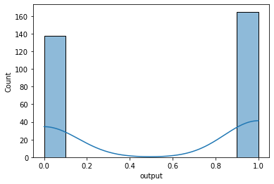
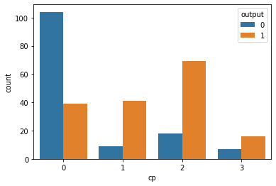
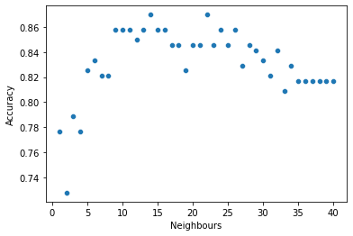

```python
import numpy as np
import pandas as pd
import matplotlib.pyplot as plt
import seaborn as sns
%matplotlib inline
```


```python
df = pd.read_csv('heart.csv')
```


```python
df.head(2)
```


<div>
<style scoped>
    .dataframe tbody tr th:only-of-type {
        vertical-align: middle;
    }

    .dataframe tbody tr th {
        vertical-align: top;
    }

    .dataframe thead th {
        text-align: right;
    }
</style>
<table border="1" class="dataframe">
  <thead>
    <tr style="text-align: right;">
      <th></th>
      <th>age</th>
      <th>sex</th>
      <th>cp</th>
      <th>trtbps</th>
      <th>chol</th>
      <th>fbs</th>
      <th>restecg</th>
      <th>thalachh</th>
      <th>exng</th>
      <th>oldpeak</th>
      <th>slp</th>
      <th>caa</th>
      <th>thall</th>
      <th>output</th>
    </tr>
  </thead>
  <tbody>
    <tr>
      <th>0</th>
      <td>63</td>
      <td>1</td>
      <td>3</td>
      <td>145</td>
      <td>233</td>
      <td>1</td>
      <td>0</td>
      <td>150</td>
      <td>0</td>
      <td>2.3</td>
      <td>0</td>
      <td>0</td>
      <td>1</td>
      <td>1</td>
    </tr>
    <tr>
      <th>1</th>
      <td>37</td>
      <td>1</td>
      <td>2</td>
      <td>130</td>
      <td>250</td>
      <td>0</td>
      <td>1</td>
      <td>187</td>
      <td>0</td>
      <td>3.5</td>
      <td>0</td>
      <td>0</td>
      <td>2</td>
      <td>1</td>
    </tr>
  </tbody>
</table>
</div>


```python
o2 = pd.read_csv('o2Saturation.csv')
```


```python
len(df)
```


    303


```python
len(o2)
```


    3585


```python
df.info()
```

    <class 'pandas.core.frame.DataFrame'>
    RangeIndex: 303 entries, 0 to 302
    Data columns (total 14 columns):
     #   Column    Non-Null Count  Dtype  
    ---  ------    --------------  -----  
     0   age       303 non-null    int64  
     1   sex       303 non-null    int64  
     2   cp        303 non-null    int64  
     3   trtbps    303 non-null    int64  
     4   chol      303 non-null    int64  
     5   fbs       303 non-null    int64  
     6   restecg   303 non-null    int64  
     7   thalachh  303 non-null    int64  
     8   exng      303 non-null    int64  
     9   oldpeak   303 non-null    float64
     10  slp       303 non-null    int64  
     11  caa       303 non-null    int64  
     12  thall     303 non-null    int64  
     13  output    303 non-null    int64  
    dtypes: float64(1), int64(13)
    memory usage: 33.3 KB
    


```python
df.isna().sum()
```


    age         0
    sex         0
    cp          0
    trtbps      0
    chol        0
    fbs         0
    restecg     0
    thalachh    0
    exng        0
    oldpeak     0
    slp         0
    caa         0
    thall       0
    output      0
    dtype: int64


```python
o2.head(2)
```


<div>
<style scoped>
    .dataframe tbody tr th:only-of-type {
        vertical-align: middle;
    }

    .dataframe tbody tr th {
        vertical-align: top;
    }

    .dataframe thead th {
        text-align: right;
    }
</style>
<table border="1" class="dataframe">
  <thead>
    <tr style="text-align: right;">
      <th></th>
      <th>98.6</th>
    </tr>
  </thead>
  <tbody>
    <tr>
      <th>0</th>
      <td>98.6</td>
    </tr>
    <tr>
      <th>1</th>
      <td>98.6</td>
    </tr>
  </tbody>
</table>
</div>


```python
o2.describe()
```


<div>
<style scoped>
    .dataframe tbody tr th:only-of-type {
        vertical-align: middle;
    }

    .dataframe tbody tr th {
        vertical-align: top;
    }

    .dataframe thead th {
        text-align: right;
    }
</style>
<table border="1" class="dataframe">
  <thead>
    <tr style="text-align: right;">
      <th></th>
      <th>98.6</th>
    </tr>
  </thead>
  <tbody>
    <tr>
      <th>count</th>
      <td>3585.000000</td>
    </tr>
    <tr>
      <th>mean</th>
      <td>98.239275</td>
    </tr>
    <tr>
      <th>std</th>
      <td>0.726336</td>
    </tr>
    <tr>
      <th>min</th>
      <td>96.500000</td>
    </tr>
    <tr>
      <th>25%</th>
      <td>97.600000</td>
    </tr>
    <tr>
      <th>50%</th>
      <td>98.600000</td>
    </tr>
    <tr>
      <th>75%</th>
      <td>98.600000</td>
    </tr>
    <tr>
      <th>max</th>
      <td>99.600000</td>
    </tr>
  </tbody>
</table>
</div>


```python
df['output'].unique()
```


    array([1, 0], dtype=int64)


```python
len(df[df['sex']==1])
```


    207


```python
len(df[df['sex']==0])
```


    96


# I guess depending on the data 0 means Female and 1 means male. Because this dataset is from Bangladesh where number of males (in general) is much much greater than that of women. So, going by this trend I guess, this will hold true for heart patients as well.


```python
df.corr()['output'].sort_values()[:-1]
```


    exng       -0.436757
    oldpeak    -0.430696
    caa        -0.391724
    thall      -0.344029
    sex        -0.280937
    age        -0.225439
    trtbps     -0.144931
    chol       -0.085239
    fbs        -0.028046
    restecg     0.137230
    slp         0.345877
    thalachh    0.421741
    cp          0.433798
    Name: output, dtype: float64


```python
df.describe()
```


<div>
<style scoped>
    .dataframe tbody tr th:only-of-type {
        vertical-align: middle;
    }

    .dataframe tbody tr th {
        vertical-align: top;
    }

    .dataframe thead th {
        text-align: right;
    }
</style>
<table border="1" class="dataframe">
  <thead>
    <tr style="text-align: right;">
      <th></th>
      <th>age</th>
      <th>sex</th>
      <th>cp</th>
      <th>trtbps</th>
      <th>chol</th>
      <th>fbs</th>
      <th>restecg</th>
      <th>thalachh</th>
      <th>exng</th>
      <th>oldpeak</th>
      <th>slp</th>
      <th>caa</th>
      <th>thall</th>
      <th>output</th>
    </tr>
  </thead>
  <tbody>
    <tr>
      <th>count</th>
      <td>303.000000</td>
      <td>303.000000</td>
      <td>303.000000</td>
      <td>303.000000</td>
      <td>303.000000</td>
      <td>303.000000</td>
      <td>303.000000</td>
      <td>303.000000</td>
      <td>303.000000</td>
      <td>303.000000</td>
      <td>303.000000</td>
      <td>303.000000</td>
      <td>303.000000</td>
      <td>303.000000</td>
    </tr>
    <tr>
      <th>mean</th>
      <td>54.366337</td>
      <td>0.683168</td>
      <td>0.966997</td>
      <td>131.623762</td>
      <td>246.264026</td>
      <td>0.148515</td>
      <td>0.528053</td>
      <td>149.646865</td>
      <td>0.326733</td>
      <td>1.039604</td>
      <td>1.399340</td>
      <td>0.729373</td>
      <td>2.313531</td>
      <td>0.544554</td>
    </tr>
    <tr>
      <th>std</th>
      <td>9.082101</td>
      <td>0.466011</td>
      <td>1.032052</td>
      <td>17.538143</td>
      <td>51.830751</td>
      <td>0.356198</td>
      <td>0.525860</td>
      <td>22.905161</td>
      <td>0.469794</td>
      <td>1.161075</td>
      <td>0.616226</td>
      <td>1.022606</td>
      <td>0.612277</td>
      <td>0.498835</td>
    </tr>
    <tr>
      <th>min</th>
      <td>29.000000</td>
      <td>0.000000</td>
      <td>0.000000</td>
      <td>94.000000</td>
      <td>126.000000</td>
      <td>0.000000</td>
      <td>0.000000</td>
      <td>71.000000</td>
      <td>0.000000</td>
      <td>0.000000</td>
      <td>0.000000</td>
      <td>0.000000</td>
      <td>0.000000</td>
      <td>0.000000</td>
    </tr>
    <tr>
      <th>25%</th>
      <td>47.500000</td>
      <td>0.000000</td>
      <td>0.000000</td>
      <td>120.000000</td>
      <td>211.000000</td>
      <td>0.000000</td>
      <td>0.000000</td>
      <td>133.500000</td>
      <td>0.000000</td>
      <td>0.000000</td>
      <td>1.000000</td>
      <td>0.000000</td>
      <td>2.000000</td>
      <td>0.000000</td>
    </tr>
    <tr>
      <th>50%</th>
      <td>55.000000</td>
      <td>1.000000</td>
      <td>1.000000</td>
      <td>130.000000</td>
      <td>240.000000</td>
      <td>0.000000</td>
      <td>1.000000</td>
      <td>153.000000</td>
      <td>0.000000</td>
      <td>0.800000</td>
      <td>1.000000</td>
      <td>0.000000</td>
      <td>2.000000</td>
      <td>1.000000</td>
    </tr>
    <tr>
      <th>75%</th>
      <td>61.000000</td>
      <td>1.000000</td>
      <td>2.000000</td>
      <td>140.000000</td>
      <td>274.500000</td>
      <td>0.000000</td>
      <td>1.000000</td>
      <td>166.000000</td>
      <td>1.000000</td>
      <td>1.600000</td>
      <td>2.000000</td>
      <td>1.000000</td>
      <td>3.000000</td>
      <td>1.000000</td>
    </tr>
    <tr>
      <th>max</th>
      <td>77.000000</td>
      <td>1.000000</td>
      <td>3.000000</td>
      <td>200.000000</td>
      <td>564.000000</td>
      <td>1.000000</td>
      <td>2.000000</td>
      <td>202.000000</td>
      <td>1.000000</td>
      <td>6.200000</td>
      <td>2.000000</td>
      <td>4.000000</td>
      <td>3.000000</td>
      <td>1.000000</td>
    </tr>
  </tbody>
</table>
</div>


```python
96/303
```


    0.31683168316831684


# the dataset's target variable distribution is around 70%-30% (70% of all values being 1)

# EDA


```python
sns.histplot(data=df,x='output',kde=True)
```


    <AxesSubplot:xlabel='output', ylabel='Count'>


    

    


```python
sns.countplot(data=df , x = 'cp', hue ='output')
```


    <AxesSubplot:xlabel='cp', ylabel='count'>


    

    


# TEST TRAIN SPLIT


```python
from sklearn.model_selection import train_test_split
```


```python
X = df.drop('output',axis=1)
y = df['output']
```


```python
X.head()
```


<div>
<style scoped>
    .dataframe tbody tr th:only-of-type {
        vertical-align: middle;
    }

    .dataframe tbody tr th {
        vertical-align: top;
    }

    .dataframe thead th {
        text-align: right;
    }
</style>
<table border="1" class="dataframe">
  <thead>
    <tr style="text-align: right;">
      <th></th>
      <th>age</th>
      <th>sex</th>
      <th>cp</th>
      <th>trtbps</th>
      <th>chol</th>
      <th>fbs</th>
      <th>restecg</th>
      <th>thalachh</th>
      <th>exng</th>
      <th>oldpeak</th>
      <th>slp</th>
      <th>caa</th>
      <th>thall</th>
    </tr>
  </thead>
  <tbody>
    <tr>
      <th>0</th>
      <td>63</td>
      <td>1</td>
      <td>3</td>
      <td>145</td>
      <td>233</td>
      <td>1</td>
      <td>0</td>
      <td>150</td>
      <td>0</td>
      <td>2.3</td>
      <td>0</td>
      <td>0</td>
      <td>1</td>
    </tr>
    <tr>
      <th>1</th>
      <td>37</td>
      <td>1</td>
      <td>2</td>
      <td>130</td>
      <td>250</td>
      <td>0</td>
      <td>1</td>
      <td>187</td>
      <td>0</td>
      <td>3.5</td>
      <td>0</td>
      <td>0</td>
      <td>2</td>
    </tr>
    <tr>
      <th>2</th>
      <td>41</td>
      <td>0</td>
      <td>1</td>
      <td>130</td>
      <td>204</td>
      <td>0</td>
      <td>0</td>
      <td>172</td>
      <td>0</td>
      <td>1.4</td>
      <td>2</td>
      <td>0</td>
      <td>2</td>
    </tr>
    <tr>
      <th>3</th>
      <td>56</td>
      <td>1</td>
      <td>1</td>
      <td>120</td>
      <td>236</td>
      <td>0</td>
      <td>1</td>
      <td>178</td>
      <td>0</td>
      <td>0.8</td>
      <td>2</td>
      <td>0</td>
      <td>2</td>
    </tr>
    <tr>
      <th>4</th>
      <td>57</td>
      <td>0</td>
      <td>0</td>
      <td>120</td>
      <td>354</td>
      <td>0</td>
      <td>1</td>
      <td>163</td>
      <td>1</td>
      <td>0.6</td>
      <td>2</td>
      <td>0</td>
      <td>2</td>
    </tr>
  </tbody>
</table>
</div>


# creating dummies


```python
df['thall'].nunique()
```


    4


```python
X_dummies = pd.get_dummies(data=X , columns=['sex','cp','fbs','restecg','exng','slp','caa','thall'] , drop_first=True)
```


```python
len(X_dummies.columns)
```


    22


```python
X_dummies.head(2)
```


<div>
<style scoped>
    .dataframe tbody tr th:only-of-type {
        vertical-align: middle;
    }

    .dataframe tbody tr th {
        vertical-align: top;
    }

    .dataframe thead th {
        text-align: right;
    }
</style>
<table border="1" class="dataframe">
  <thead>
    <tr style="text-align: right;">
      <th></th>
      <th>age</th>
      <th>trtbps</th>
      <th>chol</th>
      <th>thalachh</th>
      <th>oldpeak</th>
      <th>sex_1</th>
      <th>cp_1</th>
      <th>cp_2</th>
      <th>cp_3</th>
      <th>fbs_1</th>
      <th>...</th>
      <th>exng_1</th>
      <th>slp_1</th>
      <th>slp_2</th>
      <th>caa_1</th>
      <th>caa_2</th>
      <th>caa_3</th>
      <th>caa_4</th>
      <th>thall_1</th>
      <th>thall_2</th>
      <th>thall_3</th>
    </tr>
  </thead>
  <tbody>
    <tr>
      <th>0</th>
      <td>63</td>
      <td>145</td>
      <td>233</td>
      <td>150</td>
      <td>2.3</td>
      <td>1</td>
      <td>0</td>
      <td>0</td>
      <td>1</td>
      <td>1</td>
      <td>...</td>
      <td>0</td>
      <td>0</td>
      <td>0</td>
      <td>0</td>
      <td>0</td>
      <td>0</td>
      <td>0</td>
      <td>1</td>
      <td>0</td>
      <td>0</td>
    </tr>
    <tr>
      <th>1</th>
      <td>37</td>
      <td>130</td>
      <td>250</td>
      <td>187</td>
      <td>3.5</td>
      <td>1</td>
      <td>0</td>
      <td>1</td>
      <td>0</td>
      <td>0</td>
      <td>...</td>
      <td>0</td>
      <td>0</td>
      <td>0</td>
      <td>0</td>
      <td>0</td>
      <td>0</td>
      <td>0</td>
      <td>0</td>
      <td>1</td>
      <td>0</td>
    </tr>
  </tbody>
</table>
<p>2 rows × 22 columns</p>
</div>


```python

```


```python
X_train, X_test, y_train, y_test = train_test_split(X_dummies, y, test_size=0.3, random_state=42)
```


```python
from sklearn.preprocessing import StandardScaler
```


```python
sc = StandardScaler()
```


```python
X_train = sc.fit_transform(X_train)
X_test = sc.transform(X_test)
```

# LET'S APPLY CLASSIFICATION MODELS AND ASSESS THEIR ACCURCACY/ F1 METRIC

# 1) LOGISTIC REGRESSION


```python
from sklearn.linear_model import LogisticRegression
```


```python
lr = LogisticRegression(fit_intercept=True,random_state=42)
```


```python
lr.fit(X_train,y_train)
```


    LogisticRegression(random_state=42)


```python
lr_pred = lr.predict(X_test)
```


```python
from sklearn.metrics import classification_report,confusion_matrix,f1_score
```


```python
print(classification_report(y_test,lr_pred))
print('\n')
print(confusion_matrix(y_test,lr_pred))
print('\n')
print(f1_score(y_test,lr_pred))
```

                  precision    recall  f1-score   support
    
               0       0.85      0.80      0.83        41
               1       0.85      0.88      0.86        50
    
        accuracy                           0.85        91
       macro avg       0.85      0.84      0.84        91
    weighted avg       0.85      0.85      0.85        91
    
    
    
    [[33  8]
     [ 6 44]]
    
    
    0.8627450980392156
    


```python
from sklearn.model_selection import cross_val_score
```


```python
lr_accuracies = cross_val_score(lr , X_test , y_test , cv = 41)
print(lr_accuracies.mean())
```

    0.8252032520325202
    

# 2) KNN


```python
from sklearn.neighbors import KNeighborsClassifier
```


```python
knn = KNeighborsClassifier(n_neighbors=30)
```


```python
knn.fit(X_train,y_train)
```


    KNeighborsClassifier(n_neighbors=30)


```python
knn_pred = knn.predict(X_test)
```


```python
print(confusion_matrix(y_test,knn_pred))
print('\n')
print(classification_report(y_test,knn_pred))
```

    [[34  7]
     [ 5 45]]
    
    
                  precision    recall  f1-score   support
    
               0       0.87      0.83      0.85        41
               1       0.87      0.90      0.88        50
    
        accuracy                           0.87        91
       macro avg       0.87      0.86      0.87        91
    weighted avg       0.87      0.87      0.87        91
    
    


```python
Accuracy = []
for i in range(1,41):
    knn = KNeighborsClassifier(i)
    knn.fit(X_train,y_train)
    knn_pred = knn.predict(X_test)
    knn_accuracies = cross_val_score(knn , X_test , y_test , cv = 41)
    knn_accuracy_i = knn_accuracies.mean()
    Accuracy.append(knn_accuracy_i)
```


```python
knn_df = pd.DataFrame({'Neighbours': np.arange(1,41) , 'Accuracy': Accuracy})
```


```python
sns.scatterplot(data=knn_df , x = 'Neighbours',y='Accuracy')
```


    <AxesSubplot:xlabel='Neighbours', ylabel='Accuracy'>


    

    


```python
knn_df[knn_df['Accuracy']==knn_df['Accuracy'].max()]
```


<div>
<style scoped>
    .dataframe tbody tr th:only-of-type {
        vertical-align: middle;
    }

    .dataframe tbody tr th {
        vertical-align: top;
    }

    .dataframe thead th {
        text-align: right;
    }
</style>
<table border="1" class="dataframe">
  <thead>
    <tr style="text-align: right;">
      <th></th>
      <th>Neighbours</th>
      <th>Accuracy</th>
    </tr>
  </thead>
  <tbody>
    <tr>
      <th>13</th>
      <td>14</td>
      <td>0.869919</td>
    </tr>
    <tr>
      <th>21</th>
      <td>22</td>
      <td>0.869919</td>
    </tr>
  </tbody>
</table>
</div>


# implementing the best knn model with k=7


```python
knn = KNeighborsClassifier(14)
knn.fit(X_train,y_train)
knn_pred = knn.predict(X_test)
print(confusion_matrix(y_test,knn_pred))
print('\n')
print(classification_report(y_test,knn_pred))
```

    [[34  7]
     [ 8 42]]
    
    
                  precision    recall  f1-score   support
    
               0       0.81      0.83      0.82        41
               1       0.86      0.84      0.85        50
    
        accuracy                           0.84        91
       macro avg       0.83      0.83      0.83        91
    weighted avg       0.84      0.84      0.84        91
    
    

# CV Accuracy


```python
knn_accuracies = cross_val_score(knn , X_test , y_test , cv = 41)
print(knn_accuracies.mean())
```

    0.8699186991869918
    

# KNN WITH K==14 IS BETTER THAN LOGISTIC REGRESSION WITH A CV ACCURACY OF 86.99%

 # 3) SVC


```python
from sklearn.svm import SVC
```


```python
svc = SVC()
```


```python
svc.fit(X_train,y_train)
```


    SVC()


```python
svc_pred = svc.predict(X_test)
```


```python
print(confusion_matrix(y_test,svc_pred))
print('\n')
print(classification_report(y_test,svc_pred))
```

    [[34  7]
     [11 39]]
    
    
                  precision    recall  f1-score   support
    
               0       0.76      0.83      0.79        41
               1       0.85      0.78      0.81        50
    
        accuracy                           0.80        91
       macro avg       0.80      0.80      0.80        91
    weighted avg       0.81      0.80      0.80        91
    
    

# USING GRID SEARCH CV


```python
from sklearn.model_selection import GridSearchCV
```


```python
params = {'C': [10000,100000,1000000] , 'gamma': [0.000001 , (10**-7) , (10**-8)]}
```


```python
grid = GridSearchCV(SVC() , param_grid = params , verbose= 3 , cv=10)
```


```python
grid.fit(X_train,y_train)
```

    Fitting 10 folds for each of 9 candidates, totalling 90 fits
    [CV] C=10000, gamma=1e-06 ............................................
    [CV] ................ C=10000, gamma=1e-06, score=0.864, total=   0.0s
    [CV] C=10000, gamma=1e-06 ............................................
    [CV] ................ C=10000, gamma=1e-06, score=0.864, total=   0.0s
    [CV] C=10000, gamma=1e-06 ............................................
    [CV] ................ C=10000, gamma=1e-06, score=0.810, total=   0.0s
    [CV] C=10000, gamma=1e-06 ............................................
    [CV] ................ C=10000, gamma=1e-06, score=0.857, total=   0.0s
    [CV] C=10000, gamma=1e-06 ............................................
    [CV] ................ C=10000, gamma=1e-06, score=0.714, total=   0.0s
    [CV] C=10000, gamma=1e-06 ............................................
    [CV] ................ C=10000, gamma=1e-06, score=0.762, total=   0.0s
    [CV] C=10000, gamma=1e-06 ............................................
    [CV] ................ C=10000, gamma=1e-06, score=0.905, total=   0.0s
    [CV] C=10000, gamma=1e-06 ............................................
    [CV] ................ C=10000, gamma=1e-06, score=0.952, total=   0.0s
    [CV] C=10000, gamma=1e-06 ............................................
    [CV] ................ C=10000, gamma=1e-06, score=0.762, total=   0.0s
    [CV] C=10000, gamma=1e-06 ............................................
    [CV] ................ C=10000, gamma=1e-06, score=0.810, total=   0.0s
    [CV] C=10000, gamma=1e-07 ............................................
    [CV] ................ C=10000, gamma=1e-07, score=0.864, total=   0.0s
    [CV] C=10000, gamma=1e-07 ............................................
    [CV] ................ C=10000, gamma=1e-07, score=0.955, total=   0.0s
    [CV] C=10000, gamma=1e-07 ............................................
    [CV] ................ C=10000, gamma=1e-07, score=0.762, total=   0.0s
    [CV] C=10000, gamma=1e-07 ............................................
    [CV] ................ C=10000, gamma=1e-07, score=0.810, total=   0.0s
    [CV] C=10000, gamma=1e-07 ............................................
    [CV] ................ C=10000, gamma=1e-07, score=0.571, total=   0.0s
    [CV] C=10000, gamma=1e-07 ............................................
    [CV] ................ C=10000, gamma=1e-07, score=0.810, total=   0.0s
    [CV] C=10000, gamma=1e-07 ............................................
    [CV] ................ C=10000, gamma=1e-07, score=0.857, total=   0.0s
    [CV] C=10000, gamma=1e-07 ............................................
    [CV] ................ C=10000, gamma=1e-07, score=0.905, total=   0.0s
    [CV] C=10000, gamma=1e-07 ............................................
    [CV] ................ C=10000, gamma=1e-07, score=0.762, total=   0.0s
    [CV] C=10000, gamma=1e-07 ............................................
    [CV] ................ C=10000, gamma=1e-07, score=0.762, total=   0.0s
    [CV] C=10000, gamma=1e-08 ............................................
    [CV] ................ C=10000, gamma=1e-08, score=0.545, total=   0.0s
    [CV] C=10000, gamma=1e-08 ............................................
    [CV] ................ C=10000, gamma=1e-08, score=0.545, total=   0.0s
    [CV] C=10000, gamma=1e-08 ............................................
    [CV] ................ C=10000, gamma=1e-08, score=0.571, total=   0.0s
    [CV] C=10000, gamma=1e-08 ............................................
    [CV] ................ C=10000, gamma=1e-08, score=0.571, total=   0.0s
    [CV] C=10000, gamma=1e-08 ............................................
    [CV] ................ C=10000, gamma=1e-08, score=0.571, total=   0.0s
    [CV] C=10000, gamma=1e-08 ............................................
    [CV] ................ C=10000, gamma=1e-08, score=0.524, total=   0.0s
    [CV] C=10000, gamma=1e-08 ............................................
    [CV] ................ C=10000, gamma=1e-08, score=0.524, total=   0.0s
    [CV] C=10000, gamma=1e-08 ............................................
    [CV] ................ C=10000, gamma=1e-08, score=0.524, total=   0.0s
    [CV] C=10000, gamma=1e-08 ............................................
    [CV] ................ C=10000, gamma=1e-08, score=0.524, total=   0.0s
    [CV] C=10000, gamma=1e-08 ............................................
    [CV] ................ C=10000, gamma=1e-08, score=0.524, total=   0.0s
    [CV] C=100000, gamma=1e-06 ...........................................
    [CV] ............... C=100000, gamma=1e-06, score=0.864, total=   0.0s
    [CV] C=100000, gamma=1e-06 ...........................................
    [CV] ............... C=100000, gamma=1e-06, score=0.864, total=   0.0s
    [CV] C=100000, gamma=1e-06 ...........................................
    [CV] ............... C=100000, gamma=1e-06, score=0.810, total=   0.0s
    [CV] C=100000, gamma=1e-06 ...........................................
    [CV] ............... C=100000, gamma=1e-06, score=0.857, total=   0.0s
    [CV] C=100000, gamma=1e-06 ...........................................
    [CV] ............... C=100000, gamma=1e-06, score=0.714, total=   0.0s
    [CV] C=100000, gamma=1e-06 ...........................................
    [CV] ............... C=100000, gamma=1e-06, score=0.810, total=   0.0s
    [CV] C=100000, gamma=1e-06 ...........................................
    [CV] ............... C=100000, gamma=1e-06, score=0.905, total=   0.0s
    [CV] C=100000, gamma=1e-06 ...........................................
    [CV] ............... C=100000, gamma=1e-06, score=0.952, total=   0.0s
    [CV] C=100000, gamma=1e-06 ...........................................
    [CV] ............... C=100000, gamma=1e-06, score=0.714, total=   0.0s
    [CV] C=100000, gamma=1e-06 ...........................................
    [CV] ............... C=100000, gamma=1e-06, score=0.810, total=   0.0s
    [CV] C=100000, gamma=1e-07 ...........................................
    [CV] ............... C=100000, gamma=1e-07, score=0.864, total=   0.0s
    [CV] C=100000, gamma=1e-07 ...........................................
    [CV] ............... C=100000, gamma=1e-07, score=0.864, total=   0.0s
    [CV] C=100000, gamma=1e-07 ...........................................
    [CV] ............... C=100000, gamma=1e-07, score=0.810, total=   0.0s
    [CV] C=100000, gamma=1e-07 ...........................................
    [CV] ............... C=100000, gamma=1e-07, score=0.857, total=   0.0s
    [CV] C=100000, gamma=1e-07 ...........................................
    [CV] ............... C=100000, gamma=1e-07, score=0.714, total=   0.0s
    [CV] C=100000, gamma=1e-07 ...........................................
    [CV] ............... C=100000, gamma=1e-07, score=0.762, total=   0.0s
    [CV] C=100000, gamma=1e-07 ...........................................
    [CV] ............... C=100000, gamma=1e-07, score=0.905, total=   0.0s
    [CV] C=100000, gamma=1e-07 ...........................................
    [CV] ............... C=100000, gamma=1e-07, score=0.952, total=   0.0s
    [CV] C=100000, gamma=1e-07 ...........................................
    [CV] ............... C=100000, gamma=1e-07, score=0.762, total=   0.0s
    [CV] C=100000, gamma=1e-07 ...........................................
    [CV] ............... C=100000, gamma=1e-07, score=0.810, total=   0.0s
    [CV] C=100000, gamma=1e-08 ...........................................
    [CV] ............... C=100000, gamma=1e-08, score=0.864, total=   0.0s
    [CV] C=100000, gamma=1e-08 ...........................................
    [CV] ............... C=100000, gamma=1e-08, score=1.000, total=   0.0s
    [CV] C=100000, gamma=1e-08 ...........................................
    [CV] ............... C=100000, gamma=1e-08, score=0.810, total=   0.0s
    [CV] C=100000, gamma=1e-08 ...........................................
    

    [Parallel(n_jobs=1)]: Using backend SequentialBackend with 1 concurrent workers.
    [Parallel(n_jobs=1)]: Done   1 out of   1 | elapsed:    0.0s remaining:    0.0s
    [Parallel(n_jobs=1)]: Done   2 out of   2 | elapsed:    0.0s remaining:    0.0s
    

    [CV] ............... C=100000, gamma=1e-08, score=0.810, total=   0.0s
    [CV] C=100000, gamma=1e-08 ...........................................
    [CV] ............... C=100000, gamma=1e-08, score=0.571, total=   0.0s
    [CV] C=100000, gamma=1e-08 ...........................................
    [CV] ............... C=100000, gamma=1e-08, score=0.810, total=   0.0s
    [CV] C=100000, gamma=1e-08 ...........................................
    [CV] ............... C=100000, gamma=1e-08, score=0.857, total=   0.0s
    [CV] C=100000, gamma=1e-08 ...........................................
    [CV] ............... C=100000, gamma=1e-08, score=0.905, total=   0.0s
    [CV] C=100000, gamma=1e-08 ...........................................
    [CV] ............... C=100000, gamma=1e-08, score=0.762, total=   0.0s
    [CV] C=100000, gamma=1e-08 ...........................................
    [CV] ............... C=100000, gamma=1e-08, score=0.762, total=   0.0s
    [CV] C=1000000, gamma=1e-06 ..........................................
    [CV] .............. C=1000000, gamma=1e-06, score=0.864, total=   0.0s
    [CV] C=1000000, gamma=1e-06 ..........................................
    [CV] .............. C=1000000, gamma=1e-06, score=0.864, total=   0.0s
    [CV] C=1000000, gamma=1e-06 ..........................................
    [CV] .............. C=1000000, gamma=1e-06, score=0.810, total=   0.0s
    [CV] C=1000000, gamma=1e-06 ..........................................
    [CV] .............. C=1000000, gamma=1e-06, score=0.905, total=   0.0s
    [CV] C=1000000, gamma=1e-06 ..........................................
    [CV] .............. C=1000000, gamma=1e-06, score=0.667, total=   0.0s
    [CV] C=1000000, gamma=1e-06 ..........................................
    [CV] .............. C=1000000, gamma=1e-06, score=0.762, total=   0.0s
    [CV] C=1000000, gamma=1e-06 ..........................................
    [CV] .............. C=1000000, gamma=1e-06, score=0.857, total=   0.0s
    [CV] C=1000000, gamma=1e-06 ..........................................
    [CV] .............. C=1000000, gamma=1e-06, score=0.952, total=   0.0s
    [CV] C=1000000, gamma=1e-06 ..........................................
    [CV] .............. C=1000000, gamma=1e-06, score=0.762, total=   0.0s
    [CV] C=1000000, gamma=1e-06 ..........................................
    [CV] .............. C=1000000, gamma=1e-06, score=0.857, total=   0.0s
    [CV] C=1000000, gamma=1e-07 ..........................................
    [CV] .............. C=1000000, gamma=1e-07, score=0.909, total=   0.0s
    [CV] C=1000000, gamma=1e-07 ..........................................
    [CV] .............. C=1000000, gamma=1e-07, score=0.864, total=   0.0s
    [CV] C=1000000, gamma=1e-07 ..........................................
    [CV] .............. C=1000000, gamma=1e-07, score=0.810, total=   0.0s
    [CV] C=1000000, gamma=1e-07 ..........................................
    [CV] .............. C=1000000, gamma=1e-07, score=0.905, total=   0.0s
    [CV] C=1000000, gamma=1e-07 ..........................................
    [CV] .............. C=1000000, gamma=1e-07, score=0.667, total=   0.0s
    [CV] C=1000000, gamma=1e-07 ..........................................
    [CV] .............. C=1000000, gamma=1e-07, score=0.810, total=   0.0s
    [CV] C=1000000, gamma=1e-07 ..........................................
    [CV] .............. C=1000000, gamma=1e-07, score=0.905, total=   0.0s
    [CV] C=1000000, gamma=1e-07 ..........................................
    [CV] .............. C=1000000, gamma=1e-07, score=0.952, total=   0.0s
    [CV] C=1000000, gamma=1e-07 ..........................................
    [CV] .............. C=1000000, gamma=1e-07, score=0.714, total=   0.0s
    [CV] C=1000000, gamma=1e-07 ..........................................
    [CV] .............. C=1000000, gamma=1e-07, score=0.857, total=   0.0s
    [CV] C=1000000, gamma=1e-08 ..........................................
    [CV] .............. C=1000000, gamma=1e-08, score=0.864, total=   0.0s
    [CV] C=1000000, gamma=1e-08 ..........................................
    [CV] .............. C=1000000, gamma=1e-08, score=0.909, total=   0.0s
    [CV] C=1000000, gamma=1e-08 ..........................................
    [CV] .............. C=1000000, gamma=1e-08, score=0.810, total=   0.0s
    [CV] C=1000000, gamma=1e-08 ..........................................
    [CV] .............. C=1000000, gamma=1e-08, score=0.810, total=   0.0s
    [CV] C=1000000, gamma=1e-08 ..........................................
    [CV] .............. C=1000000, gamma=1e-08, score=0.714, total=   0.0s
    [CV] C=1000000, gamma=1e-08 ..........................................
    [CV] .............. C=1000000, gamma=1e-08, score=0.762, total=   0.0s
    [CV] C=1000000, gamma=1e-08 ..........................................
    [CV] .............. C=1000000, gamma=1e-08, score=0.905, total=   0.0s
    [CV] C=1000000, gamma=1e-08 ..........................................
    [CV] .............. C=1000000, gamma=1e-08, score=0.952, total=   0.0s
    [CV] C=1000000, gamma=1e-08 ..........................................
    [CV] .............. C=1000000, gamma=1e-08, score=0.762, total=   0.0s
    [CV] C=1000000, gamma=1e-08 ..........................................
    [CV] .............. C=1000000, gamma=1e-08, score=0.810, total=   0.0s
    

    [Parallel(n_jobs=1)]: Done  90 out of  90 | elapsed:    0.2s finished
    


    GridSearchCV(cv=10, estimator=SVC(),
                 param_grid={'C': [10000, 100000, 1000000],
                             'gamma': [1e-06, 1e-07, 1e-08]},
                 verbose=3)


```python
grid.best_params_
```


    {'C': 1000000, 'gamma': 1e-07}


```python
grid.best_score_
```


    0.8391774891774892


```python
svc = SVC(C = 1e06 , gamma= 1e-07)
```


```python
svc.fit(X_train,y_train)
```


    SVC(C=1000000.0, gamma=1e-07)


```python
svc_pred = svc.predict(X_test)
```


```python
print(confusion_matrix(y_test,svc_pred))
print('\n')
print(classification_report(y_test,svc_pred))
```

    [[33  8]
     [ 5 45]]
    
    
                  precision    recall  f1-score   support
    
               0       0.87      0.80      0.84        41
               1       0.85      0.90      0.87        50
    
        accuracy                           0.86        91
       macro avg       0.86      0.85      0.85        91
    weighted avg       0.86      0.86      0.86        91
    
    


```python
svc_accuracies = cross_val_score(svc , X_test , y_test , cv = 41)
print(svc_accuracies.mean())
```

    0.8130081300813007
    

# CV ON SVC PERFORMED WORST AMONG LOGISTIC REGRESSION AND KNN

# 4) RANDOM FOREST


```python
from sklearn.ensemble import RandomForestClassifier
```


```python
rf = RandomForestClassifier(n_estimators=500,random_state=0 , max_depth=5)
```


```python
rf.fit(X_train,y_train)
```


    RandomForestClassifier(max_depth=5, n_estimators=500, random_state=0)


```python
rf_pred = rf.predict(X_test)
```


```python
print(confusion_matrix(y_test,rf_pred))
print('\n')
print(classification_report(y_test,rf_pred))
```

    [[34  7]
     [ 7 43]]
    
    
                  precision    recall  f1-score   support
    
               0       0.83      0.83      0.83        41
               1       0.86      0.86      0.86        50
    
        accuracy                           0.85        91
       macro avg       0.84      0.84      0.84        91
    weighted avg       0.85      0.85      0.85        91
    
    


```python
rf_accuracies = cross_val_score(rf , X_test , y_test , cv = 41)
print(rf_accuracies.mean())
```

    0.7926829268292683
    

# RANDOM FOREST ALMOST LIKE LOGISTIC REGRESSION (LOGISTIC REGRESSION 4 MORE CORRECT VALUES THAN RF)..TILL NOW KNN SEEMS TO BE THE BEST FIT

# 4) CATBOOST


```python
from catboost import CatBoostClassifier
```


```python
cb = CatBoostClassifier(iterations=1000 , random_state=0 , loss_function='Logloss' , depth=5)
```


```python
cb.fit(X_train,y_train , eval_set=(X_test,y_test) , plot=True)
```


            <style>
                .highcharts-tooltip {
    display: none !important;
}
.highcharts-halo {
    display: none !important;
}

.catboost {
    position: relative;
}

.catboost-panel {
    position: absolute;
    height: 100%;
    width: 280px;
}

.catboost-panel__controls {
    margin-left: 0;
}

.catboost-panel__controls_label {
    padding: 5px 0 0 8px;
    cursor: pointer;
    width: 80px;
    box-sizing: content-box;
}
.catboost-panel__controls_label_time {
    width: inherit;
}

.catboost-panel__controls2 {
    margin-top: 10px;
}

.catboost-panel__controls2_label {
    padding: 5px 11px 0 8px;
    cursor: pointer;
    width: 90px;
    box-sizing: content-box;
}
.catboost-panel__controls2_label-long {
    width: 170px;
}

.catboost-panel__series {
    height: 340px;
    overflow-y: auto;
}

.catboost-graph {
    margin-left: 290px;
}

.catboost-graph__tabs {
    padding: 0 0 0 20px;
}

.catboost-graph__tab {
    display: inline-block;
    padding: 5px 10px 0 0;
}

.catboost-graph__tab {
    color: #999;
    cursor: pointer;
    transition: color 0.1s linear;
}

.catboost-graph__tab:hover {
    color: #333;
}

.catboost-graph__tab_active {
    color: #000;
    cursor: auto;
}

.catboost-graph__charts {
    padding-top: 20px;
}

.catboost-graph__chart {
    display: none;
}

.catboost-graph__chart_active {
    display: block;
}

.catboost-panel__serie {
    padding-bottom: 5px;
    border-bottom: 1px solid rgba(0, 0, 0, 0.3);
    position: relative;
}

.catboost-panel__serie_bottom,
.catboost-panel__serie_middle,
.catboost-panel__serie_top {
    white-space: nowrap;
    position: relative;
}

#catboost-control-test {
    margin-left: 11px;
}

.catboost-panel__serie_label {
    padding: 0 0 0 8px;
    width: 200px;
    text-overflow: ellipsis;
    box-sizing: border-box;
    cursor: pointer;
    margin-bottom: 0;
    overflow: hidden;
    position: relative;
    top: 5px;
}

.catboost-panel__serie_hint {
    position: absolute;
    font-size: 9px;
    left: 0;
}

.catboost-panel__serie__learn_hint {
    top: 56px;
}

.catboost-panel__serie__test_hint {
    top: 82px;
}

.catboost-panel__serie_bottom {
    padding-bottom: 6px;
}

.catboost-panel__serie_time {
    position: absolute;
    top: 5px;
    right: 2px;
    height: 20px;
    padding: 0 0 0 20px;
    margin-bottom: 3px;
    overflow: hidden;

    text-overflow: ellipsis;
    box-sizing: border-box;
    text-align: left;
}

.catboost-panel__serie_learn_pic,
.catboost-panel__serie_test_pic {
    width: 13px;
    height: 1px;
    border-top-width: 1px;
    position: relative;
    top: -3px;
    margin-right: 5px;
}

.catboost-panel__serie_learn_pic {
    border-top-style: dashed;
}

.catboost-panel__serie_test_pic {
    border-top-style: solid;
}

.catboost-panel__serie-value {
    display: inline-block;
    min-width: 30px;
    margin-right: 2px;
}

.catboost-panel__controls_label .catboost-panel__serie_learn_pic {
    padding-left: 4px;
}

.catboost-panel__serie_names {
    white-space: nowrap;
}

.catboost-panel__serie_scroll {
    width: 240px;
    overflow-x: auto;
    margin-left: 20px;
}

.catboost-panel__serie_learn_name,
.catboost-panel__serie_test_name,
.catboost-panel__serie_learn_value,
.catboost-panel__serie_test_value,
.catboost-panel__serie_best_learn_value,
.catboost-panel__serie_best_test_value {
    width: 85px;
    position: relative;
    padding: 0 8px 0 0;
    box-sizing: content-box;
    overflow: hidden;
    text-overflow: ellipsis;
    top: 5px;
}

.catboost-panel__serie_iteration,
.catboost-panel__serie_best_iteration {
    display: inline-block;
    position: absolute;
    box-sizing: content-box;
    overflow: hidden;
    right: 2px;
}

.catboost-panel__serie_iteration {
    top: 55px;
}

.catboost-panel__serie_best_iteration {
    top: 80px;
}

.catboost-panel__control_slider {
    width: 100px !important;
    margin-left: 0;
    position: relative;
    display: inline-block !important;
    top: 3px;
}

.catboost-panel__control_slidervalue {
    width: 50px;
    padding: 2px 3px;
    margin-left: 4px;
}

.catboost-panel__serie_time_spend,
.catboost-panel__serie_time_left {
    display: inline-block;
}

.catboost-panel__serie_time_left {
    margin-left: 10px;
}

.catboost-panel__serie_learn_pic,
.catboost-panel__serie_learn_name,
.catboost-panel__serie_learn_value,
.catboost-panel__serie_best_learn_value {
    display: inline-block;
}
.catboost-panel__serie_test_pic,
.catboost-panel__serie_test_name,
.catboost-panel__serie_test_value,
.catboost-panel__serie_best_test_value {
    display: inline-block;
}

.catboost-panel__series_learn_disabled .catboost-panel__serie_learn_pic,
.catboost-panel__series_learn_disabled .catboost-panel__serie_learn_name,
.catboost-panel__series_learn_disabled .catboost-panel__serie_learn_value,
.catboost-panel__series_learn_disabled .catboost-panel__serie_best_learn_value {
    display: none;
}
.catboost-panel__series_test_disabled .catboost-panel__serie_test_pic,
.catboost-panel__series_test_disabled .catboost-panel__serie_test_name,
.catboost-panel__series_test_disabled .catboost-panel__serie_test_value,
.catboost-panel__series_test_disabled .catboost-panel__serie_best_test_value {
    display: none;
}

/*
.catboost-panel__series_learn_disabled .catboost-panel__serie_test_value,
.catboost-panel__series_learn_disabled .catboost-panel__serie_best_test_value {
    width: 216px;
}
.catboost-panel__series_test_disabled .catboost-panel__serie_learn_value,
.catboost-panel__series_test_disabled .catboost-panel__serie_best_learn_value {
    width: 216px;
}
*/
.catboost-panel__series_test_disabled .catboost-panel__serie__test_hint,
.catboost-panel__series_test_disabled .catboost-panel__serie_best_iteration {
    display: none;
}

.catboost-panel__series_test_disabled.catboost-panel__series_learn_disabled .catboost-panel__serie_middle {
    display: none;
}

.catboost-panel__series_test_disabled .catboost-panel__serie_bottom {
    display: none;
}

            </style>
            <script>
                window.__define = window.define;window.__require = window.require;window.define = undefined;window.require = undefined;/**
* plotly.js (basic - minified) v1.27.1
* Copyright 2012-2017, Plotly, Inc.
* All rights reserved.
* Licensed under the MIT license
*/
!function(t){if("object"==typeof exports&&"undefined"!=typeof module)module.exports=t();else if("function"==typeof define&&define.amd)define([],t);else{var e;e="undefined"!=typeof window?window:"undefined"!=typeof global?global:"undefined"!=typeof self?self:this,e.Plotly=t()}}(function(){var t;return function t(e,r,n){function a(i,l){if(!r[i]){if(!e[i]){var s="function"==typeof require&&require;if(!l&&s)return s(i,!0);if(o)return o(i,!0);var c=new Error("Cannot find module '"+i+"'");throw c.code="MODULE_NOT_FOUND",c}var u=r[i]={exports:{}};e[i][0].call(u.exports,function(t){var r=e[i][1][t];return a(r||t)},u,u.exports,t,e,r,n)}return r[i].exports}for(var o="function"==typeof require&&require,i=0;i<n.length;i++)a(n[i]);return a}({1:[function(t,e,r){"use strict";var n=t("../src/lib"),a={"X,X div":"font-family:'Open Sans', verdana, arial, sans-serif;margin:0;padding:0;","X input,X button":"font-family:'Open Sans', verdana, arial, sans-serif;","X input:focus,X button:focus":"outline:none;","X a":"text-decoration:none;","X a:hover":"text-decoration:none;","X .crisp":"shape-rendering:crispEdges;","X .user-select-none":"-webkit-user-select:none;-moz-user-select:none;-ms-user-select:none;-o-user-select:none;user-select:none;","X svg":"overflow:hidden;","X svg a":"fill:#447adb;","X svg a:hover":"fill:#3c6dc5;","X .main-svg":"position:absolute;top:0;left:0;pointer-events:none;","X .main-svg .draglayer":"pointer-events:all;","X .cursor-default":"cursor:default;","X .cursor-pointer":"cursor:pointer;","X .cursor-crosshair":"cursor:crosshair;","X .cursor-move":"cursor:move;","X .cursor-col-resize":"cursor:col-resize;","X .cursor-row-resize":"cursor:row-resize;","X .cursor-ns-resize":"cursor:ns-resize;","X .cursor-ew-resize":"cursor:ew-resize;","X .cursor-sw-resize":"cursor:sw-resize;","X .cursor-s-resize":"cursor:s-resize;","X .cursor-se-resize":"cursor:se-resize;","X .cursor-w-resize":"cursor:w-resize;","X .cursor-e-resize":"cursor:e-resize;","X .cursor-nw-resize":"cursor:nw-resize;","X .cursor-n-resize":"cursor:n-resize;","X .cursor-ne-resize":"cursor:ne-resize;","X .modebar":"position:absolute;top:2px;right:2px;z-index:1001;background:rgba(255,255,255,0.7);","X .modebar--hover":"opacity:0;-webkit-transition:opacity 0.3s ease 0s;-moz-transition:opacity 0.3s ease 0s;-ms-transition:opacity 0.3s ease 0s;-o-transition:opacity 0.3s ease 0s;transition:opacity 0.3s ease 0s;","X:hover .modebar--hover":"opacity:1;","X .modebar-group":"float:left;display:inline-block;box-sizing:border-box;margin-left:8px;position:relative;vertical-align:middle;white-space:nowrap;","X .modebar-group:first-child":"margin-left:0px;","X .modebar-btn":"position:relative;font-size:16px;padding:3px 4px;cursor:pointer;line-height:normal;box-sizing:border-box;","X .modebar-btn svg":"position:relative;top:2px;","X .modebar-btn path":"fill:rgba(0,31,95,0.3);","X .modebar-btn.active path,X .modebar-btn:hover path":"fill:rgba(0,22,72,0.5);","X .modebar-btn.modebar-btn--logo":"padding:3px 1px;","X .modebar-btn.modebar-btn--logo path":"fill:#447adb !important;","X [data-title]:before,X [data-title]:after":"position:absolute;-webkit-transform:translate3d(0, 0, 0);-moz-transform:translate3d(0, 0, 0);-ms-transform:translate3d(0, 0, 0);-o-transform:translate3d(0, 0, 0);transform:translate3d(0, 0, 0);display:none;opacity:0;z-index:1001;pointer-events:none;top:110%;right:50%;","X [data-title]:hover:before,X [data-title]:hover:after":"display:block;opacity:1;","X [data-title]:before":"content:'';position:absolute;background:transparent;border:6px solid transparent;z-index:1002;margin-top:-12px;border-bottom-color:#69738a;margin-right:-6px;","X [data-title]:after":"content:attr(data-title);background:#69738a;color:white;padding:8px 10px;font-size:12px;line-height:12px;white-space:nowrap;margin-right:-18px;border-radius:2px;","X .select-outline":"fill:none;stroke-width:1;shape-rendering:crispEdges;","X .select-outline-1":"stroke:white;","X .select-outline-2":"stroke:black;stroke-dasharray:2px 2px;",Y:"font-family:'Open Sans';position:fixed;top:50px;right:20px;z-index:10000;font-size:10pt;max-width:180px;","Y p":"margin:0;","Y .notifier-note":"min-width:180px;max-width:250px;border:1px solid #fff;z-index:3000;margin:0;background-color:#8c97af;background-color:rgba(140,151,175,0.9);color:#fff;padding:10px;","Y .notifier-close":"color:#fff;opacity:0.8;float:right;padding:0 5px;background:none;border:none;font-size:20px;font-weight:bold;line-height:20px;","Y .notifier-close:hover":"color:#444;text-decoration:none;cursor:pointer;"};for(var o in a){var i=o.replace(/^,/," ,").replace(/X/g,".js-plotly-plot .plotly").replace(/Y/g,".plotly-notifier");n.addStyleRule(i,a[o])}},{"../src/lib":136}],2:[function(t,e,r){"use strict";e.exports={undo:{width:857.1,path:"m857 350q0-87-34-166t-91-137-137-92-166-34q-96 0-183 41t-147 114q-4 6-4 13t5 11l76 77q6 5 14 5 9-1 13-7 41-53 100-82t126-29q58 0 110 23t92 61 61 91 22 111-22 111-61 91-92 61-110 23q-55 0-105-20t-90-57l77-77q17-16 8-38-10-23-33-23h-250q-15 0-25 11t-11 25v250q0 24 22 33 22 10 39-8l72-72q60 57 137 88t159 31q87 0 166-34t137-92 91-137 34-166z",ascent:850,descent:-150},home:{width:928.6,path:"m786 296v-267q0-15-11-26t-25-10h-214v214h-143v-214h-214q-15 0-25 10t-11 26v267q0 1 0 2t0 2l321 264 321-264q1-1 1-4z m124 39l-34-41q-5-5-12-6h-2q-7 0-12 3l-386 322-386-322q-7-4-13-4-7 2-12 7l-35 41q-4 5-3 13t6 12l401 334q18 15 42 15t43-15l136-114v109q0 8 5 13t13 5h107q8 0 13-5t5-13v-227l122-102q5-5 6-12t-4-13z",ascent:850,descent:-150},"camera-retro":{width:1e3,path:"m518 386q0 8-5 13t-13 5q-37 0-63-27t-26-63q0-8 5-13t13-5 12 5 5 13q0 23 16 38t38 16q8 0 13 5t5 13z m125-73q0-59-42-101t-101-42-101 42-42 101 42 101 101 42 101-42 42-101z m-572-320h858v71h-858v-71z m643 320q0 89-62 152t-152 62-151-62-63-152 63-151 151-63 152 63 62 151z m-571 358h214v72h-214v-72z m-72-107h858v143h-462l-36-71h-360v-72z m929 143v-714q0-30-21-51t-50-21h-858q-29 0-50 21t-21 51v714q0 30 21 51t50 21h858q29 0 50-21t21-51z",ascent:850,descent:-150},zoombox:{width:1e3,path:"m1000-25l-250 251c40 63 63 138 63 218 0 224-182 406-407 406-224 0-406-182-406-406s183-406 407-406c80 0 155 22 218 62l250-250 125 125z m-812 250l0 438 437 0 0-438-437 0z m62 375l313 0 0-312-313 0 0 312z",ascent:850,descent:-150},pan:{width:1e3,path:"m1000 350l-187 188 0-125-250 0 0 250 125 0-188 187-187-187 125 0 0-250-250 0 0 125-188-188 186-187 0 125 252 0 0-250-125 0 187-188 188 188-125 0 0 250 250 0 0-126 187 188z",ascent:850,descent:-150},zoom_plus:{width:1e3,path:"m1 787l0-875 875 0 0 875-875 0z m687-500l-187 0 0-187-125 0 0 187-188 0 0 125 188 0 0 187 125 0 0-187 187 0 0-125z",ascent:850,descent:-150},zoom_minus:{width:1e3,path:"m0 788l0-876 875 0 0 876-875 0z m688-500l-500 0 0 125 500 0 0-125z",ascent:850,descent:-150},autoscale:{width:1e3,path:"m250 850l-187 0-63 0 0-62 0-188 63 0 0 188 187 0 0 62z m688 0l-188 0 0-62 188 0 0-188 62 0 0 188 0 62-62 0z m-875-938l0 188-63 0 0-188 0-62 63 0 187 0 0 62-187 0z m875 188l0-188-188 0 0-62 188 0 62 0 0 62 0 188-62 0z m-125 188l-1 0-93-94-156 156 156 156 92-93 2 0 0 250-250 0 0-2 93-92-156-156-156 156 94 92 0 2-250 0 0-250 0 0 93 93 157-156-157-156-93 94 0 0 0-250 250 0 0 0-94 93 156 157 156-157-93-93 0 0 250 0 0 250z",ascent:850,descent:-150},tooltip_basic:{width:1500,path:"m375 725l0 0-375-375 375-374 0-1 1125 0 0 750-1125 0z",ascent:850,descent:-150},tooltip_compare:{width:1125,path:"m187 786l0 2-187-188 188-187 0 0 937 0 0 373-938 0z m0-499l0 1-187-188 188-188 0 0 937 0 0 376-938-1z",ascent:850,descent:-150},plotlylogo:{width:1542,path:"m0-10h182v-140h-182v140z m228 146h183v-286h-183v286z m225 714h182v-1000h-182v1000z m225-285h182v-715h-182v715z m225 142h183v-857h-183v857z m231-428h182v-429h-182v429z m225-291h183v-138h-183v138z",ascent:850,descent:-150},"z-axis":{width:1e3,path:"m833 5l-17 108v41l-130-65 130-66c0 0 0 38 0 39 0-1 36-14 39-25 4-15-6-22-16-30-15-12-39-16-56-20-90-22-187-23-279-23-261 0-341 34-353 59 3 60 228 110 228 110-140-8-351-35-351-116 0-120 293-142 474-142 155 0 477 22 477 142 0 50-74 79-163 96z m-374 94c-58-5-99-21-99-40 0-24 65-43 144-43 79 0 143 19 143 43 0 19-42 34-98 40v216h87l-132 135-133-135h88v-216z m167 515h-136v1c16 16 31 34 46 52l84 109v54h-230v-71h124v-1c-16-17-28-32-44-51l-89-114v-51h245v72z",ascent:850,descent:-150},"3d_rotate":{width:1e3,path:"m922 660c-5 4-9 7-14 11-359 263-580-31-580-31l-102 28 58-400c0 1 1 1 2 2 118 108 351 249 351 249s-62 27-100 42c88 83 222 183 347 122 16-8 30-17 44-27-2 1-4 2-6 4z m36-329c0 0 64 229-88 296-62 27-124 14-175-11 157-78 225-208 249-266 8-19 11-31 11-31 2 5 6 15 11 32-5-13-8-20-8-20z m-775-239c70-31 117-50 198-32-121 80-199 346-199 346l-96-15-58-12c0 0 55-226 155-287z m603 133l-317-139c0 0 4-4 19-14 7-5 24-15 24-15s-177-147-389 4c235-287 536-112 536-112l31-22 100 299-4-1z m-298-153c6-4 14-9 24-15 0 0-17 10-24 15z",ascent:850,descent:-150},camera:{width:1e3,path:"m500 450c-83 0-150-67-150-150 0-83 67-150 150-150 83 0 150 67 150 150 0 83-67 150-150 150z m400 150h-120c-16 0-34 13-39 29l-31 93c-6 15-23 28-40 28h-340c-16 0-34-13-39-28l-31-94c-6-15-23-28-40-28h-120c-55 0-100-45-100-100v-450c0-55 45-100 100-100h800c55 0 100 45 100 100v450c0 55-45 100-100 100z m-400-550c-138 0-250 112-250 250 0 138 112 250 250 250 138 0 250-112 250-250 0-138-112-250-250-250z m365 380c-19 0-35 16-35 35 0 19 16 35 35 35 19 0 35-16 35-35 0-19-16-35-35-35z",ascent:850,descent:-150},movie:{width:1e3,path:"m938 413l-188-125c0 37-17 71-44 94 64 38 107 107 107 187 0 121-98 219-219 219-121 0-219-98-219-219 0-61 25-117 66-156h-115c30 33 49 76 49 125 0 103-84 187-187 187s-188-84-188-187c0-57 26-107 65-141-38-22-65-62-65-109v-250c0-70 56-126 125-126h500c69 0 125 56 125 126l188-126c34 0 62 28 62 63v375c0 35-28 63-62 63z m-750 0c-69 0-125 56-125 125s56 125 125 125 125-56 125-125-56-125-125-125z m406-1c-87 0-157 70-157 157 0 86 70 156 157 156s156-70 156-156-70-157-156-157z",ascent:850,descent:-150},question:{width:857.1,path:"m500 82v107q0 8-5 13t-13 5h-107q-8 0-13-5t-5-13v-107q0-8 5-13t13-5h107q8 0 13 5t5 13z m143 375q0 49-31 91t-77 65-95 23q-136 0-207-119-9-14 4-24l74-55q4-4 10-4 9 0 14 7 30 38 48 51 19 14 48 14 27 0 48-15t21-33q0-21-11-34t-38-25q-35-16-65-48t-29-70v-20q0-8 5-13t13-5h107q8 0 13 5t5 13q0 10 12 27t30 28q18 10 28 16t25 19 25 27 16 34 7 45z m214-107q0-117-57-215t-156-156-215-58-216 58-155 156-58 215 58 215 155 156 216 58 215-58 156-156 57-215z",ascent:850,descent:-150},disk:{width:857.1,path:"m214-7h429v214h-429v-214z m500 0h72v500q0 8-6 21t-11 20l-157 156q-5 6-19 12t-22 5v-232q0-22-15-38t-38-16h-322q-22 0-37 16t-16 38v232h-72v-714h72v232q0 22 16 38t37 16h465q22 0 38-16t15-38v-232z m-214 518v178q0 8-5 13t-13 5h-107q-7 0-13-5t-5-13v-178q0-8 5-13t13-5h107q7 0 13 5t5 13z m357-18v-518q0-22-15-38t-38-16h-750q-23 0-38 16t-16 38v750q0 22 16 38t38 16h517q23 0 50-12t42-26l156-157q16-15 27-42t11-49z",ascent:850,descent:-150},lasso:{width:1031,path:"m1018 538c-36 207-290 336-568 286-277-48-473-256-436-463 10-57 36-108 76-151-13-66 11-137 68-183 34-28 75-41 114-42l-55-70 0 0c-2-1-3-2-4-3-10-14-8-34 5-45 14-11 34-8 45 4 1 1 2 3 2 5l0 0 113 140c16 11 31 24 45 40 4 3 6 7 8 11 48-3 100 0 151 9 278 48 473 255 436 462z m-624-379c-80 14-149 48-197 96 42 42 109 47 156 9 33-26 47-66 41-105z m-187-74c-19 16-33 37-39 60 50-32 109-55 174-68-42-25-95-24-135 8z m360 75c-34-7-69-9-102-8 8 62-16 128-68 170-73 59-175 54-244-5-9 20-16 40-20 61-28 159 121 317 333 354s407-60 434-217c28-159-121-318-333-355z",ascent:850,descent:-150},selectbox:{width:1e3,path:"m0 850l0-143 143 0 0 143-143 0z m286 0l0-143 143 0 0 143-143 0z m285 0l0-143 143 0 0 143-143 0z m286 0l0-143 143 0 0 143-143 0z m-857-286l0-143 143 0 0 143-143 0z m857 0l0-143 143 0 0 143-143 0z m-857-285l0-143 143 0 0 143-143 0z m857 0l0-143 143 0 0 143-143 0z m-857-286l0-143 143 0 0 143-143 0z m286 0l0-143 143 0 0 143-143 0z m285 0l0-143 143 0 0 143-143 0z m286 0l0-143 143 0 0 143-143 0z",ascent:850,descent:-150},spikeline:{width:1e3,path:"M512 409c0-57-46-104-103-104-57 0-104 47-104 104 0 57 47 103 104 103 57 0 103-46 103-103z m-327-39l92 0 0 92-92 0z m-185 0l92 0 0 92-92 0z m370-186l92 0 0 93-92 0z m0-184l92 0 0 92-92 0z",ascent:850,descent:-150}}},{}],3:[function(t,e,r){"use strict";e.exports=t("../src/traces/bar")},{"../src/traces/bar":220}],4:[function(t,e,r){"use strict";e.exports=t("../src/core")},{"../src/core":125}],5:[function(t,e,r){"use strict";var n=t("./core");n.register([t("./bar"),t("./pie")]),e.exports=n},{"./bar":3,"./core":4,"./pie":6}],6:[function(t,e,r){"use strict";e.exports=t("../src/traces/pie")},{"../src/traces/pie":233}],7:[function(e,r,n){!function(){function e(t){return t&&(t.ownerDocument||t.document||t).documentElement}function n(t){return t&&(t.ownerDocument&&t.ownerDocument.defaultView||t.document&&t||t.defaultView)}function a(t,e){return t<e?-1:t>e?1:t>=e?0:0/0}function o(t){return null===t?0/0:+t}function i(t){return!isNaN(t)}function l(t){return{left:function(e,r,n,a){for(arguments.length<3&&(n=0),arguments.length<4&&(a=e.length);n<a;){var o=n+a>>>1;t(e[o],r)<0?n=o+1:a=o}return n},right:function(e,r,n,a){for(arguments.length<3&&(n=0),arguments.length<4&&(a=e.length);n<a;){var o=n+a>>>1;t(e[o],r)>0?a=o:n=o+1}return n}}}function s(t){return t.length}function c(t){for(var e=1;t*e%1;)e*=10;return e}function u(t,e){for(var r in e)Object.defineProperty(t.prototype,r,{value:e[r],enumerable:!1})}function f(){this._=Object.create(null)}function d(t){return(t+="")===_i||t[0]===wi?wi+t:t}function h(t){return(t+="")[0]===wi?t.slice(1):t}function p(t){return d(t)in this._}function g(t){return(t=d(t))in this._&&delete this._[t]}function v(){var t=[];for(var e in this._)t.push(h(e));return t}function m(){var t=0;for(var e in this._)++t;return t}function y(){for(var t in this._)return!1;return!0}function x(){this._=Object.create(null)}function b(t){return t}function _(t,e,r){return function(){var n=r.apply(e,arguments);return n===e?t:n}}function w(t,e){if(e in t)return e;e=e.charAt(0).toUpperCase()+e.slice(1);for(var r=0,n=ki.length;r<n;++r){var a=ki[r]+e;if(a in t)return a}}function k(){}function M(){}function A(t){function e(){for(var e,n=r,a=-1,o=n.length;++a<o;)(e=n[a].on)&&e.apply(this,arguments);return t}var r=[],n=new f;return e.on=function(e,a){var o,i=n.get(e);return arguments.length<2?i&&i.on:(i&&(i.on=null,r=r.slice(0,o=r.indexOf(i)).concat(r.slice(o+1)),n.remove(e)),a&&r.push(n.set(e,{on:a})),t)},e}function T(){ui.event.preventDefault()}function L(){for(var t,e=ui.event;t=e.sourceEvent;)e=t;return e}function C(t){for(var e=new M,r=0,n=arguments.length;++r<n;)e[arguments[r]]=A(e);return e.of=function(r,n){return function(a){try{var o=a.sourceEvent=ui.event;a.target=t,ui.event=a,e[a.type].apply(r,n)}finally{ui.event=o}}},e}function S(t){return Ai(t,Si),t}function z(t){return"function"==typeof t?t:function(){return Ti(t,this)}}function O(t){return"function"==typeof t?t:function(){return Li(t,this)}}function D(t,e){function r(){this.removeAttribute(t)}function n(){this.removeAttributeNS(t.space,t.local)}function a(){this.setAttribute(t,e)}function o(){this.setAttributeNS(t.space,t.local,e)}function i(){var r=e.apply(this,arguments);null==r?this.removeAttribute(t):this.setAttribute(t,r)}function l(){var r=e.apply(this,arguments);null==r?this.removeAttributeNS(t.space,t.local):this.setAttributeNS(t.space,t.local,r)}return t=ui.ns.qualify(t),null==e?t.local?n:r:"function"==typeof e?t.local?l:i:t.local?o:a}function P(t){return t.trim().replace(/\s+/g," ")}function E(t){return new RegExp("(?:^|\\s+)"+ui.requote(t)+"(?:\\s+|$)","g")}function N(t){return(t+"").trim().split(/^|\s+/)}function I(t,e){function r(){for(var r=-1;++r<a;)t[r](this,e)}function n(){for(var r=-1,n=e.apply(this,arguments);++r<a;)t[r](this,n)}t=N(t).map(R);var a=t.length;return"function"==typeof e?n:r}function R(t){var e=E(t);return function(r,n){if(a=r.classList)return n?a.add(t):a.remove(t);var a=r.getAttribute("class")||"";n?(e.lastIndex=0,e.test(a)||r.setAttribute("class",P(a+" "+t))):r.setAttribute("class",P(a.replace(e," ")))}}function F(t,e,r){function n(){this.style.removeProperty(t)}function a(){this.style.setProperty(t,e,r)}function o(){var n=e.apply(this,arguments);null==n?this.style.removeProperty(t):this.style.setProperty(t,n,r)}return null==e?n:"function"==typeof e?o:a}function j(t,e){function r(){delete this[t]}function n(){this[t]=e}function a(){var r=e.apply(this,arguments);null==r?delete this[t]:this[t]=r}return null==e?r:"function"==typeof e?a:n}function B(t){function e(){var e=this.ownerDocument,r=this.namespaceURI;return r===zi&&e.documentElement.namespaceURI===zi?e.createElement(t):e.createElementNS(r,t)}function r(){return this.ownerDocument.createElementNS(t.space,t.local)}return"function"==typeof t?t:(t=ui.ns.qualify(t)).local?r:e}function q(){var t=this.parentNode;t&&t.removeChild(this)}function H(t){return{__data__:t}}function V(t){return function(){return Ci(this,t)}}function U(t){return arguments.length||(t=a),function(e,r){return e&&r?t(e.__data__,r.__data__):!e-!r}}function X(t,e){for(var r=0,n=t.length;r<n;r++)for(var a,o=t[r],i=0,l=o.length;i<l;i++)(a=o[i])&&e(a,i,r);return t}function G(t){return Ai(t,Di),t}function Y(t){var e,r;return function(n,a,o){var i,l=t[o].update,s=l.length;for(o!=r&&(r=o,e=0),a>=e&&(e=a+1);!(i=l[e])&&++e<s;);return i}}function Z(t,e,r){function n(){var e=this[i];e&&(this.removeEventListener(t,e,e.$),delete this[i])}function a(){var a=s(e,di(arguments));n.call(this),this.addEventListener(t,this[i]=a,a.$=r),a._=e}function o(){var e,r=new RegExp("^__on([^.]+)"+ui.requote(t)+"$");for(var n in this)if(e=n.match(r)){var a=this[n];this.removeEventListener(e[1],a,a.$),delete this[n]}}var i="__on"+t,l=t.indexOf("."),s=W;l>0&&(t=t.slice(0,l));var c=Pi.get(t);return c&&(t=c,s=$),l?e?a:n:e?k:o}function W(t,e){return function(r){var n=ui.event;ui.event=r,e[0]=this.__data__;try{t.apply(this,e)}finally{ui.event=n}}}function $(t,e){var r=W(t,e);return function(t){var e=this,n=t.relatedTarget;n&&(n===e||8&n.compareDocumentPosition(e))||r.call(e,t)}}function Q(t){var r=".dragsuppress-"+ ++Ni,a="click"+r,o=ui.select(n(t)).on("touchmove"+r,T).on("dragstart"+r,T).on("selectstart"+r,T);if(null==Ei&&(Ei=!("onselectstart"in t)&&w(t.style,"userSelect")),Ei){var i=e(t).style,l=i[Ei];i[Ei]="none"}return function(t){if(o.on(r,null),Ei&&(i[Ei]=l),t){var e=function(){o.on(a,null)};o.on(a,function(){T(),e()},!0),setTimeout(e,0)}}}function J(t,e){e.changedTouches&&(e=e.changedTouches[0]);var r=t.ownerSVGElement||t;if(r.createSVGPoint){var a=r.createSVGPoint();if(Ii<0){var o=n(t);if(o.scrollX||o.scrollY){r=ui.select("body").append("svg").style({position:"absolute",top:0,left:0,margin:0,padding:0,border:"none"},"important");var i=r[0][0].getScreenCTM();Ii=!(i.f||i.e),r.remove()}}return Ii?(a.x=e.pageX,a.y=e.pageY):(a.x=e.clientX,a.y=e.clientY),a=a.matrixTransform(t.getScreenCTM().inverse()),[a.x,a.y]}var l=t.getBoundingClientRect();return[e.clientX-l.left-t.clientLeft,e.clientY-l.top-t.clientTop]}function K(){return ui.event.changedTouches[0].identifier}function tt(t){return t>0?1:t<0?-1:0}function et(t,e,r){return(e[0]-t[0])*(r[1]-t[1])-(e[1]-t[1])*(r[0]-t[0])}function rt(t){return t>1?0:t<-1?ji:Math.acos(t)}function nt(t){return t>1?Hi:t<-1?-Hi:Math.asin(t)}function at(t){return((t=Math.exp(t))-1/t)/2}function ot(t){return((t=Math.exp(t))+1/t)/2}function it(t){return((t=Math.exp(2*t))-1)/(t+1)}function lt(t){return(t=Math.sin(t/2))*t}function st(){}function ct(t,e,r){return this instanceof ct?(this.h=+t,this.s=+e,void(this.l=+r)):arguments.length<2?t instanceof ct?new ct(t.h,t.s,t.l):kt(""+t,Mt,ct):new ct(t,e,r)}function ut(t,e,r){function n(t){return t>360?t-=360:t<0&&(t+=360),t<60?o+(i-o)*t/60:t<180?i:t<240?o+(i-o)*(240-t)/60:o}function a(t){return Math.round(255*n(t))}var o,i;return t=isNaN(t)?0:(t%=360)<0?t+360:t,e=isNaN(e)?0:e<0?0:e>1?1:e,r=r<0?0:r>1?1:r,i=r<=.5?r*(1+e):r+e-r*e,o=2*r-i,new xt(a(t+120),a(t),a(t-120))}function ft(t,e,r){return this instanceof ft?(this.h=+t,this.c=+e,void(this.l=+r)):arguments.length<2?t instanceof ft?new ft(t.h,t.c,t.l):t instanceof ht?gt(t.l,t.a,t.b):gt((t=At((t=ui.rgb(t)).r,t.g,t.b)).l,t.a,t.b):new ft(t,e,r)}function dt(t,e,r){return isNaN(t)&&(t=0),isNaN(e)&&(e=0),new ht(r,Math.cos(t*=Vi)*e,Math.sin(t)*e)}function ht(t,e,r){return this instanceof ht?(this.l=+t,this.a=+e,void(this.b=+r)):arguments.length<2?t instanceof ht?new ht(t.l,t.a,t.b):t instanceof ft?dt(t.h,t.c,t.l):At((t=xt(t)).r,t.g,t.b):new ht(t,e,r)}function pt(t,e,r){var n=(t+16)/116,a=n+e/500,o=n-r/200;return a=vt(a)*Ji,n=vt(n)*Ki,o=vt(o)*tl,new xt(yt(3.2404542*a-1.5371385*n-.4985314*o),yt(-.969266*a+1.8760108*n+.041556*o),yt(.0556434*a-.2040259*n+1.0572252*o))}function gt(t,e,r){return t>0?new ft(Math.atan2(r,e)*Ui,Math.sqrt(e*e+r*r),t):new ft(0/0,0/0,t)}function vt(t){return t>.206893034?t*t*t:(t-4/29)/7.787037}function mt(t){return t>.008856?Math.pow(t,1/3):7.787037*t+4/29}function yt(t){return Math.round(255*(t<=.00304?12.92*t:1.055*Math.pow(t,1/2.4)-.055))}function xt(t,e,r){return this instanceof xt?(this.r=~~t,this.g=~~e,void(this.b=~~r)):arguments.length<2?t instanceof xt?new xt(t.r,t.g,t.b):kt(""+t,xt,ut):new xt(t,e,r)}function bt(t){return new xt(t>>16,t>>8&255,255&t)}function _t(t){return bt(t)+""}function wt(t){return t<16?"0"+Math.max(0,t).toString(16):Math.min(255,t).toString(16)}function kt(t,e,r){var n,a,o,i=0,l=0,s=0;if(n=/([a-z]+)\((.*)\)/.exec(t=t.toLowerCase()))switch(a=n[2].split(","),n[1]){case"hsl":return r(parseFloat(a[0]),parseFloat(a[1])/100,parseFloat(a[2])/100);case"rgb":return e(Lt(a[0]),Lt(a[1]),Lt(a[2]))}return(o=nl.get(t))?e(o.r,o.g,o.b):(null==t||"#"!==t.charAt(0)||isNaN(o=parseInt(t.slice(1),16))||(4===t.length?(i=(3840&o)>>4,i|=i>>4,l=240&o,l|=l>>4,s=15&o,s|=s<<4):7===t.length&&(i=(16711680&o)>>16,l=(65280&o)>>8,s=255&o)),e(i,l,s))}function Mt(t,e,r){var n,a,o=Math.min(t/=255,e/=255,r/=255),i=Math.max(t,e,r),l=i-o,s=(i+o)/2;return l?(a=s<.5?l/(i+o):l/(2-i-o),n=t==i?(e-r)/l+(e<r?6:0):e==i?(r-t)/l+2:(t-e)/l+4,n*=60):(n=0/0,a=s>0&&s<1?0:n),new ct(n,a,s)}function At(t,e,r){t=Tt(t),e=Tt(e),r=Tt(r);var n=mt((.4124564*t+.3575761*e+.1804375*r)/Ji),a=mt((.2126729*t+.7151522*e+.072175*r)/Ki);return ht(116*a-16,500*(n-a),200*(a-mt((.0193339*t+.119192*e+.9503041*r)/tl)))}function Tt(t){return(t/=255)<=.04045?t/12.92:Math.pow((t+.055)/1.055,2.4)}function Lt(t){var e=parseFloat(t);return"%"===t.charAt(t.length-1)?Math.round(2.55*e):e}function Ct(t){return"function"==typeof t?t:function(){return t}}function St(t){return function(e,r,n){return 2===arguments.length&&"function"==typeof r&&(n=r,r=null),zt(e,r,t,n)}}function zt(t,e,r,n){function a(){var t,e=s.status;if(!e&&Dt(s)||e>=200&&e<300||304===e){try{t=r.call(o,s)}catch(t){return void i.error.call(o,t)}i.load.call(o,t)}else i.error.call(o,s)}var o={},i=ui.dispatch("beforesend","progress","load","error"),l={},s=new XMLHttpRequest,c=null;return!this.XDomainRequest||"withCredentials"in s||!/^(http(s)?:)?\/\//.test(t)||(s=new XDomainRequest),"onload"in s?s.onload=s.onerror=a:s.onreadystatechange=function(){s.readyState>3&&a()},s.onprogress=function(t){var e=ui.event;ui.event=t;try{i.progress.call(o,s)}finally{ui.event=e}},o.header=function(t,e){return t=(t+"").toLowerCase(),arguments.length<2?l[t]:(null==e?delete l[t]:l[t]=e+"",o)},o.mimeType=function(t){return arguments.length?(e=null==t?null:t+"",o):e},o.responseType=function(t){return arguments.length?(c=t,o):c},o.response=function(t){return r=t,o},["get","post"].forEach(function(t){o[t]=function(){return o.send.apply(o,[t].concat(di(arguments)))}}),o.send=function(r,n,a){if(2===arguments.length&&"function"==typeof n&&(a=n,n=null),s.open(r,t,!0),null==e||"accept"in l||(l.accept=e+",*/*"),s.setRequestHeader)for(var u in l)s.setRequestHeader(u,l[u]);return null!=e&&s.overrideMimeType&&s.overrideMimeType(e),null!=c&&(s.responseType=c),null!=a&&o.on("error",a).on("load",function(t){a(null,t)}),i.beforesend.call(o,s),s.send(null==n?null:n),o},o.abort=function(){return s.abort(),o},ui.rebind(o,i,"on"),null==n?o:o.get(Ot(n))}function Ot(t){return 1===t.length?function(e,r){t(null==e?r:null)}:t}function Dt(t){var e=t.responseType;return e&&"text"!==e?t.response:t.responseText}function Pt(t,e,r){var n=arguments.length;n<2&&(e=0),n<3&&(r=Date.now());var a=r+e,o={c:t,t:a,n:null};return ol?ol.n=o:al=o,ol=o,il||(ll=clearTimeout(ll),il=1,sl(Et)),o}function Et(){var t=Nt(),e=It()-t;e>24?(isFinite(e)&&(clearTimeout(ll),ll=setTimeout(Et,e)),il=0):(il=1,sl(Et))}function Nt(){for(var t=Date.now(),e=al;e;)t>=e.t&&e.c(t-e.t)&&(e.c=null),e=e.n;return t}function It(){for(var t,e=al,r=1/0;e;)e.c?(e.t<r&&(r=e.t),e=(t=e).n):e=t?t.n=e.n:al=e.n;return ol=t,r}function Rt(t,e){return e-(t?Math.ceil(Math.log(t)/Math.LN10):1)}function Ft(t,e){var r=Math.pow(10,3*bi(8-e));return{scale:e>8?function(t){return t/r}:function(t){return t*r},symbol:t}}function jt(t){var e=t.decimal,r=t.thousands,n=t.grouping,a=t.currency,o=n&&r?function(t,e){for(var a=t.length,o=[],i=0,l=n[0],s=0;a>0&&l>0&&(s+l+1>e&&(l=Math.max(1,e-s)),o.push(t.substring(a-=l,a+l)),!((s+=l+1)>e));)l=n[i=(i+1)%n.length];return o.reverse().join(r)}:b;return function(t){var r=ul.exec(t),n=r[1]||" ",i=r[2]||">",l=r[3]||"-",s=r[4]||"",c=r[5],u=+r[6],f=r[7],d=r[8],h=r[9],p=1,g="",v="",m=!1,y=!0;switch(d&&(d=+d.substring(1)),(c||"0"===n&&"="===i)&&(c=n="0",i="="),h){case"n":f=!0,h="g";break;case"%":p=100,v="%",h="f";break;case"p":p=100,v="%",h="r";break;case"b":case"o":case"x":case"X":"#"===s&&(g="0"+h.toLowerCase());case"c":y=!1;case"d":m=!0,d=0;break;case"s":p=-1,h="r"}"$"===s&&(g=a[0],v=a[1]),"r"!=h||d||(h="g"),null!=d&&("g"==h?d=Math.max(1,Math.min(21,d)):"e"!=h&&"f"!=h||(d=Math.max(0,Math.min(20,d)))),h=fl.get(h)||Bt;var x=c&&f;return function(t){var r=v;if(m&&t%1)return"";var a=t<0||0===t&&1/t<0?(t=-t,"-"):"-"===l?"":l;if(p<0){var s=ui.formatPrefix(t,d);t=s.scale(t),r=s.symbol+v}else t*=p;t=h(t,d);var b,_,w=t.lastIndexOf(".");if(w<0){var k=y?t.lastIndexOf("e"):-1;k<0?(b=t,_=""):(b=t.substring(0,k),_=t.substring(k))}else b=t.substring(0,w),_=e+t.substring(w+1);!c&&f&&(b=o(b,1/0));var M=g.length+b.length+_.length+(x?0:a.length),A=M<u?new Array(M=u-M+1).join(n):"";return x&&(b=o(A+b,A.length?u-_.length:1/0)),a+=g,t=b+_,("<"===i?a+t+A:">"===i?A+a+t:"^"===i?A.substring(0,M>>=1)+a+t+A.substring(M):a+(x?t:A+t))+r}}}function Bt(t){return t+""}function qt(){this._=new Date(arguments.length>1?Date.UTC.apply(this,arguments):arguments[0])}function Ht(t,e,r){function n(e){var r=t(e),n=o(r,1);return e-r<n-e?r:n}function a(r){return e(r=t(new hl(r-1)),1),r}function o(t,r){return e(t=new hl(+t),r),t}function i(t,n,o){var i=a(t),l=[];if(o>1)for(;i<n;)r(i)%o||l.push(new Date(+i)),e(i,1);else for(;i<n;)l.push(new Date(+i)),e(i,1);return l}function l(t,e,r){try{hl=qt;var n=new qt;return n._=t,i(n,e,r)}finally{hl=Date}}t.floor=t,t.round=n,t.ceil=a,t.offset=o,t.range=i;var s=t.utc=Vt(t);return s.floor=s,s.round=Vt(n),s.ceil=Vt(a),s.offset=Vt(o),s.range=l,t}function Vt(t){return function(e,r){try{hl=qt;var n=new qt;return n._=e,t(n,r)._}finally{hl=Date}}}function Ut(t){function e(t){function e(e){for(var r,a,o,i=[],l=-1,s=0;++l<n;)37===t.charCodeAt(l)&&(i.push(t.slice(s,l)),null!=(a=gl[r=t.charAt(++l)])&&(r=t.charAt(++l)),(o=C[r])&&(r=o(e,null==a?"e"===r?" ":"0":a)),i.push(r),s=l+1);return i.push(t.slice(s,l)),i.join("")}var n=t.length;return e.parse=function(e){var n={y:1900,m:0,d:1,H:0,M:0,S:0,L:0,Z:null};if(r(n,t,e,0)!=e.length)return null;"p"in n&&(n.H=n.H%12+12*n.p);var a=null!=n.Z&&hl!==qt,o=new(a?qt:hl);return"j"in n?o.setFullYear(n.y,0,n.j):"W"in n||"U"in n?("w"in n||(n.w="W"in n?1:0),o.setFullYear(n.y,0,1),o.setFullYear(n.y,0,"W"in n?(n.w+6)%7+7*n.W-(o.getDay()+5)%7:n.w+7*n.U-(o.getDay()+6)%7)):o.setFullYear(n.y,n.m,n.d),o.setHours(n.H+(n.Z/100|0),n.M+n.Z%100,n.S,n.L),a?o._:o},e.toString=function(){return t},e}function r(t,e,r,n){for(var a,o,i,l=0,s=e.length,c=r.length;l<s;){if(n>=c)return-1;if(37===(a=e.charCodeAt(l++))){if(i=e.charAt(l++),!(o=S[i in gl?e.charAt(l++):i])||(n=o(t,r,n))<0)return-1}else if(a!=r.charCodeAt(n++))return-1}return n}function n(t,e,r){w.lastIndex=0;var n=w.exec(e.slice(r));return n?(t.w=k.get(n[0].toLowerCase()),r+n[0].length):-1}function a(t,e,r){b.lastIndex=0;var n=b.exec(e.slice(r));return n?(t.w=_.get(n[0].toLowerCase()),r+n[0].length):-1}function o(t,e,r){T.lastIndex=0;var n=T.exec(e.slice(r));return n?(t.m=L.get(n[0].toLowerCase()),r+n[0].length):-1}function i(t,e,r){M.lastIndex=0;var n=M.exec(e.slice(r));return n?(t.m=A.get(n[0].toLowerCase()),r+n[0].length):-1}function l(t,e,n){return r(t,C.c.toString(),e,n)}function s(t,e,n){return r(t,C.x.toString(),e,n)}function c(t,e,n){return r(t,C.X.toString(),e,n)}function u(t,e,r){var n=x.get(e.slice(r,r+=2).toLowerCase());return null==n?-1:(t.p=n,r)}var f=t.dateTime,d=t.date,h=t.time,p=t.periods,g=t.days,v=t.shortDays,m=t.months,y=t.shortMonths;e.utc=function(t){function r(t){try{hl=qt;var e=new hl;return e._=t,n(e)}finally{hl=Date}}var n=e(t);return r.parse=function(t){try{hl=qt;var e=n.parse(t);return e&&e._}finally{hl=Date}},r.toString=n.toString,r},e.multi=e.utc.multi=ue;var x=ui.map(),b=Gt(g),_=Yt(g),w=Gt(v),k=Yt(v),M=Gt(m),A=Yt(m),T=Gt(y),L=Yt(y);p.forEach(function(t,e){x.set(t.toLowerCase(),e)});var C={a:function(t){return v[t.getDay()]},A:function(t){return g[t.getDay()]},b:function(t){return y[t.getMonth()]},B:function(t){return m[t.getMonth()]},c:e(f),d:function(t,e){return Xt(t.getDate(),e,2)},e:function(t,e){return Xt(t.getDate(),e,2)},H:function(t,e){return Xt(t.getHours(),e,2)},I:function(t,e){return Xt(t.getHours()%12||12,e,2)},j:function(t,e){return Xt(1+dl.dayOfYear(t),e,3)},L:function(t,e){return Xt(t.getMilliseconds(),e,3)},m:function(t,e){return Xt(t.getMonth()+1,e,2)},M:function(t,e){return Xt(t.getMinutes(),e,2)},p:function(t){return p[+(t.getHours()>=12)]},S:function(t,e){return Xt(t.getSeconds(),e,2)},U:function(t,e){return Xt(dl.sundayOfYear(t),e,2)},w:function(t){return t.getDay()},W:function(t,e){return Xt(dl.mondayOfYear(t),e,2)},x:e(d),X:e(h),y:function(t,e){return Xt(t.getFullYear()%100,e,2)},Y:function(t,e){return Xt(t.getFullYear()%1e4,e,4)},Z:se,"%":function(){return"%"}},S={a:n,A:a,b:o,B:i,c:l,d:re,e:re,H:ae,I:ae,j:ne,L:le,m:ee,M:oe,p:u,S:ie,U:Wt,w:Zt,W:$t,x:s,X:c,y:Jt,Y:Qt,Z:Kt,"%":ce};return e}function Xt(t,e,r){var n=t<0?"-":"",a=(n?-t:t)+"",o=a.length;return n+(o<r?new Array(r-o+1).join(e)+a:a)}function Gt(t){return new RegExp("^(?:"+t.map(ui.requote).join("|")+")","i")}function Yt(t){for(var e=new f,r=-1,n=t.length;++r<n;)e.set(t[r].toLowerCase(),r);return e}function Zt(t,e,r){vl.lastIndex=0;var n=vl.exec(e.slice(r,r+1));return n?(t.w=+n[0],r+n[0].length):-1}function Wt(t,e,r){vl.lastIndex=0;var n=vl.exec(e.slice(r));return n?(t.U=+n[0],r+n[0].length):-1}function $t(t,e,r){vl.lastIndex=0;var n=vl.exec(e.slice(r));return n?(t.W=+n[0],r+n[0].length):-1}function Qt(t,e,r){vl.lastIndex=0;var n=vl.exec(e.slice(r,r+4));return n?(t.y=+n[0],r+n[0].length):-1}function Jt(t,e,r){vl.lastIndex=0;var n=vl.exec(e.slice(r,r+2));return n?(t.y=te(+n[0]),r+n[0].length):-1}function Kt(t,e,r){return/^[+-]\d{4}$/.test(e=e.slice(r,r+5))?(t.Z=-e,r+5):-1}function te(t){return t+(t>68?1900:2e3)}function ee(t,e,r){vl.lastIndex=0;var n=vl.exec(e.slice(r,r+2));return n?(t.m=n[0]-1,r+n[0].length):-1}function re(t,e,r){vl.lastIndex=0;var n=vl.exec(e.slice(r,r+2));return n?(t.d=+n[0],r+n[0].length):-1}function ne(t,e,r){vl.lastIndex=0;var n=vl.exec(e.slice(r,r+3));return n?(t.j=+n[0],r+n[0].length):-1}function ae(t,e,r){vl.lastIndex=0;var n=vl.exec(e.slice(r,r+2));return n?(t.H=+n[0],r+n[0].length):-1}function oe(t,e,r){vl.lastIndex=0;var n=vl.exec(e.slice(r,r+2));return n?(t.M=+n[0],r+n[0].length):-1}function ie(t,e,r){vl.lastIndex=0;var n=vl.exec(e.slice(r,r+2));return n?(t.S=+n[0],r+n[0].length):-1}function le(t,e,r){vl.lastIndex=0;var n=vl.exec(e.slice(r,r+3));return n?(t.L=+n[0],r+n[0].length):-1}function se(t){var e=t.getTimezoneOffset(),r=e>0?"-":"+",n=bi(e)/60|0,a=bi(e)%60;return r+Xt(n,"0",2)+Xt(a,"0",2)}function ce(t,e,r){ml.lastIndex=0;var n=ml.exec(e.slice(r,r+1));return n?r+n[0].length:-1}function ue(t){
for(var e=t.length,r=-1;++r<e;)t[r][0]=this(t[r][0]);return function(e){for(var r=0,n=t[r];!n[1](e);)n=t[++r];return n[0](e)}}function fe(){}function de(t,e,r){var n=r.s=t+e,a=n-t,o=n-a;r.t=t-o+(e-a)}function he(t,e){t&&_l.hasOwnProperty(t.type)&&_l[t.type](t,e)}function pe(t,e,r){var n,a=-1,o=t.length-r;for(e.lineStart();++a<o;)n=t[a],e.point(n[0],n[1],n[2]);e.lineEnd()}function ge(t,e){var r=-1,n=t.length;for(e.polygonStart();++r<n;)pe(t[r],e,1);e.polygonEnd()}function ve(){function t(t,e){t*=Vi,e=e*Vi/2+ji/4;var r=t-n,i=r>=0?1:-1,l=i*r,s=Math.cos(e),c=Math.sin(e),u=o*c,f=a*s+u*Math.cos(l),d=u*i*Math.sin(l);kl.add(Math.atan2(d,f)),n=t,a=s,o=c}var e,r,n,a,o;Ml.point=function(i,l){Ml.point=t,n=(e=i)*Vi,a=Math.cos(l=(r=l)*Vi/2+ji/4),o=Math.sin(l)},Ml.lineEnd=function(){t(e,r)}}function me(t){var e=t[0],r=t[1],n=Math.cos(r);return[n*Math.cos(e),n*Math.sin(e),Math.sin(r)]}function ye(t,e){return t[0]*e[0]+t[1]*e[1]+t[2]*e[2]}function xe(t,e){return[t[1]*e[2]-t[2]*e[1],t[2]*e[0]-t[0]*e[2],t[0]*e[1]-t[1]*e[0]]}function be(t,e){t[0]+=e[0],t[1]+=e[1],t[2]+=e[2]}function _e(t,e){return[t[0]*e,t[1]*e,t[2]*e]}function we(t){var e=Math.sqrt(t[0]*t[0]+t[1]*t[1]+t[2]*t[2]);t[0]/=e,t[1]/=e,t[2]/=e}function ke(t){return[Math.atan2(t[1],t[0]),nt(t[2])]}function Me(t,e){return bi(t[0]-e[0])<Ri&&bi(t[1]-e[1])<Ri}function Ae(t,e){t*=Vi;var r=Math.cos(e*=Vi);Te(r*Math.cos(t),r*Math.sin(t),Math.sin(e))}function Te(t,e,r){++Al,Ll+=(t-Ll)/Al,Cl+=(e-Cl)/Al,Sl+=(r-Sl)/Al}function Le(){function t(t,a){t*=Vi;var o=Math.cos(a*=Vi),i=o*Math.cos(t),l=o*Math.sin(t),s=Math.sin(a),c=Math.atan2(Math.sqrt((c=r*s-n*l)*c+(c=n*i-e*s)*c+(c=e*l-r*i)*c),e*i+r*l+n*s);Tl+=c,zl+=c*(e+(e=i)),Ol+=c*(r+(r=l)),Dl+=c*(n+(n=s)),Te(e,r,n)}var e,r,n;Il.point=function(a,o){a*=Vi;var i=Math.cos(o*=Vi);e=i*Math.cos(a),r=i*Math.sin(a),n=Math.sin(o),Il.point=t,Te(e,r,n)}}function Ce(){Il.point=Ae}function Se(){function t(t,e){t*=Vi;var r=Math.cos(e*=Vi),i=r*Math.cos(t),l=r*Math.sin(t),s=Math.sin(e),c=a*s-o*l,u=o*i-n*s,f=n*l-a*i,d=Math.sqrt(c*c+u*u+f*f),h=n*i+a*l+o*s,p=d&&-rt(h)/d,g=Math.atan2(d,h);Pl+=p*c,El+=p*u,Nl+=p*f,Tl+=g,zl+=g*(n+(n=i)),Ol+=g*(a+(a=l)),Dl+=g*(o+(o=s)),Te(n,a,o)}var e,r,n,a,o;Il.point=function(i,l){e=i,r=l,Il.point=t,i*=Vi;var s=Math.cos(l*=Vi);n=s*Math.cos(i),a=s*Math.sin(i),o=Math.sin(l),Te(n,a,o)},Il.lineEnd=function(){t(e,r),Il.lineEnd=Ce,Il.point=Ae}}function ze(t,e){function r(r,n){return r=t(r,n),e(r[0],r[1])}return t.invert&&e.invert&&(r.invert=function(r,n){return(r=e.invert(r,n))&&t.invert(r[0],r[1])}),r}function Oe(){return!0}function De(t,e,r,n,a){var o=[],i=[];if(t.forEach(function(t){if(!((e=t.length-1)<=0)){var e,r=t[0],n=t[e];if(Me(r,n)){a.lineStart();for(var l=0;l<e;++l)a.point((r=t[l])[0],r[1]);return void a.lineEnd()}var s=new Ee(r,t,null,!0),c=new Ee(r,null,s,!1);s.o=c,o.push(s),i.push(c),s=new Ee(n,t,null,!1),c=new Ee(n,null,s,!0),s.o=c,o.push(s),i.push(c)}}),i.sort(e),Pe(o),Pe(i),o.length){for(var l=0,s=r,c=i.length;l<c;++l)i[l].e=s=!s;for(var u,f,d=o[0];;){for(var h=d,p=!0;h.v;)if((h=h.n)===d)return;u=h.z,a.lineStart();do{if(h.v=h.o.v=!0,h.e){if(p)for(var l=0,c=u.length;l<c;++l)a.point((f=u[l])[0],f[1]);else n(h.x,h.n.x,1,a);h=h.n}else{if(p){u=h.p.z;for(var l=u.length-1;l>=0;--l)a.point((f=u[l])[0],f[1])}else n(h.x,h.p.x,-1,a);h=h.p}h=h.o,u=h.z,p=!p}while(!h.v);a.lineEnd()}}}function Pe(t){if(e=t.length){for(var e,r,n=0,a=t[0];++n<e;)a.n=r=t[n],r.p=a,a=r;a.n=r=t[0],r.p=a}}function Ee(t,e,r,n){this.x=t,this.z=e,this.o=r,this.e=n,this.v=!1,this.n=this.p=null}function Ne(t,e,r,n){return function(a,o){function i(e,r){var n=a(e,r);t(e=n[0],r=n[1])&&o.point(e,r)}function l(t,e){var r=a(t,e);v.point(r[0],r[1])}function s(){y.point=l,v.lineStart()}function c(){y.point=i,v.lineEnd()}function u(t,e){g.push([t,e]);var r=a(t,e);b.point(r[0],r[1])}function f(){b.lineStart(),g=[]}function d(){u(g[0][0],g[0][1]),b.lineEnd();var t,e=b.clean(),r=x.buffer(),n=r.length;if(g.pop(),p.push(g),g=null,n)if(1&e){t=r[0];var a,n=t.length-1,i=-1;if(n>0){for(_||(o.polygonStart(),_=!0),o.lineStart();++i<n;)o.point((a=t[i])[0],a[1]);o.lineEnd()}}else n>1&&2&e&&r.push(r.pop().concat(r.shift())),h.push(r.filter(Ie))}var h,p,g,v=e(o),m=a.invert(n[0],n[1]),y={point:i,lineStart:s,lineEnd:c,polygonStart:function(){y.point=u,y.lineStart=f,y.lineEnd=d,h=[],p=[]},polygonEnd:function(){y.point=i,y.lineStart=s,y.lineEnd=c,h=ui.merge(h);var t=He(m,p);h.length?(_||(o.polygonStart(),_=!0),De(h,Fe,t,r,o)):t&&(_||(o.polygonStart(),_=!0),o.lineStart(),r(null,null,1,o),o.lineEnd()),_&&(o.polygonEnd(),_=!1),h=p=null},sphere:function(){o.polygonStart(),o.lineStart(),r(null,null,1,o),o.lineEnd(),o.polygonEnd()}},x=Re(),b=e(x),_=!1;return y}}function Ie(t){return t.length>1}function Re(){var t,e=[];return{lineStart:function(){e.push(t=[])},point:function(e,r){t.push([e,r])},lineEnd:k,buffer:function(){var r=e;return e=[],t=null,r},rejoin:function(){e.length>1&&e.push(e.pop().concat(e.shift()))}}}function Fe(t,e){return((t=t.x)[0]<0?t[1]-Hi-Ri:Hi-t[1])-((e=e.x)[0]<0?e[1]-Hi-Ri:Hi-e[1])}function je(t){var e,r=0/0,n=0/0,a=0/0;return{lineStart:function(){t.lineStart(),e=1},point:function(o,i){var l=o>0?ji:-ji,s=bi(o-r);bi(s-ji)<Ri?(t.point(r,n=(n+i)/2>0?Hi:-Hi),t.point(a,n),t.lineEnd(),t.lineStart(),t.point(l,n),t.point(o,n),e=0):a!==l&&s>=ji&&(bi(r-a)<Ri&&(r-=a*Ri),bi(o-l)<Ri&&(o-=l*Ri),n=Be(r,n,o,i),t.point(a,n),t.lineEnd(),t.lineStart(),t.point(l,n),e=0),t.point(r=o,n=i),a=l},lineEnd:function(){t.lineEnd(),r=n=0/0},clean:function(){return 2-e}}}function Be(t,e,r,n){var a,o,i=Math.sin(t-r);return bi(i)>Ri?Math.atan((Math.sin(e)*(o=Math.cos(n))*Math.sin(r)-Math.sin(n)*(a=Math.cos(e))*Math.sin(t))/(a*o*i)):(e+n)/2}function qe(t,e,r,n){var a;if(null==t)a=r*Hi,n.point(-ji,a),n.point(0,a),n.point(ji,a),n.point(ji,0),n.point(ji,-a),n.point(0,-a),n.point(-ji,-a),n.point(-ji,0),n.point(-ji,a);else if(bi(t[0]-e[0])>Ri){var o=t[0]<e[0]?ji:-ji;a=r*o/2,n.point(-o,a),n.point(0,a),n.point(o,a)}else n.point(e[0],e[1])}function He(t,e){var r=t[0],n=t[1],a=[Math.sin(r),-Math.cos(r),0],o=0,i=0;kl.reset();for(var l=0,s=e.length;l<s;++l){var c=e[l],u=c.length;if(u)for(var f=c[0],d=f[0],h=f[1]/2+ji/4,p=Math.sin(h),g=Math.cos(h),v=1;;){v===u&&(v=0),t=c[v];var m=t[0],y=t[1]/2+ji/4,x=Math.sin(y),b=Math.cos(y),_=m-d,w=_>=0?1:-1,k=w*_,M=k>ji,A=p*x;if(kl.add(Math.atan2(A*w*Math.sin(k),g*b+A*Math.cos(k))),o+=M?_+w*Bi:_,M^d>=r^m>=r){var T=xe(me(f),me(t));we(T);var L=xe(a,T);we(L);var C=(M^_>=0?-1:1)*nt(L[2]);(n>C||n===C&&(T[0]||T[1]))&&(i+=M^_>=0?1:-1)}if(!v++)break;d=m,p=x,g=b,f=t}}return(o<-Ri||o<Ri&&kl<-Ri)^1&i}function Ve(t){function e(t,e){return Math.cos(t)*Math.cos(e)>o}function r(t){var r,o,s,c,u;return{lineStart:function(){c=s=!1,u=1},point:function(f,d){var h,p=[f,d],g=e(f,d),v=i?g?0:a(f,d):g?a(f+(f<0?ji:-ji),d):0;if(!r&&(c=s=g)&&t.lineStart(),g!==s&&(h=n(r,p),(Me(r,h)||Me(p,h))&&(p[0]+=Ri,p[1]+=Ri,g=e(p[0],p[1]))),g!==s)u=0,g?(t.lineStart(),h=n(p,r),t.point(h[0],h[1])):(h=n(r,p),t.point(h[0],h[1]),t.lineEnd()),r=h;else if(l&&r&&i^g){var m;v&o||!(m=n(p,r,!0))||(u=0,i?(t.lineStart(),t.point(m[0][0],m[0][1]),t.point(m[1][0],m[1][1]),t.lineEnd()):(t.point(m[1][0],m[1][1]),t.lineEnd(),t.lineStart(),t.point(m[0][0],m[0][1])))}!g||r&&Me(r,p)||t.point(p[0],p[1]),r=p,s=g,o=v},lineEnd:function(){s&&t.lineEnd(),r=null},clean:function(){return u|(c&&s)<<1}}}function n(t,e,r){var n=me(t),a=me(e),i=[1,0,0],l=xe(n,a),s=ye(l,l),c=l[0],u=s-c*c;if(!u)return!r&&t;var f=o*s/u,d=-o*c/u,h=xe(i,l),p=_e(i,f);be(p,_e(l,d));var g=h,v=ye(p,g),m=ye(g,g),y=v*v-m*(ye(p,p)-1);if(!(y<0)){var x=Math.sqrt(y),b=_e(g,(-v-x)/m);if(be(b,p),b=ke(b),!r)return b;var _,w=t[0],k=e[0],M=t[1],A=e[1];k<w&&(_=w,w=k,k=_);var T=k-w,L=bi(T-ji)<Ri,C=L||T<Ri;if(!L&&A<M&&(_=M,M=A,A=_),C?L?M+A>0^b[1]<(bi(b[0]-w)<Ri?M:A):M<=b[1]&&b[1]<=A:T>ji^(w<=b[0]&&b[0]<=k)){var S=_e(g,(-v+x)/m);return be(S,p),[b,ke(S)]}}}function a(e,r){var n=i?t:ji-t,a=0;return e<-n?a|=1:e>n&&(a|=2),r<-n?a|=4:r>n&&(a|=8),a}var o=Math.cos(t),i=o>0,l=bi(o)>Ri;return Ne(e,r,vr(t,6*Vi),i?[0,-t]:[-ji,t-ji])}function Ue(t,e,r,n){return function(a){var o,i=a.a,l=a.b,s=i.x,c=i.y,u=l.x,f=l.y,d=0,h=1,p=u-s,g=f-c;if(o=t-s,p||!(o>0)){if(o/=p,p<0){if(o<d)return;o<h&&(h=o)}else if(p>0){if(o>h)return;o>d&&(d=o)}if(o=r-s,p||!(o<0)){if(o/=p,p<0){if(o>h)return;o>d&&(d=o)}else if(p>0){if(o<d)return;o<h&&(h=o)}if(o=e-c,g||!(o>0)){if(o/=g,g<0){if(o<d)return;o<h&&(h=o)}else if(g>0){if(o>h)return;o>d&&(d=o)}if(o=n-c,g||!(o<0)){if(o/=g,g<0){if(o>h)return;o>d&&(d=o)}else if(g>0){if(o<d)return;o<h&&(h=o)}return d>0&&(a.a={x:s+d*p,y:c+d*g}),h<1&&(a.b={x:s+h*p,y:c+h*g}),a}}}}}}function Xe(t,e,r,n){function a(n,a){return bi(n[0]-t)<Ri?a>0?0:3:bi(n[0]-r)<Ri?a>0?2:1:bi(n[1]-e)<Ri?a>0?1:0:a>0?3:2}function o(t,e){return i(t.x,e.x)}function i(t,e){var r=a(t,1),n=a(e,1);return r!==n?r-n:0===r?e[1]-t[1]:1===r?t[0]-e[0]:2===r?t[1]-e[1]:e[0]-t[0]}return function(l){function s(t){for(var e=0,r=v.length,n=t[1],a=0;a<r;++a)for(var o,i=1,l=v[a],s=l.length,c=l[0];i<s;++i)o=l[i],c[1]<=n?o[1]>n&&et(c,o,t)>0&&++e:o[1]<=n&&et(c,o,t)<0&&--e,c=o;return 0!==e}function c(o,l,s,c){var u=0,f=0;if(null==o||(u=a(o,s))!==(f=a(l,s))||i(o,l)<0^s>0)do{c.point(0===u||3===u?t:r,u>1?n:e)}while((u=(u+s+4)%4)!==f);else c.point(l[0],l[1])}function u(a,o){return t<=a&&a<=r&&e<=o&&o<=n}function f(t,e){u(t,e)&&l.point(t,e)}function d(){S.point=p,v&&v.push(m=[]),M=!0,k=!1,_=w=0/0}function h(){g&&(p(y,x),b&&k&&L.rejoin(),g.push(L.buffer())),S.point=f,k&&l.lineEnd()}function p(t,e){t=Math.max(-Fl,Math.min(Fl,t)),e=Math.max(-Fl,Math.min(Fl,e));var r=u(t,e);if(v&&m.push([t,e]),M)y=t,x=e,b=r,M=!1,r&&(l.lineStart(),l.point(t,e));else if(r&&k)l.point(t,e);else{var n={a:{x:_,y:w},b:{x:t,y:e}};C(n)?(k||(l.lineStart(),l.point(n.a.x,n.a.y)),l.point(n.b.x,n.b.y),r||l.lineEnd(),A=!1):r&&(l.lineStart(),l.point(t,e),A=!1)}_=t,w=e,k=r}var g,v,m,y,x,b,_,w,k,M,A,T=l,L=Re(),C=Ue(t,e,r,n),S={point:f,lineStart:d,lineEnd:h,polygonStart:function(){l=L,g=[],v=[],A=!0},polygonEnd:function(){l=T,g=ui.merge(g);var e=s([t,n]),r=A&&e,a=g.length;(r||a)&&(l.polygonStart(),r&&(l.lineStart(),c(null,null,1,l),l.lineEnd()),a&&De(g,o,e,c,l),l.polygonEnd()),g=v=m=null}};return S}}function Ge(t){var e=0,r=ji/3,n=sr(t),a=n(e,r);return a.parallels=function(t){return arguments.length?n(e=t[0]*ji/180,r=t[1]*ji/180):[e/ji*180,r/ji*180]},a}function Ye(t,e){function r(t,e){var r=Math.sqrt(o-2*a*Math.sin(e))/a;return[r*Math.sin(t*=a),i-r*Math.cos(t)]}var n=Math.sin(t),a=(n+Math.sin(e))/2,o=1+n*(2*a-n),i=Math.sqrt(o)/a;return r.invert=function(t,e){var r=i-e;return[Math.atan2(t,r)/a,nt((o-(t*t+r*r)*a*a)/(2*a))]},r}function Ze(){function t(t,e){Bl+=a*t-n*e,n=t,a=e}var e,r,n,a;Xl.point=function(o,i){Xl.point=t,e=n=o,r=a=i},Xl.lineEnd=function(){t(e,r)}}function We(t,e){t<ql&&(ql=t),t>Vl&&(Vl=t),e<Hl&&(Hl=e),e>Ul&&(Ul=e)}function $e(){function t(t,e){i.push("M",t,",",e,o)}function e(t,e){i.push("M",t,",",e),l.point=r}function r(t,e){i.push("L",t,",",e)}function n(){l.point=t}function a(){i.push("Z")}var o=Qe(4.5),i=[],l={point:t,lineStart:function(){l.point=e},lineEnd:n,polygonStart:function(){l.lineEnd=a},polygonEnd:function(){l.lineEnd=n,l.point=t},pointRadius:function(t){return o=Qe(t),l},result:function(){if(i.length){var t=i.join("");return i=[],t}}};return l}function Qe(t){return"m0,"+t+"a"+t+","+t+" 0 1,1 0,"+-2*t+"a"+t+","+t+" 0 1,1 0,"+2*t+"z"}function Je(t,e){Ll+=t,Cl+=e,++Sl}function Ke(){function t(t,n){var a=t-e,o=n-r,i=Math.sqrt(a*a+o*o);zl+=i*(e+t)/2,Ol+=i*(r+n)/2,Dl+=i,Je(e=t,r=n)}var e,r;Yl.point=function(n,a){Yl.point=t,Je(e=n,r=a)}}function tr(){Yl.point=Je}function er(){function t(t,e){var r=t-n,o=e-a,i=Math.sqrt(r*r+o*o);zl+=i*(n+t)/2,Ol+=i*(a+e)/2,Dl+=i,i=a*t-n*e,Pl+=i*(n+t),El+=i*(a+e),Nl+=3*i,Je(n=t,a=e)}var e,r,n,a;Yl.point=function(o,i){Yl.point=t,Je(e=n=o,r=a=i)},Yl.lineEnd=function(){t(e,r)}}function rr(t){function e(e,r){t.moveTo(e+i,r),t.arc(e,r,i,0,Bi)}function r(e,r){t.moveTo(e,r),l.point=n}function n(e,r){t.lineTo(e,r)}function a(){l.point=e}function o(){t.closePath()}var i=4.5,l={point:e,lineStart:function(){l.point=r},lineEnd:a,polygonStart:function(){l.lineEnd=o},polygonEnd:function(){l.lineEnd=a,l.point=e},pointRadius:function(t){return i=t,l},result:k};return l}function nr(t){function e(t){return(l?n:r)(t)}function r(e){return ir(e,function(r,n){r=t(r,n),e.point(r[0],r[1])})}function n(e){function r(r,n){r=t(r,n),e.point(r[0],r[1])}function n(){x=0/0,M.point=o,e.lineStart()}function o(r,n){var o=me([r,n]),i=t(r,n);a(x,b,y,_,w,k,x=i[0],b=i[1],y=r,_=o[0],w=o[1],k=o[2],l,e),e.point(x,b)}function i(){M.point=r,e.lineEnd()}function s(){n(),M.point=c,M.lineEnd=u}function c(t,e){o(f=t,d=e),h=x,p=b,g=_,v=w,m=k,M.point=o}function u(){a(x,b,y,_,w,k,h,p,f,g,v,m,l,e),M.lineEnd=i,i()}var f,d,h,p,g,v,m,y,x,b,_,w,k,M={point:r,lineStart:n,lineEnd:i,polygonStart:function(){e.polygonStart(),M.lineStart=s},polygonEnd:function(){e.polygonEnd(),M.lineStart=n}};return M}function a(e,r,n,l,s,c,u,f,d,h,p,g,v,m){var y=u-e,x=f-r,b=y*y+x*x;if(b>4*o&&v--){var _=l+h,w=s+p,k=c+g,M=Math.sqrt(_*_+w*w+k*k),A=Math.asin(k/=M),T=bi(bi(k)-1)<Ri||bi(n-d)<Ri?(n+d)/2:Math.atan2(w,_),L=t(T,A),C=L[0],S=L[1],z=C-e,O=S-r,D=x*z-y*O;(D*D/b>o||bi((y*z+x*O)/b-.5)>.3||l*h+s*p+c*g<i)&&(a(e,r,n,l,s,c,C,S,T,_/=M,w/=M,k,v,m),m.point(C,S),a(C,S,T,_,w,k,u,f,d,h,p,g,v,m))}}var o=.5,i=Math.cos(30*Vi),l=16;return e.precision=function(t){return arguments.length?(l=(o=t*t)>0&&16,e):Math.sqrt(o)},e}function ar(t){var e=nr(function(e,r){return t([e*Ui,r*Ui])});return function(t){return cr(e(t))}}function or(t){this.stream=t}function ir(t,e){return{point:e,sphere:function(){t.sphere()},lineStart:function(){t.lineStart()},lineEnd:function(){t.lineEnd()},polygonStart:function(){t.polygonStart()},polygonEnd:function(){t.polygonEnd()}}}function lr(t){return sr(function(){return t})()}function sr(t){function e(t){return t=l(t[0]*Vi,t[1]*Vi),[t[0]*d+s,c-t[1]*d]}function r(t){return(t=l.invert((t[0]-s)/d,(c-t[1])/d))&&[t[0]*Ui,t[1]*Ui]}function n(){l=ze(i=dr(m,y,x),o);var t=o(g,v);return s=h-t[0]*d,c=p+t[1]*d,a()}function a(){return u&&(u.valid=!1,u=null),e}var o,i,l,s,c,u,f=nr(function(t,e){return t=o(t,e),[t[0]*d+s,c-t[1]*d]}),d=150,h=480,p=250,g=0,v=0,m=0,y=0,x=0,_=Rl,w=b,k=null,M=null;return e.stream=function(t){return u&&(u.valid=!1),u=cr(_(i,f(w(t)))),u.valid=!0,u},e.clipAngle=function(t){return arguments.length?(_=null==t?(k=t,Rl):Ve((k=+t)*Vi),a()):k},e.clipExtent=function(t){return arguments.length?(M=t,w=t?Xe(t[0][0],t[0][1],t[1][0],t[1][1]):b,a()):M},e.scale=function(t){return arguments.length?(d=+t,n()):d},e.translate=function(t){return arguments.length?(h=+t[0],p=+t[1],n()):[h,p]},e.center=function(t){return arguments.length?(g=t[0]%360*Vi,v=t[1]%360*Vi,n()):[g*Ui,v*Ui]},e.rotate=function(t){return arguments.length?(m=t[0]%360*Vi,y=t[1]%360*Vi,x=t.length>2?t[2]%360*Vi:0,n()):[m*Ui,y*Ui,x*Ui]},ui.rebind(e,f,"precision"),function(){return o=t.apply(this,arguments),e.invert=o.invert&&r,n()}}function cr(t){return ir(t,function(e,r){t.point(e*Vi,r*Vi)})}function ur(t,e){return[t,e]}function fr(t,e){return[t>ji?t-Bi:t<-ji?t+Bi:t,e]}function dr(t,e,r){return t?e||r?ze(pr(t),gr(e,r)):pr(t):e||r?gr(e,r):fr}function hr(t){return function(e,r){return e+=t,[e>ji?e-Bi:e<-ji?e+Bi:e,r]}}function pr(t){var e=hr(t);return e.invert=hr(-t),e}function gr(t,e){function r(t,e){var r=Math.cos(e),l=Math.cos(t)*r,s=Math.sin(t)*r,c=Math.sin(e),u=c*n+l*a;return[Math.atan2(s*o-u*i,l*n-c*a),nt(u*o+s*i)]}var n=Math.cos(t),a=Math.sin(t),o=Math.cos(e),i=Math.sin(e);return r.invert=function(t,e){var r=Math.cos(e),l=Math.cos(t)*r,s=Math.sin(t)*r,c=Math.sin(e),u=c*o-s*i;return[Math.atan2(s*o+c*i,l*n+u*a),nt(u*n-l*a)]},r}function vr(t,e){var r=Math.cos(t),n=Math.sin(t);return function(a,o,i,l){var s=i*e;null!=a?(a=mr(r,a),o=mr(r,o),(i>0?a<o:a>o)&&(a+=i*Bi)):(a=t+i*Bi,o=t-.5*s);for(var c,u=a;i>0?u>o:u<o;u-=s)l.point((c=ke([r,-n*Math.cos(u),-n*Math.sin(u)]))[0],c[1])}}function mr(t,e){var r=me(e);r[0]-=t,we(r);var n=rt(-r[1]);return((-r[2]<0?-n:n)+2*Math.PI-Ri)%(2*Math.PI)}function yr(t,e,r){var n=ui.range(t,e-Ri,r).concat(e);return function(t){return n.map(function(e){return[t,e]})}}function xr(t,e,r){var n=ui.range(t,e-Ri,r).concat(e);return function(t){return n.map(function(e){return[e,t]})}}function br(t){return t.source}function _r(t){return t.target}function wr(t,e,r,n){var a=Math.cos(e),o=Math.sin(e),i=Math.cos(n),l=Math.sin(n),s=a*Math.cos(t),c=a*Math.sin(t),u=i*Math.cos(r),f=i*Math.sin(r),d=2*Math.asin(Math.sqrt(lt(n-e)+a*i*lt(r-t))),h=1/Math.sin(d),p=d?function(t){var e=Math.sin(t*=d)*h,r=Math.sin(d-t)*h,n=r*s+e*u,a=r*c+e*f,i=r*o+e*l;return[Math.atan2(a,n)*Ui,Math.atan2(i,Math.sqrt(n*n+a*a))*Ui]}:function(){return[t*Ui,e*Ui]};return p.distance=d,p}function kr(){function t(t,a){var o=Math.sin(a*=Vi),i=Math.cos(a),l=bi((t*=Vi)-e),s=Math.cos(l);Zl+=Math.atan2(Math.sqrt((l=i*Math.sin(l))*l+(l=n*o-r*i*s)*l),r*o+n*i*s),e=t,r=o,n=i}var e,r,n;Wl.point=function(a,o){e=a*Vi,r=Math.sin(o*=Vi),n=Math.cos(o),Wl.point=t},Wl.lineEnd=function(){Wl.point=Wl.lineEnd=k}}function Mr(t,e){function r(e,r){var n=Math.cos(e),a=Math.cos(r),o=t(n*a);return[o*a*Math.sin(e),o*Math.sin(r)]}return r.invert=function(t,r){var n=Math.sqrt(t*t+r*r),a=e(n),o=Math.sin(a),i=Math.cos(a);return[Math.atan2(t*o,n*i),Math.asin(n&&r*o/n)]},r}function Ar(t,e){function r(t,e){i>0?e<-Hi+Ri&&(e=-Hi+Ri):e>Hi-Ri&&(e=Hi-Ri);var r=i/Math.pow(a(e),o);return[r*Math.sin(o*t),i-r*Math.cos(o*t)]}var n=Math.cos(t),a=function(t){return Math.tan(ji/4+t/2)},o=t===e?Math.sin(t):Math.log(n/Math.cos(e))/Math.log(a(e)/a(t)),i=n*Math.pow(a(t),o)/o;return o?(r.invert=function(t,e){var r=i-e,n=tt(o)*Math.sqrt(t*t+r*r);return[Math.atan2(t,r)/o,2*Math.atan(Math.pow(i/n,1/o))-Hi]},r):Lr}function Tr(t,e){function r(t,e){var r=o-e;return[r*Math.sin(a*t),o-r*Math.cos(a*t)]}var n=Math.cos(t),a=t===e?Math.sin(t):(n-Math.cos(e))/(e-t),o=n/a+t;return bi(a)<Ri?ur:(r.invert=function(t,e){var r=o-e;return[Math.atan2(t,r)/a,o-tt(a)*Math.sqrt(t*t+r*r)]},r)}function Lr(t,e){return[t,Math.log(Math.tan(ji/4+e/2))]}function Cr(t){var e,r=lr(t),n=r.scale,a=r.translate,o=r.clipExtent;return r.scale=function(){var t=n.apply(r,arguments);return t===r?e?r.clipExtent(null):r:t},r.translate=function(){var t=a.apply(r,arguments);return t===r?e?r.clipExtent(null):r:t},r.clipExtent=function(t){var i=o.apply(r,arguments);if(i===r){if(e=null==t){var l=ji*n(),s=a();o([[s[0]-l,s[1]-l],[s[0]+l,s[1]+l]])}}else e&&(i=null);return i},r.clipExtent(null)}function Sr(t,e){return[Math.log(Math.tan(ji/4+e/2)),-t]}function zr(t){return t[0]}function Or(t){return t[1]}function Dr(t){for(var e=t.length,r=[0,1],n=2,a=2;a<e;a++){for(;n>1&&et(t[r[n-2]],t[r[n-1]],t[a])<=0;)--n;r[n++]=a}return r.slice(0,n)}function Pr(t,e){return t[0]-e[0]||t[1]-e[1]}function Er(t,e,r){return(r[0]-e[0])*(t[1]-e[1])<(r[1]-e[1])*(t[0]-e[0])}function Nr(t,e,r,n){var a=t[0],o=r[0],i=e[0]-a,l=n[0]-o,s=t[1],c=r[1],u=e[1]-s,f=n[1]-c,d=(l*(s-c)-f*(a-o))/(f*i-l*u);return[a+d*i,s+d*u]}function Ir(t){var e=t[0],r=t[t.length-1];return!(e[0]-r[0]||e[1]-r[1])}function Rr(){an(this),this.edge=this.site=this.circle=null}function Fr(t){var e=ls.pop()||new Rr;return e.site=t,e}function jr(t){Wr(t),as.remove(t),ls.push(t),an(t)}function Br(t){var e=t.circle,r=e.x,n=e.cy,a={x:r,y:n},o=t.P,i=t.N,l=[t];jr(t);for(var s=o;s.circle&&bi(r-s.circle.x)<Ri&&bi(n-s.circle.cy)<Ri;)o=s.P,l.unshift(s),jr(s),s=o;l.unshift(s),Wr(s);for(var c=i;c.circle&&bi(r-c.circle.x)<Ri&&bi(n-c.circle.cy)<Ri;)i=c.N,l.push(c),jr(c),c=i;l.push(c),Wr(c);var u,f=l.length;for(u=1;u<f;++u)c=l[u],s=l[u-1],en(c.edge,s.site,c.site,a);s=l[0],c=l[f-1],c.edge=Kr(s.site,c.site,null,a),Zr(s),Zr(c)}function qr(t){for(var e,r,n,a,o=t.x,i=t.y,l=as._;l;)if((n=Hr(l,i)-o)>Ri)l=l.L;else{if(!((a=o-Vr(l,i))>Ri)){n>-Ri?(e=l.P,r=l):a>-Ri?(e=l,r=l.N):e=r=l;break}if(!l.R){e=l;break}l=l.R}var s=Fr(t);if(as.insert(e,s),e||r){if(e===r)return Wr(e),r=Fr(e.site),as.insert(s,r),s.edge=r.edge=Kr(e.site,s.site),Zr(e),void Zr(r);if(!r)return void(s.edge=Kr(e.site,s.site));Wr(e),Wr(r);var c=e.site,u=c.x,f=c.y,d=t.x-u,h=t.y-f,p=r.site,g=p.x-u,v=p.y-f,m=2*(d*v-h*g),y=d*d+h*h,x=g*g+v*v,b={x:(v*y-h*x)/m+u,y:(d*x-g*y)/m+f};en(r.edge,c,p,b),s.edge=Kr(c,t,null,b),r.edge=Kr(t,p,null,b),Zr(e),Zr(r)}}function Hr(t,e){var r=t.site,n=r.x,a=r.y,o=a-e;if(!o)return n;var i=t.P;if(!i)return-1/0;r=i.site;var l=r.x,s=r.y,c=s-e;if(!c)return l;var u=l-n,f=1/o-1/c,d=u/c;return f?(-d+Math.sqrt(d*d-2*f*(u*u/(-2*c)-s+c/2+a-o/2)))/f+n:(n+l)/2}function Vr(t,e){var r=t.N;if(r)return Hr(r,e);var n=t.site;return n.y===e?n.x:1/0}function Ur(t){this.site=t,this.edges=[]}function Xr(t){for(var e,r,n,a,o,i,l,s,c,u,f=t[0][0],d=t[1][0],h=t[0][1],p=t[1][1],g=ns,v=g.length;v--;)if((o=g[v])&&o.prepare())for(l=o.edges,s=l.length,i=0;i<s;)u=l[i].end(),n=u.x,a=u.y,c=l[++i%s].start(),e=c.x,r=c.y,(bi(n-e)>Ri||bi(a-r)>Ri)&&(l.splice(i,0,new rn(tn(o.site,u,bi(n-f)<Ri&&p-a>Ri?{x:f,y:bi(e-f)<Ri?r:p}:bi(a-p)<Ri&&d-n>Ri?{x:bi(r-p)<Ri?e:d,y:p}:bi(n-d)<Ri&&a-h>Ri?{x:d,y:bi(e-d)<Ri?r:h}:bi(a-h)<Ri&&n-f>Ri?{x:bi(r-h)<Ri?e:f,y:h}:null),o.site,null)),++s)}function Gr(t,e){return e.angle-t.angle}function Yr(){an(this),this.x=this.y=this.arc=this.site=this.cy=null}function Zr(t){var e=t.P,r=t.N;if(e&&r){var n=e.site,a=t.site,o=r.site;if(n!==o){var i=a.x,l=a.y,s=n.x-i,c=n.y-l,u=o.x-i,f=o.y-l,d=2*(s*f-c*u);if(!(d>=-Fi)){var h=s*s+c*c,p=u*u+f*f,g=(f*h-c*p)/d,v=(s*p-u*h)/d,f=v+l,m=ss.pop()||new Yr;m.arc=t,m.site=a,m.x=g+i,m.y=f+Math.sqrt(g*g+v*v),m.cy=f,t.circle=m;for(var y=null,x=is._;x;)if(m.y<x.y||m.y===x.y&&m.x<=x.x){if(!x.L){y=x.P;break}x=x.L}else{if(!x.R){y=x;break}x=x.R}is.insert(y,m),y||(os=m)}}}}function Wr(t){var e=t.circle;e&&(e.P||(os=e.N),is.remove(e),ss.push(e),an(e),t.circle=null)}function $r(t){for(var e,r=rs,n=Ue(t[0][0],t[0][1],t[1][0],t[1][1]),a=r.length;a--;)e=r[a],(!Qr(e,t)||!n(e)||bi(e.a.x-e.b.x)<Ri&&bi(e.a.y-e.b.y)<Ri)&&(e.a=e.b=null,r.splice(a,1))}function Qr(t,e){var r=t.b;if(r)return!0;var n,a,o=t.a,i=e[0][0],l=e[1][0],s=e[0][1],c=e[1][1],u=t.l,f=t.r,d=u.x,h=u.y,p=f.x,g=f.y,v=(d+p)/2,m=(h+g)/2;if(g===h){if(v<i||v>=l)return;if(d>p){if(o){if(o.y>=c)return}else o={x:v,y:s};r={x:v,y:c}}else{if(o){if(o.y<s)return}else o={x:v,y:c};r={x:v,y:s}}}else if(n=(d-p)/(g-h),a=m-n*v,n<-1||n>1)if(d>p){if(o){if(o.y>=c)return}else o={x:(s-a)/n,y:s};r={x:(c-a)/n,y:c}}else{if(o){if(o.y<s)return}else o={x:(c-a)/n,y:c};r={x:(s-a)/n,y:s}}else if(h<g){if(o){if(o.x>=l)return}else o={x:i,y:n*i+a};r={x:l,y:n*l+a}}else{if(o){if(o.x<i)return}else o={x:l,y:n*l+a};r={x:i,y:n*i+a}}return t.a=o,t.b=r,!0}function Jr(t,e){this.l=t,this.r=e,this.a=this.b=null}function Kr(t,e,r,n){var a=new Jr(t,e);return rs.push(a),r&&en(a,t,e,r),n&&en(a,e,t,n),ns[t.i].edges.push(new rn(a,t,e)),ns[e.i].edges.push(new rn(a,e,t)),a}function tn(t,e,r){var n=new Jr(t,null);return n.a=e,n.b=r,rs.push(n),n}function en(t,e,r,n){t.a||t.b?t.l===r?t.b=n:t.a=n:(t.a=n,t.l=e,t.r=r)}function rn(t,e,r){var n=t.a,a=t.b;this.edge=t,this.site=e,this.angle=r?Math.atan2(r.y-e.y,r.x-e.x):t.l===e?Math.atan2(a.x-n.x,n.y-a.y):Math.atan2(n.x-a.x,a.y-n.y)}function nn(){this._=null}function an(t){t.U=t.C=t.L=t.R=t.P=t.N=null}function on(t,e){var r=e,n=e.R,a=r.U;a?a.L===r?a.L=n:a.R=n:t._=n,n.U=a,r.U=n,r.R=n.L,r.R&&(r.R.U=r),n.L=r}function ln(t,e){var r=e,n=e.L,a=r.U;a?a.L===r?a.L=n:a.R=n:t._=n,n.U=a,r.U=n,r.L=n.R,r.L&&(r.L.U=r),n.R=r}function sn(t){for(;t.L;)t=t.L;return t}function cn(t,e){var r,n,a,o=t.sort(un).pop();for(rs=[],ns=new Array(t.length),as=new nn,is=new nn;;)if(a=os,o&&(!a||o.y<a.y||o.y===a.y&&o.x<a.x))o.x===r&&o.y===n||(ns[o.i]=new Ur(o),qr(o),r=o.x,n=o.y),o=t.pop();else{if(!a)break;Br(a.arc)}e&&($r(e),Xr(e));var i={cells:ns,edges:rs};return as=is=rs=ns=null,i}function un(t,e){return e.y-t.y||e.x-t.x}function fn(t,e,r){return(t.x-r.x)*(e.y-t.y)-(t.x-e.x)*(r.y-t.y)}function dn(t){return t.x}function hn(t){return t.y}function pn(){return{leaf:!0,nodes:[],point:null,x:null,y:null}}function gn(t,e,r,n,a,o){if(!t(e,r,n,a,o)){var i=.5*(r+a),l=.5*(n+o),s=e.nodes;s[0]&&gn(t,s[0],r,n,i,l),s[1]&&gn(t,s[1],i,n,a,l),s[2]&&gn(t,s[2],r,l,i,o),s[3]&&gn(t,s[3],i,l,a,o)}}function vn(t,e,r,n,a,o,i){var l,s=1/0;return function t(c,u,f,d,h){if(!(u>o||f>i||d<n||h<a)){if(p=c.point){var p,g=e-c.x,v=r-c.y,m=g*g+v*v;if(m<s){var y=Math.sqrt(s=m);n=e-y,a=r-y,o=e+y,i=r+y,l=p}}for(var x=c.nodes,b=.5*(u+d),_=.5*(f+h),w=e>=b,k=r>=_,M=k<<1|w,A=M+4;M<A;++M)if(c=x[3&M])switch(3&M){case 0:t(c,u,f,b,_);break;case 1:t(c,b,f,d,_);break;case 2:t(c,u,_,b,h);break;case 3:t(c,b,_,d,h)}}}(t,n,a,o,i),l}function mn(t,e){t=ui.rgb(t),e=ui.rgb(e);var r=t.r,n=t.g,a=t.b,o=e.r-r,i=e.g-n,l=e.b-a;return function(t){return"#"+wt(Math.round(r+o*t))+wt(Math.round(n+i*t))+wt(Math.round(a+l*t))}}function yn(t,e){var r,n={},a={};for(r in t)r in e?n[r]=_n(t[r],e[r]):a[r]=t[r];for(r in e)r in t||(a[r]=e[r]);return function(t){for(r in n)a[r]=n[r](t);return a}}function xn(t,e){return t=+t,e=+e,function(r){return t*(1-r)+e*r}}function bn(t,e){var r,n,a,o=us.lastIndex=fs.lastIndex=0,i=-1,l=[],s=[];for(t+="",e+="";(r=us.exec(t))&&(n=fs.exec(e));)(a=n.index)>o&&(a=e.slice(o,a),l[i]?l[i]+=a:l[++i]=a),(r=r[0])===(n=n[0])?l[i]?l[i]+=n:l[++i]=n:(l[++i]=null,s.push({i:i,x:xn(r,n)})),o=fs.lastIndex;return o<e.length&&(a=e.slice(o),l[i]?l[i]+=a:l[++i]=a),l.length<2?s[0]?(e=s[0].x,function(t){return e(t)+""}):function(){return e}:(e=s.length,function(t){for(var r,n=0;n<e;++n)l[(r=s[n]).i]=r.x(t);return l.join("")})}function _n(t,e){for(var r,n=ui.interpolators.length;--n>=0&&!(r=ui.interpolators[n](t,e)););return r}function wn(t,e){var r,n=[],a=[],o=t.length,i=e.length,l=Math.min(t.length,e.length);for(r=0;r<l;++r)n.push(_n(t[r],e[r]));for(;r<o;++r)a[r]=t[r];for(;r<i;++r)a[r]=e[r];return function(t){for(r=0;r<l;++r)a[r]=n[r](t);return a}}function kn(t){return function(e){return e<=0?0:e>=1?1:t(e)}}function Mn(t){return function(e){return 1-t(1-e)}}function An(t){return function(e){return.5*(e<.5?t(2*e):2-t(2-2*e))}}function Tn(t){return t*t}function Ln(t){return t*t*t}function Cn(t){if(t<=0)return 0;if(t>=1)return 1;var e=t*t,r=e*t;return 4*(t<.5?r:3*(t-e)+r-.75)}function Sn(t){return function(e){return Math.pow(e,t)}}function zn(t){return 1-Math.cos(t*Hi)}function On(t){return Math.pow(2,10*(t-1))}function Dn(t){return 1-Math.sqrt(1-t*t)}function Pn(t,e){var r;return arguments.length<2&&(e=.45),arguments.length?r=e/Bi*Math.asin(1/t):(t=1,r=e/4),function(n){return 1+t*Math.pow(2,-10*n)*Math.sin((n-r)*Bi/e)}}function En(t){return t||(t=1.70158),function(e){return e*e*((t+1)*e-t)}}function Nn(t){return t<1/2.75?7.5625*t*t:t<2/2.75?7.5625*(t-=1.5/2.75)*t+.75:t<2.5/2.75?7.5625*(t-=2.25/2.75)*t+.9375:7.5625*(t-=2.625/2.75)*t+.984375}function In(t,e){t=ui.hcl(t),e=ui.hcl(e);var r=t.h,n=t.c,a=t.l,o=e.h-r,i=e.c-n,l=e.l-a;return isNaN(i)&&(i=0,n=isNaN(n)?e.c:n),isNaN(o)?(o=0,r=isNaN(r)?e.h:r):o>180?o-=360:o<-180&&(o+=360),function(t){return dt(r+o*t,n+i*t,a+l*t)+""}}function Rn(t,e){t=ui.hsl(t),e=ui.hsl(e);var r=t.h,n=t.s,a=t.l,o=e.h-r,i=e.s-n,l=e.l-a;return isNaN(i)&&(i=0,n=isNaN(n)?e.s:n),isNaN(o)?(o=0,r=isNaN(r)?e.h:r):o>180?o-=360:o<-180&&(o+=360),function(t){return ut(r+o*t,n+i*t,a+l*t)+""}}function Fn(t,e){t=ui.lab(t),e=ui.lab(e);var r=t.l,n=t.a,a=t.b,o=e.l-r,i=e.a-n,l=e.b-a;return function(t){return pt(r+o*t,n+i*t,a+l*t)+""}}function jn(t,e){return e-=t,function(r){return Math.round(t+e*r)}}function Bn(t){var e=[t.a,t.b],r=[t.c,t.d],n=Hn(e),a=qn(e,r),o=Hn(Vn(r,e,-a))||0;e[0]*r[1]<r[0]*e[1]&&(e[0]*=-1,e[1]*=-1,n*=-1,a*=-1),this.rotate=(n?Math.atan2(e[1],e[0]):Math.atan2(-r[0],r[1]))*Ui,this.translate=[t.e,t.f],this.scale=[n,o],this.skew=o?Math.atan2(a,o)*Ui:0}function qn(t,e){return t[0]*e[0]+t[1]*e[1]}function Hn(t){var e=Math.sqrt(qn(t,t));return e&&(t[0]/=e,t[1]/=e),e}function Vn(t,e,r){return t[0]+=r*e[0],t[1]+=r*e[1],t}function Un(t){return t.length?t.pop()+",":""}function Xn(t,e,r,n){if(t[0]!==e[0]||t[1]!==e[1]){var a=r.push("translate(",null,",",null,")");n.push({i:a-4,x:xn(t[0],e[0])},{i:a-2,x:xn(t[1],e[1])})}else(e[0]||e[1])&&r.push("translate("+e+")")}function Gn(t,e,r,n){t!==e?(t-e>180?e+=360:e-t>180&&(t+=360),n.push({i:r.push(Un(r)+"rotate(",null,")")-2,x:xn(t,e)})):e&&r.push(Un(r)+"rotate("+e+")")}function Yn(t,e,r,n){t!==e?n.push({i:r.push(Un(r)+"skewX(",null,")")-2,x:xn(t,e)}):e&&r.push(Un(r)+"skewX("+e+")")}function Zn(t,e,r,n){if(t[0]!==e[0]||t[1]!==e[1]){var a=r.push(Un(r)+"scale(",null,",",null,")");n.push({i:a-4,x:xn(t[0],e[0])},{i:a-2,x:xn(t[1],e[1])})}else 1===e[0]&&1===e[1]||r.push(Un(r)+"scale("+e+")")}function Wn(t,e){var r=[],n=[];return t=ui.transform(t),e=ui.transform(e),Xn(t.translate,e.translate,r,n),Gn(t.rotate,e.rotate,r,n),Yn(t.skew,e.skew,r,n),Zn(t.scale,e.scale,r,n),t=e=null,function(t){for(var e,a=-1,o=n.length;++a<o;)r[(e=n[a]).i]=e.x(t);return r.join("")}}function $n(t,e){return e=(e-=t=+t)||1/e,function(r){return(r-t)/e}}function Qn(t,e){return e=(e-=t=+t)||1/e,function(r){return Math.max(0,Math.min(1,(r-t)/e))}}function Jn(t){for(var e=t.source,r=t.target,n=ta(e,r),a=[e];e!==n;)e=e.parent,a.push(e);for(var o=a.length;r!==n;)a.splice(o,0,r),r=r.parent;return a}function Kn(t){for(var e=[],r=t.parent;null!=r;)e.push(t),t=r,r=r.parent;return e.push(t),e}function ta(t,e){if(t===e)return t;for(var r=Kn(t),n=Kn(e),a=r.pop(),o=n.pop(),i=null;a===o;)i=a,a=r.pop(),o=n.pop();return i}function ea(t){t.fixed|=2}function ra(t){t.fixed&=-7}function na(t){t.fixed|=4,t.px=t.x,t.py=t.y}function aa(t){t.fixed&=-5}function oa(t,e,r){var n=0,a=0;if(t.charge=0,!t.leaf)for(var o,i=t.nodes,l=i.length,s=-1;++s<l;)null!=(o=i[s])&&(oa(o,e,r),t.charge+=o.charge,n+=o.charge*o.cx,a+=o.charge*o.cy);if(t.point){t.leaf||(t.point.x+=Math.random()-.5,t.point.y+=Math.random()-.5);var c=e*r[t.point.index];t.charge+=t.pointCharge=c,n+=c*t.point.x,a+=c*t.point.y}t.cx=n/t.charge,t.cy=a/t.charge}function ia(t,e){return ui.rebind(t,e,"sort","children","value"),t.nodes=t,t.links=da,t}function la(t,e){for(var r=[t];null!=(t=r.pop());)if(e(t),(a=t.children)&&(n=a.length))for(var n,a;--n>=0;)r.push(a[n])}function sa(t,e){for(var r=[t],n=[];null!=(t=r.pop());)if(n.push(t),(o=t.children)&&(a=o.length))for(var a,o,i=-1;++i<a;)r.push(o[i]);for(;null!=(t=n.pop());)e(t)}function ca(t){return t.children}function ua(t){return t.value}function fa(t,e){return e.value-t.value}function da(t){return ui.merge(t.map(function(t){return(t.children||[]).map(function(e){return{source:t,target:e}})}))}function ha(t){return t.x}function pa(t){return t.y}function ga(t,e,r){t.y0=e,t.y=r}function va(t){return ui.range(t.length)}function ma(t){for(var e=-1,r=t[0].length,n=[];++e<r;)n[e]=0;return n}function ya(t){for(var e,r=1,n=0,a=t[0][1],o=t.length;r<o;++r)(e=t[r][1])>a&&(n=r,a=e);return n}function xa(t){return t.reduce(ba,0)}function ba(t,e){return t+e[1]}function _a(t,e){return wa(t,Math.ceil(Math.log(e.length)/Math.LN2+1))}function wa(t,e){for(var r=-1,n=+t[0],a=(t[1]-n)/e,o=[];++r<=e;)o[r]=a*r+n;return o}function ka(t){return[ui.min(t),ui.max(t)]}function Ma(t,e){return t.value-e.value}function Aa(t,e){var r=t._pack_next;t._pack_next=e,e._pack_prev=t,e._pack_next=r,r._pack_prev=e}function Ta(t,e){t._pack_next=e,e._pack_prev=t}function La(t,e){var r=e.x-t.x,n=e.y-t.y,a=t.r+e.r;return.999*a*a>r*r+n*n}function Ca(t){function e(t){u=Math.min(t.x-t.r,u),f=Math.max(t.x+t.r,f),d=Math.min(t.y-t.r,d),h=Math.max(t.y+t.r,h)}if((r=t.children)&&(c=r.length)){var r,n,a,o,i,l,s,c,u=1/0,f=-1/0,d=1/0,h=-1/0;if(r.forEach(Sa),n=r[0],n.x=-n.r,n.y=0,e(n),c>1&&(a=r[1],a.x=a.r,a.y=0,e(a),c>2))for(o=r[2],Da(n,a,o),e(o),Aa(n,o),n._pack_prev=o,Aa(o,a),a=n._pack_next,i=3;i<c;i++){Da(n,a,o=r[i]);var p=0,g=1,v=1;for(l=a._pack_next;l!==a;l=l._pack_next,g++)if(La(l,o)){p=1;break}if(1==p)for(s=n._pack_prev;s!==l._pack_prev&&!La(s,o);s=s._pack_prev,v++);p?(g<v||g==v&&a.r<n.r?Ta(n,a=l):Ta(n=s,a),i--):(Aa(n,o),a=o,e(o))}var m=(u+f)/2,y=(d+h)/2,x=0;for(i=0;i<c;i++)o=r[i],o.x-=m,o.y-=y,x=Math.max(x,o.r+Math.sqrt(o.x*o.x+o.y*o.y));t.r=x,r.forEach(za)}}function Sa(t){t._pack_next=t._pack_prev=t}function za(t){delete t._pack_next,delete t._pack_prev}function Oa(t,e,r,n){var a=t.children;if(t.x=e+=n*t.x,t.y=r+=n*t.y,t.r*=n,
a)for(var o=-1,i=a.length;++o<i;)Oa(a[o],e,r,n)}function Da(t,e,r){var n=t.r+r.r,a=e.x-t.x,o=e.y-t.y;if(n&&(a||o)){var i=e.r+r.r,l=a*a+o*o;i*=i,n*=n;var s=.5+(n-i)/(2*l),c=Math.sqrt(Math.max(0,2*i*(n+l)-(n-=l)*n-i*i))/(2*l);r.x=t.x+s*a+c*o,r.y=t.y+s*o-c*a}else r.x=t.x+n,r.y=t.y}function Pa(t,e){return t.parent==e.parent?1:2}function Ea(t){var e=t.children;return e.length?e[0]:t.t}function Na(t){var e,r=t.children;return(e=r.length)?r[e-1]:t.t}function Ia(t,e,r){var n=r/(e.i-t.i);e.c-=n,e.s+=r,t.c+=n,e.z+=r,e.m+=r}function Ra(t){for(var e,r=0,n=0,a=t.children,o=a.length;--o>=0;)e=a[o],e.z+=r,e.m+=r,r+=e.s+(n+=e.c)}function Fa(t,e,r){return t.a.parent===e.parent?t.a:r}function ja(t){return 1+ui.max(t,function(t){return t.y})}function Ba(t){return t.reduce(function(t,e){return t+e.x},0)/t.length}function qa(t){var e=t.children;return e&&e.length?qa(e[0]):t}function Ha(t){var e,r=t.children;return r&&(e=r.length)?Ha(r[e-1]):t}function Va(t){return{x:t.x,y:t.y,dx:t.dx,dy:t.dy}}function Ua(t,e){var r=t.x+e[3],n=t.y+e[0],a=t.dx-e[1]-e[3],o=t.dy-e[0]-e[2];return a<0&&(r+=a/2,a=0),o<0&&(n+=o/2,o=0),{x:r,y:n,dx:a,dy:o}}function Xa(t){var e=t[0],r=t[t.length-1];return e<r?[e,r]:[r,e]}function Ga(t){return t.rangeExtent?t.rangeExtent():Xa(t.range())}function Ya(t,e,r,n){var a=r(t[0],t[1]),o=n(e[0],e[1]);return function(t){return o(a(t))}}function Za(t,e){var r,n=0,a=t.length-1,o=t[n],i=t[a];return i<o&&(r=n,n=a,a=r,r=o,o=i,i=r),t[n]=e.floor(o),t[a]=e.ceil(i),t}function Wa(t){return t?{floor:function(e){return Math.floor(e/t)*t},ceil:function(e){return Math.ceil(e/t)*t}}:ws}function $a(t,e,r,n){var a=[],o=[],i=0,l=Math.min(t.length,e.length)-1;for(t[l]<t[0]&&(t=t.slice().reverse(),e=e.slice().reverse());++i<=l;)a.push(r(t[i-1],t[i])),o.push(n(e[i-1],e[i]));return function(e){var r=ui.bisect(t,e,1,l)-1;return o[r](a[r](e))}}function Qa(t,e,r,n){function a(){var a=Math.min(t.length,e.length)>2?$a:Ya,s=n?Qn:$n;return i=a(t,e,s,r),l=a(e,t,s,_n),o}function o(t){return i(t)}var i,l;return o.invert=function(t){return l(t)},o.domain=function(e){return arguments.length?(t=e.map(Number),a()):t},o.range=function(t){return arguments.length?(e=t,a()):e},o.rangeRound=function(t){return o.range(t).interpolate(jn)},o.clamp=function(t){return arguments.length?(n=t,a()):n},o.interpolate=function(t){return arguments.length?(r=t,a()):r},o.ticks=function(e){return eo(t,e)},o.tickFormat=function(e,r){return ro(t,e,r)},o.nice=function(e){return Ka(t,e),a()},o.copy=function(){return Qa(t,e,r,n)},a()}function Ja(t,e){return ui.rebind(t,e,"range","rangeRound","interpolate","clamp")}function Ka(t,e){return Za(t,Wa(to(t,e)[2])),Za(t,Wa(to(t,e)[2])),t}function to(t,e){null==e&&(e=10);var r=Xa(t),n=r[1]-r[0],a=Math.pow(10,Math.floor(Math.log(n/e)/Math.LN10)),o=e/n*a;return o<=.15?a*=10:o<=.35?a*=5:o<=.75&&(a*=2),r[0]=Math.ceil(r[0]/a)*a,r[1]=Math.floor(r[1]/a)*a+.5*a,r[2]=a,r}function eo(t,e){return ui.range.apply(ui,to(t,e))}function ro(t,e,r){var n=to(t,e);if(r){var a=ul.exec(r);if(a.shift(),"s"===a[8]){var o=ui.formatPrefix(Math.max(bi(n[0]),bi(n[1])));return a[7]||(a[7]="."+no(o.scale(n[2]))),a[8]="f",r=ui.format(a.join("")),function(t){return r(o.scale(t))+o.symbol}}a[7]||(a[7]="."+ao(a[8],n)),r=a.join("")}else r=",."+no(n[2])+"f";return ui.format(r)}function no(t){return-Math.floor(Math.log(t)/Math.LN10+.01)}function ao(t,e){var r=no(e[2]);return t in ks?Math.abs(r-no(Math.max(bi(e[0]),bi(e[1]))))+ +("e"!==t):r-2*("%"===t)}function oo(t,e,r,n){function a(t){return(r?Math.log(t<0?0:t):-Math.log(t>0?0:-t))/Math.log(e)}function o(t){return r?Math.pow(e,t):-Math.pow(e,-t)}function i(e){return t(a(e))}return i.invert=function(e){return o(t.invert(e))},i.domain=function(e){return arguments.length?(r=e[0]>=0,t.domain((n=e.map(Number)).map(a)),i):n},i.base=function(r){return arguments.length?(e=+r,t.domain(n.map(a)),i):e},i.nice=function(){var e=Za(n.map(a),r?Math:As);return t.domain(e),n=e.map(o),i},i.ticks=function(){var t=Xa(n),i=[],l=t[0],s=t[1],c=Math.floor(a(l)),u=Math.ceil(a(s)),f=e%1?2:e;if(isFinite(u-c)){if(r){for(;c<u;c++)for(var d=1;d<f;d++)i.push(o(c)*d);i.push(o(c))}else for(i.push(o(c));c++<u;)for(var d=f-1;d>0;d--)i.push(o(c)*d);for(c=0;i[c]<l;c++);for(u=i.length;i[u-1]>s;u--);i=i.slice(c,u)}return i},i.tickFormat=function(t,r){if(!arguments.length)return Ms;arguments.length<2?r=Ms:"function"!=typeof r&&(r=ui.format(r));var n=Math.max(1,e*t/i.ticks().length);return function(t){var i=t/o(Math.round(a(t)));return i*e<e-.5&&(i*=e),i<=n?r(t):""}},i.copy=function(){return oo(t.copy(),e,r,n)},Ja(i,t)}function io(t,e,r){function n(e){return t(a(e))}var a=lo(e),o=lo(1/e);return n.invert=function(e){return o(t.invert(e))},n.domain=function(e){return arguments.length?(t.domain((r=e.map(Number)).map(a)),n):r},n.ticks=function(t){return eo(r,t)},n.tickFormat=function(t,e){return ro(r,t,e)},n.nice=function(t){return n.domain(Ka(r,t))},n.exponent=function(i){return arguments.length?(a=lo(e=i),o=lo(1/e),t.domain(r.map(a)),n):e},n.copy=function(){return io(t.copy(),e,r)},Ja(n,t)}function lo(t){return function(e){return e<0?-Math.pow(-e,t):Math.pow(e,t)}}function so(t,e){function r(r){return o[((a.get(r)||("range"===e.t?a.set(r,t.push(r)):0/0))-1)%o.length]}function n(e,r){return ui.range(t.length).map(function(t){return e+r*t})}var a,o,i;return r.domain=function(n){if(!arguments.length)return t;t=[],a=new f;for(var o,i=-1,l=n.length;++i<l;)a.has(o=n[i])||a.set(o,t.push(o));return r[e.t].apply(r,e.a)},r.range=function(t){return arguments.length?(o=t,i=0,e={t:"range",a:arguments},r):o},r.rangePoints=function(a,l){arguments.length<2&&(l=0);var s=a[0],c=a[1],u=t.length<2?(s=(s+c)/2,0):(c-s)/(t.length-1+l);return o=n(s+u*l/2,u),i=0,e={t:"rangePoints",a:arguments},r},r.rangeRoundPoints=function(a,l){arguments.length<2&&(l=0);var s=a[0],c=a[1],u=t.length<2?(s=c=Math.round((s+c)/2),0):(c-s)/(t.length-1+l)|0;return o=n(s+Math.round(u*l/2+(c-s-(t.length-1+l)*u)/2),u),i=0,e={t:"rangeRoundPoints",a:arguments},r},r.rangeBands=function(a,l,s){arguments.length<2&&(l=0),arguments.length<3&&(s=l);var c=a[1]<a[0],u=a[c-0],f=a[1-c],d=(f-u)/(t.length-l+2*s);return o=n(u+d*s,d),c&&o.reverse(),i=d*(1-l),e={t:"rangeBands",a:arguments},r},r.rangeRoundBands=function(a,l,s){arguments.length<2&&(l=0),arguments.length<3&&(s=l);var c=a[1]<a[0],u=a[c-0],f=a[1-c],d=Math.floor((f-u)/(t.length-l+2*s));return o=n(u+Math.round((f-u-(t.length-l)*d)/2),d),c&&o.reverse(),i=Math.round(d*(1-l)),e={t:"rangeRoundBands",a:arguments},r},r.rangeBand=function(){return i},r.rangeExtent=function(){return Xa(e.a[0])},r.copy=function(){return so(t,e)},r.domain(t)}function co(t,e){function r(){var r=0,a=e.length;for(l=[];++r<a;)l[r-1]=ui.quantile(t,r/a);return n}function n(t){if(!isNaN(t=+t))return e[ui.bisect(l,t)]}var l;return n.domain=function(e){return arguments.length?(t=e.map(o).filter(i).sort(a),r()):t},n.range=function(t){return arguments.length?(e=t,r()):e},n.quantiles=function(){return l},n.invertExtent=function(r){return r=e.indexOf(r),r<0?[0/0,0/0]:[r>0?l[r-1]:t[0],r<l.length?l[r]:t[t.length-1]]},n.copy=function(){return co(t,e)},r()}function uo(t,e,r){function n(e){return r[Math.max(0,Math.min(i,Math.floor(o*(e-t))))]}function a(){return o=r.length/(e-t),i=r.length-1,n}var o,i;return n.domain=function(r){return arguments.length?(t=+r[0],e=+r[r.length-1],a()):[t,e]},n.range=function(t){return arguments.length?(r=t,a()):r},n.invertExtent=function(e){return e=r.indexOf(e),e=e<0?0/0:e/o+t,[e,e+1/o]},n.copy=function(){return uo(t,e,r)},a()}function fo(t,e){function r(r){if(r<=r)return e[ui.bisect(t,r)]}return r.domain=function(e){return arguments.length?(t=e,r):t},r.range=function(t){return arguments.length?(e=t,r):e},r.invertExtent=function(r){return r=e.indexOf(r),[t[r-1],t[r]]},r.copy=function(){return fo(t,e)},r}function ho(t){function e(t){return+t}return e.invert=e,e.domain=e.range=function(r){return arguments.length?(t=r.map(e),e):t},e.ticks=function(e){return eo(t,e)},e.tickFormat=function(e,r){return ro(t,e,r)},e.copy=function(){return ho(t)},e}function po(){return 0}function go(t){return t.innerRadius}function vo(t){return t.outerRadius}function mo(t){return t.startAngle}function yo(t){return t.endAngle}function xo(t){return t&&t.padAngle}function bo(t,e,r,n){return(t-r)*e-(e-n)*t>0?0:1}function _o(t,e,r,n,a){var o=t[0]-e[0],i=t[1]-e[1],l=(a?n:-n)/Math.sqrt(o*o+i*i),s=l*i,c=-l*o,u=t[0]+s,f=t[1]+c,d=e[0]+s,h=e[1]+c,p=(u+d)/2,g=(f+h)/2,v=d-u,m=h-f,y=v*v+m*m,x=r-n,b=u*h-d*f,_=(m<0?-1:1)*Math.sqrt(Math.max(0,x*x*y-b*b)),w=(b*m-v*_)/y,k=(-b*v-m*_)/y,M=(b*m+v*_)/y,A=(-b*v+m*_)/y,T=w-p,L=k-g,C=M-p,S=A-g;return T*T+L*L>C*C+S*S&&(w=M,k=A),[[w-s,k-c],[w*r/x,k*r/x]]}function wo(t){function e(e){function i(){c.push("M",o(t(u),l))}for(var s,c=[],u=[],f=-1,d=e.length,h=Ct(r),p=Ct(n);++f<d;)a.call(this,s=e[f],f)?u.push([+h.call(this,s,f),+p.call(this,s,f)]):u.length&&(i(),u=[]);return u.length&&i(),c.length?c.join(""):null}var r=zr,n=Or,a=Oe,o=ko,i=o.key,l=.7;return e.x=function(t){return arguments.length?(r=t,e):r},e.y=function(t){return arguments.length?(n=t,e):n},e.defined=function(t){return arguments.length?(a=t,e):a},e.interpolate=function(t){return arguments.length?(i="function"==typeof t?o=t:(o=Os.get(t)||ko).key,e):i},e.tension=function(t){return arguments.length?(l=t,e):l},e}function ko(t){return t.length>1?t.join("L"):t+"Z"}function Mo(t){return t.join("L")+"Z"}function Ao(t){for(var e=0,r=t.length,n=t[0],a=[n[0],",",n[1]];++e<r;)a.push("H",(n[0]+(n=t[e])[0])/2,"V",n[1]);return r>1&&a.push("H",n[0]),a.join("")}function To(t){for(var e=0,r=t.length,n=t[0],a=[n[0],",",n[1]];++e<r;)a.push("V",(n=t[e])[1],"H",n[0]);return a.join("")}function Lo(t){for(var e=0,r=t.length,n=t[0],a=[n[0],",",n[1]];++e<r;)a.push("H",(n=t[e])[0],"V",n[1]);return a.join("")}function Co(t,e){return t.length<4?ko(t):t[1]+Oo(t.slice(1,-1),Do(t,e))}function So(t,e){return t.length<3?Mo(t):t[0]+Oo((t.push(t[0]),t),Do([t[t.length-2]].concat(t,[t[1]]),e))}function zo(t,e){return t.length<3?ko(t):t[0]+Oo(t,Do(t,e))}function Oo(t,e){if(e.length<1||t.length!=e.length&&t.length!=e.length+2)return ko(t);var r=t.length!=e.length,n="",a=t[0],o=t[1],i=e[0],l=i,s=1;if(r&&(n+="Q"+(o[0]-2*i[0]/3)+","+(o[1]-2*i[1]/3)+","+o[0]+","+o[1],a=t[1],s=2),e.length>1){l=e[1],o=t[s],s++,n+="C"+(a[0]+i[0])+","+(a[1]+i[1])+","+(o[0]-l[0])+","+(o[1]-l[1])+","+o[0]+","+o[1];for(var c=2;c<e.length;c++,s++)o=t[s],l=e[c],n+="S"+(o[0]-l[0])+","+(o[1]-l[1])+","+o[0]+","+o[1]}if(r){var u=t[s];n+="Q"+(o[0]+2*l[0]/3)+","+(o[1]+2*l[1]/3)+","+u[0]+","+u[1]}return n}function Do(t,e){for(var r,n=[],a=(1-e)/2,o=t[0],i=t[1],l=1,s=t.length;++l<s;)r=o,o=i,i=t[l],n.push([a*(i[0]-r[0]),a*(i[1]-r[1])]);return n}function Po(t){if(t.length<3)return ko(t);var e=1,r=t.length,n=t[0],a=n[0],o=n[1],i=[a,a,a,(n=t[1])[0]],l=[o,o,o,n[1]],s=[a,",",o,"L",Ro(Es,i),",",Ro(Es,l)];for(t.push(t[r-1]);++e<=r;)n=t[e],i.shift(),i.push(n[0]),l.shift(),l.push(n[1]),Fo(s,i,l);return t.pop(),s.push("L",n),s.join("")}function Eo(t){if(t.length<4)return ko(t);for(var e,r=[],n=-1,a=t.length,o=[0],i=[0];++n<3;)e=t[n],o.push(e[0]),i.push(e[1]);for(r.push(Ro(Es,o)+","+Ro(Es,i)),--n;++n<a;)e=t[n],o.shift(),o.push(e[0]),i.shift(),i.push(e[1]),Fo(r,o,i);return r.join("")}function No(t){for(var e,r,n=-1,a=t.length,o=a+4,i=[],l=[];++n<4;)r=t[n%a],i.push(r[0]),l.push(r[1]);for(e=[Ro(Es,i),",",Ro(Es,l)],--n;++n<o;)r=t[n%a],i.shift(),i.push(r[0]),l.shift(),l.push(r[1]),Fo(e,i,l);return e.join("")}function Io(t,e){var r=t.length-1;if(r)for(var n,a,o=t[0][0],i=t[0][1],l=t[r][0]-o,s=t[r][1]-i,c=-1;++c<=r;)n=t[c],a=c/r,n[0]=e*n[0]+(1-e)*(o+a*l),n[1]=e*n[1]+(1-e)*(i+a*s);return Po(t)}function Ro(t,e){return t[0]*e[0]+t[1]*e[1]+t[2]*e[2]+t[3]*e[3]}function Fo(t,e,r){t.push("C",Ro(Ds,e),",",Ro(Ds,r),",",Ro(Ps,e),",",Ro(Ps,r),",",Ro(Es,e),",",Ro(Es,r))}function jo(t,e){return(e[1]-t[1])/(e[0]-t[0])}function Bo(t){for(var e=0,r=t.length-1,n=[],a=t[0],o=t[1],i=n[0]=jo(a,o);++e<r;)n[e]=(i+(i=jo(a=o,o=t[e+1])))/2;return n[e]=i,n}function qo(t){for(var e,r,n,a,o=[],i=Bo(t),l=-1,s=t.length-1;++l<s;)e=jo(t[l],t[l+1]),bi(e)<Ri?i[l]=i[l+1]=0:(r=i[l]/e,n=i[l+1]/e,(a=r*r+n*n)>9&&(a=3*e/Math.sqrt(a),i[l]=a*r,i[l+1]=a*n));for(l=-1;++l<=s;)a=(t[Math.min(s,l+1)][0]-t[Math.max(0,l-1)][0])/(6*(1+i[l]*i[l])),o.push([a||0,i[l]*a||0]);return o}function Ho(t){return t.length<3?ko(t):t[0]+Oo(t,qo(t))}function Vo(t){for(var e,r,n,a=-1,o=t.length;++a<o;)e=t[a],r=e[0],n=e[1]-Hi,e[0]=r*Math.cos(n),e[1]=r*Math.sin(n);return t}function Uo(t){function e(e){function s(){g.push("M",l(t(m),f),u,c(t(v.reverse()),f),"Z")}for(var d,h,p,g=[],v=[],m=[],y=-1,x=e.length,b=Ct(r),_=Ct(a),w=r===n?function(){return h}:Ct(n),k=a===o?function(){return p}:Ct(o);++y<x;)i.call(this,d=e[y],y)?(v.push([h=+b.call(this,d,y),p=+_.call(this,d,y)]),m.push([+w.call(this,d,y),+k.call(this,d,y)])):v.length&&(s(),v=[],m=[]);return v.length&&s(),g.length?g.join(""):null}var r=zr,n=zr,a=0,o=Or,i=Oe,l=ko,s=l.key,c=l,u="L",f=.7;return e.x=function(t){return arguments.length?(r=n=t,e):n},e.x0=function(t){return arguments.length?(r=t,e):r},e.x1=function(t){return arguments.length?(n=t,e):n},e.y=function(t){return arguments.length?(a=o=t,e):o},e.y0=function(t){return arguments.length?(a=t,e):a},e.y1=function(t){return arguments.length?(o=t,e):o},e.defined=function(t){return arguments.length?(i=t,e):i},e.interpolate=function(t){return arguments.length?(s="function"==typeof t?l=t:(l=Os.get(t)||ko).key,c=l.reverse||l,u=l.closed?"M":"L",e):s},e.tension=function(t){return arguments.length?(f=t,e):f},e}function Xo(t){return t.radius}function Go(t){return[t.x,t.y]}function Yo(t){return function(){var e=t.apply(this,arguments),r=e[0],n=e[1]-Hi;return[r*Math.cos(n),r*Math.sin(n)]}}function Zo(){return 64}function Wo(){return"circle"}function $o(t){var e=Math.sqrt(t/ji);return"M0,"+e+"A"+e+","+e+" 0 1,1 0,"+-e+"A"+e+","+e+" 0 1,1 0,"+e+"Z"}function Qo(t){return function(){var e,r,n;(e=this[t])&&(n=e[r=e.active])&&(n.timer.c=null,n.timer.t=0/0,--e.count?delete e[r]:delete this[t],e.active+=.5,n.event&&n.event.interrupt.call(this,this.__data__,n.index))}}function Jo(t,e,r){return Ai(t,qs),t.namespace=e,t.id=r,t}function Ko(t,e,r,n){var a=t.id,o=t.namespace;return X(t,"function"==typeof r?function(t,i,l){t[o][a].tween.set(e,n(r.call(t,t.__data__,i,l)))}:(r=n(r),function(t){t[o][a].tween.set(e,r)}))}function ti(t){return null==t&&(t=""),function(){this.textContent=t}}function ei(t){return null==t?"__transition__":"__transition_"+t+"__"}function ri(t,e,r,n,a){function o(t){var e=g.delay;if(c.t=e+s,e<=t)return i(t-e);c.c=i}function i(r){var a=p.active,o=p[a];o&&(o.timer.c=null,o.timer.t=0/0,--p.count,delete p[a],o.event&&o.event.interrupt.call(t,t.__data__,o.index));for(var i in p)if(+i<n){var f=p[i];f.timer.c=null,f.timer.t=0/0,--p.count,delete p[i]}c.c=l,Pt(function(){return c.c&&l(r||1)&&(c.c=null,c.t=0/0),1},0,s),p.active=n,g.event&&g.event.start.call(t,t.__data__,e),h=[],g.tween.forEach(function(r,n){(n=n.call(t,t.__data__,e))&&h.push(n)}),d=g.ease,u=g.duration}function l(a){for(var o=a/u,i=d(o),l=h.length;l>0;)h[--l].call(t,i);if(o>=1)return g.event&&g.event.end.call(t,t.__data__,e),--p.count?delete p[n]:delete t[r],1}var s,c,u,d,h,p=t[r]||(t[r]={active:0,count:0}),g=p[n];g||(s=a.time,c=Pt(o,0,s),g=p[n]={tween:new f,time:s,timer:c,delay:a.delay,duration:a.duration,ease:a.ease,index:e},a=null,++p.count)}function ni(t,e,r){t.attr("transform",function(t){var n=e(t);return"translate("+(isFinite(n)?n:r(t))+",0)"})}function ai(t,e,r){t.attr("transform",function(t){var n=e(t);return"translate(0,"+(isFinite(n)?n:r(t))+")"})}function oi(t){return t.toISOString()}function ii(t,e,r){function n(e){return t(e)}function a(t,r){var n=t[1]-t[0],a=n/r,o=ui.bisect($s,a);return o==$s.length?[e.year,to(t.map(function(t){return t/31536e6}),r)[2]]:o?e[a/$s[o-1]<$s[o]/a?o-1:o]:[Ks,to(t,r)[2]]}return n.invert=function(e){return li(t.invert(e))},n.domain=function(e){return arguments.length?(t.domain(e),n):t.domain().map(li)},n.nice=function(t,e){function r(r){return!isNaN(r)&&!t.range(r,li(+r+1),e).length}var o=n.domain(),i=Xa(o),l=null==t?a(i,10):"number"==typeof t&&a(i,t);return l&&(t=l[0],e=l[1]),n.domain(Za(o,e>1?{floor:function(e){for(;r(e=t.floor(e));)e=li(e-1);return e},ceil:function(e){for(;r(e=t.ceil(e));)e=li(+e+1);return e}}:t))},n.ticks=function(t,e){var r=Xa(n.domain()),o=null==t?a(r,10):"number"==typeof t?a(r,t):!t.range&&[{range:t},e];return o&&(t=o[0],e=o[1]),t.range(r[0],li(+r[1]+1),e<1?1:e)},n.tickFormat=function(){return r},n.copy=function(){return ii(t.copy(),e,r)},Ja(n,t)}function li(t){return new Date(t)}function si(t){return JSON.parse(t.responseText)}function ci(t){var e=hi.createRange();return e.selectNode(hi.body),e.createContextualFragment(t.responseText)}var ui={version:"3.5.17"},fi=[].slice,di=function(t){return fi.call(t)},hi=this.document;if(hi)try{di(hi.documentElement.childNodes)[0].nodeType}catch(t){di=function(t){for(var e=t.length,r=new Array(e);e--;)r[e]=t[e];return r}}if(Date.now||(Date.now=function(){return+new Date}),hi)try{hi.createElement("DIV").style.setProperty("opacity",0,"")}catch(t){var pi=this.Element.prototype,gi=pi.setAttribute,vi=pi.setAttributeNS,mi=this.CSSStyleDeclaration.prototype,yi=mi.setProperty;pi.setAttribute=function(t,e){gi.call(this,t,e+"")},pi.setAttributeNS=function(t,e,r){vi.call(this,t,e,r+"")},mi.setProperty=function(t,e,r){yi.call(this,t,e+"",r)}}ui.ascending=a,ui.descending=function(t,e){return e<t?-1:e>t?1:e>=t?0:0/0},ui.min=function(t,e){var r,n,a=-1,o=t.length;if(1===arguments.length){for(;++a<o;)if(null!=(n=t[a])&&n>=n){r=n;break}for(;++a<o;)null!=(n=t[a])&&r>n&&(r=n)}else{for(;++a<o;)if(null!=(n=e.call(t,t[a],a))&&n>=n){r=n;break}for(;++a<o;)null!=(n=e.call(t,t[a],a))&&r>n&&(r=n)}return r},ui.max=function(t,e){var r,n,a=-1,o=t.length;if(1===arguments.length){for(;++a<o;)if(null!=(n=t[a])&&n>=n){r=n;break}for(;++a<o;)null!=(n=t[a])&&n>r&&(r=n)}else{for(;++a<o;)if(null!=(n=e.call(t,t[a],a))&&n>=n){r=n;break}for(;++a<o;)null!=(n=e.call(t,t[a],a))&&n>r&&(r=n)}return r},ui.extent=function(t,e){var r,n,a,o=-1,i=t.length;if(1===arguments.length){for(;++o<i;)if(null!=(n=t[o])&&n>=n){r=a=n;break}for(;++o<i;)null!=(n=t[o])&&(r>n&&(r=n),a<n&&(a=n))}else{for(;++o<i;)if(null!=(n=e.call(t,t[o],o))&&n>=n){r=a=n;break}for(;++o<i;)null!=(n=e.call(t,t[o],o))&&(r>n&&(r=n),a<n&&(a=n))}return[r,a]},ui.sum=function(t,e){var r,n=0,a=t.length,o=-1;if(1===arguments.length)for(;++o<a;)i(r=+t[o])&&(n+=r);else for(;++o<a;)i(r=+e.call(t,t[o],o))&&(n+=r);return n},ui.mean=function(t,e){var r,n=0,a=t.length,l=-1,s=a;if(1===arguments.length)for(;++l<a;)i(r=o(t[l]))?n+=r:--s;else for(;++l<a;)i(r=o(e.call(t,t[l],l)))?n+=r:--s;if(s)return n/s},ui.quantile=function(t,e){var r=(t.length-1)*e+1,n=Math.floor(r),a=+t[n-1],o=r-n;return o?a+o*(t[n]-a):a},ui.median=function(t,e){var r,n=[],l=t.length,s=-1;if(1===arguments.length)for(;++s<l;)i(r=o(t[s]))&&n.push(r);else for(;++s<l;)i(r=o(e.call(t,t[s],s)))&&n.push(r);if(n.length)return ui.quantile(n.sort(a),.5)},ui.variance=function(t,e){var r,n,a=t.length,l=0,s=0,c=-1,u=0;if(1===arguments.length)for(;++c<a;)i(r=o(t[c]))&&(n=r-l,l+=n/++u,s+=n*(r-l));else for(;++c<a;)i(r=o(e.call(t,t[c],c)))&&(n=r-l,l+=n/++u,s+=n*(r-l));if(u>1)return s/(u-1)},ui.deviation=function(){var t=ui.variance.apply(this,arguments);return t?Math.sqrt(t):t};var xi=l(a);ui.bisectLeft=xi.left,ui.bisect=ui.bisectRight=xi.right,ui.bisector=function(t){return l(1===t.length?function(e,r){return a(t(e),r)}:t)},ui.shuffle=function(t,e,r){(o=arguments.length)<3&&(r=t.length,o<2&&(e=0));for(var n,a,o=r-e;o;)a=Math.random()*o--|0,n=t[o+e],t[o+e]=t[a+e],t[a+e]=n;return t},ui.permute=function(t,e){for(var r=e.length,n=new Array(r);r--;)n[r]=t[e[r]];return n},ui.pairs=function(t){for(var e=0,r=t.length-1,n=t[0],a=new Array(r<0?0:r);e<r;)a[e]=[n,n=t[++e]];return a},ui.transpose=function(t){if(!(a=t.length))return[];for(var e=-1,r=ui.min(t,s),n=new Array(r);++e<r;)for(var a,o=-1,i=n[e]=new Array(a);++o<a;)i[o]=t[o][e];return n},ui.zip=function(){return ui.transpose(arguments)},ui.keys=function(t){var e=[];for(var r in t)e.push(r);return e},ui.values=function(t){var e=[];for(var r in t)e.push(t[r]);return e},ui.entries=function(t){var e=[];for(var r in t)e.push({key:r,value:t[r]});return e},ui.merge=function(t){for(var e,r,n,a=t.length,o=-1,i=0;++o<a;)i+=t[o].length;for(r=new Array(i);--a>=0;)for(n=t[a],e=n.length;--e>=0;)r[--i]=n[e];return r};var bi=Math.abs;ui.range=function(t,e,r){if(arguments.length<3&&(r=1,arguments.length<2&&(e=t,t=0)),(e-t)/r===1/0)throw new Error("infinite range");var n,a=[],o=c(bi(r)),i=-1;if(t*=o,e*=o,r*=o,r<0)for(;(n=t+r*++i)>e;)a.push(n/o);else for(;(n=t+r*++i)<e;)a.push(n/o);return a},ui.map=function(t,e){var r=new f;if(t instanceof f)t.forEach(function(t,e){r.set(t,e)});else if(Array.isArray(t)){var n,a=-1,o=t.length;if(1===arguments.length)for(;++a<o;)r.set(a,t[a]);else for(;++a<o;)r.set(e.call(t,n=t[a],a),n)}else for(var i in t)r.set(i,t[i]);return r};var _i="__proto__",wi="\0";u(f,{has:p,get:function(t){return this._[d(t)]},set:function(t,e){return this._[d(t)]=e},remove:g,keys:v,values:function(){var t=[];for(var e in this._)t.push(this._[e]);return t},entries:function(){var t=[];for(var e in this._)t.push({key:h(e),value:this._[e]});return t},size:m,empty:y,forEach:function(t){for(var e in this._)t.call(this,h(e),this._[e])}}),ui.nest=function(){function t(e,i,l){if(l>=o.length)return n?n.call(a,i):r?i.sort(r):i;for(var s,c,u,d,h=-1,p=i.length,g=o[l++],v=new f;++h<p;)(d=v.get(s=g(c=i[h])))?d.push(c):v.set(s,[c]);return e?(c=e(),u=function(r,n){c.set(r,t(e,n,l))}):(c={},u=function(r,n){c[r]=t(e,n,l)}),v.forEach(u),c}function e(t,r){if(r>=o.length)return t;var n=[],a=i[r++];return t.forEach(function(t,a){n.push({key:t,values:e(a,r)})}),a?n.sort(function(t,e){return a(t.key,e.key)}):n}var r,n,a={},o=[],i=[];return a.map=function(e,r){return t(r,e,0)},a.entries=function(r){return e(t(ui.map,r,0),0)},a.key=function(t){return o.push(t),a},a.sortKeys=function(t){return i[o.length-1]=t,a},a.sortValues=function(t){return r=t,a},a.rollup=function(t){return n=t,a},a},ui.set=function(t){var e=new x;if(t)for(var r=0,n=t.length;r<n;++r)e.add(t[r]);return e},u(x,{has:p,add:function(t){return this._[d(t+="")]=!0,t},remove:g,values:v,size:m,empty:y,forEach:function(t){for(var e in this._)t.call(this,h(e))}}),ui.behavior={},ui.rebind=function(t,e){for(var r,n=1,a=arguments.length;++n<a;)t[r=arguments[n]]=_(t,e,e[r]);return t};var ki=["webkit","ms","moz","Moz","o","O"];ui.dispatch=function(){for(var t=new M,e=-1,r=arguments.length;++e<r;)t[arguments[e]]=A(t);return t},M.prototype.on=function(t,e){var r=t.indexOf("."),n="";if(r>=0&&(n=t.slice(r+1),t=t.slice(0,r)),t)return arguments.length<2?this[t].on(n):this[t].on(n,e);if(2===arguments.length){if(null==e)for(t in this)this.hasOwnProperty(t)&&this[t].on(n,null);return this}},ui.event=null,ui.requote=function(t){return t.replace(Mi,"\\$&")};var Mi=/[\\\^\$\*\+\?\|\[\]\(\)\.\{\}]/g,Ai={}.__proto__?function(t,e){t.__proto__=e}:function(t,e){for(var r in e)t[r]=e[r]},Ti=function(t,e){return e.querySelector(t)},Li=function(t,e){return e.querySelectorAll(t)},Ci=function(t,e){var r=t.matches||t[w(t,"matchesSelector")];return(Ci=function(t,e){return r.call(t,e)})(t,e)};"function"==typeof Sizzle&&(Ti=function(t,e){return Sizzle(t,e)[0]||null},Li=Sizzle,Ci=Sizzle.matchesSelector),ui.selection=function(){return ui.select(hi.documentElement)};var Si=ui.selection.prototype=[];Si.select=function(t){var e,r,n,a,o=[];t=z(t);for(var i=-1,l=this.length;++i<l;){o.push(e=[]),e.parentNode=(n=this[i]).parentNode;for(var s=-1,c=n.length;++s<c;)(a=n[s])?(e.push(r=t.call(a,a.__data__,s,i)),r&&"__data__"in a&&(r.__data__=a.__data__)):e.push(null)}return S(o)},Si.selectAll=function(t){var e,r,n=[];t=O(t);for(var a=-1,o=this.length;++a<o;)for(var i=this[a],l=-1,s=i.length;++l<s;)(r=i[l])&&(n.push(e=di(t.call(r,r.__data__,l,a))),e.parentNode=r);return S(n)};var zi="http://www.w3.org/1999/xhtml",Oi={svg:"http://www.w3.org/2000/svg",xhtml:zi,xlink:"http://www.w3.org/1999/xlink",xml:"http://www.w3.org/XML/1998/namespace",xmlns:"http://www.w3.org/2000/xmlns/"};ui.ns={prefix:Oi,qualify:function(t){var e=t.indexOf(":"),r=t;return e>=0&&"xmlns"!==(r=t.slice(0,e))&&(t=t.slice(e+1)),Oi.hasOwnProperty(r)?{space:Oi[r],local:t}:t}},Si.attr=function(t,e){if(arguments.length<2){if("string"==typeof t){var r=this.node();return t=ui.ns.qualify(t),t.local?r.getAttributeNS(t.space,t.local):r.getAttribute(t)}for(e in t)this.each(D(e,t[e]));return this}return this.each(D(t,e))},Si.classed=function(t,e){if(arguments.length<2){if("string"==typeof t){var r=this.node(),n=(t=N(t)).length,a=-1;if(e=r.classList){for(;++a<n;)if(!e.contains(t[a]))return!1}else for(e=r.getAttribute("class");++a<n;)if(!E(t[a]).test(e))return!1;return!0}for(e in t)this.each(I(e,t[e]));return this}return this.each(I(t,e))},Si.style=function(t,e,r){var a=arguments.length;if(a<3){if("string"!=typeof t){a<2&&(e="");for(r in t)this.each(F(r,t[r],e));return this}if(a<2){var o=this.node();return n(o).getComputedStyle(o,null).getPropertyValue(t)}r=""}return this.each(F(t,e,r))},Si.property=function(t,e){if(arguments.length<2){if("string"==typeof t)return this.node()[t];for(e in t)this.each(j(e,t[e]));return this}return this.each(j(t,e))},Si.text=function(t){return arguments.length?this.each("function"==typeof t?function(){var e=t.apply(this,arguments);this.textContent=null==e?"":e}:null==t?function(){this.textContent=""}:function(){this.textContent=t}):this.node().textContent},Si.html=function(t){return arguments.length?this.each("function"==typeof t?function(){var e=t.apply(this,arguments);this.innerHTML=null==e?"":e}:null==t?function(){this.innerHTML=""}:function(){this.innerHTML=t}):this.node().innerHTML},Si.append=function(t){return t=B(t),this.select(function(){return this.appendChild(t.apply(this,arguments))})},Si.insert=function(t,e){return t=B(t),e=z(e),this.select(function(){return this.insertBefore(t.apply(this,arguments),e.apply(this,arguments)||null)})},Si.remove=function(){return this.each(q)},Si.data=function(t,e){function r(t,r){var n,a,o,i=t.length,u=r.length,d=Math.min(i,u),h=new Array(u),p=new Array(u),g=new Array(i);if(e){var v,m=new f,y=new Array(i);for(n=-1;++n<i;)(a=t[n])&&(m.has(v=e.call(a,a.__data__,n))?g[n]=a:m.set(v,a),y[n]=v);for(n=-1;++n<u;)(a=m.get(v=e.call(r,o=r[n],n)))?a!==!0&&(h[n]=a,a.__data__=o):p[n]=H(o),m.set(v,!0);for(n=-1;++n<i;)n in y&&m.get(y[n])!==!0&&(g[n]=t[n])}else{for(n=-1;++n<d;)a=t[n],o=r[n],a?(a.__data__=o,h[n]=a):p[n]=H(o);for(;n<u;++n)p[n]=H(r[n]);for(;n<i;++n)g[n]=t[n]}p.update=h,p.parentNode=h.parentNode=g.parentNode=t.parentNode,l.push(p),s.push(h),c.push(g)}var n,a,o=-1,i=this.length;if(!arguments.length){for(t=new Array(i=(n=this[0]).length);++o<i;)(a=n[o])&&(t[o]=a.__data__);return t}var l=G([]),s=S([]),c=S([]);if("function"==typeof t)for(;++o<i;)r(n=this[o],t.call(n,n.parentNode.__data__,o));else for(;++o<i;)r(n=this[o],t);return s.enter=function(){return l},s.exit=function(){return c},s},Si.datum=function(t){return arguments.length?this.property("__data__",t):this.property("__data__")},Si.filter=function(t){var e,r,n,a=[];"function"!=typeof t&&(t=V(t));for(var o=0,i=this.length;o<i;o++){a.push(e=[]),e.parentNode=(r=this[o]).parentNode;for(var l=0,s=r.length;l<s;l++)(n=r[l])&&t.call(n,n.__data__,l,o)&&e.push(n)}return S(a)},Si.order=function(){for(var t=-1,e=this.length;++t<e;)for(var r,n=this[t],a=n.length-1,o=n[a];--a>=0;)(r=n[a])&&(o&&o!==r.nextSibling&&o.parentNode.insertBefore(r,o),o=r);return this},Si.sort=function(t){t=U.apply(this,arguments);for(var e=-1,r=this.length;++e<r;)this[e].sort(t);return this.order()},Si.each=function(t){return X(this,function(e,r,n){t.call(e,e.__data__,r,n)})},Si.call=function(t){var e=di(arguments);return t.apply(e[0]=this,e),this},Si.empty=function(){return!this.node()},Si.node=function(){for(var t=0,e=this.length;t<e;t++)for(var r=this[t],n=0,a=r.length;n<a;n++){var o=r[n];if(o)return o}return null},Si.size=function(){var t=0;return X(this,function(){++t}),t};var Di=[];ui.selection.enter=G,ui.selection.enter.prototype=Di,Di.append=Si.append,Di.empty=Si.empty,Di.node=Si.node,Di.call=Si.call,Di.size=Si.size,Di.select=function(t){for(var e,r,n,a,o,i=[],l=-1,s=this.length;++l<s;){n=(a=this[l]).update,i.push(e=[]),e.parentNode=a.parentNode;for(var c=-1,u=a.length;++c<u;)(o=a[c])?(e.push(n[c]=r=t.call(a.parentNode,o.__data__,c,l)),r.__data__=o.__data__):e.push(null)}return S(i)},Di.insert=function(t,e){return arguments.length<2&&(e=Y(this)),Si.insert.call(this,t,e)},ui.select=function(t){var r;return"string"==typeof t?(r=[Ti(t,hi)],r.parentNode=hi.documentElement):(r=[t],r.parentNode=e(t)),S([r])},ui.selectAll=function(t){var e;return"string"==typeof t?(e=di(Li(t,hi)),e.parentNode=hi.documentElement):(e=di(t),e.parentNode=null),S([e])},Si.on=function(t,e,r){var n=arguments.length;if(n<3){if("string"!=typeof t){n<2&&(e=!1);for(r in t)this.each(Z(r,t[r],e));return this}if(n<2)return(n=this.node()["__on"+t])&&n._;r=!1}return this.each(Z(t,e,r))};var Pi=ui.map({mouseenter:"mouseover",mouseleave:"mouseout"});hi&&Pi.forEach(function(t){"on"+t in hi&&Pi.remove(t)});var Ei,Ni=0;ui.mouse=function(t){return J(t,L())};var Ii=this.navigator&&/WebKit/.test(this.navigator.userAgent)?-1:0;ui.touch=function(t,e,r){if(arguments.length<3&&(r=e,e=L().changedTouches),e)for(var n,a=0,o=e.length;a<o;++a)if((n=e[a]).identifier===r)return J(t,n)},ui.behavior.drag=function(){function t(){this.on("mousedown.drag",o).on("touchstart.drag",i)}function e(t,e,n,o,i){return function(){function l(){var t,r,n=e(d,g);n&&(t=n[0]-x[0],r=n[1]-x[1],p|=t|r,x=n,h({type:"drag",x:n[0]+c[0],y:n[1]+c[1],dx:t,dy:r}))}function s(){e(d,g)&&(m.on(o+v,null).on(i+v,null),y(p),h({type:"dragend"}))}var c,u=this,f=ui.event.target.correspondingElement||ui.event.target,d=u.parentNode,h=r.of(u,arguments),p=0,g=t(),v=".drag"+(null==g?"":"-"+g),m=ui.select(n(f)).on(o+v,l).on(i+v,s),y=Q(f),x=e(d,g);a?(c=a.apply(u,arguments),c=[c.x-x[0],c.y-x[1]]):c=[0,0],h({type:"dragstart"})}}var r=C(t,"drag","dragstart","dragend"),a=null,o=e(k,ui.mouse,n,"mousemove","mouseup"),i=e(K,ui.touch,b,"touchmove","touchend");return t.origin=function(e){return arguments.length?(a=e,t):a},ui.rebind(t,r,"on")},ui.touches=function(t,e){return arguments.length<2&&(e=L().touches),e?di(e).map(function(e){var r=J(t,e);return r.identifier=e.identifier,r}):[]};var Ri=1e-6,Fi=Ri*Ri,ji=Math.PI,Bi=2*ji,qi=Bi-Ri,Hi=ji/2,Vi=ji/180,Ui=180/ji,Xi=Math.SQRT2;ui.interpolateZoom=function(t,e){var r,n,a=t[0],o=t[1],i=t[2],l=e[0],s=e[1],c=e[2],u=l-a,f=s-o,d=u*u+f*f;if(d<Fi)n=Math.log(c/i)/Xi,r=function(t){return[a+t*u,o+t*f,i*Math.exp(Xi*t*n)]};else{var h=Math.sqrt(d),p=(c*c-i*i+4*d)/(2*i*2*h),g=(c*c-i*i-4*d)/(2*c*2*h),v=Math.log(Math.sqrt(p*p+1)-p),m=Math.log(Math.sqrt(g*g+1)-g);n=(m-v)/Xi,r=function(t){var e=t*n,r=ot(v),l=i/(2*h)*(r*it(Xi*e+v)-at(v));return[a+l*u,o+l*f,i*r/ot(Xi*e+v)]}}return r.duration=1e3*n,r},ui.behavior.zoom=function(){function t(t){t.on(O,f).on(Yi+".zoom",h).on("dblclick.zoom",p).on(E,d)}function e(t){return[(t[0]-M.x)/M.k,(t[1]-M.y)/M.k]}function r(t){return[t[0]*M.k+M.x,t[1]*M.k+M.y]}function a(t){M.k=Math.max(L[0],Math.min(L[1],t))}function o(t,e){e=r(e),M.x+=t[0]-e[0],M.y+=t[1]-e[1]}function i(e,r,n,i){e.__chart__={x:M.x,y:M.y,k:M.k},a(Math.pow(2,i)),o(v=r,n),e=ui.select(e),S>0&&(e=e.transition().duration(S)),e.call(t.event)}function l(){_&&_.domain(b.range().map(function(t){return(t-M.x)/M.k}).map(b.invert)),k&&k.domain(w.range().map(function(t){return(t-M.y)/M.k}).map(w.invert))}function s(t){z++||t({type:"zoomstart"})}function c(t){l(),t({type:"zoom",scale:M.k,translate:[M.x,M.y]})}function u(t){--z||(t({type:"zoomend"}),v=null)}function f(){function t(){l=1,o(ui.mouse(a),d),c(i)}function r(){f.on(D,null).on(P,null),h(l),u(i)}var a=this,i=N.of(a,arguments),l=0,f=ui.select(n(a)).on(D,t).on(P,r),d=e(ui.mouse(a)),h=Q(a);Bs.call(a),s(i)}function d(){function t(){var t=ui.touches(p);return h=M.k,t.forEach(function(t){
t.identifier in v&&(v[t.identifier]=e(t))}),t}function r(){var e=ui.event.target;ui.select(e).on(b,n).on(_,l),w.push(e);for(var r=ui.event.changedTouches,a=0,o=r.length;a<o;++a)v[r[a].identifier]=null;var s=t(),c=Date.now();if(1===s.length){if(c-x<500){var u=s[0];i(p,u,v[u.identifier],Math.floor(Math.log(M.k)/Math.LN2)+1),T()}x=c}else if(s.length>1){var u=s[0],f=s[1],d=u[0]-f[0],h=u[1]-f[1];m=d*d+h*h}}function n(){var t,e,r,n,i=ui.touches(p);Bs.call(p);for(var l=0,s=i.length;l<s;++l,n=null)if(r=i[l],n=v[r.identifier]){if(e)break;t=r,e=n}if(n){var u=(u=r[0]-t[0])*u+(u=r[1]-t[1])*u,f=m&&Math.sqrt(u/m);t=[(t[0]+r[0])/2,(t[1]+r[1])/2],e=[(e[0]+n[0])/2,(e[1]+n[1])/2],a(f*h)}x=null,o(t,e),c(g)}function l(){if(ui.event.touches.length){for(var e=ui.event.changedTouches,r=0,n=e.length;r<n;++r)delete v[e[r].identifier];for(var a in v)return void t()}ui.selectAll(w).on(y,null),k.on(O,f).on(E,d),A(),u(g)}var h,p=this,g=N.of(p,arguments),v={},m=0,y=".zoom-"+ui.event.changedTouches[0].identifier,b="touchmove"+y,_="touchend"+y,w=[],k=ui.select(p),A=Q(p);r(),s(g),k.on(O,null).on(E,r)}function h(){var t=N.of(this,arguments);y?clearTimeout(y):(Bs.call(this),g=e(v=m||ui.mouse(this)),s(t)),y=setTimeout(function(){y=null,u(t)},50),T(),a(Math.pow(2,.002*Gi())*M.k),o(v,g),c(t)}function p(){var t=ui.mouse(this),r=Math.log(M.k)/Math.LN2;i(this,t,e(t),ui.event.shiftKey?Math.ceil(r)-1:Math.floor(r)+1)}var g,v,m,y,x,b,_,w,k,M={x:0,y:0,k:1},A=[960,500],L=Zi,S=250,z=0,O="mousedown.zoom",D="mousemove.zoom",P="mouseup.zoom",E="touchstart.zoom",N=C(t,"zoomstart","zoom","zoomend");return Yi||(Yi="onwheel"in hi?(Gi=function(){return-ui.event.deltaY*(ui.event.deltaMode?120:1)},"wheel"):"onmousewheel"in hi?(Gi=function(){return ui.event.wheelDelta},"mousewheel"):(Gi=function(){return-ui.event.detail},"MozMousePixelScroll")),t.event=function(t){t.each(function(){var t=N.of(this,arguments),e=M;Fs?ui.select(this).transition().each("start.zoom",function(){M=this.__chart__||{x:0,y:0,k:1},s(t)}).tween("zoom:zoom",function(){var r=A[0],n=A[1],a=v?v[0]:r/2,o=v?v[1]:n/2,i=ui.interpolateZoom([(a-M.x)/M.k,(o-M.y)/M.k,r/M.k],[(a-e.x)/e.k,(o-e.y)/e.k,r/e.k]);return function(e){var n=i(e),l=r/n[2];this.__chart__=M={x:a-n[0]*l,y:o-n[1]*l,k:l},c(t)}}).each("interrupt.zoom",function(){u(t)}).each("end.zoom",function(){u(t)}):(this.__chart__=M,s(t),c(t),u(t))})},t.translate=function(e){return arguments.length?(M={x:+e[0],y:+e[1],k:M.k},l(),t):[M.x,M.y]},t.scale=function(e){return arguments.length?(M={x:M.x,y:M.y,k:null},a(+e),l(),t):M.k},t.scaleExtent=function(e){return arguments.length?(L=null==e?Zi:[+e[0],+e[1]],t):L},t.center=function(e){return arguments.length?(m=e&&[+e[0],+e[1]],t):m},t.size=function(e){return arguments.length?(A=e&&[+e[0],+e[1]],t):A},t.duration=function(e){return arguments.length?(S=+e,t):S},t.x=function(e){return arguments.length?(_=e,b=e.copy(),M={x:0,y:0,k:1},t):_},t.y=function(e){return arguments.length?(k=e,w=e.copy(),M={x:0,y:0,k:1},t):k},ui.rebind(t,N,"on")};var Gi,Yi,Zi=[0,1/0];ui.color=st,st.prototype.toString=function(){return this.rgb()+""},ui.hsl=ct;var Wi=ct.prototype=new st;Wi.brighter=function(t){return t=Math.pow(.7,arguments.length?t:1),new ct(this.h,this.s,this.l/t)},Wi.darker=function(t){return t=Math.pow(.7,arguments.length?t:1),new ct(this.h,this.s,t*this.l)},Wi.rgb=function(){return ut(this.h,this.s,this.l)},ui.hcl=ft;var $i=ft.prototype=new st;$i.brighter=function(t){return new ft(this.h,this.c,Math.min(100,this.l+Qi*(arguments.length?t:1)))},$i.darker=function(t){return new ft(this.h,this.c,Math.max(0,this.l-Qi*(arguments.length?t:1)))},$i.rgb=function(){return dt(this.h,this.c,this.l).rgb()},ui.lab=ht;var Qi=18,Ji=.95047,Ki=1,tl=1.08883,el=ht.prototype=new st;el.brighter=function(t){return new ht(Math.min(100,this.l+Qi*(arguments.length?t:1)),this.a,this.b)},el.darker=function(t){return new ht(Math.max(0,this.l-Qi*(arguments.length?t:1)),this.a,this.b)},el.rgb=function(){return pt(this.l,this.a,this.b)},ui.rgb=xt;var rl=xt.prototype=new st;rl.brighter=function(t){t=Math.pow(.7,arguments.length?t:1);var e=this.r,r=this.g,n=this.b,a=30;return e||r||n?(e&&e<a&&(e=a),r&&r<a&&(r=a),n&&n<a&&(n=a),new xt(Math.min(255,e/t),Math.min(255,r/t),Math.min(255,n/t))):new xt(a,a,a)},rl.darker=function(t){return t=Math.pow(.7,arguments.length?t:1),new xt(t*this.r,t*this.g,t*this.b)},rl.hsl=function(){return Mt(this.r,this.g,this.b)},rl.toString=function(){return"#"+wt(this.r)+wt(this.g)+wt(this.b)};var nl=ui.map({aliceblue:15792383,antiquewhite:16444375,aqua:65535,aquamarine:8388564,azure:15794175,beige:16119260,bisque:16770244,black:0,blanchedalmond:16772045,blue:255,blueviolet:9055202,brown:10824234,burlywood:14596231,cadetblue:6266528,chartreuse:8388352,chocolate:13789470,coral:16744272,cornflowerblue:6591981,cornsilk:16775388,crimson:14423100,cyan:65535,darkblue:139,darkcyan:35723,darkgoldenrod:12092939,darkgray:11119017,darkgreen:25600,darkgrey:11119017,darkkhaki:12433259,darkmagenta:9109643,darkolivegreen:5597999,darkorange:16747520,darkorchid:10040012,darkred:9109504,darksalmon:15308410,darkseagreen:9419919,darkslateblue:4734347,darkslategray:3100495,darkslategrey:3100495,darkturquoise:52945,darkviolet:9699539,deeppink:16716947,deepskyblue:49151,dimgray:6908265,dimgrey:6908265,dodgerblue:2003199,firebrick:11674146,floralwhite:16775920,forestgreen:2263842,fuchsia:16711935,gainsboro:14474460,ghostwhite:16316671,gold:16766720,goldenrod:14329120,gray:8421504,green:32768,greenyellow:11403055,grey:8421504,honeydew:15794160,hotpink:16738740,indianred:13458524,indigo:4915330,ivory:16777200,khaki:15787660,lavender:15132410,lavenderblush:16773365,lawngreen:8190976,lemonchiffon:16775885,lightblue:11393254,lightcoral:15761536,lightcyan:14745599,lightgoldenrodyellow:16448210,lightgray:13882323,lightgreen:9498256,lightgrey:13882323,lightpink:16758465,lightsalmon:16752762,lightseagreen:2142890,lightskyblue:8900346,lightslategray:7833753,lightslategrey:7833753,lightsteelblue:11584734,lightyellow:16777184,lime:65280,limegreen:3329330,linen:16445670,magenta:16711935,maroon:8388608,mediumaquamarine:6737322,mediumblue:205,mediumorchid:12211667,mediumpurple:9662683,mediumseagreen:3978097,mediumslateblue:8087790,mediumspringgreen:64154,mediumturquoise:4772300,mediumvioletred:13047173,midnightblue:1644912,mintcream:16121850,mistyrose:16770273,moccasin:16770229,navajowhite:16768685,navy:128,oldlace:16643558,olive:8421376,olivedrab:7048739,orange:16753920,orangered:16729344,orchid:14315734,palegoldenrod:15657130,palegreen:10025880,paleturquoise:11529966,palevioletred:14381203,papayawhip:16773077,peachpuff:16767673,peru:13468991,pink:16761035,plum:14524637,powderblue:11591910,purple:8388736,rebeccapurple:6697881,red:16711680,rosybrown:12357519,royalblue:4286945,saddlebrown:9127187,salmon:16416882,sandybrown:16032864,seagreen:3050327,seashell:16774638,sienna:10506797,silver:12632256,skyblue:8900331,slateblue:6970061,slategray:7372944,slategrey:7372944,snow:16775930,springgreen:65407,steelblue:4620980,tan:13808780,teal:32896,thistle:14204888,tomato:16737095,turquoise:4251856,violet:15631086,wheat:16113331,white:16777215,whitesmoke:16119285,yellow:16776960,yellowgreen:10145074});nl.forEach(function(t,e){nl.set(t,bt(e))}),ui.functor=Ct,ui.xhr=St(b),ui.dsv=function(t,e){function r(t,r,o){arguments.length<3&&(o=r,r=null);var i=zt(t,e,null==r?n:a(r),o);return i.row=function(t){return arguments.length?i.response(null==(r=t)?n:a(t)):r},i}function n(t){return r.parse(t.responseText)}function a(t){return function(e){return r.parse(e.responseText,t)}}function o(e){return e.map(i).join(t)}function i(t){return l.test(t)?'"'+t.replace(/\"/g,'""')+'"':t}var l=new RegExp('["'+t+"\n]"),s=t.charCodeAt(0);return r.parse=function(t,e){var n;return r.parseRows(t,function(t,r){if(n)return n(t,r-1);var a=new Function("d","return {"+t.map(function(t,e){return JSON.stringify(t)+": d["+e+"]"}).join(",")+"}");n=e?function(t,r){return e(a(t),r)}:a})},r.parseRows=function(t,e){function r(){if(u>=c)return i;if(a)return a=!1,o;var e=u;if(34===t.charCodeAt(e)){for(var r=e;r++<c;)if(34===t.charCodeAt(r)){if(34!==t.charCodeAt(r+1))break;++r}u=r+2;var n=t.charCodeAt(r+1);return 13===n?(a=!0,10===t.charCodeAt(r+2)&&++u):10===n&&(a=!0),t.slice(e+1,r).replace(/""/g,'"')}for(;u<c;){var n=t.charCodeAt(u++),l=1;if(10===n)a=!0;else if(13===n)a=!0,10===t.charCodeAt(u)&&(++u,++l);else if(n!==s)continue;return t.slice(e,u-l)}return t.slice(e)}for(var n,a,o={},i={},l=[],c=t.length,u=0,f=0;(n=r())!==i;){for(var d=[];n!==o&&n!==i;)d.push(n),n=r();e&&null==(d=e(d,f++))||l.push(d)}return l},r.format=function(e){if(Array.isArray(e[0]))return r.formatRows(e);var n=new x,a=[];return e.forEach(function(t){for(var e in t)n.has(e)||a.push(n.add(e))}),[a.map(i).join(t)].concat(e.map(function(e){return a.map(function(t){return i(e[t])}).join(t)})).join("\n")},r.formatRows=function(t){return t.map(o).join("\n")},r},ui.csv=ui.dsv(",","text/csv"),ui.tsv=ui.dsv("\t","text/tab-separated-values");var al,ol,il,ll,sl=this[w(this,"requestAnimationFrame")]||function(t){setTimeout(t,17)};ui.timer=function(){Pt.apply(this,arguments)},ui.timer.flush=function(){Nt(),It()},ui.round=function(t,e){return e?Math.round(t*(e=Math.pow(10,e)))/e:Math.round(t)};var cl=["y","z","a","f","p","n","\xb5","m","","k","M","G","T","P","E","Z","Y"].map(Ft);ui.formatPrefix=function(t,e){var r=0;return(t=+t)&&(t<0&&(t*=-1),e&&(t=ui.round(t,Rt(t,e))),r=1+Math.floor(1e-12+Math.log(t)/Math.LN10),r=Math.max(-24,Math.min(24,3*Math.floor((r-1)/3)))),cl[8+r/3]};var ul=/(?:([^{])?([<>=^]))?([+\- ])?([$#])?(0)?(\d+)?(,)?(\.-?\d+)?([a-z%])?/i,fl=ui.map({b:function(t){return t.toString(2)},c:function(t){return String.fromCharCode(t)},o:function(t){return t.toString(8)},x:function(t){return t.toString(16)},X:function(t){return t.toString(16).toUpperCase()},g:function(t,e){return t.toPrecision(e)},e:function(t,e){return t.toExponential(e)},f:function(t,e){return t.toFixed(e)},r:function(t,e){return(t=ui.round(t,Rt(t,e))).toFixed(Math.max(0,Math.min(20,Rt(t*(1+1e-15),e))))}}),dl=ui.time={},hl=Date;qt.prototype={getDate:function(){return this._.getUTCDate()},getDay:function(){return this._.getUTCDay()},getFullYear:function(){return this._.getUTCFullYear()},getHours:function(){return this._.getUTCHours()},getMilliseconds:function(){return this._.getUTCMilliseconds()},getMinutes:function(){return this._.getUTCMinutes()},getMonth:function(){return this._.getUTCMonth()},getSeconds:function(){return this._.getUTCSeconds()},getTime:function(){return this._.getTime()},getTimezoneOffset:function(){return 0},valueOf:function(){return this._.valueOf()},setDate:function(){pl.setUTCDate.apply(this._,arguments)},setDay:function(){pl.setUTCDay.apply(this._,arguments)},setFullYear:function(){pl.setUTCFullYear.apply(this._,arguments)},setHours:function(){pl.setUTCHours.apply(this._,arguments)},setMilliseconds:function(){pl.setUTCMilliseconds.apply(this._,arguments)},setMinutes:function(){pl.setUTCMinutes.apply(this._,arguments)},setMonth:function(){pl.setUTCMonth.apply(this._,arguments)},setSeconds:function(){pl.setUTCSeconds.apply(this._,arguments)},setTime:function(){pl.setTime.apply(this._,arguments)}};var pl=Date.prototype;dl.year=Ht(function(t){return t=dl.day(t),t.setMonth(0,1),t},function(t,e){t.setFullYear(t.getFullYear()+e)},function(t){return t.getFullYear()}),dl.years=dl.year.range,dl.years.utc=dl.year.utc.range,dl.day=Ht(function(t){var e=new hl(2e3,0);return e.setFullYear(t.getFullYear(),t.getMonth(),t.getDate()),e},function(t,e){t.setDate(t.getDate()+e)},function(t){return t.getDate()-1}),dl.days=dl.day.range,dl.days.utc=dl.day.utc.range,dl.dayOfYear=function(t){var e=dl.year(t);return Math.floor((t-e-6e4*(t.getTimezoneOffset()-e.getTimezoneOffset()))/864e5)},["sunday","monday","tuesday","wednesday","thursday","friday","saturday"].forEach(function(t,e){e=7-e;var r=dl[t]=Ht(function(t){return(t=dl.day(t)).setDate(t.getDate()-(t.getDay()+e)%7),t},function(t,e){t.setDate(t.getDate()+7*Math.floor(e))},function(t){var r=dl.year(t).getDay();return Math.floor((dl.dayOfYear(t)+(r+e)%7)/7)-(r!==e)});dl[t+"s"]=r.range,dl[t+"s"].utc=r.utc.range,dl[t+"OfYear"]=function(t){var r=dl.year(t).getDay();return Math.floor((dl.dayOfYear(t)+(r+e)%7)/7)}}),dl.week=dl.sunday,dl.weeks=dl.sunday.range,dl.weeks.utc=dl.sunday.utc.range,dl.weekOfYear=dl.sundayOfYear;var gl={"-":"",_:" ",0:"0"},vl=/^\s*\d+/,ml=/^%/;ui.locale=function(t){return{numberFormat:jt(t),timeFormat:Ut(t)}};var yl=ui.locale({decimal:".",thousands:",",grouping:[3],currency:["$",""],dateTime:"%a %b %e %X %Y",date:"%m/%d/%Y",time:"%H:%M:%S",periods:["AM","PM"],days:["Sunday","Monday","Tuesday","Wednesday","Thursday","Friday","Saturday"],shortDays:["Sun","Mon","Tue","Wed","Thu","Fri","Sat"],months:["January","February","March","April","May","June","July","August","September","October","November","December"],shortMonths:["Jan","Feb","Mar","Apr","May","Jun","Jul","Aug","Sep","Oct","Nov","Dec"]});ui.format=yl.numberFormat,ui.geo={},fe.prototype={s:0,t:0,add:function(t){de(t,this.t,xl),de(xl.s,this.s,this),this.s?this.t+=xl.t:this.s=xl.t},reset:function(){this.s=this.t=0},valueOf:function(){return this.s}};var xl=new fe;ui.geo.stream=function(t,e){t&&bl.hasOwnProperty(t.type)?bl[t.type](t,e):he(t,e)};var bl={Feature:function(t,e){he(t.geometry,e)},FeatureCollection:function(t,e){for(var r=t.features,n=-1,a=r.length;++n<a;)he(r[n].geometry,e)}},_l={Sphere:function(t,e){e.sphere()},Point:function(t,e){t=t.coordinates,e.point(t[0],t[1],t[2])},MultiPoint:function(t,e){for(var r=t.coordinates,n=-1,a=r.length;++n<a;)t=r[n],e.point(t[0],t[1],t[2])},LineString:function(t,e){pe(t.coordinates,e,0)},MultiLineString:function(t,e){for(var r=t.coordinates,n=-1,a=r.length;++n<a;)pe(r[n],e,0)},Polygon:function(t,e){ge(t.coordinates,e)},MultiPolygon:function(t,e){for(var r=t.coordinates,n=-1,a=r.length;++n<a;)ge(r[n],e)},GeometryCollection:function(t,e){for(var r=t.geometries,n=-1,a=r.length;++n<a;)he(r[n],e)}};ui.geo.area=function(t){return wl=0,ui.geo.stream(t,Ml),wl};var wl,kl=new fe,Ml={sphere:function(){wl+=4*ji},point:k,lineStart:k,lineEnd:k,polygonStart:function(){kl.reset(),Ml.lineStart=ve},polygonEnd:function(){var t=2*kl;wl+=t<0?4*ji+t:t,Ml.lineStart=Ml.lineEnd=Ml.point=k}};ui.geo.bounds=function(){function t(t,e){x.push(b=[u=t,d=t]),e<f&&(f=e),e>h&&(h=e)}function e(e,r){var n=me([e*Vi,r*Vi]);if(m){var a=xe(m,n),o=[a[1],-a[0],0],i=xe(o,a);we(i),i=ke(i);var s=e-p,c=s>0?1:-1,g=i[0]*Ui*c,v=bi(s)>180;if(v^(c*p<g&&g<c*e)){var y=i[1]*Ui;y>h&&(h=y)}else if(g=(g+360)%360-180,v^(c*p<g&&g<c*e)){var y=-i[1]*Ui;y<f&&(f=y)}else r<f&&(f=r),r>h&&(h=r);v?e<p?l(u,e)>l(u,d)&&(d=e):l(e,d)>l(u,d)&&(u=e):d>=u?(e<u&&(u=e),e>d&&(d=e)):e>p?l(u,e)>l(u,d)&&(d=e):l(e,d)>l(u,d)&&(u=e)}else t(e,r);m=n,p=e}function r(){_.point=e}function n(){b[0]=u,b[1]=d,_.point=t,m=null}function a(t,r){if(m){var n=t-p;y+=bi(n)>180?n+(n>0?360:-360):n}else g=t,v=r;Ml.point(t,r),e(t,r)}function o(){Ml.lineStart()}function i(){a(g,v),Ml.lineEnd(),bi(y)>Ri&&(u=-(d=180)),b[0]=u,b[1]=d,m=null}function l(t,e){return(e-=t)<0?e+360:e}function s(t,e){return t[0]-e[0]}function c(t,e){return e[0]<=e[1]?e[0]<=t&&t<=e[1]:t<e[0]||e[1]<t}var u,f,d,h,p,g,v,m,y,x,b,_={point:t,lineStart:r,lineEnd:n,polygonStart:function(){_.point=a,_.lineStart=o,_.lineEnd=i,y=0,Ml.polygonStart()},polygonEnd:function(){Ml.polygonEnd(),_.point=t,_.lineStart=r,_.lineEnd=n,kl<0?(u=-(d=180),f=-(h=90)):y>Ri?h=90:y<-Ri&&(f=-90),b[0]=u,b[1]=d}};return function(t){h=d=-(u=f=1/0),x=[],ui.geo.stream(t,_);var e=x.length;if(e){x.sort(s);for(var r,n=1,a=x[0],o=[a];n<e;++n)r=x[n],c(r[0],a)||c(r[1],a)?(l(a[0],r[1])>l(a[0],a[1])&&(a[1]=r[1]),l(r[0],a[1])>l(a[0],a[1])&&(a[0]=r[0])):o.push(a=r);for(var i,r,p=-1/0,e=o.length-1,n=0,a=o[e];n<=e;a=r,++n)r=o[n],(i=l(a[1],r[0]))>p&&(p=i,u=r[0],d=a[1])}return x=b=null,1/0===u||1/0===f?[[0/0,0/0],[0/0,0/0]]:[[u,f],[d,h]]}}(),ui.geo.centroid=function(t){Al=Tl=Ll=Cl=Sl=zl=Ol=Dl=Pl=El=Nl=0,ui.geo.stream(t,Il);var e=Pl,r=El,n=Nl,a=e*e+r*r+n*n;return a<Fi&&(e=zl,r=Ol,n=Dl,Tl<Ri&&(e=Ll,r=Cl,n=Sl),(a=e*e+r*r+n*n)<Fi)?[0/0,0/0]:[Math.atan2(r,e)*Ui,nt(n/Math.sqrt(a))*Ui]};var Al,Tl,Ll,Cl,Sl,zl,Ol,Dl,Pl,El,Nl,Il={sphere:k,point:Ae,lineStart:Le,lineEnd:Ce,polygonStart:function(){Il.lineStart=Se},polygonEnd:function(){Il.lineStart=Le}},Rl=Ne(Oe,je,qe,[-ji,-ji/2]),Fl=1e9;ui.geo.clipExtent=function(){var t,e,r,n,a,o,i={stream:function(t){return a&&(a.valid=!1),a=o(t),a.valid=!0,a},extent:function(l){return arguments.length?(o=Xe(t=+l[0][0],e=+l[0][1],r=+l[1][0],n=+l[1][1]),a&&(a.valid=!1,a=null),i):[[t,e],[r,n]]}};return i.extent([[0,0],[960,500]])},(ui.geo.conicEqualArea=function(){return Ge(Ye)}).raw=Ye,ui.geo.albers=function(){return ui.geo.conicEqualArea().rotate([96,0]).center([-.6,38.7]).parallels([29.5,45.5]).scale(1070)},ui.geo.albersUsa=function(){function t(t){var o=t[0],i=t[1];return e=null,r(o,i),e||(n(o,i),e)||a(o,i),e}var e,r,n,a,o=ui.geo.albers(),i=ui.geo.conicEqualArea().rotate([154,0]).center([-2,58.5]).parallels([55,65]),l=ui.geo.conicEqualArea().rotate([157,0]).center([-3,19.9]).parallels([8,18]),s={point:function(t,r){e=[t,r]}};return t.invert=function(t){var e=o.scale(),r=o.translate(),n=(t[0]-r[0])/e,a=(t[1]-r[1])/e;return(a>=.12&&a<.234&&n>=-.425&&n<-.214?i:a>=.166&&a<.234&&n>=-.214&&n<-.115?l:o).invert(t)},t.stream=function(t){var e=o.stream(t),r=i.stream(t),n=l.stream(t);return{point:function(t,a){e.point(t,a),r.point(t,a),n.point(t,a)},sphere:function(){e.sphere(),r.sphere(),n.sphere()},lineStart:function(){e.lineStart(),r.lineStart(),n.lineStart()},lineEnd:function(){e.lineEnd(),r.lineEnd(),n.lineEnd()},polygonStart:function(){e.polygonStart(),r.polygonStart(),n.polygonStart()},polygonEnd:function(){e.polygonEnd(),r.polygonEnd(),n.polygonEnd()}}},t.precision=function(e){return arguments.length?(o.precision(e),i.precision(e),l.precision(e),t):o.precision()},t.scale=function(e){return arguments.length?(o.scale(e),i.scale(.35*e),l.scale(e),t.translate(o.translate())):o.scale()},t.translate=function(e){if(!arguments.length)return o.translate();var c=o.scale(),u=+e[0],f=+e[1];return r=o.translate(e).clipExtent([[u-.455*c,f-.238*c],[u+.455*c,f+.238*c]]).stream(s).point,n=i.translate([u-.307*c,f+.201*c]).clipExtent([[u-.425*c+Ri,f+.12*c+Ri],[u-.214*c-Ri,f+.234*c-Ri]]).stream(s).point,a=l.translate([u-.205*c,f+.212*c]).clipExtent([[u-.214*c+Ri,f+.166*c+Ri],[u-.115*c-Ri,f+.234*c-Ri]]).stream(s).point,t},t.scale(1070)};var jl,Bl,ql,Hl,Vl,Ul,Xl={point:k,lineStart:k,lineEnd:k,polygonStart:function(){Bl=0,Xl.lineStart=Ze},polygonEnd:function(){Xl.lineStart=Xl.lineEnd=Xl.point=k,jl+=bi(Bl/2)}},Gl={point:We,lineStart:k,lineEnd:k,polygonStart:k,polygonEnd:k},Yl={point:Je,lineStart:Ke,lineEnd:tr,polygonStart:function(){Yl.lineStart=er},polygonEnd:function(){Yl.point=Je,Yl.lineStart=Ke,Yl.lineEnd=tr}};ui.geo.path=function(){function t(t){return t&&("function"==typeof l&&o.pointRadius(+l.apply(this,arguments)),i&&i.valid||(i=a(o)),ui.geo.stream(t,i)),o.result()}function e(){return i=null,t}var r,n,a,o,i,l=4.5;return t.area=function(t){return jl=0,ui.geo.stream(t,a(Xl)),jl},t.centroid=function(t){return Ll=Cl=Sl=zl=Ol=Dl=Pl=El=Nl=0,ui.geo.stream(t,a(Yl)),Nl?[Pl/Nl,El/Nl]:Dl?[zl/Dl,Ol/Dl]:Sl?[Ll/Sl,Cl/Sl]:[0/0,0/0]},t.bounds=function(t){return Vl=Ul=-(ql=Hl=1/0),ui.geo.stream(t,a(Gl)),[[ql,Hl],[Vl,Ul]]},t.projection=function(t){return arguments.length?(a=(r=t)?t.stream||ar(t):b,e()):r},t.context=function(t){return arguments.length?(o=null==(n=t)?new $e:new rr(t),"function"!=typeof l&&o.pointRadius(l),e()):n},t.pointRadius=function(e){return arguments.length?(l="function"==typeof e?e:(o.pointRadius(+e),+e),t):l},t.projection(ui.geo.albersUsa()).context(null)},ui.geo.transform=function(t){return{stream:function(e){var r=new or(e);for(var n in t)r[n]=t[n];return r}}},or.prototype={point:function(t,e){this.stream.point(t,e)},sphere:function(){this.stream.sphere()},lineStart:function(){this.stream.lineStart()},lineEnd:function(){this.stream.lineEnd()},polygonStart:function(){this.stream.polygonStart()},polygonEnd:function(){this.stream.polygonEnd()}},ui.geo.projection=lr,ui.geo.projectionMutator=sr,(ui.geo.equirectangular=function(){return lr(ur)}).raw=ur.invert=ur,ui.geo.rotation=function(t){function e(e){return e=t(e[0]*Vi,e[1]*Vi),e[0]*=Ui,e[1]*=Ui,e}return t=dr(t[0]%360*Vi,t[1]*Vi,t.length>2?t[2]*Vi:0),e.invert=function(e){return e=t.invert(e[0]*Vi,e[1]*Vi),e[0]*=Ui,e[1]*=Ui,e},e},fr.invert=ur,ui.geo.circle=function(){function t(){var t="function"==typeof n?n.apply(this,arguments):n,e=dr(-t[0]*Vi,-t[1]*Vi,0).invert,a=[];return r(null,null,1,{point:function(t,r){a.push(t=e(t,r)),t[0]*=Ui,t[1]*=Ui}}),{type:"Polygon",coordinates:[a]}}var e,r,n=[0,0],a=6;return t.origin=function(e){return arguments.length?(n=e,t):n},t.angle=function(n){return arguments.length?(r=vr((e=+n)*Vi,a*Vi),t):e},t.precision=function(n){return arguments.length?(r=vr(e*Vi,(a=+n)*Vi),t):a},t.angle(90)},ui.geo.distance=function(t,e){var r,n=(e[0]-t[0])*Vi,a=t[1]*Vi,o=e[1]*Vi,i=Math.sin(n),l=Math.cos(n),s=Math.sin(a),c=Math.cos(a),u=Math.sin(o),f=Math.cos(o);return Math.atan2(Math.sqrt((r=f*i)*r+(r=c*u-s*f*l)*r),s*u+c*f*l)},ui.geo.graticule=function(){function t(){return{type:"MultiLineString",coordinates:e()}}function e(){return ui.range(Math.ceil(o/v)*v,a,v).map(d).concat(ui.range(Math.ceil(c/m)*m,s,m).map(h)).concat(ui.range(Math.ceil(n/p)*p,r,p).filter(function(t){return bi(t%v)>Ri}).map(u)).concat(ui.range(Math.ceil(l/g)*g,i,g).filter(function(t){return bi(t%m)>Ri}).map(f))}var r,n,a,o,i,l,s,c,u,f,d,h,p=10,g=p,v=90,m=360,y=2.5;return t.lines=function(){return e().map(function(t){return{type:"LineString",coordinates:t}})},t.outline=function(){return{type:"Polygon",coordinates:[d(o).concat(h(s).slice(1),d(a).reverse().slice(1),h(c).reverse().slice(1))]}},t.extent=function(e){return arguments.length?t.majorExtent(e).minorExtent(e):t.minorExtent()},t.majorExtent=function(e){return arguments.length?(o=+e[0][0],a=+e[1][0],c=+e[0][1],s=+e[1][1],o>a&&(e=o,o=a,a=e),c>s&&(e=c,c=s,s=e),t.precision(y)):[[o,c],[a,s]]},t.minorExtent=function(e){return arguments.length?(n=+e[0][0],r=+e[1][0],l=+e[0][1],i=+e[1][1],n>r&&(e=n,n=r,r=e),l>i&&(e=l,l=i,i=e),t.precision(y)):[[n,l],[r,i]]},t.step=function(e){return arguments.length?t.majorStep(e).minorStep(e):t.minorStep()},t.majorStep=function(e){return arguments.length?(v=+e[0],m=+e[1],t):[v,m]},t.minorStep=function(e){return arguments.length?(p=+e[0],g=+e[1],t):[p,g]},t.precision=function(e){return arguments.length?(y=+e,u=yr(l,i,90),f=xr(n,r,y),d=yr(c,s,90),h=xr(o,a,y),t):y},t.majorExtent([[-180,-90+Ri],[180,90-Ri]]).minorExtent([[-180,-80-Ri],[180,80+Ri]])},ui.geo.greatArc=function(){function t(){return{type:"LineString",coordinates:[e||n.apply(this,arguments),r||a.apply(this,arguments)]}}var e,r,n=br,a=_r;return t.distance=function(){return ui.geo.distance(e||n.apply(this,arguments),r||a.apply(this,arguments))},t.source=function(r){return arguments.length?(n=r,e="function"==typeof r?null:r,t):n},t.target=function(e){return arguments.length?(a=e,r="function"==typeof e?null:e,t):a},t.precision=function(){return arguments.length?t:0},t},ui.geo.interpolate=function(t,e){return wr(t[0]*Vi,t[1]*Vi,e[0]*Vi,e[1]*Vi)},ui.geo.length=function(t){return Zl=0,ui.geo.stream(t,Wl),Zl};var Zl,Wl={sphere:k,point:k,lineStart:kr,lineEnd:k,polygonStart:k,polygonEnd:k},$l=Mr(function(t){return Math.sqrt(2/(1+t))},function(t){return 2*Math.asin(t/2)});(ui.geo.azimuthalEqualArea=function(){return lr($l)}).raw=$l;var Ql=Mr(function(t){var e=Math.acos(t);return e&&e/Math.sin(e)},b);(ui.geo.azimuthalEquidistant=function(){return lr(Ql)}).raw=Ql,(ui.geo.conicConformal=function(){return Ge(Ar)}).raw=Ar,(ui.geo.conicEquidistant=function(){return Ge(Tr)}).raw=Tr;var Jl=Mr(function(t){return 1/t},Math.atan);(ui.geo.gnomonic=function(){return lr(Jl)}).raw=Jl,Lr.invert=function(t,e){return[t,2*Math.atan(Math.exp(e))-Hi]},(ui.geo.mercator=function(){return Cr(Lr)}).raw=Lr;var Kl=Mr(function(){return 1},Math.asin);(ui.geo.orthographic=function(){return lr(Kl)}).raw=Kl;var ts=Mr(function(t){return 1/(1+t)},function(t){return 2*Math.atan(t)});(ui.geo.stereographic=function(){return lr(ts)}).raw=ts,Sr.invert=function(t,e){return[-e,2*Math.atan(Math.exp(t))-Hi]},(ui.geo.transverseMercator=function(){var t=Cr(Sr),e=t.center,r=t.rotate;return t.center=function(t){return t?e([-t[1],t[0]]):(t=e(),[t[1],-t[0]])},t.rotate=function(t){return t?r([t[0],t[1],t.length>2?t[2]+90:90]):(t=r(),[t[0],t[1],t[2]-90])},r([0,0,90])}).raw=Sr,ui.geom={},ui.geom.hull=function(t){function e(t){if(t.length<3)return[];var e,a=Ct(r),o=Ct(n),i=t.length,l=[],s=[];for(e=0;e<i;e++)l.push([+a.call(this,t[e],e),+o.call(this,t[e],e),e]);for(l.sort(Pr),e=0;e<i;e++)s.push([l[e][0],-l[e][1]]);var c=Dr(l),u=Dr(s),f=u[0]===c[0],d=u[u.length-1]===c[c.length-1],h=[];for(e=c.length-1;e>=0;--e)h.push(t[l[c[e]][2]]);for(e=+f;e<u.length-d;++e)h.push(t[l[u[e]][2]]);return h}var r=zr,n=Or;return arguments.length?e(t):(e.x=function(t){return arguments.length?(r=t,e):r},e.y=function(t){return arguments.length?(n=t,e):n},e)},ui.geom.polygon=function(t){return Ai(t,es),t};var es=ui.geom.polygon.prototype=[];es.area=function(){for(var t,e=-1,r=this.length,n=this[r-1],a=0;++e<r;)t=n,n=this[e],a+=t[1]*n[0]-t[0]*n[1];return.5*a},es.centroid=function(t){var e,r,n=-1,a=this.length,o=0,i=0,l=this[a-1];for(arguments.length||(t=-1/(6*this.area()));++n<a;)e=l,l=this[n],r=e[0]*l[1]-l[0]*e[1],o+=(e[0]+l[0])*r,i+=(e[1]+l[1])*r;return[o*t,i*t]},es.clip=function(t){for(var e,r,n,a,o,i,l=Ir(t),s=-1,c=this.length-Ir(this),u=this[c-1];++s<c;){for(e=t.slice(),t.length=0,a=this[s],o=e[(n=e.length-l)-1],r=-1;++r<n;)i=e[r],Er(i,u,a)?(Er(o,u,a)||t.push(Nr(o,i,u,a)),t.push(i)):Er(o,u,a)&&t.push(Nr(o,i,u,a)),o=i;l&&t.push(t[0]),u=a}return t};var rs,ns,as,os,is,ls=[],ss=[];Ur.prototype.prepare=function(){for(var t,e=this.edges,r=e.length;r--;)t=e[r].edge,t.b&&t.a||e.splice(r,1);return e.sort(Gr),e.length},rn.prototype={start:function(){return this.edge.l===this.site?this.edge.a:this.edge.b},end:function(){return this.edge.l===this.site?this.edge.b:this.edge.a}},nn.prototype={insert:function(t,e){var r,n,a;if(t){if(e.P=t,e.N=t.N,t.N&&(t.N.P=e),t.N=e,t.R){for(t=t.R;t.L;)t=t.L;t.L=e}else t.R=e;r=t}else this._?(t=sn(this._),e.P=null,e.N=t,t.P=t.L=e,r=t):(e.P=e.N=null,this._=e,r=null);for(e.L=e.R=null,e.U=r,e.C=!0,t=e;r&&r.C;)n=r.U,r===n.L?(a=n.R,a&&a.C?(r.C=a.C=!1,n.C=!0,t=n):(t===r.R&&(on(this,r),t=r,r=t.U),r.C=!1,n.C=!0,ln(this,n))):(a=n.L,a&&a.C?(r.C=a.C=!1,n.C=!0,t=n):(t===r.L&&(ln(this,r),t=r,r=t.U),r.C=!1,n.C=!0,on(this,n))),r=t.U;this._.C=!1},remove:function(t){t.N&&(t.N.P=t.P),t.P&&(t.P.N=t.N),t.N=t.P=null;var e,r,n,a=t.U,o=t.L,i=t.R;if(r=o?i?sn(i):o:i,a?a.L===t?a.L=r:a.R=r:this._=r,o&&i?(n=r.C,r.C=t.C,r.L=o,o.U=r,r!==i?(a=r.U,r.U=t.U,t=r.R,a.L=t,r.R=i,i.U=r):(r.U=a,a=r,t=r.R)):(n=t.C,t=r),t&&(t.U=a),!n){if(t&&t.C)return void(t.C=!1);do{if(t===this._)break;if(t===a.L){if(e=a.R,e.C&&(e.C=!1,a.C=!0,on(this,a),e=a.R),e.L&&e.L.C||e.R&&e.R.C){e.R&&e.R.C||(e.L.C=!1,e.C=!0,ln(this,e),e=a.R),e.C=a.C,a.C=e.R.C=!1,on(this,a),t=this._;break}}else if(e=a.L,e.C&&(e.C=!1,a.C=!0,ln(this,a),e=a.L),e.L&&e.L.C||e.R&&e.R.C){e.L&&e.L.C||(e.R.C=!1,e.C=!0,on(this,e),e=a.L),e.C=a.C,a.C=e.L.C=!1,ln(this,a),t=this._;break}e.C=!0,t=a,a=a.U}while(!t.C);t&&(t.C=!1)}}},ui.geom.voronoi=function(t){function e(t){var e=new Array(t.length),n=l[0][0],a=l[0][1],o=l[1][0],i=l[1][1];return cn(r(t),l).cells.forEach(function(r,l){var s=r.edges,c=r.site;(e[l]=s.length?s.map(function(t){var e=t.start();return[e.x,e.y]}):c.x>=n&&c.x<=o&&c.y>=a&&c.y<=i?[[n,i],[o,i],[o,a],[n,a]]:[]).point=t[l]}),e}function r(t){return t.map(function(t,e){return{x:Math.round(o(t,e)/Ri)*Ri,y:Math.round(i(t,e)/Ri)*Ri,i:e}})}var n=zr,a=Or,o=n,i=a,l=cs;return t?e(t):(e.links=function(t){return cn(r(t)).edges.filter(function(t){return t.l&&t.r}).map(function(e){return{source:t[e.l.i],target:t[e.r.i]}})},e.triangles=function(t){var e=[];return cn(r(t)).cells.forEach(function(r,n){for(var a,o=r.site,i=r.edges.sort(Gr),l=-1,s=i.length,c=i[s-1].edge,u=c.l===o?c.r:c.l;++l<s;)c,a=u,c=i[l].edge,u=c.l===o?c.r:c.l,n<a.i&&n<u.i&&fn(o,a,u)<0&&e.push([t[n],t[a.i],t[u.i]])}),e},e.x=function(t){return arguments.length?(o=Ct(n=t),e):n},e.y=function(t){return arguments.length?(i=Ct(a=t),e):a},e.clipExtent=function(t){return arguments.length?(l=null==t?cs:t,e):l===cs?null:l},e.size=function(t){return arguments.length?e.clipExtent(t&&[[0,0],t]):l===cs?null:l&&l[1]},e)};var cs=[[-1e6,-1e6],[1e6,1e6]];ui.geom.delaunay=function(t){return ui.geom.voronoi().triangles(t)},ui.geom.quadtree=function(t,e,r,n,a){function o(t){function o(t,e,r,n,a,o,i,l){if(!isNaN(r)&&!isNaN(n))if(t.leaf){var s=t.x,u=t.y;if(null!=s)if(bi(s-r)+bi(u-n)<.01)c(t,e,r,n,a,o,i,l);else{var f=t.point;t.x=t.y=t.point=null,c(t,f,s,u,a,o,i,l),c(t,e,r,n,a,o,i,l)}else t.x=r,t.y=n,t.point=e}else c(t,e,r,n,a,o,i,l)}function c(t,e,r,n,a,i,l,s){var c=.5*(a+l),u=.5*(i+s),f=r>=c,d=n>=u,h=d<<1|f;t.leaf=!1,t=t.nodes[h]||(t.nodes[h]=pn()),f?a=c:l=c,d?i=u:s=u,o(t,e,r,n,a,i,l,s)}var u,f,d,h,p,g,v,m,y,x=Ct(l),b=Ct(s);if(null!=e)g=e,v=r,m=n,y=a;else if(m=y=-(g=v=1/0),f=[],d=[],p=t.length,i)for(h=0;h<p;++h)u=t[h],u.x<g&&(g=u.x),u.y<v&&(v=u.y),u.x>m&&(m=u.x),u.y>y&&(y=u.y),f.push(u.x),d.push(u.y);else for(h=0;h<p;++h){var _=+x(u=t[h],h),w=+b(u,h);_<g&&(g=_),w<v&&(v=w),_>m&&(m=_),w>y&&(y=w),f.push(_),d.push(w)}var k=m-g,M=y-v;k>M?y=v+k:m=g+M;var A=pn();if(A.add=function(t){o(A,t,+x(t,++h),+b(t,h),g,v,m,y)},A.visit=function(t){gn(t,A,g,v,m,y)},A.find=function(t){return vn(A,t[0],t[1],g,v,m,y)},h=-1,null==e){for(;++h<p;)o(A,t[h],f[h],d[h],g,v,m,y);--h}else t.forEach(A.add);return f=d=t=u=null,A}var i,l=zr,s=Or;return(i=arguments.length)?(l=dn,s=hn,3===i&&(a=r,n=e,r=e=0),o(t)):(o.x=function(t){return arguments.length?(l=t,o):l},o.y=function(t){return arguments.length?(s=t,o):s},o.extent=function(t){return arguments.length?(null==t?e=r=n=a=null:(e=+t[0][0],r=+t[0][1],n=+t[1][0],a=+t[1][1]),o):null==e?null:[[e,r],[n,a]]},o.size=function(t){return arguments.length?(null==t?e=r=n=a=null:(e=r=0,n=+t[0],a=+t[1]),o):null==e?null:[n-e,a-r]},o)},ui.interpolateRgb=mn,ui.interpolateObject=yn,ui.interpolateNumber=xn,ui.interpolateString=bn;var us=/[-+]?(?:\d+\.?\d*|\.?\d+)(?:[eE][-+]?\d+)?/g,fs=new RegExp(us.source,"g");ui.interpolate=_n,ui.interpolators=[function(t,e){var r=typeof e;return("string"===r?nl.has(e.toLowerCase())||/^(#|rgb\(|hsl\()/i.test(e)?mn:bn:e instanceof st?mn:Array.isArray(e)?wn:"object"===r&&isNaN(e)?yn:xn)(t,e)}],ui.interpolateArray=wn;var ds=function(){return b},hs=ui.map({linear:ds,poly:Sn,quad:function(){return Tn},cubic:function(){return Ln},sin:function(){return zn},exp:function(){return On},circle:function(){return Dn},elastic:Pn,back:En,bounce:function(){return Nn}}),ps=ui.map({in:b,out:Mn,"in-out":An,"out-in":function(t){return An(Mn(t))}});ui.ease=function(t){var e=t.indexOf("-"),r=e>=0?t.slice(0,e):t,n=e>=0?t.slice(e+1):"in";return r=hs.get(r)||ds,n=ps.get(n)||b,kn(n(r.apply(null,fi.call(arguments,1))))},ui.interpolateHcl=In,ui.interpolateHsl=Rn,ui.interpolateLab=Fn,ui.interpolateRound=jn,ui.transform=function(t){var e=hi.createElementNS(ui.ns.prefix.svg,"g");return(ui.transform=function(t){if(null!=t){e.setAttribute("transform",t);var r=e.transform.baseVal.consolidate()}return new Bn(r?r.matrix:gs)})(t)},Bn.prototype.toString=function(){return"translate("+this.translate+")rotate("+this.rotate+")skewX("+this.skew+")scale("+this.scale+")"};var gs={a:1,b:0,c:0,d:1,e:0,f:0};ui.interpolateTransform=Wn,ui.layout={},ui.layout.bundle=function(){return function(t){for(var e=[],r=-1,n=t.length;++r<n;)e.push(Jn(t[r]));return e}},ui.layout.chord=function(){function t(){var t,c,f,d,h,p={},g=[],v=ui.range(o),m=[];for(r=[],n=[],t=0,d=-1;++d<o;){for(c=0,h=-1;++h<o;)c+=a[d][h];g.push(c),m.push(ui.range(o)),t+=c}for(i&&v.sort(function(t,e){return i(g[t],g[e])}),l&&m.forEach(function(t,e){t.sort(function(t,r){return l(a[e][t],a[e][r])})}),t=(Bi-u*o)/t,c=0,d=-1;++d<o;){for(f=c,h=-1;++h<o;){
var y=v[d],x=m[y][h],b=a[y][x],_=c,w=c+=b*t;p[y+"-"+x]={index:y,subindex:x,startAngle:_,endAngle:w,value:b}}n[y]={index:y,startAngle:f,endAngle:c,value:g[y]},c+=u}for(d=-1;++d<o;)for(h=d-1;++h<o;){var k=p[d+"-"+h],M=p[h+"-"+d];(k.value||M.value)&&r.push(k.value<M.value?{source:M,target:k}:{source:k,target:M})}s&&e()}function e(){r.sort(function(t,e){return s((t.source.value+t.target.value)/2,(e.source.value+e.target.value)/2)})}var r,n,a,o,i,l,s,c={},u=0;return c.matrix=function(t){return arguments.length?(o=(a=t)&&a.length,r=n=null,c):a},c.padding=function(t){return arguments.length?(u=t,r=n=null,c):u},c.sortGroups=function(t){return arguments.length?(i=t,r=n=null,c):i},c.sortSubgroups=function(t){return arguments.length?(l=t,r=null,c):l},c.sortChords=function(t){return arguments.length?(s=t,r&&e(),c):s},c.chords=function(){return r||t(),r},c.groups=function(){return n||t(),n},c},ui.layout.force=function(){function t(t){return function(e,r,n,a){if(e.point!==t){var o=e.cx-t.x,i=e.cy-t.y,l=a-r,s=o*o+i*i;if(l*l/m<s){if(s<g){var c=e.charge/s;t.px-=o*c,t.py-=i*c}return!0}if(e.point&&s&&s<g){var c=e.pointCharge/s;t.px-=o*c,t.py-=i*c}}return!e.charge}}function e(t){t.px=ui.event.x,t.py=ui.event.y,s.resume()}var r,n,a,o,i,l,s={},c=ui.dispatch("start","tick","end"),u=[1,1],f=.9,d=vs,h=ms,p=-30,g=ys,v=.1,m=.64,y=[],x=[];return s.tick=function(){if((a*=.99)<.005)return r=null,c.end({type:"end",alpha:a=0}),!0;var e,n,s,d,h,g,m,b,_,w=y.length,k=x.length;for(n=0;n<k;++n)s=x[n],d=s.source,h=s.target,b=h.x-d.x,_=h.y-d.y,(g=b*b+_*_)&&(g=a*i[n]*((g=Math.sqrt(g))-o[n])/g,b*=g,_*=g,h.x-=b*(m=d.weight+h.weight?d.weight/(d.weight+h.weight):.5),h.y-=_*m,d.x+=b*(m=1-m),d.y+=_*m);if((m=a*v)&&(b=u[0]/2,_=u[1]/2,n=-1,m))for(;++n<w;)s=y[n],s.x+=(b-s.x)*m,s.y+=(_-s.y)*m;if(p)for(oa(e=ui.geom.quadtree(y),a,l),n=-1;++n<w;)(s=y[n]).fixed||e.visit(t(s));for(n=-1;++n<w;)s=y[n],s.fixed?(s.x=s.px,s.y=s.py):(s.x-=(s.px-(s.px=s.x))*f,s.y-=(s.py-(s.py=s.y))*f);c.tick({type:"tick",alpha:a})},s.nodes=function(t){return arguments.length?(y=t,s):y},s.links=function(t){return arguments.length?(x=t,s):x},s.size=function(t){return arguments.length?(u=t,s):u},s.linkDistance=function(t){return arguments.length?(d="function"==typeof t?t:+t,s):d},s.distance=s.linkDistance,s.linkStrength=function(t){return arguments.length?(h="function"==typeof t?t:+t,s):h},s.friction=function(t){return arguments.length?(f=+t,s):f},s.charge=function(t){return arguments.length?(p="function"==typeof t?t:+t,s):p},s.chargeDistance=function(t){return arguments.length?(g=t*t,s):Math.sqrt(g)},s.gravity=function(t){return arguments.length?(v=+t,s):v},s.theta=function(t){return arguments.length?(m=t*t,s):Math.sqrt(m)},s.alpha=function(t){return arguments.length?(t=+t,a?t>0?a=t:(r.c=null,r.t=0/0,r=null,c.end({type:"end",alpha:a=0})):t>0&&(c.start({type:"start",alpha:a=t}),r=Pt(s.tick)),s):a},s.start=function(){function t(t,n){if(!r){for(r=new Array(a),s=0;s<a;++s)r[s]=[];for(s=0;s<c;++s){var o=x[s];r[o.source.index].push(o.target),r[o.target.index].push(o.source)}}for(var i,l=r[e],s=-1,u=l.length;++s<u;)if(!isNaN(i=l[s][t]))return i;return Math.random()*n}var e,r,n,a=y.length,c=x.length,f=u[0],g=u[1];for(e=0;e<a;++e)(n=y[e]).index=e,n.weight=0;for(e=0;e<c;++e)n=x[e],"number"==typeof n.source&&(n.source=y[n.source]),"number"==typeof n.target&&(n.target=y[n.target]),++n.source.weight,++n.target.weight;for(e=0;e<a;++e)n=y[e],isNaN(n.x)&&(n.x=t("x",f)),isNaN(n.y)&&(n.y=t("y",g)),isNaN(n.px)&&(n.px=n.x),isNaN(n.py)&&(n.py=n.y);if(o=[],"function"==typeof d)for(e=0;e<c;++e)o[e]=+d.call(this,x[e],e);else for(e=0;e<c;++e)o[e]=d;if(i=[],"function"==typeof h)for(e=0;e<c;++e)i[e]=+h.call(this,x[e],e);else for(e=0;e<c;++e)i[e]=h;if(l=[],"function"==typeof p)for(e=0;e<a;++e)l[e]=+p.call(this,y[e],e);else for(e=0;e<a;++e)l[e]=p;return s.resume()},s.resume=function(){return s.alpha(.1)},s.stop=function(){return s.alpha(0)},s.drag=function(){if(n||(n=ui.behavior.drag().origin(b).on("dragstart.force",ea).on("drag.force",e).on("dragend.force",ra)),!arguments.length)return n;this.on("mouseover.force",na).on("mouseout.force",aa).call(n)},ui.rebind(s,c,"on")};var vs=20,ms=1,ys=1/0;ui.layout.hierarchy=function(){function t(a){var o,i=[a],l=[];for(a.depth=0;null!=(o=i.pop());)if(l.push(o),(c=r.call(t,o,o.depth))&&(s=c.length)){for(var s,c,u;--s>=0;)i.push(u=c[s]),u.parent=o,u.depth=o.depth+1;n&&(o.value=0),o.children=c}else n&&(o.value=+n.call(t,o,o.depth)||0),delete o.children;return sa(a,function(t){var r,a;e&&(r=t.children)&&r.sort(e),n&&(a=t.parent)&&(a.value+=t.value)}),l}var e=fa,r=ca,n=ua;return t.sort=function(r){return arguments.length?(e=r,t):e},t.children=function(e){return arguments.length?(r=e,t):r},t.value=function(e){return arguments.length?(n=e,t):n},t.revalue=function(e){return n&&(la(e,function(t){t.children&&(t.value=0)}),sa(e,function(e){var r;e.children||(e.value=+n.call(t,e,e.depth)||0),(r=e.parent)&&(r.value+=e.value)})),e},t},ui.layout.partition=function(){function t(e,r,n,a){var o=e.children;if(e.x=r,e.y=e.depth*a,e.dx=n,e.dy=a,o&&(i=o.length)){var i,l,s,c=-1;for(n=e.value?n/e.value:0;++c<i;)t(l=o[c],r,s=l.value*n,a),r+=s}}function e(t){var r=t.children,n=0;if(r&&(a=r.length))for(var a,o=-1;++o<a;)n=Math.max(n,e(r[o]));return 1+n}function r(r,o){var i=n.call(this,r,o);return t(i[0],0,a[0],a[1]/e(i[0])),i}var n=ui.layout.hierarchy(),a=[1,1];return r.size=function(t){return arguments.length?(a=t,r):a},ia(r,n)},ui.layout.pie=function(){function t(i){var l,s=i.length,c=i.map(function(r,n){return+e.call(t,r,n)}),u=+("function"==typeof n?n.apply(this,arguments):n),f=("function"==typeof a?a.apply(this,arguments):a)-u,d=Math.min(Math.abs(f)/s,+("function"==typeof o?o.apply(this,arguments):o)),h=d*(f<0?-1:1),p=ui.sum(c),g=p?(f-s*h)/p:0,v=ui.range(s),m=[];return null!=r&&v.sort(r===xs?function(t,e){return c[e]-c[t]}:function(t,e){return r(i[t],i[e])}),v.forEach(function(t){m[t]={data:i[t],value:l=c[t],startAngle:u,endAngle:u+=l*g+h,padAngle:d}}),m}var e=Number,r=xs,n=0,a=Bi,o=0;return t.value=function(r){return arguments.length?(e=r,t):e},t.sort=function(e){return arguments.length?(r=e,t):r},t.startAngle=function(e){return arguments.length?(n=e,t):n},t.endAngle=function(e){return arguments.length?(a=e,t):a},t.padAngle=function(e){return arguments.length?(o=e,t):o},t};var xs={};ui.layout.stack=function(){function t(l,s){if(!(d=l.length))return l;var c=l.map(function(r,n){return e.call(t,r,n)}),u=c.map(function(e){return e.map(function(e,r){return[o.call(t,e,r),i.call(t,e,r)]})}),f=r.call(t,u,s);c=ui.permute(c,f),u=ui.permute(u,f);var d,h,p,g,v=n.call(t,u,s),m=c[0].length;for(p=0;p<m;++p)for(a.call(t,c[0][p],g=v[p],u[0][p][1]),h=1;h<d;++h)a.call(t,c[h][p],g+=u[h-1][p][1],u[h][p][1]);return l}var e=b,r=va,n=ma,a=ga,o=ha,i=pa;return t.values=function(r){return arguments.length?(e=r,t):e},t.order=function(e){return arguments.length?(r="function"==typeof e?e:bs.get(e)||va,t):r},t.offset=function(e){return arguments.length?(n="function"==typeof e?e:_s.get(e)||ma,t):n},t.x=function(e){return arguments.length?(o=e,t):o},t.y=function(e){return arguments.length?(i=e,t):i},t.out=function(e){return arguments.length?(a=e,t):a},t};var bs=ui.map({"inside-out":function(t){var e,r,n=t.length,a=t.map(ya),o=t.map(xa),i=ui.range(n).sort(function(t,e){return a[t]-a[e]}),l=0,s=0,c=[],u=[];for(e=0;e<n;++e)r=i[e],l<s?(l+=o[r],c.push(r)):(s+=o[r],u.push(r));return u.reverse().concat(c)},reverse:function(t){return ui.range(t.length).reverse()},default:va}),_s=ui.map({silhouette:function(t){var e,r,n,a=t.length,o=t[0].length,i=[],l=0,s=[];for(r=0;r<o;++r){for(e=0,n=0;e<a;e++)n+=t[e][r][1];n>l&&(l=n),i.push(n)}for(r=0;r<o;++r)s[r]=(l-i[r])/2;return s},wiggle:function(t){var e,r,n,a,o,i,l,s,c,u=t.length,f=t[0],d=f.length,h=[];for(h[0]=s=c=0,r=1;r<d;++r){for(e=0,a=0;e<u;++e)a+=t[e][r][1];for(e=0,o=0,l=f[r][0]-f[r-1][0];e<u;++e){for(n=0,i=(t[e][r][1]-t[e][r-1][1])/(2*l);n<e;++n)i+=(t[n][r][1]-t[n][r-1][1])/l;o+=i*t[e][r][1]}h[r]=s-=a?o/a*l:0,s<c&&(c=s)}for(r=0;r<d;++r)h[r]-=c;return h},expand:function(t){var e,r,n,a=t.length,o=t[0].length,i=1/a,l=[];for(r=0;r<o;++r){for(e=0,n=0;e<a;e++)n+=t[e][r][1];if(n)for(e=0;e<a;e++)t[e][r][1]/=n;else for(e=0;e<a;e++)t[e][r][1]=i}for(r=0;r<o;++r)l[r]=0;return l},zero:ma});ui.layout.histogram=function(){function t(t,o){for(var i,l,s=[],c=t.map(r,this),u=n.call(this,c,o),f=a.call(this,u,c,o),o=-1,d=c.length,h=f.length-1,p=e?1:1/d;++o<h;)i=s[o]=[],i.dx=f[o+1]-(i.x=f[o]),i.y=0;if(h>0)for(o=-1;++o<d;)(l=c[o])>=u[0]&&l<=u[1]&&(i=s[ui.bisect(f,l,1,h)-1],i.y+=p,i.push(t[o]));return s}var e=!0,r=Number,n=ka,a=_a;return t.value=function(e){return arguments.length?(r=e,t):r},t.range=function(e){return arguments.length?(n=Ct(e),t):n},t.bins=function(e){return arguments.length?(a="number"==typeof e?function(t){return wa(t,e)}:Ct(e),t):a},t.frequency=function(r){return arguments.length?(e=!!r,t):e},t},ui.layout.pack=function(){function t(t,o){var i=r.call(this,t,o),l=i[0],s=a[0],c=a[1],u=null==e?Math.sqrt:"function"==typeof e?e:function(){return e};if(l.x=l.y=0,sa(l,function(t){t.r=+u(t.value)}),sa(l,Ca),n){var f=n*(e?1:Math.max(2*l.r/s,2*l.r/c))/2;sa(l,function(t){t.r+=f}),sa(l,Ca),sa(l,function(t){t.r-=f})}return Oa(l,s/2,c/2,e?1:1/Math.max(2*l.r/s,2*l.r/c)),i}var e,r=ui.layout.hierarchy().sort(Ma),n=0,a=[1,1];return t.size=function(e){return arguments.length?(a=e,t):a},t.radius=function(r){return arguments.length?(e=null==r||"function"==typeof r?r:+r,t):e},t.padding=function(e){return arguments.length?(n=+e,t):n},ia(t,r)},ui.layout.tree=function(){function t(t,a){var u=i.call(this,t,a),f=u[0],d=e(f);if(sa(d,r),d.parent.m=-d.z,la(d,n),c)la(f,o);else{var h=f,p=f,g=f;la(f,function(t){t.x<h.x&&(h=t),t.x>p.x&&(p=t),t.depth>g.depth&&(g=t)});var v=l(h,p)/2-h.x,m=s[0]/(p.x+l(p,h)/2+v),y=s[1]/(g.depth||1);la(f,function(t){t.x=(t.x+v)*m,t.y=t.depth*y})}return u}function e(t){for(var e,r={A:null,children:[t]},n=[r];null!=(e=n.pop());)for(var a,o=e.children,i=0,l=o.length;i<l;++i)n.push((o[i]=a={_:o[i],parent:e,children:(a=o[i].children)&&a.slice()||[],A:null,a:null,z:0,m:0,c:0,s:0,t:null,i:i}).a=a);return r.children[0]}function r(t){var e=t.children,r=t.parent.children,n=t.i?r[t.i-1]:null;if(e.length){Ra(t);var o=(e[0].z+e[e.length-1].z)/2;n?(t.z=n.z+l(t._,n._),t.m=t.z-o):t.z=o}else n&&(t.z=n.z+l(t._,n._));t.parent.A=a(t,n,t.parent.A||r[0])}function n(t){t._.x=t.z+t.parent.m,t.m+=t.parent.m}function a(t,e,r){if(e){for(var n,a=t,o=t,i=e,s=a.parent.children[0],c=a.m,u=o.m,f=i.m,d=s.m;i=Na(i),a=Ea(a),i&&a;)s=Ea(s),o=Na(o),o.a=t,n=i.z+f-a.z-c+l(i._,a._),n>0&&(Ia(Fa(i,t,r),t,n),c+=n,u+=n),f+=i.m,c+=a.m,d+=s.m,u+=o.m;i&&!Na(o)&&(o.t=i,o.m+=f-u),a&&!Ea(s)&&(s.t=a,s.m+=c-d,r=t)}return r}function o(t){t.x*=s[0],t.y=t.depth*s[1]}var i=ui.layout.hierarchy().sort(null).value(null),l=Pa,s=[1,1],c=null;return t.separation=function(e){return arguments.length?(l=e,t):l},t.size=function(e){return arguments.length?(c=null==(s=e)?o:null,t):c?null:s},t.nodeSize=function(e){return arguments.length?(c=null==(s=e)?null:o,t):c?s:null},ia(t,i)},ui.layout.cluster=function(){function t(t,o){var i,l=e.call(this,t,o),s=l[0],c=0;sa(s,function(t){var e=t.children;e&&e.length?(t.x=Ba(e),t.y=ja(e)):(t.x=i?c+=r(t,i):0,t.y=0,i=t)});var u=qa(s),f=Ha(s),d=u.x-r(u,f)/2,h=f.x+r(f,u)/2;return sa(s,a?function(t){t.x=(t.x-s.x)*n[0],t.y=(s.y-t.y)*n[1]}:function(t){t.x=(t.x-d)/(h-d)*n[0],t.y=(1-(s.y?t.y/s.y:1))*n[1]}),l}var e=ui.layout.hierarchy().sort(null).value(null),r=Pa,n=[1,1],a=!1;return t.separation=function(e){return arguments.length?(r=e,t):r},t.size=function(e){return arguments.length?(a=null==(n=e),t):a?null:n},t.nodeSize=function(e){return arguments.length?(a=null!=(n=e),t):a?n:null},ia(t,e)},ui.layout.treemap=function(){function t(t,e){for(var r,n,a=-1,o=t.length;++a<o;)n=(r=t[a]).value*(e<0?0:e),r.area=isNaN(n)||n<=0?0:n}function e(r){var o=r.children;if(o&&o.length){var i,l,s,c=f(r),u=[],d=o.slice(),p=1/0,g="slice"===h?c.dx:"dice"===h?c.dy:"slice-dice"===h?1&r.depth?c.dy:c.dx:Math.min(c.dx,c.dy);for(t(d,c.dx*c.dy/r.value),u.area=0;(s=d.length)>0;)u.push(i=d[s-1]),u.area+=i.area,"squarify"!==h||(l=n(u,g))<=p?(d.pop(),p=l):(u.area-=u.pop().area,a(u,g,c,!1),g=Math.min(c.dx,c.dy),u.length=u.area=0,p=1/0);u.length&&(a(u,g,c,!0),u.length=u.area=0),o.forEach(e)}}function r(e){var n=e.children;if(n&&n.length){var o,i=f(e),l=n.slice(),s=[];for(t(l,i.dx*i.dy/e.value),s.area=0;o=l.pop();)s.push(o),s.area+=o.area,null!=o.z&&(a(s,o.z?i.dx:i.dy,i,!l.length),s.length=s.area=0);n.forEach(r)}}function n(t,e){for(var r,n=t.area,a=0,o=1/0,i=-1,l=t.length;++i<l;)(r=t[i].area)&&(r<o&&(o=r),r>a&&(a=r));return n*=n,e*=e,n?Math.max(e*a*p/n,n/(e*o*p)):1/0}function a(t,e,r,n){var a,o=-1,i=t.length,l=r.x,c=r.y,u=e?s(t.area/e):0;if(e==r.dx){for((n||u>r.dy)&&(u=r.dy);++o<i;)a=t[o],a.x=l,a.y=c,a.dy=u,l+=a.dx=Math.min(r.x+r.dx-l,u?s(a.area/u):0);a.z=!0,a.dx+=r.x+r.dx-l,r.y+=u,r.dy-=u}else{for((n||u>r.dx)&&(u=r.dx);++o<i;)a=t[o],a.x=l,a.y=c,a.dx=u,c+=a.dy=Math.min(r.y+r.dy-c,u?s(a.area/u):0);a.z=!1,a.dy+=r.y+r.dy-c,r.x+=u,r.dx-=u}}function o(n){var a=i||l(n),o=a[0];return o.x=o.y=0,o.value?(o.dx=c[0],o.dy=c[1]):o.dx=o.dy=0,i&&l.revalue(o),t([o],o.dx*o.dy/o.value),(i?r:e)(o),d&&(i=a),a}var i,l=ui.layout.hierarchy(),s=Math.round,c=[1,1],u=null,f=Va,d=!1,h="squarify",p=.5*(1+Math.sqrt(5));return o.size=function(t){return arguments.length?(c=t,o):c},o.padding=function(t){function e(e){var r=t.call(o,e,e.depth);return null==r?Va(e):Ua(e,"number"==typeof r?[r,r,r,r]:r)}function r(e){return Ua(e,t)}if(!arguments.length)return u;var n;return f=null==(u=t)?Va:"function"==(n=typeof t)?e:"number"===n?(t=[t,t,t,t],r):r,o},o.round=function(t){return arguments.length?(s=t?Math.round:Number,o):s!=Number},o.sticky=function(t){return arguments.length?(d=t,i=null,o):d},o.ratio=function(t){return arguments.length?(p=t,o):p},o.mode=function(t){return arguments.length?(h=t+"",o):h},ia(o,l)},ui.random={normal:function(t,e){var r=arguments.length;return r<2&&(e=1),r<1&&(t=0),function(){var r,n,a;do{r=2*Math.random()-1,n=2*Math.random()-1,a=r*r+n*n}while(!a||a>1);return t+e*r*Math.sqrt(-2*Math.log(a)/a)}},logNormal:function(){var t=ui.random.normal.apply(ui,arguments);return function(){return Math.exp(t())}},bates:function(t){var e=ui.random.irwinHall(t);return function(){return e()/t}},irwinHall:function(t){return function(){for(var e=0,r=0;r<t;r++)e+=Math.random();return e}}},ui.scale={};var ws={floor:b,ceil:b};ui.scale.linear=function(){return Qa([0,1],[0,1],_n,!1)};var ks={s:1,g:1,p:1,r:1,e:1};ui.scale.log=function(){return oo(ui.scale.linear().domain([0,1]),10,!0,[1,10])};var Ms=ui.format(".0e"),As={floor:function(t){return-Math.ceil(-t)},ceil:function(t){return-Math.floor(-t)}};ui.scale.pow=function(){return io(ui.scale.linear(),1,[0,1])},ui.scale.sqrt=function(){return ui.scale.pow().exponent(.5)},ui.scale.ordinal=function(){return so([],{t:"range",a:[[]]})},ui.scale.category10=function(){return ui.scale.ordinal().range(Ts)},ui.scale.category20=function(){return ui.scale.ordinal().range(Ls)},ui.scale.category20b=function(){return ui.scale.ordinal().range(Cs)},ui.scale.category20c=function(){return ui.scale.ordinal().range(Ss)};var Ts=[2062260,16744206,2924588,14034728,9725885,9197131,14907330,8355711,12369186,1556175].map(_t),Ls=[2062260,11454440,16744206,16759672,2924588,10018698,14034728,16750742,9725885,12955861,9197131,12885140,14907330,16234194,8355711,13092807,12369186,14408589,1556175,10410725].map(_t),Cs=[3750777,5395619,7040719,10264286,6519097,9216594,11915115,13556636,9202993,12426809,15186514,15190932,8666169,11356490,14049643,15177372,8077683,10834324,13528509,14589654].map(_t),Ss=[3244733,7057110,10406625,13032431,15095053,16616764,16625259,16634018,3253076,7652470,10607003,13101504,7695281,10394312,12369372,14342891,6513507,9868950,12434877,14277081].map(_t);ui.scale.quantile=function(){return co([],[])},ui.scale.quantize=function(){return uo(0,1,[0,1])},ui.scale.threshold=function(){return fo([.5],[0,1])},ui.scale.identity=function(){return ho([0,1])},ui.svg={},ui.svg.arc=function(){function t(){var t=Math.max(0,+r.apply(this,arguments)),c=Math.max(0,+n.apply(this,arguments)),u=i.apply(this,arguments)-Hi,f=l.apply(this,arguments)-Hi,d=Math.abs(f-u),h=u>f?0:1;if(c<t&&(p=c,c=t,t=p),d>=qi)return e(c,h)+(t?e(t,1-h):"")+"Z";var p,g,v,m,y,x,b,_,w,k,M,A,T=0,L=0,C=[];if((m=(+s.apply(this,arguments)||0)/2)&&(v=o===zs?Math.sqrt(t*t+c*c):+o.apply(this,arguments),h||(L*=-1),c&&(L=nt(v/c*Math.sin(m))),t&&(T=nt(v/t*Math.sin(m)))),c){y=c*Math.cos(u+L),x=c*Math.sin(u+L),b=c*Math.cos(f-L),_=c*Math.sin(f-L);var S=Math.abs(f-u-2*L)<=ji?0:1;if(L&&bo(y,x,b,_)===h^S){var z=(u+f)/2;y=c*Math.cos(z),x=c*Math.sin(z),b=_=null}}else y=x=0;if(t){w=t*Math.cos(f-T),k=t*Math.sin(f-T),M=t*Math.cos(u+T),A=t*Math.sin(u+T);var O=Math.abs(u-f+2*T)<=ji?0:1;if(T&&bo(w,k,M,A)===1-h^O){var D=(u+f)/2;w=t*Math.cos(D),k=t*Math.sin(D),M=A=null}}else w=k=0;if(d>Ri&&(p=Math.min(Math.abs(c-t)/2,+a.apply(this,arguments)))>.001){g=t<c^h?0:1;var P=p,E=p;if(d<ji){var N=null==M?[w,k]:null==b?[y,x]:Nr([y,x],[M,A],[b,_],[w,k]),I=y-N[0],R=x-N[1],F=b-N[0],j=_-N[1],B=1/Math.sin(Math.acos((I*F+R*j)/(Math.sqrt(I*I+R*R)*Math.sqrt(F*F+j*j)))/2),q=Math.sqrt(N[0]*N[0]+N[1]*N[1]);E=Math.min(p,(t-q)/(B-1)),P=Math.min(p,(c-q)/(B+1))}if(null!=b){var H=_o(null==M?[w,k]:[M,A],[y,x],c,P,h),V=_o([b,_],[w,k],c,P,h);p===P?C.push("M",H[0],"A",P,",",P," 0 0,",g," ",H[1],"A",c,",",c," 0 ",1-h^bo(H[1][0],H[1][1],V[1][0],V[1][1]),",",h," ",V[1],"A",P,",",P," 0 0,",g," ",V[0]):C.push("M",H[0],"A",P,",",P," 0 1,",g," ",V[0])}else C.push("M",y,",",x);if(null!=M){var U=_o([y,x],[M,A],t,-E,h),X=_o([w,k],null==b?[y,x]:[b,_],t,-E,h);p===E?C.push("L",X[0],"A",E,",",E," 0 0,",g," ",X[1],"A",t,",",t," 0 ",h^bo(X[1][0],X[1][1],U[1][0],U[1][1]),",",1-h," ",U[1],"A",E,",",E," 0 0,",g," ",U[0]):C.push("L",X[0],"A",E,",",E," 0 0,",g," ",U[0])}else C.push("L",w,",",k)}else C.push("M",y,",",x),null!=b&&C.push("A",c,",",c," 0 ",S,",",h," ",b,",",_),C.push("L",w,",",k),null!=M&&C.push("A",t,",",t," 0 ",O,",",1-h," ",M,",",A);return C.push("Z"),C.join("")}function e(t,e){return"M0,"+t+"A"+t+","+t+" 0 1,"+e+" 0,"+-t+"A"+t+","+t+" 0 1,"+e+" 0,"+t}var r=go,n=vo,a=po,o=zs,i=mo,l=yo,s=xo;return t.innerRadius=function(e){return arguments.length?(r=Ct(e),t):r},t.outerRadius=function(e){return arguments.length?(n=Ct(e),t):n},t.cornerRadius=function(e){return arguments.length?(a=Ct(e),t):a},t.padRadius=function(e){return arguments.length?(o=e==zs?zs:Ct(e),t):o},t.startAngle=function(e){return arguments.length?(i=Ct(e),t):i},t.endAngle=function(e){return arguments.length?(l=Ct(e),t):l},t.padAngle=function(e){return arguments.length?(s=Ct(e),t):s},t.centroid=function(){var t=(+r.apply(this,arguments)+ +n.apply(this,arguments))/2,e=(+i.apply(this,arguments)+ +l.apply(this,arguments))/2-Hi;return[Math.cos(e)*t,Math.sin(e)*t]},t};var zs="auto";ui.svg.line=function(){return wo(b)};var Os=ui.map({linear:ko,"linear-closed":Mo,step:Ao,"step-before":To,"step-after":Lo,basis:Po,"basis-open":Eo,"basis-closed":No,bundle:Io,cardinal:zo,"cardinal-open":Co,"cardinal-closed":So,monotone:Ho});Os.forEach(function(t,e){e.key=t,e.closed=/-closed$/.test(t)});var Ds=[0,2/3,1/3,0],Ps=[0,1/3,2/3,0],Es=[0,1/6,2/3,1/6];ui.svg.line.radial=function(){var t=wo(Vo);return t.radius=t.x,delete t.x,t.angle=t.y,delete t.y,t},To.reverse=Lo,Lo.reverse=To,ui.svg.area=function(){return Uo(b)},ui.svg.area.radial=function(){var t=Uo(Vo);return t.radius=t.x,delete t.x,t.innerRadius=t.x0,delete t.x0,t.outerRadius=t.x1,delete t.x1,t.angle=t.y,delete t.y,t.startAngle=t.y0,delete t.y0,t.endAngle=t.y1,delete t.y1,t},ui.svg.chord=function(){function t(t,l){var s=e(this,o,t,l),c=e(this,i,t,l);return"M"+s.p0+n(s.r,s.p1,s.a1-s.a0)+(r(s,c)?a(s.r,s.p1,s.r,s.p0):a(s.r,s.p1,c.r,c.p0)+n(c.r,c.p1,c.a1-c.a0)+a(c.r,c.p1,s.r,s.p0))+"Z"}function e(t,e,r,n){var a=e.call(t,r,n),o=l.call(t,a,n),i=s.call(t,a,n)-Hi,u=c.call(t,a,n)-Hi;return{r:o,a0:i,a1:u,p0:[o*Math.cos(i),o*Math.sin(i)],p1:[o*Math.cos(u),o*Math.sin(u)]}}function r(t,e){return t.a0==e.a0&&t.a1==e.a1}function n(t,e,r){return"A"+t+","+t+" 0 "+ +(r>ji)+",1 "+e}function a(t,e,r,n){return"Q 0,0 "+n}var o=br,i=_r,l=Xo,s=mo,c=yo;return t.radius=function(e){return arguments.length?(l=Ct(e),t):l},t.source=function(e){return arguments.length?(o=Ct(e),t):o},t.target=function(e){return arguments.length?(i=Ct(e),t):i},t.startAngle=function(e){return arguments.length?(s=Ct(e),t):s},t.endAngle=function(e){return arguments.length?(c=Ct(e),t):c},t},ui.svg.diagonal=function(){function t(t,a){var o=e.call(this,t,a),i=r.call(this,t,a),l=(o.y+i.y)/2,s=[o,{x:o.x,y:l},{x:i.x,y:l},i];return s=s.map(n),"M"+s[0]+"C"+s[1]+" "+s[2]+" "+s[3]}var e=br,r=_r,n=Go;return t.source=function(r){return arguments.length?(e=Ct(r),t):e},t.target=function(e){return arguments.length?(r=Ct(e),t):r},t.projection=function(e){return arguments.length?(n=e,t):n},t},ui.svg.diagonal.radial=function(){var t=ui.svg.diagonal(),e=Go,r=t.projection;return t.projection=function(t){return arguments.length?r(Yo(e=t)):e},t},ui.svg.symbol=function(){function t(t,n){return(Ns.get(e.call(this,t,n))||$o)(r.call(this,t,n))}var e=Wo,r=Zo;return t.type=function(r){return arguments.length?(e=Ct(r),t):e},t.size=function(e){return arguments.length?(r=Ct(e),t):r},t};var Ns=ui.map({circle:$o,cross:function(t){var e=Math.sqrt(t/5)/2;return"M"+-3*e+","+-e+"H"+-e+"V"+-3*e+"H"+e+"V"+-e+"H"+3*e+"V"+e+"H"+e+"V"+3*e+"H"+-e+"V"+e+"H"+-3*e+"Z"},diamond:function(t){var e=Math.sqrt(t/(2*Rs)),r=e*Rs;return"M0,"+-e+"L"+r+",0 0,"+e+" "+-r+",0Z"},square:function(t){var e=Math.sqrt(t)/2;return"M"+-e+","+-e+"L"+e+","+-e+" "+e+","+e+" "+-e+","+e+"Z"},"triangle-down":function(t){var e=Math.sqrt(t/Is),r=e*Is/2;return"M0,"+r+"L"+e+","+-r+" "+-e+","+-r+"Z"},"triangle-up":function(t){var e=Math.sqrt(t/Is),r=e*Is/2;return"M0,"+-r+"L"+e+","+r+" "+-e+","+r+"Z"}});ui.svg.symbolTypes=Ns.keys();var Is=Math.sqrt(3),Rs=Math.tan(30*Vi);Si.transition=function(t){for(var e,r,n=Fs||++Hs,a=ei(t),o=[],i=js||{time:Date.now(),ease:Cn,delay:0,duration:250},l=-1,s=this.length;++l<s;){o.push(e=[]);for(var c=this[l],u=-1,f=c.length;++u<f;)(r=c[u])&&ri(r,u,a,n,i),e.push(r)}return Jo(o,a,n)},Si.interrupt=function(t){return this.each(null==t?Bs:Qo(ei(t)))};var Fs,js,Bs=Qo(ei()),qs=[],Hs=0;qs.call=Si.call,qs.empty=Si.empty,qs.node=Si.node,qs.size=Si.size,ui.transition=function(t,e){return t&&t.transition?Fs?t.transition(e):t:ui.selection().transition(t)},ui.transition.prototype=qs,qs.select=function(t){var e,r,n,a=this.id,o=this.namespace,i=[];t=z(t);for(var l=-1,s=this.length;++l<s;){i.push(e=[]);for(var c=this[l],u=-1,f=c.length;++u<f;)(n=c[u])&&(r=t.call(n,n.__data__,u,l))?("__data__"in n&&(r.__data__=n.__data__),ri(r,u,o,a,n[o][a]),e.push(r)):e.push(null)}return Jo(i,o,a)},qs.selectAll=function(t){var e,r,n,a,o,i=this.id,l=this.namespace,s=[];t=O(t);for(var c=-1,u=this.length;++c<u;)for(var f=this[c],d=-1,h=f.length;++d<h;)if(n=f[d]){o=n[l][i],r=t.call(n,n.__data__,d,c),s.push(e=[]);for(var p=-1,g=r.length;++p<g;)(a=r[p])&&ri(a,p,l,i,o),e.push(a)}return Jo(s,l,i)},qs.filter=function(t){var e,r,n,a=[];"function"!=typeof t&&(t=V(t));for(var o=0,i=this.length;o<i;o++){a.push(e=[]);for(var r=this[o],l=0,s=r.length;l<s;l++)(n=r[l])&&t.call(n,n.__data__,l,o)&&e.push(n)}return Jo(a,this.namespace,this.id)},qs.tween=function(t,e){var r=this.id,n=this.namespace;return arguments.length<2?this.node()[n][r].tween.get(t):X(this,null==e?function(e){e[n][r].tween.remove(t)}:function(a){a[n][r].tween.set(t,e)})},qs.attr=function(t,e){function r(){this.removeAttribute(l)}function n(){this.removeAttributeNS(l.space,l.local)}function a(t){return null==t?r:(t+="",function(){var e,r=this.getAttribute(l);return r!==t&&(e=i(r,t),function(t){this.setAttribute(l,e(t))})})}function o(t){return null==t?n:(t+="",function(){var e,r=this.getAttributeNS(l.space,l.local);return r!==t&&(e=i(r,t),function(t){this.setAttributeNS(l.space,l.local,e(t))})})}if(arguments.length<2){for(e in t)this.attr(e,t[e]);return this}var i="transform"==t?Wn:_n,l=ui.ns.qualify(t);return Ko(this,"attr."+t,e,l.local?o:a)},qs.attrTween=function(t,e){function r(t,r){var n=e.call(this,t,r,this.getAttribute(a));return n&&function(t){this.setAttribute(a,n(t))}}function n(t,r){var n=e.call(this,t,r,this.getAttributeNS(a.space,a.local));return n&&function(t){this.setAttributeNS(a.space,a.local,n(t))}}var a=ui.ns.qualify(t);return this.tween("attr."+t,a.local?n:r)},qs.style=function(t,e,r){function a(){this.style.removeProperty(t)}function o(e){return null==e?a:(e+="",function(){var a,o=n(this).getComputedStyle(this,null).getPropertyValue(t);return o!==e&&(a=_n(o,e),function(e){this.style.setProperty(t,a(e),r)})})}var i=arguments.length;if(i<3){if("string"!=typeof t){i<2&&(e="");for(r in t)this.style(r,t[r],e);return this}r=""}return Ko(this,"style."+t,e,o)},qs.styleTween=function(t,e,r){function a(a,o){var i=e.call(this,a,o,n(this).getComputedStyle(this,null).getPropertyValue(t));return i&&function(e){this.style.setProperty(t,i(e),r)}}return arguments.length<3&&(r=""),this.tween("style."+t,a)},qs.text=function(t){return Ko(this,"text",t,ti)},qs.remove=function(){var t=this.namespace;return this.each("end.transition",function(){var e;this[t].count<2&&(e=this.parentNode)&&e.removeChild(this)})},qs.ease=function(t){var e=this.id,r=this.namespace;return arguments.length<1?this.node()[r][e].ease:("function"!=typeof t&&(t=ui.ease.apply(ui,arguments)),X(this,function(n){n[r][e].ease=t}))},qs.delay=function(t){var e=this.id,r=this.namespace;return arguments.length<1?this.node()[r][e].delay:X(this,"function"==typeof t?function(n,a,o){n[r][e].delay=+t.call(n,n.__data__,a,o)}:(t=+t,function(n){n[r][e].delay=t}))},qs.duration=function(t){var e=this.id,r=this.namespace;return arguments.length<1?this.node()[r][e].duration:X(this,"function"==typeof t?function(n,a,o){n[r][e].duration=Math.max(1,t.call(n,n.__data__,a,o))}:(t=Math.max(1,t),function(n){n[r][e].duration=t}))},qs.each=function(t,e){var r=this.id,n=this.namespace;if(arguments.length<2){var a=js,o=Fs;try{Fs=r,X(this,function(e,a,o){js=e[n][r],t.call(e,e.__data__,a,o)})}finally{js=a,Fs=o}}else X(this,function(a){var o=a[n][r];(o.event||(o.event=ui.dispatch("start","end","interrupt"))).on(t,e)});return this},qs.transition=function(){for(var t,e,r,n,a=this.id,o=++Hs,i=this.namespace,l=[],s=0,c=this.length;s<c;s++){l.push(t=[]);for(var e=this[s],u=0,f=e.length;u<f;u++)(r=e[u])&&(n=r[i][a],ri(r,u,i,o,{time:n.time,ease:n.ease,delay:n.delay+n.duration,duration:n.duration})),t.push(r)}return Jo(l,i,o)},ui.svg.axis=function(){function t(t){t.each(function(){var t,c=ui.select(this),u=this.__chart__||r,f=this.__chart__=r.copy(),d=null==s?f.ticks?f.ticks.apply(f,l):f.domain():s,h=null==e?f.tickFormat?f.tickFormat.apply(f,l):b:e,p=c.selectAll(".tick").data(d,f),g=p.enter().insert("g",".domain").attr("class","tick").style("opacity",Ri),v=ui.transition(p.exit()).style("opacity",Ri).remove(),m=ui.transition(p.order()).style("opacity",1),y=Math.max(a,0)+i,x=Ga(f),_=c.selectAll(".domain").data([0]),w=(_.enter().append("path").attr("class","domain"),ui.transition(_));g.append("line"),g.append("text");var k,M,A,T,L=g.select("line"),C=m.select("line"),S=p.select("text").text(h),z=g.select("text"),O=m.select("text"),D="top"===n||"left"===n?-1:1;if("bottom"===n||"top"===n?(t=ni,k="x",A="y",M="x2",T="y2",S.attr("dy",D<0?"0em":".71em").style("text-anchor","middle"),w.attr("d","M"+x[0]+","+D*o+"V0H"+x[1]+"V"+D*o)):(t=ai,k="y",A="x",M="y2",T="x2",S.attr("dy",".32em").style("text-anchor",D<0?"end":"start"),w.attr("d","M"+D*o+","+x[0]+"H0V"+x[1]+"H"+D*o)),L.attr(T,D*a),z.attr(A,D*y),C.attr(M,0).attr(T,D*a),O.attr(k,0).attr(A,D*y),f.rangeBand){var P=f,E=P.rangeBand()/2;u=f=function(t){return P(t)+E}}else u.rangeBand?u=f:v.call(t,f,u);g.call(t,u,f),m.call(t,f,f)})}var e,r=ui.scale.linear(),n=Vs,a=6,o=6,i=3,l=[10],s=null;return t.scale=function(e){return arguments.length?(r=e,t):r},t.orient=function(e){return arguments.length?(n=e in Us?e+"":Vs,t):n},t.ticks=function(){return arguments.length?(l=di(arguments),t):l},t.tickValues=function(e){return arguments.length?(s=e,t):s},t.tickFormat=function(r){return arguments.length?(e=r,t):e},t.tickSize=function(e){var r=arguments.length;return r?(a=+e,o=+arguments[r-1],t):a},t.innerTickSize=function(e){return arguments.length?(a=+e,t):a},t.outerTickSize=function(e){return arguments.length?(o=+e,t):o},t.tickPadding=function(e){return arguments.length?(i=+e,t):i},t.tickSubdivide=function(){return arguments.length&&t},t};var Vs="bottom",Us={top:1,right:1,bottom:1,left:1};ui.svg.brush=function(){function t(n){n.each(function(){var n=ui.select(this).style("pointer-events","all").style("-webkit-tap-highlight-color","rgba(0,0,0,0)").on("mousedown.brush",o).on("touchstart.brush",o),i=n.selectAll(".background").data([0]);i.enter().append("rect").attr("class","background").style("visibility","hidden").style("cursor","crosshair"),n.selectAll(".extent").data([0]).enter().append("rect").attr("class","extent").style("cursor","move");var l=n.selectAll(".resize").data(g,b);l.exit().remove(),l.enter().append("g").attr("class",function(t){return"resize "+t}).style("cursor",function(t){return Xs[t]}).append("rect").attr("x",function(t){return/[ew]$/.test(t)?-3:null}).attr("y",function(t){return/^[ns]/.test(t)?-3:null}).attr("width",6).attr("height",6).style("visibility","hidden"),l.style("display",t.empty()?"none":null);var s,f=ui.transition(n),d=ui.transition(i);c&&(s=Ga(c),d.attr("x",s[0]).attr("width",s[1]-s[0]),r(f)),u&&(s=Ga(u),d.attr("y",s[0]).attr("height",s[1]-s[0]),a(f)),e(f)})}function e(t){t.selectAll(".resize").attr("transform",function(t){return"translate("+f[+/e$/.test(t)]+","+d[+/^s/.test(t)]+")"})}function r(t){t.select(".extent").attr("x",f[0]),t.selectAll(".extent,.n>rect,.s>rect").attr("width",f[1]-f[0])}function a(t){t.select(".extent").attr("y",d[0]),t.selectAll(".extent,.e>rect,.w>rect").attr("height",d[1]-d[0])}function o(){function o(){32==ui.event.keyCode&&(S||(x=null,O[0]-=f[1],O[1]-=d[1],S=2),T())}function g(){32==ui.event.keyCode&&2==S&&(O[0]+=f[1],O[1]+=d[1],S=0,T())}function v(){var t=ui.mouse(_),n=!1;b&&(t[0]+=b[0],t[1]+=b[1]),S||(ui.event.altKey?(x||(x=[(f[0]+f[1])/2,(d[0]+d[1])/2]),O[0]=f[+(t[0]<x[0])],O[1]=d[+(t[1]<x[1])]):x=null),L&&m(t,c,0)&&(r(M),n=!0),C&&m(t,u,1)&&(a(M),n=!0),n&&(e(M),k({type:"brush",mode:S?"move":"resize"}))}function m(t,e,r){var n,a,o=Ga(e),s=o[0],c=o[1],u=O[r],g=r?d:f,v=g[1]-g[0];if(S&&(s-=u,c-=v+u),n=(r?p:h)?Math.max(s,Math.min(c,t[r])):t[r],S?a=(n+=u)+v:(x&&(u=Math.max(s,Math.min(c,2*x[r]-n))),u<n?(a=n,n=u):a=u),g[0]!=n||g[1]!=a)return r?l=null:i=null,g[0]=n,g[1]=a,!0}function y(){v(),M.style("pointer-events","all").selectAll(".resize").style("display",t.empty()?"none":null),ui.select("body").style("cursor",null),D.on("mousemove.brush",null).on("mouseup.brush",null).on("touchmove.brush",null).on("touchend.brush",null).on("keydown.brush",null).on("keyup.brush",null),z(),k({type:"brushend"})}var x,b,_=this,w=ui.select(ui.event.target),k=s.of(_,arguments),M=ui.select(_),A=w.datum(),L=!/^(n|s)$/.test(A)&&c,C=!/^(e|w)$/.test(A)&&u,S=w.classed("extent"),z=Q(_),O=ui.mouse(_),D=ui.select(n(_)).on("keydown.brush",o).on("keyup.brush",g);if(ui.event.changedTouches?D.on("touchmove.brush",v).on("touchend.brush",y):D.on("mousemove.brush",v).on("mouseup.brush",y),M.interrupt().selectAll("*").interrupt(),S)O[0]=f[0]-O[0],O[1]=d[0]-O[1];else if(A){var P=+/w$/.test(A),E=+/^n/.test(A);b=[f[1-P]-O[0],d[1-E]-O[1]],O[0]=f[P],O[1]=d[E]}else ui.event.altKey&&(x=O.slice());M.style("pointer-events","none").selectAll(".resize").style("display",null),ui.select("body").style("cursor",w.style("cursor")),k({type:"brushstart"}),v()}var i,l,s=C(t,"brushstart","brush","brushend"),c=null,u=null,f=[0,0],d=[0,0],h=!0,p=!0,g=Gs[0];return t.event=function(t){t.each(function(){var t=s.of(this,arguments),e={x:f,y:d,i:i,j:l},r=this.__chart__||e;this.__chart__=e,Fs?ui.select(this).transition().each("start.brush",function(){i=r.i,l=r.j,f=r.x,d=r.y,t({
type:"brushstart"})}).tween("brush:brush",function(){var r=wn(f,e.x),n=wn(d,e.y);return i=l=null,function(a){f=e.x=r(a),d=e.y=n(a),t({type:"brush",mode:"resize"})}}).each("end.brush",function(){i=e.i,l=e.j,t({type:"brush",mode:"resize"}),t({type:"brushend"})}):(t({type:"brushstart"}),t({type:"brush",mode:"resize"}),t({type:"brushend"}))})},t.x=function(e){return arguments.length?(c=e,g=Gs[!c<<1|!u],t):c},t.y=function(e){return arguments.length?(u=e,g=Gs[!c<<1|!u],t):u},t.clamp=function(e){return arguments.length?(c&&u?(h=!!e[0],p=!!e[1]):c?h=!!e:u&&(p=!!e),t):c&&u?[h,p]:c?h:u?p:null},t.extent=function(e){var r,n,a,o,s;return arguments.length?(c&&(r=e[0],n=e[1],u&&(r=r[0],n=n[0]),i=[r,n],c.invert&&(r=c(r),n=c(n)),n<r&&(s=r,r=n,n=s),r==f[0]&&n==f[1]||(f=[r,n])),u&&(a=e[0],o=e[1],c&&(a=a[1],o=o[1]),l=[a,o],u.invert&&(a=u(a),o=u(o)),o<a&&(s=a,a=o,o=s),a==d[0]&&o==d[1]||(d=[a,o])),t):(c&&(i?(r=i[0],n=i[1]):(r=f[0],n=f[1],c.invert&&(r=c.invert(r),n=c.invert(n)),n<r&&(s=r,r=n,n=s))),u&&(l?(a=l[0],o=l[1]):(a=d[0],o=d[1],u.invert&&(a=u.invert(a),o=u.invert(o)),o<a&&(s=a,a=o,o=s))),c&&u?[[r,a],[n,o]]:c?[r,n]:u&&[a,o])},t.clear=function(){return t.empty()||(f=[0,0],d=[0,0],i=l=null),t},t.empty=function(){return!!c&&f[0]==f[1]||!!u&&d[0]==d[1]},ui.rebind(t,s,"on")};var Xs={n:"ns-resize",e:"ew-resize",s:"ns-resize",w:"ew-resize",nw:"nwse-resize",ne:"nesw-resize",se:"nwse-resize",sw:"nesw-resize"},Gs=[["n","e","s","w","nw","ne","se","sw"],["e","w"],["n","s"],[]],Ys=dl.format=yl.timeFormat,Zs=Ys.utc,Ws=Zs("%Y-%m-%dT%H:%M:%S.%LZ");Ys.iso=Date.prototype.toISOString&&+new Date("2000-01-01T00:00:00.000Z")?oi:Ws,oi.parse=function(t){var e=new Date(t);return isNaN(e)?null:e},oi.toString=Ws.toString,dl.second=Ht(function(t){return new hl(1e3*Math.floor(t/1e3))},function(t,e){t.setTime(t.getTime()+1e3*Math.floor(e))},function(t){return t.getSeconds()}),dl.seconds=dl.second.range,dl.seconds.utc=dl.second.utc.range,dl.minute=Ht(function(t){return new hl(6e4*Math.floor(t/6e4))},function(t,e){t.setTime(t.getTime()+6e4*Math.floor(e))},function(t){return t.getMinutes()}),dl.minutes=dl.minute.range,dl.minutes.utc=dl.minute.utc.range,dl.hour=Ht(function(t){var e=t.getTimezoneOffset()/60;return new hl(36e5*(Math.floor(t/36e5-e)+e))},function(t,e){t.setTime(t.getTime()+36e5*Math.floor(e))},function(t){return t.getHours()}),dl.hours=dl.hour.range,dl.hours.utc=dl.hour.utc.range,dl.month=Ht(function(t){return t=dl.day(t),t.setDate(1),t},function(t,e){t.setMonth(t.getMonth()+e)},function(t){return t.getMonth()}),dl.months=dl.month.range,dl.months.utc=dl.month.utc.range;var $s=[1e3,5e3,15e3,3e4,6e4,3e5,9e5,18e5,36e5,108e5,216e5,432e5,864e5,1728e5,6048e5,2592e6,7776e6,31536e6],Qs=[[dl.second,1],[dl.second,5],[dl.second,15],[dl.second,30],[dl.minute,1],[dl.minute,5],[dl.minute,15],[dl.minute,30],[dl.hour,1],[dl.hour,3],[dl.hour,6],[dl.hour,12],[dl.day,1],[dl.day,2],[dl.week,1],[dl.month,1],[dl.month,3],[dl.year,1]],Js=Ys.multi([[".%L",function(t){return t.getMilliseconds()}],[":%S",function(t){return t.getSeconds()}],["%I:%M",function(t){return t.getMinutes()}],["%I %p",function(t){return t.getHours()}],["%a %d",function(t){return t.getDay()&&1!=t.getDate()}],["%b %d",function(t){return 1!=t.getDate()}],["%B",function(t){return t.getMonth()}],["%Y",Oe]]),Ks={range:function(t,e,r){return ui.range(Math.ceil(t/r)*r,+e,r).map(li)},floor:b,ceil:b};Qs.year=dl.year,dl.scale=function(){return ii(ui.scale.linear(),Qs,Js)};var tc=Qs.map(function(t){return[t[0].utc,t[1]]}),ec=Zs.multi([[".%L",function(t){return t.getUTCMilliseconds()}],[":%S",function(t){return t.getUTCSeconds()}],["%I:%M",function(t){return t.getUTCMinutes()}],["%I %p",function(t){return t.getUTCHours()}],["%a %d",function(t){return t.getUTCDay()&&1!=t.getUTCDate()}],["%b %d",function(t){return 1!=t.getUTCDate()}],["%B",function(t){return t.getUTCMonth()}],["%Y",Oe]]);tc.year=dl.year.utc,dl.scale.utc=function(){return ii(ui.scale.linear(),tc,ec)},ui.text=St(function(t){return t.responseText}),ui.json=function(t,e){return zt(t,"application/json",si,e)},ui.html=function(t,e){return zt(t,"text/html",ci,e)},ui.xml=St(function(t){return t.responseXML}),"function"==typeof t&&t.amd?(this.d3=ui,t(ui)):"object"==typeof r&&r.exports?r.exports=ui:this.d3=ui}()},{}],8:[function(e,r,n){(function(a,o){!function(e,a){"object"==typeof n&&void 0!==r?r.exports=a():"function"==typeof t&&t.amd?t(a):e.ES6Promise=a()}(this,function(){"use strict";function t(t){return"function"==typeof t||"object"==typeof t&&null!==t}function r(t){return"function"==typeof t}function n(t){X=t}function i(t){G=t}function l(){return function(){U(c)}}function s(){var t=setTimeout;return function(){return t(c,1)}}function c(){for(var t=0;t<V;t+=2){(0,J[t])(J[t+1]),J[t]=void 0,J[t+1]=void 0}V=0}function u(t,e){var r=arguments,n=this,a=new this.constructor(d);void 0===a[tt]&&O(a);var o=n._state;return o?function(){var t=r[o-1];G(function(){return C(o,a,t,n._result)})}():M(n,a,t,e),a}function f(t){var e=this;if(t&&"object"==typeof t&&t.constructor===e)return t;var r=new e(d);return b(r,t),r}function d(){}function h(){return new TypeError("You cannot resolve a promise with itself")}function p(){return new TypeError("A promises callback cannot return that same promise.")}function g(t){try{return t.then}catch(t){return at.error=t,at}}function v(t,e,r,n){try{t.call(e,r,n)}catch(t){return t}}function m(t,e,r){G(function(t){var n=!1,a=v(r,e,function(r){n||(n=!0,e!==r?b(t,r):w(t,r))},function(e){n||(n=!0,k(t,e))},"Settle: "+(t._label||" unknown promise"));!n&&a&&(n=!0,k(t,a))},t)}function y(t,e){e._state===rt?w(t,e._result):e._state===nt?k(t,e._result):M(e,void 0,function(e){return b(t,e)},function(e){return k(t,e)})}function x(t,e,n){e.constructor===t.constructor&&n===u&&e.constructor.resolve===f?y(t,e):n===at?k(t,at.error):void 0===n?w(t,e):r(n)?m(t,e,n):w(t,e)}function b(e,r){e===r?k(e,h()):t(r)?x(e,r,g(r)):w(e,r)}function _(t){t._onerror&&t._onerror(t._result),A(t)}function w(t,e){t._state===et&&(t._result=e,t._state=rt,0!==t._subscribers.length&&G(A,t))}function k(t,e){t._state===et&&(t._state=nt,t._result=e,G(_,t))}function M(t,e,r,n){var a=t._subscribers,o=a.length;t._onerror=null,a[o]=e,a[o+rt]=r,a[o+nt]=n,0===o&&t._state&&G(A,t)}function A(t){var e=t._subscribers,r=t._state;if(0!==e.length){for(var n=void 0,a=void 0,o=t._result,i=0;i<e.length;i+=3)n=e[i],a=e[i+r],n?C(r,n,a,o):a(o);t._subscribers.length=0}}function T(){this.error=null}function L(t,e){try{return t(e)}catch(t){return ot.error=t,ot}}function C(t,e,n,a){var o=r(n),i=void 0,l=void 0,s=void 0,c=void 0;if(o){if(i=L(n,a),i===ot?(c=!0,l=i.error,i=null):s=!0,e===i)return void k(e,p())}else i=a,s=!0;e._state!==et||(o&&s?b(e,i):c?k(e,l):t===rt?w(e,i):t===nt&&k(e,i))}function S(t,e){try{e(function(e){b(t,e)},function(e){k(t,e)})}catch(e){k(t,e)}}function z(){return it++}function O(t){t[tt]=it++,t._state=void 0,t._result=void 0,t._subscribers=[]}function D(t,e){this._instanceConstructor=t,this.promise=new t(d),this.promise[tt]||O(this.promise),H(e)?(this._input=e,this.length=e.length,this._remaining=e.length,this._result=new Array(this.length),0===this.length?w(this.promise,this._result):(this.length=this.length||0,this._enumerate(),0===this._remaining&&w(this.promise,this._result))):k(this.promise,P())}function P(){return new Error("Array Methods must be provided an Array")}function E(t){return new D(this,t).promise}function N(t){var e=this;return new e(H(t)?function(r,n){for(var a=t.length,o=0;o<a;o++)e.resolve(t[o]).then(r,n)}:function(t,e){return e(new TypeError("You must pass an array to race."))})}function I(t){var e=this,r=new e(d);return k(r,t),r}function R(){throw new TypeError("You must pass a resolver function as the first argument to the promise constructor")}function F(){throw new TypeError("Failed to construct 'Promise': Please use the 'new' operator, this object constructor cannot be called as a function.")}function j(t){this[tt]=z(),this._result=this._state=void 0,this._subscribers=[],d!==t&&("function"!=typeof t&&R(),this instanceof j?S(this,t):F())}function B(){var t=void 0;if(void 0!==o)t=o;else if("undefined"!=typeof self)t=self;else try{t=Function("return this")()}catch(t){throw new Error("polyfill failed because global object is unavailable in this environment")}var e=t.Promise;if(e){var r=null;try{r=Object.prototype.toString.call(e.resolve())}catch(t){}if("[object Promise]"===r&&!e.cast)return}t.Promise=j}var q=void 0;q=Array.isArray?Array.isArray:function(t){return"[object Array]"===Object.prototype.toString.call(t)};var H=q,V=0,U=void 0,X=void 0,G=function(t,e){J[V]=t,J[V+1]=e,2===(V+=2)&&(X?X(c):K())},Y="undefined"!=typeof window?window:void 0,Z=Y||{},W=Z.MutationObserver||Z.WebKitMutationObserver,$="undefined"==typeof self&&void 0!==a&&"[object process]"==={}.toString.call(a),Q="undefined"!=typeof Uint8ClampedArray&&"undefined"!=typeof importScripts&&"undefined"!=typeof MessageChannel,J=new Array(1e3),K=void 0;K=$?function(){return function(){return a.nextTick(c)}}():W?function(){var t=0,e=new W(c),r=document.createTextNode("");return e.observe(r,{characterData:!0}),function(){r.data=t=++t%2}}():Q?function(){var t=new MessageChannel;return t.port1.onmessage=c,function(){return t.port2.postMessage(0)}}():void 0===Y&&"function"==typeof e?function(){try{var t=e,r=t("vertx");return U=r.runOnLoop||r.runOnContext,l()}catch(t){return s()}}():s();var tt=Math.random().toString(36).substring(16),et=void 0,rt=1,nt=2,at=new T,ot=new T,it=0;return D.prototype._enumerate=function(){for(var t=this.length,e=this._input,r=0;this._state===et&&r<t;r++)this._eachEntry(e[r],r)},D.prototype._eachEntry=function(t,e){var r=this._instanceConstructor,n=r.resolve;if(n===f){var a=g(t);if(a===u&&t._state!==et)this._settledAt(t._state,e,t._result);else if("function"!=typeof a)this._remaining--,this._result[e]=t;else if(r===j){var o=new r(d);x(o,t,a),this._willSettleAt(o,e)}else this._willSettleAt(new r(function(e){return e(t)}),e)}else this._willSettleAt(n(t),e)},D.prototype._settledAt=function(t,e,r){var n=this.promise;n._state===et&&(this._remaining--,t===nt?k(n,r):this._result[e]=r),0===this._remaining&&w(n,this._result)},D.prototype._willSettleAt=function(t,e){var r=this;M(t,void 0,function(t){return r._settledAt(rt,e,t)},function(t){return r._settledAt(nt,e,t)})},j.all=E,j.race=N,j.resolve=f,j.reject=I,j._setScheduler=n,j._setAsap=i,j._asap=G,j.prototype={constructor:j,then:u,catch:function(t){return this.then(null,t)}},B(),j.polyfill=B,j.Promise=j,j})}).call(this,e("_process"),"undefined"!=typeof global?global:"undefined"!=typeof self?self:"undefined"!=typeof window?window:{})},{_process:12}],9:[function(t,e,r){function n(){this._events=this._events||{},this._maxListeners=this._maxListeners||void 0}function a(t){return"function"==typeof t}function o(t){return"number"==typeof t}function i(t){return"object"==typeof t&&null!==t}function l(t){return void 0===t}e.exports=n,n.EventEmitter=n,n.prototype._events=void 0,n.prototype._maxListeners=void 0,n.defaultMaxListeners=10,n.prototype.setMaxListeners=function(t){if(!o(t)||t<0||isNaN(t))throw TypeError("n must be a positive number");return this._maxListeners=t,this},n.prototype.emit=function(t){var e,r,n,o,s,c;if(this._events||(this._events={}),"error"===t&&(!this._events.error||i(this._events.error)&&!this._events.error.length)){if((e=arguments[1])instanceof Error)throw e;var u=new Error('Uncaught, unspecified "error" event. ('+e+")");throw u.context=e,u}if(r=this._events[t],l(r))return!1;if(a(r))switch(arguments.length){case 1:r.call(this);break;case 2:r.call(this,arguments[1]);break;case 3:r.call(this,arguments[1],arguments[2]);break;default:o=Array.prototype.slice.call(arguments,1),r.apply(this,o)}else if(i(r))for(o=Array.prototype.slice.call(arguments,1),c=r.slice(),n=c.length,s=0;s<n;s++)c[s].apply(this,o);return!0},n.prototype.addListener=function(t,e){var r;if(!a(e))throw TypeError("listener must be a function");return this._events||(this._events={}),this._events.newListener&&this.emit("newListener",t,a(e.listener)?e.listener:e),this._events[t]?i(this._events[t])?this._events[t].push(e):this._events[t]=[this._events[t],e]:this._events[t]=e,i(this._events[t])&&!this._events[t].warned&&(r=l(this._maxListeners)?n.defaultMaxListeners:this._maxListeners)&&r>0&&this._events[t].length>r&&(this._events[t].warned=!0,console.error("(node) warning: possible EventEmitter memory leak detected. %d listeners added. Use emitter.setMaxListeners() to increase limit.",this._events[t].length),"function"==typeof console.trace&&console.trace()),this},n.prototype.on=n.prototype.addListener,n.prototype.once=function(t,e){function r(){this.removeListener(t,r),n||(n=!0,e.apply(this,arguments))}if(!a(e))throw TypeError("listener must be a function");var n=!1;return r.listener=e,this.on(t,r),this},n.prototype.removeListener=function(t,e){var r,n,o,l;if(!a(e))throw TypeError("listener must be a function");if(!this._events||!this._events[t])return this;if(r=this._events[t],o=r.length,n=-1,r===e||a(r.listener)&&r.listener===e)delete this._events[t],this._events.removeListener&&this.emit("removeListener",t,e);else if(i(r)){for(l=o;l-- >0;)if(r[l]===e||r[l].listener&&r[l].listener===e){n=l;break}if(n<0)return this;1===r.length?(r.length=0,delete this._events[t]):r.splice(n,1),this._events.removeListener&&this.emit("removeListener",t,e)}return this},n.prototype.removeAllListeners=function(t){var e,r;if(!this._events)return this;if(!this._events.removeListener)return 0===arguments.length?this._events={}:this._events[t]&&delete this._events[t],this;if(0===arguments.length){for(e in this._events)"removeListener"!==e&&this.removeAllListeners(e);return this.removeAllListeners("removeListener"),this._events={},this}if(r=this._events[t],a(r))this.removeListener(t,r);else if(r)for(;r.length;)this.removeListener(t,r[r.length-1]);return delete this._events[t],this},n.prototype.listeners=function(t){return this._events&&this._events[t]?a(this._events[t])?[this._events[t]]:this._events[t].slice():[]},n.prototype.listenerCount=function(t){if(this._events){var e=this._events[t];if(a(e))return 1;if(e)return e.length}return 0},n.listenerCount=function(t,e){return t.listenerCount(e)}},{}],10:[function(t,e,r){"use strict";function n(t){for(var e,r=t.length,n=0;n<r;n++)if(((e=t.charCodeAt(n))<9||e>13)&&32!==e&&133!==e&&160!==e&&5760!==e&&6158!==e&&(e<8192||e>8205)&&8232!==e&&8233!==e&&8239!==e&&8287!==e&&8288!==e&&12288!==e&&65279!==e)return!1;return!0}e.exports=function(t){var e=typeof t;if("string"===e){var r=t;if(0===(t=+t)&&n(r))return!1}else if("number"!==e)return!1;return t-t<1}},{}],11:[function(t,e,r){function n(t,e){var r=e[0],n=e[1],a=e[2],o=e[3],i=r+r,l=n+n,s=a+a,c=r*i,u=n*i,f=n*l,d=a*i,h=a*l,p=a*s,g=o*i,v=o*l,m=o*s;return t[0]=1-f-p,t[1]=u+m,t[2]=d-v,t[3]=0,t[4]=u-m,t[5]=1-c-p,t[6]=h+g,t[7]=0,t[8]=d+v,t[9]=h-g,t[10]=1-c-f,t[11]=0,t[12]=0,t[13]=0,t[14]=0,t[15]=1,t}e.exports=n},{}],12:[function(t,e,r){function n(){throw new Error("setTimeout has not been defined")}function a(){throw new Error("clearTimeout has not been defined")}function o(t){if(f===setTimeout)return setTimeout(t,0);if((f===n||!f)&&setTimeout)return f=setTimeout,setTimeout(t,0);try{return f(t,0)}catch(e){try{return f.call(null,t,0)}catch(e){return f.call(this,t,0)}}}function i(t){if(d===clearTimeout)return clearTimeout(t);if((d===a||!d)&&clearTimeout)return d=clearTimeout,clearTimeout(t);try{return d(t)}catch(e){try{return d.call(null,t)}catch(e){return d.call(this,t)}}}function l(){v&&p&&(v=!1,p.length?g=p.concat(g):m=-1,g.length&&s())}function s(){if(!v){var t=o(l);v=!0;for(var e=g.length;e;){for(p=g,g=[];++m<e;)p&&p[m].run();m=-1,e=g.length}p=null,v=!1,i(t)}}function c(t,e){this.fun=t,this.array=e}function u(){}var f,d,h=e.exports={};!function(){try{f="function"==typeof setTimeout?setTimeout:n}catch(t){f=n}try{d="function"==typeof clearTimeout?clearTimeout:a}catch(t){d=a}}();var p,g=[],v=!1,m=-1;h.nextTick=function(t){var e=new Array(arguments.length-1);if(arguments.length>1)for(var r=1;r<arguments.length;r++)e[r-1]=arguments[r];g.push(new c(t,e)),1!==g.length||v||o(s)},c.prototype.run=function(){this.fun.apply(null,this.array)},h.title="browser",h.browser=!0,h.env={},h.argv=[],h.version="",h.versions={},h.on=u,h.addListener=u,h.once=u,h.off=u,h.removeListener=u,h.removeAllListeners=u,h.emit=u,h.binding=function(t){throw new Error("process.binding is not supported")},h.cwd=function(){return"/"},h.chdir=function(t){throw new Error("process.chdir is not supported")},h.umask=function(){return 0}},{}],13:[function(e,r,n){!function(e){function n(t,e){if(t=t||"",e=e||{},t instanceof n)return t;if(!(this instanceof n))return new n(t,e);var r=a(t);this._originalInput=t,this._r=r.r,this._g=r.g,this._b=r.b,this._a=r.a,this._roundA=H(100*this._a)/100,this._format=e.format||r.format,this._gradientType=e.gradientType,this._r<1&&(this._r=H(this._r)),this._g<1&&(this._g=H(this._g)),this._b<1&&(this._b=H(this._b)),this._ok=r.ok,this._tc_id=q++}function a(t){var e={r:0,g:0,b:0},r=1,n=null,a=null,i=null,s=!1,u=!1;return"string"==typeof t&&(t=R(t)),"object"==typeof t&&(I(t.r)&&I(t.g)&&I(t.b)?(e=o(t.r,t.g,t.b),s=!0,u="%"===String(t.r).substr(-1)?"prgb":"rgb"):I(t.h)&&I(t.s)&&I(t.v)?(n=P(t.s),a=P(t.v),e=c(t.h,n,a),s=!0,u="hsv"):I(t.h)&&I(t.s)&&I(t.l)&&(n=P(t.s),i=P(t.l),e=l(t.h,n,i),s=!0,u="hsl"),t.hasOwnProperty("a")&&(r=t.a)),r=T(r),{ok:s,format:t.format||u,r:V(255,U(e.r,0)),g:V(255,U(e.g,0)),b:V(255,U(e.b,0)),a:r}}function o(t,e,r){return{r:255*L(t,255),g:255*L(e,255),b:255*L(r,255)}}function i(t,e,r){t=L(t,255),e=L(e,255),r=L(r,255);var n,a,o=U(t,e,r),i=V(t,e,r),l=(o+i)/2;if(o==i)n=a=0;else{var s=o-i;switch(a=l>.5?s/(2-o-i):s/(o+i),o){case t:n=(e-r)/s+(e<r?6:0);break;case e:n=(r-t)/s+2;break;case r:n=(t-e)/s+4}n/=6}return{h:n,s:a,l:l}}function l(t,e,r){function n(t,e,r){return r<0&&(r+=1),r>1&&(r-=1),r<1/6?t+6*(e-t)*r:r<.5?e:r<2/3?t+(e-t)*(2/3-r)*6:t}var a,o,i;if(t=L(t,360),e=L(e,100),r=L(r,100),0===e)a=o=i=r;else{var l=r<.5?r*(1+e):r+e-r*e,s=2*r-l;a=n(s,l,t+1/3),o=n(s,l,t),i=n(s,l,t-1/3)}return{r:255*a,g:255*o,b:255*i}}function s(t,e,r){t=L(t,255),e=L(e,255),r=L(r,255);var n,a,o=U(t,e,r),i=V(t,e,r),l=o,s=o-i;if(a=0===o?0:s/o,o==i)n=0;else{switch(o){case t:n=(e-r)/s+(e<r?6:0);break;case e:n=(r-t)/s+2;break;case r:n=(t-e)/s+4}n/=6}return{h:n,s:a,v:l}}function c(t,r,n){t=6*L(t,360),r=L(r,100),n=L(n,100);var a=e.floor(t),o=t-a,i=n*(1-r),l=n*(1-o*r),s=n*(1-(1-o)*r),c=a%6;return{r:255*[n,l,i,i,s,n][c],g:255*[s,n,n,l,i,i][c],b:255*[i,i,s,n,n,l][c]}}function u(t,e,r,n){var a=[D(H(t).toString(16)),D(H(e).toString(16)),D(H(r).toString(16))];return n&&a[0].charAt(0)==a[0].charAt(1)&&a[1].charAt(0)==a[1].charAt(1)&&a[2].charAt(0)==a[2].charAt(1)?a[0].charAt(0)+a[1].charAt(0)+a[2].charAt(0):a.join("")}function f(t,e,r,n,a){var o=[D(H(t).toString(16)),D(H(e).toString(16)),D(H(r).toString(16)),D(E(n))];return a&&o[0].charAt(0)==o[0].charAt(1)&&o[1].charAt(0)==o[1].charAt(1)&&o[2].charAt(0)==o[2].charAt(1)&&o[3].charAt(0)==o[3].charAt(1)?o[0].charAt(0)+o[1].charAt(0)+o[2].charAt(0)+o[3].charAt(0):o.join("")}function d(t,e,r,n){return[D(E(n)),D(H(t).toString(16)),D(H(e).toString(16)),D(H(r).toString(16))].join("")}function h(t,e){e=0===e?0:e||10;var r=n(t).toHsl();return r.s-=e/100,r.s=C(r.s),n(r)}function p(t,e){e=0===e?0:e||10;var r=n(t).toHsl();return r.s+=e/100,r.s=C(r.s),n(r)}function g(t){return n(t).desaturate(100)}function v(t,e){e=0===e?0:e||10;var r=n(t).toHsl();return r.l+=e/100,r.l=C(r.l),n(r)}function m(t,e){e=0===e?0:e||10;var r=n(t).toRgb();return r.r=U(0,V(255,r.r-H(-e/100*255))),r.g=U(0,V(255,r.g-H(-e/100*255))),r.b=U(0,V(255,r.b-H(-e/100*255))),n(r)}function y(t,e){e=0===e?0:e||10;var r=n(t).toHsl();return r.l-=e/100,r.l=C(r.l),n(r)}function x(t,e){var r=n(t).toHsl(),a=(r.h+e)%360;return r.h=a<0?360+a:a,n(r)}function b(t){var e=n(t).toHsl();return e.h=(e.h+180)%360,n(e)}function _(t){var e=n(t).toHsl(),r=e.h;return[n(t),n({h:(r+120)%360,s:e.s,l:e.l}),n({h:(r+240)%360,s:e.s,l:e.l})]}function w(t){var e=n(t).toHsl(),r=e.h;return[n(t),n({h:(r+90)%360,s:e.s,l:e.l}),n({h:(r+180)%360,s:e.s,l:e.l}),n({h:(r+270)%360,s:e.s,l:e.l})]}function k(t){var e=n(t).toHsl(),r=e.h;return[n(t),n({h:(r+72)%360,s:e.s,l:e.l}),n({h:(r+216)%360,s:e.s,l:e.l})]}function M(t,e,r){e=e||6,r=r||30;var a=n(t).toHsl(),o=360/r,i=[n(t)];for(a.h=(a.h-(o*e>>1)+720)%360;--e;)a.h=(a.h+o)%360,i.push(n(a));return i}function A(t,e){e=e||6;for(var r=n(t).toHsv(),a=r.h,o=r.s,i=r.v,l=[],s=1/e;e--;)l.push(n({h:a,s:o,v:i})),i=(i+s)%1;return l}function T(t){return t=parseFloat(t),(isNaN(t)||t<0||t>1)&&(t=1),t}function L(t,r){z(t)&&(t="100%");var n=O(t);return t=V(r,U(0,parseFloat(t))),n&&(t=parseInt(t*r,10)/100),e.abs(t-r)<1e-6?1:t%r/parseFloat(r)}function C(t){return V(1,U(0,t))}function S(t){return parseInt(t,16)}function z(t){return"string"==typeof t&&t.indexOf(".")!=-1&&1===parseFloat(t)}function O(t){return"string"==typeof t&&t.indexOf("%")!=-1}function D(t){return 1==t.length?"0"+t:""+t}function P(t){return t<=1&&(t=100*t+"%"),t}function E(t){return e.round(255*parseFloat(t)).toString(16)}function N(t){return S(t)/255}function I(t){return!!Z.CSS_UNIT.exec(t)}function R(t){t=t.replace(j,"").replace(B,"").toLowerCase();var e=!1;if(G[t])t=G[t],e=!0;else if("transparent"==t)return{r:0,g:0,b:0,a:0,format:"name"};var r;return(r=Z.rgb.exec(t))?{r:r[1],g:r[2],b:r[3]}:(r=Z.rgba.exec(t))?{r:r[1],g:r[2],b:r[3],a:r[4]}:(r=Z.hsl.exec(t))?{h:r[1],s:r[2],l:r[3]}:(r=Z.hsla.exec(t))?{h:r[1],s:r[2],l:r[3],a:r[4]}:(r=Z.hsv.exec(t))?{h:r[1],s:r[2],v:r[3]}:(r=Z.hsva.exec(t))?{h:r[1],s:r[2],v:r[3],a:r[4]}:(r=Z.hex8.exec(t))?{r:S(r[1]),g:S(r[2]),b:S(r[3]),a:N(r[4]),format:e?"name":"hex8"}:(r=Z.hex6.exec(t))?{r:S(r[1]),g:S(r[2]),b:S(r[3]),format:e?"name":"hex"}:(r=Z.hex4.exec(t))?{r:S(r[1]+""+r[1]),g:S(r[2]+""+r[2]),b:S(r[3]+""+r[3]),a:N(r[4]+""+r[4]),format:e?"name":"hex8"}:!!(r=Z.hex3.exec(t))&&{r:S(r[1]+""+r[1]),g:S(r[2]+""+r[2]),b:S(r[3]+""+r[3]),format:e?"name":"hex"}}function F(t){var e,r;return t=t||{level:"AA",size:"small"},e=(t.level||"AA").toUpperCase(),r=(t.size||"small").toLowerCase(),"AA"!==e&&"AAA"!==e&&(e="AA"),"small"!==r&&"large"!==r&&(r="small"),{level:e,size:r}}var j=/^\s+/,B=/\s+$/,q=0,H=e.round,V=e.min,U=e.max,X=e.random;n.prototype={isDark:function(){return this.getBrightness()<128},isLight:function(){return!this.isDark()},isValid:function(){return this._ok},getOriginalInput:function(){return this._originalInput},getFormat:function(){return this._format},getAlpha:function(){return this._a},getBrightness:function(){var t=this.toRgb();return(299*t.r+587*t.g+114*t.b)/1e3},getLuminance:function(){var t,r,n,a,o,i,l=this.toRgb();return t=l.r/255,r=l.g/255,n=l.b/255,a=t<=.03928?t/12.92:e.pow((t+.055)/1.055,2.4),o=r<=.03928?r/12.92:e.pow((r+.055)/1.055,2.4),i=n<=.03928?n/12.92:e.pow((n+.055)/1.055,2.4),.2126*a+.7152*o+.0722*i},setAlpha:function(t){return this._a=T(t),this._roundA=H(100*this._a)/100,this},toHsv:function(){var t=s(this._r,this._g,this._b);return{h:360*t.h,s:t.s,v:t.v,a:this._a}},toHsvString:function(){var t=s(this._r,this._g,this._b),e=H(360*t.h),r=H(100*t.s),n=H(100*t.v);return 1==this._a?"hsv("+e+", "+r+"%, "+n+"%)":"hsva("+e+", "+r+"%, "+n+"%, "+this._roundA+")"},toHsl:function(){var t=i(this._r,this._g,this._b);return{h:360*t.h,s:t.s,l:t.l,a:this._a}},toHslString:function(){var t=i(this._r,this._g,this._b),e=H(360*t.h),r=H(100*t.s),n=H(100*t.l);return 1==this._a?"hsl("+e+", "+r+"%, "+n+"%)":"hsla("+e+", "+r+"%, "+n+"%, "+this._roundA+")"},toHex:function(t){return u(this._r,this._g,this._b,t)},toHexString:function(t){return"#"+this.toHex(t)},toHex8:function(t){return f(this._r,this._g,this._b,this._a,t)},toHex8String:function(t){return"#"+this.toHex8(t)},toRgb:function(){return{r:H(this._r),g:H(this._g),b:H(this._b),a:this._a}},toRgbString:function(){return 1==this._a?"rgb("+H(this._r)+", "+H(this._g)+", "+H(this._b)+")":"rgba("+H(this._r)+", "+H(this._g)+", "+H(this._b)+", "+this._roundA+")"},toPercentageRgb:function(){return{r:H(100*L(this._r,255))+"%",g:H(100*L(this._g,255))+"%",b:H(100*L(this._b,255))+"%",a:this._a}},toPercentageRgbString:function(){return 1==this._a?"rgb("+H(100*L(this._r,255))+"%, "+H(100*L(this._g,255))+"%, "+H(100*L(this._b,255))+"%)":"rgba("+H(100*L(this._r,255))+"%, "+H(100*L(this._g,255))+"%, "+H(100*L(this._b,255))+"%, "+this._roundA+")"},toName:function(){return 0===this._a?"transparent":!(this._a<1)&&(Y[u(this._r,this._g,this._b,!0)]||!1)},toFilter:function(t){var e="#"+d(this._r,this._g,this._b,this._a),r=e,a=this._gradientType?"GradientType = 1, ":"";if(t){var o=n(t);r="#"+d(o._r,o._g,o._b,o._a)}return"progid:DXImageTransform.Microsoft.gradient("+a+"startColorstr="+e+",endColorstr="+r+")"},toString:function(t){var e=!!t;t=t||this._format;var r=!1,n=this._a<1&&this._a>=0;return e||!n||"hex"!==t&&"hex6"!==t&&"hex3"!==t&&"hex4"!==t&&"hex8"!==t&&"name"!==t?("rgb"===t&&(r=this.toRgbString()),"prgb"===t&&(r=this.toPercentageRgbString()),"hex"!==t&&"hex6"!==t||(r=this.toHexString()),"hex3"===t&&(r=this.toHexString(!0)),"hex4"===t&&(r=this.toHex8String(!0)),"hex8"===t&&(r=this.toHex8String()),"name"===t&&(r=this.toName()),"hsl"===t&&(r=this.toHslString()),"hsv"===t&&(r=this.toHsvString()),r||this.toHexString()):"name"===t&&0===this._a?this.toName():this.toRgbString()},clone:function(){return n(this.toString())},_applyModification:function(t,e){var r=t.apply(null,[this].concat([].slice.call(e)));return this._r=r._r,this._g=r._g,this._b=r._b,this.setAlpha(r._a),this},lighten:function(){return this._applyModification(v,arguments)},brighten:function(){return this._applyModification(m,arguments)},darken:function(){return this._applyModification(y,arguments)},desaturate:function(){return this._applyModification(h,arguments)},saturate:function(){return this._applyModification(p,arguments)},greyscale:function(){return this._applyModification(g,arguments)},spin:function(){return this._applyModification(x,arguments)},_applyCombination:function(t,e){return t.apply(null,[this].concat([].slice.call(e)))},analogous:function(){return this._applyCombination(M,arguments)},complement:function(){return this._applyCombination(b,arguments)},monochromatic:function(){return this._applyCombination(A,arguments)},splitcomplement:function(){return this._applyCombination(k,arguments)},triad:function(){return this._applyCombination(_,arguments)},tetrad:function(){return this._applyCombination(w,arguments)}},n.fromRatio=function(t,e){if("object"==typeof t){var r={};for(var a in t)t.hasOwnProperty(a)&&(r[a]="a"===a?t[a]:P(t[a]));t=r}return n(t,e)},n.equals=function(t,e){return!(!t||!e)&&n(t).toRgbString()==n(e).toRgbString()},n.random=function(){return n.fromRatio({r:X(),g:X(),b:X()})},n.mix=function(t,e,r){r=0===r?0:r||50;var a=n(t).toRgb(),o=n(e).toRgb(),i=r/100;return n({r:(o.r-a.r)*i+a.r,g:(o.g-a.g)*i+a.g,b:(o.b-a.b)*i+a.b,a:(o.a-a.a)*i+a.a})},n.readability=function(t,r){var a=n(t),o=n(r);return(e.max(a.getLuminance(),o.getLuminance())+.05)/(e.min(a.getLuminance(),o.getLuminance())+.05)},n.isReadable=function(t,e,r){var a,o,i=n.readability(t,e);switch(o=!1,a=F(r),a.level+a.size){case"AAsmall":case"AAAlarge":o=i>=4.5;break;case"AAlarge":o=i>=3;break;case"AAAsmall":o=i>=7}return o},n.mostReadable=function(t,e,r){var a,o,i,l,s=null,c=0;r=r||{},o=r.includeFallbackColors,i=r.level,l=r.size;for(var u=0;u<e.length;u++)(a=n.readability(t,e[u]))>c&&(c=a,s=n(e[u]));return n.isReadable(t,s,{level:i,size:l})||!o?s:(r.includeFallbackColors=!1,n.mostReadable(t,["#fff","#000"],r))};var G=n.names={aliceblue:"f0f8ff",antiquewhite:"faebd7",aqua:"0ff",aquamarine:"7fffd4",azure:"f0ffff",beige:"f5f5dc",bisque:"ffe4c4",black:"000",blanchedalmond:"ffebcd",blue:"00f",blueviolet:"8a2be2",brown:"a52a2a",burlywood:"deb887",burntsienna:"ea7e5d",cadetblue:"5f9ea0",chartreuse:"7fff00",chocolate:"d2691e",coral:"ff7f50",cornflowerblue:"6495ed",cornsilk:"fff8dc",crimson:"dc143c",cyan:"0ff",darkblue:"00008b",darkcyan:"008b8b",darkgoldenrod:"b8860b",darkgray:"a9a9a9",darkgreen:"006400",darkgrey:"a9a9a9",darkkhaki:"bdb76b",darkmagenta:"8b008b",darkolivegreen:"556b2f",darkorange:"ff8c00",darkorchid:"9932cc",darkred:"8b0000",darksalmon:"e9967a",darkseagreen:"8fbc8f",darkslateblue:"483d8b",darkslategray:"2f4f4f",darkslategrey:"2f4f4f",darkturquoise:"00ced1",darkviolet:"9400d3",deeppink:"ff1493",deepskyblue:"00bfff",dimgray:"696969",dimgrey:"696969",dodgerblue:"1e90ff",firebrick:"b22222",floralwhite:"fffaf0",forestgreen:"228b22",fuchsia:"f0f",gainsboro:"dcdcdc",ghostwhite:"f8f8ff",gold:"ffd700",goldenrod:"daa520",gray:"808080",green:"008000",greenyellow:"adff2f",grey:"808080",honeydew:"f0fff0",hotpink:"ff69b4",indianred:"cd5c5c",indigo:"4b0082",ivory:"fffff0",khaki:"f0e68c",lavender:"e6e6fa",lavenderblush:"fff0f5",lawngreen:"7cfc00",lemonchiffon:"fffacd",lightblue:"add8e6",lightcoral:"f08080",lightcyan:"e0ffff",lightgoldenrodyellow:"fafad2",lightgray:"d3d3d3",lightgreen:"90ee90",lightgrey:"d3d3d3",lightpink:"ffb6c1",lightsalmon:"ffa07a",lightseagreen:"20b2aa",lightskyblue:"87cefa",lightslategray:"789",lightslategrey:"789",lightsteelblue:"b0c4de",lightyellow:"ffffe0",lime:"0f0",limegreen:"32cd32",linen:"faf0e6",magenta:"f0f",maroon:"800000",mediumaquamarine:"66cdaa",mediumblue:"0000cd",mediumorchid:"ba55d3",mediumpurple:"9370db",mediumseagreen:"3cb371",mediumslateblue:"7b68ee",mediumspringgreen:"00fa9a",mediumturquoise:"48d1cc",mediumvioletred:"c71585",midnightblue:"191970",mintcream:"f5fffa",mistyrose:"ffe4e1",moccasin:"ffe4b5",navajowhite:"ffdead",navy:"000080",oldlace:"fdf5e6",olive:"808000",olivedrab:"6b8e23",orange:"ffa500",orangered:"ff4500",orchid:"da70d6",palegoldenrod:"eee8aa",palegreen:"98fb98",paleturquoise:"afeeee",palevioletred:"db7093",papayawhip:"ffefd5",peachpuff:"ffdab9",peru:"cd853f",pink:"ffc0cb",plum:"dda0dd",powderblue:"b0e0e6",purple:"800080",rebeccapurple:"663399",red:"f00",rosybrown:"bc8f8f",royalblue:"4169e1",saddlebrown:"8b4513",salmon:"fa8072",sandybrown:"f4a460",seagreen:"2e8b57",seashell:"fff5ee",sienna:"a0522d",silver:"c0c0c0",skyblue:"87ceeb",slateblue:"6a5acd",slategray:"708090",slategrey:"708090",snow:"fffafa",springgreen:"00ff7f",steelblue:"4682b4",tan:"d2b48c",teal:"008080",thistle:"d8bfd8",tomato:"ff6347",turquoise:"40e0d0",violet:"ee82ee",wheat:"f5deb3",white:"fff",whitesmoke:"f5f5f5",yellow:"ff0",yellowgreen:"9acd32"},Y=n.hexNames=function(t){var e={};for(var r in t)t.hasOwnProperty(r)&&(e[t[r]]=r);return e}(G),Z=function(){var t="(?:[-\\+]?\\d*\\.\\d+%?)|(?:[-\\+]?\\d+%?)",e="[\\s|\\(]+("+t+")[,|\\s]+("+t+")[,|\\s]+("+t+")\\s*\\)?",r="[\\s|\\(]+("+t+")[,|\\s]+("+t+")[,|\\s]+("+t+")[,|\\s]+("+t+")\\s*\\)?";return{CSS_UNIT:new RegExp(t),rgb:new RegExp("rgb"+e),rgba:new RegExp("rgba"+r),hsl:new RegExp("hsl"+e),hsla:new RegExp("hsla"+r),hsv:new RegExp("hsv"+e),hsva:new RegExp("hsva"+r),hex3:/^#?([0-9a-fA-F]{1})([0-9a-fA-F]{1})([0-9a-fA-F]{1})$/,hex6:/^#?([0-9a-fA-F]{2})([0-9a-fA-F]{2})([0-9a-fA-F]{2})$/,hex4:/^#?([0-9a-fA-F]{1})([0-9a-fA-F]{1})([0-9a-fA-F]{1})([0-9a-fA-F]{1})$/,hex8:/^#?([0-9a-fA-F]{2})([0-9a-fA-F]{2})([0-9a-fA-F]{2})([0-9a-fA-F]{2})$/}}();void 0!==r&&r.exports?r.exports=n:"function"==typeof t&&t.amd?t(function(){return n}):window.tinycolor=n}(Math)},{}],14:[function(t,e,r){"use strict";var n=t("../../lib"),a=t("../color"),o=t("../../plots/cartesian/axes"),i=t("./attributes");e.exports=function(t,e,r,l,s){function c(r,a){return n.coerce(t,e,i,r,a)}l=l||{},s=s||{};var u=c("visible",!s.itemIsNotPlainObject),f=c("clicktoshow");if(!u&&!f)return e;c("opacity");var d=c("bgcolor"),h=c("bordercolor"),p=a.opacity(h);c("borderpad");var g=c("borderwidth"),v=c("showarrow");c("text",v?" ":"new text"),c("textangle"),n.coerceFont(c,"font",r.font),c("width"),c("align"),c("height")&&c("valign");for(var m=["x","y"],y=[-10,-30],x={_fullLayout:r},b=0;b<2;b++){var _=m[b],w=o.coerceRef(t,e,x,_,"","paper");if(o.coercePosition(e,x,c,w,_,.5),v){var k="a"+_,M=o.coerceRef(t,e,x,k,"pixel");"pixel"!==M&&M!==w&&(M=e[k]="pixel");var A="pixel"===M?y[b]:.4;o.coercePosition(e,x,c,M,k,A)}c(_+"anchor"),c(_+"shift")}if(n.noneOrAll(t,e,["x","y"]),
v&&(c("arrowcolor",p?e.bordercolor:a.defaultLine),c("arrowhead"),c("arrowsize"),c("arrowwidth",2*(p&&g||1)),c("standoff"),n.noneOrAll(t,e,["ax","ay"])),f){var T=c("xclick"),L=c("yclick");e._xclick=void 0===T?e.x:T,e._yclick=void 0===L?e.y:L}var C=c("hovertext"),S=r.hoverlabel||{};if(C){var z=c("hoverlabel.bgcolor",S.bgcolor||(a.opacity(d)?a.rgb(d):a.defaultLine)),O=c("hoverlabel.bordercolor",S.bordercolor||a.contrast(z));n.coerceFont(c,"hoverlabel.font",{family:S.font.family,size:S.font.size,color:S.font.color||O})}return c("captureevents",!!C),e}},{"../../lib":136,"../../plots/cartesian/axes":171,"../color":25,"./attributes":16}],15:[function(t,e,r){"use strict";e.exports=[{path:"",backoff:0},{path:"M-2.4,-3V3L0.6,0Z",backoff:.6},{path:"M-3.7,-2.5V2.5L1.3,0Z",backoff:1.3},{path:"M-4.45,-3L-1.65,-0.2V0.2L-4.45,3L1.55,0Z",backoff:1.55},{path:"M-2.2,-2.2L-0.2,-0.2V0.2L-2.2,2.2L-1.4,3L1.6,0L-1.4,-3Z",backoff:1.6},{path:"M-4.4,-2.1L-0.6,-0.2V0.2L-4.4,2.1L-4,3L2,0L-4,-3Z",backoff:2},{path:"M2,0A2,2 0 1,1 0,-2A2,2 0 0,1 2,0Z",backoff:0},{path:"M2,2V-2H-2V2Z",backoff:0}]},{}],16:[function(t,e,r){"use strict";var n=t("./arrow_paths"),a=t("../../plots/font_attributes"),o=t("../../plots/cartesian/constants"),i=t("../../lib/extend").extendFlat;e.exports={_isLinkedToArray:"annotation",visible:{valType:"boolean",dflt:!0},text:{valType:"string"},textangle:{valType:"angle",dflt:0},font:i({},a,{}),width:{valType:"number",min:1,dflt:null},height:{valType:"number",min:1,dflt:null},opacity:{valType:"number",min:0,max:1,dflt:1},align:{valType:"enumerated",values:["left","center","right"],dflt:"center"},valign:{valType:"enumerated",values:["top","middle","bottom"],dflt:"middle"},bgcolor:{valType:"color",dflt:"rgba(0,0,0,0)"},bordercolor:{valType:"color",dflt:"rgba(0,0,0,0)"},borderpad:{valType:"number",min:0,dflt:1},borderwidth:{valType:"number",min:0,dflt:1},showarrow:{valType:"boolean",dflt:!0},arrowcolor:{valType:"color"},arrowhead:{valType:"integer",min:0,max:n.length,dflt:1},arrowsize:{valType:"number",min:.3,dflt:1},arrowwidth:{valType:"number",min:.1},standoff:{valType:"number",min:0,dflt:0},ax:{valType:"any"},ay:{valType:"any"},axref:{valType:"enumerated",dflt:"pixel",values:["pixel",o.idRegex.x.toString()]},ayref:{valType:"enumerated",dflt:"pixel",values:["pixel",o.idRegex.y.toString()]},xref:{valType:"enumerated",values:["paper",o.idRegex.x.toString()]},x:{valType:"any"},xanchor:{valType:"enumerated",values:["auto","left","center","right"],dflt:"auto"},xshift:{valType:"number",dflt:0},yref:{valType:"enumerated",values:["paper",o.idRegex.y.toString()]},y:{valType:"any"},yanchor:{valType:"enumerated",values:["auto","top","middle","bottom"],dflt:"auto"},yshift:{valType:"number",dflt:0},clicktoshow:{valType:"enumerated",values:[!1,"onoff","onout"],dflt:!1},xclick:{valType:"any"},yclick:{valType:"any"},hovertext:{valType:"string"},hoverlabel:{bgcolor:{valType:"color"},bordercolor:{valType:"color"},font:i({},a,{})},captureevents:{valType:"boolean"},_deprecated:{ref:{valType:"string"}}}},{"../../lib/extend":132,"../../plots/cartesian/constants":176,"../../plots/font_attributes":195,"./arrow_paths":15}],17:[function(t,e,r){"use strict";function n(t){var e=t._fullLayout;a.filterVisible(e.annotations).forEach(function(e){var r,n,a=o.getFromId(t,e.xref),i=o.getFromId(t,e.yref),l=3*e.arrowsize*e.arrowwidth||0;a&&a.autorange&&(r=l+e.xshift,n=l-e.xshift,e.axref===e.xref?(o.expand(a,[a.r2c(e.x)],{ppadplus:r,ppadminus:n}),o.expand(a,[a.r2c(e.ax)],{ppadplus:e._xpadplus,ppadminus:e._xpadminus})):o.expand(a,[a.r2c(e.x)],{ppadplus:Math.max(e._xpadplus,r),ppadminus:Math.max(e._xpadminus,n)})),i&&i.autorange&&(r=l-e.yshift,n=l+e.yshift,e.ayref===e.yref?(o.expand(i,[i.r2c(e.y)],{ppadplus:r,ppadminus:n}),o.expand(i,[i.r2c(e.ay)],{ppadplus:e._ypadplus,ppadminus:e._ypadminus})):o.expand(i,[i.r2c(e.y)],{ppadplus:Math.max(e._ypadplus,r),ppadminus:Math.max(e._ypadminus,n)}))})}var a=t("../../lib"),o=t("../../plots/cartesian/axes"),i=t("./draw").draw;e.exports=function(t){var e=t._fullLayout,r=a.filterVisible(e.annotations);if(r.length&&t._fullData.length){var l={};r.forEach(function(t){l[t.xref]=!0,l[t.yref]=!0});if(o.list(t).filter(function(t){return t.autorange&&l[t._id]}).length)return a.syncOrAsync([i,n],t)}}},{"../../lib":136,"../../plots/cartesian/axes":171,"./draw":21}],18:[function(t,e,r){"use strict";function n(t,e){var r=o(t,e);return r.on.length>0||r.explicitOff.length>0}function a(t,e){var r,n=o(t,e),a=n.on,l=n.off.concat(n.explicitOff),s={};if(a.length||l.length){for(r=0;r<a.length;r++)s["annotations["+a[r]+"].visible"]=!0;for(r=0;r<l.length;r++)s["annotations["+l[r]+"].visible"]=!1;return i.update(t,{},s)}}function o(t,e){var r,n,a,o,i,l,s=t._fullLayout.annotations,c=[],u=[],f=[],d=(e||[]).length;for(r=0;r<s.length;r++)if(a=s[r],o=a.clicktoshow){for(n=0;n<d;n++)if(i=e[n],i.xaxis._id===a.xref&&i.yaxis._id===a.yref&&i.xaxis.d2r(i.x)===a._xclick&&i.yaxis.d2r(i.y)===a._yclick){l=a.visible?"onout"===o?u:f:c,l.push(r);break}n===d&&a.visible&&"onout"===o&&u.push(r)}return{on:c,off:u,explicitOff:f}}var i=t("../../plotly");e.exports={hasClickToShow:n,onClick:a}},{"../../plotly":166}],19:[function(t,e,r){"use strict";var n=t("fast-isnumeric"),a=t("../../lib/to_log_range");e.exports=function(t,e,r,o){function i(t){var r=c[t],i=null;i=l?a(r,e.range):Math.pow(10,r),n(i)||(i=null),o(u+t,i)}e=e||{};var l="log"===r&&"linear"===e.type,s="linear"===r&&"log"===e.type;if(l||s)for(var c,u,f=t._fullLayout.annotations,d=e._id.charAt(0),h=0;h<f.length;h++)c=f[h],u="annotations["+h+"].",c[d+"ref"]===e._id&&i(d),c["a"+d+"ref"]===e._id&&i("a"+d)}},{"../../lib/to_log_range":154,"fast-isnumeric":10}],20:[function(t,e,r){"use strict";var n=t("../../plots/array_container_defaults"),a=t("./annotation_defaults");e.exports=function(t,e){n(t,e,{name:"annotations",handleItemDefaults:a})}},{"../../plots/array_container_defaults":168,"./annotation_defaults":14}],21:[function(t,e,r){"use strict";function n(t){var e=t._fullLayout;e._infolayer.selectAll(".annotation").remove();for(var r=0;r<e.annotations.length;r++)e.annotations[r].visible&&a(t,r);return s.previousPromises(t)}function a(t,e){function r(t){return t.call(d.font,N).attr({"text-anchor":{left:"start",right:"end"}[b.align]||"middle"}),p.convertToTspans(t,n),t}function n(){function r(t,e){return"auto"===e&&(e=t<1/3?"left":t>2/3?"right":"center"),{center:0,middle:0,left:.5,bottom:-.5,right:-.5,top:.5}[e]}var n=I.selectAll("a");if(1===n.size()&&n.text()===I.text()){C.insert("a",":first-child").attr({"xlink:xlink:href":n.attr("xlink:href"),"xlink:xlink:show":n.attr("xlink:show")}).style({cursor:"pointer"}).node().appendChild(D.node())}I.selectAll("tspan.line").attr({y:0,x:0});var a=C.select(".annotation-math-group"),h=!a.empty(),p=d.bBox((h?a:I).node()),x=p.width,z=p.height,N=b.width||x,R=b.height||z,F=Math.round(N+2*O),j=Math.round(R+2*O);b._w=N,b._h=R;var B=!1;if(["x","y"].forEach(function(e){var n,a,o,i,l,f=b[e+"ref"]||e,d=b["a"+e+"ref"],h=u.getFromId(t,f),p=(A+("x"===e?0:-90))*Math.PI/180,g=F*Math.cos(p),v=j*Math.sin(p),m=Math.abs(g)+Math.abs(v),x=b[e+"anchor"],_=b[e+"shift"]*("x"===e?1:-1),w=M[e];if(h){var k=h.r2fraction(b[e]);if((t._dragging||!h.autorange)&&(k<0||k>1)&&(d===f?((k=h.r2fraction(b["a"+e]))<0||k>1)&&(B=!0):B=!0,B))return;n=h._offset+h.r2p(b[e]),i=.5}else"x"===e?(o=b[e],n=y.l+y.w*o):(o=1-b[e],n=y.t+y.h*o),i=b.showarrow?.5:o;if(b.showarrow){w.head=n;var T=b["a"+e];l=g*r(.5,b.xanchor)-v*r(.5,b.yanchor),d===f?(w.tail=h._offset+h.r2p(T),a=l):(w.tail=n+T,a=l+T),w.text=w.tail+l;var L=s["x"===e?"width":"height"];if("paper"===f&&(w.head=c.constrain(w.head,1,L-1)),"pixel"===d){var C=-Math.max(w.tail-3,w.text),S=Math.min(w.tail+3,w.text)-L;C>0?(w.tail+=C,w.text+=C):S>0&&(w.tail-=S,w.text-=S)}w.tail+=_,w.head+=_}else l=m*r(i,x),a=l,w.text=n+l;w.text+=_,l+=_,a+=_,b["_"+e+"padplus"]=m/2+a,b["_"+e+"padminus"]=m/2-a,b["_"+e+"size"]=m,b["_"+e+"shift"]=l}),B)return void C.remove();var q=0,H=0;if("left"!==b.align&&(q=(N-x)*("center"===b.align?.5:1)),"top"!==b.valign&&(H=(R-z)*("middle"===b.valign?.5:1)),h)a.select("svg").attr({x:O+q-1,y:O+H}).call(d.setClipUrl,P?_:null);else{var V=O+H-p.top,U=O+q-p.left;I.attr({x:U,y:V}).call(d.setClipUrl,P?_:null),I.selectAll("tspan.line").attr({y:V,x:U})}E.select("rect").call(d.setRect,O,O,N,R),D.call(d.setRect,S/2,S/2,F-S,j-S),C.call(d.setTranslate,Math.round(M.x.text-F/2),Math.round(M.y.text-j/2)),L.attr({transform:"rotate("+A+","+M.x.text+","+M.y.text+")"});var X="annotations["+e+"]",G=function(r,n){i.select(t).selectAll('.annotation-arrow-g[data-index="'+e+'"]').remove();var a=M.x.head,s=M.y.head,u=M.x.tail+r,h=M.y.tail+n,p=M.x.text+r,g=M.y.text+n,x=c.rotationXYMatrix(A,p,g),_=c.apply2DTransform(x),S=c.apply2DTransform2(x),z=+D.attr("width"),O=+D.attr("height"),P=p-.5*z,E=P+z,N=g-.5*O,I=N+O,R=[[P,N,P,I],[P,I,E,I],[E,I,E,N],[E,N,P,N]].map(S);if(!R.reduce(function(t,e){return t^!!o(a,s,a+1e6,s+1e6,e[0],e[1],e[2],e[3])},!1)){R.forEach(function(t){var e=o(u,h,a,s,t[0],t[1],t[2],t[3]);e&&(u=e.x,h=e.y)});var F=b.arrowwidth,j=b.arrowcolor,B=T.append("g").style({opacity:f.opacity(j)}).classed("annotation-arrow-g",!0).attr("data-index",String(e)),q=B.append("path").attr("d","M"+u+","+h+"L"+a+","+s).style("stroke-width",F+"px").call(f.stroke,f.rgb(j));if(m(q,b.arrowhead,"end",b.arrowsize,b.standoff),t._context.editable&&q.node().parentNode){var H=a,V=s;if(b.standoff){var U=Math.sqrt(Math.pow(a-u,2)+Math.pow(s-h,2));H+=b.standoff*(u-a)/U,V+=b.standoff*(h-s)/U}var G,Y,Z,W=B.append("path").classed("annotation",!0).classed("anndrag",!0).attr({"data-index":String(e),d:"M3,3H-3V-3H3ZM0,0L"+(u-H)+","+(h-V),transform:"translate("+H+","+V+")"}).style("stroke-width",F+6+"px").call(f.stroke,"rgba(0,0,0,0)").call(f.fill,"rgba(0,0,0,0)");v.init({element:W.node(),prepFn:function(){var t=d.getTranslate(C);Y=t.x,Z=t.y,G={},w&&w.autorange&&(G[w._name+".autorange"]=!0),k&&k.autorange&&(G[k._name+".autorange"]=!0)},moveFn:function(t,e){var r=_(Y,Z),n=r[0]+t,a=r[1]+e;C.call(d.setTranslate,n,a),G[X+".x"]=w?w.p2r(w.r2p(b.x)+t):b.x+t/y.w,G[X+".y"]=k?k.p2r(k.r2p(b.y)+e):b.y-e/y.h,b.axref===b.xref&&(G[X+".ax"]=w.p2r(w.r2p(b.ax)+t)),b.ayref===b.yref&&(G[X+".ay"]=k.p2r(k.r2p(b.ay)+e)),B.attr("transform","translate("+t+","+e+")"),L.attr({transform:"rotate("+A+","+n+","+a+")"})},doneFn:function(e){if(e){l.relayout(t,G);var r=document.querySelector(".js-notes-box-panel");r&&r.redraw(r.selectedObj)}}})}}};if(b.showarrow&&G(0,0),t._context.editable){var Y,Z;v.init({element:C.node(),prepFn:function(){Z=L.attr("transform"),Y={}},moveFn:function(t,e){var r="pointer";if(b.showarrow)b.axref===b.xref?Y[X+".ax"]=w.p2r(w.r2p(b.ax)+t):Y[X+".ax"]=b.ax+t,b.ayref===b.yref?Y[X+".ay"]=k.p2r(k.r2p(b.ay)+e):Y[X+".ay"]=b.ay+e,G(t,e);else{if(w)Y[X+".x"]=b.x+t/w._m;else{var n=b._xsize/y.w,a=b.x+(b._xshift-b.xshift)/y.w-n/2;Y[X+".x"]=v.align(a+t/y.w,n,0,1,b.xanchor)}if(k)Y[X+".y"]=b.y+e/k._m;else{var o=b._ysize/y.h,i=b.y-(b._yshift+b.yshift)/y.h-o/2;Y[X+".y"]=v.align(i-e/y.h,o,0,1,b.yanchor)}w&&k||(r=v.getCursor(w?.5:Y[X+".x"],k?.5:Y[X+".y"],b.xanchor,b.yanchor))}L.attr({transform:"translate("+t+","+e+")"+Z}),g(C,r)},doneFn:function(e){if(g(C),e){l.relayout(t,Y);var r=document.querySelector(".js-notes-box-panel");r&&r.redraw(r.selectedObj)}}})}}var a=t.layout,s=t._fullLayout,y=t._fullLayout._size;s._infolayer.selectAll('.annotation[data-index="'+e+'"]').remove();var x=(a.annotations||[])[e],b=s.annotations[e],_="clip"+s._uid+"_ann"+e;if(!x||b.visible===!1)return void i.selectAll("#"+_).remove();var w=u.getFromId(t,b.xref),k=u.getFromId(t,b.yref),M={x:{},y:{}},A=+b.textangle||0,T=s._infolayer.append("g").classed("annotation",!0).attr("data-index",String(e)).style("opacity",b.opacity),L=T.append("g").classed("annotation-text-g",!0).attr("data-index",String(e)),C=L.append("g").style("pointer-events",b.captureevents?"all":null).call(g,"default").on("click",function(){t._dragging=!1,t.emit("plotly_clickannotation",{index:e,annotation:x,fullAnnotation:b,event:i.event})});b.hovertext&&C.on("mouseover",function(){var e=b.hoverlabel,r=e.font,n=this.getBoundingClientRect(),a=t.getBoundingClientRect();h.loneHover({x0:n.left-a.left,x1:n.right-a.left,y:(n.top+n.bottom)/2-a.top,text:b.hovertext,color:e.bgcolor,borderColor:e.bordercolor,fontFamily:r.family,fontSize:r.size,fontColor:r.color},{container:s._hoverlayer.node(),outerContainer:s._paper.node()})}).on("mouseout",function(){h.loneUnhover(s._hoverlayer.node())});var S=b.borderwidth,z=b.borderpad,O=S+z,D=C.append("rect").attr("class","bg").style("stroke-width",S+"px").call(f.stroke,b.bordercolor).call(f.fill,b.bgcolor),P=b.width||b.height,E=s._defs.select(".clips").selectAll("#"+_).data(P?[0]:[]);E.enter().append("clipPath").classed("annclip",!0).attr("id",_).append("rect"),E.exit().remove();var N=b.font,I=C.append("text").classed("annotation",!0).attr("data-unformatted",b.text).text(b.text);t._context.editable?I.call(p.makeEditable,C).call(r).on("edit",function(n){b.text=n,this.attr({"data-unformatted":b.text}),this.call(r);var a={};a["annotations["+e+"].text"]=b.text,w&&w.autorange&&(a[w._name+".autorange"]=!0),k&&k.autorange&&(a[k._name+".autorange"]=!0),l.relayout(t,a)}):I.call(r)}function o(t,e,r,n,a,o,i,l){var s=r-t,c=a-t,u=i-a,f=n-e,d=o-e,h=l-o,p=s*h-u*f;if(0===p)return null;var g=(c*h-u*d)/p,v=(c*f-s*d)/p;return v<0||v>1||g<0||g>1?null:{x:t+s*g,y:e+f*g}}var i=t("d3"),l=t("../../plotly"),s=t("../../plots/plots"),c=t("../../lib"),u=t("../../plots/cartesian/axes"),f=t("../color"),d=t("../drawing"),h=t("../fx"),p=t("../../lib/svg_text_utils"),g=t("../../lib/setcursor"),v=t("../dragelement"),m=t("./draw_arrow_head");e.exports={draw:n,drawOne:a}},{"../../lib":136,"../../lib/setcursor":151,"../../lib/svg_text_utils":153,"../../plotly":166,"../../plots/cartesian/axes":171,"../../plots/plots":199,"../color":25,"../dragelement":46,"../drawing":49,"../fx":66,"./draw_arrow_head":22,d3:7}],22:[function(t,e,r){"use strict";var n=t("d3"),a=t("fast-isnumeric"),o=t("../color"),i=t("../drawing"),l=t("./arrow_paths");e.exports=function(t,e,r,s,c){function u(){t.style("stroke-dasharray","0px,100px")}function f(r,a){h.path&&(e>5&&(a=0),n.select(d.parentElement).append("path").attr({class:t.attr("class"),d:h.path,transform:"translate("+r.x+","+r.y+")rotate("+180*a/Math.PI+")scale("+y+")"}).style({fill:x,opacity:b,"stroke-width":0}))}a(s)||(s=1);var d=t.node(),h=l[e||0];"string"==typeof r&&r||(r="end");var p,g,v,m,y=(i.getPx(t,"stroke-width")||1)*s,x=t.style("stroke")||o.defaultLine,b=t.style("stroke-opacity")||1,_=r.indexOf("start")>=0,w=r.indexOf("end")>=0,k=h.backoff*y+c;if("line"===d.nodeName){p={x:+t.attr("x1"),y:+t.attr("y1")},g={x:+t.attr("x2"),y:+t.attr("y2")};var M=p.x-g.x,A=p.y-g.y;if(v=Math.atan2(A,M),m=v+Math.PI,k){if(k*k>M*M+A*A)return void u();var T=k*Math.cos(v),L=k*Math.sin(v);_&&(p.x-=T,p.y-=L,t.attr({x1:p.x,y1:p.y})),w&&(g.x+=T,g.y+=L,t.attr({x2:g.x,y2:g.y}))}}else if("path"===d.nodeName){var C=d.getTotalLength(),S="";if(C<k)return void u();if(_){var z=d.getPointAtLength(0),O=d.getPointAtLength(.1);v=Math.atan2(z.y-O.y,z.x-O.x),p=d.getPointAtLength(Math.min(k,C)),k&&(S="0px,"+k+"px,")}if(w){var D=d.getPointAtLength(C),P=d.getPointAtLength(C-.1);if(m=Math.atan2(D.y-P.y,D.x-P.x),g=d.getPointAtLength(Math.max(0,C-k)),k){var E=S?2*k:k;S+=C-E+"px,"+C+"px"}}else S&&(S+=C+"px");S&&t.style("stroke-dasharray",S)}_&&f(p,v),w&&f(g,m)}},{"../color":25,"../drawing":49,"./arrow_paths":15,d3:7,"fast-isnumeric":10}],23:[function(t,e,r){"use strict";var n=t("./draw"),a=t("./click");e.exports={moduleType:"component",name:"annotations",layoutAttributes:t("./attributes"),supplyLayoutDefaults:t("./defaults"),calcAutorange:t("./calc_autorange"),draw:n.draw,drawOne:n.drawOne,hasClickToShow:a.hasClickToShow,onClick:a.onClick,convertCoords:t("./convert_coords")}},{"./attributes":16,"./calc_autorange":17,"./click":18,"./convert_coords":19,"./defaults":20,"./draw":21}],24:[function(t,e,r){"use strict";r.defaults=["#1f77b4","#ff7f0e","#2ca02c","#d62728","#9467bd","#8c564b","#e377c2","#7f7f7f","#bcbd22","#17becf"],r.defaultLine="#444",r.lightLine="#eee",r.background="#fff",r.borderLine="#BEC8D9",r.lightFraction=1e3/11},{}],25:[function(t,e,r){"use strict";function n(t){if(o(t)||"string"!=typeof t)return t;var e=t.trim();if("rgb"!==e.substr(0,3))return t;var r=e.match(/^rgba?\s*\(([^()]*)\)$/);if(!r)return t;var n=r[1].trim().split(/\s*[\s,]\s*/),a="a"===e.charAt(3)&&4===n.length;if(!a&&3!==n.length)return t;for(var i=0;i<n.length;i++){if(!n[i].length)return t;if(n[i]=Number(n[i]),!(n[i]>=0))return t;if(3===i)n[i]>1&&(n[i]=1);else if(n[i]>=1)return t}var l=Math.round(255*n[0])+", "+Math.round(255*n[1])+", "+Math.round(255*n[2]);return a?"rgba("+l+", "+n[3]+")":"rgb("+l+")"}var a=t("tinycolor2"),o=t("fast-isnumeric"),i=e.exports={},l=t("./attributes");i.defaults=l.defaults;var s=i.defaultLine=l.defaultLine;i.lightLine=l.lightLine;var c=i.background=l.background;i.tinyRGB=function(t){var e=t.toRgb();return"rgb("+Math.round(e.r)+", "+Math.round(e.g)+", "+Math.round(e.b)+")"},i.rgb=function(t){return i.tinyRGB(a(t))},i.opacity=function(t){return t?a(t).getAlpha():0},i.addOpacity=function(t,e){var r=a(t).toRgb();return"rgba("+Math.round(r.r)+", "+Math.round(r.g)+", "+Math.round(r.b)+", "+e+")"},i.combine=function(t,e){var r=a(t).toRgb();if(1===r.a)return a(t).toRgbString();var n=a(e||c).toRgb(),o=1===n.a?n:{r:255*(1-n.a)+n.r*n.a,g:255*(1-n.a)+n.g*n.a,b:255*(1-n.a)+n.b*n.a},i={r:o.r*(1-r.a)+r.r*r.a,g:o.g*(1-r.a)+r.g*r.a,b:o.b*(1-r.a)+r.b*r.a};return a(i).toRgbString()},i.contrast=function(t,e,r){var n=a(t);return 1!==n.getAlpha()&&(n=a(i.combine(t,c))),(n.isDark()?e?n.lighten(e):c:r?n.darken(r):s).toString()},i.stroke=function(t,e){var r=a(e);t.style({stroke:i.tinyRGB(r),"stroke-opacity":r.getAlpha()})},i.fill=function(t,e){var r=a(e);t.style({fill:i.tinyRGB(r),"fill-opacity":r.getAlpha()})},i.clean=function(t){if(t&&"object"==typeof t){var e,r,a,o,l=Object.keys(t);for(e=0;e<l.length;e++)if(a=l[e],o=t[a],"color"===a.substr(a.length-5))if(Array.isArray(o))for(r=0;r<o.length;r++)o[r]=n(o[r]);else t[a]=n(o);else if("colorscale"===a.substr(a.length-10)&&Array.isArray(o))for(r=0;r<o.length;r++)Array.isArray(o[r])&&(o[r][1]=n(o[r][1]));else if(Array.isArray(o)){var s=o[0];if(!Array.isArray(s)&&s&&"object"==typeof s)for(r=0;r<o.length;r++)i.clean(o[r])}else o&&"object"==typeof o&&i.clean(o)}}},{"./attributes":24,"fast-isnumeric":10,tinycolor2:13}],26:[function(t,e,r){"use strict";var n=t("../../plots/cartesian/layout_attributes"),a=t("../../plots/font_attributes"),o=t("../../lib/extend").extendFlat;e.exports={thicknessmode:{valType:"enumerated",values:["fraction","pixels"],dflt:"pixels"},thickness:{valType:"number",min:0,dflt:30},lenmode:{valType:"enumerated",values:["fraction","pixels"],dflt:"fraction"},len:{valType:"number",min:0,dflt:1},x:{valType:"number",dflt:1.02,min:-2,max:3},xanchor:{valType:"enumerated",values:["left","center","right"],dflt:"left"},xpad:{valType:"number",min:0,dflt:10},y:{valType:"number",dflt:.5,min:-2,max:3},yanchor:{valType:"enumerated",values:["top","middle","bottom"],dflt:"middle"},ypad:{valType:"number",min:0,dflt:10},outlinecolor:n.linecolor,outlinewidth:n.linewidth,bordercolor:n.linecolor,borderwidth:{valType:"number",min:0,dflt:0},bgcolor:{valType:"color",dflt:"rgba(0,0,0,0)"},tickmode:n.tickmode,nticks:n.nticks,tick0:n.tick0,dtick:n.dtick,tickvals:n.tickvals,ticktext:n.ticktext,ticks:o({},n.ticks,{dflt:""}),ticklen:n.ticklen,tickwidth:n.tickwidth,tickcolor:n.tickcolor,showticklabels:n.showticklabels,tickfont:n.tickfont,tickangle:n.tickangle,tickformat:n.tickformat,tickprefix:n.tickprefix,showtickprefix:n.showtickprefix,ticksuffix:n.ticksuffix,showticksuffix:n.showticksuffix,separatethousands:n.separatethousands,exponentformat:n.exponentformat,showexponent:n.showexponent,title:{valType:"string",dflt:"Click to enter colorscale title"},titlefont:o({},a,{}),titleside:{valType:"enumerated",values:["right","top","bottom"],dflt:"top"}}},{"../../lib/extend":132,"../../plots/cartesian/layout_attributes":182,"../../plots/font_attributes":195}],27:[function(t,e,r){"use strict";var n=t("../../lib"),a=t("../../plots/cartesian/tick_value_defaults"),o=t("../../plots/cartesian/tick_mark_defaults"),i=t("../../plots/cartesian/tick_label_defaults"),l=t("./attributes");e.exports=function(t,e,r){function s(t,e){return n.coerce(u,c,l,t,e)}var c=e.colorbar={},u=t.colorbar||{};s("thickness","fraction"===s("thicknessmode")?30/(r.width-r.margin.l-r.margin.r):30),s("len","fraction"===s("lenmode")?1:r.height-r.margin.t-r.margin.b),s("x"),s("xanchor"),s("xpad"),s("y"),s("yanchor"),s("ypad"),n.noneOrAll(u,c,["x","y"]),s("outlinecolor"),s("outlinewidth"),s("bordercolor"),s("borderwidth"),s("bgcolor"),a(u,c,s,"linear"),i(u,c,s,"linear",{outerTicks:!1,font:r.font,noHover:!0}),o(u,c,s,"linear",{outerTicks:!1,font:r.font,noHover:!0}),s("title"),n.coerceFont(s,"titlefont",r.font),s("titleside")}},{"../../lib":136,"../../plots/cartesian/tick_label_defaults":189,"../../plots/cartesian/tick_mark_defaults":190,"../../plots/cartesian/tick_value_defaults":191,"./attributes":26}],28:[function(t,e,r){"use strict";var n=t("d3"),a=t("tinycolor2"),o=t("../../plotly"),i=t("../../plots/plots"),l=t("../../registry"),s=t("../../plots/cartesian/axes"),c=t("../dragelement"),u=t("../../lib"),f=t("../../lib/extend").extendFlat,d=t("../../lib/setcursor"),h=t("../drawing"),p=t("../color"),g=t("../titles"),v=t("../../plots/cartesian/axis_defaults"),m=t("../../plots/cartesian/position_defaults"),y=t("../../plots/cartesian/layout_attributes"),x=t("./attributes");e.exports=function(t,e){function r(){function x(t,e){return u.coerce(J,K,y,t,e)}function w(){if(["top","bottom"].indexOf(_.titleside)!==-1){var e=ot.select(".cbtitle"),r=e.select("text"),o=[-_.outlinewidth/2,_.outlinewidth/2],i=e.select(".h"+K._id+"title-math-group").node(),l=15.6;if(r.node()&&(l=1.3*parseInt(r.style("font-size"),10)),i?(lt=h.bBox(i).height)>l&&(o[1]-=(lt-l)/2):r.node()&&!r.classed("js-placeholder")&&(lt=h.bBox(e.node()).height),lt){if(lt+=5,"top"===_.titleside)K.domain[1]-=lt/T.h,o[1]*=-1;else{K.domain[0]+=lt/T.h;var c=Math.max(1,r.selectAll("tspan.line").size());o[1]+=(1-c)*l}e.attr("transform","translate("+o+")"),K.setScale()}}ot.selectAll(".cbfills,.cblines,.cbaxis").attr("transform","translate(0,"+Math.round(T.h*(1-K.domain[1]))+")");var f=ot.select(".cbfills").selectAll("rect.cbfill").data(z);f.enter().append("rect").classed("cbfill",!0).style("stroke","none"),f.exit().remove(),f.each(function(t,e){var r=[0===e?C[0]:(z[e]+z[e-1])/2,e===z.length-1?C[1]:(z[e]+z[e+1])/2].map(K.c2p).map(Math.round);e!==z.length-1&&(r[1]+=r[1]>r[0]?1:-1);var o=D(t).replace("e-",""),i=a(o).toHexString();n.select(this).attr({x:Y,width:Math.max(B,2),y:n.min(r),height:Math.max(n.max(r)-n.min(r),2),fill:i})});var d=ot.select(".cblines").selectAll("path.cbline").data(_.line.color&&_.line.width?S:[]);return d.enter().append("path").classed("cbline",!0),d.exit().remove(),d.each(function(t){n.select(this).attr("d","M"+Y+","+(Math.round(K.c2p(t))+_.line.width/2%1)+"h"+B).call(h.lineGroupStyle,_.line.width,O(t),_.line.dash)}),K._axislayer.selectAll("g."+K._id+"tick,path").remove(),K._pos=Y+B+(_.outlinewidth||0)/2-("outside"===_.ticks?1:0),K.side="right",u.syncOrAsync([function(){return s.doTicks(t,K,!0)},function(){if(["top","bottom"].indexOf(_.titleside)===-1){var e=K.titlefont.size,r=K._offset+K._length/2,a=T.l+(K.position||0)*T.w+("right"===K.side?10+e*(K.showticklabels?1:.5):-10-e*(K.showticklabels?.5:0));k("h"+K._id+"title",{avoid:{selection:n.select(t).selectAll("g."+K._id+"tick"),side:_.titleside,offsetLeft:T.l,offsetTop:T.t,maxShift:A.width},attributes:{x:a,y:r,"text-anchor":"middle"},transform:{rotate:"-90",offset:0}})}}])}function k(e,r){var n,a=b();n=l.traceIs(a,"markerColorscale")?"marker.colorbar.title":"colorbar.title";var o={propContainer:K,propName:n,traceIndex:a.index,dfltName:"colorscale",containerGroup:ot.select(".cbtitle")},i="h"===e.charAt(0)?e.substr(1):"h"+e;ot.selectAll("."+i+",."+i+"-math-group").remove(),g.draw(t,e,f(o,r||{}))}function M(){var r=B+_.outlinewidth/2+h.bBox(K._axislayer.node()).width;if(R=it.select("text"),R.node()&&!R.classed("js-placeholder")){var n,a=it.select(".h"+K._id+"title-math-group").node();n=a&&["top","bottom"].indexOf(_.titleside)!==-1?h.bBox(a).width:h.bBox(it.node()).right-Y-T.l,r=Math.max(r,n)}var o=2*_.xpad+r+_.borderwidth+_.outlinewidth/2,l=$-Q;ot.select(".cbbg").attr({x:Y-_.xpad-(_.borderwidth+_.outlinewidth)/2,y:Q-X,width:Math.max(o,2),height:Math.max(l+2*X,2)}).call(p.fill,_.bgcolor).call(p.stroke,_.bordercolor).style({"stroke-width":_.borderwidth}),ot.selectAll(".cboutline").attr({x:Y,y:Q+_.ypad+("top"===_.titleside?lt:0),width:Math.max(B,2),height:Math.max(l-2*_.ypad-lt,2)}).call(p.stroke,_.outlinecolor).style({fill:"None","stroke-width":_.outlinewidth});var s=({center:.5,right:1}[_.xanchor]||0)*o;ot.attr("transform","translate("+(T.l-s)+","+T.t+")"),i.autoMargin(t,e,{x:_.x,y:_.y,l:o*({right:1,center:.5}[_.xanchor]||0),r:o*({left:1,center:.5}[_.xanchor]||0),t:l*({bottom:1,middle:.5}[_.yanchor]||0),b:l*({top:1,middle:.5}[_.yanchor]||0)})}var A=t._fullLayout,T=A._size;if("function"!=typeof _.fillcolor&&"function"!=typeof _.line.color)return void A._infolayer.selectAll("g."+e).remove();var L,C=n.extent(("function"==typeof _.fillcolor?_.fillcolor:_.line.color).domain()),S=[],z=[],O="function"==typeof _.line.color?_.line.color:function(){return _.line.color},D="function"==typeof _.fillcolor?_.fillcolor:function(){return _.fillcolor},P=_.levels.end+_.levels.size/100,E=_.levels.size,N=1.001*C[0]-.001*C[1],I=1.001*C[1]-.001*C[0];for(L=_.levels.start;(L-P)*E<0;L+=E)L>N&&L<I&&S.push(L);if("function"==typeof _.fillcolor)if(_.filllevels)for(P=_.filllevels.end+_.filllevels.size/100,E=_.filllevels.size,L=_.filllevels.start;(L-P)*E<0;L+=E)L>C[0]&&L<C[1]&&z.push(L);else z=S.map(function(t){return t-_.levels.size/2}),z.push(z[z.length-1]+_.levels.size);else _.fillcolor&&"string"==typeof _.fillcolor&&(z=[0]);_.levels.size<0&&(S.reverse(),z.reverse());var R,F=A.height-A.margin.t-A.margin.b,j=A.width-A.margin.l-A.margin.r,B=Math.round(_.thickness*("fraction"===_.thicknessmode?j:1)),q=B/T.w,H=Math.round(_.len*("fraction"===_.lenmode?F:1)),V=H/T.h,U=_.xpad/T.w,X=(_.borderwidth+_.outlinewidth)/2,G=_.ypad/T.h,Y=Math.round(_.x*T.w+_.xpad),Z=_.x-q*({middle:.5,right:1}[_.xanchor]||0),W=_.y+V*(({top:-.5,bottom:.5}[_.yanchor]||0)-.5),$=Math.round(T.h*(1-W)),Q=$-H,J={type:"linear",range:C,tickmode:_.tickmode,nticks:_.nticks,tick0:_.tick0,dtick:_.dtick,tickvals:_.tickvals,ticktext:_.ticktext,ticks:_.ticks,ticklen:_.ticklen,tickwidth:_.tickwidth,tickcolor:_.tickcolor,showticklabels:_.showticklabels,tickfont:_.tickfont,tickangle:_.tickangle,tickformat:_.tickformat,exponentformat:_.exponentformat,separatethousands:_.separatethousands,showexponent:_.showexponent,showtickprefix:_.showtickprefix,tickprefix:_.tickprefix,showticksuffix:_.showticksuffix,ticksuffix:_.ticksuffix,title:_.title,titlefont:_.titlefont,anchor:"free",position:1},K={type:"linear",_id:"y"+e},tt={letter:"y",font:A.font,noHover:!0,calendar:A.calendar};if(v(J,K,x,tt,A),m(J,K,x,tt),K.position=_.x+U+q,r.axis=K,["top","bottom"].indexOf(_.titleside)!==-1&&(K.titleside=_.titleside,K.titlex=_.x+U,K.titley=W+("top"===_.titleside?V-G:G)),_.line.color&&"auto"===_.tickmode){K.tickmode="linear",K.tick0=_.levels.start;var et=_.levels.size,rt=u.constrain(($-Q)/50,4,15)+1,nt=(C[1]-C[0])/((_.nticks||rt)*et);if(nt>1){var at=Math.pow(10,Math.floor(Math.log(nt)/Math.LN10));et*=at*u.roundUp(nt/at,[2,5,10]),(Math.abs(_.levels.start)/_.levels.size+1e-6)%1<2e-6&&(K.tick0=0)}K.dtick=et}K.domain=[W+G,W+V-G],K.setScale();var ot=A._infolayer.selectAll("g."+e).data([0]);ot.enter().append("g").classed(e,!0).each(function(){var t=n.select(this);t.append("rect").classed("cbbg",!0),t.append("g").classed("cbfills",!0),t.append("g").classed("cblines",!0),t.append("g").classed("cbaxis",!0).classed("crisp",!0),t.append("g").classed("cbtitleunshift",!0).append("g").classed("cbtitle",!0),t.append("rect").classed("cboutline",!0),t.select(".cbtitle").datum(0)}),ot.attr("transform","translate("+Math.round(T.l)+","+Math.round(T.t)+")");var it=ot.select(".cbtitleunshift").attr("transform","translate(-"+Math.round(T.l)+",-"+Math.round(T.t)+")");K._axislayer=ot.select(".cbaxis");var lt=0;if(["top","bottom"].indexOf(_.titleside)!==-1){var st,ct=T.l+(_.x+U)*T.w,ut=K.titlefont.size;st="top"===_.titleside?(1-(W+V-G))*T.h+T.t+3+.75*ut:(1-(W+G))*T.h+T.t-3-.25*ut,k(K._id+"title",{attributes:{x:ct,y:st,"text-anchor":"start"}})}var ft=u.syncOrAsync([i.previousPromises,w,i.previousPromises,M],t);if(ft&&ft.then&&(t._promises||[]).push(ft),t._context.editable){var dt,ht,pt;c.init({element:ot.node(),prepFn:function(){dt=ot.attr("transform"),d(ot)},moveFn:function(t,e){ot.attr("transform",dt+" translate("+t+","+e+")"),ht=c.align(Z+t/T.w,q,0,1,_.xanchor),pt=c.align(W-e/T.h,V,0,1,_.yanchor);var r=c.getCursor(ht,pt,_.xanchor,_.yanchor);d(ot,r)},doneFn:function(e){d(ot),e&&void 0!==ht&&void 0!==pt&&o.restyle(t,{"colorbar.x":ht,"colorbar.y":pt},b().index)}})}return ft}function b(){var r,n,a=e.substr(2);for(r=0;r<t._fullData.length;r++)if(n=t._fullData[r],n.uid===a)return n}var _={};return Object.keys(x).forEach(function(t){_[t]=null}),_.fillcolor=null,_.line={color:null,width:null,dash:null},_.levels={start:null,end:null,size:null},_.filllevels=null,Object.keys(_).forEach(function(t){r[t]=function(e){return arguments.length?(_[t]=u.isPlainObject(_[t])?u.extendFlat(_[t],e):e,r):_[t]}}),r.options=function(t){return Object.keys(t).forEach(function(e){"function"==typeof r[e]&&r[e](t[e])}),r},r._opts=_,r}},{"../../lib":136,"../../lib/extend":132,"../../lib/setcursor":151,"../../plotly":166,"../../plots/cartesian/axes":171,"../../plots/cartesian/axis_defaults":173,"../../plots/cartesian/layout_attributes":182,"../../plots/cartesian/position_defaults":185,"../../plots/plots":199,"../../registry":206,"../color":25,"../dragelement":46,"../drawing":49,"../titles":114,"./attributes":26,d3:7,tinycolor2:13}],29:[function(t,e,r){"use strict";var n=t("../../lib");e.exports=function(t){return n.isPlainObject(t.colorbar)}},{"../../lib":136}],30:[function(t,e,r){"use strict";e.exports={zauto:{valType:"boolean",dflt:!0},zmin:{valType:"number",dflt:null},zmax:{valType:"number",dflt:null},colorscale:{valType:"colorscale"},autocolorscale:{valType:"boolean",dflt:!0},reversescale:{valType:"boolean",dflt:!1},showscale:{valType:"boolean",dflt:!0}}},{}],31:[function(t,e,r){"use strict";var n=t("../../lib"),a=t("./scales"),o=t("./flip_scale");e.exports=function(t,e,r,i){var l,s;r?(l=n.nestedProperty(t,r).get(),s=n.nestedProperty(t._input,r).get()):(l=t,s=t._input);var c=i+"auto",u=i+"min",f=i+"max",d=l[c],h=l[u],p=l[f],g=l.colorscale;d===!1&&void 0!==h||(h=n.aggNums(Math.min,null,e)),d===!1&&void 0!==p||(p=n.aggNums(Math.max,null,e)),h===p&&(h-=.5,p+=.5),l[u]=h,l[f]=p,s[u]=h,s[f]=p,s[c]=d!==!1||void 0===h&&void 0===p,l.autocolorscale&&(g=h*p<0?a.RdBu:h>=0?a.Reds:a.Blues,s.colorscale=g,l.reversescale&&(g=o(g)),l.colorscale=g)}},{"../../lib":136,"./flip_scale":36,"./scales":43}],32:[function(t,e,r){"use strict";var n=t("./attributes"),a=t("../../lib/extend").extendDeep;t("./scales.js");e.exports=function(t){return{color:{valType:"color",arrayOk:!0},colorscale:a({},n.colorscale,{}),cauto:a({},n.zauto,{}),cmax:a({},n.zmax,{}),cmin:a({},n.zmin,{}),autocolorscale:a({},n.autocolorscale,{}),reversescale:a({},n.reversescale,{})}}},{"../../lib/extend":132,"./attributes":30,"./scales.js":43}],33:[function(t,e,r){"use strict";var n=t("./scales");e.exports=n.RdBu},{"./scales":43}],34:[function(t,e,r){"use strict";var n=t("fast-isnumeric"),a=t("../../lib"),o=t("../colorbar/has_colorbar"),i=t("../colorbar/defaults"),l=t("./is_valid_scale"),s=t("./flip_scale");e.exports=function(t,e,r,c,u){var f=u.prefix,d=u.cLetter,h=f.slice(0,f.length-1),p=f?a.nestedProperty(t,h).get()||{}:t,g=f?a.nestedProperty(e,h).get()||{}:e,v=p[d+"min"],m=p[d+"max"],y=p.colorscale;c(f+d+"auto",!(n(v)&&n(m)&&v<m)),
c(f+d+"min"),c(f+d+"max");var x;void 0!==y&&(x=!l(y)),c(f+"autocolorscale",x);var b=c(f+"colorscale");if(c(f+"reversescale")&&(g.colorscale=s(b)),"marker.line."!==f){var _;f&&(_=o(p)),c(f+"showscale",_)&&i(p,g,r)}}},{"../../lib":136,"../colorbar/defaults":27,"../colorbar/has_colorbar":29,"./flip_scale":36,"./is_valid_scale":40,"fast-isnumeric":10}],35:[function(t,e,r){"use strict";e.exports=function(t,e,r){for(var n=t.length,a=new Array(n),o=new Array(n),i=0;i<n;i++){var l=t[i];a[i]=e+l[0]*(r-e),o[i]=l[1]}return{domain:a,range:o}}},{}],36:[function(t,e,r){"use strict";e.exports=function(t){for(var e,r=t.length,n=new Array(r),a=r-1,o=0;a>=0;a--,o++)e=t[a],n[o]=[1-e[0],e[1]];return n}},{}],37:[function(t,e,r){"use strict";var n=t("./scales"),a=t("./default_scale"),o=t("./is_valid_scale_array");e.exports=function(t,e){function r(){try{t=n[t]||JSON.parse(t)}catch(r){t=e}}return e||(e=a),t?("string"==typeof t&&(r(),"string"==typeof t&&r()),o(t)?t:e):e}},{"./default_scale":33,"./is_valid_scale_array":41,"./scales":43}],38:[function(t,e,r){"use strict";var n=t("fast-isnumeric"),a=t("../../lib"),o=t("./is_valid_scale");e.exports=function(t,e){var r=e?a.nestedProperty(t,e).get()||{}:t,i=r.color,l=!1;if(Array.isArray(i))for(var s=0;s<i.length;s++)if(n(i[s])){l=!0;break}return a.isPlainObject(r)&&(l||r.showscale===!0||n(r.cmin)&&n(r.cmax)||o(r.colorscale)||a.isPlainObject(r.colorbar))}},{"../../lib":136,"./is_valid_scale":40,"fast-isnumeric":10}],39:[function(t,e,r){"use strict";r.scales=t("./scales"),r.defaultScale=t("./default_scale"),r.attributes=t("./attributes"),r.handleDefaults=t("./defaults"),r.calc=t("./calc"),r.hasColorscale=t("./has_colorscale"),r.isValidScale=t("./is_valid_scale"),r.getScale=t("./get_scale"),r.flipScale=t("./flip_scale"),r.extractScale=t("./extract_scale"),r.makeColorScaleFunc=t("./make_color_scale_func")},{"./attributes":30,"./calc":31,"./default_scale":33,"./defaults":34,"./extract_scale":35,"./flip_scale":36,"./get_scale":37,"./has_colorscale":38,"./is_valid_scale":40,"./make_color_scale_func":42,"./scales":43}],40:[function(t,e,r){"use strict";var n=t("./scales"),a=t("./is_valid_scale_array");e.exports=function(t){return void 0!==n[t]||a(t)}},{"./is_valid_scale_array":41,"./scales":43}],41:[function(t,e,r){"use strict";var n=t("tinycolor2");e.exports=function(t){var e=0;if(!Array.isArray(t)||t.length<2)return!1;if(!t[0]||!t[t.length-1])return!1;if(0!=+t[0][0]||1!=+t[t.length-1][0])return!1;for(var r=0;r<t.length;r++){var a=t[r];if(2!==a.length||+a[0]<e||!n(a[1]).isValid())return!1;e=+a[0]}return!0}},{tinycolor2:13}],42:[function(t,e,r){"use strict";function n(t){var e={r:t[0],g:t[1],b:t[2],a:t[3]};return o(e).toRgbString()}var a=t("d3"),o=t("tinycolor2"),i=t("fast-isnumeric"),l=t("../color");e.exports=function(t,e){e=e||{};for(var r=t.domain,s=t.range,c=s.length,u=new Array(c),f=0;f<c;f++){var d=o(s[f]).toRgb();u[f]=[d.r,d.g,d.b,d.a]}var h,p=a.scale.linear().domain(r).range(u).clamp(!0),g=e.noNumericCheck,v=e.returnArray;return h=g&&v?p:g?function(t){return n(p(t))}:v?function(t){return i(t)?p(t):o(t).isValid()?t:l.defaultLine}:function(t){return i(t)?n(p(t)):o(t).isValid()?t:l.defaultLine},h.domain=p.domain,h.range=function(){return s},h}},{"../color":25,d3:7,"fast-isnumeric":10,tinycolor2:13}],43:[function(t,e,r){"use strict";e.exports={Greys:[[0,"rgb(0,0,0)"],[1,"rgb(255,255,255)"]],YlGnBu:[[0,"rgb(8,29,88)"],[.125,"rgb(37,52,148)"],[.25,"rgb(34,94,168)"],[.375,"rgb(29,145,192)"],[.5,"rgb(65,182,196)"],[.625,"rgb(127,205,187)"],[.75,"rgb(199,233,180)"],[.875,"rgb(237,248,217)"],[1,"rgb(255,255,217)"]],Greens:[[0,"rgb(0,68,27)"],[.125,"rgb(0,109,44)"],[.25,"rgb(35,139,69)"],[.375,"rgb(65,171,93)"],[.5,"rgb(116,196,118)"],[.625,"rgb(161,217,155)"],[.75,"rgb(199,233,192)"],[.875,"rgb(229,245,224)"],[1,"rgb(247,252,245)"]],YlOrRd:[[0,"rgb(128,0,38)"],[.125,"rgb(189,0,38)"],[.25,"rgb(227,26,28)"],[.375,"rgb(252,78,42)"],[.5,"rgb(253,141,60)"],[.625,"rgb(254,178,76)"],[.75,"rgb(254,217,118)"],[.875,"rgb(255,237,160)"],[1,"rgb(255,255,204)"]],Bluered:[[0,"rgb(0,0,255)"],[1,"rgb(255,0,0)"]],RdBu:[[0,"rgb(5,10,172)"],[.35,"rgb(106,137,247)"],[.5,"rgb(190,190,190)"],[.6,"rgb(220,170,132)"],[.7,"rgb(230,145,90)"],[1,"rgb(178,10,28)"]],Reds:[[0,"rgb(220,220,220)"],[.2,"rgb(245,195,157)"],[.4,"rgb(245,160,105)"],[1,"rgb(178,10,28)"]],Blues:[[0,"rgb(5,10,172)"],[.35,"rgb(40,60,190)"],[.5,"rgb(70,100,245)"],[.6,"rgb(90,120,245)"],[.7,"rgb(106,137,247)"],[1,"rgb(220,220,220)"]],Picnic:[[0,"rgb(0,0,255)"],[.1,"rgb(51,153,255)"],[.2,"rgb(102,204,255)"],[.3,"rgb(153,204,255)"],[.4,"rgb(204,204,255)"],[.5,"rgb(255,255,255)"],[.6,"rgb(255,204,255)"],[.7,"rgb(255,153,255)"],[.8,"rgb(255,102,204)"],[.9,"rgb(255,102,102)"],[1,"rgb(255,0,0)"]],Rainbow:[[0,"rgb(150,0,90)"],[.125,"rgb(0,0,200)"],[.25,"rgb(0,25,255)"],[.375,"rgb(0,152,255)"],[.5,"rgb(44,255,150)"],[.625,"rgb(151,255,0)"],[.75,"rgb(255,234,0)"],[.875,"rgb(255,111,0)"],[1,"rgb(255,0,0)"]],Portland:[[0,"rgb(12,51,131)"],[.25,"rgb(10,136,186)"],[.5,"rgb(242,211,56)"],[.75,"rgb(242,143,56)"],[1,"rgb(217,30,30)"]],Jet:[[0,"rgb(0,0,131)"],[.125,"rgb(0,60,170)"],[.375,"rgb(5,255,255)"],[.625,"rgb(255,255,0)"],[.875,"rgb(250,0,0)"],[1,"rgb(128,0,0)"]],Hot:[[0,"rgb(0,0,0)"],[.3,"rgb(230,0,0)"],[.6,"rgb(255,210,0)"],[1,"rgb(255,255,255)"]],Blackbody:[[0,"rgb(0,0,0)"],[.2,"rgb(230,0,0)"],[.4,"rgb(230,210,0)"],[.7,"rgb(255,255,255)"],[1,"rgb(160,200,255)"]],Earth:[[0,"rgb(0,0,130)"],[.1,"rgb(0,180,180)"],[.2,"rgb(40,210,40)"],[.4,"rgb(230,230,50)"],[.6,"rgb(120,70,20)"],[1,"rgb(255,255,255)"]],Electric:[[0,"rgb(0,0,0)"],[.15,"rgb(30,0,100)"],[.4,"rgb(120,0,100)"],[.6,"rgb(160,90,0)"],[.8,"rgb(230,200,0)"],[1,"rgb(255,250,220)"]],Viridis:[[0,"#440154"],[.06274509803921569,"#48186a"],[.12549019607843137,"#472d7b"],[.18823529411764706,"#424086"],[.25098039215686274,"#3b528b"],[.3137254901960784,"#33638d"],[.3764705882352941,"#2c728e"],[.4392156862745098,"#26828e"],[.5019607843137255,"#21918c"],[.5647058823529412,"#1fa088"],[.6274509803921569,"#28ae80"],[.6901960784313725,"#3fbc73"],[.7529411764705882,"#5ec962"],[.8156862745098039,"#84d44b"],[.8784313725490196,"#addc30"],[.9411764705882353,"#d8e219"],[1,"#fde725"]]}},{}],44:[function(t,e,r){"use strict";e.exports=function(t,e,r,n,a){var o=(t-r)/(n-r),i=o+e/(n-r),l=(o+i)/2;return"left"===a||"bottom"===a?o:"center"===a||"middle"===a?l:"right"===a||"top"===a?i:o<2/3-l?o:i>4/3-l?i:l}},{}],45:[function(t,e,r){"use strict";var n=t("../../lib"),a=[["sw-resize","s-resize","se-resize"],["w-resize","move","e-resize"],["nw-resize","n-resize","ne-resize"]];e.exports=function(t,e,r,o){return t="left"===r?0:"center"===r?1:"right"===r?2:n.constrain(Math.floor(3*t),0,2),e="bottom"===o?0:"middle"===o?1:"top"===o?2:n.constrain(Math.floor(3*e),0,2),a[e][t]}},{"../../lib":136}],46:[function(t,e,r){"use strict";function n(){var t=document.createElement("div");t.className="dragcover";var e=t.style;return e.position="fixed",e.left=0,e.right=0,e.top=0,e.bottom=0,e.zIndex=999999999,e.background="none",document.body.appendChild(t),t}function a(t){t._dragging=!1,t._replotPending&&o.plot(t)}var o=t("../../plotly"),i=t("../../lib"),l=t("../../plots/cartesian/constants"),s=t("../../constants/interactions"),c=e.exports={};c.align=t("./align"),c.getCursor=t("./cursor");var u=t("./unhover");c.unhover=u.wrapped,c.unhoverRaw=u.raw,c.init=function(t){function e(e){return t.element.onmousemove=g,v._dragged=!1,v._dragging=!0,u=e.clientX,f=e.clientY,p=e.target,d=(new Date).getTime(),d-v._mouseDownTime<y?m+=1:(m=1,v._mouseDownTime=d),t.prepFn&&t.prepFn(e,u,f),h=n(),h.onmousemove=r,h.onmouseup=o,h.onmouseout=o,h.style.cursor=window.getComputedStyle(t.element).cursor,i.pauseEvent(e)}function r(e){var r=e.clientX-u,n=e.clientY-f,a=t.minDrag||l.MINDRAG;return Math.abs(r)<a&&(r=0),Math.abs(n)<a&&(n=0),(r||n)&&(v._dragged=!0,c.unhover(v)),t.moveFn&&t.moveFn(r,n,v._dragged),i.pauseEvent(e)}function o(e){if(g=t.element.onmousemove,t.setCursor&&(t.element.onmousemove=t.setCursor),h.onmousemove=null,h.onmouseup=null,h.onmouseout=null,i.removeElement(h),!v._dragging)return void(v._dragged=!1);if(v._dragging=!1,(new Date).getTime()-v._mouseDownTime>y&&(m=Math.max(m-1,1)),t.doneFn&&t.doneFn(v._dragged,m,e),!v._dragged){var r;try{r=new MouseEvent("click",e)}catch(t){r=document.createEvent("MouseEvents"),r.initMouseEvent("click",e.bubbles,e.cancelable,e.view,e.detail,e.screenX,e.screenY,e.clientX,e.clientY,e.ctrlKey,e.altKey,e.shiftKey,e.metaKey,e.button,e.relatedTarget)}p.dispatchEvent(r)}return a(v),v._dragged=!1,i.pauseEvent(e)}var u,f,d,h,p,g,v=i.getPlotDiv(t.element)||{},m=1,y=s.DBLCLICKDELAY;v._mouseDownTime||(v._mouseDownTime=0),g=t.element.onmousemove,t.setCursor&&(t.element.onmousemove=t.setCursor),t.element.onmousedown=e,t.element.style.pointerEvents="all"},c.coverSlip=n},{"../../constants/interactions":121,"../../lib":136,"../../plotly":166,"../../plots/cartesian/constants":176,"./align":44,"./cursor":45,"./unhover":47}],47:[function(t,e,r){"use strict";var n=t("../../lib/events"),a=e.exports={};a.wrapped=function(t,e,r){"string"==typeof t&&(t=document.getElementById(t)),t._hoverTimer&&(clearTimeout(t._hoverTimer),t._hoverTimer=void 0),a.raw(t,e,r)},a.raw=function(t,e){var r=t._fullLayout,a=t._hoverdata;e||(e={}),e.target&&n.triggerHandler(t,"plotly_beforehover",e)===!1||(r._hoverlayer.selectAll("g").remove(),r._hoverlayer.selectAll("line").remove(),r._hoverlayer.selectAll("circle").remove(),t._hoverdata=void 0,e.target&&a&&t.emit("plotly_unhover",{event:e,points:a}))}},{"../../lib/events":131}],48:[function(t,e,r){"use strict";r.dash={valType:"string",values:["solid","dot","dash","longdash","dashdot","longdashdot"],dflt:"solid"}},{}],49:[function(t,e,r){"use strict";function n(t,e,r,n,a,o,i,l){if(s.traceIs(r,"symbols")){var u=g(r);e.attr("d",function(t){var e;e="various"===t.ms||"various"===o.size?3:p.isBubble(r)?u(t.ms):(o.size||6)/2,t.mrc=e;var n=v.symbolNumber(t.mx||o.symbol)||0,a=n%100;return t.om=n%200>=100,v.symbolFuncs[a](e)+(n>=200?x:"")}).style("opacity",function(t){return(t.mo+1||o.opacity+1)-1})}var f,d,h,m=!1;if(t.so?(h=i.outlierwidth,d=i.outliercolor,f=o.outliercolor):(h=(t.mlw+1||i.width+1||(t.trace?t.trace.marker.line.width:0)+1)-1,d="mlc"in t?t.mlcc=a(t.mlc):Array.isArray(i.color)?c.defaultLine:i.color,Array.isArray(o.color)&&(f=c.defaultLine,m=!0),f="mc"in t?t.mcc=n(t.mc):o.color||"rgba(0,0,0,0)"),t.om)e.call(c.stroke,f).style({"stroke-width":(h||1)+"px",fill:"none"});else{e.style("stroke-width",h+"px");var y=o.gradient,b=t.mgt;if(b?m=!0:b=y&&y.type,b&&"none"!==b){var _=t.mgc;_?m=!0:_=y.color;var w="g"+l._fullLayout._uid+"-"+r.uid;m&&(w+="-"+t.i),e.call(v.gradient,l,w,b,f,_)}else e.call(c.fill,f);h&&e.call(c.stroke,d)}}function a(t,e,r,n){var a=t[0]-e[0],i=t[1]-e[1],l=r[0]-e[0],s=r[1]-e[1],c=Math.pow(a*a+i*i,k/2),u=Math.pow(l*l+s*s,k/2),f=(u*u*a-c*c*l)*n,d=(u*u*i-c*c*s)*n,h=3*u*(c+u),p=3*c*(c+u);return[[o.round(e[0]+(h&&f/h),2),o.round(e[1]+(h&&d/h),2)],[o.round(e[0]-(p&&f/p),2),o.round(e[1]-(p&&d/p),2)]]}var o=t("d3"),i=t("fast-isnumeric"),l=t("tinycolor2"),s=t("../../registry"),c=t("../color"),u=t("../colorscale"),f=t("../../lib"),d=t("../../lib/svg_text_utils"),h=t("../../constants/xmlns_namespaces"),p=t("../../traces/scatter/subtypes"),g=t("../../traces/scatter/make_bubble_size_func"),v=e.exports={};v.font=function(t,e,r,n){e&&e.family&&(n=e.color,r=e.size,e=e.family),e&&t.style("font-family",e),r+1&&t.style("font-size",r+"px"),n&&t.call(c.fill,n)},v.setPosition=function(t,e,r){t.attr("x",e).attr("y",r)},v.setSize=function(t,e,r){t.attr("width",e).attr("height",r)},v.setRect=function(t,e,r,n,a){t.call(v.setPosition,e,r).call(v.setSize,n,a)},v.translatePoint=function(t,e,r,n){var a=t.xp||r.c2p(t.x),o=t.yp||n.c2p(t.y);return i(a)&&i(o)&&e.node()?("text"===e.node().nodeName?e.attr("x",a).attr("y",o):e.attr("transform","translate("+a+","+o+")"),!0):(e.remove(),!1)},v.translatePoints=function(t,e,r,n){t.each(function(t){var a=o.select(this);v.translatePoint(t,a,e,r,n)})},v.getPx=function(t,e){return Number(t.style(e).replace(/px$/,""))},v.crispRound=function(t,e,r){return e&&i(e)?t._context.staticPlot?e:e<1?1:Math.round(e):r||0},v.singleLineStyle=function(t,e,r,n,a){e.style("fill","none");var o=(((t||[])[0]||{}).trace||{}).line||{},i=r||o.width||0,l=a||o.dash||"";c.stroke(e,n||o.color),v.dashLine(e,l,i)},v.lineGroupStyle=function(t,e,r,n){t.style("fill","none").each(function(t){var a=(((t||[])[0]||{}).trace||{}).line||{},i=e||a.width||0,l=n||a.dash||"";o.select(this).call(c.stroke,r||a.color).call(v.dashLine,l,i)})},v.dashLine=function(t,e,r){r=+r||0,e=v.dashStyle(e,r),t.style({"stroke-dasharray":e,"stroke-width":r+"px"})},v.dashStyle=function(t,e){e=+e||1;var r=Math.max(e,3);return"solid"===t?t="":"dot"===t?t=r+"px,"+r+"px":"dash"===t?t=3*r+"px,"+3*r+"px":"longdash"===t?t=5*r+"px,"+5*r+"px":"dashdot"===t?t=3*r+"px,"+r+"px,"+r+"px,"+r+"px":"longdashdot"===t&&(t=5*r+"px,"+2*r+"px,"+r+"px,"+2*r+"px"),t},v.fillGroupStyle=function(t){t.style("stroke-width",0).each(function(e){var r=o.select(this);try{r.call(c.fill,e[0].trace.fillcolor)}catch(e){f.error(e,t),r.remove()}})};var m=t("./symbol_defs");v.symbolNames=[],v.symbolFuncs=[],v.symbolNeedLines={},v.symbolNoDot={},v.symbolList=[],Object.keys(m).forEach(function(t){var e=m[t];v.symbolList=v.symbolList.concat([e.n,t,e.n+100,t+"-open"]),v.symbolNames[e.n]=t,v.symbolFuncs[e.n]=e.f,e.needLine&&(v.symbolNeedLines[e.n]=!0),e.noDot?v.symbolNoDot[e.n]=!0:v.symbolList=v.symbolList.concat([e.n+200,t+"-dot",e.n+300,t+"-open-dot"])});var y=v.symbolNames.length,x="M0,0.5L0.5,0L0,-0.5L-0.5,0Z";v.symbolNumber=function(t){if("string"==typeof t){var e=0;t.indexOf("-open")>0&&(e=100,t=t.replace("-open","")),t.indexOf("-dot")>0&&(e+=200,t=t.replace("-dot","")),t=v.symbolNames.indexOf(t),t>=0&&(t+=e)}return t%100>=y||t>=400?0:Math.floor(Math.max(t,0))};var b={x1:1,x2:0,y1:0,y2:0},_={x1:0,x2:0,y1:1,y2:0};v.gradient=function(t,e,r,n,a,i){var s=e._fullLayout._defs.select(".gradients").selectAll("#"+r).data([n+a+i],f.identity);s.exit().remove(),s.enter().append("radial"===n?"radialGradient":"linearGradient").each(function(){var t=o.select(this);"horizontal"===n?t.attr(b):"vertical"===n&&t.attr(_),t.attr("id",r);var e=l(a),s=l(i);t.append("stop").attr({offset:"0%","stop-color":c.tinyRGB(s),"stop-opacity":s.getAlpha()}),t.append("stop").attr({offset:"100%","stop-color":c.tinyRGB(e),"stop-opacity":e.getAlpha()})}),t.style({fill:"url(#"+r+")","fill-opacity":null})},v.initGradients=function(t){var e=t._fullLayout._defs.selectAll(".gradients").data([0]);e.enter().append("g").classed("gradients",!0),e.selectAll("linearGradient,radialGradient").remove()},v.singlePointStyle=function(t,e,r,a,o,i){var l=r.marker;n(t,e,r,a,o,l,l.line,i)},v.pointStyle=function(t,e){if(t.size()){var r=e.marker,n=v.tryColorscale(r,""),a=v.tryColorscale(r,"line"),i=f.getPlotDiv(t.node());t.each(function(t){v.singlePointStyle(t,o.select(this),e,n,a,i)})}},v.tryColorscale=function(t,e){var r=e?f.nestedProperty(t,e).get():t,n=r.colorscale,a=r.color;return n&&Array.isArray(a)?u.makeColorScaleFunc(u.extractScale(n,r.cmin,r.cmax)):f.identity};var w={start:1,end:-1,middle:0,bottom:1,top:-1};v.textPointStyle=function(t,e){t.each(function(t){var r=o.select(this),n=t.tx||e.text;if(!n||Array.isArray(n))return void r.remove();var a=t.tp||e.textposition,l=a.indexOf("top")!==-1?"top":a.indexOf("bottom")!==-1?"bottom":"middle",s=a.indexOf("left")!==-1?"end":a.indexOf("right")!==-1?"start":"middle",c=t.ts||e.textfont.size,u=t.mrc?t.mrc/.8+1:0;c=i(c)&&c>0?c:0,r.call(v.font,t.tf||e.textfont.family,c,t.tc||e.textfont.color).attr("text-anchor",s).text(n).call(d.convertToTspans);var f=o.select(this.parentNode),h=r.selectAll("tspan.line"),p=1.3*((h[0].length||1)-1)+1,g=w[s]*u,m=.75*c+w[l]*u+(w[l]-1)*p*c/2;f.attr("transform","translate("+g+","+m+")"),p>1&&h.attr({x:r.attr("x"),y:r.attr("y")})})};var k=.5;v.smoothopen=function(t,e){if(t.length<3)return"M"+t.join("L");var r,n="M"+t[0],o=[];for(r=1;r<t.length-1;r++)o.push(a(t[r-1],t[r],t[r+1],e));for(n+="Q"+o[0][0]+" "+t[1],r=2;r<t.length-1;r++)n+="C"+o[r-2][1]+" "+o[r-1][0]+" "+t[r];return n+="Q"+o[t.length-3][1]+" "+t[t.length-1]},v.smoothclosed=function(t,e){if(t.length<3)return"M"+t.join("L")+"Z";var r,n="M"+t[0],o=t.length-1,i=[a(t[o],t[0],t[1],e)];for(r=1;r<o;r++)i.push(a(t[r-1],t[r],t[r+1],e));for(i.push(a(t[o-1],t[o],t[0],e)),r=1;r<=o;r++)n+="C"+i[r-1][1]+" "+i[r][0]+" "+t[r];return n+="C"+i[o][1]+" "+i[0][0]+" "+t[0]+"Z"};var M={hv:function(t,e){return"H"+o.round(e[0],2)+"V"+o.round(e[1],2)},vh:function(t,e){return"V"+o.round(e[1],2)+"H"+o.round(e[0],2)},hvh:function(t,e){return"H"+o.round((t[0]+e[0])/2,2)+"V"+o.round(e[1],2)+"H"+o.round(e[0],2)},vhv:function(t,e){return"V"+o.round((t[1]+e[1])/2,2)+"H"+o.round(e[0],2)+"V"+o.round(e[1],2)}},A=function(t,e){return"L"+o.round(e[0],2)+","+o.round(e[1],2)};v.steps=function(t){var e=M[t]||A;return function(t){for(var r="M"+o.round(t[0][0],2)+","+o.round(t[0][1],2),n=1;n<t.length;n++)r+=e(t[n-1],t[n]);return r}},v.makeTester=function(){var t=o.select("body").selectAll("#js-plotly-tester").data([0]);t.enter().append("svg").attr("id","js-plotly-tester").attr(h.svgAttrs).style({position:"absolute",left:"-10000px",top:"-10000px",width:"9000px",height:"9000px","z-index":"1"});var e=t.selectAll(".js-reference-point").data([0]);e.enter().append("path").classed("js-reference-point",!0).attr("d","M0,0H1V1H0Z").style({"stroke-width":0,fill:"black"}),t.node()._cache||(t.node()._cache={}),v.tester=t,v.testref=e};var T=[];v.bBox=function(t){var e=t.attributes["data-bb"];if(e&&e.value)return f.extendFlat({},T[e.value]);var r=v.tester,n=r.node(),a=t.cloneNode(!0);n.appendChild(a),o.select(a).attr({x:0,y:0,transform:""});var i=a.getBoundingClientRect(),l=v.testref.node().getBoundingClientRect();n.removeChild(a);var s={height:i.height,width:i.width,left:i.left-l.left,top:i.top-l.top,right:i.right-l.left,bottom:i.bottom-l.top};return T.length>=1e4&&(o.selectAll("[data-bb]").attr("data-bb",null),T=[]),t.setAttribute("data-bb",T.length),T.push(s),f.extendFlat({},s)},v.setClipUrl=function(t,e){if(!e)return void t.attr("clip-path",null);var r="#"+e,n=o.select("base");n.size()&&n.attr("href")&&(r=window.location.href.split("#")[0]+r),t.attr("clip-path","url("+r+")")},v.getTranslate=function(t){var e=t.attr?"attr":"getAttribute",r=t[e]("transform")||"",n=r.replace(/.*\btranslate\((-?\d*\.?\d*)[^-\d]*(-?\d*\.?\d*)[^\d].*/,function(t,e,r){return[e,r].join(" ")}).split(" ");return{x:+n[0]||0,y:+n[1]||0}},v.setTranslate=function(t,e,r){var n=t.attr?"attr":"getAttribute",a=t.attr?"attr":"setAttribute",o=t[n]("transform")||"";return e=e||0,r=r||0,o=o.replace(/(\btranslate\(.*?\);?)/,"").trim(),o+=" translate("+e+", "+r+")",o=o.trim(),t[a]("transform",o),o},v.getScale=function(t){var e=t.attr?"attr":"getAttribute",r=t[e]("transform")||"",n=r.replace(/.*\bscale\((\d*\.?\d*)[^\d]*(\d*\.?\d*)[^\d].*/,function(t,e,r){return[e,r].join(" ")}).split(" ");return{x:+n[0]||1,y:+n[1]||1}},v.setScale=function(t,e,r){var n=t.attr?"attr":"getAttribute",a=t.attr?"attr":"setAttribute",o=t[n]("transform")||"";return e=e||1,r=r||1,o=o.replace(/(\bscale\(.*?\);?)/,"").trim(),o+=" scale("+e+", "+r+")",o=o.trim(),t[a]("transform",o),o},v.setPointGroupScale=function(t,e,r){var n,a,o;return e=e||1,r=r||1,a=1===e&&1===r?"":" scale("+e+","+r+")",o=/\s*sc.*/,t.each(function(){n=(this.getAttribute("transform")||"").replace(o,""),n+=a,n=n.trim(),this.setAttribute("transform",n)}),a};v.setTextPointsScale=function(t,e,r){t.each(function(){var t,n=o.select(this),a=n.select("text"),i=parseFloat(a.attr("x")||0),l=parseFloat(a.attr("y")||0),s=(n.attr("transform")||"").match(/translate\([^)]*\)\s*$/);t=1===e&&1===r?[]:["translate("+i+","+l+")","scale("+e+","+r+")","translate("+-i+","+-l+")"],s&&t.push(s),n.attr("transform",t.join(" "))})},v.measureText=function(t,e,r){var n=t.append("text").text(e).call(v.font,r),a=v.bBox(n.node());return n.remove(),a}},{"../../constants/xmlns_namespaces":124,"../../lib":136,"../../lib/svg_text_utils":153,"../../registry":206,"../../traces/scatter/make_bubble_size_func":255,"../../traces/scatter/subtypes":260,"../color":25,"../colorscale":39,"./symbol_defs":50,d3:7,"fast-isnumeric":10,tinycolor2:13}],50:[function(t,e,r){"use strict";var n=t("d3");e.exports={circle:{n:0,f:function(t){var e=n.round(t,2);return"M"+e+",0A"+e+","+e+" 0 1,1 0,-"+e+"A"+e+","+e+" 0 0,1 "+e+",0Z"}},square:{n:1,f:function(t){var e=n.round(t,2);return"M"+e+","+e+"H-"+e+"V-"+e+"H"+e+"Z"}},diamond:{n:2,f:function(t){var e=n.round(1.3*t,2);return"M"+e+",0L0,"+e+"L-"+e+",0L0,-"+e+"Z"}},cross:{n:3,f:function(t){var e=n.round(.4*t,2),r=n.round(1.2*t,2);return"M"+r+","+e+"H"+e+"V"+r+"H-"+e+"V"+e+"H-"+r+"V-"+e+"H-"+e+"V-"+r+"H"+e+"V-"+e+"H"+r+"Z"}},x:{n:4,f:function(t){var e=n.round(.8*t/Math.sqrt(2),2),r="l"+e+","+e,a="l"+e+",-"+e,o="l-"+e+",-"+e,i="l-"+e+","+e;return"M0,"+e+r+a+o+a+o+i+o+i+r+i+r+"Z"}},"triangle-up":{n:5,f:function(t){var e=n.round(2*t/Math.sqrt(3),2);return"M-"+e+","+n.round(t/2,2)+"H"+e+"L0,-"+n.round(t,2)+"Z"}},"triangle-down":{n:6,f:function(t){var e=n.round(2*t/Math.sqrt(3),2);return"M-"+e+",-"+n.round(t/2,2)+"H"+e+"L0,"+n.round(t,2)+"Z"}},"triangle-left":{n:7,f:function(t){var e=n.round(2*t/Math.sqrt(3),2);return"M"+n.round(t/2,2)+",-"+e+"V"+e+"L-"+n.round(t,2)+",0Z"}},"triangle-right":{n:8,f:function(t){var e=n.round(2*t/Math.sqrt(3),2);return"M-"+n.round(t/2,2)+",-"+e+"V"+e+"L"+n.round(t,2)+",0Z"}},"triangle-ne":{n:9,f:function(t){var e=n.round(.6*t,2),r=n.round(1.2*t,2);return"M-"+r+",-"+e+"H"+e+"V"+r+"Z"}},"triangle-se":{n:10,f:function(t){var e=n.round(.6*t,2),r=n.round(1.2*t,2);return"M"+e+",-"+r+"V"+e+"H-"+r+"Z"}},"triangle-sw":{n:11,f:function(t){var e=n.round(.6*t,2),r=n.round(1.2*t,2);return"M"+r+","+e+"H-"+e+"V-"+r+"Z"}},"triangle-nw":{n:12,f:function(t){var e=n.round(.6*t,2),r=n.round(1.2*t,2);return"M-"+e+","+r+"V-"+e+"H"+r+"Z"}},pentagon:{n:13,f:function(t){var e=n.round(.951*t,2),r=n.round(.588*t,2),a=n.round(-t,2),o=n.round(t*-.309,2);return"M"+e+","+o+"L"+r+","+n.round(.809*t,2)+"H-"+r+"L-"+e+","+o+"L0,"+a+"Z"}},hexagon:{n:14,f:function(t){var e=n.round(t,2),r=n.round(t/2,2),a=n.round(t*Math.sqrt(3)/2,2);return"M"+a+",-"+r+"V"+r+"L0,"+e+"L-"+a+","+r+"V-"+r+"L0,-"+e+"Z"}},hexagon2:{n:15,f:function(t){var e=n.round(t,2),r=n.round(t/2,2),a=n.round(t*Math.sqrt(3)/2,2);return"M-"+r+","+a+"H"+r+"L"+e+",0L"+r+",-"+a+"H-"+r+"L-"+e+",0Z"}},octagon:{n:16,f:function(t){var e=n.round(.924*t,2),r=n.round(.383*t,2);return"M-"+r+",-"+e+"H"+r+"L"+e+",-"+r+"V"+r+"L"+r+","+e+"H-"+r+"L-"+e+","+r+"V-"+r+"Z"}},star:{n:17,f:function(t){var e=1.4*t,r=n.round(.225*e,2),a=n.round(.951*e,2),o=n.round(.363*e,2),i=n.round(.588*e,2),l=n.round(-e,2),s=n.round(e*-.309,2),c=n.round(.118*e,2),u=n.round(.809*e,2);return"M"+r+","+s+"H"+a+"L"+o+","+c+"L"+i+","+u+"L0,"+n.round(.382*e,2)+"L-"+i+","+u+"L-"+o+","+c+"L-"+a+","+s+"H-"+r+"L0,"+l+"Z"}},hexagram:{n:18,f:function(t){var e=n.round(.66*t,2),r=n.round(.38*t,2),a=n.round(.76*t,2);return"M-"+a+",0l-"+r+",-"+e+"h"+a+"l"+r+",-"+e+"l"+r+","+e+"h"+a+"l-"+r+","+e+"l"+r+","+e+"h-"+a+"l-"+r+","+e+"l-"+r+",-"+e+"h-"+a+"Z"}},"star-triangle-up":{n:19,f:function(t){var e=n.round(t*Math.sqrt(3)*.8,2),r=n.round(.8*t,2),a=n.round(1.6*t,2),o=n.round(4*t,2),i="A "+o+","+o+" 0 0 1 ";return"M-"+e+","+r+i+e+","+r+i+"0,-"+a+i+"-"+e+","+r+"Z"}},"star-triangle-down":{n:20,f:function(t){var e=n.round(t*Math.sqrt(3)*.8,2),r=n.round(.8*t,2),a=n.round(1.6*t,2),o=n.round(4*t,2),i="A "+o+","+o+" 0 0 1 ";return"M"+e+",-"+r+i+"-"+e+",-"+r+i+"0,"+a+i+e+",-"+r+"Z"}},"star-square":{n:21,f:function(t){var e=n.round(1.1*t,2),r=n.round(2*t,2),a="A "+r+","+r+" 0 0 1 ";return"M-"+e+",-"+e+a+"-"+e+","+e+a+e+","+e+a+e+",-"+e+a+"-"+e+",-"+e+"Z"}},"star-diamond":{n:22,f:function(t){var e=n.round(1.4*t,2),r=n.round(1.9*t,2),a="A "+r+","+r+" 0 0 1 ";return"M-"+e+",0"+a+"0,"+e+a+e+",0"+a+"0,-"+e+a+"-"+e+",0Z"}},"diamond-tall":{n:23,f:function(t){var e=n.round(.7*t,2),r=n.round(1.4*t,2);return"M0,"+r+"L"+e+",0L0,-"+r+"L-"+e+",0Z"}},"diamond-wide":{n:24,f:function(t){var e=n.round(1.4*t,2),r=n.round(.7*t,2);return"M0,"+r+"L"+e+",0L0,-"+r+"L-"+e+",0Z"}},hourglass:{n:25,f:function(t){var e=n.round(t,2);return"M"+e+","+e+"H-"+e+"L"+e+",-"+e+"H-"+e+"Z"},noDot:!0},bowtie:{n:26,f:function(t){var e=n.round(t,2);return"M"+e+","+e+"V-"+e+"L-"+e+","+e+"V-"+e+"Z"},noDot:!0},"circle-cross":{n:27,f:function(t){var e=n.round(t,2);return"M0,"+e+"V-"+e+"M"+e+",0H-"+e+"M"+e+",0A"+e+","+e+" 0 1,1 0,-"+e+"A"+e+","+e+" 0 0,1 "+e+",0Z"},needLine:!0,noDot:!0},"circle-x":{n:28,f:function(t){var e=n.round(t,2),r=n.round(t/Math.sqrt(2),2);return"M"+r+","+r+"L-"+r+",-"+r+"M"+r+",-"+r+"L-"+r+","+r+"M"+e+",0A"+e+","+e+" 0 1,1 0,-"+e+"A"+e+","+e+" 0 0,1 "+e+",0Z"},needLine:!0,noDot:!0},"square-cross":{n:29,f:function(t){var e=n.round(t,2);return"M0,"+e+"V-"+e+"M"+e+",0H-"+e+"M"+e+","+e+"H-"+e+"V-"+e+"H"+e+"Z"},needLine:!0,noDot:!0},"square-x":{n:30,f:function(t){var e=n.round(t,2);return"M"+e+","+e+"L-"+e+",-"+e+"M"+e+",-"+e+"L-"+e+","+e+"M"+e+","+e+"H-"+e+"V-"+e+"H"+e+"Z"},needLine:!0,noDot:!0},"diamond-cross":{n:31,f:function(t){var e=n.round(1.3*t,2);return"M"+e+",0L0,"+e+"L-"+e+",0L0,-"+e+"ZM0,-"+e+"V"+e+"M-"+e+",0H"+e},needLine:!0,noDot:!0},"diamond-x":{n:32,f:function(t){var e=n.round(1.3*t,2),r=n.round(.65*t,2);return"M"+e+",0L0,"+e+"L-"+e+",0L0,-"+e+"ZM-"+r+",-"+r+"L"+r+","+r+"M-"+r+","+r+"L"+r+",-"+r},needLine:!0,noDot:!0},"cross-thin":{n:33,f:function(t){var e=n.round(1.4*t,2);return"M0,"+e+"V-"+e+"M"+e+",0H-"+e},needLine:!0,noDot:!0},"x-thin":{n:34,f:function(t){var e=n.round(t,2);return"M"+e+","+e+"L-"+e+",-"+e+"M"+e+",-"+e+"L-"+e+","+e},needLine:!0,noDot:!0},asterisk:{n:35,f:function(t){var e=n.round(1.2*t,2),r=n.round(.85*t,2);return"M0,"+e+"V-"+e+"M"+e+",0H-"+e+"M"+r+","+r+"L-"+r+",-"+r+"M"+r+",-"+r+"L-"+r+","+r},needLine:!0,noDot:!0},hash:{n:36,f:function(t){var e=n.round(t/2,2),r=n.round(t,2);return"M"+e+","+r+"V-"+r+"m-"+r+",0V"+r+"M"+r+","+e+"H-"+r+"m0,-"+r+"H"+r},needLine:!0},"y-up":{n:37,f:function(t){var e=n.round(1.2*t,2),r=n.round(1.6*t,2),a=n.round(.8*t,2);return"M-"+e+","+a+"L0,0M"+e+","+a+"L0,0M0,-"+r+"L0,0"},needLine:!0,noDot:!0},"y-down":{n:38,f:function(t){var e=n.round(1.2*t,2),r=n.round(1.6*t,2),a=n.round(.8*t,2);return"M-"+e+",-"+a+"L0,0M"+e+",-"+a+"L0,0M0,"+r+"L0,0"},needLine:!0,noDot:!0},"y-left":{n:39,f:function(t){var e=n.round(1.2*t,2),r=n.round(1.6*t,2),a=n.round(.8*t,2);return"M"+a+","+e+"L0,0M"+a+",-"+e+"L0,0M-"+r+",0L0,0"},needLine:!0,noDot:!0},"y-right":{n:40,f:function(t){var e=n.round(1.2*t,2),r=n.round(1.6*t,2),a=n.round(.8*t,2);return"M-"+a+","+e+"L0,0M-"+a+",-"+e+"L0,0M"+r+",0L0,0"},needLine:!0,noDot:!0},"line-ew":{n:41,f:function(t){var e=n.round(1.4*t,2);return"M"+e+",0H-"+e},needLine:!0,noDot:!0},"line-ns":{n:42,f:function(t){var e=n.round(1.4*t,2);return"M0,"+e+"V-"+e},needLine:!0,noDot:!0},"line-ne":{n:43,f:function(t){var e=n.round(t,2);return"M"+e+",-"+e+"L-"+e+","+e},needLine:!0,noDot:!0},"line-nw":{n:44,f:function(t){var e=n.round(t,2);return"M"+e+","+e+"L-"+e+",-"+e},needLine:!0,noDot:!0}}},{d3:7}],51:[function(t,e,r){"use strict";e.exports={visible:{valType:"boolean"},type:{valType:"enumerated",values:["percent","constant","sqrt","data"]},symmetric:{valType:"boolean"},array:{valType:"data_array"},arrayminus:{valType:"data_array"},value:{valType:"number",min:0,dflt:10},valueminus:{valType:"number",min:0,dflt:10},traceref:{valType:"integer",min:0,dflt:0},tracerefminus:{valType:"integer",min:0,dflt:0},copy_ystyle:{valType:"boolean"},copy_zstyle:{valType:"boolean"},color:{valType:"color"},thickness:{valType:"number",min:0,dflt:2},width:{valType:"number",min:0},_deprecated:{opacity:{valType:"number"}}}},{}],52:[function(t,e,r){"use strict";function n(t,e,r,n){var o=e["error_"+n]||{},s=o.visible&&["linear","log"].indexOf(r.type)!==-1,c=[];if(s){for(var u=l(o),f=0;f<t.length;f++){var d=t[f],h=d[n];if(a(r.c2l(h))){var p=u(h,f);if(a(p[0])&&a(p[1])){var g=d[n+"s"]=h-p[0],v=d[n+"h"]=h+p[1];c.push(g,v)}}}i.expand(r,c,{padded:!0})}}var a=t("fast-isnumeric"),o=t("../../registry"),i=t("../../plots/cartesian/axes"),l=t("./compute_error");e.exports=function(t){for(var e=t.calcdata,r=0;r<e.length;r++){var a=e[r],l=a[0].trace;if(o.traceIs(l,"errorBarsOK")){var s=i.getFromId(t,l.xaxis),c=i.getFromId(t,l.yaxis);n(a,l,s,"x"),n(a,l,c,"y")}}}},{"../../plots/cartesian/axes":171,"../../registry":206,"./compute_error":53,"fast-isnumeric":10}],53:[function(t,e,r){"use strict";function n(t,e){return"percent"===t?function(t){return Math.abs(t*e/100)}:"constant"===t?function(){return Math.abs(e)}:"sqrt"===t?function(t){return Math.sqrt(Math.abs(t))}:void 0}e.exports=function(t){var e=t.type,r=t.symmetric;if("data"===e){var a=t.array,o=t.arrayminus;return r||void 0===o?function(t,e){var r=+a[e];return[r,r]}:function(t,e){return[+o[e],+a[e]]}}var i=n(e,t.value),l=n(e,t.valueminus);return r||void 0===t.valueminus?function(t){var e=i(t);return[e,e]}:function(t){return[l(t),i(t)]}}},{}],54:[function(t,e,r){"use strict";var n=t("fast-isnumeric"),a=t("../../registry"),o=t("../../lib"),i=t("./attributes");e.exports=function(t,e,r,l){function s(t,e){return o.coerce(f,u,i,t,e)}var c="error_"+l.axis,u=e[c]={},f=t[c]||{};if(s("visible",void 0!==f.array||void 0!==f.value||"sqrt"===f.type)!==!1){var d=s("type","array"in f?"data":"percent"),h=!0;"sqrt"!==d&&(h=s("symmetric",!(("data"===d?"arrayminus":"valueminus")in f))),"data"===d?(s("array")||(u.array=[]),s("traceref"),h||(s("arrayminus")||(u.arrayminus=[]),s("tracerefminus"))):"percent"!==d&&"constant"!==d||(s("value"),h||s("valueminus"));var p="copy_"+l.inherit+"style";l.inherit&&(e["error_"+l.inherit]||{}).visible&&s(p,!(f.color||n(f.thickness)||n(f.width))),l.inherit&&u[p]||(s("color",r),s("thickness"),s("width",a.traceIs(e,"gl3d")?0:4))}}},{"../../lib":136,"../../registry":206,"./attributes":51,"fast-isnumeric":10}],55:[function(t,e,r){"use strict";var n=e.exports={};n.attributes=t("./attributes"),n.supplyDefaults=t("./defaults"),n.calc=t("./calc"),n.calcFromTrace=function(t,e){for(var r=t.x||[],a=t.y||[],o=r.length||a.length,i=new Array(o),l=0;l<o;l++)i[l]={x:r[l],y:a[l]};return i[0].trace=t,n.calc({calcdata:[i],_fullLayout:e}),i},n.plot=t("./plot"),n.style=t("./style"),n.hoverInfo=function(t,e,r){(e.error_y||{}).visible&&(r.yerr=t.yh-t.y,e.error_y.symmetric||(r.yerrneg=t.y-t.ys)),(e.error_x||{}).visible&&(r.xerr=t.xh-t.x,e.error_x.symmetric||(r.xerrneg=t.x-t.xs))}},{"./attributes":51,"./calc":52,"./defaults":54,"./plot":56,"./style":57}],56:[function(t,e,r){"use strict";function n(t,e,r){var n={x:e.c2p(t.x),y:r.c2p(t.y)};return void 0!==t.yh&&(n.yh=r.c2p(t.yh),n.ys=r.c2p(t.ys),o(n.ys)||(n.noYS=!0,n.ys=r.c2p(t.ys,!0))),void 0!==t.xh&&(n.xh=e.c2p(t.xh),n.xs=e.c2p(t.xs),o(n.xs)||(n.noXS=!0,n.xs=e.c2p(t.xs,!0))),n}var a=t("d3"),o=t("fast-isnumeric"),i=t("../../traces/scatter/subtypes");e.exports=function(t,e,r){var l,s=e.xaxis,c=e.yaxis,u=r&&r.duration>0;t.each(function(t){var e,f=t[0].trace,d=f.error_x||{},h=f.error_y||{};f.ids&&(e=function(t){return t.id});var p=i.hasMarkers(f)&&f.marker.maxdisplayed>0;if(h.visible||d.visible){var g=a.select(this).selectAll("g.errorbar").data(t,e);g.exit().remove(),g.style("opacity",1);var v=g.enter().append("g").classed("errorbar",!0);u&&v.style("opacity",0).transition().duration(r.duration).style("opacity",1),g.each(function(t){var e=a.select(this),i=n(t,s,c);if(!p||t.vis){var f;if(h.visible&&o(i.x)&&o(i.yh)&&o(i.ys)){var g=h.width;f="M"+(i.x-g)+","+i.yh+"h"+2*g+"m-"+g+",0V"+i.ys,i.noYS||(f+="m-"+g+",0h"+2*g);var v=e.select("path.yerror");l=!v.size(),l?v=e.append("path").classed("yerror",!0):u&&(v=v.transition().duration(r.duration).ease(r.easing)),v.attr("d",f)}if(d.visible&&o(i.y)&&o(i.xh)&&o(i.xs)){var m=(d.copy_ystyle?h:d).width;f="M"+i.xh+","+(i.y-m)+"v"+2*m+"m0,-"+m+"H"+i.xs,i.noXS||(f+="m0,-"+m+"v"+2*m);var y=e.select("path.xerror");l=!y.size(),l?y=e.append("path").classed("xerror",!0):u&&(y=y.transition().duration(r.duration).ease(r.easing)),y.attr("d",f)}}})}})}},{"../../traces/scatter/subtypes":260,d3:7,
"fast-isnumeric":10}],57:[function(t,e,r){"use strict";var n=t("d3"),a=t("../color");e.exports=function(t){t.each(function(t){var e=t[0].trace,r=e.error_y||{},o=e.error_x||{},i=n.select(this);i.selectAll("path.yerror").style("stroke-width",r.thickness+"px").call(a.stroke,r.color),o.copy_ystyle&&(o=r),i.selectAll("path.xerror").style("stroke-width",o.thickness+"px").call(a.stroke,o.color)})}},{"../color":25,d3:7}],58:[function(t,e,r){"use strict";var n=t("../../lib/extend").extendFlat,a=t("../../plots/font_attributes");e.exports={hoverlabel:{bgcolor:{valType:"color",arrayOk:!0},bordercolor:{valType:"color",arrayOk:!0},font:{family:n({},a.family,{arrayOk:!0}),size:n({},a.size,{arrayOk:!0}),color:n({},a.color,{arrayOk:!0})}}}},{"../../lib/extend":132,"../../plots/font_attributes":195}],59:[function(t,e,r){"use strict";function n(t,e,r){Array.isArray(t)&&(e[0][r]=t)}var a=t("../../lib"),o=t("../../registry");e.exports=function(t){for(var e=t.calcdata,r=0;r<e.length;r++){var i=e[r],l=i[0].trace;if(l.hoverlabel){var s=o.traceIs(l,"2dMap")?n:a.mergeArray;s(l.hoverlabel.bgcolor,i,"hbg"),s(l.hoverlabel.bordercolor,i,"hbc"),s(l.hoverlabel.font.size,i,"hts"),s(l.hoverlabel.font.color,i,"htc"),s(l.hoverlabel.font.family,i,"htf")}}}},{"../../lib":136,"../../registry":206}],60:[function(t,e,r){"use strict";var n=t("../../registry");e.exports=function(t,e){function r(){t.emit("plotly_click",{points:t._hoverdata,event:e})}var a=n.getComponentMethod("annotations","onClick")(t,t._hoverdata);t._hoverdata&&e&&e.target&&(a&&a.then?a.then(r):r(),e.stopImmediatePropagation&&e.stopImmediatePropagation())}},{"../../registry":206}],61:[function(t,e,r){"use strict";e.exports={MAXDIST:20,YANGLE:60,HOVERARROWSIZE:6,HOVERTEXTPAD:3,HOVERFONTSIZE:13,HOVERFONT:"Arial, sans-serif",HOVERMINTIME:50}},{}],62:[function(t,e,r){"use strict";var n=t("../../lib"),a=t("./attributes"),o=t("./hoverlabel_defaults");e.exports=function(t,e,r,i){function l(r,o){return n.coerce(t,e,a,r,o)}o(t,e,l,i.hoverlabel)}},{"../../lib":136,"./attributes":58,"./hoverlabel_defaults":65}],63:[function(t,e,r){"use strict";function n(t,e){return function(r){var n=t(r),a=e(r);return Math.sqrt(n*n+a*a)}}var a=t("./constants");r.getSubplot=function(t){return t.subplot||t.xaxis+t.yaxis||t.geo},r.flat=function(t,e){for(var r=new Array(t.length),n=0;n<t.length;n++)r[n]=e;return r},r.p2c=function(t,e){for(var r=new Array(t.length),n=0;n<t.length;n++)r[n]=t[n].p2c(e);return r},r.getDistanceFunction=function(t,e,r,a){return"closest"===t?a||n(e,r):"x"===t?e:r},r.getClosest=function(t,e,r){if(r.index!==!1)r.index>=0&&r.index<t.length?r.distance=0:r.index=!1;else for(var n=0;n<t.length;n++){var a=e(t[n]);a<=r.distance&&(r.index=n,r.distance=a)}return r},r.inbox=function(t,e){return t*e<0||0===t?a.MAXDIST*(.6-.3/Math.max(3,Math.abs(t-e))):1/0}},{"./constants":61}],64:[function(t,e,r){"use strict";function n(t,e,r){if("pie"===r||"sankey"===r)return void t.emit("plotly_hover",{event:e.originalEvent,points:[e]});r||(r="xy");var n=Array.isArray(r)?r:[r],d=t._fullLayout,g=d._plots||[],m=g[r];if(m){var M=m.overlays.map(function(t){return t.id});n=n.concat(M)}for(var A=n.length,T=new Array(A),L=new Array(A),C=0;C<A;C++){var S=n[C],z=g[S];if(z)T[C]=b.getFromId(t,z.xaxis._id),L[C]=b.getFromId(t,z.yaxis._id);else{var O=d[S]._subplot;T[C]=O.xaxis,L[C]=O.yaxis}}var D=e.hovermode||d.hovermode;if(["x","y","closest"].indexOf(D)===-1||!t.calcdata||t.querySelector(".zoombox")||t._dragging)return x.unhoverRaw(t,e);var P,E,N,I,R,F,j,B,q,H,V,U,X,G=[],Y=[];if(Array.isArray(e))for(D="array",N=0;N<e.length;N++)R=t.calcdata[e[N].curveNumber||0],"skip"!==R[0].trace.hoverinfo&&Y.push(R);else{for(I=0;I<t.calcdata.length;I++)R=t.calcdata[I],F=R[0].trace,"skip"!==F.hoverinfo&&n.indexOf(w.getSubplot(F))!==-1&&Y.push(R);var Z,W,$=!e.target;if($)Z="xpx"in e?e.xpx:T[0]._length/2,W="ypx"in e?e.ypx:L[0]._length/2;else{if(p.triggerHandler(t,"plotly_beforehover",e)===!1)return;var Q=e.target.getBoundingClientRect();if(Z=e.clientX-Q.left,W=e.clientY-Q.top,Z<0||Z>Q.width||W<0||W>Q.height)return x.unhoverRaw(t,e)}if(P="xval"in e?w.flat(n,e.xval):w.p2c(T,Z),E="yval"in e?w.flat(n,e.yval):w.p2c(L,W),!f(P[0])||!f(E[0]))return h.warn("Fx.hover failed",e,t),x.unhoverRaw(t,e)}var J=1/0;for(I=0;I<Y.length;I++)if((R=Y[I])&&R[0]&&R[0].trace&&R[0].trace.visible===!0&&(F=R[0].trace,["carpet","contourcarpet"].indexOf(F._module.name)===-1)){if(j=w.getSubplot(F),B=n.indexOf(j),q=D,U={cd:R,trace:F,xa:T[B],ya:L[B],name:t.data.length>1||F.hoverinfo.indexOf("name")!==-1?F.name:void 0,index:!1,distance:Math.min(J,k.MAXDIST),color:y.defaultLine,x0:void 0,x1:void 0,y0:void 0,y1:void 0,xLabelVal:void 0,yLabelVal:void 0,zLabelVal:void 0,text:void 0},d[j]&&(U.subplot=d[j]._subplot),X=G.length,"array"===q){var K=e[I];"pointNumber"in K?(U.index=K.pointNumber,q="closest"):(q="","xval"in K&&(H=K.xval,q="x"),"yval"in K&&(V=K.yval,q=q?"closest":"y"))}else H=P[B],V=E[B];if(F._module&&F._module.hoverPoints){var tt=F._module.hoverPoints(U,H,V,q);if(tt)for(var et,rt=0;rt<tt.length;rt++)et=tt[rt],f(et.x0)&&f(et.y0)&&G.push(l(et,D))}else h.log("Unrecognized trace type in hover:",F);"closest"===D&&G.length>X&&(G.splice(0,X),J=G[0].distance)}if(0===G.length)return x.unhoverRaw(t,e);G.sort(function(t,e){return t.distance-e.distance});var nt=t._hoverdata,at=[];for(N=0;N<G.length;N++){var ot=G[N],it={data:ot.trace._input,fullData:ot.trace,curveNumber:ot.trace.index,pointNumber:ot.index};ot.trace._module.eventData?it=ot.trace._module.eventData(it,ot):(it.x=ot.xVal,it.y=ot.yVal,it.xaxis=ot.xa,it.yaxis=ot.ya,void 0!==ot.zLabelVal&&(it.z=ot.zLabelVal)),at.push(it)}if(t._hoverdata=at,c(t,e,nt)&&d._hasCartesian){s(G,{hovermode:D,fullLayout:d,container:d._hoverlayer,outerContainer:d._paperdiv})}var lt="y"===D&&Y.length>1,st=y.combine(d.plot_bgcolor||y.background,d.paper_bgcolor),ct={hovermode:D,rotateLabels:lt,bgColor:st,container:d._hoverlayer,outerContainer:d._paperdiv,commonLabelOpts:d.hoverlabel},ut=a(G,ct);if(o(G,lt?"xa":"ya"),i(ut,lt),e.target&&e.target.tagName){var ft=_.getComponentMethod("annotations","hasClickToShow")(t,at);v(u.select(e.target),ft?"pointer":"")}e.target&&c(t,e,nt)&&(nt&&t.emit("plotly_unhover",{event:e,points:nt}),t.emit("plotly_hover",{event:e,points:t._hoverdata,xaxes:T,yaxes:L,xvals:P,yvals:E}))}function a(t,e){var r,n,a=e.hovermode,o=e.rotateLabels,i=e.bgColor,l=e.container,s=e.outerContainer,c=e.commonLabelOpts||{},f=e.fontFamily||k.HOVERFONT,d=e.fontSize||k.HOVERFONTSIZE,h=t[0],p=h.xa,v=h.ya,x="y"===a?"yLabel":"xLabel",b=h[x],_=(String(b)||"").split(" ")[0],w=s.node().getBoundingClientRect(),A=w.top,T=w.width,L=w.height,C=h.distance<=k.MAXDIST&&("x"===a||"y"===a);for(r=0;r<t.length;r++){n=t[r].trace.hoverinfo;var O=n.split("+");if(O.indexOf("all")===-1&&O.indexOf(a)===-1){C=!1;break}}var D=l.selectAll("g.axistext").data(C?[0]:[]);D.enter().append("g").classed("axistext",!0),D.exit().remove(),D.each(function(){var e=u.select(this),r=e.selectAll("path").data([0]),n=e.selectAll("text").data([0]);r.enter().append("path").style({fill:c.bgcolor||y.defaultLine,stroke:c.bordercolor||y.background,"stroke-width":"1px"}),n.enter().append("text").call(m.font,c.font.family||f,c.font.size||d,c.font.color||y.background).attr("data-notex",1),n.text(b).call(g.convertToTspans).call(m.setPosition,0,0).selectAll("tspan.line").call(m.setPosition,0,0),e.attr("transform","");var o=n.node().getBoundingClientRect();if("x"===a){n.attr("text-anchor","middle").call(m.setPosition,0,"top"===p.side?A-o.bottom-S-z:A-o.top+S+z).selectAll("tspan.line").attr({x:n.attr("x"),y:n.attr("y")});var i="top"===p.side?"-":"";r.attr("d","M0,0L"+S+","+i+S+"H"+(z+o.width/2)+"v"+i+(2*z+o.height)+"H-"+(z+o.width/2)+"V"+i+S+"H-"+S+"Z"),e.attr("transform","translate("+(p._offset+(h.x0+h.x1)/2)+","+(v._offset+("top"===p.side?0:v._length))+")")}else{n.attr("text-anchor","right"===v.side?"start":"end").call(m.setPosition,("right"===v.side?1:-1)*(z+S),A-o.top-o.height/2).selectAll("tspan.line").attr({x:n.attr("x"),y:n.attr("y")});var l="right"===v.side?"":"-";r.attr("d","M0,0L"+l+S+","+S+"V"+(z+o.height/2)+"h"+l+(2*z+o.width)+"V-"+(z+o.height/2)+"H"+l+S+"V-"+S+"Z"),e.attr("transform","translate("+(p._offset+("right"===v.side?p._length:0))+","+(v._offset+(h.y0+h.y1)/2)+")")}t=t.filter(function(t){return void 0!==t.zLabelVal||(t[x]||"").split(" ")[0]===_})});var P=l.selectAll("g.hovertext").data(t,function(t){return[t.trace.index,t.index,t.x0,t.y0,t.name,t.attr,t.xa,t.ya||""].join(",")});return P.enter().append("g").classed("hovertext",!0).each(function(){var t=u.select(this);t.append("rect").call(y.fill,y.addOpacity(i,.8)),t.append("text").classed("name",!0),t.append("path").style("stroke-width","1px"),t.append("text").classed("nums",!0).call(m.font,f,d)}),P.exit().remove(),P.each(function(t){var e=u.select(this).attr("transform",""),r="",n="",l=y.opacity(t.color)?t.color:y.defaultLine,s=y.combine(l,i),c=t.borderColor||y.contrast(s);void 0!==t.nameOverride&&(t.name=t.nameOverride),t.name&&(r=g.plainText(t.name||""),r.length>15&&(r=r.substr(0,12)+"...")),void 0!==t.extraText&&(n+=t.extraText),void 0!==t.zLabel?(void 0!==t.xLabel&&(n+="x: "+t.xLabel+"<br>"),void 0!==t.yLabel&&(n+="y: "+t.yLabel+"<br>"),n+=(n?"z: ":"")+t.zLabel):C&&t[a+"Label"]===b?n=t[("x"===a?"y":"x")+"Label"]||"":void 0===t.xLabel?void 0!==t.yLabel&&(n=t.yLabel):n=void 0===t.yLabel?t.xLabel:"("+t.xLabel+", "+t.yLabel+")",t.text&&!Array.isArray(t.text)&&(n+=(n?"<br>":"")+t.text),""===n&&(""===r&&e.remove(),n=r);var h=e.select("text.nums").call(m.font,t.fontFamily||f,t.fontSize||d,t.fontColor||c).call(m.setPosition,0,0).text(n).attr("data-notex",1).call(g.convertToTspans);h.selectAll("tspan.line").call(m.setPosition,0,0);var p=e.select("text.name"),v=0;r&&r!==n?(p.call(m.font,t.fontFamily||f,t.fontSize||d,s).text(r).call(m.setPosition,0,0).attr("data-notex",1).call(g.convertToTspans),p.selectAll("tspan.line").call(m.setPosition,0,0),v=p.node().getBoundingClientRect().width+2*z):(p.remove(),e.select("rect").remove()),e.select("path").style({fill:s,stroke:c});var x,_,w=h.node().getBoundingClientRect(),k=t.xa._offset+(t.x0+t.x1)/2,O=t.ya._offset+(t.y0+t.y1)/2,D=Math.abs(t.x1-t.x0),P=Math.abs(t.y1-t.y0),E=w.width+S+z+v;t.ty0=A-w.top,t.bx=w.width+2*z,t.by=w.height+2*z,t.anchor="start",t.txwidth=w.width,t.tx2width=v,t.offset=0,o?(t.pos=k,x=O+P/2+E<=L,_=O-P/2-E>=0,"top"!==t.idealAlign&&x||!_?x?(O+=P/2,t.anchor="start"):t.anchor="middle":(O-=P/2,t.anchor="end")):(t.pos=O,x=k+D/2+E<=T,_=k-D/2-E>=0,"left"!==t.idealAlign&&x||!_?x?(k+=D/2,t.anchor="start"):t.anchor="middle":(k-=D/2,t.anchor="end")),h.attr("text-anchor",t.anchor),v&&p.attr("text-anchor",t.anchor),e.attr("transform","translate("+k+","+O+")"+(o?"rotate("+M+")":""))}),P}function o(t,e){function r(t){var e=t[0],r=t[t.length-1];if(a=e.pmin-e.pos-e.dp+e.size,o=r.pos+r.dp+r.size-e.pmax,a>.01){for(l=t.length-1;l>=0;l--)t[l].dp+=a;n=!1}if(!(o<.01)){if(a<-.01){for(l=t.length-1;l>=0;l--)t[l].dp-=o;n=!1}if(n){var c=0;for(i=0;i<t.length;i++)s=t[i],s.pos+s.dp+s.size>e.pmax&&c++;for(i=t.length-1;i>=0&&!(c<=0);i--)s=t[i],s.pos>e.pmax-1&&(s.del=!0,c--);for(i=0;i<t.length&&!(c<=0);i++)if(s=t[i],s.pos<e.pmin+1)for(s.del=!0,c--,o=2*s.size,l=t.length-1;l>=0;l--)t[l].dp-=o;for(i=t.length-1;i>=0&&!(c<=0);i--)s=t[i],s.pos+s.dp+s.size>e.pmax&&(s.del=!0,c--)}}}for(var n,a,o,i,l,s,c,u=0,f=t.map(function(t,r){var n=t[e];return[{i:r,dp:0,pos:t.pos,posref:t.posref,size:t.by*("x"===n._id.charAt(0)?T:1)/2,pmin:n._offset,pmax:n._offset+n._length}]}).sort(function(t,e){return t[0].posref-e[0].posref});!n&&u<=t.length;){for(u++,n=!0,i=0;i<f.length-1;){var d=f[i],h=f[i+1],p=d[d.length-1],g=h[0];if((a=p.pos+p.dp+p.size-g.pos-g.dp+g.size)>.01&&p.pmin===g.pmin&&p.pmax===g.pmax){for(l=h.length-1;l>=0;l--)h[l].dp+=a;for(d.push.apply(d,h),f.splice(i+1,1),c=0,l=d.length-1;l>=0;l--)c+=d[l].dp;for(o=c/d.length,l=d.length-1;l>=0;l--)d[l].dp-=o;n=!1}else i++}f.forEach(r)}for(i=f.length-1;i>=0;i--){var v=f[i];for(l=v.length-1;l>=0;l--){var m=v[l],y=t[m.i];y.offset=m.dp,y.del=m.del}}}function i(t,e){t.each(function(t){var r=u.select(this);if(t.del)return void r.remove();var n="end"===t.anchor?-1:1,a=r.select("text.nums"),o={start:1,end:-1,middle:0}[t.anchor],i=o*(S+z),l=i+o*(t.txwidth+z),s=0,c=t.offset;"middle"===t.anchor&&(i-=t.tx2width/2,l-=t.tx2width/2),e&&(c*=-C,s=t.offset*L),r.select("path").attr("d","middle"===t.anchor?"M-"+t.bx/2+",-"+t.by/2+"h"+t.bx+"v"+t.by+"h-"+t.bx+"Z":"M0,0L"+(n*S+s)+","+(S+c)+"v"+(t.by/2-S)+"h"+n*t.bx+"v-"+t.by+"H"+(n*S+s)+"V"+(c-S)+"Z"),a.call(m.setPosition,i+s,c+t.ty0-t.by/2+z).selectAll("tspan.line").attr({x:a.attr("x"),y:a.attr("y")}),t.tx2width&&(r.select("text.name, text.name tspan.line").call(m.setPosition,l+o*z+s,c+t.ty0-t.by/2+z),r.select("rect").call(m.setRect,l+(o-1)*t.tx2width/2+s,c-t.by/2-1,t.tx2width,t.by+2))})}function l(t,e){function r(e,r,i){var l;if(o[r])l=o[r];else if(a[r]){var s=a[r];Array.isArray(s)&&Array.isArray(s[t.index[0]])&&(l=s[t.index[0]][t.index[1]])}else l=h.nestedProperty(n,i).get();l&&(t[e]=l)}var n=t.trace||{},a=t.cd[0],o=t.cd[t.index]||{};t.posref="y"===e?(t.x0+t.x1)/2:(t.y0+t.y1)/2,t.x0=h.constrain(t.x0,0,t.xa._length),t.x1=h.constrain(t.x1,0,t.xa._length),t.y0=h.constrain(t.y0,0,t.ya._length),t.y1=h.constrain(t.y1,0,t.ya._length);var i;if(void 0!==t.xLabelVal){i="log"===t.xa.type&&t.xLabelVal<=0;var l=b.tickText(t.xa,t.xa.c2l(i?-t.xLabelVal:t.xLabelVal),"hover");i?0===t.xLabelVal?t.xLabel="0":t.xLabel="-"+l.text:t.xLabel=l.text,t.xVal=t.xa.c2d(t.xLabelVal)}if(void 0!==t.yLabelVal){i="log"===t.ya.type&&t.yLabelVal<=0;var s=b.tickText(t.ya,t.ya.c2l(i?-t.yLabelVal:t.yLabelVal),"hover");i?0===t.yLabelVal?t.yLabel="0":t.yLabel="-"+s.text:t.yLabel=s.text,t.yVal=t.ya.c2d(t.yLabelVal)}if(void 0!==t.zLabelVal&&(t.zLabel=String(t.zLabelVal)),!(isNaN(t.xerr)||"log"===t.xa.type&&t.xerr<=0)){var c=b.tickText(t.xa,t.xa.c2l(t.xerr),"hover").text;void 0!==t.xerrneg?t.xLabel+=" +"+c+" / -"+b.tickText(t.xa,t.xa.c2l(t.xerrneg),"hover").text:t.xLabel+=" \xb1 "+c,"x"===e&&(t.distance+=1)}if(!(isNaN(t.yerr)||"log"===t.ya.type&&t.yerr<=0)){var u=b.tickText(t.ya,t.ya.c2l(t.yerr),"hover").text;void 0!==t.yerrneg?t.yLabel+=" +"+u+" / -"+b.tickText(t.ya,t.ya.c2l(t.yerrneg),"hover").text:t.yLabel+=" \xb1 "+u,"y"===e&&(t.distance+=1)}var f=t.trace.hoverinfo;return"all"!==f&&(f=f.split("+"),f.indexOf("x")===-1&&(t.xLabel=void 0),f.indexOf("y")===-1&&(t.yLabel=void 0),f.indexOf("z")===-1&&(t.zLabel=void 0),f.indexOf("text")===-1&&(t.text=void 0),f.indexOf("name")===-1&&(t.name=void 0)),r("color","hbg","hoverlabel.bgcolor"),r("borderColor","hbc","hoverlabel.bordercolor"),r("fontFamily","htf","hoverlabel.font.family"),r("fontSize","hts","hoverlabel.font.size"),r("fontColor","htc","hoverlabel.font.color"),t}function s(t,e){var r=e.hovermode,n=e.container,a=t[0],o=a.xa,i=a.ya,l=o.showspikes,s=i.showspikes;if(n.selectAll(".spikeline").remove(),"closest"===r&&(l||s)){var c=e.fullLayout,u=o._offset+(a.x0+a.x1)/2,f=i._offset+(a.y0+a.y1)/2,h=y.combine(c.plot_bgcolor,c.paper_bgcolor),p=d.readability(a.color,h)<1.5?y.contrast(h):a.color;if(s){var g=i.spikemode,v=i.spikethickness,x=i.spikecolor||p,b=i._boundingBox,_=(b.left+b.right)/2<u?b.right:b.left;if(g.indexOf("toaxis")!==-1||g.indexOf("across")!==-1){var w=_,k=u;g.indexOf("across")!==-1&&(w=i._counterSpan[0],k=i._counterSpan[1]),n.append("line").attr({x1:w,x2:k,y1:f,y2:f,"stroke-width":v+2,stroke:h}).classed("spikeline",!0).classed("crisp",!0),n.append("line").attr({x1:w,x2:k,y1:f,y2:f,"stroke-width":v,stroke:x,"stroke-dasharray":m.dashStyle(i.spikedash,v)}).classed("spikeline",!0).classed("crisp",!0)}g.indexOf("marker")!==-1&&n.append("circle").attr({cx:_+("right"!==i.side?v:-v),cy:f,r:v,fill:x}).classed("spikeline",!0)}if(l){var M=o.spikemode,A=o.spikethickness,T=o.spikecolor||p,L=o._boundingBox,C=(L.top+L.bottom)/2<f?L.bottom:L.top;if(M.indexOf("toaxis")!==-1||M.indexOf("across")!==-1){var S=C,z=f;M.indexOf("across")!==-1&&(S=o._counterSpan[0],z=o._counterSpan[1]),n.append("line").attr({x1:u,x2:u,y1:S,y2:z,"stroke-width":A+2,stroke:h}).classed("spikeline",!0).classed("crisp",!0),n.append("line").attr({x1:u,x2:u,y1:S,y2:z,"stroke-width":A,stroke:T,"stroke-dasharray":m.dashStyle(o.spikedash,A)}).classed("spikeline",!0).classed("crisp",!0)}M.indexOf("marker")!==-1&&n.append("circle").attr({cx:u,cy:C-("top"!==o.side?A:-A),r:A,fill:T}).classed("spikeline",!0)}}}function c(t,e,r){if(!r||r.length!==t._hoverdata.length)return!0;for(var n=r.length-1;n>=0;n--){var a=r[n],o=t._hoverdata[n];if(a.curveNumber!==o.curveNumber||String(a.pointNumber)!==String(o.pointNumber))return!0}return!1}var u=t("d3"),f=t("fast-isnumeric"),d=t("tinycolor2"),h=t("../../lib"),p=t("../../lib/events"),g=t("../../lib/svg_text_utils"),v=t("../../lib/override_cursor"),m=t("../drawing"),y=t("../color"),x=t("../dragelement"),b=t("../../plots/cartesian/axes"),_=t("../../registry"),w=t("./helpers"),k=t("./constants"),M=k.YANGLE,A=Math.PI*M/180,T=1/Math.sin(A),L=Math.cos(A),C=Math.sin(A),S=k.HOVERARROWSIZE,z=k.HOVERTEXTPAD;r.hover=function(t,e,r){if("string"==typeof t&&(t=document.getElementById(t)),void 0===t._lastHoverTime&&(t._lastHoverTime=0),void 0!==t._hoverTimer&&(clearTimeout(t._hoverTimer),t._hoverTimer=void 0),Date.now()>t._lastHoverTime+k.HOVERMINTIME)return n(t,e,r),void(t._lastHoverTime=Date.now());t._hoverTimer=setTimeout(function(){n(t,e,r),t._lastHoverTime=Date.now(),t._hoverTimer=void 0},k.HOVERMINTIME)},r.loneHover=function(t,e){var r={color:t.color||y.defaultLine,x0:t.x0||t.x||0,x1:t.x1||t.x||0,y0:t.y0||t.y||0,y1:t.y1||t.y||0,xLabel:t.xLabel,yLabel:t.yLabel,zLabel:t.zLabel,text:t.text,name:t.name,idealAlign:t.idealAlign,borderColor:t.borderColor,fontFamily:t.fontFamily,fontSize:t.fontSize,fontColor:t.fontColor,trace:{index:0,hoverinfo:""},xa:{_offset:0},ya:{_offset:0},index:0},n=u.select(e.container),o=e.outerContainer?u.select(e.outerContainer):n,l={hovermode:"closest",rotateLabels:!1,bgColor:e.bgColor||y.background,container:n,outerContainer:o},s=a([r],l);return i(s,l.rotateLabels),s.node()}},{"../../lib":136,"../../lib/events":131,"../../lib/override_cursor":145,"../../lib/svg_text_utils":153,"../../plots/cartesian/axes":171,"../../registry":206,"../color":25,"../dragelement":46,"../drawing":49,"./constants":61,"./helpers":63,d3:7,"fast-isnumeric":10,tinycolor2:13}],65:[function(t,e,r){"use strict";var n=t("../../lib");e.exports=function(t,e,r,a){a=a||{},r("hoverlabel.bgcolor",a.bgcolor),r("hoverlabel.bordercolor",a.bordercolor),n.coerceFont(r,"hoverlabel.font",a.font)}},{"../../lib":136}],66:[function(t,e,r){"use strict";function n(t){var e=i.isD3Selection(t)?t:o.select(t);e.selectAll("g.hovertext").remove(),e.selectAll(".spikeline").remove()}function a(t,e,r){var n=t.hoverlabel||{},a=i.nestedProperty(n,r).get();return Array.isArray(a)?Array.isArray(e)&&Array.isArray(a[e[0]])?a[e[0]][e[1]]:a[e]:a}var o=t("d3"),i=t("../../lib"),l=t("../dragelement"),s=t("./helpers"),c=t("./layout_attributes");e.exports={moduleType:"component",name:"fx",constants:t("./constants"),schema:{layout:c},attributes:t("./attributes"),layoutAttributes:c,supplyLayoutGlobalDefaults:t("./layout_global_defaults"),supplyDefaults:t("./defaults"),supplyLayoutDefaults:t("./layout_defaults"),calc:t("./calc"),getDistanceFunction:s.getDistanceFunction,getClosest:s.getClosest,inbox:s.inbox,castHoverOption:a,hover:t("./hover").hover,unhover:l.unhover,loneHover:t("./hover").loneHover,loneUnhover:n,click:t("./click")}},{"../../lib":136,"../dragelement":46,"./attributes":58,"./calc":59,"./click":60,"./constants":61,"./defaults":62,"./helpers":63,"./hover":64,"./layout_attributes":67,"./layout_defaults":68,"./layout_global_defaults":69,d3:7}],67:[function(t,e,r){"use strict";var n=t("../../lib/extend").extendFlat,a=t("../../plots/font_attributes"),o=t("./constants");e.exports={dragmode:{valType:"enumerated",values:["zoom","pan","select","lasso","orbit","turntable"],dflt:"zoom"},hovermode:{valType:"enumerated",values:["x","y","closest",!1]},hoverlabel:{bgcolor:{valType:"color"},bordercolor:{valType:"color"},font:{family:n({},a.family,{dflt:o.HOVERFONT}),size:n({},a.size,{dflt:o.HOVERFONTSIZE}),color:n({},a.color)}}}},{"../../lib/extend":132,"../../plots/font_attributes":195,"./constants":61}],68:[function(t,e,r){"use strict";function n(t){for(var e=!0,r=0;r<t.length;r++){if("h"!==t[r].orientation){e=!1;break}}return e}var a=t("../../lib"),o=t("./layout_attributes");e.exports=function(t,e,r){function i(r,n){return a.coerce(t,e,o,r,n)}i("dragmode");var l;e._has("cartesian")?(e._isHoriz=n(r),l=e._isHoriz?"y":"x"):l="closest",i("hovermode",l)}},{"../../lib":136,"./layout_attributes":67}],69:[function(t,e,r){"use strict";var n=t("../../lib"),a=t("./hoverlabel_defaults"),o=t("./layout_attributes");e.exports=function(t,e){function r(r,a){return n.coerce(t,e,o,r,a)}a(t,e,r)}},{"../../lib":136,"./hoverlabel_defaults":65,"./layout_attributes":67}],70:[function(t,e,r){"use strict";var n=t("../../plots/cartesian/constants");e.exports={_isLinkedToArray:"image",visible:{valType:"boolean",dflt:!0},source:{valType:"string"},layer:{valType:"enumerated",values:["below","above"],dflt:"above"},sizex:{valType:"number",dflt:0},sizey:{valType:"number",dflt:0},sizing:{valType:"enumerated",values:["fill","contain","stretch"],dflt:"contain"},opacity:{valType:"number",min:0,max:1,dflt:1},x:{valType:"any",dflt:0},y:{valType:"any",dflt:0},xanchor:{valType:"enumerated",values:["left","center","right"],dflt:"left"},yanchor:{valType:"enumerated",values:["top","middle","bottom"],dflt:"top"},xref:{valType:"enumerated",values:["paper",n.idRegex.x.toString()],dflt:"paper"},yref:{valType:"enumerated",values:["paper",n.idRegex.y.toString()],dflt:"paper"}}},{"../../plots/cartesian/constants":176}],71:[function(t,e,r){"use strict";var n=t("fast-isnumeric"),a=t("../../lib/to_log_range");e.exports=function(t,e,r,o){e=e||{};var i="log"===r&&"linear"===e.type,l="linear"===r&&"log"===e.type;if(i||l)for(var s,c,u=t._fullLayout.images,f=e._id.charAt(0),d=0;d<u.length;d++)if(s=u[d],c="images["+d+"].",s[f+"ref"]===e._id){var h=s[f],p=s["size"+f],g=null,v=null;if(i){g=a(h,e.range);var m=p/Math.pow(10,g)/2;v=2*Math.log(m+Math.sqrt(1+m*m))/Math.LN10}else g=Math.pow(10,h),v=g*(Math.pow(10,p/2)-Math.pow(10,-p/2));n(g)?n(v)||(v=null):(g=null,v=null),o(c+f,g),o(c+"size"+f,v)}}},{"../../lib/to_log_range":154,"fast-isnumeric":10}],72:[function(t,e,r){"use strict";function n(t,e,r){function n(r,n){return a.coerce(t,e,l,r,n)}if(!n("visible",!!n("source")))return e;n("layer"),n("xanchor"),n("yanchor"),n("sizex"),n("sizey"),n("sizing"),n("opacity");for(var i={_fullLayout:r},s=["x","y"],c=0;c<2;c++){var u=s[c],f=o.coerceRef(t,e,i,u,"paper");o.coercePosition(e,i,n,f,u,0)}return e}var a=t("../../lib"),o=t("../../plots/cartesian/axes"),i=t("../../plots/array_container_defaults"),l=t("./attributes");e.exports=function(t,e){i(t,e,{name:"images",handleItemDefaults:n})}},{"../../lib":136,"../../plots/array_container_defaults":168,"../../plots/cartesian/axes":171,"./attributes":70}],73:[function(t,e,r){"use strict";var n=t("d3"),a=t("../drawing"),o=t("../../plots/cartesian/axes"),i=t("../../constants/xmlns_namespaces");e.exports=function(t){function e(e){var r=n.select(this);if(!this.img||this.img.src!==e.source){r.attr("xmlns",i.svg);var a=new Promise(function(t){function n(){r.remove(),t()}var a=new Image;this.img=a,a.setAttribute("crossOrigin","anonymous"),a.onerror=n,a.onload=function(){var e=document.createElement("canvas");e.width=this.width,e.height=this.height,e.getContext("2d").drawImage(this,0,0);var n=e.toDataURL("image/png");r.attr("xlink:href",n),t()},r.on("error",n),a.src=e.source}.bind(this));t._promises.push(a)}}function r(e){var r=n.select(this),i=o.getFromId(t,e.xref),l=o.getFromId(t,e.yref),s=c._size,u=i?Math.abs(i.l2p(e.sizex)-i.l2p(0)):e.sizex*s.w,f=l?Math.abs(l.l2p(e.sizey)-l.l2p(0)):e.sizey*s.h,d=u*g.x[e.xanchor].offset,h=f*g.y[e.yanchor].offset,p=g.x[e.xanchor].sizing+g.y[e.yanchor].sizing,v=(i?i.r2p(e.x)+i._offset:e.x*s.w+s.l)+d,m=(l?l.r2p(e.y)+l._offset:s.h-e.y*s.h+s.t)+h;switch(e.sizing){case"fill":p+=" slice";break;case"stretch":p="none"}r.attr({x:v,y:m,width:u,height:f,preserveAspectRatio:p,opacity:e.opacity});var y=i?i._id:"",x=l?l._id:"",b=y+x;r.call(a.setClipUrl,b?"clip"+c._uid+b:null)}var l,s,c=t._fullLayout,u=[],f={},d=[];for(s=0;s<c.images.length;s++){var h=c.images[s];if(h.visible)if("below"===h.layer&&"paper"!==h.xref&&"paper"!==h.yref){l=h.xref+h.yref;var p=c._plots[l];if(!p){d.push(h);continue}p.mainplot&&(l=p.mainplot.id),f[l]||(f[l]=[]),f[l].push(h)}else"above"===h.layer?u.push(h):d.push(h)}var g={x:{left:{sizing:"xMin",offset:0},center:{sizing:"xMid",offset:-.5},right:{sizing:"xMax",offset:-1}},y:{top:{sizing:"YMin",offset:0},middle:{sizing:"YMid",offset:-.5},bottom:{sizing:"YMax",offset:-1}}},v=c._imageLowerLayer.selectAll("image").data(d),m=c._imageUpperLayer.selectAll("image").data(u);v.enter().append("image"),m.enter().append("image"),v.exit().remove(),m.exit().remove(),v.each(function(t){e.bind(this)(t),r.bind(this)(t)}),m.each(function(t){e.bind(this)(t),r.bind(this)(t)});var y=Object.keys(c._plots);for(s=0;s<y.length;s++){l=y[s];var x=c._plots[l];if(x.imagelayer){var b=x.imagelayer.selectAll("image").data(f[l]||[]);b.enter().append("image"),b.exit().remove(),b.each(function(t){e.bind(this)(t),r.bind(this)(t)})}}}},{"../../constants/xmlns_namespaces":124,"../../plots/cartesian/axes":171,"../drawing":49,d3:7}],74:[function(t,e,r){"use strict";e.exports={moduleType:"component",name:"images",layoutAttributes:t("./attributes"),supplyLayoutDefaults:t("./defaults"),draw:t("./draw"),convertCoords:t("./convert_coords")}},{"./attributes":70,"./convert_coords":71,"./defaults":72,"./draw":73}],75:[function(t,e,r){"use strict";r.isRightAnchor=function(t){return"right"===t.xanchor||"auto"===t.xanchor&&t.x>=2/3},r.isCenterAnchor=function(t){return"center"===t.xanchor||"auto"===t.xanchor&&t.x>1/3&&t.x<2/3},r.isBottomAnchor=function(t){return"bottom"===t.yanchor||"auto"===t.yanchor&&t.y<=1/3},r.isMiddleAnchor=function(t){return"middle"===t.yanchor||"auto"===t.yanchor&&t.y>1/3&&t.y<2/3}},{}],76:[function(t,e,r){"use strict";var n=t("../../plots/font_attributes"),a=t("../color/attributes"),o=t("../../lib/extend").extendFlat;e.exports={bgcolor:{valType:"color"},bordercolor:{valType:"color",dflt:a.defaultLine},borderwidth:{valType:"number",min:0,dflt:0},font:o({},n,{}),orientation:{valType:"enumerated",values:["v","h"],dflt:"v"},traceorder:{valType:"flaglist",flags:["reversed","grouped"],extras:["normal"]},tracegroupgap:{valType:"number",min:0,dflt:10},x:{valType:"number",min:-2,max:3,dflt:1.02},xanchor:{valType:"enumerated",values:["auto","left","center","right"],dflt:"left"},y:{valType:"number",min:-2,max:3,dflt:1},yanchor:{valType:"enumerated",values:["auto","top","middle","bottom"],dflt:"auto"}}},{"../../lib/extend":132,"../../plots/font_attributes":195,"../color/attributes":24}],77:[function(t,e,r){"use strict";e.exports={scrollBarWidth:4,scrollBarHeight:20,scrollBarColor:"#808BA4",scrollBarMargin:4}},{}],78:[function(t,e,r){"use strict";var n=t("../../registry"),a=t("../../lib"),o=t("./attributes"),i=t("../../plots/layout_attributes"),l=t("./helpers");e.exports=function(t,e,r){function s(t,e){return a.coerce(h,p,o,t,e)}for(var c,u,f,d,h=t.legend||{},p=e.legend={},g=0,v="normal",m=0;m<r.length;m++){var y=r[m];l.legendGetsTrace(y)&&(g++,n.traceIs(y,"pie")&&g++),(n.traceIs(y,"bar")&&"stack"===e.barmode||["tonextx","tonexty"].indexOf(y.fill)!==-1)&&(v=l.isGrouped({traceorder:v})?"grouped+reversed":"reversed"),void 0!==y.legendgroup&&""!==y.legendgroup&&(v=l.isReversed({traceorder:v})?"reversed+grouped":"grouped")}if(a.coerce(t,e,i,"showlegend",g>1)!==!1){if(s("bgcolor",e.paper_bgcolor),s("bordercolor"),s("borderwidth"),a.coerceFont(s,"font",e.font),s("orientation"),"h"===p.orientation){var x=t.xaxis;x&&x.rangeslider&&x.rangeslider.visible?(c=0,f="left",u=1.1,d="bottom"):(c=0,f="left",u=-.1,d="top")}s("traceorder",v),l.isGrouped(e.legend)&&s("tracegroupgap"),s("x",c),s("xanchor",f),s("y",u),s("yanchor",d),a.noneOrAll(h,p,["x","y"])}}},{"../../lib":136,"../../plots/layout_attributes":197,"../../registry":206,"./attributes":76,"./helpers":81}],79:[function(t,e,r){"use strict";function n(t,e){function r(r){y.convertToTspans(r,function(){r.selectAll("tspan.line").attr({x:r.attr("x")}),t.call(i,e)})}var n=t.data()[0][0],a=e._fullLayout,o=n.trace,l=p.traceIs(o,"pie"),s=o.index,c=l?n.label:o.name,u=t.selectAll("text.legendtext").data([0]);u.enter().append("text").classed("legendtext",!0),u.attr({x:40,y:0,"data-unformatted":c}).style("text-anchor","start").classed("user-select-none",!0).call(v.font,a.legend.font).text(c),e._context.editable&&!l?u.call(y.makeEditable).call(r).on("edit",function(t){this.attr({"data-unformatted":t}),this.text(t).call(r),this.text()||(t="    ");var a,o=n.trace._fullInput||{};if(["ohlc","candlestick"].indexOf(o.type)!==-1){var i=n.trace.transforms;a=i[i.length-1].direction+".name"}else a="name";f.restyle(e,a,t,s)}):u.call(r)}function a(t,e){var r,n=1,a=t.selectAll("rect").data([0]);a.enter().append("rect").classed("legendtoggle",!0).style("cursor","pointer").attr("pointer-events","all").call(m.fill,"rgba(0,0,0,0)"),a.on("mousedown",function(){r=(new Date).getTime(),r-e._legendMouseDownTime<T?n+=1:(n=1,e._legendMouseDownTime=r)}),a.on("mouseup",function(){if(!e._dragged&&!e._editing){var r=e._fullLayout.legend;(new Date).getTime()-e._legendMouseDownTime>T&&(n=Math.max(n-1,1)),1===n?r._clickTimeout=setTimeout(function(){o(t,e,n)},T):2===n&&(r._clickTimeout&&clearTimeout(r._clickTimeout),e._legendMouseDownTime=0,o(t,e,n))}})}function o(t,e,r){if(!e._dragged&&!e._editing){var n,a,o=e._fullLayout.hiddenlabels?e._fullLayout.hiddenlabels.slice():[],i=t.data()[0][0],l=e._fullData,s=i.trace,c=s.legendgroup,u=[];if(1===r&&A&&e.data&&e._context.showTips?(d.notifier("Double click on legend to isolate individual trace","long"),A=!1):A=!1,p.traceIs(s,"pie")){var h=i.label,g=o.indexOf(h);1===r?g===-1?o.push(h):o.splice(g,1):2===r&&(o=[],e.calcdata[0].forEach(function(t){h!==t.label&&o.push(t.label)}),e._fullLayout.hiddenlabels&&e._fullLayout.hiddenlabels.length===o.length&&g===-1&&(o=[])),f.relayout(e,"hiddenlabels",o)}else{var v,m=[],y=[];for(v=0;v<l.length;v++)m.push(v),y.push(!!p.traceIs(l[v],"notLegendIsolatable")||"legendonly");if(""===c)u=[s.index],y[s.index]=!0;else for(v=0;v<l.length;v++)n=l[v],n.legendgroup===c&&(u.push(n.index),y[m.indexOf(v)]=!0);if(1===r)a=s.visible!==!0||"legendonly",f.restyle(e,"visible",a,u);else if(2===r){var x=!0;for(v=0;v<l.length;v++)if(l[v].visible!==y[v]){x=!1;break}x&&(y=!0);var b=[];for(v=0;v<l.length;v++)b.push(m[v]);f.restyle(e,"visible",y,b)}}}}function i(t,e){var r,n,a=t.data()[0][0],o=t.select("g[class*=math-group]"),i=e._fullLayout.legend,l=1.3*i.font.size;if(!a.trace.showlegend)return void t.remove();if(o.node()){var s=v.bBox(o.node());r=s.height,n=s.width,v.setTranslate(o,0,r/4)}else{var c=t.selectAll(".legendtext"),u=t.selectAll(".legendtext>tspan"),f=u[0].length||1;r=l*f,n=c.node()&&v.bBox(c.node()).width;var d=l*(.3+(1-f)/2);c.attr("y",d),u.attr("y",d)}r=Math.max(r,16)+3,a.height=r,a.width=n}function l(t,e,r){var n=t._fullLayout,a=n.legend,o=a.borderwidth,i=k.isGrouped(a);if(k.isVertical(a))i&&e.each(function(t,e){v.setTranslate(this,0,e*a.tracegroupgap)}),a.width=0,a.height=0,r.each(function(t){var e=t[0],r=e.height,n=e.width;v.setTranslate(this,o,5+o+a.height+r/2),a.height+=r,a.width=Math.max(a.width,n)}),a.width+=45+2*o,a.height+=10+2*o,i&&(a.height+=(a._lgroupsLength-1)*a.tracegroupgap),a.width=Math.ceil(a.width),a.height=Math.ceil(a.height),r.each(function(e){var r=e[0];u.select(this).select(".legendtoggle").call(v.setRect,0,-r.height/2,(t._context.editable?0:a.width)+40,r.height)});else if(i){a.width=0,a.height=0;for(var l=[a.width],s=e.data(),c=0,f=s.length;c<f;c++){var d=s[c].map(function(t){return t[0].width}),h=40+Math.max.apply(null,d);a.width+=a.tracegroupgap+h,l.push(a.width)}e.each(function(t,e){v.setTranslate(this,l[e],0)}),e.each(function(){
var t=u.select(this),e=t.selectAll("g.traces"),r=0;e.each(function(t){var e=t[0],n=e.height;v.setTranslate(this,0,5+o+r+n/2),r+=n}),a.height=Math.max(a.height,r)}),a.height+=10+2*o,a.width+=2*o,a.width=Math.ceil(a.width),a.height=Math.ceil(a.height),r.each(function(e){var r=e[0];u.select(this).select(".legendtoggle").call(v.setRect,0,-r.height/2,t._context.editable?0:a.width,r.height)})}else{a.width=0,a.height=0;var p=0,g=0,m=0,y=0;r.each(function(t){m=Math.max(40+t[0].width,m)}),r.each(function(t){var e=t[0],r=m,i=a.tracegroupgap||5;o+y+i+r>n.width-(n.margin.r+n.margin.l)&&(y=0,p+=g,a.height=a.height+g,g=0),v.setTranslate(this,o+y,5+o+e.height/2+p),a.width+=i+r,a.height=Math.max(a.height,e.height),y+=i+r,g=Math.max(e.height,g)}),a.width+=2*o,a.height+=10+2*o,a.width=Math.ceil(a.width),a.height=Math.ceil(a.height),r.each(function(e){var r=e[0];u.select(this).select(".legendtoggle").call(v.setRect,0,-r.height/2,t._context.editable?0:a.width,r.height)})}}function s(t){var e=t._fullLayout,r=e.legend,n="left";M.isRightAnchor(r)?n="right":M.isCenterAnchor(r)&&(n="center");var a="top";M.isBottomAnchor(r)?a="bottom":M.isMiddleAnchor(r)&&(a="middle"),h.autoMargin(t,"legend",{x:r.x,y:r.y,l:r.width*({right:1,center:.5}[n]||0),r:r.width*({left:1,center:.5}[n]||0),b:r.height*({top:1,middle:.5}[a]||0),t:r.height*({bottom:1,middle:.5}[a]||0)})}function c(t){var e=t._fullLayout,r=e.legend,n="left";M.isRightAnchor(r)?n="right":M.isCenterAnchor(r)&&(n="center"),h.autoMargin(t,"legend",{x:r.x,y:.5,l:r.width*({right:1,center:.5}[n]||0),r:r.width*({left:1,center:.5}[n]||0),b:0,t:0})}var u=t("d3"),f=t("../../plotly"),d=t("../../lib"),h=t("../../plots/plots"),p=t("../../registry"),g=t("../dragelement"),v=t("../drawing"),m=t("../color"),y=t("../../lib/svg_text_utils"),x=t("./constants"),b=t("../../constants/interactions"),_=t("./get_legend_data"),w=t("./style"),k=t("./helpers"),M=t("./anchor_utils"),A=!0,T=b.DBLCLICKDELAY;e.exports=function(t){function e(t,e){S.attr("data-scroll",e).call(v.setTranslate,0,e),z.call(v.setRect,j,t,x.scrollBarWidth,x.scrollBarHeight),L.select("rect").attr({y:y.borderwidth-e})}var r=t._fullLayout,i="legend"+r._uid;if(r._infolayer&&t.calcdata){t._legendMouseDownTime||(t._legendMouseDownTime=0);var y=r.legend,b=r.showlegend&&_(t.calcdata,y),k=r.hiddenlabels||[];if(!r.showlegend||!b.length)return r._infolayer.selectAll(".legend").remove(),r._topdefs.select("#"+i).remove(),void h.autoMargin(t,"legend");var A=r._infolayer.selectAll("g.legend").data([0]);A.enter().append("g").attr({class:"legend","pointer-events":"all"});var L=r._topdefs.selectAll("#"+i).data([0]);L.enter().append("clipPath").attr("id",i).append("rect");var C=A.selectAll("rect.bg").data([0]);C.enter().append("rect").attr({class:"bg","shape-rendering":"crispEdges"}),C.call(m.stroke,y.bordercolor),C.call(m.fill,y.bgcolor),C.style("stroke-width",y.borderwidth+"px");var S=A.selectAll("g.scrollbox").data([0]);S.enter().append("g").attr("class","scrollbox");var z=A.selectAll("rect.scrollbar").data([0]);z.enter().append("rect").attr({class:"scrollbar",rx:20,ry:2,width:0,height:0}).call(m.fill,"#808BA4");var O=S.selectAll("g.groups").data(b);O.enter().append("g").attr("class","groups"),O.exit().remove();var D=O.selectAll("g.traces").data(d.identity);D.enter().append("g").attr("class","traces"),D.exit().remove(),D.call(w).style("opacity",function(t){var e=t[0].trace;return p.traceIs(e,"pie")?k.indexOf(t[0].label)!==-1?.5:1:"legendonly"===e.visible?.5:1}).each(function(){u.select(this).call(n,t).call(a,t)});var P=0!==A.enter().size();P&&(l(t,O,D),s(t));var E=r.width,N=r.height;l(t,O,D),y.height>N?c(t):s(t);var I=r._size,R=I.l+I.w*y.x,F=I.t+I.h*(1-y.y);M.isRightAnchor(y)?R-=y.width:M.isCenterAnchor(y)&&(R-=y.width/2),M.isBottomAnchor(y)?F-=y.height:M.isMiddleAnchor(y)&&(F-=y.height/2);var j=y.width,B=I.w;j>B?(R=I.l,j=B):(R+j>E&&(R=E-j),R<0&&(R=0),j=Math.min(E-R,y.width));var q=y.height,H=I.h;q>H?(F=I.t,q=H):(F+q>N&&(F=N-q),F<0&&(F=0),q=Math.min(N-F,y.height)),v.setTranslate(A,R,F);var V,U,X=q-x.scrollBarHeight-2*x.scrollBarMargin,G=y.height-q;if(y.height<=q||t._context.staticPlot)C.attr({width:j-y.borderwidth,height:q-y.borderwidth,x:y.borderwidth/2,y:y.borderwidth/2}),v.setTranslate(S,0,0),L.select("rect").attr({width:j-2*y.borderwidth,height:q-2*y.borderwidth,x:y.borderwidth,y:y.borderwidth}),S.call(v.setClipUrl,i);else{V=x.scrollBarMargin,U=S.attr("data-scroll")||0,C.attr({width:j-2*y.borderwidth+x.scrollBarWidth+x.scrollBarMargin,height:q-y.borderwidth,x:y.borderwidth/2,y:y.borderwidth/2}),L.select("rect").attr({width:j-2*y.borderwidth+x.scrollBarWidth+x.scrollBarMargin,height:q-2*y.borderwidth,x:y.borderwidth,y:y.borderwidth-U}),S.call(v.setClipUrl,i),P&&e(V,U),A.on("wheel",null),A.on("wheel",function(){U=d.constrain(S.attr("data-scroll")-u.event.deltaY/X*G,-G,0),V=x.scrollBarMargin-U/G*X,e(V,U),0!==U&&U!==-G&&u.event.preventDefault()}),z.on(".drag",null),S.on(".drag",null);var Y=u.behavior.drag().on("drag",function(){V=d.constrain(u.event.y-x.scrollBarHeight/2,x.scrollBarMargin,x.scrollBarMargin+X),U=-(V-x.scrollBarMargin)/X*G,e(V,U)});z.call(Y),S.call(Y)}if(t._context.editable){var Z,W,$,Q;A.classed("cursor-move",!0),g.init({element:A.node(),prepFn:function(){var t=v.getTranslate(A);$=t.x,Q=t.y},moveFn:function(t,e){var r=$+t,n=Q+e;v.setTranslate(A,r,n),Z=g.align(r,0,I.l,I.l+I.w,y.xanchor),W=g.align(n,0,I.t+I.h,I.t,y.yanchor)},doneFn:function(e,n,a){if(e&&void 0!==Z&&void 0!==W)f.relayout(t,{"legend.x":Z,"legend.y":W});else{var i=r._infolayer.selectAll("g.traces").filter(function(){var t=this.getBoundingClientRect();return a.clientX>=t.left&&a.clientX<=t.right&&a.clientY>=t.top&&a.clientY<=t.bottom});i.size()>0&&(1===n?A._clickTimeout=setTimeout(function(){o(i,t,n)},T):2===n&&(A._clickTimeout&&clearTimeout(A._clickTimeout),o(i,t,n)))}}})}}}},{"../../constants/interactions":121,"../../lib":136,"../../lib/svg_text_utils":153,"../../plotly":166,"../../plots/plots":199,"../../registry":206,"../color":25,"../dragelement":46,"../drawing":49,"./anchor_utils":75,"./constants":77,"./get_legend_data":80,"./helpers":81,"./style":83,d3:7}],80:[function(t,e,r){"use strict";var n=t("../../registry"),a=t("./helpers");e.exports=function(t,e){function r(t,r){if(""!==t&&a.isGrouped(e))s.indexOf(t)===-1?(s.push(t),c=!0,l[t]=[[r]]):l[t].push([r]);else{var n="~~i"+f;s.push(n),l[n]=[[r]],f++}}var o,i,l={},s=[],c=!1,u={},f=0;for(o=0;o<t.length;o++){var d=t[o],h=d[0],p=h.trace,g=p.legendgroup;if(a.legendGetsTrace(p)&&p.showlegend)if(n.traceIs(p,"pie"))for(u[g]||(u[g]={}),i=0;i<d.length;i++){var v=d[i].label;u[g][v]||(r(g,{label:v,color:d[i].color,i:d[i].i,trace:p}),u[g][v]=!0)}else r(g,h)}if(!s.length)return[];var m,y,x=s.length;if(c&&a.isGrouped(e))for(y=new Array(x),o=0;o<x;o++)m=l[s[o]],y[o]=a.isReversed(e)?m.reverse():m;else{for(y=[new Array(x)],o=0;o<x;o++)m=l[s[o]][0],y[0][a.isReversed(e)?x-o-1:o]=m;x=1}return e._lgroupsLength=x,y}},{"../../registry":206,"./helpers":81}],81:[function(t,e,r){"use strict";var n=t("../../registry");r.legendGetsTrace=function(t){return t.visible&&n.traceIs(t,"showLegend")},r.isGrouped=function(t){return(t.traceorder||"").indexOf("grouped")!==-1},r.isVertical=function(t){return"h"!==t.orientation},r.isReversed=function(t){return(t.traceorder||"").indexOf("reversed")!==-1}},{"../../registry":206}],82:[function(t,e,r){"use strict";e.exports={moduleType:"component",name:"legend",layoutAttributes:t("./attributes"),supplyLayoutDefaults:t("./defaults"),draw:t("./draw"),style:t("./style")}},{"./attributes":76,"./defaults":78,"./draw":79,"./style":83}],83:[function(t,e,r){"use strict";function n(t){var e=t[0].trace,r=e.visible&&e.fill&&"none"!==e.fill,n=h.hasLines(e);e&&e._module&&"contourcarpet"===e._module.name&&(n=e.contours.showlines,r="fill"===e.contours.coloring);var a=s.select(this).select(".legendfill").selectAll("path").data(r?[t]:[]);a.enter().append("path").classed("js-fill",!0),a.exit().remove(),a.attr("d","M5,0h30v6h-30z").call(f.fillGroupStyle);var o=s.select(this).select(".legendlines").selectAll("path").data(n?[t]:[]);o.enter().append("path").classed("js-line",!0).attr("d","M5,0h30"),o.exit().remove(),o.call(f.lineGroupStyle)}function a(t){function e(t,e,r){var n=u.nestedProperty(i,t).get(),a=Array.isArray(n)&&e?e(n):n;if(r){if(a<r[0])return r[0];if(a>r[1])return r[1]}return a}function r(t){return t[0]}var n,a,o=t[0],i=o.trace,l=h.hasMarkers(i),c=h.hasText(i),d=h.hasLines(i);if(l||c||d){var p={},g={};l&&(p.mc=e("marker.color",r),p.mo=e("marker.opacity",u.mean,[.2,1]),p.ms=e("marker.size",u.mean,[2,16]),p.mlc=e("marker.line.color",r),p.mlw=e("marker.line.width",u.mean,[0,5]),g.marker={sizeref:1,sizemin:1,sizemode:"diameter"}),d&&(g.line={width:e("line.width",r,[0,10])}),c&&(p.tx="Aa",p.tp=e("textposition",r),p.ts=10,p.tc=e("textfont.color",r),p.tf=e("textfont.family",r)),n=[u.minExtend(o,p)],a=u.minExtend(i,g)}var v=s.select(this).select("g.legendpoints"),m=v.selectAll("path.scatterpts").data(l?n:[]);m.enter().append("path").classed("scatterpts",!0).attr("transform","translate(20,0)"),m.exit().remove(),m.call(f.pointStyle,a),l&&(n[0].mrc=3);var y=v.selectAll("g.pointtext").data(c?n:[]);y.enter().append("g").classed("pointtext",!0).append("text").attr("transform","translate(20,0)"),y.exit().remove(),y.selectAll("text").call(f.textPointStyle,a)}function o(t){var e=t[0].trace,r=e.marker||{},n=r.line||{},a=s.select(this).select("g.legendpoints").selectAll("path.legendbar").data(c.traceIs(e,"bar")?[t]:[]);a.enter().append("path").classed("legendbar",!0).attr("d","M6,6H-6V-6H6Z").attr("transform","translate(20,0)"),a.exit().remove(),a.each(function(t){var e=s.select(this),a=t[0],o=(a.mlw+1||n.width+1)-1;e.style("stroke-width",o+"px").call(d.fill,a.mc||r.color),o&&e.call(d.stroke,a.mlc||n.color)})}function i(t){var e=t[0].trace,r=s.select(this).select("g.legendpoints").selectAll("path.legendbox").data(c.traceIs(e,"box")&&e.visible?[t]:[]);r.enter().append("path").classed("legendbox",!0).attr("d","M6,6H-6V-6H6Z").attr("transform","translate(20,0)"),r.exit().remove(),r.each(function(){var t=e.line.width,r=s.select(this);r.style("stroke-width",t+"px").call(d.fill,e.fillcolor),t&&r.call(d.stroke,e.line.color)})}function l(t){var e=t[0].trace,r=s.select(this).select("g.legendpoints").selectAll("path.legendpie").data(c.traceIs(e,"pie")&&e.visible?[t]:[]);r.enter().append("path").classed("legendpie",!0).attr("d","M6,6H-6V-6H6Z").attr("transform","translate(20,0)"),r.exit().remove(),r.size()&&r.call(p,t[0],e)}var s=t("d3"),c=t("../../registry"),u=t("../../lib"),f=t("../drawing"),d=t("../color"),h=t("../../traces/scatter/subtypes"),p=t("../../traces/pie/style_one");e.exports=function(t){t.each(function(t){var e=s.select(this),r=e.selectAll("g.layers").data([0]);r.enter().append("g").classed("layers",!0),r.style("opacity",t[0].trace.opacity),r.selectAll("g.legendfill").data([t]).enter().append("g").classed("legendfill",!0),r.selectAll("g.legendlines").data([t]).enter().append("g").classed("legendlines",!0);var n=r.selectAll("g.legendsymbols").data([t]);n.enter().append("g").classed("legendsymbols",!0),n.selectAll("g.legendpoints").data([t]).enter().append("g").classed("legendpoints",!0)}).each(o).each(i).each(l).each(n).each(a)}},{"../../lib":136,"../../registry":206,"../../traces/pie/style_one":238,"../../traces/scatter/subtypes":260,"../color":25,"../drawing":49,d3:7}],84:[function(t,e,r){"use strict";function n(t,e){var r,n,a=e.currentTarget,o=a.getAttribute("data-attr"),i=a.getAttribute("data-val")||!0,l=t._fullLayout,s={},c=d.list(t,null,!0),f="on";if("zoom"===o){var h,p="in"===i?.5:2,g=(1+p)/2,v=(1-p)/2;for(n=0;n<c.length;n++)if(r=c[n],!r.fixedrange)if(h=r._name,"auto"===i)s[h+".autorange"]=!0;else if("reset"===i){if(void 0===r._rangeInitial)s[h+".autorange"]=!0;else{var m=r._rangeInitial.slice();s[h+".range[0]"]=m[0],s[h+".range[1]"]=m[1]}void 0!==r._showSpikeInitial&&(s[h+".showspikes"]=r._showSpikeInitial,"on"!==f||r._showSpikeInitial||(f="off"))}else{var y=[r.r2l(r.range[0]),r.r2l(r.range[1])],x=[g*y[0]+v*y[1],g*y[1]+v*y[0]];s[h+".range[0]"]=r.l2r(x[0]),s[h+".range[1]"]=r.l2r(x[1])}l._cartesianSpikesEnabled=f}else{if("hovermode"!==o||"x"!==i&&"y"!==i){if("hovermode"===o&&"closest"===i){for(n=0;n<c.length;n++)r=c[n],"on"!==f||r.showspikes||(f="off");l._cartesianSpikesEnabled=f}}else i=l._isHoriz?"y":"x",a.setAttribute("data-val",i),"closest"!==i&&(l._cartesianSpikesEnabled="off");s[o]=i}u.relayout(t,s)}function a(t,e){for(var r=e.currentTarget,n=r.getAttribute("data-attr"),a=r.getAttribute("data-val")||!0,o=t._fullLayout,i=f.getSubplotIds(o,"gl3d"),l={},s=n.split("."),c=0;c<i.length;c++)l[i[c]+"."+s[1]]=a;u.relayout(t,l)}function o(t,e){for(var r=e.currentTarget,n=r.getAttribute("data-attr"),a=t._fullLayout,o=f.getSubplotIds(a,"gl3d"),i={},l=0;l<o.length;l++){var s=o[l],c=s+".camera",d=a[s]._scene;"resetDefault"===n?i[c]=null:"resetLastSave"===n&&(i[c]=h.extendDeep({},d.cameraInitial))}u.relayout(t,i)}function i(t,e){var r=e.currentTarget,n=r._previousVal||!1,a=t.layout,o=t._fullLayout,i=f.getSubplotIds(o,"gl3d"),l=["xaxis","yaxis","zaxis"],s=["showspikes","spikesides","spikethickness","spikecolor"],c={},d={},p={};if(n)p=h.extendDeep(a,n),r._previousVal=null;else{p={"allaxes.showspikes":!1};for(var g=0;g<i.length;g++){var v=i[g],m=o[v],y=c[v]={};y.hovermode=m.hovermode,p[v+".hovermode"]=!1;for(var x=0;x<3;x++){var b=l[x];d=y[b]={};for(var _=0;_<s.length;_++){var w=s[_];d[w]=m[b][w]}}}r._previousVal=h.extendDeep({},c)}u.relayout(t,p)}function l(t,e){for(var r=e.currentTarget,n=r.getAttribute("data-attr"),a=r.getAttribute("data-val")||!0,o=t._fullLayout,i=f.getSubplotIds(o,"geo"),l=0;l<i.length;l++){var s=o[i[l]]._subplot;if("zoom"===n){var c=s.projection.scale(),u="in"===a?2*c:.5*c;s.projection.scale(u),s.zoom.scale(u),s.render()}else"reset"===n&&s.zoomReset()}}function s(t){var e,r=t._fullLayout;e=r._has("cartesian")?r._isHoriz?"y":"x":"closest";var n=!t._fullLayout.hovermode&&e;u.relayout(t,"hovermode",n)}function c(t){for(var e,r,n=t._fullLayout,a=d.list(t,null,!0),o={},i=0;i<a.length;i++)e=a[i],r=e._name,o[r+".showspikes"]="on"===n._cartesianSpikesEnabled;return o}var u=t("../../plotly"),f=t("../../plots/plots"),d=t("../../plots/cartesian/axes"),h=t("../../lib"),p=t("../../snapshot/download"),g=t("../../../build/ploticon"),v=e.exports={};v.toImage={name:"toImage",title:"Download plot as a png",icon:g.camera,click:function(t){var e="png";h.notifier("Taking snapshot - this may take a few seconds","long"),h.isIE()&&(h.notifier("IE only supports svg.  Changing format to svg.","long"),e="svg"),p(t,{format:e}).then(function(t){h.notifier("Snapshot succeeded - "+t,"long")}).catch(function(){h.notifier("Sorry there was a problem downloading your snapshot!","long")})}},v.sendDataToCloud={name:"sendDataToCloud",title:"Save and edit plot in cloud",icon:g.disk,click:function(t){f.sendDataToCloud(t)}},v.zoom2d={name:"zoom2d",title:"Zoom",attr:"dragmode",val:"zoom",icon:g.zoombox,click:n},v.pan2d={name:"pan2d",title:"Pan",attr:"dragmode",val:"pan",icon:g.pan,click:n},v.select2d={name:"select2d",title:"Box Select",attr:"dragmode",val:"select",icon:g.selectbox,click:n},v.lasso2d={name:"lasso2d",title:"Lasso Select",attr:"dragmode",val:"lasso",icon:g.lasso,click:n},v.zoomIn2d={name:"zoomIn2d",title:"Zoom in",attr:"zoom",val:"in",icon:g.zoom_plus,click:n},v.zoomOut2d={name:"zoomOut2d",title:"Zoom out",attr:"zoom",val:"out",icon:g.zoom_minus,click:n},v.autoScale2d={name:"autoScale2d",title:"Autoscale",attr:"zoom",val:"auto",icon:g.autoscale,click:n},v.resetScale2d={name:"resetScale2d",title:"Reset axes",attr:"zoom",val:"reset",icon:g.home,click:n},v.hoverClosestCartesian={name:"hoverClosestCartesian",title:"Show closest data on hover",attr:"hovermode",val:"closest",icon:g.tooltip_basic,gravity:"ne",click:n},v.hoverCompareCartesian={name:"hoverCompareCartesian",title:"Compare data on hover",attr:"hovermode",val:function(t){return t._fullLayout._isHoriz?"y":"x"},icon:g.tooltip_compare,gravity:"ne",click:n},v.zoom3d={name:"zoom3d",title:"Zoom",attr:"scene.dragmode",val:"zoom",icon:g.zoombox,click:a},v.pan3d={name:"pan3d",title:"Pan",attr:"scene.dragmode",val:"pan",icon:g.pan,click:a},v.orbitRotation={name:"orbitRotation",title:"orbital rotation",attr:"scene.dragmode",val:"orbit",icon:g["3d_rotate"],click:a},v.tableRotation={name:"tableRotation",title:"turntable rotation",attr:"scene.dragmode",val:"turntable",icon:g["z-axis"],click:a},v.resetCameraDefault3d={name:"resetCameraDefault3d",title:"Reset camera to default",attr:"resetDefault",icon:g.home,click:o},v.resetCameraLastSave3d={name:"resetCameraLastSave3d",title:"Reset camera to last save",attr:"resetLastSave",icon:g.movie,click:o},v.hoverClosest3d={name:"hoverClosest3d",title:"Toggle show closest data on hover",attr:"hovermode",val:null,toggle:!0,icon:g.tooltip_basic,gravity:"ne",click:i},v.zoomInGeo={name:"zoomInGeo",title:"Zoom in",attr:"zoom",val:"in",icon:g.zoom_plus,click:l},v.zoomOutGeo={name:"zoomOutGeo",title:"Zoom out",attr:"zoom",val:"out",icon:g.zoom_minus,click:l},v.resetGeo={name:"resetGeo",title:"Reset",attr:"reset",val:null,icon:g.autoscale,click:l},v.hoverClosestGeo={name:"hoverClosestGeo",title:"Toggle show closest data on hover",attr:"hovermode",val:null,toggle:!0,icon:g.tooltip_basic,gravity:"ne",click:s},v.hoverClosestGl2d={name:"hoverClosestGl2d",title:"Toggle show closest data on hover",attr:"hovermode",val:null,toggle:!0,icon:g.tooltip_basic,gravity:"ne",click:s},v.hoverClosestPie={name:"hoverClosestPie",title:"Toggle show closest data on hover",attr:"hovermode",val:"closest",icon:g.tooltip_basic,gravity:"ne",click:s},v.toggleHover={name:"toggleHover",title:"Toggle show closest data on hover",attr:"hovermode",val:null,toggle:!0,icon:g.tooltip_basic,gravity:"ne",click:function(t,e){s(t),i(t,e)}},v.resetViews={name:"resetViews",title:"Reset views",icon:g.home,click:function(t,e){var r=e.currentTarget;r.setAttribute("data-attr","zoom"),r.setAttribute("data-val","reset"),n(t,e),r.setAttribute("data-attr","resetLastSave"),o(t,e)}},v.toggleSpikelines={name:"toggleSpikelines",title:"Toggle Spike Lines",icon:g.spikeline,attr:"_cartesianSpikesEnabled",val:"on",click:function(t){var e=t._fullLayout;e._cartesianSpikesEnabled="closest"===e.hovermode&&"on"===e._cartesianSpikesEnabled?"off":"on";var r=c(t);r.hovermode="closest",u.relayout(t,r)}}},{"../../../build/ploticon":2,"../../lib":136,"../../plotly":166,"../../plots/cartesian/axes":171,"../../plots/plots":199,"../../snapshot/download":208}],85:[function(t,e,r){"use strict";r.manage=t("./manage")},{"./manage":86}],86:[function(t,e,r){"use strict";function n(t,e,r){function n(t){for(var r=[],n=0;n<t.length;n++){var a=t[n];e.indexOf(a)===-1&&r.push(f[a])}v.push(r)}var l=t._fullLayout,s=t._fullData,c=l._has("cartesian"),u=l._has("gl3d"),d=l._has("geo"),h=l._has("pie"),p=l._has("gl2d"),g=l._has("ternary"),v=[];if(n(["toImage","sendDataToCloud"]),(c||p||h||g)+d+u>1)return n(["resetViews","toggleHover"]),i(v,r);u&&(n(["zoom3d","pan3d","orbitRotation","tableRotation"]),n(["resetCameraDefault3d","resetCameraLastSave3d"]),n(["hoverClosest3d"])),d&&(n(["zoomInGeo","zoomOutGeo","resetGeo"]),n(["hoverClosestGeo"]));var m=a(l),y=[];return((c||p)&&!m||g)&&(y=["zoom2d","pan2d"]),(c||g)&&o(s)&&(y.push("select2d"),y.push("lasso2d")),y.length&&n(y),!c&&!p||m||g||n(["zoomIn2d","zoomOut2d","autoScale2d","resetScale2d"]),c&&h?n(["toggleHover"]):p?n(["hoverClosestGl2d"]):c?n(["toggleSpikelines","hoverClosestCartesian","hoverCompareCartesian"]):h&&n(["hoverClosestPie"]),i(v,r)}function a(t){for(var e=s.list({_fullLayout:t},null,!0),r=!0,n=0;n<e.length;n++)if(!e[n].fixedrange){r=!1;break}return r}function o(t){for(var e=!1,r=0;r<t.length&&!e;r++){var n=t[r];n._module&&n._module.selectPoints&&("scatter"===n.type||"scatterternary"===n.type?(c.hasMarkers(n)||c.hasText(n))&&(e=!0):e=!0)}return e}function i(t,e){if(e.length)if(Array.isArray(e[0]))for(var r=0;r<e.length;r++)t.push(e[r]);else t.push(e);return t}function l(t){for(var e=0;e<t.length;e++)for(var r=t[e],n=0;n<r.length;n++){var a=r[n];if("string"==typeof a){if(void 0===f[a])throw new Error(["*modeBarButtons* configuration options","invalid button name"].join(" "));t[e][n]=f[a]}}return t}var s=t("../../plots/cartesian/axes"),c=t("../../traces/scatter/subtypes"),u=t("./modebar"),f=t("./buttons");e.exports=function(t){var e=t._fullLayout,r=t._context,a=e._modeBar;if(!r.displayModeBar)return void(a&&(a.destroy(),delete e._modeBar));if(!Array.isArray(r.modeBarButtonsToRemove))throw new Error(["*modeBarButtonsToRemove* configuration options","must be an array."].join(" "));if(!Array.isArray(r.modeBarButtonsToAdd))throw new Error(["*modeBarButtonsToAdd* configuration options","must be an array."].join(" "));var o,i=r.modeBarButtons;o=Array.isArray(i)&&i.length?l(i):n(t,r.modeBarButtonsToRemove,r.modeBarButtonsToAdd),a?a.update(t,o):e._modeBar=u(t,o)}},{"../../plots/cartesian/axes":171,"../../traces/scatter/subtypes":260,"./buttons":84,"./modebar":87}],87:[function(t,e,r){"use strict";function n(t){this.container=t.container,this.element=document.createElement("div"),this.update(t.graphInfo,t.buttons),this.container.appendChild(this.element)}function a(t,e){var r=t._fullLayout,a=new n({graphInfo:t,container:r._paperdiv.node(),buttons:e});return r._privateplot&&o.select(a.element).append("span").classed("badge-private float--left",!0).text("PRIVATE"),a}var o=t("d3"),i=t("../../lib"),l=t("../../../build/ploticon"),s=n.prototype;s.update=function(t,e){this.graphInfo=t;var r=this.graphInfo._context;"hover"===r.displayModeBar?this.element.className="modebar modebar--hover":this.element.className="modebar";var n=!this.hasButtons(e),a=this.hasLogo!==r.displaylogo;(n||a)&&(this.removeAllButtons(),this.updateButtons(e),r.displaylogo&&(this.element.appendChild(this.getLogo()),this.hasLogo=!0)),this.updateActiveButton()},s.updateButtons=function(t){var e=this;this.buttons=t,this.buttonElements=[],this.buttonsNames=[],this.buttons.forEach(function(t){var r=e.createGroup();t.forEach(function(t){var n=t.name;if(!n)throw new Error("must provide button 'name' in button config");if(e.buttonsNames.indexOf(n)!==-1)throw new Error("button name '"+n+"' is taken");e.buttonsNames.push(n);var a=e.createButton(t);e.buttonElements.push(a),r.appendChild(a)}),e.element.appendChild(r)})},s.createGroup=function(){var t=document.createElement("div");return t.className="modebar-group",t},s.createButton=function(t){var e=this,r=document.createElement("a");r.setAttribute("rel","tooltip"),r.className="modebar-btn";var n=t.title;void 0===n&&(n=t.name),(n||0===n)&&r.setAttribute("data-title",n),void 0!==t.attr&&r.setAttribute("data-attr",t.attr);var a=t.val;if(void 0!==a&&("function"==typeof a&&(a=a(this.graphInfo)),r.setAttribute("data-val",a)),"function"!=typeof t.click)throw new Error("must provide button 'click' function in button config");return r.addEventListener("click",function(r){t.click(e.graphInfo,r),e.updateActiveButton(r.currentTarget)}),r.setAttribute("data-toggle",t.toggle||!1),t.toggle&&o.select(r).classed("active",!0),r.appendChild(this.createIcon(t.icon||l.question,t.name)),r.setAttribute("data-gravity",t.gravity||"n"),r},s.createIcon=function(t,e){var r=t.ascent-t.descent,n="http://www.w3.org/2000/svg",a=document.createElementNS(n,"svg"),o=document.createElementNS(n,"path");a.setAttribute("height","1em"),a.setAttribute("width",t.width/r+"em"),a.setAttribute("viewBox",[0,0,t.width,r].join(" "));var i="toggleSpikelines"===e?"matrix(1.5 0 0 -1.5 0 "+t.ascent+")":"matrix(1 0 0 -1 0 "+t.ascent+")";return o.setAttribute("d",t.path),o.setAttribute("transform",i),a.appendChild(o),a},s.updateActiveButton=function(t){var e=this.graphInfo._fullLayout,r=void 0!==t?t.getAttribute("data-attr"):null;this.buttonElements.forEach(function(t){var n=t.getAttribute("data-val")||!0,a=t.getAttribute("data-attr"),l="true"===t.getAttribute("data-toggle"),s=o.select(t);if(l)a===r&&s.classed("active",!s.classed("active"));else{var c=null===a?a:i.nestedProperty(e,a).get();s.classed("active",c===n)}})},s.hasButtons=function(t){var e=this.buttons;if(!e)return!1;if(t.length!==e.length)return!1;for(var r=0;r<t.length;++r){if(t[r].length!==e[r].length)return!1;for(var n=0;n<t[r].length;n++)if(t[r][n].name!==e[r][n].name)return!1}return!0},s.getLogo=function(){var t=this.createGroup(),e=document.createElement("a");return e.href="https://plot.ly/",e.target="_blank",e.setAttribute("data-title","Produced with Plotly"),e.className="modebar-btn plotlyjsicon modebar-btn--logo",e.appendChild(this.createIcon(l.plotlylogo)),t.appendChild(e),t},s.removeAllButtons=function(){for(;this.element.firstChild;)this.element.removeChild(this.element.firstChild);this.hasLogo=!1},s.destroy=function(){i.removeElement(this.container.querySelector(".modebar"))},e.exports=a},{"../../../build/ploticon":2,"../../lib":136,d3:7}],88:[function(t,e,r){"use strict";var n=t("../../plots/font_attributes"),a=t("../color/attributes"),o=t("../../lib/extend").extendFlat,i=t("./button_attributes");i=o(i,{_isLinkedToArray:"button"}),e.exports={visible:{valType:"boolean"},buttons:i,x:{valType:"number",min:-2,max:3},xanchor:{valType:"enumerated",values:["auto","left","center","right"],dflt:"left"},y:{valType:"number",min:-2,max:3},yanchor:{valType:"enumerated",values:["auto","top","middle","bottom"],dflt:"bottom"},font:o({},n,{}),bgcolor:{valType:"color",dflt:a.lightLine},activecolor:{valType:"color"},bordercolor:{valType:"color",dflt:a.defaultLine},borderwidth:{valType:"number",min:0,dflt:0}}},{"../../lib/extend":132,"../../plots/font_attributes":195,"../color/attributes":24,"./button_attributes":89}],89:[function(t,e,r){"use strict";e.exports={step:{valType:"enumerated",values:["month","year","day","hour","minute","second","all"],dflt:"month"},stepmode:{valType:"enumerated",values:["backward","todate"],dflt:"backward"},count:{valType:"number",min:0,dflt:1},label:{valType:"string"}}},{}],90:[function(t,e,r){"use strict";e.exports={yPad:.02,minButtonWidth:30,rx:3,ry:3,lightAmount:25,darkAmount:10}},{}],91:[function(t,e,r){"use strict";function n(t,e,r){function n(t,e){return o.coerce(a,i,s,t,e)}for(var a,i,l=t.buttons||[],c=e.buttons=[],u=0;u<l.length;u++)if(a=l[u],i={},o.isPlainObject(a)){var f=n("step");"all"!==f&&(!r||"gregorian"===r||"month"!==f&&"year"!==f?n("stepmode"):i.stepmode="backward",n("count")),n("label"),i._index=u,c.push(i)}return c}function a(t,e,r){for(var n=r.filter(function(r){return e[r].anchor===t._id}),a=0,o=0;o<n.length;o++){var i=e[n[o]].domain;i&&(a=Math.max(i[1],a))}return[t.domain[0],a+c.yPad]}var o=t("../../lib"),i=t("../color"),l=t("./attributes"),s=t("./button_attributes"),c=t("./constants");e.exports=function(t,e,r,s,u){function f(t,e){return o.coerce(d,h,l,t,e)}var d=t.rangeselector||{},h=e.rangeselector={};if(f("visible",n(d,h,u).length>0)){var p=a(e,r,s);f("x",p[0]),f("y",p[1]),o.noneOrAll(t,e,["x","y"]),f("xanchor"),f("yanchor"),o.coerceFont(f,"font",r.font);var g=f("bgcolor");f("activecolor",i.contrast(g,c.lightAmount,c.darkAmount)),f("bordercolor"),f("borderwidth")}}},{"../../lib":136,"../color":25,"./attributes":88,"./button_attributes":89,"./constants":90}],92:[function(t,e,r){"use strict";function n(t){for(var e=m.list(t,"x",!0),r=[],n=0;n<e.length;n++){var a=e[n];a.rangeselector&&a.rangeselector.visible&&r.push(a)}return r}function a(t){return t._id}function o(t,e,r){if("all"===e.step)return t.autorange===!0;var n=Object.keys(r);return t.range[0]===r[n[0]]&&t.range[1]===r[n[1]]}function i(t,e,r){var n=t.selectAll("rect").data([0]);n.enter().append("rect").classed("selector-rect",!0),n.attr("shape-rendering","crispEdges"),n.attr({rx:x.rx,ry:x.ry}),n.call(p.stroke,e.bordercolor).call(p.fill,l(e,r)).style("stroke-width",e.borderwidth+"px")}function l(t,e){return e.isActive||e.isHovered?t.activecolor:t.bgcolor}function s(t,e,r){function n(t){v.convertToTspans(t)}var a=t.selectAll("text").data([0]);a.enter().append("text").classed("selector-text",!0).classed("user-select-none",!0),a.attr("text-anchor","middle"),a.call(g.font,e.font).text(c(r)).call(n)}function c(t){return t.label?t.label:"all"===t.step?"all":t.count+t.step.charAt(0)}function u(t,e,r,n){r.width=0,r.height=0;var a=r.borderwidth;e.each(function(){var t=f.select(this),e=t.select(".selector-text"),n=e.selectAll("tspan"),a=1.3*r.font.size,o=n[0].length||1,i=Math.max(a*o,16)+3;r.height=Math.max(r.height,i)}),e.each(function(){var t=f.select(this),e=t.select(".selector-rect"),n=t.select(".selector-text"),o=n.selectAll("tspan"),i=n.node()&&g.bBox(n.node()).width,l=1.3*r.font.size,s=o[0].length||1,c=Math.max(i+10,x.minButtonWidth);t.attr("transform","translate("+(a+r.width)+","+a+")"),e.attr({x:0,y:0,width:c,height:r.height});var u={x:c/2,y:r.height/2-(s-1)*l/2+3};n.attr(u),o.attr(u),r.width+=c+5}),e.selectAll("rect").attr("height",r.height);var o=t._fullLayout._size;r.lx=o.l+o.w*r.x,r.ly=o.t+o.h*(1-r.y);var i="left";y.isRightAnchor(r)&&(r.lx-=r.width,i="right"),y.isCenterAnchor(r)&&(r.lx-=r.width/2,i="center");var l="top";y.isBottomAnchor(r)&&(r.ly-=r.height,l="bottom"),y.isMiddleAnchor(r)&&(r.ly-=r.height/2,l="middle"),r.width=Math.ceil(r.width),r.height=Math.ceil(r.height),r.lx=Math.round(r.lx),r.ly=Math.round(r.ly),h.autoMargin(t,n+"-range-selector",{x:r.x,y:r.y,l:r.width*({right:1,center:.5}[i]||0),r:r.width*({left:1,center:.5}[i]||0),b:r.height*({top:1,middle:.5}[l]||0),t:r.height*({bottom:1,middle:.5}[l]||0)})}var f=t("d3"),d=t("../../plotly"),h=t("../../plots/plots"),p=t("../color"),g=t("../drawing"),v=t("../../lib/svg_text_utils"),m=t("../../plots/cartesian/axis_ids"),y=t("../legend/anchor_utils"),x=t("./constants"),b=t("./get_update_object");e.exports=function(t){var e=t._fullLayout,r=e._infolayer.selectAll(".rangeselector").data(n(t),a);r.enter().append("g").classed("rangeselector",!0),r.exit().remove(),r.style({cursor:"pointer","pointer-events":"all"}),r.each(function(e){var r=f.select(this),n=e,a=n.rangeselector,l=r.selectAll("g.button").data(a.buttons);l.enter().append("g").classed("button",!0),l.exit().remove(),l.each(function(e){var r=f.select(this),l=b(n,e);e.isActive=o(n,e,l),r.call(i,a,e),r.call(s,a,e),r.on("click",function(){t._dragged||d.relayout(t,l)}),r.on("mouseover",function(){e.isHovered=!0,r.call(i,a,e)}),r.on("mouseout",function(){e.isHovered=!1,r.call(i,a,e)})}),u(t,l,a,n._name),r.attr("transform","translate("+a.lx+","+a.ly+")")})}},{"../../lib/svg_text_utils":153,"../../plotly":166,"../../plots/cartesian/axis_ids":174,"../../plots/plots":199,"../color":25,"../drawing":49,"../legend/anchor_utils":75,"./constants":90,"./get_update_object":93,d3:7}],93:[function(t,e,r){"use strict";function n(t,e){var r,n=t.range,o=new Date(t.r2l(n[1])),i=e.step,l=e.count;switch(e.stepmode){case"backward":r=t.l2r(+a.time[i].utc.offset(o,-l));break;case"todate":var s=a.time[i].utc.offset(o,-l);r=t.l2r(+a.time[i].utc.ceil(s))}return[r,n[1]]}var a=t("d3");e.exports=function(t,e){var r=t._name,a={};if("all"===e.step)a[r+".autorange"]=!0;else{var o=n(t,e);a[r+".range[0]"]=o[0],a[r+".range[1]"]=o[1]}return a}},{d3:7}],94:[function(t,e,r){"use strict";e.exports={moduleType:"component",name:"rangeselector",schema:{layout:{"xaxis.rangeselector":t("./attributes")}},layoutAttributes:t("./attributes"),handleDefaults:t("./defaults"),draw:t("./draw")}},{"./attributes":88,"./defaults":91,"./draw":92}],95:[function(t,e,r){"use strict";var n=t("../color/attributes");e.exports={bgcolor:{valType:"color",dflt:n.background},bordercolor:{valType:"color",dflt:n.defaultLine},borderwidth:{valType:"integer",dflt:0,min:0},autorange:{valType:"boolean",dflt:!0},range:{valType:"info_array",items:[{valType:"any"},{valType:"any"}]},thickness:{valType:"number",dflt:.15,min:0,max:1},visible:{valType:"boolean",dflt:!0}}},{"../color/attributes":24}],96:[function(t,e,r){"use strict";var n=t("../../plots/cartesian/axes"),a=t("./constants");e.exports=function(t){for(var e=n.list(t,"x",!0),r=0;r<e.length;r++){var o=e[r],i=o[a.name];i&&i.visible&&i.autorange&&o._min.length&&o._max.length&&(i._input.autorange=!0,
i._input.range=i.range=n.getAutoRange(o))}}},{"../../plots/cartesian/axes":171,"./constants":97}],97:[function(t,e,r){"use strict";e.exports={name:"rangeslider",containerClassName:"rangeslider-container",bgClassName:"rangeslider-bg",rangePlotClassName:"rangeslider-rangeplot",maskMinClassName:"rangeslider-mask-min",maskMaxClassName:"rangeslider-mask-max",slideBoxClassName:"rangeslider-slidebox",grabberMinClassName:"rangeslider-grabber-min",grabAreaMinClassName:"rangeslider-grabarea-min",handleMinClassName:"rangeslider-handle-min",grabberMaxClassName:"rangeslider-grabber-max",grabAreaMaxClassName:"rangeslider-grabarea-max",handleMaxClassName:"rangeslider-handle-max",maskColor:"rgba(0,0,0,0.4)",slideBoxFill:"transparent",slideBoxCursor:"ew-resize",grabAreaFill:"transparent",grabAreaCursor:"col-resize",grabAreaWidth:10,handleWidth:4,handleRadius:1,handleStrokeWidth:1,extraPad:15}},{}],98:[function(t,e,r){"use strict";var n=t("../../lib"),a=t("./attributes");e.exports=function(t,e,r){function o(t,e){return n.coerce(i,s,a,t,e)}if(t[r].rangeslider){n.isPlainObject(t[r].rangeslider)||(t[r].rangeslider={});var i=t[r].rangeslider,l=e[r],s=l.rangeslider={};if(o("visible")){if(o("bgcolor",e.plot_bgcolor),o("bordercolor"),o("borderwidth"),o("thickness"),o("autorange",!l.isValidRange(i.range)),o("range"),s.range){var c=s.range,u=l.range;c[0]=l.l2r(Math.min(l.r2l(c[0]),l.r2l(u[0]))),c[1]=l.l2r(Math.max(l.r2l(c[1]),l.r2l(u[1])))}l.cleanRange("rangeslider.range"),s._input=i}}}},{"../../lib":136,"./attributes":95}],99:[function(t,e,r){"use strict";function n(t){var e=w.list({_fullLayout:t},"x",!0),r=A.name,n=[];if(t._has("gl2d"))return n;for(var a=0;a<e.length;a++){var o=e[a];o[r]&&o[r].visible&&n.push(o)}return n}function a(t,e,r,n){var a=t.select("rect."+A.slideBoxClassName).node(),i=t.select("rect."+A.grabAreaMinClassName).node(),l=t.select("rect."+A.grabAreaMaxClassName).node();t.on("mousedown",function(){function s(s){var c,u,y,x=+s.clientX-d;switch(f){case a:y="ew-resize",c=p+x,u=v+x;break;case i:y="col-resize",c=p+x,u=v;break;case l:y="col-resize",c=p,u=v+x;break;default:y="ew-resize",c=h,u=h+x}if(u<c){var b=u;u=c,c=b}n._pixelMin=c,n._pixelMax=u,M(g.select(m),y),o(t,e,r,n)}function c(){m.removeEventListener("mousemove",s),m.removeEventListener("mouseup",c),y.removeElement(m)}var u=g.event,f=u.target,d=u.clientX,h=d-t.node().getBoundingClientRect().left,p=n.d2p(r._rl[0]),v=n.d2p(r._rl[1]),m=k.coverSlip();m.addEventListener("mousemove",s),m.addEventListener("mouseup",c)})}function o(t,e,r,n){function a(t){return r.l2r(y.constrain(t,n._rl[0],n._rl[1]))}var o=a(n.p2d(n._pixelMin)),i=a(n.p2d(n._pixelMax));window.requestAnimationFrame(function(){v.relayout(e,r._name+".range",[o,i])})}function i(t,e,r,n){function a(t){return y.constrain(t,0,n._width)}function o(t){return y.constrain(t,-i,n._width+i)}var i=A.handleWidth/2,l=a(n.d2p(r._rl[0])),s=a(n.d2p(r._rl[1]));t.select("rect."+A.slideBoxClassName).attr("x",l).attr("width",s-l),t.select("rect."+A.maskMinClassName).attr("width",l),t.select("rect."+A.maskMaxClassName).attr("x",s).attr("width",n._width-s);var c=Math.round(o(l-i))-.5,u=Math.round(o(s-i))+.5;t.select("g."+A.grabberMinClassName).attr("transform","translate("+c+",0.5)"),t.select("g."+A.grabberMaxClassName).attr("transform","translate("+u+",0.5)")}function l(t,e,r,n){var a=t.selectAll("rect."+A.bgClassName).data([0]);a.enter().append("rect").classed(A.bgClassName,!0).attr({x:0,y:0,"shape-rendering":"crispEdges"});var o=n.borderwidth%2==0?n.borderwidth:n.borderwidth-1,i=-n._offsetShift,l=x.crispRound(e,n.borderwidth);a.attr({width:n._width+o,height:n._height+o,transform:"translate("+i+","+i+")",fill:n.bgcolor,stroke:n.bordercolor,"stroke-width":l})}function s(t,e,r,n){var a=e._fullLayout,o=a._topdefs.selectAll("#"+n._clipId).data([0]);o.enter().append("clipPath").attr("id",n._clipId).append("rect").attr({x:0,y:0}),o.select("rect").attr({width:n._width,height:n._height})}function c(t,e,r,n){var a=w.getSubplots(e,r),o=e.calcdata,i=t.selectAll("g."+A.rangePlotClassName).data(a,y.identity);i.enter().append("g").attr("class",function(t){return A.rangePlotClassName+" "+t}).call(x.setClipUrl,n._clipId),i.order(),i.exit().remove();var l;i.each(function(t,a){var i=g.select(this),s=0===a,c=w.getFromId(e,t,"y"),f=c._name,d={data:[],layout:{xaxis:{type:r.type,domain:[0,1],range:n.range.slice(),calendar:r.calendar},width:n._width,height:n._height,margin:{t:0,b:0,l:0,r:0}}};d.layout[f]={type:c.type,domain:[0,1],range:c.range.slice(),calendar:c.calendar},m.supplyDefaults(d);var h=d._fullLayout.xaxis,p=d._fullLayout[f],v={id:t,plotgroup:i,xaxis:h,yaxis:p};s?l=v:(v.mainplot="xy",v.mainplotinfo=l),_.rangePlot(e,v,u(o,t))})}function u(t,e){for(var r=[],n=0;n<t.length;n++){var a=t[n],o=a[0].trace;o.xaxis+o.yaxis===e&&r.push(a)}return r}function f(t,e,r,n){var a=t.selectAll("rect."+A.maskMinClassName).data([0]);a.enter().append("rect").classed(A.maskMinClassName,!0).attr({x:0,y:0}).attr("shape-rendering","crispEdges"),a.attr("height",n._height).call(b.fill,A.maskColor);var o=t.selectAll("rect."+A.maskMaxClassName).data([0]);o.enter().append("rect").classed(A.maskMaxClassName,!0).attr("y",0).attr("shape-rendering","crispEdges"),o.attr("height",n._height).call(b.fill,A.maskColor)}function d(t,e,r,n){if(!e._context.staticPlot){var a=t.selectAll("rect."+A.slideBoxClassName).data([0]);a.enter().append("rect").classed(A.slideBoxClassName,!0).attr("y",0).attr("cursor",A.slideBoxCursor).attr("shape-rendering","crispEdges"),a.attr({height:n._height,fill:A.slideBoxFill})}}function h(t,e,r,n){var a=t.selectAll("g."+A.grabberMinClassName).data([0]);a.enter().append("g").classed(A.grabberMinClassName,!0);var o=t.selectAll("g."+A.grabberMaxClassName).data([0]);o.enter().append("g").classed(A.grabberMaxClassName,!0);var i={x:0,width:A.handleWidth,rx:A.handleRadius,fill:b.background,stroke:b.defaultLine,"stroke-width":A.handleStrokeWidth,"shape-rendering":"crispEdges"},l={y:Math.round(n._height/4),height:Math.round(n._height/2)},s=a.selectAll("rect."+A.handleMinClassName).data([0]);s.enter().append("rect").classed(A.handleMinClassName,!0).attr(i),s.attr(l);var c=o.selectAll("rect."+A.handleMaxClassName).data([0]);if(c.enter().append("rect").classed(A.handleMaxClassName,!0).attr(i),c.attr(l),!e._context.staticPlot){var u={width:A.grabAreaWidth,x:0,y:0,fill:A.grabAreaFill,cursor:A.grabAreaCursor},f=a.selectAll("rect."+A.grabAreaMinClassName).data([0]);f.enter().append("rect").classed(A.grabAreaMinClassName,!0).attr(u),f.attr("height",n._height);var d=o.selectAll("rect."+A.grabAreaMaxClassName).data([0]);d.enter().append("rect").classed(A.grabAreaMaxClassName,!0).attr(u),d.attr("height",n._height)}}function p(t){for(var e=t._fullLayout._pushmargin||{},r=Object.keys(e),n=0;n<r.length;n++){var a=r[n];a.indexOf(A.name)!==-1&&m.autoMargin(t,a)}}var g=t("d3"),v=t("../../plotly"),m=t("../../plots/plots"),y=t("../../lib"),x=t("../drawing"),b=t("../color"),_=t("../../plots/cartesian"),w=t("../../plots/cartesian/axes"),k=t("../dragelement"),M=t("../../lib/setcursor"),A=t("./constants");e.exports=function(t){function e(t){return t._name}var r=t._fullLayout,o=n(r),u=r._infolayer.selectAll("g."+A.containerClassName).data(o,e);u.enter().append("g").classed(A.containerClassName,!0).attr("pointer-events","all"),u.exit().each(function(t){var e=g.select(this),n=t[A.name];e.remove(),r._topdefs.select("#"+n._clipId).remove()}),u.exit().size()&&p(t),0!==o.length&&u.each(function(e){var n=g.select(this),o=e[A.name],u=r[w.id2name(e.anchor)],p=r.margin,v=r._size,y=e.domain,x=u.domain,b=(e._boundingBox||{}).height||0;o._id=A.name+e._id,o._clipId=o._id+"-"+r._uid,o._width=v.w*(y[1]-y[0]),o._height=(r.height-p.b-p.t)*o.thickness,o._offsetShift=Math.floor(o.borderwidth/2);var _=Math.round(p.l+v.w*y[0]),k=Math.round(p.t+v.h*(1-x[0])+b+o._offsetShift+A.extraPad);n.attr("transform","translate("+_+","+k+")");var M=e.r2l(o.range[0]),T=e.r2l(o.range[1]),L=T-M;o.p2d=function(t){return t/o._width*L+M},o.d2p=function(t){return(t-M)/L*o._width},o._rl=[M,T],n.call(l,t,e,o).call(s,t,e,o).call(c,t,e,o).call(f,t,e,o).call(d,t,e,o).call(h,t,e,o),a(n,t,e,o),i(n,t,e,o),m.autoMargin(t,o._id,{x:y[0],y:x[0],l:0,r:0,t:0,b:o._height+p.b+b,pad:A.extraPad+2*o._offsetShift})})}},{"../../lib":136,"../../lib/setcursor":151,"../../plotly":166,"../../plots/cartesian":181,"../../plots/cartesian/axes":171,"../../plots/plots":199,"../color":25,"../dragelement":46,"../drawing":49,"./constants":97,d3:7}],100:[function(t,e,r){"use strict";e.exports={moduleType:"component",name:"rangeslider",schema:{layout:{"xaxis.rangeslider":t("./attributes")}},layoutAttributes:t("./attributes"),handleDefaults:t("./defaults"),calcAutorange:t("./calc_autorange"),draw:t("./draw")}},{"./attributes":95,"./calc_autorange":96,"./defaults":98,"./draw":99}],101:[function(t,e,r){"use strict";var n=t("../annotations/attributes"),a=t("../../traces/scatter/attributes").line,o=t("../drawing/attributes").dash,i=t("../../lib/extend").extendFlat;e.exports={_isLinkedToArray:"shape",visible:{valType:"boolean",dflt:!0},type:{valType:"enumerated",values:["circle","rect","path","line"]},layer:{valType:"enumerated",values:["below","above"],dflt:"above"},xref:i({},n.xref,{}),x0:{valType:"any"},x1:{valType:"any"},yref:i({},n.yref,{}),y0:{valType:"any"},y1:{valType:"any"},path:{valType:"string"},opacity:{valType:"number",min:0,max:1,dflt:1},line:{color:a.color,width:a.width,dash:o},fillcolor:{valType:"color",dflt:"rgba(0,0,0,0)"}}},{"../../lib/extend":132,"../../traces/scatter/attributes":240,"../annotations/attributes":16,"../drawing/attributes":48}],102:[function(t,e,r){"use strict";function n(t,e,r,n,a){var o="category"===t.type?Number:t.d2c;if(void 0!==e)return[o(e),o(r)];if(n){var s,c,u,f,d,h=1/0,p=-1/0,g=n.match(i.segmentRE);for("date"===t.type&&(o=l.decodeDate(o)),s=0;s<g.length;s++)c=g[s],void 0!==(u=a[c.charAt(0)].drawn)&&(!(f=g[s].substr(1).match(i.paramRE))||f.length<u||(d=o(f[u]),d<h&&(h=d),d>p&&(p=d)));return p>=h?[h,p]:void 0}}var a=t("../../lib"),o=t("../../plots/cartesian/axes"),i=t("./constants"),l=t("./helpers");e.exports=function(t){var e=t._fullLayout,r=a.filterVisible(e.shapes);if(r.length&&t._fullData.length)for(var l=0;l<r.length;l++){var s,c,u=r[l],f=u.line.width/2;"paper"!==u.xref&&(s=o.getFromId(t,u.xref),(c=n(s,u.x0,u.x1,u.path,i.paramIsX))&&o.expand(s,c,{ppad:f})),"paper"!==u.yref&&(s=o.getFromId(t,u.yref),(c=n(s,u.y0,u.y1,u.path,i.paramIsY))&&o.expand(s,c,{ppad:f}))}}},{"../../lib":136,"../../plots/cartesian/axes":171,"./constants":103,"./helpers":106}],103:[function(t,e,r){"use strict";e.exports={segmentRE:/[MLHVQCTSZ][^MLHVQCTSZ]*/g,paramRE:/[^\s,]+/g,paramIsX:{M:{0:!0,drawn:0},L:{0:!0,drawn:0},H:{0:!0,drawn:0},V:{},Q:{0:!0,2:!0,drawn:2},C:{0:!0,2:!0,4:!0,drawn:4},T:{0:!0,drawn:0},S:{0:!0,2:!0,drawn:2},Z:{}},paramIsY:{M:{1:!0,drawn:1},L:{1:!0,drawn:1},H:{},V:{0:!0,drawn:0},Q:{1:!0,3:!0,drawn:3},C:{1:!0,3:!0,5:!0,drawn:5},T:{1:!0,drawn:1},S:{1:!0,3:!0,drawn:5},Z:{}},numParams:{M:2,L:2,H:1,V:1,Q:4,C:6,T:2,S:4,Z:0}}},{}],104:[function(t,e,r){"use strict";var n=t("../../plots/array_container_defaults"),a=t("./shape_defaults");e.exports=function(t,e){n(t,e,{name:"shapes",handleItemDefaults:a})}},{"../../plots/array_container_defaults":168,"./shape_defaults":108}],105:[function(t,e,r){"use strict";function n(t){var e=t._fullLayout;e._shapeUpperLayer.selectAll("path").remove(),e._shapeLowerLayer.selectAll("path").remove(),e._shapeSubplotLayers.selectAll("path").remove();for(var r=0;r<e.shapes.length;r++)e.shapes[r].visible&&a(t,r)}function a(t,e){function r(r){var n={"data-index":e,"fill-rule":"evenodd",d:i(t,a)},l=a.line.width?a.line.color:"rgba(0,0,0,0)",s=r.append("path").attr(n).style("opacity",a.opacity).call(d.stroke,l).call(d.fill,a.fillcolor).call(h.dashLine,a.line.dash,a.line.width),c=(a.xref+a.yref).replace(/paper/g,"");s.call(h.setClipUrl,c?"clip"+t._fullLayout._uid+c:null),t._context.editable&&o(t,s,a,e)}t._fullLayout._paper.selectAll('.shapelayer [data-index="'+e+'"]').remove();var n=(t.layout.shapes||[])[e],a=t._fullLayout.shapes[e];if(n&&a.visible!==!1)if("below"!==a.layer)r(t._fullLayout._shapeUpperLayer);else if("paper"===a.xref||"paper"===a.yref)r(t._fullLayout._shapeLowerLayer);else{var l=t._fullLayout._plots[a.xref+a.yref];if(l){var s=l.mainplot||l;r(s.shapelayer)}else r(t._fullLayout._shapeLowerLayer)}}function o(t,e,r,n){function a(t){var r=W.right-W.left,n=W.bottom-W.top,a=t.clientX-W.left,o=t.clientY-W.top,i=r>G&&n>Y&&!t.shiftKey?p.getCursor(a/r,1-o/n):"move";g(e,i),X=i.split("-")[0]}function o(e){j=f.getFromId(t,r.xref),B=f.getFromId(t,r.yref),q=m.getDataToPixel(t,j),H=m.getDataToPixel(t,B,!0),V=m.getPixelToData(t,j),U=m.getPixelToData(t,B,!0);var o="shapes["+n+"]";"path"===r.type?(R=r.path,F=o+".path"):(v=q(r.x0),y=H(r.y0),x=q(r.x1),b=H(r.y1),_=o+".x0",w=o+".y0",k=o+".x1",M=o+".y1"),v<x?(L=v,O=o+".x0",N="x0",C=x,D=o+".x1",I="x1"):(L=x,O=o+".x1",N="x1",C=v,D=o+".x0",I="x0"),y<b?(A=y,S=o+".y0",P="y0",T=b,z=o+".y1",E="y1"):(A=b,S=o+".y1",P="y1",T=y,z=o+".y0",E="y0"),h={},a(e),Z.moveFn="move"===X?u:d}function l(r){g(e),r&&c.relayout(t,h)}function u(n,a){if("path"===r.type){var o=function(t){return V(q(t)+n)};j&&"date"===j.type&&(o=m.encodeDate(o));var l=function(t){return U(H(t)+a)};B&&"date"===B.type&&(l=m.encodeDate(l)),r.path=s(R,o,l),h[F]=r.path}else h[_]=r.x0=V(v+n),h[w]=r.y0=U(y+a),h[k]=r.x1=V(x+n),h[M]=r.y1=U(b+a);e.attr("d",i(t,r))}function d(n,a){if("path"===r.type){var o=function(t){return V(q(t)+n)};j&&"date"===j.type&&(o=m.encodeDate(o));var l=function(t){return U(H(t)+a)};B&&"date"===B.type&&(l=m.encodeDate(l)),r.path=s(R,o,l),h[F]=r.path}else{var c=~X.indexOf("n")?A+a:A,u=~X.indexOf("s")?T+a:T,f=~X.indexOf("w")?L+n:L,d=~X.indexOf("e")?C+n:C;u-c>Y&&(h[S]=r[P]=U(c),h[z]=r[E]=U(u)),d-f>G&&(h[O]=r[N]=V(f),h[D]=r[I]=V(d))}e.attr("d",i(t,r))}var h,v,y,x,b,_,w,k,M,A,T,L,C,S,z,O,D,P,E,N,I,R,F,j,B,q,H,V,U,X,G=10,Y=10,Z={setCursor:a,element:e.node(),prepFn:o,doneFn:l},W=Z.element.getBoundingClientRect();p.init(Z)}function i(t,e){var r,n,a,o,i=e.type,s=f.getFromId(t,e.xref),c=f.getFromId(t,e.yref),u=t._fullLayout._size;if(s?(r=m.shapePositionToRange(s),n=function(t){return s._offset+s.r2p(r(t,!0))}):n=function(t){return u.l+u.w*t},c?(a=m.shapePositionToRange(c),o=function(t){return c._offset+c.r2p(a(t,!0))}):o=function(t){return u.t+u.h*(1-t)},"path"===i)return s&&"date"===s.type&&(n=m.decodeDate(n)),c&&"date"===c.type&&(o=m.decodeDate(o)),l(e.path,n,o);var d=n(e.x0),h=n(e.x1),p=o(e.y0),g=o(e.y1);if("line"===i)return"M"+d+","+p+"L"+h+","+g;if("rect"===i)return"M"+d+","+p+"H"+h+"V"+g+"H"+d+"Z";var v=(d+h)/2,y=(p+g)/2,x=Math.abs(v-d),b=Math.abs(y-p),_="A"+x+","+b,w=v+x+","+y;return"M"+w+_+" 0 1,1 "+v+","+(y-b)+_+" 0 0,1 "+w+"Z"}function l(t,e,r){return t.replace(v.segmentRE,function(t){var n=0,a=t.charAt(0),o=v.paramIsX[a],i=v.paramIsY[a],l=v.numParams[a],s=t.substr(1).replace(v.paramRE,function(t){return o[n]?t=e(t):i[n]&&(t=r(t)),n++,n>l&&(t="X"),t});return n>l&&(s=s.replace(/[\s,]*X.*/,""),u.log("Ignoring extra params in segment "+t)),a+s})}function s(t,e,r){return t.replace(v.segmentRE,function(t){var n=0,a=t.charAt(0),o=v.paramIsX[a],i=v.paramIsY[a],l=v.numParams[a];return a+t.substr(1).replace(v.paramRE,function(t){return n>=l?t:(o[n]?t=e(t):i[n]&&(t=r(t)),n++,t)})})}var c=t("../../plotly"),u=t("../../lib"),f=t("../../plots/cartesian/axes"),d=t("../color"),h=t("../drawing"),p=t("../dragelement"),g=t("../../lib/setcursor"),v=t("./constants"),m=t("./helpers");e.exports={draw:n,drawOne:a}},{"../../lib":136,"../../lib/setcursor":151,"../../plotly":166,"../../plots/cartesian/axes":171,"../color":25,"../dragelement":46,"../drawing":49,"./constants":103,"./helpers":106}],106:[function(t,e,r){"use strict";r.rangeToShapePosition=function(t){return"log"===t.type?t.r2d:function(t){return t}},r.shapePositionToRange=function(t){return"log"===t.type?t.d2r:function(t){return t}},r.decodeDate=function(t){return function(e){return e.replace&&(e=e.replace("_"," ")),t(e)}},r.encodeDate=function(t){return function(e){return t(e).replace(" ","_")}},r.getDataToPixel=function(t,e,n){var a,o=t._fullLayout._size;if(e){var i=r.shapePositionToRange(e);a=function(t){return e._offset+e.r2p(i(t,!0))},"date"===e.type&&(a=r.decodeDate(a))}else a=n?function(t){return o.t+o.h*(1-t)}:function(t){return o.l+o.w*t};return a},r.getPixelToData=function(t,e,n){var a,o=t._fullLayout._size;if(e){var i=r.rangeToShapePosition(e);a=function(t){return i(e.p2r(t-e._offset))}}else a=n?function(t){return 1-(t-o.t)/o.h}:function(t){return(t-o.l)/o.w};return a}},{}],107:[function(t,e,r){"use strict";var n=t("./draw");e.exports={moduleType:"component",name:"shapes",layoutAttributes:t("./attributes"),supplyLayoutDefaults:t("./defaults"),calcAutorange:t("./calc_autorange"),draw:n.draw,drawOne:n.drawOne}},{"./attributes":101,"./calc_autorange":102,"./defaults":104,"./draw":105}],108:[function(t,e,r){"use strict";var n=t("../../lib"),a=t("../../plots/cartesian/axes"),o=t("./attributes"),i=t("./helpers");e.exports=function(t,e,r,l,s){function c(r,a){return n.coerce(t,e,o,r,a)}if(l=l||{},s=s||{},!c("visible",!s.itemIsNotPlainObject))return e;c("layer"),c("opacity"),c("fillcolor"),c("line.color"),c("line.width"),c("line.dash");for(var u=t.path?"path":"rect",f=c("type",u),d=["x","y"],h=0;h<2;h++){var p=d[h],g={_fullLayout:r},v=a.coerceRef(t,e,g,p,"","paper");if("path"!==f){var m,y,x;"paper"!==v?(m=a.getFromId(g,v),x=i.rangeToShapePosition(m),y=i.shapePositionToRange(m)):y=x=n.identity;var b=p+"0",_=p+"1",w=t[b],k=t[_];t[b]=y(t[b],!0),t[_]=y(t[_],!0),a.coercePosition(e,g,c,v,b,.25),a.coercePosition(e,g,c,v,_,.75),e[b]=x(e[b]),e[_]=x(e[_]),t[b]=w,t[_]=k}}return"path"===f?c("path"):n.noneOrAll(t,e,["x0","x1","y0","y1"]),e}},{"../../lib":136,"../../plots/cartesian/axes":171,"./attributes":101,"./helpers":106}],109:[function(t,e,r){"use strict";var n=t("../../plots/font_attributes"),a=t("../../plots/pad_attributes"),o=t("../../lib/extend").extendFlat,i=t("../../lib/extend").extendDeep,l=t("../../plots/animation_attributes"),s=t("./constants"),c={_isLinkedToArray:"step",method:{valType:"enumerated",values:["restyle","relayout","animate","update"],dflt:"restyle"},args:{valType:"info_array",freeLength:!0,items:[{valType:"any"},{valType:"any"},{valType:"any"}]},label:{valType:"string"},value:{valType:"string"}};e.exports={_isLinkedToArray:"slider",visible:{valType:"boolean",dflt:!0},active:{valType:"number",min:0,dflt:0},steps:c,lenmode:{valType:"enumerated",values:["fraction","pixels"],dflt:"fraction"},len:{valType:"number",min:0,dflt:1},x:{valType:"number",min:-2,max:3,dflt:0},pad:i({},a,{},{t:{dflt:20}}),xanchor:{valType:"enumerated",values:["auto","left","center","right"],dflt:"left"},y:{valType:"number",min:-2,max:3,dflt:0},yanchor:{valType:"enumerated",values:["auto","top","middle","bottom"],dflt:"top"},transition:{duration:{valType:"number",min:0,dflt:150},easing:{valType:"enumerated",values:l.transition.easing.values,dflt:"cubic-in-out"}},currentvalue:{visible:{valType:"boolean",dflt:!0},xanchor:{valType:"enumerated",values:["left","center","right"],dflt:"left"},offset:{valType:"number",dflt:10},prefix:{valType:"string"},suffix:{valType:"string"},font:o({},n,{})},font:o({},n,{}),activebgcolor:{valType:"color",dflt:s.gripBgActiveColor},bgcolor:{valType:"color",dflt:s.railBgColor},bordercolor:{valType:"color",dflt:s.railBorderColor},borderwidth:{valType:"number",min:0,dflt:s.railBorderWidth},ticklen:{valType:"number",min:0,dflt:s.tickLength},tickcolor:{valType:"color",dflt:s.tickColor},tickwidth:{valType:"number",min:0,dflt:1},minorticklen:{valType:"number",min:0,dflt:s.minorTickLength}}},{"../../lib/extend":132,"../../plots/animation_attributes":167,"../../plots/font_attributes":195,"../../plots/pad_attributes":198,"./constants":110}],110:[function(t,e,r){"use strict";e.exports={name:"sliders",containerClassName:"slider-container",groupClassName:"slider-group",inputAreaClass:"slider-input-area",railRectClass:"slider-rail-rect",railTouchRectClass:"slider-rail-touch-rect",gripRectClass:"slider-grip-rect",tickRectClass:"slider-tick-rect",inputProxyClass:"slider-input-proxy",labelsClass:"slider-labels",labelGroupClass:"slider-label-group",labelClass:"slider-label",currentValueClass:"slider-current-value",railHeight:5,menuIndexAttrName:"slider-active-index",autoMarginIdRoot:"slider-",minWidth:30,minHeight:30,textPadX:40,fontSizeToHeight:1.3,arrowOffsetX:4,railRadius:2,railWidth:5,railBorder:4,railBorderWidth:1,railBorderColor:"#bec8d9",railBgColor:"#f8fafc",railInset:8,stepInset:10,gripRadius:10,gripWidth:20,gripHeight:20,gripBorder:20,gripBorderWidth:1,gripBorderColor:"#bec8d9",gripBgColor:"#f6f8fa",gripBgActiveColor:"#dbdde0",labelPadding:8,labelOffset:0,tickWidth:1,tickColor:"#333",tickOffset:25,tickLength:7,minorTickOffset:25,minorTickColor:"#333",minorTickLength:4,currentValuePadding:8,currentValueInset:0}},{}],111:[function(t,e,r){"use strict";function n(t,e,r){function n(r,n){return o.coerce(t,e,l,r,n)}n("visible",a(t,e).length>0)&&(n("active"),n("x"),n("y"),o.noneOrAll(t,e,["x","y"]),n("xanchor"),n("yanchor"),n("len"),n("lenmode"),n("pad.t"),n("pad.r"),n("pad.b"),n("pad.l"),o.coerceFont(n,"font",r.font),n("currentvalue.visible")&&(n("currentvalue.xanchor"),n("currentvalue.prefix"),n("currentvalue.suffix"),n("currentvalue.offset"),o.coerceFont(n,"currentvalue.font",e.font)),n("transition.duration"),n("transition.easing"),n("bgcolor"),n("activebgcolor"),n("bordercolor"),n("borderwidth"),n("ticklen"),n("tickwidth"),n("tickcolor"),n("minorticklen"))}function a(t,e){function r(t,e){return o.coerce(n,a,u,t,e)}for(var n,a,i=t.steps||[],l=e.steps=[],s=0;s<i.length;s++)n=i[s],a={},o.isPlainObject(n)&&Array.isArray(n.args)&&(r("method"),r("args"),r("label","step-"+s),r("value",a.label),l.push(a));return l}var o=t("../../lib"),i=t("../../plots/array_container_defaults"),l=t("./attributes"),s=t("./constants"),c=s.name,u=l.steps;e.exports=function(t,e){i(t,e,{name:c,handleItemDefaults:n})}},{"../../lib":136,"../../plots/array_container_defaults":168,"./attributes":109,"./constants":110}],112:[function(t,e,r){"use strict";function n(t){for(var e=t[C.name],r=[],n=0;n<e.length;n++){var a=e[n];a.visible&&a.steps.length&&r.push(a)}return r}function a(t){return t._index}function o(t,e){var r=A.tester.selectAll("g."+C.labelGroupClass).data(e.steps);r.enter().append("g").classed(C.labelGroupClass,!0);var n=0,a=0;if(r.each(function(t){var r=w.select(this),o=c(r,{step:t},e),i=o.node()&&A.bBox(o.node()).width||0;a=o.node()&&A.bBox(o.node()).height||0,n=Math.max(n,i)}),r.remove(),e.inputAreaWidth=Math.max(C.railWidth,C.gripHeight),e.currentValueMaxWidth=0,e.currentValueHeight=0,e.currentValueTotalHeight=0,e.currentvalue.visible){var o=A.tester.append("g");r.each(function(t){var r=l(o,e,t.label),n=r.node()&&A.bBox(r.node())||{width:0,height:0};e.currentValueMaxWidth=Math.max(e.currentValueMaxWidth,Math.ceil(n.width)),e.currentValueHeight=Math.max(e.currentValueHeight,Math.ceil(n.height))}),e.currentValueTotalHeight=e.currentValueHeight+e.currentvalue.offset,o.remove()}var i=t._fullLayout._size;e.lx=i.l+i.w*e.x,e.ly=i.t+i.h*(1-e.y),"fraction"===e.lenmode?e.outerLength=Math.round(i.w*e.len):e.outerLength=e.len,e.lenPad=Math.round(.5*C.gripWidth),e.inputAreaStart=0,e.inputAreaLength=Math.round(e.outerLength-e.pad.l-e.pad.r);var s=e.inputAreaLength-2*C.stepInset,u=s/(e.steps.length-1),f=n+C.labelPadding;e.labelStride=Math.max(1,Math.ceil(f/u)),e.labelHeight=a,e.height=e.currentValueTotalHeight+C.tickOffset+e.ticklen+C.labelOffset+e.labelHeight+e.pad.t+e.pad.b;var d="left";L.isRightAnchor(e)&&(e.lx-=e.outerLength,d="right"),L.isCenterAnchor(e)&&(e.lx-=e.outerLength/2,d="center");var h="top";L.isBottomAnchor(e)&&(e.ly-=e.height,h="bottom"),L.isMiddleAnchor(e)&&(e.ly-=e.height/2,h="middle"),e.outerLength=Math.ceil(e.outerLength),e.height=Math.ceil(e.height),e.lx=Math.round(e.lx),e.ly=Math.round(e.ly),k.autoMargin(t,C.autoMarginIdRoot+e._index,{x:e.x,y:e.y,l:e.outerLength*({right:1,center:.5}[d]||0),r:e.outerLength*({left:1,center:.5}[d]||0),b:e.height*({top:1,middle:.5}[h]||0),t:e.height*({bottom:1,middle:.5}[h]||0)})}function i(t,e,r){r.active>=r.steps.length&&(r.active=0),e.call(l,r).call(b,r).call(u,r).call(p,r).call(x,t,r).call(s,t,r),A.setTranslate(e,r.lx+r.pad.l,r.ly+r.pad.t),e.call(v,r,r.active/(r.steps.length-1),!1),e.call(l,r)}function l(t,e,r){if(e.currentvalue.visible){var n,a,o=t.selectAll("text").data([0]);switch(e.currentvalue.xanchor){case"right":n=e.inputAreaLength-C.currentValueInset-e.currentValueMaxWidth,a="left";break;case"center":n=.5*e.inputAreaLength,a="middle";break;default:n=C.currentValueInset,a="left"}o.enter().append("text").classed(C.labelClass,!0).classed("user-select-none",!0).attr("text-anchor",a);var i=e.currentvalue.prefix?e.currentvalue.prefix:"";if("string"==typeof r)i+=r;else{i+=e.steps[e.active].label}return e.currentvalue.suffix&&(i+=e.currentvalue.suffix),o.call(A.font,e.currentvalue.font).text(i).call(T.convertToTspans),A.setTranslate(o,n,e.currentValueHeight),o}}function s(t,e,r){var n=t.selectAll("rect."+C.gripRectClass).data([0]);n.enter().append("rect").classed(C.gripRectClass,!0).call(h,e,t,r).style("pointer-events","all"),n.attr({width:C.gripWidth,height:C.gripHeight,rx:C.gripRadius,ry:C.gripRadius}).call(M.stroke,r.bordercolor).call(M.fill,r.bgcolor).style("stroke-width",r.borderwidth+"px")}function c(t,e,r){var n=t.selectAll("text").data([0]);return n.enter().append("text").classed(C.labelClass,!0).classed("user-select-none",!0).attr("text-anchor","middle"),n.call(A.font,r.font).text(e.step.label).call(T.convertToTspans),n}function u(t,e){var r=t.selectAll("g."+C.labelsClass).data([0]);r.enter().append("g").classed(C.labelsClass,!0);var n=r.selectAll("g."+C.labelGroupClass).data(e.labelSteps);n.enter().append("g").classed(C.labelGroupClass,!0),n.exit().remove(),n.each(function(t){var r=w.select(this);r.call(c,t,e),A.setTranslate(r,m(e,t.fraction),C.tickOffset+e.ticklen+e.labelHeight+C.labelOffset+e.currentValueTotalHeight)})}function f(t,e,r,n,a){var o=Math.round(n*(r.steps.length-1));o!==r.active&&d(t,e,r,o,!0,a)}function d(t,e,r,n,a,o){var i=r.active;r._input.active=r.active=n;var s=r.steps[r.active];e.call(v,r,r.active/(r.steps.length-1),o),e.call(l,r),t.emit("plotly_sliderchange",{slider:r,step:r.steps[r.active],interaction:a,previousActive:i}),s&&s.method&&a&&(e._nextMethod?(e._nextMethod.step=s,e._nextMethod.doCallback=a,e._nextMethod.doTransition=o):(e._nextMethod={step:s,doCallback:a,doTransition:o},e._nextMethodRaf=window.requestAnimationFrame(function(){var r=e._nextMethod.step;r.method&&(k.executeAPICommand(t,r.method,r.args),e._nextMethod=null,e._nextMethodRaf=null)})))}function h(t,e,r){function n(){return r.data()[0]}var a=r.node(),o=w.select(e);t.on("mousedown",function(){var t=n();e.emit("plotly_sliderstart",{slider:t});var i=r.select("."+C.gripRectClass);w.event.stopPropagation(),w.event.preventDefault(),i.call(M.fill,t.activebgcolor);var l=y(t,w.mouse(a)[0]);f(e,r,t,l,!0),t._dragging=!0,o.on("mousemove",function(){var t=n(),o=y(t,w.mouse(a)[0]);f(e,r,t,o,!1)}),o.on("mouseup",function(){var t=n();t._dragging=!1,i.call(M.fill,t.bgcolor),o.on("mouseup",null),o.on("mousemove",null),e.emit("plotly_sliderend",{slider:t,step:t.steps[t.active]})})})}function p(t,e){var r=t.selectAll("rect."+C.tickRectClass).data(e.steps);r.enter().append("rect").classed(C.tickRectClass,!0),r.exit().remove(),r.attr({width:e.tickwidth+"px","shape-rendering":"crispEdges"}),r.each(function(t,r){var n=r%e.labelStride==0,a=w.select(this);a.attr({height:n?e.ticklen:e.minorticklen}).call(M.fill,e.tickcolor),A.setTranslate(a,m(e,r/(e.steps.length-1))-.5*e.tickwidth,(n?C.tickOffset:C.minorTickOffset)+e.currentValueTotalHeight)})}function g(t){t.labelSteps=[];for(var e=t.steps.length,r=0;r<e;r+=t.labelStride)t.labelSteps.push({fraction:r/(e-1),step:t.steps[r]})}function v(t,e,r,n){var a=t.select("rect."+C.gripRectClass),o=m(e,r);if(!e._invokingCommand){var i=a;n&&e.transition.duration>0&&(i=i.transition().duration(e.transition.duration).ease(e.transition.easing)),i.attr("transform","translate("+(o-.5*C.gripWidth)+","+e.currentValueTotalHeight+")")}}function m(t,e){return t.inputAreaStart+C.stepInset+(t.inputAreaLength-2*C.stepInset)*Math.min(1,Math.max(0,e))}function y(t,e){return Math.min(1,Math.max(0,(e-C.stepInset-t.inputAreaStart)/(t.inputAreaLength-2*C.stepInset-2*t.inputAreaStart)))}function x(t,e,r){var n=t.selectAll("rect."+C.railTouchRectClass).data([0]);n.enter().append("rect").classed(C.railTouchRectClass,!0).call(h,e,t,r).style("pointer-events","all"),n.attr({width:r.inputAreaLength,height:Math.max(r.inputAreaWidth,C.tickOffset+r.ticklen+r.labelHeight)}).call(M.fill,r.bgcolor).attr("opacity",0),A.setTranslate(n,0,r.currentValueTotalHeight)}function b(t,e){var r=t.selectAll("rect."+C.railRectClass).data([0]);r.enter().append("rect").classed(C.railRectClass,!0);var n=e.inputAreaLength-2*C.railInset;r.attr({width:n,height:C.railWidth,rx:C.railRadius,ry:C.railRadius,"shape-rendering":"crispEdges"}).call(M.stroke,e.bordercolor).call(M.fill,e.bgcolor).style("stroke-width",e.borderwidth+"px"),A.setTranslate(r,C.railInset,.5*(e.inputAreaWidth-C.railWidth)+e.currentValueTotalHeight)}function _(t){for(var e=t._fullLayout._pushmargin||{},r=Object.keys(e),n=0;n<r.length;n++){var a=r[n];a.indexOf(C.autoMarginIdRoot)!==-1&&k.autoMargin(t,a)}}var w=t("d3"),k=t("../../plots/plots"),M=t("../color"),A=t("../drawing"),T=t("../../lib/svg_text_utils"),L=t("../legend/anchor_utils"),C=t("./constants");e.exports=function(t){var e=t._fullLayout,r=n(e),l=e._infolayer.selectAll("g."+C.containerClassName).data(r.length>0?[0]:[]);if(l.enter().append("g").classed(C.containerClassName,!0).style("cursor","ew-resize"),l.exit().remove(),l.exit().size()&&_(t),0!==r.length){var s=l.selectAll("g."+C.groupClassName).data(r,a);s.enter().append("g").classed(C.groupClassName,!0),s.exit().each(function(e){w.select(this).remove(),e._commandObserver.remove(),delete e._commandObserver,k.autoMargin(t,C.autoMarginIdRoot+e._index)});for(var c=0;c<r.length;c++){var u=r[c];o(t,u)}s.each(function(e){if(!(e.steps.length<2)){var r=w.select(this);g(e),k.manageCommandObserver(t,e,e.steps,function(e){var n=r.data()[0];n.active!==e.index&&(n._dragging||d(t,r,n,e.index,!1,!0))}),i(t,w.select(this),e)}})}}},{"../../lib/svg_text_utils":153,"../../plots/plots":199,"../color":25,"../drawing":49,"../legend/anchor_utils":75,"./constants":110,d3:7}],113:[function(t,e,r){"use strict";var n=t("./constants");e.exports={moduleType:"component",name:n.name,layoutAttributes:t("./attributes"),supplyLayoutDefaults:t("./defaults"),draw:t("./draw")}},{"./attributes":109,"./constants":110,"./defaults":111,"./draw":112}],114:[function(t,e,r){"use strict";var n=t("d3"),a=t("fast-isnumeric"),o=t("../../plotly"),i=t("../../plots/plots"),l=t("../../lib"),s=t("../drawing"),c=t("../color"),u=t("../../lib/svg_text_utils"),f=t("../../constants/interactions");(e.exports={}).draw=function(t,e,r){function d(t){l.syncOrAsync([h,p],t)}function h(e){return e.attr("transform",_?"rotate("+[_.rotate,b.x,b.y]+") translate(0, "+_.offset+")":null),e.style({"font-family":M,"font-size":n.round(A,2)+"px",fill:c.rgb(T),opacity:L*c.opacity(T),"font-weight":i.fontWeight}).attr(b).call(u.convertToTspans).attr(b),e.selectAll("tspan.line").attr(b),i.previousPromises(t)}function p(t){var e=n.select(t.node().parentNode);if(x&&x.selection&&x.side&&S){e.attr("transform",null);var r=0,o={left:"right",right:"left",top:"bottom",bottom:"top"}[x.side],i=["left","top"].indexOf(x.side)!==-1?-1:1,c=a(x.pad)?x.pad:2,u=s.bBox(e.node()),f={left:0,top:0,right:k.width,bottom:k.height},d=x.maxShift||(f[x.side]-u[x.side])*("left"===x.side||"top"===x.side?-1:1);if(d<0)r=d;else{var h=x.offsetLeft||0,p=x.offsetTop||0;u.left-=h,u.right-=h,u.top-=p,u.bottom-=p,x.selection.each(function(){var t=s.bBox(this);l.bBoxIntersect(u,t,c)&&(r=Math.max(r,i*(t[x.side]-u[o])+c))}),r=Math.min(d,r)}if(r>0||d<0){var g={left:[-r,0],right:[r,0],top:[0,-r],bottom:[0,r]
}[x.side];e.attr("transform","translate("+g+")")}}}var g=r.propContainer,v=r.propName,m=r.traceIndex,y=r.dfltName,x=r.avoid||{},b=r.attributes,_=r.transform,w=r.containerGroup,k=t._fullLayout,M=g.titlefont.family,A=g.titlefont.size,T=g.titlefont.color,L=1,C=!1,S=g.title.trim();""===S&&(L=0),S.match(/Click to enter .+ title/)&&(L=.2,C=!0),w||(w=k._infolayer.selectAll(".g-"+e).data([0]),w.enter().append("g").classed("g-"+e,!0));var z=w.selectAll("text").data([0]);z.enter().append("text"),z.text(S).attr("class",e),z.attr({"data-unformatted":S}).call(d);var O="Click to enter "+y+" title";t._context.editable?(S?z.on(".opacity",null):function(){L=0,C=!0,S=O,z.attr({"data-unformatted":S}).text(S).on("mouseover.opacity",function(){n.select(this).transition().duration(f.SHOW_PLACEHOLDER).style("opacity",1)}).on("mouseout.opacity",function(){n.select(this).transition().duration(f.HIDE_PLACEHOLDER).style("opacity",0)})}(),z.call(u.makeEditable).on("edit",function(e){void 0!==m?o.restyle(t,v,e,m):o.relayout(t,v,e)}).on("cancel",function(){this.text(this.attr("data-unformatted")).call(d)}).on("input",function(t){this.text(t||" ").attr(b).selectAll("tspan.line").attr(b)})):S&&!S.match(/Click to enter .+ title/)||z.remove(),z.classed("js-placeholder",C)}},{"../../constants/interactions":121,"../../lib":136,"../../lib/svg_text_utils":153,"../../plotly":166,"../../plots/plots":199,"../color":25,"../drawing":49,d3:7,"fast-isnumeric":10}],115:[function(t,e,r){"use strict";var n=t("../../plots/font_attributes"),a=t("../color/attributes"),o=t("../../lib/extend").extendFlat,i=t("../../plots/pad_attributes"),l={_isLinkedToArray:"button",method:{valType:"enumerated",values:["restyle","relayout","animate","update"],dflt:"restyle"},args:{valType:"info_array",freeLength:!0,items:[{valType:"any"},{valType:"any"},{valType:"any"}]},label:{valType:"string",dflt:""}};e.exports={_isLinkedToArray:"updatemenu",_arrayAttrRegexps:[/^updatemenus\[(0|[1-9][0-9]+)\]\.buttons/],visible:{valType:"boolean"},type:{valType:"enumerated",values:["dropdown","buttons"],dflt:"dropdown"},direction:{valType:"enumerated",values:["left","right","up","down"],dflt:"down"},active:{valType:"integer",min:-1,dflt:0},showactive:{valType:"boolean",dflt:!0},buttons:l,x:{valType:"number",min:-2,max:3,dflt:-.05},xanchor:{valType:"enumerated",values:["auto","left","center","right"],dflt:"right"},y:{valType:"number",min:-2,max:3,dflt:1},yanchor:{valType:"enumerated",values:["auto","top","middle","bottom"],dflt:"top"},pad:o({},i,{}),font:o({},n,{}),bgcolor:{valType:"color"},bordercolor:{valType:"color",dflt:a.borderLine},borderwidth:{valType:"number",min:0,dflt:1}}},{"../../lib/extend":132,"../../plots/font_attributes":195,"../../plots/pad_attributes":198,"../color/attributes":24}],116:[function(t,e,r){"use strict";e.exports={name:"updatemenus",containerClassName:"updatemenu-container",headerGroupClassName:"updatemenu-header-group",headerClassName:"updatemenu-header",headerArrowClassName:"updatemenu-header-arrow",dropdownButtonGroupClassName:"updatemenu-dropdown-button-group",dropdownButtonClassName:"updatemenu-dropdown-button",buttonClassName:"updatemenu-button",itemRectClassName:"updatemenu-item-rect",itemTextClassName:"updatemenu-item-text",menuIndexAttrName:"updatemenu-active-index",autoMarginIdRoot:"updatemenu-",blankHeaderOpts:{label:"  "},minWidth:30,minHeight:30,textPadX:24,arrowPadX:16,fontSizeToHeight:1.3,rx:2,ry:2,textOffsetX:12,textOffsetY:3,arrowOffsetX:4,gapButtonHeader:5,gapButton:2,activeColor:"#F4FAFF",hoverColor:"#F4FAFF"}},{}],117:[function(t,e,r){"use strict";function n(t,e,r){function n(r,n){return o.coerce(t,e,l,r,n)}n("visible",a(t,e).length>0)&&(n("active"),n("direction"),n("type"),n("showactive"),n("x"),n("y"),o.noneOrAll(t,e,["x","y"]),n("xanchor"),n("yanchor"),n("pad.t"),n("pad.r"),n("pad.b"),n("pad.l"),o.coerceFont(n,"font",r.font),n("bgcolor",r.paper_bgcolor),n("bordercolor"),n("borderwidth"))}function a(t,e){function r(t,e){return o.coerce(n,a,u,t,e)}for(var n,a,i=t.buttons||[],l=e.buttons=[],s=0;s<i.length;s++)n=i[s],a={},o.isPlainObject(n)&&Array.isArray(n.args)&&(r("method"),r("args"),r("label"),a._index=s,l.push(a));return l}var o=t("../../lib"),i=t("../../plots/array_container_defaults"),l=t("./attributes"),s=t("./constants"),c=s.name,u=l.buttons;e.exports=function(t,e){i(t,e,{name:c,handleItemDefaults:n})}},{"../../lib":136,"../../plots/array_container_defaults":168,"./attributes":115,"./constants":116}],118:[function(t,e,r){"use strict";function n(t){for(var e=t[C.name],r=[],n=0;n<e.length;n++){var a=e[n];a.visible&&r.push(a)}return r}function a(t){return t._index}function o(t){return+t.attr(C.menuIndexAttrName)==-1}function i(t,e){return+t.attr(C.menuIndexAttrName)===e._index}function l(t,e,r,n,a,o,i,l){e._input.active=e.active=i,"buttons"===e.type?c(t,n,null,null,e):"dropdown"===e.type&&(a.attr(C.menuIndexAttrName,"-1"),s(t,n,a,o,e),l||c(t,n,a,o,e))}function s(t,e,r,n,a){var o=e.selectAll("g."+C.headerClassName).data([0]);o.enter().append("g").classed(C.headerClassName,!0).style("pointer-events","all");var l=a.active,s=a.buttons[l]||C.blankHeaderOpts,u={y:a.pad.t,yPad:0,x:a.pad.l,xPad:0,index:0},f={width:a.headerWidth,height:a.headerHeight};o.call(d,a,s).call(x,a,u,f);var h=e.selectAll("text."+C.headerArrowClassName).data([0]);h.enter().append("text").classed(C.headerArrowClassName,!0).classed("user-select-none",!0).attr("text-anchor","end").call(A.font,a.font).text("\u25bc"),h.attr({x:a.headerWidth-C.arrowOffsetX+a.pad.l,y:a.headerHeight/2+C.textOffsetY+a.pad.t}),o.on("click",function(){r.call(b),r.attr(C.menuIndexAttrName,i(r,a)?-1:String(a._index)),c(t,e,r,n,a)}),o.on("mouseover",function(){o.call(v)}),o.on("mouseout",function(){o.call(m,a)}),A.setTranslate(e,a.lx,a.ly)}function c(t,e,r,n,a){r||(r=e,r.attr("pointer-events","all"));var i=o(r)&&"buttons"!==a.type?[]:a.buttons,s="dropdown"===a.type?C.dropdownButtonClassName:C.buttonClassName,c=r.selectAll("g."+s).data(i),h=c.enter().append("g").classed(s,!0),p=c.exit();"dropdown"===a.type?(h.attr("opacity","0").transition().attr("opacity","1"),p.transition().attr("opacity","0").remove()):p.remove();var y=0,b=0,_=["up","down"].indexOf(a.direction)!==-1;"dropdown"===a.type&&(_?b=a.headerHeight+C.gapButtonHeader:y=a.headerWidth+C.gapButtonHeader),"dropdown"===a.type&&"up"===a.direction&&(b=-C.gapButtonHeader+C.gapButton-a.openHeight),"dropdown"===a.type&&"left"===a.direction&&(y=-C.gapButtonHeader+C.gapButton-a.openWidth);var M={x:a.lx+y+a.pad.l,y:a.ly+b+a.pad.t,yPad:C.gapButton,xPad:C.gapButton,index:0},A={l:M.x+a.borderwidth,t:M.y+a.borderwidth};c.each(function(o,i){var s=w.select(this);s.call(d,a,o).call(x,a,M),s.on("click",function(){w.event.defaultPrevented||(l(t,a,o,e,r,n,i),k.executeAPICommand(t,o.method,o.args),t.emit("plotly_buttonclicked",{menu:a,button:o,active:a.active}))}),s.on("mouseover",function(){s.call(v)}),s.on("mouseout",function(){s.call(m,a),c.call(g,a)})}),c.call(g,a),_?(A.w=Math.max(a.openWidth,a.headerWidth),A.h=M.y-A.t):(A.w=M.x-A.l,A.h=Math.max(a.openHeight,a.headerHeight)),A.direction=a.direction,n&&(c.size()?u(t,e,r,n,a,A):f(n))}function u(t,e,r,n,a,o){var i,l,s,c=a.direction,u="up"===c||"down"===c,f=a.active;if(u)for(l=0,s=0;s<f;s++)l+=a.heights[s]+C.gapButton;else for(i=0,s=0;s<f;s++)i+=a.widths[s]+C.gapButton;n.enable(o,i,l),n.hbar&&n.hbar.attr("opacity","0").transition().attr("opacity","1"),n.vbar&&n.vbar.attr("opacity","0").transition().attr("opacity","1")}function f(t){var e=!!t.hbar,r=!!t.vbar;e&&t.hbar.transition().attr("opacity","0").each("end",function(){e=!1,r||t.disable()}),r&&t.vbar.transition().attr("opacity","0").each("end",function(){r=!1,e||t.disable()})}function d(t,e,r){t.call(h,e).call(p,e,r)}function h(t,e){var r=t.selectAll("rect").data([0]);r.enter().append("rect").classed(C.itemRectClassName,!0).attr({rx:C.rx,ry:C.ry,"shape-rendering":"crispEdges"}),r.call(M.stroke,e.bordercolor).call(M.fill,e.bgcolor).style("stroke-width",e.borderwidth+"px")}function p(t,e,r){var n=t.selectAll("text").data([0]);n.enter().append("text").classed(C.itemTextClassName,!0).classed("user-select-none",!0).attr("text-anchor","start"),n.call(A.font,e.font).text(r.label).call(T.convertToTspans)}function g(t,e){var r=e.active;t.each(function(t,n){var a=w.select(this);n===r&&e.showactive&&a.select("rect."+C.itemRectClassName).call(M.fill,C.activeColor)})}function v(t){t.select("rect."+C.itemRectClassName).call(M.fill,C.hoverColor)}function m(t,e){t.select("rect."+C.itemRectClassName).call(M.fill,e.bgcolor)}function y(t,e){e.width1=0,e.height1=0,e.heights=[],e.widths=[],e.totalWidth=0,e.totalHeight=0,e.openWidth=0,e.openHeight=0,e.lx=0,e.ly=0;var r=A.tester.selectAll("g."+C.dropdownButtonClassName).data(e.buttons);r.enter().append("g").classed(C.dropdownButtonClassName,!0);var n=["up","down"].indexOf(e.direction)!==-1;r.each(function(t,r){var a=w.select(this);a.call(d,e,t);var o=a.select("."+C.itemTextClassName),i=o.selectAll("tspan"),l=o.node()&&A.bBox(o.node()).width,s=Math.max(l+C.textPadX,C.minWidth),c=e.font.size*C.fontSizeToHeight,u=i[0].length||1,f=Math.max(c*u,C.minHeight)+C.textOffsetY;f=Math.ceil(f),s=Math.ceil(s),e.widths[r]=s,e.heights[r]=f,e.height1=Math.max(e.height1,f),e.width1=Math.max(e.width1,s),n?(e.totalWidth=Math.max(e.totalWidth,s),e.openWidth=e.totalWidth,e.totalHeight+=f+C.gapButton,e.openHeight+=f+C.gapButton):(e.totalWidth+=s+C.gapButton,e.openWidth+=s+C.gapButton,e.totalHeight=Math.max(e.totalHeight,f),e.openHeight=e.totalHeight)}),n?e.totalHeight-=C.gapButton:e.totalWidth-=C.gapButton,e.headerWidth=e.width1+C.arrowPadX,e.headerHeight=e.height1,"dropdown"===e.type&&(n?(e.width1+=C.arrowPadX,e.totalHeight=e.height1):e.totalWidth=e.width1,e.totalWidth+=C.arrowPadX),r.remove();var a=e.totalWidth+e.pad.l+e.pad.r,o=e.totalHeight+e.pad.t+e.pad.b,i=t._fullLayout._size;e.lx=i.l+i.w*e.x,e.ly=i.t+i.h*(1-e.y);var l="left";L.isRightAnchor(e)&&(e.lx-=a,l="right"),L.isCenterAnchor(e)&&(e.lx-=a/2,l="center");var s="top";L.isBottomAnchor(e)&&(e.ly-=o,s="bottom"),L.isMiddleAnchor(e)&&(e.ly-=o/2,s="middle"),e.totalWidth=Math.ceil(e.totalWidth),e.totalHeight=Math.ceil(e.totalHeight),e.lx=Math.round(e.lx),e.ly=Math.round(e.ly),k.autoMargin(t,C.autoMarginIdRoot+e._index,{x:e.x,y:e.y,l:a*({right:1,center:.5}[l]||0),r:a*({left:1,center:.5}[l]||0),b:o*({top:1,middle:.5}[s]||0),t:o*({bottom:1,middle:.5}[s]||0)})}function x(t,e,r,n){n=n||{};var a=t.select("."+C.itemRectClassName),o=t.select("."+C.itemTextClassName),i=o.selectAll("tspan"),l=e.borderwidth,s=r.index;A.setTranslate(t,l+r.x,l+r.y);var c=["up","down"].indexOf(e.direction)!==-1;a.attr({x:0,y:0,width:n.width||(c?e.width1:e.widths[s]),height:n.height||(c?e.heights[s]:e.height1)});var u=e.font.size*C.fontSizeToHeight,f=i[0].length||1,d=(f-1)*u/4,h={x:C.textOffsetX,y:e.heights[s]/2-d+C.textOffsetY};o.attr(h),i.attr(h),c?r.y+=e.heights[s]+r.yPad:r.x+=e.widths[s]+r.xPad,r.index++}function b(t){t.selectAll("g."+C.dropdownButtonClassName).remove()}function _(t){for(var e=t._fullLayout._pushmargin||{},r=Object.keys(e),n=0;n<r.length;n++){var a=r[n];a.indexOf(C.autoMarginIdRoot)!==-1&&k.autoMargin(t,a)}}var w=t("d3"),k=t("../../plots/plots"),M=t("../color"),A=t("../drawing"),T=t("../../lib/svg_text_utils"),L=t("../legend/anchor_utils"),C=t("./constants"),S=t("./scrollbox");e.exports=function(t){var e=t._fullLayout,r=n(e),o=e._infolayer.selectAll("g."+C.containerClassName).data(r.length>0?[0]:[]);if(o.enter().append("g").classed(C.containerClassName,!0).style("cursor","pointer"),o.exit().remove(),o.exit().size()&&_(t),0!==r.length){var u=o.selectAll("g."+C.headerGroupClassName).data(r,a);u.enter().append("g").classed(C.headerGroupClassName,!0);var f=o.selectAll("g."+C.dropdownButtonGroupClassName).data([0]);f.enter().append("g").classed(C.dropdownButtonGroupClassName,!0).style("pointer-events","all");for(var d=0;d<r.length;d++){var h=r[d];y(t,h)}var p="updatemenus"+e._uid,g=new S(t,f,p);u.enter().size()&&f.call(b).attr(C.menuIndexAttrName,"-1"),u.exit().each(function(e){w.select(this).remove(),f.call(b).attr(C.menuIndexAttrName,"-1"),k.autoMargin(t,C.autoMarginIdRoot+e._index)}),u.each(function(e){var r=w.select(this),n="dropdown"===e.type?f:null;k.manageCommandObserver(t,e,e.buttons,function(a){l(t,e,e.buttons[a.index],r,n,g,a.index,!0)}),"dropdown"===e.type?(s(t,r,f,g,e),i(f,e)&&c(t,r,f,g,e)):c(t,r,null,null,e)})}}},{"../../lib/svg_text_utils":153,"../../plots/plots":199,"../color":25,"../drawing":49,"../legend/anchor_utils":75,"./constants":116,"./scrollbox":120,d3:7}],119:[function(t,e,r){arguments[4][113][0].apply(r,arguments)},{"./attributes":115,"./constants":116,"./defaults":117,"./draw":118,dup:113}],120:[function(t,e,r){"use strict";function n(t,e,r){this.gd=t,this.container=e,this.id=r,this.position=null,this.translateX=null,this.translateY=null,this.hbar=null,this.vbar=null,this.bg=this.container.selectAll("rect.scrollbox-bg").data([0]),this.bg.exit().on(".drag",null).on("wheel",null).remove(),this.bg.enter().append("rect").classed("scrollbox-bg",!0).style("pointer-events","all").attr({opacity:0,x:0,y:0,width:0,height:0})}e.exports=n;var a=t("d3"),o=t("../color"),i=t("../drawing"),l=t("../../lib");n.barWidth=2,n.barLength=20,n.barRadius=2,n.barPad=1,n.barColor="#808BA4",n.prototype.enable=function(t,e,r){var l=this.gd._fullLayout,s=l.width,c=l.height;this.position=t;var u,f,d,h,p=this.position.l,g=this.position.w,v=this.position.t,m=this.position.h,y=this.position.direction,x="down"===y,b="left"===y,_="right"===y,w="up"===y,k=g,M=m;x||b||_||w||(this.position.direction="down",x=!0),x||w?(u=p,f=u+k,x?(d=v,h=Math.min(d+M,c),M=h-d):(h=v+M,d=Math.max(h-M,0),M=h-d)):(d=v,h=d+M,b?(f=p+k,u=Math.max(f-k,0),k=f-u):(u=p,f=Math.min(u+k,s),k=f-u)),this._box={l:u,t:d,w:k,h:M};var A=g>k,T=n.barLength+2*n.barPad,L=n.barWidth+2*n.barPad,C=p,S=v+m;S+L>c&&(S=c-L);var z=this.container.selectAll("rect.scrollbar-horizontal").data(A?[0]:[]);z.exit().on(".drag",null).remove(),z.enter().append("rect").classed("scrollbar-horizontal",!0).call(o.fill,n.barColor),A?(this.hbar=z.attr({rx:n.barRadius,ry:n.barRadius,x:C,y:S,width:T,height:L}),this._hbarXMin=C+T/2,this._hbarTranslateMax=k-T):(delete this.hbar,delete this._hbarXMin,delete this._hbarTranslateMax);var O=m>M,D=n.barWidth+2*n.barPad,P=n.barLength+2*n.barPad,E=p+g,N=v;E+D>s&&(E=s-D);var I=this.container.selectAll("rect.scrollbar-vertical").data(O?[0]:[]);I.exit().on(".drag",null).remove(),I.enter().append("rect").classed("scrollbar-vertical",!0).call(o.fill,n.barColor),O?(this.vbar=I.attr({rx:n.barRadius,ry:n.barRadius,x:E,y:N,width:D,height:P}),this._vbarYMin=N+P/2,this._vbarTranslateMax=M-P):(delete this.vbar,delete this._vbarYMin,delete this._vbarTranslateMax);var R=this.id,F=u-.5,j=O?f+D+.5:f+.5,B=d-.5,q=A?h+L+.5:h+.5,H=l._topdefs.selectAll("#"+R).data(A||O?[0]:[]);if(H.exit().remove(),H.enter().append("clipPath").attr("id",R).append("rect"),A||O?(this._clipRect=H.select("rect").attr({x:Math.floor(F),y:Math.floor(B),width:Math.ceil(j)-Math.floor(F),height:Math.ceil(q)-Math.floor(B)}),this.container.call(i.setClipUrl,R),this.bg.attr({x:p,y:v,width:g,height:m})):(this.bg.attr({width:0,height:0}),this.container.on("wheel",null).on(".drag",null).call(i.setClipUrl,null),delete this._clipRect),A||O){var V=a.behavior.drag().on("dragstart",function(){a.event.sourceEvent.preventDefault()}).on("drag",this._onBoxDrag.bind(this));this.container.on("wheel",null).on("wheel",this._onBoxWheel.bind(this)).on(".drag",null).call(V);var U=a.behavior.drag().on("dragstart",function(){a.event.sourceEvent.preventDefault(),a.event.sourceEvent.stopPropagation()}).on("drag",this._onBarDrag.bind(this));A&&this.hbar.on(".drag",null).call(U),O&&this.vbar.on(".drag",null).call(U)}this.setTranslate(e,r)},n.prototype.disable=function(){(this.hbar||this.vbar)&&(this.bg.attr({width:0,height:0}),this.container.on("wheel",null).on(".drag",null).call(i.setClipUrl,null),delete this._clipRect),this.hbar&&(this.hbar.on(".drag",null),this.hbar.remove(),delete this.hbar,delete this._hbarXMin,delete this._hbarTranslateMax),this.vbar&&(this.vbar.on(".drag",null),this.vbar.remove(),delete this.vbar,delete this._vbarYMin,delete this._vbarTranslateMax)},n.prototype._onBoxDrag=function(){var t=this.translateX,e=this.translateY;this.hbar&&(t-=a.event.dx),this.vbar&&(e-=a.event.dy),this.setTranslate(t,e)},n.prototype._onBoxWheel=function(){var t=this.translateX,e=this.translateY;this.hbar&&(t+=a.event.deltaY),this.vbar&&(e+=a.event.deltaY),this.setTranslate(t,e)},n.prototype._onBarDrag=function(){var t=this.translateX,e=this.translateY;if(this.hbar){var r=t+this._hbarXMin,n=r+this._hbarTranslateMax;t=(l.constrain(a.event.x,r,n)-r)/(n-r)*(this.position.w-this._box.w)}if(this.vbar){var o=e+this._vbarYMin,i=o+this._vbarTranslateMax;e=(l.constrain(a.event.y,o,i)-o)/(i-o)*(this.position.h-this._box.h)}this.setTranslate(t,e)},n.prototype.setTranslate=function(t,e){var r=this.position.w-this._box.w,n=this.position.h-this._box.h;if(t=l.constrain(t||0,0,r),e=l.constrain(e||0,0,n),this.translateX=t,this.translateY=e,this.container.call(i.setTranslate,this._box.l-this.position.l-t,this._box.t-this.position.t-e),this._clipRect&&this._clipRect.attr({x:Math.floor(this.position.l+t-.5),y:Math.floor(this.position.t+e-.5)}),this.hbar){var a=t/r;this.hbar.call(i.setTranslate,t+a*this._hbarTranslateMax,e)}if(this.vbar){var o=e/n;this.vbar.call(i.setTranslate,t,e+o*this._vbarTranslateMax)}}},{"../../lib":136,"../color":25,"../drawing":49,d3:7}],121:[function(t,e,r){"use strict";e.exports={SHOW_PLACEHOLDER:100,HIDE_PLACEHOLDER:1e3,DBLCLICKDELAY:300}},{}],122:[function(t,e,r){"use strict";e.exports={BADNUM:void 0,FP_SAFE:Number.MAX_VALUE/1e4,ONEAVGYEAR:315576e5,ONEAVGMONTH:26298e5,ONEDAY:864e5,ONEHOUR:36e5,ONEMIN:6e4,ONESEC:1e3,EPOCHJD:2440587.5,ALMOST_EQUAL:1-1e-6}},{}],123:[function(t,e,r){"use strict";e.exports={entityToUnicode:{mu:"\u03bc",amp:"&",lt:"<",gt:">",nbsp:"\xa0",times:"\xd7",plusmn:"\xb1",deg:"\xb0"},unicodeToEntity:{"&":"amp","<":"lt",">":"gt",'"':"quot","'":"#x27","/":"#x2F"}}},{}],124:[function(t,e,r){"use strict";r.xmlns="http://www.w3.org/2000/xmlns/",r.svg="http://www.w3.org/2000/svg",r.xlink="http://www.w3.org/1999/xlink",r.svgAttrs={xmlns:r.svg,"xmlns:xlink":r.xlink}},{}],125:[function(t,e,r){"use strict";var n=t("./plotly");/*export for widget*/window.Plotly=n;r.version="1.27.1",t("es6-promise").polyfill(),t("../build/plotcss"),t("./fonts/mathjax_config"),r.plot=n.plot,r.newPlot=n.newPlot,r.restyle=n.restyle,r.relayout=n.relayout,r.redraw=n.redraw,r.update=n.update,r.extendTraces=n.extendTraces,r.prependTraces=n.prependTraces,r.addTraces=n.addTraces,r.deleteTraces=n.deleteTraces,r.moveTraces=n.moveTraces,r.purge=n.purge,r.setPlotConfig=t("./plot_api/set_plot_config"),r.register=t("./plot_api/register"),r.toImage=t("./plot_api/to_image"),r.downloadImage=t("./snapshot/download"),r.validate=t("./plot_api/validate"),r.addFrames=n.addFrames,r.deleteFrames=n.deleteFrames,r.animate=n.animate,r.register(t("./traces/scatter")),r.register([t("./components/fx"),t("./components/legend"),t("./components/annotations"),t("./components/shapes"),t("./components/images"),t("./components/updatemenus"),t("./components/sliders"),t("./components/rangeslider"),t("./components/rangeselector")]),r.Icons=t("../build/ploticon"),r.Plots=n.Plots,r.Fx=t("./components/fx"),r.Snapshot=t("./snapshot"),r.PlotSchema=t("./plot_api/plot_schema"),r.Queue=t("./lib/queue"),r.d3=t("d3")},{"../build/plotcss":1,"../build/ploticon":2,"./components/annotations":23,"./components/fx":66,"./components/images":74,"./components/legend":82,"./components/rangeselector":94,"./components/rangeslider":100,"./components/shapes":107,"./components/sliders":113,"./components/updatemenus":119,"./fonts/mathjax_config":126,"./lib/queue":148,"./plot_api/plot_schema":160,"./plot_api/register":161,"./plot_api/set_plot_config":162,"./plot_api/to_image":164,"./plot_api/validate":165,"./plotly":166,"./snapshot":211,"./snapshot/download":208,"./traces/scatter":250,d3:7,"es6-promise":8}],126:[function(t,e,r){"use strict";"undefined"!=typeof MathJax?(r.MathJax=!0,MathJax.Hub.Config({messageStyle:"none",skipStartupTypeset:!0,displayAlign:"left",tex2jax:{inlineMath:[["$","$"],["\\(","\\)"]]}}),MathJax.Hub.Configured()):r.MathJax=!1},{}],127:[function(t,e,r){"use strict";var n=t("fast-isnumeric"),a=t("../constants/numerical").BADNUM;e.exports=function(t){return"string"==typeof t&&(t=t.replace(/^['"%,$#\s']+|[, ]|['"%,$#\s']+$/g,"")),n(t)?Number(t):a}},{"../constants/numerical":122,"fast-isnumeric":10}],128:[function(t,e,r){"use strict";var n=t("fast-isnumeric"),a=t("tinycolor2"),o=t("../components/colorscale/get_scale"),i=(Object.keys(t("../components/colorscale/scales")),t("./nested_property")),l=/^([2-9]|[1-9][0-9]+)$/;r.valObjects={data_array:{coerceFunction:function(t,e,r){Array.isArray(t)?e.set(t):void 0!==r&&e.set(r)}},enumerated:{coerceFunction:function(t,e,r,n){n.coerceNumber&&(t=+t),n.values.indexOf(t)===-1?e.set(r):e.set(t)}},boolean:{coerceFunction:function(t,e,r){t===!0||t===!1?e.set(t):e.set(r)}},number:{coerceFunction:function(t,e,r,a){!n(t)||void 0!==a.min&&t<a.min||void 0!==a.max&&t>a.max?e.set(r):e.set(+t)}},integer:{coerceFunction:function(t,e,r,a){t%1||!n(t)||void 0!==a.min&&t<a.min||void 0!==a.max&&t>a.max?e.set(r):e.set(+t)}},string:{coerceFunction:function(t,e,r,n){if("string"!=typeof t){var a="number"==typeof t;n.strict!==!0&&a?e.set(String(t)):e.set(r)}else n.noBlank&&!t?e.set(r):e.set(t)}},color:{coerceFunction:function(t,e,r){a(t).isValid()?e.set(t):e.set(r)}},colorscale:{coerceFunction:function(t,e,r){e.set(o(t,r))}},angle:{coerceFunction:function(t,e,r){"auto"===t?e.set("auto"):n(t)?(Math.abs(t)>180&&(t-=360*Math.round(t/360)),e.set(+t)):e.set(r)}},subplotid:{coerceFunction:function(t,e,r){var n=r.length;if("string"==typeof t&&t.substr(0,n)===r&&l.test(t.substr(n)))return void e.set(t);e.set(r)},validateFunction:function(t,e){var r=e.dflt,n=r.length;return t===r||"string"==typeof t&&!(t.substr(0,n)!==r||!l.test(t.substr(n)))}},flaglist:{coerceFunction:function(t,e,r,n){if("string"!=typeof t)return void e.set(r);if((n.extras||[]).indexOf(t)!==-1)return void e.set(t);for(var a=t.split("+"),o=0;o<a.length;){var i=a[o];n.flags.indexOf(i)===-1||a.indexOf(i)<o?a.splice(o,1):o++}a.length?e.set(a.join("+")):e.set(r)}},any:{coerceFunction:function(t,e,r){void 0===t?e.set(r):e.set(t)}},info_array:{coerceFunction:function(t,e,n,a){if(!Array.isArray(t))return void e.set(n);var o=a.items,i=[];n=Array.isArray(n)?n:[];for(var l=0;l<o.length;l++)r.coerce(t,i,o,"["+l+"]",n[l]);e.set(i)},validateFunction:function(t,e){if(!Array.isArray(t))return!1;var n=e.items;if(!e.freeLength&&t.length!==n.length)return!1;for(var a=0;a<t.length;a++){if(!r.validate(t[a],e.items[a]))return!1}return!0}}},r.coerce=function(t,e,n,a,o){var l=i(n,a).get(),s=i(t,a),c=i(e,a),u=s.get();return void 0===o&&(o=l.dflt),l.arrayOk&&Array.isArray(u)?(c.set(u),u):(r.valObjects[l.valType].coerceFunction(u,c,o,l),c.get())},r.coerce2=function(t,e,n,a,o){var l=i(t,a),s=r.coerce(t,e,n,a,o),c=l.get();return void 0!==c&&null!==c&&s},r.coerceFont=function(t,e,r){var n={};return r=r||{},n.family=t(e+".family",r.family),n.size=t(e+".size",r.size),n.color=t(e+".color",r.color),n},r.validate=function(t,e){var n=r.valObjects[e.valType];if(e.arrayOk&&Array.isArray(t))return!0;if(n.validateFunction)return n.validateFunction(t,e);var a={},o=a,i={set:function(t){o=t}};return n.coerceFunction(t,i,a,e),o!==a}},{"../components/colorscale/get_scale":37,"../components/colorscale/scales":43,"./nested_property":142,"fast-isnumeric":10,tinycolor2:13}],129:[function(t,e,r){"use strict";function n(t){return t&&k.componentsRegistry.calendars&&"string"==typeof t&&"gregorian"!==t}function a(t,e){return String(t+Math.pow(10,e)).substr(1)}function o(t,e,r,n,o){if((e||r||n||o)&&(t+=" "+a(e,2)+":"+a(r,2),(n||o)&&(t+=":"+a(n,2),o))){for(var i=4;o%10==0;)i-=1,o/=10;t+="."+a(o,i)}return t}function i(t,e,r){t=t.replace(O,function(t){var r=Math.min(+t.charAt(1)||6,6);return(e/1e3%1+2).toFixed(r).substr(2).replace(/0+$/,"")||"0"});var a=new Date(Math.floor(e+.05));if(n(r))try{t=k.getComponentMethod("calendars","worldCalFmt")(t,e,r)}catch(t){return"Invalid"}return M(t)(a)}function l(t,e){var r=g(t+.05,y),n=a(Math.floor(r/x),2)+":"+a(g(Math.floor(r/b),60),2);if("M"!==e){h(e)||(e=0);var o=Math.min(g(t/_,60),D[e]),i=(100+o).toFixed(e).substr(1);e>0&&(i=i.replace(/0+$/,"").replace(/[\.]$/,"")),n+=":"+i}return n}function s(t){return t.formatDate("yyyy")}function c(t){return t.formatDate("M yyyy")}function u(t){return t.formatDate("M d")}function f(t){return t.formatDate("M d, yyyy")}var d=t("d3"),h=t("fast-isnumeric"),p=t("./loggers").error,g=t("./mod"),v=t("../constants/numerical"),m=v.BADNUM,y=v.ONEDAY,x=v.ONEHOUR,b=v.ONEMIN,_=v.ONESEC,w=v.EPOCHJD,k=t("../registry"),M=d.time.format.utc,A=(new Date).getFullYear()-70;r.dateTick0=function(t,e){return n(t)?e?k.getComponentMethod("calendars","CANONICAL_SUNDAY")[t]:k.getComponentMethod("calendars","CANONICAL_TICK")[t]:e?"2000-01-02":"2000-01-01"},r.dfltRange=function(t){return n(t)?k.getComponentMethod("calendars","DFLTRANGE")[t]:["2000-01-01","2001-01-01"]},r.isJSDate=function(t){return"object"==typeof t&&null!==t&&"function"==typeof t.getTime};var T,L;r.dateTime2ms=function(t,e){if(r.isJSDate(t))return t=Number(t)-t.getTimezoneOffset()*b,t>=T&&t<=L?t:m;if("string"!=typeof t&&"number"!=typeof t)return m;t=String(t);var a=n(e),o=t.charAt(0);!a||"G"!==o&&"g"!==o||(t=t.substr(1),e="");var i=a&&"chinese"===e.substr(0,7),l=t.match(i?/^\s*(-?\d\d\d\d|\d\d)(-(\d?\di?)(-(\d?\d)([ Tt]([01]?\d|2[0-3])(:([0-5]\d)(:([0-5]\d(\.\d+)?))?(Z|z|[+\-]\d\d:?\d\d)?)?)?)?)?\s*$/m:/^\s*(-?\d\d\d\d|\d\d)(-(\d?\d)(-(\d?\d)([ Tt]([01]?\d|2[0-3])(:([0-5]\d)(:([0-5]\d(\.\d+)?))?(Z|z|[+\-]\d\d:?\d\d)?)?)?)?)?\s*$/m);if(!l)return m;var s=l[1],c=l[3]||"1",u=Number(l[5]||1),f=Number(l[7]||0),d=Number(l[9]||0),h=Number(l[11]||0);if(a){if(2===s.length)return m;s=Number(s);var p;try{var g=k.getComponentMethod("calendars","getCal")(e);if(i){var v="i"===c.charAt(c.length-1);c=parseInt(c,10),p=g.newDate(s,g.toMonthIndex(s,c,v),u)}else p=g.newDate(s,Number(c),u)}catch(t){return m}return p?(p.toJD()-w)*y+f*x+d*b+h*_:m}s=2===s.length?(Number(s)+2e3-A)%100+A:Number(s),c-=1;var M=new Date(Date.UTC(2e3,c,u,f,d));return M.setUTCFullYear(s),M.getUTCMonth()!==c?m:M.getUTCDate()!==u?m:M.getTime()+h*_},T=r.MIN_MS=r.dateTime2ms("-9999"),L=r.MAX_MS=r.dateTime2ms("9999-12-31 23:59:59.9999"),r.isDateTime=function(t,e){return r.dateTime2ms(t,e)!==m};var C=90*y,S=3*x,z=5*b;r.ms2DateTime=function(t,e,r){if("number"!=typeof t||!(t>=T&&t<=L))return m;e||(e=0);var a,i,l,s,c,u,f=Math.floor(10*g(t+.05,1)),d=Math.round(t-f/10);if(n(r)){var h=Math.floor(d/y)+w,p=Math.floor(g(t,y));try{a=k.getComponentMethod("calendars","getCal")(r).fromJD(h).formatDate("yyyy-mm-dd")}catch(t){a=M("G%Y-%m-%d")(new Date(d))}if("-"===a.charAt(0))for(;a.length<11;)a="-0"+a.substr(1);else for(;a.length<10;)a="0"+a;i=e<C?Math.floor(p/x):0,l=e<C?Math.floor(p%x/b):0,s=e<S?Math.floor(p%b/_):0,c=e<z?p%_*10+f:0}else u=new Date(d),a=M("%Y-%m-%d")(u),i=e<C?u.getUTCHours():0,l=e<C?u.getUTCMinutes():0,s=e<S?u.getUTCSeconds():0,c=e<z?10*u.getUTCMilliseconds()+f:0;return o(a,i,l,s,c)},r.ms2DateTimeLocal=function(t){if(!(t>=T+y&&t<=L-y))return m;var e=Math.floor(10*g(t+.05,1)),r=new Date(Math.round(t-e/10));return o(d.time.format("%Y-%m-%d")(r),r.getHours(),r.getMinutes(),r.getSeconds(),10*r.getUTCMilliseconds()+e)},r.cleanDate=function(t,e,a){if(r.isJSDate(t)||"number"==typeof t){if(n(a))return p("JS Dates and milliseconds are incompatible with world calendars",t),e;if(!(t=r.ms2DateTimeLocal(+t))&&void 0!==e)return e}else if(!r.isDateTime(t,a))return p("unrecognized date",t),e;return t};var O=/%\d?f/g,D=[59,59.9,59.99,59.999,59.9999],P=M("%Y"),E=M("%b %Y"),N=M("%b %-d"),I=M("%b %-d, %Y");r.formatDate=function(t,e,r,a){var o,d;if(a=n(a)&&a,e)return i(e,t,a);if(a)try{var h=Math.floor((t+.05)/y)+w,p=k.getComponentMethod("calendars","getCal")(a).fromJD(h);"y"===r?d=s(p):"m"===r?d=c(p):"d"===r?(o=s(p),d=u(p)):(o=f(p),d=l(t,r))}catch(t){return"Invalid"}else{var g=new Date(Math.floor(t+.05));"y"===r?d=P(g):"m"===r?d=E(g):"d"===r?(o=P(g),d=N(g)):(o=I(g),d=l(t,r))}return d+(o?"\n"+o:"")};var R=3*y;r.incrementMonth=function(t,e,r){r=n(r)&&r;var a=g(t,y);if(t=Math.round(t-a),r)try{var o=Math.round(t/y)+w,i=k.getComponentMethod("calendars","getCal")(r),l=i.fromJD(o);return e%12?i.add(l,e,"m"):i.add(l,e/12,"y"),(l.toJD()-w)*y+a}catch(e){p("invalid ms "+t+" in calendar "+r)}var s=new Date(t+R);return s.setUTCMonth(s.getUTCMonth()+e)+a-R},r.findExactDates=function(t,e){for(var r,a,o=0,i=0,l=0,s=0,c=n(e)&&k.getComponentMethod("calendars","getCal")(e),u=0;u<t.length;u++)if(a=t[u],h(a)){if(!(a%y))if(c)try{r=c.fromJD(a/y+w),1===r.day()?1===r.month()?o++:i++:l++}catch(t){}else r=new Date(a),1===r.getUTCDate()?0===r.getUTCMonth()?o++:i++:l++}else s++;i+=o,l+=i;var f=t.length-s;return{exactYears:o/f,exactMonths:i/f,exactDays:l/f}}},{"../constants/numerical":122,"../registry":206,"./loggers":139,"./mod":141,d3:7,"fast-isnumeric":10}],130:[function(t,e,r){"use strict";e.exports=function(t,e){return Array.isArray(t)||(t=[]),t.length=e,t}},{}],131:[function(t,e,r){"use strict";var n=t("events").EventEmitter,a={init:function(t){if(t._ev instanceof n)return t;var e=new n,r=new n;return t._ev=e,t._internalEv=r,t.on=e.on.bind(e),t.once=e.once.bind(e),t.removeListener=e.removeListener.bind(e),t.removeAllListeners=e.removeAllListeners.bind(e),t._internalOn=r.on.bind(r),t._internalOnce=r.once.bind(r),t._removeInternalListener=r.removeListener.bind(r),t._removeAllInternalListeners=r.removeAllListeners.bind(r),t.emit=function(n,a){"undefined"!=typeof jQuery&&jQuery(t).trigger(n,a),e.emit(n,a),r.emit(n,a)},t},triggerHandler:function(t,e,r){var n,a;"undefined"!=typeof jQuery&&(n=jQuery(t).triggerHandler(e,r));var o=t._ev;if(!o)return n;var i=o._events[e];if(!i)return n;"function"==typeof i&&(i=[i]);for(var l=i.pop(),s=0;s<i.length;s++)i[s](r);return a=l(r),void 0!==n?n:a},purge:function(t){return delete t._ev,delete t.on,delete t.once,delete t.removeListener,delete t.removeAllListeners,delete t.emit,delete t._ev,delete t._internalEv,delete t._internalOn,delete t._internalOnce,delete t._removeInternalListener,delete t._removeAllInternalListeners,t}};e.exports=a},{events:9}],132:[function(t,e,r){"use strict";function n(t,e){var r,n;for(r=0;r<t.length;r++){if(null!==(n=t[r])&&"object"==typeof n)return!1;void 0!==n&&(e[r]=n)}return!0}function a(t,e,r,l){var s,c,u,f,d,h,p=t[0],g=t.length;if(2===g&&i(p)&&i(t[1])&&0===p.length){if(n(t[1],p))return p;p.splice(0,p.length)}for(var v=1;v<g;v++){s=t[v];for(c in s)u=p[c],f=s[c],l&&i(f)?p[c]=f:e&&f&&(o(f)||(d=i(f)))?(d?(d=!1,h=u&&i(u)?u:[]):h=u&&o(u)?u:{},p[c]=a([h,f],e,r,l)):(void 0!==f||r)&&(p[c]=f)}return p}var o=t("./is_plain_object.js"),i=Array.isArray;r.extendFlat=function(){return a(arguments,!1,!1,!1)},r.extendDeep=function(){return a(arguments,!0,!1,!1)},r.extendDeepAll=function(){return a(arguments,!0,!0,!1)},r.extendDeepNoArrays=function(){return a(arguments,!0,!1,!0)}},{"./is_plain_object.js":138}],133:[function(t,e,r){"use strict";e.exports=function(t){for(var e={},r=[],n=0,a=0;a<t.length;a++){var o=t[a];1!==e[o]&&(e[o]=1,r[n++]=o)}return r}},{}],134:[function(t,e,r){"use strict";e.exports=function(t){for(var e=[],r=0;r<t.length;r++){var n=t[r];n.visible===!0&&e.push(n)}return e}},{}],135:[function(t,e,r){"use strict";e.exports=function(t){return t}},{}],136:[function(t,e,r){"use strict";var n=t("d3"),a=e.exports={};a.nestedProperty=t("./nested_property"),a.isPlainObject=t("./is_plain_object"),a.isArray=t("./is_array"),a.mod=t("./mod"),a.toLogRange=t("./to_log_range"),a.relinkPrivateKeys=t("./relink_private"),a.ensureArray=t("./ensure_array");var o=t("./coerce");a.valObjects=o.valObjects,a.coerce=o.coerce,a.coerce2=o.coerce2,a.coerceFont=o.coerceFont,a.validate=o.validate;var i=t("./dates");a.dateTime2ms=i.dateTime2ms,a.isDateTime=i.isDateTime,a.ms2DateTime=i.ms2DateTime,
a.ms2DateTimeLocal=i.ms2DateTimeLocal,a.cleanDate=i.cleanDate,a.isJSDate=i.isJSDate,a.formatDate=i.formatDate,a.incrementMonth=i.incrementMonth,a.dateTick0=i.dateTick0,a.dfltRange=i.dfltRange,a.findExactDates=i.findExactDates,a.MIN_MS=i.MIN_MS,a.MAX_MS=i.MAX_MS;var l=t("./search");a.findBin=l.findBin,a.sorterAsc=l.sorterAsc,a.sorterDes=l.sorterDes,a.distinctVals=l.distinctVals,a.roundUp=l.roundUp;var s=t("./stats");a.aggNums=s.aggNums,a.len=s.len,a.mean=s.mean,a.variance=s.variance,a.stdev=s.stdev,a.interp=s.interp;var c=t("./matrix");a.init2dArray=c.init2dArray,a.transposeRagged=c.transposeRagged,a.dot=c.dot,a.translationMatrix=c.translationMatrix,a.rotationMatrix=c.rotationMatrix,a.rotationXYMatrix=c.rotationXYMatrix,a.apply2DTransform=c.apply2DTransform,a.apply2DTransform2=c.apply2DTransform2;var u=t("./extend");a.extendFlat=u.extendFlat,a.extendDeep=u.extendDeep,a.extendDeepAll=u.extendDeepAll,a.extendDeepNoArrays=u.extendDeepNoArrays;var f=t("./loggers");a.log=f.log,a.warn=f.warn,a.error=f.error,a.notifier=t("./notifier"),a.filterUnique=t("./filter_unique"),a.filterVisible=t("./filter_visible"),a.pushUnique=t("./push_unique"),a.cleanNumber=t("./clean_number"),a.noop=t("./noop"),a.identity=t("./identity"),a.swapAttrs=function(t,e,r,n){r||(r="x"),n||(n="y");for(var o=0;o<e.length;o++){var i=e[o],l=a.nestedProperty(t,i.replace("?",r)),s=a.nestedProperty(t,i.replace("?",n)),c=l.get();l.set(s.get()),s.set(c)}},a.pauseEvent=function(t){return t.stopPropagation&&t.stopPropagation(),t.preventDefault&&t.preventDefault(),t.cancelBubble=!0,!1},a.constrain=function(t,e,r){return e>r?Math.max(r,Math.min(e,t)):Math.max(e,Math.min(r,t))},a.bBoxIntersect=function(t,e,r){return r=r||0,t.left<=e.right+r&&e.left<=t.right+r&&t.top<=e.bottom+r&&e.top<=t.bottom+r},a.simpleMap=function(t,e,r,n){for(var a=t.length,o=new Array(a),i=0;i<a;i++)o[i]=e(t[i],r,n);return o},a.randstr=function t(e,r,n){if(n||(n=16),void 0===r&&(r=24),r<=0)return"0";var a,o,i,l=Math.log(Math.pow(2,r))/Math.log(n),s="";for(a=2;1/0===l;a*=2)l=Math.log(Math.pow(2,r/a))/Math.log(n)*a;var c=l-Math.floor(l);for(a=0;a<Math.floor(l);a++)i=Math.floor(Math.random()*n).toString(n),s=i+s;c&&(o=Math.pow(n,c),i=Math.floor(Math.random()*o).toString(n),s=i+s);var u=parseInt(s,n);return e&&e.indexOf(s)>-1||1/0!==u&&u>=Math.pow(2,r)?t(e,r,n):s},a.OptionControl=function(t,e){t||(t={}),e||(e="opt");var r={};return r.optionList=[],r._newoption=function(n){n[e]=t,r[n.name]=n,r.optionList.push(n)},r["_"+e]=t,r},a.smooth=function(t,e){if((e=Math.round(e)||0)<2)return t;var r,n,a,o,i=t.length,l=2*i,s=2*e-1,c=new Array(s),u=new Array(i);for(r=0;r<s;r++)c[r]=(1-Math.cos(Math.PI*(r+1)/e))/(2*e);for(r=0;r<i;r++){for(o=0,n=0;n<s;n++)a=r+n+1-e,a<-i?a-=l*Math.round(a/l):a>=l&&(a-=l*Math.floor(a/l)),a<0?a=-1-a:a>=i&&(a=l-1-a),o+=t[a]*c[n];u[r]=o}return u},a.syncOrAsync=function(t,e,r){function n(){return a.syncOrAsync(t,e,r)}for(var o,i;t.length;)if(i=t.splice(0,1)[0],(o=i(e))&&o.then)return o.then(n).then(void 0,a.promiseError);return r&&r(e)},a.stripTrailingSlash=function(t){return"/"===t.substr(-1)?t.substr(0,t.length-1):t},a.noneOrAll=function(t,e,r){if(t){var n,a,o=!1,i=!0;for(n=0;n<r.length;n++)a=t[r[n]],void 0!==a&&null!==a?o=!0:i=!1;if(o&&!i)for(n=0;n<r.length;n++)t[r[n]]=e[r[n]]}},a.mergeArray=function(t,e,r){if(Array.isArray(t))for(var n=Math.min(t.length,e.length),a=0;a<n;a++)e[a][r]=t[a]},a.getTargetArray=function(t,e){var r=e.target;if("string"==typeof r&&r){var n=a.nestedProperty(t,r).get();return!!Array.isArray(n)&&n}return!!Array.isArray(r)&&r},a.minExtend=function(t,e){var r={};"object"!=typeof e&&(e={});var n,o,i,l=Object.keys(t);for(n=0;n<l.length;n++)o=l[n],i=t[o],"_"!==o.charAt(0)&&"function"!=typeof i&&("module"===o?r[o]=i:Array.isArray(i)?r[o]=i.slice(0,3):r[o]=i&&"object"==typeof i?a.minExtend(t[o],e[o]):i);for(l=Object.keys(e),n=0;n<l.length;n++)o=l[n],"object"==typeof(i=e[o])&&o in r&&"object"==typeof r[o]||(r[o]=i);return r},a.titleCase=function(t){return t.charAt(0).toUpperCase()+t.substr(1)},a.containsAny=function(t,e){for(var r=0;r<e.length;r++)if(t.indexOf(e[r])!==-1)return!0;return!1},a.getPlotDiv=function(t){for(;t&&t.removeAttribute;t=t.parentNode)if(a.isPlotDiv(t))return t},a.isPlotDiv=function(t){var e=n.select(t);return e.node()instanceof HTMLElement&&e.size()&&e.classed("js-plotly-plot")},a.removeElement=function(t){var e=t&&t.parentNode;e&&e.removeChild(t)},a.addStyleRule=function(t,e){if(!a.styleSheet){var r=document.createElement("style");r.appendChild(document.createTextNode("")),document.head.appendChild(r),a.styleSheet=r.sheet}var n=a.styleSheet;n.insertRule?n.insertRule(t+"{"+e+"}",0):n.addRule?n.addRule(t,e,0):a.warn("addStyleRule failed")},a.isIE=function(){return void 0!==window.navigator.msSaveBlob},a.isD3Selection=function(t){return t&&"function"==typeof t.classed},a.objectFromPath=function(t,e){for(var r,n=t.split("."),a=r={},o=0;o<n.length;o++){var i=n[o],l=null,s=n[o].match(/(.*)\[([0-9]+)\]/);s?(i=s[1],l=s[2],r=r[i]=[],o===n.length-1?r[l]=e:r[l]={},r=r[l]):(o===n.length-1?r[i]=e:r[i]={},r=r[i])}return a};a.expandObjectPaths=function(t){var e,r,n,o,i,l,s;if("object"==typeof t&&!Array.isArray(t))for(r in t)t.hasOwnProperty(r)&&((e=r.match(/^([^\[\.]+)\.(.+)?/))?(o=t[r],n=e[1],delete t[r],t[n]=a.extendDeepNoArrays(t[n]||{},a.objectFromPath(r,a.expandObjectPaths(o))[n])):(e=r.match(/^([^\.]+)\[([0-9]+)\](\.)?(.+)?/))?(o=t[r],n=e[1],i=parseInt(e[2]),delete t[r],t[n]=t[n]||[],"."===e[3]?(s=e[4],l=t[n][i]=t[n][i]||{},a.extendDeepNoArrays(l,a.objectFromPath(s,a.expandObjectPaths(o)))):t[n][i]=a.expandObjectPaths(o)):t[r]=a.expandObjectPaths(t[r]));return t},a.numSeparate=function(t,e,r){if(r||(r=!1),"string"!=typeof e||0===e.length)throw new Error("Separator string required for formatting!");"number"==typeof t&&(t=String(t));var n=/(\d+)(\d{3})/,a=e.charAt(0),o=e.charAt(1),i=t.split("."),l=i[0],s=i.length>1?a+i[1]:"";if(o&&(i.length>1||l.length>4||r))for(;n.test(l);)l=l.replace(n,"$1"+o+"$2");return l+s}},{"./clean_number":127,"./coerce":128,"./dates":129,"./ensure_array":130,"./extend":132,"./filter_unique":133,"./filter_visible":134,"./identity":135,"./is_array":137,"./is_plain_object":138,"./loggers":139,"./matrix":140,"./mod":141,"./nested_property":142,"./noop":143,"./notifier":144,"./push_unique":147,"./relink_private":149,"./search":150,"./stats":152,"./to_log_range":154,d3:7}],137:[function(t,e,r){"use strict";var n="undefined"!=typeof ArrayBuffer&&ArrayBuffer.isView?ArrayBuffer:{isView:function(){return!1}};e.exports=function(t){return Array.isArray(t)||n.isView(t)}},{}],138:[function(t,e,r){"use strict";e.exports=function(t){return window&&window.process&&window.process.versions?"[object Object]"===Object.prototype.toString.call(t):"[object Object]"===Object.prototype.toString.call(t)&&Object.getPrototypeOf(t)===Object.prototype}},{}],139:[function(t,e,r){"use strict";function n(t,e){if(t.apply)t.apply(t,e);else for(var r=0;r<e.length;r++)t(e[r])}var a=t("../plot_api/plot_config"),o=e.exports={};o.log=function(){if(a.logging>1){for(var t=["LOG:"],e=0;e<arguments.length;e++)t.push(arguments[e]);n(console.trace||console.log,t)}},o.warn=function(){if(a.logging>0){for(var t=["WARN:"],e=0;e<arguments.length;e++)t.push(arguments[e]);n(console.trace||console.log,t)}},o.error=function(){if(a.logging>0){for(var t=["ERROR:"],e=0;e<arguments.length;e++)t.push(arguments[e]);n(console.error,t)}}},{"../plot_api/plot_config":159}],140:[function(t,e,r){"use strict";r.init2dArray=function(t,e){for(var r=new Array(t),n=0;n<t;n++)r[n]=new Array(e);return r},r.transposeRagged=function(t){var e,r,n=0,a=t.length;for(e=0;e<a;e++)n=Math.max(n,t[e].length);var o=new Array(n);for(e=0;e<n;e++)for(o[e]=new Array(a),r=0;r<a;r++)o[e][r]=t[r][e];return o},r.dot=function(t,e){if(!t.length||!e.length||t.length!==e.length)return null;var n,a,o=t.length;if(t[0].length)for(n=new Array(o),a=0;a<o;a++)n[a]=r.dot(t[a],e);else if(e[0].length){var i=r.transposeRagged(e);for(n=new Array(i.length),a=0;a<i.length;a++)n[a]=r.dot(t,i[a])}else for(n=0,a=0;a<o;a++)n+=t[a]*e[a];return n},r.translationMatrix=function(t,e){return[[1,0,t],[0,1,e],[0,0,1]]},r.rotationMatrix=function(t){var e=t*Math.PI/180;return[[Math.cos(e),-Math.sin(e),0],[Math.sin(e),Math.cos(e),0],[0,0,1]]},r.rotationXYMatrix=function(t,e,n){return r.dot(r.dot(r.translationMatrix(e,n),r.rotationMatrix(t)),r.translationMatrix(-e,-n))},r.apply2DTransform=function(t){return function(){var e=arguments;3===e.length&&(e=e[0]);var n=1===arguments.length?e[0]:[e[0],e[1]];return r.dot(t,[n[0],n[1],1]).slice(0,2)}},r.apply2DTransform2=function(t){var e=r.apply2DTransform(t);return function(t){return e(t.slice(0,2)).concat(e(t.slice(2,4)))}}},{}],141:[function(t,e,r){"use strict";e.exports=function(t,e){var r=t%e;return r<0?r+e:r}},{}],142:[function(t,e,r){"use strict";function n(t,e){return function(){var r,a,o,i,l,s=t;for(i=0;i<e.length-1;i++){if((r=e[i])===-1){for(a=!0,o=[],l=0;l<s.length;l++)o[l]=n(s[l],e.slice(i+1))(),o[l]!==o[0]&&(a=!1);return a?o[0]:o}if("number"==typeof r&&!h(s))return;if("object"!=typeof(s=s[r])||null===s)return}if("object"==typeof s&&null!==s&&null!==(o=s[e[i]]))return o}}function a(t,e){if(!u(t)||p(t)&&"]"===e.charAt(e.length-1)||e.match(m)&&void 0!==t)return!1;if(!h(t))return!0;if(e.match(v))return!0;var r=g(e);return r&&""===r.index}function o(t,e,r){return function(n){var o,u,f=t,d="",p=[[t,d]],g=a(n,r);for(u=0;u<e.length-1;u++){if("number"==typeof(o=e[u])&&!h(f))throw"array index but container is not an array";if(o===-1){if(g=!l(f,e.slice(u+1),n,r))break;return}if(!s(f,o,e[u+1],g))break;if("object"!=typeof(f=f[o])||null===f)throw"container is not an object";d=i(d,o),p.push([f,d])}g?(u===e.length-1&&delete f[e[u]],c(p)):f[e[u]]=n}}function i(t,e){var r=e;return d(e)?r="["+e+"]":t&&(r="."+e),t+r}function l(t,e,r,n){var i,l=h(r),c=!0,u=r,f=n.replace("-1",0),d=!l&&a(r,f),p=e[0];for(i=0;i<t.length;i++)f=n.replace("-1",i),l&&(u=r[i%r.length],d=a(u,f)),d&&(c=!1),s(t,i,p,d)&&o(t[i],e,n.replace("-1",i))(u);return c}function s(t,e,r,n){if(void 0===t[e]){if(n)return!1;t[e]="number"==typeof r?[]:{}}return!0}function c(t){var e,r,n,o,l,s;for(e=t.length-1;e>=0;e--){if(n=t[e][0],o=t[e][1],s=!1,h(n))for(r=n.length-1;r>=0;r--)a(n[r],i(o,r))?s?n[r]=void 0:n.pop():s=!0;else if("object"==typeof n&&null!==n)for(l=Object.keys(n),s=!1,r=l.length-1;r>=0;r--)a(n[l[r]],i(o,l[r]))?delete n[l[r]]:s=!0;if(s)return}}function u(t){return void 0===t||null===t||"object"==typeof t&&(h(t)?!t.length:!Object.keys(t).length)}function f(t,e,r){return{set:function(){throw"bad container"},get:function(){},astr:e,parts:r,obj:t}}var d=t("fast-isnumeric"),h=t("./is_array"),p=t("./is_plain_object"),g=t("../plot_api/container_array_match");e.exports=function(t,e){if(d(e))e=String(e);else if("string"!=typeof e||"[-1]"===e.substr(e.length-4))throw"bad property string";for(var r,a,i,l=0,s=e.split(".");l<s.length;){if(r=String(s[l]).match(/^([^\[\]]*)((\[\-?[0-9]*\])+)$/)){if(r[1])s[l]=r[1];else{if(0!==l)throw"bad property string";s.splice(0,1)}for(a=r[2].substr(1,r[2].length-2).split("]["),i=0;i<a.length;i++)l++,s.splice(l,0,Number(a[i]))}l++}return"object"!=typeof t?f(t,e,s):{set:o(t,s,e),get:n(t,s),astr:e,parts:s,obj:t}};var v=/(^|\.)((domain|range)(\.[xy])?|args|parallels)$/,m=/(^|\.)args\[/},{"../plot_api/container_array_match":155,"./is_array":137,"./is_plain_object":138,"fast-isnumeric":10}],143:[function(t,e,r){"use strict";e.exports=function(){}},{}],144:[function(t,e,r){"use strict";var n=t("d3"),a=t("fast-isnumeric"),o=[];e.exports=function(t,e){function r(t){t.duration(700).style("opacity",0).each("end",function(t){var e=o.indexOf(t);e!==-1&&o.splice(e,1),n.select(this).remove()})}if(o.indexOf(t)===-1){o.push(t);var i=1e3;a(e)?i=e:"long"===e&&(i=3e3);var l=n.select("body").selectAll(".plotly-notifier").data([0]);l.enter().append("div").classed("plotly-notifier",!0);l.selectAll(".notifier-note").data(o).enter().append("div").classed("notifier-note",!0).style("opacity",0).each(function(t){var e=n.select(this);e.append("button").classed("notifier-close",!0).html("&times;").on("click",function(){e.transition().call(r)});for(var a=e.append("p"),o=t.split(/<br\s*\/?>/g),l=0;l<o.length;l++)l&&a.append("br"),a.append("span").text(o[l]);e.transition().duration(700).style("opacity",1).transition().delay(i).call(r)})}}},{d3:7,"fast-isnumeric":10}],145:[function(t,e,r){"use strict";var n=t("./setcursor"),a="data-savedcursor";e.exports=function(t,e){var r=t.attr(a);if(e){if(!r){for(var o=(t.attr("class")||"").split(" "),i=0;i<o.length;i++){var l=o[i];0===l.indexOf("cursor-")&&t.attr(a,l.substr(7)).classed(l,!1)}t.attr(a)||t.attr(a,"!!")}n(t,e)}else r&&(t.attr(a,null),"!!"===r?n(t):n(t,r))}},{"./setcursor":151}],146:[function(t,e,r){"use strict";var n=t("./matrix").dot,a=t("../constants/numerical").BADNUM,o=e.exports={};o.tester=function(t){function e(t,e){var r=t[0],n=t[1];return!(r===a||r<o||r>i||n===a||n<l||n>s)&&(!e||!u(t))}function r(t,e){var r=t[0],c=t[1];if(r===a||r<o||r>i||c===a||c<l||c>s)return!1;var u,f,d,h,p,g=n.length,v=n[0][0],m=n[0][1],y=0;for(u=1;u<g;u++)if(f=v,d=m,v=n[u][0],m=n[u][1],h=Math.min(f,v),!(r<h||r>Math.max(f,v)||c>Math.max(d,m)))if(c<Math.min(d,m))r!==h&&y++;else{if(p=v===f?c:d+(r-f)*(m-d)/(v-f),c===p)return 1!==u||!e;c<=p&&r!==h&&y++}return y%2==1}var n=t.slice(),o=n[0][0],i=o,l=n[0][1],s=l;n.push(n[0]);for(var c=1;c<n.length;c++)o=Math.min(o,n[c][0]),i=Math.max(i,n[c][0]),l=Math.min(l,n[c][1]),s=Math.max(s,n[c][1]);var u,f=!1;return 5===n.length&&(n[0][0]===n[1][0]?n[2][0]===n[3][0]&&n[0][1]===n[3][1]&&n[1][1]===n[2][1]&&(f=!0,u=function(t){return t[0]===n[0][0]}):n[0][1]===n[1][1]&&n[2][1]===n[3][1]&&n[0][0]===n[3][0]&&n[1][0]===n[2][0]&&(f=!0,u=function(t){return t[1]===n[0][1]})),{xmin:o,xmax:i,ymin:l,ymax:s,pts:n,contains:f?e:r,isRect:f}};var i=o.isSegmentBent=function(t,e,r,a){var o,i,l,s=t[e],c=[t[r][0]-s[0],t[r][1]-s[1]],u=n(c,c),f=Math.sqrt(u),d=[-c[1]/f,c[0]/f];for(o=e+1;o<r;o++)if(i=[t[o][0]-s[0],t[o][1]-s[1]],(l=n(i,c))<0||l>u||Math.abs(n(i,d))>a)return!0;return!1};o.filter=function(t,e){function r(r){t.push(r);var l=n.length,s=a;n.splice(o+1);for(var c=s+1;c<t.length;c++)(c===t.length-1||i(t,s,c+1,e))&&(n.push(t[c]),n.length<l-2&&(a=c,o=n.length-1),s=c)}var n=[t[0]],a=0,o=0;if(t.length>1){r(t.pop())}return{addPt:r,raw:t,filtered:n}}},{"../constants/numerical":122,"./matrix":140}],147:[function(t,e,r){"use strict";e.exports=function(t,e){if(e instanceof RegExp){var r,n=e.toString();for(r=0;r<t.length;r++)if(t[r]instanceof RegExp&&t[r].toString()===n)return t;t.push(e)}else e&&t.indexOf(e)===-1&&t.push(e);return t}},{}],148:[function(t,e,r){"use strict";function n(t,e){for(var r,n=[],o=0;o<e.length;o++)r=e[o],n[o]=r===t?r:"object"==typeof r?Array.isArray(r)?a.extendDeep([],r):a.extendDeepAll({},r):r;return n}var a=t("../lib"),o=t("../plot_api/plot_config"),i={};i.add=function(t,e,r,n,a){var i,l;if(t.undoQueue=t.undoQueue||{index:0,queue:[],sequence:!1},l=t.undoQueue.index,t.autoplay)return void(t.undoQueue.inSequence||(t.autoplay=!1));!t.undoQueue.sequence||t.undoQueue.beginSequence?(i={undo:{calls:[],args:[]},redo:{calls:[],args:[]}},t.undoQueue.queue.splice(l,t.undoQueue.queue.length-l,i),t.undoQueue.index+=1):i=t.undoQueue.queue[l-1],t.undoQueue.beginSequence=!1,i&&(i.undo.calls.unshift(e),i.undo.args.unshift(r),i.redo.calls.push(n),i.redo.args.push(a)),t.undoQueue.queue.length>o.queueLength&&(t.undoQueue.queue.shift(),t.undoQueue.index--)},i.startSequence=function(t){t.undoQueue=t.undoQueue||{index:0,queue:[],sequence:!1},t.undoQueue.sequence=!0,t.undoQueue.beginSequence=!0},i.stopSequence=function(t){t.undoQueue=t.undoQueue||{index:0,queue:[],sequence:!1},t.undoQueue.sequence=!1,t.undoQueue.beginSequence=!1},i.undo=function(t){var e,r;if(t.framework&&t.framework.isPolar)return void t.framework.undo();if(!(void 0===t.undoQueue||isNaN(t.undoQueue.index)||t.undoQueue.index<=0)){for(t.undoQueue.index--,e=t.undoQueue.queue[t.undoQueue.index],t.undoQueue.inSequence=!0,r=0;r<e.undo.calls.length;r++)i.plotDo(t,e.undo.calls[r],e.undo.args[r]);t.undoQueue.inSequence=!1,t.autoplay=!1}},i.redo=function(t){var e,r;if(t.framework&&t.framework.isPolar)return void t.framework.redo();if(!(void 0===t.undoQueue||isNaN(t.undoQueue.index)||t.undoQueue.index>=t.undoQueue.queue.length)){for(e=t.undoQueue.queue[t.undoQueue.index],t.undoQueue.inSequence=!0,r=0;r<e.redo.calls.length;r++)i.plotDo(t,e.redo.calls[r],e.redo.args[r]);t.undoQueue.inSequence=!1,t.autoplay=!1,t.undoQueue.index++}},i.plotDo=function(t,e,r){t.autoplay=!0,r=n(t,r),e.apply(null,r)},e.exports=i},{"../lib":136,"../plot_api/plot_config":159}],149:[function(t,e,r){"use strict";var n=t("./is_array"),a=t("./is_plain_object");e.exports=function t(e,r){for(var o=Object.keys(r||{}),i=0;i<o.length;i++){var l=o[i],s=r[l],c=e[l];if("_"===l.charAt(0)||"function"==typeof s){if(l in e)continue;e[l]=s}else if(n(s)&&n(c)&&a(s[0]))for(var u=0;u<s.length;u++)a(s[u])&&a(c[u])&&t(c[u],s[u]);else a(s)&&a(c)&&(t(c,s),Object.keys(c).length||delete e[l])}}},{"./is_array":137,"./is_plain_object":138}],150:[function(t,e,r){"use strict";function n(t,e){return t<e}function a(t,e){return t<=e}function o(t,e){return t>e}function i(t,e){return t>=e}var l=t("fast-isnumeric"),s=t("./loggers");r.findBin=function(t,e,r){if(l(e.start))return r?Math.ceil((t-e.start)/e.size)-1:Math.floor((t-e.start)/e.size);var c,u,f=0,d=e.length,h=0;for(u=e[e.length-1]>=e[0]?r?n:a:r?i:o;f<d&&h++<100;)c=Math.floor((f+d)/2),u(e[c],t)?f=c+1:d=c;return h>90&&s.log("Long binary search..."),f-1},r.sorterAsc=function(t,e){return t-e},r.sorterDes=function(t,e){return e-t},r.distinctVals=function(t){var e=t.slice();e.sort(r.sorterAsc);for(var n=e.length-1,a=e[n]-e[0]||1,o=a/(n||1)/1e4,i=[e[0]],l=0;l<n;l++)e[l+1]>e[l]+o&&(a=Math.min(a,e[l+1]-e[l]),i.push(e[l+1]));return{vals:i,minDiff:a}},r.roundUp=function(t,e,r){for(var n,a=0,o=e.length-1,i=0,l=r?0:1,s=r?1:0,c=r?Math.ceil:Math.floor;a<o&&i++<100;)n=c((a+o)/2),e[n]<=t?a=n+l:o=n-s;return e[a]}},{"./loggers":139,"fast-isnumeric":10}],151:[function(t,e,r){"use strict";e.exports=function(t,e){(t.attr("class")||"").split(" ").forEach(function(e){0===e.indexOf("cursor-")&&t.classed(e,!1)}),e&&t.classed("cursor-"+e,!0)}},{}],152:[function(t,e,r){"use strict";var n=t("fast-isnumeric");r.aggNums=function(t,e,a,o){var i,l;if(o||(o=a.length),n(e)||(e=!1),Array.isArray(a[0])){for(l=new Array(o),i=0;i<o;i++)l[i]=r.aggNums(t,e,a[i]);a=l}for(i=0;i<o;i++)n(e)?n(a[i])&&(e=t(+e,+a[i])):e=a[i];return e},r.len=function(t){return r.aggNums(function(t){return t+1},0,t)},r.mean=function(t,e){return e||(e=r.len(t)),r.aggNums(function(t,e){return t+e},0,t)/e},r.variance=function(t,e,a){return e||(e=r.len(t)),n(a)||(a=r.mean(t,e)),r.aggNums(function(t,e){return t+Math.pow(e-a,2)},0,t)/e},r.stdev=function(t,e,n){return Math.sqrt(r.variance(t,e,n))},r.interp=function(t,e){if(!n(e))throw"n should be a finite number";if((e=e*t.length-.5)<0)return t[0];if(e>t.length-1)return t[t.length-1];var r=e%1;return r*t[Math.ceil(e)]+(1-r)*t[Math.floor(e)]}},{"fast-isnumeric":10}],153:[function(t,e,r){"use strict";function n(t,e){return t.node().getBoundingClientRect()[e]}function a(t){return t.replace(/(<|&lt;|&#60;)/g,"\\lt ").replace(/(>|&gt;|&#62;)/g,"\\gt ")}function o(t,e,r){var n="math-output-"+h.randstr([],64),o=d.select("body").append("div").attr({id:n}).style({visibility:"hidden",position:"absolute"}).style({"font-size":e.fontSize+"px"}).text(a(t));MathJax.Hub.Queue(["Typeset",MathJax.Hub,o.node()],function(){var e=d.select("body").select("#MathJax_SVG_glyphs");if(o.select(".MathJax_SVG").empty()||!o.select("svg").node())h.log("There was an error in the tex syntax.",t),r();else{var n=o.select("svg").node().getBoundingClientRect();r(o.select(".MathJax_SVG"),e,n)}o.remove()})}function i(t,e){for(var r=t||"",n=0;n<e.length;n++){var a=e[n];r=r.replace(a.regExp,a.sub)}return r}function l(t){return i(t,b)}function s(t){return i(t,_)}function c(t){t=l(t).replace(w," ");for(var e=t.split(k).map(function(t){var e=t.match(M),n=e&&e[2].toLowerCase(),a=v[n];if(void 0!==a){if(e[1])return("a"===n?"</a>":"</tspan>")+(m[n]||"");if("br"===n)return"<br>";var o,i=e[4];if("a"===n){var l=i&&i.match(T),c=l&&(l[3]||l[4]);if(o="<a",c){var u=document.createElement("a");u.href=c,y.indexOf(u.protocol)!==-1&&(o+=' xlink:show="new" xlink:href="'+s(c)+'"')}}else o="<tspan","sup"!==n&&"sub"!==n||(o="&#x200b;"+o);var f=i&&i.match(A),d=f&&(f[3]||f[4]);return d?(d=s(d.replace(L,"$1 fill:")),a&&(d+=";"+a)):a&&(d=a),d?o+' style="'+d+'">':o+">"}return r.xml_entity_encode(t).replace(/</g,"&lt;")}),n=[],a=e.indexOf("<br>");a>0;a=e.indexOf("<br>",a+1))n.push(a);var o=0;n.forEach(function(t){for(var r=t+o,n=e.slice(0,r),a="",i=n.length-1;i>=0;i--){var l=n[i].match(/<(\/?).*>/i);if(l&&"<br>"!==n[i]){l[1]||(a=n[i]);break}}a&&(e.splice(r+1,0,a),e.splice(r,0,"</tspan>"),o+=2)});var i=e.join(""),c=i.split(/<br>/gi);return c.length>1&&(e=c.map(function(t,e){return'<tspan class="line" dy="'+1.3*e+'em">'+t+"</tspan>"})),e.join("")}function u(t,e,r){var n,a,o,i=r.horizontalAlign,l=r.verticalAlign||"top",s=t.node().getBoundingClientRect(),c=e.node().getBoundingClientRect();return a="bottom"===l?function(){return s.bottom-n.height}:"middle"===l?function(){return s.top+(s.height-n.height)/2}:function(){return s.top},o="right"===i?function(){return s.right-n.width}:"center"===i?function(){return s.left+(s.width-n.width)/2}:function(){return s.left},function(){return n=this.node().getBoundingClientRect(),this.style({top:a()-c.top+"px",left:o()-c.left+"px","z-index":1e3}),this}}var f,d=t("d3"),h=t("../lib"),p=t("../constants/xmlns_namespaces"),g=t("../constants/string_mappings");r.getDOMParser=function(){if(f)return f;if(window.DOMParser)return f=new window.DOMParser;throw new Error("Cannot initialize DOMParser")},d.selection.prototype.appendSVG=function(t){for(var e=['<svg xmlns="',p.svg,'" ','xmlns:xlink="',p.xlink,'">',t,"</svg>"].join(""),n=r.getDOMParser(),a=n.parseFromString(e,"application/xml"),o=a.documentElement.firstChild;o;)this.node().appendChild(this.node().ownerDocument.importNode(o,!0)),o=o.nextSibling;return a.querySelector("parsererror")?(h.log(a.querySelector("parsererror div").textContent),null):d.select(this.node().lastChild)},r.html_entity_decode=function(t){var e=d.select("body").append("div").style({display:"none"}).html(""),r=t.replace(/(&[^;]*;)/gi,function(t){return"&lt;"===t?"&#60;":"&rt;"===t?"&#62;":t.indexOf("<")!==-1||t.indexOf(">")!==-1?"":e.html(t).text()});return e.remove(),r},r.xml_entity_encode=function(t){return t.replace(/&(?!\w+;|\#[0-9]+;| \#x[0-9A-F]+;)/g,"&amp;")},r.convertToTspans=function(t,e){function r(){f.empty()||(p=l.attr("class")+"-math",f.select("svg."+p).remove()),t.text("").style({visibility:"inherit","white-space":"pre"}),u=t.appendSVG(i),u||t.text(a),t.select("a").size()&&t.style("pointer-events","all"),e&&e.call(l)}var a=t.text(),i=c(a),l=t,s=!l.attr("data-notex")&&i.match(/([^$]*)([$]+[^$]*[$]+)([^$]*)/),u=a,f=d.select(l.node().parentNode);if(!f.empty()){var p=l.attr("class")?l.attr("class").split(" ")[0]:"text";p+="-math",f.selectAll("svg."+p).remove(),f.selectAll("g."+p+"-group").remove(),t.style({visibility:null});for(var g=t.node();g&&g.removeAttribute;g=g.parentNode)g.removeAttribute("data-bb");if(s){var v=h.getPlotDiv(l.node());(v&&v._promises||[]).push(new Promise(function(t){l.style({visibility:"hidden"});var a={fontSize:parseInt(l.style("font-size"),10)};o(s[2],a,function(a,o,i){f.selectAll("svg."+p).remove(),f.selectAll("g."+p+"-group").remove();var s=a&&a.select("svg");if(!s||!s.node())return r(),void t();var c=f.append("g").classed(p+"-group",!0).attr({"pointer-events":"none"});c.node().appendChild(s.node()),o&&o.node()&&s.node().insertBefore(o.node().cloneNode(!0),s.node().firstChild),s.attr({class:p,height:i.height,preserveAspectRatio:"xMinYMin meet"}).style({overflow:"visible","pointer-events":"none"});var u=l.style("fill")||"black";s.select("g").attr({fill:u,stroke:u});var d=n(s,"width"),h=n(s,"height"),g=+l.attr("x")-d*{start:0,middle:.5,end:1}[l.attr("text-anchor")||"start"],v=parseInt(l.style("font-size"),10)||n(l,"height"),m=-v/4;"y"===p[0]?(c.attr({transform:"rotate("+[-90,+l.attr("x"),+l.attr("y")]+") translate("+[-d/2,m-h/2]+")"}),s.attr({x:+l.attr("x"),y:+l.attr("y")})):"l"===p[0]?s.attr({x:l.attr("x"),y:m-h/2}):"a"===p[0]?s.attr({x:0,y:m}):s.attr({x:g,y:+l.attr("y")+m-h/2}),e&&e.call(l,c),t(c)})}))}else r();return t}};var v={sup:'font-size:70%" dy="-0.6em',sub:'font-size:70%" dy="0.3em',b:"font-weight:bold",i:"font-style:italic",a:"cursor:pointer",span:"",br:"",em:"font-style:italic;font-weight:bold"},m={sup:'<tspan dy="0.42em">&#x200b;</tspan>',sub:'<tspan dy="-0.21em">&#x200b;</tspan>'},y=["http:","https:","mailto:"],x=new RegExp("</?("+Object.keys(v).join("|")+")( [^>]*)?/?>","g"),b=Object.keys(g.entityToUnicode).map(function(t){return{regExp:new RegExp("&"+t+";","g"),sub:g.entityToUnicode[t]}}),_=Object.keys(g.unicodeToEntity).map(function(t){return{regExp:new RegExp(t,"g"),sub:"&"+g.unicodeToEntity[t]+";"}}),w=/(\r\n?|\n)/g,k=/(<[^<>]*>)/,M=/<(\/?)([^ >]*)(\s+(.*))?>/i,A=/(^|[\s"'])style\s*=\s*("([^"]*);?"|'([^']*);?')/i,T=/(^|[\s"'])href\s*=\s*("([^"]*)"|'([^']*)')/i,L=/(^|;)\s*color:/;r.plainText=function(t){return(t||"").replace(x," ")},r.makeEditable=function(t,e,r){function n(){o(),i.style({opacity:0});var t,e=c.attr("class");(t=e?"."+e.split(" ")[0]+"-math-group":"[class*=-math-group]")&&d.select(i.node().parentNode).select(t).style({opacity:0})}function a(t){var e=t.node(),r=document.createRange();r.selectNodeContents(e);var n=window.getSelection();n.removeAllRanges(),n.addRange(r),e.focus()}function o(){var t=h.getPlotDiv(i.node()),e=d.select(t),n=e.select(".svg-container"),o=n.append("div");o.classed("plugin-editable editable",!0).style({position:"absolute","font-family":i.style("font-family")||"Arial","font-size":i.style("font-size")||12,color:r.fill||i.style("fill")||"black",opacity:1,"background-color":r.background||"transparent",outline:"#ffffff33 1px solid",margin:[-parseFloat(i.style("font-size"))/8+1,0,0,-1].join("px ")+"px",padding:"0","box-sizing":"border-box"}).attr({contenteditable:!0}).text(r.text||i.attr("data-unformatted")).call(u(i,n,r)).on("blur",function(){t._editing=!1,i.text(this.textContent).style({opacity:1});var e,r=d.select(this).attr("class");(e=r?"."+r.split(" ")[0]+"-math-group":"[class*=-math-group]")&&d.select(i.node().parentNode).select(e).style({opacity:0});var n=this.textContent;d.select(this).transition().duration(0).remove(),d.select(document).on("mouseup",null),l.edit.call(i,n)}).on("focus",function(){var e=this;t._editing=!0,d.select(document).on("mouseup",function(){if(d.event.target===e)return!1;document.activeElement===o.node()&&o.node().blur()})}).on("keyup",function(){27===d.event.which?(t._editing=!1,i.style({opacity:1}),d.select(this).style({opacity:0}).on("blur",function(){return!1}).transition().remove(),l.cancel.call(i,this.textContent)):(l.input.call(i,this.textContent),d.select(this).call(u(i,n,r)))}).on("keydown",function(){13===d.event.which&&this.blur()}).call(a)}r||(r={});var i=this,l=d.dispatch("edit","input","cancel"),s=d.select(this.node()).style({"pointer-events":"all"}),c=e||s;return e&&s.style({"pointer-events":"none"}),r.immediate?n():c.on("click",n),d.rebind(this,l,"on")}},{"../constants/string_mappings":123,"../constants/xmlns_namespaces":124,"../lib":136,d3:7}],154:[function(t,e,r){"use strict";var n=t("fast-isnumeric");e.exports=function(t,e){if(t>0)return Math.log(t)/Math.LN10;var r=Math.log(Math.min(e[0],e[1]))/Math.LN10;return n(r)||(r=Math.log(Math.max(e[0],e[1]))/Math.LN10-6),r}},{"fast-isnumeric":10}],155:[function(t,e,r){"use strict";var n=t("../registry");e.exports=function(t){for(var e,r,a=n.layoutArrayContainers,o=n.layoutArrayRegexes,i=t.split("[")[0],l=0;l<o.length;l++)if((r=t.match(o[l]))&&0===r.index){e=r[0];break}if(e||(e=a[a.indexOf(i)]),!e)return!1;var s=t.substr(e.length);return s?!!(r=s.match(/^\[(0|[1-9][0-9]*)\](\.(.+))?$/))&&{array:e,index:Number(r[1]),property:r[3]||""}:{array:e,index:"",property:""}}},{"../registry":206}],156:[function(t,e,r){"use strict";function n(t,e){var r=t[e],n=e.charAt(0);r&&"paper"!==r&&(t[e]=d.cleanId(r,n))}function a(t){var e="middle",r="center";return t.indexOf("top")!==-1?e="top":t.indexOf("bottom")!==-1&&(e="bottom"),t.indexOf("left")!==-1?r="left":t.indexOf("right")!==-1&&(r="right"),e+" "+r}function o(t,e){return e in t&&"object"==typeof t[e]&&0===Object.keys(t[e]).length}function i(t){var e=t.search(p);if(e>0)return t.substr(0,e)}var l=t("fast-isnumeric"),s=t("gl-mat4/fromQuat"),c=t("../registry"),u=t("../lib"),f=t("../plots/plots"),d=t("../plots/cartesian/axes"),h=t("../components/color");r.getGraphDiv=function(t){var e;if("string"==typeof t){if(null===(e=document.getElementById(t)))throw new Error("No DOM element with id '"+t+"' exists on the page.");return e}if(null===t||void 0===t)throw new Error("DOM element provided is null or undefined");return t},r.clearPromiseQueue=function(t){Array.isArray(t._promises)&&t._promises.length>0&&u.log("Clearing previous rejected promises from queue."),t._promises=[]},r.cleanLayout=function(t){var e,r;t||(t={}),t.xaxis1&&(t.xaxis||(t.xaxis=t.xaxis1),delete t.xaxis1),t.yaxis1&&(t.yaxis||(t.yaxis=t.yaxis1),delete t.yaxis1);var a=d.list({_fullLayout:t});for(e=0;e<a.length;e++){var i=a[e];i.anchor&&"free"!==i.anchor&&(i.anchor=d.cleanId(i.anchor)),i.overlaying&&(i.overlaying=d.cleanId(i.overlaying)),i.type||(i.isdate?i.type="date":i.islog?i.type="log":i.isdate===!1&&i.islog===!1&&(i.type="linear")),"withzero"!==i.autorange&&"tozero"!==i.autorange||(i.autorange=!0,i.rangemode="tozero"),delete i.islog,delete i.isdate,delete i.categories,o(i,"domain")&&delete i.domain,void 0!==i.autotick&&(void 0===i.tickmode&&(i.tickmode=i.autotick?"auto":"linear"),delete i.autotick)}var l=Array.isArray(t.annotations)?t.annotations.length:0;for(e=0;e<l;e++){var c=t.annotations[e];u.isPlainObject(c)&&(c.ref&&("paper"===c.ref?(c.xref="paper",c.yref="paper"):"data"===c.ref&&(c.xref="x",c.yref="y"),delete c.ref),n(c,"xref"),n(c,"yref"))}var p=Array.isArray(t.shapes)?t.shapes.length:0;for(e=0;e<p;e++){var g=t.shapes[e];u.isPlainObject(g)&&(n(g,"xref"),n(g,"yref"))}var v=t.legend;v&&(v.x>3?(v.x=1.02,v.xanchor="left"):v.x<-2&&(v.x=-.02,v.xanchor="right"),v.y>3?(v.y=1.02,v.yanchor="bottom"):v.y<-2&&(v.y=-.02,v.yanchor="top")),"rotate"===t.dragmode&&(t.dragmode="orbit"),t.scene1&&(t.scene||(t.scene=t.scene1),delete t.scene1);var m=f.getSubplotIds(t,"gl3d");for(e=0;e<m.length;e++){var y=t[m[e]],x=y.cameraposition;if(Array.isArray(x)&&4===x[0].length){var b=x[0],_=x[1],w=x[2],k=s([],b),M=[];for(r=0;r<3;++r)M[r]=_[e]+w*k[2+4*r];y.camera={eye:{x:M[0],y:M[1],z:M[2]},center:{x:_[0],y:_[1],z:_[2]},up:{x:k[1],y:k[5],z:k[9]}},delete y.cameraposition}}return h.clean(t),t},r.cleanData=function(t,e){for(var n=[],i=(t.concat(Array.isArray(e)?e:[]).filter(function(t){return"uid"in t}).map(function(t){return t.uid})),l=0;l<t.length;l++){var s,p=t[l];if(!("uid"in p)||n.indexOf(p.uid)!==-1){var g;for(s=0;s<100&&(g=u.randstr(i),n.indexOf(g)!==-1);s++);p.uid=u.randstr(i),i.push(p.uid)}if(n.push(p.uid),"histogramy"===p.type&&"xbins"in p&&!("ybins"in p)&&(p.ybins=p.xbins,delete p.xbins),p.error_y&&"opacity"in p.error_y){var v=h.defaults,m=p.error_y.color||(c.traceIs(p,"bar")?h.defaultLine:v[l%v.length]);p.error_y.color=h.addOpacity(h.rgb(m),h.opacity(m)*p.error_y.opacity),delete p.error_y.opacity}if("bardir"in p&&("h"!==p.bardir||!c.traceIs(p,"bar")&&"histogram"!==p.type.substr(0,9)||(p.orientation="h",r.swapXYData(p)),delete p.bardir),"histogramy"===p.type&&r.swapXYData(p),"histogramx"!==p.type&&"histogramy"!==p.type||(p.type="histogram"),"scl"in p&&(p.colorscale=p.scl,delete p.scl),"reversescl"in p&&(p.reversescale=p.reversescl,delete p.reversescl),p.xaxis&&(p.xaxis=d.cleanId(p.xaxis,"x")),p.yaxis&&(p.yaxis=d.cleanId(p.yaxis,"y")),c.traceIs(p,"gl3d")&&p.scene&&(p.scene=f.subplotsRegistry.gl3d.cleanId(p.scene)),
c.traceIs(p,"pie")||c.traceIs(p,"bar")||(Array.isArray(p.textposition)?p.textposition=p.textposition.map(a):p.textposition&&(p.textposition=a(p.textposition))),c.traceIs(p,"2dMap")&&("YIGnBu"===p.colorscale&&(p.colorscale="YlGnBu"),"YIOrRd"===p.colorscale&&(p.colorscale="YlOrRd")),c.traceIs(p,"markerColorscale")&&p.marker){var y=p.marker;"YIGnBu"===y.colorscale&&(y.colorscale="YlGnBu"),"YIOrRd"===y.colorscale&&(y.colorscale="YlOrRd")}if("surface"===p.type&&u.isPlainObject(p.contours)){var x=["x","y","z"];for(s=0;s<x.length;s++){var b=p.contours[x[s]];u.isPlainObject(b)&&(b.highlightColor&&(b.highlightcolor=b.highlightColor,delete b.highlightColor),b.highlightWidth&&(b.highlightwidth=b.highlightWidth,delete b.highlightWidth))}}if(Array.isArray(p.transforms)){var _=p.transforms;for(s=0;s<_.length;s++){var w=_[s];u.isPlainObject(w)&&("filter"===w.type&&(w.filtersrc&&(w.target=w.filtersrc,delete w.filtersrc),w.calendar&&(w.valuecalendar||(w.valuecalendar=w.calendar),delete w.calendar)))}}o(p,"line")&&delete p.line,"marker"in p&&(o(p.marker,"line")&&delete p.marker.line,o(p,"marker")&&delete p.marker),h.clean(p)}},r.swapXYData=function(t){var e;if(u.swapAttrs(t,["?","?0","d?","?bins","nbins?","autobin?","?src","error_?"]),Array.isArray(t.z)&&Array.isArray(t.z[0])&&(t.transpose?delete t.transpose:t.transpose=!0),t.error_x&&t.error_y){var r=t.error_y,n="copy_ystyle"in r?r.copy_ystyle:!(r.color||r.thickness||r.width);u.swapAttrs(t,["error_?.copy_ystyle"]),n&&u.swapAttrs(t,["error_?.color","error_?.thickness","error_?.width"])}if(t.hoverinfo){var a=t.hoverinfo.split("+");for(e=0;e<a.length;e++)"x"===a[e]?a[e]="y":"y"===a[e]&&(a[e]="x");t.hoverinfo=a.join("+")}},r.coerceTraceIndices=function(t,e){return l(e)?[e]:Array.isArray(e)&&e.length?e:t.data.map(function(t,e){return e})},r.manageArrayContainers=function(t,e,r){var n=t.obj,a=t.parts,o=a.length,i=a[o-1],s=l(i);if(s&&null===e){var c=a.slice(0,o-1).join(".");u.nestedProperty(n,c).get().splice(i,1)}else s&&void 0===t.get()?(void 0===t.get()&&(r[t.astr]=null),t.set(e)):t.set(e)};var p=/(\.[^\[\]\.]+|\[[^\[\]\.]+\])$/;r.hasParent=function(t,e){for(var r=i(e);r;){if(r in t)return!0;r=i(r)}return!1}},{"../components/color":25,"../lib":136,"../plots/cartesian/axes":171,"../plots/plots":199,"../registry":206,"fast-isnumeric":10,"gl-mat4/fromQuat":11}],157:[function(t,e,r){"use strict";var n=t("../lib/nested_property"),a=t("../lib/is_plain_object"),o=t("../lib/noop"),i=t("../lib/loggers"),l=t("../lib/search").sorterAsc,s=t("../registry");r.containerArrayMatch=t("./container_array_match");var c=r.isAddVal=function(t){return"add"===t||a(t)},u=r.isRemoveVal=function(t){return null===t||"remove"===t};r.applyContainerArrayChanges=function(t,e,r,a){var f=e.astr,d=s.getComponentMethod(f,"supplyLayoutDefaults"),h=s.getComponentMethod(f,"draw"),p=s.getComponentMethod(f,"drawOne"),g=a.replot||a.recalc||d===o||h===o,v=t.layout,m=t._fullLayout;if(r[""]){Object.keys(r).length>1&&i.warn("Full array edits are incompatible with other edits",f);var y=r[""][""];if(u(y))e.set(null);else{if(!Array.isArray(y))return i.warn("Unrecognized full array edit value",f,y),!0;e.set(y)}return!g&&(d(v,m),h(t),!0)}var x,b,_,w,k,M,A,T=Object.keys(r).map(Number).sort(l),L=e.get(),C=L||[],S=n(m,f).get(),z=[],O=-1,D=C.length;for(x=0;x<T.length;x++)if(_=T[x],w=r[_],k=Object.keys(w),M=w[""],A=c(M),_<0||_>C.length-(A?0:1))i.warn("index out of range",f,_);else if(void 0!==M)k.length>1&&i.warn("Insertion & removal are incompatible with edits to the same index.",f,_),u(M)?z.push(_):A?("add"===M&&(M={}),C.splice(_,0,M),S&&S.splice(_,0,{})):i.warn("Unrecognized full object edit value",f,_,M),O===-1&&(O=_);else for(b=0;b<k.length;b++)n(C[_],k[b]).set(w[k[b]]);for(x=z.length-1;x>=0;x--)C.splice(z[x],1),S&&S.splice(z[x],1);if(C.length?L||e.set(C):e.set(null),g)return!1;if(d(v,m),p!==o){var P;if(O===-1)P=T;else{for(D=Math.max(C.length,D),P=[],x=0;x<T.length&&!((_=T[x])>=O);x++)P.push(_);for(x=O;x<D;x++)P.push(x)}for(x=0;x<P.length;x++)p(t,P[x])}else h(t);return!0}},{"../lib/is_plain_object":138,"../lib/loggers":139,"../lib/nested_property":142,"../lib/noop":143,"../lib/search":150,"../registry":206,"./container_array_match":155}],158:[function(t,e,r){"use strict";function n(t,e){t._fullLayout._paperdiv.style("background","white"),y.defaultConfig.setBackground(t,e)}function a(t,e){t._context||(t._context=x.extendFlat({},y.defaultConfig));var r=t._context;e&&(Object.keys(e).forEach(function(t){t in r&&("setBackground"===t&&"opaque"===e[t]?r[t]=n:r[t]=e[t])}),e.plot3dPixelRatio&&!r.plotGlPixelRatio&&(r.plotGlPixelRatio=r.plot3dPixelRatio)),r.staticPlot&&(r.editable=!1,r.autosizable=!1,r.scrollZoom=!1,r.doubleClick=!1,r.showTips=!1,r.showLink=!1,r.displayModeBar=!1)}function o(t,e,r){var n=v.select(t).selectAll(".plot-container").data([0]);n.enter().insert("div",":first-child").classed("plot-container plotly",!0);var a=n.selectAll(".svg-container").data([0]);a.enter().append("div").classed("svg-container",!0).style("position","relative"),a.html(""),e&&(t.data=e),r&&(t.layout=r),M.manager.fillLayout(t),a.style({width:t._fullLayout.width+"px",height:t._fullLayout.height+"px"}),t.framework=M.manager.framework(t),t.framework({data:t.data,layout:t.layout},a.node()),t.framework.setUndoPoint();var o=t.framework.svg(),i=1,l=t._fullLayout.title;""!==l&&l||(i=0);var s=function(){this.call(S.convertToTspans)},c=o.select(".title-group text").call(s);if(t._context.editable){c.attr({"data-unformatted":l}),l&&"Click to enter title"!==l||(i=.2,c.attr({"data-unformatted":"Click to enter title"}).text("Click to enter title").style({opacity:i}).on("mouseover.opacity",function(){v.select(this).transition().duration(100).style("opacity",1)}).on("mouseout.opacity",function(){v.select(this).transition().duration(1e3).style("opacity",0)}));var u=function(){this.call(S.makeEditable).on("edit",function(e){t.framework({layout:{title:e}}),this.attr({"data-unformatted":e}).text(e).call(s),this.call(u)}).on("cancel",function(){var t=this.attr("data-unformatted");this.text(t).call(s)})};c.call(u)}return t._context.setBackground(t,t._fullLayout.paper_bgcolor),k.addLinks(t),Promise.resolve()}function i(t,e){var r,n,a=e+1,o=[];for(r=0;r<t.length;r++)n=t[r],n<0?o.push(a+n):o.push(n);return o}function l(t,e,r){var n,a;for(n=0;n<e.length;n++){if((a=e[n])!==parseInt(a,10))throw new Error("all values in "+r+" must be integers");if(a>=t.data.length||a<-t.data.length)throw new Error(r+" must be valid indices for gd.data.");if(e.indexOf(a,n+1)>-1||a>=0&&e.indexOf(-t.data.length+a)>-1||a<0&&e.indexOf(t.data.length+a)>-1)throw new Error("each index in "+r+" must be unique.")}}function s(t,e,r){if(!Array.isArray(t.data))throw new Error("gd.data must be an array.");if(void 0===e)throw new Error("currentIndices is a required argument.");if(Array.isArray(e)||(e=[e]),l(t,e,"currentIndices"),void 0===r||Array.isArray(r)||(r=[r]),void 0!==r&&l(t,r,"newIndices"),void 0!==r&&e.length!==r.length)throw new Error("current and new indices must be of equal length.")}function c(t,e,r){var n,a;if(!Array.isArray(t.data))throw new Error("gd.data must be an array.");if(void 0===e)throw new Error("traces must be defined.");for(Array.isArray(e)||(e=[e]),n=0;n<e.length;n++)if("object"!=typeof(a=e[n])||Array.isArray(a)||null===a)throw new Error("all values in traces array must be non-array objects");if(void 0===r||Array.isArray(r)||(r=[r]),void 0!==r&&r.length!==e.length)throw new Error("if indices is specified, traces.length must equal indices.length")}function u(t,e,r,n){var a=x.isPlainObject(n);if(!Array.isArray(t.data))throw new Error("gd.data must be an array");if(!x.isPlainObject(e))throw new Error("update must be a key:value object");if(void 0===r)throw new Error("indices must be an integer or array of integers");l(t,r,"indices");for(var o in e){if(!Array.isArray(e[o])||e[o].length!==r.length)throw new Error("attribute "+o+" must be an array of length equal to indices array length");if(a&&(!(o in n)||!Array.isArray(n[o])||n[o].length!==e[o].length))throw new Error("when maxPoints is set as a key:value object it must contain a 1:1 corrispondence with the keys and number of traces in the update object")}}function f(t,e,r,n){var a,o,l,s,c,u=x.isPlainObject(n),f=[];Array.isArray(r)||(r=[r]),r=i(r,t.data.length-1);for(var d in e)for(var h=0;h<r.length;h++){if(a=t.data[r[h]],l=x.nestedProperty(a,d),o=l.get(),s=e[d][h],!Array.isArray(s))throw new Error("attribute: "+d+" index: "+h+" must be an array");if(!Array.isArray(o))throw new Error("cannot extend missing or non-array attribute: "+d);c=u?n[d][h]:n,m(c)||(c=-1),f.push({prop:l,target:o,insert:s,maxp:Math.floor(c)})}return f}function d(t,e,r,n,a,o){u(t,e,r,n);for(var i,l,s,c=f(t,e,r,n),d=[],h={},p={},g=0;g<c.length;g++)l=c[g].prop,s=c[g].maxp,i=a(c[g].target,c[g].insert),s>=0&&s<i.length&&(d=o(i,s)),s=c[g].target.length,l.set(i),Array.isArray(h[l.astr])||(h[l.astr]=[]),Array.isArray(p[l.astr])||(p[l.astr]=[]),h[l.astr].push(d),p[l.astr].push(s);return{update:h,maxPoints:p}}function h(t,e,r){function n(){return h.map(function(){})}function a(t){var e=y.Axes.id2name(t);c.indexOf(e)===-1&&c.push(e)}function o(t){return"LAYOUT"+t+".autorange"}function i(t){return"LAYOUT"+t+".range"}function l(r,a,o){if(Array.isArray(r))return void r.forEach(function(t){l(t,a,o)});if(!(r in e||O.hasParent(e,r))){var i;i="LAYOUT"===r.substr(0,6)?x.nestedProperty(t.layout,r.replace("LAYOUT","")):x.nestedProperty(d[h[o]],r),r in v||(v[r]=n()),void 0===v[r][o]&&(v[r][o]=i.get()),void 0!==a&&i.set(a)}}var s,c,u=t._fullLayout,f=t._fullData,d=t.data,h=O.coerceTraceIndices(t,r),p={docalc:!1,docalcAutorange:!1,doplot:!1,dostyle:!1,docolorbars:!1,autorangeOn:!1,clearCalc:!1,fullReplot:!1},g={},v={},m={},b=["mode","visible","type","orientation","fill","histfunc","histnorm","text","x","y","z","a","b","c","open","high","low","close","base","width","offset","xtype","x0","dx","ytype","y0","dy","xaxis","yaxis","line.width","connectgaps","transpose","zsmooth","showscale","marker.showscale","zauto","marker.cauto","autocolorscale","marker.autocolorscale","colorscale","marker.colorscale","reversescale","marker.reversescale","autobinx","nbinsx","xbins","xbins.start","xbins.end","xbins.size","autobiny","nbinsy","ybins","ybins.start","ybins.end","ybins.size","autocontour","ncontours","contours","contours.coloring","contours.operation","contours.value","contours.type","contours.value[0]","contours.value[1]","error_y","error_y.visible","error_y.value","error_y.type","error_y.traceref","error_y.array","error_y.symmetric","error_y.arrayminus","error_y.valueminus","error_y.tracerefminus","error_x","error_x.visible","error_x.value","error_x.type","error_x.traceref","error_x.array","error_x.symmetric","error_x.arrayminus","error_x.valueminus","error_x.tracerefminus","swapxy","swapxyaxes","orientationaxes","marker.colors","values","labels","label0","dlabel","sort","textinfo","textposition","textfont.size","textfont.family","textfont.color","insidetextfont.size","insidetextfont.family","insidetextfont.color","outsidetextfont.size","outsidetextfont.family","outsidetextfont.color","hole","scalegroup","domain","domain.x","domain.y","domain.x[0]","domain.x[1]","domain.y[0]","domain.y[1]","tilt","tiltaxis","depth","direction","rotation","pull","line.showscale","line.cauto","line.autocolorscale","line.reversescale","marker.line.showscale","marker.line.cauto","marker.line.autocolorscale","marker.line.reversescale","xcalendar","ycalendar","cumulative","cumulative.enabled","cumulative.direction","cumulative.currentbin","a0","da","b0","db","atype","btype","cheaterslope","carpet","sum"],_=["color","smoothing","title","titlefont","titlefont.size","titlefont.family","titlefont.color","titleoffset","type","autorange","rangemode","range","fixedrange","cheatertype","tickmode","nticks","tickvals","ticktext","ticks","mirror","ticklen","tickwidth","tickcolor","showticklabels","tickfont","tickfont.size","tickfont.family","tickfont.color","tickprefix","showtickprefix","ticksuffix","showticksuffix","showexponent","exponentformat","separatethousands","tickformat","categoryorder","categoryarray","labelpadding","labelprefix","labelsuffix","labelfont","labelfont.family","labelfont.size","labelfont.color","showline","linecolor","linewidth","gridcolor","gridwidth","showgrid","minorgridcount","minorgridwidth","minorgridcolor","startline","startlinecolor","startlinewidth","endline","endlinewidth","endlinecolor","tick0","dtick","arraytick0","arraydtick","hoverformat","tickangle"];for(s=0;s<_.length;s++)b.push("aaxis."+_[s]),b.push("baxis."+_[s]);for(s=0;s<h.length;s++)if(w.traceIs(f[h[s]],"box")){b.push("name");break}var M=["marker","marker.size","textfont","boxpoints","jitter","pointpos","whiskerwidth","boxmean","tickwidth"],A=["zmin","zmax","zauto","xgap","ygap","marker.cmin","marker.cmax","marker.cauto","line.cmin","line.cmax","marker.line.cmin","marker.line.cmax","contours.start","contours.end","contours.size","contours.showlines","line","line.smoothing","line.shape","error_y.width","error_x.width","error_x.copy_ystyle","marker.maxdisplayed"],T=["type","x","y","x0","y0","orientation","xaxis","yaxis"],L=["zmin","zmax"],C=["xbins.start","xbins.end","xbins.size"],S=["ybins.start","ybins.end","ybins.size"],z=["contours.start","contours.end","contours.size"],D=["cartesian","pie","ternary"];u._basePlotModules.forEach(function(t){D.indexOf(t.name)===-1&&(p.docalc=!0)});for(var P in e){if(O.hasParent(e,P))throw new Error("cannot set "+P+"and a parent attribute simultaneously");var E,N,I,R,F,j=e[P];if(g[P]=j,"LAYOUT"!==P.substr(0,6)){for(v[P]=n(),s=0;s<h.length;s++)if(E=d[h[s]],N=f[h[s]],I=x.nestedProperty(E,P),R=I.get(),void 0!==(F=Array.isArray(j)?j[s%j.length]:j)){if(L.indexOf(P)!==-1)l("zauto",!1,s);else if("colorscale"===P)l("autocolorscale",!1,s);else if("autocolorscale"===P)l("colorscale",void 0,s);else if("marker.colorscale"===P)l("marker.autocolorscale",!1,s);else if("marker.autocolorscale"===P)l("marker.colorscale",void 0,s);else if("zauto"===P)l(L,void 0,s);else if(C.indexOf(P)!==-1)l("autobinx",!1,s);else if("autobinx"===P)l(C,void 0,s);else if(S.indexOf(P)!==-1)l("autobiny",!1,s);else if("autobiny"===P)l(S,void 0,s);else if(z.indexOf(P)!==-1)l("autocontour",!1,s);else if("autocontour"===P)l(z,void 0,s);else if(["x0","dx"].indexOf(P)!==-1&&N.x&&"scaled"!==N.xtype)l("xtype","scaled",s);else if(["y0","dy"].indexOf(P)!==-1&&N.y&&"scaled"!==N.ytype)l("ytype","scaled",s);else if("colorbar.thicknessmode"===P&&I.get()!==F&&["fraction","pixels"].indexOf(F)!==-1&&N.colorbar){var B=["top","bottom"].indexOf(N.colorbar.orient)!==-1?u.height-u.margin.t-u.margin.b:u.width-u.margin.l-u.margin.r;l("colorbar.thickness",N.colorbar.thickness*("fraction"===F?1/B:B),s)}else if("colorbar.lenmode"===P&&I.get()!==F&&["fraction","pixels"].indexOf(F)!==-1&&N.colorbar){var q=["top","bottom"].indexOf(N.colorbar.orient)!==-1?u.width-u.margin.l-u.margin.r:u.height-u.margin.t-u.margin.b;l("colorbar.len",N.colorbar.len*("fraction"===F?1/q:q),s)}else"colorbar.tick0"===P||"colorbar.dtick"===P?l("colorbar.tickmode","linear",s):"colorbar.tickmode"===P&&l(["colorbar.tick0","colorbar.dtick"],void 0,s);if("type"===P&&"pie"===F!=("pie"===R)){var H="x",V="y";"bar"!==F&&"bar"!==R||"h"!==E.orientation||(H="y",V="x"),x.swapAttrs(E,["?","?src"],"labels",H),x.swapAttrs(E,["d?","?0"],"label",H),x.swapAttrs(E,["?","?src"],"values",V),"pie"===R?(x.nestedProperty(E,"marker.color").set(x.nestedProperty(E,"marker.colors").get()),u._pielayer.selectAll("g.trace").remove()):w.traceIs(E,"cartesian")&&(x.nestedProperty(E,"marker.colors").set(x.nestedProperty(E,"marker.color").get()),m[E.xaxis||"x"]=!0,m[E.yaxis||"y"]=!0)}v[P][s]=R;var U=["swapxy","swapxyaxes","orientation","orientationaxes"];if(U.indexOf(P)!==-1){if("orientation"===P){if(I.set(F),I.get()===v[P][s])continue}else"orientationaxes"===P&&(E.orientation={v:"h",h:"v"}[N.orientation]);O.swapXYData(E)}else if(k.dataArrayContainers.indexOf(I.parts[0])!==-1)O.manageArrayContainers(I,F,v),p.docalc=!0;else{var X=(N._module||{}).attributes||{},G=x.nestedProperty(X,P).get()||x.nestedProperty(k.attributes,P).get()||{};G.valType||(p.docalc=!0),G.arrayOk&&(Array.isArray(F)||Array.isArray(R))&&(p.docalc=!0),"docalc"===G.editType&&(p.docalc=!0),I.set(F)}}if(["swapxyaxes","orientationaxes"].indexOf(P)!==-1&&y.Axes.swap(t,h),"orientationaxes"===P){var Y=x.nestedProperty(t.layout,"hovermode");"x"===Y.get()?Y.set("y"):"y"===Y.get()&&Y.set("x")}h.indexOf(0)!==-1&&T.indexOf(P)!==-1&&(y.Axes.clearTypes(t,h),p.docalc=!0),["autobinx","autobiny","zauto"].indexOf(P)!==-1&&F===!1||(p.dostyle=!0),(["colorbar","line"].indexOf(I.parts[0])!==-1||"marker"===I.parts[0]&&"colorbar"===I.parts[1])&&(p.docolorbars=!0);var Z=P.indexOf("["),W=Z===-1?P:P.substr(0,Z);if(b.indexOf(W)!==-1){if(["orientation","type"].indexOf(P)!==-1){for(c=[],s=0;s<h.length;s++){var $=d[h[s]];w.traceIs($,"cartesian")&&(a($.xaxis||"x"),a($.yaxis||"y"),"type"===P&&l(["autobinx","autobiny"],!0,s))}l(c.map(o),!0,0),l(c.map(i),[0,1],0)}p.docalc=!0}else A.indexOf(W)!==-1?p.doplot=!0:0===W.indexOf("aaxis")||0===W.indexOf("baxis")?p.doplot=!0:M.indexOf(W)!==-1&&(p.docalcAutorange=!0)}else I=x.nestedProperty(t.layout,P.replace("LAYOUT","")),v[P]=[I.get()],I.set(Array.isArray(j)?j[0]:j),p.docalc=!0}y.Axes.list(t).forEach(function(t){t.autorange&&(p.autorangeOn=!0)});var Q=Object.keys(m);t:for(s=0;s<Q.length;s++){for(var J=Q[s],K=J.charAt(0),tt=K+"axis",et=0;et<d.length;et++)if(w.traceIs(d[et],"cartesian")&&(d[et][tt]||K)===J)continue t;l("LAYOUT"+y.Axes.id2name(J),null,0)}return(p.docalc||p.docalcAutorange&&p.autorangeOn)&&(p.clearCalc=!0),(p.docalc||p.doplot||p.docalcAutorange)&&(p.fullReplot=!0),{flags:p,undoit:v,redoit:g,traces:h,eventData:x.extendDeepNoArrays([],[g,h])}}function p(t,e){function r(t,n){if(Array.isArray(t))return void t.forEach(function(t){r(t,n)});if(!(t in e||O.hasParent(e,t))){var a=x.nestedProperty(s,t);t in b||(b[t]=a.get()),void 0!==n&&a.set(n)}}function n(e,r){if(!x.isPlainObject(e))return!1;var n=e[r+"ref"]||r,a=y.Axes.getFromId(t,n);return a||n.charAt(0)!==r||(a=y.Axes.getFromId(t,r)),(a||{}).autorange}function a(t){var e=N.name2id(t.split(".")[0]);_[e]=1}var o,i,l,s=t.layout,c=t._fullLayout,u=Object.keys(e),f=y.Axes.list(t),d={};for(i=0;i<u.length;i++)if(0===u[i].indexOf("allaxes")){for(l=0;l<f.length;l++){var h=f[l]._id.substr(1),p=h.indexOf("scene")!==-1?h+".":"",g=u[i].replace("allaxes",p+f[l]._name);e[g]||(e[g]=e[u[i]])}delete e[u[i]]}var v={dolegend:!1,doticks:!1,dolayoutstyle:!1,doplot:!1,docalc:!1,domodebar:!1,docamera:!1,layoutReplot:!1},m={},b={},_={};for(var M in e){if(O.hasParent(e,M))throw new Error("cannot set "+M+"and a parent attribute simultaneously");var A=x.nestedProperty(s,M),T=e[M],L=A.parts.length,C="string"==typeof A.parts[L-1]?L-1:L-2,S=A.parts[0],D=A.parts[C],E=A.parts[C-1]+"."+D,I=A.parts.slice(0,C).join("."),R=x.nestedProperty(t.layout,I).get(),F=x.nestedProperty(c,I).get();if(void 0!==T){if(m[M]=T,b[M]="reverse"===D?T:A.get(),["width","height"].indexOf(M)!==-1&&null===T?c[M]=t._initialAutoSize[M]:E.match(/^[xyz]axis[0-9]*\.range(\[[0|1]\])?$/)?(r(I+".autorange",!1),a(E)):E.match(/^[xyz]axis[0-9]*\.autorange$/)?(r([I+".range[0]",I+".range[1]"],void 0),a(E)):E.match(/^aspectratio\.[xyz]$/)?r(S+".aspectmode","manual"):E.match(/^aspectmode$/)?r([I+".x",I+".y",I+".z"],void 0):"tick0"===D||"dtick"===D?r(I+".tickmode","linear"):"tickmode"===D?r([I+".tick0",I+".dtick"],void 0):/[xy]axis[0-9]*?$/.test(D)&&!Object.keys(T||{}).length?v.docalc=!0:/[xy]axis[0-9]*\.categoryorder$/.test(E)?v.docalc=!0:/[xy]axis[0-9]*\.categoryarray/.test(E)&&(v.docalc=!0),E.indexOf("rangeslider")!==-1&&(v.docalc=!0),"type"===D){var j=R,B="linear"===F.type&&"log"===T,q="log"===F.type&&"linear"===T;if(B||q){if(j&&j.range)if(F.autorange)B&&(j.range=j.range[1]>j.range[0]?[1,2]:[2,1]);else{var H=j.range[0],V=j.range[1];B?(H<=0&&V<=0&&r(I+".autorange",!0),H<=0?H=V/1e6:V<=0&&(V=H/1e6),r(I+".range[0]",Math.log(H)/Math.LN10),r(I+".range[1]",Math.log(V)/Math.LN10)):(r(I+".range[0]",Math.pow(10,H)),r(I+".range[1]",Math.pow(10,V)))}else r(I+".autorange",!0);w.getComponentMethod("annotations","convertCoords")(t,F,T,r),w.getComponentMethod("images","convertCoords")(t,F,T,r)}else r(I+".autorange",!0)}else if(D.match(P.AX_NAME_PATTERN)){var U=x.nestedProperty(c,M).get(),X=(T||{}).type;X&&"-"!==X||(X="linear"),w.getComponentMethod("annotations","convertCoords")(t,U,X,r),w.getComponentMethod("images","convertCoords")(t,U,X,r)}var G=z.containerArrayMatch(M);if(G){o=G.array,i=G.index;var Y=G.property,Z=x.nestedProperty(s,o),W=(Z||[])[i]||{};if(""===i)M.indexOf("updatemenus")===-1&&(v.docalc=!0);else if(""===Y){var $=T;z.isAddVal(T)?b[M]=null:z.isRemoveVal(T)?(b[M]=W,$=W):x.warn("unrecognized full object value",e),(n($,"x")||n($,"y")&&M.indexOf("updatemenus")===-1)&&(v.docalc=!0)}else!n(W,"x")&&!n(W,"y")||x.containsAny(M,["color","opacity","align","dash","updatemenus"])||(v.docalc=!0);d[o]||(d[o]={});var Q=d[o][i];Q||(Q=d[o][i]={}),Q[Y]=T,delete e[M]}else if("reverse"===D)R.range?R.range.reverse():(r(I+".autorange",!0),R.range=[1,0]),F.autorange?v.docalc=!0:v.doplot=!0;else{var J=String(A.parts[1]||"");0===S.indexOf("scene")?"camera"===A.parts[1]?v.docamera=!0:v.doplot=!0:0===S.indexOf("geo")?v.doplot=!0:0===S.indexOf("ternary")?v.doplot=!0:"paper_bgcolor"===M?v.doplot=!0:"margin"===S||"autorange"===J||"rangemode"===J||"type"===J||"domain"===J||"fixedrange"===J||"scaleanchor"===J||"scaleratio"===J||M.indexOf("calendar")!==-1||M.match(/^(bar|box|font)/)?v.docalc=!0:!c._has("gl2d")||M.indexOf("axis")===-1&&"plot_bgcolor"!==M?"hiddenlabels"===M?v.docalc=!0:S.indexOf("legend")!==-1?v.dolegend=!0:M.indexOf("title")!==-1?v.doticks=!0:S.indexOf("bgcolor")!==-1?v.dolayoutstyle=!0:L>1&&x.containsAny(J,["tick","exponent","grid","zeroline"])?v.doticks=!0:M.indexOf(".linewidth")!==-1&&M.indexOf("axis")!==-1?v.doticks=v.dolayoutstyle=!0:L>1&&J.indexOf("line")!==-1?v.dolayoutstyle=!0:L>1&&"mirror"===J?v.doticks=v.dolayoutstyle=!0:"margin.pad"===M?v.doticks=v.dolayoutstyle=!0:["hovermode","dragmode"].indexOf(M)!==-1||M.indexOf("spike")!==-1?v.domodebar=!0:["height","width","autosize"].indexOf(M)===-1&&(v.doplot=!0):v.doplot=!0,A.set(T)}}}for(o in d){z.applyContainerArrayChanges(t,x.nestedProperty(s,o),d[o],v)||(v.doplot=!0)}var K=c._axisConstraintGroups;for(var tt in _)for(i=0;i<K.length;i++){var et=K[i];if(et[tt]){v.docalc=!0;for(var rt in et)_[rt]||(N.getFromId(t,rt)._constraintShrinkable=!0)}}var nt=c.width,at=c.height;return t.layout.autosize&&k.plotAutoSize(t,t.layout,c),(e.height||e.width||c.width!==nt||c.height!==at)&&(v.docalc=!0),(v.doplot||v.docalc)&&(v.layoutReplot=!0),{flags:v,undoit:b,redoit:m,eventData:x.extendDeep({},m)}}function g(t){var e=v.select(t),r=t._fullLayout;if(r._container=e.selectAll(".plot-container").data([0]),r._container.enter().insert("div",":first-child").classed("plot-container",!0).classed("plotly",!0),r._paperdiv=r._container.selectAll(".svg-container").data([0]),r._paperdiv.enter().append("div").classed("svg-container",!0).style("position","relative"),r._glcontainer=r._paperdiv.selectAll(".gl-container").data([0]),r._glcontainer.enter().append("div").classed("gl-container",!0),r._paperdiv.selectAll(".main-svg").remove(),r._paper=r._paperdiv.insert("svg",":first-child").classed("main-svg",!0),r._toppaper=r._paperdiv.append("svg").classed("main-svg",!0),!r._uid){var n=[];v.selectAll("defs").each(function(){this.id&&n.push(this.id.split("-")[1])}),r._uid=x.randstr(n)}r._paperdiv.selectAll(".main-svg").attr(C.svgAttrs),r._defs=r._paper.append("defs").attr("id","defs-"+r._uid),r._topdefs=r._toppaper.append("defs").attr("id","topdefs-"+r._uid),r._bgLayer=r._paper.append("g").classed("bglayer",!0),r._draggers=r._paper.append("g").classed("draglayer",!0);var a=r._paper.append("g").classed("layer-below",!0);r._imageLowerLayer=a.append("g").classed("imagelayer",!0),r._shapeLowerLayer=a.append("g").classed("shapelayer",!0),r._cartesianlayer=r._paper.append("g").classed("cartesianlayer",!0),r._ternarylayer=r._paper.append("g").classed("ternarylayer",!0),r._geolayer=r._paper.append("g").classed("geolayer",!0);var o=r._paper.append("g").classed("layer-above",!0);r._imageUpperLayer=o.append("g").classed("imagelayer",!0),r._shapeUpperLayer=o.append("g").classed("shapelayer",!0),r._pielayer=r._paper.append("g").classed("pielayer",!0),r._glimages=r._paper.append("g").classed("glimages",!0),r._infolayer=r._toppaper.append("g").classed("infolayer",!0),r._zoomlayer=r._toppaper.append("g").classed("zoomlayer",!0),r._hoverlayer=r._toppaper.append("g").classed("hoverlayer",!0),t.emit("plotly_framework")}var v=t("d3"),m=t("fast-isnumeric"),y=t("../plotly"),x=t("../lib"),b=t("../lib/events"),_=t("../lib/queue"),w=t("../registry"),k=t("../plots/plots"),M=t("../plots/polar"),A=t("../plots/cartesian/graph_interact"),T=t("../components/drawing"),L=t("../components/errorbars"),C=t("../constants/xmlns_namespaces"),S=t("../lib/svg_text_utils"),z=t("./manage_arrays"),O=t("./helpers"),D=t("./subroutines"),P=t("../plots/cartesian/constants"),E=t("../plots/cartesian/constraints"),N=t("../plots/cartesian/axis_ids");y.plot=function(t,e,r,n){function i(){if(m)return y.addFrames(t,m)}function l(){for(var e=C._basePlotModules,r=0;r<e.length;r++)e[r].drawFramework&&e[r].drawFramework(t);return x.syncOrAsync([D.layoutStyles,d,A],t)}function s(){var e,r,n,a=t.calcdata;for(w.getComponentMethod("legend","draw")(t),w.getComponentMethod("rangeselector","draw")(t),w.getComponentMethod("sliders","draw")(t),w.getComponentMethod("updatemenus","draw")(t),e=0;e<a.length;e++)r=a[e],n=r[0].trace,n.visible===!0&&n._module.colorbar?n._module.colorbar(t,r):k.autoMargin(t,"cb"+n.uid);return k.doAutoMargin(t),k.previousPromises(t)}function c(){var e=JSON.stringify(C._size)===P?[]:[s,D.layoutStyles];return e=e.concat(A),x.syncOrAsync(e,t)}function u(){if(S){for(var e,r,n=k.getSubplotIds(C,"cartesian"),a=C._modules,o=0;o<n.length;o++){e=C._plots[n[o]];for(var i=0;i<a.length;i++)r=a[i],r.setPositions&&r.setPositions(t,e)}return L.calc(t),x.syncOrAsync([w.getComponentMethod("shapes","calcAutorange"),w.getComponentMethod("annotations","calcAutorange"),f,w.getComponentMethod("rangeslider","calcAutorange")],t)}}function f(){if(!t._transitioning){for(var e=y.Axes.list(t,"",!0),r=0;r<e.length;r++)y.Axes.doAutoRange(e[r]);E(t),M&&y.Axes.saveRangeInitial(t)}}function d(){return y.Axes.doTicks(t,"redraw")}function h(){var e,r=t.calcdata,n=C._infolayer.selectAll("g.rangeslider-container");for(e=0;e<r.length;e++){var a=r[e][0].trace,o=a.visible===!0,i=a.uid;if(!o||!w.traceIs(a,"2dMap")){var l=".hm"+i+",.contour"+i+",#clip"+i;C._paper.selectAll(l).remove(),n.selectAll(l).remove()}o&&a._module.colorbar||C._infolayer.selectAll(".cb"+i).remove()}var s=C._basePlotModules;for(e=0;e<s.length;e++)s[e].plot(t);var c=C._paper.selectAll(".layer-subplot");return C._shapeSubplotLayers=c.selectAll(".shapelayer"),k.style(t),w.getComponentMethod("shapes","draw")(t),w.getComponentMethod("annotations","draw")(t),k.addLinks(t),C._replotting=!1,k.previousPromises(t)}function p(){w.getComponentMethod("shapes","draw")(t),w.getComponentMethod("images","draw")(t),w.getComponentMethod("annotations","draw")(t),w.getComponentMethod("legend","draw")(t),w.getComponentMethod("rangeslider","draw")(t),w.getComponentMethod("rangeselector","draw")(t),w.getComponentMethod("sliders","draw")(t),w.getComponentMethod("updatemenus","draw")(t)}var m;if(t=O.getGraphDiv(t),b.init(t),x.isPlainObject(e)){var _=e;e=_.data,r=_.layout,n=_.config,m=_.frames}if(b.triggerHandler(t,"plotly_beforeplot",[e,r,n])===!1)return Promise.reject();e||r||x.isPlotDiv(t)||x.warn("Calling Plotly.plot as if redrawing but this container doesn't yet have a plot.",t),a(t,n),r||(r={}),v.select(t).classed("js-plotly-plot",!0),T.makeTester(),t._promises=[];var M=0===(t.data||[]).length&&Array.isArray(e);if(Array.isArray(e)&&(O.cleanData(e,t.data),M?t.data=e:t.data.push.apply(t.data,e),t.empty=!1),t.layout&&!M||(t.layout=O.cleanLayout(r)),t._dragging&&!t._transitioning)return t._replotPending=!0,Promise.reject();t._replotPending=!1,k.supplyDefaults(t);var C=t._fullLayout;if(e&&e[0]&&e[0].r)return o(t,e,r);C._replotting=!0,M&&g(t),t.framework!==g&&(t.framework=g,g(t)),T.initGradients(t),M&&y.Axes.saveShowSpikeInitial(t);var S=!t.calcdata||t.calcdata.length!==(t._fullData||[]).length;S&&k.doCalcdata(t);for(var z=0;z<t.calcdata.length;z++)t.calcdata[z][0].trace=t._fullData[z];var P=JSON.stringify(C._size),N=[k.previousPromises,i,l,s,c,u,D.layoutStyles,d,h,p,k.rehover];return x.syncOrAsync(N,t),Promise.all(t._promises).then(function(){return t.emit("plotly_afterplot"),t})},y.redraw=function(t){if(t=O.getGraphDiv(t),!x.isPlotDiv(t))throw new Error("This element is not a Plotly plot: "+t);return O.cleanData(t.data,t.data),O.cleanLayout(t.layout),t.calcdata=void 0,y.plot(t).then(function(){return t.emit("plotly_redraw"),t})},y.newPlot=function(t,e,r,n){return t=O.getGraphDiv(t),k.cleanPlot([],{},t._fullData||{},t._fullLayout||{}),k.purge(t),y.plot(t,e,r,n)},y.extendTraces=function t(e,r,n,a){e=O.getGraphDiv(e);var o=d(e,r,n,a,function(t,e){return t.concat(e)},function(t,e){return t.splice(0,t.length-e)}),i=y.redraw(e),l=[e,o.update,n,o.maxPoints];return _.add(e,y.prependTraces,l,t,arguments),i},y.prependTraces=function t(e,r,n,a){e=O.getGraphDiv(e);var o=d(e,r,n,a,function(t,e){return e.concat(t)},function(t,e){return t.splice(e,t.length)}),i=y.redraw(e),l=[e,o.update,n,o.maxPoints];return _.add(e,y.extendTraces,l,t,arguments),i},y.addTraces=function t(e,r,n){e=O.getGraphDiv(e);var a,o,i=[],l=y.deleteTraces,u=t,f=[e,i],d=[e,r];for(c(e,r,n),Array.isArray(r)||(r=[r]),r=r.map(function(t){return x.extendFlat({},t)}),O.cleanData(r,e.data),a=0;a<r.length;a++)e.data.push(r[a]);for(a=0;a<r.length;a++)i.push(-r.length+a);if(void 0===n)return o=y.redraw(e),_.add(e,l,f,u,d),o;Array.isArray(n)||(n=[n]);try{s(e,i,n)}catch(t){throw e.data.splice(e.data.length-r.length,r.length),t}return _.startSequence(e),_.add(e,l,f,u,d),o=y.moveTraces(e,i,n),_.stopSequence(e),o},y.deleteTraces=function t(e,r){e=O.getGraphDiv(e);var n,a,o=[],s=y.addTraces,c=t,u=[e,o,r],f=[e,r];if(void 0===r)throw new Error("indices must be an integer or array of integers.");for(Array.isArray(r)||(r=[r]),l(e,r,"indices"),r=i(r,e.data.length-1),r.sort(x.sorterDes),n=0;n<r.length;n+=1)a=e.data.splice(r[n],1)[0],o.push(a);var d=y.redraw(e);return _.add(e,s,u,c,f),d},y.moveTraces=function t(e,r,n){e=O.getGraphDiv(e);var a,o=[],l=[],c=t,u=t,f=[e,n,r],d=[e,r,n];if(s(e,r,n),r=Array.isArray(r)?r:[r],void 0===n)for(n=[],a=0;a<r.length;a++)n.push(-r.length+a);for(n=Array.isArray(n)?n:[n],r=i(r,e.data.length-1),n=i(n,e.data.length-1),a=0;a<e.data.length;a++)r.indexOf(a)===-1&&o.push(e.data[a]);for(a=0;a<r.length;a++)l.push({newIndex:n[a],trace:e.data[r[a]]});for(l.sort(function(t,e){return t.newIndex-e.newIndex}),a=0;a<l.length;a+=1)o.splice(l[a].newIndex,0,l[a].trace);e.data=o;var h=y.redraw(e);return _.add(e,c,f,u,d),h},y.restyle=function t(e,r,n,a){e=O.getGraphDiv(e),O.clearPromiseQueue(e);var o={};if("string"==typeof r)o[r]=n;else{if(!x.isPlainObject(r))return x.warn("Restyle fail.",r,n,a),Promise.reject();o=x.extendFlat({},r),void 0===a&&(a=n)}Object.keys(o).length&&(e.changed=!0);var i=h(e,o,a),l=i.flags;l.clearCalc&&(e.calcdata=void 0);var s=[];l.fullReplot?s.push(y.plot):(s.push(k.previousPromises),k.supplyDefaults(e),l.dostyle&&s.push(D.doTraceStyle),l.docolorbars&&s.push(D.doColorBars)),s.push(k.rehover),_.add(e,t,[e,i.undoit,i.traces],t,[e,i.redoit,i.traces]);var c=x.syncOrAsync(s,e);return c&&c.then||(c=Promise.resolve()),c.then(function(){return e.emit("plotly_restyle",i.eventData),e})},y.relayout=function t(e,r,n){if(e=O.getGraphDiv(e),O.clearPromiseQueue(e),e.framework&&e.framework.isPolar)return Promise.resolve(e);var a={};if("string"==typeof r)a[r]=n;else{if(!x.isPlainObject(r))return x.warn("Relayout fail.",r,n),Promise.reject();a=x.extendFlat({},r)}Object.keys(a).length&&(e.changed=!0);var o=p(e,a),i=o.flags
;i.docalc&&(e.calcdata=void 0);var l=[k.previousPromises];i.layoutReplot?l.push(D.layoutReplot):Object.keys(a).length&&(k.supplyDefaults(e),i.dolegend&&l.push(D.doLegend),i.dolayoutstyle&&l.push(D.layoutStyles),i.doticks&&l.push(D.doTicksRelayout),i.domodebar&&l.push(D.doModeBar),i.docamera&&l.push(D.doCamera)),l.push(k.rehover),_.add(e,t,[e,o.undoit],t,[e,o.redoit]);var s=x.syncOrAsync(l,e);return s&&s.then||(s=Promise.resolve(e)),s.then(function(){return e.emit("plotly_relayout",o.eventData),e})},y.update=function t(e,r,n,a){if(e=O.getGraphDiv(e),O.clearPromiseQueue(e),e.framework&&e.framework.isPolar)return Promise.resolve(e);x.isPlainObject(r)||(r={}),x.isPlainObject(n)||(n={}),Object.keys(r).length&&(e.changed=!0),Object.keys(n).length&&(e.changed=!0);var o=h(e,x.extendFlat({},r),a),i=o.flags,l=p(e,x.extendFlat({},n)),s=l.flags;(i.clearCalc||s.docalc)&&(e.calcdata=void 0);var c=[];if(i.fullReplot&&s.layoutReplot){var u=e.data,f=e.layout;e.data=void 0,e.layout=void 0,c.push(function(){return y.plot(e,u,f)})}else i.fullReplot?c.push(y.plot):s.layoutReplot?c.push(D.layoutReplot):(c.push(k.previousPromises),k.supplyDefaults(e),i.dostyle&&c.push(D.doTraceStyle),i.docolorbars&&c.push(D.doColorBars),s.dolegend&&c.push(D.doLegend),s.dolayoutstyle&&c.push(D.layoutStyles),s.doticks&&c.push(D.doTicksRelayout),s.domodebar&&c.push(D.doModeBar),s.doCamera&&c.push(D.doCamera));c.push(k.rehover),_.add(e,t,[e,o.undoit,l.undoit,o.traces],t,[e,o.redoit,l.redoit,o.traces]);var d=x.syncOrAsync(c,e);return d&&d.then||(d=Promise.resolve(e)),d.then(function(){return e.emit("plotly_update",{data:o.eventData,layout:l.eventData}),e})},y.animate=function(t,e,r){function n(t){return Array.isArray(l)?t>=l.length?l[0]:l[t]:l}function a(t){return Array.isArray(s)?t>=s.length?s[0]:s[t]:s}function o(t,e){var r=0;return function(){if(t&&++r===e)return t()}}if(t=O.getGraphDiv(t),!x.isPlotDiv(t))throw new Error("This element is not a Plotly plot: "+t+". It's likely that you've failed to create a plot before animating it. For more details, see https://plot.ly/javascript/animations/");var i=t._transitionData;i._frameQueue||(i._frameQueue=[]),r=k.supplyAnimationDefaults(r);var l=r.transition,s=r.frame;return void 0===i._frameWaitingCnt&&(i._frameWaitingCnt=0),new Promise(function(s,c){function u(){t.emit("plotly_animated"),window.cancelAnimationFrame(i._animationRaf),i._animationRaf=null}function f(){i._currentFrame&&i._currentFrame.onComplete&&i._currentFrame.onComplete();var e=i._currentFrame=i._frameQueue.shift();if(e){var r=e.name?e.name.toString():null;t._fullLayout._currentFrame=r,i._lastFrameAt=Date.now(),i._timeToNext=e.frameOpts.duration,k.transition(t,e.frame.data,e.frame.layout,O.coerceTraceIndices(t,e.frame.traces),e.frameOpts,e.transitionOpts).then(function(){e.onComplete&&e.onComplete()}),t.emit("plotly_animatingframe",{name:r,frame:e.frame,animation:{frame:e.frameOpts,transition:e.transitionOpts}})}else u()}function d(){t.emit("plotly_animating"),i._lastFrameAt=-1/0,i._timeToNext=0,i._runningTransitions=0,i._currentFrame=null;var e=function(){i._animationRaf=window.requestAnimationFrame(e),Date.now()-i._lastFrameAt>i._timeToNext&&f()};e()}function h(t){return Array.isArray(l)?v>=l.length?t.transitionOpts=l[v]:t.transitionOpts=l[0]:t.transitionOpts=l,v++,t}var p,g,v=0,m=[],y=void 0===e||null===e,b=Array.isArray(e);if(y||b||!x.isPlainObject(e)){if(y||["string","number"].indexOf(typeof e)!==-1)for(p=0;p<i._frames.length;p++)(g=i._frames[p])&&(y||String(g.group)===String(e))&&m.push({type:"byname",name:String(g.name),data:h({name:g.name})});else if(b)for(p=0;p<e.length;p++){var _=e[p];["number","string"].indexOf(typeof _)!==-1?(_=String(_),m.push({type:"byname",name:_,data:h({name:_})})):x.isPlainObject(_)&&m.push({type:"object",data:h(x.extendFlat({},_))})}}else m.push({type:"object",data:h(x.extendFlat({},e))});for(p=0;p<m.length;p++)if(g=m[p],"byname"===g.type&&!i._frameHash[g.data.name])return x.warn('animate failure: frame not found: "'+g.data.name+'"'),void c();["next","immediate"].indexOf(r.mode)!==-1&&function(){if(0!==i._frameQueue.length){for(;i._frameQueue.length;){var e=i._frameQueue.pop();e.onInterrupt&&e.onInterrupt()}t.emit("plotly_animationinterrupted",[])}}(),"reverse"===r.direction&&m.reverse();var w=t._fullLayout._currentFrame;if(w&&r.fromcurrent){var M=-1;for(p=0;p<m.length;p++)if(g=m[p],"byname"===g.type&&g.name===w){M=p;break}if(M>0&&M<m.length-1){var A=[];for(p=0;p<m.length;p++)g=m[p],("byname"!==m[p].type||p>M)&&A.push(g);m=A}}m.length>0?function(e){if(0!==e.length){for(var l=0;l<e.length;l++){var u;u="byname"===e[l].type?k.computeFrame(t,e[l].name):e[l].data;var f=a(l),h=n(l);h.duration=Math.min(h.duration,f.duration);var p={frame:u,name:e[l].name,frameOpts:f,transitionOpts:h};l===e.length-1&&(p.onComplete=o(s,2),p.onInterrupt=c),i._frameQueue.push(p)}"immediate"===r.mode&&(i._lastFrameAt=-1/0),i._animationRaf||d()}}(m):(t.emit("plotly_animated"),s())})},y.addFrames=function(t,e,r){t=O.getGraphDiv(t);var n=0;if(null===e||void 0===e)return Promise.resolve();if(!x.isPlotDiv(t))throw new Error("This element is not a Plotly plot: "+t+". It's likely that you've failed to create a plot before adding frames. For more details, see https://plot.ly/javascript/animations/");var a,o,i,l,s=t._transitionData._frames,c=t._transitionData._frameHash;if(!Array.isArray(e))throw new Error("addFrames failure: frameList must be an Array of frame definitions"+e);var u=s.length+2*e.length,f=[];for(a=e.length-1;a>=0;a--)if(x.isPlainObject(e[a])){var d=(c[e[a].name]||{}).name,h=e[a].name;d&&h&&"number"==typeof h&&c[d]&&(n++,x.warn('addFrames: overwriting frame "'+c[d].name+'" with a frame whose name of type "number" also equates to "'+d+'". This is valid but may potentially lead to unexpected behavior since all plotly.js frame names are stored internally as strings.'),n>5&&x.warn("addFrames: This API call has yielded too many warnings. For the rest of this call, further warnings about numeric frame names will be suppressed.")),f.push({frame:k.supplyFrameDefaults(e[a]),index:r&&void 0!==r[a]&&null!==r[a]?r[a]:u+a})}f.sort(function(t,e){return t.index>e.index?-1:t.index<e.index?1:0});var p=[],g=[],v=s.length;for(a=f.length-1;a>=0;a--){if(o=f[a].frame,"number"==typeof o.name&&x.warn("Warning: addFrames accepts frames with numeric names, but the numbers areimplicitly cast to strings"),!o.name)for(;c[o.name="frame "+t._transitionData._counter++];);if(c[o.name]){for(i=0;i<s.length&&(s[i]||{}).name!==o.name;i++);p.push({type:"replace",index:i,value:o}),g.unshift({type:"replace",index:i,value:s[i]})}else l=Math.max(0,Math.min(f[a].index,v)),p.push({type:"insert",index:l,value:o}),g.unshift({type:"delete",index:l}),v++}var m=k.modifyFrames,y=k.modifyFrames,b=[t,g],w=[t,p];return _&&_.add(t,m,b,y,w),k.modifyFrames(t,p)},y.deleteFrames=function(t,e){if(t=O.getGraphDiv(t),!x.isPlotDiv(t))throw new Error("This element is not a Plotly plot: "+t);var r,n,a=t._transitionData._frames,o=[],i=[];if(!e)for(e=[],r=0;r<a.length;r++)e.push(r);for(e=e.slice(0),e.sort(),r=e.length-1;r>=0;r--)n=e[r],o.push({type:"delete",index:n}),i.unshift({type:"insert",index:n,value:a[n]});var l=k.modifyFrames,s=k.modifyFrames,c=[t,i],u=[t,o];return _&&_.add(t,l,c,s,u),k.modifyFrames(t,o)},y.purge=function(t){t=O.getGraphDiv(t);var e=t._fullLayout||{},r=t._fullData||[];return k.cleanPlot([],{},r,e),k.purge(t),b.purge(t),e._container&&e._container.remove(),delete t._context,delete t._replotPending,delete t._mouseDownTime,delete t._legendMouseDownTime,delete t._hmpixcount,delete t._hmlumcount,t}},{"../components/drawing":49,"../components/errorbars":55,"../constants/xmlns_namespaces":124,"../lib":136,"../lib/events":131,"../lib/queue":148,"../lib/svg_text_utils":153,"../plotly":166,"../plots/cartesian/axis_ids":174,"../plots/cartesian/constants":176,"../plots/cartesian/constraints":178,"../plots/cartesian/graph_interact":180,"../plots/plots":199,"../plots/polar":202,"../registry":206,"./helpers":156,"./manage_arrays":157,"./subroutines":163,d3:7,"fast-isnumeric":10}],159:[function(t,e,r){"use strict";function n(t,r){try{t._fullLayout._paper.style("background",r)}catch(t){e.exports.logging>0&&console.error(t)}}e.exports={staticPlot:!1,editable:!1,autosizable:!1,queueLength:0,fillFrame:!1,frameMargins:0,scrollZoom:!1,doubleClick:"reset+autosize",showTips:!0,showAxisDragHandles:!0,showAxisRangeEntryBoxes:!0,showLink:!1,sendData:!0,linkText:"Edit chart",showSources:!1,displayModeBar:"hover",modeBarButtonsToRemove:[],modeBarButtonsToAdd:[],modeBarButtons:!1,displaylogo:!0,plotGlPixelRatio:2,setBackground:n,topojsonURL:"https://cdn.plot.ly/",mapboxAccessToken:null,logging:!1,globalTransforms:[]}},{}],160:[function(t,e,r){"use strict";function n(t){var e,r;"area"===t?(e={attributes:x},r={}):(e=h.modules[t]._module,r=e.basePlotModule);var n={};n.type=null,w(n,g),w(n,e.attributes),r.attributes&&w(n,r.attributes),Object.keys(h.componentsRegistry).forEach(function(e){var r=h.componentsRegistry[e];r.schema&&r.schema.traces&&r.schema.traces[t]&&Object.keys(r.schema.traces[t]).forEach(function(e){d(n,r.schema.traces[t][e],e)})}),n.type=t;var a={meta:e.meta||{},attributes:l(n)};if(e.layoutAttributes){var o={};w(o,e.layoutAttributes),a.layoutAttributes=l(o)}return a}function a(){var t={};return w(t,v),Object.keys(h.subplotsRegistry).forEach(function(e){var r=h.subplotsRegistry[e];if(r.layoutAttributes)if("cartesian"===r.name)f(t,r,"xaxis"),f(t,r,"yaxis");else{var n="subplot"===r.attr?r.name:r.attr;f(t,r,n)}}),t=u(t),Object.keys(h.componentsRegistry).forEach(function(e){var r=h.componentsRegistry[e];r.layoutAttributes&&(r.schema&&r.schema.layout?Object.keys(r.schema.layout).forEach(function(e){d(t,r.schema.layout[e],e)}):d(t,r.layoutAttributes,r.name))}),{layoutAttributes:l(t)}}function o(t){var e=h.transformsRegistry[t],r=w({},e.attributes);return Object.keys(h.componentsRegistry).forEach(function(e){var n=h.componentsRegistry[e];n.schema&&n.schema.transforms&&n.schema.transforms[t]&&Object.keys(n.schema.transforms[t]).forEach(function(e){d(r,n.schema.transforms[t][e],e)})}),{attributes:l(r)}}function i(){var t={frames:p.extendDeep({},m)};return l(t),t.frames}function l(t){return s(t),c(t),t}function s(t){function e(t){return{valType:"string"}}function n(t,n,a){r.isValObject(t)?"data_array"===t.valType?(t.role="data",a[n+"src"]=e(n)):t.arrayOk===!0&&(a[n+"src"]=e(n)):p.isPlainObject(t)&&(t.role="object")}r.crawl(t,n)}function c(t){function e(t,e,r){if(t){var n=t[M];n&&(delete t[M],r[e]={items:{}},r[e].items[n]=t,r[e].role="object")}}r.crawl(t,e)}function u(t){return _(t,{radialaxis:b.radialaxis,angularaxis:b.angularaxis}),_(t,b.layout),t}function f(t,e,r){var n=p.nestedProperty(t,r),a=w({},e.layoutAttributes);a[k]=!0,n.set(a)}function d(t,e,r){var n=p.nestedProperty(t,r);n.set(w(n.get()||{},e))}var h=t("../registry"),p=t("../lib"),g=t("../plots/attributes"),v=t("../plots/layout_attributes"),m=t("../plots/frame_attributes"),y=t("../plots/animation_attributes"),x=t("../plots/polar/area_attributes"),b=t("../plots/polar/axis_attributes"),_=p.extendFlat,w=p.extendDeep,k="_isSubplotObj",M="_isLinkedToArray",A=[k,M,"_arrayAttrRegexps","_deprecated"];r.IS_SUBPLOT_OBJ=k,r.IS_LINKED_TO_ARRAY=M,r.DEPRECATED="_deprecated",r.UNDERSCORE_ATTRS=A,r.get=function(){var t={};h.allTypes.concat("area").forEach(function(e){t[e]=n(e)});var e={};return Object.keys(h.transformsRegistry).forEach(function(t){e[t]=o(t)}),{defs:{valObjects:p.valObjects,metaKeys:A.concat(["description","role"])},traces:t,layout:a(),transforms:e,frames:i(),animation:l(y)}},r.crawl=function(t,e,n){var a=n||0;Object.keys(t).forEach(function(n){var o=t[n];A.indexOf(n)===-1&&(e(o,n,t,a),r.isValObject(o)||p.isPlainObject(o)&&r.crawl(o,e,a+1))})},r.isValObject=function(t){return t&&void 0!==t.valType},r.findArrayAttributes=function(t){function e(e,r,i,l){if(o=o.slice(0,l).concat([r]),e&&("data_array"===e.valType||e.arrayOk===!0)){var s=n(o),c=p.nestedProperty(t,s).get();Array.isArray(c)&&a.push(s)}}function n(t){return t.join(".")}var a=[],o=[];if(r.crawl(t._module.attributes,e),t.transforms)for(var i=t.transforms,l=0;l<i.length;l++){var s=i[l];o=["transforms["+l+"]"],r.crawl(s._module.attributes,e,1)}return t._fullInput&&(r.crawl(t._fullInput._module.attributes,e),a=p.filterUnique(a)),a}},{"../lib":136,"../plots/animation_attributes":167,"../plots/attributes":169,"../plots/frame_attributes":196,"../plots/layout_attributes":197,"../plots/polar/area_attributes":200,"../plots/polar/axis_attributes":201,"../registry":206}],161:[function(t,e,r){"use strict";function n(t){i.register(t,t.name,t.categories,t.meta),i.subplotsRegistry[t.basePlotModule.name]||i.registerSubplot(t.basePlotModule)}function a(t){if("string"!=typeof t.name)throw new Error("Transform module *name* must be a string.");var e="Transform module "+t.name,r="function"==typeof t.transform,n="function"==typeof t.calcTransform;if(!r&&!n)throw new Error(e+" is missing a *transform* or *calcTransform* method.");r&&n&&l.log([e+" has both a *transform* and *calcTransform* methods.","Please note that all *transform* methods are executed","before all *calcTransform* methods."].join(" ")),l.isPlainObject(t.attributes)||l.log(e+" registered without an *attributes* object."),"function"!=typeof t.supplyDefaults&&l.log(e+" registered without a *supplyDefaults* method."),i.transformsRegistry[t.name]=t}function o(t){if("string"!=typeof t.name)throw new Error("Component module *name* must be a string.");i.registerComponent(t)}var i=t("../registry"),l=t("../lib");e.exports=function(t){if(!t)throw new Error("No argument passed to Plotly.register.");t&&!Array.isArray(t)&&(t=[t]);for(var e=0;e<t.length;e++){var r=t[e];if(!r)throw new Error("Invalid module was attempted to be registered!");switch(r.moduleType){case"trace":n(r);break;case"transform":a(r);break;case"component":o(r);break;default:throw new Error("Invalid module was attempted to be registered!")}}}},{"../lib":136,"../registry":206}],162:[function(t,e,r){"use strict";var n=t("../plotly"),a=t("../lib");e.exports=function(t){return a.extendFlat(n.defaultConfig,t)}},{"../lib":136,"../plotly":166}],163:[function(t,e,r){"use strict";function n(t,e,r){for(var n=0;n<r.length;n++){var a=r[n][0],o=r[n][1];if(!(a[0]>=t[1]||a[1]<=t[0])&&(o[0]<e[1]&&o[1]>e[0]))return!0}return!1}var a=t("d3"),o=t("../plotly"),i=t("../registry"),l=t("../plots/plots"),s=t("../lib"),c=t("../components/color"),u=t("../components/drawing"),f=t("../components/titles"),d=t("../components/modebar"),h=t("../plots/cartesian/graph_interact");r.layoutStyles=function(t){return s.syncOrAsync([l.doAutoMargin,r.lsInner],t)},r.lsInner=function(t){var e,i=t._fullLayout,l=i._size,s=o.Axes.list(t);for(e=0;e<s.length;e++)s[e]._linepositions={};i._paperdiv.style({width:i.width+"px",height:i.height+"px"}).selectAll(".main-svg").call(u.setSize,i.width,i.height),t._context.setBackground(t,i.paper_bgcolor);var f=i._paper.selectAll("g.subplot"),h=[],p=[];f.each(function(e){var r=i._plots[e];if(r.mainplot)return r.bg&&r.bg.remove(),void(r.bg=void 0);var a=o.Axes.getFromId(t,e,"x"),l=o.Axes.getFromId(t,e,"y"),s=a.domain,c=l.domain,u=[];n(s,c,p)?u=[0]:(h.push(e),p.push([s,c]));var f=r.plotgroup.selectAll(".bg").data(u);f.enter().append("rect").classed("bg",!0),f.exit().remove(),f.each(function(){r.bg=f;var t=r.plotgroup.node();t.insertBefore(this,t.childNodes[0])})});var g=i._bgLayer.selectAll(".bg").data(h);g.enter().append("rect").classed("bg",!0),g.exit().remove(),g.each(function(t){i._plots[t].bg=a.select(this)});var v=[];return f.each(function(e){var r=i._plots[e],n=o.Axes.getFromId(t,e,"x"),a=o.Axes.getFromId(t,e,"y");n.setScale(),a.setScale(),r.bg&&r.bg.call(u.setRect,n._offset-l.p,a._offset-l.p,n._length+2*l.p,a._length+2*l.p).call(c.fill,i.plot_bgcolor).style("stroke-width",0),r.clipId="clip"+i._uid+e+"plot";var s=i._defs.selectAll("g.clips").selectAll("#"+r.clipId).data([0]);s.enter().append("clipPath").attr({class:"plotclip",id:r.clipId}).append("rect"),s.selectAll("rect").attr({width:n._length,height:a._length}),r.plot.call(u.setTranslate,n._offset,a._offset),r.plot.call(u.setClipUrl,r.clipId);var f=u.crispRound(t,n.linewidth,1),d=u.crispRound(t,a.linewidth,1),h=l.p+d,p="M"+-h+",",g="h"+(n._length+2*h),m="free"===n.anchor&&v.indexOf(n._id)===-1,y=l.h*(1-(n.position||0))+f/2%1,x=n.anchor===a._id&&(n.mirror||"top"!==n.side)||"all"===n.mirror||"allticks"===n.mirror||n.mirrors&&n.mirrors[a._id+"bottom"],b=a._length+l.p+f/2,_=n.anchor===a._id&&(n.mirror||"top"===n.side)||"all"===n.mirror||"allticks"===n.mirror||n.mirrors&&n.mirrors[a._id+"top"],w=-l.p-f/2,k=l.p,M=x?0:f,A=_?0:f,T=","+(-k-A)+"v"+(a._length+2*k+A+M),L="free"===a.anchor&&v.indexOf(a._id)===-1,C=l.w*(a.position||0)+d/2%1,S=a.anchor===n._id&&(a.mirror||"right"!==a.side)||"all"===a.mirror||"allticks"===a.mirror||a.mirrors&&a.mirrors[n._id+"left"],z=-l.p-d/2,O=a.anchor===n._id&&(a.mirror||"right"===a.side)||"all"===a.mirror||"allticks"===a.mirror||a.mirrors&&a.mirrors[n._id+"right"],D=n._length+l.p+d/2;n._linepositions[e]=[x?b:void 0,_?w:void 0,m?y:void 0],n.anchor===a._id?n._linepositions[e][3]="top"===n.side?w:b:m&&(n._linepositions[e][3]=y),a._linepositions[e]=[S?z:void 0,O?D:void 0,L?C:void 0],a.anchor===n._id?a._linepositions[e][3]="right"===a.side?D:z:L&&(a._linepositions[e][3]=C);var P="translate("+n._offset+","+a._offset+")",E=P,N=P;m&&(E="translate("+n._offset+","+l.t+")",w+=a._offset-l.t,b+=a._offset-l.t),L&&(N="translate("+l.l+","+a._offset+")",z+=n._offset-l.l,D+=n._offset-l.l),r.xlines.attr("transform",E).attr("d",(x?p+b+g:"")+(_?p+w+g:"")+(m?p+y+g:"")||"M0,0").style("stroke-width",f+"px").call(c.stroke,n.showline?n.linecolor:"rgba(0,0,0,0)"),r.ylines.attr("transform",N).attr("d",(S?"M"+z+T:"")+(O?"M"+D+T:"")+(L?"M"+C+T:"")||"M0,0").attr("stroke-width",d+"px").call(c.stroke,a.showline?a.linecolor:"rgba(0,0,0,0)"),r.xaxislayer.attr("transform",E),r.yaxislayer.attr("transform",N),r.gridlayer.attr("transform",P),r.zerolinelayer.attr("transform",P),r.draglayer.attr("transform",P),m&&v.push(n._id),L&&v.push(a._id)}),o.Axes.makeClipPaths(t),r.drawMainTitle(t),d.manage(t),t._promises.length&&Promise.all(t._promises)},r.drawMainTitle=function(t){var e=t._fullLayout;f.draw(t,"gtitle",{propContainer:e,propName:"title",dfltName:"Plot",attributes:{x:e.width/2,y:e._size.t/2,"text-anchor":"middle"}})},r.doTraceStyle=function(t){for(var e=0;e<t.calcdata.length;e++){var r=t.calcdata[e],n=((r[0]||{}).trace||{})._module||{},a=n.arraysToCalcdata;a&&a(r,r[0].trace)}return l.style(t),i.getComponentMethod("legend","draw")(t),l.previousPromises(t)},r.doColorBars=function(t){for(var e=0;e<t.calcdata.length;e++){var r=t.calcdata[e][0];if((r.t||{}).cb){var n=r.trace,a=r.t.cb;i.traceIs(n,"contour")&&a.line({width:n.contours.showlines!==!1?n.line.width:0,dash:n.line.dash,color:"line"===n.contours.coloring?a._opts.line.color:n.line.color}),i.traceIs(n,"markerColorscale")?a.options(n.marker.colorbar)():a.options(n.colorbar)()}}return l.previousPromises(t)},r.layoutReplot=function(t){var e=t.layout;return t.layout=void 0,o.plot(t,"",e)},r.doLegend=function(t){return i.getComponentMethod("legend","draw")(t),l.previousPromises(t)},r.doTicksRelayout=function(t){return o.Axes.doTicks(t,"redraw"),r.drawMainTitle(t),l.previousPromises(t)},r.doModeBar=function(t){var e,r,n=t._fullLayout;for(d.manage(t),h(t),e=l.getSubplotIds(n,"gl3d"),r=0;r<e.length;r++){n[e[r]]._scene.updateFx(n.dragmode,n.hovermode)}return l.previousPromises(t)},r.doCamera=function(t){for(var e=t._fullLayout,r=l.getSubplotIds(e,"gl3d"),n=0;n<r.length;n++){var a=e[r[n]];a._scene.setCamera(a.camera)}}},{"../components/color":25,"../components/drawing":49,"../components/modebar":85,"../components/titles":114,"../lib":136,"../plotly":166,"../plots/cartesian/graph_interact":180,"../plots/plots":199,"../registry":206,d3:7}],164:[function(t,e,r){"use strict";function n(t,e){return new Promise(function(r,n){function f(){var t=l.getDelay(p._fullLayout);return new Promise(function(r,n){setTimeout(function(){var t=c(p),a=document.createElement("canvas");a.id=i.randstr(),u({format:e.format,width:p._fullLayout.width,height:p._fullLayout.height,canvas:a,svg:t,promise:!0}).then(function(t){p&&document.body.removeChild(p),r(t)}).catch(function(t){n(t)})},t)})}e=e||{},e.format=e.format||"png";var d=function(t){return void 0===t||null===t||!!(a(t)&&t>1)};d(e.width)&&d(e.height)||n(new Error("Height and width should be pixel values."));var h=s(t,{format:"png",height:e.height,width:e.width}),p=h.gd;p.style.position="absolute",p.style.left="-5000px",document.body.appendChild(p);var g=l.getRedrawFunc(p);o.plot(p,h.data,h.layout,h.config).then(g).then(f).then(function(t){r(t)}).catch(function(t){n(t)})})}var a=t("fast-isnumeric"),o=t("../plotly"),i=t("../lib"),l=t("../snapshot/helpers"),s=t("../snapshot/cloneplot"),c=t("../snapshot/tosvg"),u=t("../snapshot/svgtoimg");e.exports=n},{"../lib":136,"../plotly":166,"../snapshot/cloneplot":207,"../snapshot/helpers":210,"../snapshot/svgtoimg":212,"../snapshot/tosvg":214,"fast-isnumeric":10}],165:[function(t,e,r){"use strict";function n(t,e,r,a,o,c){c=c||[];for(var u=Object.keys(t),d=0;d<u.length;d++){var h=u[d];if("transforms"!==h){var v=c.slice();v.push(h);var m=t[h],y=e[h],x=s(r,h),b="info_array"===(x||{}).valType,_="colorscale"===(x||{}).valType;if(l(r,h))if(p(m)&&p(y))n(m,y,x,a,o,v);else if(x.items&&!b&&g(m)){var w,k,M=x.items,A=M[Object.keys(M)[0]],T=[];for(w=0;w<y.length;w++){var L=y[w]._index||w;k=v.slice(),k.push(L),p(m[L])&&p(y[w])&&(T.push(L),n(m[L],y[w],A,a,o,k))}for(w=0;w<m.length;w++)k=v.slice(),k.push(w),p(m[w])?T.indexOf(w)===-1&&a.push(i("unused",o,k)):a.push(i("object",o,k,m[w]))}else!p(m)&&p(y)?a.push(i("object",o,v,m)):g(m)||!g(y)||b||_?h in e?f.validate(m,x)||a.push(i("value",o,v,m)):a.push(i("unused",o,v,m)):a.push(i("array",o,v,m));else a.push(i("schema",o,v))}}return a}function a(t,e){for(var r=0;r<e.length;r++){var n=e[r].type,a=t.traces[n].layoutAttributes;a&&f.extendFlat(t.layout.layoutAttributes,a)}return t.layout.layoutAttributes}function o(t){return g(t)?"In data trace "+t[1]+", ":"In "+t+", "}function i(t,e,r,n){r=r||"";var a,o;g(e)?(a=e[0],o=e[1]):(a=e,o=null);var i=u(r),l=v[t](e,i,n);return f.log(l),{code:t,container:a,trace:o,path:r,astr:i,msg:l}}function l(t,e){var r=c(e),n=r.keyMinusId,a=r.id;return!!(n in t&&t[n]._isSubplotObj&&a)||e in t}function s(t,e){return t[c(e).keyMinusId]}function c(t){var e=t.split(/([2-9]|[1-9][0-9]+)$/)[0];return{keyMinusId:e,id:t.substr(e.length,t.length)}}function u(t){if(!g(t))return String(t);for(var e="",r=0;r<t.length;r++){var n=t[r];"number"==typeof n?e=e.substr(0,e.length-1)+"["+n+"]":e+=n,r<t.length-1&&(e+=".")}return e}var f=t("../lib"),d=t("../plots/plots"),h=t("./plot_schema"),p=f.isPlainObject,g=Array.isArray;e.exports=function(t,e){var r,o,l=h.get(),s=[],c={};g(t)?(c.data=f.extendDeep([],t),r=t):(c.data=[],r=[],s.push(i("array","data"))),p(e)?(c.layout=f.extendDeep({},e),o=e):(c.layout={},o={},arguments.length>1&&s.push(i("object","layout"))),d.supplyDefaults(c);for(var u=c._fullData,v=r.length,m=0;m<v;m++){var y=r[m],x=["data",m];if(p(y)){var b=u[m],_=b.type,w=l.traces[_].attributes;w.type={valType:"enumerated",values:[_]},b.visible===!1&&y.visible!==!1&&s.push(i("invisible",x)),n(y,b,w,s,x);var k=y.transforms,M=b.transforms;if(k){g(k)||s.push(i("array",x,["transforms"])),x.push("transforms");for(var A=0;A<k.length;A++){var T=["transforms",A],L=k[A].type;if(p(k[A])){var C=l.transforms[L]?l.transforms[L].attributes:{};C.type={valType:"enumerated",values:Object.keys(l.transforms)},n(k[A],M[A],C,s,x,T)}else s.push(i("object",x,T))}}}else s.push(i("object",x))}return n(o,c._fullLayout,a(l,u),s,"layout"),0===s.length?void 0:s};var v={object:function(t,e){return("layout"===t&&""===e?"The layout argument":"data"===t[0]&&""===e?"Trace "+t[1]+" in the data argument":o(t)+"key "+e)+" must be linked to an object container"},array:function(t,e){return("data"===t?"The data argument":o(t)+"key "+e)+" must be linked to an array container"},schema:function(t,e){return o(t)+"key "+e+" is not part of the schema"},unused:function(t,e,r){var n=p(r)?"container":"key";return o(t)+n+" "+e+" did not get coerced"},invisible:function(t){return"Trace "+t[1]+" got defaulted to be not visible"},value:function(t,e,r){return[o(t)+"key "+e,"is set to an invalid value ("+r+")"].join(" ")}}},{"../lib":136,"../plots/plots":199,"./plot_schema":160}],166:[function(t,e,r){"use strict";r.defaultConfig=t("./plot_api/plot_config"),r.Plots=t("./plots/plots"),r.Axes=t("./plots/cartesian/axes"),r.ModeBar=t("./components/modebar"),t("./plot_api/plot_api")},{"./components/modebar":85,"./plot_api/plot_api":158,"./plot_api/plot_config":159,"./plots/cartesian/axes":171,"./plots/plots":199}],167:[function(t,e,r){"use strict";e.exports={mode:{valType:"enumerated",dflt:"afterall",values:["immediate","next","afterall"]},direction:{valType:"enumerated",values:["forward","reverse"],dflt:"forward"},fromcurrent:{valType:"boolean",dflt:!1},frame:{duration:{valType:"number",min:0,dflt:500},redraw:{valType:"boolean",dflt:!0}},transition:{duration:{valType:"number",min:0,dflt:500},easing:{valType:"enumerated",dflt:"cubic-in-out",values:["linear","quad","cubic","sin","exp","circle","elastic","back","bounce","linear-in","quad-in","cubic-in","sin-in","exp-in","circle-in","elastic-in","back-in","bounce-in","linear-out","quad-out","cubic-out","sin-out","exp-out","circle-out","elastic-out","back-out","bounce-out","linear-in-out","quad-in-out","cubic-in-out","sin-in-out","exp-in-out","circle-in-out","elastic-in-out","back-in-out","bounce-in-out"]}}}},{}],168:[function(t,e,r){"use strict";var n=t("../lib");e.exports=function(t,e,r){var a,o=r.name,i=e[o],l=n.isArray(t[o])?t[o]:[],s=e[o]=[];for(a=0;a<l.length;a++){var c=l[a],u={},f={};n.isPlainObject(c)||(f.itemIsNotPlainObject=!0,c={}),r.handleItemDefaults(c,u,e,r,f),u._input=c,u._index=a,s.push(u)}if(n.isArray(i)){var d=Math.min(i.length,s.length);for(a=0;a<d;a++)n.relinkPrivateKeys(s[a],i[a])}}},{"../lib":136}],169:[function(t,e,r){"use strict";var n=t("../components/fx/attributes");e.exports={type:{valType:"enumerated",values:[],dflt:"scatter"},visible:{valType:"enumerated",values:[!0,!1,"legendonly"],dflt:!0},showlegend:{valType:"boolean",dflt:!0},legendgroup:{valType:"string",dflt:""},opacity:{valType:"number",min:0,max:1,dflt:1},name:{valType:"string"},uid:{valType:"string",dflt:""},hoverinfo:{valType:"flaglist",flags:["x","y","z","text","name"],extras:["all","none","skip"],dflt:"all"},hoverlabel:n.hoverlabel,stream:{token:{valType:"string",noBlank:!0,strict:!0},maxpoints:{valType:"number",min:0,max:1e4,dflt:500}}}},{"../components/fx/attributes":58}],170:[function(t,e,r){"use strict";e.exports={xaxis:{valType:"subplotid",dflt:"x"},yaxis:{valType:"subplotid",dflt:"y"}}},{}],171:[function(t,e,r){"use strict";function n(t,e,r,n,a){function o(e){return(1+100*(e-t)/r.dtick)%100<2}for(var i=0,l=0,s=0,c=0,u=0;u<e.length;u++)e[u]%1==0?s++:x(e[u])||c++,o(e[u])&&i++,o(e[u]+r.dtick/2)&&l++;var f=e.length-c;if(s===f&&"date"!==r.type)r.dtick<1?t=n-.5*r.dtick:(t-=.5)+r.dtick<n&&(t+=r.dtick);else if(l<.1*f&&(i>.3*f||o(n)||o(a))){var d=r.dtick/2;t+=t+d<n?d:-d}return t}function a(t,e,r,n,a){var o=_.findExactDates(e,a);if(o.exactDays>.8){var i=Number(r.substr(1));o.exactYears>.8&&i%12==0?t=N.tickIncrement(t,"M6","reverse")+1.5*z:o.exactMonths>.8?t=N.tickIncrement(t,"M1","reverse")+15.5*z:t-=z/2;var l=N.tickIncrement(t,r);if(l<=n)return l}return t}function o(t){var e,r,n=t.tickvals,a=t.ticktext,o=new Array(n.length),i=_.simpleMap(t.range,t.r2l),l=1.0001*i[0]-1e-4*i[1],c=1.0001*i[1]-1e-4*i[0],u=Math.min(l,c),f=Math.max(l,c),d=0;Array.isArray(a)||(a=[]);var h="category"===t.type?t.d2l_noadd:t.d2l;for("log"===t.type&&"L"!==String(t.dtick).charAt(0)&&(t.dtick="L"+Math.pow(10,Math.floor(Math.min(t.range[0],t.range[1]))-1)),r=0;r<n.length;r++)(e=h(n[r]))>u&&e<f&&(void 0===a[r]?o[d]=N.tickText(t,e):o[d]=s(t,e,String(a[r])),d++);return d<n.length&&o.splice(d,n.length-d),o}function i(t,e,r){return e*_.roundUp(t/e,r)}function l(t){var e=t.dtick;if(t._tickexponent=0,x(e)||"string"==typeof e||(e=1),"category"===t.type&&(t._tickround=null),"date"===t.type){var r=t.r2l(t.tick0),n=t.l2r(r).replace(/(^-|i)/g,""),a=n.length;if("M"===String(e).charAt(0))a>10||"01-01"!==n.substr(5)?t._tickround="d":t._tickround=+e.substr(1)%12==0?"y":"m";else if(e>=z&&a<=10||e>=15*z)t._tickround="d";else if(e>=D&&a<=16||e>=O)t._tickround="M";else if(e>=P&&a<=19||e>=D)t._tickround="S";else{var o=t.l2r(r+e).replace(/^-/,"").length;t._tickround=Math.max(a,o)-20}}else if(x(e)||"L"===e.charAt(0)){var i=t.range.map(t.r2d||Number);x(e)||(e=Number(e.substr(1))),t._tickround=2-Math.floor(Math.log(e)/Math.LN10+.01);var l=Math.max(Math.abs(i[0]),Math.abs(i[1])),s=Math.floor(Math.log(l)/Math.LN10+.01);Math.abs(s)>3&&("SI"===t.exponentformat||"B"===t.exponentformat?t._tickexponent=3*Math.round((s-1)/3):t._tickexponent=s)}else t._tickround=null}function s(t,e,r){var n=t.tickfont||{};return{x:e,dx:0,dy:0,text:r||"",fontSize:n.size,font:n.family,fontColor:n.color}}function c(t,e,r,n){var a=t._tickround,o=r&&t.hoverformat||t.tickformat;n&&(a=x(a)?4:{y:"m",m:"d",d:"M",M:"S",S:4}[a]);var i,l=_.formatDate(e.x,o,a,t.calendar),s=l.indexOf("\n");s!==-1&&(i=l.substr(s+1),l=l.substr(0,s)),n&&("00:00:00"===l||"00:00"===l?(l=i,i=""):8===l.length&&(l=l.replace(/:00$/,""))),i&&(r?"d"===a?l+=", "+i:l=i+(l?", "+l:""):t._inCalcTicks&&i===t._prevDateHead||(l+="<br>"+i,t._prevDateHead=i)),e.text=l}function u(t,e,r,n,a){var o=t.dtick,i=e.x;if(!n||"string"==typeof o&&"L"===o.charAt(0)||(o="L3"),t.tickformat||"string"==typeof o&&"L"===o.charAt(0))e.text=h(Math.pow(10,i),t,a,n);else if(x(o)||"D"===o.charAt(0)&&_.mod(i+.01,1)<.1)if(["e","E","power"].indexOf(t.exponentformat)!==-1){var l=Math.round(i);e.text=0===l?1:1===l?"10":l>1?"10<sup>"+l+"</sup>":"10<sup>\u2212"+-l+"</sup>",e.fontSize*=1.25}else e.text=h(Math.pow(10,i),t,"","fakehover"),"D1"===o&&"y"===t._id.charAt(0)&&(e.dy-=e.fontSize/6);else{if("D"!==o.charAt(0))throw"unrecognized dtick "+String(o);e.text=String(Math.round(Math.pow(10,_.mod(i,1)))),e.fontSize*=.75}if("D1"===t.dtick){var s=String(e.text).charAt(0);"0"!==s&&"1"!==s||("y"===t._id.charAt(0)?e.dx-=e.fontSize/4:(e.dy+=e.fontSize/2,e.dx+=(t.range[1]>t.range[0]?1:-1)*e.fontSize*(i<0?.5:.25)))}}function f(t,e){var r=t._categories[Math.round(e.x)];void 0===r&&(r=""),e.text=String(r)}function d(t,e,r,n,a){"all"===t.showexponent&&Math.abs(e.x/t.dtick)<1e-6&&(a="hide"),e.text=h(e.x,t,a,n)}function h(t,e,r,n){var a=t<0,o=e._tickround,i=r||e.exponentformat||"B",s=e._tickexponent,c=e.tickformat,u=e.separatethousands;if(n){var f={exponentformat:e.exponentformat,dtick:"none"===e.showexponent?e.dtick:x(t)?Math.abs(t)||1:1,range:"none"===e.showexponent?e.range.map(e.r2d):[0,t||1]};l(f),o=(Number(f._tickround)||0)+4,s=f._tickexponent,e.hoverformat&&(c=e.hoverformat)}if(c)return y.format(c)(t).replace(/-/g,"\u2212");var d=Math.pow(10,-o)/2;if("none"===i&&(s=0),(t=Math.abs(t))<d)t="0",a=!1;else{if(t+=d,s&&(t*=Math.pow(10,-s),o+=s),0===o)t=String(Math.floor(t));else if(o<0){t=String(Math.round(t)),t=t.substr(0,t.length+o);for(var h=o;h<0;h++)t+="0"}else{t=String(t);var p=t.indexOf(".")+1;p&&(t=t.substr(0,p+o).replace(/\.?0+$/,""))}t=_.numSeparate(t,e._separators,u)}if(s&&"hide"!==i){var g;g=s<0?"\u2212"+-s:"power"!==i?"+"+s:String(s),"e"===i||("SI"===i||"B"===i)&&(s>12||s<-15)?t+="e"+g:"E"===i?t+="E"+g:"power"===i?t+="\xd710<sup>"+g+"</sup>":"B"===i&&9===s?t+="B":"SI"!==i&&"B"!==i||(t+=U[s/3+5])}return a?"\u2212"+t:t}function p(t,e){var r,n,a=[];for(r=0;r<e.length;r++){var o=[],i=t._fullData[e[r]].xaxis,l=t._fullData[e[r]].yaxis;if(i&&l){for(n=0;n<a.length;n++)a[n].x.indexOf(i)===-1&&a[n].y.indexOf(l)===-1||o.push(n);if(o.length){var s,c=a[o[0]];if(o.length>1)for(n=1;n<o.length;n++)s=a[o[n]],g(c.x,s.x),g(c.y,s.y);g(c.x,[i]),g(c.y,[l])}else a.push({x:[i],y:[l]})}}return a}function g(t,e){for(var r=0;r<e.length;r++)t.indexOf(e[r])===-1&&t.push(e[r])}function v(t,e,r){
var n,a,o=[],i=[],l=t.layout;for(n=0;n<e.length;n++)o.push(N.getFromId(t,e[n]));for(n=0;n<r.length;n++)i.push(N.getFromId(t,r[n]));var s=Object.keys(o[0]),c=["anchor","domain","overlaying","position","side","tickangle"],u=["linear","log"];for(n=0;n<s.length;n++){var f=s[n],d=o[0][f],h=i[0][f],p=!0,g=!1,v=!1;if("_"!==f.charAt(0)&&"function"!=typeof d&&c.indexOf(f)===-1){for(a=1;a<o.length&&p;a++){var y=o[a][f];"type"===f&&u.indexOf(d)!==-1&&u.indexOf(y)!==-1&&d!==y?g=!0:y!==d&&(p=!1)}for(a=1;a<i.length&&p;a++){var x=i[a][f];"type"===f&&u.indexOf(h)!==-1&&u.indexOf(x)!==-1&&h!==x?v=!0:i[a][f]!==h&&(p=!1)}p&&(g&&(l[o[0]._name].type="linear"),v&&(l[i[0]._name].type="linear"),m(l,f,o,i))}}for(n=0;n<t._fullLayout.annotations.length;n++){var b=t._fullLayout.annotations[n];e.indexOf(b.xref)!==-1&&r.indexOf(b.yref)!==-1&&_.swapAttrs(l.annotations[n],["?"])}}function m(t,e,r,n){var a,o=_.nestedProperty,i=o(t[r[0]._name],e).get(),l=o(t[n[0]._name],e).get();for("title"===e&&("Click to enter X axis title"===i&&(i="Click to enter Y axis title"),"Click to enter Y axis title"===l&&(l="Click to enter X axis title")),a=0;a<r.length;a++)o(t,r[a]._name+"."+e).set(l);for(a=0;a<n.length;a++)o(t,n[a]._name+"."+e).set(i)}var y=t("d3"),x=t("fast-isnumeric"),b=t("../../registry"),_=t("../../lib"),w=t("../../lib/svg_text_utils"),k=t("../../components/titles"),M=t("../../components/color"),A=t("../../components/drawing"),T=t("../../constants/numerical"),L=T.FP_SAFE,C=T.ONEAVGYEAR,S=T.ONEAVGMONTH,z=T.ONEDAY,O=T.ONEHOUR,D=T.ONEMIN,P=T.ONESEC,E=T.BADNUM,N=e.exports={};N.layoutAttributes=t("./layout_attributes"),N.supplyLayoutDefaults=t("./layout_defaults"),N.setConvert=t("./set_convert");var I=t("./axis_autotype"),R=t("./axis_ids");N.id2name=R.id2name,N.cleanId=R.cleanId,N.list=R.list,N.listIds=R.listIds,N.getFromId=R.getFromId,N.getFromTrace=R.getFromTrace,N.coerceRef=function(t,e,r,n,a,o){var i=n.charAt(n.length-1),l=N.listIds(r,i),s=n+"ref",c={};return a||(a=l[0]||o),o||(o=a),c[s]={valType:"enumerated",values:l.concat(o?[o]:[]),dflt:a},_.coerce(t,e,c,s)},N.coercePosition=function(t,e,r,n,a,o){var i,l;if("paper"===n||"pixel"===n)i=r(a,o);else{var s=N.getFromId(e,n);if(o=s.fraction2r(o),i=r(a,o),"category"===s.type){if("string"==typeof i&&(s._categories||[]).length)return l=s._categories.indexOf(i),void(t[a]=l===-1?o:l)}else if("date"===s.type)return void(t[a]=_.cleanDate(i,E,s.calendar))}t[a]=x(i)?Number(i):o},N.getDataToCoordFunc=function(t,e,r,n){var a,o="x"===r||"y"===r||"z"===r?r:n;if(Array.isArray(o)){if(a={type:I(n),_categories:[]},N.setConvert(a),"category"===a.type)for(var i=0;i<n.length;i++)a.d2c(n[i])}else a=N.getFromTrace(t,e,o);return a?a.d2c:"ids"===o?function(t){return String(t)}:function(t){return+t}},N.clearTypes=function(t,e){Array.isArray(e)&&e.length||(e=t._fullData.map(function(t,e){return e})),e.forEach(function(e){var r=t.data[e];delete(N.getFromId(t,r.xaxis)||{}).type,delete(N.getFromId(t,r.yaxis)||{}).type})},N.counterLetter=function(t){var e=t.charAt(0);return"x"===e?"y":"y"===e?"x":void 0},N.minDtick=function(t,e,r,n){["log","category"].indexOf(t.type)===-1&&n?void 0===t._minDtick?(t._minDtick=e,t._forceTick0=r):t._minDtick&&((t._minDtick/e+1e-6)%1<2e-6&&((r-t._forceTick0)/e%1+1.000001)%1<2e-6?(t._minDtick=e,t._forceTick0=r):((e/t._minDtick+1e-6)%1>2e-6||((r-t._forceTick0)/t._minDtick%1+1.000001)%1>2e-6)&&(t._minDtick=0)):t._minDtick=0},N.getAutoRange=function(t){var e,r=[],n=t._min[0].val,a=t._max[0].val;for(e=1;e<t._min.length&&n===a;e++)n=Math.min(n,t._min[e].val);for(e=1;e<t._max.length&&n===a;e++)a=Math.max(a,t._max[e].val);var o,i,l,s,c,u,f,d=0,h=!1;if(t.range){var p=_.simpleMap(t.range,t.r2l);h=p[1]<p[0]}for("reversed"===t.autorange&&(h=!0,t.autorange=!0),e=0;e<t._min.length;e++)for(i=t._min[e],o=0;o<t._max.length;o++)l=t._max[o],f=l.val-i.val,u=t._length-i.pad-l.pad,f>0&&u>0&&f/u>d&&(s=i,c=l,d=f/u);if(n===a){var g=n-1,v=n+1;r="tozero"===t.rangemode?n<0?[g,0]:[0,v]:"nonnegative"===t.rangemode?[Math.max(0,g),Math.max(0,v)]:[g,v]}else d&&("linear"!==t.type&&"-"!==t.type||("tozero"===t.rangemode?(s.val>=0&&(s={val:0,pad:0}),c.val<=0&&(c={val:0,pad:0})):"nonnegative"===t.rangemode&&(s.val-d*s.pad<0&&(s={val:0,pad:0}),c.val<0&&(c={val:1,pad:0})),d=(c.val-s.val)/(t._length-s.pad-c.pad)),r=[s.val-d*s.pad,c.val+d*c.pad]);return r[0]===r[1]&&("tozero"===t.rangemode?r=r[0]<0?[r[0],0]:r[0]>0?[0,r[0]]:[0,1]:(r=[r[0]-1,r[0]+1],"nonnegative"===t.rangemode&&(r[0]=Math.max(0,r[0])))),h&&r.reverse(),_.simpleMap(r,t.l2r||Number)},N.doAutoRange=function(t){t._length||t.setScale();var e=t._min&&t._max&&t._min.length&&t._max.length;if(t.autorange&&e){t.range=N.getAutoRange(t);var r=t._input;r.range=t.range.slice(),r.autorange=t.autorange}},N.saveRangeInitial=function(t,e){for(var r=N.list(t,"",!0),n=!1,a=0;a<r.length;a++){var o=r[a],i=void 0===o._rangeInitial,l=i||!(o.range[0]===o._rangeInitial[0]&&o.range[1]===o._rangeInitial[1]);(i&&o.autorange===!1||e&&l)&&(o._rangeInitial=o.range.slice(),n=!0)}return n},N.saveShowSpikeInitial=function(t,e){for(var r=N.list(t,"",!0),n=!1,a="on",o=0;o<r.length;o++){var i=r[o],l=void 0===i._showSpikeInitial,s=l||!(i.showspikes===i._showspikes);(l||e&&s)&&(i._showSpikeInitial=i.showspikes,n=!0),"on"!==a||i.showspikes||(a="off")}return t._fullLayout._cartesianSpikesEnabled=a,n},N.expand=function(t,e,r){function n(t){if(Array.isArray(t))return function(e){return Math.max(Number(t[e]||0),0)};var e=Math.max(Number(t||0),0);return function(){return e}}function a(r){function n(t){return x(t)&&Math.abs(t)<L}if(s=e[r],x(s)){if(f=b(r)+m,d=w(r)+m,p=s-M(r),g=s+k(r),"log"===t.type&&p<g/10&&(p=g/10),c=t.c2l(p),u=t.c2l(g),y&&(c=Math.min(0,c),u=Math.max(0,u)),n(c)){for(h=!0,i=0;i<t._min.length&&h;i++)l=t._min[i],l.val<=c&&l.pad>=d?h=!1:l.val>=c&&l.pad<=d&&(t._min.splice(i,1),i--);h&&t._min.push({val:c,pad:y&&0===c?0:d})}if(n(u)){for(h=!0,i=0;i<t._max.length&&h;i++)l=t._max[i],l.val>=u&&l.pad>=f?h=!1:l.val<=u&&l.pad<=f&&(t._max.splice(i,1),i--);h&&t._max.push({val:u,pad:y&&0===u?0:f})}}}if((t.autorange||!!_.nestedProperty(t,"rangeslider.autorange").get())&&e){t._min||(t._min=[]),t._max||(t._max=[]),r||(r={}),t._m||t.setScale();var o,i,l,s,c,u,f,d,h,p,g,v=e.length,m=r.padded?.05*t._length:0,y=r.tozero&&("linear"===t.type||"-"===t.type),b=n((t._m>0?r.ppadplus:r.ppadminus)||r.ppad||0),w=n((t._m>0?r.ppadminus:r.ppadplus)||r.ppad||0),k=n(r.vpadplus||r.vpad),M=n(r.vpadminus||r.vpad);for(o=0;o<6;o++)a(o);for(o=v-1;o>5;o--)a(o)}},N.autoBin=function(t,e,r,o,i){var l=_.aggNums(Math.min,null,t),s=_.aggNums(Math.max,null,t);if(i||(i=e.calendar),"category"===e.type)return{start:l-.5,end:s+.5,size:1};var c;if(r)c=(s-l)/r;else{var u=_.distinctVals(t),f=Math.pow(10,Math.floor(Math.log(u.minDiff)/Math.LN10)),d=f*_.roundUp(u.minDiff/f,[.9,1.9,4.9,9.9],!0);c=Math.max(d,2*_.stdev(t)/Math.pow(t.length,o?.25:.4)),x(c)||(c=1)}var h;h="log"===e.type?{type:"linear",range:[l,s]}:{type:e.type,range:_.simpleMap([l,s],e.c2r,0,i),calendar:i},N.setConvert(h),N.autoTicks(h,c);var p,g=N.tickIncrement(N.tickFirst(h),h.dtick,"reverse",i);if("number"==typeof h.dtick){g=n(g,t,h,l,s);p=g+(1+Math.floor((s-g)/h.dtick))*h.dtick}else for("M"===h.dtick.charAt(0)&&(g=a(g,t,h.dtick,l,i)),p=g;p<=s;)p=N.tickIncrement(p,h.dtick,!1,i);return{start:e.c2r(g,0,i),end:e.c2r(p,0,i),size:h.dtick}},N.calcTicks=function(t){var e=_.simpleMap(t.range,t.r2l);if("auto"===t.tickmode||!t.dtick){var r,n=t.nticks;n||("category"===t.type?(r=t.tickfont?1.2*(t.tickfont.size||12):15,n=t._length/r):(r="y"===t._id.charAt(0)?40:80,n=_.constrain(t._length/r,4,9)+1)),"array"===t.tickmode&&(n*=100),N.autoTicks(t,Math.abs(e[1]-e[0])/n),t._minDtick>0&&t.dtick<2*t._minDtick&&(t.dtick=t._minDtick,t.tick0=t.l2r(t._forceTick0))}if(t.tick0||(t.tick0="date"===t.type?"2000-01-01":0),l(t),"array"===t.tickmode)return o(t);t._tmin=N.tickFirst(t);var a=e[1]<e[0],i=[],s=1.0001*e[1]-1e-4*e[0];"category"===t.type&&(s=a?Math.max(-.5,s):Math.min(t._categories.length-.5,s));for(var c=t._tmin;(a?c>=s:c<=s)&&(i.push(c),!(i.length>1e3));c=N.tickIncrement(c,t.dtick,a,t.calendar));t._tmax=i[i.length-1],t._prevDateHead="",t._inCalcTicks=!0;for(var u=new Array(i.length),f=0;f<i.length;f++)u[f]=N.tickText(t,i[f]);return t._inCalcTicks=!1,u};var F=[2,5,10],j=[1,2,3,6,12],B=[1,2,5,10,15,30],q=[1,2,3,7,14],H=[-.046,0,.301,.477,.602,.699,.778,.845,.903,.954,1],V=[-.301,0,.301,.699,1];N.autoTicks=function(t,e){var r;if("date"===t.type){t.tick0=_.dateTick0(t.calendar);var n=2*e;n>C?(e/=C,r=Math.pow(10,Math.floor(Math.log(e)/Math.LN10)),t.dtick="M"+12*i(e,r,F)):n>S?(e/=S,t.dtick="M"+i(e,1,j)):n>z?(t.dtick=i(e,z,q),t.tick0=_.dateTick0(t.calendar,!0)):n>O?t.dtick=i(e,O,j):n>D?t.dtick=i(e,D,B):n>P?t.dtick=i(e,P,B):(r=Math.pow(10,Math.floor(Math.log(e)/Math.LN10)),t.dtick=i(e,r,F))}else if("log"===t.type){t.tick0=0;var a=_.simpleMap(t.range,t.r2l);if(e>.7)t.dtick=Math.ceil(e);else if(Math.abs(a[1]-a[0])<1){var o=1.5*Math.abs((a[1]-a[0])/e);e=Math.abs(Math.pow(10,a[1])-Math.pow(10,a[0]))/o,r=Math.pow(10,Math.floor(Math.log(e)/Math.LN10)),t.dtick="L"+i(e,r,F)}else t.dtick=e>.3?"D2":"D1"}else"category"===t.type?(t.tick0=0,t.dtick=Math.ceil(Math.max(e,1))):(t.tick0=0,r=Math.pow(10,Math.floor(Math.log(e)/Math.LN10)),t.dtick=i(e,r,F));if(0===t.dtick&&(t.dtick=1),!x(t.dtick)&&"string"!=typeof t.dtick){var l=t.dtick;throw t.dtick=1,"ax.dtick error: "+String(l)}},N.tickIncrement=function(t,e,r,n){var a=r?-1:1;if(x(e))return t+a*e;var o=e.charAt(0),i=a*Number(e.substr(1));if("M"===o)return _.incrementMonth(t,i,n);if("L"===o)return Math.log(Math.pow(10,t)+i)/Math.LN10;if("D"===o){var l="D2"===e?V:H,s=t+.01*a,c=_.roundUp(_.mod(s,1),l,r);return Math.floor(s)+Math.log(y.round(Math.pow(10,c),1))/Math.LN10}throw"unrecognized dtick "+String(e)},N.tickFirst=function(t){var e=t.r2l||Number,r=_.simpleMap(t.range,e),n=r[1]<r[0],a=n?Math.floor:Math.ceil,o=1.0001*r[0]-1e-4*r[1],i=t.dtick,l=e(t.tick0);if(x(i)){var s=a((o-l)/i)*i+l;return"category"===t.type&&(s=_.constrain(s,0,t._categories.length-1)),s}var c=i.charAt(0),u=Number(i.substr(1));if("M"===c){for(var f,d,h,p=0,g=l;p<10;){if(((f=N.tickIncrement(g,i,n,t.calendar))-o)*(g-o)<=0)return n?Math.min(g,f):Math.max(g,f);d=(o-(g+f)/2)/(f-g),h=c+(Math.abs(Math.round(d))||1)*u,g=N.tickIncrement(g,h,d<0?!n:n,t.calendar),p++}return _.error("tickFirst did not converge",t),g}if("L"===c)return Math.log(a((Math.pow(10,o)-l)/u)*u+l)/Math.LN10;if("D"===c){var v="D2"===i?V:H,m=_.roundUp(_.mod(o,1),v,n);return Math.floor(o)+Math.log(y.round(Math.pow(10,m),1))/Math.LN10}throw"unrecognized dtick "+String(i)},N.tickText=function(t,e,r){function n(n){var a;return void 0===n||(r?"none"===n:(a={first:t._tmin,last:t._tmax}[n],"all"!==n&&e!==a))}var a,o,i=s(t,e),l="array"===t.tickmode,h=r||l,p="category"===t.type?t.d2l_noadd:t.d2l;if(l&&Array.isArray(t.ticktext)){var g=_.simpleMap(t.range,t.r2l),v=Math.abs(g[1]-g[0])/1e4;for(o=0;o<t.ticktext.length&&!(Math.abs(e-p(t.tickvals[o]))<v);o++);if(o<t.ticktext.length)return i.text=String(t.ticktext[o]),i}return a="none"!==t.exponentformat&&n(t.showexponent)?"hide":"","date"===t.type?c(t,i,r,h):"log"===t.type?u(t,i,r,h,a):"category"===t.type?f(t,i):d(t,i,r,h,a),t.tickprefix&&!n(t.showtickprefix)&&(i.text=t.tickprefix+i.text),t.ticksuffix&&!n(t.showticksuffix)&&(i.text+=t.ticksuffix),i};var U=["f","p","n","\u03bc","m","","k","M","G","T"];N.subplotMatch=/^x([0-9]*)y([0-9]*)$/,N.getSubplots=function(t,e){var r,n,a,o=[],i=t._fullData||t.data||[];for(r=0;r<i.length;r++){var l=i[r];if(l.visible!==!1&&"legendonly"!==l.visible&&(b.traceIs(l,"cartesian")||b.traceIs(l,"gl2d"))){a=(l.xaxis||"x")+(l.yaxis||"y"),o.indexOf(a)===-1&&o.push(a)}}var s=N.list(t,"",!0);for(r=0;r<s.length;r++){var c=s[r],u=c._id.charAt(0),f="free"===c.anchor?"x"===u?"y":"x":c.anchor,d=N.getFromId(t,f),h=!1;for(n=0;n<o.length;n++)if(function(t,e){return t.indexOf(e._id)!==-1}(o[n],c)){h=!0;break}"free"===c.anchor&&h||d&&(a="x"===u?c._id+d._id:d._id+c._id,o.indexOf(a)===-1&&o.push(a))}var p=N.subplotMatch,g=[];for(r=0;r<o.length;r++)a=o[r],p.test(a)&&g.push(a);return g.sort(function(t,e){var r=t.match(p),n=e.match(p);return r[1]===n[1]?+(r[2]||1)-(n[2]||1):+(r[1]||0)-(n[1]||0)}),e?N.findSubplotsWithAxis(g,e):g},N.findSubplotsWithAxis=function(t,e){for(var r=new RegExp("x"===e._id.charAt(0)?"^"+e._id+"y":e._id+"$"),n=[],a=0;a<t.length;a++){var o=t[a];r.test(o)&&n.push(o)}return n},N.makeClipPaths=function(t){var e,r,n=t._fullLayout,a=n._defs,o={_offset:0,_length:n.width,_id:""},i={_offset:0,_length:n.height,_id:""},l=N.list(t,"x",!0),s=N.list(t,"y",!0),c=[];for(e=0;e<l.length;e++)for(c.push({x:l[e],y:i}),r=0;r<s.length;r++)0===e&&c.push({x:o,y:s[r]}),c.push({x:l[e],y:s[r]});var u=a.selectAll("g.clips").data([0]);u.enter().append("g").classed("clips",!0);var f=u.selectAll(".axesclip").data(c,function(t){return t.x._id+t.y._id});f.enter().append("clipPath").classed("axesclip",!0).attr("id",function(t){return"clip"+n._uid+t.x._id+t.y._id}).append("rect"),f.exit().remove(),f.each(function(t){y.select(this).select("rect").attr({x:t.x._offset||0,y:t.y._offset||0,width:t.x._length||1,height:t.y._length||1})})},N.doTicks=function(t,e,r){function n(t){var e=c.l2p(t.x);return e>1&&e<c._length-1}function a(t,e){var r=t.selectAll("path."+S).data("inside"===c.ticks?V:L,C);e&&c.ticks?(r.enter().append("path").classed(S,1).classed("ticks",1).classed("crisp",1).call(M.stroke,c.tickcolor).style("stroke-width",j+"px").attr("d",e),r.attr("transform",h),r.exit().remove()):r.remove()}function o(r,n){function a(t,e){t.each(function(t){var r=b(e),n=y.select(this),a=n.select(".text-math-group"),o=h(t)+(x(e)&&0!=+e?" rotate("+e+","+d(t)+","+(p(t)-t.fontSize/2)+")":"");if(a.empty()){var i=n.select("text").attr({transform:o,"text-anchor":r});i.empty()||i.selectAll("tspan.line").attr({x:i.attr("x"),y:i.attr("y")})}else{var l=A.bBox(a.node()).width*{end:-.5,start:.5}[r];a.attr("transform",o+(l?"translate("+l+",0)":""))}})}function o(){return O.length&&Promise.all(O)}function l(){if(a(f,c.tickangle),"x"===m&&!x(c.tickangle)&&("log"!==c.type||"D"!==String(c.dtick).charAt(0))){var t=[];for(f.each(function(e){var r=y.select(this),n=r.select(".text-math-group"),a=c.l2p(e.x);n.empty()&&(n=r.select("text"));var o=A.bBox(n.node());t.push({top:0,bottom:10,height:10,left:a-o.width/2,right:a+o.width/2+2,width:o.width+2})}),v=0;v<t.length-1;v++)if(_.bBoxIntersect(t[v],t[v+1])){z=30;break}if(z){Math.abs((L[L.length-1].x-L[0].x)*c._m)/(L.length-1)<2.5*T&&(z=90),a(f,z)}c._lastangle=z}return i(),e+" done"}function s(){function e(t,e){t[0]=Math.min(t[0],e[0]),t[1]=Math.max(t[1],e[1])}var n=r.node().getBoundingClientRect(),a=t.getBoundingClientRect();if(c._boundingBox={width:n.width,height:n.height,left:n.left-a.left,right:n.right-a.left,top:n.top-a.top,bottom:n.bottom-a.top},g){var o=c._counterSpan=[1/0,-1/0];for(v=0;v<g.length;v++){var i=u._plots[g[v]],l=i["x"===m?"yaxis":"xaxis"];e(o,[l._offset,l._offset+l._length])}"free"===c.anchor&&e(o,"x"===m?[c._boundingBox.bottom,c._boundingBox.top]:[c._boundingBox.right,c._boundingBox.left])}}var f=r.selectAll("g."+S).data(L,C);if(!c.showticklabels||!x(n))return f.remove(),void i();var d,p,b,k,M;"x"===m?(M="bottom"===q?1:-1,d=function(t){return t.dx+E*M},k=n+(P+D)*M,p=function(t){return t.dy+k+t.fontSize*("bottom"===q?1:-.5)},b=function(t){return x(t)&&0!==t&&180!==t?t*M<0?"end":"start":"middle"}):(M="right"===q?1:-1,p=function(t){return t.dy+t.fontSize/2-E*M},d=function(t){return t.dx+n+(P+D+(90===Math.abs(c.tickangle)?t.fontSize/2:0))*M},b=function(t){return x(t)&&90===Math.abs(t)?"middle":"right"===q?"start":"end"});var T=0,z=0,O=[];f.enter().append("g").classed(S,1).append("text").attr("text-anchor","middle").each(function(e){var r=y.select(this),n=t._promises.length;r.call(A.setPosition,d(e),p(e)).call(A.font,e.font,e.fontSize,e.fontColor).text(e.text).call(w.convertToTspans),n=t._promises[n],n?O.push(t._promises.pop().then(function(){a(r,c.tickangle)})):a(r,c.tickangle)}),f.exit().remove(),f.each(function(t){T=Math.max(T,t.fontSize)}),a(f,c._lastangle||c.tickangle);var N=_.syncOrAsync([o,l,s]);return N&&N.then&&t._promises.push(N),N}function i(){if(!r){var n,a,o,i,l=R.getFromId(t,e),s=y.select(t).selectAll("g."+e+"tick"),c={selection:s,side:l.side},f=e.charAt(0),d=t._fullLayout._size,h=l.titlefont.size;if(s.size()){var p=A.getTranslate(s.node().parentNode);c.offsetLeft=p.x,c.offsetTop=p.y}"x"===f?(a="free"===l.anchor?{_offset:d.t+(1-(l.position||0))*d.h,_length:0}:R.getFromId(t,l.anchor),o=l._offset+l._length/2,i=a._offset+("top"===l.side?-10-h*(1.5+(l.showticklabels?1:0)):a._length+10+h*(1.5+(l.showticklabels?1.5:.5))),l.rangeslider&&l.rangeslider.visible&&l._boundingBox&&(i+=(u.height-u.margin.b-u.margin.t)*l.rangeslider.thickness+l._boundingBox.height),c.side||(c.side="bottom")):(a="free"===l.anchor?{_offset:d.l+(l.position||0)*d.w,_length:0}:R.getFromId(t,l.anchor),i=l._offset+l._length/2,o=a._offset+("right"===l.side?a._length+10+h*(1.5+(l.showticklabels?1:.5)):-10-h*(1.5+(l.showticklabels?.5:0))),n={rotate:"-90",offset:0},c.side||(c.side="left")),k.draw(t,e+"title",{propContainer:l,propName:l._name+".title",dfltName:f.toUpperCase()+" axis",avoid:c,transform:n,attributes:{x:o,y:i,"text-anchor":"middle"}})}}function l(t,e){return t.visible===!0&&t.xaxis+t.yaxis===e&&(!(!b.traceIs(t,"bar")||t.orientation!=={x:"h",y:"v"}[m])||t.fill&&t.fill.charAt(t.fill.length-1)===m)}function s(e,r,a){var o=e.gridlayer,i=e.zerolinelayer,s=e["hidegrid"+m]?[]:V,u=c._gridpath||"M0,0"+("x"===m?"v":"h")+r._length,f=o.selectAll("path."+z).data(c.showgrid===!1?[]:s,C);if(f.enter().append("path").classed(z,1).classed("crisp",1).attr("d",u).each(function(t){c.zeroline&&("linear"===c.type||"-"===c.type)&&Math.abs(t.x)<c.dtick/100&&y.select(this).remove()}),f.attr("transform",h).call(M.stroke,c.gridcolor||"#ddd").style("stroke-width",I+"px"),f.exit().remove(),i){for(var d=!1,p=0;p<t._fullData.length;p++)if(l(t._fullData[p],a)){d=!0;break}var g=_.simpleMap(c.range,c.r2l),v=g[0]*g[1]<=0&&c.zeroline&&("linear"===c.type||"-"===c.type)&&s.length&&(d||n({x:0})||!c.showline),x=i.selectAll("path."+O).data(v?[{x:0}]:[]);x.enter().append("path").classed(O,1).classed("zl",1).classed("crisp",1).attr("d",u),x.attr("transform",h).call(M.stroke,c.zerolinecolor||M.defaultLine).style("stroke-width",F+"px"),x.exit().remove()}}var c,u=t._fullLayout,f=!1;if("object"==typeof e)c=e,e=c._id,f=!0;else if(c=N.getFromId(t,e),"redraw"===e&&u._paper.selectAll("g.subplot").each(function(t){var e=u._plots[t],r=e.xaxis,n=e.yaxis;e.xaxislayer.selectAll("."+r._id+"tick").remove(),e.yaxislayer.selectAll("."+n._id+"tick").remove(),e.gridlayer.selectAll("path").remove(),e.zerolinelayer.selectAll("path").remove()}),!e||"redraw"===e)return _.syncOrAsync(N.list(t,"",!0).map(function(r){return function(){if(r._id){var n=N.doTicks(t,r._id);return"redraw"===e&&(r._r=r.range.slice(),r._rl=_.simpleMap(r._r,r.r2l)),n}}}));c.tickformat||(["none","e","E","power","SI","B"].indexOf(c.exponentformat)===-1&&(c.exponentformat="e"),["all","first","last","none"].indexOf(c.showexponent)===-1&&(c.showexponent="all")),c.setScale();var d,h,p,g,v,m=e.charAt(0),T=N.counterLetter(e),L=N.calcTicks(c),C=function(t){return[t.text,t.x,c.mirror].join("_")},S=e+"tick",z=e+"grid",O=e+"zl",D=(c.linewidth||1)/2,P=("outside"===c.ticks?c.ticklen:1)+(c.linewidth||0),E=0,I=A.crispRound(t,c.gridwidth,1),F=A.crispRound(t,c.zerolinewidth,I),j=A.crispRound(t,c.tickwidth,1);if(c._counterangle&&"outside"===c.ticks){var B=c._counterangle*Math.PI/180;P=c.ticklen*Math.cos(B)+(c.linewidth||0),E=c.ticklen*Math.sin(B)}if("x"===m)d=["bottom","top"],h=function(t){return"translate("+c.l2p(t.x)+",0)"},p=function(t,e){if(c._counterangle){var r=c._counterangle*Math.PI/180;return"M0,"+t+"l"+Math.sin(r)*e+","+Math.cos(r)*e}return"M0,"+t+"v"+e};else{if("y"!==m)return void _.warn("Unrecognized doTicks axis:",e);d=["left","right"],h=function(t){return"translate(0,"+c.l2p(t.x)+")"},p=function(t,e){if(c._counterangle){var r=c._counterangle*Math.PI/180;return"M"+t+",0l"+Math.cos(r)*e+","+-Math.sin(r)*e}return"M"+t+",0h"+e}}var q=c.side||d[0],H=[-1,1,q===d[1]?1:-1];if("inside"!==c.ticks==("x"===m)&&(H=H.map(function(t){return-t})),c.visible){var V=L.filter(n);if(f){if(a(c._axislayer,p(c._pos+D*H[2],H[2]*c.ticklen)),c._counteraxis){s({gridlayer:c._gridlayer,zerolinelayer:c._zerolinelayer},c._counteraxis)}return o(c._axislayer,c._pos)}g=N.getSubplots(t,c);var U=g.map(function(t){var e=u._plots[t];if(u._has("cartesian")){var r=e[m+"axislayer"],n=c._linepositions[t]||[],i=e[T+"axis"],l=i._id===c.anchor,f=[!1,!1,!1],h="";if("allticks"===c.mirror?f=[!0,!0,!1]:l&&("ticks"===c.mirror?f=[!0,!0,!1]:f[d.indexOf(q)]=!0),c.mirrors)for(v=0;v<2;v++){var g=c.mirrors[i._id+d[v]];"ticks"!==g&&"labels"!==g||(f[v]=!0)}return void 0!==n[2]&&(f[2]=!0),f.forEach(function(t,e){var r=n[e],a=H[e];t&&x(r)&&(h+=p(r+D*a,a*c.ticklen))}),a(r,h),s(e,i,t),o(r,n[3])}}).filter(function(t){return t&&t.then});return U.length?Promise.all(U):0}},N.swap=function(t,e){for(var r=p(t,e),n=0;n<r.length;n++)v(t,r[n].x,r[n].y)}},{"../../components/color":25,"../../components/drawing":49,"../../components/titles":114,"../../constants/numerical":122,"../../lib":136,"../../lib/svg_text_utils":153,"../../registry":206,"./axis_autotype":172,"./axis_ids":174,"./layout_attributes":182,"./layout_defaults":183,"./set_convert":188,d3:7,"fast-isnumeric":10}],172:[function(t,e,r){"use strict";function n(t){if(!t)return!1;for(var e=0;e<t.length;e++)if(i(t[e]))return!0;return!1}function a(t,e){for(var r,n=0,a=0,o=Math.max(1,(t.length-1)/1e3),s=0;s<t.length;s+=o)r=t[Math.round(s)],l.isDateTime(r,e)&&(n+=1),i(r)&&(a+=1);return n>2*a}function o(t){for(var e,r=Math.max(1,(t.length-1)/1e3),n=0,a=0,o=0;o<t.length;o+=r)e=t[Math.round(o)],l.cleanNumber(e)!==s?n++:"string"==typeof e&&""!==e&&"None"!==e&&a++;return a>2*n}var i=t("fast-isnumeric"),l=t("../../lib"),s=t("../../constants/numerical").BADNUM;e.exports=function(t,e){return a(t,e)?"date":o(t)?"category":n(t)?"linear":"-"}},{"../../constants/numerical":122,"../../lib":136,"fast-isnumeric":10}],173:[function(t,e,r){"use strict";var n=t("tinycolor2").mix,a=t("../../registry"),o=t("../../lib"),i=t("../../components/color/attributes").lightFraction,l=t("./layout_attributes"),s=t("./tick_value_defaults"),c=t("./tick_mark_defaults"),u=t("./tick_label_defaults"),f=t("./category_order_defaults"),d=t("./set_convert"),h=t("./ordered_categories");e.exports=function(t,e,r,p,g){function v(r,n){return o.coerce2(t,e,l,r,n)}var m=p.letter,y=p.font||{},x="Click to enter "+(p.title||m.toUpperCase()+" axis")+" title",b=r("visible",!p.cheateronly),_=e.type;if("date"===_){a.getComponentMethod("calendars","handleDefaults")(t,e,"calendar",p.calendar)}if(d(e,g),r("autorange",!e.isValidRange(t.range))&&r("rangemode"),r("range"),e.cleanRange(),f(t,e,r),e._initialCategories="category"===_?h(m,e.categoryorder,e.categoryarray,p.data):[],!b)return e;var w=r("color"),k=w===t.color?w:y.color;r("title",x),o.coerceFont(r,"titlefont",{family:y.family,size:Math.round(1.2*y.size),color:k}),s(t,e,r,_),u(t,e,r,_,p),c(t,e,r,p);var M=v("linecolor",w),A=v("linewidth"),T=r("showline",!!M||!!A);T||(delete e.linecolor,delete e.linewidth),(T||e.ticks)&&r("mirror");var L=v("gridcolor",n(w,p.bgColor,i).toRgbString()),C=v("gridwidth");r("showgrid",p.showGrid||!!L||!!C)||(delete e.gridcolor,delete e.gridwidth);var S=v("zerolinecolor",w),z=v("zerolinewidth");return r("zeroline",p.showGrid||!!S||!!z)||(delete e.zerolinecolor,delete e.zerolinewidth),e}},{"../../components/color/attributes":24,"../../lib":136,"../../registry":206,"./category_order_defaults":175,"./layout_attributes":182,"./ordered_categories":184,"./set_convert":188,"./tick_label_defaults":189,"./tick_mark_defaults":190,"./tick_value_defaults":191,tinycolor2:13}],174:[function(t,e,r){"use strict";function n(t,e,r){function n(t,r){for(var n=Object.keys(t),a=/^[xyz]axis[0-9]*/,o=[],i=0;i<n.length;i++){var l=n[i];e&&l.charAt(0)!==e||a.test(l)&&o.push(r+l)}return o.sort()}var a=t._fullLayout;if(!a)return[];var i=n(a,"");if(r)return i;for(var l=o.getSubplotIds(a,"gl3d")||[],s=0;s<l.length;s++){var c=l[s];i=i.concat(n(a[c],c+"."))}return i}var a=t("../../registry"),o=t("../plots"),i=t("../../lib"),l=t("./constants");r.id2name=function(t){if("string"==typeof t&&t.match(l.AX_ID_PATTERN)){var e=t.substr(1);return"1"===e&&(e=""),t.charAt(0)+"axis"+e}},r.name2id=function(t){if(t.match(l.AX_NAME_PATTERN)){var e=t.substr(5);return"1"===e&&(e=""),t.charAt(0)+e}},r.cleanId=function(t,e){if(t.match(l.AX_ID_PATTERN)&&(!e||t.charAt(0)===e)){var r=t.substr(1).replace(/^0+/,"");return"1"===r&&(r=""),t.charAt(0)+r}},r.list=function(t,e,r){return n(t,e,r).map(function(e){return i.nestedProperty(t._fullLayout,e).get()})},r.listIds=function(t,e){return n(t,e,!0).map(r.name2id)},r.getFromId=function(t,e,n){var a=t._fullLayout;return"x"===n?e=e.replace(/y[0-9]*/,""):"y"===n&&(e=e.replace(/x[0-9]*/,"")),a[r.id2name(e)]},r.getFromTrace=function(t,e,n){var o=t._fullLayout,i=null;if(a.traceIs(e,"gl3d")){var l=e.scene;"scene"===l.substr(0,5)&&(i=o[l][n+"axis"])}else i=r.getFromId(t,e[n+"axis"]||n);return i}},{"../../lib":136,"../../registry":206,"../plots":199,"./constants":176}],175:[function(t,e,r){"use strict";e.exports=function(t,e,r){if("category"===e.type){var n,a=t.categoryarray,o=Array.isArray(a)&&a.length>0;o&&(n="array");var i=r("categoryorder",n);"array"===i&&r("categoryarray"),o||"array"!==i||(e.categoryorder="trace")}}},{}],176:[function(t,e,r){"use strict";e.exports={idRegex:{x:/^x([2-9]|[1-9][0-9]+)?$/,y:/^y([2-9]|[1-9][0-9]+)?$/},attrRegex:{x:/^xaxis([2-9]|[1-9][0-9]+)?$/,y:/^yaxis([2-9]|[1-9][0-9]+)?$/},xAxisMatch:/^xaxis[0-9]*$/,yAxisMatch:/^yaxis[0-9]*$/,AX_ID_PATTERN:/^[xyz][0-9]*$/,AX_NAME_PATTERN:/^[xyz]axis[0-9]*$/,MINDRAG:8,MINSELECT:12,MINZOOM:20,DRAGGERSIZE:20,BENDPX:1.5,REDRAWDELAY:50,DFLTRANGEX:[-1,6],DFLTRANGEY:[-1,4]}},{}],177:[function(t,e,r){"use strict";function n(t,e,r,n){var a,o,l,s,c=n[i(e)].type,u=[];for(o=0;o<r.length;o++)(l=r[o])!==e&&(s=n[i(l)],s.type!==c||s.fixedrange||u.push(l));for(a=0;a<t.length;a++)if(t[a][e]){var f=t[a],d=[];for(o=0;o<u.length;o++)l=u[o],f[l]||d.push(l);return{linkableAxes:d,thisGroup:f}}return{linkableAxes:u,thisGroup:null}}function a(t,e,r,n,a){var o,i,l,s,c;null===e?(e={},e[r]=1,c=t.length,t.push(e)):c=t.indexOf(e);var u=Object.keys(e);for(o=0;o<t.length;o++)if(l=t[o],o!==c&&l[n]){var f=l[n];for(i=0;i<u.length;i++)s=u[i],l[s]=f*a*e[s];return void t.splice(c,1)}if(1!==a)for(i=0;i<u.length;i++)e[u[i]]*=a;e[n]=1}var o=t("../../lib"),i=t("./axis_ids").id2name;e.exports=function(t,e,r,i,l){var s=l._axisConstraintGroups;if(!e.fixedrange&&t.scaleanchor){var c=n(s,e._id,i,l),u=o.coerce(t,e,{scaleanchor:{valType:"enumerated",values:c.linkableAxes}},"scaleanchor");if(u){var f=r("scaleratio");f||(f=e.scaleratio=1),a(s,c.thisGroup,e._id,u,f)}else i.indexOf(t.scaleanchor)!==-1&&o.warn("ignored "+e._name+'.scaleanchor: "'+t.scaleanchor+'" to avoid either an infinite loop and possibly inconsistent scaleratios, or because the targetaxis has fixed range.')}}},{"../../lib":136,"./axis_ids":174}],178:[function(t,e,r){"use strict";var n=t("./axis_ids").id2name,a=t("./scale_zoom"),o=t("../../constants/numerical").ALMOST_EQUAL;e.exports=function(t){var e,r,i,l,s,c=t._fullLayout,u=c._axisConstraintGroups;for(e=0;e<u.length;e++){var f=u[e],d=Object.keys(f),h=1/0,p=0,g=1/0,v={},m={};for(r=0;r<d.length;r++)i=d[r],m[i]=l=c[n(i)],l.setScale(),v[i]=s=Math.abs(l._m)/f[i],h=Math.min(h,s),l._constraintShrinkable?delete l._constraintShrinkable:g=Math.min(g,s),p=Math.max(p,s);if(!(h>o*p))for(r=0;r<d.length;r++)i=d[r],(s=v[i])!==g&&a(m[i],s/g)}}},{"../../constants/numerical":122,"./axis_ids":174,"./scale_zoom":186}],179:[function(t,e,r){"use strict";function n(t,e,r,n,a,o,i){var l=t.draglayer.selectAll("."+e).data([0]);return l.enter().append("rect").classed("drag",!0).classed(e,!0).style({fill:"transparent","stroke-width":0}).attr("data-subplot",t.id),l.call(L.setRect,n,a,o,i).call(C,r),l.node()}function a(t,e){for(var r=0;r<t.length;r++)if(!t[r].fixedrange)return e;return""}function o(t,e){var r,n=t.range[e],a=Math.abs(n-t.range[1-e]);return"date"===t.type?n:"log"===t.type?(r=Math.ceil(Math.max(0,-Math.log(a)/Math.LN10))+3,b.format("."+r+"g")(Math.pow(10,n))):(r=Math.floor(Math.log(Math.abs(n))/Math.LN10)-Math.floor(Math.log(a)/Math.LN10)+4,b.format("."+String(r)+"g")(n))}function i(t,e,r,n){var a,o,l,s;for(a=0;a<t.length;a++)o=t[a],o.fixedrange||(l=o._rl[0],s=o._rl[1]-l,o.range=[o.l2r(l+s*e),o.l2r(l+s*r)]);if(n&&n.length){var c=(e+(1-r))/2;i(n,c,1-c)}}function l(t,e){for(var r=0;r<t.length;r++){var n=t[r];n.fixedrange||(n.range=[n.l2r(n._rl[0]-e/n._m),n.l2r(n._rl[1]-e/n._m)])}}function s(t){return 1-(t>=0?Math.min(t,.9):1/(1/Math.max(t,-.3)+3.222))}function c(t,e){return t?"nsew"===t?"pan"===e?"move":"crosshair":t.toLowerCase()+"-resize":"pointer"}function u(t,e,r,n,a){return t.append("path").attr("class","zoombox").style({fill:e>.2?"rgba(0,0,0,0)":"rgba(255,255,255,0)","stroke-width":0}).attr("transform","translate("+r+", "+n+")").attr("d",a+"Z")}function f(t,e,r){return t.append("path").attr("class","zoombox-corners").style({fill:T.background,stroke:T.defaultLine,"stroke-width":1,opacity:0}).attr("transform","translate("+e+", "+r+")").attr("d","M0,0Z")}function d(t){t.selectAll(".select-outline").remove()}function h(t,e,r,n,a,o){t.attr("d",n+"M"+r.l+","+r.t+"v"+r.h+"h"+r.w+"v-"+r.h+"h-"+r.w+"Z"),a||(t.transition().style("fill",o>.2?"rgba(0,0,0,0.4)":"rgba(255,255,255,0.3)").duration(200),e.transition().style("opacity",1).duration(200))}function p(t){b.select(t).selectAll(".zoombox,.js-zoombox-backdrop,.js-zoombox-menu,.zoombox-corners").remove()}function g(t){return["lasso","select"].indexOf(t)!==-1}function v(t,e){return"M"+(t.l-.5)+","+(e-I-.5)+"h-3v"+(2*I+1)+"h3ZM"+(t.r+.5)+","+(e-I-.5)+"h3v"+(2*I+1)+"h-3Z"}function m(t,e){return"M"+(e-I-.5)+","+(t.t-.5)+"v-3h"+(2*I+1)+"v3ZM"+(e-I-.5)+","+(t.b+.5)+"v3h"+(2*I+1)+"v-3Z"}function y(t){var e=Math.floor(Math.min(t.b-t.t,t.r-t.l,I)/2);return"M"+(t.l-3.5)+","+(t.t-.5+e)+"h3v"+-e+"h"+e+"v-3h-"+(e+3)+"ZM"+(t.r+3.5)+","+(t.t-.5+e)+"h-3v"+-e+"h"+-e+"v-3h"+(e+3)+"ZM"+(t.r+3.5)+","+(t.b+.5-e)+"h-3v"+e+"h"+-e+"v3h"+(e+3)+"ZM"+(t.l-3.5)+","+(t.b+.5-e)+"h3v"+e+"h"+e+"v3h-"+(e+3)+"Z"}function x(t,e,r){var n,a,o,i,l,s,c=!1,u={},f={};for(n=0;n<t.length;n++){for(i=t[n],a=0;a<e.length;a++)if(i[e[a]]){for(l in i)("x"===l.charAt(0)?e:r).indexOf(l)===-1&&(u[l]=1);for(o=0;o<r.length;o++)i[r[o]]&&(c=!0)}for(a=0;a<r.length;a++)if(i[r[a]])for(s in i)("x"===s.charAt(0)?e:r).indexOf(s)===-1&&(f[s]=1)}return c&&(M.extendFlat(u,f),f={}),{x:u,y:f,xy:c}}var b=t("d3"),_=t("tinycolor2"),w=t("../../plotly"),k=t("../../registry"),M=t("../../lib"),A=t("../../lib/svg_text_utils"),T=t("../../components/color"),L=t("../../components/drawing"),C=t("../../lib/setcursor"),S=t("../../components/dragelement"),z=t("./axes").doTicks,O=t("./axis_ids").getFromId,D=t("./select"),P=t("./scale_zoom"),E=t("./constants"),N=E.MINDRAG,I=E.MINZOOM,R=!0;e.exports=function(t,e,r,T,C,F,j,B){function q(){K=[e.xaxis],tt=[e.yaxis];var r=K[0],n=tt[0];nt=r._length,at=n._length;var o=ft._axisConstraintGroups,i=[r._id],l=[n._id];J=[e].concat(j&&B?e.overlays:[]);for(var s=1;s<J.length;s++){var u=J[s].xaxis,f=J[s].yaxis;K.indexOf(u)===-1&&(K.push(u),i.push(u._id)),tt.indexOf(f)===-1&&(tt.push(f),l.push(f._id))}ot=a(K,B),it=a(tt,j),lt=c(it+ot,ft.dragmode),et=r._offset,rt=n._offset;var d=x(o,i,l);st=d.xy,ct=[];for(var h in d.x)ct.push(O(t,h));ut=[];for(var p in d.y)ut.push(O(t,p))}function H(e,r,n){var a=pt.getBoundingClientRect();vt=r-a.left,mt=n-a.top,yt={l:vt,r:vt,w:0,t:mt,b:mt,h:0},xt=t._hmpixcount?t._hmlumcount/t._hmpixcount:_(t._fullLayout.plot_bgcolor).getLuminance(),bt="M0,0H"+nt+"V"+at+"H0V0",_t=!1,wt="xy",kt=u(dt,xt,et,rt,bt),Mt=f(dt,et,rt),d(dt)}function V(e,r){function n(){wt="",yt.r=yt.l,yt.t=yt.b,Mt.attr("d","M0,0Z")}if(t._transitioningWithDuration)return!1;var a=Math.max(0,Math.min(nt,e+vt)),o=Math.max(0,Math.min(at,r+mt)),i=Math.abs(a-vt),l=Math.abs(o-mt);yt.l=Math.min(vt,a),
yt.r=Math.max(vt,a),yt.t=Math.min(mt,o),yt.b=Math.max(mt,o),st?i>I||l>I?(wt="xy",i/nt>l/at?(l=i*at/nt,mt>o?yt.t=mt-l:yt.b=mt+l):(i=l*nt/at,vt>a?yt.l=vt-i:yt.r=vt+i),Mt.attr("d",y(yt))):n():!it||l<Math.min(Math.max(.6*i,N),I)?i<N?n():(yt.t=0,yt.b=at,wt="x",Mt.attr("d",v(yt,mt))):!ot||i<Math.min(.6*l,I)?(yt.l=0,yt.r=nt,wt="y",Mt.attr("d",m(yt,vt))):(wt="xy",Mt.attr("d",y(yt))),yt.w=yt.r-yt.l,yt.h=yt.b-yt.t,h(kt,Mt,yt,bt,_t,xt),_t=!0}function U(e,r){if(Math.min(yt.h,yt.w)<2*N)return 2===r&&W(),p(t);"xy"!==wt&&"x"!==wt||i(K,yt.l/nt,yt.r/nt,ct),"xy"!==wt&&"y"!==wt||i(tt,(at-yt.b)/at,(at-yt.t)/at,ut),p(t),$(wt),R&&t.data&&t._context.showTips&&(M.notifier("Double-click to<br>zoom back out","long"),R=!1)}function X(e,r){var n=1===(j+B).length;if(e)$();else if(2!==r||n){if(1===r&&n){var a=j?tt[0]:K[0],i="s"===j||"w"===B?0:1,l=a._name+".range["+i+"]",s=o(a,i),c="left",u="middle";if(a.fixedrange)return;j?(u="n"===j?"top":"bottom","right"===a.side&&(c="right")):"e"===B&&(c="right"),t._context.showAxisRangeEntryBoxes&&b.select(pt).call(A.makeEditable,null,{immediate:!0,background:ft.paper_bgcolor,text:String(s),fill:a.tickfont?a.tickfont.color:"#444",horizontalAlign:c,verticalAlign:u}).on("edit",function(e){var r=a.d2r(e);void 0!==r&&w.relayout(t,l,r)})}}else W()}function G(e){function r(t,e,r){function n(e){return t.l2r(o+(e-o)*r)}if(!t.fixedrange){var a=M.simpleMap(t.range,t.r2l),o=a[0]+(a[1]-a[0])*e;t.range=a.map(n)}}if(t._context.scrollZoom||ft._enablescrollzoom){if(t._transitioningWithDuration)return M.pauseEvent(e);var n=t.querySelector(".plotly");if(q(),!(n.scrollHeight-n.clientHeight>10||n.scrollWidth-n.clientWidth>10)){clearTimeout(Tt);var a=-e.deltaY;if(isFinite(a)||(a=e.wheelDelta/10),!isFinite(a))return void M.log("Did not find wheel motion attributes: ",e);var o,i=Math.exp(-Math.min(Math.max(a,-20),20)/100),l=Ct.draglayer.select(".nsewdrag").node().getBoundingClientRect(),s=(e.clientX-l.left)/l.width,c=(l.bottom-e.clientY)/l.height;if(B||st){for(B||(s=.5),o=0;o<K.length;o++)r(K[o],s,i);At[2]*=i,At[0]+=At[2]*s*(1/i-1)}if(j||st){for(j||(c=.5),o=0;o<tt.length;o++)r(tt[o],c,i);At[3]*=i,At[1]+=At[3]*(1-c)*(1/i-1)}return Q(At),Z(j,B),Tt=setTimeout(function(){At=[0,0,nt,at];var t;t=st?"xy":(B?"x":"")+(j?"y":""),$(t)},Lt),M.pauseEvent(e)}}}function Y(e,r){function n(t,e,r){for(var n,a,o=1-e,i=0;i<t.length;i++){var l=t[i];if(!l.fixedrange){n=l,a=l._rl[o]+(l._rl[e]-l._rl[o])/s(r/l._length);var c=l.l2r(a);c!==!1&&void 0!==c&&(l.range[e]=c)}}return n._length*(n._rl[e]-a)/(n._rl[e]-n._rl[o])}if(!t._transitioningWithDuration){if(q(),"ew"===ot||"ns"===it)return ot&&l(K,e),it&&l(tt,r),Q([ot?-e:0,it?-r:0,nt,at]),void Z(it,ot);if(st&&ot&&it){var a="w"===ot==("n"===it)?1:-1,o=(e/nt+a*r/at)/2;e=o*nt,r=a*o*at}"w"===ot?e=n(K,0,e):"e"===ot?e=n(K,1,-e):ot||(e=0),"n"===it?r=n(tt,1,r):"s"===it?r=n(tt,0,-r):it||(r=0);var i="w"===ot?e:0,c="n"===it?r:0;if(st){var u;if(!ot&&1===it.length){for(u=0;u<K.length;u++)K[u].range=K[u]._r.slice(),P(K[u],1-r/at);e=r*nt/at,i=e/2}if(!it&&1===ot.length){for(u=0;u<tt.length;u++)tt[u].range=tt[u]._r.slice(),P(tt[u],1-e/nt);r=e*at/nt,c=r/2}}Q([i,c,nt-e,at-r]),Z(it,ot)}}function Z(e,r){function n(t){for(o=0;o<t.length;o++)t[o].fixedrange||i.push(t[o]._id)}function a(n,a,l){for(o=0;o<n.length;o++){var s=n[o];if((r&&i.indexOf(s.xref)!==-1||e&&i.indexOf(s.yref)!==-1)&&(a(t,o),l))return}}var o,i=[];for((r||st)&&(n(K),n(ct)),(e||st)&&(n(tt),n(ut)),o=0;o<i.length;o++)z(t,i[o],!0);a(ft.annotations||[],k.getComponentMethod("annotations","drawOne")),a(ft.shapes||[],k.getComponentMethod("shapes","drawOne")),a(ft.images||[],k.getComponentMethod("images","draw"),!0)}function W(){if(!t._transitioningWithDuration){var e,r,n,a=t._context.doubleClick,o=(ot?K:[]).concat(it?tt:[]),i={};if("reset+autosize"===a)for(a="autosize",r=0;r<o.length;r++)if(e=o[r],e._rangeInitial&&(e.range[0]!==e._rangeInitial[0]||e.range[1]!==e._rangeInitial[1])||!e._rangeInitial&&!e.autorange){a="reset";break}if("autosize"===a)for(r=0;r<o.length;r++)e=o[r],e.fixedrange||(i[e._name+".autorange"]=!0);else if("reset"===a)for((ot||st)&&(o=o.concat(ct)),it&&!st&&(o=o.concat(ut)),st&&(ot?it||(o=o.concat(tt)):o=o.concat(K)),r=0;r<o.length;r++)e=o[r],e._rangeInitial?(n=e._rangeInitial,i[e._name+".range[0]"]=n[0],i[e._name+".range[1]"]=n[1]):i[e._name+".autorange"]=!0;t.emit("plotly_doubleclick",null),w.relayout(t,i)}}function $(e){void 0===e&&(e=(B?"x":"")+(j?"y":""));var r,n={};"xy"===e?r=K.concat(tt):"x"===e?r=K:"y"===e&&(r=tt);for(var a=0;a<r.length;a++){var o=r[a];o._r[0]!==o.range[0]&&(n[o._name+".range[0]"]=o.range[0]),o._r[1]!==o.range[1]&&(n[o._name+".range[1]"]=o.range[1]),o.range=o._input.range=o._r.slice()}Q([0,0,nt,at]),w.relayout(t,n)}function Q(t){function e(t){return t.fixedrange?0:d&&ct.indexOf(t)!==-1?u:h&&(st?ct:ut).indexOf(t)!==-1?f:0}function r(t,e){return e?(t.range=t._r.slice(),P(t,e),t._length*(1-e)/2):0}var n,a,o,i,l,s=ft._plots,c=Object.keys(s),u=t[2]/K[0]._length,f=t[3]/tt[0]._length,d=B||st,h=j||st;for(n=0;n<c.length;n++){var p=s[c[n]],g=p.xaxis,v=p.yaxis,m=d&&!g.fixedrange&&K.indexOf(g)!==-1,y=h&&!v.fixedrange&&tt.indexOf(v)!==-1;if(m?(a=u,i=t[0]):(a=e(g),i=r(g,a)),y?(o=f,l=t[1]):(o=e(v),l=r(v,o)),a||o){a||(a=1),o||(o=1);var x=g._offset-i/a,b=v._offset-l/o;ft._defs.selectAll("#"+p.clipId).call(L.setTranslate,i,l).call(L.setScale,a,o),p.plot.call(L.setTranslate,x,b).call(L.setScale,1/a,1/o).select(".scatterlayer").selectAll(".points").selectAll(".point").call(L.setPointGroupScale,a,o),p.plot.select(".scatterlayer").selectAll(".points").selectAll(".textpoint").call(L.setTextPointsScale,a,o)}}}var J,K,tt,et,rt,nt,at,ot,it,lt,st,ct,ut,ft=t._fullLayout,dt=t._fullLayout._zoomlayer,ht=j+B==="nsew";q();var pt=n(e,j+B+"drag",lt,r,T,C,F);if(!it&&!ot&&!g(ft.dragmode))return pt.onmousedown=null,pt.style.pointerEvents=ht?"all":"none",pt;var gt={element:pt,gd:t,plotinfo:e,doubleclick:W,prepFn:function(e,r,n){var a=t._fullLayout.dragmode;ht?e.shiftKey&&(a="pan"===a?"zoom":"pan"):a="pan",gt.minDrag="lasso"===a?1:void 0,"zoom"===a?(gt.moveFn=V,gt.doneFn=U,gt.minDrag=1,H(e,r,n)):"pan"===a?(gt.moveFn=Y,gt.doneFn=X,d(dt)):g(a)&&(gt.xaxes=K,gt.yaxes=tt,D(e,r,n,gt,a))}};S.init(gt);var vt,mt,yt,xt,bt,_t,wt,kt,Mt,At=[0,0,nt,at],Tt=null,Lt=E.REDRAWDELAY,Ct=e.mainplot?ft._plots[e.mainplot]:e;return j.length*B.length!=1&&(void 0!==pt.onwheel?pt.onwheel=G:void 0!==pt.onmousewheel&&(pt.onmousewheel=G)),pt}},{"../../components/color":25,"../../components/dragelement":46,"../../components/drawing":49,"../../lib":136,"../../lib/setcursor":151,"../../lib/svg_text_utils":153,"../../plotly":166,"../../registry":206,"./axes":171,"./axis_ids":174,"./constants":176,"./scale_zoom":186,"./select":187,d3:7,tinycolor2:13}],180:[function(t,e,r){"use strict";var n=t("fast-isnumeric"),a=t("../../components/fx"),o=t("../../components/dragelement"),i=t("./constants"),l=t("./dragbox");e.exports=function(t){var e=t._fullLayout;if(e._has("cartesian")&&!t._context.staticPlot){Object.keys(e._plots||{}).sort(function(t,r){if((e._plots[t].mainplot&&!0)===(e._plots[r].mainplot&&!0)){var n=t.split("y"),a=r.split("y");return n[0]===a[0]?Number(n[1]||1)-Number(a[1]||1):Number(n[0]||1)-Number(a[0]||1)}return e._plots[t].mainplot?1:-1}).forEach(function(r){var s=e._plots[r];if(e._has("cartesian")){var c=s.xaxis,u=s.yaxis,f=(c._linepositions[r]||[])[3],d=(u._linepositions[r]||[])[3],h=i.DRAGGERSIZE;if(n(f)&&"top"===c.side&&(f-=h),n(d)&&"right"!==u.side&&(d-=h),!s.mainplot){var p=l(t,s,0,0,c._length,u._length,"ns","ew");p.onmousemove=function(e){t._fullLayout._rehover=function(){t._fullLayout._hoversubplot===r&&a.hover(t,e,r)},a.hover(t,e,r),t._fullLayout._lasthover=p,t._fullLayout._hoversubplot=r},p.onmouseout=function(e){t._dragging||(t._fullLayout._hoversubplot=null,o.unhover(t,e))},p.onclick=function(e){a.click(t,e)},t._context.showAxisDragHandles&&(l(t,s,-h,-h,h,h,"n","w"),l(t,s,c._length,-h,h,h,"n","e"),l(t,s,-h,u._length,h,h,"s","w"),l(t,s,c._length,u._length,h,h,"s","e"))}t._context.showAxisDragHandles&&(n(f)&&("free"===c.anchor&&(f-=e._size.h*(1-u.domain[1])),l(t,s,.1*c._length,f,.8*c._length,h,"","ew"),l(t,s,0,f,.1*c._length,h,"","w"),l(t,s,.9*c._length,f,.1*c._length,h,"","e")),n(d)&&("free"===u.anchor&&(d-=e._size.w*c.domain[0]),l(t,s,d,.1*u._length,h,.8*u._length,"ns",""),l(t,s,d,.9*u._length,h,.1*u._length,"s",""),l(t,s,d,0,h,.1*u._length,"n","")))}});var r=e._hoverlayer.node();r.onmousemove=function(r){r.target=e._lasthover,a.hover(t,r,e._hoversubplot)},r.onclick=function(r){r.target=e._lasthover,a.click(t,r)},r.onmousedown=function(t){e._lasthover.onmousedown(t)}}}},{"../../components/dragelement":46,"../../components/fx":66,"./constants":176,"./dragbox":179,"fast-isnumeric":10}],181:[function(t,e,r){"use strict";function n(t,e,r,n,a){var o=t._fullLayout,i=o._modules;e.plot&&e.plot.selectAll("g:not(.scatterlayer)").selectAll("g.trace").remove();for(var l=0;l<i.length;l++){var s=i[l];if("cartesian"===s.basePlotModule.name){for(var c=[],u=0;u<r.length;u++){var f=r[u],d=f[0].trace;d._module===s&&d.visible===!0&&c.push(f)}s.plot(t,e,c,n,a)}}}function a(t){for(var e=t._fullLayout,r=Object.keys(e._plots),n=[],a=[],o=0;o<r.length;o++){var i=r[o],l=e._plots[i],s=l.xaxis,c=l.yaxis,u=f.getFromId(t,s.overlaying)||s;u!==s&&u.overlaying&&(u=s,s.overlaying=!1);var d=f.getFromId(t,c.overlaying)||c;d!==c&&d.overlaying&&(d=c,c.overlaying=!1);var h=u._id+d._id;h!==i&&r.indexOf(h)!==-1?(l.mainplot=h,l.mainplotinfo=e._plots[h],a.push(i),s.domain=u.domain.slice(),c.domain=d.domain.slice()):n.push(i)}return n=n.concat(a)}function o(t){function e(t){l(t,"g","imagelayer"),l(t,"g","maplayer"),l(t,"g","barlayer"),l(t,"g","carpetlayer"),l(t,"g","boxlayer"),l(t,"g","scatterlayer")}var r=t.plotgroup,n=t.id;if(t.mainplot){var a=t.mainplotinfo;t.gridlayer=l(a.overgrid,"g",n),t.zerolinelayer=l(a.overzero,"g",n),t.plot=l(a.overplot,"g",n),t.xlines=l(a.overlines,"path",n),t.ylines=l(a.overlines,"path",n),t.xaxislayer=l(a.overaxes,"g",n),t.yaxislayer=l(a.overaxes,"g",n)}else{var o=l(r,"g","layer-subplot");t.shapelayer=l(o,"g","shapelayer"),t.imagelayer=l(o,"g","imagelayer"),t.gridlayer=l(r,"g","gridlayer"),t.overgrid=l(r,"g","overgrid"),t.zerolinelayer=l(r,"g","zerolinelayer"),t.overzero=l(r,"g","overzero"),t.plot=l(r,"g","plot"),t.overplot=l(r,"g","overplot"),t.xlines=l(r,"path","xlines"),t.ylines=l(r,"path","ylines"),t.overlines=l(r,"g","overlines"),t.xaxislayer=l(r,"g","xaxislayer"),t.yaxislayer=l(r,"g","yaxislayer"),t.overaxes=l(r,"g","overaxes")}t.plot.call(e),t.xlines.style("fill","none").classed("crisp",!0),t.ylines.style("fill","none").classed("crisp",!0)}function i(t,e){t&&t.each(function(t){var r=s.select(this),n="clip"+e._uid+t+"plot";r.remove(),e._draggers.selectAll("g."+t).remove(),e._defs.select("#"+n).remove()})}function l(t,e,r){var n=t.selectAll("."+r).data([0]);return n.enter().append(e).classed(r,!0),n}var s=t("d3"),c=t("../../lib"),u=t("../plots"),f=t("./axis_ids"),d=t("./constants");r.name="cartesian",r.attr=["xaxis","yaxis"],r.idRoot=["x","y"],r.idRegex=d.idRegex,r.attrRegex=d.attrRegex,r.attributes=t("./attributes"),r.layoutAttributes=t("./layout_attributes"),r.transitionAxes=t("./transition_axes"),r.plot=function(t,e,r,a){var o,i=t._fullLayout,l=u.getSubplotIds(i,"cartesian"),s=t.calcdata;if(!Array.isArray(e))for(e=[],o=0;o<s.length;o++)e.push(o);for(o=0;o<l.length;o++){for(var c,f=l[o],d=i._plots[f],h=[],p=0;p<s.length;p++){var g=s[p],v=g[0].trace;v.xaxis+v.yaxis===f&&((e.indexOf(v.index)!==-1||v.carpet)&&(c&&c[0].trace.xaxis+c[0].trace.yaxis===f&&["tonextx","tonexty","tonext"].indexOf(v.fill)!==-1&&h.indexOf(c)===-1&&h.push(c),h.push(g)),c=g)}n(t,d,h,r,a)}},r.clean=function(t,e,r,n){var a,o,l,s=n._modules||[],c=e._modules||[];for(l=0;l<s.length;l++)if("scatter"===s[l].name){a=!0;break}for(l=0;l<c.length;l++)if("scatter"===c[l].name){o=!0;break}if(a&&!o){var u=n._plots,d=Object.keys(u||{});for(l=0;l<d.length;l++){var h=u[d[l]];h.plot&&h.plot.select("g.scatterlayer").selectAll("g.trace").remove()}n._infolayer.selectAll("g.rangeslider-container").select("g.scatterlayer").selectAll("g.trace").remove()}var p=n._has&&n._has("cartesian"),g=e._has&&e._has("cartesian");if(p&&!g){var v=n._cartesianlayer.selectAll(".subplot"),m=f.listIds({_fullLayout:n});for(v.call(i,n),n._defs.selectAll(".axesclip").remove(),l=0;l<m.length;l++)n._infolayer.select("."+m[l]+"title").remove()}},r.drawFramework=function(t){var e=t._fullLayout,r=a(t),n=e._cartesianlayer.selectAll(".subplot").data(r,c.identity);n.enter().append("g").attr("class",function(t){return"subplot "+t}),n.order(),n.exit().call(i,e),n.each(function(t){var r=e._plots[t];if(r.plotgroup=s.select(this),r.overlays=[],o(r),r.mainplot){e._plots[r.mainplot].overlays.push(r)}r.draglayer=l(e._draggers,"g",t)})},r.rangePlot=function(t,e,r){o(e),n(t,e,r),u.style(t)}},{"../../lib":136,"../plots":199,"./attributes":170,"./axis_ids":174,"./constants":176,"./layout_attributes":182,"./transition_axes":192,d3:7}],182:[function(t,e,r){"use strict";var n=t("../font_attributes"),a=t("../../components/color/attributes"),o=t("../../components/drawing/attributes").dash,i=t("../../lib/extend").extendFlat,l=t("./constants");e.exports={visible:{valType:"boolean"},color:{valType:"color",dflt:a.defaultLine},title:{valType:"string"},titlefont:i({},n,{}),type:{valType:"enumerated",values:["-","linear","log","date","category"],dflt:"-"},autorange:{valType:"enumerated",values:[!0,!1,"reversed"],dflt:!0},rangemode:{valType:"enumerated",values:["normal","tozero","nonnegative"],dflt:"normal"},range:{valType:"info_array",items:[{valType:"any"},{valType:"any"}]},fixedrange:{valType:"boolean",dflt:!1},scaleanchor:{valType:"enumerated",values:[l.idRegex.x.toString(),l.idRegex.y.toString()]},scaleratio:{valType:"number",min:0,dflt:1},tickmode:{valType:"enumerated",values:["auto","linear","array"]},nticks:{valType:"integer",min:0,dflt:0},tick0:{valType:"any"},dtick:{valType:"any"},tickvals:{valType:"data_array"},ticktext:{valType:"data_array"},ticks:{valType:"enumerated",values:["outside","inside",""]},mirror:{valType:"enumerated",values:[!0,"ticks",!1,"all","allticks"],dflt:!1},ticklen:{valType:"number",min:0,dflt:5},tickwidth:{valType:"number",min:0,dflt:1},tickcolor:{valType:"color",dflt:a.defaultLine},showticklabels:{valType:"boolean",dflt:!0},showspikes:{valType:"boolean",dflt:!1},spikecolor:{valType:"color",dflt:null},spikethickness:{valType:"number",dflt:3},spikedash:i({},o,{dflt:"dash"}),spikemode:{valType:"flaglist",flags:["toaxis","across","marker"],dflt:"toaxis"},tickfont:i({},n,{}),tickangle:{valType:"angle",dflt:"auto"},tickprefix:{valType:"string",dflt:""},showtickprefix:{valType:"enumerated",values:["all","first","last","none"],dflt:"all"},ticksuffix:{valType:"string",dflt:""},showticksuffix:{valType:"enumerated",values:["all","first","last","none"],dflt:"all"},showexponent:{valType:"enumerated",values:["all","first","last","none"],dflt:"all"},exponentformat:{valType:"enumerated",values:["none","e","E","power","SI","B"],dflt:"B"},separatethousands:{valType:"boolean",dflt:!1},tickformat:{valType:"string",dflt:""},hoverformat:{valType:"string",dflt:""},showline:{valType:"boolean",dflt:!1},linecolor:{valType:"color",dflt:a.defaultLine},linewidth:{valType:"number",min:0,dflt:1},showgrid:{valType:"boolean"},gridcolor:{valType:"color",dflt:a.lightLine},gridwidth:{valType:"number",min:0,dflt:1},zeroline:{valType:"boolean"},zerolinecolor:{valType:"color",dflt:a.defaultLine},zerolinewidth:{valType:"number",dflt:1},anchor:{valType:"enumerated",values:["free",l.idRegex.x.toString(),l.idRegex.y.toString()]},side:{valType:"enumerated",values:["top","bottom","left","right"]},overlaying:{valType:"enumerated",values:["free",l.idRegex.x.toString(),l.idRegex.y.toString()]},domain:{valType:"info_array",items:[{valType:"number",min:0,max:1},{valType:"number",min:0,max:1}],dflt:[0,1]},position:{valType:"number",min:0,max:1,dflt:0},categoryorder:{valType:"enumerated",values:["trace","category ascending","category descending","array"],dflt:"trace"},categoryarray:{valType:"data_array"},_deprecated:{autotick:{valType:"boolean"}}}},{"../../components/color/attributes":24,"../../components/drawing/attributes":48,"../../lib/extend":132,"../font_attributes":195,"./constants":176}],183:[function(t,e,r){"use strict";var n=t("../../registry"),a=t("../../lib"),o=t("../../components/color"),i=t("../layout_attributes"),l=t("./constants"),s=t("./layout_attributes"),c=t("./type_defaults"),u=t("./axis_defaults"),f=t("./constraint_defaults"),d=t("./position_defaults"),h=t("./axis_ids");e.exports=function(t,e,r){function p(t,e){return Number(t.substr(5)||1)-Number(e.substr(5)||1)}function g(t,e){return a.coerce(j,B,s,t,e)}function v(t){var e={x:E,y:P}[t];return a.simpleMap(e,h.name2id)}var m,y=Object.keys(t),x=[],b=[],_=[],w=[],k=[],M=[],A={},T={};for(m=0;m<r.length;m++){var L,C,S=r[m];if(n.traceIs(S,"cartesian"))L=x,C=b;else{if(!n.traceIs(S,"gl2d"))continue;L=_,C=w}var z=h.id2name(S.xaxis),O=h.id2name(S.yaxis);if(n.traceIs(S,"carpet")&&("carpet"!==S.type||S._cheater)||z&&a.pushUnique(M,z),"carpet"===S.type&&S._cheater&&z&&a.pushUnique(k,z),z&&L.indexOf(z)===-1&&L.push(z),O&&C.indexOf(O)===-1&&C.push(O),n.traceIs(S,"2dMap")&&(A[z]=!0,A[O]=!0),n.traceIs(S,"oriented")){T["h"===S.orientation?O:z]=!0}}if(!e._has("gl3d")&&!e._has("geo"))for(m=0;m<y.length;m++){var D=y[m];_.indexOf(D)===-1&&x.indexOf(D)===-1&&l.xAxisMatch.test(D)?x.push(D):w.indexOf(D)===-1&&b.indexOf(D)===-1&&l.yAxisMatch.test(D)&&b.push(D)}x.length&&b.length&&a.pushUnique(e._basePlotModules,n.subplotsRegistry.cartesian);var P=x.concat(_).sort(p),E=b.concat(w).sort(p),N=P.concat(E),I=o.background;P.length&&E.length&&(I=a.coerce(t,e,i,"plot_bgcolor"));var R,F,j,B,q=o.combine(I,e.paper_bgcolor),H={x:v("x"),y:v("y")};for(m=0;m<N.length;m++){R=N[m],a.isPlainObject(t[R])||(t[R]={}),j=t[R],B=e[R]={},c(j,B,g,r,R),F=R.charAt(0);var V=function(e,r){for(var n={x:P,y:E}[e],a=[],o=0;o<n.length;o++){var i=n[o];i===r||(t[i]||{}).overlaying||a.push(h.name2id(i))}return a}(F,R),U={letter:F,font:e.font,outerTicks:A[R],showGrid:!T[R],data:r,bgColor:q,calendar:e.calendar,cheateronly:"x"===F&&k.indexOf(R)!==-1&&M.indexOf(R)===-1};u(j,B,g,U,e);g("showspikes")&&(g("spikecolor"),g("spikethickness"),g("spikedash"),g("spikemode"));var X={letter:F,counterAxes:H[F],overlayableAxes:V};d(j,B,g,X),B._input=j}var G=n.getComponentMethod("rangeslider","handleDefaults"),Y=n.getComponentMethod("rangeselector","handleDefaults");for(m=0;m<P.length;m++)R=P[m],j=t[R],B=e[R],G(t,e,R),"date"===B.type&&Y(j,B,e,E,B.calendar),g("fixedrange");for(m=0;m<E.length;m++){R=E[m],j=t[R],B=e[R];var Z=e[h.id2name(B.anchor)];g("fixedrange",Z&&Z.rangeslider&&Z.rangeslider.visible)}e._axisConstraintGroups=[];var W=H.x.concat(H.y);for(m=0;m<N.length;m++)R=N[m],F=R.charAt(0),j=t[R],B=e[R],f(j,B,g,W,e)}},{"../../components/color":25,"../../lib":136,"../../registry":206,"../layout_attributes":197,"./axis_defaults":173,"./axis_ids":174,"./constants":176,"./constraint_defaults":177,"./layout_attributes":182,"./position_defaults":185,"./type_defaults":193}],184:[function(t,e,r){"use strict";function n(t,e,r){var n,o,i,l,s,c=[],u=r.map(function(e){return e[t]}),f=a.bisector(e).left;for(n=0;n<u.length;n++)for(i=u[n],o=0;o<i.length;o++)null!==(l=i[o])&&void 0!==l&&((s=f(c,l))<c.length&&c[s]===l||c.splice(s,0,l));return c}var a=t("d3");e.exports=function(t,e,r,o){switch(e){case"array":return Array.isArray(r)?r.slice():[];case"category ascending":return n(t,a.ascending,o);case"category descending":return n(t,a.descending,o);case"trace":default:return[]}}},{d3:7}],185:[function(t,e,r){"use strict";var n=t("fast-isnumeric"),a=t("../../lib");e.exports=function(t,e,r,o){var i=o.counterAxes||[],l=o.overlayableAxes||[],s=o.letter;"free"===a.coerce(t,e,{anchor:{valType:"enumerated",values:["free"].concat(i),dflt:n(t.position)?"free":i[0]||"free"}},"anchor")&&r("position"),a.coerce(t,e,{side:{valType:"enumerated",values:"x"===s?["bottom","top"]:["left","right"],dflt:"x"===s?"bottom":"left"}},"side");var c=!1;if(l.length&&(c=a.coerce(t,e,{overlaying:{valType:"enumerated",values:[!1].concat(l),dflt:!1}},"overlaying")),!c){var u=r("domain");u[0]>u[1]-.01&&(e.domain=[0,1]),a.noneOrAll(t.domain,e.domain,[0,1])}return e}},{"../../lib":136,"fast-isnumeric":10}],186:[function(t,e,r){"use strict";e.exports=function(t,e,r){void 0===r&&(r=.5);var n=[t.r2l(t.range[0]),t.r2l(t.range[1])],a=n[0]+(n[1]-n[0])*r,o=(a-n[0])*e;t.range=t._input.range=[t.l2r(a-o),t.l2r(a+o)]}},{}],187:[function(t,e,r){"use strict";function n(t){return t._id}var a=t("../../lib/polygon"),o=t("../../components/color"),i=t("./axes"),l=t("./constants"),s=a.filter,c=a.tester,u=l.MINSELECT;e.exports=function(t,e,r,a,f){function d(t){var e="y"===t._id.charAt(0)?1:0;return function(r){return t.p2d(r[e])}}function h(t,e){return t-e}var p,g=a.gd._fullLayout._zoomlayer,v=a.element.getBoundingClientRect(),m=a.plotinfo.xaxis._offset,y=a.plotinfo.yaxis._offset,x=e-v.left,b=r-v.top,_=x,w=b,k="M"+x+","+b,M=a.xaxes[0]._length,A=a.yaxes[0]._length,T=a.xaxes.map(n),L=a.yaxes.map(n),C=a.xaxes.concat(a.yaxes);"lasso"===f&&(p=s([[x,b]],l.BENDPX));var S=g.selectAll("path.select-outline").data([1,2]);S.enter().append("path").attr("class",function(t){return"select-outline select-outline-"+t}).attr("transform","translate("+m+", "+y+")").attr("d",k+"Z");var z,O,D,P,E,N=g.append("path").attr("class","zoombox-corners").style({fill:o.background,stroke:o.defaultLine,"stroke-width":1}).attr("transform","translate("+m+", "+y+")").attr("d","M0,0Z"),I=[],R=a.gd,F=[];for(z=0;z<R.calcdata.length;z++)if(O=R.calcdata[z],D=O[0].trace,D._module&&D._module.selectPoints)if(a.subplot){if(D.subplot!==a.subplot)continue;I.push({selectPoints:D._module.selectPoints,cd:O,xaxis:a.xaxes[0],yaxis:a.yaxes[0]})}else{if(T.indexOf(D.xaxis)===-1)continue;if(L.indexOf(D.yaxis)===-1)continue;I.push({selectPoints:D._module.selectPoints,cd:O,xaxis:i.getFromId(R,D.xaxis),yaxis:i.getFromId(R,D.yaxis)})}a.moveFn=function(t,e){var r,n;_=Math.max(0,Math.min(M,t+x)),w=Math.max(0,Math.min(A,e+b));var o=Math.abs(_-x),i=Math.abs(w-b);for("select"===f?(i<Math.min(.6*o,u)?(r=c([[x,0],[x,A],[_,A],[_,0]]),N.attr("d","M"+r.xmin+","+(b-u)+"h-4v"+2*u+"h4ZM"+(r.xmax-1)+","+(b-u)+"h4v"+2*u+"h-4Z")):o<Math.min(.6*i,u)?(r=c([[0,b],[0,w],[M,w],[M,b]]),N.attr("d","M"+(x-u)+","+r.ymin+"v-4h"+2*u+"v4ZM"+(x-u)+","+(r.ymax-1)+"v4h"+2*u+"v-4Z")):(r=c([[x,b],[x,w],[_,w],[_,b]]),N.attr("d","M0,0Z")),S.attr("d","M"+r.xmin+","+r.ymin+"H"+(r.xmax-1)+"V"+(r.ymax-1)+"H"+r.xmin+"Z")):"lasso"===f&&(p.addPt([_,w]),r=c(p.filtered),S.attr("d","M"+p.filtered.join("L")+"Z")),F=[],z=0;z<I.length;z++)P=I[z],[].push.apply(F,P.selectPoints(P,r));if(E={points:F},"select"===f){var l,s=E.range={};for(z=0;z<C.length;z++)n=C[z],l=n._id.charAt(0),s[n._id]=[n.p2d(r[l+"min"]),n.p2d(r[l+"max"])].sort(h)}else{var g=E.lassoPoints={};for(z=0;z<C.length;z++)n=C[z],g[n._id]=p.filtered.map(d(n))}a.gd.emit("plotly_selecting",E)},a.doneFn=function(t,e){if(N.remove(),t||2!==e)a.gd.emit("plotly_selected",E);else{for(S.remove(),z=0;z<I.length;z++)P=I[z],P.selectPoints(P,!1);R.emit("plotly_deselect",null)}}}},{"../../components/color":25,"../../lib/polygon":146,"./axes":171,"./constants":176}],188:[function(t,e,r){"use strict";function n(t){return Math.pow(10,t)}function a(t){return i(t)?(t=Number(t),t<-d||t>d?h:i(t)?Number(t):h):h}var o=t("d3"),i=t("fast-isnumeric"),l=t("../../lib"),s=l.cleanNumber,c=l.ms2DateTime,u=l.dateTime2ms,f=t("../../constants/numerical"),d=f.FP_SAFE,h=f.BADNUM,p=t("./constants"),g=t("./axis_ids");e.exports=function(t,e){function r(e,r){if(e>0)return Math.log(e)/Math.LN10;if(e<=0&&r&&t.range&&2===t.range.length){var n=t.range[0],a=t.range[1];return.5*(n+a-3*w*Math.abs(n-a))}return h}function f(e,r,n){var a=u(e,n||t.calendar);if(a===h){if(!i(e))return h;a=u(new Date(+e))}return a}function v(e,r,n){return c(e,r,n||t.calendar)}function m(e){return t._categories[Math.round(e)]}function y(e){if(null!==e&&void 0!==e){if(void 0===t._categoriesMap&&(t._categoriesMap={}),void 0!==t._categoriesMap[e])return t._categoriesMap[e];t._categories.push(e);var r=t._categories.length-1;return t._categoriesMap[e]=r,r}return h}function x(e){if(t._categoriesMap){var r=t._categoriesMap[e];if(void 0!==r)return r}if("number"==typeof e)return e}function b(e){return i(e)?o.round(t._b+t._m*e,2):h}function _(e){return(e-t._b)/t._m}e=e||{};var w=10;t.c2l="log"===t.type?r:a,t.l2c="log"===t.type?n:a,t.l2p=b,t.p2l=_,t.c2p="log"===t.type?function(t,e){return b(r(t,e))}:b,t.p2c="log"===t.type?function(t){return n(_(t))}:_,["linear","-"].indexOf(t.type)!==-1?(t.d2r=t.r2d=t.d2c=t.r2c=t.d2l=t.r2l=s,t.c2d=t.c2r=t.l2d=t.l2r=a,t.d2p=t.r2p=function(t){return b(s(t))},t.p2d=t.p2r=_):"log"===t.type?(t.d2r=t.d2l=function(t,e){return r(s(t),e)},t.r2d=t.r2c=function(t){return n(s(t))},t.d2c=t.r2l=s,t.c2d=t.l2r=a,t.c2r=r,t.l2d=n,t.d2p=function(e,r){return b(t.d2r(e,r))},t.p2d=function(t){return n(_(t))},t.r2p=function(t){return b(s(t))},t.p2r=_):"date"===t.type?(t.d2r=t.r2d=l.identity,t.d2c=t.r2c=t.d2l=t.r2l=f,t.c2d=t.c2r=t.l2d=t.l2r=v,t.d2p=t.r2p=function(t,e,r){return b(f(t,0,r))},t.p2d=t.p2r=function(t,e,r){return v(_(t),e,r)}):"category"===t.type&&(t.d2r=t.d2c=t.d2l=y,t.r2d=t.c2d=t.l2d=m,t.d2l_noadd=x,t.r2l=t.l2r=t.r2c=t.c2r=a,t.d2p=function(t){return b(x(t))},t.p2d=function(t){return m(_(t))},t.r2p=b,t.p2r=_),t.fraction2r=function(e){var r=t.r2l(t.range[0]),n=t.r2l(t.range[1]);return t.l2r(r+e*(n-r))},t.r2fraction=function(e){var r=t.r2l(t.range[0]),n=t.r2l(t.range[1]);return(t.r2l(e)-r)/(n-r)},t.cleanRange=function(e){e||(e="range");var r,n,a=l.nestedProperty(t,e).get(),o=(t._id||"x").charAt(0);if(n="date"===t.type?l.dfltRange(t.calendar):"y"===o?p.DFLTRANGEY:p.DFLTRANGEX,n=n.slice(),!a||2!==a.length)return void l.nestedProperty(t,e).set(n);for("date"===t.type&&(a[0]=l.cleanDate(a[0],h,t.calendar),a[1]=l.cleanDate(a[1],h,t.calendar)),r=0;r<2;r++)if("date"===t.type){if(!l.isDateTime(a[r],t.calendar)){t[e]=n;break}if(t.r2l(a[0])===t.r2l(a[1])){var s=l.constrain(t.r2l(a[0]),l.MIN_MS+1e3,l.MAX_MS-1e3);a[0]=t.l2r(s-1e3),a[1]=t.l2r(s+1e3);break}}else{if(!i(a[r])){if(!i(a[1-r])){t[e]=n;break}a[r]=a[1-r]*(r?10:.1)}if(a[r]<-d?a[r]=-d:a[r]>d&&(a[r]=d),a[0]===a[1]){var c=Math.max(1,Math.abs(1e-6*a[0]));a[0]-=c,a[1]+=c}}},t.setScale=function(r){var n=e._size,a=t._id.charAt(0);if(t._categories||(t._categories=[]),t._categoriesMap||(t._categoriesMap={}),t.overlaying){var o=g.getFromId({_fullLayout:e},t.overlaying);t.domain=o.domain}var i=r&&t._r?"_r":"range",s=t.calendar;t.cleanRange(i);var c=t.r2l(t[i][0],s),u=t.r2l(t[i][1],s);if("y"===a?(t._offset=n.t+(1-t.domain[1])*n.h,t._length=n.h*(t.domain[1]-t.domain[0]),t._m=t._length/(c-u),t._b=-t._m*u):(t._offset=n.l+t.domain[0]*n.w,t._length=n.w*(t.domain[1]-t.domain[0]),t._m=t._length/(u-c),t._b=-t._m*c),!isFinite(t._m)||!isFinite(t._b))throw l.notifier("Something went wrong with axis scaling","long"),e._replotting=!1,new Error("axis scaling")},t.makeCalcdata=function(e,r){var n,a,o,i="date"===t.type&&e[r+"calendar"];if(r in e)for(n=e[r],a=new Array(n.length),o=0;o<n.length;o++)a[o]=t.d2c(n[o],0,i);else{var l=r+"0"in e?t.d2c(e[r+"0"],0,i):0,s=e["d"+r]?Number(e["d"+r]):1;for(n=e[{x:"y",y:"x"}[r]],a=new Array(n.length),o=0;o<n.length;o++)a[o]=l+o*s}return a},t.isValidRange=function(e){return Array.isArray(e)&&2===e.length&&i(t.r2l(e[0]))&&i(t.r2l(e[1]))},t._min=[],t._max=[],t._separators=e.separators,delete t._minDtick,delete t._forceTick0}},{"../../constants/numerical":122,"../../lib":136,"./axis_ids":174,"./constants":176,d3:7,"fast-isnumeric":10}],189:[function(t,e,r){"use strict";function n(t){var e=["showexponent","showtickprefix","showticksuffix"],r=e.filter(function(e){return void 0!==t[e]}),n=function(e){return t[e]===t[r[0]]};if(r.every(n)||1===r.length)return t[r[0]]}var a=t("../../lib");e.exports=function(t,e,r,o,i){var l=n(t);if(r("tickprefix")&&r("showtickprefix",l),r("ticksuffix")&&r("showticksuffix",l),r("showticklabels")){var s=i.font||{},c=e.color===t.color?e.color:s.color;a.coerceFont(r,"tickfont",{family:s.family,size:s.size,color:c}),r("tickangle"),"category"!==o&&(r("tickformat")||"date"===o||(r("showexponent",l),r("exponentformat"),r("separatethousands")))}"category"===o||i.noHover||r("hoverformat")}},{"../../lib":136}],190:[function(t,e,r){"use strict";var n=t("../../lib"),a=t("./layout_attributes");e.exports=function(t,e,r,o){var i=n.coerce2(t,e,a,"ticklen"),l=n.coerce2(t,e,a,"tickwidth"),s=n.coerce2(t,e,a,"tickcolor",e.color);r("ticks",o.outerTicks||i||l||s?"outside":"")||(delete e.ticklen,delete e.tickwidth,delete e.tickcolor)}},{"../../lib":136,"./layout_attributes":182}],191:[function(t,e,r){"use strict";var n=t("fast-isnumeric"),a=t("../../lib"),o=t("../../constants/numerical").ONEDAY;e.exports=function(t,e,r,i){var l="auto";"array"!==t.tickmode||"log"!==i&&"date"!==i||(t.tickmode="auto"),Array.isArray(t.tickvals)?l="array":t.dtick&&(l="linear");var s=r("tickmode",l);if("auto"===s)r("nticks");else if("linear"===s){var c="date"===i?o:1,u=r("dtick",c);if(n(u))e.dtick=u>0?Number(u):c;else if("string"!=typeof u)e.dtick=c;else{var f=u.charAt(0),d=u.substr(1);d=n(d)?Number(d):0,(d<=0||!("date"===i&&"M"===f&&d===Math.round(d)||"log"===i&&"L"===f||"log"===i&&"D"===f&&(1===d||2===d)))&&(e.dtick=c)}var h="date"===i?a.dateTick0(e.calendar):0,p=r("tick0",h);"date"===i?e.tick0=a.cleanDate(p,h):n(p)&&"D1"!==u&&"D2"!==u?e.tick0=Number(p):e.tick0=h}else{var g=r("tickvals");void 0===g?e.tickmode="auto":r("ticktext")}}},{"../../constants/numerical":122,"../../lib":136,"fast-isnumeric":10}],192:[function(t,e,r){"use strict";var n=t("d3"),a=t("../../plotly"),o=t("../../registry"),i=t("../../components/drawing"),l=t("./axes"),s=/((x|y)([2-9]|[1-9][0-9]+)?)axis$/;e.exports=function(t,e,r,c){function u(e,r){function n(e,r){for(a=0;a<e.length;a++){var n=e[a];i.indexOf(n.xref)===-1&&i.indexOf(n.yref)===-1||r(t,a)}}var a,i=[];for(i=[e._id,r._id],a=0;a<i.length;a++)l.doTicks(t,i[a],!0);n(v.annotations||[],o.getComponentMethod("annotations","drawOne")),n(v.shapes||[],o.getComponentMethod("shapes","drawOne")),n(v.images||[],o.getComponentMethod("images","draw"))}function f(t){var e=t.xaxis,r=t.yaxis;v._defs.selectAll("#"+t.clipId).call(i.setTranslate,0,0).call(i.setScale,1,1),t.plot.call(i.setTranslate,e._offset,r._offset).call(i.setScale,1,1).select(".scatterlayer").selectAll(".points").selectAll(".point").call(i.setPointGroupScale,1,1),t.plot.select(".scatterlayer").selectAll(".points").selectAll(".textpoint").call(i.setTextPointsScale,1,1)}function d(e,r){var n,a,o,l=y[e.xaxis._id],s=y[e.yaxis._id],c=[];if(l){n=t._fullLayout[l.axisName],a=n._r,o=l.to,c[0]=(a[0]*(1-r)+r*o[0]-a[0])/(a[1]-a[0])*e.xaxis._length;var f=a[1]-a[0],d=o[1]-o[0];n.range[0]=a[0]*(1-r)+r*o[0],n.range[1]=a[1]*(1-r)+r*o[1],c[2]=e.xaxis._length*(1-r+r*d/f)}else c[0]=0,c[2]=e.xaxis._length;if(s){n=t._fullLayout[s.axisName],a=n._r,o=s.to,c[1]=(a[1]*(1-r)+r*o[1]-a[1])/(a[0]-a[1])*e.yaxis._length;var h=a[1]-a[0],p=o[1]-o[0];n.range[0]=a[0]*(1-r)+r*o[0],n.range[1]=a[1]*(1-r)+r*o[1],c[3]=e.yaxis._length*(1-r+r*p/h)}else c[1]=0,c[3]=e.yaxis._length;u(e.xaxis,e.yaxis);var g=e.xaxis,m=e.yaxis,x=!!l,b=!!s,_=x?g._length/c[2]:1,w=b?m._length/c[3]:1,k=x?c[0]:0,M=b?c[1]:0,A=x?c[0]/c[2]*g._length:0,T=b?c[1]/c[3]*m._length:0,L=g._offset-A,C=m._offset-T;v._defs.selectAll("#"+e.clipId).call(i.setTranslate,k,M).call(i.setScale,1/_,1/w),e.plot.call(i.setTranslate,L,C).call(i.setScale,_,w).selectAll(".points").selectAll(".point").call(i.setPointGroupScale,1/_,1/w),e.plot.selectAll(".points").selectAll(".textpoint").call(i.setTextPointsScale,1/_,1/w)}function h(){for(var e={},r=0;r<x.length;r++){var n=t._fullLayout[y[x[r]].axisName],o=y[x[r]].to;e[n._name+".range[0]"]=o[0],e[n._name+".range[1]"]=o[1],n.range=o.slice()}return _&&_(),a.relayout(t,e).then(function(){for(var t=0;t<b.length;t++)f(b[t])})}function p(){for(var e={},r=0;r<x.length;r++){var n=t._fullLayout[x[r]+"axis"];e[n._name+".range[0]"]=n.range[0],e[n._name+".range[1]"]=n.range[1],n.range=n._r.slice()}
return a.relayout(t,e).then(function(){for(var t=0;t<b.length;t++)f(b[t])})}function g(){k=Date.now();for(var t=Math.min(1,(k-w)/r.duration),e=A(t),n=0;n<b.length;n++)d(b[n],e);k-w>r.duration?(h(),M=window.cancelAnimationFrame(g)):M=window.requestAnimationFrame(g)}var v=t._fullLayout,m=[],y=function(t){var e,r,n,a,o,i={};for(e in t)if(r=e.split("."),n=r[0].match(s)){var l=n[1],c=l+"axis";if(a=v[c],o={},Array.isArray(t[e])?o.to=t[e].slice(0):Array.isArray(t[e].range)&&(o.to=t[e].range.slice(0)),!o.to)continue;o.axisName=c,o.length=a._length,m.push(l),i[l]=o}return i}(e),x=Object.keys(y),b=function(t,e,r){var n,a,o,i=t._plots,l=[];for(n in i){var s=i[n];if(l.indexOf(s)===-1){var c=s.xaxis._id,u=s.yaxis._id,f=s.xaxis.range,d=s.yaxis.range;s.xaxis._r=s.xaxis.range.slice(),s.yaxis._r=s.yaxis.range.slice(),a=r[c]?r[c].to:f,o=r[u]?r[u].to:d,f[0]===a[0]&&f[1]===a[1]&&d[0]===o[0]&&d[1]===o[1]||e.indexOf(c)===-1&&e.indexOf(u)===-1||l.push(s)}}return l}(v,x,y);if(!b.length)return!1;var _;c&&(_=c());var w,k,M,A=n.ease(r.easing);return t._transitionData._interruptCallbacks.push(function(){return window.cancelAnimationFrame(M),M=null,p()}),w=Date.now(),M=window.requestAnimationFrame(g),Promise.resolve()}},{"../../components/drawing":49,"../../plotly":166,"../../registry":206,"./axes":171,d3:7}],193:[function(t,e,r){"use strict";function n(t,e){if("-"===t.type){var r=t._id,n=r.charAt(0);r.indexOf("scene")!==-1&&(r=n);var c=a(e,r,n);if(c){if("histogram"===c.type&&n==={v:"y",h:"x"}[c.orientation||"v"])return void(t.type="linear");var u=n+"calendar",f=c[u];if(i(c,n)){for(var d,h=o(c),p=[],g=0;g<e.length;g++)d=e[g],l.traceIs(d,"box")&&(d[n+"axis"]||n)===r&&(void 0!==d[h]?p.push(d[h][0]):void 0!==d.name?p.push(d.name):p.push("text"),d[u]!==f&&(f=void 0));t.type=s(p,f)}else t.type=s(c[n]||[c[n+"0"]],f)}}}function a(t,e,r){for(var n=0;n<t.length;n++){var a=t[n];if((a[r+"axis"]||r)===e){if(i(a,r))return a;if((a[r]||[]).length||a[r+"0"])return a}}}function o(t){return{v:"x",h:"y"}[t.orientation||"v"]}function i(t,e){var r=o(t),n=l.traceIs(t,"box"),a=l.traceIs(t._fullInput||{},"candlestick");return n&&!a&&e===r&&void 0===t[r]&&void 0===t[r+"0"]}var l=t("../../registry"),s=t("./axis_autotype"),c=t("./axis_ids").name2id;e.exports=function(t,e,r,a,o){o&&(e._name=o,e._id=c(o)),"-"===r("type")&&(n(e,a),"-"===e.type?e.type="linear":t.type=e.type)}},{"../../registry":206,"./axis_autotype":172,"./axis_ids":174}],194:[function(t,e,r){"use strict";function n(t,e,r){var n,a,o,i=!1;if("data"===e.type)n=t._fullData[null!==e.traces?e.traces[0]:0];else{if("layout"!==e.type)return!1;n=t._fullLayout}return a=c.nestedProperty(n,e.prop).get(),o=r[e.type]=r[e.type]||{},o.hasOwnProperty(e.prop)&&o[e.prop]!==a&&(i=!0),o[e.prop]=a,{changed:i,value:a}}function a(t,e){return Array.isArray(e[0])&&1===e[0].length&&["string","number"].indexOf(typeof e[0][0])!==-1?[{type:"layout",prop:"_currentFrame",value:e[0][0].toString()}]:[]}function o(t,e){var r=[],n=e[0],a={};if("string"==typeof n)a[n]=e[1];else{if(!c.isPlainObject(n))return r;a=n}return l(a,function(t,e,n){r.push({type:"layout",prop:t,value:n})},"",0),r}function i(t,e){var r,n,a,o,i=[];if(n=e[0],a=e[1],r=e[2],o={},"string"==typeof n)o[n]=a;else{if(!c.isPlainObject(n))return i;o=n,void 0===r&&(r=a)}return void 0===r&&(r=null),l(o,function(e,n,a){var o;if(Array.isArray(a)){var l=Math.min(a.length,t.data.length);r&&(l=Math.min(l,r.length)),o=[];for(var s=0;s<l;s++)o[s]=r?r[s]:s}else o=r?r.slice(0):null;if(null===o)Array.isArray(a)&&(a=a[0]);else if(Array.isArray(o)){if(!Array.isArray(a)){var c=a;a=[];for(var u=0;u<o.length;u++)a[u]=c}a.length=Math.min(o.length,a.length)}i.push({type:"data",prop:e,traces:o,value:a})},"",0),i}function l(t,e,r,n){Object.keys(t).forEach(function(a){var o=t[a];if("_"!==a[0]){var i=r+(n>0?".":"")+a;c.isPlainObject(o)?l(o,e,i,n+1):e(i,a,o)}})}var s=t("../plotly"),c=t("../lib");r.manageCommandObserver=function(t,e,a,o){var i={},l=!0;e&&e._commandObserver&&(i=e._commandObserver),i.cache||(i.cache={}),i.lookupTable={};var s=r.hasSimpleAPICommandBindings(t,a,i.lookupTable);if(e&&e._commandObserver){if(s)return i;if(e._commandObserver.remove)return e._commandObserver.remove(),e._commandObserver=null,i}if(s){n(t,s,i.cache),i.check=function(){if(l){var e=n(t,s,i.cache);return e.changed&&o&&void 0!==i.lookupTable[e.value]&&(i.disable(),Promise.resolve(o({value:e.value,type:s.type,prop:s.prop,traces:s.traces,index:i.lookupTable[e.value]})).then(i.enable,i.enable)),e.changed}};for(var u=["plotly_relayout","plotly_redraw","plotly_restyle","plotly_update","plotly_animatingframe","plotly_afterplot"],f=0;f<u.length;f++)t._internalOn(u[f],i.check);i.remove=function(){for(var e=0;e<u.length;e++)t._removeInternalListener(u[e],i.check)}}else c.warn("Unable to automatically bind plot updates to API command"),i.lookupTable={},i.remove=function(){};return i.disable=function(){l=!1},i.enable=function(){l=!0},e&&(e._commandObserver=i),i},r.hasSimpleAPICommandBindings=function(t,e,n){var a,o,i=e.length;for(a=0;a<i;a++){var l,s=e[a],c=s.method,u=s.args;if(Array.isArray(u)||(u=[]),!c)return!1;var f=r.computeAPICommandBindings(t,c,u);if(1!==f.length)return!1;if(o){if(l=f[0],l.type!==o.type)return!1;if(l.prop!==o.prop)return!1;if(Array.isArray(o.traces)){if(!Array.isArray(l.traces))return!1;l.traces.sort();for(var d=0;d<o.traces.length;d++)if(o.traces[d]!==l.traces[d])return!1}else if(l.prop!==o.prop)return!1}else o=f[0],Array.isArray(o.traces)&&o.traces.sort();l=f[0];var h=l.value;if(Array.isArray(h)){if(1!==h.length)return!1;h=h[0]}n&&(n[h]=a)}return o},r.executeAPICommand=function(t,e,r){var n=s[e],a=[t];Array.isArray(r)||(r=[]);for(var o=0;o<r.length;o++)a.push(r[o]);return n.apply(null,a).catch(function(t){return c.warn("API call to Plotly."+e+" rejected.",t),Promise.reject(t)})},r.computeAPICommandBindings=function(t,e,r){var n;switch(Array.isArray(r)||(r=[]),e){case"restyle":n=i(t,r);break;case"relayout":n=o(t,r);break;case"update":n=i(t,[r[0],r[2]]).concat(o(t,[r[1]]));break;case"animate":n=a(t,r);break;default:n=[]}return n}},{"../lib":136,"../plotly":166}],195:[function(t,e,r){"use strict";e.exports={family:{valType:"string",noBlank:!0,strict:!0},size:{valType:"number",min:1},color:{valType:"color"}}},{}],196:[function(t,e,r){"use strict";e.exports={_isLinkedToArray:"frames_entry",group:{valType:"string"},name:{valType:"string"},traces:{valType:"any"},baseframe:{valType:"string"},data:{valType:"any"},layout:{valType:"any"}}},{}],197:[function(t,e,r){"use strict";var n=t("../lib"),a=n.extendFlat,o=t("./font_attributes"),i=t("../components/color/attributes");e.exports={font:{family:a({},o.family,{dflt:'"Open Sans", verdana, arial, sans-serif'}),size:a({},o.size,{dflt:12}),color:a({},o.color,{dflt:i.defaultLine})},title:{valType:"string",dflt:"Click to enter Plot title"},titlefont:a({},o,{}),autosize:{valType:"boolean",dflt:!1},width:{valType:"number",min:10,dflt:700},height:{valType:"number",min:10,dflt:450},margin:{l:{valType:"number",min:0,dflt:80},r:{valType:"number",min:0,dflt:80},t:{valType:"number",min:0,dflt:100},b:{valType:"number",min:0,dflt:80},pad:{valType:"number",min:0,dflt:0},autoexpand:{valType:"boolean",dflt:!0}},paper_bgcolor:{valType:"color",dflt:i.background},plot_bgcolor:{valType:"color",dflt:i.background},separators:{valType:"string",dflt:".,"},hidesources:{valType:"boolean",dflt:!1},smith:{valType:"enumerated",values:[!1],dflt:!1},showlegend:{valType:"boolean"}}},{"../components/color/attributes":24,"../lib":136,"./font_attributes":195}],198:[function(t,e,r){"use strict";e.exports={t:{valType:"number",dflt:0},r:{valType:"number",dflt:0},b:{valType:"number",dflt:0},l:{valType:"number",dflt:0}}},{}],199:[function(t,e,r){"use strict";function n(t,e){e.text("");var r=e.append("a").attr({"xlink:xlink:href":"#",class:"link--impt link--embedview","font-weight":"bold"}).text(t._context.linkText+" "+String.fromCharCode(187));if(t._context.sendData)r.on("click",function(){p.sendDataToCloud(t)});else{var n=window.location.pathname.split("/"),a=window.location.search;r.attr({"xlink:xlink:show":"new","xlink:xlink:href":"/"+n[2].split(".")[0]+"/"+n[1]+a})}}function a(t,e,r,n){for(var a=t.transforms,o=[t],i=0;i<a.length;i++){var l=a[i],s=x[l.type];s&&s.transform&&(o=s.transform(o,{transform:l,fullTrace:t,fullData:e,layout:r,fullLayout:n,transformIndex:i}))}return o}function o(t){var e,r={left:0,right:0,bottom:0,top:0};if(t)for(e in t)t.hasOwnProperty(e)&&(r.left+=t[e].left||0,r.right+=t[e].right||0,r.bottom+=t[e].bottom||0,r.top+=t[e].top||0);return r}function i(t){for(var e=!1,r=0;r<t.length;r++){t[r]._categories=t[r]._initialCategories.slice(),t[r]._categoriesMap={};for(var n=0;n<t[r]._categories.length;n++)t[r]._categoriesMap[t[r]._categories[n]]=n;"category"===t[r].type&&(e=!0)}return e}var l=t("d3"),s=t("fast-isnumeric"),c=t("../plotly"),u=t("../registry"),f=t("../lib"),d=t("../components/color"),h=t("../constants/numerical").BADNUM,p=e.exports={},g=t("./animation_attributes"),v=t("./frame_attributes"),m=f.relinkPrivateKeys;f.extendFlat(p,u),p.attributes=t("./attributes"),p.attributes.type.values=p.allTypes,p.fontAttrs=t("./font_attributes"),p.layoutAttributes=t("./layout_attributes"),p.fontWeight="normal";var y=p.subplotsRegistry,x=p.transformsRegistry,b=t("../components/errorbars"),_=t("./command");p.executeAPICommand=_.executeAPICommand,p.computeAPICommandBindings=_.computeAPICommandBindings,p.manageCommandObserver=_.manageCommandObserver,p.hasSimpleAPICommandBindings=_.hasSimpleAPICommandBindings,p.findSubplotIds=function(t,e){var r=[];if(!p.subplotsRegistry[e])return r;for(var n=p.subplotsRegistry[e].attr,a=0;a<t.length;a++){var o=t[a];p.traceIs(o,e)&&r.indexOf(o[n])===-1&&r.push(o[n])}return r},p.getSubplotIds=function(t,e){var r=p.subplotsRegistry[e];if(!r)return[];if(!("cartesian"!==e||t._has&&t._has("cartesian")))return[];if(!("gl2d"!==e||t._has&&t._has("gl2d")))return[];if("cartesian"===e||"gl2d"===e)return Object.keys(t._plots||{});for(var n=r.idRegex,a=Object.keys(t),o=[],i=0;i<a.length;i++){var l=a[i];n.test(l)&&o.push(l)}var s=r.idRoot.length;return o.sort(function(t,e){return+(t.substr(s)||1)-+(e.substr(s)||1)}),o},p.getSubplotData=function(t,e,r){if(!p.subplotsRegistry[e])return[];for(var n,a=p.subplotsRegistry[e].attr,o=[],i=0;i<t.length;i++)if(n=t[i],"gl2d"===e&&p.traceIs(n,"gl2d")){var l=c.Axes.subplotMatch,s="x"+r.match(l)[1],u="y"+r.match(l)[2];n[a[0]]===s&&n[a[1]]===u&&o.push(n)}else n[a]===r&&o.push(n);return o},p.getSubplotCalcData=function(t,e,r){if(!p.subplotsRegistry[e])return[];for(var n=p.subplotsRegistry[e].attr,a=[],o=0;o<t.length;o++){var i=t[o];i[0].trace[n]===r&&a.push(i)}return a},p.redrawText=function(t){if(!(t.data&&t.data[0]&&t.data[0].r))return new Promise(function(e){setTimeout(function(){u.getComponentMethod("annotations","draw")(t),u.getComponentMethod("legend","draw")(t),(t.calcdata||[]).forEach(function(t){t[0]&&t[0].t&&t[0].t.cb&&t[0].t.cb()}),e(p.previousPromises(t))},300)})},p.resize=function(t){return new Promise(function(e,r){t&&"none"!==l.select(t).style("display")||r(new Error("Resize must be passed a plot div element.")),t._redrawTimer&&clearTimeout(t._redrawTimer),t._redrawTimer=setTimeout(function(){if(t.layout.width&&t.layout.height)return void e(t);delete t.layout.width,delete t.layout.height;var r=t.changed;t.autoplay=!0,c.relayout(t,{autosize:!0}).then(function(){t.changed=r,e(t)})},100)})},p.previousPromises=function(t){if((t._promises||[]).length)return Promise.all(t._promises).then(function(){t._promises=[]})},p.addLinks=function(t){if(t._context.showLink||t._context.showSources){var e=t._fullLayout,r=e._paper.selectAll("text.js-plot-link-container").data([0]);r.enter().append("text").classed("js-plot-link-container",!0).style({"font-family":'"Open Sans", Arial, sans-serif',"font-size":"12px",fill:d.defaultLine,"pointer-events":"all"}).each(function(){var t=l.select(this);t.append("tspan").classed("js-link-to-tool",!0),t.append("tspan").classed("js-link-spacer",!0),t.append("tspan").classed("js-sourcelinks",!0)});var a=r.node(),o={y:e._paper.attr("height")-9};document.body.contains(a)&&a.getComputedTextLength()>=e.width-20?(o["text-anchor"]="start",o.x=5):(o["text-anchor"]="end",o.x=e._paper.attr("width")-7),r.attr(o);var i=r.select(".js-link-to-tool"),s=r.select(".js-link-spacer"),c=r.select(".js-sourcelinks");t._context.showSources&&t._context.showSources(t),t._context.showLink&&n(t,i),s.text(i.text()&&c.text()?" - ":"")}},p.sendDataToCloud=function(t){t.emit("plotly_beforeexport");var e=window.PLOTLYENV&&window.PLOTLYENV.BASE_URL||"https://plot.ly",r=l.select(t).append("div").attr("id","hiddenform").style("display","none"),n=r.append("form").attr({action:e+"/external",method:"post",target:"_blank"});return n.append("input").attr({type:"text",name:"data"}).node().value=p.graphJson(t,!1,"keepdata"),n.node().submit(),r.remove(),t.emit("plotly_afterexport"),!1},p.supplyDefaults=function(t){var e,r=t._fullLayout||{},n=t._fullLayout={},a=t.layout||{},o=t._fullData||[],i=t._fullData=[],l=t.data||[];if(t._transitionData||p.createTransitionData(t),r._initialAutoSizeIsDone){var s=r.width,u=r.height;p.supplyLayoutGlobalDefaults(a,n),a.width||(n.width=s),a.height||(n.height=u)}else{p.supplyLayoutGlobalDefaults(a,n);var f=!a.width||!a.height,d=n.autosize,h=t._context&&t._context.autosizable;f&&(d||h)?p.plotAutoSize(t,a,n):f&&p.sanitizeMargins(t),!d&&f&&(a.width=n.width,a.height=n.height)}n._initialAutoSizeIsDone=!0,n._dataLength=l.length,n._globalTransforms=(t._context||{}).globalTransforms,p.supplyDataDefaults(l,i,a,n),n._has=p._hasPlotType.bind(n);var g=n._modules;for(e=0;e<g.length;e++){var v=g[e];v.cleanData&&v.cleanData(i)}if(o.length===l.length)for(e=0;e<i.length;e++)m(i[e],o[e]);p.supplyLayoutModuleDefaults(a,n,i,t._transitionData),n._hasCartesian=n._has("cartesian"),n._hasGeo=n._has("geo"),n._hasGL3D=n._has("gl3d"),n._hasGL2D=n._has("gl2d"),n._hasTernary=n._has("ternary"),n._hasPie=n._has("pie"),p.cleanPlot(i,n,o,r),p.linkSubplots(i,n,o,r),m(n,r),p.doAutoMargin(t);var y=c.Axes.list(t);for(e=0;e<y.length;e++){y[e].setScale()}if((t.calcdata||[]).length===i.length)for(e=0;e<i.length;e++){var x=i[e];(t.calcdata[e][0]||{}).trace=x}},p.createTransitionData=function(t){t._transitionData||(t._transitionData={}),t._transitionData._frames||(t._transitionData._frames=[]),t._transitionData._frameHash||(t._transitionData._frameHash={}),t._transitionData._counter||(t._transitionData._counter=0),t._transitionData._interruptCallbacks||(t._transitionData._interruptCallbacks=[])},p._hasPlotType=function(t){for(var e=this._basePlotModules||[],r=0;r<e.length;r++){if(e[r].name===t)return!0}return!1},p.cleanPlot=function(t,e,r,n){var a,o,i=n._basePlotModules||[];for(a=0;a<i.length;a++){var l=i[a];l.clean&&l.clean(t,e,r,n)}var s=!!n._paper,c=!!n._infolayer;t:for(a=0;a<r.length;a++){var u=r[a],f=u.uid;for(o=0;o<t.length;o++){var d=t[o];if(f===d.uid)continue t}var h=".hm"+f+",.contour"+f+",.carpet"+f+",#clip"+f+",.trace"+f;s&&n._paper.selectAll(h).remove(),c&&(n._infolayer.selectAll(".cb"+f).remove(),n._infolayer.selectAll("g.rangeslider-container").selectAll(h).remove())}},p.linkSubplots=function(t,e,r,n){for(var a=n._plots||{},o=e._plots={},i={_fullData:t,_fullLayout:e},l=c.Axes.getSubplots(i),s=0;s<l.length;s++){var u,f=l[s],d=a[f];d?(u=o[f]=d,u._scene2d&&u._scene2d.updateRefs(e)):(u=o[f]={},u.id=f),u.xaxis=c.Axes.getFromId(i,f,"x"),u.yaxis=c.Axes.getFromId(i,f,"y")}},p.supplyDataDefaults=function(t,e,r,n){function o(t){e.push(t);var r=t._module;r&&(f.pushUnique(c,r),f.pushUnique(d,t._module.basePlotModule),h++)}var i,l,s,c=n._modules=[],d=n._basePlotModules=[],h=0;n._transformModules=[];var g={},v=[];for(i=0;i<t.length;i++){if(s=t[i],l=p.supplyTraceDefaults(s,h,n,i),l.index=i,l._input=s,l._expandedIndex=h,l.transforms&&l.transforms.length)for(var m=a(l,e,r,n),y=0;y<m.length;y++){var x=m[y],b=p.supplyTraceDefaults(x,h,n,i);x.uid=b.uid=l.uid+y,b.index=i,b._input=s,b._fullInput=l,b._expandedIndex=h,b._expandedInput=x,o(b)}else l._fullInput=l,l._expandedInput=l,o(l);u.traceIs(l,"carpetAxis")&&(g[l.carpet]=l),u.traceIs(l,"carpetDependent")&&v.push(i)}for(i=0;i<v.length;i++)if(l=e[v[i]],l.visible){var _=g[l.carpet];l._carpet=_,_&&_.visible?(l.xaxis=_.xaxis,l.yaxis=_.yaxis):l.visible=!1}},p.supplyAnimationDefaults=function(t){function e(e,r){return f.coerce(t||{},n,g,e,r)}t=t||{};var r,n={};if(e("mode"),e("direction"),e("fromcurrent"),Array.isArray(t.frame))for(n.frame=[],r=0;r<t.frame.length;r++)n.frame[r]=p.supplyAnimationFrameDefaults(t.frame[r]||{});else n.frame=p.supplyAnimationFrameDefaults(t.frame||{});if(Array.isArray(t.transition))for(n.transition=[],r=0;r<t.transition.length;r++)n.transition[r]=p.supplyAnimationTransitionDefaults(t.transition[r]||{});else n.transition=p.supplyAnimationTransitionDefaults(t.transition||{});return n},p.supplyAnimationFrameDefaults=function(t){function e(e,n){return f.coerce(t||{},r,g.frame,e,n)}var r={};return e("duration"),e("redraw"),r},p.supplyAnimationTransitionDefaults=function(t){function e(e,n){return f.coerce(t||{},r,g.transition,e,n)}var r={};return e("duration"),e("easing"),r},p.supplyFrameDefaults=function(t){function e(e,n){return f.coerce(t,r,v,e,n)}var r={};return e("group"),e("name"),e("traces"),e("baseframe"),e("data"),e("layout"),r},p.supplyTraceDefaults=function(t,e,r,n){function a(e,r){return f.coerce(t,i,p.attributes,e,r)}function o(e,r){if(p.traceIs(i,e))return f.coerce(t,i,p.subplotsRegistry[e].attributes,r)}var i={},l=d.defaults[e%d.defaults.length],s=a("visible");a("type"),a("uid"),a("name","trace "+n);for(var c=Object.keys(y),h=0;h<c.length;h++){var g=c[h];if(["cartesian","gl2d"].indexOf(g)===-1){var v=y[g].attr;v&&o(g,v)}}if(s){var m=p.getModule(i);i._module=m,a("hoverinfo",1===r._dataLength?"x+y+z+text":void 0),p.traceIs(i,"showLegend")&&(a("showlegend"),a("legendgroup")),u.getComponentMethod("fx","supplyDefaults")(t,i,l,r),m&&m.supplyDefaults(t,i,l,r),p.traceIs(i,"noOpacity")||a("opacity"),o("cartesian","xaxis"),o("cartesian","yaxis"),o("gl2d","xaxis"),o("gl2d","yaxis"),p.traceIs(i,"notLegendIsolatable")&&(i.visible=!!i.visible),p.supplyTransformDefaults(t,i,r)}return i},p.supplyTransformDefaults=function(t,e,r){var n=r._globalTransforms||[],a=r._transformModules||[];if(Array.isArray(t.transforms)||0!==n.length)for(var o=t.transforms||[],i=n.concat(o),l=e.transforms=[],s=0;s<i.length;s++){var c,u=i[s],d=u.type,h=x[d];h||f.warn("Unrecognized transform type "+d+"."),h&&h.supplyDefaults?(c=h.supplyDefaults(u,e,r,t),c.type=d,c._module=h,f.pushUnique(a,h)):c=f.extendFlat({},u),l.push(c)}},p.supplyLayoutGlobalDefaults=function(t,e){function r(r,n){return f.coerce(t,e,p.layoutAttributes,r,n)}var n=f.coerceFont(r,"font");r("title"),f.coerceFont(r,"titlefont",{family:n.family,size:Math.round(1.4*n.size),color:n.color}),r("autosize",!(t.width&&t.height)),r("width"),r("height"),r("margin.l"),r("margin.r"),r("margin.t"),r("margin.b"),r("margin.pad"),r("margin.autoexpand"),t.width&&t.height&&p.sanitizeMargins(e),r("paper_bgcolor"),r("separators"),r("hidesources"),r("smith"),u.getComponentMethod("calendars","handleDefaults")(t,e,"calendar"),u.getComponentMethod("fx","supplyLayoutGlobalDefaults")(t,e,r)},p.plotAutoSize=function(t,e,r){var n,a,i=t._context||{},l=i.frameMargins,c=f.isPlotDiv(t);if(c&&t.emit("plotly_autosize"),i.fillFrame)n=window.innerWidth,a=window.innerHeight,document.body.style.overflow="hidden";else if(s(l)&&l>0){var u=o(t._boundingBoxMargins),d=u.left+u.right,h=u.bottom+u.top,g=1-2*l,v=r._container&&r._container.node?r._container.node().getBoundingClientRect():{width:r.width,height:r.height};n=Math.round(g*(v.width-d)),a=Math.round(g*(v.height-h))}else{var m=c?window.getComputedStyle(t):{};n=parseFloat(m.width)||r.width,a=parseFloat(m.height)||r.height}var y=p.layoutAttributes.width.min,x=p.layoutAttributes.height.min;n<y&&(n=y),a<x&&(a=x);var b=!e.width&&Math.abs(r.width-n)>1,_=!e.height&&Math.abs(r.height-a)>1;(_||b)&&(b&&(r.width=n),_&&(r.height=a)),t._initialAutoSize||(t._initialAutoSize={width:n,height:a}),p.sanitizeMargins(r)},p.supplyLayoutModuleDefaults=function(t,e,r,n){var a,o;c.Axes.supplyLayoutDefaults(t,e,r);var i=e._basePlotModules;for(a=0;a<i.length;a++)o=i[a],"cartesian"!==o.name&&o.supplyLayoutDefaults&&o.supplyLayoutDefaults(t,e,r);var l=e._modules;for(a=0;a<l.length;a++)o=l[a],o.supplyLayoutDefaults&&o.supplyLayoutDefaults(t,e,r);var s=e._transformModules;for(a=0;a<s.length;a++)o=s[a],o.supplyLayoutDefaults&&o.supplyLayoutDefaults(t,e,r,n);var f=Object.keys(u.componentsRegistry);for(a=0;a<f.length;a++)o=u.componentsRegistry[f[a]],o.supplyLayoutDefaults&&o.supplyLayoutDefaults(t,e,r)},p.purge=function(t){var e=t._fullLayout||{};void 0!==e._glcontainer&&e._glcontainer.remove(),void 0!==e._geocontainer&&e._geocontainer.remove(),e._modeBar&&e._modeBar.destroy(),t._transitionData&&(t._transitionData._interruptCallbacks&&(t._transitionData._interruptCallbacks.length=0),t._transitionData._animationRaf&&window.cancelAnimationFrame(t._transitionData._animationRaf)),delete t.data,delete t.layout,delete t._fullData,delete t._fullLayout,delete t.calcdata,delete t.framework,delete t.empty,delete t.fid,delete t.undoqueue,delete t.undonum,delete t.autoplay,delete t.changed,delete t._promises,delete t._redrawTimer,delete t.firstscatter,delete t.hmlumcount,delete t.hmpixcount,delete t.numboxes,delete t._hoverTimer,delete t._lastHoverTime,delete t._transitionData,delete t._transitioning,delete t._initialAutoSize,t.removeAllListeners&&t.removeAllListeners()},p.style=function(t){for(var e=t._fullLayout._modules,r=0;r<e.length;r++){var n=e[r];n.style&&n.style(t)}},p.sanitizeMargins=function(t){if(t&&t.margin){var e,r=t.width,n=t.height,a=t.margin,o=r-(a.l+a.r),i=n-(a.t+a.b);o<0&&(e=(r-1)/(a.l+a.r),a.l=Math.floor(e*a.l),a.r=Math.floor(e*a.r)),i<0&&(e=(n-1)/(a.t+a.b),a.t=Math.floor(e*a.t),a.b=Math.floor(e*a.b))}},p.autoMargin=function(t,e,r){var n=t._fullLayout;if(n._pushmargin||(n._pushmargin={}),n.margin.autoexpand!==!1){if(r){var a=void 0===r.pad?12:r.pad;r.l+r.r>.5*n.width&&(r.l=r.r=0),r.b+r.t>.5*n.height&&(r.b=r.t=0),n._pushmargin[e]={l:{val:r.x,size:r.l+a},r:{val:r.x,size:r.r+a},b:{val:r.y,size:r.b+a},t:{val:r.y,size:r.t+a}}}else delete n._pushmargin[e];n._replotting||p.doAutoMargin(t)}},p.doAutoMargin=function(t){var e=t._fullLayout;e._size||(e._size={}),e._pushmargin||(e._pushmargin={});var r=e._size,n=JSON.stringify(r),a=Math.max(e.margin.l||0,0),o=Math.max(e.margin.r||0,0),i=Math.max(e.margin.t||0,0),l=Math.max(e.margin.b||0,0),u=e._pushmargin;if(e.margin.autoexpand!==!1){u.base={l:{val:0,size:a},r:{val:1,size:o},t:{val:1,size:i},b:{val:0,size:l}};for(var f=Object.keys(u),d=0;d<f.length;d++)for(var h=f[d],p=u[h].l||{},g=u[h].b||{},v=p.val,m=p.size,y=g.val,x=g.size,b=0;b<f.length;b++){var _=f[b];if(s(m)&&u[_].r){var w=u[_].r.val,k=u[_].r.size;if(w>v){var M=(m*w+(k-e.width)*v)/(w-v),A=(k*(1-v)+(m-e.width)*(1-w))/(w-v);M>=0&&A>=0&&M+A>a+o&&(a=M,o=A)}}if(s(x)&&u[_].t){var T=u[_].t.val,L=u[_].t.size;if(T>y){var C=(x*T+(L-e.height)*y)/(T-y),S=(L*(1-y)+(x-e.height)*(1-T))/(T-y);C>=0&&S>=0&&C+S>l+i&&(l=C,i=S)}}}}if(r.l=Math.round(a),r.r=Math.round(o),r.t=Math.round(i),r.b=Math.round(l),r.p=Math.round(e.margin.pad),r.w=Math.round(e.width)-r.l-r.r,r.h=Math.round(e.height)-r.t-r.b,!e._replotting&&"{}"!==n&&n!==JSON.stringify(e._size))return c.plot(t)},p.graphJson=function(t,e,r,n,a){function o(t){if("function"==typeof t)return null;if(f.isPlainObject(t)){var e,n,a={};for(e in t)if("function"!=typeof t[e]&&["_","["].indexOf(e.charAt(0))===-1){if("keepdata"===r){if("src"===e.substr(e.length-3))continue}else if("keepstream"===r){if("string"==typeof(n=t[e+"src"])&&n.indexOf(":")>0&&!f.isPlainObject(t.stream))continue}else if("keepall"!==r&&"string"==typeof(n=t[e+"src"])&&n.indexOf(":")>0)continue;a[e]=o(t[e])}return a}return Array.isArray(t)?t.map(o):f.isJSDate(t)?f.ms2DateTimeLocal(+t):t}(a&&e&&!t._fullData||a&&!e&&!t._fullLayout)&&p.supplyDefaults(t);var i=a?t._fullData:t.data,l=a?t._fullLayout:t.layout,s=(t._transitionData||{})._frames,c={data:(i||[]).map(function(t){var r=o(t);return e&&delete r.fit,r})};return e||(c.layout=o(l)),t.framework&&t.framework.isPolar&&(c=t.framework.getConfig()),s&&(c.frames=o(s)),"object"===n?c:JSON.stringify(c)},p.modifyFrames=function(t,e){var r,n,a,o=t._transitionData._frames,i=t._transitionData._frameHash;for(r=0;r<e.length;r++)switch(n=e[r],n.type){case"replace":a=n.value;var l=(o[n.index]||{}).name,s=a.name;o[n.index]=i[s]=a,s!==l&&(delete i[l],i[s]=a);break;case"insert":a=n.value,i[a.name]=a,o.splice(n.index,0,a);break;case"delete":a=o[n.index],delete i[a.name],o.splice(n.index,1)}return Promise.resolve()},p.computeFrame=function(t,e){var r,n,a,o,i=t._transitionData._frameHash;if(!e)throw new Error("computeFrame must be given a string frame name");var l=i[e.toString()];if(!l)return!1;for(var s=[l],c=[l.name];l.baseframe&&(l=i[l.baseframe.toString()])&&c.indexOf(l.name)===-1;)s.push(l),c.push(l.name);for(var u={};l=s.pop();)if(l.layout&&(u.layout=p.extendLayout(u.layout,l.layout)),l.data){if(u.data||(u.data=[]),!(n=l.traces))for(n=[],r=0;r<l.data.length;r++)n[r]=r;for(u.traces||(u.traces=[]),r=0;r<l.data.length;r++)void 0!==(a=n[r])&&null!==a&&(o=u.traces.indexOf(a),o===-1&&(o=u.data.length,u.traces[o]=a),u.data[o]=p.extendTrace(u.data[o],l.data[r]))}return u},p.recomputeFrameHash=function(t){for(var e=t._transitionData._frameHash={},r=t._transitionData._frames,n=0;n<r.length;n++){var a=r[n];a&&a.name&&(e[a.name]=a)}},p.extendObjectWithContainers=function(t,e,r){var n,a,o,i,l,s,c,u,d=f.extendDeepNoArrays({},e||{}),h=f.expandObjectPaths(d),g={};if(r&&r.length)for(o=0;o<r.length;o++)n=f.nestedProperty(h,r[o]),a=n.get(),void 0===a?f.nestedProperty(g,r[o]).set(null):(n.set(null),f.nestedProperty(g,r[o]).set(a));if(t=f.extendDeepNoArrays(t||{},h),r&&r.length)for(o=0;o<r.length;o++)if(l=f.nestedProperty(g,r[o]),c=l.get()){for(s=f.nestedProperty(t,r[o]),u=s.get(),Array.isArray(u)||(u=[],s.set(u)),i=0;i<c.length;i++){var v=c[i];u[i]=null===v?null:p.extendObjectWithContainers(u[i],v)}s.set(u)}return t},p.dataArrayContainers=["transforms"],p.layoutArrayContainers=u.layoutArrayContainers,p.extendTrace=function(t,e){return p.extendObjectWithContainers(t,e,p.dataArrayContainers)},p.extendLayout=function(t,e){return p.extendObjectWithContainers(t,e,p.layoutArrayContainers)},p.transition=function(t,e,r,n,a,o){function i(){var n;for(n=0;n<y.length;n++){var a=y[n],o=t._fullData[a],i=o._module;i&&(i.animatable&&x.push(a),t.data[y[n]]=p.extendTrace(t.data[y[n]],e[n]))}var l=f.expandObjectPaths(f.extendDeepNoArrays({},r)),s=/^[xy]axis[0-9]*$/;for(var c in l)s.test(c)&&delete l[c].range;return p.extendLayout(t.layout,l),p.supplyDefaults(t),p.doCalcdata(t),b.calc(t),Promise.resolve()}function l(t){var e=Promise.resolve();if(!t)return e;for(;t.length;)e=e.then(t.shift());return e}function s(t){if(t)for(;t.length;)t.shift()}function u(){return t.emit("plotly_transitioning",[]),new Promise(function(e){function n(){return s++,function(){u++,_||u!==s||d(e)}}t._transitioning=!0,o.duration>0&&(t._transitioningWithDuration=!0),t._transitionData._interruptCallbacks.push(function(){_=!0}),a.redraw&&t._transitionData._interruptCallbacks.push(function(){return c.redraw(t)}),t._transitionData._interruptCallbacks.push(function(){t.emit("plotly_transitioninterrupted",[])});var i,l,s=0,u=0,h=t._fullLayout._basePlotModules,p=!1;if(r)for(l=0;l<h.length;l++)if(h[l].transitionAxes){var g=f.expandObjectPaths(r);p=h[l].transitionAxes(t,g,o,n)||p}for(p?(i=f.extendFlat({},o),i.duration=0):i=o,l=0;l<h.length;l++)h[l].plot(t,x,i,n);setTimeout(n())})}function d(e){if(t._transitionData)return s(t._transitionData._interruptCallbacks),Promise.resolve().then(function(){if(a.redraw)return c.redraw(t)}).then(function(){t._transitioning=!1,t._transitioningWithDuration=!1,t.emit("plotly_transitioned",[])}).then(e)}function h(){if(t._transitionData)return t._transitioning=!1,l(t._transitionData._interruptCallbacks)}var g,v,m=Array.isArray(e)?e.length:0,y=n.slice(0,m),x=[],_=!1;for(g=0;g<y.length;g++){v=y[g];var w=t._fullData[v],k=w._module;if(k&&!k.animatable){var M={};for(var A in e[g])M[A]=[e[g][A]]}}var T=[p.previousPromises,h,i,p.rehover,u],L=f.syncOrAsync(T,t);return L&&L.then||(L=Promise.resolve()),L.then(function(){return t})},p.doCalcdata=function(t,e){var r,n,a,o,l=c.Axes.list(t),s=t._fullData,f=t._fullLayout,d=new Array(s.length),p=(t.calcdata||[]).slice(0);for(t.calcdata=d,t.firstscatter=!0,t.numboxes=0,t._hmpixcount=0,t._hmlumcount=0,f._piecolormap={},f._piedefaultcolorcount=0,a=0;a<s.length;a++)Array.isArray(e)&&e.indexOf(a)===-1&&(d[a]=p[a]);var g=i(l),v=!1;for(a=0;a<s.length;a++)if(r=s[a],r.visible===!0&&r.transforms)for(n=r._module,n&&n.calc&&n.calc(t,r),o=0;o<r.transforms.length;o++){var m=r.transforms[o];n=x[m.type],n&&n.calcTransform&&(v=!0,n.calcTransform(t,r,m))}if(v){for(a=0;a<l.length;a++)l[a]._min=[],l[a]._max=[],l[a]._categories=[],l[a]._categoriesMap={};i(l)}for(a=0;a<s.length;a++){var y=[];r=s[a],r.visible===!0&&(n=r._module)&&n.calc&&(y=n.calc(t,r)),Array.isArray(y)&&y[0]||(y=[{x:h,y:h}]),y[0].t||(y[0].t={}),y[0].trace=r,d[a]=y}if(u.getComponentMethod("fx","calc")(t),g){var b=["annotations","shapes","images"];for(a=0;a<b.length;a++)u.getComponentMethod(b[a],"supplyLayoutDefaults")(t.layout,f,s)}},p.rehover=function(t){t._fullLayout._rehover&&t._fullLayout._rehover()},p.generalUpdatePerTraceModule=function(t,e,r){var n,a=t.traceHash,o={};for(n=0;n<e.length;n++){var i=e[n],l=i[0].trace;l.visible&&(o[l.type]=o[l.type]||[],o[l.type].push(i))}var s=Object.keys(a),c=Object.keys(o);for(n=0;n<s.length;n++){var u=s[n];if(c.indexOf(u)===-1){var f=a[u][0];f[0].trace.visible=!1,o[u]=[f]}}for(c=Object.keys(o),n=0;n<c.length;n++){var d=o[c[n]];d[0][0].trace._module.plot(t,function(t){for(var e=[],r=0;r<t.length;r++){var n=t[r];n[0].trace.visible===!0&&e.push(n)}return e}(d),r)}t.traceHash=o}},{"../components/color":25,"../components/errorbars":55,"../constants/numerical":122,"../lib":136,"../plotly":166,"../registry":206,"./animation_attributes":167,"./attributes":169,"./command":194,"./font_attributes":195,"./frame_attributes":196,"./layout_attributes":197,d3:7,"fast-isnumeric":10}],200:[function(t,e,r){"use strict";var n=t("../../traces/scatter/attributes"),a=n.marker;e.exports={r:n.r,t:n.t,marker:{color:a.color,size:a.size,symbol:a.symbol,opacity:a.opacity}}},{"../../traces/scatter/attributes":240}],201:[function(t,e,r){"use strict";function n(t,e){return o({},e,{showline:{valType:"boolean"},showticklabels:{valType:"boolean"},tickorientation:{valType:"enumerated",values:["horizontal","vertical"]},ticklen:{valType:"number",min:0},tickcolor:{valType:"color"},ticksuffix:{valType:"string"},endpadding:{valType:"number"},visible:{valType:"boolean"}})}var a=t("../cartesian/layout_attributes"),o=t("../../lib/extend").extendFlat,i=o({},a.domain,{});e.exports={radialaxis:n("radial",{range:{valType:"info_array",items:[{valType:"number"},{valType:"number"}]},domain:i,orientation:{valType:"number"}}),angularaxis:n("angular",{range:{valType:"info_array",items:[{valType:"number",dflt:0},{valType:"number",dflt:360}]},domain:i}),layout:{direction:{valType:"enumerated",values:["clockwise","counterclockwise"]},orientation:{valType:"angle"}}}},{"../../lib/extend":132,"../cartesian/layout_attributes":182}],202:[function(t,e,r){"use strict";(e.exports=t("./micropolar")).manager=t("./micropolar_manager")},{"./micropolar":203,"./micropolar_manager":204}],203:[function(t,e,r){var n=t("d3"),a=t("../../lib"),o=a.extendDeepAll,i=e.exports={version:"0.2.2"};i.Axis=function(){function t(t){r=t||r;var c=s.data,f=s.layout;return("string"==typeof r||r.nodeName)&&(r=n.select(r)),r.datum(c).each(function(t,r){function s(t,e){return l(t)%360+f.orientation}var c=t.slice();u={data:i.util.cloneJson(c),layout:i.util.cloneJson(f)};var d=0;c.forEach(function(t,e){t.color||(t.color=f.defaultColorRange[d],d=(d+1)%f.defaultColorRange.length),
t.strokeColor||(t.strokeColor="LinePlot"===t.geometry?t.color:n.rgb(t.color).darker().toString()),u.data[e].color=t.color,u.data[e].strokeColor=t.strokeColor,u.data[e].strokeDash=t.strokeDash,u.data[e].strokeSize=t.strokeSize});var h=c.filter(function(t,e){var r=t.visible;return void 0===r||r===!0}),p=!1,g=h.map(function(t,e){return p=p||void 0!==t.groupId,t});if(p){var v=n.nest().key(function(t,e){return void 0!==t.groupId?t.groupId:"unstacked"}).entries(g),m=[],y=v.map(function(t,e){if("unstacked"===t.key)return t.values;var r=t.values[0].r.map(function(t,e){return 0});return t.values.forEach(function(t,e,n){t.yStack=[r],m.push(r),r=i.util.sumArrays(t.r,r)}),t.values});h=n.merge(y)}h.forEach(function(t,e){t.t=Array.isArray(t.t[0])?t.t:[t.t],t.r=Array.isArray(t.r[0])?t.r:[t.r]});var x=Math.min(f.width-f.margin.left-f.margin.right,f.height-f.margin.top-f.margin.bottom)/2;x=Math.max(10,x);var b,_=[f.margin.left+x,f.margin.top+x];if(p){b=[0,n.max(i.util.sumArrays(i.util.arrayLast(h).r[0],i.util.arrayLast(m)))]}else b=n.extent(i.util.flattenArray(h.map(function(t,e){return t.r})));f.radialAxis.domain!=i.DATAEXTENT&&(b[0]=0),a=n.scale.linear().domain(f.radialAxis.domain!=i.DATAEXTENT&&f.radialAxis.domain?f.radialAxis.domain:b).range([0,x]),u.layout.radialAxis.domain=a.domain();var w,k=i.util.flattenArray(h.map(function(t,e){return t.t})),M="string"==typeof k[0];M&&(k=i.util.deduplicate(k),w=k.slice(),k=n.range(k.length),h=h.map(function(t,e){var r=t;return t.t=[k],p&&(r.yStack=t.yStack),r}));var A=h.filter(function(t,e){return"LinePlot"===t.geometry||"DotPlot"===t.geometry}).length===h.length,T=null===f.needsEndSpacing?M||!A:f.needsEndSpacing,L=f.angularAxis.domain&&f.angularAxis.domain!=i.DATAEXTENT&&!M&&f.angularAxis.domain[0]>=0,C=L?f.angularAxis.domain:n.extent(k),S=Math.abs(k[1]-k[0]);A&&!M&&(S=0);var z=C.slice();T&&M&&(z[1]+=S);var O=f.angularAxis.ticksCount||4;O>8&&(O=O/(O/8)+O%8),f.angularAxis.ticksStep&&(O=(z[1]-z[0])/O);var D=f.angularAxis.ticksStep||(z[1]-z[0])/(O*(f.minorTicks+1));w&&(D=Math.max(Math.round(D),1)),z[2]||(z[2]=D);var P=n.range.apply(this,z);if(P=P.map(function(t,e){return parseFloat(t.toPrecision(12))}),l=n.scale.linear().domain(z.slice(0,2)).range("clockwise"===f.direction?[0,360]:[360,0]),u.layout.angularAxis.domain=l.domain(),u.layout.angularAxis.endPadding=T?S:0,void 0===(e=n.select(this).select("svg.chart-root"))||e.empty()){var E=(new DOMParser).parseFromString("<svg xmlns='http://www.w3.org/2000/svg' class='chart-root'>' + '<g class='outer-group'>' + '<g class='chart-group'>' + '<circle class='background-circle'></circle>' + '<g class='geometry-group'></g>' + '<g class='radial axis-group'>' + '<circle class='outside-circle'></circle>' + '</g>' + '<g class='angular axis-group'></g>' + '<g class='guides-group'><line></line><circle r='0'></circle></g>' + '</g>' + '<g class='legend-group'></g>' + '<g class='tooltips-group'></g>' + '<g class='title-group'><text></text></g>' + '</g>' + '</svg>","application/xml"),N=this.appendChild(this.ownerDocument.importNode(E.documentElement,!0));e=n.select(N)}e.select(".guides-group").style({"pointer-events":"none"}),e.select(".angular.axis-group").style({"pointer-events":"none"}),e.select(".radial.axis-group").style({"pointer-events":"none"});var I,R=e.select(".chart-group"),F={fill:"none",stroke:f.tickColor},j={"font-size":f.font.size,"font-family":f.font.family,fill:f.font.color,"text-shadow":["-1px 0px","1px -1px","-1px 1px","1px 1px"].map(function(t,e){return" "+t+" 0 "+f.font.outlineColor}).join(",")};if(f.showLegend){I=e.select(".legend-group").attr({transform:"translate("+[x,f.margin.top]+")"}).style({display:"block"});var B=h.map(function(t,e){var r=i.util.cloneJson(t);return r.symbol="DotPlot"===t.geometry?t.dotType||"circle":"LinePlot"!=t.geometry?"square":"line",r.visibleInLegend=void 0===t.visibleInLegend||t.visibleInLegend,r.color="LinePlot"===t.geometry?t.strokeColor:t.color,r});i.Legend().config({data:h.map(function(t,e){return t.name||"Element"+e}),legendConfig:o({},i.Legend.defaultConfig().legendConfig,{container:I,elements:B,reverseOrder:f.legend.reverseOrder})})();var q=I.node().getBBox();x=Math.min(f.width-q.width-f.margin.left-f.margin.right,f.height-f.margin.top-f.margin.bottom)/2,x=Math.max(10,x),_=[f.margin.left+x,f.margin.top+x],a.range([0,x]),u.layout.radialAxis.domain=a.domain(),I.attr("transform","translate("+[_[0]+x,_[1]-x]+")")}else I=e.select(".legend-group").style({display:"none"});e.attr({width:f.width,height:f.height}).style({opacity:f.opacity}),R.attr("transform","translate("+_+")").style({cursor:"crosshair"});var H=[(f.width-(f.margin.left+f.margin.right+2*x+(q?q.width:0)))/2,(f.height-(f.margin.top+f.margin.bottom+2*x))/2];if(H[0]=Math.max(0,H[0]),H[1]=Math.max(0,H[1]),e.select(".outer-group").attr("transform","translate("+H+")"),f.title){var V=e.select("g.title-group text").style(j).text(f.title),U=V.node().getBBox();V.attr({x:_[0]-U.width/2,y:_[1]-x-20})}var X=e.select(".radial.axis-group");if(f.radialAxis.gridLinesVisible){var G=X.selectAll("circle.grid-circle").data(a.ticks(5));G.enter().append("circle").attr({class:"grid-circle"}).style(F),G.attr("r",a),G.exit().remove()}X.select("circle.outside-circle").attr({r:x}).style(F);var Y=e.select("circle.background-circle").attr({r:x}).style({fill:f.backgroundColor,stroke:f.stroke});if(f.radialAxis.visible){var Z=n.svg.axis().scale(a).ticks(5).tickSize(5);X.call(Z).attr({transform:"rotate("+f.radialAxis.orientation+")"}),X.selectAll(".domain").style(F),X.selectAll("g>text").text(function(t,e){return this.textContent+f.radialAxis.ticksSuffix}).style(j).style({"text-anchor":"start"}).attr({x:0,y:0,dx:0,dy:0,transform:function(t,e){return"horizontal"===f.radialAxis.tickOrientation?"rotate("+-f.radialAxis.orientation+") translate("+[0,j["font-size"]]+")":"translate("+[0,j["font-size"]]+")"}}),X.selectAll("g>line").style({stroke:"black"})}var W=e.select(".angular.axis-group").selectAll("g.angular-tick").data(P),$=W.enter().append("g").classed("angular-tick",!0);W.attr({transform:function(t,e){return"rotate("+s(t,e)+")"}}).style({display:f.angularAxis.visible?"block":"none"}),W.exit().remove(),$.append("line").classed("grid-line",!0).classed("major",function(t,e){return e%(f.minorTicks+1)==0}).classed("minor",function(t,e){return!(e%(f.minorTicks+1)==0)}).style(F),$.selectAll(".minor").style({stroke:f.minorTickColor}),W.select("line.grid-line").attr({x1:f.tickLength?x-f.tickLength:0,x2:x}).style({display:f.angularAxis.gridLinesVisible?"block":"none"}),$.append("text").classed("axis-text",!0).style(j);var Q=W.select("text.axis-text").attr({x:x+f.labelOffset,dy:".35em",transform:function(t,e){var r=s(t,e),n=x+f.labelOffset,a=f.angularAxis.tickOrientation;return"horizontal"==a?"rotate("+-r+" "+n+" 0)":"radial"==a?r<270&&r>90?"rotate(180 "+n+" 0)":null:"rotate("+(r<=180&&r>0?-90:90)+" "+n+" 0)"}}).style({"text-anchor":"middle",display:f.angularAxis.labelsVisible?"block":"none"}).text(function(t,e){return e%(f.minorTicks+1)!=0?"":w?w[t]+f.angularAxis.ticksSuffix:t+f.angularAxis.ticksSuffix}).style(j);f.angularAxis.rewriteTicks&&Q.text(function(t,e){return e%(f.minorTicks+1)!=0?"":f.angularAxis.rewriteTicks(this.textContent,e)});var J=n.max(R.selectAll(".angular-tick text")[0].map(function(t,e){return t.getCTM().e+t.getBBox().width}));I.attr({transform:"translate("+[x+J,f.margin.top]+")"});var K=e.select("g.geometry-group").selectAll("g").size()>0,tt=e.select("g.geometry-group").selectAll("g.geometry").data(h);if(tt.enter().append("g").attr({class:function(t,e){return"geometry geometry"+e}}),tt.exit().remove(),h[0]||K){var et=[];h.forEach(function(t,e){var r={};r.radialScale=a,r.angularScale=l,r.container=tt.filter(function(t,r){return r==e}),r.geometry=t.geometry,r.orientation=f.orientation,r.direction=f.direction,r.index=e,et.push({data:t,geometryConfig:r})});var rt=n.nest().key(function(t,e){return void 0!==t.data.groupId||"unstacked"}).entries(et),nt=[];rt.forEach(function(t,e){"unstacked"===t.key?nt=nt.concat(t.values.map(function(t,e){return[t]})):nt.push(t.values)}),nt.forEach(function(t,e){var r;r=Array.isArray(t)?t[0].geometryConfig.geometry:t.geometryConfig.geometry;var n=t.map(function(t,e){return o(i[r].defaultConfig(),t)});i[r]().config(n)()})}var at,ot,it=e.select(".guides-group"),lt=e.select(".tooltips-group"),st=i.tooltipPanel().config({container:lt,fontSize:8})(),ct=i.tooltipPanel().config({container:lt,fontSize:8})(),ut=i.tooltipPanel().config({container:lt,hasTick:!0})();if(!M){var ft=it.select("line").attr({x1:0,y1:0,y2:0}).style({stroke:"grey","pointer-events":"none"});R.on("mousemove.angular-guide",function(t,e){var r=i.util.getMousePos(Y).angle;ft.attr({x2:-x,transform:"rotate("+r+")"}).style({opacity:.5});var n=(r+180+360-f.orientation)%360;at=l.invert(n);var a=i.util.convertToCartesian(x+12,r+180);st.text(i.util.round(at)).move([a[0]+_[0],a[1]+_[1]])}).on("mouseout.angular-guide",function(t,e){it.select("line").style({opacity:0})})}var dt=it.select("circle").style({stroke:"grey",fill:"none"});R.on("mousemove.radial-guide",function(t,e){var r=i.util.getMousePos(Y).radius;dt.attr({r:r}).style({opacity:.5}),ot=a.invert(i.util.getMousePos(Y).radius);var n=i.util.convertToCartesian(r,f.radialAxis.orientation);ct.text(i.util.round(ot)).move([n[0]+_[0],n[1]+_[1]])}).on("mouseout.radial-guide",function(t,e){dt.style({opacity:0}),ut.hide(),st.hide(),ct.hide()}),e.selectAll(".geometry-group .mark").on("mouseover.tooltip",function(t,r){var a=n.select(this),o=a.style("fill"),l="black",s=a.style("opacity")||1;if(a.attr({"data-opacity":s}),"none"!=o){a.attr({"data-fill":o}),l=n.hsl(o).darker().toString(),a.style({fill:l,opacity:1});var c={t:i.util.round(t[0]),r:i.util.round(t[1])};M&&(c.t=w[t[0]]);var u="t: "+c.t+", r: "+c.r,f=this.getBoundingClientRect(),d=e.node().getBoundingClientRect(),h=[f.left+f.width/2-H[0]-d.left,f.top+f.height/2-H[1]-d.top];ut.config({color:l}).text(u),ut.move(h)}else o=a.style("stroke"),a.attr({"data-stroke":o}),l=n.hsl(o).darker().toString(),a.style({stroke:l,opacity:1})}).on("mousemove.tooltip",function(t,e){if(0!=n.event.which)return!1;n.select(this).attr("data-fill")&&ut.show()}).on("mouseout.tooltip",function(t,e){ut.hide();var r=n.select(this),a=r.attr("data-fill");a?r.style({fill:a,opacity:r.attr("data-opacity")}):r.style({stroke:r.attr("data-stroke"),opacity:r.attr("data-opacity")})})}),d}var e,r,a,l,s={data:[],layout:{}},c={},u={},f=n.dispatch("hover"),d={};return d.render=function(e){return t(e),this},d.config=function(t){if(!arguments.length)return s;var e=i.util.cloneJson(t);return e.data.forEach(function(t,e){s.data[e]||(s.data[e]={}),o(s.data[e],i.Axis.defaultConfig().data[0]),o(s.data[e],t)}),o(s.layout,i.Axis.defaultConfig().layout),o(s.layout,e.layout),this},d.getLiveConfig=function(){return u},d.getinputConfig=function(){return c},d.radialScale=function(t){return a},d.angularScale=function(t){return l},d.svg=function(){return e},n.rebind(d,f,"on"),d},i.Axis.defaultConfig=function(t,e){return{data:[{t:[1,2,3,4],r:[10,11,12,13],name:"Line1",geometry:"LinePlot",color:null,strokeDash:"solid",strokeColor:null,strokeSize:"1",visibleInLegend:!0,opacity:1}],layout:{defaultColorRange:n.scale.category10().range(),title:null,height:450,width:500,margin:{top:40,right:40,bottom:40,left:40},font:{size:12,color:"gray",outlineColor:"white",family:"Tahoma, sans-serif"},direction:"clockwise",orientation:0,labelOffset:10,radialAxis:{domain:null,orientation:-45,ticksSuffix:"",visible:!0,gridLinesVisible:!0,tickOrientation:"horizontal",rewriteTicks:null},angularAxis:{domain:[0,360],ticksSuffix:"",visible:!0,gridLinesVisible:!0,labelsVisible:!0,tickOrientation:"horizontal",rewriteTicks:null,ticksCount:null,ticksStep:null},minorTicks:0,tickLength:null,tickColor:"silver",minorTickColor:"#eee",backgroundColor:"none",needsEndSpacing:null,showLegend:!0,legend:{reverseOrder:!1},opacity:1}}},i.util={},i.DATAEXTENT="dataExtent",i.AREA="AreaChart",i.LINE="LinePlot",i.DOT="DotPlot",i.BAR="BarChart",i.util._override=function(t,e){for(var r in t)r in e&&(e[r]=t[r])},i.util._extend=function(t,e){for(var r in t)e[r]=t[r]},i.util._rndSnd=function(){return 2*Math.random()-1+(2*Math.random()-1)+(2*Math.random()-1)},i.util.dataFromEquation2=function(t,e){var r=e||6;return n.range(0,360+r,r).map(function(e,r){var n=e*Math.PI/180;return[e,t(n)]})},i.util.dataFromEquation=function(t,e,r){var a=e||6,o=[],i=[];n.range(0,360+a,a).forEach(function(e,r){var n=e*Math.PI/180,a=t(n);o.push(e),i.push(a)});var l={t:o,r:i};return r&&(l.name=r),l},i.util.ensureArray=function(t,e){if(void 0===t)return null;var r=[].concat(t);return n.range(e).map(function(t,e){return r[e]||r[0]})},i.util.fillArrays=function(t,e,r){return e.forEach(function(e,n){t[e]=i.util.ensureArray(t[e],r)}),t},i.util.cloneJson=function(t){return JSON.parse(JSON.stringify(t))},i.util.validateKeys=function(t,e){"string"==typeof e&&(e=e.split("."));var r=e.shift();return t[r]&&(!e.length||objHasKeys(t[r],e))},i.util.sumArrays=function(t,e){return n.zip(t,e).map(function(t,e){return n.sum(t)})},i.util.arrayLast=function(t){return t[t.length-1]},i.util.arrayEqual=function(t,e){for(var r=Math.max(t.length,e.length,1);r-- >=0&&t[r]===e[r];);return r===-2},i.util.flattenArray=function(t){for(var e=[];!i.util.arrayEqual(e,t);)e=t,t=[].concat.apply([],t);return t},i.util.deduplicate=function(t){return t.filter(function(t,e,r){return r.indexOf(t)==e})},i.util.convertToCartesian=function(t,e){var r=e*Math.PI/180;return[t*Math.cos(r),t*Math.sin(r)]},i.util.round=function(t,e){var r=e||2,n=Math.pow(10,r);return Math.round(t*n)/n},i.util.getMousePos=function(t){var e=n.mouse(t.node()),r=e[0],a=e[1],o={};return o.x=r,o.y=a,o.pos=e,o.angle=180*(Math.atan2(a,r)+Math.PI)/Math.PI,o.radius=Math.sqrt(r*r+a*a),o},i.util.duplicatesCount=function(t){for(var e,r={},n={},a=0,o=t.length;a<o;a++)e=t[a],e in r?(r[e]++,n[e]=r[e]):r[e]=1;return n},i.util.duplicates=function(t){return Object.keys(i.util.duplicatesCount(t))},i.util.translator=function(t,e,r,n){if(n){var a=r.slice();r=e,e=a}var o=e.reduce(function(t,e){if(void 0!==t)return t[e]},t);void 0!==o&&(e.reduce(function(t,r,n){if(void 0!==t)return n===e.length-1&&delete t[r],t[r]},t),r.reduce(function(t,e,n){return void 0===t[e]&&(t[e]={}),n===r.length-1&&(t[e]=o),t[e]},t))},i.PolyChart=function(){function t(){var t=e[0].geometryConfig,r=t.container;"string"==typeof r&&(r=n.select(r)),r.datum(e).each(function(e,r){function o(e,r){return{r:t.radialScale(e[1]),t:(t.angularScale(e[0])+t.orientation)*Math.PI/180}}function i(t){return{x:t.r*Math.cos(t.t),y:t.r*Math.sin(t.t)}}var l=!!e[0].data.yStack,s=e.map(function(t,e){return l?n.zip(t.data.t[0],t.data.r[0],t.data.yStack[0]):n.zip(t.data.t[0],t.data.r[0])}),c=t.angularScale,u=t.radialScale.domain()[0],f={};f.bar=function(r,a,o){var i=e[o].data,l=t.radialScale(r[1])-t.radialScale(0),s=t.radialScale(r[2]||0),u=i.barWidth;n.select(this).attr({class:"mark bar",d:"M"+[[l+s,-u/2],[l+s,u/2],[s,u/2],[s,-u/2]].join("L")+"Z",transform:function(e,r){return"rotate("+(t.orientation+c(e[0]))+")"}})},f.dot=function(t,r,a){var l=t[2]?[t[0],t[1]+t[2]]:t,s=n.svg.symbol().size(e[a].data.dotSize).type(e[a].data.dotType)(t,r);n.select(this).attr({class:"mark dot",d:s,transform:function(t,e){var r=i(o(l));return"translate("+[r.x,r.y]+")"}})};var d=n.svg.line.radial().interpolate(e[0].data.lineInterpolation).radius(function(e){return t.radialScale(e[1])}).angle(function(e){return t.angularScale(e[0])*Math.PI/180});f.line=function(r,a,o){var i=r[2]?s[o].map(function(t,e){return[t[0],t[1]+t[2]]}):s[o];if(n.select(this).each(f.dot).style({opacity:function(t,r){return+e[o].data.dotVisible},fill:v.stroke(r,a,o)}).attr({class:"mark dot"}),!(a>0)){var l=n.select(this.parentNode).selectAll("path.line").data([0]);l.enter().insert("path"),l.attr({class:"line",d:d(i),transform:function(e,r){return"rotate("+(t.orientation+90)+")"},"pointer-events":"none"}).style({fill:function(t,e){return v.fill(r,a,o)},"fill-opacity":0,stroke:function(t,e){return v.stroke(r,a,o)},"stroke-width":function(t,e){return v["stroke-width"](r,a,o)},"stroke-dasharray":function(t,e){return v["stroke-dasharray"](r,a,o)},opacity:function(t,e){return v.opacity(r,a,o)},display:function(t,e){return v.display(r,a,o)}})}};var h=t.angularScale.range(),p=Math.abs(h[1]-h[0])/s[0].length*Math.PI/180,g=n.svg.arc().startAngle(function(t){return-p/2}).endAngle(function(t){return p/2}).innerRadius(function(e){return t.radialScale(u+(e[2]||0))}).outerRadius(function(e){return t.radialScale(u+(e[2]||0))+t.radialScale(e[1])});f.arc=function(e,r,a){n.select(this).attr({class:"mark arc",d:g,transform:function(e,r){return"rotate("+(t.orientation+c(e[0])+90)+")"}})};var v={fill:function(t,r,n){return e[n].data.color},stroke:function(t,r,n){return e[n].data.strokeColor},"stroke-width":function(t,r,n){return e[n].data.strokeSize+"px"},"stroke-dasharray":function(t,r,n){return a[e[n].data.strokeDash]},opacity:function(t,r,n){return e[n].data.opacity},display:function(t,r,n){return void 0===e[n].data.visible||e[n].data.visible?"block":"none"}},m=n.select(this).selectAll("g.layer").data(s);m.enter().append("g").attr({class:"layer"});var y=m.selectAll("path.mark").data(function(t,e){return t});y.enter().append("path").attr({class:"mark"}),y.style(v).each(f[t.geometryType]),y.exit().remove(),m.exit().remove()})}var e=[i.PolyChart.defaultConfig()],r=n.dispatch("hover"),a={solid:"none",dash:[5,2],dot:[2,5]};return t.config=function(t){return arguments.length?(t.forEach(function(t,r){e[r]||(e[r]={}),o(e[r],i.PolyChart.defaultConfig()),o(e[r],t)}),this):e},t.getColorScale=function(){},n.rebind(t,r,"on"),t},i.PolyChart.defaultConfig=function(){return{data:{name:"geom1",t:[[1,2,3,4]],r:[[1,2,3,4]],dotType:"circle",dotSize:64,dotVisible:!1,barWidth:20,color:"#ffa500",strokeSize:1,strokeColor:"silver",strokeDash:"solid",opacity:1,index:0,visible:!0,visibleInLegend:!0},geometryConfig:{geometry:"LinePlot",geometryType:"arc",direction:"clockwise",orientation:0,container:"body",radialScale:null,angularScale:null,colorScale:n.scale.category20()}}},i.BarChart=function(){return i.PolyChart()},i.BarChart.defaultConfig=function(){return{geometryConfig:{geometryType:"bar"}}},i.AreaChart=function(){return i.PolyChart()},i.AreaChart.defaultConfig=function(){return{geometryConfig:{geometryType:"arc"}}},i.DotPlot=function(){return i.PolyChart()},i.DotPlot.defaultConfig=function(){return{geometryConfig:{geometryType:"dot",dotType:"circle"}}},i.LinePlot=function(){return i.PolyChart()},i.LinePlot.defaultConfig=function(){return{geometryConfig:{geometryType:"line"}}},i.Legend=function(){function t(){var r=e.legendConfig,a=e.data.map(function(t,e){return[].concat(t).map(function(t,n){var a=o({},r.elements[e]);return a.name=t,a.color=[].concat(r.elements[e].color)[n],a})}),i=n.merge(a);i=i.filter(function(t,e){return r.elements[e]&&(r.elements[e].visibleInLegend||void 0===r.elements[e].visibleInLegend)}),r.reverseOrder&&(i=i.reverse());var l=r.container;("string"==typeof l||l.nodeName)&&(l=n.select(l));var s=i.map(function(t,e){return t.color}),c=r.fontSize,u=null==r.isContinuous?"number"==typeof i[0]:r.isContinuous,f=u?r.height:c*i.length,d=l.classed("legend-group",!0),h=d.selectAll("svg").data([0]),p=h.enter().append("svg").attr({width:300,height:f+c,xmlns:"http://www.w3.org/2000/svg","xmlns:xlink":"http://www.w3.org/1999/xlink",version:"1.1"});p.append("g").classed("legend-axis",!0),p.append("g").classed("legend-marks",!0);var g=n.range(i.length),v=n.scale[u?"linear":"ordinal"]().domain(g).range(s),m=n.scale[u?"linear":"ordinal"]().domain(g)[u?"range":"rangePoints"]([0,f]),y=function(t,e){var r=3*e;return"line"===t?"M"+[[-e/2,-e/12],[e/2,-e/12],[e/2,e/12],[-e/2,e/12]]+"Z":n.svg.symbolTypes.indexOf(t)!=-1?n.svg.symbol().type(t).size(r)():n.svg.symbol().type("square").size(r)()};if(u){var x=h.select(".legend-marks").append("defs").append("linearGradient").attr({id:"grad1",x1:"0%",y1:"0%",x2:"0%",y2:"100%"}).selectAll("stop").data(s);x.enter().append("stop"),x.attr({offset:function(t,e){return e/(s.length-1)*100+"%"}}).style({"stop-color":function(t,e){return t}}),h.append("rect").classed("legend-mark",!0).attr({height:r.height,width:r.colorBandWidth,fill:"url(#grad1)"})}else{var b=h.select(".legend-marks").selectAll("path.legend-mark").data(i);b.enter().append("path").classed("legend-mark",!0),b.attr({transform:function(t,e){return"translate("+[c/2,m(e)+c/2]+")"},d:function(t,e){var r=t.symbol;return y(r,c)},fill:function(t,e){return v(e)}}),b.exit().remove()}var _=n.svg.axis().scale(m).orient("right"),w=h.select("g.legend-axis").attr({transform:"translate("+[u?r.colorBandWidth:c,c/2]+")"}).call(_);return w.selectAll(".domain").style({fill:"none",stroke:"none"}),w.selectAll("line").style({fill:"none",stroke:u?r.textColor:"none"}),w.selectAll("text").style({fill:r.textColor,"font-size":r.fontSize}).text(function(t,e){return i[e].name}),t}var e=i.Legend.defaultConfig(),r=n.dispatch("hover");return t.config=function(t){return arguments.length?(o(e,t),this):e},n.rebind(t,r,"on"),t},i.Legend.defaultConfig=function(t,e){return{data:["a","b","c"],legendConfig:{elements:[{symbol:"line",color:"red"},{symbol:"square",color:"yellow"},{symbol:"diamond",color:"limegreen"}],height:150,colorBandWidth:30,fontSize:12,container:"body",isContinuous:null,textColor:"grey",reverseOrder:!1}}},i.tooltipPanel=function(){var t,e,r,a={container:null,hasTick:!1,fontSize:12,color:"white",padding:5},l="tooltip-"+i.tooltipPanel.uid++,s=function(){t=a.container.selectAll("g."+l).data([0]);var n=t.enter().append("g").classed(l,!0).style({"pointer-events":"none",display:"none"});return r=n.append("path").style({fill:"white","fill-opacity":.9}).attr({d:"M0 0"}),e=n.append("text").attr({dx:a.padding+10,dy:.3*+a.fontSize}),s};return s.text=function(o){var i=n.hsl(a.color).l,l=i>=.5?"#aaa":"white",c=i>=.5?"black":"white",u=o||"";e.style({fill:c,"font-size":a.fontSize+"px"}).text(u);var f=a.padding,d=e.node().getBBox(),h={fill:a.color,stroke:l,"stroke-width":"2px"},p=d.width+2*f+10,g=d.height+2*f;return r.attr({d:"M"+[[10,-g/2],[10,-g/4],[a.hasTick?0:10,0],[10,g/4],[10,g/2],[p,g/2],[p,-g/2]].join("L")+"Z"}).style(h),t.attr({transform:"translate("+[10,-g/2+2*f]+")"}),t.style({display:"block"}),s},s.move=function(e){if(t)return t.attr({transform:"translate("+[e[0],e[1]]+")"}).style({display:"block"}),s},s.hide=function(){if(t)return t.style({display:"none"}),s},s.show=function(){if(t)return t.style({display:"block"}),s},s.config=function(t){return o(a,t),s},s},i.tooltipPanel.uid=1,i.adapter={},i.adapter.plotly=function(){var t={};return t.convert=function(t,e){var r={};if(t.data&&(r.data=t.data.map(function(t,r){var n=o({},t);return[[n,["marker","color"],["color"]],[n,["marker","opacity"],["opacity"]],[n,["marker","line","color"],["strokeColor"]],[n,["marker","line","dash"],["strokeDash"]],[n,["marker","line","width"],["strokeSize"]],[n,["marker","symbol"],["dotType"]],[n,["marker","size"],["dotSize"]],[n,["marker","barWidth"],["barWidth"]],[n,["line","interpolation"],["lineInterpolation"]],[n,["showlegend"],["visibleInLegend"]]].forEach(function(t,r){i.util.translator.apply(null,t.concat(e))}),e||delete n.marker,e&&delete n.groupId,e?("LinePlot"===n.geometry?(n.type="scatter",n.dotVisible===!0?(delete n.dotVisible,n.mode="lines+markers"):n.mode="lines"):"DotPlot"===n.geometry?(n.type="scatter",n.mode="markers"):"AreaChart"===n.geometry?n.type="area":"BarChart"===n.geometry&&(n.type="bar"),delete n.geometry):("scatter"===n.type?"lines"===n.mode?n.geometry="LinePlot":"markers"===n.mode?n.geometry="DotPlot":"lines+markers"===n.mode&&(n.geometry="LinePlot",n.dotVisible=!0):"area"===n.type?n.geometry="AreaChart":"bar"===n.type&&(n.geometry="BarChart"),delete n.mode,delete n.type),n}),!e&&t.layout&&"stack"===t.layout.barmode)){var a=i.util.duplicates(r.data.map(function(t,e){return t.geometry}));r.data.forEach(function(t,e){var n=a.indexOf(t.geometry);n!=-1&&(r.data[e].groupId=n)})}if(t.layout){var l=o({},t.layout);if([[l,["plot_bgcolor"],["backgroundColor"]],[l,["showlegend"],["showLegend"]],[l,["radialaxis"],["radialAxis"]],[l,["angularaxis"],["angularAxis"]],[l.angularaxis,["showline"],["gridLinesVisible"]],[l.angularaxis,["showticklabels"],["labelsVisible"]],[l.angularaxis,["nticks"],["ticksCount"]],[l.angularaxis,["tickorientation"],["tickOrientation"]],[l.angularaxis,["ticksuffix"],["ticksSuffix"]],[l.angularaxis,["range"],["domain"]],[l.angularaxis,["endpadding"],["endPadding"]],[l.radialaxis,["showline"],["gridLinesVisible"]],[l.radialaxis,["tickorientation"],["tickOrientation"]],[l.radialaxis,["ticksuffix"],["ticksSuffix"]],[l.radialaxis,["range"],["domain"]],[l.angularAxis,["showline"],["gridLinesVisible"]],[l.angularAxis,["showticklabels"],["labelsVisible"]],[l.angularAxis,["nticks"],["ticksCount"]],[l.angularAxis,["tickorientation"],["tickOrientation"]],[l.angularAxis,["ticksuffix"],["ticksSuffix"]],[l.angularAxis,["range"],["domain"]],[l.angularAxis,["endpadding"],["endPadding"]],[l.radialAxis,["showline"],["gridLinesVisible"]],[l.radialAxis,["tickorientation"],["tickOrientation"]],[l.radialAxis,["ticksuffix"],["ticksSuffix"]],[l.radialAxis,["range"],["domain"]],[l.font,["outlinecolor"],["outlineColor"]],[l.legend,["traceorder"],["reverseOrder"]],[l,["labeloffset"],["labelOffset"]],[l,["defaultcolorrange"],["defaultColorRange"]]].forEach(function(t,r){i.util.translator.apply(null,t.concat(e))}),e?(void 0!==l.tickLength&&(l.angularaxis.ticklen=l.tickLength,delete l.tickLength),l.tickColor&&(l.angularaxis.tickcolor=l.tickColor,delete l.tickColor)):(l.angularAxis&&void 0!==l.angularAxis.ticklen&&(l.tickLength=l.angularAxis.ticklen),l.angularAxis&&void 0!==l.angularAxis.tickcolor&&(l.tickColor=l.angularAxis.tickcolor)),l.legend&&"boolean"!=typeof l.legend.reverseOrder&&(l.legend.reverseOrder="normal"!=l.legend.reverseOrder),l.legend&&"boolean"==typeof l.legend.traceorder&&(l.legend.traceorder=l.legend.traceorder?"reversed":"normal",delete l.legend.reverseOrder),l.margin&&void 0!==l.margin.t){var s=["t","r","b","l","pad"],c=["top","right","bottom","left","pad"],u={};n.entries(l.margin).forEach(function(t,e){u[c[s.indexOf(t.key)]]=t.value}),l.margin=u}e&&(delete l.needsEndSpacing,delete l.minorTickColor,delete l.minorTicks,delete l.angularaxis.ticksCount,delete l.angularaxis.ticksCount,delete l.angularaxis.ticksStep,delete l.angularaxis.rewriteTicks,delete l.angularaxis.nticks,delete l.radialaxis.ticksCount,delete l.radialaxis.ticksCount,delete l.radialaxis.ticksStep,delete l.radialaxis.rewriteTicks,delete l.radialaxis.nticks),r.layout=l}return r},t}},{"../../lib":136,d3:7}],204:[function(t,e,r){"use strict";var n=t("d3"),a=t("../../lib"),o=t("../../components/color"),i=t("./micropolar"),l=t("./undo_manager"),s=a.extendDeepAll,c=e.exports={};c.framework=function(t){function e(e,a){return a&&(f=a),n.select(n.select(f).node().parentNode).selectAll(".svg-container>*:not(.chart-root)").remove(),r=r?s(r,e):e,o||(o=i.Axis()),u=i.adapter.plotly().convert(r),o.config(u).render(f),t.data=r.data,t.layout=r.layout,c.fillLayout(t),r}var r,a,o,u,f,d=new l;return e.isPolar=!0,e.svg=function(){return o.svg()},e.getConfig=function(){return r},e.getLiveConfig=function(){return i.adapter.plotly().convert(o.getLiveConfig(),!0)},e.getLiveScales=function(){return{t:o.angularScale(),r:o.radialScale()}},e.setUndoPoint=function(){var t=this,e=i.util.cloneJson(r);!function(e,r){d.add({undo:function(){r&&t(r)},redo:function(){t(e)}})}(e,a),a=i.util.cloneJson(e)},e.undo=function(){d.undo()},e.redo=function(){d.redo()},e},c.fillLayout=function(t){var e=n.select(t).selectAll(".plot-container"),r=e.selectAll(".svg-container"),a=t.framework&&t.framework.svg&&t.framework.svg(),i={width:800,height:600,paper_bgcolor:o.background,_container:e,_paperdiv:r,_paper:a};t._fullLayout=s(i,t.layout)}},{"../../components/color":25,"../../lib":136,"./micropolar":203,"./undo_manager":205,d3:7}],205:[function(t,e,r){"use strict";e.exports=function(){function t(t,e){return t?(a=!0,t[e](),a=!1,this):this}var e,r=[],n=-1,a=!1;return{add:function(t){return a?this:(r.splice(n+1,r.length-n),r.push(t),n=r.length-1,this)},setCallback:function(t){e=t},undo:function(){var a=r[n];return a?(t(a,"undo"),n-=1,e&&e(a.undo),this):this},redo:function(){var a=r[n+1];return a?(t(a,"redo"),n+=1,e&&e(a.redo),this):this},clear:function(){r=[],n=-1},hasUndo:function(){return n!==-1},hasRedo:function(){return n<r.length-1},getCommands:function(){return r},getPreviousCommand:function(){return r[n-1]},getIndex:function(){return n}}}},{}],206:[function(t,e,r){"use strict";function n(t){if(t.layoutAttributes){var e=t.layoutAttributes._arrayAttrRegexps;if(e)for(var n=0;n<e.length;n++)l(r.layoutArrayRegexes,e[n])}}function a(t){return"object"==typeof t&&(t=t.type),t}var o=t("./lib/loggers"),i=t("./lib/noop"),l=t("./lib/push_unique"),s=t("./plots/attributes");r.modules={},r.allCategories={},r.allTypes=[],r.subplotsRegistry={},r.transformsRegistry={},r.componentsRegistry={},r.layoutArrayContainers=[],r.layoutArrayRegexes=[],r.register=function(t,e,n,a){if(r.modules[e])return void o.log("Type "+e+" already registered");for(var i={},l=0;l<n.length;l++)i[n[l]]=!0,r.allCategories[n[l]]=!0;r.modules[e]={_module:t,categories:i},a&&Object.keys(a).length&&(r.modules[e].meta=a),r.allTypes.push(e)},r.registerSubplot=function(t){var e=t.name;if(r.subplotsRegistry[e])return void o.log("Plot type "+e+" already registered.");n(t),r.subplotsRegistry[e]=t},r.registerComponent=function(t){var e=t.name;r.componentsRegistry[e]=t,t.layoutAttributes&&(t.layoutAttributes._isLinkedToArray&&l(r.layoutArrayContainers,e),n(t))},r.getModule=function(t){if(void 0!==t.r)return o.warn("Tried to put a polar trace on an incompatible graph of cartesian data. Ignoring this dataset.",t),!1;var e=r.modules[a(t)];return!!e&&e._module},r.traceIs=function(t,e){if("various"===(t=a(t)))return!1;var n=r.modules[t];return n||(t&&"area"!==t&&o.log("Unrecognized trace type "+t+"."),n=r.modules[s.type.dflt]),!!n.categories[e]},r.getComponentMethod=function(t,e){var n=r.componentsRegistry[t];return n?n[e]||i:i}},{"./lib/loggers":139,"./lib/noop":143,"./lib/push_unique":147,"./plots/attributes":169}],207:[function(t,e,r){"use strict";function n(t){var e;switch(t){case"themes__thumb":e={autosize:!0,width:150,height:150,title:"",showlegend:!1,margin:{l:5,r:5,t:5,b:5,pad:0},annotations:[]};break;case"thumbnail":e={title:"",hidesources:!0,showlegend:!1,borderwidth:0,bordercolor:"",margin:{l:1,r:1,t:1,b:1,pad:0},annotations:[]};break;default:e={}}return e}function a(t){return["xaxis","yaxis","zaxis"].indexOf(t.slice(0,5))>-1}var o=t("../lib"),i=t("../plots/plots"),l=o.extendFlat,s=o.extendDeep;e.exports=function(t,e){t.framework&&t.framework.isPolar&&(t=t.framework.getConfig());var r,o=t.data,c=t.layout,u=s([],o),f=s({},c,n(e.tileClass)),d=t._context||{};if(e.width&&(f.width=e.width),e.height&&(f.height=e.height),"thumbnail"===e.tileClass||"themes__thumb"===e.tileClass){f.annotations=[];var h=Object.keys(f);for(r=0;r<h.length;r++)a(h[r])&&(f[h[r]].title="");for(r=0;r<u.length;r++){var p=u[r];p.showscale=!1,p.marker&&(p.marker.showscale=!1),"pie"===p.type&&(p.textposition="none")}}if(Array.isArray(e.annotations))for(r=0;r<e.annotations.length;r++)f.annotations.push(e.annotations[r]);var g=i.getSubplotIds(f,"gl3d");if(g.length){var v={};for("thumbnail"===e.tileClass&&(v={title:"",showaxeslabels:!1,showticklabels:!1,linetickenable:!1}),r=0;r<g.length;r++){var m=f[g[r]];m.xaxis||(m.xaxis={}),m.yaxis||(m.yaxis={}),m.zaxis||(m.zaxis={}),l(m.xaxis,v),l(m.yaxis,v),l(m.zaxis,v),m._scene=null}}var y=document.createElement("div");e.tileClass&&(y.className=e.tileClass);var x={gd:y,td:y,layout:f,data:u,config:{staticPlot:void 0===e.staticPlot||e.staticPlot,plotGlPixelRatio:void 0===e.plotGlPixelRatio?2:e.plotGlPixelRatio,displaylogo:e.displaylogo||!1,showLink:e.showLink||!1,showTips:e.showTips||!1,mapboxAccessToken:d.mapboxAccessToken}}
;return"transparent"!==e.setBackground&&(x.config.setBackground=e.setBackground||"opaque"),x.gd.defaultLayout=n(e.tileClass),x}},{"../lib":136,"../plots/plots":199}],208:[function(t,e,r){"use strict";function n(t,e){return e=e||{},e.format=e.format||"png",new Promise(function(r,n){t._snapshotInProgress&&n(new Error("Snapshotting already in progress.")),o.isIE()&&"svg"!==e.format&&n(new Error("Sorry IE does not support downloading from canvas. Try {format:'svg'} instead.")),t._snapshotInProgress=!0;var l=a(t,e),s=e.filename||t.fn||"newplot";s+="."+e.format,l.then(function(e){return t._snapshotInProgress=!1,i(e,s)}).then(function(t){r(t)}).catch(function(e){t._snapshotInProgress=!1,n(e)})})}var a=t("../plot_api/to_image"),o=t("../lib"),i=t("./filesaver");e.exports=n},{"../lib":136,"../plot_api/to_image":164,"./filesaver":209}],209:[function(t,e,r){"use strict";var n=function(t,e){var r=document.createElement("a"),n="download"in r,a=/Version\/[\d\.]+.*Safari/.test(navigator.userAgent);return new Promise(function(o,i){"undefined"!=typeof navigator&&/MSIE [1-9]\./.test(navigator.userAgent)&&i(new Error("IE < 10 unsupported")),a&&(document.location.href="data:application/octet-stream"+t.slice(t.search(/[,;]/)),o(e)),e||(e="download"),n&&(r.href=t,r.download=e,document.body.appendChild(r),r.click(),document.body.removeChild(r),o(e)),"undefined"!=typeof navigator&&navigator.msSaveBlob&&(navigator.msSaveBlob(new Blob([t]),e),o(e)),i(new Error("download error"))})};e.exports=n},{}],210:[function(t,e,r){"use strict";r.getDelay=function(t){return t._has&&(t._has("gl3d")||t._has("gl2d"))?500:0},r.getRedrawFunc=function(t){if(!(t.data&&t.data[0]&&t.data[0].r))return function(){(t.calcdata||[]).forEach(function(t){t[0]&&t[0].t&&t[0].t.cb&&t[0].t.cb()})}}},{}],211:[function(t,e,r){"use strict";var n=t("./helpers"),a={getDelay:n.getDelay,getRedrawFunc:n.getRedrawFunc,clone:t("./cloneplot"),toSVG:t("./tosvg"),svgToImg:t("./svgtoimg"),toImage:t("./toimage"),downloadImage:t("./download")};e.exports=a},{"./cloneplot":207,"./download":208,"./helpers":210,"./svgtoimg":212,"./toimage":213,"./tosvg":214}],212:[function(t,e,r){"use strict";function n(t){var e=t.emitter||new o,r=new Promise(function(n,o){var i=window.Image,l=t.svg,s=t.format||"png";if(a.isIE()&&(l=l.replace(/"/gi,"'"),l=l.replace(/(\('#)(.*)('\))/gi,'("$2")'),l=l.replace(/(\\')/gi,'"'),"svg"!==s)){var c=new Error("Sorry IE does not support downloading from canvas. Try {format:'svg'} instead.");return o(c),t.promise?r:e.emit("error",c)}var u=t.canvas,f=u.getContext("2d"),d=new i,h="data:image/svg+xml,"+encodeURIComponent(l);u.height=t.height||150,u.width=t.width||300,d.onload=function(){var r;switch("svg"!==s&&f.drawImage(d,0,0),s){case"jpeg":r=u.toDataURL("image/jpeg");break;case"png":r=u.toDataURL("image/png");break;case"webp":r=u.toDataURL("image/webp");break;case"svg":r=h;break;default:if(o(new Error("Image format is not jpeg, png or svg")),!t.promise)return e.emit("error","Image format is not jpeg, png or svg")}n(r),t.promise||e.emit("success",r)},d.onerror=function(r){if(o(r),!t.promise)return e.emit("error",r)},d.src=h});return t.promise?r:e}var a=t("../lib"),o=t("events").EventEmitter;e.exports=n},{"../lib":136,events:9}],213:[function(t,e,r){"use strict";function n(t,e){function r(){var t=l.getDelay(d._fullLayout);setTimeout(function(){var t=c(d),r=document.createElement("canvas");r.id=i.randstr(),n=u({format:e.format,width:d._fullLayout.width,height:d._fullLayout.height,canvas:r,emitter:n,svg:t}),n.clean=function(){d&&document.body.removeChild(d)}},t)}var n=new a,f=s(t,{format:"png"}),d=f.gd;d.style.position="absolute",d.style.left="-5000px",document.body.appendChild(d);var h=l.getRedrawFunc(d);return o.plot(d,f.data,f.layout,f.config).then(h).then(r).catch(function(t){n.emit("error",t)}),n}var a=t("events").EventEmitter,o=t("../plotly"),i=t("../lib"),l=t("./helpers"),s=t("./cloneplot"),c=t("./tosvg"),u=t("./svgtoimg");e.exports=n},{"../lib":136,"../plotly":166,"./cloneplot":207,"./helpers":210,"./svgtoimg":212,"./tosvg":214,events:9}],214:[function(t,e,r){"use strict";var n=t("d3"),a=t("../lib/svg_text_utils"),o=t("../components/drawing"),i=t("../components/color"),l=t("../constants/xmlns_namespaces");e.exports=function(t,e){var r,s=t._fullLayout,c=s._paper,u=s._toppaper;c.insert("rect",":first-child").call(o.setRect,0,0,s.width,s.height).call(i.fill,s.paper_bgcolor);var f=s._basePlotModules||[];for(r=0;r<f.length;r++){var d=f[r];d.toSVG&&d.toSVG(t)}if(u){var h=u.node().childNodes,p=Array.prototype.slice.call(h);for(r=0;r<p.length;r++){var g=p[r];g.childNodes.length&&c.node().appendChild(g)}}s._draggers&&s._draggers.remove(),c.node().style.background="",c.selectAll("text").attr("data-unformatted",null).each(function(){var t=n.select(this);if("hidden"===t.style("visibility"))return void t.remove();t.style("visibility","visible");var e=t.style("font-family");e&&e.indexOf('"')!==-1&&t.style("font-family",e.replace(/"/g,"TOBESTRIPPED"))}),"pdf"!==e&&"eps"!==e||c.selectAll("#MathJax_SVG_glyphs path").attr("stroke-width",0),c.node().setAttributeNS(l.xmlns,"xmlns",l.svg),c.node().setAttributeNS(l.xmlns,"xmlns:xlink",l.xlink);var v=(new window.XMLSerializer).serializeToString(c.node());return v=a.html_entity_decode(v),v=a.xml_entity_encode(v),v=v.replace(/("TOBESTRIPPED)|(TOBESTRIPPED")/g,"'")}},{"../components/color":25,"../components/drawing":49,"../constants/xmlns_namespaces":124,"../lib/svg_text_utils":153,d3:7}],215:[function(t,e,r){"use strict";var n=t("../../lib").mergeArray;e.exports=function(t,e){n(e.text,t,"tx"),n(e.hovertext,t,"htx");var r=e.marker;if(r){n(r.opacity,t,"mo"),n(r.color,t,"mc");var a=r.line;a&&(n(a.color,t,"mlc"),n(a.width,t,"mlw"))}}},{"../../lib":136}],216:[function(t,e,r){"use strict";var n=t("../scatter/attributes"),a=t("../../components/colorscale/color_attributes"),o=t("../../components/errorbars/attributes"),i=t("../../components/colorbar/attributes"),l=t("../../plots/font_attributes"),s=t("../../lib/extend").extendFlat,c=t("../../lib/extend").extendDeep,u=c({},l);u.family.arrayOk=!0,u.size.arrayOk=!0,u.color.arrayOk=!0;var f=n.marker,d=f.line,h=s({},d.width,{dflt:0}),p=s({},{width:h},a("marker.line")),g=s({},{line:p},a("marker"),{showscale:f.showscale,colorbar:i});e.exports={x:n.x,x0:n.x0,dx:n.dx,y:n.y,y0:n.y0,dy:n.dy,text:n.text,hovertext:n.hovertext,textposition:{valType:"enumerated",values:["inside","outside","auto","none"],dflt:"none",arrayOk:!0},textfont:s({},u,{}),insidetextfont:s({},u,{}),outsidetextfont:s({},u,{}),orientation:{valType:"enumerated",values:["v","h"]},base:{valType:"any",dflt:null,arrayOk:!0},offset:{valType:"number",dflt:null,arrayOk:!0},width:{valType:"number",dflt:null,min:0,arrayOk:!0},marker:g,r:n.r,t:n.t,error_y:o,error_x:o,_deprecated:{bardir:{valType:"enumerated",values:["v","h"]}}}},{"../../components/colorbar/attributes":26,"../../components/colorscale/color_attributes":32,"../../components/errorbars/attributes":51,"../../lib/extend":132,"../../plots/font_attributes":195,"../scatter/attributes":240}],217:[function(t,e,r){"use strict";var n=t("fast-isnumeric"),a=t("../../plots/cartesian/axes"),o=t("../../components/colorscale/has_colorscale"),i=t("../../components/colorscale/calc"),l=t("./arrays_to_calcdata");e.exports=function(t,e){var r,s,c,u,f,d=a.getFromId(t,e.xaxis||"x"),h=a.getFromId(t,e.yaxis||"y"),p=e.orientation||(e.x&&!e.y?"h":"v");"h"===p?(r=d,c=d.makeCalcdata(e,"x"),s=h.makeCalcdata(e,"y"),f=e.xcalendar):(r=h,c=h.makeCalcdata(e,"y"),s=d.makeCalcdata(e,"x"),f=e.ycalendar);var g=Math.min(s.length,c.length),v=new Array(g);for(u=0;u<g;u++)v[u]={p:s[u],s:c[u]};var m,y=e.base;if(Array.isArray(y)){for(u=0;u<Math.min(y.length,v.length);u++)m=r.d2c(y[u],0,f),v[u].b=n(m)?m:0;for(;u<v.length;u++)v[u].b=0}else for(m=r.d2c(y,0,f),m=n(m)?m:0,u=0;u<v.length;u++)v[u].b=m;return o(e,"marker")&&i(e,e.marker.color,"marker","c"),o(e,"marker.line")&&i(e,e.marker.line.color,"marker.line","c"),l(v,e),v}},{"../../components/colorscale/calc":31,"../../components/colorscale/has_colorscale":38,"../../plots/cartesian/axes":171,"./arrays_to_calcdata":215,"fast-isnumeric":10}],218:[function(t,e,r){"use strict";var n=t("../../lib"),a=t("../../components/color"),o=t("../scatter/xy_defaults"),i=t("../bar/style_defaults"),l=t("../../components/errorbars/defaults"),s=t("./attributes");e.exports=function(t,e,r,c){function u(r,a){return n.coerce(t,e,s,r,a)}var f=n.coerceFont;if(!o(t,e,c,u))return void(e.visible=!1);u("orientation",e.x&&!e.y?"h":"v"),u("base"),u("offset"),u("width"),u("text"),u("hovertext");var d=u("textposition"),h=Array.isArray(d)||"auto"===d,p=h||"inside"===d,g=h||"outside"===d;if(p||g){var v=f(u,"textfont",c.font);p&&f(u,"insidetextfont",v),g&&f(u,"outsidetextfont",v)}i(t,e,u,r,c),l(t,e,a.defaultLine,{axis:"y"}),l(t,e,a.defaultLine,{axis:"x",inherit:"y"})}},{"../../components/color":25,"../../components/errorbars/defaults":54,"../../lib":136,"../bar/style_defaults":227,"../scatter/xy_defaults":262,"./attributes":216}],219:[function(t,e,r){"use strict";var n=t("../../components/fx"),a=t("../../components/errorbars"),o=t("../../components/color");e.exports=function(t,e,r,i){var l,s,c,u,f,d,h,p=t.cd,g=p[0].trace,v=p[0].t,m=t.xa,y=t.ya,x=function(t){return n.inbox(u(t)-l,f(t)-l)};"h"===g.orientation?(l=r,s=function(t){return t.y-t.w/2},c=function(t){return t.y+t.w/2},d=function(t){return n.inbox(t.b-e,t.x-e)+(t.x-e)/(t.x-t.b)},h=x):(l=e,s=function(t){return t.x-t.w/2},c=function(t){return t.x+t.w/2},h=function(t){return n.inbox(t.b-r,t.y-r)+(t.y-r)/(t.y-t.b)},d=x),u="closest"===i?s:function(t){return Math.min(s(t),t.p-v.bargroupwidth/2)},f="closest"===i?c:function(t){return Math.max(c(t),t.p+v.bargroupwidth/2)};var b=n.getDistanceFunction(i,d,h);if(n.getClosest(p,b,t),t.index!==!1){var _=t.index,w=p[_],k=w.mcc||g.marker.color,M=w.mlcc||g.marker.line.color,A=w.mlw||g.marker.line.width;o.opacity(k)?t.color=k:o.opacity(M)&&A&&(t.color=M);var T=g.base?w.b+w.s:w.s;return"h"===g.orientation?(t.x0=t.x1=m.c2p(w.x,!0),t.xLabelVal=T,t.y0=y.c2p(u(w),!0),t.y1=y.c2p(f(w),!0),t.yLabelVal=w.p):(t.y0=t.y1=y.c2p(w.y,!0),t.yLabelVal=T,t.x0=m.c2p(u(w),!0),t.x1=m.c2p(f(w),!0),t.xLabelVal=w.p),w.htx?t.text=w.htx:g.hovertext?t.text=g.hovertext:w.tx?t.text=w.tx:g.text&&(t.text=g.text),a.hoverInfo(w,g,t),[t]}}},{"../../components/color":25,"../../components/errorbars":55,"../../components/fx":66}],220:[function(t,e,r){"use strict";var n={};n.attributes=t("./attributes"),n.layoutAttributes=t("./layout_attributes"),n.supplyDefaults=t("./defaults"),n.supplyLayoutDefaults=t("./layout_defaults"),n.calc=t("./calc"),n.setPositions=t("./set_positions"),n.colorbar=t("../scatter/colorbar"),n.arraysToCalcdata=t("./arrays_to_calcdata"),n.plot=t("./plot"),n.style=t("./style"),n.hoverPoints=t("./hover"),n.moduleType="trace",n.name="bar",n.basePlotModule=t("../../plots/cartesian"),n.categories=["cartesian","bar","oriented","markerColorscale","errorBarsOK","showLegend"],n.meta={},e.exports=n},{"../../plots/cartesian":181,"../scatter/colorbar":243,"./arrays_to_calcdata":215,"./attributes":216,"./calc":217,"./defaults":218,"./hover":219,"./layout_attributes":221,"./layout_defaults":222,"./plot":223,"./set_positions":224,"./style":226}],221:[function(t,e,r){"use strict";e.exports={barmode:{valType:"enumerated",values:["stack","group","overlay","relative"],dflt:"group"},barnorm:{valType:"enumerated",values:["","fraction","percent"],dflt:""},bargap:{valType:"number",min:0,max:1},bargroupgap:{valType:"number",min:0,max:1,dflt:0}}},{}],222:[function(t,e,r){"use strict";var n=t("../../registry"),a=t("../../plots/cartesian/axes"),o=t("../../lib"),i=t("./layout_attributes");e.exports=function(t,e,r){function l(r,n){return o.coerce(t,e,i,r,n)}for(var s=!1,c=!1,u=!1,f={},d=0;d<r.length;d++){var h=r[d];if(n.traceIs(h,"bar")){if(s=!0,"overlay"!==t.barmode&&"stack"!==t.barmode){var p=h.xaxis+h.yaxis;f[p]&&(u=!0),f[p]=!0}if(h.visible&&"histogram"===h.type){"category"!==a.getFromId({_fullLayout:e},h["v"===h.orientation?"xaxis":"yaxis"]).type&&(c=!0)}}}if(s){"overlay"!==l("barmode")&&l("barnorm"),l("bargap",c&&!u?0:.2),l("bargroupgap")}}},{"../../lib":136,"../../plots/cartesian/axes":171,"../../registry":206,"./layout_attributes":221}],223:[function(t,e,r){"use strict";function n(t,e,r,n,i,d,h,p){function g(t,e,r){var n=t.append("text").attr("data-notex",1).text(e).attr({class:"bartext",transform:"","data-bb":"","text-anchor":"middle",x:0,y:0}).call(M.font,r);return n.call(w.convertToTspans),n.selectAll("tspan.line").attr({x:0,y:0}),n}var v=r[0].trace,m=v.orientation,y=l(v,n);if(y){var x=s(v,n);if("none"!==x){var b,_,k,A,T=c(v,n,t._fullLayout.font),L=u(v,n,T),C=f(v,n,T),S=t._fullLayout.barmode,z="stack"===S,O="relative"===S,P=z||O,E=r[n],N=!P||E._outmost,I=Math.abs(d-i)-2*D,R=Math.abs(p-h)-2*D;if("outside"===x&&(N||(x="inside")),"auto"===x)if(N){b=g(e,y,L),_=M.bBox(b.node()),k=_.width,A=_.height;var F=k>0&&A>0,j=k<=I&&A<=R,B=k<=R&&A<=I,q="h"===m?I>=k*(R/A):R>=A*(I/k);F&&(j||B||q)?x="inside":(x="outside",b.remove(),b=null)}else x="inside";if(!b&&(b=g(e,y,"outside"===x?C:L),_=M.bBox(b.node()),k=_.width,A=_.height,k<=0||A<=0))return void b.remove();var H;H="outside"===x?o(i,d,h,p,_,m):a(i,d,h,p,_,m),b.attr("transform",H)}}}function a(t,e,r,n,a,o){var l,s,c,u,f,d=a.width,h=a.height,p=(a.left+a.right)/2,g=(a.top+a.bottom)/2,v=Math.abs(e-t),m=Math.abs(n-r);v>2*D&&m>2*D?(f=D,v-=2*f,m-=2*f):f=0;var y,x;return d<=v&&h<=m?(y=!1,x=1):d<=m&&h<=v?(y=!0,x=1):d<h==v<m?(y=!1,x=Math.min(v/d,m/h)):(y=!0,x=Math.min(m/d,v/h)),y&&(y=90),y?(l=x*h,s=x*d):(l=x*d,s=x*h),"h"===o?e<t?(c=e+f+l/2,u=(r+n)/2):(c=e-f-l/2,u=(r+n)/2):n>r?(c=(t+e)/2,u=n-f-s/2):(c=(t+e)/2,u=n+f+s/2),i(p,g,c,u,x,y)}function o(t,e,r,n,a,o){var l,s="h"===o?Math.abs(n-r):Math.abs(e-t);s>2*D&&(l=D,s-=2*l);var c,u,f,d,h="h"===o?Math.min(1,s/a.height):Math.min(1,s/a.width),p=(a.left+a.right)/2,g=(a.top+a.bottom)/2;return c=h*a.width,u=h*a.height,"h"===o?e<t?(f=e-l-c/2,d=(r+n)/2):(f=e+l+c/2,d=(r+n)/2):n>r?(f=(t+e)/2,d=n+l+u/2):(f=(t+e)/2,d=n-l-u/2),i(p,g,f,d,h,!1)}function i(t,e,r,n,a,o){var i,l;return a<1?i="scale("+a+") ":(a=1,i=""),l=o?"rotate("+o+" "+t+" "+e+") ":"","translate("+(r-a*t)+" "+(n-a*e)+")"+i+l}function l(t,e){var r=h(t.text,e);return p(L,r)}function s(t,e){var r=h(t.textposition,e);return g(C,r)}function c(t,e,r){return d(S,t.textfont,e,r)}function u(t,e,r){return d(z,t.insidetextfont,e,r)}function f(t,e,r){return d(O,t.outsidetextfont,e,r)}function d(t,e,r,n){e=e||{};var a=h(e.family,r),o=h(e.size,r),i=h(e.color,r);return{family:p(t.family,a,n.family),size:v(t.size,o,n.size),color:m(t.color,i,n.color)}}function h(t,e){var r;return Array.isArray(t)?e<t.length&&(r=t[e]):r=t,r}function p(t,e,r){if("string"==typeof e){if(e||!t.noBlank)return e}else if("number"==typeof e&&!t.strict)return String(e);return void 0!==r?r:t.dflt}function g(t,e,r){return t.coerceNumber&&(e=+e),t.values.indexOf(e)!==-1?e:void 0!==r?r:t.dflt}function v(t,e,r){if(x(e)){e=+e;var n=t.min,a=t.max;if(!(void 0!==n&&e<n||void 0!==a&&e>a))return e}return void 0!==r?r:t.dflt}function m(t,e,r){return b(e).isValid()?e:void 0!==r?r:t.dflt}var y=t("d3"),x=t("fast-isnumeric"),b=t("tinycolor2"),_=t("../../lib"),w=t("../../lib/svg_text_utils"),k=t("../../components/color"),M=t("../../components/drawing"),A=t("../../components/errorbars"),T=t("./attributes"),L=T.text,C=T.textposition,S=T.textfont,z=T.insidetextfont,O=T.outsidetextfont,D=3;e.exports=function(t,e,r){var a=e.xaxis,o=e.yaxis,i=t._fullLayout,l=e.plot.select(".barlayer").selectAll("g.trace.bars").data(r);l.enter().append("g").attr("class","trace bars"),l.append("g").attr("class","points").each(function(e){var r=e[0].t,l=e[0].trace,s=r.poffset,c=Array.isArray(s);y.select(this).selectAll("g.point").data(_.identity).enter().append("g").classed("point",!0).each(function(r,u){function f(t){return 0===i.bargap&&0===i.bargroupgap?y.round(Math.round(t)-A,2):t}function d(t,e){return Math.abs(t-e)>=2?f(t):t>e?Math.ceil(t):Math.floor(t)}var h,p,g,v,m=r.p+(c?s[u]:s),b=m+r.w,_=r.b,w=_+r.s;if("h"===l.orientation?(g=o.c2p(m,!0),v=o.c2p(b,!0),h=a.c2p(_,!0),p=a.c2p(w,!0)):(h=a.c2p(m,!0),p=a.c2p(b,!0),g=o.c2p(_,!0),v=o.c2p(w,!0)),!(x(h)&&x(p)&&x(g)&&x(v)&&h!==p&&g!==v))return void y.select(this).remove();var M=(r.mlw+1||l.marker.line.width+1||(r.trace?r.trace.marker.line.width:0)+1)-1,A=y.round(M/2%1,2);if(!t._context.staticPlot){var T=k.opacity(r.mc||l.marker.color),L=T<1||M>.01?f:d;h=L(h,p),p=L(p,h),g=L(g,v),v=L(v,g)}var C=y.select(this);C.append("path").attr("d","M"+h+","+g+"V"+v+"H"+p+"V"+g+"Z"),n(t,C,e,u,h,p,g,v)})}),l.call(A.plot,e)}},{"../../components/color":25,"../../components/drawing":49,"../../components/errorbars":55,"../../lib":136,"../../lib/svg_text_utils":153,"./attributes":216,d3:7,"fast-isnumeric":10,tinycolor2:13}],224:[function(t,e,r){"use strict";function n(t,e,r,n){if(n.length){var l,s,c,u,f,d=t._fullLayout.barmode,h="overlay"===d,p="group"===d;if(h)a(t,e,r,n);else if(p){for(l=[],s=[],c=0;c<n.length;c++)u=n[c],f=u[0].trace,void 0===f.offset?s.push(u):l.push(u);s.length&&o(t,e,r,s),l.length&&a(t,e,r,l)}else{for(l=[],s=[],c=0;c<n.length;c++)u=n[c],f=u[0].trace,void 0===f.base?s.push(u):l.push(u);s.length&&i(t,e,r,s),l.length&&a(t,e,r,l)}}}function a(t,e,r,n){for(var a=t._fullLayout.barnorm,o=!a,i=0;i<n.length;i++){var s=n[i],c=new w([s],!1,o);l(t,e,c),a?(g(t,r,c),v(t,r,c)):h(t,r,c)}}function o(t,e,r,n){var a=t._fullLayout,o=a.barnorm,i=!o,l=new w(n,!1,i);s(t,e,l),o?(g(t,r,l),v(t,r,l)):h(t,r,l)}function i(t,e,r,n){var a=t._fullLayout,o=a.barmode,i="stack"===o,s="relative"===o,c=t._fullLayout.barnorm,u=s,f=!(c||i||s),d=new w(n,u,f);l(t,e,d),p(t,r,d);for(var h=0;h<n.length;h++)for(var g=n[h],m=0;m<g.length;m++){var y=g[m];if(y.s!==x){var b=y.b+y.s===d.get(y.p,y.s);b&&(y._outmost=!0)}}c&&v(t,r,d)}function l(t,e,r){var n,a,o,i,l=t._fullLayout,s=l.bargap,d=l.bargroupgap,h=r.minDiff,p=r.traces,g=h*(1-s),v=g,m=v*(1-d),y=-m/2;for(n=0;n<p.length;n++)a=p[n],o=a[0],i=o.t,i.barwidth=m,i.poffset=y,i.bargroupwidth=g;r.binWidth=p[0][0].t.barwidth/100,c(r),u(t,e,r),f(t,e,r)}function s(t,e,r){var n,a,o,i,l=t._fullLayout,s=l.bargap,d=l.bargroupgap,h=r.positions,p=r.distinctPositions,g=r.minDiff,v=r.traces,m=h.length!==p.length,y=v.length,x=g*(1-s),b=m?x/y:x,_=b*(1-d);for(n=0;n<y;n++){a=v[n],o=a[0];var w=m?((2*n+1-y)*b-_)/2:-_/2;i=o.t,i.barwidth=_,i.poffset=w,i.bargroupwidth=x}r.binWidth=v[0][0].t.barwidth/100,c(r),u(t,e,r),f(t,e,r,m)}function c(t){var e,r,n,a,o,i,l=t.traces;for(e=0;e<l.length;e++){r=l[e],n=r[0],a=n.trace,i=n.t;var s,c=a.offset,u=i.poffset;if(Array.isArray(c)){for(s=c.slice(0,r.length),o=0;o<s.length;o++)y(s[o])||(s[o]=u);for(o=s.length;o<r.length;o++)s.push(u);i.poffset=s}else void 0!==c&&(i.poffset=c);var f=a.width,d=i.barwidth;if(Array.isArray(f)){var h=f.slice(0,r.length);for(o=0;o<h.length;o++)y(h[o])||(h[o]=d);for(o=h.length;o<r.length;o++)h.push(d);if(i.barwidth=h,void 0===c){for(s=[],o=0;o<r.length;o++)s.push(u+(d-h[o])/2);i.poffset=s}}else void 0!==f&&(i.barwidth=f,void 0===c&&(i.poffset=u+(d-f)/2))}}function u(t,e,r){for(var n=r.traces,a=m(e),o=0;o<n.length;o++)for(var i=n[o],l=i[0].t,s=l.poffset,c=Array.isArray(s),u=l.barwidth,f=Array.isArray(u),d=0;d<i.length;d++){var h=i[d],p=h.w=f?u[d]:u;h[a]=h.p+(c?s[d]:s)+p/2}}function f(t,e,r,n){var a=r.traces,o=r.distinctPositions,i=o[0],l=r.minDiff,s=l/2;_.minDtick(e,l,i,n);for(var c=Math.min.apply(Math,o)-s,u=Math.max.apply(Math,o)+s,f=0;f<a.length;f++){var d=a[f],h=d[0],p=h.trace;if(void 0!==p.width||void 0!==p.offset)for(var g=h.t,v=g.poffset,m=g.barwidth,y=Array.isArray(v),x=Array.isArray(m),b=0;b<d.length;b++){var w=d[b],k=y?v[b]:v,M=x?m[b]:m,A=w.p,T=A+k,L=T+M;c=Math.min(c,T),u=Math.max(u,L)}}_.expand(e,[c,u],{padded:!1})}function d(t,e){y(t[0])?t[0]=Math.min(t[0],e):t[0]=e,y(t[1])?t[1]=Math.max(t[1],e):t[1]=e}function h(t,e,r){for(var n=r.traces,a=m(e),o=e.l2c(e.c2l(0)),i=[o,o],l=0;l<n.length;l++)for(var s=n[l],c=0;c<s.length;c++){var u=s[c],f=u.b,h=f+u.s;u[a]=h,y(e.c2l(h))&&d(i,h),y(e.c2l(f))&&d(i,f)}_.expand(e,i,{tozero:!0,padded:!0})}function p(t,e,r){var n,a,o,i,l=t._fullLayout,s=l.barnorm,c=m(e),u=r.traces,f=e.l2c(e.c2l(0)),h=[f,f];for(n=0;n<u.length;n++)for(a=u[n],o=0;o<a.length;o++)if(i=a[o],i.s!==x){var p=r.put(i.p,i.b+i.s),g=p+i.b+i.s;i.b=p,i[c]=g,s||(y(e.c2l(g))&&d(h,g),y(e.c2l(p))&&d(h,p))}s||_.expand(e,h,{tozero:!0,padded:!0})}function g(t,e,r){for(var n=r.traces,a=0;a<n.length;a++)for(var o=n[a],i=0;i<o.length;i++){var l=o[i];l.s!==x&&r.put(l.p,l.b+l.s)}}function v(t,e,r){function n(t){y(e.c2l(t))&&(t<s-l||t>c+l||!y(s))&&(f=!0,d(u,t))}for(var a=r.traces,o=m(e),i="fraction"===t._fullLayout.barnorm?1:100,l=i/1e9,s=e.l2c(e.c2l(0)),c="stack"===t._fullLayout.barmode?i:s,u=[s,c],f=!1,h=0;h<a.length;h++)for(var p=a[h],g=0;g<p.length;g++){var v=p[g];if(v.s!==x){var b=Math.abs(i/r.get(v.p,v.s));v.b*=b,v.s*=b;var w=v.b,k=w+v.s;v[o]=k,n(k),n(w)}}_.expand(e,u,{tozero:!0,padded:f})}function m(t){return t._id.charAt(0)}var y=t("fast-isnumeric"),x=t("../../constants/numerical").BADNUM,b=t("../../registry"),_=t("../../plots/cartesian/axes"),w=t("./sieve.js");e.exports=function(t,e){var r,a=e.xaxis,o=e.yaxis,i=t._fullData,l=t.calcdata,s=[],c=[];for(r=0;r<i.length;r++){var u=i[r];u.visible===!0&&b.traceIs(u,"bar")&&u.xaxis===a._id&&u.yaxis===o._id&&("h"===u.orientation?s.push(l[r]):c.push(l[r]))}n(t,a,o,c),n(t,o,a,s)}},{"../../constants/numerical":122,"../../plots/cartesian/axes":171,"../../registry":206,"./sieve.js":225,"fast-isnumeric":10}],225:[function(t,e,r){"use strict";function n(t,e,r){this.traces=t,this.separateNegativeValues=e,this.dontMergeOverlappingData=r;for(var n=[],i=0;i<t.length;i++)for(var l=t[i],s=0;s<l.length;s++){var c=l[s];c.p!==o&&n.push(c.p)}this.positions=n;var u=a.distinctVals(this.positions);this.distinctPositions=u.vals,this.minDiff=u.minDiff,this.binWidth=this.minDiff,this.bins={}}e.exports=n;var a=t("../../lib"),o=t("../../constants/numerical").BADNUM;n.prototype.put=function(t,e){var r=this.getLabel(t,e),n=this.bins[r]||0;return this.bins[r]=n+e,n},n.prototype.get=function(t,e){var r=this.getLabel(t,e);return this.bins[r]||0},n.prototype.getLabel=function(t,e){return(e<0&&this.separateNegativeValues?"v":"^")+(this.dontMergeOverlappingData?t:Math.round(t/this.binWidth))}},{"../../constants/numerical":122,"../../lib":136}],226:[function(t,e,r){"use strict";var n=t("d3"),a=t("../../components/color"),o=t("../../components/drawing"),i=t("../../components/errorbars");e.exports=function(t){var e=n.select(t).selectAll("g.trace.bars"),r=e.size(),l=t._fullLayout;e.style("opacity",function(t){return t[0].trace.opacity}).each(function(t){("stack"===l.barmode&&r>1||0===l.bargap&&0===l.bargroupgap&&!t[0].trace.marker.line.width)&&n.select(this).attr("shape-rendering","crispEdges")}),e.selectAll("g.points").each(function(t){var e=t[0].trace,r=e.marker,i=r.line,l=o.tryColorscale(r,""),s=o.tryColorscale(r,"line");n.select(this).selectAll("path").each(function(t){var e,o,c=(t.mlw+1||i.width+1)-1,u=n.select(this);e="mc"in t?t.mcc=l(t.mc):Array.isArray(r.color)?a.defaultLine:r.color,u.style("stroke-width",c+"px").call(a.fill,e),c&&(o="mlc"in t?t.mlcc=s(t.mlc):Array.isArray(i.color)?a.defaultLine:i.color,u.call(a.stroke,o))})}),e.call(i.style)}},{"../../components/color":25,"../../components/drawing":49,"../../components/errorbars":55,d3:7}],227:[function(t,e,r){"use strict";var n=t("../../components/color"),a=t("../../components/colorscale/has_colorscale"),o=t("../../components/colorscale/defaults");e.exports=function(t,e,r,i,l){r("marker.color",i),a(t,"marker")&&o(t,e,l,r,{prefix:"marker.",cLetter:"c"}),r("marker.line.color",n.defaultLine),a(t,"marker.line")&&o(t,e,l,r,{prefix:"marker.line.",cLetter:"c"}),r("marker.line.width")}},{"../../components/color":25,"../../components/colorscale/defaults":34,"../../components/colorscale/has_colorscale":38}],228:[function(t,e,r){"use strict";var n=t("../../components/color/attributes"),a=t("../../plots/font_attributes"),o=t("../../plots/attributes"),i=t("../../lib/extend").extendFlat;e.exports={labels:{valType:"data_array"},label0:{valType:"number",dflt:0},dlabel:{valType:"number",dflt:1},values:{valType:"data_array"},marker:{colors:{valType:"data_array"},line:{color:{valType:"color",dflt:n.defaultLine,arrayOk:!0},width:{valType:"number",min:0,dflt:0,arrayOk:!0}}},text:{valType:"data_array"},hovertext:{valType:"string",dflt:"",arrayOk:!0},scalegroup:{valType:"string",dflt:""},textinfo:{valType:"flaglist",flags:["label","text","value","percent"],extras:["none"]},hoverinfo:i({},o.hoverinfo,{flags:["label","text","value","percent","name"]}),textposition:{valType:"enumerated",values:["inside","outside","auto","none"],dflt:"auto",arrayOk:!0},textfont:i({},a,{}),insidetextfont:i({},a,{}),outsidetextfont:i({},a,{}),domain:{x:{valType:"info_array",items:[{valType:"number",min:0,max:1},{valType:"number",min:0,max:1}],dflt:[0,1]},y:{valType:"info_array",items:[{valType:"number",min:0,max:1},{valType:"number",min:0,max:1}],dflt:[0,1]}},hole:{valType:"number",min:0,max:1,dflt:0},sort:{valType:"boolean",dflt:!0},direction:{valType:"enumerated",values:["clockwise","counterclockwise"],dflt:"counterclockwise"},rotation:{valType:"number",min:-360,max:360,dflt:0},pull:{valType:"number",min:0,max:1,dflt:0,arrayOk:!0}}},{"../../components/color/attributes":24,"../../lib/extend":132,"../../plots/attributes":169,"../../plots/font_attributes":195}],229:[function(t,e,r){"use strict";function n(t,e){for(var r=[],n=0;n<t.length;n++){var a=t[n],o=a[0].trace;o._module===e&&o.visible===!0&&r.push(a)}return r}var a=t("../../registry");r.name="pie",r.plot=function(t){var e=a.getModule("pie"),r=n(t.calcdata,e);r.length&&e.plot(t,r)},r.clean=function(t,e,r,n){var a=n._has&&n._has("pie"),o=e._has&&e._has("pie");a&&!o&&n._pielayer.selectAll("g.trace").remove()}},{"../../registry":206}],230:[function(t,e,r){"use strict";function n(t){if(!s){var e=i.defaults;s=e.slice();var r;for(r=0;r<e.length;r++)s.push(o(e[r]).lighten(20).toHexString());for(r=0;r<i.defaults.length;r++)s.push(o(e[r]).darken(20).toHexString())}return s[t%s.length]}var a=t("fast-isnumeric"),o=t("tinycolor2"),i=t("../../components/color"),l=t("./helpers");e.exports=function(t,e){var r,s,c,u,f,d,h=e.values,p=e.labels,g=[],v=t._fullLayout,m=v._piecolormap,y={},x=!1,b=0,_=v.hiddenlabels||[];if(e.dlabel)for(p=new Array(h.length),r=0;r<h.length;r++)p[r]=String(e.label0+r*e.dlabel);for(r=0;r<h.length;r++)s=h[r],a(s)&&((s=+s)<0||(c=p[r],void 0!==c&&""!==c||(c=r),c=String(c),void 0===y[c]&&(y[c]=!0,u=o(e.marker.colors[r]),u.isValid()?(u=i.addOpacity(u,u.getAlpha()),m[c]||(m[c]=u)):m[c]?u=m[c]:(u=!1,x=!0),f=_.indexOf(c)!==-1,f||(b+=s),g.push({v:s,label:c,color:u,i:r,hidden:f}))));if(e.sort&&g.sort(function(t,e){return e.v-t.v}),x)for(r=0;r<g.length;r++)d=g[r],d.color===!1&&(m[d.label]=d.color=n(v._piedefaultcolorcount),v._piedefaultcolorcount++);if(g[0]&&(g[0].vTotal=b),e.textinfo&&"none"!==e.textinfo){var w,k=e.textinfo.indexOf("label")!==-1,M=e.textinfo.indexOf("text")!==-1,A=e.textinfo.indexOf("value")!==-1,T=e.textinfo.indexOf("percent")!==-1,L=v.separators;for(r=0;r<g.length;r++)d=g[r],w=k?[d.label]:[],M&&e.text[d.i]&&w.push(e.text[d.i]),A&&w.push(l.formatPieValue(d.v,L)),T&&w.push(l.formatPiePercent(d.v/b,L)),d.text=w.join("<br>")}return g};var s},{"../../components/color":25,"./helpers":232,"fast-isnumeric":10,tinycolor2:13}],231:[function(t,e,r){"use strict";var n=t("../../lib"),a=t("./attributes");e.exports=function(t,e,r,o){function i(r,o){return n.coerce(t,e,a,r,o)}var l=n.coerceFont,s=i("values");if(!Array.isArray(s)||!s.length)return void(e.visible=!1);var c=i("labels");Array.isArray(c)||(i("label0"),i("dlabel")),i("marker.line.width")&&i("marker.line.color");var u=i("marker.colors");Array.isArray(u)||(e.marker.colors=[]),i("scalegroup");var f=i("text"),d=i("textinfo",Array.isArray(f)?"text+percent":"percent");if(i("hovertext"),i("hoverinfo",1===o._dataLength?"label+text+value+percent":void 0),d&&"none"!==d){var h=i("textposition"),p=Array.isArray(h)||"auto"===h,g=p||"inside"===h,v=p||"outside"===h;if(g||v){var m=l(i,"textfont",o.font);g&&l(i,"insidetextfont",m),v&&l(i,"outsidetextfont",m)}}i("domain.x"),i("domain.y"),i("hole"),i("sort"),i("direction"),i("rotation"),i("pull")}},{"../../lib":136,"./attributes":228}],232:[function(t,e,r){"use strict";var n=t("../../lib");r.formatPiePercent=function(t,e){var r=(100*t).toPrecision(3);return r.lastIndexOf(".")!==-1&&(r=r.replace(/[.]?0+$/,"")),n.numSeparate(r,e)+"%"},r.formatPieValue=function(t,e){var r=t.toPrecision(10);return r.lastIndexOf(".")!==-1&&(r=r.replace(/[.]?0+$/,"")),n.numSeparate(r,e)}},{"../../lib":136}],233:[function(t,e,r){"use strict";var n={};n.attributes=t("./attributes"),n.supplyDefaults=t("./defaults"),n.supplyLayoutDefaults=t("./layout_defaults"),n.layoutAttributes=t("./layout_attributes"),n.calc=t("./calc"),n.plot=t("./plot"),n.style=t("./style"),n.styleOne=t("./style_one"),n.moduleType="trace",n.name="pie",n.basePlotModule=t("./base_plot"),n.categories=["pie","showLegend"],n.meta={},e.exports=n},{"./attributes":228,"./base_plot":229,"./calc":230,"./defaults":231,"./layout_attributes":234,"./layout_defaults":235,"./plot":236,"./style":237,"./style_one":238}],234:[function(t,e,r){"use strict";e.exports={hiddenlabels:{valType:"data_array"}}},{}],235:[function(t,e,r){"use strict";var n=t("../../lib"),a=t("./layout_attributes");e.exports=function(t,e){!function(r,o){n.coerce(t,e,a,r,o)}("hiddenlabels")}},{"../../lib":136,"./layout_attributes":234}],236:[function(t,e,r){"use strict";function n(t,e,r){var n=Math.sqrt(t.width*t.width+t.height*t.height),o=t.width/t.height,i=Math.PI*Math.min(e.v/r.vTotal,.5),l=1-r.trace.hole,s=a(e,r),c={scale:s*r.r*2/n,rCenter:1-s,rotate:0};if(c.scale>=1)return c;var u=o+1/(2*Math.tan(i)),f=r.r*Math.min(1/(Math.sqrt(u*u+.5)+u),l/(Math.sqrt(o*o+l/2)+o)),d={scale:2*f/t.height,rCenter:Math.cos(f/r.r)-f*o/r.r,rotate:(180/Math.PI*e.midangle+720)%180-90},h=1/o,p=h+1/(2*Math.tan(i)),g=r.r*Math.min(1/(Math.sqrt(p*p+.5)+p),l/(Math.sqrt(h*h+l/2)+h)),v={scale:2*g/t.width,rCenter:Math.cos(g/r.r)-g/o/r.r,rotate:(180/Math.PI*e.midangle+810)%180-90},m=v.scale>d.scale?v:d;return c.scale<1&&m.scale>c.scale?m:c}function a(t,e){if(t.v===e.vTotal&&!e.trace.hole)return 1;var r=Math.PI*Math.min(t.v/e.vTotal,.5);return Math.min(1/(1+1/Math.sin(r)),(1-e.trace.hole)/2)}function o(t,e){var r=e.pxmid[0],n=e.pxmid[1],a=t.width/2,o=t.height/2;return r<0&&(a*=-1),n<0&&(o*=-1),{scale:1,rCenter:1,rotate:0,x:a+Math.abs(o)*(a>0?1:-1)/2,y:o/(1+r*r/(n*n)),outside:!0}}function i(t,e){function r(t,e){return t.pxmid[1]-e.pxmid[1]}function n(t,e){return e.pxmid[1]-t.pxmid[1]}var a,o,i,l,s,c,u,f,d,h,p,g,v;for(o=0;o<2;o++)for(i=o?r:n,s=o?Math.max:Math.min,u=o?1:-1,a=0;a<2;a++){for(l=a?Math.max:Math.min,c=a?1:-1,f=t[o][a],f.sort(i),d=t[1-o][a],h=d.concat(f),g=[],p=0;p<f.length;p++)void 0!==f[p].yLabelMid&&g.push(f[p]);for(v=!1,p=0;o&&p<d.length;p++)if(void 0!==d[p].yLabelMid){v=d[p];break}for(p=0;p<g.length;p++){var m=p&&g[p-1];v&&!p&&(m=v),function(t,r){r||(r={});var n,a,i,f,d,p,g=r.labelExtraY+(o?r.yLabelMax:r.yLabelMin),v=o?t.yLabelMin:t.yLabelMax,m=o?t.yLabelMax:t.yLabelMin,y=t.cyFinal+s(t.px0[1],t.px1[1]),x=g-v;if(x*u>0&&(t.labelExtraY=x),Array.isArray(e.pull))for(a=0;a<h.length;a++)(i=h[a])===t||(e.pull[t.i]||0)>=e.pull[i.i]||((t.pxmid[1]-i.pxmid[1])*u>0?(f=i.cyFinal+s(i.px0[1],i.px1[1]),(x=f-v-t.labelExtraY)*u>0&&(t.labelExtraY+=x)):(m+t.labelExtraY-y)*u>0&&(n=3*c*Math.abs(a-h.indexOf(t)),d=i.cxFinal+l(i.px0[0],i.px1[0]),(p=d+n-(t.cxFinal+t.pxmid[0])-t.labelExtraX)*c>0&&(t.labelExtraX+=p)))}(g[p],m)}}}function l(t,e){var r,n,a,o,i,l,s,u,f,d,h=[];for(a=0;a<t.length;a++){if(i=t[a][0],l=i.trace,r=e.w*(l.domain.x[1]-l.domain.x[0]),n=e.h*(l.domain.y[1]-l.domain.y[0]),s=l.tiltaxis*Math.PI/180,u=l.pull,Array.isArray(u))for(u=0,o=0;o<l.pull.length;o++)l.pull[o]>u&&(u=l.pull[o]);i.r=Math.min(r/c(l.tilt,Math.sin(s),l.depth),n/c(l.tilt,Math.cos(s),l.depth))/(2+2*u),i.cx=e.l+e.w*(l.domain.x[1]+l.domain.x[0])/2,i.cy=e.t+e.h*(2-l.domain.y[1]-l.domain.y[0])/2,
l.scalegroup&&h.indexOf(l.scalegroup)===-1&&h.push(l.scalegroup)}for(o=0;o<h.length;o++){for(d=1/0,f=h[o],a=0;a<t.length;a++)i=t[a][0],i.trace.scalegroup===f&&(d=Math.min(d,i.r*i.r/i.vTotal));for(a=0;a<t.length;a++)i=t[a][0],i.trace.scalegroup===f&&(i.r=Math.sqrt(d*i.vTotal))}}function s(t){function e(t){var e=f.r*Math.sin(t),r=-f.r*Math.cos(t);return h?[e*(1-l*n*n)+r*i*l,e*i*l+r*(1-l*a*a),Math.sin(o)*(r*a-e*n)]:[e,r]}var r,n,a,o,i,l,s,c,u,f=t[0],d=f.trace,h=d.tilt,p=d.rotation*Math.PI/180,g=2*Math.PI/f.vTotal,v="px0",m="px1";if("counterclockwise"===d.direction){for(s=0;s<t.length&&t[s].hidden;s++);if(s===t.length)return;p+=g*t[s].v,g*=-1,v="px1",m="px0"}for(h&&(o=h*Math.PI/180,r=d.tiltaxis*Math.PI/180,i=Math.sin(r)*Math.cos(r),l=1-Math.cos(o),n=Math.sin(r),a=Math.cos(r)),u=e(p),s=0;s<t.length;s++)c=t[s],c.hidden||(c[v]=u,p+=g*c.v/2,c.pxmid=e(p),c.midangle=p,p+=g*c.v/2,u=e(p),c[m]=u,c.largeArc=c.v>f.vTotal/2?1:0)}function c(t,e,r){if(!t)return 1;var n=Math.sin(t*Math.PI/180);return Math.max(.01,r*n*Math.abs(e)+2*Math.sqrt(1-n*n*e*e))}var u=t("d3"),f=t("../../components/fx"),d=t("../../components/color"),h=t("../../components/drawing"),p=t("../../lib/svg_text_utils"),g=t("./helpers");e.exports=function(t,e){var r=t._fullLayout;l(e,r._size);var c=r._pielayer.selectAll("g.trace").data(e);c.enter().append("g").attr({"stroke-linejoin":"round",class:"trace"}),c.exit().remove(),c.order(),c.each(function(e){var l=u.select(this),c=e[0],v=c.trace,m=(v.depth||0)*c.r*Math.sin(0)/2,y=v.tiltaxis||0,x=y*Math.PI/180,b=[m*Math.sin(x),m*Math.cos(x)],_=c.r*Math.cos(0),w=l.selectAll("g.part").data(v.tilt?["top","sides"]:["top"]);w.enter().append("g").attr("class",function(t){return t+" part"}),w.exit().remove(),w.order(),s(e),l.selectAll(".top").each(function(){var l=u.select(this).selectAll("g.slice").data(e);l.enter().append("g").classed("slice",!0),l.exit().remove();var s=[[[],[]],[[],[]]],m=!1;l.each(function(e){function i(n){n.originalEvent=u.event;var o=t._fullLayout,i=t._fullData[v.index],l=i.hoverinfo;if("all"===l&&(l="label+text+value+percent+name"),t._dragging||o.hovermode===!1||"none"===l||"skip"===l||!l)return void f.hover(t,n,"pie");var s=a(e,c),d=w+e.pxmid[0]*(1-s),h=k+e.pxmid[1]*(1-s),p=r.separators,m=[];l.indexOf("label")!==-1&&m.push(e.label),l.indexOf("text")!==-1&&(i.hovertext?m.push(Array.isArray(i.hovertext)?i.hovertext[e.i]:i.hovertext):i.text&&i.text[e.i]&&m.push(i.text[e.i])),l.indexOf("value")!==-1&&m.push(g.formatPieValue(e.v,p)),l.indexOf("percent")!==-1&&m.push(g.formatPiePercent(e.v/c.vTotal,p));var y=i.hoverlabel;f.loneHover({x0:d-s*c.r,x1:d+s*c.r,y:h,text:m.join("<br>"),name:l.indexOf("name")!==-1?i.name:void 0,idealAlign:e.pxmid[0]<0?"left":"right",color:e.hbg||y.bgcolor||e.color,borderColor:e.hbc||y.bordercolor,fontFamily:e.htf||y.font.family,fontSize:e.hts||y.font.size,fontColor:e.htc||y.font.color},{container:o._hoverlayer.node(),outerContainer:o._paper.node()}),f.hover(t,n,"pie"),T=!0}function l(e){e.originalEvent=u.event,t.emit("plotly_unhover",{event:u.event,points:[e]}),T&&(f.loneUnhover(r._hoverlayer.node()),T=!1)}function d(){t._hoverdata=[e],t._hoverdata.trace=c.trace,f.click(t,u.event)}function x(t,r,n,a){return"a"+a*c.r+","+a*_+" "+y+" "+e.largeArc+(n?" 1 ":" 0 ")+a*(r[0]-t[0])+","+a*(r[1]-t[1])}if(e.hidden)return void u.select(this).selectAll("path,g").remove();s[e.pxmid[1]<0?0:1][e.pxmid[0]<0?0:1].push(e);var w=c.cx+b[0],k=c.cy+b[1],M=u.select(this),A=M.selectAll("path.surface").data([e]),T=!1;if(A.enter().append("path").classed("surface",!0).style({"pointer-events":"all"}),M.select("path.textline").remove(),M.on("mouseover",i).on("mouseout",l).on("click",d),v.pull){var L=+(Array.isArray(v.pull)?v.pull[e.i]:v.pull)||0;L>0&&(w+=L*e.pxmid[0],k+=L*e.pxmid[1])}e.cxFinal=w,e.cyFinal=k;var C=v.hole;if(e.v===c.vTotal){var S="M"+(w+e.px0[0])+","+(k+e.px0[1])+x(e.px0,e.pxmid,!0,1)+x(e.pxmid,e.px0,!0,1)+"Z";C?A.attr("d","M"+(w+C*e.px0[0])+","+(k+C*e.px0[1])+x(e.px0,e.pxmid,!1,C)+x(e.pxmid,e.px0,!1,C)+"Z"+S):A.attr("d",S)}else{var z=x(e.px0,e.px1,!0,1);if(C){var O=1-C;A.attr("d","M"+(w+C*e.px1[0])+","+(k+C*e.px1[1])+x(e.px1,e.px0,!1,C)+"l"+O*e.px0[0]+","+O*e.px0[1]+z+"Z")}else A.attr("d","M"+w+","+k+"l"+e.px0[0]+","+e.px0[1]+z+"Z")}var D=Array.isArray(v.textposition)?v.textposition[e.i]:v.textposition,P=M.selectAll("g.slicetext").data(e.text&&"none"!==D?[0]:[]);P.enter().append("g").classed("slicetext",!0),P.exit().remove(),P.each(function(){var t=u.select(this).selectAll("text").data([0]);t.enter().append("text").attr("data-notex",1),t.exit().remove(),t.text(e.text).attr({class:"slicetext",transform:"","data-bb":"","text-anchor":"middle",x:0,y:0}).call(h.font,"outside"===D?v.outsidetextfont:v.insidetextfont).call(p.convertToTspans),t.selectAll("tspan.line").attr({x:0,y:0});var r,a=h.bBox(t.node());"outside"===D?r=o(a,e):(r=n(a,e,c),"auto"===D&&r.scale<1&&(t.call(h.font,v.outsidetextfont),v.outsidetextfont.family===v.insidetextfont.family&&v.outsidetextfont.size===v.insidetextfont.size||(t.attr({"data-bb":""}),a=h.bBox(t.node())),r=o(a,e)));var i=w+e.pxmid[0]*r.rCenter+(r.x||0),l=k+e.pxmid[1]*r.rCenter+(r.y||0);r.outside&&(e.yLabelMin=l-a.height/2,e.yLabelMid=l,e.yLabelMax=l+a.height/2,e.labelExtraX=0,e.labelExtraY=0,m=!0),t.attr("transform","translate("+i+","+l+")"+(r.scale<1?"scale("+r.scale+")":"")+(r.rotate?"rotate("+r.rotate+")":"")+"translate("+-(a.left+a.right)/2+","+-(a.top+a.bottom)/2+")")})}),m&&i(s,v),l.each(function(t){if(t.labelExtraX||t.labelExtraY){var e=u.select(this),r=e.select("g.slicetext text");r.attr("transform","translate("+t.labelExtraX+","+t.labelExtraY+")"+r.attr("transform"));var n=t.cxFinal+t.pxmid[0],a=t.cyFinal+t.pxmid[1],o="M"+n+","+a,i=(t.yLabelMax-t.yLabelMin)*(t.pxmid[0]<0?-1:1)/4;if(t.labelExtraX){var l=t.labelExtraX*t.pxmid[1]/t.pxmid[0],s=t.yLabelMid+t.labelExtraY-(t.cyFinal+t.pxmid[1]);Math.abs(l)>Math.abs(s)?o+="l"+s*t.pxmid[0]/t.pxmid[1]+","+s+"H"+(n+t.labelExtraX+i):o+="l"+t.labelExtraX+","+l+"v"+(s-l)+"h"+i}else o+="V"+(t.yLabelMid+t.labelExtraY)+"h"+i;e.append("path").classed("textline",!0).call(d.stroke,v.outsidetextfont.color).attr({"stroke-width":Math.min(2,v.outsidetextfont.size/8),d:o,fill:"none"})}})})}),setTimeout(function(){c.selectAll("tspan").each(function(){var t=u.select(this);t.attr("dy")&&t.attr("dy",t.attr("dy"))})},0)}},{"../../components/color":25,"../../components/drawing":49,"../../components/fx":66,"../../lib/svg_text_utils":153,"./helpers":232,d3:7}],237:[function(t,e,r){"use strict";var n=t("d3"),a=t("./style_one");e.exports=function(t){t._fullLayout._pielayer.selectAll(".trace").each(function(t){var e=t[0],r=e.trace,o=n.select(this);o.style({opacity:r.opacity}),o.selectAll(".top path.surface").each(function(t){n.select(this).call(a,t,r)})})}},{"./style_one":238,d3:7}],238:[function(t,e,r){"use strict";var n=t("../../components/color");e.exports=function(t,e,r){var a=r.marker.line.color;Array.isArray(a)&&(a=a[e.i]||n.defaultLine);var o=r.marker.line.width||0;Array.isArray(o)&&(o=o[e.i]||0),t.style({"stroke-width":o}).call(n.fill,e.color).call(n.stroke,a)}},{"../../components/color":25}],239:[function(t,e,r){"use strict";var n=t("../../lib");e.exports=function(t,e){for(var r=0;r<t.length;r++)t[r].i=r;n.mergeArray(e.text,t,"tx"),n.mergeArray(e.hovertext,t,"htx"),n.mergeArray(e.customdata,t,"data"),n.mergeArray(e.textposition,t,"tp"),e.textfont&&(n.mergeArray(e.textfont.size,t,"ts"),n.mergeArray(e.textfont.color,t,"tc"),n.mergeArray(e.textfont.family,t,"tf"));var a=e.marker;if(a){n.mergeArray(a.size,t,"ms"),n.mergeArray(a.opacity,t,"mo"),n.mergeArray(a.symbol,t,"mx"),n.mergeArray(a.color,t,"mc");var o=a.line;a.line&&(n.mergeArray(o.color,t,"mlc"),n.mergeArray(o.width,t,"mlw"));var i=a.gradient;i&&"none"!==i.type&&(n.mergeArray(i.type,t,"mgt"),n.mergeArray(i.color,t,"mgc"))}}},{"../../lib":136}],240:[function(t,e,r){"use strict";var n=t("../../components/colorscale/color_attributes"),a=t("../../components/errorbars/attributes"),o=t("../../components/colorbar/attributes"),i=t("../../components/drawing/attributes").dash,l=t("../../components/drawing"),s=(t("./constants"),t("../../lib/extend").extendFlat);e.exports={x:{valType:"data_array"},x0:{valType:"any",dflt:0},dx:{valType:"number",dflt:1},y:{valType:"data_array"},y0:{valType:"any",dflt:0},customdata:{valType:"data_array"},dy:{valType:"number",dflt:1},ids:{valType:"data_array"},text:{valType:"string",dflt:"",arrayOk:!0},hovertext:{valType:"string",dflt:"",arrayOk:!0},mode:{valType:"flaglist",flags:["lines","markers","text"],extras:["none"]},hoveron:{valType:"flaglist",flags:["points","fills"]},line:{color:{valType:"color"},width:{valType:"number",min:0,dflt:2},shape:{valType:"enumerated",values:["linear","spline","hv","vh","hvh","vhv"],dflt:"linear"},smoothing:{valType:"number",min:0,max:1.3,dflt:1},dash:i,simplify:{valType:"boolean",dflt:!0}},connectgaps:{valType:"boolean",dflt:!1},fill:{valType:"enumerated",values:["none","tozeroy","tozerox","tonexty","tonextx","toself","tonext"],dflt:"none"},fillcolor:{valType:"color"},marker:s({},{symbol:{valType:"enumerated",values:l.symbolList,dflt:"circle",arrayOk:!0},opacity:{valType:"number",min:0,max:1,arrayOk:!0},size:{valType:"number",min:0,dflt:6,arrayOk:!0},maxdisplayed:{valType:"number",min:0,dflt:0},sizeref:{valType:"number",dflt:1},sizemin:{valType:"number",min:0,dflt:0},sizemode:{valType:"enumerated",values:["diameter","area"],dflt:"diameter"},showscale:{valType:"boolean",dflt:!1},colorbar:o,line:s({},{width:{valType:"number",min:0,arrayOk:!0}},n("marker.line")),gradient:{type:{valType:"enumerated",values:["radial","horizontal","vertical","none"],arrayOk:!0,dflt:"none"},color:{valType:"color",arrayOk:!0}}},n("marker")),textposition:{valType:"enumerated",values:["top left","top center","top right","middle left","middle center","middle right","bottom left","bottom center","bottom right"],dflt:"middle center",arrayOk:!0},textfont:{family:{valType:"string",noBlank:!0,strict:!0,arrayOk:!0},size:{valType:"number",min:1,arrayOk:!0},color:{valType:"color",arrayOk:!0}},r:{valType:"data_array"},t:{valType:"data_array"},error_y:a,error_x:a}},{"../../components/colorbar/attributes":26,"../../components/colorscale/color_attributes":32,"../../components/drawing":49,"../../components/drawing/attributes":48,"../../components/errorbars/attributes":51,"../../lib/extend":132,"./constants":245}],241:[function(t,e,r){"use strict";var n=t("fast-isnumeric"),a=t("../../plots/cartesian/axes"),o=t("../../constants/numerical").BADNUM,i=t("./subtypes"),l=t("./colorscale_calc"),s=t("./arrays_to_calcdata");e.exports=function(t,e){var r,c,u,f=a.getFromId(t,e.xaxis||"x"),d=a.getFromId(t,e.yaxis||"y"),h=f.makeCalcdata(e,"x"),p=d.makeCalcdata(e,"y"),g=Math.min(h.length,p.length);f._minDtick=0,d._minDtick=0,h.length>g&&h.splice(g,h.length-g),p.length>g&&p.splice(g,p.length-g);var v={padded:!0},m={padded:!0};if(i.hasMarkers(e)){if(r=e.marker,c=r.size,Array.isArray(c)){var y={type:"linear"};a.setConvert(y),c=y.makeCalcdata(e.marker,"size"),c.length>g&&c.splice(g,c.length-g)}var x,b=1.6*(e.marker.sizeref||1);x="area"===e.marker.sizemode?function(t){return Math.max(Math.sqrt((t||0)/b),3)}:function(t){return Math.max((t||0)/b,3)},v.ppad=m.ppad=Array.isArray(c)?c.map(x):x(c)}l(e),!("tozerox"===e.fill||"tonextx"===e.fill&&t.firstscatter)||h[0]===h[g-1]&&p[0]===p[g-1]?e.error_y.visible||["tonexty","tozeroy"].indexOf(e.fill)===-1&&(i.hasMarkers(e)||i.hasText(e))||(v.padded=!1,v.ppad=0):v.tozero=!0,!("tozeroy"===e.fill||"tonexty"===e.fill&&t.firstscatter)||h[0]===h[g-1]&&p[0]===p[g-1]?["tonextx","tozerox"].indexOf(e.fill)!==-1&&(m.padded=!1):m.tozero=!0,a.expand(f,h,v),a.expand(d,p,m);var _=new Array(g);for(u=0;u<g;u++)_[u]=n(h[u])&&n(p[u])?{x:h[u],y:p[u]}:{x:o,y:o},e.ids&&(_[u].id=String(e.ids[u]));return s(_,e),t.firstscatter=!1,_}},{"../../constants/numerical":122,"../../plots/cartesian/axes":171,"./arrays_to_calcdata":239,"./colorscale_calc":244,"./subtypes":260,"fast-isnumeric":10}],242:[function(t,e,r){"use strict";e.exports=function(t){for(var e=0;e<t.length;e++){var r=t[e];if("scatter"===r.type){var n=r.fill;if("none"!==n&&"toself"!==n&&(r.opacity=void 0,"tonexty"===n||"tonextx"===n))for(var a=e-1;a>=0;a--){var o=t[a];if("scatter"===o.type&&o.xaxis===r.xaxis&&o.yaxis===r.yaxis){o.opacity=void 0;break}}}}}},{}],243:[function(t,e,r){"use strict";var n=t("fast-isnumeric"),a=t("../../lib"),o=t("../../plots/plots"),i=t("../../components/colorscale"),l=t("../../components/colorbar/draw");e.exports=function(t,e){var r=e[0].trace,s=r.marker,c="cb"+r.uid;if(t._fullLayout._infolayer.selectAll("."+c).remove(),void 0===s||!s.showscale)return void o.autoMargin(t,c);var u=s.color,f=s.cmin,d=s.cmax;n(f)||(f=a.aggNums(Math.min,null,u)),n(d)||(d=a.aggNums(Math.max,null,u));var h=e[0].t.cb=l(t,c),p=i.makeColorScaleFunc(i.extractScale(s.colorscale,f,d),{noNumericCheck:!0});h.fillcolor(p).filllevels({start:f,end:d,size:(d-f)/254}).options(s.colorbar)()}},{"../../components/colorbar/draw":28,"../../components/colorscale":39,"../../lib":136,"../../plots/plots":199,"fast-isnumeric":10}],244:[function(t,e,r){"use strict";var n=t("../../components/colorscale/has_colorscale"),a=t("../../components/colorscale/calc"),o=t("./subtypes");e.exports=function(t){o.hasLines(t)&&n(t,"line")&&a(t,t.line.color,"line","c"),o.hasMarkers(t)&&(n(t,"marker")&&a(t,t.marker.color,"marker","c"),n(t,"marker.line")&&a(t,t.marker.line.color,"marker.line","c"))}},{"../../components/colorscale/calc":31,"../../components/colorscale/has_colorscale":38,"./subtypes":260}],245:[function(t,e,r){"use strict";e.exports={PTS_LINESONLY:20}},{}],246:[function(t,e,r){"use strict";var n=t("../../lib"),a=t("./attributes"),o=t("./constants"),i=t("./subtypes"),l=t("./xy_defaults"),s=t("./marker_defaults"),c=t("./line_defaults"),u=t("./line_shape_defaults"),f=t("./text_defaults"),d=t("./fillcolor_defaults"),h=t("../../components/errorbars/defaults");e.exports=function(t,e,r,p){function g(r,o){return n.coerce(t,e,a,r,o)}var v=l(t,e,p,g),m=v<o.PTS_LINESONLY?"lines+markers":"lines";if(!v)return void(e.visible=!1);g("customdata"),g("text"),g("hovertext"),g("mode",m),g("ids"),i.hasLines(e)&&(c(t,e,r,p,g),u(t,e,g),g("connectgaps"),g("line.simplify")),i.hasMarkers(e)&&s(t,e,r,p,g,{gradient:!0}),i.hasText(e)&&f(t,e,p,g);var y=[];(i.hasMarkers(e)||i.hasText(e))&&(g("marker.maxdisplayed"),y.push("points")),g("fill"),"none"!==e.fill&&(d(t,e,r,g),i.hasLines(e)||u(t,e,g)),"tonext"!==e.fill&&"toself"!==e.fill||y.push("fills"),g("hoveron",y.join("+")||"points"),h(t,e,r,{axis:"y"}),h(t,e,r,{axis:"x",inherit:"y"})}},{"../../components/errorbars/defaults":54,"../../lib":136,"./attributes":240,"./constants":245,"./fillcolor_defaults":247,"./line_defaults":251,"./line_shape_defaults":253,"./marker_defaults":256,"./subtypes":260,"./text_defaults":261,"./xy_defaults":262}],247:[function(t,e,r){"use strict";var n=t("../../components/color");e.exports=function(t,e,r,a){var o=!1;if(e.marker){var i=e.marker.color,l=(e.marker.line||{}).color;i&&!Array.isArray(i)?o=i:l&&!Array.isArray(l)&&(o=l)}a("fillcolor",n.addOpacity((e.line||{}).color||o||r,.5))}},{"../../components/color":25}],248:[function(t,e,r){"use strict";var n=t("../../components/color"),a=t("./subtypes");e.exports=function(t,e){var r,o;if("lines"===t.mode)return r=t.line.color,r&&n.opacity(r)?r:t.fillcolor;if("none"===t.mode)return t.fill?t.fillcolor:"";var i=e.mcc||(t.marker||{}).color,l=e.mlcc||((t.marker||{}).line||{}).color;return o=i&&n.opacity(i)?i:l&&n.opacity(l)&&(e.mlw||((t.marker||{}).line||{}).width)?l:"",o?n.opacity(o)<.3?n.addOpacity(o,.3):o:(r=(t.line||{}).color,r&&n.opacity(r)&&a.hasLines(t)&&t.line.width?r:t.fillcolor)}},{"../../components/color":25,"./subtypes":260}],249:[function(t,e,r){"use strict";var n=t("../../lib"),a=t("../../components/fx"),o=t("../../components/errorbars"),i=t("./get_trace_color"),l=t("../../components/color"),s=a.constants.MAXDIST;e.exports=function(t,e,r,c){var u=t.cd,f=u[0].trace,d=t.xa,h=t.ya,p=d.c2p(e),g=h.c2p(r),v=[p,g];if(f.hoveron.indexOf("points")!==-1){var m=function(t){var e=Math.max(3,t.mrc||0);return Math.max(Math.abs(d.c2p(t.x)-p)-e,1-3/e)},y=function(t){var e=Math.max(3,t.mrc||0);return Math.max(Math.abs(h.c2p(t.y)-g)-e,1-3/e)},x=function(t){var e=Math.max(3,t.mrc||0),r=d.c2p(t.x)-p,n=h.c2p(t.y)-g;return Math.max(Math.sqrt(r*r+n*n)-e,1-3/e)},b=a.getDistanceFunction(c,m,y,x);if(a.getClosest(u,b,t),t.index!==!1){var _=u[t.index],w=d.c2p(_.x,!0),k=h.c2p(_.y,!0),M=_.mrc||1;return n.extendFlat(t,{color:i(f,_),x0:w-M,x1:w+M,xLabelVal:_.x,y0:k-M,y1:k+M,yLabelVal:_.y}),_.htx?t.text=_.htx:f.hovertext?t.text=f.hovertext:_.tx?t.text=_.tx:f.text&&(t.text=f.text),o.hoverInfo(_,f,t),[t]}}if(f.hoveron.indexOf("fills")!==-1&&f._polygons){var A,T,L,C,S,z,O,D,P,E=f._polygons,N=[],I=!1,R=1/0,F=-1/0,j=1/0,B=-1/0;for(A=0;A<E.length;A++)L=E[A],L.contains(v)&&(I=!I,N.push(L),j=Math.min(j,L.ymin),B=Math.max(B,L.ymax));if(I){j=Math.max(j,0),B=Math.min(B,h._length);var q=(j+B)/2;for(A=0;A<N.length;A++)for(C=N[A].pts,T=1;T<C.length;T++)D=C[T-1][1],P=C[T][1],D>q!=P>=q&&(z=C[T-1][0],O=C[T][0],S=z+(O-z)*(q-D)/(P-D),R=Math.min(R,S),F=Math.max(F,S));R=Math.max(R,0),F=Math.min(F,d._length);var H=l.defaultLine;return l.opacity(f.fillcolor)?H=f.fillcolor:l.opacity((f.line||{}).color)&&(H=f.line.color),n.extendFlat(t,{distance:s+10,x0:R,x1:F,y0:q,y1:q,color:H}),delete t.index,f.text&&!Array.isArray(f.text)?t.text=String(f.text):t.text=f.name,[t]}}}},{"../../components/color":25,"../../components/errorbars":55,"../../components/fx":66,"../../lib":136,"./get_trace_color":248}],250:[function(t,e,r){"use strict";var n={},a=t("./subtypes");n.hasLines=a.hasLines,n.hasMarkers=a.hasMarkers,n.hasText=a.hasText,n.isBubble=a.isBubble,n.attributes=t("./attributes"),n.supplyDefaults=t("./defaults"),n.cleanData=t("./clean_data"),n.calc=t("./calc"),n.arraysToCalcdata=t("./arrays_to_calcdata"),n.plot=t("./plot"),n.colorbar=t("./colorbar"),n.style=t("./style"),n.hoverPoints=t("./hover"),n.selectPoints=t("./select"),n.animatable=!0,n.moduleType="trace",n.name="scatter",n.basePlotModule=t("../../plots/cartesian"),n.categories=["cartesian","symbols","markerColorscale","errorBarsOK","showLegend"],n.meta={},e.exports=n},{"../../plots/cartesian":181,"./arrays_to_calcdata":239,"./attributes":240,"./calc":241,"./clean_data":242,"./colorbar":243,"./defaults":246,"./hover":249,"./plot":257,"./select":258,"./style":259,"./subtypes":260}],251:[function(t,e,r){"use strict";var n=t("../../components/colorscale/has_colorscale"),a=t("../../components/colorscale/defaults");e.exports=function(t,e,r,o,i,l){var s=(t.marker||{}).color;if(i("line.color",r),n(t,"line"))a(t,e,o,i,{prefix:"line.",cLetter:"c"});else{i("line.color",!Array.isArray(s)&&s||r)}i("line.width"),(l||{}).noDash||i("line.dash")}},{"../../components/colorscale/defaults":34,"../../components/colorscale/has_colorscale":38}],252:[function(t,e,r){"use strict";var n=t("../../constants/numerical").BADNUM;e.exports=function(t,e){function r(e){var r=_.c2p(t[e].x),a=w.c2p(t[e].y);return r!==n&&a!==n&&[r,a]}function a(t){var e=t[0]/_._length,r=t[1]/w._length;return(1+10*Math.max(0,-e,e-1,-r,r-1))*A}var o,i,l,s,c,u,f,d,h,p,g,v,m,y,x,b,_=e.xaxis,w=e.yaxis,k=e.simplify,M=e.connectGaps,A=e.baseTolerance,T=e.linear,L=[],C=.2,S=new Array(t.length),z=0;for(k||(A=C=-1),o=0;o<t.length;o++)if(i=r(o)){for(z=0,S[z++]=i,o++;o<t.length;o++){if(!(s=r(o))){if(M)continue;break}if(T){if(!((f=function(t,e){var r=t[0]-e[0],n=t[1]-e[1];return Math.sqrt(r*r+n*n)}(s,i))<a(s)*C)){for(h=[(s[0]-i[0])/f,(s[1]-i[1])/f],c=i,g=f,v=y=x=0,d=!1,l=s,o++;o<t.length;o++){if(!(u=r(o))){if(M)continue;break}if(p=[u[0]-i[0],u[1]-i[1]],b=p[0]*h[1]-p[1]*h[0],y=Math.min(y,b),(x=Math.max(x,b))-y>a(u))break;l=u,m=p[0]*h[0]+p[1]*h[1],m>g?(g=m,s=u,d=!1):m<v&&(v=m,c=u,d=!0)}if(d?(S[z++]=s,l!==c&&(S[z++]=c)):(c!==i&&(S[z++]=c),l!==s&&(S[z++]=s)),S[z++]=l,o>=t.length||!u)break;S[z++]=u,i=u}}else S[z++]=s}L.push(S.slice(0,z))}return L}},{"../../constants/numerical":122}],253:[function(t,e,r){"use strict";e.exports=function(t,e,r){"spline"===r("line.shape")&&r("line.smoothing")}},{}],254:[function(t,e,r){"use strict";e.exports=function(t,e,r){for(var n,a,o=null,i=0;i<r.length;++i)n=r[i],a=n[0].trace,a.visible===!0?(a._nexttrace=null,["tonextx","tonexty","tonext"].indexOf(a.fill)!==-1&&(a._prevtrace=o,o&&(o._nexttrace=a)),o=a):a._prevtrace=a._nexttrace=null}},{}],255:[function(t,e,r){"use strict";var n=t("fast-isnumeric");e.exports=function(t){var e=t.marker,r=e.sizeref||1,a=e.sizemin||0,o="area"===e.sizemode?function(t){return Math.sqrt(t/r)}:function(t){return t/r};return function(t){var e=o(t/2);return n(e)&&e>0?Math.max(e,a):0}}},{"fast-isnumeric":10}],256:[function(t,e,r){"use strict";var n=t("../../components/color"),a=t("../../components/colorscale/has_colorscale"),o=t("../../components/colorscale/defaults"),i=t("./subtypes");e.exports=function(t,e,r,l,s,c){var u,f=i.isBubble(t),d=(t.line||{}).color;if(c=c||{},d&&(r=d),s("marker.symbol"),s("marker.opacity",f?.7:1),s("marker.size"),s("marker.color",r),a(t,"marker")&&o(t,e,l,s,{prefix:"marker.",cLetter:"c"}),c.noLine||(u=d&&!Array.isArray(d)&&e.marker.color!==d?d:f?n.background:n.defaultLine,s("marker.line.color",u),a(t,"marker.line")&&o(t,e,l,s,{prefix:"marker.line.",cLetter:"c"}),s("marker.line.width",f?1:0)),f&&(s("marker.sizeref"),s("marker.sizemin"),s("marker.sizemode")),c.gradient){"none"!==s("marker.gradient.type")&&s("marker.gradient.color")}}},{"../../components/color":25,"../../components/colorscale/defaults":34,"../../components/colorscale/has_colorscale":38,"./subtypes":260}],257:[function(t,e,r){"use strict";function n(t,e){var r;e.selectAll("g.trace").each(function(t){var e=i.select(this);if(r=t[0].trace,r._nexttrace){if(r._nextFill=e.select(".js-fill.js-tonext"),!r._nextFill.size()){var n=":first-child";e.select(".js-fill.js-tozero").size()&&(n+=" + *"),r._nextFill=e.insert("path",n).attr("class","js-fill js-tonext")}}else e.selectAll(".js-fill.js-tonext").remove(),r._nextFill=null;r.fill&&("tozero"===r.fill.substr(0,6)||"toself"===r.fill||"to"===r.fill.substr(0,2)&&!r._prevtrace)?(r._ownFill=e.select(".js-fill.js-tozero"),r._ownFill.size()||(r._ownFill=e.insert("path",":first-child").attr("class","js-fill js-tozero"))):(e.selectAll(".js-fill.js-tozero").remove(),r._ownFill=null)})}function a(t,e,r,n,a,d,p){function g(t){return k?t.transition():t}function v(t){return t.filter(function(t){return t.vis})}function m(t){return t.id}function y(t){if(t.ids)return m}function x(){return!1}function b(e){var r,n,a,o=e[0].trace,c=i.select(this),f=u.hasMarkers(o),d=u.hasText(o),h=y(o),p=x,m=x;f&&(p=o.marker.maxdisplayed||o._needsCull?v:l.identity),d&&(m=o.marker.maxdisplayed||o._needsCull?v:l.identity),n=c.selectAll("path.point"),r=n.data(p,h);var b=r.enter().append("path").classed("point",!0);b.call(s.pointStyle,o).call(s.translatePoints,M,A,o),k&&b.style("opacity",0).transition().style("opacity",1);var _=f&&s.tryColorscale(o.marker,""),w=f&&s.tryColorscale(o.marker,"line");r.each(function(e){var r=i.select(this),n=g(r);(a=s.translatePoint(e,n,M,A))&&(s.singlePointStyle(e,n,o,_,w,t),o.customdata&&r.classed("plotly-customdata",null!==e.data&&void 0!==e.data))}),k?r.exit().transition().style("opacity",0).remove():r.exit().remove(),n=c.selectAll("g"),r=n.data(m,h),r.enter().append("g").classed("textpoint",!0).append("text"),r.each(function(t){var e=i.select(this),r=g(e.select("text"));(a=s.translatePoint(t,r,M,A))||e.remove()}),r.selectAll("text").call(s.textPointStyle,o).each(function(t){var e=t.xp||M.c2p(t.x),r=t.yp||A.c2p(t.y);i.select(this).selectAll("tspan.line").each(function(){g(i.select(this)).attr({x:e,y:r})})}),r.exit().remove()}var _,w;o(t,e,r,n,a);var k=!!p&&p.duration>0,M=r.xaxis,A=r.yaxis,T=n[0].trace,L=T.line,C=i.select(d);if(C.call(c.plot,r,p),T.visible===!0){g(C).style("opacity",T.opacity);var S,z,O=T.fill.charAt(T.fill.length-1);"x"!==O&&"y"!==O&&(O=""),n[0].node3=C;var D="",P=[],E=T._prevtrace;E&&(D=E._prevRevpath||"",z=E._nextFill,P=E._polygons);var N,I,R,F,j,B,q,H,V,U="",X="",G=[],Y=[],Z=l.noop;if(S=T._ownFill,u.hasLines(T)||"none"!==T.fill){for(z&&z.datum(n),["hv","vh","hvh","vhv"].indexOf(L.shape)!==-1?(R=s.steps(L.shape),F=s.steps(L.shape.split("").reverse().join(""))):R=F="spline"===L.shape?function(t){var e=t[t.length-1];return t[0][0]===e[0]&&t[0][1]===e[1]?s.smoothclosed(t.slice(1),L.smoothing):s.smoothopen(t,L.smoothing)}:function(t){return"M"+t.join("L")},j=function(t){return F(t.reverse())},G=f(n,{xaxis:M,yaxis:A,connectGaps:T.connectgaps,baseTolerance:Math.max(L.width||1,3)/4,linear:"linear"===L.shape,simplify:L.simplify}),V=T._polygons=new Array(G.length),w=0;w<G.length;w++)T._polygons[w]=h(G[w]);G.length&&(B=G[0][0],q=G[G.length-1],H=q[q.length-1]),Y=G.filter(function(t){return t.length>1}),Z=function(t){return function(e){if(N=R(e),I=j(e),U?O?(U+="L"+N.substr(1),X=I+"L"+X.substr(1)):(U+="Z"+N,X=I+"Z"+X):(U=N,X=I),u.hasLines(T)&&e.length>1){var r=i.select(this);if(r.datum(n),t)g(r.style("opacity",0).attr("d",N).call(s.lineGroupStyle)).style("opacity",1);else{var a=g(r);a.attr("d",N),s.singleLineStyle(n,a)}}}}}var W=C.selectAll(".js-line").data(Y);g(W.exit()).style("opacity",0).remove(),W.each(Z(!1)),W.enter().append("path").classed("js-line",!0).style("vector-effect","non-scaling-stroke").call(s.lineGroupStyle).each(Z(!0)),G.length&&(S?B&&H&&(O?("y"===O?B[1]=H[1]=A.c2p(0,!0):"x"===O&&(B[0]=H[0]=M.c2p(0,!0)),g(S).attr("d","M"+H+"L"+B+"L"+U.substr(1))):g(S).attr("d",U+"Z")):"tonext"===T.fill.substr(0,6)&&U&&D&&("tonext"===T.fill?g(z).attr("d",U+"Z"+D+"Z"):g(z).attr("d",U+"L"+D.substr(1)+"Z"),T._polygons=T._polygons.concat(P)),T._prevRevpath=X,T._prevPolygons=V);var $=C.selectAll(".points");_=$.data([n]),$.each(b),_.enter().append("g").classed("points",!0).each(b),_.exit().remove()}}function o(t,e,r,n,a){var o=r.xaxis,s=r.yaxis,c=i.extent(l.simpleMap(o.range,o.r2c)),f=i.extent(l.simpleMap(s.range,s.r2c)),d=n[0].trace;if(u.hasMarkers(d)){var h=d.marker.maxdisplayed;if(0!==h){var p=n.filter(function(t){return t.x>=c[0]&&t.x<=c[1]&&t.y>=f[0]&&t.y<=f[1]}),g=Math.ceil(p.length/h),v=0;a.forEach(function(t,r){var n=t[0].trace;u.hasMarkers(n)&&n.marker.maxdisplayed>0&&r<e&&v++});var m=Math.round(v*g/3+Math.floor(v/3)*g/7.1);n.forEach(function(t){delete t.vis}),p.forEach(function(t,e){0===Math.round((e+m)%g)&&(t.vis=!0)})}}}var i=t("d3"),l=t("../../lib"),s=t("../../components/drawing"),c=t("../../components/errorbars"),u=t("./subtypes"),f=t("./line_points"),d=t("./link_traces"),h=t("../../lib/polygon").tester;e.exports=function(t,e,r,o,l){var s,c,u,f,h,p=e.plot.select("g.scatterlayer"),g=!o,v=!!o&&o.duration>0;for(u=p.selectAll("g.trace"),f=u.data(r,function(t){return t[0].trace.uid}),f.enter().append("g").attr("class",function(t){return"trace scatter trace"+t[0].trace.uid}).style("stroke-miterlimit",2),d(t,e,r),n(t,p),s=0,c={};s<r.length;s++)c[r[s][0].trace.uid]=s;if(p.selectAll("g.trace").sort(function(t,e){return c[t[0].trace.uid]>c[e[0].trace.uid]?1:-1}),v){l&&(h=l());i.transition().duration(o.duration).ease(o.easing).each("end",function(){h&&h()}).each("interrupt",function(){h&&h()}).each(function(){p.selectAll("g.trace").each(function(n,i){a(t,i,e,n,r,this,o)})})}else p.selectAll("g.trace").each(function(n,i){a(t,i,e,n,r,this,o)});g&&f.exit().remove(),p.selectAll("path:not([d])").remove()}},{"../../components/drawing":49,"../../components/errorbars":55,"../../lib":136,"../../lib/polygon":146,"./line_points":252,"./link_traces":254,"./subtypes":260,d3:7}],258:[function(t,e,r){"use strict";var n=t("./subtypes");e.exports=function(t,e){var r,a,o,i,l=t.cd,s=t.xaxis,c=t.yaxis,u=[],f=l[0].trace,d=f.index,h=f.marker,p=!n.hasMarkers(f)&&!n.hasText(f);if(f.visible===!0&&!p){var g=Array.isArray(h.opacity)?1:h.opacity;if(e===!1)for(r=0;r<l.length;r++)l[r].dim=0;else for(r=0;r<l.length;r++)a=l[r],o=s.c2p(a.x),i=c.c2p(a.y),e.contains([o,i])?(u.push({curveNumber:d,pointNumber:r,x:a.x,y:a.y,id:a.id}),a.dim=0):a.dim=1;return l[0].node3.selectAll("path.point").style("opacity",function(t){return((t.mo+1||g+1)-1)*(t.dim?.2:1)}),l[0].node3.selectAll("text").style("opacity",function(t){return t.dim?.2:1}),u}}},{"./subtypes":260}],259:[function(t,e,r){"use strict";var n=t("d3"),a=t("../../components/drawing"),o=t("../../components/errorbars");e.exports=function(t){var e=n.select(t).selectAll("g.trace.scatter");e.style("opacity",function(t){return t[0].trace.opacity}),e.selectAll("g.points").each(function(t){var e=n.select(this),r=e.selectAll("path.point"),o=t.trace||t[0].trace;r.call(a.pointStyle,o),e.selectAll("text").call(a.textPointStyle,o)}),e.selectAll("g.trace path.js-line").call(a.lineGroupStyle),e.selectAll("g.trace path.js-fill").call(a.fillGroupStyle),e.call(o.style)}},{"../../components/drawing":49,"../../components/errorbars":55,d3:7}],260:[function(t,e,r){"use strict";var n=t("../../lib");e.exports={hasLines:function(t){return t.visible&&t.mode&&t.mode.indexOf("lines")!==-1},hasMarkers:function(t){return t.visible&&t.mode&&t.mode.indexOf("markers")!==-1},hasText:function(t){return t.visible&&t.mode&&t.mode.indexOf("text")!==-1},isBubble:function(t){return n.isPlainObject(t.marker)&&Array.isArray(t.marker.size)}}},{"../../lib":136}],261:[function(t,e,r){"use strict";var n=t("../../lib");e.exports=function(t,e,r,a){a("textposition"),n.coerceFont(a,"textfont",r.font)}},{"../../lib":136}],262:[function(t,e,r){"use strict";var n=t("../../registry");e.exports=function(t,e,r,a){var o,i=a("x"),l=a("y");if(n.getComponentMethod("calendars","handleTraceDefaults")(t,e,["x","y"],r),i)l?(o=Math.min(i.length,l.length),o<i.length&&(e.x=i.slice(0,o)),o<l.length&&(e.y=l.slice(0,o))):(o=i.length,a("y0"),a("dy"));else{if(!l)return 0;o=e.y.length,a("x0"),a("dx")}return o}},{"../../registry":206}]},{},[5])(5)});window.define = window.__define;window.require = window.__require;window.__define = undefined; window.__require = undefined;/* global Highcharts, Plotly*/
/* eslint-disable */
function throttle(fn, timeout, invokeAsap, ctx) {
    var typeofInvokeAsap = typeof invokeAsap;
    if(typeofInvokeAsap === 'undefined') {
        invokeAsap = true;
    } else if(arguments.length === 3 && typeofInvokeAsap !== 'boolean') {
        ctx = invokeAsap;
        invokeAsap = true;
    }

    var timer, args, needInvoke,
        wrapper = function() {
            if(needInvoke) {
                fn.apply(ctx, args);
                needInvoke = false;
                timer = setTimeout(wrapper, timeout);
            } else {
                timer = null;
            }
        };

    return function() {
        args = arguments;
        ctx || (ctx = this);
        needInvoke = true;

        if(!timer) {
            invokeAsap?
                wrapper() :
                timer = setTimeout(wrapper, timeout);
        }
    };
}

/* eslint-enable */
function CatboostIpython() {

}

CatboostIpython.prototype.init = function() {
    this.charts = {};
    /*
        {
            "rmse_1": {
                ...
            }
        }
    */
    this.traces = {};
    /*
        {
            "rmse_1": {
                name: "rmse",
                id: "rmse_1",
                parent: "div",
                traces: [
                    {
                        name: "current;learn;0;;;",
                        x: [],
                        y: []
                    },
                    {
                        name: "current;learn;0;smoothed;;",
                        x: [],
                        y: []
                    },
                    {
                        name: "current;learn;1;;;",
                        x: [],
                        y: []
                    },
                    {
                        name: "current;learn;1;smoothed;;",
                        x: [],
                        y: []
                    },
                    {
                        name: "current;test;0;;;",
                        x: [],
                        y: []
                    },
                    {
                        name: "current;test;0;smoothed;;",
                        x: [],
                        y: []
                    },
                    {
                        name: "current;test;0;;best_point;",
                        x: [],
                        y: []
                    },
                    {
                        name: "current;test;0;;;best_value",
                        x: [],
                        y: []
                    }
                ]
            }
        }
    */

    this.hovertextParameters = [];
    this.chartsToRedraw = {};
    this.lastIndexes = {};
    this.smoothness = -1;
    this.layoutDisabled = {
        series: {},
        traces: {}
    };
    this.clickMode = false;
    this.logarithmMode = 'linear';
    this.lastSmooth = 0;
    this.layout = null;
    this.activeTab = '';
    this.meta = {};
    this.timeLeft = {};

    this.hasCVMode = false;
    this.stddevEnabled = false;

    this.colors = [
        '#68E256',
        '#56AEE2',
        '#CF56E2',
        '#E28956',
        '#56E289',
        '#5668E2',
        '#E256AE',
        '#E2CF56',
        '#56E2CF',
        '#8A56E2',
        '#E25668',
        '#AEE256'
    ];
    this.colorsByPath = {};
    this.colorIndex = 0;
    this.lossFuncs = {};

    this.isCVinited = false;
};

/* eslint-disable */
CatboostIpython.prototype.loadStyles = function(path, fn, scope) {
    $('link[catboost="1"]').remove();

    var head = document.getElementsByTagName('head')[0], // reference to document.head for appending/ removing link nodes
        link = document.createElement('link');           // create the link node
    link.setAttribute('href', path);
    link.setAttribute('rel', 'stylesheet');
    link.setAttribute('type', 'text/css');
    link.setAttribute('catboost', '1');

    var sheet, cssRules;
    // get the correct properties to check for depending on the browser
    if ('sheet' in link) {
        sheet = 'sheet'; cssRules = 'cssRules';
    } else {
        sheet = 'styleSheet'; cssRules = 'rules';
    }

    var interval_id = setInterval(function() {                     // start checking whether the style sheet has successfully loaded
        try {
            if (link[sheet] && link[sheet][cssRules].length) { // SUCCESS! our style sheet has loaded
                clearInterval(interval_id);                      // clear the counters
                clearTimeout(timeout_id);
                fn.call( scope || window, true, link);           // fire the callback with success == true
            }
        } catch(e) {} finally {}
    }, 50 ),                                                   // how often to check if the stylesheet is loaded
    timeout_id = setTimeout( function() {       // start counting down till fail
        clearInterval( interval_id );             // clear the counters
        clearTimeout( timeout_id );
        head.removeChild( link );                // since the style sheet didn't load, remove the link node from the DOM
        fn.call( scope || window, false, link ); // fire the callback with success == false
    }, 15000 );                                 // how long to wait before failing

    head.appendChild( link );  // insert the link node into the DOM and start loading the style sheet

    return link; // return the link node;
};
/* eslint-enable */

CatboostIpython.prototype.resizeCharts = function() {
    // width fix for development
    $('.catboost-graph__charts', this.layout).css({width: $('.catboost-graph').width()});

    this.plotly.Plots.resize(this.traces[this.activeTab].parent);
};

CatboostIpython.prototype.addMeta = function(path, meta) {
    this.meta[path] = meta;
};

CatboostIpython.prototype.addLayout = function(parent) {
    if (this.layout) {
        return;
    }

    var cvAreaControls = '';

    if (this.hasCVMode) {
        cvAreaControls =    '<div>' +
                                '<input type="checkbox" class="catboost-panel__control_checkbox" id="catboost-control2-cvstddev' + this.index + '"' + (this.stddevEnabled ? ' checked="checked"' : '') + '></input>' +
                                '<label for="catboost-control2-cvstddev' + this.index + '" class="catboost-panel__controls2_label catboost-panel__controls2_label-long">Standard Deviation</label>' +
                            '</div>';
    }

    this.layout = $('<div class="catboost">' +
                        '<div class="catboost-panel">' +
                            '<div class="catboost-panel__controls">' +
                                '<input type="checkbox" class="catboost-panel__controls_checkbox" id="catboost-control-learn' + this.index + '" ' + (!this.layoutDisabled.learn ? ' checked="checked"' : '') + '></input>' +
                                '<label for="catboost-control-learn' + this.index + '" class="catboost-panel__controls_label"><div class="catboost-panel__serie_learn_pic" style="border-color:#999"></div>Learn</label>' +
                                '<input type="checkbox" class="catboost-panel__controls_checkbox" id="catboost-control-test' + this.index + '" ' + (!this.layoutDisabled.test ? ' checked="checked"' : '') + '></input>' +
                                '<label for="catboost-control-test' + this.index + '" class="catboost-panel__controls_label"><div class="catboost-panel__serie_test_pic" style="border-color:#999"></div>Eval</label>' +
                            '</div>' +
                            '<div class="catboost-panel__series ' + (this.layoutDisabled.learn ? ' catboost-panel__series_learn_disabled' : '') + '">' +
                            '</div>' +
                            '<div class="catboost-panel__controls2">' +
                                '<input type="checkbox" class="catboost-panel__control_checkbox" id="catboost-control2-clickmode' + this.index + '"></input>' +
                                '<label for="catboost-control2-clickmode' + this.index + '" class="catboost-panel__controls2_label">Click Mode</label>' +
                                '<input type="checkbox" class="catboost-panel__control_checkbox" id="catboost-control2-log' + this.index + '"></input>' +
                                '<label for="catboost-control2-log' + this.index + '" class="catboost-panel__controls2_label">Logarithm</label>' +
                                '<div>' +
                                    '<input type="checkbox" class="catboost-panel__control_checkbox" id="catboost-control2-smooth' + this.index + '"></input>' +
                                    '<label for="catboost-control2-smooth' + this.index + '" class="catboost-panel__controls2_label">Smooth</label>' +
                                    '<input id="catboost-control2-slider' + this.index + '" disabled="disabled" class="catboost-panel__control_slider" type ="range" value="0" min="0" max="1" step ="0.01" for="rangeInputValue" name="rangeInput"/>' +
                                    '<input id="catboost-control2-slidervalue' + this.index + '" disabled="disabled" class="catboost-panel__control_slidervalue" value="0" min="0" max="1" for="rangeInput" name="rangeInputValue"/>' +
                                '</div>' +
                                cvAreaControls +
                            '</div>' +
                        '</div>' +
                        '<div class="catboost-graph">' +
                            '<div class="catboost-graph__tabs"></div>' +
                            '<div class="catboost-graph__charts"></div>' +
                        '</div>' +
                    '</div>');
    $(parent).append(this.layout);

    this.addTabEvents();
    this.addControlEvents();
};

CatboostIpython.prototype.addTabEvents = function() {
    var self = this;

    $('.catboost-graph__tabs', this.layout).click(function(e) {
        if (!$(e.target).is('.catboost-graph__tab:not(.catboost-graph__tab_active)')) {
            return;
        }

        var id = $(e.target).attr('tabid');

        self.activeTab = id;

        $('.catboost-graph__tab_active', self.layout).removeClass('catboost-graph__tab_active');
        $('.catboost-graph__chart_active', self.layout).removeClass('catboost-graph__chart_active');

        $('.catboost-graph__tab[tabid="' + id + '"]', self.layout).addClass('catboost-graph__tab_active');
        $('.catboost-graph__chart[tabid="' + id + '"]', self.layout).addClass('catboost-graph__chart_active');

        self.cleanSeries();

        self.redrawActiveChart();
        self.resizeCharts();
    });
};

CatboostIpython.prototype.addControlEvents = function() {
    var self = this;

    $('#catboost-control-learn' + this.index, this.layout).click(function() {
        self.layoutDisabled.learn = !$(this)[0].checked;

        $('.catboost-panel__series', self.layout).toggleClass('catboost-panel__series_learn_disabled', self.layoutDisabled.learn);

        self.redrawActiveChart();
    });

    $('#catboost-control-test' + this.index, this.layout).click(function() {
        self.layoutDisabled.test = !$(this)[0].checked;

        $('.catboost-panel__series', self.layout).toggleClass('catboost-panel__series_test_disabled', self.layoutDisabled.test);

        self.redrawActiveChart();
    });

    $('#catboost-control2-clickmode' + this.index, this.layout).click(function() {
        self.clickMode = $(this)[0].checked;
    });

    $('#catboost-control2-log' + this.index, this.layout).click(function() {
        self.logarithmMode = $(this)[0].checked ? 'log' : 'linear';

        self.forEveryLayout(function(layout) {
            layout.yaxis = {type: self.logarithmMode};
        });

        self.redrawActiveChart();
    });

    var slider = $('#catboost-control2-slider' + this.index),
        sliderValue = $('#catboost-control2-slidervalue' + this.index);

    $('#catboost-control2-smooth' + this.index, this.layout).click(function() {
        var enabled = $(this)[0].checked;

        self.setSmoothness(enabled ? self.lastSmooth : -1);

        slider.prop('disabled', !enabled);
        sliderValue.prop('disabled', !enabled);

        self.redrawActiveChart();
    });

    $('#catboost-control2-cvstddev' + this.index, this.layout).click(function() {
        var enabled = $(this)[0].checked;

        self.setStddev(enabled);

        self.redrawActiveChart();
    });

    slider.on('input change', function() {
        var smooth = Number($(this).val());

        sliderValue.val(isNaN(smooth) ? 0 : smooth);

        self.setSmoothness(smooth);
        self.lastSmooth = smooth;

        self.redrawActiveChart();
    });

    sliderValue.on('input change', function() {
        var smooth = Number($(this).val());

        slider.val(isNaN(smooth) ? 0 : smooth);

        self.setSmoothness(smooth);
        self.lastSmooth = smooth;

        self.redrawActiveChart();
    });
};

CatboostIpython.prototype.setTraceVisibility = function(trace, visibility) {
    if (trace) {
        trace.visible = visibility;
    }
};

CatboostIpython.prototype.updateTracesVisibility = function() {
    var tracesHash = this.groupTraces(),
        traces,
        smoothDisabled = this.getSmoothness() === -1,
        self = this;

    for (var train in tracesHash) {
        if (tracesHash.hasOwnProperty(train)) {
            traces = tracesHash[train].traces;

            if (this.layoutDisabled.traces[train]) {
                traces.forEach(function(trace) {
                    self.setTraceVisibility(trace, false);
                });
            } else {
                traces.forEach(function(trace) {
                    self.setTraceVisibility(trace, true);
                });

                if (this.hasCVMode) {
                    if (this.stddevEnabled) {
                        self.filterTracesOne(traces, {type: 'learn'}).forEach(function(trace) {
                            self.setTraceVisibility(trace, false);
                        });
                        self.filterTracesOne(traces, {type: 'test'}).forEach(function(trace) {
                            self.setTraceVisibility(trace, false);
                        });

                        self.filterTracesEvery(traces, this.getTraceDefParams({type: 'learn', cv_avg: true})).forEach(function(trace) {
                            self.setTraceVisibility(trace, true);
                        });
                        self.filterTracesEvery(traces, this.getTraceDefParams({type: 'test', cv_avg: true})).forEach(function(trace) {
                            self.setTraceVisibility(trace, true);
                        });

                        self.filterTracesEvery(traces, this.getTraceDefParams({type: 'learn', cv_avg: true, smoothed: true})).forEach(function(trace) {
                            self.setTraceVisibility(trace, true);
                        });
                        self.filterTracesEvery(traces, this.getTraceDefParams({type: 'test', cv_avg: true, smoothed: true})).forEach(function(trace) {
                            self.setTraceVisibility(trace, true);
                        });

                        self.filterTracesEvery(traces, this.getTraceDefParams({type: 'test', cv_avg: true, best_point: true})).forEach(function(trace) {
                            self.setTraceVisibility(trace, true);
                        });

                        self.filterTracesOne(traces, {cv_stddev_first: true}).forEach(function(trace) {
                            self.setTraceVisibility(trace, true);
                        });
                        self.filterTracesOne(traces, {cv_stddev_last: true}).forEach(function(trace) {
                            self.setTraceVisibility(trace, true);
                        });
                    } else {
                        self.filterTracesOne(traces, {cv_stddev_first: true}).forEach(function(trace) {
                            self.setTraceVisibility(trace, false);
                        });
                        self.filterTracesOne(traces, {cv_stddev_last: true}).forEach(function(trace) {
                            self.setTraceVisibility(trace, false);
                        });

                        self.filterTracesEvery(traces, this.getTraceDefParams({type: 'learn', cv_avg: true})).forEach(function(trace) {
                            self.setTraceVisibility(trace, false);
                        });
                        self.filterTracesEvery(traces, this.getTraceDefParams({type: 'test', cv_avg: true})).forEach(function(trace) {
                            self.setTraceVisibility(trace, false);
                        });

                        self.filterTracesEvery(traces, this.getTraceDefParams({type: 'learn', cv_avg: true, smoothed: true})).forEach(function(trace) {
                            self.setTraceVisibility(trace, false);
                        });
                        self.filterTracesEvery(traces, this.getTraceDefParams({type: 'test', cv_avg: true, smoothed: true})).forEach(function(trace) {
                            self.setTraceVisibility(trace, false);
                        });

                        self.filterTracesEvery(traces, this.getTraceDefParams({type: 'test', cv_avg: true, best_point: true})).forEach(function(trace) {
                            self.setTraceVisibility(trace, false);
                        });
                    }
                }

                if (smoothDisabled) {
                    self.filterTracesOne(traces, {smoothed: true}).forEach(function(trace) {
                        self.setTraceVisibility(trace, false);
                    });
                }

                if (this.layoutDisabled['learn']) {
                    self.filterTracesOne(traces, {type: 'learn'}).forEach(function(trace) {
                        self.setTraceVisibility(trace, false);
                    });
                }

                if (this.layoutDisabled['test']) {
                    self.filterTracesOne(traces, {type: 'test'}).forEach(function(trace) {
                        self.setTraceVisibility(trace, false);
                    });
                }
            }
        }
    }
};

CatboostIpython.prototype.getSmoothness = function() {
    return this.smoothness && this.smoothness > -1 ? this.smoothness : -1;
};

CatboostIpython.prototype.setSmoothness = function(weight) {
    if (weight < 0 && weight !== -1 || weight > 1) {
        return;
    }

    this.smoothness = weight;
};

CatboostIpython.prototype.setStddev = function(enabled) {
    this.stddevEnabled = enabled;
};

CatboostIpython.prototype.redrawActiveChart = function() {
    this.chartsToRedraw[this.activeTab] = true;

    this.redrawAll();
};

CatboostIpython.prototype.redraw = function() {
    if (this.chartsToRedraw[this.activeTab]) {
        this.chartsToRedraw[this.activeTab] = false;

        this.updateTracesVisibility();
        this.updateTracesCV();
        this.updateTracesBest();
        this.updateTracesValues();
        this.updateTracesSmoothness();

        this.plotly.redraw(this.traces[this.activeTab].parent);
    }

    this.drawTraces();
};

CatboostIpython.prototype.addRedrawFunc = function() {
    this.redrawFunc = throttle(this.redraw, 400, false, this);
};

CatboostIpython.prototype.redrawAll = function() {
    if (!this.redrawFunc) {
        this.addRedrawFunc();
    }

    this.redrawFunc();
};

CatboostIpython.prototype.addPoints = function(parent, data) {
    var self = this;

    data.chunks.forEach(function(item) {
        if (typeof item.remaining_time !== 'undefined' && typeof item.passed_time !== 'undefined') {
            if (!self.timeLeft[data.path]) {
                self.timeLeft[data.path] = [];
            }

            self.timeLeft[data.path][item.iteration] = [item.remaining_time, item.passed_time];
        }

        ['test', 'learn'].forEach(function(type) {
            var sets = self.meta[data.path][type + '_sets'],
                metrics = self.meta[data.path][type + '_metrics'];

            for (var i = 0; i < metrics.length; i++) {
                var nameOfMetric = metrics[i].name,
                    cvAdded = false;
                    hovertextParametersAdded = false;

                self.lossFuncs[nameOfMetric] = metrics[i].best_value;

                for (var j = 0; j < sets.length; j++) {
                    var nameOfSet = sets[j],
                        params = {
                            chartName: nameOfMetric,
                            index: i,
                            train: data.train,
                            type: type,
                            path: data.path,
                            indexOfSet: j,
                            nameOfSet: nameOfSet
                        },
                        key = self.getKey(params),
                        launchMode = self.getLaunchMode(data.path);

                    if (!self.activeTab) {
                        self.activeTab = key.chartId;
                    }

                    if (launchMode === 'CV' ) {
                        // we need to set launch mode before first getTrace call
                        self.hasCVMode = true;

                        if (!self.isCVinited) {
                            // and we don't need to reset setting for next iterations
                            self.layoutDisabled.learn = true;
                            self.setStddev(true);

                            self.isCVinited = true;
                        }
                    }

                    var valuesOfSet = item[nameOfSet],
                        pointValue = valuesOfSet[i],
                        pointIndex = item.iteration,
                        // traces
                        trace = self.getTrace(parent, params),
                        smoothedTrace = self.getTrace(parent, $.extend({smoothed: true}, params)),
                        bestValueTrace = null;

                    if (type === 'test') {
                        if (launchMode !== 'CV') {
                            self.getTrace(parent, $.extend({best_point: true}, params));
                        }

                        if (typeof self.lossFuncs[nameOfMetric] === 'number') {
                            bestValueTrace = self.getTrace(parent, $.extend({best_value: true}, params));
                        }
                    }

                    if (pointValue !== 'inf' && pointValue !== 'nan') {
                        trace.x[pointIndex] = pointIndex;
                        trace.y[pointIndex] = valuesOfSet[i];
                        trace.hovertext[pointIndex] = nameOfSet + ': ' + valuesOfSet[i].toPrecision(7);
                        if (item.hasOwnProperty('parameters')) {
                            self.hovertextParameters[pointIndex] = '';
                            for (var parameter in item.parameters[0]) {
                                if (item.parameters[0].hasOwnProperty(parameter)) {
                                    valueOfParameter = item.parameters[0][parameter];
                                    self.hovertextParameters[pointIndex] += '<br>' + parameter + ' : ' + valueOfParameter;
                                }
                            }
                            if (!hovertextParametersAdded && type === 'test') {
                                hovertextParametersAdded = true;
                                trace.hovertext[pointIndex] += self.hovertextParameters[pointIndex];
                            }
                        }
                        smoothedTrace.x[pointIndex] = pointIndex;
                    }

                    if (bestValueTrace) {
                        bestValueTrace.x[pointIndex] = pointIndex;
                        bestValueTrace.y[pointIndex] = self.lossFuncs[nameOfMetric];
                    }

                    if (launchMode === 'CV' && !cvAdded) {
                        cvAdded = true;

                        self.getTrace(parent, $.extend({cv_stddev_first: true}, params));
                        self.getTrace(parent, $.extend({cv_stddev_last: true}, params));

                        self.getTrace(parent, $.extend({cv_stddev_first: true, smoothed: true}, params));
                        self.getTrace(parent, $.extend({cv_stddev_last: true, smoothed: true}, params));

                        self.getTrace(parent, $.extend({cv_avg: true}, params));
                        self.getTrace(parent, $.extend({cv_avg: true, smoothed: true}, params));

                        if (type === 'test') {
                            self.getTrace(parent, $.extend({cv_avg: true, best_point: true}, params));
                        }
                    }
                }

                self.chartsToRedraw[key.chartId] = true;

                self.redrawAll();
            }
        });
    });
};

CatboostIpython.prototype.getLaunchMode = function(path) {
    return this.meta[path].launch_mode;
};

CatboostIpython.prototype.getChartNode = function(params, active) {
    var node = $('<div class="catboost-graph__chart" tabid="' + params.id + '"></div>');

    if (active) {
        node.addClass('catboost-graph__chart_active');
    }

    return node;
};

CatboostIpython.prototype.getChartTab = function(params, active) {
    var node = $('<div class="catboost-graph__tab" tabid="' + params.id + '">' + params.name + '</div>');

    if (active) {
        node.addClass('catboost-graph__tab_active');
    }

    return node;
};

CatboostIpython.prototype.forEveryChart = function(callback) {
    for (var name in this.traces) {
        if (this.traces.hasOwnProperty(name)) {
            callback(this.traces[name]);
        }
    }
};

CatboostIpython.prototype.forEveryLayout = function(callback) {
    this.forEveryChart(function(chart) {
        callback(chart.layout);
    });
};

CatboostIpython.prototype.getChart = function(parent, params) {
    var id = params.id,
        self = this;

    if (this.charts[id]) {
        return this.charts[id];
    }

    this.addLayout(parent);

    var active = this.activeTab === params.id,
        chartNode = this.getChartNode(params, active),
        chartTab = this.getChartTab(params, active);

    $('.catboost-graph__charts', this.layout).append(chartNode);
    $('.catboost-graph__tabs', this.layout).append(chartTab);

    this.traces[id] = {
        id: params.id,
        name: params.name,
        parent: chartNode[0],
        traces: [],
        layout: {
            xaxis: {
                range: [0, Number(this.meta[params.path].iteration_count)],
                type: 'linear',
                tickmode: 'auto',
                showspikes: true,
                spikethickness: 1,
                spikedash: 'longdashdot',
                spikemode: 'across',
                zeroline: false,
                showgrid: false
            },
            yaxis: {
                zeroline: false
                //showgrid: false
                //hoverformat : '.7f'
            },
            separators: '. ',
            //hovermode: 'x',
            margin: {l: 38, r: 0, t: 35, b: 30},
            autosize: true,
            showlegend: false
        },
        options: {
            scrollZoom: false,
            modeBarButtonsToRemove: ['toggleSpikelines'],
            displaylogo: false
        }
    };

    this.charts[id] = this.plotly.plot(chartNode[0], this.traces[id].traces, this.traces[id].layout, this.traces[id].options);

    chartNode[0].on('plotly_hover', function(e) {
        self.updateTracesValues(e.points[0].x);
    });

    chartNode[0].on('plotly_click', function(e) {
        self.updateTracesValues(e.points[0].x, true);
    });

    return this.charts[id];
};


CatboostIpython.prototype.getTrace = function(parent, params) {
    var key = this.getKey(params),
        chartSeries = [];

    if (this.traces[key.chartId]) {
        chartSeries = this.traces[key.chartId].traces.filter(function(trace) {
            return trace.name === key.traceName;
        });
    }

    if (chartSeries.length) {
        return chartSeries[0];
    } else {
        this.getChart(parent, {id: key.chartId, name: params.chartName, path: params.path});

        var plotParams = {
                color: this.getNextColor(params.path, params.smoothed ? 0.2 : 1),
                fillsmoothcolor: this.getNextColor(params.path, 0.1),
                fillcolor: this.getNextColor(params.path, 0.4),
                hoverinfo: params.cv_avg ? 'skip' : 'text+x',
                width: params.cv_avg ? 2 : 1,
                dash: params.type === 'test' ? 'solid' : 'dot'
            },
            trace = {
                name: key.traceName,
                _params: params,
                x: [],
                y: [],
                hovertext: [],
                hoverinfo: plotParams.hoverinfo,
                line: {
                    width: plotParams.width,
                    dash: plotParams.dash,
                    color: plotParams.color
                },
                mode: 'lines',
                hoveron: 'points',
                connectgaps: true
            };

        if (params.best_point) {
            trace = {
                name: key.traceName,
                _params: params,
                x: [],
                y: [],
                marker: {
                    width: 2,
                    color: plotParams.color
                },
                hovertext: [],
                hoverinfo: 'text',
                mode: 'markers',
                type: 'scatter'
            };
        }

        if (params.best_value) {
            trace = {
                name: key.traceName,
                _params: params,
                x: [],
                y: [],
                line: {
                    width: 1,
                    dash: 'dash',
                    color: '#CCCCCC'
                },
                mode: 'lines',
                connectgaps: true,
                hoverinfo: 'skip'
            };
        }

        if (params.cv_stddev_last) {
            trace.fill = 'tonexty';
        }

        trace._params.plotParams = plotParams;

        this.traces[key.chartId].traces.push(trace);

        return trace;
    }
};

CatboostIpython.prototype.getKey = function(params) {
    var traceName = [
        params.train,
        params.type,
        params.indexOfSet,
        (params.smoothed ? 'smoothed' : ''),
        (params.best_point ? 'best_pount' : ''),
        (params.best_value ? 'best_value' : ''),
        (params.cv_avg ? 'cv_avg' : ''),
        (params.cv_stddev_first ? 'cv_stddev_first' : ''),
        (params.cv_stddev_last ? 'cv_stddev_last' : '')
    ].join(';');

    return {
        chartId: params.chartName,
        traceName: traceName,
        colorId: params.train
    };
};

CatboostIpython.prototype.filterTracesEvery = function(traces, filter) {
    traces = traces || this.traces[this.activeTab].traces;

    return traces.filter(function(trace) {
        for (var prop in filter) {
            if (filter.hasOwnProperty(prop)) {
                if (filter[prop] !== trace._params[prop]) {
                    return false;
                }
            }
        }

        return true;
    });
};

CatboostIpython.prototype.filterTracesOne = function(traces, filter) {
    traces = traces || this.traces[this.activeTab].traces;

    return traces.filter(function(trace) {
        for (var prop in filter) {
            if (filter.hasOwnProperty(prop)) {
                if (filter[prop] === trace._params[prop]) {
                    return true;
                }
            }
        }

        return false;
    });
};

CatboostIpython.prototype.cleanSeries = function() {
    $('.catboost-panel__series', this.layout).html('');
};

CatboostIpython.prototype.groupTraces = function() {
    var traces = this.traces[this.activeTab].traces,
        index = 0,
        tracesHash = {};

    traces.map(function(trace) {
        var train = trace._params.train;

        if (!tracesHash[train]) {
            tracesHash[train] = {
                index: index,
                traces: [],
                info: {
                    path: trace._params.path,
                    color: trace._params.plotParams.color
                }
            };

            index++;
        }

        tracesHash[train].traces.push(trace);
    });

    return tracesHash;
};

CatboostIpython.prototype.drawTraces = function() {
    var html = '',
        tracesHash = this.groupTraces();

    var curLength = $('.catboost-panel__series .catboost-panel__serie', this.layout).length;
    var newLength = Object.keys(tracesHash).filter(hasOwnProperty.bind(tracesHash)).length;
    if (newLength === curLength) {
        return;
    }

    for (var train in tracesHash) {
        if (tracesHash.hasOwnProperty(train)) {
            html += this.drawTrace(train, tracesHash[train]);
        }
    }

    $('.catboost-panel__series', this.layout).html(html);

    this.updateTracesValues();

    this.addTracesEvents();
};

CatboostIpython.prototype.getTraceDefParams = function(params) {
    var defParams =  {
        smoothed: undefined,
        best_point: undefined,
        best_value: undefined,
        cv_avg: undefined,
        cv_stddev_first: undefined,
        cv_stddev_last: undefined
    };

    if (params) {
        return $.extend(defParams, params);
    } else {
        return defParams;
    }
};

CatboostIpython.prototype.drawTrace = function(train, hash) {
    var info = hash.info,
        id = 'catboost-serie-' + this.index + '-' + hash.index,
        traces = {
            learn: this.filterTracesEvery(hash.traces, this.getTraceDefParams({type: 'learn'})),
            test: this.filterTracesEvery(hash.traces, this.getTraceDefParams({type: 'test'}))
        },
        items = {
            learn: {
                middle: '',
                bottom: ''
            },
            test: {
                middle: '',
                bottom: ''
            }
        },
        tracesNames = '';

    ['learn', 'test'].forEach(function(type) {
        traces[type].forEach(function(trace) {
            items[type].middle += '<div class="catboost-panel__serie_' + type + '_pic" style="border-color:' + info.color + '"></div>' +
                                  '<div data-index="' + trace._params.indexOfSet + '" class="catboost-panel__serie_' + type + '_value"></div>';

            items[type].bottom += '<div class="catboost-panel__serie_' + type + '_pic" style="border-color:transparent"></div>' +
                                  '<div data-index="' + trace._params.indexOfSet + '" class="catboost-panel__serie_best_' + type + '_value"></div>';

            tracesNames += '<div class="catboost-panel__serie_' + type + '_pic" style="border-color:' + info.color + '"></div>' +
                           '<div class="catboost-panel__serie_' + type + '_name">' + trace._params.nameOfSet + '</div>';
        });
    });

    var timeSpendHtml = '<div class="catboost-panel__serie_time">' +
                             '<div class="catboost-panel__serie_time_spend" title="Time spend"></div>' +
                        '</div>';

    var html = '<div id="' + id + '" class="catboost-panel__serie" style="color:' + info.color + '">' +
                    '<div class="catboost-panel__serie_top">' +
                        '<input type="checkbox" data-seriename="' + train + '" class="catboost-panel__serie_checkbox" id="' + id + '-box" ' + (!this.layoutDisabled.series[train] ? 'checked="checked"' : '') + '></input>' +
                        '<label title=' + this.meta[info.path].name + ' for="' + id + '-box" class="catboost-panel__serie_label">' + train + '<div class="catboost-panel__serie_time_left" title="Estimate time"></div></label>' +
                        (this.getLaunchMode(info.path) !== 'Eval' ? timeSpendHtml : '') +
                    '</div>' +
                    '<div class="catboost-panel__serie_hint catboost-panel__serie__learn_hint">curr</div>' +
                    '<div class="catboost-panel__serie_hint catboost-panel__serie__test_hint">best</div>' +
                    '<div class="catboost-panel__serie_iteration" title="curr iteration"></div>' +
                    '<div class="catboost-panel__serie_best_iteration" title="best ' + (this.hasCVMode ? 'avg ' : '') + 'iteration"></div>' +
                    '<div class="catboost-panel__serie_scroll">' +
                        '<div class="catboost-panel__serie_names">' +
                            tracesNames +
                        '</div>' +
                        '<div class="catboost-panel__serie_middle">' +
                            items.learn.middle +
                            items.test.middle +
                        '</div>' +
                        '<div class="catboost-panel__serie_bottom">' +
                            items.learn.bottom +
                            items.test.bottom +
                        '</div>' +
                    '</div>' +
                '</div>';

    return html;
};

CatboostIpython.prototype.updateTracesValues = function(iteration, click) {
    var tracesHash = this.groupTraces();

    for (var train in tracesHash) {
        if (tracesHash.hasOwnProperty(train) && !this.layoutDisabled.traces[train]) {
            this.updateTraceValues(train, tracesHash[train], iteration, click);
        }
    }
};

CatboostIpython.prototype.updateTracesBest = function() {
    var tracesHash = this.groupTraces();

    for (var train in tracesHash) {
        if (tracesHash.hasOwnProperty(train) && !this.layoutDisabled.traces[train]) {
            this.updateTraceBest(train, tracesHash[train]);
        }
    }
};

CatboostIpython.prototype.getBestValue = function(data) {
    if (!data.length) {
        return {
            best: undefined,
            index: -1
        };
    }

    var best = data[0],
        index = 0,
        func = this.lossFuncs[this.traces[this.activeTab].name],
        bestDiff = typeof func === 'number' ? Math.abs(data[0] - func) : 0;

    for (var i = 1, l = data.length; i < l; i++) {
        if (func === 'Min' && data[i] < best) {
            best = data[i];
            index = i;
        }

        if (func === 'Max' && data[i] > best) {
            best = data[i];
            index = i;
        }

        if (typeof func === 'number' && Math.abs(data[i] - func) < bestDiff) {
            best = data[i];
            bestDiff = Math.abs(data[i] - func);
            index = i;
        }
    }

    return {
        best: best,
        index: index,
        func: func
    };
};

CatboostIpython.prototype.updateTracesCV = function() {
    this.updateTracesCVAvg();

    if (this.hasCVMode && this.stddevEnabled) {
        this.updateTracesCVStdDev();
    }
};

CatboostIpython.prototype.updateTracesCVAvg = function() {
    var tracesHash = this.groupTraces(),
        avgTraces = this.filterTracesEvery(tracesHash.traces, this.getTraceDefParams({
            cv_avg: true
        })),
        self = this;

    avgTraces.forEach(function(trace) {
        var origTraces = self.filterTracesEvery(tracesHash.traces, self.getTraceDefParams({
                train: trace._params.train,
                type: trace._params.type,
                smoothed: trace._params.smoothed
            }));

        if (origTraces.length) {
            self.cvAvgFunc(origTraces, trace);
        }
    });
};

CatboostIpython.prototype.cvAvgFunc = function(origTraces, avgTrace) {
    var maxCount = origTraces.length,
        maxLength = -1,
        count,
        sum;

    origTraces.forEach(function(origTrace) {
        if (origTrace.y.length > maxLength) {
            maxLength = origTrace.y.length;
        }
    });

    for (var i = 0; i < maxLength; i++) {
        sum = 0;
        count = 0;

        for (var j = 0; j < maxCount; j++) {
            if (typeof origTraces[j].y[i] !== 'undefined') {
                sum += origTraces[j].y[i];
                count++;
            }
        }

        if (count > 0) {
            avgTrace.x[i] = i;
            avgTrace.y[i] = sum / count;
        }
    }
};

CatboostIpython.prototype.updateTracesCVStdDev = function() {
    var tracesHash = this.groupTraces(),
        firstTraces = this.filterTracesOne(tracesHash.traces, {cv_stddev_first: true}),
        self = this;

    firstTraces.forEach(function(trace) {
        var origTraces = self.filterTracesEvery(tracesHash.traces, self.getTraceDefParams({
                train: trace._params.train,
                type: trace._params.type,
                smoothed: trace._params.smoothed
            })),
            lastTraces = self.filterTracesEvery(tracesHash.traces, self.getTraceDefParams({
                train: trace._params.train,
                type: trace._params.type,
                smoothed: trace._params.smoothed,
                cv_stddev_last: true
            }));

        if (origTraces.length && lastTraces.length === 1) {
            self.cvStdDevFunc(origTraces, trace, lastTraces[0]);
        }
    });
};

CatboostIpython.prototype.cvStdDevFunc = function(origTraces, firstTrace, lastTrace) {
    var maxCount = origTraces.length,
        maxLength = -1,
        count,
        sum,
        i, j;

    origTraces.forEach(function(origTrace) {
        if (origTrace.y.length > maxLength) {
            maxLength = origTrace.y.length;
        }
    });

    for (i = 0; i < maxLength; i++) {
        sum = 0;
        count = 0;

        for (j = 0; j < maxCount; j++) {
            if (typeof origTraces[j].y[i] !== 'undefined') {
                sum += origTraces[j].y[i];
                count++;
            }
        }

        if (count <= 0) {
            continue;
        }

        var std = 0,
            avg = sum / count;

        for (j = 0; j < maxCount; j++) {
            if (typeof origTraces[j].y[i] !== 'undefined') {
                std += Math.pow(origTraces[j].y[i] - avg, 2);
            }
        }

        std /= (count - 1);
        std = Math.pow(std, 0.5);

        firstTrace.x[i] = i;
        firstTrace.y[i] = avg - std;
        firstTrace.hovertext[i] = firstTrace._params.type + ' std: ' + avg.toFixed(7) + '-' + std.toFixed(7);
        lastTrace.x[i] = i;
        lastTrace.y[i] = avg + std;
        lastTrace.hovertext[i] = lastTrace._params.type + ' std: ' + avg.toFixed(7) + '+' + std.toFixed(7);
        if (this.hovertextParameters.length > i) {
            firstTrace.hovertext[i] += this.hovertextParameters[i];
            lastTrace.hovertext[i] += this.hovertextParameters[i];
        }
    }
};

CatboostIpython.prototype.updateTracesSmoothness = function() {
    var tracesHash = this.groupTraces(),
        smoothedTraces = this.filterTracesOne(tracesHash.traces, {smoothed: true}),
        enabled = this.getSmoothness() > -1,
        self = this;

    smoothedTraces.forEach(function(trace) {
        var origTraces = self.filterTracesEvery(tracesHash.traces, self.getTraceDefParams({
                train: trace._params.train,
                type: trace._params.type,
                indexOfSet: trace._params.indexOfSet,
                cv_avg: trace._params.cv_avg,
                cv_stddev_first: trace._params.cv_stddev_first,
                cv_stddev_last: trace._params.cv_stddev_last
            })),
            colorFlag = false;

        if (origTraces.length === 1) {
            origTraces = origTraces[0];

            if (origTraces.visible) {
                if (enabled) {
                    self.smoothFunc(origTraces, trace);
                    colorFlag = true;
                }

                self.highlightSmoothedTrace(origTraces, trace, colorFlag);
            }
        }
    });
};

CatboostIpython.prototype.highlightSmoothedTrace = function(trace, smoothedTrace, flag) {
    if (flag) {
        smoothedTrace.line.color = trace._params.plotParams.color;
        trace.line.color = smoothedTrace._params.plotParams.color;
        trace.hoverinfo = 'skip';

        if (trace._params.cv_stddev_last) {
            trace.fillcolor = trace._params.plotParams.fillsmoothcolor;
        }
    } else {
        trace.line.color = trace._params.plotParams.color;
        trace.hoverinfo = trace._params.plotParams.hoverinfo;

        if (trace._params.cv_stddev_last) {
            trace.fillcolor = trace._params.plotParams.fillcolor;
        }
    }
};

CatboostIpython.prototype.smoothFunc = function(origTrace, smoothedTrace) {
    var data = origTrace.y,
        smoothedPoints = this.smooth(data, this.getSmoothness()),
        smoothedIndex = 0,
        self = this;

    if (smoothedPoints.length) {
        data.forEach(function (d, index) {
            if (!smoothedTrace.x[index]) {
                smoothedTrace.x[index] = index;
            }

            var nameOfSet = smoothedTrace._params.nameOfSet;

            if (smoothedTrace._params.cv_stddev_first || smoothedTrace._params.cv_stddev_last) {
                nameOfSet = smoothedTrace._params.type + ' std';
            }

            smoothedTrace.y[index] = smoothedPoints[smoothedIndex];
            smoothedTrace.hovertext[index] = nameOfSet + '`: ' + smoothedPoints[smoothedIndex].toPrecision(7);
            if (self.hovertextParameters.length > index) {
                smoothedTrace.hovertext[index] += self.hovertextParameters[index];
            }
            smoothedIndex++;
        });
    }
};

CatboostIpython.prototype.formatItemValue = function(value, index, suffix) {
    if (typeof value === 'undefined') {
        return '';
    }

    suffix = suffix || '';

    return '<span title="' + suffix + 'value ' + value + '">' + value + '</span>';
};

CatboostIpython.prototype.updateTraceBest = function(train, hash) {
    var traces = this.filterTracesOne(hash.traces, {best_point: true}),
        self = this;

    traces.forEach(function(trace) {
        var testTrace = self.filterTracesEvery(hash.traces, self.getTraceDefParams({
                train: trace._params.train,
                type: 'test',
                indexOfSet: trace._params.indexOfSet
            }));

        if (self.hasCVMode) {
            testTrace = self.filterTracesEvery(hash.traces, self.getTraceDefParams({
                train: trace._params.train,
                type: 'test',
                cv_avg: true
            }));
        }

        var bestValue = self.getBestValue(testTrace.length === 1 ? testTrace[0].y : []);

        if (bestValue.index !== -1) {
            trace.x[0] = bestValue.index;
            trace.y[0] = bestValue.best;
            trace.hovertext[0] = bestValue.func + ' (' + (self.hasCVMode ? 'avg' : trace._params.nameOfSet) + '): ' + bestValue.index + ' ' + bestValue.best;
        }
    });
};

CatboostIpython.prototype.updateTraceValues = function(name, hash, iteration, click) {
    var id = 'catboost-serie-' + this.index + '-' + hash.index,
        traces = {
            learn: this.filterTracesEvery(hash.traces, this.getTraceDefParams({type: 'learn'})),
            test: this.filterTracesEvery(hash.traces, this.getTraceDefParams({type: 'test'}))
        },
        path = hash.info.path,
        self = this;

    ['learn', 'test'].forEach(function(type) {
        traces[type].forEach(function(trace) {
            var data = trace.y || [],
                index = typeof iteration !== 'undefined' && iteration < data.length - 1 ? iteration : data.length - 1,
                value = data.length ? data[index] : undefined,
                testTrace = self.filterTracesEvery(hash.traces, self.getTraceDefParams({
                    type: 'test',
                    indexOfSet: trace._params.indexOfSet
                })),
                bestValue = self.getBestValue(testTrace.length === 1 ? testTrace[0].y : []),
                timeLeft = '',
                timeSpend = '';

            if (click || !self.clickMode) {
                $('#' + id + ' .catboost-panel__serie_' + type + '_value[data-index=' + trace._params.indexOfSet + ']', self.layout)
                    .html(self.formatItemValue(value, index, type + ' '));
                $('#' + id + ' .catboost-panel__serie_iteration', self.layout).html(index);

                if (self.timeLeft[path] && self.timeLeft[path][data.length - 1]) {
                    timeLeft = self.timeLeft[path][data.length - 1][0];
                }
                $('#' + id + ' .catboost-panel__serie_time_left', self.layout).html(timeLeft ? ('~' + self.convertTime(timeLeft)) : '');

                if (self.timeLeft[path] && self.timeLeft[path][index]) {
                    timeSpend = self.timeLeft[path][index][1];
                }

                $('#' + id + ' .catboost-panel__serie_time_spend', self.layout).html(self.convertTime(timeSpend));
                $('#' + id + ' .catboost-panel__serie_best_iteration', self.layout).html(bestValue.index > -1 ? bestValue.index : '');

                $('#' + id + ' .catboost-panel__serie_best_test_value[data-index=' + trace._params.indexOfSet + ']', self.layout)
                    .html(self.formatItemValue(bestValue.best, bestValue.index, 'best ' + trace._params.nameOfSet + ' '));
            }
        });
    });

    if (this.hasCVMode) {
        var testTrace = this.filterTracesEvery(hash.traces, this.getTraceDefParams({
                type: 'test',
                cv_avg: true
            })),
            bestValue = this.getBestValue(testTrace.length === 1 ? testTrace[0].y : []);

            $('#' + id + ' .catboost-panel__serie_best_iteration', this.layout).html(bestValue.index > -1 ? bestValue.index : '');
    }

    if (click) {
        this.clickMode = true;

        $('#catboost-control2-clickmode' + this.index, this.layout)[0].checked = true;
    }
};

CatboostIpython.prototype.addTracesEvents = function() {
    var self = this;

    $('.catboost-panel__serie_checkbox', this.layout).click(function() {
        var name = $(this).data('seriename');

        self.layoutDisabled.traces[name] = !$(this)[0].checked;

        self.redrawActiveChart();
    });
};

CatboostIpython.prototype.getNextColor = function(path, opacity) {
    var color;

    if (this.colorsByPath[path]) {
        color = this.colorsByPath[path];
    } else {
        color = this.colors[this.colorIndex];
        this.colorsByPath[path] = color;

        this.colorIndex++;

        if (this.colorIndex > this.colors.length - 1) {
            this.colorIndex = 0;
        }
    }

    return this.hexToRgba(color, opacity);
};

CatboostIpython.prototype.hexToRgba = function(value, opacity) {
    if (value.length < 6) {
        var pattern = /^#?([a-f\d])([a-f\d])([a-f\d])/i;
        value = value.replace(pattern, function(m, r, g, b) {
            return '#' + r + r + g + g + b + b;
        });
    }

    var result = /^#?([a-f\d]{2})([a-f\d]{2})([a-f\d]{2})/i.exec(value);
    var rgb = {
        r: parseInt(result[1], 16),
        g: parseInt(result[2], 16),
        b: parseInt(result[3], 16)
    };

    return 'rgba(' + rgb.r + ',' + rgb.g + ',' + rgb.b + ',' + opacity + ')';
};

CatboostIpython.prototype.convertTime = function(time) {
    if (!time) {
        return '0s';
    }

    time = Math.floor(time * 1000);

    var millis = time % 1000;
    time = parseInt(time / 1000, 10);
    var seconds = time % 60;
    time = parseInt(time / 60, 10);
    var minutes = time % 60;
    time = parseInt(time / 60, 10);
    var hours = time % 24;
    var out = "";
    if (hours && hours > 0) {
        out += hours + 'h ';
        seconds = 0;
        millis = 0;
    }
    if (minutes && minutes > 0) {
        out += minutes + 'm ';
        millis = 0;
    }
    if (seconds && seconds > 0) {
        out += seconds + 's ';
    }
    if (millis && millis > 0) {
        out += millis + 'ms';
    }

    return out.trim();
};

CatboostIpython.prototype.mean = function(values, valueof) {
    var n = values.length,
        m = n,
        i = -1,
        value,
        sum = 0,
        number = function(x) {
            return x === null ? NaN : +x;
        };

    if (valueof === null) {
        while (++i < n) {
            if (!isNaN(value = number(values[i]))) {
                sum += value;
            } else {
                --m;
            }
        }
    } else {
        while (++i < n) {
            if (!isNaN(value = number(valueof(values[i], i, values)))) {
                sum += value;
            } else {
                --m;
            }
        }
    }

    if (m) {
        return sum / m;
    }
};

// from TensorBoard
CatboostIpython.prototype.smooth = function(data, weight) {
    // When increasing the smoothing window, it smoothes a lot with the first
    // few points and then starts to gradually smooth slower, so using an
    // exponential function makes the slider more consistent. 1000^x has a
    // range of [1, 1000], so subtracting 1 and dividing by 999 results in a
    // range of [0, 1], which can be used as the percentage of the data, so
    // that the kernel size can be specified as a percentage instead of a
    // hardcoded number, what would be bad with multiple series.
    var factor = (Math.pow(1000, weight) - 1) / 999,
        kernelRadius = Math.floor(data.length * factor / 2),
        res = [],
        self = this;

    data.forEach(function (d, i) {
        var actualKernelRadius = Math.min(kernelRadius, i, data.length - i - 1);
        var start = i - actualKernelRadius;
        var end = i + actualKernelRadius + 1;
        var point = d;
        // Only smooth finite numbers.
        if (!isFinite(point)) {
            res.push(point);
        } else {
            res.push(self.mean(data.slice(start, end).filter(function(d) {
                return isFinite(d);
            }), null));
        }
    });

    return res;
};
var debug = false;

if (debug) {
    require.config({
        shim:{
            "custom/CatboostIpythonPlotly":{
                deps:["custom/plotly-basic.min"]
            }
        }
    })

    require.undef('catboost_module');
    require.undef('custom/CatboostIpythonPlotly');
}

var moduleBase = '@jupyter-widgets/base';
var modules = [moduleBase];

if (debug) {
    modules.push('custom/CatboostIpythonPlotly');
}

define('catboost_module', modules, function(widgets) {
    var getInstance = function(el) {
            var id = $(el).attr('catboost-id');

            if (!id) {
                return null;
            }

            id = id.replace('catboost_', '');

            if (!window.catboostIpythonInstances[id]) {
                return null;
            }

            return window.catboostIpythonInstances[id];
        },
        addInstance = function(el) {
            $(el).attr('catboost-id', 'catboost_' + window.catboostIpythonIndex);

            var catboostIpython = new CatboostIpython();
            catboostIpython.index = window.catboostIpythonIndex;
            catboostIpython.plotly = window.Plotly;
            if (debug) {
                catboostIpython.loadStyles('/custom/CatboostIpython.css', function(){catboostIpython.resizeCharts();})
            }

            window.catboostIpythonInstances[window.catboostIpythonIndex] = catboostIpython;

            window.catboostIpythonIndex++;

            return catboostIpython;
        };

    var CatboostIpythonWidget = widgets.DOMWidgetView.extend({

        initialize: function() {
            CatboostIpythonWidget.__super__.initialize.apply(this, arguments);

            if (!window.catboostIpythonInstances) {
                window.catboostIpythonInstances = {};
            }

            if (typeof window.catboostIpythonIndex === 'undefined') {
                window.catboostIpythonIndex = 0;
            }

            var catboostIpythonInstance = getInstance(this.el);

            if (!catboostIpythonInstance) {
                catboostIpythonInstance = addInstance(this.el);
            }

            catboostIpythonInstance.init();
        },

        render: function() {
            this.value_changed();
            this.model.on('change:value', this.value_changed, this);
        },

        update: function() {
            this.value_changed();
        },

        value_changed: function() {
            this.el.style['width'] = this.model.get('width');
            this.el.style['height'] = this.model.get('height');
            this.displayed.then(_.bind(this.render_charts, this));
        },

        process_all: function(parent, params) {
            var data = params.data;

            for (var path in data) {
                if (data.hasOwnProperty(path)) {
                    this.process_row(parent, data[path])
                }
            }
        },

        process_row: function(parent, data) {
            var catboostIpython = getInstance(parent),
                path = data.path,
                content = data.content,
                items = content.data.iterations,
                firstIndex = 0,
                chunks = [];

            if (!items || !items.length) {
                return;
            }

            if (!catboostIpython.lastIndex) {
                catboostIpython.lastIndex = {}
            }

            if (catboostIpython.lastIndex[path]) {
                firstIndex = catboostIpython.lastIndex[path] + 1;
            }

            catboostIpython.lastIndex[path] = items.length - 1;

            for (var i = firstIndex; i < items.length; i++) {
                chunks.push(items[i]);
            }

            catboostIpython.addMeta(data.path, content.data.meta);

            catboostIpython.addPoints(parent, {
                chunks: chunks,
                train: data.name,
                path: data.path
            });
        },

        render_charts: function () {
            this.process_all(this.el, {
                data: this.model.get('data')
            });

            return this;
        }
    });

    return {
        CatboostIpythonWidgetView: CatboostIpythonWidget
    };
});

            </script>


    MetricVisualizer(layout=Layout(align_self='stretch', height='500px'))


    Learning rate set to 0.021603
    0:	learn: 0.6807264	test: 0.6833569	best: 0.6833569 (0)	total: 1.7ms	remaining: 1.7s
    1:	learn: 0.6658049	test: 0.6696619	best: 0.6696619 (1)	total: 3.52ms	remaining: 1.75s
    2:	learn: 0.6541939	test: 0.6615661	best: 0.6615661 (2)	total: 5.21ms	remaining: 1.73s
    3:	learn: 0.6435296	test: 0.6533285	best: 0.6533285 (3)	total: 6.95ms	remaining: 1.73s
    4:	learn: 0.6318912	test: 0.6425175	best: 0.6425175 (4)	total: 8.4ms	remaining: 1.67s
    5:	learn: 0.6206761	test: 0.6336206	best: 0.6336206 (5)	total: 9.88ms	remaining: 1.64s
    6:	learn: 0.6095679	test: 0.6247180	best: 0.6247180 (6)	total: 11.7ms	remaining: 1.66s
    7:	learn: 0.5993304	test: 0.6165169	best: 0.6165169 (7)	total: 13.3ms	remaining: 1.64s
    8:	learn: 0.5889798	test: 0.6081384	best: 0.6081384 (8)	total: 14.8ms	remaining: 1.63s
    9:	learn: 0.5822339	test: 0.6031703	best: 0.6031703 (9)	total: 16.3ms	remaining: 1.61s
    10:	learn: 0.5732617	test: 0.5957473	best: 0.5957473 (10)	total: 17.8ms	remaining: 1.6s
    11:	learn: 0.5662427	test: 0.5893770	best: 0.5893770 (11)	total: 19.5ms	remaining: 1.6s
    12:	learn: 0.5613635	test: 0.5857310	best: 0.5857310 (12)	total: 21.1ms	remaining: 1.6s
    13:	learn: 0.5530830	test: 0.5782838	best: 0.5782838 (13)	total: 23ms	remaining: 1.62s
    14:	learn: 0.5466850	test: 0.5735592	best: 0.5735592 (14)	total: 24.7ms	remaining: 1.62s
    15:	learn: 0.5377812	test: 0.5677244	best: 0.5677244 (15)	total: 26.4ms	remaining: 1.63s
    16:	learn: 0.5293656	test: 0.5637940	best: 0.5637940 (16)	total: 28.1ms	remaining: 1.63s
    17:	learn: 0.5245783	test: 0.5601607	best: 0.5601607 (17)	total: 29.9ms	remaining: 1.63s
    18:	learn: 0.5178292	test: 0.5544294	best: 0.5544294 (18)	total: 31.6ms	remaining: 1.63s
    19:	learn: 0.5101700	test: 0.5484138	best: 0.5484138 (19)	total: 33.1ms	remaining: 1.62s
    20:	learn: 0.5032351	test: 0.5439610	best: 0.5439610 (20)	total: 35ms	remaining: 1.63s
    21:	learn: 0.4986119	test: 0.5406851	best: 0.5406851 (21)	total: 36.7ms	remaining: 1.63s
    22:	learn: 0.4931020	test: 0.5356724	best: 0.5356724 (22)	total: 38.4ms	remaining: 1.63s
    23:	learn: 0.4881238	test: 0.5316094	best: 0.5316094 (23)	total: 40ms	remaining: 1.63s
    24:	learn: 0.4825154	test: 0.5296011	best: 0.5296011 (24)	total: 41.5ms	remaining: 1.62s
    25:	learn: 0.4749637	test: 0.5245022	best: 0.5245022 (25)	total: 43ms	remaining: 1.61s
    26:	learn: 0.4698009	test: 0.5210189	best: 0.5210189 (26)	total: 44.5ms	remaining: 1.6s
    27:	learn: 0.4618523	test: 0.5172804	best: 0.5172804 (27)	total: 46ms	remaining: 1.6s
    28:	learn: 0.4585822	test: 0.5151365	best: 0.5151365 (28)	total: 47.5ms	remaining: 1.59s
    29:	learn: 0.4516324	test: 0.5095896	best: 0.5095896 (29)	total: 49ms	remaining: 1.58s
    30:	learn: 0.4470183	test: 0.5065091	best: 0.5065091 (30)	total: 50.6ms	remaining: 1.58s
    31:	learn: 0.4431576	test: 0.5040365	best: 0.5040365 (31)	total: 52.1ms	remaining: 1.58s
    32:	learn: 0.4387663	test: 0.5011442	best: 0.5011442 (32)	total: 53.6ms	remaining: 1.57s
    33:	learn: 0.4349980	test: 0.4982927	best: 0.4982927 (33)	total: 55.1ms	remaining: 1.57s
    34:	learn: 0.4310623	test: 0.4958791	best: 0.4958791 (34)	total: 56.4ms	remaining: 1.55s
    35:	learn: 0.4255170	test: 0.4920397	best: 0.4920397 (35)	total: 57.7ms	remaining: 1.55s
    36:	learn: 0.4217828	test: 0.4890260	best: 0.4890260 (36)	total: 59.3ms	remaining: 1.54s
    37:	learn: 0.4173138	test: 0.4856245	best: 0.4856245 (37)	total: 60.8ms	remaining: 1.54s
    38:	learn: 0.4124533	test: 0.4831963	best: 0.4831963 (38)	total: 62.3ms	remaining: 1.53s
    39:	learn: 0.4095052	test: 0.4824458	best: 0.4824458 (39)	total: 63.7ms	remaining: 1.53s
    40:	learn: 0.4060012	test: 0.4793505	best: 0.4793505 (40)	total: 65.4ms	remaining: 1.53s
    41:	learn: 0.4018910	test: 0.4766156	best: 0.4766156 (41)	total: 66.8ms	remaining: 1.52s
    42:	learn: 0.3992236	test: 0.4743023	best: 0.4743023 (42)	total: 68.5ms	remaining: 1.52s
    43:	learn: 0.3943713	test: 0.4717956	best: 0.4717956 (43)	total: 70.1ms	remaining: 1.52s
    44:	learn: 0.3909113	test: 0.4698405	best: 0.4698405 (44)	total: 71.9ms	remaining: 1.52s
    45:	learn: 0.3872286	test: 0.4675385	best: 0.4675385 (45)	total: 73.4ms	remaining: 1.52s
    46:	learn: 0.3844579	test: 0.4650273	best: 0.4650273 (46)	total: 75.3ms	remaining: 1.53s
    47:	learn: 0.3816690	test: 0.4631074	best: 0.4631074 (47)	total: 77ms	remaining: 1.53s
    48:	learn: 0.3783231	test: 0.4605058	best: 0.4605058 (48)	total: 78.8ms	remaining: 1.53s
    49:	learn: 0.3740685	test: 0.4585451	best: 0.4585451 (49)	total: 80.5ms	remaining: 1.53s
    50:	learn: 0.3714148	test: 0.4569312	best: 0.4569312 (50)	total: 82ms	remaining: 1.52s
    51:	learn: 0.3690741	test: 0.4559413	best: 0.4559413 (51)	total: 83.4ms	remaining: 1.52s
    52:	learn: 0.3664221	test: 0.4539493	best: 0.4539493 (52)	total: 84.8ms	remaining: 1.51s
    53:	learn: 0.3625546	test: 0.4518847	best: 0.4518847 (53)	total: 86.1ms	remaining: 1.51s
    54:	learn: 0.3595200	test: 0.4503602	best: 0.4503602 (54)	total: 87.5ms	remaining: 1.5s
    55:	learn: 0.3580556	test: 0.4491815	best: 0.4491815 (55)	total: 88.9ms	remaining: 1.5s
    56:	learn: 0.3562792	test: 0.4484752	best: 0.4484752 (56)	total: 90.1ms	remaining: 1.49s
    57:	learn: 0.3531309	test: 0.4468900	best: 0.4468900 (57)	total: 91.5ms	remaining: 1.49s
    58:	learn: 0.3500474	test: 0.4460222	best: 0.4460222 (58)	total: 93ms	remaining: 1.48s
    59:	learn: 0.3472871	test: 0.4451657	best: 0.4451657 (59)	total: 94.4ms	remaining: 1.48s
    60:	learn: 0.3459092	test: 0.4441137	best: 0.4441137 (60)	total: 95.6ms	remaining: 1.47s
    61:	learn: 0.3428291	test: 0.4419866	best: 0.4419866 (61)	total: 97ms	remaining: 1.47s
    62:	learn: 0.3394910	test: 0.4407683	best: 0.4407683 (62)	total: 98.7ms	remaining: 1.47s
    63:	learn: 0.3375753	test: 0.4394894	best: 0.4394894 (63)	total: 100ms	remaining: 1.47s
    64:	learn: 0.3360961	test: 0.4385725	best: 0.4385725 (64)	total: 102ms	remaining: 1.46s
    65:	learn: 0.3338371	test: 0.4372828	best: 0.4372828 (65)	total: 103ms	remaining: 1.46s
    66:	learn: 0.3311149	test: 0.4354922	best: 0.4354922 (66)	total: 105ms	remaining: 1.46s
    67:	learn: 0.3300628	test: 0.4346655	best: 0.4346655 (67)	total: 105ms	remaining: 1.44s
    68:	learn: 0.3281118	test: 0.4330971	best: 0.4330971 (68)	total: 107ms	remaining: 1.44s
    69:	learn: 0.3252397	test: 0.4318985	best: 0.4318985 (69)	total: 108ms	remaining: 1.43s
    70:	learn: 0.3235927	test: 0.4309703	best: 0.4309703 (70)	total: 109ms	remaining: 1.43s
    71:	learn: 0.3211059	test: 0.4299401	best: 0.4299401 (71)	total: 110ms	remaining: 1.42s
    72:	learn: 0.3196465	test: 0.4283926	best: 0.4283926 (72)	total: 112ms	remaining: 1.42s
    73:	learn: 0.3171747	test: 0.4271360	best: 0.4271360 (73)	total: 113ms	remaining: 1.42s
    74:	learn: 0.3156057	test: 0.4266712	best: 0.4266712 (74)	total: 115ms	remaining: 1.41s
    75:	learn: 0.3133288	test: 0.4253766	best: 0.4253766 (75)	total: 116ms	remaining: 1.41s
    76:	learn: 0.3108755	test: 0.4249186	best: 0.4249186 (76)	total: 117ms	remaining: 1.41s
    77:	learn: 0.3090199	test: 0.4232265	best: 0.4232265 (77)	total: 119ms	remaining: 1.4s
    78:	learn: 0.3076229	test: 0.4238779	best: 0.4232265 (77)	total: 120ms	remaining: 1.4s
    79:	learn: 0.3052189	test: 0.4226296	best: 0.4226296 (79)	total: 122ms	remaining: 1.4s
    80:	learn: 0.3033405	test: 0.4219457	best: 0.4219457 (80)	total: 123ms	remaining: 1.4s
    81:	learn: 0.3015762	test: 0.4215995	best: 0.4215995 (81)	total: 125ms	remaining: 1.4s
    82:	learn: 0.3004664	test: 0.4216925	best: 0.4215995 (81)	total: 126ms	remaining: 1.39s
    83:	learn: 0.2979967	test: 0.4207042	best: 0.4207042 (83)	total: 127ms	remaining: 1.38s
    84:	learn: 0.2963904	test: 0.4204861	best: 0.4204861 (84)	total: 128ms	remaining: 1.38s
    85:	learn: 0.2948966	test: 0.4203230	best: 0.4203230 (85)	total: 129ms	remaining: 1.37s
    86:	learn: 0.2928390	test: 0.4195738	best: 0.4195738 (86)	total: 131ms	remaining: 1.37s
    87:	learn: 0.2908930	test: 0.4196715	best: 0.4195738 (86)	total: 132ms	remaining: 1.36s
    88:	learn: 0.2886714	test: 0.4189221	best: 0.4189221 (88)	total: 133ms	remaining: 1.36s
    89:	learn: 0.2874494	test: 0.4179577	best: 0.4179577 (89)	total: 134ms	remaining: 1.36s
    90:	learn: 0.2861931	test: 0.4171906	best: 0.4171906 (90)	total: 135ms	remaining: 1.35s
    91:	learn: 0.2850628	test: 0.4162864	best: 0.4162864 (91)	total: 137ms	remaining: 1.35s
    92:	learn: 0.2833764	test: 0.4160448	best: 0.4160448 (92)	total: 138ms	remaining: 1.35s
    93:	learn: 0.2830782	test: 0.4156222	best: 0.4156222 (93)	total: 139ms	remaining: 1.34s
    94:	learn: 0.2815550	test: 0.4150032	best: 0.4150032 (94)	total: 141ms	remaining: 1.34s
    95:	learn: 0.2797965	test: 0.4151550	best: 0.4150032 (94)	total: 142ms	remaining: 1.33s
    96:	learn: 0.2780922	test: 0.4147474	best: 0.4147474 (96)	total: 143ms	remaining: 1.33s
    97:	learn: 0.2757843	test: 0.4131746	best: 0.4131746 (97)	total: 145ms	remaining: 1.33s
    98:	learn: 0.2743522	test: 0.4127248	best: 0.4127248 (98)	total: 146ms	remaining: 1.33s
    99:	learn: 0.2728976	test: 0.4125708	best: 0.4125708 (99)	total: 148ms	remaining: 1.33s
    100:	learn: 0.2715478	test: 0.4127257	best: 0.4125708 (99)	total: 149ms	remaining: 1.33s
    101:	learn: 0.2705641	test: 0.4122302	best: 0.4122302 (101)	total: 150ms	remaining: 1.32s
    102:	learn: 0.2697508	test: 0.4121239	best: 0.4121239 (102)	total: 152ms	remaining: 1.32s
    103:	learn: 0.2682462	test: 0.4105943	best: 0.4105943 (103)	total: 153ms	remaining: 1.32s
    104:	learn: 0.2661336	test: 0.4098918	best: 0.4098918 (104)	total: 155ms	remaining: 1.32s
    105:	learn: 0.2645107	test: 0.4088696	best: 0.4088696 (105)	total: 156ms	remaining: 1.32s
    106:	learn: 0.2635261	test: 0.4081754	best: 0.4081754 (106)	total: 158ms	remaining: 1.32s
    107:	learn: 0.2623622	test: 0.4074410	best: 0.4074410 (107)	total: 159ms	remaining: 1.31s
    108:	learn: 0.2611712	test: 0.4064680	best: 0.4064680 (108)	total: 160ms	remaining: 1.31s
    109:	learn: 0.2598118	test: 0.4061156	best: 0.4061156 (109)	total: 162ms	remaining: 1.31s
    110:	learn: 0.2587682	test: 0.4061266	best: 0.4061156 (109)	total: 163ms	remaining: 1.31s
    111:	learn: 0.2575898	test: 0.4063536	best: 0.4061156 (109)	total: 164ms	remaining: 1.3s
    112:	learn: 0.2560036	test: 0.4058178	best: 0.4058178 (112)	total: 166ms	remaining: 1.3s
    113:	learn: 0.2548253	test: 0.4063025	best: 0.4058178 (112)	total: 167ms	remaining: 1.3s
    114:	learn: 0.2531664	test: 0.4065561	best: 0.4058178 (112)	total: 169ms	remaining: 1.3s
    115:	learn: 0.2520497	test: 0.4059626	best: 0.4058178 (112)	total: 170ms	remaining: 1.29s
    116:	learn: 0.2508308	test: 0.4049897	best: 0.4049897 (116)	total: 172ms	remaining: 1.29s
    117:	learn: 0.2499507	test: 0.4040538	best: 0.4040538 (117)	total: 173ms	remaining: 1.29s
    118:	learn: 0.2479466	test: 0.4037003	best: 0.4037003 (118)	total: 175ms	remaining: 1.29s
    119:	learn: 0.2466512	test: 0.4029043	best: 0.4029043 (119)	total: 176ms	remaining: 1.29s
    120:	learn: 0.2459355	test: 0.4025453	best: 0.4025453 (120)	total: 177ms	remaining: 1.29s
    121:	learn: 0.2446633	test: 0.4021882	best: 0.4021882 (121)	total: 178ms	remaining: 1.28s
    122:	learn: 0.2440353	test: 0.4024568	best: 0.4021882 (121)	total: 180ms	remaining: 1.28s
    123:	learn: 0.2423520	test: 0.4021810	best: 0.4021810 (123)	total: 181ms	remaining: 1.28s
    124:	learn: 0.2409460	test: 0.4013303	best: 0.4013303 (124)	total: 182ms	remaining: 1.27s
    125:	learn: 0.2400928	test: 0.4005839	best: 0.4005839 (125)	total: 183ms	remaining: 1.27s
    126:	learn: 0.2391176	test: 0.3999399	best: 0.3999399 (126)	total: 184ms	remaining: 1.27s
    127:	learn: 0.2378232	test: 0.3988716	best: 0.3988716 (127)	total: 185ms	remaining: 1.26s
    128:	learn: 0.2370527	test: 0.3989284	best: 0.3988716 (127)	total: 187ms	remaining: 1.26s
    129:	learn: 0.2361545	test: 0.3986886	best: 0.3986886 (129)	total: 188ms	remaining: 1.26s
    130:	learn: 0.2349688	test: 0.3977716	best: 0.3977716 (130)	total: 189ms	remaining: 1.25s
    131:	learn: 0.2337929	test: 0.3981125	best: 0.3977716 (130)	total: 190ms	remaining: 1.25s
    132:	learn: 0.2329987	test: 0.3983285	best: 0.3977716 (130)	total: 192ms	remaining: 1.25s
    133:	learn: 0.2319763	test: 0.3986327	best: 0.3977716 (130)	total: 193ms	remaining: 1.25s
    134:	learn: 0.2309665	test: 0.3983642	best: 0.3977716 (130)	total: 194ms	remaining: 1.24s
    135:	learn: 0.2298055	test: 0.3979386	best: 0.3977716 (130)	total: 195ms	remaining: 1.24s
    136:	learn: 0.2290222	test: 0.3976653	best: 0.3976653 (136)	total: 196ms	remaining: 1.24s
    137:	learn: 0.2282901	test: 0.3978711	best: 0.3976653 (136)	total: 197ms	remaining: 1.23s
    138:	learn: 0.2273912	test: 0.3969620	best: 0.3969620 (138)	total: 198ms	remaining: 1.23s
    139:	learn: 0.2267728	test: 0.3968764	best: 0.3968764 (139)	total: 200ms	remaining: 1.23s
    140:	learn: 0.2260477	test: 0.3971258	best: 0.3968764 (139)	total: 201ms	remaining: 1.22s
    141:	learn: 0.2248413	test: 0.3968756	best: 0.3968756 (141)	total: 202ms	remaining: 1.22s
    142:	learn: 0.2237332	test: 0.3962433	best: 0.3962433 (142)	total: 203ms	remaining: 1.22s
    143:	learn: 0.2220609	test: 0.3963601	best: 0.3962433 (142)	total: 204ms	remaining: 1.21s
    144:	learn: 0.2213166	test: 0.3964401	best: 0.3962433 (142)	total: 205ms	remaining: 1.21s
    145:	learn: 0.2203270	test: 0.3969301	best: 0.3962433 (142)	total: 206ms	remaining: 1.21s
    146:	learn: 0.2197119	test: 0.3969052	best: 0.3962433 (142)	total: 207ms	remaining: 1.2s
    147:	learn: 0.2182522	test: 0.3968168	best: 0.3962433 (142)	total: 209ms	remaining: 1.2s
    148:	learn: 0.2173873	test: 0.3964937	best: 0.3962433 (142)	total: 210ms	remaining: 1.2s
    149:	learn: 0.2167769	test: 0.3958504	best: 0.3958504 (149)	total: 211ms	remaining: 1.2s
    150:	learn: 0.2160231	test: 0.3962571	best: 0.3958504 (149)	total: 212ms	remaining: 1.19s
    151:	learn: 0.2154287	test: 0.3955947	best: 0.3955947 (151)	total: 213ms	remaining: 1.19s
    152:	learn: 0.2146351	test: 0.3958824	best: 0.3955947 (151)	total: 214ms	remaining: 1.19s
    153:	learn: 0.2135641	test: 0.3958550	best: 0.3955947 (151)	total: 215ms	remaining: 1.18s
    154:	learn: 0.2127356	test: 0.3957677	best: 0.3955947 (151)	total: 217ms	remaining: 1.18s
    155:	learn: 0.2116987	test: 0.3955639	best: 0.3955639 (155)	total: 218ms	remaining: 1.18s
    156:	learn: 0.2101175	test: 0.3949707	best: 0.3949707 (156)	total: 219ms	remaining: 1.18s
    157:	learn: 0.2092722	test: 0.3947262	best: 0.3947262 (157)	total: 221ms	remaining: 1.18s
    158:	learn: 0.2086913	test: 0.3945604	best: 0.3945604 (158)	total: 222ms	remaining: 1.18s
    159:	learn: 0.2074769	test: 0.3943851	best: 0.3943851 (159)	total: 224ms	remaining: 1.18s
    160:	learn: 0.2068469	test: 0.3945768	best: 0.3943851 (159)	total: 225ms	remaining: 1.17s
    161:	learn: 0.2057075	test: 0.3944868	best: 0.3943851 (159)	total: 227ms	remaining: 1.17s
    162:	learn: 0.2050493	test: 0.3945325	best: 0.3943851 (159)	total: 229ms	remaining: 1.17s
    163:	learn: 0.2038092	test: 0.3949567	best: 0.3943851 (159)	total: 230ms	remaining: 1.17s
    164:	learn: 0.2030524	test: 0.3948417	best: 0.3943851 (159)	total: 231ms	remaining: 1.17s
    165:	learn: 0.2014973	test: 0.3952883	best: 0.3943851 (159)	total: 233ms	remaining: 1.17s
    166:	learn: 0.1998689	test: 0.3952119	best: 0.3943851 (159)	total: 234ms	remaining: 1.17s
    167:	learn: 0.1989162	test: 0.3948948	best: 0.3943851 (159)	total: 236ms	remaining: 1.17s
    168:	learn: 0.1983772	test: 0.3942679	best: 0.3942679 (168)	total: 237ms	remaining: 1.16s
    169:	learn: 0.1972100	test: 0.3939109	best: 0.3939109 (169)	total: 238ms	remaining: 1.16s
    170:	learn: 0.1961896	test: 0.3938168	best: 0.3938168 (170)	total: 240ms	remaining: 1.16s
    171:	learn: 0.1956251	test: 0.3934976	best: 0.3934976 (171)	total: 241ms	remaining: 1.16s
    172:	learn: 0.1950404	test: 0.3935129	best: 0.3934976 (171)	total: 242ms	remaining: 1.16s
    173:	learn: 0.1944951	test: 0.3934031	best: 0.3934031 (173)	total: 244ms	remaining: 1.16s
    174:	learn: 0.1940375	test: 0.3935159	best: 0.3934031 (173)	total: 245ms	remaining: 1.16s
    175:	learn: 0.1929983	test: 0.3945964	best: 0.3934031 (173)	total: 246ms	remaining: 1.15s
    176:	learn: 0.1921764	test: 0.3949869	best: 0.3934031 (173)	total: 247ms	remaining: 1.15s
    177:	learn: 0.1912096	test: 0.3950081	best: 0.3934031 (173)	total: 248ms	remaining: 1.15s
    178:	learn: 0.1901960	test: 0.3948500	best: 0.3934031 (173)	total: 250ms	remaining: 1.14s
    179:	learn: 0.1894038	test: 0.3945583	best: 0.3934031 (173)	total: 251ms	remaining: 1.14s
    180:	learn: 0.1887227	test: 0.3947629	best: 0.3934031 (173)	total: 252ms	remaining: 1.14s
    181:	learn: 0.1877072	test: 0.3943454	best: 0.3934031 (173)	total: 253ms	remaining: 1.14s
    182:	learn: 0.1868152	test: 0.3940120	best: 0.3934031 (173)	total: 254ms	remaining: 1.14s
    183:	learn: 0.1859718	test: 0.3934659	best: 0.3934031 (173)	total: 255ms	remaining: 1.13s
    184:	learn: 0.1849297	test: 0.3932233	best: 0.3932233 (184)	total: 256ms	remaining: 1.13s
    185:	learn: 0.1838063	test: 0.3928380	best: 0.3928380 (185)	total: 258ms	remaining: 1.13s
    186:	learn: 0.1831557	test: 0.3932323	best: 0.3928380 (185)	total: 259ms	remaining: 1.13s
    187:	learn: 0.1823545	test: 0.3930005	best: 0.3928380 (185)	total: 260ms	remaining: 1.12s
    188:	learn: 0.1820160	test: 0.3932205	best: 0.3928380 (185)	total: 261ms	remaining: 1.12s
    189:	learn: 0.1814871	test: 0.3928689	best: 0.3928380 (185)	total: 262ms	remaining: 1.12s
    190:	learn: 0.1809765	test: 0.3929506	best: 0.3928380 (185)	total: 263ms	remaining: 1.12s
    191:	learn: 0.1805016	test: 0.3932612	best: 0.3928380 (185)	total: 265ms	remaining: 1.11s
    192:	learn: 0.1797529	test: 0.3938086	best: 0.3928380 (185)	total: 266ms	remaining: 1.11s
    193:	learn: 0.1784538	test: 0.3937024	best: 0.3928380 (185)	total: 267ms	remaining: 1.11s
    194:	learn: 0.1771481	test: 0.3931089	best: 0.3928380 (185)	total: 268ms	remaining: 1.11s
    195:	learn: 0.1763085	test: 0.3931996	best: 0.3928380 (185)	total: 269ms	remaining: 1.1s
    196:	learn: 0.1754703	test: 0.3929330	best: 0.3928380 (185)	total: 270ms	remaining: 1.1s
    197:	learn: 0.1747316	test: 0.3927873	best: 0.3927873 (197)	total: 271ms	remaining: 1.1s
    198:	learn: 0.1740833	test: 0.3923283	best: 0.3923283 (198)	total: 272ms	remaining: 1.1s
    199:	learn: 0.1736081	test: 0.3923663	best: 0.3923283 (198)	total: 274ms	remaining: 1.09s
    200:	learn: 0.1728213	test: 0.3924105	best: 0.3923283 (198)	total: 275ms	remaining: 1.09s
    201:	learn: 0.1716939	test: 0.3922755	best: 0.3922755 (201)	total: 276ms	remaining: 1.09s
    202:	learn: 0.1704635	test: 0.3922255	best: 0.3922255 (202)	total: 277ms	remaining: 1.09s
    203:	learn: 0.1697162	test: 0.3921204	best: 0.3921204 (203)	total: 278ms	remaining: 1.08s
    204:	learn: 0.1691795	test: 0.3919047	best: 0.3919047 (204)	total: 279ms	remaining: 1.08s
    205:	learn: 0.1685694	test: 0.3919018	best: 0.3919018 (205)	total: 280ms	remaining: 1.08s
    206:	learn: 0.1681590	test: 0.3923308	best: 0.3919018 (205)	total: 281ms	remaining: 1.08s
    207:	learn: 0.1676838	test: 0.3929448	best: 0.3919018 (205)	total: 282ms	remaining: 1.07s
    208:	learn: 0.1673051	test: 0.3926705	best: 0.3919018 (205)	total: 284ms	remaining: 1.07s
    209:	learn: 0.1667678	test: 0.3925261	best: 0.3919018 (205)	total: 285ms	remaining: 1.07s
    210:	learn: 0.1663893	test: 0.3924689	best: 0.3919018 (205)	total: 286ms	remaining: 1.07s
    211:	learn: 0.1656170	test: 0.3924660	best: 0.3919018 (205)	total: 287ms	remaining: 1.07s
    212:	learn: 0.1646907	test: 0.3933307	best: 0.3919018 (205)	total: 288ms	remaining: 1.06s
    213:	learn: 0.1638631	test: 0.3932965	best: 0.3919018 (205)	total: 290ms	remaining: 1.06s
    214:	learn: 0.1635807	test: 0.3936209	best: 0.3919018 (205)	total: 291ms	remaining: 1.06s
    215:	learn: 0.1626168	test: 0.3931487	best: 0.3919018 (205)	total: 292ms	remaining: 1.06s
    216:	learn: 0.1620986	test: 0.3931400	best: 0.3919018 (205)	total: 294ms	remaining: 1.06s
    217:	learn: 0.1611402	test: 0.3931212	best: 0.3919018 (205)	total: 295ms	remaining: 1.06s
    218:	learn: 0.1603870	test: 0.3920664	best: 0.3919018 (205)	total: 296ms	remaining: 1.06s
    219:	learn: 0.1597950	test: 0.3925612	best: 0.3919018 (205)	total: 297ms	remaining: 1.05s
    220:	learn: 0.1591172	test: 0.3929900	best: 0.3919018 (205)	total: 299ms	remaining: 1.05s
    221:	learn: 0.1584297	test: 0.3926745	best: 0.3919018 (205)	total: 300ms	remaining: 1.05s
    222:	learn: 0.1575012	test: 0.3929689	best: 0.3919018 (205)	total: 301ms	remaining: 1.05s
    223:	learn: 0.1569563	test: 0.3926276	best: 0.3919018 (205)	total: 303ms	remaining: 1.05s
    224:	learn: 0.1565247	test: 0.3927027	best: 0.3919018 (205)	total: 304ms	remaining: 1.05s
    225:	learn: 0.1558418	test: 0.3922158	best: 0.3919018 (205)	total: 305ms	remaining: 1.04s
    226:	learn: 0.1551845	test: 0.3924699	best: 0.3919018 (205)	total: 307ms	remaining: 1.04s
    227:	learn: 0.1547028	test: 0.3924634	best: 0.3919018 (205)	total: 308ms	remaining: 1.04s
    228:	learn: 0.1539566	test: 0.3924205	best: 0.3919018 (205)	total: 309ms	remaining: 1.04s
    229:	learn: 0.1535896	test: 0.3922638	best: 0.3919018 (205)	total: 311ms	remaining: 1.04s
    230:	learn: 0.1526960	test: 0.3915391	best: 0.3915391 (230)	total: 312ms	remaining: 1.04s
    231:	learn: 0.1518894	test: 0.3911529	best: 0.3911529 (231)	total: 314ms	remaining: 1.04s
    232:	learn: 0.1514670	test: 0.3910239	best: 0.3910239 (232)	total: 315ms	remaining: 1.04s
    233:	learn: 0.1508053	test: 0.3909299	best: 0.3909299 (233)	total: 316ms	remaining: 1.03s
    234:	learn: 0.1503614	test: 0.3912722	best: 0.3909299 (233)	total: 318ms	remaining: 1.03s
    235:	learn: 0.1501830	test: 0.3911776	best: 0.3909299 (233)	total: 319ms	remaining: 1.03s
    236:	learn: 0.1497941	test: 0.3910647	best: 0.3909299 (233)	total: 320ms	remaining: 1.03s
    237:	learn: 0.1493692	test: 0.3915935	best: 0.3909299 (233)	total: 321ms	remaining: 1.03s
    238:	learn: 0.1487269	test: 0.3917140	best: 0.3909299 (233)	total: 322ms	remaining: 1.03s
    239:	learn: 0.1478107	test: 0.3912462	best: 0.3909299 (233)	total: 324ms	remaining: 1.02s
    240:	learn: 0.1471038	test: 0.3917507	best: 0.3909299 (233)	total: 325ms	remaining: 1.02s
    241:	learn: 0.1467264	test: 0.3921120	best: 0.3909299 (233)	total: 326ms	remaining: 1.02s
    242:	learn: 0.1459528	test: 0.3921876	best: 0.3909299 (233)	total: 327ms	remaining: 1.02s
    243:	learn: 0.1453471	test: 0.3920482	best: 0.3909299 (233)	total: 328ms	remaining: 1.02s
    244:	learn: 0.1450311	test: 0.3923509	best: 0.3909299 (233)	total: 330ms	remaining: 1.01s
    245:	learn: 0.1447989	test: 0.3924979	best: 0.3909299 (233)	total: 331ms	remaining: 1.01s
    246:	learn: 0.1441458	test: 0.3924850	best: 0.3909299 (233)	total: 332ms	remaining: 1.01s
    247:	learn: 0.1433995	test: 0.3918778	best: 0.3909299 (233)	total: 333ms	remaining: 1.01s
    248:	learn: 0.1426839	test: 0.3921058	best: 0.3909299 (233)	total: 334ms	remaining: 1.01s
    249:	learn: 0.1421835	test: 0.3919894	best: 0.3909299 (233)	total: 336ms	remaining: 1.01s
    250:	learn: 0.1418792	test: 0.3920736	best: 0.3909299 (233)	total: 337ms	remaining: 1s
    251:	learn: 0.1415828	test: 0.3919578	best: 0.3909299 (233)	total: 338ms	remaining: 1s
    252:	learn: 0.1412117	test: 0.3922034	best: 0.3909299 (233)	total: 339ms	remaining: 1s
    253:	learn: 0.1406982	test: 0.3919236	best: 0.3909299 (233)	total: 340ms	remaining: 1000ms
    254:	learn: 0.1403345	test: 0.3920873	best: 0.3909299 (233)	total: 342ms	remaining: 998ms
    255:	learn: 0.1396071	test: 0.3911317	best: 0.3909299 (233)	total: 343ms	remaining: 996ms
    256:	learn: 0.1391213	test: 0.3916587	best: 0.3909299 (233)	total: 344ms	remaining: 995ms
    257:	learn: 0.1388730	test: 0.3919464	best: 0.3909299 (233)	total: 345ms	remaining: 993ms
    258:	learn: 0.1382021	test: 0.3924912	best: 0.3909299 (233)	total: 346ms	remaining: 991ms
    259:	learn: 0.1376608	test: 0.3924050	best: 0.3909299 (233)	total: 348ms	remaining: 989ms
    260:	learn: 0.1369169	test: 0.3922932	best: 0.3909299 (233)	total: 349ms	remaining: 987ms
    261:	learn: 0.1360516	test: 0.3920143	best: 0.3909299 (233)	total: 350ms	remaining: 986ms
    262:	learn: 0.1354693	test: 0.3920064	best: 0.3909299 (233)	total: 351ms	remaining: 984ms
    263:	learn: 0.1348799	test: 0.3919111	best: 0.3909299 (233)	total: 353ms	remaining: 983ms
    264:	learn: 0.1341725	test: 0.3916828	best: 0.3909299 (233)	total: 354ms	remaining: 981ms
    265:	learn: 0.1335539	test: 0.3915687	best: 0.3909299 (233)	total: 355ms	remaining: 980ms
    266:	learn: 0.1329554	test: 0.3916998	best: 0.3909299 (233)	total: 356ms	remaining: 978ms
    267:	learn: 0.1323533	test: 0.3919762	best: 0.3909299 (233)	total: 357ms	remaining: 976ms
    268:	learn: 0.1319724	test: 0.3918093	best: 0.3909299 (233)	total: 358ms	remaining: 974ms
    269:	learn: 0.1313706	test: 0.3920094	best: 0.3909299 (233)	total: 359ms	remaining: 972ms
    270:	learn: 0.1307626	test: 0.3922542	best: 0.3909299 (233)	total: 361ms	remaining: 970ms
    271:	learn: 0.1302401	test: 0.3923557	best: 0.3909299 (233)	total: 362ms	remaining: 968ms
    272:	learn: 0.1297513	test: 0.3921256	best: 0.3909299 (233)	total: 363ms	remaining: 966ms
    273:	learn: 0.1295783	test: 0.3924807	best: 0.3909299 (233)	total: 364ms	remaining: 964ms
    274:	learn: 0.1291537	test: 0.3926327	best: 0.3909299 (233)	total: 365ms	remaining: 962ms
    275:	learn: 0.1288158	test: 0.3925372	best: 0.3909299 (233)	total: 366ms	remaining: 960ms
    276:	learn: 0.1281500	test: 0.3937255	best: 0.3909299 (233)	total: 367ms	remaining: 958ms
    277:	learn: 0.1275693	test: 0.3945670	best: 0.3909299 (233)	total: 368ms	remaining: 956ms
    278:	learn: 0.1268577	test: 0.3942444	best: 0.3909299 (233)	total: 369ms	remaining: 955ms
    279:	learn: 0.1263024	test: 0.3941818	best: 0.3909299 (233)	total: 371ms	remaining: 953ms
    280:	learn: 0.1257958	test: 0.3942265	best: 0.3909299 (233)	total: 372ms	remaining: 951ms
    281:	learn: 0.1253137	test: 0.3952208	best: 0.3909299 (233)	total: 373ms	remaining: 949ms
    282:	learn: 0.1247273	test: 0.3946694	best: 0.3909299 (233)	total: 374ms	remaining: 948ms
    283:	learn: 0.1245292	test: 0.3947811	best: 0.3909299 (233)	total: 375ms	remaining: 946ms
    284:	learn: 0.1238970	test: 0.3946886	best: 0.3909299 (233)	total: 376ms	remaining: 944ms
    285:	learn: 0.1234100	test: 0.3943216	best: 0.3909299 (233)	total: 377ms	remaining: 942ms
    286:	learn: 0.1230838	test: 0.3938393	best: 0.3909299 (233)	total: 379ms	remaining: 940ms
    287:	learn: 0.1226546	test: 0.3943901	best: 0.3909299 (233)	total: 380ms	remaining: 939ms
    288:	learn: 0.1221441	test: 0.3948975	best: 0.3909299 (233)	total: 381ms	remaining: 937ms
    289:	learn: 0.1215449	test: 0.3940873	best: 0.3909299 (233)	total: 382ms	remaining: 935ms
    290:	learn: 0.1207955	test: 0.3950802	best: 0.3909299 (233)	total: 383ms	remaining: 934ms
    291:	learn: 0.1202663	test: 0.3958806	best: 0.3909299 (233)	total: 384ms	remaining: 932ms
    292:	learn: 0.1196752	test: 0.3960858	best: 0.3909299 (233)	total: 386ms	remaining: 930ms
    293:	learn: 0.1193048	test: 0.3960778	best: 0.3909299 (233)	total: 387ms	remaining: 929ms
    294:	learn: 0.1187389	test: 0.3964801	best: 0.3909299 (233)	total: 388ms	remaining: 927ms
    295:	learn: 0.1181110	test: 0.3970706	best: 0.3909299 (233)	total: 389ms	remaining: 925ms
    296:	learn: 0.1176848	test: 0.3974812	best: 0.3909299 (233)	total: 390ms	remaining: 923ms
    297:	learn: 0.1172899	test: 0.3977509	best: 0.3909299 (233)	total: 391ms	remaining: 922ms
    298:	learn: 0.1168686	test: 0.3978166	best: 0.3909299 (233)	total: 393ms	remaining: 920ms
    299:	learn: 0.1163267	test: 0.3980121	best: 0.3909299 (233)	total: 394ms	remaining: 919ms
    300:	learn: 0.1160148	test: 0.3984192	best: 0.3909299 (233)	total: 395ms	remaining: 917ms
    301:	learn: 0.1157136	test: 0.3983723	best: 0.3909299 (233)	total: 396ms	remaining: 915ms
    302:	learn: 0.1151705	test: 0.3992304	best: 0.3909299 (233)	total: 397ms	remaining: 914ms
    303:	learn: 0.1146987	test: 0.3993853	best: 0.3909299 (233)	total: 398ms	remaining: 912ms
    304:	learn: 0.1141704	test: 0.3997837	best: 0.3909299 (233)	total: 400ms	remaining: 910ms
    305:	learn: 0.1138098	test: 0.4003814	best: 0.3909299 (233)	total: 401ms	remaining: 909ms
    306:	learn: 0.1134873	test: 0.4005323	best: 0.3909299 (233)	total: 402ms	remaining: 907ms
    307:	learn: 0.1134375	test: 0.4005918	best: 0.3909299 (233)	total: 403ms	remaining: 905ms
    308:	learn: 0.1126249	test: 0.4003661	best: 0.3909299 (233)	total: 404ms	remaining: 904ms
    309:	learn: 0.1121251	test: 0.4010585	best: 0.3909299 (233)	total: 405ms	remaining: 902ms
    310:	learn: 0.1115927	test: 0.4010031	best: 0.3909299 (233)	total: 406ms	remaining: 900ms
    311:	learn: 0.1110751	test: 0.4012784	best: 0.3909299 (233)	total: 407ms	remaining: 899ms
    312:	learn: 0.1106806	test: 0.4010519	best: 0.3909299 (233)	total: 409ms	remaining: 897ms
    313:	learn: 0.1103524	test: 0.4016282	best: 0.3909299 (233)	total: 410ms	remaining: 895ms
    314:	learn: 0.1100119	test: 0.4022691	best: 0.3909299 (233)	total: 411ms	remaining: 893ms
    315:	learn: 0.1095682	test: 0.4025053	best: 0.3909299 (233)	total: 412ms	remaining: 892ms
    316:	learn: 0.1093126	test: 0.4022324	best: 0.3909299 (233)	total: 413ms	remaining: 890ms
    317:	learn: 0.1089910	test: 0.4022602	best: 0.3909299 (233)	total: 414ms	remaining: 889ms
    318:	learn: 0.1084543	test: 0.4020516	best: 0.3909299 (233)	total: 415ms	remaining: 887ms
    319:	learn: 0.1081137	test: 0.4023149	best: 0.3909299 (233)	total: 417ms	remaining: 885ms
    320:	learn: 0.1074067	test: 0.4028887	best: 0.3909299 (233)	total: 418ms	remaining: 884ms
    321:	learn: 0.1072087	test: 0.4025244	best: 0.3909299 (233)	total: 419ms	remaining: 882ms
    322:	learn: 0.1069315	test: 0.4030788	best: 0.3909299 (233)	total: 420ms	remaining: 881ms
    323:	learn: 0.1064050	test: 0.4028579	best: 0.3909299 (233)	total: 421ms	remaining: 879ms
    324:	learn: 0.1058974	test: 0.4036593	best: 0.3909299 (233)	total: 423ms	remaining: 878ms
    325:	learn: 0.1057898	test: 0.4033492	best: 0.3909299 (233)	total: 424ms	remaining: 876ms
    326:	learn: 0.1055251	test: 0.4040153	best: 0.3909299 (233)	total: 425ms	remaining: 874ms
    327:	learn: 0.1053009	test: 0.4040472	best: 0.3909299 (233)	total: 426ms	remaining: 873ms
    328:	learn: 0.1051013	test: 0.4041549	best: 0.3909299 (233)	total: 427ms	remaining: 871ms
    329:	learn: 0.1045675	test: 0.4044199	best: 0.3909299 (233)	total: 428ms	remaining: 870ms
    330:	learn: 0.1041032	test: 0.4054697	best: 0.3909299 (233)	total: 429ms	remaining: 868ms
    331:	learn: 0.1037281	test: 0.4050382	best: 0.3909299 (233)	total: 431ms	remaining: 866ms
    332:	learn: 0.1034324	test: 0.4058690	best: 0.3909299 (233)	total: 432ms	remaining: 865ms
    333:	learn: 0.1028788	test: 0.4062618	best: 0.3909299 (233)	total: 433ms	remaining: 863ms
    334:	learn: 0.1026132	test: 0.4060081	best: 0.3909299 (233)	total: 434ms	remaining: 862ms
    335:	learn: 0.1022140	test: 0.4065855	best: 0.3909299 (233)	total: 435ms	remaining: 860ms
    336:	learn: 0.1016668	test: 0.4065223	best: 0.3909299 (233)	total: 436ms	remaining: 858ms
    337:	learn: 0.1016278	test: 0.4065628	best: 0.3909299 (233)	total: 437ms	remaining: 857ms
    338:	learn: 0.1015604	test: 0.4066889	best: 0.3909299 (233)	total: 439ms	remaining: 855ms
    339:	learn: 0.1012194	test: 0.4065701	best: 0.3909299 (233)	total: 440ms	remaining: 854ms
    340:	learn: 0.1008527	test: 0.4066160	best: 0.3909299 (233)	total: 441ms	remaining: 853ms
    341:	learn: 0.1006036	test: 0.4065712	best: 0.3909299 (233)	total: 443ms	remaining: 852ms
    342:	learn: 0.0998651	test: 0.4058743	best: 0.3909299 (233)	total: 444ms	remaining: 850ms
    343:	learn: 0.0993646	test: 0.4056613	best: 0.3909299 (233)	total: 445ms	remaining: 849ms
    344:	learn: 0.0989193	test: 0.4057477	best: 0.3909299 (233)	total: 447ms	remaining: 848ms
    345:	learn: 0.0987837	test: 0.4058137	best: 0.3909299 (233)	total: 448ms	remaining: 847ms
    346:	learn: 0.0987492	test: 0.4058641	best: 0.3909299 (233)	total: 449ms	remaining: 846ms
    347:	learn: 0.0983299	test: 0.4064470	best: 0.3909299 (233)	total: 451ms	remaining: 845ms
    348:	learn: 0.0980205	test: 0.4064184	best: 0.3909299 (233)	total: 452ms	remaining: 843ms
    349:	learn: 0.0976477	test: 0.4065378	best: 0.3909299 (233)	total: 454ms	remaining: 842ms
    350:	learn: 0.0971314	test: 0.4065413	best: 0.3909299 (233)	total: 455ms	remaining: 841ms
    351:	learn: 0.0966053	test: 0.4068954	best: 0.3909299 (233)	total: 456ms	remaining: 840ms
    352:	learn: 0.0965779	test: 0.4069433	best: 0.3909299 (233)	total: 457ms	remaining: 838ms
    353:	learn: 0.0960923	test: 0.4067386	best: 0.3909299 (233)	total: 459ms	remaining: 837ms
    354:	learn: 0.0958333	test: 0.4066456	best: 0.3909299 (233)	total: 461ms	remaining: 837ms
    355:	learn: 0.0956386	test: 0.4071904	best: 0.3909299 (233)	total: 462ms	remaining: 836ms
    356:	learn: 0.0952906	test: 0.4073748	best: 0.3909299 (233)	total: 463ms	remaining: 835ms
    357:	learn: 0.0951714	test: 0.4074901	best: 0.3909299 (233)	total: 465ms	remaining: 833ms
    358:	learn: 0.0950912	test: 0.4072777	best: 0.3909299 (233)	total: 466ms	remaining: 832ms
    359:	learn: 0.0945285	test: 0.4071416	best: 0.3909299 (233)	total: 467ms	remaining: 830ms
    360:	learn: 0.0945000	test: 0.4071341	best: 0.3909299 (233)	total: 468ms	remaining: 829ms
    361:	learn: 0.0939153	test: 0.4067781	best: 0.3909299 (233)	total: 469ms	remaining: 827ms
    362:	learn: 0.0937322	test: 0.4065360	best: 0.3909299 (233)	total: 471ms	remaining: 826ms
    363:	learn: 0.0932525	test: 0.4064070	best: 0.3909299 (233)	total: 473ms	remaining: 826ms
    364:	learn: 0.0928532	test: 0.4061551	best: 0.3909299 (233)	total: 474ms	remaining: 825ms
    365:	learn: 0.0924163	test: 0.4063194	best: 0.3909299 (233)	total: 476ms	remaining: 824ms
    366:	learn: 0.0920530	test: 0.4063349	best: 0.3909299 (233)	total: 477ms	remaining: 823ms
    367:	learn: 0.0917434	test: 0.4066278	best: 0.3909299 (233)	total: 478ms	remaining: 822ms
    368:	learn: 0.0915262	test: 0.4066233	best: 0.3909299 (233)	total: 480ms	remaining: 821ms
    369:	learn: 0.0908961	test: 0.4065588	best: 0.3909299 (233)	total: 481ms	remaining: 819ms
    370:	learn: 0.0904762	test: 0.4063229	best: 0.3909299 (233)	total: 483ms	remaining: 818ms
    371:	learn: 0.0900639	test: 0.4062095	best: 0.3909299 (233)	total: 484ms	remaining: 817ms
    372:	learn: 0.0894292	test: 0.4056323	best: 0.3909299 (233)	total: 486ms	remaining: 816ms
    373:	learn: 0.0889381	test: 0.4055585	best: 0.3909299 (233)	total: 487ms	remaining: 815ms
    374:	learn: 0.0886738	test: 0.4063788	best: 0.3909299 (233)	total: 488ms	remaining: 813ms
    375:	learn: 0.0883584	test: 0.4066237	best: 0.3909299 (233)	total: 489ms	remaining: 812ms
    376:	learn: 0.0878641	test: 0.4068481	best: 0.3909299 (233)	total: 490ms	remaining: 810ms
    377:	learn: 0.0877792	test: 0.4071972	best: 0.3909299 (233)	total: 491ms	remaining: 808ms
    378:	learn: 0.0873774	test: 0.4071366	best: 0.3909299 (233)	total: 492ms	remaining: 807ms
    379:	learn: 0.0869870	test: 0.4069835	best: 0.3909299 (233)	total: 494ms	remaining: 805ms
    380:	learn: 0.0866479	test: 0.4068290	best: 0.3909299 (233)	total: 495ms	remaining: 804ms
    381:	learn: 0.0865710	test: 0.4069057	best: 0.3909299 (233)	total: 496ms	remaining: 802ms
    382:	learn: 0.0862391	test: 0.4067029	best: 0.3909299 (233)	total: 497ms	remaining: 801ms
    383:	learn: 0.0859053	test: 0.4069875	best: 0.3909299 (233)	total: 498ms	remaining: 799ms
    384:	learn: 0.0856885	test: 0.4072498	best: 0.3909299 (233)	total: 499ms	remaining: 797ms
    385:	learn: 0.0853180	test: 0.4076589	best: 0.3909299 (233)	total: 500ms	remaining: 796ms
    386:	learn: 0.0849138	test: 0.4076303	best: 0.3909299 (233)	total: 502ms	remaining: 794ms
    387:	learn: 0.0848856	test: 0.4077202	best: 0.3909299 (233)	total: 503ms	remaining: 793ms
    388:	learn: 0.0844600	test: 0.4079022	best: 0.3909299 (233)	total: 504ms	remaining: 791ms
    389:	learn: 0.0841281	test: 0.4079264	best: 0.3909299 (233)	total: 505ms	remaining: 790ms
    390:	learn: 0.0837978	test: 0.4077146	best: 0.3909299 (233)	total: 506ms	remaining: 788ms
    391:	learn: 0.0835474	test: 0.4079984	best: 0.3909299 (233)	total: 508ms	remaining: 787ms
    392:	learn: 0.0831614	test: 0.4082291	best: 0.3909299 (233)	total: 509ms	remaining: 786ms
    393:	learn: 0.0829251	test: 0.4090146	best: 0.3909299 (233)	total: 510ms	remaining: 785ms
    394:	learn: 0.0826734	test: 0.4088567	best: 0.3909299 (233)	total: 511ms	remaining: 783ms
    395:	learn: 0.0823021	test: 0.4091154	best: 0.3909299 (233)	total: 513ms	remaining: 782ms
    396:	learn: 0.0820299	test: 0.4094983	best: 0.3909299 (233)	total: 514ms	remaining: 781ms
    397:	learn: 0.0816975	test: 0.4098891	best: 0.3909299 (233)	total: 515ms	remaining: 780ms
    398:	learn: 0.0814677	test: 0.4100668	best: 0.3909299 (233)	total: 517ms	remaining: 778ms
    399:	learn: 0.0811561	test: 0.4098708	best: 0.3909299 (233)	total: 518ms	remaining: 777ms
    400:	learn: 0.0809057	test: 0.4097085	best: 0.3909299 (233)	total: 519ms	remaining: 775ms
    401:	learn: 0.0808416	test: 0.4095726	best: 0.3909299 (233)	total: 520ms	remaining: 774ms
    402:	learn: 0.0805360	test: 0.4101023	best: 0.3909299 (233)	total: 521ms	remaining: 772ms
    403:	learn: 0.0802631	test: 0.4106235	best: 0.3909299 (233)	total: 522ms	remaining: 771ms
    404:	learn: 0.0800259	test: 0.4106155	best: 0.3909299 (233)	total: 523ms	remaining: 769ms
    405:	learn: 0.0797888	test: 0.4106795	best: 0.3909299 (233)	total: 525ms	remaining: 768ms
    406:	learn: 0.0793806	test: 0.4104280	best: 0.3909299 (233)	total: 526ms	remaining: 766ms
    407:	learn: 0.0791837	test: 0.4112787	best: 0.3909299 (233)	total: 527ms	remaining: 765ms
    408:	learn: 0.0788286	test: 0.4115632	best: 0.3909299 (233)	total: 528ms	remaining: 763ms
    409:	learn: 0.0787578	test: 0.4119169	best: 0.3909299 (233)	total: 529ms	remaining: 761ms
    410:	learn: 0.0785998	test: 0.4118864	best: 0.3909299 (233)	total: 530ms	remaining: 760ms
    411:	learn: 0.0785202	test: 0.4118938	best: 0.3909299 (233)	total: 532ms	remaining: 759ms
    412:	learn: 0.0781976	test: 0.4130765	best: 0.3909299 (233)	total: 533ms	remaining: 757ms
    413:	learn: 0.0779461	test: 0.4133051	best: 0.3909299 (233)	total: 534ms	remaining: 756ms
    414:	learn: 0.0777586	test: 0.4139462	best: 0.3909299 (233)	total: 535ms	remaining: 755ms
    415:	learn: 0.0774187	test: 0.4139701	best: 0.3909299 (233)	total: 536ms	remaining: 753ms
    416:	learn: 0.0772056	test: 0.4141675	best: 0.3909299 (233)	total: 538ms	remaining: 752ms
    417:	learn: 0.0767765	test: 0.4145238	best: 0.3909299 (233)	total: 539ms	remaining: 750ms
    418:	learn: 0.0764374	test: 0.4146829	best: 0.3909299 (233)	total: 540ms	remaining: 748ms
    419:	learn: 0.0760909	test: 0.4149479	best: 0.3909299 (233)	total: 541ms	remaining: 747ms
    420:	learn: 0.0758693	test: 0.4148171	best: 0.3909299 (233)	total: 542ms	remaining: 745ms
    421:	learn: 0.0756822	test: 0.4149530	best: 0.3909299 (233)	total: 543ms	remaining: 744ms
    422:	learn: 0.0754206	test: 0.4153271	best: 0.3909299 (233)	total: 544ms	remaining: 742ms
    423:	learn: 0.0751520	test: 0.4153806	best: 0.3909299 (233)	total: 545ms	remaining: 741ms
    424:	learn: 0.0750677	test: 0.4154605	best: 0.3909299 (233)	total: 547ms	remaining: 739ms
    425:	learn: 0.0748193	test: 0.4156446	best: 0.3909299 (233)	total: 548ms	remaining: 738ms
    426:	learn: 0.0745550	test: 0.4158775	best: 0.3909299 (233)	total: 549ms	remaining: 737ms
    427:	learn: 0.0742525	test: 0.4162743	best: 0.3909299 (233)	total: 550ms	remaining: 735ms
    428:	learn: 0.0739497	test: 0.4164348	best: 0.3909299 (233)	total: 551ms	remaining: 734ms
    429:	learn: 0.0736415	test: 0.4162394	best: 0.3909299 (233)	total: 552ms	remaining: 732ms
    430:	learn: 0.0734150	test: 0.4166272	best: 0.3909299 (233)	total: 553ms	remaining: 731ms
    431:	learn: 0.0731370	test: 0.4171467	best: 0.3909299 (233)	total: 555ms	remaining: 729ms
    432:	learn: 0.0727709	test: 0.4168334	best: 0.3909299 (233)	total: 556ms	remaining: 728ms
    433:	learn: 0.0724694	test: 0.4173203	best: 0.3909299 (233)	total: 557ms	remaining: 726ms
    434:	learn: 0.0720529	test: 0.4176397	best: 0.3909299 (233)	total: 558ms	remaining: 725ms
    435:	learn: 0.0717469	test: 0.4176669	best: 0.3909299 (233)	total: 559ms	remaining: 724ms
    436:	learn: 0.0714070	test: 0.4183173	best: 0.3909299 (233)	total: 561ms	remaining: 722ms
    437:	learn: 0.0712140	test: 0.4189540	best: 0.3909299 (233)	total: 562ms	remaining: 721ms
    438:	learn: 0.0709374	test: 0.4190346	best: 0.3909299 (233)	total: 563ms	remaining: 719ms
    439:	learn: 0.0706375	test: 0.4191674	best: 0.3909299 (233)	total: 564ms	remaining: 718ms
    440:	learn: 0.0703567	test: 0.4190098	best: 0.3909299 (233)	total: 565ms	remaining: 717ms
    441:	learn: 0.0700591	test: 0.4192732	best: 0.3909299 (233)	total: 567ms	remaining: 715ms
    442:	learn: 0.0697177	test: 0.4189828	best: 0.3909299 (233)	total: 568ms	remaining: 714ms
    443:	learn: 0.0693285	test: 0.4193872	best: 0.3909299 (233)	total: 569ms	remaining: 712ms
    444:	learn: 0.0690317	test: 0.4193018	best: 0.3909299 (233)	total: 570ms	remaining: 711ms
    445:	learn: 0.0688010	test: 0.4198475	best: 0.3909299 (233)	total: 571ms	remaining: 709ms
    446:	learn: 0.0685550	test: 0.4197047	best: 0.3909299 (233)	total: 572ms	remaining: 708ms
    447:	learn: 0.0683764	test: 0.4199245	best: 0.3909299 (233)	total: 573ms	remaining: 707ms
    448:	learn: 0.0680889	test: 0.4199398	best: 0.3909299 (233)	total: 575ms	remaining: 705ms
    449:	learn: 0.0677675	test: 0.4199825	best: 0.3909299 (233)	total: 576ms	remaining: 704ms
    450:	learn: 0.0675357	test: 0.4202165	best: 0.3909299 (233)	total: 577ms	remaining: 703ms
    451:	learn: 0.0672237	test: 0.4205880	best: 0.3909299 (233)	total: 578ms	remaining: 701ms
    452:	learn: 0.0668696	test: 0.4213904	best: 0.3909299 (233)	total: 580ms	remaining: 700ms
    453:	learn: 0.0666547	test: 0.4214482	best: 0.3909299 (233)	total: 581ms	remaining: 698ms
    454:	learn: 0.0664801	test: 0.4217330	best: 0.3909299 (233)	total: 582ms	remaining: 697ms
    455:	learn: 0.0663034	test: 0.4219225	best: 0.3909299 (233)	total: 583ms	remaining: 695ms
    456:	learn: 0.0660764	test: 0.4218028	best: 0.3909299 (233)	total: 584ms	remaining: 694ms
    457:	learn: 0.0658185	test: 0.4221843	best: 0.3909299 (233)	total: 586ms	remaining: 693ms
    458:	learn: 0.0655136	test: 0.4219154	best: 0.3909299 (233)	total: 587ms	remaining: 692ms
    459:	learn: 0.0652733	test: 0.4220762	best: 0.3909299 (233)	total: 588ms	remaining: 690ms
    460:	learn: 0.0651073	test: 0.4223047	best: 0.3909299 (233)	total: 589ms	remaining: 689ms
    461:	learn: 0.0649072	test: 0.4219883	best: 0.3909299 (233)	total: 591ms	remaining: 688ms
    462:	learn: 0.0647456	test: 0.4222066	best: 0.3909299 (233)	total: 592ms	remaining: 687ms
    463:	learn: 0.0643934	test: 0.4229792	best: 0.3909299 (233)	total: 593ms	remaining: 685ms
    464:	learn: 0.0641193	test: 0.4230186	best: 0.3909299 (233)	total: 595ms	remaining: 684ms
    465:	learn: 0.0638589	test: 0.4229343	best: 0.3909299 (233)	total: 596ms	remaining: 683ms
    466:	learn: 0.0635186	test: 0.4232273	best: 0.3909299 (233)	total: 597ms	remaining: 682ms
    467:	learn: 0.0633629	test: 0.4234493	best: 0.3909299 (233)	total: 599ms	remaining: 681ms
    468:	learn: 0.0630961	test: 0.4237229	best: 0.3909299 (233)	total: 600ms	remaining: 679ms
    469:	learn: 0.0628464	test: 0.4239736	best: 0.3909299 (233)	total: 601ms	remaining: 678ms
    470:	learn: 0.0625334	test: 0.4243201	best: 0.3909299 (233)	total: 603ms	remaining: 677ms
    471:	learn: 0.0623709	test: 0.4249460	best: 0.3909299 (233)	total: 604ms	remaining: 675ms
    472:	learn: 0.0620549	test: 0.4253899	best: 0.3909299 (233)	total: 610ms	remaining: 679ms
    473:	learn: 0.0618541	test: 0.4252792	best: 0.3909299 (233)	total: 611ms	remaining: 678ms
    474:	learn: 0.0616982	test: 0.4259029	best: 0.3909299 (233)	total: 612ms	remaining: 676ms
    475:	learn: 0.0614718	test: 0.4259613	best: 0.3909299 (233)	total: 613ms	remaining: 675ms
    476:	learn: 0.0611543	test: 0.4257374	best: 0.3909299 (233)	total: 614ms	remaining: 673ms
    477:	learn: 0.0608554	test: 0.4265010	best: 0.3909299 (233)	total: 615ms	remaining: 672ms
    478:	learn: 0.0605568	test: 0.4265655	best: 0.3909299 (233)	total: 616ms	remaining: 670ms
    479:	learn: 0.0602737	test: 0.4271859	best: 0.3909299 (233)	total: 617ms	remaining: 669ms
    480:	learn: 0.0600893	test: 0.4273730	best: 0.3909299 (233)	total: 618ms	remaining: 667ms
    481:	learn: 0.0599423	test: 0.4275347	best: 0.3909299 (233)	total: 620ms	remaining: 666ms
    482:	learn: 0.0596510	test: 0.4278961	best: 0.3909299 (233)	total: 621ms	remaining: 665ms
    483:	learn: 0.0594820	test: 0.4278695	best: 0.3909299 (233)	total: 622ms	remaining: 663ms
    484:	learn: 0.0592215	test: 0.4281929	best: 0.3909299 (233)	total: 623ms	remaining: 662ms
    485:	learn: 0.0589444	test: 0.4282689	best: 0.3909299 (233)	total: 624ms	remaining: 660ms
    486:	learn: 0.0588089	test: 0.4288601	best: 0.3909299 (233)	total: 626ms	remaining: 659ms
    487:	learn: 0.0586184	test: 0.4290416	best: 0.3909299 (233)	total: 627ms	remaining: 658ms
    488:	learn: 0.0584436	test: 0.4292250	best: 0.3909299 (233)	total: 628ms	remaining: 656ms
    489:	learn: 0.0581623	test: 0.4295280	best: 0.3909299 (233)	total: 629ms	remaining: 655ms
    490:	learn: 0.0579179	test: 0.4296719	best: 0.3909299 (233)	total: 630ms	remaining: 653ms
    491:	learn: 0.0576639	test: 0.4303085	best: 0.3909299 (233)	total: 631ms	remaining: 652ms
    492:	learn: 0.0575423	test: 0.4304751	best: 0.3909299 (233)	total: 633ms	remaining: 651ms
    493:	learn: 0.0573855	test: 0.4304276	best: 0.3909299 (233)	total: 634ms	remaining: 649ms
    494:	learn: 0.0571924	test: 0.4307046	best: 0.3909299 (233)	total: 635ms	remaining: 648ms
    495:	learn: 0.0570194	test: 0.4306503	best: 0.3909299 (233)	total: 636ms	remaining: 647ms
    496:	learn: 0.0568539	test: 0.4305749	best: 0.3909299 (233)	total: 638ms	remaining: 645ms
    497:	learn: 0.0567389	test: 0.4311060	best: 0.3909299 (233)	total: 639ms	remaining: 644ms
    498:	learn: 0.0565749	test: 0.4312965	best: 0.3909299 (233)	total: 640ms	remaining: 642ms
    499:	learn: 0.0563759	test: 0.4317720	best: 0.3909299 (233)	total: 641ms	remaining: 641ms
    500:	learn: 0.0561645	test: 0.4316898	best: 0.3909299 (233)	total: 642ms	remaining: 640ms
    501:	learn: 0.0560054	test: 0.4316213	best: 0.3909299 (233)	total: 643ms	remaining: 638ms
    502:	learn: 0.0557952	test: 0.4315414	best: 0.3909299 (233)	total: 645ms	remaining: 637ms
    503:	learn: 0.0555920	test: 0.4319800	best: 0.3909299 (233)	total: 646ms	remaining: 636ms
    504:	learn: 0.0554533	test: 0.4324261	best: 0.3909299 (233)	total: 647ms	remaining: 634ms
    505:	learn: 0.0552480	test: 0.4320020	best: 0.3909299 (233)	total: 648ms	remaining: 633ms
    506:	learn: 0.0550440	test: 0.4322292	best: 0.3909299 (233)	total: 649ms	remaining: 631ms
    507:	learn: 0.0549988	test: 0.4322541	best: 0.3909299 (233)	total: 650ms	remaining: 630ms
    508:	learn: 0.0547665	test: 0.4328756	best: 0.3909299 (233)	total: 651ms	remaining: 628ms
    509:	learn: 0.0545398	test: 0.4331588	best: 0.3909299 (233)	total: 653ms	remaining: 627ms
    510:	learn: 0.0543020	test: 0.4335632	best: 0.3909299 (233)	total: 654ms	remaining: 626ms
    511:	learn: 0.0542072	test: 0.4336863	best: 0.3909299 (233)	total: 655ms	remaining: 624ms
    512:	learn: 0.0540644	test: 0.4334184	best: 0.3909299 (233)	total: 656ms	remaining: 623ms
    513:	learn: 0.0538721	test: 0.4332062	best: 0.3909299 (233)	total: 657ms	remaining: 622ms
    514:	learn: 0.0536528	test: 0.4329922	best: 0.3909299 (233)	total: 659ms	remaining: 620ms
    515:	learn: 0.0534354	test: 0.4333783	best: 0.3909299 (233)	total: 660ms	remaining: 619ms
    516:	learn: 0.0532586	test: 0.4333015	best: 0.3909299 (233)	total: 661ms	remaining: 617ms
    517:	learn: 0.0532083	test: 0.4333713	best: 0.3909299 (233)	total: 662ms	remaining: 616ms
    518:	learn: 0.0529793	test: 0.4332219	best: 0.3909299 (233)	total: 663ms	remaining: 615ms
    519:	learn: 0.0528456	test: 0.4333788	best: 0.3909299 (233)	total: 664ms	remaining: 613ms
    520:	learn: 0.0527146	test: 0.4337346	best: 0.3909299 (233)	total: 665ms	remaining: 612ms
    521:	learn: 0.0525428	test: 0.4341915	best: 0.3909299 (233)	total: 667ms	remaining: 610ms
    522:	learn: 0.0523548	test: 0.4344678	best: 0.3909299 (233)	total: 668ms	remaining: 609ms
    523:	learn: 0.0521807	test: 0.4345744	best: 0.3909299 (233)	total: 669ms	remaining: 608ms
    524:	learn: 0.0521378	test: 0.4344813	best: 0.3909299 (233)	total: 670ms	remaining: 606ms
    525:	learn: 0.0519916	test: 0.4346659	best: 0.3909299 (233)	total: 671ms	remaining: 605ms
    526:	learn: 0.0518025	test: 0.4348888	best: 0.3909299 (233)	total: 672ms	remaining: 603ms
    527:	learn: 0.0516522	test: 0.4350901	best: 0.3909299 (233)	total: 673ms	remaining: 602ms
    528:	learn: 0.0514807	test: 0.4355523	best: 0.3909299 (233)	total: 675ms	remaining: 601ms
    529:	learn: 0.0513254	test: 0.4354681	best: 0.3909299 (233)	total: 676ms	remaining: 600ms
    530:	learn: 0.0511404	test: 0.4354414	best: 0.3909299 (233)	total: 677ms	remaining: 598ms
    531:	learn: 0.0509123	test: 0.4357446	best: 0.3909299 (233)	total: 679ms	remaining: 597ms
    532:	learn: 0.0507771	test: 0.4362778	best: 0.3909299 (233)	total: 680ms	remaining: 596ms
    533:	learn: 0.0506269	test: 0.4361985	best: 0.3909299 (233)	total: 681ms	remaining: 594ms
    534:	learn: 0.0505007	test: 0.4359571	best: 0.3909299 (233)	total: 682ms	remaining: 593ms
    535:	learn: 0.0503395	test: 0.4362796	best: 0.3909299 (233)	total: 683ms	remaining: 591ms
    536:	learn: 0.0501509	test: 0.4365497	best: 0.3909299 (233)	total: 684ms	remaining: 590ms
    537:	learn: 0.0499097	test: 0.4363508	best: 0.3909299 (233)	total: 685ms	remaining: 589ms
    538:	learn: 0.0496507	test: 0.4365399	best: 0.3909299 (233)	total: 687ms	remaining: 587ms
    539:	learn: 0.0494662	test: 0.4365966	best: 0.3909299 (233)	total: 688ms	remaining: 586ms
    540:	learn: 0.0493269	test: 0.4370996	best: 0.3909299 (233)	total: 689ms	remaining: 585ms
    541:	learn: 0.0492264	test: 0.4373180	best: 0.3909299 (233)	total: 690ms	remaining: 583ms
    542:	learn: 0.0490326	test: 0.4375596	best: 0.3909299 (233)	total: 691ms	remaining: 582ms
    543:	learn: 0.0489000	test: 0.4374995	best: 0.3909299 (233)	total: 693ms	remaining: 580ms
    544:	learn: 0.0486939	test: 0.4377755	best: 0.3909299 (233)	total: 694ms	remaining: 579ms
    545:	learn: 0.0485968	test: 0.4383173	best: 0.3909299 (233)	total: 695ms	remaining: 578ms
    546:	learn: 0.0484488	test: 0.4385591	best: 0.3909299 (233)	total: 696ms	remaining: 576ms
    547:	learn: 0.0482306	test: 0.4386660	best: 0.3909299 (233)	total: 697ms	remaining: 575ms
    548:	learn: 0.0481114	test: 0.4386967	best: 0.3909299 (233)	total: 698ms	remaining: 574ms
    549:	learn: 0.0480015	test: 0.4391171	best: 0.3909299 (233)	total: 700ms	remaining: 572ms
    550:	learn: 0.0478346	test: 0.4393375	best: 0.3909299 (233)	total: 701ms	remaining: 571ms
    551:	learn: 0.0477523	test: 0.4396396	best: 0.3909299 (233)	total: 702ms	remaining: 570ms
    552:	learn: 0.0475691	test: 0.4398864	best: 0.3909299 (233)	total: 703ms	remaining: 568ms
    553:	learn: 0.0473946	test: 0.4402817	best: 0.3909299 (233)	total: 704ms	remaining: 567ms
    554:	learn: 0.0472330	test: 0.4405060	best: 0.3909299 (233)	total: 705ms	remaining: 565ms
    555:	learn: 0.0470651	test: 0.4405601	best: 0.3909299 (233)	total: 706ms	remaining: 564ms
    556:	learn: 0.0469307	test: 0.4413096	best: 0.3909299 (233)	total: 708ms	remaining: 563ms
    557:	learn: 0.0468925	test: 0.4413106	best: 0.3909299 (233)	total: 709ms	remaining: 561ms
    558:	learn: 0.0468018	test: 0.4418405	best: 0.3909299 (233)	total: 710ms	remaining: 560ms
    559:	learn: 0.0466973	test: 0.4421188	best: 0.3909299 (233)	total: 711ms	remaining: 559ms
    560:	learn: 0.0465410	test: 0.4423458	best: 0.3909299 (233)	total: 713ms	remaining: 558ms
    561:	learn: 0.0463859	test: 0.4425546	best: 0.3909299 (233)	total: 714ms	remaining: 556ms
    562:	learn: 0.0462572	test: 0.4424979	best: 0.3909299 (233)	total: 715ms	remaining: 555ms
    563:	learn: 0.0461343	test: 0.4428978	best: 0.3909299 (233)	total: 716ms	remaining: 554ms
    564:	learn: 0.0460351	test: 0.4431746	best: 0.3909299 (233)	total: 718ms	remaining: 552ms
    565:	learn: 0.0459052	test: 0.4431629	best: 0.3909299 (233)	total: 719ms	remaining: 551ms
    566:	learn: 0.0457566	test: 0.4431345	best: 0.3909299 (233)	total: 720ms	remaining: 550ms
    567:	learn: 0.0455791	test: 0.4429922	best: 0.3909299 (233)	total: 721ms	remaining: 548ms
    568:	learn: 0.0455422	test: 0.4430549	best: 0.3909299 (233)	total: 722ms	remaining: 547ms
    569:	learn: 0.0454359	test: 0.4433870	best: 0.3909299 (233)	total: 723ms	remaining: 546ms
    570:	learn: 0.0453227	test: 0.4439029	best: 0.3909299 (233)	total: 724ms	remaining: 544ms
    571:	learn: 0.0451883	test: 0.4438886	best: 0.3909299 (233)	total: 726ms	remaining: 543ms
    572:	learn: 0.0450635	test: 0.4447267	best: 0.3909299 (233)	total: 727ms	remaining: 542ms
    573:	learn: 0.0449778	test: 0.4449531	best: 0.3909299 (233)	total: 728ms	remaining: 540ms
    574:	learn: 0.0448566	test: 0.4449038	best: 0.3909299 (233)	total: 729ms	remaining: 539ms
    575:	learn: 0.0447312	test: 0.4450136	best: 0.3909299 (233)	total: 730ms	remaining: 537ms
    576:	learn: 0.0446345	test: 0.4454371	best: 0.3909299 (233)	total: 731ms	remaining: 536ms
    577:	learn: 0.0444880	test: 0.4456509	best: 0.3909299 (233)	total: 732ms	remaining: 535ms
    578:	learn: 0.0443673	test: 0.4457642	best: 0.3909299 (233)	total: 733ms	remaining: 533ms
    579:	learn: 0.0442584	test: 0.4461151	best: 0.3909299 (233)	total: 735ms	remaining: 532ms
    580:	learn: 0.0440680	test: 0.4463177	best: 0.3909299 (233)	total: 736ms	remaining: 531ms
    581:	learn: 0.0440592	test: 0.4463697	best: 0.3909299 (233)	total: 737ms	remaining: 529ms
    582:	learn: 0.0438750	test: 0.4467114	best: 0.3909299 (233)	total: 738ms	remaining: 528ms
    583:	learn: 0.0437333	test: 0.4466922	best: 0.3909299 (233)	total: 739ms	remaining: 527ms
    584:	learn: 0.0435797	test: 0.4467549	best: 0.3909299 (233)	total: 741ms	remaining: 525ms
    585:	learn: 0.0434011	test: 0.4470093	best: 0.3909299 (233)	total: 742ms	remaining: 524ms
    586:	learn: 0.0432868	test: 0.4478223	best: 0.3909299 (233)	total: 743ms	remaining: 523ms
    587:	learn: 0.0431296	test: 0.4481006	best: 0.3909299 (233)	total: 744ms	remaining: 522ms
    588:	learn: 0.0430319	test: 0.4479778	best: 0.3909299 (233)	total: 746ms	remaining: 520ms
    589:	learn: 0.0429497	test: 0.4482523	best: 0.3909299 (233)	total: 747ms	remaining: 519ms
    590:	learn: 0.0428766	test: 0.4484936	best: 0.3909299 (233)	total: 748ms	remaining: 518ms
    591:	learn: 0.0427550	test: 0.4488077	best: 0.3909299 (233)	total: 749ms	remaining: 516ms
    592:	learn: 0.0426183	test: 0.4490210	best: 0.3909299 (233)	total: 751ms	remaining: 515ms
    593:	learn: 0.0424918	test: 0.4493770	best: 0.3909299 (233)	total: 753ms	remaining: 514ms
    594:	learn: 0.0423499	test: 0.4503163	best: 0.3909299 (233)	total: 754ms	remaining: 513ms
    595:	learn: 0.0422104	test: 0.4505649	best: 0.3909299 (233)	total: 755ms	remaining: 512ms
    596:	learn: 0.0420646	test: 0.4509113	best: 0.3909299 (233)	total: 757ms	remaining: 511ms
    597:	learn: 0.0419981	test: 0.4513520	best: 0.3909299 (233)	total: 758ms	remaining: 510ms
    598:	learn: 0.0418514	test: 0.4515610	best: 0.3909299 (233)	total: 759ms	remaining: 508ms
    599:	learn: 0.0416810	test: 0.4519063	best: 0.3909299 (233)	total: 761ms	remaining: 507ms
    600:	learn: 0.0415197	test: 0.4521242	best: 0.3909299 (233)	total: 762ms	remaining: 506ms
    601:	learn: 0.0413707	test: 0.4523916	best: 0.3909299 (233)	total: 763ms	remaining: 505ms
    602:	learn: 0.0412607	test: 0.4526065	best: 0.3909299 (233)	total: 765ms	remaining: 503ms
    603:	learn: 0.0412214	test: 0.4525953	best: 0.3909299 (233)	total: 766ms	remaining: 502ms
    604:	learn: 0.0410877	test: 0.4528203	best: 0.3909299 (233)	total: 767ms	remaining: 501ms
    605:	learn: 0.0410400	test: 0.4528394	best: 0.3909299 (233)	total: 769ms	remaining: 500ms
    606:	learn: 0.0408860	test: 0.4532027	best: 0.3909299 (233)	total: 770ms	remaining: 498ms
    607:	learn: 0.0407693	test: 0.4535469	best: 0.3909299 (233)	total: 771ms	remaining: 497ms
    608:	learn: 0.0406698	test: 0.4534889	best: 0.3909299 (233)	total: 772ms	remaining: 496ms
    609:	learn: 0.0406398	test: 0.4536207	best: 0.3909299 (233)	total: 773ms	remaining: 494ms
    610:	learn: 0.0405549	test: 0.4541726	best: 0.3909299 (233)	total: 774ms	remaining: 493ms
    611:	learn: 0.0404284	test: 0.4541309	best: 0.3909299 (233)	total: 776ms	remaining: 492ms
    612:	learn: 0.0403475	test: 0.4541618	best: 0.3909299 (233)	total: 777ms	remaining: 491ms
    613:	learn: 0.0402423	test: 0.4543185	best: 0.3909299 (233)	total: 779ms	remaining: 490ms
    614:	learn: 0.0401382	test: 0.4541338	best: 0.3909299 (233)	total: 780ms	remaining: 488ms
    615:	learn: 0.0400429	test: 0.4539180	best: 0.3909299 (233)	total: 782ms	remaining: 487ms
    616:	learn: 0.0398989	test: 0.4539365	best: 0.3909299 (233)	total: 783ms	remaining: 486ms
    617:	learn: 0.0397927	test: 0.4539488	best: 0.3909299 (233)	total: 785ms	remaining: 485ms
    618:	learn: 0.0396693	test: 0.4544130	best: 0.3909299 (233)	total: 786ms	remaining: 484ms
    619:	learn: 0.0396147	test: 0.4545212	best: 0.3909299 (233)	total: 788ms	remaining: 483ms
    620:	learn: 0.0394522	test: 0.4548924	best: 0.3909299 (233)	total: 789ms	remaining: 482ms
    621:	learn: 0.0392992	test: 0.4544901	best: 0.3909299 (233)	total: 790ms	remaining: 480ms
    622:	learn: 0.0391888	test: 0.4549561	best: 0.3909299 (233)	total: 792ms	remaining: 479ms
    623:	learn: 0.0391607	test: 0.4549515	best: 0.3909299 (233)	total: 793ms	remaining: 478ms
    624:	learn: 0.0390430	test: 0.4546100	best: 0.3909299 (233)	total: 795ms	remaining: 477ms
    625:	learn: 0.0389173	test: 0.4548415	best: 0.3909299 (233)	total: 796ms	remaining: 476ms
    626:	learn: 0.0388897	test: 0.4548366	best: 0.3909299 (233)	total: 798ms	remaining: 475ms
    627:	learn: 0.0387715	test: 0.4549221	best: 0.3909299 (233)	total: 799ms	remaining: 473ms
    628:	learn: 0.0386714	test: 0.4550754	best: 0.3909299 (233)	total: 801ms	remaining: 472ms
    629:	learn: 0.0385894	test: 0.4548773	best: 0.3909299 (233)	total: 802ms	remaining: 471ms
    630:	learn: 0.0384786	test: 0.4550088	best: 0.3909299 (233)	total: 804ms	remaining: 470ms
    631:	learn: 0.0383567	test: 0.4558552	best: 0.3909299 (233)	total: 805ms	remaining: 469ms
    632:	learn: 0.0382693	test: 0.4561896	best: 0.3909299 (233)	total: 806ms	remaining: 468ms
    633:	learn: 0.0381802	test: 0.4568309	best: 0.3909299 (233)	total: 808ms	remaining: 466ms
    634:	learn: 0.0381009	test: 0.4572085	best: 0.3909299 (233)	total: 809ms	remaining: 465ms
    635:	learn: 0.0379865	test: 0.4571817	best: 0.3909299 (233)	total: 811ms	remaining: 464ms
    636:	learn: 0.0379087	test: 0.4571022	best: 0.3909299 (233)	total: 812ms	remaining: 463ms
    637:	learn: 0.0378600	test: 0.4572222	best: 0.3909299 (233)	total: 816ms	remaining: 463ms
    638:	learn: 0.0377901	test: 0.4575701	best: 0.3909299 (233)	total: 819ms	remaining: 462ms
    639:	learn: 0.0376834	test: 0.4577712	best: 0.3909299 (233)	total: 820ms	remaining: 461ms
    640:	learn: 0.0375891	test: 0.4579537	best: 0.3909299 (233)	total: 822ms	remaining: 460ms
    641:	learn: 0.0375649	test: 0.4579443	best: 0.3909299 (233)	total: 823ms	remaining: 459ms
    642:	learn: 0.0374804	test: 0.4581410	best: 0.3909299 (233)	total: 826ms	remaining: 459ms
    643:	learn: 0.0373773	test: 0.4583454	best: 0.3909299 (233)	total: 829ms	remaining: 458ms
    644:	learn: 0.0372926	test: 0.4584914	best: 0.3909299 (233)	total: 831ms	remaining: 457ms
    645:	learn: 0.0371988	test: 0.4592901	best: 0.3909299 (233)	total: 833ms	remaining: 456ms
    646:	learn: 0.0370720	test: 0.4595684	best: 0.3909299 (233)	total: 835ms	remaining: 455ms
    647:	learn: 0.0369732	test: 0.4598891	best: 0.3909299 (233)	total: 837ms	remaining: 454ms
    648:	learn: 0.0368561	test: 0.4599989	best: 0.3909299 (233)	total: 839ms	remaining: 454ms
    649:	learn: 0.0368097	test: 0.4600296	best: 0.3909299 (233)	total: 843ms	remaining: 454ms
    650:	learn: 0.0367386	test: 0.4606208	best: 0.3909299 (233)	total: 845ms	remaining: 453ms
    651:	learn: 0.0366366	test: 0.4607424	best: 0.3909299 (233)	total: 847ms	remaining: 452ms
    652:	learn: 0.0366140	test: 0.4607852	best: 0.3909299 (233)	total: 848ms	remaining: 451ms
    653:	learn: 0.0365002	test: 0.4607771	best: 0.3909299 (233)	total: 850ms	remaining: 450ms
    654:	learn: 0.0363962	test: 0.4608660	best: 0.3909299 (233)	total: 852ms	remaining: 449ms
    655:	learn: 0.0362853	test: 0.4610537	best: 0.3909299 (233)	total: 855ms	remaining: 448ms
    656:	learn: 0.0362248	test: 0.4611793	best: 0.3909299 (233)	total: 856ms	remaining: 447ms
    657:	learn: 0.0361495	test: 0.4612913	best: 0.3909299 (233)	total: 858ms	remaining: 446ms
    658:	learn: 0.0360908	test: 0.4613835	best: 0.3909299 (233)	total: 860ms	remaining: 445ms
    659:	learn: 0.0359524	test: 0.4615638	best: 0.3909299 (233)	total: 862ms	remaining: 444ms
    660:	learn: 0.0359348	test: 0.4616077	best: 0.3909299 (233)	total: 864ms	remaining: 443ms
    661:	learn: 0.0358135	test: 0.4615729	best: 0.3909299 (233)	total: 866ms	remaining: 442ms
    662:	learn: 0.0357791	test: 0.4615608	best: 0.3909299 (233)	total: 869ms	remaining: 442ms
    663:	learn: 0.0356935	test: 0.4617126	best: 0.3909299 (233)	total: 872ms	remaining: 441ms
    664:	learn: 0.0356705	test: 0.4617025	best: 0.3909299 (233)	total: 874ms	remaining: 440ms
    665:	learn: 0.0356133	test: 0.4618297	best: 0.3909299 (233)	total: 877ms	remaining: 440ms
    666:	learn: 0.0355006	test: 0.4620363	best: 0.3909299 (233)	total: 879ms	remaining: 439ms
    667:	learn: 0.0354162	test: 0.4624941	best: 0.3909299 (233)	total: 882ms	remaining: 438ms
    668:	learn: 0.0352942	test: 0.4623251	best: 0.3909299 (233)	total: 884ms	remaining: 437ms
    669:	learn: 0.0352726	test: 0.4623353	best: 0.3909299 (233)	total: 886ms	remaining: 436ms
    670:	learn: 0.0352323	test: 0.4622970	best: 0.3909299 (233)	total: 888ms	remaining: 436ms
    671:	learn: 0.0352100	test: 0.4624145	best: 0.3909299 (233)	total: 891ms	remaining: 435ms
    672:	learn: 0.0350828	test: 0.4624908	best: 0.3909299 (233)	total: 894ms	remaining: 434ms
    673:	learn: 0.0349797	test: 0.4626212	best: 0.3909299 (233)	total: 896ms	remaining: 433ms
    674:	learn: 0.0349630	test: 0.4626704	best: 0.3909299 (233)	total: 898ms	remaining: 433ms
    675:	learn: 0.0349415	test: 0.4626717	best: 0.3909299 (233)	total: 901ms	remaining: 432ms
    676:	learn: 0.0348666	test: 0.4627743	best: 0.3909299 (233)	total: 904ms	remaining: 431ms
    677:	learn: 0.0348007	test: 0.4625932	best: 0.3909299 (233)	total: 906ms	remaining: 430ms
    678:	learn: 0.0347044	test: 0.4629773	best: 0.3909299 (233)	total: 909ms	remaining: 430ms
    679:	learn: 0.0346495	test: 0.4634225	best: 0.3909299 (233)	total: 911ms	remaining: 429ms
    680:	learn: 0.0345536	test: 0.4638410	best: 0.3909299 (233)	total: 913ms	remaining: 428ms
    681:	learn: 0.0344269	test: 0.4641699	best: 0.3909299 (233)	total: 915ms	remaining: 426ms
    682:	learn: 0.0343143	test: 0.4646764	best: 0.3909299 (233)	total: 917ms	remaining: 425ms
    683:	learn: 0.0342431	test: 0.4647887	best: 0.3909299 (233)	total: 919ms	remaining: 425ms
    684:	learn: 0.0341417	test: 0.4649157	best: 0.3909299 (233)	total: 921ms	remaining: 424ms
    685:	learn: 0.0341146	test: 0.4648697	best: 0.3909299 (233)	total: 923ms	remaining: 423ms
    686:	learn: 0.0340247	test: 0.4651046	best: 0.3909299 (233)	total: 925ms	remaining: 421ms
    687:	learn: 0.0339363	test: 0.4648905	best: 0.3909299 (233)	total: 927ms	remaining: 420ms
    688:	learn: 0.0338845	test: 0.4651321	best: 0.3909299 (233)	total: 929ms	remaining: 420ms
    689:	learn: 0.0337882	test: 0.4652668	best: 0.3909299 (233)	total: 932ms	remaining: 419ms
    690:	learn: 0.0337181	test: 0.4653947	best: 0.3909299 (233)	total: 934ms	remaining: 417ms
    691:	learn: 0.0336507	test: 0.4654858	best: 0.3909299 (233)	total: 936ms	remaining: 417ms
    692:	learn: 0.0335651	test: 0.4655627	best: 0.3909299 (233)	total: 938ms	remaining: 415ms
    693:	learn: 0.0335423	test: 0.4656966	best: 0.3909299 (233)	total: 940ms	remaining: 414ms
    694:	learn: 0.0334269	test: 0.4654809	best: 0.3909299 (233)	total: 942ms	remaining: 413ms
    695:	learn: 0.0332736	test: 0.4659845	best: 0.3909299 (233)	total: 944ms	remaining: 412ms
    696:	learn: 0.0331737	test: 0.4658786	best: 0.3909299 (233)	total: 946ms	remaining: 411ms
    697:	learn: 0.0331239	test: 0.4657729	best: 0.3909299 (233)	total: 948ms	remaining: 410ms
    698:	learn: 0.0331018	test: 0.4659055	best: 0.3909299 (233)	total: 950ms	remaining: 409ms
    699:	learn: 0.0330826	test: 0.4660187	best: 0.3909299 (233)	total: 952ms	remaining: 408ms
    700:	learn: 0.0329769	test: 0.4661307	best: 0.3909299 (233)	total: 955ms	remaining: 407ms
    701:	learn: 0.0329576	test: 0.4661784	best: 0.3909299 (233)	total: 957ms	remaining: 406ms
    702:	learn: 0.0328883	test: 0.4665770	best: 0.3909299 (233)	total: 960ms	remaining: 406ms
    703:	learn: 0.0328008	test: 0.4662835	best: 0.3909299 (233)	total: 963ms	remaining: 405ms
    704:	learn: 0.0327093	test: 0.4664389	best: 0.3909299 (233)	total: 965ms	remaining: 404ms
    705:	learn: 0.0325989	test: 0.4665180	best: 0.3909299 (233)	total: 968ms	remaining: 403ms
    706:	learn: 0.0325386	test: 0.4668108	best: 0.3909299 (233)	total: 970ms	remaining: 402ms
    707:	learn: 0.0324700	test: 0.4670491	best: 0.3909299 (233)	total: 973ms	remaining: 401ms
    708:	learn: 0.0324182	test: 0.4674863	best: 0.3909299 (233)	total: 978ms	remaining: 402ms
    709:	learn: 0.0324133	test: 0.4675428	best: 0.3909299 (233)	total: 1000ms	remaining: 408ms
    710:	learn: 0.0323933	test: 0.4674416	best: 0.3909299 (233)	total: 1s	remaining: 407ms
    711:	learn: 0.0323173	test: 0.4682144	best: 0.3909299 (233)	total: 1s	remaining: 406ms
    712:	learn: 0.0322976	test: 0.4682891	best: 0.3909299 (233)	total: 1s	remaining: 405ms
    713:	learn: 0.0321835	test: 0.4686202	best: 0.3909299 (233)	total: 1.01s	remaining: 403ms
    714:	learn: 0.0321672	test: 0.4686128	best: 0.3909299 (233)	total: 1.01s	remaining: 402ms
    715:	learn: 0.0320731	test: 0.4692879	best: 0.3909299 (233)	total: 1.01s	remaining: 401ms
    716:	learn: 0.0319872	test: 0.4692497	best: 0.3909299 (233)	total: 1.01s	remaining: 400ms
    717:	learn: 0.0318809	test: 0.4695037	best: 0.3909299 (233)	total: 1.01s	remaining: 399ms
    718:	learn: 0.0317758	test: 0.4696564	best: 0.3909299 (233)	total: 1.02s	remaining: 397ms
    719:	learn: 0.0316959	test: 0.4697778	best: 0.3909299 (233)	total: 1.02s	remaining: 396ms
    720:	learn: 0.0316174	test: 0.4699690	best: 0.3909299 (233)	total: 1.02s	remaining: 395ms
    721:	learn: 0.0315429	test: 0.4702466	best: 0.3909299 (233)	total: 1.02s	remaining: 394ms
    722:	learn: 0.0314448	test: 0.4705351	best: 0.3909299 (233)	total: 1.02s	remaining: 393ms
    723:	learn: 0.0313766	test: 0.4710149	best: 0.3909299 (233)	total: 1.03s	remaining: 391ms
    724:	learn: 0.0312671	test: 0.4711875	best: 0.3909299 (233)	total: 1.03s	remaining: 390ms
    725:	learn: 0.0312526	test: 0.4712264	best: 0.3909299 (233)	total: 1.03s	remaining: 389ms
    726:	learn: 0.0311586	test: 0.4719859	best: 0.3909299 (233)	total: 1.03s	remaining: 388ms
    727:	learn: 0.0311032	test: 0.4724019	best: 0.3909299 (233)	total: 1.03s	remaining: 387ms
    728:	learn: 0.0310205	test: 0.4725425	best: 0.3909299 (233)	total: 1.04s	remaining: 385ms
    729:	learn: 0.0309143	test: 0.4722562	best: 0.3909299 (233)	total: 1.04s	remaining: 384ms
    730:	learn: 0.0308234	test: 0.4725280	best: 0.3909299 (233)	total: 1.04s	remaining: 383ms
    731:	learn: 0.0307522	test: 0.4727993	best: 0.3909299 (233)	total: 1.04s	remaining: 382ms
    732:	learn: 0.0306748	test: 0.4730029	best: 0.3909299 (233)	total: 1.04s	remaining: 381ms
    733:	learn: 0.0306266	test: 0.4734197	best: 0.3909299 (233)	total: 1.05s	remaining: 379ms
    734:	learn: 0.0305863	test: 0.4735571	best: 0.3909299 (233)	total: 1.05s	remaining: 378ms
    735:	learn: 0.0305315	test: 0.4736557	best: 0.3909299 (233)	total: 1.05s	remaining: 377ms
    736:	learn: 0.0305194	test: 0.4737249	best: 0.3909299 (233)	total: 1.05s	remaining: 376ms
    737:	learn: 0.0304914	test: 0.4738722	best: 0.3909299 (233)	total: 1.05s	remaining: 374ms
    738:	learn: 0.0304358	test: 0.4741877	best: 0.3909299 (233)	total: 1.05s	remaining: 373ms
    739:	learn: 0.0303439	test: 0.4744723	best: 0.3909299 (233)	total: 1.06s	remaining: 371ms
    740:	learn: 0.0302598	test: 0.4745640	best: 0.3909299 (233)	total: 1.06s	remaining: 370ms
    741:	learn: 0.0301883	test: 0.4746623	best: 0.3909299 (233)	total: 1.06s	remaining: 369ms
    742:	learn: 0.0301178	test: 0.4748564	best: 0.3909299 (233)	total: 1.06s	remaining: 367ms
    743:	learn: 0.0300178	test: 0.4752468	best: 0.3909299 (233)	total: 1.06s	remaining: 366ms
    744:	learn: 0.0299525	test: 0.4757088	best: 0.3909299 (233)	total: 1.06s	remaining: 365ms
    745:	learn: 0.0298808	test: 0.4758327	best: 0.3909299 (233)	total: 1.07s	remaining: 364ms
    746:	learn: 0.0298022	test: 0.4759489	best: 0.3909299 (233)	total: 1.07s	remaining: 362ms
    747:	learn: 0.0297228	test: 0.4761725	best: 0.3909299 (233)	total: 1.07s	remaining: 361ms
    748:	learn: 0.0296136	test: 0.4758492	best: 0.3909299 (233)	total: 1.07s	remaining: 360ms
    749:	learn: 0.0295493	test: 0.4759964	best: 0.3909299 (233)	total: 1.07s	remaining: 358ms
    750:	learn: 0.0295059	test: 0.4760989	best: 0.3909299 (233)	total: 1.08s	remaining: 357ms
    751:	learn: 0.0294414	test: 0.4761754	best: 0.3909299 (233)	total: 1.08s	remaining: 356ms
    752:	learn: 0.0293713	test: 0.4765501	best: 0.3909299 (233)	total: 1.08s	remaining: 354ms
    753:	learn: 0.0293061	test: 0.4772940	best: 0.3909299 (233)	total: 1.08s	remaining: 353ms
    754:	learn: 0.0292353	test: 0.4775053	best: 0.3909299 (233)	total: 1.08s	remaining: 351ms
    755:	learn: 0.0291917	test: 0.4779051	best: 0.3909299 (233)	total: 1.08s	remaining: 350ms
    756:	learn: 0.0290945	test: 0.4778264	best: 0.3909299 (233)	total: 1.08s	remaining: 348ms
    757:	learn: 0.0290194	test: 0.4779868	best: 0.3909299 (233)	total: 1.09s	remaining: 347ms
    758:	learn: 0.0289795	test: 0.4780877	best: 0.3909299 (233)	total: 1.09s	remaining: 346ms
    759:	learn: 0.0288789	test: 0.4783489	best: 0.3909299 (233)	total: 1.09s	remaining: 344ms
    760:	learn: 0.0288131	test: 0.4785460	best: 0.3909299 (233)	total: 1.09s	remaining: 343ms
    761:	learn: 0.0287397	test: 0.4787863	best: 0.3909299 (233)	total: 1.09s	remaining: 341ms
    762:	learn: 0.0286356	test: 0.4784738	best: 0.3909299 (233)	total: 1.09s	remaining: 340ms
    763:	learn: 0.0285790	test: 0.4784871	best: 0.3909299 (233)	total: 1.09s	remaining: 338ms
    764:	learn: 0.0284961	test: 0.4783089	best: 0.3909299 (233)	total: 1.1s	remaining: 337ms
    765:	learn: 0.0284299	test: 0.4786832	best: 0.3909299 (233)	total: 1.1s	remaining: 336ms
    766:	learn: 0.0283686	test: 0.4789451	best: 0.3909299 (233)	total: 1.1s	remaining: 334ms
    767:	learn: 0.0283652	test: 0.4789998	best: 0.3909299 (233)	total: 1.1s	remaining: 333ms
    768:	learn: 0.0283002	test: 0.4796452	best: 0.3909299 (233)	total: 1.1s	remaining: 332ms
    769:	learn: 0.0282436	test: 0.4800921	best: 0.3909299 (233)	total: 1.1s	remaining: 330ms
    770:	learn: 0.0281778	test: 0.4802956	best: 0.3909299 (233)	total: 1.11s	remaining: 329ms
    771:	learn: 0.0280956	test: 0.4807080	best: 0.3909299 (233)	total: 1.11s	remaining: 328ms
    772:	learn: 0.0280499	test: 0.4810474	best: 0.3909299 (233)	total: 1.11s	remaining: 326ms
    773:	learn: 0.0280048	test: 0.4812102	best: 0.3909299 (233)	total: 1.11s	remaining: 325ms
    774:	learn: 0.0279493	test: 0.4815831	best: 0.3909299 (233)	total: 1.11s	remaining: 324ms
    775:	learn: 0.0278983	test: 0.4817412	best: 0.3909299 (233)	total: 1.12s	remaining: 322ms
    776:	learn: 0.0278401	test: 0.4819624	best: 0.3909299 (233)	total: 1.12s	remaining: 321ms
    777:	learn: 0.0277604	test: 0.4819522	best: 0.3909299 (233)	total: 1.12s	remaining: 320ms
    778:	learn: 0.0276956	test: 0.4820093	best: 0.3909299 (233)	total: 1.12s	remaining: 318ms
    779:	learn: 0.0276313	test: 0.4821040	best: 0.3909299 (233)	total: 1.12s	remaining: 317ms
    780:	learn: 0.0275549	test: 0.4822319	best: 0.3909299 (233)	total: 1.13s	remaining: 315ms
    781:	learn: 0.0274584	test: 0.4819330	best: 0.3909299 (233)	total: 1.13s	remaining: 314ms
    782:	learn: 0.0274014	test: 0.4821152	best: 0.3909299 (233)	total: 1.13s	remaining: 313ms
    783:	learn: 0.0273256	test: 0.4826526	best: 0.3909299 (233)	total: 1.13s	remaining: 311ms
    784:	learn: 0.0272700	test: 0.4826515	best: 0.3909299 (233)	total: 1.13s	remaining: 310ms
    785:	learn: 0.0271970	test: 0.4825506	best: 0.3909299 (233)	total: 1.13s	remaining: 309ms
    786:	learn: 0.0271614	test: 0.4826662	best: 0.3909299 (233)	total: 1.14s	remaining: 308ms
    787:	learn: 0.0271044	test: 0.4833859	best: 0.3909299 (233)	total: 1.14s	remaining: 306ms
    788:	learn: 0.0270660	test: 0.4837676	best: 0.3909299 (233)	total: 1.14s	remaining: 305ms
    789:	learn: 0.0269756	test: 0.4841855	best: 0.3909299 (233)	total: 1.14s	remaining: 304ms
    790:	learn: 0.0269390	test: 0.4842795	best: 0.3909299 (233)	total: 1.14s	remaining: 302ms
    791:	learn: 0.0268763	test: 0.4842484	best: 0.3909299 (233)	total: 1.15s	remaining: 301ms
    792:	learn: 0.0268261	test: 0.4842623	best: 0.3909299 (233)	total: 1.15s	remaining: 300ms
    793:	learn: 0.0267551	test: 0.4842925	best: 0.3909299 (233)	total: 1.15s	remaining: 298ms
    794:	learn: 0.0266973	test: 0.4846327	best: 0.3909299 (233)	total: 1.15s	remaining: 297ms
    795:	learn: 0.0266391	test: 0.4845963	best: 0.3909299 (233)	total: 1.15s	remaining: 295ms
    796:	learn: 0.0266056	test: 0.4846625	best: 0.3909299 (233)	total: 1.15s	remaining: 294ms
    797:	learn: 0.0265151	test: 0.4843738	best: 0.3909299 (233)	total: 1.15s	remaining: 292ms
    798:	learn: 0.0264764	test: 0.4843376	best: 0.3909299 (233)	total: 1.16s	remaining: 291ms
    799:	learn: 0.0263971	test: 0.4840568	best: 0.3909299 (233)	total: 1.16s	remaining: 289ms
    800:	learn: 0.0263363	test: 0.4842430	best: 0.3909299 (233)	total: 1.16s	remaining: 288ms
    801:	learn: 0.0263012	test: 0.4843345	best: 0.3909299 (233)	total: 1.16s	remaining: 286ms
    802:	learn: 0.0262341	test: 0.4845227	best: 0.3909299 (233)	total: 1.16s	remaining: 285ms
    803:	learn: 0.0261680	test: 0.4849667	best: 0.3909299 (233)	total: 1.16s	remaining: 283ms
    804:	learn: 0.0260829	test: 0.4846924	best: 0.3909299 (233)	total: 1.16s	remaining: 282ms
    805:	learn: 0.0260493	test: 0.4848838	best: 0.3909299 (233)	total: 1.16s	remaining: 280ms
    806:	learn: 0.0259714	test: 0.4846952	best: 0.3909299 (233)	total: 1.17s	remaining: 279ms
    807:	learn: 0.0259238	test: 0.4848423	best: 0.3909299 (233)	total: 1.17s	remaining: 277ms
    808:	learn: 0.0258657	test: 0.4851876	best: 0.3909299 (233)	total: 1.17s	remaining: 276ms
    809:	learn: 0.0258225	test: 0.4850162	best: 0.3909299 (233)	total: 1.17s	remaining: 274ms
    810:	learn: 0.0257790	test: 0.4852508	best: 0.3909299 (233)	total: 1.17s	remaining: 273ms
    811:	learn: 0.0257268	test: 0.4859531	best: 0.3909299 (233)	total: 1.17s	remaining: 272ms
    812:	learn: 0.0256848	test: 0.4862613	best: 0.3909299 (233)	total: 1.17s	remaining: 270ms
    813:	learn: 0.0256442	test: 0.4864852	best: 0.3909299 (233)	total: 1.18s	remaining: 269ms
    814:	learn: 0.0255777	test: 0.4863686	best: 0.3909299 (233)	total: 1.18s	remaining: 267ms
    815:	learn: 0.0255390	test: 0.4865150	best: 0.3909299 (233)	total: 1.18s	remaining: 266ms
    816:	learn: 0.0255225	test: 0.4865062	best: 0.3909299 (233)	total: 1.18s	remaining: 264ms
    817:	learn: 0.0254906	test: 0.4866852	best: 0.3909299 (233)	total: 1.18s	remaining: 263ms
    818:	learn: 0.0254357	test: 0.4866470	best: 0.3909299 (233)	total: 1.18s	remaining: 261ms
    819:	learn: 0.0253849	test: 0.4865222	best: 0.3909299 (233)	total: 1.18s	remaining: 260ms
    820:	learn: 0.0253063	test: 0.4866750	best: 0.3909299 (233)	total: 1.19s	remaining: 258ms
    821:	learn: 0.0252395	test: 0.4871962	best: 0.3909299 (233)	total: 1.19s	remaining: 257ms
    822:	learn: 0.0251854	test: 0.4875110	best: 0.3909299 (233)	total: 1.19s	remaining: 255ms
    823:	learn: 0.0251722	test: 0.4874406	best: 0.3909299 (233)	total: 1.19s	remaining: 254ms
    824:	learn: 0.0251186	test: 0.4872847	best: 0.3909299 (233)	total: 1.19s	remaining: 253ms
    825:	learn: 0.0250716	test: 0.4877093	best: 0.3909299 (233)	total: 1.19s	remaining: 251ms
    826:	learn: 0.0250217	test: 0.4878552	best: 0.3909299 (233)	total: 1.19s	remaining: 250ms
    827:	learn: 0.0249668	test: 0.4880440	best: 0.3909299 (233)	total: 1.2s	remaining: 248ms
    828:	learn: 0.0249211	test: 0.4884040	best: 0.3909299 (233)	total: 1.2s	remaining: 247ms
    829:	learn: 0.0248499	test: 0.4886142	best: 0.3909299 (233)	total: 1.2s	remaining: 245ms
    830:	learn: 0.0248153	test: 0.4886438	best: 0.3909299 (233)	total: 1.2s	remaining: 244ms
    831:	learn: 0.0247864	test: 0.4887454	best: 0.3909299 (233)	total: 1.2s	remaining: 242ms
    832:	learn: 0.0247163	test: 0.4884776	best: 0.3909299 (233)	total: 1.2s	remaining: 241ms
    833:	learn: 0.0246584	test: 0.4886697	best: 0.3909299 (233)	total: 1.2s	remaining: 240ms
    834:	learn: 0.0245952	test: 0.4891838	best: 0.3909299 (233)	total: 1.21s	remaining: 238ms
    835:	learn: 0.0245525	test: 0.4894065	best: 0.3909299 (233)	total: 1.21s	remaining: 237ms
    836:	learn: 0.0245167	test: 0.4897480	best: 0.3909299 (233)	total: 1.21s	remaining: 235ms
    837:	learn: 0.0244690	test: 0.4897624	best: 0.3909299 (233)	total: 1.21s	remaining: 234ms
    838:	learn: 0.0243955	test: 0.4900030	best: 0.3909299 (233)	total: 1.21s	remaining: 232ms
    839:	learn: 0.0243521	test: 0.4900513	best: 0.3909299 (233)	total: 1.21s	remaining: 231ms
    840:	learn: 0.0243094	test: 0.4901129	best: 0.3909299 (233)	total: 1.21s	remaining: 229ms
    841:	learn: 0.0242451	test: 0.4907503	best: 0.3909299 (233)	total: 1.21s	remaining: 228ms
    842:	learn: 0.0241746	test: 0.4909483	best: 0.3909299 (233)	total: 1.22s	remaining: 226ms
    843:	learn: 0.0241239	test: 0.4913010	best: 0.3909299 (233)	total: 1.22s	remaining: 225ms
    844:	learn: 0.0240699	test: 0.4910428	best: 0.3909299 (233)	total: 1.22s	remaining: 223ms
    845:	learn: 0.0240307	test: 0.4914338	best: 0.3909299 (233)	total: 1.22s	remaining: 222ms
    846:	learn: 0.0239839	test: 0.4919747	best: 0.3909299 (233)	total: 1.22s	remaining: 221ms
    847:	learn: 0.0239163	test: 0.4918685	best: 0.3909299 (233)	total: 1.22s	remaining: 219ms
    848:	learn: 0.0239046	test: 0.4919461	best: 0.3909299 (233)	total: 1.22s	remaining: 218ms
    849:	learn: 0.0238780	test: 0.4920682	best: 0.3909299 (233)	total: 1.22s	remaining: 216ms
    850:	learn: 0.0238430	test: 0.4921811	best: 0.3909299 (233)	total: 1.23s	remaining: 215ms
    851:	learn: 0.0237957	test: 0.4920774	best: 0.3909299 (233)	total: 1.23s	remaining: 213ms
    852:	learn: 0.0237882	test: 0.4920352	best: 0.3909299 (233)	total: 1.23s	remaining: 212ms
    853:	learn: 0.0237246	test: 0.4920475	best: 0.3909299 (233)	total: 1.23s	remaining: 210ms
    854:	learn: 0.0236805	test: 0.4920512	best: 0.3909299 (233)	total: 1.23s	remaining: 209ms
    855:	learn: 0.0236206	test: 0.4926706	best: 0.3909299 (233)	total: 1.23s	remaining: 207ms
    856:	learn: 0.0235631	test: 0.4925633	best: 0.3909299 (233)	total: 1.23s	remaining: 206ms
    857:	learn: 0.0235179	test: 0.4927079	best: 0.3909299 (233)	total: 1.23s	remaining: 204ms
    858:	learn: 0.0234841	test: 0.4929509	best: 0.3909299 (233)	total: 1.24s	remaining: 203ms
    859:	learn: 0.0234483	test: 0.4929375	best: 0.3909299 (233)	total: 1.24s	remaining: 201ms
    860:	learn: 0.0233908	test: 0.4929155	best: 0.3909299 (233)	total: 1.24s	remaining: 200ms
    861:	learn: 0.0233003	test: 0.4932644	best: 0.3909299 (233)	total: 1.24s	remaining: 198ms
    862:	learn: 0.0232339	test: 0.4934309	best: 0.3909299 (233)	total: 1.24s	remaining: 197ms
    863:	learn: 0.0232255	test: 0.4934789	best: 0.3909299 (233)	total: 1.24s	remaining: 196ms
    864:	learn: 0.0232092	test: 0.4935408	best: 0.3909299 (233)	total: 1.24s	remaining: 194ms
    865:	learn: 0.0231600	test: 0.4935181	best: 0.3909299 (233)	total: 1.24s	remaining: 193ms
    866:	learn: 0.0231075	test: 0.4937384	best: 0.3909299 (233)	total: 1.25s	remaining: 191ms
    867:	learn: 0.0230849	test: 0.4936685	best: 0.3909299 (233)	total: 1.25s	remaining: 190ms
    868:	learn: 0.0230501	test: 0.4934466	best: 0.3909299 (233)	total: 1.25s	remaining: 188ms
    869:	learn: 0.0230070	test: 0.4937040	best: 0.3909299 (233)	total: 1.25s	remaining: 187ms
    870:	learn: 0.0229513	test: 0.4938660	best: 0.3909299 (233)	total: 1.25s	remaining: 185ms
    871:	learn: 0.0229066	test: 0.4938664	best: 0.3909299 (233)	total: 1.25s	remaining: 184ms
    872:	learn: 0.0229042	test: 0.4939127	best: 0.3909299 (233)	total: 1.25s	remaining: 182ms
    873:	learn: 0.0228655	test: 0.4940538	best: 0.3909299 (233)	total: 1.25s	remaining: 181ms
    874:	learn: 0.0227982	test: 0.4938041	best: 0.3909299 (233)	total: 1.26s	remaining: 180ms
    875:	learn: 0.0227540	test: 0.4938546	best: 0.3909299 (233)	total: 1.26s	remaining: 178ms
    876:	learn: 0.0227096	test: 0.4940260	best: 0.3909299 (233)	total: 1.26s	remaining: 177ms
    877:	learn: 0.0226370	test: 0.4941811	best: 0.3909299 (233)	total: 1.26s	remaining: 175ms
    878:	learn: 0.0225938	test: 0.4945234	best: 0.3909299 (233)	total: 1.26s	remaining: 174ms
    879:	learn: 0.0225590	test: 0.4948032	best: 0.3909299 (233)	total: 1.26s	remaining: 172ms
    880:	learn: 0.0225485	test: 0.4948335	best: 0.3909299 (233)	total: 1.26s	remaining: 171ms
    881:	learn: 0.0224842	test: 0.4949734	best: 0.3909299 (233)	total: 1.26s	remaining: 169ms
    882:	learn: 0.0224261	test: 0.4952373	best: 0.3909299 (233)	total: 1.27s	remaining: 168ms
    883:	learn: 0.0223847	test: 0.4955465	best: 0.3909299 (233)	total: 1.27s	remaining: 166ms
    884:	learn: 0.0223321	test: 0.4954693	best: 0.3909299 (233)	total: 1.27s	remaining: 165ms
    885:	learn: 0.0223061	test: 0.4956301	best: 0.3909299 (233)	total: 1.27s	remaining: 164ms
    886:	learn: 0.0222571	test: 0.4956110	best: 0.3909299 (233)	total: 1.27s	remaining: 162ms
    887:	learn: 0.0222235	test: 0.4959370	best: 0.3909299 (233)	total: 1.27s	remaining: 161ms
    888:	learn: 0.0222136	test: 0.4959874	best: 0.3909299 (233)	total: 1.27s	remaining: 159ms
    889:	learn: 0.0222038	test: 0.4960590	best: 0.3909299 (233)	total: 1.28s	remaining: 158ms
    890:	learn: 0.0221537	test: 0.4962426	best: 0.3909299 (233)	total: 1.28s	remaining: 156ms
    891:	learn: 0.0221034	test: 0.4966683	best: 0.3909299 (233)	total: 1.28s	remaining: 155ms
    892:	learn: 0.0220617	test: 0.4973463	best: 0.3909299 (233)	total: 1.28s	remaining: 153ms
    893:	learn: 0.0220521	test: 0.4973967	best: 0.3909299 (233)	total: 1.28s	remaining: 152ms
    894:	learn: 0.0220139	test: 0.4974075	best: 0.3909299 (233)	total: 1.28s	remaining: 151ms
    895:	learn: 0.0219774	test: 0.4974627	best: 0.3909299 (233)	total: 1.28s	remaining: 149ms
    896:	learn: 0.0219674	test: 0.4973966	best: 0.3909299 (233)	total: 1.29s	remaining: 148ms
    897:	learn: 0.0219652	test: 0.4974428	best: 0.3909299 (233)	total: 1.29s	remaining: 146ms
    898:	learn: 0.0219085	test: 0.4972498	best: 0.3909299 (233)	total: 1.29s	remaining: 145ms
    899:	learn: 0.0218799	test: 0.4972717	best: 0.3909299 (233)	total: 1.29s	remaining: 144ms
    900:	learn: 0.0218279	test: 0.4973579	best: 0.3909299 (233)	total: 1.29s	remaining: 142ms
    901:	learn: 0.0217924	test: 0.4973813	best: 0.3909299 (233)	total: 1.29s	remaining: 141ms
    902:	learn: 0.0217543	test: 0.4973292	best: 0.3909299 (233)	total: 1.3s	remaining: 139ms
    903:	learn: 0.0217190	test: 0.4974686	best: 0.3909299 (233)	total: 1.3s	remaining: 138ms
    904:	learn: 0.0216839	test: 0.4973655	best: 0.3909299 (233)	total: 1.3s	remaining: 136ms
    905:	learn: 0.0216496	test: 0.4974372	best: 0.3909299 (233)	total: 1.3s	remaining: 135ms
    906:	learn: 0.0216080	test: 0.4977472	best: 0.3909299 (233)	total: 1.3s	remaining: 134ms
    907:	learn: 0.0215499	test: 0.4978730	best: 0.3909299 (233)	total: 1.3s	remaining: 132ms
    908:	learn: 0.0214720	test: 0.4981069	best: 0.3909299 (233)	total: 1.3s	remaining: 131ms
    909:	learn: 0.0214334	test: 0.4983245	best: 0.3909299 (233)	total: 1.31s	remaining: 129ms
    910:	learn: 0.0214334	test: 0.4983256	best: 0.3909299 (233)	total: 1.31s	remaining: 128ms
    911:	learn: 0.0213766	test: 0.4984677	best: 0.3909299 (233)	total: 1.31s	remaining: 126ms
    912:	learn: 0.0213160	test: 0.4986465	best: 0.3909299 (233)	total: 1.31s	remaining: 125ms
    913:	learn: 0.0212809	test: 0.4989968	best: 0.3909299 (233)	total: 1.31s	remaining: 123ms
    914:	learn: 0.0212436	test: 0.4991354	best: 0.3909299 (233)	total: 1.31s	remaining: 122ms
    915:	learn: 0.0211843	test: 0.4989081	best: 0.3909299 (233)	total: 1.31s	remaining: 121ms
    916:	learn: 0.0211448	test: 0.4990756	best: 0.3909299 (233)	total: 1.32s	remaining: 119ms
    917:	learn: 0.0211005	test: 0.4992714	best: 0.3909299 (233)	total: 1.32s	remaining: 118ms
    918:	learn: 0.0210661	test: 0.4992082	best: 0.3909299 (233)	total: 1.32s	remaining: 116ms
    919:	learn: 0.0210288	test: 0.4994339	best: 0.3909299 (233)	total: 1.32s	remaining: 115ms
    920:	learn: 0.0209992	test: 0.4997689	best: 0.3909299 (233)	total: 1.32s	remaining: 113ms
    921:	learn: 0.0209590	test: 0.5000236	best: 0.3909299 (233)	total: 1.32s	remaining: 112ms
    922:	learn: 0.0209254	test: 0.5001628	best: 0.3909299 (233)	total: 1.32s	remaining: 111ms
    923:	learn: 0.0208892	test: 0.5002348	best: 0.3909299 (233)	total: 1.33s	remaining: 109ms
    924:	learn: 0.0208565	test: 0.5003696	best: 0.3909299 (233)	total: 1.33s	remaining: 108ms
    925:	learn: 0.0208122	test: 0.5004272	best: 0.3909299 (233)	total: 1.33s	remaining: 106ms
    926:	learn: 0.0207656	test: 0.5005058	best: 0.3909299 (233)	total: 1.33s	remaining: 105ms
    927:	learn: 0.0207241	test: 0.5006896	best: 0.3909299 (233)	total: 1.33s	remaining: 103ms
    928:	learn: 0.0206804	test: 0.5008731	best: 0.3909299 (233)	total: 1.33s	remaining: 102ms
    929:	learn: 0.0206523	test: 0.5010552	best: 0.3909299 (233)	total: 1.33s	remaining: 101ms
    930:	learn: 0.0206048	test: 0.5010623	best: 0.3909299 (233)	total: 1.34s	remaining: 99.1ms
    931:	learn: 0.0205764	test: 0.5012476	best: 0.3909299 (233)	total: 1.34s	remaining: 97.6ms
    932:	learn: 0.0205258	test: 0.5013028	best: 0.3909299 (233)	total: 1.34s	remaining: 96.2ms
    933:	learn: 0.0204984	test: 0.5014955	best: 0.3909299 (233)	total: 1.34s	remaining: 94.7ms
    934:	learn: 0.0204636	test: 0.5017141	best: 0.3909299 (233)	total: 1.34s	remaining: 93.3ms
    935:	learn: 0.0204318	test: 0.5017860	best: 0.3909299 (233)	total: 1.34s	remaining: 91.9ms
    936:	learn: 0.0204055	test: 0.5018201	best: 0.3909299 (233)	total: 1.34s	remaining: 90.4ms
    937:	learn: 0.0203726	test: 0.5019505	best: 0.3909299 (233)	total: 1.35s	remaining: 89ms
    938:	learn: 0.0203317	test: 0.5025568	best: 0.3909299 (233)	total: 1.35s	remaining: 87.6ms
    939:	learn: 0.0202907	test: 0.5024851	best: 0.3909299 (233)	total: 1.35s	remaining: 86.1ms
    940:	learn: 0.0202501	test: 0.5025127	best: 0.3909299 (233)	total: 1.35s	remaining: 84.7ms
    941:	learn: 0.0202164	test: 0.5028928	best: 0.3909299 (233)	total: 1.35s	remaining: 83.3ms
    942:	learn: 0.0201837	test: 0.5028477	best: 0.3909299 (233)	total: 1.35s	remaining: 81.9ms
    943:	learn: 0.0201347	test: 0.5030287	best: 0.3909299 (233)	total: 1.35s	remaining: 80.4ms
    944:	learn: 0.0201138	test: 0.5031863	best: 0.3909299 (233)	total: 1.36s	remaining: 79ms
    945:	learn: 0.0200650	test: 0.5033925	best: 0.3909299 (233)	total: 1.36s	remaining: 77.6ms
    946:	learn: 0.0200208	test: 0.5033297	best: 0.3909299 (233)	total: 1.36s	remaining: 76.1ms
    947:	learn: 0.0199801	test: 0.5034479	best: 0.3909299 (233)	total: 1.36s	remaining: 74.7ms
    948:	learn: 0.0199404	test: 0.5034691	best: 0.3909299 (233)	total: 1.36s	remaining: 73.2ms
    949:	learn: 0.0199136	test: 0.5036121	best: 0.3909299 (233)	total: 1.36s	remaining: 71.8ms
    950:	learn: 0.0198703	test: 0.5037014	best: 0.3909299 (233)	total: 1.36s	remaining: 70.4ms
    951:	learn: 0.0198275	test: 0.5035965	best: 0.3909299 (233)	total: 1.37s	remaining: 68.9ms
    952:	learn: 0.0198066	test: 0.5036230	best: 0.3909299 (233)	total: 1.37s	remaining: 67.5ms
    953:	learn: 0.0197745	test: 0.5038388	best: 0.3909299 (233)	total: 1.37s	remaining: 66.1ms
    954:	learn: 0.0197381	test: 0.5040526	best: 0.3909299 (233)	total: 1.37s	remaining: 64.6ms
    955:	learn: 0.0197116	test: 0.5042288	best: 0.3909299 (233)	total: 1.37s	remaining: 63.2ms
    956:	learn: 0.0196743	test: 0.5041273	best: 0.3909299 (233)	total: 1.37s	remaining: 61.8ms
    957:	learn: 0.0196473	test: 0.5043480	best: 0.3909299 (233)	total: 1.38s	remaining: 60.3ms
    958:	learn: 0.0196054	test: 0.5046530	best: 0.3909299 (233)	total: 1.38s	remaining: 58.9ms
    959:	learn: 0.0195609	test: 0.5047263	best: 0.3909299 (233)	total: 1.38s	remaining: 57.5ms
    960:	learn: 0.0195219	test: 0.5048504	best: 0.3909299 (233)	total: 1.38s	remaining: 56ms
    961:	learn: 0.0194698	test: 0.5050304	best: 0.3909299 (233)	total: 1.38s	remaining: 54.6ms
    962:	learn: 0.0194353	test: 0.5049805	best: 0.3909299 (233)	total: 1.38s	remaining: 53.2ms
    963:	learn: 0.0194107	test: 0.5050093	best: 0.3909299 (233)	total: 1.39s	remaining: 51.7ms
    964:	learn: 0.0193865	test: 0.5050302	best: 0.3909299 (233)	total: 1.39s	remaining: 50.3ms
    965:	learn: 0.0193462	test: 0.5055133	best: 0.3909299 (233)	total: 1.39s	remaining: 48.9ms
    966:	learn: 0.0193220	test: 0.5055016	best: 0.3909299 (233)	total: 1.39s	remaining: 47.4ms
    967:	learn: 0.0192830	test: 0.5056535	best: 0.3909299 (233)	total: 1.39s	remaining: 46ms
    968:	learn: 0.0192484	test: 0.5059427	best: 0.3909299 (233)	total: 1.39s	remaining: 44.5ms
    969:	learn: 0.0192249	test: 0.5059655	best: 0.3909299 (233)	total: 1.39s	remaining: 43.1ms
    970:	learn: 0.0192023	test: 0.5062634	best: 0.3909299 (233)	total: 1.4s	remaining: 41.7ms
    971:	learn: 0.0191632	test: 0.5064355	best: 0.3909299 (233)	total: 1.4s	remaining: 40.2ms
    972:	learn: 0.0191463	test: 0.5065750	best: 0.3909299 (233)	total: 1.4s	remaining: 38.8ms
    973:	learn: 0.0191190	test: 0.5064881	best: 0.3909299 (233)	total: 1.4s	remaining: 37.4ms
    974:	learn: 0.0190952	test: 0.5066676	best: 0.3909299 (233)	total: 1.4s	remaining: 35.9ms
    975:	learn: 0.0190499	test: 0.5069280	best: 0.3909299 (233)	total: 1.4s	remaining: 34.5ms
    976:	learn: 0.0190103	test: 0.5071656	best: 0.3909299 (233)	total: 1.4s	remaining: 33ms
    977:	learn: 0.0189672	test: 0.5073410	best: 0.3909299 (233)	total: 1.41s	remaining: 31.6ms
    978:	learn: 0.0189383	test: 0.5079631	best: 0.3909299 (233)	total: 1.41s	remaining: 30.2ms
    979:	learn: 0.0189282	test: 0.5079666	best: 0.3909299 (233)	total: 1.41s	remaining: 28.7ms
    980:	learn: 0.0189147	test: 0.5080111	best: 0.3909299 (233)	total: 1.41s	remaining: 27.3ms
    981:	learn: 0.0188757	test: 0.5081018	best: 0.3909299 (233)	total: 1.41s	remaining: 25.9ms
    982:	learn: 0.0188479	test: 0.5080851	best: 0.3909299 (233)	total: 1.41s	remaining: 24.4ms
    983:	learn: 0.0188098	test: 0.5082361	best: 0.3909299 (233)	total: 1.41s	remaining: 23ms
    984:	learn: 0.0187739	test: 0.5083990	best: 0.3909299 (233)	total: 1.42s	remaining: 21.6ms
    985:	learn: 0.0187438	test: 0.5089507	best: 0.3909299 (233)	total: 1.42s	remaining: 20.1ms
    986:	learn: 0.0187224	test: 0.5092352	best: 0.3909299 (233)	total: 1.42s	remaining: 18.7ms
    987:	learn: 0.0187020	test: 0.5093726	best: 0.3909299 (233)	total: 1.42s	remaining: 17.2ms
    988:	learn: 0.0186742	test: 0.5096820	best: 0.3909299 (233)	total: 1.42s	remaining: 15.8ms
    989:	learn: 0.0186557	test: 0.5098319	best: 0.3909299 (233)	total: 1.43s	remaining: 14.5ms
    990:	learn: 0.0186274	test: 0.5099470	best: 0.3909299 (233)	total: 1.43s	remaining: 13ms
    991:	learn: 0.0185991	test: 0.5102777	best: 0.3909299 (233)	total: 1.44s	remaining: 11.6ms
    992:	learn: 0.0185651	test: 0.5102938	best: 0.3909299 (233)	total: 1.44s	remaining: 10.1ms
    993:	learn: 0.0185398	test: 0.5104738	best: 0.3909299 (233)	total: 1.44s	remaining: 8.68ms
    994:	learn: 0.0185173	test: 0.5106509	best: 0.3909299 (233)	total: 1.44s	remaining: 7.23ms
    995:	learn: 0.0184944	test: 0.5108734	best: 0.3909299 (233)	total: 1.44s	remaining: 5.78ms
    996:	learn: 0.0184715	test: 0.5113240	best: 0.3909299 (233)	total: 1.44s	remaining: 4.34ms
    997:	learn: 0.0184501	test: 0.5115379	best: 0.3909299 (233)	total: 1.44s	remaining: 2.89ms
    998:	learn: 0.0184018	test: 0.5119396	best: 0.3909299 (233)	total: 1.44s	remaining: 1.45ms
    999:	learn: 0.0183842	test: 0.5120876	best: 0.3909299 (233)	total: 1.45s	remaining: 0us
    
    bestTest = 0.3909298559
    bestIteration = 233
    
    Shrink model to first 234 iterations.
    


    <catboost.core.CatBoostClassifier at 0x1f1284691f0>


```python
cb_pred = cb.predict(X_test)
```


```python
print(confusion_matrix(y_test,cb_pred))
print('\n')
print(classification_report(y_test,cb_pred))
```

    [[34  7]
     [ 8 42]]
    
    
                  precision    recall  f1-score   support
    
               0       0.81      0.83      0.82        41
               1       0.86      0.84      0.85        50
    
        accuracy                           0.84        91
       macro avg       0.83      0.83      0.83        91
    weighted avg       0.84      0.84      0.84        91
    
    


```python
cb_accuracies = cross_val_score(cb , X_test , y_test , cv = 40)
print(cb_accuracies.mean())
```

    Learning rate set to 0.003649
    0:	learn: 0.6904551	total: 1.89ms	remaining: 1.89s
    1:	learn: 0.6885129	total: 3.98ms	remaining: 1.99s
    2:	learn: 0.6864717	total: 5.81ms	remaining: 1.93s
    3:	learn: 0.6847678	total: 7.46ms	remaining: 1.86s
    4:	learn: 0.6824683	total: 9.35ms	remaining: 1.86s
    5:	learn: 0.6796844	total: 11.2ms	remaining: 1.85s
    6:	learn: 0.6772996	total: 13.3ms	remaining: 1.89s
    7:	learn: 0.6751770	total: 15.1ms	remaining: 1.87s
    8:	learn: 0.6725107	total: 16.8ms	remaining: 1.85s
    9:	learn: 0.6702375	total: 18.6ms	remaining: 1.85s
    10:	learn: 0.6676995	total: 20.5ms	remaining: 1.84s
    11:	learn: 0.6656637	total: 22.3ms	remaining: 1.83s
    12:	learn: 0.6624453	total: 24.2ms	remaining: 1.84s
    13:	learn: 0.6605680	total: 26.1ms	remaining: 1.84s
    14:	learn: 0.6582983	total: 28ms	remaining: 1.84s
    15:	learn: 0.6562427	total: 29.9ms	remaining: 1.84s
    16:	learn: 0.6531537	total: 31.5ms	remaining: 1.82s
    17:	learn: 0.6508321	total: 33.5ms	remaining: 1.82s
    18:	learn: 0.6486234	total: 35.7ms	remaining: 1.84s
    19:	learn: 0.6461499	total: 37.5ms	remaining: 1.84s
    20:	learn: 0.6445029	total: 39.5ms	remaining: 1.84s
    21:	learn: 0.6422491	total: 41.4ms	remaining: 1.84s
    22:	learn: 0.6404777	total: 43.1ms	remaining: 1.83s
    23:	learn: 0.6383695	total: 44.8ms	remaining: 1.82s
    24:	learn: 0.6356773	total: 46.8ms	remaining: 1.83s
    25:	learn: 0.6336177	total: 48.8ms	remaining: 1.83s
    26:	learn: 0.6308768	total: 50.4ms	remaining: 1.82s
    27:	learn: 0.6283325	total: 52.2ms	remaining: 1.81s
    28:	learn: 0.6269412	total: 54ms	remaining: 1.81s
    29:	learn: 0.6251078	total: 55.8ms	remaining: 1.8s
    30:	learn: 0.6234355	total: 57.5ms	remaining: 1.8s
    31:	learn: 0.6210110	total: 59.2ms	remaining: 1.79s
    32:	learn: 0.6192195	total: 61ms	remaining: 1.79s
    33:	learn: 0.6175365	total: 62.8ms	remaining: 1.78s
    34:	learn: 0.6159917	total: 64.6ms	remaining: 1.78s
    35:	learn: 0.6142795	total: 66.4ms	remaining: 1.78s
    36:	learn: 0.6129292	total: 68.2ms	remaining: 1.77s
    37:	learn: 0.6102350	total: 69.9ms	remaining: 1.77s
    38:	learn: 0.6088156	total: 71.7ms	remaining: 1.77s
    39:	learn: 0.6072097	total: 73.7ms	remaining: 1.77s
    40:	learn: 0.6053709	total: 75.7ms	remaining: 1.77s
    41:	learn: 0.6038793	total: 77.5ms	remaining: 1.77s
    42:	learn: 0.6017956	total: 79.2ms	remaining: 1.76s
    43:	learn: 0.6003988	total: 81ms	remaining: 1.76s
    44:	learn: 0.5984462	total: 82.7ms	remaining: 1.75s
    45:	learn: 0.5961902	total: 84.5ms	remaining: 1.75s
    46:	learn: 0.5931784	total: 86.3ms	remaining: 1.75s
    47:	learn: 0.5913283	total: 88ms	remaining: 1.75s
    48:	learn: 0.5903068	total: 89.9ms	remaining: 1.74s
    49:	learn: 0.5883371	total: 91.6ms	remaining: 1.74s
    50:	learn: 0.5865843	total: 93.5ms	remaining: 1.74s
    51:	learn: 0.5840822	total: 95.5ms	remaining: 1.74s
    52:	learn: 0.5826937	total: 97.2ms	remaining: 1.74s
    53:	learn: 0.5822962	total: 98.2ms	remaining: 1.72s
    54:	learn: 0.5802465	total: 100ms	remaining: 1.72s
    55:	learn: 0.5787161	total: 102ms	remaining: 1.73s
    56:	learn: 0.5767291	total: 104ms	remaining: 1.73s
    57:	learn: 0.5746860	total: 106ms	remaining: 1.73s
    58:	learn: 0.5735466	total: 108ms	remaining: 1.72s
    59:	learn: 0.5723302	total: 110ms	remaining: 1.72s
    60:	learn: 0.5700979	total: 112ms	remaining: 1.72s
    61:	learn: 0.5678838	total: 113ms	remaining: 1.72s
    62:	learn: 0.5663855	total: 115ms	remaining: 1.71s
    63:	learn: 0.5645665	total: 117ms	remaining: 1.71s
    64:	learn: 0.5632271	total: 119ms	remaining: 1.72s
    65:	learn: 0.5610162	total: 121ms	remaining: 1.72s
    66:	learn: 0.5597631	total: 122ms	remaining: 1.7s
    67:	learn: 0.5575452	total: 124ms	remaining: 1.7s
    68:	learn: 0.5555719	total: 126ms	remaining: 1.7s
    69:	learn: 0.5530220	total: 128ms	remaining: 1.7s
    70:	learn: 0.5514178	total: 130ms	remaining: 1.7s
    71:	learn: 0.5501667	total: 132ms	remaining: 1.7s
    72:	learn: 0.5476687	total: 134ms	remaining: 1.7s
    73:	learn: 0.5459504	total: 136ms	remaining: 1.7s
    74:	learn: 0.5438962	total: 138ms	remaining: 1.7s
    75:	learn: 0.5420632	total: 140ms	remaining: 1.7s
    76:	learn: 0.5398809	total: 142ms	remaining: 1.7s
    77:	learn: 0.5386377	total: 144ms	remaining: 1.7s
    78:	learn: 0.5370435	total: 146ms	remaining: 1.7s
    79:	learn: 0.5355875	total: 148ms	remaining: 1.7s
    80:	learn: 0.5342047	total: 149ms	remaining: 1.69s
    81:	learn: 0.5330854	total: 151ms	remaining: 1.69s
    82:	learn: 0.5309609	total: 153ms	remaining: 1.69s
    83:	learn: 0.5296927	total: 155ms	remaining: 1.69s
    84:	learn: 0.5280020	total: 156ms	remaining: 1.68s
    85:	learn: 0.5263387	total: 158ms	remaining: 1.68s
    86:	learn: 0.5249096	total: 160ms	remaining: 1.68s
    87:	learn: 0.5230888	total: 162ms	remaining: 1.68s
    88:	learn: 0.5212055	total: 163ms	remaining: 1.67s
    89:	learn: 0.5197120	total: 165ms	remaining: 1.67s
    90:	learn: 0.5180979	total: 167ms	remaining: 1.67s
    91:	learn: 0.5163971	total: 169ms	remaining: 1.66s
    92:	learn: 0.5146146	total: 170ms	remaining: 1.66s
    93:	learn: 0.5131708	total: 172ms	remaining: 1.66s
    94:	learn: 0.5114185	total: 173ms	remaining: 1.65s
    95:	learn: 0.5102792	total: 175ms	remaining: 1.65s
    96:	learn: 0.5087836	total: 177ms	remaining: 1.64s
    97:	learn: 0.5074853	total: 178ms	remaining: 1.64s
    98:	learn: 0.5061567	total: 180ms	remaining: 1.64s
    99:	learn: 0.5043751	total: 181ms	remaining: 1.63s
    100:	learn: 0.5032082	total: 183ms	remaining: 1.63s
    101:	learn: 0.5017505	total: 185ms	remaining: 1.62s
    102:	learn: 0.5002747	total: 186ms	remaining: 1.62s
    103:	learn: 0.4984107	total: 188ms	remaining: 1.62s
    104:	learn: 0.4968810	total: 189ms	remaining: 1.61s
    105:	learn: 0.4954839	total: 191ms	remaining: 1.61s
    106:	learn: 0.4942314	total: 192ms	remaining: 1.6s
    107:	learn: 0.4925431	total: 194ms	remaining: 1.6s
    108:	learn: 0.4905402	total: 195ms	remaining: 1.6s
    109:	learn: 0.4893244	total: 197ms	remaining: 1.59s
    110:	learn: 0.4881448	total: 199ms	remaining: 1.59s
    111:	learn: 0.4868146	total: 200ms	remaining: 1.59s
    112:	learn: 0.4855153	total: 202ms	remaining: 1.58s
    113:	learn: 0.4837052	total: 203ms	remaining: 1.58s
    114:	learn: 0.4825271	total: 205ms	remaining: 1.57s
    115:	learn: 0.4812512	total: 206ms	remaining: 1.57s
    116:	learn: 0.4793457	total: 208ms	remaining: 1.57s
    117:	learn: 0.4780987	total: 209ms	remaining: 1.56s
    118:	learn: 0.4769730	total: 211ms	remaining: 1.56s
    119:	learn: 0.4759050	total: 212ms	remaining: 1.56s
    120:	learn: 0.4746902	total: 214ms	remaining: 1.55s
    121:	learn: 0.4734855	total: 215ms	remaining: 1.55s
    122:	learn: 0.4724709	total: 217ms	remaining: 1.55s
    123:	learn: 0.4707615	total: 218ms	remaining: 1.54s
    124:	learn: 0.4690766	total: 220ms	remaining: 1.54s
    125:	learn: 0.4681232	total: 222ms	remaining: 1.54s
    126:	learn: 0.4670948	total: 223ms	remaining: 1.53s
    127:	learn: 0.4659512	total: 225ms	remaining: 1.53s
    128:	learn: 0.4646237	total: 226ms	remaining: 1.53s
    129:	learn: 0.4630986	total: 228ms	remaining: 1.52s
    130:	learn: 0.4617694	total: 229ms	remaining: 1.52s
    131:	learn: 0.4609471	total: 231ms	remaining: 1.52s
    132:	learn: 0.4593558	total: 233ms	remaining: 1.51s
    133:	learn: 0.4583984	total: 234ms	remaining: 1.51s
    134:	learn: 0.4570384	total: 236ms	remaining: 1.51s
    135:	learn: 0.4558080	total: 237ms	remaining: 1.51s
    136:	learn: 0.4550112	total: 239ms	remaining: 1.5s
    137:	learn: 0.4535084	total: 240ms	remaining: 1.5s
    138:	learn: 0.4527743	total: 242ms	remaining: 1.5s
    139:	learn: 0.4512198	total: 243ms	remaining: 1.49s
    140:	learn: 0.4495981	total: 245ms	remaining: 1.49s
    141:	learn: 0.4481388	total: 246ms	remaining: 1.49s
    142:	learn: 0.4465658	total: 248ms	remaining: 1.49s
    143:	learn: 0.4449615	total: 249ms	remaining: 1.48s
    144:	learn: 0.4436498	total: 251ms	remaining: 1.48s
    145:	learn: 0.4426673	total: 253ms	remaining: 1.48s
    146:	learn: 0.4411170	total: 254ms	remaining: 1.47s
    147:	learn: 0.4402854	total: 256ms	remaining: 1.47s
    148:	learn: 0.4395465	total: 257ms	remaining: 1.47s
    149:	learn: 0.4386038	total: 259ms	remaining: 1.47s
    150:	learn: 0.4378694	total: 260ms	remaining: 1.46s
    151:	learn: 0.4366874	total: 262ms	remaining: 1.46s
    152:	learn: 0.4357068	total: 264ms	remaining: 1.46s
    153:	learn: 0.4346832	total: 265ms	remaining: 1.46s
    154:	learn: 0.4335423	total: 267ms	remaining: 1.45s
    155:	learn: 0.4321844	total: 268ms	remaining: 1.45s
    156:	learn: 0.4311905	total: 270ms	remaining: 1.45s
    157:	learn: 0.4301107	total: 272ms	remaining: 1.45s
    158:	learn: 0.4290420	total: 273ms	remaining: 1.44s
    159:	learn: 0.4283593	total: 275ms	remaining: 1.44s
    160:	learn: 0.4271571	total: 276ms	remaining: 1.44s
    161:	learn: 0.4261921	total: 278ms	remaining: 1.44s
    162:	learn: 0.4253431	total: 279ms	remaining: 1.43s
    163:	learn: 0.4246566	total: 281ms	remaining: 1.43s
    164:	learn: 0.4239151	total: 282ms	remaining: 1.43s
    165:	learn: 0.4226892	total: 284ms	remaining: 1.43s
    166:	learn: 0.4216914	total: 286ms	remaining: 1.42s
    167:	learn: 0.4204526	total: 287ms	remaining: 1.42s
    168:	learn: 0.4193796	total: 289ms	remaining: 1.42s
    169:	learn: 0.4184304	total: 290ms	remaining: 1.42s
    170:	learn: 0.4170605	total: 292ms	remaining: 1.41s
    171:	learn: 0.4158910	total: 294ms	remaining: 1.41s
    172:	learn: 0.4152796	total: 295ms	remaining: 1.41s
    173:	learn: 0.4139781	total: 297ms	remaining: 1.41s
    174:	learn: 0.4130536	total: 299ms	remaining: 1.41s
    175:	learn: 0.4123072	total: 300ms	remaining: 1.41s
    176:	learn: 0.4113608	total: 302ms	remaining: 1.4s
    177:	learn: 0.4105251	total: 304ms	remaining: 1.4s
    178:	learn: 0.4096230	total: 305ms	remaining: 1.4s
    179:	learn: 0.4086925	total: 307ms	remaining: 1.4s
    180:	learn: 0.4078699	total: 308ms	remaining: 1.4s
    181:	learn: 0.4071051	total: 310ms	remaining: 1.39s
    182:	learn: 0.4062813	total: 312ms	remaining: 1.39s
    183:	learn: 0.4054142	total: 313ms	remaining: 1.39s
    184:	learn: 0.4046031	total: 315ms	remaining: 1.39s
    185:	learn: 0.4037234	total: 317ms	remaining: 1.39s
    186:	learn: 0.4028578	total: 319ms	remaining: 1.39s
    187:	learn: 0.4018777	total: 321ms	remaining: 1.39s
    188:	learn: 0.4009199	total: 323ms	remaining: 1.38s
    189:	learn: 0.4001740	total: 324ms	remaining: 1.38s
    190:	learn: 0.3993179	total: 326ms	remaining: 1.38s
    191:	learn: 0.3985009	total: 328ms	remaining: 1.38s
    192:	learn: 0.3973218	total: 329ms	remaining: 1.38s
    193:	learn: 0.3963488	total: 331ms	remaining: 1.38s
    194:	learn: 0.3951401	total: 333ms	remaining: 1.37s
    195:	learn: 0.3940207	total: 335ms	remaining: 1.37s
    196:	learn: 0.3932599	total: 336ms	remaining: 1.37s
    197:	learn: 0.3920942	total: 338ms	remaining: 1.37s
    198:	learn: 0.3915306	total: 340ms	remaining: 1.37s
    199:	learn: 0.3905463	total: 341ms	remaining: 1.36s
    200:	learn: 0.3897970	total: 343ms	remaining: 1.36s
    201:	learn: 0.3882535	total: 345ms	remaining: 1.36s
    202:	learn: 0.3874279	total: 347ms	remaining: 1.36s
    203:	learn: 0.3867657	total: 348ms	remaining: 1.36s
    204:	learn: 0.3860190	total: 350ms	remaining: 1.36s
    205:	learn: 0.3849658	total: 352ms	remaining: 1.35s
    206:	learn: 0.3843064	total: 353ms	remaining: 1.35s
    207:	learn: 0.3829403	total: 355ms	remaining: 1.35s
    208:	learn: 0.3819849	total: 356ms	remaining: 1.35s
    209:	learn: 0.3811391	total: 358ms	remaining: 1.35s
    210:	learn: 0.3799990	total: 360ms	remaining: 1.34s
    211:	learn: 0.3793916	total: 361ms	remaining: 1.34s
    212:	learn: 0.3786757	total: 363ms	remaining: 1.34s
    213:	learn: 0.3781153	total: 364ms	remaining: 1.34s
    214:	learn: 0.3771462	total: 366ms	remaining: 1.33s
    215:	learn: 0.3765379	total: 367ms	remaining: 1.33s
    216:	learn: 0.3756749	total: 369ms	remaining: 1.33s
    217:	learn: 0.3749257	total: 371ms	remaining: 1.33s
    218:	learn: 0.3739372	total: 372ms	remaining: 1.33s
    219:	learn: 0.3733118	total: 374ms	remaining: 1.32s
    220:	learn: 0.3723279	total: 375ms	remaining: 1.32s
    221:	learn: 0.3713656	total: 377ms	remaining: 1.32s
    222:	learn: 0.3705808	total: 378ms	remaining: 1.32s
    223:	learn: 0.3699494	total: 380ms	remaining: 1.31s
    224:	learn: 0.3690883	total: 381ms	remaining: 1.31s
    225:	learn: 0.3683179	total: 383ms	remaining: 1.31s
    226:	learn: 0.3673943	total: 385ms	remaining: 1.31s
    227:	learn: 0.3667855	total: 386ms	remaining: 1.31s
    228:	learn: 0.3660543	total: 388ms	remaining: 1.3s
    229:	learn: 0.3652854	total: 389ms	remaining: 1.3s
    230:	learn: 0.3644099	total: 391ms	remaining: 1.3s
    231:	learn: 0.3632020	total: 392ms	remaining: 1.3s
    232:	learn: 0.3622266	total: 394ms	remaining: 1.3s
    233:	learn: 0.3614898	total: 395ms	remaining: 1.29s
    234:	learn: 0.3602709	total: 397ms	remaining: 1.29s
    235:	learn: 0.3593603	total: 399ms	remaining: 1.29s
    236:	learn: 0.3589031	total: 401ms	remaining: 1.29s
    237:	learn: 0.3580482	total: 402ms	remaining: 1.29s
    238:	learn: 0.3573418	total: 404ms	remaining: 1.28s
    239:	learn: 0.3560997	total: 405ms	remaining: 1.28s
    240:	learn: 0.3556247	total: 406ms	remaining: 1.28s
    241:	learn: 0.3548550	total: 408ms	remaining: 1.28s
    242:	learn: 0.3543782	total: 410ms	remaining: 1.27s
    243:	learn: 0.3538790	total: 411ms	remaining: 1.27s
    244:	learn: 0.3531233	total: 413ms	remaining: 1.27s
    245:	learn: 0.3521903	total: 414ms	remaining: 1.27s
    246:	learn: 0.3515814	total: 416ms	remaining: 1.27s
    247:	learn: 0.3509401	total: 417ms	remaining: 1.26s
    248:	learn: 0.3501817	total: 419ms	remaining: 1.26s
    249:	learn: 0.3493642	total: 420ms	remaining: 1.26s
    250:	learn: 0.3487428	total: 422ms	remaining: 1.26s
    251:	learn: 0.3480646	total: 423ms	remaining: 1.26s
    252:	learn: 0.3471340	total: 425ms	remaining: 1.25s
    253:	learn: 0.3464160	total: 426ms	remaining: 1.25s
    254:	learn: 0.3459050	total: 428ms	remaining: 1.25s
    255:	learn: 0.3451647	total: 429ms	remaining: 1.25s
    256:	learn: 0.3443605	total: 431ms	remaining: 1.25s
    257:	learn: 0.3436342	total: 433ms	remaining: 1.24s
    258:	learn: 0.3429657	total: 434ms	remaining: 1.24s
    259:	learn: 0.3423868	total: 436ms	remaining: 1.24s
    260:	learn: 0.3417529	total: 437ms	remaining: 1.24s
    261:	learn: 0.3410127	total: 439ms	remaining: 1.24s
    262:	learn: 0.3404046	total: 440ms	remaining: 1.23s
    263:	learn: 0.3398901	total: 442ms	remaining: 1.23s
    264:	learn: 0.3393978	total: 443ms	remaining: 1.23s
    265:	learn: 0.3390374	total: 445ms	remaining: 1.23s
    266:	learn: 0.3384402	total: 447ms	remaining: 1.23s
    267:	learn: 0.3375828	total: 449ms	remaining: 1.23s
    268:	learn: 0.3367940	total: 451ms	remaining: 1.22s
    269:	learn: 0.3362455	total: 452ms	remaining: 1.22s
    270:	learn: 0.3358749	total: 454ms	remaining: 1.22s
    271:	learn: 0.3352561	total: 455ms	remaining: 1.22s
    272:	learn: 0.3344175	total: 457ms	remaining: 1.22s
    273:	learn: 0.3336973	total: 459ms	remaining: 1.22s
    274:	learn: 0.3328077	total: 460ms	remaining: 1.21s
    275:	learn: 0.3322542	total: 462ms	remaining: 1.21s
    276:	learn: 0.3312164	total: 464ms	remaining: 1.21s
    277:	learn: 0.3304418	total: 465ms	remaining: 1.21s
    278:	learn: 0.3296413	total: 467ms	remaining: 1.21s
    279:	learn: 0.3289372	total: 469ms	remaining: 1.21s
    280:	learn: 0.3285577	total: 470ms	remaining: 1.2s
    281:	learn: 0.3277718	total: 472ms	remaining: 1.2s
    282:	learn: 0.3272370	total: 473ms	remaining: 1.2s
    283:	learn: 0.3266409	total: 475ms	remaining: 1.2s
    284:	learn: 0.3258547	total: 477ms	remaining: 1.2s
    285:	learn: 0.3251796	total: 478ms	remaining: 1.19s
    286:	learn: 0.3245975	total: 480ms	remaining: 1.19s
    287:	learn: 0.3238166	total: 481ms	remaining: 1.19s
    288:	learn: 0.3232720	total: 483ms	remaining: 1.19s
    289:	learn: 0.3227327	total: 484ms	remaining: 1.19s
    290:	learn: 0.3222194	total: 486ms	remaining: 1.18s
    291:	learn: 0.3217434	total: 487ms	remaining: 1.18s
    292:	learn: 0.3209758	total: 489ms	remaining: 1.18s
    293:	learn: 0.3206908	total: 490ms	remaining: 1.18s
    294:	learn: 0.3198313	total: 492ms	remaining: 1.17s
    295:	learn: 0.3190009	total: 493ms	remaining: 1.17s
    296:	learn: 0.3184238	total: 495ms	remaining: 1.17s
    297:	learn: 0.3175176	total: 496ms	remaining: 1.17s
    298:	learn: 0.3166458	total: 498ms	remaining: 1.17s
    299:	learn: 0.3162064	total: 499ms	remaining: 1.16s
    300:	learn: 0.3156405	total: 501ms	remaining: 1.16s
    301:	learn: 0.3150156	total: 502ms	remaining: 1.16s
    302:	learn: 0.3140631	total: 504ms	remaining: 1.16s
    303:	learn: 0.3134792	total: 505ms	remaining: 1.16s
    304:	learn: 0.3129813	total: 507ms	remaining: 1.15s
    305:	learn: 0.3124126	total: 508ms	remaining: 1.15s
    306:	learn: 0.3115899	total: 510ms	remaining: 1.15s
    307:	learn: 0.3110045	total: 511ms	remaining: 1.15s
    308:	learn: 0.3104595	total: 513ms	remaining: 1.15s
    309:	learn: 0.3098486	total: 514ms	remaining: 1.15s
    310:	learn: 0.3089911	total: 516ms	remaining: 1.14s
    311:	learn: 0.3084039	total: 518ms	remaining: 1.14s
    312:	learn: 0.3076660	total: 519ms	remaining: 1.14s
    313:	learn: 0.3072699	total: 521ms	remaining: 1.14s
    314:	learn: 0.3066788	total: 522ms	remaining: 1.14s
    315:	learn: 0.3059840	total: 523ms	remaining: 1.13s
    316:	learn: 0.3055421	total: 525ms	remaining: 1.13s
    317:	learn: 0.3050368	total: 527ms	remaining: 1.13s
    318:	learn: 0.3044269	total: 528ms	remaining: 1.13s
    319:	learn: 0.3037217	total: 530ms	remaining: 1.13s
    320:	learn: 0.3032833	total: 531ms	remaining: 1.12s
    321:	learn: 0.3025372	total: 533ms	remaining: 1.12s
    322:	learn: 0.3021225	total: 534ms	remaining: 1.12s
    323:	learn: 0.3013971	total: 536ms	remaining: 1.12s
    324:	learn: 0.3008557	total: 538ms	remaining: 1.12s
    325:	learn: 0.3003496	total: 539ms	remaining: 1.11s
    326:	learn: 0.2998138	total: 541ms	remaining: 1.11s
    327:	learn: 0.2991638	total: 542ms	remaining: 1.11s
    328:	learn: 0.2984220	total: 544ms	remaining: 1.11s
    329:	learn: 0.2979758	total: 545ms	remaining: 1.11s
    330:	learn: 0.2974553	total: 547ms	remaining: 1.1s
    331:	learn: 0.2970182	total: 549ms	remaining: 1.1s
    332:	learn: 0.2966235	total: 550ms	remaining: 1.1s
    333:	learn: 0.2959546	total: 552ms	remaining: 1.1s
    334:	learn: 0.2952981	total: 553ms	remaining: 1.1s
    335:	learn: 0.2948436	total: 555ms	remaining: 1.1s
    336:	learn: 0.2943477	total: 556ms	remaining: 1.09s
    337:	learn: 0.2938339	total: 558ms	remaining: 1.09s
    338:	learn: 0.2933737	total: 560ms	remaining: 1.09s
    339:	learn: 0.2930518	total: 561ms	remaining: 1.09s
    340:	learn: 0.2923106	total: 563ms	remaining: 1.09s
    341:	learn: 0.2918548	total: 564ms	remaining: 1.08s
    342:	learn: 0.2913955	total: 566ms	remaining: 1.08s
    343:	learn: 0.2908288	total: 567ms	remaining: 1.08s
    344:	learn: 0.2901406	total: 569ms	remaining: 1.08s
    345:	learn: 0.2896528	total: 570ms	remaining: 1.08s
    346:	learn: 0.2891138	total: 572ms	remaining: 1.07s
    347:	learn: 0.2885388	total: 573ms	remaining: 1.07s
    348:	learn: 0.2879484	total: 575ms	remaining: 1.07s
    349:	learn: 0.2874179	total: 576ms	remaining: 1.07s
    350:	learn: 0.2867359	total: 578ms	remaining: 1.07s
    351:	learn: 0.2861503	total: 579ms	remaining: 1.07s
    352:	learn: 0.2856301	total: 581ms	remaining: 1.06s
    353:	learn: 0.2852461	total: 583ms	remaining: 1.06s
    354:	learn: 0.2849432	total: 584ms	remaining: 1.06s
    355:	learn: 0.2845260	total: 586ms	remaining: 1.06s
    356:	learn: 0.2841130	total: 587ms	remaining: 1.06s
    357:	learn: 0.2835371	total: 589ms	remaining: 1.06s
    358:	learn: 0.2832741	total: 590ms	remaining: 1.05s
    359:	learn: 0.2828294	total: 592ms	remaining: 1.05s
    360:	learn: 0.2822497	total: 593ms	remaining: 1.05s
    361:	learn: 0.2816346	total: 595ms	remaining: 1.05s
    362:	learn: 0.2814410	total: 597ms	remaining: 1.05s
    363:	learn: 0.2809104	total: 599ms	remaining: 1.04s
    364:	learn: 0.2804746	total: 600ms	remaining: 1.04s
    365:	learn: 0.2800539	total: 602ms	remaining: 1.04s
    366:	learn: 0.2795030	total: 604ms	remaining: 1.04s
    367:	learn: 0.2788629	total: 606ms	remaining: 1.04s
    368:	learn: 0.2784763	total: 607ms	remaining: 1.04s
    369:	learn: 0.2779955	total: 609ms	remaining: 1.04s
    370:	learn: 0.2775029	total: 611ms	remaining: 1.03s
    371:	learn: 0.2772545	total: 612ms	remaining: 1.03s
    372:	learn: 0.2768090	total: 614ms	remaining: 1.03s
    373:	learn: 0.2762411	total: 615ms	remaining: 1.03s
    374:	learn: 0.2756693	total: 617ms	remaining: 1.03s
    375:	learn: 0.2754212	total: 618ms	remaining: 1.03s
    376:	learn: 0.2747651	total: 620ms	remaining: 1.02s
    377:	learn: 0.2741981	total: 622ms	remaining: 1.02s
    378:	learn: 0.2737227	total: 623ms	remaining: 1.02s
    379:	learn: 0.2731832	total: 625ms	remaining: 1.02s
    380:	learn: 0.2726551	total: 627ms	remaining: 1.02s
    381:	learn: 0.2722252	total: 628ms	remaining: 1.02s
    382:	learn: 0.2716253	total: 630ms	remaining: 1.01s
    383:	learn: 0.2711543	total: 632ms	remaining: 1.01s
    384:	learn: 0.2706624	total: 633ms	remaining: 1.01s
    385:	learn: 0.2702118	total: 635ms	remaining: 1.01s
    386:	learn: 0.2696710	total: 637ms	remaining: 1.01s
    387:	learn: 0.2691177	total: 638ms	remaining: 1.01s
    388:	learn: 0.2687771	total: 640ms	remaining: 1s
    389:	learn: 0.2683764	total: 642ms	remaining: 1s
    390:	learn: 0.2679004	total: 643ms	remaining: 1s
    391:	learn: 0.2676751	total: 645ms	remaining: 1s
    392:	learn: 0.2672735	total: 646ms	remaining: 998ms
    393:	learn: 0.2669456	total: 648ms	remaining: 997ms
    394:	learn: 0.2665104	total: 650ms	remaining: 995ms
    395:	learn: 0.2662549	total: 651ms	remaining: 993ms
    396:	learn: 0.2657722	total: 653ms	remaining: 992ms
    397:	learn: 0.2651529	total: 655ms	remaining: 990ms
    398:	learn: 0.2648184	total: 656ms	remaining: 988ms
    399:	learn: 0.2645028	total: 658ms	remaining: 987ms
    400:	learn: 0.2643062	total: 659ms	remaining: 985ms
    401:	learn: 0.2638225	total: 661ms	remaining: 983ms
    402:	learn: 0.2634192	total: 663ms	remaining: 981ms
    403:	learn: 0.2630078	total: 664ms	remaining: 980ms
    404:	learn: 0.2624954	total: 666ms	remaining: 978ms
    405:	learn: 0.2621848	total: 668ms	remaining: 977ms
    406:	learn: 0.2619374	total: 669ms	remaining: 975ms
    407:	learn: 0.2616166	total: 670ms	remaining: 973ms
    408:	learn: 0.2612773	total: 672ms	remaining: 971ms
    409:	learn: 0.2606403	total: 674ms	remaining: 970ms
    410:	learn: 0.2602146	total: 675ms	remaining: 968ms
    411:	learn: 0.2597999	total: 677ms	remaining: 966ms
    412:	learn: 0.2593704	total: 678ms	remaining: 964ms
    413:	learn: 0.2587611	total: 680ms	remaining: 963ms
    414:	learn: 0.2584215	total: 682ms	remaining: 961ms
    415:	learn: 0.2579899	total: 683ms	remaining: 959ms
    416:	learn: 0.2576971	total: 685ms	remaining: 958ms
    417:	learn: 0.2574011	total: 686ms	remaining: 956ms
    418:	learn: 0.2568707	total: 688ms	remaining: 954ms
    419:	learn: 0.2563124	total: 690ms	remaining: 952ms
    420:	learn: 0.2557685	total: 691ms	remaining: 951ms
    421:	learn: 0.2553705	total: 693ms	remaining: 949ms
    422:	learn: 0.2548923	total: 695ms	remaining: 948ms
    423:	learn: 0.2542470	total: 696ms	remaining: 946ms
    424:	learn: 0.2539781	total: 698ms	remaining: 944ms
    425:	learn: 0.2537919	total: 699ms	remaining: 942ms
    426:	learn: 0.2533655	total: 701ms	remaining: 941ms
    427:	learn: 0.2530586	total: 703ms	remaining: 939ms
    428:	learn: 0.2527050	total: 704ms	remaining: 938ms
    429:	learn: 0.2523436	total: 706ms	remaining: 936ms
    430:	learn: 0.2520325	total: 708ms	remaining: 934ms
    431:	learn: 0.2514618	total: 709ms	remaining: 933ms
    432:	learn: 0.2509089	total: 711ms	remaining: 931ms
    433:	learn: 0.2504170	total: 713ms	remaining: 930ms
    434:	learn: 0.2500154	total: 714ms	remaining: 928ms
    435:	learn: 0.2494167	total: 716ms	remaining: 926ms
    436:	learn: 0.2488863	total: 718ms	remaining: 925ms
    437:	learn: 0.2485867	total: 719ms	remaining: 923ms
    438:	learn: 0.2481597	total: 721ms	remaining: 921ms
    439:	learn: 0.2476983	total: 723ms	remaining: 920ms
    440:	learn: 0.2473660	total: 724ms	remaining: 918ms
    441:	learn: 0.2470200	total: 726ms	remaining: 916ms
    442:	learn: 0.2466007	total: 727ms	remaining: 914ms
    443:	learn: 0.2460436	total: 729ms	remaining: 913ms
    444:	learn: 0.2456300	total: 730ms	remaining: 911ms
    445:	learn: 0.2453574	total: 732ms	remaining: 909ms
    446:	learn: 0.2451425	total: 734ms	remaining: 908ms
    447:	learn: 0.2446221	total: 735ms	remaining: 906ms
    448:	learn: 0.2443671	total: 737ms	remaining: 904ms
    449:	learn: 0.2438479	total: 739ms	remaining: 903ms
    450:	learn: 0.2435020	total: 740ms	remaining: 901ms
    451:	learn: 0.2432192	total: 742ms	remaining: 900ms
    452:	learn: 0.2428230	total: 744ms	remaining: 898ms
    453:	learn: 0.2425513	total: 745ms	remaining: 896ms
    454:	learn: 0.2420895	total: 747ms	remaining: 895ms
    455:	learn: 0.2416884	total: 749ms	remaining: 894ms
    456:	learn: 0.2412797	total: 751ms	remaining: 892ms
    457:	learn: 0.2409460	total: 752ms	remaining: 890ms
    458:	learn: 0.2406929	total: 754ms	remaining: 889ms
    459:	learn: 0.2404454	total: 756ms	remaining: 888ms
    460:	learn: 0.2400842	total: 758ms	remaining: 886ms
    461:	learn: 0.2395780	total: 760ms	remaining: 884ms
    462:	learn: 0.2392848	total: 761ms	remaining: 883ms
    463:	learn: 0.2388958	total: 763ms	remaining: 881ms
    464:	learn: 0.2385526	total: 764ms	remaining: 879ms
    465:	learn: 0.2381808	total: 766ms	remaining: 878ms
    466:	learn: 0.2377400	total: 768ms	remaining: 876ms
    467:	learn: 0.2373183	total: 769ms	remaining: 875ms
    468:	learn: 0.2370649	total: 771ms	remaining: 873ms
    469:	learn: 0.2367425	total: 773ms	remaining: 871ms
    470:	learn: 0.2363908	total: 774ms	remaining: 870ms
    471:	learn: 0.2359690	total: 776ms	remaining: 868ms
    472:	learn: 0.2352940	total: 778ms	remaining: 867ms
    473:	learn: 0.2350022	total: 780ms	remaining: 865ms
    474:	learn: 0.2347102	total: 781ms	remaining: 864ms
    475:	learn: 0.2346057	total: 782ms	remaining: 861ms
    476:	learn: 0.2341321	total: 784ms	remaining: 860ms
    477:	learn: 0.2335930	total: 785ms	remaining: 858ms
    478:	learn: 0.2334134	total: 787ms	remaining: 856ms
    479:	learn: 0.2330515	total: 788ms	remaining: 854ms
    480:	learn: 0.2328198	total: 790ms	remaining: 853ms
    481:	learn: 0.2324085	total: 792ms	remaining: 851ms
    482:	learn: 0.2321835	total: 793ms	remaining: 849ms
    483:	learn: 0.2318483	total: 795ms	remaining: 848ms
    484:	learn: 0.2314744	total: 797ms	remaining: 846ms
    485:	learn: 0.2310586	total: 798ms	remaining: 844ms
    486:	learn: 0.2305293	total: 800ms	remaining: 843ms
    487:	learn: 0.2301458	total: 802ms	remaining: 842ms
    488:	learn: 0.2296769	total: 804ms	remaining: 840ms
    489:	learn: 0.2293436	total: 806ms	remaining: 839ms
    490:	learn: 0.2290138	total: 808ms	remaining: 837ms
    491:	learn: 0.2286338	total: 810ms	remaining: 836ms
    492:	learn: 0.2281758	total: 811ms	remaining: 834ms
    493:	learn: 0.2279398	total: 813ms	remaining: 833ms
    494:	learn: 0.2276505	total: 815ms	remaining: 831ms
    495:	learn: 0.2272439	total: 816ms	remaining: 829ms
    496:	learn: 0.2268494	total: 818ms	remaining: 828ms
    497:	learn: 0.2266323	total: 820ms	remaining: 826ms
    498:	learn: 0.2262375	total: 821ms	remaining: 825ms
    499:	learn: 0.2259134	total: 823ms	remaining: 823ms
    500:	learn: 0.2256794	total: 825ms	remaining: 821ms
    501:	learn: 0.2254658	total: 826ms	remaining: 820ms
    502:	learn: 0.2251368	total: 828ms	remaining: 818ms
    503:	learn: 0.2250049	total: 829ms	remaining: 816ms
    504:	learn: 0.2246747	total: 831ms	remaining: 815ms
    505:	learn: 0.2243387	total: 833ms	remaining: 813ms
    506:	learn: 0.2239169	total: 834ms	remaining: 811ms
    507:	learn: 0.2236279	total: 836ms	remaining: 810ms
    508:	learn: 0.2232374	total: 838ms	remaining: 808ms
    509:	learn: 0.2229519	total: 839ms	remaining: 806ms
    510:	learn: 0.2226045	total: 841ms	remaining: 805ms
    511:	learn: 0.2221913	total: 842ms	remaining: 803ms
    512:	learn: 0.2218183	total: 844ms	remaining: 802ms
    513:	learn: 0.2215065	total: 846ms	remaining: 800ms
    514:	learn: 0.2212772	total: 848ms	remaining: 798ms
    515:	learn: 0.2210222	total: 849ms	remaining: 797ms
    516:	learn: 0.2206794	total: 851ms	remaining: 795ms
    517:	learn: 0.2202699	total: 853ms	remaining: 793ms
    518:	learn: 0.2200635	total: 854ms	remaining: 792ms
    519:	learn: 0.2196786	total: 856ms	remaining: 790ms
    520:	learn: 0.2190842	total: 857ms	remaining: 788ms
    521:	learn: 0.2187153	total: 859ms	remaining: 787ms
    522:	learn: 0.2184769	total: 861ms	remaining: 785ms
    523:	learn: 0.2181388	total: 862ms	remaining: 783ms
    524:	learn: 0.2177283	total: 864ms	remaining: 782ms
    525:	learn: 0.2174174	total: 866ms	remaining: 780ms
    526:	learn: 0.2171186	total: 867ms	remaining: 778ms
    527:	learn: 0.2166875	total: 869ms	remaining: 777ms
    528:	learn: 0.2162184	total: 871ms	remaining: 775ms
    529:	learn: 0.2158900	total: 872ms	remaining: 773ms
    530:	learn: 0.2155035	total: 874ms	remaining: 772ms
    531:	learn: 0.2152524	total: 875ms	remaining: 770ms
    532:	learn: 0.2150777	total: 876ms	remaining: 768ms
    533:	learn: 0.2146959	total: 878ms	remaining: 766ms
    534:	learn: 0.2143362	total: 879ms	remaining: 764ms
    535:	learn: 0.2140759	total: 881ms	remaining: 763ms
    536:	learn: 0.2136790	total: 883ms	remaining: 761ms
    537:	learn: 0.2133263	total: 884ms	remaining: 759ms
    538:	learn: 0.2130010	total: 886ms	remaining: 758ms
    539:	learn: 0.2125985	total: 887ms	remaining: 756ms
    540:	learn: 0.2123414	total: 889ms	remaining: 754ms
    541:	learn: 0.2119997	total: 890ms	remaining: 752ms
    542:	learn: 0.2117383	total: 892ms	remaining: 751ms
    543:	learn: 0.2114516	total: 894ms	remaining: 749ms
    544:	learn: 0.2113216	total: 895ms	remaining: 747ms
    545:	learn: 0.2110087	total: 897ms	remaining: 746ms
    546:	learn: 0.2107244	total: 899ms	remaining: 745ms
    547:	learn: 0.2102754	total: 901ms	remaining: 743ms
    548:	learn: 0.2099259	total: 902ms	remaining: 741ms
    549:	learn: 0.2094516	total: 904ms	remaining: 740ms
    550:	learn: 0.2092607	total: 906ms	remaining: 738ms
    551:	learn: 0.2090188	total: 907ms	remaining: 736ms
    552:	learn: 0.2084529	total: 909ms	remaining: 735ms
    553:	learn: 0.2081025	total: 911ms	remaining: 733ms
    554:	learn: 0.2078247	total: 912ms	remaining: 732ms
    555:	learn: 0.2074157	total: 914ms	remaining: 730ms
    556:	learn: 0.2071219	total: 916ms	remaining: 729ms
    557:	learn: 0.2067222	total: 918ms	remaining: 727ms
    558:	learn: 0.2064319	total: 919ms	remaining: 725ms
    559:	learn: 0.2061451	total: 921ms	remaining: 724ms
    560:	learn: 0.2058184	total: 923ms	remaining: 722ms
    561:	learn: 0.2055884	total: 925ms	remaining: 721ms
    562:	learn: 0.2050860	total: 927ms	remaining: 720ms
    563:	learn: 0.2047432	total: 929ms	remaining: 718ms
    564:	learn: 0.2044017	total: 930ms	remaining: 716ms
    565:	learn: 0.2040826	total: 932ms	remaining: 715ms
    566:	learn: 0.2037277	total: 934ms	remaining: 713ms
    567:	learn: 0.2034135	total: 936ms	remaining: 712ms
    568:	learn: 0.2031134	total: 937ms	remaining: 710ms
    569:	learn: 0.2027890	total: 939ms	remaining: 708ms
    570:	learn: 0.2025253	total: 940ms	remaining: 706ms
    571:	learn: 0.2022345	total: 942ms	remaining: 705ms
    572:	learn: 0.2020117	total: 943ms	remaining: 703ms
    573:	learn: 0.2017602	total: 945ms	remaining: 701ms
    574:	learn: 0.2013722	total: 947ms	remaining: 700ms
    575:	learn: 0.2010364	total: 948ms	remaining: 698ms
    576:	learn: 0.2008527	total: 950ms	remaining: 697ms
    577:	learn: 0.2004922	total: 952ms	remaining: 695ms
    578:	learn: 0.2003278	total: 953ms	remaining: 693ms
    579:	learn: 0.1998989	total: 955ms	remaining: 691ms
    580:	learn: 0.1996094	total: 956ms	remaining: 690ms
    581:	learn: 0.1993898	total: 958ms	remaining: 688ms
    582:	learn: 0.1991797	total: 960ms	remaining: 687ms
    583:	learn: 0.1990630	total: 961ms	remaining: 685ms
    584:	learn: 0.1985811	total: 963ms	remaining: 683ms
    585:	learn: 0.1984065	total: 965ms	remaining: 682ms
    586:	learn: 0.1979734	total: 966ms	remaining: 680ms
    587:	learn: 0.1976854	total: 967ms	remaining: 678ms
    588:	learn: 0.1973786	total: 969ms	remaining: 676ms
    589:	learn: 0.1971517	total: 971ms	remaining: 675ms
    590:	learn: 0.1969799	total: 972ms	remaining: 673ms
    591:	learn: 0.1966200	total: 974ms	remaining: 671ms
    592:	learn: 0.1964384	total: 976ms	remaining: 670ms
    593:	learn: 0.1961668	total: 977ms	remaining: 668ms
    594:	learn: 0.1959292	total: 979ms	remaining: 666ms
    595:	learn: 0.1955695	total: 980ms	remaining: 665ms
    596:	learn: 0.1951897	total: 982ms	remaining: 663ms
    597:	learn: 0.1948957	total: 984ms	remaining: 661ms
    598:	learn: 0.1945580	total: 985ms	remaining: 659ms
    599:	learn: 0.1940781	total: 987ms	remaining: 658ms
    600:	learn: 0.1939828	total: 988ms	remaining: 656ms
    601:	learn: 0.1937533	total: 990ms	remaining: 654ms
    602:	learn: 0.1935025	total: 991ms	remaining: 653ms
    603:	learn: 0.1933514	total: 993ms	remaining: 651ms
    604:	learn: 0.1930063	total: 994ms	remaining: 649ms
    605:	learn: 0.1927781	total: 996ms	remaining: 648ms
    606:	learn: 0.1926388	total: 998ms	remaining: 646ms
    607:	learn: 0.1923666	total: 1000ms	remaining: 645ms
    608:	learn: 0.1920580	total: 1s	remaining: 643ms
    609:	learn: 0.1918042	total: 1s	remaining: 642ms
    610:	learn: 0.1915318	total: 1s	remaining: 640ms
    611:	learn: 0.1914045	total: 1.01s	remaining: 639ms
    612:	learn: 0.1911539	total: 1.01s	remaining: 637ms
    613:	learn: 0.1908827	total: 1.01s	remaining: 635ms
    614:	learn: 0.1907415	total: 1.01s	remaining: 634ms
    615:	learn: 0.1903212	total: 1.01s	remaining: 632ms
    616:	learn: 0.1900046	total: 1.01s	remaining: 631ms
    617:	learn: 0.1898164	total: 1.02s	remaining: 629ms
    618:	learn: 0.1896211	total: 1.02s	remaining: 627ms
    619:	learn: 0.1893256	total: 1.02s	remaining: 626ms
    620:	learn: 0.1890592	total: 1.02s	remaining: 624ms
    621:	learn: 0.1886953	total: 1.02s	remaining: 623ms
    622:	learn: 0.1884116	total: 1.03s	remaining: 621ms
    623:	learn: 0.1880509	total: 1.03s	remaining: 620ms
    624:	learn: 0.1878837	total: 1.03s	remaining: 618ms
    625:	learn: 0.1876329	total: 1.03s	remaining: 617ms
    626:	learn: 0.1873457	total: 1.03s	remaining: 615ms
    627:	learn: 0.1871356	total: 1.03s	remaining: 613ms
    628:	learn: 0.1869175	total: 1.04s	remaining: 612ms
    629:	learn: 0.1867799	total: 1.04s	remaining: 610ms
    630:	learn: 0.1865968	total: 1.04s	remaining: 609ms
    631:	learn: 0.1863441	total: 1.04s	remaining: 607ms
    632:	learn: 0.1860457	total: 1.04s	remaining: 605ms
    633:	learn: 0.1858325	total: 1.05s	remaining: 604ms
    634:	learn: 0.1856427	total: 1.05s	remaining: 602ms
    635:	learn: 0.1853975	total: 1.05s	remaining: 601ms
    636:	learn: 0.1850702	total: 1.05s	remaining: 599ms
    637:	learn: 0.1850012	total: 1.05s	remaining: 597ms
    638:	learn: 0.1847834	total: 1.05s	remaining: 596ms
    639:	learn: 0.1845908	total: 1.06s	remaining: 594ms
    640:	learn: 0.1844203	total: 1.06s	remaining: 592ms
    641:	learn: 0.1841339	total: 1.06s	remaining: 591ms
    642:	learn: 0.1839903	total: 1.06s	remaining: 589ms
    643:	learn: 0.1837064	total: 1.06s	remaining: 588ms
    644:	learn: 0.1835309	total: 1.06s	remaining: 586ms
    645:	learn: 0.1833838	total: 1.07s	remaining: 585ms
    646:	learn: 0.1831181	total: 1.07s	remaining: 583ms
    647:	learn: 0.1828251	total: 1.07s	remaining: 581ms
    648:	learn: 0.1826503	total: 1.07s	remaining: 580ms
    649:	learn: 0.1824530	total: 1.07s	remaining: 578ms
    650:	learn: 0.1822180	total: 1.07s	remaining: 576ms
    651:	learn: 0.1818316	total: 1.08s	remaining: 575ms
    652:	learn: 0.1816834	total: 1.08s	remaining: 573ms
    653:	learn: 0.1814397	total: 1.08s	remaining: 572ms
    654:	learn: 0.1812766	total: 1.08s	remaining: 570ms
    655:	learn: 0.1810185	total: 1.08s	remaining: 568ms
    656:	learn: 0.1808030	total: 1.08s	remaining: 567ms
    657:	learn: 0.1805732	total: 1.09s	remaining: 565ms
    658:	learn: 0.1801629	total: 1.09s	remaining: 564ms
    659:	learn: 0.1799485	total: 1.09s	remaining: 563ms
    660:	learn: 0.1797418	total: 1.09s	remaining: 561ms
    661:	learn: 0.1795986	total: 1.09s	remaining: 559ms
    662:	learn: 0.1794674	total: 1.11s	remaining: 563ms
    663:	learn: 0.1792537	total: 1.11s	remaining: 561ms
    664:	learn: 0.1790631	total: 1.11s	remaining: 560ms
    665:	learn: 0.1787234	total: 1.11s	remaining: 558ms
    666:	learn: 0.1783517	total: 1.11s	remaining: 556ms
    667:	learn: 0.1781543	total: 1.11s	remaining: 554ms
    668:	learn: 0.1778257	total: 1.12s	remaining: 553ms
    669:	learn: 0.1776544	total: 1.12s	remaining: 551ms
    670:	learn: 0.1774103	total: 1.12s	remaining: 550ms
    671:	learn: 0.1771343	total: 1.12s	remaining: 548ms
    672:	learn: 0.1767801	total: 1.12s	remaining: 546ms
    673:	learn: 0.1765148	total: 1.13s	remaining: 545ms
    674:	learn: 0.1763003	total: 1.13s	remaining: 543ms
    675:	learn: 0.1760368	total: 1.13s	remaining: 541ms
    676:	learn: 0.1758135	total: 1.13s	remaining: 540ms
    677:	learn: 0.1755979	total: 1.13s	remaining: 538ms
    678:	learn: 0.1752347	total: 1.14s	remaining: 537ms
    679:	learn: 0.1750273	total: 1.14s	remaining: 535ms
    680:	learn: 0.1748077	total: 1.14s	remaining: 533ms
    681:	learn: 0.1746387	total: 1.14s	remaining: 532ms
    682:	learn: 0.1744159	total: 1.14s	remaining: 530ms
    683:	learn: 0.1741469	total: 1.14s	remaining: 528ms
    684:	learn: 0.1739864	total: 1.15s	remaining: 527ms
    685:	learn: 0.1736282	total: 1.15s	remaining: 525ms
    686:	learn: 0.1731615	total: 1.15s	remaining: 523ms
    687:	learn: 0.1728860	total: 1.15s	remaining: 522ms
    688:	learn: 0.1726079	total: 1.15s	remaining: 520ms
    689:	learn: 0.1724419	total: 1.15s	remaining: 518ms
    690:	learn: 0.1722312	total: 1.16s	remaining: 517ms
    691:	learn: 0.1720781	total: 1.16s	remaining: 515ms
    692:	learn: 0.1719519	total: 1.16s	remaining: 513ms
    693:	learn: 0.1716127	total: 1.16s	remaining: 512ms
    694:	learn: 0.1715516	total: 1.16s	remaining: 510ms
    695:	learn: 0.1712349	total: 1.16s	remaining: 508ms
    696:	learn: 0.1710344	total: 1.17s	remaining: 506ms
    697:	learn: 0.1708679	total: 1.17s	remaining: 505ms
    698:	learn: 0.1707548	total: 1.17s	remaining: 503ms
    699:	learn: 0.1706149	total: 1.17s	remaining: 501ms
    700:	learn: 0.1704100	total: 1.17s	remaining: 500ms
    701:	learn: 0.1701015	total: 1.17s	remaining: 498ms
    702:	learn: 0.1698411	total: 1.18s	remaining: 497ms
    703:	learn: 0.1695489	total: 1.18s	remaining: 495ms
    704:	learn: 0.1693666	total: 1.18s	remaining: 493ms
    705:	learn: 0.1692798	total: 1.18s	remaining: 492ms
    706:	learn: 0.1689772	total: 1.18s	remaining: 490ms
    707:	learn: 0.1687463	total: 1.18s	remaining: 488ms
    708:	learn: 0.1684871	total: 1.19s	remaining: 487ms
    709:	learn: 0.1682513	total: 1.19s	remaining: 485ms
    710:	learn: 0.1678937	total: 1.19s	remaining: 483ms
    711:	learn: 0.1677104	total: 1.19s	remaining: 482ms
    712:	learn: 0.1675498	total: 1.19s	remaining: 480ms
    713:	learn: 0.1672751	total: 1.19s	remaining: 479ms
    714:	learn: 0.1669396	total: 1.2s	remaining: 477ms
    715:	learn: 0.1666143	total: 1.2s	remaining: 476ms
    716:	learn: 0.1664035	total: 1.2s	remaining: 474ms
    717:	learn: 0.1662060	total: 1.2s	remaining: 472ms
    718:	learn: 0.1659351	total: 1.2s	remaining: 471ms
    719:	learn: 0.1657495	total: 1.21s	remaining: 469ms
    720:	learn: 0.1655317	total: 1.21s	remaining: 468ms
    721:	learn: 0.1653559	total: 1.21s	remaining: 466ms
    722:	learn: 0.1651695	total: 1.21s	remaining: 464ms
    723:	learn: 0.1649503	total: 1.21s	remaining: 463ms
    724:	learn: 0.1647542	total: 1.22s	remaining: 461ms
    725:	learn: 0.1645257	total: 1.22s	remaining: 460ms
    726:	learn: 0.1642521	total: 1.22s	remaining: 458ms
    727:	learn: 0.1640854	total: 1.22s	remaining: 456ms
    728:	learn: 0.1639690	total: 1.22s	remaining: 455ms
    729:	learn: 0.1637723	total: 1.23s	remaining: 453ms
    730:	learn: 0.1635122	total: 1.23s	remaining: 452ms
    731:	learn: 0.1632891	total: 1.23s	remaining: 450ms
    732:	learn: 0.1630964	total: 1.23s	remaining: 448ms
    733:	learn: 0.1628993	total: 1.23s	remaining: 447ms
    734:	learn: 0.1628113	total: 1.23s	remaining: 445ms
    735:	learn: 0.1625837	total: 1.24s	remaining: 443ms
    736:	learn: 0.1623152	total: 1.24s	remaining: 442ms
    737:	learn: 0.1620266	total: 1.24s	remaining: 440ms
    738:	learn: 0.1618776	total: 1.24s	remaining: 438ms
    739:	learn: 0.1617092	total: 1.24s	remaining: 437ms
    740:	learn: 0.1614266	total: 1.24s	remaining: 435ms
    741:	learn: 0.1612990	total: 1.25s	remaining: 433ms
    742:	learn: 0.1610947	total: 1.25s	remaining: 432ms
    743:	learn: 0.1609073	total: 1.25s	remaining: 430ms
    744:	learn: 0.1606257	total: 1.25s	remaining: 428ms
    745:	learn: 0.1605306	total: 1.25s	remaining: 427ms
    746:	learn: 0.1603638	total: 1.25s	remaining: 425ms
    747:	learn: 0.1600687	total: 1.26s	remaining: 423ms
    748:	learn: 0.1597723	total: 1.26s	remaining: 422ms
    749:	learn: 0.1595218	total: 1.26s	remaining: 420ms
    750:	learn: 0.1593749	total: 1.26s	remaining: 418ms
    751:	learn: 0.1592104	total: 1.26s	remaining: 417ms
    752:	learn: 0.1589332	total: 1.26s	remaining: 415ms
    753:	learn: 0.1587645	total: 1.27s	remaining: 413ms
    754:	learn: 0.1585730	total: 1.27s	remaining: 412ms
    755:	learn: 0.1582903	total: 1.27s	remaining: 410ms
    756:	learn: 0.1581032	total: 1.27s	remaining: 409ms
    757:	learn: 0.1579497	total: 1.27s	remaining: 407ms
    758:	learn: 0.1577451	total: 1.28s	remaining: 406ms
    759:	learn: 0.1574822	total: 1.28s	remaining: 404ms
    760:	learn: 0.1573343	total: 1.28s	remaining: 402ms
    761:	learn: 0.1571532	total: 1.28s	remaining: 401ms
    762:	learn: 0.1569236	total: 1.28s	remaining: 399ms
    763:	learn: 0.1567850	total: 1.29s	remaining: 398ms
    764:	learn: 0.1566173	total: 1.29s	remaining: 396ms
    765:	learn: 0.1564039	total: 1.29s	remaining: 394ms
    766:	learn: 0.1562486	total: 1.29s	remaining: 393ms
    767:	learn: 0.1560874	total: 1.29s	remaining: 391ms
    768:	learn: 0.1559376	total: 1.3s	remaining: 390ms
    769:	learn: 0.1557474	total: 1.3s	remaining: 388ms
    770:	learn: 0.1555768	total: 1.3s	remaining: 387ms
    771:	learn: 0.1553716	total: 1.3s	remaining: 385ms
    772:	learn: 0.1551104	total: 1.3s	remaining: 383ms
    773:	learn: 0.1548701	total: 1.31s	remaining: 382ms
    774:	learn: 0.1547432	total: 1.31s	remaining: 380ms
    775:	learn: 0.1546295	total: 1.31s	remaining: 379ms
    776:	learn: 0.1543052	total: 1.31s	remaining: 377ms
    777:	learn: 0.1541416	total: 1.31s	remaining: 375ms
    778:	learn: 0.1539759	total: 1.32s	remaining: 373ms
    779:	learn: 0.1538175	total: 1.32s	remaining: 372ms
    780:	learn: 0.1536111	total: 1.32s	remaining: 370ms
    781:	learn: 0.1533318	total: 1.32s	remaining: 368ms
    782:	learn: 0.1531602	total: 1.32s	remaining: 367ms
    783:	learn: 0.1530459	total: 1.32s	remaining: 365ms
    784:	learn: 0.1527975	total: 1.33s	remaining: 363ms
    785:	learn: 0.1527534	total: 1.33s	remaining: 362ms
    786:	learn: 0.1525429	total: 1.33s	remaining: 360ms
    787:	learn: 0.1522647	total: 1.33s	remaining: 358ms
    788:	learn: 0.1521280	total: 1.33s	remaining: 357ms
    789:	learn: 0.1519466	total: 1.33s	remaining: 355ms
    790:	learn: 0.1516305	total: 1.34s	remaining: 353ms
    791:	learn: 0.1514935	total: 1.34s	remaining: 352ms
    792:	learn: 0.1513448	total: 1.34s	remaining: 350ms
    793:	learn: 0.1510523	total: 1.34s	remaining: 348ms
    794:	learn: 0.1508379	total: 1.34s	remaining: 346ms
    795:	learn: 0.1507189	total: 1.34s	remaining: 345ms
    796:	learn: 0.1505389	total: 1.35s	remaining: 343ms
    797:	learn: 0.1503005	total: 1.35s	remaining: 342ms
    798:	learn: 0.1501750	total: 1.35s	remaining: 340ms
    799:	learn: 0.1500470	total: 1.35s	remaining: 338ms
    800:	learn: 0.1499936	total: 1.35s	remaining: 337ms
    801:	learn: 0.1498457	total: 1.36s	remaining: 335ms
    802:	learn: 0.1496379	total: 1.36s	remaining: 333ms
    803:	learn: 0.1495333	total: 1.36s	remaining: 332ms
    804:	learn: 0.1493532	total: 1.36s	remaining: 330ms
    805:	learn: 0.1491268	total: 1.36s	remaining: 328ms
    806:	learn: 0.1489761	total: 1.36s	remaining: 326ms
    807:	learn: 0.1489025	total: 1.37s	remaining: 325ms
    808:	learn: 0.1487534	total: 1.37s	remaining: 323ms
    809:	learn: 0.1485577	total: 1.37s	remaining: 321ms
    810:	learn: 0.1483244	total: 1.37s	remaining: 320ms
    811:	learn: 0.1481561	total: 1.37s	remaining: 318ms
    812:	learn: 0.1480558	total: 1.38s	remaining: 316ms
    813:	learn: 0.1478055	total: 1.38s	remaining: 315ms
    814:	learn: 0.1476558	total: 1.38s	remaining: 313ms
    815:	learn: 0.1474232	total: 1.38s	remaining: 311ms
    816:	learn: 0.1473158	total: 1.38s	remaining: 310ms
    817:	learn: 0.1470833	total: 1.38s	remaining: 308ms
    818:	learn: 0.1469014	total: 1.39s	remaining: 306ms
    819:	learn: 0.1466657	total: 1.39s	remaining: 305ms
    820:	learn: 0.1464645	total: 1.39s	remaining: 303ms
    821:	learn: 0.1463585	total: 1.39s	remaining: 301ms
    822:	learn: 0.1461705	total: 1.39s	remaining: 300ms
    823:	learn: 0.1459834	total: 1.39s	remaining: 298ms
    824:	learn: 0.1457458	total: 1.4s	remaining: 296ms
    825:	learn: 0.1456311	total: 1.4s	remaining: 294ms
    826:	learn: 0.1454430	total: 1.4s	remaining: 293ms
    827:	learn: 0.1452635	total: 1.4s	remaining: 291ms
    828:	learn: 0.1450585	total: 1.4s	remaining: 289ms
    829:	learn: 0.1448259	total: 1.4s	remaining: 288ms
    830:	learn: 0.1445711	total: 1.41s	remaining: 286ms
    831:	learn: 0.1444779	total: 1.41s	remaining: 284ms
    832:	learn: 0.1443519	total: 1.41s	remaining: 282ms
    833:	learn: 0.1442353	total: 1.41s	remaining: 281ms
    834:	learn: 0.1439860	total: 1.41s	remaining: 279ms
    835:	learn: 0.1438853	total: 1.41s	remaining: 277ms
    836:	learn: 0.1436817	total: 1.42s	remaining: 276ms
    837:	learn: 0.1434917	total: 1.42s	remaining: 274ms
    838:	learn: 0.1433077	total: 1.42s	remaining: 272ms
    839:	learn: 0.1431449	total: 1.42s	remaining: 270ms
    840:	learn: 0.1429334	total: 1.42s	remaining: 269ms
    841:	learn: 0.1426709	total: 1.42s	remaining: 267ms
    842:	learn: 0.1425020	total: 1.42s	remaining: 265ms
    843:	learn: 0.1423207	total: 1.43s	remaining: 264ms
    844:	learn: 0.1422432	total: 1.43s	remaining: 262ms
    845:	learn: 0.1420812	total: 1.43s	remaining: 260ms
    846:	learn: 0.1418718	total: 1.43s	remaining: 258ms
    847:	learn: 0.1417235	total: 1.43s	remaining: 257ms
    848:	learn: 0.1415950	total: 1.43s	remaining: 255ms
    849:	learn: 0.1413757	total: 1.44s	remaining: 253ms
    850:	learn: 0.1411443	total: 1.44s	remaining: 252ms
    851:	learn: 0.1410465	total: 1.44s	remaining: 250ms
    852:	learn: 0.1409548	total: 1.45s	remaining: 249ms
    853:	learn: 0.1407692	total: 1.45s	remaining: 248ms
    854:	learn: 0.1406106	total: 1.45s	remaining: 246ms
    855:	learn: 0.1404643	total: 1.45s	remaining: 244ms
    856:	learn: 0.1402329	total: 1.45s	remaining: 242ms
    857:	learn: 0.1400559	total: 1.45s	remaining: 241ms
    858:	learn: 0.1398455	total: 1.46s	remaining: 239ms
    859:	learn: 0.1397193	total: 1.46s	remaining: 237ms
    860:	learn: 0.1395292	total: 1.46s	remaining: 236ms
    861:	learn: 0.1393596	total: 1.46s	remaining: 234ms
    862:	learn: 0.1391294	total: 1.46s	remaining: 232ms
    863:	learn: 0.1389249	total: 1.46s	remaining: 230ms
    864:	learn: 0.1386981	total: 1.47s	remaining: 229ms
    865:	learn: 0.1384616	total: 1.47s	remaining: 227ms
    866:	learn: 0.1382856	total: 1.47s	remaining: 225ms
    867:	learn: 0.1381312	total: 1.47s	remaining: 224ms
    868:	learn: 0.1379924	total: 1.47s	remaining: 222ms
    869:	learn: 0.1376938	total: 1.47s	remaining: 220ms
    870:	learn: 0.1375803	total: 1.47s	remaining: 218ms
    871:	learn: 0.1374165	total: 1.48s	remaining: 217ms
    872:	learn: 0.1372865	total: 1.48s	remaining: 215ms
    873:	learn: 0.1371117	total: 1.48s	remaining: 213ms
    874:	learn: 0.1369650	total: 1.48s	remaining: 212ms
    875:	learn: 0.1368678	total: 1.48s	remaining: 210ms
    876:	learn: 0.1367578	total: 1.48s	remaining: 208ms
    877:	learn: 0.1365955	total: 1.49s	remaining: 206ms
    878:	learn: 0.1364682	total: 1.49s	remaining: 205ms
    879:	learn: 0.1362784	total: 1.49s	remaining: 203ms
    880:	learn: 0.1361436	total: 1.49s	remaining: 201ms
    881:	learn: 0.1360773	total: 1.49s	remaining: 200ms
    882:	learn: 0.1360057	total: 1.49s	remaining: 198ms
    883:	learn: 0.1358878	total: 1.49s	remaining: 196ms
    884:	learn: 0.1357749	total: 1.5s	remaining: 194ms
    885:	learn: 0.1356750	total: 1.5s	remaining: 193ms
    886:	learn: 0.1354499	total: 1.5s	remaining: 191ms
    887:	learn: 0.1351779	total: 1.5s	remaining: 189ms
    888:	learn: 0.1350367	total: 1.5s	remaining: 188ms
    889:	learn: 0.1349310	total: 1.5s	remaining: 186ms
    890:	learn: 0.1348065	total: 1.51s	remaining: 184ms
    891:	learn: 0.1346118	total: 1.51s	remaining: 183ms
    892:	learn: 0.1344818	total: 1.51s	remaining: 181ms
    893:	learn: 0.1342637	total: 1.51s	remaining: 179ms
    894:	learn: 0.1340401	total: 1.51s	remaining: 178ms
    895:	learn: 0.1338931	total: 1.51s	remaining: 176ms
    896:	learn: 0.1338271	total: 1.52s	remaining: 174ms
    897:	learn: 0.1335703	total: 1.52s	remaining: 172ms
    898:	learn: 0.1334655	total: 1.52s	remaining: 171ms
    899:	learn: 0.1333261	total: 1.52s	remaining: 169ms
    900:	learn: 0.1332385	total: 1.52s	remaining: 167ms
    901:	learn: 0.1331703	total: 1.52s	remaining: 166ms
    902:	learn: 0.1329328	total: 1.53s	remaining: 164ms
    903:	learn: 0.1328035	total: 1.53s	remaining: 162ms
    904:	learn: 0.1327225	total: 1.53s	remaining: 161ms
    905:	learn: 0.1325888	total: 1.53s	remaining: 159ms
    906:	learn: 0.1324239	total: 1.53s	remaining: 157ms
    907:	learn: 0.1323092	total: 1.54s	remaining: 156ms
    908:	learn: 0.1321314	total: 1.54s	remaining: 154ms
    909:	learn: 0.1320597	total: 1.54s	remaining: 152ms
    910:	learn: 0.1319178	total: 1.54s	remaining: 150ms
    911:	learn: 0.1317261	total: 1.54s	remaining: 149ms
    912:	learn: 0.1315261	total: 1.54s	remaining: 147ms
    913:	learn: 0.1313774	total: 1.54s	remaining: 145ms
    914:	learn: 0.1313621	total: 1.55s	remaining: 144ms
    915:	learn: 0.1312494	total: 1.55s	remaining: 142ms
    916:	learn: 0.1309940	total: 1.55s	remaining: 140ms
    917:	learn: 0.1308558	total: 1.55s	remaining: 139ms
    918:	learn: 0.1306657	total: 1.55s	remaining: 137ms
    919:	learn: 0.1304817	total: 1.55s	remaining: 135ms
    920:	learn: 0.1303332	total: 1.56s	remaining: 134ms
    921:	learn: 0.1301024	total: 1.56s	remaining: 132ms
    922:	learn: 0.1299909	total: 1.56s	remaining: 130ms
    923:	learn: 0.1297919	total: 1.56s	remaining: 128ms
    924:	learn: 0.1297475	total: 1.56s	remaining: 127ms
    925:	learn: 0.1295834	total: 1.56s	remaining: 125ms
    926:	learn: 0.1294565	total: 1.57s	remaining: 123ms
    927:	learn: 0.1292507	total: 1.57s	remaining: 122ms
    928:	learn: 0.1291088	total: 1.57s	remaining: 120ms
    929:	learn: 0.1289975	total: 1.57s	remaining: 118ms
    930:	learn: 0.1287868	total: 1.57s	remaining: 117ms
    931:	learn: 0.1286609	total: 1.57s	remaining: 115ms
    932:	learn: 0.1284396	total: 1.57s	remaining: 113ms
    933:	learn: 0.1283029	total: 1.58s	remaining: 111ms
    934:	learn: 0.1281572	total: 1.58s	remaining: 110ms
    935:	learn: 0.1279672	total: 1.58s	remaining: 108ms
    936:	learn: 0.1278529	total: 1.58s	remaining: 106ms
    937:	learn: 0.1277781	total: 1.58s	remaining: 105ms
    938:	learn: 0.1276978	total: 1.58s	remaining: 103ms
    939:	learn: 0.1275346	total: 1.59s	remaining: 101ms
    940:	learn: 0.1273838	total: 1.59s	remaining: 99.6ms
    941:	learn: 0.1271837	total: 1.59s	remaining: 97.9ms
    942:	learn: 0.1269794	total: 1.59s	remaining: 96.2ms
    943:	learn: 0.1268582	total: 1.59s	remaining: 94.5ms
    944:	learn: 0.1268098	total: 1.59s	remaining: 92.8ms
    945:	learn: 0.1265854	total: 1.59s	remaining: 91.1ms
    946:	learn: 0.1264305	total: 1.6s	remaining: 89.4ms
    947:	learn: 0.1262440	total: 1.6s	remaining: 87.7ms
    948:	learn: 0.1261355	total: 1.6s	remaining: 86ms
    949:	learn: 0.1260141	total: 1.6s	remaining: 84.3ms
    950:	learn: 0.1258823	total: 1.6s	remaining: 82.6ms
    951:	learn: 0.1257570	total: 1.6s	remaining: 80.9ms
    952:	learn: 0.1256699	total: 1.61s	remaining: 79.2ms
    953:	learn: 0.1254967	total: 1.61s	remaining: 77.6ms
    954:	learn: 0.1254379	total: 1.61s	remaining: 75.9ms
    955:	learn: 0.1252660	total: 1.61s	remaining: 74.2ms
    956:	learn: 0.1251226	total: 1.61s	remaining: 72.5ms
    957:	learn: 0.1250259	total: 1.61s	remaining: 70.8ms
    958:	learn: 0.1248835	total: 1.62s	remaining: 69.1ms
    959:	learn: 0.1247418	total: 1.62s	remaining: 67.4ms
    960:	learn: 0.1245652	total: 1.62s	remaining: 65.7ms
    961:	learn: 0.1244351	total: 1.62s	remaining: 64ms
    962:	learn: 0.1242964	total: 1.62s	remaining: 62.3ms
    963:	learn: 0.1241164	total: 1.62s	remaining: 60.7ms
    964:	learn: 0.1239712	total: 1.63s	remaining: 59ms
    965:	learn: 0.1238544	total: 1.63s	remaining: 57.3ms
    966:	learn: 0.1236585	total: 1.63s	remaining: 55.6ms
    967:	learn: 0.1235150	total: 1.63s	remaining: 53.9ms
    968:	learn: 0.1234058	total: 1.63s	remaining: 52.2ms
    969:	learn: 0.1231751	total: 1.63s	remaining: 50.5ms
    970:	learn: 0.1230634	total: 1.64s	remaining: 48.8ms
    971:	learn: 0.1228860	total: 1.64s	remaining: 47.2ms
    972:	learn: 0.1227747	total: 1.64s	remaining: 45.5ms
    973:	learn: 0.1227013	total: 1.64s	remaining: 43.8ms
    974:	learn: 0.1224613	total: 1.64s	remaining: 42.1ms
    975:	learn: 0.1222759	total: 1.64s	remaining: 40.4ms
    976:	learn: 0.1221343	total: 1.64s	remaining: 38.7ms
    977:	learn: 0.1220621	total: 1.65s	remaining: 37.1ms
    978:	learn: 0.1219956	total: 1.65s	remaining: 35.4ms
    979:	learn: 0.1218508	total: 1.65s	remaining: 33.7ms
    980:	learn: 0.1216703	total: 1.65s	remaining: 32ms
    981:	learn: 0.1215066	total: 1.65s	remaining: 30.3ms
    982:	learn: 0.1213387	total: 1.66s	remaining: 28.6ms
    983:	learn: 0.1211597	total: 1.66s	remaining: 27ms
    984:	learn: 0.1210771	total: 1.66s	remaining: 25.3ms
    985:	learn: 0.1209671	total: 1.66s	remaining: 23.6ms
    986:	learn: 0.1208098	total: 1.66s	remaining: 21.9ms
    987:	learn: 0.1206503	total: 1.66s	remaining: 20.2ms
    988:	learn: 0.1204748	total: 1.67s	remaining: 18.5ms
    989:	learn: 0.1203463	total: 1.67s	remaining: 16.8ms
    990:	learn: 0.1201704	total: 1.67s	remaining: 15.2ms
    991:	learn: 0.1200828	total: 1.67s	remaining: 13.5ms
    992:	learn: 0.1199718	total: 1.67s	remaining: 11.8ms
    993:	learn: 0.1198214	total: 1.67s	remaining: 10.1ms
    994:	learn: 0.1196619	total: 1.68s	remaining: 8.42ms
    995:	learn: 0.1195439	total: 1.68s	remaining: 6.74ms
    996:	learn: 0.1194126	total: 1.68s	remaining: 5.05ms
    997:	learn: 0.1192816	total: 1.68s	remaining: 3.37ms
    998:	learn: 0.1191205	total: 1.68s	remaining: 1.68ms
    999:	learn: 0.1190272	total: 1.68s	remaining: 0us
    Learning rate set to 0.003649
    0:	learn: 0.6905758	total: 1.95ms	remaining: 1.95s
    1:	learn: 0.6886953	total: 4.04ms	remaining: 2.01s
    2:	learn: 0.6869086	total: 6.11ms	remaining: 2.03s
    3:	learn: 0.6851575	total: 8.13ms	remaining: 2.02s
    4:	learn: 0.6829458	total: 10.2ms	remaining: 2.03s
    5:	learn: 0.6803954	total: 12.2ms	remaining: 2.01s
    6:	learn: 0.6778796	total: 14ms	remaining: 1.99s
    7:	learn: 0.6756895	total: 15.8ms	remaining: 1.96s
    8:	learn: 0.6733552	total: 17.8ms	remaining: 1.96s
    9:	learn: 0.6711794	total: 19.7ms	remaining: 1.95s
    10:	learn: 0.6687595	total: 21.6ms	remaining: 1.94s
    11:	learn: 0.6666133	total: 23.6ms	remaining: 1.94s
    12:	learn: 0.6638447	total: 25.5ms	remaining: 1.94s
    13:	learn: 0.6621187	total: 27.4ms	remaining: 1.93s
    14:	learn: 0.6597527	total: 29.3ms	remaining: 1.92s
    15:	learn: 0.6573699	total: 31.3ms	remaining: 1.93s
    16:	learn: 0.6544979	total: 33.4ms	remaining: 1.93s
    17:	learn: 0.6521365	total: 35.3ms	remaining: 1.93s
    18:	learn: 0.6497473	total: 37.7ms	remaining: 1.94s
    19:	learn: 0.6469431	total: 40.5ms	remaining: 1.98s
    20:	learn: 0.6451621	total: 42.6ms	remaining: 1.98s
    21:	learn: 0.6428601	total: 45.2ms	remaining: 2.01s
    22:	learn: 0.6411474	total: 47.3ms	remaining: 2.01s
    23:	learn: 0.6392171	total: 49.7ms	remaining: 2.02s
    24:	learn: 0.6373797	total: 51.9ms	remaining: 2.02s
    25:	learn: 0.6355324	total: 54ms	remaining: 2.02s
    26:	learn: 0.6337178	total: 56ms	remaining: 2.02s
    27:	learn: 0.6310489	total: 57.8ms	remaining: 2s
    28:	learn: 0.6295706	total: 59.5ms	remaining: 1.99s
    29:	learn: 0.6278868	total: 61.2ms	remaining: 1.98s
    30:	learn: 0.6261772	total: 63ms	remaining: 1.97s
    31:	learn: 0.6241846	total: 64.9ms	remaining: 1.96s
    32:	learn: 0.6224827	total: 66.8ms	remaining: 1.96s
    33:	learn: 0.6203110	total: 68.6ms	remaining: 1.95s
    34:	learn: 0.6187643	total: 70.4ms	remaining: 1.94s
    35:	learn: 0.6174260	total: 72.2ms	remaining: 1.93s
    36:	learn: 0.6160912	total: 73.2ms	remaining: 1.9s
    37:	learn: 0.6132958	total: 75ms	remaining: 1.9s
    38:	learn: 0.6113328	total: 77.1ms	remaining: 1.9s
    39:	learn: 0.6098418	total: 79.2ms	remaining: 1.9s
    40:	learn: 0.6081116	total: 81.3ms	remaining: 1.9s
    41:	learn: 0.6060264	total: 83.3ms	remaining: 1.9s
    42:	learn: 0.6042579	total: 85.1ms	remaining: 1.89s
    43:	learn: 0.6028772	total: 86.7ms	remaining: 1.88s
    44:	learn: 0.6013564	total: 88.6ms	remaining: 1.88s
    45:	learn: 0.5994372	total: 90.2ms	remaining: 1.87s
    46:	learn: 0.5966455	total: 92ms	remaining: 1.86s
    47:	learn: 0.5944832	total: 93.9ms	remaining: 1.86s
    48:	learn: 0.5932574	total: 95.8ms	remaining: 1.86s
    49:	learn: 0.5912452	total: 97.9ms	remaining: 1.86s
    50:	learn: 0.5888948	total: 101ms	remaining: 1.87s
    51:	learn: 0.5868768	total: 102ms	remaining: 1.87s
    52:	learn: 0.5855121	total: 105ms	remaining: 1.87s
    53:	learn: 0.5843937	total: 106ms	remaining: 1.86s
    54:	learn: 0.5823578	total: 108ms	remaining: 1.86s
    55:	learn: 0.5809133	total: 110ms	remaining: 1.86s
    56:	learn: 0.5792214	total: 112ms	remaining: 1.85s
    57:	learn: 0.5777529	total: 114ms	remaining: 1.85s
    58:	learn: 0.5760447	total: 115ms	remaining: 1.83s
    59:	learn: 0.5748079	total: 117ms	remaining: 1.83s
    60:	learn: 0.5729135	total: 119ms	remaining: 1.83s
    61:	learn: 0.5713489	total: 121ms	remaining: 1.83s
    62:	learn: 0.5702997	total: 123ms	remaining: 1.82s
    63:	learn: 0.5680559	total: 124ms	remaining: 1.82s
    64:	learn: 0.5664549	total: 126ms	remaining: 1.81s
    65:	learn: 0.5652801	total: 128ms	remaining: 1.81s
    66:	learn: 0.5632407	total: 129ms	remaining: 1.8s
    67:	learn: 0.5617743	total: 131ms	remaining: 1.8s
    68:	learn: 0.5603087	total: 133ms	remaining: 1.8s
    69:	learn: 0.5583977	total: 135ms	remaining: 1.8s
    70:	learn: 0.5568485	total: 137ms	remaining: 1.79s
    71:	learn: 0.5549789	total: 139ms	remaining: 1.79s
    72:	learn: 0.5535807	total: 141ms	remaining: 1.79s
    73:	learn: 0.5515136	total: 143ms	remaining: 1.79s
    74:	learn: 0.5498148	total: 145ms	remaining: 1.79s
    75:	learn: 0.5481250	total: 147ms	remaining: 1.79s
    76:	learn: 0.5467016	total: 149ms	remaining: 1.79s
    77:	learn: 0.5449531	total: 151ms	remaining: 1.79s
    78:	learn: 0.5434356	total: 153ms	remaining: 1.78s
    79:	learn: 0.5412413	total: 155ms	remaining: 1.78s
    80:	learn: 0.5398445	total: 157ms	remaining: 1.78s
    81:	learn: 0.5376954	total: 159ms	remaining: 1.77s
    82:	learn: 0.5364807	total: 160ms	remaining: 1.77s
    83:	learn: 0.5347907	total: 162ms	remaining: 1.77s
    84:	learn: 0.5333368	total: 164ms	remaining: 1.77s
    85:	learn: 0.5318522	total: 166ms	remaining: 1.77s
    86:	learn: 0.5299565	total: 168ms	remaining: 1.76s
    87:	learn: 0.5281436	total: 170ms	remaining: 1.76s
    88:	learn: 0.5266556	total: 172ms	remaining: 1.76s
    89:	learn: 0.5251419	total: 174ms	remaining: 1.75s
    90:	learn: 0.5234474	total: 175ms	remaining: 1.75s
    91:	learn: 0.5216142	total: 177ms	remaining: 1.74s
    92:	learn: 0.5203624	total: 179ms	remaining: 1.74s
    93:	learn: 0.5186239	total: 181ms	remaining: 1.74s
    94:	learn: 0.5175954	total: 182ms	remaining: 1.74s
    95:	learn: 0.5163269	total: 184ms	remaining: 1.73s
    96:	learn: 0.5146889	total: 186ms	remaining: 1.73s
    97:	learn: 0.5132222	total: 187ms	remaining: 1.72s
    98:	learn: 0.5114052	total: 189ms	remaining: 1.72s
    99:	learn: 0.5102963	total: 191ms	remaining: 1.72s
    100:	learn: 0.5088477	total: 193ms	remaining: 1.72s
    101:	learn: 0.5073889	total: 195ms	remaining: 1.72s
    102:	learn: 0.5060830	total: 197ms	remaining: 1.72s
    103:	learn: 0.5047764	total: 199ms	remaining: 1.71s
    104:	learn: 0.5031984	total: 201ms	remaining: 1.71s
    105:	learn: 0.5018742	total: 202ms	remaining: 1.71s
    106:	learn: 0.5003834	total: 204ms	remaining: 1.7s
    107:	learn: 0.4982684	total: 206ms	remaining: 1.7s
    108:	learn: 0.4970942	total: 208ms	remaining: 1.7s
    109:	learn: 0.4959340	total: 210ms	remaining: 1.7s
    110:	learn: 0.4946117	total: 212ms	remaining: 1.69s
    111:	learn: 0.4932658	total: 213ms	remaining: 1.69s
    112:	learn: 0.4913617	total: 215ms	remaining: 1.69s
    113:	learn: 0.4901025	total: 217ms	remaining: 1.69s
    114:	learn: 0.4885083	total: 219ms	remaining: 1.68s
    115:	learn: 0.4870918	total: 220ms	remaining: 1.68s
    116:	learn: 0.4862817	total: 222ms	remaining: 1.68s
    117:	learn: 0.4851637	total: 224ms	remaining: 1.68s
    118:	learn: 0.4843042	total: 226ms	remaining: 1.67s
    119:	learn: 0.4826718	total: 228ms	remaining: 1.67s
    120:	learn: 0.4815463	total: 230ms	remaining: 1.67s
    121:	learn: 0.4805078	total: 232ms	remaining: 1.67s
    122:	learn: 0.4788773	total: 233ms	remaining: 1.66s
    123:	learn: 0.4772021	total: 235ms	remaining: 1.66s
    124:	learn: 0.4763356	total: 237ms	remaining: 1.66s
    125:	learn: 0.4753461	total: 238ms	remaining: 1.65s
    126:	learn: 0.4739016	total: 240ms	remaining: 1.65s
    127:	learn: 0.4727051	total: 241ms	remaining: 1.64s
    128:	learn: 0.4714188	total: 243ms	remaining: 1.64s
    129:	learn: 0.4699964	total: 245ms	remaining: 1.64s
    130:	learn: 0.4692324	total: 246ms	remaining: 1.64s
    131:	learn: 0.4681411	total: 248ms	remaining: 1.63s
    132:	learn: 0.4668220	total: 250ms	remaining: 1.63s
    133:	learn: 0.4655982	total: 252ms	remaining: 1.63s
    134:	learn: 0.4644840	total: 253ms	remaining: 1.62s
    135:	learn: 0.4635236	total: 255ms	remaining: 1.62s
    136:	learn: 0.4624060	total: 257ms	remaining: 1.61s
    137:	learn: 0.4614496	total: 258ms	remaining: 1.61s
    138:	learn: 0.4600069	total: 260ms	remaining: 1.61s
    139:	learn: 0.4585239	total: 261ms	remaining: 1.61s
    140:	learn: 0.4571015	total: 263ms	remaining: 1.6s
    141:	learn: 0.4558613	total: 265ms	remaining: 1.6s
    142:	learn: 0.4543910	total: 267ms	remaining: 1.6s
    143:	learn: 0.4532618	total: 269ms	remaining: 1.6s
    144:	learn: 0.4525652	total: 270ms	remaining: 1.59s
    145:	learn: 0.4509841	total: 272ms	remaining: 1.59s
    146:	learn: 0.4503202	total: 274ms	remaining: 1.59s
    147:	learn: 0.4495796	total: 276ms	remaining: 1.59s
    148:	learn: 0.4485112	total: 277ms	remaining: 1.58s
    149:	learn: 0.4477391	total: 279ms	remaining: 1.58s
    150:	learn: 0.4464875	total: 281ms	remaining: 1.58s
    151:	learn: 0.4457009	total: 283ms	remaining: 1.58s
    152:	learn: 0.4445940	total: 284ms	remaining: 1.57s
    153:	learn: 0.4439168	total: 286ms	remaining: 1.57s
    154:	learn: 0.4426022	total: 288ms	remaining: 1.57s
    155:	learn: 0.4413791	total: 289ms	remaining: 1.56s
    156:	learn: 0.4405490	total: 291ms	remaining: 1.56s
    157:	learn: 0.4393044	total: 292ms	remaining: 1.56s
    158:	learn: 0.4386447	total: 294ms	remaining: 1.56s
    159:	learn: 0.4374562	total: 296ms	remaining: 1.55s
    160:	learn: 0.4365022	total: 297ms	remaining: 1.55s
    161:	learn: 0.4355112	total: 299ms	remaining: 1.54s
    162:	learn: 0.4350302	total: 300ms	remaining: 1.54s
    163:	learn: 0.4342911	total: 302ms	remaining: 1.54s
    164:	learn: 0.4327400	total: 303ms	remaining: 1.53s
    165:	learn: 0.4312831	total: 305ms	remaining: 1.53s
    166:	learn: 0.4302486	total: 306ms	remaining: 1.53s
    167:	learn: 0.4291564	total: 308ms	remaining: 1.52s
    168:	learn: 0.4282335	total: 309ms	remaining: 1.52s
    169:	learn: 0.4268890	total: 311ms	remaining: 1.52s
    170:	learn: 0.4259092	total: 313ms	remaining: 1.51s
    171:	learn: 0.4253754	total: 314ms	remaining: 1.51s
    172:	learn: 0.4243465	total: 315ms	remaining: 1.51s
    173:	learn: 0.4235308	total: 317ms	remaining: 1.5s
    174:	learn: 0.4226927	total: 319ms	remaining: 1.5s
    175:	learn: 0.4219548	total: 320ms	remaining: 1.5s
    176:	learn: 0.4209424	total: 322ms	remaining: 1.5s
    177:	learn: 0.4198430	total: 323ms	remaining: 1.49s
    178:	learn: 0.4189033	total: 325ms	remaining: 1.49s
    179:	learn: 0.4182014	total: 326ms	remaining: 1.49s
    180:	learn: 0.4173669	total: 328ms	remaining: 1.48s
    181:	learn: 0.4162738	total: 330ms	remaining: 1.48s
    182:	learn: 0.4149264	total: 332ms	remaining: 1.48s
    183:	learn: 0.4141868	total: 334ms	remaining: 1.48s
    184:	learn: 0.4132146	total: 335ms	remaining: 1.48s
    185:	learn: 0.4122577	total: 337ms	remaining: 1.47s
    186:	learn: 0.4115562	total: 338ms	remaining: 1.47s
    187:	learn: 0.4105870	total: 340ms	remaining: 1.47s
    188:	learn: 0.4091899	total: 341ms	remaining: 1.47s
    189:	learn: 0.4084380	total: 343ms	remaining: 1.46s
    190:	learn: 0.4076399	total: 344ms	remaining: 1.46s
    191:	learn: 0.4066484	total: 346ms	remaining: 1.46s
    192:	learn: 0.4054817	total: 348ms	remaining: 1.45s
    193:	learn: 0.4043244	total: 349ms	remaining: 1.45s
    194:	learn: 0.4032408	total: 351ms	remaining: 1.45s
    195:	learn: 0.4022389	total: 352ms	remaining: 1.44s
    196:	learn: 0.4011424	total: 354ms	remaining: 1.44s
    197:	learn: 0.4004596	total: 355ms	remaining: 1.44s
    198:	learn: 0.3994984	total: 357ms	remaining: 1.44s
    199:	learn: 0.3985019	total: 358ms	remaining: 1.43s
    200:	learn: 0.3975059	total: 360ms	remaining: 1.43s
    201:	learn: 0.3965145	total: 361ms	remaining: 1.43s
    202:	learn: 0.3959904	total: 363ms	remaining: 1.42s
    203:	learn: 0.3951759	total: 365ms	remaining: 1.42s
    204:	learn: 0.3940463	total: 366ms	remaining: 1.42s
    205:	learn: 0.3931167	total: 368ms	remaining: 1.42s
    206:	learn: 0.3918019	total: 369ms	remaining: 1.41s
    207:	learn: 0.3907277	total: 371ms	remaining: 1.41s
    208:	learn: 0.3899158	total: 372ms	remaining: 1.41s
    209:	learn: 0.3892896	total: 374ms	remaining: 1.41s
    210:	learn: 0.3886496	total: 375ms	remaining: 1.4s
    211:	learn: 0.3883844	total: 376ms	remaining: 1.4s
    212:	learn: 0.3882710	total: 377ms	remaining: 1.39s
    213:	learn: 0.3877300	total: 379ms	remaining: 1.39s
    214:	learn: 0.3868290	total: 381ms	remaining: 1.39s
    215:	learn: 0.3862020	total: 382ms	remaining: 1.39s
    216:	learn: 0.3851130	total: 384ms	remaining: 1.39s
    217:	learn: 0.3841393	total: 386ms	remaining: 1.38s
    218:	learn: 0.3832965	total: 387ms	remaining: 1.38s
    219:	learn: 0.3821034	total: 389ms	remaining: 1.38s
    220:	learn: 0.3813561	total: 390ms	remaining: 1.38s
    221:	learn: 0.3805021	total: 392ms	remaining: 1.37s
    222:	learn: 0.3797307	total: 394ms	remaining: 1.37s
    223:	learn: 0.3786247	total: 396ms	remaining: 1.37s
    224:	learn: 0.3776869	total: 398ms	remaining: 1.37s
    225:	learn: 0.3766794	total: 399ms	remaining: 1.37s
    226:	learn: 0.3759406	total: 401ms	remaining: 1.36s
    227:	learn: 0.3752066	total: 403ms	remaining: 1.36s
    228:	learn: 0.3743373	total: 404ms	remaining: 1.36s
    229:	learn: 0.3734399	total: 406ms	remaining: 1.36s
    230:	learn: 0.3723490	total: 407ms	remaining: 1.35s
    231:	learn: 0.3713191	total: 409ms	remaining: 1.35s
    232:	learn: 0.3707097	total: 410ms	remaining: 1.35s
    233:	learn: 0.3699437	total: 412ms	remaining: 1.35s
    234:	learn: 0.3693226	total: 414ms	remaining: 1.35s
    235:	learn: 0.3688010	total: 415ms	remaining: 1.34s
    236:	learn: 0.3683263	total: 417ms	remaining: 1.34s
    237:	learn: 0.3675615	total: 418ms	remaining: 1.34s
    238:	learn: 0.3669725	total: 420ms	remaining: 1.34s
    239:	learn: 0.3664512	total: 421ms	remaining: 1.33s
    240:	learn: 0.3656706	total: 423ms	remaining: 1.33s
    241:	learn: 0.3645053	total: 424ms	remaining: 1.33s
    242:	learn: 0.3641114	total: 426ms	remaining: 1.33s
    243:	learn: 0.3632910	total: 428ms	remaining: 1.32s
    244:	learn: 0.3625817	total: 429ms	remaining: 1.32s
    245:	learn: 0.3617657	total: 431ms	remaining: 1.32s
    246:	learn: 0.3608416	total: 433ms	remaining: 1.32s
    247:	learn: 0.3601742	total: 434ms	remaining: 1.32s
    248:	learn: 0.3593742	total: 436ms	remaining: 1.31s
    249:	learn: 0.3587403	total: 437ms	remaining: 1.31s
    250:	learn: 0.3581175	total: 439ms	remaining: 1.31s
    251:	learn: 0.3575512	total: 440ms	remaining: 1.31s
    252:	learn: 0.3565514	total: 442ms	remaining: 1.3s
    253:	learn: 0.3558193	total: 444ms	remaining: 1.3s
    254:	learn: 0.3552854	total: 445ms	remaining: 1.3s
    255:	learn: 0.3546598	total: 447ms	remaining: 1.3s
    256:	learn: 0.3538433	total: 448ms	remaining: 1.29s
    257:	learn: 0.3530083	total: 450ms	remaining: 1.29s
    258:	learn: 0.3522965	total: 451ms	remaining: 1.29s
    259:	learn: 0.3517330	total: 453ms	remaining: 1.29s
    260:	learn: 0.3511091	total: 454ms	remaining: 1.28s
    261:	learn: 0.3501448	total: 456ms	remaining: 1.28s
    262:	learn: 0.3495101	total: 458ms	remaining: 1.28s
    263:	learn: 0.3487514	total: 460ms	remaining: 1.28s
    264:	learn: 0.3482436	total: 462ms	remaining: 1.28s
    265:	learn: 0.3479147	total: 463ms	remaining: 1.28s
    266:	learn: 0.3472849	total: 465ms	remaining: 1.28s
    267:	learn: 0.3466808	total: 466ms	remaining: 1.27s
    268:	learn: 0.3458941	total: 468ms	remaining: 1.27s
    269:	learn: 0.3452065	total: 469ms	remaining: 1.27s
    270:	learn: 0.3448594	total: 471ms	remaining: 1.27s
    271:	learn: 0.3441588	total: 473ms	remaining: 1.26s
    272:	learn: 0.3434522	total: 474ms	remaining: 1.26s
    273:	learn: 0.3430630	total: 476ms	remaining: 1.26s
    274:	learn: 0.3422049	total: 477ms	remaining: 1.26s
    275:	learn: 0.3416374	total: 479ms	remaining: 1.25s
    276:	learn: 0.3407787	total: 480ms	remaining: 1.25s
    277:	learn: 0.3400554	total: 482ms	remaining: 1.25s
    278:	learn: 0.3392250	total: 483ms	remaining: 1.25s
    279:	learn: 0.3384811	total: 485ms	remaining: 1.25s
    280:	learn: 0.3378289	total: 486ms	remaining: 1.24s
    281:	learn: 0.3370726	total: 488ms	remaining: 1.24s
    282:	learn: 0.3365344	total: 489ms	remaining: 1.24s
    283:	learn: 0.3361195	total: 491ms	remaining: 1.24s
    284:	learn: 0.3353348	total: 492ms	remaining: 1.24s
    285:	learn: 0.3345121	total: 494ms	remaining: 1.23s
    286:	learn: 0.3338198	total: 495ms	remaining: 1.23s
    287:	learn: 0.3329995	total: 497ms	remaining: 1.23s
    288:	learn: 0.3324343	total: 498ms	remaining: 1.23s
    289:	learn: 0.3318983	total: 500ms	remaining: 1.22s
    290:	learn: 0.3311243	total: 501ms	remaining: 1.22s
    291:	learn: 0.3306501	total: 503ms	remaining: 1.22s
    292:	learn: 0.3300124	total: 505ms	remaining: 1.22s
    293:	learn: 0.3297251	total: 505ms	remaining: 1.21s
    294:	learn: 0.3292078	total: 507ms	remaining: 1.21s
    295:	learn: 0.3287055	total: 509ms	remaining: 1.21s
    296:	learn: 0.3282874	total: 510ms	remaining: 1.21s
    297:	learn: 0.3274553	total: 512ms	remaining: 1.21s
    298:	learn: 0.3267190	total: 513ms	remaining: 1.2s
    299:	learn: 0.3263556	total: 515ms	remaining: 1.2s
    300:	learn: 0.3257657	total: 516ms	remaining: 1.2s
    301:	learn: 0.3250349	total: 518ms	remaining: 1.2s
    302:	learn: 0.3242723	total: 519ms	remaining: 1.19s
    303:	learn: 0.3239140	total: 521ms	remaining: 1.19s
    304:	learn: 0.3234368	total: 522ms	remaining: 1.19s
    305:	learn: 0.3227928	total: 524ms	remaining: 1.19s
    306:	learn: 0.3218700	total: 526ms	remaining: 1.19s
    307:	learn: 0.3212045	total: 527ms	remaining: 1.18s
    308:	learn: 0.3206200	total: 529ms	remaining: 1.18s
    309:	learn: 0.3200254	total: 531ms	remaining: 1.18s
    310:	learn: 0.3192241	total: 533ms	remaining: 1.18s
    311:	learn: 0.3188285	total: 535ms	remaining: 1.18s
    312:	learn: 0.3183182	total: 538ms	remaining: 1.18s
    313:	learn: 0.3179694	total: 539ms	remaining: 1.18s
    314:	learn: 0.3173206	total: 541ms	remaining: 1.18s
    315:	learn: 0.3166072	total: 543ms	remaining: 1.17s
    316:	learn: 0.3159378	total: 544ms	remaining: 1.17s
    317:	learn: 0.3153642	total: 546ms	remaining: 1.17s
    318:	learn: 0.3146422	total: 548ms	remaining: 1.17s
    319:	learn: 0.3140175	total: 549ms	remaining: 1.17s
    320:	learn: 0.3135422	total: 551ms	remaining: 1.17s
    321:	learn: 0.3128285	total: 553ms	remaining: 1.16s
    322:	learn: 0.3123653	total: 554ms	remaining: 1.16s
    323:	learn: 0.3116403	total: 556ms	remaining: 1.16s
    324:	learn: 0.3112532	total: 558ms	remaining: 1.16s
    325:	learn: 0.3105872	total: 560ms	remaining: 1.16s
    326:	learn: 0.3098798	total: 561ms	remaining: 1.16s
    327:	learn: 0.3092237	total: 563ms	remaining: 1.15s
    328:	learn: 0.3085665	total: 564ms	remaining: 1.15s
    329:	learn: 0.3076133	total: 566ms	remaining: 1.15s
    330:	learn: 0.3069271	total: 567ms	remaining: 1.15s
    331:	learn: 0.3063755	total: 569ms	remaining: 1.14s
    332:	learn: 0.3060205	total: 570ms	remaining: 1.14s
    333:	learn: 0.3056478	total: 572ms	remaining: 1.14s
    334:	learn: 0.3049999	total: 574ms	remaining: 1.14s
    335:	learn: 0.3044299	total: 576ms	remaining: 1.14s
    336:	learn: 0.3039437	total: 577ms	remaining: 1.14s
    337:	learn: 0.3034481	total: 579ms	remaining: 1.13s
    338:	learn: 0.3029451	total: 581ms	remaining: 1.13s
    339:	learn: 0.3026267	total: 582ms	remaining: 1.13s
    340:	learn: 0.3018521	total: 584ms	remaining: 1.13s
    341:	learn: 0.3011577	total: 586ms	remaining: 1.13s
    342:	learn: 0.3007622	total: 588ms	remaining: 1.13s
    343:	learn: 0.3001675	total: 590ms	remaining: 1.12s
    344:	learn: 0.2999805	total: 591ms	remaining: 1.12s
    345:	learn: 0.2994955	total: 592ms	remaining: 1.12s
    346:	learn: 0.2991147	total: 594ms	remaining: 1.12s
    347:	learn: 0.2987084	total: 596ms	remaining: 1.11s
    348:	learn: 0.2979728	total: 597ms	remaining: 1.11s
    349:	learn: 0.2976154	total: 599ms	remaining: 1.11s
    350:	learn: 0.2970379	total: 600ms	remaining: 1.11s
    351:	learn: 0.2964251	total: 602ms	remaining: 1.11s
    352:	learn: 0.2960596	total: 603ms	remaining: 1.1s
    353:	learn: 0.2957550	total: 605ms	remaining: 1.1s
    354:	learn: 0.2952010	total: 606ms	remaining: 1.1s
    355:	learn: 0.2946372	total: 608ms	remaining: 1.1s
    356:	learn: 0.2940220	total: 609ms	remaining: 1.1s
    357:	learn: 0.2934031	total: 611ms	remaining: 1.09s
    358:	learn: 0.2929092	total: 612ms	remaining: 1.09s
    359:	learn: 0.2925305	total: 614ms	remaining: 1.09s
    360:	learn: 0.2921676	total: 615ms	remaining: 1.09s
    361:	learn: 0.2915656	total: 617ms	remaining: 1.09s
    362:	learn: 0.2910921	total: 618ms	remaining: 1.08s
    363:	learn: 0.2907787	total: 620ms	remaining: 1.08s
    364:	learn: 0.2903440	total: 621ms	remaining: 1.08s
    365:	learn: 0.2896320	total: 623ms	remaining: 1.08s
    366:	learn: 0.2889513	total: 624ms	remaining: 1.08s
    367:	learn: 0.2885746	total: 626ms	remaining: 1.07s
    368:	learn: 0.2881526	total: 628ms	remaining: 1.07s
    369:	learn: 0.2874850	total: 629ms	remaining: 1.07s
    370:	learn: 0.2870975	total: 630ms	remaining: 1.07s
    371:	learn: 0.2867195	total: 632ms	remaining: 1.07s
    372:	learn: 0.2863635	total: 634ms	remaining: 1.06s
    373:	learn: 0.2859904	total: 635ms	remaining: 1.06s
    374:	learn: 0.2853403	total: 637ms	remaining: 1.06s
    375:	learn: 0.2846825	total: 638ms	remaining: 1.06s
    376:	learn: 0.2839702	total: 640ms	remaining: 1.06s
    377:	learn: 0.2834467	total: 641ms	remaining: 1.05s
    378:	learn: 0.2829538	total: 642ms	remaining: 1.05s
    379:	learn: 0.2822951	total: 644ms	remaining: 1.05s
    380:	learn: 0.2817423	total: 646ms	remaining: 1.05s
    381:	learn: 0.2811867	total: 647ms	remaining: 1.05s
    382:	learn: 0.2807036	total: 649ms	remaining: 1.04s
    383:	learn: 0.2803486	total: 650ms	remaining: 1.04s
    384:	learn: 0.2799401	total: 652ms	remaining: 1.04s
    385:	learn: 0.2794126	total: 653ms	remaining: 1.04s
    386:	learn: 0.2789139	total: 655ms	remaining: 1.04s
    387:	learn: 0.2783862	total: 657ms	remaining: 1.03s
    388:	learn: 0.2783037	total: 657ms	remaining: 1.03s
    389:	learn: 0.2775960	total: 659ms	remaining: 1.03s
    390:	learn: 0.2771427	total: 660ms	remaining: 1.03s
    391:	learn: 0.2766901	total: 662ms	remaining: 1.03s
    392:	learn: 0.2764171	total: 664ms	remaining: 1.02s
    393:	learn: 0.2758031	total: 665ms	remaining: 1.02s
    394:	learn: 0.2753454	total: 667ms	remaining: 1.02s
    395:	learn: 0.2747779	total: 668ms	remaining: 1.02s
    396:	learn: 0.2744720	total: 670ms	remaining: 1.02s
    397:	learn: 0.2739850	total: 671ms	remaining: 1.01s
    398:	learn: 0.2736460	total: 673ms	remaining: 1.01s
    399:	learn: 0.2729971	total: 674ms	remaining: 1.01s
    400:	learn: 0.2725505	total: 676ms	remaining: 1.01s
    401:	learn: 0.2722567	total: 677ms	remaining: 1.01s
    402:	learn: 0.2715800	total: 679ms	remaining: 1s
    403:	learn: 0.2712485	total: 681ms	remaining: 1s
    404:	learn: 0.2706269	total: 683ms	remaining: 1s
    405:	learn: 0.2702121	total: 685ms	remaining: 1s
    406:	learn: 0.2697466	total: 686ms	remaining: 1000ms
    407:	learn: 0.2693942	total: 688ms	remaining: 998ms
    408:	learn: 0.2691160	total: 689ms	remaining: 996ms
    409:	learn: 0.2684824	total: 691ms	remaining: 994ms
    410:	learn: 0.2680843	total: 693ms	remaining: 993ms
    411:	learn: 0.2675838	total: 695ms	remaining: 991ms
    412:	learn: 0.2672217	total: 696ms	remaining: 989ms
    413:	learn: 0.2665045	total: 698ms	remaining: 988ms
    414:	learn: 0.2660658	total: 699ms	remaining: 986ms
    415:	learn: 0.2655897	total: 702ms	remaining: 985ms
    416:	learn: 0.2652381	total: 703ms	remaining: 983ms
    417:	learn: 0.2649121	total: 705ms	remaining: 982ms
    418:	learn: 0.2646782	total: 706ms	remaining: 980ms
    419:	learn: 0.2644728	total: 708ms	remaining: 978ms
    420:	learn: 0.2640422	total: 710ms	remaining: 976ms
    421:	learn: 0.2636344	total: 711ms	remaining: 974ms
    422:	learn: 0.2631102	total: 713ms	remaining: 973ms
    423:	learn: 0.2628350	total: 715ms	remaining: 971ms
    424:	learn: 0.2623423	total: 716ms	remaining: 969ms
    425:	learn: 0.2620224	total: 718ms	remaining: 968ms
    426:	learn: 0.2614578	total: 720ms	remaining: 966ms
    427:	learn: 0.2610983	total: 721ms	remaining: 964ms
    428:	learn: 0.2609158	total: 723ms	remaining: 962ms
    429:	learn: 0.2603063	total: 725ms	remaining: 961ms
    430:	learn: 0.2598755	total: 726ms	remaining: 959ms
    431:	learn: 0.2595712	total: 728ms	remaining: 957ms
    432:	learn: 0.2592037	total: 729ms	remaining: 954ms
    433:	learn: 0.2586660	total: 730ms	remaining: 952ms
    434:	learn: 0.2581251	total: 732ms	remaining: 951ms
    435:	learn: 0.2576016	total: 733ms	remaining: 949ms
    436:	learn: 0.2570910	total: 735ms	remaining: 947ms
    437:	learn: 0.2568944	total: 736ms	remaining: 945ms
    438:	learn: 0.2565263	total: 738ms	remaining: 943ms
    439:	learn: 0.2559924	total: 739ms	remaining: 941ms
    440:	learn: 0.2554696	total: 741ms	remaining: 939ms
    441:	learn: 0.2550296	total: 742ms	remaining: 937ms
    442:	learn: 0.2545191	total: 744ms	remaining: 936ms
    443:	learn: 0.2541019	total: 746ms	remaining: 934ms
    444:	learn: 0.2537183	total: 747ms	remaining: 932ms
    445:	learn: 0.2535026	total: 748ms	remaining: 930ms
    446:	learn: 0.2530556	total: 750ms	remaining: 928ms
    447:	learn: 0.2526531	total: 751ms	remaining: 926ms
    448:	learn: 0.2523294	total: 753ms	remaining: 924ms
    449:	learn: 0.2518927	total: 754ms	remaining: 922ms
    450:	learn: 0.2512445	total: 756ms	remaining: 920ms
    451:	learn: 0.2508105	total: 757ms	remaining: 918ms
    452:	learn: 0.2503132	total: 759ms	remaining: 916ms
    453:	learn: 0.2498284	total: 760ms	remaining: 914ms
    454:	learn: 0.2494046	total: 762ms	remaining: 913ms
    455:	learn: 0.2491417	total: 763ms	remaining: 911ms
    456:	learn: 0.2487496	total: 765ms	remaining: 909ms
    457:	learn: 0.2482951	total: 766ms	remaining: 907ms
    458:	learn: 0.2479460	total: 768ms	remaining: 905ms
    459:	learn: 0.2476291	total: 769ms	remaining: 903ms
    460:	learn: 0.2474763	total: 771ms	remaining: 901ms
    461:	learn: 0.2469760	total: 772ms	remaining: 899ms
    462:	learn: 0.2466612	total: 774ms	remaining: 898ms
    463:	learn: 0.2462738	total: 775ms	remaining: 896ms
    464:	learn: 0.2458123	total: 777ms	remaining: 894ms
    465:	learn: 0.2455011	total: 779ms	remaining: 892ms
    466:	learn: 0.2453253	total: 780ms	remaining: 890ms
    467:	learn: 0.2451029	total: 782ms	remaining: 888ms
    468:	learn: 0.2447538	total: 783ms	remaining: 887ms
    469:	learn: 0.2444439	total: 785ms	remaining: 885ms
    470:	learn: 0.2440675	total: 786ms	remaining: 883ms
    471:	learn: 0.2436782	total: 788ms	remaining: 881ms
    472:	learn: 0.2433461	total: 789ms	remaining: 879ms
    473:	learn: 0.2428678	total: 791ms	remaining: 877ms
    474:	learn: 0.2426096	total: 792ms	remaining: 875ms
    475:	learn: 0.2422547	total: 794ms	remaining: 874ms
    476:	learn: 0.2419425	total: 795ms	remaining: 872ms
    477:	learn: 0.2411854	total: 797ms	remaining: 870ms
    478:	learn: 0.2409905	total: 798ms	remaining: 868ms
    479:	learn: 0.2406005	total: 800ms	remaining: 866ms
    480:	learn: 0.2402135	total: 801ms	remaining: 864ms
    481:	learn: 0.2398445	total: 803ms	remaining: 863ms
    482:	learn: 0.2393664	total: 804ms	remaining: 861ms
    483:	learn: 0.2390461	total: 806ms	remaining: 859ms
    484:	learn: 0.2387923	total: 807ms	remaining: 857ms
    485:	learn: 0.2384213	total: 809ms	remaining: 856ms
    486:	learn: 0.2380808	total: 811ms	remaining: 854ms
    487:	learn: 0.2376733	total: 812ms	remaining: 852ms
    488:	learn: 0.2373203	total: 814ms	remaining: 850ms
    489:	learn: 0.2369985	total: 815ms	remaining: 848ms
    490:	learn: 0.2365648	total: 817ms	remaining: 847ms
    491:	learn: 0.2364015	total: 818ms	remaining: 845ms
    492:	learn: 0.2359375	total: 820ms	remaining: 843ms
    493:	learn: 0.2357055	total: 821ms	remaining: 841ms
    494:	learn: 0.2353390	total: 823ms	remaining: 839ms
    495:	learn: 0.2349549	total: 824ms	remaining: 837ms
    496:	learn: 0.2345734	total: 826ms	remaining: 836ms
    497:	learn: 0.2343087	total: 827ms	remaining: 834ms
    498:	learn: 0.2339901	total: 829ms	remaining: 832ms
    499:	learn: 0.2335784	total: 830ms	remaining: 830ms
    500:	learn: 0.2332900	total: 832ms	remaining: 828ms
    501:	learn: 0.2330665	total: 834ms	remaining: 827ms
    502:	learn: 0.2324907	total: 836ms	remaining: 826ms
    503:	learn: 0.2323540	total: 837ms	remaining: 824ms
    504:	learn: 0.2320366	total: 839ms	remaining: 822ms
    505:	learn: 0.2316053	total: 841ms	remaining: 821ms
    506:	learn: 0.2312640	total: 842ms	remaining: 819ms
    507:	learn: 0.2309760	total: 844ms	remaining: 817ms
    508:	learn: 0.2304415	total: 846ms	remaining: 816ms
    509:	learn: 0.2302773	total: 847ms	remaining: 814ms
    510:	learn: 0.2298925	total: 849ms	remaining: 812ms
    511:	learn: 0.2293351	total: 850ms	remaining: 811ms
    512:	learn: 0.2289609	total: 852ms	remaining: 809ms
    513:	learn: 0.2286621	total: 854ms	remaining: 807ms
    514:	learn: 0.2284528	total: 855ms	remaining: 806ms
    515:	learn: 0.2281802	total: 857ms	remaining: 804ms
    516:	learn: 0.2279988	total: 859ms	remaining: 803ms
    517:	learn: 0.2274271	total: 861ms	remaining: 801ms
    518:	learn: 0.2272997	total: 863ms	remaining: 800ms
    519:	learn: 0.2269121	total: 865ms	remaining: 798ms
    520:	learn: 0.2265920	total: 866ms	remaining: 796ms
    521:	learn: 0.2261661	total: 868ms	remaining: 795ms
    522:	learn: 0.2260005	total: 869ms	remaining: 792ms
    523:	learn: 0.2256649	total: 870ms	remaining: 791ms
    524:	learn: 0.2252886	total: 872ms	remaining: 789ms
    525:	learn: 0.2250381	total: 874ms	remaining: 787ms
    526:	learn: 0.2246459	total: 875ms	remaining: 786ms
    527:	learn: 0.2244156	total: 877ms	remaining: 784ms
    528:	learn: 0.2240282	total: 878ms	remaining: 782ms
    529:	learn: 0.2236764	total: 880ms	remaining: 780ms
    530:	learn: 0.2233744	total: 881ms	remaining: 778ms
    531:	learn: 0.2230799	total: 883ms	remaining: 777ms
    532:	learn: 0.2228685	total: 884ms	remaining: 775ms
    533:	learn: 0.2224888	total: 886ms	remaining: 773ms
    534:	learn: 0.2222507	total: 887ms	remaining: 771ms
    535:	learn: 0.2220708	total: 889ms	remaining: 769ms
    536:	learn: 0.2216799	total: 890ms	remaining: 768ms
    537:	learn: 0.2213671	total: 892ms	remaining: 766ms
    538:	learn: 0.2212731	total: 893ms	remaining: 764ms
    539:	learn: 0.2209332	total: 895ms	remaining: 762ms
    540:	learn: 0.2207348	total: 896ms	remaining: 760ms
    541:	learn: 0.2203717	total: 898ms	remaining: 759ms
    542:	learn: 0.2201182	total: 899ms	remaining: 757ms
    543:	learn: 0.2198093	total: 901ms	remaining: 755ms
    544:	learn: 0.2196413	total: 902ms	remaining: 753ms
    545:	learn: 0.2192209	total: 904ms	remaining: 751ms
    546:	learn: 0.2189381	total: 905ms	remaining: 750ms
    547:	learn: 0.2186590	total: 907ms	remaining: 748ms
    548:	learn: 0.2184025	total: 908ms	remaining: 746ms
    549:	learn: 0.2180577	total: 910ms	remaining: 744ms
    550:	learn: 0.2178454	total: 911ms	remaining: 743ms
    551:	learn: 0.2174938	total: 913ms	remaining: 741ms
    552:	learn: 0.2172393	total: 914ms	remaining: 739ms
    553:	learn: 0.2169162	total: 916ms	remaining: 737ms
    554:	learn: 0.2165716	total: 917ms	remaining: 736ms
    555:	learn: 0.2161654	total: 919ms	remaining: 734ms
    556:	learn: 0.2159165	total: 920ms	remaining: 732ms
    557:	learn: 0.2154147	total: 922ms	remaining: 730ms
    558:	learn: 0.2152373	total: 923ms	remaining: 728ms
    559:	learn: 0.2149389	total: 925ms	remaining: 727ms
    560:	learn: 0.2146072	total: 926ms	remaining: 725ms
    561:	learn: 0.2143542	total: 928ms	remaining: 723ms
    562:	learn: 0.2140605	total: 929ms	remaining: 721ms
    563:	learn: 0.2136767	total: 931ms	remaining: 720ms
    564:	learn: 0.2132497	total: 932ms	remaining: 718ms
    565:	learn: 0.2128911	total: 934ms	remaining: 716ms
    566:	learn: 0.2126576	total: 935ms	remaining: 714ms
    567:	learn: 0.2123448	total: 937ms	remaining: 713ms
    568:	learn: 0.2121842	total: 938ms	remaining: 711ms
    569:	learn: 0.2118030	total: 940ms	remaining: 709ms
    570:	learn: 0.2114807	total: 941ms	remaining: 707ms
    571:	learn: 0.2110984	total: 943ms	remaining: 706ms
    572:	learn: 0.2110109	total: 944ms	remaining: 703ms
    573:	learn: 0.2105767	total: 946ms	remaining: 702ms
    574:	learn: 0.2101854	total: 947ms	remaining: 700ms
    575:	learn: 0.2099838	total: 948ms	remaining: 698ms
    576:	learn: 0.2096814	total: 950ms	remaining: 696ms
    577:	learn: 0.2094513	total: 951ms	remaining: 695ms
    578:	learn: 0.2090818	total: 953ms	remaining: 693ms
    579:	learn: 0.2087850	total: 954ms	remaining: 691ms
    580:	learn: 0.2084913	total: 956ms	remaining: 689ms
    581:	learn: 0.2083850	total: 957ms	remaining: 688ms
    582:	learn: 0.2080333	total: 959ms	remaining: 686ms
    583:	learn: 0.2077467	total: 960ms	remaining: 684ms
    584:	learn: 0.2075349	total: 962ms	remaining: 682ms
    585:	learn: 0.2071383	total: 963ms	remaining: 681ms
    586:	learn: 0.2069335	total: 965ms	remaining: 679ms
    587:	learn: 0.2066829	total: 966ms	remaining: 677ms
    588:	learn: 0.2064566	total: 968ms	remaining: 675ms
    589:	learn: 0.2059790	total: 969ms	remaining: 674ms
    590:	learn: 0.2058981	total: 970ms	remaining: 671ms
    591:	learn: 0.2056778	total: 972ms	remaining: 670ms
    592:	learn: 0.2053637	total: 973ms	remaining: 668ms
    593:	learn: 0.2051989	total: 975ms	remaining: 666ms
    594:	learn: 0.2050692	total: 976ms	remaining: 665ms
    595:	learn: 0.2048070	total: 978ms	remaining: 663ms
    596:	learn: 0.2044003	total: 979ms	remaining: 661ms
    597:	learn: 0.2040411	total: 981ms	remaining: 659ms
    598:	learn: 0.2037179	total: 982ms	remaining: 658ms
    599:	learn: 0.2032714	total: 984ms	remaining: 656ms
    600:	learn: 0.2030032	total: 986ms	remaining: 655ms
    601:	learn: 0.2028907	total: 987ms	remaining: 653ms
    602:	learn: 0.2025403	total: 989ms	remaining: 651ms
    603:	learn: 0.2022239	total: 991ms	remaining: 649ms
    604:	learn: 0.2020738	total: 992ms	remaining: 648ms
    605:	learn: 0.2017385	total: 994ms	remaining: 646ms
    606:	learn: 0.2015327	total: 995ms	remaining: 644ms
    607:	learn: 0.2013644	total: 997ms	remaining: 643ms
    608:	learn: 0.2010848	total: 999ms	remaining: 641ms
    609:	learn: 0.2007812	total: 1s	remaining: 639ms
    610:	learn: 0.2004420	total: 1s	remaining: 638ms
    611:	learn: 0.2001373	total: 1s	remaining: 636ms
    612:	learn: 0.1999973	total: 1s	remaining: 634ms
    613:	learn: 0.1995860	total: 1.01s	remaining: 633ms
    614:	learn: 0.1992644	total: 1.01s	remaining: 631ms
    615:	learn: 0.1991545	total: 1.01s	remaining: 630ms
    616:	learn: 0.1987364	total: 1.01s	remaining: 628ms
    617:	learn: 0.1986045	total: 1.01s	remaining: 626ms
    618:	learn: 0.1984052	total: 1.01s	remaining: 625ms
    619:	learn: 0.1982352	total: 1.02s	remaining: 623ms
    620:	learn: 0.1978226	total: 1.02s	remaining: 621ms
    621:	learn: 0.1975989	total: 1.02s	remaining: 620ms
    622:	learn: 0.1972797	total: 1.02s	remaining: 618ms
    623:	learn: 0.1970479	total: 1.02s	remaining: 616ms
    624:	learn: 0.1968084	total: 1.02s	remaining: 614ms
    625:	learn: 0.1966469	total: 1.02s	remaining: 613ms
    626:	learn: 0.1963734	total: 1.03s	remaining: 611ms
    627:	learn: 0.1960775	total: 1.03s	remaining: 609ms
    628:	learn: 0.1956389	total: 1.03s	remaining: 608ms
    629:	learn: 0.1954543	total: 1.03s	remaining: 606ms
    630:	learn: 0.1953359	total: 1.03s	remaining: 604ms
    631:	learn: 0.1951417	total: 1.03s	remaining: 603ms
    632:	learn: 0.1948613	total: 1.04s	remaining: 601ms
    633:	learn: 0.1945335	total: 1.04s	remaining: 599ms
    634:	learn: 0.1943772	total: 1.04s	remaining: 598ms
    635:	learn: 0.1941308	total: 1.04s	remaining: 596ms
    636:	learn: 0.1938532	total: 1.04s	remaining: 595ms
    637:	learn: 0.1936585	total: 1.04s	remaining: 593ms
    638:	learn: 0.1935855	total: 1.04s	remaining: 591ms
    639:	learn: 0.1933559	total: 1.05s	remaining: 589ms
    640:	learn: 0.1930314	total: 1.05s	remaining: 587ms
    641:	learn: 0.1928568	total: 1.05s	remaining: 586ms
    642:	learn: 0.1925221	total: 1.05s	remaining: 584ms
    643:	learn: 0.1923626	total: 1.05s	remaining: 582ms
    644:	learn: 0.1920988	total: 1.05s	remaining: 581ms
    645:	learn: 0.1918959	total: 1.06s	remaining: 579ms
    646:	learn: 0.1916547	total: 1.06s	remaining: 577ms
    647:	learn: 0.1913440	total: 1.06s	remaining: 576ms
    648:	learn: 0.1911156	total: 1.06s	remaining: 574ms
    649:	learn: 0.1909465	total: 1.06s	remaining: 573ms
    650:	learn: 0.1907487	total: 1.06s	remaining: 571ms
    651:	learn: 0.1905540	total: 1.07s	remaining: 569ms
    652:	learn: 0.1901627	total: 1.07s	remaining: 567ms
    653:	learn: 0.1899840	total: 1.07s	remaining: 566ms
    654:	learn: 0.1897306	total: 1.07s	remaining: 564ms
    655:	learn: 0.1895678	total: 1.07s	remaining: 562ms
    656:	learn: 0.1893836	total: 1.07s	remaining: 561ms
    657:	learn: 0.1891569	total: 1.07s	remaining: 559ms
    658:	learn: 0.1888565	total: 1.08s	remaining: 557ms
    659:	learn: 0.1884807	total: 1.08s	remaining: 555ms
    660:	learn: 0.1882648	total: 1.08s	remaining: 554ms
    661:	learn: 0.1880713	total: 1.08s	remaining: 552ms
    662:	learn: 0.1878476	total: 1.08s	remaining: 550ms
    663:	learn: 0.1876982	total: 1.08s	remaining: 549ms
    664:	learn: 0.1874808	total: 1.08s	remaining: 547ms
    665:	learn: 0.1872802	total: 1.09s	remaining: 545ms
    666:	learn: 0.1870065	total: 1.09s	remaining: 544ms
    667:	learn: 0.1866634	total: 1.09s	remaining: 542ms
    668:	learn: 0.1863066	total: 1.09s	remaining: 540ms
    669:	learn: 0.1860147	total: 1.09s	remaining: 539ms
    670:	learn: 0.1858610	total: 1.09s	remaining: 537ms
    671:	learn: 0.1857443	total: 1.1s	remaining: 535ms
    672:	learn: 0.1853109	total: 1.1s	remaining: 534ms
    673:	learn: 0.1850313	total: 1.1s	remaining: 532ms
    674:	learn: 0.1847532	total: 1.1s	remaining: 530ms
    675:	learn: 0.1845287	total: 1.1s	remaining: 528ms
    676:	learn: 0.1843026	total: 1.1s	remaining: 527ms
    677:	learn: 0.1841558	total: 1.1s	remaining: 525ms
    678:	learn: 0.1839145	total: 1.11s	remaining: 523ms
    679:	learn: 0.1836701	total: 1.11s	remaining: 522ms
    680:	learn: 0.1834334	total: 1.11s	remaining: 520ms
    681:	learn: 0.1831267	total: 1.11s	remaining: 518ms
    682:	learn: 0.1829642	total: 1.11s	remaining: 517ms
    683:	learn: 0.1826879	total: 1.11s	remaining: 515ms
    684:	learn: 0.1824350	total: 1.12s	remaining: 513ms
    685:	learn: 0.1822174	total: 1.12s	remaining: 512ms
    686:	learn: 0.1818588	total: 1.12s	remaining: 510ms
    687:	learn: 0.1814930	total: 1.12s	remaining: 508ms
    688:	learn: 0.1813186	total: 1.12s	remaining: 506ms
    689:	learn: 0.1810885	total: 1.12s	remaining: 505ms
    690:	learn: 0.1809876	total: 1.13s	remaining: 503ms
    691:	learn: 0.1808351	total: 1.13s	remaining: 501ms
    692:	learn: 0.1807924	total: 1.13s	remaining: 500ms
    693:	learn: 0.1806363	total: 1.13s	remaining: 498ms
    694:	learn: 0.1804031	total: 1.13s	remaining: 496ms
    695:	learn: 0.1802793	total: 1.13s	remaining: 495ms
    696:	learn: 0.1800670	total: 1.13s	remaining: 493ms
    697:	learn: 0.1798932	total: 1.14s	remaining: 491ms
    698:	learn: 0.1795841	total: 1.14s	remaining: 490ms
    699:	learn: 0.1795218	total: 1.14s	remaining: 488ms
    700:	learn: 0.1793376	total: 1.14s	remaining: 487ms
    701:	learn: 0.1789143	total: 1.14s	remaining: 485ms
    702:	learn: 0.1786319	total: 1.14s	remaining: 484ms
    703:	learn: 0.1783659	total: 1.15s	remaining: 482ms
    704:	learn: 0.1779865	total: 1.15s	remaining: 480ms
    705:	learn: 0.1776986	total: 1.15s	remaining: 479ms
    706:	learn: 0.1775892	total: 1.15s	remaining: 477ms
    707:	learn: 0.1773922	total: 1.15s	remaining: 475ms
    708:	learn: 0.1772449	total: 1.15s	remaining: 474ms
    709:	learn: 0.1770973	total: 1.16s	remaining: 472ms
    710:	learn: 0.1768399	total: 1.16s	remaining: 471ms
    711:	learn: 0.1764879	total: 1.16s	remaining: 469ms
    712:	learn: 0.1760683	total: 1.16s	remaining: 467ms
    713:	learn: 0.1758742	total: 1.16s	remaining: 466ms
    714:	learn: 0.1757078	total: 1.16s	remaining: 464ms
    715:	learn: 0.1755316	total: 1.17s	remaining: 463ms
    716:	learn: 0.1753840	total: 1.17s	remaining: 461ms
    717:	learn: 0.1752302	total: 1.17s	remaining: 459ms
    718:	learn: 0.1750026	total: 1.17s	remaining: 458ms
    719:	learn: 0.1747365	total: 1.17s	remaining: 456ms
    720:	learn: 0.1744862	total: 1.17s	remaining: 455ms
    721:	learn: 0.1742657	total: 1.18s	remaining: 453ms
    722:	learn: 0.1739845	total: 1.18s	remaining: 451ms
    723:	learn: 0.1737962	total: 1.18s	remaining: 450ms
    724:	learn: 0.1733159	total: 1.18s	remaining: 448ms
    725:	learn: 0.1731004	total: 1.18s	remaining: 447ms
    726:	learn: 0.1729120	total: 1.18s	remaining: 445ms
    727:	learn: 0.1726851	total: 1.19s	remaining: 443ms
    728:	learn: 0.1723592	total: 1.19s	remaining: 442ms
    729:	learn: 0.1722312	total: 1.19s	remaining: 440ms
    730:	learn: 0.1720477	total: 1.19s	remaining: 438ms
    731:	learn: 0.1718695	total: 1.19s	remaining: 437ms
    732:	learn: 0.1716716	total: 1.19s	remaining: 435ms
    733:	learn: 0.1714899	total: 1.2s	remaining: 433ms
    734:	learn: 0.1713076	total: 1.2s	remaining: 432ms
    735:	learn: 0.1710802	total: 1.2s	remaining: 430ms
    736:	learn: 0.1708710	total: 1.2s	remaining: 429ms
    737:	learn: 0.1707971	total: 1.2s	remaining: 427ms
    738:	learn: 0.1704979	total: 1.2s	remaining: 425ms
    739:	learn: 0.1702032	total: 1.21s	remaining: 423ms
    740:	learn: 0.1699553	total: 1.21s	remaining: 422ms
    741:	learn: 0.1698066	total: 1.21s	remaining: 420ms
    742:	learn: 0.1695351	total: 1.21s	remaining: 419ms
    743:	learn: 0.1693411	total: 1.21s	remaining: 417ms
    744:	learn: 0.1690885	total: 1.21s	remaining: 415ms
    745:	learn: 0.1689692	total: 1.21s	remaining: 414ms
    746:	learn: 0.1689293	total: 1.22s	remaining: 412ms
    747:	learn: 0.1685281	total: 1.22s	remaining: 410ms
    748:	learn: 0.1683597	total: 1.22s	remaining: 409ms
    749:	learn: 0.1681034	total: 1.22s	remaining: 407ms
    750:	learn: 0.1677773	total: 1.22s	remaining: 405ms
    751:	learn: 0.1676579	total: 1.22s	remaining: 404ms
    752:	learn: 0.1674006	total: 1.23s	remaining: 402ms
    753:	learn: 0.1672350	total: 1.23s	remaining: 400ms
    754:	learn: 0.1671814	total: 1.23s	remaining: 399ms
    755:	learn: 0.1669086	total: 1.23s	remaining: 397ms
    756:	learn: 0.1667763	total: 1.23s	remaining: 395ms
    757:	learn: 0.1666051	total: 1.23s	remaining: 394ms
    758:	learn: 0.1662927	total: 1.23s	remaining: 392ms
    759:	learn: 0.1659474	total: 1.24s	remaining: 390ms
    760:	learn: 0.1657126	total: 1.24s	remaining: 389ms
    761:	learn: 0.1654852	total: 1.24s	remaining: 387ms
    762:	learn: 0.1652026	total: 1.24s	remaining: 386ms
    763:	learn: 0.1650024	total: 1.24s	remaining: 384ms
    764:	learn: 0.1648100	total: 1.24s	remaining: 382ms
    765:	learn: 0.1646888	total: 1.25s	remaining: 381ms
    766:	learn: 0.1645588	total: 1.25s	remaining: 379ms
    767:	learn: 0.1643322	total: 1.25s	remaining: 377ms
    768:	learn: 0.1640533	total: 1.25s	remaining: 376ms
    769:	learn: 0.1638184	total: 1.25s	remaining: 374ms
    770:	learn: 0.1635818	total: 1.25s	remaining: 372ms
    771:	learn: 0.1635233	total: 1.25s	remaining: 371ms
    772:	learn: 0.1633586	total: 1.26s	remaining: 369ms
    773:	learn: 0.1631087	total: 1.26s	remaining: 367ms
    774:	learn: 0.1628748	total: 1.26s	remaining: 366ms
    775:	learn: 0.1627071	total: 1.26s	remaining: 364ms
    776:	learn: 0.1623874	total: 1.26s	remaining: 363ms
    777:	learn: 0.1622518	total: 1.26s	remaining: 361ms
    778:	learn: 0.1620384	total: 1.27s	remaining: 359ms
    779:	learn: 0.1618515	total: 1.27s	remaining: 358ms
    780:	learn: 0.1616760	total: 1.27s	remaining: 356ms
    781:	learn: 0.1614782	total: 1.27s	remaining: 354ms
    782:	learn: 0.1612982	total: 1.27s	remaining: 353ms
    783:	learn: 0.1610546	total: 1.27s	remaining: 351ms
    784:	learn: 0.1608498	total: 1.27s	remaining: 349ms
    785:	learn: 0.1606938	total: 1.28s	remaining: 348ms
    786:	learn: 0.1605713	total: 1.28s	remaining: 346ms
    787:	learn: 0.1603712	total: 1.28s	remaining: 344ms
    788:	learn: 0.1601546	total: 1.28s	remaining: 343ms
    789:	learn: 0.1599338	total: 1.28s	remaining: 341ms
    790:	learn: 0.1598279	total: 1.28s	remaining: 340ms
    791:	learn: 0.1597673	total: 1.29s	remaining: 338ms
    792:	learn: 0.1595427	total: 1.29s	remaining: 336ms
    793:	learn: 0.1593334	total: 1.29s	remaining: 335ms
    794:	learn: 0.1591321	total: 1.29s	remaining: 333ms
    795:	learn: 0.1589985	total: 1.29s	remaining: 331ms
    796:	learn: 0.1588915	total: 1.29s	remaining: 330ms
    797:	learn: 0.1586643	total: 1.32s	remaining: 334ms
    798:	learn: 0.1585435	total: 1.32s	remaining: 332ms
    799:	learn: 0.1585038	total: 1.32s	remaining: 331ms
    800:	learn: 0.1584153	total: 1.32s	remaining: 329ms
    801:	learn: 0.1582217	total: 1.32s	remaining: 327ms
    802:	learn: 0.1580583	total: 1.33s	remaining: 326ms
    803:	learn: 0.1578524	total: 1.33s	remaining: 324ms
    804:	learn: 0.1576290	total: 1.33s	remaining: 322ms
    805:	learn: 0.1573637	total: 1.33s	remaining: 321ms
    806:	learn: 0.1571016	total: 1.33s	remaining: 319ms
    807:	learn: 0.1569150	total: 1.33s	remaining: 317ms
    808:	learn: 0.1567391	total: 1.34s	remaining: 316ms
    809:	learn: 0.1565783	total: 1.34s	remaining: 314ms
    810:	learn: 0.1564199	total: 1.34s	remaining: 312ms
    811:	learn: 0.1562062	total: 1.34s	remaining: 311ms
    812:	learn: 0.1560715	total: 1.34s	remaining: 309ms
    813:	learn: 0.1559206	total: 1.34s	remaining: 307ms
    814:	learn: 0.1557366	total: 1.35s	remaining: 306ms
    815:	learn: 0.1555166	total: 1.35s	remaining: 304ms
    816:	learn: 0.1553203	total: 1.35s	remaining: 302ms
    817:	learn: 0.1551424	total: 1.35s	remaining: 301ms
    818:	learn: 0.1550870	total: 1.35s	remaining: 299ms
    819:	learn: 0.1548719	total: 1.35s	remaining: 297ms
    820:	learn: 0.1546637	total: 1.35s	remaining: 295ms
    821:	learn: 0.1544126	total: 1.36s	remaining: 294ms
    822:	learn: 0.1541874	total: 1.36s	remaining: 292ms
    823:	learn: 0.1539084	total: 1.36s	remaining: 290ms
    824:	learn: 0.1538348	total: 1.36s	remaining: 289ms
    825:	learn: 0.1535852	total: 1.36s	remaining: 287ms
    826:	learn: 0.1533829	total: 1.36s	remaining: 285ms
    827:	learn: 0.1532124	total: 1.37s	remaining: 284ms
    828:	learn: 0.1530929	total: 1.37s	remaining: 282ms
    829:	learn: 0.1528863	total: 1.37s	remaining: 281ms
    830:	learn: 0.1525780	total: 1.37s	remaining: 279ms
    831:	learn: 0.1524131	total: 1.37s	remaining: 277ms
    832:	learn: 0.1522059	total: 1.37s	remaining: 276ms
    833:	learn: 0.1520012	total: 1.38s	remaining: 274ms
    834:	learn: 0.1518492	total: 1.38s	remaining: 272ms
    835:	learn: 0.1516333	total: 1.38s	remaining: 271ms
    836:	learn: 0.1513828	total: 1.38s	remaining: 269ms
    837:	learn: 0.1511996	total: 1.38s	remaining: 267ms
    838:	learn: 0.1510453	total: 1.38s	remaining: 266ms
    839:	learn: 0.1508803	total: 1.39s	remaining: 264ms
    840:	learn: 0.1507447	total: 1.39s	remaining: 262ms
    841:	learn: 0.1506821	total: 1.39s	remaining: 260ms
    842:	learn: 0.1506165	total: 1.39s	remaining: 259ms
    843:	learn: 0.1504514	total: 1.39s	remaining: 257ms
    844:	learn: 0.1502912	total: 1.39s	remaining: 255ms
    845:	learn: 0.1500756	total: 1.39s	remaining: 254ms
    846:	learn: 0.1499817	total: 1.4s	remaining: 252ms
    847:	learn: 0.1498922	total: 1.4s	remaining: 250ms
    848:	learn: 0.1496932	total: 1.4s	remaining: 249ms
    849:	learn: 0.1494954	total: 1.4s	remaining: 247ms
    850:	learn: 0.1492818	total: 1.4s	remaining: 246ms
    851:	learn: 0.1490810	total: 1.4s	remaining: 244ms
    852:	learn: 0.1487815	total: 1.41s	remaining: 242ms
    853:	learn: 0.1485533	total: 1.41s	remaining: 241ms
    854:	learn: 0.1483845	total: 1.41s	remaining: 239ms
    855:	learn: 0.1480232	total: 1.41s	remaining: 237ms
    856:	learn: 0.1479118	total: 1.41s	remaining: 236ms
    857:	learn: 0.1477718	total: 1.41s	remaining: 234ms
    858:	learn: 0.1475907	total: 1.42s	remaining: 232ms
    859:	learn: 0.1474601	total: 1.42s	remaining: 231ms
    860:	learn: 0.1471797	total: 1.42s	remaining: 229ms
    861:	learn: 0.1469229	total: 1.42s	remaining: 228ms
    862:	learn: 0.1466804	total: 1.42s	remaining: 226ms
    863:	learn: 0.1465006	total: 1.42s	remaining: 224ms
    864:	learn: 0.1463193	total: 1.43s	remaining: 223ms
    865:	learn: 0.1460965	total: 1.43s	remaining: 221ms
    866:	learn: 0.1459467	total: 1.43s	remaining: 219ms
    867:	learn: 0.1456978	total: 1.43s	remaining: 218ms
    868:	learn: 0.1454671	total: 1.43s	remaining: 216ms
    869:	learn: 0.1453812	total: 1.43s	remaining: 214ms
    870:	learn: 0.1452227	total: 1.44s	remaining: 213ms
    871:	learn: 0.1449934	total: 1.44s	remaining: 211ms
    872:	learn: 0.1449083	total: 1.44s	remaining: 209ms
    873:	learn: 0.1448499	total: 1.44s	remaining: 208ms
    874:	learn: 0.1446121	total: 1.44s	remaining: 206ms
    875:	learn: 0.1444122	total: 1.44s	remaining: 204ms
    876:	learn: 0.1442636	total: 1.45s	remaining: 203ms
    877:	learn: 0.1441482	total: 1.45s	remaining: 201ms
    878:	learn: 0.1440064	total: 1.45s	remaining: 200ms
    879:	learn: 0.1437946	total: 1.45s	remaining: 198ms
    880:	learn: 0.1435585	total: 1.45s	remaining: 196ms
    881:	learn: 0.1434017	total: 1.45s	remaining: 195ms
    882:	learn: 0.1432568	total: 1.46s	remaining: 193ms
    883:	learn: 0.1431852	total: 1.46s	remaining: 191ms
    884:	learn: 0.1430530	total: 1.46s	remaining: 190ms
    885:	learn: 0.1428706	total: 1.46s	remaining: 188ms
    886:	learn: 0.1427493	total: 1.46s	remaining: 186ms
    887:	learn: 0.1426145	total: 1.46s	remaining: 185ms
    888:	learn: 0.1424905	total: 1.47s	remaining: 183ms
    889:	learn: 0.1422144	total: 1.47s	remaining: 181ms
    890:	learn: 0.1420691	total: 1.47s	remaining: 180ms
    891:	learn: 0.1419517	total: 1.47s	remaining: 178ms
    892:	learn: 0.1418551	total: 1.47s	remaining: 176ms
    893:	learn: 0.1416021	total: 1.47s	remaining: 175ms
    894:	learn: 0.1414253	total: 1.48s	remaining: 173ms
    895:	learn: 0.1411857	total: 1.48s	remaining: 171ms
    896:	learn: 0.1409596	total: 1.48s	remaining: 170ms
    897:	learn: 0.1408354	total: 1.48s	remaining: 168ms
    898:	learn: 0.1407254	total: 1.48s	remaining: 166ms
    899:	learn: 0.1405500	total: 1.48s	remaining: 165ms
    900:	learn: 0.1404262	total: 1.48s	remaining: 163ms
    901:	learn: 0.1401890	total: 1.49s	remaining: 161ms
    902:	learn: 0.1400758	total: 1.49s	remaining: 160ms
    903:	learn: 0.1399322	total: 1.49s	remaining: 158ms
    904:	learn: 0.1397034	total: 1.49s	remaining: 156ms
    905:	learn: 0.1394924	total: 1.49s	remaining: 155ms
    906:	learn: 0.1393624	total: 1.49s	remaining: 153ms
    907:	learn: 0.1391788	total: 1.5s	remaining: 151ms
    908:	learn: 0.1390275	total: 1.5s	remaining: 150ms
    909:	learn: 0.1389173	total: 1.5s	remaining: 148ms
    910:	learn: 0.1388428	total: 1.5s	remaining: 147ms
    911:	learn: 0.1386861	total: 1.5s	remaining: 145ms
    912:	learn: 0.1385734	total: 1.5s	remaining: 143ms
    913:	learn: 0.1384022	total: 1.5s	remaining: 142ms
    914:	learn: 0.1381485	total: 1.5s	remaining: 140ms
    915:	learn: 0.1379702	total: 1.51s	remaining: 138ms
    916:	learn: 0.1378018	total: 1.51s	remaining: 137ms
    917:	learn: 0.1376315	total: 1.51s	remaining: 135ms
    918:	learn: 0.1374932	total: 1.51s	remaining: 133ms
    919:	learn: 0.1373906	total: 1.51s	remaining: 132ms
    920:	learn: 0.1372829	total: 1.51s	remaining: 130ms
    921:	learn: 0.1371570	total: 1.52s	remaining: 128ms
    922:	learn: 0.1370260	total: 1.52s	remaining: 127ms
    923:	learn: 0.1368297	total: 1.52s	remaining: 125ms
    924:	learn: 0.1366573	total: 1.52s	remaining: 123ms
    925:	learn: 0.1365279	total: 1.52s	remaining: 122ms
    926:	learn: 0.1363606	total: 1.52s	remaining: 120ms
    927:	learn: 0.1362406	total: 1.52s	remaining: 118ms
    928:	learn: 0.1360447	total: 1.53s	remaining: 117ms
    929:	learn: 0.1358496	total: 1.53s	remaining: 115ms
    930:	learn: 0.1357256	total: 1.53s	remaining: 113ms
    931:	learn: 0.1355742	total: 1.53s	remaining: 112ms
    932:	learn: 0.1354000	total: 1.53s	remaining: 110ms
    933:	learn: 0.1351673	total: 1.53s	remaining: 108ms
    934:	learn: 0.1350947	total: 1.54s	remaining: 107ms
    935:	learn: 0.1350363	total: 1.54s	remaining: 105ms
    936:	learn: 0.1348604	total: 1.54s	remaining: 104ms
    937:	learn: 0.1346620	total: 1.54s	remaining: 102ms
    938:	learn: 0.1345773	total: 1.54s	remaining: 100ms
    939:	learn: 0.1344958	total: 1.54s	remaining: 98.6ms
    940:	learn: 0.1343383	total: 1.55s	remaining: 97.1ms
    941:	learn: 0.1341222	total: 1.55s	remaining: 95.5ms
    942:	learn: 0.1339720	total: 1.55s	remaining: 94ms
    943:	learn: 0.1338293	total: 1.56s	remaining: 92.4ms
    944:	learn: 0.1337177	total: 1.56s	remaining: 90.8ms
    945:	learn: 0.1336927	total: 1.56s	remaining: 89.1ms
    946:	learn: 0.1336054	total: 1.56s	remaining: 87.5ms
    947:	learn: 0.1335024	total: 1.56s	remaining: 85.9ms
    948:	learn: 0.1333562	total: 1.57s	remaining: 84.2ms
    949:	learn: 0.1331801	total: 1.57s	remaining: 82.6ms
    950:	learn: 0.1330275	total: 1.57s	remaining: 81ms
    951:	learn: 0.1329131	total: 1.57s	remaining: 79.4ms
    952:	learn: 0.1327323	total: 1.58s	remaining: 77.8ms
    953:	learn: 0.1325796	total: 1.58s	remaining: 76.1ms
    954:	learn: 0.1324409	total: 1.58s	remaining: 74.5ms
    955:	learn: 0.1322760	total: 1.58s	remaining: 72.9ms
    956:	learn: 0.1321325	total: 1.58s	remaining: 71.2ms
    957:	learn: 0.1319902	total: 1.59s	remaining: 69.6ms
    958:	learn: 0.1318442	total: 1.59s	remaining: 67.9ms
    959:	learn: 0.1316579	total: 1.59s	remaining: 66.3ms
    960:	learn: 0.1316215	total: 1.59s	remaining: 64.6ms
    961:	learn: 0.1314295	total: 1.59s	remaining: 63ms
    962:	learn: 0.1312830	total: 1.6s	remaining: 61.3ms
    963:	learn: 0.1311374	total: 1.6s	remaining: 59.7ms
    964:	learn: 0.1309526	total: 1.6s	remaining: 58ms
    965:	learn: 0.1308264	total: 1.6s	remaining: 56.4ms
    966:	learn: 0.1306440	total: 1.6s	remaining: 54.7ms
    967:	learn: 0.1305173	total: 1.6s	remaining: 53.1ms
    968:	learn: 0.1304767	total: 1.61s	remaining: 51.4ms
    969:	learn: 0.1304528	total: 1.61s	remaining: 49.8ms
    970:	learn: 0.1303487	total: 1.61s	remaining: 48.2ms
    971:	learn: 0.1301653	total: 1.61s	remaining: 46.5ms
    972:	learn: 0.1300388	total: 1.62s	remaining: 44.9ms
    973:	learn: 0.1298793	total: 1.62s	remaining: 43.3ms
    974:	learn: 0.1297585	total: 1.62s	remaining: 41.6ms
    975:	learn: 0.1296714	total: 1.62s	remaining: 40ms
    976:	learn: 0.1296282	total: 1.63s	remaining: 38.3ms
    977:	learn: 0.1295003	total: 1.63s	remaining: 36.7ms
    978:	learn: 0.1293749	total: 1.63s	remaining: 35ms
    979:	learn: 0.1292210	total: 1.63s	remaining: 33.3ms
    980:	learn: 0.1291762	total: 1.64s	remaining: 31.8ms
    981:	learn: 0.1289850	total: 1.64s	remaining: 30.1ms
    982:	learn: 0.1288915	total: 1.64s	remaining: 28.4ms
    983:	learn: 0.1286838	total: 1.65s	remaining: 26.8ms
    984:	learn: 0.1284654	total: 1.65s	remaining: 25.1ms
    985:	learn: 0.1284389	total: 1.65s	remaining: 23.4ms
    986:	learn: 0.1282819	total: 1.65s	remaining: 21.8ms
    987:	learn: 0.1281583	total: 1.65s	remaining: 20.1ms
    988:	learn: 0.1279678	total: 1.66s	remaining: 18.4ms
    989:	learn: 0.1277639	total: 1.66s	remaining: 16.7ms
    990:	learn: 0.1276677	total: 1.66s	remaining: 15.1ms
    991:	learn: 0.1275143	total: 1.66s	remaining: 13.4ms
    992:	learn: 0.1273607	total: 1.66s	remaining: 11.7ms
    993:	learn: 0.1271777	total: 1.67s	remaining: 10.1ms
    994:	learn: 0.1270562	total: 1.67s	remaining: 8.38ms
    995:	learn: 0.1268958	total: 1.67s	remaining: 6.7ms
    996:	learn: 0.1268112	total: 1.67s	remaining: 5.03ms
    997:	learn: 0.1267280	total: 1.67s	remaining: 3.35ms
    998:	learn: 0.1265941	total: 1.67s	remaining: 1.68ms
    999:	learn: 0.1264175	total: 1.68s	remaining: 0us
    Learning rate set to 0.003649
    0:	learn: 0.6907015	total: 1.86ms	remaining: 1.85s
    1:	learn: 0.6887433	total: 3.79ms	remaining: 1.89s
    2:	learn: 0.6869327	total: 5.74ms	remaining: 1.91s
    3:	learn: 0.6847532	total: 7.39ms	remaining: 1.84s
    4:	learn: 0.6822961	total: 9.23ms	remaining: 1.84s
    5:	learn: 0.6791686	total: 11ms	remaining: 1.82s
    6:	learn: 0.6774096	total: 13.1ms	remaining: 1.86s
    7:	learn: 0.6754067	total: 15.1ms	remaining: 1.87s
    8:	learn: 0.6730408	total: 18.2ms	remaining: 2s
    9:	learn: 0.6707412	total: 20.5ms	remaining: 2.03s
    10:	learn: 0.6682202	total: 22.7ms	remaining: 2.04s
    11:	learn: 0.6662946	total: 24.8ms	remaining: 2.04s
    12:	learn: 0.6635707	total: 27ms	remaining: 2.05s
    13:	learn: 0.6620381	total: 29.5ms	remaining: 2.08s
    14:	learn: 0.6596949	total: 31.7ms	remaining: 2.08s
    15:	learn: 0.6572800	total: 33.6ms	remaining: 2.06s
    16:	learn: 0.6545859	total: 35.7ms	remaining: 2.06s
    17:	learn: 0.6528421	total: 37.4ms	remaining: 2.04s
    18:	learn: 0.6507817	total: 39.3ms	remaining: 2.03s
    19:	learn: 0.6484005	total: 41.2ms	remaining: 2.02s
    20:	learn: 0.6463762	total: 43ms	remaining: 2s
    21:	learn: 0.6441055	total: 44.7ms	remaining: 1.99s
    22:	learn: 0.6419260	total: 46.4ms	remaining: 1.97s
    23:	learn: 0.6400360	total: 48.4ms	remaining: 1.97s
    24:	learn: 0.6375238	total: 50.2ms	remaining: 1.96s
    25:	learn: 0.6356181	total: 51.9ms	remaining: 1.95s
    26:	learn: 0.6335193	total: 53.7ms	remaining: 1.94s
    27:	learn: 0.6311595	total: 55.4ms	remaining: 1.92s
    28:	learn: 0.6295068	total: 57ms	remaining: 1.91s
    29:	learn: 0.6278378	total: 58.8ms	remaining: 1.9s
    30:	learn: 0.6261926	total: 60.6ms	remaining: 1.89s
    31:	learn: 0.6246151	total: 62.4ms	remaining: 1.89s
    32:	learn: 0.6227578	total: 64.1ms	remaining: 1.88s
    33:	learn: 0.6208029	total: 65.8ms	remaining: 1.87s
    34:	learn: 0.6192656	total: 67.4ms	remaining: 1.86s
    35:	learn: 0.6177653	total: 69ms	remaining: 1.85s
    36:	learn: 0.6165059	total: 70ms	remaining: 1.82s
    37:	learn: 0.6139582	total: 71.7ms	remaining: 1.81s
    38:	learn: 0.6126329	total: 73.2ms	remaining: 1.8s
    39:	learn: 0.6108450	total: 74.9ms	remaining: 1.8s
    40:	learn: 0.6087621	total: 76.7ms	remaining: 1.79s
    41:	learn: 0.6066534	total: 78.7ms	remaining: 1.79s
    42:	learn: 0.6047849	total: 80.3ms	remaining: 1.79s
    43:	learn: 0.6028829	total: 82ms	remaining: 1.78s
    44:	learn: 0.6010323	total: 83.7ms	remaining: 1.78s
    45:	learn: 0.5995214	total: 85.4ms	remaining: 1.77s
    46:	learn: 0.5973567	total: 87.4ms	remaining: 1.77s
    47:	learn: 0.5955394	total: 89ms	remaining: 1.76s
    48:	learn: 0.5945852	total: 90.8ms	remaining: 1.76s
    49:	learn: 0.5928748	total: 92.5ms	remaining: 1.76s
    50:	learn: 0.5905376	total: 94.1ms	remaining: 1.75s
    51:	learn: 0.5887332	total: 95.9ms	remaining: 1.75s
    52:	learn: 0.5871988	total: 97.5ms	remaining: 1.74s
    53:	learn: 0.5867901	total: 98.6ms	remaining: 1.73s
    54:	learn: 0.5840432	total: 100ms	remaining: 1.72s
    55:	learn: 0.5829742	total: 102ms	remaining: 1.72s
    56:	learn: 0.5812864	total: 104ms	remaining: 1.72s
    57:	learn: 0.5797061	total: 105ms	remaining: 1.71s
    58:	learn: 0.5783047	total: 107ms	remaining: 1.71s
    59:	learn: 0.5768088	total: 109ms	remaining: 1.71s
    60:	learn: 0.5748187	total: 111ms	remaining: 1.71s
    61:	learn: 0.5728179	total: 113ms	remaining: 1.7s
    62:	learn: 0.5712236	total: 114ms	remaining: 1.7s
    63:	learn: 0.5696202	total: 116ms	remaining: 1.69s
    64:	learn: 0.5681010	total: 117ms	remaining: 1.69s
    65:	learn: 0.5663138	total: 119ms	remaining: 1.69s
    66:	learn: 0.5651663	total: 120ms	remaining: 1.67s
    67:	learn: 0.5633286	total: 122ms	remaining: 1.67s
    68:	learn: 0.5621580	total: 123ms	remaining: 1.66s
    69:	learn: 0.5600079	total: 125ms	remaining: 1.66s
    70:	learn: 0.5584564	total: 126ms	remaining: 1.65s
    71:	learn: 0.5572805	total: 128ms	remaining: 1.65s
    72:	learn: 0.5550569	total: 129ms	remaining: 1.64s
    73:	learn: 0.5535886	total: 131ms	remaining: 1.64s
    74:	learn: 0.5515488	total: 133ms	remaining: 1.64s
    75:	learn: 0.5497949	total: 134ms	remaining: 1.63s
    76:	learn: 0.5482201	total: 136ms	remaining: 1.63s
    77:	learn: 0.5469129	total: 137ms	remaining: 1.62s
    78:	learn: 0.5453372	total: 139ms	remaining: 1.62s
    79:	learn: 0.5439181	total: 140ms	remaining: 1.61s
    80:	learn: 0.5421478	total: 142ms	remaining: 1.61s
    81:	learn: 0.5411113	total: 143ms	remaining: 1.6s
    82:	learn: 0.5391846	total: 144ms	remaining: 1.59s
    83:	learn: 0.5378869	total: 146ms	remaining: 1.59s
    84:	learn: 0.5362130	total: 147ms	remaining: 1.59s
    85:	learn: 0.5343326	total: 149ms	remaining: 1.58s
    86:	learn: 0.5333753	total: 151ms	remaining: 1.58s
    87:	learn: 0.5315704	total: 152ms	remaining: 1.57s
    88:	learn: 0.5297009	total: 154ms	remaining: 1.57s
    89:	learn: 0.5285921	total: 155ms	remaining: 1.57s
    90:	learn: 0.5270502	total: 157ms	remaining: 1.56s
    91:	learn: 0.5255066	total: 158ms	remaining: 1.56s
    92:	learn: 0.5236744	total: 160ms	remaining: 1.55s
    93:	learn: 0.5225450	total: 161ms	remaining: 1.55s
    94:	learn: 0.5208336	total: 163ms	remaining: 1.55s
    95:	learn: 0.5198649	total: 164ms	remaining: 1.55s
    96:	learn: 0.5185447	total: 166ms	remaining: 1.55s
    97:	learn: 0.5169778	total: 168ms	remaining: 1.55s
    98:	learn: 0.5154155	total: 170ms	remaining: 1.54s
    99:	learn: 0.5136142	total: 171ms	remaining: 1.54s
    100:	learn: 0.5124572	total: 173ms	remaining: 1.54s
    101:	learn: 0.5109928	total: 174ms	remaining: 1.53s
    102:	learn: 0.5095424	total: 176ms	remaining: 1.53s
    103:	learn: 0.5081784	total: 178ms	remaining: 1.53s
    104:	learn: 0.5066572	total: 179ms	remaining: 1.53s
    105:	learn: 0.5050119	total: 181ms	remaining: 1.52s
    106:	learn: 0.5038345	total: 182ms	remaining: 1.52s
    107:	learn: 0.5028534	total: 184ms	remaining: 1.52s
    108:	learn: 0.5010490	total: 186ms	remaining: 1.52s
    109:	learn: 0.4997534	total: 187ms	remaining: 1.51s
    110:	learn: 0.4985662	total: 189ms	remaining: 1.51s
    111:	learn: 0.4973072	total: 191ms	remaining: 1.51s
    112:	learn: 0.4959318	total: 192ms	remaining: 1.51s
    113:	learn: 0.4943232	total: 194ms	remaining: 1.51s
    114:	learn: 0.4931330	total: 196ms	remaining: 1.5s
    115:	learn: 0.4918510	total: 197ms	remaining: 1.5s
    116:	learn: 0.4905204	total: 199ms	remaining: 1.5s
    117:	learn: 0.4893121	total: 200ms	remaining: 1.5s
    118:	learn: 0.4877191	total: 201ms	remaining: 1.49s
    119:	learn: 0.4867987	total: 203ms	remaining: 1.49s
    120:	learn: 0.4854569	total: 205ms	remaining: 1.49s
    121:	learn: 0.4844045	total: 206ms	remaining: 1.48s
    122:	learn: 0.4832566	total: 208ms	remaining: 1.48s
    123:	learn: 0.4821784	total: 209ms	remaining: 1.48s
    124:	learn: 0.4806481	total: 211ms	remaining: 1.48s
    125:	learn: 0.4798033	total: 212ms	remaining: 1.47s
    126:	learn: 0.4788820	total: 214ms	remaining: 1.47s
    127:	learn: 0.4774968	total: 215ms	remaining: 1.47s
    128:	learn: 0.4762046	total: 217ms	remaining: 1.47s
    129:	learn: 0.4749615	total: 219ms	remaining: 1.46s
    130:	learn: 0.4737283	total: 220ms	remaining: 1.46s
    131:	learn: 0.4729249	total: 222ms	remaining: 1.46s
    132:	learn: 0.4717432	total: 224ms	remaining: 1.46s
    133:	learn: 0.4710011	total: 225ms	remaining: 1.46s
    134:	learn: 0.4695596	total: 227ms	remaining: 1.45s
    135:	learn: 0.4684166	total: 228ms	remaining: 1.45s
    136:	learn: 0.4674575	total: 230ms	remaining: 1.45s
    137:	learn: 0.4664493	total: 231ms	remaining: 1.45s
    138:	learn: 0.4655541	total: 233ms	remaining: 1.44s
    139:	learn: 0.4639619	total: 235ms	remaining: 1.44s
    140:	learn: 0.4624498	total: 236ms	remaining: 1.44s
    141:	learn: 0.4612232	total: 238ms	remaining: 1.44s
    142:	learn: 0.4599841	total: 239ms	remaining: 1.43s
    143:	learn: 0.4586635	total: 241ms	remaining: 1.43s
    144:	learn: 0.4575766	total: 242ms	remaining: 1.43s
    145:	learn: 0.4570720	total: 244ms	remaining: 1.43s
    146:	learn: 0.4555587	total: 246ms	remaining: 1.43s
    147:	learn: 0.4549779	total: 248ms	remaining: 1.42s
    148:	learn: 0.4542558	total: 249ms	remaining: 1.42s
    149:	learn: 0.4532999	total: 251ms	remaining: 1.42s
    150:	learn: 0.4525234	total: 253ms	remaining: 1.42s
    151:	learn: 0.4514757	total: 254ms	remaining: 1.42s
    152:	learn: 0.4504327	total: 256ms	remaining: 1.42s
    153:	learn: 0.4491934	total: 257ms	remaining: 1.41s
    154:	learn: 0.4483855	total: 259ms	remaining: 1.41s
    155:	learn: 0.4472519	total: 261ms	remaining: 1.41s
    156:	learn: 0.4459332	total: 262ms	remaining: 1.41s
    157:	learn: 0.4448054	total: 264ms	remaining: 1.41s
    158:	learn: 0.4433737	total: 266ms	remaining: 1.41s
    159:	learn: 0.4427361	total: 267ms	remaining: 1.4s
    160:	learn: 0.4417104	total: 269ms	remaining: 1.4s
    161:	learn: 0.4406605	total: 271ms	remaining: 1.4s
    162:	learn: 0.4393167	total: 272ms	remaining: 1.4s
    163:	learn: 0.4388114	total: 274ms	remaining: 1.4s
    164:	learn: 0.4380870	total: 275ms	remaining: 1.39s
    165:	learn: 0.4369975	total: 277ms	remaining: 1.39s
    166:	learn: 0.4361447	total: 279ms	remaining: 1.39s
    167:	learn: 0.4353917	total: 280ms	remaining: 1.39s
    168:	learn: 0.4342993	total: 282ms	remaining: 1.39s
    169:	learn: 0.4333191	total: 283ms	remaining: 1.38s
    170:	learn: 0.4319585	total: 285ms	remaining: 1.38s
    171:	learn: 0.4308785	total: 286ms	remaining: 1.38s
    172:	learn: 0.4297371	total: 288ms	remaining: 1.38s
    173:	learn: 0.4288648	total: 289ms	remaining: 1.37s
    174:	learn: 0.4281042	total: 291ms	remaining: 1.37s
    175:	learn: 0.4270378	total: 293ms	remaining: 1.37s
    176:	learn: 0.4262096	total: 294ms	remaining: 1.37s
    177:	learn: 0.4254002	total: 296ms	remaining: 1.37s
    178:	learn: 0.4244058	total: 298ms	remaining: 1.36s
    179:	learn: 0.4234850	total: 299ms	remaining: 1.36s
    180:	learn: 0.4228299	total: 301ms	remaining: 1.36s
    181:	learn: 0.4221576	total: 303ms	remaining: 1.36s
    182:	learn: 0.4213711	total: 304ms	remaining: 1.36s
    183:	learn: 0.4200606	total: 306ms	remaining: 1.36s
    184:	learn: 0.4190987	total: 307ms	remaining: 1.35s
    185:	learn: 0.4181567	total: 309ms	remaining: 1.35s
    186:	learn: 0.4172113	total: 310ms	remaining: 1.35s
    187:	learn: 0.4164916	total: 312ms	remaining: 1.35s
    188:	learn: 0.4157317	total: 313ms	remaining: 1.34s
    189:	learn: 0.4150057	total: 315ms	remaining: 1.34s
    190:	learn: 0.4140940	total: 317ms	remaining: 1.34s
    191:	learn: 0.4134288	total: 319ms	remaining: 1.34s
    192:	learn: 0.4129673	total: 320ms	remaining: 1.34s
    193:	learn: 0.4115993	total: 322ms	remaining: 1.34s
    194:	learn: 0.4106528	total: 324ms	remaining: 1.34s
    195:	learn: 0.4094709	total: 325ms	remaining: 1.33s
    196:	learn: 0.4085310	total: 327ms	remaining: 1.33s
    197:	learn: 0.4075986	total: 329ms	remaining: 1.33s
    198:	learn: 0.4068789	total: 330ms	remaining: 1.33s
    199:	learn: 0.4061319	total: 332ms	remaining: 1.33s
    200:	learn: 0.4053558	total: 334ms	remaining: 1.33s
    201:	learn: 0.4038258	total: 335ms	remaining: 1.32s
    202:	learn: 0.4029351	total: 337ms	remaining: 1.32s
    203:	learn: 0.4023959	total: 339ms	remaining: 1.32s
    204:	learn: 0.4016225	total: 340ms	remaining: 1.32s
    205:	learn: 0.4005742	total: 342ms	remaining: 1.32s
    206:	learn: 0.3998365	total: 344ms	remaining: 1.32s
    207:	learn: 0.3985491	total: 345ms	remaining: 1.31s
    208:	learn: 0.3981223	total: 347ms	remaining: 1.31s
    209:	learn: 0.3972607	total: 348ms	remaining: 1.31s
    210:	learn: 0.3966042	total: 349ms	remaining: 1.31s
    211:	learn: 0.3957134	total: 351ms	remaining: 1.3s
    212:	learn: 0.3951152	total: 353ms	remaining: 1.3s
    213:	learn: 0.3944096	total: 354ms	remaining: 1.3s
    214:	learn: 0.3932989	total: 356ms	remaining: 1.3s
    215:	learn: 0.3925136	total: 357ms	remaining: 1.3s
    216:	learn: 0.3916647	total: 359ms	remaining: 1.29s
    217:	learn: 0.3907491	total: 360ms	remaining: 1.29s
    218:	learn: 0.3899879	total: 362ms	remaining: 1.29s
    219:	learn: 0.3893488	total: 363ms	remaining: 1.29s
    220:	learn: 0.3888648	total: 364ms	remaining: 1.28s
    221:	learn: 0.3876574	total: 366ms	remaining: 1.28s
    222:	learn: 0.3871238	total: 367ms	remaining: 1.28s
    223:	learn: 0.3863799	total: 369ms	remaining: 1.28s
    224:	learn: 0.3852322	total: 370ms	remaining: 1.27s
    225:	learn: 0.3842372	total: 372ms	remaining: 1.27s
    226:	learn: 0.3833109	total: 373ms	remaining: 1.27s
    227:	learn: 0.3825624	total: 375ms	remaining: 1.27s
    228:	learn: 0.3817472	total: 377ms	remaining: 1.27s
    229:	learn: 0.3807562	total: 378ms	remaining: 1.27s
    230:	learn: 0.3802164	total: 380ms	remaining: 1.26s
    231:	learn: 0.3791679	total: 381ms	remaining: 1.26s
    232:	learn: 0.3785672	total: 383ms	remaining: 1.26s
    233:	learn: 0.3776909	total: 385ms	remaining: 1.26s
    234:	learn: 0.3771853	total: 386ms	remaining: 1.26s
    235:	learn: 0.3766803	total: 388ms	remaining: 1.25s
    236:	learn: 0.3761117	total: 389ms	remaining: 1.25s
    237:	learn: 0.3753100	total: 391ms	remaining: 1.25s
    238:	learn: 0.3745221	total: 392ms	remaining: 1.25s
    239:	learn: 0.3740260	total: 394ms	remaining: 1.25s
    240:	learn: 0.3731986	total: 395ms	remaining: 1.24s
    241:	learn: 0.3721285	total: 397ms	remaining: 1.24s
    242:	learn: 0.3717139	total: 398ms	remaining: 1.24s
    243:	learn: 0.3712002	total: 400ms	remaining: 1.24s
    244:	learn: 0.3703354	total: 401ms	remaining: 1.24s
    245:	learn: 0.3694066	total: 403ms	remaining: 1.23s
    246:	learn: 0.3687272	total: 404ms	remaining: 1.23s
    247:	learn: 0.3681840	total: 406ms	remaining: 1.23s
    248:	learn: 0.3672288	total: 407ms	remaining: 1.23s
    249:	learn: 0.3661650	total: 409ms	remaining: 1.23s
    250:	learn: 0.3654438	total: 410ms	remaining: 1.22s
    251:	learn: 0.3646106	total: 412ms	remaining: 1.22s
    252:	learn: 0.3637098	total: 413ms	remaining: 1.22s
    253:	learn: 0.3633221	total: 415ms	remaining: 1.22s
    254:	learn: 0.3627677	total: 416ms	remaining: 1.22s
    255:	learn: 0.3621620	total: 418ms	remaining: 1.21s
    256:	learn: 0.3614279	total: 419ms	remaining: 1.21s
    257:	learn: 0.3606476	total: 421ms	remaining: 1.21s
    258:	learn: 0.3600278	total: 422ms	remaining: 1.21s
    259:	learn: 0.3589867	total: 424ms	remaining: 1.21s
    260:	learn: 0.3583049	total: 425ms	remaining: 1.2s
    261:	learn: 0.3575372	total: 427ms	remaining: 1.2s
    262:	learn: 0.3567967	total: 428ms	remaining: 1.2s
    263:	learn: 0.3560524	total: 430ms	remaining: 1.2s
    264:	learn: 0.3555164	total: 431ms	remaining: 1.2s
    265:	learn: 0.3548105	total: 433ms	remaining: 1.19s
    266:	learn: 0.3538606	total: 434ms	remaining: 1.19s
    267:	learn: 0.3532870	total: 436ms	remaining: 1.19s
    268:	learn: 0.3525012	total: 437ms	remaining: 1.19s
    269:	learn: 0.3516435	total: 439ms	remaining: 1.19s
    270:	learn: 0.3512906	total: 440ms	remaining: 1.18s
    271:	learn: 0.3505171	total: 442ms	remaining: 1.18s
    272:	learn: 0.3497672	total: 443ms	remaining: 1.18s
    273:	learn: 0.3491336	total: 445ms	remaining: 1.18s
    274:	learn: 0.3481940	total: 446ms	remaining: 1.18s
    275:	learn: 0.3477648	total: 448ms	remaining: 1.17s
    276:	learn: 0.3472289	total: 449ms	remaining: 1.17s
    277:	learn: 0.3465483	total: 451ms	remaining: 1.17s
    278:	learn: 0.3457527	total: 452ms	remaining: 1.17s
    279:	learn: 0.3450465	total: 454ms	remaining: 1.17s
    280:	learn: 0.3443734	total: 455ms	remaining: 1.16s
    281:	learn: 0.3437512	total: 457ms	remaining: 1.16s
    282:	learn: 0.3432048	total: 458ms	remaining: 1.16s
    283:	learn: 0.3428449	total: 460ms	remaining: 1.16s
    284:	learn: 0.3419619	total: 461ms	remaining: 1.16s
    285:	learn: 0.3413893	total: 463ms	remaining: 1.15s
    286:	learn: 0.3404903	total: 464ms	remaining: 1.15s
    287:	learn: 0.3397557	total: 466ms	remaining: 1.15s
    288:	learn: 0.3392759	total: 467ms	remaining: 1.15s
    289:	learn: 0.3387021	total: 469ms	remaining: 1.15s
    290:	learn: 0.3382590	total: 471ms	remaining: 1.15s
    291:	learn: 0.3376860	total: 472ms	remaining: 1.15s
    292:	learn: 0.3370094	total: 474ms	remaining: 1.14s
    293:	learn: 0.3363881	total: 476ms	remaining: 1.14s
    294:	learn: 0.3358218	total: 477ms	remaining: 1.14s
    295:	learn: 0.3352386	total: 479ms	remaining: 1.14s
    296:	learn: 0.3347068	total: 481ms	remaining: 1.14s
    297:	learn: 0.3340693	total: 482ms	remaining: 1.14s
    298:	learn: 0.3335842	total: 484ms	remaining: 1.13s
    299:	learn: 0.3330712	total: 485ms	remaining: 1.13s
    300:	learn: 0.3326767	total: 487ms	remaining: 1.13s
    301:	learn: 0.3317753	total: 489ms	remaining: 1.13s
    302:	learn: 0.3311147	total: 490ms	remaining: 1.13s
    303:	learn: 0.3306750	total: 492ms	remaining: 1.13s
    304:	learn: 0.3301877	total: 494ms	remaining: 1.12s
    305:	learn: 0.3296755	total: 495ms	remaining: 1.12s
    306:	learn: 0.3288815	total: 497ms	remaining: 1.12s
    307:	learn: 0.3285500	total: 499ms	remaining: 1.12s
    308:	learn: 0.3280030	total: 500ms	remaining: 1.12s
    309:	learn: 0.3272279	total: 502ms	remaining: 1.12s
    310:	learn: 0.3267221	total: 503ms	remaining: 1.11s
    311:	learn: 0.3260711	total: 505ms	remaining: 1.11s
    312:	learn: 0.3254627	total: 506ms	remaining: 1.11s
    313:	learn: 0.3248333	total: 508ms	remaining: 1.11s
    314:	learn: 0.3240845	total: 510ms	remaining: 1.11s
    315:	learn: 0.3235423	total: 511ms	remaining: 1.11s
    316:	learn: 0.3230032	total: 513ms	remaining: 1.1s
    317:	learn: 0.3220386	total: 514ms	remaining: 1.1s
    318:	learn: 0.3215139	total: 516ms	remaining: 1.1s
    319:	learn: 0.3208422	total: 517ms	remaining: 1.1s
    320:	learn: 0.3200587	total: 519ms	remaining: 1.1s
    321:	learn: 0.3195234	total: 521ms	remaining: 1.1s
    322:	learn: 0.3188881	total: 522ms	remaining: 1.09s
    323:	learn: 0.3181180	total: 524ms	remaining: 1.09s
    324:	learn: 0.3175845	total: 525ms	remaining: 1.09s
    325:	learn: 0.3169544	total: 527ms	remaining: 1.09s
    326:	learn: 0.3164796	total: 528ms	remaining: 1.09s
    327:	learn: 0.3159027	total: 530ms	remaining: 1.08s
    328:	learn: 0.3152202	total: 531ms	remaining: 1.08s
    329:	learn: 0.3145927	total: 533ms	remaining: 1.08s
    330:	learn: 0.3144169	total: 534ms	remaining: 1.08s
    331:	learn: 0.3139556	total: 536ms	remaining: 1.08s
    332:	learn: 0.3135848	total: 537ms	remaining: 1.08s
    333:	learn: 0.3131354	total: 539ms	remaining: 1.07s
    334:	learn: 0.3125689	total: 540ms	remaining: 1.07s
    335:	learn: 0.3119994	total: 542ms	remaining: 1.07s
    336:	learn: 0.3114442	total: 543ms	remaining: 1.07s
    337:	learn: 0.3108536	total: 545ms	remaining: 1.07s
    338:	learn: 0.3105309	total: 546ms	remaining: 1.06s
    339:	learn: 0.3101469	total: 548ms	remaining: 1.06s
    340:	learn: 0.3096984	total: 549ms	remaining: 1.06s
    341:	learn: 0.3095231	total: 550ms	remaining: 1.06s
    342:	learn: 0.3091462	total: 552ms	remaining: 1.06s
    343:	learn: 0.3087685	total: 553ms	remaining: 1.05s
    344:	learn: 0.3082142	total: 555ms	remaining: 1.05s
    345:	learn: 0.3076435	total: 556ms	remaining: 1.05s
    346:	learn: 0.3069590	total: 558ms	remaining: 1.05s
    347:	learn: 0.3063509	total: 559ms	remaining: 1.05s
    348:	learn: 0.3057878	total: 561ms	remaining: 1.05s
    349:	learn: 0.3050273	total: 562ms	remaining: 1.04s
    350:	learn: 0.3045566	total: 564ms	remaining: 1.04s
    351:	learn: 0.3040353	total: 566ms	remaining: 1.04s
    352:	learn: 0.3036423	total: 567ms	remaining: 1.04s
    353:	learn: 0.3029906	total: 568ms	remaining: 1.04s
    354:	learn: 0.3024550	total: 570ms	remaining: 1.03s
    355:	learn: 0.3019033	total: 571ms	remaining: 1.03s
    356:	learn: 0.3017016	total: 573ms	remaining: 1.03s
    357:	learn: 0.3012552	total: 574ms	remaining: 1.03s
    358:	learn: 0.3007500	total: 576ms	remaining: 1.03s
    359:	learn: 0.2999941	total: 577ms	remaining: 1.02s
    360:	learn: 0.2994769	total: 579ms	remaining: 1.02s
    361:	learn: 0.2988252	total: 580ms	remaining: 1.02s
    362:	learn: 0.2982934	total: 582ms	remaining: 1.02s
    363:	learn: 0.2978008	total: 583ms	remaining: 1.02s
    364:	learn: 0.2972335	total: 585ms	remaining: 1.02s
    365:	learn: 0.2968227	total: 586ms	remaining: 1.01s
    366:	learn: 0.2962132	total: 588ms	remaining: 1.01s
    367:	learn: 0.2956081	total: 589ms	remaining: 1.01s
    368:	learn: 0.2949811	total: 591ms	remaining: 1.01s
    369:	learn: 0.2945671	total: 592ms	remaining: 1.01s
    370:	learn: 0.2941205	total: 594ms	remaining: 1.01s
    371:	learn: 0.2937544	total: 595ms	remaining: 1s
    372:	learn: 0.2933973	total: 597ms	remaining: 1s
    373:	learn: 0.2928632	total: 598ms	remaining: 1s
    374:	learn: 0.2922265	total: 600ms	remaining: 1000ms
    375:	learn: 0.2916640	total: 601ms	remaining: 998ms
    376:	learn: 0.2911518	total: 603ms	remaining: 996ms
    377:	learn: 0.2906367	total: 604ms	remaining: 995ms
    378:	learn: 0.2902561	total: 606ms	remaining: 993ms
    379:	learn: 0.2899890	total: 607ms	remaining: 991ms
    380:	learn: 0.2894682	total: 609ms	remaining: 989ms
    381:	learn: 0.2890850	total: 610ms	remaining: 987ms
    382:	learn: 0.2885317	total: 612ms	remaining: 986ms
    383:	learn: 0.2878343	total: 613ms	remaining: 984ms
    384:	learn: 0.2871434	total: 615ms	remaining: 982ms
    385:	learn: 0.2864432	total: 616ms	remaining: 981ms
    386:	learn: 0.2859028	total: 618ms	remaining: 979ms
    387:	learn: 0.2854059	total: 619ms	remaining: 977ms
    388:	learn: 0.2848162	total: 621ms	remaining: 976ms
    389:	learn: 0.2842572	total: 623ms	remaining: 974ms
    390:	learn: 0.2836386	total: 625ms	remaining: 973ms
    391:	learn: 0.2831419	total: 626ms	remaining: 971ms
    392:	learn: 0.2828848	total: 628ms	remaining: 970ms
    393:	learn: 0.2825366	total: 629ms	remaining: 968ms
    394:	learn: 0.2820477	total: 631ms	remaining: 967ms
    395:	learn: 0.2818405	total: 633ms	remaining: 965ms
    396:	learn: 0.2813581	total: 634ms	remaining: 963ms
    397:	learn: 0.2808562	total: 636ms	remaining: 962ms
    398:	learn: 0.2803416	total: 637ms	remaining: 960ms
    399:	learn: 0.2797877	total: 639ms	remaining: 959ms
    400:	learn: 0.2794955	total: 641ms	remaining: 957ms
    401:	learn: 0.2787863	total: 643ms	remaining: 956ms
    402:	learn: 0.2784300	total: 644ms	remaining: 955ms
    403:	learn: 0.2779696	total: 646ms	remaining: 953ms
    404:	learn: 0.2777361	total: 647ms	remaining: 951ms
    405:	learn: 0.2771115	total: 649ms	remaining: 949ms
    406:	learn: 0.2767616	total: 650ms	remaining: 947ms
    407:	learn: 0.2762467	total: 652ms	remaining: 946ms
    408:	learn: 0.2754719	total: 653ms	remaining: 944ms
    409:	learn: 0.2750375	total: 655ms	remaining: 942ms
    410:	learn: 0.2745942	total: 656ms	remaining: 941ms
    411:	learn: 0.2741061	total: 658ms	remaining: 939ms
    412:	learn: 0.2737958	total: 659ms	remaining: 937ms
    413:	learn: 0.2733194	total: 661ms	remaining: 936ms
    414:	learn: 0.2730075	total: 662ms	remaining: 934ms
    415:	learn: 0.2728059	total: 664ms	remaining: 932ms
    416:	learn: 0.2723791	total: 666ms	remaining: 931ms
    417:	learn: 0.2719033	total: 667ms	remaining: 929ms
    418:	learn: 0.2712866	total: 669ms	remaining: 927ms
    419:	learn: 0.2707389	total: 670ms	remaining: 926ms
    420:	learn: 0.2704732	total: 672ms	remaining: 924ms
    421:	learn: 0.2700398	total: 673ms	remaining: 922ms
    422:	learn: 0.2695062	total: 675ms	remaining: 920ms
    423:	learn: 0.2690688	total: 676ms	remaining: 919ms
    424:	learn: 0.2686467	total: 678ms	remaining: 917ms
    425:	learn: 0.2680714	total: 680ms	remaining: 916ms
    426:	learn: 0.2676844	total: 681ms	remaining: 914ms
    427:	learn: 0.2674188	total: 683ms	remaining: 913ms
    428:	learn: 0.2670124	total: 684ms	remaining: 911ms
    429:	learn: 0.2666470	total: 686ms	remaining: 909ms
    430:	learn: 0.2662394	total: 687ms	remaining: 907ms
    431:	learn: 0.2657990	total: 689ms	remaining: 906ms
    432:	learn: 0.2655325	total: 690ms	remaining: 904ms
    433:	learn: 0.2652531	total: 692ms	remaining: 902ms
    434:	learn: 0.2648032	total: 693ms	remaining: 900ms
    435:	learn: 0.2644644	total: 695ms	remaining: 899ms
    436:	learn: 0.2639946	total: 696ms	remaining: 897ms
    437:	learn: 0.2634870	total: 698ms	remaining: 896ms
    438:	learn: 0.2631273	total: 700ms	remaining: 894ms
    439:	learn: 0.2627502	total: 701ms	remaining: 892ms
    440:	learn: 0.2621972	total: 703ms	remaining: 891ms
    441:	learn: 0.2615711	total: 704ms	remaining: 889ms
    442:	learn: 0.2614110	total: 705ms	remaining: 887ms
    443:	learn: 0.2609717	total: 707ms	remaining: 885ms
    444:	learn: 0.2605421	total: 708ms	remaining: 883ms
    445:	learn: 0.2602299	total: 710ms	remaining: 881ms
    446:	learn: 0.2598867	total: 711ms	remaining: 880ms
    447:	learn: 0.2592939	total: 713ms	remaining: 878ms
    448:	learn: 0.2590062	total: 714ms	remaining: 876ms
    449:	learn: 0.2586030	total: 715ms	remaining: 874ms
    450:	learn: 0.2582858	total: 717ms	remaining: 872ms
    451:	learn: 0.2577921	total: 718ms	remaining: 871ms
    452:	learn: 0.2572735	total: 720ms	remaining: 870ms
    453:	learn: 0.2568001	total: 722ms	remaining: 868ms
    454:	learn: 0.2562802	total: 723ms	remaining: 866ms
    455:	learn: 0.2558448	total: 725ms	remaining: 865ms
    456:	learn: 0.2555051	total: 726ms	remaining: 863ms
    457:	learn: 0.2550935	total: 728ms	remaining: 861ms
    458:	learn: 0.2545867	total: 729ms	remaining: 860ms
    459:	learn: 0.2542487	total: 731ms	remaining: 858ms
    460:	learn: 0.2536753	total: 732ms	remaining: 856ms
    461:	learn: 0.2532916	total: 734ms	remaining: 855ms
    462:	learn: 0.2527953	total: 736ms	remaining: 853ms
    463:	learn: 0.2523103	total: 737ms	remaining: 852ms
    464:	learn: 0.2517836	total: 739ms	remaining: 850ms
    465:	learn: 0.2514309	total: 740ms	remaining: 848ms
    466:	learn: 0.2511782	total: 742ms	remaining: 847ms
    467:	learn: 0.2506537	total: 743ms	remaining: 845ms
    468:	learn: 0.2499974	total: 745ms	remaining: 843ms
    469:	learn: 0.2497561	total: 746ms	remaining: 842ms
    470:	learn: 0.2493585	total: 748ms	remaining: 840ms
    471:	learn: 0.2489252	total: 749ms	remaining: 838ms
    472:	learn: 0.2485546	total: 751ms	remaining: 837ms
    473:	learn: 0.2479090	total: 752ms	remaining: 835ms
    474:	learn: 0.2474758	total: 754ms	remaining: 833ms
    475:	learn: 0.2471493	total: 755ms	remaining: 832ms
    476:	learn: 0.2469107	total: 757ms	remaining: 830ms
    477:	learn: 0.2464862	total: 758ms	remaining: 828ms
    478:	learn: 0.2461970	total: 760ms	remaining: 827ms
    479:	learn: 0.2459097	total: 761ms	remaining: 825ms
    480:	learn: 0.2454300	total: 763ms	remaining: 823ms
    481:	learn: 0.2450645	total: 764ms	remaining: 822ms
    482:	learn: 0.2448609	total: 766ms	remaining: 820ms
    483:	learn: 0.2444760	total: 767ms	remaining: 818ms
    484:	learn: 0.2440907	total: 769ms	remaining: 817ms
    485:	learn: 0.2437999	total: 770ms	remaining: 815ms
    486:	learn: 0.2433621	total: 773ms	remaining: 814ms
    487:	learn: 0.2431095	total: 775ms	remaining: 813ms
    488:	learn: 0.2427753	total: 777ms	remaining: 812ms
    489:	learn: 0.2424749	total: 778ms	remaining: 810ms
    490:	learn: 0.2421791	total: 780ms	remaining: 809ms
    491:	learn: 0.2416742	total: 782ms	remaining: 808ms
    492:	learn: 0.2412652	total: 784ms	remaining: 806ms
    493:	learn: 0.2408695	total: 786ms	remaining: 805ms
    494:	learn: 0.2405558	total: 788ms	remaining: 804ms
    495:	learn: 0.2401370	total: 789ms	remaining: 802ms
    496:	learn: 0.2397570	total: 791ms	remaining: 801ms
    497:	learn: 0.2395475	total: 793ms	remaining: 799ms
    498:	learn: 0.2391603	total: 795ms	remaining: 798ms
    499:	learn: 0.2387091	total: 796ms	remaining: 796ms
    500:	learn: 0.2384069	total: 798ms	remaining: 795ms
    501:	learn: 0.2381394	total: 799ms	remaining: 793ms
    502:	learn: 0.2376698	total: 801ms	remaining: 792ms
    503:	learn: 0.2374538	total: 803ms	remaining: 790ms
    504:	learn: 0.2372441	total: 805ms	remaining: 789ms
    505:	learn: 0.2368729	total: 806ms	remaining: 787ms
    506:	learn: 0.2366679	total: 808ms	remaining: 785ms
    507:	learn: 0.2362341	total: 809ms	remaining: 784ms
    508:	learn: 0.2360045	total: 811ms	remaining: 782ms
    509:	learn: 0.2356931	total: 812ms	remaining: 780ms
    510:	learn: 0.2353489	total: 814ms	remaining: 779ms
    511:	learn: 0.2350153	total: 815ms	remaining: 777ms
    512:	learn: 0.2346267	total: 817ms	remaining: 775ms
    513:	learn: 0.2343634	total: 818ms	remaining: 774ms
    514:	learn: 0.2340276	total: 820ms	remaining: 772ms
    515:	learn: 0.2338805	total: 821ms	remaining: 770ms
    516:	learn: 0.2334592	total: 822ms	remaining: 768ms
    517:	learn: 0.2331164	total: 824ms	remaining: 766ms
    518:	learn: 0.2327561	total: 825ms	remaining: 765ms
    519:	learn: 0.2323799	total: 827ms	remaining: 763ms
    520:	learn: 0.2319038	total: 828ms	remaining: 762ms
    521:	learn: 0.2314786	total: 830ms	remaining: 760ms
    522:	learn: 0.2312808	total: 831ms	remaining: 758ms
    523:	learn: 0.2309235	total: 833ms	remaining: 757ms
    524:	learn: 0.2305980	total: 834ms	remaining: 755ms
    525:	learn: 0.2304454	total: 836ms	remaining: 753ms
    526:	learn: 0.2301760	total: 837ms	remaining: 752ms
    527:	learn: 0.2299500	total: 839ms	remaining: 750ms
    528:	learn: 0.2296299	total: 840ms	remaining: 748ms
    529:	learn: 0.2293739	total: 842ms	remaining: 747ms
    530:	learn: 0.2290560	total: 843ms	remaining: 745ms
    531:	learn: 0.2286491	total: 845ms	remaining: 743ms
    532:	learn: 0.2284242	total: 846ms	remaining: 742ms
    533:	learn: 0.2280972	total: 848ms	remaining: 740ms
    534:	learn: 0.2276776	total: 849ms	remaining: 738ms
    535:	learn: 0.2273807	total: 851ms	remaining: 737ms
    536:	learn: 0.2270627	total: 852ms	remaining: 735ms
    537:	learn: 0.2269082	total: 854ms	remaining: 733ms
    538:	learn: 0.2265161	total: 855ms	remaining: 732ms
    539:	learn: 0.2261460	total: 857ms	remaining: 730ms
    540:	learn: 0.2257064	total: 858ms	remaining: 728ms
    541:	learn: 0.2253934	total: 860ms	remaining: 727ms
    542:	learn: 0.2251325	total: 861ms	remaining: 725ms
    543:	learn: 0.2248892	total: 863ms	remaining: 723ms
    544:	learn: 0.2245783	total: 864ms	remaining: 722ms
    545:	learn: 0.2239893	total: 866ms	remaining: 720ms
    546:	learn: 0.2238756	total: 867ms	remaining: 718ms
    547:	learn: 0.2235201	total: 869ms	remaining: 717ms
    548:	learn: 0.2233732	total: 870ms	remaining: 715ms
    549:	learn: 0.2230092	total: 872ms	remaining: 713ms
    550:	learn: 0.2228539	total: 873ms	remaining: 712ms
    551:	learn: 0.2226230	total: 875ms	remaining: 710ms
    552:	learn: 0.2220920	total: 876ms	remaining: 708ms
    553:	learn: 0.2218318	total: 878ms	remaining: 707ms
    554:	learn: 0.2214604	total: 879ms	remaining: 705ms
    555:	learn: 0.2212178	total: 881ms	remaining: 703ms
    556:	learn: 0.2209372	total: 882ms	remaining: 702ms
    557:	learn: 0.2206104	total: 884ms	remaining: 700ms
    558:	learn: 0.2202769	total: 885ms	remaining: 698ms
    559:	learn: 0.2199695	total: 887ms	remaining: 697ms
    560:	learn: 0.2197147	total: 888ms	remaining: 695ms
    561:	learn: 0.2193798	total: 890ms	remaining: 693ms
    562:	learn: 0.2189517	total: 891ms	remaining: 692ms
    563:	learn: 0.2186386	total: 893ms	remaining: 690ms
    564:	learn: 0.2185441	total: 894ms	remaining: 688ms
    565:	learn: 0.2182317	total: 896ms	remaining: 687ms
    566:	learn: 0.2180399	total: 897ms	remaining: 685ms
    567:	learn: 0.2175578	total: 899ms	remaining: 684ms
    568:	learn: 0.2172665	total: 900ms	remaining: 682ms
    569:	learn: 0.2170474	total: 902ms	remaining: 680ms
    570:	learn: 0.2166805	total: 903ms	remaining: 679ms
    571:	learn: 0.2164264	total: 905ms	remaining: 677ms
    572:	learn: 0.2160080	total: 906ms	remaining: 675ms
    573:	learn: 0.2156267	total: 908ms	remaining: 674ms
    574:	learn: 0.2152839	total: 909ms	remaining: 672ms
    575:	learn: 0.2148830	total: 911ms	remaining: 670ms
    576:	learn: 0.2145886	total: 912ms	remaining: 669ms
    577:	learn: 0.2143412	total: 914ms	remaining: 667ms
    578:	learn: 0.2140701	total: 915ms	remaining: 666ms
    579:	learn: 0.2138617	total: 917ms	remaining: 664ms
    580:	learn: 0.2136603	total: 918ms	remaining: 662ms
    581:	learn: 0.2133914	total: 920ms	remaining: 661ms
    582:	learn: 0.2131193	total: 921ms	remaining: 659ms
    583:	learn: 0.2129830	total: 923ms	remaining: 657ms
    584:	learn: 0.2124778	total: 925ms	remaining: 656ms
    585:	learn: 0.2121960	total: 926ms	remaining: 654ms
    586:	learn: 0.2118507	total: 928ms	remaining: 653ms
    587:	learn: 0.2115584	total: 929ms	remaining: 651ms
    588:	learn: 0.2112271	total: 931ms	remaining: 650ms
    589:	learn: 0.2110018	total: 933ms	remaining: 648ms
    590:	learn: 0.2107857	total: 934ms	remaining: 647ms
    591:	learn: 0.2104759	total: 936ms	remaining: 645ms
    592:	learn: 0.2101043	total: 937ms	remaining: 643ms
    593:	learn: 0.2097055	total: 939ms	remaining: 642ms
    594:	learn: 0.2093877	total: 941ms	remaining: 640ms
    595:	learn: 0.2089308	total: 942ms	remaining: 639ms
    596:	learn: 0.2085903	total: 944ms	remaining: 637ms
    597:	learn: 0.2081310	total: 945ms	remaining: 636ms
    598:	learn: 0.2078884	total: 947ms	remaining: 634ms
    599:	learn: 0.2075654	total: 949ms	remaining: 632ms
    600:	learn: 0.2074687	total: 950ms	remaining: 631ms
    601:	learn: 0.2071383	total: 952ms	remaining: 629ms
    602:	learn: 0.2069371	total: 953ms	remaining: 628ms
    603:	learn: 0.2067671	total: 955ms	remaining: 626ms
    604:	learn: 0.2064222	total: 956ms	remaining: 624ms
    605:	learn: 0.2062705	total: 958ms	remaining: 623ms
    606:	learn: 0.2059637	total: 959ms	remaining: 621ms
    607:	learn: 0.2057123	total: 961ms	remaining: 620ms
    608:	learn: 0.2054748	total: 963ms	remaining: 618ms
    609:	learn: 0.2051884	total: 964ms	remaining: 616ms
    610:	learn: 0.2048912	total: 966ms	remaining: 615ms
    611:	learn: 0.2047197	total: 967ms	remaining: 613ms
    612:	learn: 0.2044293	total: 969ms	remaining: 611ms
    613:	learn: 0.2042320	total: 970ms	remaining: 610ms
    614:	learn: 0.2039754	total: 972ms	remaining: 608ms
    615:	learn: 0.2036288	total: 973ms	remaining: 607ms
    616:	learn: 0.2033048	total: 975ms	remaining: 605ms
    617:	learn: 0.2031393	total: 976ms	remaining: 603ms
    618:	learn: 0.2029625	total: 978ms	remaining: 602ms
    619:	learn: 0.2027186	total: 979ms	remaining: 600ms
    620:	learn: 0.2024947	total: 981ms	remaining: 599ms
    621:	learn: 0.2021401	total: 982ms	remaining: 597ms
    622:	learn: 0.2018812	total: 984ms	remaining: 595ms
    623:	learn: 0.2014594	total: 985ms	remaining: 594ms
    624:	learn: 0.2012862	total: 987ms	remaining: 592ms
    625:	learn: 0.2010732	total: 988ms	remaining: 590ms
    626:	learn: 0.2010419	total: 989ms	remaining: 588ms
    627:	learn: 0.2008118	total: 991ms	remaining: 587ms
    628:	learn: 0.2005314	total: 992ms	remaining: 585ms
    629:	learn: 0.2001950	total: 994ms	remaining: 583ms
    630:	learn: 0.1998528	total: 995ms	remaining: 582ms
    631:	learn: 0.1995125	total: 997ms	remaining: 580ms
    632:	learn: 0.1992238	total: 998ms	remaining: 579ms
    633:	learn: 0.1988463	total: 1000ms	remaining: 577ms
    634:	learn: 0.1986742	total: 1s	remaining: 575ms
    635:	learn: 0.1983652	total: 1s	remaining: 574ms
    636:	learn: 0.1981175	total: 1s	remaining: 572ms
    637:	learn: 0.1978322	total: 1s	remaining: 571ms
    638:	learn: 0.1975877	total: 1.01s	remaining: 569ms
    639:	learn: 0.1972212	total: 1.01s	remaining: 567ms
    640:	learn: 0.1970156	total: 1.01s	remaining: 566ms
    641:	learn: 0.1968057	total: 1.01s	remaining: 564ms
    642:	learn: 0.1966212	total: 1.01s	remaining: 562ms
    643:	learn: 0.1962964	total: 1.01s	remaining: 561ms
    644:	learn: 0.1959984	total: 1.02s	remaining: 559ms
    645:	learn: 0.1957531	total: 1.02s	remaining: 558ms
    646:	learn: 0.1955271	total: 1.02s	remaining: 556ms
    647:	learn: 0.1953516	total: 1.02s	remaining: 554ms
    648:	learn: 0.1950050	total: 1.02s	remaining: 553ms
    649:	learn: 0.1947927	total: 1.02s	remaining: 551ms
    650:	learn: 0.1944826	total: 1.02s	remaining: 549ms
    651:	learn: 0.1942778	total: 1.03s	remaining: 548ms
    652:	learn: 0.1941506	total: 1.03s	remaining: 546ms
    653:	learn: 0.1938982	total: 1.03s	remaining: 545ms
    654:	learn: 0.1937007	total: 1.03s	remaining: 543ms
    655:	learn: 0.1932704	total: 1.03s	remaining: 541ms
    656:	learn: 0.1930236	total: 1.03s	remaining: 540ms
    657:	learn: 0.1927004	total: 1.03s	remaining: 538ms
    658:	learn: 0.1923739	total: 1.04s	remaining: 537ms
    659:	learn: 0.1919785	total: 1.04s	remaining: 535ms
    660:	learn: 0.1917596	total: 1.04s	remaining: 533ms
    661:	learn: 0.1914183	total: 1.04s	remaining: 532ms
    662:	learn: 0.1911473	total: 1.04s	remaining: 530ms
    663:	learn: 0.1908823	total: 1.04s	remaining: 528ms
    664:	learn: 0.1905559	total: 1.04s	remaining: 527ms
    665:	learn: 0.1903702	total: 1.05s	remaining: 525ms
    666:	learn: 0.1900008	total: 1.05s	remaining: 524ms
    667:	learn: 0.1897975	total: 1.05s	remaining: 522ms
    668:	learn: 0.1895730	total: 1.05s	remaining: 520ms
    669:	learn: 0.1893874	total: 1.05s	remaining: 519ms
    670:	learn: 0.1890744	total: 1.05s	remaining: 517ms
    671:	learn: 0.1888889	total: 1.06s	remaining: 516ms
    672:	learn: 0.1886702	total: 1.06s	remaining: 514ms
    673:	learn: 0.1884070	total: 1.06s	remaining: 512ms
    674:	learn: 0.1882126	total: 1.06s	remaining: 511ms
    675:	learn: 0.1878818	total: 1.06s	remaining: 509ms
    676:	learn: 0.1874338	total: 1.06s	remaining: 508ms
    677:	learn: 0.1871636	total: 1.06s	remaining: 506ms
    678:	learn: 0.1869976	total: 1.07s	remaining: 504ms
    679:	learn: 0.1867329	total: 1.07s	remaining: 503ms
    680:	learn: 0.1863743	total: 1.07s	remaining: 501ms
    681:	learn: 0.1860490	total: 1.07s	remaining: 500ms
    682:	learn: 0.1858659	total: 1.07s	remaining: 498ms
    683:	learn: 0.1856805	total: 1.07s	remaining: 496ms
    684:	learn: 0.1854933	total: 1.08s	remaining: 495ms
    685:	learn: 0.1853195	total: 1.08s	remaining: 493ms
    686:	learn: 0.1851149	total: 1.08s	remaining: 492ms
    687:	learn: 0.1849289	total: 1.08s	remaining: 490ms
    688:	learn: 0.1847104	total: 1.08s	remaining: 489ms
    689:	learn: 0.1845632	total: 1.08s	remaining: 487ms
    690:	learn: 0.1843199	total: 1.08s	remaining: 486ms
    691:	learn: 0.1841230	total: 1.09s	remaining: 484ms
    692:	learn: 0.1838323	total: 1.09s	remaining: 482ms
    693:	learn: 0.1836599	total: 1.09s	remaining: 481ms
    694:	learn: 0.1833593	total: 1.09s	remaining: 479ms
    695:	learn: 0.1830011	total: 1.09s	remaining: 478ms
    696:	learn: 0.1827702	total: 1.09s	remaining: 476ms
    697:	learn: 0.1826095	total: 1.1s	remaining: 475ms
    698:	learn: 0.1824200	total: 1.1s	remaining: 473ms
    699:	learn: 0.1822509	total: 1.1s	remaining: 472ms
    700:	learn: 0.1820421	total: 1.1s	remaining: 470ms
    701:	learn: 0.1817353	total: 1.1s	remaining: 469ms
    702:	learn: 0.1814877	total: 1.1s	remaining: 467ms
    703:	learn: 0.1812513	total: 1.11s	remaining: 465ms
    704:	learn: 0.1808850	total: 1.11s	remaining: 464ms
    705:	learn: 0.1806923	total: 1.11s	remaining: 462ms
    706:	learn: 0.1805430	total: 1.11s	remaining: 461ms
    707:	learn: 0.1804187	total: 1.11s	remaining: 459ms
    708:	learn: 0.1802027	total: 1.11s	remaining: 457ms
    709:	learn: 0.1799782	total: 1.12s	remaining: 456ms
    710:	learn: 0.1796914	total: 1.12s	remaining: 454ms
    711:	learn: 0.1795269	total: 1.12s	remaining: 453ms
    712:	learn: 0.1792784	total: 1.12s	remaining: 451ms
    713:	learn: 0.1790970	total: 1.12s	remaining: 449ms
    714:	learn: 0.1788649	total: 1.12s	remaining: 448ms
    715:	learn: 0.1785615	total: 1.13s	remaining: 446ms
    716:	learn: 0.1782822	total: 1.13s	remaining: 445ms
    717:	learn: 0.1780334	total: 1.13s	remaining: 443ms
    718:	learn: 0.1777586	total: 1.13s	remaining: 442ms
    719:	learn: 0.1775762	total: 1.13s	remaining: 440ms
    720:	learn: 0.1773630	total: 1.13s	remaining: 438ms
    721:	learn: 0.1771878	total: 1.13s	remaining: 437ms
    722:	learn: 0.1769416	total: 1.14s	remaining: 435ms
    723:	learn: 0.1767813	total: 1.14s	remaining: 434ms
    724:	learn: 0.1765512	total: 1.14s	remaining: 432ms
    725:	learn: 0.1763167	total: 1.14s	remaining: 431ms
    726:	learn: 0.1761631	total: 1.14s	remaining: 429ms
    727:	learn: 0.1758939	total: 1.14s	remaining: 427ms
    728:	learn: 0.1757286	total: 1.15s	remaining: 426ms
    729:	learn: 0.1755389	total: 1.15s	remaining: 424ms
    730:	learn: 0.1753355	total: 1.15s	remaining: 423ms
    731:	learn: 0.1751586	total: 1.15s	remaining: 421ms
    732:	learn: 0.1749150	total: 1.15s	remaining: 419ms
    733:	learn: 0.1746471	total: 1.15s	remaining: 418ms
    734:	learn: 0.1744673	total: 1.15s	remaining: 416ms
    735:	learn: 0.1743479	total: 1.16s	remaining: 415ms
    736:	learn: 0.1740525	total: 1.16s	remaining: 413ms
    737:	learn: 0.1738239	total: 1.16s	remaining: 411ms
    738:	learn: 0.1737926	total: 1.16s	remaining: 410ms
    739:	learn: 0.1735334	total: 1.16s	remaining: 408ms
    740:	learn: 0.1734494	total: 1.16s	remaining: 406ms
    741:	learn: 0.1731874	total: 1.16s	remaining: 405ms
    742:	learn: 0.1729936	total: 1.17s	remaining: 403ms
    743:	learn: 0.1728604	total: 1.17s	remaining: 402ms
    744:	learn: 0.1726366	total: 1.17s	remaining: 400ms
    745:	learn: 0.1724488	total: 1.17s	remaining: 398ms
    746:	learn: 0.1721932	total: 1.17s	remaining: 397ms
    747:	learn: 0.1719940	total: 1.17s	remaining: 395ms
    748:	learn: 0.1717787	total: 1.17s	remaining: 394ms
    749:	learn: 0.1715869	total: 1.18s	remaining: 392ms
    750:	learn: 0.1712276	total: 1.18s	remaining: 390ms
    751:	learn: 0.1710594	total: 1.18s	remaining: 389ms
    752:	learn: 0.1707991	total: 1.18s	remaining: 387ms
    753:	learn: 0.1706224	total: 1.18s	remaining: 386ms
    754:	learn: 0.1703294	total: 1.18s	remaining: 384ms
    755:	learn: 0.1701654	total: 1.19s	remaining: 382ms
    756:	learn: 0.1699195	total: 1.19s	remaining: 381ms
    757:	learn: 0.1697507	total: 1.19s	remaining: 379ms
    758:	learn: 0.1696047	total: 1.19s	remaining: 378ms
    759:	learn: 0.1694229	total: 1.19s	remaining: 376ms
    760:	learn: 0.1691514	total: 1.19s	remaining: 375ms
    761:	learn: 0.1689379	total: 1.19s	remaining: 373ms
    762:	learn: 0.1686823	total: 1.2s	remaining: 371ms
    763:	learn: 0.1685225	total: 1.2s	remaining: 370ms
    764:	learn: 0.1682497	total: 1.2s	remaining: 368ms
    765:	learn: 0.1680960	total: 1.2s	remaining: 367ms
    766:	learn: 0.1677721	total: 1.2s	remaining: 365ms
    767:	learn: 0.1675847	total: 1.2s	remaining: 363ms
    768:	learn: 0.1674868	total: 1.2s	remaining: 362ms
    769:	learn: 0.1672589	total: 1.21s	remaining: 360ms
    770:	learn: 0.1671448	total: 1.21s	remaining: 359ms
    771:	learn: 0.1670024	total: 1.21s	remaining: 357ms
    772:	learn: 0.1666915	total: 1.21s	remaining: 355ms
    773:	learn: 0.1664791	total: 1.21s	remaining: 354ms
    774:	learn: 0.1661609	total: 1.21s	remaining: 352ms
    775:	learn: 0.1659420	total: 1.21s	remaining: 351ms
    776:	learn: 0.1657536	total: 1.22s	remaining: 349ms
    777:	learn: 0.1655942	total: 1.22s	remaining: 348ms
    778:	learn: 0.1654810	total: 1.22s	remaining: 346ms
    779:	learn: 0.1653443	total: 1.22s	remaining: 344ms
    780:	learn: 0.1651442	total: 1.22s	remaining: 343ms
    781:	learn: 0.1649747	total: 1.22s	remaining: 341ms
    782:	learn: 0.1647865	total: 1.23s	remaining: 340ms
    783:	learn: 0.1644775	total: 1.23s	remaining: 338ms
    784:	learn: 0.1642681	total: 1.23s	remaining: 337ms
    785:	learn: 0.1641097	total: 1.23s	remaining: 335ms
    786:	learn: 0.1639344	total: 1.23s	remaining: 333ms
    787:	learn: 0.1638273	total: 1.23s	remaining: 332ms
    788:	learn: 0.1636141	total: 1.24s	remaining: 330ms
    789:	learn: 0.1633889	total: 1.24s	remaining: 329ms
    790:	learn: 0.1633393	total: 1.24s	remaining: 327ms
    791:	learn: 0.1631028	total: 1.24s	remaining: 326ms
    792:	learn: 0.1628867	total: 1.24s	remaining: 324ms
    793:	learn: 0.1627476	total: 1.24s	remaining: 323ms
    794:	learn: 0.1625535	total: 1.24s	remaining: 321ms
    795:	learn: 0.1623942	total: 1.25s	remaining: 319ms
    796:	learn: 0.1621319	total: 1.25s	remaining: 318ms
    797:	learn: 0.1619394	total: 1.25s	remaining: 316ms
    798:	learn: 0.1617907	total: 1.25s	remaining: 315ms
    799:	learn: 0.1615424	total: 1.25s	remaining: 313ms
    800:	learn: 0.1613321	total: 1.25s	remaining: 312ms
    801:	learn: 0.1610958	total: 1.26s	remaining: 310ms
    802:	learn: 0.1609066	total: 1.26s	remaining: 309ms
    803:	learn: 0.1607500	total: 1.26s	remaining: 307ms
    804:	learn: 0.1605627	total: 1.26s	remaining: 306ms
    805:	learn: 0.1603022	total: 1.26s	remaining: 304ms
    806:	learn: 0.1601291	total: 1.26s	remaining: 302ms
    807:	learn: 0.1599467	total: 1.27s	remaining: 301ms
    808:	learn: 0.1597792	total: 1.27s	remaining: 299ms
    809:	learn: 0.1595729	total: 1.27s	remaining: 298ms
    810:	learn: 0.1594343	total: 1.27s	remaining: 296ms
    811:	learn: 0.1592401	total: 1.27s	remaining: 295ms
    812:	learn: 0.1590911	total: 1.27s	remaining: 293ms
    813:	learn: 0.1588999	total: 1.27s	remaining: 291ms
    814:	learn: 0.1588396	total: 1.28s	remaining: 290ms
    815:	learn: 0.1585987	total: 1.28s	remaining: 288ms
    816:	learn: 0.1583071	total: 1.28s	remaining: 287ms
    817:	learn: 0.1582004	total: 1.28s	remaining: 285ms
    818:	learn: 0.1579355	total: 1.28s	remaining: 284ms
    819:	learn: 0.1577419	total: 1.28s	remaining: 282ms
    820:	learn: 0.1575881	total: 1.28s	remaining: 280ms
    821:	learn: 0.1572528	total: 1.29s	remaining: 279ms
    822:	learn: 0.1570404	total: 1.29s	remaining: 277ms
    823:	learn: 0.1569252	total: 1.29s	remaining: 276ms
    824:	learn: 0.1567268	total: 1.29s	remaining: 274ms
    825:	learn: 0.1564886	total: 1.29s	remaining: 273ms
    826:	learn: 0.1563689	total: 1.29s	remaining: 271ms
    827:	learn: 0.1560788	total: 1.3s	remaining: 269ms
    828:	learn: 0.1560002	total: 1.3s	remaining: 268ms
    829:	learn: 0.1558547	total: 1.3s	remaining: 266ms
    830:	learn: 0.1556102	total: 1.3s	remaining: 265ms
    831:	learn: 0.1554347	total: 1.3s	remaining: 263ms
    832:	learn: 0.1551967	total: 1.3s	remaining: 262ms
    833:	learn: 0.1550976	total: 1.3s	remaining: 260ms
    834:	learn: 0.1547958	total: 1.31s	remaining: 258ms
    835:	learn: 0.1546256	total: 1.31s	remaining: 257ms
    836:	learn: 0.1544886	total: 1.31s	remaining: 255ms
    837:	learn: 0.1543485	total: 1.31s	remaining: 254ms
    838:	learn: 0.1542404	total: 1.31s	remaining: 252ms
    839:	learn: 0.1539671	total: 1.31s	remaining: 250ms
    840:	learn: 0.1538007	total: 1.32s	remaining: 249ms
    841:	learn: 0.1536554	total: 1.32s	remaining: 247ms
    842:	learn: 0.1534964	total: 1.32s	remaining: 246ms
    843:	learn: 0.1532941	total: 1.32s	remaining: 244ms
    844:	learn: 0.1531460	total: 1.32s	remaining: 243ms
    845:	learn: 0.1530173	total: 1.32s	remaining: 241ms
    846:	learn: 0.1527605	total: 1.32s	remaining: 239ms
    847:	learn: 0.1525830	total: 1.33s	remaining: 238ms
    848:	learn: 0.1524184	total: 1.33s	remaining: 236ms
    849:	learn: 0.1522094	total: 1.33s	remaining: 235ms
    850:	learn: 0.1519965	total: 1.33s	remaining: 233ms
    851:	learn: 0.1517902	total: 1.33s	remaining: 232ms
    852:	learn: 0.1515830	total: 1.33s	remaining: 230ms
    853:	learn: 0.1514120	total: 1.34s	remaining: 228ms
    854:	learn: 0.1512133	total: 1.34s	remaining: 227ms
    855:	learn: 0.1510409	total: 1.34s	remaining: 225ms
    856:	learn: 0.1508812	total: 1.34s	remaining: 224ms
    857:	learn: 0.1507691	total: 1.34s	remaining: 222ms
    858:	learn: 0.1505346	total: 1.34s	remaining: 221ms
    859:	learn: 0.1504622	total: 1.34s	remaining: 219ms
    860:	learn: 0.1502552	total: 1.34s	remaining: 217ms
    861:	learn: 0.1500314	total: 1.35s	remaining: 216ms
    862:	learn: 0.1499045	total: 1.35s	remaining: 214ms
    863:	learn: 0.1497824	total: 1.35s	remaining: 213ms
    864:	learn: 0.1495832	total: 1.35s	remaining: 211ms
    865:	learn: 0.1494977	total: 1.35s	remaining: 209ms
    866:	learn: 0.1492530	total: 1.35s	remaining: 208ms
    867:	learn: 0.1491005	total: 1.36s	remaining: 206ms
    868:	learn: 0.1489930	total: 1.36s	remaining: 205ms
    869:	learn: 0.1488310	total: 1.36s	remaining: 203ms
    870:	learn: 0.1487227	total: 1.36s	remaining: 202ms
    871:	learn: 0.1485327	total: 1.36s	remaining: 200ms
    872:	learn: 0.1483504	total: 1.36s	remaining: 198ms
    873:	learn: 0.1482078	total: 1.36s	remaining: 197ms
    874:	learn: 0.1480367	total: 1.37s	remaining: 195ms
    875:	learn: 0.1478348	total: 1.37s	remaining: 194ms
    876:	learn: 0.1477419	total: 1.37s	remaining: 192ms
    877:	learn: 0.1474889	total: 1.37s	remaining: 191ms
    878:	learn: 0.1472967	total: 1.37s	remaining: 189ms
    879:	learn: 0.1471419	total: 1.37s	remaining: 187ms
    880:	learn: 0.1468272	total: 1.38s	remaining: 186ms
    881:	learn: 0.1466199	total: 1.38s	remaining: 184ms
    882:	learn: 0.1464603	total: 1.38s	remaining: 183ms
    883:	learn: 0.1463513	total: 1.38s	remaining: 181ms
    884:	learn: 0.1461810	total: 1.38s	remaining: 180ms
    885:	learn: 0.1460710	total: 1.38s	remaining: 178ms
    886:	learn: 0.1459468	total: 1.39s	remaining: 177ms
    887:	learn: 0.1458533	total: 1.39s	remaining: 175ms
    888:	learn: 0.1456325	total: 1.39s	remaining: 173ms
    889:	learn: 0.1453959	total: 1.39s	remaining: 172ms
    890:	learn: 0.1452007	total: 1.39s	remaining: 170ms
    891:	learn: 0.1449692	total: 1.39s	remaining: 169ms
    892:	learn: 0.1447521	total: 1.4s	remaining: 167ms
    893:	learn: 0.1445731	total: 1.4s	remaining: 166ms
    894:	learn: 0.1444061	total: 1.4s	remaining: 164ms
    895:	learn: 0.1442625	total: 1.4s	remaining: 163ms
    896:	learn: 0.1440482	total: 1.4s	remaining: 161ms
    897:	learn: 0.1439641	total: 1.4s	remaining: 160ms
    898:	learn: 0.1437536	total: 1.41s	remaining: 158ms
    899:	learn: 0.1434992	total: 1.41s	remaining: 156ms
    900:	learn: 0.1433496	total: 1.41s	remaining: 155ms
    901:	learn: 0.1431509	total: 1.41s	remaining: 153ms
    902:	learn: 0.1429869	total: 1.41s	remaining: 152ms
    903:	learn: 0.1428395	total: 1.41s	remaining: 150ms
    904:	learn: 0.1427274	total: 1.42s	remaining: 149ms
    905:	learn: 0.1425911	total: 1.42s	remaining: 147ms
    906:	learn: 0.1425081	total: 1.42s	remaining: 145ms
    907:	learn: 0.1423046	total: 1.42s	remaining: 144ms
    908:	learn: 0.1421522	total: 1.42s	remaining: 142ms
    909:	learn: 0.1419615	total: 1.42s	remaining: 141ms
    910:	learn: 0.1418101	total: 1.42s	remaining: 139ms
    911:	learn: 0.1415596	total: 1.43s	remaining: 138ms
    912:	learn: 0.1414318	total: 1.43s	remaining: 136ms
    913:	learn: 0.1412412	total: 1.43s	remaining: 134ms
    914:	learn: 0.1410389	total: 1.43s	remaining: 133ms
    915:	learn: 0.1407692	total: 1.43s	remaining: 131ms
    916:	learn: 0.1405848	total: 1.43s	remaining: 130ms
    917:	learn: 0.1404209	total: 1.44s	remaining: 128ms
    918:	learn: 0.1403363	total: 1.44s	remaining: 127ms
    919:	learn: 0.1401912	total: 1.44s	remaining: 125ms
    920:	learn: 0.1400183	total: 1.44s	remaining: 123ms
    921:	learn: 0.1399218	total: 1.44s	remaining: 122ms
    922:	learn: 0.1397314	total: 1.44s	remaining: 120ms
    923:	learn: 0.1396403	total: 1.44s	remaining: 119ms
    924:	learn: 0.1394082	total: 1.45s	remaining: 117ms
    925:	learn: 0.1391547	total: 1.45s	remaining: 116ms
    926:	learn: 0.1390026	total: 1.45s	remaining: 114ms
    927:	learn: 0.1389248	total: 1.45s	remaining: 113ms
    928:	learn: 0.1387969	total: 1.45s	remaining: 111ms
    929:	learn: 0.1385650	total: 1.45s	remaining: 109ms
    930:	learn: 0.1384997	total: 1.46s	remaining: 108ms
    931:	learn: 0.1383300	total: 1.46s	remaining: 106ms
    932:	learn: 0.1381630	total: 1.46s	remaining: 105ms
    933:	learn: 0.1380655	total: 1.46s	remaining: 103ms
    934:	learn: 0.1379371	total: 1.46s	remaining: 102ms
    935:	learn: 0.1377823	total: 1.46s	remaining: 100ms
    936:	learn: 0.1376292	total: 1.47s	remaining: 98.5ms
    937:	learn: 0.1374659	total: 1.47s	remaining: 97ms
    938:	learn: 0.1373314	total: 1.47s	remaining: 95.4ms
    939:	learn: 0.1371660	total: 1.47s	remaining: 93.8ms
    940:	learn: 0.1369874	total: 1.47s	remaining: 92.3ms
    941:	learn: 0.1367813	total: 1.47s	remaining: 90.7ms
    942:	learn: 0.1366317	total: 1.47s	remaining: 89.1ms
    943:	learn: 0.1364549	total: 1.48s	remaining: 87.6ms
    944:	learn: 0.1363564	total: 1.48s	remaining: 86ms
    945:	learn: 0.1361463	total: 1.48s	remaining: 84.4ms
    946:	learn: 0.1360246	total: 1.48s	remaining: 82.9ms
    947:	learn: 0.1358553	total: 1.48s	remaining: 81.3ms
    948:	learn: 0.1356613	total: 1.48s	remaining: 79.7ms
    949:	learn: 0.1355189	total: 1.48s	remaining: 78.2ms
    950:	learn: 0.1353948	total: 1.49s	remaining: 76.6ms
    951:	learn: 0.1352298	total: 1.49s	remaining: 75ms
    952:	learn: 0.1350573	total: 1.49s	remaining: 73.5ms
    953:	learn: 0.1348887	total: 1.49s	remaining: 71.9ms
    954:	learn: 0.1348421	total: 1.49s	remaining: 70.3ms
    955:	learn: 0.1346802	total: 1.49s	remaining: 68.8ms
    956:	learn: 0.1345329	total: 1.5s	remaining: 67.2ms
    957:	learn: 0.1343437	total: 1.5s	remaining: 65.6ms
    958:	learn: 0.1341372	total: 1.5s	remaining: 64.1ms
    959:	learn: 0.1339794	total: 1.5s	remaining: 62.5ms
    960:	learn: 0.1338057	total: 1.5s	remaining: 60.9ms
    961:	learn: 0.1336405	total: 1.5s	remaining: 59.4ms
    962:	learn: 0.1335527	total: 1.5s	remaining: 57.8ms
    963:	learn: 0.1333870	total: 1.51s	remaining: 56.2ms
    964:	learn: 0.1331523	total: 1.51s	remaining: 54.7ms
    965:	learn: 0.1330833	total: 1.51s	remaining: 53.1ms
    966:	learn: 0.1328735	total: 1.51s	remaining: 51.6ms
    967:	learn: 0.1327320	total: 1.51s	remaining: 50ms
    968:	learn: 0.1326058	total: 1.51s	remaining: 48.4ms
    969:	learn: 0.1324525	total: 1.51s	remaining: 46.9ms
    970:	learn: 0.1323225	total: 1.52s	remaining: 45.3ms
    971:	learn: 0.1320755	total: 1.52s	remaining: 43.7ms
    972:	learn: 0.1319080	total: 1.52s	remaining: 42.2ms
    973:	learn: 0.1317680	total: 1.52s	remaining: 40.6ms
    974:	learn: 0.1315501	total: 1.52s	remaining: 39.1ms
    975:	learn: 0.1313365	total: 1.52s	remaining: 37.5ms
    976:	learn: 0.1312314	total: 1.53s	remaining: 35.9ms
    977:	learn: 0.1311169	total: 1.53s	remaining: 34.4ms
    978:	learn: 0.1309150	total: 1.53s	remaining: 32.8ms
    979:	learn: 0.1307194	total: 1.53s	remaining: 31.2ms
    980:	learn: 0.1305215	total: 1.53s	remaining: 29.7ms
    981:	learn: 0.1303134	total: 1.53s	remaining: 28.1ms
    982:	learn: 0.1301301	total: 1.53s	remaining: 26.6ms
    983:	learn: 0.1299947	total: 1.54s	remaining: 25ms
    984:	learn: 0.1298799	total: 1.54s	remaining: 23.4ms
    985:	learn: 0.1297639	total: 1.54s	remaining: 21.9ms
    986:	learn: 0.1295763	total: 1.54s	remaining: 20.3ms
    987:	learn: 0.1294477	total: 1.54s	remaining: 18.7ms
    988:	learn: 0.1293346	total: 1.54s	remaining: 17.2ms
    989:	learn: 0.1292243	total: 1.55s	remaining: 15.6ms
    990:	learn: 0.1290635	total: 1.55s	remaining: 14.1ms
    991:	learn: 0.1288530	total: 1.55s	remaining: 12.5ms
    992:	learn: 0.1286927	total: 1.55s	remaining: 10.9ms
    993:	learn: 0.1285763	total: 1.55s	remaining: 9.38ms
    994:	learn: 0.1284279	total: 1.55s	remaining: 7.81ms
    995:	learn: 0.1283445	total: 1.56s	remaining: 6.25ms
    996:	learn: 0.1281248	total: 1.56s	remaining: 4.69ms
    997:	learn: 0.1279375	total: 1.56s	remaining: 3.13ms
    998:	learn: 0.1278359	total: 1.56s	remaining: 1.56ms
    999:	learn: 0.1277487	total: 1.56s	remaining: 0us
    Learning rate set to 0.003649
    0:	learn: 0.6901773	total: 1.9ms	remaining: 1.89s
    1:	learn: 0.6878612	total: 3.63ms	remaining: 1.81s
    2:	learn: 0.6858245	total: 5.52ms	remaining: 1.83s
    3:	learn: 0.6835821	total: 7.32ms	remaining: 1.82s
    4:	learn: 0.6814361	total: 8.72ms	remaining: 1.74s
    5:	learn: 0.6788160	total: 10.5ms	remaining: 1.74s
    6:	learn: 0.6763480	total: 12.3ms	remaining: 1.75s
    7:	learn: 0.6740060	total: 14.1ms	remaining: 1.75s
    8:	learn: 0.6716601	total: 16ms	remaining: 1.76s
    9:	learn: 0.6688496	total: 17.9ms	remaining: 1.77s
    10:	learn: 0.6660425	total: 19.7ms	remaining: 1.77s
    11:	learn: 0.6638412	total: 21.5ms	remaining: 1.77s
    12:	learn: 0.6610515	total: 23.4ms	remaining: 1.77s
    13:	learn: 0.6582846	total: 25.2ms	remaining: 1.77s
    14:	learn: 0.6560987	total: 27ms	remaining: 1.77s
    15:	learn: 0.6535463	total: 28.9ms	remaining: 1.78s
    16:	learn: 0.6503111	total: 30.7ms	remaining: 1.78s
    17:	learn: 0.6480249	total: 32.6ms	remaining: 1.78s
    18:	learn: 0.6454406	total: 34.5ms	remaining: 1.78s
    19:	learn: 0.6429808	total: 36.3ms	remaining: 1.78s
    20:	learn: 0.6413230	total: 38.2ms	remaining: 1.78s
    21:	learn: 0.6395907	total: 39.6ms	remaining: 1.76s
    22:	learn: 0.6372887	total: 41.5ms	remaining: 1.76s
    23:	learn: 0.6344857	total: 43.4ms	remaining: 1.76s
    24:	learn: 0.6322984	total: 44.6ms	remaining: 1.74s
    25:	learn: 0.6299853	total: 46.6ms	remaining: 1.74s
    26:	learn: 0.6274687	total: 48.4ms	remaining: 1.74s
    27:	learn: 0.6254517	total: 50.2ms	remaining: 1.74s
    28:	learn: 0.6232750	total: 52ms	remaining: 1.74s
    29:	learn: 0.6213883	total: 53.8ms	remaining: 1.74s
    30:	learn: 0.6191920	total: 55.5ms	remaining: 1.74s
    31:	learn: 0.6172706	total: 57.2ms	remaining: 1.73s
    32:	learn: 0.6156136	total: 59ms	remaining: 1.73s
    33:	learn: 0.6135132	total: 60.8ms	remaining: 1.73s
    34:	learn: 0.6106242	total: 62.7ms	remaining: 1.73s
    35:	learn: 0.6078591	total: 64.5ms	remaining: 1.73s
    36:	learn: 0.6060287	total: 66.3ms	remaining: 1.72s
    37:	learn: 0.6045141	total: 68ms	remaining: 1.72s
    38:	learn: 0.6018499	total: 69.7ms	remaining: 1.72s
    39:	learn: 0.5996139	total: 71.6ms	remaining: 1.72s
    40:	learn: 0.5975558	total: 73.4ms	remaining: 1.72s
    41:	learn: 0.5950017	total: 75.2ms	remaining: 1.72s
    42:	learn: 0.5936281	total: 76.6ms	remaining: 1.7s
    43:	learn: 0.5916366	total: 78.3ms	remaining: 1.7s
    44:	learn: 0.5896932	total: 80ms	remaining: 1.7s
    45:	learn: 0.5877507	total: 81.7ms	remaining: 1.69s
    46:	learn: 0.5855216	total: 83.4ms	remaining: 1.69s
    47:	learn: 0.5827116	total: 85.2ms	remaining: 1.69s
    48:	learn: 0.5809964	total: 87ms	remaining: 1.69s
    49:	learn: 0.5788470	total: 89.3ms	remaining: 1.7s
    50:	learn: 0.5762909	total: 91.4ms	remaining: 1.7s
    51:	learn: 0.5744752	total: 93.3ms	remaining: 1.7s
    52:	learn: 0.5722841	total: 95.3ms	remaining: 1.7s
    53:	learn: 0.5700115	total: 97.3ms	remaining: 1.7s
    54:	learn: 0.5676637	total: 98.9ms	remaining: 1.7s
    55:	learn: 0.5655335	total: 101ms	remaining: 1.7s
    56:	learn: 0.5633331	total: 103ms	remaining: 1.7s
    57:	learn: 0.5616958	total: 105ms	remaining: 1.7s
    58:	learn: 0.5594210	total: 107ms	remaining: 1.7s
    59:	learn: 0.5574918	total: 108ms	remaining: 1.7s
    60:	learn: 0.5554498	total: 110ms	remaining: 1.7s
    61:	learn: 0.5544838	total: 112ms	remaining: 1.7s
    62:	learn: 0.5527452	total: 114ms	remaining: 1.7s
    63:	learn: 0.5512940	total: 116ms	remaining: 1.7s
    64:	learn: 0.5500305	total: 118ms	remaining: 1.7s
    65:	learn: 0.5483268	total: 120ms	remaining: 1.7s
    66:	learn: 0.5464074	total: 122ms	remaining: 1.7s
    67:	learn: 0.5448762	total: 124ms	remaining: 1.7s
    68:	learn: 0.5434155	total: 126ms	remaining: 1.69s
    69:	learn: 0.5412052	total: 128ms	remaining: 1.7s
    70:	learn: 0.5394858	total: 129ms	remaining: 1.69s
    71:	learn: 0.5379049	total: 131ms	remaining: 1.69s
    72:	learn: 0.5363048	total: 133ms	remaining: 1.69s
    73:	learn: 0.5343681	total: 135ms	remaining: 1.68s
    74:	learn: 0.5329308	total: 136ms	remaining: 1.68s
    75:	learn: 0.5313786	total: 138ms	remaining: 1.68s
    76:	learn: 0.5297442	total: 140ms	remaining: 1.67s
    77:	learn: 0.5280176	total: 141ms	remaining: 1.67s
    78:	learn: 0.5255494	total: 143ms	remaining: 1.67s
    79:	learn: 0.5237536	total: 145ms	remaining: 1.67s
    80:	learn: 0.5215911	total: 147ms	remaining: 1.66s
    81:	learn: 0.5195269	total: 148ms	remaining: 1.66s
    82:	learn: 0.5176795	total: 150ms	remaining: 1.66s
    83:	learn: 0.5160586	total: 152ms	remaining: 1.65s
    84:	learn: 0.5148789	total: 153ms	remaining: 1.65s
    85:	learn: 0.5131770	total: 155ms	remaining: 1.65s
    86:	learn: 0.5115160	total: 157ms	remaining: 1.65s
    87:	learn: 0.5098851	total: 158ms	remaining: 1.64s
    88:	learn: 0.5083859	total: 160ms	remaining: 1.64s
    89:	learn: 0.5075679	total: 161ms	remaining: 1.63s
    90:	learn: 0.5062210	total: 163ms	remaining: 1.63s
    91:	learn: 0.5048099	total: 165ms	remaining: 1.62s
    92:	learn: 0.5035671	total: 166ms	remaining: 1.62s
    93:	learn: 0.5019431	total: 168ms	remaining: 1.62s
    94:	learn: 0.5002736	total: 170ms	remaining: 1.61s
    95:	learn: 0.4988942	total: 171ms	remaining: 1.61s
    96:	learn: 0.4969258	total: 173ms	remaining: 1.61s
    97:	learn: 0.4957177	total: 175ms	remaining: 1.61s
    98:	learn: 0.4943450	total: 176ms	remaining: 1.6s
    99:	learn: 0.4933942	total: 178ms	remaining: 1.6s
    100:	learn: 0.4919650	total: 180ms	remaining: 1.6s
    101:	learn: 0.4906564	total: 181ms	remaining: 1.6s
    102:	learn: 0.4895903	total: 183ms	remaining: 1.59s
    103:	learn: 0.4881493	total: 185ms	remaining: 1.59s
    104:	learn: 0.4868673	total: 186ms	remaining: 1.59s
    105:	learn: 0.4854589	total: 188ms	remaining: 1.59s
    106:	learn: 0.4842031	total: 190ms	remaining: 1.58s
    107:	learn: 0.4825837	total: 191ms	remaining: 1.58s
    108:	learn: 0.4808174	total: 193ms	remaining: 1.58s
    109:	learn: 0.4794737	total: 195ms	remaining: 1.57s
    110:	learn: 0.4779864	total: 196ms	remaining: 1.57s
    111:	learn: 0.4764724	total: 198ms	remaining: 1.57s
    112:	learn: 0.4752870	total: 200ms	remaining: 1.57s
    113:	learn: 0.4735392	total: 201ms	remaining: 1.56s
    114:	learn: 0.4718587	total: 203ms	remaining: 1.56s
    115:	learn: 0.4701867	total: 205ms	remaining: 1.56s
    116:	learn: 0.4687691	total: 207ms	remaining: 1.56s
    117:	learn: 0.4670748	total: 208ms	remaining: 1.56s
    118:	learn: 0.4661113	total: 210ms	remaining: 1.55s
    119:	learn: 0.4651820	total: 211ms	remaining: 1.55s
    120:	learn: 0.4639560	total: 213ms	remaining: 1.55s
    121:	learn: 0.4627644	total: 215ms	remaining: 1.54s
    122:	learn: 0.4613348	total: 216ms	remaining: 1.54s
    123:	learn: 0.4600432	total: 218ms	remaining: 1.54s
    124:	learn: 0.4587300	total: 220ms	remaining: 1.54s
    125:	learn: 0.4573755	total: 221ms	remaining: 1.53s
    126:	learn: 0.4559067	total: 223ms	remaining: 1.53s
    127:	learn: 0.4544559	total: 225ms	remaining: 1.53s
    128:	learn: 0.4530790	total: 226ms	remaining: 1.53s
    129:	learn: 0.4518409	total: 228ms	remaining: 1.53s
    130:	learn: 0.4505078	total: 230ms	remaining: 1.52s
    131:	learn: 0.4495273	total: 231ms	remaining: 1.52s
    132:	learn: 0.4482611	total: 233ms	remaining: 1.52s
    133:	learn: 0.4470357	total: 235ms	remaining: 1.52s
    134:	learn: 0.4458313	total: 236ms	remaining: 1.51s
    135:	learn: 0.4444728	total: 238ms	remaining: 1.51s
    136:	learn: 0.4434540	total: 240ms	remaining: 1.51s
    137:	learn: 0.4422298	total: 242ms	remaining: 1.51s
    138:	learn: 0.4413155	total: 243ms	remaining: 1.51s
    139:	learn: 0.4398731	total: 245ms	remaining: 1.5s
    140:	learn: 0.4383016	total: 247ms	remaining: 1.5s
    141:	learn: 0.4364804	total: 248ms	remaining: 1.5s
    142:	learn: 0.4354338	total: 250ms	remaining: 1.5s
    143:	learn: 0.4340165	total: 252ms	remaining: 1.5s
    144:	learn: 0.4330060	total: 254ms	remaining: 1.5s
    145:	learn: 0.4322259	total: 256ms	remaining: 1.49s
    146:	learn: 0.4307915	total: 257ms	remaining: 1.49s
    147:	learn: 0.4298058	total: 259ms	remaining: 1.49s
    148:	learn: 0.4290074	total: 261ms	remaining: 1.49s
    149:	learn: 0.4278981	total: 263ms	remaining: 1.49s
    150:	learn: 0.4269508	total: 265ms	remaining: 1.49s
    151:	learn: 0.4257838	total: 267ms	remaining: 1.49s
    152:	learn: 0.4249731	total: 268ms	remaining: 1.49s
    153:	learn: 0.4237595	total: 270ms	remaining: 1.48s
    154:	learn: 0.4227749	total: 272ms	remaining: 1.48s
    155:	learn: 0.4214801	total: 274ms	remaining: 1.48s
    156:	learn: 0.4205260	total: 276ms	remaining: 1.48s
    157:	learn: 0.4190745	total: 277ms	remaining: 1.48s
    158:	learn: 0.4181213	total: 279ms	remaining: 1.48s
    159:	learn: 0.4173944	total: 281ms	remaining: 1.47s
    160:	learn: 0.4162230	total: 282ms	remaining: 1.47s
    161:	learn: 0.4152920	total: 284ms	remaining: 1.47s
    162:	learn: 0.4139653	total: 286ms	remaining: 1.47s
    163:	learn: 0.4133021	total: 288ms	remaining: 1.47s
    164:	learn: 0.4121305	total: 290ms	remaining: 1.47s
    165:	learn: 0.4109909	total: 292ms	remaining: 1.47s
    166:	learn: 0.4100360	total: 293ms	remaining: 1.46s
    167:	learn: 0.4091440	total: 295ms	remaining: 1.46s
    168:	learn: 0.4080580	total: 297ms	remaining: 1.46s
    169:	learn: 0.4070342	total: 298ms	remaining: 1.46s
    170:	learn: 0.4058408	total: 300ms	remaining: 1.45s
    171:	learn: 0.4047825	total: 302ms	remaining: 1.45s
    172:	learn: 0.4034069	total: 303ms	remaining: 1.45s
    173:	learn: 0.4018360	total: 305ms	remaining: 1.45s
    174:	learn: 0.4006895	total: 307ms	remaining: 1.45s
    175:	learn: 0.3997774	total: 308ms	remaining: 1.44s
    176:	learn: 0.3989600	total: 310ms	remaining: 1.44s
    177:	learn: 0.3978351	total: 312ms	remaining: 1.44s
    178:	learn: 0.3967535	total: 313ms	remaining: 1.44s
    179:	learn: 0.3958612	total: 315ms	remaining: 1.43s
    180:	learn: 0.3950354	total: 317ms	remaining: 1.43s
    181:	learn: 0.3942468	total: 318ms	remaining: 1.43s
    182:	learn: 0.3933171	total: 320ms	remaining: 1.43s
    183:	learn: 0.3921448	total: 321ms	remaining: 1.43s
    184:	learn: 0.3912150	total: 323ms	remaining: 1.42s
    185:	learn: 0.3901229	total: 325ms	remaining: 1.42s
    186:	learn: 0.3891090	total: 326ms	remaining: 1.42s
    187:	learn: 0.3880256	total: 328ms	remaining: 1.42s
    188:	learn: 0.3868637	total: 330ms	remaining: 1.41s
    189:	learn: 0.3855264	total: 331ms	remaining: 1.41s
    190:	learn: 0.3847097	total: 333ms	remaining: 1.41s
    191:	learn: 0.3840787	total: 335ms	remaining: 1.41s
    192:	learn: 0.3830940	total: 336ms	remaining: 1.41s
    193:	learn: 0.3822658	total: 338ms	remaining: 1.4s
    194:	learn: 0.3811242	total: 339ms	remaining: 1.4s
    195:	learn: 0.3800978	total: 341ms	remaining: 1.4s
    196:	learn: 0.3790588	total: 343ms	remaining: 1.4s
    197:	learn: 0.3780206	total: 344ms	remaining: 1.39s
    198:	learn: 0.3773227	total: 346ms	remaining: 1.39s
    199:	learn: 0.3765440	total: 348ms	remaining: 1.39s
    200:	learn: 0.3755620	total: 349ms	remaining: 1.39s
    201:	learn: 0.3739404	total: 351ms	remaining: 1.39s
    202:	learn: 0.3732219	total: 352ms	remaining: 1.38s
    203:	learn: 0.3725421	total: 354ms	remaining: 1.38s
    204:	learn: 0.3716884	total: 356ms	remaining: 1.38s
    205:	learn: 0.3703488	total: 357ms	remaining: 1.38s
    206:	learn: 0.3697029	total: 359ms	remaining: 1.38s
    207:	learn: 0.3686849	total: 361ms	remaining: 1.37s
    208:	learn: 0.3678104	total: 362ms	remaining: 1.37s
    209:	learn: 0.3669181	total: 364ms	remaining: 1.37s
    210:	learn: 0.3663503	total: 365ms	remaining: 1.37s
    211:	learn: 0.3655016	total: 367ms	remaining: 1.36s
    212:	learn: 0.3651800	total: 368ms	remaining: 1.36s
    213:	learn: 0.3650379	total: 369ms	remaining: 1.35s
    214:	learn: 0.3641417	total: 371ms	remaining: 1.35s
    215:	learn: 0.3631526	total: 373ms	remaining: 1.35s
    216:	learn: 0.3622312	total: 374ms	remaining: 1.35s
    217:	learn: 0.3616568	total: 376ms	remaining: 1.35s
    218:	learn: 0.3608557	total: 378ms	remaining: 1.35s
    219:	learn: 0.3598799	total: 380ms	remaining: 1.35s
    220:	learn: 0.3588863	total: 381ms	remaining: 1.34s
    221:	learn: 0.3580692	total: 383ms	remaining: 1.34s
    222:	learn: 0.3574533	total: 385ms	remaining: 1.34s
    223:	learn: 0.3566301	total: 386ms	remaining: 1.34s
    224:	learn: 0.3559628	total: 388ms	remaining: 1.33s
    225:	learn: 0.3549929	total: 389ms	remaining: 1.33s
    226:	learn: 0.3540617	total: 391ms	remaining: 1.33s
    227:	learn: 0.3532264	total: 393ms	remaining: 1.33s
    228:	learn: 0.3528772	total: 394ms	remaining: 1.33s
    229:	learn: 0.3520535	total: 396ms	remaining: 1.32s
    230:	learn: 0.3508607	total: 397ms	remaining: 1.32s
    231:	learn: 0.3499281	total: 399ms	remaining: 1.32s
    232:	learn: 0.3490588	total: 401ms	remaining: 1.32s
    233:	learn: 0.3483834	total: 402ms	remaining: 1.32s
    234:	learn: 0.3477214	total: 404ms	remaining: 1.31s
    235:	learn: 0.3470814	total: 405ms	remaining: 1.31s
    236:	learn: 0.3465978	total: 407ms	remaining: 1.31s
    237:	learn: 0.3460929	total: 409ms	remaining: 1.31s
    238:	learn: 0.3452214	total: 410ms	remaining: 1.31s
    239:	learn: 0.3444335	total: 412ms	remaining: 1.3s
    240:	learn: 0.3438150	total: 414ms	remaining: 1.3s
    241:	learn: 0.3429796	total: 415ms	remaining: 1.3s
    242:	learn: 0.3419441	total: 417ms	remaining: 1.3s
    243:	learn: 0.3416000	total: 419ms	remaining: 1.3s
    244:	learn: 0.3408423	total: 421ms	remaining: 1.3s
    245:	learn: 0.3398005	total: 423ms	remaining: 1.29s
    246:	learn: 0.3389552	total: 425ms	remaining: 1.29s
    247:	learn: 0.3384093	total: 426ms	remaining: 1.29s
    248:	learn: 0.3376704	total: 428ms	remaining: 1.29s
    249:	learn: 0.3369736	total: 430ms	remaining: 1.29s
    250:	learn: 0.3359976	total: 431ms	remaining: 1.29s
    251:	learn: 0.3353031	total: 433ms	remaining: 1.29s
    252:	learn: 0.3347029	total: 435ms	remaining: 1.28s
    253:	learn: 0.3339165	total: 437ms	remaining: 1.28s
    254:	learn: 0.3332057	total: 439ms	remaining: 1.28s
    255:	learn: 0.3324268	total: 440ms	remaining: 1.28s
    256:	learn: 0.3318019	total: 442ms	remaining: 1.28s
    257:	learn: 0.3307145	total: 444ms	remaining: 1.28s
    258:	learn: 0.3300718	total: 446ms	remaining: 1.27s
    259:	learn: 0.3294177	total: 448ms	remaining: 1.27s
    260:	learn: 0.3289000	total: 450ms	remaining: 1.27s
    261:	learn: 0.3281621	total: 451ms	remaining: 1.27s
    262:	learn: 0.3271148	total: 453ms	remaining: 1.27s
    263:	learn: 0.3265138	total: 455ms	remaining: 1.27s
    264:	learn: 0.3257890	total: 457ms	remaining: 1.27s
    265:	learn: 0.3251817	total: 458ms	remaining: 1.26s
    266:	learn: 0.3248229	total: 460ms	remaining: 1.26s
    267:	learn: 0.3237989	total: 462ms	remaining: 1.26s
    268:	learn: 0.3230317	total: 463ms	remaining: 1.26s
    269:	learn: 0.3221722	total: 465ms	remaining: 1.26s
    270:	learn: 0.3216034	total: 467ms	remaining: 1.25s
    271:	learn: 0.3211491	total: 468ms	remaining: 1.25s
    272:	learn: 0.3207220	total: 470ms	remaining: 1.25s
    273:	learn: 0.3199306	total: 471ms	remaining: 1.25s
    274:	learn: 0.3196297	total: 473ms	remaining: 1.25s
    275:	learn: 0.3188396	total: 474ms	remaining: 1.24s
    276:	learn: 0.3183067	total: 476ms	remaining: 1.24s
    277:	learn: 0.3173015	total: 477ms	remaining: 1.24s
    278:	learn: 0.3163945	total: 479ms	remaining: 1.24s
    279:	learn: 0.3156751	total: 480ms	remaining: 1.23s
    280:	learn: 0.3150226	total: 482ms	remaining: 1.23s
    281:	learn: 0.3144596	total: 483ms	remaining: 1.23s
    282:	learn: 0.3138359	total: 485ms	remaining: 1.23s
    283:	learn: 0.3132953	total: 486ms	remaining: 1.23s
    284:	learn: 0.3129906	total: 488ms	remaining: 1.22s
    285:	learn: 0.3120876	total: 489ms	remaining: 1.22s
    286:	learn: 0.3114709	total: 491ms	remaining: 1.22s
    287:	learn: 0.3107949	total: 492ms	remaining: 1.22s
    288:	learn: 0.3098434	total: 494ms	remaining: 1.21s
    289:	learn: 0.3092232	total: 495ms	remaining: 1.21s
    290:	learn: 0.3087702	total: 497ms	remaining: 1.21s
    291:	learn: 0.3082773	total: 498ms	remaining: 1.21s
    292:	learn: 0.3078308	total: 500ms	remaining: 1.21s
    293:	learn: 0.3069537	total: 501ms	remaining: 1.2s
    294:	learn: 0.3065032	total: 503ms	remaining: 1.2s
    295:	learn: 0.3055503	total: 504ms	remaining: 1.2s
    296:	learn: 0.3048185	total: 506ms	remaining: 1.2s
    297:	learn: 0.3042438	total: 507ms	remaining: 1.19s
    298:	learn: 0.3038743	total: 509ms	remaining: 1.19s
    299:	learn: 0.3032792	total: 510ms	remaining: 1.19s
    300:	learn: 0.3027202	total: 512ms	remaining: 1.19s
    301:	learn: 0.3023771	total: 513ms	remaining: 1.19s
    302:	learn: 0.3017691	total: 515ms	remaining: 1.18s
    303:	learn: 0.3010293	total: 516ms	remaining: 1.18s
    304:	learn: 0.3006038	total: 518ms	remaining: 1.18s
    305:	learn: 0.2999354	total: 519ms	remaining: 1.18s
    306:	learn: 0.2994123	total: 521ms	remaining: 1.18s
    307:	learn: 0.2988695	total: 522ms	remaining: 1.17s
    308:	learn: 0.2983678	total: 524ms	remaining: 1.17s
    309:	learn: 0.2979104	total: 525ms	remaining: 1.17s
    310:	learn: 0.2972301	total: 527ms	remaining: 1.17s
    311:	learn: 0.2967307	total: 528ms	remaining: 1.16s
    312:	learn: 0.2960507	total: 530ms	remaining: 1.16s
    313:	learn: 0.2954335	total: 531ms	remaining: 1.16s
    314:	learn: 0.2948109	total: 533ms	remaining: 1.16s
    315:	learn: 0.2940032	total: 534ms	remaining: 1.16s
    316:	learn: 0.2933098	total: 536ms	remaining: 1.15s
    317:	learn: 0.2928836	total: 537ms	remaining: 1.15s
    318:	learn: 0.2918367	total: 539ms	remaining: 1.15s
    319:	learn: 0.2912288	total: 540ms	remaining: 1.15s
    320:	learn: 0.2907713	total: 542ms	remaining: 1.15s
    321:	learn: 0.2903363	total: 543ms	remaining: 1.14s
    322:	learn: 0.2897285	total: 545ms	remaining: 1.14s
    323:	learn: 0.2891934	total: 546ms	remaining: 1.14s
    324:	learn: 0.2886409	total: 548ms	remaining: 1.14s
    325:	learn: 0.2879540	total: 549ms	remaining: 1.14s
    326:	learn: 0.2874257	total: 551ms	remaining: 1.13s
    327:	learn: 0.2871401	total: 552ms	remaining: 1.13s
    328:	learn: 0.2866139	total: 554ms	remaining: 1.13s
    329:	learn: 0.2858837	total: 555ms	remaining: 1.13s
    330:	learn: 0.2854037	total: 557ms	remaining: 1.13s
    331:	learn: 0.2850145	total: 558ms	remaining: 1.12s
    332:	learn: 0.2843728	total: 560ms	remaining: 1.12s
    333:	learn: 0.2839040	total: 561ms	remaining: 1.12s
    334:	learn: 0.2834133	total: 563ms	remaining: 1.12s
    335:	learn: 0.2830035	total: 564ms	remaining: 1.11s
    336:	learn: 0.2825313	total: 566ms	remaining: 1.11s
    337:	learn: 0.2818177	total: 567ms	remaining: 1.11s
    338:	learn: 0.2812989	total: 569ms	remaining: 1.11s
    339:	learn: 0.2806749	total: 570ms	remaining: 1.11s
    340:	learn: 0.2802811	total: 572ms	remaining: 1.1s
    341:	learn: 0.2797896	total: 573ms	remaining: 1.1s
    342:	learn: 0.2796612	total: 575ms	remaining: 1.1s
    343:	learn: 0.2792409	total: 576ms	remaining: 1.1s
    344:	learn: 0.2788496	total: 578ms	remaining: 1.1s
    345:	learn: 0.2783917	total: 579ms	remaining: 1.09s
    346:	learn: 0.2779478	total: 581ms	remaining: 1.09s
    347:	learn: 0.2773833	total: 582ms	remaining: 1.09s
    348:	learn: 0.2766540	total: 584ms	remaining: 1.09s
    349:	learn: 0.2758246	total: 585ms	remaining: 1.09s
    350:	learn: 0.2751739	total: 587ms	remaining: 1.08s
    351:	learn: 0.2745633	total: 589ms	remaining: 1.08s
    352:	learn: 0.2740662	total: 590ms	remaining: 1.08s
    353:	learn: 0.2736770	total: 592ms	remaining: 1.08s
    354:	learn: 0.2732096	total: 593ms	remaining: 1.08s
    355:	learn: 0.2726603	total: 595ms	remaining: 1.08s
    356:	learn: 0.2721243	total: 597ms	remaining: 1.07s
    357:	learn: 0.2717557	total: 599ms	remaining: 1.07s
    358:	learn: 0.2711970	total: 601ms	remaining: 1.07s
    359:	learn: 0.2706727	total: 603ms	remaining: 1.07s
    360:	learn: 0.2703942	total: 604ms	remaining: 1.07s
    361:	learn: 0.2699498	total: 606ms	remaining: 1.07s
    362:	learn: 0.2693932	total: 607ms	remaining: 1.06s
    363:	learn: 0.2689690	total: 609ms	remaining: 1.06s
    364:	learn: 0.2683263	total: 610ms	remaining: 1.06s
    365:	learn: 0.2677327	total: 612ms	remaining: 1.06s
    366:	learn: 0.2672531	total: 613ms	remaining: 1.06s
    367:	learn: 0.2665810	total: 615ms	remaining: 1.05s
    368:	learn: 0.2660730	total: 616ms	remaining: 1.05s
    369:	learn: 0.2654862	total: 618ms	remaining: 1.05s
    370:	learn: 0.2649885	total: 619ms	remaining: 1.05s
    371:	learn: 0.2648677	total: 620ms	remaining: 1.05s
    372:	learn: 0.2642097	total: 622ms	remaining: 1.04s
    373:	learn: 0.2637818	total: 623ms	remaining: 1.04s
    374:	learn: 0.2632960	total: 625ms	remaining: 1.04s
    375:	learn: 0.2627287	total: 626ms	remaining: 1.04s
    376:	learn: 0.2622650	total: 628ms	remaining: 1.04s
    377:	learn: 0.2618610	total: 629ms	remaining: 1.03s
    378:	learn: 0.2613636	total: 631ms	remaining: 1.03s
    379:	learn: 0.2608316	total: 632ms	remaining: 1.03s
    380:	learn: 0.2603993	total: 634ms	remaining: 1.03s
    381:	learn: 0.2600762	total: 635ms	remaining: 1.03s
    382:	learn: 0.2597391	total: 637ms	remaining: 1.02s
    383:	learn: 0.2593697	total: 639ms	remaining: 1.02s
    384:	learn: 0.2588395	total: 640ms	remaining: 1.02s
    385:	learn: 0.2583912	total: 642ms	remaining: 1.02s
    386:	learn: 0.2579234	total: 643ms	remaining: 1.02s
    387:	learn: 0.2575414	total: 645ms	remaining: 1.02s
    388:	learn: 0.2570548	total: 646ms	remaining: 1.01s
    389:	learn: 0.2565615	total: 648ms	remaining: 1.01s
    390:	learn: 0.2561362	total: 650ms	remaining: 1.01s
    391:	learn: 0.2555410	total: 651ms	remaining: 1.01s
    392:	learn: 0.2551711	total: 653ms	remaining: 1.01s
    393:	learn: 0.2546111	total: 654ms	remaining: 1.01s
    394:	learn: 0.2541975	total: 656ms	remaining: 1s
    395:	learn: 0.2537584	total: 657ms	remaining: 1s
    396:	learn: 0.2530438	total: 659ms	remaining: 1s
    397:	learn: 0.2525082	total: 660ms	remaining: 998ms
    398:	learn: 0.2520928	total: 662ms	remaining: 997ms
    399:	learn: 0.2517019	total: 663ms	remaining: 995ms
    400:	learn: 0.2513440	total: 665ms	remaining: 993ms
    401:	learn: 0.2510588	total: 666ms	remaining: 991ms
    402:	learn: 0.2507206	total: 668ms	remaining: 989ms
    403:	learn: 0.2503015	total: 669ms	remaining: 987ms
    404:	learn: 0.2496834	total: 670ms	remaining: 985ms
    405:	learn: 0.2492686	total: 672ms	remaining: 983ms
    406:	learn: 0.2489734	total: 673ms	remaining: 981ms
    407:	learn: 0.2486028	total: 675ms	remaining: 979ms
    408:	learn: 0.2483173	total: 676ms	remaining: 977ms
    409:	learn: 0.2480525	total: 678ms	remaining: 976ms
    410:	learn: 0.2476951	total: 679ms	remaining: 974ms
    411:	learn: 0.2472799	total: 681ms	remaining: 972ms
    412:	learn: 0.2468320	total: 682ms	remaining: 970ms
    413:	learn: 0.2463120	total: 684ms	remaining: 968ms
    414:	learn: 0.2459700	total: 685ms	remaining: 966ms
    415:	learn: 0.2456529	total: 687ms	remaining: 964ms
    416:	learn: 0.2454879	total: 688ms	remaining: 963ms
    417:	learn: 0.2451580	total: 690ms	remaining: 961ms
    418:	learn: 0.2447600	total: 691ms	remaining: 959ms
    419:	learn: 0.2441117	total: 693ms	remaining: 957ms
    420:	learn: 0.2435416	total: 694ms	remaining: 955ms
    421:	learn: 0.2430441	total: 696ms	remaining: 953ms
    422:	learn: 0.2426169	total: 697ms	remaining: 951ms
    423:	learn: 0.2422002	total: 699ms	remaining: 949ms
    424:	learn: 0.2416199	total: 700ms	remaining: 948ms
    425:	learn: 0.2411779	total: 702ms	remaining: 946ms
    426:	learn: 0.2406802	total: 703ms	remaining: 944ms
    427:	learn: 0.2403506	total: 705ms	remaining: 942ms
    428:	learn: 0.2397788	total: 706ms	remaining: 940ms
    429:	learn: 0.2393653	total: 708ms	remaining: 938ms
    430:	learn: 0.2390275	total: 709ms	remaining: 936ms
    431:	learn: 0.2386023	total: 711ms	remaining: 934ms
    432:	learn: 0.2380908	total: 712ms	remaining: 933ms
    433:	learn: 0.2378758	total: 714ms	remaining: 931ms
    434:	learn: 0.2377574	total: 714ms	remaining: 928ms
    435:	learn: 0.2372181	total: 716ms	remaining: 926ms
    436:	learn: 0.2368350	total: 717ms	remaining: 924ms
    437:	learn: 0.2364582	total: 719ms	remaining: 923ms
    438:	learn: 0.2361361	total: 720ms	remaining: 921ms
    439:	learn: 0.2357976	total: 722ms	remaining: 919ms
    440:	learn: 0.2354955	total: 723ms	remaining: 917ms
    441:	learn: 0.2349759	total: 725ms	remaining: 915ms
    442:	learn: 0.2345035	total: 727ms	remaining: 914ms
    443:	learn: 0.2338579	total: 729ms	remaining: 912ms
    444:	learn: 0.2335313	total: 730ms	remaining: 911ms
    445:	learn: 0.2331312	total: 732ms	remaining: 909ms
    446:	learn: 0.2326512	total: 733ms	remaining: 907ms
    447:	learn: 0.2324039	total: 735ms	remaining: 905ms
    448:	learn: 0.2319045	total: 736ms	remaining: 904ms
    449:	learn: 0.2313483	total: 738ms	remaining: 902ms
    450:	learn: 0.2309541	total: 740ms	remaining: 900ms
    451:	learn: 0.2305397	total: 741ms	remaining: 899ms
    452:	learn: 0.2300594	total: 743ms	remaining: 897ms
    453:	learn: 0.2296342	total: 745ms	remaining: 896ms
    454:	learn: 0.2291676	total: 747ms	remaining: 895ms
    455:	learn: 0.2287406	total: 749ms	remaining: 893ms
    456:	learn: 0.2283368	total: 751ms	remaining: 892ms
    457:	learn: 0.2279949	total: 752ms	remaining: 890ms
    458:	learn: 0.2276869	total: 754ms	remaining: 889ms
    459:	learn: 0.2272479	total: 756ms	remaining: 887ms
    460:	learn: 0.2267868	total: 758ms	remaining: 886ms
    461:	learn: 0.2264171	total: 760ms	remaining: 885ms
    462:	learn: 0.2260533	total: 762ms	remaining: 883ms
    463:	learn: 0.2255676	total: 763ms	remaining: 882ms
    464:	learn: 0.2251527	total: 765ms	remaining: 880ms
    465:	learn: 0.2246875	total: 766ms	remaining: 878ms
    466:	learn: 0.2243742	total: 768ms	remaining: 876ms
    467:	learn: 0.2240394	total: 769ms	remaining: 875ms
    468:	learn: 0.2236755	total: 771ms	remaining: 873ms
    469:	learn: 0.2234228	total: 772ms	remaining: 871ms
    470:	learn: 0.2231316	total: 774ms	remaining: 869ms
    471:	learn: 0.2227949	total: 775ms	remaining: 867ms
    472:	learn: 0.2224326	total: 777ms	remaining: 866ms
    473:	learn: 0.2221462	total: 778ms	remaining: 864ms
    474:	learn: 0.2217359	total: 780ms	remaining: 862ms
    475:	learn: 0.2213893	total: 781ms	remaining: 860ms
    476:	learn: 0.2211407	total: 783ms	remaining: 858ms
    477:	learn: 0.2208316	total: 784ms	remaining: 856ms
    478:	learn: 0.2205368	total: 786ms	remaining: 855ms
    479:	learn: 0.2201894	total: 787ms	remaining: 853ms
    480:	learn: 0.2197256	total: 789ms	remaining: 852ms
    481:	learn: 0.2194210	total: 791ms	remaining: 850ms
    482:	learn: 0.2190277	total: 792ms	remaining: 848ms
    483:	learn: 0.2187785	total: 794ms	remaining: 846ms
    484:	learn: 0.2184809	total: 795ms	remaining: 845ms
    485:	learn: 0.2182089	total: 797ms	remaining: 843ms
    486:	learn: 0.2178344	total: 798ms	remaining: 841ms
    487:	learn: 0.2174493	total: 800ms	remaining: 839ms
    488:	learn: 0.2171267	total: 801ms	remaining: 837ms
    489:	learn: 0.2168020	total: 803ms	remaining: 836ms
    490:	learn: 0.2163388	total: 804ms	remaining: 834ms
    491:	learn: 0.2159874	total: 806ms	remaining: 832ms
    492:	learn: 0.2155871	total: 807ms	remaining: 830ms
    493:	learn: 0.2153504	total: 809ms	remaining: 828ms
    494:	learn: 0.2150981	total: 810ms	remaining: 827ms
    495:	learn: 0.2146904	total: 812ms	remaining: 825ms
    496:	learn: 0.2143350	total: 813ms	remaining: 823ms
    497:	learn: 0.2139704	total: 815ms	remaining: 821ms
    498:	learn: 0.2137525	total: 816ms	remaining: 819ms
    499:	learn: 0.2133375	total: 818ms	remaining: 818ms
    500:	learn: 0.2130488	total: 819ms	remaining: 816ms
    501:	learn: 0.2127545	total: 821ms	remaining: 814ms
    502:	learn: 0.2124913	total: 822ms	remaining: 813ms
    503:	learn: 0.2120604	total: 824ms	remaining: 811ms
    504:	learn: 0.2118818	total: 826ms	remaining: 809ms
    505:	learn: 0.2117566	total: 827ms	remaining: 808ms
    506:	learn: 0.2115348	total: 829ms	remaining: 806ms
    507:	learn: 0.2113503	total: 831ms	remaining: 804ms
    508:	learn: 0.2111438	total: 832ms	remaining: 803ms
    509:	learn: 0.2108892	total: 834ms	remaining: 801ms
    510:	learn: 0.2106405	total: 836ms	remaining: 800ms
    511:	learn: 0.2103147	total: 837ms	remaining: 798ms
    512:	learn: 0.2100087	total: 839ms	remaining: 796ms
    513:	learn: 0.2095011	total: 841ms	remaining: 795ms
    514:	learn: 0.2092310	total: 842ms	remaining: 793ms
    515:	learn: 0.2087776	total: 844ms	remaining: 792ms
    516:	learn: 0.2086058	total: 845ms	remaining: 790ms
    517:	learn: 0.2083275	total: 847ms	remaining: 788ms
    518:	learn: 0.2080244	total: 848ms	remaining: 786ms
    519:	learn: 0.2074656	total: 850ms	remaining: 785ms
    520:	learn: 0.2070178	total: 852ms	remaining: 783ms
    521:	learn: 0.2067736	total: 853ms	remaining: 781ms
    522:	learn: 0.2062862	total: 855ms	remaining: 780ms
    523:	learn: 0.2058572	total: 856ms	remaining: 778ms
    524:	learn: 0.2056003	total: 858ms	remaining: 776ms
    525:	learn: 0.2053033	total: 860ms	remaining: 775ms
    526:	learn: 0.2050582	total: 861ms	remaining: 773ms
    527:	learn: 0.2045919	total: 863ms	remaining: 771ms
    528:	learn: 0.2044524	total: 864ms	remaining: 770ms
    529:	learn: 0.2041587	total: 866ms	remaining: 768ms
    530:	learn: 0.2038132	total: 868ms	remaining: 766ms
    531:	learn: 0.2034199	total: 869ms	remaining: 765ms
    532:	learn: 0.2030680	total: 871ms	remaining: 763ms
    533:	learn: 0.2028203	total: 873ms	remaining: 762ms
    534:	learn: 0.2026282	total: 874ms	remaining: 760ms
    535:	learn: 0.2022431	total: 877ms	remaining: 759ms
    536:	learn: 0.2019811	total: 879ms	remaining: 758ms
    537:	learn: 0.2017893	total: 880ms	remaining: 756ms
    538:	learn: 0.2015587	total: 882ms	remaining: 755ms
    539:	learn: 0.2011298	total: 884ms	remaining: 753ms
    540:	learn: 0.2008729	total: 886ms	remaining: 751ms
    541:	learn: 0.2004943	total: 888ms	remaining: 750ms
    542:	learn: 0.2000901	total: 890ms	remaining: 749ms
    543:	learn: 0.1999171	total: 891ms	remaining: 747ms
    544:	learn: 0.1997405	total: 893ms	remaining: 746ms
    545:	learn: 0.1993580	total: 895ms	remaining: 744ms
    546:	learn: 0.1990204	total: 897ms	remaining: 743ms
    547:	learn: 0.1986140	total: 899ms	remaining: 741ms
    548:	learn: 0.1984062	total: 901ms	remaining: 740ms
    549:	learn: 0.1982383	total: 902ms	remaining: 738ms
    550:	learn: 0.1978614	total: 904ms	remaining: 736ms
    551:	learn: 0.1976035	total: 906ms	remaining: 735ms
    552:	learn: 0.1973765	total: 907ms	remaining: 733ms
    553:	learn: 0.1970054	total: 909ms	remaining: 732ms
    554:	learn: 0.1968209	total: 910ms	remaining: 730ms
    555:	learn: 0.1966045	total: 912ms	remaining: 728ms
    556:	learn: 0.1963383	total: 913ms	remaining: 726ms
    557:	learn: 0.1959750	total: 915ms	remaining: 725ms
    558:	learn: 0.1957420	total: 916ms	remaining: 723ms
    559:	learn: 0.1954983	total: 918ms	remaining: 721ms
    560:	learn: 0.1950476	total: 920ms	remaining: 720ms
    561:	learn: 0.1947620	total: 921ms	remaining: 718ms
    562:	learn: 0.1943392	total: 923ms	remaining: 716ms
    563:	learn: 0.1939956	total: 924ms	remaining: 714ms
    564:	learn: 0.1937688	total: 926ms	remaining: 713ms
    565:	learn: 0.1935906	total: 927ms	remaining: 711ms
    566:	learn: 0.1933055	total: 929ms	remaining: 709ms
    567:	learn: 0.1931613	total: 930ms	remaining: 707ms
    568:	learn: 0.1929071	total: 932ms	remaining: 706ms
    569:	learn: 0.1926610	total: 933ms	remaining: 704ms
    570:	learn: 0.1923156	total: 935ms	remaining: 702ms
    571:	learn: 0.1920667	total: 936ms	remaining: 700ms
    572:	learn: 0.1917181	total: 938ms	remaining: 699ms
    573:	learn: 0.1915371	total: 939ms	remaining: 697ms
    574:	learn: 0.1911005	total: 940ms	remaining: 695ms
    575:	learn: 0.1908278	total: 942ms	remaining: 693ms
    576:	learn: 0.1906066	total: 944ms	remaining: 692ms
    577:	learn: 0.1902994	total: 945ms	remaining: 690ms
    578:	learn: 0.1900247	total: 947ms	remaining: 688ms
    579:	learn: 0.1896876	total: 948ms	remaining: 687ms
    580:	learn: 0.1894087	total: 950ms	remaining: 685ms
    581:	learn: 0.1892813	total: 951ms	remaining: 683ms
    582:	learn: 0.1889612	total: 953ms	remaining: 681ms
    583:	learn: 0.1886894	total: 954ms	remaining: 680ms
    584:	learn: 0.1883759	total: 956ms	remaining: 678ms
    585:	learn: 0.1881049	total: 957ms	remaining: 676ms
    586:	learn: 0.1878243	total: 959ms	remaining: 675ms
    587:	learn: 0.1876493	total: 960ms	remaining: 673ms
    588:	learn: 0.1873901	total: 962ms	remaining: 671ms
    589:	learn: 0.1869150	total: 963ms	remaining: 669ms
    590:	learn: 0.1868495	total: 964ms	remaining: 667ms
    591:	learn: 0.1866891	total: 966ms	remaining: 665ms
    592:	learn: 0.1864401	total: 967ms	remaining: 664ms
    593:	learn: 0.1862119	total: 969ms	remaining: 662ms
    594:	learn: 0.1858207	total: 970ms	remaining: 660ms
    595:	learn: 0.1855355	total: 972ms	remaining: 659ms
    596:	learn: 0.1852173	total: 973ms	remaining: 657ms
    597:	learn: 0.1849794	total: 974ms	remaining: 655ms
    598:	learn: 0.1846963	total: 976ms	remaining: 653ms
    599:	learn: 0.1844839	total: 977ms	remaining: 652ms
    600:	learn: 0.1843091	total: 979ms	remaining: 650ms
    601:	learn: 0.1840178	total: 980ms	remaining: 648ms
    602:	learn: 0.1838867	total: 982ms	remaining: 647ms
    603:	learn: 0.1835999	total: 984ms	remaining: 645ms
    604:	learn: 0.1833589	total: 985ms	remaining: 643ms
    605:	learn: 0.1831189	total: 987ms	remaining: 641ms
    606:	learn: 0.1827679	total: 988ms	remaining: 640ms
    607:	learn: 0.1824098	total: 990ms	remaining: 638ms
    608:	learn: 0.1821181	total: 991ms	remaining: 636ms
    609:	learn: 0.1818775	total: 993ms	remaining: 635ms
    610:	learn: 0.1817231	total: 994ms	remaining: 633ms
    611:	learn: 0.1814172	total: 996ms	remaining: 631ms
    612:	learn: 0.1812480	total: 997ms	remaining: 629ms
    613:	learn: 0.1809082	total: 999ms	remaining: 628ms
    614:	learn: 0.1806971	total: 1s	remaining: 626ms
    615:	learn: 0.1804767	total: 1s	remaining: 624ms
    616:	learn: 0.1800071	total: 1s	remaining: 623ms
    617:	learn: 0.1798815	total: 1s	remaining: 621ms
    618:	learn: 0.1795088	total: 1.01s	remaining: 619ms
    619:	learn: 0.1792387	total: 1.01s	remaining: 618ms
    620:	learn: 0.1790008	total: 1.01s	remaining: 616ms
    621:	learn: 0.1786459	total: 1.01s	remaining: 614ms
    622:	learn: 0.1783568	total: 1.01s	remaining: 612ms
    623:	learn: 0.1781122	total: 1.01s	remaining: 611ms
    624:	learn: 0.1778138	total: 1.01s	remaining: 609ms
    625:	learn: 0.1776031	total: 1.02s	remaining: 607ms
    626:	learn: 0.1772018	total: 1.02s	remaining: 606ms
    627:	learn: 0.1768924	total: 1.02s	remaining: 604ms
    628:	learn: 0.1765367	total: 1.02s	remaining: 602ms
    629:	learn: 0.1762492	total: 1.02s	remaining: 601ms
    630:	learn: 0.1760381	total: 1.02s	remaining: 599ms
    631:	learn: 0.1756141	total: 1.02s	remaining: 597ms
    632:	learn: 0.1753528	total: 1.03s	remaining: 595ms
    633:	learn: 0.1751842	total: 1.03s	remaining: 594ms
    634:	learn: 0.1748742	total: 1.03s	remaining: 592ms
    635:	learn: 0.1746677	total: 1.03s	remaining: 591ms
    636:	learn: 0.1745248	total: 1.03s	remaining: 589ms
    637:	learn: 0.1742259	total: 1.03s	remaining: 587ms
    638:	learn: 0.1738364	total: 1.04s	remaining: 586ms
    639:	learn: 0.1736297	total: 1.04s	remaining: 584ms
    640:	learn: 0.1734462	total: 1.04s	remaining: 582ms
    641:	learn: 0.1733045	total: 1.04s	remaining: 581ms
    642:	learn: 0.1730048	total: 1.04s	remaining: 579ms
    643:	learn: 0.1728811	total: 1.04s	remaining: 577ms
    644:	learn: 0.1726874	total: 1.05s	remaining: 576ms
    645:	learn: 0.1723472	total: 1.05s	remaining: 574ms
    646:	learn: 0.1721834	total: 1.05s	remaining: 573ms
    647:	learn: 0.1717776	total: 1.05s	remaining: 571ms
    648:	learn: 0.1715044	total: 1.05s	remaining: 569ms
    649:	learn: 0.1713962	total: 1.05s	remaining: 568ms
    650:	learn: 0.1711896	total: 1.06s	remaining: 566ms
    651:	learn: 0.1709931	total: 1.06s	remaining: 565ms
    652:	learn: 0.1708631	total: 1.06s	remaining: 563ms
    653:	learn: 0.1708485	total: 1.06s	remaining: 561ms
    654:	learn: 0.1706434	total: 1.06s	remaining: 559ms
    655:	learn: 0.1705114	total: 1.06s	remaining: 558ms
    656:	learn: 0.1703031	total: 1.06s	remaining: 556ms
    657:	learn: 0.1701231	total: 1.07s	remaining: 554ms
    658:	learn: 0.1699236	total: 1.07s	remaining: 553ms
    659:	learn: 0.1696271	total: 1.07s	remaining: 551ms
    660:	learn: 0.1694102	total: 1.07s	remaining: 549ms
    661:	learn: 0.1691761	total: 1.07s	remaining: 548ms
    662:	learn: 0.1689975	total: 1.07s	remaining: 546ms
    663:	learn: 0.1687643	total: 1.07s	remaining: 544ms
    664:	learn: 0.1685183	total: 1.08s	remaining: 543ms
    665:	learn: 0.1681665	total: 1.08s	remaining: 541ms
    666:	learn: 0.1679064	total: 1.08s	remaining: 539ms
    667:	learn: 0.1677072	total: 1.08s	remaining: 538ms
    668:	learn: 0.1674505	total: 1.08s	remaining: 536ms
    669:	learn: 0.1672249	total: 1.08s	remaining: 534ms
    670:	learn: 0.1670055	total: 1.09s	remaining: 533ms
    671:	learn: 0.1667862	total: 1.09s	remaining: 531ms
    672:	learn: 0.1665140	total: 1.09s	remaining: 529ms
    673:	learn: 0.1662082	total: 1.09s	remaining: 528ms
    674:	learn: 0.1659764	total: 1.09s	remaining: 526ms
    675:	learn: 0.1657993	total: 1.09s	remaining: 524ms
    676:	learn: 0.1655781	total: 1.09s	remaining: 523ms
    677:	learn: 0.1653380	total: 1.1s	remaining: 521ms
    678:	learn: 0.1651321	total: 1.1s	remaining: 519ms
    679:	learn: 0.1648223	total: 1.1s	remaining: 518ms
    680:	learn: 0.1645807	total: 1.1s	remaining: 516ms
    681:	learn: 0.1643534	total: 1.1s	remaining: 514ms
    682:	learn: 0.1640983	total: 1.1s	remaining: 513ms
    683:	learn: 0.1638478	total: 1.1s	remaining: 511ms
    684:	learn: 0.1635716	total: 1.11s	remaining: 509ms
    685:	learn: 0.1634414	total: 1.11s	remaining: 507ms
    686:	learn: 0.1632758	total: 1.11s	remaining: 506ms
    687:	learn: 0.1630281	total: 1.11s	remaining: 504ms
    688:	learn: 0.1627303	total: 1.11s	remaining: 503ms
    689:	learn: 0.1626036	total: 1.12s	remaining: 502ms
    690:	learn: 0.1624325	total: 1.12s	remaining: 501ms
    691:	learn: 0.1621655	total: 1.12s	remaining: 499ms
    692:	learn: 0.1620760	total: 1.12s	remaining: 498ms
    693:	learn: 0.1618376	total: 1.13s	remaining: 496ms
    694:	learn: 0.1616230	total: 1.13s	remaining: 494ms
    695:	learn: 0.1614574	total: 1.13s	remaining: 493ms
    696:	learn: 0.1611249	total: 1.13s	remaining: 491ms
    697:	learn: 0.1609586	total: 1.13s	remaining: 490ms
    698:	learn: 0.1605957	total: 1.13s	remaining: 488ms
    699:	learn: 0.1603088	total: 1.14s	remaining: 487ms
    700:	learn: 0.1600826	total: 1.14s	remaining: 485ms
    701:	learn: 0.1598615	total: 1.14s	remaining: 484ms
    702:	learn: 0.1596424	total: 1.14s	remaining: 482ms
    703:	learn: 0.1594639	total: 1.14s	remaining: 481ms
    704:	learn: 0.1593502	total: 1.15s	remaining: 480ms
    705:	learn: 0.1591443	total: 1.15s	remaining: 478ms
    706:	learn: 0.1589846	total: 1.15s	remaining: 476ms
    707:	learn: 0.1588530	total: 1.15s	remaining: 475ms
    708:	learn: 0.1587367	total: 1.15s	remaining: 473ms
    709:	learn: 0.1585697	total: 1.16s	remaining: 472ms
    710:	learn: 0.1581929	total: 1.16s	remaining: 471ms
    711:	learn: 0.1580130	total: 1.16s	remaining: 469ms
    712:	learn: 0.1577694	total: 1.16s	remaining: 468ms
    713:	learn: 0.1575274	total: 1.17s	remaining: 467ms
    714:	learn: 0.1573873	total: 1.17s	remaining: 466ms
    715:	learn: 0.1572237	total: 1.17s	remaining: 464ms
    716:	learn: 0.1570187	total: 1.17s	remaining: 462ms
    717:	learn: 0.1568405	total: 1.17s	remaining: 461ms
    718:	learn: 0.1567001	total: 1.18s	remaining: 460ms
    719:	learn: 0.1563844	total: 1.18s	remaining: 459ms
    720:	learn: 0.1561692	total: 1.18s	remaining: 457ms
    721:	learn: 0.1558903	total: 1.19s	remaining: 457ms
    722:	learn: 0.1556040	total: 1.19s	remaining: 456ms
    723:	learn: 0.1554247	total: 1.19s	remaining: 454ms
    724:	learn: 0.1550061	total: 1.19s	remaining: 453ms
    725:	learn: 0.1548957	total: 1.2s	remaining: 452ms
    726:	learn: 0.1546452	total: 1.2s	remaining: 450ms
    727:	learn: 0.1544468	total: 1.2s	remaining: 449ms
    728:	learn: 0.1542659	total: 1.2s	remaining: 448ms
    729:	learn: 0.1541529	total: 1.21s	remaining: 446ms
    730:	learn: 0.1539580	total: 1.21s	remaining: 445ms
    731:	learn: 0.1537944	total: 1.21s	remaining: 443ms
    732:	learn: 0.1536392	total: 1.21s	remaining: 442ms
    733:	learn: 0.1533805	total: 1.21s	remaining: 440ms
    734:	learn: 0.1532110	total: 1.22s	remaining: 439ms
    735:	learn: 0.1530037	total: 1.22s	remaining: 437ms
    736:	learn: 0.1528146	total: 1.22s	remaining: 436ms
    737:	learn: 0.1526584	total: 1.22s	remaining: 434ms
    738:	learn: 0.1524927	total: 1.22s	remaining: 432ms
    739:	learn: 0.1523795	total: 1.23s	remaining: 431ms
    740:	learn: 0.1521062	total: 1.23s	remaining: 429ms
    741:	learn: 0.1519307	total: 1.23s	remaining: 428ms
    742:	learn: 0.1516513	total: 1.23s	remaining: 426ms
    743:	learn: 0.1515211	total: 1.23s	remaining: 425ms
    744:	learn: 0.1513006	total: 1.24s	remaining: 423ms
    745:	learn: 0.1511540	total: 1.24s	remaining: 422ms
    746:	learn: 0.1508789	total: 1.24s	remaining: 420ms
    747:	learn: 0.1507565	total: 1.24s	remaining: 419ms
    748:	learn: 0.1506439	total: 1.24s	remaining: 417ms
    749:	learn: 0.1503871	total: 1.25s	remaining: 415ms
    750:	learn: 0.1502604	total: 1.25s	remaining: 414ms
    751:	learn: 0.1501485	total: 1.25s	remaining: 412ms
    752:	learn: 0.1499474	total: 1.25s	remaining: 411ms
    753:	learn: 0.1498001	total: 1.25s	remaining: 409ms
    754:	learn: 0.1496756	total: 1.25s	remaining: 407ms
    755:	learn: 0.1495052	total: 1.26s	remaining: 406ms
    756:	learn: 0.1492110	total: 1.26s	remaining: 404ms
    757:	learn: 0.1489301	total: 1.26s	remaining: 403ms
    758:	learn: 0.1486677	total: 1.26s	remaining: 401ms
    759:	learn: 0.1484843	total: 1.26s	remaining: 399ms
    760:	learn: 0.1482151	total: 1.27s	remaining: 398ms
    761:	learn: 0.1479400	total: 1.27s	remaining: 396ms
    762:	learn: 0.1476918	total: 1.27s	remaining: 395ms
    763:	learn: 0.1475195	total: 1.27s	remaining: 393ms
    764:	learn: 0.1473808	total: 1.27s	remaining: 391ms
    765:	learn: 0.1472608	total: 1.27s	remaining: 390ms
    766:	learn: 0.1470705	total: 1.28s	remaining: 388ms
    767:	learn: 0.1468188	total: 1.28s	remaining: 386ms
    768:	learn: 0.1466824	total: 1.28s	remaining: 385ms
    769:	learn: 0.1464797	total: 1.28s	remaining: 383ms
    770:	learn: 0.1463502	total: 1.28s	remaining: 382ms
    771:	learn: 0.1462659	total: 1.29s	remaining: 380ms
    772:	learn: 0.1461312	total: 1.29s	remaining: 378ms
    773:	learn: 0.1459132	total: 1.29s	remaining: 377ms
    774:	learn: 0.1457209	total: 1.29s	remaining: 375ms
    775:	learn: 0.1455088	total: 1.29s	remaining: 374ms
    776:	learn: 0.1451910	total: 1.29s	remaining: 372ms
    777:	learn: 0.1450433	total: 1.3s	remaining: 370ms
    778:	learn: 0.1448529	total: 1.3s	remaining: 369ms
    779:	learn: 0.1447095	total: 1.3s	remaining: 367ms
    780:	learn: 0.1445386	total: 1.3s	remaining: 366ms
    781:	learn: 0.1444147	total: 1.31s	remaining: 364ms
    782:	learn: 0.1442300	total: 1.31s	remaining: 363ms
    783:	learn: 0.1440156	total: 1.31s	remaining: 361ms
    784:	learn: 0.1438443	total: 1.31s	remaining: 360ms
    785:	learn: 0.1437260	total: 1.31s	remaining: 358ms
    786:	learn: 0.1435836	total: 1.32s	remaining: 357ms
    787:	learn: 0.1434333	total: 1.32s	remaining: 355ms
    788:	learn: 0.1432618	total: 1.32s	remaining: 353ms
    789:	learn: 0.1430476	total: 1.32s	remaining: 352ms
    790:	learn: 0.1429627	total: 1.32s	remaining: 350ms
    791:	learn: 0.1427299	total: 1.33s	remaining: 348ms
    792:	learn: 0.1425740	total: 1.33s	remaining: 347ms
    793:	learn: 0.1424473	total: 1.33s	remaining: 345ms
    794:	learn: 0.1422390	total: 1.33s	remaining: 344ms
    795:	learn: 0.1421419	total: 1.33s	remaining: 342ms
    796:	learn: 0.1419936	total: 1.34s	remaining: 341ms
    797:	learn: 0.1417613	total: 1.34s	remaining: 339ms
    798:	learn: 0.1415570	total: 1.34s	remaining: 337ms
    799:	learn: 0.1414059	total: 1.34s	remaining: 336ms
    800:	learn: 0.1412243	total: 1.34s	remaining: 334ms
    801:	learn: 0.1410323	total: 1.35s	remaining: 332ms
    802:	learn: 0.1407711	total: 1.35s	remaining: 331ms
    803:	learn: 0.1406139	total: 1.35s	remaining: 329ms
    804:	learn: 0.1404839	total: 1.35s	remaining: 328ms
    805:	learn: 0.1402955	total: 1.35s	remaining: 326ms
    806:	learn: 0.1401635	total: 1.36s	remaining: 325ms
    807:	learn: 0.1400291	total: 1.36s	remaining: 323ms
    808:	learn: 0.1398749	total: 1.36s	remaining: 321ms
    809:	learn: 0.1397288	total: 1.36s	remaining: 320ms
    810:	learn: 0.1395285	total: 1.36s	remaining: 318ms
    811:	learn: 0.1394075	total: 1.37s	remaining: 316ms
    812:	learn: 0.1392761	total: 1.37s	remaining: 315ms
    813:	learn: 0.1391145	total: 1.37s	remaining: 313ms
    814:	learn: 0.1389353	total: 1.37s	remaining: 311ms
    815:	learn: 0.1386505	total: 1.37s	remaining: 310ms
    816:	learn: 0.1384419	total: 1.38s	remaining: 308ms
    817:	learn: 0.1383280	total: 1.38s	remaining: 306ms
    818:	learn: 0.1381395	total: 1.38s	remaining: 305ms
    819:	learn: 0.1379257	total: 1.38s	remaining: 303ms
    820:	learn: 0.1377447	total: 1.38s	remaining: 301ms
    821:	learn: 0.1374826	total: 1.38s	remaining: 300ms
    822:	learn: 0.1373902	total: 1.39s	remaining: 298ms
    823:	learn: 0.1372010	total: 1.39s	remaining: 296ms
    824:	learn: 0.1370555	total: 1.39s	remaining: 294ms
    825:	learn: 0.1368777	total: 1.39s	remaining: 293ms
    826:	learn: 0.1367367	total: 1.39s	remaining: 291ms
    827:	learn: 0.1365255	total: 1.39s	remaining: 289ms
    828:	learn: 0.1364166	total: 1.39s	remaining: 288ms
    829:	learn: 0.1362652	total: 1.4s	remaining: 286ms
    830:	learn: 0.1360189	total: 1.4s	remaining: 284ms
    831:	learn: 0.1358572	total: 1.4s	remaining: 282ms
    832:	learn: 0.1356404	total: 1.4s	remaining: 281ms
    833:	learn: 0.1355032	total: 1.4s	remaining: 279ms
    834:	learn: 0.1352928	total: 1.4s	remaining: 277ms
    835:	learn: 0.1351319	total: 1.4s	remaining: 276ms
    836:	learn: 0.1349442	total: 1.41s	remaining: 274ms
    837:	learn: 0.1348208	total: 1.41s	remaining: 272ms
    838:	learn: 0.1346717	total: 1.41s	remaining: 270ms
    839:	learn: 0.1345275	total: 1.41s	remaining: 269ms
    840:	learn: 0.1343479	total: 1.41s	remaining: 267ms
    841:	learn: 0.1342311	total: 1.41s	remaining: 265ms
    842:	learn: 0.1341242	total: 1.42s	remaining: 264ms
    843:	learn: 0.1339547	total: 1.42s	remaining: 262ms
    844:	learn: 0.1337825	total: 1.42s	remaining: 260ms
    845:	learn: 0.1336820	total: 1.42s	remaining: 258ms
    846:	learn: 0.1334376	total: 1.42s	remaining: 257ms
    847:	learn: 0.1332623	total: 1.42s	remaining: 255ms
    848:	learn: 0.1330331	total: 1.42s	remaining: 253ms
    849:	learn: 0.1328269	total: 1.43s	remaining: 252ms
    850:	learn: 0.1326979	total: 1.43s	remaining: 250ms
    851:	learn: 0.1325607	total: 1.43s	remaining: 248ms
    852:	learn: 0.1324150	total: 1.43s	remaining: 246ms
    853:	learn: 0.1322103	total: 1.43s	remaining: 245ms
    854:	learn: 0.1320523	total: 1.43s	remaining: 243ms
    855:	learn: 0.1318607	total: 1.43s	remaining: 241ms
    856:	learn: 0.1317094	total: 1.44s	remaining: 240ms
    857:	learn: 0.1315153	total: 1.44s	remaining: 238ms
    858:	learn: 0.1312980	total: 1.44s	remaining: 236ms
    859:	learn: 0.1311397	total: 1.44s	remaining: 235ms
    860:	learn: 0.1309987	total: 1.44s	remaining: 233ms
    861:	learn: 0.1308388	total: 1.44s	remaining: 231ms
    862:	learn: 0.1306318	total: 1.45s	remaining: 229ms
    863:	learn: 0.1306044	total: 1.45s	remaining: 228ms
    864:	learn: 0.1304774	total: 1.45s	remaining: 226ms
    865:	learn: 0.1303227	total: 1.45s	remaining: 224ms
    866:	learn: 0.1300717	total: 1.45s	remaining: 223ms
    867:	learn: 0.1299270	total: 1.45s	remaining: 221ms
    868:	learn: 0.1297712	total: 1.45s	remaining: 219ms
    869:	learn: 0.1295087	total: 1.46s	remaining: 217ms
    870:	learn: 0.1293719	total: 1.46s	remaining: 216ms
    871:	learn: 0.1291984	total: 1.46s	remaining: 214ms
    872:	learn: 0.1291004	total: 1.46s	remaining: 212ms
    873:	learn: 0.1289787	total: 1.46s	remaining: 211ms
    874:	learn: 0.1287684	total: 1.46s	remaining: 209ms
    875:	learn: 0.1285935	total: 1.46s	remaining: 207ms
    876:	learn: 0.1284908	total: 1.47s	remaining: 206ms
    877:	learn: 0.1283793	total: 1.47s	remaining: 204ms
    878:	learn: 0.1282635	total: 1.47s	remaining: 202ms
    879:	learn: 0.1281720	total: 1.47s	remaining: 201ms
    880:	learn: 0.1279619	total: 1.47s	remaining: 199ms
    881:	learn: 0.1278115	total: 1.47s	remaining: 197ms
    882:	learn: 0.1276643	total: 1.48s	remaining: 195ms
    883:	learn: 0.1275370	total: 1.48s	remaining: 194ms
    884:	learn: 0.1273227	total: 1.48s	remaining: 192ms
    885:	learn: 0.1272171	total: 1.48s	remaining: 190ms
    886:	learn: 0.1270796	total: 1.48s	remaining: 189ms
    887:	learn: 0.1269136	total: 1.48s	remaining: 187ms
    888:	learn: 0.1267360	total: 1.49s	remaining: 185ms
    889:	learn: 0.1265675	total: 1.49s	remaining: 184ms
    890:	learn: 0.1264091	total: 1.49s	remaining: 182ms
    891:	learn: 0.1262864	total: 1.49s	remaining: 180ms
    892:	learn: 0.1261234	total: 1.49s	remaining: 179ms
    893:	learn: 0.1260341	total: 1.49s	remaining: 177ms
    894:	learn: 0.1258486	total: 1.49s	remaining: 175ms
    895:	learn: 0.1257552	total: 1.5s	remaining: 174ms
    896:	learn: 0.1255347	total: 1.5s	remaining: 172ms
    897:	learn: 0.1254284	total: 1.5s	remaining: 170ms
    898:	learn: 0.1252460	total: 1.5s	remaining: 169ms
    899:	learn: 0.1250899	total: 1.5s	remaining: 167ms
    900:	learn: 0.1249910	total: 1.5s	remaining: 165ms
    901:	learn: 0.1247151	total: 1.51s	remaining: 164ms
    902:	learn: 0.1244964	total: 1.51s	remaining: 162ms
    903:	learn: 0.1242646	total: 1.51s	remaining: 160ms
    904:	learn: 0.1240971	total: 1.51s	remaining: 159ms
    905:	learn: 0.1238861	total: 1.51s	remaining: 157ms
    906:	learn: 0.1237309	total: 1.51s	remaining: 155ms
    907:	learn: 0.1236739	total: 1.51s	remaining: 154ms
    908:	learn: 0.1235458	total: 1.52s	remaining: 152ms
    909:	learn: 0.1234255	total: 1.52s	remaining: 150ms
    910:	learn: 0.1233483	total: 1.52s	remaining: 149ms
    911:	learn: 0.1231835	total: 1.52s	remaining: 147ms
    912:	learn: 0.1230335	total: 1.52s	remaining: 145ms
    913:	learn: 0.1229353	total: 1.52s	remaining: 143ms
    914:	learn: 0.1227913	total: 1.53s	remaining: 142ms
    915:	learn: 0.1226303	total: 1.53s	remaining: 140ms
    916:	learn: 0.1225015	total: 1.53s	remaining: 138ms
    917:	learn: 0.1223237	total: 1.53s	remaining: 137ms
    918:	learn: 0.1221684	total: 1.53s	remaining: 135ms
    919:	learn: 0.1220065	total: 1.53s	remaining: 133ms
    920:	learn: 0.1219089	total: 1.53s	remaining: 132ms
    921:	learn: 0.1217283	total: 1.54s	remaining: 130ms
    922:	learn: 0.1216146	total: 1.54s	remaining: 128ms
    923:	learn: 0.1214719	total: 1.54s	remaining: 127ms
    924:	learn: 0.1213263	total: 1.54s	remaining: 125ms
    925:	learn: 0.1212512	total: 1.54s	remaining: 123ms
    926:	learn: 0.1211012	total: 1.54s	remaining: 122ms
    927:	learn: 0.1209439	total: 1.54s	remaining: 120ms
    928:	learn: 0.1208615	total: 1.55s	remaining: 118ms
    929:	learn: 0.1206778	total: 1.55s	remaining: 117ms
    930:	learn: 0.1205529	total: 1.55s	remaining: 115ms
    931:	learn: 0.1204178	total: 1.55s	remaining: 113ms
    932:	learn: 0.1202362	total: 1.55s	remaining: 112ms
    933:	learn: 0.1201725	total: 1.55s	remaining: 110ms
    934:	learn: 0.1200726	total: 1.56s	remaining: 108ms
    935:	learn: 0.1200161	total: 1.56s	remaining: 106ms
    936:	learn: 0.1198504	total: 1.56s	remaining: 105ms
    937:	learn: 0.1196617	total: 1.56s	remaining: 103ms
    938:	learn: 0.1195860	total: 1.56s	remaining: 102ms
    939:	learn: 0.1194308	total: 1.56s	remaining: 99.8ms
    940:	learn: 0.1193231	total: 1.56s	remaining: 98.2ms
    941:	learn: 0.1191922	total: 1.57s	remaining: 96.5ms
    942:	learn: 0.1190428	total: 1.57s	remaining: 94.8ms
    943:	learn: 0.1189274	total: 1.57s	remaining: 93.1ms
    944:	learn: 0.1187989	total: 1.57s	remaining: 91.5ms
    945:	learn: 0.1186661	total: 1.57s	remaining: 89.8ms
    946:	learn: 0.1185244	total: 1.57s	remaining: 88.1ms
    947:	learn: 0.1184206	total: 1.57s	remaining: 86.4ms
    948:	learn: 0.1182257	total: 1.58s	remaining: 84.8ms
    949:	learn: 0.1181071	total: 1.58s	remaining: 83.1ms
    950:	learn: 0.1179334	total: 1.58s	remaining: 81.4ms
    951:	learn: 0.1178065	total: 1.58s	remaining: 79.8ms
    952:	learn: 0.1176476	total: 1.58s	remaining: 78.1ms
    953:	learn: 0.1175566	total: 1.58s	remaining: 76.4ms
    954:	learn: 0.1174372	total: 1.59s	remaining: 74.8ms
    955:	learn: 0.1172741	total: 1.59s	remaining: 73.1ms
    956:	learn: 0.1170661	total: 1.59s	remaining: 71.4ms
    957:	learn: 0.1169306	total: 1.59s	remaining: 69.8ms
    958:	learn: 0.1167710	total: 1.59s	remaining: 68.1ms
    959:	learn: 0.1166546	total: 1.59s	remaining: 66.4ms
    960:	learn: 0.1164418	total: 1.59s	remaining: 64.7ms
    961:	learn: 0.1163437	total: 1.6s	remaining: 63.1ms
    962:	learn: 0.1161591	total: 1.6s	remaining: 61.4ms
    963:	learn: 0.1160482	total: 1.6s	remaining: 59.7ms
    964:	learn: 0.1158962	total: 1.6s	remaining: 58.1ms
    965:	learn: 0.1157813	total: 1.6s	remaining: 56.4ms
    966:	learn: 0.1156437	total: 1.6s	remaining: 54.7ms
    967:	learn: 0.1155005	total: 1.6s	remaining: 53.1ms
    968:	learn: 0.1153719	total: 1.61s	remaining: 51.4ms
    969:	learn: 0.1152145	total: 1.61s	remaining: 49.8ms
    970:	learn: 0.1150233	total: 1.61s	remaining: 48.1ms
    971:	learn: 0.1149571	total: 1.61s	remaining: 46.4ms
    972:	learn: 0.1148487	total: 1.61s	remaining: 44.8ms
    973:	learn: 0.1146904	total: 1.61s	remaining: 43.1ms
    974:	learn: 0.1146154	total: 1.62s	remaining: 41.4ms
    975:	learn: 0.1145118	total: 1.62s	remaining: 39.8ms
    976:	learn: 0.1144162	total: 1.62s	remaining: 38.1ms
    977:	learn: 0.1142748	total: 1.62s	remaining: 36.5ms
    978:	learn: 0.1141538	total: 1.62s	remaining: 34.8ms
    979:	learn: 0.1140120	total: 1.62s	remaining: 33.1ms
    980:	learn: 0.1137630	total: 1.63s	remaining: 31.5ms
    981:	learn: 0.1136505	total: 1.63s	remaining: 29.8ms
    982:	learn: 0.1134429	total: 1.63s	remaining: 28.2ms
    983:	learn: 0.1132800	total: 1.63s	remaining: 26.5ms
    984:	learn: 0.1131530	total: 1.63s	remaining: 24.8ms
    985:	learn: 0.1130894	total: 1.63s	remaining: 23.2ms
    986:	learn: 0.1129310	total: 1.64s	remaining: 21.5ms
    987:	learn: 0.1127326	total: 1.64s	remaining: 19.9ms
    988:	learn: 0.1125540	total: 1.64s	remaining: 18.2ms
    989:	learn: 0.1124803	total: 1.64s	remaining: 16.6ms
    990:	learn: 0.1123573	total: 1.64s	remaining: 14.9ms
    991:	learn: 0.1122348	total: 1.64s	remaining: 13.3ms
    992:	learn: 0.1121493	total: 1.64s	remaining: 11.6ms
    993:	learn: 0.1119808	total: 1.65s	remaining: 9.94ms
    994:	learn: 0.1118911	total: 1.65s	remaining: 8.28ms
    995:	learn: 0.1117349	total: 1.65s	remaining: 6.63ms
    996:	learn: 0.1115354	total: 1.65s	remaining: 4.97ms
    997:	learn: 0.1114640	total: 1.65s	remaining: 3.31ms
    998:	learn: 0.1113092	total: 1.65s	remaining: 1.66ms
    999:	learn: 0.1112105	total: 1.66s	remaining: 0us
    Learning rate set to 0.003649
    0:	learn: 0.6906015	total: 1.76ms	remaining: 1.76s
    1:	learn: 0.6886386	total: 3.51ms	remaining: 1.75s
    2:	learn: 0.6868393	total: 5.17ms	remaining: 1.72s
    3:	learn: 0.6845834	total: 6.86ms	remaining: 1.71s
    4:	learn: 0.6823108	total: 8.56ms	remaining: 1.7s
    5:	learn: 0.6798238	total: 10.5ms	remaining: 1.74s
    6:	learn: 0.6778589	total: 12.3ms	remaining: 1.75s
    7:	learn: 0.6759661	total: 14.1ms	remaining: 1.75s
    8:	learn: 0.6734179	total: 15.9ms	remaining: 1.75s
    9:	learn: 0.6712164	total: 17.7ms	remaining: 1.75s
    10:	learn: 0.6687775	total: 19.6ms	remaining: 1.76s
    11:	learn: 0.6669114	total: 21.3ms	remaining: 1.76s
    12:	learn: 0.6639571	total: 23.2ms	remaining: 1.76s
    13:	learn: 0.6621450	total: 25.1ms	remaining: 1.77s
    14:	learn: 0.6601769	total: 27ms	remaining: 1.77s
    15:	learn: 0.6577271	total: 28.8ms	remaining: 1.77s
    16:	learn: 0.6556969	total: 30.6ms	remaining: 1.77s
    17:	learn: 0.6532861	total: 32.3ms	remaining: 1.76s
    18:	learn: 0.6512167	total: 34.1ms	remaining: 1.76s
    19:	learn: 0.6495474	total: 35.8ms	remaining: 1.75s
    20:	learn: 0.6476047	total: 37.4ms	remaining: 1.75s
    21:	learn: 0.6453516	total: 39.1ms	remaining: 1.74s
    22:	learn: 0.6437357	total: 40.9ms	remaining: 1.74s
    23:	learn: 0.6418197	total: 43ms	remaining: 1.75s
    24:	learn: 0.6400446	total: 44.8ms	remaining: 1.75s
    25:	learn: 0.6382117	total: 46.5ms	remaining: 1.74s
    26:	learn: 0.6363494	total: 48.1ms	remaining: 1.74s
    27:	learn: 0.6338674	total: 49.9ms	remaining: 1.73s
    28:	learn: 0.6323931	total: 51.6ms	remaining: 1.73s
    29:	learn: 0.6307974	total: 53.3ms	remaining: 1.72s
    30:	learn: 0.6290354	total: 55.1ms	remaining: 1.72s
    31:	learn: 0.6270306	total: 56.8ms	remaining: 1.72s
    32:	learn: 0.6252434	total: 58.4ms	remaining: 1.71s
    33:	learn: 0.6233343	total: 60.1ms	remaining: 1.71s
    34:	learn: 0.6216128	total: 61.9ms	remaining: 1.71s
    35:	learn: 0.6199788	total: 63.6ms	remaining: 1.7s
    36:	learn: 0.6186593	total: 64.7ms	remaining: 1.68s
    37:	learn: 0.6159618	total: 66.4ms	remaining: 1.68s
    38:	learn: 0.6140069	total: 68.3ms	remaining: 1.68s
    39:	learn: 0.6124971	total: 69.9ms	remaining: 1.68s
    40:	learn: 0.6107878	total: 71.7ms	remaining: 1.68s
    41:	learn: 0.6093001	total: 73.4ms	remaining: 1.67s
    42:	learn: 0.6073918	total: 75.1ms	remaining: 1.67s
    43:	learn: 0.6060392	total: 76.8ms	remaining: 1.67s
    44:	learn: 0.6037401	total: 78.6ms	remaining: 1.67s
    45:	learn: 0.6020413	total: 80.4ms	remaining: 1.67s
    46:	learn: 0.6000883	total: 82.8ms	remaining: 1.68s
    47:	learn: 0.5978341	total: 84.6ms	remaining: 1.68s
    48:	learn: 0.5967457	total: 86.5ms	remaining: 1.68s
    49:	learn: 0.5948934	total: 88.4ms	remaining: 1.68s
    50:	learn: 0.5929419	total: 90.2ms	remaining: 1.68s
    51:	learn: 0.5906393	total: 92ms	remaining: 1.68s
    52:	learn: 0.5890464	total: 94.1ms	remaining: 1.68s
    53:	learn: 0.5876539	total: 96.4ms	remaining: 1.69s
    54:	learn: 0.5860151	total: 98.2ms	remaining: 1.69s
    55:	learn: 0.5844035	total: 100ms	remaining: 1.69s
    56:	learn: 0.5827292	total: 102ms	remaining: 1.68s
    57:	learn: 0.5802197	total: 104ms	remaining: 1.69s
    58:	learn: 0.5785383	total: 105ms	remaining: 1.68s
    59:	learn: 0.5772557	total: 107ms	remaining: 1.68s
    60:	learn: 0.5757333	total: 109ms	remaining: 1.68s
    61:	learn: 0.5740996	total: 111ms	remaining: 1.69s
    62:	learn: 0.5724482	total: 114ms	remaining: 1.69s
    63:	learn: 0.5709155	total: 116ms	remaining: 1.7s
    64:	learn: 0.5695273	total: 118ms	remaining: 1.7s
    65:	learn: 0.5676499	total: 120ms	remaining: 1.7s
    66:	learn: 0.5652877	total: 122ms	remaining: 1.7s
    67:	learn: 0.5634370	total: 124ms	remaining: 1.69s
    68:	learn: 0.5611464	total: 126ms	remaining: 1.7s
    69:	learn: 0.5597111	total: 128ms	remaining: 1.7s
    70:	learn: 0.5584921	total: 129ms	remaining: 1.69s
    71:	learn: 0.5566591	total: 131ms	remaining: 1.69s
    72:	learn: 0.5547813	total: 133ms	remaining: 1.69s
    73:	learn: 0.5530332	total: 135ms	remaining: 1.68s
    74:	learn: 0.5513019	total: 136ms	remaining: 1.68s
    75:	learn: 0.5491908	total: 138ms	remaining: 1.68s
    76:	learn: 0.5480728	total: 140ms	remaining: 1.68s
    77:	learn: 0.5464970	total: 142ms	remaining: 1.68s
    78:	learn: 0.5451433	total: 144ms	remaining: 1.68s
    79:	learn: 0.5437373	total: 146ms	remaining: 1.67s
    80:	learn: 0.5425845	total: 147ms	remaining: 1.67s
    81:	learn: 0.5404696	total: 149ms	remaining: 1.67s
    82:	learn: 0.5390115	total: 150ms	remaining: 1.66s
    83:	learn: 0.5374052	total: 152ms	remaining: 1.66s
    84:	learn: 0.5359685	total: 154ms	remaining: 1.66s
    85:	learn: 0.5344386	total: 155ms	remaining: 1.65s
    86:	learn: 0.5326787	total: 157ms	remaining: 1.65s
    87:	learn: 0.5308403	total: 159ms	remaining: 1.64s
    88:	learn: 0.5292929	total: 160ms	remaining: 1.64s
    89:	learn: 0.5278061	total: 162ms	remaining: 1.64s
    90:	learn: 0.5263563	total: 164ms	remaining: 1.63s
    91:	learn: 0.5245242	total: 165ms	remaining: 1.63s
    92:	learn: 0.5234282	total: 167ms	remaining: 1.63s
    93:	learn: 0.5216203	total: 168ms	remaining: 1.62s
    94:	learn: 0.5205266	total: 170ms	remaining: 1.62s
    95:	learn: 0.5192856	total: 172ms	remaining: 1.62s
    96:	learn: 0.5176359	total: 173ms	remaining: 1.61s
    97:	learn: 0.5161567	total: 175ms	remaining: 1.61s
    98:	learn: 0.5143696	total: 177ms	remaining: 1.61s
    99:	learn: 0.5132139	total: 178ms	remaining: 1.6s
    100:	learn: 0.5117189	total: 180ms	remaining: 1.6s
    101:	learn: 0.5102733	total: 182ms	remaining: 1.6s
    102:	learn: 0.5089867	total: 183ms	remaining: 1.59s
    103:	learn: 0.5075163	total: 185ms	remaining: 1.59s
    104:	learn: 0.5062854	total: 186ms	remaining: 1.59s
    105:	learn: 0.5051357	total: 188ms	remaining: 1.58s
    106:	learn: 0.5036514	total: 190ms	remaining: 1.58s
    107:	learn: 0.5024512	total: 191ms	remaining: 1.58s
    108:	learn: 0.5012225	total: 193ms	remaining: 1.58s
    109:	learn: 0.5000402	total: 195ms	remaining: 1.57s
    110:	learn: 0.4987835	total: 196ms	remaining: 1.57s
    111:	learn: 0.4974895	total: 198ms	remaining: 1.57s
    112:	learn: 0.4956169	total: 200ms	remaining: 1.57s
    113:	learn: 0.4946793	total: 201ms	remaining: 1.56s
    114:	learn: 0.4933955	total: 203ms	remaining: 1.56s
    115:	learn: 0.4919157	total: 204ms	remaining: 1.56s
    116:	learn: 0.4910588	total: 206ms	remaining: 1.55s
    117:	learn: 0.4899211	total: 208ms	remaining: 1.55s
    118:	learn: 0.4893230	total: 209ms	remaining: 1.55s
    119:	learn: 0.4881739	total: 211ms	remaining: 1.55s
    120:	learn: 0.4870371	total: 213ms	remaining: 1.54s
    121:	learn: 0.4860737	total: 214ms	remaining: 1.54s
    122:	learn: 0.4843943	total: 216ms	remaining: 1.54s
    123:	learn: 0.4826897	total: 218ms	remaining: 1.54s
    124:	learn: 0.4818403	total: 219ms	remaining: 1.53s
    125:	learn: 0.4808703	total: 221ms	remaining: 1.53s
    126:	learn: 0.4793762	total: 223ms	remaining: 1.53s
    127:	learn: 0.4780351	total: 224ms	remaining: 1.53s
    128:	learn: 0.4767978	total: 226ms	remaining: 1.52s
    129:	learn: 0.4755370	total: 227ms	remaining: 1.52s
    130:	learn: 0.4747672	total: 229ms	remaining: 1.52s
    131:	learn: 0.4731887	total: 230ms	remaining: 1.51s
    132:	learn: 0.4718208	total: 232ms	remaining: 1.51s
    133:	learn: 0.4706077	total: 234ms	remaining: 1.51s
    134:	learn: 0.4693589	total: 235ms	remaining: 1.51s
    135:	learn: 0.4685506	total: 237ms	remaining: 1.5s
    136:	learn: 0.4674733	total: 238ms	remaining: 1.5s
    137:	learn: 0.4664476	total: 240ms	remaining: 1.5s
    138:	learn: 0.4652284	total: 241ms	remaining: 1.5s
    139:	learn: 0.4636789	total: 243ms	remaining: 1.49s
    140:	learn: 0.4622547	total: 245ms	remaining: 1.49s
    141:	learn: 0.4612609	total: 247ms	remaining: 1.49s
    142:	learn: 0.4599840	total: 248ms	remaining: 1.49s
    143:	learn: 0.4589545	total: 250ms	remaining: 1.49s
    144:	learn: 0.4580094	total: 252ms	remaining: 1.48s
    145:	learn: 0.4564919	total: 253ms	remaining: 1.48s
    146:	learn: 0.4556488	total: 255ms	remaining: 1.48s
    147:	learn: 0.4550122	total: 257ms	remaining: 1.48s
    148:	learn: 0.4541633	total: 258ms	remaining: 1.48s
    149:	learn: 0.4533362	total: 260ms	remaining: 1.47s
    150:	learn: 0.4522047	total: 262ms	remaining: 1.47s
    151:	learn: 0.4512354	total: 263ms	remaining: 1.47s
    152:	learn: 0.4499055	total: 265ms	remaining: 1.47s
    153:	learn: 0.4487241	total: 267ms	remaining: 1.47s
    154:	learn: 0.4474823	total: 269ms	remaining: 1.47s
    155:	learn: 0.4466709	total: 271ms	remaining: 1.46s
    156:	learn: 0.4457798	total: 272ms	remaining: 1.46s
    157:	learn: 0.4448405	total: 274ms	remaining: 1.46s
    158:	learn: 0.4441902	total: 276ms	remaining: 1.46s
    159:	learn: 0.4429811	total: 278ms	remaining: 1.46s
    160:	learn: 0.4420170	total: 279ms	remaining: 1.45s
    161:	learn: 0.4408395	total: 281ms	remaining: 1.45s
    162:	learn: 0.4403273	total: 282ms	remaining: 1.45s
    163:	learn: 0.4395261	total: 284ms	remaining: 1.45s
    164:	learn: 0.4379608	total: 285ms	remaining: 1.44s
    165:	learn: 0.4366752	total: 287ms	remaining: 1.44s
    166:	learn: 0.4358466	total: 288ms	remaining: 1.44s
    167:	learn: 0.4347462	total: 290ms	remaining: 1.44s
    168:	learn: 0.4338117	total: 292ms	remaining: 1.43s
    169:	learn: 0.4324550	total: 293ms	remaining: 1.43s
    170:	learn: 0.4314338	total: 295ms	remaining: 1.43s
    171:	learn: 0.4306550	total: 297ms	remaining: 1.43s
    172:	learn: 0.4291724	total: 298ms	remaining: 1.42s
    173:	learn: 0.4284117	total: 300ms	remaining: 1.42s
    174:	learn: 0.4275431	total: 301ms	remaining: 1.42s
    175:	learn: 0.4268109	total: 303ms	remaining: 1.42s
    176:	learn: 0.4260050	total: 304ms	remaining: 1.41s
    177:	learn: 0.4251010	total: 306ms	remaining: 1.41s
    178:	learn: 0.4243925	total: 307ms	remaining: 1.41s
    179:	learn: 0.4236489	total: 309ms	remaining: 1.41s
    180:	learn: 0.4229829	total: 311ms	remaining: 1.4s
    181:	learn: 0.4218800	total: 312ms	remaining: 1.4s
    182:	learn: 0.4211563	total: 314ms	remaining: 1.4s
    183:	learn: 0.4202603	total: 315ms	remaining: 1.4s
    184:	learn: 0.4194082	total: 317ms	remaining: 1.39s
    185:	learn: 0.4184387	total: 318ms	remaining: 1.39s
    186:	learn: 0.4176431	total: 320ms	remaining: 1.39s
    187:	learn: 0.4164602	total: 321ms	remaining: 1.39s
    188:	learn: 0.4156873	total: 323ms	remaining: 1.39s
    189:	learn: 0.4149291	total: 325ms	remaining: 1.38s
    190:	learn: 0.4142290	total: 326ms	remaining: 1.38s
    191:	learn: 0.4132499	total: 328ms	remaining: 1.38s
    192:	learn: 0.4122030	total: 330ms	remaining: 1.38s
    193:	learn: 0.4110374	total: 332ms	remaining: 1.38s
    194:	learn: 0.4100317	total: 333ms	remaining: 1.38s
    195:	learn: 0.4089034	total: 335ms	remaining: 1.37s
    196:	learn: 0.4077592	total: 336ms	remaining: 1.37s
    197:	learn: 0.4070280	total: 338ms	remaining: 1.37s
    198:	learn: 0.4064165	total: 339ms	remaining: 1.37s
    199:	learn: 0.4056718	total: 341ms	remaining: 1.36s
    200:	learn: 0.4040331	total: 343ms	remaining: 1.36s
    201:	learn: 0.4032527	total: 344ms	remaining: 1.36s
    202:	learn: 0.4025517	total: 346ms	remaining: 1.36s
    203:	learn: 0.4017542	total: 347ms	remaining: 1.35s
    204:	learn: 0.4011911	total: 349ms	remaining: 1.35s
    205:	learn: 0.4005747	total: 350ms	remaining: 1.35s
    206:	learn: 0.3996911	total: 352ms	remaining: 1.35s
    207:	learn: 0.3987587	total: 353ms	remaining: 1.34s
    208:	learn: 0.3978791	total: 355ms	remaining: 1.34s
    209:	learn: 0.3967905	total: 357ms	remaining: 1.34s
    210:	learn: 0.3961164	total: 358ms	remaining: 1.34s
    211:	learn: 0.3958434	total: 359ms	remaining: 1.33s
    212:	learn: 0.3957173	total: 360ms	remaining: 1.33s
    213:	learn: 0.3949714	total: 362ms	remaining: 1.33s
    214:	learn: 0.3938634	total: 363ms	remaining: 1.32s
    215:	learn: 0.3931951	total: 365ms	remaining: 1.32s
    216:	learn: 0.3921141	total: 366ms	remaining: 1.32s
    217:	learn: 0.3911636	total: 368ms	remaining: 1.32s
    218:	learn: 0.3903558	total: 370ms	remaining: 1.32s
    219:	learn: 0.3893574	total: 371ms	remaining: 1.32s
    220:	learn: 0.3886575	total: 373ms	remaining: 1.31s
    221:	learn: 0.3879748	total: 375ms	remaining: 1.31s
    222:	learn: 0.3870231	total: 376ms	remaining: 1.31s
    223:	learn: 0.3858901	total: 378ms	remaining: 1.31s
    224:	learn: 0.3849737	total: 379ms	remaining: 1.31s
    225:	learn: 0.3841395	total: 381ms	remaining: 1.3s
    226:	learn: 0.3833229	total: 382ms	remaining: 1.3s
    227:	learn: 0.3826709	total: 384ms	remaining: 1.3s
    228:	learn: 0.3818274	total: 385ms	remaining: 1.3s
    229:	learn: 0.3808377	total: 387ms	remaining: 1.29s
    230:	learn: 0.3796970	total: 388ms	remaining: 1.29s
    231:	learn: 0.3787015	total: 390ms	remaining: 1.29s
    232:	learn: 0.3780794	total: 392ms	remaining: 1.29s
    233:	learn: 0.3773860	total: 393ms	remaining: 1.29s
    234:	learn: 0.3767725	total: 395ms	remaining: 1.29s
    235:	learn: 0.3762592	total: 397ms	remaining: 1.28s
    236:	learn: 0.3757395	total: 399ms	remaining: 1.28s
    237:	learn: 0.3750396	total: 400ms	remaining: 1.28s
    238:	learn: 0.3743508	total: 402ms	remaining: 1.28s
    239:	learn: 0.3737792	total: 404ms	remaining: 1.28s
    240:	learn: 0.3728338	total: 405ms	remaining: 1.28s
    241:	learn: 0.3719703	total: 407ms	remaining: 1.27s
    242:	learn: 0.3715422	total: 409ms	remaining: 1.27s
    243:	learn: 0.3710279	total: 410ms	remaining: 1.27s
    244:	learn: 0.3702763	total: 412ms	remaining: 1.27s
    245:	learn: 0.3693355	total: 414ms	remaining: 1.27s
    246:	learn: 0.3687967	total: 415ms	remaining: 1.26s
    247:	learn: 0.3681659	total: 417ms	remaining: 1.26s
    248:	learn: 0.3673639	total: 419ms	remaining: 1.26s
    249:	learn: 0.3662873	total: 420ms	remaining: 1.26s
    250:	learn: 0.3660684	total: 422ms	remaining: 1.26s
    251:	learn: 0.3654060	total: 423ms	remaining: 1.26s
    252:	learn: 0.3645587	total: 425ms	remaining: 1.25s
    253:	learn: 0.3639977	total: 427ms	remaining: 1.25s
    254:	learn: 0.3634311	total: 428ms	remaining: 1.25s
    255:	learn: 0.3629203	total: 430ms	remaining: 1.25s
    256:	learn: 0.3620891	total: 432ms	remaining: 1.25s
    257:	learn: 0.3614557	total: 433ms	remaining: 1.25s
    258:	learn: 0.3608762	total: 435ms	remaining: 1.24s
    259:	learn: 0.3601116	total: 436ms	remaining: 1.24s
    260:	learn: 0.3594706	total: 438ms	remaining: 1.24s
    261:	learn: 0.3586744	total: 439ms	remaining: 1.24s
    262:	learn: 0.3581014	total: 441ms	remaining: 1.24s
    263:	learn: 0.3573254	total: 442ms	remaining: 1.23s
    264:	learn: 0.3566441	total: 444ms	remaining: 1.23s
    265:	learn: 0.3557052	total: 445ms	remaining: 1.23s
    266:	learn: 0.3546468	total: 447ms	remaining: 1.23s
    267:	learn: 0.3541812	total: 448ms	remaining: 1.22s
    268:	learn: 0.3532766	total: 450ms	remaining: 1.22s
    269:	learn: 0.3525809	total: 452ms	remaining: 1.22s
    270:	learn: 0.3518377	total: 453ms	remaining: 1.22s
    271:	learn: 0.3511624	total: 455ms	remaining: 1.22s
    272:	learn: 0.3502884	total: 456ms	remaining: 1.21s
    273:	learn: 0.3494163	total: 458ms	remaining: 1.21s
    274:	learn: 0.3486597	total: 459ms	remaining: 1.21s
    275:	learn: 0.3481737	total: 461ms	remaining: 1.21s
    276:	learn: 0.3473709	total: 462ms	remaining: 1.21s
    277:	learn: 0.3464916	total: 464ms	remaining: 1.2s
    278:	learn: 0.3457588	total: 465ms	remaining: 1.2s
    279:	learn: 0.3448065	total: 467ms	remaining: 1.2s
    280:	learn: 0.3443614	total: 468ms	remaining: 1.2s
    281:	learn: 0.3439497	total: 470ms	remaining: 1.2s
    282:	learn: 0.3432453	total: 471ms	remaining: 1.19s
    283:	learn: 0.3424778	total: 473ms	remaining: 1.19s
    284:	learn: 0.3417748	total: 475ms	remaining: 1.19s
    285:	learn: 0.3413649	total: 476ms	remaining: 1.19s
    286:	learn: 0.3405945	total: 478ms	remaining: 1.19s
    287:	learn: 0.3400177	total: 479ms	remaining: 1.18s
    288:	learn: 0.3392321	total: 481ms	remaining: 1.18s
    289:	learn: 0.3387501	total: 482ms	remaining: 1.18s
    290:	learn: 0.3383215	total: 484ms	remaining: 1.18s
    291:	learn: 0.3376848	total: 485ms	remaining: 1.18s
    292:	learn: 0.3368744	total: 487ms	remaining: 1.17s
    293:	learn: 0.3364202	total: 488ms	remaining: 1.17s
    294:	learn: 0.3360093	total: 490ms	remaining: 1.17s
    295:	learn: 0.3351154	total: 491ms	remaining: 1.17s
    296:	learn: 0.3344604	total: 493ms	remaining: 1.17s
    297:	learn: 0.3336011	total: 494ms	remaining: 1.16s
    298:	learn: 0.3328510	total: 496ms	remaining: 1.16s
    299:	learn: 0.3324343	total: 498ms	remaining: 1.16s
    300:	learn: 0.3316914	total: 499ms	remaining: 1.16s
    301:	learn: 0.3311900	total: 501ms	remaining: 1.16s
    302:	learn: 0.3302772	total: 502ms	remaining: 1.16s
    303:	learn: 0.3296350	total: 504ms	remaining: 1.15s
    304:	learn: 0.3291578	total: 505ms	remaining: 1.15s
    305:	learn: 0.3284754	total: 507ms	remaining: 1.15s
    306:	learn: 0.3275571	total: 508ms	remaining: 1.15s
    307:	learn: 0.3270773	total: 510ms	remaining: 1.15s
    308:	learn: 0.3265338	total: 511ms	remaining: 1.14s
    309:	learn: 0.3257048	total: 513ms	remaining: 1.14s
    310:	learn: 0.3251855	total: 515ms	remaining: 1.14s
    311:	learn: 0.3247151	total: 516ms	remaining: 1.14s
    312:	learn: 0.3238969	total: 518ms	remaining: 1.14s
    313:	learn: 0.3234599	total: 519ms	remaining: 1.13s
    314:	learn: 0.3227771	total: 521ms	remaining: 1.13s
    315:	learn: 0.3220862	total: 522ms	remaining: 1.13s
    316:	learn: 0.3214006	total: 524ms	remaining: 1.13s
    317:	learn: 0.3208017	total: 525ms	remaining: 1.13s
    318:	learn: 0.3200587	total: 527ms	remaining: 1.12s
    319:	learn: 0.3191690	total: 528ms	remaining: 1.12s
    320:	learn: 0.3186005	total: 530ms	remaining: 1.12s
    321:	learn: 0.3180691	total: 531ms	remaining: 1.12s
    322:	learn: 0.3176129	total: 533ms	remaining: 1.12s
    323:	learn: 0.3169920	total: 535ms	remaining: 1.11s
    324:	learn: 0.3166211	total: 536ms	remaining: 1.11s
    325:	learn: 0.3161450	total: 538ms	remaining: 1.11s
    326:	learn: 0.3154545	total: 539ms	remaining: 1.11s
    327:	learn: 0.3147807	total: 541ms	remaining: 1.11s
    328:	learn: 0.3141286	total: 542ms	remaining: 1.1s
    329:	learn: 0.3135122	total: 544ms	remaining: 1.1s
    330:	learn: 0.3129400	total: 546ms	remaining: 1.1s
    331:	learn: 0.3124170	total: 547ms	remaining: 1.1s
    332:	learn: 0.3120046	total: 549ms	remaining: 1.1s
    333:	learn: 0.3113632	total: 551ms	remaining: 1.1s
    334:	learn: 0.3108240	total: 552ms	remaining: 1.1s
    335:	learn: 0.3104677	total: 554ms	remaining: 1.09s
    336:	learn: 0.3097766	total: 556ms	remaining: 1.09s
    337:	learn: 0.3093350	total: 557ms	remaining: 1.09s
    338:	learn: 0.3086486	total: 559ms	remaining: 1.09s
    339:	learn: 0.3082002	total: 561ms	remaining: 1.09s
    340:	learn: 0.3075852	total: 562ms	remaining: 1.09s
    341:	learn: 0.3069652	total: 564ms	remaining: 1.08s
    342:	learn: 0.3065513	total: 566ms	remaining: 1.08s
    343:	learn: 0.3059278	total: 568ms	remaining: 1.08s
    344:	learn: 0.3052004	total: 569ms	remaining: 1.08s
    345:	learn: 0.3047414	total: 571ms	remaining: 1.08s
    346:	learn: 0.3042133	total: 573ms	remaining: 1.08s
    347:	learn: 0.3038143	total: 575ms	remaining: 1.08s
    348:	learn: 0.3032118	total: 577ms	remaining: 1.07s
    349:	learn: 0.3027443	total: 578ms	remaining: 1.07s
    350:	learn: 0.3022069	total: 580ms	remaining: 1.07s
    351:	learn: 0.3016776	total: 582ms	remaining: 1.07s
    352:	learn: 0.3013230	total: 583ms	remaining: 1.07s
    353:	learn: 0.3008925	total: 585ms	remaining: 1.07s
    354:	learn: 0.3005398	total: 586ms	remaining: 1.06s
    355:	learn: 0.3000362	total: 588ms	remaining: 1.06s
    356:	learn: 0.2994591	total: 589ms	remaining: 1.06s
    357:	learn: 0.2988151	total: 591ms	remaining: 1.06s
    358:	learn: 0.2984285	total: 592ms	remaining: 1.06s
    359:	learn: 0.2979984	total: 594ms	remaining: 1.05s
    360:	learn: 0.2974829	total: 596ms	remaining: 1.05s
    361:	learn: 0.2969096	total: 597ms	remaining: 1.05s
    362:	learn: 0.2966777	total: 599ms	remaining: 1.05s
    363:	learn: 0.2961688	total: 600ms	remaining: 1.05s
    364:	learn: 0.2958758	total: 602ms	remaining: 1.05s
    365:	learn: 0.2954970	total: 603ms	remaining: 1.04s
    366:	learn: 0.2949953	total: 605ms	remaining: 1.04s
    367:	learn: 0.2944931	total: 606ms	remaining: 1.04s
    368:	learn: 0.2941287	total: 608ms	remaining: 1.04s
    369:	learn: 0.2935241	total: 609ms	remaining: 1.04s
    370:	learn: 0.2930960	total: 611ms	remaining: 1.03s
    371:	learn: 0.2929143	total: 612ms	remaining: 1.03s
    372:	learn: 0.2925393	total: 614ms	remaining: 1.03s
    373:	learn: 0.2920555	total: 616ms	remaining: 1.03s
    374:	learn: 0.2913632	total: 617ms	remaining: 1.03s
    375:	learn: 0.2911046	total: 618ms	remaining: 1.02s
    376:	learn: 0.2905158	total: 620ms	remaining: 1.02s
    377:	learn: 0.2902198	total: 621ms	remaining: 1.02s
    378:	learn: 0.2897051	total: 623ms	remaining: 1.02s
    379:	learn: 0.2891788	total: 624ms	remaining: 1.02s
    380:	learn: 0.2886658	total: 626ms	remaining: 1.02s
    381:	learn: 0.2882931	total: 628ms	remaining: 1.01s
    382:	learn: 0.2878068	total: 629ms	remaining: 1.01s
    383:	learn: 0.2874639	total: 631ms	remaining: 1.01s
    384:	learn: 0.2869924	total: 632ms	remaining: 1.01s
    385:	learn: 0.2864770	total: 634ms	remaining: 1.01s
    386:	learn: 0.2858612	total: 635ms	remaining: 1.01s
    387:	learn: 0.2853461	total: 637ms	remaining: 1s
    388:	learn: 0.2852565	total: 638ms	remaining: 1s
    389:	learn: 0.2847502	total: 639ms	remaining: 1000ms
    390:	learn: 0.2842842	total: 641ms	remaining: 998ms
    391:	learn: 0.2838059	total: 643ms	remaining: 997ms
    392:	learn: 0.2832987	total: 644ms	remaining: 995ms
    393:	learn: 0.2830017	total: 646ms	remaining: 993ms
    394:	learn: 0.2826350	total: 647ms	remaining: 991ms
    395:	learn: 0.2821647	total: 649ms	remaining: 989ms
    396:	learn: 0.2818245	total: 650ms	remaining: 988ms
    397:	learn: 0.2813280	total: 652ms	remaining: 986ms
    398:	learn: 0.2809823	total: 653ms	remaining: 984ms
    399:	learn: 0.2804115	total: 655ms	remaining: 982ms
    400:	learn: 0.2799496	total: 656ms	remaining: 980ms
    401:	learn: 0.2796366	total: 658ms	remaining: 979ms
    402:	learn: 0.2792146	total: 659ms	remaining: 977ms
    403:	learn: 0.2787882	total: 661ms	remaining: 975ms
    404:	learn: 0.2782950	total: 662ms	remaining: 973ms
    405:	learn: 0.2778153	total: 664ms	remaining: 971ms
    406:	learn: 0.2773752	total: 665ms	remaining: 970ms
    407:	learn: 0.2769244	total: 667ms	remaining: 968ms
    408:	learn: 0.2765828	total: 669ms	remaining: 966ms
    409:	learn: 0.2761744	total: 670ms	remaining: 964ms
    410:	learn: 0.2757298	total: 672ms	remaining: 963ms
    411:	learn: 0.2753915	total: 673ms	remaining: 961ms
    412:	learn: 0.2748692	total: 675ms	remaining: 959ms
    413:	learn: 0.2741442	total: 677ms	remaining: 958ms
    414:	learn: 0.2737998	total: 678ms	remaining: 956ms
    415:	learn: 0.2732938	total: 680ms	remaining: 954ms
    416:	learn: 0.2729317	total: 681ms	remaining: 953ms
    417:	learn: 0.2724831	total: 683ms	remaining: 951ms
    418:	learn: 0.2721426	total: 685ms	remaining: 949ms
    419:	learn: 0.2719149	total: 686ms	remaining: 947ms
    420:	learn: 0.2714196	total: 688ms	remaining: 946ms
    421:	learn: 0.2711255	total: 689ms	remaining: 944ms
    422:	learn: 0.2707027	total: 691ms	remaining: 942ms
    423:	learn: 0.2703595	total: 692ms	remaining: 940ms
    424:	learn: 0.2701484	total: 694ms	remaining: 939ms
    425:	learn: 0.2697669	total: 695ms	remaining: 937ms
    426:	learn: 0.2692146	total: 697ms	remaining: 935ms
    427:	learn: 0.2688967	total: 699ms	remaining: 934ms
    428:	learn: 0.2687000	total: 700ms	remaining: 932ms
    429:	learn: 0.2680790	total: 702ms	remaining: 930ms
    430:	learn: 0.2676645	total: 703ms	remaining: 929ms
    431:	learn: 0.2672882	total: 705ms	remaining: 927ms
    432:	learn: 0.2669461	total: 706ms	remaining: 925ms
    433:	learn: 0.2668367	total: 708ms	remaining: 923ms
    434:	learn: 0.2662050	total: 710ms	remaining: 922ms
    435:	learn: 0.2657033	total: 711ms	remaining: 920ms
    436:	learn: 0.2650991	total: 713ms	remaining: 918ms
    437:	learn: 0.2645998	total: 714ms	remaining: 917ms
    438:	learn: 0.2640798	total: 716ms	remaining: 915ms
    439:	learn: 0.2637605	total: 718ms	remaining: 913ms
    440:	learn: 0.2633703	total: 719ms	remaining: 912ms
    441:	learn: 0.2632648	total: 720ms	remaining: 909ms
    442:	learn: 0.2628751	total: 722ms	remaining: 908ms
    443:	learn: 0.2623637	total: 724ms	remaining: 906ms
    444:	learn: 0.2619545	total: 726ms	remaining: 905ms
    445:	learn: 0.2615331	total: 728ms	remaining: 904ms
    446:	learn: 0.2613091	total: 730ms	remaining: 903ms
    447:	learn: 0.2611145	total: 731ms	remaining: 901ms
    448:	learn: 0.2606046	total: 733ms	remaining: 899ms
    449:	learn: 0.2603452	total: 735ms	remaining: 898ms
    450:	learn: 0.2597861	total: 736ms	remaining: 896ms
    451:	learn: 0.2594050	total: 738ms	remaining: 895ms
    452:	learn: 0.2591969	total: 740ms	remaining: 893ms
    453:	learn: 0.2588137	total: 741ms	remaining: 891ms
    454:	learn: 0.2580573	total: 743ms	remaining: 890ms
    455:	learn: 0.2575628	total: 744ms	remaining: 888ms
    456:	learn: 0.2571363	total: 746ms	remaining: 886ms
    457:	learn: 0.2567413	total: 747ms	remaining: 884ms
    458:	learn: 0.2563777	total: 749ms	remaining: 883ms
    459:	learn: 0.2561035	total: 750ms	remaining: 881ms
    460:	learn: 0.2558747	total: 752ms	remaining: 879ms
    461:	learn: 0.2555542	total: 753ms	remaining: 877ms
    462:	learn: 0.2552450	total: 755ms	remaining: 876ms
    463:	learn: 0.2549399	total: 757ms	remaining: 874ms
    464:	learn: 0.2546720	total: 759ms	remaining: 873ms
    465:	learn: 0.2542460	total: 760ms	remaining: 871ms
    466:	learn: 0.2539147	total: 762ms	remaining: 869ms
    467:	learn: 0.2534613	total: 763ms	remaining: 868ms
    468:	learn: 0.2530421	total: 765ms	remaining: 866ms
    469:	learn: 0.2525933	total: 766ms	remaining: 864ms
    470:	learn: 0.2522500	total: 768ms	remaining: 862ms
    471:	learn: 0.2518680	total: 769ms	remaining: 861ms
    472:	learn: 0.2514178	total: 771ms	remaining: 859ms
    473:	learn: 0.2507458	total: 773ms	remaining: 857ms
    474:	learn: 0.2503693	total: 774ms	remaining: 856ms
    475:	learn: 0.2500572	total: 776ms	remaining: 854ms
    476:	learn: 0.2499661	total: 776ms	remaining: 851ms
    477:	learn: 0.2495174	total: 778ms	remaining: 850ms
    478:	learn: 0.2492549	total: 780ms	remaining: 848ms
    479:	learn: 0.2491981	total: 780ms	remaining: 845ms
    480:	learn: 0.2488016	total: 782ms	remaining: 844ms
    481:	learn: 0.2484245	total: 784ms	remaining: 842ms
    482:	learn: 0.2481858	total: 785ms	remaining: 841ms
    483:	learn: 0.2479245	total: 788ms	remaining: 840ms
    484:	learn: 0.2475635	total: 789ms	remaining: 838ms
    485:	learn: 0.2472356	total: 791ms	remaining: 837ms
    486:	learn: 0.2467429	total: 793ms	remaining: 835ms
    487:	learn: 0.2464893	total: 795ms	remaining: 834ms
    488:	learn: 0.2460482	total: 796ms	remaining: 832ms
    489:	learn: 0.2455957	total: 798ms	remaining: 831ms
    490:	learn: 0.2452771	total: 800ms	remaining: 829ms
    491:	learn: 0.2450322	total: 802ms	remaining: 828ms
    492:	learn: 0.2445940	total: 803ms	remaining: 826ms
    493:	learn: 0.2440957	total: 805ms	remaining: 824ms
    494:	learn: 0.2437206	total: 806ms	remaining: 823ms
    495:	learn: 0.2436509	total: 807ms	remaining: 820ms
    496:	learn: 0.2431546	total: 809ms	remaining: 819ms
    497:	learn: 0.2426886	total: 811ms	remaining: 817ms
    498:	learn: 0.2422868	total: 812ms	remaining: 816ms
    499:	learn: 0.2418902	total: 814ms	remaining: 814ms
    500:	learn: 0.2415179	total: 815ms	remaining: 812ms
    501:	learn: 0.2410472	total: 817ms	remaining: 811ms
    502:	learn: 0.2407695	total: 819ms	remaining: 809ms
    503:	learn: 0.2404866	total: 820ms	remaining: 807ms
    504:	learn: 0.2400414	total: 822ms	remaining: 806ms
    505:	learn: 0.2399747	total: 823ms	remaining: 803ms
    506:	learn: 0.2396686	total: 824ms	remaining: 802ms
    507:	learn: 0.2393843	total: 826ms	remaining: 800ms
    508:	learn: 0.2389625	total: 828ms	remaining: 798ms
    509:	learn: 0.2386997	total: 829ms	remaining: 797ms
    510:	learn: 0.2382786	total: 831ms	remaining: 795ms
    511:	learn: 0.2378703	total: 832ms	remaining: 793ms
    512:	learn: 0.2375770	total: 834ms	remaining: 792ms
    513:	learn: 0.2372606	total: 836ms	remaining: 790ms
    514:	learn: 0.2370230	total: 837ms	remaining: 788ms
    515:	learn: 0.2367199	total: 839ms	remaining: 787ms
    516:	learn: 0.2362995	total: 840ms	remaining: 785ms
    517:	learn: 0.2358569	total: 842ms	remaining: 784ms
    518:	learn: 0.2355881	total: 844ms	remaining: 782ms
    519:	learn: 0.2351779	total: 845ms	remaining: 780ms
    520:	learn: 0.2348386	total: 847ms	remaining: 779ms
    521:	learn: 0.2344907	total: 849ms	remaining: 777ms
    522:	learn: 0.2340672	total: 851ms	remaining: 776ms
    523:	learn: 0.2337705	total: 852ms	remaining: 774ms
    524:	learn: 0.2335168	total: 854ms	remaining: 773ms
    525:	learn: 0.2332536	total: 856ms	remaining: 771ms
    526:	learn: 0.2329365	total: 858ms	remaining: 770ms
    527:	learn: 0.2326021	total: 860ms	remaining: 769ms
    528:	learn: 0.2322805	total: 862ms	remaining: 767ms
    529:	learn: 0.2318103	total: 863ms	remaining: 766ms
    530:	learn: 0.2313817	total: 865ms	remaining: 764ms
    531:	learn: 0.2310924	total: 867ms	remaining: 763ms
    532:	learn: 0.2308774	total: 869ms	remaining: 762ms
    533:	learn: 0.2306667	total: 871ms	remaining: 760ms
    534:	learn: 0.2303504	total: 873ms	remaining: 759ms
    535:	learn: 0.2300823	total: 875ms	remaining: 757ms
    536:	learn: 0.2298211	total: 876ms	remaining: 756ms
    537:	learn: 0.2296282	total: 878ms	remaining: 754ms
    538:	learn: 0.2291507	total: 880ms	remaining: 753ms
    539:	learn: 0.2285179	total: 882ms	remaining: 751ms
    540:	learn: 0.2278941	total: 884ms	remaining: 750ms
    541:	learn: 0.2274248	total: 885ms	remaining: 748ms
    542:	learn: 0.2270679	total: 887ms	remaining: 746ms
    543:	learn: 0.2267405	total: 888ms	remaining: 745ms
    544:	learn: 0.2262146	total: 890ms	remaining: 743ms
    545:	learn: 0.2258364	total: 891ms	remaining: 741ms
    546:	learn: 0.2256065	total: 893ms	remaining: 739ms
    547:	learn: 0.2253281	total: 894ms	remaining: 738ms
    548:	learn: 0.2249986	total: 896ms	remaining: 736ms
    549:	learn: 0.2246683	total: 898ms	remaining: 734ms
    550:	learn: 0.2242422	total: 899ms	remaining: 733ms
    551:	learn: 0.2238916	total: 901ms	remaining: 731ms
    552:	learn: 0.2237425	total: 902ms	remaining: 729ms
    553:	learn: 0.2232727	total: 904ms	remaining: 728ms
    554:	learn: 0.2230005	total: 905ms	remaining: 726ms
    555:	learn: 0.2224277	total: 907ms	remaining: 724ms
    556:	learn: 0.2222079	total: 909ms	remaining: 723ms
    557:	learn: 0.2217658	total: 910ms	remaining: 721ms
    558:	learn: 0.2214117	total: 912ms	remaining: 719ms
    559:	learn: 0.2209669	total: 913ms	remaining: 718ms
    560:	learn: 0.2207667	total: 915ms	remaining: 716ms
    561:	learn: 0.2205658	total: 916ms	remaining: 714ms
    562:	learn: 0.2204839	total: 918ms	remaining: 713ms
    563:	learn: 0.2203426	total: 920ms	remaining: 711ms
    564:	learn: 0.2201125	total: 921ms	remaining: 709ms
    565:	learn: 0.2197836	total: 923ms	remaining: 707ms
    566:	learn: 0.2194385	total: 924ms	remaining: 706ms
    567:	learn: 0.2192704	total: 926ms	remaining: 704ms
    568:	learn: 0.2190349	total: 927ms	remaining: 702ms
    569:	learn: 0.2187925	total: 929ms	remaining: 701ms
    570:	learn: 0.2184402	total: 930ms	remaining: 699ms
    571:	learn: 0.2180938	total: 932ms	remaining: 697ms
    572:	learn: 0.2176718	total: 933ms	remaining: 696ms
    573:	learn: 0.2171623	total: 935ms	remaining: 694ms
    574:	learn: 0.2170696	total: 936ms	remaining: 692ms
    575:	learn: 0.2168502	total: 937ms	remaining: 690ms
    576:	learn: 0.2165502	total: 939ms	remaining: 688ms
    577:	learn: 0.2162747	total: 940ms	remaining: 687ms
    578:	learn: 0.2159924	total: 942ms	remaining: 685ms
    579:	learn: 0.2155313	total: 944ms	remaining: 683ms
    580:	learn: 0.2152909	total: 945ms	remaining: 682ms
    581:	learn: 0.2151413	total: 947ms	remaining: 680ms
    582:	learn: 0.2148848	total: 948ms	remaining: 678ms
    583:	learn: 0.2147554	total: 950ms	remaining: 677ms
    584:	learn: 0.2143726	total: 951ms	remaining: 675ms
    585:	learn: 0.2140670	total: 953ms	remaining: 673ms
    586:	learn: 0.2138309	total: 954ms	remaining: 671ms
    587:	learn: 0.2135091	total: 956ms	remaining: 670ms
    588:	learn: 0.2132467	total: 957ms	remaining: 668ms
    589:	learn: 0.2130558	total: 959ms	remaining: 666ms
    590:	learn: 0.2128004	total: 961ms	remaining: 665ms
    591:	learn: 0.2123563	total: 962ms	remaining: 663ms
    592:	learn: 0.2122791	total: 963ms	remaining: 661ms
    593:	learn: 0.2120698	total: 965ms	remaining: 659ms
    594:	learn: 0.2117569	total: 966ms	remaining: 658ms
    595:	learn: 0.2115349	total: 968ms	remaining: 656ms
    596:	learn: 0.2113601	total: 970ms	remaining: 654ms
    597:	learn: 0.2111032	total: 971ms	remaining: 653ms
    598:	learn: 0.2106526	total: 973ms	remaining: 651ms
    599:	learn: 0.2103891	total: 974ms	remaining: 650ms
    600:	learn: 0.2100150	total: 976ms	remaining: 648ms
    601:	learn: 0.2096353	total: 978ms	remaining: 646ms
    602:	learn: 0.2092098	total: 979ms	remaining: 645ms
    603:	learn: 0.2089896	total: 981ms	remaining: 643ms
    604:	learn: 0.2087176	total: 983ms	remaining: 642ms
    605:	learn: 0.2084039	total: 984ms	remaining: 640ms
    606:	learn: 0.2080172	total: 986ms	remaining: 638ms
    607:	learn: 0.2076361	total: 987ms	remaining: 637ms
    608:	learn: 0.2072154	total: 989ms	remaining: 635ms
    609:	learn: 0.2068332	total: 991ms	remaining: 633ms
    610:	learn: 0.2063959	total: 992ms	remaining: 632ms
    611:	learn: 0.2060286	total: 994ms	remaining: 630ms
    612:	learn: 0.2058129	total: 996ms	remaining: 629ms
    613:	learn: 0.2055202	total: 998ms	remaining: 627ms
    614:	learn: 0.2053382	total: 1000ms	remaining: 626ms
    615:	learn: 0.2049802	total: 1s	remaining: 625ms
    616:	learn: 0.2047346	total: 1s	remaining: 623ms
    617:	learn: 0.2044674	total: 1.01s	remaining: 622ms
    618:	learn: 0.2042001	total: 1.01s	remaining: 620ms
    619:	learn: 0.2038630	total: 1.01s	remaining: 619ms
    620:	learn: 0.2034866	total: 1.01s	remaining: 617ms
    621:	learn: 0.2033193	total: 1.01s	remaining: 615ms
    622:	learn: 0.2030239	total: 1.01s	remaining: 614ms
    623:	learn: 0.2027595	total: 1.02s	remaining: 612ms
    624:	learn: 0.2025654	total: 1.02s	remaining: 611ms
    625:	learn: 0.2022310	total: 1.02s	remaining: 609ms
    626:	learn: 0.2018581	total: 1.02s	remaining: 608ms
    627:	learn: 0.2016344	total: 1.02s	remaining: 606ms
    628:	learn: 0.2012516	total: 1.02s	remaining: 605ms
    629:	learn: 0.2008083	total: 1.03s	remaining: 603ms
    630:	learn: 0.2004496	total: 1.03s	remaining: 602ms
    631:	learn: 0.2001778	total: 1.03s	remaining: 600ms
    632:	learn: 0.1999087	total: 1.03s	remaining: 599ms
    633:	learn: 0.1997061	total: 1.03s	remaining: 597ms
    634:	learn: 0.1994756	total: 1.04s	remaining: 596ms
    635:	learn: 0.1992728	total: 1.05s	remaining: 601ms
    636:	learn: 0.1988423	total: 1.05s	remaining: 600ms
    637:	learn: 0.1986292	total: 1.05s	remaining: 598ms
    638:	learn: 0.1983477	total: 1.05s	remaining: 596ms
    639:	learn: 0.1980887	total: 1.06s	remaining: 594ms
    640:	learn: 0.1976670	total: 1.06s	remaining: 593ms
    641:	learn: 0.1974039	total: 1.06s	remaining: 591ms
    642:	learn: 0.1971484	total: 1.06s	remaining: 589ms
    643:	learn: 0.1969770	total: 1.06s	remaining: 588ms
    644:	learn: 0.1967712	total: 1.06s	remaining: 586ms
    645:	learn: 0.1965609	total: 1.07s	remaining: 584ms
    646:	learn: 0.1961394	total: 1.07s	remaining: 583ms
    647:	learn: 0.1958514	total: 1.07s	remaining: 581ms
    648:	learn: 0.1956179	total: 1.07s	remaining: 579ms
    649:	learn: 0.1953319	total: 1.07s	remaining: 578ms
    650:	learn: 0.1949793	total: 1.07s	remaining: 576ms
    651:	learn: 0.1947796	total: 1.08s	remaining: 574ms
    652:	learn: 0.1946326	total: 1.08s	remaining: 573ms
    653:	learn: 0.1943568	total: 1.08s	remaining: 571ms
    654:	learn: 0.1941297	total: 1.08s	remaining: 569ms
    655:	learn: 0.1939995	total: 1.08s	remaining: 568ms
    656:	learn: 0.1938145	total: 1.08s	remaining: 566ms
    657:	learn: 0.1935258	total: 1.08s	remaining: 564ms
    658:	learn: 0.1933427	total: 1.09s	remaining: 563ms
    659:	learn: 0.1929397	total: 1.09s	remaining: 561ms
    660:	learn: 0.1927187	total: 1.09s	remaining: 559ms
    661:	learn: 0.1923484	total: 1.09s	remaining: 558ms
    662:	learn: 0.1921493	total: 1.09s	remaining: 556ms
    663:	learn: 0.1919272	total: 1.09s	remaining: 554ms
    664:	learn: 0.1916267	total: 1.1s	remaining: 553ms
    665:	learn: 0.1913402	total: 1.1s	remaining: 551ms
    666:	learn: 0.1912436	total: 1.1s	remaining: 549ms
    667:	learn: 0.1910143	total: 1.1s	remaining: 548ms
    668:	learn: 0.1906485	total: 1.1s	remaining: 546ms
    669:	learn: 0.1904245	total: 1.1s	remaining: 544ms
    670:	learn: 0.1900583	total: 1.11s	remaining: 543ms
    671:	learn: 0.1898997	total: 1.11s	remaining: 541ms
    672:	learn: 0.1897324	total: 1.11s	remaining: 539ms
    673:	learn: 0.1895068	total: 1.11s	remaining: 538ms
    674:	learn: 0.1892236	total: 1.11s	remaining: 536ms
    675:	learn: 0.1889539	total: 1.11s	remaining: 534ms
    676:	learn: 0.1887756	total: 1.12s	remaining: 533ms
    677:	learn: 0.1884531	total: 1.12s	remaining: 531ms
    678:	learn: 0.1881926	total: 1.12s	remaining: 529ms
    679:	learn: 0.1878581	total: 1.12s	remaining: 528ms
    680:	learn: 0.1875344	total: 1.12s	remaining: 526ms
    681:	learn: 0.1873648	total: 1.12s	remaining: 524ms
    682:	learn: 0.1871103	total: 1.13s	remaining: 522ms
    683:	learn: 0.1869802	total: 1.13s	remaining: 521ms
    684:	learn: 0.1866201	total: 1.13s	remaining: 519ms
    685:	learn: 0.1864425	total: 1.13s	remaining: 517ms
    686:	learn: 0.1861612	total: 1.13s	remaining: 516ms
    687:	learn: 0.1860568	total: 1.13s	remaining: 514ms
    688:	learn: 0.1859314	total: 1.14s	remaining: 512ms
    689:	learn: 0.1855784	total: 1.14s	remaining: 511ms
    690:	learn: 0.1852307	total: 1.14s	remaining: 509ms
    691:	learn: 0.1849722	total: 1.14s	remaining: 507ms
    692:	learn: 0.1848206	total: 1.14s	remaining: 506ms
    693:	learn: 0.1845951	total: 1.14s	remaining: 504ms
    694:	learn: 0.1843835	total: 1.14s	remaining: 502ms
    695:	learn: 0.1841923	total: 1.15s	remaining: 501ms
    696:	learn: 0.1840700	total: 1.15s	remaining: 499ms
    697:	learn: 0.1838178	total: 1.15s	remaining: 497ms
    698:	learn: 0.1835055	total: 1.15s	remaining: 496ms
    699:	learn: 0.1832350	total: 1.15s	remaining: 494ms
    700:	learn: 0.1828553	total: 1.15s	remaining: 492ms
    701:	learn: 0.1825973	total: 1.16s	remaining: 491ms
    702:	learn: 0.1824096	total: 1.16s	remaining: 489ms
    703:	learn: 0.1821249	total: 1.16s	remaining: 487ms
    704:	learn: 0.1820004	total: 1.16s	remaining: 486ms
    705:	learn: 0.1815442	total: 1.16s	remaining: 484ms
    706:	learn: 0.1813060	total: 1.16s	remaining: 483ms
    707:	learn: 0.1811290	total: 1.17s	remaining: 481ms
    708:	learn: 0.1809631	total: 1.17s	remaining: 479ms
    709:	learn: 0.1807609	total: 1.17s	remaining: 478ms
    710:	learn: 0.1804102	total: 1.17s	remaining: 476ms
    711:	learn: 0.1800785	total: 1.17s	remaining: 474ms
    712:	learn: 0.1798389	total: 1.17s	remaining: 473ms
    713:	learn: 0.1796614	total: 1.18s	remaining: 471ms
    714:	learn: 0.1795170	total: 1.18s	remaining: 470ms
    715:	learn: 0.1792322	total: 1.18s	remaining: 468ms
    716:	learn: 0.1788974	total: 1.18s	remaining: 467ms
    717:	learn: 0.1787221	total: 1.18s	remaining: 465ms
    718:	learn: 0.1784836	total: 1.19s	remaining: 463ms
    719:	learn: 0.1783054	total: 1.19s	remaining: 462ms
    720:	learn: 0.1781781	total: 1.19s	remaining: 460ms
    721:	learn: 0.1780055	total: 1.19s	remaining: 458ms
    722:	learn: 0.1778100	total: 1.19s	remaining: 457ms
    723:	learn: 0.1775994	total: 1.19s	remaining: 455ms
    724:	learn: 0.1774695	total: 1.2s	remaining: 453ms
    725:	learn: 0.1772659	total: 1.2s	remaining: 452ms
    726:	learn: 0.1770240	total: 1.2s	remaining: 450ms
    727:	learn: 0.1769544	total: 1.2s	remaining: 448ms
    728:	learn: 0.1766194	total: 1.2s	remaining: 446ms
    729:	learn: 0.1765084	total: 1.2s	remaining: 445ms
    730:	learn: 0.1762614	total: 1.2s	remaining: 443ms
    731:	learn: 0.1761194	total: 1.21s	remaining: 441ms
    732:	learn: 0.1757400	total: 1.21s	remaining: 440ms
    733:	learn: 0.1755839	total: 1.21s	remaining: 438ms
    734:	learn: 0.1754350	total: 1.21s	remaining: 436ms
    735:	learn: 0.1752425	total: 1.21s	remaining: 435ms
    736:	learn: 0.1751300	total: 1.21s	remaining: 433ms
    737:	learn: 0.1748899	total: 1.21s	remaining: 431ms
    738:	learn: 0.1746995	total: 1.22s	remaining: 430ms
    739:	learn: 0.1744152	total: 1.22s	remaining: 428ms
    740:	learn: 0.1741901	total: 1.22s	remaining: 426ms
    741:	learn: 0.1741030	total: 1.22s	remaining: 425ms
    742:	learn: 0.1739491	total: 1.22s	remaining: 423ms
    743:	learn: 0.1736438	total: 1.22s	remaining: 421ms
    744:	learn: 0.1735098	total: 1.23s	remaining: 420ms
    745:	learn: 0.1732302	total: 1.23s	remaining: 418ms
    746:	learn: 0.1729939	total: 1.23s	remaining: 416ms
    747:	learn: 0.1726878	total: 1.23s	remaining: 414ms
    748:	learn: 0.1724961	total: 1.23s	remaining: 413ms
    749:	learn: 0.1722862	total: 1.23s	remaining: 411ms
    750:	learn: 0.1719505	total: 1.23s	remaining: 409ms
    751:	learn: 0.1716399	total: 1.24s	remaining: 408ms
    752:	learn: 0.1714789	total: 1.24s	remaining: 406ms
    753:	learn: 0.1712811	total: 1.24s	remaining: 404ms
    754:	learn: 0.1711277	total: 1.24s	remaining: 403ms
    755:	learn: 0.1708867	total: 1.24s	remaining: 401ms
    756:	learn: 0.1706544	total: 1.24s	remaining: 400ms
    757:	learn: 0.1704562	total: 1.25s	remaining: 398ms
    758:	learn: 0.1702213	total: 1.25s	remaining: 396ms
    759:	learn: 0.1700525	total: 1.25s	remaining: 395ms
    760:	learn: 0.1698911	total: 1.25s	remaining: 393ms
    761:	learn: 0.1695925	total: 1.25s	remaining: 391ms
    762:	learn: 0.1693224	total: 1.25s	remaining: 390ms
    763:	learn: 0.1690583	total: 1.25s	remaining: 388ms
    764:	learn: 0.1688987	total: 1.26s	remaining: 386ms
    765:	learn: 0.1686375	total: 1.26s	remaining: 385ms
    766:	learn: 0.1683434	total: 1.26s	remaining: 383ms
    767:	learn: 0.1681850	total: 1.26s	remaining: 381ms
    768:	learn: 0.1680061	total: 1.26s	remaining: 380ms
    769:	learn: 0.1678702	total: 1.26s	remaining: 378ms
    770:	learn: 0.1677069	total: 1.27s	remaining: 376ms
    771:	learn: 0.1675463	total: 1.27s	remaining: 375ms
    772:	learn: 0.1672889	total: 1.27s	remaining: 373ms
    773:	learn: 0.1671168	total: 1.27s	remaining: 372ms
    774:	learn: 0.1668933	total: 1.27s	remaining: 370ms
    775:	learn: 0.1666110	total: 1.28s	remaining: 369ms
    776:	learn: 0.1663513	total: 1.28s	remaining: 367ms
    777:	learn: 0.1660638	total: 1.28s	remaining: 365ms
    778:	learn: 0.1658937	total: 1.28s	remaining: 364ms
    779:	learn: 0.1655389	total: 1.28s	remaining: 362ms
    780:	learn: 0.1652723	total: 1.28s	remaining: 360ms
    781:	learn: 0.1650891	total: 1.29s	remaining: 359ms
    782:	learn: 0.1649293	total: 1.29s	remaining: 357ms
    783:	learn: 0.1647030	total: 1.29s	remaining: 355ms
    784:	learn: 0.1644865	total: 1.29s	remaining: 354ms
    785:	learn: 0.1642479	total: 1.29s	remaining: 352ms
    786:	learn: 0.1640687	total: 1.29s	remaining: 350ms
    787:	learn: 0.1638731	total: 1.29s	remaining: 349ms
    788:	learn: 0.1637025	total: 1.3s	remaining: 347ms
    789:	learn: 0.1633619	total: 1.3s	remaining: 345ms
    790:	learn: 0.1631149	total: 1.3s	remaining: 344ms
    791:	learn: 0.1629635	total: 1.3s	remaining: 342ms
    792:	learn: 0.1627747	total: 1.3s	remaining: 340ms
    793:	learn: 0.1624414	total: 1.31s	remaining: 339ms
    794:	learn: 0.1622546	total: 1.31s	remaining: 337ms
    795:	learn: 0.1621035	total: 1.31s	remaining: 336ms
    796:	learn: 0.1617844	total: 1.31s	remaining: 334ms
    797:	learn: 0.1616036	total: 1.31s	remaining: 332ms
    798:	learn: 0.1613786	total: 1.31s	remaining: 331ms
    799:	learn: 0.1612136	total: 1.32s	remaining: 329ms
    800:	learn: 0.1609583	total: 1.32s	remaining: 327ms
    801:	learn: 0.1607206	total: 1.32s	remaining: 326ms
    802:	learn: 0.1606196	total: 1.32s	remaining: 324ms
    803:	learn: 0.1605513	total: 1.32s	remaining: 323ms
    804:	learn: 0.1602408	total: 1.32s	remaining: 321ms
    805:	learn: 0.1600105	total: 1.33s	remaining: 319ms
    806:	learn: 0.1597548	total: 1.33s	remaining: 318ms
    807:	learn: 0.1595754	total: 1.33s	remaining: 316ms
    808:	learn: 0.1593448	total: 1.33s	remaining: 314ms
    809:	learn: 0.1592087	total: 1.33s	remaining: 313ms
    810:	learn: 0.1590357	total: 1.33s	remaining: 311ms
    811:	learn: 0.1588656	total: 1.34s	remaining: 309ms
    812:	learn: 0.1586417	total: 1.34s	remaining: 308ms
    813:	learn: 0.1583878	total: 1.34s	remaining: 306ms
    814:	learn: 0.1581869	total: 1.34s	remaining: 305ms
    815:	learn: 0.1580947	total: 1.34s	remaining: 303ms
    816:	learn: 0.1578581	total: 1.34s	remaining: 301ms
    817:	learn: 0.1576645	total: 1.35s	remaining: 300ms
    818:	learn: 0.1573944	total: 1.35s	remaining: 298ms
    819:	learn: 0.1572742	total: 1.35s	remaining: 296ms
    820:	learn: 0.1569623	total: 1.35s	remaining: 295ms
    821:	learn: 0.1567757	total: 1.35s	remaining: 293ms
    822:	learn: 0.1565089	total: 1.35s	remaining: 292ms
    823:	learn: 0.1563421	total: 1.36s	remaining: 290ms
    824:	learn: 0.1562205	total: 1.36s	remaining: 288ms
    825:	learn: 0.1560293	total: 1.36s	remaining: 287ms
    826:	learn: 0.1558456	total: 1.36s	remaining: 285ms
    827:	learn: 0.1555582	total: 1.36s	remaining: 283ms
    828:	learn: 0.1554484	total: 1.36s	remaining: 282ms
    829:	learn: 0.1552491	total: 1.37s	remaining: 280ms
    830:	learn: 0.1550686	total: 1.37s	remaining: 278ms
    831:	learn: 0.1549053	total: 1.37s	remaining: 277ms
    832:	learn: 0.1546582	total: 1.37s	remaining: 275ms
    833:	learn: 0.1545262	total: 1.37s	remaining: 274ms
    834:	learn: 0.1544134	total: 1.38s	remaining: 272ms
    835:	learn: 0.1542104	total: 1.38s	remaining: 270ms
    836:	learn: 0.1540406	total: 1.38s	remaining: 269ms
    837:	learn: 0.1537628	total: 1.38s	remaining: 267ms
    838:	learn: 0.1535508	total: 1.38s	remaining: 266ms
    839:	learn: 0.1533476	total: 1.39s	remaining: 264ms
    840:	learn: 0.1531062	total: 1.39s	remaining: 263ms
    841:	learn: 0.1528610	total: 1.39s	remaining: 261ms
    842:	learn: 0.1526453	total: 1.39s	remaining: 259ms
    843:	learn: 0.1525141	total: 1.4s	remaining: 258ms
    844:	learn: 0.1523194	total: 1.4s	remaining: 256ms
    845:	learn: 0.1521303	total: 1.4s	remaining: 255ms
    846:	learn: 0.1519368	total: 1.4s	remaining: 253ms
    847:	learn: 0.1518599	total: 1.4s	remaining: 252ms
    848:	learn: 0.1516744	total: 1.41s	remaining: 250ms
    849:	learn: 0.1514686	total: 1.41s	remaining: 248ms
    850:	learn: 0.1512279	total: 1.41s	remaining: 247ms
    851:	learn: 0.1510544	total: 1.41s	remaining: 245ms
    852:	learn: 0.1508381	total: 1.41s	remaining: 244ms
    853:	learn: 0.1505442	total: 1.41s	remaining: 242ms
    854:	learn: 0.1503594	total: 1.42s	remaining: 240ms
    855:	learn: 0.1502536	total: 1.42s	remaining: 239ms
    856:	learn: 0.1500380	total: 1.42s	remaining: 237ms
    857:	learn: 0.1498008	total: 1.42s	remaining: 235ms
    858:	learn: 0.1496321	total: 1.42s	remaining: 234ms
    859:	learn: 0.1493830	total: 1.43s	remaining: 232ms
    860:	learn: 0.1492256	total: 1.43s	remaining: 230ms
    861:	learn: 0.1490349	total: 1.43s	remaining: 229ms
    862:	learn: 0.1488182	total: 1.43s	remaining: 227ms
    863:	learn: 0.1485825	total: 1.43s	remaining: 225ms
    864:	learn: 0.1484027	total: 1.43s	remaining: 224ms
    865:	learn: 0.1482688	total: 1.44s	remaining: 222ms
    866:	learn: 0.1480466	total: 1.44s	remaining: 220ms
    867:	learn: 0.1477991	total: 1.44s	remaining: 219ms
    868:	learn: 0.1475089	total: 1.44s	remaining: 217ms
    869:	learn: 0.1473575	total: 1.44s	remaining: 215ms
    870:	learn: 0.1472255	total: 1.44s	remaining: 214ms
    871:	learn: 0.1470604	total: 1.45s	remaining: 212ms
    872:	learn: 0.1468569	total: 1.45s	remaining: 210ms
    873:	learn: 0.1466983	total: 1.45s	remaining: 209ms
    874:	learn: 0.1464370	total: 1.45s	remaining: 207ms
    875:	learn: 0.1463252	total: 1.45s	remaining: 206ms
    876:	learn: 0.1460713	total: 1.45s	remaining: 204ms
    877:	learn: 0.1459061	total: 1.46s	remaining: 202ms
    878:	learn: 0.1457265	total: 1.46s	remaining: 201ms
    879:	learn: 0.1455552	total: 1.46s	remaining: 199ms
    880:	learn: 0.1453399	total: 1.46s	remaining: 197ms
    881:	learn: 0.1452051	total: 1.46s	remaining: 196ms
    882:	learn: 0.1450488	total: 1.47s	remaining: 194ms
    883:	learn: 0.1449152	total: 1.47s	remaining: 193ms
    884:	learn: 0.1448017	total: 1.47s	remaining: 191ms
    885:	learn: 0.1446519	total: 1.47s	remaining: 189ms
    886:	learn: 0.1444821	total: 1.47s	remaining: 188ms
    887:	learn: 0.1443520	total: 1.48s	remaining: 186ms
    888:	learn: 0.1441788	total: 1.48s	remaining: 185ms
    889:	learn: 0.1439929	total: 1.48s	remaining: 183ms
    890:	learn: 0.1437211	total: 1.49s	remaining: 182ms
    891:	learn: 0.1435509	total: 1.49s	remaining: 180ms
    892:	learn: 0.1433936	total: 1.49s	remaining: 178ms
    893:	learn: 0.1432962	total: 1.49s	remaining: 177ms
    894:	learn: 0.1431321	total: 1.49s	remaining: 175ms
    895:	learn: 0.1429380	total: 1.5s	remaining: 174ms
    896:	learn: 0.1427432	total: 1.5s	remaining: 172ms
    897:	learn: 0.1425873	total: 1.5s	remaining: 170ms
    898:	learn: 0.1424019	total: 1.5s	remaining: 169ms
    899:	learn: 0.1423275	total: 1.5s	remaining: 167ms
    900:	learn: 0.1421463	total: 1.51s	remaining: 166ms
    901:	learn: 0.1420389	total: 1.51s	remaining: 164ms
    902:	learn: 0.1417970	total: 1.51s	remaining: 162ms
    903:	learn: 0.1416728	total: 1.51s	remaining: 161ms
    904:	learn: 0.1415046	total: 1.51s	remaining: 159ms
    905:	learn: 0.1412905	total: 1.52s	remaining: 157ms
    906:	learn: 0.1411372	total: 1.52s	remaining: 156ms
    907:	learn: 0.1410535	total: 1.52s	remaining: 154ms
    908:	learn: 0.1409161	total: 1.52s	remaining: 153ms
    909:	learn: 0.1406572	total: 1.52s	remaining: 151ms
    910:	learn: 0.1405498	total: 1.53s	remaining: 149ms
    911:	learn: 0.1403890	total: 1.53s	remaining: 148ms
    912:	learn: 0.1402506	total: 1.53s	remaining: 146ms
    913:	learn: 0.1401820	total: 1.53s	remaining: 144ms
    914:	learn: 0.1400277	total: 1.54s	remaining: 143ms
    915:	learn: 0.1398361	total: 1.54s	remaining: 141ms
    916:	learn: 0.1396831	total: 1.54s	remaining: 139ms
    917:	learn: 0.1394297	total: 1.54s	remaining: 138ms
    918:	learn: 0.1393123	total: 1.54s	remaining: 136ms
    919:	learn: 0.1391236	total: 1.54s	remaining: 134ms
    920:	learn: 0.1390056	total: 1.55s	remaining: 133ms
    921:	learn: 0.1388143	total: 1.55s	remaining: 131ms
    922:	learn: 0.1386503	total: 1.55s	remaining: 129ms
    923:	learn: 0.1384931	total: 1.55s	remaining: 128ms
    924:	learn: 0.1383058	total: 1.55s	remaining: 126ms
    925:	learn: 0.1380971	total: 1.56s	remaining: 124ms
    926:	learn: 0.1378190	total: 1.56s	remaining: 123ms
    927:	learn: 0.1376666	total: 1.56s	remaining: 121ms
    928:	learn: 0.1375557	total: 1.56s	remaining: 119ms
    929:	learn: 0.1373517	total: 1.56s	remaining: 118ms
    930:	learn: 0.1371697	total: 1.57s	remaining: 116ms
    931:	learn: 0.1369067	total: 1.57s	remaining: 115ms
    932:	learn: 0.1367398	total: 1.57s	remaining: 113ms
    933:	learn: 0.1365712	total: 1.57s	remaining: 111ms
    934:	learn: 0.1363934	total: 1.57s	remaining: 109ms
    935:	learn: 0.1363193	total: 1.58s	remaining: 108ms
    936:	learn: 0.1362599	total: 1.58s	remaining: 106ms
    937:	learn: 0.1360511	total: 1.58s	remaining: 104ms
    938:	learn: 0.1359019	total: 1.58s	remaining: 103ms
    939:	learn: 0.1357656	total: 1.58s	remaining: 101ms
    940:	learn: 0.1356817	total: 1.58s	remaining: 99.4ms
    941:	learn: 0.1355110	total: 1.59s	remaining: 97.7ms
    942:	learn: 0.1352826	total: 1.59s	remaining: 96ms
    943:	learn: 0.1351311	total: 1.59s	remaining: 94.3ms
    944:	learn: 0.1349715	total: 1.59s	remaining: 92.7ms
    945:	learn: 0.1348321	total: 1.59s	remaining: 91ms
    946:	learn: 0.1345787	total: 1.59s	remaining: 89.3ms
    947:	learn: 0.1344246	total: 1.6s	remaining: 87.6ms
    948:	learn: 0.1342077	total: 1.6s	remaining: 85.9ms
    949:	learn: 0.1340417	total: 1.6s	remaining: 84.2ms
    950:	learn: 0.1338378	total: 1.6s	remaining: 82.5ms
    951:	learn: 0.1336895	total: 1.6s	remaining: 80.9ms
    952:	learn: 0.1334794	total: 1.6s	remaining: 79.2ms
    953:	learn: 0.1333837	total: 1.61s	remaining: 77.5ms
    954:	learn: 0.1331819	total: 1.61s	remaining: 75.9ms
    955:	learn: 0.1330264	total: 1.61s	remaining: 74.2ms
    956:	learn: 0.1328063	total: 1.61s	remaining: 72.5ms
    957:	learn: 0.1326885	total: 1.61s	remaining: 70.8ms
    958:	learn: 0.1326130	total: 1.62s	remaining: 69.1ms
    959:	learn: 0.1323961	total: 1.62s	remaining: 67.4ms
    960:	learn: 0.1323121	total: 1.62s	remaining: 65.8ms
    961:	learn: 0.1321029	total: 1.62s	remaining: 64.1ms
    962:	learn: 0.1319270	total: 1.62s	remaining: 62.4ms
    963:	learn: 0.1318198	total: 1.63s	remaining: 60.7ms
    964:	learn: 0.1316385	total: 1.63s	remaining: 59ms
    965:	learn: 0.1315365	total: 1.63s	remaining: 57.4ms
    966:	learn: 0.1313365	total: 1.63s	remaining: 55.7ms
    967:	learn: 0.1311333	total: 1.63s	remaining: 54ms
    968:	learn: 0.1309937	total: 1.63s	remaining: 52.3ms
    969:	learn: 0.1308798	total: 1.64s	remaining: 50.6ms
    970:	learn: 0.1307029	total: 1.64s	remaining: 48.9ms
    971:	learn: 0.1305519	total: 1.64s	remaining: 47.2ms
    972:	learn: 0.1305042	total: 1.64s	remaining: 45.5ms
    973:	learn: 0.1303276	total: 1.64s	remaining: 43.9ms
    974:	learn: 0.1301636	total: 1.64s	remaining: 42.2ms
    975:	learn: 0.1300787	total: 1.65s	remaining: 40.5ms
    976:	learn: 0.1299276	total: 1.65s	remaining: 38.8ms
    977:	learn: 0.1297879	total: 1.65s	remaining: 37.1ms
    978:	learn: 0.1296002	total: 1.65s	remaining: 35.4ms
    979:	learn: 0.1293620	total: 1.65s	remaining: 33.7ms
    980:	learn: 0.1293090	total: 1.65s	remaining: 32ms
    981:	learn: 0.1291154	total: 1.66s	remaining: 30.3ms
    982:	learn: 0.1289060	total: 1.66s	remaining: 28.7ms
    983:	learn: 0.1287578	total: 1.66s	remaining: 27ms
    984:	learn: 0.1285457	total: 1.66s	remaining: 25.3ms
    985:	learn: 0.1283223	total: 1.66s	remaining: 23.6ms
    986:	learn: 0.1282184	total: 1.66s	remaining: 21.9ms
    987:	learn: 0.1280223	total: 1.67s	remaining: 20.2ms
    988:	learn: 0.1278105	total: 1.67s	remaining: 18.5ms
    989:	learn: 0.1276572	total: 1.67s	remaining: 16.9ms
    990:	learn: 0.1274769	total: 1.67s	remaining: 15.2ms
    991:	learn: 0.1273712	total: 1.67s	remaining: 13.5ms
    992:	learn: 0.1272316	total: 1.67s	remaining: 11.8ms
    993:	learn: 0.1270916	total: 1.68s	remaining: 10.1ms
    994:	learn: 0.1269676	total: 1.68s	remaining: 8.43ms
    995:	learn: 0.1268176	total: 1.68s	remaining: 6.74ms
    996:	learn: 0.1267378	total: 1.68s	remaining: 5.05ms
    997:	learn: 0.1265298	total: 1.68s	remaining: 3.37ms
    998:	learn: 0.1264713	total: 1.68s	remaining: 1.68ms
    999:	learn: 0.1263437	total: 1.68s	remaining: 0us
    Learning rate set to 0.003649
    0:	learn: 0.6910817	total: 1.61ms	remaining: 1.61s
    1:	learn: 0.6892544	total: 3.18ms	remaining: 1.59s
    2:	learn: 0.6873286	total: 4.81ms	remaining: 1.6s
    3:	learn: 0.6851580	total: 6.68ms	remaining: 1.66s
    4:	learn: 0.6830577	total: 8.07ms	remaining: 1.6s
    5:	learn: 0.6813150	total: 9.7ms	remaining: 1.61s
    6:	learn: 0.6793240	total: 11.2ms	remaining: 1.59s
    7:	learn: 0.6768298	total: 12.7ms	remaining: 1.57s
    8:	learn: 0.6751224	total: 14.3ms	remaining: 1.57s
    9:	learn: 0.6732210	total: 15.9ms	remaining: 1.57s
    10:	learn: 0.6706834	total: 17.6ms	remaining: 1.58s
    11:	learn: 0.6690165	total: 19.2ms	remaining: 1.58s
    12:	learn: 0.6668233	total: 21.4ms	remaining: 1.63s
    13:	learn: 0.6648163	total: 23.6ms	remaining: 1.66s
    14:	learn: 0.6627350	total: 25.2ms	remaining: 1.66s
    15:	learn: 0.6605653	total: 27.1ms	remaining: 1.67s
    16:	learn: 0.6584263	total: 28.8ms	remaining: 1.67s
    17:	learn: 0.6561101	total: 30.8ms	remaining: 1.68s
    18:	learn: 0.6533910	total: 32.5ms	remaining: 1.68s
    19:	learn: 0.6506559	total: 34.2ms	remaining: 1.68s
    20:	learn: 0.6482563	total: 35.9ms	remaining: 1.68s
    21:	learn: 0.6462288	total: 38ms	remaining: 1.69s
    22:	learn: 0.6440209	total: 40ms	remaining: 1.7s
    23:	learn: 0.6410376	total: 41.8ms	remaining: 1.7s
    24:	learn: 0.6390209	total: 43.7ms	remaining: 1.7s
    25:	learn: 0.6370708	total: 45.5ms	remaining: 1.7s
    26:	learn: 0.6349606	total: 47.3ms	remaining: 1.71s
    27:	learn: 0.6326087	total: 49ms	remaining: 1.7s
    28:	learn: 0.6307416	total: 50.9ms	remaining: 1.7s
    29:	learn: 0.6286449	total: 52.9ms	remaining: 1.71s
    30:	learn: 0.6261392	total: 55ms	remaining: 1.72s
    31:	learn: 0.6240005	total: 57.1ms	remaining: 1.73s
    32:	learn: 0.6219478	total: 58.8ms	remaining: 1.72s
    33:	learn: 0.6199150	total: 60.4ms	remaining: 1.72s
    34:	learn: 0.6179357	total: 62.5ms	remaining: 1.72s
    35:	learn: 0.6156403	total: 65ms	remaining: 1.74s
    36:	learn: 0.6135478	total: 67ms	remaining: 1.74s
    37:	learn: 0.6109473	total: 68.7ms	remaining: 1.74s
    38:	learn: 0.6089931	total: 70.4ms	remaining: 1.73s
    39:	learn: 0.6074839	total: 72.6ms	remaining: 1.74s
    40:	learn: 0.6057471	total: 74.4ms	remaining: 1.74s
    41:	learn: 0.6042503	total: 76.7ms	remaining: 1.75s
    42:	learn: 0.6024278	total: 78.5ms	remaining: 1.75s
    43:	learn: 0.6007244	total: 80.2ms	remaining: 1.74s
    44:	learn: 0.5989883	total: 82.3ms	remaining: 1.75s
    45:	learn: 0.5968305	total: 84.1ms	remaining: 1.74s
    46:	learn: 0.5949483	total: 85.8ms	remaining: 1.74s
    47:	learn: 0.5930195	total: 87.5ms	remaining: 1.74s
    48:	learn: 0.5922384	total: 89.3ms	remaining: 1.73s
    49:	learn: 0.5902713	total: 90.9ms	remaining: 1.73s
    50:	learn: 0.5883821	total: 92.6ms	remaining: 1.72s
    51:	learn: 0.5864088	total: 94.5ms	remaining: 1.72s
    52:	learn: 0.5849936	total: 96.4ms	remaining: 1.72s
    53:	learn: 0.5845921	total: 97.2ms	remaining: 1.7s
    54:	learn: 0.5829529	total: 99ms	remaining: 1.7s
    55:	learn: 0.5814710	total: 101ms	remaining: 1.7s
    56:	learn: 0.5800251	total: 102ms	remaining: 1.69s
    57:	learn: 0.5784092	total: 104ms	remaining: 1.69s
    58:	learn: 0.5769697	total: 106ms	remaining: 1.69s
    59:	learn: 0.5756433	total: 108ms	remaining: 1.69s
    60:	learn: 0.5740317	total: 110ms	remaining: 1.69s
    61:	learn: 0.5727507	total: 111ms	remaining: 1.68s
    62:	learn: 0.5710964	total: 113ms	remaining: 1.68s
    63:	learn: 0.5696004	total: 115ms	remaining: 1.68s
    64:	learn: 0.5682962	total: 117ms	remaining: 1.68s
    65:	learn: 0.5667161	total: 118ms	remaining: 1.67s
    66:	learn: 0.5645829	total: 120ms	remaining: 1.67s
    67:	learn: 0.5629632	total: 122ms	remaining: 1.67s
    68:	learn: 0.5616102	total: 124ms	remaining: 1.67s
    69:	learn: 0.5600289	total: 126ms	remaining: 1.67s
    70:	learn: 0.5583178	total: 127ms	remaining: 1.66s
    71:	learn: 0.5559367	total: 129ms	remaining: 1.66s
    72:	learn: 0.5545617	total: 131ms	remaining: 1.66s
    73:	learn: 0.5527467	total: 132ms	remaining: 1.66s
    74:	learn: 0.5514414	total: 134ms	remaining: 1.65s
    75:	learn: 0.5497344	total: 136ms	remaining: 1.65s
    76:	learn: 0.5484259	total: 138ms	remaining: 1.65s
    77:	learn: 0.5464383	total: 140ms	remaining: 1.65s
    78:	learn: 0.5441859	total: 141ms	remaining: 1.65s
    79:	learn: 0.5425587	total: 143ms	remaining: 1.64s
    80:	learn: 0.5410606	total: 145ms	remaining: 1.64s
    81:	learn: 0.5387722	total: 146ms	remaining: 1.64s
    82:	learn: 0.5371858	total: 148ms	remaining: 1.63s
    83:	learn: 0.5355394	total: 150ms	remaining: 1.63s
    84:	learn: 0.5342087	total: 151ms	remaining: 1.63s
    85:	learn: 0.5332087	total: 153ms	remaining: 1.63s
    86:	learn: 0.5317141	total: 155ms	remaining: 1.62s
    87:	learn: 0.5303516	total: 157ms	remaining: 1.62s
    88:	learn: 0.5288935	total: 158ms	remaining: 1.62s
    89:	learn: 0.5272279	total: 160ms	remaining: 1.62s
    90:	learn: 0.5262282	total: 162ms	remaining: 1.61s
    91:	learn: 0.5241624	total: 163ms	remaining: 1.61s
    92:	learn: 0.5226883	total: 165ms	remaining: 1.61s
    93:	learn: 0.5214408	total: 167ms	remaining: 1.6s
    94:	learn: 0.5204586	total: 168ms	remaining: 1.6s
    95:	learn: 0.5188732	total: 170ms	remaining: 1.6s
    96:	learn: 0.5174339	total: 171ms	remaining: 1.6s
    97:	learn: 0.5159612	total: 173ms	remaining: 1.59s
    98:	learn: 0.5145520	total: 175ms	remaining: 1.59s
    99:	learn: 0.5129465	total: 177ms	remaining: 1.59s
    100:	learn: 0.5115535	total: 178ms	remaining: 1.59s
    101:	learn: 0.5105216	total: 180ms	remaining: 1.58s
    102:	learn: 0.5093857	total: 182ms	remaining: 1.59s
    103:	learn: 0.5082407	total: 184ms	remaining: 1.58s
    104:	learn: 0.5074450	total: 214ms	remaining: 1.83s
    105:	learn: 0.5061485	total: 216ms	remaining: 1.82s
    106:	learn: 0.5042665	total: 218ms	remaining: 1.82s
    107:	learn: 0.5029135	total: 219ms	remaining: 1.81s
    108:	learn: 0.5014434	total: 221ms	remaining: 1.81s
    109:	learn: 0.4996154	total: 223ms	remaining: 1.8s
    110:	learn: 0.4985773	total: 225ms	remaining: 1.8s
    111:	learn: 0.4973446	total: 226ms	remaining: 1.79s
    112:	learn: 0.4957663	total: 228ms	remaining: 1.79s
    113:	learn: 0.4943756	total: 230ms	remaining: 1.78s
    114:	learn: 0.4930225	total: 231ms	remaining: 1.78s
    115:	learn: 0.4917260	total: 233ms	remaining: 1.77s
    116:	learn: 0.4899177	total: 235ms	remaining: 1.77s
    117:	learn: 0.4886573	total: 238ms	remaining: 1.78s
    118:	learn: 0.4877134	total: 241ms	remaining: 1.78s
    119:	learn: 0.4867738	total: 243ms	remaining: 1.78s
    120:	learn: 0.4856885	total: 246ms	remaining: 1.78s
    121:	learn: 0.4844666	total: 249ms	remaining: 1.79s
    122:	learn: 0.4829906	total: 252ms	remaining: 1.79s
    123:	learn: 0.4816998	total: 254ms	remaining: 1.8s
    124:	learn: 0.4806345	total: 257ms	remaining: 1.8s
    125:	learn: 0.4794636	total: 260ms	remaining: 1.8s
    126:	learn: 0.4781843	total: 262ms	remaining: 1.8s
    127:	learn: 0.4769204	total: 264ms	remaining: 1.8s
    128:	learn: 0.4756971	total: 266ms	remaining: 1.8s
    129:	learn: 0.4743596	total: 268ms	remaining: 1.79s
    130:	learn: 0.4729675	total: 270ms	remaining: 1.79s
    131:	learn: 0.4721545	total: 272ms	remaining: 1.79s
    132:	learn: 0.4709922	total: 274ms	remaining: 1.79s
    133:	learn: 0.4702417	total: 277ms	remaining: 1.79s
    134:	learn: 0.4686729	total: 279ms	remaining: 1.78s
    135:	learn: 0.4674807	total: 281ms	remaining: 1.78s
    136:	learn: 0.4666095	total: 283ms	remaining: 1.78s
    137:	learn: 0.4655153	total: 285ms	remaining: 1.78s
    138:	learn: 0.4648661	total: 287ms	remaining: 1.77s
    139:	learn: 0.4633396	total: 289ms	remaining: 1.77s
    140:	learn: 0.4619673	total: 291ms	remaining: 1.77s
    141:	learn: 0.4607717	total: 292ms	remaining: 1.77s
    142:	learn: 0.4595778	total: 294ms	remaining: 1.76s
    143:	learn: 0.4584040	total: 296ms	remaining: 1.76s
    144:	learn: 0.4574097	total: 297ms	remaining: 1.75s
    145:	learn: 0.4564363	total: 299ms	remaining: 1.75s
    146:	learn: 0.4553139	total: 300ms	remaining: 1.74s
    147:	learn: 0.4546541	total: 302ms	remaining: 1.74s
    148:	learn: 0.4539448	total: 303ms	remaining: 1.73s
    149:	learn: 0.4527919	total: 305ms	remaining: 1.73s
    150:	learn: 0.4518901	total: 306ms	remaining: 1.72s
    151:	learn: 0.4509560	total: 308ms	remaining: 1.72s
    152:	learn: 0.4501008	total: 309ms	remaining: 1.71s
    153:	learn: 0.4491465	total: 311ms	remaining: 1.71s
    154:	learn: 0.4482961	total: 312ms	remaining: 1.7s
    155:	learn: 0.4469812	total: 314ms	remaining: 1.7s
    156:	learn: 0.4453769	total: 315ms	remaining: 1.69s
    157:	learn: 0.4439463	total: 317ms	remaining: 1.69s
    158:	learn: 0.4431487	total: 318ms	remaining: 1.68s
    159:	learn: 0.4424922	total: 320ms	remaining: 1.68s
    160:	learn: 0.4414487	total: 321ms	remaining: 1.67s
    161:	learn: 0.4404456	total: 323ms	remaining: 1.67s
    162:	learn: 0.4392394	total: 324ms	remaining: 1.67s
    163:	learn: 0.4387454	total: 326ms	remaining: 1.66s
    164:	learn: 0.4380556	total: 327ms	remaining: 1.66s
    165:	learn: 0.4368712	total: 329ms	remaining: 1.65s
    166:	learn: 0.4355712	total: 330ms	remaining: 1.65s
    167:	learn: 0.4342639	total: 332ms	remaining: 1.64s
    168:	learn: 0.4331882	total: 333ms	remaining: 1.64s
    169:	learn: 0.4323142	total: 335ms	remaining: 1.63s
    170:	learn: 0.4309372	total: 336ms	remaining: 1.63s
    171:	learn: 0.4298629	total: 338ms	remaining: 1.63s
    172:	learn: 0.4290415	total: 340ms	remaining: 1.62s
    173:	learn: 0.4280756	total: 341ms	remaining: 1.62s
    174:	learn: 0.4271312	total: 343ms	remaining: 1.62s
    175:	learn: 0.4262104	total: 345ms	remaining: 1.61s
    176:	learn: 0.4253587	total: 346ms	remaining: 1.61s
    177:	learn: 0.4244651	total: 348ms	remaining: 1.6s
    178:	learn: 0.4235507	total: 349ms	remaining: 1.6s
    179:	learn: 0.4225771	total: 351ms	remaining: 1.6s
    180:	learn: 0.4217753	total: 353ms	remaining: 1.59s
    181:	learn: 0.4209861	total: 354ms	remaining: 1.59s
    182:	learn: 0.4199773	total: 356ms	remaining: 1.59s
    183:	learn: 0.4186619	total: 358ms	remaining: 1.58s
    184:	learn: 0.4179181	total: 359ms	remaining: 1.58s
    185:	learn: 0.4169521	total: 361ms	remaining: 1.58s
    186:	learn: 0.4161640	total: 363ms	remaining: 1.58s
    187:	learn: 0.4154544	total: 364ms	remaining: 1.57s
    188:	learn: 0.4147056	total: 366ms	remaining: 1.57s
    189:	learn: 0.4140477	total: 368ms	remaining: 1.57s
    190:	learn: 0.4131392	total: 369ms	remaining: 1.56s
    191:	learn: 0.4121608	total: 371ms	remaining: 1.56s
    192:	learn: 0.4113394	total: 373ms	remaining: 1.56s
    193:	learn: 0.4101675	total: 375ms	remaining: 1.56s
    194:	learn: 0.4088958	total: 376ms	remaining: 1.55s
    195:	learn: 0.4077129	total: 378ms	remaining: 1.55s
    196:	learn: 0.4070678	total: 379ms	remaining: 1.55s
    197:	learn: 0.4059221	total: 381ms	remaining: 1.54s
    198:	learn: 0.4052281	total: 382ms	remaining: 1.54s
    199:	learn: 0.4042492	total: 384ms	remaining: 1.53s
    200:	learn: 0.4034864	total: 386ms	remaining: 1.53s
    201:	learn: 0.4024124	total: 387ms	remaining: 1.53s
    202:	learn: 0.4013675	total: 389ms	remaining: 1.52s
    203:	learn: 0.4008260	total: 390ms	remaining: 1.52s
    204:	learn: 0.4001109	total: 392ms	remaining: 1.52s
    205:	learn: 0.3991053	total: 393ms	remaining: 1.52s
    206:	learn: 0.3983989	total: 395ms	remaining: 1.51s
    207:	learn: 0.3973474	total: 396ms	remaining: 1.51s
    208:	learn: 0.3965466	total: 398ms	remaining: 1.51s
    209:	learn: 0.3957098	total: 400ms	remaining: 1.5s
    210:	learn: 0.3950823	total: 401ms	remaining: 1.5s
    211:	learn: 0.3942834	total: 403ms	remaining: 1.5s
    212:	learn: 0.3940133	total: 404ms	remaining: 1.49s
    213:	learn: 0.3934582	total: 405ms	remaining: 1.49s
    214:	learn: 0.3927888	total: 407ms	remaining: 1.49s
    215:	learn: 0.3922033	total: 408ms	remaining: 1.48s
    216:	learn: 0.3914413	total: 410ms	remaining: 1.48s
    217:	learn: 0.3907496	total: 411ms	remaining: 1.48s
    218:	learn: 0.3899304	total: 413ms	remaining: 1.47s
    219:	learn: 0.3891678	total: 414ms	remaining: 1.47s
    220:	learn: 0.3886538	total: 416ms	remaining: 1.47s
    221:	learn: 0.3880581	total: 417ms	remaining: 1.46s
    222:	learn: 0.3873870	total: 419ms	remaining: 1.46s
    223:	learn: 0.3863797	total: 420ms	remaining: 1.46s
    224:	learn: 0.3855598	total: 422ms	remaining: 1.45s
    225:	learn: 0.3844892	total: 424ms	remaining: 1.45s
    226:	learn: 0.3839063	total: 425ms	remaining: 1.45s
    227:	learn: 0.3830140	total: 427ms	remaining: 1.44s
    228:	learn: 0.3824487	total: 428ms	remaining: 1.44s
    229:	learn: 0.3819071	total: 430ms	remaining: 1.44s
    230:	learn: 0.3810340	total: 431ms	remaining: 1.44s
    231:	learn: 0.3804949	total: 433ms	remaining: 1.43s
    232:	learn: 0.3799874	total: 434ms	remaining: 1.43s
    233:	learn: 0.3794794	total: 436ms	remaining: 1.43s
    234:	learn: 0.3786657	total: 437ms	remaining: 1.42s
    235:	learn: 0.3780893	total: 439ms	remaining: 1.42s
    236:	learn: 0.3774302	total: 440ms	remaining: 1.42s
    237:	learn: 0.3767732	total: 442ms	remaining: 1.41s
    238:	learn: 0.3756312	total: 443ms	remaining: 1.41s
    239:	learn: 0.3750880	total: 445ms	remaining: 1.41s
    240:	learn: 0.3739852	total: 446ms	remaining: 1.4s
    241:	learn: 0.3731143	total: 448ms	remaining: 1.4s
    242:	learn: 0.3723897	total: 449ms	remaining: 1.4s
    243:	learn: 0.3716866	total: 451ms	remaining: 1.4s
    244:	learn: 0.3708184	total: 452ms	remaining: 1.39s
    245:	learn: 0.3702380	total: 454ms	remaining: 1.39s
    246:	learn: 0.3695071	total: 455ms	remaining: 1.39s
    247:	learn: 0.3691165	total: 456ms	remaining: 1.38s
    248:	learn: 0.3681015	total: 458ms	remaining: 1.38s
    249:	learn: 0.3675221	total: 459ms	remaining: 1.38s
    250:	learn: 0.3666561	total: 461ms	remaining: 1.38s
    251:	learn: 0.3659717	total: 462ms	remaining: 1.37s
    252:	learn: 0.3653107	total: 464ms	remaining: 1.37s
    253:	learn: 0.3648558	total: 465ms	remaining: 1.36s
    254:	learn: 0.3643123	total: 467ms	remaining: 1.36s
    255:	learn: 0.3637749	total: 468ms	remaining: 1.36s
    256:	learn: 0.3630457	total: 470ms	remaining: 1.36s
    257:	learn: 0.3623230	total: 471ms	remaining: 1.35s
    258:	learn: 0.3613551	total: 473ms	remaining: 1.35s
    259:	learn: 0.3606727	total: 474ms	remaining: 1.35s
    260:	learn: 0.3602394	total: 476ms	remaining: 1.35s
    261:	learn: 0.3596391	total: 477ms	remaining: 1.34s
    262:	learn: 0.3586829	total: 479ms	remaining: 1.34s
    263:	learn: 0.3580231	total: 480ms	remaining: 1.34s
    264:	learn: 0.3574625	total: 482ms	remaining: 1.34s
    265:	learn: 0.3570794	total: 484ms	remaining: 1.33s
    266:	learn: 0.3562390	total: 485ms	remaining: 1.33s
    267:	learn: 0.3555408	total: 487ms	remaining: 1.33s
    268:	learn: 0.3551743	total: 488ms	remaining: 1.33s
    269:	learn: 0.3545188	total: 490ms	remaining: 1.32s
    270:	learn: 0.3536632	total: 492ms	remaining: 1.32s
    271:	learn: 0.3529221	total: 494ms	remaining: 1.32s
    272:	learn: 0.3522749	total: 496ms	remaining: 1.32s
    273:	learn: 0.3512996	total: 497ms	remaining: 1.32s
    274:	learn: 0.3506129	total: 499ms	remaining: 1.31s
    275:	learn: 0.3501146	total: 500ms	remaining: 1.31s
    276:	learn: 0.3495713	total: 502ms	remaining: 1.31s
    277:	learn: 0.3488342	total: 504ms	remaining: 1.31s
    278:	learn: 0.3480559	total: 505ms	remaining: 1.3s
    279:	learn: 0.3471968	total: 507ms	remaining: 1.3s
    280:	learn: 0.3468313	total: 509ms	remaining: 1.3s
    281:	learn: 0.3461995	total: 510ms	remaining: 1.3s
    282:	learn: 0.3456368	total: 512ms	remaining: 1.3s
    283:	learn: 0.3448815	total: 513ms	remaining: 1.29s
    284:	learn: 0.3440568	total: 515ms	remaining: 1.29s
    285:	learn: 0.3434808	total: 517ms	remaining: 1.29s
    286:	learn: 0.3427667	total: 519ms	remaining: 1.29s
    287:	learn: 0.3421305	total: 521ms	remaining: 1.29s
    288:	learn: 0.3416344	total: 523ms	remaining: 1.29s
    289:	learn: 0.3409383	total: 525ms	remaining: 1.28s
    290:	learn: 0.3405375	total: 526ms	remaining: 1.28s
    291:	learn: 0.3398817	total: 528ms	remaining: 1.28s
    292:	learn: 0.3396025	total: 530ms	remaining: 1.28s
    293:	learn: 0.3389778	total: 531ms	remaining: 1.27s
    294:	learn: 0.3385458	total: 533ms	remaining: 1.27s
    295:	learn: 0.3382844	total: 534ms	remaining: 1.27s
    296:	learn: 0.3376777	total: 536ms	remaining: 1.27s
    297:	learn: 0.3371579	total: 537ms	remaining: 1.26s
    298:	learn: 0.3364701	total: 539ms	remaining: 1.26s
    299:	learn: 0.3359462	total: 540ms	remaining: 1.26s
    300:	learn: 0.3355783	total: 542ms	remaining: 1.26s
    301:	learn: 0.3346891	total: 543ms	remaining: 1.26s
    302:	learn: 0.3340461	total: 545ms	remaining: 1.25s
    303:	learn: 0.3331998	total: 547ms	remaining: 1.25s
    304:	learn: 0.3322751	total: 548ms	remaining: 1.25s
    305:	learn: 0.3316980	total: 550ms	remaining: 1.25s
    306:	learn: 0.3309313	total: 551ms	remaining: 1.24s
    307:	learn: 0.3305974	total: 553ms	remaining: 1.24s
    308:	learn: 0.3295325	total: 554ms	remaining: 1.24s
    309:	learn: 0.3288418	total: 556ms	remaining: 1.24s
    310:	learn: 0.3279582	total: 558ms	remaining: 1.24s
    311:	learn: 0.3271984	total: 559ms	remaining: 1.23s
    312:	learn: 0.3266709	total: 561ms	remaining: 1.23s
    313:	learn: 0.3261325	total: 562ms	remaining: 1.23s
    314:	learn: 0.3256509	total: 564ms	remaining: 1.23s
    315:	learn: 0.3252205	total: 566ms	remaining: 1.22s
    316:	learn: 0.3247227	total: 567ms	remaining: 1.22s
    317:	learn: 0.3241122	total: 569ms	remaining: 1.22s
    318:	learn: 0.3236245	total: 570ms	remaining: 1.22s
    319:	learn: 0.3231414	total: 572ms	remaining: 1.21s
    320:	learn: 0.3224456	total: 574ms	remaining: 1.21s
    321:	learn: 0.3219995	total: 575ms	remaining: 1.21s
    322:	learn: 0.3215367	total: 577ms	remaining: 1.21s
    323:	learn: 0.3211391	total: 579ms	remaining: 1.21s
    324:	learn: 0.3204576	total: 581ms	remaining: 1.21s
    325:	learn: 0.3199163	total: 582ms	remaining: 1.2s
    326:	learn: 0.3191890	total: 584ms	remaining: 1.2s
    327:	learn: 0.3186142	total: 585ms	remaining: 1.2s
    328:	learn: 0.3180250	total: 587ms	remaining: 1.2s
    329:	learn: 0.3176562	total: 588ms	remaining: 1.19s
    330:	learn: 0.3172467	total: 590ms	remaining: 1.19s
    331:	learn: 0.3166989	total: 591ms	remaining: 1.19s
    332:	learn: 0.3161805	total: 593ms	remaining: 1.19s
    333:	learn: 0.3154889	total: 595ms	remaining: 1.19s
    334:	learn: 0.3150278	total: 596ms	remaining: 1.18s
    335:	learn: 0.3142748	total: 598ms	remaining: 1.18s
    336:	learn: 0.3136383	total: 599ms	remaining: 1.18s
    337:	learn: 0.3127898	total: 601ms	remaining: 1.18s
    338:	learn: 0.3122888	total: 602ms	remaining: 1.17s
    339:	learn: 0.3116361	total: 604ms	remaining: 1.17s
    340:	learn: 0.3112704	total: 605ms	remaining: 1.17s
    341:	learn: 0.3104294	total: 607ms	remaining: 1.17s
    342:	learn: 0.3096310	total: 608ms	remaining: 1.17s
    343:	learn: 0.3092674	total: 610ms	remaining: 1.16s
    344:	learn: 0.3086875	total: 612ms	remaining: 1.16s
    345:	learn: 0.3081976	total: 614ms	remaining: 1.16s
    346:	learn: 0.3077353	total: 616ms	remaining: 1.16s
    347:	learn: 0.3073527	total: 617ms	remaining: 1.16s
    348:	learn: 0.3068278	total: 619ms	remaining: 1.15s
    349:	learn: 0.3062025	total: 621ms	remaining: 1.15s
    350:	learn: 0.3057477	total: 623ms	remaining: 1.15s
    351:	learn: 0.3054532	total: 625ms	remaining: 1.15s
    352:	learn: 0.3050330	total: 626ms	remaining: 1.15s
    353:	learn: 0.3046412	total: 628ms	remaining: 1.15s
    354:	learn: 0.3039760	total: 630ms	remaining: 1.14s
    355:	learn: 0.3034674	total: 631ms	remaining: 1.14s
    356:	learn: 0.3033955	total: 632ms	remaining: 1.14s
    357:	learn: 0.3031607	total: 634ms	remaining: 1.14s
    358:	learn: 0.3025920	total: 635ms	remaining: 1.13s
    359:	learn: 0.3023910	total: 637ms	remaining: 1.13s
    360:	learn: 0.3019281	total: 639ms	remaining: 1.13s
    361:	learn: 0.3013908	total: 641ms	remaining: 1.13s
    362:	learn: 0.3009843	total: 642ms	remaining: 1.13s
    363:	learn: 0.3004706	total: 644ms	remaining: 1.12s
    364:	learn: 0.2997824	total: 645ms	remaining: 1.12s
    365:	learn: 0.2993794	total: 647ms	remaining: 1.12s
    366:	learn: 0.2990315	total: 648ms	remaining: 1.12s
    367:	learn: 0.2986055	total: 650ms	remaining: 1.11s
    368:	learn: 0.2978163	total: 651ms	remaining: 1.11s
    369:	learn: 0.2970862	total: 653ms	remaining: 1.11s
    370:	learn: 0.2967549	total: 654ms	remaining: 1.11s
    371:	learn: 0.2965254	total: 656ms	remaining: 1.11s
    372:	learn: 0.2959610	total: 658ms	remaining: 1.1s
    373:	learn: 0.2952381	total: 659ms	remaining: 1.1s
    374:	learn: 0.2944664	total: 661ms	remaining: 1.1s
    375:	learn: 0.2938420	total: 663ms	remaining: 1.1s
    376:	learn: 0.2933004	total: 664ms	remaining: 1.1s
    377:	learn: 0.2927311	total: 666ms	remaining: 1.09s
    378:	learn: 0.2923211	total: 668ms	remaining: 1.09s
    379:	learn: 0.2918139	total: 669ms	remaining: 1.09s
    380:	learn: 0.2914140	total: 671ms	remaining: 1.09s
    381:	learn: 0.2908266	total: 673ms	remaining: 1.09s
    382:	learn: 0.2902721	total: 675ms	remaining: 1.09s
    383:	learn: 0.2899200	total: 676ms	remaining: 1.08s
    384:	learn: 0.2895131	total: 678ms	remaining: 1.08s
    385:	learn: 0.2890644	total: 680ms	remaining: 1.08s
    386:	learn: 0.2884439	total: 681ms	remaining: 1.08s
    387:	learn: 0.2879519	total: 683ms	remaining: 1.08s
    388:	learn: 0.2873911	total: 685ms	remaining: 1.07s
    389:	learn: 0.2868643	total: 686ms	remaining: 1.07s
    390:	learn: 0.2864482	total: 688ms	remaining: 1.07s
    391:	learn: 0.2859502	total: 689ms	remaining: 1.07s
    392:	learn: 0.2856416	total: 691ms	remaining: 1.07s
    393:	learn: 0.2853985	total: 693ms	remaining: 1.06s
    394:	learn: 0.2848476	total: 694ms	remaining: 1.06s
    395:	learn: 0.2845882	total: 696ms	remaining: 1.06s
    396:	learn: 0.2838387	total: 697ms	remaining: 1.06s
    397:	learn: 0.2832108	total: 699ms	remaining: 1.06s
    398:	learn: 0.2827939	total: 700ms	remaining: 1.05s
    399:	learn: 0.2824610	total: 702ms	remaining: 1.05s
    400:	learn: 0.2820390	total: 703ms	remaining: 1.05s
    401:	learn: 0.2817676	total: 705ms	remaining: 1.05s
    402:	learn: 0.2811784	total: 706ms	remaining: 1.05s
    403:	learn: 0.2808043	total: 708ms	remaining: 1.04s
    404:	learn: 0.2804029	total: 709ms	remaining: 1.04s
    405:	learn: 0.2798715	total: 711ms	remaining: 1.04s
    406:	learn: 0.2795681	total: 712ms	remaining: 1.04s
    407:	learn: 0.2788537	total: 714ms	remaining: 1.03s
    408:	learn: 0.2785340	total: 715ms	remaining: 1.03s
    409:	learn: 0.2781698	total: 717ms	remaining: 1.03s
    410:	learn: 0.2778784	total: 718ms	remaining: 1.03s
    411:	learn: 0.2774385	total: 720ms	remaining: 1.03s
    412:	learn: 0.2769494	total: 721ms	remaining: 1.02s
    413:	learn: 0.2764870	total: 723ms	remaining: 1.02s
    414:	learn: 0.2760814	total: 725ms	remaining: 1.02s
    415:	learn: 0.2757526	total: 726ms	remaining: 1.02s
    416:	learn: 0.2754796	total: 728ms	remaining: 1.02s
    417:	learn: 0.2750944	total: 729ms	remaining: 1.01s
    418:	learn: 0.2744553	total: 731ms	remaining: 1.01s
    419:	learn: 0.2739077	total: 732ms	remaining: 1.01s
    420:	learn: 0.2733475	total: 734ms	remaining: 1.01s
    421:	learn: 0.2727366	total: 735ms	remaining: 1.01s
    422:	learn: 0.2722882	total: 737ms	remaining: 1s
    423:	learn: 0.2718679	total: 738ms	remaining: 1s
    424:	learn: 0.2714515	total: 740ms	remaining: 1s
    425:	learn: 0.2710589	total: 741ms	remaining: 999ms
    426:	learn: 0.2706334	total: 743ms	remaining: 997ms
    427:	learn: 0.2701987	total: 744ms	remaining: 995ms
    428:	learn: 0.2696839	total: 746ms	remaining: 993ms
    429:	learn: 0.2693300	total: 748ms	remaining: 991ms
    430:	learn: 0.2689458	total: 749ms	remaining: 989ms
    431:	learn: 0.2684035	total: 750ms	remaining: 987ms
    432:	learn: 0.2678937	total: 752ms	remaining: 985ms
    433:	learn: 0.2674626	total: 754ms	remaining: 983ms
    434:	learn: 0.2672079	total: 755ms	remaining: 981ms
    435:	learn: 0.2669396	total: 757ms	remaining: 979ms
    436:	learn: 0.2664383	total: 758ms	remaining: 977ms
    437:	learn: 0.2662118	total: 760ms	remaining: 975ms
    438:	learn: 0.2656980	total: 761ms	remaining: 973ms
    439:	learn: 0.2653135	total: 763ms	remaining: 971ms
    440:	learn: 0.2648930	total: 764ms	remaining: 969ms
    441:	learn: 0.2643702	total: 766ms	remaining: 967ms
    442:	learn: 0.2637376	total: 767ms	remaining: 964ms
    443:	learn: 0.2634817	total: 769ms	remaining: 963ms
    444:	learn: 0.2630196	total: 770ms	remaining: 961ms
    445:	learn: 0.2624827	total: 772ms	remaining: 959ms
    446:	learn: 0.2618754	total: 773ms	remaining: 957ms
    447:	learn: 0.2613898	total: 775ms	remaining: 955ms
    448:	learn: 0.2608669	total: 776ms	remaining: 953ms
    449:	learn: 0.2604491	total: 778ms	remaining: 951ms
    450:	learn: 0.2601667	total: 779ms	remaining: 949ms
    451:	learn: 0.2597325	total: 781ms	remaining: 947ms
    452:	learn: 0.2592568	total: 782ms	remaining: 945ms
    453:	learn: 0.2589207	total: 784ms	remaining: 943ms
    454:	learn: 0.2583487	total: 785ms	remaining: 941ms
    455:	learn: 0.2582429	total: 787ms	remaining: 939ms
    456:	learn: 0.2577888	total: 788ms	remaining: 937ms
    457:	learn: 0.2573761	total: 790ms	remaining: 935ms
    458:	learn: 0.2568867	total: 792ms	remaining: 933ms
    459:	learn: 0.2563993	total: 794ms	remaining: 932ms
    460:	learn: 0.2562117	total: 795ms	remaining: 930ms
    461:	learn: 0.2557657	total: 797ms	remaining: 928ms
    462:	learn: 0.2553794	total: 799ms	remaining: 926ms
    463:	learn: 0.2552165	total: 800ms	remaining: 924ms
    464:	learn: 0.2549407	total: 802ms	remaining: 922ms
    465:	learn: 0.2545042	total: 803ms	remaining: 921ms
    466:	learn: 0.2540549	total: 805ms	remaining: 919ms
    467:	learn: 0.2535880	total: 806ms	remaining: 917ms
    468:	learn: 0.2532732	total: 808ms	remaining: 915ms
    469:	learn: 0.2529352	total: 810ms	remaining: 913ms
    470:	learn: 0.2522593	total: 811ms	remaining: 911ms
    471:	learn: 0.2518407	total: 813ms	remaining: 909ms
    472:	learn: 0.2513184	total: 815ms	remaining: 908ms
    473:	learn: 0.2510014	total: 817ms	remaining: 906ms
    474:	learn: 0.2507030	total: 819ms	remaining: 905ms
    475:	learn: 0.2502781	total: 820ms	remaining: 903ms
    476:	learn: 0.2499959	total: 822ms	remaining: 901ms
    477:	learn: 0.2494791	total: 823ms	remaining: 899ms
    478:	learn: 0.2488569	total: 825ms	remaining: 898ms
    479:	learn: 0.2484778	total: 827ms	remaining: 896ms
    480:	learn: 0.2478449	total: 828ms	remaining: 894ms
    481:	learn: 0.2474420	total: 830ms	remaining: 892ms
    482:	learn: 0.2468902	total: 831ms	remaining: 890ms
    483:	learn: 0.2465706	total: 833ms	remaining: 888ms
    484:	learn: 0.2462707	total: 834ms	remaining: 886ms
    485:	learn: 0.2459090	total: 836ms	remaining: 884ms
    486:	learn: 0.2453896	total: 837ms	remaining: 882ms
    487:	learn: 0.2447657	total: 839ms	remaining: 880ms
    488:	learn: 0.2444716	total: 840ms	remaining: 878ms
    489:	learn: 0.2441580	total: 842ms	remaining: 876ms
    490:	learn: 0.2439450	total: 843ms	remaining: 874ms
    491:	learn: 0.2436416	total: 845ms	remaining: 872ms
    492:	learn: 0.2432557	total: 846ms	remaining: 870ms
    493:	learn: 0.2428449	total: 848ms	remaining: 868ms
    494:	learn: 0.2423605	total: 849ms	remaining: 867ms
    495:	learn: 0.2418472	total: 851ms	remaining: 865ms
    496:	learn: 0.2415316	total: 852ms	remaining: 863ms
    497:	learn: 0.2413718	total: 854ms	remaining: 861ms
    498:	learn: 0.2409870	total: 855ms	remaining: 859ms
    499:	learn: 0.2407537	total: 857ms	remaining: 857ms
    500:	learn: 0.2406078	total: 858ms	remaining: 855ms
    501:	learn: 0.2402203	total: 860ms	remaining: 853ms
    502:	learn: 0.2397753	total: 861ms	remaining: 851ms
    503:	learn: 0.2397088	total: 862ms	remaining: 849ms
    504:	learn: 0.2394160	total: 864ms	remaining: 847ms
    505:	learn: 0.2390424	total: 865ms	remaining: 845ms
    506:	learn: 0.2384478	total: 867ms	remaining: 843ms
    507:	learn: 0.2381107	total: 868ms	remaining: 841ms
    508:	learn: 0.2377271	total: 870ms	remaining: 839ms
    509:	learn: 0.2373542	total: 871ms	remaining: 837ms
    510:	learn: 0.2369624	total: 873ms	remaining: 835ms
    511:	learn: 0.2365559	total: 874ms	remaining: 833ms
    512:	learn: 0.2362282	total: 876ms	remaining: 832ms
    513:	learn: 0.2360250	total: 877ms	remaining: 829ms
    514:	learn: 0.2357809	total: 879ms	remaining: 827ms
    515:	learn: 0.2352983	total: 880ms	remaining: 826ms
    516:	learn: 0.2349179	total: 882ms	remaining: 824ms
    517:	learn: 0.2344908	total: 883ms	remaining: 822ms
    518:	learn: 0.2337860	total: 885ms	remaining: 820ms
    519:	learn: 0.2335754	total: 886ms	remaining: 818ms
    520:	learn: 0.2332470	total: 888ms	remaining: 816ms
    521:	learn: 0.2330020	total: 889ms	remaining: 814ms
    522:	learn: 0.2326300	total: 891ms	remaining: 812ms
    523:	learn: 0.2323838	total: 892ms	remaining: 810ms
    524:	learn: 0.2319897	total: 894ms	remaining: 808ms
    525:	learn: 0.2316970	total: 895ms	remaining: 807ms
    526:	learn: 0.2313895	total: 897ms	remaining: 805ms
    527:	learn: 0.2308806	total: 898ms	remaining: 803ms
    528:	learn: 0.2306990	total: 900ms	remaining: 801ms
    529:	learn: 0.2302913	total: 901ms	remaining: 799ms
    530:	learn: 0.2300726	total: 903ms	remaining: 797ms
    531:	learn: 0.2296146	total: 904ms	remaining: 795ms
    532:	learn: 0.2290776	total: 906ms	remaining: 793ms
    533:	learn: 0.2287499	total: 907ms	remaining: 792ms
    534:	learn: 0.2285151	total: 909ms	remaining: 790ms
    535:	learn: 0.2280795	total: 910ms	remaining: 788ms
    536:	learn: 0.2277403	total: 912ms	remaining: 786ms
    537:	learn: 0.2274713	total: 913ms	remaining: 784ms
    538:	learn: 0.2271987	total: 915ms	remaining: 782ms
    539:	learn: 0.2268766	total: 916ms	remaining: 781ms
    540:	learn: 0.2265368	total: 918ms	remaining: 779ms
    541:	learn: 0.2260880	total: 919ms	remaining: 777ms
    542:	learn: 0.2256463	total: 921ms	remaining: 775ms
    543:	learn: 0.2253608	total: 922ms	remaining: 773ms
    544:	learn: 0.2251690	total: 924ms	remaining: 771ms
    545:	learn: 0.2247760	total: 925ms	remaining: 769ms
    546:	learn: 0.2244983	total: 927ms	remaining: 767ms
    547:	learn: 0.2241250	total: 928ms	remaining: 766ms
    548:	learn: 0.2238764	total: 930ms	remaining: 764ms
    549:	learn: 0.2237019	total: 931ms	remaining: 762ms
    550:	learn: 0.2232625	total: 933ms	remaining: 760ms
    551:	learn: 0.2229536	total: 934ms	remaining: 758ms
    552:	learn: 0.2227123	total: 936ms	remaining: 756ms
    553:	learn: 0.2223973	total: 937ms	remaining: 755ms
    554:	learn: 0.2221050	total: 939ms	remaining: 753ms
    555:	learn: 0.2218573	total: 940ms	remaining: 751ms
    556:	learn: 0.2214418	total: 942ms	remaining: 749ms
    557:	learn: 0.2210372	total: 944ms	remaining: 748ms
    558:	learn: 0.2207858	total: 946ms	remaining: 746ms
    559:	learn: 0.2204154	total: 947ms	remaining: 744ms
    560:	learn: 0.2197632	total: 949ms	remaining: 743ms
    561:	learn: 0.2195606	total: 950ms	remaining: 741ms
    562:	learn: 0.2191991	total: 952ms	remaining: 739ms
    563:	learn: 0.2188852	total: 954ms	remaining: 737ms
    564:	learn: 0.2184968	total: 955ms	remaining: 735ms
    565:	learn: 0.2179920	total: 957ms	remaining: 734ms
    566:	learn: 0.2178392	total: 958ms	remaining: 732ms
    567:	learn: 0.2175793	total: 960ms	remaining: 730ms
    568:	learn: 0.2172291	total: 962ms	remaining: 728ms
    569:	learn: 0.2169748	total: 964ms	remaining: 727ms
    570:	learn: 0.2165932	total: 966ms	remaining: 726ms
    571:	learn: 0.2161724	total: 967ms	remaining: 724ms
    572:	learn: 0.2157330	total: 969ms	remaining: 722ms
    573:	learn: 0.2154926	total: 971ms	remaining: 720ms
    574:	learn: 0.2152653	total: 973ms	remaining: 719ms
    575:	learn: 0.2149227	total: 974ms	remaining: 717ms
    576:	learn: 0.2146613	total: 976ms	remaining: 715ms
    577:	learn: 0.2143421	total: 977ms	remaining: 714ms
    578:	learn: 0.2141338	total: 979ms	remaining: 712ms
    579:	learn: 0.2138108	total: 980ms	remaining: 710ms
    580:	learn: 0.2134041	total: 982ms	remaining: 708ms
    581:	learn: 0.2132958	total: 983ms	remaining: 706ms
    582:	learn: 0.2128639	total: 985ms	remaining: 704ms
    583:	learn: 0.2125757	total: 986ms	remaining: 703ms
    584:	learn: 0.2121034	total: 988ms	remaining: 701ms
    585:	learn: 0.2117605	total: 989ms	remaining: 699ms
    586:	learn: 0.2115478	total: 991ms	remaining: 697ms
    587:	learn: 0.2113545	total: 992ms	remaining: 695ms
    588:	learn: 0.2113161	total: 993ms	remaining: 693ms
    589:	learn: 0.2110052	total: 995ms	remaining: 691ms
    590:	learn: 0.2107291	total: 996ms	remaining: 690ms
    591:	learn: 0.2104362	total: 998ms	remaining: 688ms
    592:	learn: 0.2101532	total: 999ms	remaining: 686ms
    593:	learn: 0.2098734	total: 1s	remaining: 684ms
    594:	learn: 0.2094511	total: 1s	remaining: 682ms
    595:	learn: 0.2091270	total: 1s	remaining: 681ms
    596:	learn: 0.2086865	total: 1s	remaining: 679ms
    597:	learn: 0.2083663	total: 1.01s	remaining: 677ms
    598:	learn: 0.2080446	total: 1.01s	remaining: 675ms
    599:	learn: 0.2077053	total: 1.01s	remaining: 673ms
    600:	learn: 0.2074364	total: 1.01s	remaining: 672ms
    601:	learn: 0.2073342	total: 1.01s	remaining: 670ms
    602:	learn: 0.2070326	total: 1.01s	remaining: 668ms
    603:	learn: 0.2066822	total: 1.01s	remaining: 666ms
    604:	learn: 0.2064540	total: 1.02s	remaining: 664ms
    605:	learn: 0.2061042	total: 1.02s	remaining: 662ms
    606:	learn: 0.2057383	total: 1.02s	remaining: 661ms
    607:	learn: 0.2056340	total: 1.02s	remaining: 659ms
    608:	learn: 0.2054693	total: 1.02s	remaining: 657ms
    609:	learn: 0.2052375	total: 1.02s	remaining: 655ms
    610:	learn: 0.2049706	total: 1.03s	remaining: 653ms
    611:	learn: 0.2047200	total: 1.03s	remaining: 652ms
    612:	learn: 0.2045900	total: 1.03s	remaining: 650ms
    613:	learn: 0.2042510	total: 1.03s	remaining: 648ms
    614:	learn: 0.2041006	total: 1.03s	remaining: 646ms
    615:	learn: 0.2039782	total: 1.03s	remaining: 645ms
    616:	learn: 0.2035651	total: 1.03s	remaining: 643ms
    617:	learn: 0.2033274	total: 1.04s	remaining: 641ms
    618:	learn: 0.2031605	total: 1.04s	remaining: 639ms
    619:	learn: 0.2029805	total: 1.04s	remaining: 638ms
    620:	learn: 0.2027406	total: 1.04s	remaining: 636ms
    621:	learn: 0.2023775	total: 1.04s	remaining: 634ms
    622:	learn: 0.2021058	total: 1.04s	remaining: 632ms
    623:	learn: 0.2018702	total: 1.05s	remaining: 630ms
    624:	learn: 0.2015576	total: 1.05s	remaining: 629ms
    625:	learn: 0.2013774	total: 1.05s	remaining: 627ms
    626:	learn: 0.2012071	total: 1.05s	remaining: 625ms
    627:	learn: 0.2011756	total: 1.05s	remaining: 623ms
    628:	learn: 0.2009708	total: 1.05s	remaining: 621ms
    629:	learn: 0.2005902	total: 1.05s	remaining: 619ms
    630:	learn: 0.2003401	total: 1.06s	remaining: 618ms
    631:	learn: 0.1999944	total: 1.06s	remaining: 616ms
    632:	learn: 0.1996479	total: 1.06s	remaining: 614ms
    633:	learn: 0.1992962	total: 1.06s	remaining: 612ms
    634:	learn: 0.1989325	total: 1.06s	remaining: 611ms
    635:	learn: 0.1987568	total: 1.06s	remaining: 609ms
    636:	learn: 0.1984415	total: 1.06s	remaining: 607ms
    637:	learn: 0.1981198	total: 1.07s	remaining: 605ms
    638:	learn: 0.1977294	total: 1.07s	remaining: 603ms
    639:	learn: 0.1975026	total: 1.07s	remaining: 602ms
    640:	learn: 0.1972015	total: 1.07s	remaining: 600ms
    641:	learn: 0.1969368	total: 1.07s	remaining: 598ms
    642:	learn: 0.1967118	total: 1.07s	remaining: 596ms
    643:	learn: 0.1965260	total: 1.07s	remaining: 595ms
    644:	learn: 0.1962759	total: 1.08s	remaining: 593ms
    645:	learn: 0.1959903	total: 1.08s	remaining: 591ms
    646:	learn: 0.1956808	total: 1.08s	remaining: 590ms
    647:	learn: 0.1953270	total: 1.08s	remaining: 588ms
    648:	learn: 0.1951197	total: 1.08s	remaining: 586ms
    649:	learn: 0.1949356	total: 1.08s	remaining: 584ms
    650:	learn: 0.1947194	total: 1.09s	remaining: 583ms
    651:	learn: 0.1944531	total: 1.09s	remaining: 581ms
    652:	learn: 0.1940561	total: 1.09s	remaining: 579ms
    653:	learn: 0.1937576	total: 1.09s	remaining: 577ms
    654:	learn: 0.1933273	total: 1.09s	remaining: 576ms
    655:	learn: 0.1930992	total: 1.09s	remaining: 574ms
    656:	learn: 0.1929854	total: 1.1s	remaining: 572ms
    657:	learn: 0.1927743	total: 1.1s	remaining: 571ms
    658:	learn: 0.1925328	total: 1.1s	remaining: 569ms
    659:	learn: 0.1922092	total: 1.1s	remaining: 567ms
    660:	learn: 0.1918918	total: 1.1s	remaining: 566ms
    661:	learn: 0.1916736	total: 1.1s	remaining: 564ms
    662:	learn: 0.1914208	total: 1.11s	remaining: 562ms
    663:	learn: 0.1912670	total: 1.11s	remaining: 561ms
    664:	learn: 0.1912390	total: 1.11s	remaining: 559ms
    665:	learn: 0.1909731	total: 1.11s	remaining: 557ms
    666:	learn: 0.1907385	total: 1.11s	remaining: 555ms
    667:	learn: 0.1904767	total: 1.11s	remaining: 553ms
    668:	learn: 0.1903677	total: 1.11s	remaining: 552ms
    669:	learn: 0.1900742	total: 1.12s	remaining: 550ms
    670:	learn: 0.1899794	total: 1.12s	remaining: 548ms
    671:	learn: 0.1897768	total: 1.12s	remaining: 547ms
    672:	learn: 0.1895335	total: 1.12s	remaining: 545ms
    673:	learn: 0.1892324	total: 1.12s	remaining: 543ms
    674:	learn: 0.1888712	total: 1.13s	remaining: 542ms
    675:	learn: 0.1886422	total: 1.13s	remaining: 540ms
    676:	learn: 0.1884149	total: 1.13s	remaining: 538ms
    677:	learn: 0.1881126	total: 1.13s	remaining: 537ms
    678:	learn: 0.1879115	total: 1.13s	remaining: 535ms
    679:	learn: 0.1875845	total: 1.13s	remaining: 533ms
    680:	learn: 0.1873157	total: 1.14s	remaining: 532ms
    681:	learn: 0.1870851	total: 1.14s	remaining: 530ms
    682:	learn: 0.1867662	total: 1.14s	remaining: 528ms
    683:	learn: 0.1864508	total: 1.14s	remaining: 527ms
    684:	learn: 0.1862151	total: 1.14s	remaining: 525ms
    685:	learn: 0.1860145	total: 1.14s	remaining: 523ms
    686:	learn: 0.1859106	total: 1.14s	remaining: 521ms
    687:	learn: 0.1857417	total: 1.15s	remaining: 520ms
    688:	learn: 0.1855259	total: 1.15s	remaining: 518ms
    689:	learn: 0.1852182	total: 1.15s	remaining: 516ms
    690:	learn: 0.1849685	total: 1.15s	remaining: 515ms
    691:	learn: 0.1847725	total: 1.15s	remaining: 513ms
    692:	learn: 0.1844735	total: 1.15s	remaining: 511ms
    693:	learn: 0.1842358	total: 1.16s	remaining: 509ms
    694:	learn: 0.1838623	total: 1.16s	remaining: 508ms
    695:	learn: 0.1836529	total: 1.16s	remaining: 506ms
    696:	learn: 0.1834914	total: 1.16s	remaining: 504ms
    697:	learn: 0.1831410	total: 1.16s	remaining: 502ms
    698:	learn: 0.1829603	total: 1.16s	remaining: 501ms
    699:	learn: 0.1827146	total: 1.16s	remaining: 499ms
    700:	learn: 0.1825346	total: 1.17s	remaining: 497ms
    701:	learn: 0.1823005	total: 1.17s	remaining: 496ms
    702:	learn: 0.1818578	total: 1.17s	remaining: 494ms
    703:	learn: 0.1816183	total: 1.19s	remaining: 498ms
    704:	learn: 0.1813663	total: 1.19s	remaining: 497ms
    705:	learn: 0.1812632	total: 1.19s	remaining: 495ms
    706:	learn: 0.1810628	total: 1.19s	remaining: 493ms
    707:	learn: 0.1808829	total: 1.19s	remaining: 491ms
    708:	learn: 0.1807523	total: 1.19s	remaining: 489ms
    709:	learn: 0.1806112	total: 1.19s	remaining: 488ms
    710:	learn: 0.1804536	total: 1.2s	remaining: 486ms
    711:	learn: 0.1802300	total: 1.2s	remaining: 484ms
    712:	learn: 0.1800310	total: 1.2s	remaining: 482ms
    713:	learn: 0.1796696	total: 1.2s	remaining: 481ms
    714:	learn: 0.1794470	total: 1.2s	remaining: 479ms
    715:	learn: 0.1791884	total: 1.2s	remaining: 477ms
    716:	learn: 0.1790251	total: 1.2s	remaining: 475ms
    717:	learn: 0.1787182	total: 1.21s	remaining: 474ms
    718:	learn: 0.1785493	total: 1.21s	remaining: 472ms
    719:	learn: 0.1783640	total: 1.21s	remaining: 470ms
    720:	learn: 0.1781364	total: 1.21s	remaining: 469ms
    721:	learn: 0.1779409	total: 1.21s	remaining: 467ms
    722:	learn: 0.1776247	total: 1.21s	remaining: 465ms
    723:	learn: 0.1773222	total: 1.22s	remaining: 463ms
    724:	learn: 0.1770874	total: 1.22s	remaining: 462ms
    725:	learn: 0.1765747	total: 1.22s	remaining: 460ms
    726:	learn: 0.1764724	total: 1.22s	remaining: 458ms
    727:	learn: 0.1762110	total: 1.22s	remaining: 456ms
    728:	learn: 0.1759824	total: 1.22s	remaining: 455ms
    729:	learn: 0.1757463	total: 1.22s	remaining: 453ms
    730:	learn: 0.1755430	total: 1.23s	remaining: 451ms
    731:	learn: 0.1753561	total: 1.23s	remaining: 449ms
    732:	learn: 0.1750757	total: 1.23s	remaining: 448ms
    733:	learn: 0.1748970	total: 1.23s	remaining: 446ms
    734:	learn: 0.1746617	total: 1.23s	remaining: 444ms
    735:	learn: 0.1744926	total: 1.23s	remaining: 443ms
    736:	learn: 0.1742060	total: 1.24s	remaining: 441ms
    737:	learn: 0.1740276	total: 1.24s	remaining: 439ms
    738:	learn: 0.1738717	total: 1.24s	remaining: 437ms
    739:	learn: 0.1736454	total: 1.24s	remaining: 436ms
    740:	learn: 0.1733551	total: 1.24s	remaining: 434ms
    741:	learn: 0.1729880	total: 1.24s	remaining: 432ms
    742:	learn: 0.1727836	total: 1.24s	remaining: 431ms
    743:	learn: 0.1725941	total: 1.25s	remaining: 429ms
    744:	learn: 0.1723446	total: 1.25s	remaining: 427ms
    745:	learn: 0.1720900	total: 1.25s	remaining: 425ms
    746:	learn: 0.1718259	total: 1.25s	remaining: 424ms
    747:	learn: 0.1715628	total: 1.25s	remaining: 422ms
    748:	learn: 0.1713654	total: 1.25s	remaining: 420ms
    749:	learn: 0.1711688	total: 1.26s	remaining: 419ms
    750:	learn: 0.1709164	total: 1.26s	remaining: 417ms
    751:	learn: 0.1705766	total: 1.26s	remaining: 415ms
    752:	learn: 0.1704034	total: 1.26s	remaining: 414ms
    753:	learn: 0.1701540	total: 1.26s	remaining: 412ms
    754:	learn: 0.1699197	total: 1.26s	remaining: 410ms
    755:	learn: 0.1697269	total: 1.27s	remaining: 409ms
    756:	learn: 0.1695430	total: 1.27s	remaining: 407ms
    757:	learn: 0.1692789	total: 1.27s	remaining: 405ms
    758:	learn: 0.1691077	total: 1.27s	remaining: 404ms
    759:	learn: 0.1689892	total: 1.27s	remaining: 402ms
    760:	learn: 0.1687754	total: 1.27s	remaining: 400ms
    761:	learn: 0.1685122	total: 1.28s	remaining: 399ms
    762:	learn: 0.1683224	total: 1.28s	remaining: 397ms
    763:	learn: 0.1680693	total: 1.28s	remaining: 395ms
    764:	learn: 0.1677173	total: 1.28s	remaining: 394ms
    765:	learn: 0.1675252	total: 1.28s	remaining: 392ms
    766:	learn: 0.1673477	total: 1.28s	remaining: 390ms
    767:	learn: 0.1670245	total: 1.29s	remaining: 389ms
    768:	learn: 0.1666565	total: 1.29s	remaining: 387ms
    769:	learn: 0.1665916	total: 1.29s	remaining: 385ms
    770:	learn: 0.1663065	total: 1.29s	remaining: 384ms
    771:	learn: 0.1661500	total: 1.29s	remaining: 382ms
    772:	learn: 0.1659980	total: 1.29s	remaining: 380ms
    773:	learn: 0.1656962	total: 1.3s	remaining: 378ms
    774:	learn: 0.1654509	total: 1.3s	remaining: 377ms
    775:	learn: 0.1652377	total: 1.3s	remaining: 375ms
    776:	learn: 0.1650053	total: 1.3s	remaining: 373ms
    777:	learn: 0.1646810	total: 1.3s	remaining: 372ms
    778:	learn: 0.1644671	total: 1.3s	remaining: 370ms
    779:	learn: 0.1643469	total: 1.3s	remaining: 368ms
    780:	learn: 0.1641329	total: 1.31s	remaining: 366ms
    781:	learn: 0.1639332	total: 1.31s	remaining: 365ms
    782:	learn: 0.1638680	total: 1.31s	remaining: 363ms
    783:	learn: 0.1637312	total: 1.31s	remaining: 361ms
    784:	learn: 0.1634449	total: 1.31s	remaining: 360ms
    785:	learn: 0.1631699	total: 1.31s	remaining: 358ms
    786:	learn: 0.1630814	total: 1.32s	remaining: 356ms
    787:	learn: 0.1629116	total: 1.32s	remaining: 354ms
    788:	learn: 0.1627500	total: 1.32s	remaining: 353ms
    789:	learn: 0.1625218	total: 1.32s	remaining: 351ms
    790:	learn: 0.1622691	total: 1.32s	remaining: 349ms
    791:	learn: 0.1622003	total: 1.32s	remaining: 348ms
    792:	learn: 0.1620067	total: 1.32s	remaining: 346ms
    793:	learn: 0.1617631	total: 1.33s	remaining: 344ms
    794:	learn: 0.1616136	total: 1.33s	remaining: 343ms
    795:	learn: 0.1614531	total: 1.33s	remaining: 341ms
    796:	learn: 0.1612159	total: 1.33s	remaining: 339ms
    797:	learn: 0.1609846	total: 1.33s	remaining: 337ms
    798:	learn: 0.1607086	total: 1.33s	remaining: 336ms
    799:	learn: 0.1605881	total: 1.33s	remaining: 334ms
    800:	learn: 0.1604070	total: 1.34s	remaining: 332ms
    801:	learn: 0.1602166	total: 1.34s	remaining: 331ms
    802:	learn: 0.1599369	total: 1.34s	remaining: 329ms
    803:	learn: 0.1595232	total: 1.34s	remaining: 327ms
    804:	learn: 0.1593107	total: 1.34s	remaining: 325ms
    805:	learn: 0.1591422	total: 1.34s	remaining: 324ms
    806:	learn: 0.1588951	total: 1.35s	remaining: 322ms
    807:	learn: 0.1586343	total: 1.35s	remaining: 320ms
    808:	learn: 0.1584234	total: 1.35s	remaining: 319ms
    809:	learn: 0.1582691	total: 1.35s	remaining: 317ms
    810:	learn: 0.1580865	total: 1.35s	remaining: 315ms
    811:	learn: 0.1578212	total: 1.35s	remaining: 314ms
    812:	learn: 0.1576435	total: 1.35s	remaining: 312ms
    813:	learn: 0.1573933	total: 1.36s	remaining: 310ms
    814:	learn: 0.1571474	total: 1.36s	remaining: 308ms
    815:	learn: 0.1570239	total: 1.36s	remaining: 307ms
    816:	learn: 0.1568542	total: 1.36s	remaining: 305ms
    817:	learn: 0.1565940	total: 1.36s	remaining: 303ms
    818:	learn: 0.1565349	total: 1.36s	remaining: 302ms
    819:	learn: 0.1563998	total: 1.37s	remaining: 300ms
    820:	learn: 0.1562024	total: 1.37s	remaining: 298ms
    821:	learn: 0.1559945	total: 1.37s	remaining: 296ms
    822:	learn: 0.1556666	total: 1.37s	remaining: 295ms
    823:	learn: 0.1554425	total: 1.37s	remaining: 293ms
    824:	learn: 0.1553592	total: 1.37s	remaining: 291ms
    825:	learn: 0.1550575	total: 1.38s	remaining: 290ms
    826:	learn: 0.1549501	total: 1.38s	remaining: 288ms
    827:	learn: 0.1546386	total: 1.38s	remaining: 286ms
    828:	learn: 0.1544084	total: 1.38s	remaining: 285ms
    829:	learn: 0.1541956	total: 1.38s	remaining: 283ms
    830:	learn: 0.1539162	total: 1.38s	remaining: 281ms
    831:	learn: 0.1537647	total: 1.38s	remaining: 280ms
    832:	learn: 0.1536502	total: 1.39s	remaining: 278ms
    833:	learn: 0.1534606	total: 1.39s	remaining: 276ms
    834:	learn: 0.1533200	total: 1.39s	remaining: 274ms
    835:	learn: 0.1530451	total: 1.39s	remaining: 273ms
    836:	learn: 0.1528012	total: 1.39s	remaining: 271ms
    837:	learn: 0.1525618	total: 1.39s	remaining: 269ms
    838:	learn: 0.1523354	total: 1.4s	remaining: 268ms
    839:	learn: 0.1521691	total: 1.4s	remaining: 266ms
    840:	learn: 0.1520262	total: 1.4s	remaining: 264ms
    841:	learn: 0.1519644	total: 1.4s	remaining: 263ms
    842:	learn: 0.1517571	total: 1.4s	remaining: 261ms
    843:	learn: 0.1515701	total: 1.4s	remaining: 259ms
    844:	learn: 0.1514122	total: 1.4s	remaining: 258ms
    845:	learn: 0.1511942	total: 1.41s	remaining: 256ms
    846:	learn: 0.1510863	total: 1.41s	remaining: 254ms
    847:	learn: 0.1509575	total: 1.41s	remaining: 253ms
    848:	learn: 0.1508413	total: 1.41s	remaining: 251ms
    849:	learn: 0.1506030	total: 1.41s	remaining: 249ms
    850:	learn: 0.1504074	total: 1.41s	remaining: 248ms
    851:	learn: 0.1501487	total: 1.42s	remaining: 246ms
    852:	learn: 0.1499239	total: 1.42s	remaining: 244ms
    853:	learn: 0.1497120	total: 1.42s	remaining: 243ms
    854:	learn: 0.1496237	total: 1.42s	remaining: 241ms
    855:	learn: 0.1495074	total: 1.42s	remaining: 239ms
    856:	learn: 0.1492607	total: 1.42s	remaining: 238ms
    857:	learn: 0.1490199	total: 1.43s	remaining: 236ms
    858:	learn: 0.1489038	total: 1.43s	remaining: 234ms
    859:	learn: 0.1487125	total: 1.43s	remaining: 233ms
    860:	learn: 0.1484703	total: 1.43s	remaining: 231ms
    861:	learn: 0.1482264	total: 1.43s	remaining: 229ms
    862:	learn: 0.1480498	total: 1.44s	remaining: 228ms
    863:	learn: 0.1478470	total: 1.44s	remaining: 226ms
    864:	learn: 0.1476651	total: 1.44s	remaining: 224ms
    865:	learn: 0.1474276	total: 1.44s	remaining: 223ms
    866:	learn: 0.1472222	total: 1.44s	remaining: 221ms
    867:	learn: 0.1469631	total: 1.44s	remaining: 219ms
    868:	learn: 0.1467627	total: 1.44s	remaining: 218ms
    869:	learn: 0.1466630	total: 1.45s	remaining: 216ms
    870:	learn: 0.1465348	total: 1.45s	remaining: 214ms
    871:	learn: 0.1463435	total: 1.45s	remaining: 213ms
    872:	learn: 0.1462571	total: 1.45s	remaining: 211ms
    873:	learn: 0.1460853	total: 1.45s	remaining: 209ms
    874:	learn: 0.1458387	total: 1.45s	remaining: 208ms
    875:	learn: 0.1456034	total: 1.46s	remaining: 206ms
    876:	learn: 0.1454486	total: 1.46s	remaining: 204ms
    877:	learn: 0.1452768	total: 1.46s	remaining: 203ms
    878:	learn: 0.1451666	total: 1.46s	remaining: 201ms
    879:	learn: 0.1448911	total: 1.46s	remaining: 199ms
    880:	learn: 0.1447460	total: 1.46s	remaining: 198ms
    881:	learn: 0.1446103	total: 1.47s	remaining: 196ms
    882:	learn: 0.1444826	total: 1.47s	remaining: 194ms
    883:	learn: 0.1442911	total: 1.47s	remaining: 193ms
    884:	learn: 0.1442086	total: 1.47s	remaining: 191ms
    885:	learn: 0.1440492	total: 1.47s	remaining: 189ms
    886:	learn: 0.1439429	total: 1.47s	remaining: 188ms
    887:	learn: 0.1438050	total: 1.47s	remaining: 186ms
    888:	learn: 0.1436238	total: 1.48s	remaining: 184ms
    889:	learn: 0.1433728	total: 1.48s	remaining: 183ms
    890:	learn: 0.1432295	total: 1.48s	remaining: 181ms
    891:	learn: 0.1430688	total: 1.48s	remaining: 179ms
    892:	learn: 0.1429962	total: 1.48s	remaining: 178ms
    893:	learn: 0.1428328	total: 1.48s	remaining: 176ms
    894:	learn: 0.1426590	total: 1.49s	remaining: 174ms
    895:	learn: 0.1424615	total: 1.49s	remaining: 173ms
    896:	learn: 0.1422631	total: 1.49s	remaining: 171ms
    897:	learn: 0.1420581	total: 1.49s	remaining: 169ms
    898:	learn: 0.1418888	total: 1.49s	remaining: 168ms
    899:	learn: 0.1417496	total: 1.49s	remaining: 166ms
    900:	learn: 0.1416419	total: 1.49s	remaining: 164ms
    901:	learn: 0.1414849	total: 1.5s	remaining: 162ms
    902:	learn: 0.1413274	total: 1.5s	remaining: 161ms
    903:	learn: 0.1411798	total: 1.5s	remaining: 159ms
    904:	learn: 0.1410819	total: 1.5s	remaining: 157ms
    905:	learn: 0.1410111	total: 1.5s	remaining: 156ms
    906:	learn: 0.1408195	total: 1.5s	remaining: 154ms
    907:	learn: 0.1406750	total: 1.5s	remaining: 152ms
    908:	learn: 0.1405567	total: 1.51s	remaining: 151ms
    909:	learn: 0.1404562	total: 1.51s	remaining: 149ms
    910:	learn: 0.1402980	total: 1.51s	remaining: 147ms
    911:	learn: 0.1401246	total: 1.51s	remaining: 146ms
    912:	learn: 0.1399274	total: 1.51s	remaining: 144ms
    913:	learn: 0.1397894	total: 1.51s	remaining: 142ms
    914:	learn: 0.1396087	total: 1.51s	remaining: 141ms
    915:	learn: 0.1394607	total: 1.52s	remaining: 139ms
    916:	learn: 0.1393118	total: 1.52s	remaining: 137ms
    917:	learn: 0.1392262	total: 1.52s	remaining: 136ms
    918:	learn: 0.1390483	total: 1.52s	remaining: 134ms
    919:	learn: 0.1389459	total: 1.52s	remaining: 133ms
    920:	learn: 0.1387580	total: 1.53s	remaining: 131ms
    921:	learn: 0.1386255	total: 1.53s	remaining: 129ms
    922:	learn: 0.1384015	total: 1.53s	remaining: 128ms
    923:	learn: 0.1381982	total: 1.53s	remaining: 126ms
    924:	learn: 0.1380086	total: 1.53s	remaining: 125ms
    925:	learn: 0.1378151	total: 1.54s	remaining: 123ms
    926:	learn: 0.1377269	total: 1.54s	remaining: 121ms
    927:	learn: 0.1376187	total: 1.54s	remaining: 120ms
    928:	learn: 0.1374276	total: 1.54s	remaining: 118ms
    929:	learn: 0.1373246	total: 1.54s	remaining: 116ms
    930:	learn: 0.1371752	total: 1.55s	remaining: 115ms
    931:	learn: 0.1369980	total: 1.55s	remaining: 113ms
    932:	learn: 0.1368521	total: 1.55s	remaining: 111ms
    933:	learn: 0.1366388	total: 1.55s	remaining: 110ms
    934:	learn: 0.1365546	total: 1.56s	remaining: 108ms
    935:	learn: 0.1364912	total: 1.56s	remaining: 107ms
    936:	learn: 0.1362962	total: 1.56s	remaining: 105ms
    937:	learn: 0.1361438	total: 1.56s	remaining: 103ms
    938:	learn: 0.1360000	total: 1.57s	remaining: 102ms
    939:	learn: 0.1359113	total: 1.57s	remaining: 100ms
    940:	learn: 0.1357511	total: 1.57s	remaining: 98.7ms
    941:	learn: 0.1355235	total: 1.58s	remaining: 97.1ms
    942:	learn: 0.1352936	total: 1.58s	remaining: 95.8ms
    943:	learn: 0.1351450	total: 1.59s	remaining: 94.2ms
    944:	learn: 0.1349729	total: 1.59s	remaining: 92.6ms
    945:	learn: 0.1348884	total: 1.59s	remaining: 90.9ms
    946:	learn: 0.1347380	total: 1.59s	remaining: 89.3ms
    947:	learn: 0.1345933	total: 1.6s	remaining: 87.7ms
    948:	learn: 0.1344652	total: 1.6s	remaining: 86ms
    949:	learn: 0.1342833	total: 1.6s	remaining: 84.4ms
    950:	learn: 0.1341020	total: 1.6s	remaining: 82.7ms
    951:	learn: 0.1339115	total: 1.61s	remaining: 81ms
    952:	learn: 0.1337934	total: 1.61s	remaining: 79.4ms
    953:	learn: 0.1336218	total: 1.61s	remaining: 77.7ms
    954:	learn: 0.1334119	total: 1.61s	remaining: 76ms
    955:	learn: 0.1331938	total: 1.61s	remaining: 74.3ms
    956:	learn: 0.1330956	total: 1.62s	remaining: 72.6ms
    957:	learn: 0.1330260	total: 1.62s	remaining: 71ms
    958:	learn: 0.1328741	total: 1.62s	remaining: 69.3ms
    959:	learn: 0.1327196	total: 1.62s	remaining: 67.6ms
    960:	learn: 0.1325575	total: 1.63s	remaining: 66ms
    961:	learn: 0.1323915	total: 1.63s	remaining: 64.3ms
    962:	learn: 0.1322823	total: 1.63s	remaining: 62.6ms
    963:	learn: 0.1320562	total: 1.63s	remaining: 60.9ms
    964:	learn: 0.1318649	total: 1.63s	remaining: 59.2ms
    965:	learn: 0.1317970	total: 1.64s	remaining: 57.5ms
    966:	learn: 0.1316110	total: 1.64s	remaining: 55.9ms
    967:	learn: 0.1315024	total: 1.64s	remaining: 54.2ms
    968:	learn: 0.1314167	total: 1.64s	remaining: 52.5ms
    969:	learn: 0.1313044	total: 1.64s	remaining: 50.8ms
    970:	learn: 0.1310979	total: 1.64s	remaining: 49.1ms
    971:	learn: 0.1310444	total: 1.65s	remaining: 47.4ms
    972:	learn: 0.1309110	total: 1.65s	remaining: 45.8ms
    973:	learn: 0.1306887	total: 1.65s	remaining: 44.1ms
    974:	learn: 0.1306000	total: 1.65s	remaining: 42.4ms
    975:	learn: 0.1305109	total: 1.65s	remaining: 40.7ms
    976:	learn: 0.1303789	total: 1.66s	remaining: 39ms
    977:	learn: 0.1301956	total: 1.66s	remaining: 37.3ms
    978:	learn: 0.1300558	total: 1.66s	remaining: 35.6ms
    979:	learn: 0.1300174	total: 1.66s	remaining: 33.9ms
    980:	learn: 0.1298240	total: 1.66s	remaining: 32.2ms
    981:	learn: 0.1296319	total: 1.66s	remaining: 30.5ms
    982:	learn: 0.1294667	total: 1.67s	remaining: 28.8ms
    983:	learn: 0.1293180	total: 1.67s	remaining: 27.1ms
    984:	learn: 0.1291597	total: 1.67s	remaining: 25.4ms
    985:	learn: 0.1290596	total: 1.67s	remaining: 23.7ms
    986:	learn: 0.1288928	total: 1.67s	remaining: 22.1ms
    987:	learn: 0.1287169	total: 1.68s	remaining: 20.4ms
    988:	learn: 0.1285685	total: 1.68s	remaining: 18.7ms
    989:	learn: 0.1285098	total: 1.68s	remaining: 17ms
    990:	learn: 0.1283579	total: 1.68s	remaining: 15.3ms
    991:	learn: 0.1282212	total: 1.68s	remaining: 13.6ms
    992:	learn: 0.1280722	total: 1.69s	remaining: 11.9ms
    993:	learn: 0.1279622	total: 1.69s	remaining: 10.2ms
    994:	learn: 0.1277969	total: 1.69s	remaining: 8.5ms
    995:	learn: 0.1276151	total: 1.69s	remaining: 6.8ms
    996:	learn: 0.1273895	total: 1.69s	remaining: 5.1ms
    997:	learn: 0.1272914	total: 1.7s	remaining: 3.4ms
    998:	learn: 0.1271128	total: 1.7s	remaining: 1.7ms
    999:	learn: 0.1269237	total: 1.7s	remaining: 0us
    Learning rate set to 0.003649
    0:	learn: 0.6905635	total: 1.68ms	remaining: 1.68s
    1:	learn: 0.6885317	total: 3.61ms	remaining: 1.8s
    2:	learn: 0.6866642	total: 5.51ms	remaining: 1.83s
    3:	learn: 0.6845636	total: 7.19ms	remaining: 1.79s
    4:	learn: 0.6821349	total: 9.12ms	remaining: 1.81s
    5:	learn: 0.6792628	total: 10.7ms	remaining: 1.76s
    6:	learn: 0.6771987	total: 12.5ms	remaining: 1.77s
    7:	learn: 0.6751100	total: 14.2ms	remaining: 1.76s
    8:	learn: 0.6727089	total: 15.9ms	remaining: 1.75s
    9:	learn: 0.6697606	total: 18.1ms	remaining: 1.79s
    10:	learn: 0.6673063	total: 19.8ms	remaining: 1.78s
    11:	learn: 0.6645882	total: 21.3ms	remaining: 1.76s
    12:	learn: 0.6614000	total: 23.1ms	remaining: 1.75s
    13:	learn: 0.6599102	total: 24.8ms	remaining: 1.74s
    14:	learn: 0.6575463	total: 26.4ms	remaining: 1.73s
    15:	learn: 0.6549549	total: 28ms	remaining: 1.72s
    16:	learn: 0.6522772	total: 29.7ms	remaining: 1.72s
    17:	learn: 0.6498544	total: 31.2ms	remaining: 1.7s
    18:	learn: 0.6478779	total: 32.7ms	remaining: 1.69s
    19:	learn: 0.6456198	total: 34.3ms	remaining: 1.68s
    20:	learn: 0.6433381	total: 36ms	remaining: 1.68s
    21:	learn: 0.6410001	total: 37.8ms	remaining: 1.68s
    22:	learn: 0.6393318	total: 39.5ms	remaining: 1.68s
    23:	learn: 0.6378356	total: 41.3ms	remaining: 1.68s
    24:	learn: 0.6353440	total: 42.9ms	remaining: 1.67s
    25:	learn: 0.6334974	total: 44.5ms	remaining: 1.67s
    26:	learn: 0.6313641	total: 46.1ms	remaining: 1.66s
    27:	learn: 0.6292178	total: 47.7ms	remaining: 1.66s
    28:	learn: 0.6278059	total: 49.3ms	remaining: 1.65s
    29:	learn: 0.6260523	total: 51.3ms	remaining: 1.66s
    30:	learn: 0.6242061	total: 53ms	remaining: 1.66s
    31:	learn: 0.6225513	total: 54.5ms	remaining: 1.65s
    32:	learn: 0.6204661	total: 56ms	remaining: 1.64s
    33:	learn: 0.6179378	total: 57.1ms	remaining: 1.62s
    34:	learn: 0.6157928	total: 58.6ms	remaining: 1.61s
    35:	learn: 0.6132500	total: 60.1ms	remaining: 1.61s
    36:	learn: 0.6111130	total: 61.6ms	remaining: 1.6s
    37:	learn: 0.6083699	total: 63.2ms	remaining: 1.6s
    38:	learn: 0.6064073	total: 64.7ms	remaining: 1.59s
    39:	learn: 0.6048531	total: 66.2ms	remaining: 1.59s
    40:	learn: 0.6029192	total: 67.7ms	remaining: 1.58s
    41:	learn: 0.6008761	total: 69.2ms	remaining: 1.58s
    42:	learn: 0.5989328	total: 70.6ms	remaining: 1.57s
    43:	learn: 0.5977355	total: 72.1ms	remaining: 1.57s
    44:	learn: 0.5954505	total: 73.6ms	remaining: 1.56s
    45:	learn: 0.5935330	total: 75.1ms	remaining: 1.56s
    46:	learn: 0.5911926	total: 76.7ms	remaining: 1.55s
    47:	learn: 0.5889785	total: 78.2ms	remaining: 1.55s
    48:	learn: 0.5880131	total: 79.7ms	remaining: 1.55s
    49:	learn: 0.5859044	total: 81.2ms	remaining: 1.54s
    50:	learn: 0.5836000	total: 82.6ms	remaining: 1.54s
    51:	learn: 0.5818842	total: 84.2ms	remaining: 1.53s
    52:	learn: 0.5802494	total: 85.7ms	remaining: 1.53s
    53:	learn: 0.5789351	total: 87.2ms	remaining: 1.53s
    54:	learn: 0.5773497	total: 88.6ms	remaining: 1.52s
    55:	learn: 0.5756368	total: 90.2ms	remaining: 1.52s
    56:	learn: 0.5740149	total: 91.7ms	remaining: 1.52s
    57:	learn: 0.5724951	total: 93.3ms	remaining: 1.51s
    58:	learn: 0.5710747	total: 94.8ms	remaining: 1.51s
    59:	learn: 0.5699594	total: 96.5ms	remaining: 1.51s
    60:	learn: 0.5683066	total: 98.3ms	remaining: 1.51s
    61:	learn: 0.5665776	total: 99.8ms	remaining: 1.51s
    62:	learn: 0.5651165	total: 101ms	remaining: 1.51s
    63:	learn: 0.5635917	total: 103ms	remaining: 1.51s
    64:	learn: 0.5622756	total: 105ms	remaining: 1.51s
    65:	learn: 0.5610419	total: 106ms	remaining: 1.5s
    66:	learn: 0.5588372	total: 108ms	remaining: 1.5s
    67:	learn: 0.5573415	total: 109ms	remaining: 1.5s
    68:	learn: 0.5558916	total: 111ms	remaining: 1.49s
    69:	learn: 0.5540013	total: 112ms	remaining: 1.49s
    70:	learn: 0.5522339	total: 114ms	remaining: 1.49s
    71:	learn: 0.5503119	total: 115ms	remaining: 1.49s
    72:	learn: 0.5484547	total: 117ms	remaining: 1.49s
    73:	learn: 0.5463921	total: 119ms	remaining: 1.48s
    74:	learn: 0.5446701	total: 120ms	remaining: 1.48s
    75:	learn: 0.5430421	total: 122ms	remaining: 1.48s
    76:	learn: 0.5415795	total: 124ms	remaining: 1.49s
    77:	learn: 0.5396090	total: 126ms	remaining: 1.48s
    78:	learn: 0.5381164	total: 127ms	remaining: 1.48s
    79:	learn: 0.5363685	total: 129ms	remaining: 1.48s
    80:	learn: 0.5350123	total: 130ms	remaining: 1.48s
    81:	learn: 0.5329155	total: 132ms	remaining: 1.48s
    82:	learn: 0.5316474	total: 134ms	remaining: 1.48s
    83:	learn: 0.5299121	total: 135ms	remaining: 1.48s
    84:	learn: 0.5284394	total: 137ms	remaining: 1.47s
    85:	learn: 0.5268784	total: 138ms	remaining: 1.47s
    86:	learn: 0.5249995	total: 140ms	remaining: 1.47s
    87:	learn: 0.5231351	total: 141ms	remaining: 1.47s
    88:	learn: 0.5215944	total: 143ms	remaining: 1.46s
    89:	learn: 0.5199981	total: 144ms	remaining: 1.46s
    90:	learn: 0.5184230	total: 146ms	remaining: 1.46s
    91:	learn: 0.5165727	total: 147ms	remaining: 1.45s
    92:	learn: 0.5153894	total: 149ms	remaining: 1.45s
    93:	learn: 0.5137064	total: 150ms	remaining: 1.45s
    94:	learn: 0.5125462	total: 152ms	remaining: 1.45s
    95:	learn: 0.5111793	total: 153ms	remaining: 1.44s
    96:	learn: 0.5096489	total: 155ms	remaining: 1.44s
    97:	learn: 0.5081148	total: 156ms	remaining: 1.44s
    98:	learn: 0.5063202	total: 158ms	remaining: 1.44s
    99:	learn: 0.5051788	total: 159ms	remaining: 1.43s
    100:	learn: 0.5036008	total: 161ms	remaining: 1.43s
    101:	learn: 0.5019721	total: 162ms	remaining: 1.43s
    102:	learn: 0.5004105	total: 164ms	remaining: 1.43s
    103:	learn: 0.4988734	total: 165ms	remaining: 1.43s
    104:	learn: 0.4972154	total: 167ms	remaining: 1.42s
    105:	learn: 0.4960553	total: 169ms	remaining: 1.42s
    106:	learn: 0.4945541	total: 170ms	remaining: 1.42s
    107:	learn: 0.4927057	total: 172ms	remaining: 1.42s
    108:	learn: 0.4914251	total: 173ms	remaining: 1.42s
    109:	learn: 0.4902623	total: 175ms	remaining: 1.42s
    110:	learn: 0.4889329	total: 177ms	remaining: 1.41s
    111:	learn: 0.4876605	total: 178ms	remaining: 1.41s
    112:	learn: 0.4857325	total: 180ms	remaining: 1.41s
    113:	learn: 0.4846098	total: 181ms	remaining: 1.41s
    114:	learn: 0.4833293	total: 183ms	remaining: 1.41s
    115:	learn: 0.4819984	total: 185ms	remaining: 1.41s
    116:	learn: 0.4808035	total: 187ms	remaining: 1.41s
    117:	learn: 0.4794245	total: 188ms	remaining: 1.41s
    118:	learn: 0.4785354	total: 190ms	remaining: 1.41s
    119:	learn: 0.4772857	total: 191ms	remaining: 1.4s
    120:	learn: 0.4761820	total: 193ms	remaining: 1.4s
    121:	learn: 0.4752643	total: 195ms	remaining: 1.4s
    122:	learn: 0.4735933	total: 197ms	remaining: 1.4s
    123:	learn: 0.4723503	total: 198ms	remaining: 1.4s
    124:	learn: 0.4714831	total: 200ms	remaining: 1.4s
    125:	learn: 0.4700257	total: 202ms	remaining: 1.4s
    126:	learn: 0.4685945	total: 203ms	remaining: 1.4s
    127:	learn: 0.4672297	total: 205ms	remaining: 1.39s
    128:	learn: 0.4659688	total: 206ms	remaining: 1.39s
    129:	learn: 0.4646121	total: 208ms	remaining: 1.39s
    130:	learn: 0.4637342	total: 209ms	remaining: 1.39s
    131:	learn: 0.4622275	total: 211ms	remaining: 1.39s
    132:	learn: 0.4612042	total: 213ms	remaining: 1.39s
    133:	learn: 0.4597355	total: 215ms	remaining: 1.39s
    134:	learn: 0.4588010	total: 216ms	remaining: 1.39s
    135:	learn: 0.4576862	total: 218ms	remaining: 1.39s
    136:	learn: 0.4565996	total: 220ms	remaining: 1.38s
    137:	learn: 0.4553126	total: 222ms	remaining: 1.38s
    138:	learn: 0.4539548	total: 223ms	remaining: 1.38s
    139:	learn: 0.4523354	total: 225ms	remaining: 1.38s
    140:	learn: 0.4512805	total: 227ms	remaining: 1.38s
    141:	learn: 0.4500385	total: 229ms	remaining: 1.38s
    142:	learn: 0.4487638	total: 230ms	remaining: 1.38s
    143:	learn: 0.4476470	total: 232ms	remaining: 1.38s
    144:	learn: 0.4466005	total: 233ms	remaining: 1.38s
    145:	learn: 0.4454869	total: 235ms	remaining: 1.37s
    146:	learn: 0.4446535	total: 237ms	remaining: 1.37s
    147:	learn: 0.4439434	total: 238ms	remaining: 1.37s
    148:	learn: 0.4427652	total: 240ms	remaining: 1.37s
    149:	learn: 0.4420053	total: 241ms	remaining: 1.37s
    150:	learn: 0.4406191	total: 243ms	remaining: 1.37s
    151:	learn: 0.4398051	total: 245ms	remaining: 1.37s
    152:	learn: 0.4390829	total: 247ms	remaining: 1.37s
    153:	learn: 0.4384359	total: 249ms	remaining: 1.37s
    154:	learn: 0.4371098	total: 251ms	remaining: 1.37s
    155:	learn: 0.4361170	total: 253ms	remaining: 1.37s
    156:	learn: 0.4351646	total: 255ms	remaining: 1.37s
    157:	learn: 0.4342424	total: 256ms	remaining: 1.37s
    158:	learn: 0.4335646	total: 258ms	remaining: 1.36s
    159:	learn: 0.4323771	total: 260ms	remaining: 1.36s
    160:	learn: 0.4314068	total: 261ms	remaining: 1.36s
    161:	learn: 0.4304123	total: 263ms	remaining: 1.36s
    162:	learn: 0.4298841	total: 265ms	remaining: 1.36s
    163:	learn: 0.4282719	total: 267ms	remaining: 1.36s
    164:	learn: 0.4270595	total: 268ms	remaining: 1.36s
    165:	learn: 0.4258389	total: 270ms	remaining: 1.36s
    166:	learn: 0.4248322	total: 272ms	remaining: 1.35s
    167:	learn: 0.4236635	total: 274ms	remaining: 1.35s
    168:	learn: 0.4227562	total: 275ms	remaining: 1.35s
    169:	learn: 0.4213838	total: 277ms	remaining: 1.35s
    170:	learn: 0.4202555	total: 278ms	remaining: 1.35s
    171:	learn: 0.4194048	total: 280ms	remaining: 1.35s
    172:	learn: 0.4183297	total: 282ms	remaining: 1.35s
    173:	learn: 0.4172993	total: 283ms	remaining: 1.34s
    174:	learn: 0.4161810	total: 285ms	remaining: 1.34s
    175:	learn: 0.4152507	total: 286ms	remaining: 1.34s
    176:	learn: 0.4142963	total: 288ms	remaining: 1.34s
    177:	learn: 0.4134090	total: 289ms	remaining: 1.33s
    178:	learn: 0.4123446	total: 291ms	remaining: 1.33s
    179:	learn: 0.4115297	total: 292ms	remaining: 1.33s
    180:	learn: 0.4108497	total: 294ms	remaining: 1.33s
    181:	learn: 0.4100153	total: 296ms	remaining: 1.33s
    182:	learn: 0.4089567	total: 297ms	remaining: 1.33s
    183:	learn: 0.4080953	total: 299ms	remaining: 1.32s
    184:	learn: 0.4072332	total: 300ms	remaining: 1.32s
    185:	learn: 0.4062741	total: 302ms	remaining: 1.32s
    186:	learn: 0.4054794	total: 303ms	remaining: 1.32s
    187:	learn: 0.4043431	total: 305ms	remaining: 1.32s
    188:	learn: 0.4030507	total: 307ms	remaining: 1.31s
    189:	learn: 0.4019735	total: 308ms	remaining: 1.31s
    190:	learn: 0.4011477	total: 310ms	remaining: 1.31s
    191:	learn: 0.4003688	total: 311ms	remaining: 1.31s
    192:	learn: 0.3993383	total: 313ms	remaining: 1.31s
    193:	learn: 0.3983538	total: 314ms	remaining: 1.3s
    194:	learn: 0.3972917	total: 316ms	remaining: 1.3s
    195:	learn: 0.3963199	total: 317ms	remaining: 1.3s
    196:	learn: 0.3950122	total: 319ms	remaining: 1.3s
    197:	learn: 0.3939781	total: 321ms	remaining: 1.3s
    198:	learn: 0.3932100	total: 322ms	remaining: 1.3s
    199:	learn: 0.3924472	total: 324ms	remaining: 1.29s
    200:	learn: 0.3913347	total: 325ms	remaining: 1.29s
    201:	learn: 0.3904220	total: 327ms	remaining: 1.29s
    202:	learn: 0.3898402	total: 328ms	remaining: 1.29s
    203:	learn: 0.3890930	total: 330ms	remaining: 1.29s
    204:	learn: 0.3879966	total: 331ms	remaining: 1.28s
    205:	learn: 0.3873362	total: 333ms	remaining: 1.28s
    206:	learn: 0.3864321	total: 334ms	remaining: 1.28s
    207:	learn: 0.3857564	total: 336ms	remaining: 1.28s
    208:	learn: 0.3848898	total: 337ms	remaining: 1.28s
    209:	learn: 0.3839570	total: 339ms	remaining: 1.27s
    210:	learn: 0.3831603	total: 340ms	remaining: 1.27s
    211:	learn: 0.3826167	total: 342ms	remaining: 1.27s
    212:	learn: 0.3820443	total: 343ms	remaining: 1.27s
    213:	learn: 0.3808920	total: 345ms	remaining: 1.27s
    214:	learn: 0.3802443	total: 346ms	remaining: 1.26s
    215:	learn: 0.3794034	total: 348ms	remaining: 1.26s
    216:	learn: 0.3786445	total: 349ms	remaining: 1.26s
    217:	learn: 0.3777811	total: 351ms	remaining: 1.26s
    218:	learn: 0.3770461	total: 353ms	remaining: 1.26s
    219:	learn: 0.3762026	total: 354ms	remaining: 1.25s
    220:	learn: 0.3753205	total: 356ms	remaining: 1.25s
    221:	learn: 0.3745632	total: 357ms	remaining: 1.25s
    222:	learn: 0.3734543	total: 359ms	remaining: 1.25s
    223:	learn: 0.3723963	total: 360ms	remaining: 1.25s
    224:	learn: 0.3715188	total: 362ms	remaining: 1.25s
    225:	learn: 0.3706860	total: 364ms	remaining: 1.25s
    226:	learn: 0.3700118	total: 365ms	remaining: 1.24s
    227:	learn: 0.3692076	total: 367ms	remaining: 1.24s
    228:	learn: 0.3684673	total: 368ms	remaining: 1.24s
    229:	learn: 0.3676489	total: 370ms	remaining: 1.24s
    230:	learn: 0.3666672	total: 371ms	remaining: 1.24s
    231:	learn: 0.3660590	total: 373ms	remaining: 1.23s
    232:	learn: 0.3652146	total: 374ms	remaining: 1.23s
    233:	learn: 0.3638766	total: 376ms	remaining: 1.23s
    234:	learn: 0.3631483	total: 377ms	remaining: 1.23s
    235:	learn: 0.3625645	total: 379ms	remaining: 1.23s
    236:	learn: 0.3616827	total: 380ms	remaining: 1.22s
    237:	learn: 0.3610582	total: 382ms	remaining: 1.22s
    238:	learn: 0.3598660	total: 384ms	remaining: 1.22s
    239:	learn: 0.3593429	total: 385ms	remaining: 1.22s
    240:	learn: 0.3583275	total: 386ms	remaining: 1.22s
    241:	learn: 0.3578842	total: 388ms	remaining: 1.22s
    242:	learn: 0.3569843	total: 390ms	remaining: 1.21s
    243:	learn: 0.3561767	total: 391ms	remaining: 1.21s
    244:	learn: 0.3554022	total: 393ms	remaining: 1.21s
    245:	learn: 0.3548463	total: 395ms	remaining: 1.21s
    246:	learn: 0.3541350	total: 397ms	remaining: 1.21s
    247:	learn: 0.3533579	total: 399ms	remaining: 1.21s
    248:	learn: 0.3525353	total: 401ms	remaining: 1.21s
    249:	learn: 0.3522672	total: 402ms	remaining: 1.2s
    250:	learn: 0.3515741	total: 403ms	remaining: 1.2s
    251:	learn: 0.3509704	total: 405ms	remaining: 1.2s
    252:	learn: 0.3504281	total: 406ms	remaining: 1.2s
    253:	learn: 0.3498283	total: 408ms	remaining: 1.2s
    254:	learn: 0.3492883	total: 409ms	remaining: 1.2s
    255:	learn: 0.3482513	total: 411ms	remaining: 1.19s
    256:	learn: 0.3476915	total: 412ms	remaining: 1.19s
    257:	learn: 0.3470645	total: 414ms	remaining: 1.19s
    258:	learn: 0.3463226	total: 416ms	remaining: 1.19s
    259:	learn: 0.3456688	total: 417ms	remaining: 1.19s
    260:	learn: 0.3448355	total: 419ms	remaining: 1.19s
    261:	learn: 0.3439236	total: 421ms	remaining: 1.18s
    262:	learn: 0.3431904	total: 422ms	remaining: 1.18s
    263:	learn: 0.3422602	total: 424ms	remaining: 1.18s
    264:	learn: 0.3413720	total: 425ms	remaining: 1.18s
    265:	learn: 0.3403346	total: 427ms	remaining: 1.18s
    266:	learn: 0.3395245	total: 429ms	remaining: 1.18s
    267:	learn: 0.3386536	total: 430ms	remaining: 1.18s
    268:	learn: 0.3378688	total: 432ms	remaining: 1.17s
    269:	learn: 0.3374598	total: 434ms	remaining: 1.17s
    270:	learn: 0.3369833	total: 435ms	remaining: 1.17s
    271:	learn: 0.3364230	total: 437ms	remaining: 1.17s
    272:	learn: 0.3355134	total: 438ms	remaining: 1.17s
    273:	learn: 0.3346667	total: 440ms	remaining: 1.17s
    274:	learn: 0.3342814	total: 441ms	remaining: 1.16s
    275:	learn: 0.3332820	total: 443ms	remaining: 1.16s
    276:	learn: 0.3326331	total: 445ms	remaining: 1.16s
    277:	learn: 0.3319888	total: 446ms	remaining: 1.16s
    278:	learn: 0.3316017	total: 448ms	remaining: 1.16s
    279:	learn: 0.3310851	total: 449ms	remaining: 1.16s
    280:	learn: 0.3304926	total: 451ms	remaining: 1.15s
    281:	learn: 0.3297924	total: 452ms	remaining: 1.15s
    282:	learn: 0.3290848	total: 454ms	remaining: 1.15s
    283:	learn: 0.3284535	total: 456ms	remaining: 1.15s
    284:	learn: 0.3279435	total: 457ms	remaining: 1.15s
    285:	learn: 0.3272597	total: 459ms	remaining: 1.14s
    286:	learn: 0.3266683	total: 460ms	remaining: 1.14s
    287:	learn: 0.3259120	total: 462ms	remaining: 1.14s
    288:	learn: 0.3253276	total: 463ms	remaining: 1.14s
    289:	learn: 0.3247732	total: 465ms	remaining: 1.14s
    290:	learn: 0.3241526	total: 466ms	remaining: 1.14s
    291:	learn: 0.3234162	total: 468ms	remaining: 1.13s
    292:	learn: 0.3228948	total: 469ms	remaining: 1.13s
    293:	learn: 0.3221641	total: 470ms	remaining: 1.13s
    294:	learn: 0.3215885	total: 472ms	remaining: 1.13s
    295:	learn: 0.3210122	total: 473ms	remaining: 1.13s
    296:	learn: 0.3200642	total: 475ms	remaining: 1.12s
    297:	learn: 0.3193868	total: 476ms	remaining: 1.12s
    298:	learn: 0.3189812	total: 478ms	remaining: 1.12s
    299:	learn: 0.3182605	total: 479ms	remaining: 1.12s
    300:	learn: 0.3177396	total: 481ms	remaining: 1.12s
    301:	learn: 0.3167427	total: 482ms	remaining: 1.11s
    302:	learn: 0.3159968	total: 484ms	remaining: 1.11s
    303:	learn: 0.3151926	total: 485ms	remaining: 1.11s
    304:	learn: 0.3145997	total: 487ms	remaining: 1.11s
    305:	learn: 0.3137160	total: 488ms	remaining: 1.11s
    306:	learn: 0.3130884	total: 490ms	remaining: 1.1s
    307:	learn: 0.3125619	total: 491ms	remaining: 1.1s
    308:	learn: 0.3118877	total: 493ms	remaining: 1.1s
    309:	learn: 0.3112571	total: 494ms	remaining: 1.1s
    310:	learn: 0.3107373	total: 496ms	remaining: 1.1s
    311:	learn: 0.3102531	total: 497ms	remaining: 1.1s
    312:	learn: 0.3099407	total: 499ms	remaining: 1.09s
    313:	learn: 0.3092767	total: 500ms	remaining: 1.09s
    314:	learn: 0.3085912	total: 502ms	remaining: 1.09s
    315:	learn: 0.3080672	total: 503ms	remaining: 1.09s
    316:	learn: 0.3075344	total: 504ms	remaining: 1.09s
    317:	learn: 0.3067842	total: 506ms	remaining: 1.08s
    318:	learn: 0.3063070	total: 507ms	remaining: 1.08s
    319:	learn: 0.3058335	total: 509ms	remaining: 1.08s
    320:	learn: 0.3052055	total: 510ms	remaining: 1.08s
    321:	learn: 0.3044979	total: 512ms	remaining: 1.08s
    322:	learn: 0.3037998	total: 513ms	remaining: 1.08s
    323:	learn: 0.3031940	total: 515ms	remaining: 1.07s
    324:	learn: 0.3027059	total: 516ms	remaining: 1.07s
    325:	learn: 0.3021142	total: 518ms	remaining: 1.07s
    326:	learn: 0.3012698	total: 519ms	remaining: 1.07s
    327:	learn: 0.3005166	total: 521ms	remaining: 1.07s
    328:	learn: 0.2997319	total: 522ms	remaining: 1.06s
    329:	learn: 0.2992226	total: 524ms	remaining: 1.06s
    330:	learn: 0.2987285	total: 525ms	remaining: 1.06s
    331:	learn: 0.2982501	total: 527ms	remaining: 1.06s
    332:	learn: 0.2975231	total: 528ms	remaining: 1.06s
    333:	learn: 0.2968044	total: 530ms	remaining: 1.06s
    334:	learn: 0.2963106	total: 531ms	remaining: 1.05s
    335:	learn: 0.2958030	total: 533ms	remaining: 1.05s
    336:	learn: 0.2953499	total: 534ms	remaining: 1.05s
    337:	learn: 0.2949681	total: 536ms	remaining: 1.05s
    338:	learn: 0.2945025	total: 537ms	remaining: 1.05s
    339:	learn: 0.2940901	total: 539ms	remaining: 1.05s
    340:	learn: 0.2935491	total: 540ms	remaining: 1.04s
    341:	learn: 0.2931295	total: 542ms	remaining: 1.04s
    342:	learn: 0.2925830	total: 544ms	remaining: 1.04s
    343:	learn: 0.2918878	total: 545ms	remaining: 1.04s
    344:	learn: 0.2914493	total: 547ms	remaining: 1.04s
    345:	learn: 0.2909334	total: 549ms	remaining: 1.04s
    346:	learn: 0.2903497	total: 550ms	remaining: 1.03s
    347:	learn: 0.2897683	total: 552ms	remaining: 1.03s
    348:	learn: 0.2890713	total: 553ms	remaining: 1.03s
    349:	learn: 0.2884098	total: 555ms	remaining: 1.03s
    350:	learn: 0.2879055	total: 557ms	remaining: 1.03s
    351:	learn: 0.2875244	total: 558ms	remaining: 1.03s
    352:	learn: 0.2868412	total: 560ms	remaining: 1.03s
    353:	learn: 0.2865052	total: 562ms	remaining: 1.02s
    354:	learn: 0.2859642	total: 563ms	remaining: 1.02s
    355:	learn: 0.2854300	total: 565ms	remaining: 1.02s
    356:	learn: 0.2848080	total: 567ms	remaining: 1.02s
    357:	learn: 0.2845178	total: 568ms	remaining: 1.02s
    358:	learn: 0.2841255	total: 570ms	remaining: 1.02s
    359:	learn: 0.2834148	total: 572ms	remaining: 1.02s
    360:	learn: 0.2828273	total: 573ms	remaining: 1.01s
    361:	learn: 0.2825831	total: 575ms	remaining: 1.01s
    362:	learn: 0.2821006	total: 576ms	remaining: 1.01s
    363:	learn: 0.2817900	total: 578ms	remaining: 1.01s
    364:	learn: 0.2809082	total: 580ms	remaining: 1.01s
    365:	learn: 0.2805033	total: 581ms	remaining: 1.01s
    366:	learn: 0.2800118	total: 583ms	remaining: 1s
    367:	learn: 0.2796346	total: 584ms	remaining: 1s
    368:	learn: 0.2791470	total: 586ms	remaining: 1s
    369:	learn: 0.2787604	total: 587ms	remaining: 1000ms
    370:	learn: 0.2783656	total: 589ms	remaining: 998ms
    371:	learn: 0.2778787	total: 590ms	remaining: 996ms
    372:	learn: 0.2773514	total: 592ms	remaining: 995ms
    373:	learn: 0.2767139	total: 593ms	remaining: 993ms
    374:	learn: 0.2764512	total: 594ms	remaining: 990ms
    375:	learn: 0.2758354	total: 596ms	remaining: 989ms
    376:	learn: 0.2752841	total: 597ms	remaining: 987ms
    377:	learn: 0.2747238	total: 599ms	remaining: 986ms
    378:	learn: 0.2743456	total: 601ms	remaining: 984ms
    379:	learn: 0.2738301	total: 602ms	remaining: 982ms
    380:	learn: 0.2733846	total: 604ms	remaining: 981ms
    381:	learn: 0.2728295	total: 605ms	remaining: 979ms
    382:	learn: 0.2725308	total: 607ms	remaining: 977ms
    383:	learn: 0.2720982	total: 608ms	remaining: 975ms
    384:	learn: 0.2715924	total: 610ms	remaining: 974ms
    385:	learn: 0.2710119	total: 611ms	remaining: 972ms
    386:	learn: 0.2706762	total: 613ms	remaining: 970ms
    387:	learn: 0.2703604	total: 614ms	remaining: 969ms
    388:	learn: 0.2699990	total: 616ms	remaining: 967ms
    389:	learn: 0.2694299	total: 617ms	remaining: 965ms
    390:	learn: 0.2689679	total: 618ms	remaining: 963ms
    391:	learn: 0.2685808	total: 620ms	remaining: 962ms
    392:	learn: 0.2682692	total: 622ms	remaining: 960ms
    393:	learn: 0.2678258	total: 623ms	remaining: 958ms
    394:	learn: 0.2674799	total: 625ms	remaining: 957ms
    395:	learn: 0.2670070	total: 626ms	remaining: 955ms
    396:	learn: 0.2664025	total: 628ms	remaining: 953ms
    397:	learn: 0.2658489	total: 629ms	remaining: 952ms
    398:	learn: 0.2655098	total: 631ms	remaining: 950ms
    399:	learn: 0.2652966	total: 632ms	remaining: 948ms
    400:	learn: 0.2649554	total: 634ms	remaining: 947ms
    401:	learn: 0.2644748	total: 635ms	remaining: 945ms
    402:	learn: 0.2640179	total: 637ms	remaining: 943ms
    403:	learn: 0.2636556	total: 638ms	remaining: 941ms
    404:	learn: 0.2631530	total: 640ms	remaining: 940ms
    405:	learn: 0.2628368	total: 641ms	remaining: 938ms
    406:	learn: 0.2625152	total: 643ms	remaining: 937ms
    407:	learn: 0.2622013	total: 644ms	remaining: 935ms
    408:	learn: 0.2616856	total: 646ms	remaining: 933ms
    409:	learn: 0.2610769	total: 647ms	remaining: 932ms
    410:	learn: 0.2606501	total: 649ms	remaining: 930ms
    411:	learn: 0.2601461	total: 651ms	remaining: 929ms
    412:	learn: 0.2597843	total: 652ms	remaining: 927ms
    413:	learn: 0.2593065	total: 654ms	remaining: 926ms
    414:	learn: 0.2590260	total: 656ms	remaining: 924ms
    415:	learn: 0.2587379	total: 657ms	remaining: 922ms
    416:	learn: 0.2584628	total: 659ms	remaining: 921ms
    417:	learn: 0.2577773	total: 660ms	remaining: 919ms
    418:	learn: 0.2573085	total: 662ms	remaining: 917ms
    419:	learn: 0.2569616	total: 663ms	remaining: 916ms
    420:	learn: 0.2567124	total: 665ms	remaining: 914ms
    421:	learn: 0.2563191	total: 666ms	remaining: 912ms
    422:	learn: 0.2558795	total: 668ms	remaining: 911ms
    423:	learn: 0.2553516	total: 669ms	remaining: 909ms
    424:	learn: 0.2550504	total: 671ms	remaining: 907ms
    425:	learn: 0.2546559	total: 672ms	remaining: 906ms
    426:	learn: 0.2541970	total: 674ms	remaining: 904ms
    427:	learn: 0.2537471	total: 675ms	remaining: 902ms
    428:	learn: 0.2532847	total: 677ms	remaining: 901ms
    429:	learn: 0.2529839	total: 678ms	remaining: 899ms
    430:	learn: 0.2524324	total: 680ms	remaining: 897ms
    431:	learn: 0.2521695	total: 681ms	remaining: 896ms
    432:	learn: 0.2518040	total: 683ms	remaining: 894ms
    433:	learn: 0.2513634	total: 684ms	remaining: 892ms
    434:	learn: 0.2507306	total: 686ms	remaining: 891ms
    435:	learn: 0.2501435	total: 687ms	remaining: 889ms
    436:	learn: 0.2499277	total: 689ms	remaining: 887ms
    437:	learn: 0.2494532	total: 690ms	remaining: 886ms
    438:	learn: 0.2491095	total: 692ms	remaining: 884ms
    439:	learn: 0.2486858	total: 693ms	remaining: 882ms
    440:	learn: 0.2482937	total: 695ms	remaining: 881ms
    441:	learn: 0.2479028	total: 697ms	remaining: 880ms
    442:	learn: 0.2475883	total: 698ms	remaining: 878ms
    443:	learn: 0.2470764	total: 700ms	remaining: 877ms
    444:	learn: 0.2467157	total: 702ms	remaining: 875ms
    445:	learn: 0.2465280	total: 704ms	remaining: 874ms
    446:	learn: 0.2460564	total: 705ms	remaining: 872ms
    447:	learn: 0.2457067	total: 707ms	remaining: 871ms
    448:	learn: 0.2451369	total: 708ms	remaining: 869ms
    449:	learn: 0.2447439	total: 710ms	remaining: 868ms
    450:	learn: 0.2444452	total: 712ms	remaining: 867ms
    451:	learn: 0.2441952	total: 714ms	remaining: 865ms
    452:	learn: 0.2439431	total: 715ms	remaining: 864ms
    453:	learn: 0.2437874	total: 716ms	remaining: 862ms
    454:	learn: 0.2433135	total: 718ms	remaining: 860ms
    455:	learn: 0.2429642	total: 720ms	remaining: 859ms
    456:	learn: 0.2426133	total: 722ms	remaining: 858ms
    457:	learn: 0.2422786	total: 723ms	remaining: 856ms
    458:	learn: 0.2419680	total: 725ms	remaining: 854ms
    459:	learn: 0.2415366	total: 727ms	remaining: 853ms
    460:	learn: 0.2412304	total: 728ms	remaining: 852ms
    461:	learn: 0.2409817	total: 730ms	remaining: 850ms
    462:	learn: 0.2405751	total: 731ms	remaining: 848ms
    463:	learn: 0.2403147	total: 733ms	remaining: 847ms
    464:	learn: 0.2398872	total: 735ms	remaining: 846ms
    465:	learn: 0.2394473	total: 737ms	remaining: 845ms
    466:	learn: 0.2389603	total: 739ms	remaining: 843ms
    467:	learn: 0.2385136	total: 740ms	remaining: 842ms
    468:	learn: 0.2382110	total: 742ms	remaining: 840ms
    469:	learn: 0.2379600	total: 744ms	remaining: 839ms
    470:	learn: 0.2376209	total: 745ms	remaining: 837ms
    471:	learn: 0.2371748	total: 747ms	remaining: 835ms
    472:	learn: 0.2367399	total: 748ms	remaining: 834ms
    473:	learn: 0.2364272	total: 750ms	remaining: 832ms
    474:	learn: 0.2360672	total: 751ms	remaining: 830ms
    475:	learn: 0.2356924	total: 753ms	remaining: 829ms
    476:	learn: 0.2351922	total: 754ms	remaining: 827ms
    477:	learn: 0.2349044	total: 756ms	remaining: 825ms
    478:	learn: 0.2346135	total: 757ms	remaining: 824ms
    479:	learn: 0.2344018	total: 759ms	remaining: 822ms
    480:	learn: 0.2338138	total: 760ms	remaining: 820ms
    481:	learn: 0.2335626	total: 762ms	remaining: 819ms
    482:	learn: 0.2331026	total: 763ms	remaining: 817ms
    483:	learn: 0.2327937	total: 765ms	remaining: 815ms
    484:	learn: 0.2324924	total: 766ms	remaining: 813ms
    485:	learn: 0.2322504	total: 767ms	remaining: 812ms
    486:	learn: 0.2318312	total: 769ms	remaining: 810ms
    487:	learn: 0.2315258	total: 770ms	remaining: 808ms
    488:	learn: 0.2312319	total: 772ms	remaining: 807ms
    489:	learn: 0.2309122	total: 773ms	remaining: 805ms
    490:	learn: 0.2305300	total: 775ms	remaining: 803ms
    491:	learn: 0.2300239	total: 776ms	remaining: 802ms
    492:	learn: 0.2296985	total: 778ms	remaining: 800ms
    493:	learn: 0.2296244	total: 779ms	remaining: 798ms
    494:	learn: 0.2292241	total: 780ms	remaining: 796ms
    495:	learn: 0.2287843	total: 782ms	remaining: 794ms
    496:	learn: 0.2284248	total: 783ms	remaining: 793ms
    497:	learn: 0.2280153	total: 785ms	remaining: 791ms
    498:	learn: 0.2275201	total: 786ms	remaining: 789ms
    499:	learn: 0.2271503	total: 788ms	remaining: 788ms
    500:	learn: 0.2269998	total: 789ms	remaining: 786ms
    501:	learn: 0.2266617	total: 791ms	remaining: 784ms
    502:	learn: 0.2262519	total: 792ms	remaining: 783ms
    503:	learn: 0.2261800	total: 793ms	remaining: 780ms
    504:	learn: 0.2258516	total: 794ms	remaining: 779ms
    505:	learn: 0.2255269	total: 796ms	remaining: 777ms
    506:	learn: 0.2250896	total: 797ms	remaining: 775ms
    507:	learn: 0.2247684	total: 799ms	remaining: 774ms
    508:	learn: 0.2243731	total: 800ms	remaining: 772ms
    509:	learn: 0.2241210	total: 802ms	remaining: 770ms
    510:	learn: 0.2237151	total: 803ms	remaining: 769ms
    511:	learn: 0.2234198	total: 805ms	remaining: 767ms
    512:	learn: 0.2229770	total: 806ms	remaining: 766ms
    513:	learn: 0.2227848	total: 807ms	remaining: 763ms
    514:	learn: 0.2225273	total: 809ms	remaining: 762ms
    515:	learn: 0.2221850	total: 810ms	remaining: 760ms
    516:	learn: 0.2219365	total: 813ms	remaining: 759ms
    517:	learn: 0.2215258	total: 814ms	remaining: 758ms
    518:	learn: 0.2210001	total: 816ms	remaining: 756ms
    519:	learn: 0.2206290	total: 817ms	remaining: 754ms
    520:	learn: 0.2203111	total: 818ms	remaining: 753ms
    521:	learn: 0.2200528	total: 820ms	remaining: 751ms
    522:	learn: 0.2197160	total: 821ms	remaining: 749ms
    523:	learn: 0.2193220	total: 823ms	remaining: 748ms
    524:	learn: 0.2190090	total: 824ms	remaining: 746ms
    525:	learn: 0.2188070	total: 826ms	remaining: 744ms
    526:	learn: 0.2184802	total: 827ms	remaining: 743ms
    527:	learn: 0.2180833	total: 829ms	remaining: 741ms
    528:	learn: 0.2178253	total: 830ms	remaining: 739ms
    529:	learn: 0.2175323	total: 832ms	remaining: 738ms
    530:	learn: 0.2171522	total: 833ms	remaining: 736ms
    531:	learn: 0.2167297	total: 835ms	remaining: 734ms
    532:	learn: 0.2162089	total: 836ms	remaining: 733ms
    533:	learn: 0.2158474	total: 838ms	remaining: 731ms
    534:	learn: 0.2156418	total: 839ms	remaining: 730ms
    535:	learn: 0.2153830	total: 841ms	remaining: 728ms
    536:	learn: 0.2151657	total: 842ms	remaining: 726ms
    537:	learn: 0.2148658	total: 844ms	remaining: 725ms
    538:	learn: 0.2143894	total: 846ms	remaining: 723ms
    539:	learn: 0.2140240	total: 847ms	remaining: 722ms
    540:	learn: 0.2137527	total: 849ms	remaining: 720ms
    541:	learn: 0.2132285	total: 851ms	remaining: 719ms
    542:	learn: 0.2126214	total: 853ms	remaining: 718ms
    543:	learn: 0.2122577	total: 854ms	remaining: 716ms
    544:	learn: 0.2120349	total: 856ms	remaining: 715ms
    545:	learn: 0.2115521	total: 858ms	remaining: 713ms
    546:	learn: 0.2111230	total: 859ms	remaining: 712ms
    547:	learn: 0.2107100	total: 862ms	remaining: 711ms
    548:	learn: 0.2104838	total: 880ms	remaining: 723ms
    549:	learn: 0.2103113	total: 882ms	remaining: 721ms
    550:	learn: 0.2098966	total: 883ms	remaining: 720ms
    551:	learn: 0.2096293	total: 885ms	remaining: 718ms
    552:	learn: 0.2093927	total: 887ms	remaining: 717ms
    553:	learn: 0.2091238	total: 888ms	remaining: 715ms
    554:	learn: 0.2088320	total: 889ms	remaining: 713ms
    555:	learn: 0.2085773	total: 891ms	remaining: 712ms
    556:	learn: 0.2082422	total: 893ms	remaining: 710ms
    557:	learn: 0.2078447	total: 894ms	remaining: 708ms
    558:	learn: 0.2076690	total: 895ms	remaining: 706ms
    559:	learn: 0.2075577	total: 897ms	remaining: 705ms
    560:	learn: 0.2072752	total: 898ms	remaining: 703ms
    561:	learn: 0.2070011	total: 900ms	remaining: 701ms
    562:	learn: 0.2067028	total: 901ms	remaining: 700ms
    563:	learn: 0.2064299	total: 903ms	remaining: 698ms
    564:	learn: 0.2061763	total: 904ms	remaining: 696ms
    565:	learn: 0.2059129	total: 906ms	remaining: 695ms
    566:	learn: 0.2056429	total: 907ms	remaining: 693ms
    567:	learn: 0.2052378	total: 909ms	remaining: 691ms
    568:	learn: 0.2049427	total: 910ms	remaining: 690ms
    569:	learn: 0.2046891	total: 912ms	remaining: 688ms
    570:	learn: 0.2043421	total: 913ms	remaining: 686ms
    571:	learn: 0.2039793	total: 915ms	remaining: 684ms
    572:	learn: 0.2036300	total: 916ms	remaining: 683ms
    573:	learn: 0.2033574	total: 918ms	remaining: 681ms
    574:	learn: 0.2029865	total: 919ms	remaining: 679ms
    575:	learn: 0.2026692	total: 921ms	remaining: 678ms
    576:	learn: 0.2022966	total: 922ms	remaining: 676ms
    577:	learn: 0.2021456	total: 924ms	remaining: 674ms
    578:	learn: 0.2017128	total: 925ms	remaining: 673ms
    579:	learn: 0.2014545	total: 927ms	remaining: 671ms
    580:	learn: 0.2010921	total: 929ms	remaining: 670ms
    581:	learn: 0.2008088	total: 930ms	remaining: 668ms
    582:	learn: 0.2005624	total: 932ms	remaining: 666ms
    583:	learn: 0.2003369	total: 934ms	remaining: 665ms
    584:	learn: 0.2000885	total: 935ms	remaining: 663ms
    585:	learn: 0.1996357	total: 937ms	remaining: 662ms
    586:	learn: 0.1993764	total: 938ms	remaining: 660ms
    587:	learn: 0.1991225	total: 940ms	remaining: 658ms
    588:	learn: 0.1988987	total: 941ms	remaining: 657ms
    589:	learn: 0.1985345	total: 943ms	remaining: 655ms
    590:	learn: 0.1981106	total: 944ms	remaining: 653ms
    591:	learn: 0.1979331	total: 946ms	remaining: 652ms
    592:	learn: 0.1977216	total: 947ms	remaining: 650ms
    593:	learn: 0.1974415	total: 949ms	remaining: 649ms
    594:	learn: 0.1971992	total: 950ms	remaining: 647ms
    595:	learn: 0.1969705	total: 952ms	remaining: 645ms
    596:	learn: 0.1967703	total: 953ms	remaining: 644ms
    597:	learn: 0.1966141	total: 955ms	remaining: 642ms
    598:	learn: 0.1962642	total: 957ms	remaining: 640ms
    599:	learn: 0.1960058	total: 958ms	remaining: 639ms
    600:	learn: 0.1959037	total: 960ms	remaining: 637ms
    601:	learn: 0.1957523	total: 961ms	remaining: 635ms
    602:	learn: 0.1953930	total: 963ms	remaining: 634ms
    603:	learn: 0.1950743	total: 964ms	remaining: 632ms
    604:	learn: 0.1948123	total: 966ms	remaining: 630ms
    605:	learn: 0.1944659	total: 967ms	remaining: 629ms
    606:	learn: 0.1941287	total: 968ms	remaining: 627ms
    607:	learn: 0.1938590	total: 970ms	remaining: 625ms
    608:	learn: 0.1934610	total: 971ms	remaining: 624ms
    609:	learn: 0.1931883	total: 973ms	remaining: 622ms
    610:	learn: 0.1930048	total: 975ms	remaining: 620ms
    611:	learn: 0.1927989	total: 976ms	remaining: 619ms
    612:	learn: 0.1923798	total: 978ms	remaining: 617ms
    613:	learn: 0.1921443	total: 979ms	remaining: 616ms
    614:	learn: 0.1920237	total: 981ms	remaining: 614ms
    615:	learn: 0.1916806	total: 982ms	remaining: 612ms
    616:	learn: 0.1914414	total: 984ms	remaining: 611ms
    617:	learn: 0.1912935	total: 985ms	remaining: 609ms
    618:	learn: 0.1910818	total: 987ms	remaining: 607ms
    619:	learn: 0.1906582	total: 988ms	remaining: 606ms
    620:	learn: 0.1904297	total: 990ms	remaining: 604ms
    621:	learn: 0.1901332	total: 991ms	remaining: 602ms
    622:	learn: 0.1899102	total: 993ms	remaining: 601ms
    623:	learn: 0.1894619	total: 994ms	remaining: 599ms
    624:	learn: 0.1892841	total: 996ms	remaining: 598ms
    625:	learn: 0.1890738	total: 998ms	remaining: 596ms
    626:	learn: 0.1890428	total: 998ms	remaining: 594ms
    627:	learn: 0.1887141	total: 1s	remaining: 593ms
    628:	learn: 0.1884001	total: 1s	remaining: 591ms
    629:	learn: 0.1881525	total: 1s	remaining: 590ms
    630:	learn: 0.1878124	total: 1s	remaining: 588ms
    631:	learn: 0.1874956	total: 1.01s	remaining: 586ms
    632:	learn: 0.1872457	total: 1.01s	remaining: 585ms
    633:	learn: 0.1867638	total: 1.01s	remaining: 583ms
    634:	learn: 0.1865085	total: 1.01s	remaining: 581ms
    635:	learn: 0.1861556	total: 1.01s	remaining: 580ms
    636:	learn: 0.1858661	total: 1.01s	remaining: 578ms
    637:	learn: 0.1856293	total: 1.02s	remaining: 577ms
    638:	learn: 0.1853998	total: 1.02s	remaining: 575ms
    639:	learn: 0.1850390	total: 1.02s	remaining: 573ms
    640:	learn: 0.1848263	total: 1.02s	remaining: 572ms
    641:	learn: 0.1844202	total: 1.02s	remaining: 570ms
    642:	learn: 0.1842475	total: 1.02s	remaining: 569ms
    643:	learn: 0.1838978	total: 1.02s	remaining: 567ms
    644:	learn: 0.1836649	total: 1.03s	remaining: 566ms
    645:	learn: 0.1834780	total: 1.03s	remaining: 564ms
    646:	learn: 0.1833240	total: 1.03s	remaining: 562ms
    647:	learn: 0.1831939	total: 1.03s	remaining: 561ms
    648:	learn: 0.1829017	total: 1.03s	remaining: 560ms
    649:	learn: 0.1827210	total: 1.04s	remaining: 558ms
    650:	learn: 0.1824903	total: 1.04s	remaining: 556ms
    651:	learn: 0.1821368	total: 1.04s	remaining: 555ms
    652:	learn: 0.1818414	total: 1.04s	remaining: 553ms
    653:	learn: 0.1814750	total: 1.04s	remaining: 552ms
    654:	learn: 0.1811839	total: 1.04s	remaining: 550ms
    655:	learn: 0.1810009	total: 1.04s	remaining: 548ms
    656:	learn: 0.1808123	total: 1.05s	remaining: 547ms
    657:	learn: 0.1805262	total: 1.05s	remaining: 545ms
    658:	learn: 0.1803219	total: 1.05s	remaining: 543ms
    659:	learn: 0.1800974	total: 1.05s	remaining: 542ms
    660:	learn: 0.1798722	total: 1.05s	remaining: 540ms
    661:	learn: 0.1796704	total: 1.05s	remaining: 538ms
    662:	learn: 0.1794777	total: 1.06s	remaining: 537ms
    663:	learn: 0.1792814	total: 1.06s	remaining: 535ms
    664:	learn: 0.1789923	total: 1.06s	remaining: 534ms
    665:	learn: 0.1786121	total: 1.06s	remaining: 532ms
    666:	learn: 0.1782956	total: 1.06s	remaining: 531ms
    667:	learn: 0.1781124	total: 1.06s	remaining: 529ms
    668:	learn: 0.1779829	total: 1.06s	remaining: 527ms
    669:	learn: 0.1778213	total: 1.07s	remaining: 526ms
    670:	learn: 0.1776443	total: 1.07s	remaining: 524ms
    671:	learn: 0.1774094	total: 1.07s	remaining: 522ms
    672:	learn: 0.1771754	total: 1.07s	remaining: 521ms
    673:	learn: 0.1770114	total: 1.07s	remaining: 519ms
    674:	learn: 0.1767417	total: 1.07s	remaining: 517ms
    675:	learn: 0.1765440	total: 1.08s	remaining: 516ms
    676:	learn: 0.1761520	total: 1.08s	remaining: 514ms
    677:	learn: 0.1758858	total: 1.08s	remaining: 513ms
    678:	learn: 0.1756860	total: 1.08s	remaining: 511ms
    679:	learn: 0.1755021	total: 1.08s	remaining: 509ms
    680:	learn: 0.1753435	total: 1.08s	remaining: 508ms
    681:	learn: 0.1751750	total: 1.08s	remaining: 506ms
    682:	learn: 0.1750116	total: 1.09s	remaining: 504ms
    683:	learn: 0.1747895	total: 1.09s	remaining: 503ms
    684:	learn: 0.1744478	total: 1.09s	remaining: 501ms
    685:	learn: 0.1741624	total: 1.09s	remaining: 499ms
    686:	learn: 0.1739812	total: 1.09s	remaining: 498ms
    687:	learn: 0.1737878	total: 1.09s	remaining: 496ms
    688:	learn: 0.1736139	total: 1.09s	remaining: 494ms
    689:	learn: 0.1735284	total: 1.1s	remaining: 493ms
    690:	learn: 0.1733518	total: 1.1s	remaining: 491ms
    691:	learn: 0.1731601	total: 1.1s	remaining: 490ms
    692:	learn: 0.1728838	total: 1.1s	remaining: 488ms
    693:	learn: 0.1726549	total: 1.1s	remaining: 486ms
    694:	learn: 0.1724018	total: 1.1s	remaining: 485ms
    695:	learn: 0.1721745	total: 1.1s	remaining: 483ms
    696:	learn: 0.1718297	total: 1.11s	remaining: 481ms
    697:	learn: 0.1715437	total: 1.11s	remaining: 480ms
    698:	learn: 0.1714031	total: 1.11s	remaining: 478ms
    699:	learn: 0.1712003	total: 1.11s	remaining: 477ms
    700:	learn: 0.1709870	total: 1.11s	remaining: 475ms
    701:	learn: 0.1707243	total: 1.11s	remaining: 473ms
    702:	learn: 0.1705386	total: 1.12s	remaining: 472ms
    703:	learn: 0.1702662	total: 1.12s	remaining: 470ms
    704:	learn: 0.1699783	total: 1.12s	remaining: 468ms
    705:	learn: 0.1698381	total: 1.12s	remaining: 467ms
    706:	learn: 0.1696258	total: 1.12s	remaining: 465ms
    707:	learn: 0.1693924	total: 1.12s	remaining: 464ms
    708:	learn: 0.1692534	total: 1.13s	remaining: 462ms
    709:	learn: 0.1689651	total: 1.13s	remaining: 460ms
    710:	learn: 0.1686976	total: 1.13s	remaining: 459ms
    711:	learn: 0.1686004	total: 1.13s	remaining: 457ms
    712:	learn: 0.1684080	total: 1.13s	remaining: 455ms
    713:	learn: 0.1682728	total: 1.13s	remaining: 454ms
    714:	learn: 0.1680578	total: 1.13s	remaining: 452ms
    715:	learn: 0.1677997	total: 1.14s	remaining: 451ms
    716:	learn: 0.1675440	total: 1.14s	remaining: 449ms
    717:	learn: 0.1673361	total: 1.14s	remaining: 447ms
    718:	learn: 0.1670503	total: 1.14s	remaining: 446ms
    719:	learn: 0.1667687	total: 1.14s	remaining: 444ms
    720:	learn: 0.1666189	total: 1.14s	remaining: 442ms
    721:	learn: 0.1664304	total: 1.14s	remaining: 441ms
    722:	learn: 0.1662304	total: 1.15s	remaining: 439ms
    723:	learn: 0.1659375	total: 1.15s	remaining: 438ms
    724:	learn: 0.1657665	total: 1.15s	remaining: 436ms
    725:	learn: 0.1654008	total: 1.15s	remaining: 434ms
    726:	learn: 0.1652271	total: 1.15s	remaining: 433ms
    727:	learn: 0.1650895	total: 1.15s	remaining: 431ms
    728:	learn: 0.1648149	total: 1.16s	remaining: 430ms
    729:	learn: 0.1646548	total: 1.16s	remaining: 428ms
    730:	learn: 0.1644712	total: 1.16s	remaining: 427ms
    731:	learn: 0.1641722	total: 1.16s	remaining: 425ms
    732:	learn: 0.1640831	total: 1.16s	remaining: 423ms
    733:	learn: 0.1638911	total: 1.16s	remaining: 422ms
    734:	learn: 0.1636847	total: 1.17s	remaining: 420ms
    735:	learn: 0.1635142	total: 1.17s	remaining: 419ms
    736:	learn: 0.1633860	total: 1.17s	remaining: 417ms
    737:	learn: 0.1632786	total: 1.17s	remaining: 416ms
    738:	learn: 0.1631395	total: 1.17s	remaining: 414ms
    739:	learn: 0.1629272	total: 1.17s	remaining: 413ms
    740:	learn: 0.1627590	total: 1.18s	remaining: 411ms
    741:	learn: 0.1625077	total: 1.18s	remaining: 410ms
    742:	learn: 0.1622953	total: 1.18s	remaining: 408ms
    743:	learn: 0.1619893	total: 1.18s	remaining: 406ms
    744:	learn: 0.1617950	total: 1.18s	remaining: 405ms
    745:	learn: 0.1615673	total: 1.18s	remaining: 403ms
    746:	learn: 0.1613848	total: 1.19s	remaining: 402ms
    747:	learn: 0.1611341	total: 1.19s	remaining: 400ms
    748:	learn: 0.1609712	total: 1.19s	remaining: 398ms
    749:	learn: 0.1606959	total: 1.19s	remaining: 397ms
    750:	learn: 0.1604449	total: 1.19s	remaining: 395ms
    751:	learn: 0.1602029	total: 1.19s	remaining: 394ms
    752:	learn: 0.1599216	total: 1.19s	remaining: 392ms
    753:	learn: 0.1597885	total: 1.2s	remaining: 390ms
    754:	learn: 0.1595706	total: 1.2s	remaining: 389ms
    755:	learn: 0.1594247	total: 1.2s	remaining: 387ms
    756:	learn: 0.1592437	total: 1.2s	remaining: 386ms
    757:	learn: 0.1591532	total: 1.2s	remaining: 384ms
    758:	learn: 0.1589215	total: 1.2s	remaining: 382ms
    759:	learn: 0.1587908	total: 1.21s	remaining: 381ms
    760:	learn: 0.1586283	total: 1.21s	remaining: 379ms
    761:	learn: 0.1583334	total: 1.21s	remaining: 377ms
    762:	learn: 0.1580660	total: 1.21s	remaining: 376ms
    763:	learn: 0.1579547	total: 1.21s	remaining: 374ms
    764:	learn: 0.1576579	total: 1.21s	remaining: 373ms
    765:	learn: 0.1575248	total: 1.21s	remaining: 371ms
    766:	learn: 0.1573769	total: 1.22s	remaining: 369ms
    767:	learn: 0.1571844	total: 1.22s	remaining: 368ms
    768:	learn: 0.1569949	total: 1.22s	remaining: 366ms
    769:	learn: 0.1566943	total: 1.22s	remaining: 364ms
    770:	learn: 0.1566130	total: 1.22s	remaining: 363ms
    771:	learn: 0.1565663	total: 1.22s	remaining: 361ms
    772:	learn: 0.1563184	total: 1.22s	remaining: 360ms
    773:	learn: 0.1561179	total: 1.23s	remaining: 358ms
    774:	learn: 0.1559264	total: 1.23s	remaining: 356ms
    775:	learn: 0.1556608	total: 1.23s	remaining: 355ms
    776:	learn: 0.1555073	total: 1.23s	remaining: 353ms
    777:	learn: 0.1552475	total: 1.23s	remaining: 352ms
    778:	learn: 0.1549825	total: 1.23s	remaining: 350ms
    779:	learn: 0.1548589	total: 1.24s	remaining: 348ms
    780:	learn: 0.1546608	total: 1.24s	remaining: 347ms
    781:	learn: 0.1544630	total: 1.24s	remaining: 345ms
    782:	learn: 0.1542425	total: 1.24s	remaining: 344ms
    783:	learn: 0.1540281	total: 1.24s	remaining: 342ms
    784:	learn: 0.1539339	total: 1.24s	remaining: 340ms
    785:	learn: 0.1536604	total: 1.24s	remaining: 339ms
    786:	learn: 0.1534655	total: 1.25s	remaining: 337ms
    787:	learn: 0.1533333	total: 1.25s	remaining: 336ms
    788:	learn: 0.1531180	total: 1.25s	remaining: 334ms
    789:	learn: 0.1529606	total: 1.25s	remaining: 332ms
    790:	learn: 0.1529079	total: 1.25s	remaining: 331ms
    791:	learn: 0.1526495	total: 1.25s	remaining: 329ms
    792:	learn: 0.1524368	total: 1.25s	remaining: 328ms
    793:	learn: 0.1522834	total: 1.26s	remaining: 326ms
    794:	learn: 0.1521266	total: 1.26s	remaining: 325ms
    795:	learn: 0.1518729	total: 1.26s	remaining: 323ms
    796:	learn: 0.1516785	total: 1.26s	remaining: 321ms
    797:	learn: 0.1514462	total: 1.26s	remaining: 320ms
    798:	learn: 0.1512593	total: 1.26s	remaining: 318ms
    799:	learn: 0.1510869	total: 1.27s	remaining: 317ms
    800:	learn: 0.1508818	total: 1.27s	remaining: 315ms
    801:	learn: 0.1506108	total: 1.27s	remaining: 313ms
    802:	learn: 0.1504610	total: 1.27s	remaining: 312ms
    803:	learn: 0.1503165	total: 1.27s	remaining: 310ms
    804:	learn: 0.1500913	total: 1.27s	remaining: 309ms
    805:	learn: 0.1498711	total: 1.27s	remaining: 307ms
    806:	learn: 0.1497534	total: 1.28s	remaining: 305ms
    807:	learn: 0.1494571	total: 1.28s	remaining: 304ms
    808:	learn: 0.1492962	total: 1.28s	remaining: 302ms
    809:	learn: 0.1491125	total: 1.28s	remaining: 301ms
    810:	learn: 0.1488877	total: 1.28s	remaining: 299ms
    811:	learn: 0.1486213	total: 1.28s	remaining: 297ms
    812:	learn: 0.1484924	total: 1.28s	remaining: 296ms
    813:	learn: 0.1483428	total: 1.29s	remaining: 294ms
    814:	learn: 0.1482158	total: 1.29s	remaining: 293ms
    815:	learn: 0.1480552	total: 1.29s	remaining: 291ms
    816:	learn: 0.1478240	total: 1.29s	remaining: 289ms
    817:	learn: 0.1476231	total: 1.29s	remaining: 288ms
    818:	learn: 0.1474573	total: 1.29s	remaining: 286ms
    819:	learn: 0.1472995	total: 1.3s	remaining: 285ms
    820:	learn: 0.1471087	total: 1.3s	remaining: 283ms
    821:	learn: 0.1469370	total: 1.3s	remaining: 281ms
    822:	learn: 0.1467034	total: 1.3s	remaining: 280ms
    823:	learn: 0.1465387	total: 1.3s	remaining: 278ms
    824:	learn: 0.1463813	total: 1.3s	remaining: 277ms
    825:	learn: 0.1461564	total: 1.3s	remaining: 275ms
    826:	learn: 0.1460465	total: 1.31s	remaining: 273ms
    827:	learn: 0.1457708	total: 1.31s	remaining: 272ms
    828:	learn: 0.1456558	total: 1.31s	remaining: 270ms
    829:	learn: 0.1455641	total: 1.31s	remaining: 269ms
    830:	learn: 0.1454160	total: 1.31s	remaining: 267ms
    831:	learn: 0.1452456	total: 1.31s	remaining: 266ms
    832:	learn: 0.1449952	total: 1.32s	remaining: 264ms
    833:	learn: 0.1448751	total: 1.32s	remaining: 262ms
    834:	learn: 0.1446268	total: 1.32s	remaining: 261ms
    835:	learn: 0.1444143	total: 1.32s	remaining: 259ms
    836:	learn: 0.1442901	total: 1.32s	remaining: 258ms
    837:	learn: 0.1440958	total: 1.32s	remaining: 256ms
    838:	learn: 0.1439571	total: 1.33s	remaining: 255ms
    839:	learn: 0.1437477	total: 1.33s	remaining: 253ms
    840:	learn: 0.1435934	total: 1.33s	remaining: 251ms
    841:	learn: 0.1434425	total: 1.33s	remaining: 250ms
    842:	learn: 0.1433059	total: 1.33s	remaining: 248ms
    843:	learn: 0.1431372	total: 1.33s	remaining: 247ms
    844:	learn: 0.1429207	total: 1.34s	remaining: 245ms
    845:	learn: 0.1426179	total: 1.34s	remaining: 244ms
    846:	learn: 0.1424285	total: 1.34s	remaining: 242ms
    847:	learn: 0.1422226	total: 1.34s	remaining: 240ms
    848:	learn: 0.1420711	total: 1.34s	remaining: 239ms
    849:	learn: 0.1418903	total: 1.34s	remaining: 237ms
    850:	learn: 0.1417736	total: 1.34s	remaining: 236ms
    851:	learn: 0.1416057	total: 1.35s	remaining: 234ms
    852:	learn: 0.1414192	total: 1.35s	remaining: 232ms
    853:	learn: 0.1413545	total: 1.35s	remaining: 231ms
    854:	learn: 0.1411452	total: 1.35s	remaining: 229ms
    855:	learn: 0.1409566	total: 1.35s	remaining: 228ms
    856:	learn: 0.1407246	total: 1.35s	remaining: 226ms
    857:	learn: 0.1405304	total: 1.36s	remaining: 224ms
    858:	learn: 0.1402948	total: 1.36s	remaining: 223ms
    859:	learn: 0.1401486	total: 1.36s	remaining: 221ms
    860:	learn: 0.1400004	total: 1.36s	remaining: 220ms
    861:	learn: 0.1397993	total: 1.36s	remaining: 218ms
    862:	learn: 0.1396807	total: 1.36s	remaining: 216ms
    863:	learn: 0.1395086	total: 1.36s	remaining: 215ms
    864:	learn: 0.1393900	total: 1.37s	remaining: 213ms
    865:	learn: 0.1391647	total: 1.37s	remaining: 212ms
    866:	learn: 0.1390423	total: 1.37s	remaining: 210ms
    867:	learn: 0.1389260	total: 1.37s	remaining: 209ms
    868:	learn: 0.1387461	total: 1.37s	remaining: 207ms
    869:	learn: 0.1385533	total: 1.37s	remaining: 205ms
    870:	learn: 0.1383789	total: 1.38s	remaining: 204ms
    871:	learn: 0.1383190	total: 1.38s	remaining: 202ms
    872:	learn: 0.1381684	total: 1.38s	remaining: 201ms
    873:	learn: 0.1380007	total: 1.38s	remaining: 199ms
    874:	learn: 0.1377861	total: 1.38s	remaining: 197ms
    875:	learn: 0.1375889	total: 1.38s	remaining: 196ms
    876:	learn: 0.1373374	total: 1.39s	remaining: 194ms
    877:	learn: 0.1371862	total: 1.39s	remaining: 193ms
    878:	learn: 0.1370648	total: 1.39s	remaining: 191ms
    879:	learn: 0.1369171	total: 1.39s	remaining: 190ms
    880:	learn: 0.1367376	total: 1.39s	remaining: 188ms
    881:	learn: 0.1366272	total: 1.39s	remaining: 186ms
    882:	learn: 0.1365043	total: 1.39s	remaining: 185ms
    883:	learn: 0.1363929	total: 1.4s	remaining: 183ms
    884:	learn: 0.1362669	total: 1.4s	remaining: 182ms
    885:	learn: 0.1361138	total: 1.4s	remaining: 180ms
    886:	learn: 0.1358695	total: 1.4s	remaining: 178ms
    887:	learn: 0.1356181	total: 1.4s	remaining: 177ms
    888:	learn: 0.1354251	total: 1.4s	remaining: 175ms
    889:	learn: 0.1352851	total: 1.4s	remaining: 174ms
    890:	learn: 0.1350857	total: 1.41s	remaining: 172ms
    891:	learn: 0.1349016	total: 1.41s	remaining: 170ms
    892:	learn: 0.1346829	total: 1.41s	remaining: 169ms
    893:	learn: 0.1344964	total: 1.41s	remaining: 167ms
    894:	learn: 0.1343098	total: 1.41s	remaining: 166ms
    895:	learn: 0.1341702	total: 1.41s	remaining: 164ms
    896:	learn: 0.1341004	total: 1.42s	remaining: 163ms
    897:	learn: 0.1339740	total: 1.42s	remaining: 161ms
    898:	learn: 0.1338737	total: 1.42s	remaining: 159ms
    899:	learn: 0.1337513	total: 1.42s	remaining: 158ms
    900:	learn: 0.1335736	total: 1.42s	remaining: 156ms
    901:	learn: 0.1334492	total: 1.42s	remaining: 155ms
    902:	learn: 0.1333545	total: 1.42s	remaining: 153ms
    903:	learn: 0.1332242	total: 1.43s	remaining: 151ms
    904:	learn: 0.1332140	total: 1.43s	remaining: 150ms
    905:	learn: 0.1330757	total: 1.43s	remaining: 148ms
    906:	learn: 0.1329785	total: 1.43s	remaining: 147ms
    907:	learn: 0.1328747	total: 1.43s	remaining: 145ms
    908:	learn: 0.1326918	total: 1.43s	remaining: 143ms
    909:	learn: 0.1325507	total: 1.43s	remaining: 142ms
    910:	learn: 0.1323771	total: 1.44s	remaining: 140ms
    911:	learn: 0.1323054	total: 1.44s	remaining: 139ms
    912:	learn: 0.1321271	total: 1.44s	remaining: 137ms
    913:	learn: 0.1318807	total: 1.44s	remaining: 135ms
    914:	learn: 0.1316979	total: 1.44s	remaining: 134ms
    915:	learn: 0.1315150	total: 1.44s	remaining: 132ms
    916:	learn: 0.1314381	total: 1.44s	remaining: 131ms
    917:	learn: 0.1312717	total: 1.45s	remaining: 129ms
    918:	learn: 0.1311980	total: 1.45s	remaining: 128ms
    919:	learn: 0.1311036	total: 1.45s	remaining: 126ms
    920:	learn: 0.1309106	total: 1.45s	remaining: 124ms
    921:	learn: 0.1307563	total: 1.45s	remaining: 123ms
    922:	learn: 0.1305922	total: 1.45s	remaining: 121ms
    923:	learn: 0.1304220	total: 1.45s	remaining: 120ms
    924:	learn: 0.1301941	total: 1.46s	remaining: 118ms
    925:	learn: 0.1300441	total: 1.46s	remaining: 117ms
    926:	learn: 0.1298787	total: 1.46s	remaining: 115ms
    927:	learn: 0.1297546	total: 1.46s	remaining: 113ms
    928:	learn: 0.1295862	total: 1.46s	remaining: 112ms
    929:	learn: 0.1294756	total: 1.46s	remaining: 110ms
    930:	learn: 0.1293331	total: 1.47s	remaining: 109ms
    931:	learn: 0.1291692	total: 1.47s	remaining: 107ms
    932:	learn: 0.1289806	total: 1.47s	remaining: 105ms
    933:	learn: 0.1288581	total: 1.47s	remaining: 104ms
    934:	learn: 0.1287118	total: 1.47s	remaining: 102ms
    935:	learn: 0.1285315	total: 1.47s	remaining: 101ms
    936:	learn: 0.1283875	total: 1.47s	remaining: 99.2ms
    937:	learn: 0.1282633	total: 1.48s	remaining: 97.6ms
    938:	learn: 0.1281554	total: 1.48s	remaining: 96ms
    939:	learn: 0.1279597	total: 1.48s	remaining: 94.5ms
    940:	learn: 0.1277563	total: 1.48s	remaining: 92.9ms
    941:	learn: 0.1275997	total: 1.48s	remaining: 91.3ms
    942:	learn: 0.1273547	total: 1.48s	remaining: 89.7ms
    943:	learn: 0.1272202	total: 1.49s	remaining: 88.2ms
    944:	learn: 0.1269886	total: 1.49s	remaining: 86.6ms
    945:	learn: 0.1268407	total: 1.49s	remaining: 85ms
    946:	learn: 0.1267420	total: 1.49s	remaining: 83.4ms
    947:	learn: 0.1265271	total: 1.49s	remaining: 81.9ms
    948:	learn: 0.1263625	total: 1.49s	remaining: 80.3ms
    949:	learn: 0.1261415	total: 1.5s	remaining: 78.7ms
    950:	learn: 0.1259145	total: 1.5s	remaining: 77.1ms
    951:	learn: 0.1257932	total: 1.5s	remaining: 75.6ms
    952:	learn: 0.1257128	total: 1.5s	remaining: 74ms
    953:	learn: 0.1255637	total: 1.5s	remaining: 72.4ms
    954:	learn: 0.1253541	total: 1.5s	remaining: 70.8ms
    955:	learn: 0.1252127	total: 1.5s	remaining: 69.2ms
    956:	learn: 0.1250947	total: 1.51s	remaining: 67.7ms
    957:	learn: 0.1249670	total: 1.51s	remaining: 66.1ms
    958:	learn: 0.1248140	total: 1.51s	remaining: 64.5ms
    959:	learn: 0.1246523	total: 1.51s	remaining: 62.9ms
    960:	learn: 0.1245034	total: 1.51s	remaining: 61.4ms
    961:	learn: 0.1243845	total: 1.51s	remaining: 59.8ms
    962:	learn: 0.1241900	total: 1.51s	remaining: 58.2ms
    963:	learn: 0.1240887	total: 1.52s	remaining: 56.6ms
    964:	learn: 0.1239543	total: 1.52s	remaining: 55.1ms
    965:	learn: 0.1238015	total: 1.52s	remaining: 53.5ms
    966:	learn: 0.1237088	total: 1.52s	remaining: 51.9ms
    967:	learn: 0.1236230	total: 1.52s	remaining: 50.3ms
    968:	learn: 0.1235149	total: 1.52s	remaining: 48.8ms
    969:	learn: 0.1232810	total: 1.52s	remaining: 47.2ms
    970:	learn: 0.1232270	total: 1.53s	remaining: 45.6ms
    971:	learn: 0.1231005	total: 1.53s	remaining: 44ms
    972:	learn: 0.1229328	total: 1.53s	remaining: 42.4ms
    973:	learn: 0.1227992	total: 1.53s	remaining: 40.9ms
    974:	learn: 0.1226198	total: 1.53s	remaining: 39.3ms
    975:	learn: 0.1225253	total: 1.53s	remaining: 37.7ms
    976:	learn: 0.1224079	total: 1.53s	remaining: 36.2ms
    977:	learn: 0.1222713	total: 1.54s	remaining: 34.6ms
    978:	learn: 0.1221592	total: 1.54s	remaining: 33ms
    979:	learn: 0.1220147	total: 1.54s	remaining: 31.4ms
    980:	learn: 0.1218622	total: 1.54s	remaining: 29.9ms
    981:	learn: 0.1217432	total: 1.54s	remaining: 28.3ms
    982:	learn: 0.1216700	total: 1.54s	remaining: 26.7ms
    983:	learn: 0.1214811	total: 1.55s	remaining: 25.1ms
    984:	learn: 0.1213567	total: 1.55s	remaining: 23.6ms
    985:	learn: 0.1212453	total: 1.55s	remaining: 22ms
    986:	learn: 0.1210960	total: 1.55s	remaining: 20.4ms
    987:	learn: 0.1209130	total: 1.55s	remaining: 18.9ms
    988:	learn: 0.1208264	total: 1.55s	remaining: 17.3ms
    989:	learn: 0.1206994	total: 1.55s	remaining: 15.7ms
    990:	learn: 0.1205735	total: 1.56s	remaining: 14.1ms
    991:	learn: 0.1203911	total: 1.56s	remaining: 12.6ms
    992:	learn: 0.1202821	total: 1.56s	remaining: 11ms
    993:	learn: 0.1201906	total: 1.56s	remaining: 9.42ms
    994:	learn: 0.1199891	total: 1.56s	remaining: 7.85ms
    995:	learn: 0.1198851	total: 1.56s	remaining: 6.28ms
    996:	learn: 0.1197023	total: 1.56s	remaining: 4.71ms
    997:	learn: 0.1195419	total: 1.57s	remaining: 3.14ms
    998:	learn: 0.1194503	total: 1.57s	remaining: 1.57ms
    999:	learn: 0.1193239	total: 1.57s	remaining: 0us
    Learning rate set to 0.003649
    0:	learn: 0.6909269	total: 2.09ms	remaining: 2.08s
    1:	learn: 0.6889824	total: 4.09ms	remaining: 2.04s
    2:	learn: 0.6871350	total: 5.86ms	remaining: 1.95s
    3:	learn: 0.6849822	total: 7.82ms	remaining: 1.95s
    4:	learn: 0.6827798	total: 9.71ms	remaining: 1.93s
    5:	learn: 0.6803236	total: 11.6ms	remaining: 1.92s
    6:	learn: 0.6782835	total: 13.5ms	remaining: 1.92s
    7:	learn: 0.6762336	total: 15.6ms	remaining: 1.93s
    8:	learn: 0.6734669	total: 17.6ms	remaining: 1.94s
    9:	learn: 0.6711263	total: 19.8ms	remaining: 1.96s
    10:	learn: 0.6686657	total: 21.8ms	remaining: 1.96s
    11:	learn: 0.6666868	total: 23.8ms	remaining: 1.96s
    12:	learn: 0.6636653	total: 26.5ms	remaining: 2.01s
    13:	learn: 0.6618614	total: 28.7ms	remaining: 2.02s
    14:	learn: 0.6594328	total: 30.8ms	remaining: 2.02s
    15:	learn: 0.6569988	total: 32.7ms	remaining: 2.01s
    16:	learn: 0.6549136	total: 35ms	remaining: 2.02s
    17:	learn: 0.6528335	total: 36.9ms	remaining: 2.01s
    18:	learn: 0.6507466	total: 39ms	remaining: 2.01s
    19:	learn: 0.6489966	total: 41ms	remaining: 2.01s
    20:	learn: 0.6464446	total: 42.9ms	remaining: 2s
    21:	learn: 0.6442273	total: 44.7ms	remaining: 1.99s
    22:	learn: 0.6425494	total: 46.6ms	remaining: 1.98s
    23:	learn: 0.6403983	total: 48.6ms	remaining: 1.97s
    24:	learn: 0.6377396	total: 50.4ms	remaining: 1.97s
    25:	learn: 0.6358946	total: 52.3ms	remaining: 1.96s
    26:	learn: 0.6341146	total: 54ms	remaining: 1.95s
    27:	learn: 0.6311666	total: 55.5ms	remaining: 1.93s
    28:	learn: 0.6296566	total: 57.2ms	remaining: 1.92s
    29:	learn: 0.6280174	total: 59.1ms	remaining: 1.91s
    30:	learn: 0.6263745	total: 60.8ms	remaining: 1.9s
    31:	learn: 0.6239934	total: 62.6ms	remaining: 1.89s
    32:	learn: 0.6224116	total: 64.2ms	remaining: 1.88s
    33:	learn: 0.6203813	total: 65.8ms	remaining: 1.87s
    34:	learn: 0.6187626	total: 67.4ms	remaining: 1.86s
    35:	learn: 0.6171858	total: 69ms	remaining: 1.85s
    36:	learn: 0.6158330	total: 70ms	remaining: 1.82s
    37:	learn: 0.6130891	total: 71.7ms	remaining: 1.81s
    38:	learn: 0.6114129	total: 73.3ms	remaining: 1.81s
    39:	learn: 0.6097971	total: 75ms	remaining: 1.8s
    40:	learn: 0.6080566	total: 76.7ms	remaining: 1.79s
    41:	learn: 0.6059225	total: 78.3ms	remaining: 1.79s
    42:	learn: 0.6039437	total: 79.9ms	remaining: 1.78s
    43:	learn: 0.6025386	total: 81.6ms	remaining: 1.77s
    44:	learn: 0.6007767	total: 83.1ms	remaining: 1.76s
    45:	learn: 0.5989652	total: 84.7ms	remaining: 1.76s
    46:	learn: 0.5969579	total: 86.4ms	remaining: 1.75s
    47:	learn: 0.5949058	total: 88ms	remaining: 1.75s
    48:	learn: 0.5940383	total: 89.7ms	remaining: 1.74s
    49:	learn: 0.5921558	total: 91.2ms	remaining: 1.73s
    50:	learn: 0.5898655	total: 92.8ms	remaining: 1.73s
    51:	learn: 0.5878355	total: 94.4ms	remaining: 1.72s
    52:	learn: 0.5862098	total: 95.9ms	remaining: 1.71s
    53:	learn: 0.5847863	total: 97.5ms	remaining: 1.71s
    54:	learn: 0.5830894	total: 99.1ms	remaining: 1.7s
    55:	learn: 0.5815221	total: 101ms	remaining: 1.7s
    56:	learn: 0.5797578	total: 102ms	remaining: 1.69s
    57:	learn: 0.5772234	total: 104ms	remaining: 1.69s
    58:	learn: 0.5754392	total: 105ms	remaining: 1.67s
    59:	learn: 0.5741819	total: 107ms	remaining: 1.67s
    60:	learn: 0.5725659	total: 108ms	remaining: 1.67s
    61:	learn: 0.5708788	total: 110ms	remaining: 1.66s
    62:	learn: 0.5694428	total: 111ms	remaining: 1.66s
    63:	learn: 0.5677834	total: 113ms	remaining: 1.65s
    64:	learn: 0.5664528	total: 115ms	remaining: 1.65s
    65:	learn: 0.5645964	total: 116ms	remaining: 1.65s
    66:	learn: 0.5627619	total: 118ms	remaining: 1.64s
    67:	learn: 0.5608821	total: 120ms	remaining: 1.64s
    68:	learn: 0.5585831	total: 121ms	remaining: 1.63s
    69:	learn: 0.5572055	total: 123ms	remaining: 1.63s
    70:	learn: 0.5555652	total: 124ms	remaining: 1.63s
    71:	learn: 0.5537312	total: 126ms	remaining: 1.63s
    72:	learn: 0.5518935	total: 128ms	remaining: 1.62s
    73:	learn: 0.5500049	total: 129ms	remaining: 1.62s
    74:	learn: 0.5482273	total: 131ms	remaining: 1.62s
    75:	learn: 0.5460925	total: 133ms	remaining: 1.62s
    76:	learn: 0.5449132	total: 135ms	remaining: 1.61s
    77:	learn: 0.5432086	total: 137ms	remaining: 1.61s
    78:	learn: 0.5418985	total: 138ms	remaining: 1.61s
    79:	learn: 0.5404692	total: 140ms	remaining: 1.61s
    80:	learn: 0.5392770	total: 141ms	remaining: 1.6s
    81:	learn: 0.5371166	total: 143ms	remaining: 1.6s
    82:	learn: 0.5358869	total: 145ms	remaining: 1.6s
    83:	learn: 0.5342555	total: 146ms	remaining: 1.59s
    84:	learn: 0.5329520	total: 148ms	remaining: 1.59s
    85:	learn: 0.5316582	total: 150ms	remaining: 1.59s
    86:	learn: 0.5298772	total: 151ms	remaining: 1.59s
    87:	learn: 0.5280583	total: 153ms	remaining: 1.59s
    88:	learn: 0.5264069	total: 155ms	remaining: 1.58s
    89:	learn: 0.5248403	total: 157ms	remaining: 1.58s
    90:	learn: 0.5233886	total: 158ms	remaining: 1.58s
    91:	learn: 0.5215458	total: 160ms	remaining: 1.58s
    92:	learn: 0.5202020	total: 162ms	remaining: 1.58s
    93:	learn: 0.5184772	total: 164ms	remaining: 1.58s
    94:	learn: 0.5174069	total: 165ms	remaining: 1.57s
    95:	learn: 0.5160941	total: 167ms	remaining: 1.57s
    96:	learn: 0.5144922	total: 169ms	remaining: 1.57s
    97:	learn: 0.5129597	total: 171ms	remaining: 1.57s
    98:	learn: 0.5113267	total: 172ms	remaining: 1.57s
    99:	learn: 0.5101871	total: 174ms	remaining: 1.57s
    100:	learn: 0.5088225	total: 176ms	remaining: 1.57s
    101:	learn: 0.5073231	total: 178ms	remaining: 1.57s
    102:	learn: 0.5059802	total: 180ms	remaining: 1.57s
    103:	learn: 0.5045111	total: 182ms	remaining: 1.56s
    104:	learn: 0.5027584	total: 184ms	remaining: 1.56s
    105:	learn: 0.5014378	total: 185ms	remaining: 1.56s
    106:	learn: 0.4999269	total: 187ms	remaining: 1.56s
    107:	learn: 0.4982755	total: 189ms	remaining: 1.56s
    108:	learn: 0.4970993	total: 190ms	remaining: 1.55s
    109:	learn: 0.4959226	total: 192ms	remaining: 1.55s
    110:	learn: 0.4946234	total: 193ms	remaining: 1.55s
    111:	learn: 0.4933327	total: 195ms	remaining: 1.55s
    112:	learn: 0.4913619	total: 197ms	remaining: 1.54s
    113:	learn: 0.4902463	total: 198ms	remaining: 1.54s
    114:	learn: 0.4891316	total: 200ms	remaining: 1.54s
    115:	learn: 0.4877467	total: 202ms	remaining: 1.54s
    116:	learn: 0.4860891	total: 203ms	remaining: 1.53s
    117:	learn: 0.4846568	total: 205ms	remaining: 1.53s
    118:	learn: 0.4837531	total: 206ms	remaining: 1.53s
    119:	learn: 0.4825598	total: 208ms	remaining: 1.52s
    120:	learn: 0.4813970	total: 210ms	remaining: 1.52s
    121:	learn: 0.4803485	total: 211ms	remaining: 1.52s
    122:	learn: 0.4787091	total: 213ms	remaining: 1.52s
    123:	learn: 0.4770506	total: 214ms	remaining: 1.51s
    124:	learn: 0.4760266	total: 216ms	remaining: 1.51s
    125:	learn: 0.4750794	total: 218ms	remaining: 1.51s
    126:	learn: 0.4736037	total: 219ms	remaining: 1.51s
    127:	learn: 0.4722755	total: 221ms	remaining: 1.5s
    128:	learn: 0.4709524	total: 222ms	remaining: 1.5s
    129:	learn: 0.4697050	total: 224ms	remaining: 1.5s
    130:	learn: 0.4688701	total: 226ms	remaining: 1.5s
    131:	learn: 0.4672547	total: 227ms	remaining: 1.49s
    132:	learn: 0.4664964	total: 229ms	remaining: 1.49s
    133:	learn: 0.4651350	total: 230ms	remaining: 1.49s
    134:	learn: 0.4640212	total: 232ms	remaining: 1.49s
    135:	learn: 0.4631996	total: 234ms	remaining: 1.48s
    136:	learn: 0.4621297	total: 235ms	remaining: 1.48s
    137:	learn: 0.4611626	total: 237ms	remaining: 1.48s
    138:	learn: 0.4598973	total: 238ms	remaining: 1.48s
    139:	learn: 0.4583152	total: 240ms	remaining: 1.47s
    140:	learn: 0.4569176	total: 241ms	remaining: 1.47s
    141:	learn: 0.4558321	total: 243ms	remaining: 1.47s
    142:	learn: 0.4545914	total: 245ms	remaining: 1.47s
    143:	learn: 0.4535784	total: 246ms	remaining: 1.46s
    144:	learn: 0.4525026	total: 248ms	remaining: 1.46s
    145:	learn: 0.4509492	total: 250ms	remaining: 1.46s
    146:	learn: 0.4502547	total: 252ms	remaining: 1.46s
    147:	learn: 0.4495969	total: 253ms	remaining: 1.46s
    148:	learn: 0.4483071	total: 255ms	remaining: 1.46s
    149:	learn: 0.4474422	total: 256ms	remaining: 1.45s
    150:	learn: 0.4463593	total: 258ms	remaining: 1.45s
    151:	learn: 0.4455320	total: 260ms	remaining: 1.45s
    152:	learn: 0.4444344	total: 261ms	remaining: 1.45s
    153:	learn: 0.4434462	total: 263ms	remaining: 1.44s
    154:	learn: 0.4421243	total: 264ms	remaining: 1.44s
    155:	learn: 0.4413523	total: 266ms	remaining: 1.44s
    156:	learn: 0.4399559	total: 268ms	remaining: 1.44s
    157:	learn: 0.4389209	total: 269ms	remaining: 1.44s
    158:	learn: 0.4381969	total: 271ms	remaining: 1.43s
    159:	learn: 0.4369906	total: 273ms	remaining: 1.43s
    160:	learn: 0.4360557	total: 274ms	remaining: 1.43s
    161:	learn: 0.4352416	total: 276ms	remaining: 1.43s
    162:	learn: 0.4347653	total: 277ms	remaining: 1.42s
    163:	learn: 0.4340093	total: 279ms	remaining: 1.42s
    164:	learn: 0.4330437	total: 281ms	remaining: 1.42s
    165:	learn: 0.4321297	total: 282ms	remaining: 1.42s
    166:	learn: 0.4314184	total: 284ms	remaining: 1.42s
    167:	learn: 0.4303319	total: 285ms	remaining: 1.41s
    168:	learn: 0.4294219	total: 287ms	remaining: 1.41s
    169:	learn: 0.4280186	total: 289ms	remaining: 1.41s
    170:	learn: 0.4269661	total: 290ms	remaining: 1.41s
    171:	learn: 0.4255356	total: 292ms	remaining: 1.4s
    172:	learn: 0.4241026	total: 293ms	remaining: 1.4s
    173:	learn: 0.4231728	total: 295ms	remaining: 1.4s
    174:	learn: 0.4223017	total: 296ms	remaining: 1.4s
    175:	learn: 0.4212317	total: 298ms	remaining: 1.4s
    176:	learn: 0.4204289	total: 300ms	remaining: 1.39s
    177:	learn: 0.4194544	total: 301ms	remaining: 1.39s
    178:	learn: 0.4185064	total: 303ms	remaining: 1.39s
    179:	learn: 0.4177794	total: 305ms	remaining: 1.39s
    180:	learn: 0.4171185	total: 307ms	remaining: 1.39s
    181:	learn: 0.4162397	total: 308ms	remaining: 1.39s
    182:	learn: 0.4155126	total: 310ms	remaining: 1.38s
    183:	learn: 0.4146954	total: 312ms	remaining: 1.38s
    184:	learn: 0.4136996	total: 314ms	remaining: 1.38s
    185:	learn: 0.4129684	total: 315ms	remaining: 1.38s
    186:	learn: 0.4122204	total: 317ms	remaining: 1.38s
    187:	learn: 0.4110615	total: 319ms	remaining: 1.38s
    188:	learn: 0.4097046	total: 320ms	remaining: 1.37s
    189:	learn: 0.4089547	total: 322ms	remaining: 1.37s
    190:	learn: 0.4080827	total: 324ms	remaining: 1.37s
    191:	learn: 0.4071269	total: 325ms	remaining: 1.37s
    192:	learn: 0.4058808	total: 327ms	remaining: 1.37s
    193:	learn: 0.4049838	total: 329ms	remaining: 1.37s
    194:	learn: 0.4038894	total: 331ms	remaining: 1.36s
    195:	learn: 0.4028916	total: 333ms	remaining: 1.36s
    196:	learn: 0.4016737	total: 334ms	remaining: 1.36s
    197:	learn: 0.4009741	total: 336ms	remaining: 1.36s
    198:	learn: 0.3999807	total: 338ms	remaining: 1.36s
    199:	learn: 0.3992426	total: 340ms	remaining: 1.36s
    200:	learn: 0.3976424	total: 341ms	remaining: 1.36s
    201:	learn: 0.3968506	total: 343ms	remaining: 1.35s
    202:	learn: 0.3961710	total: 345ms	remaining: 1.35s
    203:	learn: 0.3954514	total: 346ms	remaining: 1.35s
    204:	learn: 0.3944933	total: 348ms	remaining: 1.35s
    205:	learn: 0.3938185	total: 349ms	remaining: 1.35s
    206:	learn: 0.3924983	total: 351ms	remaining: 1.34s
    207:	learn: 0.3915925	total: 353ms	remaining: 1.34s
    208:	learn: 0.3907054	total: 354ms	remaining: 1.34s
    209:	learn: 0.3900863	total: 356ms	remaining: 1.34s
    210:	learn: 0.3889748	total: 357ms	remaining: 1.34s
    211:	learn: 0.3886841	total: 358ms	remaining: 1.33s
    212:	learn: 0.3882196	total: 360ms	remaining: 1.33s
    213:	learn: 0.3875472	total: 362ms	remaining: 1.33s
    214:	learn: 0.3870489	total: 363ms	remaining: 1.33s
    215:	learn: 0.3862843	total: 365ms	remaining: 1.32s
    216:	learn: 0.3856175	total: 367ms	remaining: 1.32s
    217:	learn: 0.3847195	total: 368ms	remaining: 1.32s
    218:	learn: 0.3839620	total: 370ms	remaining: 1.32s
    219:	learn: 0.3834586	total: 371ms	remaining: 1.32s
    220:	learn: 0.3828541	total: 373ms	remaining: 1.31s
    221:	learn: 0.3821763	total: 375ms	remaining: 1.31s
    222:	learn: 0.3812713	total: 377ms	remaining: 1.31s
    223:	learn: 0.3800622	total: 378ms	remaining: 1.31s
    224:	learn: 0.3793839	total: 380ms	remaining: 1.31s
    225:	learn: 0.3785651	total: 381ms	remaining: 1.3s
    226:	learn: 0.3777050	total: 383ms	remaining: 1.3s
    227:	learn: 0.3771624	total: 385ms	remaining: 1.3s
    228:	learn: 0.3767406	total: 386ms	remaining: 1.3s
    229:	learn: 0.3759241	total: 388ms	remaining: 1.3s
    230:	learn: 0.3752730	total: 390ms	remaining: 1.3s
    231:	learn: 0.3747106	total: 392ms	remaining: 1.3s
    232:	learn: 0.3742133	total: 393ms	remaining: 1.29s
    233:	learn: 0.3734414	total: 395ms	remaining: 1.29s
    234:	learn: 0.3728060	total: 396ms	remaining: 1.29s
    235:	learn: 0.3722074	total: 398ms	remaining: 1.29s
    236:	learn: 0.3715329	total: 399ms	remaining: 1.28s
    237:	learn: 0.3706005	total: 401ms	remaining: 1.28s
    238:	learn: 0.3699239	total: 403ms	remaining: 1.28s
    239:	learn: 0.3690566	total: 404ms	remaining: 1.28s
    240:	learn: 0.3683779	total: 406ms	remaining: 1.28s
    241:	learn: 0.3677036	total: 407ms	remaining: 1.27s
    242:	learn: 0.3669734	total: 409ms	remaining: 1.27s
    243:	learn: 0.3662344	total: 410ms	remaining: 1.27s
    244:	learn: 0.3655253	total: 412ms	remaining: 1.27s
    245:	learn: 0.3647496	total: 414ms	remaining: 1.27s
    246:	learn: 0.3643421	total: 415ms	remaining: 1.26s
    247:	learn: 0.3636377	total: 416ms	remaining: 1.26s
    248:	learn: 0.3628542	total: 418ms	remaining: 1.26s
    249:	learn: 0.3617758	total: 419ms	remaining: 1.26s
    250:	learn: 0.3612373	total: 421ms	remaining: 1.26s
    251:	learn: 0.3607602	total: 423ms	remaining: 1.25s
    252:	learn: 0.3603053	total: 424ms	remaining: 1.25s
    253:	learn: 0.3598931	total: 425ms	remaining: 1.25s
    254:	learn: 0.3593232	total: 427ms	remaining: 1.25s
    255:	learn: 0.3585164	total: 428ms	remaining: 1.24s
    256:	learn: 0.3578691	total: 430ms	remaining: 1.24s
    257:	learn: 0.3568474	total: 432ms	remaining: 1.24s
    258:	learn: 0.3560900	total: 433ms	remaining: 1.24s
    259:	learn: 0.3556479	total: 435ms	remaining: 1.24s
    260:	learn: 0.3550435	total: 436ms	remaining: 1.24s
    261:	learn: 0.3539083	total: 438ms	remaining: 1.23s
    262:	learn: 0.3532927	total: 440ms	remaining: 1.23s
    263:	learn: 0.3527478	total: 441ms	remaining: 1.23s
    264:	learn: 0.3519558	total: 443ms	remaining: 1.23s
    265:	learn: 0.3511920	total: 444ms	remaining: 1.23s
    266:	learn: 0.3504399	total: 446ms	remaining: 1.22s
    267:	learn: 0.3500641	total: 447ms	remaining: 1.22s
    268:	learn: 0.3493356	total: 449ms	remaining: 1.22s
    269:	learn: 0.3486842	total: 451ms	remaining: 1.22s
    270:	learn: 0.3478471	total: 453ms	remaining: 1.22s
    271:	learn: 0.3472257	total: 454ms	remaining: 1.22s
    272:	learn: 0.3461575	total: 456ms	remaining: 1.21s
    273:	learn: 0.3455379	total: 458ms	remaining: 1.21s
    274:	learn: 0.3449049	total: 459ms	remaining: 1.21s
    275:	learn: 0.3442605	total: 461ms	remaining: 1.21s
    276:	learn: 0.3435665	total: 463ms	remaining: 1.21s
    277:	learn: 0.3428294	total: 465ms	remaining: 1.21s
    278:	learn: 0.3419668	total: 466ms	remaining: 1.21s
    279:	learn: 0.3413784	total: 468ms	remaining: 1.2s
    280:	learn: 0.3406671	total: 470ms	remaining: 1.2s
    281:	learn: 0.3400644	total: 471ms	remaining: 1.2s
    282:	learn: 0.3393587	total: 473ms	remaining: 1.2s
    283:	learn: 0.3391674	total: 474ms	remaining: 1.19s
    284:	learn: 0.3387596	total: 475ms	remaining: 1.19s
    285:	learn: 0.3382003	total: 477ms	remaining: 1.19s
    286:	learn: 0.3374877	total: 479ms	remaining: 1.19s
    287:	learn: 0.3369129	total: 481ms	remaining: 1.19s
    288:	learn: 0.3360053	total: 483ms	remaining: 1.19s
    289:	learn: 0.3351818	total: 485ms	remaining: 1.19s
    290:	learn: 0.3344015	total: 486ms	remaining: 1.18s
    291:	learn: 0.3340605	total: 488ms	remaining: 1.18s
    292:	learn: 0.3332971	total: 490ms	remaining: 1.18s
    293:	learn: 0.3327988	total: 492ms	remaining: 1.18s
    294:	learn: 0.3320050	total: 493ms	remaining: 1.18s
    295:	learn: 0.3312416	total: 495ms	remaining: 1.18s
    296:	learn: 0.3307047	total: 496ms	remaining: 1.17s
    297:	learn: 0.3302609	total: 498ms	remaining: 1.17s
    298:	learn: 0.3295670	total: 500ms	remaining: 1.17s
    299:	learn: 0.3288765	total: 501ms	remaining: 1.17s
    300:	learn: 0.3283952	total: 503ms	remaining: 1.17s
    301:	learn: 0.3275255	total: 504ms	remaining: 1.17s
    302:	learn: 0.3270907	total: 506ms	remaining: 1.16s
    303:	learn: 0.3260600	total: 507ms	remaining: 1.16s
    304:	learn: 0.3254714	total: 509ms	remaining: 1.16s
    305:	learn: 0.3251310	total: 511ms	remaining: 1.16s
    306:	learn: 0.3245099	total: 513ms	remaining: 1.16s
    307:	learn: 0.3239163	total: 514ms	remaining: 1.16s
    308:	learn: 0.3233298	total: 516ms	remaining: 1.15s
    309:	learn: 0.3224564	total: 517ms	remaining: 1.15s
    310:	learn: 0.3217733	total: 519ms	remaining: 1.15s
    311:	learn: 0.3215099	total: 521ms	remaining: 1.15s
    312:	learn: 0.3208843	total: 522ms	remaining: 1.15s
    313:	learn: 0.3203613	total: 524ms	remaining: 1.14s
    314:	learn: 0.3197146	total: 525ms	remaining: 1.14s
    315:	learn: 0.3188799	total: 527ms	remaining: 1.14s
    316:	learn: 0.3183878	total: 529ms	remaining: 1.14s
    317:	learn: 0.3178877	total: 531ms	remaining: 1.14s
    318:	learn: 0.3170514	total: 532ms	remaining: 1.14s
    319:	learn: 0.3165251	total: 534ms	remaining: 1.13s
    320:	learn: 0.3158549	total: 535ms	remaining: 1.13s
    321:	learn: 0.3152190	total: 537ms	remaining: 1.13s
    322:	learn: 0.3146141	total: 539ms	remaining: 1.13s
    323:	learn: 0.3140202	total: 540ms	remaining: 1.13s
    324:	learn: 0.3132321	total: 542ms	remaining: 1.13s
    325:	learn: 0.3127254	total: 544ms	remaining: 1.12s
    326:	learn: 0.3121252	total: 545ms	remaining: 1.12s
    327:	learn: 0.3117602	total: 547ms	remaining: 1.12s
    328:	learn: 0.3109897	total: 548ms	remaining: 1.12s
    329:	learn: 0.3103324	total: 550ms	remaining: 1.12s
    330:	learn: 0.3098765	total: 552ms	remaining: 1.12s
    331:	learn: 0.3095929	total: 554ms	remaining: 1.11s
    332:	learn: 0.3090036	total: 556ms	remaining: 1.11s
    333:	learn: 0.3086470	total: 557ms	remaining: 1.11s
    334:	learn: 0.3080657	total: 559ms	remaining: 1.11s
    335:	learn: 0.3076427	total: 560ms	remaining: 1.11s
    336:	learn: 0.3070926	total: 562ms	remaining: 1.1s
    337:	learn: 0.3061847	total: 564ms	remaining: 1.1s
    338:	learn: 0.3056247	total: 565ms	remaining: 1.1s
    339:	learn: 0.3052824	total: 567ms	remaining: 1.1s
    340:	learn: 0.3045928	total: 569ms	remaining: 1.1s
    341:	learn: 0.3040967	total: 570ms	remaining: 1.1s
    342:	learn: 0.3039187	total: 571ms	remaining: 1.09s
    343:	learn: 0.3034159	total: 573ms	remaining: 1.09s
    344:	learn: 0.3028819	total: 575ms	remaining: 1.09s
    345:	learn: 0.3024202	total: 576ms	remaining: 1.09s
    346:	learn: 0.3018909	total: 578ms	remaining: 1.09s
    347:	learn: 0.3013071	total: 580ms	remaining: 1.08s
    348:	learn: 0.3008331	total: 581ms	remaining: 1.08s
    349:	learn: 0.3004273	total: 583ms	remaining: 1.08s
    350:	learn: 0.2997119	total: 584ms	remaining: 1.08s
    351:	learn: 0.2993005	total: 586ms	remaining: 1.08s
    352:	learn: 0.2988519	total: 587ms	remaining: 1.08s
    353:	learn: 0.2985558	total: 589ms	remaining: 1.07s
    354:	learn: 0.2979810	total: 591ms	remaining: 1.07s
    355:	learn: 0.2976319	total: 592ms	remaining: 1.07s
    356:	learn: 0.2971075	total: 594ms	remaining: 1.07s
    357:	learn: 0.2969249	total: 595ms	remaining: 1.07s
    358:	learn: 0.2964826	total: 597ms	remaining: 1.06s
    359:	learn: 0.2958185	total: 598ms	remaining: 1.06s
    360:	learn: 0.2955470	total: 600ms	remaining: 1.06s
    361:	learn: 0.2951559	total: 601ms	remaining: 1.06s
    362:	learn: 0.2944375	total: 603ms	remaining: 1.06s
    363:	learn: 0.2939765	total: 605ms	remaining: 1.06s
    364:	learn: 0.2934571	total: 607ms	remaining: 1.05s
    365:	learn: 0.2928642	total: 608ms	remaining: 1.05s
    366:	learn: 0.2924292	total: 610ms	remaining: 1.05s
    367:	learn: 0.2917437	total: 611ms	remaining: 1.05s
    368:	learn: 0.2911596	total: 613ms	remaining: 1.05s
    369:	learn: 0.2905352	total: 615ms	remaining: 1.05s
    370:	learn: 0.2901597	total: 616ms	remaining: 1.04s
    371:	learn: 0.2896987	total: 618ms	remaining: 1.04s
    372:	learn: 0.2893287	total: 620ms	remaining: 1.04s
    373:	learn: 0.2886557	total: 622ms	remaining: 1.04s
    374:	learn: 0.2880877	total: 623ms	remaining: 1.04s
    375:	learn: 0.2875182	total: 625ms	remaining: 1.04s
    376:	learn: 0.2869357	total: 627ms	remaining: 1.04s
    377:	learn: 0.2864073	total: 629ms	remaining: 1.03s
    378:	learn: 0.2857284	total: 630ms	remaining: 1.03s
    379:	learn: 0.2851901	total: 633ms	remaining: 1.03s
    380:	learn: 0.2849021	total: 634ms	remaining: 1.03s
    381:	learn: 0.2843975	total: 636ms	remaining: 1.03s
    382:	learn: 0.2841394	total: 638ms	remaining: 1.03s
    383:	learn: 0.2836112	total: 640ms	remaining: 1.03s
    384:	learn: 0.2830639	total: 642ms	remaining: 1.02s
    385:	learn: 0.2825340	total: 643ms	remaining: 1.02s
    386:	learn: 0.2820630	total: 645ms	remaining: 1.02s
    387:	learn: 0.2815930	total: 647ms	remaining: 1.02s
    388:	learn: 0.2811380	total: 648ms	remaining: 1.02s
    389:	learn: 0.2806694	total: 650ms	remaining: 1.02s
    390:	learn: 0.2801395	total: 652ms	remaining: 1.01s
    391:	learn: 0.2799016	total: 653ms	remaining: 1.01s
    392:	learn: 0.2794420	total: 655ms	remaining: 1.01s
    393:	learn: 0.2790728	total: 656ms	remaining: 1.01s
    394:	learn: 0.2786195	total: 658ms	remaining: 1.01s
    395:	learn: 0.2778954	total: 660ms	remaining: 1.01s
    396:	learn: 0.2775391	total: 661ms	remaining: 1s
    397:	learn: 0.2770608	total: 663ms	remaining: 1s
    398:	learn: 0.2766429	total: 665ms	remaining: 1s
    399:	learn: 0.2761485	total: 666ms	remaining: 999ms
    400:	learn: 0.2755298	total: 668ms	remaining: 998ms
    401:	learn: 0.2752550	total: 670ms	remaining: 996ms
    402:	learn: 0.2744683	total: 671ms	remaining: 994ms
    403:	learn: 0.2741083	total: 673ms	remaining: 993ms
    404:	learn: 0.2735463	total: 674ms	remaining: 991ms
    405:	learn: 0.2733053	total: 676ms	remaining: 988ms
    406:	learn: 0.2732069	total: 676ms	remaining: 985ms
    407:	learn: 0.2727186	total: 678ms	remaining: 984ms
    408:	learn: 0.2722165	total: 680ms	remaining: 982ms
    409:	learn: 0.2718464	total: 681ms	remaining: 980ms
    410:	learn: 0.2712750	total: 683ms	remaining: 978ms
    411:	learn: 0.2708681	total: 684ms	remaining: 977ms
    412:	learn: 0.2703634	total: 686ms	remaining: 975ms
    413:	learn: 0.2698673	total: 687ms	remaining: 973ms
    414:	learn: 0.2691627	total: 689ms	remaining: 971ms
    415:	learn: 0.2687574	total: 691ms	remaining: 969ms
    416:	learn: 0.2685035	total: 692ms	remaining: 968ms
    417:	learn: 0.2680382	total: 694ms	remaining: 966ms
    418:	learn: 0.2675971	total: 695ms	remaining: 964ms
    419:	learn: 0.2672917	total: 697ms	remaining: 962ms
    420:	learn: 0.2670830	total: 698ms	remaining: 960ms
    421:	learn: 0.2666315	total: 700ms	remaining: 959ms
    422:	learn: 0.2662226	total: 701ms	remaining: 957ms
    423:	learn: 0.2658045	total: 703ms	remaining: 955ms
    424:	learn: 0.2654461	total: 705ms	remaining: 953ms
    425:	learn: 0.2652284	total: 706ms	remaining: 952ms
    426:	learn: 0.2648748	total: 708ms	remaining: 950ms
    427:	learn: 0.2643293	total: 709ms	remaining: 948ms
    428:	learn: 0.2640149	total: 711ms	remaining: 946ms
    429:	learn: 0.2637989	total: 713ms	remaining: 945ms
    430:	learn: 0.2631918	total: 714ms	remaining: 943ms
    431:	learn: 0.2627593	total: 716ms	remaining: 941ms
    432:	learn: 0.2623727	total: 718ms	remaining: 940ms
    433:	learn: 0.2618391	total: 720ms	remaining: 938ms
    434:	learn: 0.2613460	total: 721ms	remaining: 937ms
    435:	learn: 0.2609718	total: 723ms	remaining: 935ms
    436:	learn: 0.2606047	total: 724ms	remaining: 933ms
    437:	learn: 0.2603236	total: 726ms	remaining: 931ms
    438:	learn: 0.2600147	total: 727ms	remaining: 930ms
    439:	learn: 0.2595318	total: 729ms	remaining: 928ms
    440:	learn: 0.2592306	total: 731ms	remaining: 926ms
    441:	learn: 0.2587146	total: 732ms	remaining: 924ms
    442:	learn: 0.2581144	total: 734ms	remaining: 923ms
    443:	learn: 0.2576804	total: 735ms	remaining: 921ms
    444:	learn: 0.2569759	total: 737ms	remaining: 919ms
    445:	learn: 0.2565920	total: 739ms	remaining: 918ms
    446:	learn: 0.2560321	total: 740ms	remaining: 916ms
    447:	learn: 0.2556430	total: 742ms	remaining: 914ms
    448:	learn: 0.2551454	total: 743ms	remaining: 912ms
    449:	learn: 0.2545384	total: 745ms	remaining: 911ms
    450:	learn: 0.2542344	total: 747ms	remaining: 909ms
    451:	learn: 0.2538236	total: 748ms	remaining: 907ms
    452:	learn: 0.2534185	total: 750ms	remaining: 906ms
    453:	learn: 0.2528923	total: 752ms	remaining: 904ms
    454:	learn: 0.2524371	total: 754ms	remaining: 903ms
    455:	learn: 0.2519692	total: 755ms	remaining: 901ms
    456:	learn: 0.2516276	total: 757ms	remaining: 900ms
    457:	learn: 0.2513317	total: 759ms	remaining: 898ms
    458:	learn: 0.2509656	total: 761ms	remaining: 897ms
    459:	learn: 0.2502993	total: 763ms	remaining: 895ms
    460:	learn: 0.2499523	total: 765ms	remaining: 894ms
    461:	learn: 0.2493888	total: 767ms	remaining: 893ms
    462:	learn: 0.2489886	total: 769ms	remaining: 892ms
    463:	learn: 0.2485632	total: 771ms	remaining: 890ms
    464:	learn: 0.2481371	total: 773ms	remaining: 889ms
    465:	learn: 0.2476214	total: 775ms	remaining: 888ms
    466:	learn: 0.2471599	total: 777ms	remaining: 886ms
    467:	learn: 0.2469610	total: 779ms	remaining: 885ms
    468:	learn: 0.2464530	total: 781ms	remaining: 884ms
    469:	learn: 0.2463067	total: 782ms	remaining: 881ms
    470:	learn: 0.2459288	total: 783ms	remaining: 880ms
    471:	learn: 0.2455552	total: 785ms	remaining: 878ms
    472:	learn: 0.2453559	total: 787ms	remaining: 877ms
    473:	learn: 0.2450286	total: 789ms	remaining: 875ms
    474:	learn: 0.2445645	total: 790ms	remaining: 874ms
    475:	learn: 0.2442940	total: 792ms	remaining: 872ms
    476:	learn: 0.2437645	total: 794ms	remaining: 871ms
    477:	learn: 0.2434191	total: 796ms	remaining: 869ms
    478:	learn: 0.2430145	total: 797ms	remaining: 867ms
    479:	learn: 0.2428237	total: 799ms	remaining: 865ms
    480:	learn: 0.2423363	total: 800ms	remaining: 864ms
    481:	learn: 0.2419656	total: 802ms	remaining: 862ms
    482:	learn: 0.2415967	total: 804ms	remaining: 860ms
    483:	learn: 0.2411068	total: 805ms	remaining: 859ms
    484:	learn: 0.2405660	total: 807ms	remaining: 857ms
    485:	learn: 0.2401866	total: 809ms	remaining: 855ms
    486:	learn: 0.2399307	total: 810ms	remaining: 854ms
    487:	learn: 0.2396019	total: 812ms	remaining: 852ms
    488:	learn: 0.2392250	total: 813ms	remaining: 850ms
    489:	learn: 0.2388188	total: 815ms	remaining: 848ms
    490:	learn: 0.2385067	total: 817ms	remaining: 846ms
    491:	learn: 0.2381085	total: 818ms	remaining: 845ms
    492:	learn: 0.2379531	total: 820ms	remaining: 843ms
    493:	learn: 0.2374775	total: 821ms	remaining: 841ms
    494:	learn: 0.2373200	total: 823ms	remaining: 839ms
    495:	learn: 0.2370243	total: 824ms	remaining: 838ms
    496:	learn: 0.2366642	total: 826ms	remaining: 836ms
    497:	learn: 0.2361704	total: 828ms	remaining: 834ms
    498:	learn: 0.2359537	total: 829ms	remaining: 833ms
    499:	learn: 0.2357766	total: 831ms	remaining: 831ms
    500:	learn: 0.2354136	total: 832ms	remaining: 829ms
    501:	learn: 0.2347978	total: 834ms	remaining: 827ms
    502:	learn: 0.2345957	total: 835ms	remaining: 826ms
    503:	learn: 0.2342164	total: 837ms	remaining: 824ms
    504:	learn: 0.2339684	total: 839ms	remaining: 822ms
    505:	learn: 0.2336502	total: 840ms	remaining: 820ms
    506:	learn: 0.2332439	total: 842ms	remaining: 819ms
    507:	learn: 0.2329066	total: 843ms	remaining: 817ms
    508:	learn: 0.2326516	total: 845ms	remaining: 815ms
    509:	learn: 0.2322044	total: 847ms	remaining: 813ms
    510:	learn: 0.2320212	total: 848ms	remaining: 812ms
    511:	learn: 0.2316868	total: 850ms	remaining: 810ms
    512:	learn: 0.2310266	total: 852ms	remaining: 809ms
    513:	learn: 0.2306299	total: 853ms	remaining: 807ms
    514:	learn: 0.2303679	total: 855ms	remaining: 805ms
    515:	learn: 0.2301509	total: 857ms	remaining: 804ms
    516:	learn: 0.2298905	total: 858ms	remaining: 802ms
    517:	learn: 0.2296189	total: 860ms	remaining: 800ms
    518:	learn: 0.2292264	total: 862ms	remaining: 799ms
    519:	learn: 0.2289748	total: 864ms	remaining: 797ms
    520:	learn: 0.2285991	total: 865ms	remaining: 796ms
    521:	learn: 0.2282499	total: 867ms	remaining: 794ms
    522:	learn: 0.2278921	total: 868ms	remaining: 792ms
    523:	learn: 0.2276096	total: 870ms	remaining: 790ms
    524:	learn: 0.2272607	total: 872ms	remaining: 789ms
    525:	learn: 0.2269183	total: 873ms	remaining: 787ms
    526:	learn: 0.2266764	total: 875ms	remaining: 785ms
    527:	learn: 0.2263710	total: 876ms	remaining: 783ms
    528:	learn: 0.2261362	total: 878ms	remaining: 782ms
    529:	learn: 0.2257909	total: 879ms	remaining: 780ms
    530:	learn: 0.2256143	total: 881ms	remaining: 778ms
    531:	learn: 0.2252684	total: 883ms	remaining: 776ms
    532:	learn: 0.2248920	total: 884ms	remaining: 775ms
    533:	learn: 0.2246729	total: 886ms	remaining: 773ms
    534:	learn: 0.2242964	total: 887ms	remaining: 771ms
    535:	learn: 0.2240321	total: 889ms	remaining: 769ms
    536:	learn: 0.2236408	total: 890ms	remaining: 768ms
    537:	learn: 0.2232451	total: 892ms	remaining: 766ms
    538:	learn: 0.2228183	total: 893ms	remaining: 764ms
    539:	learn: 0.2224542	total: 895ms	remaining: 762ms
    540:	learn: 0.2220347	total: 897ms	remaining: 761ms
    541:	learn: 0.2218181	total: 899ms	remaining: 759ms
    542:	learn: 0.2215535	total: 901ms	remaining: 758ms
    543:	learn: 0.2213360	total: 903ms	remaining: 757ms
    544:	learn: 0.2211480	total: 904ms	remaining: 755ms
    545:	learn: 0.2210324	total: 906ms	remaining: 753ms
    546:	learn: 0.2205842	total: 908ms	remaining: 752ms
    547:	learn: 0.2202740	total: 910ms	remaining: 750ms
    548:	learn: 0.2199285	total: 912ms	remaining: 749ms
    549:	learn: 0.2196397	total: 913ms	remaining: 747ms
    550:	learn: 0.2192738	total: 915ms	remaining: 746ms
    551:	learn: 0.2190544	total: 917ms	remaining: 744ms
    552:	learn: 0.2188107	total: 919ms	remaining: 743ms
    553:	learn: 0.2185487	total: 920ms	remaining: 741ms
    554:	learn: 0.2182080	total: 922ms	remaining: 739ms
    555:	learn: 0.2178568	total: 924ms	remaining: 738ms
    556:	learn: 0.2174628	total: 926ms	remaining: 737ms
    557:	learn: 0.2171970	total: 928ms	remaining: 735ms
    558:	learn: 0.2167321	total: 930ms	remaining: 734ms
    559:	learn: 0.2165481	total: 932ms	remaining: 732ms
    560:	learn: 0.2162044	total: 933ms	remaining: 730ms
    561:	learn: 0.2158163	total: 935ms	remaining: 729ms
    562:	learn: 0.2155637	total: 937ms	remaining: 727ms
    563:	learn: 0.2150614	total: 939ms	remaining: 726ms
    564:	learn: 0.2146899	total: 940ms	remaining: 724ms
    565:	learn: 0.2143169	total: 942ms	remaining: 722ms
    566:	learn: 0.2139468	total: 943ms	remaining: 720ms
    567:	learn: 0.2135706	total: 945ms	remaining: 719ms
    568:	learn: 0.2131847	total: 947ms	remaining: 717ms
    569:	learn: 0.2129869	total: 948ms	remaining: 715ms
    570:	learn: 0.2128104	total: 950ms	remaining: 714ms
    571:	learn: 0.2125225	total: 951ms	remaining: 712ms
    572:	learn: 0.2122963	total: 953ms	remaining: 710ms
    573:	learn: 0.2122080	total: 954ms	remaining: 708ms
    574:	learn: 0.2117671	total: 956ms	remaining: 706ms
    575:	learn: 0.2114257	total: 957ms	remaining: 705ms
    576:	learn: 0.2111118	total: 959ms	remaining: 703ms
    577:	learn: 0.2108133	total: 961ms	remaining: 702ms
    578:	learn: 0.2105266	total: 963ms	remaining: 700ms
    579:	learn: 0.2101995	total: 964ms	remaining: 698ms
    580:	learn: 0.2100036	total: 966ms	remaining: 696ms
    581:	learn: 0.2098683	total: 967ms	remaining: 695ms
    582:	learn: 0.2096078	total: 969ms	remaining: 693ms
    583:	learn: 0.2092704	total: 971ms	remaining: 691ms
    584:	learn: 0.2090474	total: 972ms	remaining: 690ms
    585:	learn: 0.2088803	total: 974ms	remaining: 688ms
    586:	learn: 0.2084952	total: 975ms	remaining: 686ms
    587:	learn: 0.2082396	total: 977ms	remaining: 685ms
    588:	learn: 0.2079689	total: 979ms	remaining: 683ms
    589:	learn: 0.2077965	total: 980ms	remaining: 681ms
    590:	learn: 0.2074236	total: 982ms	remaining: 679ms
    591:	learn: 0.2071197	total: 983ms	remaining: 678ms
    592:	learn: 0.2068916	total: 985ms	remaining: 676ms
    593:	learn: 0.2066297	total: 987ms	remaining: 674ms
    594:	learn: 0.2062078	total: 988ms	remaining: 673ms
    595:	learn: 0.2059904	total: 990ms	remaining: 671ms
    596:	learn: 0.2057906	total: 992ms	remaining: 669ms
    597:	learn: 0.2055560	total: 993ms	remaining: 668ms
    598:	learn: 0.2052346	total: 995ms	remaining: 666ms
    599:	learn: 0.2049769	total: 996ms	remaining: 664ms
    600:	learn: 0.2045551	total: 998ms	remaining: 663ms
    601:	learn: 0.2044631	total: 1000ms	remaining: 661ms
    602:	learn: 0.2043144	total: 1s	remaining: 659ms
    603:	learn: 0.2038971	total: 1s	remaining: 658ms
    604:	learn: 0.2036050	total: 1.01s	remaining: 658ms
    605:	learn: 0.2032614	total: 1.01s	remaining: 657ms
    606:	learn: 0.2029435	total: 1.01s	remaining: 656ms
    607:	learn: 0.2025538	total: 1.01s	remaining: 655ms
    608:	learn: 0.2023066	total: 1.02s	remaining: 653ms
    609:	learn: 0.2021156	total: 1.02s	remaining: 652ms
    610:	learn: 0.2018251	total: 1.02s	remaining: 651ms
    611:	learn: 0.2014778	total: 1.02s	remaining: 650ms
    612:	learn: 0.2011036	total: 1.03s	remaining: 648ms
    613:	learn: 0.2008978	total: 1.03s	remaining: 647ms
    614:	learn: 0.2005497	total: 1.03s	remaining: 646ms
    615:	learn: 0.2004317	total: 1.03s	remaining: 644ms
    616:	learn: 0.2000036	total: 1.03s	remaining: 643ms
    617:	learn: 0.1998093	total: 1.04s	remaining: 641ms
    618:	learn: 0.1996670	total: 1.04s	remaining: 640ms
    619:	learn: 0.1994573	total: 1.04s	remaining: 639ms
    620:	learn: 0.1990506	total: 1.04s	remaining: 637ms
    621:	learn: 0.1987231	total: 1.04s	remaining: 636ms
    622:	learn: 0.1984103	total: 1.05s	remaining: 634ms
    623:	learn: 0.1981678	total: 1.05s	remaining: 634ms
    624:	learn: 0.1977391	total: 1.05s	remaining: 632ms
    625:	learn: 0.1974618	total: 1.06s	remaining: 631ms
    626:	learn: 0.1972066	total: 1.06s	remaining: 630ms
    627:	learn: 0.1969109	total: 1.06s	remaining: 631ms
    628:	learn: 0.1964827	total: 1.08s	remaining: 636ms
    629:	learn: 0.1961551	total: 1.08s	remaining: 635ms
    630:	learn: 0.1960228	total: 1.08s	remaining: 634ms
    631:	learn: 0.1958192	total: 1.09s	remaining: 633ms
    632:	learn: 0.1956712	total: 1.09s	remaining: 632ms
    633:	learn: 0.1954677	total: 1.09s	remaining: 630ms
    634:	learn: 0.1952037	total: 1.09s	remaining: 630ms
    635:	learn: 0.1950052	total: 1.1s	remaining: 628ms
    636:	learn: 0.1947014	total: 1.1s	remaining: 627ms
    637:	learn: 0.1944845	total: 1.1s	remaining: 626ms
    638:	learn: 0.1942756	total: 1.1s	remaining: 624ms
    639:	learn: 0.1940420	total: 1.11s	remaining: 622ms
    640:	learn: 0.1938715	total: 1.11s	remaining: 621ms
    641:	learn: 0.1935322	total: 1.11s	remaining: 619ms
    642:	learn: 0.1932015	total: 1.11s	remaining: 618ms
    643:	learn: 0.1929438	total: 1.11s	remaining: 616ms
    644:	learn: 0.1927342	total: 1.12s	remaining: 615ms
    645:	learn: 0.1924029	total: 1.12s	remaining: 613ms
    646:	learn: 0.1921795	total: 1.12s	remaining: 612ms
    647:	learn: 0.1917938	total: 1.12s	remaining: 610ms
    648:	learn: 0.1915225	total: 1.12s	remaining: 608ms
    649:	learn: 0.1912851	total: 1.13s	remaining: 607ms
    650:	learn: 0.1911249	total: 1.13s	remaining: 605ms
    651:	learn: 0.1909247	total: 1.13s	remaining: 604ms
    652:	learn: 0.1904830	total: 1.13s	remaining: 602ms
    653:	learn: 0.1901337	total: 1.14s	remaining: 601ms
    654:	learn: 0.1899052	total: 1.14s	remaining: 599ms
    655:	learn: 0.1895849	total: 1.14s	remaining: 598ms
    656:	learn: 0.1893454	total: 1.14s	remaining: 596ms
    657:	learn: 0.1888788	total: 1.14s	remaining: 595ms
    658:	learn: 0.1885009	total: 1.15s	remaining: 593ms
    659:	learn: 0.1882355	total: 1.15s	remaining: 592ms
    660:	learn: 0.1880062	total: 1.15s	remaining: 590ms
    661:	learn: 0.1877748	total: 1.15s	remaining: 588ms
    662:	learn: 0.1875596	total: 1.15s	remaining: 587ms
    663:	learn: 0.1873748	total: 1.16s	remaining: 585ms
    664:	learn: 0.1869349	total: 1.16s	remaining: 584ms
    665:	learn: 0.1867904	total: 1.16s	remaining: 582ms
    666:	learn: 0.1866185	total: 1.16s	remaining: 581ms
    667:	learn: 0.1863454	total: 1.17s	remaining: 579ms
    668:	learn: 0.1861109	total: 1.17s	remaining: 578ms
    669:	learn: 0.1859732	total: 1.17s	remaining: 576ms
    670:	learn: 0.1856241	total: 1.17s	remaining: 574ms
    671:	learn: 0.1854138	total: 1.17s	remaining: 572ms
    672:	learn: 0.1852264	total: 1.17s	remaining: 571ms
    673:	learn: 0.1848072	total: 1.18s	remaining: 569ms
    674:	learn: 0.1844976	total: 1.18s	remaining: 567ms
    675:	learn: 0.1843183	total: 1.18s	remaining: 566ms
    676:	learn: 0.1840441	total: 1.18s	remaining: 564ms
    677:	learn: 0.1838438	total: 1.18s	remaining: 563ms
    678:	learn: 0.1835455	total: 1.19s	remaining: 561ms
    679:	learn: 0.1833728	total: 1.19s	remaining: 560ms
    680:	learn: 0.1831509	total: 1.19s	remaining: 558ms
    681:	learn: 0.1829442	total: 1.19s	remaining: 557ms
    682:	learn: 0.1827522	total: 1.2s	remaining: 555ms
    683:	learn: 0.1824916	total: 1.2s	remaining: 554ms
    684:	learn: 0.1823832	total: 1.2s	remaining: 553ms
    685:	learn: 0.1820856	total: 1.2s	remaining: 552ms
    686:	learn: 0.1818993	total: 1.21s	remaining: 550ms
    687:	learn: 0.1818654	total: 1.21s	remaining: 549ms
    688:	learn: 0.1815592	total: 1.21s	remaining: 548ms
    689:	learn: 0.1814176	total: 1.22s	remaining: 546ms
    690:	learn: 0.1811543	total: 1.22s	remaining: 544ms
    691:	learn: 0.1809926	total: 1.22s	remaining: 543ms
    692:	learn: 0.1808216	total: 1.22s	remaining: 541ms
    693:	learn: 0.1806219	total: 1.22s	remaining: 539ms
    694:	learn: 0.1804589	total: 1.22s	remaining: 538ms
    695:	learn: 0.1803429	total: 1.23s	remaining: 536ms
    696:	learn: 0.1800866	total: 1.23s	remaining: 534ms
    697:	learn: 0.1798664	total: 1.23s	remaining: 533ms
    698:	learn: 0.1795995	total: 1.23s	remaining: 531ms
    699:	learn: 0.1794981	total: 1.24s	remaining: 529ms
    700:	learn: 0.1792425	total: 1.24s	remaining: 528ms
    701:	learn: 0.1790191	total: 1.24s	remaining: 526ms
    702:	learn: 0.1788506	total: 1.24s	remaining: 524ms
    703:	learn: 0.1785283	total: 1.24s	remaining: 523ms
    704:	learn: 0.1782527	total: 1.24s	remaining: 521ms
    705:	learn: 0.1779756	total: 1.25s	remaining: 519ms
    706:	learn: 0.1777644	total: 1.25s	remaining: 518ms
    707:	learn: 0.1774711	total: 1.25s	remaining: 516ms
    708:	learn: 0.1773154	total: 1.25s	remaining: 514ms
    709:	learn: 0.1770994	total: 1.25s	remaining: 513ms
    710:	learn: 0.1768726	total: 1.26s	remaining: 511ms
    711:	learn: 0.1766597	total: 1.26s	remaining: 509ms
    712:	learn: 0.1764067	total: 1.26s	remaining: 507ms
    713:	learn: 0.1762269	total: 1.26s	remaining: 506ms
    714:	learn: 0.1759498	total: 1.26s	remaining: 504ms
    715:	learn: 0.1757644	total: 1.26s	remaining: 502ms
    716:	learn: 0.1756173	total: 1.27s	remaining: 500ms
    717:	learn: 0.1753336	total: 1.27s	remaining: 499ms
    718:	learn: 0.1749569	total: 1.27s	remaining: 497ms
    719:	learn: 0.1747062	total: 1.27s	remaining: 495ms
    720:	learn: 0.1744389	total: 1.27s	remaining: 493ms
    721:	learn: 0.1740631	total: 1.28s	remaining: 491ms
    722:	learn: 0.1738920	total: 1.28s	remaining: 490ms
    723:	learn: 0.1737598	total: 1.28s	remaining: 488ms
    724:	learn: 0.1735184	total: 1.28s	remaining: 486ms
    725:	learn: 0.1731871	total: 1.28s	remaining: 484ms
    726:	learn: 0.1728880	total: 1.28s	remaining: 483ms
    727:	learn: 0.1726145	total: 1.29s	remaining: 481ms
    728:	learn: 0.1722675	total: 1.29s	remaining: 479ms
    729:	learn: 0.1719381	total: 1.29s	remaining: 477ms
    730:	learn: 0.1717434	total: 1.29s	remaining: 476ms
    731:	learn: 0.1714406	total: 1.29s	remaining: 474ms
    732:	learn: 0.1711739	total: 1.29s	remaining: 472ms
    733:	learn: 0.1708591	total: 1.3s	remaining: 470ms
    734:	learn: 0.1705652	total: 1.3s	remaining: 468ms
    735:	learn: 0.1703312	total: 1.3s	remaining: 467ms
    736:	learn: 0.1701146	total: 1.3s	remaining: 465ms
    737:	learn: 0.1699094	total: 1.3s	remaining: 463ms
    738:	learn: 0.1696871	total: 1.31s	remaining: 461ms
    739:	learn: 0.1695072	total: 1.31s	remaining: 460ms
    740:	learn: 0.1693806	total: 1.31s	remaining: 458ms
    741:	learn: 0.1692916	total: 1.31s	remaining: 456ms
    742:	learn: 0.1692595	total: 1.31s	remaining: 454ms
    743:	learn: 0.1690365	total: 1.31s	remaining: 452ms
    744:	learn: 0.1688808	total: 1.31s	remaining: 450ms
    745:	learn: 0.1686532	total: 1.32s	remaining: 448ms
    746:	learn: 0.1685306	total: 1.32s	remaining: 447ms
    747:	learn: 0.1683491	total: 1.32s	remaining: 445ms
    748:	learn: 0.1682009	total: 1.32s	remaining: 443ms
    749:	learn: 0.1679736	total: 1.32s	remaining: 441ms
    750:	learn: 0.1676513	total: 1.32s	remaining: 439ms
    751:	learn: 0.1675382	total: 1.33s	remaining: 437ms
    752:	learn: 0.1673027	total: 1.33s	remaining: 436ms
    753:	learn: 0.1671132	total: 1.33s	remaining: 434ms
    754:	learn: 0.1668949	total: 1.33s	remaining: 432ms
    755:	learn: 0.1666929	total: 1.33s	remaining: 430ms
    756:	learn: 0.1664840	total: 1.33s	remaining: 429ms
    757:	learn: 0.1663765	total: 1.34s	remaining: 427ms
    758:	learn: 0.1661949	total: 1.34s	remaining: 425ms
    759:	learn: 0.1659555	total: 1.34s	remaining: 423ms
    760:	learn: 0.1657595	total: 1.34s	remaining: 421ms
    761:	learn: 0.1654263	total: 1.34s	remaining: 419ms
    762:	learn: 0.1651477	total: 1.34s	remaining: 418ms
    763:	learn: 0.1648803	total: 1.35s	remaining: 416ms
    764:	learn: 0.1646167	total: 1.35s	remaining: 414ms
    765:	learn: 0.1644553	total: 1.35s	remaining: 412ms
    766:	learn: 0.1643744	total: 1.35s	remaining: 411ms
    767:	learn: 0.1641687	total: 1.35s	remaining: 409ms
    768:	learn: 0.1639633	total: 1.35s	remaining: 407ms
    769:	learn: 0.1637317	total: 1.36s	remaining: 405ms
    770:	learn: 0.1635085	total: 1.36s	remaining: 404ms
    771:	learn: 0.1634517	total: 1.36s	remaining: 402ms
    772:	learn: 0.1633570	total: 1.36s	remaining: 400ms
    773:	learn: 0.1631698	total: 1.36s	remaining: 398ms
    774:	learn: 0.1629763	total: 1.36s	remaining: 397ms
    775:	learn: 0.1627400	total: 1.37s	remaining: 395ms
    776:	learn: 0.1625383	total: 1.37s	remaining: 393ms
    777:	learn: 0.1624088	total: 1.37s	remaining: 391ms
    778:	learn: 0.1622405	total: 1.37s	remaining: 389ms
    779:	learn: 0.1619666	total: 1.37s	remaining: 388ms
    780:	learn: 0.1617209	total: 1.38s	remaining: 386ms
    781:	learn: 0.1615759	total: 1.38s	remaining: 384ms
    782:	learn: 0.1613817	total: 1.38s	remaining: 382ms
    783:	learn: 0.1611474	total: 1.38s	remaining: 380ms
    784:	learn: 0.1609319	total: 1.38s	remaining: 379ms
    785:	learn: 0.1608529	total: 1.38s	remaining: 377ms
    786:	learn: 0.1606528	total: 1.39s	remaining: 375ms
    787:	learn: 0.1604701	total: 1.39s	remaining: 373ms
    788:	learn: 0.1603417	total: 1.39s	remaining: 371ms
    789:	learn: 0.1601281	total: 1.39s	remaining: 370ms
    790:	learn: 0.1599426	total: 1.39s	remaining: 368ms
    791:	learn: 0.1598937	total: 1.39s	remaining: 366ms
    792:	learn: 0.1596344	total: 1.39s	remaining: 364ms
    793:	learn: 0.1594487	total: 1.4s	remaining: 362ms
    794:	learn: 0.1592989	total: 1.4s	remaining: 360ms
    795:	learn: 0.1591524	total: 1.4s	remaining: 359ms
    796:	learn: 0.1590272	total: 1.4s	remaining: 357ms
    797:	learn: 0.1588255	total: 1.4s	remaining: 355ms
    798:	learn: 0.1586341	total: 1.4s	remaining: 353ms
    799:	learn: 0.1584869	total: 1.4s	remaining: 351ms
    800:	learn: 0.1583477	total: 1.41s	remaining: 349ms
    801:	learn: 0.1581544	total: 1.41s	remaining: 348ms
    802:	learn: 0.1578937	total: 1.41s	remaining: 346ms
    803:	learn: 0.1575616	total: 1.41s	remaining: 344ms
    804:	learn: 0.1573675	total: 1.41s	remaining: 342ms
    805:	learn: 0.1572074	total: 1.41s	remaining: 340ms
    806:	learn: 0.1568744	total: 1.42s	remaining: 338ms
    807:	learn: 0.1567634	total: 1.42s	remaining: 337ms
    808:	learn: 0.1564888	total: 1.42s	remaining: 335ms
    809:	learn: 0.1563425	total: 1.42s	remaining: 333ms
    810:	learn: 0.1562037	total: 1.42s	remaining: 331ms
    811:	learn: 0.1559330	total: 1.42s	remaining: 329ms
    812:	learn: 0.1556820	total: 1.42s	remaining: 328ms
    813:	learn: 0.1555395	total: 1.43s	remaining: 326ms
    814:	learn: 0.1553707	total: 1.43s	remaining: 324ms
    815:	learn: 0.1551460	total: 1.43s	remaining: 322ms
    816:	learn: 0.1549724	total: 1.43s	remaining: 320ms
    817:	learn: 0.1547039	total: 1.43s	remaining: 319ms
    818:	learn: 0.1546043	total: 1.43s	remaining: 317ms
    819:	learn: 0.1543331	total: 1.43s	remaining: 315ms
    820:	learn: 0.1541381	total: 1.44s	remaining: 313ms
    821:	learn: 0.1539471	total: 1.44s	remaining: 311ms
    822:	learn: 0.1536541	total: 1.44s	remaining: 310ms
    823:	learn: 0.1534427	total: 1.44s	remaining: 308ms
    824:	learn: 0.1532735	total: 1.44s	remaining: 306ms
    825:	learn: 0.1530869	total: 1.44s	remaining: 304ms
    826:	learn: 0.1528641	total: 1.45s	remaining: 302ms
    827:	learn: 0.1527502	total: 1.45s	remaining: 301ms
    828:	learn: 0.1525325	total: 1.45s	remaining: 299ms
    829:	learn: 0.1524329	total: 1.45s	remaining: 297ms
    830:	learn: 0.1523672	total: 1.45s	remaining: 295ms
    831:	learn: 0.1521877	total: 1.45s	remaining: 293ms
    832:	learn: 0.1519641	total: 1.45s	remaining: 292ms
    833:	learn: 0.1517383	total: 1.46s	remaining: 290ms
    834:	learn: 0.1516311	total: 1.46s	remaining: 288ms
    835:	learn: 0.1513412	total: 1.46s	remaining: 286ms
    836:	learn: 0.1511556	total: 1.46s	remaining: 284ms
    837:	learn: 0.1509426	total: 1.46s	remaining: 283ms
    838:	learn: 0.1508136	total: 1.46s	remaining: 281ms
    839:	learn: 0.1507109	total: 1.46s	remaining: 279ms
    840:	learn: 0.1504699	total: 1.47s	remaining: 277ms
    841:	learn: 0.1502699	total: 1.47s	remaining: 275ms
    842:	learn: 0.1501301	total: 1.47s	remaining: 274ms
    843:	learn: 0.1499827	total: 1.47s	remaining: 272ms
    844:	learn: 0.1497908	total: 1.47s	remaining: 270ms
    845:	learn: 0.1496204	total: 1.47s	remaining: 268ms
    846:	learn: 0.1494953	total: 1.48s	remaining: 266ms
    847:	learn: 0.1493112	total: 1.48s	remaining: 265ms
    848:	learn: 0.1490998	total: 1.48s	remaining: 263ms
    849:	learn: 0.1489528	total: 1.48s	remaining: 261ms
    850:	learn: 0.1487560	total: 1.48s	remaining: 259ms
    851:	learn: 0.1486066	total: 1.48s	remaining: 258ms
    852:	learn: 0.1484731	total: 1.48s	remaining: 256ms
    853:	learn: 0.1482540	total: 1.49s	remaining: 254ms
    854:	learn: 0.1480199	total: 1.49s	remaining: 252ms
    855:	learn: 0.1478279	total: 1.49s	remaining: 250ms
    856:	learn: 0.1476720	total: 1.49s	remaining: 249ms
    857:	learn: 0.1474114	total: 1.49s	remaining: 247ms
    858:	learn: 0.1472888	total: 1.49s	remaining: 245ms
    859:	learn: 0.1470543	total: 1.5s	remaining: 243ms
    860:	learn: 0.1469164	total: 1.5s	remaining: 242ms
    861:	learn: 0.1467828	total: 1.5s	remaining: 240ms
    862:	learn: 0.1465707	total: 1.5s	remaining: 238ms
    863:	learn: 0.1464497	total: 1.5s	remaining: 236ms
    864:	learn: 0.1461701	total: 1.5s	remaining: 235ms
    865:	learn: 0.1459913	total: 1.5s	remaining: 233ms
    866:	learn: 0.1457931	total: 1.51s	remaining: 231ms
    867:	learn: 0.1456441	total: 1.51s	remaining: 229ms
    868:	learn: 0.1455257	total: 1.51s	remaining: 228ms
    869:	learn: 0.1453212	total: 1.51s	remaining: 226ms
    870:	learn: 0.1451509	total: 1.51s	remaining: 224ms
    871:	learn: 0.1448767	total: 1.51s	remaining: 222ms
    872:	learn: 0.1448078	total: 1.52s	remaining: 221ms
    873:	learn: 0.1446079	total: 1.52s	remaining: 219ms
    874:	learn: 0.1443164	total: 1.52s	remaining: 217ms
    875:	learn: 0.1440739	total: 1.52s	remaining: 215ms
    876:	learn: 0.1438896	total: 1.52s	remaining: 214ms
    877:	learn: 0.1437864	total: 1.52s	remaining: 212ms
    878:	learn: 0.1436071	total: 1.53s	remaining: 210ms
    879:	learn: 0.1434552	total: 1.53s	remaining: 208ms
    880:	learn: 0.1432964	total: 1.53s	remaining: 207ms
    881:	learn: 0.1430301	total: 1.53s	remaining: 205ms
    882:	learn: 0.1428986	total: 1.53s	remaining: 203ms
    883:	learn: 0.1426298	total: 1.53s	remaining: 201ms
    884:	learn: 0.1424524	total: 1.53s	remaining: 200ms
    885:	learn: 0.1423741	total: 1.54s	remaining: 198ms
    886:	learn: 0.1421973	total: 1.54s	remaining: 196ms
    887:	learn: 0.1419751	total: 1.54s	remaining: 194ms
    888:	learn: 0.1417698	total: 1.54s	remaining: 193ms
    889:	learn: 0.1415502	total: 1.54s	remaining: 191ms
    890:	learn: 0.1413805	total: 1.54s	remaining: 189ms
    891:	learn: 0.1411864	total: 1.55s	remaining: 187ms
    892:	learn: 0.1409817	total: 1.55s	remaining: 185ms
    893:	learn: 0.1407514	total: 1.55s	remaining: 184ms
    894:	learn: 0.1405566	total: 1.55s	remaining: 182ms
    895:	learn: 0.1403163	total: 1.55s	remaining: 180ms
    896:	learn: 0.1401599	total: 1.55s	remaining: 178ms
    897:	learn: 0.1400205	total: 1.55s	remaining: 177ms
    898:	learn: 0.1399450	total: 1.56s	remaining: 175ms
    899:	learn: 0.1398507	total: 1.56s	remaining: 173ms
    900:	learn: 0.1397294	total: 1.56s	remaining: 171ms
    901:	learn: 0.1395475	total: 1.56s	remaining: 170ms
    902:	learn: 0.1393727	total: 1.56s	remaining: 168ms
    903:	learn: 0.1391314	total: 1.56s	remaining: 166ms
    904:	learn: 0.1390221	total: 1.56s	remaining: 164ms
    905:	learn: 0.1390123	total: 1.57s	remaining: 163ms
    906:	learn: 0.1387769	total: 1.57s	remaining: 161ms
    907:	learn: 0.1386590	total: 1.57s	remaining: 159ms
    908:	learn: 0.1385711	total: 1.57s	remaining: 157ms
    909:	learn: 0.1384231	total: 1.57s	remaining: 156ms
    910:	learn: 0.1382773	total: 1.57s	remaining: 154ms
    911:	learn: 0.1381115	total: 1.57s	remaining: 152ms
    912:	learn: 0.1379473	total: 1.58s	remaining: 150ms
    913:	learn: 0.1377746	total: 1.58s	remaining: 149ms
    914:	learn: 0.1376184	total: 1.58s	remaining: 147ms
    915:	learn: 0.1374602	total: 1.58s	remaining: 145ms
    916:	learn: 0.1371811	total: 1.58s	remaining: 143ms
    917:	learn: 0.1370585	total: 1.58s	remaining: 142ms
    918:	learn: 0.1368802	total: 1.58s	remaining: 140ms
    919:	learn: 0.1367018	total: 1.59s	remaining: 138ms
    920:	learn: 0.1365225	total: 1.59s	remaining: 136ms
    921:	learn: 0.1364229	total: 1.59s	remaining: 135ms
    922:	learn: 0.1362468	total: 1.59s	remaining: 133ms
    923:	learn: 0.1360285	total: 1.59s	remaining: 131ms
    924:	learn: 0.1358936	total: 1.59s	remaining: 129ms
    925:	learn: 0.1357783	total: 1.6s	remaining: 128ms
    926:	learn: 0.1356227	total: 1.6s	remaining: 126ms
    927:	learn: 0.1354865	total: 1.6s	remaining: 124ms
    928:	learn: 0.1352342	total: 1.6s	remaining: 122ms
    929:	learn: 0.1351854	total: 1.6s	remaining: 121ms
    930:	learn: 0.1351159	total: 1.6s	remaining: 119ms
    931:	learn: 0.1349906	total: 1.6s	remaining: 117ms
    932:	learn: 0.1347992	total: 1.61s	remaining: 115ms
    933:	learn: 0.1346222	total: 1.61s	remaining: 114ms
    934:	learn: 0.1345053	total: 1.61s	remaining: 112ms
    935:	learn: 0.1343962	total: 1.61s	remaining: 110ms
    936:	learn: 0.1342830	total: 1.61s	remaining: 108ms
    937:	learn: 0.1340899	total: 1.61s	remaining: 107ms
    938:	learn: 0.1338431	total: 1.61s	remaining: 105ms
    939:	learn: 0.1336763	total: 1.62s	remaining: 103ms
    940:	learn: 0.1334798	total: 1.62s	remaining: 102ms
    941:	learn: 0.1333069	total: 1.62s	remaining: 99.8ms
    942:	learn: 0.1331685	total: 1.62s	remaining: 98ms
    943:	learn: 0.1331021	total: 1.62s	remaining: 96.3ms
    944:	learn: 0.1329019	total: 1.62s	remaining: 94.6ms
    945:	learn: 0.1326402	total: 1.63s	remaining: 92.8ms
    946:	learn: 0.1325390	total: 1.63s	remaining: 91.1ms
    947:	learn: 0.1323715	total: 1.63s	remaining: 89.4ms
    948:	learn: 0.1321299	total: 1.63s	remaining: 87.6ms
    949:	learn: 0.1320496	total: 1.63s	remaining: 86ms
    950:	learn: 0.1318993	total: 1.63s	remaining: 84.2ms
    951:	learn: 0.1316501	total: 1.64s	remaining: 82.5ms
    952:	learn: 0.1314277	total: 1.64s	remaining: 80.8ms
    953:	learn: 0.1312348	total: 1.64s	remaining: 79ms
    954:	learn: 0.1310799	total: 1.64s	remaining: 77.3ms
    955:	learn: 0.1309528	total: 1.64s	remaining: 75.6ms
    956:	learn: 0.1308404	total: 1.64s	remaining: 73.8ms
    957:	learn: 0.1306539	total: 1.65s	remaining: 72.1ms
    958:	learn: 0.1304791	total: 1.65s	remaining: 70.5ms
    959:	learn: 0.1302752	total: 1.65s	remaining: 68.8ms
    960:	learn: 0.1301001	total: 1.65s	remaining: 67ms
    961:	learn: 0.1300257	total: 1.65s	remaining: 65.3ms
    962:	learn: 0.1299295	total: 1.65s	remaining: 63.6ms
    963:	learn: 0.1297714	total: 1.66s	remaining: 61.9ms
    964:	learn: 0.1296495	total: 1.66s	remaining: 60.2ms
    965:	learn: 0.1295171	total: 1.66s	remaining: 58.4ms
    966:	learn: 0.1293780	total: 1.66s	remaining: 56.7ms
    967:	learn: 0.1291803	total: 1.66s	remaining: 55ms
    968:	learn: 0.1290389	total: 1.66s	remaining: 53.3ms
    969:	learn: 0.1288915	total: 1.67s	remaining: 51.5ms
    970:	learn: 0.1287408	total: 1.67s	remaining: 49.8ms
    971:	learn: 0.1286137	total: 1.67s	remaining: 48.1ms
    972:	learn: 0.1284165	total: 1.67s	remaining: 46.4ms
    973:	learn: 0.1284049	total: 1.67s	remaining: 44.6ms
    974:	learn: 0.1281716	total: 1.67s	remaining: 42.9ms
    975:	learn: 0.1280197	total: 1.68s	remaining: 41.2ms
    976:	learn: 0.1278787	total: 1.68s	remaining: 39.5ms
    977:	learn: 0.1277161	total: 1.68s	remaining: 37.8ms
    978:	learn: 0.1275394	total: 1.68s	remaining: 36.1ms
    979:	learn: 0.1273943	total: 1.68s	remaining: 34.3ms
    980:	learn: 0.1272457	total: 1.68s	remaining: 32.6ms
    981:	learn: 0.1270765	total: 1.69s	remaining: 30.9ms
    982:	learn: 0.1269436	total: 1.69s	remaining: 29.2ms
    983:	learn: 0.1268381	total: 1.69s	remaining: 27.5ms
    984:	learn: 0.1267018	total: 1.69s	remaining: 25.7ms
    985:	learn: 0.1264860	total: 1.69s	remaining: 24ms
    986:	learn: 0.1263521	total: 1.69s	remaining: 22.3ms
    987:	learn: 0.1261965	total: 1.7s	remaining: 20.6ms
    988:	learn: 0.1259308	total: 1.7s	remaining: 18.9ms
    989:	learn: 0.1257461	total: 1.7s	remaining: 17.2ms
    990:	learn: 0.1256475	total: 1.7s	remaining: 15.4ms
    991:	learn: 0.1254371	total: 1.7s	remaining: 13.7ms
    992:	learn: 0.1252632	total: 1.7s	remaining: 12ms
    993:	learn: 0.1250914	total: 1.7s	remaining: 10.3ms
    994:	learn: 0.1248826	total: 1.71s	remaining: 8.57ms
    995:	learn: 0.1248014	total: 1.71s	remaining: 6.86ms
    996:	learn: 0.1246811	total: 1.71s	remaining: 5.14ms
    997:	learn: 0.1245645	total: 1.71s	remaining: 3.43ms
    998:	learn: 0.1244178	total: 1.71s	remaining: 1.71ms
    999:	learn: 0.1242537	total: 1.71s	remaining: 0us
    Learning rate set to 0.003649
    0:	learn: 0.6905183	total: 1.62ms	remaining: 1.62s
    1:	learn: 0.6884864	total: 3.2ms	remaining: 1.6s
    2:	learn: 0.6865891	total: 4.76ms	remaining: 1.58s
    3:	learn: 0.6843900	total: 6.38ms	remaining: 1.59s
    4:	learn: 0.6821288	total: 8.26ms	remaining: 1.64s
    5:	learn: 0.6795321	total: 10ms	remaining: 1.66s
    6:	learn: 0.6774662	total: 11.8ms	remaining: 1.68s
    7:	learn: 0.6750533	total: 13.6ms	remaining: 1.69s
    8:	learn: 0.6722425	total: 15.4ms	remaining: 1.7s
    9:	learn: 0.6698818	total: 17.4ms	remaining: 1.72s
    10:	learn: 0.6672137	total: 19.1ms	remaining: 1.72s
    11:	learn: 0.6652064	total: 20.9ms	remaining: 1.72s
    12:	learn: 0.6621637	total: 22.7ms	remaining: 1.72s
    13:	learn: 0.6603941	total: 24.5ms	remaining: 1.73s
    14:	learn: 0.6578493	total: 26.4ms	remaining: 1.73s
    15:	learn: 0.6551515	total: 28.1ms	remaining: 1.73s
    16:	learn: 0.6525301	total: 29.9ms	remaining: 1.73s
    17:	learn: 0.6502954	total: 31.7ms	remaining: 1.73s
    18:	learn: 0.6470981	total: 33.4ms	remaining: 1.72s
    19:	learn: 0.6446847	total: 35.2ms	remaining: 1.73s
    20:	learn: 0.6426983	total: 37ms	remaining: 1.73s
    21:	learn: 0.6403304	total: 38.7ms	remaining: 1.72s
    22:	learn: 0.6387027	total: 40.6ms	remaining: 1.73s
    23:	learn: 0.6372015	total: 42.4ms	remaining: 1.73s
    24:	learn: 0.6345251	total: 44.2ms	remaining: 1.72s
    25:	learn: 0.6324210	total: 46ms	remaining: 1.72s
    26:	learn: 0.6305620	total: 47.7ms	remaining: 1.72s
    27:	learn: 0.6280958	total: 50ms	remaining: 1.74s
    28:	learn: 0.6261655	total: 52ms	remaining: 1.74s
    29:	learn: 0.6243676	total: 53.9ms	remaining: 1.74s
    30:	learn: 0.6226507	total: 55.9ms	remaining: 1.75s
    31:	learn: 0.6209702	total: 57.7ms	remaining: 1.75s
    32:	learn: 0.6189093	total: 59.3ms	remaining: 1.74s
    33:	learn: 0.6168701	total: 61.2ms	remaining: 1.74s
    34:	learn: 0.6152559	total: 63.3ms	remaining: 1.74s
    35:	learn: 0.6138712	total: 65.2ms	remaining: 1.75s
    36:	learn: 0.6124021	total: 66.5ms	remaining: 1.73s
    37:	learn: 0.6096592	total: 68.4ms	remaining: 1.73s
    38:	learn: 0.6076970	total: 70.2ms	remaining: 1.73s
    39:	learn: 0.6061097	total: 72.3ms	remaining: 1.73s
    40:	learn: 0.6042115	total: 74.3ms	remaining: 1.74s
    41:	learn: 0.6021616	total: 76.3ms	remaining: 1.74s
    42:	learn: 0.6002680	total: 78.2ms	remaining: 1.74s
    43:	learn: 0.5990201	total: 79.8ms	remaining: 1.73s
    44:	learn: 0.5971480	total: 81.6ms	remaining: 1.73s
    45:	learn: 0.5950441	total: 83.5ms	remaining: 1.73s
    46:	learn: 0.5930422	total: 85.5ms	remaining: 1.73s
    47:	learn: 0.5912142	total: 87.5ms	remaining: 1.73s
    48:	learn: 0.5902956	total: 89.3ms	remaining: 1.73s
    49:	learn: 0.5883559	total: 91ms	remaining: 1.73s
    50:	learn: 0.5860758	total: 92.8ms	remaining: 1.73s
    51:	learn: 0.5838252	total: 94.5ms	remaining: 1.72s
    52:	learn: 0.5819670	total: 96.4ms	remaining: 1.72s
    53:	learn: 0.5808727	total: 98.2ms	remaining: 1.72s
    54:	learn: 0.5792746	total: 100ms	remaining: 1.72s
    55:	learn: 0.5775994	total: 102ms	remaining: 1.72s
    56:	learn: 0.5758355	total: 104ms	remaining: 1.72s
    57:	learn: 0.5742753	total: 105ms	remaining: 1.71s
    58:	learn: 0.5726253	total: 107ms	remaining: 1.7s
    59:	learn: 0.5714563	total: 109ms	remaining: 1.7s
    60:	learn: 0.5697463	total: 110ms	remaining: 1.7s
    61:	learn: 0.5682836	total: 112ms	remaining: 1.7s
    62:	learn: 0.5670893	total: 114ms	remaining: 1.69s
    63:	learn: 0.5657368	total: 116ms	remaining: 1.69s
    64:	learn: 0.5641861	total: 118ms	remaining: 1.69s
    65:	learn: 0.5622994	total: 119ms	remaining: 1.69s
    66:	learn: 0.5604262	total: 121ms	remaining: 1.69s
    67:	learn: 0.5584082	total: 123ms	remaining: 1.69s
    68:	learn: 0.5563359	total: 125ms	remaining: 1.69s
    69:	learn: 0.5552784	total: 127ms	remaining: 1.68s
    70:	learn: 0.5536000	total: 128ms	remaining: 1.68s
    71:	learn: 0.5516803	total: 130ms	remaining: 1.68s
    72:	learn: 0.5499030	total: 132ms	remaining: 1.68s
    73:	learn: 0.5479921	total: 134ms	remaining: 1.67s
    74:	learn: 0.5461824	total: 136ms	remaining: 1.67s
    75:	learn: 0.5440828	total: 137ms	remaining: 1.67s
    76:	learn: 0.5428656	total: 139ms	remaining: 1.67s
    77:	learn: 0.5413225	total: 141ms	remaining: 1.67s
    78:	learn: 0.5399413	total: 143ms	remaining: 1.66s
    79:	learn: 0.5383273	total: 144ms	remaining: 1.66s
    80:	learn: 0.5371235	total: 146ms	remaining: 1.65s
    81:	learn: 0.5352253	total: 147ms	remaining: 1.65s
    82:	learn: 0.5338607	total: 149ms	remaining: 1.65s
    83:	learn: 0.5322552	total: 151ms	remaining: 1.65s
    84:	learn: 0.5306530	total: 153ms	remaining: 1.64s
    85:	learn: 0.5290735	total: 155ms	remaining: 1.64s
    86:	learn: 0.5273096	total: 156ms	remaining: 1.64s
    87:	learn: 0.5254975	total: 158ms	remaining: 1.64s
    88:	learn: 0.5237488	total: 160ms	remaining: 1.64s
    89:	learn: 0.5222450	total: 162ms	remaining: 1.63s
    90:	learn: 0.5207390	total: 163ms	remaining: 1.63s
    91:	learn: 0.5188712	total: 165ms	remaining: 1.63s
    92:	learn: 0.5176914	total: 167ms	remaining: 1.63s
    93:	learn: 0.5160291	total: 169ms	remaining: 1.63s
    94:	learn: 0.5149987	total: 170ms	remaining: 1.62s
    95:	learn: 0.5135425	total: 172ms	remaining: 1.62s
    96:	learn: 0.5119361	total: 174ms	remaining: 1.62s
    97:	learn: 0.5104560	total: 176ms	remaining: 1.62s
    98:	learn: 0.5088006	total: 178ms	remaining: 1.62s
    99:	learn: 0.5076410	total: 180ms	remaining: 1.62s
    100:	learn: 0.5062604	total: 181ms	remaining: 1.61s
    101:	learn: 0.5046554	total: 183ms	remaining: 1.61s
    102:	learn: 0.5032659	total: 185ms	remaining: 1.61s
    103:	learn: 0.5018263	total: 187ms	remaining: 1.61s
    104:	learn: 0.5004429	total: 188ms	remaining: 1.61s
    105:	learn: 0.4992844	total: 190ms	remaining: 1.6s
    106:	learn: 0.4977667	total: 192ms	remaining: 1.6s
    107:	learn: 0.4959280	total: 194ms	remaining: 1.6s
    108:	learn: 0.4946244	total: 196ms	remaining: 1.6s
    109:	learn: 0.4934525	total: 197ms	remaining: 1.6s
    110:	learn: 0.4921927	total: 199ms	remaining: 1.59s
    111:	learn: 0.4909088	total: 201ms	remaining: 1.59s
    112:	learn: 0.4892621	total: 203ms	remaining: 1.59s
    113:	learn: 0.4881050	total: 205ms	remaining: 1.59s
    114:	learn: 0.4868064	total: 206ms	remaining: 1.59s
    115:	learn: 0.4855078	total: 208ms	remaining: 1.59s
    116:	learn: 0.4842435	total: 210ms	remaining: 1.58s
    117:	learn: 0.4831008	total: 212ms	remaining: 1.58s
    118:	learn: 0.4822038	total: 214ms	remaining: 1.58s
    119:	learn: 0.4810713	total: 216ms	remaining: 1.58s
    120:	learn: 0.4799616	total: 218ms	remaining: 1.58s
    121:	learn: 0.4787826	total: 220ms	remaining: 1.58s
    122:	learn: 0.4771203	total: 222ms	remaining: 1.58s
    123:	learn: 0.4754040	total: 224ms	remaining: 1.58s
    124:	learn: 0.4741483	total: 225ms	remaining: 1.58s
    125:	learn: 0.4732018	total: 227ms	remaining: 1.57s
    126:	learn: 0.4717525	total: 229ms	remaining: 1.57s
    127:	learn: 0.4703924	total: 231ms	remaining: 1.57s
    128:	learn: 0.4691037	total: 233ms	remaining: 1.57s
    129:	learn: 0.4678127	total: 234ms	remaining: 1.57s
    130:	learn: 0.4668964	total: 236ms	remaining: 1.57s
    131:	learn: 0.4653826	total: 238ms	remaining: 1.56s
    132:	learn: 0.4639105	total: 240ms	remaining: 1.56s
    133:	learn: 0.4626242	total: 242ms	remaining: 1.56s
    134:	learn: 0.4615234	total: 244ms	remaining: 1.56s
    135:	learn: 0.4606362	total: 246ms	remaining: 1.56s
    136:	learn: 0.4595395	total: 248ms	remaining: 1.56s
    137:	learn: 0.4585520	total: 250ms	remaining: 1.56s
    138:	learn: 0.4570810	total: 252ms	remaining: 1.56s
    139:	learn: 0.4556641	total: 254ms	remaining: 1.56s
    140:	learn: 0.4546475	total: 255ms	remaining: 1.55s
    141:	learn: 0.4532235	total: 257ms	remaining: 1.55s
    142:	learn: 0.4520485	total: 259ms	remaining: 1.55s
    143:	learn: 0.4509417	total: 260ms	remaining: 1.55s
    144:	learn: 0.4502707	total: 263ms	remaining: 1.55s
    145:	learn: 0.4491753	total: 264ms	remaining: 1.54s
    146:	learn: 0.4485040	total: 266ms	remaining: 1.54s
    147:	learn: 0.4476465	total: 268ms	remaining: 1.54s
    148:	learn: 0.4466810	total: 269ms	remaining: 1.54s
    149:	learn: 0.4459814	total: 271ms	remaining: 1.54s
    150:	learn: 0.4446995	total: 273ms	remaining: 1.53s
    151:	learn: 0.4436727	total: 275ms	remaining: 1.53s
    152:	learn: 0.4426335	total: 276ms	remaining: 1.53s
    153:	learn: 0.4419509	total: 278ms	remaining: 1.53s
    154:	learn: 0.4407304	total: 280ms	remaining: 1.52s
    155:	learn: 0.4394786	total: 281ms	remaining: 1.52s
    156:	learn: 0.4380147	total: 283ms	remaining: 1.52s
    157:	learn: 0.4370156	total: 285ms	remaining: 1.52s
    158:	learn: 0.4363384	total: 287ms	remaining: 1.51s
    159:	learn: 0.4351231	total: 288ms	remaining: 1.51s
    160:	learn: 0.4341792	total: 290ms	remaining: 1.51s
    161:	learn: 0.4332309	total: 292ms	remaining: 1.51s
    162:	learn: 0.4327314	total: 293ms	remaining: 1.51s
    163:	learn: 0.4319345	total: 295ms	remaining: 1.5s
    164:	learn: 0.4308811	total: 297ms	remaining: 1.5s
    165:	learn: 0.4299321	total: 299ms	remaining: 1.5s
    166:	learn: 0.4290562	total: 300ms	remaining: 1.5s
    167:	learn: 0.4281580	total: 302ms	remaining: 1.5s
    168:	learn: 0.4271657	total: 304ms	remaining: 1.49s
    169:	learn: 0.4258180	total: 305ms	remaining: 1.49s
    170:	learn: 0.4248298	total: 307ms	remaining: 1.49s
    171:	learn: 0.4234499	total: 309ms	remaining: 1.49s
    172:	learn: 0.4225329	total: 310ms	remaining: 1.48s
    173:	learn: 0.4216649	total: 312ms	remaining: 1.48s
    174:	learn: 0.4205846	total: 314ms	remaining: 1.48s
    175:	learn: 0.4197560	total: 315ms	remaining: 1.48s
    176:	learn: 0.4189005	total: 317ms	remaining: 1.47s
    177:	learn: 0.4180437	total: 319ms	remaining: 1.47s
    178:	learn: 0.4170967	total: 321ms	remaining: 1.47s
    179:	learn: 0.4160925	total: 322ms	remaining: 1.47s
    180:	learn: 0.4154064	total: 324ms	remaining: 1.47s
    181:	learn: 0.4141991	total: 326ms	remaining: 1.46s
    182:	learn: 0.4134843	total: 328ms	remaining: 1.46s
    183:	learn: 0.4127687	total: 329ms	remaining: 1.46s
    184:	learn: 0.4116984	total: 331ms	remaining: 1.46s
    185:	learn: 0.4108309	total: 333ms	remaining: 1.46s
    186:	learn: 0.4100835	total: 334ms	remaining: 1.45s
    187:	learn: 0.4090608	total: 336ms	remaining: 1.45s
    188:	learn: 0.4081798	total: 338ms	remaining: 1.45s
    189:	learn: 0.4072987	total: 340ms	remaining: 1.45s
    190:	learn: 0.4064359	total: 342ms	remaining: 1.45s
    191:	learn: 0.4055009	total: 343ms	remaining: 1.44s
    192:	learn: 0.4040485	total: 345ms	remaining: 1.44s
    193:	learn: 0.4028688	total: 347ms	remaining: 1.44s
    194:	learn: 0.4016382	total: 348ms	remaining: 1.44s
    195:	learn: 0.4007642	total: 350ms	remaining: 1.43s
    196:	learn: 0.3995373	total: 351ms	remaining: 1.43s
    197:	learn: 0.3988249	total: 353ms	remaining: 1.43s
    198:	learn: 0.3979499	total: 355ms	remaining: 1.43s
    199:	learn: 0.3970960	total: 356ms	remaining: 1.43s
    200:	learn: 0.3956022	total: 358ms	remaining: 1.42s
    201:	learn: 0.3947904	total: 360ms	remaining: 1.42s
    202:	learn: 0.3942478	total: 361ms	remaining: 1.42s
    203:	learn: 0.3935242	total: 363ms	remaining: 1.42s
    204:	learn: 0.3926302	total: 364ms	remaining: 1.41s
    205:	learn: 0.3920724	total: 366ms	remaining: 1.41s
    206:	learn: 0.3911463	total: 367ms	remaining: 1.41s
    207:	learn: 0.3907160	total: 369ms	remaining: 1.4s
    208:	learn: 0.3898355	total: 371ms	remaining: 1.4s
    209:	learn: 0.3892116	total: 372ms	remaining: 1.4s
    210:	learn: 0.3884811	total: 374ms	remaining: 1.4s
    211:	learn: 0.3879267	total: 375ms	remaining: 1.39s
    212:	learn: 0.3873467	total: 377ms	remaining: 1.39s
    213:	learn: 0.3864217	total: 379ms	remaining: 1.39s
    214:	learn: 0.3857986	total: 380ms	remaining: 1.39s
    215:	learn: 0.3849620	total: 382ms	remaining: 1.39s
    216:	learn: 0.3842334	total: 384ms	remaining: 1.38s
    217:	learn: 0.3834743	total: 386ms	remaining: 1.38s
    218:	learn: 0.3828369	total: 387ms	remaining: 1.38s
    219:	learn: 0.3819582	total: 389ms	remaining: 1.38s
    220:	learn: 0.3809658	total: 391ms	remaining: 1.38s
    221:	learn: 0.3801414	total: 392ms	remaining: 1.38s
    222:	learn: 0.3795533	total: 394ms	remaining: 1.37s
    223:	learn: 0.3786470	total: 396ms	remaining: 1.37s
    224:	learn: 0.3779170	total: 398ms	remaining: 1.37s
    225:	learn: 0.3770084	total: 400ms	remaining: 1.37s
    226:	learn: 0.3767180	total: 401ms	remaining: 1.37s
    227:	learn: 0.3757545	total: 403ms	remaining: 1.36s
    228:	learn: 0.3748619	total: 405ms	remaining: 1.36s
    229:	learn: 0.3736815	total: 406ms	remaining: 1.36s
    230:	learn: 0.3724094	total: 408ms	remaining: 1.36s
    231:	learn: 0.3717987	total: 409ms	remaining: 1.35s
    232:	learn: 0.3710485	total: 411ms	remaining: 1.35s
    233:	learn: 0.3705372	total: 413ms	remaining: 1.35s
    234:	learn: 0.3698193	total: 414ms	remaining: 1.35s
    235:	learn: 0.3690215	total: 416ms	remaining: 1.35s
    236:	learn: 0.3681392	total: 418ms	remaining: 1.34s
    237:	learn: 0.3672612	total: 419ms	remaining: 1.34s
    238:	learn: 0.3667060	total: 421ms	remaining: 1.34s
    239:	learn: 0.3659401	total: 422ms	remaining: 1.34s
    240:	learn: 0.3648182	total: 424ms	remaining: 1.33s
    241:	learn: 0.3644371	total: 425ms	remaining: 1.33s
    242:	learn: 0.3638185	total: 427ms	remaining: 1.33s
    243:	learn: 0.3629104	total: 428ms	remaining: 1.33s
    244:	learn: 0.3621144	total: 430ms	remaining: 1.32s
    245:	learn: 0.3616620	total: 431ms	remaining: 1.32s
    246:	learn: 0.3610122	total: 433ms	remaining: 1.32s
    247:	learn: 0.3601026	total: 435ms	remaining: 1.32s
    248:	learn: 0.3594075	total: 436ms	remaining: 1.31s
    249:	learn: 0.3585939	total: 438ms	remaining: 1.31s
    250:	learn: 0.3576751	total: 439ms	remaining: 1.31s
    251:	learn: 0.3566361	total: 441ms	remaining: 1.31s
    252:	learn: 0.3560357	total: 442ms	remaining: 1.3s
    253:	learn: 0.3554642	total: 444ms	remaining: 1.3s
    254:	learn: 0.3548379	total: 445ms	remaining: 1.3s
    255:	learn: 0.3540513	total: 447ms	remaining: 1.3s
    256:	learn: 0.3534441	total: 448ms	remaining: 1.3s
    257:	learn: 0.3528136	total: 450ms	remaining: 1.29s
    258:	learn: 0.3522426	total: 452ms	remaining: 1.29s
    259:	learn: 0.3510816	total: 453ms	remaining: 1.29s
    260:	learn: 0.3502293	total: 455ms	remaining: 1.29s
    261:	learn: 0.3495637	total: 456ms	remaining: 1.28s
    262:	learn: 0.3487717	total: 458ms	remaining: 1.28s
    263:	learn: 0.3482505	total: 459ms	remaining: 1.28s
    264:	learn: 0.3478574	total: 461ms	remaining: 1.28s
    265:	learn: 0.3470427	total: 462ms	remaining: 1.27s
    266:	learn: 0.3464190	total: 464ms	remaining: 1.27s
    267:	learn: 0.3456639	total: 465ms	remaining: 1.27s
    268:	learn: 0.3450764	total: 467ms	remaining: 1.27s
    269:	learn: 0.3446018	total: 468ms	remaining: 1.27s
    270:	learn: 0.3437947	total: 470ms	remaining: 1.26s
    271:	learn: 0.3430855	total: 472ms	remaining: 1.26s
    272:	learn: 0.3424575	total: 473ms	remaining: 1.26s
    273:	learn: 0.3415066	total: 475ms	remaining: 1.26s
    274:	learn: 0.3410731	total: 476ms	remaining: 1.25s
    275:	learn: 0.3405331	total: 478ms	remaining: 1.25s
    276:	learn: 0.3397858	total: 479ms	remaining: 1.25s
    277:	learn: 0.3390370	total: 481ms	remaining: 1.25s
    278:	learn: 0.3384005	total: 482ms	remaining: 1.25s
    279:	learn: 0.3377293	total: 484ms	remaining: 1.24s
    280:	learn: 0.3370749	total: 485ms	remaining: 1.24s
    281:	learn: 0.3364823	total: 487ms	remaining: 1.24s
    282:	learn: 0.3358742	total: 488ms	remaining: 1.24s
    283:	learn: 0.3351129	total: 490ms	remaining: 1.24s
    284:	learn: 0.3344013	total: 491ms	remaining: 1.23s
    285:	learn: 0.3336038	total: 493ms	remaining: 1.23s
    286:	learn: 0.3327744	total: 494ms	remaining: 1.23s
    287:	learn: 0.3321971	total: 496ms	remaining: 1.23s
    288:	learn: 0.3316455	total: 498ms	remaining: 1.22s
    289:	learn: 0.3312412	total: 499ms	remaining: 1.22s
    290:	learn: 0.3307565	total: 501ms	remaining: 1.22s
    291:	learn: 0.3299679	total: 502ms	remaining: 1.22s
    292:	learn: 0.3296398	total: 503ms	remaining: 1.21s
    293:	learn: 0.3290961	total: 505ms	remaining: 1.21s
    294:	learn: 0.3285030	total: 506ms	remaining: 1.21s
    295:	learn: 0.3279201	total: 508ms	remaining: 1.21s
    296:	learn: 0.3272173	total: 509ms	remaining: 1.21s
    297:	learn: 0.3264731	total: 511ms	remaining: 1.2s
    298:	learn: 0.3260003	total: 512ms	remaining: 1.2s
    299:	learn: 0.3254652	total: 514ms	remaining: 1.2s
    300:	learn: 0.3249131	total: 515ms	remaining: 1.2s
    301:	learn: 0.3240955	total: 517ms	remaining: 1.19s
    302:	learn: 0.3235927	total: 518ms	remaining: 1.19s
    303:	learn: 0.3229433	total: 520ms	remaining: 1.19s
    304:	learn: 0.3221149	total: 521ms	remaining: 1.19s
    305:	learn: 0.3215123	total: 523ms	remaining: 1.19s
    306:	learn: 0.3210767	total: 525ms	remaining: 1.18s
    307:	learn: 0.3206066	total: 526ms	remaining: 1.18s
    308:	learn: 0.3197152	total: 528ms	remaining: 1.18s
    309:	learn: 0.3192247	total: 529ms	remaining: 1.18s
    310:	learn: 0.3187457	total: 531ms	remaining: 1.18s
    311:	learn: 0.3182425	total: 533ms	remaining: 1.17s
    312:	learn: 0.3178712	total: 534ms	remaining: 1.17s
    313:	learn: 0.3172319	total: 536ms	remaining: 1.17s
    314:	learn: 0.3165817	total: 538ms	remaining: 1.17s
    315:	learn: 0.3159579	total: 539ms	remaining: 1.17s
    316:	learn: 0.3154421	total: 541ms	remaining: 1.17s
    317:	learn: 0.3146353	total: 542ms	remaining: 1.16s
    318:	learn: 0.3139867	total: 544ms	remaining: 1.16s
    319:	learn: 0.3134239	total: 546ms	remaining: 1.16s
    320:	learn: 0.3128753	total: 547ms	remaining: 1.16s
    321:	learn: 0.3123958	total: 549ms	remaining: 1.16s
    322:	learn: 0.3117469	total: 551ms	remaining: 1.15s
    323:	learn: 0.3113448	total: 566ms	remaining: 1.18s
    324:	learn: 0.3107733	total: 568ms	remaining: 1.18s
    325:	learn: 0.3100496	total: 570ms	remaining: 1.18s
    326:	learn: 0.3092291	total: 572ms	remaining: 1.18s
    327:	learn: 0.3086529	total: 573ms	remaining: 1.17s
    328:	learn: 0.3079957	total: 575ms	remaining: 1.17s
    329:	learn: 0.3076172	total: 576ms	remaining: 1.17s
    330:	learn: 0.3071657	total: 578ms	remaining: 1.17s
    331:	learn: 0.3067047	total: 579ms	remaining: 1.17s
    332:	learn: 0.3060317	total: 581ms	remaining: 1.16s
    333:	learn: 0.3053877	total: 582ms	remaining: 1.16s
    334:	learn: 0.3048969	total: 584ms	remaining: 1.16s
    335:	learn: 0.3043803	total: 586ms	remaining: 1.16s
    336:	learn: 0.3038195	total: 587ms	remaining: 1.15s
    337:	learn: 0.3032758	total: 589ms	remaining: 1.15s
    338:	learn: 0.3029315	total: 590ms	remaining: 1.15s
    339:	learn: 0.3024197	total: 592ms	remaining: 1.15s
    340:	learn: 0.3019072	total: 593ms	remaining: 1.15s
    341:	learn: 0.3014816	total: 595ms	remaining: 1.14s
    342:	learn: 0.3007883	total: 596ms	remaining: 1.14s
    343:	learn: 0.3000743	total: 598ms	remaining: 1.14s
    344:	learn: 0.2995361	total: 599ms	remaining: 1.14s
    345:	learn: 0.2991610	total: 601ms	remaining: 1.14s
    346:	learn: 0.2985002	total: 602ms	remaining: 1.13s
    347:	learn: 0.2979646	total: 604ms	remaining: 1.13s
    348:	learn: 0.2973381	total: 606ms	remaining: 1.13s
    349:	learn: 0.2967240	total: 607ms	remaining: 1.13s
    350:	learn: 0.2963257	total: 609ms	remaining: 1.13s
    351:	learn: 0.2959086	total: 610ms	remaining: 1.12s
    352:	learn: 0.2953580	total: 612ms	remaining: 1.12s
    353:	learn: 0.2947726	total: 613ms	remaining: 1.12s
    354:	learn: 0.2942885	total: 615ms	remaining: 1.12s
    355:	learn: 0.2936310	total: 616ms	remaining: 1.11s
    356:	learn: 0.2929697	total: 618ms	remaining: 1.11s
    357:	learn: 0.2925904	total: 620ms	remaining: 1.11s
    358:	learn: 0.2921831	total: 621ms	remaining: 1.11s
    359:	learn: 0.2916273	total: 623ms	remaining: 1.11s
    360:	learn: 0.2910456	total: 624ms	remaining: 1.1s
    361:	learn: 0.2906475	total: 626ms	remaining: 1.1s
    362:	learn: 0.2899769	total: 627ms	remaining: 1.1s
    363:	learn: 0.2894531	total: 629ms	remaining: 1.1s
    364:	learn: 0.2889975	total: 630ms	remaining: 1.1s
    365:	learn: 0.2883217	total: 632ms	remaining: 1.09s
    366:	learn: 0.2878065	total: 633ms	remaining: 1.09s
    367:	learn: 0.2873947	total: 635ms	remaining: 1.09s
    368:	learn: 0.2866864	total: 636ms	remaining: 1.09s
    369:	learn: 0.2863797	total: 638ms	remaining: 1.09s
    370:	learn: 0.2860961	total: 639ms	remaining: 1.08s
    371:	learn: 0.2856247	total: 641ms	remaining: 1.08s
    372:	learn: 0.2851096	total: 642ms	remaining: 1.08s
    373:	learn: 0.2844607	total: 644ms	remaining: 1.08s
    374:	learn: 0.2842165	total: 645ms	remaining: 1.07s
    375:	learn: 0.2835794	total: 647ms	remaining: 1.07s
    376:	learn: 0.2832809	total: 648ms	remaining: 1.07s
    377:	learn: 0.2826167	total: 650ms	remaining: 1.07s
    378:	learn: 0.2822409	total: 651ms	remaining: 1.07s
    379:	learn: 0.2816735	total: 653ms	remaining: 1.06s
    380:	learn: 0.2814288	total: 654ms	remaining: 1.06s
    381:	learn: 0.2810049	total: 656ms	remaining: 1.06s
    382:	learn: 0.2806161	total: 657ms	remaining: 1.06s
    383:	learn: 0.2800539	total: 659ms	remaining: 1.06s
    384:	learn: 0.2798303	total: 660ms	remaining: 1.05s
    385:	learn: 0.2793436	total: 662ms	remaining: 1.05s
    386:	learn: 0.2789200	total: 663ms	remaining: 1.05s
    387:	learn: 0.2788281	total: 664ms	remaining: 1.05s
    388:	learn: 0.2782017	total: 666ms	remaining: 1.04s
    389:	learn: 0.2776927	total: 667ms	remaining: 1.04s
    390:	learn: 0.2772248	total: 669ms	remaining: 1.04s
    391:	learn: 0.2770354	total: 671ms	remaining: 1.04s
    392:	learn: 0.2767565	total: 672ms	remaining: 1.04s
    393:	learn: 0.2762701	total: 674ms	remaining: 1.04s
    394:	learn: 0.2757125	total: 675ms	remaining: 1.03s
    395:	learn: 0.2751846	total: 677ms	remaining: 1.03s
    396:	learn: 0.2746661	total: 678ms	remaining: 1.03s
    397:	learn: 0.2741788	total: 680ms	remaining: 1.03s
    398:	learn: 0.2736306	total: 681ms	remaining: 1.03s
    399:	learn: 0.2731846	total: 683ms	remaining: 1.02s
    400:	learn: 0.2728802	total: 684ms	remaining: 1.02s
    401:	learn: 0.2721807	total: 686ms	remaining: 1.02s
    402:	learn: 0.2717879	total: 688ms	remaining: 1.02s
    403:	learn: 0.2710707	total: 690ms	remaining: 1.02s
    404:	learn: 0.2706806	total: 692ms	remaining: 1.02s
    405:	learn: 0.2702122	total: 693ms	remaining: 1.01s
    406:	learn: 0.2697114	total: 695ms	remaining: 1.01s
    407:	learn: 0.2692867	total: 697ms	remaining: 1.01s
    408:	learn: 0.2686771	total: 698ms	remaining: 1.01s
    409:	learn: 0.2682473	total: 700ms	remaining: 1.01s
    410:	learn: 0.2679920	total: 701ms	remaining: 1s
    411:	learn: 0.2674760	total: 703ms	remaining: 1s
    412:	learn: 0.2667707	total: 705ms	remaining: 1s
    413:	learn: 0.2663397	total: 706ms	remaining: 1000ms
    414:	learn: 0.2658687	total: 708ms	remaining: 998ms
    415:	learn: 0.2655248	total: 710ms	remaining: 997ms
    416:	learn: 0.2651807	total: 712ms	remaining: 995ms
    417:	learn: 0.2649320	total: 713ms	remaining: 993ms
    418:	learn: 0.2647221	total: 715ms	remaining: 991ms
    419:	learn: 0.2642542	total: 717ms	remaining: 990ms
    420:	learn: 0.2638028	total: 718ms	remaining: 988ms
    421:	learn: 0.2633508	total: 720ms	remaining: 986ms
    422:	learn: 0.2630405	total: 721ms	remaining: 984ms
    423:	learn: 0.2627793	total: 723ms	remaining: 982ms
    424:	learn: 0.2623923	total: 725ms	remaining: 980ms
    425:	learn: 0.2618629	total: 726ms	remaining: 978ms
    426:	learn: 0.2614502	total: 728ms	remaining: 976ms
    427:	learn: 0.2611644	total: 729ms	remaining: 974ms
    428:	learn: 0.2605279	total: 731ms	remaining: 972ms
    429:	learn: 0.2601658	total: 732ms	remaining: 971ms
    430:	learn: 0.2596777	total: 734ms	remaining: 969ms
    431:	learn: 0.2590688	total: 735ms	remaining: 967ms
    432:	learn: 0.2585281	total: 737ms	remaining: 965ms
    433:	learn: 0.2580646	total: 738ms	remaining: 963ms
    434:	learn: 0.2575753	total: 740ms	remaining: 961ms
    435:	learn: 0.2571911	total: 742ms	remaining: 959ms
    436:	learn: 0.2568054	total: 743ms	remaining: 957ms
    437:	learn: 0.2564249	total: 745ms	remaining: 955ms
    438:	learn: 0.2560877	total: 746ms	remaining: 954ms
    439:	learn: 0.2555744	total: 748ms	remaining: 952ms
    440:	learn: 0.2550373	total: 749ms	remaining: 950ms
    441:	learn: 0.2546511	total: 751ms	remaining: 948ms
    442:	learn: 0.2542723	total: 752ms	remaining: 946ms
    443:	learn: 0.2539279	total: 754ms	remaining: 944ms
    444:	learn: 0.2534161	total: 756ms	remaining: 942ms
    445:	learn: 0.2529358	total: 757ms	remaining: 940ms
    446:	learn: 0.2526077	total: 759ms	remaining: 938ms
    447:	learn: 0.2522274	total: 760ms	remaining: 937ms
    448:	learn: 0.2517322	total: 762ms	remaining: 935ms
    449:	learn: 0.2512971	total: 763ms	remaining: 933ms
    450:	learn: 0.2507971	total: 765ms	remaining: 931ms
    451:	learn: 0.2502761	total: 766ms	remaining: 929ms
    452:	learn: 0.2500336	total: 768ms	remaining: 927ms
    453:	learn: 0.2495604	total: 769ms	remaining: 925ms
    454:	learn: 0.2491974	total: 771ms	remaining: 923ms
    455:	learn: 0.2489069	total: 772ms	remaining: 921ms
    456:	learn: 0.2485214	total: 774ms	remaining: 919ms
    457:	learn: 0.2481659	total: 775ms	remaining: 918ms
    458:	learn: 0.2477822	total: 777ms	remaining: 916ms
    459:	learn: 0.2473713	total: 778ms	remaining: 914ms
    460:	learn: 0.2470482	total: 780ms	remaining: 912ms
    461:	learn: 0.2465992	total: 782ms	remaining: 910ms
    462:	learn: 0.2461404	total: 783ms	remaining: 908ms
    463:	learn: 0.2456586	total: 785ms	remaining: 906ms
    464:	learn: 0.2452896	total: 786ms	remaining: 905ms
    465:	learn: 0.2449317	total: 788ms	remaining: 903ms
    466:	learn: 0.2445651	total: 789ms	remaining: 901ms
    467:	learn: 0.2440673	total: 791ms	remaining: 899ms
    468:	learn: 0.2438126	total: 792ms	remaining: 897ms
    469:	learn: 0.2434597	total: 794ms	remaining: 895ms
    470:	learn: 0.2430502	total: 795ms	remaining: 893ms
    471:	learn: 0.2425085	total: 797ms	remaining: 892ms
    472:	learn: 0.2420478	total: 799ms	remaining: 890ms
    473:	learn: 0.2416528	total: 800ms	remaining: 888ms
    474:	learn: 0.2413666	total: 802ms	remaining: 886ms
    475:	learn: 0.2408129	total: 803ms	remaining: 884ms
    476:	learn: 0.2403667	total: 805ms	remaining: 883ms
    477:	learn: 0.2399972	total: 807ms	remaining: 881ms
    478:	learn: 0.2394737	total: 808ms	remaining: 879ms
    479:	learn: 0.2391169	total: 810ms	remaining: 878ms
    480:	learn: 0.2387550	total: 812ms	remaining: 876ms
    481:	learn: 0.2385252	total: 814ms	remaining: 874ms
    482:	learn: 0.2381675	total: 815ms	remaining: 873ms
    483:	learn: 0.2377892	total: 817ms	remaining: 871ms
    484:	learn: 0.2373749	total: 819ms	remaining: 870ms
    485:	learn: 0.2370174	total: 821ms	remaining: 868ms
    486:	learn: 0.2367331	total: 823ms	remaining: 867ms
    487:	learn: 0.2363814	total: 825ms	remaining: 865ms
    488:	learn: 0.2359578	total: 827ms	remaining: 864ms
    489:	learn: 0.2356386	total: 829ms	remaining: 862ms
    490:	learn: 0.2351854	total: 830ms	remaining: 861ms
    491:	learn: 0.2349004	total: 832ms	remaining: 859ms
    492:	learn: 0.2346090	total: 834ms	remaining: 857ms
    493:	learn: 0.2342721	total: 835ms	remaining: 855ms
    494:	learn: 0.2337791	total: 837ms	remaining: 854ms
    495:	learn: 0.2333739	total: 839ms	remaining: 852ms
    496:	learn: 0.2330087	total: 840ms	remaining: 850ms
    497:	learn: 0.2326493	total: 842ms	remaining: 849ms
    498:	learn: 0.2320855	total: 844ms	remaining: 848ms
    499:	learn: 0.2317530	total: 846ms	remaining: 846ms
    500:	learn: 0.2314373	total: 848ms	remaining: 844ms
    501:	learn: 0.2309233	total: 849ms	remaining: 842ms
    502:	learn: 0.2307904	total: 851ms	remaining: 841ms
    503:	learn: 0.2305770	total: 853ms	remaining: 839ms
    504:	learn: 0.2302252	total: 855ms	remaining: 838ms
    505:	learn: 0.2298974	total: 857ms	remaining: 836ms
    506:	learn: 0.2295759	total: 858ms	remaining: 835ms
    507:	learn: 0.2291552	total: 860ms	remaining: 833ms
    508:	learn: 0.2288363	total: 862ms	remaining: 831ms
    509:	learn: 0.2284554	total: 864ms	remaining: 830ms
    510:	learn: 0.2280402	total: 866ms	remaining: 829ms
    511:	learn: 0.2276825	total: 868ms	remaining: 827ms
    512:	learn: 0.2274177	total: 870ms	remaining: 826ms
    513:	learn: 0.2270439	total: 872ms	remaining: 824ms
    514:	learn: 0.2268845	total: 873ms	remaining: 822ms
    515:	learn: 0.2265664	total: 875ms	remaining: 820ms
    516:	learn: 0.2261807	total: 876ms	remaining: 819ms
    517:	learn: 0.2258220	total: 878ms	remaining: 817ms
    518:	learn: 0.2254149	total: 880ms	remaining: 815ms
    519:	learn: 0.2249576	total: 881ms	remaining: 814ms
    520:	learn: 0.2246985	total: 883ms	remaining: 812ms
    521:	learn: 0.2243552	total: 885ms	remaining: 810ms
    522:	learn: 0.2239912	total: 886ms	remaining: 808ms
    523:	learn: 0.2236731	total: 888ms	remaining: 807ms
    524:	learn: 0.2235037	total: 890ms	remaining: 805ms
    525:	learn: 0.2232473	total: 892ms	remaining: 804ms
    526:	learn: 0.2230153	total: 894ms	remaining: 802ms
    527:	learn: 0.2228438	total: 895ms	remaining: 800ms
    528:	learn: 0.2225099	total: 897ms	remaining: 799ms
    529:	learn: 0.2221111	total: 899ms	remaining: 797ms
    530:	learn: 0.2218240	total: 900ms	remaining: 795ms
    531:	learn: 0.2214035	total: 902ms	remaining: 793ms
    532:	learn: 0.2210697	total: 904ms	remaining: 792ms
    533:	learn: 0.2206145	total: 905ms	remaining: 790ms
    534:	learn: 0.2203072	total: 907ms	remaining: 788ms
    535:	learn: 0.2200716	total: 909ms	remaining: 787ms
    536:	learn: 0.2197119	total: 910ms	remaining: 785ms
    537:	learn: 0.2193830	total: 912ms	remaining: 783ms
    538:	learn: 0.2190379	total: 914ms	remaining: 781ms
    539:	learn: 0.2188454	total: 915ms	remaining: 780ms
    540:	learn: 0.2184803	total: 917ms	remaining: 778ms
    541:	learn: 0.2182083	total: 918ms	remaining: 776ms
    542:	learn: 0.2179275	total: 920ms	remaining: 774ms
    543:	learn: 0.2176576	total: 921ms	remaining: 772ms
    544:	learn: 0.2170856	total: 923ms	remaining: 771ms
    545:	learn: 0.2167953	total: 925ms	remaining: 769ms
    546:	learn: 0.2165971	total: 926ms	remaining: 767ms
    547:	learn: 0.2164422	total: 928ms	remaining: 765ms
    548:	learn: 0.2159890	total: 929ms	remaining: 763ms
    549:	learn: 0.2158144	total: 931ms	remaining: 762ms
    550:	learn: 0.2155083	total: 932ms	remaining: 760ms
    551:	learn: 0.2152012	total: 934ms	remaining: 758ms
    552:	learn: 0.2149127	total: 935ms	remaining: 756ms
    553:	learn: 0.2145447	total: 937ms	remaining: 754ms
    554:	learn: 0.2142405	total: 939ms	remaining: 753ms
    555:	learn: 0.2139029	total: 940ms	remaining: 751ms
    556:	learn: 0.2134686	total: 942ms	remaining: 749ms
    557:	learn: 0.2132049	total: 943ms	remaining: 747ms
    558:	learn: 0.2128012	total: 945ms	remaining: 746ms
    559:	learn: 0.2124424	total: 946ms	remaining: 744ms
    560:	learn: 0.2121112	total: 948ms	remaining: 742ms
    561:	learn: 0.2116389	total: 950ms	remaining: 740ms
    562:	learn: 0.2113260	total: 951ms	remaining: 738ms
    563:	learn: 0.2111132	total: 953ms	remaining: 736ms
    564:	learn: 0.2107686	total: 954ms	remaining: 735ms
    565:	learn: 0.2105647	total: 956ms	remaining: 733ms
    566:	learn: 0.2102515	total: 957ms	remaining: 731ms
    567:	learn: 0.2098645	total: 959ms	remaining: 729ms
    568:	learn: 0.2095028	total: 961ms	remaining: 728ms
    569:	learn: 0.2091198	total: 962ms	remaining: 726ms
    570:	learn: 0.2088939	total: 964ms	remaining: 724ms
    571:	learn: 0.2087100	total: 965ms	remaining: 722ms
    572:	learn: 0.2084977	total: 967ms	remaining: 721ms
    573:	learn: 0.2081950	total: 968ms	remaining: 719ms
    574:	learn: 0.2080146	total: 970ms	remaining: 717ms
    575:	learn: 0.2077599	total: 972ms	remaining: 715ms
    576:	learn: 0.2074296	total: 973ms	remaining: 713ms
    577:	learn: 0.2072102	total: 975ms	remaining: 712ms
    578:	learn: 0.2069482	total: 976ms	remaining: 710ms
    579:	learn: 0.2065723	total: 978ms	remaining: 708ms
    580:	learn: 0.2064074	total: 979ms	remaining: 706ms
    581:	learn: 0.2061642	total: 981ms	remaining: 704ms
    582:	learn: 0.2058930	total: 982ms	remaining: 703ms
    583:	learn: 0.2054589	total: 984ms	remaining: 701ms
    584:	learn: 0.2050730	total: 985ms	remaining: 699ms
    585:	learn: 0.2047808	total: 987ms	remaining: 697ms
    586:	learn: 0.2044095	total: 988ms	remaining: 695ms
    587:	learn: 0.2041323	total: 990ms	remaining: 694ms
    588:	learn: 0.2039530	total: 992ms	remaining: 692ms
    589:	learn: 0.2035592	total: 994ms	remaining: 691ms
    590:	learn: 0.2033174	total: 995ms	remaining: 689ms
    591:	learn: 0.2028551	total: 997ms	remaining: 687ms
    592:	learn: 0.2027099	total: 998ms	remaining: 685ms
    593:	learn: 0.2023976	total: 1s	remaining: 684ms
    594:	learn: 0.2021439	total: 1s	remaining: 682ms
    595:	learn: 0.2018010	total: 1s	remaining: 680ms
    596:	learn: 0.2014052	total: 1s	remaining: 678ms
    597:	learn: 0.2010883	total: 1.01s	remaining: 677ms
    598:	learn: 0.2008245	total: 1.01s	remaining: 675ms
    599:	learn: 0.2004012	total: 1.01s	remaining: 673ms
    600:	learn: 0.2000797	total: 1.01s	remaining: 672ms
    601:	learn: 0.1998564	total: 1.01s	remaining: 670ms
    602:	learn: 0.1996028	total: 1.01s	remaining: 668ms
    603:	learn: 0.1991421	total: 1.02s	remaining: 667ms
    604:	learn: 0.1990373	total: 1.02s	remaining: 665ms
    605:	learn: 0.1987362	total: 1.02s	remaining: 663ms
    606:	learn: 0.1984695	total: 1.02s	remaining: 662ms
    607:	learn: 0.1982052	total: 1.02s	remaining: 660ms
    608:	learn: 0.1978795	total: 1.02s	remaining: 658ms
    609:	learn: 0.1975514	total: 1.03s	remaining: 656ms
    610:	learn: 0.1971778	total: 1.03s	remaining: 654ms
    611:	learn: 0.1969390	total: 1.03s	remaining: 653ms
    612:	learn: 0.1967612	total: 1.03s	remaining: 651ms
    613:	learn: 0.1964132	total: 1.03s	remaining: 649ms
    614:	learn: 0.1962004	total: 1.03s	remaining: 647ms
    615:	learn: 0.1959653	total: 1.03s	remaining: 646ms
    616:	learn: 0.1956880	total: 1.04s	remaining: 644ms
    617:	learn: 0.1953841	total: 1.04s	remaining: 642ms
    618:	learn: 0.1951793	total: 1.04s	remaining: 640ms
    619:	learn: 0.1947820	total: 1.04s	remaining: 638ms
    620:	learn: 0.1944739	total: 1.04s	remaining: 637ms
    621:	learn: 0.1942118	total: 1.04s	remaining: 635ms
    622:	learn: 0.1940526	total: 1.05s	remaining: 633ms
    623:	learn: 0.1937663	total: 1.05s	remaining: 631ms
    624:	learn: 0.1934758	total: 1.05s	remaining: 630ms
    625:	learn: 0.1932070	total: 1.05s	remaining: 628ms
    626:	learn: 0.1927193	total: 1.05s	remaining: 626ms
    627:	learn: 0.1924635	total: 1.05s	remaining: 624ms
    628:	learn: 0.1922598	total: 1.05s	remaining: 623ms
    629:	learn: 0.1919337	total: 1.06s	remaining: 621ms
    630:	learn: 0.1915969	total: 1.06s	remaining: 619ms
    631:	learn: 0.1912681	total: 1.06s	remaining: 617ms
    632:	learn: 0.1911635	total: 1.06s	remaining: 616ms
    633:	learn: 0.1909728	total: 1.06s	remaining: 614ms
    634:	learn: 0.1907078	total: 1.06s	remaining: 612ms
    635:	learn: 0.1904766	total: 1.07s	remaining: 610ms
    636:	learn: 0.1903890	total: 1.07s	remaining: 608ms
    637:	learn: 0.1902543	total: 1.07s	remaining: 606ms
    638:	learn: 0.1900690	total: 1.07s	remaining: 605ms
    639:	learn: 0.1897934	total: 1.07s	remaining: 603ms
    640:	learn: 0.1894952	total: 1.07s	remaining: 601ms
    641:	learn: 0.1892430	total: 1.07s	remaining: 599ms
    642:	learn: 0.1890155	total: 1.08s	remaining: 598ms
    643:	learn: 0.1887969	total: 1.08s	remaining: 596ms
    644:	learn: 0.1884992	total: 1.08s	remaining: 594ms
    645:	learn: 0.1881787	total: 1.08s	remaining: 592ms
    646:	learn: 0.1879214	total: 1.08s	remaining: 591ms
    647:	learn: 0.1875616	total: 1.08s	remaining: 589ms
    648:	learn: 0.1873098	total: 1.08s	remaining: 587ms
    649:	learn: 0.1869978	total: 1.09s	remaining: 585ms
    650:	learn: 0.1865894	total: 1.09s	remaining: 584ms
    651:	learn: 0.1864444	total: 1.09s	remaining: 582ms
    652:	learn: 0.1861256	total: 1.09s	remaining: 580ms
    653:	learn: 0.1857693	total: 1.09s	remaining: 578ms
    654:	learn: 0.1855571	total: 1.09s	remaining: 577ms
    655:	learn: 0.1852791	total: 1.1s	remaining: 575ms
    656:	learn: 0.1850588	total: 1.1s	remaining: 573ms
    657:	learn: 0.1847673	total: 1.1s	remaining: 571ms
    658:	learn: 0.1845179	total: 1.1s	remaining: 570ms
    659:	learn: 0.1843373	total: 1.1s	remaining: 568ms
    660:	learn: 0.1842308	total: 1.1s	remaining: 566ms
    661:	learn: 0.1839256	total: 1.1s	remaining: 564ms
    662:	learn: 0.1835411	total: 1.11s	remaining: 563ms
    663:	learn: 0.1832993	total: 1.11s	remaining: 561ms
    664:	learn: 0.1831778	total: 1.11s	remaining: 559ms
    665:	learn: 0.1830138	total: 1.11s	remaining: 558ms
    666:	learn: 0.1827240	total: 1.11s	remaining: 556ms
    667:	learn: 0.1823645	total: 1.11s	remaining: 554ms
    668:	learn: 0.1820719	total: 1.12s	remaining: 552ms
    669:	learn: 0.1818247	total: 1.12s	remaining: 551ms
    670:	learn: 0.1815769	total: 1.12s	remaining: 549ms
    671:	learn: 0.1814778	total: 1.12s	remaining: 547ms
    672:	learn: 0.1811895	total: 1.12s	remaining: 545ms
    673:	learn: 0.1808782	total: 1.12s	remaining: 544ms
    674:	learn: 0.1804904	total: 1.13s	remaining: 542ms
    675:	learn: 0.1801852	total: 1.13s	remaining: 540ms
    676:	learn: 0.1799952	total: 1.13s	remaining: 538ms
    677:	learn: 0.1797171	total: 1.13s	remaining: 537ms
    678:	learn: 0.1794185	total: 1.13s	remaining: 535ms
    679:	learn: 0.1791310	total: 1.13s	remaining: 533ms
    680:	learn: 0.1789058	total: 1.13s	remaining: 531ms
    681:	learn: 0.1785368	total: 1.14s	remaining: 530ms
    682:	learn: 0.1783925	total: 1.14s	remaining: 528ms
    683:	learn: 0.1780446	total: 1.14s	remaining: 526ms
    684:	learn: 0.1778175	total: 1.14s	remaining: 525ms
    685:	learn: 0.1775676	total: 1.14s	remaining: 523ms
    686:	learn: 0.1773021	total: 1.14s	remaining: 521ms
    687:	learn: 0.1770955	total: 1.15s	remaining: 520ms
    688:	learn: 0.1768164	total: 1.15s	remaining: 518ms
    689:	learn: 0.1766420	total: 1.15s	remaining: 517ms
    690:	learn: 0.1764568	total: 1.15s	remaining: 515ms
    691:	learn: 0.1761299	total: 1.15s	remaining: 513ms
    692:	learn: 0.1759155	total: 1.16s	remaining: 512ms
    693:	learn: 0.1756174	total: 1.16s	remaining: 510ms
    694:	learn: 0.1753931	total: 1.16s	remaining: 509ms
    695:	learn: 0.1751965	total: 1.16s	remaining: 507ms
    696:	learn: 0.1748871	total: 1.16s	remaining: 505ms
    697:	learn: 0.1746156	total: 1.16s	remaining: 503ms
    698:	learn: 0.1743827	total: 1.17s	remaining: 502ms
    699:	learn: 0.1740877	total: 1.17s	remaining: 500ms
    700:	learn: 0.1738394	total: 1.17s	remaining: 498ms
    701:	learn: 0.1736780	total: 1.17s	remaining: 497ms
    702:	learn: 0.1734309	total: 1.17s	remaining: 495ms
    703:	learn: 0.1732621	total: 1.17s	remaining: 494ms
    704:	learn: 0.1729608	total: 1.18s	remaining: 492ms
    705:	learn: 0.1727311	total: 1.18s	remaining: 490ms
    706:	learn: 0.1725562	total: 1.18s	remaining: 489ms
    707:	learn: 0.1723759	total: 1.18s	remaining: 487ms
    708:	learn: 0.1720594	total: 1.18s	remaining: 485ms
    709:	learn: 0.1718463	total: 1.18s	remaining: 484ms
    710:	learn: 0.1715809	total: 1.19s	remaining: 482ms
    711:	learn: 0.1712438	total: 1.19s	remaining: 480ms
    712:	learn: 0.1710420	total: 1.19s	remaining: 478ms
    713:	learn: 0.1708150	total: 1.19s	remaining: 477ms
    714:	learn: 0.1706280	total: 1.19s	remaining: 475ms
    715:	learn: 0.1704318	total: 1.19s	remaining: 473ms
    716:	learn: 0.1701688	total: 1.19s	remaining: 472ms
    717:	learn: 0.1699487	total: 1.2s	remaining: 470ms
    718:	learn: 0.1697290	total: 1.2s	remaining: 468ms
    719:	learn: 0.1694902	total: 1.2s	remaining: 466ms
    720:	learn: 0.1692839	total: 1.2s	remaining: 465ms
    721:	learn: 0.1691188	total: 1.2s	remaining: 463ms
    722:	learn: 0.1688536	total: 1.2s	remaining: 461ms
    723:	learn: 0.1686374	total: 1.21s	remaining: 460ms
    724:	learn: 0.1684113	total: 1.21s	remaining: 458ms
    725:	learn: 0.1682893	total: 1.21s	remaining: 456ms
    726:	learn: 0.1681408	total: 1.21s	remaining: 454ms
    727:	learn: 0.1678766	total: 1.21s	remaining: 453ms
    728:	learn: 0.1676658	total: 1.21s	remaining: 451ms
    729:	learn: 0.1674881	total: 1.21s	remaining: 449ms
    730:	learn: 0.1672265	total: 1.22s	remaining: 448ms
    731:	learn: 0.1668896	total: 1.22s	remaining: 446ms
    732:	learn: 0.1666831	total: 1.22s	remaining: 444ms
    733:	learn: 0.1665415	total: 1.22s	remaining: 442ms
    734:	learn: 0.1663359	total: 1.22s	remaining: 441ms
    735:	learn: 0.1661047	total: 1.22s	remaining: 439ms
    736:	learn: 0.1659620	total: 1.23s	remaining: 437ms
    737:	learn: 0.1657697	total: 1.23s	remaining: 436ms
    738:	learn: 0.1654868	total: 1.23s	remaining: 434ms
    739:	learn: 0.1652822	total: 1.23s	remaining: 432ms
    740:	learn: 0.1651045	total: 1.23s	remaining: 431ms
    741:	learn: 0.1649364	total: 1.23s	remaining: 429ms
    742:	learn: 0.1647084	total: 1.23s	remaining: 427ms
    743:	learn: 0.1646042	total: 1.24s	remaining: 425ms
    744:	learn: 0.1644830	total: 1.24s	remaining: 424ms
    745:	learn: 0.1642157	total: 1.24s	remaining: 422ms
    746:	learn: 0.1639266	total: 1.24s	remaining: 420ms
    747:	learn: 0.1637814	total: 1.24s	remaining: 419ms
    748:	learn: 0.1635766	total: 1.24s	remaining: 417ms
    749:	learn: 0.1634116	total: 1.25s	remaining: 415ms
    750:	learn: 0.1632155	total: 1.25s	remaining: 413ms
    751:	learn: 0.1629507	total: 1.25s	remaining: 412ms
    752:	learn: 0.1627728	total: 1.25s	remaining: 410ms
    753:	learn: 0.1626519	total: 1.25s	remaining: 408ms
    754:	learn: 0.1624604	total: 1.25s	remaining: 407ms
    755:	learn: 0.1622567	total: 1.25s	remaining: 405ms
    756:	learn: 0.1619627	total: 1.26s	remaining: 403ms
    757:	learn: 0.1617117	total: 1.26s	remaining: 402ms
    758:	learn: 0.1615018	total: 1.26s	remaining: 400ms
    759:	learn: 0.1613588	total: 1.26s	remaining: 398ms
    760:	learn: 0.1610886	total: 1.26s	remaining: 397ms
    761:	learn: 0.1608995	total: 1.26s	remaining: 395ms
    762:	learn: 0.1607141	total: 1.26s	remaining: 393ms
    763:	learn: 0.1605210	total: 1.27s	remaining: 391ms
    764:	learn: 0.1603677	total: 1.27s	remaining: 390ms
    765:	learn: 0.1602519	total: 1.27s	remaining: 388ms
    766:	learn: 0.1601037	total: 1.27s	remaining: 386ms
    767:	learn: 0.1599777	total: 1.27s	remaining: 385ms
    768:	learn: 0.1597863	total: 1.27s	remaining: 383ms
    769:	learn: 0.1595397	total: 1.28s	remaining: 381ms
    770:	learn: 0.1592665	total: 1.28s	remaining: 380ms
    771:	learn: 0.1590208	total: 1.28s	remaining: 378ms
    772:	learn: 0.1588394	total: 1.28s	remaining: 376ms
    773:	learn: 0.1586952	total: 1.28s	remaining: 374ms
    774:	learn: 0.1584116	total: 1.28s	remaining: 373ms
    775:	learn: 0.1582859	total: 1.28s	remaining: 371ms
    776:	learn: 0.1580902	total: 1.29s	remaining: 369ms
    777:	learn: 0.1579349	total: 1.29s	remaining: 368ms
    778:	learn: 0.1577842	total: 1.29s	remaining: 366ms
    779:	learn: 0.1575893	total: 1.29s	remaining: 364ms
    780:	learn: 0.1573887	total: 1.29s	remaining: 363ms
    781:	learn: 0.1572353	total: 1.29s	remaining: 361ms
    782:	learn: 0.1571195	total: 1.3s	remaining: 359ms
    783:	learn: 0.1569082	total: 1.3s	remaining: 358ms
    784:	learn: 0.1565930	total: 1.3s	remaining: 356ms
    785:	learn: 0.1564184	total: 1.3s	remaining: 354ms
    786:	learn: 0.1562318	total: 1.3s	remaining: 353ms
    787:	learn: 0.1559645	total: 1.3s	remaining: 351ms
    788:	learn: 0.1556941	total: 1.31s	remaining: 350ms
    789:	learn: 0.1554649	total: 1.31s	remaining: 348ms
    790:	learn: 0.1552844	total: 1.31s	remaining: 346ms
    791:	learn: 0.1550471	total: 1.31s	remaining: 345ms
    792:	learn: 0.1548186	total: 1.31s	remaining: 343ms
    793:	learn: 0.1547209	total: 1.31s	remaining: 341ms
    794:	learn: 0.1544715	total: 1.32s	remaining: 340ms
    795:	learn: 0.1543299	total: 1.32s	remaining: 338ms
    796:	learn: 0.1541209	total: 1.32s	remaining: 336ms
    797:	learn: 0.1539787	total: 1.32s	remaining: 335ms
    798:	learn: 0.1538298	total: 1.32s	remaining: 333ms
    799:	learn: 0.1536257	total: 1.33s	remaining: 332ms
    800:	learn: 0.1533758	total: 1.33s	remaining: 330ms
    801:	learn: 0.1532450	total: 1.33s	remaining: 328ms
    802:	learn: 0.1530494	total: 1.33s	remaining: 327ms
    803:	learn: 0.1527922	total: 1.33s	remaining: 325ms
    804:	learn: 0.1526498	total: 1.33s	remaining: 323ms
    805:	learn: 0.1524713	total: 1.34s	remaining: 322ms
    806:	learn: 0.1522892	total: 1.34s	remaining: 320ms
    807:	learn: 0.1521649	total: 1.34s	remaining: 318ms
    808:	learn: 0.1518887	total: 1.34s	remaining: 317ms
    809:	learn: 0.1516262	total: 1.34s	remaining: 315ms
    810:	learn: 0.1515043	total: 1.34s	remaining: 313ms
    811:	learn: 0.1513051	total: 1.34s	remaining: 312ms
    812:	learn: 0.1511325	total: 1.35s	remaining: 310ms
    813:	learn: 0.1510019	total: 1.35s	remaining: 308ms
    814:	learn: 0.1507624	total: 1.35s	remaining: 306ms
    815:	learn: 0.1504808	total: 1.35s	remaining: 305ms
    816:	learn: 0.1501379	total: 1.35s	remaining: 303ms
    817:	learn: 0.1498615	total: 1.35s	remaining: 301ms
    818:	learn: 0.1496708	total: 1.36s	remaining: 300ms
    819:	learn: 0.1495356	total: 1.36s	remaining: 298ms
    820:	learn: 0.1493067	total: 1.36s	remaining: 296ms
    821:	learn: 0.1492033	total: 1.36s	remaining: 295ms
    822:	learn: 0.1490816	total: 1.36s	remaining: 293ms
    823:	learn: 0.1489750	total: 1.36s	remaining: 291ms
    824:	learn: 0.1487844	total: 1.36s	remaining: 290ms
    825:	learn: 0.1485833	total: 1.37s	remaining: 288ms
    826:	learn: 0.1483605	total: 1.37s	remaining: 286ms
    827:	learn: 0.1481347	total: 1.37s	remaining: 285ms
    828:	learn: 0.1478409	total: 1.37s	remaining: 283ms
    829:	learn: 0.1475942	total: 1.37s	remaining: 281ms
    830:	learn: 0.1474073	total: 1.37s	remaining: 280ms
    831:	learn: 0.1471629	total: 1.38s	remaining: 278ms
    832:	learn: 0.1468577	total: 1.38s	remaining: 276ms
    833:	learn: 0.1468125	total: 1.38s	remaining: 275ms
    834:	learn: 0.1465901	total: 1.38s	remaining: 273ms
    835:	learn: 0.1464095	total: 1.38s	remaining: 271ms
    836:	learn: 0.1462140	total: 1.38s	remaining: 270ms
    837:	learn: 0.1460228	total: 1.39s	remaining: 268ms
    838:	learn: 0.1458659	total: 1.39s	remaining: 266ms
    839:	learn: 0.1456553	total: 1.39s	remaining: 265ms
    840:	learn: 0.1454653	total: 1.39s	remaining: 263ms
    841:	learn: 0.1452663	total: 1.39s	remaining: 261ms
    842:	learn: 0.1450974	total: 1.39s	remaining: 259ms
    843:	learn: 0.1449312	total: 1.39s	remaining: 258ms
    844:	learn: 0.1447654	total: 1.4s	remaining: 256ms
    845:	learn: 0.1445391	total: 1.4s	remaining: 254ms
    846:	learn: 0.1443433	total: 1.4s	remaining: 253ms
    847:	learn: 0.1441548	total: 1.4s	remaining: 251ms
    848:	learn: 0.1438952	total: 1.4s	remaining: 249ms
    849:	learn: 0.1437043	total: 1.4s	remaining: 248ms
    850:	learn: 0.1436007	total: 1.41s	remaining: 246ms
    851:	learn: 0.1434116	total: 1.41s	remaining: 244ms
    852:	learn: 0.1432675	total: 1.41s	remaining: 243ms
    853:	learn: 0.1430359	total: 1.41s	remaining: 241ms
    854:	learn: 0.1428502	total: 1.41s	remaining: 239ms
    855:	learn: 0.1426791	total: 1.41s	remaining: 238ms
    856:	learn: 0.1424451	total: 1.41s	remaining: 236ms
    857:	learn: 0.1422219	total: 1.42s	remaining: 234ms
    858:	learn: 0.1420507	total: 1.42s	remaining: 233ms
    859:	learn: 0.1418695	total: 1.42s	remaining: 231ms
    860:	learn: 0.1416198	total: 1.42s	remaining: 229ms
    861:	learn: 0.1413785	total: 1.42s	remaining: 228ms
    862:	learn: 0.1411408	total: 1.42s	remaining: 226ms
    863:	learn: 0.1408627	total: 1.43s	remaining: 224ms
    864:	learn: 0.1406000	total: 1.43s	remaining: 223ms
    865:	learn: 0.1405062	total: 1.43s	remaining: 221ms
    866:	learn: 0.1403154	total: 1.43s	remaining: 219ms
    867:	learn: 0.1401324	total: 1.43s	remaining: 218ms
    868:	learn: 0.1399364	total: 1.43s	remaining: 216ms
    869:	learn: 0.1397546	total: 1.43s	remaining: 214ms
    870:	learn: 0.1395390	total: 1.44s	remaining: 213ms
    871:	learn: 0.1393589	total: 1.44s	remaining: 211ms
    872:	learn: 0.1392320	total: 1.44s	remaining: 209ms
    873:	learn: 0.1391285	total: 1.44s	remaining: 208ms
    874:	learn: 0.1389946	total: 1.44s	remaining: 206ms
    875:	learn: 0.1388035	total: 1.44s	remaining: 204ms
    876:	learn: 0.1386860	total: 1.45s	remaining: 203ms
    877:	learn: 0.1385577	total: 1.45s	remaining: 201ms
    878:	learn: 0.1384323	total: 1.45s	remaining: 199ms
    879:	learn: 0.1382708	total: 1.45s	remaining: 198ms
    880:	learn: 0.1380761	total: 1.45s	remaining: 196ms
    881:	learn: 0.1378394	total: 1.45s	remaining: 194ms
    882:	learn: 0.1376309	total: 1.46s	remaining: 193ms
    883:	learn: 0.1375355	total: 1.46s	remaining: 191ms
    884:	learn: 0.1374394	total: 1.46s	remaining: 190ms
    885:	learn: 0.1371814	total: 1.46s	remaining: 188ms
    886:	learn: 0.1369840	total: 1.46s	remaining: 186ms
    887:	learn: 0.1368349	total: 1.46s	remaining: 185ms
    888:	learn: 0.1366814	total: 1.47s	remaining: 183ms
    889:	learn: 0.1364960	total: 1.47s	remaining: 181ms
    890:	learn: 0.1363144	total: 1.47s	remaining: 180ms
    891:	learn: 0.1361348	total: 1.47s	remaining: 178ms
    892:	learn: 0.1359218	total: 1.47s	remaining: 176ms
    893:	learn: 0.1357629	total: 1.47s	remaining: 175ms
    894:	learn: 0.1355863	total: 1.48s	remaining: 173ms
    895:	learn: 0.1354153	total: 1.48s	remaining: 171ms
    896:	learn: 0.1353128	total: 1.48s	remaining: 170ms
    897:	learn: 0.1351683	total: 1.48s	remaining: 168ms
    898:	learn: 0.1350345	total: 1.48s	remaining: 167ms
    899:	learn: 0.1349066	total: 1.48s	remaining: 165ms
    900:	learn: 0.1347992	total: 1.49s	remaining: 163ms
    901:	learn: 0.1347099	total: 1.49s	remaining: 162ms
    902:	learn: 0.1345329	total: 1.49s	remaining: 160ms
    903:	learn: 0.1343478	total: 1.49s	remaining: 158ms
    904:	learn: 0.1341868	total: 1.49s	remaining: 157ms
    905:	learn: 0.1340634	total: 1.49s	remaining: 155ms
    906:	learn: 0.1339028	total: 1.5s	remaining: 153ms
    907:	learn: 0.1337717	total: 1.5s	remaining: 152ms
    908:	learn: 0.1337076	total: 1.5s	remaining: 150ms
    909:	learn: 0.1334926	total: 1.5s	remaining: 148ms
    910:	learn: 0.1333245	total: 1.5s	remaining: 147ms
    911:	learn: 0.1331329	total: 1.5s	remaining: 145ms
    912:	learn: 0.1329874	total: 1.5s	remaining: 143ms
    913:	learn: 0.1328244	total: 1.5s	remaining: 142ms
    914:	learn: 0.1326413	total: 1.51s	remaining: 140ms
    915:	learn: 0.1325673	total: 1.51s	remaining: 138ms
    916:	learn: 0.1324542	total: 1.51s	remaining: 137ms
    917:	learn: 0.1323297	total: 1.51s	remaining: 135ms
    918:	learn: 0.1321272	total: 1.51s	remaining: 133ms
    919:	learn: 0.1319232	total: 1.51s	remaining: 132ms
    920:	learn: 0.1317288	total: 1.52s	remaining: 130ms
    921:	learn: 0.1316085	total: 1.52s	remaining: 128ms
    922:	learn: 0.1314950	total: 1.52s	remaining: 127ms
    923:	learn: 0.1312888	total: 1.52s	remaining: 125ms
    924:	learn: 0.1311832	total: 1.52s	remaining: 123ms
    925:	learn: 0.1309883	total: 1.52s	remaining: 122ms
    926:	learn: 0.1307863	total: 1.52s	remaining: 120ms
    927:	learn: 0.1306232	total: 1.53s	remaining: 118ms
    928:	learn: 0.1305055	total: 1.53s	remaining: 117ms
    929:	learn: 0.1303265	total: 1.53s	remaining: 115ms
    930:	learn: 0.1301202	total: 1.53s	remaining: 113ms
    931:	learn: 0.1299527	total: 1.53s	remaining: 112ms
    932:	learn: 0.1298057	total: 1.53s	remaining: 110ms
    933:	learn: 0.1296664	total: 1.54s	remaining: 109ms
    934:	learn: 0.1295346	total: 1.54s	remaining: 107ms
    935:	learn: 0.1293494	total: 1.54s	remaining: 105ms
    936:	learn: 0.1292269	total: 1.54s	remaining: 104ms
    937:	learn: 0.1290631	total: 1.54s	remaining: 102ms
    938:	learn: 0.1289032	total: 1.54s	remaining: 100ms
    939:	learn: 0.1287572	total: 1.54s	remaining: 98.6ms
    940:	learn: 0.1285856	total: 1.55s	remaining: 97ms
    941:	learn: 0.1284193	total: 1.55s	remaining: 95.3ms
    942:	learn: 0.1282688	total: 1.55s	remaining: 93.7ms
    943:	learn: 0.1281391	total: 1.55s	remaining: 92ms
    944:	learn: 0.1279944	total: 1.55s	remaining: 90.4ms
    945:	learn: 0.1278392	total: 1.55s	remaining: 88.8ms
    946:	learn: 0.1276748	total: 1.56s	remaining: 87.1ms
    947:	learn: 0.1275089	total: 1.56s	remaining: 85.5ms
    948:	learn: 0.1273051	total: 1.56s	remaining: 83.8ms
    949:	learn: 0.1271962	total: 1.56s	remaining: 82.2ms
    950:	learn: 0.1270759	total: 1.56s	remaining: 80.5ms
    951:	learn: 0.1269707	total: 1.56s	remaining: 78.9ms
    952:	learn: 0.1268305	total: 1.56s	remaining: 77.2ms
    953:	learn: 0.1267114	total: 1.57s	remaining: 75.6ms
    954:	learn: 0.1265848	total: 1.57s	remaining: 73.9ms
    955:	learn: 0.1264235	total: 1.57s	remaining: 72.3ms
    956:	learn: 0.1263838	total: 1.57s	remaining: 70.6ms
    957:	learn: 0.1261968	total: 1.57s	remaining: 69ms
    958:	learn: 0.1259996	total: 1.57s	remaining: 67.3ms
    959:	learn: 0.1258479	total: 1.58s	remaining: 65.7ms
    960:	learn: 0.1256249	total: 1.58s	remaining: 64ms
    961:	learn: 0.1254383	total: 1.58s	remaining: 62.4ms
    962:	learn: 0.1252970	total: 1.58s	remaining: 60.7ms
    963:	learn: 0.1251379	total: 1.58s	remaining: 59.1ms
    964:	learn: 0.1250623	total: 1.58s	remaining: 57.4ms
    965:	learn: 0.1249250	total: 1.58s	remaining: 55.8ms
    966:	learn: 0.1247691	total: 1.59s	remaining: 54.2ms
    967:	learn: 0.1246631	total: 1.59s	remaining: 52.5ms
    968:	learn: 0.1244741	total: 1.59s	remaining: 50.9ms
    969:	learn: 0.1243864	total: 1.59s	remaining: 49.2ms
    970:	learn: 0.1242592	total: 1.59s	remaining: 47.6ms
    971:	learn: 0.1241721	total: 1.59s	remaining: 45.9ms
    972:	learn: 0.1240759	total: 1.6s	remaining: 44.3ms
    973:	learn: 0.1239230	total: 1.6s	remaining: 42.6ms
    974:	learn: 0.1237643	total: 1.6s	remaining: 41ms
    975:	learn: 0.1235701	total: 1.6s	remaining: 39.4ms
    976:	learn: 0.1234541	total: 1.6s	remaining: 37.7ms
    977:	learn: 0.1233321	total: 1.6s	remaining: 36.1ms
    978:	learn: 0.1230861	total: 1.61s	remaining: 34.4ms
    979:	learn: 0.1229018	total: 1.61s	remaining: 32.8ms
    980:	learn: 0.1226897	total: 1.61s	remaining: 31.2ms
    981:	learn: 0.1225198	total: 1.61s	remaining: 29.5ms
    982:	learn: 0.1224257	total: 1.61s	remaining: 27.9ms
    983:	learn: 0.1222508	total: 1.61s	remaining: 26.3ms
    984:	learn: 0.1221103	total: 1.62s	remaining: 24.6ms
    985:	learn: 0.1219902	total: 1.62s	remaining: 23ms
    986:	learn: 0.1218015	total: 1.62s	remaining: 21.3ms
    987:	learn: 0.1216323	total: 1.62s	remaining: 19.7ms
    988:	learn: 0.1214777	total: 1.62s	remaining: 18ms
    989:	learn: 0.1213324	total: 1.62s	remaining: 16.4ms
    990:	learn: 0.1211993	total: 1.63s	remaining: 14.8ms
    991:	learn: 0.1210802	total: 1.63s	remaining: 13.1ms
    992:	learn: 0.1209882	total: 1.63s	remaining: 11.5ms
    993:	learn: 0.1208344	total: 1.63s	remaining: 9.85ms
    994:	learn: 0.1206105	total: 1.63s	remaining: 8.2ms
    995:	learn: 0.1204484	total: 1.63s	remaining: 6.56ms
    996:	learn: 0.1203475	total: 1.64s	remaining: 4.92ms
    997:	learn: 0.1202686	total: 1.64s	remaining: 3.28ms
    998:	learn: 0.1200742	total: 1.64s	remaining: 1.64ms
    999:	learn: 0.1198993	total: 1.64s	remaining: 0us
    Learning rate set to 0.003649
    0:	learn: 0.6904216	total: 1.59ms	remaining: 1.59s
    1:	learn: 0.6884532	total: 3.21ms	remaining: 1.6s
    2:	learn: 0.6861769	total: 4.74ms	remaining: 1.57s
    3:	learn: 0.6836267	total: 6.24ms	remaining: 1.55s
    4:	learn: 0.6810968	total: 7.75ms	remaining: 1.54s
    5:	learn: 0.6777865	total: 9.2ms	remaining: 1.52s
    6:	learn: 0.6755197	total: 10.7ms	remaining: 1.52s
    7:	learn: 0.6734832	total: 12.4ms	remaining: 1.54s
    8:	learn: 0.6706362	total: 14.1ms	remaining: 1.55s
    9:	learn: 0.6681970	total: 15.8ms	remaining: 1.57s
    10:	learn: 0.6655223	total: 17.6ms	remaining: 1.58s
    11:	learn: 0.6624750	total: 19.4ms	remaining: 1.59s
    12:	learn: 0.6593668	total: 21.2ms	remaining: 1.61s
    13:	learn: 0.6572219	total: 22.9ms	remaining: 1.61s
    14:	learn: 0.6547459	total: 24.6ms	remaining: 1.61s
    15:	learn: 0.6518523	total: 26.5ms	remaining: 1.63s
    16:	learn: 0.6494681	total: 28.2ms	remaining: 1.63s
    17:	learn: 0.6470220	total: 29.8ms	remaining: 1.63s
    18:	learn: 0.6445948	total: 31.5ms	remaining: 1.63s
    19:	learn: 0.6421360	total: 33.2ms	remaining: 1.63s
    20:	learn: 0.6397605	total: 35ms	remaining: 1.63s
    21:	learn: 0.6373906	total: 36.7ms	remaining: 1.63s
    22:	learn: 0.6352662	total: 38.4ms	remaining: 1.63s
    23:	learn: 0.6337118	total: 40.3ms	remaining: 1.64s
    24:	learn: 0.6309669	total: 42ms	remaining: 1.64s
    25:	learn: 0.6289123	total: 43.8ms	remaining: 1.64s
    26:	learn: 0.6269233	total: 45.7ms	remaining: 1.65s
    27:	learn: 0.6245731	total: 47.7ms	remaining: 1.65s
    28:	learn: 0.6223674	total: 49.4ms	remaining: 1.65s
    29:	learn: 0.6200949	total: 51.1ms	remaining: 1.65s
    30:	learn: 0.6184430	total: 52.9ms	remaining: 1.65s
    31:	learn: 0.6161537	total: 54.8ms	remaining: 1.66s
    32:	learn: 0.6139192	total: 56.5ms	remaining: 1.66s
    33:	learn: 0.6116307	total: 58.3ms	remaining: 1.66s
    34:	learn: 0.6096392	total: 60ms	remaining: 1.65s
    35:	learn: 0.6082535	total: 61.7ms	remaining: 1.65s
    36:	learn: 0.6069205	total: 62.8ms	remaining: 1.63s
    37:	learn: 0.6050288	total: 64.6ms	remaining: 1.64s
    38:	learn: 0.6025602	total: 66.3ms	remaining: 1.63s
    39:	learn: 0.6009618	total: 68.1ms	remaining: 1.63s
    40:	learn: 0.5988457	total: 69.8ms	remaining: 1.63s
    41:	learn: 0.5966461	total: 71.5ms	remaining: 1.63s
    42:	learn: 0.5946888	total: 73.2ms	remaining: 1.63s
    43:	learn: 0.5935097	total: 74.9ms	remaining: 1.63s
    44:	learn: 0.5916214	total: 76.6ms	remaining: 1.63s
    45:	learn: 0.5894655	total: 78.5ms	remaining: 1.63s
    46:	learn: 0.5867104	total: 81ms	remaining: 1.64s
    47:	learn: 0.5842815	total: 82.9ms	remaining: 1.64s
    48:	learn: 0.5833048	total: 84.7ms	remaining: 1.64s
    49:	learn: 0.5808510	total: 86.6ms	remaining: 1.65s
    50:	learn: 0.5789368	total: 88.4ms	remaining: 1.65s
    51:	learn: 0.5767073	total: 90.2ms	remaining: 1.64s
    52:	learn: 0.5753486	total: 92ms	remaining: 1.64s
    53:	learn: 0.5736201	total: 93.8ms	remaining: 1.64s
    54:	learn: 0.5716275	total: 95.6ms	remaining: 1.64s
    55:	learn: 0.5700558	total: 97.4ms	remaining: 1.64s
    56:	learn: 0.5681735	total: 99.1ms	remaining: 1.64s
    57:	learn: 0.5658606	total: 101ms	remaining: 1.64s
    58:	learn: 0.5642155	total: 102ms	remaining: 1.63s
    59:	learn: 0.5624757	total: 104ms	remaining: 1.63s
    60:	learn: 0.5608217	total: 106ms	remaining: 1.63s
    61:	learn: 0.5588069	total: 108ms	remaining: 1.63s
    62:	learn: 0.5574189	total: 110ms	remaining: 1.63s
    63:	learn: 0.5558082	total: 112ms	remaining: 1.63s
    64:	learn: 0.5545504	total: 113ms	remaining: 1.63s
    65:	learn: 0.5528061	total: 115ms	remaining: 1.63s
    66:	learn: 0.5507135	total: 117ms	remaining: 1.63s
    67:	learn: 0.5487850	total: 119ms	remaining: 1.63s
    68:	learn: 0.5462796	total: 120ms	remaining: 1.63s
    69:	learn: 0.5449318	total: 122ms	remaining: 1.62s
    70:	learn: 0.5436822	total: 124ms	remaining: 1.62s
    71:	learn: 0.5417652	total: 125ms	remaining: 1.62s
    72:	learn: 0.5398292	total: 127ms	remaining: 1.61s
    73:	learn: 0.5378115	total: 129ms	remaining: 1.61s
    74:	learn: 0.5360039	total: 130ms	remaining: 1.61s
    75:	learn: 0.5338344	total: 132ms	remaining: 1.6s
    76:	learn: 0.5326705	total: 134ms	remaining: 1.6s
    77:	learn: 0.5314892	total: 135ms	remaining: 1.6s
    78:	learn: 0.5300518	total: 137ms	remaining: 1.59s
    79:	learn: 0.5279002	total: 138ms	remaining: 1.59s
    80:	learn: 0.5264373	total: 140ms	remaining: 1.59s
    81:	learn: 0.5243901	total: 142ms	remaining: 1.59s
    82:	learn: 0.5231977	total: 144ms	remaining: 1.58s
    83:	learn: 0.5215262	total: 145ms	remaining: 1.58s
    84:	learn: 0.5197715	total: 147ms	remaining: 1.58s
    85:	learn: 0.5182176	total: 148ms	remaining: 1.58s
    86:	learn: 0.5163856	total: 150ms	remaining: 1.58s
    87:	learn: 0.5144288	total: 152ms	remaining: 1.57s
    88:	learn: 0.5127308	total: 153ms	remaining: 1.57s
    89:	learn: 0.5107058	total: 155ms	remaining: 1.57s
    90:	learn: 0.5089370	total: 157ms	remaining: 1.57s
    91:	learn: 0.5071482	total: 158ms	remaining: 1.56s
    92:	learn: 0.5055332	total: 160ms	remaining: 1.56s
    93:	learn: 0.5036905	total: 162ms	remaining: 1.56s
    94:	learn: 0.5026179	total: 163ms	remaining: 1.56s
    95:	learn: 0.5012898	total: 165ms	remaining: 1.55s
    96:	learn: 0.4996242	total: 167ms	remaining: 1.55s
    97:	learn: 0.4979734	total: 168ms	remaining: 1.55s
    98:	learn: 0.4959112	total: 170ms	remaining: 1.55s
    99:	learn: 0.4946257	total: 172ms	remaining: 1.54s
    100:	learn: 0.4931678	total: 173ms	remaining: 1.54s
    101:	learn: 0.4916360	total: 175ms	remaining: 1.54s
    102:	learn: 0.4901822	total: 176ms	remaining: 1.54s
    103:	learn: 0.4888214	total: 178ms	remaining: 1.53s
    104:	learn: 0.4870500	total: 180ms	remaining: 1.53s
    105:	learn: 0.4858286	total: 181ms	remaining: 1.53s
    106:	learn: 0.4847378	total: 183ms	remaining: 1.53s
    107:	learn: 0.4829956	total: 185ms	remaining: 1.52s
    108:	learn: 0.4817092	total: 186ms	remaining: 1.52s
    109:	learn: 0.4805106	total: 188ms	remaining: 1.52s
    110:	learn: 0.4791829	total: 190ms	remaining: 1.52s
    111:	learn: 0.4777798	total: 191ms	remaining: 1.51s
    112:	learn: 0.4755782	total: 193ms	remaining: 1.51s
    113:	learn: 0.4743406	total: 194ms	remaining: 1.51s
    114:	learn: 0.4731384	total: 196ms	remaining: 1.51s
    115:	learn: 0.4719010	total: 198ms	remaining: 1.51s
    116:	learn: 0.4708984	total: 199ms	remaining: 1.5s
    117:	learn: 0.4695669	total: 201ms	remaining: 1.5s
    118:	learn: 0.4687377	total: 203ms	remaining: 1.5s
    119:	learn: 0.4678854	total: 204ms	remaining: 1.5s
    120:	learn: 0.4666978	total: 206ms	remaining: 1.5s
    121:	learn: 0.4655014	total: 207ms	remaining: 1.49s
    122:	learn: 0.4637892	total: 209ms	remaining: 1.49s
    123:	learn: 0.4621598	total: 211ms	remaining: 1.49s
    124:	learn: 0.4612456	total: 212ms	remaining: 1.49s
    125:	learn: 0.4601358	total: 214ms	remaining: 1.48s
    126:	learn: 0.4590439	total: 216ms	remaining: 1.48s
    127:	learn: 0.4576427	total: 217ms	remaining: 1.48s
    128:	learn: 0.4562576	total: 219ms	remaining: 1.48s
    129:	learn: 0.4550369	total: 220ms	remaining: 1.48s
    130:	learn: 0.4541231	total: 222ms	remaining: 1.47s
    131:	learn: 0.4528610	total: 224ms	remaining: 1.47s
    132:	learn: 0.4519112	total: 225ms	remaining: 1.47s
    133:	learn: 0.4506085	total: 227ms	remaining: 1.47s
    134:	learn: 0.4492584	total: 229ms	remaining: 1.47s
    135:	learn: 0.4483495	total: 230ms	remaining: 1.46s
    136:	learn: 0.4471555	total: 232ms	remaining: 1.46s
    137:	learn: 0.4462848	total: 234ms	remaining: 1.46s
    138:	learn: 0.4447745	total: 235ms	remaining: 1.46s
    139:	learn: 0.4431029	total: 237ms	remaining: 1.46s
    140:	learn: 0.4415445	total: 239ms	remaining: 1.45s
    141:	learn: 0.4397067	total: 240ms	remaining: 1.45s
    142:	learn: 0.4380130	total: 242ms	remaining: 1.45s
    143:	learn: 0.4368780	total: 243ms	remaining: 1.45s
    144:	learn: 0.4359148	total: 246ms	remaining: 1.45s
    145:	learn: 0.4347951	total: 248ms	remaining: 1.45s
    146:	learn: 0.4339796	total: 250ms	remaining: 1.45s
    147:	learn: 0.4331192	total: 252ms	remaining: 1.45s
    148:	learn: 0.4322464	total: 253ms	remaining: 1.45s
    149:	learn: 0.4315285	total: 255ms	remaining: 1.44s
    150:	learn: 0.4304595	total: 257ms	remaining: 1.44s
    151:	learn: 0.4295901	total: 258ms	remaining: 1.44s
    152:	learn: 0.4286907	total: 260ms	remaining: 1.44s
    153:	learn: 0.4279563	total: 262ms	remaining: 1.44s
    154:	learn: 0.4266379	total: 264ms	remaining: 1.44s
    155:	learn: 0.4254371	total: 265ms	remaining: 1.44s
    156:	learn: 0.4238082	total: 267ms	remaining: 1.44s
    157:	learn: 0.4227612	total: 270ms	remaining: 1.44s
    158:	learn: 0.4220355	total: 272ms	remaining: 1.44s
    159:	learn: 0.4209809	total: 274ms	remaining: 1.44s
    160:	learn: 0.4199310	total: 275ms	remaining: 1.43s
    161:	learn: 0.4188199	total: 277ms	remaining: 1.43s
    162:	learn: 0.4178696	total: 279ms	remaining: 1.43s
    163:	learn: 0.4170470	total: 281ms	remaining: 1.43s
    164:	learn: 0.4155180	total: 282ms	remaining: 1.43s
    165:	learn: 0.4142919	total: 284ms	remaining: 1.43s
    166:	learn: 0.4134679	total: 286ms	remaining: 1.43s
    167:	learn: 0.4123618	total: 287ms	remaining: 1.42s
    168:	learn: 0.4114488	total: 289ms	remaining: 1.42s
    169:	learn: 0.4100667	total: 291ms	remaining: 1.42s
    170:	learn: 0.4089534	total: 292ms	remaining: 1.42s
    171:	learn: 0.4083585	total: 294ms	remaining: 1.42s
    172:	learn: 0.4074848	total: 296ms	remaining: 1.41s
    173:	learn: 0.4066000	total: 298ms	remaining: 1.41s
    174:	learn: 0.4054946	total: 299ms	remaining: 1.41s
    175:	learn: 0.4044016	total: 301ms	remaining: 1.41s
    176:	learn: 0.4033884	total: 303ms	remaining: 1.41s
    177:	learn: 0.4025569	total: 304ms	remaining: 1.41s
    178:	learn: 0.4012722	total: 306ms	remaining: 1.4s
    179:	learn: 0.4004538	total: 308ms	remaining: 1.4s
    180:	learn: 0.3995395	total: 309ms	remaining: 1.4s
    181:	learn: 0.3983554	total: 311ms	remaining: 1.4s
    182:	learn: 0.3972760	total: 313ms	remaining: 1.4s
    183:	learn: 0.3961216	total: 315ms	remaining: 1.4s
    184:	learn: 0.3950803	total: 316ms	remaining: 1.39s
    185:	learn: 0.3941670	total: 318ms	remaining: 1.39s
    186:	learn: 0.3932691	total: 320ms	remaining: 1.39s
    187:	learn: 0.3921998	total: 321ms	remaining: 1.39s
    188:	learn: 0.3906873	total: 323ms	remaining: 1.39s
    189:	learn: 0.3897904	total: 324ms	remaining: 1.38s
    190:	learn: 0.3889966	total: 326ms	remaining: 1.38s
    191:	learn: 0.3882261	total: 328ms	remaining: 1.38s
    192:	learn: 0.3869915	total: 329ms	remaining: 1.38s
    193:	learn: 0.3855856	total: 331ms	remaining: 1.37s
    194:	learn: 0.3845079	total: 333ms	remaining: 1.37s
    195:	learn: 0.3835173	total: 334ms	remaining: 1.37s
    196:	learn: 0.3823307	total: 336ms	remaining: 1.37s
    197:	learn: 0.3816277	total: 337ms	remaining: 1.37s
    198:	learn: 0.3806286	total: 339ms	remaining: 1.36s
    199:	learn: 0.3796368	total: 340ms	remaining: 1.36s
    200:	learn: 0.3786996	total: 342ms	remaining: 1.36s
    201:	learn: 0.3779134	total: 344ms	remaining: 1.36s
    202:	learn: 0.3772499	total: 345ms	remaining: 1.35s
    203:	learn: 0.3762944	total: 347ms	remaining: 1.35s
    204:	learn: 0.3752895	total: 349ms	remaining: 1.35s
    205:	learn: 0.3742085	total: 350ms	remaining: 1.35s
    206:	learn: 0.3734236	total: 352ms	remaining: 1.35s
    207:	learn: 0.3724634	total: 353ms	remaining: 1.34s
    208:	learn: 0.3715846	total: 355ms	remaining: 1.34s
    209:	learn: 0.3706557	total: 357ms	remaining: 1.34s
    210:	learn: 0.3700339	total: 358ms	remaining: 1.34s
    211:	learn: 0.3697453	total: 359ms	remaining: 1.33s
    212:	learn: 0.3696056	total: 360ms	remaining: 1.33s
    213:	learn: 0.3689574	total: 362ms	remaining: 1.33s
    214:	learn: 0.3683124	total: 363ms	remaining: 1.33s
    215:	learn: 0.3672854	total: 365ms	remaining: 1.32s
    216:	learn: 0.3667500	total: 367ms	remaining: 1.32s
    217:	learn: 0.3661223	total: 368ms	remaining: 1.32s
    218:	learn: 0.3651063	total: 370ms	remaining: 1.32s
    219:	learn: 0.3643190	total: 372ms	remaining: 1.32s
    220:	learn: 0.3632110	total: 373ms	remaining: 1.31s
    221:	learn: 0.3621121	total: 375ms	remaining: 1.31s
    222:	learn: 0.3615285	total: 376ms	remaining: 1.31s
    223:	learn: 0.3607486	total: 378ms	remaining: 1.31s
    224:	learn: 0.3596581	total: 380ms	remaining: 1.31s
    225:	learn: 0.3587088	total: 381ms	remaining: 1.3s
    226:	learn: 0.3580495	total: 383ms	remaining: 1.3s
    227:	learn: 0.3572056	total: 385ms	remaining: 1.3s
    228:	learn: 0.3564990	total: 386ms	remaining: 1.3s
    229:	learn: 0.3557225	total: 388ms	remaining: 1.3s
    230:	learn: 0.3548705	total: 389ms	remaining: 1.3s
    231:	learn: 0.3540716	total: 391ms	remaining: 1.29s
    232:	learn: 0.3534764	total: 393ms	remaining: 1.29s
    233:	learn: 0.3524074	total: 394ms	remaining: 1.29s
    234:	learn: 0.3512469	total: 396ms	remaining: 1.29s
    235:	learn: 0.3502832	total: 398ms	remaining: 1.29s
    236:	learn: 0.3498152	total: 399ms	remaining: 1.28s
    237:	learn: 0.3491160	total: 401ms	remaining: 1.28s
    238:	learn: 0.3482621	total: 402ms	remaining: 1.28s
    239:	learn: 0.3470781	total: 404ms	remaining: 1.28s
    240:	learn: 0.3465523	total: 405ms	remaining: 1.28s
    241:	learn: 0.3457099	total: 408ms	remaining: 1.28s
    242:	learn: 0.3453463	total: 410ms	remaining: 1.28s
    243:	learn: 0.3444877	total: 411ms	remaining: 1.27s
    244:	learn: 0.3434874	total: 413ms	remaining: 1.27s
    245:	learn: 0.3427708	total: 415ms	remaining: 1.27s
    246:	learn: 0.3421463	total: 417ms	remaining: 1.27s
    247:	learn: 0.3414136	total: 418ms	remaining: 1.27s
    248:	learn: 0.3406344	total: 420ms	remaining: 1.27s
    249:	learn: 0.3396395	total: 422ms	remaining: 1.26s
    250:	learn: 0.3389303	total: 423ms	remaining: 1.26s
    251:	learn: 0.3383669	total: 425ms	remaining: 1.26s
    252:	learn: 0.3375424	total: 427ms	remaining: 1.26s
    253:	learn: 0.3368038	total: 429ms	remaining: 1.26s
    254:	learn: 0.3361387	total: 430ms	remaining: 1.26s
    255:	learn: 0.3355218	total: 432ms	remaining: 1.25s
    256:	learn: 0.3348883	total: 434ms	remaining: 1.25s
    257:	learn: 0.3341498	total: 435ms	remaining: 1.25s
    258:	learn: 0.3334276	total: 437ms	remaining: 1.25s
    259:	learn: 0.3329004	total: 449ms	remaining: 1.28s
    260:	learn: 0.3322770	total: 451ms	remaining: 1.28s
    261:	learn: 0.3315104	total: 453ms	remaining: 1.27s
    262:	learn: 0.3306596	total: 454ms	remaining: 1.27s
    263:	learn: 0.3298258	total: 456ms	remaining: 1.27s
    264:	learn: 0.3293337	total: 458ms	remaining: 1.27s
    265:	learn: 0.3289439	total: 460ms	remaining: 1.27s
    266:	learn: 0.3280540	total: 461ms	remaining: 1.26s
    267:	learn: 0.3274661	total: 463ms	remaining: 1.26s
    268:	learn: 0.3264193	total: 464ms	remaining: 1.26s
    269:	learn: 0.3258815	total: 466ms	remaining: 1.26s
    270:	learn: 0.3256043	total: 468ms	remaining: 1.26s
    271:	learn: 0.3250210	total: 469ms	remaining: 1.26s
    272:	learn: 0.3241092	total: 471ms	remaining: 1.25s
    273:	learn: 0.3234066	total: 473ms	remaining: 1.25s
    274:	learn: 0.3225286	total: 474ms	remaining: 1.25s
    275:	learn: 0.3220841	total: 476ms	remaining: 1.25s
    276:	learn: 0.3212836	total: 478ms	remaining: 1.25s
    277:	learn: 0.3206564	total: 479ms	remaining: 1.24s
    278:	learn: 0.3200868	total: 481ms	remaining: 1.24s
    279:	learn: 0.3194949	total: 482ms	remaining: 1.24s
    280:	learn: 0.3188533	total: 484ms	remaining: 1.24s
    281:	learn: 0.3180648	total: 486ms	remaining: 1.24s
    282:	learn: 0.3175684	total: 487ms	remaining: 1.23s
    283:	learn: 0.3168668	total: 489ms	remaining: 1.23s
    284:	learn: 0.3159875	total: 490ms	remaining: 1.23s
    285:	learn: 0.3153093	total: 492ms	remaining: 1.23s
    286:	learn: 0.3146264	total: 493ms	remaining: 1.23s
    287:	learn: 0.3138756	total: 495ms	remaining: 1.22s
    288:	learn: 0.3133424	total: 496ms	remaining: 1.22s
    289:	learn: 0.3129046	total: 498ms	remaining: 1.22s
    290:	learn: 0.3122074	total: 499ms	remaining: 1.22s
    291:	learn: 0.3114455	total: 501ms	remaining: 1.21s
    292:	learn: 0.3107601	total: 503ms	remaining: 1.21s
    293:	learn: 0.3104873	total: 503ms	remaining: 1.21s
    294:	learn: 0.3100416	total: 505ms	remaining: 1.21s
    295:	learn: 0.3094246	total: 507ms	remaining: 1.21s
    296:	learn: 0.3090807	total: 508ms	remaining: 1.2s
    297:	learn: 0.3085288	total: 510ms	remaining: 1.2s
    298:	learn: 0.3082277	total: 512ms	remaining: 1.2s
    299:	learn: 0.3078029	total: 513ms	remaining: 1.2s
    300:	learn: 0.3069055	total: 514ms	remaining: 1.19s
    301:	learn: 0.3062247	total: 516ms	remaining: 1.19s
    302:	learn: 0.3055731	total: 518ms	remaining: 1.19s
    303:	learn: 0.3048894	total: 519ms	remaining: 1.19s
    304:	learn: 0.3041571	total: 521ms	remaining: 1.19s
    305:	learn: 0.3035788	total: 523ms	remaining: 1.19s
    306:	learn: 0.3030233	total: 524ms	remaining: 1.18s
    307:	learn: 0.3026970	total: 526ms	remaining: 1.18s
    308:	learn: 0.3022138	total: 527ms	remaining: 1.18s
    309:	learn: 0.3013630	total: 529ms	remaining: 1.18s
    310:	learn: 0.3006902	total: 531ms	remaining: 1.18s
    311:	learn: 0.3001928	total: 532ms	remaining: 1.17s
    312:	learn: 0.2997995	total: 534ms	remaining: 1.17s
    313:	learn: 0.2993746	total: 536ms	remaining: 1.17s
    314:	learn: 0.2987226	total: 537ms	remaining: 1.17s
    315:	learn: 0.2981278	total: 539ms	remaining: 1.17s
    316:	learn: 0.2976355	total: 541ms	remaining: 1.16s
    317:	learn: 0.2971428	total: 542ms	remaining: 1.16s
    318:	learn: 0.2965567	total: 544ms	remaining: 1.16s
    319:	learn: 0.2957574	total: 546ms	remaining: 1.16s
    320:	learn: 0.2953327	total: 547ms	remaining: 1.16s
    321:	learn: 0.2947689	total: 549ms	remaining: 1.16s
    322:	learn: 0.2941833	total: 550ms	remaining: 1.15s
    323:	learn: 0.2936753	total: 552ms	remaining: 1.15s
    324:	learn: 0.2933107	total: 554ms	remaining: 1.15s
    325:	learn: 0.2927579	total: 555ms	remaining: 1.15s
    326:	learn: 0.2920858	total: 557ms	remaining: 1.15s
    327:	learn: 0.2914639	total: 559ms	remaining: 1.14s
    328:	learn: 0.2909191	total: 560ms	remaining: 1.14s
    329:	learn: 0.2899599	total: 562ms	remaining: 1.14s
    330:	learn: 0.2895103	total: 564ms	remaining: 1.14s
    331:	learn: 0.2889101	total: 565ms	remaining: 1.14s
    332:	learn: 0.2885439	total: 567ms	remaining: 1.14s
    333:	learn: 0.2881657	total: 568ms	remaining: 1.13s
    334:	learn: 0.2875628	total: 571ms	remaining: 1.13s
    335:	learn: 0.2869773	total: 573ms	remaining: 1.13s
    336:	learn: 0.2864521	total: 574ms	remaining: 1.13s
    337:	learn: 0.2858336	total: 576ms	remaining: 1.13s
    338:	learn: 0.2852689	total: 578ms	remaining: 1.13s
    339:	learn: 0.2848111	total: 580ms	remaining: 1.13s
    340:	learn: 0.2840562	total: 581ms	remaining: 1.12s
    341:	learn: 0.2835759	total: 583ms	remaining: 1.12s
    342:	learn: 0.2831833	total: 585ms	remaining: 1.12s
    343:	learn: 0.2825715	total: 587ms	remaining: 1.12s
    344:	learn: 0.2824130	total: 588ms	remaining: 1.12s
    345:	learn: 0.2819538	total: 590ms	remaining: 1.11s
    346:	learn: 0.2817524	total: 591ms	remaining: 1.11s
    347:	learn: 0.2812395	total: 593ms	remaining: 1.11s
    348:	learn: 0.2806438	total: 594ms	remaining: 1.11s
    349:	learn: 0.2800841	total: 596ms	remaining: 1.11s
    350:	learn: 0.2795835	total: 598ms	remaining: 1.1s
    351:	learn: 0.2789597	total: 600ms	remaining: 1.1s
    352:	learn: 0.2785390	total: 602ms	remaining: 1.1s
    353:	learn: 0.2780365	total: 604ms	remaining: 1.1s
    354:	learn: 0.2775011	total: 605ms	remaining: 1.1s
    355:	learn: 0.2771401	total: 607ms	remaining: 1.1s
    356:	learn: 0.2765823	total: 609ms	remaining: 1.1s
    357:	learn: 0.2760424	total: 610ms	remaining: 1.09s
    358:	learn: 0.2756349	total: 612ms	remaining: 1.09s
    359:	learn: 0.2751919	total: 614ms	remaining: 1.09s
    360:	learn: 0.2750283	total: 615ms	remaining: 1.09s
    361:	learn: 0.2747270	total: 616ms	remaining: 1.09s
    362:	learn: 0.2741432	total: 618ms	remaining: 1.08s
    363:	learn: 0.2736546	total: 620ms	remaining: 1.08s
    364:	learn: 0.2732586	total: 621ms	remaining: 1.08s
    365:	learn: 0.2725264	total: 623ms	remaining: 1.08s
    366:	learn: 0.2718689	total: 624ms	remaining: 1.08s
    367:	learn: 0.2712742	total: 626ms	remaining: 1.07s
    368:	learn: 0.2707205	total: 628ms	remaining: 1.07s
    369:	learn: 0.2699904	total: 629ms	remaining: 1.07s
    370:	learn: 0.2696515	total: 631ms	remaining: 1.07s
    371:	learn: 0.2693828	total: 633ms	remaining: 1.07s
    372:	learn: 0.2689947	total: 634ms	remaining: 1.07s
    373:	learn: 0.2684544	total: 636ms	remaining: 1.06s
    374:	learn: 0.2678145	total: 638ms	remaining: 1.06s
    375:	learn: 0.2674097	total: 639ms	remaining: 1.06s
    376:	learn: 0.2669271	total: 641ms	remaining: 1.06s
    377:	learn: 0.2665468	total: 642ms	remaining: 1.06s
    378:	learn: 0.2661164	total: 644ms	remaining: 1.05s
    379:	learn: 0.2656094	total: 646ms	remaining: 1.05s
    380:	learn: 0.2653668	total: 647ms	remaining: 1.05s
    381:	learn: 0.2648177	total: 649ms	remaining: 1.05s
    382:	learn: 0.2644101	total: 651ms	remaining: 1.05s
    383:	learn: 0.2641180	total: 652ms	remaining: 1.05s
    384:	learn: 0.2637013	total: 654ms	remaining: 1.04s
    385:	learn: 0.2631718	total: 656ms	remaining: 1.04s
    386:	learn: 0.2626416	total: 657ms	remaining: 1.04s
    387:	learn: 0.2621220	total: 659ms	remaining: 1.04s
    388:	learn: 0.2615655	total: 661ms	remaining: 1.04s
    389:	learn: 0.2610464	total: 662ms	remaining: 1.03s
    390:	learn: 0.2604579	total: 664ms	remaining: 1.03s
    391:	learn: 0.2598754	total: 665ms	remaining: 1.03s
    392:	learn: 0.2594598	total: 667ms	remaining: 1.03s
    393:	learn: 0.2590216	total: 669ms	remaining: 1.03s
    394:	learn: 0.2587796	total: 670ms	remaining: 1.03s
    395:	learn: 0.2583168	total: 672ms	remaining: 1.02s
    396:	learn: 0.2579948	total: 674ms	remaining: 1.02s
    397:	learn: 0.2575996	total: 675ms	remaining: 1.02s
    398:	learn: 0.2572114	total: 677ms	remaining: 1.02s
    399:	learn: 0.2567932	total: 678ms	remaining: 1.02s
    400:	learn: 0.2565435	total: 680ms	remaining: 1.01s
    401:	learn: 0.2562372	total: 682ms	remaining: 1.01s
    402:	learn: 0.2556262	total: 683ms	remaining: 1.01s
    403:	learn: 0.2552873	total: 685ms	remaining: 1.01s
    404:	learn: 0.2546010	total: 686ms	remaining: 1.01s
    405:	learn: 0.2543584	total: 687ms	remaining: 1s
    406:	learn: 0.2536709	total: 689ms	remaining: 1s
    407:	learn: 0.2530785	total: 690ms	remaining: 1s
    408:	learn: 0.2526692	total: 692ms	remaining: 1s
    409:	learn: 0.2520488	total: 694ms	remaining: 998ms
    410:	learn: 0.2514729	total: 695ms	remaining: 996ms
    411:	learn: 0.2510488	total: 697ms	remaining: 995ms
    412:	learn: 0.2505189	total: 699ms	remaining: 993ms
    413:	learn: 0.2502173	total: 700ms	remaining: 991ms
    414:	learn: 0.2499477	total: 702ms	remaining: 989ms
    415:	learn: 0.2496374	total: 704ms	remaining: 988ms
    416:	learn: 0.2493289	total: 705ms	remaining: 986ms
    417:	learn: 0.2490962	total: 707ms	remaining: 984ms
    418:	learn: 0.2487325	total: 709ms	remaining: 983ms
    419:	learn: 0.2482355	total: 710ms	remaining: 981ms
    420:	learn: 0.2477239	total: 712ms	remaining: 979ms
    421:	learn: 0.2475805	total: 714ms	remaining: 977ms
    422:	learn: 0.2469486	total: 715ms	remaining: 975ms
    423:	learn: 0.2464657	total: 717ms	remaining: 974ms
    424:	learn: 0.2459802	total: 718ms	remaining: 972ms
    425:	learn: 0.2455345	total: 720ms	remaining: 970ms
    426:	learn: 0.2451184	total: 722ms	remaining: 968ms
    427:	learn: 0.2447223	total: 723ms	remaining: 967ms
    428:	learn: 0.2443332	total: 725ms	remaining: 965ms
    429:	learn: 0.2440446	total: 726ms	remaining: 963ms
    430:	learn: 0.2438033	total: 728ms	remaining: 961ms
    431:	learn: 0.2433814	total: 730ms	remaining: 959ms
    432:	learn: 0.2428537	total: 731ms	remaining: 958ms
    433:	learn: 0.2424632	total: 733ms	remaining: 956ms
    434:	learn: 0.2421303	total: 735ms	remaining: 955ms
    435:	learn: 0.2418395	total: 737ms	remaining: 953ms
    436:	learn: 0.2415770	total: 739ms	remaining: 952ms
    437:	learn: 0.2411449	total: 741ms	remaining: 951ms
    438:	learn: 0.2406586	total: 743ms	remaining: 949ms
    439:	learn: 0.2403074	total: 744ms	remaining: 947ms
    440:	learn: 0.2398932	total: 746ms	remaining: 946ms
    441:	learn: 0.2395924	total: 748ms	remaining: 944ms
    442:	learn: 0.2390526	total: 749ms	remaining: 942ms
    443:	learn: 0.2387042	total: 751ms	remaining: 941ms
    444:	learn: 0.2382865	total: 753ms	remaining: 939ms
    445:	learn: 0.2377508	total: 755ms	remaining: 938ms
    446:	learn: 0.2373326	total: 757ms	remaining: 936ms
    447:	learn: 0.2368643	total: 758ms	remaining: 934ms
    448:	learn: 0.2364634	total: 760ms	remaining: 933ms
    449:	learn: 0.2359802	total: 762ms	remaining: 931ms
    450:	learn: 0.2356180	total: 763ms	remaining: 929ms
    451:	learn: 0.2351653	total: 765ms	remaining: 928ms
    452:	learn: 0.2347009	total: 767ms	remaining: 926ms
    453:	learn: 0.2343589	total: 769ms	remaining: 925ms
    454:	learn: 0.2339950	total: 771ms	remaining: 923ms
    455:	learn: 0.2337858	total: 773ms	remaining: 922ms
    456:	learn: 0.2334238	total: 775ms	remaining: 920ms
    457:	learn: 0.2330478	total: 776ms	remaining: 919ms
    458:	learn: 0.2324591	total: 778ms	remaining: 917ms
    459:	learn: 0.2321239	total: 780ms	remaining: 915ms
    460:	learn: 0.2318208	total: 781ms	remaining: 913ms
    461:	learn: 0.2314034	total: 783ms	remaining: 912ms
    462:	learn: 0.2311011	total: 784ms	remaining: 910ms
    463:	learn: 0.2307769	total: 786ms	remaining: 908ms
    464:	learn: 0.2304201	total: 788ms	remaining: 906ms
    465:	learn: 0.2301367	total: 789ms	remaining: 905ms
    466:	learn: 0.2295942	total: 791ms	remaining: 903ms
    467:	learn: 0.2291177	total: 793ms	remaining: 901ms
    468:	learn: 0.2289126	total: 794ms	remaining: 899ms
    469:	learn: 0.2286208	total: 796ms	remaining: 898ms
    470:	learn: 0.2280706	total: 798ms	remaining: 896ms
    471:	learn: 0.2277827	total: 799ms	remaining: 894ms
    472:	learn: 0.2273464	total: 801ms	remaining: 892ms
    473:	learn: 0.2268317	total: 802ms	remaining: 890ms
    474:	learn: 0.2264652	total: 804ms	remaining: 889ms
    475:	learn: 0.2260562	total: 806ms	remaining: 887ms
    476:	learn: 0.2256789	total: 807ms	remaining: 885ms
    477:	learn: 0.2251540	total: 809ms	remaining: 883ms
    478:	learn: 0.2246281	total: 811ms	remaining: 882ms
    479:	learn: 0.2243660	total: 812ms	remaining: 880ms
    480:	learn: 0.2241488	total: 814ms	remaining: 878ms
    481:	learn: 0.2239291	total: 815ms	remaining: 876ms
    482:	learn: 0.2236424	total: 817ms	remaining: 874ms
    483:	learn: 0.2232306	total: 819ms	remaining: 873ms
    484:	learn: 0.2228997	total: 820ms	remaining: 871ms
    485:	learn: 0.2225698	total: 822ms	remaining: 869ms
    486:	learn: 0.2222495	total: 823ms	remaining: 867ms
    487:	learn: 0.2217045	total: 825ms	remaining: 865ms
    488:	learn: 0.2214007	total: 826ms	remaining: 864ms
    489:	learn: 0.2211723	total: 828ms	remaining: 862ms
    490:	learn: 0.2207515	total: 830ms	remaining: 860ms
    491:	learn: 0.2203745	total: 831ms	remaining: 858ms
    492:	learn: 0.2200614	total: 833ms	remaining: 857ms
    493:	learn: 0.2196711	total: 835ms	remaining: 856ms
    494:	learn: 0.2193757	total: 837ms	remaining: 854ms
    495:	learn: 0.2190237	total: 839ms	remaining: 852ms
    496:	learn: 0.2187222	total: 841ms	remaining: 851ms
    497:	learn: 0.2184954	total: 842ms	remaining: 849ms
    498:	learn: 0.2182915	total: 844ms	remaining: 847ms
    499:	learn: 0.2180286	total: 846ms	remaining: 846ms
    500:	learn: 0.2176681	total: 847ms	remaining: 844ms
    501:	learn: 0.2173715	total: 849ms	remaining: 842ms
    502:	learn: 0.2169267	total: 851ms	remaining: 841ms
    503:	learn: 0.2166429	total: 852ms	remaining: 839ms
    504:	learn: 0.2165028	total: 854ms	remaining: 837ms
    505:	learn: 0.2162339	total: 856ms	remaining: 835ms
    506:	learn: 0.2159366	total: 857ms	remaining: 834ms
    507:	learn: 0.2157826	total: 859ms	remaining: 832ms
    508:	learn: 0.2156160	total: 860ms	remaining: 830ms
    509:	learn: 0.2152773	total: 862ms	remaining: 828ms
    510:	learn: 0.2149653	total: 864ms	remaining: 826ms
    511:	learn: 0.2144267	total: 865ms	remaining: 825ms
    512:	learn: 0.2140578	total: 867ms	remaining: 823ms
    513:	learn: 0.2138009	total: 868ms	remaining: 821ms
    514:	learn: 0.2136089	total: 870ms	remaining: 819ms
    515:	learn: 0.2133487	total: 872ms	remaining: 818ms
    516:	learn: 0.2132036	total: 873ms	remaining: 816ms
    517:	learn: 0.2127508	total: 875ms	remaining: 814ms
    518:	learn: 0.2123799	total: 877ms	remaining: 813ms
    519:	learn: 0.2119433	total: 878ms	remaining: 811ms
    520:	learn: 0.2115249	total: 880ms	remaining: 809ms
    521:	learn: 0.2110424	total: 882ms	remaining: 807ms
    522:	learn: 0.2108270	total: 883ms	remaining: 805ms
    523:	learn: 0.2105139	total: 884ms	remaining: 803ms
    524:	learn: 0.2101636	total: 886ms	remaining: 802ms
    525:	learn: 0.2098152	total: 888ms	remaining: 800ms
    526:	learn: 0.2094360	total: 890ms	remaining: 798ms
    527:	learn: 0.2090415	total: 891ms	remaining: 797ms
    528:	learn: 0.2088092	total: 893ms	remaining: 795ms
    529:	learn: 0.2086317	total: 894ms	remaining: 793ms
    530:	learn: 0.2083191	total: 897ms	remaining: 792ms
    531:	learn: 0.2080250	total: 899ms	remaining: 790ms
    532:	learn: 0.2078591	total: 900ms	remaining: 788ms
    533:	learn: 0.2076165	total: 902ms	remaining: 787ms
    534:	learn: 0.2072969	total: 903ms	remaining: 785ms
    535:	learn: 0.2071173	total: 905ms	remaining: 784ms
    536:	learn: 0.2067653	total: 907ms	remaining: 782ms
    537:	learn: 0.2064872	total: 909ms	remaining: 780ms
    538:	learn: 0.2061652	total: 910ms	remaining: 779ms
    539:	learn: 0.2058190	total: 912ms	remaining: 777ms
    540:	learn: 0.2054936	total: 914ms	remaining: 775ms
    541:	learn: 0.2052091	total: 916ms	remaining: 774ms
    542:	learn: 0.2049471	total: 917ms	remaining: 772ms
    543:	learn: 0.2045500	total: 919ms	remaining: 771ms
    544:	learn: 0.2044141	total: 921ms	remaining: 769ms
    545:	learn: 0.2041265	total: 923ms	remaining: 768ms
    546:	learn: 0.2037673	total: 925ms	remaining: 766ms
    547:	learn: 0.2034185	total: 927ms	remaining: 765ms
    548:	learn: 0.2031900	total: 929ms	remaining: 763ms
    549:	learn: 0.2028782	total: 931ms	remaining: 761ms
    550:	learn: 0.2026473	total: 933ms	remaining: 760ms
    551:	learn: 0.2024459	total: 934ms	remaining: 758ms
    552:	learn: 0.2019888	total: 936ms	remaining: 756ms
    553:	learn: 0.2016219	total: 937ms	remaining: 755ms
    554:	learn: 0.2012832	total: 939ms	remaining: 753ms
    555:	learn: 0.2010035	total: 941ms	remaining: 751ms
    556:	learn: 0.2007230	total: 943ms	remaining: 750ms
    557:	learn: 0.2004144	total: 944ms	remaining: 748ms
    558:	learn: 0.2002643	total: 946ms	remaining: 746ms
    559:	learn: 0.2000595	total: 947ms	remaining: 744ms
    560:	learn: 0.1997693	total: 949ms	remaining: 742ms
    561:	learn: 0.1993318	total: 950ms	remaining: 741ms
    562:	learn: 0.1989812	total: 952ms	remaining: 739ms
    563:	learn: 0.1986318	total: 954ms	remaining: 737ms
    564:	learn: 0.1982111	total: 955ms	remaining: 736ms
    565:	learn: 0.1979711	total: 957ms	remaining: 734ms
    566:	learn: 0.1977856	total: 959ms	remaining: 732ms
    567:	learn: 0.1974448	total: 961ms	remaining: 731ms
    568:	learn: 0.1971595	total: 962ms	remaining: 729ms
    569:	learn: 0.1967948	total: 964ms	remaining: 727ms
    570:	learn: 0.1964864	total: 965ms	remaining: 725ms
    571:	learn: 0.1962533	total: 967ms	remaining: 724ms
    572:	learn: 0.1958556	total: 969ms	remaining: 722ms
    573:	learn: 0.1954420	total: 970ms	remaining: 720ms
    574:	learn: 0.1951753	total: 972ms	remaining: 718ms
    575:	learn: 0.1950399	total: 974ms	remaining: 717ms
    576:	learn: 0.1946569	total: 975ms	remaining: 715ms
    577:	learn: 0.1945379	total: 977ms	remaining: 713ms
    578:	learn: 0.1943685	total: 979ms	remaining: 712ms
    579:	learn: 0.1940175	total: 980ms	remaining: 710ms
    580:	learn: 0.1937640	total: 982ms	remaining: 708ms
    581:	learn: 0.1934827	total: 983ms	remaining: 706ms
    582:	learn: 0.1933333	total: 985ms	remaining: 705ms
    583:	learn: 0.1929708	total: 987ms	remaining: 703ms
    584:	learn: 0.1926936	total: 988ms	remaining: 701ms
    585:	learn: 0.1925019	total: 990ms	remaining: 699ms
    586:	learn: 0.1922162	total: 992ms	remaining: 698ms
    587:	learn: 0.1919467	total: 993ms	remaining: 696ms
    588:	learn: 0.1916803	total: 995ms	remaining: 694ms
    589:	learn: 0.1914472	total: 997ms	remaining: 693ms
    590:	learn: 0.1911696	total: 998ms	remaining: 691ms
    591:	learn: 0.1907635	total: 1000ms	remaining: 689ms
    592:	learn: 0.1906125	total: 1s	remaining: 687ms
    593:	learn: 0.1903431	total: 1s	remaining: 686ms
    594:	learn: 0.1901251	total: 1s	remaining: 684ms
    595:	learn: 0.1897566	total: 1.01s	remaining: 682ms
    596:	learn: 0.1894136	total: 1.01s	remaining: 680ms
    597:	learn: 0.1890797	total: 1.01s	remaining: 679ms
    598:	learn: 0.1888557	total: 1.01s	remaining: 677ms
    599:	learn: 0.1885309	total: 1.01s	remaining: 675ms
    600:	learn: 0.1883488	total: 1.01s	remaining: 674ms
    601:	learn: 0.1880156	total: 1.02s	remaining: 672ms
    602:	learn: 0.1877868	total: 1.02s	remaining: 670ms
    603:	learn: 0.1874556	total: 1.02s	remaining: 668ms
    604:	learn: 0.1870084	total: 1.02s	remaining: 667ms
    605:	learn: 0.1867430	total: 1.02s	remaining: 665ms
    606:	learn: 0.1865190	total: 1.02s	remaining: 663ms
    607:	learn: 0.1863065	total: 1.02s	remaining: 661ms
    608:	learn: 0.1861411	total: 1.03s	remaining: 660ms
    609:	learn: 0.1858185	total: 1.03s	remaining: 658ms
    610:	learn: 0.1855792	total: 1.03s	remaining: 656ms
    611:	learn: 0.1853419	total: 1.03s	remaining: 655ms
    612:	learn: 0.1849625	total: 1.03s	remaining: 653ms
    613:	learn: 0.1846454	total: 1.03s	remaining: 651ms
    614:	learn: 0.1845891	total: 1.04s	remaining: 649ms
    615:	learn: 0.1842947	total: 1.04s	remaining: 647ms
    616:	learn: 0.1840764	total: 1.04s	remaining: 646ms
    617:	learn: 0.1837567	total: 1.04s	remaining: 644ms
    618:	learn: 0.1835079	total: 1.04s	remaining: 642ms
    619:	learn: 0.1833362	total: 1.04s	remaining: 641ms
    620:	learn: 0.1831177	total: 1.05s	remaining: 639ms
    621:	learn: 0.1828352	total: 1.05s	remaining: 637ms
    622:	learn: 0.1826157	total: 1.05s	remaining: 635ms
    623:	learn: 0.1822714	total: 1.05s	remaining: 634ms
    624:	learn: 0.1820767	total: 1.05s	remaining: 632ms
    625:	learn: 0.1817312	total: 1.05s	remaining: 630ms
    626:	learn: 0.1811938	total: 1.06s	remaining: 629ms
    627:	learn: 0.1809832	total: 1.06s	remaining: 627ms
    628:	learn: 0.1807289	total: 1.06s	remaining: 626ms
    629:	learn: 0.1805027	total: 1.06s	remaining: 624ms
    630:	learn: 0.1803063	total: 1.06s	remaining: 622ms
    631:	learn: 0.1799400	total: 1.06s	remaining: 621ms
    632:	learn: 0.1796383	total: 1.07s	remaining: 619ms
    633:	learn: 0.1793585	total: 1.07s	remaining: 617ms
    634:	learn: 0.1792848	total: 1.07s	remaining: 616ms
    635:	learn: 0.1791393	total: 1.07s	remaining: 614ms
    636:	learn: 0.1788103	total: 1.07s	remaining: 612ms
    637:	learn: 0.1785662	total: 1.07s	remaining: 610ms
    638:	learn: 0.1784566	total: 1.08s	remaining: 608ms
    639:	learn: 0.1782308	total: 1.08s	remaining: 607ms
    640:	learn: 0.1780701	total: 1.08s	remaining: 605ms
    641:	learn: 0.1777730	total: 1.08s	remaining: 603ms
    642:	learn: 0.1776156	total: 1.08s	remaining: 602ms
    643:	learn: 0.1772682	total: 1.08s	remaining: 600ms
    644:	learn: 0.1769764	total: 1.09s	remaining: 598ms
    645:	learn: 0.1767912	total: 1.09s	remaining: 597ms
    646:	learn: 0.1765151	total: 1.09s	remaining: 595ms
    647:	learn: 0.1761667	total: 1.09s	remaining: 594ms
    648:	learn: 0.1758619	total: 1.09s	remaining: 592ms
    649:	learn: 0.1754904	total: 1.1s	remaining: 590ms
    650:	learn: 0.1753411	total: 1.1s	remaining: 589ms
    651:	learn: 0.1751653	total: 1.1s	remaining: 587ms
    652:	learn: 0.1749537	total: 1.1s	remaining: 585ms
    653:	learn: 0.1746572	total: 1.1s	remaining: 584ms
    654:	learn: 0.1744454	total: 1.1s	remaining: 582ms
    655:	learn: 0.1741966	total: 1.11s	remaining: 580ms
    656:	learn: 0.1739336	total: 1.11s	remaining: 579ms
    657:	learn: 0.1736151	total: 1.11s	remaining: 577ms
    658:	learn: 0.1733576	total: 1.11s	remaining: 575ms
    659:	learn: 0.1731734	total: 1.11s	remaining: 573ms
    660:	learn: 0.1729208	total: 1.11s	remaining: 572ms
    661:	learn: 0.1727527	total: 1.12s	remaining: 570ms
    662:	learn: 0.1725444	total: 1.12s	remaining: 568ms
    663:	learn: 0.1722480	total: 1.12s	remaining: 567ms
    664:	learn: 0.1719935	total: 1.12s	remaining: 565ms
    665:	learn: 0.1716988	total: 1.12s	remaining: 563ms
    666:	learn: 0.1714799	total: 1.12s	remaining: 561ms
    667:	learn: 0.1713051	total: 1.13s	remaining: 560ms
    668:	learn: 0.1710349	total: 1.13s	remaining: 558ms
    669:	learn: 0.1708015	total: 1.13s	remaining: 556ms
    670:	learn: 0.1706109	total: 1.13s	remaining: 554ms
    671:	learn: 0.1703357	total: 1.13s	remaining: 553ms
    672:	learn: 0.1701710	total: 1.13s	remaining: 551ms
    673:	learn: 0.1699028	total: 1.14s	remaining: 549ms
    674:	learn: 0.1696681	total: 1.14s	remaining: 548ms
    675:	learn: 0.1694426	total: 1.14s	remaining: 546ms
    676:	learn: 0.1690764	total: 1.14s	remaining: 544ms
    677:	learn: 0.1688096	total: 1.14s	remaining: 542ms
    678:	learn: 0.1685454	total: 1.14s	remaining: 541ms
    679:	learn: 0.1683130	total: 1.15s	remaining: 539ms
    680:	learn: 0.1680527	total: 1.15s	remaining: 537ms
    681:	learn: 0.1677499	total: 1.15s	remaining: 536ms
    682:	learn: 0.1674395	total: 1.15s	remaining: 534ms
    683:	learn: 0.1671676	total: 1.15s	remaining: 532ms
    684:	learn: 0.1669598	total: 1.15s	remaining: 530ms
    685:	learn: 0.1666024	total: 1.15s	remaining: 529ms
    686:	learn: 0.1662455	total: 1.16s	remaining: 527ms
    687:	learn: 0.1660840	total: 1.16s	remaining: 525ms
    688:	learn: 0.1657960	total: 1.16s	remaining: 524ms
    689:	learn: 0.1656077	total: 1.16s	remaining: 522ms
    690:	learn: 0.1652922	total: 1.16s	remaining: 520ms
    691:	learn: 0.1650656	total: 1.16s	remaining: 518ms
    692:	learn: 0.1648774	total: 1.17s	remaining: 517ms
    693:	learn: 0.1646226	total: 1.17s	remaining: 515ms
    694:	learn: 0.1644276	total: 1.17s	remaining: 513ms
    695:	learn: 0.1641160	total: 1.17s	remaining: 512ms
    696:	learn: 0.1639228	total: 1.17s	remaining: 510ms
    697:	learn: 0.1637991	total: 1.17s	remaining: 508ms
    698:	learn: 0.1634080	total: 1.18s	remaining: 506ms
    699:	learn: 0.1632274	total: 1.18s	remaining: 505ms
    700:	learn: 0.1630598	total: 1.18s	remaining: 503ms
    701:	learn: 0.1628637	total: 1.18s	remaining: 501ms
    702:	learn: 0.1627241	total: 1.18s	remaining: 500ms
    703:	learn: 0.1625636	total: 1.18s	remaining: 498ms
    704:	learn: 0.1623632	total: 1.19s	remaining: 496ms
    705:	learn: 0.1621508	total: 1.19s	remaining: 495ms
    706:	learn: 0.1617638	total: 1.19s	remaining: 493ms
    707:	learn: 0.1616161	total: 1.19s	remaining: 492ms
    708:	learn: 0.1613838	total: 1.19s	remaining: 490ms
    709:	learn: 0.1611170	total: 1.2s	remaining: 488ms
    710:	learn: 0.1607945	total: 1.2s	remaining: 487ms
    711:	learn: 0.1606472	total: 1.2s	remaining: 485ms
    712:	learn: 0.1604578	total: 1.2s	remaining: 483ms
    713:	learn: 0.1602990	total: 1.2s	remaining: 481ms
    714:	learn: 0.1600222	total: 1.2s	remaining: 480ms
    715:	learn: 0.1598826	total: 1.21s	remaining: 478ms
    716:	learn: 0.1596734	total: 1.21s	remaining: 476ms
    717:	learn: 0.1594242	total: 1.21s	remaining: 475ms
    718:	learn: 0.1591275	total: 1.21s	remaining: 473ms
    719:	learn: 0.1589925	total: 1.21s	remaining: 471ms
    720:	learn: 0.1587959	total: 1.21s	remaining: 470ms
    721:	learn: 0.1585232	total: 1.21s	remaining: 468ms
    722:	learn: 0.1583169	total: 1.22s	remaining: 466ms
    723:	learn: 0.1580905	total: 1.22s	remaining: 464ms
    724:	learn: 0.1578508	total: 1.22s	remaining: 463ms
    725:	learn: 0.1576444	total: 1.22s	remaining: 461ms
    726:	learn: 0.1574457	total: 1.22s	remaining: 459ms
    727:	learn: 0.1573090	total: 1.23s	remaining: 458ms
    728:	learn: 0.1571740	total: 1.23s	remaining: 456ms
    729:	learn: 0.1569877	total: 1.23s	remaining: 454ms
    730:	learn: 0.1567871	total: 1.23s	remaining: 453ms
    731:	learn: 0.1566557	total: 1.23s	remaining: 451ms
    732:	learn: 0.1564684	total: 1.23s	remaining: 449ms
    733:	learn: 0.1563220	total: 1.24s	remaining: 448ms
    734:	learn: 0.1561904	total: 1.24s	remaining: 446ms
    735:	learn: 0.1560495	total: 1.24s	remaining: 444ms
    736:	learn: 0.1557870	total: 1.24s	remaining: 443ms
    737:	learn: 0.1556186	total: 1.24s	remaining: 441ms
    738:	learn: 0.1553991	total: 1.24s	remaining: 439ms
    739:	learn: 0.1552628	total: 1.25s	remaining: 438ms
    740:	learn: 0.1549997	total: 1.25s	remaining: 436ms
    741:	learn: 0.1549229	total: 1.25s	remaining: 435ms
    742:	learn: 0.1546592	total: 1.25s	remaining: 433ms
    743:	learn: 0.1545150	total: 1.25s	remaining: 431ms
    744:	learn: 0.1543450	total: 1.25s	remaining: 430ms
    745:	learn: 0.1541518	total: 1.26s	remaining: 428ms
    746:	learn: 0.1540029	total: 1.26s	remaining: 427ms
    747:	learn: 0.1537425	total: 1.26s	remaining: 425ms
    748:	learn: 0.1534511	total: 1.26s	remaining: 423ms
    749:	learn: 0.1532082	total: 1.26s	remaining: 422ms
    750:	learn: 0.1531113	total: 1.27s	remaining: 420ms
    751:	learn: 0.1529612	total: 1.27s	remaining: 418ms
    752:	learn: 0.1527655	total: 1.27s	remaining: 417ms
    753:	learn: 0.1525779	total: 1.27s	remaining: 415ms
    754:	learn: 0.1523521	total: 1.27s	remaining: 413ms
    755:	learn: 0.1522458	total: 1.27s	remaining: 411ms
    756:	learn: 0.1520583	total: 1.28s	remaining: 410ms
    757:	learn: 0.1518908	total: 1.28s	remaining: 408ms
    758:	learn: 0.1517343	total: 1.28s	remaining: 406ms
    759:	learn: 0.1514809	total: 1.28s	remaining: 405ms
    760:	learn: 0.1513116	total: 1.28s	remaining: 403ms
    761:	learn: 0.1511882	total: 1.28s	remaining: 401ms
    762:	learn: 0.1510106	total: 1.29s	remaining: 399ms
    763:	learn: 0.1508684	total: 1.29s	remaining: 398ms
    764:	learn: 0.1507321	total: 1.29s	remaining: 396ms
    765:	learn: 0.1504386	total: 1.29s	remaining: 394ms
    766:	learn: 0.1502957	total: 1.29s	remaining: 393ms
    767:	learn: 0.1501331	total: 1.29s	remaining: 391ms
    768:	learn: 0.1500247	total: 1.29s	remaining: 389ms
    769:	learn: 0.1498023	total: 1.3s	remaining: 388ms
    770:	learn: 0.1497287	total: 1.3s	remaining: 386ms
    771:	learn: 0.1495032	total: 1.3s	remaining: 384ms
    772:	learn: 0.1493291	total: 1.3s	remaining: 382ms
    773:	learn: 0.1490844	total: 1.3s	remaining: 381ms
    774:	learn: 0.1488450	total: 1.3s	remaining: 379ms
    775:	learn: 0.1486699	total: 1.31s	remaining: 377ms
    776:	learn: 0.1483712	total: 1.31s	remaining: 376ms
    777:	learn: 0.1481683	total: 1.31s	remaining: 374ms
    778:	learn: 0.1479645	total: 1.31s	remaining: 372ms
    779:	learn: 0.1478079	total: 1.31s	remaining: 370ms
    780:	learn: 0.1476834	total: 1.31s	remaining: 369ms
    781:	learn: 0.1474061	total: 1.32s	remaining: 367ms
    782:	learn: 0.1471760	total: 1.32s	remaining: 365ms
    783:	learn: 0.1470703	total: 1.32s	remaining: 364ms
    784:	learn: 0.1468095	total: 1.32s	remaining: 362ms
    785:	learn: 0.1466120	total: 1.32s	remaining: 360ms
    786:	learn: 0.1463686	total: 1.32s	remaining: 359ms
    787:	learn: 0.1462621	total: 1.33s	remaining: 357ms
    788:	learn: 0.1460957	total: 1.33s	remaining: 355ms
    789:	learn: 0.1459461	total: 1.33s	remaining: 353ms
    790:	learn: 0.1457510	total: 1.33s	remaining: 352ms
    791:	learn: 0.1455899	total: 1.33s	remaining: 350ms
    792:	learn: 0.1453978	total: 1.33s	remaining: 348ms
    793:	learn: 0.1451458	total: 1.34s	remaining: 347ms
    794:	learn: 0.1449320	total: 1.34s	remaining: 345ms
    795:	learn: 0.1448136	total: 1.34s	remaining: 343ms
    796:	learn: 0.1446524	total: 1.34s	remaining: 342ms
    797:	learn: 0.1444826	total: 1.34s	remaining: 340ms
    798:	learn: 0.1443769	total: 1.34s	remaining: 338ms
    799:	learn: 0.1443078	total: 1.34s	remaining: 336ms
    800:	learn: 0.1442496	total: 1.35s	remaining: 335ms
    801:	learn: 0.1439955	total: 1.35s	remaining: 333ms
    802:	learn: 0.1437939	total: 1.35s	remaining: 331ms
    803:	learn: 0.1435101	total: 1.35s	remaining: 330ms
    804:	learn: 0.1433506	total: 1.35s	remaining: 328ms
    805:	learn: 0.1431959	total: 1.35s	remaining: 326ms
    806:	learn: 0.1430301	total: 1.36s	remaining: 325ms
    807:	learn: 0.1428315	total: 1.36s	remaining: 323ms
    808:	learn: 0.1426587	total: 1.36s	remaining: 321ms
    809:	learn: 0.1424129	total: 1.36s	remaining: 319ms
    810:	learn: 0.1423236	total: 1.36s	remaining: 318ms
    811:	learn: 0.1421120	total: 1.36s	remaining: 316ms
    812:	learn: 0.1419897	total: 1.37s	remaining: 314ms
    813:	learn: 0.1419047	total: 1.37s	remaining: 313ms
    814:	learn: 0.1417329	total: 1.37s	remaining: 311ms
    815:	learn: 0.1415960	total: 1.37s	remaining: 309ms
    816:	learn: 0.1414239	total: 1.37s	remaining: 308ms
    817:	learn: 0.1412230	total: 1.37s	remaining: 306ms
    818:	learn: 0.1410524	total: 1.38s	remaining: 304ms
    819:	learn: 0.1409081	total: 1.38s	remaining: 302ms
    820:	learn: 0.1407325	total: 1.38s	remaining: 301ms
    821:	learn: 0.1406135	total: 1.38s	remaining: 299ms
    822:	learn: 0.1403754	total: 1.38s	remaining: 297ms
    823:	learn: 0.1401930	total: 1.38s	remaining: 296ms
    824:	learn: 0.1399754	total: 1.39s	remaining: 294ms
    825:	learn: 0.1398746	total: 1.39s	remaining: 292ms
    826:	learn: 0.1396419	total: 1.39s	remaining: 291ms
    827:	learn: 0.1394866	total: 1.39s	remaining: 289ms
    828:	learn: 0.1393432	total: 1.39s	remaining: 287ms
    829:	learn: 0.1391285	total: 1.4s	remaining: 286ms
    830:	learn: 0.1389711	total: 1.4s	remaining: 284ms
    831:	learn: 0.1388672	total: 1.4s	remaining: 282ms
    832:	learn: 0.1387085	total: 1.4s	remaining: 281ms
    833:	learn: 0.1385642	total: 1.4s	remaining: 279ms
    834:	learn: 0.1383027	total: 1.4s	remaining: 277ms
    835:	learn: 0.1382034	total: 1.41s	remaining: 276ms
    836:	learn: 0.1379727	total: 1.41s	remaining: 274ms
    837:	learn: 0.1377776	total: 1.41s	remaining: 272ms
    838:	learn: 0.1375847	total: 1.41s	remaining: 271ms
    839:	learn: 0.1374523	total: 1.41s	remaining: 269ms
    840:	learn: 0.1372569	total: 1.41s	remaining: 267ms
    841:	learn: 0.1371828	total: 1.42s	remaining: 266ms
    842:	learn: 0.1370484	total: 1.42s	remaining: 264ms
    843:	learn: 0.1368500	total: 1.42s	remaining: 262ms
    844:	learn: 0.1367422	total: 1.42s	remaining: 261ms
    845:	learn: 0.1365724	total: 1.42s	remaining: 259ms
    846:	learn: 0.1364336	total: 1.42s	remaining: 257ms
    847:	learn: 0.1362290	total: 1.43s	remaining: 256ms
    848:	learn: 0.1360443	total: 1.43s	remaining: 254ms
    849:	learn: 0.1357870	total: 1.43s	remaining: 252ms
    850:	learn: 0.1355601	total: 1.43s	remaining: 251ms
    851:	learn: 0.1353521	total: 1.43s	remaining: 249ms
    852:	learn: 0.1352656	total: 1.44s	remaining: 247ms
    853:	learn: 0.1350641	total: 1.44s	remaining: 246ms
    854:	learn: 0.1348601	total: 1.44s	remaining: 244ms
    855:	learn: 0.1347191	total: 1.44s	remaining: 242ms
    856:	learn: 0.1345765	total: 1.44s	remaining: 241ms
    857:	learn: 0.1343905	total: 1.44s	remaining: 239ms
    858:	learn: 0.1341228	total: 1.45s	remaining: 237ms
    859:	learn: 0.1339181	total: 1.45s	remaining: 236ms
    860:	learn: 0.1337258	total: 1.45s	remaining: 234ms
    861:	learn: 0.1335513	total: 1.45s	remaining: 232ms
    862:	learn: 0.1334790	total: 1.45s	remaining: 230ms
    863:	learn: 0.1332999	total: 1.45s	remaining: 229ms
    864:	learn: 0.1331459	total: 1.45s	remaining: 227ms
    865:	learn: 0.1329509	total: 1.46s	remaining: 225ms
    866:	learn: 0.1327118	total: 1.46s	remaining: 224ms
    867:	learn: 0.1326139	total: 1.46s	remaining: 222ms
    868:	learn: 0.1324353	total: 1.46s	remaining: 220ms
    869:	learn: 0.1322435	total: 1.46s	remaining: 219ms
    870:	learn: 0.1320902	total: 1.46s	remaining: 217ms
    871:	learn: 0.1318714	total: 1.47s	remaining: 215ms
    872:	learn: 0.1316682	total: 1.47s	remaining: 214ms
    873:	learn: 0.1315279	total: 1.47s	remaining: 212ms
    874:	learn: 0.1314225	total: 1.47s	remaining: 210ms
    875:	learn: 0.1312499	total: 1.47s	remaining: 208ms
    876:	learn: 0.1311030	total: 1.47s	remaining: 207ms
    877:	learn: 0.1309368	total: 1.48s	remaining: 205ms
    878:	learn: 0.1307803	total: 1.48s	remaining: 203ms
    879:	learn: 0.1306087	total: 1.48s	remaining: 202ms
    880:	learn: 0.1304658	total: 1.48s	remaining: 200ms
    881:	learn: 0.1303143	total: 1.48s	remaining: 198ms
    882:	learn: 0.1301853	total: 1.48s	remaining: 197ms
    883:	learn: 0.1300416	total: 1.49s	remaining: 195ms
    884:	learn: 0.1299170	total: 1.49s	remaining: 193ms
    885:	learn: 0.1298171	total: 1.49s	remaining: 192ms
    886:	learn: 0.1296437	total: 1.49s	remaining: 190ms
    887:	learn: 0.1294796	total: 1.49s	remaining: 188ms
    888:	learn: 0.1293621	total: 1.49s	remaining: 186ms
    889:	learn: 0.1292168	total: 1.5s	remaining: 185ms
    890:	learn: 0.1291147	total: 1.5s	remaining: 183ms
    891:	learn: 0.1288592	total: 1.5s	remaining: 181ms
    892:	learn: 0.1286873	total: 1.5s	remaining: 180ms
    893:	learn: 0.1285161	total: 1.5s	remaining: 178ms
    894:	learn: 0.1283376	total: 1.5s	remaining: 176ms
    895:	learn: 0.1282167	total: 1.5s	remaining: 175ms
    896:	learn: 0.1281492	total: 1.51s	remaining: 173ms
    897:	learn: 0.1278913	total: 1.51s	remaining: 171ms
    898:	learn: 0.1278349	total: 1.51s	remaining: 170ms
    899:	learn: 0.1276131	total: 1.51s	remaining: 168ms
    900:	learn: 0.1275388	total: 1.51s	remaining: 166ms
    901:	learn: 0.1274036	total: 1.51s	remaining: 165ms
    902:	learn: 0.1272567	total: 1.51s	remaining: 163ms
    903:	learn: 0.1271182	total: 1.52s	remaining: 161ms
    904:	learn: 0.1269008	total: 1.52s	remaining: 159ms
    905:	learn: 0.1266912	total: 1.52s	remaining: 158ms
    906:	learn: 0.1265224	total: 1.52s	remaining: 156ms
    907:	learn: 0.1263434	total: 1.52s	remaining: 154ms
    908:	learn: 0.1262700	total: 1.52s	remaining: 153ms
    909:	learn: 0.1260605	total: 1.53s	remaining: 151ms
    910:	learn: 0.1258645	total: 1.53s	remaining: 149ms
    911:	learn: 0.1256334	total: 1.53s	remaining: 148ms
    912:	learn: 0.1254626	total: 1.53s	remaining: 146ms
    913:	learn: 0.1253259	total: 1.53s	remaining: 144ms
    914:	learn: 0.1251492	total: 1.53s	remaining: 143ms
    915:	learn: 0.1250465	total: 1.54s	remaining: 141ms
    916:	learn: 0.1249285	total: 1.54s	remaining: 139ms
    917:	learn: 0.1248165	total: 1.54s	remaining: 138ms
    918:	learn: 0.1247328	total: 1.54s	remaining: 136ms
    919:	learn: 0.1245775	total: 1.54s	remaining: 134ms
    920:	learn: 0.1243987	total: 1.54s	remaining: 133ms
    921:	learn: 0.1242116	total: 1.55s	remaining: 131ms
    922:	learn: 0.1240544	total: 1.55s	remaining: 129ms
    923:	learn: 0.1239618	total: 1.55s	remaining: 128ms
    924:	learn: 0.1238289	total: 1.55s	remaining: 126ms
    925:	learn: 0.1236363	total: 1.55s	remaining: 124ms
    926:	learn: 0.1235002	total: 1.55s	remaining: 123ms
    927:	learn: 0.1233219	total: 1.56s	remaining: 121ms
    928:	learn: 0.1232388	total: 1.56s	remaining: 119ms
    929:	learn: 0.1230982	total: 1.56s	remaining: 117ms
    930:	learn: 0.1229863	total: 1.56s	remaining: 116ms
    931:	learn: 0.1228226	total: 1.56s	remaining: 114ms
    932:	learn: 0.1226237	total: 1.56s	remaining: 112ms
    933:	learn: 0.1224516	total: 1.57s	remaining: 111ms
    934:	learn: 0.1223530	total: 1.57s	remaining: 109ms
    935:	learn: 0.1222192	total: 1.57s	remaining: 107ms
    936:	learn: 0.1221119	total: 1.57s	remaining: 106ms
    937:	learn: 0.1219673	total: 1.57s	remaining: 104ms
    938:	learn: 0.1218499	total: 1.58s	remaining: 102ms
    939:	learn: 0.1216627	total: 1.58s	remaining: 101ms
    940:	learn: 0.1215553	total: 1.58s	remaining: 99.1ms
    941:	learn: 0.1214610	total: 1.58s	remaining: 97.4ms
    942:	learn: 0.1213097	total: 1.58s	remaining: 95.8ms
    943:	learn: 0.1211376	total: 1.59s	remaining: 94.1ms
    944:	learn: 0.1210233	total: 1.59s	remaining: 92.4ms
    945:	learn: 0.1209070	total: 1.59s	remaining: 90.7ms
    946:	learn: 0.1207578	total: 1.59s	remaining: 89ms
    947:	learn: 0.1206471	total: 1.59s	remaining: 87.4ms
    948:	learn: 0.1205024	total: 1.59s	remaining: 85.7ms
    949:	learn: 0.1203836	total: 1.59s	remaining: 84ms
    950:	learn: 0.1202038	total: 1.6s	remaining: 82.3ms
    951:	learn: 0.1200372	total: 1.6s	remaining: 80.6ms
    952:	learn: 0.1198257	total: 1.6s	remaining: 79ms
    953:	learn: 0.1197839	total: 1.6s	remaining: 77.3ms
    954:	learn: 0.1196578	total: 1.6s	remaining: 75.6ms
    955:	learn: 0.1194967	total: 1.6s	remaining: 73.9ms
    956:	learn: 0.1193394	total: 1.61s	remaining: 72.2ms
    957:	learn: 0.1192501	total: 1.61s	remaining: 70.5ms
    958:	learn: 0.1191692	total: 1.61s	remaining: 68.8ms
    959:	learn: 0.1189864	total: 1.61s	remaining: 67.2ms
    960:	learn: 0.1188606	total: 1.61s	remaining: 65.5ms
    961:	learn: 0.1187250	total: 1.61s	remaining: 63.8ms
    962:	learn: 0.1185273	total: 1.62s	remaining: 62.1ms
    963:	learn: 0.1184045	total: 1.62s	remaining: 60.4ms
    964:	learn: 0.1182658	total: 1.62s	remaining: 58.8ms
    965:	learn: 0.1181512	total: 1.62s	remaining: 57.1ms
    966:	learn: 0.1180731	total: 1.62s	remaining: 55.4ms
    967:	learn: 0.1180538	total: 1.62s	remaining: 53.7ms
    968:	learn: 0.1179747	total: 1.63s	remaining: 52ms
    969:	learn: 0.1178094	total: 1.63s	remaining: 50.3ms
    970:	learn: 0.1177114	total: 1.63s	remaining: 48.6ms
    971:	learn: 0.1175459	total: 1.63s	remaining: 47ms
    972:	learn: 0.1174590	total: 1.63s	remaining: 45.3ms
    973:	learn: 0.1173584	total: 1.63s	remaining: 43.6ms
    974:	learn: 0.1172487	total: 1.64s	remaining: 41.9ms
    975:	learn: 0.1170365	total: 1.64s	remaining: 40.3ms
    976:	learn: 0.1169010	total: 1.64s	remaining: 38.6ms
    977:	learn: 0.1166860	total: 1.64s	remaining: 36.9ms
    978:	learn: 0.1165722	total: 1.64s	remaining: 35.2ms
    979:	learn: 0.1164701	total: 1.64s	remaining: 33.5ms
    980:	learn: 0.1163227	total: 1.65s	remaining: 31.9ms
    981:	learn: 0.1162135	total: 1.65s	remaining: 30.2ms
    982:	learn: 0.1161589	total: 1.65s	remaining: 28.5ms
    983:	learn: 0.1160297	total: 1.65s	remaining: 26.8ms
    984:	learn: 0.1159794	total: 1.65s	remaining: 25.1ms
    985:	learn: 0.1158922	total: 1.65s	remaining: 23.5ms
    986:	learn: 0.1157770	total: 1.65s	remaining: 21.8ms
    987:	learn: 0.1156315	total: 1.66s	remaining: 20.1ms
    988:	learn: 0.1155233	total: 1.66s	remaining: 18.4ms
    989:	learn: 0.1154496	total: 1.66s	remaining: 16.8ms
    990:	learn: 0.1153137	total: 1.66s	remaining: 15.1ms
    991:	learn: 0.1151669	total: 1.66s	remaining: 13.4ms
    992:	learn: 0.1150605	total: 1.66s	remaining: 11.7ms
    993:	learn: 0.1149591	total: 1.67s	remaining: 10.1ms
    994:	learn: 0.1147770	total: 1.67s	remaining: 8.38ms
    995:	learn: 0.1146395	total: 1.67s	remaining: 6.7ms
    996:	learn: 0.1144844	total: 1.67s	remaining: 5.03ms
    997:	learn: 0.1143541	total: 1.67s	remaining: 3.35ms
    998:	learn: 0.1142746	total: 1.67s	remaining: 1.68ms
    999:	learn: 0.1141059	total: 1.68s	remaining: 0us
    Learning rate set to 0.003649
    0:	learn: 0.6903437	total: 3.26ms	remaining: 3.26s
    1:	learn: 0.6882035	total: 6.35ms	remaining: 3.17s
    2:	learn: 0.6863032	total: 9.12ms	remaining: 3.03s
    3:	learn: 0.6838968	total: 12.4ms	remaining: 3.1s
    4:	learn: 0.6814196	total: 15.9ms	remaining: 3.17s
    5:	learn: 0.6792231	total: 19.4ms	remaining: 3.21s
    6:	learn: 0.6770056	total: 22.3ms	remaining: 3.16s
    7:	learn: 0.6750100	total: 27.5ms	remaining: 3.41s
    8:	learn: 0.6719655	total: 31.4ms	remaining: 3.46s
    9:	learn: 0.6696558	total: 35.7ms	remaining: 3.53s
    10:	learn: 0.6669570	total: 39.2ms	remaining: 3.52s
    11:	learn: 0.6650018	total: 43.7ms	remaining: 3.6s
    12:	learn: 0.6627530	total: 46.5ms	remaining: 3.53s
    13:	learn: 0.6610008	total: 50.3ms	remaining: 3.54s
    14:	learn: 0.6587250	total: 56.2ms	remaining: 3.69s
    15:	learn: 0.6562402	total: 59.1ms	remaining: 3.64s
    16:	learn: 0.6536283	total: 67.1ms	remaining: 3.88s
    17:	learn: 0.6519112	total: 71.8ms	remaining: 3.92s
    18:	learn: 0.6489478	total: 74.9ms	remaining: 3.87s
    19:	learn: 0.6467661	total: 77.2ms	remaining: 3.78s
    20:	learn: 0.6441802	total: 79.5ms	remaining: 3.71s
    21:	learn: 0.6420596	total: 82.4ms	remaining: 3.66s
    22:	learn: 0.6401723	total: 84.4ms	remaining: 3.58s
    23:	learn: 0.6382757	total: 87.1ms	remaining: 3.54s
    24:	learn: 0.6364234	total: 89.4ms	remaining: 3.49s
    25:	learn: 0.6345353	total: 91.3ms	remaining: 3.42s
    26:	learn: 0.6326644	total: 93.3ms	remaining: 3.36s
    27:	learn: 0.6304637	total: 95.4ms	remaining: 3.31s
    28:	learn: 0.6286773	total: 97.7ms	remaining: 3.27s
    29:	learn: 0.6265375	total: 99.8ms	remaining: 3.23s
    30:	learn: 0.6248933	total: 102ms	remaining: 3.19s
    31:	learn: 0.6227829	total: 104ms	remaining: 3.14s
    32:	learn: 0.6207506	total: 106ms	remaining: 3.11s
    33:	learn: 0.6190599	total: 108ms	remaining: 3.07s
    34:	learn: 0.6171513	total: 110ms	remaining: 3.04s
    35:	learn: 0.6152945	total: 113ms	remaining: 3.02s
    36:	learn: 0.6139397	total: 114ms	remaining: 2.96s
    37:	learn: 0.6121174	total: 116ms	remaining: 2.93s
    38:	learn: 0.6100620	total: 118ms	remaining: 2.91s
    39:	learn: 0.6084817	total: 120ms	remaining: 2.88s
    40:	learn: 0.6065182	total: 122ms	remaining: 2.86s
    41:	learn: 0.6048886	total: 124ms	remaining: 2.83s
    42:	learn: 0.6028533	total: 127ms	remaining: 2.82s
    43:	learn: 0.6015121	total: 129ms	remaining: 2.8s
    44:	learn: 0.5998931	total: 131ms	remaining: 2.77s
    45:	learn: 0.5985691	total: 132ms	remaining: 2.75s
    46:	learn: 0.5965707	total: 134ms	remaining: 2.72s
    47:	learn: 0.5943763	total: 136ms	remaining: 2.7s
    48:	learn: 0.5925916	total: 139ms	remaining: 2.7s
    49:	learn: 0.5906213	total: 141ms	remaining: 2.68s
    50:	learn: 0.5885812	total: 143ms	remaining: 2.67s
    51:	learn: 0.5867522	total: 145ms	remaining: 2.65s
    52:	learn: 0.5850384	total: 148ms	remaining: 2.64s
    53:	learn: 0.5834555	total: 150ms	remaining: 2.62s
    54:	learn: 0.5813627	total: 152ms	remaining: 2.6s
    55:	learn: 0.5800152	total: 154ms	remaining: 2.59s
    56:	learn: 0.5782335	total: 156ms	remaining: 2.57s
    57:	learn: 0.5766583	total: 157ms	remaining: 2.55s
    58:	learn: 0.5751637	total: 159ms	remaining: 2.54s
    59:	learn: 0.5738006	total: 161ms	remaining: 2.53s
    60:	learn: 0.5721484	total: 163ms	remaining: 2.52s
    61:	learn: 0.5704723	total: 165ms	remaining: 2.5s
    62:	learn: 0.5689919	total: 167ms	remaining: 2.49s
    63:	learn: 0.5672096	total: 169ms	remaining: 2.47s
    64:	learn: 0.5656524	total: 171ms	remaining: 2.46s
    65:	learn: 0.5638796	total: 173ms	remaining: 2.45s
    66:	learn: 0.5614176	total: 175ms	remaining: 2.44s
    67:	learn: 0.5592789	total: 178ms	remaining: 2.43s
    68:	learn: 0.5569371	total: 180ms	remaining: 2.42s
    69:	learn: 0.5557241	total: 181ms	remaining: 2.41s
    70:	learn: 0.5539350	total: 183ms	remaining: 2.4s
    71:	learn: 0.5518641	total: 185ms	remaining: 2.39s
    72:	learn: 0.5495498	total: 187ms	remaining: 2.38s
    73:	learn: 0.5476159	total: 190ms	remaining: 2.38s
    74:	learn: 0.5456897	total: 193ms	remaining: 2.38s
    75:	learn: 0.5434934	total: 195ms	remaining: 2.37s
    76:	learn: 0.5422180	total: 198ms	remaining: 2.37s
    77:	learn: 0.5407039	total: 201ms	remaining: 2.37s
    78:	learn: 0.5390024	total: 203ms	remaining: 2.36s
    79:	learn: 0.5367483	total: 204ms	remaining: 2.35s
    80:	learn: 0.5355545	total: 206ms	remaining: 2.34s
    81:	learn: 0.5333214	total: 208ms	remaining: 2.33s
    82:	learn: 0.5321478	total: 210ms	remaining: 2.32s
    83:	learn: 0.5304458	total: 212ms	remaining: 2.31s
    84:	learn: 0.5288047	total: 214ms	remaining: 2.3s
    85:	learn: 0.5278754	total: 215ms	remaining: 2.29s
    86:	learn: 0.5261332	total: 217ms	remaining: 2.28s
    87:	learn: 0.5240978	total: 219ms	remaining: 2.27s
    88:	learn: 0.5225698	total: 220ms	remaining: 2.25s
    89:	learn: 0.5208916	total: 222ms	remaining: 2.24s
    90:	learn: 0.5192523	total: 224ms	remaining: 2.23s
    91:	learn: 0.5174542	total: 225ms	remaining: 2.22s
    92:	learn: 0.5161741	total: 227ms	remaining: 2.21s
    93:	learn: 0.5144696	total: 229ms	remaining: 2.21s
    94:	learn: 0.5131445	total: 231ms	remaining: 2.2s
    95:	learn: 0.5117820	total: 233ms	remaining: 2.2s
    96:	learn: 0.5100804	total: 235ms	remaining: 2.19s
    97:	learn: 0.5085667	total: 237ms	remaining: 2.18s
    98:	learn: 0.5068109	total: 239ms	remaining: 2.17s
    99:	learn: 0.5056470	total: 240ms	remaining: 2.16s
    100:	learn: 0.5040625	total: 242ms	remaining: 2.15s
    101:	learn: 0.5024888	total: 244ms	remaining: 2.15s
    102:	learn: 0.5011180	total: 245ms	remaining: 2.14s
    103:	learn: 0.4999640	total: 247ms	remaining: 2.13s
    104:	learn: 0.4984188	total: 249ms	remaining: 2.12s
    105:	learn: 0.4971317	total: 250ms	remaining: 2.11s
    106:	learn: 0.4955769	total: 252ms	remaining: 2.1s
    107:	learn: 0.4936099	total: 254ms	remaining: 2.09s
    108:	learn: 0.4924025	total: 256ms	remaining: 2.09s
    109:	learn: 0.4912142	total: 258ms	remaining: 2.08s
    110:	learn: 0.4901302	total: 259ms	remaining: 2.08s
    111:	learn: 0.4887574	total: 261ms	remaining: 2.07s
    112:	learn: 0.4868383	total: 263ms	remaining: 2.06s
    113:	learn: 0.4857809	total: 264ms	remaining: 2.06s
    114:	learn: 0.4841461	total: 266ms	remaining: 2.05s
    115:	learn: 0.4828475	total: 268ms	remaining: 2.04s
    116:	learn: 0.4819454	total: 269ms	remaining: 2.03s
    117:	learn: 0.4806343	total: 271ms	remaining: 2.02s
    118:	learn: 0.4798694	total: 272ms	remaining: 2.02s
    119:	learn: 0.4786989	total: 274ms	remaining: 2.01s
    120:	learn: 0.4774826	total: 275ms	remaining: 2s
    121:	learn: 0.4763697	total: 277ms	remaining: 1.99s
    122:	learn: 0.4747532	total: 278ms	remaining: 1.99s
    123:	learn: 0.4731251	total: 280ms	remaining: 1.98s
    124:	learn: 0.4721576	total: 282ms	remaining: 1.97s
    125:	learn: 0.4710650	total: 283ms	remaining: 1.96s
    126:	learn: 0.4695285	total: 285ms	remaining: 1.96s
    127:	learn: 0.4681234	total: 287ms	remaining: 1.96s
    128:	learn: 0.4668686	total: 289ms	remaining: 1.95s
    129:	learn: 0.4655347	total: 290ms	remaining: 1.94s
    130:	learn: 0.4647352	total: 292ms	remaining: 1.94s
    131:	learn: 0.4637040	total: 294ms	remaining: 1.93s
    132:	learn: 0.4622212	total: 295ms	remaining: 1.92s
    133:	learn: 0.4607871	total: 297ms	remaining: 1.92s
    134:	learn: 0.4594884	total: 298ms	remaining: 1.91s
    135:	learn: 0.4586082	total: 300ms	remaining: 1.91s
    136:	learn: 0.4575084	total: 302ms	remaining: 1.9s
    137:	learn: 0.4567699	total: 303ms	remaining: 1.89s
    138:	learn: 0.4555459	total: 305ms	remaining: 1.89s
    139:	learn: 0.4540500	total: 306ms	remaining: 1.88s
    140:	learn: 0.4526124	total: 308ms	remaining: 1.88s
    141:	learn: 0.4506836	total: 310ms	remaining: 1.87s
    142:	learn: 0.4493737	total: 311ms	remaining: 1.87s
    143:	learn: 0.4482846	total: 313ms	remaining: 1.86s
    144:	learn: 0.4477060	total: 315ms	remaining: 1.85s
    145:	learn: 0.4460888	total: 316ms	remaining: 1.85s
    146:	learn: 0.4450182	total: 318ms	remaining: 1.84s
    147:	learn: 0.4443424	total: 319ms	remaining: 1.84s
    148:	learn: 0.4431681	total: 321ms	remaining: 1.83s
    149:	learn: 0.4423163	total: 322ms	remaining: 1.83s
    150:	learn: 0.4413363	total: 324ms	remaining: 1.82s
    151:	learn: 0.4404543	total: 326ms	remaining: 1.82s
    152:	learn: 0.4391112	total: 327ms	remaining: 1.81s
    153:	learn: 0.4379420	total: 329ms	remaining: 1.81s
    154:	learn: 0.4366518	total: 331ms	remaining: 1.8s
    155:	learn: 0.4357176	total: 332ms	remaining: 1.8s
    156:	learn: 0.4343219	total: 334ms	remaining: 1.79s
    157:	learn: 0.4330442	total: 335ms	remaining: 1.79s
    158:	learn: 0.4324112	total: 337ms	remaining: 1.78s
    159:	learn: 0.4313708	total: 338ms	remaining: 1.78s
    160:	learn: 0.4302783	total: 340ms	remaining: 1.77s
    161:	learn: 0.4289797	total: 341ms	remaining: 1.77s
    162:	learn: 0.4284025	total: 343ms	remaining: 1.76s
    163:	learn: 0.4274609	total: 344ms	remaining: 1.75s
    164:	learn: 0.4258927	total: 346ms	remaining: 1.75s
    165:	learn: 0.4246746	total: 347ms	remaining: 1.75s
    166:	learn: 0.4238628	total: 349ms	remaining: 1.74s
    167:	learn: 0.4227818	total: 350ms	remaining: 1.74s
    168:	learn: 0.4218807	total: 352ms	remaining: 1.73s
    169:	learn: 0.4204882	total: 353ms	remaining: 1.73s
    170:	learn: 0.4195844	total: 355ms	remaining: 1.72s
    171:	learn: 0.4190639	total: 356ms	remaining: 1.72s
    172:	learn: 0.4175348	total: 358ms	remaining: 1.71s
    173:	learn: 0.4165378	total: 359ms	remaining: 1.71s
    174:	learn: 0.4156191	total: 361ms	remaining: 1.7s
    175:	learn: 0.4143551	total: 362ms	remaining: 1.7s
    176:	learn: 0.4132984	total: 364ms	remaining: 1.69s
    177:	learn: 0.4123456	total: 365ms	remaining: 1.69s
    178:	learn: 0.4113985	total: 367ms	remaining: 1.68s
    179:	learn: 0.4107523	total: 368ms	remaining: 1.68s
    180:	learn: 0.4100812	total: 370ms	remaining: 1.67s
    181:	learn: 0.4093299	total: 371ms	remaining: 1.67s
    182:	learn: 0.4079733	total: 373ms	remaining: 1.67s
    183:	learn: 0.4069957	total: 375ms	remaining: 1.66s
    184:	learn: 0.4060255	total: 376ms	remaining: 1.66s
    185:	learn: 0.4050553	total: 378ms	remaining: 1.65s
    186:	learn: 0.4040819	total: 379ms	remaining: 1.65s
    187:	learn: 0.4031739	total: 381ms	remaining: 1.64s
    188:	learn: 0.4022215	total: 382ms	remaining: 1.64s
    189:	learn: 0.4012763	total: 384ms	remaining: 1.64s
    190:	learn: 0.4004263	total: 386ms	remaining: 1.63s
    191:	learn: 0.3994246	total: 387ms	remaining: 1.63s
    192:	learn: 0.3983270	total: 389ms	remaining: 1.62s
    193:	learn: 0.3971440	total: 390ms	remaining: 1.62s
    194:	learn: 0.3961842	total: 392ms	remaining: 1.62s
    195:	learn: 0.3950911	total: 393ms	remaining: 1.61s
    196:	learn: 0.3940768	total: 395ms	remaining: 1.61s
    197:	learn: 0.3932924	total: 396ms	remaining: 1.6s
    198:	learn: 0.3925364	total: 398ms	remaining: 1.6s
    199:	learn: 0.3916842	total: 400ms	remaining: 1.6s
    200:	learn: 0.3904506	total: 401ms	remaining: 1.59s
    201:	learn: 0.3894815	total: 403ms	remaining: 1.59s
    202:	learn: 0.3886435	total: 404ms	remaining: 1.59s
    203:	learn: 0.3877520	total: 406ms	remaining: 1.58s
    204:	learn: 0.3868637	total: 408ms	remaining: 1.58s
    205:	learn: 0.3861959	total: 409ms	remaining: 1.58s
    206:	learn: 0.3853449	total: 411ms	remaining: 1.57s
    207:	learn: 0.3844486	total: 413ms	remaining: 1.57s
    208:	learn: 0.3835459	total: 414ms	remaining: 1.57s
    209:	learn: 0.3829924	total: 416ms	remaining: 1.56s
    210:	learn: 0.3818744	total: 417ms	remaining: 1.56s
    211:	learn: 0.3813111	total: 419ms	remaining: 1.56s
    212:	learn: 0.3807871	total: 421ms	remaining: 1.55s
    213:	learn: 0.3796264	total: 422ms	remaining: 1.55s
    214:	learn: 0.3788040	total: 424ms	remaining: 1.55s
    215:	learn: 0.3779593	total: 425ms	remaining: 1.54s
    216:	learn: 0.3772633	total: 427ms	remaining: 1.54s
    217:	learn: 0.3764735	total: 429ms	remaining: 1.54s
    218:	learn: 0.3754934	total: 430ms	remaining: 1.53s
    219:	learn: 0.3746674	total: 432ms	remaining: 1.53s
    220:	learn: 0.3736481	total: 433ms	remaining: 1.53s
    221:	learn: 0.3729387	total: 435ms	remaining: 1.52s
    222:	learn: 0.3722612	total: 436ms	remaining: 1.52s
    223:	learn: 0.3711146	total: 438ms	remaining: 1.52s
    224:	learn: 0.3702088	total: 440ms	remaining: 1.51s
    225:	learn: 0.3696265	total: 441ms	remaining: 1.51s
    226:	learn: 0.3687934	total: 443ms	remaining: 1.51s
    227:	learn: 0.3680242	total: 445ms	remaining: 1.5s
    228:	learn: 0.3673702	total: 446ms	remaining: 1.5s
    229:	learn: 0.3663117	total: 448ms	remaining: 1.5s
    230:	learn: 0.3652095	total: 449ms	remaining: 1.5s
    231:	learn: 0.3646507	total: 451ms	remaining: 1.49s
    232:	learn: 0.3637748	total: 452ms	remaining: 1.49s
    233:	learn: 0.3625443	total: 454ms	remaining: 1.49s
    234:	learn: 0.3615912	total: 456ms	remaining: 1.48s
    235:	learn: 0.3611393	total: 457ms	remaining: 1.48s
    236:	learn: 0.3601787	total: 459ms	remaining: 1.48s
    237:	learn: 0.3596031	total: 461ms	remaining: 1.47s
    238:	learn: 0.3583885	total: 462ms	remaining: 1.47s
    239:	learn: 0.3578971	total: 463ms	remaining: 1.47s
    240:	learn: 0.3567939	total: 465ms	remaining: 1.46s
    241:	learn: 0.3563329	total: 467ms	remaining: 1.46s
    242:	learn: 0.3557150	total: 468ms	remaining: 1.46s
    243:	learn: 0.3549051	total: 470ms	remaining: 1.46s
    244:	learn: 0.3538754	total: 472ms	remaining: 1.45s
    245:	learn: 0.3532491	total: 473ms	remaining: 1.45s
    246:	learn: 0.3524978	total: 475ms	remaining: 1.45s
    247:	learn: 0.3516789	total: 476ms	remaining: 1.44s
    248:	learn: 0.3506779	total: 478ms	remaining: 1.44s
    249:	learn: 0.3504275	total: 479ms	remaining: 1.44s
    250:	learn: 0.3495527	total: 480ms	remaining: 1.43s
    251:	learn: 0.3485802	total: 482ms	remaining: 1.43s
    252:	learn: 0.3478733	total: 483ms	remaining: 1.43s
    253:	learn: 0.3472188	total: 485ms	remaining: 1.42s
    254:	learn: 0.3466919	total: 487ms	remaining: 1.42s
    255:	learn: 0.3457549	total: 488ms	remaining: 1.42s
    256:	learn: 0.3450404	total: 490ms	remaining: 1.42s
    257:	learn: 0.3444443	total: 491ms	remaining: 1.41s
    258:	learn: 0.3438119	total: 493ms	remaining: 1.41s
    259:	learn: 0.3431247	total: 494ms	remaining: 1.41s
    260:	learn: 0.3422567	total: 496ms	remaining: 1.4s
    261:	learn: 0.3416658	total: 497ms	remaining: 1.4s
    262:	learn: 0.3410356	total: 499ms	remaining: 1.4s
    263:	learn: 0.3403368	total: 500ms	remaining: 1.39s
    264:	learn: 0.3393824	total: 502ms	remaining: 1.39s
    265:	learn: 0.3383754	total: 503ms	remaining: 1.39s
    266:	learn: 0.3379360	total: 505ms	remaining: 1.39s
    267:	learn: 0.3369531	total: 506ms	remaining: 1.38s
    268:	learn: 0.3361619	total: 508ms	remaining: 1.38s
    269:	learn: 0.3357299	total: 509ms	remaining: 1.38s
    270:	learn: 0.3348935	total: 511ms	remaining: 1.37s
    271:	learn: 0.3343240	total: 512ms	remaining: 1.37s
    272:	learn: 0.3335719	total: 514ms	remaining: 1.37s
    273:	learn: 0.3327203	total: 515ms	remaining: 1.36s
    274:	learn: 0.3322028	total: 517ms	remaining: 1.36s
    275:	learn: 0.3314411	total: 518ms	remaining: 1.36s
    276:	learn: 0.3305789	total: 520ms	remaining: 1.36s
    277:	learn: 0.3296122	total: 521ms	remaining: 1.35s
    278:	learn: 0.3290837	total: 523ms	remaining: 1.35s
    279:	learn: 0.3285826	total: 524ms	remaining: 1.35s
    280:	learn: 0.3281293	total: 526ms	remaining: 1.34s
    281:	learn: 0.3274149	total: 527ms	remaining: 1.34s
    282:	learn: 0.3266323	total: 529ms	remaining: 1.34s
    283:	learn: 0.3259489	total: 530ms	remaining: 1.34s
    284:	learn: 0.3254789	total: 532ms	remaining: 1.33s
    285:	learn: 0.3247451	total: 533ms	remaining: 1.33s
    286:	learn: 0.3241863	total: 535ms	remaining: 1.33s
    287:	learn: 0.3233860	total: 536ms	remaining: 1.33s
    288:	learn: 0.3228805	total: 538ms	remaining: 1.32s
    289:	learn: 0.3223085	total: 539ms	remaining: 1.32s
    290:	learn: 0.3216207	total: 541ms	remaining: 1.32s
    291:	learn: 0.3210119	total: 543ms	remaining: 1.31s
    292:	learn: 0.3205054	total: 544ms	remaining: 1.31s
    293:	learn: 0.3199264	total: 546ms	remaining: 1.31s
    294:	learn: 0.3193897	total: 547ms	remaining: 1.31s
    295:	learn: 0.3189316	total: 549ms	remaining: 1.3s
    296:	learn: 0.3180996	total: 550ms	remaining: 1.3s
    297:	learn: 0.3173118	total: 552ms	remaining: 1.3s
    298:	learn: 0.3169368	total: 553ms	remaining: 1.3s
    299:	learn: 0.3161750	total: 555ms	remaining: 1.29s
    300:	learn: 0.3155886	total: 556ms	remaining: 1.29s
    301:	learn: 0.3146892	total: 558ms	remaining: 1.29s
    302:	learn: 0.3140440	total: 559ms	remaining: 1.29s
    303:	learn: 0.3133166	total: 561ms	remaining: 1.28s
    304:	learn: 0.3127665	total: 562ms	remaining: 1.28s
    305:	learn: 0.3119266	total: 564ms	remaining: 1.28s
    306:	learn: 0.3113450	total: 565ms	remaining: 1.27s
    307:	learn: 0.3108083	total: 567ms	remaining: 1.27s
    308:	learn: 0.3101601	total: 568ms	remaining: 1.27s
    309:	learn: 0.3094556	total: 570ms	remaining: 1.27s
    310:	learn: 0.3089381	total: 571ms	remaining: 1.26s
    311:	learn: 0.3083382	total: 573ms	remaining: 1.26s
    312:	learn: 0.3079568	total: 574ms	remaining: 1.26s
    313:	learn: 0.3072460	total: 576ms	remaining: 1.26s
    314:	learn: 0.3069419	total: 577ms	remaining: 1.25s
    315:	learn: 0.3061774	total: 579ms	remaining: 1.25s
    316:	learn: 0.3056372	total: 580ms	remaining: 1.25s
    317:	learn: 0.3049288	total: 582ms	remaining: 1.25s
    318:	learn: 0.3041964	total: 583ms	remaining: 1.25s
    319:	learn: 0.3036857	total: 585ms	remaining: 1.24s
    320:	learn: 0.3032148	total: 586ms	remaining: 1.24s
    321:	learn: 0.3025128	total: 588ms	remaining: 1.24s
    322:	learn: 0.3018415	total: 590ms	remaining: 1.24s
    323:	learn: 0.3013647	total: 591ms	remaining: 1.23s
    324:	learn: 0.3008562	total: 593ms	remaining: 1.23s
    325:	learn: 0.3000976	total: 595ms	remaining: 1.23s
    326:	learn: 0.2993407	total: 596ms	remaining: 1.23s
    327:	learn: 0.2986299	total: 598ms	remaining: 1.22s
    328:	learn: 0.2977018	total: 599ms	remaining: 1.22s
    329:	learn: 0.2970892	total: 601ms	remaining: 1.22s
    330:	learn: 0.2967072	total: 603ms	remaining: 1.22s
    331:	learn: 0.2963496	total: 604ms	remaining: 1.22s
    332:	learn: 0.2956847	total: 606ms	remaining: 1.21s
    333:	learn: 0.2950780	total: 607ms	remaining: 1.21s
    334:	learn: 0.2945195	total: 609ms	remaining: 1.21s
    335:	learn: 0.2938518	total: 611ms	remaining: 1.21s
    336:	learn: 0.2933986	total: 612ms	remaining: 1.2s
    337:	learn: 0.2926626	total: 614ms	remaining: 1.2s
    338:	learn: 0.2921355	total: 616ms	remaining: 1.2s
    339:	learn: 0.2913342	total: 618ms	remaining: 1.2s
    340:	learn: 0.2907195	total: 619ms	remaining: 1.2s
    341:	learn: 0.2903802	total: 621ms	remaining: 1.19s
    342:	learn: 0.2897425	total: 623ms	remaining: 1.19s
    343:	learn: 0.2891624	total: 624ms	remaining: 1.19s
    344:	learn: 0.2886378	total: 626ms	remaining: 1.19s
    345:	learn: 0.2881967	total: 627ms	remaining: 1.19s
    346:	learn: 0.2876574	total: 629ms	remaining: 1.18s
    347:	learn: 0.2870487	total: 630ms	remaining: 1.18s
    348:	learn: 0.2866290	total: 632ms	remaining: 1.18s
    349:	learn: 0.2861391	total: 633ms	remaining: 1.18s
    350:	learn: 0.2854824	total: 635ms	remaining: 1.17s
    351:	learn: 0.2849465	total: 636ms	remaining: 1.17s
    352:	learn: 0.2844433	total: 638ms	remaining: 1.17s
    353:	learn: 0.2840280	total: 639ms	remaining: 1.17s
    354:	learn: 0.2833624	total: 641ms	remaining: 1.16s
    355:	learn: 0.2827583	total: 642ms	remaining: 1.16s
    356:	learn: 0.2822310	total: 644ms	remaining: 1.16s
    357:	learn: 0.2818649	total: 645ms	remaining: 1.16s
    358:	learn: 0.2815493	total: 647ms	remaining: 1.15s
    359:	learn: 0.2810956	total: 648ms	remaining: 1.15s
    360:	learn: 0.2803541	total: 650ms	remaining: 1.15s
    361:	learn: 0.2801456	total: 651ms	remaining: 1.15s
    362:	learn: 0.2796509	total: 653ms	remaining: 1.15s
    363:	learn: 0.2791919	total: 654ms	remaining: 1.14s
    364:	learn: 0.2787967	total: 656ms	remaining: 1.14s
    365:	learn: 0.2783788	total: 657ms	remaining: 1.14s
    366:	learn: 0.2778091	total: 659ms	remaining: 1.14s
    367:	learn: 0.2773965	total: 660ms	remaining: 1.13s
    368:	learn: 0.2769937	total: 662ms	remaining: 1.13s
    369:	learn: 0.2765500	total: 663ms	remaining: 1.13s
    370:	learn: 0.2762382	total: 665ms	remaining: 1.13s
    371:	learn: 0.2757017	total: 666ms	remaining: 1.12s
    372:	learn: 0.2752253	total: 668ms	remaining: 1.12s
    373:	learn: 0.2747624	total: 669ms	remaining: 1.12s
    374:	learn: 0.2744965	total: 670ms	remaining: 1.12s
    375:	learn: 0.2739338	total: 672ms	remaining: 1.11s
    376:	learn: 0.2733325	total: 673ms	remaining: 1.11s
    377:	learn: 0.2728662	total: 675ms	remaining: 1.11s
    378:	learn: 0.2724273	total: 677ms	remaining: 1.11s
    379:	learn: 0.2717878	total: 678ms	remaining: 1.11s
    380:	learn: 0.2712406	total: 680ms	remaining: 1.1s
    381:	learn: 0.2707717	total: 681ms	remaining: 1.1s
    382:	learn: 0.2704194	total: 683ms	remaining: 1.1s
    383:	learn: 0.2699221	total: 684ms	remaining: 1.1s
    384:	learn: 0.2692106	total: 686ms	remaining: 1.09s
    385:	learn: 0.2685854	total: 687ms	remaining: 1.09s
    386:	learn: 0.2679355	total: 689ms	remaining: 1.09s
    387:	learn: 0.2678364	total: 690ms	remaining: 1.09s
    388:	learn: 0.2672080	total: 691ms	remaining: 1.08s
    389:	learn: 0.2667369	total: 693ms	remaining: 1.08s
    390:	learn: 0.2662954	total: 694ms	remaining: 1.08s
    391:	learn: 0.2660998	total: 696ms	remaining: 1.08s
    392:	learn: 0.2658012	total: 697ms	remaining: 1.08s
    393:	learn: 0.2653752	total: 699ms	remaining: 1.07s
    394:	learn: 0.2648739	total: 701ms	remaining: 1.07s
    395:	learn: 0.2644717	total: 702ms	remaining: 1.07s
    396:	learn: 0.2639502	total: 704ms	remaining: 1.07s
    397:	learn: 0.2635924	total: 706ms	remaining: 1.07s
    398:	learn: 0.2631726	total: 708ms	remaining: 1.06s
    399:	learn: 0.2626927	total: 709ms	remaining: 1.06s
    400:	learn: 0.2623913	total: 711ms	remaining: 1.06s
    401:	learn: 0.2619611	total: 712ms	remaining: 1.06s
    402:	learn: 0.2616148	total: 714ms	remaining: 1.06s
    403:	learn: 0.2610850	total: 716ms	remaining: 1.05s
    404:	learn: 0.2606731	total: 717ms	remaining: 1.05s
    405:	learn: 0.2603006	total: 719ms	remaining: 1.05s
    406:	learn: 0.2599585	total: 721ms	remaining: 1.05s
    407:	learn: 0.2596208	total: 723ms	remaining: 1.05s
    408:	learn: 0.2592023	total: 724ms	remaining: 1.05s
    409:	learn: 0.2589378	total: 726ms	remaining: 1.04s
    410:	learn: 0.2585208	total: 727ms	remaining: 1.04s
    411:	learn: 0.2580686	total: 729ms	remaining: 1.04s
    412:	learn: 0.2575433	total: 730ms	remaining: 1.04s
    413:	learn: 0.2571276	total: 732ms	remaining: 1.04s
    414:	learn: 0.2567567	total: 733ms	remaining: 1.03s
    415:	learn: 0.2563598	total: 735ms	remaining: 1.03s
    416:	learn: 0.2558247	total: 737ms	remaining: 1.03s
    417:	learn: 0.2554453	total: 738ms	remaining: 1.03s
    418:	learn: 0.2552246	total: 740ms	remaining: 1.02s
    419:	learn: 0.2547338	total: 742ms	remaining: 1.02s
    420:	learn: 0.2544118	total: 743ms	remaining: 1.02s
    421:	learn: 0.2539093	total: 745ms	remaining: 1.02s
    422:	learn: 0.2534844	total: 747ms	remaining: 1.02s
    423:	learn: 0.2530569	total: 748ms	remaining: 1.02s
    424:	learn: 0.2526858	total: 750ms	remaining: 1.01s
    425:	learn: 0.2521255	total: 751ms	remaining: 1.01s
    426:	learn: 0.2515995	total: 753ms	remaining: 1.01s
    427:	learn: 0.2512757	total: 755ms	remaining: 1.01s
    428:	learn: 0.2508025	total: 756ms	remaining: 1.01s
    429:	learn: 0.2503570	total: 758ms	remaining: 1s
    430:	learn: 0.2499328	total: 759ms	remaining: 1s
    431:	learn: 0.2495648	total: 761ms	remaining: 1s
    432:	learn: 0.2493300	total: 763ms	remaining: 999ms
    433:	learn: 0.2489404	total: 764ms	remaining: 997ms
    434:	learn: 0.2485347	total: 766ms	remaining: 995ms
    435:	learn: 0.2480811	total: 768ms	remaining: 993ms
    436:	learn: 0.2478408	total: 770ms	remaining: 992ms
    437:	learn: 0.2475044	total: 771ms	remaining: 990ms
    438:	learn: 0.2469798	total: 773ms	remaining: 988ms
    439:	learn: 0.2466389	total: 775ms	remaining: 986ms
    440:	learn: 0.2462236	total: 777ms	remaining: 984ms
    441:	learn: 0.2457983	total: 778ms	remaining: 982ms
    442:	learn: 0.2453881	total: 780ms	remaining: 981ms
    443:	learn: 0.2450289	total: 781ms	remaining: 979ms
    444:	learn: 0.2447723	total: 783ms	remaining: 977ms
    445:	learn: 0.2443854	total: 784ms	remaining: 974ms
    446:	learn: 0.2440215	total: 786ms	remaining: 972ms
    447:	learn: 0.2436565	total: 788ms	remaining: 970ms
    448:	learn: 0.2432507	total: 789ms	remaining: 968ms
    449:	learn: 0.2426842	total: 790ms	remaining: 966ms
    450:	learn: 0.2423438	total: 792ms	remaining: 964ms
    451:	learn: 0.2419296	total: 794ms	remaining: 962ms
    452:	learn: 0.2415000	total: 795ms	remaining: 960ms
    453:	learn: 0.2410333	total: 797ms	remaining: 958ms
    454:	learn: 0.2406353	total: 798ms	remaining: 956ms
    455:	learn: 0.2402549	total: 800ms	remaining: 954ms
    456:	learn: 0.2400483	total: 801ms	remaining: 952ms
    457:	learn: 0.2395524	total: 803ms	remaining: 950ms
    458:	learn: 0.2392617	total: 804ms	remaining: 948ms
    459:	learn: 0.2387197	total: 806ms	remaining: 946ms
    460:	learn: 0.2382140	total: 807ms	remaining: 944ms
    461:	learn: 0.2377479	total: 809ms	remaining: 942ms
    462:	learn: 0.2373235	total: 810ms	remaining: 940ms
    463:	learn: 0.2369814	total: 812ms	remaining: 938ms
    464:	learn: 0.2365838	total: 813ms	remaining: 936ms
    465:	learn: 0.2363270	total: 815ms	remaining: 934ms
    466:	learn: 0.2358485	total: 816ms	remaining: 932ms
    467:	learn: 0.2353104	total: 818ms	remaining: 930ms
    468:	learn: 0.2349738	total: 819ms	remaining: 928ms
    469:	learn: 0.2345742	total: 821ms	remaining: 926ms
    470:	learn: 0.2339716	total: 822ms	remaining: 924ms
    471:	learn: 0.2333919	total: 824ms	remaining: 922ms
    472:	learn: 0.2329827	total: 825ms	remaining: 920ms
    473:	learn: 0.2327236	total: 827ms	remaining: 918ms
    474:	learn: 0.2323674	total: 829ms	remaining: 916ms
    475:	learn: 0.2320996	total: 830ms	remaining: 914ms
    476:	learn: 0.2316843	total: 832ms	remaining: 913ms
    477:	learn: 0.2312756	total: 834ms	remaining: 911ms
    478:	learn: 0.2308469	total: 835ms	remaining: 909ms
    479:	learn: 0.2305280	total: 837ms	remaining: 907ms
    480:	learn: 0.2301015	total: 839ms	remaining: 905ms
    481:	learn: 0.2298983	total: 840ms	remaining: 903ms
    482:	learn: 0.2295137	total: 842ms	remaining: 901ms
    483:	learn: 0.2292155	total: 843ms	remaining: 899ms
    484:	learn: 0.2289402	total: 845ms	remaining: 897ms
    485:	learn: 0.2285503	total: 846ms	remaining: 895ms
    486:	learn: 0.2281713	total: 848ms	remaining: 893ms
    487:	learn: 0.2277681	total: 849ms	remaining: 891ms
    488:	learn: 0.2272484	total: 851ms	remaining: 889ms
    489:	learn: 0.2269540	total: 852ms	remaining: 887ms
    490:	learn: 0.2266148	total: 854ms	remaining: 885ms
    491:	learn: 0.2261748	total: 855ms	remaining: 883ms
    492:	learn: 0.2258221	total: 857ms	remaining: 881ms
    493:	learn: 0.2253375	total: 859ms	remaining: 879ms
    494:	learn: 0.2249166	total: 860ms	remaining: 877ms
    495:	learn: 0.2244609	total: 862ms	remaining: 876ms
    496:	learn: 0.2239812	total: 863ms	remaining: 874ms
    497:	learn: 0.2236964	total: 865ms	remaining: 872ms
    498:	learn: 0.2233680	total: 866ms	remaining: 870ms
    499:	learn: 0.2231013	total: 868ms	remaining: 868ms
    500:	learn: 0.2227975	total: 869ms	remaining: 866ms
    501:	learn: 0.2223588	total: 871ms	remaining: 864ms
    502:	learn: 0.2221517	total: 872ms	remaining: 862ms
    503:	learn: 0.2219331	total: 874ms	remaining: 860ms
    504:	learn: 0.2216724	total: 875ms	remaining: 858ms
    505:	learn: 0.2213667	total: 877ms	remaining: 856ms
    506:	learn: 0.2209995	total: 878ms	remaining: 854ms
    507:	learn: 0.2207356	total: 880ms	remaining: 852ms
    508:	learn: 0.2202694	total: 881ms	remaining: 850ms
    509:	learn: 0.2198938	total: 883ms	remaining: 848ms
    510:	learn: 0.2196088	total: 884ms	remaining: 846ms
    511:	learn: 0.2192975	total: 886ms	remaining: 844ms
    512:	learn: 0.2191038	total: 887ms	remaining: 842ms
    513:	learn: 0.2186431	total: 889ms	remaining: 840ms
    514:	learn: 0.2184990	total: 890ms	remaining: 838ms
    515:	learn: 0.2182054	total: 891ms	remaining: 836ms
    516:	learn: 0.2178110	total: 893ms	remaining: 834ms
    517:	learn: 0.2174369	total: 895ms	remaining: 832ms
    518:	learn: 0.2171578	total: 896ms	remaining: 831ms
    519:	learn: 0.2167954	total: 898ms	remaining: 829ms
    520:	learn: 0.2165508	total: 900ms	remaining: 827ms
    521:	learn: 0.2163896	total: 901ms	remaining: 826ms
    522:	learn: 0.2160438	total: 903ms	remaining: 824ms
    523:	learn: 0.2157377	total: 905ms	remaining: 822ms
    524:	learn: 0.2153986	total: 906ms	remaining: 820ms
    525:	learn: 0.2151235	total: 908ms	remaining: 818ms
    526:	learn: 0.2148138	total: 910ms	remaining: 817ms
    527:	learn: 0.2145951	total: 911ms	remaining: 815ms
    528:	learn: 0.2142623	total: 913ms	remaining: 813ms
    529:	learn: 0.2138174	total: 915ms	remaining: 811ms
    530:	learn: 0.2132494	total: 917ms	remaining: 810ms
    531:	learn: 0.2129732	total: 918ms	remaining: 808ms
    532:	learn: 0.2126253	total: 920ms	remaining: 806ms
    533:	learn: 0.2123532	total: 921ms	remaining: 804ms
    534:	learn: 0.2120989	total: 923ms	remaining: 802ms
    535:	learn: 0.2117849	total: 925ms	remaining: 800ms
    536:	learn: 0.2113783	total: 926ms	remaining: 799ms
    537:	learn: 0.2110619	total: 928ms	remaining: 797ms
    538:	learn: 0.2106785	total: 930ms	remaining: 795ms
    539:	learn: 0.2104079	total: 931ms	remaining: 793ms
    540:	learn: 0.2101082	total: 933ms	remaining: 791ms
    541:	learn: 0.2098538	total: 934ms	remaining: 789ms
    542:	learn: 0.2096202	total: 936ms	remaining: 788ms
    543:	learn: 0.2093252	total: 937ms	remaining: 786ms
    544:	learn: 0.2089629	total: 939ms	remaining: 784ms
    545:	learn: 0.2087879	total: 940ms	remaining: 782ms
    546:	learn: 0.2085610	total: 942ms	remaining: 780ms
    547:	learn: 0.2082996	total: 943ms	remaining: 778ms
    548:	learn: 0.2081310	total: 945ms	remaining: 776ms
    549:	learn: 0.2079249	total: 946ms	remaining: 774ms
    550:	learn: 0.2075449	total: 948ms	remaining: 772ms
    551:	learn: 0.2071004	total: 949ms	remaining: 771ms
    552:	learn: 0.2068168	total: 951ms	remaining: 769ms
    553:	learn: 0.2064196	total: 952ms	remaining: 767ms
    554:	learn: 0.2061170	total: 954ms	remaining: 765ms
    555:	learn: 0.2059122	total: 955ms	remaining: 763ms
    556:	learn: 0.2057905	total: 957ms	remaining: 761ms
    557:	learn: 0.2054819	total: 959ms	remaining: 759ms
    558:	learn: 0.2051534	total: 960ms	remaining: 757ms
    559:	learn: 0.2049396	total: 962ms	remaining: 756ms
    560:	learn: 0.2046023	total: 963ms	remaining: 754ms
    561:	learn: 0.2042992	total: 965ms	remaining: 752ms
    562:	learn: 0.2040559	total: 966ms	remaining: 750ms
    563:	learn: 0.2037352	total: 968ms	remaining: 748ms
    564:	learn: 0.2033416	total: 969ms	remaining: 746ms
    565:	learn: 0.2031261	total: 971ms	remaining: 744ms
    566:	learn: 0.2028664	total: 972ms	remaining: 742ms
    567:	learn: 0.2023620	total: 974ms	remaining: 740ms
    568:	learn: 0.2020094	total: 975ms	remaining: 739ms
    569:	learn: 0.2015907	total: 976ms	remaining: 737ms
    570:	learn: 0.2012931	total: 978ms	remaining: 735ms
    571:	learn: 0.2008976	total: 979ms	remaining: 733ms
    572:	learn: 0.2005687	total: 981ms	remaining: 731ms
    573:	learn: 0.2003677	total: 982ms	remaining: 729ms
    574:	learn: 0.2000869	total: 984ms	remaining: 727ms
    575:	learn: 0.1997997	total: 985ms	remaining: 725ms
    576:	learn: 0.1995841	total: 987ms	remaining: 724ms
    577:	learn: 0.1993646	total: 988ms	remaining: 722ms
    578:	learn: 0.1991893	total: 990ms	remaining: 720ms
    579:	learn: 0.1989480	total: 991ms	remaining: 718ms
    580:	learn: 0.1987703	total: 993ms	remaining: 716ms
    581:	learn: 0.1985411	total: 994ms	remaining: 714ms
    582:	learn: 0.1983863	total: 996ms	remaining: 712ms
    583:	learn: 0.1979759	total: 997ms	remaining: 710ms
    584:	learn: 0.1976553	total: 999ms	remaining: 709ms
    585:	learn: 0.1972597	total: 1s	remaining: 707ms
    586:	learn: 0.1968768	total: 1s	remaining: 705ms
    587:	learn: 0.1965506	total: 1s	remaining: 703ms
    588:	learn: 0.1964284	total: 1s	remaining: 701ms
    589:	learn: 0.1962203	total: 1s	remaining: 699ms
    590:	learn: 0.1958786	total: 1.01s	remaining: 697ms
    591:	learn: 0.1956799	total: 1.01s	remaining: 695ms
    592:	learn: 0.1955047	total: 1.01s	remaining: 693ms
    593:	learn: 0.1951997	total: 1.01s	remaining: 692ms
    594:	learn: 0.1949297	total: 1.01s	remaining: 690ms
    595:	learn: 0.1946868	total: 1.01s	remaining: 688ms
    596:	learn: 0.1944352	total: 1.02s	remaining: 686ms
    597:	learn: 0.1940599	total: 1.02s	remaining: 684ms
    598:	learn: 0.1938297	total: 1.02s	remaining: 682ms
    599:	learn: 0.1937150	total: 1.02s	remaining: 681ms
    600:	learn: 0.1934613	total: 1.02s	remaining: 679ms
    601:	learn: 0.1931757	total: 1.02s	remaining: 677ms
    602:	learn: 0.1929775	total: 1.02s	remaining: 675ms
    603:	learn: 0.1925345	total: 1.03s	remaining: 674ms
    604:	learn: 0.1923357	total: 1.03s	remaining: 672ms
    605:	learn: 0.1920537	total: 1.03s	remaining: 670ms
    606:	learn: 0.1917503	total: 1.03s	remaining: 668ms
    607:	learn: 0.1913779	total: 1.03s	remaining: 666ms
    608:	learn: 0.1910885	total: 1.03s	remaining: 665ms
    609:	learn: 0.1907723	total: 1.04s	remaining: 663ms
    610:	learn: 0.1906574	total: 1.04s	remaining: 661ms
    611:	learn: 0.1905124	total: 1.04s	remaining: 659ms
    612:	learn: 0.1902835	total: 1.04s	remaining: 657ms
    613:	learn: 0.1901111	total: 1.04s	remaining: 655ms
    614:	learn: 0.1897603	total: 1.04s	remaining: 654ms
    615:	learn: 0.1895471	total: 1.05s	remaining: 652ms
    616:	learn: 0.1894026	total: 1.05s	remaining: 650ms
    617:	learn: 0.1890986	total: 1.05s	remaining: 649ms
    618:	learn: 0.1887762	total: 1.05s	remaining: 647ms
    619:	learn: 0.1885591	total: 1.05s	remaining: 645ms
    620:	learn: 0.1882433	total: 1.05s	remaining: 643ms
    621:	learn: 0.1880107	total: 1.05s	remaining: 642ms
    622:	learn: 0.1875884	total: 1.06s	remaining: 640ms
    623:	learn: 0.1873956	total: 1.06s	remaining: 638ms
    624:	learn: 0.1871800	total: 1.06s	remaining: 636ms
    625:	learn: 0.1871480	total: 1.06s	remaining: 634ms
    626:	learn: 0.1868698	total: 1.06s	remaining: 632ms
    627:	learn: 0.1865110	total: 1.06s	remaining: 631ms
    628:	learn: 0.1862133	total: 1.07s	remaining: 629ms
    629:	learn: 0.1858900	total: 1.07s	remaining: 627ms
    630:	learn: 0.1856190	total: 1.07s	remaining: 625ms
    631:	learn: 0.1853310	total: 1.07s	remaining: 623ms
    632:	learn: 0.1850425	total: 1.07s	remaining: 622ms
    633:	learn: 0.1847740	total: 1.07s	remaining: 620ms
    634:	learn: 0.1845111	total: 1.07s	remaining: 618ms
    635:	learn: 0.1842394	total: 1.08s	remaining: 617ms
    636:	learn: 0.1839479	total: 1.08s	remaining: 615ms
    637:	learn: 0.1835864	total: 1.08s	remaining: 613ms
    638:	learn: 0.1832781	total: 1.08s	remaining: 612ms
    639:	learn: 0.1830519	total: 1.08s	remaining: 610ms
    640:	learn: 0.1828424	total: 1.08s	remaining: 608ms
    641:	learn: 0.1826507	total: 1.09s	remaining: 606ms
    642:	learn: 0.1823678	total: 1.09s	remaining: 604ms
    643:	learn: 0.1821481	total: 1.09s	remaining: 603ms
    644:	learn: 0.1818198	total: 1.09s	remaining: 601ms
    645:	learn: 0.1817407	total: 1.09s	remaining: 599ms
    646:	learn: 0.1815946	total: 1.09s	remaining: 598ms
    647:	learn: 0.1813417	total: 1.1s	remaining: 596ms
    648:	learn: 0.1811785	total: 1.1s	remaining: 594ms
    649:	learn: 0.1809120	total: 1.1s	remaining: 592ms
    650:	learn: 0.1806115	total: 1.1s	remaining: 591ms
    651:	learn: 0.1802545	total: 1.1s	remaining: 589ms
    652:	learn: 0.1799310	total: 1.1s	remaining: 587ms
    653:	learn: 0.1796347	total: 1.11s	remaining: 585ms
    654:	learn: 0.1794195	total: 1.11s	remaining: 583ms
    655:	learn: 0.1791601	total: 1.11s	remaining: 582ms
    656:	learn: 0.1789100	total: 1.11s	remaining: 580ms
    657:	learn: 0.1787069	total: 1.11s	remaining: 578ms
    658:	learn: 0.1785176	total: 1.11s	remaining: 576ms
    659:	learn: 0.1782967	total: 1.11s	remaining: 574ms
    660:	learn: 0.1780789	total: 1.12s	remaining: 573ms
    661:	learn: 0.1778567	total: 1.12s	remaining: 571ms
    662:	learn: 0.1777295	total: 1.12s	remaining: 569ms
    663:	learn: 0.1774330	total: 1.12s	remaining: 567ms
    664:	learn: 0.1771917	total: 1.12s	remaining: 565ms
    665:	learn: 0.1770083	total: 1.12s	remaining: 564ms
    666:	learn: 0.1767613	total: 1.13s	remaining: 562ms
    667:	learn: 0.1766206	total: 1.13s	remaining: 560ms
    668:	learn: 0.1763875	total: 1.13s	remaining: 558ms
    669:	learn: 0.1762243	total: 1.13s	remaining: 557ms
    670:	learn: 0.1759683	total: 1.13s	remaining: 555ms
    671:	learn: 0.1755545	total: 1.13s	remaining: 553ms
    672:	learn: 0.1751856	total: 1.13s	remaining: 551ms
    673:	learn: 0.1748638	total: 1.14s	remaining: 549ms
    674:	learn: 0.1745977	total: 1.14s	remaining: 548ms
    675:	learn: 0.1742976	total: 1.14s	remaining: 546ms
    676:	learn: 0.1741646	total: 1.14s	remaining: 544ms
    677:	learn: 0.1738618	total: 1.14s	remaining: 542ms
    678:	learn: 0.1737759	total: 1.14s	remaining: 541ms
    679:	learn: 0.1735525	total: 1.14s	remaining: 539ms
    680:	learn: 0.1732939	total: 1.15s	remaining: 537ms
    681:	learn: 0.1730853	total: 1.15s	remaining: 535ms
    682:	learn: 0.1728438	total: 1.15s	remaining: 533ms
    683:	learn: 0.1726028	total: 1.15s	remaining: 531ms
    684:	learn: 0.1723673	total: 1.15s	remaining: 530ms
    685:	learn: 0.1722032	total: 1.15s	remaining: 528ms
    686:	learn: 0.1720433	total: 1.16s	remaining: 526ms
    687:	learn: 0.1718262	total: 1.16s	remaining: 524ms
    688:	learn: 0.1716800	total: 1.16s	remaining: 523ms
    689:	learn: 0.1714962	total: 1.16s	remaining: 521ms
    690:	learn: 0.1712888	total: 1.16s	remaining: 519ms
    691:	learn: 0.1710107	total: 1.16s	remaining: 517ms
    692:	learn: 0.1708812	total: 1.16s	remaining: 516ms
    693:	learn: 0.1706332	total: 1.17s	remaining: 514ms
    694:	learn: 0.1702359	total: 1.17s	remaining: 512ms
    695:	learn: 0.1698673	total: 1.17s	remaining: 510ms
    696:	learn: 0.1696298	total: 1.17s	remaining: 509ms
    697:	learn: 0.1694663	total: 1.17s	remaining: 507ms
    698:	learn: 0.1692434	total: 1.17s	remaining: 505ms
    699:	learn: 0.1690741	total: 1.17s	remaining: 503ms
    700:	learn: 0.1687840	total: 1.18s	remaining: 502ms
    701:	learn: 0.1684912	total: 1.18s	remaining: 500ms
    702:	learn: 0.1682475	total: 1.18s	remaining: 498ms
    703:	learn: 0.1680301	total: 1.18s	remaining: 496ms
    704:	learn: 0.1679142	total: 1.18s	remaining: 495ms
    705:	learn: 0.1677636	total: 1.18s	remaining: 493ms
    706:	learn: 0.1676113	total: 1.18s	remaining: 491ms
    707:	learn: 0.1674558	total: 1.19s	remaining: 489ms
    708:	learn: 0.1673052	total: 1.19s	remaining: 487ms
    709:	learn: 0.1668930	total: 1.19s	remaining: 486ms
    710:	learn: 0.1667330	total: 1.19s	remaining: 484ms
    711:	learn: 0.1665797	total: 1.19s	remaining: 482ms
    712:	learn: 0.1663699	total: 1.19s	remaining: 480ms
    713:	learn: 0.1661137	total: 1.19s	remaining: 479ms
    714:	learn: 0.1657773	total: 1.2s	remaining: 477ms
    715:	learn: 0.1655200	total: 1.2s	remaining: 475ms
    716:	learn: 0.1652561	total: 1.2s	remaining: 474ms
    717:	learn: 0.1650467	total: 1.2s	remaining: 472ms
    718:	learn: 0.1648769	total: 1.2s	remaining: 470ms
    719:	learn: 0.1646880	total: 1.2s	remaining: 469ms
    720:	learn: 0.1645019	total: 1.21s	remaining: 467ms
    721:	learn: 0.1642979	total: 1.21s	remaining: 465ms
    722:	learn: 0.1640101	total: 1.21s	remaining: 463ms
    723:	learn: 0.1638076	total: 1.21s	remaining: 462ms
    724:	learn: 0.1635871	total: 1.21s	remaining: 460ms
    725:	learn: 0.1633694	total: 1.21s	remaining: 458ms
    726:	learn: 0.1630974	total: 1.22s	remaining: 457ms
    727:	learn: 0.1629410	total: 1.22s	remaining: 455ms
    728:	learn: 0.1626122	total: 1.22s	remaining: 453ms
    729:	learn: 0.1623325	total: 1.22s	remaining: 452ms
    730:	learn: 0.1621961	total: 1.22s	remaining: 450ms
    731:	learn: 0.1619882	total: 1.22s	remaining: 448ms
    732:	learn: 0.1616205	total: 1.23s	remaining: 447ms
    733:	learn: 0.1614075	total: 1.23s	remaining: 445ms
    734:	learn: 0.1612745	total: 1.23s	remaining: 443ms
    735:	learn: 0.1610823	total: 1.23s	remaining: 442ms
    736:	learn: 0.1608950	total: 1.23s	remaining: 440ms
    737:	learn: 0.1606078	total: 1.23s	remaining: 438ms
    738:	learn: 0.1604763	total: 1.24s	remaining: 437ms
    739:	learn: 0.1602873	total: 1.24s	remaining: 435ms
    740:	learn: 0.1601725	total: 1.24s	remaining: 433ms
    741:	learn: 0.1599935	total: 1.24s	remaining: 431ms
    742:	learn: 0.1598457	total: 1.24s	remaining: 430ms
    743:	learn: 0.1594765	total: 1.24s	remaining: 428ms
    744:	learn: 0.1593350	total: 1.25s	remaining: 426ms
    745:	learn: 0.1591910	total: 1.25s	remaining: 424ms
    746:	learn: 0.1590075	total: 1.25s	remaining: 423ms
    747:	learn: 0.1588643	total: 1.25s	remaining: 421ms
    748:	learn: 0.1586034	total: 1.25s	remaining: 419ms
    749:	learn: 0.1583409	total: 1.25s	remaining: 418ms
    750:	learn: 0.1581000	total: 1.25s	remaining: 416ms
    751:	learn: 0.1579064	total: 1.25s	remaining: 414ms
    752:	learn: 0.1577294	total: 1.26s	remaining: 412ms
    753:	learn: 0.1575343	total: 1.26s	remaining: 411ms
    754:	learn: 0.1572923	total: 1.26s	remaining: 409ms
    755:	learn: 0.1570394	total: 1.26s	remaining: 407ms
    756:	learn: 0.1568992	total: 1.26s	remaining: 405ms
    757:	learn: 0.1567385	total: 1.26s	remaining: 404ms
    758:	learn: 0.1566147	total: 1.27s	remaining: 402ms
    759:	learn: 0.1564595	total: 1.27s	remaining: 400ms
    760:	learn: 0.1563111	total: 1.27s	remaining: 399ms
    761:	learn: 0.1560488	total: 1.27s	remaining: 397ms
    762:	learn: 0.1558810	total: 1.27s	remaining: 395ms
    763:	learn: 0.1557065	total: 1.27s	remaining: 393ms
    764:	learn: 0.1555529	total: 1.27s	remaining: 392ms
    765:	learn: 0.1553867	total: 1.28s	remaining: 390ms
    766:	learn: 0.1552047	total: 1.28s	remaining: 388ms
    767:	learn: 0.1550499	total: 1.28s	remaining: 387ms
    768:	learn: 0.1547981	total: 1.28s	remaining: 385ms
    769:	learn: 0.1546282	total: 1.28s	remaining: 383ms
    770:	learn: 0.1545641	total: 1.28s	remaining: 381ms
    771:	learn: 0.1543794	total: 1.28s	remaining: 380ms
    772:	learn: 0.1541239	total: 1.29s	remaining: 378ms
    773:	learn: 0.1539062	total: 1.29s	remaining: 376ms
    774:	learn: 0.1537312	total: 1.29s	remaining: 374ms
    775:	learn: 0.1534815	total: 1.29s	remaining: 373ms
    776:	learn: 0.1533770	total: 1.29s	remaining: 371ms
    777:	learn: 0.1531562	total: 1.29s	remaining: 369ms
    778:	learn: 0.1529987	total: 1.29s	remaining: 368ms
    779:	learn: 0.1528559	total: 1.3s	remaining: 366ms
    780:	learn: 0.1526519	total: 1.3s	remaining: 364ms
    781:	learn: 0.1524429	total: 1.3s	remaining: 362ms
    782:	learn: 0.1522199	total: 1.3s	remaining: 361ms
    783:	learn: 0.1519773	total: 1.3s	remaining: 359ms
    784:	learn: 0.1517703	total: 1.3s	remaining: 357ms
    785:	learn: 0.1514826	total: 1.31s	remaining: 356ms
    786:	learn: 0.1512857	total: 1.31s	remaining: 354ms
    787:	learn: 0.1511447	total: 1.31s	remaining: 352ms
    788:	learn: 0.1509505	total: 1.31s	remaining: 351ms
    789:	learn: 0.1506852	total: 1.31s	remaining: 349ms
    790:	learn: 0.1505103	total: 1.31s	remaining: 347ms
    791:	learn: 0.1504171	total: 1.31s	remaining: 345ms
    792:	learn: 0.1501282	total: 1.32s	remaining: 344ms
    793:	learn: 0.1499328	total: 1.32s	remaining: 342ms
    794:	learn: 0.1498147	total: 1.32s	remaining: 340ms
    795:	learn: 0.1496460	total: 1.32s	remaining: 339ms
    796:	learn: 0.1495658	total: 1.32s	remaining: 337ms
    797:	learn: 0.1494666	total: 1.32s	remaining: 335ms
    798:	learn: 0.1493993	total: 1.32s	remaining: 333ms
    799:	learn: 0.1492182	total: 1.33s	remaining: 332ms
    800:	learn: 0.1491043	total: 1.33s	remaining: 330ms
    801:	learn: 0.1490418	total: 1.33s	remaining: 328ms
    802:	learn: 0.1487389	total: 1.33s	remaining: 327ms
    803:	learn: 0.1484827	total: 1.33s	remaining: 325ms
    804:	learn: 0.1482187	total: 1.33s	remaining: 323ms
    805:	learn: 0.1480554	total: 1.33s	remaining: 321ms
    806:	learn: 0.1478863	total: 1.34s	remaining: 320ms
    807:	learn: 0.1476880	total: 1.34s	remaining: 318ms
    808:	learn: 0.1475354	total: 1.34s	remaining: 316ms
    809:	learn: 0.1473094	total: 1.34s	remaining: 315ms
    810:	learn: 0.1470787	total: 1.34s	remaining: 313ms
    811:	learn: 0.1469950	total: 1.34s	remaining: 311ms
    812:	learn: 0.1469062	total: 1.35s	remaining: 310ms
    813:	learn: 0.1467252	total: 1.35s	remaining: 308ms
    814:	learn: 0.1464947	total: 1.35s	remaining: 306ms
    815:	learn: 0.1462212	total: 1.35s	remaining: 305ms
    816:	learn: 0.1460519	total: 1.35s	remaining: 303ms
    817:	learn: 0.1458864	total: 1.35s	remaining: 301ms
    818:	learn: 0.1457478	total: 1.36s	remaining: 300ms
    819:	learn: 0.1456403	total: 1.36s	remaining: 298ms
    820:	learn: 0.1454493	total: 1.36s	remaining: 296ms
    821:	learn: 0.1453345	total: 1.36s	remaining: 295ms
    822:	learn: 0.1451846	total: 1.36s	remaining: 293ms
    823:	learn: 0.1450062	total: 1.36s	remaining: 291ms
    824:	learn: 0.1448331	total: 1.36s	remaining: 290ms
    825:	learn: 0.1447405	total: 1.37s	remaining: 288ms
    826:	learn: 0.1445623	total: 1.37s	remaining: 286ms
    827:	learn: 0.1444819	total: 1.37s	remaining: 285ms
    828:	learn: 0.1442244	total: 1.37s	remaining: 283ms
    829:	learn: 0.1440308	total: 1.37s	remaining: 281ms
    830:	learn: 0.1437838	total: 1.37s	remaining: 280ms
    831:	learn: 0.1435744	total: 1.38s	remaining: 278ms
    832:	learn: 0.1433395	total: 1.38s	remaining: 276ms
    833:	learn: 0.1432171	total: 1.38s	remaining: 275ms
    834:	learn: 0.1430866	total: 1.38s	remaining: 273ms
    835:	learn: 0.1428358	total: 1.38s	remaining: 271ms
    836:	learn: 0.1426702	total: 1.38s	remaining: 270ms
    837:	learn: 0.1424645	total: 1.39s	remaining: 268ms
    838:	learn: 0.1422760	total: 1.39s	remaining: 266ms
    839:	learn: 0.1421318	total: 1.39s	remaining: 265ms
    840:	learn: 0.1419286	total: 1.39s	remaining: 263ms
    841:	learn: 0.1417490	total: 1.39s	remaining: 261ms
    842:	learn: 0.1416177	total: 1.39s	remaining: 260ms
    843:	learn: 0.1415205	total: 1.4s	remaining: 258ms
    844:	learn: 0.1412947	total: 1.4s	remaining: 256ms
    845:	learn: 0.1410784	total: 1.4s	remaining: 255ms
    846:	learn: 0.1408045	total: 1.4s	remaining: 253ms
    847:	learn: 0.1405736	total: 1.4s	remaining: 251ms
    848:	learn: 0.1403243	total: 1.4s	remaining: 250ms
    849:	learn: 0.1400983	total: 1.4s	remaining: 248ms
    850:	learn: 0.1399662	total: 1.41s	remaining: 246ms
    851:	learn: 0.1398800	total: 1.41s	remaining: 245ms
    852:	learn: 0.1396871	total: 1.41s	remaining: 243ms
    853:	learn: 0.1395731	total: 1.41s	remaining: 241ms
    854:	learn: 0.1394697	total: 1.41s	remaining: 240ms
    855:	learn: 0.1392971	total: 1.41s	remaining: 238ms
    856:	learn: 0.1390630	total: 1.42s	remaining: 236ms
    857:	learn: 0.1389167	total: 1.42s	remaining: 235ms
    858:	learn: 0.1387375	total: 1.42s	remaining: 233ms
    859:	learn: 0.1385145	total: 1.42s	remaining: 231ms
    860:	learn: 0.1383545	total: 1.42s	remaining: 230ms
    861:	learn: 0.1381164	total: 1.42s	remaining: 228ms
    862:	learn: 0.1378905	total: 1.42s	remaining: 226ms
    863:	learn: 0.1377213	total: 1.43s	remaining: 224ms
    864:	learn: 0.1375752	total: 1.43s	remaining: 223ms
    865:	learn: 0.1374475	total: 1.43s	remaining: 221ms
    866:	learn: 0.1373619	total: 1.43s	remaining: 219ms
    867:	learn: 0.1371851	total: 1.43s	remaining: 218ms
    868:	learn: 0.1369886	total: 1.43s	remaining: 216ms
    869:	learn: 0.1368896	total: 1.44s	remaining: 214ms
    870:	learn: 0.1366801	total: 1.44s	remaining: 213ms
    871:	learn: 0.1365402	total: 1.44s	remaining: 211ms
    872:	learn: 0.1363017	total: 1.44s	remaining: 209ms
    873:	learn: 0.1361331	total: 1.44s	remaining: 208ms
    874:	learn: 0.1359472	total: 1.44s	remaining: 206ms
    875:	learn: 0.1357405	total: 1.44s	remaining: 204ms
    876:	learn: 0.1355820	total: 1.45s	remaining: 203ms
    877:	learn: 0.1354318	total: 1.45s	remaining: 201ms
    878:	learn: 0.1352440	total: 1.45s	remaining: 199ms
    879:	learn: 0.1351292	total: 1.45s	remaining: 198ms
    880:	learn: 0.1349435	total: 1.45s	remaining: 196ms
    881:	learn: 0.1348345	total: 1.45s	remaining: 194ms
    882:	learn: 0.1347750	total: 1.45s	remaining: 193ms
    883:	learn: 0.1346592	total: 1.46s	remaining: 191ms
    884:	learn: 0.1344014	total: 1.46s	remaining: 189ms
    885:	learn: 0.1341714	total: 1.46s	remaining: 188ms
    886:	learn: 0.1339306	total: 1.46s	remaining: 186ms
    887:	learn: 0.1337960	total: 1.46s	remaining: 184ms
    888:	learn: 0.1336364	total: 1.46s	remaining: 183ms
    889:	learn: 0.1334539	total: 1.47s	remaining: 181ms
    890:	learn: 0.1332982	total: 1.47s	remaining: 179ms
    891:	learn: 0.1331646	total: 1.47s	remaining: 178ms
    892:	learn: 0.1330422	total: 1.47s	remaining: 176ms
    893:	learn: 0.1329161	total: 1.47s	remaining: 174ms
    894:	learn: 0.1327510	total: 1.47s	remaining: 173ms
    895:	learn: 0.1325175	total: 1.47s	remaining: 171ms
    896:	learn: 0.1324248	total: 1.48s	remaining: 169ms
    897:	learn: 0.1323225	total: 1.48s	remaining: 168ms
    898:	learn: 0.1321732	total: 1.48s	remaining: 166ms
    899:	learn: 0.1320549	total: 1.48s	remaining: 164ms
    900:	learn: 0.1318071	total: 1.48s	remaining: 163ms
    901:	learn: 0.1317390	total: 1.48s	remaining: 161ms
    902:	learn: 0.1315785	total: 1.48s	remaining: 159ms
    903:	learn: 0.1315021	total: 1.49s	remaining: 158ms
    904:	learn: 0.1312960	total: 1.49s	remaining: 156ms
    905:	learn: 0.1311679	total: 1.49s	remaining: 155ms
    906:	learn: 0.1310166	total: 1.49s	remaining: 153ms
    907:	learn: 0.1308842	total: 1.49s	remaining: 151ms
    908:	learn: 0.1307999	total: 1.49s	remaining: 150ms
    909:	learn: 0.1306615	total: 1.5s	remaining: 148ms
    910:	learn: 0.1304972	total: 1.5s	remaining: 146ms
    911:	learn: 0.1302979	total: 1.5s	remaining: 145ms
    912:	learn: 0.1301552	total: 1.5s	remaining: 143ms
    913:	learn: 0.1300339	total: 1.5s	remaining: 141ms
    914:	learn: 0.1298282	total: 1.5s	remaining: 140ms
    915:	learn: 0.1296146	total: 1.5s	remaining: 138ms
    916:	learn: 0.1295125	total: 1.51s	remaining: 136ms
    917:	learn: 0.1293520	total: 1.51s	remaining: 135ms
    918:	learn: 0.1291712	total: 1.51s	remaining: 133ms
    919:	learn: 0.1290795	total: 1.51s	remaining: 131ms
    920:	learn: 0.1289148	total: 1.51s	remaining: 130ms
    921:	learn: 0.1286326	total: 1.51s	remaining: 128ms
    922:	learn: 0.1284649	total: 1.52s	remaining: 126ms
    923:	learn: 0.1283306	total: 1.52s	remaining: 125ms
    924:	learn: 0.1281688	total: 1.52s	remaining: 123ms
    925:	learn: 0.1279887	total: 1.52s	remaining: 122ms
    926:	learn: 0.1278825	total: 1.52s	remaining: 120ms
    927:	learn: 0.1277430	total: 1.52s	remaining: 118ms
    928:	learn: 0.1276251	total: 1.53s	remaining: 117ms
    929:	learn: 0.1274773	total: 1.53s	remaining: 115ms
    930:	learn: 0.1274008	total: 1.53s	remaining: 113ms
    931:	learn: 0.1273002	total: 1.53s	remaining: 112ms
    932:	learn: 0.1270592	total: 1.53s	remaining: 110ms
    933:	learn: 0.1269358	total: 1.53s	remaining: 108ms
    934:	learn: 0.1267857	total: 1.54s	remaining: 107ms
    935:	learn: 0.1266987	total: 1.54s	remaining: 105ms
    936:	learn: 0.1265010	total: 1.54s	remaining: 103ms
    937:	learn: 0.1262651	total: 1.54s	remaining: 102ms
    938:	learn: 0.1260409	total: 1.54s	remaining: 100ms
    939:	learn: 0.1258466	total: 1.54s	remaining: 98.5ms
    940:	learn: 0.1256985	total: 1.54s	remaining: 96.9ms
    941:	learn: 0.1256078	total: 1.55s	remaining: 95.2ms
    942:	learn: 0.1254280	total: 1.55s	remaining: 93.6ms
    943:	learn: 0.1253868	total: 1.55s	remaining: 92ms
    944:	learn: 0.1252597	total: 1.55s	remaining: 90.3ms
    945:	learn: 0.1251054	total: 1.55s	remaining: 88.7ms
    946:	learn: 0.1248701	total: 1.55s	remaining: 87ms
    947:	learn: 0.1246919	total: 1.56s	remaining: 85.4ms
    948:	learn: 0.1244786	total: 1.56s	remaining: 83.7ms
    949:	learn: 0.1243139	total: 1.56s	remaining: 82.1ms
    950:	learn: 0.1241585	total: 1.56s	remaining: 80.4ms
    951:	learn: 0.1239592	total: 1.56s	remaining: 78.8ms
    952:	learn: 0.1237535	total: 1.56s	remaining: 77.1ms
    953:	learn: 0.1236729	total: 1.56s	remaining: 75.5ms
    954:	learn: 0.1234550	total: 1.57s	remaining: 73.8ms
    955:	learn: 0.1233611	total: 1.57s	remaining: 72.2ms
    956:	learn: 0.1231603	total: 1.57s	remaining: 70.5ms
    957:	learn: 0.1230338	total: 1.57s	remaining: 68.9ms
    958:	learn: 0.1228981	total: 1.57s	remaining: 67.3ms
    959:	learn: 0.1227443	total: 1.57s	remaining: 65.6ms
    960:	learn: 0.1225516	total: 1.58s	remaining: 64ms
    961:	learn: 0.1224416	total: 1.58s	remaining: 62.3ms
    962:	learn: 0.1223024	total: 1.58s	remaining: 60.7ms
    963:	learn: 0.1222415	total: 1.58s	remaining: 59ms
    964:	learn: 0.1221452	total: 1.58s	remaining: 57.4ms
    965:	learn: 0.1220559	total: 1.58s	remaining: 55.7ms
    966:	learn: 0.1219955	total: 1.58s	remaining: 54.1ms
    967:	learn: 0.1217556	total: 1.58s	remaining: 52.4ms
    968:	learn: 0.1216287	total: 1.59s	remaining: 50.8ms
    969:	learn: 0.1215134	total: 1.59s	remaining: 49.1ms
    970:	learn: 0.1214182	total: 1.59s	remaining: 47.5ms
    971:	learn: 0.1213644	total: 1.59s	remaining: 45.9ms
    972:	learn: 0.1211999	total: 1.59s	remaining: 44.2ms
    973:	learn: 0.1210150	total: 1.59s	remaining: 42.6ms
    974:	learn: 0.1208918	total: 1.6s	remaining: 41ms
    975:	learn: 0.1207855	total: 1.6s	remaining: 39.3ms
    976:	learn: 0.1206495	total: 1.6s	remaining: 37.7ms
    977:	learn: 0.1204964	total: 1.6s	remaining: 36ms
    978:	learn: 0.1203048	total: 1.6s	remaining: 34.4ms
    979:	learn: 0.1201243	total: 1.6s	remaining: 32.8ms
    980:	learn: 0.1199546	total: 1.61s	remaining: 31.1ms
    981:	learn: 0.1198496	total: 1.61s	remaining: 29.5ms
    982:	learn: 0.1196620	total: 1.61s	remaining: 27.8ms
    983:	learn: 0.1195291	total: 1.61s	remaining: 26.2ms
    984:	learn: 0.1193194	total: 1.61s	remaining: 24.6ms
    985:	learn: 0.1191276	total: 1.61s	remaining: 22.9ms
    986:	learn: 0.1190051	total: 1.61s	remaining: 21.3ms
    987:	learn: 0.1189494	total: 1.62s	remaining: 19.6ms
    988:	learn: 0.1187702	total: 1.62s	remaining: 18ms
    989:	learn: 0.1186048	total: 1.62s	remaining: 16.4ms
    990:	learn: 0.1183899	total: 1.62s	remaining: 14.7ms
    991:	learn: 0.1183136	total: 1.62s	remaining: 13.1ms
    992:	learn: 0.1181469	total: 1.62s	remaining: 11.5ms
    993:	learn: 0.1180350	total: 1.63s	remaining: 9.82ms
    994:	learn: 0.1179167	total: 1.63s	remaining: 8.18ms
    995:	learn: 0.1178420	total: 1.63s	remaining: 6.54ms
    996:	learn: 0.1176366	total: 1.63s	remaining: 4.91ms
    997:	learn: 0.1175234	total: 1.63s	remaining: 3.27ms
    998:	learn: 0.1173981	total: 1.63s	remaining: 1.64ms
    999:	learn: 0.1172663	total: 1.64s	remaining: 0us
    Learning rate set to 0.003667
    0:	learn: 0.6903585	total: 2.09ms	remaining: 2.08s
    1:	learn: 0.6882128	total: 4.3ms	remaining: 2.15s
    2:	learn: 0.6861605	total: 6.59ms	remaining: 2.19s
    3:	learn: 0.6837797	total: 8.77ms	remaining: 2.18s
    4:	learn: 0.6811538	total: 10.9ms	remaining: 2.17s
    5:	learn: 0.6786322	total: 13.2ms	remaining: 2.19s
    6:	learn: 0.6763208	total: 15.2ms	remaining: 2.16s
    7:	learn: 0.6741348	total: 17.3ms	remaining: 2.14s
    8:	learn: 0.6709739	total: 19.2ms	remaining: 2.12s
    9:	learn: 0.6685060	total: 21.1ms	remaining: 2.09s
    10:	learn: 0.6657164	total: 23.2ms	remaining: 2.09s
    11:	learn: 0.6636816	total: 25.2ms	remaining: 2.07s
    12:	learn: 0.6603148	total: 27.1ms	remaining: 2.06s
    13:	learn: 0.6582735	total: 29.4ms	remaining: 2.07s
    14:	learn: 0.6553548	total: 31.8ms	remaining: 2.09s
    15:	learn: 0.6530049	total: 33.6ms	remaining: 2.07s
    16:	learn: 0.6501105	total: 35.5ms	remaining: 2.06s
    17:	learn: 0.6476716	total: 37.5ms	remaining: 2.04s
    18:	learn: 0.6453534	total: 39.2ms	remaining: 2.02s
    19:	learn: 0.6434769	total: 41ms	remaining: 2.01s
    20:	learn: 0.6414631	total: 42.7ms	remaining: 1.99s
    21:	learn: 0.6391567	total: 44.4ms	remaining: 1.98s
    22:	learn: 0.6371922	total: 46.1ms	remaining: 1.96s
    23:	learn: 0.6346446	total: 47.8ms	remaining: 1.94s
    24:	learn: 0.6318675	total: 49.6ms	remaining: 1.93s
    25:	learn: 0.6296372	total: 51.3ms	remaining: 1.92s
    26:	learn: 0.6275971	total: 53ms	remaining: 1.91s
    27:	learn: 0.6251409	total: 54.7ms	remaining: 1.9s
    28:	learn: 0.6234181	total: 56.4ms	remaining: 1.89s
    29:	learn: 0.6212996	total: 58.1ms	remaining: 1.88s
    30:	learn: 0.6196071	total: 59.9ms	remaining: 1.87s
    31:	learn: 0.6171848	total: 61.7ms	remaining: 1.86s
    32:	learn: 0.6150942	total: 63.5ms	remaining: 1.86s
    33:	learn: 0.6133640	total: 65.3ms	remaining: 1.85s
    34:	learn: 0.6115592	total: 67ms	remaining: 1.85s
    35:	learn: 0.6098894	total: 68.7ms	remaining: 1.84s
    36:	learn: 0.6084537	total: 69.8ms	remaining: 1.81s
    37:	learn: 0.6055832	total: 71.5ms	remaining: 1.81s
    38:	learn: 0.6033113	total: 73.2ms	remaining: 1.8s
    39:	learn: 0.6016259	total: 74.9ms	remaining: 1.8s
    40:	learn: 0.5995878	total: 76.6ms	remaining: 1.79s
    41:	learn: 0.5977097	total: 78.4ms	remaining: 1.79s
    42:	learn: 0.5953907	total: 80.1ms	remaining: 1.78s
    43:	learn: 0.5938293	total: 81.9ms	remaining: 1.78s
    44:	learn: 0.5915581	total: 83.7ms	remaining: 1.78s
    45:	learn: 0.5896013	total: 85.5ms	remaining: 1.77s
    46:	learn: 0.5876025	total: 87.3ms	remaining: 1.77s
    47:	learn: 0.5850346	total: 89ms	remaining: 1.76s
    48:	learn: 0.5836127	total: 91ms	remaining: 1.76s
    49:	learn: 0.5817430	total: 92.7ms	remaining: 1.76s
    50:	learn: 0.5792034	total: 94.6ms	remaining: 1.76s
    51:	learn: 0.5768112	total: 96.5ms	remaining: 1.76s
    52:	learn: 0.5751196	total: 98.2ms	remaining: 1.75s
    53:	learn: 0.5746482	total: 99.1ms	remaining: 1.74s
    54:	learn: 0.5725059	total: 101ms	remaining: 1.73s
    55:	learn: 0.5703072	total: 103ms	remaining: 1.73s
    56:	learn: 0.5686222	total: 104ms	remaining: 1.73s
    57:	learn: 0.5671127	total: 106ms	remaining: 1.72s
    58:	learn: 0.5655903	total: 108ms	remaining: 1.72s
    59:	learn: 0.5638582	total: 110ms	remaining: 1.72s
    60:	learn: 0.5623352	total: 111ms	remaining: 1.72s
    61:	learn: 0.5612785	total: 113ms	remaining: 1.71s
    62:	learn: 0.5595431	total: 115ms	remaining: 1.71s
    63:	learn: 0.5579610	total: 117ms	remaining: 1.71s
    64:	learn: 0.5564963	total: 119ms	remaining: 1.71s
    65:	learn: 0.5549183	total: 120ms	remaining: 1.7s
    66:	learn: 0.5530642	total: 122ms	remaining: 1.7s
    67:	learn: 0.5515295	total: 124ms	remaining: 1.7s
    68:	learn: 0.5500062	total: 126ms	remaining: 1.7s
    69:	learn: 0.5479958	total: 128ms	remaining: 1.7s
    70:	learn: 0.5462795	total: 130ms	remaining: 1.7s
    71:	learn: 0.5448889	total: 132ms	remaining: 1.7s
    72:	learn: 0.5432458	total: 134ms	remaining: 1.7s
    73:	learn: 0.5412532	total: 136ms	remaining: 1.7s
    74:	learn: 0.5393242	total: 138ms	remaining: 1.7s
    75:	learn: 0.5378646	total: 139ms	remaining: 1.7s
    76:	learn: 0.5362293	total: 141ms	remaining: 1.69s
    77:	learn: 0.5345305	total: 143ms	remaining: 1.69s
    78:	learn: 0.5325705	total: 145ms	remaining: 1.69s
    79:	learn: 0.5307671	total: 147ms	remaining: 1.69s
    80:	learn: 0.5288875	total: 149ms	remaining: 1.69s
    81:	learn: 0.5271836	total: 150ms	remaining: 1.68s
    82:	learn: 0.5253990	total: 152ms	remaining: 1.68s
    83:	learn: 0.5234918	total: 154ms	remaining: 1.68s
    84:	learn: 0.5221273	total: 155ms	remaining: 1.67s
    85:	learn: 0.5203772	total: 157ms	remaining: 1.67s
    86:	learn: 0.5187008	total: 159ms	remaining: 1.67s
    87:	learn: 0.5172947	total: 161ms	remaining: 1.67s
    88:	learn: 0.5157828	total: 162ms	remaining: 1.66s
    89:	learn: 0.5139573	total: 164ms	remaining: 1.66s
    90:	learn: 0.5126734	total: 166ms	remaining: 1.65s
    91:	learn: 0.5106493	total: 167ms	remaining: 1.65s
    92:	learn: 0.5091295	total: 169ms	remaining: 1.65s
    93:	learn: 0.5078229	total: 171ms	remaining: 1.65s
    94:	learn: 0.5069690	total: 172ms	remaining: 1.64s
    95:	learn: 0.5052245	total: 174ms	remaining: 1.64s
    96:	learn: 0.5035504	total: 176ms	remaining: 1.63s
    97:	learn: 0.5025176	total: 177ms	remaining: 1.63s
    98:	learn: 0.5011387	total: 179ms	remaining: 1.63s
    99:	learn: 0.4994292	total: 181ms	remaining: 1.63s
    100:	learn: 0.4979091	total: 182ms	remaining: 1.62s
    101:	learn: 0.4967450	total: 184ms	remaining: 1.62s
    102:	learn: 0.4950989	total: 185ms	remaining: 1.61s
    103:	learn: 0.4934881	total: 187ms	remaining: 1.61s
    104:	learn: 0.4919989	total: 189ms	remaining: 1.61s
    105:	learn: 0.4906868	total: 190ms	remaining: 1.6s
    106:	learn: 0.4892838	total: 192ms	remaining: 1.6s
    107:	learn: 0.4883514	total: 194ms	remaining: 1.6s
    108:	learn: 0.4867801	total: 195ms	remaining: 1.6s
    109:	learn: 0.4857727	total: 197ms	remaining: 1.59s
    110:	learn: 0.4840714	total: 199ms	remaining: 1.59s
    111:	learn: 0.4819654	total: 200ms	remaining: 1.59s
    112:	learn: 0.4809221	total: 202ms	remaining: 1.58s
    113:	learn: 0.4798794	total: 203ms	remaining: 1.58s
    114:	learn: 0.4783182	total: 205ms	remaining: 1.58s
    115:	learn: 0.4767226	total: 207ms	remaining: 1.58s
    116:	learn: 0.4752781	total: 209ms	remaining: 1.57s
    117:	learn: 0.4737219	total: 210ms	remaining: 1.57s
    118:	learn: 0.4726799	total: 212ms	remaining: 1.57s
    119:	learn: 0.4710784	total: 214ms	remaining: 1.57s
    120:	learn: 0.4697067	total: 215ms	remaining: 1.56s
    121:	learn: 0.4686494	total: 217ms	remaining: 1.56s
    122:	learn: 0.4677460	total: 219ms	remaining: 1.56s
    123:	learn: 0.4667797	total: 220ms	remaining: 1.55s
    124:	learn: 0.4654870	total: 222ms	remaining: 1.55s
    125:	learn: 0.4643349	total: 223ms	remaining: 1.55s
    126:	learn: 0.4627593	total: 225ms	remaining: 1.55s
    127:	learn: 0.4618270	total: 226ms	remaining: 1.54s
    128:	learn: 0.4605624	total: 228ms	remaining: 1.54s
    129:	learn: 0.4600009	total: 229ms	remaining: 1.53s
    130:	learn: 0.4586330	total: 230ms	remaining: 1.53s
    131:	learn: 0.4579657	total: 232ms	remaining: 1.52s
    132:	learn: 0.4564661	total: 233ms	remaining: 1.52s
    133:	learn: 0.4556681	total: 235ms	remaining: 1.52s
    134:	learn: 0.4546317	total: 237ms	remaining: 1.52s
    135:	learn: 0.4534590	total: 239ms	remaining: 1.52s
    136:	learn: 0.4519418	total: 241ms	remaining: 1.52s
    137:	learn: 0.4503128	total: 242ms	remaining: 1.51s
    138:	learn: 0.4489438	total: 244ms	remaining: 1.51s
    139:	learn: 0.4478079	total: 245ms	remaining: 1.51s
    140:	learn: 0.4468365	total: 247ms	remaining: 1.5s
    141:	learn: 0.4456737	total: 249ms	remaining: 1.5s
    142:	learn: 0.4439641	total: 250ms	remaining: 1.5s
    143:	learn: 0.4430299	total: 252ms	remaining: 1.5s
    144:	learn: 0.4419465	total: 253ms	remaining: 1.49s
    145:	learn: 0.4411808	total: 255ms	remaining: 1.49s
    146:	learn: 0.4403137	total: 256ms	remaining: 1.49s
    147:	learn: 0.4392379	total: 258ms	remaining: 1.48s
    148:	learn: 0.4377272	total: 259ms	remaining: 1.48s
    149:	learn: 0.4367914	total: 261ms	remaining: 1.48s
    150:	learn: 0.4356555	total: 262ms	remaining: 1.48s
    151:	learn: 0.4349615	total: 264ms	remaining: 1.47s
    152:	learn: 0.4341141	total: 266ms	remaining: 1.47s
    153:	learn: 0.4327979	total: 267ms	remaining: 1.47s
    154:	learn: 0.4320318	total: 269ms	remaining: 1.47s
    155:	learn: 0.4311342	total: 271ms	remaining: 1.46s
    156:	learn: 0.4294873	total: 272ms	remaining: 1.46s
    157:	learn: 0.4282230	total: 274ms	remaining: 1.46s
    158:	learn: 0.4275538	total: 276ms	remaining: 1.46s
    159:	learn: 0.4268592	total: 277ms	remaining: 1.46s
    160:	learn: 0.4258068	total: 279ms	remaining: 1.45s
    161:	learn: 0.4247362	total: 280ms	remaining: 1.45s
    162:	learn: 0.4236096	total: 282ms	remaining: 1.45s
    163:	learn: 0.4224390	total: 283ms	remaining: 1.44s
    164:	learn: 0.4213607	total: 285ms	remaining: 1.44s
    165:	learn: 0.4202870	total: 286ms	remaining: 1.44s
    166:	learn: 0.4188531	total: 288ms	remaining: 1.44s
    167:	learn: 0.4178175	total: 289ms	remaining: 1.43s
    168:	learn: 0.4169194	total: 291ms	remaining: 1.43s
    169:	learn: 0.4162275	total: 293ms	remaining: 1.43s
    170:	learn: 0.4150743	total: 294ms	remaining: 1.43s
    171:	learn: 0.4144028	total: 296ms	remaining: 1.42s
    172:	learn: 0.4134373	total: 297ms	remaining: 1.42s
    173:	learn: 0.4124569	total: 299ms	remaining: 1.42s
    174:	learn: 0.4114579	total: 301ms	remaining: 1.42s
    175:	learn: 0.4105893	total: 303ms	remaining: 1.42s
    176:	learn: 0.4095558	total: 304ms	remaining: 1.41s
    177:	learn: 0.4086673	total: 306ms	remaining: 1.41s
    178:	learn: 0.4079015	total: 307ms	remaining: 1.41s
    179:	learn: 0.4068630	total: 309ms	remaining: 1.41s
    180:	learn: 0.4056200	total: 311ms	remaining: 1.41s
    181:	learn: 0.4043539	total: 312ms	remaining: 1.4s
    182:	learn: 0.4032072	total: 314ms	remaining: 1.4s
    183:	learn: 0.4021078	total: 316ms	remaining: 1.4s
    184:	learn: 0.4008241	total: 317ms	remaining: 1.4s
    185:	learn: 0.3994652	total: 319ms	remaining: 1.39s
    186:	learn: 0.3984414	total: 320ms	remaining: 1.39s
    187:	learn: 0.3975367	total: 322ms	remaining: 1.39s
    188:	learn: 0.3965889	total: 324ms	remaining: 1.39s
    189:	learn: 0.3955427	total: 325ms	remaining: 1.39s
    190:	learn: 0.3945925	total: 327ms	remaining: 1.39s
    191:	learn: 0.3936500	total: 329ms	remaining: 1.38s
    192:	learn: 0.3929620	total: 330ms	remaining: 1.38s
    193:	learn: 0.3920575	total: 332ms	remaining: 1.38s
    194:	learn: 0.3910086	total: 334ms	remaining: 1.38s
    195:	learn: 0.3898926	total: 335ms	remaining: 1.37s
    196:	learn: 0.3892014	total: 337ms	remaining: 1.37s
    197:	learn: 0.3883625	total: 338ms	remaining: 1.37s
    198:	learn: 0.3875307	total: 341ms	remaining: 1.37s
    199:	learn: 0.3865893	total: 342ms	remaining: 1.37s
    200:	learn: 0.3857794	total: 344ms	remaining: 1.37s
    201:	learn: 0.3848889	total: 345ms	remaining: 1.36s
    202:	learn: 0.3838059	total: 347ms	remaining: 1.36s
    203:	learn: 0.3829075	total: 348ms	remaining: 1.36s
    204:	learn: 0.3817975	total: 350ms	remaining: 1.36s
    205:	learn: 0.3806642	total: 351ms	remaining: 1.35s
    206:	learn: 0.3795948	total: 353ms	remaining: 1.35s
    207:	learn: 0.3788944	total: 355ms	remaining: 1.35s
    208:	learn: 0.3778007	total: 356ms	remaining: 1.35s
    209:	learn: 0.3770975	total: 358ms	remaining: 1.34s
    210:	learn: 0.3763903	total: 359ms	remaining: 1.34s
    211:	learn: 0.3756101	total: 361ms	remaining: 1.34s
    212:	learn: 0.3746654	total: 362ms	remaining: 1.34s
    213:	learn: 0.3739879	total: 364ms	remaining: 1.34s
    214:	learn: 0.3729034	total: 366ms	remaining: 1.33s
    215:	learn: 0.3723052	total: 367ms	remaining: 1.33s
    216:	learn: 0.3717292	total: 369ms	remaining: 1.33s
    217:	learn: 0.3705862	total: 370ms	remaining: 1.33s
    218:	learn: 0.3700500	total: 372ms	remaining: 1.32s
    219:	learn: 0.3693856	total: 373ms	remaining: 1.32s
    220:	learn: 0.3685381	total: 375ms	remaining: 1.32s
    221:	learn: 0.3678746	total: 376ms	remaining: 1.32s
    222:	learn: 0.3672371	total: 378ms	remaining: 1.32s
    223:	learn: 0.3664145	total: 379ms	remaining: 1.31s
    224:	learn: 0.3656503	total: 381ms	remaining: 1.31s
    225:	learn: 0.3645096	total: 383ms	remaining: 1.31s
    226:	learn: 0.3637154	total: 384ms	remaining: 1.31s
    227:	learn: 0.3630252	total: 386ms	remaining: 1.3s
    228:	learn: 0.3622575	total: 387ms	remaining: 1.3s
    229:	learn: 0.3616485	total: 389ms	remaining: 1.3s
    230:	learn: 0.3604912	total: 390ms	remaining: 1.3s
    231:	learn: 0.3594983	total: 392ms	remaining: 1.3s
    232:	learn: 0.3586385	total: 393ms	remaining: 1.29s
    233:	learn: 0.3581233	total: 395ms	remaining: 1.29s
    234:	learn: 0.3573502	total: 396ms	remaining: 1.29s
    235:	learn: 0.3564600	total: 398ms	remaining: 1.29s
    236:	learn: 0.3555249	total: 399ms	remaining: 1.29s
    237:	learn: 0.3547866	total: 401ms	remaining: 1.28s
    238:	learn: 0.3539139	total: 403ms	remaining: 1.28s
    239:	learn: 0.3530989	total: 404ms	remaining: 1.28s
    240:	learn: 0.3519151	total: 406ms	remaining: 1.28s
    241:	learn: 0.3509581	total: 408ms	remaining: 1.28s
    242:	learn: 0.3503001	total: 409ms	remaining: 1.27s
    243:	learn: 0.3495205	total: 411ms	remaining: 1.27s
    244:	learn: 0.3487278	total: 413ms	remaining: 1.27s
    245:	learn: 0.3477788	total: 414ms	remaining: 1.27s
    246:	learn: 0.3469830	total: 416ms	remaining: 1.27s
    247:	learn: 0.3463357	total: 418ms	remaining: 1.27s
    248:	learn: 0.3453868	total: 419ms	remaining: 1.26s
    249:	learn: 0.3449450	total: 421ms	remaining: 1.26s
    250:	learn: 0.3442755	total: 422ms	remaining: 1.26s
    251:	learn: 0.3435752	total: 424ms	remaining: 1.26s
    252:	learn: 0.3425341	total: 425ms	remaining: 1.25s
    253:	learn: 0.3420178	total: 427ms	remaining: 1.25s
    254:	learn: 0.3413923	total: 428ms	remaining: 1.25s
    255:	learn: 0.3407999	total: 430ms	remaining: 1.25s
    256:	learn: 0.3400858	total: 431ms	remaining: 1.25s
    257:	learn: 0.3395580	total: 433ms	remaining: 1.25s
    258:	learn: 0.3390704	total: 435ms	remaining: 1.24s
    259:	learn: 0.3383181	total: 436ms	remaining: 1.24s
    260:	learn: 0.3376935	total: 438ms	remaining: 1.24s
    261:	learn: 0.3370508	total: 439ms	remaining: 1.24s
    262:	learn: 0.3364243	total: 441ms	remaining: 1.23s
    263:	learn: 0.3363009	total: 441ms	remaining: 1.23s
    264:	learn: 0.3357681	total: 443ms	remaining: 1.23s
    265:	learn: 0.3352376	total: 444ms	remaining: 1.23s
    266:	learn: 0.3346270	total: 446ms	remaining: 1.22s
    267:	learn: 0.3340490	total: 448ms	remaining: 1.22s
    268:	learn: 0.3337042	total: 449ms	remaining: 1.22s
    269:	learn: 0.3328827	total: 451ms	remaining: 1.22s
    270:	learn: 0.3321292	total: 452ms	remaining: 1.22s
    271:	learn: 0.3313889	total: 454ms	remaining: 1.22s
    272:	learn: 0.3308695	total: 456ms	remaining: 1.21s
    273:	learn: 0.3302204	total: 458ms	remaining: 1.21s
    274:	learn: 0.3295718	total: 459ms	remaining: 1.21s
    275:	learn: 0.3288672	total: 461ms	remaining: 1.21s
    276:	learn: 0.3286428	total: 462ms	remaining: 1.21s
    277:	learn: 0.3278962	total: 463ms	remaining: 1.2s
    278:	learn: 0.3276760	total: 464ms	remaining: 1.2s
    279:	learn: 0.3267911	total: 466ms	remaining: 1.2s
    280:	learn: 0.3259585	total: 468ms	remaining: 1.2s
    281:	learn: 0.3252997	total: 470ms	remaining: 1.2s
    282:	learn: 0.3248134	total: 471ms	remaining: 1.19s
    283:	learn: 0.3238990	total: 473ms	remaining: 1.19s
    284:	learn: 0.3233673	total: 475ms	remaining: 1.19s
    285:	learn: 0.3225758	total: 476ms	remaining: 1.19s
    286:	learn: 0.3217789	total: 478ms	remaining: 1.19s
    287:	learn: 0.3211973	total: 480ms	remaining: 1.19s
    288:	learn: 0.3204871	total: 482ms	remaining: 1.18s
    289:	learn: 0.3199377	total: 483ms	remaining: 1.18s
    290:	learn: 0.3189021	total: 485ms	remaining: 1.18s
    291:	learn: 0.3182742	total: 486ms	remaining: 1.18s
    292:	learn: 0.3173669	total: 488ms	remaining: 1.18s
    293:	learn: 0.3167703	total: 489ms	remaining: 1.18s
    294:	learn: 0.3161628	total: 491ms	remaining: 1.17s
    295:	learn: 0.3152405	total: 493ms	remaining: 1.17s
    296:	learn: 0.3147470	total: 494ms	remaining: 1.17s
    297:	learn: 0.3142108	total: 496ms	remaining: 1.17s
    298:	learn: 0.3138382	total: 497ms	remaining: 1.17s
    299:	learn: 0.3134532	total: 499ms	remaining: 1.16s
    300:	learn: 0.3131130	total: 500ms	remaining: 1.16s
    301:	learn: 0.3125613	total: 502ms	remaining: 1.16s
    302:	learn: 0.3120365	total: 504ms	remaining: 1.16s
    303:	learn: 0.3115713	total: 505ms	remaining: 1.16s
    304:	learn: 0.3110202	total: 507ms	remaining: 1.15s
    305:	learn: 0.3105867	total: 508ms	remaining: 1.15s
    306:	learn: 0.3098546	total: 510ms	remaining: 1.15s
    307:	learn: 0.3089958	total: 511ms	remaining: 1.15s
    308:	learn: 0.3085501	total: 513ms	remaining: 1.15s
    309:	learn: 0.3081717	total: 514ms	remaining: 1.14s
    310:	learn: 0.3074287	total: 516ms	remaining: 1.14s
    311:	learn: 0.3068822	total: 517ms	remaining: 1.14s
    312:	learn: 0.3065899	total: 519ms	remaining: 1.14s
    313:	learn: 0.3061411	total: 520ms	remaining: 1.14s
    314:	learn: 0.3053281	total: 522ms	remaining: 1.13s
    315:	learn: 0.3048139	total: 523ms	remaining: 1.13s
    316:	learn: 0.3043340	total: 525ms	remaining: 1.13s
    317:	learn: 0.3036620	total: 526ms	remaining: 1.13s
    318:	learn: 0.3031276	total: 528ms	remaining: 1.13s
    319:	learn: 0.3027155	total: 529ms	remaining: 1.12s
    320:	learn: 0.3020223	total: 531ms	remaining: 1.12s
    321:	learn: 0.3014491	total: 532ms	remaining: 1.12s
    322:	learn: 0.3011640	total: 534ms	remaining: 1.12s
    323:	learn: 0.3008538	total: 536ms	remaining: 1.12s
    324:	learn: 0.3001609	total: 537ms	remaining: 1.11s
    325:	learn: 0.2997101	total: 539ms	remaining: 1.11s
    326:	learn: 0.2988744	total: 540ms	remaining: 1.11s
    327:	learn: 0.2983460	total: 542ms	remaining: 1.11s
    328:	learn: 0.2977867	total: 544ms	remaining: 1.11s
    329:	learn: 0.2972373	total: 545ms	remaining: 1.11s
    330:	learn: 0.2966327	total: 547ms	remaining: 1.1s
    331:	learn: 0.2961159	total: 549ms	remaining: 1.1s
    332:	learn: 0.2958292	total: 550ms	remaining: 1.1s
    333:	learn: 0.2951000	total: 552ms	remaining: 1.1s
    334:	learn: 0.2945789	total: 554ms	remaining: 1.1s
    335:	learn: 0.2941054	total: 555ms	remaining: 1.1s
    336:	learn: 0.2936225	total: 557ms	remaining: 1.09s
    337:	learn: 0.2931378	total: 558ms	remaining: 1.09s
    338:	learn: 0.2923225	total: 560ms	remaining: 1.09s
    339:	learn: 0.2918750	total: 561ms	remaining: 1.09s
    340:	learn: 0.2917174	total: 562ms	remaining: 1.09s
    341:	learn: 0.2911680	total: 564ms	remaining: 1.08s
    342:	learn: 0.2905589	total: 565ms	remaining: 1.08s
    343:	learn: 0.2901006	total: 567ms	remaining: 1.08s
    344:	learn: 0.2895052	total: 569ms	remaining: 1.08s
    345:	learn: 0.2889560	total: 570ms	remaining: 1.08s
    346:	learn: 0.2883714	total: 572ms	remaining: 1.07s
    347:	learn: 0.2879358	total: 573ms	remaining: 1.07s
    348:	learn: 0.2873669	total: 575ms	remaining: 1.07s
    349:	learn: 0.2868206	total: 576ms	remaining: 1.07s
    350:	learn: 0.2860884	total: 578ms	remaining: 1.07s
    351:	learn: 0.2855000	total: 579ms	remaining: 1.07s
    352:	learn: 0.2850555	total: 581ms	remaining: 1.06s
    353:	learn: 0.2845444	total: 582ms	remaining: 1.06s
    354:	learn: 0.2841082	total: 584ms	remaining: 1.06s
    355:	learn: 0.2836323	total: 585ms	remaining: 1.06s
    356:	learn: 0.2832913	total: 587ms	remaining: 1.06s
    357:	learn: 0.2827761	total: 588ms	remaining: 1.05s
    358:	learn: 0.2824277	total: 590ms	remaining: 1.05s
    359:	learn: 0.2818931	total: 591ms	remaining: 1.05s
    360:	learn: 0.2813723	total: 593ms	remaining: 1.05s
    361:	learn: 0.2810982	total: 594ms	remaining: 1.05s
    362:	learn: 0.2806044	total: 596ms	remaining: 1.04s
    363:	learn: 0.2803384	total: 597ms	remaining: 1.04s
    364:	learn: 0.2798718	total: 598ms	remaining: 1.04s
    365:	learn: 0.2792717	total: 600ms	remaining: 1.04s
    366:	learn: 0.2787808	total: 602ms	remaining: 1.04s
    367:	learn: 0.2784379	total: 603ms	remaining: 1.03s
    368:	learn: 0.2778354	total: 605ms	remaining: 1.03s
    369:	learn: 0.2774245	total: 607ms	remaining: 1.03s
    370:	learn: 0.2766804	total: 608ms	remaining: 1.03s
    371:	learn: 0.2763602	total: 610ms	remaining: 1.03s
    372:	learn: 0.2760800	total: 612ms	remaining: 1.03s
    373:	learn: 0.2755265	total: 613ms	remaining: 1.03s
    374:	learn: 0.2748205	total: 615ms	remaining: 1.02s
    375:	learn: 0.2741525	total: 617ms	remaining: 1.02s
    376:	learn: 0.2735354	total: 618ms	remaining: 1.02s
    377:	learn: 0.2731452	total: 620ms	remaining: 1.02s
    378:	learn: 0.2726383	total: 621ms	remaining: 1.02s
    379:	learn: 0.2721932	total: 623ms	remaining: 1.02s
    380:	learn: 0.2719129	total: 625ms	remaining: 1.01s
    381:	learn: 0.2715486	total: 626ms	remaining: 1.01s
    382:	learn: 0.2711630	total: 628ms	remaining: 1.01s
    383:	learn: 0.2707567	total: 629ms	remaining: 1.01s
    384:	learn: 0.2703005	total: 631ms	remaining: 1.01s
    385:	learn: 0.2699468	total: 633ms	remaining: 1.01s
    386:	learn: 0.2695708	total: 635ms	remaining: 1s
    387:	learn: 0.2687618	total: 637ms	remaining: 1s
    388:	learn: 0.2682241	total: 639ms	remaining: 1s
    389:	learn: 0.2676621	total: 641ms	remaining: 1s
    390:	learn: 0.2671042	total: 642ms	remaining: 1s
    391:	learn: 0.2666316	total: 644ms	remaining: 998ms
    392:	learn: 0.2660851	total: 645ms	remaining: 997ms
    393:	learn: 0.2656671	total: 647ms	remaining: 995ms
    394:	learn: 0.2653671	total: 648ms	remaining: 993ms
    395:	learn: 0.2648281	total: 650ms	remaining: 991ms
    396:	learn: 0.2645333	total: 651ms	remaining: 989ms
    397:	learn: 0.2639922	total: 653ms	remaining: 988ms
    398:	learn: 0.2634291	total: 655ms	remaining: 986ms
    399:	learn: 0.2630184	total: 656ms	remaining: 984ms
    400:	learn: 0.2626721	total: 658ms	remaining: 982ms
    401:	learn: 0.2621881	total: 659ms	remaining: 980ms
    402:	learn: 0.2619201	total: 661ms	remaining: 979ms
    403:	learn: 0.2614891	total: 662ms	remaining: 977ms
    404:	learn: 0.2610052	total: 664ms	remaining: 975ms
    405:	learn: 0.2604402	total: 665ms	remaining: 973ms
    406:	learn: 0.2599366	total: 667ms	remaining: 972ms
    407:	learn: 0.2595798	total: 668ms	remaining: 970ms
    408:	learn: 0.2591506	total: 670ms	remaining: 968ms
    409:	learn: 0.2588655	total: 671ms	remaining: 966ms
    410:	learn: 0.2585376	total: 673ms	remaining: 965ms
    411:	learn: 0.2582851	total: 675ms	remaining: 963ms
    412:	learn: 0.2578642	total: 676ms	remaining: 961ms
    413:	learn: 0.2574425	total: 678ms	remaining: 960ms
    414:	learn: 0.2568701	total: 680ms	remaining: 958ms
    415:	learn: 0.2565957	total: 681ms	remaining: 956ms
    416:	learn: 0.2562214	total: 683ms	remaining: 955ms
    417:	learn: 0.2559440	total: 684ms	remaining: 953ms
    418:	learn: 0.2556146	total: 686ms	remaining: 951ms
    419:	learn: 0.2552486	total: 688ms	remaining: 949ms
    420:	learn: 0.2548794	total: 689ms	remaining: 948ms
    421:	learn: 0.2543487	total: 691ms	remaining: 946ms
    422:	learn: 0.2539816	total: 692ms	remaining: 944ms
    423:	learn: 0.2535895	total: 694ms	remaining: 943ms
    424:	learn: 0.2531662	total: 695ms	remaining: 941ms
    425:	learn: 0.2529154	total: 697ms	remaining: 939ms
    426:	learn: 0.2524202	total: 698ms	remaining: 937ms
    427:	learn: 0.2518961	total: 700ms	remaining: 936ms
    428:	learn: 0.2515174	total: 702ms	remaining: 934ms
    429:	learn: 0.2512018	total: 703ms	remaining: 932ms
    430:	learn: 0.2509261	total: 705ms	remaining: 930ms
    431:	learn: 0.2505719	total: 706ms	remaining: 929ms
    432:	learn: 0.2501911	total: 708ms	remaining: 927ms
    433:	learn: 0.2500434	total: 709ms	remaining: 924ms
    434:	learn: 0.2496200	total: 710ms	remaining: 923ms
    435:	learn: 0.2493398	total: 712ms	remaining: 921ms
    436:	learn: 0.2490034	total: 713ms	remaining: 919ms
    437:	learn: 0.2485148	total: 715ms	remaining: 917ms
    438:	learn: 0.2481602	total: 717ms	remaining: 916ms
    439:	learn: 0.2476509	total: 718ms	remaining: 914ms
    440:	learn: 0.2472921	total: 720ms	remaining: 912ms
    441:	learn: 0.2469846	total: 721ms	remaining: 910ms
    442:	learn: 0.2467023	total: 723ms	remaining: 909ms
    443:	learn: 0.2464054	total: 724ms	remaining: 907ms
    444:	learn: 0.2460707	total: 726ms	remaining: 905ms
    445:	learn: 0.2457162	total: 727ms	remaining: 903ms
    446:	learn: 0.2452488	total: 729ms	remaining: 902ms
    447:	learn: 0.2448476	total: 730ms	remaining: 900ms
    448:	learn: 0.2444080	total: 732ms	remaining: 898ms
    449:	learn: 0.2438368	total: 734ms	remaining: 897ms
    450:	learn: 0.2433269	total: 735ms	remaining: 895ms
    451:	learn: 0.2429911	total: 737ms	remaining: 893ms
    452:	learn: 0.2427241	total: 738ms	remaining: 891ms
    453:	learn: 0.2422976	total: 740ms	remaining: 889ms
    454:	learn: 0.2418401	total: 741ms	remaining: 888ms
    455:	learn: 0.2414058	total: 743ms	remaining: 886ms
    456:	learn: 0.2411126	total: 744ms	remaining: 884ms
    457:	learn: 0.2409362	total: 746ms	remaining: 883ms
    458:	learn: 0.2405999	total: 748ms	remaining: 881ms
    459:	learn: 0.2402163	total: 749ms	remaining: 880ms
    460:	learn: 0.2397470	total: 751ms	remaining: 878ms
    461:	learn: 0.2394753	total: 752ms	remaining: 876ms
    462:	learn: 0.2391524	total: 754ms	remaining: 875ms
    463:	learn: 0.2388008	total: 756ms	remaining: 873ms
    464:	learn: 0.2384288	total: 757ms	remaining: 871ms
    465:	learn: 0.2380831	total: 759ms	remaining: 869ms
    466:	learn: 0.2376361	total: 761ms	remaining: 868ms
    467:	learn: 0.2373353	total: 762ms	remaining: 866ms
    468:	learn: 0.2368602	total: 764ms	remaining: 865ms
    469:	learn: 0.2365168	total: 766ms	remaining: 863ms
    470:	learn: 0.2361443	total: 767ms	remaining: 862ms
    471:	learn: 0.2358808	total: 769ms	remaining: 860ms
    472:	learn: 0.2355263	total: 771ms	remaining: 859ms
    473:	learn: 0.2349887	total: 773ms	remaining: 858ms
    474:	learn: 0.2347053	total: 775ms	remaining: 856ms
    475:	learn: 0.2341978	total: 777ms	remaining: 855ms
    476:	learn: 0.2337788	total: 779ms	remaining: 854ms
    477:	learn: 0.2336789	total: 780ms	remaining: 851ms
    478:	learn: 0.2331481	total: 782ms	remaining: 850ms
    479:	learn: 0.2326276	total: 783ms	remaining: 849ms
    480:	learn: 0.2323466	total: 785ms	remaining: 847ms
    481:	learn: 0.2319087	total: 787ms	remaining: 846ms
    482:	learn: 0.2316193	total: 789ms	remaining: 844ms
    483:	learn: 0.2312868	total: 791ms	remaining: 843ms
    484:	learn: 0.2307687	total: 792ms	remaining: 841ms
    485:	learn: 0.2303036	total: 794ms	remaining: 839ms
    486:	learn: 0.2299078	total: 795ms	remaining: 838ms
    487:	learn: 0.2293115	total: 797ms	remaining: 836ms
    488:	learn: 0.2287693	total: 798ms	remaining: 834ms
    489:	learn: 0.2282007	total: 800ms	remaining: 833ms
    490:	learn: 0.2279273	total: 802ms	remaining: 831ms
    491:	learn: 0.2275737	total: 803ms	remaining: 829ms
    492:	learn: 0.2273631	total: 805ms	remaining: 827ms
    493:	learn: 0.2271530	total: 806ms	remaining: 826ms
    494:	learn: 0.2268677	total: 808ms	remaining: 824ms
    495:	learn: 0.2264480	total: 809ms	remaining: 822ms
    496:	learn: 0.2261909	total: 811ms	remaining: 821ms
    497:	learn: 0.2257595	total: 813ms	remaining: 819ms
    498:	learn: 0.2254236	total: 814ms	remaining: 817ms
    499:	learn: 0.2250939	total: 816ms	remaining: 816ms
    500:	learn: 0.2247505	total: 817ms	remaining: 814ms
    501:	learn: 0.2242842	total: 819ms	remaining: 812ms
    502:	learn: 0.2240499	total: 821ms	remaining: 811ms
    503:	learn: 0.2237399	total: 822ms	remaining: 809ms
    504:	learn: 0.2233445	total: 824ms	remaining: 807ms
    505:	learn: 0.2229798	total: 825ms	remaining: 806ms
    506:	learn: 0.2228722	total: 827ms	remaining: 804ms
    507:	learn: 0.2225464	total: 828ms	remaining: 802ms
    508:	learn: 0.2222016	total: 830ms	remaining: 800ms
    509:	learn: 0.2220496	total: 831ms	remaining: 799ms
    510:	learn: 0.2218588	total: 833ms	remaining: 797ms
    511:	learn: 0.2214713	total: 835ms	remaining: 795ms
    512:	learn: 0.2209559	total: 836ms	remaining: 794ms
    513:	learn: 0.2205847	total: 838ms	remaining: 792ms
    514:	learn: 0.2202132	total: 839ms	remaining: 790ms
    515:	learn: 0.2198937	total: 841ms	remaining: 789ms
    516:	learn: 0.2197315	total: 842ms	remaining: 787ms
    517:	learn: 0.2194519	total: 844ms	remaining: 785ms
    518:	learn: 0.2192947	total: 845ms	remaining: 783ms
    519:	learn: 0.2189916	total: 847ms	remaining: 782ms
    520:	learn: 0.2186876	total: 848ms	remaining: 780ms
    521:	learn: 0.2183272	total: 850ms	remaining: 778ms
    522:	learn: 0.2180283	total: 851ms	remaining: 777ms
    523:	learn: 0.2177301	total: 853ms	remaining: 775ms
    524:	learn: 0.2174990	total: 854ms	remaining: 773ms
    525:	learn: 0.2172570	total: 856ms	remaining: 771ms
    526:	learn: 0.2168699	total: 857ms	remaining: 769ms
    527:	learn: 0.2166229	total: 859ms	remaining: 768ms
    528:	learn: 0.2162341	total: 860ms	remaining: 766ms
    529:	learn: 0.2159970	total: 862ms	remaining: 764ms
    530:	learn: 0.2155921	total: 863ms	remaining: 763ms
    531:	learn: 0.2153644	total: 865ms	remaining: 761ms
    532:	learn: 0.2150702	total: 866ms	remaining: 759ms
    533:	learn: 0.2147439	total: 868ms	remaining: 757ms
    534:	learn: 0.2145261	total: 869ms	remaining: 755ms
    535:	learn: 0.2141911	total: 871ms	remaining: 754ms
    536:	learn: 0.2138409	total: 872ms	remaining: 752ms
    537:	learn: 0.2133540	total: 874ms	remaining: 750ms
    538:	learn: 0.2130102	total: 875ms	remaining: 749ms
    539:	learn: 0.2126079	total: 877ms	remaining: 747ms
    540:	learn: 0.2124525	total: 878ms	remaining: 745ms
    541:	learn: 0.2120705	total: 880ms	remaining: 744ms
    542:	learn: 0.2119119	total: 882ms	remaining: 742ms
    543:	learn: 0.2116595	total: 883ms	remaining: 740ms
    544:	learn: 0.2114149	total: 885ms	remaining: 739ms
    545:	learn: 0.2112695	total: 886ms	remaining: 737ms
    546:	learn: 0.2111738	total: 888ms	remaining: 735ms
    547:	learn: 0.2107706	total: 889ms	remaining: 733ms
    548:	learn: 0.2104833	total: 891ms	remaining: 732ms
    549:	learn: 0.2101161	total: 892ms	remaining: 730ms
    550:	learn: 0.2098678	total: 894ms	remaining: 728ms
    551:	learn: 0.2095188	total: 895ms	remaining: 727ms
    552:	learn: 0.2093095	total: 897ms	remaining: 725ms
    553:	learn: 0.2090756	total: 898ms	remaining: 723ms
    554:	learn: 0.2086251	total: 900ms	remaining: 722ms
    555:	learn: 0.2082694	total: 902ms	remaining: 720ms
    556:	learn: 0.2078907	total: 903ms	remaining: 718ms
    557:	learn: 0.2075123	total: 905ms	remaining: 717ms
    558:	learn: 0.2070023	total: 906ms	remaining: 715ms
    559:	learn: 0.2065923	total: 908ms	remaining: 713ms
    560:	learn: 0.2063693	total: 909ms	remaining: 712ms
    561:	learn: 0.2060666	total: 912ms	remaining: 710ms
    562:	learn: 0.2057740	total: 913ms	remaining: 709ms
    563:	learn: 0.2055451	total: 915ms	remaining: 707ms
    564:	learn: 0.2052170	total: 917ms	remaining: 706ms
    565:	learn: 0.2048475	total: 918ms	remaining: 704ms
    566:	learn: 0.2045705	total: 920ms	remaining: 702ms
    567:	learn: 0.2042859	total: 921ms	remaining: 701ms
    568:	learn: 0.2039580	total: 923ms	remaining: 699ms
    569:	learn: 0.2035786	total: 925ms	remaining: 698ms
    570:	learn: 0.2033959	total: 927ms	remaining: 696ms
    571:	learn: 0.2032118	total: 928ms	remaining: 695ms
    572:	learn: 0.2030270	total: 930ms	remaining: 693ms
    573:	learn: 0.2027772	total: 931ms	remaining: 691ms
    574:	learn: 0.2026875	total: 932ms	remaining: 689ms
    575:	learn: 0.2022611	total: 934ms	remaining: 688ms
    576:	learn: 0.2020506	total: 936ms	remaining: 686ms
    577:	learn: 0.2018459	total: 937ms	remaining: 684ms
    578:	learn: 0.2015877	total: 939ms	remaining: 683ms
    579:	learn: 0.2013086	total: 941ms	remaining: 682ms
    580:	learn: 0.2008183	total: 943ms	remaining: 680ms
    581:	learn: 0.2005675	total: 944ms	remaining: 678ms
    582:	learn: 0.2004336	total: 946ms	remaining: 677ms
    583:	learn: 0.2001899	total: 948ms	remaining: 675ms
    584:	learn: 0.1998781	total: 949ms	remaining: 674ms
    585:	learn: 0.1996198	total: 951ms	remaining: 672ms
    586:	learn: 0.1992709	total: 953ms	remaining: 671ms
    587:	learn: 0.1989300	total: 955ms	remaining: 669ms
    588:	learn: 0.1987229	total: 956ms	remaining: 667ms
    589:	learn: 0.1984683	total: 958ms	remaining: 666ms
    590:	learn: 0.1982753	total: 959ms	remaining: 664ms
    591:	learn: 0.1979788	total: 961ms	remaining: 662ms
    592:	learn: 0.1976527	total: 962ms	remaining: 660ms
    593:	learn: 0.1974239	total: 964ms	remaining: 659ms
    594:	learn: 0.1970327	total: 966ms	remaining: 657ms
    595:	learn: 0.1968097	total: 967ms	remaining: 656ms
    596:	learn: 0.1964459	total: 969ms	remaining: 654ms
    597:	learn: 0.1962628	total: 970ms	remaining: 652ms
    598:	learn: 0.1958292	total: 972ms	remaining: 651ms
    599:	learn: 0.1955237	total: 973ms	remaining: 649ms
    600:	learn: 0.1953013	total: 975ms	remaining: 647ms
    601:	learn: 0.1950896	total: 976ms	remaining: 645ms
    602:	learn: 0.1949962	total: 978ms	remaining: 644ms
    603:	learn: 0.1948362	total: 979ms	remaining: 642ms
    604:	learn: 0.1944735	total: 981ms	remaining: 640ms
    605:	learn: 0.1941585	total: 982ms	remaining: 639ms
    606:	learn: 0.1937666	total: 984ms	remaining: 637ms
    607:	learn: 0.1934921	total: 986ms	remaining: 635ms
    608:	learn: 0.1931842	total: 987ms	remaining: 634ms
    609:	learn: 0.1929930	total: 989ms	remaining: 632ms
    610:	learn: 0.1927597	total: 990ms	remaining: 630ms
    611:	learn: 0.1924548	total: 992ms	remaining: 629ms
    612:	learn: 0.1922048	total: 993ms	remaining: 627ms
    613:	learn: 0.1919440	total: 995ms	remaining: 625ms
    614:	learn: 0.1915981	total: 996ms	remaining: 624ms
    615:	learn: 0.1914968	total: 998ms	remaining: 622ms
    616:	learn: 0.1913793	total: 999ms	remaining: 620ms
    617:	learn: 0.1909739	total: 1s	remaining: 619ms
    618:	learn: 0.1908120	total: 1s	remaining: 617ms
    619:	learn: 0.1905586	total: 1s	remaining: 615ms
    620:	learn: 0.1903658	total: 1s	remaining: 614ms
    621:	learn: 0.1900051	total: 1.01s	remaining: 612ms
    622:	learn: 0.1897540	total: 1.01s	remaining: 610ms
    623:	learn: 0.1893851	total: 1.01s	remaining: 609ms
    624:	learn: 0.1891550	total: 1.01s	remaining: 607ms
    625:	learn: 0.1889142	total: 1.01s	remaining: 605ms
    626:	learn: 0.1887775	total: 1.01s	remaining: 604ms
    627:	learn: 0.1886348	total: 1.02s	remaining: 602ms
    628:	learn: 0.1883187	total: 1.02s	remaining: 600ms
    629:	learn: 0.1879623	total: 1.02s	remaining: 599ms
    630:	learn: 0.1876537	total: 1.02s	remaining: 597ms
    631:	learn: 0.1875178	total: 1.02s	remaining: 595ms
    632:	learn: 0.1873331	total: 1.02s	remaining: 594ms
    633:	learn: 0.1871814	total: 1.02s	remaining: 592ms
    634:	learn: 0.1869057	total: 1.03s	remaining: 590ms
    635:	learn: 0.1866476	total: 1.03s	remaining: 589ms
    636:	learn: 0.1864713	total: 1.03s	remaining: 587ms
    637:	learn: 0.1861922	total: 1.03s	remaining: 585ms
    638:	learn: 0.1858853	total: 1.03s	remaining: 584ms
    639:	learn: 0.1856141	total: 1.03s	remaining: 582ms
    640:	learn: 0.1853421	total: 1.04s	remaining: 580ms
    641:	learn: 0.1851528	total: 1.04s	remaining: 579ms
    642:	learn: 0.1848257	total: 1.04s	remaining: 577ms
    643:	learn: 0.1845532	total: 1.04s	remaining: 575ms
    644:	learn: 0.1842350	total: 1.04s	remaining: 574ms
    645:	learn: 0.1840318	total: 1.04s	remaining: 572ms
    646:	learn: 0.1838673	total: 1.04s	remaining: 570ms
    647:	learn: 0.1836412	total: 1.05s	remaining: 569ms
    648:	learn: 0.1832639	total: 1.05s	remaining: 567ms
    649:	learn: 0.1830454	total: 1.05s	remaining: 566ms
    650:	learn: 0.1828173	total: 1.05s	remaining: 564ms
    651:	learn: 0.1826461	total: 1.05s	remaining: 563ms
    652:	learn: 0.1824395	total: 1.05s	remaining: 561ms
    653:	learn: 0.1822793	total: 1.06s	remaining: 560ms
    654:	learn: 0.1820106	total: 1.06s	remaining: 558ms
    655:	learn: 0.1818113	total: 1.06s	remaining: 556ms
    656:	learn: 0.1817009	total: 1.06s	remaining: 555ms
    657:	learn: 0.1814797	total: 1.06s	remaining: 553ms
    658:	learn: 0.1810404	total: 1.06s	remaining: 552ms
    659:	learn: 0.1806329	total: 1.07s	remaining: 550ms
    660:	learn: 0.1803764	total: 1.07s	remaining: 548ms
    661:	learn: 0.1801032	total: 1.07s	remaining: 547ms
    662:	learn: 0.1798097	total: 1.07s	remaining: 545ms
    663:	learn: 0.1795943	total: 1.07s	remaining: 544ms
    664:	learn: 0.1794805	total: 1.07s	remaining: 542ms
    665:	learn: 0.1791875	total: 1.08s	remaining: 540ms
    666:	learn: 0.1790147	total: 1.08s	remaining: 539ms
    667:	learn: 0.1788021	total: 1.08s	remaining: 537ms
    668:	learn: 0.1786080	total: 1.08s	remaining: 536ms
    669:	learn: 0.1783371	total: 1.08s	remaining: 534ms
    670:	learn: 0.1781991	total: 1.09s	remaining: 533ms
    671:	learn: 0.1778635	total: 1.09s	remaining: 531ms
    672:	learn: 0.1775613	total: 1.09s	remaining: 529ms
    673:	learn: 0.1771560	total: 1.09s	remaining: 528ms
    674:	learn: 0.1767358	total: 1.09s	remaining: 526ms
    675:	learn: 0.1764951	total: 1.09s	remaining: 525ms
    676:	learn: 0.1763320	total: 1.1s	remaining: 523ms
    677:	learn: 0.1761084	total: 1.1s	remaining: 521ms
    678:	learn: 0.1759273	total: 1.1s	remaining: 520ms
    679:	learn: 0.1755360	total: 1.1s	remaining: 518ms
    680:	learn: 0.1753932	total: 1.1s	remaining: 517ms
    681:	learn: 0.1751807	total: 1.1s	remaining: 515ms
    682:	learn: 0.1750209	total: 1.11s	remaining: 513ms
    683:	learn: 0.1748385	total: 1.11s	remaining: 512ms
    684:	learn: 0.1745571	total: 1.11s	remaining: 510ms
    685:	learn: 0.1744245	total: 1.11s	remaining: 508ms
    686:	learn: 0.1741889	total: 1.11s	remaining: 506ms
    687:	learn: 0.1740045	total: 1.11s	remaining: 505ms
    688:	learn: 0.1737237	total: 1.11s	remaining: 503ms
    689:	learn: 0.1736043	total: 1.12s	remaining: 502ms
    690:	learn: 0.1733461	total: 1.12s	remaining: 500ms
    691:	learn: 0.1731906	total: 1.12s	remaining: 498ms
    692:	learn: 0.1731775	total: 1.12s	remaining: 496ms
    693:	learn: 0.1730888	total: 1.12s	remaining: 494ms
    694:	learn: 0.1728508	total: 1.12s	remaining: 493ms
    695:	learn: 0.1726261	total: 1.12s	remaining: 491ms
    696:	learn: 0.1724987	total: 1.13s	remaining: 490ms
    697:	learn: 0.1723208	total: 1.13s	remaining: 488ms
    698:	learn: 0.1720031	total: 1.13s	remaining: 486ms
    699:	learn: 0.1718832	total: 1.13s	remaining: 485ms
    700:	learn: 0.1717508	total: 1.13s	remaining: 483ms
    701:	learn: 0.1716044	total: 1.13s	remaining: 481ms
    702:	learn: 0.1714270	total: 1.14s	remaining: 480ms
    703:	learn: 0.1711551	total: 1.14s	remaining: 478ms
    704:	learn: 0.1709093	total: 1.14s	remaining: 476ms
    705:	learn: 0.1707262	total: 1.14s	remaining: 475ms
    706:	learn: 0.1704819	total: 1.14s	remaining: 473ms
    707:	learn: 0.1702246	total: 1.14s	remaining: 471ms
    708:	learn: 0.1700025	total: 1.14s	remaining: 470ms
    709:	learn: 0.1696891	total: 1.15s	remaining: 468ms
    710:	learn: 0.1693469	total: 1.15s	remaining: 466ms
    711:	learn: 0.1691023	total: 1.15s	remaining: 465ms
    712:	learn: 0.1688513	total: 1.15s	remaining: 463ms
    713:	learn: 0.1686501	total: 1.15s	remaining: 461ms
    714:	learn: 0.1684653	total: 1.15s	remaining: 460ms
    715:	learn: 0.1682722	total: 1.15s	remaining: 458ms
    716:	learn: 0.1680740	total: 1.16s	remaining: 456ms
    717:	learn: 0.1677805	total: 1.16s	remaining: 455ms
    718:	learn: 0.1676561	total: 1.16s	remaining: 453ms
    719:	learn: 0.1674556	total: 1.16s	remaining: 453ms
    720:	learn: 0.1671880	total: 1.17s	remaining: 452ms
    721:	learn: 0.1669590	total: 1.17s	remaining: 450ms
    722:	learn: 0.1667530	total: 1.17s	remaining: 449ms
    723:	learn: 0.1665460	total: 1.17s	remaining: 447ms
    724:	learn: 0.1663528	total: 1.18s	remaining: 446ms
    725:	learn: 0.1661168	total: 1.18s	remaining: 444ms
    726:	learn: 0.1658464	total: 1.18s	remaining: 443ms
    727:	learn: 0.1657570	total: 1.18s	remaining: 442ms
    728:	learn: 0.1654486	total: 1.18s	remaining: 440ms
    729:	learn: 0.1652668	total: 1.19s	remaining: 439ms
    730:	learn: 0.1649864	total: 1.19s	remaining: 437ms
    731:	learn: 0.1648168	total: 1.19s	remaining: 436ms
    732:	learn: 0.1644988	total: 1.19s	remaining: 434ms
    733:	learn: 0.1643151	total: 1.19s	remaining: 433ms
    734:	learn: 0.1641819	total: 1.2s	remaining: 431ms
    735:	learn: 0.1640217	total: 1.2s	remaining: 430ms
    736:	learn: 0.1639047	total: 1.2s	remaining: 428ms
    737:	learn: 0.1635454	total: 1.2s	remaining: 427ms
    738:	learn: 0.1633683	total: 1.2s	remaining: 425ms
    739:	learn: 0.1630547	total: 1.21s	remaining: 424ms
    740:	learn: 0.1628559	total: 1.21s	remaining: 422ms
    741:	learn: 0.1627713	total: 1.21s	remaining: 421ms
    742:	learn: 0.1626161	total: 1.21s	remaining: 420ms
    743:	learn: 0.1624915	total: 1.22s	remaining: 418ms
    744:	learn: 0.1623574	total: 1.22s	remaining: 417ms
    745:	learn: 0.1621418	total: 1.22s	remaining: 416ms
    746:	learn: 0.1619872	total: 1.22s	remaining: 415ms
    747:	learn: 0.1617250	total: 1.23s	remaining: 413ms
    748:	learn: 0.1615586	total: 1.23s	remaining: 412ms
    749:	learn: 0.1612585	total: 1.23s	remaining: 410ms
    750:	learn: 0.1610189	total: 1.23s	remaining: 409ms
    751:	learn: 0.1607517	total: 1.24s	remaining: 408ms
    752:	learn: 0.1605256	total: 1.24s	remaining: 406ms
    753:	learn: 0.1603282	total: 1.24s	remaining: 405ms
    754:	learn: 0.1601851	total: 1.24s	remaining: 403ms
    755:	learn: 0.1599098	total: 1.24s	remaining: 402ms
    756:	learn: 0.1597788	total: 1.25s	remaining: 400ms
    757:	learn: 0.1596073	total: 1.25s	remaining: 399ms
    758:	learn: 0.1595122	total: 1.25s	remaining: 398ms
    759:	learn: 0.1593459	total: 1.25s	remaining: 396ms
    760:	learn: 0.1592069	total: 1.26s	remaining: 395ms
    761:	learn: 0.1589028	total: 1.26s	remaining: 393ms
    762:	learn: 0.1586565	total: 1.26s	remaining: 392ms
    763:	learn: 0.1585018	total: 1.26s	remaining: 391ms
    764:	learn: 0.1583819	total: 1.27s	remaining: 389ms
    765:	learn: 0.1581634	total: 1.27s	remaining: 387ms
    766:	learn: 0.1578863	total: 1.27s	remaining: 386ms
    767:	learn: 0.1577279	total: 1.27s	remaining: 384ms
    768:	learn: 0.1575462	total: 1.27s	remaining: 383ms
    769:	learn: 0.1573588	total: 1.28s	remaining: 381ms
    770:	learn: 0.1571526	total: 1.28s	remaining: 380ms
    771:	learn: 0.1570226	total: 1.28s	remaining: 378ms
    772:	learn: 0.1569083	total: 1.28s	remaining: 377ms
    773:	learn: 0.1567756	total: 1.28s	remaining: 375ms
    774:	learn: 0.1565808	total: 1.29s	remaining: 373ms
    775:	learn: 0.1563510	total: 1.29s	remaining: 372ms
    776:	learn: 0.1561292	total: 1.29s	remaining: 370ms
    777:	learn: 0.1560031	total: 1.29s	remaining: 369ms
    778:	learn: 0.1557857	total: 1.29s	remaining: 367ms
    779:	learn: 0.1554443	total: 1.3s	remaining: 366ms
    780:	learn: 0.1551976	total: 1.3s	remaining: 364ms
    781:	learn: 0.1550260	total: 1.3s	remaining: 363ms
    782:	learn: 0.1548877	total: 1.3s	remaining: 361ms
    783:	learn: 0.1547803	total: 1.3s	remaining: 359ms
    784:	learn: 0.1545503	total: 1.31s	remaining: 358ms
    785:	learn: 0.1543851	total: 1.31s	remaining: 356ms
    786:	learn: 0.1542141	total: 1.31s	remaining: 355ms
    787:	learn: 0.1541224	total: 1.31s	remaining: 353ms
    788:	learn: 0.1540602	total: 1.31s	remaining: 352ms
    789:	learn: 0.1538618	total: 1.32s	remaining: 350ms
    790:	learn: 0.1536837	total: 1.32s	remaining: 349ms
    791:	learn: 0.1534907	total: 1.32s	remaining: 347ms
    792:	learn: 0.1532774	total: 1.32s	remaining: 345ms
    793:	learn: 0.1530823	total: 1.32s	remaining: 344ms
    794:	learn: 0.1529345	total: 1.33s	remaining: 342ms
    795:	learn: 0.1527216	total: 1.33s	remaining: 341ms
    796:	learn: 0.1524654	total: 1.33s	remaining: 339ms
    797:	learn: 0.1522356	total: 1.33s	remaining: 337ms
    798:	learn: 0.1520582	total: 1.33s	remaining: 336ms
    799:	learn: 0.1518415	total: 1.34s	remaining: 334ms
    800:	learn: 0.1515841	total: 1.34s	remaining: 333ms
    801:	learn: 0.1513651	total: 1.34s	remaining: 331ms
    802:	learn: 0.1512999	total: 1.34s	remaining: 330ms
    803:	learn: 0.1512148	total: 1.35s	remaining: 328ms
    804:	learn: 0.1510199	total: 1.35s	remaining: 327ms
    805:	learn: 0.1507905	total: 1.35s	remaining: 325ms
    806:	learn: 0.1506062	total: 1.35s	remaining: 323ms
    807:	learn: 0.1504452	total: 1.35s	remaining: 322ms
    808:	learn: 0.1502334	total: 1.36s	remaining: 320ms
    809:	learn: 0.1499492	total: 1.36s	remaining: 319ms
    810:	learn: 0.1497503	total: 1.36s	remaining: 317ms
    811:	learn: 0.1496131	total: 1.36s	remaining: 315ms
    812:	learn: 0.1494772	total: 1.36s	remaining: 314ms
    813:	learn: 0.1492324	total: 1.37s	remaining: 312ms
    814:	learn: 0.1490844	total: 1.37s	remaining: 311ms
    815:	learn: 0.1489501	total: 1.37s	remaining: 309ms
    816:	learn: 0.1487223	total: 1.37s	remaining: 307ms
    817:	learn: 0.1485329	total: 1.37s	remaining: 306ms
    818:	learn: 0.1483768	total: 1.38s	remaining: 304ms
    819:	learn: 0.1482670	total: 1.38s	remaining: 302ms
    820:	learn: 0.1480446	total: 1.38s	remaining: 301ms
    821:	learn: 0.1478754	total: 1.38s	remaining: 299ms
    822:	learn: 0.1475837	total: 1.38s	remaining: 297ms
    823:	learn: 0.1474070	total: 1.38s	remaining: 296ms
    824:	learn: 0.1473116	total: 1.39s	remaining: 294ms
    825:	learn: 0.1470787	total: 1.39s	remaining: 292ms
    826:	learn: 0.1469992	total: 1.39s	remaining: 291ms
    827:	learn: 0.1467448	total: 1.39s	remaining: 289ms
    828:	learn: 0.1466757	total: 1.39s	remaining: 288ms
    829:	learn: 0.1464832	total: 1.4s	remaining: 286ms
    830:	learn: 0.1463256	total: 1.4s	remaining: 284ms
    831:	learn: 0.1461252	total: 1.4s	remaining: 283ms
    832:	learn: 0.1458789	total: 1.4s	remaining: 281ms
    833:	learn: 0.1457401	total: 1.4s	remaining: 279ms
    834:	learn: 0.1455457	total: 1.41s	remaining: 278ms
    835:	learn: 0.1453818	total: 1.41s	remaining: 276ms
    836:	learn: 0.1452979	total: 1.41s	remaining: 274ms
    837:	learn: 0.1450202	total: 1.41s	remaining: 273ms
    838:	learn: 0.1449145	total: 1.41s	remaining: 271ms
    839:	learn: 0.1447125	total: 1.41s	remaining: 269ms
    840:	learn: 0.1445186	total: 1.42s	remaining: 268ms
    841:	learn: 0.1444457	total: 1.42s	remaining: 266ms
    842:	learn: 0.1442128	total: 1.42s	remaining: 264ms
    843:	learn: 0.1439776	total: 1.42s	remaining: 263ms
    844:	learn: 0.1438256	total: 1.42s	remaining: 261ms
    845:	learn: 0.1436943	total: 1.42s	remaining: 259ms
    846:	learn: 0.1434872	total: 1.43s	remaining: 258ms
    847:	learn: 0.1433297	total: 1.43s	remaining: 256ms
    848:	learn: 0.1431336	total: 1.43s	remaining: 254ms
    849:	learn: 0.1430130	total: 1.43s	remaining: 252ms
    850:	learn: 0.1428152	total: 1.43s	remaining: 251ms
    851:	learn: 0.1426712	total: 1.43s	remaining: 249ms
    852:	learn: 0.1425513	total: 1.43s	remaining: 247ms
    853:	learn: 0.1423931	total: 1.44s	remaining: 246ms
    854:	learn: 0.1422230	total: 1.44s	remaining: 244ms
    855:	learn: 0.1421308	total: 1.44s	remaining: 242ms
    856:	learn: 0.1419867	total: 1.44s	remaining: 241ms
    857:	learn: 0.1418330	total: 1.44s	remaining: 239ms
    858:	learn: 0.1417188	total: 1.44s	remaining: 237ms
    859:	learn: 0.1416780	total: 1.45s	remaining: 235ms
    860:	learn: 0.1415181	total: 1.45s	remaining: 234ms
    861:	learn: 0.1413638	total: 1.45s	remaining: 232ms
    862:	learn: 0.1411683	total: 1.45s	remaining: 230ms
    863:	learn: 0.1409742	total: 1.45s	remaining: 228ms
    864:	learn: 0.1407081	total: 1.45s	remaining: 227ms
    865:	learn: 0.1405320	total: 1.45s	remaining: 225ms
    866:	learn: 0.1403732	total: 1.46s	remaining: 223ms
    867:	learn: 0.1401961	total: 1.46s	remaining: 222ms
    868:	learn: 0.1400271	total: 1.46s	remaining: 220ms
    869:	learn: 0.1399080	total: 1.46s	remaining: 218ms
    870:	learn: 0.1398293	total: 1.46s	remaining: 217ms
    871:	learn: 0.1396312	total: 1.46s	remaining: 215ms
    872:	learn: 0.1394652	total: 1.47s	remaining: 213ms
    873:	learn: 0.1392495	total: 1.47s	remaining: 211ms
    874:	learn: 0.1392109	total: 1.47s	remaining: 210ms
    875:	learn: 0.1390922	total: 1.47s	remaining: 208ms
    876:	learn: 0.1388400	total: 1.47s	remaining: 206ms
    877:	learn: 0.1386133	total: 1.47s	remaining: 205ms
    878:	learn: 0.1384194	total: 1.47s	remaining: 203ms
    879:	learn: 0.1383133	total: 1.48s	remaining: 201ms
    880:	learn: 0.1381621	total: 1.48s	remaining: 200ms
    881:	learn: 0.1379921	total: 1.48s	remaining: 198ms
    882:	learn: 0.1378420	total: 1.48s	remaining: 196ms
    883:	learn: 0.1377022	total: 1.48s	remaining: 195ms
    884:	learn: 0.1375878	total: 1.48s	remaining: 193ms
    885:	learn: 0.1373380	total: 1.49s	remaining: 191ms
    886:	learn: 0.1371925	total: 1.49s	remaining: 189ms
    887:	learn: 0.1369982	total: 1.49s	remaining: 188ms
    888:	learn: 0.1368445	total: 1.49s	remaining: 186ms
    889:	learn: 0.1366869	total: 1.49s	remaining: 184ms
    890:	learn: 0.1364686	total: 1.49s	remaining: 183ms
    891:	learn: 0.1362762	total: 1.49s	remaining: 181ms
    892:	learn: 0.1361365	total: 1.5s	remaining: 179ms
    893:	learn: 0.1359671	total: 1.5s	remaining: 178ms
    894:	learn: 0.1358246	total: 1.5s	remaining: 176ms
    895:	learn: 0.1356917	total: 1.5s	remaining: 174ms
    896:	learn: 0.1356209	total: 1.5s	remaining: 173ms
    897:	learn: 0.1353824	total: 1.5s	remaining: 171ms
    898:	learn: 0.1352689	total: 1.5s	remaining: 169ms
    899:	learn: 0.1351332	total: 1.51s	remaining: 167ms
    900:	learn: 0.1349800	total: 1.51s	remaining: 166ms
    901:	learn: 0.1348804	total: 1.51s	remaining: 164ms
    902:	learn: 0.1347517	total: 1.51s	remaining: 162ms
    903:	learn: 0.1346077	total: 1.51s	remaining: 161ms
    904:	learn: 0.1344274	total: 1.51s	remaining: 159ms
    905:	learn: 0.1342040	total: 1.52s	remaining: 157ms
    906:	learn: 0.1341362	total: 1.52s	remaining: 156ms
    907:	learn: 0.1341266	total: 1.52s	remaining: 154ms
    908:	learn: 0.1339106	total: 1.52s	remaining: 152ms
    909:	learn: 0.1337844	total: 1.52s	remaining: 151ms
    910:	learn: 0.1336569	total: 1.52s	remaining: 149ms
    911:	learn: 0.1335160	total: 1.52s	remaining: 147ms
    912:	learn: 0.1333536	total: 1.53s	remaining: 146ms
    913:	learn: 0.1332195	total: 1.53s	remaining: 144ms
    914:	learn: 0.1330976	total: 1.53s	remaining: 142ms
    915:	learn: 0.1329447	total: 1.53s	remaining: 141ms
    916:	learn: 0.1328807	total: 1.53s	remaining: 139ms
    917:	learn: 0.1326323	total: 1.53s	remaining: 137ms
    918:	learn: 0.1323733	total: 1.54s	remaining: 135ms
    919:	learn: 0.1322704	total: 1.54s	remaining: 134ms
    920:	learn: 0.1320442	total: 1.54s	remaining: 132ms
    921:	learn: 0.1318938	total: 1.54s	remaining: 130ms
    922:	learn: 0.1317315	total: 1.54s	remaining: 129ms
    923:	learn: 0.1314760	total: 1.54s	remaining: 127ms
    924:	learn: 0.1313336	total: 1.55s	remaining: 125ms
    925:	learn: 0.1311670	total: 1.55s	remaining: 124ms
    926:	learn: 0.1309072	total: 1.55s	remaining: 122ms
    927:	learn: 0.1307712	total: 1.55s	remaining: 120ms
    928:	learn: 0.1306110	total: 1.55s	remaining: 119ms
    929:	learn: 0.1304136	total: 1.55s	remaining: 117ms
    930:	learn: 0.1302234	total: 1.56s	remaining: 115ms
    931:	learn: 0.1301241	total: 1.56s	remaining: 114ms
    932:	learn: 0.1299847	total: 1.56s	remaining: 112ms
    933:	learn: 0.1298141	total: 1.56s	remaining: 110ms
    934:	learn: 0.1297411	total: 1.56s	remaining: 109ms
    935:	learn: 0.1295823	total: 1.56s	remaining: 107ms
    936:	learn: 0.1294563	total: 1.57s	remaining: 105ms
    937:	learn: 0.1293275	total: 1.57s	remaining: 104ms
    938:	learn: 0.1291749	total: 1.57s	remaining: 102ms
    939:	learn: 0.1290011	total: 1.57s	remaining: 100ms
    940:	learn: 0.1288154	total: 1.57s	remaining: 98.7ms
    941:	learn: 0.1286888	total: 1.57s	remaining: 97ms
    942:	learn: 0.1286098	total: 1.58s	remaining: 95.3ms
    943:	learn: 0.1284390	total: 1.58s	remaining: 93.6ms
    944:	learn: 0.1283030	total: 1.58s	remaining: 91.9ms
    945:	learn: 0.1281468	total: 1.58s	remaining: 90.3ms
    946:	learn: 0.1279954	total: 1.58s	remaining: 88.6ms
    947:	learn: 0.1277819	total: 1.58s	remaining: 86.9ms
    948:	learn: 0.1276585	total: 1.58s	remaining: 85.2ms
    949:	learn: 0.1275692	total: 1.59s	remaining: 83.5ms
    950:	learn: 0.1274904	total: 1.59s	remaining: 81.9ms
    951:	learn: 0.1273331	total: 1.59s	remaining: 80.2ms
    952:	learn: 0.1272052	total: 1.59s	remaining: 78.5ms
    953:	learn: 0.1270455	total: 1.59s	remaining: 76.8ms
    954:	learn: 0.1268444	total: 1.59s	remaining: 75.1ms
    955:	learn: 0.1266539	total: 1.6s	remaining: 73.5ms
    956:	learn: 0.1264975	total: 1.6s	remaining: 71.8ms
    957:	learn: 0.1263135	total: 1.6s	remaining: 70.1ms
    958:	learn: 0.1262056	total: 1.6s	remaining: 68.4ms
    959:	learn: 0.1261002	total: 1.6s	remaining: 66.8ms
    960:	learn: 0.1260142	total: 1.6s	remaining: 65.1ms
    961:	learn: 0.1258134	total: 1.6s	remaining: 63.4ms
    962:	learn: 0.1256499	total: 1.61s	remaining: 61.7ms
    963:	learn: 0.1255824	total: 1.61s	remaining: 60.1ms
    964:	learn: 0.1255143	total: 1.61s	remaining: 58.4ms
    965:	learn: 0.1253305	total: 1.61s	remaining: 56.7ms
    966:	learn: 0.1251694	total: 1.61s	remaining: 55.1ms
    967:	learn: 0.1249918	total: 1.61s	remaining: 53.4ms
    968:	learn: 0.1248500	total: 1.62s	remaining: 51.7ms
    969:	learn: 0.1247620	total: 1.62s	remaining: 50ms
    970:	learn: 0.1246194	total: 1.62s	remaining: 48.4ms
    971:	learn: 0.1244404	total: 1.62s	remaining: 46.7ms
    972:	learn: 0.1242964	total: 1.62s	remaining: 45ms
    973:	learn: 0.1241849	total: 1.62s	remaining: 43.4ms
    974:	learn: 0.1240237	total: 1.63s	remaining: 41.7ms
    975:	learn: 0.1240115	total: 1.63s	remaining: 40ms
    976:	learn: 0.1238874	total: 1.63s	remaining: 38.3ms
    977:	learn: 0.1237361	total: 1.63s	remaining: 36.7ms
    978:	learn: 0.1235983	total: 1.63s	remaining: 35ms
    979:	learn: 0.1234350	total: 1.63s	remaining: 33.3ms
    980:	learn: 0.1232785	total: 1.63s	remaining: 31.7ms
    981:	learn: 0.1231032	total: 1.64s	remaining: 30ms
    982:	learn: 0.1229482	total: 1.64s	remaining: 28.3ms
    983:	learn: 0.1228428	total: 1.64s	remaining: 26.6ms
    984:	learn: 0.1227041	total: 1.64s	remaining: 25ms
    985:	learn: 0.1226016	total: 1.64s	remaining: 23.3ms
    986:	learn: 0.1224733	total: 1.64s	remaining: 21.6ms
    987:	learn: 0.1222709	total: 1.65s	remaining: 20ms
    988:	learn: 0.1221645	total: 1.65s	remaining: 18.3ms
    989:	learn: 0.1219252	total: 1.65s	remaining: 16.6ms
    990:	learn: 0.1216330	total: 1.65s	remaining: 15ms
    991:	learn: 0.1214638	total: 1.65s	remaining: 13.3ms
    992:	learn: 0.1213341	total: 1.65s	remaining: 11.7ms
    993:	learn: 0.1211690	total: 1.65s	remaining: 9.98ms
    994:	learn: 0.1209310	total: 1.66s	remaining: 8.32ms
    995:	learn: 0.1207248	total: 1.66s	remaining: 6.66ms
    996:	learn: 0.1205156	total: 1.66s	remaining: 4.99ms
    997:	learn: 0.1204363	total: 1.66s	remaining: 3.33ms
    998:	learn: 0.1203160	total: 1.66s	remaining: 1.66ms
    999:	learn: 0.1201639	total: 1.66s	remaining: 0us
    Learning rate set to 0.003667
    0:	learn: 0.6905582	total: 1.75ms	remaining: 1.75s
    1:	learn: 0.6886463	total: 3.47ms	remaining: 1.73s
    2:	learn: 0.6867999	total: 5.2ms	remaining: 1.73s
    3:	learn: 0.6845111	total: 7.06ms	remaining: 1.76s
    4:	learn: 0.6822872	total: 8.98ms	remaining: 1.79s
    5:	learn: 0.6798122	total: 10.8ms	remaining: 1.79s
    6:	learn: 0.6777769	total: 12.6ms	remaining: 1.79s
    7:	learn: 0.6755725	total: 14.5ms	remaining: 1.79s
    8:	learn: 0.6729619	total: 16.1ms	remaining: 1.78s
    9:	learn: 0.6706598	total: 17.9ms	remaining: 1.77s
    10:	learn: 0.6681007	total: 19.5ms	remaining: 1.76s
    11:	learn: 0.6662153	total: 21.3ms	remaining: 1.76s
    12:	learn: 0.6634006	total: 23ms	remaining: 1.74s
    13:	learn: 0.6616876	total: 24.8ms	remaining: 1.74s
    14:	learn: 0.6591919	total: 26.5ms	remaining: 1.74s
    15:	learn: 0.6567299	total: 28.3ms	remaining: 1.74s
    16:	learn: 0.6544536	total: 30.1ms	remaining: 1.74s
    17:	learn: 0.6521459	total: 31.7ms	remaining: 1.73s
    18:	learn: 0.6492280	total: 33.5ms	remaining: 1.73s
    19:	learn: 0.6468101	total: 35.3ms	remaining: 1.73s
    20:	learn: 0.6446107	total: 37ms	remaining: 1.73s
    21:	learn: 0.6423150	total: 38.8ms	remaining: 1.72s
    22:	learn: 0.6405608	total: 40.8ms	remaining: 1.74s
    23:	learn: 0.6391083	total: 42.7ms	remaining: 1.74s
    24:	learn: 0.6365248	total: 44.5ms	remaining: 1.74s
    25:	learn: 0.6346810	total: 46.4ms	remaining: 1.74s
    26:	learn: 0.6328903	total: 48.1ms	remaining: 1.73s
    27:	learn: 0.6304197	total: 49.9ms	remaining: 1.73s
    28:	learn: 0.6287640	total: 51.8ms	remaining: 1.74s
    29:	learn: 0.6271132	total: 53.7ms	remaining: 1.74s
    30:	learn: 0.6254965	total: 55.5ms	remaining: 1.73s
    31:	learn: 0.6238928	total: 57.2ms	remaining: 1.73s
    32:	learn: 0.6220461	total: 59ms	remaining: 1.73s
    33:	learn: 0.6200023	total: 60.8ms	remaining: 1.73s
    34:	learn: 0.6184955	total: 62.4ms	remaining: 1.72s
    35:	learn: 0.6171357	total: 64.2ms	remaining: 1.72s
    36:	learn: 0.6158440	total: 65.4ms	remaining: 1.7s
    37:	learn: 0.6141929	total: 67.1ms	remaining: 1.7s
    38:	learn: 0.6121315	total: 68.8ms	remaining: 1.69s
    39:	learn: 0.6105753	total: 70.6ms	remaining: 1.69s
    40:	learn: 0.6088088	total: 72.4ms	remaining: 1.69s
    41:	learn: 0.6073145	total: 74.1ms	remaining: 1.69s
    42:	learn: 0.6053982	total: 75.9ms	remaining: 1.69s
    43:	learn: 0.6041809	total: 77.6ms	remaining: 1.69s
    44:	learn: 0.6024342	total: 79.3ms	remaining: 1.68s
    45:	learn: 0.6004586	total: 81.1ms	remaining: 1.68s
    46:	learn: 0.5980108	total: 82.9ms	remaining: 1.68s
    47:	learn: 0.5957345	total: 84.6ms	remaining: 1.68s
    48:	learn: 0.5940509	total: 86.4ms	remaining: 1.68s
    49:	learn: 0.5921127	total: 88.1ms	remaining: 1.67s
    50:	learn: 0.5897083	total: 90.2ms	remaining: 1.68s
    51:	learn: 0.5874130	total: 92ms	remaining: 1.68s
    52:	learn: 0.5858314	total: 93.8ms	remaining: 1.68s
    53:	learn: 0.5842681	total: 95.5ms	remaining: 1.67s
    54:	learn: 0.5824046	total: 97.3ms	remaining: 1.67s
    55:	learn: 0.5809593	total: 99ms	remaining: 1.67s
    56:	learn: 0.5792939	total: 101ms	remaining: 1.67s
    57:	learn: 0.5778255	total: 103ms	remaining: 1.67s
    58:	learn: 0.5759997	total: 104ms	remaining: 1.65s
    59:	learn: 0.5748112	total: 105ms	remaining: 1.65s
    60:	learn: 0.5732193	total: 107ms	remaining: 1.65s
    61:	learn: 0.5715505	total: 109ms	remaining: 1.65s
    62:	learn: 0.5704017	total: 111ms	remaining: 1.65s
    63:	learn: 0.5687794	total: 112ms	remaining: 1.64s
    64:	learn: 0.5672004	total: 114ms	remaining: 1.64s
    65:	learn: 0.5654800	total: 116ms	remaining: 1.64s
    66:	learn: 0.5630357	total: 118ms	remaining: 1.65s
    67:	learn: 0.5612133	total: 121ms	remaining: 1.65s
    68:	learn: 0.5590960	total: 122ms	remaining: 1.65s
    69:	learn: 0.5581517	total: 124ms	remaining: 1.65s
    70:	learn: 0.5568502	total: 126ms	remaining: 1.65s
    71:	learn: 0.5549509	total: 128ms	remaining: 1.65s
    72:	learn: 0.5531652	total: 130ms	remaining: 1.65s
    73:	learn: 0.5512743	total: 132ms	remaining: 1.65s
    74:	learn: 0.5494639	total: 134ms	remaining: 1.65s
    75:	learn: 0.5473743	total: 136ms	remaining: 1.65s
    76:	learn: 0.5462024	total: 138ms	remaining: 1.65s
    77:	learn: 0.5448222	total: 139ms	remaining: 1.65s
    78:	learn: 0.5434600	total: 141ms	remaining: 1.65s
    79:	learn: 0.5418113	total: 143ms	remaining: 1.65s
    80:	learn: 0.5406413	total: 145ms	remaining: 1.64s
    81:	learn: 0.5384575	total: 147ms	remaining: 1.65s
    82:	learn: 0.5371915	total: 149ms	remaining: 1.65s
    83:	learn: 0.5355089	total: 151ms	remaining: 1.65s
    84:	learn: 0.5338436	total: 153ms	remaining: 1.65s
    85:	learn: 0.5323397	total: 155ms	remaining: 1.65s
    86:	learn: 0.5305145	total: 157ms	remaining: 1.65s
    87:	learn: 0.5287015	total: 159ms	remaining: 1.65s
    88:	learn: 0.5269852	total: 161ms	remaining: 1.65s
    89:	learn: 0.5254391	total: 163ms	remaining: 1.65s
    90:	learn: 0.5238672	total: 165ms	remaining: 1.64s
    91:	learn: 0.5220367	total: 166ms	remaining: 1.64s
    92:	learn: 0.5208779	total: 168ms	remaining: 1.64s
    93:	learn: 0.5192238	total: 170ms	remaining: 1.63s
    94:	learn: 0.5182316	total: 172ms	remaining: 1.63s
    95:	learn: 0.5169185	total: 173ms	remaining: 1.63s
    96:	learn: 0.5153031	total: 175ms	remaining: 1.63s
    97:	learn: 0.5137916	total: 177ms	remaining: 1.63s
    98:	learn: 0.5119869	total: 179ms	remaining: 1.63s
    99:	learn: 0.5108542	total: 180ms	remaining: 1.62s
    100:	learn: 0.5093859	total: 182ms	remaining: 1.62s
    101:	learn: 0.5079360	total: 184ms	remaining: 1.62s
    102:	learn: 0.5066383	total: 185ms	remaining: 1.61s
    103:	learn: 0.5053522	total: 187ms	remaining: 1.61s
    104:	learn: 0.5038157	total: 189ms	remaining: 1.61s
    105:	learn: 0.5024887	total: 190ms	remaining: 1.6s
    106:	learn: 0.5010000	total: 192ms	remaining: 1.6s
    107:	learn: 0.4991381	total: 193ms	remaining: 1.6s
    108:	learn: 0.4979306	total: 195ms	remaining: 1.59s
    109:	learn: 0.4968267	total: 197ms	remaining: 1.59s
    110:	learn: 0.4955404	total: 199ms	remaining: 1.59s
    111:	learn: 0.4940723	total: 200ms	remaining: 1.59s
    112:	learn: 0.4921832	total: 202ms	remaining: 1.58s
    113:	learn: 0.4910318	total: 204ms	remaining: 1.58s
    114:	learn: 0.4897815	total: 205ms	remaining: 1.58s
    115:	learn: 0.4885734	total: 207ms	remaining: 1.58s
    116:	learn: 0.4873432	total: 208ms	remaining: 1.57s
    117:	learn: 0.4861797	total: 210ms	remaining: 1.57s
    118:	learn: 0.4853011	total: 212ms	remaining: 1.57s
    119:	learn: 0.4840486	total: 214ms	remaining: 1.56s
    120:	learn: 0.4829317	total: 215ms	remaining: 1.56s
    121:	learn: 0.4818419	total: 217ms	remaining: 1.56s
    122:	learn: 0.4802757	total: 218ms	remaining: 1.56s
    123:	learn: 0.4785742	total: 220ms	remaining: 1.55s
    124:	learn: 0.4773326	total: 222ms	remaining: 1.55s
    125:	learn: 0.4763001	total: 223ms	remaining: 1.55s
    126:	learn: 0.4748772	total: 225ms	remaining: 1.55s
    127:	learn: 0.4736464	total: 227ms	remaining: 1.54s
    128:	learn: 0.4723933	total: 228ms	remaining: 1.54s
    129:	learn: 0.4711332	total: 230ms	remaining: 1.54s
    130:	learn: 0.4704635	total: 232ms	remaining: 1.54s
    131:	learn: 0.4693030	total: 233ms	remaining: 1.53s
    132:	learn: 0.4683229	total: 235ms	remaining: 1.53s
    133:	learn: 0.4670855	total: 237ms	remaining: 1.53s
    134:	learn: 0.4662166	total: 238ms	remaining: 1.53s
    135:	learn: 0.4652708	total: 240ms	remaining: 1.52s
    136:	learn: 0.4642195	total: 242ms	remaining: 1.52s
    137:	learn: 0.4633120	total: 243ms	remaining: 1.52s
    138:	learn: 0.4618094	total: 245ms	remaining: 1.51s
    139:	learn: 0.4605623	total: 246ms	remaining: 1.51s
    140:	learn: 0.4590798	total: 248ms	remaining: 1.51s
    141:	learn: 0.4577917	total: 249ms	remaining: 1.5s
    142:	learn: 0.4565448	total: 251ms	remaining: 1.5s
    143:	learn: 0.4554536	total: 252ms	remaining: 1.5s
    144:	learn: 0.4545150	total: 254ms	remaining: 1.5s
    145:	learn: 0.4533912	total: 256ms	remaining: 1.5s
    146:	learn: 0.4525578	total: 258ms	remaining: 1.49s
    147:	learn: 0.4518273	total: 259ms	remaining: 1.49s
    148:	learn: 0.4508741	total: 261ms	remaining: 1.49s
    149:	learn: 0.4501126	total: 262ms	remaining: 1.49s
    150:	learn: 0.4490986	total: 264ms	remaining: 1.48s
    151:	learn: 0.4480946	total: 266ms	remaining: 1.48s
    152:	learn: 0.4469234	total: 268ms	remaining: 1.49s
    153:	learn: 0.4462941	total: 270ms	remaining: 1.48s
    154:	learn: 0.4449496	total: 272ms	remaining: 1.48s
    155:	learn: 0.4437603	total: 273ms	remaining: 1.48s
    156:	learn: 0.4423554	total: 275ms	remaining: 1.48s
    157:	learn: 0.4414566	total: 277ms	remaining: 1.47s
    158:	learn: 0.4407373	total: 278ms	remaining: 1.47s
    159:	learn: 0.4395319	total: 280ms	remaining: 1.47s
    160:	learn: 0.4385701	total: 282ms	remaining: 1.47s
    161:	learn: 0.4376195	total: 284ms	remaining: 1.47s
    162:	learn: 0.4366754	total: 286ms	remaining: 1.47s
    163:	learn: 0.4359437	total: 288ms	remaining: 1.47s
    164:	learn: 0.4343671	total: 289ms	remaining: 1.46s
    165:	learn: 0.4330329	total: 291ms	remaining: 1.46s
    166:	learn: 0.4320338	total: 293ms	remaining: 1.46s
    167:	learn: 0.4309416	total: 295ms	remaining: 1.46s
    168:	learn: 0.4300350	total: 297ms	remaining: 1.46s
    169:	learn: 0.4286899	total: 298ms	remaining: 1.46s
    170:	learn: 0.4275515	total: 300ms	remaining: 1.46s
    171:	learn: 0.4261309	total: 302ms	remaining: 1.45s
    172:	learn: 0.4252861	total: 304ms	remaining: 1.45s
    173:	learn: 0.4245054	total: 305ms	remaining: 1.45s
    174:	learn: 0.4234519	total: 307ms	remaining: 1.45s
    175:	learn: 0.4226385	total: 309ms	remaining: 1.45s
    176:	learn: 0.4218569	total: 311ms	remaining: 1.45s
    177:	learn: 0.4209121	total: 313ms	remaining: 1.44s
    178:	learn: 0.4199657	total: 315ms	remaining: 1.44s
    179:	learn: 0.4193101	total: 317ms	remaining: 1.44s
    180:	learn: 0.4185481	total: 319ms	remaining: 1.44s
    181:	learn: 0.4174215	total: 320ms	remaining: 1.44s
    182:	learn: 0.4161932	total: 322ms	remaining: 1.44s
    183:	learn: 0.4150567	total: 324ms	remaining: 1.44s
    184:	learn: 0.4140846	total: 326ms	remaining: 1.43s
    185:	learn: 0.4131853	total: 328ms	remaining: 1.43s
    186:	learn: 0.4123931	total: 329ms	remaining: 1.43s
    187:	learn: 0.4116010	total: 331ms	remaining: 1.43s
    188:	learn: 0.4106198	total: 332ms	remaining: 1.43s
    189:	learn: 0.4097707	total: 334ms	remaining: 1.42s
    190:	learn: 0.4089623	total: 336ms	remaining: 1.42s
    191:	learn: 0.4079684	total: 337ms	remaining: 1.42s
    192:	learn: 0.4066692	total: 339ms	remaining: 1.42s
    193:	learn: 0.4057042	total: 340ms	remaining: 1.41s
    194:	learn: 0.4045981	total: 342ms	remaining: 1.41s
    195:	learn: 0.4037245	total: 344ms	remaining: 1.41s
    196:	learn: 0.4026103	total: 345ms	remaining: 1.41s
    197:	learn: 0.4018905	total: 347ms	remaining: 1.41s
    198:	learn: 0.4013676	total: 349ms	remaining: 1.4s
    199:	learn: 0.4004178	total: 350ms	remaining: 1.4s
    200:	learn: 0.3993582	total: 352ms	remaining: 1.4s
    201:	learn: 0.3984363	total: 354ms	remaining: 1.4s
    202:	learn: 0.3978837	total: 355ms	remaining: 1.39s
    203:	learn: 0.3970248	total: 357ms	remaining: 1.39s
    204:	learn: 0.3960160	total: 358ms	remaining: 1.39s
    205:	learn: 0.3954102	total: 360ms	remaining: 1.39s
    206:	learn: 0.3945655	total: 362ms	remaining: 1.39s
    207:	learn: 0.3941682	total: 363ms	remaining: 1.38s
    208:	learn: 0.3933478	total: 365ms	remaining: 1.38s
    209:	learn: 0.3926242	total: 367ms	remaining: 1.38s
    210:	learn: 0.3917588	total: 368ms	remaining: 1.38s
    211:	learn: 0.3914879	total: 369ms	remaining: 1.37s
    212:	learn: 0.3913608	total: 370ms	remaining: 1.37s
    213:	learn: 0.3907114	total: 372ms	remaining: 1.37s
    214:	learn: 0.3896226	total: 374ms	remaining: 1.36s
    215:	learn: 0.3883046	total: 375ms	remaining: 1.36s
    216:	learn: 0.3875921	total: 377ms	remaining: 1.36s
    217:	learn: 0.3866650	total: 379ms	remaining: 1.36s
    218:	learn: 0.3858611	total: 380ms	remaining: 1.36s
    219:	learn: 0.3851391	total: 382ms	remaining: 1.35s
    220:	learn: 0.3842428	total: 384ms	remaining: 1.35s
    221:	learn: 0.3835988	total: 385ms	remaining: 1.35s
    222:	learn: 0.3826323	total: 387ms	remaining: 1.35s
    223:	learn: 0.3815111	total: 388ms	remaining: 1.34s
    224:	learn: 0.3806019	total: 390ms	remaining: 1.34s
    225:	learn: 0.3798763	total: 392ms	remaining: 1.34s
    226:	learn: 0.3790384	total: 393ms	remaining: 1.34s
    227:	learn: 0.3782487	total: 395ms	remaining: 1.34s
    228:	learn: 0.3774242	total: 397ms	remaining: 1.33s
    229:	learn: 0.3763317	total: 398ms	remaining: 1.33s
    230:	learn: 0.3752142	total: 400ms	remaining: 1.33s
    231:	learn: 0.3739811	total: 402ms	remaining: 1.33s
    232:	learn: 0.3731922	total: 403ms	remaining: 1.33s
    233:	learn: 0.3722602	total: 405ms	remaining: 1.32s
    234:	learn: 0.3717486	total: 407ms	remaining: 1.32s
    235:	learn: 0.3712645	total: 408ms	remaining: 1.32s
    236:	learn: 0.3705510	total: 410ms	remaining: 1.32s
    237:	learn: 0.3697877	total: 412ms	remaining: 1.32s
    238:	learn: 0.3690685	total: 413ms	remaining: 1.31s
    239:	learn: 0.3685469	total: 415ms	remaining: 1.31s
    240:	learn: 0.3676275	total: 417ms	remaining: 1.31s
    241:	learn: 0.3665788	total: 418ms	remaining: 1.31s
    242:	learn: 0.3661953	total: 420ms	remaining: 1.31s
    243:	learn: 0.3657066	total: 421ms	remaining: 1.3s
    244:	learn: 0.3649324	total: 423ms	remaining: 1.3s
    245:	learn: 0.3641503	total: 425ms	remaining: 1.3s
    246:	learn: 0.3633010	total: 426ms	remaining: 1.3s
    247:	learn: 0.3625788	total: 428ms	remaining: 1.3s
    248:	learn: 0.3616955	total: 430ms	remaining: 1.3s
    249:	learn: 0.3608713	total: 431ms	remaining: 1.29s
    250:	learn: 0.3606301	total: 432ms	remaining: 1.29s
    251:	learn: 0.3599516	total: 434ms	remaining: 1.29s
    252:	learn: 0.3593871	total: 436ms	remaining: 1.29s
    253:	learn: 0.3588654	total: 437ms	remaining: 1.28s
    254:	learn: 0.3582285	total: 439ms	remaining: 1.28s
    255:	learn: 0.3576505	total: 441ms	remaining: 1.28s
    256:	learn: 0.3566737	total: 442ms	remaining: 1.28s
    257:	learn: 0.3562717	total: 444ms	remaining: 1.28s
    258:	learn: 0.3555253	total: 446ms	remaining: 1.28s
    259:	learn: 0.3548644	total: 448ms	remaining: 1.27s
    260:	learn: 0.3542658	total: 450ms	remaining: 1.27s
    261:	learn: 0.3535643	total: 452ms	remaining: 1.27s
    262:	learn: 0.3526804	total: 453ms	remaining: 1.27s
    263:	learn: 0.3525629	total: 454ms	remaining: 1.27s
    264:	learn: 0.3518807	total: 456ms	remaining: 1.26s
    265:	learn: 0.3514941	total: 458ms	remaining: 1.26s
    266:	learn: 0.3509462	total: 460ms	remaining: 1.26s
    267:	learn: 0.3504259	total: 461ms	remaining: 1.26s
    268:	learn: 0.3499493	total: 463ms	remaining: 1.26s
    269:	learn: 0.3492140	total: 465ms	remaining: 1.26s
    270:	learn: 0.3485791	total: 467ms	remaining: 1.25s
    271:	learn: 0.3475695	total: 468ms	remaining: 1.25s
    272:	learn: 0.3471450	total: 470ms	remaining: 1.25s
    273:	learn: 0.3463967	total: 472ms	remaining: 1.25s
    274:	learn: 0.3457780	total: 473ms	remaining: 1.25s
    275:	learn: 0.3454707	total: 475ms	remaining: 1.25s
    276:	learn: 0.3448915	total: 477ms	remaining: 1.24s
    277:	learn: 0.3442347	total: 479ms	remaining: 1.24s
    278:	learn: 0.3436869	total: 481ms	remaining: 1.24s
    279:	learn: 0.3428700	total: 482ms	remaining: 1.24s
    280:	learn: 0.3422613	total: 484ms	remaining: 1.24s
    281:	learn: 0.3413365	total: 486ms	remaining: 1.24s
    282:	learn: 0.3407940	total: 488ms	remaining: 1.24s
    283:	learn: 0.3400941	total: 490ms	remaining: 1.23s
    284:	learn: 0.3393824	total: 491ms	remaining: 1.23s
    285:	learn: 0.3387663	total: 493ms	remaining: 1.23s
    286:	learn: 0.3381352	total: 495ms	remaining: 1.23s
    287:	learn: 0.3376081	total: 496ms	remaining: 1.23s
    288:	learn: 0.3371253	total: 498ms	remaining: 1.23s
    289:	learn: 0.3364947	total: 500ms	remaining: 1.22s
    290:	learn: 0.3357586	total: 501ms	remaining: 1.22s
    291:	learn: 0.3351732	total: 503ms	remaining: 1.22s
    292:	learn: 0.3348085	total: 505ms	remaining: 1.22s
    293:	learn: 0.3341395	total: 506ms	remaining: 1.22s
    294:	learn: 0.3335712	total: 508ms	remaining: 1.21s
    295:	learn: 0.3332733	total: 510ms	remaining: 1.21s
    296:	learn: 0.3328093	total: 511ms	remaining: 1.21s
    297:	learn: 0.3319326	total: 513ms	remaining: 1.21s
    298:	learn: 0.3311061	total: 515ms	remaining: 1.21s
    299:	learn: 0.3306568	total: 516ms	remaining: 1.2s
    300:	learn: 0.3299760	total: 518ms	remaining: 1.2s
    301:	learn: 0.3296436	total: 520ms	remaining: 1.2s
    302:	learn: 0.3291561	total: 521ms	remaining: 1.2s
    303:	learn: 0.3283554	total: 523ms	remaining: 1.2s
    304:	learn: 0.3278684	total: 525ms	remaining: 1.2s
    305:	learn: 0.3272967	total: 526ms	remaining: 1.19s
    306:	learn: 0.3267108	total: 528ms	remaining: 1.19s
    307:	learn: 0.3261769	total: 530ms	remaining: 1.19s
    308:	learn: 0.3256076	total: 531ms	remaining: 1.19s
    309:	learn: 0.3248582	total: 533ms	remaining: 1.19s
    310:	learn: 0.3244016	total: 535ms	remaining: 1.18s
    311:	learn: 0.3237370	total: 536ms	remaining: 1.18s
    312:	learn: 0.3229338	total: 538ms	remaining: 1.18s
    313:	learn: 0.3223622	total: 540ms	remaining: 1.18s
    314:	learn: 0.3215664	total: 541ms	remaining: 1.18s
    315:	learn: 0.3206962	total: 543ms	remaining: 1.18s
    316:	learn: 0.3199869	total: 545ms	remaining: 1.17s
    317:	learn: 0.3192958	total: 546ms	remaining: 1.17s
    318:	learn: 0.3189018	total: 548ms	remaining: 1.17s
    319:	learn: 0.3181752	total: 550ms	remaining: 1.17s
    320:	learn: 0.3172231	total: 551ms	remaining: 1.17s
    321:	learn: 0.3169207	total: 553ms	remaining: 1.16s
    322:	learn: 0.3164907	total: 555ms	remaining: 1.16s
    323:	learn: 0.3157673	total: 556ms	remaining: 1.16s
    324:	learn: 0.3152828	total: 558ms	remaining: 1.16s
    325:	learn: 0.3145009	total: 559ms	remaining: 1.16s
    326:	learn: 0.3139059	total: 561ms	remaining: 1.15s
    327:	learn: 0.3131449	total: 563ms	remaining: 1.15s
    328:	learn: 0.3124176	total: 564ms	remaining: 1.15s
    329:	learn: 0.3117439	total: 566ms	remaining: 1.15s
    330:	learn: 0.3112940	total: 568ms	remaining: 1.15s
    331:	learn: 0.3111151	total: 569ms	remaining: 1.15s
    332:	learn: 0.3105150	total: 571ms	remaining: 1.14s
    333:	learn: 0.3099475	total: 572ms	remaining: 1.14s
    334:	learn: 0.3093570	total: 574ms	remaining: 1.14s
    335:	learn: 0.3089298	total: 576ms	remaining: 1.14s
    336:	learn: 0.3083781	total: 577ms	remaining: 1.14s
    337:	learn: 0.3075078	total: 579ms	remaining: 1.13s
    338:	learn: 0.3068898	total: 581ms	remaining: 1.13s
    339:	learn: 0.3066027	total: 582ms	remaining: 1.13s
    340:	learn: 0.3059662	total: 584ms	remaining: 1.13s
    341:	learn: 0.3055066	total: 586ms	remaining: 1.13s
    342:	learn: 0.3053462	total: 587ms	remaining: 1.12s
    343:	learn: 0.3048675	total: 589ms	remaining: 1.12s
    344:	learn: 0.3043403	total: 590ms	remaining: 1.12s
    345:	learn: 0.3039069	total: 592ms	remaining: 1.12s
    346:	learn: 0.3033834	total: 594ms	remaining: 1.12s
    347:	learn: 0.3027712	total: 595ms	remaining: 1.11s
    348:	learn: 0.3020879	total: 597ms	remaining: 1.11s
    349:	learn: 0.3016887	total: 599ms	remaining: 1.11s
    350:	learn: 0.3009430	total: 600ms	remaining: 1.11s
    351:	learn: 0.3005224	total: 602ms	remaining: 1.11s
    352:	learn: 0.2999417	total: 603ms	remaining: 1.11s
    353:	learn: 0.2995706	total: 605ms	remaining: 1.1s
    354:	learn: 0.2989459	total: 607ms	remaining: 1.1s
    355:	learn: 0.2984986	total: 608ms	remaining: 1.1s
    356:	learn: 0.2978203	total: 611ms	remaining: 1.1s
    357:	learn: 0.2975917	total: 613ms	remaining: 1.1s
    358:	learn: 0.2970637	total: 614ms	remaining: 1.1s
    359:	learn: 0.2963662	total: 616ms	remaining: 1.09s
    360:	learn: 0.2961038	total: 618ms	remaining: 1.09s
    361:	learn: 0.2956520	total: 619ms	remaining: 1.09s
    362:	learn: 0.2950049	total: 621ms	remaining: 1.09s
    363:	learn: 0.2944698	total: 623ms	remaining: 1.09s
    364:	learn: 0.2939845	total: 624ms	remaining: 1.09s
    365:	learn: 0.2934395	total: 626ms	remaining: 1.08s
    366:	learn: 0.2930867	total: 628ms	remaining: 1.08s
    367:	learn: 0.2925349	total: 629ms	remaining: 1.08s
    368:	learn: 0.2920610	total: 631ms	remaining: 1.08s
    369:	learn: 0.2914581	total: 633ms	remaining: 1.08s
    370:	learn: 0.2909279	total: 635ms	remaining: 1.08s
    371:	learn: 0.2905521	total: 637ms	remaining: 1.07s
    372:	learn: 0.2901818	total: 639ms	remaining: 1.07s
    373:	learn: 0.2897522	total: 641ms	remaining: 1.07s
    374:	learn: 0.2890560	total: 643ms	remaining: 1.07s
    375:	learn: 0.2885034	total: 645ms	remaining: 1.07s
    376:	learn: 0.2878846	total: 647ms	remaining: 1.07s
    377:	learn: 0.2874781	total: 649ms	remaining: 1.07s
    378:	learn: 0.2867719	total: 650ms	remaining: 1.06s
    379:	learn: 0.2862008	total: 652ms	remaining: 1.06s
    380:	learn: 0.2859176	total: 654ms	remaining: 1.06s
    381:	learn: 0.2853684	total: 656ms	remaining: 1.06s
    382:	learn: 0.2851305	total: 657ms	remaining: 1.06s
    383:	learn: 0.2845852	total: 659ms	remaining: 1.06s
    384:	learn: 0.2840020	total: 660ms	remaining: 1.05s
    385:	learn: 0.2835248	total: 662ms	remaining: 1.05s
    386:	learn: 0.2830357	total: 664ms	remaining: 1.05s
    387:	learn: 0.2825366	total: 666ms	remaining: 1.05s
    388:	learn: 0.2819785	total: 667ms	remaining: 1.05s
    389:	learn: 0.2813985	total: 669ms	remaining: 1.04s
    390:	learn: 0.2807892	total: 670ms	remaining: 1.04s
    391:	learn: 0.2801311	total: 672ms	remaining: 1.04s
    392:	learn: 0.2796598	total: 674ms	remaining: 1.04s
    393:	learn: 0.2793863	total: 675ms	remaining: 1.04s
    394:	learn: 0.2789458	total: 677ms	remaining: 1.04s
    395:	learn: 0.2783192	total: 679ms	remaining: 1.03s
    396:	learn: 0.2779555	total: 680ms	remaining: 1.03s
    397:	learn: 0.2776346	total: 682ms	remaining: 1.03s
    398:	learn: 0.2770123	total: 684ms	remaining: 1.03s
    399:	learn: 0.2765329	total: 685ms	remaining: 1.03s
    400:	learn: 0.2760289	total: 687ms	remaining: 1.03s
    401:	learn: 0.2756931	total: 689ms	remaining: 1.02s
    402:	learn: 0.2749878	total: 690ms	remaining: 1.02s
    403:	learn: 0.2746064	total: 692ms	remaining: 1.02s
    404:	learn: 0.2740913	total: 694ms	remaining: 1.02s
    405:	learn: 0.2738636	total: 695ms	remaining: 1.02s
    406:	learn: 0.2737667	total: 696ms	remaining: 1.01s
    407:	learn: 0.2733454	total: 697ms	remaining: 1.01s
    408:	learn: 0.2729887	total: 699ms	remaining: 1.01s
    409:	learn: 0.2724285	total: 701ms	remaining: 1.01s
    410:	learn: 0.2719355	total: 702ms	remaining: 1.01s
    411:	learn: 0.2713128	total: 704ms	remaining: 1s
    412:	learn: 0.2710289	total: 705ms	remaining: 1s
    413:	learn: 0.2706593	total: 707ms	remaining: 1s
    414:	learn: 0.2701777	total: 709ms	remaining: 999ms
    415:	learn: 0.2697825	total: 710ms	remaining: 997ms
    416:	learn: 0.2694903	total: 712ms	remaining: 996ms
    417:	learn: 0.2692141	total: 714ms	remaining: 994ms
    418:	learn: 0.2688225	total: 715ms	remaining: 992ms
    419:	learn: 0.2680823	total: 717ms	remaining: 990ms
    420:	learn: 0.2677368	total: 719ms	remaining: 988ms
    421:	learn: 0.2673800	total: 720ms	remaining: 987ms
    422:	learn: 0.2670567	total: 722ms	remaining: 985ms
    423:	learn: 0.2666055	total: 724ms	remaining: 983ms
    424:	learn: 0.2661147	total: 725ms	remaining: 981ms
    425:	learn: 0.2658433	total: 727ms	remaining: 979ms
    426:	learn: 0.2655165	total: 729ms	remaining: 978ms
    427:	learn: 0.2650106	total: 730ms	remaining: 976ms
    428:	learn: 0.2645930	total: 732ms	remaining: 974ms
    429:	learn: 0.2641510	total: 733ms	remaining: 972ms
    430:	learn: 0.2637702	total: 735ms	remaining: 970ms
    431:	learn: 0.2633453	total: 737ms	remaining: 969ms
    432:	learn: 0.2628123	total: 739ms	remaining: 967ms
    433:	learn: 0.2622304	total: 740ms	remaining: 965ms
    434:	learn: 0.2617466	total: 742ms	remaining: 964ms
    435:	learn: 0.2613917	total: 744ms	remaining: 962ms
    436:	learn: 0.2607998	total: 745ms	remaining: 960ms
    437:	learn: 0.2602773	total: 747ms	remaining: 958ms
    438:	learn: 0.2599656	total: 748ms	remaining: 956ms
    439:	learn: 0.2595299	total: 750ms	remaining: 955ms
    440:	learn: 0.2590986	total: 752ms	remaining: 953ms
    441:	learn: 0.2586739	total: 754ms	remaining: 951ms
    442:	learn: 0.2582645	total: 755ms	remaining: 949ms
    443:	learn: 0.2580406	total: 757ms	remaining: 948ms
    444:	learn: 0.2574989	total: 758ms	remaining: 946ms
    445:	learn: 0.2570809	total: 760ms	remaining: 944ms
    446:	learn: 0.2568453	total: 762ms	remaining: 942ms
    447:	learn: 0.2566959	total: 763ms	remaining: 941ms
    448:	learn: 0.2562899	total: 765ms	remaining: 939ms
    449:	learn: 0.2560417	total: 767ms	remaining: 937ms
    450:	learn: 0.2555056	total: 768ms	remaining: 935ms
    451:	learn: 0.2552794	total: 770ms	remaining: 933ms
    452:	learn: 0.2550972	total: 772ms	remaining: 932ms
    453:	learn: 0.2546472	total: 773ms	remaining: 930ms
    454:	learn: 0.2543211	total: 775ms	remaining: 928ms
    455:	learn: 0.2538324	total: 777ms	remaining: 927ms
    456:	learn: 0.2533830	total: 779ms	remaining: 926ms
    457:	learn: 0.2529756	total: 781ms	remaining: 924ms
    458:	learn: 0.2526381	total: 783ms	remaining: 922ms
    459:	learn: 0.2523690	total: 784ms	remaining: 921ms
    460:	learn: 0.2520972	total: 786ms	remaining: 919ms
    461:	learn: 0.2516920	total: 788ms	remaining: 917ms
    462:	learn: 0.2512018	total: 790ms	remaining: 916ms
    463:	learn: 0.2509247	total: 791ms	remaining: 914ms
    464:	learn: 0.2503849	total: 793ms	remaining: 912ms
    465:	learn: 0.2499677	total: 795ms	remaining: 911ms
    466:	learn: 0.2495741	total: 797ms	remaining: 910ms
    467:	learn: 0.2491290	total: 799ms	remaining: 908ms
    468:	learn: 0.2486653	total: 801ms	remaining: 906ms
    469:	learn: 0.2483580	total: 802ms	remaining: 904ms
    470:	learn: 0.2480275	total: 804ms	remaining: 903ms
    471:	learn: 0.2476672	total: 806ms	remaining: 901ms
    472:	learn: 0.2473154	total: 808ms	remaining: 900ms
    473:	learn: 0.2467652	total: 810ms	remaining: 898ms
    474:	learn: 0.2463559	total: 812ms	remaining: 897ms
    475:	learn: 0.2460662	total: 813ms	remaining: 896ms
    476:	learn: 0.2459593	total: 815ms	remaining: 893ms
    477:	learn: 0.2455011	total: 816ms	remaining: 891ms
    478:	learn: 0.2449497	total: 818ms	remaining: 890ms
    479:	learn: 0.2444781	total: 820ms	remaining: 888ms
    480:	learn: 0.2438859	total: 821ms	remaining: 886ms
    481:	learn: 0.2435178	total: 823ms	remaining: 884ms
    482:	learn: 0.2432490	total: 825ms	remaining: 883ms
    483:	learn: 0.2427062	total: 826ms	remaining: 881ms
    484:	learn: 0.2424608	total: 828ms	remaining: 879ms
    485:	learn: 0.2420711	total: 830ms	remaining: 878ms
    486:	learn: 0.2416966	total: 831ms	remaining: 876ms
    487:	learn: 0.2411515	total: 833ms	remaining: 874ms
    488:	learn: 0.2406991	total: 835ms	remaining: 873ms
    489:	learn: 0.2403958	total: 837ms	remaining: 871ms
    490:	learn: 0.2399586	total: 839ms	remaining: 870ms
    491:	learn: 0.2397372	total: 841ms	remaining: 868ms
    492:	learn: 0.2394450	total: 843ms	remaining: 866ms
    493:	learn: 0.2391745	total: 844ms	remaining: 865ms
    494:	learn: 0.2387666	total: 846ms	remaining: 863ms
    495:	learn: 0.2384491	total: 848ms	remaining: 862ms
    496:	learn: 0.2380816	total: 850ms	remaining: 860ms
    497:	learn: 0.2376873	total: 852ms	remaining: 858ms
    498:	learn: 0.2373125	total: 853ms	remaining: 857ms
    499:	learn: 0.2369232	total: 855ms	remaining: 855ms
    500:	learn: 0.2366622	total: 857ms	remaining: 853ms
    501:	learn: 0.2362736	total: 859ms	remaining: 852ms
    502:	learn: 0.2359952	total: 861ms	remaining: 850ms
    503:	learn: 0.2355894	total: 862ms	remaining: 849ms
    504:	learn: 0.2355255	total: 863ms	remaining: 846ms
    505:	learn: 0.2353319	total: 865ms	remaining: 845ms
    506:	learn: 0.2350562	total: 867ms	remaining: 843ms
    507:	learn: 0.2345885	total: 868ms	remaining: 841ms
    508:	learn: 0.2342244	total: 870ms	remaining: 839ms
    509:	learn: 0.2338517	total: 872ms	remaining: 838ms
    510:	learn: 0.2334564	total: 874ms	remaining: 836ms
    511:	learn: 0.2331723	total: 875ms	remaining: 834ms
    512:	learn: 0.2326796	total: 877ms	remaining: 833ms
    513:	learn: 0.2323695	total: 879ms	remaining: 831ms
    514:	learn: 0.2319193	total: 880ms	remaining: 829ms
    515:	learn: 0.2314733	total: 882ms	remaining: 827ms
    516:	learn: 0.2310266	total: 884ms	remaining: 826ms
    517:	learn: 0.2307634	total: 885ms	remaining: 824ms
    518:	learn: 0.2303848	total: 887ms	remaining: 822ms
    519:	learn: 0.2300786	total: 888ms	remaining: 820ms
    520:	learn: 0.2298300	total: 890ms	remaining: 818ms
    521:	learn: 0.2293798	total: 892ms	remaining: 816ms
    522:	learn: 0.2290080	total: 893ms	remaining: 815ms
    523:	learn: 0.2287787	total: 894ms	remaining: 812ms
    524:	learn: 0.2285859	total: 896ms	remaining: 811ms
    525:	learn: 0.2283087	total: 897ms	remaining: 809ms
    526:	learn: 0.2279186	total: 899ms	remaining: 807ms
    527:	learn: 0.2273741	total: 901ms	remaining: 805ms
    528:	learn: 0.2271325	total: 902ms	remaining: 803ms
    529:	learn: 0.2267766	total: 904ms	remaining: 802ms
    530:	learn: 0.2263573	total: 905ms	remaining: 800ms
    531:	learn: 0.2259439	total: 907ms	remaining: 798ms
    532:	learn: 0.2257231	total: 909ms	remaining: 796ms
    533:	learn: 0.2255188	total: 910ms	remaining: 794ms
    534:	learn: 0.2250882	total: 912ms	remaining: 792ms
    535:	learn: 0.2247540	total: 913ms	remaining: 791ms
    536:	learn: 0.2246054	total: 915ms	remaining: 789ms
    537:	learn: 0.2242117	total: 916ms	remaining: 787ms
    538:	learn: 0.2238295	total: 918ms	remaining: 785ms
    539:	learn: 0.2233600	total: 920ms	remaining: 783ms
    540:	learn: 0.2230091	total: 921ms	remaining: 782ms
    541:	learn: 0.2226193	total: 923ms	remaining: 780ms
    542:	learn: 0.2223418	total: 925ms	remaining: 778ms
    543:	learn: 0.2217978	total: 926ms	remaining: 776ms
    544:	learn: 0.2216958	total: 928ms	remaining: 774ms
    545:	learn: 0.2213821	total: 929ms	remaining: 773ms
    546:	learn: 0.2209055	total: 931ms	remaining: 771ms
    547:	learn: 0.2207119	total: 932ms	remaining: 769ms
    548:	learn: 0.2204133	total: 934ms	remaining: 767ms
    549:	learn: 0.2200519	total: 936ms	remaining: 766ms
    550:	learn: 0.2196044	total: 937ms	remaining: 764ms
    551:	learn: 0.2192131	total: 939ms	remaining: 762ms
    552:	learn: 0.2188643	total: 940ms	remaining: 760ms
    553:	learn: 0.2185480	total: 942ms	remaining: 758ms
    554:	learn: 0.2181179	total: 944ms	remaining: 757ms
    555:	learn: 0.2176106	total: 945ms	remaining: 755ms
    556:	learn: 0.2172891	total: 947ms	remaining: 753ms
    557:	learn: 0.2170645	total: 949ms	remaining: 751ms
    558:	learn: 0.2168783	total: 950ms	remaining: 750ms
    559:	learn: 0.2165509	total: 952ms	remaining: 748ms
    560:	learn: 0.2163495	total: 954ms	remaining: 746ms
    561:	learn: 0.2159782	total: 955ms	remaining: 744ms
    562:	learn: 0.2157698	total: 957ms	remaining: 743ms
    563:	learn: 0.2153098	total: 959ms	remaining: 741ms
    564:	learn: 0.2150106	total: 960ms	remaining: 739ms
    565:	learn: 0.2147112	total: 962ms	remaining: 738ms
    566:	learn: 0.2144068	total: 964ms	remaining: 736ms
    567:	learn: 0.2141245	total: 966ms	remaining: 734ms
    568:	learn: 0.2139502	total: 967ms	remaining: 733ms
    569:	learn: 0.2136040	total: 969ms	remaining: 731ms
    570:	learn: 0.2133244	total: 971ms	remaining: 729ms
    571:	learn: 0.2130440	total: 972ms	remaining: 727ms
    572:	learn: 0.2127880	total: 974ms	remaining: 725ms
    573:	learn: 0.2124016	total: 975ms	remaining: 724ms
    574:	learn: 0.2121554	total: 977ms	remaining: 722ms
    575:	learn: 0.2119088	total: 978ms	remaining: 720ms
    576:	learn: 0.2115859	total: 980ms	remaining: 718ms
    577:	learn: 0.2113138	total: 981ms	remaining: 716ms
    578:	learn: 0.2110949	total: 983ms	remaining: 714ms
    579:	learn: 0.2106599	total: 984ms	remaining: 713ms
    580:	learn: 0.2104150	total: 986ms	remaining: 711ms
    581:	learn: 0.2100572	total: 987ms	remaining: 709ms
    582:	learn: 0.2098628	total: 989ms	remaining: 707ms
    583:	learn: 0.2095323	total: 990ms	remaining: 705ms
    584:	learn: 0.2092825	total: 992ms	remaining: 704ms
    585:	learn: 0.2089664	total: 993ms	remaining: 702ms
    586:	learn: 0.2086015	total: 995ms	remaining: 700ms
    587:	learn: 0.2084039	total: 996ms	remaining: 698ms
    588:	learn: 0.2081411	total: 998ms	remaining: 696ms
    589:	learn: 0.2079596	total: 999ms	remaining: 694ms
    590:	learn: 0.2076142	total: 1s	remaining: 693ms
    591:	learn: 0.2073379	total: 1s	remaining: 691ms
    592:	learn: 0.2070748	total: 1s	remaining: 689ms
    593:	learn: 0.2067845	total: 1s	remaining: 687ms
    594:	learn: 0.2063984	total: 1.01s	remaining: 685ms
    595:	learn: 0.2061674	total: 1.01s	remaining: 684ms
    596:	learn: 0.2059752	total: 1.01s	remaining: 682ms
    597:	learn: 0.2057372	total: 1.01s	remaining: 680ms
    598:	learn: 0.2053990	total: 1.01s	remaining: 678ms
    599:	learn: 0.2051730	total: 1.01s	remaining: 676ms
    600:	learn: 0.2048860	total: 1.01s	remaining: 674ms
    601:	learn: 0.2047886	total: 1.02s	remaining: 673ms
    602:	learn: 0.2046482	total: 1.02s	remaining: 671ms
    603:	learn: 0.2043942	total: 1.02s	remaining: 669ms
    604:	learn: 0.2040667	total: 1.02s	remaining: 668ms
    605:	learn: 0.2037493	total: 1.02s	remaining: 666ms
    606:	learn: 0.2035851	total: 1.02s	remaining: 664ms
    607:	learn: 0.2033810	total: 1.03s	remaining: 662ms
    608:	learn: 0.2031138	total: 1.03s	remaining: 660ms
    609:	learn: 0.2027825	total: 1.03s	remaining: 658ms
    610:	learn: 0.2024684	total: 1.03s	remaining: 657ms
    611:	learn: 0.2022263	total: 1.03s	remaining: 655ms
    612:	learn: 0.2017328	total: 1.03s	remaining: 653ms
    613:	learn: 0.2014442	total: 1.03s	remaining: 651ms
    614:	learn: 0.2011146	total: 1.04s	remaining: 649ms
    615:	learn: 0.2008355	total: 1.04s	remaining: 648ms
    616:	learn: 0.2005977	total: 1.04s	remaining: 646ms
    617:	learn: 0.2003051	total: 1.04s	remaining: 644ms
    618:	learn: 0.2000244	total: 1.04s	remaining: 642ms
    619:	learn: 0.1997349	total: 1.04s	remaining: 641ms
    620:	learn: 0.1994425	total: 1.05s	remaining: 639ms
    621:	learn: 0.1992201	total: 1.05s	remaining: 637ms
    622:	learn: 0.1990283	total: 1.05s	remaining: 635ms
    623:	learn: 0.1987675	total: 1.05s	remaining: 633ms
    624:	learn: 0.1984631	total: 1.05s	remaining: 632ms
    625:	learn: 0.1981193	total: 1.05s	remaining: 630ms
    626:	learn: 0.1977895	total: 1.05s	remaining: 628ms
    627:	learn: 0.1974194	total: 1.06s	remaining: 626ms
    628:	learn: 0.1970046	total: 1.06s	remaining: 624ms
    629:	learn: 0.1966249	total: 1.06s	remaining: 623ms
    630:	learn: 0.1963913	total: 1.06s	remaining: 621ms
    631:	learn: 0.1962026	total: 1.06s	remaining: 619ms
    632:	learn: 0.1957348	total: 1.06s	remaining: 617ms
    633:	learn: 0.1956171	total: 1.07s	remaining: 615ms
    634:	learn: 0.1952967	total: 1.07s	remaining: 614ms
    635:	learn: 0.1950607	total: 1.07s	remaining: 612ms
    636:	learn: 0.1947326	total: 1.07s	remaining: 610ms
    637:	learn: 0.1943073	total: 1.07s	remaining: 608ms
    638:	learn: 0.1940455	total: 1.07s	remaining: 607ms
    639:	learn: 0.1934508	total: 1.07s	remaining: 605ms
    640:	learn: 0.1931203	total: 1.08s	remaining: 603ms
    641:	learn: 0.1927803	total: 1.08s	remaining: 601ms
    642:	learn: 0.1925474	total: 1.08s	remaining: 599ms
    643:	learn: 0.1922431	total: 1.08s	remaining: 598ms
    644:	learn: 0.1919083	total: 1.08s	remaining: 596ms
    645:	learn: 0.1916570	total: 1.08s	remaining: 594ms
    646:	learn: 0.1914742	total: 1.08s	remaining: 592ms
    647:	learn: 0.1912084	total: 1.09s	remaining: 591ms
    648:	learn: 0.1909902	total: 1.09s	remaining: 589ms
    649:	learn: 0.1906946	total: 1.09s	remaining: 587ms
    650:	learn: 0.1905027	total: 1.09s	remaining: 586ms
    651:	learn: 0.1903210	total: 1.09s	remaining: 584ms
    652:	learn: 0.1899295	total: 1.09s	remaining: 582ms
    653:	learn: 0.1897272	total: 1.1s	remaining: 581ms
    654:	learn: 0.1895238	total: 1.1s	remaining: 579ms
    655:	learn: 0.1893285	total: 1.1s	remaining: 577ms
    656:	learn: 0.1890984	total: 1.1s	remaining: 575ms
    657:	learn: 0.1888779	total: 1.1s	remaining: 574ms
    658:	learn: 0.1885904	total: 1.1s	remaining: 572ms
    659:	learn: 0.1883022	total: 1.11s	remaining: 570ms
    660:	learn: 0.1880910	total: 1.11s	remaining: 568ms
    661:	learn: 0.1879068	total: 1.11s	remaining: 567ms
    662:	learn: 0.1877267	total: 1.11s	remaining: 565ms
    663:	learn: 0.1875804	total: 1.11s	remaining: 563ms
    664:	learn: 0.1873653	total: 1.11s	remaining: 562ms
    665:	learn: 0.1871642	total: 1.12s	remaining: 560ms
    666:	learn: 0.1868789	total: 1.12s	remaining: 559ms
    667:	learn: 0.1865002	total: 1.12s	remaining: 557ms
    668:	learn: 0.1863046	total: 1.12s	remaining: 555ms
    669:	learn: 0.1860114	total: 1.12s	remaining: 553ms
    670:	learn: 0.1858215	total: 1.13s	remaining: 552ms
    671:	learn: 0.1857100	total: 1.13s	remaining: 550ms
    672:	learn: 0.1853860	total: 1.13s	remaining: 548ms
    673:	learn: 0.1851130	total: 1.13s	remaining: 546ms
    674:	learn: 0.1848375	total: 1.13s	remaining: 545ms
    675:	learn: 0.1845802	total: 1.13s	remaining: 543ms
    676:	learn: 0.1843557	total: 1.13s	remaining: 541ms
    677:	learn: 0.1842364	total: 1.14s	remaining: 540ms
    678:	learn: 0.1839895	total: 1.14s	remaining: 538ms
    679:	learn: 0.1837422	total: 1.14s	remaining: 536ms
    680:	learn: 0.1835344	total: 1.14s	remaining: 535ms
    681:	learn: 0.1833100	total: 1.14s	remaining: 533ms
    682:	learn: 0.1831573	total: 1.15s	remaining: 532ms
    683:	learn: 0.1828955	total: 1.15s	remaining: 530ms
    684:	learn: 0.1826003	total: 1.15s	remaining: 528ms
    685:	learn: 0.1823844	total: 1.15s	remaining: 526ms
    686:	learn: 0.1820061	total: 1.15s	remaining: 525ms
    687:	learn: 0.1816911	total: 1.15s	remaining: 523ms
    688:	learn: 0.1815172	total: 1.15s	remaining: 521ms
    689:	learn: 0.1812130	total: 1.16s	remaining: 519ms
    690:	learn: 0.1810800	total: 1.16s	remaining: 518ms
    691:	learn: 0.1809227	total: 1.16s	remaining: 516ms
    692:	learn: 0.1806796	total: 1.16s	remaining: 514ms
    693:	learn: 0.1805611	total: 1.16s	remaining: 512ms
    694:	learn: 0.1801427	total: 1.16s	remaining: 511ms
    695:	learn: 0.1800805	total: 1.16s	remaining: 509ms
    696:	learn: 0.1798539	total: 1.17s	remaining: 507ms
    697:	learn: 0.1797024	total: 1.17s	remaining: 505ms
    698:	learn: 0.1796003	total: 1.17s	remaining: 503ms
    699:	learn: 0.1794925	total: 1.17s	remaining: 502ms
    700:	learn: 0.1792954	total: 1.17s	remaining: 500ms
    701:	learn: 0.1790586	total: 1.17s	remaining: 498ms
    702:	learn: 0.1787639	total: 1.17s	remaining: 496ms
    703:	learn: 0.1785485	total: 1.18s	remaining: 495ms
    704:	learn: 0.1782676	total: 1.18s	remaining: 493ms
    705:	learn: 0.1780295	total: 1.18s	remaining: 491ms
    706:	learn: 0.1778676	total: 1.18s	remaining: 489ms
    707:	learn: 0.1775656	total: 1.18s	remaining: 488ms
    708:	learn: 0.1773224	total: 1.18s	remaining: 486ms
    709:	learn: 0.1770870	total: 1.19s	remaining: 484ms
    710:	learn: 0.1768706	total: 1.19s	remaining: 483ms
    711:	learn: 0.1765406	total: 1.19s	remaining: 481ms
    712:	learn: 0.1762761	total: 1.19s	remaining: 479ms
    713:	learn: 0.1761420	total: 1.19s	remaining: 477ms
    714:	learn: 0.1759678	total: 1.19s	remaining: 476ms
    715:	learn: 0.1756539	total: 1.19s	remaining: 474ms
    716:	learn: 0.1754212	total: 1.2s	remaining: 472ms
    717:	learn: 0.1752029	total: 1.2s	remaining: 470ms
    718:	learn: 0.1750107	total: 1.2s	remaining: 469ms
    719:	learn: 0.1747697	total: 1.2s	remaining: 467ms
    720:	learn: 0.1745496	total: 1.2s	remaining: 465ms
    721:	learn: 0.1743601	total: 1.2s	remaining: 463ms
    722:	learn: 0.1741915	total: 1.21s	remaining: 462ms
    723:	learn: 0.1739991	total: 1.21s	remaining: 460ms
    724:	learn: 0.1737665	total: 1.21s	remaining: 458ms
    725:	learn: 0.1735739	total: 1.21s	remaining: 457ms
    726:	learn: 0.1733370	total: 1.21s	remaining: 455ms
    727:	learn: 0.1730721	total: 1.21s	remaining: 453ms
    728:	learn: 0.1729436	total: 1.21s	remaining: 451ms
    729:	learn: 0.1728249	total: 1.22s	remaining: 450ms
    730:	learn: 0.1726305	total: 1.22s	remaining: 448ms
    731:	learn: 0.1723881	total: 1.22s	remaining: 446ms
    732:	learn: 0.1721823	total: 1.22s	remaining: 444ms
    733:	learn: 0.1719617	total: 1.22s	remaining: 443ms
    734:	learn: 0.1715897	total: 1.22s	remaining: 441ms
    735:	learn: 0.1714209	total: 1.22s	remaining: 439ms
    736:	learn: 0.1712338	total: 1.23s	remaining: 438ms
    737:	learn: 0.1711012	total: 1.23s	remaining: 436ms
    738:	learn: 0.1708888	total: 1.23s	remaining: 434ms
    739:	learn: 0.1707387	total: 1.23s	remaining: 432ms
    740:	learn: 0.1706014	total: 1.23s	remaining: 431ms
    741:	learn: 0.1703879	total: 1.23s	remaining: 429ms
    742:	learn: 0.1701998	total: 1.24s	remaining: 427ms
    743:	learn: 0.1700103	total: 1.24s	remaining: 426ms
    744:	learn: 0.1698313	total: 1.24s	remaining: 424ms
    745:	learn: 0.1695156	total: 1.24s	remaining: 422ms
    746:	learn: 0.1693035	total: 1.24s	remaining: 421ms
    747:	learn: 0.1691074	total: 1.24s	remaining: 419ms
    748:	learn: 0.1687945	total: 1.25s	remaining: 417ms
    749:	learn: 0.1684466	total: 1.25s	remaining: 416ms
    750:	learn: 0.1680954	total: 1.25s	remaining: 414ms
    751:	learn: 0.1678942	total: 1.25s	remaining: 412ms
    752:	learn: 0.1677301	total: 1.25s	remaining: 411ms
    753:	learn: 0.1674391	total: 1.25s	remaining: 409ms
    754:	learn: 0.1672420	total: 1.25s	remaining: 407ms
    755:	learn: 0.1670528	total: 1.26s	remaining: 405ms
    756:	learn: 0.1669563	total: 1.26s	remaining: 404ms
    757:	learn: 0.1667277	total: 1.26s	remaining: 402ms
    758:	learn: 0.1665948	total: 1.26s	remaining: 401ms
    759:	learn: 0.1664610	total: 1.26s	remaining: 399ms
    760:	learn: 0.1661951	total: 1.26s	remaining: 397ms
    761:	learn: 0.1659544	total: 1.27s	remaining: 396ms
    762:	learn: 0.1658004	total: 1.27s	remaining: 394ms
    763:	learn: 0.1656253	total: 1.27s	remaining: 392ms
    764:	learn: 0.1654698	total: 1.27s	remaining: 391ms
    765:	learn: 0.1653052	total: 1.27s	remaining: 389ms
    766:	learn: 0.1651282	total: 1.27s	remaining: 387ms
    767:	learn: 0.1650522	total: 1.28s	remaining: 386ms
    768:	learn: 0.1648779	total: 1.28s	remaining: 384ms
    769:	learn: 0.1647372	total: 1.28s	remaining: 382ms
    770:	learn: 0.1645700	total: 1.28s	remaining: 380ms
    771:	learn: 0.1643788	total: 1.28s	remaining: 379ms
    772:	learn: 0.1641564	total: 1.28s	remaining: 377ms
    773:	learn: 0.1639651	total: 1.28s	remaining: 375ms
    774:	learn: 0.1637203	total: 1.29s	remaining: 374ms
    775:	learn: 0.1636063	total: 1.29s	remaining: 372ms
    776:	learn: 0.1634603	total: 1.29s	remaining: 370ms
    777:	learn: 0.1631601	total: 1.29s	remaining: 369ms
    778:	learn: 0.1629086	total: 1.29s	remaining: 367ms
    779:	learn: 0.1626798	total: 1.29s	remaining: 365ms
    780:	learn: 0.1625260	total: 1.3s	remaining: 363ms
    781:	learn: 0.1624211	total: 1.3s	remaining: 362ms
    782:	learn: 0.1620592	total: 1.3s	remaining: 360ms
    783:	learn: 0.1618570	total: 1.3s	remaining: 358ms
    784:	learn: 0.1616727	total: 1.3s	remaining: 357ms
    785:	learn: 0.1615440	total: 1.3s	remaining: 355ms
    786:	learn: 0.1614878	total: 1.3s	remaining: 353ms
    787:	learn: 0.1612053	total: 1.31s	remaining: 352ms
    788:	learn: 0.1609731	total: 1.31s	remaining: 350ms
    789:	learn: 0.1607501	total: 1.31s	remaining: 348ms
    790:	learn: 0.1605441	total: 1.31s	remaining: 346ms
    791:	learn: 0.1602071	total: 1.31s	remaining: 345ms
    792:	learn: 0.1600612	total: 1.31s	remaining: 343ms
    793:	learn: 0.1599582	total: 1.31s	remaining: 341ms
    794:	learn: 0.1596393	total: 1.32s	remaining: 340ms
    795:	learn: 0.1594053	total: 1.32s	remaining: 338ms
    796:	learn: 0.1592985	total: 1.32s	remaining: 336ms
    797:	learn: 0.1591331	total: 1.32s	remaining: 335ms
    798:	learn: 0.1589525	total: 1.32s	remaining: 333ms
    799:	learn: 0.1587649	total: 1.32s	remaining: 331ms
    800:	learn: 0.1586984	total: 1.33s	remaining: 330ms
    801:	learn: 0.1585976	total: 1.33s	remaining: 328ms
    802:	learn: 0.1584344	total: 1.33s	remaining: 326ms
    803:	learn: 0.1582275	total: 1.33s	remaining: 325ms
    804:	learn: 0.1580138	total: 1.33s	remaining: 323ms
    805:	learn: 0.1578280	total: 1.33s	remaining: 321ms
    806:	learn: 0.1575960	total: 1.33s	remaining: 320ms
    807:	learn: 0.1574287	total: 1.34s	remaining: 318ms
    808:	learn: 0.1573007	total: 1.34s	remaining: 316ms
    809:	learn: 0.1570901	total: 1.34s	remaining: 314ms
    810:	learn: 0.1569740	total: 1.34s	remaining: 313ms
    811:	learn: 0.1568327	total: 1.34s	remaining: 311ms
    812:	learn: 0.1566337	total: 1.34s	remaining: 309ms
    813:	learn: 0.1565089	total: 1.35s	remaining: 308ms
    814:	learn: 0.1562256	total: 1.35s	remaining: 306ms
    815:	learn: 0.1560313	total: 1.35s	remaining: 304ms
    816:	learn: 0.1558827	total: 1.35s	remaining: 303ms
    817:	learn: 0.1557687	total: 1.35s	remaining: 301ms
    818:	learn: 0.1555702	total: 1.35s	remaining: 299ms
    819:	learn: 0.1553138	total: 1.35s	remaining: 298ms
    820:	learn: 0.1550982	total: 1.36s	remaining: 296ms
    821:	learn: 0.1549407	total: 1.36s	remaining: 294ms
    822:	learn: 0.1548358	total: 1.36s	remaining: 293ms
    823:	learn: 0.1546216	total: 1.36s	remaining: 291ms
    824:	learn: 0.1545315	total: 1.36s	remaining: 289ms
    825:	learn: 0.1542885	total: 1.36s	remaining: 287ms
    826:	learn: 0.1541485	total: 1.37s	remaining: 286ms
    827:	learn: 0.1540254	total: 1.37s	remaining: 284ms
    828:	learn: 0.1538468	total: 1.37s	remaining: 282ms
    829:	learn: 0.1536349	total: 1.37s	remaining: 281ms
    830:	learn: 0.1533885	total: 1.37s	remaining: 279ms
    831:	learn: 0.1532238	total: 1.37s	remaining: 277ms
    832:	learn: 0.1530784	total: 1.37s	remaining: 276ms
    833:	learn: 0.1528606	total: 1.38s	remaining: 274ms
    834:	learn: 0.1527486	total: 1.38s	remaining: 272ms
    835:	learn: 0.1524576	total: 1.38s	remaining: 271ms
    836:	learn: 0.1522476	total: 1.38s	remaining: 269ms
    837:	learn: 0.1520094	total: 1.38s	remaining: 267ms
    838:	learn: 0.1518217	total: 1.38s	remaining: 266ms
    839:	learn: 0.1516085	total: 1.39s	remaining: 264ms
    840:	learn: 0.1513827	total: 1.39s	remaining: 262ms
    841:	learn: 0.1512081	total: 1.39s	remaining: 261ms
    842:	learn: 0.1509832	total: 1.39s	remaining: 259ms
    843:	learn: 0.1508001	total: 1.39s	remaining: 257ms
    844:	learn: 0.1505936	total: 1.39s	remaining: 256ms
    845:	learn: 0.1505105	total: 1.4s	remaining: 254ms
    846:	learn: 0.1503321	total: 1.4s	remaining: 252ms
    847:	learn: 0.1501283	total: 1.4s	remaining: 251ms
    848:	learn: 0.1498715	total: 1.4s	remaining: 249ms
    849:	learn: 0.1496620	total: 1.4s	remaining: 247ms
    850:	learn: 0.1494596	total: 1.4s	remaining: 246ms
    851:	learn: 0.1491711	total: 1.4s	remaining: 244ms
    852:	learn: 0.1489451	total: 1.41s	remaining: 242ms
    853:	learn: 0.1487948	total: 1.41s	remaining: 241ms
    854:	learn: 0.1484484	total: 1.41s	remaining: 239ms
    855:	learn: 0.1482181	total: 1.41s	remaining: 237ms
    856:	learn: 0.1480951	total: 1.41s	remaining: 236ms
    857:	learn: 0.1479372	total: 1.41s	remaining: 234ms
    858:	learn: 0.1477913	total: 1.42s	remaining: 233ms
    859:	learn: 0.1476054	total: 1.42s	remaining: 231ms
    860:	learn: 0.1474466	total: 1.42s	remaining: 229ms
    861:	learn: 0.1472750	total: 1.42s	remaining: 228ms
    862:	learn: 0.1470924	total: 1.42s	remaining: 226ms
    863:	learn: 0.1469538	total: 1.42s	remaining: 224ms
    864:	learn: 0.1467814	total: 1.43s	remaining: 223ms
    865:	learn: 0.1466210	total: 1.43s	remaining: 221ms
    866:	learn: 0.1463587	total: 1.43s	remaining: 219ms
    867:	learn: 0.1461137	total: 1.43s	remaining: 218ms
    868:	learn: 0.1460240	total: 1.43s	remaining: 216ms
    869:	learn: 0.1459024	total: 1.43s	remaining: 214ms
    870:	learn: 0.1457062	total: 1.44s	remaining: 213ms
    871:	learn: 0.1456157	total: 1.44s	remaining: 211ms
    872:	learn: 0.1454625	total: 1.44s	remaining: 209ms
    873:	learn: 0.1452352	total: 1.44s	remaining: 208ms
    874:	learn: 0.1449836	total: 1.44s	remaining: 206ms
    875:	learn: 0.1449126	total: 1.44s	remaining: 204ms
    876:	learn: 0.1448079	total: 1.45s	remaining: 203ms
    877:	learn: 0.1446768	total: 1.45s	remaining: 201ms
    878:	learn: 0.1444895	total: 1.45s	remaining: 199ms
    879:	learn: 0.1443561	total: 1.45s	remaining: 198ms
    880:	learn: 0.1442036	total: 1.45s	remaining: 196ms
    881:	learn: 0.1440516	total: 1.45s	remaining: 194ms
    882:	learn: 0.1438812	total: 1.45s	remaining: 193ms
    883:	learn: 0.1437438	total: 1.46s	remaining: 191ms
    884:	learn: 0.1436604	total: 1.46s	remaining: 189ms
    885:	learn: 0.1435342	total: 1.46s	remaining: 188ms
    886:	learn: 0.1434282	total: 1.46s	remaining: 186ms
    887:	learn: 0.1432345	total: 1.46s	remaining: 184ms
    888:	learn: 0.1429631	total: 1.46s	remaining: 183ms
    889:	learn: 0.1428277	total: 1.46s	remaining: 181ms
    890:	learn: 0.1426834	total: 1.47s	remaining: 179ms
    891:	learn: 0.1425858	total: 1.47s	remaining: 178ms
    892:	learn: 0.1424582	total: 1.47s	remaining: 176ms
    893:	learn: 0.1422615	total: 1.47s	remaining: 174ms
    894:	learn: 0.1420426	total: 1.47s	remaining: 173ms
    895:	learn: 0.1418256	total: 1.47s	remaining: 171ms
    896:	learn: 0.1417083	total: 1.48s	remaining: 169ms
    897:	learn: 0.1415227	total: 1.48s	remaining: 168ms
    898:	learn: 0.1413578	total: 1.48s	remaining: 166ms
    899:	learn: 0.1412401	total: 1.48s	remaining: 164ms
    900:	learn: 0.1409946	total: 1.48s	remaining: 163ms
    901:	learn: 0.1408746	total: 1.48s	remaining: 161ms
    902:	learn: 0.1407304	total: 1.48s	remaining: 159ms
    903:	learn: 0.1405015	total: 1.49s	remaining: 158ms
    904:	learn: 0.1403568	total: 1.49s	remaining: 156ms
    905:	learn: 0.1401713	total: 1.49s	remaining: 155ms
    906:	learn: 0.1399644	total: 1.49s	remaining: 153ms
    907:	learn: 0.1398163	total: 1.49s	remaining: 151ms
    908:	learn: 0.1397120	total: 1.49s	remaining: 150ms
    909:	learn: 0.1396369	total: 1.5s	remaining: 148ms
    910:	learn: 0.1394912	total: 1.5s	remaining: 146ms
    911:	learn: 0.1394266	total: 1.5s	remaining: 145ms
    912:	learn: 0.1392941	total: 1.5s	remaining: 143ms
    913:	learn: 0.1391045	total: 1.5s	remaining: 141ms
    914:	learn: 0.1389549	total: 1.5s	remaining: 140ms
    915:	learn: 0.1388330	total: 1.5s	remaining: 138ms
    916:	learn: 0.1386676	total: 1.5s	remaining: 136ms
    917:	learn: 0.1384843	total: 1.51s	remaining: 135ms
    918:	learn: 0.1384057	total: 1.51s	remaining: 133ms
    919:	learn: 0.1382851	total: 1.51s	remaining: 131ms
    920:	learn: 0.1381244	total: 1.51s	remaining: 130ms
    921:	learn: 0.1379523	total: 1.51s	remaining: 128ms
    922:	learn: 0.1377237	total: 1.51s	remaining: 126ms
    923:	learn: 0.1375303	total: 1.52s	remaining: 125ms
    924:	learn: 0.1373923	total: 1.52s	remaining: 123ms
    925:	learn: 0.1372319	total: 1.52s	remaining: 121ms
    926:	learn: 0.1371052	total: 1.52s	remaining: 120ms
    927:	learn: 0.1369223	total: 1.52s	remaining: 118ms
    928:	learn: 0.1366737	total: 1.52s	remaining: 116ms
    929:	learn: 0.1365766	total: 1.52s	remaining: 115ms
    930:	learn: 0.1364152	total: 1.53s	remaining: 113ms
    931:	learn: 0.1362468	total: 1.53s	remaining: 112ms
    932:	learn: 0.1360140	total: 1.53s	remaining: 110ms
    933:	learn: 0.1359310	total: 1.53s	remaining: 108ms
    934:	learn: 0.1358187	total: 1.53s	remaining: 107ms
    935:	learn: 0.1356534	total: 1.53s	remaining: 105ms
    936:	learn: 0.1354453	total: 1.53s	remaining: 103ms
    937:	learn: 0.1353340	total: 1.54s	remaining: 102ms
    938:	learn: 0.1352512	total: 1.54s	remaining: 100ms
    939:	learn: 0.1350795	total: 1.54s	remaining: 98.3ms
    940:	learn: 0.1348466	total: 1.54s	remaining: 96.7ms
    941:	learn: 0.1347051	total: 1.54s	remaining: 95ms
    942:	learn: 0.1345334	total: 1.54s	remaining: 93.4ms
    943:	learn: 0.1343553	total: 1.55s	remaining: 91.8ms
    944:	learn: 0.1342563	total: 1.55s	remaining: 90.1ms
    945:	learn: 0.1340831	total: 1.55s	remaining: 88.5ms
    946:	learn: 0.1339750	total: 1.55s	remaining: 86.8ms
    947:	learn: 0.1338621	total: 1.55s	remaining: 85.2ms
    948:	learn: 0.1336623	total: 1.55s	remaining: 83.6ms
    949:	learn: 0.1335003	total: 1.56s	remaining: 81.9ms
    950:	learn: 0.1332824	total: 1.56s	remaining: 80.3ms
    951:	learn: 0.1330946	total: 1.56s	remaining: 78.7ms
    952:	learn: 0.1329330	total: 1.56s	remaining: 77ms
    953:	learn: 0.1327382	total: 1.56s	remaining: 75.4ms
    954:	learn: 0.1326019	total: 1.56s	remaining: 73.7ms
    955:	learn: 0.1325014	total: 1.57s	remaining: 72.1ms
    956:	learn: 0.1324276	total: 1.57s	remaining: 70.5ms
    957:	learn: 0.1322047	total: 1.57s	remaining: 68.8ms
    958:	learn: 0.1320579	total: 1.57s	remaining: 67.2ms
    959:	learn: 0.1319225	total: 1.57s	remaining: 65.5ms
    960:	learn: 0.1318003	total: 1.57s	remaining: 63.9ms
    961:	learn: 0.1316734	total: 1.58s	remaining: 62.3ms
    962:	learn: 0.1314103	total: 1.58s	remaining: 60.6ms
    963:	learn: 0.1313258	total: 1.58s	remaining: 59ms
    964:	learn: 0.1312573	total: 1.58s	remaining: 57.4ms
    965:	learn: 0.1311002	total: 1.58s	remaining: 55.7ms
    966:	learn: 0.1310038	total: 1.58s	remaining: 54.1ms
    967:	learn: 0.1308919	total: 1.59s	remaining: 52.4ms
    968:	learn: 0.1307046	total: 1.59s	remaining: 50.8ms
    969:	learn: 0.1306533	total: 1.59s	remaining: 49.1ms
    970:	learn: 0.1304386	total: 1.59s	remaining: 47.5ms
    971:	learn: 0.1303554	total: 1.59s	remaining: 45.8ms
    972:	learn: 0.1302660	total: 1.59s	remaining: 44.2ms
    973:	learn: 0.1301818	total: 1.59s	remaining: 42.6ms
    974:	learn: 0.1300537	total: 1.6s	remaining: 40.9ms
    975:	learn: 0.1300001	total: 1.6s	remaining: 39.3ms
    976:	learn: 0.1298549	total: 1.6s	remaining: 37.6ms
    977:	learn: 0.1297677	total: 1.6s	remaining: 36ms
    978:	learn: 0.1297290	total: 1.6s	remaining: 34.4ms
    979:	learn: 0.1295815	total: 1.6s	remaining: 32.7ms
    980:	learn: 0.1294101	total: 1.6s	remaining: 31.1ms
    981:	learn: 0.1292143	total: 1.61s	remaining: 29.5ms
    982:	learn: 0.1290710	total: 1.61s	remaining: 27.8ms
    983:	learn: 0.1289638	total: 1.61s	remaining: 26.2ms
    984:	learn: 0.1287415	total: 1.61s	remaining: 24.5ms
    985:	learn: 0.1285819	total: 1.61s	remaining: 22.9ms
    986:	learn: 0.1284583	total: 1.61s	remaining: 21.3ms
    987:	learn: 0.1282986	total: 1.61s	remaining: 19.6ms
    988:	learn: 0.1281431	total: 1.62s	remaining: 18ms
    989:	learn: 0.1280001	total: 1.62s	remaining: 16.4ms
    990:	learn: 0.1279335	total: 1.62s	remaining: 14.7ms
    991:	learn: 0.1277766	total: 1.62s	remaining: 13.1ms
    992:	learn: 0.1275736	total: 1.62s	remaining: 11.4ms
    993:	learn: 0.1273596	total: 1.62s	remaining: 9.81ms
    994:	learn: 0.1272297	total: 1.63s	remaining: 8.17ms
    995:	learn: 0.1271206	total: 1.63s	remaining: 6.53ms
    996:	learn: 0.1269671	total: 1.63s	remaining: 4.9ms
    997:	learn: 0.1267286	total: 1.63s	remaining: 3.27ms
    998:	learn: 0.1265680	total: 1.63s	remaining: 1.63ms
    999:	learn: 0.1264725	total: 1.63s	remaining: 0us
    Learning rate set to 0.003667
    0:	learn: 0.6905407	total: 1.7ms	remaining: 1.7s
    1:	learn: 0.6886591	total: 3.49ms	remaining: 1.74s
    2:	learn: 0.6867951	total: 5.21ms	remaining: 1.73s
    3:	learn: 0.6845936	total: 6.97ms	remaining: 1.74s
    4:	learn: 0.6823474	total: 8.78ms	remaining: 1.75s
    5:	learn: 0.6798059	total: 10.5ms	remaining: 1.74s
    6:	learn: 0.6777907	total: 12.3ms	remaining: 1.75s
    7:	learn: 0.6755761	total: 14.1ms	remaining: 1.75s
    8:	learn: 0.6729563	total: 15.9ms	remaining: 1.75s
    9:	learn: 0.6707066	total: 17.7ms	remaining: 1.75s
    10:	learn: 0.6682070	total: 19.4ms	remaining: 1.75s
    11:	learn: 0.6662226	total: 21.9ms	remaining: 1.81s
    12:	learn: 0.6636662	total: 24ms	remaining: 1.82s
    13:	learn: 0.6620003	total: 25.9ms	remaining: 1.82s
    14:	learn: 0.6596667	total: 27.6ms	remaining: 1.81s
    15:	learn: 0.6571734	total: 29.5ms	remaining: 1.81s
    16:	learn: 0.6547608	total: 31.3ms	remaining: 1.81s
    17:	learn: 0.6524596	total: 32.9ms	remaining: 1.8s
    18:	learn: 0.6503358	total: 34.9ms	remaining: 1.8s
    19:	learn: 0.6479525	total: 36.9ms	remaining: 1.81s
    20:	learn: 0.6463546	total: 38.8ms	remaining: 1.81s
    21:	learn: 0.6440185	total: 40.8ms	remaining: 1.81s
    22:	learn: 0.6423676	total: 42.6ms	remaining: 1.81s
    23:	learn: 0.6404103	total: 44.6ms	remaining: 1.81s
    24:	learn: 0.6378199	total: 46.4ms	remaining: 1.81s
    25:	learn: 0.6359792	total: 48.5ms	remaining: 1.82s
    26:	learn: 0.6342187	total: 50.5ms	remaining: 1.82s
    27:	learn: 0.6317747	total: 52.4ms	remaining: 1.82s
    28:	learn: 0.6302867	total: 54.2ms	remaining: 1.81s
    29:	learn: 0.6286048	total: 55.9ms	remaining: 1.81s
    30:	learn: 0.6269108	total: 57.8ms	remaining: 1.81s
    31:	learn: 0.6253797	total: 59.9ms	remaining: 1.81s
    32:	learn: 0.6236095	total: 61.8ms	remaining: 1.81s
    33:	learn: 0.6215147	total: 63.7ms	remaining: 1.81s
    34:	learn: 0.6200020	total: 65.4ms	remaining: 1.8s
    35:	learn: 0.6183584	total: 67.1ms	remaining: 1.8s
    36:	learn: 0.6170605	total: 68.1ms	remaining: 1.77s
    37:	learn: 0.6143329	total: 69.8ms	remaining: 1.77s
    38:	learn: 0.6123222	total: 71.7ms	remaining: 1.76s
    39:	learn: 0.6107730	total: 73.3ms	remaining: 1.76s
    40:	learn: 0.6086956	total: 74.9ms	remaining: 1.75s
    41:	learn: 0.6065697	total: 76.7ms	remaining: 1.75s
    42:	learn: 0.6046731	total: 78.5ms	remaining: 1.75s
    43:	learn: 0.6026325	total: 80.2ms	remaining: 1.74s
    44:	learn: 0.6008715	total: 81.9ms	remaining: 1.74s
    45:	learn: 0.5990949	total: 83.6ms	remaining: 1.73s
    46:	learn: 0.5963816	total: 85.4ms	remaining: 1.73s
    47:	learn: 0.5945038	total: 87.1ms	remaining: 1.73s
    48:	learn: 0.5933920	total: 88.9ms	remaining: 1.72s
    49:	learn: 0.5915332	total: 90.6ms	remaining: 1.72s
    50:	learn: 0.5891981	total: 92.2ms	remaining: 1.72s
    51:	learn: 0.5869138	total: 93.9ms	remaining: 1.71s
    52:	learn: 0.5853791	total: 95.6ms	remaining: 1.71s
    53:	learn: 0.5839760	total: 97.3ms	remaining: 1.71s
    54:	learn: 0.5818160	total: 99ms	remaining: 1.7s
    55:	learn: 0.5802838	total: 101ms	remaining: 1.7s
    56:	learn: 0.5786235	total: 102ms	remaining: 1.69s
    57:	learn: 0.5771601	total: 104ms	remaining: 1.69s
    58:	learn: 0.5754739	total: 106ms	remaining: 1.68s
    59:	learn: 0.5743070	total: 107ms	remaining: 1.68s
    60:	learn: 0.5726702	total: 109ms	remaining: 1.67s
    61:	learn: 0.5710793	total: 110ms	remaining: 1.67s
    62:	learn: 0.5700168	total: 112ms	remaining: 1.67s
    63:	learn: 0.5686233	total: 114ms	remaining: 1.66s
    64:	learn: 0.5670830	total: 115ms	remaining: 1.66s
    65:	learn: 0.5653617	total: 117ms	remaining: 1.66s
    66:	learn: 0.5629701	total: 119ms	remaining: 1.66s
    67:	learn: 0.5612780	total: 121ms	remaining: 1.65s
    68:	learn: 0.5594059	total: 122ms	remaining: 1.65s
    69:	learn: 0.5583425	total: 124ms	remaining: 1.65s
    70:	learn: 0.5566766	total: 126ms	remaining: 1.64s
    71:	learn: 0.5548298	total: 127ms	remaining: 1.64s
    72:	learn: 0.5528414	total: 129ms	remaining: 1.64s
    73:	learn: 0.5509442	total: 131ms	remaining: 1.64s
    74:	learn: 0.5491550	total: 132ms	remaining: 1.63s
    75:	learn: 0.5470261	total: 134ms	remaining: 1.63s
    76:	learn: 0.5458584	total: 136ms	remaining: 1.63s
    77:	learn: 0.5442873	total: 137ms	remaining: 1.62s
    78:	learn: 0.5429145	total: 139ms	remaining: 1.62s
    79:	learn: 0.5413250	total: 141ms	remaining: 1.62s
    80:	learn: 0.5401295	total: 142ms	remaining: 1.61s
    81:	learn: 0.5380036	total: 144ms	remaining: 1.61s
    82:	learn: 0.5367455	total: 145ms	remaining: 1.61s
    83:	learn: 0.5350858	total: 147ms	remaining: 1.6s
    84:	learn: 0.5336820	total: 149ms	remaining: 1.6s
    85:	learn: 0.5321481	total: 150ms	remaining: 1.6s
    86:	learn: 0.5302904	total: 152ms	remaining: 1.6s
    87:	learn: 0.5284893	total: 154ms	remaining: 1.59s
    88:	learn: 0.5270012	total: 156ms	remaining: 1.59s
    89:	learn: 0.5254754	total: 157ms	remaining: 1.59s
    90:	learn: 0.5240120	total: 159ms	remaining: 1.59s
    91:	learn: 0.5221816	total: 161ms	remaining: 1.58s
    92:	learn: 0.5209915	total: 162ms	remaining: 1.58s
    93:	learn: 0.5193415	total: 164ms	remaining: 1.58s
    94:	learn: 0.5183508	total: 166ms	remaining: 1.58s
    95:	learn: 0.5170503	total: 167ms	remaining: 1.58s
    96:	learn: 0.5153740	total: 169ms	remaining: 1.57s
    97:	learn: 0.5137280	total: 171ms	remaining: 1.57s
    98:	learn: 0.5119347	total: 173ms	remaining: 1.57s
    99:	learn: 0.5107794	total: 175ms	remaining: 1.57s
    100:	learn: 0.5093096	total: 177ms	remaining: 1.57s
    101:	learn: 0.5078244	total: 178ms	remaining: 1.57s
    102:	learn: 0.5065069	total: 180ms	remaining: 1.57s
    103:	learn: 0.5049922	total: 182ms	remaining: 1.57s
    104:	learn: 0.5036876	total: 184ms	remaining: 1.57s
    105:	learn: 0.5025689	total: 186ms	remaining: 1.57s
    106:	learn: 0.5010819	total: 188ms	remaining: 1.57s
    107:	learn: 0.4992365	total: 190ms	remaining: 1.57s
    108:	learn: 0.4980567	total: 191ms	remaining: 1.56s
    109:	learn: 0.4968878	total: 193ms	remaining: 1.56s
    110:	learn: 0.4955606	total: 195ms	remaining: 1.56s
    111:	learn: 0.4942927	total: 197ms	remaining: 1.56s
    112:	learn: 0.4924254	total: 199ms	remaining: 1.56s
    113:	learn: 0.4912808	total: 201ms	remaining: 1.56s
    114:	learn: 0.4900044	total: 202ms	remaining: 1.56s
    115:	learn: 0.4885473	total: 204ms	remaining: 1.56s
    116:	learn: 0.4873437	total: 206ms	remaining: 1.55s
    117:	learn: 0.4858816	total: 208ms	remaining: 1.55s
    118:	learn: 0.4849781	total: 210ms	remaining: 1.55s
    119:	learn: 0.4837712	total: 212ms	remaining: 1.55s
    120:	learn: 0.4826137	total: 214ms	remaining: 1.55s
    121:	learn: 0.4815784	total: 216ms	remaining: 1.55s
    122:	learn: 0.4798737	total: 218ms	remaining: 1.55s
    123:	learn: 0.4781767	total: 220ms	remaining: 1.55s
    124:	learn: 0.4773104	total: 221ms	remaining: 1.55s
    125:	learn: 0.4763268	total: 223ms	remaining: 1.55s
    126:	learn: 0.4748596	total: 225ms	remaining: 1.55s
    127:	learn: 0.4736308	total: 227ms	remaining: 1.55s
    128:	learn: 0.4723142	total: 229ms	remaining: 1.54s
    129:	learn: 0.4710284	total: 230ms	remaining: 1.54s
    130:	learn: 0.4702902	total: 232ms	remaining: 1.54s
    131:	learn: 0.4691058	total: 234ms	remaining: 1.54s
    132:	learn: 0.4681948	total: 235ms	remaining: 1.53s
    133:	learn: 0.4669443	total: 237ms	remaining: 1.53s
    134:	learn: 0.4657415	total: 239ms	remaining: 1.53s
    135:	learn: 0.4647847	total: 241ms	remaining: 1.53s
    136:	learn: 0.4637293	total: 243ms	remaining: 1.53s
    137:	learn: 0.4628187	total: 244ms	remaining: 1.53s
    138:	learn: 0.4615408	total: 246ms	remaining: 1.52s
    139:	learn: 0.4599631	total: 248ms	remaining: 1.52s
    140:	learn: 0.4585347	total: 250ms	remaining: 1.52s
    141:	learn: 0.4572761	total: 251ms	remaining: 1.52s
    142:	learn: 0.4560555	total: 253ms	remaining: 1.51s
    143:	learn: 0.4549772	total: 255ms	remaining: 1.51s
    144:	learn: 0.4539542	total: 256ms	remaining: 1.51s
    145:	learn: 0.4528404	total: 258ms	remaining: 1.51s
    146:	learn: 0.4520808	total: 260ms	remaining: 1.51s
    147:	learn: 0.4513321	total: 262ms	remaining: 1.5s
    148:	learn: 0.4502489	total: 263ms	remaining: 1.5s
    149:	learn: 0.4493801	total: 265ms	remaining: 1.5s
    150:	learn: 0.4483049	total: 267ms	remaining: 1.5s
    151:	learn: 0.4473249	total: 268ms	remaining: 1.5s
    152:	learn: 0.4461974	total: 270ms	remaining: 1.5s
    153:	learn: 0.4453697	total: 272ms	remaining: 1.49s
    154:	learn: 0.4440226	total: 274ms	remaining: 1.49s
    155:	learn: 0.4432255	total: 275ms	remaining: 1.49s
    156:	learn: 0.4422768	total: 277ms	remaining: 1.49s
    157:	learn: 0.4413529	total: 279ms	remaining: 1.48s
    158:	learn: 0.4406676	total: 280ms	remaining: 1.48s
    159:	learn: 0.4394570	total: 282ms	remaining: 1.48s
    160:	learn: 0.4384957	total: 284ms	remaining: 1.48s
    161:	learn: 0.4376813	total: 286ms	remaining: 1.48s
    162:	learn: 0.4371964	total: 287ms	remaining: 1.48s
    163:	learn: 0.4364323	total: 289ms	remaining: 1.47s
    164:	learn: 0.4352452	total: 291ms	remaining: 1.47s
    165:	learn: 0.4341444	total: 292ms	remaining: 1.47s
    166:	learn: 0.4327711	total: 294ms	remaining: 1.47s
    167:	learn: 0.4316741	total: 296ms	remaining: 1.46s
    168:	learn: 0.4305152	total: 297ms	remaining: 1.46s
    169:	learn: 0.4291636	total: 299ms	remaining: 1.46s
    170:	learn: 0.4280315	total: 301ms	remaining: 1.46s
    171:	learn: 0.4270448	total: 303ms	remaining: 1.46s
    172:	learn: 0.4262096	total: 304ms	remaining: 1.45s
    173:	learn: 0.4253595	total: 306ms	remaining: 1.45s
    174:	learn: 0.4242929	total: 308ms	remaining: 1.45s
    175:	learn: 0.4235510	total: 309ms	remaining: 1.45s
    176:	learn: 0.4227417	total: 311ms	remaining: 1.45s
    177:	learn: 0.4217817	total: 313ms	remaining: 1.44s
    178:	learn: 0.4207976	total: 315ms	remaining: 1.44s
    179:	learn: 0.4199852	total: 316ms	remaining: 1.44s
    180:	learn: 0.4193193	total: 318ms	remaining: 1.44s
    181:	learn: 0.4187965	total: 320ms	remaining: 1.44s
    182:	learn: 0.4177445	total: 321ms	remaining: 1.44s
    183:	learn: 0.4169381	total: 323ms	remaining: 1.43s
    184:	learn: 0.4159413	total: 325ms	remaining: 1.43s
    185:	learn: 0.4150265	total: 327ms	remaining: 1.43s
    186:	learn: 0.4142582	total: 328ms	remaining: 1.43s
    187:	learn: 0.4132261	total: 330ms	remaining: 1.43s
    188:	learn: 0.4118096	total: 332ms	remaining: 1.42s
    189:	learn: 0.4110653	total: 333ms	remaining: 1.42s
    190:	learn: 0.4102022	total: 335ms	remaining: 1.42s
    191:	learn: 0.4092030	total: 337ms	remaining: 1.42s
    192:	learn: 0.4081767	total: 338ms	remaining: 1.42s
    193:	learn: 0.4069965	total: 340ms	remaining: 1.41s
    194:	learn: 0.4058955	total: 342ms	remaining: 1.41s
    195:	learn: 0.4048852	total: 343ms	remaining: 1.41s
    196:	learn: 0.4037354	total: 345ms	remaining: 1.41s
    197:	learn: 0.4030039	total: 347ms	remaining: 1.41s
    198:	learn: 0.4023607	total: 349ms	remaining: 1.41s
    199:	learn: 0.4016030	total: 351ms	remaining: 1.4s
    200:	learn: 0.4000873	total: 353ms	remaining: 1.4s
    201:	learn: 0.3993363	total: 355ms	remaining: 1.4s
    202:	learn: 0.3987816	total: 357ms	remaining: 1.4s
    203:	learn: 0.3980427	total: 359ms	remaining: 1.4s
    204:	learn: 0.3969362	total: 360ms	remaining: 1.4s
    205:	learn: 0.3963206	total: 362ms	remaining: 1.4s
    206:	learn: 0.3949669	total: 364ms	remaining: 1.39s
    207:	learn: 0.3945647	total: 366ms	remaining: 1.39s
    208:	learn: 0.3937136	total: 368ms	remaining: 1.39s
    209:	learn: 0.3926320	total: 369ms	remaining: 1.39s
    210:	learn: 0.3917995	total: 371ms	remaining: 1.39s
    211:	learn: 0.3912135	total: 373ms	remaining: 1.39s
    212:	learn: 0.3906480	total: 375ms	remaining: 1.38s
    213:	learn: 0.3898746	total: 376ms	remaining: 1.38s
    214:	learn: 0.3892619	total: 378ms	remaining: 1.38s
    215:	learn: 0.3884232	total: 381ms	remaining: 1.38s
    216:	learn: 0.3876927	total: 382ms	remaining: 1.38s
    217:	learn: 0.3869359	total: 384ms	remaining: 1.38s
    218:	learn: 0.3862772	total: 386ms	remaining: 1.38s
    219:	learn: 0.3857873	total: 388ms	remaining: 1.37s
    220:	learn: 0.3848569	total: 389ms	remaining: 1.37s
    221:	learn: 0.3841513	total: 391ms	remaining: 1.37s
    222:	learn: 0.3835552	total: 393ms	remaining: 1.37s
    223:	learn: 0.3824307	total: 395ms	remaining: 1.37s
    224:	learn: 0.3814414	total: 396ms	remaining: 1.36s
    225:	learn: 0.3806792	total: 398ms	remaining: 1.36s
    226:	learn: 0.3800766	total: 400ms	remaining: 1.36s
    227:	learn: 0.3792195	total: 402ms	remaining: 1.36s
    228:	learn: 0.3783157	total: 403ms	remaining: 1.36s
    229:	learn: 0.3771998	total: 405ms	remaining: 1.35s
    230:	learn: 0.3759253	total: 407ms	remaining: 1.35s
    231:	learn: 0.3753088	total: 408ms	remaining: 1.35s
    232:	learn: 0.3745487	total: 410ms	remaining: 1.35s
    233:	learn: 0.3740156	total: 412ms	remaining: 1.35s
    234:	learn: 0.3735342	total: 414ms	remaining: 1.35s
    235:	learn: 0.3727517	total: 415ms	remaining: 1.34s
    236:	learn: 0.3719476	total: 417ms	remaining: 1.34s
    237:	learn: 0.3711239	total: 419ms	remaining: 1.34s
    238:	learn: 0.3705980	total: 420ms	remaining: 1.34s
    239:	learn: 0.3696575	total: 422ms	remaining: 1.34s
    240:	learn: 0.3687735	total: 424ms	remaining: 1.33s
    241:	learn: 0.3682881	total: 425ms	remaining: 1.33s
    242:	learn: 0.3678215	total: 427ms	remaining: 1.33s
    243:	learn: 0.3670119	total: 429ms	remaining: 1.33s
    244:	learn: 0.3660735	total: 430ms	remaining: 1.33s
    245:	learn: 0.3654956	total: 432ms	remaining: 1.32s
    246:	learn: 0.3648511	total: 434ms	remaining: 1.32s
    247:	learn: 0.3640514	total: 435ms	remaining: 1.32s
    248:	learn: 0.3630825	total: 437ms	remaining: 1.32s
    249:	learn: 0.3628368	total: 438ms	remaining: 1.31s
    250:	learn: 0.3621856	total: 440ms	remaining: 1.31s
    251:	learn: 0.3615890	total: 441ms	remaining: 1.31s
    252:	learn: 0.3610852	total: 443ms	remaining: 1.31s
    253:	learn: 0.3605139	total: 445ms	remaining: 1.31s
    254:	learn: 0.3599977	total: 447ms	remaining: 1.3s
    255:	learn: 0.3591767	total: 448ms	remaining: 1.3s
    256:	learn: 0.3586317	total: 450ms	remaining: 1.3s
    257:	learn: 0.3579992	total: 452ms	remaining: 1.3s
    258:	learn: 0.3571604	total: 453ms	remaining: 1.3s
    259:	learn: 0.3565572	total: 455ms	remaining: 1.29s
    260:	learn: 0.3557984	total: 457ms	remaining: 1.29s
    261:	learn: 0.3548858	total: 459ms	remaining: 1.29s
    262:	learn: 0.3541524	total: 460ms	remaining: 1.29s
    263:	learn: 0.3535058	total: 462ms	remaining: 1.29s
    264:	learn: 0.3526090	total: 464ms	remaining: 1.28s
    265:	learn: 0.3515811	total: 465ms	remaining: 1.28s
    266:	learn: 0.3511585	total: 467ms	remaining: 1.28s
    267:	learn: 0.3502625	total: 469ms	remaining: 1.28s
    268:	learn: 0.3495844	total: 470ms	remaining: 1.28s
    269:	learn: 0.3488762	total: 472ms	remaining: 1.28s
    270:	learn: 0.3482077	total: 474ms	remaining: 1.27s
    271:	learn: 0.3473517	total: 475ms	remaining: 1.27s
    272:	learn: 0.3464970	total: 477ms	remaining: 1.27s
    273:	learn: 0.3457309	total: 479ms	remaining: 1.27s
    274:	learn: 0.3452244	total: 481ms	remaining: 1.27s
    275:	learn: 0.3441854	total: 482ms	remaining: 1.26s
    276:	learn: 0.3435715	total: 484ms	remaining: 1.26s
    277:	learn: 0.3428393	total: 486ms	remaining: 1.26s
    278:	learn: 0.3418725	total: 488ms	remaining: 1.26s
    279:	learn: 0.3414235	total: 489ms	remaining: 1.26s
    280:	learn: 0.3410026	total: 491ms	remaining: 1.26s
    281:	learn: 0.3404490	total: 493ms	remaining: 1.25s
    282:	learn: 0.3396733	total: 495ms	remaining: 1.25s
    283:	learn: 0.3390079	total: 497ms	remaining: 1.25s
    284:	learn: 0.3383959	total: 498ms	remaining: 1.25s
    285:	learn: 0.3375914	total: 500ms	remaining: 1.25s
    286:	learn: 0.3370799	total: 502ms	remaining: 1.25s
    287:	learn: 0.3363017	total: 503ms	remaining: 1.24s
    288:	learn: 0.3358142	total: 505ms	remaining: 1.24s
    289:	learn: 0.3353233	total: 507ms	remaining: 1.24s
    290:	learn: 0.3346431	total: 509ms	remaining: 1.24s
    291:	learn: 0.3338180	total: 510ms	remaining: 1.24s
    292:	learn: 0.3333600	total: 513ms	remaining: 1.24s
    293:	learn: 0.3327376	total: 515ms	remaining: 1.24s
    294:	learn: 0.3318521	total: 516ms	remaining: 1.23s
    295:	learn: 0.3312602	total: 518ms	remaining: 1.23s
    296:	learn: 0.3303507	total: 520ms	remaining: 1.23s
    297:	learn: 0.3295941	total: 522ms	remaining: 1.23s
    298:	learn: 0.3291690	total: 524ms	remaining: 1.23s
    299:	learn: 0.3284336	total: 526ms	remaining: 1.23s
    300:	learn: 0.3278987	total: 528ms	remaining: 1.23s
    301:	learn: 0.3272998	total: 530ms	remaining: 1.23s
    302:	learn: 0.3266887	total: 532ms	remaining: 1.22s
    303:	learn: 0.3262050	total: 534ms	remaining: 1.22s
    304:	learn: 0.3256608	total: 536ms	remaining: 1.22s
    305:	learn: 0.3247771	total: 538ms	remaining: 1.22s
    306:	learn: 0.3241300	total: 540ms	remaining: 1.22s
    307:	learn: 0.3235359	total: 542ms	remaining: 1.22s
    308:	learn: 0.3226482	total: 544ms	remaining: 1.22s
    309:	learn: 0.3221579	total: 545ms	remaining: 1.21s
    310:	learn: 0.3217509	total: 547ms	remaining: 1.21s
    311:	learn: 0.3212870	total: 549ms	remaining: 1.21s
    312:	learn: 0.3208766	total: 551ms	remaining: 1.21s
    313:	learn: 0.3202349	total: 553ms	remaining: 1.21s
    314:	learn: 0.3195597	total: 555ms	remaining: 1.21s
    315:	learn: 0.3188681	total: 556ms	remaining: 1.2s
    316:	learn: 0.3183522	total: 558ms	remaining: 1.2s
    317:	learn: 0.3176030	total: 560ms	remaining: 1.2s
    318:	learn: 0.3169696	total: 562ms	remaining: 1.2s
    319:	learn: 0.3164884	total: 564ms	remaining: 1.2s
    320:	learn: 0.3160012	total: 565ms	remaining: 1.2s
    321:	learn: 0.3155312	total: 567ms	remaining: 1.19s
    322:	learn: 0.3149328	total: 569ms	remaining: 1.19s
    323:	learn: 0.3143204	total: 570ms	remaining: 1.19s
    324:	learn: 0.3137741	total: 572ms	remaining: 1.19s
    325:	learn: 0.3130841	total: 574ms	remaining: 1.19s
    326:	learn: 0.3124009	total: 575ms	remaining: 1.18s
    327:	learn: 0.3116777	total: 577ms	remaining: 1.18s
    328:	learn: 0.3109815	total: 579ms	remaining: 1.18s
    329:	learn: 0.3103950	total: 580ms	remaining: 1.18s
    330:	learn: 0.3098135	total: 582ms	remaining: 1.18s
    331:	learn: 0.3093702	total: 584ms	remaining: 1.17s
    332:	learn: 0.3086865	total: 586ms	remaining: 1.17s
    333:	learn: 0.3080150	total: 588ms	remaining: 1.17s
    334:	learn: 0.3076105	total: 589ms	remaining: 1.17s
    335:	learn: 0.3070848	total: 591ms	remaining: 1.17s
    336:	learn: 0.3066516	total: 593ms	remaining: 1.17s
    337:	learn: 0.3059688	total: 594ms	remaining: 1.16s
    338:	learn: 0.3056468	total: 596ms	remaining: 1.16s
    339:	learn: 0.3051006	total: 598ms	remaining: 1.16s
    340:	learn: 0.3046589	total: 599ms	remaining: 1.16s
    341:	learn: 0.3042460	total: 601ms	remaining: 1.16s
    342:	learn: 0.3036186	total: 603ms	remaining: 1.15s
    343:	learn: 0.3029205	total: 605ms	remaining: 1.15s
    344:	learn: 0.3024799	total: 607ms	remaining: 1.15s
    345:	learn: 0.3020652	total: 608ms	remaining: 1.15s
    346:	learn: 0.3015319	total: 610ms	remaining: 1.15s
    347:	learn: 0.3009058	total: 612ms	remaining: 1.15s
    348:	learn: 0.3004763	total: 614ms	remaining: 1.14s
    349:	learn: 0.2998904	total: 615ms	remaining: 1.14s
    350:	learn: 0.2994450	total: 617ms	remaining: 1.14s
    351:	learn: 0.2989217	total: 619ms	remaining: 1.14s
    352:	learn: 0.2985074	total: 620ms	remaining: 1.14s
    353:	learn: 0.2981479	total: 622ms	remaining: 1.14s
    354:	learn: 0.2976214	total: 624ms	remaining: 1.13s
    355:	learn: 0.2971864	total: 626ms	remaining: 1.13s
    356:	learn: 0.2965633	total: 627ms	remaining: 1.13s
    357:	learn: 0.2960720	total: 629ms	remaining: 1.13s
    358:	learn: 0.2956890	total: 631ms	remaining: 1.13s
    359:	learn: 0.2951631	total: 632ms	remaining: 1.12s
    360:	learn: 0.2945897	total: 634ms	remaining: 1.12s
    361:	learn: 0.2943832	total: 636ms	remaining: 1.12s
    362:	learn: 0.2937761	total: 637ms	remaining: 1.12s
    363:	learn: 0.2933034	total: 639ms	remaining: 1.12s
    364:	learn: 0.2929085	total: 641ms	remaining: 1.11s
    365:	learn: 0.2922832	total: 643ms	remaining: 1.11s
    366:	learn: 0.2917386	total: 644ms	remaining: 1.11s
    367:	learn: 0.2913442	total: 646ms	remaining: 1.11s
    368:	learn: 0.2907618	total: 648ms	remaining: 1.11s
    369:	learn: 0.2902352	total: 649ms	remaining: 1.1s
    370:	learn: 0.2899642	total: 651ms	remaining: 1.1s
    371:	learn: 0.2895124	total: 653ms	remaining: 1.1s
    372:	learn: 0.2890128	total: 655ms	remaining: 1.1s
    373:	learn: 0.2883630	total: 656ms	remaining: 1.1s
    374:	learn: 0.2881045	total: 658ms	remaining: 1.09s
    375:	learn: 0.2873747	total: 659ms	remaining: 1.09s
    376:	learn: 0.2867567	total: 661ms	remaining: 1.09s
    377:	learn: 0.2862218	total: 663ms	remaining: 1.09s
    378:	learn: 0.2859080	total: 664ms	remaining: 1.09s
    379:	learn: 0.2853705	total: 666ms	remaining: 1.09s
    380:	learn: 0.2849802	total: 668ms	remaining: 1.08s
    381:	learn: 0.2844855	total: 669ms	remaining: 1.08s
    382:	learn: 0.2841836	total: 671ms	remaining: 1.08s
    383:	learn: 0.2835557	total: 673ms	remaining: 1.08s
    384:	learn: 0.2829204	total: 674ms	remaining: 1.08s
    385:	learn: 0.2824421	total: 677ms	remaining: 1.08s
    386:	learn: 0.2820995	total: 679ms	remaining: 1.07s
    387:	learn: 0.2817671	total: 680ms	remaining: 1.07s
    388:	learn: 0.2812805	total: 682ms	remaining: 1.07s
    389:	learn: 0.2806803	total: 684ms	remaining: 1.07s
    390:	learn: 0.2801207	total: 686ms	remaining: 1.07s
    391:	learn: 0.2797215	total: 688ms	remaining: 1.07s
    392:	learn: 0.2793156	total: 690ms	remaining: 1.06s
    393:	learn: 0.2788716	total: 692ms	remaining: 1.06s
    394:	learn: 0.2782985	total: 694ms	remaining: 1.06s
    395:	learn: 0.2777831	total: 695ms	remaining: 1.06s
    396:	learn: 0.2771235	total: 697ms	remaining: 1.06s
    397:	learn: 0.2766279	total: 699ms	remaining: 1.06s
    398:	learn: 0.2763103	total: 701ms	remaining: 1.06s
    399:	learn: 0.2760928	total: 703ms	remaining: 1.05s
    400:	learn: 0.2756914	total: 705ms	remaining: 1.05s
    401:	learn: 0.2753056	total: 707ms	remaining: 1.05s
    402:	learn: 0.2750179	total: 709ms	remaining: 1.05s
    403:	learn: 0.2744106	total: 711ms	remaining: 1.05s
    404:	learn: 0.2741109	total: 713ms	remaining: 1.05s
    405:	learn: 0.2738369	total: 715ms	remaining: 1.04s
    406:	learn: 0.2734130	total: 716ms	remaining: 1.04s
    407:	learn: 0.2731101	total: 718ms	remaining: 1.04s
    408:	learn: 0.2724876	total: 720ms	remaining: 1.04s
    409:	learn: 0.2718911	total: 721ms	remaining: 1.04s
    410:	learn: 0.2715920	total: 723ms	remaining: 1.04s
    411:	learn: 0.2712172	total: 725ms	remaining: 1.03s
    412:	learn: 0.2708187	total: 727ms	remaining: 1.03s
    413:	learn: 0.2704687	total: 728ms	remaining: 1.03s
    414:	learn: 0.2701577	total: 730ms	remaining: 1.03s
    415:	learn: 0.2698966	total: 732ms	remaining: 1.03s
    416:	learn: 0.2695000	total: 733ms	remaining: 1.02s
    417:	learn: 0.2687595	total: 735ms	remaining: 1.02s
    418:	learn: 0.2684090	total: 737ms	remaining: 1.02s
    419:	learn: 0.2679470	total: 739ms	remaining: 1.02s
    420:	learn: 0.2676196	total: 740ms	remaining: 1.02s
    421:	learn: 0.2671724	total: 742ms	remaining: 1.02s
    422:	learn: 0.2666576	total: 744ms	remaining: 1.01s
    423:	learn: 0.2663647	total: 745ms	remaining: 1.01s
    424:	learn: 0.2660614	total: 747ms	remaining: 1.01s
    425:	learn: 0.2655211	total: 749ms	remaining: 1.01s
    426:	learn: 0.2650789	total: 750ms	remaining: 1.01s
    427:	learn: 0.2647452	total: 752ms	remaining: 1s
    428:	learn: 0.2642946	total: 754ms	remaining: 1s
    429:	learn: 0.2639162	total: 755ms	remaining: 1s
    430:	learn: 0.2635033	total: 757ms	remaining: 999ms
    431:	learn: 0.2629280	total: 759ms	remaining: 997ms
    432:	learn: 0.2623967	total: 760ms	remaining: 996ms
    433:	learn: 0.2620360	total: 762ms	remaining: 994ms
    434:	learn: 0.2614297	total: 764ms	remaining: 992ms
    435:	learn: 0.2609799	total: 765ms	remaining: 990ms
    436:	learn: 0.2606574	total: 767ms	remaining: 988ms
    437:	learn: 0.2602231	total: 769ms	remaining: 986ms
    438:	learn: 0.2597646	total: 770ms	remaining: 984ms
    439:	learn: 0.2593463	total: 772ms	remaining: 982ms
    440:	learn: 0.2589621	total: 774ms	remaining: 981ms
    441:	learn: 0.2586958	total: 775ms	remaining: 979ms
    442:	learn: 0.2583718	total: 777ms	remaining: 977ms
    443:	learn: 0.2578733	total: 779ms	remaining: 975ms
    444:	learn: 0.2576247	total: 780ms	remaining: 973ms
    445:	learn: 0.2574335	total: 782ms	remaining: 971ms
    446:	learn: 0.2570361	total: 784ms	remaining: 969ms
    447:	learn: 0.2567789	total: 785ms	remaining: 968ms
    448:	learn: 0.2562360	total: 787ms	remaining: 966ms
    449:	learn: 0.2558317	total: 789ms	remaining: 964ms
    450:	learn: 0.2555787	total: 791ms	remaining: 962ms
    451:	learn: 0.2551956	total: 792ms	remaining: 960ms
    452:	learn: 0.2549227	total: 794ms	remaining: 959ms
    453:	learn: 0.2544122	total: 795ms	remaining: 957ms
    454:	learn: 0.2539898	total: 797ms	remaining: 955ms
    455:	learn: 0.2535609	total: 799ms	remaining: 953ms
    456:	learn: 0.2531876	total: 801ms	remaining: 951ms
    457:	learn: 0.2528945	total: 802ms	remaining: 949ms
    458:	learn: 0.2526299	total: 804ms	remaining: 947ms
    459:	learn: 0.2522242	total: 806ms	remaining: 946ms
    460:	learn: 0.2517237	total: 807ms	remaining: 944ms
    461:	learn: 0.2514204	total: 809ms	remaining: 942ms
    462:	learn: 0.2511001	total: 811ms	remaining: 940ms
    463:	learn: 0.2507362	total: 812ms	remaining: 938ms
    464:	learn: 0.2503587	total: 814ms	remaining: 936ms
    465:	learn: 0.2498091	total: 816ms	remaining: 935ms
    466:	learn: 0.2493941	total: 817ms	remaining: 933ms
    467:	learn: 0.2491431	total: 819ms	remaining: 931ms
    468:	learn: 0.2487803	total: 820ms	remaining: 929ms
    469:	learn: 0.2484034	total: 822ms	remaining: 927ms
    470:	learn: 0.2481025	total: 824ms	remaining: 925ms
    471:	learn: 0.2474379	total: 825ms	remaining: 923ms
    472:	learn: 0.2470868	total: 827ms	remaining: 922ms
    473:	learn: 0.2467962	total: 829ms	remaining: 920ms
    474:	learn: 0.2466952	total: 830ms	remaining: 917ms
    475:	learn: 0.2462402	total: 832ms	remaining: 915ms
    476:	learn: 0.2457354	total: 833ms	remaining: 914ms
    477:	learn: 0.2456769	total: 834ms	remaining: 911ms
    478:	learn: 0.2453630	total: 836ms	remaining: 909ms
    479:	learn: 0.2449971	total: 837ms	remaining: 907ms
    480:	learn: 0.2447613	total: 839ms	remaining: 905ms
    481:	learn: 0.2443175	total: 842ms	remaining: 905ms
    482:	learn: 0.2439290	total: 844ms	remaining: 903ms
    483:	learn: 0.2436719	total: 846ms	remaining: 902ms
    484:	learn: 0.2431976	total: 848ms	remaining: 900ms
    485:	learn: 0.2429273	total: 850ms	remaining: 899ms
    486:	learn: 0.2424936	total: 852ms	remaining: 897ms
    487:	learn: 0.2420565	total: 854ms	remaining: 896ms
    488:	learn: 0.2416493	total: 856ms	remaining: 894ms
    489:	learn: 0.2412964	total: 857ms	remaining: 892ms
    490:	learn: 0.2408585	total: 859ms	remaining: 891ms
    491:	learn: 0.2403684	total: 861ms	remaining: 889ms
    492:	learn: 0.2400133	total: 863ms	remaining: 887ms
    493:	learn: 0.2399441	total: 864ms	remaining: 885ms
    494:	learn: 0.2396555	total: 866ms	remaining: 883ms
    495:	learn: 0.2391846	total: 868ms	remaining: 882ms
    496:	learn: 0.2387849	total: 870ms	remaining: 881ms
    497:	learn: 0.2384082	total: 872ms	remaining: 879ms
    498:	learn: 0.2380143	total: 874ms	remaining: 877ms
    499:	learn: 0.2376110	total: 875ms	remaining: 875ms
    500:	learn: 0.2373646	total: 877ms	remaining: 874ms
    501:	learn: 0.2370855	total: 879ms	remaining: 872ms
    502:	learn: 0.2366304	total: 881ms	remaining: 871ms
    503:	learn: 0.2365643	total: 882ms	remaining: 868ms
    504:	learn: 0.2363635	total: 884ms	remaining: 867ms
    505:	learn: 0.2360847	total: 886ms	remaining: 865ms
    506:	learn: 0.2356646	total: 887ms	remaining: 863ms
    507:	learn: 0.2352447	total: 889ms	remaining: 861ms
    508:	learn: 0.2348038	total: 891ms	remaining: 859ms
    509:	learn: 0.2344046	total: 892ms	remaining: 857ms
    510:	learn: 0.2341130	total: 894ms	remaining: 856ms
    511:	learn: 0.2338353	total: 896ms	remaining: 854ms
    512:	learn: 0.2335096	total: 898ms	remaining: 852ms
    513:	learn: 0.2330570	total: 899ms	remaining: 850ms
    514:	learn: 0.2326364	total: 901ms	remaining: 849ms
    515:	learn: 0.2321851	total: 903ms	remaining: 847ms
    516:	learn: 0.2319189	total: 904ms	remaining: 845ms
    517:	learn: 0.2315525	total: 906ms	remaining: 843ms
    518:	learn: 0.2312345	total: 908ms	remaining: 841ms
    519:	learn: 0.2310023	total: 909ms	remaining: 839ms
    520:	learn: 0.2305978	total: 911ms	remaining: 837ms
    521:	learn: 0.2303043	total: 912ms	remaining: 836ms
    522:	learn: 0.2300596	total: 914ms	remaining: 834ms
    523:	learn: 0.2298078	total: 916ms	remaining: 832ms
    524:	learn: 0.2295406	total: 917ms	remaining: 830ms
    525:	learn: 0.2292154	total: 919ms	remaining: 828ms
    526:	learn: 0.2288896	total: 921ms	remaining: 826ms
    527:	learn: 0.2284272	total: 922ms	remaining: 825ms
    528:	learn: 0.2280339	total: 924ms	remaining: 823ms
    529:	learn: 0.2277465	total: 926ms	remaining: 821ms
    530:	learn: 0.2275409	total: 927ms	remaining: 819ms
    531:	learn: 0.2271925	total: 929ms	remaining: 817ms
    532:	learn: 0.2268375	total: 931ms	remaining: 816ms
    533:	learn: 0.2265369	total: 932ms	remaining: 814ms
    534:	learn: 0.2259776	total: 934ms	remaining: 812ms
    535:	learn: 0.2258043	total: 936ms	remaining: 810ms
    536:	learn: 0.2253820	total: 937ms	remaining: 808ms
    537:	learn: 0.2251206	total: 939ms	remaining: 806ms
    538:	learn: 0.2246992	total: 941ms	remaining: 804ms
    539:	learn: 0.2242656	total: 942ms	remaining: 803ms
    540:	learn: 0.2238589	total: 944ms	remaining: 801ms
    541:	learn: 0.2235420	total: 945ms	remaining: 799ms
    542:	learn: 0.2230165	total: 947ms	remaining: 797ms
    543:	learn: 0.2226425	total: 949ms	remaining: 795ms
    544:	learn: 0.2224199	total: 950ms	remaining: 793ms
    545:	learn: 0.2221662	total: 952ms	remaining: 792ms
    546:	learn: 0.2218285	total: 954ms	remaining: 790ms
    547:	learn: 0.2214567	total: 955ms	remaining: 788ms
    548:	learn: 0.2210692	total: 957ms	remaining: 786ms
    549:	learn: 0.2207233	total: 959ms	remaining: 784ms
    550:	learn: 0.2205623	total: 960ms	remaining: 782ms
    551:	learn: 0.2201091	total: 962ms	remaining: 781ms
    552:	learn: 0.2198333	total: 964ms	remaining: 779ms
    553:	learn: 0.2194292	total: 965ms	remaining: 777ms
    554:	learn: 0.2191950	total: 967ms	remaining: 775ms
    555:	learn: 0.2187671	total: 969ms	remaining: 773ms
    556:	learn: 0.2183929	total: 970ms	remaining: 772ms
    557:	learn: 0.2179179	total: 972ms	remaining: 770ms
    558:	learn: 0.2175653	total: 974ms	remaining: 768ms
    559:	learn: 0.2172636	total: 975ms	remaining: 766ms
    560:	learn: 0.2171823	total: 977ms	remaining: 764ms
    561:	learn: 0.2169188	total: 979ms	remaining: 763ms
    562:	learn: 0.2165569	total: 980ms	remaining: 761ms
    563:	learn: 0.2162555	total: 982ms	remaining: 759ms
    564:	learn: 0.2158251	total: 984ms	remaining: 757ms
    565:	learn: 0.2156606	total: 985ms	remaining: 755ms
    566:	learn: 0.2154191	total: 987ms	remaining: 754ms
    567:	learn: 0.2151694	total: 988ms	remaining: 752ms
    568:	learn: 0.2148583	total: 990ms	remaining: 750ms
    569:	learn: 0.2146779	total: 992ms	remaining: 748ms
    570:	learn: 0.2142676	total: 993ms	remaining: 746ms
    571:	learn: 0.2139432	total: 995ms	remaining: 745ms
    572:	learn: 0.2138574	total: 996ms	remaining: 742ms
    573:	learn: 0.2136407	total: 998ms	remaining: 741ms
    574:	learn: 0.2133436	total: 999ms	remaining: 739ms
    575:	learn: 0.2128800	total: 1s	remaining: 737ms
    576:	learn: 0.2126052	total: 1s	remaining: 735ms
    577:	learn: 0.2121624	total: 1s	remaining: 734ms
    578:	learn: 0.2119604	total: 1.01s	remaining: 732ms
    579:	learn: 0.2117338	total: 1.01s	remaining: 730ms
    580:	learn: 0.2114915	total: 1.01s	remaining: 729ms
    581:	learn: 0.2113863	total: 1.01s	remaining: 727ms
    582:	learn: 0.2110330	total: 1.01s	remaining: 725ms
    583:	learn: 0.2107543	total: 1.01s	remaining: 723ms
    584:	learn: 0.2106332	total: 1.02s	remaining: 722ms
    585:	learn: 0.2103081	total: 1.02s	remaining: 720ms
    586:	learn: 0.2100740	total: 1.02s	remaining: 719ms
    587:	learn: 0.2098729	total: 1.02s	remaining: 717ms
    588:	learn: 0.2098427	total: 1.02s	remaining: 715ms
    589:	learn: 0.2095487	total: 1.03s	remaining: 713ms
    590:	learn: 0.2092217	total: 1.03s	remaining: 711ms
    591:	learn: 0.2089280	total: 1.03s	remaining: 710ms
    592:	learn: 0.2086039	total: 1.03s	remaining: 708ms
    593:	learn: 0.2083879	total: 1.03s	remaining: 706ms
    594:	learn: 0.2082097	total: 1.03s	remaining: 705ms
    595:	learn: 0.2079547	total: 1.04s	remaining: 703ms
    596:	learn: 0.2075321	total: 1.04s	remaining: 702ms
    597:	learn: 0.2072781	total: 1.04s	remaining: 700ms
    598:	learn: 0.2068179	total: 1.04s	remaining: 698ms
    599:	learn: 0.2065582	total: 1.04s	remaining: 697ms
    600:	learn: 0.2061702	total: 1.05s	remaining: 695ms
    601:	learn: 0.2059600	total: 1.05s	remaining: 694ms
    602:	learn: 0.2057065	total: 1.05s	remaining: 692ms
    603:	learn: 0.2054028	total: 1.05s	remaining: 690ms
    604:	learn: 0.2050457	total: 1.05s	remaining: 688ms
    605:	learn: 0.2046717	total: 1.06s	remaining: 687ms
    606:	learn: 0.2042569	total: 1.06s	remaining: 685ms
    607:	learn: 0.2038713	total: 1.06s	remaining: 683ms
    608:	learn: 0.2037176	total: 1.06s	remaining: 681ms
    609:	learn: 0.2033519	total: 1.06s	remaining: 679ms
    610:	learn: 0.2030357	total: 1.06s	remaining: 678ms
    611:	learn: 0.2027127	total: 1.07s	remaining: 676ms
    612:	learn: 0.2024366	total: 1.07s	remaining: 674ms
    613:	learn: 0.2020687	total: 1.07s	remaining: 672ms
    614:	learn: 0.2018281	total: 1.07s	remaining: 671ms
    615:	learn: 0.2015062	total: 1.07s	remaining: 669ms
    616:	learn: 0.2010595	total: 1.07s	remaining: 667ms
    617:	learn: 0.2007297	total: 1.08s	remaining: 665ms
    618:	learn: 0.2003572	total: 1.08s	remaining: 664ms
    619:	learn: 0.2001406	total: 1.08s	remaining: 662ms
    620:	learn: 0.1999066	total: 1.08s	remaining: 660ms
    621:	learn: 0.1996722	total: 1.08s	remaining: 658ms
    622:	learn: 0.1994385	total: 1.08s	remaining: 656ms
    623:	learn: 0.1991008	total: 1.09s	remaining: 655ms
    624:	learn: 0.1987362	total: 1.09s	remaining: 653ms
    625:	learn: 0.1985523	total: 1.09s	remaining: 651ms
    626:	learn: 0.1981659	total: 1.09s	remaining: 649ms
    627:	learn: 0.1978875	total: 1.09s	remaining: 647ms
    628:	learn: 0.1975346	total: 1.09s	remaining: 646ms
    629:	learn: 0.1972709	total: 1.1s	remaining: 644ms
    630:	learn: 0.1970546	total: 1.1s	remaining: 642ms
    631:	learn: 0.1968756	total: 1.1s	remaining: 640ms
    632:	learn: 0.1966619	total: 1.1s	remaining: 639ms
    633:	learn: 0.1964539	total: 1.1s	remaining: 637ms
    634:	learn: 0.1961303	total: 1.1s	remaining: 635ms
    635:	learn: 0.1959393	total: 1.11s	remaining: 633ms
    636:	learn: 0.1956419	total: 1.11s	remaining: 631ms
    637:	learn: 0.1954102	total: 1.11s	remaining: 630ms
    638:	learn: 0.1950248	total: 1.11s	remaining: 628ms
    639:	learn: 0.1946449	total: 1.11s	remaining: 626ms
    640:	learn: 0.1944328	total: 1.11s	remaining: 624ms
    641:	learn: 0.1942667	total: 1.12s	remaining: 623ms
    642:	learn: 0.1940755	total: 1.12s	remaining: 621ms
    643:	learn: 0.1938645	total: 1.12s	remaining: 619ms
    644:	learn: 0.1935540	total: 1.12s	remaining: 617ms
    645:	learn: 0.1933063	total: 1.12s	remaining: 615ms
    646:	learn: 0.1929942	total: 1.12s	remaining: 614ms
    647:	learn: 0.1925484	total: 1.13s	remaining: 612ms
    648:	learn: 0.1922685	total: 1.13s	remaining: 610ms
    649:	learn: 0.1921400	total: 1.13s	remaining: 608ms
    650:	learn: 0.1919941	total: 1.13s	remaining: 607ms
    651:	learn: 0.1917618	total: 1.13s	remaining: 605ms
    652:	learn: 0.1915968	total: 1.13s	remaining: 603ms
    653:	learn: 0.1914696	total: 1.14s	remaining: 601ms
    654:	learn: 0.1912212	total: 1.14s	remaining: 599ms
    655:	learn: 0.1909008	total: 1.14s	remaining: 598ms
    656:	learn: 0.1905168	total: 1.14s	remaining: 596ms
    657:	learn: 0.1901220	total: 1.14s	remaining: 594ms
    658:	learn: 0.1898163	total: 1.14s	remaining: 592ms
    659:	learn: 0.1894481	total: 1.15s	remaining: 591ms
    660:	learn: 0.1892230	total: 1.15s	remaining: 589ms
    661:	learn: 0.1888948	total: 1.15s	remaining: 587ms
    662:	learn: 0.1885992	total: 1.15s	remaining: 585ms
    663:	learn: 0.1881340	total: 1.15s	remaining: 584ms
    664:	learn: 0.1880429	total: 1.16s	remaining: 582ms
    665:	learn: 0.1879007	total: 1.16s	remaining: 580ms
    666:	learn: 0.1875459	total: 1.16s	remaining: 579ms
    667:	learn: 0.1874395	total: 1.16s	remaining: 577ms
    668:	learn: 0.1870442	total: 1.16s	remaining: 575ms
    669:	learn: 0.1868237	total: 1.16s	remaining: 573ms
    670:	learn: 0.1866783	total: 1.16s	remaining: 571ms
    671:	learn: 0.1864965	total: 1.17s	remaining: 569ms
    672:	learn: 0.1862257	total: 1.17s	remaining: 568ms
    673:	learn: 0.1859552	total: 1.17s	remaining: 566ms
    674:	learn: 0.1857169	total: 1.17s	remaining: 564ms
    675:	learn: 0.1854076	total: 1.17s	remaining: 563ms
    676:	learn: 0.1851406	total: 1.18s	remaining: 561ms
    677:	learn: 0.1849065	total: 1.18s	remaining: 559ms
    678:	learn: 0.1846126	total: 1.18s	remaining: 557ms
    679:	learn: 0.1844809	total: 1.18s	remaining: 556ms
    680:	learn: 0.1842265	total: 1.18s	remaining: 554ms
    681:	learn: 0.1839659	total: 1.18s	remaining: 552ms
    682:	learn: 0.1835405	total: 1.19s	remaining: 551ms
    683:	learn: 0.1832881	total: 1.19s	remaining: 549ms
    684:	learn: 0.1830437	total: 1.19s	remaining: 547ms
    685:	learn: 0.1827764	total: 1.19s	remaining: 545ms
    686:	learn: 0.1826508	total: 1.19s	remaining: 544ms
    687:	learn: 0.1823317	total: 1.2s	remaining: 542ms
    688:	learn: 0.1820028	total: 1.2s	remaining: 540ms
    689:	learn: 0.1817366	total: 1.2s	remaining: 539ms
    690:	learn: 0.1816060	total: 1.2s	remaining: 537ms
    691:	learn: 0.1814672	total: 1.2s	remaining: 536ms
    692:	learn: 0.1812548	total: 1.2s	remaining: 534ms
    693:	learn: 0.1810744	total: 1.21s	remaining: 532ms
    694:	learn: 0.1808144	total: 1.21s	remaining: 530ms
    695:	learn: 0.1805768	total: 1.21s	remaining: 529ms
    696:	learn: 0.1802684	total: 1.21s	remaining: 527ms
    697:	learn: 0.1800992	total: 1.21s	remaining: 525ms
    698:	learn: 0.1799873	total: 1.22s	remaining: 523ms
    699:	learn: 0.1797373	total: 1.22s	remaining: 522ms
    700:	learn: 0.1795197	total: 1.22s	remaining: 520ms
    701:	learn: 0.1792079	total: 1.22s	remaining: 518ms
    702:	learn: 0.1791096	total: 1.22s	remaining: 516ms
    703:	learn: 0.1786661	total: 1.22s	remaining: 515ms
    704:	learn: 0.1785096	total: 1.23s	remaining: 513ms
    705:	learn: 0.1782978	total: 1.23s	remaining: 511ms
    706:	learn: 0.1781220	total: 1.23s	remaining: 509ms
    707:	learn: 0.1779174	total: 1.23s	remaining: 508ms
    708:	learn: 0.1775985	total: 1.23s	remaining: 506ms
    709:	learn: 0.1772846	total: 1.23s	remaining: 504ms
    710:	learn: 0.1770358	total: 1.24s	remaining: 502ms
    711:	learn: 0.1768580	total: 1.24s	remaining: 501ms
    712:	learn: 0.1767222	total: 1.24s	remaining: 499ms
    713:	learn: 0.1764367	total: 1.24s	remaining: 497ms
    714:	learn: 0.1761130	total: 1.24s	remaining: 495ms
    715:	learn: 0.1759332	total: 1.24s	remaining: 493ms
    716:	learn: 0.1756937	total: 1.25s	remaining: 492ms
    717:	learn: 0.1753640	total: 1.25s	remaining: 490ms
    718:	learn: 0.1752496	total: 1.25s	remaining: 488ms
    719:	learn: 0.1750787	total: 1.25s	remaining: 486ms
    720:	learn: 0.1748755	total: 1.25s	remaining: 485ms
    721:	learn: 0.1747403	total: 1.25s	remaining: 483ms
    722:	learn: 0.1746020	total: 1.25s	remaining: 481ms
    723:	learn: 0.1743706	total: 1.26s	remaining: 479ms
    724:	learn: 0.1741313	total: 1.26s	remaining: 477ms
    725:	learn: 0.1739518	total: 1.26s	remaining: 476ms
    726:	learn: 0.1737175	total: 1.26s	remaining: 474ms
    727:	learn: 0.1735290	total: 1.26s	remaining: 472ms
    728:	learn: 0.1732843	total: 1.26s	remaining: 470ms
    729:	learn: 0.1731234	total: 1.27s	remaining: 469ms
    730:	learn: 0.1729137	total: 1.27s	remaining: 467ms
    731:	learn: 0.1727052	total: 1.27s	remaining: 465ms
    732:	learn: 0.1724401	total: 1.27s	remaining: 463ms
    733:	learn: 0.1721721	total: 1.27s	remaining: 461ms
    734:	learn: 0.1720222	total: 1.27s	remaining: 460ms
    735:	learn: 0.1718470	total: 1.28s	remaining: 458ms
    736:	learn: 0.1716296	total: 1.28s	remaining: 456ms
    737:	learn: 0.1714874	total: 1.28s	remaining: 454ms
    738:	learn: 0.1712994	total: 1.28s	remaining: 453ms
    739:	learn: 0.1710615	total: 1.28s	remaining: 451ms
    740:	learn: 0.1708671	total: 1.28s	remaining: 449ms
    741:	learn: 0.1707238	total: 1.29s	remaining: 447ms
    742:	learn: 0.1706044	total: 1.29s	remaining: 446ms
    743:	learn: 0.1704636	total: 1.29s	remaining: 444ms
    744:	learn: 0.1702771	total: 1.29s	remaining: 442ms
    745:	learn: 0.1700608	total: 1.29s	remaining: 440ms
    746:	learn: 0.1698386	total: 1.29s	remaining: 439ms
    747:	learn: 0.1696937	total: 1.3s	remaining: 437ms
    748:	learn: 0.1695029	total: 1.3s	remaining: 435ms
    749:	learn: 0.1692612	total: 1.3s	remaining: 433ms
    750:	learn: 0.1690780	total: 1.3s	remaining: 432ms
    751:	learn: 0.1689423	total: 1.3s	remaining: 430ms
    752:	learn: 0.1686928	total: 1.3s	remaining: 428ms
    753:	learn: 0.1685186	total: 1.31s	remaining: 426ms
    754:	learn: 0.1682664	total: 1.31s	remaining: 424ms
    755:	learn: 0.1681145	total: 1.31s	remaining: 423ms
    756:	learn: 0.1678672	total: 1.31s	remaining: 421ms
    757:	learn: 0.1677022	total: 1.31s	remaining: 419ms
    758:	learn: 0.1675866	total: 1.31s	remaining: 417ms
    759:	learn: 0.1673657	total: 1.32s	remaining: 416ms
    760:	learn: 0.1670780	total: 1.32s	remaining: 414ms
    761:	learn: 0.1669145	total: 1.32s	remaining: 412ms
    762:	learn: 0.1666823	total: 1.32s	remaining: 410ms
    763:	learn: 0.1665184	total: 1.32s	remaining: 409ms
    764:	learn: 0.1662756	total: 1.32s	remaining: 407ms
    765:	learn: 0.1661376	total: 1.33s	remaining: 405ms
    766:	learn: 0.1659463	total: 1.33s	remaining: 403ms
    767:	learn: 0.1655760	total: 1.33s	remaining: 402ms
    768:	learn: 0.1655079	total: 1.33s	remaining: 400ms
    769:	learn: 0.1652665	total: 1.33s	remaining: 398ms
    770:	learn: 0.1651378	total: 1.33s	remaining: 397ms
    771:	learn: 0.1647961	total: 1.34s	remaining: 395ms
    772:	learn: 0.1645217	total: 1.34s	remaining: 393ms
    773:	learn: 0.1642887	total: 1.34s	remaining: 391ms
    774:	learn: 0.1640478	total: 1.34s	remaining: 390ms
    775:	learn: 0.1638530	total: 1.34s	remaining: 388ms
    776:	learn: 0.1635403	total: 1.34s	remaining: 386ms
    777:	learn: 0.1633563	total: 1.35s	remaining: 385ms
    778:	learn: 0.1632245	total: 1.35s	remaining: 383ms
    779:	learn: 0.1630750	total: 1.35s	remaining: 381ms
    780:	learn: 0.1628547	total: 1.35s	remaining: 380ms
    781:	learn: 0.1626173	total: 1.35s	remaining: 378ms
    782:	learn: 0.1624694	total: 1.36s	remaining: 376ms
    783:	learn: 0.1621833	total: 1.36s	remaining: 374ms
    784:	learn: 0.1619329	total: 1.36s	remaining: 373ms
    785:	learn: 0.1616611	total: 1.36s	remaining: 371ms
    786:	learn: 0.1614951	total: 1.36s	remaining: 369ms
    787:	learn: 0.1613929	total: 1.37s	remaining: 368ms
    788:	learn: 0.1611648	total: 1.37s	remaining: 366ms
    789:	learn: 0.1609815	total: 1.37s	remaining: 364ms
    790:	learn: 0.1609292	total: 1.37s	remaining: 362ms
    791:	learn: 0.1607162	total: 1.37s	remaining: 361ms
    792:	learn: 0.1605000	total: 1.38s	remaining: 359ms
    793:	learn: 0.1603407	total: 1.38s	remaining: 357ms
    794:	learn: 0.1601475	total: 1.38s	remaining: 356ms
    795:	learn: 0.1600235	total: 1.38s	remaining: 354ms
    796:	learn: 0.1597934	total: 1.38s	remaining: 352ms
    797:	learn: 0.1595947	total: 1.38s	remaining: 350ms
    798:	learn: 0.1593786	total: 1.39s	remaining: 349ms
    799:	learn: 0.1592335	total: 1.39s	remaining: 347ms
    800:	learn: 0.1590392	total: 1.39s	remaining: 345ms
    801:	learn: 0.1587563	total: 1.39s	remaining: 343ms
    802:	learn: 0.1585662	total: 1.39s	remaining: 342ms
    803:	learn: 0.1584153	total: 1.39s	remaining: 340ms
    804:	learn: 0.1582343	total: 1.4s	remaining: 338ms
    805:	learn: 0.1579095	total: 1.4s	remaining: 336ms
    806:	learn: 0.1577576	total: 1.4s	remaining: 335ms
    807:	learn: 0.1574812	total: 1.4s	remaining: 333ms
    808:	learn: 0.1573273	total: 1.4s	remaining: 331ms
    809:	learn: 0.1571708	total: 1.4s	remaining: 329ms
    810:	learn: 0.1569362	total: 1.41s	remaining: 328ms
    811:	learn: 0.1566882	total: 1.41s	remaining: 326ms
    812:	learn: 0.1565489	total: 1.41s	remaining: 324ms
    813:	learn: 0.1563046	total: 1.41s	remaining: 322ms
    814:	learn: 0.1560769	total: 1.41s	remaining: 321ms
    815:	learn: 0.1558571	total: 1.41s	remaining: 319ms
    816:	learn: 0.1555934	total: 1.42s	remaining: 317ms
    817:	learn: 0.1555373	total: 1.42s	remaining: 315ms
    818:	learn: 0.1554043	total: 1.42s	remaining: 314ms
    819:	learn: 0.1552127	total: 1.42s	remaining: 312ms
    820:	learn: 0.1549838	total: 1.42s	remaining: 310ms
    821:	learn: 0.1546761	total: 1.42s	remaining: 308ms
    822:	learn: 0.1544031	total: 1.43s	remaining: 307ms
    823:	learn: 0.1543116	total: 1.43s	remaining: 305ms
    824:	learn: 0.1540186	total: 1.43s	remaining: 303ms
    825:	learn: 0.1538859	total: 1.43s	remaining: 301ms
    826:	learn: 0.1537183	total: 1.43s	remaining: 300ms
    827:	learn: 0.1534754	total: 1.43s	remaining: 298ms
    828:	learn: 0.1532798	total: 1.44s	remaining: 296ms
    829:	learn: 0.1529777	total: 1.44s	remaining: 294ms
    830:	learn: 0.1528082	total: 1.44s	remaining: 293ms
    831:	learn: 0.1526124	total: 1.44s	remaining: 291ms
    832:	learn: 0.1524276	total: 1.44s	remaining: 289ms
    833:	learn: 0.1522775	total: 1.44s	remaining: 287ms
    834:	learn: 0.1520252	total: 1.44s	remaining: 286ms
    835:	learn: 0.1517711	total: 1.45s	remaining: 284ms
    836:	learn: 0.1515953	total: 1.45s	remaining: 282ms
    837:	learn: 0.1513706	total: 1.45s	remaining: 280ms
    838:	learn: 0.1512165	total: 1.45s	remaining: 279ms
    839:	learn: 0.1510695	total: 1.45s	remaining: 277ms
    840:	learn: 0.1510050	total: 1.45s	remaining: 275ms
    841:	learn: 0.1507822	total: 1.46s	remaining: 273ms
    842:	learn: 0.1505588	total: 1.46s	remaining: 271ms
    843:	learn: 0.1503720	total: 1.46s	remaining: 270ms
    844:	learn: 0.1501577	total: 1.46s	remaining: 268ms
    845:	learn: 0.1500650	total: 1.46s	remaining: 266ms
    846:	learn: 0.1499076	total: 1.46s	remaining: 264ms
    847:	learn: 0.1497047	total: 1.47s	remaining: 263ms
    848:	learn: 0.1494695	total: 1.47s	remaining: 261ms
    849:	learn: 0.1492738	total: 1.47s	remaining: 259ms
    850:	learn: 0.1490669	total: 1.47s	remaining: 257ms
    851:	learn: 0.1487818	total: 1.47s	remaining: 256ms
    852:	learn: 0.1485574	total: 1.47s	remaining: 254ms
    853:	learn: 0.1484039	total: 1.48s	remaining: 252ms
    854:	learn: 0.1481987	total: 1.48s	remaining: 251ms
    855:	learn: 0.1479782	total: 1.48s	remaining: 249ms
    856:	learn: 0.1477979	total: 1.48s	remaining: 247ms
    857:	learn: 0.1476547	total: 1.48s	remaining: 245ms
    858:	learn: 0.1474960	total: 1.48s	remaining: 244ms
    859:	learn: 0.1472841	total: 1.49s	remaining: 242ms
    860:	learn: 0.1470760	total: 1.49s	remaining: 240ms
    861:	learn: 0.1468914	total: 1.49s	remaining: 238ms
    862:	learn: 0.1467092	total: 1.49s	remaining: 237ms
    863:	learn: 0.1466058	total: 1.49s	remaining: 235ms
    864:	learn: 0.1463437	total: 1.49s	remaining: 233ms
    865:	learn: 0.1461111	total: 1.5s	remaining: 232ms
    866:	learn: 0.1458679	total: 1.5s	remaining: 230ms
    867:	learn: 0.1456382	total: 1.5s	remaining: 228ms
    868:	learn: 0.1455501	total: 1.5s	remaining: 226ms
    869:	learn: 0.1453896	total: 1.5s	remaining: 225ms
    870:	learn: 0.1451631	total: 1.5s	remaining: 223ms
    871:	learn: 0.1450729	total: 1.51s	remaining: 221ms
    872:	learn: 0.1449187	total: 1.51s	remaining: 219ms
    873:	learn: 0.1446997	total: 1.51s	remaining: 218ms
    874:	learn: 0.1445071	total: 1.51s	remaining: 216ms
    875:	learn: 0.1443897	total: 1.51s	remaining: 214ms
    876:	learn: 0.1442114	total: 1.51s	remaining: 213ms
    877:	learn: 0.1440793	total: 1.52s	remaining: 211ms
    878:	learn: 0.1438890	total: 1.52s	remaining: 209ms
    879:	learn: 0.1436766	total: 1.52s	remaining: 207ms
    880:	learn: 0.1435043	total: 1.52s	remaining: 206ms
    881:	learn: 0.1433648	total: 1.52s	remaining: 204ms
    882:	learn: 0.1432611	total: 1.53s	remaining: 202ms
    883:	learn: 0.1431187	total: 1.53s	remaining: 201ms
    884:	learn: 0.1429589	total: 1.53s	remaining: 199ms
    885:	learn: 0.1428346	total: 1.53s	remaining: 197ms
    886:	learn: 0.1427106	total: 1.53s	remaining: 195ms
    887:	learn: 0.1426034	total: 1.54s	remaining: 194ms
    888:	learn: 0.1423399	total: 1.54s	remaining: 192ms
    889:	learn: 0.1422035	total: 1.54s	remaining: 190ms
    890:	learn: 0.1420892	total: 1.54s	remaining: 189ms
    891:	learn: 0.1419958	total: 1.54s	remaining: 187ms
    892:	learn: 0.1417866	total: 1.54s	remaining: 185ms
    893:	learn: 0.1415764	total: 1.55s	remaining: 183ms
    894:	learn: 0.1413613	total: 1.55s	remaining: 182ms
    895:	learn: 0.1411409	total: 1.55s	remaining: 180ms
    896:	learn: 0.1409644	total: 1.55s	remaining: 178ms
    897:	learn: 0.1408938	total: 1.55s	remaining: 176ms
    898:	learn: 0.1407173	total: 1.55s	remaining: 175ms
    899:	learn: 0.1405956	total: 1.56s	remaining: 173ms
    900:	learn: 0.1403526	total: 1.56s	remaining: 171ms
    901:	learn: 0.1402327	total: 1.56s	remaining: 170ms
    902:	learn: 0.1400887	total: 1.56s	remaining: 168ms
    903:	learn: 0.1398586	total: 1.56s	remaining: 166ms
    904:	learn: 0.1396427	total: 1.56s	remaining: 164ms
    905:	learn: 0.1395725	total: 1.57s	remaining: 163ms
    906:	learn: 0.1394538	total: 1.57s	remaining: 161ms
    907:	learn: 0.1391998	total: 1.57s	remaining: 159ms
    908:	learn: 0.1390937	total: 1.57s	remaining: 157ms
    909:	learn: 0.1389329	total: 1.57s	remaining: 156ms
    910:	learn: 0.1387845	total: 1.57s	remaining: 154ms
    911:	learn: 0.1387052	total: 1.58s	remaining: 152ms
    912:	learn: 0.1385471	total: 1.58s	remaining: 150ms
    913:	learn: 0.1383567	total: 1.58s	remaining: 149ms
    914:	learn: 0.1382044	total: 1.58s	remaining: 147ms
    915:	learn: 0.1380263	total: 1.58s	remaining: 145ms
    916:	learn: 0.1379148	total: 1.58s	remaining: 143ms
    917:	learn: 0.1377370	total: 1.59s	remaining: 142ms
    918:	learn: 0.1376273	total: 1.59s	remaining: 140ms
    919:	learn: 0.1375160	total: 1.59s	remaining: 138ms
    920:	learn: 0.1373559	total: 1.59s	remaining: 137ms
    921:	learn: 0.1371929	total: 1.59s	remaining: 135ms
    922:	learn: 0.1369704	total: 1.59s	remaining: 133ms
    923:	learn: 0.1367750	total: 1.6s	remaining: 131ms
    924:	learn: 0.1366445	total: 1.6s	remaining: 130ms
    925:	learn: 0.1364925	total: 1.6s	remaining: 128ms
    926:	learn: 0.1363755	total: 1.6s	remaining: 126ms
    927:	learn: 0.1361806	total: 1.6s	remaining: 124ms
    928:	learn: 0.1359855	total: 1.6s	remaining: 123ms
    929:	learn: 0.1358573	total: 1.61s	remaining: 121ms
    930:	learn: 0.1356789	total: 1.61s	remaining: 119ms
    931:	learn: 0.1355056	total: 1.61s	remaining: 117ms
    932:	learn: 0.1353085	total: 1.61s	remaining: 116ms
    933:	learn: 0.1352214	total: 1.61s	remaining: 114ms
    934:	learn: 0.1349935	total: 1.61s	remaining: 112ms
    935:	learn: 0.1348125	total: 1.62s	remaining: 111ms
    936:	learn: 0.1346657	total: 1.62s	remaining: 109ms
    937:	learn: 0.1345533	total: 1.62s	remaining: 107ms
    938:	learn: 0.1344716	total: 1.62s	remaining: 105ms
    939:	learn: 0.1343095	total: 1.62s	remaining: 104ms
    940:	learn: 0.1340868	total: 1.62s	remaining: 102ms
    941:	learn: 0.1339339	total: 1.63s	remaining: 100ms
    942:	learn: 0.1337899	total: 1.63s	remaining: 98.4ms
    943:	learn: 0.1336664	total: 1.63s	remaining: 96.7ms
    944:	learn: 0.1335326	total: 1.63s	remaining: 95ms
    945:	learn: 0.1333818	total: 1.63s	remaining: 93.2ms
    946:	learn: 0.1331760	total: 1.63s	remaining: 91.5ms
    947:	learn: 0.1329583	total: 1.64s	remaining: 89.8ms
    948:	learn: 0.1327623	total: 1.64s	remaining: 88ms
    949:	learn: 0.1326139	total: 1.64s	remaining: 86.3ms
    950:	learn: 0.1324094	total: 1.64s	remaining: 84.6ms
    951:	learn: 0.1322862	total: 1.64s	remaining: 82.8ms
    952:	learn: 0.1322147	total: 1.64s	remaining: 81.1ms
    953:	learn: 0.1320252	total: 1.65s	remaining: 79.4ms
    954:	learn: 0.1318097	total: 1.65s	remaining: 77.7ms
    955:	learn: 0.1317069	total: 1.65s	remaining: 75.9ms
    956:	learn: 0.1316279	total: 1.65s	remaining: 74.2ms
    957:	learn: 0.1314154	total: 1.65s	remaining: 72.5ms
    958:	learn: 0.1313320	total: 1.65s	remaining: 70.7ms
    959:	learn: 0.1311679	total: 1.66s	remaining: 69ms
    960:	learn: 0.1310014	total: 1.66s	remaining: 67.3ms
    961:	learn: 0.1308823	total: 1.66s	remaining: 65.6ms
    962:	learn: 0.1306930	total: 1.66s	remaining: 63.9ms
    963:	learn: 0.1305959	total: 1.66s	remaining: 62.1ms
    964:	learn: 0.1305274	total: 1.67s	remaining: 60.4ms
    965:	learn: 0.1303301	total: 1.67s	remaining: 58.7ms
    966:	learn: 0.1302528	total: 1.67s	remaining: 57ms
    967:	learn: 0.1301384	total: 1.67s	remaining: 55.2ms
    968:	learn: 0.1299565	total: 1.67s	remaining: 53.5ms
    969:	learn: 0.1297942	total: 1.67s	remaining: 51.8ms
    970:	learn: 0.1297403	total: 1.68s	remaining: 50.1ms
    971:	learn: 0.1295669	total: 1.68s	remaining: 48.3ms
    972:	learn: 0.1293739	total: 1.68s	remaining: 46.6ms
    973:	learn: 0.1292955	total: 1.68s	remaining: 44.9ms
    974:	learn: 0.1292460	total: 1.68s	remaining: 43.2ms
    975:	learn: 0.1291402	total: 1.68s	remaining: 41.4ms
    976:	learn: 0.1289556	total: 1.69s	remaining: 39.7ms
    977:	learn: 0.1288064	total: 1.69s	remaining: 38ms
    978:	learn: 0.1287303	total: 1.69s	remaining: 36.2ms
    979:	learn: 0.1285354	total: 1.69s	remaining: 34.5ms
    980:	learn: 0.1283634	total: 1.69s	remaining: 32.8ms
    981:	learn: 0.1281865	total: 1.7s	remaining: 31.1ms
    982:	learn: 0.1279797	total: 1.7s	remaining: 29.4ms
    983:	learn: 0.1278372	total: 1.7s	remaining: 27.6ms
    984:	learn: 0.1277061	total: 1.7s	remaining: 25.9ms
    985:	learn: 0.1275574	total: 1.7s	remaining: 24.2ms
    986:	learn: 0.1273443	total: 1.71s	remaining: 22.5ms
    987:	learn: 0.1271744	total: 1.71s	remaining: 20.7ms
    988:	learn: 0.1269893	total: 1.71s	remaining: 19ms
    989:	learn: 0.1268485	total: 1.71s	remaining: 17.3ms
    990:	learn: 0.1267128	total: 1.71s	remaining: 15.5ms
    991:	learn: 0.1265725	total: 1.71s	remaining: 13.8ms
    992:	learn: 0.1264431	total: 1.72s	remaining: 12.1ms
    993:	learn: 0.1263463	total: 1.72s	remaining: 10.4ms
    994:	learn: 0.1261729	total: 1.72s	remaining: 8.64ms
    995:	learn: 0.1260728	total: 1.72s	remaining: 6.91ms
    996:	learn: 0.1259416	total: 1.72s	remaining: 5.18ms
    997:	learn: 0.1257737	total: 1.72s	remaining: 3.45ms
    998:	learn: 0.1255804	total: 1.73s	remaining: 1.73ms
    999:	learn: 0.1254838	total: 1.73s	remaining: 0us
    Learning rate set to 0.003667
    0:	learn: 0.6905779	total: 2.34ms	remaining: 2.34s
    1:	learn: 0.6886487	total: 4.48ms	remaining: 2.24s
    2:	learn: 0.6867873	total: 7.58ms	remaining: 2.52s
    3:	learn: 0.6845949	total: 10.7ms	remaining: 2.66s
    4:	learn: 0.6823487	total: 12.6ms	remaining: 2.5s
    5:	learn: 0.6799189	total: 14.4ms	remaining: 2.39s
    6:	learn: 0.6779412	total: 16.6ms	remaining: 2.35s
    7:	learn: 0.6756947	total: 18.8ms	remaining: 2.33s
    8:	learn: 0.6733810	total: 21.2ms	remaining: 2.34s
    9:	learn: 0.6711614	total: 23.4ms	remaining: 2.32s
    10:	learn: 0.6686062	total: 25.5ms	remaining: 2.29s
    11:	learn: 0.6666011	total: 27.9ms	remaining: 2.3s
    12:	learn: 0.6635724	total: 30.1ms	remaining: 2.28s
    13:	learn: 0.6618795	total: 32.1ms	remaining: 2.26s
    14:	learn: 0.6595284	total: 34.2ms	remaining: 2.25s
    15:	learn: 0.6570663	total: 36.6ms	remaining: 2.25s
    16:	learn: 0.6545900	total: 38.9ms	remaining: 2.25s
    17:	learn: 0.6526251	total: 42.5ms	remaining: 2.32s
    18:	learn: 0.6504025	total: 45.3ms	remaining: 2.34s
    19:	learn: 0.6480850	total: 48ms	remaining: 2.35s
    20:	learn: 0.6464358	total: 51.7ms	remaining: 2.41s
    21:	learn: 0.6440959	total: 54ms	remaining: 2.4s
    22:	learn: 0.6424091	total: 56.4ms	remaining: 2.4s
    23:	learn: 0.6405012	total: 59.8ms	remaining: 2.43s
    24:	learn: 0.6378828	total: 62.6ms	remaining: 2.44s
    25:	learn: 0.6360431	total: 65.3ms	remaining: 2.44s
    26:	learn: 0.6343018	total: 68.2ms	remaining: 2.46s
    27:	learn: 0.6319003	total: 71ms	remaining: 2.46s
    28:	learn: 0.6305791	total: 73.6ms	remaining: 2.46s
    29:	learn: 0.6289204	total: 76ms	remaining: 2.46s
    30:	learn: 0.6272789	total: 78.7ms	remaining: 2.46s
    31:	learn: 0.6252807	total: 81.3ms	remaining: 2.46s
    32:	learn: 0.6235182	total: 83.7ms	remaining: 2.45s
    33:	learn: 0.6213383	total: 88ms	remaining: 2.5s
    34:	learn: 0.6198142	total: 90.4ms	remaining: 2.49s
    35:	learn: 0.6182525	total: 92.5ms	remaining: 2.48s
    36:	learn: 0.6169568	total: 93.6ms	remaining: 2.44s
    37:	learn: 0.6142199	total: 95.7ms	remaining: 2.42s
    38:	learn: 0.6122293	total: 98.2ms	remaining: 2.42s
    39:	learn: 0.6107444	total: 100ms	remaining: 2.41s
    40:	learn: 0.6089868	total: 102ms	remaining: 2.4s
    41:	learn: 0.6075461	total: 104ms	remaining: 2.38s
    42:	learn: 0.6055969	total: 106ms	remaining: 2.37s
    43:	learn: 0.6042636	total: 109ms	remaining: 2.36s
    44:	learn: 0.6018503	total: 111ms	remaining: 2.35s
    45:	learn: 0.5996574	total: 112ms	remaining: 2.33s
    46:	learn: 0.5977363	total: 115ms	remaining: 2.33s
    47:	learn: 0.5958940	total: 117ms	remaining: 2.32s
    48:	learn: 0.5949552	total: 119ms	remaining: 2.31s
    49:	learn: 0.5929044	total: 121ms	remaining: 2.3s
    50:	learn: 0.5905650	total: 124ms	remaining: 2.3s
    51:	learn: 0.5884510	total: 126ms	remaining: 2.29s
    52:	learn: 0.5868269	total: 128ms	remaining: 2.29s
    53:	learn: 0.5864058	total: 129ms	remaining: 2.26s
    54:	learn: 0.5837615	total: 131ms	remaining: 2.26s
    55:	learn: 0.5821446	total: 134ms	remaining: 2.25s
    56:	learn: 0.5802303	total: 136ms	remaining: 2.24s
    57:	learn: 0.5783106	total: 138ms	remaining: 2.24s
    58:	learn: 0.5768180	total: 140ms	remaining: 2.23s
    59:	learn: 0.5754614	total: 142ms	remaining: 2.22s
    60:	learn: 0.5734915	total: 144ms	remaining: 2.21s
    61:	learn: 0.5713415	total: 146ms	remaining: 2.21s
    62:	learn: 0.5699245	total: 147ms	remaining: 2.19s
    63:	learn: 0.5680901	total: 149ms	remaining: 2.18s
    64:	learn: 0.5665637	total: 152ms	remaining: 2.18s
    65:	learn: 0.5650400	total: 154ms	remaining: 2.18s
    66:	learn: 0.5638349	total: 155ms	remaining: 2.16s
    67:	learn: 0.5616035	total: 157ms	remaining: 2.15s
    68:	learn: 0.5602315	total: 159ms	remaining: 2.15s
    69:	learn: 0.5578058	total: 161ms	remaining: 2.14s
    70:	learn: 0.5562945	total: 163ms	remaining: 2.13s
    71:	learn: 0.5551340	total: 166ms	remaining: 2.14s
    72:	learn: 0.5529972	total: 169ms	remaining: 2.14s
    73:	learn: 0.5515225	total: 171ms	remaining: 2.14s
    74:	learn: 0.5497164	total: 173ms	remaining: 2.14s
    75:	learn: 0.5479079	total: 175ms	remaining: 2.13s
    76:	learn: 0.5457917	total: 178ms	remaining: 2.13s
    77:	learn: 0.5446605	total: 180ms	remaining: 2.13s
    78:	learn: 0.5430962	total: 182ms	remaining: 2.12s
    79:	learn: 0.5417754	total: 185ms	remaining: 2.12s
    80:	learn: 0.5402333	total: 186ms	remaining: 2.12s
    81:	learn: 0.5391095	total: 188ms	remaining: 2.1s
    82:	learn: 0.5370084	total: 190ms	remaining: 2.1s
    83:	learn: 0.5357591	total: 192ms	remaining: 2.09s
    84:	learn: 0.5336944	total: 194ms	remaining: 2.09s
    85:	learn: 0.5322426	total: 196ms	remaining: 2.08s
    86:	learn: 0.5309521	total: 198ms	remaining: 2.08s
    87:	learn: 0.5291137	total: 200ms	remaining: 2.07s
    88:	learn: 0.5273183	total: 202ms	remaining: 2.06s
    89:	learn: 0.5256291	total: 204ms	remaining: 2.06s
    90:	learn: 0.5239857	total: 206ms	remaining: 2.05s
    91:	learn: 0.5225425	total: 208ms	remaining: 2.05s
    92:	learn: 0.5206989	total: 209ms	remaining: 2.04s
    93:	learn: 0.5195223	total: 211ms	remaining: 2.03s
    94:	learn: 0.5177731	total: 213ms	remaining: 2.02s
    95:	learn: 0.5167062	total: 214ms	remaining: 2.02s
    96:	learn: 0.5154327	total: 216ms	remaining: 2.01s
    97:	learn: 0.5138087	total: 218ms	remaining: 2.01s
    98:	learn: 0.5123275	total: 220ms	remaining: 2s
    99:	learn: 0.5105340	total: 222ms	remaining: 2s
    100:	learn: 0.5094112	total: 224ms	remaining: 2s
    101:	learn: 0.5079479	total: 226ms	remaining: 1.99s
    102:	learn: 0.5066560	total: 228ms	remaining: 1.98s
    103:	learn: 0.5053425	total: 230ms	remaining: 1.98s
    104:	learn: 0.5038684	total: 232ms	remaining: 1.98s
    105:	learn: 0.5025250	total: 234ms	remaining: 1.97s
    106:	learn: 0.5013272	total: 235ms	remaining: 1.96s
    107:	learn: 0.4998409	total: 237ms	remaining: 1.96s
    108:	learn: 0.4978891	total: 239ms	remaining: 1.95s
    109:	learn: 0.4967402	total: 241ms	remaining: 1.95s
    110:	learn: 0.4955884	total: 242ms	remaining: 1.94s
    111:	learn: 0.4942770	total: 244ms	remaining: 1.93s
    112:	learn: 0.4929612	total: 246ms	remaining: 1.93s
    113:	learn: 0.4911147	total: 247ms	remaining: 1.92s
    114:	learn: 0.4899908	total: 249ms	remaining: 1.92s
    115:	learn: 0.4887644	total: 251ms	remaining: 1.91s
    116:	learn: 0.4873619	total: 253ms	remaining: 1.91s
    117:	learn: 0.4861764	total: 254ms	remaining: 1.9s
    118:	learn: 0.4847301	total: 256ms	remaining: 1.9s
    119:	learn: 0.4838762	total: 258ms	remaining: 1.89s
    120:	learn: 0.4826493	total: 260ms	remaining: 1.89s
    121:	learn: 0.4815267	total: 261ms	remaining: 1.88s
    122:	learn: 0.4806676	total: 263ms	remaining: 1.88s
    123:	learn: 0.4790011	total: 265ms	remaining: 1.87s
    124:	learn: 0.4773169	total: 266ms	remaining: 1.86s
    125:	learn: 0.4764638	total: 268ms	remaining: 1.86s
    126:	learn: 0.4755045	total: 270ms	remaining: 1.85s
    127:	learn: 0.4744301	total: 271ms	remaining: 1.85s
    128:	learn: 0.4730892	total: 273ms	remaining: 1.84s
    129:	learn: 0.4718828	total: 274ms	remaining: 1.83s
    130:	learn: 0.4705614	total: 276ms	remaining: 1.83s
    131:	learn: 0.4697497	total: 277ms	remaining: 1.82s
    132:	learn: 0.4685666	total: 280ms	remaining: 1.82s
    133:	learn: 0.4672302	total: 281ms	remaining: 1.82s
    134:	learn: 0.4658129	total: 283ms	remaining: 1.81s
    135:	learn: 0.4646580	total: 284ms	remaining: 1.81s
    136:	learn: 0.4638713	total: 286ms	remaining: 1.8s
    137:	learn: 0.4628211	total: 287ms	remaining: 1.79s
    138:	learn: 0.4619586	total: 289ms	remaining: 1.79s
    139:	learn: 0.4604854	total: 291ms	remaining: 1.78s
    140:	learn: 0.4589094	total: 292ms	remaining: 1.78s
    141:	learn: 0.4574902	total: 294ms	remaining: 1.77s
    142:	learn: 0.4556602	total: 295ms	remaining: 1.77s
    143:	learn: 0.4544539	total: 297ms	remaining: 1.76s
    144:	learn: 0.4533647	total: 298ms	remaining: 1.76s
    145:	learn: 0.4523721	total: 300ms	remaining: 1.75s
    146:	learn: 0.4512663	total: 301ms	remaining: 1.75s
    147:	learn: 0.4506205	total: 303ms	remaining: 1.74s
    148:	learn: 0.4499073	total: 305ms	remaining: 1.74s
    149:	learn: 0.4489931	total: 306ms	remaining: 1.73s
    150:	learn: 0.4482580	total: 308ms	remaining: 1.73s
    151:	learn: 0.4473351	total: 309ms	remaining: 1.72s
    152:	learn: 0.4463912	total: 311ms	remaining: 1.72s
    153:	learn: 0.4451614	total: 312ms	remaining: 1.72s
    154:	learn: 0.4445394	total: 314ms	remaining: 1.71s
    155:	learn: 0.4431987	total: 315ms	remaining: 1.71s
    156:	learn: 0.4425406	total: 317ms	remaining: 1.7s
    157:	learn: 0.4416589	total: 319ms	remaining: 1.7s
    158:	learn: 0.4407808	total: 320ms	remaining: 1.69s
    159:	learn: 0.4400859	total: 322ms	remaining: 1.69s
    160:	learn: 0.4388855	total: 323ms	remaining: 1.68s
    161:	learn: 0.4379076	total: 325ms	remaining: 1.68s
    162:	learn: 0.4371054	total: 326ms	remaining: 1.68s
    163:	learn: 0.4366026	total: 328ms	remaining: 1.67s
    164:	learn: 0.4357753	total: 329ms	remaining: 1.67s
    165:	learn: 0.4342174	total: 331ms	remaining: 1.66s
    166:	learn: 0.4331175	total: 333ms	remaining: 1.66s
    167:	learn: 0.4318913	total: 334ms	remaining: 1.65s
    168:	learn: 0.4307552	total: 336ms	remaining: 1.65s
    169:	learn: 0.4298329	total: 337ms	remaining: 1.65s
    170:	learn: 0.4284830	total: 339ms	remaining: 1.64s
    171:	learn: 0.4273822	total: 340ms	remaining: 1.64s
    172:	learn: 0.4259872	total: 342ms	remaining: 1.63s
    173:	learn: 0.4251240	total: 344ms	remaining: 1.63s
    174:	learn: 0.4242970	total: 345ms	remaining: 1.63s
    175:	learn: 0.4232173	total: 347ms	remaining: 1.62s
    176:	learn: 0.4223974	total: 349ms	remaining: 1.62s
    177:	learn: 0.4215806	total: 350ms	remaining: 1.62s
    178:	learn: 0.4206933	total: 352ms	remaining: 1.61s
    179:	learn: 0.4197508	total: 353ms	remaining: 1.61s
    180:	learn: 0.4189437	total: 355ms	remaining: 1.61s
    181:	learn: 0.4182778	total: 357ms	remaining: 1.6s
    182:	learn: 0.4171399	total: 358ms	remaining: 1.6s
    183:	learn: 0.4164275	total: 360ms	remaining: 1.59s
    184:	learn: 0.4152966	total: 361ms	remaining: 1.59s
    185:	learn: 0.4144916	total: 363ms	remaining: 1.59s
    186:	learn: 0.4136296	total: 365ms	remaining: 1.58s
    187:	learn: 0.4128543	total: 366ms	remaining: 1.58s
    188:	learn: 0.4118033	total: 368ms	remaining: 1.58s
    189:	learn: 0.4104323	total: 369ms	remaining: 1.57s
    190:	learn: 0.4096973	total: 371ms	remaining: 1.57s
    191:	learn: 0.4088824	total: 373ms	remaining: 1.57s
    192:	learn: 0.4079101	total: 375ms	remaining: 1.57s
    193:	learn: 0.4069051	total: 376ms	remaining: 1.56s
    194:	learn: 0.4057338	total: 378ms	remaining: 1.56s
    195:	learn: 0.4048021	total: 380ms	remaining: 1.56s
    196:	learn: 0.4037870	total: 382ms	remaining: 1.55s
    197:	learn: 0.4026547	total: 383ms	remaining: 1.55s
    198:	learn: 0.4019697	total: 385ms	remaining: 1.55s
    199:	learn: 0.4013202	total: 387ms	remaining: 1.55s
    200:	learn: 0.4005782	total: 389ms	remaining: 1.54s
    201:	learn: 0.3990742	total: 390ms	remaining: 1.54s
    202:	learn: 0.3981623	total: 392ms	remaining: 1.54s
    203:	learn: 0.3976242	total: 393ms	remaining: 1.53s
    204:	learn: 0.3968786	total: 395ms	remaining: 1.53s
    205:	learn: 0.3958115	total: 397ms	remaining: 1.53s
    206:	learn: 0.3952070	total: 398ms	remaining: 1.52s
    207:	learn: 0.3938696	total: 400ms	remaining: 1.52s
    208:	learn: 0.3934734	total: 402ms	remaining: 1.52s
    209:	learn: 0.3926317	total: 403ms	remaining: 1.52s
    210:	learn: 0.3915598	total: 405ms	remaining: 1.51s
    211:	learn: 0.3907389	total: 406ms	remaining: 1.51s
    212:	learn: 0.3904765	total: 407ms	remaining: 1.5s
    213:	learn: 0.3903532	total: 408ms	remaining: 1.5s
    214:	learn: 0.3896916	total: 410ms	remaining: 1.5s
    215:	learn: 0.3891073	total: 411ms	remaining: 1.49s
    216:	learn: 0.3883180	total: 413ms	remaining: 1.49s
    217:	learn: 0.3878121	total: 415ms	remaining: 1.49s
    218:	learn: 0.3871394	total: 416ms	remaining: 1.48s
    219:	learn: 0.3861495	total: 418ms	remaining: 1.48s
    220:	learn: 0.3854187	total: 420ms	remaining: 1.48s
    221:	learn: 0.3847171	total: 421ms	remaining: 1.48s
    222:	learn: 0.3838828	total: 423ms	remaining: 1.47s
    223:	learn: 0.3829358	total: 425ms	remaining: 1.47s
    224:	learn: 0.3823936	total: 426ms	remaining: 1.47s
    225:	learn: 0.3816345	total: 428ms	remaining: 1.47s
    226:	learn: 0.3807811	total: 430ms	remaining: 1.46s
    227:	learn: 0.3799769	total: 431ms	remaining: 1.46s
    228:	learn: 0.3789345	total: 433ms	remaining: 1.46s
    229:	learn: 0.3782029	total: 434ms	remaining: 1.45s
    230:	learn: 0.3774573	total: 436ms	remaining: 1.45s
    231:	learn: 0.3766830	total: 437ms	remaining: 1.45s
    232:	learn: 0.3754405	total: 439ms	remaining: 1.44s
    233:	learn: 0.3749367	total: 440ms	remaining: 1.44s
    234:	learn: 0.3742802	total: 442ms	remaining: 1.44s
    235:	learn: 0.3729966	total: 444ms	remaining: 1.44s
    236:	learn: 0.3720741	total: 445ms	remaining: 1.43s
    237:	learn: 0.3715027	total: 447ms	remaining: 1.43s
    238:	learn: 0.3706070	total: 448ms	remaining: 1.43s
    239:	learn: 0.3699283	total: 450ms	remaining: 1.42s
    240:	learn: 0.3687614	total: 451ms	remaining: 1.42s
    241:	learn: 0.3682921	total: 452ms	remaining: 1.42s
    242:	learn: 0.3674636	total: 454ms	remaining: 1.41s
    243:	learn: 0.3670897	total: 455ms	remaining: 1.41s
    244:	learn: 0.3665777	total: 457ms	remaining: 1.41s
    245:	learn: 0.3656368	total: 459ms	remaining: 1.41s
    246:	learn: 0.3647087	total: 460ms	remaining: 1.4s
    247:	learn: 0.3637759	total: 462ms	remaining: 1.4s
    248:	learn: 0.3631433	total: 463ms	remaining: 1.4s
    249:	learn: 0.3623622	total: 465ms	remaining: 1.39s
    250:	learn: 0.3613865	total: 466ms	remaining: 1.39s
    251:	learn: 0.3606181	total: 468ms	remaining: 1.39s
    252:	learn: 0.3600607	total: 469ms	remaining: 1.39s
    253:	learn: 0.3591629	total: 471ms	remaining: 1.38s
    254:	learn: 0.3586299	total: 473ms	remaining: 1.38s
    255:	learn: 0.3580786	total: 474ms	remaining: 1.38s
    256:	learn: 0.3575055	total: 476ms	remaining: 1.38s
    257:	learn: 0.3567237	total: 477ms	remaining: 1.37s
    258:	learn: 0.3560456	total: 479ms	remaining: 1.37s
    259:	learn: 0.3553529	total: 480ms	remaining: 1.37s
    260:	learn: 0.3547934	total: 482ms	remaining: 1.36s
    261:	learn: 0.3539611	total: 483ms	remaining: 1.36s
    262:	learn: 0.3531220	total: 485ms	remaining: 1.36s
    263:	learn: 0.3524230	total: 486ms	remaining: 1.36s
    264:	learn: 0.3516893	total: 488ms	remaining: 1.35s
    265:	learn: 0.3511741	total: 490ms	remaining: 1.35s
    266:	learn: 0.3508529	total: 491ms	remaining: 1.35s
    267:	learn: 0.3502618	total: 493ms	remaining: 1.34s
    268:	learn: 0.3496399	total: 495ms	remaining: 1.34s
    269:	learn: 0.3488182	total: 496ms	remaining: 1.34s
    270:	learn: 0.3482111	total: 498ms	remaining: 1.34s
    271:	learn: 0.3478544	total: 500ms	remaining: 1.34s
    272:	learn: 0.3474379	total: 501ms	remaining: 1.33s
    273:	learn: 0.3468333	total: 503ms	remaining: 1.33s
    274:	learn: 0.3464378	total: 504ms	remaining: 1.33s
    275:	learn: 0.3455548	total: 506ms	remaining: 1.33s
    276:	learn: 0.3451524	total: 508ms	remaining: 1.32s
    277:	learn: 0.3446516	total: 509ms	remaining: 1.32s
    278:	learn: 0.3439149	total: 511ms	remaining: 1.32s
    279:	learn: 0.3432284	total: 512ms	remaining: 1.32s
    280:	learn: 0.3425002	total: 514ms	remaining: 1.31s
    281:	learn: 0.3418222	total: 516ms	remaining: 1.31s
    282:	learn: 0.3411593	total: 517ms	remaining: 1.31s
    283:	learn: 0.3406087	total: 519ms	remaining: 1.31s
    284:	learn: 0.3402763	total: 521ms	remaining: 1.31s
    285:	learn: 0.3394223	total: 523ms	remaining: 1.3s
    286:	learn: 0.3387352	total: 524ms	remaining: 1.3s
    287:	learn: 0.3379955	total: 526ms	remaining: 1.3s
    288:	learn: 0.3372150	total: 528ms	remaining: 1.3s
    289:	learn: 0.3366570	total: 530ms	remaining: 1.3s
    290:	learn: 0.3362174	total: 532ms	remaining: 1.29s
    291:	learn: 0.3356871	total: 533ms	remaining: 1.29s
    292:	learn: 0.3351895	total: 535ms	remaining: 1.29s
    293:	learn: 0.3344111	total: 536ms	remaining: 1.29s
    294:	learn: 0.3334565	total: 538ms	remaining: 1.28s
    295:	learn: 0.3326626	total: 540ms	remaining: 1.28s
    296:	learn: 0.3321153	total: 541ms	remaining: 1.28s
    297:	learn: 0.3315811	total: 543ms	remaining: 1.28s
    298:	learn: 0.3309300	total: 544ms	remaining: 1.27s
    299:	learn: 0.3304384	total: 546ms	remaining: 1.27s
    300:	learn: 0.3299853	total: 547ms	remaining: 1.27s
    301:	learn: 0.3296693	total: 549ms	remaining: 1.27s
    302:	learn: 0.3290028	total: 550ms	remaining: 1.27s
    303:	learn: 0.3283237	total: 552ms	remaining: 1.26s
    304:	learn: 0.3279142	total: 554ms	remaining: 1.26s
    305:	learn: 0.3274599	total: 555ms	remaining: 1.26s
    306:	learn: 0.3268363	total: 557ms	remaining: 1.26s
    307:	learn: 0.3263004	total: 558ms	remaining: 1.25s
    308:	learn: 0.3255706	total: 560ms	remaining: 1.25s
    309:	learn: 0.3251473	total: 561ms	remaining: 1.25s
    310:	learn: 0.3244192	total: 563ms	remaining: 1.25s
    311:	learn: 0.3240953	total: 564ms	remaining: 1.24s
    312:	learn: 0.3234307	total: 566ms	remaining: 1.24s
    313:	learn: 0.3228487	total: 568ms	remaining: 1.24s
    314:	learn: 0.3222668	total: 569ms	remaining: 1.24s
    315:	learn: 0.3213942	total: 571ms	remaining: 1.24s
    316:	learn: 0.3209188	total: 572ms	remaining: 1.23s
    317:	learn: 0.3203964	total: 574ms	remaining: 1.23s
    318:	learn: 0.3196428	total: 575ms	remaining: 1.23s
    319:	learn: 0.3191287	total: 577ms	remaining: 1.23s
    320:	learn: 0.3184443	total: 578ms	remaining: 1.22s
    321:	learn: 0.3180530	total: 580ms	remaining: 1.22s
    322:	learn: 0.3174213	total: 581ms	remaining: 1.22s
    323:	learn: 0.3167445	total: 583ms	remaining: 1.22s
    324:	learn: 0.3158637	total: 585ms	remaining: 1.21s
    325:	learn: 0.3151083	total: 586ms	remaining: 1.21s
    326:	learn: 0.3144739	total: 588ms	remaining: 1.21s
    327:	learn: 0.3141301	total: 589ms	remaining: 1.21s
    328:	learn: 0.3133345	total: 591ms	remaining: 1.2s
    329:	learn: 0.3126723	total: 592ms	remaining: 1.2s
    330:	learn: 0.3122294	total: 594ms	remaining: 1.2s
    331:	learn: 0.3120498	total: 595ms	remaining: 1.2s
    332:	learn: 0.3112390	total: 597ms	remaining: 1.2s
    333:	learn: 0.3106275	total: 598ms	remaining: 1.19s
    334:	learn: 0.3102598	total: 600ms	remaining: 1.19s
    335:	learn: 0.3095200	total: 601ms	remaining: 1.19s
    336:	learn: 0.3090259	total: 603ms	remaining: 1.19s
    337:	learn: 0.3081554	total: 605ms	remaining: 1.18s
    338:	learn: 0.3076991	total: 606ms	remaining: 1.18s
    339:	learn: 0.3073672	total: 608ms	remaining: 1.18s
    340:	learn: 0.3069123	total: 609ms	remaining: 1.18s
    341:	learn: 0.3064010	total: 611ms	remaining: 1.17s
    342:	learn: 0.3062309	total: 612ms	remaining: 1.17s
    343:	learn: 0.3057658	total: 613ms	remaining: 1.17s
    344:	learn: 0.3052363	total: 615ms	remaining: 1.17s
    345:	learn: 0.3048083	total: 617ms	remaining: 1.17s
    346:	learn: 0.3042721	total: 618ms	remaining: 1.16s
    347:	learn: 0.3036477	total: 620ms	remaining: 1.16s
    348:	learn: 0.3030451	total: 621ms	remaining: 1.16s
    349:	learn: 0.3028425	total: 623ms	remaining: 1.16s
    350:	learn: 0.3021293	total: 624ms	remaining: 1.15s
    351:	learn: 0.3016012	total: 626ms	remaining: 1.15s
    352:	learn: 0.3010731	total: 627ms	remaining: 1.15s
    353:	learn: 0.3007019	total: 629ms	remaining: 1.15s
    354:	learn: 0.3002057	total: 631ms	remaining: 1.15s
    355:	learn: 0.2998379	total: 632ms	remaining: 1.14s
    356:	learn: 0.2992832	total: 633ms	remaining: 1.14s
    357:	learn: 0.2990408	total: 635ms	remaining: 1.14s
    358:	learn: 0.2986523	total: 637ms	remaining: 1.14s
    359:	learn: 0.2980158	total: 638ms	remaining: 1.13s
    360:	learn: 0.2977477	total: 639ms	remaining: 1.13s
    361:	learn: 0.2973248	total: 641ms	remaining: 1.13s
    362:	learn: 0.2966787	total: 642ms	remaining: 1.13s
    363:	learn: 0.2961367	total: 644ms	remaining: 1.13s
    364:	learn: 0.2956009	total: 645ms	remaining: 1.12s
    365:	learn: 0.2949913	total: 647ms	remaining: 1.12s
    366:	learn: 0.2945689	total: 649ms	remaining: 1.12s
    367:	learn: 0.2940036	total: 651ms	remaining: 1.12s
    368:	learn: 0.2934620	total: 652ms	remaining: 1.11s
    369:	learn: 0.2928364	total: 654ms	remaining: 1.11s
    370:	learn: 0.2924631	total: 656ms	remaining: 1.11s
    371:	learn: 0.2919991	total: 657ms	remaining: 1.11s
    372:	learn: 0.2916176	total: 659ms	remaining: 1.11s
    373:	learn: 0.2911887	total: 661ms	remaining: 1.1s
    374:	learn: 0.2905417	total: 662ms	remaining: 1.1s
    375:	learn: 0.2898516	total: 664ms	remaining: 1.1s
    376:	learn: 0.2892186	total: 666ms	remaining: 1.1s
    377:	learn: 0.2886010	total: 667ms	remaining: 1.1s
    378:	learn: 0.2879899	total: 669ms	remaining: 1.1s
    379:	learn: 0.2874540	total: 671ms	remaining: 1.09s
    380:	learn: 0.2871655	total: 672ms	remaining: 1.09s
    381:	learn: 0.2866069	total: 674ms	remaining: 1.09s
    382:	learn: 0.2863052	total: 675ms	remaining: 1.09s
    383:	learn: 0.2857464	total: 677ms	remaining: 1.09s
    384:	learn: 0.2852172	total: 679ms	remaining: 1.08s
    385:	learn: 0.2847505	total: 681ms	remaining: 1.08s
    386:	learn: 0.2842527	total: 683ms	remaining: 1.08s
    387:	learn: 0.2838048	total: 684ms	remaining: 1.08s
    388:	learn: 0.2834128	total: 686ms	remaining: 1.08s
    389:	learn: 0.2828965	total: 687ms	remaining: 1.07s
    390:	learn: 0.2823084	total: 689ms	remaining: 1.07s
    391:	learn: 0.2817213	total: 691ms	remaining: 1.07s
    392:	learn: 0.2812526	total: 692ms	remaining: 1.07s
    393:	learn: 0.2809649	total: 694ms	remaining: 1.07s
    394:	learn: 0.2803540	total: 695ms	remaining: 1.06s
    395:	learn: 0.2798543	total: 697ms	remaining: 1.06s
    396:	learn: 0.2794890	total: 699ms	remaining: 1.06s
    397:	learn: 0.2791193	total: 700ms	remaining: 1.06s
    398:	learn: 0.2784864	total: 702ms	remaining: 1.06s
    399:	learn: 0.2780120	total: 703ms	remaining: 1.05s
    400:	learn: 0.2776267	total: 705ms	remaining: 1.05s
    401:	learn: 0.2772868	total: 706ms	remaining: 1.05s
    402:	learn: 0.2765957	total: 708ms	remaining: 1.05s
    403:	learn: 0.2761687	total: 709ms	remaining: 1.05s
    404:	learn: 0.2755994	total: 711ms	remaining: 1.04s
    405:	learn: 0.2753638	total: 712ms	remaining: 1.04s
    406:	learn: 0.2752699	total: 713ms	remaining: 1.04s
    407:	learn: 0.2747563	total: 714ms	remaining: 1.04s
    408:	learn: 0.2743467	total: 716ms	remaining: 1.03s
    409:	learn: 0.2739570	total: 717ms	remaining: 1.03s
    410:	learn: 0.2733183	total: 719ms	remaining: 1.03s
    411:	learn: 0.2728993	total: 720ms	remaining: 1.03s
    412:	learn: 0.2723755	total: 722ms	remaining: 1.03s
    413:	learn: 0.2720983	total: 723ms	remaining: 1.02s
    414:	learn: 0.2713482	total: 725ms	remaining: 1.02s
    415:	learn: 0.2709792	total: 726ms	remaining: 1.02s
    416:	learn: 0.2704929	total: 728ms	remaining: 1.02s
    417:	learn: 0.2701417	total: 730ms	remaining: 1.01s
    418:	learn: 0.2698008	total: 731ms	remaining: 1.01s
    419:	learn: 0.2695633	total: 733ms	remaining: 1.01s
    420:	learn: 0.2693441	total: 734ms	remaining: 1.01s
    421:	learn: 0.2688742	total: 736ms	remaining: 1.01s
    422:	learn: 0.2684540	total: 737ms	remaining: 1s
    423:	learn: 0.2680264	total: 739ms	remaining: 1s
    424:	learn: 0.2677244	total: 740ms	remaining: 1s
    425:	learn: 0.2674407	total: 742ms	remaining: 1000ms
    426:	learn: 0.2670745	total: 744ms	remaining: 998ms
    427:	learn: 0.2665155	total: 745ms	remaining: 996ms
    428:	learn: 0.2661855	total: 747ms	remaining: 994ms
    429:	learn: 0.2659986	total: 748ms	remaining: 992ms
    430:	learn: 0.2654084	total: 750ms	remaining: 990ms
    431:	learn: 0.2649737	total: 751ms	remaining: 988ms
    432:	learn: 0.2645176	total: 753ms	remaining: 986ms
    433:	learn: 0.2639760	total: 754ms	remaining: 984ms
    434:	learn: 0.2634666	total: 756ms	remaining: 982ms
    435:	learn: 0.2630907	total: 757ms	remaining: 980ms
    436:	learn: 0.2626968	total: 759ms	remaining: 978ms
    437:	learn: 0.2623186	total: 760ms	remaining: 976ms
    438:	learn: 0.2620048	total: 762ms	remaining: 974ms
    439:	learn: 0.2616339	total: 764ms	remaining: 972ms
    440:	learn: 0.2613489	total: 765ms	remaining: 970ms
    441:	learn: 0.2608664	total: 767ms	remaining: 968ms
    442:	learn: 0.2603945	total: 770ms	remaining: 968ms
    443:	learn: 0.2600300	total: 771ms	remaining: 966ms
    444:	learn: 0.2596427	total: 773ms	remaining: 964ms
    445:	learn: 0.2592533	total: 774ms	remaining: 962ms
    446:	learn: 0.2586975	total: 776ms	remaining: 960ms
    447:	learn: 0.2580994	total: 778ms	remaining: 958ms
    448:	learn: 0.2577599	total: 779ms	remaining: 957ms
    449:	learn: 0.2574889	total: 781ms	remaining: 955ms
    450:	learn: 0.2569364	total: 783ms	remaining: 953ms
    451:	learn: 0.2565599	total: 785ms	remaining: 951ms
    452:	learn: 0.2562776	total: 786ms	remaining: 949ms
    453:	learn: 0.2557665	total: 788ms	remaining: 947ms
    454:	learn: 0.2552800	total: 789ms	remaining: 945ms
    455:	learn: 0.2548505	total: 791ms	remaining: 943ms
    456:	learn: 0.2544697	total: 792ms	remaining: 941ms
    457:	learn: 0.2540850	total: 794ms	remaining: 939ms
    458:	learn: 0.2537277	total: 795ms	remaining: 937ms
    459:	learn: 0.2533582	total: 797ms	remaining: 935ms
    460:	learn: 0.2527507	total: 799ms	remaining: 934ms
    461:	learn: 0.2521610	total: 801ms	remaining: 932ms
    462:	learn: 0.2518040	total: 802ms	remaining: 930ms
    463:	learn: 0.2513232	total: 804ms	remaining: 929ms
    464:	learn: 0.2508891	total: 805ms	remaining: 927ms
    465:	learn: 0.2504043	total: 807ms	remaining: 925ms
    466:	learn: 0.2500331	total: 809ms	remaining: 923ms
    467:	learn: 0.2498324	total: 810ms	remaining: 921ms
    468:	learn: 0.2493255	total: 812ms	remaining: 919ms
    469:	learn: 0.2489671	total: 813ms	remaining: 917ms
    470:	learn: 0.2486037	total: 815ms	remaining: 915ms
    471:	learn: 0.2482330	total: 817ms	remaining: 913ms
    472:	learn: 0.2478107	total: 818ms	remaining: 912ms
    473:	learn: 0.2473682	total: 820ms	remaining: 910ms
    474:	learn: 0.2467995	total: 821ms	remaining: 908ms
    475:	learn: 0.2464082	total: 823ms	remaining: 906ms
    476:	learn: 0.2461519	total: 825ms	remaining: 905ms
    477:	learn: 0.2457650	total: 827ms	remaining: 903ms
    478:	learn: 0.2451863	total: 828ms	remaining: 901ms
    479:	learn: 0.2448248	total: 830ms	remaining: 899ms
    480:	learn: 0.2443589	total: 831ms	remaining: 897ms
    481:	learn: 0.2439967	total: 833ms	remaining: 895ms
    482:	learn: 0.2436353	total: 835ms	remaining: 893ms
    483:	learn: 0.2434000	total: 836ms	remaining: 892ms
    484:	learn: 0.2429669	total: 838ms	remaining: 890ms
    485:	learn: 0.2426345	total: 839ms	remaining: 888ms
    486:	learn: 0.2423384	total: 841ms	remaining: 886ms
    487:	learn: 0.2419194	total: 843ms	remaining: 884ms
    488:	learn: 0.2416012	total: 845ms	remaining: 883ms
    489:	learn: 0.2412336	total: 846ms	remaining: 881ms
    490:	learn: 0.2409201	total: 848ms	remaining: 879ms
    491:	learn: 0.2404883	total: 849ms	remaining: 877ms
    492:	learn: 0.2400132	total: 851ms	remaining: 875ms
    493:	learn: 0.2397309	total: 853ms	remaining: 873ms
    494:	learn: 0.2393373	total: 854ms	remaining: 872ms
    495:	learn: 0.2388784	total: 856ms	remaining: 870ms
    496:	learn: 0.2383425	total: 857ms	remaining: 868ms
    497:	learn: 0.2379184	total: 859ms	remaining: 866ms
    498:	learn: 0.2376678	total: 860ms	remaining: 864ms
    499:	learn: 0.2372447	total: 862ms	remaining: 862ms
    500:	learn: 0.2366756	total: 863ms	remaining: 860ms
    501:	learn: 0.2363875	total: 865ms	remaining: 858ms
    502:	learn: 0.2361257	total: 867ms	remaining: 856ms
    503:	learn: 0.2356329	total: 868ms	remaining: 854ms
    504:	learn: 0.2355012	total: 870ms	remaining: 852ms
    505:	learn: 0.2352931	total: 871ms	remaining: 851ms
    506:	learn: 0.2347468	total: 873ms	remaining: 849ms
    507:	learn: 0.2344262	total: 874ms	remaining: 847ms
    508:	learn: 0.2340384	total: 876ms	remaining: 845ms
    509:	learn: 0.2337916	total: 877ms	remaining: 843ms
    510:	learn: 0.2335111	total: 879ms	remaining: 841ms
    511:	learn: 0.2330795	total: 880ms	remaining: 839ms
    512:	learn: 0.2327363	total: 882ms	remaining: 837ms
    513:	learn: 0.2324077	total: 883ms	remaining: 835ms
    514:	learn: 0.2320828	total: 885ms	remaining: 833ms
    515:	learn: 0.2316297	total: 887ms	remaining: 832ms
    516:	learn: 0.2314966	total: 887ms	remaining: 829ms
    517:	learn: 0.2311708	total: 889ms	remaining: 827ms
    518:	learn: 0.2307816	total: 891ms	remaining: 825ms
    519:	learn: 0.2303036	total: 892ms	remaining: 823ms
    520:	learn: 0.2299946	total: 894ms	remaining: 822ms
    521:	learn: 0.2295846	total: 895ms	remaining: 820ms
    522:	learn: 0.2293625	total: 897ms	remaining: 818ms
    523:	learn: 0.2290911	total: 898ms	remaining: 816ms
    524:	learn: 0.2288705	total: 900ms	remaining: 814ms
    525:	learn: 0.2285503	total: 901ms	remaining: 812ms
    526:	learn: 0.2283902	total: 903ms	remaining: 810ms
    527:	learn: 0.2281011	total: 904ms	remaining: 809ms
    528:	learn: 0.2278745	total: 906ms	remaining: 807ms
    529:	learn: 0.2275461	total: 908ms	remaining: 805ms
    530:	learn: 0.2272496	total: 909ms	remaining: 803ms
    531:	learn: 0.2269231	total: 911ms	remaining: 801ms
    532:	learn: 0.2264841	total: 912ms	remaining: 799ms
    533:	learn: 0.2260836	total: 914ms	remaining: 797ms
    534:	learn: 0.2258424	total: 915ms	remaining: 795ms
    535:	learn: 0.2254166	total: 917ms	remaining: 794ms
    536:	learn: 0.2249600	total: 918ms	remaining: 792ms
    537:	learn: 0.2246810	total: 920ms	remaining: 790ms
    538:	learn: 0.2243043	total: 921ms	remaining: 788ms
    539:	learn: 0.2239163	total: 923ms	remaining: 786ms
    540:	learn: 0.2237231	total: 924ms	remaining: 784ms
    541:	learn: 0.2232531	total: 926ms	remaining: 783ms
    542:	learn: 0.2229314	total: 928ms	remaining: 781ms
    543:	learn: 0.2226749	total: 929ms	remaining: 779ms
    544:	learn: 0.2223668	total: 931ms	remaining: 777ms
    545:	learn: 0.2221586	total: 932ms	remaining: 775ms
    546:	learn: 0.2217505	total: 934ms	remaining: 773ms
    547:	learn: 0.2216204	total: 935ms	remaining: 771ms
    548:	learn: 0.2214063	total: 937ms	remaining: 770ms
    549:	learn: 0.2212496	total: 939ms	remaining: 768ms
    550:	learn: 0.2208851	total: 941ms	remaining: 767ms
    551:	learn: 0.2205305	total: 943ms	remaining: 765ms
    552:	learn: 0.2201850	total: 944ms	remaining: 763ms
    553:	learn: 0.2196718	total: 946ms	remaining: 762ms
    554:	learn: 0.2193878	total: 948ms	remaining: 760ms
    555:	learn: 0.2190002	total: 949ms	remaining: 758ms
    556:	learn: 0.2186946	total: 951ms	remaining: 756ms
    557:	learn: 0.2182215	total: 953ms	remaining: 755ms
    558:	learn: 0.2177775	total: 955ms	remaining: 753ms
    559:	learn: 0.2173934	total: 956ms	remaining: 751ms
    560:	learn: 0.2171353	total: 958ms	remaining: 749ms
    561:	learn: 0.2167849	total: 959ms	remaining: 748ms
    562:	learn: 0.2163754	total: 961ms	remaining: 746ms
    563:	learn: 0.2161016	total: 963ms	remaining: 744ms
    564:	learn: 0.2157867	total: 964ms	remaining: 743ms
    565:	learn: 0.2155462	total: 966ms	remaining: 741ms
    566:	learn: 0.2151355	total: 968ms	remaining: 739ms
    567:	learn: 0.2149461	total: 969ms	remaining: 737ms
    568:	learn: 0.2145500	total: 971ms	remaining: 735ms
    569:	learn: 0.2142474	total: 973ms	remaining: 734ms
    570:	learn: 0.2139600	total: 974ms	remaining: 732ms
    571:	learn: 0.2135801	total: 976ms	remaining: 730ms
    572:	learn: 0.2133293	total: 977ms	remaining: 728ms
    573:	learn: 0.2130463	total: 979ms	remaining: 727ms
    574:	learn: 0.2126560	total: 981ms	remaining: 725ms
    575:	learn: 0.2124108	total: 983ms	remaining: 723ms
    576:	learn: 0.2122217	total: 984ms	remaining: 722ms
    577:	learn: 0.2119416	total: 986ms	remaining: 720ms
    578:	learn: 0.2117235	total: 988ms	remaining: 718ms
    579:	learn: 0.2115189	total: 989ms	remaining: 716ms
    580:	learn: 0.2110259	total: 991ms	remaining: 715ms
    581:	learn: 0.2107073	total: 993ms	remaining: 713ms
    582:	learn: 0.2104818	total: 994ms	remaining: 711ms
    583:	learn: 0.2102421	total: 996ms	remaining: 709ms
    584:	learn: 0.2100177	total: 997ms	remaining: 707ms
    585:	learn: 0.2095698	total: 999ms	remaining: 706ms
    586:	learn: 0.2092479	total: 1s	remaining: 704ms
    587:	learn: 0.2088942	total: 1s	remaining: 702ms
    588:	learn: 0.2085904	total: 1s	remaining: 700ms
    589:	learn: 0.2082746	total: 1s	remaining: 698ms
    590:	learn: 0.2079162	total: 1.01s	remaining: 696ms
    591:	learn: 0.2077450	total: 1.01s	remaining: 695ms
    592:	learn: 0.2074354	total: 1.01s	remaining: 693ms
    593:	learn: 0.2070850	total: 1.01s	remaining: 691ms
    594:	learn: 0.2067604	total: 1.01s	remaining: 689ms
    595:	learn: 0.2064983	total: 1.01s	remaining: 687ms
    596:	learn: 0.2060489	total: 1.01s	remaining: 686ms
    597:	learn: 0.2056915	total: 1.02s	remaining: 684ms
    598:	learn: 0.2051966	total: 1.02s	remaining: 682ms
    599:	learn: 0.2048393	total: 1.02s	remaining: 680ms
    600:	learn: 0.2044465	total: 1.02s	remaining: 678ms
    601:	learn: 0.2043452	total: 1.02s	remaining: 676ms
    602:	learn: 0.2040800	total: 1.04s	remaining: 684ms
    603:	learn: 0.2037299	total: 1.04s	remaining: 683ms
    604:	learn: 0.2035363	total: 1.04s	remaining: 681ms
    605:	learn: 0.2031769	total: 1.04s	remaining: 679ms
    606:	learn: 0.2030254	total: 1.04s	remaining: 677ms
    607:	learn: 0.2028624	total: 1.05s	remaining: 675ms
    608:	learn: 0.2025710	total: 1.05s	remaining: 673ms
    609:	learn: 0.2022752	total: 1.05s	remaining: 672ms
    610:	learn: 0.2019729	total: 1.05s	remaining: 670ms
    611:	learn: 0.2017202	total: 1.05s	remaining: 668ms
    612:	learn: 0.2015705	total: 1.05s	remaining: 666ms
    613:	learn: 0.2013211	total: 1.06s	remaining: 664ms
    614:	learn: 0.2012122	total: 1.06s	remaining: 662ms
    615:	learn: 0.2010872	total: 1.06s	remaining: 661ms
    616:	learn: 0.2006689	total: 1.06s	remaining: 659ms
    617:	learn: 0.2004608	total: 1.06s	remaining: 657ms
    618:	learn: 0.2002658	total: 1.06s	remaining: 655ms
    619:	learn: 0.2000879	total: 1.07s	remaining: 653ms
    620:	learn: 0.1996872	total: 1.07s	remaining: 652ms
    621:	learn: 0.1993255	total: 1.07s	remaining: 650ms
    622:	learn: 0.1991144	total: 1.07s	remaining: 648ms
    623:	learn: 0.1988836	total: 1.07s	remaining: 646ms
    624:	learn: 0.1986484	total: 1.07s	remaining: 645ms
    625:	learn: 0.1982414	total: 1.08s	remaining: 643ms
    626:	learn: 0.1980461	total: 1.08s	remaining: 641ms
    627:	learn: 0.1980161	total: 1.08s	remaining: 639ms
    628:	learn: 0.1977091	total: 1.08s	remaining: 637ms
    629:	learn: 0.1973371	total: 1.08s	remaining: 635ms
    630:	learn: 0.1970662	total: 1.08s	remaining: 634ms
    631:	learn: 0.1967250	total: 1.08s	remaining: 632ms
    632:	learn: 0.1963538	total: 1.09s	remaining: 630ms
    633:	learn: 0.1960641	total: 1.09s	remaining: 628ms
    634:	learn: 0.1956603	total: 1.09s	remaining: 627ms
    635:	learn: 0.1954956	total: 1.09s	remaining: 625ms
    636:	learn: 0.1952178	total: 1.09s	remaining: 623ms
    637:	learn: 0.1949848	total: 1.09s	remaining: 621ms
    638:	learn: 0.1947661	total: 1.1s	remaining: 620ms
    639:	learn: 0.1945544	total: 1.1s	remaining: 618ms
    640:	learn: 0.1942609	total: 1.1s	remaining: 616ms
    641:	learn: 0.1940772	total: 1.1s	remaining: 614ms
    642:	learn: 0.1938571	total: 1.1s	remaining: 612ms
    643:	learn: 0.1936758	total: 1.1s	remaining: 611ms
    644:	learn: 0.1934099	total: 1.11s	remaining: 609ms
    645:	learn: 0.1931633	total: 1.11s	remaining: 607ms
    646:	learn: 0.1928937	total: 1.11s	remaining: 606ms
    647:	learn: 0.1925359	total: 1.11s	remaining: 604ms
    648:	learn: 0.1923741	total: 1.11s	remaining: 602ms
    649:	learn: 0.1920380	total: 1.11s	remaining: 600ms
    650:	learn: 0.1917921	total: 1.12s	remaining: 599ms
    651:	learn: 0.1916016	total: 1.12s	remaining: 597ms
    652:	learn: 0.1912031	total: 1.12s	remaining: 595ms
    653:	learn: 0.1908888	total: 1.12s	remaining: 593ms
    654:	learn: 0.1904705	total: 1.12s	remaining: 592ms
    655:	learn: 0.1901765	total: 1.12s	remaining: 590ms
    656:	learn: 0.1899694	total: 1.13s	remaining: 588ms
    657:	learn: 0.1897538	total: 1.13s	remaining: 587ms
    658:	learn: 0.1895027	total: 1.13s	remaining: 585ms
    659:	learn: 0.1892631	total: 1.13s	remaining: 583ms
    660:	learn: 0.1889032	total: 1.13s	remaining: 582ms
    661:	learn: 0.1887100	total: 1.14s	remaining: 580ms
    662:	learn: 0.1884438	total: 1.14s	remaining: 578ms
    663:	learn: 0.1880026	total: 1.14s	remaining: 577ms
    664:	learn: 0.1878161	total: 1.14s	remaining: 575ms
    665:	learn: 0.1875533	total: 1.14s	remaining: 573ms
    666:	learn: 0.1871616	total: 1.14s	remaining: 571ms
    667:	learn: 0.1868080	total: 1.15s	remaining: 570ms
    668:	learn: 0.1866000	total: 1.15s	remaining: 568ms
    669:	learn: 0.1863960	total: 1.15s	remaining: 566ms
    670:	learn: 0.1861338	total: 1.15s	remaining: 564ms
    671:	learn: 0.1859774	total: 1.15s	remaining: 563ms
    672:	learn: 0.1857546	total: 1.15s	remaining: 561ms
    673:	learn: 0.1853693	total: 1.16s	remaining: 559ms
    674:	learn: 0.1850866	total: 1.16s	remaining: 557ms
    675:	learn: 0.1847493	total: 1.16s	remaining: 555ms
    676:	learn: 0.1845998	total: 1.16s	remaining: 554ms
    677:	learn: 0.1843083	total: 1.16s	remaining: 552ms
    678:	learn: 0.1838589	total: 1.16s	remaining: 550ms
    679:	learn: 0.1835492	total: 1.17s	remaining: 548ms
    680:	learn: 0.1832176	total: 1.17s	remaining: 546ms
    681:	learn: 0.1830646	total: 1.17s	remaining: 545ms
    682:	learn: 0.1827392	total: 1.17s	remaining: 543ms
    683:	learn: 0.1825803	total: 1.17s	remaining: 541ms
    684:	learn: 0.1822659	total: 1.17s	remaining: 539ms
    685:	learn: 0.1820487	total: 1.17s	remaining: 537ms
    686:	learn: 0.1818251	total: 1.18s	remaining: 536ms
    687:	learn: 0.1816542	total: 1.18s	remaining: 534ms
    688:	learn: 0.1813925	total: 1.18s	remaining: 532ms
    689:	learn: 0.1811834	total: 1.18s	remaining: 530ms
    690:	learn: 0.1810681	total: 1.18s	remaining: 528ms
    691:	learn: 0.1808602	total: 1.18s	remaining: 527ms
    692:	learn: 0.1806514	total: 1.18s	remaining: 525ms
    693:	learn: 0.1803631	total: 1.19s	remaining: 523ms
    694:	learn: 0.1802357	total: 1.19s	remaining: 521ms
    695:	learn: 0.1799994	total: 1.19s	remaining: 519ms
    696:	learn: 0.1797867	total: 1.19s	remaining: 518ms
    697:	learn: 0.1794474	total: 1.19s	remaining: 516ms
    698:	learn: 0.1792604	total: 1.19s	remaining: 514ms
    699:	learn: 0.1790810	total: 1.2s	remaining: 512ms
    700:	learn: 0.1788594	total: 1.2s	remaining: 511ms
    701:	learn: 0.1786280	total: 1.2s	remaining: 509ms
    702:	learn: 0.1783090	total: 1.2s	remaining: 507ms
    703:	learn: 0.1780663	total: 1.2s	remaining: 505ms
    704:	learn: 0.1778178	total: 1.2s	remaining: 503ms
    705:	learn: 0.1774723	total: 1.2s	remaining: 502ms
    706:	learn: 0.1773244	total: 1.21s	remaining: 500ms
    707:	learn: 0.1771793	total: 1.21s	remaining: 498ms
    708:	learn: 0.1769561	total: 1.21s	remaining: 496ms
    709:	learn: 0.1767201	total: 1.21s	remaining: 494ms
    710:	learn: 0.1765378	total: 1.21s	remaining: 493ms
    711:	learn: 0.1761926	total: 1.21s	remaining: 491ms
    712:	learn: 0.1759317	total: 1.22s	remaining: 489ms
    713:	learn: 0.1757498	total: 1.22s	remaining: 487ms
    714:	learn: 0.1754095	total: 1.22s	remaining: 486ms
    715:	learn: 0.1750911	total: 1.22s	remaining: 484ms
    716:	learn: 0.1747319	total: 1.22s	remaining: 482ms
    717:	learn: 0.1744729	total: 1.22s	remaining: 480ms
    718:	learn: 0.1742264	total: 1.22s	remaining: 479ms
    719:	learn: 0.1740066	total: 1.23s	remaining: 477ms
    720:	learn: 0.1737880	total: 1.23s	remaining: 475ms
    721:	learn: 0.1735856	total: 1.23s	remaining: 473ms
    722:	learn: 0.1734128	total: 1.23s	remaining: 472ms
    723:	learn: 0.1732538	total: 1.23s	remaining: 470ms
    724:	learn: 0.1730934	total: 1.23s	remaining: 468ms
    725:	learn: 0.1728925	total: 1.24s	remaining: 466ms
    726:	learn: 0.1727365	total: 1.24s	remaining: 464ms
    727:	learn: 0.1725163	total: 1.24s	remaining: 463ms
    728:	learn: 0.1723035	total: 1.24s	remaining: 461ms
    729:	learn: 0.1721961	total: 1.24s	remaining: 459ms
    730:	learn: 0.1719272	total: 1.24s	remaining: 458ms
    731:	learn: 0.1716396	total: 1.24s	remaining: 456ms
    732:	learn: 0.1714585	total: 1.25s	remaining: 454ms
    733:	learn: 0.1713241	total: 1.25s	remaining: 452ms
    734:	learn: 0.1709789	total: 1.25s	remaining: 450ms
    735:	learn: 0.1707412	total: 1.25s	remaining: 449ms
    736:	learn: 0.1706133	total: 1.25s	remaining: 447ms
    737:	learn: 0.1704112	total: 1.25s	remaining: 445ms
    738:	learn: 0.1701285	total: 1.25s	remaining: 443ms
    739:	learn: 0.1699812	total: 1.26s	remaining: 442ms
    740:	learn: 0.1698114	total: 1.26s	remaining: 440ms
    741:	learn: 0.1695196	total: 1.26s	remaining: 438ms
    742:	learn: 0.1694042	total: 1.26s	remaining: 437ms
    743:	learn: 0.1692018	total: 1.26s	remaining: 435ms
    744:	learn: 0.1690199	total: 1.26s	remaining: 433ms
    745:	learn: 0.1687796	total: 1.27s	remaining: 431ms
    746:	learn: 0.1685751	total: 1.27s	remaining: 431ms
    747:	learn: 0.1683735	total: 1.27s	remaining: 430ms
    748:	learn: 0.1680564	total: 1.28s	remaining: 428ms
    749:	learn: 0.1677651	total: 1.28s	remaining: 426ms
    750:	learn: 0.1675212	total: 1.28s	remaining: 424ms
    751:	learn: 0.1673309	total: 1.28s	remaining: 423ms
    752:	learn: 0.1671508	total: 1.28s	remaining: 421ms
    753:	learn: 0.1669189	total: 1.28s	remaining: 419ms
    754:	learn: 0.1666930	total: 1.29s	remaining: 418ms
    755:	learn: 0.1665165	total: 1.29s	remaining: 416ms
    756:	learn: 0.1663808	total: 1.29s	remaining: 414ms
    757:	learn: 0.1661715	total: 1.29s	remaining: 413ms
    758:	learn: 0.1660143	total: 1.29s	remaining: 411ms
    759:	learn: 0.1657147	total: 1.29s	remaining: 409ms
    760:	learn: 0.1654624	total: 1.3s	remaining: 407ms
    761:	learn: 0.1653140	total: 1.3s	remaining: 406ms
    762:	learn: 0.1651559	total: 1.3s	remaining: 404ms
    763:	learn: 0.1649118	total: 1.3s	remaining: 402ms
    764:	learn: 0.1647826	total: 1.3s	remaining: 401ms
    765:	learn: 0.1646156	total: 1.3s	remaining: 399ms
    766:	learn: 0.1643634	total: 1.31s	remaining: 397ms
    767:	learn: 0.1642832	total: 1.31s	remaining: 395ms
    768:	learn: 0.1641328	total: 1.31s	remaining: 393ms
    769:	learn: 0.1639743	total: 1.31s	remaining: 392ms
    770:	learn: 0.1637903	total: 1.31s	remaining: 390ms
    771:	learn: 0.1636123	total: 1.31s	remaining: 388ms
    772:	learn: 0.1633901	total: 1.32s	remaining: 386ms
    773:	learn: 0.1631182	total: 1.32s	remaining: 385ms
    774:	learn: 0.1628475	total: 1.32s	remaining: 383ms
    775:	learn: 0.1627293	total: 1.32s	remaining: 381ms
    776:	learn: 0.1625130	total: 1.32s	remaining: 379ms
    777:	learn: 0.1621602	total: 1.32s	remaining: 378ms
    778:	learn: 0.1618862	total: 1.32s	remaining: 376ms
    779:	learn: 0.1617079	total: 1.33s	remaining: 374ms
    780:	learn: 0.1615570	total: 1.33s	remaining: 373ms
    781:	learn: 0.1613366	total: 1.33s	remaining: 371ms
    782:	learn: 0.1611145	total: 1.33s	remaining: 369ms
    783:	learn: 0.1609052	total: 1.33s	remaining: 367ms
    784:	learn: 0.1607158	total: 1.33s	remaining: 366ms
    785:	learn: 0.1604876	total: 1.34s	remaining: 364ms
    786:	learn: 0.1603259	total: 1.34s	remaining: 362ms
    787:	learn: 0.1600228	total: 1.34s	remaining: 360ms
    788:	learn: 0.1598628	total: 1.34s	remaining: 359ms
    789:	learn: 0.1597357	total: 1.34s	remaining: 357ms
    790:	learn: 0.1595788	total: 1.34s	remaining: 355ms
    791:	learn: 0.1592499	total: 1.34s	remaining: 353ms
    792:	learn: 0.1591076	total: 1.35s	remaining: 352ms
    793:	learn: 0.1590034	total: 1.35s	remaining: 350ms
    794:	learn: 0.1586814	total: 1.35s	remaining: 348ms
    795:	learn: 0.1584605	total: 1.35s	remaining: 346ms
    796:	learn: 0.1583516	total: 1.35s	remaining: 345ms
    797:	learn: 0.1581998	total: 1.35s	remaining: 343ms
    798:	learn: 0.1580060	total: 1.36s	remaining: 341ms
    799:	learn: 0.1577951	total: 1.36s	remaining: 339ms
    800:	learn: 0.1577281	total: 1.36s	remaining: 338ms
    801:	learn: 0.1576649	total: 1.36s	remaining: 336ms
    802:	learn: 0.1574978	total: 1.36s	remaining: 334ms
    803:	learn: 0.1572829	total: 1.36s	remaining: 332ms
    804:	learn: 0.1571648	total: 1.36s	remaining: 331ms
    805:	learn: 0.1569746	total: 1.37s	remaining: 329ms
    806:	learn: 0.1566946	total: 1.37s	remaining: 327ms
    807:	learn: 0.1564973	total: 1.37s	remaining: 325ms
    808:	learn: 0.1563260	total: 1.37s	remaining: 324ms
    809:	learn: 0.1561596	total: 1.37s	remaining: 322ms
    810:	learn: 0.1560412	total: 1.37s	remaining: 320ms
    811:	learn: 0.1557990	total: 1.38s	remaining: 319ms
    812:	learn: 0.1556013	total: 1.38s	remaining: 317ms
    813:	learn: 0.1554969	total: 1.38s	remaining: 315ms
    814:	learn: 0.1552577	total: 1.38s	remaining: 313ms
    815:	learn: 0.1550577	total: 1.38s	remaining: 312ms
    816:	learn: 0.1548543	total: 1.38s	remaining: 310ms
    817:	learn: 0.1547452	total: 1.38s	remaining: 308ms
    818:	learn: 0.1545393	total: 1.39s	remaining: 306ms
    819:	learn: 0.1543488	total: 1.39s	remaining: 305ms
    820:	learn: 0.1540671	total: 1.39s	remaining: 303ms
    821:	learn: 0.1539048	total: 1.39s	remaining: 301ms
    822:	learn: 0.1537587	total: 1.39s	remaining: 299ms
    823:	learn: 0.1535571	total: 1.39s	remaining: 298ms
    824:	learn: 0.1533644	total: 1.4s	remaining: 296ms
    825:	learn: 0.1531219	total: 1.4s	remaining: 294ms
    826:	learn: 0.1530192	total: 1.4s	remaining: 293ms
    827:	learn: 0.1528374	total: 1.4s	remaining: 291ms
    828:	learn: 0.1526493	total: 1.4s	remaining: 289ms
    829:	learn: 0.1524743	total: 1.4s	remaining: 287ms
    830:	learn: 0.1521610	total: 1.4s	remaining: 286ms
    831:	learn: 0.1520653	total: 1.41s	remaining: 284ms
    832:	learn: 0.1519547	total: 1.41s	remaining: 282ms
    833:	learn: 0.1517704	total: 1.41s	remaining: 281ms
    834:	learn: 0.1516850	total: 1.41s	remaining: 279ms
    835:	learn: 0.1513916	total: 1.41s	remaining: 277ms
    836:	learn: 0.1511786	total: 1.42s	remaining: 276ms
    837:	learn: 0.1509614	total: 1.42s	remaining: 274ms
    838:	learn: 0.1507658	total: 1.42s	remaining: 272ms
    839:	learn: 0.1505416	total: 1.42s	remaining: 271ms
    840:	learn: 0.1503364	total: 1.42s	remaining: 269ms
    841:	learn: 0.1501262	total: 1.42s	remaining: 267ms
    842:	learn: 0.1498751	total: 1.43s	remaining: 266ms
    843:	learn: 0.1496851	total: 1.43s	remaining: 264ms
    844:	learn: 0.1494752	total: 1.43s	remaining: 262ms
    845:	learn: 0.1493960	total: 1.43s	remaining: 261ms
    846:	learn: 0.1492434	total: 1.43s	remaining: 259ms
    847:	learn: 0.1490800	total: 1.44s	remaining: 257ms
    848:	learn: 0.1488171	total: 1.44s	remaining: 256ms
    849:	learn: 0.1486029	total: 1.44s	remaining: 254ms
    850:	learn: 0.1484376	total: 1.44s	remaining: 252ms
    851:	learn: 0.1481540	total: 1.44s	remaining: 251ms
    852:	learn: 0.1479523	total: 1.45s	remaining: 249ms
    853:	learn: 0.1478592	total: 1.45s	remaining: 247ms
    854:	learn: 0.1476554	total: 1.45s	remaining: 246ms
    855:	learn: 0.1475205	total: 1.45s	remaining: 244ms
    856:	learn: 0.1472599	total: 1.45s	remaining: 242ms
    857:	learn: 0.1471162	total: 1.45s	remaining: 241ms
    858:	learn: 0.1469665	total: 1.46s	remaining: 239ms
    859:	learn: 0.1467717	total: 1.46s	remaining: 237ms
    860:	learn: 0.1465457	total: 1.46s	remaining: 236ms
    861:	learn: 0.1463210	total: 1.46s	remaining: 234ms
    862:	learn: 0.1461429	total: 1.46s	remaining: 232ms
    863:	learn: 0.1459281	total: 1.46s	remaining: 231ms
    864:	learn: 0.1458725	total: 1.47s	remaining: 229ms
    865:	learn: 0.1457362	total: 1.47s	remaining: 227ms
    866:	learn: 0.1454969	total: 1.47s	remaining: 225ms
    867:	learn: 0.1452422	total: 1.47s	remaining: 224ms
    868:	learn: 0.1451364	total: 1.47s	remaining: 222ms
    869:	learn: 0.1450099	total: 1.47s	remaining: 220ms
    870:	learn: 0.1448077	total: 1.48s	remaining: 219ms
    871:	learn: 0.1447194	total: 1.48s	remaining: 217ms
    872:	learn: 0.1445446	total: 1.48s	remaining: 215ms
    873:	learn: 0.1444039	total: 1.48s	remaining: 213ms
    874:	learn: 0.1441549	total: 1.48s	remaining: 212ms
    875:	learn: 0.1440407	total: 1.48s	remaining: 210ms
    876:	learn: 0.1439244	total: 1.49s	remaining: 208ms
    877:	learn: 0.1437992	total: 1.49s	remaining: 207ms
    878:	learn: 0.1436095	total: 1.49s	remaining: 205ms
    879:	learn: 0.1434413	total: 1.49s	remaining: 203ms
    880:	learn: 0.1432547	total: 1.49s	remaining: 202ms
    881:	learn: 0.1431187	total: 1.49s	remaining: 200ms
    882:	learn: 0.1429961	total: 1.5s	remaining: 198ms
    883:	learn: 0.1429258	total: 1.5s	remaining: 196ms
    884:	learn: 0.1427624	total: 1.5s	remaining: 195ms
    885:	learn: 0.1426504	total: 1.5s	remaining: 193ms
    886:	learn: 0.1425656	total: 1.5s	remaining: 191ms
    887:	learn: 0.1424006	total: 1.5s	remaining: 190ms
    888:	learn: 0.1421336	total: 1.5s	remaining: 188ms
    889:	learn: 0.1419468	total: 1.51s	remaining: 186ms
    890:	learn: 0.1417497	total: 1.51s	remaining: 185ms
    891:	learn: 0.1416521	total: 1.51s	remaining: 183ms
    892:	learn: 0.1414913	total: 1.51s	remaining: 181ms
    893:	learn: 0.1412967	total: 1.51s	remaining: 179ms
    894:	learn: 0.1411061	total: 1.51s	remaining: 178ms
    895:	learn: 0.1408939	total: 1.52s	remaining: 176ms
    896:	learn: 0.1407199	total: 1.52s	remaining: 174ms
    897:	learn: 0.1406399	total: 1.52s	remaining: 173ms
    898:	learn: 0.1404611	total: 1.52s	remaining: 171ms
    899:	learn: 0.1403459	total: 1.52s	remaining: 169ms
    900:	learn: 0.1400986	total: 1.52s	remaining: 168ms
    901:	learn: 0.1400094	total: 1.53s	remaining: 166ms
    902:	learn: 0.1398620	total: 1.53s	remaining: 164ms
    903:	learn: 0.1396331	total: 1.53s	remaining: 162ms
    904:	learn: 0.1394915	total: 1.53s	remaining: 161ms
    905:	learn: 0.1393930	total: 1.53s	remaining: 159ms
    906:	learn: 0.1392763	total: 1.53s	remaining: 157ms
    907:	learn: 0.1390937	total: 1.54s	remaining: 156ms
    908:	learn: 0.1389888	total: 1.54s	remaining: 154ms
    909:	learn: 0.1389101	total: 1.54s	remaining: 152ms
    910:	learn: 0.1387925	total: 1.54s	remaining: 151ms
    911:	learn: 0.1387272	total: 1.54s	remaining: 149ms
    912:	learn: 0.1385682	total: 1.54s	remaining: 147ms
    913:	learn: 0.1383792	total: 1.54s	remaining: 145ms
    914:	learn: 0.1382107	total: 1.55s	remaining: 144ms
    915:	learn: 0.1380393	total: 1.55s	remaining: 142ms
    916:	learn: 0.1379581	total: 1.55s	remaining: 140ms
    917:	learn: 0.1377723	total: 1.55s	remaining: 139ms
    918:	learn: 0.1376793	total: 1.55s	remaining: 137ms
    919:	learn: 0.1375698	total: 1.55s	remaining: 135ms
    920:	learn: 0.1374356	total: 1.56s	remaining: 134ms
    921:	learn: 0.1372570	total: 1.56s	remaining: 132ms
    922:	learn: 0.1370328	total: 1.56s	remaining: 130ms
    923:	learn: 0.1368432	total: 1.56s	remaining: 129ms
    924:	learn: 0.1367749	total: 1.56s	remaining: 127ms
    925:	learn: 0.1366175	total: 1.57s	remaining: 125ms
    926:	learn: 0.1365077	total: 1.57s	remaining: 123ms
    927:	learn: 0.1363094	total: 1.57s	remaining: 122ms
    928:	learn: 0.1361084	total: 1.57s	remaining: 120ms
    929:	learn: 0.1360151	total: 1.57s	remaining: 118ms
    930:	learn: 0.1358378	total: 1.57s	remaining: 117ms
    931:	learn: 0.1356661	total: 1.58s	remaining: 115ms
    932:	learn: 0.1354694	total: 1.58s	remaining: 113ms
    933:	learn: 0.1353868	total: 1.58s	remaining: 112ms
    934:	learn: 0.1351459	total: 1.58s	remaining: 110ms
    935:	learn: 0.1349976	total: 1.58s	remaining: 108ms
    936:	learn: 0.1348376	total: 1.59s	remaining: 107ms
    937:	learn: 0.1347214	total: 1.59s	remaining: 105ms
    938:	learn: 0.1345567	total: 1.59s	remaining: 103ms
    939:	learn: 0.1343544	total: 1.59s	remaining: 102ms
    940:	learn: 0.1341240	total: 1.59s	remaining: 100ms
    941:	learn: 0.1338971	total: 1.6s	remaining: 98.3ms
    942:	learn: 0.1337502	total: 1.6s	remaining: 96.6ms
    943:	learn: 0.1336390	total: 1.6s	remaining: 94.9ms
    944:	learn: 0.1333964	total: 1.6s	remaining: 93.2ms
    945:	learn: 0.1332493	total: 1.6s	remaining: 91.5ms
    946:	learn: 0.1331257	total: 1.6s	remaining: 89.8ms
    947:	learn: 0.1329550	total: 1.61s	remaining: 88.2ms
    948:	learn: 0.1327698	total: 1.61s	remaining: 86.5ms
    949:	learn: 0.1326166	total: 1.61s	remaining: 84.8ms
    950:	learn: 0.1324486	total: 1.61s	remaining: 83.1ms
    951:	learn: 0.1323275	total: 1.61s	remaining: 81.4ms
    952:	learn: 0.1322569	total: 1.62s	remaining: 79.7ms
    953:	learn: 0.1320661	total: 1.62s	remaining: 78ms
    954:	learn: 0.1318896	total: 1.62s	remaining: 76.3ms
    955:	learn: 0.1317841	total: 1.62s	remaining: 74.6ms
    956:	learn: 0.1317056	total: 1.62s	remaining: 72.9ms
    957:	learn: 0.1314968	total: 1.63s	remaining: 71.2ms
    958:	learn: 0.1314188	total: 1.63s	remaining: 69.5ms
    959:	learn: 0.1312024	total: 1.63s	remaining: 67.9ms
    960:	learn: 0.1310393	total: 1.63s	remaining: 66.2ms
    961:	learn: 0.1309193	total: 1.63s	remaining: 64.5ms
    962:	learn: 0.1307274	total: 1.63s	remaining: 62.8ms
    963:	learn: 0.1306324	total: 1.64s	remaining: 61.1ms
    964:	learn: 0.1305648	total: 1.64s	remaining: 59.4ms
    965:	learn: 0.1303660	total: 1.64s	remaining: 57.7ms
    966:	learn: 0.1302532	total: 1.64s	remaining: 56ms
    967:	learn: 0.1301262	total: 1.64s	remaining: 54.3ms
    968:	learn: 0.1300134	total: 1.64s	remaining: 52.6ms
    969:	learn: 0.1298663	total: 1.64s	remaining: 50.9ms
    970:	learn: 0.1298103	total: 1.65s	remaining: 49.2ms
    971:	learn: 0.1296741	total: 1.65s	remaining: 47.5ms
    972:	learn: 0.1294785	total: 1.65s	remaining: 45.8ms
    973:	learn: 0.1293942	total: 1.65s	remaining: 44.1ms
    974:	learn: 0.1292207	total: 1.65s	remaining: 42.4ms
    975:	learn: 0.1290811	total: 1.65s	remaining: 40.7ms
    976:	learn: 0.1289332	total: 1.66s	remaining: 39ms
    977:	learn: 0.1287919	total: 1.66s	remaining: 37.3ms
    978:	learn: 0.1287506	total: 1.66s	remaining: 35.6ms
    979:	learn: 0.1285555	total: 1.66s	remaining: 33.9ms
    980:	learn: 0.1283888	total: 1.66s	remaining: 32.2ms
    981:	learn: 0.1282447	total: 1.66s	remaining: 30.5ms
    982:	learn: 0.1280261	total: 1.67s	remaining: 28.8ms
    983:	learn: 0.1279088	total: 1.67s	remaining: 27.1ms
    984:	learn: 0.1277595	total: 1.67s	remaining: 25.4ms
    985:	learn: 0.1275798	total: 1.67s	remaining: 23.7ms
    986:	learn: 0.1273648	total: 1.67s	remaining: 22ms
    987:	learn: 0.1271962	total: 1.67s	remaining: 20.3ms
    988:	learn: 0.1270004	total: 1.68s	remaining: 18.6ms
    989:	learn: 0.1268218	total: 1.68s	remaining: 16.9ms
    990:	learn: 0.1266856	total: 1.68s	remaining: 15.2ms
    991:	learn: 0.1265455	total: 1.68s	remaining: 13.6ms
    992:	learn: 0.1264219	total: 1.68s	remaining: 11.9ms
    993:	learn: 0.1262600	total: 1.68s	remaining: 10.2ms
    994:	learn: 0.1260818	total: 1.69s	remaining: 8.47ms
    995:	learn: 0.1259514	total: 1.69s	remaining: 6.78ms
    996:	learn: 0.1258177	total: 1.69s	remaining: 5.08ms
    997:	learn: 0.1256449	total: 1.69s	remaining: 3.39ms
    998:	learn: 0.1254520	total: 1.69s	remaining: 1.69ms
    999:	learn: 0.1253331	total: 1.69s	remaining: 0us
    Learning rate set to 0.003667
    0:	learn: 0.6905857	total: 1.7ms	remaining: 1.7s
    1:	learn: 0.6886565	total: 3.61ms	remaining: 1.8s
    2:	learn: 0.6867673	total: 5.29ms	remaining: 1.76s
    3:	learn: 0.6850217	total: 6.95ms	remaining: 1.73s
    4:	learn: 0.6827503	total: 8.75ms	remaining: 1.74s
    5:	learn: 0.6802082	total: 10.5ms	remaining: 1.75s
    6:	learn: 0.6782307	total: 12.2ms	remaining: 1.73s
    7:	learn: 0.6758398	total: 14.2ms	remaining: 1.76s
    8:	learn: 0.6732111	total: 16.1ms	remaining: 1.78s
    9:	learn: 0.6709432	total: 18.1ms	remaining: 1.79s
    10:	learn: 0.6686613	total: 19.8ms	remaining: 1.78s
    11:	learn: 0.6667274	total: 21.8ms	remaining: 1.8s
    12:	learn: 0.6636992	total: 23.7ms	remaining: 1.8s
    13:	learn: 0.6619790	total: 25.3ms	remaining: 1.78s
    14:	learn: 0.6596591	total: 27.3ms	remaining: 1.79s
    15:	learn: 0.6571698	total: 29.2ms	remaining: 1.79s
    16:	learn: 0.6545616	total: 31ms	remaining: 1.79s
    17:	learn: 0.6523163	total: 32.7ms	remaining: 1.78s
    18:	learn: 0.6502455	total: 34.6ms	remaining: 1.78s
    19:	learn: 0.6478009	total: 36.6ms	remaining: 1.79s
    20:	learn: 0.6456494	total: 38.6ms	remaining: 1.8s
    21:	learn: 0.6433152	total: 40.3ms	remaining: 1.79s
    22:	learn: 0.6415621	total: 41.9ms	remaining: 1.78s
    23:	learn: 0.6395791	total: 43.7ms	remaining: 1.77s
    24:	learn: 0.6376455	total: 45.3ms	remaining: 1.77s
    25:	learn: 0.6358196	total: 47ms	remaining: 1.76s
    26:	learn: 0.6340409	total: 48.6ms	remaining: 1.75s
    27:	learn: 0.6320760	total: 50.5ms	remaining: 1.75s
    28:	learn: 0.6305831	total: 52.1ms	remaining: 1.74s
    29:	learn: 0.6284394	total: 53.7ms	remaining: 1.74s
    30:	learn: 0.6267807	total: 55.4ms	remaining: 1.73s
    31:	learn: 0.6247318	total: 57.2ms	remaining: 1.73s
    32:	learn: 0.6227123	total: 58.9ms	remaining: 1.73s
    33:	learn: 0.6206039	total: 60.7ms	remaining: 1.72s
    34:	learn: 0.6190718	total: 62.4ms	remaining: 1.72s
    35:	learn: 0.6176480	total: 64.1ms	remaining: 1.72s
    36:	learn: 0.6162790	total: 65.1ms	remaining: 1.69s
    37:	learn: 0.6135869	total: 66.7ms	remaining: 1.69s
    38:	learn: 0.6115988	total: 68.4ms	remaining: 1.68s
    39:	learn: 0.6096433	total: 70ms	remaining: 1.68s
    40:	learn: 0.6079081	total: 71.6ms	remaining: 1.68s
    41:	learn: 0.6064382	total: 73.3ms	remaining: 1.67s
    42:	learn: 0.6045123	total: 75ms	remaining: 1.67s
    43:	learn: 0.6034383	total: 77ms	remaining: 1.67s
    44:	learn: 0.6011110	total: 78.6ms	remaining: 1.67s
    45:	learn: 0.5992987	total: 80.2ms	remaining: 1.66s
    46:	learn: 0.5965896	total: 81.8ms	remaining: 1.66s
    47:	learn: 0.5947581	total: 83.3ms	remaining: 1.65s
    48:	learn: 0.5932693	total: 85ms	remaining: 1.65s
    49:	learn: 0.5911977	total: 86.5ms	remaining: 1.64s
    50:	learn: 0.5889497	total: 88.2ms	remaining: 1.64s
    51:	learn: 0.5866473	total: 89.8ms	remaining: 1.64s
    52:	learn: 0.5852122	total: 91.7ms	remaining: 1.64s
    53:	learn: 0.5840679	total: 93.4ms	remaining: 1.64s
    54:	learn: 0.5818868	total: 95ms	remaining: 1.63s
    55:	learn: 0.5803085	total: 96.6ms	remaining: 1.63s
    56:	learn: 0.5786591	total: 98.2ms	remaining: 1.62s
    57:	learn: 0.5771698	total: 99.8ms	remaining: 1.62s
    58:	learn: 0.5753564	total: 101ms	remaining: 1.61s
    59:	learn: 0.5741162	total: 103ms	remaining: 1.61s
    60:	learn: 0.5724780	total: 104ms	remaining: 1.61s
    61:	learn: 0.5707700	total: 106ms	remaining: 1.61s
    62:	learn: 0.5696626	total: 108ms	remaining: 1.61s
    63:	learn: 0.5677960	total: 110ms	remaining: 1.61s
    64:	learn: 0.5662024	total: 112ms	remaining: 1.61s
    65:	learn: 0.5644587	total: 114ms	remaining: 1.61s
    66:	learn: 0.5620316	total: 115ms	remaining: 1.61s
    67:	learn: 0.5601909	total: 117ms	remaining: 1.6s
    68:	learn: 0.5580255	total: 119ms	remaining: 1.6s
    69:	learn: 0.5566323	total: 120ms	remaining: 1.6s
    70:	learn: 0.5554233	total: 122ms	remaining: 1.59s
    71:	learn: 0.5534620	total: 124ms	remaining: 1.59s
    72:	learn: 0.5515582	total: 125ms	remaining: 1.59s
    73:	learn: 0.5496141	total: 127ms	remaining: 1.59s
    74:	learn: 0.5477523	total: 129ms	remaining: 1.59s
    75:	learn: 0.5456300	total: 130ms	remaining: 1.58s
    76:	learn: 0.5444040	total: 132ms	remaining: 1.58s
    77:	learn: 0.5428434	total: 134ms	remaining: 1.58s
    78:	learn: 0.5414709	total: 135ms	remaining: 1.58s
    79:	learn: 0.5401581	total: 137ms	remaining: 1.57s
    80:	learn: 0.5389943	total: 138ms	remaining: 1.57s
    81:	learn: 0.5368741	total: 140ms	remaining: 1.57s
    82:	learn: 0.5355492	total: 142ms	remaining: 1.57s
    83:	learn: 0.5338380	total: 144ms	remaining: 1.57s
    84:	learn: 0.5323750	total: 145ms	remaining: 1.56s
    85:	learn: 0.5309877	total: 147ms	remaining: 1.56s
    86:	learn: 0.5291451	total: 149ms	remaining: 1.56s
    87:	learn: 0.5273399	total: 151ms	remaining: 1.56s
    88:	learn: 0.5256103	total: 152ms	remaining: 1.56s
    89:	learn: 0.5240497	total: 154ms	remaining: 1.56s
    90:	learn: 0.5226114	total: 156ms	remaining: 1.56s
    91:	learn: 0.5207637	total: 158ms	remaining: 1.56s
    92:	learn: 0.5196683	total: 159ms	remaining: 1.55s
    93:	learn: 0.5179845	total: 161ms	remaining: 1.55s
    94:	learn: 0.5168531	total: 163ms	remaining: 1.55s
    95:	learn: 0.5155124	total: 165ms	remaining: 1.55s
    96:	learn: 0.5138938	total: 167ms	remaining: 1.55s
    97:	learn: 0.5123367	total: 169ms	remaining: 1.55s
    98:	learn: 0.5105361	total: 170ms	remaining: 1.55s
    99:	learn: 0.5093470	total: 172ms	remaining: 1.55s
    100:	learn: 0.5078935	total: 175ms	remaining: 1.55s
    101:	learn: 0.5064056	total: 176ms	remaining: 1.55s
    102:	learn: 0.5050799	total: 178ms	remaining: 1.55s
    103:	learn: 0.5035991	total: 180ms	remaining: 1.55s
    104:	learn: 0.5019566	total: 182ms	remaining: 1.55s
    105:	learn: 0.5007616	total: 184ms	remaining: 1.55s
    106:	learn: 0.4992884	total: 186ms	remaining: 1.55s
    107:	learn: 0.4974684	total: 187ms	remaining: 1.55s
    108:	learn: 0.4963054	total: 189ms	remaining: 1.54s
    109:	learn: 0.4951565	total: 191ms	remaining: 1.54s
    110:	learn: 0.4938453	total: 192ms	remaining: 1.54s
    111:	learn: 0.4922579	total: 194ms	remaining: 1.54s
    112:	learn: 0.4906387	total: 196ms	remaining: 1.54s
    113:	learn: 0.4894655	total: 198ms	remaining: 1.54s
    114:	learn: 0.4881566	total: 199ms	remaining: 1.53s
    115:	learn: 0.4869258	total: 201ms	remaining: 1.53s
    116:	learn: 0.4856842	total: 203ms	remaining: 1.53s
    117:	learn: 0.4842309	total: 205ms	remaining: 1.53s
    118:	learn: 0.4833652	total: 206ms	remaining: 1.53s
    119:	learn: 0.4821329	total: 208ms	remaining: 1.52s
    120:	learn: 0.4810269	total: 210ms	remaining: 1.52s
    121:	learn: 0.4800030	total: 211ms	remaining: 1.52s
    122:	learn: 0.4783280	total: 213ms	remaining: 1.52s
    123:	learn: 0.4766403	total: 215ms	remaining: 1.52s
    124:	learn: 0.4754242	total: 216ms	remaining: 1.51s
    125:	learn: 0.4744583	total: 218ms	remaining: 1.51s
    126:	learn: 0.4732436	total: 220ms	remaining: 1.51s
    127:	learn: 0.4719712	total: 221ms	remaining: 1.51s
    128:	learn: 0.4707439	total: 223ms	remaining: 1.5s
    129:	learn: 0.4694625	total: 225ms	remaining: 1.5s
    130:	learn: 0.4686263	total: 226ms	remaining: 1.5s
    131:	learn: 0.4670764	total: 228ms	remaining: 1.5s
    132:	learn: 0.4658091	total: 230ms	remaining: 1.5s
    133:	learn: 0.4645387	total: 231ms	remaining: 1.49s
    134:	learn: 0.4635786	total: 233ms	remaining: 1.49s
    135:	learn: 0.4626404	total: 234ms	remaining: 1.49s
    136:	learn: 0.4615700	total: 236ms	remaining: 1.49s
    137:	learn: 0.4603547	total: 238ms	remaining: 1.49s
    138:	learn: 0.4588366	total: 240ms	remaining: 1.49s
    139:	learn: 0.4572682	total: 241ms	remaining: 1.48s
    140:	learn: 0.4558683	total: 243ms	remaining: 1.48s
    141:	learn: 0.4546291	total: 245ms	remaining: 1.48s
    142:	learn: 0.4533817	total: 246ms	remaining: 1.48s
    143:	learn: 0.4523174	total: 248ms	remaining: 1.47s
    144:	learn: 0.4513049	total: 250ms	remaining: 1.47s
    145:	learn: 0.4502019	total: 251ms	remaining: 1.47s
    146:	learn: 0.4493894	total: 253ms	remaining: 1.47s
    147:	learn: 0.4486624	total: 254ms	remaining: 1.46s
    148:	learn: 0.4475894	total: 256ms	remaining: 1.46s
    149:	learn: 0.4468275	total: 258ms	remaining: 1.46s
    150:	learn: 0.4456566	total: 259ms	remaining: 1.46s
    151:	learn: 0.4448423	total: 261ms	remaining: 1.46s
    152:	learn: 0.4439477	total: 263ms	remaining: 1.45s
    153:	learn: 0.4432097	total: 264ms	remaining: 1.45s
    154:	learn: 0.4420413	total: 266ms	remaining: 1.45s
    155:	learn: 0.4412560	total: 268ms	remaining: 1.45s
    156:	learn: 0.4403190	total: 269ms	remaining: 1.45s
    157:	learn: 0.4393658	total: 271ms	remaining: 1.44s
    158:	learn: 0.4384747	total: 273ms	remaining: 1.44s
    159:	learn: 0.4372667	total: 274ms	remaining: 1.44s
    160:	learn: 0.4362873	total: 276ms	remaining: 1.44s
    161:	learn: 0.4354587	total: 278ms	remaining: 1.44s
    162:	learn: 0.4349589	total: 280ms	remaining: 1.44s
    163:	learn: 0.4341607	total: 281ms	remaining: 1.43s
    164:	learn: 0.4325940	total: 283ms	remaining: 1.43s
    165:	learn: 0.4313290	total: 284ms	remaining: 1.43s
    166:	learn: 0.4301197	total: 286ms	remaining: 1.43s
    167:	learn: 0.4289931	total: 288ms	remaining: 1.43s
    168:	learn: 0.4279937	total: 290ms	remaining: 1.42s
    169:	learn: 0.4266588	total: 292ms	remaining: 1.42s
    170:	learn: 0.4256138	total: 294ms	remaining: 1.42s
    171:	learn: 0.4242428	total: 295ms	remaining: 1.42s
    172:	learn: 0.4231582	total: 297ms	remaining: 1.42s
    173:	learn: 0.4223259	total: 299ms	remaining: 1.42s
    174:	learn: 0.4214460	total: 301ms	remaining: 1.42s
    175:	learn: 0.4206224	total: 303ms	remaining: 1.42s
    176:	learn: 0.4198368	total: 304ms	remaining: 1.41s
    177:	learn: 0.4188938	total: 306ms	remaining: 1.41s
    178:	learn: 0.4179079	total: 308ms	remaining: 1.41s
    179:	learn: 0.4170971	total: 309ms	remaining: 1.41s
    180:	learn: 0.4163546	total: 311ms	remaining: 1.41s
    181:	learn: 0.4151588	total: 313ms	remaining: 1.41s
    182:	learn: 0.4144467	total: 315ms	remaining: 1.4s
    183:	learn: 0.4135827	total: 317ms	remaining: 1.4s
    184:	learn: 0.4126709	total: 318ms	remaining: 1.4s
    185:	learn: 0.4117688	total: 320ms	remaining: 1.4s
    186:	learn: 0.4110358	total: 322ms	remaining: 1.4s
    187:	learn: 0.4102278	total: 324ms	remaining: 1.4s
    188:	learn: 0.4088545	total: 326ms	remaining: 1.4s
    189:	learn: 0.4080235	total: 328ms	remaining: 1.4s
    190:	learn: 0.4072457	total: 329ms	remaining: 1.4s
    191:	learn: 0.4062936	total: 331ms	remaining: 1.39s
    192:	learn: 0.4049719	total: 333ms	remaining: 1.39s
    193:	learn: 0.4040738	total: 335ms	remaining: 1.39s
    194:	learn: 0.4031475	total: 337ms	remaining: 1.39s
    195:	learn: 0.4021016	total: 338ms	remaining: 1.39s
    196:	learn: 0.4009978	total: 340ms	remaining: 1.39s
    197:	learn: 0.4002993	total: 342ms	remaining: 1.39s
    198:	learn: 0.3996334	total: 344ms	remaining: 1.38s
    199:	learn: 0.3988568	total: 345ms	remaining: 1.38s
    200:	learn: 0.3978046	total: 347ms	remaining: 1.38s
    201:	learn: 0.3968512	total: 349ms	remaining: 1.38s
    202:	learn: 0.3963197	total: 351ms	remaining: 1.38s
    203:	learn: 0.3955889	total: 353ms	remaining: 1.38s
    204:	learn: 0.3946742	total: 354ms	remaining: 1.37s
    205:	learn: 0.3940711	total: 356ms	remaining: 1.37s
    206:	learn: 0.3927292	total: 358ms	remaining: 1.37s
    207:	learn: 0.3923231	total: 359ms	remaining: 1.37s
    208:	learn: 0.3914606	total: 361ms	remaining: 1.36s
    209:	learn: 0.3907277	total: 362ms	remaining: 1.36s
    210:	learn: 0.3900331	total: 364ms	remaining: 1.36s
    211:	learn: 0.3894376	total: 366ms	remaining: 1.36s
    212:	learn: 0.3889041	total: 368ms	remaining: 1.36s
    213:	learn: 0.3879882	total: 369ms	remaining: 1.36s
    214:	learn: 0.3873874	total: 371ms	remaining: 1.35s
    215:	learn: 0.3865007	total: 373ms	remaining: 1.35s
    216:	learn: 0.3857574	total: 374ms	remaining: 1.35s
    217:	learn: 0.3849933	total: 376ms	remaining: 1.35s
    218:	learn: 0.3843511	total: 377ms	remaining: 1.35s
    219:	learn: 0.3834626	total: 379ms	remaining: 1.34s
    220:	learn: 0.3824488	total: 381ms	remaining: 1.34s
    221:	learn: 0.3817078	total: 382ms	remaining: 1.34s
    222:	learn: 0.3811809	total: 384ms	remaining: 1.34s
    223:	learn: 0.3803784	total: 386ms	remaining: 1.34s
    224:	learn: 0.3796623	total: 387ms	remaining: 1.33s
    225:	learn: 0.3788239	total: 389ms	remaining: 1.33s
    226:	learn: 0.3777712	total: 391ms	remaining: 1.33s
    227:	learn: 0.3770048	total: 393ms	remaining: 1.33s
    228:	learn: 0.3762577	total: 395ms	remaining: 1.33s
    229:	learn: 0.3754902	total: 397ms	remaining: 1.33s
    230:	learn: 0.3742556	total: 398ms	remaining: 1.33s
    231:	learn: 0.3735595	total: 400ms	remaining: 1.32s
    232:	learn: 0.3728290	total: 402ms	remaining: 1.32s
    233:	learn: 0.3717082	total: 403ms	remaining: 1.32s
    234:	learn: 0.3708003	total: 405ms	remaining: 1.32s
    235:	learn: 0.3702350	total: 407ms	remaining: 1.32s
    236:	learn: 0.3694704	total: 409ms	remaining: 1.31s
    237:	learn: 0.3689678	total: 410ms	remaining: 1.31s
    238:	learn: 0.3681014	total: 412ms	remaining: 1.31s
    239:	learn: 0.3676327	total: 413ms	remaining: 1.31s
    240:	learn: 0.3665747	total: 415ms	remaining: 1.31s
    241:	learn: 0.3661396	total: 417ms	remaining: 1.3s
    242:	learn: 0.3655732	total: 418ms	remaining: 1.3s
    243:	learn: 0.3646088	total: 420ms	remaining: 1.3s
    244:	learn: 0.3636546	total: 422ms	remaining: 1.3s
    245:	learn: 0.3630784	total: 423ms	remaining: 1.3s
    246:	learn: 0.3623409	total: 425ms	remaining: 1.29s
    247:	learn: 0.3614212	total: 427ms	remaining: 1.29s
    248:	learn: 0.3604283	total: 428ms	remaining: 1.29s
    249:	learn: 0.3601919	total: 429ms	remaining: 1.29s
    250:	learn: 0.3595424	total: 431ms	remaining: 1.29s
    251:	learn: 0.3587036	total: 433ms	remaining: 1.28s
    252:	learn: 0.3581819	total: 435ms	remaining: 1.28s
    253:	learn: 0.3576667	total: 436ms	remaining: 1.28s
    254:	learn: 0.3571510	total: 438ms	remaining: 1.28s
    255:	learn: 0.3564164	total: 440ms	remaining: 1.28s
    256:	learn: 0.3557054	total: 441ms	remaining: 1.28s
    257:	learn: 0.3551220	total: 443ms	remaining: 1.27s
    258:	learn: 0.3543697	total: 445ms	remaining: 1.27s
    259:	learn: 0.3537386	total: 446ms	remaining: 1.27s
    260:	learn: 0.3531216	total: 448ms	remaining: 1.27s
    261:	learn: 0.3522316	total: 450ms	remaining: 1.27s
    262:	learn: 0.3515485	total: 451ms	remaining: 1.26s
    263:	learn: 0.3511746	total: 453ms	remaining: 1.26s
    264:	learn: 0.3502656	total: 455ms	remaining: 1.26s
    265:	learn: 0.3492464	total: 457ms	remaining: 1.26s
    266:	learn: 0.3488305	total: 459ms	remaining: 1.26s
    267:	learn: 0.3479437	total: 461ms	remaining: 1.26s
    268:	learn: 0.3472732	total: 463ms	remaining: 1.26s
    269:	learn: 0.3468713	total: 465ms	remaining: 1.25s
    270:	learn: 0.3462042	total: 466ms	remaining: 1.25s
    271:	learn: 0.3456141	total: 468ms	remaining: 1.25s
    272:	learn: 0.3447762	total: 470ms	remaining: 1.25s
    273:	learn: 0.3441034	total: 472ms	remaining: 1.25s
    274:	learn: 0.3435949	total: 474ms	remaining: 1.25s
    275:	learn: 0.3428481	total: 476ms	remaining: 1.25s
    276:	learn: 0.3420745	total: 478ms	remaining: 1.25s
    277:	learn: 0.3413279	total: 479ms	remaining: 1.24s
    278:	learn: 0.3406688	total: 481ms	remaining: 1.24s
    279:	learn: 0.3402208	total: 483ms	remaining: 1.24s
    280:	learn: 0.3398068	total: 485ms	remaining: 1.24s
    281:	learn: 0.3391103	total: 486ms	remaining: 1.24s
    282:	learn: 0.3383345	total: 488ms	remaining: 1.24s
    283:	learn: 0.3377295	total: 490ms	remaining: 1.23s
    284:	learn: 0.3371389	total: 491ms	remaining: 1.23s
    285:	learn: 0.3363584	total: 493ms	remaining: 1.23s
    286:	learn: 0.3358738	total: 495ms	remaining: 1.23s
    287:	learn: 0.3348634	total: 496ms	remaining: 1.23s
    288:	learn: 0.3343717	total: 498ms	remaining: 1.23s
    289:	learn: 0.3338834	total: 500ms	remaining: 1.22s
    290:	learn: 0.3331714	total: 501ms	remaining: 1.22s
    291:	learn: 0.3323491	total: 503ms	remaining: 1.22s
    292:	learn: 0.3318341	total: 505ms	remaining: 1.22s
    293:	learn: 0.3312717	total: 507ms	remaining: 1.22s
    294:	learn: 0.3304188	total: 508ms	remaining: 1.21s
    295:	learn: 0.3298793	total: 510ms	remaining: 1.21s
    296:	learn: 0.3290236	total: 511ms	remaining: 1.21s
    297:	learn: 0.3282796	total: 513ms	remaining: 1.21s
    298:	learn: 0.3278704	total: 515ms	remaining: 1.21s
    299:	learn: 0.3271597	total: 517ms	remaining: 1.21s
    300:	learn: 0.3266554	total: 518ms	remaining: 1.2s
    301:	learn: 0.3259091	total: 520ms	remaining: 1.2s
    302:	learn: 0.3255262	total: 521ms	remaining: 1.2s
    303:	learn: 0.3250558	total: 523ms	remaining: 1.2s
    304:	learn: 0.3245286	total: 525ms	remaining: 1.2s
    305:	learn: 0.3239131	total: 526ms	remaining: 1.19s
    306:	learn: 0.3235421	total: 528ms	remaining: 1.19s
    307:	learn: 0.3230567	total: 529ms	remaining: 1.19s
    308:	learn: 0.3223517	total: 531ms	remaining: 1.19s
    309:	learn: 0.3218717	total: 533ms	remaining: 1.19s
    310:	learn: 0.3214653	total: 534ms	remaining: 1.18s
    311:	learn: 0.3206513	total: 536ms	remaining: 1.18s
    312:	learn: 0.3202020	total: 538ms	remaining: 1.18s
    313:	learn: 0.3195500	total: 539ms	remaining: 1.18s
    314:	learn: 0.3190423	total: 541ms	remaining: 1.18s
    315:	learn: 0.3184961	total: 543ms	remaining: 1.17s
    316:	learn: 0.3180116	total: 544ms	remaining: 1.17s
    317:	learn: 0.3172669	total: 546ms	remaining: 1.17s
    318:	learn: 0.3166728	total: 548ms	remaining: 1.17s
    319:	learn: 0.3162051	total: 550ms	remaining: 1.17s
    320:	learn: 0.3156424	total: 551ms	remaining: 1.17s
    321:	learn: 0.3151019	total: 553ms	remaining: 1.16s
    322:	learn: 0.3144682	total: 554ms	remaining: 1.16s
    323:	learn: 0.3140086	total: 556ms	remaining: 1.16s
    324:	learn: 0.3134987	total: 558ms	remaining: 1.16s
    325:	learn: 0.3128013	total: 560ms	remaining: 1.16s
    326:	learn: 0.3119991	total: 561ms	remaining: 1.15s
    327:	learn: 0.3112470	total: 563ms	remaining: 1.15s
    328:	learn: 0.3106017	total: 564ms	remaining: 1.15s
    329:	learn: 0.3100391	total: 566ms	remaining: 1.15s
    330:	learn: 0.3095118	total: 568ms	remaining: 1.15s
    331:	learn: 0.3090586	total: 570ms	remaining: 1.15s
    332:	learn: 0.3086773	total: 571ms	remaining: 1.14s
    333:	learn: 0.3080244	total: 573ms	remaining: 1.14s
    334:	learn: 0.3075364	total: 575ms	remaining: 1.14s
    335:	learn: 0.3069954	total: 577ms	remaining: 1.14s
    336:	learn: 0.3063729	total: 579ms	remaining: 1.14s
    337:	learn: 0.3056141	total: 580ms	remaining: 1.14s
    338:	learn: 0.3051172	total: 582ms	remaining: 1.13s
    339:	learn: 0.3045897	total: 584ms	remaining: 1.13s
    340:	learn: 0.3040966	total: 585ms	remaining: 1.13s
    341:	learn: 0.3036674	total: 587ms	remaining: 1.13s
    342:	learn: 0.3030168	total: 589ms	remaining: 1.13s
    343:	learn: 0.3027613	total: 591ms	remaining: 1.13s
    344:	learn: 0.3022965	total: 593ms	remaining: 1.13s
    345:	learn: 0.3019988	total: 595ms	remaining: 1.12s
    346:	learn: 0.3015645	total: 597ms	remaining: 1.12s
    347:	learn: 0.3008003	total: 598ms	remaining: 1.12s
    348:	learn: 0.3004210	total: 600ms	remaining: 1.12s
    349:	learn: 0.2997965	total: 602ms	remaining: 1.12s
    350:	learn: 0.2991699	total: 604ms	remaining: 1.11s
    351:	learn: 0.2984883	total: 605ms	remaining: 1.11s
    352:	learn: 0.2981785	total: 607ms	remaining: 1.11s
    353:	learn: 0.2975933	total: 609ms	remaining: 1.11s
    354:	learn: 0.2971848	total: 611ms	remaining: 1.11s
    355:	learn: 0.2967961	total: 612ms	remaining: 1.11s
    356:	learn: 0.2962312	total: 614ms	remaining: 1.1s
    357:	learn: 0.2958098	total: 616ms	remaining: 1.1s
    358:	learn: 0.2952788	total: 618ms	remaining: 1.1s
    359:	learn: 0.2946912	total: 620ms	remaining: 1.1s
    360:	learn: 0.2941203	total: 621ms	remaining: 1.1s
    361:	learn: 0.2935425	total: 623ms	remaining: 1.1s
    362:	learn: 0.2930115	total: 625ms	remaining: 1.1s
    363:	learn: 0.2925675	total: 627ms	remaining: 1.09s
    364:	learn: 0.2918928	total: 629ms	remaining: 1.09s
    365:	learn: 0.2914115	total: 631ms	remaining: 1.09s
    366:	learn: 0.2909025	total: 632ms	remaining: 1.09s
    367:	learn: 0.2904753	total: 634ms	remaining: 1.09s
    368:	learn: 0.2899184	total: 636ms	remaining: 1.09s
    369:	learn: 0.2895022	total: 637ms	remaining: 1.08s
    370:	learn: 0.2891014	total: 639ms	remaining: 1.08s
    371:	learn: 0.2886954	total: 641ms	remaining: 1.08s
    372:	learn: 0.2880877	total: 642ms	remaining: 1.08s
    373:	learn: 0.2876787	total: 644ms	remaining: 1.08s
    374:	learn: 0.2871921	total: 646ms	remaining: 1.08s
    375:	learn: 0.2864727	total: 647ms	remaining: 1.07s
    376:	learn: 0.2858622	total: 649ms	remaining: 1.07s
    377:	learn: 0.2853476	total: 651ms	remaining: 1.07s
    378:	learn: 0.2850394	total: 652ms	remaining: 1.07s
    379:	learn: 0.2844658	total: 654ms	remaining: 1.07s
    380:	learn: 0.2840600	total: 656ms	remaining: 1.06s
    381:	learn: 0.2835457	total: 657ms	remaining: 1.06s
    382:	learn: 0.2831531	total: 659ms	remaining: 1.06s
    383:	learn: 0.2826983	total: 661ms	remaining: 1.06s
    384:	learn: 0.2821499	total: 663ms	remaining: 1.06s
    385:	learn: 0.2816008	total: 664ms	remaining: 1.06s
    386:	learn: 0.2812337	total: 666ms	remaining: 1.05s
    387:	learn: 0.2811430	total: 667ms	remaining: 1.05s
    388:	learn: 0.2804805	total: 668ms	remaining: 1.05s
    389:	learn: 0.2800000	total: 670ms	remaining: 1.05s
    390:	learn: 0.2797524	total: 672ms	remaining: 1.05s
    391:	learn: 0.2792297	total: 674ms	remaining: 1.04s
    392:	learn: 0.2789394	total: 675ms	remaining: 1.04s
    393:	learn: 0.2784540	total: 677ms	remaining: 1.04s
    394:	learn: 0.2779196	total: 679ms	remaining: 1.04s
    395:	learn: 0.2775585	total: 680ms	remaining: 1.04s
    396:	learn: 0.2770559	total: 682ms	remaining: 1.03s
    397:	learn: 0.2767110	total: 684ms	remaining: 1.03s
    398:	learn: 0.2762779	total: 685ms	remaining: 1.03s
    399:	learn: 0.2758149	total: 687ms	remaining: 1.03s
    400:	learn: 0.2755953	total: 689ms	remaining: 1.03s
    401:	learn: 0.2749075	total: 690ms	remaining: 1.03s
    402:	learn: 0.2745573	total: 692ms	remaining: 1.02s
    403:	learn: 0.2738455	total: 694ms	remaining: 1.02s
    404:	learn: 0.2734013	total: 695ms	remaining: 1.02s
    405:	learn: 0.2729248	total: 697ms	remaining: 1.02s
    406:	learn: 0.2724062	total: 699ms	remaining: 1.02s
    407:	learn: 0.2720210	total: 700ms	remaining: 1.02s
    408:	learn: 0.2715016	total: 702ms	remaining: 1.01s
    409:	learn: 0.2710688	total: 704ms	remaining: 1.01s
    410:	learn: 0.2706013	total: 705ms	remaining: 1.01s
    411:	learn: 0.2700883	total: 707ms	remaining: 1.01s
    412:	learn: 0.2693833	total: 708ms	remaining: 1.01s
    413:	learn: 0.2689852	total: 710ms	remaining: 1s
    414:	learn: 0.2685874	total: 712ms	remaining: 1s
    415:	learn: 0.2682689	total: 713ms	remaining: 1s
    416:	learn: 0.2679497	total: 715ms	remaining: 1000ms
    417:	learn: 0.2676791	total: 717ms	remaining: 998ms
    418:	learn: 0.2674544	total: 718ms	remaining: 996ms
    419:	learn: 0.2669985	total: 720ms	remaining: 994ms
    420:	learn: 0.2665806	total: 722ms	remaining: 992ms
    421:	learn: 0.2661733	total: 723ms	remaining: 991ms
    422:	learn: 0.2659808	total: 725ms	remaining: 989ms
    423:	learn: 0.2657590	total: 727ms	remaining: 987ms
    424:	learn: 0.2654097	total: 728ms	remaining: 985ms
    425:	learn: 0.2648587	total: 730ms	remaining: 983ms
    426:	learn: 0.2644653	total: 732ms	remaining: 982ms
    427:	learn: 0.2642883	total: 733ms	remaining: 980ms
    428:	learn: 0.2636568	total: 735ms	remaining: 978ms
    429:	learn: 0.2632113	total: 737ms	remaining: 976ms
    430:	learn: 0.2628725	total: 738ms	remaining: 975ms
    431:	learn: 0.2623130	total: 740ms	remaining: 973ms
    432:	learn: 0.2617792	total: 742ms	remaining: 972ms
    433:	learn: 0.2614126	total: 744ms	remaining: 970ms
    434:	learn: 0.2610306	total: 745ms	remaining: 968ms
    435:	learn: 0.2607131	total: 747ms	remaining: 966ms
    436:	learn: 0.2604065	total: 749ms	remaining: 965ms
    437:	learn: 0.2599584	total: 750ms	remaining: 963ms
    438:	learn: 0.2597054	total: 752ms	remaining: 961ms
    439:	learn: 0.2592165	total: 754ms	remaining: 959ms
    440:	learn: 0.2587303	total: 755ms	remaining: 957ms
    441:	learn: 0.2583100	total: 757ms	remaining: 956ms
    442:	learn: 0.2579340	total: 759ms	remaining: 954ms
    443:	learn: 0.2575657	total: 761ms	remaining: 953ms
    444:	learn: 0.2572192	total: 763ms	remaining: 951ms
    445:	learn: 0.2566387	total: 764ms	remaining: 950ms
    446:	learn: 0.2563477	total: 766ms	remaining: 948ms
    447:	learn: 0.2558310	total: 768ms	remaining: 946ms
    448:	learn: 0.2553881	total: 770ms	remaining: 945ms
    449:	learn: 0.2549332	total: 772ms	remaining: 943ms
    450:	learn: 0.2544583	total: 774ms	remaining: 942ms
    451:	learn: 0.2539373	total: 776ms	remaining: 941ms
    452:	learn: 0.2534794	total: 778ms	remaining: 939ms
    453:	learn: 0.2529830	total: 779ms	remaining: 937ms
    454:	learn: 0.2526448	total: 781ms	remaining: 936ms
    455:	learn: 0.2523565	total: 783ms	remaining: 934ms
    456:	learn: 0.2520123	total: 785ms	remaining: 932ms
    457:	learn: 0.2515426	total: 786ms	remaining: 931ms
    458:	learn: 0.2511644	total: 788ms	remaining: 929ms
    459:	learn: 0.2505902	total: 790ms	remaining: 927ms
    460:	learn: 0.2502115	total: 791ms	remaining: 925ms
    461:	learn: 0.2497236	total: 793ms	remaining: 924ms
    462:	learn: 0.2493048	total: 795ms	remaining: 922ms
    463:	learn: 0.2488362	total: 797ms	remaining: 920ms
    464:	learn: 0.2484277	total: 799ms	remaining: 919ms
    465:	learn: 0.2481768	total: 800ms	remaining: 917ms
    466:	learn: 0.2476745	total: 802ms	remaining: 915ms
    467:	learn: 0.2473197	total: 804ms	remaining: 913ms
    468:	learn: 0.2469645	total: 805ms	remaining: 912ms
    469:	learn: 0.2464962	total: 807ms	remaining: 910ms
    470:	learn: 0.2460764	total: 809ms	remaining: 908ms
    471:	learn: 0.2456819	total: 811ms	remaining: 907ms
    472:	learn: 0.2450481	total: 812ms	remaining: 905ms
    473:	learn: 0.2446575	total: 814ms	remaining: 903ms
    474:	learn: 0.2443485	total: 816ms	remaining: 902ms
    475:	learn: 0.2439000	total: 818ms	remaining: 900ms
    476:	learn: 0.2433193	total: 819ms	remaining: 899ms
    477:	learn: 0.2430674	total: 821ms	remaining: 897ms
    478:	learn: 0.2425735	total: 823ms	remaining: 895ms
    479:	learn: 0.2420156	total: 825ms	remaining: 894ms
    480:	learn: 0.2416937	total: 827ms	remaining: 892ms
    481:	learn: 0.2412904	total: 829ms	remaining: 891ms
    482:	learn: 0.2408594	total: 831ms	remaining: 889ms
    483:	learn: 0.2404746	total: 832ms	remaining: 888ms
    484:	learn: 0.2400954	total: 834ms	remaining: 886ms
    485:	learn: 0.2396660	total: 836ms	remaining: 884ms
    486:	learn: 0.2393981	total: 838ms	remaining: 882ms
    487:	learn: 0.2390371	total: 839ms	remaining: 881ms
    488:	learn: 0.2385022	total: 841ms	remaining: 879ms
    489:	learn: 0.2380659	total: 843ms	remaining: 877ms
    490:	learn: 0.2378641	total: 845ms	remaining: 876ms
    491:	learn: 0.2375909	total: 846ms	remaining: 874ms
    492:	learn: 0.2370915	total: 848ms	remaining: 872ms
    493:	learn: 0.2367668	total: 850ms	remaining: 870ms
    494:	learn: 0.2363578	total: 852ms	remaining: 869ms
    495:	learn: 0.2360532	total: 853ms	remaining: 867ms
    496:	learn: 0.2357209	total: 855ms	remaining: 865ms
    497:	learn: 0.2352777	total: 857ms	remaining: 863ms
    498:	learn: 0.2348906	total: 859ms	remaining: 862ms
    499:	learn: 0.2346098	total: 860ms	remaining: 860ms
    500:	learn: 0.2343714	total: 862ms	remaining: 859ms
    501:	learn: 0.2339217	total: 864ms	remaining: 857ms
    502:	learn: 0.2337944	total: 866ms	remaining: 855ms
    503:	learn: 0.2335732	total: 867ms	remaining: 854ms
    504:	learn: 0.2330385	total: 869ms	remaining: 852ms
    505:	learn: 0.2328271	total: 871ms	remaining: 850ms
    506:	learn: 0.2325649	total: 872ms	remaining: 848ms
    507:	learn: 0.2323076	total: 874ms	remaining: 846ms
    508:	learn: 0.2319906	total: 875ms	remaining: 844ms
    509:	learn: 0.2315546	total: 877ms	remaining: 843ms
    510:	learn: 0.2312355	total: 878ms	remaining: 841ms
    511:	learn: 0.2308967	total: 880ms	remaining: 839ms
    512:	learn: 0.2307563	total: 882ms	remaining: 837ms
    513:	learn: 0.2302994	total: 883ms	remaining: 835ms
    514:	learn: 0.2301617	total: 884ms	remaining: 833ms
    515:	learn: 0.2298363	total: 885ms	remaining: 831ms
    516:	learn: 0.2294828	total: 887ms	remaining: 829ms
    517:	learn: 0.2291348	total: 889ms	remaining: 827ms
    518:	learn: 0.2287486	total: 891ms	remaining: 825ms
    519:	learn: 0.2283429	total: 892ms	remaining: 824ms
    520:	learn: 0.2279288	total: 894ms	remaining: 822ms
    521:	learn: 0.2276375	total: 895ms	remaining: 820ms
    522:	learn: 0.2273090	total: 897ms	remaining: 818ms
    523:	learn: 0.2269802	total: 899ms	remaining: 817ms
    524:	learn: 0.2268232	total: 901ms	remaining: 815ms
    525:	learn: 0.2265647	total: 902ms	remaining: 813ms
    526:	learn: 0.2263297	total: 904ms	remaining: 811ms
    527:	learn: 0.2259979	total: 906ms	remaining: 809ms
    528:	learn: 0.2257090	total: 907ms	remaining: 808ms
    529:	learn: 0.2254398	total: 909ms	remaining: 806ms
    530:	learn: 0.2250431	total: 910ms	remaining: 804ms
    531:	learn: 0.2246514	total: 913ms	remaining: 803ms
    532:	learn: 0.2241833	total: 914ms	remaining: 801ms
    533:	learn: 0.2238277	total: 916ms	remaining: 799ms
    534:	learn: 0.2235238	total: 918ms	remaining: 798ms
    535:	learn: 0.2231910	total: 919ms	remaining: 796ms
    536:	learn: 0.2228662	total: 921ms	remaining: 794ms
    537:	learn: 0.2225998	total: 922ms	remaining: 792ms
    538:	learn: 0.2223311	total: 924ms	remaining: 790ms
    539:	learn: 0.2218828	total: 926ms	remaining: 789ms
    540:	learn: 0.2215467	total: 927ms	remaining: 787ms
    541:	learn: 0.2213745	total: 929ms	remaining: 785ms
    542:	learn: 0.2210510	total: 930ms	remaining: 783ms
    543:	learn: 0.2207428	total: 932ms	remaining: 781ms
    544:	learn: 0.2203502	total: 934ms	remaining: 779ms
    545:	learn: 0.2201776	total: 935ms	remaining: 778ms
    546:	learn: 0.2199705	total: 937ms	remaining: 776ms
    547:	learn: 0.2198211	total: 938ms	remaining: 774ms
    548:	learn: 0.2194616	total: 940ms	remaining: 772ms
    549:	learn: 0.2192975	total: 941ms	remaining: 770ms
    550:	learn: 0.2189446	total: 943ms	remaining: 768ms
    551:	learn: 0.2186951	total: 944ms	remaining: 766ms
    552:	learn: 0.2184127	total: 946ms	remaining: 765ms
    553:	learn: 0.2181280	total: 948ms	remaining: 763ms
    554:	learn: 0.2178307	total: 949ms	remaining: 761ms
    555:	learn: 0.2173770	total: 951ms	remaining: 759ms
    556:	learn: 0.2170247	total: 952ms	remaining: 757ms
    557:	learn: 0.2166952	total: 954ms	remaining: 755ms
    558:	learn: 0.2163828	total: 955ms	remaining: 754ms
    559:	learn: 0.2160429	total: 957ms	remaining: 752ms
    560:	learn: 0.2158510	total: 958ms	remaining: 750ms
    561:	learn: 0.2154510	total: 960ms	remaining: 748ms
    562:	learn: 0.2151472	total: 961ms	remaining: 746ms
    563:	learn: 0.2149398	total: 963ms	remaining: 744ms
    564:	learn: 0.2146088	total: 965ms	remaining: 743ms
    565:	learn: 0.2143598	total: 966ms	remaining: 741ms
    566:	learn: 0.2139699	total: 968ms	remaining: 739ms
    567:	learn: 0.2137021	total: 969ms	remaining: 737ms
    568:	learn: 0.2135096	total: 971ms	remaining: 735ms
    569:	learn: 0.2131239	total: 972ms	remaining: 733ms
    570:	learn: 0.2128885	total: 974ms	remaining: 732ms
    571:	learn: 0.2125963	total: 975ms	remaining: 730ms
    572:	learn: 0.2122274	total: 977ms	remaining: 728ms
    573:	learn: 0.2120609	total: 978ms	remaining: 726ms
    574:	learn: 0.2118727	total: 980ms	remaining: 724ms
    575:	learn: 0.2116587	total: 981ms	remaining: 722ms
    576:	learn: 0.2113606	total: 983ms	remaining: 721ms
    577:	learn: 0.2111651	total: 984ms	remaining: 719ms
    578:	learn: 0.2109252	total: 986ms	remaining: 717ms
    579:	learn: 0.2107110	total: 988ms	remaining: 715ms
    580:	learn: 0.2105413	total: 989ms	remaining: 713ms
    581:	learn: 0.2102800	total: 991ms	remaining: 712ms
    582:	learn: 0.2098787	total: 992ms	remaining: 710ms
    583:	learn: 0.2094770	total: 994ms	remaining: 708ms
    584:	learn: 0.2091564	total: 995ms	remaining: 706ms
    585:	learn: 0.2088760	total: 997ms	remaining: 704ms
    586:	learn: 0.2085849	total: 998ms	remaining: 702ms
    587:	learn: 0.2082633	total: 999ms	remaining: 700ms
    588:	learn: 0.2079082	total: 1s	remaining: 698ms
    589:	learn: 0.2076148	total: 1s	remaining: 697ms
    590:	learn: 0.2073139	total: 1s	remaining: 695ms
    591:	learn: 0.2070345	total: 1s	remaining: 693ms
    592:	learn: 0.2066294	total: 1.01s	remaining: 691ms
    593:	learn: 0.2063882	total: 1.01s	remaining: 689ms
    594:	learn: 0.2059328	total: 1.01s	remaining: 688ms
    595:	learn: 0.2055731	total: 1.01s	remaining: 686ms
    596:	learn: 0.2051075	total: 1.01s	remaining: 684ms
    597:	learn: 0.2047980	total: 1.01s	remaining: 682ms
    598:	learn: 0.2044447	total: 1.02s	remaining: 680ms
    599:	learn: 0.2043406	total: 1.02s	remaining: 678ms
    600:	learn: 0.2040285	total: 1.02s	remaining: 677ms
    601:	learn: 0.2038023	total: 1.02s	remaining: 675ms
    602:	learn: 0.2036417	total: 1.02s	remaining: 673ms
    603:	learn: 0.2032905	total: 1.02s	remaining: 671ms
    604:	learn: 0.2029679	total: 1.02s	remaining: 669ms
    605:	learn: 0.2028122	total: 1.03s	remaining: 668ms
    606:	learn: 0.2025519	total: 1.03s	remaining: 666ms
    607:	learn: 0.2022873	total: 1.03s	remaining: 664ms
    608:	learn: 0.2020878	total: 1.03s	remaining: 662ms
    609:	learn: 0.2018053	total: 1.03s	remaining: 660ms
    610:	learn: 0.2016593	total: 1.03s	remaining: 659ms
    611:	learn: 0.2014046	total: 1.03s	remaining: 657ms
    612:	learn: 0.2012103	total: 1.04s	remaining: 655ms
    613:	learn: 0.2010746	total: 1.04s	remaining: 653ms
    614:	learn: 0.2006957	total: 1.04s	remaining: 652ms
    615:	learn: 0.2004443	total: 1.04s	remaining: 650ms
    616:	learn: 0.2002458	total: 1.04s	remaining: 648ms
    617:	learn: 0.2000410	total: 1.05s	remaining: 647ms
    618:	learn: 0.1996443	total: 1.05s	remaining: 645ms
    619:	learn: 0.1993944	total: 1.05s	remaining: 643ms
    620:	learn: 0.1990566	total: 1.05s	remaining: 641ms
    621:	learn: 0.1986516	total: 1.05s	remaining: 640ms
    622:	learn: 0.1984214	total: 1.05s	remaining: 638ms
    623:	learn: 0.1981365	total: 1.06s	remaining: 636ms
    624:	learn: 0.1979429	total: 1.06s	remaining: 635ms
    625:	learn: 0.1979106	total: 1.06s	remaining: 632ms
    626:	learn: 0.1976773	total: 1.06s	remaining: 631ms
    627:	learn: 0.1973152	total: 1.06s	remaining: 629ms
    628:	learn: 0.1968837	total: 1.06s	remaining: 628ms
    629:	learn: 0.1965553	total: 1.06s	remaining: 626ms
    630:	learn: 0.1961779	total: 1.07s	remaining: 624ms
    631:	learn: 0.1959478	total: 1.07s	remaining: 622ms
    632:	learn: 0.1955825	total: 1.07s	remaining: 621ms
    633:	learn: 0.1954051	total: 1.07s	remaining: 619ms
    634:	learn: 0.1951290	total: 1.07s	remaining: 617ms
    635:	learn: 0.1948842	total: 1.07s	remaining: 616ms
    636:	learn: 0.1946586	total: 1.08s	remaining: 614ms
    637:	learn: 0.1944311	total: 1.08s	remaining: 612ms
    638:	learn: 0.1941250	total: 1.08s	remaining: 611ms
    639:	learn: 0.1939121	total: 1.08s	remaining: 609ms
    640:	learn: 0.1936496	total: 1.08s	remaining: 607ms
    641:	learn: 0.1934568	total: 1.08s	remaining: 605ms
    642:	learn: 0.1931959	total: 1.09s	remaining: 603ms
    643:	learn: 0.1929319	total: 1.09s	remaining: 602ms
    644:	learn: 0.1926622	total: 1.09s	remaining: 600ms
    645:	learn: 0.1924579	total: 1.09s	remaining: 598ms
    646:	learn: 0.1922849	total: 1.09s	remaining: 596ms
    647:	learn: 0.1918949	total: 1.09s	remaining: 595ms
    648:	learn: 0.1916499	total: 1.1s	remaining: 594ms
    649:	learn: 0.1914109	total: 1.1s	remaining: 593ms
    650:	learn: 0.1910219	total: 1.1s	remaining: 591ms
    651:	learn: 0.1906874	total: 1.1s	remaining: 590ms
    652:	learn: 0.1902692	total: 1.11s	remaining: 588ms
    653:	learn: 0.1900485	total: 1.11s	remaining: 587ms
    654:	learn: 0.1898570	total: 1.11s	remaining: 585ms
    655:	learn: 0.1896413	total: 1.11s	remaining: 584ms
    656:	learn: 0.1893961	total: 1.11s	remaining: 583ms
    657:	learn: 0.1891970	total: 1.12s	remaining: 581ms
    658:	learn: 0.1888536	total: 1.12s	remaining: 579ms
    659:	learn: 0.1886672	total: 1.12s	remaining: 578ms
    660:	learn: 0.1884296	total: 1.12s	remaining: 576ms
    661:	learn: 0.1881887	total: 1.13s	remaining: 575ms
    662:	learn: 0.1879797	total: 1.13s	remaining: 573ms
    663:	learn: 0.1876802	total: 1.13s	remaining: 571ms
    664:	learn: 0.1873976	total: 1.13s	remaining: 570ms
    665:	learn: 0.1871234	total: 1.13s	remaining: 568ms
    666:	learn: 0.1869090	total: 1.13s	remaining: 567ms
    667:	learn: 0.1867142	total: 1.14s	remaining: 565ms
    668:	learn: 0.1864532	total: 1.14s	remaining: 564ms
    669:	learn: 0.1862847	total: 1.14s	remaining: 562ms
    670:	learn: 0.1860301	total: 1.14s	remaining: 561ms
    671:	learn: 0.1856858	total: 1.15s	remaining: 560ms
    672:	learn: 0.1854812	total: 1.15s	remaining: 559ms
    673:	learn: 0.1850743	total: 1.15s	remaining: 557ms
    674:	learn: 0.1848353	total: 1.15s	remaining: 556ms
    675:	learn: 0.1845419	total: 1.16s	remaining: 554ms
    676:	learn: 0.1842952	total: 1.16s	remaining: 553ms
    677:	learn: 0.1839713	total: 1.16s	remaining: 551ms
    678:	learn: 0.1838317	total: 1.16s	remaining: 550ms
    679:	learn: 0.1836740	total: 1.17s	remaining: 549ms
    680:	learn: 0.1833869	total: 1.17s	remaining: 547ms
    681:	learn: 0.1832074	total: 1.17s	remaining: 546ms
    682:	learn: 0.1828743	total: 1.17s	remaining: 544ms
    683:	learn: 0.1825911	total: 1.17s	remaining: 542ms
    684:	learn: 0.1823999	total: 1.18s	remaining: 541ms
    685:	learn: 0.1821515	total: 1.18s	remaining: 539ms
    686:	learn: 0.1819673	total: 1.18s	remaining: 538ms
    687:	learn: 0.1816222	total: 1.18s	remaining: 536ms
    688:	learn: 0.1814709	total: 1.18s	remaining: 535ms
    689:	learn: 0.1812568	total: 1.19s	remaining: 533ms
    690:	learn: 0.1810446	total: 1.19s	remaining: 532ms
    691:	learn: 0.1807757	total: 1.19s	remaining: 530ms
    692:	learn: 0.1806188	total: 1.19s	remaining: 528ms
    693:	learn: 0.1802174	total: 1.2s	remaining: 527ms
    694:	learn: 0.1798542	total: 1.2s	remaining: 526ms
    695:	learn: 0.1795793	total: 1.2s	remaining: 524ms
    696:	learn: 0.1794088	total: 1.2s	remaining: 523ms
    697:	learn: 0.1791729	total: 1.2s	remaining: 521ms
    698:	learn: 0.1790158	total: 1.21s	remaining: 520ms
    699:	learn: 0.1787689	total: 1.21s	remaining: 518ms
    700:	learn: 0.1785625	total: 1.21s	remaining: 516ms
    701:	learn: 0.1783090	total: 1.21s	remaining: 515ms
    702:	learn: 0.1781440	total: 1.22s	remaining: 513ms
    703:	learn: 0.1777884	total: 1.22s	remaining: 512ms
    704:	learn: 0.1776746	total: 1.22s	remaining: 510ms
    705:	learn: 0.1775337	total: 1.22s	remaining: 509ms
    706:	learn: 0.1772817	total: 1.22s	remaining: 507ms
    707:	learn: 0.1770556	total: 1.23s	remaining: 505ms
    708:	learn: 0.1768441	total: 1.23s	remaining: 504ms
    709:	learn: 0.1764761	total: 1.23s	remaining: 502ms
    710:	learn: 0.1762052	total: 1.23s	remaining: 501ms
    711:	learn: 0.1758831	total: 1.23s	remaining: 499ms
    712:	learn: 0.1756995	total: 1.24s	remaining: 498ms
    713:	learn: 0.1755008	total: 1.24s	remaining: 496ms
    714:	learn: 0.1752681	total: 1.24s	remaining: 494ms
    715:	learn: 0.1750630	total: 1.24s	remaining: 493ms
    716:	learn: 0.1748288	total: 1.24s	remaining: 491ms
    717:	learn: 0.1746123	total: 1.25s	remaining: 490ms
    718:	learn: 0.1744109	total: 1.25s	remaining: 488ms
    719:	learn: 0.1743152	total: 1.25s	remaining: 486ms
    720:	learn: 0.1741457	total: 1.25s	remaining: 485ms
    721:	learn: 0.1738908	total: 1.25s	remaining: 483ms
    722:	learn: 0.1737264	total: 1.25s	remaining: 481ms
    723:	learn: 0.1735381	total: 1.26s	remaining: 480ms
    724:	learn: 0.1732996	total: 1.26s	remaining: 478ms
    725:	learn: 0.1731270	total: 1.26s	remaining: 476ms
    726:	learn: 0.1728538	total: 1.26s	remaining: 475ms
    727:	learn: 0.1727018	total: 1.27s	remaining: 473ms
    728:	learn: 0.1724857	total: 1.27s	remaining: 471ms
    729:	learn: 0.1722944	total: 1.27s	remaining: 470ms
    730:	learn: 0.1721133	total: 1.27s	remaining: 468ms
    731:	learn: 0.1718769	total: 1.27s	remaining: 467ms
    732:	learn: 0.1716316	total: 1.28s	remaining: 465ms
    733:	learn: 0.1715286	total: 1.28s	remaining: 463ms
    734:	learn: 0.1713498	total: 1.28s	remaining: 462ms
    735:	learn: 0.1711393	total: 1.28s	remaining: 460ms
    736:	learn: 0.1708802	total: 1.28s	remaining: 458ms
    737:	learn: 0.1708466	total: 1.28s	remaining: 456ms
    738:	learn: 0.1707556	total: 1.29s	remaining: 455ms
    739:	learn: 0.1704968	total: 1.29s	remaining: 453ms
    740:	learn: 0.1702737	total: 1.29s	remaining: 451ms
    741:	learn: 0.1699863	total: 1.29s	remaining: 449ms
    742:	learn: 0.1697820	total: 1.29s	remaining: 448ms
    743:	learn: 0.1696653	total: 1.3s	remaining: 446ms
    744:	learn: 0.1695456	total: 1.3s	remaining: 444ms
    745:	learn: 0.1693329	total: 1.3s	remaining: 443ms
    746:	learn: 0.1691839	total: 1.3s	remaining: 441ms
    747:	learn: 0.1689601	total: 1.3s	remaining: 439ms
    748:	learn: 0.1686764	total: 1.3s	remaining: 437ms
    749:	learn: 0.1684617	total: 1.31s	remaining: 436ms
    750:	learn: 0.1682942	total: 1.31s	remaining: 434ms
    751:	learn: 0.1680854	total: 1.31s	remaining: 432ms
    752:	learn: 0.1679929	total: 1.31s	remaining: 430ms
    753:	learn: 0.1677093	total: 1.31s	remaining: 428ms
    754:	learn: 0.1674976	total: 1.31s	remaining: 427ms
    755:	learn: 0.1672653	total: 1.32s	remaining: 425ms
    756:	learn: 0.1670473	total: 1.32s	remaining: 423ms
    757:	learn: 0.1668253	total: 1.32s	remaining: 421ms
    758:	learn: 0.1665640	total: 1.32s	remaining: 420ms
    759:	learn: 0.1662984	total: 1.32s	remaining: 418ms
    760:	learn: 0.1660595	total: 1.32s	remaining: 416ms
    761:	learn: 0.1658441	total: 1.33s	remaining: 414ms
    762:	learn: 0.1656289	total: 1.33s	remaining: 413ms
    763:	learn: 0.1653732	total: 1.33s	remaining: 411ms
    764:	learn: 0.1652234	total: 1.33s	remaining: 409ms
    765:	learn: 0.1649602	total: 1.33s	remaining: 408ms
    766:	learn: 0.1647217	total: 1.34s	remaining: 406ms
    767:	learn: 0.1644986	total: 1.34s	remaining: 404ms
    768:	learn: 0.1642394	total: 1.34s	remaining: 403ms
    769:	learn: 0.1640256	total: 1.34s	remaining: 401ms
    770:	learn: 0.1639557	total: 1.34s	remaining: 399ms
    771:	learn: 0.1638448	total: 1.34s	remaining: 397ms
    772:	learn: 0.1636273	total: 1.35s	remaining: 396ms
    773:	learn: 0.1634571	total: 1.35s	remaining: 394ms
    774:	learn: 0.1632410	total: 1.35s	remaining: 392ms
    775:	learn: 0.1630287	total: 1.35s	remaining: 391ms
    776:	learn: 0.1628989	total: 1.35s	remaining: 389ms
    777:	learn: 0.1627309	total: 1.36s	remaining: 387ms
    778:	learn: 0.1625064	total: 1.36s	remaining: 385ms
    779:	learn: 0.1623167	total: 1.36s	remaining: 384ms
    780:	learn: 0.1620369	total: 1.36s	remaining: 382ms
    781:	learn: 0.1618038	total: 1.36s	remaining: 380ms
    782:	learn: 0.1615735	total: 1.37s	remaining: 379ms
    783:	learn: 0.1613539	total: 1.37s	remaining: 377ms
    784:	learn: 0.1611814	total: 1.37s	remaining: 375ms
    785:	learn: 0.1610354	total: 1.37s	remaining: 373ms
    786:	learn: 0.1607902	total: 1.37s	remaining: 372ms
    787:	learn: 0.1606416	total: 1.37s	remaining: 370ms
    788:	learn: 0.1604027	total: 1.38s	remaining: 368ms
    789:	learn: 0.1601558	total: 1.38s	remaining: 366ms
    790:	learn: 0.1600732	total: 1.38s	remaining: 364ms
    791:	learn: 0.1598168	total: 1.38s	remaining: 363ms
    792:	learn: 0.1595960	total: 1.38s	remaining: 361ms
    793:	learn: 0.1594449	total: 1.38s	remaining: 359ms
    794:	learn: 0.1592524	total: 1.39s	remaining: 357ms
    795:	learn: 0.1590662	total: 1.39s	remaining: 356ms
    796:	learn: 0.1588036	total: 1.39s	remaining: 354ms
    797:	learn: 0.1586214	total: 1.39s	remaining: 352ms
    798:	learn: 0.1584861	total: 1.39s	remaining: 350ms
    799:	learn: 0.1583388	total: 1.39s	remaining: 348ms
    800:	learn: 0.1581304	total: 1.4s	remaining: 347ms
    801:	learn: 0.1578489	total: 1.4s	remaining: 345ms
    802:	learn: 0.1575106	total: 1.4s	remaining: 343ms
    803:	learn: 0.1573533	total: 1.4s	remaining: 341ms
    804:	learn: 0.1572333	total: 1.4s	remaining: 339ms
    805:	learn: 0.1569878	total: 1.4s	remaining: 338ms
    806:	learn: 0.1568296	total: 1.4s	remaining: 336ms
    807:	learn: 0.1565645	total: 1.41s	remaining: 334ms
    808:	learn: 0.1564139	total: 1.41s	remaining: 332ms
    809:	learn: 0.1562106	total: 1.41s	remaining: 331ms
    810:	learn: 0.1559588	total: 1.41s	remaining: 329ms
    811:	learn: 0.1558165	total: 1.41s	remaining: 327ms
    812:	learn: 0.1556335	total: 1.41s	remaining: 325ms
    813:	learn: 0.1554293	total: 1.42s	remaining: 323ms
    814:	learn: 0.1553683	total: 1.42s	remaining: 322ms
    815:	learn: 0.1551327	total: 1.42s	remaining: 320ms
    816:	learn: 0.1548718	total: 1.42s	remaining: 318ms
    817:	learn: 0.1547648	total: 1.42s	remaining: 316ms
    818:	learn: 0.1545075	total: 1.42s	remaining: 314ms
    819:	learn: 0.1543338	total: 1.42s	remaining: 313ms
    820:	learn: 0.1541022	total: 1.43s	remaining: 311ms
    821:	learn: 0.1538083	total: 1.43s	remaining: 309ms
    822:	learn: 0.1536543	total: 1.43s	remaining: 307ms
    823:	learn: 0.1534838	total: 1.43s	remaining: 306ms
    824:	learn: 0.1532982	total: 1.43s	remaining: 304ms
    825:	learn: 0.1530823	total: 1.43s	remaining: 302ms
    826:	learn: 0.1530261	total: 1.44s	remaining: 300ms
    827:	learn: 0.1527669	total: 1.44s	remaining: 298ms
    828:	learn: 0.1527094	total: 1.44s	remaining: 297ms
    829:	learn: 0.1525406	total: 1.44s	remaining: 295ms
    830:	learn: 0.1522951	total: 1.44s	remaining: 293ms
    831:	learn: 0.1521322	total: 1.44s	remaining: 291ms
    832:	learn: 0.1518852	total: 1.44s	remaining: 290ms
    833:	learn: 0.1516487	total: 1.45s	remaining: 288ms
    834:	learn: 0.1514174	total: 1.45s	remaining: 286ms
    835:	learn: 0.1512351	total: 1.45s	remaining: 284ms
    836:	learn: 0.1511004	total: 1.45s	remaining: 282ms
    837:	learn: 0.1509135	total: 1.45s	remaining: 281ms
    838:	learn: 0.1506923	total: 1.45s	remaining: 279ms
    839:	learn: 0.1504669	total: 1.46s	remaining: 277ms
    840:	learn: 0.1502876	total: 1.46s	remaining: 275ms
    841:	learn: 0.1501562	total: 1.46s	remaining: 274ms
    842:	learn: 0.1499666	total: 1.46s	remaining: 272ms
    843:	learn: 0.1497762	total: 1.46s	remaining: 270ms
    844:	learn: 0.1496310	total: 1.46s	remaining: 268ms
    845:	learn: 0.1494978	total: 1.46s	remaining: 267ms
    846:	learn: 0.1493023	total: 1.47s	remaining: 265ms
    847:	learn: 0.1490983	total: 1.47s	remaining: 263ms
    848:	learn: 0.1488742	total: 1.47s	remaining: 261ms
    849:	learn: 0.1487666	total: 1.47s	remaining: 259ms
    850:	learn: 0.1485515	total: 1.47s	remaining: 258ms
    851:	learn: 0.1483559	total: 1.47s	remaining: 256ms
    852:	learn: 0.1481427	total: 1.48s	remaining: 254ms
    853:	learn: 0.1479167	total: 1.48s	remaining: 252ms
    854:	learn: 0.1477229	total: 1.48s	remaining: 251ms
    855:	learn: 0.1475246	total: 1.48s	remaining: 249ms
    856:	learn: 0.1472784	total: 1.48s	remaining: 247ms
    857:	learn: 0.1471579	total: 1.48s	remaining: 245ms
    858:	learn: 0.1469478	total: 1.49s	remaining: 244ms
    859:	learn: 0.1468737	total: 1.49s	remaining: 242ms
    860:	learn: 0.1466828	total: 1.49s	remaining: 240ms
    861:	learn: 0.1464381	total: 1.49s	remaining: 238ms
    862:	learn: 0.1463176	total: 1.49s	remaining: 237ms
    863:	learn: 0.1461870	total: 1.49s	remaining: 235ms
    864:	learn: 0.1459434	total: 1.49s	remaining: 233ms
    865:	learn: 0.1458190	total: 1.5s	remaining: 231ms
    866:	learn: 0.1456437	total: 1.5s	remaining: 230ms
    867:	learn: 0.1454737	total: 1.5s	remaining: 228ms
    868:	learn: 0.1453615	total: 1.5s	remaining: 226ms
    869:	learn: 0.1451978	total: 1.5s	remaining: 224ms
    870:	learn: 0.1450987	total: 1.5s	remaining: 223ms
    871:	learn: 0.1449995	total: 1.5s	remaining: 221ms
    872:	learn: 0.1448605	total: 1.51s	remaining: 219ms
    873:	learn: 0.1447183	total: 1.51s	remaining: 218ms
    874:	learn: 0.1445357	total: 1.51s	remaining: 216ms
    875:	learn: 0.1443551	total: 1.51s	remaining: 214ms
    876:	learn: 0.1442669	total: 1.51s	remaining: 212ms
    877:	learn: 0.1440944	total: 1.51s	remaining: 211ms
    878:	learn: 0.1439288	total: 1.52s	remaining: 209ms
    879:	learn: 0.1437474	total: 1.52s	remaining: 207ms
    880:	learn: 0.1435104	total: 1.52s	remaining: 205ms
    881:	learn: 0.1433830	total: 1.52s	remaining: 204ms
    882:	learn: 0.1432417	total: 1.52s	remaining: 202ms
    883:	learn: 0.1431199	total: 1.53s	remaining: 200ms
    884:	learn: 0.1430051	total: 1.53s	remaining: 199ms
    885:	learn: 0.1428904	total: 1.53s	remaining: 197ms
    886:	learn: 0.1427811	total: 1.53s	remaining: 195ms
    887:	learn: 0.1426775	total: 1.53s	remaining: 193ms
    888:	learn: 0.1424171	total: 1.53s	remaining: 192ms
    889:	learn: 0.1422399	total: 1.53s	remaining: 190ms
    890:	learn: 0.1420257	total: 1.54s	remaining: 188ms
    891:	learn: 0.1418234	total: 1.54s	remaining: 186ms
    892:	learn: 0.1416173	total: 1.54s	remaining: 185ms
    893:	learn: 0.1414982	total: 1.54s	remaining: 183ms
    894:	learn: 0.1413771	total: 1.54s	remaining: 181ms
    895:	learn: 0.1412462	total: 1.54s	remaining: 179ms
    896:	learn: 0.1410726	total: 1.55s	remaining: 178ms
    897:	learn: 0.1409439	total: 1.55s	remaining: 176ms
    898:	learn: 0.1407069	total: 1.55s	remaining: 174ms
    899:	learn: 0.1405380	total: 1.55s	remaining: 172ms
    900:	learn: 0.1404089	total: 1.55s	remaining: 171ms
    901:	learn: 0.1402130	total: 1.55s	remaining: 169ms
    902:	learn: 0.1400977	total: 1.55s	remaining: 167ms
    903:	learn: 0.1400011	total: 1.56s	remaining: 165ms
    904:	learn: 0.1398885	total: 1.56s	remaining: 164ms
    905:	learn: 0.1397467	total: 1.56s	remaining: 162ms
    906:	learn: 0.1395942	total: 1.56s	remaining: 160ms
    907:	learn: 0.1395026	total: 1.56s	remaining: 158ms
    908:	learn: 0.1393627	total: 1.56s	remaining: 157ms
    909:	learn: 0.1391670	total: 1.57s	remaining: 155ms
    910:	learn: 0.1390145	total: 1.57s	remaining: 153ms
    911:	learn: 0.1387699	total: 1.57s	remaining: 151ms
    912:	learn: 0.1386257	total: 1.57s	remaining: 150ms
    913:	learn: 0.1384571	total: 1.57s	remaining: 148ms
    914:	learn: 0.1383296	total: 1.57s	remaining: 146ms
    915:	learn: 0.1380415	total: 1.57s	remaining: 145ms
    916:	learn: 0.1378605	total: 1.58s	remaining: 143ms
    917:	learn: 0.1376806	total: 1.58s	remaining: 141ms
    918:	learn: 0.1375835	total: 1.58s	remaining: 139ms
    919:	learn: 0.1375266	total: 1.58s	remaining: 138ms
    920:	learn: 0.1373752	total: 1.58s	remaining: 136ms
    921:	learn: 0.1372421	total: 1.58s	remaining: 134ms
    922:	learn: 0.1371586	total: 1.59s	remaining: 132ms
    923:	learn: 0.1370459	total: 1.59s	remaining: 131ms
    924:	learn: 0.1368033	total: 1.59s	remaining: 129ms
    925:	learn: 0.1365654	total: 1.59s	remaining: 127ms
    926:	learn: 0.1364836	total: 1.59s	remaining: 125ms
    927:	learn: 0.1364023	total: 1.59s	remaining: 124ms
    928:	learn: 0.1362565	total: 1.6s	remaining: 122ms
    929:	learn: 0.1360905	total: 1.6s	remaining: 120ms
    930:	learn: 0.1358859	total: 1.6s	remaining: 119ms
    931:	learn: 0.1357777	total: 1.6s	remaining: 117ms
    932:	learn: 0.1356192	total: 1.6s	remaining: 115ms
    933:	learn: 0.1355242	total: 1.6s	remaining: 113ms
    934:	learn: 0.1353233	total: 1.6s	remaining: 112ms
    935:	learn: 0.1351850	total: 1.61s	remaining: 110ms
    936:	learn: 0.1350311	total: 1.61s	remaining: 108ms
    937:	learn: 0.1348895	total: 1.61s	remaining: 106ms
    938:	learn: 0.1347643	total: 1.61s	remaining: 105ms
    939:	learn: 0.1345952	total: 1.61s	remaining: 103ms
    940:	learn: 0.1343858	total: 1.61s	remaining: 101ms
    941:	learn: 0.1341849	total: 1.62s	remaining: 99.5ms
    942:	learn: 0.1340583	total: 1.62s	remaining: 97.8ms
    943:	learn: 0.1339009	total: 1.62s	remaining: 96.1ms
    944:	learn: 0.1337844	total: 1.62s	remaining: 94.3ms
    945:	learn: 0.1335798	total: 1.62s	remaining: 92.6ms
    946:	learn: 0.1334491	total: 1.62s	remaining: 90.9ms
    947:	learn: 0.1332753	total: 1.63s	remaining: 89.2ms
    948:	learn: 0.1331199	total: 1.63s	remaining: 87.5ms
    949:	learn: 0.1329784	total: 1.63s	remaining: 85.7ms
    950:	learn: 0.1328354	total: 1.63s	remaining: 84ms
    951:	learn: 0.1325577	total: 1.63s	remaining: 82.3ms
    952:	learn: 0.1323851	total: 1.63s	remaining: 80.6ms
    953:	learn: 0.1322233	total: 1.64s	remaining: 78.9ms
    954:	learn: 0.1321686	total: 1.64s	remaining: 77.2ms
    955:	learn: 0.1320893	total: 1.64s	remaining: 75.5ms
    956:	learn: 0.1319471	total: 1.64s	remaining: 73.7ms
    957:	learn: 0.1318460	total: 1.64s	remaining: 72ms
    958:	learn: 0.1316927	total: 1.64s	remaining: 70.3ms
    959:	learn: 0.1315235	total: 1.65s	remaining: 68.6ms
    960:	learn: 0.1313800	total: 1.65s	remaining: 66.9ms
    961:	learn: 0.1312537	total: 1.65s	remaining: 65.2ms
    962:	learn: 0.1311259	total: 1.65s	remaining: 63.5ms
    963:	learn: 0.1309428	total: 1.65s	remaining: 61.7ms
    964:	learn: 0.1307476	total: 1.65s	remaining: 60ms
    965:	learn: 0.1306313	total: 1.66s	remaining: 58.3ms
    966:	learn: 0.1304153	total: 1.66s	remaining: 56.6ms
    967:	learn: 0.1302864	total: 1.66s	remaining: 54.9ms
    968:	learn: 0.1301502	total: 1.66s	remaining: 53.1ms
    969:	learn: 0.1299500	total: 1.66s	remaining: 51.4ms
    970:	learn: 0.1298283	total: 1.66s	remaining: 49.7ms
    971:	learn: 0.1296019	total: 1.67s	remaining: 48ms
    972:	learn: 0.1294765	total: 1.67s	remaining: 46.3ms
    973:	learn: 0.1293365	total: 1.67s	remaining: 44.6ms
    974:	learn: 0.1291437	total: 1.67s	remaining: 42.9ms
    975:	learn: 0.1290433	total: 1.67s	remaining: 41.1ms
    976:	learn: 0.1289424	total: 1.67s	remaining: 39.4ms
    977:	learn: 0.1287711	total: 1.68s	remaining: 37.7ms
    978:	learn: 0.1287004	total: 1.68s	remaining: 36ms
    979:	learn: 0.1285290	total: 1.68s	remaining: 34.3ms
    980:	learn: 0.1282993	total: 1.68s	remaining: 32.6ms
    981:	learn: 0.1281091	total: 1.68s	remaining: 30.8ms
    982:	learn: 0.1279329	total: 1.68s	remaining: 29.1ms
    983:	learn: 0.1277505	total: 1.69s	remaining: 27.4ms
    984:	learn: 0.1276594	total: 1.69s	remaining: 25.7ms
    985:	learn: 0.1275537	total: 1.69s	remaining: 24ms
    986:	learn: 0.1273829	total: 1.69s	remaining: 22.3ms
    987:	learn: 0.1273262	total: 1.69s	remaining: 20.6ms
    988:	learn: 0.1271087	total: 1.69s	remaining: 18.8ms
    989:	learn: 0.1269647	total: 1.7s	remaining: 17.1ms
    990:	learn: 0.1268024	total: 1.7s	remaining: 15.4ms
    991:	learn: 0.1266482	total: 1.7s	remaining: 13.7ms
    992:	learn: 0.1264916	total: 1.7s	remaining: 12ms
    993:	learn: 0.1263300	total: 1.7s	remaining: 10.3ms
    994:	learn: 0.1262376	total: 1.7s	remaining: 8.55ms
    995:	learn: 0.1260710	total: 1.7s	remaining: 6.84ms
    996:	learn: 0.1259465	total: 1.71s	remaining: 5.13ms
    997:	learn: 0.1257726	total: 1.71s	remaining: 3.42ms
    998:	learn: 0.1256908	total: 1.71s	remaining: 1.71ms
    999:	learn: 0.1255440	total: 1.71s	remaining: 0us
    Learning rate set to 0.003667
    0:	learn: 0.6905294	total: 1.66ms	remaining: 1.66s
    1:	learn: 0.6884812	total: 3.24ms	remaining: 1.61s
    2:	learn: 0.6865545	total: 4.79ms	remaining: 1.59s
    3:	learn: 0.6841770	total: 6.33ms	remaining: 1.58s
    4:	learn: 0.6816495	total: 7.88ms	remaining: 1.57s
    5:	learn: 0.6793564	total: 9.71ms	remaining: 1.61s
    6:	learn: 0.6762421	total: 11.6ms	remaining: 1.65s
    7:	learn: 0.6742629	total: 13.5ms	remaining: 1.67s
    8:	learn: 0.6715586	total: 15.3ms	remaining: 1.68s
    9:	learn: 0.6691531	total: 17.1ms	remaining: 1.7s
    10:	learn: 0.6667119	total: 19ms	remaining: 1.71s
    11:	learn: 0.6647684	total: 20.8ms	remaining: 1.71s
    12:	learn: 0.6615187	total: 22.6ms	remaining: 1.71s
    13:	learn: 0.6597234	total: 24.5ms	remaining: 1.72s
    14:	learn: 0.6576115	total: 26.3ms	remaining: 1.72s
    15:	learn: 0.6550567	total: 28.1ms	remaining: 1.73s
    16:	learn: 0.6524146	total: 29.9ms	remaining: 1.73s
    17:	learn: 0.6502793	total: 31.7ms	remaining: 1.73s
    18:	learn: 0.6481639	total: 33.4ms	remaining: 1.73s
    19:	learn: 0.6464640	total: 35.2ms	remaining: 1.72s
    20:	learn: 0.6439999	total: 37ms	remaining: 1.72s
    21:	learn: 0.6417727	total: 38.8ms	remaining: 1.72s
    22:	learn: 0.6397411	total: 40.6ms	remaining: 1.73s
    23:	learn: 0.6380863	total: 43ms	remaining: 1.75s
    24:	learn: 0.6363756	total: 45ms	remaining: 1.75s
    25:	learn: 0.6343919	total: 46.9ms	remaining: 1.75s
    26:	learn: 0.6320018	total: 48.6ms	remaining: 1.75s
    27:	learn: 0.6295380	total: 50.5ms	remaining: 1.75s
    28:	learn: 0.6277931	total: 52.3ms	remaining: 1.75s
    29:	learn: 0.6250544	total: 54ms	remaining: 1.75s
    30:	learn: 0.6232835	total: 55.8ms	remaining: 1.74s
    31:	learn: 0.6216857	total: 57.6ms	remaining: 1.74s
    32:	learn: 0.6192282	total: 68.9ms	remaining: 2.02s
    33:	learn: 0.6173876	total: 70.8ms	remaining: 2.01s
    34:	learn: 0.6158642	total: 72.8ms	remaining: 2.01s
    35:	learn: 0.6142015	total: 74.7ms	remaining: 2s
    36:	learn: 0.6128340	total: 76ms	remaining: 1.98s
    37:	learn: 0.6109563	total: 77.9ms	remaining: 1.97s
    38:	learn: 0.6094962	total: 79.9ms	remaining: 1.97s
    39:	learn: 0.6079354	total: 81.8ms	remaining: 1.96s
    40:	learn: 0.6060786	total: 83.9ms	remaining: 1.96s
    41:	learn: 0.6045790	total: 85.6ms	remaining: 1.95s
    42:	learn: 0.6025511	total: 87.4ms	remaining: 1.95s
    43:	learn: 0.6009907	total: 89.1ms	remaining: 1.94s
    44:	learn: 0.5993480	total: 91ms	remaining: 1.93s
    45:	learn: 0.5976280	total: 92.8ms	remaining: 1.93s
    46:	learn: 0.5956429	total: 94.8ms	remaining: 1.92s
    47:	learn: 0.5937601	total: 96.6ms	remaining: 1.92s
    48:	learn: 0.5926611	total: 98.4ms	remaining: 1.91s
    49:	learn: 0.5909909	total: 100ms	remaining: 1.91s
    50:	learn: 0.5891059	total: 102ms	remaining: 1.9s
    51:	learn: 0.5871915	total: 104ms	remaining: 1.89s
    52:	learn: 0.5855939	total: 106ms	remaining: 1.89s
    53:	learn: 0.5841941	total: 108ms	remaining: 1.88s
    54:	learn: 0.5824606	total: 109ms	remaining: 1.88s
    55:	learn: 0.5808580	total: 111ms	remaining: 1.87s
    56:	learn: 0.5788323	total: 113ms	remaining: 1.87s
    57:	learn: 0.5764660	total: 115ms	remaining: 1.86s
    58:	learn: 0.5748997	total: 116ms	remaining: 1.85s
    59:	learn: 0.5735212	total: 118ms	remaining: 1.84s
    60:	learn: 0.5719427	total: 119ms	remaining: 1.84s
    61:	learn: 0.5703449	total: 121ms	remaining: 1.83s
    62:	learn: 0.5689792	total: 123ms	remaining: 1.83s
    63:	learn: 0.5672173	total: 125ms	remaining: 1.83s
    64:	learn: 0.5657907	total: 127ms	remaining: 1.82s
    65:	learn: 0.5640200	total: 128ms	remaining: 1.82s
    66:	learn: 0.5615780	total: 130ms	remaining: 1.81s
    67:	learn: 0.5596281	total: 132ms	remaining: 1.81s
    68:	learn: 0.5575122	total: 134ms	remaining: 1.8s
    69:	learn: 0.5563590	total: 136ms	remaining: 1.8s
    70:	learn: 0.5546516	total: 138ms	remaining: 1.8s
    71:	learn: 0.5527461	total: 139ms	remaining: 1.8s
    72:	learn: 0.5507034	total: 141ms	remaining: 1.79s
    73:	learn: 0.5491486	total: 143ms	remaining: 1.79s
    74:	learn: 0.5473465	total: 145ms	remaining: 1.78s
    75:	learn: 0.5450911	total: 147ms	remaining: 1.78s
    76:	learn: 0.5440442	total: 148ms	remaining: 1.78s
    77:	learn: 0.5424767	total: 150ms	remaining: 1.77s
    78:	learn: 0.5410844	total: 152ms	remaining: 1.77s
    79:	learn: 0.5392753	total: 154ms	remaining: 1.77s
    80:	learn: 0.5381417	total: 155ms	remaining: 1.76s
    81:	learn: 0.5360726	total: 157ms	remaining: 1.76s
    82:	learn: 0.5342927	total: 159ms	remaining: 1.75s
    83:	learn: 0.5325664	total: 161ms	remaining: 1.75s
    84:	learn: 0.5306313	total: 162ms	remaining: 1.75s
    85:	learn: 0.5297342	total: 164ms	remaining: 1.75s
    86:	learn: 0.5279216	total: 166ms	remaining: 1.74s
    87:	learn: 0.5260270	total: 168ms	remaining: 1.74s
    88:	learn: 0.5246035	total: 170ms	remaining: 1.74s
    89:	learn: 0.5230576	total: 171ms	remaining: 1.73s
    90:	learn: 0.5213249	total: 173ms	remaining: 1.73s
    91:	learn: 0.5196457	total: 175ms	remaining: 1.73s
    92:	learn: 0.5181801	total: 177ms	remaining: 1.72s
    93:	learn: 0.5164217	total: 179ms	remaining: 1.72s
    94:	learn: 0.5153505	total: 180ms	remaining: 1.72s
    95:	learn: 0.5140199	total: 182ms	remaining: 1.72s
    96:	learn: 0.5124025	total: 184ms	remaining: 1.71s
    97:	learn: 0.5105009	total: 186ms	remaining: 1.71s
    98:	learn: 0.5086068	total: 188ms	remaining: 1.71s
    99:	learn: 0.5074217	total: 190ms	remaining: 1.71s
    100:	learn: 0.5058691	total: 192ms	remaining: 1.71s
    101:	learn: 0.5045389	total: 193ms	remaining: 1.7s
    102:	learn: 0.5032157	total: 195ms	remaining: 1.7s
    103:	learn: 0.5011924	total: 197ms	remaining: 1.7s
    104:	learn: 0.4998485	total: 199ms	remaining: 1.69s
    105:	learn: 0.4986121	total: 201ms	remaining: 1.69s
    106:	learn: 0.4975206	total: 202ms	remaining: 1.69s
    107:	learn: 0.4955597	total: 204ms	remaining: 1.69s
    108:	learn: 0.4944028	total: 206ms	remaining: 1.68s
    109:	learn: 0.4931940	total: 208ms	remaining: 1.68s
    110:	learn: 0.4920229	total: 211ms	remaining: 1.69s
    111:	learn: 0.4906991	total: 212ms	remaining: 1.68s
    112:	learn: 0.4888789	total: 214ms	remaining: 1.68s
    113:	learn: 0.4877245	total: 216ms	remaining: 1.68s
    114:	learn: 0.4864850	total: 218ms	remaining: 1.68s
    115:	learn: 0.4846521	total: 220ms	remaining: 1.67s
    116:	learn: 0.4837665	total: 222ms	remaining: 1.67s
    117:	learn: 0.4824712	total: 224ms	remaining: 1.67s
    118:	learn: 0.4818606	total: 225ms	remaining: 1.67s
    119:	learn: 0.4804084	total: 227ms	remaining: 1.67s
    120:	learn: 0.4792609	total: 229ms	remaining: 1.66s
    121:	learn: 0.4781587	total: 231ms	remaining: 1.66s
    122:	learn: 0.4765240	total: 232ms	remaining: 1.66s
    123:	learn: 0.4748662	total: 234ms	remaining: 1.65s
    124:	learn: 0.4738644	total: 236ms	remaining: 1.65s
    125:	learn: 0.4729170	total: 238ms	remaining: 1.65s
    126:	learn: 0.4718076	total: 240ms	remaining: 1.65s
    127:	learn: 0.4704489	total: 242ms	remaining: 1.65s
    128:	learn: 0.4691944	total: 244ms	remaining: 1.65s
    129:	learn: 0.4682263	total: 246ms	remaining: 1.65s
    130:	learn: 0.4674554	total: 248ms	remaining: 1.65s
    131:	learn: 0.4662300	total: 250ms	remaining: 1.64s
    132:	learn: 0.4647555	total: 252ms	remaining: 1.64s
    133:	learn: 0.4631548	total: 254ms	remaining: 1.64s
    134:	learn: 0.4618652	total: 255ms	remaining: 1.64s
    135:	learn: 0.4608048	total: 257ms	remaining: 1.63s
    136:	learn: 0.4597547	total: 259ms	remaining: 1.63s
    137:	learn: 0.4585810	total: 261ms	remaining: 1.63s
    138:	learn: 0.4573652	total: 263ms	remaining: 1.63s
    139:	learn: 0.4558327	total: 264ms	remaining: 1.62s
    140:	learn: 0.4544359	total: 266ms	remaining: 1.62s
    141:	learn: 0.4534718	total: 268ms	remaining: 1.62s
    142:	learn: 0.4518994	total: 270ms	remaining: 1.62s
    143:	learn: 0.4508070	total: 271ms	remaining: 1.61s
    144:	learn: 0.4500455	total: 273ms	remaining: 1.61s
    145:	learn: 0.4483283	total: 275ms	remaining: 1.61s
    146:	learn: 0.4475073	total: 277ms	remaining: 1.6s
    147:	learn: 0.4468512	total: 279ms	remaining: 1.6s
    148:	learn: 0.4459207	total: 281ms	remaining: 1.6s
    149:	learn: 0.4449997	total: 282ms	remaining: 1.6s
    150:	learn: 0.4441186	total: 284ms	remaining: 1.6s
    151:	learn: 0.4432522	total: 286ms	remaining: 1.59s
    152:	learn: 0.4420186	total: 288ms	remaining: 1.59s
    153:	learn: 0.4413153	total: 289ms	remaining: 1.59s
    154:	learn: 0.4398804	total: 291ms	remaining: 1.59s
    155:	learn: 0.4390561	total: 293ms	remaining: 1.58s
    156:	learn: 0.4381437	total: 295ms	remaining: 1.58s
    157:	learn: 0.4372338	total: 296ms	remaining: 1.58s
    158:	learn: 0.4365970	total: 298ms	remaining: 1.58s
    159:	learn: 0.4354866	total: 300ms	remaining: 1.57s
    160:	learn: 0.4344284	total: 302ms	remaining: 1.57s
    161:	learn: 0.4329211	total: 303ms	remaining: 1.57s
    162:	learn: 0.4323118	total: 305ms	remaining: 1.57s
    163:	learn: 0.4315004	total: 307ms	remaining: 1.56s
    164:	learn: 0.4304966	total: 309ms	remaining: 1.56s
    165:	learn: 0.4292292	total: 310ms	remaining: 1.56s
    166:	learn: 0.4284017	total: 312ms	remaining: 1.56s
    167:	learn: 0.4272849	total: 314ms	remaining: 1.55s
    168:	learn: 0.4264250	total: 316ms	remaining: 1.55s
    169:	learn: 0.4249924	total: 318ms	remaining: 1.55s
    170:	learn: 0.4238703	total: 320ms	remaining: 1.55s
    171:	learn: 0.4229956	total: 321ms	remaining: 1.55s
    172:	learn: 0.4219624	total: 323ms	remaining: 1.54s
    173:	learn: 0.4210826	total: 325ms	remaining: 1.54s
    174:	learn: 0.4202340	total: 327ms	remaining: 1.54s
    175:	learn: 0.4193976	total: 328ms	remaining: 1.54s
    176:	learn: 0.4185618	total: 330ms	remaining: 1.53s
    177:	learn: 0.4176664	total: 332ms	remaining: 1.53s
    178:	learn: 0.4167399	total: 333ms	remaining: 1.53s
    179:	learn: 0.4159519	total: 335ms	remaining: 1.52s
    180:	learn: 0.4152782	total: 337ms	remaining: 1.52s
    181:	learn: 0.4143997	total: 338ms	remaining: 1.52s
    182:	learn: 0.4130202	total: 340ms	remaining: 1.52s
    183:	learn: 0.4120851	total: 342ms	remaining: 1.51s
    184:	learn: 0.4112957	total: 343ms	remaining: 1.51s
    185:	learn: 0.4104446	total: 345ms	remaining: 1.51s
    186:	learn: 0.4096490	total: 347ms	remaining: 1.51s
    187:	learn: 0.4084858	total: 349ms	remaining: 1.5s
    188:	learn: 0.4070224	total: 350ms	remaining: 1.5s
    189:	learn: 0.4056438	total: 352ms	remaining: 1.5s
    190:	learn: 0.4047863	total: 354ms	remaining: 1.5s
    191:	learn: 0.4038319	total: 355ms	remaining: 1.5s
    192:	learn: 0.4024847	total: 357ms	remaining: 1.49s
    193:	learn: 0.4012376	total: 359ms	remaining: 1.49s
    194:	learn: 0.4001077	total: 360ms	remaining: 1.49s
    195:	learn: 0.3992284	total: 362ms	remaining: 1.49s
    196:	learn: 0.3982513	total: 364ms	remaining: 1.48s
    197:	learn: 0.3975307	total: 366ms	remaining: 1.48s
    198:	learn: 0.3965514	total: 367ms	remaining: 1.48s
    199:	learn: 0.3957854	total: 369ms	remaining: 1.48s
    200:	learn: 0.3940532	total: 371ms	remaining: 1.47s
    201:	learn: 0.3932685	total: 373ms	remaining: 1.47s
    202:	learn: 0.3925363	total: 375ms	remaining: 1.47s
    203:	learn: 0.3917420	total: 377ms	remaining: 1.47s
    204:	learn: 0.3908373	total: 379ms	remaining: 1.47s
    205:	learn: 0.3901352	total: 381ms	remaining: 1.47s
    206:	learn: 0.3888063	total: 382ms	remaining: 1.47s
    207:	learn: 0.3877119	total: 384ms	remaining: 1.46s
    208:	learn: 0.3868183	total: 386ms	remaining: 1.46s
    209:	learn: 0.3858163	total: 388ms	remaining: 1.46s
    210:	learn: 0.3850427	total: 390ms	remaining: 1.46s
    211:	learn: 0.3847619	total: 391ms	remaining: 1.45s
    212:	learn: 0.3846270	total: 392ms	remaining: 1.45s
    213:	learn: 0.3839520	total: 394ms	remaining: 1.45s
    214:	learn: 0.3827999	total: 396ms	remaining: 1.45s
    215:	learn: 0.3816258	total: 398ms	remaining: 1.44s
    216:	learn: 0.3807406	total: 399ms	remaining: 1.44s
    217:	learn: 0.3798458	total: 401ms	remaining: 1.44s
    218:	learn: 0.3790234	total: 403ms	remaining: 1.44s
    219:	learn: 0.3778891	total: 405ms	remaining: 1.44s
    220:	learn: 0.3765809	total: 407ms	remaining: 1.43s
    221:	learn: 0.3760217	total: 409ms	remaining: 1.43s
    222:	learn: 0.3754995	total: 411ms	remaining: 1.43s
    223:	learn: 0.3744427	total: 412ms	remaining: 1.43s
    224:	learn: 0.3735084	total: 414ms	remaining: 1.43s
    225:	learn: 0.3728296	total: 416ms	remaining: 1.43s
    226:	learn: 0.3719312	total: 418ms	remaining: 1.42s
    227:	learn: 0.3713163	total: 420ms	remaining: 1.42s
    228:	learn: 0.3704730	total: 421ms	remaining: 1.42s
    229:	learn: 0.3694540	total: 423ms	remaining: 1.42s
    230:	learn: 0.3685509	total: 425ms	remaining: 1.41s
    231:	learn: 0.3675767	total: 426ms	remaining: 1.41s
    232:	learn: 0.3669560	total: 428ms	remaining: 1.41s
    233:	learn: 0.3661266	total: 430ms	remaining: 1.41s
    234:	learn: 0.3654722	total: 431ms	remaining: 1.4s
    235:	learn: 0.3647498	total: 433ms	remaining: 1.4s
    236:	learn: 0.3640220	total: 435ms	remaining: 1.4s
    237:	learn: 0.3630041	total: 437ms	remaining: 1.4s
    238:	learn: 0.3622728	total: 439ms	remaining: 1.4s
    239:	learn: 0.3617507	total: 440ms	remaining: 1.39s
    240:	learn: 0.3610019	total: 442ms	remaining: 1.39s
    241:	learn: 0.3599432	total: 444ms	remaining: 1.39s
    242:	learn: 0.3594940	total: 446ms	remaining: 1.39s
    243:	learn: 0.3588246	total: 448ms	remaining: 1.39s
    244:	learn: 0.3580923	total: 449ms	remaining: 1.38s
    245:	learn: 0.3571107	total: 451ms	remaining: 1.38s
    246:	learn: 0.3566151	total: 453ms	remaining: 1.38s
    247:	learn: 0.3559781	total: 454ms	remaining: 1.38s
    248:	learn: 0.3551130	total: 456ms	remaining: 1.38s
    249:	learn: 0.3541346	total: 458ms	remaining: 1.37s
    250:	learn: 0.3534089	total: 460ms	remaining: 1.37s
    251:	learn: 0.3527910	total: 461ms	remaining: 1.37s
    252:	learn: 0.3519367	total: 463ms	remaining: 1.37s
    253:	learn: 0.3515368	total: 465ms	remaining: 1.36s
    254:	learn: 0.3508681	total: 467ms	remaining: 1.36s
    255:	learn: 0.3502952	total: 468ms	remaining: 1.36s
    256:	learn: 0.3494916	total: 470ms	remaining: 1.36s
    257:	learn: 0.3488363	total: 472ms	remaining: 1.36s
    258:	learn: 0.3482385	total: 473ms	remaining: 1.35s
    259:	learn: 0.3474837	total: 475ms	remaining: 1.35s
    260:	learn: 0.3468580	total: 477ms	remaining: 1.35s
    261:	learn: 0.3460485	total: 479ms	remaining: 1.35s
    262:	learn: 0.3452411	total: 480ms	remaining: 1.34s
    263:	learn: 0.3444777	total: 482ms	remaining: 1.34s
    264:	learn: 0.3438422	total: 484ms	remaining: 1.34s
    265:	learn: 0.3433825	total: 486ms	remaining: 1.34s
    266:	learn: 0.3424453	total: 487ms	remaining: 1.34s
    267:	learn: 0.3418862	total: 489ms	remaining: 1.33s
    268:	learn: 0.3409840	total: 491ms	remaining: 1.33s
    269:	learn: 0.3404474	total: 492ms	remaining: 1.33s
    270:	learn: 0.3400639	total: 494ms	remaining: 1.33s
    271:	learn: 0.3394446	total: 496ms	remaining: 1.33s
    272:	learn: 0.3390546	total: 497ms	remaining: 1.32s
    273:	learn: 0.3385569	total: 500ms	remaining: 1.32s
    274:	learn: 0.3374003	total: 502ms	remaining: 1.32s
    275:	learn: 0.3369410	total: 504ms	remaining: 1.32s
    276:	learn: 0.3364367	total: 505ms	remaining: 1.32s
    277:	learn: 0.3357205	total: 507ms	remaining: 1.32s
    278:	learn: 0.3348544	total: 509ms	remaining: 1.31s
    279:	learn: 0.3340996	total: 511ms	remaining: 1.31s
    280:	learn: 0.3334191	total: 513ms	remaining: 1.31s
    281:	learn: 0.3327583	total: 514ms	remaining: 1.31s
    282:	learn: 0.3321929	total: 516ms	remaining: 1.31s
    283:	learn: 0.3318344	total: 518ms	remaining: 1.3s
    284:	learn: 0.3309346	total: 519ms	remaining: 1.3s
    285:	learn: 0.3303891	total: 521ms	remaining: 1.3s
    286:	learn: 0.3295111	total: 523ms	remaining: 1.3s
    287:	learn: 0.3287879	total: 524ms	remaining: 1.3s
    288:	learn: 0.3282824	total: 526ms	remaining: 1.29s
    289:	learn: 0.3276784	total: 528ms	remaining: 1.29s
    290:	learn: 0.3272062	total: 530ms	remaining: 1.29s
    291:	learn: 0.3267274	total: 531ms	remaining: 1.29s
    292:	learn: 0.3261082	total: 533ms	remaining: 1.29s
    293:	learn: 0.3255025	total: 535ms	remaining: 1.28s
    294:	learn: 0.3247384	total: 537ms	remaining: 1.28s
    295:	learn: 0.3241681	total: 539ms	remaining: 1.28s
    296:	learn: 0.3236790	total: 541ms	remaining: 1.28s
    297:	learn: 0.3230352	total: 543ms	remaining: 1.28s
    298:	learn: 0.3225841	total: 545ms	remaining: 1.28s
    299:	learn: 0.3220750	total: 547ms	remaining: 1.27s
    300:	learn: 0.3217574	total: 549ms	remaining: 1.27s
    301:	learn: 0.3210919	total: 550ms	remaining: 1.27s
    302:	learn: 0.3204565	total: 552ms	remaining: 1.27s
    303:	learn: 0.3200539	total: 554ms	remaining: 1.27s
    304:	learn: 0.3196001	total: 556ms	remaining: 1.27s
    305:	learn: 0.3188109	total: 558ms	remaining: 1.26s
    306:	learn: 0.3180384	total: 560ms	remaining: 1.26s
    307:	learn: 0.3174403	total: 562ms	remaining: 1.26s
    308:	learn: 0.3169913	total: 564ms	remaining: 1.26s
    309:	learn: 0.3164125	total: 566ms	remaining: 1.26s
    310:	learn: 0.3160858	total: 568ms	remaining: 1.26s
    311:	learn: 0.3154386	total: 570ms	remaining: 1.26s
    312:	learn: 0.3146796	total: 572ms	remaining: 1.25s
    313:	learn: 0.3140630	total: 574ms	remaining: 1.25s
    314:	learn: 0.3131591	total: 576ms	remaining: 1.25s
    315:	learn: 0.3127049	total: 577ms	remaining: 1.25s
    316:	learn: 0.3121733	total: 579ms	remaining: 1.25s
    317:	learn: 0.3111590	total: 581ms	remaining: 1.25s
    318:	learn: 0.3106369	total: 582ms	remaining: 1.24s
    319:	learn: 0.3099912	total: 584ms	remaining: 1.24s
    320:	learn: 0.3092552	total: 586ms	remaining: 1.24s
    321:	learn: 0.3086863	total: 588ms	remaining: 1.24s
    322:	learn: 0.3081078	total: 590ms	remaining: 1.24s
    323:	learn: 0.3074652	total: 591ms	remaining: 1.23s
    324:	learn: 0.3068893	total: 593ms	remaining: 1.23s
    325:	learn: 0.3062957	total: 595ms	remaining: 1.23s
    326:	learn: 0.3059833	total: 596ms	remaining: 1.23s
    327:	learn: 0.3054373	total: 598ms	remaining: 1.23s
    328:	learn: 0.3046884	total: 600ms	remaining: 1.22s
    329:	learn: 0.3041971	total: 602ms	remaining: 1.22s
    330:	learn: 0.3040263	total: 603ms	remaining: 1.22s
    331:	learn: 0.3033744	total: 605ms	remaining: 1.22s
    332:	learn: 0.3026602	total: 606ms	remaining: 1.21s
    333:	learn: 0.3022532	total: 608ms	remaining: 1.21s
    334:	learn: 0.3016846	total: 610ms	remaining: 1.21s
    335:	learn: 0.3011527	total: 611ms	remaining: 1.21s
    336:	learn: 0.3005730	total: 613ms	remaining: 1.21s
    337:	learn: 0.3000910	total: 615ms	remaining: 1.2s
    338:	learn: 0.2997399	total: 616ms	remaining: 1.2s
    339:	learn: 0.2993549	total: 618ms	remaining: 1.2s
    340:	learn: 0.2987694	total: 620ms	remaining: 1.2s
    341:	learn: 0.2985839	total: 621ms	remaining: 1.19s
    342:	learn: 0.2982248	total: 623ms	remaining: 1.19s
    343:	learn: 0.2976882	total: 624ms	remaining: 1.19s
    344:	learn: 0.2973242	total: 626ms	remaining: 1.19s
    345:	learn: 0.2967917	total: 628ms	remaining: 1.19s
    346:	learn: 0.2962429	total: 629ms	remaining: 1.18s
    347:	learn: 0.2956327	total: 631ms	remaining: 1.18s
    348:	learn: 0.2953658	total: 633ms	remaining: 1.18s
    349:	learn: 0.2946026	total: 634ms	remaining: 1.18s
    350:	learn: 0.2940491	total: 636ms	remaining: 1.18s
    351:	learn: 0.2936652	total: 638ms	remaining: 1.17s
    352:	learn: 0.2933662	total: 639ms	remaining: 1.17s
    353:	learn: 0.2928315	total: 641ms	remaining: 1.17s
    354:	learn: 0.2923861	total: 643ms	remaining: 1.17s
    355:	learn: 0.2918870	total: 644ms	remaining: 1.17s
    356:	learn: 0.2912961	total: 646ms	remaining: 1.16s
    357:	learn: 0.2907657	total: 648ms	remaining: 1.16s
    358:	learn: 0.2901171	total: 649ms	remaining: 1.16s
    359:	learn: 0.2893559	total: 650ms	remaining: 1.16s
    360:	learn: 0.2887756	total: 652ms	remaining: 1.15s
    361:	learn: 0.2881284	total: 654ms	remaining: 1.15s
    362:	learn: 0.2876024	total: 655ms	remaining: 1.15s
    363:	learn: 0.2871330	total: 657ms	remaining: 1.15s
    364:	learn: 0.2866398	total: 659ms	remaining: 1.15s
    365:	learn: 0.2862297	total: 660ms	remaining: 1.14s
    366:	learn: 0.2855808	total: 662ms	remaining: 1.14s
    367:	learn: 0.2850090	total: 664ms	remaining: 1.14s
    368:	learn: 0.2843840	total: 665ms	remaining: 1.14s
    369:	learn: 0.2841060	total: 667ms	remaining: 1.14s
    370:	learn: 0.2836377	total: 669ms	remaining: 1.13s
    371:	learn: 0.2832959	total: 670ms	remaining: 1.13s
    372:	learn: 0.2828792	total: 672ms	remaining: 1.13s
    373:	learn: 0.2821625	total: 674ms	remaining: 1.13s
    374:	learn: 0.2815445	total: 675ms	remaining: 1.13s
    375:	learn: 0.2810222	total: 677ms	remaining: 1.12s
    376:	learn: 0.2803536	total: 679ms	remaining: 1.12s
    377:	learn: 0.2796361	total: 681ms	remaining: 1.12s
    378:	learn: 0.2792671	total: 682ms	remaining: 1.12s
    379:	learn: 0.2789760	total: 684ms	remaining: 1.11s
    380:	learn: 0.2784466	total: 686ms	remaining: 1.11s
    381:	learn: 0.2781614	total: 687ms	remaining: 1.11s
    382:	learn: 0.2778645	total: 689ms	remaining: 1.11s
    383:	learn: 0.2771543	total: 691ms	remaining: 1.11s
    384:	learn: 0.2767087	total: 692ms	remaining: 1.1s
    385:	learn: 0.2761061	total: 694ms	remaining: 1.1s
    386:	learn: 0.2756019	total: 696ms	remaining: 1.1s
    387:	learn: 0.2751363	total: 697ms	remaining: 1.1s
    388:	learn: 0.2746533	total: 699ms	remaining: 1.1s
    389:	learn: 0.2741393	total: 701ms	remaining: 1.1s
    390:	learn: 0.2738476	total: 703ms	remaining: 1.09s
    391:	learn: 0.2733040	total: 705ms	remaining: 1.09s
    392:	learn: 0.2729630	total: 707ms	remaining: 1.09s
    393:	learn: 0.2725099	total: 709ms	remaining: 1.09s
    394:	learn: 0.2720480	total: 711ms	remaining: 1.09s
    395:	learn: 0.2717315	total: 712ms	remaining: 1.09s
    396:	learn: 0.2712318	total: 714ms	remaining: 1.08s
    397:	learn: 0.2706375	total: 716ms	remaining: 1.08s
    398:	learn: 0.2701823	total: 717ms	remaining: 1.08s
    399:	learn: 0.2696436	total: 719ms	remaining: 1.08s
    400:	learn: 0.2690165	total: 721ms	remaining: 1.08s
    401:	learn: 0.2683364	total: 723ms	remaining: 1.07s
    402:	learn: 0.2679194	total: 725ms	remaining: 1.07s
    403:	learn: 0.2674681	total: 726ms	remaining: 1.07s
    404:	learn: 0.2671561	total: 729ms	remaining: 1.07s
    405:	learn: 0.2667929	total: 730ms	remaining: 1.07s
    406:	learn: 0.2663269	total: 732ms	remaining: 1.07s
    407:	learn: 0.2658056	total: 734ms	remaining: 1.06s
    408:	learn: 0.2653878	total: 736ms	remaining: 1.06s
    409:	learn: 0.2651045	total: 738ms	remaining: 1.06s
    410:	learn: 0.2646603	total: 740ms	remaining: 1.06s
    411:	learn: 0.2641483	total: 742ms	remaining: 1.06s
    412:	learn: 0.2636940	total: 743ms	remaining: 1.06s
    413:	learn: 0.2633760	total: 745ms	remaining: 1.05s
    414:	learn: 0.2629824	total: 747ms	remaining: 1.05s
    415:	learn: 0.2627233	total: 748ms	remaining: 1.05s
    416:	learn: 0.2622838	total: 750ms	remaining: 1.05s
    417:	learn: 0.2618715	total: 752ms	remaining: 1.05s
    418:	learn: 0.2615489	total: 754ms	remaining: 1.04s
    419:	learn: 0.2609831	total: 755ms	remaining: 1.04s
    420:	learn: 0.2606540	total: 757ms	remaining: 1.04s
    421:	learn: 0.2598150	total: 759ms	remaining: 1.04s
    422:	learn: 0.2594003	total: 760ms	remaining: 1.04s
    423:	learn: 0.2590925	total: 762ms	remaining: 1.03s
    424:	learn: 0.2587479	total: 764ms	remaining: 1.03s
    425:	learn: 0.2583835	total: 766ms	remaining: 1.03s
    426:	learn: 0.2580433	total: 767ms	remaining: 1.03s
    427:	learn: 0.2577286	total: 769ms	remaining: 1.03s
    428:	learn: 0.2572808	total: 771ms	remaining: 1.02s
    429:	learn: 0.2568889	total: 772ms	remaining: 1.02s
    430:	learn: 0.2565219	total: 774ms	remaining: 1.02s
    431:	learn: 0.2563510	total: 775ms	remaining: 1.02s
    432:	learn: 0.2559638	total: 777ms	remaining: 1.02s
    433:	learn: 0.2554753	total: 778ms	remaining: 1.01s
    434:	learn: 0.2548880	total: 780ms	remaining: 1.01s
    435:	learn: 0.2543705	total: 782ms	remaining: 1.01s
    436:	learn: 0.2541002	total: 783ms	remaining: 1.01s
    437:	learn: 0.2537579	total: 785ms	remaining: 1.01s
    438:	learn: 0.2532551	total: 787ms	remaining: 1s
    439:	learn: 0.2528163	total: 788ms	remaining: 1s
    440:	learn: 0.2524410	total: 790ms	remaining: 1s
    441:	learn: 0.2521100	total: 792ms	remaining: 1000ms
    442:	learn: 0.2515902	total: 793ms	remaining: 998ms
    443:	learn: 0.2511162	total: 795ms	remaining: 996ms
    444:	learn: 0.2506648	total: 797ms	remaining: 994ms
    445:	learn: 0.2502255	total: 798ms	remaining: 992ms
    446:	learn: 0.2499022	total: 800ms	remaining: 990ms
    447:	learn: 0.2494672	total: 802ms	remaining: 988ms
    448:	learn: 0.2491030	total: 803ms	remaining: 986ms
    449:	learn: 0.2487592	total: 805ms	remaining: 984ms
    450:	learn: 0.2484729	total: 807ms	remaining: 982ms
    451:	learn: 0.2478671	total: 808ms	remaining: 980ms
    452:	learn: 0.2474440	total: 810ms	remaining: 978ms
    453:	learn: 0.2468994	total: 812ms	remaining: 976ms
    454:	learn: 0.2465592	total: 813ms	remaining: 974ms
    455:	learn: 0.2460533	total: 815ms	remaining: 972ms
    456:	learn: 0.2457475	total: 817ms	remaining: 970ms
    457:	learn: 0.2453984	total: 818ms	remaining: 968ms
    458:	learn: 0.2449683	total: 820ms	remaining: 967ms
    459:	learn: 0.2447611	total: 822ms	remaining: 965ms
    460:	learn: 0.2443181	total: 823ms	remaining: 963ms
    461:	learn: 0.2439717	total: 825ms	remaining: 961ms
    462:	learn: 0.2437879	total: 827ms	remaining: 959ms
    463:	learn: 0.2435088	total: 828ms	remaining: 957ms
    464:	learn: 0.2431320	total: 830ms	remaining: 955ms
    465:	learn: 0.2426535	total: 832ms	remaining: 953ms
    466:	learn: 0.2422422	total: 833ms	remaining: 951ms
    467:	learn: 0.2418493	total: 835ms	remaining: 949ms
    468:	learn: 0.2415799	total: 837ms	remaining: 947ms
    469:	learn: 0.2409497	total: 838ms	remaining: 945ms
    470:	learn: 0.2405800	total: 840ms	remaining: 943ms
    471:	learn: 0.2402196	total: 842ms	remaining: 942ms
    472:	learn: 0.2399176	total: 843ms	remaining: 940ms
    473:	learn: 0.2395968	total: 845ms	remaining: 938ms
    474:	learn: 0.2392414	total: 847ms	remaining: 936ms
    475:	learn: 0.2388561	total: 849ms	remaining: 935ms
    476:	learn: 0.2384463	total: 851ms	remaining: 933ms
    477:	learn: 0.2378809	total: 852ms	remaining: 931ms
    478:	learn: 0.2375739	total: 854ms	remaining: 929ms
    479:	learn: 0.2372308	total: 856ms	remaining: 927ms
    480:	learn: 0.2371941	total: 857ms	remaining: 925ms
    481:	learn: 0.2368555	total: 859ms	remaining: 923ms
    482:	learn: 0.2363684	total: 860ms	remaining: 921ms
    483:	learn: 0.2359520	total: 863ms	remaining: 920ms
    484:	learn: 0.2356926	total: 865ms	remaining: 918ms
    485:	learn: 0.2353343	total: 867ms	remaining: 917ms
    486:	learn: 0.2348338	total: 869ms	remaining: 915ms
    487:	learn: 0.2343995	total: 871ms	remaining: 914ms
    488:	learn: 0.2337771	total: 873ms	remaining: 912ms
    489:	learn: 0.2334063	total: 874ms	remaining: 910ms
    490:	learn: 0.2329196	total: 876ms	remaining: 908ms
    491:	learn: 0.2324197	total: 878ms	remaining: 907ms
    492:	learn: 0.2319508	total: 880ms	remaining: 905ms
    493:	learn: 0.2316172	total: 882ms	remaining: 903ms
    494:	learn: 0.2313863	total: 884ms	remaining: 902ms
    495:	learn: 0.2310540	total: 885ms	remaining: 900ms
    496:	learn: 0.2306815	total: 888ms	remaining: 898ms
    497:	learn: 0.2303990	total: 889ms	remaining: 897ms
    498:	learn: 0.2298242	total: 891ms	remaining: 895ms
    499:	learn: 0.2295844	total: 893ms	remaining: 893ms
    500:	learn: 0.2291123	total: 895ms	remaining: 891ms
    501:	learn: 0.2286758	total: 896ms	remaining: 889ms
    502:	learn: 0.2281508	total: 898ms	remaining: 887ms
    503:	learn: 0.2278622	total: 900ms	remaining: 886ms
    504:	learn: 0.2276635	total: 902ms	remaining: 884ms
    505:	learn: 0.2272625	total: 904ms	remaining: 883ms
    506:	learn: 0.2268615	total: 906ms	remaining: 881ms
    507:	learn: 0.2264394	total: 908ms	remaining: 879ms
    508:	learn: 0.2261766	total: 910ms	remaining: 878ms
    509:	learn: 0.2258557	total: 912ms	remaining: 876ms
    510:	learn: 0.2256025	total: 914ms	remaining: 875ms
    511:	learn: 0.2252087	total: 916ms	remaining: 873ms
    512:	learn: 0.2247493	total: 918ms	remaining: 871ms
    513:	learn: 0.2243915	total: 920ms	remaining: 870ms
    514:	learn: 0.2240612	total: 921ms	remaining: 868ms
    515:	learn: 0.2238226	total: 923ms	remaining: 866ms
    516:	learn: 0.2234459	total: 925ms	remaining: 864ms
    517:	learn: 0.2232705	total: 927ms	remaining: 862ms
    518:	learn: 0.2228107	total: 928ms	remaining: 860ms
    519:	learn: 0.2224550	total: 930ms	remaining: 858ms
    520:	learn: 0.2220700	total: 931ms	remaining: 856ms
    521:	learn: 0.2217160	total: 933ms	remaining: 854ms
    522:	learn: 0.2213785	total: 935ms	remaining: 853ms
    523:	learn: 0.2211281	total: 936ms	remaining: 851ms
    524:	learn: 0.2208591	total: 938ms	remaining: 849ms
    525:	learn: 0.2206579	total: 940ms	remaining: 847ms
    526:	learn: 0.2204592	total: 941ms	remaining: 845ms
    527:	learn: 0.2201867	total: 943ms	remaining: 843ms
    528:	learn: 0.2200084	total: 945ms	remaining: 841ms
    529:	learn: 0.2196730	total: 947ms	remaining: 839ms
    530:	learn: 0.2193790	total: 948ms	remaining: 837ms
    531:	learn: 0.2191767	total: 949ms	remaining: 835ms
    532:	learn: 0.2189801	total: 951ms	remaining: 833ms
    533:	learn: 0.2186336	total: 953ms	remaining: 831ms
    534:	learn: 0.2183435	total: 954ms	remaining: 829ms
    535:	learn: 0.2179680	total: 956ms	remaining: 827ms
    536:	learn: 0.2176476	total: 957ms	remaining: 825ms
    537:	learn: 0.2172770	total: 959ms	remaining: 823ms
    538:	learn: 0.2169756	total: 961ms	remaining: 822ms
    539:	learn: 0.2167780	total: 962ms	remaining: 820ms
    540:	learn: 0.2164056	total: 964ms	remaining: 818ms
    541:	learn: 0.2161361	total: 965ms	remaining: 816ms
    542:	learn: 0.2158644	total: 967ms	remaining: 814ms
    543:	learn: 0.2157569	total: 968ms	remaining: 812ms
    544:	learn: 0.2154615	total: 970ms	remaining: 810ms
    545:	learn: 0.2151381	total: 971ms	remaining: 808ms
    546:	learn: 0.2148551	total: 973ms	remaining: 806ms
    547:	learn: 0.2145864	total: 974ms	remaining: 804ms
    548:	learn: 0.2142601	total: 976ms	remaining: 802ms
    549:	learn: 0.2140220	total: 977ms	remaining: 800ms
    550:	learn: 0.2135805	total: 979ms	remaining: 798ms
    551:	learn: 0.2133359	total: 981ms	remaining: 796ms
    552:	learn: 0.2130435	total: 982ms	remaining: 794ms
    553:	learn: 0.2126487	total: 984ms	remaining: 792ms
    554:	learn: 0.2121676	total: 985ms	remaining: 790ms
    555:	learn: 0.2117671	total: 987ms	remaining: 788ms
    556:	learn: 0.2115511	total: 988ms	remaining: 786ms
    557:	learn: 0.2113349	total: 990ms	remaining: 784ms
    558:	learn: 0.2109254	total: 991ms	remaining: 782ms
    559:	learn: 0.2105014	total: 993ms	remaining: 780ms
    560:	learn: 0.2102765	total: 994ms	remaining: 778ms
    561:	learn: 0.2098769	total: 996ms	remaining: 776ms
    562:	learn: 0.2093548	total: 997ms	remaining: 774ms
    563:	learn: 0.2089091	total: 999ms	remaining: 772ms
    564:	learn: 0.2086575	total: 1s	remaining: 770ms
    565:	learn: 0.2083425	total: 1s	remaining: 768ms
    566:	learn: 0.2079086	total: 1s	remaining: 766ms
    567:	learn: 0.2077091	total: 1s	remaining: 764ms
    568:	learn: 0.2074611	total: 1.01s	remaining: 762ms
    569:	learn: 0.2070593	total: 1.01s	remaining: 761ms
    570:	learn: 0.2068363	total: 1.01s	remaining: 759ms
    571:	learn: 0.2067425	total: 1.01s	remaining: 756ms
    572:	learn: 0.2064066	total: 1.01s	remaining: 754ms
    573:	learn: 0.2060649	total: 1.01s	remaining: 752ms
    574:	learn: 0.2058838	total: 1.01s	remaining: 750ms
    575:	learn: 0.2055546	total: 1.02s	remaining: 749ms
    576:	learn: 0.2053787	total: 1.02s	remaining: 747ms
    577:	learn: 0.2051728	total: 1.02s	remaining: 745ms
    578:	learn: 0.2050105	total: 1.02s	remaining: 743ms
    579:	learn: 0.2046102	total: 1.02s	remaining: 742ms
    580:	learn: 0.2044640	total: 1.02s	remaining: 740ms
    581:	learn: 0.2040530	total: 1.03s	remaining: 738ms
    582:	learn: 0.2037669	total: 1.03s	remaining: 736ms
    583:	learn: 0.2035222	total: 1.03s	remaining: 734ms
    584:	learn: 0.2032259	total: 1.03s	remaining: 733ms
    585:	learn: 0.2029952	total: 1.03s	remaining: 731ms
    586:	learn: 0.2027822	total: 1.04s	remaining: 729ms
    587:	learn: 0.2027510	total: 1.04s	remaining: 727ms
    588:	learn: 0.2023923	total: 1.04s	remaining: 725ms
    589:	learn: 0.2020764	total: 1.04s	remaining: 723ms
    590:	learn: 0.2017584	total: 1.04s	remaining: 721ms
    591:	learn: 0.2014439	total: 1.04s	remaining: 719ms
    592:	learn: 0.2012659	total: 1.04s	remaining: 718ms
    593:	learn: 0.2008689	total: 1.05s	remaining: 716ms
    594:	learn: 0.2006252	total: 1.05s	remaining: 714ms
    595:	learn: 0.2001646	total: 1.05s	remaining: 712ms
    596:	learn: 0.1998646	total: 1.05s	remaining: 711ms
    597:	learn: 0.1993541	total: 1.05s	remaining: 709ms
    598:	learn: 0.1990998	total: 1.06s	remaining: 707ms
    599:	learn: 0.1987035	total: 1.06s	remaining: 705ms
    600:	learn: 0.1985960	total: 1.06s	remaining: 703ms
    601:	learn: 0.1983422	total: 1.06s	remaining: 701ms
    602:	learn: 0.1980203	total: 1.06s	remaining: 699ms
    603:	learn: 0.1978812	total: 1.06s	remaining: 697ms
    604:	learn: 0.1974835	total: 1.06s	remaining: 696ms
    605:	learn: 0.1972695	total: 1.07s	remaining: 694ms
    606:	learn: 0.1970568	total: 1.07s	remaining: 692ms
    607:	learn: 0.1968498	total: 1.07s	remaining: 690ms
    608:	learn: 0.1964765	total: 1.07s	remaining: 688ms
    609:	learn: 0.1962324	total: 1.07s	remaining: 686ms
    610:	learn: 0.1959714	total: 1.07s	remaining: 684ms
    611:	learn: 0.1958300	total: 1.08s	remaining: 682ms
    612:	learn: 0.1955434	total: 1.08s	remaining: 680ms
    613:	learn: 0.1953652	total: 1.08s	remaining: 679ms
    614:	learn: 0.1951220	total: 1.08s	remaining: 677ms
    615:	learn: 0.1947226	total: 1.08s	remaining: 675ms
    616:	learn: 0.1945666	total: 1.08s	remaining: 673ms
    617:	learn: 0.1943659	total: 1.08s	remaining: 671ms
    618:	learn: 0.1942253	total: 1.09s	remaining: 669ms
    619:	learn: 0.1939754	total: 1.09s	remaining: 667ms
    620:	learn: 0.1937512	total: 1.09s	remaining: 665ms
    621:	learn: 0.1934005	total: 1.09s	remaining: 663ms
    622:	learn: 0.1931658	total: 1.09s	remaining: 661ms
    623:	learn: 0.1927555	total: 1.09s	remaining: 660ms
    624:	learn: 0.1924817	total: 1.1s	remaining: 658ms
    625:	learn: 0.1923105	total: 1.1s	remaining: 656ms
    626:	learn: 0.1921843	total: 1.1s	remaining: 654ms
    627:	learn: 0.1917757	total: 1.1s	remaining: 652ms
    628:	learn: 0.1914838	total: 1.1s	remaining: 650ms
    629:	learn: 0.1913586	total: 1.1s	remaining: 648ms
    630:	learn: 0.1912465	total: 1.1s	remaining: 646ms
    631:	learn: 0.1910304	total: 1.11s	remaining: 645ms
    632:	learn: 0.1907613	total: 1.11s	remaining: 643ms
    633:	learn: 0.1905384	total: 1.11s	remaining: 641ms
    634:	learn: 0.1901753	total: 1.11s	remaining: 639ms
    635:	learn: 0.1898561	total: 1.11s	remaining: 637ms
    636:	learn: 0.1895300	total: 1.11s	remaining: 635ms
    637:	learn: 0.1892863	total: 1.12s	remaining: 633ms
    638:	learn: 0.1890457	total: 1.12s	remaining: 632ms
    639:	learn: 0.1888844	total: 1.12s	remaining: 630ms
    640:	learn: 0.1885231	total: 1.12s	remaining: 628ms
    641:	learn: 0.1882466	total: 1.12s	remaining: 626ms
    642:	learn: 0.1879307	total: 1.12s	remaining: 624ms
    643:	learn: 0.1877363	total: 1.13s	remaining: 622ms
    644:	learn: 0.1873657	total: 1.13s	remaining: 620ms
    645:	learn: 0.1870222	total: 1.13s	remaining: 619ms
    646:	learn: 0.1866811	total: 1.13s	remaining: 617ms
    647:	learn: 0.1863753	total: 1.13s	remaining: 615ms
    648:	learn: 0.1860630	total: 1.13s	remaining: 613ms
    649:	learn: 0.1859123	total: 1.14s	remaining: 611ms
    650:	learn: 0.1856954	total: 1.14s	remaining: 609ms
    651:	learn: 0.1853328	total: 1.14s	remaining: 608ms
    652:	learn: 0.1849924	total: 1.14s	remaining: 606ms
    653:	learn: 0.1848012	total: 1.14s	remaining: 604ms
    654:	learn: 0.1846065	total: 1.14s	remaining: 602ms
    655:	learn: 0.1843683	total: 1.14s	remaining: 600ms
    656:	learn: 0.1838801	total: 1.15s	remaining: 598ms
    657:	learn: 0.1836104	total: 1.15s	remaining: 596ms
    658:	learn: 0.1833544	total: 1.15s	remaining: 595ms
    659:	learn: 0.1831609	total: 1.15s	remaining: 593ms
    660:	learn: 0.1829541	total: 1.15s	remaining: 591ms
    661:	learn: 0.1827046	total: 1.15s	remaining: 589ms
    662:	learn: 0.1824867	total: 1.16s	remaining: 587ms
    663:	learn: 0.1820819	total: 1.16s	remaining: 585ms
    664:	learn: 0.1819261	total: 1.16s	remaining: 583ms
    665:	learn: 0.1817316	total: 1.16s	remaining: 581ms
    666:	learn: 0.1815404	total: 1.16s	remaining: 580ms
    667:	learn: 0.1812630	total: 1.16s	remaining: 578ms
    668:	learn: 0.1809887	total: 1.16s	remaining: 576ms
    669:	learn: 0.1806863	total: 1.17s	remaining: 574ms
    670:	learn: 0.1805430	total: 1.17s	remaining: 572ms
    671:	learn: 0.1802501	total: 1.17s	remaining: 571ms
    672:	learn: 0.1801288	total: 1.17s	remaining: 569ms
    673:	learn: 0.1799450	total: 1.17s	remaining: 567ms
    674:	learn: 0.1797989	total: 1.17s	remaining: 565ms
    675:	learn: 0.1796194	total: 1.18s	remaining: 563ms
    676:	learn: 0.1794387	total: 1.18s	remaining: 562ms
    677:	learn: 0.1790635	total: 1.18s	remaining: 560ms
    678:	learn: 0.1788520	total: 1.18s	remaining: 558ms
    679:	learn: 0.1785104	total: 1.18s	remaining: 556ms
    680:	learn: 0.1783219	total: 1.18s	remaining: 555ms
    681:	learn: 0.1780132	total: 1.19s	remaining: 553ms
    682:	learn: 0.1778381	total: 1.19s	remaining: 551ms
    683:	learn: 0.1777608	total: 1.19s	remaining: 549ms
    684:	learn: 0.1776618	total: 1.19s	remaining: 547ms
    685:	learn: 0.1775349	total: 1.19s	remaining: 546ms
    686:	learn: 0.1770737	total: 1.19s	remaining: 544ms
    687:	learn: 0.1767426	total: 1.2s	remaining: 542ms
    688:	learn: 0.1764796	total: 1.2s	remaining: 541ms
    689:	learn: 0.1763490	total: 1.2s	remaining: 539ms
    690:	learn: 0.1761947	total: 1.2s	remaining: 537ms
    691:	learn: 0.1759818	total: 1.2s	remaining: 536ms
    692:	learn: 0.1757211	total: 1.21s	remaining: 534ms
    693:	learn: 0.1754670	total: 1.21s	remaining: 532ms
    694:	learn: 0.1753133	total: 1.21s	remaining: 530ms
    695:	learn: 0.1750373	total: 1.21s	remaining: 528ms
    696:	learn: 0.1747188	total: 1.21s	remaining: 527ms
    697:	learn: 0.1744087	total: 1.21s	remaining: 525ms
    698:	learn: 0.1741727	total: 1.21s	remaining: 523ms
    699:	learn: 0.1739877	total: 1.22s	remaining: 521ms
    700:	learn: 0.1737362	total: 1.22s	remaining: 519ms
    701:	learn: 0.1736556	total: 1.22s	remaining: 518ms
    702:	learn: 0.1732147	total: 1.22s	remaining: 516ms
    703:	learn: 0.1729233	total: 1.22s	remaining: 514ms
    704:	learn: 0.1727146	total: 1.22s	remaining: 512ms
    705:	learn: 0.1725383	total: 1.23s	remaining: 510ms
    706:	learn: 0.1721718	total: 1.23s	remaining: 508ms
    707:	learn: 0.1719000	total: 1.23s	remaining: 507ms
    708:	learn: 0.1715409	total: 1.23s	remaining: 505ms
    709:	learn: 0.1713658	total: 1.23s	remaining: 503ms
    710:	learn: 0.1711943	total: 1.23s	remaining: 501ms
    711:	learn: 0.1709680	total: 1.24s	remaining: 500ms
    712:	learn: 0.1705807	total: 1.24s	remaining: 498ms
    713:	learn: 0.1702814	total: 1.24s	remaining: 496ms
    714:	learn: 0.1699367	total: 1.24s	remaining: 494ms
    715:	learn: 0.1695841	total: 1.24s	remaining: 492ms
    716:	learn: 0.1692801	total: 1.24s	remaining: 491ms
    717:	learn: 0.1691507	total: 1.24s	remaining: 489ms
    718:	learn: 0.1689649	total: 1.25s	remaining: 487ms
    719:	learn: 0.1687714	total: 1.25s	remaining: 485ms
    720:	learn: 0.1684903	total: 1.25s	remaining: 483ms
    721:	learn: 0.1683519	total: 1.25s	remaining: 482ms
    722:	learn: 0.1681713	total: 1.25s	remaining: 480ms
    723:	learn: 0.1680091	total: 1.25s	remaining: 478ms
    724:	learn: 0.1678431	total: 1.25s	remaining: 476ms
    725:	learn: 0.1676165	total: 1.26s	remaining: 474ms
    726:	learn: 0.1674947	total: 1.26s	remaining: 472ms
    727:	learn: 0.1672090	total: 1.26s	remaining: 471ms
    728:	learn: 0.1670647	total: 1.26s	remaining: 469ms
    729:	learn: 0.1668977	total: 1.26s	remaining: 467ms
    730:	learn: 0.1667332	total: 1.26s	remaining: 465ms
    731:	learn: 0.1666068	total: 1.26s	remaining: 463ms
    732:	learn: 0.1664503	total: 1.27s	remaining: 462ms
    733:	learn: 0.1663097	total: 1.27s	remaining: 460ms
    734:	learn: 0.1661794	total: 1.27s	remaining: 458ms
    735:	learn: 0.1659750	total: 1.27s	remaining: 456ms
    736:	learn: 0.1658504	total: 1.27s	remaining: 454ms
    737:	learn: 0.1656676	total: 1.27s	remaining: 453ms
    738:	learn: 0.1653147	total: 1.28s	remaining: 451ms
    739:	learn: 0.1651143	total: 1.28s	remaining: 449ms
    740:	learn: 0.1648206	total: 1.28s	remaining: 447ms
    741:	learn: 0.1646486	total: 1.28s	remaining: 445ms
    742:	learn: 0.1643923	total: 1.28s	remaining: 444ms
    743:	learn: 0.1641829	total: 1.28s	remaining: 442ms
    744:	learn: 0.1639717	total: 1.28s	remaining: 440ms
    745:	learn: 0.1637380	total: 1.29s	remaining: 438ms
    746:	learn: 0.1635740	total: 1.29s	remaining: 436ms
    747:	learn: 0.1633972	total: 1.29s	remaining: 435ms
    748:	learn: 0.1631115	total: 1.29s	remaining: 433ms
    749:	learn: 0.1629823	total: 1.29s	remaining: 431ms
    750:	learn: 0.1628450	total: 1.29s	remaining: 429ms
    751:	learn: 0.1625932	total: 1.3s	remaining: 427ms
    752:	learn: 0.1624478	total: 1.3s	remaining: 426ms
    753:	learn: 0.1621480	total: 1.3s	remaining: 424ms
    754:	learn: 0.1620302	total: 1.3s	remaining: 422ms
    755:	learn: 0.1617153	total: 1.3s	remaining: 420ms
    756:	learn: 0.1616092	total: 1.3s	remaining: 419ms
    757:	learn: 0.1614953	total: 1.3s	remaining: 417ms
    758:	learn: 0.1612598	total: 1.31s	remaining: 415ms
    759:	learn: 0.1610165	total: 1.31s	remaining: 413ms
    760:	learn: 0.1608562	total: 1.31s	remaining: 411ms
    761:	learn: 0.1605069	total: 1.31s	remaining: 410ms
    762:	learn: 0.1603488	total: 1.31s	remaining: 408ms
    763:	learn: 0.1602182	total: 1.31s	remaining: 406ms
    764:	learn: 0.1600830	total: 1.32s	remaining: 404ms
    765:	learn: 0.1598692	total: 1.32s	remaining: 403ms
    766:	learn: 0.1596993	total: 1.32s	remaining: 401ms
    767:	learn: 0.1595775	total: 1.32s	remaining: 399ms
    768:	learn: 0.1593814	total: 1.32s	remaining: 397ms
    769:	learn: 0.1592080	total: 1.32s	remaining: 396ms
    770:	learn: 0.1590671	total: 1.33s	remaining: 394ms
    771:	learn: 0.1588146	total: 1.33s	remaining: 392ms
    772:	learn: 0.1586309	total: 1.33s	remaining: 390ms
    773:	learn: 0.1584294	total: 1.33s	remaining: 389ms
    774:	learn: 0.1581607	total: 1.33s	remaining: 387ms
    775:	learn: 0.1578897	total: 1.33s	remaining: 385ms
    776:	learn: 0.1577205	total: 1.34s	remaining: 383ms
    777:	learn: 0.1575912	total: 1.34s	remaining: 382ms
    778:	learn: 0.1573877	total: 1.34s	remaining: 380ms
    779:	learn: 0.1572187	total: 1.34s	remaining: 378ms
    780:	learn: 0.1570860	total: 1.34s	remaining: 376ms
    781:	learn: 0.1569102	total: 1.34s	remaining: 375ms
    782:	learn: 0.1567225	total: 1.34s	remaining: 373ms
    783:	learn: 0.1565968	total: 1.35s	remaining: 371ms
    784:	learn: 0.1564702	total: 1.35s	remaining: 370ms
    785:	learn: 0.1563220	total: 1.35s	remaining: 368ms
    786:	learn: 0.1561300	total: 1.35s	remaining: 366ms
    787:	learn: 0.1559888	total: 1.35s	remaining: 365ms
    788:	learn: 0.1557676	total: 1.36s	remaining: 363ms
    789:	learn: 0.1556526	total: 1.36s	remaining: 361ms
    790:	learn: 0.1554555	total: 1.36s	remaining: 359ms
    791:	learn: 0.1552057	total: 1.36s	remaining: 358ms
    792:	learn: 0.1550808	total: 1.36s	remaining: 356ms
    793:	learn: 0.1548980	total: 1.36s	remaining: 354ms
    794:	learn: 0.1547268	total: 1.37s	remaining: 352ms
    795:	learn: 0.1545872	total: 1.37s	remaining: 351ms
    796:	learn: 0.1543940	total: 1.37s	remaining: 349ms
    797:	learn: 0.1542457	total: 1.37s	remaining: 347ms
    798:	learn: 0.1541279	total: 1.37s	remaining: 345ms
    799:	learn: 0.1539362	total: 1.37s	remaining: 344ms
    800:	learn: 0.1536450	total: 1.38s	remaining: 342ms
    801:	learn: 0.1533067	total: 1.38s	remaining: 340ms
    802:	learn: 0.1530957	total: 1.38s	remaining: 338ms
    803:	learn: 0.1529599	total: 1.38s	remaining: 337ms
    804:	learn: 0.1526526	total: 1.38s	remaining: 335ms
    805:	learn: 0.1525092	total: 1.38s	remaining: 333ms
    806:	learn: 0.1522938	total: 1.39s	remaining: 331ms
    807:	learn: 0.1521966	total: 1.39s	remaining: 330ms
    808:	learn: 0.1520909	total: 1.39s	remaining: 328ms
    809:	learn: 0.1518620	total: 1.39s	remaining: 326ms
    810:	learn: 0.1516855	total: 1.39s	remaining: 324ms
    811:	learn: 0.1514453	total: 1.39s	remaining: 323ms
    812:	learn: 0.1512209	total: 1.39s	remaining: 321ms
    813:	learn: 0.1511159	total: 1.4s	remaining: 319ms
    814:	learn: 0.1508732	total: 1.4s	remaining: 317ms
    815:	learn: 0.1505897	total: 1.4s	remaining: 316ms
    816:	learn: 0.1504887	total: 1.4s	remaining: 314ms
    817:	learn: 0.1503327	total: 1.4s	remaining: 312ms
    818:	learn: 0.1501374	total: 1.4s	remaining: 310ms
    819:	learn: 0.1499146	total: 1.41s	remaining: 308ms
    820:	learn: 0.1496172	total: 1.41s	remaining: 307ms
    821:	learn: 0.1494746	total: 1.41s	remaining: 305ms
    822:	learn: 0.1493739	total: 1.41s	remaining: 303ms
    823:	learn: 0.1491820	total: 1.41s	remaining: 301ms
    824:	learn: 0.1489456	total: 1.41s	remaining: 300ms
    825:	learn: 0.1488841	total: 1.41s	remaining: 298ms
    826:	learn: 0.1486367	total: 1.42s	remaining: 296ms
    827:	learn: 0.1486091	total: 1.42s	remaining: 294ms
    828:	learn: 0.1484469	total: 1.42s	remaining: 293ms
    829:	learn: 0.1482315	total: 1.42s	remaining: 291ms
    830:	learn: 0.1480189	total: 1.42s	remaining: 289ms
    831:	learn: 0.1479155	total: 1.42s	remaining: 287ms
    832:	learn: 0.1477023	total: 1.43s	remaining: 286ms
    833:	learn: 0.1475475	total: 1.43s	remaining: 284ms
    834:	learn: 0.1474980	total: 1.43s	remaining: 282ms
    835:	learn: 0.1474196	total: 1.43s	remaining: 280ms
    836:	learn: 0.1472290	total: 1.43s	remaining: 279ms
    837:	learn: 0.1470352	total: 1.43s	remaining: 277ms
    838:	learn: 0.1468575	total: 1.43s	remaining: 275ms
    839:	learn: 0.1465793	total: 1.44s	remaining: 273ms
    840:	learn: 0.1464329	total: 1.44s	remaining: 272ms
    841:	learn: 0.1462927	total: 1.44s	remaining: 270ms
    842:	learn: 0.1460704	total: 1.44s	remaining: 268ms
    843:	learn: 0.1458114	total: 1.44s	remaining: 266ms
    844:	learn: 0.1455670	total: 1.44s	remaining: 265ms
    845:	learn: 0.1453757	total: 1.44s	remaining: 263ms
    846:	learn: 0.1452418	total: 1.45s	remaining: 261ms
    847:	learn: 0.1451144	total: 1.45s	remaining: 259ms
    848:	learn: 0.1449343	total: 1.45s	remaining: 258ms
    849:	learn: 0.1447872	total: 1.45s	remaining: 256ms
    850:	learn: 0.1446610	total: 1.45s	remaining: 254ms
    851:	learn: 0.1444782	total: 1.45s	remaining: 252ms
    852:	learn: 0.1442683	total: 1.46s	remaining: 251ms
    853:	learn: 0.1441882	total: 1.46s	remaining: 249ms
    854:	learn: 0.1440033	total: 1.46s	remaining: 247ms
    855:	learn: 0.1438335	total: 1.46s	remaining: 246ms
    856:	learn: 0.1435876	total: 1.46s	remaining: 244ms
    857:	learn: 0.1434374	total: 1.46s	remaining: 242ms
    858:	learn: 0.1430190	total: 1.46s	remaining: 240ms
    859:	learn: 0.1428309	total: 1.47s	remaining: 239ms
    860:	learn: 0.1425616	total: 1.47s	remaining: 237ms
    861:	learn: 0.1423567	total: 1.47s	remaining: 235ms
    862:	learn: 0.1421972	total: 1.47s	remaining: 233ms
    863:	learn: 0.1419515	total: 1.47s	remaining: 232ms
    864:	learn: 0.1417854	total: 1.47s	remaining: 230ms
    865:	learn: 0.1416949	total: 1.48s	remaining: 228ms
    866:	learn: 0.1415875	total: 1.48s	remaining: 227ms
    867:	learn: 0.1414764	total: 1.48s	remaining: 225ms
    868:	learn: 0.1412674	total: 1.48s	remaining: 223ms
    869:	learn: 0.1410731	total: 1.48s	remaining: 222ms
    870:	learn: 0.1408809	total: 1.48s	remaining: 220ms
    871:	learn: 0.1407494	total: 1.49s	remaining: 218ms
    872:	learn: 0.1406069	total: 1.49s	remaining: 216ms
    873:	learn: 0.1404032	total: 1.49s	remaining: 215ms
    874:	learn: 0.1401761	total: 1.49s	remaining: 213ms
    875:	learn: 0.1400844	total: 1.49s	remaining: 211ms
    876:	learn: 0.1399828	total: 1.49s	remaining: 210ms
    877:	learn: 0.1397806	total: 1.5s	remaining: 208ms
    878:	learn: 0.1396315	total: 1.5s	remaining: 206ms
    879:	learn: 0.1394427	total: 1.5s	remaining: 204ms
    880:	learn: 0.1392240	total: 1.5s	remaining: 203ms
    881:	learn: 0.1391135	total: 1.5s	remaining: 201ms
    882:	learn: 0.1389000	total: 1.5s	remaining: 199ms
    883:	learn: 0.1387418	total: 1.51s	remaining: 198ms
    884:	learn: 0.1386782	total: 1.51s	remaining: 196ms
    885:	learn: 0.1385403	total: 1.51s	remaining: 194ms
    886:	learn: 0.1383836	total: 1.51s	remaining: 192ms
    887:	learn: 0.1382780	total: 1.51s	remaining: 191ms
    888:	learn: 0.1381015	total: 1.51s	remaining: 189ms
    889:	learn: 0.1380139	total: 1.51s	remaining: 187ms
    890:	learn: 0.1378110	total: 1.52s	remaining: 186ms
    891:	learn: 0.1376631	total: 1.52s	remaining: 184ms
    892:	learn: 0.1375039	total: 1.52s	remaining: 182ms
    893:	learn: 0.1374504	total: 1.52s	remaining: 180ms
    894:	learn: 0.1372487	total: 1.52s	remaining: 179ms
    895:	learn: 0.1371432	total: 1.52s	remaining: 177ms
    896:	learn: 0.1370107	total: 1.53s	remaining: 175ms
    897:	learn: 0.1368245	total: 1.53s	remaining: 174ms
    898:	learn: 0.1367676	total: 1.53s	remaining: 172ms
    899:	learn: 0.1366471	total: 1.53s	remaining: 170ms
    900:	learn: 0.1364362	total: 1.53s	remaining: 168ms
    901:	learn: 0.1362409	total: 1.53s	remaining: 167ms
    902:	learn: 0.1360160	total: 1.53s	remaining: 165ms
    903:	learn: 0.1359508	total: 1.54s	remaining: 163ms
    904:	learn: 0.1359417	total: 1.54s	remaining: 161ms
    905:	learn: 0.1357334	total: 1.54s	remaining: 160ms
    906:	learn: 0.1355921	total: 1.54s	remaining: 158ms
    907:	learn: 0.1354890	total: 1.54s	remaining: 156ms
    908:	learn: 0.1353667	total: 1.54s	remaining: 155ms
    909:	learn: 0.1352119	total: 1.54s	remaining: 153ms
    910:	learn: 0.1350796	total: 1.55s	remaining: 151ms
    911:	learn: 0.1349013	total: 1.55s	remaining: 149ms
    912:	learn: 0.1347536	total: 1.55s	remaining: 148ms
    913:	learn: 0.1346029	total: 1.55s	remaining: 146ms
    914:	learn: 0.1344437	total: 1.55s	remaining: 144ms
    915:	learn: 0.1342534	total: 1.55s	remaining: 143ms
    916:	learn: 0.1341240	total: 1.56s	remaining: 141ms
    917:	learn: 0.1339027	total: 1.56s	remaining: 139ms
    918:	learn: 0.1337253	total: 1.56s	remaining: 138ms
    919:	learn: 0.1335764	total: 1.56s	remaining: 136ms
    920:	learn: 0.1334678	total: 1.56s	remaining: 134ms
    921:	learn: 0.1333032	total: 1.56s	remaining: 132ms
    922:	learn: 0.1331395	total: 1.57s	remaining: 131ms
    923:	learn: 0.1329298	total: 1.57s	remaining: 129ms
    924:	learn: 0.1328428	total: 1.57s	remaining: 127ms
    925:	learn: 0.1326728	total: 1.57s	remaining: 126ms
    926:	learn: 0.1325238	total: 1.57s	remaining: 124ms
    927:	learn: 0.1323616	total: 1.57s	remaining: 122ms
    928:	learn: 0.1322871	total: 1.57s	remaining: 120ms
    929:	learn: 0.1322137	total: 1.58s	remaining: 119ms
    930:	learn: 0.1320466	total: 1.58s	remaining: 117ms
    931:	learn: 0.1318428	total: 1.58s	remaining: 115ms
    932:	learn: 0.1316832	total: 1.58s	remaining: 114ms
    933:	learn: 0.1315641	total: 1.58s	remaining: 112ms
    934:	learn: 0.1314714	total: 1.58s	remaining: 110ms
    935:	learn: 0.1313997	total: 1.59s	remaining: 108ms
    936:	learn: 0.1312074	total: 1.59s	remaining: 107ms
    937:	learn: 0.1309652	total: 1.59s	remaining: 105ms
    938:	learn: 0.1307855	total: 1.59s	remaining: 103ms
    939:	learn: 0.1305786	total: 1.59s	remaining: 102ms
    940:	learn: 0.1304316	total: 1.59s	remaining: 100ms
    941:	learn: 0.1303910	total: 1.6s	remaining: 98.3ms
    942:	learn: 0.1303145	total: 1.6s	remaining: 96.6ms
    943:	learn: 0.1300894	total: 1.6s	remaining: 94.9ms
    944:	learn: 0.1298543	total: 1.6s	remaining: 93.2ms
    945:	learn: 0.1297099	total: 1.6s	remaining: 91.5ms
    946:	learn: 0.1295395	total: 1.6s	remaining: 89.8ms
    947:	learn: 0.1293817	total: 1.6s	remaining: 88.1ms
    948:	learn: 0.1292419	total: 1.61s	remaining: 86.4ms
    949:	learn: 0.1291274	total: 1.61s	remaining: 84.7ms
    950:	learn: 0.1288952	total: 1.61s	remaining: 83ms
    951:	learn: 0.1286936	total: 1.61s	remaining: 81.3ms
    952:	learn: 0.1284492	total: 1.61s	remaining: 79.6ms
    953:	learn: 0.1282847	total: 1.61s	remaining: 77.9ms
    954:	learn: 0.1281077	total: 1.62s	remaining: 76.2ms
    955:	learn: 0.1279620	total: 1.62s	remaining: 74.5ms
    956:	learn: 0.1278511	total: 1.62s	remaining: 72.8ms
    957:	learn: 0.1276661	total: 1.62s	remaining: 71.1ms
    958:	learn: 0.1274025	total: 1.62s	remaining: 69.4ms
    959:	learn: 0.1272590	total: 1.62s	remaining: 67.7ms
    960:	learn: 0.1271737	total: 1.63s	remaining: 66ms
    961:	learn: 0.1271039	total: 1.63s	remaining: 64.3ms
    962:	learn: 0.1269366	total: 1.63s	remaining: 62.6ms
    963:	learn: 0.1267697	total: 1.63s	remaining: 60.9ms
    964:	learn: 0.1266377	total: 1.63s	remaining: 59.2ms
    965:	learn: 0.1264671	total: 1.63s	remaining: 57.5ms
    966:	learn: 0.1262788	total: 1.64s	remaining: 55.8ms
    967:	learn: 0.1261298	total: 1.64s	remaining: 54.1ms
    968:	learn: 0.1260563	total: 1.64s	remaining: 52.4ms
    969:	learn: 0.1259171	total: 1.64s	remaining: 50.7ms
    970:	learn: 0.1258562	total: 1.64s	remaining: 49ms
    971:	learn: 0.1256593	total: 1.64s	remaining: 47.3ms
    972:	learn: 0.1255171	total: 1.65s	remaining: 45.7ms
    973:	learn: 0.1254485	total: 1.65s	remaining: 44ms
    974:	learn: 0.1252474	total: 1.65s	remaining: 42.3ms
    975:	learn: 0.1250605	total: 1.65s	remaining: 40.6ms
    976:	learn: 0.1248849	total: 1.65s	remaining: 38.9ms
    977:	learn: 0.1247287	total: 1.65s	remaining: 37.2ms
    978:	learn: 0.1246801	total: 1.66s	remaining: 35.5ms
    979:	learn: 0.1245364	total: 1.66s	remaining: 33.8ms
    980:	learn: 0.1244251	total: 1.66s	remaining: 32.1ms
    981:	learn: 0.1242219	total: 1.66s	remaining: 30.4ms
    982:	learn: 0.1241089	total: 1.66s	remaining: 28.7ms
    983:	learn: 0.1239613	total: 1.66s	remaining: 27.1ms
    984:	learn: 0.1237995	total: 1.67s	remaining: 25.4ms
    985:	learn: 0.1236684	total: 1.67s	remaining: 23.7ms
    986:	learn: 0.1234667	total: 1.67s	remaining: 22ms
    987:	learn: 0.1233957	total: 1.67s	remaining: 20.3ms
    988:	learn: 0.1232172	total: 1.67s	remaining: 18.6ms
    989:	learn: 0.1231110	total: 1.67s	remaining: 16.9ms
    990:	learn: 0.1229686	total: 1.68s	remaining: 15.2ms
    991:	learn: 0.1228017	total: 1.68s	remaining: 13.5ms
    992:	learn: 0.1226415	total: 1.68s	remaining: 11.8ms
    993:	learn: 0.1225235	total: 1.68s	remaining: 10.1ms
    994:	learn: 0.1223515	total: 1.68s	remaining: 8.46ms
    995:	learn: 0.1221649	total: 1.68s	remaining: 6.76ms
    996:	learn: 0.1219797	total: 1.69s	remaining: 5.07ms
    997:	learn: 0.1218801	total: 1.69s	remaining: 3.38ms
    998:	learn: 0.1217933	total: 1.69s	remaining: 1.69ms
    999:	learn: 0.1216223	total: 1.69s	remaining: 0us
    Learning rate set to 0.003667
    0:	learn: 0.6909289	total: 1.74ms	remaining: 1.74s
    1:	learn: 0.6888052	total: 3.71ms	remaining: 1.85s
    2:	learn: 0.6868131	total: 5.59ms	remaining: 1.86s
    3:	learn: 0.6844360	total: 7.54ms	remaining: 1.88s
    4:	learn: 0.6818527	total: 9.54ms	remaining: 1.9s
    5:	learn: 0.6792257	total: 11.4ms	remaining: 1.88s
    6:	learn: 0.6771151	total: 13.4ms	remaining: 1.9s
    7:	learn: 0.6749895	total: 15.4ms	remaining: 1.91s
    8:	learn: 0.6722990	total: 17.3ms	remaining: 1.91s
    9:	learn: 0.6700285	total: 19.3ms	remaining: 1.91s
    10:	learn: 0.6673411	total: 21.1ms	remaining: 1.9s
    11:	learn: 0.6652937	total: 23ms	remaining: 1.89s
    12:	learn: 0.6622118	total: 24.8ms	remaining: 1.89s
    13:	learn: 0.6600700	total: 26.8ms	remaining: 1.89s
    14:	learn: 0.6574449	total: 28.7ms	remaining: 1.89s
    15:	learn: 0.6552191	total: 30.7ms	remaining: 1.89s
    16:	learn: 0.6527772	total: 32.7ms	remaining: 1.89s
    17:	learn: 0.6503852	total: 34.6ms	remaining: 1.89s
    18:	learn: 0.6481945	total: 36.5ms	remaining: 1.88s
    19:	learn: 0.6460537	total: 38.5ms	remaining: 1.89s
    20:	learn: 0.6437359	total: 40.4ms	remaining: 1.88s
    21:	learn: 0.6414640	total: 42.3ms	remaining: 1.88s
    22:	learn: 0.6393743	total: 44.1ms	remaining: 1.87s
    23:	learn: 0.6379744	total: 45.8ms	remaining: 1.86s
    24:	learn: 0.6353992	total: 47.7ms	remaining: 1.86s
    25:	learn: 0.6332591	total: 49.6ms	remaining: 1.86s
    26:	learn: 0.6312194	total: 52.1ms	remaining: 1.88s
    27:	learn: 0.6286824	total: 54.7ms	remaining: 1.9s
    28:	learn: 0.6267559	total: 56.7ms	remaining: 1.9s
    29:	learn: 0.6249986	total: 58.7ms	remaining: 1.9s
    30:	learn: 0.6232398	total: 60.8ms	remaining: 1.9s
    31:	learn: 0.6215848	total: 62.4ms	remaining: 1.89s
    32:	learn: 0.6194180	total: 64.4ms	remaining: 1.89s
    33:	learn: 0.6176344	total: 65.6ms	remaining: 1.86s
    34:	learn: 0.6153556	total: 67.7ms	remaining: 1.87s
    35:	learn: 0.6129988	total: 69.5ms	remaining: 1.86s
    36:	learn: 0.6107419	total: 71.4ms	remaining: 1.86s
    37:	learn: 0.6079273	total: 73.4ms	remaining: 1.86s
    38:	learn: 0.6065253	total: 90.1ms	remaining: 2.22s
    39:	learn: 0.6045754	total: 91.9ms	remaining: 2.21s
    40:	learn: 0.6027428	total: 93.7ms	remaining: 2.19s
    41:	learn: 0.6012055	total: 95.4ms	remaining: 2.17s
    42:	learn: 0.5991825	total: 97.2ms	remaining: 2.16s
    43:	learn: 0.5981033	total: 98.9ms	remaining: 2.15s
    44:	learn: 0.5958313	total: 101ms	remaining: 2.13s
    45:	learn: 0.5937267	total: 102ms	remaining: 2.12s
    46:	learn: 0.5916627	total: 104ms	remaining: 2.12s
    47:	learn: 0.5895084	total: 106ms	remaining: 2.1s
    48:	learn: 0.5885260	total: 108ms	remaining: 2.09s
    49:	learn: 0.5863620	total: 110ms	remaining: 2.08s
    50:	learn: 0.5839813	total: 111ms	remaining: 2.07s
    51:	learn: 0.5816184	total: 113ms	remaining: 2.06s
    52:	learn: 0.5803806	total: 115ms	remaining: 2.05s
    53:	learn: 0.5790939	total: 117ms	remaining: 2.04s
    54:	learn: 0.5773877	total: 119ms	remaining: 2.04s
    55:	learn: 0.5758399	total: 120ms	remaining: 2.03s
    56:	learn: 0.5741326	total: 122ms	remaining: 2.02s
    57:	learn: 0.5719116	total: 124ms	remaining: 2.01s
    58:	learn: 0.5702041	total: 125ms	remaining: 2s
    59:	learn: 0.5686508	total: 127ms	remaining: 1.99s
    60:	learn: 0.5670429	total: 129ms	remaining: 1.98s
    61:	learn: 0.5653167	total: 131ms	remaining: 1.98s
    62:	learn: 0.5642799	total: 132ms	remaining: 1.97s
    63:	learn: 0.5625779	total: 134ms	remaining: 1.96s
    64:	learn: 0.5611094	total: 136ms	remaining: 1.95s
    65:	learn: 0.5593079	total: 138ms	remaining: 1.95s
    66:	learn: 0.5573888	total: 139ms	remaining: 1.94s
    67:	learn: 0.5553108	total: 141ms	remaining: 1.94s
    68:	learn: 0.5531628	total: 143ms	remaining: 1.93s
    69:	learn: 0.5514360	total: 145ms	remaining: 1.92s
    70:	learn: 0.5498679	total: 147ms	remaining: 1.92s
    71:	learn: 0.5479164	total: 148ms	remaining: 1.91s
    72:	learn: 0.5459794	total: 150ms	remaining: 1.91s
    73:	learn: 0.5439296	total: 152ms	remaining: 1.9s
    74:	learn: 0.5421118	total: 154ms	remaining: 1.9s
    75:	learn: 0.5399065	total: 155ms	remaining: 1.89s
    76:	learn: 0.5387656	total: 157ms	remaining: 1.88s
    77:	learn: 0.5371377	total: 159ms	remaining: 1.88s
    78:	learn: 0.5357579	total: 161ms	remaining: 1.87s
    79:	learn: 0.5341609	total: 162ms	remaining: 1.87s
    80:	learn: 0.5330380	total: 164ms	remaining: 1.86s
    81:	learn: 0.5310920	total: 166ms	remaining: 1.85s
    82:	learn: 0.5298333	total: 167ms	remaining: 1.85s
    83:	learn: 0.5281198	total: 169ms	remaining: 1.84s
    84:	learn: 0.5263549	total: 171ms	remaining: 1.84s
    85:	learn: 0.5248354	total: 173ms	remaining: 1.83s
    86:	learn: 0.5230363	total: 174ms	remaining: 1.83s
    87:	learn: 0.5212569	total: 176ms	remaining: 1.83s
    88:	learn: 0.5193805	total: 178ms	remaining: 1.82s
    89:	learn: 0.5178392	total: 180ms	remaining: 1.82s
    90:	learn: 0.5161451	total: 182ms	remaining: 1.81s
    91:	learn: 0.5144089	total: 183ms	remaining: 1.81s
    92:	learn: 0.5126788	total: 185ms	remaining: 1.8s
    93:	learn: 0.5109626	total: 187ms	remaining: 1.8s
    94:	learn: 0.5098558	total: 189ms	remaining: 1.8s
    95:	learn: 0.5085754	total: 191ms	remaining: 1.79s
    96:	learn: 0.5069625	total: 192ms	remaining: 1.79s
    97:	learn: 0.5056548	total: 194ms	remaining: 1.79s
    98:	learn: 0.5038770	total: 196ms	remaining: 1.78s
    99:	learn: 0.5026821	total: 198ms	remaining: 1.78s
    100:	learn: 0.5010910	total: 199ms	remaining: 1.77s
    101:	learn: 0.4996487	total: 201ms	remaining: 1.77s
    102:	learn: 0.4982747	total: 203ms	remaining: 1.77s
    103:	learn: 0.4968165	total: 205ms	remaining: 1.76s
    104:	learn: 0.4952063	total: 207ms	remaining: 1.76s
    105:	learn: 0.4938988	total: 208ms	remaining: 1.76s
    106:	learn: 0.4923368	total: 210ms	remaining: 1.75s
    107:	learn: 0.4910852	total: 212ms	remaining: 1.75s
    108:	learn: 0.4899275	total: 213ms	remaining: 1.75s
    109:	learn: 0.4888981	total: 215ms	remaining: 1.74s
    110:	learn: 0.4876458	total: 218ms	remaining: 1.74s
    111:	learn: 0.4862682	total: 220ms	remaining: 1.74s
    112:	learn: 0.4846555	total: 222ms	remaining: 1.74s
    113:	learn: 0.4835538	total: 224ms	remaining: 1.74s
    114:	learn: 0.4822469	total: 225ms	remaining: 1.73s
    115:	learn: 0.4807732	total: 227ms	remaining: 1.73s
    116:	learn: 0.4797827	total: 229ms	remaining: 1.73s
    117:	learn: 0.4786271	total: 231ms	remaining: 1.73s
    118:	learn: 0.4780067	total: 233ms	remaining: 1.73s
    119:	learn: 0.4767382	total: 235ms	remaining: 1.73s
    120:	learn: 0.4756415	total: 237ms	remaining: 1.72s
    121:	learn: 0.4739799	total: 239ms	remaining: 1.72s
    122:	learn: 0.4721024	total: 241ms	remaining: 1.72s
    123:	learn: 0.4706517	total: 243ms	remaining: 1.71s
    124:	learn: 0.4692514	total: 245ms	remaining: 1.71s
    125:	learn: 0.4683531	total: 247ms	remaining: 1.71s
    126:	learn: 0.4668870	total: 249ms	remaining: 1.71s
    127:	learn: 0.4654946	total: 251ms	remaining: 1.71s
    128:	learn: 0.4642730	total: 253ms	remaining: 1.71s
    129:	learn: 0.4630017	total: 255ms	remaining: 1.7s
    130:	learn: 0.4620363	total: 256ms	remaining: 1.7s
    131:	learn: 0.4608985	total: 258ms	remaining: 1.7s
    132:	learn: 0.4592466	total: 260ms	remaining: 1.69s
    133:	learn: 0.4579830	total: 262ms	remaining: 1.69s
    134:	learn: 0.4562111	total: 263ms	remaining: 1.69s
    135:	learn: 0.4550804	total: 265ms	remaining: 1.68s
    136:	learn: 0.4540151	total: 267ms	remaining: 1.68s
    137:	learn: 0.4530104	total: 269ms	remaining: 1.68s
    138:	learn: 0.4517631	total: 270ms	remaining: 1.67s
    139:	learn: 0.4501873	total: 272ms	remaining: 1.67s
    140:	learn: 0.4492993	total: 274ms	remaining: 1.67s
    141:	learn: 0.4480248	total: 275ms	remaining: 1.66s
    142:	learn: 0.4467231	total: 277ms	remaining: 1.66s
    143:	learn: 0.4455002	total: 279ms	remaining: 1.66s
    144:	learn: 0.4447206	total: 280ms	remaining: 1.65s
    145:	learn: 0.4436054	total: 282ms	remaining: 1.65s
    146:	learn: 0.4428782	total: 284ms	remaining: 1.65s
    147:	learn: 0.4417863	total: 285ms	remaining: 1.64s
    148:	learn: 0.4406868	total: 287ms	remaining: 1.64s
    149:	learn: 0.4399347	total: 288ms	remaining: 1.63s
    150:	learn: 0.4384973	total: 290ms	remaining: 1.63s
    151:	learn: 0.4375679	total: 291ms	remaining: 1.63s
    152:	learn: 0.4364865	total: 293ms	remaining: 1.62s
    153:	learn: 0.4358314	total: 295ms	remaining: 1.62s
    154:	learn: 0.4347049	total: 296ms	remaining: 1.61s
    155:	learn: 0.4332604	total: 298ms	remaining: 1.61s
    156:	learn: 0.4323244	total: 299ms	remaining: 1.61s
    157:	learn: 0.4311564	total: 301ms	remaining: 1.6s
    158:	learn: 0.4305262	total: 302ms	remaining: 1.6s
    159:	learn: 0.4292306	total: 304ms	remaining: 1.59s
    160:	learn: 0.4282598	total: 305ms	remaining: 1.59s
    161:	learn: 0.4273998	total: 307ms	remaining: 1.59s
    162:	learn: 0.4269294	total: 309ms	remaining: 1.58s
    163:	learn: 0.4260324	total: 310ms	remaining: 1.58s
    164:	learn: 0.4247213	total: 312ms	remaining: 1.58s
    165:	learn: 0.4234412	total: 313ms	remaining: 1.57s
    166:	learn: 0.4221700	total: 314ms	remaining: 1.57s
    167:	learn: 0.4210122	total: 316ms	remaining: 1.56s
    168:	learn: 0.4198834	total: 318ms	remaining: 1.56s
    169:	learn: 0.4185677	total: 319ms	remaining: 1.56s
    170:	learn: 0.4173577	total: 321ms	remaining: 1.55s
    171:	learn: 0.4160099	total: 322ms	remaining: 1.55s
    172:	learn: 0.4145579	total: 324ms	remaining: 1.55s
    173:	learn: 0.4137490	total: 325ms	remaining: 1.54s
    174:	learn: 0.4128481	total: 327ms	remaining: 1.54s
    175:	learn: 0.4120544	total: 328ms	remaining: 1.54s
    176:	learn: 0.4112737	total: 330ms	remaining: 1.53s
    177:	learn: 0.4103303	total: 331ms	remaining: 1.53s
    178:	learn: 0.4093911	total: 333ms	remaining: 1.53s
    179:	learn: 0.4085470	total: 334ms	remaining: 1.52s
    180:	learn: 0.4078693	total: 336ms	remaining: 1.52s
    181:	learn: 0.4065963	total: 337ms	remaining: 1.52s
    182:	learn: 0.4053724	total: 339ms	remaining: 1.51s
    183:	learn: 0.4045191	total: 341ms	remaining: 1.51s
    184:	learn: 0.4036849	total: 342ms	remaining: 1.51s
    185:	learn: 0.4024913	total: 344ms	remaining: 1.5s
    186:	learn: 0.4015637	total: 345ms	remaining: 1.5s
    187:	learn: 0.4003548	total: 347ms	remaining: 1.5s
    188:	learn: 0.3995606	total: 348ms	remaining: 1.49s
    189:	learn: 0.3986094	total: 350ms	remaining: 1.49s
    190:	learn: 0.3979198	total: 351ms	remaining: 1.49s
    191:	learn: 0.3968311	total: 353ms	remaining: 1.48s
    192:	learn: 0.3957929	total: 354ms	remaining: 1.48s
    193:	learn: 0.3945986	total: 356ms	remaining: 1.48s
    194:	learn: 0.3934204	total: 357ms	remaining: 1.48s
    195:	learn: 0.3925372	total: 359ms	remaining: 1.47s
    196:	learn: 0.3913338	total: 360ms	remaining: 1.47s
    197:	learn: 0.3906056	total: 362ms	remaining: 1.47s
    198:	learn: 0.3896074	total: 363ms	remaining: 1.46s
    199:	learn: 0.3888678	total: 365ms	remaining: 1.46s
    200:	learn: 0.3871704	total: 367ms	remaining: 1.46s
    201:	learn: 0.3863128	total: 368ms	remaining: 1.45s
    202:	learn: 0.3855680	total: 370ms	remaining: 1.45s
    203:	learn: 0.3848563	total: 371ms	remaining: 1.45s
    204:	learn: 0.3838041	total: 373ms	remaining: 1.45s
    205:	learn: 0.3830786	total: 375ms	remaining: 1.44s
    206:	learn: 0.3822276	total: 376ms	remaining: 1.44s
    207:	learn: 0.3812390	total: 378ms	remaining: 1.44s
    208:	learn: 0.3803650	total: 380ms	remaining: 1.44s
    209:	learn: 0.3792691	total: 381ms	remaining: 1.43s
    210:	learn: 0.3784361	total: 383ms	remaining: 1.43s
    211:	learn: 0.3777046	total: 384ms	remaining: 1.43s
    212:	learn: 0.3771937	total: 386ms	remaining: 1.43s
    213:	learn: 0.3763382	total: 388ms	remaining: 1.42s
    214:	learn: 0.3757791	total: 390ms	remaining: 1.42s
    215:	learn: 0.3749805	total: 391ms	remaining: 1.42s
    216:	learn: 0.3742688	total: 393ms	remaining: 1.42s
    217:	learn: 0.3735186	total: 395ms	remaining: 1.42s
    218:	learn: 0.3725238	total: 396ms	remaining: 1.41s
    219:	learn: 0.3713946	total: 398ms	remaining: 1.41s
    220:	learn: 0.3703426	total: 400ms	remaining: 1.41s
    221:	learn: 0.3695683	total: 401ms	remaining: 1.41s
    222:	learn: 0.3688853	total: 403ms	remaining: 1.4s
    223:	learn: 0.3680681	total: 405ms	remaining: 1.4s
    224:	learn: 0.3672656	total: 407ms	remaining: 1.4s
    225:	learn: 0.3664472	total: 409ms	remaining: 1.4s
    226:	learn: 0.3656002	total: 410ms	remaining: 1.4s
    227:	learn: 0.3649490	total: 412ms	remaining: 1.39s
    228:	learn: 0.3641898	total: 414ms	remaining: 1.39s
    229:	learn: 0.3635100	total: 415ms	remaining: 1.39s
    230:	learn: 0.3623135	total: 425ms	remaining: 1.42s
    231:	learn: 0.3614637	total: 427ms	remaining: 1.41s
    232:	learn: 0.3602100	total: 428ms	remaining: 1.41s
    233:	learn: 0.3590093	total: 430ms	remaining: 1.41s
    234:	learn: 0.3581905	total: 431ms	remaining: 1.4s
    235:	learn: 0.3577332	total: 433ms	remaining: 1.4s
    236:	learn: 0.3569174	total: 434ms	remaining: 1.4s
    237:	learn: 0.3561876	total: 436ms	remaining: 1.4s
    238:	learn: 0.3549481	total: 438ms	remaining: 1.39s
    239:	learn: 0.3544343	total: 439ms	remaining: 1.39s
    240:	learn: 0.3536209	total: 441ms	remaining: 1.39s
    241:	learn: 0.3532086	total: 442ms	remaining: 1.39s
    242:	learn: 0.3521423	total: 444ms	remaining: 1.38s
    243:	learn: 0.3514209	total: 445ms	remaining: 1.38s
    244:	learn: 0.3504940	total: 447ms	remaining: 1.38s
    245:	learn: 0.3499571	total: 449ms	remaining: 1.37s
    246:	learn: 0.3493132	total: 450ms	remaining: 1.37s
    247:	learn: 0.3482694	total: 452ms	remaining: 1.37s
    248:	learn: 0.3472166	total: 453ms	remaining: 1.37s
    249:	learn: 0.3464537	total: 455ms	remaining: 1.36s
    250:	learn: 0.3456614	total: 456ms	remaining: 1.36s
    251:	learn: 0.3446591	total: 458ms	remaining: 1.36s
    252:	learn: 0.3438159	total: 459ms	remaining: 1.36s
    253:	learn: 0.3431994	total: 461ms	remaining: 1.35s
    254:	learn: 0.3425803	total: 462ms	remaining: 1.35s
    255:	learn: 0.3419442	total: 464ms	remaining: 1.35s
    256:	learn: 0.3413372	total: 466ms	remaining: 1.34s
    257:	learn: 0.3406553	total: 467ms	remaining: 1.34s
    258:	learn: 0.3401323	total: 469ms	remaining: 1.34s
    259:	learn: 0.3387943	total: 470ms	remaining: 1.34s
    260:	learn: 0.3381012	total: 472ms	remaining: 1.33s
    261:	learn: 0.3374167	total: 473ms	remaining: 1.33s
    262:	learn: 0.3369344	total: 475ms	remaining: 1.33s
    263:	learn: 0.3362683	total: 476ms	remaining: 1.33s
    264:	learn: 0.3359440	total: 478ms	remaining: 1.32s
    265:	learn: 0.3351021	total: 479ms	remaining: 1.32s
    266:	learn: 0.3345256	total: 481ms	remaining: 1.32s
    267:	learn: 0.3337858	total: 483ms	remaining: 1.32s
    268:	learn: 0.3332924	total: 484ms	remaining: 1.32s
    269:	learn: 0.3329430	total: 486ms	remaining: 1.31s
    270:	learn: 0.3325145	total: 487ms	remaining: 1.31s
    271:	learn: 0.3318381	total: 489ms	remaining: 1.31s
    272:	learn: 0.3311410	total: 491ms	remaining: 1.31s
    273:	learn: 0.3302566	total: 492ms	remaining: 1.3s
    274:	learn: 0.3297815	total: 494ms	remaining: 1.3s
    275:	learn: 0.3291222	total: 495ms	remaining: 1.3s
    276:	learn: 0.3283873	total: 497ms	remaining: 1.3s
    277:	learn: 0.3279337	total: 498ms	remaining: 1.29s
    278:	learn: 0.3273244	total: 499ms	remaining: 1.29s
    279:	learn: 0.3268676	total: 501ms	remaining: 1.29s
    280:	learn: 0.3263231	total: 503ms	remaining: 1.28s
    281:	learn: 0.3257872	total: 505ms	remaining: 1.28s
    282:	learn: 0.3252046	total: 506ms	remaining: 1.28s
    283:	learn: 0.3246006	total: 508ms	remaining: 1.28s
    284:	learn: 0.3240239	total: 509ms	remaining: 1.28s
    285:	learn: 0.3236355	total: 511ms	remaining: 1.27s
    286:	learn: 0.3231466	total: 512ms	remaining: 1.27s
    287:	learn: 0.3226334	total: 514ms	remaining: 1.27s
    288:	learn: 0.3219938	total: 515ms	remaining: 1.27s
    289:	learn: 0.3215432	total: 517ms	remaining: 1.26s
    290:	learn: 0.3207632	total: 518ms	remaining: 1.26s
    291:	learn: 0.3200406	total: 520ms	remaining: 1.26s
    292:	learn: 0.3192519	total: 522ms	remaining: 1.26s
    293:	learn: 0.3184423	total: 523ms	remaining: 1.26s
    294:	learn: 0.3174612	total: 525ms	remaining: 1.25s
    295:	learn: 0.3166528	total: 526ms	remaining: 1.25s
    296:	learn: 0.3159535	total: 528ms	remaining: 1.25s
    297:	learn: 0.3154281	total: 530ms	remaining: 1.25s
    298:	learn: 0.3149921	total: 531ms	remaining: 1.25s
    299:	learn: 0.3141641	total: 533ms	remaining: 1.24s
    300:	learn: 0.3137163	total: 535ms	remaining: 1.24s
    301:	learn: 0.3130552	total: 536ms	remaining: 1.24s
    302:	learn: 0.3124693	total: 538ms	remaining: 1.24s
    303:	learn: 0.3119427	total: 540ms	remaining: 1.24s
    304:	learn: 0.3114026	total: 541ms	remaining: 1.23s
    305:	learn: 0.3110335	total: 543ms	remaining: 1.23s
    306:	learn: 0.3100820	total: 545ms	remaining: 1.23s
    307:	learn: 0.3094221	total: 546ms	remaining: 1.23s
    308:	learn: 0.3085801	total: 548ms	remaining: 1.23s
    309:	learn: 0.3078940	total: 549ms	remaining: 1.22s
    310:	learn: 0.3071371	total: 551ms	remaining: 1.22s
    311:	learn: 0.3068152	total: 553ms	remaining: 1.22s
    312:	learn: 0.3064224	total: 555ms	remaining: 1.22s
    313:	learn: 0.3060513	total: 557ms	remaining: 1.22s
    314:	learn: 0.3055789	total: 558ms	remaining: 1.21s
    315:	learn: 0.3050735	total: 560ms	remaining: 1.21s
    316:	learn: 0.3046722	total: 562ms	remaining: 1.21s
    317:	learn: 0.3042191	total: 563ms	remaining: 1.21s
    318:	learn: 0.3036362	total: 565ms	remaining: 1.21s
    319:	learn: 0.3031260	total: 566ms	remaining: 1.2s
    320:	learn: 0.3025685	total: 568ms	remaining: 1.2s
    321:	learn: 0.3020955	total: 570ms	remaining: 1.2s
    322:	learn: 0.3015432	total: 571ms	remaining: 1.2s
    323:	learn: 0.3011812	total: 573ms	remaining: 1.2s
    324:	learn: 0.3006256	total: 575ms	remaining: 1.19s
    325:	learn: 0.2998956	total: 576ms	remaining: 1.19s
    326:	learn: 0.2992711	total: 578ms	remaining: 1.19s
    327:	learn: 0.2986358	total: 579ms	remaining: 1.19s
    328:	learn: 0.2982052	total: 581ms	remaining: 1.18s
    329:	learn: 0.2978158	total: 582ms	remaining: 1.18s
    330:	learn: 0.2973700	total: 584ms	remaining: 1.18s
    331:	learn: 0.2967494	total: 585ms	remaining: 1.18s
    332:	learn: 0.2962456	total: 587ms	remaining: 1.18s
    333:	learn: 0.2955007	total: 589ms	remaining: 1.17s
    334:	learn: 0.2948078	total: 590ms	remaining: 1.17s
    335:	learn: 0.2940467	total: 592ms	remaining: 1.17s
    336:	learn: 0.2933296	total: 593ms	remaining: 1.17s
    337:	learn: 0.2926867	total: 595ms	remaining: 1.16s
    338:	learn: 0.2922719	total: 596ms	remaining: 1.16s
    339:	learn: 0.2914797	total: 598ms	remaining: 1.16s
    340:	learn: 0.2910292	total: 599ms	remaining: 1.16s
    341:	learn: 0.2905794	total: 601ms	remaining: 1.16s
    342:	learn: 0.2901855	total: 603ms	remaining: 1.15s
    343:	learn: 0.2896553	total: 604ms	remaining: 1.15s
    344:	learn: 0.2890380	total: 606ms	remaining: 1.15s
    345:	learn: 0.2885012	total: 607ms	remaining: 1.15s
    346:	learn: 0.2878760	total: 609ms	remaining: 1.15s
    347:	learn: 0.2873055	total: 610ms	remaining: 1.14s
    348:	learn: 0.2869797	total: 612ms	remaining: 1.14s
    349:	learn: 0.2864332	total: 613ms	remaining: 1.14s
    350:	learn: 0.2858485	total: 615ms	remaining: 1.14s
    351:	learn: 0.2854299	total: 616ms	remaining: 1.13s
    352:	learn: 0.2846780	total: 618ms	remaining: 1.13s
    353:	learn: 0.2842094	total: 619ms	remaining: 1.13s
    354:	learn: 0.2840919	total: 620ms	remaining: 1.13s
    355:	learn: 0.2835479	total: 622ms	remaining: 1.12s
    356:	learn: 0.2828428	total: 623ms	remaining: 1.12s
    357:	learn: 0.2824550	total: 625ms	remaining: 1.12s
    358:	learn: 0.2819454	total: 626ms	remaining: 1.12s
    359:	learn: 0.2815312	total: 628ms	remaining: 1.12s
    360:	learn: 0.2809378	total: 629ms	remaining: 1.11s
    361:	learn: 0.2805907	total: 631ms	remaining: 1.11s
    362:	learn: 0.2801344	total: 633ms	remaining: 1.11s
    363:	learn: 0.2797126	total: 634ms	remaining: 1.11s
    364:	learn: 0.2791244	total: 636ms	remaining: 1.1s
    365:	learn: 0.2785330	total: 637ms	remaining: 1.1s
    366:	learn: 0.2781480	total: 639ms	remaining: 1.1s
    367:	learn: 0.2776459	total: 640ms	remaining: 1.1s
    368:	learn: 0.2771675	total: 642ms	remaining: 1.1s
    369:	learn: 0.2768229	total: 643ms	remaining: 1.09s
    370:	learn: 0.2764459	total: 645ms	remaining: 1.09s
    371:	learn: 0.2759468	total: 646ms	remaining: 1.09s
    372:	learn: 0.2753310	total: 648ms	remaining: 1.09s
    373:	learn: 0.2747753	total: 649ms	remaining: 1.09s
    374:	learn: 0.2743232	total: 651ms	remaining: 1.08s
    375:	learn: 0.2736685	total: 652ms	remaining: 1.08s
    376:	learn: 0.2730080	total: 654ms	remaining: 1.08s
    377:	learn: 0.2725146	total: 656ms	remaining: 1.08s
    378:	learn: 0.2721353	total: 657ms	remaining: 1.08s
    379:	learn: 0.2715382	total: 659ms	remaining: 1.07s
    380:	learn: 0.2711924	total: 660ms	remaining: 1.07s
    381:	learn: 0.2708606	total: 662ms	remaining: 1.07s
    382:	learn: 0.2704971	total: 663ms	remaining: 1.07s
    383:	learn: 0.2699836	total: 665ms	remaining: 1.07s
    384:	learn: 0.2693030	total: 667ms	remaining: 1.06s
    385:	learn: 0.2689295	total: 668ms	remaining: 1.06s
    386:	learn: 0.2684473	total: 670ms	remaining: 1.06s
    387:	learn: 0.2683676	total: 671ms	remaining: 1.06s
    388:	learn: 0.2677604	total: 672ms	remaining: 1.05s
    389:	learn: 0.2673475	total: 674ms	remaining: 1.05s
    390:	learn: 0.2669111	total: 675ms	remaining: 1.05s
    391:	learn: 0.2664332	total: 677ms	remaining: 1.05s
    392:	learn: 0.2661820	total: 678ms	remaining: 1.05s
    393:	learn: 0.2657390	total: 680ms	remaining: 1.05s
    394:	learn: 0.2652273	total: 682ms	remaining: 1.04s
    395:	learn: 0.2648398	total: 683ms	remaining: 1.04s
    396:	learn: 0.2643892	total: 685ms	remaining: 1.04s
    397:	learn: 0.2640172	total: 687ms	remaining: 1.04s
    398:	learn: 0.2636079	total: 688ms	remaining: 1.04s
    399:	learn: 0.2631710	total: 690ms	remaining: 1.03s
    400:	learn: 0.2629253	total: 692ms	remaining: 1.03s
    401:	learn: 0.2622767	total: 693ms	remaining: 1.03s
    402:	learn: 0.2619295	total: 695ms	remaining: 1.03s
    403:	learn: 0.2614683	total: 696ms	remaining: 1.03s
    404:	learn: 0.2610267	total: 698ms	remaining: 1.02s
    405:	learn: 0.2605693	total: 700ms	remaining: 1.02s
    406:	learn: 0.2598900	total: 701ms	remaining: 1.02s
    407:	learn: 0.2594310	total: 703ms	remaining: 1.02s
    408:	learn: 0.2590210	total: 705ms	remaining: 1.02s
    409:	learn: 0.2586023	total: 707ms	remaining: 1.02s
    410:	learn: 0.2582272	total: 708ms	remaining: 1.01s
    411:	learn: 0.2577276	total: 710ms	remaining: 1.01s
    412:	learn: 0.2570201	total: 712ms	remaining: 1.01s
    413:	learn: 0.2565882	total: 714ms	remaining: 1.01s
    414:	learn: 0.2561610	total: 716ms	remaining: 1.01s
    415:	learn: 0.2557900	total: 718ms	remaining: 1.01s
    416:	learn: 0.2553044	total: 719ms	remaining: 1s
    417:	learn: 0.2550079	total: 721ms	remaining: 1s
    418:	learn: 0.2547772	total: 723ms	remaining: 1s
    419:	learn: 0.2543400	total: 724ms	remaining: 1s
    420:	learn: 0.2539389	total: 726ms	remaining: 998ms
    421:	learn: 0.2535384	total: 727ms	remaining: 996ms
    422:	learn: 0.2531044	total: 729ms	remaining: 994ms
    423:	learn: 0.2529183	total: 730ms	remaining: 992ms
    424:	learn: 0.2526073	total: 732ms	remaining: 990ms
    425:	learn: 0.2520774	total: 734ms	remaining: 988ms
    426:	learn: 0.2516241	total: 735ms	remaining: 986ms
    427:	learn: 0.2512574	total: 737ms	remaining: 985ms
    428:	learn: 0.2507142	total: 738ms	remaining: 983ms
    429:	learn: 0.2502500	total: 740ms	remaining: 981ms
    430:	learn: 0.2497316	total: 741ms	remaining: 979ms
    431:	learn: 0.2493965	total: 742ms	remaining: 976ms
    432:	learn: 0.2492954	total: 743ms	remaining: 973ms
    433:	learn: 0.2488089	total: 745ms	remaining: 971ms
    434:	learn: 0.2483686	total: 746ms	remaining: 969ms
    435:	learn: 0.2478664	total: 748ms	remaining: 967ms
    436:	learn: 0.2474407	total: 749ms	remaining: 966ms
    437:	learn: 0.2470406	total: 751ms	remaining: 964ms
    438:	learn: 0.2466690	total: 752ms	remaining: 962ms
    439:	learn: 0.2462989	total: 754ms	remaining: 960ms
    440:	learn: 0.2461992	total: 755ms	remaining: 957ms
    441:	learn: 0.2458824	total: 756ms	remaining: 955ms
    442:	learn: 0.2455422	total: 758ms	remaining: 953ms
    443:	learn: 0.2450111	total: 760ms	remaining: 951ms
    444:	learn: 0.2445131	total: 761ms	remaining: 949ms
    445:	learn: 0.2442922	total: 763ms	remaining: 947ms
    446:	learn: 0.2441093	total: 764ms	remaining: 945ms
    447:	learn: 0.2437295	total: 766ms	remaining: 943ms
    448:	learn: 0.2434916	total: 767ms	remaining: 941ms
    449:	learn: 0.2430627	total: 769ms	remaining: 939ms
    450:	learn: 0.2428190	total: 770ms	remaining: 938ms
    451:	learn: 0.2426059	total: 772ms	remaining: 936ms
    452:	learn: 0.2421900	total: 773ms	remaining: 934ms
    453:	learn: 0.2415520	total: 775ms	remaining: 932ms
    454:	learn: 0.2410131	total: 776ms	remaining: 930ms
    455:	learn: 0.2405997	total: 778ms	remaining: 928ms
    456:	learn: 0.2402155	total: 779ms	remaining: 926ms
    457:	learn: 0.2398484	total: 781ms	remaining: 924ms
    458:	learn: 0.2395682	total: 783ms	remaining: 922ms
    459:	learn: 0.2393097	total: 784ms	remaining: 920ms
    460:	learn: 0.2389221	total: 786ms	remaining: 918ms
    461:	learn: 0.2385094	total: 787ms	remaining: 917ms
    462:	learn: 0.2383018	total: 789ms	remaining: 915ms
    463:	learn: 0.2380527	total: 791ms	remaining: 913ms
    464:	learn: 0.2374417	total: 792ms	remaining: 912ms
    465:	learn: 0.2371800	total: 794ms	remaining: 910ms
    466:	learn: 0.2368282	total: 796ms	remaining: 908ms
    467:	learn: 0.2364590	total: 797ms	remaining: 907ms
    468:	learn: 0.2361696	total: 799ms	remaining: 905ms
    469:	learn: 0.2357716	total: 801ms	remaining: 903ms
    470:	learn: 0.2354057	total: 803ms	remaining: 901ms
    471:	learn: 0.2350562	total: 804ms	remaining: 900ms
    472:	learn: 0.2344945	total: 806ms	remaining: 898ms
    473:	learn: 0.2341545	total: 808ms	remaining: 896ms
    474:	learn: 0.2338957	total: 809ms	remaining: 895ms
    475:	learn: 0.2337911	total: 810ms	remaining: 892ms
    476:	learn: 0.2333513	total: 812ms	remaining: 890ms
    477:	learn: 0.2329188	total: 814ms	remaining: 888ms
    478:	learn: 0.2328638	total: 814ms	remaining: 886ms
    479:	learn: 0.2324527	total: 816ms	remaining: 884ms
    480:	learn: 0.2321173	total: 817ms	remaining: 882ms
    481:	learn: 0.2317863	total: 819ms	remaining: 880ms
    482:	learn: 0.2313784	total: 820ms	remaining: 878ms
    483:	learn: 0.2307447	total: 822ms	remaining: 876ms
    484:	learn: 0.2305480	total: 823ms	remaining: 874ms
    485:	learn: 0.2301375	total: 825ms	remaining: 873ms
    486:	learn: 0.2297597	total: 827ms	remaining: 871ms
    487:	learn: 0.2293312	total: 828ms	remaining: 869ms
    488:	learn: 0.2291834	total: 829ms	remaining: 866ms
    489:	learn: 0.2287907	total: 831ms	remaining: 864ms
    490:	learn: 0.2284497	total: 833ms	remaining: 863ms
    491:	learn: 0.2282669	total: 834ms	remaining: 861ms
    492:	learn: 0.2279911	total: 836ms	remaining: 860ms
    493:	learn: 0.2276143	total: 838ms	remaining: 858ms
    494:	learn: 0.2273352	total: 839ms	remaining: 856ms
    495:	learn: 0.2269337	total: 841ms	remaining: 854ms
    496:	learn: 0.2264360	total: 842ms	remaining: 853ms
    497:	learn: 0.2260668	total: 844ms	remaining: 851ms
    498:	learn: 0.2256861	total: 846ms	remaining: 849ms
    499:	learn: 0.2252904	total: 847ms	remaining: 847ms
    500:	learn: 0.2248068	total: 849ms	remaining: 846ms
    501:	learn: 0.2245411	total: 851ms	remaining: 844ms
    502:	learn: 0.2241876	total: 852ms	remaining: 842ms
    503:	learn: 0.2237732	total: 854ms	remaining: 841ms
    504:	learn: 0.2237142	total: 855ms	remaining: 838ms
    505:	learn: 0.2232944	total: 857ms	remaining: 836ms
    506:	learn: 0.2230810	total: 858ms	remaining: 834ms
    507:	learn: 0.2226809	total: 860ms	remaining: 833ms
    508:	learn: 0.2223670	total: 862ms	remaining: 832ms
    509:	learn: 0.2219223	total: 864ms	remaining: 830ms
    510:	learn: 0.2215261	total: 866ms	remaining: 829ms
    511:	learn: 0.2213403	total: 867ms	remaining: 827ms
    512:	learn: 0.2210251	total: 869ms	remaining: 825ms
    513:	learn: 0.2207877	total: 871ms	remaining: 823ms
    514:	learn: 0.2203206	total: 872ms	remaining: 822ms
    515:	learn: 0.2199730	total: 874ms	remaining: 820ms
    516:	learn: 0.2195070	total: 876ms	remaining: 818ms
    517:	learn: 0.2192776	total: 877ms	remaining: 816ms
    518:	learn: 0.2187655	total: 879ms	remaining: 814ms
    519:	learn: 0.2184638	total: 880ms	remaining: 813ms
    520:	learn: 0.2180365	total: 882ms	remaining: 811ms
    521:	learn: 0.2176339	total: 884ms	remaining: 809ms
    522:	learn: 0.2173018	total: 885ms	remaining: 807ms
    523:	learn: 0.2169558	total: 887ms	remaining: 805ms
    524:	learn: 0.2167059	total: 888ms	remaining: 804ms
    525:	learn: 0.2164532	total: 890ms	remaining: 802ms
    526:	learn: 0.2160257	total: 891ms	remaining: 800ms
    527:	learn: 0.2157306	total: 893ms	remaining: 798ms
    528:	learn: 0.2153592	total: 894ms	remaining: 796ms
    529:	learn: 0.2149682	total: 896ms	remaining: 794ms
    530:	learn: 0.2146731	total: 897ms	remaining: 792ms
    531:	learn: 0.2144780	total: 899ms	remaining: 791ms
    532:	learn: 0.2142001	total: 900ms	remaining: 789ms
    533:	learn: 0.2138113	total: 902ms	remaining: 787ms
    534:	learn: 0.2133753	total: 903ms	remaining: 785ms
    535:	learn: 0.2130583	total: 905ms	remaining: 783ms
    536:	learn: 0.2128616	total: 906ms	remaining: 782ms
    537:	learn: 0.2124162	total: 908ms	remaining: 780ms
    538:	learn: 0.2116561	total: 909ms	remaining: 778ms
    539:	learn: 0.2110569	total: 911ms	remaining: 776ms
    540:	learn: 0.2106580	total: 913ms	remaining: 774ms
    541:	learn: 0.2102359	total: 914ms	remaining: 772ms
    542:	learn: 0.2099260	total: 916ms	remaining: 771ms
    543:	learn: 0.2096377	total: 917ms	remaining: 769ms
    544:	learn: 0.2093796	total: 919ms	remaining: 767ms
    545:	learn: 0.2091525	total: 920ms	remaining: 765ms
    546:	learn: 0.2088623	total: 922ms	remaining: 763ms
    547:	learn: 0.2085151	total: 923ms	remaining: 761ms
    548:	learn: 0.2081631	total: 925ms	remaining: 760ms
    549:	learn: 0.2077821	total: 926ms	remaining: 758ms
    550:	learn: 0.2074563	total: 928ms	remaining: 756ms
    551:	learn: 0.2073033	total: 929ms	remaining: 754ms
    552:	learn: 0.2068716	total: 931ms	remaining: 752ms
    553:	learn: 0.2066166	total: 932ms	remaining: 751ms
    554:	learn: 0.2062024	total: 934ms	remaining: 749ms
    555:	learn: 0.2057269	total: 936ms	remaining: 747ms
    556:	learn: 0.2053261	total: 937ms	remaining: 745ms
    557:	learn: 0.2049935	total: 939ms	remaining: 744ms
    558:	learn: 0.2046799	total: 940ms	remaining: 742ms
    559:	learn: 0.2042801	total: 942ms	remaining: 740ms
    560:	learn: 0.2040192	total: 943ms	remaining: 738ms
    561:	learn: 0.2035490	total: 945ms	remaining: 736ms
    562:	learn: 0.2033901	total: 946ms	remaining: 735ms
    563:	learn: 0.2031270	total: 948ms	remaining: 733ms
    564:	learn: 0.2028524	total: 949ms	remaining: 731ms
    565:	learn: 0.2025503	total: 951ms	remaining: 729ms
    566:	learn: 0.2023847	total: 953ms	remaining: 727ms
    567:	learn: 0.2020449	total: 954ms	remaining: 726ms
    568:	learn: 0.2017680	total: 956ms	remaining: 724ms
    569:	learn: 0.2015580	total: 957ms	remaining: 722ms
    570:	learn: 0.2014348	total: 959ms	remaining: 720ms
    571:	learn: 0.2010538	total: 960ms	remaining: 718ms
    572:	learn: 0.2005584	total: 962ms	remaining: 717ms
    573:	learn: 0.2002084	total: 963ms	remaining: 715ms
    574:	learn: 0.1998749	total: 965ms	remaining: 713ms
    575:	learn: 0.1995855	total: 966ms	remaining: 711ms
    576:	learn: 0.1994471	total: 968ms	remaining: 709ms
    577:	learn: 0.1992693	total: 969ms	remaining: 708ms
    578:	learn: 0.1991091	total: 971ms	remaining: 706ms
    579:	learn: 0.1988480	total: 972ms	remaining: 704ms
    580:	learn: 0.1986819	total: 974ms	remaining: 702ms
    581:	learn: 0.1983336	total: 975ms	remaining: 701ms
    582:	learn: 0.1979395	total: 977ms	remaining: 699ms
    583:	learn: 0.1976289	total: 978ms	remaining: 697ms
    584:	learn: 0.1973884	total: 980ms	remaining: 695ms
    585:	learn: 0.1970260	total: 982ms	remaining: 693ms
    586:	learn: 0.1967575	total: 983ms	remaining: 692ms
    587:	learn: 0.1964962	total: 985ms	remaining: 690ms
    588:	learn: 0.1960903	total: 987ms	remaining: 688ms
    589:	learn: 0.1958359	total: 988ms	remaining: 687ms
    590:	learn: 0.1955980	total: 990ms	remaining: 685ms
    591:	learn: 0.1951324	total: 992ms	remaining: 684ms
    592:	learn: 0.1947067	total: 993ms	remaining: 682ms
    593:	learn: 0.1944815	total: 995ms	remaining: 680ms
    594:	learn: 0.1940917	total: 997ms	remaining: 678ms
    595:	learn: 0.1939169	total: 998ms	remaining: 677ms
    596:	learn: 0.1937118	total: 1000ms	remaining: 675ms
    597:	learn: 0.1933613	total: 1s	remaining: 673ms
    598:	learn: 0.1930769	total: 1s	remaining: 672ms
    599:	learn: 0.1929127	total: 1s	remaining: 670ms
    600:	learn: 0.1926160	total: 1.01s	remaining: 668ms
    601:	learn: 0.1924804	total: 1.01s	remaining: 666ms
    602:	learn: 0.1921336	total: 1.01s	remaining: 665ms
    603:	learn: 0.1917845	total: 1.01s	remaining: 663ms
    604:	learn: 0.1914744	total: 1.01s	remaining: 661ms
    605:	learn: 0.1911091	total: 1.01s	remaining: 659ms
    606:	learn: 0.1907815	total: 1.02s	remaining: 658ms
    607:	learn: 0.1905223	total: 1.02s	remaining: 657ms
    608:	learn: 0.1903202	total: 1.02s	remaining: 655ms
    609:	learn: 0.1899826	total: 1.02s	remaining: 653ms
    610:	learn: 0.1895848	total: 1.02s	remaining: 651ms
    611:	learn: 0.1893268	total: 1.02s	remaining: 650ms
    612:	learn: 0.1891151	total: 1.03s	remaining: 648ms
    613:	learn: 0.1888398	total: 1.03s	remaining: 646ms
    614:	learn: 0.1885133	total: 1.03s	remaining: 645ms
    615:	learn: 0.1883383	total: 1.03s	remaining: 643ms
    616:	learn: 0.1881016	total: 1.03s	remaining: 641ms
    617:	learn: 0.1878472	total: 1.03s	remaining: 639ms
    618:	learn: 0.1876327	total: 1.03s	remaining: 638ms
    619:	learn: 0.1873865	total: 1.04s	remaining: 636ms
    620:	learn: 0.1871107	total: 1.04s	remaining: 634ms
    621:	learn: 0.1868790	total: 1.04s	remaining: 632ms
    622:	learn: 0.1866348	total: 1.04s	remaining: 631ms
    623:	learn: 0.1862043	total: 1.04s	remaining: 629ms
    624:	learn: 0.1857060	total: 1.04s	remaining: 627ms
    625:	learn: 0.1855037	total: 1.05s	remaining: 625ms
    626:	learn: 0.1853190	total: 1.05s	remaining: 624ms
    627:	learn: 0.1850121	total: 1.05s	remaining: 622ms
    628:	learn: 0.1848060	total: 1.05s	remaining: 620ms
    629:	learn: 0.1843728	total: 1.05s	remaining: 618ms
    630:	learn: 0.1841654	total: 1.05s	remaining: 617ms
    631:	learn: 0.1837811	total: 1.05s	remaining: 615ms
    632:	learn: 0.1835869	total: 1.06s	remaining: 613ms
    633:	learn: 0.1834448	total: 1.06s	remaining: 611ms
    634:	learn: 0.1831378	total: 1.06s	remaining: 610ms
    635:	learn: 0.1828978	total: 1.06s	remaining: 608ms
    636:	learn: 0.1826951	total: 1.06s	remaining: 606ms
    637:	learn: 0.1824008	total: 1.06s	remaining: 605ms
    638:	learn: 0.1821575	total: 1.07s	remaining: 603ms
    639:	learn: 0.1816448	total: 1.07s	remaining: 601ms
    640:	learn: 0.1813158	total: 1.07s	remaining: 599ms
    641:	learn: 0.1810020	total: 1.07s	remaining: 598ms
    642:	learn: 0.1807817	total: 1.07s	remaining: 596ms
    643:	learn: 0.1805338	total: 1.07s	remaining: 594ms
    644:	learn: 0.1802237	total: 1.08s	remaining: 592ms
    645:	learn: 0.1799455	total: 1.08s	remaining: 591ms
    646:	learn: 0.1797430	total: 1.08s	remaining: 589ms
    647:	learn: 0.1795595	total: 1.08s	remaining: 587ms
    648:	learn: 0.1793604	total: 1.08s	remaining: 586ms
    649:	learn: 0.1791949	total: 1.08s	remaining: 584ms
    650:	learn: 0.1789612	total: 1.08s	remaining: 582ms
    651:	learn: 0.1787676	total: 1.09s	remaining: 580ms
    652:	learn: 0.1783591	total: 1.09s	remaining: 579ms
    653:	learn: 0.1781922	total: 1.09s	remaining: 577ms
    654:	learn: 0.1779566	total: 1.09s	remaining: 575ms
    655:	learn: 0.1776512	total: 1.09s	remaining: 573ms
    656:	learn: 0.1772758	total: 1.09s	remaining: 572ms
    657:	learn: 0.1771140	total: 1.1s	remaining: 570ms
    658:	learn: 0.1768593	total: 1.1s	remaining: 568ms
    659:	learn: 0.1765642	total: 1.1s	remaining: 566ms
    660:	learn: 0.1762421	total: 1.1s	remaining: 565ms
    661:	learn: 0.1759731	total: 1.1s	remaining: 563ms
    662:	learn: 0.1757303	total: 1.1s	remaining: 561ms
    663:	learn: 0.1756506	total: 1.1s	remaining: 559ms
    664:	learn: 0.1753905	total: 1.11s	remaining: 558ms
    665:	learn: 0.1751602	total: 1.11s	remaining: 556ms
    666:	learn: 0.1748676	total: 1.11s	remaining: 554ms
    667:	learn: 0.1744914	total: 1.11s	remaining: 552ms
    668:	learn: 0.1744347	total: 1.11s	remaining: 550ms
    669:	learn: 0.1742353	total: 1.11s	remaining: 549ms
    670:	learn: 0.1740289	total: 1.11s	remaining: 547ms
    671:	learn: 0.1738204	total: 1.12s	remaining: 545ms
    672:	learn: 0.1736749	total: 1.12s	remaining: 544ms
    673:	learn: 0.1734455	total: 1.12s	remaining: 542ms
    674:	learn: 0.1730601	total: 1.12s	remaining: 540ms
    675:	learn: 0.1729234	total: 1.12s	remaining: 538ms
    676:	learn: 0.1727703	total: 1.12s	remaining: 537ms
    677:	learn: 0.1725321	total: 1.13s	remaining: 535ms
    678:	learn: 0.1722529	total: 1.13s	remaining: 533ms
    679:	learn: 0.1720378	total: 1.13s	remaining: 531ms
    680:	learn: 0.1719079	total: 1.13s	remaining: 530ms
    681:	learn: 0.1716875	total: 1.13s	remaining: 528ms
    682:	learn: 0.1714921	total: 1.13s	remaining: 526ms
    683:	learn: 0.1713122	total: 1.14s	remaining: 525ms
    684:	learn: 0.1712807	total: 1.14s	remaining: 523ms
    685:	learn: 0.1710095	total: 1.14s	remaining: 521ms
    686:	learn: 0.1707934	total: 1.14s	remaining: 519ms
    687:	learn: 0.1706235	total: 1.14s	remaining: 518ms
    688:	learn: 0.1704492	total: 1.14s	remaining: 516ms
    689:	learn: 0.1700466	total: 1.15s	remaining: 515ms
    690:	learn: 0.1698226	total: 1.15s	remaining: 513ms
    691:	learn: 0.1694386	total: 1.15s	remaining: 511ms
    692:	learn: 0.1694153	total: 1.15s	remaining: 509ms
    693:	learn: 0.1691082	total: 1.15s	remaining: 508ms
    694:	learn: 0.1689661	total: 1.15s	remaining: 506ms
    695:	learn: 0.1688808	total: 1.15s	remaining: 504ms
    696:	learn: 0.1685134	total: 1.16s	remaining: 503ms
    697:	learn: 0.1682842	total: 1.16s	remaining: 501ms
    698:	learn: 0.1681216	total: 1.16s	remaining: 499ms
    699:	learn: 0.1679126	total: 1.16s	remaining: 498ms
    700:	learn: 0.1677228	total: 1.16s	remaining: 496ms
    701:	learn: 0.1674557	total: 1.16s	remaining: 494ms
    702:	learn: 0.1673103	total: 1.17s	remaining: 493ms
    703:	learn: 0.1670213	total: 1.17s	remaining: 491ms
    704:	learn: 0.1667262	total: 1.17s	remaining: 490ms
    705:	learn: 0.1664666	total: 1.17s	remaining: 488ms
    706:	learn: 0.1662872	total: 1.17s	remaining: 486ms
    707:	learn: 0.1661234	total: 1.18s	remaining: 485ms
    708:	learn: 0.1659660	total: 1.18s	remaining: 483ms
    709:	learn: 0.1657657	total: 1.18s	remaining: 482ms
    710:	learn: 0.1655911	total: 1.18s	remaining: 480ms
    711:	learn: 0.1653625	total: 1.18s	remaining: 478ms
    712:	learn: 0.1652647	total: 1.18s	remaining: 476ms
    713:	learn: 0.1650445	total: 1.19s	remaining: 475ms
    714:	learn: 0.1647808	total: 1.19s	remaining: 473ms
    715:	learn: 0.1645576	total: 1.19s	remaining: 471ms
    716:	learn: 0.1643268	total: 1.19s	remaining: 470ms
    717:	learn: 0.1640856	total: 1.19s	remaining: 468ms
    718:	learn: 0.1638298	total: 1.19s	remaining: 466ms
    719:	learn: 0.1636826	total: 1.19s	remaining: 465ms
    720:	learn: 0.1634711	total: 1.2s	remaining: 463ms
    721:	learn: 0.1632923	total: 1.2s	remaining: 461ms
    722:	learn: 0.1631579	total: 1.2s	remaining: 459ms
    723:	learn: 0.1629727	total: 1.2s	remaining: 458ms
    724:	learn: 0.1626245	total: 1.2s	remaining: 456ms
    725:	learn: 0.1622937	total: 1.2s	remaining: 454ms
    726:	learn: 0.1619610	total: 1.21s	remaining: 453ms
    727:	learn: 0.1615681	total: 1.21s	remaining: 451ms
    728:	learn: 0.1614530	total: 1.21s	remaining: 449ms
    729:	learn: 0.1610794	total: 1.21s	remaining: 448ms
    730:	learn: 0.1609039	total: 1.21s	remaining: 446ms
    731:	learn: 0.1607900	total: 1.21s	remaining: 444ms
    732:	learn: 0.1605559	total: 1.21s	remaining: 442ms
    733:	learn: 0.1604616	total: 1.22s	remaining: 441ms
    734:	learn: 0.1601977	total: 1.22s	remaining: 439ms
    735:	learn: 0.1599650	total: 1.22s	remaining: 437ms
    736:	learn: 0.1597396	total: 1.22s	remaining: 436ms
    737:	learn: 0.1595564	total: 1.22s	remaining: 434ms
    738:	learn: 0.1593281	total: 1.22s	remaining: 432ms
    739:	learn: 0.1591922	total: 1.23s	remaining: 431ms
    740:	learn: 0.1590827	total: 1.23s	remaining: 429ms
    741:	learn: 0.1588875	total: 1.23s	remaining: 427ms
    742:	learn: 0.1586415	total: 1.23s	remaining: 425ms
    743:	learn: 0.1583605	total: 1.23s	remaining: 424ms
    744:	learn: 0.1581568	total: 1.23s	remaining: 422ms
    745:	learn: 0.1579783	total: 1.23s	remaining: 420ms
    746:	learn: 0.1578256	total: 1.24s	remaining: 419ms
    747:	learn: 0.1576706	total: 1.24s	remaining: 417ms
    748:	learn: 0.1574590	total: 1.24s	remaining: 415ms
    749:	learn: 0.1571624	total: 1.24s	remaining: 414ms
    750:	learn: 0.1570756	total: 1.24s	remaining: 412ms
    751:	learn: 0.1567573	total: 1.24s	remaining: 410ms
    752:	learn: 0.1564871	total: 1.25s	remaining: 408ms
    753:	learn: 0.1562561	total: 1.25s	remaining: 407ms
    754:	learn: 0.1561513	total: 1.25s	remaining: 405ms
    755:	learn: 0.1560238	total: 1.25s	remaining: 403ms
    756:	learn: 0.1558095	total: 1.25s	remaining: 402ms
    757:	learn: 0.1556773	total: 1.25s	remaining: 400ms
    758:	learn: 0.1554866	total: 1.25s	remaining: 398ms
    759:	learn: 0.1553903	total: 1.26s	remaining: 397ms
    760:	learn: 0.1551698	total: 1.26s	remaining: 395ms
    761:	learn: 0.1549400	total: 1.26s	remaining: 393ms
    762:	learn: 0.1546416	total: 1.26s	remaining: 392ms
    763:	learn: 0.1544410	total: 1.26s	remaining: 390ms
    764:	learn: 0.1542433	total: 1.26s	remaining: 388ms
    765:	learn: 0.1539979	total: 1.26s	remaining: 387ms
    766:	learn: 0.1538033	total: 1.27s	remaining: 385ms
    767:	learn: 0.1536387	total: 1.27s	remaining: 383ms
    768:	learn: 0.1533584	total: 1.27s	remaining: 381ms
    769:	learn: 0.1531750	total: 1.27s	remaining: 380ms
    770:	learn: 0.1529673	total: 1.27s	remaining: 378ms
    771:	learn: 0.1527627	total: 1.27s	remaining: 376ms
    772:	learn: 0.1526893	total: 1.28s	remaining: 375ms
    773:	learn: 0.1525715	total: 1.28s	remaining: 373ms
    774:	learn: 0.1523783	total: 1.28s	remaining: 371ms
    775:	learn: 0.1522060	total: 1.28s	remaining: 370ms
    776:	learn: 0.1519784	total: 1.28s	remaining: 368ms
    777:	learn: 0.1517749	total: 1.28s	remaining: 366ms
    778:	learn: 0.1516744	total: 1.28s	remaining: 365ms
    779:	learn: 0.1515084	total: 1.29s	remaining: 363ms
    780:	learn: 0.1512189	total: 1.29s	remaining: 361ms
    781:	learn: 0.1510600	total: 1.29s	remaining: 360ms
    782:	learn: 0.1508742	total: 1.29s	remaining: 358ms
    783:	learn: 0.1506183	total: 1.29s	remaining: 357ms
    784:	learn: 0.1503883	total: 1.29s	remaining: 355ms
    785:	learn: 0.1501892	total: 1.3s	remaining: 353ms
    786:	learn: 0.1500217	total: 1.3s	remaining: 352ms
    787:	learn: 0.1498014	total: 1.3s	remaining: 350ms
    788:	learn: 0.1495726	total: 1.3s	remaining: 348ms
    789:	learn: 0.1493926	total: 1.3s	remaining: 347ms
    790:	learn: 0.1492001	total: 1.3s	remaining: 345ms
    791:	learn: 0.1490381	total: 1.31s	remaining: 343ms
    792:	learn: 0.1489881	total: 1.31s	remaining: 342ms
    793:	learn: 0.1487245	total: 1.31s	remaining: 340ms
    794:	learn: 0.1484906	total: 1.31s	remaining: 338ms
    795:	learn: 0.1483695	total: 1.31s	remaining: 337ms
    796:	learn: 0.1482493	total: 1.31s	remaining: 335ms
    797:	learn: 0.1481180	total: 1.32s	remaining: 333ms
    798:	learn: 0.1479511	total: 1.32s	remaining: 332ms
    799:	learn: 0.1477504	total: 1.32s	remaining: 330ms
    800:	learn: 0.1476142	total: 1.32s	remaining: 329ms
    801:	learn: 0.1474823	total: 1.32s	remaining: 327ms
    802:	learn: 0.1472808	total: 1.33s	remaining: 325ms
    803:	learn: 0.1470895	total: 1.33s	remaining: 324ms
    804:	learn: 0.1468902	total: 1.33s	remaining: 322ms
    805:	learn: 0.1467392	total: 1.33s	remaining: 321ms
    806:	learn: 0.1465774	total: 1.33s	remaining: 319ms
    807:	learn: 0.1463551	total: 1.33s	remaining: 317ms
    808:	learn: 0.1462204	total: 1.34s	remaining: 316ms
    809:	learn: 0.1460177	total: 1.34s	remaining: 314ms
    810:	learn: 0.1458012	total: 1.34s	remaining: 312ms
    811:	learn: 0.1456376	total: 1.34s	remaining: 310ms
    812:	learn: 0.1453762	total: 1.34s	remaining: 309ms
    813:	learn: 0.1452374	total: 1.34s	remaining: 307ms
    814:	learn: 0.1450136	total: 1.34s	remaining: 305ms
    815:	learn: 0.1448396	total: 1.35s	remaining: 304ms
    816:	learn: 0.1447710	total: 1.35s	remaining: 302ms
    817:	learn: 0.1445400	total: 1.35s	remaining: 300ms
    818:	learn: 0.1442945	total: 1.35s	remaining: 299ms
    819:	learn: 0.1441696	total: 1.35s	remaining: 297ms
    820:	learn: 0.1438789	total: 1.35s	remaining: 295ms
    821:	learn: 0.1436942	total: 1.36s	remaining: 294ms
    822:	learn: 0.1434381	total: 1.36s	remaining: 292ms
    823:	learn: 0.1431536	total: 1.36s	remaining: 290ms
    824:	learn: 0.1430151	total: 1.36s	remaining: 289ms
    825:	learn: 0.1428450	total: 1.36s	remaining: 287ms
    826:	learn: 0.1426730	total: 1.36s	remaining: 285ms
    827:	learn: 0.1425054	total: 1.36s	remaining: 284ms
    828:	learn: 0.1423939	total: 1.37s	remaining: 282ms
    829:	learn: 0.1422354	total: 1.37s	remaining: 280ms
    830:	learn: 0.1421509	total: 1.37s	remaining: 279ms
    831:	learn: 0.1420854	total: 1.37s	remaining: 277ms
    832:	learn: 0.1418504	total: 1.37s	remaining: 275ms
    833:	learn: 0.1417098	total: 1.37s	remaining: 274ms
    834:	learn: 0.1415188	total: 1.38s	remaining: 272ms
    835:	learn: 0.1414117	total: 1.38s	remaining: 270ms
    836:	learn: 0.1411679	total: 1.38s	remaining: 269ms
    837:	learn: 0.1410024	total: 1.38s	remaining: 267ms
    838:	learn: 0.1408793	total: 1.38s	remaining: 265ms
    839:	learn: 0.1406760	total: 1.38s	remaining: 264ms
    840:	learn: 0.1405725	total: 1.39s	remaining: 262ms
    841:	learn: 0.1403709	total: 1.39s	remaining: 260ms
    842:	learn: 0.1402092	total: 1.39s	remaining: 259ms
    843:	learn: 0.1400866	total: 1.39s	remaining: 257ms
    844:	learn: 0.1399017	total: 1.39s	remaining: 255ms
    845:	learn: 0.1397501	total: 1.39s	remaining: 254ms
    846:	learn: 0.1396101	total: 1.39s	remaining: 252ms
    847:	learn: 0.1394604	total: 1.4s	remaining: 250ms
    848:	learn: 0.1392755	total: 1.4s	remaining: 249ms
    849:	learn: 0.1391142	total: 1.4s	remaining: 247ms
    850:	learn: 0.1388816	total: 1.4s	remaining: 245ms
    851:	learn: 0.1387939	total: 1.4s	remaining: 244ms
    852:	learn: 0.1385788	total: 1.4s	remaining: 242ms
    853:	learn: 0.1384160	total: 1.41s	remaining: 240ms
    854:	learn: 0.1382380	total: 1.41s	remaining: 239ms
    855:	learn: 0.1381570	total: 1.41s	remaining: 237ms
    856:	learn: 0.1379811	total: 1.41s	remaining: 235ms
    857:	learn: 0.1377841	total: 1.41s	remaining: 234ms
    858:	learn: 0.1374984	total: 1.41s	remaining: 232ms
    859:	learn: 0.1373928	total: 1.41s	remaining: 230ms
    860:	learn: 0.1371425	total: 1.42s	remaining: 229ms
    861:	learn: 0.1370756	total: 1.42s	remaining: 227ms
    862:	learn: 0.1369043	total: 1.42s	remaining: 225ms
    863:	learn: 0.1366378	total: 1.42s	remaining: 224ms
    864:	learn: 0.1365334	total: 1.42s	remaining: 222ms
    865:	learn: 0.1363860	total: 1.42s	remaining: 220ms
    866:	learn: 0.1361446	total: 1.42s	remaining: 219ms
    867:	learn: 0.1360346	total: 1.43s	remaining: 217ms
    868:	learn: 0.1358290	total: 1.43s	remaining: 215ms
    869:	learn: 0.1356936	total: 1.43s	remaining: 214ms
    870:	learn: 0.1354177	total: 1.43s	remaining: 212ms
    871:	learn: 0.1352793	total: 1.43s	remaining: 210ms
    872:	learn: 0.1351632	total: 1.43s	remaining: 209ms
    873:	learn: 0.1350126	total: 1.44s	remaining: 207ms
    874:	learn: 0.1349107	total: 1.44s	remaining: 205ms
    875:	learn: 0.1347918	total: 1.44s	remaining: 204ms
    876:	learn: 0.1346284	total: 1.44s	remaining: 202ms
    877:	learn: 0.1344734	total: 1.44s	remaining: 200ms
    878:	learn: 0.1343844	total: 1.44s	remaining: 199ms
    879:	learn: 0.1342167	total: 1.44s	remaining: 197ms
    880:	learn: 0.1340387	total: 1.45s	remaining: 195ms
    881:	learn: 0.1338948	total: 1.45s	remaining: 194ms
    882:	learn: 0.1336724	total: 1.45s	remaining: 192ms
    883:	learn: 0.1335050	total: 1.45s	remaining: 191ms
    884:	learn: 0.1333673	total: 1.45s	remaining: 189ms
    885:	learn: 0.1332153	total: 1.46s	remaining: 187ms
    886:	learn: 0.1330345	total: 1.46s	remaining: 186ms
    887:	learn: 0.1329324	total: 1.46s	remaining: 184ms
    888:	learn: 0.1327943	total: 1.46s	remaining: 182ms
    889:	learn: 0.1325457	total: 1.46s	remaining: 181ms
    890:	learn: 0.1323222	total: 1.46s	remaining: 179ms
    891:	learn: 0.1320959	total: 1.46s	remaining: 177ms
    892:	learn: 0.1319480	total: 1.47s	remaining: 176ms
    893:	learn: 0.1318076	total: 1.47s	remaining: 174ms
    894:	learn: 0.1316291	total: 1.47s	remaining: 173ms
    895:	learn: 0.1315128	total: 1.47s	remaining: 171ms
    896:	learn: 0.1313639	total: 1.47s	remaining: 169ms
    897:	learn: 0.1312422	total: 1.48s	remaining: 168ms
    898:	learn: 0.1310629	total: 1.48s	remaining: 166ms
    899:	learn: 0.1308869	total: 1.48s	remaining: 164ms
    900:	learn: 0.1307016	total: 1.48s	remaining: 163ms
    901:	learn: 0.1306453	total: 1.48s	remaining: 161ms
    902:	learn: 0.1304984	total: 1.48s	remaining: 159ms
    903:	learn: 0.1303187	total: 1.49s	remaining: 158ms
    904:	learn: 0.1302050	total: 1.49s	remaining: 156ms
    905:	learn: 0.1301195	total: 1.49s	remaining: 155ms
    906:	learn: 0.1300177	total: 1.49s	remaining: 153ms
    907:	learn: 0.1298284	total: 1.49s	remaining: 151ms
    908:	learn: 0.1297000	total: 1.49s	remaining: 150ms
    909:	learn: 0.1295139	total: 1.5s	remaining: 148ms
    910:	learn: 0.1293719	total: 1.5s	remaining: 146ms
    911:	learn: 0.1292073	total: 1.5s	remaining: 145ms
    912:	learn: 0.1290780	total: 1.5s	remaining: 143ms
    913:	learn: 0.1288542	total: 1.5s	remaining: 141ms
    914:	learn: 0.1287139	total: 1.5s	remaining: 140ms
    915:	learn: 0.1285364	total: 1.5s	remaining: 138ms
    916:	learn: 0.1283628	total: 1.51s	remaining: 136ms
    917:	learn: 0.1281010	total: 1.51s	remaining: 135ms
    918:	learn: 0.1280034	total: 1.51s	remaining: 133ms
    919:	learn: 0.1279182	total: 1.51s	remaining: 131ms
    920:	learn: 0.1277379	total: 1.51s	remaining: 130ms
    921:	learn: 0.1276547	total: 1.51s	remaining: 128ms
    922:	learn: 0.1275782	total: 1.52s	remaining: 127ms
    923:	learn: 0.1274717	total: 1.52s	remaining: 125ms
    924:	learn: 0.1273847	total: 1.52s	remaining: 123ms
    925:	learn: 0.1273012	total: 1.52s	remaining: 122ms
    926:	learn: 0.1270798	total: 1.52s	remaining: 120ms
    927:	learn: 0.1268577	total: 1.52s	remaining: 118ms
    928:	learn: 0.1267889	total: 1.53s	remaining: 117ms
    929:	learn: 0.1267164	total: 1.53s	remaining: 115ms
    930:	learn: 0.1265764	total: 1.53s	remaining: 113ms
    931:	learn: 0.1263849	total: 1.53s	remaining: 112ms
    932:	learn: 0.1263265	total: 1.53s	remaining: 110ms
    933:	learn: 0.1262185	total: 1.53s	remaining: 108ms
    934:	learn: 0.1261003	total: 1.53s	remaining: 107ms
    935:	learn: 0.1259453	total: 1.54s	remaining: 105ms
    936:	learn: 0.1258370	total: 1.54s	remaining: 103ms
    937:	learn: 0.1256664	total: 1.54s	remaining: 102ms
    938:	learn: 0.1255296	total: 1.54s	remaining: 100ms
    939:	learn: 0.1253953	total: 1.54s	remaining: 98.5ms
    940:	learn: 0.1252620	total: 1.54s	remaining: 96.9ms
    941:	learn: 0.1251153	total: 1.55s	remaining: 95.2ms
    942:	learn: 0.1249915	total: 1.55s	remaining: 93.6ms
    943:	learn: 0.1248005	total: 1.55s	remaining: 91.9ms
    944:	learn: 0.1246042	total: 1.55s	remaining: 90.3ms
    945:	learn: 0.1244470	total: 1.55s	remaining: 88.6ms
    946:	learn: 0.1243590	total: 1.55s	remaining: 87ms
    947:	learn: 0.1241639	total: 1.55s	remaining: 85.3ms
    948:	learn: 0.1240492	total: 1.56s	remaining: 83.7ms
    949:	learn: 0.1238813	total: 1.56s	remaining: 82ms
    950:	learn: 0.1237385	total: 1.56s	remaining: 80.4ms
    951:	learn: 0.1235731	total: 1.56s	remaining: 78.8ms
    952:	learn: 0.1234149	total: 1.56s	remaining: 77.1ms
    953:	learn: 0.1232441	total: 1.56s	remaining: 75.5ms
    954:	learn: 0.1231845	total: 1.57s	remaining: 73.8ms
    955:	learn: 0.1230339	total: 1.57s	remaining: 72.2ms
    956:	learn: 0.1229582	total: 1.57s	remaining: 70.5ms
    957:	learn: 0.1227983	total: 1.57s	remaining: 68.9ms
    958:	learn: 0.1226542	total: 1.57s	remaining: 67.2ms
    959:	learn: 0.1225650	total: 1.57s	remaining: 65.6ms
    960:	learn: 0.1224314	total: 1.57s	remaining: 63.9ms
    961:	learn: 0.1223288	total: 1.58s	remaining: 62.3ms
    962:	learn: 0.1221077	total: 1.58s	remaining: 60.7ms
    963:	learn: 0.1219754	total: 1.58s	remaining: 59ms
    964:	learn: 0.1218260	total: 1.58s	remaining: 57.4ms
    965:	learn: 0.1216431	total: 1.58s	remaining: 55.7ms
    966:	learn: 0.1215014	total: 1.58s	remaining: 54.1ms
    967:	learn: 0.1213938	total: 1.59s	remaining: 52.4ms
    968:	learn: 0.1212018	total: 1.59s	remaining: 50.8ms
    969:	learn: 0.1209868	total: 1.59s	remaining: 49.2ms
    970:	learn: 0.1208656	total: 1.59s	remaining: 47.5ms
    971:	learn: 0.1206351	total: 1.59s	remaining: 45.9ms
    972:	learn: 0.1204920	total: 1.59s	remaining: 44.2ms
    973:	learn: 0.1202439	total: 1.59s	remaining: 42.6ms
    974:	learn: 0.1200916	total: 1.6s	remaining: 41ms
    975:	learn: 0.1199638	total: 1.6s	remaining: 39.3ms
    976:	learn: 0.1197820	total: 1.6s	remaining: 37.7ms
    977:	learn: 0.1196883	total: 1.6s	remaining: 36ms
    978:	learn: 0.1195987	total: 1.6s	remaining: 34.4ms
    979:	learn: 0.1194949	total: 1.6s	remaining: 32.8ms
    980:	learn: 0.1193691	total: 1.61s	remaining: 31.1ms
    981:	learn: 0.1192445	total: 1.61s	remaining: 29.5ms
    982:	learn: 0.1190598	total: 1.61s	remaining: 27.9ms
    983:	learn: 0.1189184	total: 1.61s	remaining: 26.2ms
    984:	learn: 0.1187591	total: 1.61s	remaining: 24.6ms
    985:	learn: 0.1186278	total: 1.62s	remaining: 23ms
    986:	learn: 0.1185243	total: 1.62s	remaining: 21.4ms
    987:	learn: 0.1184033	total: 1.62s	remaining: 19.7ms
    988:	learn: 0.1182075	total: 1.63s	remaining: 18.1ms
    989:	learn: 0.1180831	total: 1.63s	remaining: 16.4ms
    990:	learn: 0.1178821	total: 1.63s	remaining: 14.8ms
    991:	learn: 0.1177799	total: 1.63s	remaining: 13.2ms
    992:	learn: 0.1176493	total: 1.64s	remaining: 11.5ms
    993:	learn: 0.1174444	total: 1.64s	remaining: 9.89ms
    994:	learn: 0.1172895	total: 1.64s	remaining: 8.25ms
    995:	learn: 0.1171601	total: 1.64s	remaining: 6.6ms
    996:	learn: 0.1170386	total: 1.65s	remaining: 4.95ms
    997:	learn: 0.1170210	total: 1.65s	remaining: 3.3ms
    998:	learn: 0.1168493	total: 1.65s	remaining: 1.65ms
    999:	learn: 0.1167019	total: 1.65s	remaining: 0us
    Learning rate set to 0.003667
    0:	learn: 0.6907126	total: 2.04ms	remaining: 2.04s
    1:	learn: 0.6886642	total: 4.25ms	remaining: 2.12s
    2:	learn: 0.6868151	total: 6.32ms	remaining: 2.1s
    3:	learn: 0.6845313	total: 8.34ms	remaining: 2.08s
    4:	learn: 0.6823090	total: 10.2ms	remaining: 2.03s
    5:	learn: 0.6797838	total: 12ms	remaining: 1.98s
    6:	learn: 0.6777374	total: 13.7ms	remaining: 1.94s
    7:	learn: 0.6757977	total: 15.5ms	remaining: 1.93s
    8:	learn: 0.6729392	total: 17.6ms	remaining: 1.93s
    9:	learn: 0.6707223	total: 19.4ms	remaining: 1.92s
    10:	learn: 0.6683678	total: 21.3ms	remaining: 1.92s
    11:	learn: 0.6664430	total: 23.5ms	remaining: 1.94s
    12:	learn: 0.6633684	total: 25.5ms	remaining: 1.94s
    13:	learn: 0.6615110	total: 27.4ms	remaining: 1.93s
    14:	learn: 0.6594802	total: 29.4ms	remaining: 1.93s
    15:	learn: 0.6575388	total: 31.2ms	remaining: 1.92s
    16:	learn: 0.6554175	total: 33ms	remaining: 1.91s
    17:	learn: 0.6534453	total: 35ms	remaining: 1.91s
    18:	learn: 0.6513861	total: 37.4ms	remaining: 1.93s
    19:	learn: 0.6496504	total: 39.4ms	remaining: 1.93s
    20:	learn: 0.6473772	total: 41.2ms	remaining: 1.92s
    21:	learn: 0.6453372	total: 43.1ms	remaining: 1.91s
    22:	learn: 0.6436797	total: 45.1ms	remaining: 1.91s
    23:	learn: 0.6417639	total: 47ms	remaining: 1.91s
    24:	learn: 0.6400487	total: 49.3ms	remaining: 1.92s
    25:	learn: 0.6382142	total: 51.8ms	remaining: 1.94s
    26:	learn: 0.6364135	total: 53.7ms	remaining: 1.93s
    27:	learn: 0.6339834	total: 56.3ms	remaining: 1.96s
    28:	learn: 0.6323034	total: 58.7ms	remaining: 1.96s
    29:	learn: 0.6306132	total: 60.8ms	remaining: 1.97s
    30:	learn: 0.6290092	total: 63ms	remaining: 1.97s
    31:	learn: 0.6266717	total: 65.4ms	remaining: 1.98s
    32:	learn: 0.6249107	total: 67.6ms	remaining: 1.98s
    33:	learn: 0.6228933	total: 69.6ms	remaining: 1.98s
    34:	learn: 0.6213672	total: 71.9ms	remaining: 1.98s
    35:	learn: 0.6197595	total: 74.3ms	remaining: 1.99s
    36:	learn: 0.6183744	total: 76ms	remaining: 1.98s
    37:	learn: 0.6156182	total: 78.4ms	remaining: 1.98s
    38:	learn: 0.6136218	total: 80.7ms	remaining: 1.99s
    39:	learn: 0.6120932	total: 83ms	remaining: 1.99s
    40:	learn: 0.6103238	total: 85.3ms	remaining: 1.99s
    41:	learn: 0.6088178	total: 87.4ms	remaining: 1.99s
    42:	learn: 0.6068690	total: 90ms	remaining: 2s
    43:	learn: 0.6054213	total: 92.1ms	remaining: 2s
    44:	learn: 0.6034737	total: 95ms	remaining: 2.02s
    45:	learn: 0.6016717	total: 96.9ms	remaining: 2.01s
    46:	learn: 0.5996970	total: 99ms	remaining: 2.01s
    47:	learn: 0.5977978	total: 101ms	remaining: 2s
    48:	learn: 0.5968243	total: 103ms	remaining: 2s
    49:	learn: 0.5950682	total: 105ms	remaining: 1.99s
    50:	learn: 0.5932881	total: 107ms	remaining: 2s
    51:	learn: 0.5912041	total: 109ms	remaining: 1.99s
    52:	learn: 0.5896751	total: 111ms	remaining: 1.99s
    53:	learn: 0.5883670	total: 113ms	remaining: 1.98s
    54:	learn: 0.5867022	total: 115ms	remaining: 1.97s
    55:	learn: 0.5850784	total: 117ms	remaining: 1.97s
    56:	learn: 0.5831630	total: 118ms	remaining: 1.96s
    57:	learn: 0.5810988	total: 120ms	remaining: 1.96s
    58:	learn: 0.5793509	total: 122ms	remaining: 1.94s
    59:	learn: 0.5780016	total: 124ms	remaining: 1.93s
    60:	learn: 0.5762312	total: 125ms	remaining: 1.93s
    61:	learn: 0.5745760	total: 127ms	remaining: 1.92s
    62:	learn: 0.5736311	total: 129ms	remaining: 1.91s
    63:	learn: 0.5719360	total: 130ms	remaining: 1.9s
    64:	learn: 0.5704998	total: 132ms	remaining: 1.9s
    65:	learn: 0.5687775	total: 134ms	remaining: 1.9s
    66:	learn: 0.5663597	total: 136ms	remaining: 1.89s
    67:	learn: 0.5644561	total: 137ms	remaining: 1.88s
    68:	learn: 0.5625338	total: 139ms	remaining: 1.88s
    69:	learn: 0.5611254	total: 141ms	remaining: 1.87s
    70:	learn: 0.5601256	total: 142ms	remaining: 1.86s
    71:	learn: 0.5582913	total: 144ms	remaining: 1.86s
    72:	learn: 0.5563254	total: 146ms	remaining: 1.85s
    73:	learn: 0.5543427	total: 148ms	remaining: 1.85s
    74:	learn: 0.5525715	total: 149ms	remaining: 1.84s
    75:	learn: 0.5504038	total: 151ms	remaining: 1.83s
    76:	learn: 0.5493746	total: 153ms	remaining: 1.83s
    77:	learn: 0.5477424	total: 155ms	remaining: 1.83s
    78:	learn: 0.5463872	total: 157ms	remaining: 1.82s
    79:	learn: 0.5449704	total: 158ms	remaining: 1.82s
    80:	learn: 0.5438113	total: 160ms	remaining: 1.81s
    81:	learn: 0.5416506	total: 162ms	remaining: 1.81s
    82:	learn: 0.5404185	total: 163ms	remaining: 1.8s
    83:	learn: 0.5387428	total: 165ms	remaining: 1.8s
    84:	learn: 0.5372624	total: 167ms	remaining: 1.79s
    85:	learn: 0.5358159	total: 168ms	remaining: 1.79s
    86:	learn: 0.5340268	total: 170ms	remaining: 1.78s
    87:	learn: 0.5321575	total: 172ms	remaining: 1.78s
    88:	learn: 0.5304295	total: 174ms	remaining: 1.78s
    89:	learn: 0.5288551	total: 176ms	remaining: 1.77s
    90:	learn: 0.5273653	total: 177ms	remaining: 1.77s
    91:	learn: 0.5256383	total: 179ms	remaining: 1.77s
    92:	learn: 0.5244327	total: 181ms	remaining: 1.76s
    93:	learn: 0.5226259	total: 183ms	remaining: 1.76s
    94:	learn: 0.5215321	total: 184ms	remaining: 1.76s
    95:	learn: 0.5202152	total: 186ms	remaining: 1.75s
    96:	learn: 0.5187134	total: 188ms	remaining: 1.75s
    97:	learn: 0.5171391	total: 189ms	remaining: 1.74s
    98:	learn: 0.5154264	total: 191ms	remaining: 1.74s
    99:	learn: 0.5142596	total: 193ms	remaining: 1.74s
    100:	learn: 0.5127459	total: 195ms	remaining: 1.73s
    101:	learn: 0.5114166	total: 196ms	remaining: 1.73s
    102:	learn: 0.5100863	total: 198ms	remaining: 1.73s
    103:	learn: 0.5086082	total: 200ms	remaining: 1.72s
    104:	learn: 0.5072577	total: 202ms	remaining: 1.72s
    105:	learn: 0.5060696	total: 203ms	remaining: 1.71s
    106:	learn: 0.5045125	total: 205ms	remaining: 1.71s
    107:	learn: 0.5033305	total: 206ms	remaining: 1.7s
    108:	learn: 0.5021492	total: 208ms	remaining: 1.7s
    109:	learn: 0.5009744	total: 210ms	remaining: 1.7s
    110:	learn: 0.4996780	total: 212ms	remaining: 1.7s
    111:	learn: 0.4983509	total: 213ms	remaining: 1.69s
    112:	learn: 0.4964238	total: 215ms	remaining: 1.69s
    113:	learn: 0.4954623	total: 217ms	remaining: 1.68s
    114:	learn: 0.4938277	total: 219ms	remaining: 1.69s
    115:	learn: 0.4925613	total: 221ms	remaining: 1.68s
    116:	learn: 0.4916708	total: 223ms	remaining: 1.68s
    117:	learn: 0.4905108	total: 224ms	remaining: 1.68s
    118:	learn: 0.4899291	total: 226ms	remaining: 1.68s
    119:	learn: 0.4886906	total: 228ms	remaining: 1.67s
    120:	learn: 0.4875405	total: 230ms	remaining: 1.67s
    121:	learn: 0.4864367	total: 231ms	remaining: 1.66s
    122:	learn: 0.4847254	total: 233ms	remaining: 1.66s
    123:	learn: 0.4829944	total: 234ms	remaining: 1.66s
    124:	learn: 0.4821047	total: 236ms	remaining: 1.65s
    125:	learn: 0.4811222	total: 238ms	remaining: 1.65s
    126:	learn: 0.4800136	total: 239ms	remaining: 1.65s
    127:	learn: 0.4786285	total: 241ms	remaining: 1.64s
    128:	learn: 0.4773655	total: 243ms	remaining: 1.64s
    129:	learn: 0.4764057	total: 244ms	remaining: 1.63s
    130:	learn: 0.4756600	total: 246ms	remaining: 1.63s
    131:	learn: 0.4740463	total: 247ms	remaining: 1.63s
    132:	learn: 0.4727166	total: 249ms	remaining: 1.62s
    133:	learn: 0.4713412	total: 250ms	remaining: 1.62s
    134:	learn: 0.4700743	total: 252ms	remaining: 1.61s
    135:	learn: 0.4691643	total: 254ms	remaining: 1.61s
    136:	learn: 0.4680454	total: 255ms	remaining: 1.61s
    137:	learn: 0.4671287	total: 257ms	remaining: 1.6s
    138:	learn: 0.4659252	total: 258ms	remaining: 1.6s
    139:	learn: 0.4643243	total: 260ms	remaining: 1.6s
    140:	learn: 0.4633689	total: 262ms	remaining: 1.59s
    141:	learn: 0.4623560	total: 263ms	remaining: 1.59s
    142:	learn: 0.4609102	total: 265ms	remaining: 1.58s
    143:	learn: 0.4598375	total: 266ms	remaining: 1.58s
    144:	learn: 0.4590758	total: 268ms	remaining: 1.58s
    145:	learn: 0.4574748	total: 269ms	remaining: 1.57s
    146:	learn: 0.4566163	total: 271ms	remaining: 1.57s
    147:	learn: 0.4559461	total: 272ms	remaining: 1.57s
    148:	learn: 0.4547662	total: 274ms	remaining: 1.56s
    149:	learn: 0.4540078	total: 275ms	remaining: 1.56s
    150:	learn: 0.4530869	total: 277ms	remaining: 1.56s
    151:	learn: 0.4522703	total: 279ms	remaining: 1.55s
    152:	learn: 0.4509936	total: 280ms	remaining: 1.55s
    153:	learn: 0.4499606	total: 282ms	remaining: 1.55s
    154:	learn: 0.4486700	total: 283ms	remaining: 1.54s
    155:	learn: 0.4478441	total: 285ms	remaining: 1.54s
    156:	learn: 0.4466546	total: 287ms	remaining: 1.54s
    157:	learn: 0.4457041	total: 288ms	remaining: 1.53s
    158:	learn: 0.4450357	total: 290ms	remaining: 1.53s
    159:	learn: 0.4437893	total: 291ms	remaining: 1.53s
    160:	learn: 0.4427795	total: 293ms	remaining: 1.52s
    161:	learn: 0.4414557	total: 294ms	remaining: 1.52s
    162:	learn: 0.4409639	total: 296ms	remaining: 1.52s
    163:	learn: 0.4401805	total: 297ms	remaining: 1.51s
    164:	learn: 0.4392005	total: 299ms	remaining: 1.51s
    165:	learn: 0.4381038	total: 300ms	remaining: 1.51s
    166:	learn: 0.4372598	total: 302ms	remaining: 1.51s
    167:	learn: 0.4360554	total: 303ms	remaining: 1.5s
    168:	learn: 0.4351088	total: 305ms	remaining: 1.5s
    169:	learn: 0.4337187	total: 307ms	remaining: 1.5s
    170:	learn: 0.4326608	total: 308ms	remaining: 1.49s
    171:	learn: 0.4312220	total: 310ms	remaining: 1.49s
    172:	learn: 0.4297162	total: 311ms	remaining: 1.49s
    173:	learn: 0.4288496	total: 313ms	remaining: 1.48s
    174:	learn: 0.4279744	total: 314ms	remaining: 1.48s
    175:	learn: 0.4271629	total: 316ms	remaining: 1.48s
    176:	learn: 0.4263892	total: 318ms	remaining: 1.48s
    177:	learn: 0.4254866	total: 319ms	remaining: 1.47s
    178:	learn: 0.4245211	total: 321ms	remaining: 1.47s
    179:	learn: 0.4237691	total: 323ms	remaining: 1.47s
    180:	learn: 0.4230837	total: 324ms	remaining: 1.47s
    181:	learn: 0.4222860	total: 326ms	remaining: 1.46s
    182:	learn: 0.4212446	total: 327ms	remaining: 1.46s
    183:	learn: 0.4203385	total: 329ms	remaining: 1.46s
    184:	learn: 0.4193959	total: 331ms	remaining: 1.46s
    185:	learn: 0.4185499	total: 332ms	remaining: 1.45s
    186:	learn: 0.4177222	total: 334ms	remaining: 1.45s
    187:	learn: 0.4165237	total: 335ms	remaining: 1.45s
    188:	learn: 0.4157879	total: 337ms	remaining: 1.45s
    189:	learn: 0.4148037	total: 339ms	remaining: 1.44s
    190:	learn: 0.4141621	total: 340ms	remaining: 1.44s
    191:	learn: 0.4131434	total: 342ms	remaining: 1.44s
    192:	learn: 0.4120653	total: 344ms	remaining: 1.44s
    193:	learn: 0.4108726	total: 346ms	remaining: 1.44s
    194:	learn: 0.4097557	total: 348ms	remaining: 1.43s
    195:	learn: 0.4088760	total: 349ms	remaining: 1.43s
    196:	learn: 0.4077042	total: 351ms	remaining: 1.43s
    197:	learn: 0.4069898	total: 353ms	remaining: 1.43s
    198:	learn: 0.4063424	total: 355ms	remaining: 1.43s
    199:	learn: 0.4055939	total: 356ms	remaining: 1.43s
    200:	learn: 0.4039306	total: 358ms	remaining: 1.42s
    201:	learn: 0.4031236	total: 360ms	remaining: 1.42s
    202:	learn: 0.4024280	total: 362ms	remaining: 1.42s
    203:	learn: 0.4016182	total: 363ms	remaining: 1.42s
    204:	learn: 0.4008059	total: 365ms	remaining: 1.42s
    205:	learn: 0.4001840	total: 367ms	remaining: 1.41s
    206:	learn: 0.3989917	total: 369ms	remaining: 1.41s
    207:	learn: 0.3982206	total: 370ms	remaining: 1.41s
    208:	learn: 0.3973291	total: 372ms	remaining: 1.41s
    209:	learn: 0.3962057	total: 374ms	remaining: 1.41s
    210:	learn: 0.3953692	total: 376ms	remaining: 1.41s
    211:	learn: 0.3948295	total: 378ms	remaining: 1.4s
    212:	learn: 0.3942834	total: 380ms	remaining: 1.4s
    213:	learn: 0.3933127	total: 382ms	remaining: 1.4s
    214:	learn: 0.3926060	total: 383ms	remaining: 1.4s
    215:	learn: 0.3917580	total: 385ms	remaining: 1.4s
    216:	learn: 0.3910226	total: 387ms	remaining: 1.4s
    217:	learn: 0.3902475	total: 389ms	remaining: 1.4s
    218:	learn: 0.3895681	total: 391ms	remaining: 1.39s
    219:	learn: 0.3887215	total: 393ms	remaining: 1.39s
    220:	learn: 0.3878678	total: 394ms	remaining: 1.39s
    221:	learn: 0.3871329	total: 396ms	remaining: 1.39s
    222:	learn: 0.3861320	total: 397ms	remaining: 1.38s
    223:	learn: 0.3855631	total: 399ms	remaining: 1.38s
    224:	learn: 0.3846031	total: 401ms	remaining: 1.38s
    225:	learn: 0.3837021	total: 402ms	remaining: 1.38s
    226:	learn: 0.3830662	total: 404ms	remaining: 1.38s
    227:	learn: 0.3823310	total: 406ms	remaining: 1.37s
    228:	learn: 0.3815844	total: 408ms	remaining: 1.37s
    229:	learn: 0.3807941	total: 409ms	remaining: 1.37s
    230:	learn: 0.3796811	total: 411ms	remaining: 1.37s
    231:	learn: 0.3790745	total: 412ms	remaining: 1.36s
    232:	learn: 0.3782880	total: 414ms	remaining: 1.36s
    233:	learn: 0.3770511	total: 415ms	remaining: 1.36s
    234:	learn: 0.3763860	total: 417ms	remaining: 1.36s
    235:	learn: 0.3759225	total: 419ms	remaining: 1.35s
    236:	learn: 0.3750723	total: 420ms	remaining: 1.35s
    237:	learn: 0.3744003	total: 422ms	remaining: 1.35s
    238:	learn: 0.3730967	total: 423ms	remaining: 1.35s
    239:	learn: 0.3723381	total: 425ms	remaining: 1.34s
    240:	learn: 0.3715952	total: 426ms	remaining: 1.34s
    241:	learn: 0.3707170	total: 428ms	remaining: 1.34s
    242:	learn: 0.3697896	total: 431ms	remaining: 1.34s
    243:	learn: 0.3689711	total: 432ms	remaining: 1.34s
    244:	learn: 0.3682151	total: 434ms	remaining: 1.34s
    245:	learn: 0.3674017	total: 436ms	remaining: 1.33s
    246:	learn: 0.3667941	total: 437ms	remaining: 1.33s
    247:	learn: 0.3661587	total: 439ms	remaining: 1.33s
    248:	learn: 0.3654656	total: 440ms	remaining: 1.33s
    249:	learn: 0.3649945	total: 441ms	remaining: 1.32s
    250:	learn: 0.3643965	total: 443ms	remaining: 1.32s
    251:	learn: 0.3635581	total: 444ms	remaining: 1.32s
    252:	learn: 0.3631274	total: 446ms	remaining: 1.32s
    253:	learn: 0.3625709	total: 447ms	remaining: 1.31s
    254:	learn: 0.3618927	total: 449ms	remaining: 1.31s
    255:	learn: 0.3610924	total: 451ms	remaining: 1.31s
    256:	learn: 0.3603990	total: 452ms	remaining: 1.31s
    257:	learn: 0.3595058	total: 454ms	remaining: 1.3s
    258:	learn: 0.3589141	total: 455ms	remaining: 1.3s
    259:	learn: 0.3582926	total: 457ms	remaining: 1.3s
    260:	learn: 0.3574635	total: 458ms	remaining: 1.3s
    261:	learn: 0.3567889	total: 460ms	remaining: 1.29s
    262:	learn: 0.3560277	total: 461ms	remaining: 1.29s
    263:	learn: 0.3553538	total: 463ms	remaining: 1.29s
    264:	learn: 0.3550297	total: 465ms	remaining: 1.29s
    265:	learn: 0.3544858	total: 466ms	remaining: 1.28s
    266:	learn: 0.3538528	total: 468ms	remaining: 1.28s
    267:	learn: 0.3531049	total: 469ms	remaining: 1.28s
    268:	learn: 0.3525365	total: 471ms	remaining: 1.28s
    269:	learn: 0.3521527	total: 472ms	remaining: 1.28s
    270:	learn: 0.3517048	total: 474ms	remaining: 1.27s
    271:	learn: 0.3512000	total: 475ms	remaining: 1.27s
    272:	learn: 0.3506711	total: 477ms	remaining: 1.27s
    273:	learn: 0.3497214	total: 478ms	remaining: 1.27s
    274:	learn: 0.3492584	total: 480ms	remaining: 1.26s
    275:	learn: 0.3487337	total: 481ms	remaining: 1.26s
    276:	learn: 0.3479664	total: 483ms	remaining: 1.26s
    277:	learn: 0.3472605	total: 484ms	remaining: 1.26s
    278:	learn: 0.3464960	total: 486ms	remaining: 1.25s
    279:	learn: 0.3458040	total: 488ms	remaining: 1.25s
    280:	learn: 0.3451204	total: 489ms	remaining: 1.25s
    281:	learn: 0.3445617	total: 491ms	remaining: 1.25s
    282:	learn: 0.3442402	total: 492ms	remaining: 1.25s
    283:	learn: 0.3433561	total: 494ms	remaining: 1.24s
    284:	learn: 0.3427883	total: 495ms	remaining: 1.24s
    285:	learn: 0.3420702	total: 497ms	remaining: 1.24s
    286:	learn: 0.3412413	total: 499ms	remaining: 1.24s
    287:	learn: 0.3407557	total: 501ms	remaining: 1.24s
    288:	learn: 0.3402783	total: 502ms	remaining: 1.24s
    289:	learn: 0.3397710	total: 504ms	remaining: 1.23s
    290:	learn: 0.3392405	total: 505ms	remaining: 1.23s
    291:	learn: 0.3386052	total: 507ms	remaining: 1.23s
    292:	learn: 0.3381766	total: 509ms	remaining: 1.23s
    293:	learn: 0.3373910	total: 510ms	remaining: 1.23s
    294:	learn: 0.3367951	total: 512ms	remaining: 1.22s
    295:	learn: 0.3362748	total: 514ms	remaining: 1.22s
    296:	learn: 0.3357994	total: 515ms	remaining: 1.22s
    297:	learn: 0.3353285	total: 517ms	remaining: 1.22s
    298:	learn: 0.3348413	total: 519ms	remaining: 1.22s
    299:	learn: 0.3345188	total: 520ms	remaining: 1.21s
    300:	learn: 0.3337853	total: 522ms	remaining: 1.21s
    301:	learn: 0.3331187	total: 524ms	remaining: 1.21s
    302:	learn: 0.3326819	total: 526ms	remaining: 1.21s
    303:	learn: 0.3322511	total: 527ms	remaining: 1.21s
    304:	learn: 0.3316099	total: 529ms	remaining: 1.21s
    305:	learn: 0.3310603	total: 531ms	remaining: 1.2s
    306:	learn: 0.3304666	total: 533ms	remaining: 1.2s
    307:	learn: 0.3300284	total: 534ms	remaining: 1.2s
    308:	learn: 0.3292900	total: 536ms	remaining: 1.2s
    309:	learn: 0.3287172	total: 538ms	remaining: 1.2s
    310:	learn: 0.3280616	total: 539ms	remaining: 1.19s
    311:	learn: 0.3275604	total: 541ms	remaining: 1.19s
    312:	learn: 0.3269207	total: 542ms	remaining: 1.19s
    313:	learn: 0.3260438	total: 544ms	remaining: 1.19s
    314:	learn: 0.3256022	total: 546ms	remaining: 1.19s
    315:	learn: 0.3251577	total: 547ms	remaining: 1.18s
    316:	learn: 0.3244373	total: 549ms	remaining: 1.18s
    317:	learn: 0.3238990	total: 550ms	remaining: 1.18s
    318:	learn: 0.3232070	total: 552ms	remaining: 1.18s
    319:	learn: 0.3228199	total: 553ms	remaining: 1.18s
    320:	learn: 0.3220365	total: 555ms	remaining: 1.17s
    321:	learn: 0.3214286	total: 557ms	remaining: 1.17s
    322:	learn: 0.3207467	total: 558ms	remaining: 1.17s
    323:	learn: 0.3201316	total: 560ms	remaining: 1.17s
    324:	learn: 0.3194972	total: 561ms	remaining: 1.17s
    325:	learn: 0.3191774	total: 563ms	remaining: 1.16s
    326:	learn: 0.3183619	total: 564ms	remaining: 1.16s
    327:	learn: 0.3176689	total: 566ms	remaining: 1.16s
    328:	learn: 0.3171398	total: 567ms	remaining: 1.16s
    329:	learn: 0.3169533	total: 569ms	remaining: 1.16s
    330:	learn: 0.3163434	total: 571ms	remaining: 1.15s
    331:	learn: 0.3159614	total: 572ms	remaining: 1.15s
    332:	learn: 0.3155112	total: 574ms	remaining: 1.15s
    333:	learn: 0.3150846	total: 575ms	remaining: 1.15s
    334:	learn: 0.3145639	total: 577ms	remaining: 1.15s
    335:	learn: 0.3136540	total: 579ms	remaining: 1.14s
    336:	learn: 0.3130611	total: 580ms	remaining: 1.14s
    337:	learn: 0.3127003	total: 582ms	remaining: 1.14s
    338:	learn: 0.3122081	total: 583ms	remaining: 1.14s
    339:	learn: 0.3116991	total: 585ms	remaining: 1.14s
    340:	learn: 0.3115223	total: 586ms	remaining: 1.13s
    341:	learn: 0.3111444	total: 587ms	remaining: 1.13s
    342:	learn: 0.3105945	total: 589ms	remaining: 1.13s
    343:	learn: 0.3101645	total: 590ms	remaining: 1.13s
    344:	learn: 0.3096180	total: 592ms	remaining: 1.12s
    345:	learn: 0.3089803	total: 593ms	remaining: 1.12s
    346:	learn: 0.3083664	total: 595ms	remaining: 1.12s
    347:	learn: 0.3077670	total: 597ms	remaining: 1.12s
    348:	learn: 0.3070575	total: 598ms	remaining: 1.11s
    349:	learn: 0.3065197	total: 600ms	remaining: 1.11s
    350:	learn: 0.3058469	total: 601ms	remaining: 1.11s
    351:	learn: 0.3054949	total: 603ms	remaining: 1.11s
    352:	learn: 0.3049525	total: 604ms	remaining: 1.11s
    353:	learn: 0.3044305	total: 606ms	remaining: 1.1s
    354:	learn: 0.3038129	total: 608ms	remaining: 1.1s
    355:	learn: 0.3034168	total: 609ms	remaining: 1.1s
    356:	learn: 0.3029735	total: 611ms	remaining: 1.1s
    357:	learn: 0.3023368	total: 612ms	remaining: 1.1s
    358:	learn: 0.3020575	total: 613ms	remaining: 1.09s
    359:	learn: 0.3014813	total: 615ms	remaining: 1.09s
    360:	learn: 0.3007998	total: 616ms	remaining: 1.09s
    361:	learn: 0.3002543	total: 618ms	remaining: 1.09s
    362:	learn: 0.2997562	total: 619ms	remaining: 1.09s
    363:	learn: 0.2991325	total: 621ms	remaining: 1.08s
    364:	learn: 0.2987067	total: 623ms	remaining: 1.08s
    365:	learn: 0.2981314	total: 624ms	remaining: 1.08s
    366:	learn: 0.2975265	total: 626ms	remaining: 1.08s
    367:	learn: 0.2968708	total: 628ms	remaining: 1.08s
    368:	learn: 0.2964853	total: 629ms	remaining: 1.08s
    369:	learn: 0.2960457	total: 631ms	remaining: 1.07s
    370:	learn: 0.2955925	total: 632ms	remaining: 1.07s
    371:	learn: 0.2950278	total: 634ms	remaining: 1.07s
    372:	learn: 0.2944012	total: 635ms	remaining: 1.07s
    373:	learn: 0.2938516	total: 637ms	remaining: 1.07s
    374:	learn: 0.2932215	total: 639ms	remaining: 1.06s
    375:	learn: 0.2925930	total: 640ms	remaining: 1.06s
    376:	learn: 0.2918889	total: 642ms	remaining: 1.06s
    377:	learn: 0.2913365	total: 643ms	remaining: 1.06s
    378:	learn: 0.2910479	total: 645ms	remaining: 1.06s
    379:	learn: 0.2905429	total: 646ms	remaining: 1.05s
    380:	learn: 0.2902423	total: 648ms	remaining: 1.05s
    381:	learn: 0.2898449	total: 650ms	remaining: 1.05s
    382:	learn: 0.2893045	total: 651ms	remaining: 1.05s
    383:	learn: 0.2887635	total: 653ms	remaining: 1.05s
    384:	learn: 0.2884173	total: 655ms	remaining: 1.05s
    385:	learn: 0.2879528	total: 657ms	remaining: 1.04s
    386:	learn: 0.2874772	total: 659ms	remaining: 1.04s
    387:	learn: 0.2869683	total: 660ms	remaining: 1.04s
    388:	learn: 0.2863520	total: 662ms	remaining: 1.04s
    389:	learn: 0.2860734	total: 664ms	remaining: 1.04s
    390:	learn: 0.2855976	total: 665ms	remaining: 1.04s
    391:	learn: 0.2851530	total: 667ms	remaining: 1.03s
    392:	learn: 0.2847671	total: 669ms	remaining: 1.03s
    393:	learn: 0.2841963	total: 670ms	remaining: 1.03s
    394:	learn: 0.2838103	total: 672ms	remaining: 1.03s
    395:	learn: 0.2833216	total: 674ms	remaining: 1.03s
    396:	learn: 0.2828908	total: 676ms	remaining: 1.03s
    397:	learn: 0.2824171	total: 677ms	remaining: 1.02s
    398:	learn: 0.2820149	total: 679ms	remaining: 1.02s
    399:	learn: 0.2816623	total: 681ms	remaining: 1.02s
    400:	learn: 0.2809697	total: 683ms	remaining: 1.02s
    401:	learn: 0.2805309	total: 684ms	remaining: 1.02s
    402:	learn: 0.2801328	total: 686ms	remaining: 1.02s
    403:	learn: 0.2798943	total: 688ms	remaining: 1.01s
    404:	learn: 0.2797940	total: 688ms	remaining: 1.01s
    405:	learn: 0.2792913	total: 690ms	remaining: 1.01s
    406:	learn: 0.2789254	total: 692ms	remaining: 1.01s
    407:	learn: 0.2783386	total: 693ms	remaining: 1.01s
    408:	learn: 0.2778701	total: 695ms	remaining: 1s
    409:	learn: 0.2772183	total: 696ms	remaining: 1s
    410:	learn: 0.2768946	total: 698ms	remaining: 1s
    411:	learn: 0.2764893	total: 699ms	remaining: 998ms
    412:	learn: 0.2760356	total: 701ms	remaining: 996ms
    413:	learn: 0.2756668	total: 703ms	remaining: 995ms
    414:	learn: 0.2753579	total: 704ms	remaining: 993ms
    415:	learn: 0.2751113	total: 706ms	remaining: 991ms
    416:	learn: 0.2747152	total: 707ms	remaining: 989ms
    417:	learn: 0.2741707	total: 709ms	remaining: 987ms
    418:	learn: 0.2738246	total: 710ms	remaining: 985ms
    419:	learn: 0.2734260	total: 712ms	remaining: 983ms
    420:	learn: 0.2727897	total: 714ms	remaining: 981ms
    421:	learn: 0.2723942	total: 715ms	remaining: 980ms
    422:	learn: 0.2719631	total: 717ms	remaining: 978ms
    423:	learn: 0.2716708	total: 718ms	remaining: 976ms
    424:	learn: 0.2712746	total: 720ms	remaining: 974ms
    425:	learn: 0.2707194	total: 721ms	remaining: 972ms
    426:	learn: 0.2703548	total: 723ms	remaining: 970ms
    427:	learn: 0.2700232	total: 725ms	remaining: 969ms
    428:	learn: 0.2695041	total: 726ms	remaining: 967ms
    429:	learn: 0.2691725	total: 728ms	remaining: 965ms
    430:	learn: 0.2685793	total: 729ms	remaining: 963ms
    431:	learn: 0.2679884	total: 731ms	remaining: 961ms
    432:	learn: 0.2674383	total: 732ms	remaining: 959ms
    433:	learn: 0.2670652	total: 734ms	remaining: 957ms
    434:	learn: 0.2664484	total: 736ms	remaining: 955ms
    435:	learn: 0.2659705	total: 737ms	remaining: 953ms
    436:	learn: 0.2656542	total: 739ms	remaining: 952ms
    437:	learn: 0.2651988	total: 740ms	remaining: 950ms
    438:	learn: 0.2646007	total: 742ms	remaining: 948ms
    439:	learn: 0.2642460	total: 744ms	remaining: 946ms
    440:	learn: 0.2636880	total: 745ms	remaining: 944ms
    441:	learn: 0.2631876	total: 747ms	remaining: 943ms
    442:	learn: 0.2626620	total: 748ms	remaining: 941ms
    443:	learn: 0.2622359	total: 750ms	remaining: 939ms
    444:	learn: 0.2619918	total: 751ms	remaining: 937ms
    445:	learn: 0.2617427	total: 753ms	remaining: 935ms
    446:	learn: 0.2611850	total: 754ms	remaining: 933ms
    447:	learn: 0.2609261	total: 756ms	remaining: 931ms
    448:	learn: 0.2604266	total: 757ms	remaining: 929ms
    449:	learn: 0.2601579	total: 759ms	remaining: 928ms
    450:	learn: 0.2598762	total: 760ms	remaining: 926ms
    451:	learn: 0.2596487	total: 762ms	remaining: 924ms
    452:	learn: 0.2588786	total: 764ms	remaining: 922ms
    453:	learn: 0.2583736	total: 765ms	remaining: 921ms
    454:	learn: 0.2579175	total: 767ms	remaining: 919ms
    455:	learn: 0.2574824	total: 769ms	remaining: 917ms
    456:	learn: 0.2571630	total: 771ms	remaining: 916ms
    457:	learn: 0.2568855	total: 773ms	remaining: 914ms
    458:	learn: 0.2566355	total: 774ms	remaining: 912ms
    459:	learn: 0.2561643	total: 776ms	remaining: 911ms
    460:	learn: 0.2556761	total: 777ms	remaining: 909ms
    461:	learn: 0.2552717	total: 779ms	remaining: 908ms
    462:	learn: 0.2550164	total: 781ms	remaining: 906ms
    463:	learn: 0.2545949	total: 783ms	remaining: 904ms
    464:	learn: 0.2542635	total: 784ms	remaining: 902ms
    465:	learn: 0.2539246	total: 786ms	remaining: 900ms
    466:	learn: 0.2534613	total: 787ms	remaining: 899ms
    467:	learn: 0.2531771	total: 789ms	remaining: 897ms
    468:	learn: 0.2528196	total: 790ms	remaining: 895ms
    469:	learn: 0.2524838	total: 792ms	remaining: 893ms
    470:	learn: 0.2520080	total: 794ms	remaining: 891ms
    471:	learn: 0.2513120	total: 795ms	remaining: 889ms
    472:	learn: 0.2509430	total: 797ms	remaining: 888ms
    473:	learn: 0.2506296	total: 798ms	remaining: 886ms
    474:	learn: 0.2505216	total: 799ms	remaining: 883ms
    475:	learn: 0.2500588	total: 801ms	remaining: 882ms
    476:	learn: 0.2494995	total: 803ms	remaining: 880ms
    477:	learn: 0.2491883	total: 805ms	remaining: 879ms
    478:	learn: 0.2487777	total: 807ms	remaining: 877ms
    479:	learn: 0.2483837	total: 808ms	remaining: 876ms
    480:	learn: 0.2481034	total: 810ms	remaining: 874ms
    481:	learn: 0.2478442	total: 811ms	remaining: 872ms
    482:	learn: 0.2472466	total: 813ms	remaining: 870ms
    483:	learn: 0.2469614	total: 815ms	remaining: 869ms
    484:	learn: 0.2465561	total: 817ms	remaining: 867ms
    485:	learn: 0.2461768	total: 818ms	remaining: 865ms
    486:	learn: 0.2457726	total: 820ms	remaining: 864ms
    487:	learn: 0.2454222	total: 822ms	remaining: 862ms
    488:	learn: 0.2450702	total: 823ms	remaining: 860ms
    489:	learn: 0.2447704	total: 825ms	remaining: 858ms
    490:	learn: 0.2443287	total: 827ms	remaining: 857ms
    491:	learn: 0.2438596	total: 828ms	remaining: 855ms
    492:	learn: 0.2436368	total: 830ms	remaining: 854ms
    493:	learn: 0.2433331	total: 832ms	remaining: 852ms
    494:	learn: 0.2428540	total: 833ms	remaining: 850ms
    495:	learn: 0.2424537	total: 835ms	remaining: 848ms
    496:	learn: 0.2422292	total: 837ms	remaining: 847ms
    497:	learn: 0.2418290	total: 838ms	remaining: 845ms
    498:	learn: 0.2414650	total: 840ms	remaining: 843ms
    499:	learn: 0.2412014	total: 841ms	remaining: 841ms
    500:	learn: 0.2409794	total: 843ms	remaining: 840ms
    501:	learn: 0.2405916	total: 845ms	remaining: 838ms
    502:	learn: 0.2403637	total: 846ms	remaining: 836ms
    503:	learn: 0.2400129	total: 848ms	remaining: 834ms
    504:	learn: 0.2395805	total: 849ms	remaining: 833ms
    505:	learn: 0.2392083	total: 851ms	remaining: 831ms
    506:	learn: 0.2389240	total: 853ms	remaining: 829ms
    507:	learn: 0.2384478	total: 854ms	remaining: 827ms
    508:	learn: 0.2380333	total: 856ms	remaining: 825ms
    509:	learn: 0.2376880	total: 857ms	remaining: 824ms
    510:	learn: 0.2370720	total: 859ms	remaining: 822ms
    511:	learn: 0.2366748	total: 860ms	remaining: 820ms
    512:	learn: 0.2363175	total: 862ms	remaining: 818ms
    513:	learn: 0.2361137	total: 863ms	remaining: 816ms
    514:	learn: 0.2358322	total: 865ms	remaining: 815ms
    515:	learn: 0.2356464	total: 867ms	remaining: 813ms
    516:	learn: 0.2352172	total: 868ms	remaining: 811ms
    517:	learn: 0.2350890	total: 870ms	remaining: 809ms
    518:	learn: 0.2346816	total: 871ms	remaining: 807ms
    519:	learn: 0.2344305	total: 873ms	remaining: 805ms
    520:	learn: 0.2338727	total: 874ms	remaining: 804ms
    521:	learn: 0.2336116	total: 875ms	remaining: 802ms
    522:	learn: 0.2332564	total: 877ms	remaining: 800ms
    523:	learn: 0.2328871	total: 878ms	remaining: 798ms
    524:	learn: 0.2326771	total: 880ms	remaining: 796ms
    525:	learn: 0.2322677	total: 882ms	remaining: 794ms
    526:	learn: 0.2320711	total: 883ms	remaining: 793ms
    527:	learn: 0.2318169	total: 885ms	remaining: 791ms
    528:	learn: 0.2316063	total: 886ms	remaining: 789ms
    529:	learn: 0.2313230	total: 888ms	remaining: 787ms
    530:	learn: 0.2309540	total: 889ms	remaining: 785ms
    531:	learn: 0.2307438	total: 890ms	remaining: 783ms
    532:	learn: 0.2303748	total: 892ms	remaining: 781ms
    533:	learn: 0.2299938	total: 893ms	remaining: 780ms
    534:	learn: 0.2296861	total: 895ms	remaining: 778ms
    535:	learn: 0.2292878	total: 896ms	remaining: 776ms
    536:	learn: 0.2290057	total: 898ms	remaining: 774ms
    537:	learn: 0.2286296	total: 899ms	remaining: 772ms
    538:	learn: 0.2281756	total: 901ms	remaining: 771ms
    539:	learn: 0.2279695	total: 903ms	remaining: 769ms
    540:	learn: 0.2276526	total: 904ms	remaining: 767ms
    541:	learn: 0.2273819	total: 906ms	remaining: 765ms
    542:	learn: 0.2271087	total: 907ms	remaining: 764ms
    543:	learn: 0.2269808	total: 909ms	remaining: 762ms
    544:	learn: 0.2265413	total: 910ms	remaining: 760ms
    545:	learn: 0.2262921	total: 912ms	remaining: 758ms
    546:	learn: 0.2259927	total: 913ms	remaining: 756ms
    547:	learn: 0.2256786	total: 915ms	remaining: 755ms
    548:	learn: 0.2253521	total: 917ms	remaining: 753ms
    549:	learn: 0.2251367	total: 918ms	remaining: 751ms
    550:	learn: 0.2248840	total: 920ms	remaining: 749ms
    551:	learn: 0.2245991	total: 921ms	remaining: 748ms
    552:	learn: 0.2242573	total: 923ms	remaining: 746ms
    553:	learn: 0.2238664	total: 924ms	remaining: 744ms
    554:	learn: 0.2234291	total: 926ms	remaining: 742ms
    555:	learn: 0.2230109	total: 927ms	remaining: 740ms
    556:	learn: 0.2225766	total: 929ms	remaining: 739ms
    557:	learn: 0.2222845	total: 930ms	remaining: 737ms
    558:	learn: 0.2219352	total: 932ms	remaining: 735ms
    559:	learn: 0.2216117	total: 933ms	remaining: 733ms
    560:	learn: 0.2212878	total: 935ms	remaining: 732ms
    561:	learn: 0.2207572	total: 936ms	remaining: 730ms
    562:	learn: 0.2202216	total: 938ms	remaining: 728ms
    563:	learn: 0.2197959	total: 939ms	remaining: 726ms
    564:	learn: 0.2194320	total: 941ms	remaining: 724ms
    565:	learn: 0.2190892	total: 943ms	remaining: 723ms
    566:	learn: 0.2186815	total: 944ms	remaining: 721ms
    567:	learn: 0.2184706	total: 946ms	remaining: 719ms
    568:	learn: 0.2181006	total: 947ms	remaining: 717ms
    569:	learn: 0.2178001	total: 949ms	remaining: 716ms
    570:	learn: 0.2175723	total: 950ms	remaining: 714ms
    571:	learn: 0.2174817	total: 952ms	remaining: 712ms
    572:	learn: 0.2170342	total: 953ms	remaining: 710ms
    573:	learn: 0.2166872	total: 955ms	remaining: 709ms
    574:	learn: 0.2164692	total: 956ms	remaining: 707ms
    575:	learn: 0.2161104	total: 958ms	remaining: 705ms
    576:	learn: 0.2158826	total: 960ms	remaining: 704ms
    577:	learn: 0.2155322	total: 961ms	remaining: 702ms
    578:	learn: 0.2151512	total: 963ms	remaining: 700ms
    579:	learn: 0.2145884	total: 965ms	remaining: 699ms
    580:	learn: 0.2144788	total: 966ms	remaining: 697ms
    581:	learn: 0.2140008	total: 968ms	remaining: 695ms
    582:	learn: 0.2136896	total: 970ms	remaining: 694ms
    583:	learn: 0.2134543	total: 972ms	remaining: 692ms
    584:	learn: 0.2131233	total: 973ms	remaining: 690ms
    585:	learn: 0.2128999	total: 975ms	remaining: 689ms
    586:	learn: 0.2127015	total: 976ms	remaining: 687ms
    587:	learn: 0.2124495	total: 978ms	remaining: 685ms
    588:	learn: 0.2120481	total: 980ms	remaining: 684ms
    589:	learn: 0.2119631	total: 981ms	remaining: 682ms
    590:	learn: 0.2117851	total: 983ms	remaining: 680ms
    591:	learn: 0.2114805	total: 984ms	remaining: 678ms
    592:	learn: 0.2112824	total: 986ms	remaining: 677ms
    593:	learn: 0.2108699	total: 988ms	remaining: 675ms
    594:	learn: 0.2105922	total: 989ms	remaining: 673ms
    595:	learn: 0.2101401	total: 991ms	remaining: 672ms
    596:	learn: 0.2098807	total: 993ms	remaining: 670ms
    597:	learn: 0.2094088	total: 994ms	remaining: 668ms
    598:	learn: 0.2090429	total: 996ms	remaining: 667ms
    599:	learn: 0.2086311	total: 997ms	remaining: 665ms
    600:	learn: 0.2085146	total: 999ms	remaining: 663ms
    601:	learn: 0.2082652	total: 1s	remaining: 661ms
    602:	learn: 0.2079029	total: 1s	remaining: 659ms
    603:	learn: 0.2077014	total: 1s	remaining: 658ms
    604:	learn: 0.2072411	total: 1s	remaining: 656ms
    605:	learn: 0.2068864	total: 1.01s	remaining: 654ms
    606:	learn: 0.2067341	total: 1.01s	remaining: 653ms
    607:	learn: 0.2064136	total: 1.01s	remaining: 651ms
    608:	learn: 0.2061178	total: 1.01s	remaining: 649ms
    609:	learn: 0.2058449	total: 1.01s	remaining: 647ms
    610:	learn: 0.2055920	total: 1.01s	remaining: 646ms
    611:	learn: 0.2054772	total: 1.01s	remaining: 644ms
    612:	learn: 0.2052097	total: 1.02s	remaining: 642ms
    613:	learn: 0.2050150	total: 1.02s	remaining: 641ms
    614:	learn: 0.2048918	total: 1.02s	remaining: 639ms
    615:	learn: 0.2044688	total: 1.02s	remaining: 637ms
    616:	learn: 0.2042752	total: 1.02s	remaining: 635ms
    617:	learn: 0.2040715	total: 1.02s	remaining: 634ms
    618:	learn: 0.2038901	total: 1.03s	remaining: 632ms
    619:	learn: 0.2035585	total: 1.03s	remaining: 630ms
    620:	learn: 0.2033286	total: 1.03s	remaining: 628ms
    621:	learn: 0.2029746	total: 1.03s	remaining: 627ms
    622:	learn: 0.2027425	total: 1.03s	remaining: 625ms
    623:	learn: 0.2023968	total: 1.03s	remaining: 623ms
    624:	learn: 0.2022174	total: 1.04s	remaining: 622ms
    625:	learn: 0.2020305	total: 1.04s	remaining: 620ms
    626:	learn: 0.2019992	total: 1.04s	remaining: 618ms
    627:	learn: 0.2016804	total: 1.04s	remaining: 616ms
    628:	learn: 0.2012995	total: 1.04s	remaining: 614ms
    629:	learn: 0.2010016	total: 1.04s	remaining: 613ms
    630:	learn: 0.2007307	total: 1.04s	remaining: 611ms
    631:	learn: 0.2003869	total: 1.05s	remaining: 609ms
    632:	learn: 0.2000875	total: 1.05s	remaining: 607ms
    633:	learn: 0.1997060	total: 1.05s	remaining: 606ms
    634:	learn: 0.1994941	total: 1.05s	remaining: 604ms
    635:	learn: 0.1992193	total: 1.05s	remaining: 602ms
    636:	learn: 0.1988860	total: 1.05s	remaining: 601ms
    637:	learn: 0.1986305	total: 1.05s	remaining: 599ms
    638:	learn: 0.1984309	total: 1.06s	remaining: 597ms
    639:	learn: 0.1981144	total: 1.06s	remaining: 595ms
    640:	learn: 0.1978396	total: 1.06s	remaining: 594ms
    641:	learn: 0.1976200	total: 1.06s	remaining: 592ms
    642:	learn: 0.1974452	total: 1.06s	remaining: 590ms
    643:	learn: 0.1970885	total: 1.06s	remaining: 589ms
    644:	learn: 0.1967554	total: 1.07s	remaining: 587ms
    645:	learn: 0.1964654	total: 1.07s	remaining: 585ms
    646:	learn: 0.1960981	total: 1.07s	remaining: 583ms
    647:	learn: 0.1959460	total: 1.07s	remaining: 582ms
    648:	learn: 0.1955817	total: 1.07s	remaining: 580ms
    649:	learn: 0.1952523	total: 1.07s	remaining: 578ms
    650:	learn: 0.1950462	total: 1.07s	remaining: 577ms
    651:	learn: 0.1946451	total: 1.08s	remaining: 575ms
    652:	learn: 0.1943555	total: 1.08s	remaining: 573ms
    653:	learn: 0.1939280	total: 1.08s	remaining: 572ms
    654:	learn: 0.1935787	total: 1.08s	remaining: 570ms
    655:	learn: 0.1933729	total: 1.08s	remaining: 568ms
    656:	learn: 0.1931548	total: 1.08s	remaining: 566ms
    657:	learn: 0.1929002	total: 1.09s	remaining: 565ms
    658:	learn: 0.1926974	total: 1.09s	remaining: 563ms
    659:	learn: 0.1924601	total: 1.09s	remaining: 561ms
    660:	learn: 0.1922664	total: 1.09s	remaining: 560ms
    661:	learn: 0.1920008	total: 1.09s	remaining: 558ms
    662:	learn: 0.1917074	total: 1.09s	remaining: 556ms
    663:	learn: 0.1915125	total: 1.09s	remaining: 554ms
    664:	learn: 0.1912552	total: 1.1s	remaining: 553ms
    665:	learn: 0.1909486	total: 1.1s	remaining: 551ms
    666:	learn: 0.1905959	total: 1.1s	remaining: 549ms
    667:	learn: 0.1903847	total: 1.1s	remaining: 548ms
    668:	learn: 0.1901609	total: 1.1s	remaining: 546ms
    669:	learn: 0.1899906	total: 1.1s	remaining: 544ms
    670:	learn: 0.1898308	total: 1.11s	remaining: 543ms
    671:	learn: 0.1894975	total: 1.11s	remaining: 541ms
    672:	learn: 0.1890930	total: 1.11s	remaining: 540ms
    673:	learn: 0.1888643	total: 1.11s	remaining: 538ms
    674:	learn: 0.1886117	total: 1.11s	remaining: 536ms
    675:	learn: 0.1884429	total: 1.11s	remaining: 535ms
    676:	learn: 0.1881746	total: 1.12s	remaining: 533ms
    677:	learn: 0.1877227	total: 1.12s	remaining: 531ms
    678:	learn: 0.1872371	total: 1.12s	remaining: 530ms
    679:	learn: 0.1871452	total: 1.12s	remaining: 528ms
    680:	learn: 0.1868920	total: 1.12s	remaining: 526ms
    681:	learn: 0.1865702	total: 1.13s	remaining: 525ms
    682:	learn: 0.1863762	total: 1.13s	remaining: 523ms
    683:	learn: 0.1860318	total: 1.13s	remaining: 521ms
    684:	learn: 0.1856945	total: 1.13s	remaining: 520ms
    685:	learn: 0.1854500	total: 1.13s	remaining: 518ms
    686:	learn: 0.1852365	total: 1.13s	remaining: 516ms
    687:	learn: 0.1850543	total: 1.14s	remaining: 515ms
    688:	learn: 0.1848425	total: 1.14s	remaining: 513ms
    689:	learn: 0.1847192	total: 1.14s	remaining: 511ms
    690:	learn: 0.1844627	total: 1.14s	remaining: 510ms
    691:	learn: 0.1842545	total: 1.14s	remaining: 508ms
    692:	learn: 0.1839595	total: 1.14s	remaining: 507ms
    693:	learn: 0.1838255	total: 1.15s	remaining: 505ms
    694:	learn: 0.1835162	total: 1.15s	remaining: 503ms
    695:	learn: 0.1831212	total: 1.15s	remaining: 502ms
    696:	learn: 0.1827724	total: 1.15s	remaining: 500ms
    697:	learn: 0.1825268	total: 1.15s	remaining: 498ms
    698:	learn: 0.1823407	total: 1.15s	remaining: 497ms
    699:	learn: 0.1821168	total: 1.15s	remaining: 495ms
    700:	learn: 0.1818416	total: 1.16s	remaining: 493ms
    701:	learn: 0.1816076	total: 1.16s	remaining: 492ms
    702:	learn: 0.1812991	total: 1.16s	remaining: 490ms
    703:	learn: 0.1810468	total: 1.16s	remaining: 488ms
    704:	learn: 0.1806912	total: 1.16s	remaining: 487ms
    705:	learn: 0.1805235	total: 1.16s	remaining: 485ms
    706:	learn: 0.1803755	total: 1.17s	remaining: 483ms
    707:	learn: 0.1801246	total: 1.17s	remaining: 481ms
    708:	learn: 0.1798719	total: 1.17s	remaining: 480ms
    709:	learn: 0.1796715	total: 1.17s	remaining: 478ms
    710:	learn: 0.1793109	total: 1.17s	remaining: 476ms
    711:	learn: 0.1790253	total: 1.17s	remaining: 475ms
    712:	learn: 0.1787955	total: 1.17s	remaining: 473ms
    713:	learn: 0.1784569	total: 1.18s	remaining: 471ms
    714:	learn: 0.1781307	total: 1.18s	remaining: 469ms
    715:	learn: 0.1777658	total: 1.18s	remaining: 468ms
    716:	learn: 0.1774645	total: 1.18s	remaining: 466ms
    717:	learn: 0.1772082	total: 1.18s	remaining: 464ms
    718:	learn: 0.1769336	total: 1.18s	remaining: 463ms
    719:	learn: 0.1767010	total: 1.19s	remaining: 461ms
    720:	learn: 0.1764949	total: 1.19s	remaining: 459ms
    721:	learn: 0.1762831	total: 1.19s	remaining: 458ms
    722:	learn: 0.1760680	total: 1.19s	remaining: 456ms
    723:	learn: 0.1758664	total: 1.19s	remaining: 454ms
    724:	learn: 0.1756852	total: 1.19s	remaining: 453ms
    725:	learn: 0.1755623	total: 1.19s	remaining: 451ms
    726:	learn: 0.1753283	total: 1.2s	remaining: 449ms
    727:	learn: 0.1751861	total: 1.2s	remaining: 448ms
    728:	learn: 0.1750351	total: 1.2s	remaining: 446ms
    729:	learn: 0.1747795	total: 1.2s	remaining: 444ms
    730:	learn: 0.1745078	total: 1.2s	remaining: 443ms
    731:	learn: 0.1743257	total: 1.2s	remaining: 441ms
    732:	learn: 0.1741950	total: 1.21s	remaining: 439ms
    733:	learn: 0.1740053	total: 1.21s	remaining: 437ms
    734:	learn: 0.1738115	total: 1.21s	remaining: 436ms
    735:	learn: 0.1736445	total: 1.21s	remaining: 434ms
    736:	learn: 0.1734357	total: 1.21s	remaining: 432ms
    737:	learn: 0.1731303	total: 1.21s	remaining: 431ms
    738:	learn: 0.1729766	total: 1.21s	remaining: 429ms
    739:	learn: 0.1728044	total: 1.22s	remaining: 427ms
    740:	learn: 0.1725212	total: 1.22s	remaining: 426ms
    741:	learn: 0.1723910	total: 1.22s	remaining: 424ms
    742:	learn: 0.1721783	total: 1.22s	remaining: 422ms
    743:	learn: 0.1720001	total: 1.22s	remaining: 421ms
    744:	learn: 0.1717080	total: 1.22s	remaining: 419ms
    745:	learn: 0.1715236	total: 1.23s	remaining: 417ms
    746:	learn: 0.1713249	total: 1.23s	remaining: 416ms
    747:	learn: 0.1710000	total: 1.23s	remaining: 414ms
    748:	learn: 0.1707414	total: 1.23s	remaining: 412ms
    749:	learn: 0.1704909	total: 1.23s	remaining: 411ms
    750:	learn: 0.1702934	total: 1.23s	remaining: 409ms
    751:	learn: 0.1701358	total: 1.23s	remaining: 407ms
    752:	learn: 0.1698942	total: 1.24s	remaining: 406ms
    753:	learn: 0.1696670	total: 1.24s	remaining: 404ms
    754:	learn: 0.1694819	total: 1.24s	remaining: 402ms
    755:	learn: 0.1693095	total: 1.24s	remaining: 401ms
    756:	learn: 0.1691085	total: 1.24s	remaining: 399ms
    757:	learn: 0.1689531	total: 1.24s	remaining: 397ms
    758:	learn: 0.1686493	total: 1.25s	remaining: 396ms
    759:	learn: 0.1683852	total: 1.25s	remaining: 394ms
    760:	learn: 0.1682440	total: 1.25s	remaining: 392ms
    761:	learn: 0.1680875	total: 1.25s	remaining: 390ms
    762:	learn: 0.1678325	total: 1.25s	remaining: 389ms
    763:	learn: 0.1676846	total: 1.25s	remaining: 387ms
    764:	learn: 0.1675136	total: 1.25s	remaining: 385ms
    765:	learn: 0.1673068	total: 1.26s	remaining: 384ms
    766:	learn: 0.1672204	total: 1.26s	remaining: 382ms
    767:	learn: 0.1670576	total: 1.26s	remaining: 381ms
    768:	learn: 0.1668906	total: 1.26s	remaining: 379ms
    769:	learn: 0.1666347	total: 1.26s	remaining: 377ms
    770:	learn: 0.1664714	total: 1.26s	remaining: 376ms
    771:	learn: 0.1662457	total: 1.27s	remaining: 374ms
    772:	learn: 0.1659612	total: 1.27s	remaining: 373ms
    773:	learn: 0.1657088	total: 1.27s	remaining: 371ms
    774:	learn: 0.1655453	total: 1.27s	remaining: 369ms
    775:	learn: 0.1653584	total: 1.27s	remaining: 368ms
    776:	learn: 0.1650059	total: 1.27s	remaining: 366ms
    777:	learn: 0.1647634	total: 1.28s	remaining: 364ms
    778:	learn: 0.1645767	total: 1.28s	remaining: 363ms
    779:	learn: 0.1644209	total: 1.28s	remaining: 361ms
    780:	learn: 0.1642116	total: 1.28s	remaining: 360ms
    781:	learn: 0.1639772	total: 1.28s	remaining: 358ms
    782:	learn: 0.1637655	total: 1.28s	remaining: 356ms
    783:	learn: 0.1635860	total: 1.29s	remaining: 355ms
    784:	learn: 0.1633448	total: 1.29s	remaining: 353ms
    785:	learn: 0.1631789	total: 1.29s	remaining: 352ms
    786:	learn: 0.1628467	total: 1.29s	remaining: 350ms
    787:	learn: 0.1626572	total: 1.29s	remaining: 348ms
    788:	learn: 0.1625013	total: 1.3s	remaining: 347ms
    789:	learn: 0.1623088	total: 1.3s	remaining: 345ms
    790:	learn: 0.1619674	total: 1.3s	remaining: 343ms
    791:	learn: 0.1617874	total: 1.3s	remaining: 342ms
    792:	learn: 0.1616736	total: 1.3s	remaining: 340ms
    793:	learn: 0.1613539	total: 1.3s	remaining: 338ms
    794:	learn: 0.1611660	total: 1.3s	remaining: 337ms
    795:	learn: 0.1609466	total: 1.31s	remaining: 335ms
    796:	learn: 0.1608092	total: 1.31s	remaining: 333ms
    797:	learn: 0.1605659	total: 1.31s	remaining: 332ms
    798:	learn: 0.1604296	total: 1.31s	remaining: 330ms
    799:	learn: 0.1603569	total: 1.31s	remaining: 328ms
    800:	learn: 0.1602535	total: 1.31s	remaining: 327ms
    801:	learn: 0.1601532	total: 1.32s	remaining: 325ms
    802:	learn: 0.1599337	total: 1.32s	remaining: 323ms
    803:	learn: 0.1598127	total: 1.32s	remaining: 322ms
    804:	learn: 0.1596190	total: 1.32s	remaining: 320ms
    805:	learn: 0.1593839	total: 1.32s	remaining: 318ms
    806:	learn: 0.1591830	total: 1.32s	remaining: 317ms
    807:	learn: 0.1590085	total: 1.33s	remaining: 315ms
    808:	learn: 0.1588366	total: 1.33s	remaining: 313ms
    809:	learn: 0.1587097	total: 1.33s	remaining: 312ms
    810:	learn: 0.1584622	total: 1.33s	remaining: 310ms
    811:	learn: 0.1582633	total: 1.33s	remaining: 308ms
    812:	learn: 0.1581673	total: 1.33s	remaining: 307ms
    813:	learn: 0.1579310	total: 1.33s	remaining: 305ms
    814:	learn: 0.1577362	total: 1.34s	remaining: 303ms
    815:	learn: 0.1575039	total: 1.34s	remaining: 302ms
    816:	learn: 0.1573879	total: 1.34s	remaining: 300ms
    817:	learn: 0.1571455	total: 1.34s	remaining: 298ms
    818:	learn: 0.1569437	total: 1.34s	remaining: 297ms
    819:	learn: 0.1566732	total: 1.34s	remaining: 295ms
    820:	learn: 0.1565039	total: 1.35s	remaining: 293ms
    821:	learn: 0.1563699	total: 1.35s	remaining: 292ms
    822:	learn: 0.1561610	total: 1.35s	remaining: 290ms
    823:	learn: 0.1559682	total: 1.35s	remaining: 289ms
    824:	learn: 0.1557005	total: 1.35s	remaining: 287ms
    825:	learn: 0.1555628	total: 1.35s	remaining: 285ms
    826:	learn: 0.1553721	total: 1.35s	remaining: 284ms
    827:	learn: 0.1551775	total: 1.36s	remaining: 282ms
    828:	learn: 0.1550196	total: 1.36s	remaining: 280ms
    829:	learn: 0.1546993	total: 1.36s	remaining: 279ms
    830:	learn: 0.1545679	total: 1.36s	remaining: 277ms
    831:	learn: 0.1544609	total: 1.36s	remaining: 275ms
    832:	learn: 0.1542631	total: 1.36s	remaining: 274ms
    833:	learn: 0.1541367	total: 1.37s	remaining: 272ms
    834:	learn: 0.1538441	total: 1.37s	remaining: 270ms
    835:	learn: 0.1536874	total: 1.37s	remaining: 269ms
    836:	learn: 0.1535217	total: 1.37s	remaining: 267ms
    837:	learn: 0.1532633	total: 1.37s	remaining: 265ms
    838:	learn: 0.1530452	total: 1.37s	remaining: 264ms
    839:	learn: 0.1527998	total: 1.38s	remaining: 262ms
    840:	learn: 0.1525815	total: 1.38s	remaining: 260ms
    841:	learn: 0.1523574	total: 1.38s	remaining: 259ms
    842:	learn: 0.1521803	total: 1.38s	remaining: 257ms
    843:	learn: 0.1519851	total: 1.38s	remaining: 255ms
    844:	learn: 0.1519080	total: 1.38s	remaining: 254ms
    845:	learn: 0.1517546	total: 1.39s	remaining: 252ms
    846:	learn: 0.1515357	total: 1.39s	remaining: 250ms
    847:	learn: 0.1512927	total: 1.39s	remaining: 249ms
    848:	learn: 0.1511588	total: 1.39s	remaining: 247ms
    849:	learn: 0.1509854	total: 1.39s	remaining: 246ms
    850:	learn: 0.1506945	total: 1.39s	remaining: 244ms
    851:	learn: 0.1505113	total: 1.39s	remaining: 242ms
    852:	learn: 0.1504173	total: 1.4s	remaining: 241ms
    853:	learn: 0.1502064	total: 1.4s	remaining: 239ms
    854:	learn: 0.1499788	total: 1.4s	remaining: 237ms
    855:	learn: 0.1497557	total: 1.4s	remaining: 236ms
    856:	learn: 0.1495094	total: 1.4s	remaining: 234ms
    857:	learn: 0.1493702	total: 1.4s	remaining: 232ms
    858:	learn: 0.1491530	total: 1.41s	remaining: 231ms
    859:	learn: 0.1489236	total: 1.41s	remaining: 229ms
    860:	learn: 0.1486955	total: 1.41s	remaining: 227ms
    861:	learn: 0.1485095	total: 1.41s	remaining: 226ms
    862:	learn: 0.1482911	total: 1.41s	remaining: 224ms
    863:	learn: 0.1480655	total: 1.41s	remaining: 223ms
    864:	learn: 0.1478728	total: 1.42s	remaining: 221ms
    865:	learn: 0.1475805	total: 1.42s	remaining: 219ms
    866:	learn: 0.1473467	total: 1.42s	remaining: 218ms
    867:	learn: 0.1472382	total: 1.42s	remaining: 216ms
    868:	learn: 0.1470513	total: 1.42s	remaining: 214ms
    869:	learn: 0.1468392	total: 1.42s	remaining: 213ms
    870:	learn: 0.1466936	total: 1.43s	remaining: 211ms
    871:	learn: 0.1465064	total: 1.43s	remaining: 210ms
    872:	learn: 0.1463940	total: 1.43s	remaining: 208ms
    873:	learn: 0.1462050	total: 1.43s	remaining: 206ms
    874:	learn: 0.1460902	total: 1.43s	remaining: 205ms
    875:	learn: 0.1459771	total: 1.43s	remaining: 203ms
    876:	learn: 0.1458479	total: 1.44s	remaining: 201ms
    877:	learn: 0.1456416	total: 1.44s	remaining: 200ms
    878:	learn: 0.1455058	total: 1.44s	remaining: 198ms
    879:	learn: 0.1453121	total: 1.44s	remaining: 197ms
    880:	learn: 0.1451757	total: 1.44s	remaining: 195ms
    881:	learn: 0.1450735	total: 1.45s	remaining: 193ms
    882:	learn: 0.1449908	total: 1.45s	remaining: 192ms
    883:	learn: 0.1448828	total: 1.45s	remaining: 190ms
    884:	learn: 0.1448034	total: 1.45s	remaining: 188ms
    885:	learn: 0.1446740	total: 1.45s	remaining: 187ms
    886:	learn: 0.1444576	total: 1.45s	remaining: 185ms
    887:	learn: 0.1441720	total: 1.46s	remaining: 184ms
    888:	learn: 0.1439774	total: 1.46s	remaining: 182ms
    889:	learn: 0.1438320	total: 1.46s	remaining: 180ms
    890:	learn: 0.1437370	total: 1.46s	remaining: 179ms
    891:	learn: 0.1435776	total: 1.46s	remaining: 177ms
    892:	learn: 0.1433855	total: 1.46s	remaining: 175ms
    893:	learn: 0.1431622	total: 1.46s	remaining: 174ms
    894:	learn: 0.1429794	total: 1.47s	remaining: 172ms
    895:	learn: 0.1427977	total: 1.47s	remaining: 170ms
    896:	learn: 0.1426988	total: 1.47s	remaining: 169ms
    897:	learn: 0.1425199	total: 1.47s	remaining: 167ms
    898:	learn: 0.1423965	total: 1.47s	remaining: 165ms
    899:	learn: 0.1421592	total: 1.47s	remaining: 164ms
    900:	learn: 0.1419476	total: 1.48s	remaining: 162ms
    901:	learn: 0.1417872	total: 1.48s	remaining: 160ms
    902:	learn: 0.1415656	total: 1.48s	remaining: 159ms
    903:	learn: 0.1414181	total: 1.48s	remaining: 157ms
    904:	learn: 0.1413373	total: 1.48s	remaining: 155ms
    905:	learn: 0.1412145	total: 1.48s	remaining: 154ms
    906:	learn: 0.1410108	total: 1.48s	remaining: 152ms
    907:	learn: 0.1408971	total: 1.49s	remaining: 151ms
    908:	learn: 0.1408152	total: 1.49s	remaining: 149ms
    909:	learn: 0.1406613	total: 1.49s	remaining: 147ms
    910:	learn: 0.1405943	total: 1.49s	remaining: 146ms
    911:	learn: 0.1404330	total: 1.49s	remaining: 144ms
    912:	learn: 0.1402369	total: 1.49s	remaining: 142ms
    913:	learn: 0.1400883	total: 1.5s	remaining: 141ms
    914:	learn: 0.1398327	total: 1.5s	remaining: 139ms
    915:	learn: 0.1397508	total: 1.5s	remaining: 137ms
    916:	learn: 0.1395662	total: 1.5s	remaining: 136ms
    917:	learn: 0.1394729	total: 1.5s	remaining: 134ms
    918:	learn: 0.1393911	total: 1.5s	remaining: 132ms
    919:	learn: 0.1392303	total: 1.5s	remaining: 131ms
    920:	learn: 0.1390661	total: 1.5s	remaining: 129ms
    921:	learn: 0.1388763	total: 1.51s	remaining: 128ms
    922:	learn: 0.1386648	total: 1.51s	remaining: 126ms
    923:	learn: 0.1386047	total: 1.51s	remaining: 124ms
    924:	learn: 0.1384004	total: 1.51s	remaining: 123ms
    925:	learn: 0.1382876	total: 1.51s	remaining: 121ms
    926:	learn: 0.1380906	total: 1.51s	remaining: 119ms
    927:	learn: 0.1379059	total: 1.52s	remaining: 118ms
    928:	learn: 0.1377951	total: 1.52s	remaining: 116ms
    929:	learn: 0.1376127	total: 1.52s	remaining: 114ms
    930:	learn: 0.1374398	total: 1.52s	remaining: 113ms
    931:	learn: 0.1372487	total: 1.52s	remaining: 111ms
    932:	learn: 0.1371635	total: 1.52s	remaining: 109ms
    933:	learn: 0.1368699	total: 1.52s	remaining: 108ms
    934:	learn: 0.1368260	total: 1.53s	remaining: 106ms
    935:	learn: 0.1366669	total: 1.53s	remaining: 105ms
    936:	learn: 0.1365474	total: 1.53s	remaining: 103ms
    937:	learn: 0.1364665	total: 1.53s	remaining: 101ms
    938:	learn: 0.1362731	total: 1.53s	remaining: 99.7ms
    939:	learn: 0.1360450	total: 1.54s	remaining: 98.1ms
    940:	learn: 0.1358169	total: 1.54s	remaining: 96.4ms
    941:	learn: 0.1356536	total: 1.54s	remaining: 94.8ms
    942:	learn: 0.1355124	total: 1.54s	remaining: 93.2ms
    943:	learn: 0.1354117	total: 1.54s	remaining: 91.5ms
    944:	learn: 0.1352406	total: 1.54s	remaining: 89.9ms
    945:	learn: 0.1350329	total: 1.55s	remaining: 88.3ms
    946:	learn: 0.1349172	total: 1.55s	remaining: 86.6ms
    947:	learn: 0.1347202	total: 1.55s	remaining: 85ms
    948:	learn: 0.1345637	total: 1.55s	remaining: 83.4ms
    949:	learn: 0.1343078	total: 1.55s	remaining: 81.7ms
    950:	learn: 0.1342155	total: 1.55s	remaining: 80.1ms
    951:	learn: 0.1340076	total: 1.55s	remaining: 78.4ms
    952:	learn: 0.1338155	total: 1.56s	remaining: 76.8ms
    953:	learn: 0.1336127	total: 1.56s	remaining: 75.2ms
    954:	learn: 0.1335080	total: 1.56s	remaining: 73.5ms
    955:	learn: 0.1334381	total: 1.56s	remaining: 71.9ms
    956:	learn: 0.1332254	total: 1.56s	remaining: 70.3ms
    957:	learn: 0.1330832	total: 1.57s	remaining: 68.7ms
    958:	learn: 0.1329125	total: 1.57s	remaining: 67ms
    959:	learn: 0.1327599	total: 1.57s	remaining: 65.4ms
    960:	learn: 0.1326692	total: 1.57s	remaining: 63.8ms
    961:	learn: 0.1324967	total: 1.57s	remaining: 62.1ms
    962:	learn: 0.1323753	total: 1.57s	remaining: 60.5ms
    963:	learn: 0.1323001	total: 1.58s	remaining: 58.9ms
    964:	learn: 0.1320970	total: 1.58s	remaining: 57.2ms
    965:	learn: 0.1319708	total: 1.58s	remaining: 55.6ms
    966:	learn: 0.1318557	total: 1.58s	remaining: 54ms
    967:	learn: 0.1316784	total: 1.58s	remaining: 52.3ms
    968:	learn: 0.1314297	total: 1.58s	remaining: 50.7ms
    969:	learn: 0.1313740	total: 1.59s	remaining: 49.1ms
    970:	learn: 0.1312336	total: 1.59s	remaining: 47.4ms
    971:	learn: 0.1310653	total: 1.59s	remaining: 45.8ms
    972:	learn: 0.1309771	total: 1.59s	remaining: 44.1ms
    973:	learn: 0.1308199	total: 1.59s	remaining: 42.5ms
    974:	learn: 0.1306801	total: 1.59s	remaining: 40.9ms
    975:	learn: 0.1304938	total: 1.6s	remaining: 39.3ms
    976:	learn: 0.1302808	total: 1.6s	remaining: 37.6ms
    977:	learn: 0.1302392	total: 1.6s	remaining: 36ms
    978:	learn: 0.1300443	total: 1.6s	remaining: 34.3ms
    979:	learn: 0.1298341	total: 1.6s	remaining: 32.7ms
    980:	learn: 0.1296659	total: 1.6s	remaining: 31.1ms
    981:	learn: 0.1294517	total: 1.61s	remaining: 29.4ms
    982:	learn: 0.1293051	total: 1.61s	remaining: 27.8ms
    983:	learn: 0.1291561	total: 1.61s	remaining: 26.2ms
    984:	learn: 0.1289632	total: 1.62s	remaining: 24.6ms
    985:	learn: 0.1288005	total: 1.62s	remaining: 23ms
    986:	learn: 0.1286438	total: 1.62s	remaining: 21.3ms
    987:	learn: 0.1284627	total: 1.62s	remaining: 19.7ms
    988:	learn: 0.1283195	total: 1.62s	remaining: 18ms
    989:	learn: 0.1281829	total: 1.62s	remaining: 16.4ms
    990:	learn: 0.1280423	total: 1.63s	remaining: 14.8ms
    991:	learn: 0.1279156	total: 1.63s	remaining: 13.1ms
    992:	learn: 0.1277621	total: 1.63s	remaining: 11.5ms
    993:	learn: 0.1276815	total: 1.63s	remaining: 9.84ms
    994:	learn: 0.1274680	total: 1.63s	remaining: 8.2ms
    995:	learn: 0.1273323	total: 1.63s	remaining: 6.56ms
    996:	learn: 0.1271579	total: 1.64s	remaining: 4.92ms
    997:	learn: 0.1269943	total: 1.64s	remaining: 3.28ms
    998:	learn: 0.1268751	total: 1.64s	remaining: 1.64ms
    999:	learn: 0.1267420	total: 1.64s	remaining: 0us
    Learning rate set to 0.003667
    0:	learn: 0.6905195	total: 1.83ms	remaining: 1.83s
    1:	learn: 0.6884861	total: 3.73ms	remaining: 1.86s
    2:	learn: 0.6865976	total: 5.72ms	remaining: 1.9s
    3:	learn: 0.6843780	total: 7.63ms	remaining: 1.9s
    4:	learn: 0.6820816	total: 9.55ms	remaining: 1.9s
    5:	learn: 0.6794805	total: 11.5ms	remaining: 1.91s
    6:	learn: 0.6775049	total: 13.5ms	remaining: 1.91s
    7:	learn: 0.6753460	total: 15.4ms	remaining: 1.92s
    8:	learn: 0.6723493	total: 17.3ms	remaining: 1.91s
    9:	learn: 0.6700802	total: 19.2ms	remaining: 1.9s
    10:	learn: 0.6675512	total: 21.2ms	remaining: 1.9s
    11:	learn: 0.6655666	total: 23.1ms	remaining: 1.9s
    12:	learn: 0.6624388	total: 25ms	remaining: 1.89s
    13:	learn: 0.6607289	total: 26.9ms	remaining: 1.9s
    14:	learn: 0.6587436	total: 28.8ms	remaining: 1.89s
    15:	learn: 0.6561984	total: 30.7ms	remaining: 1.89s
    16:	learn: 0.6535955	total: 32.7ms	remaining: 1.89s
    17:	learn: 0.6511957	total: 34.6ms	remaining: 1.89s
    18:	learn: 0.6489972	total: 36.5ms	remaining: 1.88s
    19:	learn: 0.6467674	total: 38.4ms	remaining: 1.88s
    20:	learn: 0.6451996	total: 41.1ms	remaining: 1.92s
    21:	learn: 0.6428848	total: 43.4ms	remaining: 1.93s
    22:	learn: 0.6412374	total: 45.4ms	remaining: 1.93s
    23:	learn: 0.6392869	total: 47.3ms	remaining: 1.92s
    24:	learn: 0.6373807	total: 49.4ms	remaining: 1.93s
    25:	learn: 0.6354972	total: 51.3ms	remaining: 1.92s
    26:	learn: 0.6337440	total: 53.4ms	remaining: 1.92s
    27:	learn: 0.6312470	total: 55.6ms	remaining: 1.93s
    28:	learn: 0.6294305	total: 57.7ms	remaining: 1.93s
    29:	learn: 0.6275665	total: 59.6ms	remaining: 1.93s
    30:	learn: 0.6259401	total: 61.6ms	remaining: 1.93s
    31:	learn: 0.6236163	total: 63.6ms	remaining: 1.92s
    32:	learn: 0.6217993	total: 65.7ms	remaining: 1.92s
    33:	learn: 0.6198339	total: 67.4ms	remaining: 1.92s
    34:	learn: 0.6181789	total: 69.8ms	remaining: 1.92s
    35:	learn: 0.6159534	total: 71.8ms	remaining: 1.92s
    36:	learn: 0.6143580	total: 73ms	remaining: 1.9s
    37:	learn: 0.6116438	total: 74.8ms	remaining: 1.89s
    38:	learn: 0.6102268	total: 76.6ms	remaining: 1.89s
    39:	learn: 0.6086655	total: 78.3ms	remaining: 1.88s
    40:	learn: 0.6068508	total: 80ms	remaining: 1.87s
    41:	learn: 0.6052502	total: 81.7ms	remaining: 1.86s
    42:	learn: 0.6033064	total: 83.6ms	remaining: 1.86s
    43:	learn: 0.6019315	total: 85.6ms	remaining: 1.86s
    44:	learn: 0.5999611	total: 87.5ms	remaining: 1.86s
    45:	learn: 0.5982082	total: 89.2ms	remaining: 1.85s
    46:	learn: 0.5961610	total: 91ms	remaining: 1.84s
    47:	learn: 0.5941470	total: 92.9ms	remaining: 1.84s
    48:	learn: 0.5932065	total: 94.6ms	remaining: 1.83s
    49:	learn: 0.5914446	total: 96.4ms	remaining: 1.83s
    50:	learn: 0.5895894	total: 98.2ms	remaining: 1.83s
    51:	learn: 0.5872194	total: 100ms	remaining: 1.82s
    52:	learn: 0.5854409	total: 102ms	remaining: 1.82s
    53:	learn: 0.5841480	total: 103ms	remaining: 1.81s
    54:	learn: 0.5825033	total: 105ms	remaining: 1.81s
    55:	learn: 0.5807238	total: 107ms	remaining: 1.8s
    56:	learn: 0.5790162	total: 109ms	remaining: 1.8s
    57:	learn: 0.5766778	total: 111ms	remaining: 1.8s
    58:	learn: 0.5752054	total: 112ms	remaining: 1.79s
    59:	learn: 0.5739307	total: 114ms	remaining: 1.79s
    60:	learn: 0.5721112	total: 116ms	remaining: 1.78s
    61:	learn: 0.5704625	total: 117ms	remaining: 1.78s
    62:	learn: 0.5695356	total: 119ms	remaining: 1.77s
    63:	learn: 0.5680236	total: 121ms	remaining: 1.77s
    64:	learn: 0.5667798	total: 123ms	remaining: 1.77s
    65:	learn: 0.5649662	total: 125ms	remaining: 1.76s
    66:	learn: 0.5624494	total: 126ms	remaining: 1.76s
    67:	learn: 0.5605725	total: 128ms	remaining: 1.76s
    68:	learn: 0.5581059	total: 130ms	remaining: 1.75s
    69:	learn: 0.5567300	total: 132ms	remaining: 1.75s
    70:	learn: 0.5551709	total: 133ms	remaining: 1.75s
    71:	learn: 0.5533083	total: 135ms	remaining: 1.74s
    72:	learn: 0.5514647	total: 137ms	remaining: 1.74s
    73:	learn: 0.5496027	total: 139ms	remaining: 1.73s
    74:	learn: 0.5476282	total: 140ms	remaining: 1.73s
    75:	learn: 0.5454900	total: 142ms	remaining: 1.73s
    76:	learn: 0.5444076	total: 144ms	remaining: 1.73s
    77:	learn: 0.5428277	total: 146ms	remaining: 1.72s
    78:	learn: 0.5414685	total: 147ms	remaining: 1.72s
    79:	learn: 0.5400273	total: 149ms	remaining: 1.72s
    80:	learn: 0.5389109	total: 151ms	remaining: 1.71s
    81:	learn: 0.5369520	total: 152ms	remaining: 1.7s
    82:	learn: 0.5356296	total: 154ms	remaining: 1.7s
    83:	learn: 0.5339407	total: 156ms	remaining: 1.7s
    84:	learn: 0.5325986	total: 158ms	remaining: 1.7s
    85:	learn: 0.5311113	total: 159ms	remaining: 1.69s
    86:	learn: 0.5294455	total: 161ms	remaining: 1.69s
    87:	learn: 0.5275803	total: 163ms	remaining: 1.69s
    88:	learn: 0.5258307	total: 165ms	remaining: 1.69s
    89:	learn: 0.5242155	total: 166ms	remaining: 1.68s
    90:	learn: 0.5227410	total: 168ms	remaining: 1.68s
    91:	learn: 0.5209099	total: 170ms	remaining: 1.68s
    92:	learn: 0.5197607	total: 172ms	remaining: 1.68s
    93:	learn: 0.5179093	total: 174ms	remaining: 1.68s
    94:	learn: 0.5166573	total: 176ms	remaining: 1.67s
    95:	learn: 0.5153593	total: 177ms	remaining: 1.67s
    96:	learn: 0.5136048	total: 179ms	remaining: 1.67s
    97:	learn: 0.5119766	total: 181ms	remaining: 1.66s
    98:	learn: 0.5101589	total: 183ms	remaining: 1.66s
    99:	learn: 0.5089989	total: 184ms	remaining: 1.66s
    100:	learn: 0.5073730	total: 186ms	remaining: 1.66s
    101:	learn: 0.5058935	total: 188ms	remaining: 1.65s
    102:	learn: 0.5044072	total: 190ms	remaining: 1.65s
    103:	learn: 0.5029263	total: 191ms	remaining: 1.65s
    104:	learn: 0.5016461	total: 193ms	remaining: 1.65s
    105:	learn: 0.5004137	total: 195ms	remaining: 1.64s
    106:	learn: 0.4993231	total: 197ms	remaining: 1.64s
    107:	learn: 0.4980725	total: 199ms	remaining: 1.64s
    108:	learn: 0.4968812	total: 200ms	remaining: 1.64s
    109:	learn: 0.4958291	total: 203ms	remaining: 1.64s
    110:	learn: 0.4945602	total: 205ms	remaining: 1.64s
    111:	learn: 0.4931986	total: 207ms	remaining: 1.64s
    112:	learn: 0.4913636	total: 209ms	remaining: 1.64s
    113:	learn: 0.4904319	total: 211ms	remaining: 1.64s
    114:	learn: 0.4892997	total: 213ms	remaining: 1.64s
    115:	learn: 0.4878581	total: 214ms	remaining: 1.63s
    116:	learn: 0.4866149	total: 216ms	remaining: 1.63s
    117:	learn: 0.4853681	total: 218ms	remaining: 1.63s
    118:	learn: 0.4847559	total: 221ms	remaining: 1.63s
    119:	learn: 0.4834602	total: 223ms	remaining: 1.63s
    120:	learn: 0.4823292	total: 224ms	remaining: 1.63s
    121:	learn: 0.4806438	total: 226ms	remaining: 1.63s
    122:	learn: 0.4789145	total: 228ms	remaining: 1.63s
    123:	learn: 0.4772259	total: 230ms	remaining: 1.62s
    124:	learn: 0.4762647	total: 232ms	remaining: 1.62s
    125:	learn: 0.4753123	total: 234ms	remaining: 1.62s
    126:	learn: 0.4738725	total: 236ms	remaining: 1.62s
    127:	learn: 0.4723317	total: 238ms	remaining: 1.62s
    128:	learn: 0.4710500	total: 240ms	remaining: 1.62s
    129:	learn: 0.4699761	total: 241ms	remaining: 1.61s
    130:	learn: 0.4691722	total: 243ms	remaining: 1.61s
    131:	learn: 0.4680305	total: 245ms	remaining: 1.61s
    132:	learn: 0.4665729	total: 247ms	remaining: 1.61s
    133:	learn: 0.4652433	total: 248ms	remaining: 1.6s
    134:	learn: 0.4637629	total: 250ms	remaining: 1.6s
    135:	learn: 0.4629467	total: 252ms	remaining: 1.6s
    136:	learn: 0.4618322	total: 253ms	remaining: 1.6s
    137:	learn: 0.4606579	total: 255ms	remaining: 1.59s
    138:	learn: 0.4594230	total: 257ms	remaining: 1.59s
    139:	learn: 0.4582700	total: 258ms	remaining: 1.58s
    140:	learn: 0.4568325	total: 260ms	remaining: 1.58s
    141:	learn: 0.4549981	total: 261ms	remaining: 1.58s
    142:	learn: 0.4535708	total: 263ms	remaining: 1.57s
    143:	learn: 0.4524376	total: 264ms	remaining: 1.57s
    144:	learn: 0.4514544	total: 266ms	remaining: 1.57s
    145:	learn: 0.4503390	total: 267ms	remaining: 1.56s
    146:	learn: 0.4494399	total: 269ms	remaining: 1.56s
    147:	learn: 0.4487388	total: 270ms	remaining: 1.56s
    148:	learn: 0.4476327	total: 272ms	remaining: 1.55s
    149:	learn: 0.4468744	total: 274ms	remaining: 1.55s
    150:	learn: 0.4459975	total: 275ms	remaining: 1.55s
    151:	learn: 0.4450419	total: 277ms	remaining: 1.54s
    152:	learn: 0.4438068	total: 278ms	remaining: 1.54s
    153:	learn: 0.4431035	total: 280ms	remaining: 1.54s
    154:	learn: 0.4417574	total: 281ms	remaining: 1.53s
    155:	learn: 0.4407344	total: 283ms	remaining: 1.53s
    156:	learn: 0.4392810	total: 285ms	remaining: 1.53s
    157:	learn: 0.4380728	total: 286ms	remaining: 1.52s
    158:	learn: 0.4370038	total: 288ms	remaining: 1.52s
    159:	learn: 0.4358321	total: 289ms	remaining: 1.52s
    160:	learn: 0.4348752	total: 291ms	remaining: 1.51s
    161:	learn: 0.4336969	total: 292ms	remaining: 1.51s
    162:	learn: 0.4331965	total: 294ms	remaining: 1.51s
    163:	learn: 0.4323740	total: 295ms	remaining: 1.51s
    164:	learn: 0.4308461	total: 297ms	remaining: 1.5s
    165:	learn: 0.4298719	total: 299ms	remaining: 1.5s
    166:	learn: 0.4288126	total: 300ms	remaining: 1.5s
    167:	learn: 0.4276963	total: 302ms	remaining: 1.49s
    168:	learn: 0.4267923	total: 303ms	remaining: 1.49s
    169:	learn: 0.4254465	total: 305ms	remaining: 1.49s
    170:	learn: 0.4243816	total: 306ms	remaining: 1.48s
    171:	learn: 0.4229774	total: 308ms	remaining: 1.48s
    172:	learn: 0.4215117	total: 309ms	remaining: 1.48s
    173:	learn: 0.4207295	total: 311ms	remaining: 1.48s
    174:	learn: 0.4198510	total: 312ms	remaining: 1.47s
    175:	learn: 0.4189537	total: 314ms	remaining: 1.47s
    176:	learn: 0.4182014	total: 316ms	remaining: 1.47s
    177:	learn: 0.4173062	total: 317ms	remaining: 1.46s
    178:	learn: 0.4163693	total: 319ms	remaining: 1.46s
    179:	learn: 0.4156273	total: 320ms	remaining: 1.46s
    180:	learn: 0.4145079	total: 322ms	remaining: 1.46s
    181:	learn: 0.4134081	total: 323ms	remaining: 1.45s
    182:	learn: 0.4123555	total: 325ms	remaining: 1.45s
    183:	learn: 0.4112016	total: 326ms	remaining: 1.45s
    184:	learn: 0.4103505	total: 328ms	remaining: 1.44s
    185:	learn: 0.4095605	total: 329ms	remaining: 1.44s
    186:	learn: 0.4087516	total: 331ms	remaining: 1.44s
    187:	learn: 0.4076840	total: 333ms	remaining: 1.44s
    188:	learn: 0.4069197	total: 334ms	remaining: 1.43s
    189:	learn: 0.4061609	total: 336ms	remaining: 1.43s
    190:	learn: 0.4055380	total: 337ms	remaining: 1.43s
    191:	learn: 0.4045894	total: 339ms	remaining: 1.43s
    192:	learn: 0.4035419	total: 340ms	remaining: 1.42s
    193:	learn: 0.4023472	total: 342ms	remaining: 1.42s
    194:	learn: 0.4012134	total: 344ms	remaining: 1.42s
    195:	learn: 0.4004809	total: 345ms	remaining: 1.42s
    196:	learn: 0.3993445	total: 347ms	remaining: 1.41s
    197:	learn: 0.3986115	total: 348ms	remaining: 1.41s
    198:	learn: 0.3978133	total: 350ms	remaining: 1.41s
    199:	learn: 0.3970426	total: 351ms	remaining: 1.41s
    200:	learn: 0.3953853	total: 353ms	remaining: 1.4s
    201:	learn: 0.3945635	total: 354ms	remaining: 1.4s
    202:	learn: 0.3938152	total: 356ms	remaining: 1.4s
    203:	learn: 0.3930194	total: 357ms	remaining: 1.39s
    204:	learn: 0.3922913	total: 359ms	remaining: 1.39s
    205:	learn: 0.3916732	total: 361ms	remaining: 1.39s
    206:	learn: 0.3908375	total: 363ms	remaining: 1.39s
    207:	learn: 0.3899283	total: 364ms	remaining: 1.39s
    208:	learn: 0.3889330	total: 366ms	remaining: 1.39s
    209:	learn: 0.3883440	total: 368ms	remaining: 1.38s
    210:	learn: 0.3873672	total: 369ms	remaining: 1.38s
    211:	learn: 0.3870707	total: 370ms	remaining: 1.38s
    212:	learn: 0.3869317	total: 371ms	remaining: 1.37s
    213:	learn: 0.3857813	total: 373ms	remaining: 1.37s
    214:	learn: 0.3851667	total: 374ms	remaining: 1.37s
    215:	learn: 0.3844060	total: 376ms	remaining: 1.36s
    216:	learn: 0.3838577	total: 378ms	remaining: 1.36s
    217:	learn: 0.3831785	total: 380ms	remaining: 1.36s
    218:	learn: 0.3821601	total: 382ms	remaining: 1.36s
    219:	learn: 0.3816156	total: 383ms	remaining: 1.36s
    220:	learn: 0.3804572	total: 385ms	remaining: 1.36s
    221:	learn: 0.3793343	total: 386ms	remaining: 1.35s
    222:	learn: 0.3787040	total: 388ms	remaining: 1.35s
    223:	learn: 0.3781235	total: 390ms	remaining: 1.35s
    224:	learn: 0.3772481	total: 391ms	remaining: 1.35s
    225:	learn: 0.3765189	total: 393ms	remaining: 1.35s
    226:	learn: 0.3756331	total: 395ms	remaining: 1.34s
    227:	learn: 0.3748923	total: 397ms	remaining: 1.34s
    228:	learn: 0.3736682	total: 399ms	remaining: 1.34s
    229:	learn: 0.3729837	total: 401ms	remaining: 1.34s
    230:	learn: 0.3721981	total: 402ms	remaining: 1.34s
    231:	learn: 0.3711393	total: 404ms	remaining: 1.34s
    232:	learn: 0.3707655	total: 406ms	remaining: 1.33s
    233:	learn: 0.3699410	total: 408ms	remaining: 1.33s
    234:	learn: 0.3687486	total: 409ms	remaining: 1.33s
    235:	learn: 0.3680641	total: 411ms	remaining: 1.33s
    236:	learn: 0.3675616	total: 412ms	remaining: 1.33s
    237:	learn: 0.3667878	total: 414ms	remaining: 1.32s
    238:	learn: 0.3661390	total: 415ms	remaining: 1.32s
    239:	learn: 0.3651788	total: 417ms	remaining: 1.32s
    240:	learn: 0.3643547	total: 418ms	remaining: 1.32s
    241:	learn: 0.3636300	total: 420ms	remaining: 1.31s
    242:	learn: 0.3628843	total: 422ms	remaining: 1.31s
    243:	learn: 0.3619653	total: 423ms	remaining: 1.31s
    244:	learn: 0.3614455	total: 425ms	remaining: 1.31s
    245:	learn: 0.3607906	total: 426ms	remaining: 1.31s
    246:	learn: 0.3599985	total: 428ms	remaining: 1.3s
    247:	learn: 0.3593776	total: 429ms	remaining: 1.3s
    248:	learn: 0.3587404	total: 431ms	remaining: 1.3s
    249:	learn: 0.3579860	total: 432ms	remaining: 1.3s
    250:	learn: 0.3575782	total: 434ms	remaining: 1.29s
    251:	learn: 0.3570036	total: 435ms	remaining: 1.29s
    252:	learn: 0.3562128	total: 437ms	remaining: 1.29s
    253:	learn: 0.3556082	total: 438ms	remaining: 1.29s
    254:	learn: 0.3549051	total: 440ms	remaining: 1.28s
    255:	learn: 0.3543516	total: 441ms	remaining: 1.28s
    256:	learn: 0.3535854	total: 443ms	remaining: 1.28s
    257:	learn: 0.3529680	total: 444ms	remaining: 1.28s
    258:	learn: 0.3523724	total: 446ms	remaining: 1.27s
    259:	learn: 0.3517319	total: 448ms	remaining: 1.27s
    260:	learn: 0.3509187	total: 449ms	remaining: 1.27s
    261:	learn: 0.3501058	total: 451ms	remaining: 1.27s
    262:	learn: 0.3494515	total: 452ms	remaining: 1.27s
    263:	learn: 0.3486621	total: 454ms	remaining: 1.26s
    264:	learn: 0.3480929	total: 455ms	remaining: 1.26s
    265:	learn: 0.3477605	total: 457ms	remaining: 1.26s
    266:	learn: 0.3471364	total: 459ms	remaining: 1.26s
    267:	learn: 0.3465032	total: 460ms	remaining: 1.26s
    268:	learn: 0.3456162	total: 462ms	remaining: 1.25s
    269:	learn: 0.3450486	total: 463ms	remaining: 1.25s
    270:	learn: 0.3446846	total: 465ms	remaining: 1.25s
    271:	learn: 0.3442451	total: 466ms	remaining: 1.25s
    272:	learn: 0.3433795	total: 468ms	remaining: 1.25s
    273:	learn: 0.3428757	total: 469ms	remaining: 1.24s
    274:	learn: 0.3419912	total: 471ms	remaining: 1.24s
    275:	learn: 0.3415131	total: 472ms	remaining: 1.24s
    276:	learn: 0.3408326	total: 474ms	remaining: 1.24s
    277:	learn: 0.3400852	total: 476ms	remaining: 1.24s
    278:	learn: 0.3394095	total: 477ms	remaining: 1.23s
    279:	learn: 0.3387625	total: 479ms	remaining: 1.23s
    280:	learn: 0.3381022	total: 480ms	remaining: 1.23s
    281:	learn: 0.3374254	total: 482ms	remaining: 1.23s
    282:	learn: 0.3368801	total: 483ms	remaining: 1.22s
    283:	learn: 0.3365541	total: 485ms	remaining: 1.22s
    284:	learn: 0.3357233	total: 486ms	remaining: 1.22s
    285:	learn: 0.3351710	total: 488ms	remaining: 1.22s
    286:	learn: 0.3345955	total: 489ms	remaining: 1.22s
    287:	learn: 0.3338225	total: 491ms	remaining: 1.21s
    288:	learn: 0.3332866	total: 492ms	remaining: 1.21s
    289:	learn: 0.3328567	total: 494ms	remaining: 1.21s
    290:	learn: 0.3324474	total: 496ms	remaining: 1.21s
    291:	learn: 0.3319714	total: 497ms	remaining: 1.21s
    292:	learn: 0.3312125	total: 499ms	remaining: 1.2s
    293:	learn: 0.3307600	total: 500ms	remaining: 1.2s
    294:	learn: 0.3300656	total: 502ms	remaining: 1.2s
    295:	learn: 0.3293373	total: 503ms	remaining: 1.2s
    296:	learn: 0.3288524	total: 505ms	remaining: 1.2s
    297:	learn: 0.3284858	total: 506ms	remaining: 1.19s
    298:	learn: 0.3280022	total: 508ms	remaining: 1.19s
    299:	learn: 0.3275815	total: 509ms	remaining: 1.19s
    300:	learn: 0.3271717	total: 511ms	remaining: 1.19s
    301:	learn: 0.3264913	total: 513ms	remaining: 1.19s
    302:	learn: 0.3258482	total: 515ms	remaining: 1.18s
    303:	learn: 0.3254452	total: 517ms	remaining: 1.18s
    304:	learn: 0.3250141	total: 518ms	remaining: 1.18s
    305:	learn: 0.3246048	total: 520ms	remaining: 1.18s
    306:	learn: 0.3241893	total: 522ms	remaining: 1.18s
    307:	learn: 0.3235984	total: 523ms	remaining: 1.18s
    308:	learn: 0.3230968	total: 525ms	remaining: 1.17s
    309:	learn: 0.3225344	total: 526ms	remaining: 1.17s
    310:	learn: 0.3219807	total: 528ms	remaining: 1.17s
    311:	learn: 0.3213381	total: 530ms	remaining: 1.17s
    312:	learn: 0.3208286	total: 531ms	remaining: 1.17s
    313:	learn: 0.3202013	total: 533ms	remaining: 1.17s
    314:	learn: 0.3193531	total: 535ms	remaining: 1.16s
    315:	learn: 0.3189246	total: 537ms	remaining: 1.16s
    316:	learn: 0.3184033	total: 539ms	remaining: 1.16s
    317:	learn: 0.3177021	total: 541ms	remaining: 1.16s
    318:	learn: 0.3171465	total: 543ms	remaining: 1.16s
    319:	learn: 0.3164872	total: 545ms	remaining: 1.16s
    320:	learn: 0.3158398	total: 547ms	remaining: 1.16s
    321:	learn: 0.3153331	total: 548ms	remaining: 1.15s
    322:	learn: 0.3149086	total: 550ms	remaining: 1.15s
    323:	learn: 0.3142246	total: 552ms	remaining: 1.15s
    324:	learn: 0.3134854	total: 554ms	remaining: 1.15s
    325:	learn: 0.3129041	total: 555ms	remaining: 1.15s
    326:	learn: 0.3125117	total: 557ms	remaining: 1.15s
    327:	learn: 0.3117381	total: 558ms	remaining: 1.14s
    328:	learn: 0.3110584	total: 560ms	remaining: 1.14s
    329:	learn: 0.3105597	total: 561ms	remaining: 1.14s
    330:	learn: 0.3103868	total: 563ms	remaining: 1.14s
    331:	learn: 0.3097526	total: 564ms	remaining: 1.14s
    332:	learn: 0.3092833	total: 566ms	remaining: 1.13s
    333:	learn: 0.3087954	total: 568ms	remaining: 1.13s
    334:	learn: 0.3083307	total: 569ms	remaining: 1.13s
    335:	learn: 0.3078083	total: 571ms	remaining: 1.13s
    336:	learn: 0.3071858	total: 572ms	remaining: 1.13s
    337:	learn: 0.3065802	total: 574ms	remaining: 1.12s
    338:	learn: 0.3062504	total: 575ms	remaining: 1.12s
    339:	learn: 0.3055808	total: 577ms	remaining: 1.12s
    340:	learn: 0.3050389	total: 578ms	remaining: 1.12s
    341:	learn: 0.3048577	total: 579ms	remaining: 1.11s
    342:	learn: 0.3044879	total: 581ms	remaining: 1.11s
    343:	learn: 0.3039596	total: 583ms	remaining: 1.11s
    344:	learn: 0.3035510	total: 585ms	remaining: 1.11s
    345:	learn: 0.3030143	total: 586ms	remaining: 1.11s
    346:	learn: 0.3023793	total: 588ms	remaining: 1.11s
    347:	learn: 0.3018926	total: 590ms	remaining: 1.1s
    348:	learn: 0.3014413	total: 591ms	remaining: 1.1s
    349:	learn: 0.3007192	total: 593ms	remaining: 1.1s
    350:	learn: 0.3002553	total: 595ms	remaining: 1.1s
    351:	learn: 0.2998507	total: 596ms	remaining: 1.1s
    352:	learn: 0.2994379	total: 598ms	remaining: 1.09s
    353:	learn: 0.2989698	total: 599ms	remaining: 1.09s
    354:	learn: 0.2984021	total: 601ms	remaining: 1.09s
    355:	learn: 0.2978062	total: 602ms	remaining: 1.09s
    356:	learn: 0.2974038	total: 604ms	remaining: 1.09s
    357:	learn: 0.2970312	total: 605ms	remaining: 1.08s
    358:	learn: 0.2963512	total: 607ms	remaining: 1.08s
    359:	learn: 0.2961034	total: 608ms	remaining: 1.08s
    360:	learn: 0.2958186	total: 610ms	remaining: 1.08s
    361:	learn: 0.2951815	total: 611ms	remaining: 1.08s
    362:	learn: 0.2946629	total: 613ms	remaining: 1.07s
    363:	learn: 0.2941275	total: 614ms	remaining: 1.07s
    364:	learn: 0.2935106	total: 616ms	remaining: 1.07s
    365:	learn: 0.2930852	total: 617ms	remaining: 1.07s
    366:	learn: 0.2925136	total: 619ms	remaining: 1.07s
    367:	learn: 0.2919416	total: 620ms	remaining: 1.06s
    368:	learn: 0.2913182	total: 622ms	remaining: 1.06s
    369:	learn: 0.2909229	total: 624ms	remaining: 1.06s
    370:	learn: 0.2904289	total: 625ms	remaining: 1.06s
    371:	learn: 0.2900053	total: 627ms	remaining: 1.06s
    372:	learn: 0.2894462	total: 628ms	remaining: 1.06s
    373:	learn: 0.2890655	total: 630ms	remaining: 1.05s
    374:	learn: 0.2884682	total: 631ms	remaining: 1.05s
    375:	learn: 0.2878546	total: 633ms	remaining: 1.05s
    376:	learn: 0.2872383	total: 635ms	remaining: 1.05s
    377:	learn: 0.2865535	total: 636ms	remaining: 1.05s
    378:	learn: 0.2858857	total: 638ms	remaining: 1.04s
    379:	learn: 0.2856037	total: 639ms	remaining: 1.04s
    380:	learn: 0.2851786	total: 641ms	remaining: 1.04s
    381:	learn: 0.2848985	total: 642ms	remaining: 1.04s
    382:	learn: 0.2844501	total: 644ms	remaining: 1.04s
    383:	learn: 0.2839091	total: 645ms	remaining: 1.03s
    384:	learn: 0.2833362	total: 647ms	remaining: 1.03s
    385:	learn: 0.2829873	total: 648ms	remaining: 1.03s
    386:	learn: 0.2824825	total: 650ms	remaining: 1.03s
    387:	learn: 0.2821090	total: 652ms	remaining: 1.03s
    388:	learn: 0.2816203	total: 653ms	remaining: 1.02s
    389:	learn: 0.2809749	total: 655ms	remaining: 1.02s
    390:	learn: 0.2806669	total: 656ms	remaining: 1.02s
    391:	learn: 0.2802045	total: 658ms	remaining: 1.02s
    392:	learn: 0.2798430	total: 659ms	remaining: 1.02s
    393:	learn: 0.2793732	total: 661ms	remaining: 1.02s
    394:	learn: 0.2786239	total: 662ms	remaining: 1.01s
    395:	learn: 0.2782399	total: 664ms	remaining: 1.01s
    396:	learn: 0.2777364	total: 666ms	remaining: 1.01s
    397:	learn: 0.2771384	total: 668ms	remaining: 1.01s
    398:	learn: 0.2766754	total: 670ms	remaining: 1.01s
    399:	learn: 0.2763031	total: 671ms	remaining: 1.01s
    400:	learn: 0.2759616	total: 673ms	remaining: 1s
    401:	learn: 0.2752551	total: 674ms	remaining: 1s
    402:	learn: 0.2747822	total: 676ms	remaining: 1s
    403:	learn: 0.2742275	total: 678ms	remaining: 999ms
    404:	learn: 0.2739835	total: 679ms	remaining: 997ms
    405:	learn: 0.2738828	total: 680ms	remaining: 994ms
    406:	learn: 0.2734408	total: 681ms	remaining: 992ms
    407:	learn: 0.2729271	total: 683ms	remaining: 991ms
    408:	learn: 0.2723902	total: 685ms	remaining: 989ms
    409:	learn: 0.2719195	total: 686ms	remaining: 987ms
    410:	learn: 0.2712331	total: 688ms	remaining: 986ms
    411:	learn: 0.2709046	total: 689ms	remaining: 984ms
    412:	learn: 0.2705249	total: 691ms	remaining: 982ms
    413:	learn: 0.2700614	total: 693ms	remaining: 981ms
    414:	learn: 0.2697294	total: 695ms	remaining: 979ms
    415:	learn: 0.2694191	total: 696ms	remaining: 978ms
    416:	learn: 0.2691870	total: 698ms	remaining: 976ms
    417:	learn: 0.2687935	total: 700ms	remaining: 975ms
    418:	learn: 0.2684003	total: 702ms	remaining: 973ms
    419:	learn: 0.2680891	total: 703ms	remaining: 971ms
    420:	learn: 0.2676477	total: 705ms	remaining: 970ms
    421:	learn: 0.2672837	total: 707ms	remaining: 968ms
    422:	learn: 0.2668637	total: 708ms	remaining: 966ms
    423:	learn: 0.2663993	total: 710ms	remaining: 964ms
    424:	learn: 0.2661165	total: 711ms	remaining: 962ms
    425:	learn: 0.2658098	total: 713ms	remaining: 961ms
    426:	learn: 0.2652297	total: 715ms	remaining: 959ms
    427:	learn: 0.2648049	total: 716ms	remaining: 957ms
    428:	learn: 0.2644850	total: 718ms	remaining: 955ms
    429:	learn: 0.2640771	total: 719ms	remaining: 953ms
    430:	learn: 0.2637470	total: 721ms	remaining: 952ms
    431:	learn: 0.2631014	total: 722ms	remaining: 950ms
    432:	learn: 0.2625000	total: 724ms	remaining: 948ms
    433:	learn: 0.2619805	total: 726ms	remaining: 946ms
    434:	learn: 0.2616196	total: 727ms	remaining: 944ms
    435:	learn: 0.2610158	total: 729ms	remaining: 942ms
    436:	learn: 0.2604775	total: 730ms	remaining: 941ms
    437:	learn: 0.2602036	total: 732ms	remaining: 939ms
    438:	learn: 0.2597563	total: 733ms	remaining: 937ms
    439:	learn: 0.2593829	total: 735ms	remaining: 935ms
    440:	learn: 0.2590376	total: 736ms	remaining: 933ms
    441:	learn: 0.2586915	total: 738ms	remaining: 932ms
    442:	learn: 0.2583815	total: 740ms	remaining: 930ms
    443:	learn: 0.2578821	total: 741ms	remaining: 928ms
    444:	learn: 0.2573966	total: 743ms	remaining: 926ms
    445:	learn: 0.2571225	total: 744ms	remaining: 924ms
    446:	learn: 0.2569184	total: 746ms	remaining: 923ms
    447:	learn: 0.2565151	total: 747ms	remaining: 921ms
    448:	learn: 0.2562604	total: 749ms	remaining: 919ms
    449:	learn: 0.2557472	total: 750ms	remaining: 917ms
    450:	learn: 0.2553900	total: 752ms	remaining: 915ms
    451:	learn: 0.2551814	total: 754ms	remaining: 914ms
    452:	learn: 0.2548087	total: 755ms	remaining: 912ms
    453:	learn: 0.2540134	total: 757ms	remaining: 910ms
    454:	learn: 0.2535121	total: 758ms	remaining: 908ms
    455:	learn: 0.2531041	total: 760ms	remaining: 906ms
    456:	learn: 0.2526736	total: 761ms	remaining: 905ms
    457:	learn: 0.2523329	total: 763ms	remaining: 903ms
    458:	learn: 0.2520580	total: 764ms	remaining: 901ms
    459:	learn: 0.2518166	total: 766ms	remaining: 899ms
    460:	learn: 0.2513459	total: 768ms	remaining: 897ms
    461:	learn: 0.2510439	total: 769ms	remaining: 896ms
    462:	learn: 0.2508337	total: 771ms	remaining: 894ms
    463:	learn: 0.2505881	total: 772ms	remaining: 892ms
    464:	learn: 0.2501438	total: 774ms	remaining: 890ms
    465:	learn: 0.2497829	total: 775ms	remaining: 888ms
    466:	learn: 0.2494070	total: 777ms	remaining: 887ms
    467:	learn: 0.2489932	total: 778ms	remaining: 885ms
    468:	learn: 0.2486900	total: 780ms	remaining: 883ms
    469:	learn: 0.2482305	total: 781ms	remaining: 881ms
    470:	learn: 0.2478964	total: 783ms	remaining: 879ms
    471:	learn: 0.2475360	total: 784ms	remaining: 878ms
    472:	learn: 0.2470079	total: 786ms	remaining: 876ms
    473:	learn: 0.2466390	total: 788ms	remaining: 874ms
    474:	learn: 0.2463002	total: 789ms	remaining: 872ms
    475:	learn: 0.2461923	total: 790ms	remaining: 870ms
    476:	learn: 0.2457672	total: 792ms	remaining: 868ms
    477:	learn: 0.2452313	total: 793ms	remaining: 866ms
    478:	learn: 0.2451733	total: 794ms	remaining: 864ms
    479:	learn: 0.2448906	total: 796ms	remaining: 862ms
    480:	learn: 0.2443855	total: 797ms	remaining: 860ms
    481:	learn: 0.2441413	total: 799ms	remaining: 858ms
    482:	learn: 0.2439155	total: 800ms	remaining: 856ms
    483:	learn: 0.2435626	total: 802ms	remaining: 855ms
    484:	learn: 0.2432147	total: 804ms	remaining: 853ms
    485:	learn: 0.2427455	total: 805ms	remaining: 852ms
    486:	learn: 0.2424059	total: 807ms	remaining: 850ms
    487:	learn: 0.2419306	total: 809ms	remaining: 848ms
    488:	learn: 0.2416191	total: 810ms	remaining: 847ms
    489:	learn: 0.2412929	total: 812ms	remaining: 845ms
    490:	learn: 0.2410405	total: 814ms	remaining: 843ms
    491:	learn: 0.2406135	total: 815ms	remaining: 842ms
    492:	learn: 0.2401346	total: 817ms	remaining: 841ms
    493:	learn: 0.2397901	total: 819ms	remaining: 839ms
    494:	learn: 0.2397205	total: 820ms	remaining: 836ms
    495:	learn: 0.2394786	total: 822ms	remaining: 835ms
    496:	learn: 0.2391270	total: 823ms	remaining: 833ms
    497:	learn: 0.2388070	total: 825ms	remaining: 831ms
    498:	learn: 0.2385655	total: 827ms	remaining: 830ms
    499:	learn: 0.2381721	total: 828ms	remaining: 828ms
    500:	learn: 0.2377506	total: 830ms	remaining: 827ms
    501:	learn: 0.2373983	total: 832ms	remaining: 825ms
    502:	learn: 0.2371472	total: 833ms	remaining: 823ms
    503:	learn: 0.2367554	total: 835ms	remaining: 822ms
    504:	learn: 0.2362931	total: 837ms	remaining: 820ms
    505:	learn: 0.2358115	total: 838ms	remaining: 818ms
    506:	learn: 0.2354847	total: 840ms	remaining: 817ms
    507:	learn: 0.2351752	total: 842ms	remaining: 815ms
    508:	learn: 0.2348302	total: 843ms	remaining: 813ms
    509:	learn: 0.2347101	total: 844ms	remaining: 811ms
    510:	learn: 0.2342715	total: 846ms	remaining: 810ms
    511:	learn: 0.2339202	total: 848ms	remaining: 809ms
    512:	learn: 0.2334744	total: 850ms	remaining: 807ms
    513:	learn: 0.2329991	total: 852ms	remaining: 805ms
    514:	learn: 0.2327028	total: 854ms	remaining: 804ms
    515:	learn: 0.2325264	total: 856ms	remaining: 803ms
    516:	learn: 0.2322581	total: 857ms	remaining: 801ms
    517:	learn: 0.2320800	total: 859ms	remaining: 799ms
    518:	learn: 0.2317379	total: 861ms	remaining: 798ms
    519:	learn: 0.2316150	total: 862ms	remaining: 796ms
    520:	learn: 0.2312281	total: 864ms	remaining: 794ms
    521:	learn: 0.2308601	total: 865ms	remaining: 792ms
    522:	learn: 0.2304731	total: 867ms	remaining: 791ms
    523:	learn: 0.2303078	total: 868ms	remaining: 789ms
    524:	learn: 0.2299728	total: 870ms	remaining: 787ms
    525:	learn: 0.2296128	total: 872ms	remaining: 785ms
    526:	learn: 0.2293341	total: 873ms	remaining: 784ms
    527:	learn: 0.2289402	total: 875ms	remaining: 782ms
    528:	learn: 0.2286992	total: 876ms	remaining: 780ms
    529:	learn: 0.2284581	total: 878ms	remaining: 778ms
    530:	learn: 0.2282692	total: 879ms	remaining: 777ms
    531:	learn: 0.2279868	total: 881ms	remaining: 775ms
    532:	learn: 0.2275618	total: 883ms	remaining: 773ms
    533:	learn: 0.2273478	total: 884ms	remaining: 771ms
    534:	learn: 0.2269641	total: 885ms	remaining: 770ms
    535:	learn: 0.2266156	total: 887ms	remaining: 768ms
    536:	learn: 0.2263078	total: 888ms	remaining: 766ms
    537:	learn: 0.2259367	total: 890ms	remaining: 764ms
    538:	learn: 0.2256591	total: 892ms	remaining: 763ms
    539:	learn: 0.2253136	total: 893ms	remaining: 761ms
    540:	learn: 0.2248401	total: 895ms	remaining: 759ms
    541:	learn: 0.2246317	total: 896ms	remaining: 757ms
    542:	learn: 0.2243424	total: 898ms	remaining: 756ms
    543:	learn: 0.2240689	total: 899ms	remaining: 754ms
    544:	learn: 0.2236905	total: 901ms	remaining: 752ms
    545:	learn: 0.2235786	total: 902ms	remaining: 750ms
    546:	learn: 0.2232723	total: 904ms	remaining: 749ms
    547:	learn: 0.2229606	total: 905ms	remaining: 747ms
    548:	learn: 0.2226079	total: 907ms	remaining: 745ms
    549:	learn: 0.2223962	total: 909ms	remaining: 743ms
    550:	learn: 0.2220543	total: 910ms	remaining: 742ms
    551:	learn: 0.2218296	total: 912ms	remaining: 740ms
    552:	learn: 0.2213768	total: 913ms	remaining: 738ms
    553:	learn: 0.2211160	total: 915ms	remaining: 736ms
    554:	learn: 0.2207476	total: 916ms	remaining: 735ms
    555:	learn: 0.2204640	total: 918ms	remaining: 733ms
    556:	learn: 0.2200386	total: 919ms	remaining: 731ms
    557:	learn: 0.2197367	total: 921ms	remaining: 730ms
    558:	learn: 0.2193387	total: 923ms	remaining: 728ms
    559:	learn: 0.2191196	total: 924ms	remaining: 726ms
    560:	learn: 0.2187748	total: 926ms	remaining: 724ms
    561:	learn: 0.2183023	total: 927ms	remaining: 723ms
    562:	learn: 0.2179703	total: 929ms	remaining: 721ms
    563:	learn: 0.2174531	total: 930ms	remaining: 719ms
    564:	learn: 0.2170363	total: 932ms	remaining: 718ms
    565:	learn: 0.2167189	total: 934ms	remaining: 716ms
    566:	learn: 0.2164364	total: 935ms	remaining: 714ms
    567:	learn: 0.2161437	total: 937ms	remaining: 712ms
    568:	learn: 0.2157544	total: 938ms	remaining: 711ms
    569:	learn: 0.2155557	total: 940ms	remaining: 709ms
    570:	learn: 0.2151763	total: 941ms	remaining: 707ms
    571:	learn: 0.2147486	total: 943ms	remaining: 706ms
    572:	learn: 0.2144798	total: 945ms	remaining: 704ms
    573:	learn: 0.2143898	total: 946ms	remaining: 702ms
    574:	learn: 0.2140464	total: 947ms	remaining: 700ms
    575:	learn: 0.2136918	total: 949ms	remaining: 698ms
    576:	learn: 0.2135004	total: 950ms	remaining: 696ms
    577:	learn: 0.2131499	total: 952ms	remaining: 695ms
    578:	learn: 0.2129213	total: 953ms	remaining: 693ms
    579:	learn: 0.2125798	total: 955ms	remaining: 691ms
    580:	learn: 0.2122161	total: 956ms	remaining: 690ms
    581:	learn: 0.2117360	total: 958ms	remaining: 688ms
    582:	learn: 0.2116108	total: 960ms	remaining: 686ms
    583:	learn: 0.2113503	total: 961ms	remaining: 685ms
    584:	learn: 0.2110684	total: 963ms	remaining: 683ms
    585:	learn: 0.2108477	total: 964ms	remaining: 681ms
    586:	learn: 0.2105380	total: 966ms	remaining: 679ms
    587:	learn: 0.2103019	total: 967ms	remaining: 678ms
    588:	learn: 0.2101173	total: 969ms	remaining: 676ms
    589:	learn: 0.2100810	total: 970ms	remaining: 674ms
    590:	learn: 0.2096696	total: 972ms	remaining: 673ms
    591:	learn: 0.2093417	total: 973ms	remaining: 671ms
    592:	learn: 0.2090598	total: 975ms	remaining: 669ms
    593:	learn: 0.2087363	total: 977ms	remaining: 668ms
    594:	learn: 0.2085280	total: 978ms	remaining: 666ms
    595:	learn: 0.2083531	total: 980ms	remaining: 664ms
    596:	learn: 0.2080989	total: 982ms	remaining: 663ms
    597:	learn: 0.2076517	total: 984ms	remaining: 661ms
    598:	learn: 0.2074121	total: 985ms	remaining: 660ms
    599:	learn: 0.2069406	total: 987ms	remaining: 658ms
    600:	learn: 0.2065727	total: 988ms	remaining: 656ms
    601:	learn: 0.2061734	total: 990ms	remaining: 655ms
    602:	learn: 0.2060689	total: 991ms	remaining: 653ms
    603:	learn: 0.2058247	total: 993ms	remaining: 651ms
    604:	learn: 0.2055109	total: 995ms	remaining: 649ms
    605:	learn: 0.2053331	total: 996ms	remaining: 648ms
    606:	learn: 0.2049413	total: 998ms	remaining: 646ms
    607:	learn: 0.2046042	total: 1000ms	remaining: 644ms
    608:	learn: 0.2045990	total: 1s	remaining: 642ms
    609:	learn: 0.2043058	total: 1s	remaining: 641ms
    610:	learn: 0.2041872	total: 1s	remaining: 639ms
    611:	learn: 0.2038700	total: 1.01s	remaining: 638ms
    612:	learn: 0.2035142	total: 1.01s	remaining: 636ms
    613:	learn: 0.2031765	total: 1.01s	remaining: 635ms
    614:	learn: 0.2027736	total: 1.01s	remaining: 633ms
    615:	learn: 0.2025994	total: 1.01s	remaining: 631ms
    616:	learn: 0.2024655	total: 1.01s	remaining: 630ms
    617:	learn: 0.2021106	total: 1.02s	remaining: 628ms
    618:	learn: 0.2018918	total: 1.02s	remaining: 626ms
    619:	learn: 0.2016493	total: 1.02s	remaining: 625ms
    620:	learn: 0.2013700	total: 1.02s	remaining: 623ms
    621:	learn: 0.2012105	total: 1.02s	remaining: 621ms
    622:	learn: 0.2007555	total: 1.02s	remaining: 619ms
    623:	learn: 0.2004172	total: 1.02s	remaining: 618ms
    624:	learn: 0.2002153	total: 1.03s	remaining: 616ms
    625:	learn: 0.1998987	total: 1.03s	remaining: 614ms
    626:	learn: 0.1995246	total: 1.03s	remaining: 613ms
    627:	learn: 0.1992647	total: 1.03s	remaining: 611ms
    628:	learn: 0.1988631	total: 1.03s	remaining: 609ms
    629:	learn: 0.1984477	total: 1.03s	remaining: 608ms
    630:	learn: 0.1981415	total: 1.04s	remaining: 606ms
    631:	learn: 0.1978960	total: 1.04s	remaining: 604ms
    632:	learn: 0.1976233	total: 1.04s	remaining: 603ms
    633:	learn: 0.1974437	total: 1.04s	remaining: 601ms
    634:	learn: 0.1972329	total: 1.04s	remaining: 599ms
    635:	learn: 0.1970214	total: 1.04s	remaining: 598ms
    636:	learn: 0.1967019	total: 1.04s	remaining: 596ms
    637:	learn: 0.1965026	total: 1.05s	remaining: 594ms
    638:	learn: 0.1963259	total: 1.05s	remaining: 593ms
    639:	learn: 0.1959915	total: 1.05s	remaining: 591ms
    640:	learn: 0.1955910	total: 1.05s	remaining: 589ms
    641:	learn: 0.1953387	total: 1.05s	remaining: 587ms
    642:	learn: 0.1950352	total: 1.05s	remaining: 586ms
    643:	learn: 0.1948731	total: 1.06s	remaining: 584ms
    644:	learn: 0.1945818	total: 1.06s	remaining: 583ms
    645:	learn: 0.1944481	total: 1.06s	remaining: 581ms
    646:	learn: 0.1940382	total: 1.06s	remaining: 579ms
    647:	learn: 0.1937566	total: 1.06s	remaining: 577ms
    648:	learn: 0.1934931	total: 1.06s	remaining: 576ms
    649:	learn: 0.1930643	total: 1.07s	remaining: 574ms
    650:	learn: 0.1927119	total: 1.07s	remaining: 572ms
    651:	learn: 0.1925801	total: 1.07s	remaining: 571ms
    652:	learn: 0.1924295	total: 1.07s	remaining: 569ms
    653:	learn: 0.1921977	total: 1.07s	remaining: 568ms
    654:	learn: 0.1920251	total: 1.07s	remaining: 566ms
    655:	learn: 0.1918962	total: 1.08s	remaining: 564ms
    656:	learn: 0.1916394	total: 1.08s	remaining: 563ms
    657:	learn: 0.1913510	total: 1.08s	remaining: 561ms
    658:	learn: 0.1912300	total: 1.08s	remaining: 559ms
    659:	learn: 0.1908233	total: 1.08s	remaining: 558ms
    660:	learn: 0.1904691	total: 1.08s	remaining: 556ms
    661:	learn: 0.1900939	total: 1.08s	remaining: 554ms
    662:	learn: 0.1898736	total: 1.09s	remaining: 552ms
    663:	learn: 0.1895396	total: 1.09s	remaining: 551ms
    664:	learn: 0.1892417	total: 1.09s	remaining: 549ms
    665:	learn: 0.1889573	total: 1.09s	remaining: 547ms
    666:	learn: 0.1887964	total: 1.09s	remaining: 546ms
    667:	learn: 0.1885697	total: 1.09s	remaining: 544ms
    668:	learn: 0.1883243	total: 1.1s	remaining: 542ms
    669:	learn: 0.1881162	total: 1.1s	remaining: 541ms
    670:	learn: 0.1876976	total: 1.1s	remaining: 539ms
    671:	learn: 0.1875445	total: 1.1s	remaining: 538ms
    672:	learn: 0.1874020	total: 1.1s	remaining: 536ms
    673:	learn: 0.1872006	total: 1.1s	remaining: 534ms
    674:	learn: 0.1869287	total: 1.11s	remaining: 533ms
    675:	learn: 0.1866645	total: 1.11s	remaining: 531ms
    676:	learn: 0.1864513	total: 1.11s	remaining: 529ms
    677:	learn: 0.1862972	total: 1.11s	remaining: 528ms
    678:	learn: 0.1860349	total: 1.11s	remaining: 526ms
    679:	learn: 0.1857130	total: 1.11s	remaining: 524ms
    680:	learn: 0.1853628	total: 1.13s	remaining: 527ms
    681:	learn: 0.1852348	total: 1.13s	remaining: 526ms
    682:	learn: 0.1850030	total: 1.13s	remaining: 526ms
    683:	learn: 0.1847023	total: 1.14s	remaining: 525ms
    684:	learn: 0.1842976	total: 1.14s	remaining: 524ms
    685:	learn: 0.1840742	total: 1.14s	remaining: 523ms
    686:	learn: 0.1839882	total: 1.14s	remaining: 521ms
    687:	learn: 0.1838807	total: 1.15s	remaining: 520ms
    688:	learn: 0.1837544	total: 1.15s	remaining: 518ms
    689:	learn: 0.1834142	total: 1.15s	remaining: 517ms
    690:	learn: 0.1830745	total: 1.15s	remaining: 516ms
    691:	learn: 0.1828207	total: 1.16s	remaining: 515ms
    692:	learn: 0.1826573	total: 1.16s	remaining: 513ms
    693:	learn: 0.1824262	total: 1.16s	remaining: 511ms
    694:	learn: 0.1822184	total: 1.16s	remaining: 510ms
    695:	learn: 0.1820347	total: 1.16s	remaining: 509ms
    696:	learn: 0.1819149	total: 1.17s	remaining: 507ms
    697:	learn: 0.1816674	total: 1.17s	remaining: 506ms
    698:	learn: 0.1813661	total: 1.17s	remaining: 504ms
    699:	learn: 0.1810871	total: 1.17s	remaining: 503ms
    700:	learn: 0.1809754	total: 1.18s	remaining: 502ms
    701:	learn: 0.1805948	total: 1.18s	remaining: 501ms
    702:	learn: 0.1803782	total: 1.18s	remaining: 500ms
    703:	learn: 0.1801002	total: 1.18s	remaining: 498ms
    704:	learn: 0.1799903	total: 1.19s	remaining: 497ms
    705:	learn: 0.1795314	total: 1.19s	remaining: 496ms
    706:	learn: 0.1793786	total: 1.19s	remaining: 495ms
    707:	learn: 0.1791628	total: 1.2s	remaining: 494ms
    708:	learn: 0.1789906	total: 1.2s	remaining: 493ms
    709:	learn: 0.1786525	total: 1.2s	remaining: 491ms
    710:	learn: 0.1783269	total: 1.21s	remaining: 490ms
    711:	learn: 0.1780077	total: 1.21s	remaining: 488ms
    712:	learn: 0.1777658	total: 1.21s	remaining: 487ms
    713:	learn: 0.1776152	total: 1.21s	remaining: 485ms
    714:	learn: 0.1774797	total: 1.21s	remaining: 484ms
    715:	learn: 0.1771705	total: 1.22s	remaining: 482ms
    716:	learn: 0.1768435	total: 1.22s	remaining: 481ms
    717:	learn: 0.1766806	total: 1.22s	remaining: 479ms
    718:	learn: 0.1763144	total: 1.22s	remaining: 478ms
    719:	learn: 0.1761036	total: 1.22s	remaining: 476ms
    720:	learn: 0.1759884	total: 1.23s	remaining: 474ms
    721:	learn: 0.1758200	total: 1.23s	remaining: 473ms
    722:	learn: 0.1756222	total: 1.23s	remaining: 471ms
    723:	learn: 0.1754501	total: 1.23s	remaining: 470ms
    724:	learn: 0.1752167	total: 1.23s	remaining: 468ms
    725:	learn: 0.1750131	total: 1.24s	remaining: 467ms
    726:	learn: 0.1747141	total: 1.24s	remaining: 465ms
    727:	learn: 0.1745450	total: 1.24s	remaining: 463ms
    728:	learn: 0.1743189	total: 1.24s	remaining: 462ms
    729:	learn: 0.1741643	total: 1.24s	remaining: 460ms
    730:	learn: 0.1739196	total: 1.25s	remaining: 459ms
    731:	learn: 0.1737529	total: 1.25s	remaining: 457ms
    732:	learn: 0.1735784	total: 1.25s	remaining: 456ms
    733:	learn: 0.1733588	total: 1.26s	remaining: 458ms
    734:	learn: 0.1732742	total: 1.27s	remaining: 456ms
    735:	learn: 0.1731548	total: 1.27s	remaining: 455ms
    736:	learn: 0.1729992	total: 1.27s	remaining: 453ms
    737:	learn: 0.1728618	total: 1.27s	remaining: 453ms
    738:	learn: 0.1726470	total: 1.28s	remaining: 451ms
    739:	learn: 0.1724912	total: 1.28s	remaining: 449ms
    740:	learn: 0.1722996	total: 1.28s	remaining: 448ms
    741:	learn: 0.1720432	total: 1.28s	remaining: 446ms
    742:	learn: 0.1717655	total: 1.29s	remaining: 445ms
    743:	learn: 0.1716210	total: 1.29s	remaining: 444ms
    744:	learn: 0.1715077	total: 1.29s	remaining: 442ms
    745:	learn: 0.1713651	total: 1.29s	remaining: 441ms
    746:	learn: 0.1711981	total: 1.3s	remaining: 439ms
    747:	learn: 0.1709737	total: 1.3s	remaining: 438ms
    748:	learn: 0.1707520	total: 1.3s	remaining: 436ms
    749:	learn: 0.1704620	total: 1.3s	remaining: 435ms
    750:	learn: 0.1702470	total: 1.3s	remaining: 433ms
    751:	learn: 0.1699969	total: 1.31s	remaining: 431ms
    752:	learn: 0.1697782	total: 1.31s	remaining: 430ms
    753:	learn: 0.1696369	total: 1.31s	remaining: 428ms
    754:	learn: 0.1693811	total: 1.31s	remaining: 427ms
    755:	learn: 0.1691780	total: 1.32s	remaining: 425ms
    756:	learn: 0.1689049	total: 1.32s	remaining: 424ms
    757:	learn: 0.1687471	total: 1.32s	remaining: 423ms
    758:	learn: 0.1684855	total: 1.33s	remaining: 422ms
    759:	learn: 0.1683087	total: 1.33s	remaining: 420ms
    760:	learn: 0.1681937	total: 1.33s	remaining: 418ms
    761:	learn: 0.1679976	total: 1.33s	remaining: 417ms
    762:	learn: 0.1677134	total: 1.34s	remaining: 416ms
    763:	learn: 0.1675604	total: 1.34s	remaining: 415ms
    764:	learn: 0.1673002	total: 1.34s	remaining: 413ms
    765:	learn: 0.1671310	total: 1.35s	remaining: 412ms
    766:	learn: 0.1667335	total: 1.35s	remaining: 410ms
    767:	learn: 0.1665709	total: 1.35s	remaining: 409ms
    768:	learn: 0.1663531	total: 1.35s	remaining: 407ms
    769:	learn: 0.1661323	total: 1.36s	remaining: 405ms
    770:	learn: 0.1660029	total: 1.36s	remaining: 404ms
    771:	learn: 0.1657576	total: 1.36s	remaining: 402ms
    772:	learn: 0.1655116	total: 1.36s	remaining: 400ms
    773:	learn: 0.1653601	total: 1.36s	remaining: 399ms
    774:	learn: 0.1650565	total: 1.37s	remaining: 397ms
    775:	learn: 0.1648368	total: 1.37s	remaining: 395ms
    776:	learn: 0.1645980	total: 1.37s	remaining: 394ms
    777:	learn: 0.1643499	total: 1.37s	remaining: 392ms
    778:	learn: 0.1640617	total: 1.37s	remaining: 390ms
    779:	learn: 0.1637874	total: 1.38s	remaining: 388ms
    780:	learn: 0.1636552	total: 1.38s	remaining: 387ms
    781:	learn: 0.1635113	total: 1.38s	remaining: 385ms
    782:	learn: 0.1632629	total: 1.38s	remaining: 383ms
    783:	learn: 0.1630718	total: 1.39s	remaining: 382ms
    784:	learn: 0.1629317	total: 1.39s	remaining: 380ms
    785:	learn: 0.1626523	total: 1.39s	remaining: 379ms
    786:	learn: 0.1623853	total: 1.39s	remaining: 377ms
    787:	learn: 0.1621535	total: 1.39s	remaining: 375ms
    788:	learn: 0.1619864	total: 1.4s	remaining: 373ms
    789:	learn: 0.1618819	total: 1.4s	remaining: 372ms
    790:	learn: 0.1617284	total: 1.4s	remaining: 370ms
    791:	learn: 0.1615259	total: 1.4s	remaining: 368ms
    792:	learn: 0.1614089	total: 1.4s	remaining: 367ms
    793:	learn: 0.1612649	total: 1.41s	remaining: 365ms
    794:	learn: 0.1610510	total: 1.41s	remaining: 363ms
    795:	learn: 0.1609205	total: 1.41s	remaining: 362ms
    796:	learn: 0.1607276	total: 1.41s	remaining: 360ms
    797:	learn: 0.1605989	total: 1.41s	remaining: 358ms
    798:	learn: 0.1603887	total: 1.42s	remaining: 357ms
    799:	learn: 0.1601987	total: 1.42s	remaining: 355ms
    800:	learn: 0.1600509	total: 1.42s	remaining: 353ms
    801:	learn: 0.1598913	total: 1.42s	remaining: 351ms
    802:	learn: 0.1596978	total: 1.42s	remaining: 350ms
    803:	learn: 0.1593610	total: 1.43s	remaining: 348ms
    804:	learn: 0.1589730	total: 1.43s	remaining: 346ms
    805:	learn: 0.1588228	total: 1.43s	remaining: 344ms
    806:	learn: 0.1585820	total: 1.43s	remaining: 342ms
    807:	learn: 0.1583354	total: 1.43s	remaining: 341ms
    808:	learn: 0.1581767	total: 1.44s	remaining: 339ms
    809:	learn: 0.1578718	total: 1.44s	remaining: 337ms
    810:	learn: 0.1576251	total: 1.44s	remaining: 335ms
    811:	learn: 0.1575188	total: 1.44s	remaining: 333ms
    812:	learn: 0.1573329	total: 1.44s	remaining: 332ms
    813:	learn: 0.1570864	total: 1.44s	remaining: 330ms
    814:	learn: 0.1569367	total: 1.45s	remaining: 328ms
    815:	learn: 0.1567699	total: 1.45s	remaining: 326ms
    816:	learn: 0.1564858	total: 1.45s	remaining: 325ms
    817:	learn: 0.1562374	total: 1.45s	remaining: 323ms
    818:	learn: 0.1559702	total: 1.45s	remaining: 321ms
    819:	learn: 0.1559068	total: 1.45s	remaining: 319ms
    820:	learn: 0.1557711	total: 1.46s	remaining: 317ms
    821:	learn: 0.1555251	total: 1.46s	remaining: 316ms
    822:	learn: 0.1553066	total: 1.46s	remaining: 314ms
    823:	learn: 0.1550310	total: 1.46s	remaining: 312ms
    824:	learn: 0.1547497	total: 1.46s	remaining: 310ms
    825:	learn: 0.1546617	total: 1.46s	remaining: 309ms
    826:	learn: 0.1543819	total: 1.47s	remaining: 307ms
    827:	learn: 0.1542516	total: 1.47s	remaining: 305ms
    828:	learn: 0.1540834	total: 1.47s	remaining: 303ms
    829:	learn: 0.1538589	total: 1.47s	remaining: 301ms
    830:	learn: 0.1536710	total: 1.47s	remaining: 300ms
    831:	learn: 0.1533669	total: 1.48s	remaining: 298ms
    832:	learn: 0.1532012	total: 1.48s	remaining: 296ms
    833:	learn: 0.1530887	total: 1.48s	remaining: 295ms
    834:	learn: 0.1528961	total: 1.48s	remaining: 293ms
    835:	learn: 0.1527374	total: 1.48s	remaining: 291ms
    836:	learn: 0.1525128	total: 1.48s	remaining: 289ms
    837:	learn: 0.1522647	total: 1.49s	remaining: 287ms
    838:	learn: 0.1520788	total: 1.49s	remaining: 286ms
    839:	learn: 0.1518737	total: 1.49s	remaining: 284ms
    840:	learn: 0.1517004	total: 1.49s	remaining: 282ms
    841:	learn: 0.1515552	total: 1.49s	remaining: 280ms
    842:	learn: 0.1514893	total: 1.5s	remaining: 278ms
    843:	learn: 0.1513079	total: 1.5s	remaining: 277ms
    844:	learn: 0.1510727	total: 1.5s	remaining: 275ms
    845:	learn: 0.1508817	total: 1.5s	remaining: 273ms
    846:	learn: 0.1506913	total: 1.5s	remaining: 271ms
    847:	learn: 0.1505884	total: 1.5s	remaining: 269ms
    848:	learn: 0.1504329	total: 1.5s	remaining: 268ms
    849:	learn: 0.1502232	total: 1.51s	remaining: 266ms
    850:	learn: 0.1499874	total: 1.51s	remaining: 264ms
    851:	learn: 0.1497876	total: 1.51s	remaining: 262ms
    852:	learn: 0.1495778	total: 1.51s	remaining: 261ms
    853:	learn: 0.1492954	total: 1.51s	remaining: 259ms
    854:	learn: 0.1490553	total: 1.51s	remaining: 257ms
    855:	learn: 0.1489106	total: 1.52s	remaining: 255ms
    856:	learn: 0.1486968	total: 1.52s	remaining: 254ms
    857:	learn: 0.1484686	total: 1.52s	remaining: 252ms
    858:	learn: 0.1482322	total: 1.52s	remaining: 250ms
    859:	learn: 0.1479847	total: 1.52s	remaining: 248ms
    860:	learn: 0.1478242	total: 1.53s	remaining: 247ms
    861:	learn: 0.1476198	total: 1.53s	remaining: 245ms
    862:	learn: 0.1473878	total: 1.53s	remaining: 243ms
    863:	learn: 0.1471552	total: 1.53s	remaining: 241ms
    864:	learn: 0.1469831	total: 1.53s	remaining: 239ms
    865:	learn: 0.1468886	total: 1.54s	remaining: 238ms
    866:	learn: 0.1466668	total: 1.54s	remaining: 236ms
    867:	learn: 0.1464269	total: 1.54s	remaining: 234ms
    868:	learn: 0.1461292	total: 1.54s	remaining: 232ms
    869:	learn: 0.1458661	total: 1.54s	remaining: 231ms
    870:	learn: 0.1457754	total: 1.54s	remaining: 229ms
    871:	learn: 0.1456735	total: 1.55s	remaining: 227ms
    872:	learn: 0.1454362	total: 1.55s	remaining: 225ms
    873:	learn: 0.1452745	total: 1.55s	remaining: 224ms
    874:	learn: 0.1450083	total: 1.55s	remaining: 222ms
    875:	learn: 0.1448067	total: 1.55s	remaining: 220ms
    876:	learn: 0.1445584	total: 1.55s	remaining: 218ms
    877:	learn: 0.1444435	total: 1.56s	remaining: 216ms
    878:	learn: 0.1442727	total: 1.56s	remaining: 215ms
    879:	learn: 0.1441369	total: 1.56s	remaining: 213ms
    880:	learn: 0.1439280	total: 1.56s	remaining: 211ms
    881:	learn: 0.1436944	total: 1.56s	remaining: 209ms
    882:	learn: 0.1435249	total: 1.57s	remaining: 208ms
    883:	learn: 0.1433617	total: 1.57s	remaining: 206ms
    884:	learn: 0.1432569	total: 1.57s	remaining: 204ms
    885:	learn: 0.1430653	total: 1.57s	remaining: 202ms
    886:	learn: 0.1429020	total: 1.57s	remaining: 201ms
    887:	learn: 0.1427746	total: 1.58s	remaining: 199ms
    888:	learn: 0.1426713	total: 1.58s	remaining: 197ms
    889:	learn: 0.1425337	total: 1.58s	remaining: 195ms
    890:	learn: 0.1423387	total: 1.58s	remaining: 193ms
    891:	learn: 0.1421694	total: 1.58s	remaining: 192ms
    892:	learn: 0.1420545	total: 1.58s	remaining: 190ms
    893:	learn: 0.1419575	total: 1.59s	remaining: 188ms
    894:	learn: 0.1418045	total: 1.59s	remaining: 186ms
    895:	learn: 0.1416130	total: 1.59s	remaining: 185ms
    896:	learn: 0.1414098	total: 1.59s	remaining: 183ms
    897:	learn: 0.1412092	total: 1.59s	remaining: 181ms
    898:	learn: 0.1410325	total: 1.59s	remaining: 179ms
    899:	learn: 0.1409611	total: 1.6s	remaining: 178ms
    900:	learn: 0.1407801	total: 1.6s	remaining: 176ms
    901:	learn: 0.1406596	total: 1.6s	remaining: 174ms
    902:	learn: 0.1404262	total: 1.6s	remaining: 172ms
    903:	learn: 0.1402733	total: 1.6s	remaining: 170ms
    904:	learn: 0.1401150	total: 1.6s	remaining: 169ms
    905:	learn: 0.1398985	total: 1.61s	remaining: 167ms
    906:	learn: 0.1397029	total: 1.61s	remaining: 165ms
    907:	learn: 0.1396310	total: 1.61s	remaining: 163ms
    908:	learn: 0.1394209	total: 1.61s	remaining: 162ms
    909:	learn: 0.1392553	total: 1.62s	remaining: 160ms
    910:	learn: 0.1390519	total: 1.62s	remaining: 158ms
    911:	learn: 0.1388863	total: 1.62s	remaining: 156ms
    912:	learn: 0.1387694	total: 1.62s	remaining: 155ms
    913:	learn: 0.1386349	total: 1.62s	remaining: 153ms
    914:	learn: 0.1384744	total: 1.62s	remaining: 151ms
    915:	learn: 0.1382917	total: 1.63s	remaining: 149ms
    916:	learn: 0.1380881	total: 1.63s	remaining: 147ms
    917:	learn: 0.1378941	total: 1.63s	remaining: 146ms
    918:	learn: 0.1377802	total: 1.63s	remaining: 144ms
    919:	learn: 0.1375931	total: 1.63s	remaining: 142ms
    920:	learn: 0.1375396	total: 1.64s	remaining: 140ms
    921:	learn: 0.1374327	total: 1.64s	remaining: 138ms
    922:	learn: 0.1373080	total: 1.64s	remaining: 137ms
    923:	learn: 0.1371398	total: 1.64s	remaining: 135ms
    924:	learn: 0.1369597	total: 1.64s	remaining: 133ms
    925:	learn: 0.1367436	total: 1.64s	remaining: 131ms
    926:	learn: 0.1364712	total: 1.65s	remaining: 130ms
    927:	learn: 0.1362605	total: 1.65s	remaining: 128ms
    928:	learn: 0.1361466	total: 1.65s	remaining: 126ms
    929:	learn: 0.1359548	total: 1.65s	remaining: 124ms
    930:	learn: 0.1357393	total: 1.65s	remaining: 122ms
    931:	learn: 0.1355732	total: 1.65s	remaining: 121ms
    932:	learn: 0.1353945	total: 1.66s	remaining: 119ms
    933:	learn: 0.1351343	total: 1.66s	remaining: 117ms
    934:	learn: 0.1349451	total: 1.66s	remaining: 115ms
    935:	learn: 0.1348603	total: 1.66s	remaining: 114ms
    936:	learn: 0.1346006	total: 1.66s	remaining: 112ms
    937:	learn: 0.1343983	total: 1.66s	remaining: 110ms
    938:	learn: 0.1342451	total: 1.67s	remaining: 108ms
    939:	learn: 0.1340998	total: 1.67s	remaining: 107ms
    940:	learn: 0.1340188	total: 1.67s	remaining: 105ms
    941:	learn: 0.1338255	total: 1.67s	remaining: 103ms
    942:	learn: 0.1335959	total: 1.67s	remaining: 101ms
    943:	learn: 0.1334452	total: 1.68s	remaining: 99.4ms
    944:	learn: 0.1332833	total: 1.68s	remaining: 97.6ms
    945:	learn: 0.1331156	total: 1.68s	remaining: 95.8ms
    946:	learn: 0.1330204	total: 1.68s	remaining: 94.1ms
    947:	learn: 0.1328601	total: 1.68s	remaining: 92.3ms
    948:	learn: 0.1326535	total: 1.68s	remaining: 90.5ms
    949:	learn: 0.1324918	total: 1.69s	remaining: 88.7ms
    950:	learn: 0.1322971	total: 1.69s	remaining: 87ms
    951:	learn: 0.1321421	total: 1.69s	remaining: 85.2ms
    952:	learn: 0.1319340	total: 1.69s	remaining: 83.4ms
    953:	learn: 0.1318028	total: 1.69s	remaining: 81.6ms
    954:	learn: 0.1315939	total: 1.69s	remaining: 79.8ms
    955:	learn: 0.1314042	total: 1.7s	remaining: 78.1ms
    956:	learn: 0.1312004	total: 1.7s	remaining: 76.3ms
    957:	learn: 0.1310915	total: 1.7s	remaining: 74.5ms
    958:	learn: 0.1310140	total: 1.7s	remaining: 72.7ms
    959:	learn: 0.1308062	total: 1.7s	remaining: 71ms
    960:	learn: 0.1307061	total: 1.71s	remaining: 69.2ms
    961:	learn: 0.1305333	total: 1.71s	remaining: 67.4ms
    962:	learn: 0.1303637	total: 1.71s	remaining: 65.7ms
    963:	learn: 0.1302565	total: 1.71s	remaining: 63.9ms
    964:	learn: 0.1300867	total: 1.71s	remaining: 62.1ms
    965:	learn: 0.1299821	total: 1.72s	remaining: 60.4ms
    966:	learn: 0.1298300	total: 1.72s	remaining: 58.6ms
    967:	learn: 0.1296411	total: 1.72s	remaining: 56.8ms
    968:	learn: 0.1295635	total: 1.72s	remaining: 55ms
    969:	learn: 0.1294226	total: 1.72s	remaining: 53.3ms
    970:	learn: 0.1292556	total: 1.72s	remaining: 51.5ms
    971:	learn: 0.1290931	total: 1.73s	remaining: 49.7ms
    972:	learn: 0.1290383	total: 1.73s	remaining: 47.9ms
    973:	learn: 0.1288405	total: 1.73s	remaining: 46.2ms
    974:	learn: 0.1286201	total: 1.73s	remaining: 44.4ms
    975:	learn: 0.1285413	total: 1.73s	remaining: 42.6ms
    976:	learn: 0.1284908	total: 1.73s	remaining: 40.8ms
    977:	learn: 0.1283757	total: 1.74s	remaining: 39.1ms
    978:	learn: 0.1282498	total: 1.74s	remaining: 37.3ms
    979:	learn: 0.1280772	total: 1.74s	remaining: 35.5ms
    980:	learn: 0.1279991	total: 1.74s	remaining: 33.7ms
    981:	learn: 0.1278102	total: 1.74s	remaining: 32ms
    982:	learn: 0.1276721	total: 1.75s	remaining: 30.2ms
    983:	learn: 0.1274951	total: 1.75s	remaining: 28.4ms
    984:	learn: 0.1272842	total: 1.75s	remaining: 26.6ms
    985:	learn: 0.1271355	total: 1.75s	remaining: 24.8ms
    986:	learn: 0.1269833	total: 1.75s	remaining: 23.1ms
    987:	learn: 0.1268750	total: 1.75s	remaining: 21.3ms
    988:	learn: 0.1266708	total: 1.75s	remaining: 19.5ms
    989:	learn: 0.1265147	total: 1.76s	remaining: 17.7ms
    990:	learn: 0.1263346	total: 1.76s	remaining: 16ms
    991:	learn: 0.1261655	total: 1.76s	remaining: 14.2ms
    992:	learn: 0.1260310	total: 1.76s	remaining: 12.4ms
    993:	learn: 0.1258939	total: 1.76s	remaining: 10.6ms
    994:	learn: 0.1257807	total: 1.76s	remaining: 8.87ms
    995:	learn: 0.1256571	total: 1.77s	remaining: 7.09ms
    996:	learn: 0.1254777	total: 1.77s	remaining: 5.32ms
    997:	learn: 0.1253275	total: 1.77s	remaining: 3.55ms
    998:	learn: 0.1252048	total: 1.77s	remaining: 1.77ms
    999:	learn: 0.1250367	total: 1.77s	remaining: 0us
    Learning rate set to 0.003667
    0:	learn: 0.6905663	total: 1.97ms	remaining: 1.96s
    1:	learn: 0.6885286	total: 4.13ms	remaining: 2.06s
    2:	learn: 0.6867175	total: 6.15ms	remaining: 2.04s
    3:	learn: 0.6843674	total: 8.11ms	remaining: 2.02s
    4:	learn: 0.6820689	total: 10.1ms	remaining: 2s
    5:	learn: 0.6797125	total: 12ms	remaining: 1.99s
    6:	learn: 0.6777353	total: 13.9ms	remaining: 1.98s
    7:	learn: 0.6757632	total: 15.8ms	remaining: 1.96s
    8:	learn: 0.6734572	total: 18ms	remaining: 1.98s
    9:	learn: 0.6712193	total: 19.9ms	remaining: 1.97s
    10:	learn: 0.6687531	total: 22ms	remaining: 1.98s
    11:	learn: 0.6668091	total: 24ms	remaining: 1.98s
    12:	learn: 0.6643965	total: 26.2ms	remaining: 1.99s
    13:	learn: 0.6626269	total: 28.3ms	remaining: 1.99s
    14:	learn: 0.6604738	total: 30.1ms	remaining: 1.98s
    15:	learn: 0.6580038	total: 32.1ms	remaining: 1.98s
    16:	learn: 0.6551569	total: 34.1ms	remaining: 1.97s
    17:	learn: 0.6527907	total: 36.1ms	remaining: 1.97s
    18:	learn: 0.6506323	total: 37.8ms	remaining: 1.95s
    19:	learn: 0.6489004	total: 39.7ms	remaining: 1.95s
    20:	learn: 0.6466539	total: 41.6ms	remaining: 1.94s
    21:	learn: 0.6442568	total: 43.3ms	remaining: 1.93s
    22:	learn: 0.6425411	total: 45.4ms	remaining: 1.93s
    23:	learn: 0.6405731	total: 47.6ms	remaining: 1.93s
    24:	learn: 0.6388121	total: 49.4ms	remaining: 1.93s
    25:	learn: 0.6369591	total: 51.1ms	remaining: 1.91s
    26:	learn: 0.6342236	total: 52.9ms	remaining: 1.91s
    27:	learn: 0.6321632	total: 54.6ms	remaining: 1.9s
    28:	learn: 0.6306033	total: 56.4ms	remaining: 1.89s
    29:	learn: 0.6289042	total: 58.3ms	remaining: 1.89s
    30:	learn: 0.6271346	total: 60.2ms	remaining: 1.88s
    31:	learn: 0.6247418	total: 61.9ms	remaining: 1.87s
    32:	learn: 0.6225791	total: 64.1ms	remaining: 1.88s
    33:	learn: 0.6205672	total: 65.7ms	remaining: 1.87s
    34:	learn: 0.6190043	total: 67.8ms	remaining: 1.87s
    35:	learn: 0.6173406	total: 69.6ms	remaining: 1.86s
    36:	learn: 0.6159534	total: 70.6ms	remaining: 1.84s
    37:	learn: 0.6131633	total: 72.5ms	remaining: 1.83s
    38:	learn: 0.6117680	total: 74.9ms	remaining: 1.84s
    39:	learn: 0.6099955	total: 77ms	remaining: 1.85s
    40:	learn: 0.6081958	total: 79ms	remaining: 1.85s
    41:	learn: 0.6066792	total: 80.9ms	remaining: 1.84s
    42:	learn: 0.6046496	total: 82.8ms	remaining: 1.84s
    43:	learn: 0.6031546	total: 85.1ms	remaining: 1.85s
    44:	learn: 0.6014844	total: 87ms	remaining: 1.85s
    45:	learn: 0.5996545	total: 89.1ms	remaining: 1.85s
    46:	learn: 0.5976385	total: 91.1ms	remaining: 1.85s
    47:	learn: 0.5957888	total: 93.2ms	remaining: 1.85s
    48:	learn: 0.5946621	total: 95.4ms	remaining: 1.85s
    49:	learn: 0.5926917	total: 97.4ms	remaining: 1.85s
    50:	learn: 0.5907318	total: 99.2ms	remaining: 1.85s
    51:	learn: 0.5883503	total: 101ms	remaining: 1.84s
    52:	learn: 0.5867461	total: 103ms	remaining: 1.84s
    53:	learn: 0.5852946	total: 105ms	remaining: 1.83s
    54:	learn: 0.5836882	total: 106ms	remaining: 1.83s
    55:	learn: 0.5820668	total: 108ms	remaining: 1.82s
    56:	learn: 0.5803828	total: 110ms	remaining: 1.81s
    57:	learn: 0.5781407	total: 111ms	remaining: 1.81s
    58:	learn: 0.5762845	total: 113ms	remaining: 1.79s
    59:	learn: 0.5749401	total: 114ms	remaining: 1.79s
    60:	learn: 0.5733061	total: 116ms	remaining: 1.78s
    61:	learn: 0.5717081	total: 118ms	remaining: 1.78s
    62:	learn: 0.5706932	total: 119ms	remaining: 1.77s
    63:	learn: 0.5690983	total: 121ms	remaining: 1.77s
    64:	learn: 0.5673374	total: 123ms	remaining: 1.76s
    65:	learn: 0.5661382	total: 124ms	remaining: 1.75s
    66:	learn: 0.5640321	total: 125ms	remaining: 1.75s
    67:	learn: 0.5615954	total: 127ms	remaining: 1.74s
    68:	learn: 0.5601259	total: 129ms	remaining: 1.74s
    69:	learn: 0.5583055	total: 130ms	remaining: 1.73s
    70:	learn: 0.5565083	total: 132ms	remaining: 1.73s
    71:	learn: 0.5548451	total: 134ms	remaining: 1.72s
    72:	learn: 0.5529188	total: 136ms	remaining: 1.72s
    73:	learn: 0.5508075	total: 137ms	remaining: 1.72s
    74:	learn: 0.5491320	total: 139ms	remaining: 1.71s
    75:	learn: 0.5474800	total: 141ms	remaining: 1.71s
    76:	learn: 0.5460250	total: 142ms	remaining: 1.7s
    77:	learn: 0.5441593	total: 144ms	remaining: 1.7s
    78:	learn: 0.5426114	total: 145ms	remaining: 1.69s
    79:	learn: 0.5409621	total: 147ms	remaining: 1.69s
    80:	learn: 0.5395509	total: 149ms	remaining: 1.69s
    81:	learn: 0.5373561	total: 150ms	remaining: 1.68s
    82:	learn: 0.5361018	total: 152ms	remaining: 1.68s
    83:	learn: 0.5343921	total: 154ms	remaining: 1.68s
    84:	learn: 0.5329528	total: 155ms	remaining: 1.67s
    85:	learn: 0.5313440	total: 157ms	remaining: 1.67s
    86:	learn: 0.5296547	total: 159ms	remaining: 1.66s
    87:	learn: 0.5278233	total: 160ms	remaining: 1.66s
    88:	learn: 0.5261359	total: 162ms	remaining: 1.65s
    89:	learn: 0.5245589	total: 163ms	remaining: 1.65s
    90:	learn: 0.5228662	total: 165ms	remaining: 1.64s
    91:	learn: 0.5209363	total: 166ms	remaining: 1.64s
    92:	learn: 0.5197234	total: 168ms	remaining: 1.64s
    93:	learn: 0.5180212	total: 169ms	remaining: 1.63s
    94:	learn: 0.5169165	total: 171ms	remaining: 1.63s
    95:	learn: 0.5156173	total: 172ms	remaining: 1.62s
    96:	learn: 0.5139317	total: 174ms	remaining: 1.62s
    97:	learn: 0.5124246	total: 175ms	remaining: 1.61s
    98:	learn: 0.5105502	total: 177ms	remaining: 1.61s
    99:	learn: 0.5094221	total: 179ms	remaining: 1.61s
    100:	learn: 0.5079560	total: 180ms	remaining: 1.6s
    101:	learn: 0.5064797	total: 182ms	remaining: 1.6s
    102:	learn: 0.5051432	total: 184ms	remaining: 1.6s
    103:	learn: 0.5036583	total: 185ms	remaining: 1.59s
    104:	learn: 0.5023098	total: 187ms	remaining: 1.59s
    105:	learn: 0.5009901	total: 188ms	remaining: 1.59s
    106:	learn: 0.4994633	total: 190ms	remaining: 1.58s
    107:	learn: 0.4977117	total: 192ms	remaining: 1.58s
    108:	learn: 0.4965340	total: 193ms	remaining: 1.58s
    109:	learn: 0.4953601	total: 195ms	remaining: 1.57s
    110:	learn: 0.4940378	total: 196ms	remaining: 1.57s
    111:	learn: 0.4925556	total: 198ms	remaining: 1.57s
    112:	learn: 0.4906973	total: 200ms	remaining: 1.57s
    113:	learn: 0.4897181	total: 202ms	remaining: 1.57s
    114:	learn: 0.4885973	total: 204ms	remaining: 1.57s
    115:	learn: 0.4873333	total: 205ms	remaining: 1.56s
    116:	learn: 0.4861205	total: 207ms	remaining: 1.56s
    117:	learn: 0.4849385	total: 209ms	remaining: 1.56s
    118:	learn: 0.4835161	total: 210ms	remaining: 1.56s
    119:	learn: 0.4817817	total: 212ms	remaining: 1.55s
    120:	learn: 0.4806599	total: 214ms	remaining: 1.55s
    121:	learn: 0.4794952	total: 216ms	remaining: 1.55s
    122:	learn: 0.4777897	total: 217ms	remaining: 1.55s
    123:	learn: 0.4760616	total: 219ms	remaining: 1.55s
    124:	learn: 0.4751837	total: 221ms	remaining: 1.54s
    125:	learn: 0.4742328	total: 222ms	remaining: 1.54s
    126:	learn: 0.4728028	total: 224ms	remaining: 1.54s
    127:	learn: 0.4713629	total: 226ms	remaining: 1.54s
    128:	learn: 0.4701311	total: 227ms	remaining: 1.53s
    129:	learn: 0.4688164	total: 229ms	remaining: 1.53s
    130:	learn: 0.4681271	total: 231ms	remaining: 1.53s
    131:	learn: 0.4665486	total: 233ms	remaining: 1.53s
    132:	learn: 0.4651784	total: 235ms	remaining: 1.53s
    133:	learn: 0.4638976	total: 237ms	remaining: 1.53s
    134:	learn: 0.4626687	total: 239ms	remaining: 1.53s
    135:	learn: 0.4619012	total: 241ms	remaining: 1.53s
    136:	learn: 0.4608086	total: 242ms	remaining: 1.53s
    137:	learn: 0.4599005	total: 244ms	remaining: 1.52s
    138:	learn: 0.4584009	total: 246ms	remaining: 1.52s
    139:	learn: 0.4568526	total: 248ms	remaining: 1.52s
    140:	learn: 0.4554037	total: 249ms	remaining: 1.52s
    141:	learn: 0.4544074	total: 251ms	remaining: 1.52s
    142:	learn: 0.4528771	total: 253ms	remaining: 1.51s
    143:	learn: 0.4518730	total: 254ms	remaining: 1.51s
    144:	learn: 0.4511421	total: 256ms	remaining: 1.51s
    145:	learn: 0.4496373	total: 257ms	remaining: 1.51s
    146:	learn: 0.4486835	total: 259ms	remaining: 1.5s
    147:	learn: 0.4475352	total: 261ms	remaining: 1.5s
    148:	learn: 0.4467351	total: 262ms	remaining: 1.5s
    149:	learn: 0.4459263	total: 264ms	remaining: 1.5s
    150:	learn: 0.4449414	total: 266ms	remaining: 1.49s
    151:	learn: 0.4439889	total: 267ms	remaining: 1.49s
    152:	learn: 0.4427828	total: 269ms	remaining: 1.49s
    153:	learn: 0.4419556	total: 270ms	remaining: 1.49s
    154:	learn: 0.4407054	total: 272ms	remaining: 1.48s
    155:	learn: 0.4398042	total: 274ms	remaining: 1.48s
    156:	learn: 0.4388112	total: 275ms	remaining: 1.48s
    157:	learn: 0.4376839	total: 277ms	remaining: 1.48s
    158:	learn: 0.4370755	total: 278ms	remaining: 1.47s
    159:	learn: 0.4358366	total: 280ms	remaining: 1.47s
    160:	learn: 0.4348787	total: 281ms	remaining: 1.47s
    161:	learn: 0.4339272	total: 283ms	remaining: 1.46s
    162:	learn: 0.4333509	total: 285ms	remaining: 1.46s
    163:	learn: 0.4325552	total: 286ms	remaining: 1.46s
    164:	learn: 0.4312485	total: 288ms	remaining: 1.46s
    165:	learn: 0.4299438	total: 289ms	remaining: 1.45s
    166:	learn: 0.4289036	total: 291ms	remaining: 1.45s
    167:	learn: 0.4277933	total: 293ms	remaining: 1.45s
    168:	learn: 0.4267626	total: 294ms	remaining: 1.45s
    169:	learn: 0.4254266	total: 296ms	remaining: 1.44s
    170:	learn: 0.4243777	total: 297ms	remaining: 1.44s
    171:	learn: 0.4236109	total: 299ms	remaining: 1.44s
    172:	learn: 0.4221542	total: 300ms	remaining: 1.44s
    173:	learn: 0.4209910	total: 302ms	remaining: 1.43s
    174:	learn: 0.4201292	total: 304ms	remaining: 1.43s
    175:	learn: 0.4191644	total: 305ms	remaining: 1.43s
    176:	learn: 0.4183624	total: 307ms	remaining: 1.43s
    177:	learn: 0.4174839	total: 308ms	remaining: 1.42s
    178:	learn: 0.4164045	total: 310ms	remaining: 1.42s
    179:	learn: 0.4156494	total: 312ms	remaining: 1.42s
    180:	learn: 0.4149913	total: 313ms	remaining: 1.42s
    181:	learn: 0.4143594	total: 315ms	remaining: 1.41s
    182:	learn: 0.4133074	total: 316ms	remaining: 1.41s
    183:	learn: 0.4124461	total: 318ms	remaining: 1.41s
    184:	learn: 0.4116451	total: 319ms	remaining: 1.41s
    185:	learn: 0.4107163	total: 321ms	remaining: 1.4s
    186:	learn: 0.4099433	total: 322ms	remaining: 1.4s
    187:	learn: 0.4087792	total: 324ms	remaining: 1.4s
    188:	learn: 0.4074633	total: 326ms	remaining: 1.4s
    189:	learn: 0.4066165	total: 327ms	remaining: 1.4s
    190:	learn: 0.4059570	total: 329ms	remaining: 1.39s
    191:	learn: 0.4049273	total: 331ms	remaining: 1.39s
    192:	learn: 0.4035789	total: 333ms	remaining: 1.39s
    193:	learn: 0.4023798	total: 334ms	remaining: 1.39s
    194:	learn: 0.4012296	total: 336ms	remaining: 1.39s
    195:	learn: 0.4004033	total: 337ms	remaining: 1.38s
    196:	learn: 0.3992314	total: 339ms	remaining: 1.38s
    197:	learn: 0.3985209	total: 340ms	remaining: 1.38s
    198:	learn: 0.3979828	total: 342ms	remaining: 1.38s
    199:	learn: 0.3972434	total: 344ms	remaining: 1.37s
    200:	learn: 0.3956217	total: 345ms	remaining: 1.37s
    201:	learn: 0.3948351	total: 347ms	remaining: 1.37s
    202:	learn: 0.3941515	total: 348ms	remaining: 1.37s
    203:	learn: 0.3933147	total: 350ms	remaining: 1.37s
    204:	learn: 0.3924164	total: 352ms	remaining: 1.36s
    205:	learn: 0.3917856	total: 354ms	remaining: 1.36s
    206:	learn: 0.3904117	total: 355ms	remaining: 1.36s
    207:	learn: 0.3893828	total: 357ms	remaining: 1.36s
    208:	learn: 0.3885015	total: 359ms	remaining: 1.36s
    209:	learn: 0.3874068	total: 361ms	remaining: 1.36s
    210:	learn: 0.3865007	total: 362ms	remaining: 1.35s
    211:	learn: 0.3859744	total: 364ms	remaining: 1.35s
    212:	learn: 0.3852391	total: 366ms	remaining: 1.35s
    213:	learn: 0.3843110	total: 367ms	remaining: 1.35s
    214:	learn: 0.3835740	total: 369ms	remaining: 1.35s
    215:	learn: 0.3826956	total: 371ms	remaining: 1.34s
    216:	learn: 0.3819723	total: 372ms	remaining: 1.34s
    217:	learn: 0.3811195	total: 374ms	remaining: 1.34s
    218:	learn: 0.3804869	total: 375ms	remaining: 1.34s
    219:	learn: 0.3794558	total: 377ms	remaining: 1.34s
    220:	learn: 0.3782818	total: 379ms	remaining: 1.34s
    221:	learn: 0.3774663	total: 381ms	remaining: 1.33s
    222:	learn: 0.3769492	total: 383ms	remaining: 1.33s
    223:	learn: 0.3760875	total: 384ms	remaining: 1.33s
    224:	learn: 0.3753336	total: 386ms	remaining: 1.33s
    225:	learn: 0.3744755	total: 388ms	remaining: 1.33s
    226:	learn: 0.3737989	total: 390ms	remaining: 1.33s
    227:	learn: 0.3730245	total: 392ms	remaining: 1.33s
    228:	learn: 0.3722923	total: 393ms	remaining: 1.32s
    229:	learn: 0.3716073	total: 395ms	remaining: 1.32s
    230:	learn: 0.3705079	total: 397ms	remaining: 1.32s
    231:	learn: 0.3698106	total: 399ms	remaining: 1.32s
    232:	learn: 0.3689933	total: 401ms	remaining: 1.32s
    233:	learn: 0.3678670	total: 402ms	remaining: 1.32s
    234:	learn: 0.3670718	total: 404ms	remaining: 1.31s
    235:	learn: 0.3666614	total: 406ms	remaining: 1.31s
    236:	learn: 0.3657794	total: 408ms	remaining: 1.31s
    237:	learn: 0.3650928	total: 409ms	remaining: 1.31s
    238:	learn: 0.3637671	total: 411ms	remaining: 1.31s
    239:	learn: 0.3633113	total: 412ms	remaining: 1.3s
    240:	learn: 0.3622852	total: 414ms	remaining: 1.3s
    241:	learn: 0.3619540	total: 416ms	remaining: 1.3s
    242:	learn: 0.3614239	total: 417ms	remaining: 1.3s
    243:	learn: 0.3605073	total: 419ms	remaining: 1.3s
    244:	learn: 0.3595977	total: 421ms	remaining: 1.3s
    245:	learn: 0.3590033	total: 422ms	remaining: 1.29s
    246:	learn: 0.3583112	total: 424ms	remaining: 1.29s
    247:	learn: 0.3574490	total: 426ms	remaining: 1.29s
    248:	learn: 0.3564382	total: 427ms	remaining: 1.29s
    249:	learn: 0.3557253	total: 429ms	remaining: 1.29s
    250:	learn: 0.3548758	total: 430ms	remaining: 1.28s
    251:	learn: 0.3539508	total: 432ms	remaining: 1.28s
    252:	learn: 0.3533059	total: 433ms	remaining: 1.28s
    253:	learn: 0.3526509	total: 435ms	remaining: 1.28s
    254:	learn: 0.3520901	total: 437ms	remaining: 1.27s
    255:	learn: 0.3513083	total: 438ms	remaining: 1.27s
    256:	learn: 0.3504150	total: 440ms	remaining: 1.27s
    257:	learn: 0.3497247	total: 442ms	remaining: 1.27s
    258:	learn: 0.3491557	total: 443ms	remaining: 1.27s
    259:	learn: 0.3485478	total: 445ms	remaining: 1.26s
    260:	learn: 0.3479366	total: 446ms	remaining: 1.26s
    261:	learn: 0.3472910	total: 448ms	remaining: 1.26s
    262:	learn: 0.3465002	total: 449ms	remaining: 1.26s
    263:	learn: 0.3458226	total: 451ms	remaining: 1.26s
    264:	learn: 0.3454986	total: 452ms	remaining: 1.25s
    265:	learn: 0.3448851	total: 454ms	remaining: 1.25s
    266:	learn: 0.3442560	total: 455ms	remaining: 1.25s
    267:	learn: 0.3435420	total: 457ms	remaining: 1.25s
    268:	learn: 0.3429515	total: 458ms	remaining: 1.25s
    269:	learn: 0.3425854	total: 460ms	remaining: 1.24s
    270:	learn: 0.3421536	total: 461ms	remaining: 1.24s
    271:	learn: 0.3415298	total: 463ms	remaining: 1.24s
    272:	learn: 0.3410290	total: 465ms	remaining: 1.24s
    273:	learn: 0.3401938	total: 466ms	remaining: 1.24s
    274:	learn: 0.3397489	total: 468ms	remaining: 1.23s
    275:	learn: 0.3390696	total: 470ms	remaining: 1.23s
    276:	learn: 0.3383156	total: 472ms	remaining: 1.23s
    277:	learn: 0.3376464	total: 474ms	remaining: 1.23s
    278:	learn: 0.3368890	total: 475ms	remaining: 1.23s
    279:	learn: 0.3362139	total: 477ms	remaining: 1.23s
    280:	learn: 0.3355204	total: 479ms	remaining: 1.23s
    281:	learn: 0.3349460	total: 481ms	remaining: 1.22s
    282:	learn: 0.3345214	total: 482ms	remaining: 1.22s
    283:	learn: 0.3336972	total: 484ms	remaining: 1.22s
    284:	learn: 0.3331552	total: 486ms	remaining: 1.22s
    285:	learn: 0.3324736	total: 488ms	remaining: 1.22s
    286:	learn: 0.3316793	total: 489ms	remaining: 1.22s
    287:	learn: 0.3312124	total: 491ms	remaining: 1.21s
    288:	learn: 0.3307041	total: 493ms	remaining: 1.21s
    289:	learn: 0.3302254	total: 494ms	remaining: 1.21s
    290:	learn: 0.3297207	total: 496ms	remaining: 1.21s
    291:	learn: 0.3290927	total: 498ms	remaining: 1.21s
    292:	learn: 0.3286704	total: 499ms	remaining: 1.2s
    293:	learn: 0.3281069	total: 501ms	remaining: 1.2s
    294:	learn: 0.3275469	total: 503ms	remaining: 1.2s
    295:	learn: 0.3270378	total: 505ms	remaining: 1.2s
    296:	learn: 0.3264548	total: 507ms	remaining: 1.2s
    297:	learn: 0.3259566	total: 509ms	remaining: 1.2s
    298:	learn: 0.3252787	total: 510ms	remaining: 1.2s
    299:	learn: 0.3249039	total: 512ms	remaining: 1.2s
    300:	learn: 0.3242120	total: 514ms	remaining: 1.19s
    301:	learn: 0.3235768	total: 516ms	remaining: 1.19s
    302:	learn: 0.3230334	total: 518ms	remaining: 1.19s
    303:	learn: 0.3226110	total: 520ms	remaining: 1.19s
    304:	learn: 0.3219587	total: 521ms	remaining: 1.19s
    305:	learn: 0.3214376	total: 523ms	remaining: 1.19s
    306:	learn: 0.3208748	total: 525ms	remaining: 1.18s
    307:	learn: 0.3204339	total: 527ms	remaining: 1.18s
    308:	learn: 0.3196877	total: 529ms	remaining: 1.18s
    309:	learn: 0.3191329	total: 531ms	remaining: 1.18s
    310:	learn: 0.3184610	total: 532ms	remaining: 1.18s
    311:	learn: 0.3177156	total: 534ms	remaining: 1.18s
    312:	learn: 0.3172694	total: 536ms	remaining: 1.18s
    313:	learn: 0.3164600	total: 537ms	remaining: 1.17s
    314:	learn: 0.3160457	total: 539ms	remaining: 1.17s
    315:	learn: 0.3156240	total: 541ms	remaining: 1.17s
    316:	learn: 0.3146265	total: 542ms	remaining: 1.17s
    317:	learn: 0.3141132	total: 544ms	remaining: 1.17s
    318:	learn: 0.3135815	total: 546ms	remaining: 1.17s
    319:	learn: 0.3128106	total: 547ms	remaining: 1.16s
    320:	learn: 0.3122591	total: 549ms	remaining: 1.16s
    321:	learn: 0.3116779	total: 551ms	remaining: 1.16s
    322:	learn: 0.3108158	total: 552ms	remaining: 1.16s
    323:	learn: 0.3102492	total: 554ms	remaining: 1.16s
    324:	learn: 0.3096420	total: 555ms	remaining: 1.15s
    325:	learn: 0.3093296	total: 557ms	remaining: 1.15s
    326:	learn: 0.3085220	total: 559ms	remaining: 1.15s
    327:	learn: 0.3079075	total: 560ms	remaining: 1.15s
    328:	learn: 0.3074032	total: 562ms	remaining: 1.15s
    329:	learn: 0.3072146	total: 563ms	remaining: 1.14s
    330:	learn: 0.3066268	total: 565ms	remaining: 1.14s
    331:	learn: 0.3061414	total: 566ms	remaining: 1.14s
    332:	learn: 0.3056733	total: 568ms	remaining: 1.14s
    333:	learn: 0.3052469	total: 569ms	remaining: 1.14s
    334:	learn: 0.3046865	total: 571ms	remaining: 1.13s
    335:	learn: 0.3038038	total: 572ms	remaining: 1.13s
    336:	learn: 0.3032218	total: 574ms	remaining: 1.13s
    337:	learn: 0.3029406	total: 576ms	remaining: 1.13s
    338:	learn: 0.3024845	total: 577ms	remaining: 1.13s
    339:	learn: 0.3020080	total: 594ms	remaining: 1.15s
    340:	learn: 0.3018411	total: 595ms	remaining: 1.15s
    341:	learn: 0.3014846	total: 597ms	remaining: 1.15s
    342:	learn: 0.3009491	total: 598ms	remaining: 1.15s
    343:	learn: 0.3003116	total: 600ms	remaining: 1.14s
    344:	learn: 0.2997919	total: 601ms	remaining: 1.14s
    345:	learn: 0.2991636	total: 603ms	remaining: 1.14s
    346:	learn: 0.2985228	total: 605ms	remaining: 1.14s
    347:	learn: 0.2979702	total: 606ms	remaining: 1.14s
    348:	learn: 0.2972704	total: 608ms	remaining: 1.13s
    349:	learn: 0.2968650	total: 609ms	remaining: 1.13s
    350:	learn: 0.2964912	total: 611ms	remaining: 1.13s
    351:	learn: 0.2961852	total: 612ms	remaining: 1.13s
    352:	learn: 0.2956613	total: 614ms	remaining: 1.13s
    353:	learn: 0.2953239	total: 615ms	remaining: 1.12s
    354:	learn: 0.2948250	total: 617ms	remaining: 1.12s
    355:	learn: 0.2944594	total: 619ms	remaining: 1.12s
    356:	learn: 0.2940193	total: 620ms	remaining: 1.12s
    357:	learn: 0.2934769	total: 622ms	remaining: 1.11s
    358:	learn: 0.2932092	total: 623ms	remaining: 1.11s
    359:	learn: 0.2927650	total: 624ms	remaining: 1.11s
    360:	learn: 0.2921207	total: 626ms	remaining: 1.11s
    361:	learn: 0.2916001	total: 628ms	remaining: 1.11s
    362:	learn: 0.2910937	total: 629ms	remaining: 1.1s
    363:	learn: 0.2905007	total: 631ms	remaining: 1.1s
    364:	learn: 0.2900774	total: 633ms	remaining: 1.1s
    365:	learn: 0.2893731	total: 634ms	remaining: 1.1s
    366:	learn: 0.2888776	total: 636ms	remaining: 1.1s
    367:	learn: 0.2882579	total: 637ms	remaining: 1.09s
    368:	learn: 0.2879415	total: 639ms	remaining: 1.09s
    369:	learn: 0.2874516	total: 640ms	remaining: 1.09s
    370:	learn: 0.2870256	total: 642ms	remaining: 1.09s
    371:	learn: 0.2864216	total: 644ms	remaining: 1.09s
    372:	learn: 0.2858246	total: 645ms	remaining: 1.08s
    373:	learn: 0.2852643	total: 647ms	remaining: 1.08s
    374:	learn: 0.2846773	total: 648ms	remaining: 1.08s
    375:	learn: 0.2843013	total: 650ms	remaining: 1.08s
    376:	learn: 0.2837789	total: 652ms	remaining: 1.08s
    377:	learn: 0.2830697	total: 654ms	remaining: 1.07s
    378:	learn: 0.2828216	total: 655ms	remaining: 1.07s
    379:	learn: 0.2823661	total: 657ms	remaining: 1.07s
    380:	learn: 0.2820763	total: 659ms	remaining: 1.07s
    381:	learn: 0.2816858	total: 660ms	remaining: 1.07s
    382:	learn: 0.2810031	total: 662ms	remaining: 1.07s
    383:	learn: 0.2804439	total: 664ms	remaining: 1.06s
    384:	learn: 0.2801020	total: 666ms	remaining: 1.06s
    385:	learn: 0.2796621	total: 667ms	remaining: 1.06s
    386:	learn: 0.2792022	total: 669ms	remaining: 1.06s
    387:	learn: 0.2786202	total: 671ms	remaining: 1.06s
    388:	learn: 0.2779873	total: 672ms	remaining: 1.05s
    389:	learn: 0.2776836	total: 674ms	remaining: 1.05s
    390:	learn: 0.2772021	total: 676ms	remaining: 1.05s
    391:	learn: 0.2768543	total: 678ms	remaining: 1.05s
    392:	learn: 0.2765540	total: 679ms	remaining: 1.05s
    393:	learn: 0.2760836	total: 681ms	remaining: 1.05s
    394:	learn: 0.2758888	total: 683ms	remaining: 1.04s
    395:	learn: 0.2754967	total: 684ms	remaining: 1.04s
    396:	learn: 0.2750513	total: 686ms	remaining: 1.04s
    397:	learn: 0.2745841	total: 688ms	remaining: 1.04s
    398:	learn: 0.2741980	total: 690ms	remaining: 1.04s
    399:	learn: 0.2738962	total: 691ms	remaining: 1.04s
    400:	learn: 0.2732306	total: 693ms	remaining: 1.03s
    401:	learn: 0.2728276	total: 695ms	remaining: 1.03s
    402:	learn: 0.2722958	total: 696ms	remaining: 1.03s
    403:	learn: 0.2720677	total: 698ms	remaining: 1.03s
    404:	learn: 0.2719715	total: 698ms	remaining: 1.02s
    405:	learn: 0.2715878	total: 700ms	remaining: 1.02s
    406:	learn: 0.2712474	total: 702ms	remaining: 1.02s
    407:	learn: 0.2706818	total: 703ms	remaining: 1.02s
    408:	learn: 0.2702207	total: 705ms	remaining: 1.02s
    409:	learn: 0.2695917	total: 706ms	remaining: 1.02s
    410:	learn: 0.2692802	total: 708ms	remaining: 1.01s
    411:	learn: 0.2688977	total: 710ms	remaining: 1.01s
    412:	learn: 0.2685438	total: 711ms	remaining: 1.01s
    413:	learn: 0.2681933	total: 713ms	remaining: 1.01s
    414:	learn: 0.2679565	total: 714ms	remaining: 1.01s
    415:	learn: 0.2677235	total: 716ms	remaining: 1s
    416:	learn: 0.2672748	total: 717ms	remaining: 1s
    417:	learn: 0.2666936	total: 719ms	remaining: 1s
    418:	learn: 0.2659626	total: 721ms	remaining: 999ms
    419:	learn: 0.2655997	total: 723ms	remaining: 998ms
    420:	learn: 0.2649667	total: 724ms	remaining: 996ms
    421:	learn: 0.2646286	total: 726ms	remaining: 994ms
    422:	learn: 0.2642138	total: 727ms	remaining: 992ms
    423:	learn: 0.2640153	total: 729ms	remaining: 990ms
    424:	learn: 0.2637312	total: 731ms	remaining: 988ms
    425:	learn: 0.2630432	total: 732ms	remaining: 986ms
    426:	learn: 0.2626898	total: 734ms	remaining: 985ms
    427:	learn: 0.2623581	total: 735ms	remaining: 983ms
    428:	learn: 0.2619539	total: 737ms	remaining: 981ms
    429:	learn: 0.2616054	total: 739ms	remaining: 979ms
    430:	learn: 0.2610461	total: 740ms	remaining: 977ms
    431:	learn: 0.2604714	total: 742ms	remaining: 975ms
    432:	learn: 0.2601559	total: 743ms	remaining: 973ms
    433:	learn: 0.2598044	total: 745ms	remaining: 971ms
    434:	learn: 0.2592089	total: 746ms	remaining: 969ms
    435:	learn: 0.2587697	total: 748ms	remaining: 968ms
    436:	learn: 0.2584592	total: 750ms	remaining: 966ms
    437:	learn: 0.2579910	total: 751ms	remaining: 964ms
    438:	learn: 0.2576176	total: 753ms	remaining: 962ms
    439:	learn: 0.2572825	total: 754ms	remaining: 960ms
    440:	learn: 0.2569169	total: 756ms	remaining: 958ms
    441:	learn: 0.2566592	total: 758ms	remaining: 956ms
    442:	learn: 0.2561357	total: 759ms	remaining: 954ms
    443:	learn: 0.2557225	total: 761ms	remaining: 952ms
    444:	learn: 0.2554754	total: 762ms	remaining: 951ms
    445:	learn: 0.2552935	total: 764ms	remaining: 949ms
    446:	learn: 0.2547749	total: 765ms	remaining: 947ms
    447:	learn: 0.2543058	total: 767ms	remaining: 945ms
    448:	learn: 0.2538559	total: 768ms	remaining: 943ms
    449:	learn: 0.2536188	total: 770ms	remaining: 941ms
    450:	learn: 0.2533600	total: 772ms	remaining: 939ms
    451:	learn: 0.2529350	total: 773ms	remaining: 937ms
    452:	learn: 0.2527384	total: 775ms	remaining: 936ms
    453:	learn: 0.2522481	total: 777ms	remaining: 934ms
    454:	learn: 0.2520202	total: 779ms	remaining: 933ms
    455:	learn: 0.2515724	total: 780ms	remaining: 931ms
    456:	learn: 0.2512268	total: 782ms	remaining: 929ms
    457:	learn: 0.2509428	total: 784ms	remaining: 928ms
    458:	learn: 0.2506913	total: 786ms	remaining: 926ms
    459:	learn: 0.2502357	total: 788ms	remaining: 925ms
    460:	learn: 0.2499383	total: 790ms	remaining: 923ms
    461:	learn: 0.2497325	total: 791ms	remaining: 922ms
    462:	learn: 0.2494285	total: 793ms	remaining: 920ms
    463:	learn: 0.2489790	total: 795ms	remaining: 918ms
    464:	learn: 0.2485874	total: 797ms	remaining: 917ms
    465:	learn: 0.2482048	total: 798ms	remaining: 915ms
    466:	learn: 0.2477798	total: 800ms	remaining: 913ms
    467:	learn: 0.2475819	total: 802ms	remaining: 911ms
    468:	learn: 0.2471140	total: 803ms	remaining: 910ms
    469:	learn: 0.2467930	total: 805ms	remaining: 908ms
    470:	learn: 0.2463049	total: 807ms	remaining: 907ms
    471:	learn: 0.2456581	total: 809ms	remaining: 905ms
    472:	learn: 0.2452331	total: 811ms	remaining: 904ms
    473:	learn: 0.2449850	total: 813ms	remaining: 902ms
    474:	learn: 0.2448851	total: 814ms	remaining: 899ms
    475:	learn: 0.2444399	total: 816ms	remaining: 898ms
    476:	learn: 0.2441801	total: 817ms	remaining: 896ms
    477:	learn: 0.2438790	total: 819ms	remaining: 895ms
    478:	learn: 0.2434780	total: 821ms	remaining: 893ms
    479:	learn: 0.2431471	total: 822ms	remaining: 891ms
    480:	learn: 0.2428734	total: 824ms	remaining: 889ms
    481:	learn: 0.2423426	total: 826ms	remaining: 888ms
    482:	learn: 0.2421001	total: 828ms	remaining: 886ms
    483:	learn: 0.2417167	total: 829ms	remaining: 884ms
    484:	learn: 0.2412530	total: 831ms	remaining: 883ms
    485:	learn: 0.2406370	total: 833ms	remaining: 881ms
    486:	learn: 0.2401727	total: 835ms	remaining: 880ms
    487:	learn: 0.2398559	total: 838ms	remaining: 879ms
    488:	learn: 0.2394361	total: 839ms	remaining: 877ms
    489:	learn: 0.2392166	total: 841ms	remaining: 875ms
    490:	learn: 0.2389262	total: 843ms	remaining: 874ms
    491:	learn: 0.2386313	total: 845ms	remaining: 873ms
    492:	learn: 0.2382409	total: 847ms	remaining: 871ms
    493:	learn: 0.2379703	total: 849ms	remaining: 869ms
    494:	learn: 0.2375148	total: 850ms	remaining: 867ms
    495:	learn: 0.2371651	total: 852ms	remaining: 865ms
    496:	learn: 0.2367640	total: 853ms	remaining: 864ms
    497:	learn: 0.2363993	total: 855ms	remaining: 862ms
    498:	learn: 0.2359810	total: 857ms	remaining: 861ms
    499:	learn: 0.2357842	total: 859ms	remaining: 859ms
    500:	learn: 0.2354282	total: 860ms	remaining: 857ms
    501:	learn: 0.2350004	total: 862ms	remaining: 855ms
    502:	learn: 0.2349348	total: 863ms	remaining: 852ms
    503:	learn: 0.2345730	total: 864ms	remaining: 851ms
    504:	learn: 0.2343195	total: 866ms	remaining: 849ms
    505:	learn: 0.2339011	total: 867ms	remaining: 847ms
    506:	learn: 0.2335731	total: 869ms	remaining: 845ms
    507:	learn: 0.2331757	total: 870ms	remaining: 843ms
    508:	learn: 0.2328919	total: 872ms	remaining: 841ms
    509:	learn: 0.2325094	total: 874ms	remaining: 839ms
    510:	learn: 0.2322255	total: 875ms	remaining: 838ms
    511:	learn: 0.2319028	total: 877ms	remaining: 836ms
    512:	learn: 0.2316383	total: 879ms	remaining: 834ms
    513:	learn: 0.2313260	total: 880ms	remaining: 832ms
    514:	learn: 0.2310399	total: 882ms	remaining: 830ms
    515:	learn: 0.2306053	total: 883ms	remaining: 829ms
    516:	learn: 0.2302717	total: 885ms	remaining: 827ms
    517:	learn: 0.2298211	total: 887ms	remaining: 825ms
    518:	learn: 0.2294754	total: 888ms	remaining: 823ms
    519:	learn: 0.2290815	total: 890ms	remaining: 821ms
    520:	learn: 0.2287924	total: 891ms	remaining: 819ms
    521:	learn: 0.2282000	total: 893ms	remaining: 817ms
    522:	learn: 0.2278521	total: 894ms	remaining: 816ms
    523:	learn: 0.2274333	total: 896ms	remaining: 814ms
    524:	learn: 0.2270238	total: 897ms	remaining: 812ms
    525:	learn: 0.2264796	total: 899ms	remaining: 810ms
    526:	learn: 0.2261407	total: 900ms	remaining: 808ms
    527:	learn: 0.2259910	total: 902ms	remaining: 806ms
    528:	learn: 0.2256505	total: 904ms	remaining: 804ms
    529:	learn: 0.2250593	total: 905ms	remaining: 803ms
    530:	learn: 0.2246341	total: 907ms	remaining: 801ms
    531:	learn: 0.2243589	total: 908ms	remaining: 799ms
    532:	learn: 0.2239674	total: 910ms	remaining: 797ms
    533:	learn: 0.2235849	total: 911ms	remaining: 795ms
    534:	learn: 0.2234395	total: 913ms	remaining: 793ms
    535:	learn: 0.2229879	total: 914ms	remaining: 792ms
    536:	learn: 0.2225970	total: 916ms	remaining: 790ms
    537:	learn: 0.2220585	total: 918ms	remaining: 788ms
    538:	learn: 0.2217234	total: 919ms	remaining: 786ms
    539:	learn: 0.2213358	total: 921ms	remaining: 785ms
    540:	learn: 0.2211178	total: 923ms	remaining: 783ms
    541:	learn: 0.2205653	total: 924ms	remaining: 781ms
    542:	learn: 0.2202544	total: 926ms	remaining: 779ms
    543:	learn: 0.2199309	total: 928ms	remaining: 777ms
    544:	learn: 0.2194345	total: 929ms	remaining: 776ms
    545:	learn: 0.2192485	total: 931ms	remaining: 774ms
    546:	learn: 0.2189128	total: 932ms	remaining: 772ms
    547:	learn: 0.2185404	total: 934ms	remaining: 770ms
    548:	learn: 0.2181796	total: 936ms	remaining: 769ms
    549:	learn: 0.2178207	total: 937ms	remaining: 767ms
    550:	learn: 0.2175218	total: 939ms	remaining: 765ms
    551:	learn: 0.2171146	total: 940ms	remaining: 763ms
    552:	learn: 0.2168230	total: 942ms	remaining: 761ms
    553:	learn: 0.2164658	total: 943ms	remaining: 759ms
    554:	learn: 0.2161015	total: 945ms	remaining: 758ms
    555:	learn: 0.2157944	total: 947ms	remaining: 756ms
    556:	learn: 0.2156611	total: 948ms	remaining: 754ms
    557:	learn: 0.2154552	total: 950ms	remaining: 752ms
    558:	learn: 0.2152433	total: 951ms	remaining: 750ms
    559:	learn: 0.2149461	total: 953ms	remaining: 749ms
    560:	learn: 0.2147897	total: 954ms	remaining: 747ms
    561:	learn: 0.2145017	total: 956ms	remaining: 745ms
    562:	learn: 0.2142148	total: 958ms	remaining: 743ms
    563:	learn: 0.2139751	total: 960ms	remaining: 742ms
    564:	learn: 0.2135577	total: 961ms	remaining: 740ms
    565:	learn: 0.2131110	total: 963ms	remaining: 738ms
    566:	learn: 0.2127465	total: 965ms	remaining: 737ms
    567:	learn: 0.2123583	total: 966ms	remaining: 735ms
    568:	learn: 0.2120046	total: 968ms	remaining: 733ms
    569:	learn: 0.2117877	total: 970ms	remaining: 732ms
    570:	learn: 0.2115222	total: 971ms	remaining: 730ms
    571:	learn: 0.2111730	total: 973ms	remaining: 728ms
    572:	learn: 0.2109988	total: 975ms	remaining: 726ms
    573:	learn: 0.2107446	total: 976ms	remaining: 725ms
    574:	learn: 0.2103790	total: 978ms	remaining: 723ms
    575:	learn: 0.2101076	total: 980ms	remaining: 721ms
    576:	learn: 0.2098879	total: 981ms	remaining: 719ms
    577:	learn: 0.2094956	total: 983ms	remaining: 718ms
    578:	learn: 0.2092473	total: 985ms	remaining: 716ms
    579:	learn: 0.2089355	total: 986ms	remaining: 714ms
    580:	learn: 0.2086198	total: 988ms	remaining: 713ms
    581:	learn: 0.2083176	total: 990ms	remaining: 711ms
    582:	learn: 0.2080379	total: 992ms	remaining: 709ms
    583:	learn: 0.2079082	total: 993ms	remaining: 708ms
    584:	learn: 0.2074513	total: 995ms	remaining: 706ms
    585:	learn: 0.2072195	total: 997ms	remaining: 704ms
    586:	learn: 0.2069637	total: 999ms	remaining: 703ms
    587:	learn: 0.2067971	total: 1s	remaining: 701ms
    588:	learn: 0.2064497	total: 1s	remaining: 699ms
    589:	learn: 0.2061477	total: 1s	remaining: 698ms
    590:	learn: 0.2058211	total: 1s	remaining: 696ms
    591:	learn: 0.2054230	total: 1.01s	remaining: 694ms
    592:	learn: 0.2051945	total: 1.01s	remaining: 692ms
    593:	learn: 0.2049496	total: 1.01s	remaining: 690ms
    594:	learn: 0.2047594	total: 1.01s	remaining: 689ms
    595:	learn: 0.2042962	total: 1.01s	remaining: 687ms
    596:	learn: 0.2039624	total: 1.01s	remaining: 685ms
    597:	learn: 0.2037281	total: 1.02s	remaining: 683ms
    598:	learn: 0.2033751	total: 1.02s	remaining: 681ms
    599:	learn: 0.2032827	total: 1.02s	remaining: 680ms
    600:	learn: 0.2031456	total: 1.02s	remaining: 678ms
    601:	learn: 0.2027246	total: 1.02s	remaining: 676ms
    602:	learn: 0.2023968	total: 1.02s	remaining: 674ms
    603:	learn: 0.2020633	total: 1.02s	remaining: 673ms
    604:	learn: 0.2019023	total: 1.03s	remaining: 671ms
    605:	learn: 0.2015806	total: 1.03s	remaining: 669ms
    606:	learn: 0.2014383	total: 1.03s	remaining: 667ms
    607:	learn: 0.2010816	total: 1.03s	remaining: 665ms
    608:	learn: 0.2008001	total: 1.03s	remaining: 664ms
    609:	learn: 0.2005575	total: 1.03s	remaining: 662ms
    610:	learn: 0.2003128	total: 1.04s	remaining: 660ms
    611:	learn: 0.2001047	total: 1.04s	remaining: 658ms
    612:	learn: 0.1997639	total: 1.04s	remaining: 656ms
    613:	learn: 0.1995146	total: 1.04s	remaining: 655ms
    614:	learn: 0.1992064	total: 1.04s	remaining: 653ms
    615:	learn: 0.1989186	total: 1.04s	remaining: 651ms
    616:	learn: 0.1987154	total: 1.05s	remaining: 650ms
    617:	learn: 0.1984298	total: 1.05s	remaining: 648ms
    618:	learn: 0.1981276	total: 1.05s	remaining: 647ms
    619:	learn: 0.1978842	total: 1.05s	remaining: 645ms
    620:	learn: 0.1975912	total: 1.05s	remaining: 643ms
    621:	learn: 0.1972359	total: 1.05s	remaining: 641ms
    622:	learn: 0.1969368	total: 1.06s	remaining: 640ms
    623:	learn: 0.1965193	total: 1.06s	remaining: 638ms
    624:	learn: 0.1961594	total: 1.06s	remaining: 636ms
    625:	learn: 0.1958255	total: 1.06s	remaining: 634ms
    626:	learn: 0.1954154	total: 1.06s	remaining: 632ms
    627:	learn: 0.1951665	total: 1.06s	remaining: 631ms
    628:	learn: 0.1949773	total: 1.07s	remaining: 629ms
    629:	learn: 0.1948059	total: 1.07s	remaining: 627ms
    630:	learn: 0.1943560	total: 1.07s	remaining: 625ms
    631:	learn: 0.1942452	total: 1.07s	remaining: 624ms
    632:	learn: 0.1940028	total: 1.07s	remaining: 622ms
    633:	learn: 0.1937184	total: 1.07s	remaining: 620ms
    634:	learn: 0.1934016	total: 1.07s	remaining: 618ms
    635:	learn: 0.1931714	total: 1.08s	remaining: 617ms
    636:	learn: 0.1929326	total: 1.08s	remaining: 615ms
    637:	learn: 0.1922975	total: 1.08s	remaining: 613ms
    638:	learn: 0.1919674	total: 1.08s	remaining: 611ms
    639:	learn: 0.1916408	total: 1.08s	remaining: 610ms
    640:	learn: 0.1914192	total: 1.08s	remaining: 608ms
    641:	learn: 0.1910284	total: 1.09s	remaining: 606ms
    642:	learn: 0.1906980	total: 1.09s	remaining: 604ms
    643:	learn: 0.1904485	total: 1.09s	remaining: 602ms
    644:	learn: 0.1902639	total: 1.09s	remaining: 601ms
    645:	learn: 0.1899681	total: 1.09s	remaining: 599ms
    646:	learn: 0.1897182	total: 1.09s	remaining: 597ms
    647:	learn: 0.1895301	total: 1.09s	remaining: 595ms
    648:	learn: 0.1893174	total: 1.1s	remaining: 594ms
    649:	learn: 0.1891283	total: 1.1s	remaining: 592ms
    650:	learn: 0.1887058	total: 1.1s	remaining: 590ms
    651:	learn: 0.1885689	total: 1.1s	remaining: 588ms
    652:	learn: 0.1883638	total: 1.1s	remaining: 586ms
    653:	learn: 0.1881377	total: 1.1s	remaining: 585ms
    654:	learn: 0.1878339	total: 1.11s	remaining: 583ms
    655:	learn: 0.1876114	total: 1.11s	remaining: 581ms
    656:	learn: 0.1873239	total: 1.11s	remaining: 580ms
    657:	learn: 0.1869383	total: 1.11s	remaining: 578ms
    658:	learn: 0.1867338	total: 1.11s	remaining: 576ms
    659:	learn: 0.1865624	total: 1.11s	remaining: 575ms
    660:	learn: 0.1862469	total: 1.12s	remaining: 573ms
    661:	learn: 0.1861045	total: 1.12s	remaining: 571ms
    662:	learn: 0.1858720	total: 1.12s	remaining: 570ms
    663:	learn: 0.1856887	total: 1.12s	remaining: 568ms
    664:	learn: 0.1853793	total: 1.12s	remaining: 566ms
    665:	learn: 0.1850348	total: 1.13s	remaining: 565ms
    666:	learn: 0.1846833	total: 1.13s	remaining: 563ms
    667:	learn: 0.1844335	total: 1.13s	remaining: 561ms
    668:	learn: 0.1841692	total: 1.13s	remaining: 560ms
    669:	learn: 0.1838791	total: 1.13s	remaining: 558ms
    670:	learn: 0.1835928	total: 1.13s	remaining: 556ms
    671:	learn: 0.1833424	total: 1.14s	remaining: 555ms
    672:	learn: 0.1830594	total: 1.14s	remaining: 553ms
    673:	learn: 0.1827888	total: 1.14s	remaining: 552ms
    674:	learn: 0.1825613	total: 1.14s	remaining: 550ms
    675:	learn: 0.1824554	total: 1.14s	remaining: 548ms
    676:	learn: 0.1821885	total: 1.15s	remaining: 547ms
    677:	learn: 0.1819357	total: 1.15s	remaining: 545ms
    678:	learn: 0.1817182	total: 1.15s	remaining: 543ms
    679:	learn: 0.1814991	total: 1.15s	remaining: 542ms
    680:	learn: 0.1813520	total: 1.15s	remaining: 540ms
    681:	learn: 0.1810855	total: 1.15s	remaining: 538ms
    682:	learn: 0.1808139	total: 1.16s	remaining: 536ms
    683:	learn: 0.1805838	total: 1.16s	remaining: 535ms
    684:	learn: 0.1801902	total: 1.16s	remaining: 533ms
    685:	learn: 0.1798077	total: 1.16s	remaining: 531ms
    686:	learn: 0.1796229	total: 1.16s	remaining: 529ms
    687:	learn: 0.1793992	total: 1.16s	remaining: 528ms
    688:	learn: 0.1792461	total: 1.17s	remaining: 526ms
    689:	learn: 0.1790823	total: 1.17s	remaining: 524ms
    690:	learn: 0.1788236	total: 1.17s	remaining: 523ms
    691:	learn: 0.1787030	total: 1.17s	remaining: 521ms
    692:	learn: 0.1782917	total: 1.17s	remaining: 519ms
    693:	learn: 0.1782364	total: 1.17s	remaining: 517ms
    694:	learn: 0.1780243	total: 1.17s	remaining: 515ms
    695:	learn: 0.1777509	total: 1.18s	remaining: 513ms
    696:	learn: 0.1776495	total: 1.18s	remaining: 512ms
    697:	learn: 0.1775148	total: 1.18s	remaining: 510ms
    698:	learn: 0.1773630	total: 1.18s	remaining: 508ms
    699:	learn: 0.1770133	total: 1.18s	remaining: 507ms
    700:	learn: 0.1767180	total: 1.18s	remaining: 505ms
    701:	learn: 0.1764081	total: 1.19s	remaining: 503ms
    702:	learn: 0.1761260	total: 1.19s	remaining: 501ms
    703:	learn: 0.1759383	total: 1.19s	remaining: 500ms
    704:	learn: 0.1758313	total: 1.19s	remaining: 498ms
    705:	learn: 0.1755397	total: 1.19s	remaining: 496ms
    706:	learn: 0.1753094	total: 1.19s	remaining: 494ms
    707:	learn: 0.1751626	total: 1.19s	remaining: 493ms
    708:	learn: 0.1749674	total: 1.2s	remaining: 491ms
    709:	learn: 0.1746301	total: 1.2s	remaining: 489ms
    710:	learn: 0.1744813	total: 1.2s	remaining: 488ms
    711:	learn: 0.1741714	total: 1.2s	remaining: 486ms
    712:	learn: 0.1738224	total: 1.2s	remaining: 484ms
    713:	learn: 0.1735585	total: 1.2s	remaining: 483ms
    714:	learn: 0.1732381	total: 1.21s	remaining: 481ms
    715:	learn: 0.1730132	total: 1.21s	remaining: 479ms
    716:	learn: 0.1728283	total: 1.21s	remaining: 478ms
    717:	learn: 0.1725688	total: 1.21s	remaining: 476ms
    718:	learn: 0.1723645	total: 1.21s	remaining: 474ms
    719:	learn: 0.1721312	total: 1.21s	remaining: 472ms
    720:	learn: 0.1719568	total: 1.22s	remaining: 471ms
    721:	learn: 0.1716246	total: 1.22s	remaining: 469ms
    722:	learn: 0.1714394	total: 1.22s	remaining: 467ms
    723:	learn: 0.1712561	total: 1.22s	remaining: 466ms
    724:	learn: 0.1710340	total: 1.22s	remaining: 464ms
    725:	learn: 0.1708201	total: 1.22s	remaining: 462ms
    726:	learn: 0.1706342	total: 1.23s	remaining: 460ms
    727:	learn: 0.1704200	total: 1.23s	remaining: 459ms
    728:	learn: 0.1701229	total: 1.23s	remaining: 457ms
    729:	learn: 0.1698615	total: 1.23s	remaining: 455ms
    730:	learn: 0.1696898	total: 1.23s	remaining: 454ms
    731:	learn: 0.1694712	total: 1.23s	remaining: 452ms
    732:	learn: 0.1691066	total: 1.24s	remaining: 450ms
    733:	learn: 0.1689025	total: 1.24s	remaining: 448ms
    734:	learn: 0.1687471	total: 1.24s	remaining: 447ms
    735:	learn: 0.1686112	total: 1.24s	remaining: 445ms
    736:	learn: 0.1684528	total: 1.24s	remaining: 443ms
    737:	learn: 0.1683108	total: 1.24s	remaining: 441ms
    738:	learn: 0.1681732	total: 1.24s	remaining: 440ms
    739:	learn: 0.1678888	total: 1.25s	remaining: 438ms
    740:	learn: 0.1677638	total: 1.25s	remaining: 436ms
    741:	learn: 0.1675625	total: 1.25s	remaining: 435ms
    742:	learn: 0.1673364	total: 1.25s	remaining: 433ms
    743:	learn: 0.1670539	total: 1.25s	remaining: 431ms
    744:	learn: 0.1668821	total: 1.25s	remaining: 429ms
    745:	learn: 0.1666866	total: 1.25s	remaining: 428ms
    746:	learn: 0.1663795	total: 1.26s	remaining: 426ms
    747:	learn: 0.1661012	total: 1.26s	remaining: 424ms
    748:	learn: 0.1659621	total: 1.26s	remaining: 423ms
    749:	learn: 0.1657778	total: 1.26s	remaining: 421ms
    750:	learn: 0.1655678	total: 1.26s	remaining: 419ms
    751:	learn: 0.1653438	total: 1.27s	remaining: 418ms
    752:	learn: 0.1651163	total: 1.27s	remaining: 416ms
    753:	learn: 0.1649251	total: 1.27s	remaining: 415ms
    754:	learn: 0.1647515	total: 1.27s	remaining: 413ms
    755:	learn: 0.1645472	total: 1.27s	remaining: 411ms
    756:	learn: 0.1643623	total: 1.27s	remaining: 409ms
    757:	learn: 0.1640667	total: 1.28s	remaining: 408ms
    758:	learn: 0.1637991	total: 1.28s	remaining: 406ms
    759:	learn: 0.1635947	total: 1.28s	remaining: 404ms
    760:	learn: 0.1634455	total: 1.28s	remaining: 403ms
    761:	learn: 0.1632064	total: 1.28s	remaining: 401ms
    762:	learn: 0.1630726	total: 1.28s	remaining: 399ms
    763:	learn: 0.1628994	total: 1.29s	remaining: 398ms
    764:	learn: 0.1627176	total: 1.29s	remaining: 396ms
    765:	learn: 0.1626377	total: 1.29s	remaining: 394ms
    766:	learn: 0.1624687	total: 1.29s	remaining: 393ms
    767:	learn: 0.1623208	total: 1.29s	remaining: 391ms
    768:	learn: 0.1620569	total: 1.29s	remaining: 389ms
    769:	learn: 0.1619117	total: 1.3s	remaining: 388ms
    770:	learn: 0.1616577	total: 1.3s	remaining: 386ms
    771:	learn: 0.1614649	total: 1.3s	remaining: 384ms
    772:	learn: 0.1612318	total: 1.3s	remaining: 383ms
    773:	learn: 0.1609981	total: 1.3s	remaining: 381ms
    774:	learn: 0.1608326	total: 1.3s	remaining: 379ms
    775:	learn: 0.1605657	total: 1.31s	remaining: 377ms
    776:	learn: 0.1602790	total: 1.31s	remaining: 376ms
    777:	learn: 0.1600717	total: 1.31s	remaining: 374ms
    778:	learn: 0.1599228	total: 1.31s	remaining: 372ms
    779:	learn: 0.1598079	total: 1.31s	remaining: 371ms
    780:	learn: 0.1595260	total: 1.31s	remaining: 369ms
    781:	learn: 0.1593222	total: 1.32s	remaining: 367ms
    782:	learn: 0.1591421	total: 1.32s	remaining: 365ms
    783:	learn: 0.1590553	total: 1.32s	remaining: 364ms
    784:	learn: 0.1589109	total: 1.32s	remaining: 362ms
    785:	learn: 0.1586136	total: 1.32s	remaining: 360ms
    786:	learn: 0.1583507	total: 1.32s	remaining: 359ms
    787:	learn: 0.1582066	total: 1.33s	remaining: 357ms
    788:	learn: 0.1580244	total: 1.33s	remaining: 355ms
    789:	learn: 0.1577056	total: 1.33s	remaining: 353ms
    790:	learn: 0.1575416	total: 1.33s	remaining: 352ms
    791:	learn: 0.1573820	total: 1.33s	remaining: 350ms
    792:	learn: 0.1570708	total: 1.33s	remaining: 348ms
    793:	learn: 0.1568968	total: 1.33s	remaining: 347ms
    794:	learn: 0.1567968	total: 1.34s	remaining: 345ms
    795:	learn: 0.1566610	total: 1.34s	remaining: 343ms
    796:	learn: 0.1564238	total: 1.34s	remaining: 341ms
    797:	learn: 0.1562955	total: 1.34s	remaining: 340ms
    798:	learn: 0.1562359	total: 1.34s	remaining: 338ms
    799:	learn: 0.1561699	total: 1.34s	remaining: 336ms
    800:	learn: 0.1560782	total: 1.35s	remaining: 335ms
    801:	learn: 0.1558894	total: 1.35s	remaining: 333ms
    802:	learn: 0.1556808	total: 1.35s	remaining: 331ms
    803:	learn: 0.1555051	total: 1.35s	remaining: 330ms
    804:	learn: 0.1552893	total: 1.35s	remaining: 328ms
    805:	learn: 0.1551487	total: 1.35s	remaining: 326ms
    806:	learn: 0.1549830	total: 1.36s	remaining: 324ms
    807:	learn: 0.1548164	total: 1.36s	remaining: 323ms
    808:	learn: 0.1546940	total: 1.36s	remaining: 321ms
    809:	learn: 0.1544142	total: 1.36s	remaining: 319ms
    810:	learn: 0.1542187	total: 1.36s	remaining: 318ms
    811:	learn: 0.1541113	total: 1.36s	remaining: 316ms
    812:	learn: 0.1538790	total: 1.36s	remaining: 314ms
    813:	learn: 0.1536847	total: 1.37s	remaining: 312ms
    814:	learn: 0.1534267	total: 1.37s	remaining: 311ms
    815:	learn: 0.1532896	total: 1.37s	remaining: 309ms
    816:	learn: 0.1529884	total: 1.37s	remaining: 307ms
    817:	learn: 0.1526517	total: 1.37s	remaining: 306ms
    818:	learn: 0.1523518	total: 1.37s	remaining: 304ms
    819:	learn: 0.1521856	total: 1.38s	remaining: 302ms
    820:	learn: 0.1520764	total: 1.38s	remaining: 300ms
    821:	learn: 0.1518362	total: 1.38s	remaining: 299ms
    822:	learn: 0.1516681	total: 1.38s	remaining: 297ms
    823:	learn: 0.1513975	total: 1.38s	remaining: 295ms
    824:	learn: 0.1512897	total: 1.38s	remaining: 294ms
    825:	learn: 0.1511057	total: 1.39s	remaining: 292ms
    826:	learn: 0.1509260	total: 1.39s	remaining: 290ms
    827:	learn: 0.1507809	total: 1.39s	remaining: 288ms
    828:	learn: 0.1505394	total: 1.39s	remaining: 287ms
    829:	learn: 0.1504299	total: 1.39s	remaining: 285ms
    830:	learn: 0.1503292	total: 1.39s	remaining: 283ms
    831:	learn: 0.1501500	total: 1.39s	remaining: 282ms
    832:	learn: 0.1500316	total: 1.4s	remaining: 280ms
    833:	learn: 0.1497515	total: 1.4s	remaining: 278ms
    834:	learn: 0.1495403	total: 1.4s	remaining: 277ms
    835:	learn: 0.1493157	total: 1.4s	remaining: 275ms
    836:	learn: 0.1491524	total: 1.4s	remaining: 273ms
    837:	learn: 0.1489201	total: 1.4s	remaining: 271ms
    838:	learn: 0.1487086	total: 1.41s	remaining: 270ms
    839:	learn: 0.1485991	total: 1.41s	remaining: 268ms
    840:	learn: 0.1483836	total: 1.41s	remaining: 266ms
    841:	learn: 0.1481908	total: 1.41s	remaining: 265ms
    842:	learn: 0.1480050	total: 1.41s	remaining: 263ms
    843:	learn: 0.1479212	total: 1.41s	remaining: 261ms
    844:	learn: 0.1477812	total: 1.42s	remaining: 260ms
    845:	learn: 0.1476661	total: 1.42s	remaining: 258ms
    846:	learn: 0.1474420	total: 1.42s	remaining: 256ms
    847:	learn: 0.1472579	total: 1.42s	remaining: 255ms
    848:	learn: 0.1470562	total: 1.42s	remaining: 253ms
    849:	learn: 0.1467750	total: 1.42s	remaining: 251ms
    850:	learn: 0.1465558	total: 1.43s	remaining: 250ms
    851:	learn: 0.1464640	total: 1.43s	remaining: 248ms
    852:	learn: 0.1462704	total: 1.43s	remaining: 246ms
    853:	learn: 0.1460463	total: 1.43s	remaining: 245ms
    854:	learn: 0.1458499	total: 1.43s	remaining: 243ms
    855:	learn: 0.1456742	total: 1.43s	remaining: 241ms
    856:	learn: 0.1455216	total: 1.44s	remaining: 240ms
    857:	learn: 0.1452572	total: 1.44s	remaining: 238ms
    858:	learn: 0.1450477	total: 1.44s	remaining: 236ms
    859:	learn: 0.1448568	total: 1.45s	remaining: 235ms
    860:	learn: 0.1446755	total: 1.45s	remaining: 234ms
    861:	learn: 0.1444989	total: 1.45s	remaining: 233ms
    862:	learn: 0.1442515	total: 1.46s	remaining: 231ms
    863:	learn: 0.1440260	total: 1.46s	remaining: 230ms
    864:	learn: 0.1437295	total: 1.46s	remaining: 228ms
    865:	learn: 0.1435280	total: 1.46s	remaining: 226ms
    866:	learn: 0.1434348	total: 1.47s	remaining: 225ms
    867:	learn: 0.1433110	total: 1.47s	remaining: 223ms
    868:	learn: 0.1431112	total: 1.47s	remaining: 221ms
    869:	learn: 0.1429564	total: 1.47s	remaining: 220ms
    870:	learn: 0.1427087	total: 1.47s	remaining: 218ms
    871:	learn: 0.1426122	total: 1.47s	remaining: 216ms
    872:	learn: 0.1424300	total: 1.48s	remaining: 215ms
    873:	learn: 0.1423103	total: 1.48s	remaining: 213ms
    874:	learn: 0.1422044	total: 1.48s	remaining: 211ms
    875:	learn: 0.1420842	total: 1.48s	remaining: 210ms
    876:	learn: 0.1418860	total: 1.48s	remaining: 208ms
    877:	learn: 0.1417559	total: 1.49s	remaining: 207ms
    878:	learn: 0.1415669	total: 1.49s	remaining: 205ms
    879:	learn: 0.1414410	total: 1.49s	remaining: 204ms
    880:	learn: 0.1411964	total: 1.5s	remaining: 202ms
    881:	learn: 0.1411238	total: 1.5s	remaining: 200ms
    882:	learn: 0.1409498	total: 1.5s	remaining: 199ms
    883:	learn: 0.1408216	total: 1.5s	remaining: 197ms
    884:	learn: 0.1407314	total: 1.51s	remaining: 196ms
    885:	learn: 0.1406315	total: 1.51s	remaining: 194ms
    886:	learn: 0.1403538	total: 1.51s	remaining: 192ms
    887:	learn: 0.1401711	total: 1.51s	remaining: 191ms
    888:	learn: 0.1400308	total: 1.51s	remaining: 189ms
    889:	learn: 0.1399413	total: 1.52s	remaining: 187ms
    890:	learn: 0.1397733	total: 1.52s	remaining: 186ms
    891:	learn: 0.1395316	total: 1.52s	remaining: 184ms
    892:	learn: 0.1393123	total: 1.52s	remaining: 182ms
    893:	learn: 0.1391239	total: 1.52s	remaining: 181ms
    894:	learn: 0.1389479	total: 1.52s	remaining: 179ms
    895:	learn: 0.1387687	total: 1.53s	remaining: 177ms
    896:	learn: 0.1385970	total: 1.53s	remaining: 176ms
    897:	learn: 0.1384812	total: 1.53s	remaining: 174ms
    898:	learn: 0.1382532	total: 1.53s	remaining: 172ms
    899:	learn: 0.1381760	total: 1.53s	remaining: 171ms
    900:	learn: 0.1380160	total: 1.54s	remaining: 169ms
    901:	learn: 0.1377978	total: 1.54s	remaining: 167ms
    902:	learn: 0.1376540	total: 1.54s	remaining: 165ms
    903:	learn: 0.1375846	total: 1.54s	remaining: 164ms
    904:	learn: 0.1374801	total: 1.54s	remaining: 162ms
    905:	learn: 0.1372863	total: 1.54s	remaining: 160ms
    906:	learn: 0.1371805	total: 1.55s	remaining: 159ms
    907:	learn: 0.1370248	total: 1.55s	remaining: 157ms
    908:	learn: 0.1369089	total: 1.55s	remaining: 155ms
    909:	learn: 0.1368520	total: 1.55s	remaining: 153ms
    910:	learn: 0.1366975	total: 1.55s	remaining: 152ms
    911:	learn: 0.1365079	total: 1.55s	remaining: 150ms
    912:	learn: 0.1363355	total: 1.56s	remaining: 148ms
    913:	learn: 0.1360853	total: 1.56s	remaining: 147ms
    914:	learn: 0.1359789	total: 1.56s	remaining: 145ms
    915:	learn: 0.1358004	total: 1.56s	remaining: 143ms
    916:	learn: 0.1356896	total: 1.56s	remaining: 142ms
    917:	learn: 0.1355768	total: 1.56s	remaining: 140ms
    918:	learn: 0.1354454	total: 1.57s	remaining: 138ms
    919:	learn: 0.1352832	total: 1.57s	remaining: 136ms
    920:	learn: 0.1351070	total: 1.57s	remaining: 135ms
    921:	learn: 0.1349038	total: 1.57s	remaining: 133ms
    922:	learn: 0.1348473	total: 1.57s	remaining: 131ms
    923:	learn: 0.1346487	total: 1.57s	remaining: 130ms
    924:	learn: 0.1344448	total: 1.58s	remaining: 128ms
    925:	learn: 0.1342614	total: 1.58s	remaining: 126ms
    926:	learn: 0.1340382	total: 1.58s	remaining: 124ms
    927:	learn: 0.1339476	total: 1.58s	remaining: 123ms
    928:	learn: 0.1337764	total: 1.58s	remaining: 121ms
    929:	learn: 0.1336066	total: 1.58s	remaining: 119ms
    930:	learn: 0.1334175	total: 1.59s	remaining: 118ms
    931:	learn: 0.1333394	total: 1.59s	remaining: 116ms
    932:	learn: 0.1330643	total: 1.59s	remaining: 114ms
    933:	learn: 0.1329168	total: 1.59s	remaining: 113ms
    934:	learn: 0.1327718	total: 1.59s	remaining: 111ms
    935:	learn: 0.1326565	total: 1.59s	remaining: 109ms
    936:	learn: 0.1325731	total: 1.6s	remaining: 107ms
    937:	learn: 0.1324112	total: 1.6s	remaining: 106ms
    938:	learn: 0.1321868	total: 1.6s	remaining: 104ms
    939:	learn: 0.1319757	total: 1.6s	remaining: 102ms
    940:	learn: 0.1318203	total: 1.6s	remaining: 101ms
    941:	learn: 0.1316928	total: 1.6s	remaining: 98.9ms
    942:	learn: 0.1316044	total: 1.61s	remaining: 97.1ms
    943:	learn: 0.1314455	total: 1.61s	remaining: 95.5ms
    944:	learn: 0.1312909	total: 1.61s	remaining: 93.7ms
    945:	learn: 0.1310967	total: 1.61s	remaining: 92ms
    946:	learn: 0.1309029	total: 1.61s	remaining: 90.3ms
    947:	learn: 0.1307203	total: 1.61s	remaining: 88.6ms
    948:	learn: 0.1305152	total: 1.62s	remaining: 86.9ms
    949:	learn: 0.1303372	total: 1.62s	remaining: 85.2ms
    950:	learn: 0.1301176	total: 1.62s	remaining: 83.5ms
    951:	learn: 0.1299574	total: 1.62s	remaining: 81.8ms
    952:	learn: 0.1297548	total: 1.62s	remaining: 80ms
    953:	learn: 0.1295864	total: 1.62s	remaining: 78.3ms
    954:	learn: 0.1295102	total: 1.63s	remaining: 76.6ms
    955:	learn: 0.1293070	total: 1.63s	remaining: 74.9ms
    956:	learn: 0.1292084	total: 1.63s	remaining: 73.2ms
    957:	learn: 0.1289571	total: 1.63s	remaining: 71.5ms
    958:	learn: 0.1287926	total: 1.63s	remaining: 69.8ms
    959:	learn: 0.1287023	total: 1.63s	remaining: 68.1ms
    960:	learn: 0.1284782	total: 1.64s	remaining: 66.4ms
    961:	learn: 0.1283655	total: 1.64s	remaining: 64.7ms
    962:	learn: 0.1282209	total: 1.64s	remaining: 63ms
    963:	learn: 0.1280215	total: 1.64s	remaining: 61.3ms
    964:	learn: 0.1278873	total: 1.64s	remaining: 59.6ms
    965:	learn: 0.1277533	total: 1.64s	remaining: 57.8ms
    966:	learn: 0.1275910	total: 1.65s	remaining: 56.1ms
    967:	learn: 0.1274432	total: 1.65s	remaining: 54.4ms
    968:	learn: 0.1273883	total: 1.65s	remaining: 52.7ms
    969:	learn: 0.1272496	total: 1.65s	remaining: 51ms
    970:	learn: 0.1270888	total: 1.65s	remaining: 49.3ms
    971:	learn: 0.1270068	total: 1.65s	remaining: 47.6ms
    972:	learn: 0.1268725	total: 1.65s	remaining: 45.9ms
    973:	learn: 0.1267949	total: 1.66s	remaining: 44.2ms
    974:	learn: 0.1266296	total: 1.66s	remaining: 42.5ms
    975:	learn: 0.1264523	total: 1.66s	remaining: 40.8ms
    976:	learn: 0.1263865	total: 1.66s	remaining: 39.1ms
    977:	learn: 0.1262020	total: 1.66s	remaining: 37.4ms
    978:	learn: 0.1260852	total: 1.66s	remaining: 35.7ms
    979:	learn: 0.1259276	total: 1.67s	remaining: 34ms
    980:	learn: 0.1257125	total: 1.67s	remaining: 32.3ms
    981:	learn: 0.1255623	total: 1.67s	remaining: 30.6ms
    982:	learn: 0.1254630	total: 1.67s	remaining: 28.9ms
    983:	learn: 0.1253475	total: 1.67s	remaining: 27.2ms
    984:	learn: 0.1251901	total: 1.67s	remaining: 25.5ms
    985:	learn: 0.1250328	total: 1.67s	remaining: 23.8ms
    986:	learn: 0.1249293	total: 1.68s	remaining: 22.1ms
    987:	learn: 0.1247823	total: 1.68s	remaining: 20.4ms
    988:	learn: 0.1246519	total: 1.68s	remaining: 18.7ms
    989:	learn: 0.1245038	total: 1.68s	remaining: 17ms
    990:	learn: 0.1243824	total: 1.68s	remaining: 15.3ms
    991:	learn: 0.1242106	total: 1.68s	remaining: 13.6ms
    992:	learn: 0.1240398	total: 1.69s	remaining: 11.9ms
    993:	learn: 0.1238749	total: 1.69s	remaining: 10.2ms
    994:	learn: 0.1237383	total: 1.69s	remaining: 8.48ms
    995:	learn: 0.1235664	total: 1.69s	remaining: 6.79ms
    996:	learn: 0.1234139	total: 1.69s	remaining: 5.09ms
    997:	learn: 0.1233178	total: 1.69s	remaining: 3.39ms
    998:	learn: 0.1231893	total: 1.69s	remaining: 1.7ms
    999:	learn: 0.1229787	total: 1.7s	remaining: 0us
    Learning rate set to 0.003667
    0:	learn: 0.6905601	total: 1.75ms	remaining: 1.74s
    1:	learn: 0.6886146	total: 3.68ms	remaining: 1.84s
    2:	learn: 0.6867255	total: 5.38ms	remaining: 1.79s
    3:	learn: 0.6843717	total: 7.28ms	remaining: 1.81s
    4:	learn: 0.6820723	total: 8.98ms	remaining: 1.79s
    5:	learn: 0.6797164	total: 10.7ms	remaining: 1.77s
    6:	learn: 0.6776929	total: 12.6ms	remaining: 1.78s
    7:	learn: 0.6757484	total: 14.7ms	remaining: 1.82s
    8:	learn: 0.6728548	total: 16.3ms	remaining: 1.79s
    9:	learn: 0.6705842	total: 17.9ms	remaining: 1.78s
    10:	learn: 0.6681392	total: 19.6ms	remaining: 1.77s
    11:	learn: 0.6662485	total: 21.3ms	remaining: 1.75s
    12:	learn: 0.6632826	total: 22.9ms	remaining: 1.74s
    13:	learn: 0.6613777	total: 24.6ms	remaining: 1.74s
    14:	learn: 0.6593861	total: 26.3ms	remaining: 1.73s
    15:	learn: 0.6568637	total: 28.1ms	remaining: 1.73s
    16:	learn: 0.6540287	total: 30.1ms	remaining: 1.74s
    17:	learn: 0.6517047	total: 31.8ms	remaining: 1.73s
    18:	learn: 0.6492728	total: 33.9ms	remaining: 1.75s
    19:	learn: 0.6471114	total: 36ms	remaining: 1.77s
    20:	learn: 0.6451526	total: 38ms	remaining: 1.77s
    21:	learn: 0.6428731	total: 39.7ms	remaining: 1.77s
    22:	learn: 0.6411557	total: 41.5ms	remaining: 1.76s
    23:	learn: 0.6394949	total: 43.4ms	remaining: 1.76s
    24:	learn: 0.6372821	total: 45.1ms	remaining: 1.76s
    25:	learn: 0.6353752	total: 47.4ms	remaining: 1.77s
    26:	learn: 0.6334791	total: 49.1ms	remaining: 1.77s
    27:	learn: 0.6312759	total: 50.7ms	remaining: 1.76s
    28:	learn: 0.6297723	total: 52.5ms	remaining: 1.76s
    29:	learn: 0.6276372	total: 54.4ms	remaining: 1.76s
    30:	learn: 0.6260285	total: 56.2ms	remaining: 1.76s
    31:	learn: 0.6236923	total: 57.8ms	remaining: 1.75s
    32:	learn: 0.6218973	total: 59.4ms	remaining: 1.74s
    33:	learn: 0.6197679	total: 61.2ms	remaining: 1.74s
    34:	learn: 0.6181832	total: 62.9ms	remaining: 1.73s
    35:	learn: 0.6161973	total: 64.6ms	remaining: 1.73s
    36:	learn: 0.6148222	total: 65.7ms	remaining: 1.71s
    37:	learn: 0.6121109	total: 67.4ms	remaining: 1.71s
    38:	learn: 0.6101293	total: 69.1ms	remaining: 1.7s
    39:	learn: 0.6085666	total: 70.7ms	remaining: 1.7s
    40:	learn: 0.6068012	total: 72.4ms	remaining: 1.69s
    41:	learn: 0.6052689	total: 74.2ms	remaining: 1.69s
    42:	learn: 0.6033394	total: 75.8ms	remaining: 1.69s
    43:	learn: 0.6018471	total: 77.5ms	remaining: 1.68s
    44:	learn: 0.6002235	total: 80.1ms	remaining: 1.7s
    45:	learn: 0.5983802	total: 81.9ms	remaining: 1.7s
    46:	learn: 0.5963236	total: 83.5ms	remaining: 1.69s
    47:	learn: 0.5941680	total: 85.2ms	remaining: 1.69s
    48:	learn: 0.5924074	total: 86.9ms	remaining: 1.69s
    49:	learn: 0.5905199	total: 88.8ms	remaining: 1.69s
    50:	learn: 0.5885964	total: 90.8ms	remaining: 1.69s
    51:	learn: 0.5862880	total: 92.4ms	remaining: 1.69s
    52:	learn: 0.5846044	total: 94.1ms	remaining: 1.68s
    53:	learn: 0.5832954	total: 95.7ms	remaining: 1.68s
    54:	learn: 0.5812418	total: 97.3ms	remaining: 1.67s
    55:	learn: 0.5796303	total: 98.8ms	remaining: 1.67s
    56:	learn: 0.5779648	total: 101ms	remaining: 1.67s
    57:	learn: 0.5753978	total: 103ms	remaining: 1.67s
    58:	learn: 0.5736900	total: 104ms	remaining: 1.66s
    59:	learn: 0.5723489	total: 106ms	remaining: 1.65s
    60:	learn: 0.5707353	total: 107ms	remaining: 1.65s
    61:	learn: 0.5691201	total: 109ms	remaining: 1.65s
    62:	learn: 0.5681233	total: 111ms	remaining: 1.65s
    63:	learn: 0.5666215	total: 113ms	remaining: 1.65s
    64:	learn: 0.5652559	total: 114ms	remaining: 1.65s
    65:	learn: 0.5635100	total: 116ms	remaining: 1.64s
    66:	learn: 0.5610752	total: 118ms	remaining: 1.64s
    67:	learn: 0.5592112	total: 120ms	remaining: 1.64s
    68:	learn: 0.5572892	total: 121ms	remaining: 1.64s
    69:	learn: 0.5560140	total: 123ms	remaining: 1.63s
    70:	learn: 0.5547130	total: 124ms	remaining: 1.63s
    71:	learn: 0.5528730	total: 126ms	remaining: 1.63s
    72:	learn: 0.5508038	total: 128ms	remaining: 1.63s
    73:	learn: 0.5489093	total: 130ms	remaining: 1.62s
    74:	learn: 0.5471272	total: 131ms	remaining: 1.62s
    75:	learn: 0.5449794	total: 133ms	remaining: 1.61s
    76:	learn: 0.5439309	total: 134ms	remaining: 1.61s
    77:	learn: 0.5424437	total: 136ms	remaining: 1.61s
    78:	learn: 0.5408566	total: 138ms	remaining: 1.61s
    79:	learn: 0.5392624	total: 140ms	remaining: 1.61s
    80:	learn: 0.5380925	total: 141ms	remaining: 1.6s
    81:	learn: 0.5359036	total: 142ms	remaining: 1.59s
    82:	learn: 0.5346875	total: 144ms	remaining: 1.59s
    83:	learn: 0.5330223	total: 146ms	remaining: 1.59s
    84:	learn: 0.5315421	total: 147ms	remaining: 1.58s
    85:	learn: 0.5300340	total: 149ms	remaining: 1.58s
    86:	learn: 0.5283142	total: 150ms	remaining: 1.58s
    87:	learn: 0.5264855	total: 152ms	remaining: 1.57s
    88:	learn: 0.5252247	total: 154ms	remaining: 1.57s
    89:	learn: 0.5237169	total: 155ms	remaining: 1.57s
    90:	learn: 0.5219972	total: 157ms	remaining: 1.57s
    91:	learn: 0.5200821	total: 159ms	remaining: 1.56s
    92:	learn: 0.5189044	total: 160ms	remaining: 1.56s
    93:	learn: 0.5171469	total: 162ms	remaining: 1.56s
    94:	learn: 0.5160553	total: 164ms	remaining: 1.56s
    95:	learn: 0.5147390	total: 165ms	remaining: 1.56s
    96:	learn: 0.5131368	total: 167ms	remaining: 1.55s
    97:	learn: 0.5117681	total: 169ms	remaining: 1.55s
    98:	learn: 0.5099814	total: 171ms	remaining: 1.55s
    99:	learn: 0.5088442	total: 172ms	remaining: 1.55s
    100:	learn: 0.5074156	total: 174ms	remaining: 1.55s
    101:	learn: 0.5059613	total: 176ms	remaining: 1.55s
    102:	learn: 0.5046364	total: 177ms	remaining: 1.54s
    103:	learn: 0.5031854	total: 179ms	remaining: 1.54s
    104:	learn: 0.5015985	total: 182ms	remaining: 1.55s
    105:	learn: 0.5004304	total: 184ms	remaining: 1.55s
    106:	learn: 0.4989095	total: 186ms	remaining: 1.55s
    107:	learn: 0.4970615	total: 187ms	remaining: 1.55s
    108:	learn: 0.4958564	total: 189ms	remaining: 1.55s
    109:	learn: 0.4946766	total: 191ms	remaining: 1.55s
    110:	learn: 0.4934993	total: 193ms	remaining: 1.54s
    111:	learn: 0.4922771	total: 195ms	remaining: 1.54s
    112:	learn: 0.4903573	total: 196ms	remaining: 1.54s
    113:	learn: 0.4894096	total: 198ms	remaining: 1.54s
    114:	learn: 0.4881563	total: 200ms	remaining: 1.54s
    115:	learn: 0.4867199	total: 201ms	remaining: 1.53s
    116:	learn: 0.4855128	total: 203ms	remaining: 1.53s
    117:	learn: 0.4842144	total: 204ms	remaining: 1.53s
    118:	learn: 0.4836058	total: 206ms	remaining: 1.52s
    119:	learn: 0.4823596	total: 207ms	remaining: 1.52s
    120:	learn: 0.4811875	total: 209ms	remaining: 1.52s
    121:	learn: 0.4800870	total: 210ms	remaining: 1.51s
    122:	learn: 0.4785314	total: 212ms	remaining: 1.51s
    123:	learn: 0.4767987	total: 213ms	remaining: 1.51s
    124:	learn: 0.4759322	total: 215ms	remaining: 1.5s
    125:	learn: 0.4749244	total: 216ms	remaining: 1.5s
    126:	learn: 0.4734431	total: 218ms	remaining: 1.5s
    127:	learn: 0.4720921	total: 219ms	remaining: 1.5s
    128:	learn: 0.4708270	total: 221ms	remaining: 1.49s
    129:	learn: 0.4697968	total: 223ms	remaining: 1.49s
    130:	learn: 0.4689408	total: 224ms	remaining: 1.49s
    131:	learn: 0.4673482	total: 226ms	remaining: 1.48s
    132:	learn: 0.4659973	total: 227ms	remaining: 1.48s
    133:	learn: 0.4647137	total: 229ms	remaining: 1.48s
    134:	learn: 0.4634468	total: 230ms	remaining: 1.48s
    135:	learn: 0.4626377	total: 232ms	remaining: 1.47s
    136:	learn: 0.4615340	total: 233ms	remaining: 1.47s
    137:	learn: 0.4608831	total: 235ms	remaining: 1.47s
    138:	learn: 0.4594772	total: 237ms	remaining: 1.46s
    139:	learn: 0.4582597	total: 238ms	remaining: 1.46s
    140:	learn: 0.4568318	total: 240ms	remaining: 1.46s
    141:	learn: 0.4558365	total: 241ms	remaining: 1.46s
    142:	learn: 0.4544131	total: 243ms	remaining: 1.45s
    143:	learn: 0.4533201	total: 244ms	remaining: 1.45s
    144:	learn: 0.4523685	total: 246ms	remaining: 1.45s
    145:	learn: 0.4508512	total: 247ms	remaining: 1.45s
    146:	learn: 0.4501396	total: 249ms	remaining: 1.44s
    147:	learn: 0.4494872	total: 250ms	remaining: 1.44s
    148:	learn: 0.4486566	total: 252ms	remaining: 1.44s
    149:	learn: 0.4478452	total: 253ms	remaining: 1.43s
    150:	learn: 0.4467221	total: 255ms	remaining: 1.43s
    151:	learn: 0.4457425	total: 256ms	remaining: 1.43s
    152:	learn: 0.4445797	total: 258ms	remaining: 1.43s
    153:	learn: 0.4437955	total: 259ms	remaining: 1.42s
    154:	learn: 0.4425415	total: 261ms	remaining: 1.42s
    155:	learn: 0.4411390	total: 262ms	remaining: 1.42s
    156:	learn: 0.4397193	total: 264ms	remaining: 1.42s
    157:	learn: 0.4387856	total: 265ms	remaining: 1.41s
    158:	learn: 0.4381259	total: 267ms	remaining: 1.41s
    159:	learn: 0.4368850	total: 269ms	remaining: 1.41s
    160:	learn: 0.4359360	total: 270ms	remaining: 1.41s
    161:	learn: 0.4347118	total: 272ms	remaining: 1.4s
    162:	learn: 0.4342357	total: 273ms	remaining: 1.4s
    163:	learn: 0.4334621	total: 275ms	remaining: 1.4s
    164:	learn: 0.4318854	total: 277ms	remaining: 1.4s
    165:	learn: 0.4307543	total: 278ms	remaining: 1.4s
    166:	learn: 0.4299431	total: 280ms	remaining: 1.4s
    167:	learn: 0.4288342	total: 281ms	remaining: 1.39s
    168:	learn: 0.4278945	total: 283ms	remaining: 1.39s
    169:	learn: 0.4265111	total: 285ms	remaining: 1.39s
    170:	learn: 0.4254687	total: 286ms	remaining: 1.39s
    171:	learn: 0.4248571	total: 288ms	remaining: 1.39s
    172:	learn: 0.4233952	total: 290ms	remaining: 1.38s
    173:	learn: 0.4224618	total: 291ms	remaining: 1.38s
    174:	learn: 0.4216082	total: 293ms	remaining: 1.38s
    175:	learn: 0.4208741	total: 294ms	remaining: 1.38s
    176:	learn: 0.4198253	total: 296ms	remaining: 1.38s
    177:	learn: 0.4189537	total: 298ms	remaining: 1.37s
    178:	learn: 0.4180027	total: 299ms	remaining: 1.37s
    179:	learn: 0.4172277	total: 301ms	remaining: 1.37s
    180:	learn: 0.4166340	total: 302ms	remaining: 1.37s
    181:	learn: 0.4155401	total: 304ms	remaining: 1.37s
    182:	learn: 0.4143225	total: 306ms	remaining: 1.37s
    183:	learn: 0.4132074	total: 308ms	remaining: 1.36s
    184:	learn: 0.4124140	total: 309ms	remaining: 1.36s
    185:	learn: 0.4115377	total: 311ms	remaining: 1.36s
    186:	learn: 0.4106975	total: 313ms	remaining: 1.36s
    187:	learn: 0.4096993	total: 314ms	remaining: 1.36s
    188:	learn: 0.4088929	total: 316ms	remaining: 1.36s
    189:	learn: 0.4081612	total: 318ms	remaining: 1.36s
    190:	learn: 0.4074905	total: 320ms	remaining: 1.35s
    191:	learn: 0.4065433	total: 322ms	remaining: 1.35s
    192:	learn: 0.4053816	total: 323ms	remaining: 1.35s
    193:	learn: 0.4042120	total: 325ms	remaining: 1.35s
    194:	learn: 0.4031277	total: 327ms	remaining: 1.35s
    195:	learn: 0.4023136	total: 329ms	remaining: 1.35s
    196:	learn: 0.4012590	total: 330ms	remaining: 1.35s
    197:	learn: 0.4005429	total: 332ms	remaining: 1.34s
    198:	learn: 0.4000236	total: 333ms	remaining: 1.34s
    199:	learn: 0.3990351	total: 335ms	remaining: 1.34s
    200:	learn: 0.3974163	total: 336ms	remaining: 1.34s
    201:	learn: 0.3966059	total: 338ms	remaining: 1.34s
    202:	learn: 0.3959147	total: 340ms	remaining: 1.33s
    203:	learn: 0.3950470	total: 341ms	remaining: 1.33s
    204:	learn: 0.3941299	total: 343ms	remaining: 1.33s
    205:	learn: 0.3935291	total: 344ms	remaining: 1.33s
    206:	learn: 0.3921729	total: 346ms	remaining: 1.32s
    207:	learn: 0.3911359	total: 347ms	remaining: 1.32s
    208:	learn: 0.3902578	total: 349ms	remaining: 1.32s
    209:	learn: 0.3891664	total: 350ms	remaining: 1.32s
    210:	learn: 0.3885545	total: 352ms	remaining: 1.32s
    211:	learn: 0.3882827	total: 353ms	remaining: 1.31s
    212:	learn: 0.3881591	total: 354ms	remaining: 1.31s
    213:	learn: 0.3873737	total: 355ms	remaining: 1.3s
    214:	learn: 0.3872306	total: 356ms	remaining: 1.3s
    215:	learn: 0.3863752	total: 358ms	remaining: 1.3s
    216:	learn: 0.3855999	total: 359ms	remaining: 1.29s
    217:	learn: 0.3851075	total: 361ms	remaining: 1.29s
    218:	learn: 0.3842941	total: 362ms	remaining: 1.29s
    219:	learn: 0.3836772	total: 364ms	remaining: 1.29s
    220:	learn: 0.3830567	total: 365ms	remaining: 1.29s
    221:	learn: 0.3823730	total: 367ms	remaining: 1.28s
    222:	learn: 0.3816478	total: 368ms	remaining: 1.28s
    223:	learn: 0.3808332	total: 370ms	remaining: 1.28s
    224:	learn: 0.3800334	total: 371ms	remaining: 1.28s
    225:	learn: 0.3786829	total: 373ms	remaining: 1.28s
    226:	learn: 0.3778465	total: 374ms	remaining: 1.27s
    227:	learn: 0.3773762	total: 376ms	remaining: 1.27s
    228:	learn: 0.3766093	total: 377ms	remaining: 1.27s
    229:	learn: 0.3760272	total: 379ms	remaining: 1.27s
    230:	learn: 0.3750631	total: 380ms	remaining: 1.27s
    231:	learn: 0.3740728	total: 382ms	remaining: 1.26s
    232:	learn: 0.3731042	total: 384ms	remaining: 1.26s
    233:	learn: 0.3724579	total: 385ms	remaining: 1.26s
    234:	learn: 0.3716425	total: 386ms	remaining: 1.26s
    235:	learn: 0.3708371	total: 388ms	remaining: 1.25s
    236:	learn: 0.3699670	total: 389ms	remaining: 1.25s
    237:	learn: 0.3692590	total: 391ms	remaining: 1.25s
    238:	learn: 0.3682306	total: 392ms	remaining: 1.25s
    239:	learn: 0.3676134	total: 394ms	remaining: 1.25s
    240:	learn: 0.3664302	total: 395ms	remaining: 1.25s
    241:	learn: 0.3656644	total: 397ms	remaining: 1.24s
    242:	learn: 0.3649088	total: 399ms	remaining: 1.24s
    243:	learn: 0.3639796	total: 400ms	remaining: 1.24s
    244:	learn: 0.3629432	total: 402ms	remaining: 1.24s
    245:	learn: 0.3618757	total: 403ms	remaining: 1.24s
    246:	learn: 0.3610338	total: 405ms	remaining: 1.23s
    247:	learn: 0.3604250	total: 406ms	remaining: 1.23s
    248:	learn: 0.3595002	total: 408ms	remaining: 1.23s
    249:	learn: 0.3587616	total: 409ms	remaining: 1.23s
    250:	learn: 0.3582912	total: 411ms	remaining: 1.23s
    251:	learn: 0.3572726	total: 412ms	remaining: 1.22s
    252:	learn: 0.3564553	total: 414ms	remaining: 1.22s
    253:	learn: 0.3558895	total: 415ms	remaining: 1.22s
    254:	learn: 0.3552253	total: 417ms	remaining: 1.22s
    255:	learn: 0.3546205	total: 418ms	remaining: 1.22s
    256:	learn: 0.3535889	total: 420ms	remaining: 1.21s
    257:	learn: 0.3531821	total: 421ms	remaining: 1.21s
    258:	learn: 0.3526314	total: 423ms	remaining: 1.21s
    259:	learn: 0.3518675	total: 424ms	remaining: 1.21s
    260:	learn: 0.3512374	total: 426ms	remaining: 1.21s
    261:	learn: 0.3504447	total: 427ms	remaining: 1.2s
    262:	learn: 0.3499509	total: 429ms	remaining: 1.2s
    263:	learn: 0.3493252	total: 430ms	remaining: 1.2s
    264:	learn: 0.3486846	total: 432ms	remaining: 1.2s
    265:	learn: 0.3477812	total: 434ms	remaining: 1.2s
    266:	learn: 0.3467610	total: 436ms	remaining: 1.2s
    267:	learn: 0.3463270	total: 437ms	remaining: 1.19s
    268:	learn: 0.3454297	total: 439ms	remaining: 1.19s
    269:	learn: 0.3447738	total: 441ms	remaining: 1.19s
    270:	learn: 0.3440342	total: 442ms	remaining: 1.19s
    271:	learn: 0.3433724	total: 444ms	remaining: 1.19s
    272:	learn: 0.3424565	total: 446ms	remaining: 1.19s
    273:	learn: 0.3416083	total: 447ms	remaining: 1.19s
    274:	learn: 0.3408404	total: 449ms	remaining: 1.18s
    275:	learn: 0.3402780	total: 450ms	remaining: 1.18s
    276:	learn: 0.3394633	total: 452ms	remaining: 1.18s
    277:	learn: 0.3388009	total: 454ms	remaining: 1.18s
    278:	learn: 0.3380173	total: 455ms	remaining: 1.18s
    279:	learn: 0.3376740	total: 457ms	remaining: 1.17s
    280:	learn: 0.3372619	total: 458ms	remaining: 1.17s
    281:	learn: 0.3367142	total: 460ms	remaining: 1.17s
    282:	learn: 0.3361413	total: 462ms	remaining: 1.17s
    283:	learn: 0.3353904	total: 463ms	remaining: 1.17s
    284:	learn: 0.3347563	total: 465ms	remaining: 1.17s
    285:	learn: 0.3343275	total: 466ms	remaining: 1.16s
    286:	learn: 0.3335875	total: 468ms	remaining: 1.16s
    287:	learn: 0.3330805	total: 470ms	remaining: 1.16s
    288:	learn: 0.3323530	total: 472ms	remaining: 1.16s
    289:	learn: 0.3318018	total: 473ms	remaining: 1.16s
    290:	learn: 0.3312314	total: 475ms	remaining: 1.16s
    291:	learn: 0.3305741	total: 477ms	remaining: 1.16s
    292:	learn: 0.3299787	total: 478ms	remaining: 1.15s
    293:	learn: 0.3295171	total: 480ms	remaining: 1.15s
    294:	learn: 0.3289292	total: 481ms	remaining: 1.15s
    295:	learn: 0.3284422	total: 483ms	remaining: 1.15s
    296:	learn: 0.3280516	total: 486ms	remaining: 1.15s
    297:	learn: 0.3272031	total: 488ms	remaining: 1.15s
    298:	learn: 0.3262960	total: 490ms	remaining: 1.15s
    299:	learn: 0.3256696	total: 492ms	remaining: 1.15s
    300:	learn: 0.3249577	total: 494ms	remaining: 1.15s
    301:	learn: 0.3244406	total: 495ms	remaining: 1.14s
    302:	learn: 0.3235974	total: 497ms	remaining: 1.14s
    303:	learn: 0.3230138	total: 498ms	remaining: 1.14s
    304:	learn: 0.3223165	total: 500ms	remaining: 1.14s
    305:	learn: 0.3217840	total: 502ms	remaining: 1.14s
    306:	learn: 0.3208737	total: 503ms	remaining: 1.14s
    307:	learn: 0.3202039	total: 505ms	remaining: 1.13s
    308:	learn: 0.3196680	total: 506ms	remaining: 1.13s
    309:	learn: 0.3190059	total: 508ms	remaining: 1.13s
    310:	learn: 0.3184908	total: 509ms	remaining: 1.13s
    311:	learn: 0.3181131	total: 511ms	remaining: 1.13s
    312:	learn: 0.3173383	total: 512ms	remaining: 1.12s
    313:	learn: 0.3169675	total: 514ms	remaining: 1.12s
    314:	learn: 0.3162941	total: 515ms	remaining: 1.12s
    315:	learn: 0.3156429	total: 517ms	remaining: 1.12s
    316:	learn: 0.3149852	total: 518ms	remaining: 1.12s
    317:	learn: 0.3144477	total: 520ms	remaining: 1.11s
    318:	learn: 0.3137492	total: 521ms	remaining: 1.11s
    319:	learn: 0.3131500	total: 523ms	remaining: 1.11s
    320:	learn: 0.3126893	total: 524ms	remaining: 1.11s
    321:	learn: 0.3123544	total: 526ms	remaining: 1.11s
    322:	learn: 0.3118980	total: 528ms	remaining: 1.1s
    323:	learn: 0.3112807	total: 529ms	remaining: 1.1s
    324:	learn: 0.3108635	total: 531ms	remaining: 1.1s
    325:	learn: 0.3104135	total: 532ms	remaining: 1.1s
    326:	learn: 0.3097815	total: 534ms	remaining: 1.1s
    327:	learn: 0.3090001	total: 535ms	remaining: 1.1s
    328:	learn: 0.3083595	total: 537ms	remaining: 1.09s
    329:	learn: 0.3077791	total: 538ms	remaining: 1.09s
    330:	learn: 0.3071478	total: 540ms	remaining: 1.09s
    331:	learn: 0.3066809	total: 541ms	remaining: 1.09s
    332:	learn: 0.3060134	total: 543ms	remaining: 1.09s
    333:	learn: 0.3053817	total: 544ms	remaining: 1.08s
    334:	learn: 0.3048699	total: 546ms	remaining: 1.08s
    335:	learn: 0.3045071	total: 547ms	remaining: 1.08s
    336:	learn: 0.3039935	total: 549ms	remaining: 1.08s
    337:	learn: 0.3034992	total: 550ms	remaining: 1.08s
    338:	learn: 0.3028295	total: 552ms	remaining: 1.08s
    339:	learn: 0.3023595	total: 553ms	remaining: 1.07s
    340:	learn: 0.3015725	total: 555ms	remaining: 1.07s
    341:	learn: 0.3011056	total: 557ms	remaining: 1.07s
    342:	learn: 0.3006562	total: 558ms	remaining: 1.07s
    343:	learn: 0.3000462	total: 560ms	remaining: 1.07s
    344:	learn: 0.2994688	total: 561ms	remaining: 1.06s
    345:	learn: 0.2990180	total: 563ms	remaining: 1.06s
    346:	learn: 0.2985183	total: 564ms	remaining: 1.06s
    347:	learn: 0.2980040	total: 566ms	remaining: 1.06s
    348:	learn: 0.2975387	total: 567ms	remaining: 1.06s
    349:	learn: 0.2971345	total: 569ms	remaining: 1.06s
    350:	learn: 0.2967201	total: 570ms	remaining: 1.05s
    351:	learn: 0.2961161	total: 572ms	remaining: 1.05s
    352:	learn: 0.2956181	total: 573ms	remaining: 1.05s
    353:	learn: 0.2952151	total: 575ms	remaining: 1.05s
    354:	learn: 0.2947723	total: 576ms	remaining: 1.05s
    355:	learn: 0.2942665	total: 578ms	remaining: 1.04s
    356:	learn: 0.2937415	total: 580ms	remaining: 1.04s
    357:	learn: 0.2931065	total: 581ms	remaining: 1.04s
    358:	learn: 0.2928180	total: 582ms	remaining: 1.04s
    359:	learn: 0.2923322	total: 584ms	remaining: 1.04s
    360:	learn: 0.2918218	total: 585ms	remaining: 1.04s
    361:	learn: 0.2910704	total: 587ms	remaining: 1.03s
    362:	learn: 0.2908734	total: 589ms	remaining: 1.03s
    363:	learn: 0.2903135	total: 591ms	remaining: 1.03s
    364:	learn: 0.2898643	total: 592ms	remaining: 1.03s
    365:	learn: 0.2894830	total: 594ms	remaining: 1.03s
    366:	learn: 0.2889263	total: 596ms	remaining: 1.03s
    367:	learn: 0.2884307	total: 598ms	remaining: 1.03s
    368:	learn: 0.2880588	total: 599ms	remaining: 1.02s
    369:	learn: 0.2876552	total: 601ms	remaining: 1.02s
    370:	learn: 0.2871271	total: 603ms	remaining: 1.02s
    371:	learn: 0.2868598	total: 604ms	remaining: 1.02s
    372:	learn: 0.2864764	total: 606ms	remaining: 1.02s
    373:	learn: 0.2859883	total: 608ms	remaining: 1.02s
    374:	learn: 0.2855350	total: 609ms	remaining: 1.01s
    375:	learn: 0.2852692	total: 610ms	remaining: 1.01s
    376:	learn: 0.2847141	total: 612ms	remaining: 1.01s
    377:	learn: 0.2840600	total: 614ms	remaining: 1.01s
    378:	learn: 0.2835258	total: 615ms	remaining: 1.01s
    379:	learn: 0.2832686	total: 617ms	remaining: 1.01s
    380:	learn: 0.2827603	total: 619ms	remaining: 1s
    381:	learn: 0.2823918	total: 620ms	remaining: 1s
    382:	learn: 0.2820658	total: 622ms	remaining: 1s
    383:	learn: 0.2817729	total: 624ms	remaining: 1s
    384:	learn: 0.2812790	total: 625ms	remaining: 999ms
    385:	learn: 0.2807401	total: 627ms	remaining: 997ms
    386:	learn: 0.2801745	total: 628ms	remaining: 995ms
    387:	learn: 0.2796296	total: 630ms	remaining: 994ms
    388:	learn: 0.2792790	total: 632ms	remaining: 992ms
    389:	learn: 0.2788114	total: 633ms	remaining: 990ms
    390:	learn: 0.2782230	total: 635ms	remaining: 989ms
    391:	learn: 0.2776681	total: 636ms	remaining: 987ms
    392:	learn: 0.2772624	total: 638ms	remaining: 985ms
    393:	learn: 0.2767748	total: 639ms	remaining: 983ms
    394:	learn: 0.2762780	total: 641ms	remaining: 981ms
    395:	learn: 0.2757399	total: 642ms	remaining: 980ms
    396:	learn: 0.2752550	total: 644ms	remaining: 978ms
    397:	learn: 0.2747194	total: 645ms	remaining: 976ms
    398:	learn: 0.2741345	total: 647ms	remaining: 974ms
    399:	learn: 0.2738213	total: 648ms	remaining: 973ms
    400:	learn: 0.2734076	total: 650ms	remaining: 971ms
    401:	learn: 0.2730067	total: 651ms	remaining: 969ms
    402:	learn: 0.2727219	total: 653ms	remaining: 967ms
    403:	learn: 0.2723411	total: 654ms	remaining: 965ms
    404:	learn: 0.2719642	total: 656ms	remaining: 964ms
    405:	learn: 0.2714952	total: 657ms	remaining: 962ms
    406:	learn: 0.2712394	total: 659ms	remaining: 960ms
    407:	learn: 0.2708025	total: 660ms	remaining: 958ms
    408:	learn: 0.2704391	total: 662ms	remaining: 956ms
    409:	learn: 0.2697525	total: 663ms	remaining: 955ms
    410:	learn: 0.2691625	total: 665ms	remaining: 952ms
    411:	learn: 0.2688468	total: 666ms	remaining: 951ms
    412:	learn: 0.2682949	total: 668ms	remaining: 949ms
    413:	learn: 0.2678763	total: 669ms	remaining: 947ms
    414:	learn: 0.2675284	total: 671ms	remaining: 945ms
    415:	learn: 0.2672109	total: 672ms	remaining: 944ms
    416:	learn: 0.2669805	total: 674ms	remaining: 942ms
    417:	learn: 0.2665164	total: 675ms	remaining: 940ms
    418:	learn: 0.2659607	total: 677ms	remaining: 938ms
    419:	learn: 0.2656228	total: 678ms	remaining: 937ms
    420:	learn: 0.2651676	total: 680ms	remaining: 935ms
    421:	learn: 0.2646744	total: 681ms	remaining: 933ms
    422:	learn: 0.2643034	total: 683ms	remaining: 932ms
    423:	learn: 0.2638886	total: 684ms	remaining: 930ms
    424:	learn: 0.2636295	total: 686ms	remaining: 928ms
    425:	learn: 0.2633225	total: 687ms	remaining: 926ms
    426:	learn: 0.2627882	total: 689ms	remaining: 924ms
    427:	learn: 0.2624191	total: 690ms	remaining: 923ms
    428:	learn: 0.2619841	total: 692ms	remaining: 921ms
    429:	learn: 0.2616038	total: 694ms	remaining: 919ms
    430:	learn: 0.2612800	total: 695ms	remaining: 918ms
    431:	learn: 0.2608994	total: 696ms	remaining: 916ms
    432:	learn: 0.2603375	total: 698ms	remaining: 914ms
    433:	learn: 0.2599651	total: 700ms	remaining: 912ms
    434:	learn: 0.2591814	total: 701ms	remaining: 911ms
    435:	learn: 0.2585776	total: 703ms	remaining: 909ms
    436:	learn: 0.2581410	total: 704ms	remaining: 907ms
    437:	learn: 0.2578397	total: 706ms	remaining: 905ms
    438:	learn: 0.2574174	total: 707ms	remaining: 904ms
    439:	learn: 0.2569837	total: 709ms	remaining: 902ms
    440:	learn: 0.2566327	total: 710ms	remaining: 900ms
    441:	learn: 0.2562712	total: 712ms	remaining: 898ms
    442:	learn: 0.2558560	total: 713ms	remaining: 897ms
    443:	learn: 0.2552632	total: 715ms	remaining: 895ms
    444:	learn: 0.2548667	total: 716ms	remaining: 893ms
    445:	learn: 0.2546277	total: 718ms	remaining: 892ms
    446:	learn: 0.2544325	total: 719ms	remaining: 890ms
    447:	learn: 0.2541385	total: 721ms	remaining: 888ms
    448:	learn: 0.2538922	total: 722ms	remaining: 886ms
    449:	learn: 0.2533656	total: 724ms	remaining: 885ms
    450:	learn: 0.2530193	total: 725ms	remaining: 883ms
    451:	learn: 0.2527580	total: 727ms	remaining: 881ms
    452:	learn: 0.2524215	total: 728ms	remaining: 880ms
    453:	learn: 0.2521964	total: 730ms	remaining: 878ms
    454:	learn: 0.2518157	total: 731ms	remaining: 876ms
    455:	learn: 0.2514509	total: 733ms	remaining: 874ms
    456:	learn: 0.2510409	total: 734ms	remaining: 873ms
    457:	learn: 0.2506849	total: 736ms	remaining: 871ms
    458:	learn: 0.2503968	total: 737ms	remaining: 869ms
    459:	learn: 0.2503290	total: 738ms	remaining: 867ms
    460:	learn: 0.2498739	total: 740ms	remaining: 865ms
    461:	learn: 0.2492845	total: 742ms	remaining: 864ms
    462:	learn: 0.2488454	total: 743ms	remaining: 862ms
    463:	learn: 0.2486926	total: 745ms	remaining: 861ms
    464:	learn: 0.2482820	total: 746ms	remaining: 859ms
    465:	learn: 0.2478507	total: 748ms	remaining: 857ms
    466:	learn: 0.2474473	total: 750ms	remaining: 856ms
    467:	learn: 0.2470677	total: 751ms	remaining: 854ms
    468:	learn: 0.2467374	total: 753ms	remaining: 852ms
    469:	learn: 0.2463806	total: 754ms	remaining: 851ms
    470:	learn: 0.2458569	total: 756ms	remaining: 849ms
    471:	learn: 0.2455190	total: 758ms	remaining: 848ms
    472:	learn: 0.2451138	total: 761ms	remaining: 847ms
    473:	learn: 0.2448736	total: 763ms	remaining: 846ms
    474:	learn: 0.2445476	total: 764ms	remaining: 845ms
    475:	learn: 0.2441824	total: 766ms	remaining: 843ms
    476:	learn: 0.2438657	total: 768ms	remaining: 842ms
    477:	learn: 0.2435363	total: 770ms	remaining: 841ms
    478:	learn: 0.2431363	total: 772ms	remaining: 840ms
    479:	learn: 0.2428548	total: 774ms	remaining: 838ms
    480:	learn: 0.2424907	total: 776ms	remaining: 837ms
    481:	learn: 0.2422139	total: 777ms	remaining: 835ms
    482:	learn: 0.2416779	total: 779ms	remaining: 834ms
    483:	learn: 0.2414291	total: 781ms	remaining: 832ms
    484:	learn: 0.2410528	total: 782ms	remaining: 831ms
    485:	learn: 0.2406164	total: 784ms	remaining: 829ms
    486:	learn: 0.2400046	total: 785ms	remaining: 827ms
    487:	learn: 0.2394874	total: 787ms	remaining: 826ms
    488:	learn: 0.2389930	total: 788ms	remaining: 824ms
    489:	learn: 0.2385827	total: 790ms	remaining: 822ms
    490:	learn: 0.2383819	total: 791ms	remaining: 820ms
    491:	learn: 0.2381196	total: 793ms	remaining: 819ms
    492:	learn: 0.2378319	total: 794ms	remaining: 817ms
    493:	learn: 0.2374318	total: 796ms	remaining: 815ms
    494:	learn: 0.2372047	total: 797ms	remaining: 814ms
    495:	learn: 0.2368407	total: 799ms	remaining: 812ms
    496:	learn: 0.2364465	total: 800ms	remaining: 810ms
    497:	learn: 0.2360864	total: 802ms	remaining: 808ms
    498:	learn: 0.2357129	total: 803ms	remaining: 807ms
    499:	learn: 0.2352630	total: 805ms	remaining: 805ms
    500:	learn: 0.2348368	total: 806ms	remaining: 803ms
    501:	learn: 0.2345415	total: 808ms	remaining: 802ms
    502:	learn: 0.2341271	total: 809ms	remaining: 800ms
    503:	learn: 0.2337594	total: 811ms	remaining: 798ms
    504:	learn: 0.2335119	total: 813ms	remaining: 796ms
    505:	learn: 0.2332153	total: 814ms	remaining: 795ms
    506:	learn: 0.2328391	total: 816ms	remaining: 793ms
    507:	learn: 0.2326856	total: 817ms	remaining: 791ms
    508:	learn: 0.2324885	total: 818ms	remaining: 789ms
    509:	learn: 0.2321169	total: 820ms	remaining: 787ms
    510:	learn: 0.2317532	total: 821ms	remaining: 786ms
    511:	learn: 0.2313565	total: 823ms	remaining: 784ms
    512:	learn: 0.2309607	total: 824ms	remaining: 782ms
    513:	learn: 0.2306181	total: 826ms	remaining: 781ms
    514:	learn: 0.2302558	total: 827ms	remaining: 779ms
    515:	learn: 0.2299848	total: 829ms	remaining: 777ms
    516:	learn: 0.2298094	total: 830ms	remaining: 776ms
    517:	learn: 0.2292599	total: 832ms	remaining: 774ms
    518:	learn: 0.2291339	total: 833ms	remaining: 772ms
    519:	learn: 0.2287541	total: 835ms	remaining: 771ms
    520:	learn: 0.2284073	total: 836ms	remaining: 769ms
    521:	learn: 0.2279611	total: 838ms	remaining: 767ms
    522:	learn: 0.2278004	total: 839ms	remaining: 765ms
    523:	learn: 0.2274646	total: 840ms	remaining: 763ms
    524:	learn: 0.2271199	total: 842ms	remaining: 762ms
    525:	learn: 0.2268353	total: 843ms	remaining: 760ms
    526:	learn: 0.2264441	total: 845ms	remaining: 758ms
    527:	learn: 0.2261942	total: 846ms	remaining: 757ms
    528:	learn: 0.2259591	total: 848ms	remaining: 755ms
    529:	learn: 0.2257755	total: 850ms	remaining: 753ms
    530:	learn: 0.2253659	total: 851ms	remaining: 752ms
    531:	learn: 0.2250640	total: 852ms	remaining: 750ms
    532:	learn: 0.2248564	total: 854ms	remaining: 748ms
    533:	learn: 0.2244994	total: 855ms	remaining: 746ms
    534:	learn: 0.2241418	total: 857ms	remaining: 745ms
    535:	learn: 0.2238437	total: 858ms	remaining: 743ms
    536:	learn: 0.2234769	total: 860ms	remaining: 741ms
    537:	learn: 0.2232162	total: 861ms	remaining: 740ms
    538:	learn: 0.2230608	total: 863ms	remaining: 738ms
    539:	learn: 0.2227538	total: 864ms	remaining: 736ms
    540:	learn: 0.2225481	total: 866ms	remaining: 734ms
    541:	learn: 0.2222144	total: 867ms	remaining: 733ms
    542:	learn: 0.2219650	total: 869ms	remaining: 731ms
    543:	learn: 0.2216798	total: 870ms	remaining: 729ms
    544:	learn: 0.2215219	total: 872ms	remaining: 728ms
    545:	learn: 0.2211212	total: 873ms	remaining: 726ms
    546:	learn: 0.2208083	total: 875ms	remaining: 724ms
    547:	learn: 0.2205205	total: 876ms	remaining: 723ms
    548:	learn: 0.2202342	total: 878ms	remaining: 721ms
    549:	learn: 0.2198955	total: 879ms	remaining: 719ms
    550:	learn: 0.2197362	total: 881ms	remaining: 718ms
    551:	learn: 0.2195191	total: 882ms	remaining: 716ms
    552:	learn: 0.2192421	total: 884ms	remaining: 714ms
    553:	learn: 0.2189120	total: 885ms	remaining: 713ms
    554:	learn: 0.2184959	total: 887ms	remaining: 711ms
    555:	learn: 0.2181175	total: 888ms	remaining: 709ms
    556:	learn: 0.2178478	total: 890ms	remaining: 708ms
    557:	learn: 0.2174242	total: 892ms	remaining: 706ms
    558:	learn: 0.2172002	total: 894ms	remaining: 705ms
    559:	learn: 0.2169397	total: 895ms	remaining: 703ms
    560:	learn: 0.2165755	total: 897ms	remaining: 702ms
    561:	learn: 0.2162718	total: 899ms	remaining: 700ms
    562:	learn: 0.2158562	total: 900ms	remaining: 699ms
    563:	learn: 0.2155073	total: 902ms	remaining: 697ms
    564:	learn: 0.2150736	total: 903ms	remaining: 695ms
    565:	learn: 0.2147275	total: 905ms	remaining: 694ms
    566:	learn: 0.2143894	total: 906ms	remaining: 692ms
    567:	learn: 0.2139906	total: 908ms	remaining: 691ms
    568:	learn: 0.2136927	total: 910ms	remaining: 689ms
    569:	learn: 0.2133519	total: 911ms	remaining: 688ms
    570:	learn: 0.2130732	total: 913ms	remaining: 686ms
    571:	learn: 0.2128516	total: 915ms	remaining: 684ms
    572:	learn: 0.2126311	total: 916ms	remaining: 683ms
    573:	learn: 0.2123670	total: 919ms	remaining: 682ms
    574:	learn: 0.2119990	total: 921ms	remaining: 681ms
    575:	learn: 0.2117497	total: 923ms	remaining: 679ms
    576:	learn: 0.2113851	total: 925ms	remaining: 678ms
    577:	learn: 0.2110750	total: 926ms	remaining: 676ms
    578:	learn: 0.2109037	total: 928ms	remaining: 675ms
    579:	learn: 0.2106731	total: 930ms	remaining: 673ms
    580:	learn: 0.2103160	total: 931ms	remaining: 672ms
    581:	learn: 0.2101447	total: 933ms	remaining: 670ms
    582:	learn: 0.2099090	total: 935ms	remaining: 668ms
    583:	learn: 0.2097894	total: 936ms	remaining: 667ms
    584:	learn: 0.2093986	total: 938ms	remaining: 665ms
    585:	learn: 0.2090401	total: 939ms	remaining: 663ms
    586:	learn: 0.2088056	total: 941ms	remaining: 662ms
    587:	learn: 0.2085408	total: 942ms	remaining: 660ms
    588:	learn: 0.2082348	total: 943ms	remaining: 658ms
    589:	learn: 0.2078851	total: 945ms	remaining: 657ms
    590:	learn: 0.2077111	total: 947ms	remaining: 655ms
    591:	learn: 0.2074238	total: 948ms	remaining: 653ms
    592:	learn: 0.2071355	total: 950ms	remaining: 652ms
    593:	learn: 0.2067053	total: 951ms	remaining: 650ms
    594:	learn: 0.2064461	total: 953ms	remaining: 648ms
    595:	learn: 0.2060192	total: 954ms	remaining: 647ms
    596:	learn: 0.2057722	total: 956ms	remaining: 645ms
    597:	learn: 0.2054237	total: 957ms	remaining: 643ms
    598:	learn: 0.2051465	total: 959ms	remaining: 642ms
    599:	learn: 0.2049205	total: 960ms	remaining: 640ms
    600:	learn: 0.2047155	total: 962ms	remaining: 638ms
    601:	learn: 0.2046005	total: 963ms	remaining: 637ms
    602:	learn: 0.2042529	total: 964ms	remaining: 635ms
    603:	learn: 0.2040062	total: 966ms	remaining: 633ms
    604:	learn: 0.2036573	total: 967ms	remaining: 632ms
    605:	learn: 0.2032377	total: 969ms	remaining: 630ms
    606:	learn: 0.2028361	total: 970ms	remaining: 628ms
    607:	learn: 0.2025539	total: 972ms	remaining: 627ms
    608:	learn: 0.2022524	total: 973ms	remaining: 625ms
    609:	learn: 0.2020539	total: 975ms	remaining: 623ms
    610:	learn: 0.2017711	total: 976ms	remaining: 622ms
    611:	learn: 0.2015994	total: 978ms	remaining: 620ms
    612:	learn: 0.2012440	total: 979ms	remaining: 618ms
    613:	learn: 0.2009340	total: 981ms	remaining: 617ms
    614:	learn: 0.2007044	total: 982ms	remaining: 615ms
    615:	learn: 0.2003962	total: 984ms	remaining: 613ms
    616:	learn: 0.2000659	total: 985ms	remaining: 612ms
    617:	learn: 0.1996988	total: 987ms	remaining: 610ms
    618:	learn: 0.1995444	total: 988ms	remaining: 608ms
    619:	learn: 0.1992535	total: 990ms	remaining: 607ms
    620:	learn: 0.1990121	total: 991ms	remaining: 605ms
    621:	learn: 0.1988200	total: 993ms	remaining: 603ms
    622:	learn: 0.1984838	total: 994ms	remaining: 602ms
    623:	learn: 0.1981432	total: 996ms	remaining: 600ms
    624:	learn: 0.1978604	total: 997ms	remaining: 598ms
    625:	learn: 0.1974625	total: 999ms	remaining: 597ms
    626:	learn: 0.1970427	total: 1s	remaining: 595ms
    627:	learn: 0.1967041	total: 1s	remaining: 593ms
    628:	learn: 0.1964101	total: 1s	remaining: 592ms
    629:	learn: 0.1961197	total: 1s	remaining: 590ms
    630:	learn: 0.1959538	total: 1.01s	remaining: 589ms
    631:	learn: 0.1956919	total: 1.01s	remaining: 587ms
    632:	learn: 0.1954888	total: 1.01s	remaining: 585ms
    633:	learn: 0.1951884	total: 1.01s	remaining: 584ms
    634:	learn: 0.1949935	total: 1.01s	remaining: 582ms
    635:	learn: 0.1946963	total: 1.01s	remaining: 580ms
    636:	learn: 0.1944571	total: 1.01s	remaining: 579ms
    637:	learn: 0.1940429	total: 1.02s	remaining: 577ms
    638:	learn: 0.1936713	total: 1.02s	remaining: 575ms
    639:	learn: 0.1933764	total: 1.02s	remaining: 574ms
    640:	learn: 0.1930937	total: 1.02s	remaining: 572ms
    641:	learn: 0.1928026	total: 1.02s	remaining: 570ms
    642:	learn: 0.1926523	total: 1.02s	remaining: 569ms
    643:	learn: 0.1922359	total: 1.02s	remaining: 567ms
    644:	learn: 0.1919507	total: 1.03s	remaining: 565ms
    645:	learn: 0.1917140	total: 1.03s	remaining: 564ms
    646:	learn: 0.1913691	total: 1.03s	remaining: 562ms
    647:	learn: 0.1911882	total: 1.03s	remaining: 561ms
    648:	learn: 0.1910143	total: 1.03s	remaining: 559ms
    649:	learn: 0.1908841	total: 1.03s	remaining: 557ms
    650:	learn: 0.1906703	total: 1.04s	remaining: 556ms
    651:	learn: 0.1904412	total: 1.04s	remaining: 554ms
    652:	learn: 0.1904270	total: 1.04s	remaining: 552ms
    653:	learn: 0.1901596	total: 1.04s	remaining: 550ms
    654:	learn: 0.1899567	total: 1.04s	remaining: 549ms
    655:	learn: 0.1898139	total: 1.04s	remaining: 547ms
    656:	learn: 0.1895739	total: 1.04s	remaining: 546ms
    657:	learn: 0.1892840	total: 1.05s	remaining: 544ms
    658:	learn: 0.1891746	total: 1.05s	remaining: 543ms
    659:	learn: 0.1888221	total: 1.05s	remaining: 541ms
    660:	learn: 0.1885416	total: 1.05s	remaining: 539ms
    661:	learn: 0.1883533	total: 1.05s	remaining: 538ms
    662:	learn: 0.1882275	total: 1.05s	remaining: 536ms
    663:	learn: 0.1879651	total: 1.06s	remaining: 535ms
    664:	learn: 0.1876412	total: 1.06s	remaining: 533ms
    665:	learn: 0.1874208	total: 1.06s	remaining: 531ms
    666:	learn: 0.1871967	total: 1.06s	remaining: 530ms
    667:	learn: 0.1870238	total: 1.06s	remaining: 528ms
    668:	learn: 0.1867676	total: 1.06s	remaining: 527ms
    669:	learn: 0.1865300	total: 1.07s	remaining: 525ms
    670:	learn: 0.1862520	total: 1.07s	remaining: 524ms
    671:	learn: 0.1860690	total: 1.07s	remaining: 522ms
    672:	learn: 0.1858887	total: 1.07s	remaining: 520ms
    673:	learn: 0.1856559	total: 1.07s	remaining: 519ms
    674:	learn: 0.1853960	total: 1.07s	remaining: 517ms
    675:	learn: 0.1850934	total: 1.07s	remaining: 516ms
    676:	learn: 0.1849539	total: 1.08s	remaining: 514ms
    677:	learn: 0.1846279	total: 1.08s	remaining: 513ms
    678:	learn: 0.1844839	total: 1.08s	remaining: 511ms
    679:	learn: 0.1843108	total: 1.08s	remaining: 510ms
    680:	learn: 0.1840712	total: 1.08s	remaining: 508ms
    681:	learn: 0.1838665	total: 1.09s	remaining: 506ms
    682:	learn: 0.1835467	total: 1.09s	remaining: 505ms
    683:	learn: 0.1833515	total: 1.09s	remaining: 503ms
    684:	learn: 0.1832551	total: 1.09s	remaining: 502ms
    685:	learn: 0.1830911	total: 1.09s	remaining: 500ms
    686:	learn: 0.1829027	total: 1.09s	remaining: 499ms
    687:	learn: 0.1828099	total: 1.09s	remaining: 497ms
    688:	learn: 0.1826535	total: 1.1s	remaining: 495ms
    689:	learn: 0.1824436	total: 1.1s	remaining: 494ms
    690:	learn: 0.1822423	total: 1.1s	remaining: 492ms
    691:	learn: 0.1819953	total: 1.1s	remaining: 490ms
    692:	learn: 0.1817203	total: 1.1s	remaining: 489ms
    693:	learn: 0.1814726	total: 1.1s	remaining: 487ms
    694:	learn: 0.1813389	total: 1.11s	remaining: 486ms
    695:	learn: 0.1810176	total: 1.11s	remaining: 484ms
    696:	learn: 0.1808593	total: 1.11s	remaining: 482ms
    697:	learn: 0.1805547	total: 1.11s	remaining: 481ms
    698:	learn: 0.1804434	total: 1.11s	remaining: 479ms
    699:	learn: 0.1801709	total: 1.11s	remaining: 477ms
    700:	learn: 0.1799836	total: 1.11s	remaining: 476ms
    701:	learn: 0.1798685	total: 1.12s	remaining: 474ms
    702:	learn: 0.1796742	total: 1.12s	remaining: 473ms
    703:	learn: 0.1794216	total: 1.12s	remaining: 471ms
    704:	learn: 0.1791878	total: 1.12s	remaining: 469ms
    705:	learn: 0.1789250	total: 1.12s	remaining: 468ms
    706:	learn: 0.1787203	total: 1.12s	remaining: 466ms
    707:	learn: 0.1785021	total: 1.13s	remaining: 464ms
    708:	learn: 0.1783488	total: 1.13s	remaining: 463ms
    709:	learn: 0.1781507	total: 1.13s	remaining: 461ms
    710:	learn: 0.1779105	total: 1.13s	remaining: 459ms
    711:	learn: 0.1774988	total: 1.13s	remaining: 458ms
    712:	learn: 0.1773065	total: 1.13s	remaining: 456ms
    713:	learn: 0.1771581	total: 1.14s	remaining: 455ms
    714:	learn: 0.1769918	total: 1.14s	remaining: 453ms
    715:	learn: 0.1767657	total: 1.14s	remaining: 451ms
    716:	learn: 0.1766150	total: 1.14s	remaining: 450ms
    717:	learn: 0.1763909	total: 1.14s	remaining: 448ms
    718:	learn: 0.1761856	total: 1.14s	remaining: 446ms
    719:	learn: 0.1759886	total: 1.14s	remaining: 445ms
    720:	learn: 0.1756038	total: 1.15s	remaining: 443ms
    721:	learn: 0.1753972	total: 1.15s	remaining: 442ms
    722:	learn: 0.1752044	total: 1.15s	remaining: 440ms
    723:	learn: 0.1747022	total: 1.15s	remaining: 438ms
    724:	learn: 0.1745863	total: 1.15s	remaining: 437ms
    725:	learn: 0.1744431	total: 1.15s	remaining: 435ms
    726:	learn: 0.1742271	total: 1.15s	remaining: 433ms
    727:	learn: 0.1740133	total: 1.16s	remaining: 432ms
    728:	learn: 0.1736606	total: 1.16s	remaining: 430ms
    729:	learn: 0.1734299	total: 1.16s	remaining: 429ms
    730:	learn: 0.1732395	total: 1.16s	remaining: 427ms
    731:	learn: 0.1730443	total: 1.16s	remaining: 425ms
    732:	learn: 0.1728428	total: 1.16s	remaining: 424ms
    733:	learn: 0.1725954	total: 1.16s	remaining: 422ms
    734:	learn: 0.1724550	total: 1.17s	remaining: 421ms
    735:	learn: 0.1722706	total: 1.17s	remaining: 419ms
    736:	learn: 0.1722086	total: 1.17s	remaining: 417ms
    737:	learn: 0.1719952	total: 1.17s	remaining: 416ms
    738:	learn: 0.1718041	total: 1.17s	remaining: 414ms
    739:	learn: 0.1714706	total: 1.17s	remaining: 412ms
    740:	learn: 0.1713135	total: 1.18s	remaining: 411ms
    741:	learn: 0.1710098	total: 1.18s	remaining: 409ms
    742:	learn: 0.1707634	total: 1.18s	remaining: 408ms
    743:	learn: 0.1703858	total: 1.18s	remaining: 406ms
    744:	learn: 0.1702104	total: 1.18s	remaining: 404ms
    745:	learn: 0.1699661	total: 1.18s	remaining: 403ms
    746:	learn: 0.1697708	total: 1.18s	remaining: 401ms
    747:	learn: 0.1696042	total: 1.19s	remaining: 399ms
    748:	learn: 0.1693545	total: 1.19s	remaining: 398ms
    749:	learn: 0.1690049	total: 1.19s	remaining: 396ms
    750:	learn: 0.1688796	total: 1.19s	remaining: 395ms
    751:	learn: 0.1686206	total: 1.19s	remaining: 393ms
    752:	learn: 0.1684164	total: 1.19s	remaining: 391ms
    753:	learn: 0.1683606	total: 1.19s	remaining: 390ms
    754:	learn: 0.1681062	total: 1.2s	remaining: 388ms
    755:	learn: 0.1679427	total: 1.2s	remaining: 387ms
    756:	learn: 0.1676828	total: 1.2s	remaining: 385ms
    757:	learn: 0.1675464	total: 1.2s	remaining: 383ms
    758:	learn: 0.1672274	total: 1.2s	remaining: 382ms
    759:	learn: 0.1670233	total: 1.2s	remaining: 380ms
    760:	learn: 0.1667870	total: 1.21s	remaining: 379ms
    761:	learn: 0.1665026	total: 1.21s	remaining: 377ms
    762:	learn: 0.1662916	total: 1.21s	remaining: 375ms
    763:	learn: 0.1660686	total: 1.21s	remaining: 374ms
    764:	learn: 0.1659406	total: 1.21s	remaining: 372ms
    765:	learn: 0.1657312	total: 1.21s	remaining: 371ms
    766:	learn: 0.1654350	total: 1.22s	remaining: 369ms
    767:	learn: 0.1653122	total: 1.22s	remaining: 368ms
    768:	learn: 0.1650874	total: 1.22s	remaining: 366ms
    769:	learn: 0.1648732	total: 1.22s	remaining: 364ms
    770:	learn: 0.1648148	total: 1.22s	remaining: 363ms
    771:	learn: 0.1647313	total: 1.22s	remaining: 361ms
    772:	learn: 0.1645496	total: 1.23s	remaining: 360ms
    773:	learn: 0.1643271	total: 1.23s	remaining: 358ms
    774:	learn: 0.1641009	total: 1.23s	remaining: 357ms
    775:	learn: 0.1638114	total: 1.23s	remaining: 355ms
    776:	learn: 0.1636749	total: 1.23s	remaining: 353ms
    777:	learn: 0.1634421	total: 1.23s	remaining: 352ms
    778:	learn: 0.1632040	total: 1.23s	remaining: 350ms
    779:	learn: 0.1630697	total: 1.24s	remaining: 349ms
    780:	learn: 0.1628462	total: 1.24s	remaining: 347ms
    781:	learn: 0.1626157	total: 1.24s	remaining: 346ms
    782:	learn: 0.1624125	total: 1.24s	remaining: 344ms
    783:	learn: 0.1621999	total: 1.24s	remaining: 342ms
    784:	learn: 0.1620494	total: 1.24s	remaining: 341ms
    785:	learn: 0.1618461	total: 1.25s	remaining: 339ms
    786:	learn: 0.1616422	total: 1.25s	remaining: 338ms
    787:	learn: 0.1613726	total: 1.25s	remaining: 336ms
    788:	learn: 0.1611709	total: 1.25s	remaining: 334ms
    789:	learn: 0.1609786	total: 1.25s	remaining: 333ms
    790:	learn: 0.1608568	total: 1.25s	remaining: 331ms
    791:	learn: 0.1606387	total: 1.25s	remaining: 330ms
    792:	learn: 0.1604624	total: 1.26s	remaining: 328ms
    793:	learn: 0.1602987	total: 1.26s	remaining: 326ms
    794:	learn: 0.1600486	total: 1.26s	remaining: 325ms
    795:	learn: 0.1599228	total: 1.26s	remaining: 323ms
    796:	learn: 0.1596961	total: 1.26s	remaining: 322ms
    797:	learn: 0.1595481	total: 1.26s	remaining: 320ms
    798:	learn: 0.1593361	total: 1.26s	remaining: 318ms
    799:	learn: 0.1591934	total: 1.27s	remaining: 317ms
    800:	learn: 0.1590007	total: 1.27s	remaining: 315ms
    801:	learn: 0.1587349	total: 1.27s	remaining: 314ms
    802:	learn: 0.1585552	total: 1.27s	remaining: 312ms
    803:	learn: 0.1584067	total: 1.27s	remaining: 310ms
    804:	learn: 0.1581399	total: 1.27s	remaining: 309ms
    805:	learn: 0.1578530	total: 1.28s	remaining: 307ms
    806:	learn: 0.1577112	total: 1.28s	remaining: 306ms
    807:	learn: 0.1575059	total: 1.28s	remaining: 304ms
    808:	learn: 0.1573467	total: 1.28s	remaining: 302ms
    809:	learn: 0.1572335	total: 1.28s	remaining: 301ms
    810:	learn: 0.1570494	total: 1.28s	remaining: 299ms
    811:	learn: 0.1569306	total: 1.28s	remaining: 298ms
    812:	learn: 0.1567929	total: 1.29s	remaining: 296ms
    813:	learn: 0.1566251	total: 1.29s	remaining: 294ms
    814:	learn: 0.1564369	total: 1.29s	remaining: 293ms
    815:	learn: 0.1562065	total: 1.29s	remaining: 291ms
    816:	learn: 0.1559425	total: 1.29s	remaining: 290ms
    817:	learn: 0.1558304	total: 1.29s	remaining: 288ms
    818:	learn: 0.1555687	total: 1.29s	remaining: 286ms
    819:	learn: 0.1554004	total: 1.3s	remaining: 285ms
    820:	learn: 0.1551914	total: 1.3s	remaining: 283ms
    821:	learn: 0.1548913	total: 1.3s	remaining: 282ms
    822:	learn: 0.1547262	total: 1.3s	remaining: 280ms
    823:	learn: 0.1545544	total: 1.3s	remaining: 278ms
    824:	learn: 0.1543667	total: 1.3s	remaining: 277ms
    825:	learn: 0.1541544	total: 1.31s	remaining: 275ms
    826:	learn: 0.1540486	total: 1.31s	remaining: 274ms
    827:	learn: 0.1537166	total: 1.31s	remaining: 272ms
    828:	learn: 0.1535837	total: 1.31s	remaining: 270ms
    829:	learn: 0.1535106	total: 1.31s	remaining: 269ms
    830:	learn: 0.1532591	total: 1.31s	remaining: 267ms
    831:	learn: 0.1530553	total: 1.31s	remaining: 266ms
    832:	learn: 0.1528147	total: 1.32s	remaining: 264ms
    833:	learn: 0.1525660	total: 1.32s	remaining: 262ms
    834:	learn: 0.1522801	total: 1.32s	remaining: 261ms
    835:	learn: 0.1520979	total: 1.32s	remaining: 259ms
    836:	learn: 0.1520102	total: 1.32s	remaining: 258ms
    837:	learn: 0.1517826	total: 1.32s	remaining: 256ms
    838:	learn: 0.1516051	total: 1.32s	remaining: 254ms
    839:	learn: 0.1514025	total: 1.33s	remaining: 253ms
    840:	learn: 0.1512318	total: 1.33s	remaining: 251ms
    841:	learn: 0.1510371	total: 1.33s	remaining: 250ms
    842:	learn: 0.1508942	total: 1.33s	remaining: 248ms
    843:	learn: 0.1507089	total: 1.33s	remaining: 246ms
    844:	learn: 0.1505673	total: 1.33s	remaining: 245ms
    845:	learn: 0.1504160	total: 1.34s	remaining: 243ms
    846:	learn: 0.1502387	total: 1.34s	remaining: 242ms
    847:	learn: 0.1500243	total: 1.34s	remaining: 240ms
    848:	learn: 0.1498033	total: 1.34s	remaining: 238ms
    849:	learn: 0.1495590	total: 1.34s	remaining: 237ms
    850:	learn: 0.1492683	total: 1.34s	remaining: 235ms
    851:	learn: 0.1490783	total: 1.34s	remaining: 234ms
    852:	learn: 0.1488592	total: 1.35s	remaining: 232ms
    853:	learn: 0.1486019	total: 1.35s	remaining: 231ms
    854:	learn: 0.1484376	total: 1.35s	remaining: 229ms
    855:	learn: 0.1483521	total: 1.35s	remaining: 227ms
    856:	learn: 0.1481790	total: 1.35s	remaining: 226ms
    857:	learn: 0.1480596	total: 1.35s	remaining: 224ms
    858:	learn: 0.1478244	total: 1.36s	remaining: 223ms
    859:	learn: 0.1477494	total: 1.36s	remaining: 221ms
    860:	learn: 0.1475790	total: 1.36s	remaining: 219ms
    861:	learn: 0.1473214	total: 1.36s	remaining: 218ms
    862:	learn: 0.1471860	total: 1.36s	remaining: 216ms
    863:	learn: 0.1470893	total: 1.36s	remaining: 215ms
    864:	learn: 0.1468892	total: 1.36s	remaining: 213ms
    865:	learn: 0.1466222	total: 1.37s	remaining: 212ms
    866:	learn: 0.1464140	total: 1.37s	remaining: 210ms
    867:	learn: 0.1462353	total: 1.37s	remaining: 208ms
    868:	learn: 0.1461055	total: 1.37s	remaining: 207ms
    869:	learn: 0.1459563	total: 1.37s	remaining: 205ms
    870:	learn: 0.1458381	total: 1.38s	remaining: 204ms
    871:	learn: 0.1456677	total: 1.38s	remaining: 202ms
    872:	learn: 0.1455318	total: 1.38s	remaining: 201ms
    873:	learn: 0.1454048	total: 1.38s	remaining: 199ms
    874:	learn: 0.1452258	total: 1.38s	remaining: 197ms
    875:	learn: 0.1449266	total: 1.38s	remaining: 196ms
    876:	learn: 0.1448309	total: 1.39s	remaining: 194ms
    877:	learn: 0.1446146	total: 1.39s	remaining: 193ms
    878:	learn: 0.1444493	total: 1.39s	remaining: 191ms
    879:	learn: 0.1442996	total: 1.39s	remaining: 190ms
    880:	learn: 0.1441053	total: 1.39s	remaining: 188ms
    881:	learn: 0.1439022	total: 1.39s	remaining: 186ms
    882:	learn: 0.1437490	total: 1.39s	remaining: 185ms
    883:	learn: 0.1435775	total: 1.4s	remaining: 183ms
    884:	learn: 0.1434061	total: 1.4s	remaining: 182ms
    885:	learn: 0.1432920	total: 1.4s	remaining: 180ms
    886:	learn: 0.1431328	total: 1.4s	remaining: 178ms
    887:	learn: 0.1429794	total: 1.4s	remaining: 177ms
    888:	learn: 0.1427604	total: 1.4s	remaining: 175ms
    889:	learn: 0.1425264	total: 1.41s	remaining: 174ms
    890:	learn: 0.1423449	total: 1.41s	remaining: 172ms
    891:	learn: 0.1421548	total: 1.41s	remaining: 171ms
    892:	learn: 0.1419654	total: 1.41s	remaining: 169ms
    893:	learn: 0.1418360	total: 1.41s	remaining: 167ms
    894:	learn: 0.1416884	total: 1.41s	remaining: 166ms
    895:	learn: 0.1415063	total: 1.41s	remaining: 164ms
    896:	learn: 0.1411744	total: 1.42s	remaining: 163ms
    897:	learn: 0.1410112	total: 1.42s	remaining: 161ms
    898:	learn: 0.1408999	total: 1.42s	remaining: 160ms
    899:	learn: 0.1407591	total: 1.42s	remaining: 158ms
    900:	learn: 0.1406402	total: 1.42s	remaining: 156ms
    901:	learn: 0.1404575	total: 1.42s	remaining: 155ms
    902:	learn: 0.1403484	total: 1.43s	remaining: 153ms
    903:	learn: 0.1401290	total: 1.43s	remaining: 152ms
    904:	learn: 0.1400223	total: 1.43s	remaining: 150ms
    905:	learn: 0.1398839	total: 1.43s	remaining: 148ms
    906:	learn: 0.1397593	total: 1.43s	remaining: 147ms
    907:	learn: 0.1396282	total: 1.43s	remaining: 145ms
    908:	learn: 0.1394953	total: 1.43s	remaining: 144ms
    909:	learn: 0.1392866	total: 1.44s	remaining: 142ms
    910:	learn: 0.1391969	total: 1.44s	remaining: 140ms
    911:	learn: 0.1389954	total: 1.44s	remaining: 139ms
    912:	learn: 0.1388414	total: 1.44s	remaining: 137ms
    913:	learn: 0.1386330	total: 1.44s	remaining: 136ms
    914:	learn: 0.1385105	total: 1.44s	remaining: 134ms
    915:	learn: 0.1383823	total: 1.44s	remaining: 132ms
    916:	learn: 0.1382554	total: 1.45s	remaining: 131ms
    917:	learn: 0.1380410	total: 1.45s	remaining: 129ms
    918:	learn: 0.1378531	total: 1.45s	remaining: 128ms
    919:	learn: 0.1376872	total: 1.45s	remaining: 126ms
    920:	learn: 0.1375106	total: 1.45s	remaining: 125ms
    921:	learn: 0.1373710	total: 1.45s	remaining: 123ms
    922:	learn: 0.1372268	total: 1.46s	remaining: 121ms
    923:	learn: 0.1371395	total: 1.46s	remaining: 120ms
    924:	learn: 0.1369080	total: 1.46s	remaining: 118ms
    925:	learn: 0.1366919	total: 1.46s	remaining: 117ms
    926:	learn: 0.1365802	total: 1.46s	remaining: 115ms
    927:	learn: 0.1364327	total: 1.46s	remaining: 113ms
    928:	learn: 0.1362953	total: 1.46s	remaining: 112ms
    929:	learn: 0.1362408	total: 1.47s	remaining: 110ms
    930:	learn: 0.1361810	total: 1.47s	remaining: 109ms
    931:	learn: 0.1360540	total: 1.47s	remaining: 107ms
    932:	learn: 0.1358354	total: 1.47s	remaining: 106ms
    933:	learn: 0.1356249	total: 1.47s	remaining: 104ms
    934:	learn: 0.1355131	total: 1.47s	remaining: 102ms
    935:	learn: 0.1353643	total: 1.47s	remaining: 101ms
    936:	learn: 0.1352304	total: 1.48s	remaining: 99.3ms
    937:	learn: 0.1350758	total: 1.48s	remaining: 97.7ms
    938:	learn: 0.1349342	total: 1.48s	remaining: 96.1ms
    939:	learn: 0.1347864	total: 1.48s	remaining: 94.5ms
    940:	learn: 0.1347206	total: 1.48s	remaining: 92.9ms
    941:	learn: 0.1346710	total: 1.48s	remaining: 91.3ms
    942:	learn: 0.1345693	total: 1.49s	remaining: 89.8ms
    943:	learn: 0.1344634	total: 1.49s	remaining: 88.2ms
    944:	learn: 0.1342588	total: 1.49s	remaining: 86.6ms
    945:	learn: 0.1340969	total: 1.49s	remaining: 85ms
    946:	learn: 0.1339451	total: 1.49s	remaining: 83.4ms
    947:	learn: 0.1338009	total: 1.49s	remaining: 81.9ms
    948:	learn: 0.1336330	total: 1.49s	remaining: 80.3ms
    949:	learn: 0.1335459	total: 1.5s	remaining: 78.7ms
    950:	learn: 0.1333744	total: 1.5s	remaining: 77.2ms
    951:	learn: 0.1332772	total: 1.5s	remaining: 75.6ms
    952:	learn: 0.1331345	total: 1.5s	remaining: 74.1ms
    953:	learn: 0.1329099	total: 1.5s	remaining: 72.6ms
    954:	learn: 0.1326993	total: 1.51s	remaining: 71.1ms
    955:	learn: 0.1325455	total: 1.51s	remaining: 69.5ms
    956:	learn: 0.1324857	total: 1.51s	remaining: 68ms
    957:	learn: 0.1322784	total: 1.51s	remaining: 66.4ms
    958:	learn: 0.1320328	total: 1.52s	remaining: 64.9ms
    959:	learn: 0.1319039	total: 1.52s	remaining: 63.3ms
    960:	learn: 0.1316081	total: 1.52s	remaining: 61.8ms
    961:	learn: 0.1314992	total: 1.52s	remaining: 60.2ms
    962:	learn: 0.1313354	total: 1.53s	remaining: 58.6ms
    963:	learn: 0.1312436	total: 1.53s	remaining: 57.1ms
    964:	learn: 0.1310625	total: 1.53s	remaining: 55.5ms
    965:	learn: 0.1309787	total: 1.53s	remaining: 53.9ms
    966:	learn: 0.1308196	total: 1.53s	remaining: 52.3ms
    967:	learn: 0.1306526	total: 1.53s	remaining: 50.8ms
    968:	learn: 0.1305364	total: 1.54s	remaining: 49.2ms
    969:	learn: 0.1304074	total: 1.54s	remaining: 47.6ms
    970:	learn: 0.1301589	total: 1.54s	remaining: 46ms
    971:	learn: 0.1300789	total: 1.54s	remaining: 44.5ms
    972:	learn: 0.1299686	total: 1.55s	remaining: 42.9ms
    973:	learn: 0.1298191	total: 1.55s	remaining: 41.3ms
    974:	learn: 0.1296297	total: 1.55s	remaining: 39.8ms
    975:	learn: 0.1295302	total: 1.55s	remaining: 38.2ms
    976:	learn: 0.1293246	total: 1.55s	remaining: 36.6ms
    977:	learn: 0.1291083	total: 1.56s	remaining: 35.1ms
    978:	learn: 0.1289592	total: 1.56s	remaining: 33.5ms
    979:	learn: 0.1288195	total: 1.56s	remaining: 31.9ms
    980:	learn: 0.1287988	total: 1.56s	remaining: 30.3ms
    981:	learn: 0.1286867	total: 1.57s	remaining: 28.7ms
    982:	learn: 0.1285367	total: 1.57s	remaining: 27.2ms
    983:	learn: 0.1284828	total: 1.57s	remaining: 25.6ms
    984:	learn: 0.1283457	total: 1.57s	remaining: 24ms
    985:	learn: 0.1282046	total: 1.58s	remaining: 22.4ms
    986:	learn: 0.1281448	total: 1.58s	remaining: 20.8ms
    987:	learn: 0.1280173	total: 1.58s	remaining: 19.2ms
    988:	learn: 0.1278973	total: 1.58s	remaining: 17.6ms
    989:	learn: 0.1277487	total: 1.58s	remaining: 16ms
    990:	learn: 0.1275837	total: 1.59s	remaining: 14.4ms
    991:	learn: 0.1274625	total: 1.59s	remaining: 12.8ms
    992:	learn: 0.1273526	total: 1.59s	remaining: 11.2ms
    993:	learn: 0.1272112	total: 1.59s	remaining: 9.62ms
    994:	learn: 0.1270315	total: 1.6s	remaining: 8.02ms
    995:	learn: 0.1268385	total: 1.6s	remaining: 6.42ms
    996:	learn: 0.1266631	total: 1.6s	remaining: 4.82ms
    997:	learn: 0.1264923	total: 1.6s	remaining: 3.21ms
    998:	learn: 0.1264045	total: 1.6s	remaining: 1.6ms
    999:	learn: 0.1262525	total: 1.61s	remaining: 0us
    Learning rate set to 0.003667
    0:	learn: 0.6905404	total: 2.07ms	remaining: 2.07s
    1:	learn: 0.6885157	total: 4.31ms	remaining: 2.15s
    2:	learn: 0.6867046	total: 6.39ms	remaining: 2.12s
    3:	learn: 0.6842298	total: 8.15ms	remaining: 2.03s
    4:	learn: 0.6819352	total: 10.7ms	remaining: 2.14s
    5:	learn: 0.6795462	total: 13.4ms	remaining: 2.23s
    6:	learn: 0.6775655	total: 16.7ms	remaining: 2.37s
    7:	learn: 0.6755278	total: 18.8ms	remaining: 2.33s
    8:	learn: 0.6731669	total: 21ms	remaining: 2.31s
    9:	learn: 0.6709332	total: 23.6ms	remaining: 2.34s
    10:	learn: 0.6685257	total: 26.3ms	remaining: 2.37s
    11:	learn: 0.6665769	total: 28.6ms	remaining: 2.36s
    12:	learn: 0.6641659	total: 31ms	remaining: 2.35s
    13:	learn: 0.6623933	total: 33.2ms	remaining: 2.34s
    14:	learn: 0.6603348	total: 35.4ms	remaining: 2.32s
    15:	learn: 0.6578580	total: 37.5ms	remaining: 2.31s
    16:	learn: 0.6550051	total: 40.2ms	remaining: 2.33s
    17:	learn: 0.6525980	total: 42.6ms	remaining: 2.32s
    18:	learn: 0.6505269	total: 44.7ms	remaining: 2.31s
    19:	learn: 0.6487873	total: 46.5ms	remaining: 2.28s
    20:	learn: 0.6468052	total: 48.2ms	remaining: 2.25s
    21:	learn: 0.6444876	total: 49.9ms	remaining: 2.22s
    22:	learn: 0.6427158	total: 51.6ms	remaining: 2.19s
    23:	learn: 0.6409585	total: 53.3ms	remaining: 2.17s
    24:	learn: 0.6392444	total: 55.1ms	remaining: 2.15s
    25:	learn: 0.6373244	total: 56.7ms	remaining: 2.12s
    26:	learn: 0.6345872	total: 58.4ms	remaining: 2.1s
    27:	learn: 0.6325263	total: 60ms	remaining: 2.08s
    28:	learn: 0.6309674	total: 61.5ms	remaining: 2.06s
    29:	learn: 0.6292847	total: 63.2ms	remaining: 2.04s
    30:	learn: 0.6276349	total: 65.2ms	remaining: 2.04s
    31:	learn: 0.6252430	total: 66.9ms	remaining: 2.02s
    32:	learn: 0.6234902	total: 68.7ms	remaining: 2.01s
    33:	learn: 0.6215007	total: 70.4ms	remaining: 2s
    34:	learn: 0.6199413	total: 72.1ms	remaining: 1.99s
    35:	learn: 0.6177800	total: 73.8ms	remaining: 1.98s
    36:	learn: 0.6163920	total: 75.1ms	remaining: 1.95s
    37:	learn: 0.6135984	total: 76.8ms	remaining: 1.95s
    38:	learn: 0.6115455	total: 78.7ms	remaining: 1.94s
    39:	learn: 0.6100414	total: 80.5ms	remaining: 1.93s
    40:	learn: 0.6082356	total: 82.5ms	remaining: 1.93s
    41:	learn: 0.6066997	total: 84.1ms	remaining: 1.92s
    42:	learn: 0.6047579	total: 85.8ms	remaining: 1.91s
    43:	learn: 0.6033567	total: 87.4ms	remaining: 1.9s
    44:	learn: 0.6011505	total: 89.1ms	remaining: 1.89s
    45:	learn: 0.5993198	total: 90.8ms	remaining: 1.88s
    46:	learn: 0.5973061	total: 92.4ms	remaining: 1.87s
    47:	learn: 0.5949077	total: 94.3ms	remaining: 1.87s
    48:	learn: 0.5937940	total: 96ms	remaining: 1.86s
    49:	learn: 0.5920050	total: 97.7ms	remaining: 1.86s
    50:	learn: 0.5900795	total: 99.3ms	remaining: 1.85s
    51:	learn: 0.5877744	total: 101ms	remaining: 1.84s
    52:	learn: 0.5861250	total: 103ms	remaining: 1.84s
    53:	learn: 0.5846846	total: 105ms	remaining: 1.84s
    54:	learn: 0.5830847	total: 107ms	remaining: 1.84s
    55:	learn: 0.5813011	total: 109ms	remaining: 1.83s
    56:	learn: 0.5796456	total: 110ms	remaining: 1.82s
    57:	learn: 0.5770222	total: 112ms	remaining: 1.82s
    58:	learn: 0.5751736	total: 113ms	remaining: 1.8s
    59:	learn: 0.5738431	total: 115ms	remaining: 1.79s
    60:	learn: 0.5722297	total: 116ms	remaining: 1.79s
    61:	learn: 0.5704732	total: 118ms	remaining: 1.78s
    62:	learn: 0.5688369	total: 119ms	remaining: 1.77s
    63:	learn: 0.5672164	total: 121ms	remaining: 1.77s
    64:	learn: 0.5657692	total: 122ms	remaining: 1.76s
    65:	learn: 0.5637989	total: 124ms	remaining: 1.75s
    66:	learn: 0.5613510	total: 125ms	remaining: 1.75s
    67:	learn: 0.5593143	total: 127ms	remaining: 1.74s
    68:	learn: 0.5573710	total: 128ms	remaining: 1.73s
    69:	learn: 0.5559453	total: 130ms	remaining: 1.73s
    70:	learn: 0.5546009	total: 132ms	remaining: 1.72s
    71:	learn: 0.5526761	total: 133ms	remaining: 1.72s
    72:	learn: 0.5506739	total: 135ms	remaining: 1.71s
    73:	learn: 0.5487610	total: 136ms	remaining: 1.71s
    74:	learn: 0.5469833	total: 138ms	remaining: 1.7s
    75:	learn: 0.5447887	total: 140ms	remaining: 1.7s
    76:	learn: 0.5437553	total: 141ms	remaining: 1.69s
    77:	learn: 0.5421740	total: 143ms	remaining: 1.69s
    78:	learn: 0.5406439	total: 145ms	remaining: 1.69s
    79:	learn: 0.5390121	total: 147ms	remaining: 1.69s
    80:	learn: 0.5378631	total: 148ms	remaining: 1.68s
    81:	learn: 0.5356712	total: 150ms	remaining: 1.67s
    82:	learn: 0.5344309	total: 151ms	remaining: 1.67s
    83:	learn: 0.5327546	total: 153ms	remaining: 1.67s
    84:	learn: 0.5310576	total: 155ms	remaining: 1.67s
    85:	learn: 0.5297097	total: 157ms	remaining: 1.67s
    86:	learn: 0.5280252	total: 159ms	remaining: 1.67s
    87:	learn: 0.5261986	total: 161ms	remaining: 1.67s
    88:	learn: 0.5245080	total: 162ms	remaining: 1.66s
    89:	learn: 0.5229870	total: 164ms	remaining: 1.66s
    90:	learn: 0.5214346	total: 165ms	remaining: 1.65s
    91:	learn: 0.5195212	total: 167ms	remaining: 1.65s
    92:	learn: 0.5184276	total: 169ms	remaining: 1.65s
    93:	learn: 0.5167228	total: 171ms	remaining: 1.65s
    94:	learn: 0.5156771	total: 172ms	remaining: 1.64s
    95:	learn: 0.5143952	total: 174ms	remaining: 1.64s
    96:	learn: 0.5129083	total: 176ms	remaining: 1.64s
    97:	learn: 0.5113613	total: 178ms	remaining: 1.64s
    98:	learn: 0.5095807	total: 180ms	remaining: 1.64s
    99:	learn: 0.5084055	total: 182ms	remaining: 1.63s
    100:	learn: 0.5066952	total: 183ms	remaining: 1.63s
    101:	learn: 0.5052327	total: 185ms	remaining: 1.63s
    102:	learn: 0.5039053	total: 187ms	remaining: 1.63s
    103:	learn: 0.5024443	total: 188ms	remaining: 1.62s
    104:	learn: 0.5011086	total: 190ms	remaining: 1.62s
    105:	learn: 0.4998342	total: 191ms	remaining: 1.61s
    106:	learn: 0.4983071	total: 193ms	remaining: 1.61s
    107:	learn: 0.4971140	total: 195ms	remaining: 1.61s
    108:	learn: 0.4959592	total: 196ms	remaining: 1.6s
    109:	learn: 0.4947853	total: 198ms	remaining: 1.6s
    110:	learn: 0.4934647	total: 199ms	remaining: 1.6s
    111:	learn: 0.4922105	total: 201ms	remaining: 1.59s
    112:	learn: 0.4905353	total: 203ms	remaining: 1.59s
    113:	learn: 0.4895513	total: 204ms	remaining: 1.59s
    114:	learn: 0.4879742	total: 206ms	remaining: 1.58s
    115:	learn: 0.4867503	total: 207ms	remaining: 1.58s
    116:	learn: 0.4858836	total: 209ms	remaining: 1.57s
    117:	learn: 0.4846521	total: 210ms	remaining: 1.57s
    118:	learn: 0.4839527	total: 212ms	remaining: 1.57s
    119:	learn: 0.4826967	total: 213ms	remaining: 1.56s
    120:	learn: 0.4815660	total: 215ms	remaining: 1.56s
    121:	learn: 0.4798377	total: 217ms	remaining: 1.56s
    122:	learn: 0.4781200	total: 218ms	remaining: 1.55s
    123:	learn: 0.4763850	total: 220ms	remaining: 1.55s
    124:	learn: 0.4751509	total: 221ms	remaining: 1.55s
    125:	learn: 0.4741879	total: 223ms	remaining: 1.54s
    126:	learn: 0.4727196	total: 224ms	remaining: 1.54s
    127:	learn: 0.4713451	total: 226ms	remaining: 1.54s
    128:	learn: 0.4701111	total: 228ms	remaining: 1.54s
    129:	learn: 0.4688203	total: 230ms	remaining: 1.54s
    130:	learn: 0.4680449	total: 232ms	remaining: 1.54s
    131:	learn: 0.4668228	total: 234ms	remaining: 1.54s
    132:	learn: 0.4654518	total: 236ms	remaining: 1.54s
    133:	learn: 0.4642355	total: 238ms	remaining: 1.53s
    134:	learn: 0.4629174	total: 240ms	remaining: 1.53s
    135:	learn: 0.4619221	total: 241ms	remaining: 1.53s
    136:	learn: 0.4608212	total: 244ms	remaining: 1.54s
    137:	learn: 0.4598506	total: 245ms	remaining: 1.53s
    138:	learn: 0.4584232	total: 247ms	remaining: 1.53s
    139:	learn: 0.4567492	total: 249ms	remaining: 1.53s
    140:	learn: 0.4552487	total: 251ms	remaining: 1.53s
    141:	learn: 0.4533743	total: 253ms	remaining: 1.53s
    142:	learn: 0.4519675	total: 254ms	remaining: 1.52s
    143:	learn: 0.4509607	total: 256ms	remaining: 1.52s
    144:	learn: 0.4499509	total: 258ms	remaining: 1.52s
    145:	learn: 0.4484556	total: 259ms	remaining: 1.52s
    146:	learn: 0.4476357	total: 261ms	remaining: 1.51s
    147:	learn: 0.4469640	total: 263ms	remaining: 1.51s
    148:	learn: 0.4459334	total: 264ms	remaining: 1.51s
    149:	learn: 0.4451733	total: 266ms	remaining: 1.51s
    150:	learn: 0.4442340	total: 268ms	remaining: 1.51s
    151:	learn: 0.4434081	total: 270ms	remaining: 1.51s
    152:	learn: 0.4420390	total: 272ms	remaining: 1.5s
    153:	learn: 0.4410022	total: 274ms	remaining: 1.5s
    154:	learn: 0.4397511	total: 275ms	remaining: 1.5s
    155:	learn: 0.4383720	total: 277ms	remaining: 1.5s
    156:	learn: 0.4375085	total: 279ms	remaining: 1.5s
    157:	learn: 0.4365097	total: 281ms	remaining: 1.5s
    158:	learn: 0.4358605	total: 282ms	remaining: 1.49s
    159:	learn: 0.4346317	total: 284ms	remaining: 1.49s
    160:	learn: 0.4336703	total: 286ms	remaining: 1.49s
    161:	learn: 0.4323836	total: 288ms	remaining: 1.49s
    162:	learn: 0.4319115	total: 289ms	remaining: 1.49s
    163:	learn: 0.4311035	total: 292ms	remaining: 1.49s
    164:	learn: 0.4298086	total: 293ms	remaining: 1.49s
    165:	learn: 0.4288459	total: 295ms	remaining: 1.48s
    166:	learn: 0.4278109	total: 297ms	remaining: 1.48s
    167:	learn: 0.4267004	total: 299ms	remaining: 1.48s
    168:	learn: 0.4257998	total: 300ms	remaining: 1.48s
    169:	learn: 0.4244672	total: 302ms	remaining: 1.47s
    170:	learn: 0.4235480	total: 304ms	remaining: 1.47s
    171:	learn: 0.4221643	total: 306ms	remaining: 1.47s
    172:	learn: 0.4206533	total: 308ms	remaining: 1.47s
    173:	learn: 0.4197803	total: 309ms	remaining: 1.47s
    174:	learn: 0.4188894	total: 311ms	remaining: 1.47s
    175:	learn: 0.4180560	total: 313ms	remaining: 1.46s
    176:	learn: 0.4172765	total: 315ms	remaining: 1.46s
    177:	learn: 0.4163761	total: 317ms	remaining: 1.46s
    178:	learn: 0.4154272	total: 319ms	remaining: 1.46s
    179:	learn: 0.4146375	total: 320ms	remaining: 1.46s
    180:	learn: 0.4139805	total: 322ms	remaining: 1.46s
    181:	learn: 0.4134492	total: 324ms	remaining: 1.46s
    182:	learn: 0.4123956	total: 326ms	remaining: 1.46s
    183:	learn: 0.4115411	total: 328ms	remaining: 1.46s
    184:	learn: 0.4106354	total: 330ms	remaining: 1.45s
    185:	learn: 0.4097240	total: 332ms	remaining: 1.45s
    186:	learn: 0.4088606	total: 334ms	remaining: 1.45s
    187:	learn: 0.4080175	total: 336ms	remaining: 1.45s
    188:	learn: 0.4066432	total: 337ms	remaining: 1.45s
    189:	learn: 0.4057958	total: 339ms	remaining: 1.45s
    190:	learn: 0.4050884	total: 341ms	remaining: 1.44s
    191:	learn: 0.4039857	total: 343ms	remaining: 1.44s
    192:	learn: 0.4028777	total: 344ms	remaining: 1.44s
    193:	learn: 0.4019143	total: 346ms	remaining: 1.44s
    194:	learn: 0.4010119	total: 348ms	remaining: 1.44s
    195:	learn: 0.4000339	total: 350ms	remaining: 1.44s
    196:	learn: 0.3988511	total: 352ms	remaining: 1.43s
    197:	learn: 0.3981482	total: 353ms	remaining: 1.43s
    198:	learn: 0.3973961	total: 355ms	remaining: 1.43s
    199:	learn: 0.3966836	total: 357ms	remaining: 1.43s
    200:	learn: 0.3950555	total: 359ms	remaining: 1.43s
    201:	learn: 0.3942593	total: 360ms	remaining: 1.42s
    202:	learn: 0.3935820	total: 362ms	remaining: 1.42s
    203:	learn: 0.3927508	total: 363ms	remaining: 1.42s
    204:	learn: 0.3918447	total: 365ms	remaining: 1.41s
    205:	learn: 0.3912111	total: 366ms	remaining: 1.41s
    206:	learn: 0.3898397	total: 368ms	remaining: 1.41s
    207:	learn: 0.3888506	total: 370ms	remaining: 1.41s
    208:	learn: 0.3879759	total: 371ms	remaining: 1.41s
    209:	learn: 0.3868796	total: 373ms	remaining: 1.4s
    210:	learn: 0.3859944	total: 375ms	remaining: 1.4s
    211:	learn: 0.3854664	total: 376ms	remaining: 1.4s
    212:	learn: 0.3846992	total: 378ms	remaining: 1.4s
    213:	learn: 0.3838203	total: 379ms	remaining: 1.39s
    214:	learn: 0.3830556	total: 381ms	remaining: 1.39s
    215:	learn: 0.3821981	total: 383ms	remaining: 1.39s
    216:	learn: 0.3814607	total: 384ms	remaining: 1.39s
    217:	learn: 0.3806193	total: 386ms	remaining: 1.38s
    218:	learn: 0.3799730	total: 388ms	remaining: 1.38s
    219:	learn: 0.3789376	total: 389ms	remaining: 1.38s
    220:	learn: 0.3781022	total: 391ms	remaining: 1.38s
    221:	learn: 0.3773559	total: 393ms	remaining: 1.38s
    222:	learn: 0.3768218	total: 394ms	remaining: 1.37s
    223:	learn: 0.3759599	total: 396ms	remaining: 1.37s
    224:	learn: 0.3751454	total: 397ms	remaining: 1.37s
    225:	learn: 0.3742462	total: 399ms	remaining: 1.37s
    226:	learn: 0.3735200	total: 401ms	remaining: 1.36s
    227:	learn: 0.3722286	total: 402ms	remaining: 1.36s
    228:	learn: 0.3715176	total: 404ms	remaining: 1.36s
    229:	learn: 0.3708406	total: 405ms	remaining: 1.36s
    230:	learn: 0.3697484	total: 407ms	remaining: 1.35s
    231:	learn: 0.3692317	total: 408ms	remaining: 1.35s
    232:	learn: 0.3684895	total: 410ms	remaining: 1.35s
    233:	learn: 0.3672652	total: 412ms	remaining: 1.35s
    234:	learn: 0.3665603	total: 413ms	remaining: 1.34s
    235:	learn: 0.3661506	total: 415ms	remaining: 1.34s
    236:	learn: 0.3653446	total: 417ms	remaining: 1.34s
    237:	learn: 0.3646092	total: 418ms	remaining: 1.34s
    238:	learn: 0.3633288	total: 420ms	remaining: 1.34s
    239:	learn: 0.3628493	total: 421ms	remaining: 1.33s
    240:	learn: 0.3618157	total: 423ms	remaining: 1.33s
    241:	learn: 0.3614239	total: 424ms	remaining: 1.33s
    242:	learn: 0.3609056	total: 426ms	remaining: 1.33s
    243:	learn: 0.3600438	total: 428ms	remaining: 1.32s
    244:	learn: 0.3591297	total: 430ms	remaining: 1.32s
    245:	learn: 0.3583555	total: 431ms	remaining: 1.32s
    246:	learn: 0.3577020	total: 433ms	remaining: 1.32s
    247:	learn: 0.3568467	total: 434ms	remaining: 1.32s
    248:	learn: 0.3558668	total: 436ms	remaining: 1.31s
    249:	learn: 0.3551566	total: 437ms	remaining: 1.31s
    250:	learn: 0.3543036	total: 439ms	remaining: 1.31s
    251:	learn: 0.3532564	total: 441ms	remaining: 1.31s
    252:	learn: 0.3527414	total: 443ms	remaining: 1.31s
    253:	learn: 0.3520633	total: 445ms	remaining: 1.3s
    254:	learn: 0.3515436	total: 446ms	remaining: 1.3s
    255:	learn: 0.3507674	total: 448ms	remaining: 1.3s
    256:	learn: 0.3501194	total: 450ms	remaining: 1.3s
    257:	learn: 0.3494287	total: 452ms	remaining: 1.3s
    258:	learn: 0.3488559	total: 453ms	remaining: 1.3s
    259:	learn: 0.3480815	total: 455ms	remaining: 1.29s
    260:	learn: 0.3473979	total: 457ms	remaining: 1.29s
    261:	learn: 0.3465296	total: 458ms	remaining: 1.29s
    262:	learn: 0.3460246	total: 460ms	remaining: 1.29s
    263:	learn: 0.3453668	total: 462ms	remaining: 1.29s
    264:	learn: 0.3450371	total: 463ms	remaining: 1.28s
    265:	learn: 0.3444972	total: 465ms	remaining: 1.28s
    266:	learn: 0.3438917	total: 467ms	remaining: 1.28s
    267:	learn: 0.3431697	total: 468ms	remaining: 1.28s
    268:	learn: 0.3426020	total: 470ms	remaining: 1.28s
    269:	learn: 0.3422352	total: 472ms	remaining: 1.27s
    270:	learn: 0.3415128	total: 474ms	remaining: 1.27s
    271:	learn: 0.3405934	total: 476ms	remaining: 1.27s
    272:	learn: 0.3400812	total: 478ms	remaining: 1.27s
    273:	learn: 0.3392441	total: 479ms	remaining: 1.27s
    274:	learn: 0.3388036	total: 481ms	remaining: 1.27s
    275:	learn: 0.3380344	total: 483ms	remaining: 1.27s
    276:	learn: 0.3372821	total: 485ms	remaining: 1.26s
    277:	learn: 0.3364510	total: 487ms	remaining: 1.26s
    278:	learn: 0.3356981	total: 488ms	remaining: 1.26s
    279:	learn: 0.3350290	total: 490ms	remaining: 1.26s
    280:	learn: 0.3343614	total: 492ms	remaining: 1.26s
    281:	learn: 0.3338242	total: 493ms	remaining: 1.25s
    282:	learn: 0.3334978	total: 495ms	remaining: 1.25s
    283:	learn: 0.3327803	total: 496ms	remaining: 1.25s
    284:	learn: 0.3321096	total: 498ms	remaining: 1.25s
    285:	learn: 0.3315221	total: 499ms	remaining: 1.25s
    286:	learn: 0.3307429	total: 501ms	remaining: 1.24s
    287:	learn: 0.3302863	total: 503ms	remaining: 1.24s
    288:	learn: 0.3298934	total: 504ms	remaining: 1.24s
    289:	learn: 0.3293766	total: 506ms	remaining: 1.24s
    290:	learn: 0.3288666	total: 507ms	remaining: 1.24s
    291:	learn: 0.3282331	total: 509ms	remaining: 1.23s
    292:	learn: 0.3278089	total: 510ms	remaining: 1.23s
    293:	learn: 0.3270219	total: 512ms	remaining: 1.23s
    294:	learn: 0.3264450	total: 514ms	remaining: 1.23s
    295:	learn: 0.3258423	total: 515ms	remaining: 1.23s
    296:	learn: 0.3252925	total: 517ms	remaining: 1.22s
    297:	learn: 0.3248195	total: 519ms	remaining: 1.22s
    298:	learn: 0.3243400	total: 521ms	remaining: 1.22s
    299:	learn: 0.3239678	total: 522ms	remaining: 1.22s
    300:	learn: 0.3232705	total: 524ms	remaining: 1.22s
    301:	learn: 0.3226221	total: 525ms	remaining: 1.21s
    302:	learn: 0.3221045	total: 527ms	remaining: 1.21s
    303:	learn: 0.3216893	total: 528ms	remaining: 1.21s
    304:	learn: 0.3210821	total: 530ms	remaining: 1.21s
    305:	learn: 0.3205255	total: 532ms	remaining: 1.21s
    306:	learn: 0.3199477	total: 533ms	remaining: 1.2s
    307:	learn: 0.3195184	total: 535ms	remaining: 1.2s
    308:	learn: 0.3190956	total: 536ms	remaining: 1.2s
    309:	learn: 0.3182930	total: 538ms	remaining: 1.2s
    310:	learn: 0.3175990	total: 539ms	remaining: 1.2s
    311:	learn: 0.3167485	total: 541ms	remaining: 1.19s
    312:	learn: 0.3162228	total: 543ms	remaining: 1.19s
    313:	learn: 0.3154045	total: 545ms	remaining: 1.19s
    314:	learn: 0.3149873	total: 546ms	remaining: 1.19s
    315:	learn: 0.3144245	total: 548ms	remaining: 1.19s
    316:	learn: 0.3137388	total: 550ms	remaining: 1.18s
    317:	learn: 0.3132312	total: 551ms	remaining: 1.18s
    318:	learn: 0.3125176	total: 553ms	remaining: 1.18s
    319:	learn: 0.3117483	total: 554ms	remaining: 1.18s
    320:	learn: 0.3111556	total: 556ms	remaining: 1.18s
    321:	learn: 0.3105783	total: 558ms	remaining: 1.17s
    322:	learn: 0.3099518	total: 559ms	remaining: 1.17s
    323:	learn: 0.3094857	total: 561ms	remaining: 1.17s
    324:	learn: 0.3088761	total: 563ms	remaining: 1.17s
    325:	learn: 0.3085564	total: 564ms	remaining: 1.17s
    326:	learn: 0.3077530	total: 566ms	remaining: 1.16s
    327:	learn: 0.3070367	total: 567ms	remaining: 1.16s
    328:	learn: 0.3065201	total: 569ms	remaining: 1.16s
    329:	learn: 0.3063262	total: 570ms	remaining: 1.16s
    330:	learn: 0.3057279	total: 572ms	remaining: 1.16s
    331:	learn: 0.3051836	total: 574ms	remaining: 1.15s
    332:	learn: 0.3047432	total: 575ms	remaining: 1.15s
    333:	learn: 0.3042053	total: 577ms	remaining: 1.15s
    334:	learn: 0.3036409	total: 578ms	remaining: 1.15s
    335:	learn: 0.3030463	total: 580ms	remaining: 1.15s
    336:	learn: 0.3024689	total: 581ms	remaining: 1.14s
    337:	learn: 0.3021473	total: 583ms	remaining: 1.14s
    338:	learn: 0.3016889	total: 585ms	remaining: 1.14s
    339:	learn: 0.3012054	total: 586ms	remaining: 1.14s
    340:	learn: 0.3007391	total: 588ms	remaining: 1.14s
    341:	learn: 0.3001214	total: 590ms	remaining: 1.13s
    342:	learn: 0.2997724	total: 591ms	remaining: 1.13s
    343:	learn: 0.2990305	total: 593ms	remaining: 1.13s
    344:	learn: 0.2986966	total: 595ms	remaining: 1.13s
    345:	learn: 0.2981835	total: 596ms	remaining: 1.13s
    346:	learn: 0.2976454	total: 598ms	remaining: 1.13s
    347:	learn: 0.2970563	total: 600ms	remaining: 1.12s
    348:	learn: 0.2965330	total: 601ms	remaining: 1.12s
    349:	learn: 0.2958790	total: 603ms	remaining: 1.12s
    350:	learn: 0.2956500	total: 605ms	remaining: 1.12s
    351:	learn: 0.2951013	total: 606ms	remaining: 1.12s
    352:	learn: 0.2945144	total: 608ms	remaining: 1.11s
    353:	learn: 0.2939434	total: 610ms	remaining: 1.11s
    354:	learn: 0.2934192	total: 612ms	remaining: 1.11s
    355:	learn: 0.2929336	total: 614ms	remaining: 1.11s
    356:	learn: 0.2924113	total: 615ms	remaining: 1.11s
    357:	learn: 0.2921170	total: 617ms	remaining: 1.11s
    358:	learn: 0.2916052	total: 619ms	remaining: 1.1s
    359:	learn: 0.2912541	total: 621ms	remaining: 1.1s
    360:	learn: 0.2907588	total: 623ms	remaining: 1.1s
    361:	learn: 0.2900040	total: 625ms	remaining: 1.1s
    362:	learn: 0.2895466	total: 627ms	remaining: 1.1s
    363:	learn: 0.2889370	total: 629ms	remaining: 1.1s
    364:	learn: 0.2884725	total: 631ms	remaining: 1.1s
    365:	learn: 0.2879568	total: 633ms	remaining: 1.1s
    366:	learn: 0.2873068	total: 635ms	remaining: 1.09s
    367:	learn: 0.2867711	total: 637ms	remaining: 1.09s
    368:	learn: 0.2864840	total: 638ms	remaining: 1.09s
    369:	learn: 0.2860309	total: 641ms	remaining: 1.09s
    370:	learn: 0.2857693	total: 642ms	remaining: 1.09s
    371:	learn: 0.2853231	total: 645ms	remaining: 1.09s
    372:	learn: 0.2850646	total: 647ms	remaining: 1.09s
    373:	learn: 0.2846059	total: 649ms	remaining: 1.08s
    374:	learn: 0.2840015	total: 650ms	remaining: 1.08s
    375:	learn: 0.2835895	total: 652ms	remaining: 1.08s
    376:	learn: 0.2831363	total: 654ms	remaining: 1.08s
    377:	learn: 0.2824999	total: 655ms	remaining: 1.08s
    378:	learn: 0.2820748	total: 657ms	remaining: 1.08s
    379:	learn: 0.2815600	total: 659ms	remaining: 1.07s
    380:	learn: 0.2811237	total: 660ms	remaining: 1.07s
    381:	learn: 0.2806256	total: 662ms	remaining: 1.07s
    382:	learn: 0.2802083	total: 664ms	remaining: 1.07s
    383:	learn: 0.2796585	total: 666ms	remaining: 1.07s
    384:	learn: 0.2793027	total: 667ms	remaining: 1.06s
    385:	learn: 0.2789266	total: 669ms	remaining: 1.06s
    386:	learn: 0.2785678	total: 671ms	remaining: 1.06s
    387:	learn: 0.2781283	total: 673ms	remaining: 1.06s
    388:	learn: 0.2777086	total: 674ms	remaining: 1.06s
    389:	learn: 0.2774454	total: 676ms	remaining: 1.06s
    390:	learn: 0.2771923	total: 678ms	remaining: 1.06s
    391:	learn: 0.2767437	total: 680ms	remaining: 1.05s
    392:	learn: 0.2762690	total: 681ms	remaining: 1.05s
    393:	learn: 0.2759543	total: 683ms	remaining: 1.05s
    394:	learn: 0.2755050	total: 685ms	remaining: 1.05s
    395:	learn: 0.2750165	total: 686ms	remaining: 1.05s
    396:	learn: 0.2746346	total: 688ms	remaining: 1.04s
    397:	learn: 0.2741094	total: 690ms	remaining: 1.04s
    398:	learn: 0.2737326	total: 692ms	remaining: 1.04s
    399:	learn: 0.2733349	total: 693ms	remaining: 1.04s
    400:	learn: 0.2727891	total: 695ms	remaining: 1.04s
    401:	learn: 0.2723455	total: 697ms	remaining: 1.04s
    402:	learn: 0.2719062	total: 699ms	remaining: 1.03s
    403:	learn: 0.2713953	total: 700ms	remaining: 1.03s
    404:	learn: 0.2709795	total: 702ms	remaining: 1.03s
    405:	learn: 0.2703720	total: 703ms	remaining: 1.03s
    406:	learn: 0.2699305	total: 705ms	remaining: 1.03s
    407:	learn: 0.2693351	total: 707ms	remaining: 1.02s
    408:	learn: 0.2688825	total: 708ms	remaining: 1.02s
    409:	learn: 0.2685432	total: 710ms	remaining: 1.02s
    410:	learn: 0.2681795	total: 712ms	remaining: 1.02s
    411:	learn: 0.2676162	total: 713ms	remaining: 1.02s
    412:	learn: 0.2672719	total: 715ms	remaining: 1.02s
    413:	learn: 0.2669548	total: 717ms	remaining: 1.01s
    414:	learn: 0.2667162	total: 719ms	remaining: 1.01s
    415:	learn: 0.2663334	total: 721ms	remaining: 1.01s
    416:	learn: 0.2657860	total: 723ms	remaining: 1.01s
    417:	learn: 0.2650101	total: 724ms	remaining: 1.01s
    418:	learn: 0.2646491	total: 726ms	remaining: 1.01s
    419:	learn: 0.2641494	total: 728ms	remaining: 1s
    420:	learn: 0.2638760	total: 729ms	remaining: 1s
    421:	learn: 0.2634657	total: 731ms	remaining: 1s
    422:	learn: 0.2632619	total: 733ms	remaining: 1000ms
    423:	learn: 0.2629683	total: 734ms	remaining: 998ms
    424:	learn: 0.2624096	total: 736ms	remaining: 996ms
    425:	learn: 0.2620436	total: 738ms	remaining: 995ms
    426:	learn: 0.2617124	total: 740ms	remaining: 993ms
    427:	learn: 0.2613142	total: 742ms	remaining: 992ms
    428:	learn: 0.2608476	total: 744ms	remaining: 990ms
    429:	learn: 0.2602932	total: 746ms	remaining: 989ms
    430:	learn: 0.2597098	total: 748ms	remaining: 988ms
    431:	learn: 0.2594722	total: 750ms	remaining: 986ms
    432:	learn: 0.2591075	total: 752ms	remaining: 984ms
    433:	learn: 0.2584986	total: 753ms	remaining: 983ms
    434:	learn: 0.2580365	total: 755ms	remaining: 981ms
    435:	learn: 0.2577288	total: 757ms	remaining: 979ms
    436:	learn: 0.2572679	total: 759ms	remaining: 978ms
    437:	learn: 0.2568674	total: 761ms	remaining: 976ms
    438:	learn: 0.2565947	total: 763ms	remaining: 975ms
    439:	learn: 0.2562164	total: 764ms	remaining: 973ms
    440:	learn: 0.2559019	total: 766ms	remaining: 971ms
    441:	learn: 0.2553640	total: 768ms	remaining: 970ms
    442:	learn: 0.2548620	total: 770ms	remaining: 968ms
    443:	learn: 0.2546168	total: 772ms	remaining: 967ms
    444:	learn: 0.2544468	total: 774ms	remaining: 965ms
    445:	learn: 0.2541446	total: 776ms	remaining: 964ms
    446:	learn: 0.2536379	total: 778ms	remaining: 962ms
    447:	learn: 0.2531599	total: 779ms	remaining: 960ms
    448:	learn: 0.2529345	total: 782ms	remaining: 959ms
    449:	learn: 0.2526610	total: 784ms	remaining: 958ms
    450:	learn: 0.2521817	total: 785ms	remaining: 956ms
    451:	learn: 0.2517257	total: 787ms	remaining: 954ms
    452:	learn: 0.2512269	total: 789ms	remaining: 952ms
    453:	learn: 0.2509604	total: 790ms	remaining: 951ms
    454:	learn: 0.2505196	total: 792ms	remaining: 949ms
    455:	learn: 0.2501666	total: 794ms	remaining: 947ms
    456:	learn: 0.2498793	total: 795ms	remaining: 945ms
    457:	learn: 0.2496331	total: 797ms	remaining: 943ms
    458:	learn: 0.2493120	total: 799ms	remaining: 941ms
    459:	learn: 0.2489993	total: 800ms	remaining: 939ms
    460:	learn: 0.2487838	total: 802ms	remaining: 938ms
    461:	learn: 0.2484891	total: 804ms	remaining: 936ms
    462:	learn: 0.2480509	total: 805ms	remaining: 934ms
    463:	learn: 0.2476822	total: 807ms	remaining: 932ms
    464:	learn: 0.2471914	total: 809ms	remaining: 931ms
    465:	learn: 0.2467565	total: 810ms	remaining: 929ms
    466:	learn: 0.2464598	total: 812ms	remaining: 927ms
    467:	learn: 0.2461139	total: 814ms	remaining: 925ms
    468:	learn: 0.2457293	total: 816ms	remaining: 923ms
    469:	learn: 0.2453772	total: 817ms	remaining: 922ms
    470:	learn: 0.2447177	total: 819ms	remaining: 920ms
    471:	learn: 0.2443458	total: 821ms	remaining: 918ms
    472:	learn: 0.2441160	total: 822ms	remaining: 916ms
    473:	learn: 0.2440081	total: 823ms	remaining: 914ms
    474:	learn: 0.2435558	total: 825ms	remaining: 912ms
    475:	learn: 0.2431042	total: 827ms	remaining: 910ms
    476:	learn: 0.2428040	total: 828ms	remaining: 908ms
    477:	learn: 0.2424171	total: 830ms	remaining: 906ms
    478:	learn: 0.2420262	total: 832ms	remaining: 905ms
    479:	learn: 0.2417487	total: 833ms	remaining: 903ms
    480:	learn: 0.2412201	total: 835ms	remaining: 901ms
    481:	learn: 0.2406916	total: 837ms	remaining: 899ms
    482:	learn: 0.2403060	total: 839ms	remaining: 898ms
    483:	learn: 0.2400092	total: 840ms	remaining: 896ms
    484:	learn: 0.2393852	total: 842ms	remaining: 894ms
    485:	learn: 0.2389136	total: 844ms	remaining: 892ms
    486:	learn: 0.2385928	total: 845ms	remaining: 891ms
    487:	learn: 0.2381530	total: 847ms	remaining: 889ms
    488:	learn: 0.2379241	total: 849ms	remaining: 887ms
    489:	learn: 0.2376390	total: 851ms	remaining: 885ms
    490:	learn: 0.2373446	total: 852ms	remaining: 884ms
    491:	learn: 0.2369244	total: 854ms	remaining: 882ms
    492:	learn: 0.2366967	total: 856ms	remaining: 880ms
    493:	learn: 0.2362185	total: 857ms	remaining: 878ms
    494:	learn: 0.2358157	total: 859ms	remaining: 876ms
    495:	learn: 0.2354053	total: 861ms	remaining: 875ms
    496:	learn: 0.2350314	total: 862ms	remaining: 873ms
    497:	learn: 0.2345968	total: 864ms	remaining: 871ms
    498:	learn: 0.2343776	total: 866ms	remaining: 869ms
    499:	learn: 0.2341629	total: 867ms	remaining: 867ms
    500:	learn: 0.2337444	total: 869ms	remaining: 866ms
    501:	learn: 0.2333757	total: 871ms	remaining: 864ms
    502:	learn: 0.2331257	total: 873ms	remaining: 863ms
    503:	learn: 0.2327168	total: 875ms	remaining: 861ms
    504:	learn: 0.2323261	total: 876ms	remaining: 859ms
    505:	learn: 0.2321612	total: 878ms	remaining: 857ms
    506:	learn: 0.2317821	total: 880ms	remaining: 855ms
    507:	learn: 0.2314157	total: 881ms	remaining: 854ms
    508:	learn: 0.2310041	total: 883ms	remaining: 852ms
    509:	learn: 0.2308324	total: 885ms	remaining: 850ms
    510:	learn: 0.2304430	total: 887ms	remaining: 849ms
    511:	learn: 0.2300486	total: 889ms	remaining: 847ms
    512:	learn: 0.2296983	total: 891ms	remaining: 846ms
    513:	learn: 0.2293018	total: 893ms	remaining: 844ms
    514:	learn: 0.2289118	total: 895ms	remaining: 842ms
    515:	learn: 0.2285214	total: 896ms	remaining: 841ms
    516:	learn: 0.2283733	total: 898ms	remaining: 839ms
    517:	learn: 0.2281289	total: 900ms	remaining: 838ms
    518:	learn: 0.2276989	total: 902ms	remaining: 836ms
    519:	learn: 0.2274083	total: 904ms	remaining: 834ms
    520:	learn: 0.2271099	total: 905ms	remaining: 832ms
    521:	learn: 0.2267642	total: 907ms	remaining: 830ms
    522:	learn: 0.2264804	total: 909ms	remaining: 829ms
    523:	learn: 0.2259161	total: 911ms	remaining: 828ms
    524:	learn: 0.2257844	total: 913ms	remaining: 826ms
    525:	learn: 0.2253254	total: 915ms	remaining: 824ms
    526:	learn: 0.2248533	total: 917ms	remaining: 823ms
    527:	learn: 0.2245185	total: 919ms	remaining: 821ms
    528:	learn: 0.2240680	total: 921ms	remaining: 820ms
    529:	learn: 0.2238702	total: 922ms	remaining: 818ms
    530:	learn: 0.2235786	total: 924ms	remaining: 816ms
    531:	learn: 0.2232349	total: 927ms	remaining: 815ms
    532:	learn: 0.2228236	total: 929ms	remaining: 814ms
    533:	learn: 0.2225397	total: 931ms	remaining: 812ms
    534:	learn: 0.2222722	total: 932ms	remaining: 810ms
    535:	learn: 0.2218983	total: 934ms	remaining: 809ms
    536:	learn: 0.2211979	total: 936ms	remaining: 807ms
    537:	learn: 0.2208295	total: 938ms	remaining: 805ms
    538:	learn: 0.2203808	total: 940ms	remaining: 804ms
    539:	learn: 0.2201384	total: 941ms	remaining: 802ms
    540:	learn: 0.2195960	total: 943ms	remaining: 800ms
    541:	learn: 0.2193811	total: 945ms	remaining: 798ms
    542:	learn: 0.2190000	total: 947ms	remaining: 797ms
    543:	learn: 0.2186368	total: 949ms	remaining: 795ms
    544:	learn: 0.2182723	total: 950ms	remaining: 793ms
    545:	learn: 0.2179562	total: 952ms	remaining: 792ms
    546:	learn: 0.2178022	total: 954ms	remaining: 790ms
    547:	learn: 0.2173977	total: 955ms	remaining: 788ms
    548:	learn: 0.2171897	total: 957ms	remaining: 786ms
    549:	learn: 0.2169405	total: 959ms	remaining: 785ms
    550:	learn: 0.2166320	total: 961ms	remaining: 783ms
    551:	learn: 0.2163545	total: 962ms	remaining: 781ms
    552:	learn: 0.2161127	total: 964ms	remaining: 779ms
    553:	learn: 0.2156916	total: 966ms	remaining: 777ms
    554:	learn: 0.2153622	total: 967ms	remaining: 776ms
    555:	learn: 0.2152007	total: 969ms	remaining: 774ms
    556:	learn: 0.2148765	total: 971ms	remaining: 772ms
    557:	learn: 0.2142386	total: 973ms	remaining: 770ms
    558:	learn: 0.2139642	total: 974ms	remaining: 769ms
    559:	learn: 0.2134792	total: 976ms	remaining: 767ms
    560:	learn: 0.2131642	total: 978ms	remaining: 765ms
    561:	learn: 0.2128647	total: 979ms	remaining: 763ms
    562:	learn: 0.2125827	total: 981ms	remaining: 762ms
    563:	learn: 0.2123062	total: 983ms	remaining: 760ms
    564:	learn: 0.2120144	total: 985ms	remaining: 758ms
    565:	learn: 0.2117161	total: 986ms	remaining: 756ms
    566:	learn: 0.2115874	total: 988ms	remaining: 754ms
    567:	learn: 0.2112072	total: 990ms	remaining: 753ms
    568:	learn: 0.2108191	total: 992ms	remaining: 751ms
    569:	learn: 0.2104919	total: 993ms	remaining: 749ms
    570:	learn: 0.2102593	total: 995ms	remaining: 748ms
    571:	learn: 0.2100645	total: 997ms	remaining: 746ms
    572:	learn: 0.2096845	total: 999ms	remaining: 744ms
    573:	learn: 0.2094103	total: 1s	remaining: 743ms
    574:	learn: 0.2090283	total: 1s	remaining: 741ms
    575:	learn: 0.2087342	total: 1s	remaining: 739ms
    576:	learn: 0.2083993	total: 1s	remaining: 737ms
    577:	learn: 0.2079311	total: 1.01s	remaining: 736ms
    578:	learn: 0.2077969	total: 1.01s	remaining: 734ms
    579:	learn: 0.2072410	total: 1.01s	remaining: 732ms
    580:	learn: 0.2069048	total: 1.01s	remaining: 730ms
    581:	learn: 0.2067810	total: 1.01s	remaining: 729ms
    582:	learn: 0.2064715	total: 1.02s	remaining: 727ms
    583:	learn: 0.2061754	total: 1.02s	remaining: 726ms
    584:	learn: 0.2059582	total: 1.02s	remaining: 724ms
    585:	learn: 0.2059294	total: 1.02s	remaining: 722ms
    586:	learn: 0.2057630	total: 1.02s	remaining: 720ms
    587:	learn: 0.2054218	total: 1.02s	remaining: 718ms
    588:	learn: 0.2050734	total: 1.03s	remaining: 717ms
    589:	learn: 0.2047428	total: 1.03s	remaining: 715ms
    590:	learn: 0.2045335	total: 1.03s	remaining: 713ms
    591:	learn: 0.2040713	total: 1.03s	remaining: 711ms
    592:	learn: 0.2038593	total: 1.03s	remaining: 709ms
    593:	learn: 0.2034075	total: 1.03s	remaining: 708ms
    594:	learn: 0.2031514	total: 1.04s	remaining: 706ms
    595:	learn: 0.2026945	total: 1.04s	remaining: 705ms
    596:	learn: 0.2023135	total: 1.04s	remaining: 703ms
    597:	learn: 0.2017582	total: 1.04s	remaining: 701ms
    598:	learn: 0.2016518	total: 1.04s	remaining: 699ms
    599:	learn: 0.2013888	total: 1.04s	remaining: 697ms
    600:	learn: 0.2011296	total: 1.05s	remaining: 696ms
    601:	learn: 0.2009413	total: 1.05s	remaining: 694ms
    602:	learn: 0.2005479	total: 1.05s	remaining: 692ms
    603:	learn: 0.2003569	total: 1.05s	remaining: 690ms
    604:	learn: 0.2001107	total: 1.05s	remaining: 688ms
    605:	learn: 0.1998523	total: 1.06s	remaining: 687ms
    606:	learn: 0.1995597	total: 1.06s	remaining: 685ms
    607:	learn: 0.1992843	total: 1.06s	remaining: 684ms
    608:	learn: 0.1990118	total: 1.06s	remaining: 682ms
    609:	learn: 0.1988757	total: 1.06s	remaining: 681ms
    610:	learn: 0.1985790	total: 1.07s	remaining: 679ms
    611:	learn: 0.1984389	total: 1.07s	remaining: 677ms
    612:	learn: 0.1983011	total: 1.07s	remaining: 676ms
    613:	learn: 0.1979382	total: 1.07s	remaining: 674ms
    614:	learn: 0.1976538	total: 1.07s	remaining: 673ms
    615:	learn: 0.1975032	total: 1.08s	remaining: 671ms
    616:	learn: 0.1973274	total: 1.08s	remaining: 670ms
    617:	learn: 0.1970116	total: 1.08s	remaining: 668ms
    618:	learn: 0.1967999	total: 1.08s	remaining: 667ms
    619:	learn: 0.1965910	total: 1.08s	remaining: 665ms
    620:	learn: 0.1963632	total: 1.09s	remaining: 663ms
    621:	learn: 0.1961290	total: 1.09s	remaining: 662ms
    622:	learn: 0.1959724	total: 1.09s	remaining: 660ms
    623:	learn: 0.1957621	total: 1.09s	remaining: 658ms
    624:	learn: 0.1957302	total: 1.09s	remaining: 656ms
    625:	learn: 0.1954345	total: 1.09s	remaining: 654ms
    626:	learn: 0.1950732	total: 1.1s	remaining: 652ms
    627:	learn: 0.1948934	total: 1.1s	remaining: 651ms
    628:	learn: 0.1945719	total: 1.1s	remaining: 649ms
    629:	learn: 0.1942314	total: 1.1s	remaining: 647ms
    630:	learn: 0.1939424	total: 1.1s	remaining: 645ms
    631:	learn: 0.1934329	total: 1.1s	remaining: 643ms
    632:	learn: 0.1931150	total: 1.11s	remaining: 642ms
    633:	learn: 0.1928401	total: 1.11s	remaining: 640ms
    634:	learn: 0.1926271	total: 1.11s	remaining: 639ms
    635:	learn: 0.1923925	total: 1.11s	remaining: 637ms
    636:	learn: 0.1921990	total: 1.11s	remaining: 635ms
    637:	learn: 0.1918929	total: 1.12s	remaining: 634ms
    638:	learn: 0.1916791	total: 1.12s	remaining: 632ms
    639:	learn: 0.1914643	total: 1.12s	remaining: 630ms
    640:	learn: 0.1912734	total: 1.12s	remaining: 629ms
    641:	learn: 0.1909078	total: 1.12s	remaining: 627ms
    642:	learn: 0.1905465	total: 1.13s	remaining: 625ms
    643:	learn: 0.1903785	total: 1.13s	remaining: 623ms
    644:	learn: 0.1901454	total: 1.13s	remaining: 622ms
    645:	learn: 0.1899438	total: 1.13s	remaining: 620ms
    646:	learn: 0.1895982	total: 1.13s	remaining: 618ms
    647:	learn: 0.1892711	total: 1.13s	remaining: 616ms
    648:	learn: 0.1890694	total: 1.14s	remaining: 614ms
    649:	learn: 0.1886676	total: 1.14s	remaining: 613ms
    650:	learn: 0.1883434	total: 1.14s	remaining: 611ms
    651:	learn: 0.1879303	total: 1.14s	remaining: 609ms
    652:	learn: 0.1875854	total: 1.14s	remaining: 608ms
    653:	learn: 0.1873798	total: 1.15s	remaining: 606ms
    654:	learn: 0.1871668	total: 1.15s	remaining: 604ms
    655:	learn: 0.1869173	total: 1.15s	remaining: 602ms
    656:	learn: 0.1867192	total: 1.15s	remaining: 601ms
    657:	learn: 0.1863772	total: 1.15s	remaining: 599ms
    658:	learn: 0.1861745	total: 1.15s	remaining: 597ms
    659:	learn: 0.1859670	total: 1.16s	remaining: 596ms
    660:	learn: 0.1858524	total: 1.16s	remaining: 594ms
    661:	learn: 0.1856782	total: 1.16s	remaining: 592ms
    662:	learn: 0.1854110	total: 1.16s	remaining: 590ms
    663:	learn: 0.1851070	total: 1.16s	remaining: 589ms
    664:	learn: 0.1847839	total: 1.17s	remaining: 587ms
    665:	learn: 0.1845756	total: 1.17s	remaining: 585ms
    666:	learn: 0.1844563	total: 1.17s	remaining: 583ms
    667:	learn: 0.1841880	total: 1.17s	remaining: 582ms
    668:	learn: 0.1840270	total: 1.17s	remaining: 580ms
    669:	learn: 0.1836759	total: 1.17s	remaining: 578ms
    670:	learn: 0.1834177	total: 1.18s	remaining: 576ms
    671:	learn: 0.1831355	total: 1.18s	remaining: 575ms
    672:	learn: 0.1828078	total: 1.18s	remaining: 573ms
    673:	learn: 0.1826585	total: 1.18s	remaining: 571ms
    674:	learn: 0.1823426	total: 1.18s	remaining: 569ms
    675:	learn: 0.1818909	total: 1.18s	remaining: 568ms
    676:	learn: 0.1814211	total: 1.19s	remaining: 566ms
    677:	learn: 0.1813243	total: 1.19s	remaining: 564ms
    678:	learn: 0.1810782	total: 1.19s	remaining: 563ms
    679:	learn: 0.1807974	total: 1.19s	remaining: 561ms
    680:	learn: 0.1806308	total: 1.19s	remaining: 559ms
    681:	learn: 0.1803029	total: 1.2s	remaining: 557ms
    682:	learn: 0.1800467	total: 1.2s	remaining: 555ms
    683:	learn: 0.1797061	total: 1.2s	remaining: 554ms
    684:	learn: 0.1795209	total: 1.2s	remaining: 552ms
    685:	learn: 0.1793458	total: 1.2s	remaining: 550ms
    686:	learn: 0.1789751	total: 1.2s	remaining: 548ms
    687:	learn: 0.1788550	total: 1.21s	remaining: 547ms
    688:	learn: 0.1785959	total: 1.21s	remaining: 545ms
    689:	learn: 0.1784005	total: 1.21s	remaining: 543ms
    690:	learn: 0.1781407	total: 1.21s	remaining: 542ms
    691:	learn: 0.1780069	total: 1.21s	remaining: 540ms
    692:	learn: 0.1776924	total: 1.22s	remaining: 538ms
    693:	learn: 0.1774874	total: 1.22s	remaining: 537ms
    694:	learn: 0.1771442	total: 1.22s	remaining: 535ms
    695:	learn: 0.1769055	total: 1.22s	remaining: 534ms
    696:	learn: 0.1767332	total: 1.22s	remaining: 532ms
    697:	learn: 0.1764721	total: 1.23s	remaining: 530ms
    698:	learn: 0.1762239	total: 1.23s	remaining: 529ms
    699:	learn: 0.1759314	total: 1.23s	remaining: 527ms
    700:	learn: 0.1756277	total: 1.23s	remaining: 525ms
    701:	learn: 0.1753780	total: 1.23s	remaining: 524ms
    702:	learn: 0.1750346	total: 1.24s	remaining: 522ms
    703:	learn: 0.1749214	total: 1.24s	remaining: 520ms
    704:	learn: 0.1747724	total: 1.24s	remaining: 518ms
    705:	learn: 0.1745396	total: 1.24s	remaining: 517ms
    706:	learn: 0.1743117	total: 1.24s	remaining: 515ms
    707:	learn: 0.1741014	total: 1.24s	remaining: 513ms
    708:	learn: 0.1737130	total: 1.25s	remaining: 511ms
    709:	learn: 0.1734392	total: 1.25s	remaining: 510ms
    710:	learn: 0.1731946	total: 1.25s	remaining: 508ms
    711:	learn: 0.1730060	total: 1.25s	remaining: 506ms
    712:	learn: 0.1727186	total: 1.25s	remaining: 504ms
    713:	learn: 0.1723713	total: 1.25s	remaining: 503ms
    714:	learn: 0.1720899	total: 1.26s	remaining: 501ms
    715:	learn: 0.1719004	total: 1.26s	remaining: 499ms
    716:	learn: 0.1716921	total: 1.26s	remaining: 498ms
    717:	learn: 0.1715395	total: 1.26s	remaining: 496ms
    718:	learn: 0.1713219	total: 1.26s	remaining: 494ms
    719:	learn: 0.1711146	total: 1.26s	remaining: 492ms
    720:	learn: 0.1707929	total: 1.27s	remaining: 491ms
    721:	learn: 0.1705580	total: 1.27s	remaining: 489ms
    722:	learn: 0.1703679	total: 1.27s	remaining: 487ms
    723:	learn: 0.1702080	total: 1.27s	remaining: 485ms
    724:	learn: 0.1699750	total: 1.27s	remaining: 483ms
    725:	learn: 0.1698647	total: 1.28s	remaining: 482ms
    726:	learn: 0.1697147	total: 1.28s	remaining: 480ms
    727:	learn: 0.1694189	total: 1.28s	remaining: 478ms
    728:	learn: 0.1691672	total: 1.28s	remaining: 476ms
    729:	learn: 0.1689843	total: 1.28s	remaining: 474ms
    730:	learn: 0.1687539	total: 1.28s	remaining: 473ms
    731:	learn: 0.1683915	total: 1.28s	remaining: 471ms
    732:	learn: 0.1682074	total: 1.29s	remaining: 469ms
    733:	learn: 0.1680692	total: 1.29s	remaining: 467ms
    734:	learn: 0.1678658	total: 1.29s	remaining: 466ms
    735:	learn: 0.1676885	total: 1.29s	remaining: 464ms
    736:	learn: 0.1674295	total: 1.29s	remaining: 462ms
    737:	learn: 0.1673053	total: 1.3s	remaining: 460ms
    738:	learn: 0.1670048	total: 1.3s	remaining: 458ms
    739:	learn: 0.1669071	total: 1.3s	remaining: 457ms
    740:	learn: 0.1667384	total: 1.3s	remaining: 455ms
    741:	learn: 0.1665158	total: 1.3s	remaining: 453ms
    742:	learn: 0.1663807	total: 1.3s	remaining: 452ms
    743:	learn: 0.1661552	total: 1.31s	remaining: 450ms
    744:	learn: 0.1660210	total: 1.31s	remaining: 448ms
    745:	learn: 0.1657418	total: 1.31s	remaining: 446ms
    746:	learn: 0.1654191	total: 1.31s	remaining: 445ms
    747:	learn: 0.1652054	total: 1.31s	remaining: 443ms
    748:	learn: 0.1650172	total: 1.31s	remaining: 441ms
    749:	learn: 0.1647990	total: 1.32s	remaining: 439ms
    750:	learn: 0.1645751	total: 1.32s	remaining: 437ms
    751:	learn: 0.1643395	total: 1.32s	remaining: 436ms
    752:	learn: 0.1641556	total: 1.32s	remaining: 434ms
    753:	learn: 0.1639775	total: 1.32s	remaining: 432ms
    754:	learn: 0.1637739	total: 1.33s	remaining: 430ms
    755:	learn: 0.1636351	total: 1.33s	remaining: 429ms
    756:	learn: 0.1633374	total: 1.33s	remaining: 427ms
    757:	learn: 0.1630830	total: 1.33s	remaining: 425ms
    758:	learn: 0.1628989	total: 1.33s	remaining: 424ms
    759:	learn: 0.1627509	total: 1.33s	remaining: 422ms
    760:	learn: 0.1624716	total: 1.34s	remaining: 420ms
    761:	learn: 0.1623322	total: 1.34s	remaining: 418ms
    762:	learn: 0.1621617	total: 1.34s	remaining: 417ms
    763:	learn: 0.1619723	total: 1.34s	remaining: 415ms
    764:	learn: 0.1617766	total: 1.34s	remaining: 413ms
    765:	learn: 0.1616208	total: 1.35s	remaining: 411ms
    766:	learn: 0.1614691	total: 1.35s	remaining: 409ms
    767:	learn: 0.1612234	total: 1.35s	remaining: 408ms
    768:	learn: 0.1610435	total: 1.35s	remaining: 406ms
    769:	learn: 0.1608156	total: 1.35s	remaining: 404ms
    770:	learn: 0.1606162	total: 1.35s	remaining: 402ms
    771:	learn: 0.1603259	total: 1.36s	remaining: 401ms
    772:	learn: 0.1602057	total: 1.36s	remaining: 399ms
    773:	learn: 0.1599995	total: 1.36s	remaining: 397ms
    774:	learn: 0.1597388	total: 1.36s	remaining: 395ms
    775:	learn: 0.1594782	total: 1.36s	remaining: 394ms
    776:	learn: 0.1592511	total: 1.37s	remaining: 392ms
    777:	learn: 0.1591013	total: 1.37s	remaining: 390ms
    778:	learn: 0.1590115	total: 1.37s	remaining: 389ms
    779:	learn: 0.1587706	total: 1.37s	remaining: 387ms
    780:	learn: 0.1585620	total: 1.37s	remaining: 385ms
    781:	learn: 0.1583701	total: 1.38s	remaining: 384ms
    782:	learn: 0.1582404	total: 1.38s	remaining: 382ms
    783:	learn: 0.1579762	total: 1.38s	remaining: 380ms
    784:	learn: 0.1576780	total: 1.38s	remaining: 378ms
    785:	learn: 0.1574089	total: 1.38s	remaining: 376ms
    786:	learn: 0.1572638	total: 1.38s	remaining: 375ms
    787:	learn: 0.1570798	total: 1.39s	remaining: 373ms
    788:	learn: 0.1567870	total: 1.39s	remaining: 371ms
    789:	learn: 0.1565936	total: 1.39s	remaining: 369ms
    790:	learn: 0.1565485	total: 1.39s	remaining: 367ms
    791:	learn: 0.1564455	total: 1.39s	remaining: 366ms
    792:	learn: 0.1563532	total: 1.39s	remaining: 364ms
    793:	learn: 0.1561782	total: 1.4s	remaining: 362ms
    794:	learn: 0.1560498	total: 1.4s	remaining: 360ms
    795:	learn: 0.1557021	total: 1.4s	remaining: 358ms
    796:	learn: 0.1556222	total: 1.4s	remaining: 357ms
    797:	learn: 0.1553326	total: 1.4s	remaining: 355ms
    798:	learn: 0.1551682	total: 1.4s	remaining: 353ms
    799:	learn: 0.1550580	total: 1.41s	remaining: 351ms
    800:	learn: 0.1549110	total: 1.41s	remaining: 350ms
    801:	learn: 0.1546832	total: 1.41s	remaining: 348ms
    802:	learn: 0.1545705	total: 1.41s	remaining: 346ms
    803:	learn: 0.1543990	total: 1.41s	remaining: 344ms
    804:	learn: 0.1541144	total: 1.41s	remaining: 342ms
    805:	learn: 0.1538351	total: 1.42s	remaining: 341ms
    806:	learn: 0.1536688	total: 1.42s	remaining: 339ms
    807:	learn: 0.1534127	total: 1.42s	remaining: 337ms
    808:	learn: 0.1530961	total: 1.42s	remaining: 335ms
    809:	learn: 0.1528585	total: 1.42s	remaining: 334ms
    810:	learn: 0.1525972	total: 1.42s	remaining: 332ms
    811:	learn: 0.1524909	total: 1.43s	remaining: 330ms
    812:	learn: 0.1523486	total: 1.43s	remaining: 329ms
    813:	learn: 0.1520273	total: 1.43s	remaining: 327ms
    814:	learn: 0.1518017	total: 1.43s	remaining: 325ms
    815:	learn: 0.1515392	total: 1.43s	remaining: 323ms
    816:	learn: 0.1513143	total: 1.44s	remaining: 322ms
    817:	learn: 0.1509840	total: 1.44s	remaining: 320ms
    818:	learn: 0.1507958	total: 1.44s	remaining: 318ms
    819:	learn: 0.1505653	total: 1.44s	remaining: 317ms
    820:	learn: 0.1503629	total: 1.44s	remaining: 315ms
    821:	learn: 0.1501362	total: 1.45s	remaining: 313ms
    822:	learn: 0.1500083	total: 1.45s	remaining: 311ms
    823:	learn: 0.1498564	total: 1.45s	remaining: 309ms
    824:	learn: 0.1496769	total: 1.45s	remaining: 308ms
    825:	learn: 0.1494965	total: 1.45s	remaining: 306ms
    826:	learn: 0.1493152	total: 1.45s	remaining: 304ms
    827:	learn: 0.1491499	total: 1.46s	remaining: 302ms
    828:	learn: 0.1490002	total: 1.46s	remaining: 301ms
    829:	learn: 0.1488926	total: 1.46s	remaining: 299ms
    830:	learn: 0.1486426	total: 1.46s	remaining: 297ms
    831:	learn: 0.1484962	total: 1.46s	remaining: 295ms
    832:	learn: 0.1483863	total: 1.46s	remaining: 294ms
    833:	learn: 0.1483281	total: 1.47s	remaining: 292ms
    834:	learn: 0.1480425	total: 1.47s	remaining: 290ms
    835:	learn: 0.1478688	total: 1.47s	remaining: 288ms
    836:	learn: 0.1476563	total: 1.47s	remaining: 287ms
    837:	learn: 0.1474474	total: 1.47s	remaining: 285ms
    838:	learn: 0.1472432	total: 1.47s	remaining: 283ms
    839:	learn: 0.1470383	total: 1.48s	remaining: 281ms
    840:	learn: 0.1468483	total: 1.48s	remaining: 279ms
    841:	learn: 0.1466371	total: 1.48s	remaining: 278ms
    842:	learn: 0.1465552	total: 1.48s	remaining: 276ms
    843:	learn: 0.1464107	total: 1.48s	remaining: 274ms
    844:	learn: 0.1462975	total: 1.49s	remaining: 273ms
    845:	learn: 0.1460207	total: 1.49s	remaining: 271ms
    846:	learn: 0.1458990	total: 1.49s	remaining: 269ms
    847:	learn: 0.1457190	total: 1.49s	remaining: 267ms
    848:	learn: 0.1454375	total: 1.49s	remaining: 265ms
    849:	learn: 0.1452104	total: 1.49s	remaining: 264ms
    850:	learn: 0.1451179	total: 1.5s	remaining: 262ms
    851:	learn: 0.1449029	total: 1.5s	remaining: 260ms
    852:	learn: 0.1447696	total: 1.5s	remaining: 258ms
    853:	learn: 0.1445144	total: 1.5s	remaining: 257ms
    854:	learn: 0.1443744	total: 1.5s	remaining: 255ms
    855:	learn: 0.1442251	total: 1.5s	remaining: 253ms
    856:	learn: 0.1440370	total: 1.51s	remaining: 251ms
    857:	learn: 0.1438180	total: 1.51s	remaining: 250ms
    858:	learn: 0.1435782	total: 1.51s	remaining: 248ms
    859:	learn: 0.1434123	total: 1.51s	remaining: 246ms
    860:	learn: 0.1433294	total: 1.51s	remaining: 244ms
    861:	learn: 0.1431526	total: 1.52s	remaining: 243ms
    862:	learn: 0.1429898	total: 1.52s	remaining: 241ms
    863:	learn: 0.1426887	total: 1.52s	remaining: 239ms
    864:	learn: 0.1424348	total: 1.52s	remaining: 237ms
    865:	learn: 0.1423241	total: 1.52s	remaining: 236ms
    866:	learn: 0.1421675	total: 1.52s	remaining: 234ms
    867:	learn: 0.1419376	total: 1.53s	remaining: 232ms
    868:	learn: 0.1417960	total: 1.53s	remaining: 230ms
    869:	learn: 0.1415941	total: 1.53s	remaining: 229ms
    870:	learn: 0.1414916	total: 1.53s	remaining: 227ms
    871:	learn: 0.1412970	total: 1.53s	remaining: 225ms
    872:	learn: 0.1411777	total: 1.53s	remaining: 223ms
    873:	learn: 0.1410479	total: 1.54s	remaining: 222ms
    874:	learn: 0.1409269	total: 1.54s	remaining: 220ms
    875:	learn: 0.1407158	total: 1.54s	remaining: 218ms
    876:	learn: 0.1405783	total: 1.54s	remaining: 216ms
    877:	learn: 0.1404331	total: 1.54s	remaining: 215ms
    878:	learn: 0.1403082	total: 1.55s	remaining: 213ms
    879:	learn: 0.1401975	total: 1.55s	remaining: 211ms
    880:	learn: 0.1401209	total: 1.55s	remaining: 209ms
    881:	learn: 0.1399488	total: 1.55s	remaining: 208ms
    882:	learn: 0.1398726	total: 1.55s	remaining: 206ms
    883:	learn: 0.1397833	total: 1.55s	remaining: 204ms
    884:	learn: 0.1396860	total: 1.56s	remaining: 202ms
    885:	learn: 0.1394616	total: 1.56s	remaining: 201ms
    886:	learn: 0.1393193	total: 1.56s	remaining: 199ms
    887:	learn: 0.1391758	total: 1.56s	remaining: 197ms
    888:	learn: 0.1390722	total: 1.56s	remaining: 195ms
    889:	learn: 0.1389157	total: 1.56s	remaining: 193ms
    890:	learn: 0.1387381	total: 1.57s	remaining: 192ms
    891:	learn: 0.1385264	total: 1.57s	remaining: 190ms
    892:	learn: 0.1383351	total: 1.57s	remaining: 188ms
    893:	learn: 0.1381457	total: 1.57s	remaining: 186ms
    894:	learn: 0.1379595	total: 1.57s	remaining: 185ms
    895:	learn: 0.1377929	total: 1.57s	remaining: 183ms
    896:	learn: 0.1376800	total: 1.58s	remaining: 181ms
    897:	learn: 0.1374454	total: 1.58s	remaining: 179ms
    898:	learn: 0.1373523	total: 1.58s	remaining: 178ms
    899:	learn: 0.1372373	total: 1.58s	remaining: 176ms
    900:	learn: 0.1370054	total: 1.58s	remaining: 174ms
    901:	learn: 0.1368597	total: 1.58s	remaining: 172ms
    902:	learn: 0.1367915	total: 1.59s	remaining: 171ms
    903:	learn: 0.1366318	total: 1.59s	remaining: 169ms
    904:	learn: 0.1364840	total: 1.59s	remaining: 167ms
    905:	learn: 0.1363679	total: 1.59s	remaining: 165ms
    906:	learn: 0.1362144	total: 1.59s	remaining: 163ms
    907:	learn: 0.1359735	total: 1.6s	remaining: 162ms
    908:	learn: 0.1359149	total: 1.6s	remaining: 160ms
    909:	learn: 0.1357580	total: 1.6s	remaining: 158ms
    910:	learn: 0.1355730	total: 1.6s	remaining: 156ms
    911:	learn: 0.1353585	total: 1.6s	remaining: 155ms
    912:	learn: 0.1350881	total: 1.6s	remaining: 153ms
    913:	learn: 0.1349266	total: 1.61s	remaining: 151ms
    914:	learn: 0.1347459	total: 1.61s	remaining: 149ms
    915:	learn: 0.1346726	total: 1.61s	remaining: 148ms
    916:	learn: 0.1345904	total: 1.61s	remaining: 146ms
    917:	learn: 0.1344343	total: 1.61s	remaining: 144ms
    918:	learn: 0.1342813	total: 1.61s	remaining: 142ms
    919:	learn: 0.1341100	total: 1.62s	remaining: 141ms
    920:	learn: 0.1339186	total: 1.62s	remaining: 139ms
    921:	learn: 0.1338500	total: 1.62s	remaining: 137ms
    922:	learn: 0.1337096	total: 1.62s	remaining: 135ms
    923:	learn: 0.1335691	total: 1.62s	remaining: 134ms
    924:	learn: 0.1333950	total: 1.63s	remaining: 132ms
    925:	learn: 0.1331822	total: 1.63s	remaining: 130ms
    926:	learn: 0.1330955	total: 1.63s	remaining: 128ms
    927:	learn: 0.1329235	total: 1.63s	remaining: 127ms
    928:	learn: 0.1327552	total: 1.63s	remaining: 125ms
    929:	learn: 0.1325655	total: 1.64s	remaining: 123ms
    930:	learn: 0.1324849	total: 1.64s	remaining: 121ms
    931:	learn: 0.1322258	total: 1.64s	remaining: 120ms
    932:	learn: 0.1320758	total: 1.64s	remaining: 118ms
    933:	learn: 0.1319160	total: 1.64s	remaining: 116ms
    934:	learn: 0.1317968	total: 1.65s	remaining: 114ms
    935:	learn: 0.1317133	total: 1.65s	remaining: 113ms
    936:	learn: 0.1315759	total: 1.65s	remaining: 111ms
    937:	learn: 0.1313771	total: 1.65s	remaining: 109ms
    938:	learn: 0.1311714	total: 1.65s	remaining: 107ms
    939:	learn: 0.1310238	total: 1.66s	remaining: 106ms
    940:	learn: 0.1308764	total: 1.66s	remaining: 104ms
    941:	learn: 0.1307772	total: 1.66s	remaining: 102ms
    942:	learn: 0.1306289	total: 1.66s	remaining: 100ms
    943:	learn: 0.1305123	total: 1.66s	remaining: 98.6ms
    944:	learn: 0.1303118	total: 1.66s	remaining: 96.9ms
    945:	learn: 0.1301249	total: 1.67s	remaining: 95.1ms
    946:	learn: 0.1299196	total: 1.67s	remaining: 93.4ms
    947:	learn: 0.1297281	total: 1.67s	remaining: 91.6ms
    948:	learn: 0.1295540	total: 1.67s	remaining: 89.9ms
    949:	learn: 0.1293257	total: 1.67s	remaining: 88.1ms
    950:	learn: 0.1291300	total: 1.68s	remaining: 86.3ms
    951:	learn: 0.1290009	total: 1.68s	remaining: 84.6ms
    952:	learn: 0.1288972	total: 1.68s	remaining: 82.8ms
    953:	learn: 0.1288337	total: 1.68s	remaining: 81.1ms
    954:	learn: 0.1286255	total: 1.68s	remaining: 79.3ms
    955:	learn: 0.1285283	total: 1.68s	remaining: 77.5ms
    956:	learn: 0.1283546	total: 1.69s	remaining: 75.8ms
    957:	learn: 0.1281896	total: 1.69s	remaining: 74ms
    958:	learn: 0.1280891	total: 1.69s	remaining: 72.2ms
    959:	learn: 0.1278755	total: 1.69s	remaining: 70.5ms
    960:	learn: 0.1277601	total: 1.69s	remaining: 68.7ms
    961:	learn: 0.1275778	total: 1.69s	remaining: 66.9ms
    962:	learn: 0.1273811	total: 1.7s	remaining: 65.2ms
    963:	learn: 0.1271697	total: 1.7s	remaining: 63.4ms
    964:	learn: 0.1270587	total: 1.7s	remaining: 61.6ms
    965:	learn: 0.1268863	total: 1.7s	remaining: 59.9ms
    966:	learn: 0.1267753	total: 1.7s	remaining: 58.1ms
    967:	learn: 0.1267218	total: 1.7s	remaining: 56.4ms
    968:	learn: 0.1265507	total: 1.71s	remaining: 54.6ms
    969:	learn: 0.1263786	total: 1.71s	remaining: 52.8ms
    970:	learn: 0.1262914	total: 1.71s	remaining: 51.1ms
    971:	learn: 0.1261409	total: 1.71s	remaining: 49.3ms
    972:	learn: 0.1260102	total: 1.71s	remaining: 47.5ms
    973:	learn: 0.1258405	total: 1.71s	remaining: 45.8ms
    974:	learn: 0.1255953	total: 1.72s	remaining: 44ms
    975:	learn: 0.1255541	total: 1.72s	remaining: 42.2ms
    976:	learn: 0.1253733	total: 1.72s	remaining: 40.5ms
    977:	learn: 0.1251635	total: 1.72s	remaining: 38.7ms
    978:	learn: 0.1250050	total: 1.72s	remaining: 37ms
    979:	learn: 0.1248022	total: 1.72s	remaining: 35.2ms
    980:	learn: 0.1246009	total: 1.73s	remaining: 33.4ms
    981:	learn: 0.1245031	total: 1.73s	remaining: 31.7ms
    982:	learn: 0.1243879	total: 1.73s	remaining: 29.9ms
    983:	learn: 0.1242451	total: 1.73s	remaining: 28.1ms
    984:	learn: 0.1240523	total: 1.73s	remaining: 26.4ms
    985:	learn: 0.1239125	total: 1.73s	remaining: 24.6ms
    986:	learn: 0.1238230	total: 1.75s	remaining: 23ms
    987:	learn: 0.1236883	total: 1.75s	remaining: 21.3ms
    988:	learn: 0.1235435	total: 1.75s	remaining: 19.5ms
    989:	learn: 0.1234196	total: 1.75s	remaining: 17.7ms
    990:	learn: 0.1232514	total: 1.75s	remaining: 15.9ms
    991:	learn: 0.1231707	total: 1.76s	remaining: 14.2ms
    992:	learn: 0.1229550	total: 1.76s	remaining: 12.4ms
    993:	learn: 0.1228203	total: 1.76s	remaining: 10.6ms
    994:	learn: 0.1226476	total: 1.76s	remaining: 8.85ms
    995:	learn: 0.1224933	total: 1.76s	remaining: 7.08ms
    996:	learn: 0.1223943	total: 1.76s	remaining: 5.31ms
    997:	learn: 0.1222687	total: 1.77s	remaining: 3.54ms
    998:	learn: 0.1220535	total: 1.77s	remaining: 1.77ms
    999:	learn: 0.1219775	total: 1.77s	remaining: 0us
    Learning rate set to 0.003667
    0:	learn: 0.6904722	total: 1.83ms	remaining: 1.83s
    1:	learn: 0.6884759	total: 3.95ms	remaining: 1.97s
    2:	learn: 0.6866127	total: 6.08ms	remaining: 2.02s
    3:	learn: 0.6843280	total: 8.08ms	remaining: 2.01s
    4:	learn: 0.6820492	total: 10.1ms	remaining: 2.01s
    5:	learn: 0.6795175	total: 11.8ms	remaining: 1.96s
    6:	learn: 0.6776027	total: 13.7ms	remaining: 1.94s
    7:	learn: 0.6755574	total: 15.6ms	remaining: 1.94s
    8:	learn: 0.6726317	total: 17.7ms	remaining: 1.95s
    9:	learn: 0.6703848	total: 19.5ms	remaining: 1.93s
    10:	learn: 0.6679066	total: 21.5ms	remaining: 1.93s
    11:	learn: 0.6659605	total: 23.3ms	remaining: 1.91s
    12:	learn: 0.6633000	total: 25.1ms	remaining: 1.91s
    13:	learn: 0.6613873	total: 26.9ms	remaining: 1.9s
    14:	learn: 0.6589785	total: 29ms	remaining: 1.9s
    15:	learn: 0.6564861	total: 30.9ms	remaining: 1.9s
    16:	learn: 0.6543556	total: 32.7ms	remaining: 1.89s
    17:	learn: 0.6528144	total: 39.3ms	remaining: 2.14s
    18:	learn: 0.6507236	total: 41.1ms	remaining: 2.12s
    19:	learn: 0.6489673	total: 43ms	remaining: 2.1s
    20:	learn: 0.6465041	total: 44.7ms	remaining: 2.08s
    21:	learn: 0.6441301	total: 46.4ms	remaining: 2.06s
    22:	learn: 0.6423496	total: 48ms	remaining: 2.04s
    23:	learn: 0.6403477	total: 49.7ms	remaining: 2.02s
    24:	learn: 0.6385006	total: 51.4ms	remaining: 2.01s
    25:	learn: 0.6366305	total: 53.1ms	remaining: 1.99s
    26:	learn: 0.6347802	total: 54.8ms	remaining: 1.97s
    27:	learn: 0.6326351	total: 56.5ms	remaining: 1.96s
    28:	learn: 0.6308439	total: 58.1ms	remaining: 1.95s
    29:	learn: 0.6291356	total: 59.9ms	remaining: 1.94s
    30:	learn: 0.6274698	total: 61.6ms	remaining: 1.92s
    31:	learn: 0.6250828	total: 63.2ms	remaining: 1.91s
    32:	learn: 0.6232627	total: 64.9ms	remaining: 1.9s
    33:	learn: 0.6215473	total: 66.6ms	remaining: 1.89s
    34:	learn: 0.6194541	total: 68.1ms	remaining: 1.88s
    35:	learn: 0.6173415	total: 69.8ms	remaining: 1.87s
    36:	learn: 0.6159577	total: 70.9ms	remaining: 1.84s
    37:	learn: 0.6131838	total: 72.6ms	remaining: 1.84s
    38:	learn: 0.6111545	total: 74.3ms	remaining: 1.83s
    39:	learn: 0.6096073	total: 76.1ms	remaining: 1.82s
    40:	learn: 0.6075632	total: 77.8ms	remaining: 1.82s
    41:	learn: 0.6060507	total: 79.5ms	remaining: 1.81s
    42:	learn: 0.6041036	total: 81.1ms	remaining: 1.8s
    43:	learn: 0.6026013	total: 82.8ms	remaining: 1.8s
    44:	learn: 0.6001695	total: 84.4ms	remaining: 1.79s
    45:	learn: 0.5983528	total: 86.1ms	remaining: 1.78s
    46:	learn: 0.5963730	total: 87.8ms	remaining: 1.78s
    47:	learn: 0.5940082	total: 89.5ms	remaining: 1.77s
    48:	learn: 0.5923931	total: 91.2ms	remaining: 1.77s
    49:	learn: 0.5904237	total: 92.9ms	remaining: 1.76s
    50:	learn: 0.5885321	total: 94.5ms	remaining: 1.76s
    51:	learn: 0.5864539	total: 96.2ms	remaining: 1.75s
    52:	learn: 0.5847300	total: 98ms	remaining: 1.75s
    53:	learn: 0.5834145	total: 99.7ms	remaining: 1.75s
    54:	learn: 0.5816999	total: 101ms	remaining: 1.74s
    55:	learn: 0.5800321	total: 103ms	remaining: 1.74s
    56:	learn: 0.5781062	total: 105ms	remaining: 1.73s
    57:	learn: 0.5763044	total: 106ms	remaining: 1.73s
    58:	learn: 0.5745405	total: 108ms	remaining: 1.72s
    59:	learn: 0.5731870	total: 109ms	remaining: 1.71s
    60:	learn: 0.5715488	total: 111ms	remaining: 1.71s
    61:	learn: 0.5698790	total: 113ms	remaining: 1.7s
    62:	learn: 0.5687738	total: 114ms	remaining: 1.7s
    63:	learn: 0.5672656	total: 116ms	remaining: 1.7s
    64:	learn: 0.5658802	total: 118ms	remaining: 1.69s
    65:	learn: 0.5638894	total: 119ms	remaining: 1.69s
    66:	learn: 0.5614511	total: 121ms	remaining: 1.69s
    67:	learn: 0.5589978	total: 123ms	remaining: 1.68s
    68:	learn: 0.5567410	total: 125ms	remaining: 1.68s
    69:	learn: 0.5553319	total: 126ms	remaining: 1.68s
    70:	learn: 0.5542834	total: 128ms	remaining: 1.67s
    71:	learn: 0.5524029	total: 130ms	remaining: 1.67s
    72:	learn: 0.5504038	total: 131ms	remaining: 1.67s
    73:	learn: 0.5486171	total: 133ms	remaining: 1.66s
    74:	learn: 0.5467957	total: 135ms	remaining: 1.66s
    75:	learn: 0.5446124	total: 136ms	remaining: 1.66s
    76:	learn: 0.5435705	total: 138ms	remaining: 1.66s
    77:	learn: 0.5419950	total: 140ms	remaining: 1.65s
    78:	learn: 0.5404082	total: 141ms	remaining: 1.65s
    79:	learn: 0.5389133	total: 143ms	remaining: 1.65s
    80:	learn: 0.5377177	total: 144ms	remaining: 1.64s
    81:	learn: 0.5355374	total: 146ms	remaining: 1.63s
    82:	learn: 0.5343004	total: 148ms	remaining: 1.63s
    83:	learn: 0.5326186	total: 149ms	remaining: 1.63s
    84:	learn: 0.5309237	total: 151ms	remaining: 1.63s
    85:	learn: 0.5295802	total: 153ms	remaining: 1.62s
    86:	learn: 0.5277989	total: 155ms	remaining: 1.63s
    87:	learn: 0.5259603	total: 157ms	remaining: 1.63s
    88:	learn: 0.5242244	total: 159ms	remaining: 1.62s
    89:	learn: 0.5226542	total: 161ms	remaining: 1.62s
    90:	learn: 0.5211446	total: 163ms	remaining: 1.62s
    91:	learn: 0.5192561	total: 164ms	remaining: 1.62s
    92:	learn: 0.5181084	total: 166ms	remaining: 1.62s
    93:	learn: 0.5163076	total: 168ms	remaining: 1.62s
    94:	learn: 0.5152269	total: 170ms	remaining: 1.62s
    95:	learn: 0.5139408	total: 172ms	remaining: 1.61s
    96:	learn: 0.5124559	total: 173ms	remaining: 1.61s
    97:	learn: 0.5109119	total: 175ms	remaining: 1.61s
    98:	learn: 0.5096246	total: 177ms	remaining: 1.61s
    99:	learn: 0.5084533	total: 179ms	remaining: 1.61s
    100:	learn: 0.5069172	total: 181ms	remaining: 1.61s
    101:	learn: 0.5053343	total: 182ms	remaining: 1.61s
    102:	learn: 0.5039188	total: 184ms	remaining: 1.6s
    103:	learn: 0.5023733	total: 186ms	remaining: 1.6s
    104:	learn: 0.5010384	total: 188ms	remaining: 1.6s
    105:	learn: 0.4998590	total: 190ms	remaining: 1.6s
    106:	learn: 0.4983238	total: 192ms	remaining: 1.6s
    107:	learn: 0.4964063	total: 194ms	remaining: 1.6s
    108:	learn: 0.4952153	total: 196ms	remaining: 1.6s
    109:	learn: 0.4940702	total: 198ms	remaining: 1.6s
    110:	learn: 0.4931425	total: 200ms	remaining: 1.6s
    111:	learn: 0.4917648	total: 202ms	remaining: 1.6s
    112:	learn: 0.4898596	total: 204ms	remaining: 1.6s
    113:	learn: 0.4889106	total: 205ms	remaining: 1.6s
    114:	learn: 0.4876727	total: 207ms	remaining: 1.59s
    115:	learn: 0.4858331	total: 209ms	remaining: 1.59s
    116:	learn: 0.4849722	total: 210ms	remaining: 1.59s
    117:	learn: 0.4836463	total: 212ms	remaining: 1.58s
    118:	learn: 0.4830141	total: 213ms	remaining: 1.58s
    119:	learn: 0.4812320	total: 215ms	remaining: 1.57s
    120:	learn: 0.4800120	total: 216ms	remaining: 1.57s
    121:	learn: 0.4783418	total: 218ms	remaining: 1.57s
    122:	learn: 0.4767261	total: 220ms	remaining: 1.57s
    123:	learn: 0.4750962	total: 221ms	remaining: 1.56s
    124:	learn: 0.4741381	total: 223ms	remaining: 1.56s
    125:	learn: 0.4731899	total: 225ms	remaining: 1.56s
    126:	learn: 0.4716790	total: 226ms	remaining: 1.55s
    127:	learn: 0.4700276	total: 228ms	remaining: 1.55s
    128:	learn: 0.4687610	total: 229ms	remaining: 1.55s
    129:	learn: 0.4677721	total: 231ms	remaining: 1.54s
    130:	learn: 0.4669216	total: 233ms	remaining: 1.54s
    131:	learn: 0.4653396	total: 234ms	remaining: 1.54s
    132:	learn: 0.4639630	total: 236ms	remaining: 1.54s
    133:	learn: 0.4626971	total: 237ms	remaining: 1.53s
    134:	learn: 0.4613293	total: 239ms	remaining: 1.53s
    135:	learn: 0.4604205	total: 240ms	remaining: 1.53s
    136:	learn: 0.4593152	total: 242ms	remaining: 1.52s
    137:	learn: 0.4581959	total: 244ms	remaining: 1.52s
    138:	learn: 0.4569914	total: 245ms	remaining: 1.52s
    139:	learn: 0.4558041	total: 247ms	remaining: 1.51s
    140:	learn: 0.4543142	total: 248ms	remaining: 1.51s
    141:	learn: 0.4527700	total: 250ms	remaining: 1.51s
    142:	learn: 0.4513430	total: 251ms	remaining: 1.51s
    143:	learn: 0.4502928	total: 253ms	remaining: 1.5s
    144:	learn: 0.4496508	total: 254ms	remaining: 1.5s
    145:	learn: 0.4481274	total: 256ms	remaining: 1.5s
    146:	learn: 0.4474630	total: 258ms	remaining: 1.5s
    147:	learn: 0.4468105	total: 259ms	remaining: 1.49s
    148:	learn: 0.4455673	total: 261ms	remaining: 1.49s
    149:	learn: 0.4448231	total: 262ms	remaining: 1.49s
    150:	learn: 0.4439033	total: 264ms	remaining: 1.48s
    151:	learn: 0.4431092	total: 265ms	remaining: 1.48s
    152:	learn: 0.4417966	total: 267ms	remaining: 1.48s
    153:	learn: 0.4409674	total: 268ms	remaining: 1.47s
    154:	learn: 0.4396629	total: 270ms	remaining: 1.47s
    155:	learn: 0.4388386	total: 272ms	remaining: 1.47s
    156:	learn: 0.4374058	total: 273ms	remaining: 1.47s
    157:	learn: 0.4364654	total: 275ms	remaining: 1.46s
    158:	learn: 0.4357763	total: 276ms	remaining: 1.46s
    159:	learn: 0.4345313	total: 278ms	remaining: 1.46s
    160:	learn: 0.4334934	total: 279ms	remaining: 1.46s
    161:	learn: 0.4321109	total: 281ms	remaining: 1.45s
    162:	learn: 0.4316125	total: 283ms	remaining: 1.45s
    163:	learn: 0.4308459	total: 284ms	remaining: 1.45s
    164:	learn: 0.4292721	total: 286ms	remaining: 1.45s
    165:	learn: 0.4283197	total: 287ms	remaining: 1.44s
    166:	learn: 0.4271735	total: 289ms	remaining: 1.44s
    167:	learn: 0.4260582	total: 291ms	remaining: 1.44s
    168:	learn: 0.4251421	total: 292ms	remaining: 1.44s
    169:	learn: 0.4244146	total: 294ms	remaining: 1.43s
    170:	learn: 0.4236784	total: 295ms	remaining: 1.43s
    171:	learn: 0.4228617	total: 297ms	remaining: 1.43s
    172:	learn: 0.4213631	total: 298ms	remaining: 1.43s
    173:	learn: 0.4208426	total: 299ms	remaining: 1.42s
    174:	learn: 0.4197808	total: 301ms	remaining: 1.42s
    175:	learn: 0.4188523	total: 302ms	remaining: 1.42s
    176:	learn: 0.4180958	total: 304ms	remaining: 1.41s
    177:	learn: 0.4171606	total: 305ms	remaining: 1.41s
    178:	learn: 0.4166187	total: 307ms	remaining: 1.41s
    179:	learn: 0.4152860	total: 309ms	remaining: 1.41s
    180:	learn: 0.4141229	total: 310ms	remaining: 1.4s
    181:	learn: 0.4131929	total: 312ms	remaining: 1.4s
    182:	learn: 0.4122577	total: 314ms	remaining: 1.4s
    183:	learn: 0.4113000	total: 315ms	remaining: 1.4s
    184:	learn: 0.4101145	total: 317ms	remaining: 1.4s
    185:	learn: 0.4088456	total: 319ms	remaining: 1.4s
    186:	learn: 0.4078650	total: 321ms	remaining: 1.39s
    187:	learn: 0.4070757	total: 322ms	remaining: 1.39s
    188:	learn: 0.4063422	total: 324ms	remaining: 1.39s
    189:	learn: 0.4056080	total: 325ms	remaining: 1.39s
    190:	learn: 0.4046336	total: 327ms	remaining: 1.39s
    191:	learn: 0.4033036	total: 329ms	remaining: 1.38s
    192:	learn: 0.4023542	total: 330ms	remaining: 1.38s
    193:	learn: 0.4013569	total: 332ms	remaining: 1.38s
    194:	learn: 0.4006666	total: 334ms	remaining: 1.38s
    195:	learn: 0.3999051	total: 335ms	remaining: 1.38s
    196:	learn: 0.3991416	total: 337ms	remaining: 1.37s
    197:	learn: 0.3984912	total: 339ms	remaining: 1.37s
    198:	learn: 0.3977974	total: 340ms	remaining: 1.37s
    199:	learn: 0.3967768	total: 342ms	remaining: 1.37s
    200:	learn: 0.3959259	total: 344ms	remaining: 1.37s
    201:	learn: 0.3951972	total: 346ms	remaining: 1.37s
    202:	learn: 0.3943654	total: 348ms	remaining: 1.36s
    203:	learn: 0.3935076	total: 349ms	remaining: 1.36s
    204:	learn: 0.3927484	total: 351ms	remaining: 1.36s
    205:	learn: 0.3917340	total: 353ms	remaining: 1.36s
    206:	learn: 0.3907193	total: 355ms	remaining: 1.36s
    207:	learn: 0.3898287	total: 357ms	remaining: 1.36s
    208:	learn: 0.3884389	total: 358ms	remaining: 1.35s
    209:	learn: 0.3876427	total: 360ms	remaining: 1.35s
    210:	learn: 0.3865928	total: 362ms	remaining: 1.35s
    211:	learn: 0.3859428	total: 363ms	remaining: 1.35s
    212:	learn: 0.3851147	total: 365ms	remaining: 1.35s
    213:	learn: 0.3842885	total: 366ms	remaining: 1.34s
    214:	learn: 0.3834164	total: 368ms	remaining: 1.34s
    215:	learn: 0.3826775	total: 369ms	remaining: 1.34s
    216:	learn: 0.3819019	total: 371ms	remaining: 1.34s
    217:	learn: 0.3810012	total: 373ms	remaining: 1.34s
    218:	learn: 0.3802497	total: 374ms	remaining: 1.33s
    219:	learn: 0.3798149	total: 376ms	remaining: 1.33s
    220:	learn: 0.3792053	total: 377ms	remaining: 1.33s
    221:	learn: 0.3784940	total: 379ms	remaining: 1.33s
    222:	learn: 0.3775967	total: 381ms	remaining: 1.32s
    223:	learn: 0.3768509	total: 382ms	remaining: 1.32s
    224:	learn: 0.3762117	total: 384ms	remaining: 1.32s
    225:	learn: 0.3754192	total: 386ms	remaining: 1.32s
    226:	learn: 0.3745413	total: 387ms	remaining: 1.32s
    227:	learn: 0.3739293	total: 389ms	remaining: 1.32s
    228:	learn: 0.3733036	total: 391ms	remaining: 1.31s
    229:	learn: 0.3725319	total: 392ms	remaining: 1.31s
    230:	learn: 0.3716915	total: 394ms	remaining: 1.31s
    231:	learn: 0.3710893	total: 395ms	remaining: 1.31s
    232:	learn: 0.3705750	total: 397ms	remaining: 1.31s
    233:	learn: 0.3698511	total: 398ms	remaining: 1.3s
    234:	learn: 0.3691860	total: 400ms	remaining: 1.3s
    235:	learn: 0.3685761	total: 402ms	remaining: 1.3s
    236:	learn: 0.3677344	total: 403ms	remaining: 1.3s
    237:	learn: 0.3668563	total: 405ms	remaining: 1.29s
    238:	learn: 0.3661820	total: 406ms	remaining: 1.29s
    239:	learn: 0.3653407	total: 408ms	remaining: 1.29s
    240:	learn: 0.3645304	total: 409ms	remaining: 1.29s
    241:	learn: 0.3638288	total: 411ms	remaining: 1.29s
    242:	learn: 0.3630756	total: 413ms	remaining: 1.28s
    243:	learn: 0.3623244	total: 414ms	remaining: 1.28s
    244:	learn: 0.3617678	total: 416ms	remaining: 1.28s
    245:	learn: 0.3609357	total: 417ms	remaining: 1.28s
    246:	learn: 0.3605557	total: 418ms	remaining: 1.27s
    247:	learn: 0.3597959	total: 420ms	remaining: 1.27s
    248:	learn: 0.3590250	total: 421ms	remaining: 1.27s
    249:	learn: 0.3583292	total: 423ms	remaining: 1.27s
    250:	learn: 0.3576511	total: 424ms	remaining: 1.26s
    251:	learn: 0.3569398	total: 426ms	remaining: 1.26s
    252:	learn: 0.3560787	total: 427ms	remaining: 1.26s
    253:	learn: 0.3555603	total: 429ms	remaining: 1.26s
    254:	learn: 0.3548467	total: 430ms	remaining: 1.26s
    255:	learn: 0.3542326	total: 432ms	remaining: 1.25s
    256:	learn: 0.3534972	total: 433ms	remaining: 1.25s
    257:	learn: 0.3529104	total: 435ms	remaining: 1.25s
    258:	learn: 0.3522744	total: 437ms	remaining: 1.25s
    259:	learn: 0.3514231	total: 438ms	remaining: 1.25s
    260:	learn: 0.3506005	total: 440ms	remaining: 1.24s
    261:	learn: 0.3498508	total: 441ms	remaining: 1.24s
    262:	learn: 0.3489410	total: 443ms	remaining: 1.24s
    263:	learn: 0.3482619	total: 444ms	remaining: 1.24s
    264:	learn: 0.3475133	total: 446ms	remaining: 1.24s
    265:	learn: 0.3468484	total: 447ms	remaining: 1.23s
    266:	learn: 0.3461853	total: 449ms	remaining: 1.23s
    267:	learn: 0.3452508	total: 451ms	remaining: 1.23s
    268:	learn: 0.3443685	total: 452ms	remaining: 1.23s
    269:	learn: 0.3436768	total: 454ms	remaining: 1.23s
    270:	learn: 0.3430569	total: 455ms	remaining: 1.22s
    271:	learn: 0.3424420	total: 457ms	remaining: 1.22s
    272:	learn: 0.3419233	total: 459ms	remaining: 1.22s
    273:	learn: 0.3411360	total: 460ms	remaining: 1.22s
    274:	learn: 0.3405839	total: 462ms	remaining: 1.22s
    275:	learn: 0.3398123	total: 463ms	remaining: 1.22s
    276:	learn: 0.3390777	total: 465ms	remaining: 1.21s
    277:	learn: 0.3385995	total: 467ms	remaining: 1.21s
    278:	learn: 0.3380080	total: 468ms	remaining: 1.21s
    279:	learn: 0.3375827	total: 470ms	remaining: 1.21s
    280:	learn: 0.3367805	total: 472ms	remaining: 1.21s
    281:	learn: 0.3357690	total: 473ms	remaining: 1.21s
    282:	learn: 0.3350917	total: 475ms	remaining: 1.2s
    283:	learn: 0.3346557	total: 477ms	remaining: 1.2s
    284:	learn: 0.3341009	total: 478ms	remaining: 1.2s
    285:	learn: 0.3333931	total: 480ms	remaining: 1.2s
    286:	learn: 0.3326514	total: 482ms	remaining: 1.2s
    287:	learn: 0.3320336	total: 483ms	remaining: 1.2s
    288:	learn: 0.3314549	total: 485ms	remaining: 1.19s
    289:	learn: 0.3309491	total: 487ms	remaining: 1.19s
    290:	learn: 0.3302569	total: 488ms	remaining: 1.19s
    291:	learn: 0.3295322	total: 490ms	remaining: 1.19s
    292:	learn: 0.3287789	total: 492ms	remaining: 1.19s
    293:	learn: 0.3281733	total: 493ms	remaining: 1.18s
    294:	learn: 0.3274149	total: 495ms	remaining: 1.18s
    295:	learn: 0.3267073	total: 497ms	remaining: 1.18s
    296:	learn: 0.3262187	total: 499ms	remaining: 1.18s
    297:	learn: 0.3254373	total: 501ms	remaining: 1.18s
    298:	learn: 0.3248551	total: 503ms	remaining: 1.18s
    299:	learn: 0.3242504	total: 505ms	remaining: 1.18s
    300:	learn: 0.3235823	total: 506ms	remaining: 1.18s
    301:	learn: 0.3231539	total: 508ms	remaining: 1.17s
    302:	learn: 0.3228034	total: 510ms	remaining: 1.17s
    303:	learn: 0.3223258	total: 511ms	remaining: 1.17s
    304:	learn: 0.3218087	total: 513ms	remaining: 1.17s
    305:	learn: 0.3211731	total: 514ms	remaining: 1.17s
    306:	learn: 0.3205487	total: 516ms	remaining: 1.16s
    307:	learn: 0.3199930	total: 518ms	remaining: 1.16s
    308:	learn: 0.3193831	total: 519ms	remaining: 1.16s
    309:	learn: 0.3187081	total: 521ms	remaining: 1.16s
    310:	learn: 0.3182905	total: 522ms	remaining: 1.16s
    311:	learn: 0.3176294	total: 524ms	remaining: 1.15s
    312:	learn: 0.3172515	total: 525ms	remaining: 1.15s
    313:	learn: 0.3165350	total: 527ms	remaining: 1.15s
    314:	learn: 0.3161773	total: 529ms	remaining: 1.15s
    315:	learn: 0.3153498	total: 530ms	remaining: 1.15s
    316:	learn: 0.3147527	total: 532ms	remaining: 1.15s
    317:	learn: 0.3140692	total: 533ms	remaining: 1.14s
    318:	learn: 0.3135122	total: 535ms	remaining: 1.14s
    319:	learn: 0.3130720	total: 536ms	remaining: 1.14s
    320:	learn: 0.3125055	total: 538ms	remaining: 1.14s
    321:	learn: 0.3117890	total: 539ms	remaining: 1.14s
    322:	learn: 0.3112085	total: 541ms	remaining: 1.13s
    323:	learn: 0.3108161	total: 543ms	remaining: 1.13s
    324:	learn: 0.3103352	total: 544ms	remaining: 1.13s
    325:	learn: 0.3096180	total: 546ms	remaining: 1.13s
    326:	learn: 0.3087876	total: 547ms	remaining: 1.13s
    327:	learn: 0.3081373	total: 549ms	remaining: 1.12s
    328:	learn: 0.3075810	total: 550ms	remaining: 1.12s
    329:	learn: 0.3069748	total: 552ms	remaining: 1.12s
    330:	learn: 0.3064550	total: 553ms	remaining: 1.12s
    331:	learn: 0.3060126	total: 555ms	remaining: 1.12s
    332:	learn: 0.3053512	total: 557ms	remaining: 1.11s
    333:	learn: 0.3047284	total: 558ms	remaining: 1.11s
    334:	learn: 0.3042817	total: 560ms	remaining: 1.11s
    335:	learn: 0.3037281	total: 561ms	remaining: 1.11s
    336:	learn: 0.3032859	total: 563ms	remaining: 1.11s
    337:	learn: 0.3026159	total: 565ms	remaining: 1.1s
    338:	learn: 0.3021567	total: 566ms	remaining: 1.1s
    339:	learn: 0.3015646	total: 568ms	remaining: 1.1s
    340:	learn: 0.3010521	total: 569ms	remaining: 1.1s
    341:	learn: 0.3005968	total: 571ms	remaining: 1.1s
    342:	learn: 0.3000167	total: 572ms	remaining: 1.1s
    343:	learn: 0.2992601	total: 574ms	remaining: 1.09s
    344:	learn: 0.2987429	total: 576ms	remaining: 1.09s
    345:	learn: 0.2982335	total: 577ms	remaining: 1.09s
    346:	learn: 0.2978093	total: 579ms	remaining: 1.09s
    347:	learn: 0.2973155	total: 580ms	remaining: 1.09s
    348:	learn: 0.2969479	total: 582ms	remaining: 1.08s
    349:	learn: 0.2964004	total: 584ms	remaining: 1.08s
    350:	learn: 0.2957004	total: 585ms	remaining: 1.08s
    351:	learn: 0.2951721	total: 587ms	remaining: 1.08s
    352:	learn: 0.2947360	total: 588ms	remaining: 1.08s
    353:	learn: 0.2942787	total: 590ms	remaining: 1.08s
    354:	learn: 0.2937362	total: 591ms	remaining: 1.07s
    355:	learn: 0.2931072	total: 593ms	remaining: 1.07s
    356:	learn: 0.2925219	total: 595ms	remaining: 1.07s
    357:	learn: 0.2920374	total: 596ms	remaining: 1.07s
    358:	learn: 0.2916282	total: 598ms	remaining: 1.07s
    359:	learn: 0.2911217	total: 599ms	remaining: 1.06s
    360:	learn: 0.2905461	total: 601ms	remaining: 1.06s
    361:	learn: 0.2903675	total: 603ms	remaining: 1.06s
    362:	learn: 0.2898847	total: 604ms	remaining: 1.06s
    363:	learn: 0.2896013	total: 606ms	remaining: 1.06s
    364:	learn: 0.2892388	total: 607ms	remaining: 1.06s
    365:	learn: 0.2886706	total: 609ms	remaining: 1.05s
    366:	learn: 0.2883094	total: 610ms	remaining: 1.05s
    367:	learn: 0.2878904	total: 612ms	remaining: 1.05s
    368:	learn: 0.2872888	total: 613ms	remaining: 1.05s
    369:	learn: 0.2867567	total: 615ms	remaining: 1.05s
    370:	learn: 0.2864894	total: 617ms	remaining: 1.05s
    371:	learn: 0.2859483	total: 619ms	remaining: 1.04s
    372:	learn: 0.2854452	total: 621ms	remaining: 1.04s
    373:	learn: 0.2847693	total: 623ms	remaining: 1.04s
    374:	learn: 0.2845236	total: 624ms	remaining: 1.04s
    375:	learn: 0.2836875	total: 625ms	remaining: 1.04s
    376:	learn: 0.2833052	total: 627ms	remaining: 1.04s
    377:	learn: 0.2827749	total: 629ms	remaining: 1.03s
    378:	learn: 0.2822563	total: 630ms	remaining: 1.03s
    379:	learn: 0.2817416	total: 632ms	remaining: 1.03s
    380:	learn: 0.2813593	total: 634ms	remaining: 1.03s
    381:	learn: 0.2808599	total: 636ms	remaining: 1.03s
    382:	learn: 0.2805496	total: 637ms	remaining: 1.03s
    383:	learn: 0.2799252	total: 639ms	remaining: 1.02s
    384:	learn: 0.2792622	total: 641ms	remaining: 1.02s
    385:	learn: 0.2788325	total: 642ms	remaining: 1.02s
    386:	learn: 0.2782212	total: 644ms	remaining: 1.02s
    387:	learn: 0.2778966	total: 646ms	remaining: 1.02s
    388:	learn: 0.2773987	total: 648ms	remaining: 1.02s
    389:	learn: 0.2769643	total: 649ms	remaining: 1.01s
    390:	learn: 0.2764085	total: 651ms	remaining: 1.01s
    391:	learn: 0.2759832	total: 653ms	remaining: 1.01s
    392:	learn: 0.2755486	total: 655ms	remaining: 1.01s
    393:	learn: 0.2750598	total: 657ms	remaining: 1.01s
    394:	learn: 0.2744798	total: 658ms	remaining: 1.01s
    395:	learn: 0.2740167	total: 660ms	remaining: 1.01s
    396:	learn: 0.2733452	total: 662ms	remaining: 1s
    397:	learn: 0.2727062	total: 663ms	remaining: 1s
    398:	learn: 0.2723743	total: 665ms	remaining: 1s
    399:	learn: 0.2719726	total: 667ms	remaining: 1000ms
    400:	learn: 0.2715858	total: 668ms	remaining: 998ms
    401:	learn: 0.2712952	total: 670ms	remaining: 996ms
    402:	learn: 0.2710920	total: 671ms	remaining: 994ms
    403:	learn: 0.2706197	total: 673ms	remaining: 993ms
    404:	learn: 0.2703177	total: 674ms	remaining: 991ms
    405:	learn: 0.2700609	total: 676ms	remaining: 989ms
    406:	learn: 0.2696676	total: 678ms	remaining: 987ms
    407:	learn: 0.2693451	total: 679ms	remaining: 985ms
    408:	learn: 0.2687222	total: 681ms	remaining: 983ms
    409:	learn: 0.2681305	total: 682ms	remaining: 981ms
    410:	learn: 0.2678237	total: 684ms	remaining: 980ms
    411:	learn: 0.2674318	total: 685ms	remaining: 978ms
    412:	learn: 0.2670077	total: 687ms	remaining: 976ms
    413:	learn: 0.2666391	total: 688ms	remaining: 974ms
    414:	learn: 0.2663242	total: 690ms	remaining: 972ms
    415:	learn: 0.2660819	total: 691ms	remaining: 971ms
    416:	learn: 0.2657032	total: 693ms	remaining: 969ms
    417:	learn: 0.2651877	total: 694ms	remaining: 967ms
    418:	learn: 0.2648546	total: 696ms	remaining: 965ms
    419:	learn: 0.2642924	total: 697ms	remaining: 963ms
    420:	learn: 0.2639687	total: 699ms	remaining: 961ms
    421:	learn: 0.2635845	total: 701ms	remaining: 960ms
    422:	learn: 0.2630695	total: 702ms	remaining: 958ms
    423:	learn: 0.2626704	total: 704ms	remaining: 956ms
    424:	learn: 0.2622867	total: 705ms	remaining: 954ms
    425:	learn: 0.2617556	total: 707ms	remaining: 952ms
    426:	learn: 0.2614079	total: 708ms	remaining: 950ms
    427:	learn: 0.2608174	total: 710ms	remaining: 949ms
    428:	learn: 0.2603347	total: 711ms	remaining: 947ms
    429:	learn: 0.2600146	total: 713ms	remaining: 945ms
    430:	learn: 0.2594213	total: 714ms	remaining: 943ms
    431:	learn: 0.2588594	total: 716ms	remaining: 941ms
    432:	learn: 0.2584636	total: 718ms	remaining: 940ms
    433:	learn: 0.2580969	total: 719ms	remaining: 938ms
    434:	learn: 0.2574793	total: 721ms	remaining: 936ms
    435:	learn: 0.2570558	total: 722ms	remaining: 934ms
    436:	learn: 0.2567709	total: 724ms	remaining: 932ms
    437:	learn: 0.2563611	total: 725ms	remaining: 930ms
    438:	learn: 0.2557663	total: 727ms	remaining: 929ms
    439:	learn: 0.2554298	total: 728ms	remaining: 927ms
    440:	learn: 0.2550396	total: 730ms	remaining: 925ms
    441:	learn: 0.2546141	total: 731ms	remaining: 923ms
    442:	learn: 0.2542039	total: 733ms	remaining: 922ms
    443:	learn: 0.2537847	total: 735ms	remaining: 920ms
    444:	learn: 0.2535706	total: 736ms	remaining: 918ms
    445:	learn: 0.2533549	total: 738ms	remaining: 916ms
    446:	learn: 0.2528054	total: 739ms	remaining: 914ms
    447:	learn: 0.2523160	total: 741ms	remaining: 913ms
    448:	learn: 0.2517834	total: 742ms	remaining: 911ms
    449:	learn: 0.2514745	total: 744ms	remaining: 909ms
    450:	learn: 0.2512090	total: 745ms	remaining: 907ms
    451:	learn: 0.2508284	total: 747ms	remaining: 906ms
    452:	learn: 0.2503845	total: 749ms	remaining: 904ms
    453:	learn: 0.2498770	total: 750ms	remaining: 902ms
    454:	learn: 0.2494609	total: 752ms	remaining: 900ms
    455:	learn: 0.2490179	total: 753ms	remaining: 899ms
    456:	learn: 0.2486393	total: 755ms	remaining: 897ms
    457:	learn: 0.2483731	total: 757ms	remaining: 895ms
    458:	learn: 0.2481283	total: 758ms	remaining: 894ms
    459:	learn: 0.2476208	total: 760ms	remaining: 892ms
    460:	learn: 0.2471977	total: 761ms	remaining: 890ms
    461:	learn: 0.2467782	total: 763ms	remaining: 888ms
    462:	learn: 0.2465232	total: 764ms	remaining: 887ms
    463:	learn: 0.2461072	total: 766ms	remaining: 885ms
    464:	learn: 0.2457432	total: 768ms	remaining: 883ms
    465:	learn: 0.2454185	total: 770ms	remaining: 882ms
    466:	learn: 0.2449512	total: 771ms	remaining: 880ms
    467:	learn: 0.2446754	total: 773ms	remaining: 879ms
    468:	learn: 0.2443259	total: 775ms	remaining: 877ms
    469:	learn: 0.2440024	total: 777ms	remaining: 876ms
    470:	learn: 0.2435378	total: 778ms	remaining: 874ms
    471:	learn: 0.2430586	total: 780ms	remaining: 872ms
    472:	learn: 0.2426090	total: 782ms	remaining: 871ms
    473:	learn: 0.2423011	total: 783ms	remaining: 869ms
    474:	learn: 0.2422034	total: 784ms	remaining: 867ms
    475:	learn: 0.2417698	total: 786ms	remaining: 865ms
    476:	learn: 0.2412340	total: 788ms	remaining: 864ms
    477:	learn: 0.2409159	total: 789ms	remaining: 862ms
    478:	learn: 0.2405268	total: 791ms	remaining: 861ms
    479:	learn: 0.2401382	total: 793ms	remaining: 859ms
    480:	learn: 0.2398565	total: 795ms	remaining: 857ms
    481:	learn: 0.2395992	total: 796ms	remaining: 856ms
    482:	learn: 0.2391010	total: 798ms	remaining: 854ms
    483:	learn: 0.2386392	total: 800ms	remaining: 853ms
    484:	learn: 0.2382873	total: 802ms	remaining: 852ms
    485:	learn: 0.2379369	total: 804ms	remaining: 850ms
    486:	learn: 0.2375292	total: 806ms	remaining: 849ms
    487:	learn: 0.2371977	total: 808ms	remaining: 848ms
    488:	learn: 0.2367724	total: 810ms	remaining: 846ms
    489:	learn: 0.2362518	total: 812ms	remaining: 845ms
    490:	learn: 0.2358174	total: 814ms	remaining: 844ms
    491:	learn: 0.2353834	total: 816ms	remaining: 842ms
    492:	learn: 0.2351481	total: 818ms	remaining: 841ms
    493:	learn: 0.2348561	total: 819ms	remaining: 839ms
    494:	learn: 0.2343929	total: 821ms	remaining: 837ms
    495:	learn: 0.2340239	total: 822ms	remaining: 836ms
    496:	learn: 0.2338154	total: 824ms	remaining: 834ms
    497:	learn: 0.2333831	total: 825ms	remaining: 832ms
    498:	learn: 0.2330212	total: 827ms	remaining: 830ms
    499:	learn: 0.2324004	total: 829ms	remaining: 829ms
    500:	learn: 0.2321783	total: 831ms	remaining: 827ms
    501:	learn: 0.2317987	total: 832ms	remaining: 826ms
    502:	learn: 0.2315744	total: 834ms	remaining: 824ms
    503:	learn: 0.2312225	total: 836ms	remaining: 822ms
    504:	learn: 0.2308106	total: 838ms	remaining: 821ms
    505:	learn: 0.2303845	total: 839ms	remaining: 819ms
    506:	learn: 0.2301234	total: 841ms	remaining: 818ms
    507:	learn: 0.2295116	total: 842ms	remaining: 816ms
    508:	learn: 0.2291289	total: 844ms	remaining: 814ms
    509:	learn: 0.2287944	total: 846ms	remaining: 813ms
    510:	learn: 0.2283869	total: 847ms	remaining: 811ms
    511:	learn: 0.2279794	total: 849ms	remaining: 809ms
    512:	learn: 0.2276436	total: 850ms	remaining: 807ms
    513:	learn: 0.2274431	total: 852ms	remaining: 806ms
    514:	learn: 0.2271824	total: 854ms	remaining: 804ms
    515:	learn: 0.2269982	total: 855ms	remaining: 802ms
    516:	learn: 0.2265914	total: 857ms	remaining: 800ms
    517:	learn: 0.2264666	total: 858ms	remaining: 799ms
    518:	learn: 0.2260572	total: 860ms	remaining: 797ms
    519:	learn: 0.2258303	total: 861ms	remaining: 795ms
    520:	learn: 0.2254869	total: 863ms	remaining: 793ms
    521:	learn: 0.2252455	total: 864ms	remaining: 792ms
    522:	learn: 0.2248291	total: 866ms	remaining: 790ms
    523:	learn: 0.2244093	total: 867ms	remaining: 788ms
    524:	learn: 0.2241673	total: 869ms	remaining: 786ms
    525:	learn: 0.2238389	total: 871ms	remaining: 785ms
    526:	learn: 0.2235112	total: 873ms	remaining: 783ms
    527:	learn: 0.2231295	total: 875ms	remaining: 782ms
    528:	learn: 0.2227815	total: 877ms	remaining: 781ms
    529:	learn: 0.2224107	total: 880ms	remaining: 780ms
    530:	learn: 0.2222003	total: 883ms	remaining: 780ms
    531:	learn: 0.2220152	total: 885ms	remaining: 779ms
    532:	learn: 0.2216570	total: 887ms	remaining: 777ms
    533:	learn: 0.2213008	total: 889ms	remaining: 776ms
    534:	learn: 0.2210302	total: 891ms	remaining: 775ms
    535:	learn: 0.2207436	total: 893ms	remaining: 773ms
    536:	learn: 0.2204548	total: 895ms	remaining: 772ms
    537:	learn: 0.2200902	total: 897ms	remaining: 771ms
    538:	learn: 0.2197537	total: 900ms	remaining: 769ms
    539:	learn: 0.2195390	total: 902ms	remaining: 768ms
    540:	learn: 0.2192345	total: 904ms	remaining: 767ms
    541:	learn: 0.2189813	total: 906ms	remaining: 766ms
    542:	learn: 0.2186702	total: 908ms	remaining: 765ms
    543:	learn: 0.2185481	total: 910ms	remaining: 763ms
    544:	learn: 0.2181302	total: 913ms	remaining: 762ms
    545:	learn: 0.2178321	total: 914ms	remaining: 760ms
    546:	learn: 0.2174319	total: 916ms	remaining: 759ms
    547:	learn: 0.2172318	total: 919ms	remaining: 758ms
    548:	learn: 0.2169158	total: 921ms	remaining: 757ms
    549:	learn: 0.2167042	total: 925ms	remaining: 757ms
    550:	learn: 0.2164919	total: 928ms	remaining: 756ms
    551:	learn: 0.2162906	total: 931ms	remaining: 755ms
    552:	learn: 0.2159376	total: 934ms	remaining: 755ms
    553:	learn: 0.2154957	total: 936ms	remaining: 754ms
    554:	learn: 0.2150863	total: 939ms	remaining: 753ms
    555:	learn: 0.2146984	total: 942ms	remaining: 752ms
    556:	learn: 0.2142654	total: 944ms	remaining: 751ms
    557:	learn: 0.2140306	total: 947ms	remaining: 750ms
    558:	learn: 0.2136962	total: 949ms	remaining: 749ms
    559:	learn: 0.2133727	total: 952ms	remaining: 748ms
    560:	learn: 0.2131175	total: 954ms	remaining: 747ms
    561:	learn: 0.2126092	total: 956ms	remaining: 745ms
    562:	learn: 0.2122609	total: 960ms	remaining: 745ms
    563:	learn: 0.2119155	total: 964ms	remaining: 745ms
    564:	learn: 0.2115813	total: 966ms	remaining: 744ms
    565:	learn: 0.2112387	total: 968ms	remaining: 742ms
    566:	learn: 0.2108390	total: 970ms	remaining: 741ms
    567:	learn: 0.2105005	total: 973ms	remaining: 740ms
    568:	learn: 0.2101260	total: 976ms	remaining: 739ms
    569:	learn: 0.2098393	total: 978ms	remaining: 738ms
    570:	learn: 0.2096250	total: 980ms	remaining: 736ms
    571:	learn: 0.2094087	total: 982ms	remaining: 735ms
    572:	learn: 0.2091508	total: 984ms	remaining: 733ms
    573:	learn: 0.2088396	total: 987ms	remaining: 732ms
    574:	learn: 0.2085050	total: 989ms	remaining: 731ms
    575:	learn: 0.2081616	total: 991ms	remaining: 730ms
    576:	learn: 0.2078518	total: 993ms	remaining: 728ms
    577:	learn: 0.2076284	total: 996ms	remaining: 727ms
    578:	learn: 0.2073808	total: 998ms	remaining: 725ms
    579:	learn: 0.2069734	total: 1000ms	remaining: 724ms
    580:	learn: 0.2068001	total: 1s	remaining: 723ms
    581:	learn: 0.2065719	total: 1s	remaining: 721ms
    582:	learn: 0.2064581	total: 1.01s	remaining: 720ms
    583:	learn: 0.2060377	total: 1.01s	remaining: 718ms
    584:	learn: 0.2057263	total: 1.01s	remaining: 717ms
    585:	learn: 0.2054170	total: 1.01s	remaining: 716ms
    586:	learn: 0.2051231	total: 1.01s	remaining: 714ms
    587:	learn: 0.2047971	total: 1.02s	remaining: 712ms
    588:	learn: 0.2044374	total: 1.02s	remaining: 711ms
    589:	learn: 0.2042467	total: 1.02s	remaining: 709ms
    590:	learn: 0.2039623	total: 1.02s	remaining: 707ms
    591:	learn: 0.2037553	total: 1.02s	remaining: 706ms
    592:	learn: 0.2035669	total: 1.02s	remaining: 704ms
    593:	learn: 0.2032980	total: 1.03s	remaining: 703ms
    594:	learn: 0.2028648	total: 1.03s	remaining: 701ms
    595:	learn: 0.2026209	total: 1.03s	remaining: 700ms
    596:	learn: 0.2021644	total: 1.03s	remaining: 698ms
    597:	learn: 0.2019362	total: 1.03s	remaining: 696ms
    598:	learn: 0.2016046	total: 1.04s	remaining: 695ms
    599:	learn: 0.2012747	total: 1.04s	remaining: 693ms
    600:	learn: 0.2010131	total: 1.04s	remaining: 691ms
    601:	learn: 0.2007007	total: 1.04s	remaining: 690ms
    602:	learn: 0.2003638	total: 1.04s	remaining: 688ms
    603:	learn: 0.2000189	total: 1.05s	remaining: 687ms
    604:	learn: 0.1995997	total: 1.05s	remaining: 685ms
    605:	learn: 0.1992193	total: 1.05s	remaining: 684ms
    606:	learn: 0.1988194	total: 1.05s	remaining: 683ms
    607:	learn: 0.1983792	total: 1.06s	remaining: 681ms
    608:	learn: 0.1982139	total: 1.06s	remaining: 680ms
    609:	learn: 0.1979230	total: 1.06s	remaining: 678ms
    610:	learn: 0.1976485	total: 1.06s	remaining: 677ms
    611:	learn: 0.1972244	total: 1.06s	remaining: 676ms
    612:	learn: 0.1969850	total: 1.07s	remaining: 675ms
    613:	learn: 0.1966371	total: 1.07s	remaining: 673ms
    614:	learn: 0.1963692	total: 1.07s	remaining: 672ms
    615:	learn: 0.1960621	total: 1.07s	remaining: 670ms
    616:	learn: 0.1957433	total: 1.08s	remaining: 669ms
    617:	learn: 0.1955584	total: 1.08s	remaining: 667ms
    618:	learn: 0.1952613	total: 1.08s	remaining: 666ms
    619:	learn: 0.1950029	total: 1.08s	remaining: 664ms
    620:	learn: 0.1948165	total: 1.08s	remaining: 662ms
    621:	learn: 0.1944850	total: 1.09s	remaining: 661ms
    622:	learn: 0.1941372	total: 1.09s	remaining: 659ms
    623:	learn: 0.1939206	total: 1.09s	remaining: 657ms
    624:	learn: 0.1935483	total: 1.09s	remaining: 656ms
    625:	learn: 0.1931385	total: 1.09s	remaining: 654ms
    626:	learn: 0.1928214	total: 1.1s	remaining: 652ms
    627:	learn: 0.1925158	total: 1.1s	remaining: 651ms
    628:	learn: 0.1922768	total: 1.1s	remaining: 649ms
    629:	learn: 0.1921139	total: 1.1s	remaining: 648ms
    630:	learn: 0.1918984	total: 1.1s	remaining: 646ms
    631:	learn: 0.1916984	total: 1.11s	remaining: 645ms
    632:	learn: 0.1913988	total: 1.11s	remaining: 643ms
    633:	learn: 0.1912143	total: 1.11s	remaining: 642ms
    634:	learn: 0.1909409	total: 1.11s	remaining: 640ms
    635:	learn: 0.1906394	total: 1.11s	remaining: 639ms
    636:	learn: 0.1902328	total: 1.12s	remaining: 637ms
    637:	learn: 0.1899513	total: 1.12s	remaining: 635ms
    638:	learn: 0.1897127	total: 1.12s	remaining: 634ms
    639:	learn: 0.1895178	total: 1.12s	remaining: 632ms
    640:	learn: 0.1893177	total: 1.12s	remaining: 630ms
    641:	learn: 0.1891650	total: 1.13s	remaining: 628ms
    642:	learn: 0.1887823	total: 1.13s	remaining: 626ms
    643:	learn: 0.1884856	total: 1.13s	remaining: 625ms
    644:	learn: 0.1881797	total: 1.13s	remaining: 623ms
    645:	learn: 0.1877503	total: 1.13s	remaining: 621ms
    646:	learn: 0.1874097	total: 1.14s	remaining: 620ms
    647:	learn: 0.1872418	total: 1.14s	remaining: 618ms
    648:	learn: 0.1870875	total: 1.14s	remaining: 616ms
    649:	learn: 0.1868780	total: 1.14s	remaining: 614ms
    650:	learn: 0.1866543	total: 1.14s	remaining: 613ms
    651:	learn: 0.1865633	total: 1.14s	remaining: 611ms
    652:	learn: 0.1863102	total: 1.15s	remaining: 609ms
    653:	learn: 0.1860463	total: 1.15s	remaining: 607ms
    654:	learn: 0.1857533	total: 1.15s	remaining: 606ms
    655:	learn: 0.1853677	total: 1.15s	remaining: 604ms
    656:	learn: 0.1850597	total: 1.15s	remaining: 602ms
    657:	learn: 0.1846980	total: 1.15s	remaining: 600ms
    658:	learn: 0.1844236	total: 1.16s	remaining: 599ms
    659:	learn: 0.1840907	total: 1.16s	remaining: 597ms
    660:	learn: 0.1837078	total: 1.16s	remaining: 595ms
    661:	learn: 0.1832602	total: 1.16s	remaining: 593ms
    662:	learn: 0.1831465	total: 1.16s	remaining: 591ms
    663:	learn: 0.1829428	total: 1.16s	remaining: 589ms
    664:	learn: 0.1827651	total: 1.17s	remaining: 588ms
    665:	learn: 0.1825350	total: 1.17s	remaining: 586ms
    666:	learn: 0.1821689	total: 1.17s	remaining: 584ms
    667:	learn: 0.1820325	total: 1.17s	remaining: 582ms
    668:	learn: 0.1818736	total: 1.17s	remaining: 580ms
    669:	learn: 0.1815986	total: 1.17s	remaining: 578ms
    670:	learn: 0.1812483	total: 1.18s	remaining: 576ms
    671:	learn: 0.1809875	total: 1.18s	remaining: 575ms
    672:	learn: 0.1806828	total: 1.18s	remaining: 573ms
    673:	learn: 0.1803434	total: 1.18s	remaining: 571ms
    674:	learn: 0.1801097	total: 1.18s	remaining: 569ms
    675:	learn: 0.1798001	total: 1.18s	remaining: 567ms
    676:	learn: 0.1794665	total: 1.18s	remaining: 565ms
    677:	learn: 0.1793407	total: 1.19s	remaining: 564ms
    678:	learn: 0.1790921	total: 1.19s	remaining: 562ms
    679:	learn: 0.1788090	total: 1.19s	remaining: 560ms
    680:	learn: 0.1785658	total: 1.19s	remaining: 558ms
    681:	learn: 0.1783515	total: 1.19s	remaining: 556ms
    682:	learn: 0.1781155	total: 1.19s	remaining: 554ms
    683:	learn: 0.1780189	total: 1.2s	remaining: 553ms
    684:	learn: 0.1778610	total: 1.2s	remaining: 550ms
    685:	learn: 0.1776672	total: 1.2s	remaining: 549ms
    686:	learn: 0.1772605	total: 1.2s	remaining: 547ms
    687:	learn: 0.1770190	total: 1.2s	remaining: 545ms
    688:	learn: 0.1767177	total: 1.2s	remaining: 543ms
    689:	learn: 0.1763519	total: 1.2s	remaining: 541ms
    690:	learn: 0.1761462	total: 1.21s	remaining: 539ms
    691:	learn: 0.1758588	total: 1.21s	remaining: 538ms
    692:	learn: 0.1756042	total: 1.21s	remaining: 536ms
    693:	learn: 0.1754298	total: 1.21s	remaining: 534ms
    694:	learn: 0.1752898	total: 1.21s	remaining: 532ms
    695:	learn: 0.1751069	total: 1.21s	remaining: 530ms
    696:	learn: 0.1749797	total: 1.22s	remaining: 529ms
    697:	learn: 0.1748528	total: 1.22s	remaining: 527ms
    698:	learn: 0.1746743	total: 1.22s	remaining: 525ms
    699:	learn: 0.1742226	total: 1.22s	remaining: 523ms
    700:	learn: 0.1740366	total: 1.22s	remaining: 522ms
    701:	learn: 0.1738467	total: 1.22s	remaining: 520ms
    702:	learn: 0.1736122	total: 1.23s	remaining: 518ms
    703:	learn: 0.1733720	total: 1.23s	remaining: 516ms
    704:	learn: 0.1731925	total: 1.23s	remaining: 514ms
    705:	learn: 0.1729179	total: 1.23s	remaining: 513ms
    706:	learn: 0.1725740	total: 1.23s	remaining: 511ms
    707:	learn: 0.1724478	total: 1.23s	remaining: 509ms
    708:	learn: 0.1721809	total: 1.24s	remaining: 507ms
    709:	learn: 0.1719371	total: 1.24s	remaining: 506ms
    710:	learn: 0.1717373	total: 1.24s	remaining: 504ms
    711:	learn: 0.1714658	total: 1.24s	remaining: 502ms
    712:	learn: 0.1712490	total: 1.24s	remaining: 500ms
    713:	learn: 0.1709848	total: 1.24s	remaining: 498ms
    714:	learn: 0.1707083	total: 1.25s	remaining: 497ms
    715:	learn: 0.1704544	total: 1.25s	remaining: 495ms
    716:	learn: 0.1702172	total: 1.25s	remaining: 493ms
    717:	learn: 0.1699774	total: 1.25s	remaining: 491ms
    718:	learn: 0.1697489	total: 1.25s	remaining: 490ms
    719:	learn: 0.1694930	total: 1.25s	remaining: 488ms
    720:	learn: 0.1692676	total: 1.26s	remaining: 486ms
    721:	learn: 0.1690156	total: 1.26s	remaining: 485ms
    722:	learn: 0.1686352	total: 1.26s	remaining: 483ms
    723:	learn: 0.1685028	total: 1.26s	remaining: 481ms
    724:	learn: 0.1681530	total: 1.26s	remaining: 479ms
    725:	learn: 0.1679794	total: 1.26s	remaining: 478ms
    726:	learn: 0.1677464	total: 1.27s	remaining: 476ms
    727:	learn: 0.1676123	total: 1.27s	remaining: 474ms
    728:	learn: 0.1672381	total: 1.27s	remaining: 472ms
    729:	learn: 0.1669410	total: 1.27s	remaining: 470ms
    730:	learn: 0.1668259	total: 1.27s	remaining: 469ms
    731:	learn: 0.1666315	total: 1.27s	remaining: 467ms
    732:	learn: 0.1665197	total: 1.28s	remaining: 465ms
    733:	learn: 0.1662660	total: 1.28s	remaining: 463ms
    734:	learn: 0.1660810	total: 1.28s	remaining: 461ms
    735:	learn: 0.1658136	total: 1.28s	remaining: 460ms
    736:	learn: 0.1655353	total: 1.28s	remaining: 458ms
    737:	learn: 0.1654497	total: 1.28s	remaining: 456ms
    738:	learn: 0.1652377	total: 1.28s	remaining: 454ms
    739:	learn: 0.1649635	total: 1.29s	remaining: 452ms
    740:	learn: 0.1648429	total: 1.29s	remaining: 450ms
    741:	learn: 0.1646327	total: 1.29s	remaining: 449ms
    742:	learn: 0.1644536	total: 1.29s	remaining: 447ms
    743:	learn: 0.1641441	total: 1.29s	remaining: 445ms
    744:	learn: 0.1639411	total: 1.29s	remaining: 443ms
    745:	learn: 0.1637579	total: 1.3s	remaining: 441ms
    746:	learn: 0.1634502	total: 1.3s	remaining: 440ms
    747:	learn: 0.1631307	total: 1.3s	remaining: 438ms
    748:	learn: 0.1627884	total: 1.3s	remaining: 436ms
    749:	learn: 0.1625293	total: 1.3s	remaining: 434ms
    750:	learn: 0.1623381	total: 1.3s	remaining: 432ms
    751:	learn: 0.1621056	total: 1.3s	remaining: 431ms
    752:	learn: 0.1618862	total: 1.31s	remaining: 429ms
    753:	learn: 0.1617176	total: 1.31s	remaining: 427ms
    754:	learn: 0.1614742	total: 1.31s	remaining: 425ms
    755:	learn: 0.1612824	total: 1.31s	remaining: 424ms
    756:	learn: 0.1611309	total: 1.31s	remaining: 422ms
    757:	learn: 0.1608561	total: 1.31s	remaining: 420ms
    758:	learn: 0.1606081	total: 1.32s	remaining: 418ms
    759:	learn: 0.1604545	total: 1.32s	remaining: 416ms
    760:	learn: 0.1602981	total: 1.32s	remaining: 415ms
    761:	learn: 0.1601052	total: 1.32s	remaining: 413ms
    762:	learn: 0.1598224	total: 1.32s	remaining: 411ms
    763:	learn: 0.1596691	total: 1.32s	remaining: 409ms
    764:	learn: 0.1595050	total: 1.33s	remaining: 407ms
    765:	learn: 0.1594218	total: 1.33s	remaining: 406ms
    766:	learn: 0.1592510	total: 1.33s	remaining: 404ms
    767:	learn: 0.1591180	total: 1.33s	remaining: 402ms
    768:	learn: 0.1588837	total: 1.33s	remaining: 400ms
    769:	learn: 0.1587299	total: 1.33s	remaining: 399ms
    770:	learn: 0.1585188	total: 1.34s	remaining: 397ms
    771:	learn: 0.1582528	total: 1.34s	remaining: 395ms
    772:	learn: 0.1580231	total: 1.34s	remaining: 393ms
    773:	learn: 0.1578615	total: 1.34s	remaining: 391ms
    774:	learn: 0.1576886	total: 1.34s	remaining: 390ms
    775:	learn: 0.1573506	total: 1.34s	remaining: 388ms
    776:	learn: 0.1571011	total: 1.34s	remaining: 386ms
    777:	learn: 0.1569266	total: 1.35s	remaining: 384ms
    778:	learn: 0.1567882	total: 1.35s	remaining: 383ms
    779:	learn: 0.1565746	total: 1.35s	remaining: 381ms
    780:	learn: 0.1563586	total: 1.35s	remaining: 379ms
    781:	learn: 0.1561624	total: 1.35s	remaining: 377ms
    782:	learn: 0.1559930	total: 1.35s	remaining: 375ms
    783:	learn: 0.1557881	total: 1.36s	remaining: 374ms
    784:	learn: 0.1555744	total: 1.36s	remaining: 372ms
    785:	learn: 0.1552654	total: 1.36s	remaining: 370ms
    786:	learn: 0.1550141	total: 1.36s	remaining: 368ms
    787:	learn: 0.1548896	total: 1.36s	remaining: 367ms
    788:	learn: 0.1547181	total: 1.36s	remaining: 365ms
    789:	learn: 0.1544786	total: 1.37s	remaining: 363ms
    790:	learn: 0.1543036	total: 1.37s	remaining: 362ms
    791:	learn: 0.1542014	total: 1.37s	remaining: 360ms
    792:	learn: 0.1538897	total: 1.37s	remaining: 358ms
    793:	learn: 0.1537068	total: 1.37s	remaining: 356ms
    794:	learn: 0.1535979	total: 1.38s	remaining: 355ms
    795:	learn: 0.1534661	total: 1.38s	remaining: 353ms
    796:	learn: 0.1532211	total: 1.38s	remaining: 351ms
    797:	learn: 0.1530005	total: 1.38s	remaining: 349ms
    798:	learn: 0.1529390	total: 1.38s	remaining: 348ms
    799:	learn: 0.1528833	total: 1.38s	remaining: 346ms
    800:	learn: 0.1527122	total: 1.39s	remaining: 344ms
    801:	learn: 0.1525073	total: 1.39s	remaining: 342ms
    802:	learn: 0.1523951	total: 1.39s	remaining: 341ms
    803:	learn: 0.1522186	total: 1.39s	remaining: 339ms
    804:	learn: 0.1520003	total: 1.39s	remaining: 337ms
    805:	learn: 0.1518454	total: 1.39s	remaining: 335ms
    806:	learn: 0.1516922	total: 1.4s	remaining: 334ms
    807:	learn: 0.1515352	total: 1.4s	remaining: 332ms
    808:	learn: 0.1513519	total: 1.4s	remaining: 330ms
    809:	learn: 0.1511711	total: 1.4s	remaining: 329ms
    810:	learn: 0.1510288	total: 1.4s	remaining: 327ms
    811:	learn: 0.1509334	total: 1.4s	remaining: 325ms
    812:	learn: 0.1506903	total: 1.41s	remaining: 323ms
    813:	learn: 0.1505661	total: 1.41s	remaining: 322ms
    814:	learn: 0.1503132	total: 1.41s	remaining: 320ms
    815:	learn: 0.1502093	total: 1.41s	remaining: 318ms
    816:	learn: 0.1499213	total: 1.41s	remaining: 316ms
    817:	learn: 0.1497531	total: 1.41s	remaining: 315ms
    818:	learn: 0.1494747	total: 1.42s	remaining: 313ms
    819:	learn: 0.1493044	total: 1.42s	remaining: 311ms
    820:	learn: 0.1492024	total: 1.42s	remaining: 309ms
    821:	learn: 0.1490023	total: 1.42s	remaining: 308ms
    822:	learn: 0.1488310	total: 1.42s	remaining: 306ms
    823:	learn: 0.1486297	total: 1.42s	remaining: 304ms
    824:	learn: 0.1484997	total: 1.43s	remaining: 302ms
    825:	learn: 0.1483298	total: 1.43s	remaining: 301ms
    826:	learn: 0.1481429	total: 1.43s	remaining: 299ms
    827:	learn: 0.1479945	total: 1.43s	remaining: 297ms
    828:	learn: 0.1476871	total: 1.43s	remaining: 295ms
    829:	learn: 0.1475593	total: 1.43s	remaining: 293ms
    830:	learn: 0.1474236	total: 1.43s	remaining: 292ms
    831:	learn: 0.1472290	total: 1.44s	remaining: 290ms
    832:	learn: 0.1471205	total: 1.44s	remaining: 288ms
    833:	learn: 0.1468518	total: 1.44s	remaining: 286ms
    834:	learn: 0.1467433	total: 1.44s	remaining: 285ms
    835:	learn: 0.1465461	total: 1.44s	remaining: 283ms
    836:	learn: 0.1463182	total: 1.44s	remaining: 281ms
    837:	learn: 0.1461076	total: 1.45s	remaining: 279ms
    838:	learn: 0.1459342	total: 1.45s	remaining: 278ms
    839:	learn: 0.1457399	total: 1.45s	remaining: 276ms
    840:	learn: 0.1455306	total: 1.45s	remaining: 274ms
    841:	learn: 0.1453609	total: 1.45s	remaining: 272ms
    842:	learn: 0.1451763	total: 1.45s	remaining: 271ms
    843:	learn: 0.1450987	total: 1.45s	remaining: 269ms
    844:	learn: 0.1449379	total: 1.46s	remaining: 267ms
    845:	learn: 0.1447460	total: 1.46s	remaining: 265ms
    846:	learn: 0.1444902	total: 1.46s	remaining: 264ms
    847:	learn: 0.1443486	total: 1.46s	remaining: 262ms
    848:	learn: 0.1441855	total: 1.46s	remaining: 260ms
    849:	learn: 0.1439173	total: 1.46s	remaining: 258ms
    850:	learn: 0.1437412	total: 1.47s	remaining: 257ms
    851:	learn: 0.1436525	total: 1.47s	remaining: 255ms
    852:	learn: 0.1434457	total: 1.47s	remaining: 253ms
    853:	learn: 0.1433145	total: 1.47s	remaining: 251ms
    854:	learn: 0.1431488	total: 1.47s	remaining: 250ms
    855:	learn: 0.1429101	total: 1.47s	remaining: 248ms
    856:	learn: 0.1427648	total: 1.48s	remaining: 246ms
    857:	learn: 0.1425723	total: 1.48s	remaining: 244ms
    858:	learn: 0.1423886	total: 1.48s	remaining: 243ms
    859:	learn: 0.1422021	total: 1.48s	remaining: 241ms
    860:	learn: 0.1420285	total: 1.48s	remaining: 239ms
    861:	learn: 0.1419154	total: 1.48s	remaining: 237ms
    862:	learn: 0.1416935	total: 1.48s	remaining: 236ms
    863:	learn: 0.1415174	total: 1.49s	remaining: 234ms
    864:	learn: 0.1412368	total: 1.49s	remaining: 232ms
    865:	learn: 0.1409955	total: 1.49s	remaining: 230ms
    866:	learn: 0.1408015	total: 1.49s	remaining: 229ms
    867:	learn: 0.1406768	total: 1.49s	remaining: 227ms
    868:	learn: 0.1404776	total: 1.49s	remaining: 225ms
    869:	learn: 0.1403323	total: 1.5s	remaining: 224ms
    870:	learn: 0.1401553	total: 1.5s	remaining: 222ms
    871:	learn: 0.1400448	total: 1.5s	remaining: 220ms
    872:	learn: 0.1398582	total: 1.5s	remaining: 218ms
    873:	learn: 0.1397011	total: 1.5s	remaining: 217ms
    874:	learn: 0.1395996	total: 1.5s	remaining: 215ms
    875:	learn: 0.1394729	total: 1.5s	remaining: 213ms
    876:	learn: 0.1392716	total: 1.51s	remaining: 211ms
    877:	learn: 0.1391405	total: 1.51s	remaining: 210ms
    878:	learn: 0.1389460	total: 1.51s	remaining: 208ms
    879:	learn: 0.1388028	total: 1.51s	remaining: 206ms
    880:	learn: 0.1386402	total: 1.51s	remaining: 204ms
    881:	learn: 0.1385586	total: 1.51s	remaining: 203ms
    882:	learn: 0.1384012	total: 1.52s	remaining: 201ms
    883:	learn: 0.1383266	total: 1.52s	remaining: 199ms
    884:	learn: 0.1382496	total: 1.52s	remaining: 198ms
    885:	learn: 0.1380789	total: 1.52s	remaining: 196ms
    886:	learn: 0.1377953	total: 1.52s	remaining: 194ms
    887:	learn: 0.1376621	total: 1.52s	remaining: 192ms
    888:	learn: 0.1375236	total: 1.53s	remaining: 191ms
    889:	learn: 0.1374230	total: 1.53s	remaining: 189ms
    890:	learn: 0.1372748	total: 1.53s	remaining: 187ms
    891:	learn: 0.1370875	total: 1.53s	remaining: 185ms
    892:	learn: 0.1368609	total: 1.53s	remaining: 184ms
    893:	learn: 0.1366657	total: 1.53s	remaining: 182ms
    894:	learn: 0.1365013	total: 1.54s	remaining: 180ms
    895:	learn: 0.1364105	total: 1.54s	remaining: 179ms
    896:	learn: 0.1361776	total: 1.54s	remaining: 177ms
    897:	learn: 0.1360652	total: 1.54s	remaining: 175ms
    898:	learn: 0.1358389	total: 1.54s	remaining: 173ms
    899:	learn: 0.1357040	total: 1.54s	remaining: 172ms
    900:	learn: 0.1355464	total: 1.55s	remaining: 170ms
    901:	learn: 0.1353406	total: 1.55s	remaining: 168ms
    902:	learn: 0.1351928	total: 1.55s	remaining: 166ms
    903:	learn: 0.1350894	total: 1.55s	remaining: 165ms
    904:	learn: 0.1349694	total: 1.55s	remaining: 163ms
    905:	learn: 0.1347207	total: 1.55s	remaining: 161ms
    906:	learn: 0.1346100	total: 1.56s	remaining: 160ms
    907:	learn: 0.1345272	total: 1.56s	remaining: 158ms
    908:	learn: 0.1343973	total: 1.56s	remaining: 156ms
    909:	learn: 0.1342298	total: 1.56s	remaining: 155ms
    910:	learn: 0.1340775	total: 1.56s	remaining: 153ms
    911:	learn: 0.1338978	total: 1.57s	remaining: 151ms
    912:	learn: 0.1337310	total: 1.57s	remaining: 149ms
    913:	learn: 0.1335033	total: 1.57s	remaining: 148ms
    914:	learn: 0.1334304	total: 1.57s	remaining: 146ms
    915:	learn: 0.1332666	total: 1.57s	remaining: 144ms
    916:	learn: 0.1332032	total: 1.57s	remaining: 143ms
    917:	learn: 0.1331268	total: 1.58s	remaining: 141ms
    918:	learn: 0.1329846	total: 1.58s	remaining: 139ms
    919:	learn: 0.1328322	total: 1.58s	remaining: 137ms
    920:	learn: 0.1326555	total: 1.58s	remaining: 136ms
    921:	learn: 0.1324625	total: 1.58s	remaining: 134ms
    922:	learn: 0.1324151	total: 1.58s	remaining: 132ms
    923:	learn: 0.1322655	total: 1.58s	remaining: 130ms
    924:	learn: 0.1321303	total: 1.59s	remaining: 129ms
    925:	learn: 0.1319445	total: 1.59s	remaining: 127ms
    926:	learn: 0.1317592	total: 1.59s	remaining: 125ms
    927:	learn: 0.1315145	total: 1.59s	remaining: 124ms
    928:	learn: 0.1313440	total: 1.59s	remaining: 122ms
    929:	learn: 0.1311723	total: 1.6s	remaining: 120ms
    930:	learn: 0.1310362	total: 1.6s	remaining: 118ms
    931:	learn: 0.1309596	total: 1.6s	remaining: 117ms
    932:	learn: 0.1309101	total: 1.6s	remaining: 115ms
    933:	learn: 0.1307584	total: 1.6s	remaining: 113ms
    934:	learn: 0.1306216	total: 1.6s	remaining: 112ms
    935:	learn: 0.1305062	total: 1.61s	remaining: 110ms
    936:	learn: 0.1304305	total: 1.61s	remaining: 108ms
    937:	learn: 0.1302991	total: 1.61s	remaining: 106ms
    938:	learn: 0.1300869	total: 1.61s	remaining: 105ms
    939:	learn: 0.1299441	total: 1.61s	remaining: 103ms
    940:	learn: 0.1297773	total: 1.61s	remaining: 101ms
    941:	learn: 0.1296442	total: 1.62s	remaining: 99.6ms
    942:	learn: 0.1293984	total: 1.62s	remaining: 97.8ms
    943:	learn: 0.1292384	total: 1.62s	remaining: 96.1ms
    944:	learn: 0.1291132	total: 1.62s	remaining: 94.4ms
    945:	learn: 0.1289143	total: 1.62s	remaining: 92.7ms
    946:	learn: 0.1287326	total: 1.63s	remaining: 91ms
    947:	learn: 0.1285431	total: 1.63s	remaining: 89.3ms
    948:	learn: 0.1284148	total: 1.63s	remaining: 87.5ms
    949:	learn: 0.1283212	total: 1.63s	remaining: 85.9ms
    950:	learn: 0.1281196	total: 1.63s	remaining: 84.1ms
    951:	learn: 0.1279497	total: 1.64s	remaining: 82.4ms
    952:	learn: 0.1277601	total: 1.64s	remaining: 80.7ms
    953:	learn: 0.1276403	total: 1.64s	remaining: 79ms
    954:	learn: 0.1275662	total: 1.64s	remaining: 77.3ms
    955:	learn: 0.1273618	total: 1.64s	remaining: 75.6ms
    956:	learn: 0.1271693	total: 1.64s	remaining: 73.9ms
    957:	learn: 0.1269817	total: 1.65s	remaining: 72.2ms
    958:	learn: 0.1268194	total: 1.65s	remaining: 70.4ms
    959:	learn: 0.1266946	total: 1.65s	remaining: 68.7ms
    960:	learn: 0.1265270	total: 1.65s	remaining: 67ms
    961:	learn: 0.1264341	total: 1.65s	remaining: 65.3ms
    962:	learn: 0.1262821	total: 1.66s	remaining: 63.6ms
    963:	learn: 0.1260952	total: 1.66s	remaining: 61.9ms
    964:	learn: 0.1260214	total: 1.66s	remaining: 60.1ms
    965:	learn: 0.1258419	total: 1.66s	remaining: 58.4ms
    966:	learn: 0.1257199	total: 1.66s	remaining: 56.7ms
    967:	learn: 0.1254909	total: 1.66s	remaining: 55ms
    968:	learn: 0.1253903	total: 1.67s	remaining: 53.3ms
    969:	learn: 0.1251987	total: 1.67s	remaining: 51.6ms
    970:	learn: 0.1250514	total: 1.67s	remaining: 49.9ms
    971:	learn: 0.1249531	total: 1.67s	remaining: 48.2ms
    972:	learn: 0.1247549	total: 1.67s	remaining: 46.4ms
    973:	learn: 0.1246033	total: 1.68s	remaining: 44.7ms
    974:	learn: 0.1245141	total: 1.68s	remaining: 43ms
    975:	learn: 0.1241855	total: 1.68s	remaining: 41.3ms
    976:	learn: 0.1240855	total: 1.68s	remaining: 39.6ms
    977:	learn: 0.1239141	total: 1.68s	remaining: 37.8ms
    978:	learn: 0.1237529	total: 1.68s	remaining: 36.1ms
    979:	learn: 0.1236590	total: 1.69s	remaining: 34.4ms
    980:	learn: 0.1235634	total: 1.69s	remaining: 32.7ms
    981:	learn: 0.1234352	total: 1.69s	remaining: 31ms
    982:	learn: 0.1233265	total: 1.69s	remaining: 29.3ms
    983:	learn: 0.1232010	total: 1.69s	remaining: 27.5ms
    984:	learn: 0.1231039	total: 1.7s	remaining: 25.8ms
    985:	learn: 0.1230253	total: 1.7s	remaining: 24.1ms
    986:	learn: 0.1228997	total: 1.7s	remaining: 22.4ms
    987:	learn: 0.1227858	total: 1.7s	remaining: 20.7ms
    988:	learn: 0.1226360	total: 1.7s	remaining: 18.9ms
    989:	learn: 0.1225186	total: 1.7s	remaining: 17.2ms
    990:	learn: 0.1223275	total: 1.71s	remaining: 15.5ms
    991:	learn: 0.1221978	total: 1.71s	remaining: 13.8ms
    992:	learn: 0.1221505	total: 1.71s	remaining: 12.1ms
    993:	learn: 0.1220077	total: 1.71s	remaining: 10.3ms
    994:	learn: 0.1218618	total: 1.71s	remaining: 8.61ms
    995:	learn: 0.1217140	total: 1.71s	remaining: 6.89ms
    996:	learn: 0.1215514	total: 1.72s	remaining: 5.17ms
    997:	learn: 0.1213990	total: 1.72s	remaining: 3.44ms
    998:	learn: 0.1212817	total: 1.72s	remaining: 1.72ms
    999:	learn: 0.1210930	total: 1.72s	remaining: 0us
    Learning rate set to 0.003667
    0:	learn: 0.6905842	total: 1.83ms	remaining: 1.82s
    1:	learn: 0.6885362	total: 3.5ms	remaining: 1.74s
    2:	learn: 0.6866726	total: 5.12ms	remaining: 1.7s
    3:	learn: 0.6843103	total: 7.6ms	remaining: 1.89s
    4:	learn: 0.6820661	total: 9.43ms	remaining: 1.88s
    5:	learn: 0.6795263	total: 11.2ms	remaining: 1.85s
    6:	learn: 0.6774690	total: 13ms	remaining: 1.84s
    7:	learn: 0.6754954	total: 14.7ms	remaining: 1.82s
    8:	learn: 0.6728890	total: 16.3ms	remaining: 1.8s
    9:	learn: 0.6706060	total: 18ms	remaining: 1.78s
    10:	learn: 0.6680853	total: 19.8ms	remaining: 1.78s
    11:	learn: 0.6661960	total: 21.7ms	remaining: 1.78s
    12:	learn: 0.6631787	total: 23.5ms	remaining: 1.78s
    13:	learn: 0.6613159	total: 25.3ms	remaining: 1.78s
    14:	learn: 0.6592417	total: 27.3ms	remaining: 1.79s
    15:	learn: 0.6566990	total: 29ms	remaining: 1.78s
    16:	learn: 0.6542252	total: 30.8ms	remaining: 1.78s
    17:	learn: 0.6518748	total: 32.8ms	remaining: 1.79s
    18:	learn: 0.6494896	total: 34.7ms	remaining: 1.79s
    19:	learn: 0.6477437	total: 36.7ms	remaining: 1.8s
    20:	learn: 0.6458335	total: 38.5ms	remaining: 1.79s
    21:	learn: 0.6434939	total: 40.3ms	remaining: 1.79s
    22:	learn: 0.6417412	total: 41.9ms	remaining: 1.78s
    23:	learn: 0.6395069	total: 43.7ms	remaining: 1.78s
    24:	learn: 0.6368146	total: 45.7ms	remaining: 1.78s
    25:	learn: 0.6349724	total: 47.5ms	remaining: 1.78s
    26:	learn: 0.6331939	total: 49.8ms	remaining: 1.79s
    27:	learn: 0.6307102	total: 51.7ms	remaining: 1.79s
    28:	learn: 0.6290201	total: 53.4ms	remaining: 1.79s
    29:	learn: 0.6273669	total: 55.1ms	remaining: 1.78s
    30:	learn: 0.6256371	total: 57.2ms	remaining: 1.79s
    31:	learn: 0.6235782	total: 59ms	remaining: 1.78s
    32:	learn: 0.6218016	total: 61ms	remaining: 1.79s
    33:	learn: 0.6199187	total: 62.6ms	remaining: 1.78s
    34:	learn: 0.6183946	total: 64.2ms	remaining: 1.77s
    35:	learn: 0.6162406	total: 66ms	remaining: 1.77s
    36:	learn: 0.6148741	total: 67ms	remaining: 1.74s
    37:	learn: 0.6122066	total: 68.7ms	remaining: 1.74s
    38:	learn: 0.6102209	total: 70.4ms	remaining: 1.73s
    39:	learn: 0.6083668	total: 72.1ms	remaining: 1.73s
    40:	learn: 0.6066208	total: 73.8ms	remaining: 1.73s
    41:	learn: 0.6051142	total: 75.5ms	remaining: 1.72s
    42:	learn: 0.6032259	total: 77.1ms	remaining: 1.72s
    43:	learn: 0.6019375	total: 79ms	remaining: 1.72s
    44:	learn: 0.5996056	total: 80.7ms	remaining: 1.71s
    45:	learn: 0.5977977	total: 82.3ms	remaining: 1.71s
    46:	learn: 0.5958205	total: 84.2ms	remaining: 1.71s
    47:	learn: 0.5939529	total: 86.9ms	remaining: 1.72s
    48:	learn: 0.5922743	total: 88.7ms	remaining: 1.72s
    49:	learn: 0.5903220	total: 90.5ms	remaining: 1.72s
    50:	learn: 0.5884776	total: 92.2ms	remaining: 1.72s
    51:	learn: 0.5861352	total: 93.9ms	remaining: 1.71s
    52:	learn: 0.5844613	total: 95.6ms	remaining: 1.71s
    53:	learn: 0.5831290	total: 99.3ms	remaining: 1.74s
    54:	learn: 0.5815718	total: 101ms	remaining: 1.73s
    55:	learn: 0.5799359	total: 103ms	remaining: 1.73s
    56:	learn: 0.5782958	total: 105ms	remaining: 1.73s
    57:	learn: 0.5757654	total: 106ms	remaining: 1.72s
    58:	learn: 0.5739467	total: 107ms	remaining: 1.71s
    59:	learn: 0.5719422	total: 109ms	remaining: 1.71s
    60:	learn: 0.5703376	total: 111ms	remaining: 1.71s
    61:	learn: 0.5686716	total: 113ms	remaining: 1.7s
    62:	learn: 0.5677415	total: 114ms	remaining: 1.7s
    63:	learn: 0.5662464	total: 116ms	remaining: 1.69s
    64:	learn: 0.5649386	total: 117ms	remaining: 1.69s
    65:	learn: 0.5631530	total: 119ms	remaining: 1.68s
    66:	learn: 0.5607721	total: 120ms	remaining: 1.68s
    67:	learn: 0.5588272	total: 122ms	remaining: 1.67s
    68:	learn: 0.5568382	total: 124ms	remaining: 1.67s
    69:	learn: 0.5554529	total: 125ms	remaining: 1.66s
    70:	learn: 0.5542555	total: 127ms	remaining: 1.66s
    71:	learn: 0.5523416	total: 128ms	remaining: 1.66s
    72:	learn: 0.5503984	total: 130ms	remaining: 1.65s
    73:	learn: 0.5486218	total: 132ms	remaining: 1.65s
    74:	learn: 0.5467689	total: 133ms	remaining: 1.64s
    75:	learn: 0.5446521	total: 135ms	remaining: 1.64s
    76:	learn: 0.5435892	total: 136ms	remaining: 1.63s
    77:	learn: 0.5420276	total: 138ms	remaining: 1.63s
    78:	learn: 0.5406968	total: 140ms	remaining: 1.63s
    79:	learn: 0.5392305	total: 142ms	remaining: 1.63s
    80:	learn: 0.5380669	total: 143ms	remaining: 1.63s
    81:	learn: 0.5359453	total: 145ms	remaining: 1.62s
    82:	learn: 0.5347310	total: 147ms	remaining: 1.62s
    83:	learn: 0.5330463	total: 148ms	remaining: 1.61s
    84:	learn: 0.5315924	total: 150ms	remaining: 1.61s
    85:	learn: 0.5299863	total: 152ms	remaining: 1.61s
    86:	learn: 0.5282604	total: 153ms	remaining: 1.61s
    87:	learn: 0.5264547	total: 155ms	remaining: 1.61s
    88:	learn: 0.5247855	total: 157ms	remaining: 1.6s
    89:	learn: 0.5231386	total: 158ms	remaining: 1.6s
    90:	learn: 0.5216986	total: 160ms	remaining: 1.59s
    91:	learn: 0.5198428	total: 161ms	remaining: 1.59s
    92:	learn: 0.5186470	total: 163ms	remaining: 1.59s
    93:	learn: 0.5169376	total: 165ms	remaining: 1.59s
    94:	learn: 0.5158410	total: 166ms	remaining: 1.58s
    95:	learn: 0.5144188	total: 168ms	remaining: 1.58s
    96:	learn: 0.5127864	total: 170ms	remaining: 1.58s
    97:	learn: 0.5112290	total: 171ms	remaining: 1.57s
    98:	learn: 0.5094204	total: 173ms	remaining: 1.57s
    99:	learn: 0.5082381	total: 175ms	remaining: 1.57s
    100:	learn: 0.5067560	total: 177ms	remaining: 1.57s
    101:	learn: 0.5052785	total: 179ms	remaining: 1.57s
    102:	learn: 0.5039806	total: 180ms	remaining: 1.57s
    103:	learn: 0.5024526	total: 182ms	remaining: 1.57s
    104:	learn: 0.5011529	total: 184ms	remaining: 1.56s
    105:	learn: 0.4999683	total: 185ms	remaining: 1.56s
    106:	learn: 0.4984873	total: 187ms	remaining: 1.56s
    107:	learn: 0.4973054	total: 188ms	remaining: 1.56s
    108:	learn: 0.4961332	total: 190ms	remaining: 1.55s
    109:	learn: 0.4949017	total: 192ms	remaining: 1.55s
    110:	learn: 0.4936133	total: 193ms	remaining: 1.55s
    111:	learn: 0.4923415	total: 195ms	remaining: 1.55s
    112:	learn: 0.4907235	total: 197ms	remaining: 1.54s
    113:	learn: 0.4897515	total: 198ms	remaining: 1.54s
    114:	learn: 0.4884189	total: 200ms	remaining: 1.54s
    115:	learn: 0.4871113	total: 202ms	remaining: 1.54s
    116:	learn: 0.4862795	total: 203ms	remaining: 1.53s
    117:	learn: 0.4850264	total: 205ms	remaining: 1.53s
    118:	learn: 0.4844349	total: 207ms	remaining: 1.53s
    119:	learn: 0.4832220	total: 208ms	remaining: 1.53s
    120:	learn: 0.4820868	total: 210ms	remaining: 1.52s
    121:	learn: 0.4809466	total: 211ms	remaining: 1.52s
    122:	learn: 0.4792914	total: 213ms	remaining: 1.52s
    123:	learn: 0.4775912	total: 215ms	remaining: 1.52s
    124:	learn: 0.4767305	total: 216ms	remaining: 1.51s
    125:	learn: 0.4757457	total: 218ms	remaining: 1.51s
    126:	learn: 0.4745062	total: 220ms	remaining: 1.51s
    127:	learn: 0.4731489	total: 229ms	remaining: 1.56s
    128:	learn: 0.4719092	total: 231ms	remaining: 1.56s
    129:	learn: 0.4709320	total: 233ms	remaining: 1.56s
    130:	learn: 0.4701812	total: 235ms	remaining: 1.56s
    131:	learn: 0.4686421	total: 237ms	remaining: 1.55s
    132:	learn: 0.4672687	total: 239ms	remaining: 1.55s
    133:	learn: 0.4660441	total: 240ms	remaining: 1.55s
    134:	learn: 0.4648134	total: 242ms	remaining: 1.55s
    135:	learn: 0.4638685	total: 244ms	remaining: 1.55s
    136:	learn: 0.4627730	total: 245ms	remaining: 1.55s
    137:	learn: 0.4617955	total: 247ms	remaining: 1.54s
    138:	learn: 0.4605434	total: 249ms	remaining: 1.54s
    139:	learn: 0.4591319	total: 251ms	remaining: 1.54s
    140:	learn: 0.4577137	total: 253ms	remaining: 1.54s
    141:	learn: 0.4561544	total: 254ms	remaining: 1.54s
    142:	learn: 0.4547672	total: 256ms	remaining: 1.53s
    143:	learn: 0.4537326	total: 258ms	remaining: 1.53s
    144:	learn: 0.4530107	total: 259ms	remaining: 1.53s
    145:	learn: 0.4514804	total: 261ms	remaining: 1.53s
    146:	learn: 0.4507589	total: 263ms	remaining: 1.52s
    147:	learn: 0.4496128	total: 265ms	remaining: 1.52s
    148:	learn: 0.4485895	total: 266ms	remaining: 1.52s
    149:	learn: 0.4478323	total: 268ms	remaining: 1.52s
    150:	learn: 0.4468942	total: 269ms	remaining: 1.51s
    151:	learn: 0.4459871	total: 271ms	remaining: 1.51s
    152:	learn: 0.4446422	total: 273ms	remaining: 1.51s
    153:	learn: 0.4439438	total: 274ms	remaining: 1.51s
    154:	learn: 0.4426698	total: 276ms	remaining: 1.5s
    155:	learn: 0.4418402	total: 277ms	remaining: 1.5s
    156:	learn: 0.4405803	total: 279ms	remaining: 1.5s
    157:	learn: 0.4395958	total: 281ms	remaining: 1.5s
    158:	learn: 0.4385295	total: 282ms	remaining: 1.49s
    159:	learn: 0.4373287	total: 284ms	remaining: 1.49s
    160:	learn: 0.4363995	total: 285ms	remaining: 1.49s
    161:	learn: 0.4350238	total: 287ms	remaining: 1.48s
    162:	learn: 0.4345323	total: 288ms	remaining: 1.48s
    163:	learn: 0.4337621	total: 290ms	remaining: 1.48s
    164:	learn: 0.4321927	total: 292ms	remaining: 1.48s
    165:	learn: 0.4308914	total: 293ms	remaining: 1.47s
    166:	learn: 0.4300628	total: 295ms	remaining: 1.47s
    167:	learn: 0.4289416	total: 297ms	remaining: 1.47s
    168:	learn: 0.4280286	total: 298ms	remaining: 1.47s
    169:	learn: 0.4266915	total: 300ms	remaining: 1.46s
    170:	learn: 0.4256751	total: 302ms	remaining: 1.46s
    171:	learn: 0.4243080	total: 304ms	remaining: 1.46s
    172:	learn: 0.4228333	total: 305ms	remaining: 1.46s
    173:	learn: 0.4220071	total: 307ms	remaining: 1.46s
    174:	learn: 0.4211446	total: 309ms	remaining: 1.46s
    175:	learn: 0.4203015	total: 310ms	remaining: 1.45s
    176:	learn: 0.4194990	total: 312ms	remaining: 1.45s
    177:	learn: 0.4185761	total: 314ms	remaining: 1.45s
    178:	learn: 0.4178897	total: 316ms	remaining: 1.45s
    179:	learn: 0.4171408	total: 318ms	remaining: 1.45s
    180:	learn: 0.4164761	total: 320ms	remaining: 1.45s
    181:	learn: 0.4153549	total: 321ms	remaining: 1.44s
    182:	learn: 0.4146385	total: 323ms	remaining: 1.44s
    183:	learn: 0.4137682	total: 325ms	remaining: 1.44s
    184:	learn: 0.4128872	total: 327ms	remaining: 1.44s
    185:	learn: 0.4121159	total: 328ms	remaining: 1.44s
    186:	learn: 0.4113392	total: 346ms	remaining: 1.5s
    187:	learn: 0.4103602	total: 348ms	remaining: 1.5s
    188:	learn: 0.4089814	total: 350ms	remaining: 1.5s
    189:	learn: 0.4081401	total: 351ms	remaining: 1.5s
    190:	learn: 0.4074406	total: 353ms	remaining: 1.5s
    191:	learn: 0.4064628	total: 356ms	remaining: 1.5s
    192:	learn: 0.4051260	total: 357ms	remaining: 1.49s
    193:	learn: 0.4039766	total: 360ms	remaining: 1.49s
    194:	learn: 0.4028713	total: 361ms	remaining: 1.49s
    195:	learn: 0.4019912	total: 363ms	remaining: 1.49s
    196:	learn: 0.4008450	total: 365ms	remaining: 1.49s
    197:	learn: 0.4001597	total: 366ms	remaining: 1.48s
    198:	learn: 0.3994463	total: 368ms	remaining: 1.48s
    199:	learn: 0.3987010	total: 370ms	remaining: 1.48s
    200:	learn: 0.3970618	total: 371ms	remaining: 1.48s
    201:	learn: 0.3962785	total: 373ms	remaining: 1.47s
    202:	learn: 0.3955426	total: 375ms	remaining: 1.47s
    203:	learn: 0.3947616	total: 377ms	remaining: 1.47s
    204:	learn: 0.3938804	total: 378ms	remaining: 1.47s
    205:	learn: 0.3932555	total: 380ms	remaining: 1.46s
    206:	learn: 0.3924094	total: 382ms	remaining: 1.46s
    207:	learn: 0.3920171	total: 383ms	remaining: 1.46s
    208:	learn: 0.3911346	total: 386ms	remaining: 1.46s
    209:	learn: 0.3905230	total: 387ms	remaining: 1.46s
    210:	learn: 0.3898094	total: 389ms	remaining: 1.46s
    211:	learn: 0.3891972	total: 391ms	remaining: 1.45s
    212:	learn: 0.3884739	total: 392ms	remaining: 1.45s
    213:	learn: 0.3875614	total: 394ms	remaining: 1.45s
    214:	learn: 0.3867874	total: 396ms	remaining: 1.45s
    215:	learn: 0.3858979	total: 398ms	remaining: 1.44s
    216:	learn: 0.3851741	total: 400ms	remaining: 1.44s
    217:	learn: 0.3848270	total: 401ms	remaining: 1.44s
    218:	learn: 0.3840642	total: 403ms	remaining: 1.44s
    219:	learn: 0.3832222	total: 405ms	remaining: 1.43s
    220:	learn: 0.3822401	total: 406ms	remaining: 1.43s
    221:	learn: 0.3815505	total: 409ms	remaining: 1.43s
    222:	learn: 0.3807387	total: 410ms	remaining: 1.43s
    223:	learn: 0.3796103	total: 412ms	remaining: 1.43s
    224:	learn: 0.3787566	total: 414ms	remaining: 1.43s
    225:	learn: 0.3779050	total: 416ms	remaining: 1.42s
    226:	learn: 0.3770939	total: 418ms	remaining: 1.42s
    227:	learn: 0.3762378	total: 419ms	remaining: 1.42s
    228:	learn: 0.3752647	total: 421ms	remaining: 1.42s
    229:	learn: 0.3741352	total: 423ms	remaining: 1.41s
    230:	learn: 0.3731718	total: 424ms	remaining: 1.41s
    231:	learn: 0.3722090	total: 426ms	remaining: 1.41s
    232:	learn: 0.3714911	total: 427ms	remaining: 1.41s
    233:	learn: 0.3709046	total: 429ms	remaining: 1.4s
    234:	learn: 0.3704014	total: 430ms	remaining: 1.4s
    235:	learn: 0.3699400	total: 432ms	remaining: 1.4s
    236:	learn: 0.3692571	total: 434ms	remaining: 1.4s
    237:	learn: 0.3686672	total: 436ms	remaining: 1.4s
    238:	learn: 0.3681232	total: 437ms	remaining: 1.39s
    239:	learn: 0.3672045	total: 439ms	remaining: 1.39s
    240:	learn: 0.3661453	total: 441ms	remaining: 1.39s
    241:	learn: 0.3657537	total: 442ms	remaining: 1.38s
    242:	learn: 0.3651860	total: 444ms	remaining: 1.38s
    243:	learn: 0.3643389	total: 445ms	remaining: 1.38s
    244:	learn: 0.3633753	total: 447ms	remaining: 1.38s
    245:	learn: 0.3625513	total: 449ms	remaining: 1.38s
    246:	learn: 0.3619148	total: 451ms	remaining: 1.37s
    247:	learn: 0.3610707	total: 462ms	remaining: 1.4s
    248:	learn: 0.3600559	total: 463ms	remaining: 1.4s
    249:	learn: 0.3598186	total: 464ms	remaining: 1.39s
    250:	learn: 0.3592551	total: 466ms	remaining: 1.39s
    251:	learn: 0.3586455	total: 467ms	remaining: 1.39s
    252:	learn: 0.3580555	total: 469ms	remaining: 1.38s
    253:	learn: 0.3574764	total: 470ms	remaining: 1.38s
    254:	learn: 0.3569095	total: 472ms	remaining: 1.38s
    255:	learn: 0.3557685	total: 474ms	remaining: 1.38s
    256:	learn: 0.3549075	total: 476ms	remaining: 1.37s
    257:	learn: 0.3543236	total: 477ms	remaining: 1.37s
    258:	learn: 0.3535490	total: 479ms	remaining: 1.37s
    259:	learn: 0.3530314	total: 481ms	remaining: 1.37s
    260:	learn: 0.3524030	total: 482ms	remaining: 1.36s
    261:	learn: 0.3517003	total: 484ms	remaining: 1.36s
    262:	learn: 0.3510529	total: 485ms	remaining: 1.36s
    263:	learn: 0.3504183	total: 487ms	remaining: 1.36s
    264:	learn: 0.3494992	total: 488ms	remaining: 1.35s
    265:	learn: 0.3484841	total: 490ms	remaining: 1.35s
    266:	learn: 0.3480502	total: 492ms	remaining: 1.35s
    267:	learn: 0.3471605	total: 493ms	remaining: 1.35s
    268:	learn: 0.3465165	total: 495ms	remaining: 1.34s
    269:	learn: 0.3461442	total: 496ms	remaining: 1.34s
    270:	learn: 0.3454453	total: 498ms	remaining: 1.34s
    271:	learn: 0.3446312	total: 500ms	remaining: 1.34s
    272:	learn: 0.3437370	total: 502ms	remaining: 1.34s
    273:	learn: 0.3429561	total: 503ms	remaining: 1.33s
    274:	learn: 0.3424519	total: 505ms	remaining: 1.33s
    275:	learn: 0.3416446	total: 507ms	remaining: 1.33s
    276:	learn: 0.3409084	total: 509ms	remaining: 1.33s
    277:	learn: 0.3399883	total: 510ms	remaining: 1.32s
    278:	learn: 0.3391620	total: 512ms	remaining: 1.32s
    279:	learn: 0.3386299	total: 514ms	remaining: 1.32s
    280:	learn: 0.3382288	total: 516ms	remaining: 1.32s
    281:	learn: 0.3375251	total: 518ms	remaining: 1.32s
    282:	learn: 0.3367429	total: 519ms	remaining: 1.32s
    283:	learn: 0.3361348	total: 521ms	remaining: 1.31s
    284:	learn: 0.3356468	total: 523ms	remaining: 1.31s
    285:	learn: 0.3348673	total: 524ms	remaining: 1.31s
    286:	learn: 0.3343131	total: 526ms	remaining: 1.31s
    287:	learn: 0.3335585	total: 528ms	remaining: 1.3s
    288:	learn: 0.3330566	total: 530ms	remaining: 1.3s
    289:	learn: 0.3325731	total: 532ms	remaining: 1.3s
    290:	learn: 0.3319248	total: 533ms	remaining: 1.3s
    291:	learn: 0.3311967	total: 535ms	remaining: 1.3s
    292:	learn: 0.3307245	total: 537ms	remaining: 1.29s
    293:	learn: 0.3301332	total: 538ms	remaining: 1.29s
    294:	learn: 0.3292802	total: 540ms	remaining: 1.29s
    295:	learn: 0.3287901	total: 542ms	remaining: 1.29s
    296:	learn: 0.3279454	total: 543ms	remaining: 1.29s
    297:	learn: 0.3271655	total: 545ms	remaining: 1.28s
    298:	learn: 0.3267515	total: 547ms	remaining: 1.28s
    299:	learn: 0.3260547	total: 549ms	remaining: 1.28s
    300:	learn: 0.3255546	total: 551ms	remaining: 1.28s
    301:	learn: 0.3244680	total: 552ms	remaining: 1.28s
    302:	learn: 0.3238333	total: 554ms	remaining: 1.27s
    303:	learn: 0.3233554	total: 556ms	remaining: 1.27s
    304:	learn: 0.3228421	total: 558ms	remaining: 1.27s
    305:	learn: 0.3222796	total: 560ms	remaining: 1.27s
    306:	learn: 0.3219074	total: 562ms	remaining: 1.27s
    307:	learn: 0.3213705	total: 564ms	remaining: 1.27s
    308:	learn: 0.3206616	total: 565ms	remaining: 1.26s
    309:	learn: 0.3201827	total: 567ms	remaining: 1.26s
    310:	learn: 0.3197841	total: 569ms	remaining: 1.26s
    311:	learn: 0.3189178	total: 570ms	remaining: 1.26s
    312:	learn: 0.3185038	total: 572ms	remaining: 1.25s
    313:	learn: 0.3179227	total: 574ms	remaining: 1.25s
    314:	learn: 0.3174136	total: 576ms	remaining: 1.25s
    315:	learn: 0.3167402	total: 577ms	remaining: 1.25s
    316:	learn: 0.3161531	total: 579ms	remaining: 1.25s
    317:	learn: 0.3154314	total: 580ms	remaining: 1.24s
    318:	learn: 0.3148169	total: 582ms	remaining: 1.24s
    319:	learn: 0.3143479	total: 584ms	remaining: 1.24s
    320:	learn: 0.3137763	total: 586ms	remaining: 1.24s
    321:	learn: 0.3132473	total: 587ms	remaining: 1.24s
    322:	learn: 0.3124939	total: 589ms	remaining: 1.23s
    323:	learn: 0.3121270	total: 590ms	remaining: 1.23s
    324:	learn: 0.3115184	total: 592ms	remaining: 1.23s
    325:	learn: 0.3109090	total: 594ms	remaining: 1.23s
    326:	learn: 0.3101020	total: 596ms	remaining: 1.23s
    327:	learn: 0.3094275	total: 597ms	remaining: 1.22s
    328:	learn: 0.3087473	total: 599ms	remaining: 1.22s
    329:	learn: 0.3081621	total: 601ms	remaining: 1.22s
    330:	learn: 0.3076323	total: 603ms	remaining: 1.22s
    331:	learn: 0.3072188	total: 605ms	remaining: 1.22s
    332:	learn: 0.3065374	total: 606ms	remaining: 1.21s
    333:	learn: 0.3059447	total: 608ms	remaining: 1.21s
    334:	learn: 0.3054209	total: 610ms	remaining: 1.21s
    335:	learn: 0.3049297	total: 612ms	remaining: 1.21s
    336:	learn: 0.3044241	total: 614ms	remaining: 1.21s
    337:	learn: 0.3036417	total: 615ms	remaining: 1.21s
    338:	learn: 0.3031195	total: 617ms	remaining: 1.2s
    339:	learn: 0.3025762	total: 619ms	remaining: 1.2s
    340:	learn: 0.3021582	total: 620ms	remaining: 1.2s
    341:	learn: 0.3017409	total: 622ms	remaining: 1.2s
    342:	learn: 0.3010879	total: 623ms	remaining: 1.19s
    343:	learn: 0.3004914	total: 625ms	remaining: 1.19s
    344:	learn: 0.3000303	total: 626ms	remaining: 1.19s
    345:	learn: 0.2996357	total: 628ms	remaining: 1.19s
    346:	learn: 0.2990774	total: 630ms	remaining: 1.18s
    347:	learn: 0.2984366	total: 631ms	remaining: 1.18s
    348:	learn: 0.2980192	total: 633ms	remaining: 1.18s
    349:	learn: 0.2974590	total: 634ms	remaining: 1.18s
    350:	learn: 0.2969233	total: 636ms	remaining: 1.18s
    351:	learn: 0.2964271	total: 638ms	remaining: 1.17s
    352:	learn: 0.2959822	total: 639ms	remaining: 1.17s
    353:	learn: 0.2955177	total: 641ms	remaining: 1.17s
    354:	learn: 0.2949994	total: 642ms	remaining: 1.17s
    355:	learn: 0.2942434	total: 644ms	remaining: 1.16s
    356:	learn: 0.2935848	total: 645ms	remaining: 1.16s
    357:	learn: 0.2933319	total: 647ms	remaining: 1.16s
    358:	learn: 0.2929480	total: 649ms	remaining: 1.16s
    359:	learn: 0.2924271	total: 650ms	remaining: 1.16s
    360:	learn: 0.2918578	total: 652ms	remaining: 1.15s
    361:	learn: 0.2916610	total: 653ms	remaining: 1.15s
    362:	learn: 0.2911344	total: 655ms	remaining: 1.15s
    363:	learn: 0.2906042	total: 657ms	remaining: 1.15s
    364:	learn: 0.2902274	total: 659ms	remaining: 1.15s
    365:	learn: 0.2900170	total: 660ms	remaining: 1.14s
    366:	learn: 0.2895257	total: 662ms	remaining: 1.14s
    367:	learn: 0.2891697	total: 664ms	remaining: 1.14s
    368:	learn: 0.2885972	total: 665ms	remaining: 1.14s
    369:	learn: 0.2880604	total: 667ms	remaining: 1.14s
    370:	learn: 0.2877359	total: 669ms	remaining: 1.13s
    371:	learn: 0.2873466	total: 670ms	remaining: 1.13s
    372:	learn: 0.2868607	total: 672ms	remaining: 1.13s
    373:	learn: 0.2862007	total: 674ms	remaining: 1.13s
    374:	learn: 0.2859445	total: 675ms	remaining: 1.12s
    375:	learn: 0.2853496	total: 677ms	remaining: 1.12s
    376:	learn: 0.2847437	total: 678ms	remaining: 1.12s
    377:	learn: 0.2842358	total: 680ms	remaining: 1.12s
    378:	learn: 0.2839058	total: 682ms	remaining: 1.12s
    379:	learn: 0.2832188	total: 684ms	remaining: 1.11s
    380:	learn: 0.2828372	total: 686ms	remaining: 1.11s
    381:	learn: 0.2823321	total: 688ms	remaining: 1.11s
    382:	learn: 0.2819235	total: 690ms	remaining: 1.11s
    383:	learn: 0.2813356	total: 692ms	remaining: 1.11s
    384:	learn: 0.2807277	total: 694ms	remaining: 1.11s
    385:	learn: 0.2801347	total: 696ms	remaining: 1.11s
    386:	learn: 0.2796677	total: 697ms	remaining: 1.1s
    387:	learn: 0.2793414	total: 699ms	remaining: 1.1s
    388:	learn: 0.2789356	total: 701ms	remaining: 1.1s
    389:	learn: 0.2783771	total: 703ms	remaining: 1.1s
    390:	learn: 0.2778192	total: 705ms	remaining: 1.1s
    391:	learn: 0.2774226	total: 706ms	remaining: 1.09s
    392:	learn: 0.2770834	total: 708ms	remaining: 1.09s
    393:	learn: 0.2765804	total: 709ms	remaining: 1.09s
    394:	learn: 0.2760181	total: 711ms	remaining: 1.09s
    395:	learn: 0.2755203	total: 713ms	remaining: 1.09s
    396:	learn: 0.2748853	total: 714ms	remaining: 1.08s
    397:	learn: 0.2743801	total: 716ms	remaining: 1.08s
    398:	learn: 0.2740673	total: 718ms	remaining: 1.08s
    399:	learn: 0.2736526	total: 720ms	remaining: 1.08s
    400:	learn: 0.2732506	total: 721ms	remaining: 1.08s
    401:	learn: 0.2727879	total: 723ms	remaining: 1.07s
    402:	learn: 0.2725838	total: 724ms	remaining: 1.07s
    403:	learn: 0.2718456	total: 726ms	remaining: 1.07s
    404:	learn: 0.2715490	total: 728ms	remaining: 1.07s
    405:	learn: 0.2712446	total: 729ms	remaining: 1.07s
    406:	learn: 0.2707914	total: 731ms	remaining: 1.06s
    407:	learn: 0.2705099	total: 733ms	remaining: 1.06s
    408:	learn: 0.2698816	total: 734ms	remaining: 1.06s
    409:	learn: 0.2692878	total: 736ms	remaining: 1.06s
    410:	learn: 0.2689662	total: 737ms	remaining: 1.06s
    411:	learn: 0.2685873	total: 739ms	remaining: 1.05s
    412:	learn: 0.2682381	total: 740ms	remaining: 1.05s
    413:	learn: 0.2677430	total: 742ms	remaining: 1.05s
    414:	learn: 0.2675220	total: 744ms	remaining: 1.05s
    415:	learn: 0.2672852	total: 745ms	remaining: 1.05s
    416:	learn: 0.2669088	total: 747ms	remaining: 1.04s
    417:	learn: 0.2663394	total: 748ms	remaining: 1.04s
    418:	learn: 0.2659529	total: 750ms	remaining: 1.04s
    419:	learn: 0.2655957	total: 751ms	remaining: 1.04s
    420:	learn: 0.2652535	total: 753ms	remaining: 1.03s
    421:	learn: 0.2648851	total: 755ms	remaining: 1.03s
    422:	learn: 0.2644647	total: 756ms	remaining: 1.03s
    423:	learn: 0.2641974	total: 758ms	remaining: 1.03s
    424:	learn: 0.2639037	total: 759ms	remaining: 1.03s
    425:	learn: 0.2633534	total: 761ms	remaining: 1.02s
    426:	learn: 0.2629332	total: 762ms	remaining: 1.02s
    427:	learn: 0.2626351	total: 764ms	remaining: 1.02s
    428:	learn: 0.2622306	total: 766ms	remaining: 1.02s
    429:	learn: 0.2617847	total: 767ms	remaining: 1.02s
    430:	learn: 0.2612220	total: 769ms	remaining: 1.01s
    431:	learn: 0.2606538	total: 771ms	remaining: 1.01s
    432:	learn: 0.2600966	total: 772ms	remaining: 1.01s
    433:	learn: 0.2597363	total: 774ms	remaining: 1.01s
    434:	learn: 0.2591530	total: 776ms	remaining: 1.01s
    435:	learn: 0.2587125	total: 778ms	remaining: 1s
    436:	learn: 0.2584425	total: 779ms	remaining: 1s
    437:	learn: 0.2580048	total: 781ms	remaining: 1s
    438:	learn: 0.2575220	total: 782ms	remaining: 1000ms
    439:	learn: 0.2571757	total: 784ms	remaining: 998ms
    440:	learn: 0.2565594	total: 786ms	remaining: 996ms
    441:	learn: 0.2563053	total: 787ms	remaining: 994ms
    442:	learn: 0.2558876	total: 789ms	remaining: 992ms
    443:	learn: 0.2554661	total: 791ms	remaining: 990ms
    444:	learn: 0.2551681	total: 792ms	remaining: 988ms
    445:	learn: 0.2549984	total: 794ms	remaining: 986ms
    446:	learn: 0.2546698	total: 796ms	remaining: 984ms
    447:	learn: 0.2544187	total: 797ms	remaining: 983ms
    448:	learn: 0.2538881	total: 799ms	remaining: 981ms
    449:	learn: 0.2536580	total: 801ms	remaining: 979ms
    450:	learn: 0.2534712	total: 802ms	remaining: 977ms
    451:	learn: 0.2531022	total: 804ms	remaining: 975ms
    452:	learn: 0.2523563	total: 806ms	remaining: 974ms
    453:	learn: 0.2518506	total: 808ms	remaining: 972ms
    454:	learn: 0.2514301	total: 810ms	remaining: 970ms
    455:	learn: 0.2510977	total: 812ms	remaining: 968ms
    456:	learn: 0.2507391	total: 813ms	remaining: 967ms
    457:	learn: 0.2504399	total: 815ms	remaining: 965ms
    458:	learn: 0.2501691	total: 817ms	remaining: 963ms
    459:	learn: 0.2496920	total: 818ms	remaining: 961ms
    460:	learn: 0.2493804	total: 820ms	remaining: 959ms
    461:	learn: 0.2491692	total: 822ms	remaining: 957ms
    462:	learn: 0.2489012	total: 824ms	remaining: 955ms
    463:	learn: 0.2485000	total: 826ms	remaining: 954ms
    464:	learn: 0.2480950	total: 828ms	remaining: 952ms
    465:	learn: 0.2477108	total: 830ms	remaining: 951ms
    466:	learn: 0.2472983	total: 831ms	remaining: 949ms
    467:	learn: 0.2470007	total: 833ms	remaining: 947ms
    468:	learn: 0.2466710	total: 835ms	remaining: 945ms
    469:	learn: 0.2462844	total: 837ms	remaining: 944ms
    470:	learn: 0.2459334	total: 839ms	remaining: 942ms
    471:	learn: 0.2452772	total: 841ms	remaining: 941ms
    472:	learn: 0.2448506	total: 843ms	remaining: 939ms
    473:	learn: 0.2445618	total: 845ms	remaining: 937ms
    474:	learn: 0.2444609	total: 846ms	remaining: 935ms
    475:	learn: 0.2440019	total: 848ms	remaining: 933ms
    476:	learn: 0.2437169	total: 849ms	remaining: 931ms
    477:	learn: 0.2433879	total: 851ms	remaining: 930ms
    478:	learn: 0.2430211	total: 853ms	remaining: 928ms
    479:	learn: 0.2423999	total: 855ms	remaining: 926ms
    480:	learn: 0.2419836	total: 857ms	remaining: 924ms
    481:	learn: 0.2414552	total: 858ms	remaining: 923ms
    482:	learn: 0.2411966	total: 860ms	remaining: 921ms
    483:	learn: 0.2408129	total: 862ms	remaining: 919ms
    484:	learn: 0.2403743	total: 864ms	remaining: 917ms
    485:	learn: 0.2397737	total: 865ms	remaining: 915ms
    486:	learn: 0.2393041	total: 867ms	remaining: 913ms
    487:	learn: 0.2389674	total: 869ms	remaining: 911ms
    488:	learn: 0.2385742	total: 870ms	remaining: 909ms
    489:	learn: 0.2383621	total: 872ms	remaining: 907ms
    490:	learn: 0.2380646	total: 873ms	remaining: 905ms
    491:	learn: 0.2377786	total: 875ms	remaining: 903ms
    492:	learn: 0.2373389	total: 876ms	remaining: 901ms
    493:	learn: 0.2370991	total: 878ms	remaining: 899ms
    494:	learn: 0.2366524	total: 880ms	remaining: 897ms
    495:	learn: 0.2362710	total: 881ms	remaining: 895ms
    496:	learn: 0.2360891	total: 883ms	remaining: 893ms
    497:	learn: 0.2357192	total: 884ms	remaining: 891ms
    498:	learn: 0.2352567	total: 886ms	remaining: 890ms
    499:	learn: 0.2350439	total: 888ms	remaining: 888ms
    500:	learn: 0.2346915	total: 889ms	remaining: 886ms
    501:	learn: 0.2342809	total: 891ms	remaining: 884ms
    502:	learn: 0.2342169	total: 891ms	remaining: 881ms
    503:	learn: 0.2339310	total: 893ms	remaining: 879ms
    504:	learn: 0.2335604	total: 895ms	remaining: 877ms
    505:	learn: 0.2329910	total: 896ms	remaining: 875ms
    506:	learn: 0.2326624	total: 898ms	remaining: 873ms
    507:	learn: 0.2322997	total: 899ms	remaining: 871ms
    508:	learn: 0.2320289	total: 901ms	remaining: 869ms
    509:	learn: 0.2316506	total: 902ms	remaining: 867ms
    510:	learn: 0.2313666	total: 904ms	remaining: 865ms
    511:	learn: 0.2310470	total: 906ms	remaining: 863ms
    512:	learn: 0.2308525	total: 907ms	remaining: 861ms
    513:	learn: 0.2305586	total: 908ms	remaining: 859ms
    514:	learn: 0.2301974	total: 910ms	remaining: 857ms
    515:	learn: 0.2298852	total: 912ms	remaining: 855ms
    516:	learn: 0.2293817	total: 913ms	remaining: 853ms
    517:	learn: 0.2289059	total: 915ms	remaining: 851ms
    518:	learn: 0.2286601	total: 916ms	remaining: 849ms
    519:	learn: 0.2283368	total: 918ms	remaining: 847ms
    520:	learn: 0.2281282	total: 920ms	remaining: 846ms
    521:	learn: 0.2277653	total: 921ms	remaining: 844ms
    522:	learn: 0.2275303	total: 923ms	remaining: 842ms
    523:	learn: 0.2271665	total: 925ms	remaining: 840ms
    524:	learn: 0.2269577	total: 926ms	remaining: 838ms
    525:	learn: 0.2266143	total: 928ms	remaining: 836ms
    526:	learn: 0.2261638	total: 929ms	remaining: 834ms
    527:	learn: 0.2258279	total: 931ms	remaining: 832ms
    528:	learn: 0.2253930	total: 932ms	remaining: 830ms
    529:	learn: 0.2251494	total: 934ms	remaining: 828ms
    530:	learn: 0.2247082	total: 935ms	remaining: 826ms
    531:	learn: 0.2243833	total: 937ms	remaining: 824ms
    532:	learn: 0.2240714	total: 939ms	remaining: 822ms
    533:	learn: 0.2237342	total: 940ms	remaining: 821ms
    534:	learn: 0.2233290	total: 942ms	remaining: 819ms
    535:	learn: 0.2231009	total: 943ms	remaining: 817ms
    536:	learn: 0.2229702	total: 945ms	remaining: 815ms
    537:	learn: 0.2226192	total: 947ms	remaining: 813ms
    538:	learn: 0.2222389	total: 948ms	remaining: 811ms
    539:	learn: 0.2218796	total: 950ms	remaining: 809ms
    540:	learn: 0.2214410	total: 951ms	remaining: 807ms
    541:	learn: 0.2211389	total: 953ms	remaining: 805ms
    542:	learn: 0.2209444	total: 954ms	remaining: 803ms
    543:	learn: 0.2207439	total: 956ms	remaining: 801ms
    544:	learn: 0.2203828	total: 958ms	remaining: 800ms
    545:	learn: 0.2199577	total: 959ms	remaining: 798ms
    546:	learn: 0.2195653	total: 961ms	remaining: 796ms
    547:	learn: 0.2193792	total: 963ms	remaining: 794ms
    548:	learn: 0.2192226	total: 964ms	remaining: 792ms
    549:	learn: 0.2188103	total: 966ms	remaining: 790ms
    550:	learn: 0.2185963	total: 967ms	remaining: 788ms
    551:	learn: 0.2183475	total: 969ms	remaining: 787ms
    552:	learn: 0.2181274	total: 971ms	remaining: 785ms
    553:	learn: 0.2178435	total: 973ms	remaining: 783ms
    554:	learn: 0.2176113	total: 974ms	remaining: 781ms
    555:	learn: 0.2172188	total: 976ms	remaining: 780ms
    556:	learn: 0.2168878	total: 978ms	remaining: 778ms
    557:	learn: 0.2167281	total: 980ms	remaining: 776ms
    558:	learn: 0.2163531	total: 981ms	remaining: 774ms
    559:	learn: 0.2157203	total: 983ms	remaining: 772ms
    560:	learn: 0.2154352	total: 985ms	remaining: 771ms
    561:	learn: 0.2150246	total: 986ms	remaining: 769ms
    562:	learn: 0.2147387	total: 988ms	remaining: 767ms
    563:	learn: 0.2143653	total: 990ms	remaining: 765ms
    564:	learn: 0.2141607	total: 992ms	remaining: 764ms
    565:	learn: 0.2138669	total: 994ms	remaining: 762ms
    566:	learn: 0.2136665	total: 996ms	remaining: 760ms
    567:	learn: 0.2133981	total: 997ms	remaining: 758ms
    568:	learn: 0.2131594	total: 999ms	remaining: 757ms
    569:	learn: 0.2126876	total: 1s	remaining: 755ms
    570:	learn: 0.2122819	total: 1s	remaining: 753ms
    571:	learn: 0.2119734	total: 1s	remaining: 751ms
    572:	learn: 0.2117517	total: 1s	remaining: 749ms
    573:	learn: 0.2114521	total: 1.01s	remaining: 747ms
    574:	learn: 0.2110710	total: 1.01s	remaining: 746ms
    575:	learn: 0.2108077	total: 1.01s	remaining: 744ms
    576:	learn: 0.2104594	total: 1.01s	remaining: 742ms
    577:	learn: 0.2102577	total: 1.01s	remaining: 740ms
    578:	learn: 0.2099092	total: 1.01s	remaining: 738ms
    579:	learn: 0.2095244	total: 1.02s	remaining: 736ms
    580:	learn: 0.2092865	total: 1.02s	remaining: 734ms
    581:	learn: 0.2087317	total: 1.02s	remaining: 732ms
    582:	learn: 0.2084311	total: 1.02s	remaining: 730ms
    583:	learn: 0.2082169	total: 1.02s	remaining: 729ms
    584:	learn: 0.2079072	total: 1.02s	remaining: 727ms
    585:	learn: 0.2076391	total: 1.02s	remaining: 725ms
    586:	learn: 0.2074316	total: 1.03s	remaining: 723ms
    587:	learn: 0.2074008	total: 1.03s	remaining: 721ms
    588:	learn: 0.2070924	total: 1.03s	remaining: 719ms
    589:	learn: 0.2068098	total: 1.03s	remaining: 717ms
    590:	learn: 0.2065142	total: 1.03s	remaining: 715ms
    591:	learn: 0.2061948	total: 1.03s	remaining: 713ms
    592:	learn: 0.2059906	total: 1.04s	remaining: 711ms
    593:	learn: 0.2057565	total: 1.04s	remaining: 709ms
    594:	learn: 0.2054406	total: 1.04s	remaining: 708ms
    595:	learn: 0.2049940	total: 1.04s	remaining: 706ms
    596:	learn: 0.2047295	total: 1.04s	remaining: 704ms
    597:	learn: 0.2042704	total: 1.04s	remaining: 702ms
    598:	learn: 0.2040277	total: 1.05s	remaining: 701ms
    599:	learn: 0.2034711	total: 1.05s	remaining: 699ms
    600:	learn: 0.2033756	total: 1.05s	remaining: 697ms
    601:	learn: 0.2031208	total: 1.05s	remaining: 695ms
    602:	learn: 0.2027407	total: 1.05s	remaining: 693ms
    603:	learn: 0.2025824	total: 1.05s	remaining: 691ms
    604:	learn: 0.2021400	total: 1.06s	remaining: 690ms
    605:	learn: 0.2019431	total: 1.06s	remaining: 688ms
    606:	learn: 0.2017662	total: 1.06s	remaining: 686ms
    607:	learn: 0.2015330	total: 1.06s	remaining: 685ms
    608:	learn: 0.2012411	total: 1.06s	remaining: 683ms
    609:	learn: 0.2009324	total: 1.06s	remaining: 681ms
    610:	learn: 0.2006440	total: 1.07s	remaining: 679ms
    611:	learn: 0.2003610	total: 1.07s	remaining: 678ms
    612:	learn: 0.2001123	total: 1.07s	remaining: 676ms
    613:	learn: 0.1999811	total: 1.07s	remaining: 674ms
    614:	learn: 0.1998596	total: 1.07s	remaining: 672ms
    615:	learn: 0.1994802	total: 1.07s	remaining: 671ms
    616:	learn: 0.1991698	total: 1.08s	remaining: 669ms
    617:	learn: 0.1989702	total: 1.08s	remaining: 667ms
    618:	learn: 0.1988151	total: 1.08s	remaining: 665ms
    619:	learn: 0.1984120	total: 1.08s	remaining: 664ms
    620:	learn: 0.1980848	total: 1.08s	remaining: 662ms
    621:	learn: 0.1977133	total: 1.09s	remaining: 660ms
    622:	learn: 0.1973715	total: 1.09s	remaining: 658ms
    623:	learn: 0.1971352	total: 1.09s	remaining: 657ms
    624:	learn: 0.1968345	total: 1.09s	remaining: 655ms
    625:	learn: 0.1966441	total: 1.09s	remaining: 653ms
    626:	learn: 0.1966218	total: 1.09s	remaining: 651ms
    627:	learn: 0.1962250	total: 1.09s	remaining: 649ms
    628:	learn: 0.1958763	total: 1.1s	remaining: 647ms
    629:	learn: 0.1956990	total: 1.1s	remaining: 645ms
    630:	learn: 0.1953761	total: 1.1s	remaining: 643ms
    631:	learn: 0.1950046	total: 1.1s	remaining: 642ms
    632:	learn: 0.1946110	total: 1.1s	remaining: 640ms
    633:	learn: 0.1940837	total: 1.1s	remaining: 638ms
    634:	learn: 0.1939399	total: 1.11s	remaining: 636ms
    635:	learn: 0.1936681	total: 1.11s	remaining: 635ms
    636:	learn: 0.1934318	total: 1.11s	remaining: 633ms
    637:	learn: 0.1931579	total: 1.11s	remaining: 631ms
    638:	learn: 0.1929663	total: 1.11s	remaining: 630ms
    639:	learn: 0.1926578	total: 1.12s	remaining: 628ms
    640:	learn: 0.1924575	total: 1.12s	remaining: 626ms
    641:	learn: 0.1921757	total: 1.12s	remaining: 625ms
    642:	learn: 0.1919934	total: 1.12s	remaining: 623ms
    643:	learn: 0.1916386	total: 1.12s	remaining: 621ms
    644:	learn: 0.1912730	total: 1.13s	remaining: 620ms
    645:	learn: 0.1910868	total: 1.13s	remaining: 618ms
    646:	learn: 0.1908908	total: 1.13s	remaining: 616ms
    647:	learn: 0.1906880	total: 1.13s	remaining: 614ms
    648:	learn: 0.1903435	total: 1.13s	remaining: 613ms
    649:	learn: 0.1899498	total: 1.13s	remaining: 611ms
    650:	learn: 0.1897238	total: 1.14s	remaining: 609ms
    651:	learn: 0.1893360	total: 1.14s	remaining: 607ms
    652:	learn: 0.1890083	total: 1.14s	remaining: 606ms
    653:	learn: 0.1885963	total: 1.14s	remaining: 604ms
    654:	learn: 0.1882486	total: 1.14s	remaining: 602ms
    655:	learn: 0.1880460	total: 1.15s	remaining: 601ms
    656:	learn: 0.1878318	total: 1.15s	remaining: 600ms
    657:	learn: 0.1875952	total: 1.15s	remaining: 598ms
    658:	learn: 0.1873614	total: 1.15s	remaining: 596ms
    659:	learn: 0.1870021	total: 1.16s	remaining: 595ms
    660:	learn: 0.1868152	total: 1.16s	remaining: 593ms
    661:	learn: 0.1865441	total: 1.16s	remaining: 592ms
    662:	learn: 0.1862454	total: 1.16s	remaining: 591ms
    663:	learn: 0.1861092	total: 1.16s	remaining: 589ms
    664:	learn: 0.1858513	total: 1.17s	remaining: 587ms
    665:	learn: 0.1855467	total: 1.17s	remaining: 586ms
    666:	learn: 0.1851992	total: 1.17s	remaining: 584ms
    667:	learn: 0.1850262	total: 1.17s	remaining: 582ms
    668:	learn: 0.1848738	total: 1.17s	remaining: 581ms
    669:	learn: 0.1847099	total: 1.18s	remaining: 579ms
    670:	learn: 0.1845422	total: 1.18s	remaining: 578ms
    671:	learn: 0.1841910	total: 1.18s	remaining: 576ms
    672:	learn: 0.1839500	total: 1.18s	remaining: 574ms
    673:	learn: 0.1836672	total: 1.18s	remaining: 573ms
    674:	learn: 0.1833162	total: 1.19s	remaining: 571ms
    675:	learn: 0.1831695	total: 1.19s	remaining: 569ms
    676:	learn: 0.1828940	total: 1.19s	remaining: 568ms
    677:	learn: 0.1826379	total: 1.19s	remaining: 566ms
    678:	learn: 0.1825079	total: 1.19s	remaining: 564ms
    679:	learn: 0.1824080	total: 1.2s	remaining: 563ms
    680:	learn: 0.1821572	total: 1.2s	remaining: 561ms
    681:	learn: 0.1819360	total: 1.2s	remaining: 559ms
    682:	learn: 0.1817694	total: 1.2s	remaining: 558ms
    683:	learn: 0.1814376	total: 1.2s	remaining: 556ms
    684:	learn: 0.1811161	total: 1.21s	remaining: 554ms
    685:	learn: 0.1807752	total: 1.21s	remaining: 553ms
    686:	learn: 0.1805785	total: 1.21s	remaining: 551ms
    687:	learn: 0.1803962	total: 1.21s	remaining: 549ms
    688:	learn: 0.1800459	total: 1.21s	remaining: 548ms
    689:	learn: 0.1799669	total: 1.22s	remaining: 546ms
    690:	learn: 0.1797772	total: 1.22s	remaining: 545ms
    691:	learn: 0.1795758	total: 1.22s	remaining: 543ms
    692:	learn: 0.1793078	total: 1.22s	remaining: 542ms
    693:	learn: 0.1791548	total: 1.22s	remaining: 540ms
    694:	learn: 0.1787583	total: 1.23s	remaining: 538ms
    695:	learn: 0.1785605	total: 1.23s	remaining: 537ms
    696:	learn: 0.1782931	total: 1.23s	remaining: 535ms
    697:	learn: 0.1780604	total: 1.23s	remaining: 533ms
    698:	learn: 0.1779144	total: 1.23s	remaining: 532ms
    699:	learn: 0.1778164	total: 1.24s	remaining: 530ms
    700:	learn: 0.1775655	total: 1.24s	remaining: 528ms
    701:	learn: 0.1773443	total: 1.24s	remaining: 527ms
    702:	learn: 0.1770473	total: 1.24s	remaining: 525ms
    703:	learn: 0.1768848	total: 1.25s	remaining: 523ms
    704:	learn: 0.1765334	total: 1.25s	remaining: 522ms
    705:	learn: 0.1764138	total: 1.25s	remaining: 520ms
    706:	learn: 0.1761916	total: 1.25s	remaining: 518ms
    707:	learn: 0.1759739	total: 1.25s	remaining: 517ms
    708:	learn: 0.1757892	total: 1.25s	remaining: 515ms
    709:	learn: 0.1755714	total: 1.26s	remaining: 513ms
    710:	learn: 0.1753968	total: 1.26s	remaining: 512ms
    711:	learn: 0.1752554	total: 1.26s	remaining: 510ms
    712:	learn: 0.1750036	total: 1.26s	remaining: 509ms
    713:	learn: 0.1747777	total: 1.27s	remaining: 507ms
    714:	learn: 0.1745624	total: 1.27s	remaining: 506ms
    715:	learn: 0.1743308	total: 1.27s	remaining: 504ms
    716:	learn: 0.1740451	total: 1.27s	remaining: 503ms
    717:	learn: 0.1738894	total: 1.27s	remaining: 501ms
    718:	learn: 0.1736618	total: 1.28s	remaining: 499ms
    719:	learn: 0.1734197	total: 1.28s	remaining: 498ms
    720:	learn: 0.1732603	total: 1.28s	remaining: 496ms
    721:	learn: 0.1730729	total: 1.28s	remaining: 495ms
    722:	learn: 0.1728424	total: 1.29s	remaining: 493ms
    723:	learn: 0.1725153	total: 1.29s	remaining: 491ms
    724:	learn: 0.1721906	total: 1.29s	remaining: 490ms
    725:	learn: 0.1718142	total: 1.29s	remaining: 488ms
    726:	learn: 0.1716663	total: 1.29s	remaining: 486ms
    727:	learn: 0.1714566	total: 1.3s	remaining: 485ms
    728:	learn: 0.1712525	total: 1.3s	remaining: 483ms
    729:	learn: 0.1710155	total: 1.3s	remaining: 482ms
    730:	learn: 0.1707462	total: 1.3s	remaining: 480ms
    731:	learn: 0.1706533	total: 1.31s	remaining: 479ms
    732:	learn: 0.1702650	total: 1.31s	remaining: 477ms
    733:	learn: 0.1700682	total: 1.31s	remaining: 476ms
    734:	learn: 0.1698447	total: 1.31s	remaining: 474ms
    735:	learn: 0.1696628	total: 1.32s	remaining: 472ms
    736:	learn: 0.1694296	total: 1.32s	remaining: 470ms
    737:	learn: 0.1693336	total: 1.32s	remaining: 469ms
    738:	learn: 0.1691969	total: 1.32s	remaining: 467ms
    739:	learn: 0.1690183	total: 1.32s	remaining: 465ms
    740:	learn: 0.1687310	total: 1.33s	remaining: 464ms
    741:	learn: 0.1685024	total: 1.33s	remaining: 462ms
    742:	learn: 0.1682063	total: 1.33s	remaining: 460ms
    743:	learn: 0.1680055	total: 1.33s	remaining: 458ms
    744:	learn: 0.1678531	total: 1.33s	remaining: 457ms
    745:	learn: 0.1676612	total: 1.34s	remaining: 455ms
    746:	learn: 0.1673880	total: 1.34s	remaining: 453ms
    747:	learn: 0.1671667	total: 1.34s	remaining: 452ms
    748:	learn: 0.1669484	total: 1.34s	remaining: 450ms
    749:	learn: 0.1666829	total: 1.34s	remaining: 448ms
    750:	learn: 0.1665666	total: 1.35s	remaining: 446ms
    751:	learn: 0.1663300	total: 1.35s	remaining: 445ms
    752:	learn: 0.1661817	total: 1.35s	remaining: 443ms
    753:	learn: 0.1660311	total: 1.35s	remaining: 441ms
    754:	learn: 0.1657648	total: 1.35s	remaining: 439ms
    755:	learn: 0.1655685	total: 1.35s	remaining: 438ms
    756:	learn: 0.1653359	total: 1.36s	remaining: 436ms
    757:	learn: 0.1652037	total: 1.36s	remaining: 434ms
    758:	learn: 0.1650759	total: 1.36s	remaining: 432ms
    759:	learn: 0.1649110	total: 1.36s	remaining: 431ms
    760:	learn: 0.1647739	total: 1.36s	remaining: 429ms
    761:	learn: 0.1645588	total: 1.37s	remaining: 427ms
    762:	learn: 0.1643103	total: 1.37s	remaining: 425ms
    763:	learn: 0.1640490	total: 1.37s	remaining: 424ms
    764:	learn: 0.1639007	total: 1.37s	remaining: 422ms
    765:	learn: 0.1638076	total: 1.38s	remaining: 420ms
    766:	learn: 0.1635586	total: 1.38s	remaining: 418ms
    767:	learn: 0.1633432	total: 1.38s	remaining: 417ms
    768:	learn: 0.1632498	total: 1.38s	remaining: 415ms
    769:	learn: 0.1630428	total: 1.38s	remaining: 413ms
    770:	learn: 0.1629698	total: 1.39s	remaining: 412ms
    771:	learn: 0.1628918	total: 1.39s	remaining: 410ms
    772:	learn: 0.1627134	total: 1.39s	remaining: 408ms
    773:	learn: 0.1625362	total: 1.39s	remaining: 406ms
    774:	learn: 0.1623428	total: 1.39s	remaining: 405ms
    775:	learn: 0.1621587	total: 1.4s	remaining: 403ms
    776:	learn: 0.1619771	total: 1.4s	remaining: 401ms
    777:	learn: 0.1618077	total: 1.4s	remaining: 399ms
    778:	learn: 0.1615593	total: 1.4s	remaining: 398ms
    779:	learn: 0.1613935	total: 1.4s	remaining: 396ms
    780:	learn: 0.1612186	total: 1.41s	remaining: 394ms
    781:	learn: 0.1610014	total: 1.41s	remaining: 392ms
    782:	learn: 0.1607640	total: 1.41s	remaining: 391ms
    783:	learn: 0.1605433	total: 1.41s	remaining: 389ms
    784:	learn: 0.1603742	total: 1.41s	remaining: 387ms
    785:	learn: 0.1602105	total: 1.42s	remaining: 386ms
    786:	learn: 0.1599802	total: 1.42s	remaining: 384ms
    787:	learn: 0.1598368	total: 1.42s	remaining: 382ms
    788:	learn: 0.1596417	total: 1.42s	remaining: 380ms
    789:	learn: 0.1593922	total: 1.42s	remaining: 379ms
    790:	learn: 0.1593046	total: 1.43s	remaining: 377ms
    791:	learn: 0.1590659	total: 1.43s	remaining: 375ms
    792:	learn: 0.1588211	total: 1.43s	remaining: 374ms
    793:	learn: 0.1586834	total: 1.43s	remaining: 372ms
    794:	learn: 0.1585028	total: 1.44s	remaining: 370ms
    795:	learn: 0.1584013	total: 1.44s	remaining: 369ms
    796:	learn: 0.1581362	total: 1.44s	remaining: 367ms
    797:	learn: 0.1579526	total: 1.44s	remaining: 365ms
    798:	learn: 0.1578063	total: 1.44s	remaining: 363ms
    799:	learn: 0.1577148	total: 1.45s	remaining: 362ms
    800:	learn: 0.1574994	total: 1.45s	remaining: 360ms
    801:	learn: 0.1572365	total: 1.45s	remaining: 358ms
    802:	learn: 0.1569127	total: 1.45s	remaining: 357ms
    803:	learn: 0.1567707	total: 1.46s	remaining: 355ms
    804:	learn: 0.1565826	total: 1.46s	remaining: 353ms
    805:	learn: 0.1563163	total: 1.46s	remaining: 352ms
    806:	learn: 0.1561469	total: 1.46s	remaining: 350ms
    807:	learn: 0.1558680	total: 1.46s	remaining: 348ms
    808:	learn: 0.1557175	total: 1.47s	remaining: 346ms
    809:	learn: 0.1555418	total: 1.47s	remaining: 345ms
    810:	learn: 0.1553604	total: 1.47s	remaining: 343ms
    811:	learn: 0.1551231	total: 1.47s	remaining: 341ms
    812:	learn: 0.1549762	total: 1.47s	remaining: 339ms
    813:	learn: 0.1547763	total: 1.48s	remaining: 337ms
    814:	learn: 0.1546775	total: 1.48s	remaining: 336ms
    815:	learn: 0.1544578	total: 1.48s	remaining: 334ms
    816:	learn: 0.1541896	total: 1.48s	remaining: 332ms
    817:	learn: 0.1541265	total: 1.48s	remaining: 330ms
    818:	learn: 0.1538788	total: 1.49s	remaining: 328ms
    819:	learn: 0.1537119	total: 1.49s	remaining: 327ms
    820:	learn: 0.1535326	total: 1.49s	remaining: 325ms
    821:	learn: 0.1532265	total: 1.49s	remaining: 323ms
    822:	learn: 0.1531048	total: 1.49s	remaining: 321ms
    823:	learn: 0.1530167	total: 1.5s	remaining: 320ms
    824:	learn: 0.1527579	total: 1.5s	remaining: 318ms
    825:	learn: 0.1525990	total: 1.5s	remaining: 316ms
    826:	learn: 0.1523275	total: 1.5s	remaining: 314ms
    827:	learn: 0.1520982	total: 1.5s	remaining: 313ms
    828:	learn: 0.1517794	total: 1.51s	remaining: 311ms
    829:	learn: 0.1514981	total: 1.51s	remaining: 309ms
    830:	learn: 0.1513337	total: 1.51s	remaining: 307ms
    831:	learn: 0.1511342	total: 1.51s	remaining: 305ms
    832:	learn: 0.1509681	total: 1.51s	remaining: 304ms
    833:	learn: 0.1508105	total: 1.52s	remaining: 302ms
    834:	learn: 0.1505916	total: 1.52s	remaining: 300ms
    835:	learn: 0.1504075	total: 1.52s	remaining: 298ms
    836:	learn: 0.1501667	total: 1.52s	remaining: 296ms
    837:	learn: 0.1499489	total: 1.52s	remaining: 295ms
    838:	learn: 0.1497764	total: 1.53s	remaining: 293ms
    839:	learn: 0.1496406	total: 1.53s	remaining: 291ms
    840:	learn: 0.1495806	total: 1.53s	remaining: 289ms
    841:	learn: 0.1494980	total: 1.53s	remaining: 287ms
    842:	learn: 0.1492617	total: 1.53s	remaining: 286ms
    843:	learn: 0.1490745	total: 1.53s	remaining: 284ms
    844:	learn: 0.1488748	total: 1.54s	remaining: 282ms
    845:	learn: 0.1488053	total: 1.54s	remaining: 280ms
    846:	learn: 0.1486475	total: 1.54s	remaining: 278ms
    847:	learn: 0.1484464	total: 1.54s	remaining: 277ms
    848:	learn: 0.1482518	total: 1.54s	remaining: 275ms
    849:	learn: 0.1480446	total: 1.55s	remaining: 273ms
    850:	learn: 0.1477994	total: 1.55s	remaining: 271ms
    851:	learn: 0.1475171	total: 1.55s	remaining: 269ms
    852:	learn: 0.1473564	total: 1.55s	remaining: 268ms
    853:	learn: 0.1471937	total: 1.55s	remaining: 266ms
    854:	learn: 0.1470670	total: 1.56s	remaining: 264ms
    855:	learn: 0.1468425	total: 1.56s	remaining: 262ms
    856:	learn: 0.1466255	total: 1.56s	remaining: 260ms
    857:	learn: 0.1464640	total: 1.56s	remaining: 259ms
    858:	learn: 0.1463012	total: 1.56s	remaining: 257ms
    859:	learn: 0.1461067	total: 1.57s	remaining: 255ms
    860:	learn: 0.1459109	total: 1.57s	remaining: 253ms
    861:	learn: 0.1457254	total: 1.57s	remaining: 251ms
    862:	learn: 0.1455572	total: 1.57s	remaining: 250ms
    863:	learn: 0.1453697	total: 1.57s	remaining: 248ms
    864:	learn: 0.1451242	total: 1.58s	remaining: 246ms
    865:	learn: 0.1448902	total: 1.58s	remaining: 244ms
    866:	learn: 0.1445928	total: 1.58s	remaining: 242ms
    867:	learn: 0.1443546	total: 1.58s	remaining: 241ms
    868:	learn: 0.1442649	total: 1.58s	remaining: 239ms
    869:	learn: 0.1441095	total: 1.58s	remaining: 237ms
    870:	learn: 0.1439039	total: 1.59s	remaining: 235ms
    871:	learn: 0.1437485	total: 1.59s	remaining: 233ms
    872:	learn: 0.1435558	total: 1.59s	remaining: 232ms
    873:	learn: 0.1433370	total: 1.59s	remaining: 230ms
    874:	learn: 0.1431712	total: 1.59s	remaining: 228ms
    875:	learn: 0.1430209	total: 1.6s	remaining: 226ms
    876:	learn: 0.1429276	total: 1.6s	remaining: 224ms
    877:	learn: 0.1427950	total: 1.6s	remaining: 222ms
    878:	learn: 0.1425910	total: 1.6s	remaining: 221ms
    879:	learn: 0.1424250	total: 1.6s	remaining: 219ms
    880:	learn: 0.1422333	total: 1.61s	remaining: 217ms
    881:	learn: 0.1420957	total: 1.61s	remaining: 215ms
    882:	learn: 0.1419265	total: 1.61s	remaining: 214ms
    883:	learn: 0.1418333	total: 1.61s	remaining: 212ms
    884:	learn: 0.1416631	total: 1.61s	remaining: 210ms
    885:	learn: 0.1415929	total: 1.62s	remaining: 208ms
    886:	learn: 0.1415120	total: 1.62s	remaining: 206ms
    887:	learn: 0.1414001	total: 1.62s	remaining: 205ms
    888:	learn: 0.1411332	total: 1.62s	remaining: 203ms
    889:	learn: 0.1409971	total: 1.63s	remaining: 201ms
    890:	learn: 0.1408635	total: 1.63s	remaining: 199ms
    891:	learn: 0.1407728	total: 1.63s	remaining: 197ms
    892:	learn: 0.1406064	total: 1.63s	remaining: 195ms
    893:	learn: 0.1403829	total: 1.63s	remaining: 194ms
    894:	learn: 0.1401866	total: 1.63s	remaining: 192ms
    895:	learn: 0.1400022	total: 1.64s	remaining: 190ms
    896:	learn: 0.1398195	total: 1.64s	remaining: 188ms
    897:	learn: 0.1396863	total: 1.64s	remaining: 186ms
    898:	learn: 0.1395083	total: 1.64s	remaining: 184ms
    899:	learn: 0.1393818	total: 1.64s	remaining: 183ms
    900:	learn: 0.1391373	total: 1.65s	remaining: 181ms
    901:	learn: 0.1389852	total: 1.65s	remaining: 179ms
    902:	learn: 0.1388645	total: 1.65s	remaining: 177ms
    903:	learn: 0.1386509	total: 1.65s	remaining: 175ms
    904:	learn: 0.1385088	total: 1.65s	remaining: 173ms
    905:	learn: 0.1384174	total: 1.65s	remaining: 172ms
    906:	learn: 0.1383075	total: 1.66s	remaining: 170ms
    907:	learn: 0.1381688	total: 1.66s	remaining: 168ms
    908:	learn: 0.1379565	total: 1.66s	remaining: 166ms
    909:	learn: 0.1378029	total: 1.66s	remaining: 164ms
    910:	learn: 0.1376923	total: 1.66s	remaining: 162ms
    911:	learn: 0.1376316	total: 1.66s	remaining: 161ms
    912:	learn: 0.1373804	total: 1.67s	remaining: 159ms
    913:	learn: 0.1372096	total: 1.67s	remaining: 157ms
    914:	learn: 0.1369944	total: 1.67s	remaining: 155ms
    915:	learn: 0.1367392	total: 1.67s	remaining: 153ms
    916:	learn: 0.1365775	total: 1.67s	remaining: 152ms
    917:	learn: 0.1364709	total: 1.68s	remaining: 150ms
    918:	learn: 0.1364214	total: 1.68s	remaining: 148ms
    919:	learn: 0.1363062	total: 1.68s	remaining: 146ms
    920:	learn: 0.1361608	total: 1.68s	remaining: 144ms
    921:	learn: 0.1359970	total: 1.68s	remaining: 143ms
    922:	learn: 0.1358099	total: 1.69s	remaining: 141ms
    923:	learn: 0.1356013	total: 1.69s	remaining: 139ms
    924:	learn: 0.1353352	total: 1.69s	remaining: 137ms
    925:	learn: 0.1351858	total: 1.69s	remaining: 135ms
    926:	learn: 0.1350676	total: 1.69s	remaining: 133ms
    927:	learn: 0.1348882	total: 1.7s	remaining: 132ms
    928:	learn: 0.1346848	total: 1.7s	remaining: 130ms
    929:	learn: 0.1345920	total: 1.7s	remaining: 128ms
    930:	learn: 0.1344115	total: 1.7s	remaining: 126ms
    931:	learn: 0.1341773	total: 1.7s	remaining: 124ms
    932:	learn: 0.1339906	total: 1.71s	remaining: 122ms
    933:	learn: 0.1339116	total: 1.71s	remaining: 121ms
    934:	learn: 0.1338136	total: 1.71s	remaining: 119ms
    935:	learn: 0.1336550	total: 1.71s	remaining: 117ms
    936:	learn: 0.1334971	total: 1.71s	remaining: 115ms
    937:	learn: 0.1333607	total: 1.71s	remaining: 113ms
    938:	learn: 0.1332863	total: 1.72s	remaining: 112ms
    939:	learn: 0.1331425	total: 1.72s	remaining: 110ms
    940:	learn: 0.1329229	total: 1.72s	remaining: 108ms
    941:	learn: 0.1327158	total: 1.72s	remaining: 106ms
    942:	learn: 0.1325606	total: 1.72s	remaining: 104ms
    943:	learn: 0.1324222	total: 1.73s	remaining: 102ms
    944:	learn: 0.1323274	total: 1.73s	remaining: 101ms
    945:	learn: 0.1321635	total: 1.73s	remaining: 98.8ms
    946:	learn: 0.1320535	total: 1.73s	remaining: 96.9ms
    947:	learn: 0.1318842	total: 1.73s	remaining: 95.1ms
    948:	learn: 0.1316842	total: 1.74s	remaining: 93.3ms
    949:	learn: 0.1315367	total: 1.74s	remaining: 91.5ms
    950:	learn: 0.1314323	total: 1.74s	remaining: 89.7ms
    951:	learn: 0.1312543	total: 1.74s	remaining: 87.9ms
    952:	learn: 0.1310256	total: 1.74s	remaining: 86ms
    953:	learn: 0.1308315	total: 1.75s	remaining: 84.2ms
    954:	learn: 0.1306873	total: 1.75s	remaining: 82.4ms
    955:	learn: 0.1306132	total: 1.75s	remaining: 80.5ms
    956:	learn: 0.1305521	total: 1.75s	remaining: 78.7ms
    957:	learn: 0.1303432	total: 1.75s	remaining: 76.9ms
    958:	learn: 0.1302410	total: 1.76s	remaining: 75.1ms
    959:	learn: 0.1300683	total: 1.76s	remaining: 73.3ms
    960:	learn: 0.1299035	total: 1.76s	remaining: 71.4ms
    961:	learn: 0.1297863	total: 1.76s	remaining: 69.6ms
    962:	learn: 0.1296064	total: 1.76s	remaining: 67.8ms
    963:	learn: 0.1295031	total: 1.77s	remaining: 66ms
    964:	learn: 0.1293243	total: 1.77s	remaining: 64.1ms
    965:	learn: 0.1291184	total: 1.77s	remaining: 62.3ms
    966:	learn: 0.1290258	total: 1.77s	remaining: 60.5ms
    967:	learn: 0.1288933	total: 1.77s	remaining: 58.6ms
    968:	learn: 0.1287228	total: 1.77s	remaining: 56.8ms
    969:	learn: 0.1285218	total: 1.78s	remaining: 55ms
    970:	learn: 0.1284653	total: 1.78s	remaining: 53.1ms
    971:	learn: 0.1282752	total: 1.78s	remaining: 51.3ms
    972:	learn: 0.1281118	total: 1.78s	remaining: 49.5ms
    973:	learn: 0.1280302	total: 1.78s	remaining: 47.6ms
    974:	learn: 0.1279683	total: 1.79s	remaining: 45.8ms
    975:	learn: 0.1278350	total: 1.79s	remaining: 44ms
    976:	learn: 0.1276835	total: 1.79s	remaining: 42.1ms
    977:	learn: 0.1275275	total: 1.79s	remaining: 40.3ms
    978:	learn: 0.1274574	total: 1.79s	remaining: 38.5ms
    979:	learn: 0.1272648	total: 1.79s	remaining: 36.6ms
    980:	learn: 0.1270620	total: 1.8s	remaining: 34.8ms
    981:	learn: 0.1268958	total: 1.8s	remaining: 33ms
    982:	learn: 0.1266760	total: 1.8s	remaining: 31.2ms
    983:	learn: 0.1265240	total: 1.8s	remaining: 29.3ms
    984:	learn: 0.1263757	total: 1.8s	remaining: 27.5ms
    985:	learn: 0.1262587	total: 1.81s	remaining: 25.7ms
    986:	learn: 0.1261086	total: 1.81s	remaining: 23.8ms
    987:	learn: 0.1259594	total: 1.81s	remaining: 22ms
    988:	learn: 0.1258945	total: 1.81s	remaining: 20.2ms
    989:	learn: 0.1257473	total: 1.81s	remaining: 18.3ms
    990:	learn: 0.1256141	total: 1.82s	remaining: 16.5ms
    991:	learn: 0.1254713	total: 1.82s	remaining: 14.7ms
    992:	learn: 0.1253455	total: 1.82s	remaining: 12.8ms
    993:	learn: 0.1252115	total: 1.82s	remaining: 11ms
    994:	learn: 0.1250359	total: 1.82s	remaining: 9.16ms
    995:	learn: 0.1248936	total: 1.82s	remaining: 7.33ms
    996:	learn: 0.1247795	total: 1.83s	remaining: 5.5ms
    997:	learn: 0.1246163	total: 1.83s	remaining: 3.67ms
    998:	learn: 0.1244609	total: 1.83s	remaining: 1.83ms
    999:	learn: 0.1243635	total: 1.83s	remaining: 0us
    Learning rate set to 0.003667
    0:	learn: 0.6905557	total: 3.29ms	remaining: 3.29s
    1:	learn: 0.6886149	total: 5.52ms	remaining: 2.75s
    2:	learn: 0.6867720	total: 7.78ms	remaining: 2.58s
    3:	learn: 0.6844893	total: 9.91ms	remaining: 2.47s
    4:	learn: 0.6821418	total: 12.4ms	remaining: 2.46s
    5:	learn: 0.6793511	total: 14.8ms	remaining: 2.45s
    6:	learn: 0.6773231	total: 17.1ms	remaining: 2.42s
    7:	learn: 0.6752445	total: 35.9ms	remaining: 4.45s
    8:	learn: 0.6726285	total: 38.2ms	remaining: 4.21s
    9:	learn: 0.6704146	total: 40.3ms	remaining: 3.99s
    10:	learn: 0.6679368	total: 42.7ms	remaining: 3.84s
    11:	learn: 0.6660089	total: 45.1ms	remaining: 3.71s
    12:	learn: 0.6631819	total: 47.2ms	remaining: 3.58s
    13:	learn: 0.6614909	total: 49.5ms	remaining: 3.49s
    14:	learn: 0.6591605	total: 51.9ms	remaining: 3.41s
    15:	learn: 0.6567010	total: 54.3ms	remaining: 3.34s
    16:	learn: 0.6537696	total: 56.6ms	remaining: 3.27s
    17:	learn: 0.6514417	total: 58.9ms	remaining: 3.21s
    18:	learn: 0.6494168	total: 61.4ms	remaining: 3.17s
    19:	learn: 0.6472023	total: 63.6ms	remaining: 3.12s
    20:	learn: 0.6451549	total: 65.6ms	remaining: 3.06s
    21:	learn: 0.6428500	total: 67.7ms	remaining: 3.01s
    22:	learn: 0.6410770	total: 69.6ms	remaining: 2.96s
    23:	learn: 0.6394957	total: 71.9ms	remaining: 2.92s
    24:	learn: 0.6376293	total: 73.9ms	remaining: 2.88s
    25:	learn: 0.6358124	total: 75.9ms	remaining: 2.84s
    26:	learn: 0.6340506	total: 77.9ms	remaining: 2.81s
    27:	learn: 0.6315796	total: 79.8ms	remaining: 2.77s
    28:	learn: 0.6294199	total: 81.7ms	remaining: 2.74s
    29:	learn: 0.6272825	total: 83.6ms	remaining: 2.7s
    30:	learn: 0.6256437	total: 85.5ms	remaining: 2.67s
    31:	learn: 0.6232664	total: 87.4ms	remaining: 2.64s
    32:	learn: 0.6214625	total: 89.6ms	remaining: 2.62s
    33:	learn: 0.6193268	total: 91.6ms	remaining: 2.6s
    34:	learn: 0.6177197	total: 93.5ms	remaining: 2.58s
    35:	learn: 0.6161270	total: 95.2ms	remaining: 2.55s
    36:	learn: 0.6147578	total: 96.3ms	remaining: 2.51s
    37:	learn: 0.6120190	total: 98.2ms	remaining: 2.49s
    38:	learn: 0.6100274	total: 100ms	remaining: 2.46s
    39:	learn: 0.6085476	total: 102ms	remaining: 2.45s
    40:	learn: 0.6068056	total: 104ms	remaining: 2.43s
    41:	learn: 0.6053348	total: 106ms	remaining: 2.41s
    42:	learn: 0.6034308	total: 108ms	remaining: 2.4s
    43:	learn: 0.6022533	total: 110ms	remaining: 2.38s
    44:	learn: 0.6000708	total: 111ms	remaining: 2.36s
    45:	learn: 0.5982576	total: 113ms	remaining: 2.35s
    46:	learn: 0.5955519	total: 115ms	remaining: 2.33s
    47:	learn: 0.5936820	total: 117ms	remaining: 2.33s
    48:	learn: 0.5927224	total: 119ms	remaining: 2.31s
    49:	learn: 0.5908312	total: 121ms	remaining: 2.3s
    50:	learn: 0.5888919	total: 123ms	remaining: 2.29s
    51:	learn: 0.5865693	total: 125ms	remaining: 2.27s
    52:	learn: 0.5852396	total: 127ms	remaining: 2.26s
    53:	learn: 0.5847730	total: 127ms	remaining: 2.23s
    54:	learn: 0.5821910	total: 129ms	remaining: 2.22s
    55:	learn: 0.5811901	total: 131ms	remaining: 2.21s
    56:	learn: 0.5795319	total: 133ms	remaining: 2.2s
    57:	learn: 0.5775732	total: 135ms	remaining: 2.19s
    58:	learn: 0.5765229	total: 137ms	remaining: 2.18s
    59:	learn: 0.5752866	total: 139ms	remaining: 2.17s
    60:	learn: 0.5732978	total: 141ms	remaining: 2.17s
    61:	learn: 0.5712136	total: 143ms	remaining: 2.16s
    62:	learn: 0.5697988	total: 144ms	remaining: 2.14s
    63:	learn: 0.5681238	total: 146ms	remaining: 2.13s
    64:	learn: 0.5665499	total: 148ms	remaining: 2.13s
    65:	learn: 0.5652781	total: 150ms	remaining: 2.12s
    66:	learn: 0.5640206	total: 151ms	remaining: 2.11s
    67:	learn: 0.5618536	total: 153ms	remaining: 2.1s
    68:	learn: 0.5605082	total: 155ms	remaining: 2.1s
    69:	learn: 0.5580135	total: 157ms	remaining: 2.09s
    70:	learn: 0.5564767	total: 159ms	remaining: 2.08s
    71:	learn: 0.5553172	total: 162ms	remaining: 2.09s
    72:	learn: 0.5531825	total: 164ms	remaining: 2.08s
    73:	learn: 0.5517188	total: 166ms	remaining: 2.07s
    74:	learn: 0.5501253	total: 168ms	remaining: 2.07s
    75:	learn: 0.5483737	total: 170ms	remaining: 2.06s
    76:	learn: 0.5460373	total: 172ms	remaining: 2.06s
    77:	learn: 0.5448313	total: 173ms	remaining: 2.05s
    78:	learn: 0.5437516	total: 175ms	remaining: 2.04s
    79:	learn: 0.5419264	total: 177ms	remaining: 2.03s
    80:	learn: 0.5398948	total: 179ms	remaining: 2.03s
    81:	learn: 0.5385072	total: 181ms	remaining: 2.02s
    82:	learn: 0.5363931	total: 183ms	remaining: 2.02s
    83:	learn: 0.5351881	total: 185ms	remaining: 2.01s
    84:	learn: 0.5335190	total: 187ms	remaining: 2.01s
    85:	learn: 0.5320474	total: 188ms	remaining: 2s
    86:	learn: 0.5313033	total: 190ms	remaining: 2s
    87:	learn: 0.5294501	total: 192ms	remaining: 1.99s
    88:	learn: 0.5276189	total: 195ms	remaining: 1.99s
    89:	learn: 0.5259304	total: 197ms	remaining: 1.99s
    90:	learn: 0.5243683	total: 199ms	remaining: 1.99s
    91:	learn: 0.5227977	total: 201ms	remaining: 1.99s
    92:	learn: 0.5212822	total: 203ms	remaining: 1.98s
    93:	learn: 0.5202416	total: 205ms	remaining: 1.98s
    94:	learn: 0.5184464	total: 208ms	remaining: 1.98s
    95:	learn: 0.5173764	total: 210ms	remaining: 1.98s
    96:	learn: 0.5160339	total: 212ms	remaining: 1.97s
    97:	learn: 0.5144094	total: 214ms	remaining: 1.97s
    98:	learn: 0.5129962	total: 216ms	remaining: 1.97s
    99:	learn: 0.5111729	total: 218ms	remaining: 1.96s
    100:	learn: 0.5100432	total: 220ms	remaining: 1.96s
    101:	learn: 0.5085272	total: 222ms	remaining: 1.95s
    102:	learn: 0.5070412	total: 224ms	remaining: 1.95s
    103:	learn: 0.5057316	total: 226ms	remaining: 1.95s
    104:	learn: 0.5042736	total: 228ms	remaining: 1.94s
    105:	learn: 0.5029781	total: 230ms	remaining: 1.94s
    106:	learn: 0.5015929	total: 232ms	remaining: 1.93s
    107:	learn: 0.5001171	total: 234ms	remaining: 1.93s
    108:	learn: 0.4982596	total: 236ms	remaining: 1.93s
    109:	learn: 0.4971050	total: 238ms	remaining: 1.92s
    110:	learn: 0.4959561	total: 240ms	remaining: 1.92s
    111:	learn: 0.4946289	total: 242ms	remaining: 1.91s
    112:	learn: 0.4933536	total: 244ms	remaining: 1.91s
    113:	learn: 0.4914731	total: 245ms	remaining: 1.91s
    114:	learn: 0.4903460	total: 247ms	remaining: 1.9s
    115:	learn: 0.4890622	total: 249ms	remaining: 1.9s
    116:	learn: 0.4876019	total: 251ms	remaining: 1.89s
    117:	learn: 0.4863678	total: 253ms	remaining: 1.89s
    118:	learn: 0.4849356	total: 255ms	remaining: 1.89s
    119:	learn: 0.4841066	total: 257ms	remaining: 1.88s
    120:	learn: 0.4828888	total: 259ms	remaining: 1.88s
    121:	learn: 0.4817738	total: 261ms	remaining: 1.88s
    122:	learn: 0.4809024	total: 263ms	remaining: 1.87s
    123:	learn: 0.4792474	total: 265ms	remaining: 1.87s
    124:	learn: 0.4775543	total: 267ms	remaining: 1.86s
    125:	learn: 0.4766846	total: 269ms	remaining: 1.86s
    126:	learn: 0.4757241	total: 270ms	remaining: 1.86s
    127:	learn: 0.4742398	total: 272ms	remaining: 1.85s
    128:	learn: 0.4730171	total: 274ms	remaining: 1.85s
    129:	learn: 0.4717970	total: 276ms	remaining: 1.85s
    130:	learn: 0.4705276	total: 278ms	remaining: 1.84s
    131:	learn: 0.4697378	total: 280ms	remaining: 1.84s
    132:	learn: 0.4685426	total: 282ms	remaining: 1.84s
    133:	learn: 0.4675583	total: 284ms	remaining: 1.83s
    134:	learn: 0.4663174	total: 286ms	remaining: 1.83s
    135:	learn: 0.4651640	total: 287ms	remaining: 1.82s
    136:	learn: 0.4643301	total: 289ms	remaining: 1.82s
    137:	learn: 0.4632766	total: 291ms	remaining: 1.82s
    138:	learn: 0.4623480	total: 293ms	remaining: 1.81s
    139:	learn: 0.4608589	total: 295ms	remaining: 1.81s
    140:	learn: 0.4592943	total: 297ms	remaining: 1.81s
    141:	learn: 0.4574317	total: 299ms	remaining: 1.81s
    142:	learn: 0.4561921	total: 301ms	remaining: 1.8s
    143:	learn: 0.4549644	total: 303ms	remaining: 1.8s
    144:	learn: 0.4539443	total: 306ms	remaining: 1.8s
    145:	learn: 0.4530154	total: 308ms	remaining: 1.8s
    146:	learn: 0.4514901	total: 310ms	remaining: 1.8s
    147:	learn: 0.4508502	total: 312ms	remaining: 1.8s
    148:	learn: 0.4501264	total: 314ms	remaining: 1.79s
    149:	learn: 0.4490741	total: 317ms	remaining: 1.79s
    150:	learn: 0.4483681	total: 319ms	remaining: 1.79s
    151:	learn: 0.4472280	total: 321ms	remaining: 1.79s
    152:	learn: 0.4462837	total: 323ms	remaining: 1.79s
    153:	learn: 0.4450130	total: 326ms	remaining: 1.79s
    154:	learn: 0.4441556	total: 328ms	remaining: 1.78s
    155:	learn: 0.4427592	total: 330ms	remaining: 1.78s
    156:	learn: 0.4415613	total: 332ms	remaining: 1.78s
    157:	learn: 0.4401241	total: 334ms	remaining: 1.78s
    158:	learn: 0.4391950	total: 336ms	remaining: 1.78s
    159:	learn: 0.4385415	total: 338ms	remaining: 1.78s
    160:	learn: 0.4375264	total: 341ms	remaining: 1.78s
    161:	learn: 0.4365421	total: 343ms	remaining: 1.77s
    162:	learn: 0.4349599	total: 345ms	remaining: 1.77s
    163:	learn: 0.4344937	total: 347ms	remaining: 1.77s
    164:	learn: 0.4337445	total: 349ms	remaining: 1.77s
    165:	learn: 0.4321957	total: 351ms	remaining: 1.76s
    166:	learn: 0.4308598	total: 353ms	remaining: 1.76s
    167:	learn: 0.4297727	total: 355ms	remaining: 1.76s
    168:	learn: 0.4286413	total: 357ms	remaining: 1.75s
    169:	learn: 0.4277507	total: 359ms	remaining: 1.75s
    170:	learn: 0.4263885	total: 361ms	remaining: 1.75s
    171:	learn: 0.4252897	total: 363ms	remaining: 1.75s
    172:	learn: 0.4239044	total: 364ms	remaining: 1.74s
    173:	learn: 0.4230691	total: 366ms	remaining: 1.74s
    174:	learn: 0.4222578	total: 368ms	remaining: 1.74s
    175:	learn: 0.4211887	total: 377ms	remaining: 1.77s
    176:	learn: 0.4203794	total: 379ms	remaining: 1.76s
    177:	learn: 0.4196172	total: 381ms	remaining: 1.76s
    178:	learn: 0.4185688	total: 383ms	remaining: 1.75s
    179:	learn: 0.4175905	total: 384ms	remaining: 1.75s
    180:	learn: 0.4167538	total: 386ms	remaining: 1.75s
    181:	learn: 0.4160846	total: 388ms	remaining: 1.74s
    182:	learn: 0.4149873	total: 390ms	remaining: 1.74s
    183:	learn: 0.4139575	total: 391ms	remaining: 1.74s
    184:	learn: 0.4132803	total: 393ms	remaining: 1.73s
    185:	learn: 0.4122796	total: 395ms	remaining: 1.73s
    186:	learn: 0.4113732	total: 397ms	remaining: 1.72s
    187:	learn: 0.4106084	total: 398ms	remaining: 1.72s
    188:	learn: 0.4100077	total: 400ms	remaining: 1.72s
    189:	learn: 0.4089541	total: 402ms	remaining: 1.71s
    190:	learn: 0.4081953	total: 404ms	remaining: 1.71s
    191:	learn: 0.4073410	total: 406ms	remaining: 1.71s
    192:	learn: 0.4063767	total: 408ms	remaining: 1.7s
    193:	learn: 0.4054483	total: 409ms	remaining: 1.7s
    194:	learn: 0.4045446	total: 411ms	remaining: 1.7s
    195:	learn: 0.4034410	total: 413ms	remaining: 1.69s
    196:	learn: 0.4025689	total: 414ms	remaining: 1.69s
    197:	learn: 0.4017229	total: 416ms	remaining: 1.69s
    198:	learn: 0.4010384	total: 418ms	remaining: 1.68s
    199:	learn: 0.4002515	total: 420ms	remaining: 1.68s
    200:	learn: 0.3992967	total: 421ms	remaining: 1.68s
    201:	learn: 0.3977925	total: 423ms	remaining: 1.67s
    202:	learn: 0.3969573	total: 425ms	remaining: 1.67s
    203:	learn: 0.3964469	total: 427ms	remaining: 1.67s
    204:	learn: 0.3956336	total: 429ms	remaining: 1.66s
    205:	learn: 0.3947120	total: 431ms	remaining: 1.66s
    206:	learn: 0.3940725	total: 433ms	remaining: 1.66s
    207:	learn: 0.3927100	total: 435ms	remaining: 1.65s
    208:	learn: 0.3917369	total: 436ms	remaining: 1.65s
    209:	learn: 0.3908251	total: 438ms	remaining: 1.65s
    210:	learn: 0.3901993	total: 440ms	remaining: 1.64s
    211:	learn: 0.3894133	total: 442ms	remaining: 1.64s
    212:	learn: 0.3891436	total: 443ms	remaining: 1.64s
    213:	learn: 0.3890209	total: 443ms	remaining: 1.63s
    214:	learn: 0.3883296	total: 445ms	remaining: 1.63s
    215:	learn: 0.3877556	total: 447ms	remaining: 1.62s
    216:	learn: 0.3869222	total: 449ms	remaining: 1.62s
    217:	learn: 0.3863963	total: 451ms	remaining: 1.62s
    218:	learn: 0.3857036	total: 453ms	remaining: 1.61s
    219:	learn: 0.3846877	total: 455ms	remaining: 1.61s
    220:	learn: 0.3838901	total: 457ms	remaining: 1.61s
    221:	learn: 0.3832920	total: 459ms	remaining: 1.61s
    222:	learn: 0.3821614	total: 460ms	remaining: 1.6s
    223:	learn: 0.3814823	total: 462ms	remaining: 1.6s
    224:	learn: 0.3809576	total: 464ms	remaining: 1.6s
    225:	learn: 0.3801669	total: 466ms	remaining: 1.59s
    226:	learn: 0.3793450	total: 468ms	remaining: 1.59s
    227:	learn: 0.3786831	total: 470ms	remaining: 1.59s
    228:	learn: 0.3782637	total: 472ms	remaining: 1.59s
    229:	learn: 0.3775172	total: 474ms	remaining: 1.58s
    230:	learn: 0.3767647	total: 476ms	remaining: 1.58s
    231:	learn: 0.3758717	total: 477ms	remaining: 1.58s
    232:	learn: 0.3746457	total: 479ms	remaining: 1.58s
    233:	learn: 0.3741429	total: 481ms	remaining: 1.57s
    234:	learn: 0.3734898	total: 483ms	remaining: 1.57s
    235:	learn: 0.3722394	total: 485ms	remaining: 1.57s
    236:	learn: 0.3713124	total: 487ms	remaining: 1.57s
    237:	learn: 0.3708634	total: 489ms	remaining: 1.57s
    238:	learn: 0.3701350	total: 492ms	remaining: 1.56s
    239:	learn: 0.3694910	total: 494ms	remaining: 1.56s
    240:	learn: 0.3682771	total: 496ms	remaining: 1.56s
    241:	learn: 0.3677987	total: 497ms	remaining: 1.56s
    242:	learn: 0.3667442	total: 499ms	remaining: 1.55s
    243:	learn: 0.3663271	total: 501ms	remaining: 1.55s
    244:	learn: 0.3657050	total: 503ms	remaining: 1.55s
    245:	learn: 0.3647790	total: 504ms	remaining: 1.55s
    246:	learn: 0.3638259	total: 506ms	remaining: 1.54s
    247:	learn: 0.3630344	total: 508ms	remaining: 1.54s
    248:	learn: 0.3624142	total: 510ms	remaining: 1.54s
    249:	learn: 0.3615887	total: 511ms	remaining: 1.53s
    250:	learn: 0.3608037	total: 513ms	remaining: 1.53s
    251:	learn: 0.3601207	total: 515ms	remaining: 1.53s
    252:	learn: 0.3595583	total: 531ms	remaining: 1.57s
    253:	learn: 0.3586410	total: 533ms	remaining: 1.56s
    254:	learn: 0.3578832	total: 535ms	remaining: 1.56s
    255:	learn: 0.3573269	total: 536ms	remaining: 1.56s
    256:	learn: 0.3567982	total: 538ms	remaining: 1.55s
    257:	learn: 0.3560355	total: 540ms	remaining: 1.55s
    258:	learn: 0.3553488	total: 542ms	remaining: 1.55s
    259:	learn: 0.3546321	total: 544ms	remaining: 1.55s
    260:	learn: 0.3540754	total: 545ms	remaining: 1.54s
    261:	learn: 0.3534411	total: 547ms	remaining: 1.54s
    262:	learn: 0.3526579	total: 549ms	remaining: 1.54s
    263:	learn: 0.3519906	total: 551ms	remaining: 1.53s
    264:	learn: 0.3512529	total: 552ms	remaining: 1.53s
    265:	learn: 0.3507535	total: 554ms	remaining: 1.53s
    266:	learn: 0.3503032	total: 556ms	remaining: 1.53s
    267:	learn: 0.3494355	total: 558ms	remaining: 1.52s
    268:	learn: 0.3485547	total: 560ms	remaining: 1.52s
    269:	learn: 0.3474933	total: 561ms	remaining: 1.52s
    270:	learn: 0.3469055	total: 563ms	remaining: 1.51s
    271:	learn: 0.3464458	total: 565ms	remaining: 1.51s
    272:	learn: 0.3459527	total: 567ms	remaining: 1.51s
    273:	learn: 0.3453237	total: 568ms	remaining: 1.5s
    274:	learn: 0.3448991	total: 570ms	remaining: 1.5s
    275:	learn: 0.3440241	total: 572ms	remaining: 1.5s
    276:	learn: 0.3436196	total: 574ms	remaining: 1.5s
    277:	learn: 0.3428379	total: 575ms	remaining: 1.49s
    278:	learn: 0.3420985	total: 577ms	remaining: 1.49s
    279:	learn: 0.3416419	total: 578ms	remaining: 1.49s
    280:	learn: 0.3409813	total: 580ms	remaining: 1.48s
    281:	learn: 0.3404910	total: 582ms	remaining: 1.48s
    282:	learn: 0.3399045	total: 584ms	remaining: 1.48s
    283:	learn: 0.3393593	total: 586ms	remaining: 1.48s
    284:	learn: 0.3387681	total: 587ms	remaining: 1.47s
    285:	learn: 0.3381752	total: 589ms	remaining: 1.47s
    286:	learn: 0.3374258	total: 591ms	remaining: 1.47s
    287:	learn: 0.3369825	total: 593ms	remaining: 1.46s
    288:	learn: 0.3364439	total: 594ms	remaining: 1.46s
    289:	learn: 0.3359616	total: 596ms	remaining: 1.46s
    290:	learn: 0.3352887	total: 598ms	remaining: 1.46s
    291:	learn: 0.3348458	total: 600ms	remaining: 1.45s
    292:	learn: 0.3343139	total: 602ms	remaining: 1.45s
    293:	learn: 0.3334918	total: 603ms	remaining: 1.45s
    294:	learn: 0.3327443	total: 606ms	remaining: 1.45s
    295:	learn: 0.3319347	total: 608ms	remaining: 1.45s
    296:	learn: 0.3311223	total: 610ms	remaining: 1.44s
    297:	learn: 0.3303401	total: 612ms	remaining: 1.44s
    298:	learn: 0.3296234	total: 614ms	remaining: 1.44s
    299:	learn: 0.3291213	total: 616ms	remaining: 1.44s
    300:	learn: 0.3287518	total: 618ms	remaining: 1.44s
    301:	learn: 0.3278452	total: 620ms	remaining: 1.43s
    302:	learn: 0.3273297	total: 622ms	remaining: 1.43s
    303:	learn: 0.3265949	total: 624ms	remaining: 1.43s
    304:	learn: 0.3257997	total: 626ms	remaining: 1.43s
    305:	learn: 0.3254146	total: 628ms	remaining: 1.42s
    306:	learn: 0.3247893	total: 630ms	remaining: 1.42s
    307:	learn: 0.3243913	total: 632ms	remaining: 1.42s
    308:	learn: 0.3234995	total: 634ms	remaining: 1.42s
    309:	learn: 0.3229575	total: 636ms	remaining: 1.41s
    310:	learn: 0.3221100	total: 638ms	remaining: 1.41s
    311:	learn: 0.3214169	total: 639ms	remaining: 1.41s
    312:	learn: 0.3207285	total: 641ms	remaining: 1.41s
    313:	learn: 0.3199972	total: 643ms	remaining: 1.4s
    314:	learn: 0.3196374	total: 645ms	remaining: 1.4s
    315:	learn: 0.3191159	total: 647ms	remaining: 1.4s
    316:	learn: 0.3186961	total: 650ms	remaining: 1.4s
    317:	learn: 0.3181441	total: 652ms	remaining: 1.4s
    318:	learn: 0.3177062	total: 654ms	remaining: 1.4s
    319:	learn: 0.3172204	total: 656ms	remaining: 1.39s
    320:	learn: 0.3164698	total: 658ms	remaining: 1.39s
    321:	learn: 0.3160126	total: 660ms	remaining: 1.39s
    322:	learn: 0.3154488	total: 662ms	remaining: 1.39s
    323:	learn: 0.3146778	total: 664ms	remaining: 1.38s
    324:	learn: 0.3140011	total: 666ms	remaining: 1.38s
    325:	learn: 0.3136494	total: 667ms	remaining: 1.38s
    326:	learn: 0.3129316	total: 669ms	remaining: 1.38s
    327:	learn: 0.3122054	total: 671ms	remaining: 1.37s
    328:	learn: 0.3117219	total: 673ms	remaining: 1.37s
    329:	learn: 0.3113236	total: 675ms	remaining: 1.37s
    330:	learn: 0.3109231	total: 676ms	remaining: 1.37s
    331:	learn: 0.3103530	total: 678ms	remaining: 1.36s
    332:	learn: 0.3099213	total: 680ms	remaining: 1.36s
    333:	learn: 0.3092840	total: 681ms	remaining: 1.36s
    334:	learn: 0.3088360	total: 683ms	remaining: 1.36s
    335:	learn: 0.3082558	total: 685ms	remaining: 1.35s
    336:	learn: 0.3075781	total: 687ms	remaining: 1.35s
    337:	learn: 0.3067658	total: 689ms	remaining: 1.35s
    338:	learn: 0.3061233	total: 690ms	remaining: 1.35s
    339:	learn: 0.3055533	total: 692ms	remaining: 1.34s
    340:	learn: 0.3051165	total: 694ms	remaining: 1.34s
    341:	learn: 0.3046360	total: 696ms	remaining: 1.34s
    342:	learn: 0.3041072	total: 697ms	remaining: 1.33s
    343:	learn: 0.3036701	total: 699ms	remaining: 1.33s
    344:	learn: 0.3033155	total: 701ms	remaining: 1.33s
    345:	learn: 0.3029586	total: 703ms	remaining: 1.33s
    346:	learn: 0.3024989	total: 704ms	remaining: 1.32s
    347:	learn: 0.3019435	total: 706ms	remaining: 1.32s
    348:	learn: 0.3012606	total: 708ms	remaining: 1.32s
    349:	learn: 0.3007552	total: 709ms	remaining: 1.32s
    350:	learn: 0.3004149	total: 711ms	remaining: 1.31s
    351:	learn: 0.3000198	total: 713ms	remaining: 1.31s
    352:	learn: 0.2994768	total: 715ms	remaining: 1.31s
    353:	learn: 0.2989578	total: 717ms	remaining: 1.31s
    354:	learn: 0.2985253	total: 718ms	remaining: 1.3s
    355:	learn: 0.2979685	total: 720ms	remaining: 1.3s
    356:	learn: 0.2974264	total: 722ms	remaining: 1.3s
    357:	learn: 0.2967091	total: 724ms	remaining: 1.3s
    358:	learn: 0.2962223	total: 726ms	remaining: 1.29s
    359:	learn: 0.2958228	total: 727ms	remaining: 1.29s
    360:	learn: 0.2956644	total: 728ms	remaining: 1.29s
    361:	learn: 0.2952202	total: 730ms	remaining: 1.29s
    362:	learn: 0.2949313	total: 731ms	remaining: 1.28s
    363:	learn: 0.2944169	total: 733ms	remaining: 1.28s
    364:	learn: 0.2938042	total: 735ms	remaining: 1.28s
    365:	learn: 0.2933228	total: 737ms	remaining: 1.27s
    366:	learn: 0.2929140	total: 738ms	remaining: 1.27s
    367:	learn: 0.2925426	total: 740ms	remaining: 1.27s
    368:	learn: 0.2917812	total: 742ms	remaining: 1.27s
    369:	learn: 0.2911316	total: 744ms	remaining: 1.27s
    370:	learn: 0.2906112	total: 745ms	remaining: 1.26s
    371:	learn: 0.2902697	total: 747ms	remaining: 1.26s
    372:	learn: 0.2897674	total: 749ms	remaining: 1.26s
    373:	learn: 0.2892237	total: 751ms	remaining: 1.26s
    374:	learn: 0.2885241	total: 753ms	remaining: 1.25s
    375:	learn: 0.2875804	total: 754ms	remaining: 1.25s
    376:	learn: 0.2871045	total: 757ms	remaining: 1.25s
    377:	learn: 0.2866793	total: 759ms	remaining: 1.25s
    378:	learn: 0.2862496	total: 761ms	remaining: 1.25s
    379:	learn: 0.2855630	total: 763ms	remaining: 1.24s
    380:	learn: 0.2851837	total: 765ms	remaining: 1.24s
    381:	learn: 0.2847774	total: 766ms	remaining: 1.24s
    382:	learn: 0.2842656	total: 768ms	remaining: 1.24s
    383:	learn: 0.2837448	total: 770ms	remaining: 1.24s
    384:	learn: 0.2831149	total: 772ms	remaining: 1.23s
    385:	learn: 0.2827334	total: 774ms	remaining: 1.23s
    386:	learn: 0.2820914	total: 776ms	remaining: 1.23s
    387:	learn: 0.2815210	total: 778ms	remaining: 1.23s
    388:	learn: 0.2810410	total: 780ms	remaining: 1.23s
    389:	learn: 0.2804250	total: 782ms	remaining: 1.22s
    390:	learn: 0.2800246	total: 784ms	remaining: 1.22s
    391:	learn: 0.2794807	total: 787ms	remaining: 1.22s
    392:	learn: 0.2790763	total: 789ms	remaining: 1.22s
    393:	learn: 0.2788260	total: 791ms	remaining: 1.22s
    394:	learn: 0.2782706	total: 794ms	remaining: 1.22s
    395:	learn: 0.2778545	total: 796ms	remaining: 1.21s
    396:	learn: 0.2770575	total: 798ms	remaining: 1.21s
    397:	learn: 0.2767369	total: 800ms	remaining: 1.21s
    398:	learn: 0.2763884	total: 802ms	remaining: 1.21s
    399:	learn: 0.2760553	total: 804ms	remaining: 1.21s
    400:	learn: 0.2756530	total: 806ms	remaining: 1.2s
    401:	learn: 0.2753790	total: 808ms	remaining: 1.2s
    402:	learn: 0.2748129	total: 809ms	remaining: 1.2s
    403:	learn: 0.2743846	total: 811ms	remaining: 1.2s
    404:	learn: 0.2740428	total: 813ms	remaining: 1.19s
    405:	learn: 0.2734908	total: 815ms	remaining: 1.19s
    406:	learn: 0.2732545	total: 817ms	remaining: 1.19s
    407:	learn: 0.2726731	total: 818ms	remaining: 1.19s
    408:	learn: 0.2723447	total: 820ms	remaining: 1.19s
    409:	learn: 0.2719759	total: 822ms	remaining: 1.18s
    410:	learn: 0.2716607	total: 824ms	remaining: 1.18s
    411:	learn: 0.2711918	total: 825ms	remaining: 1.18s
    412:	learn: 0.2708622	total: 827ms	remaining: 1.18s
    413:	learn: 0.2703928	total: 829ms	remaining: 1.17s
    414:	learn: 0.2700292	total: 831ms	remaining: 1.17s
    415:	learn: 0.2696904	total: 833ms	remaining: 1.17s
    416:	learn: 0.2694708	total: 834ms	remaining: 1.17s
    417:	learn: 0.2691314	total: 836ms	remaining: 1.16s
    418:	learn: 0.2687431	total: 838ms	remaining: 1.16s
    419:	learn: 0.2680397	total: 840ms	remaining: 1.16s
    420:	learn: 0.2675001	total: 841ms	remaining: 1.16s
    421:	learn: 0.2673473	total: 843ms	remaining: 1.15s
    422:	learn: 0.2666473	total: 845ms	remaining: 1.15s
    423:	learn: 0.2661936	total: 847ms	remaining: 1.15s
    424:	learn: 0.2657417	total: 849ms	remaining: 1.15s
    425:	learn: 0.2653121	total: 850ms	remaining: 1.15s
    426:	learn: 0.2647880	total: 852ms	remaining: 1.14s
    427:	learn: 0.2645510	total: 854ms	remaining: 1.14s
    428:	learn: 0.2641612	total: 856ms	remaining: 1.14s
    429:	learn: 0.2637985	total: 858ms	remaining: 1.14s
    430:	learn: 0.2633278	total: 859ms	remaining: 1.13s
    431:	learn: 0.2629133	total: 861ms	remaining: 1.13s
    432:	learn: 0.2623812	total: 863ms	remaining: 1.13s
    433:	learn: 0.2621182	total: 865ms	remaining: 1.13s
    434:	learn: 0.2620018	total: 865ms	remaining: 1.12s
    435:	learn: 0.2615404	total: 867ms	remaining: 1.12s
    436:	learn: 0.2611390	total: 869ms	remaining: 1.12s
    437:	learn: 0.2607593	total: 871ms	remaining: 1.12s
    438:	learn: 0.2602801	total: 873ms	remaining: 1.11s
    439:	learn: 0.2600320	total: 874ms	remaining: 1.11s
    440:	learn: 0.2595529	total: 876ms	remaining: 1.11s
    441:	learn: 0.2591406	total: 878ms	remaining: 1.11s
    442:	learn: 0.2585794	total: 879ms	remaining: 1.1s
    443:	learn: 0.2581577	total: 881ms	remaining: 1.1s
    444:	learn: 0.2577695	total: 883ms	remaining: 1.1s
    445:	learn: 0.2573887	total: 885ms	remaining: 1.1s
    446:	learn: 0.2570708	total: 887ms	remaining: 1.1s
    447:	learn: 0.2564712	total: 888ms	remaining: 1.09s
    448:	learn: 0.2561447	total: 890ms	remaining: 1.09s
    449:	learn: 0.2558734	total: 892ms	remaining: 1.09s
    450:	learn: 0.2553000	total: 894ms	remaining: 1.09s
    451:	learn: 0.2548402	total: 895ms	remaining: 1.08s
    452:	learn: 0.2543602	total: 897ms	remaining: 1.08s
    453:	learn: 0.2538929	total: 899ms	remaining: 1.08s
    454:	learn: 0.2536611	total: 901ms	remaining: 1.08s
    455:	learn: 0.2532748	total: 902ms	remaining: 1.08s
    456:	learn: 0.2529299	total: 904ms	remaining: 1.07s
    457:	learn: 0.2526395	total: 906ms	remaining: 1.07s
    458:	learn: 0.2522695	total: 908ms	remaining: 1.07s
    459:	learn: 0.2518137	total: 910ms	remaining: 1.07s
    460:	learn: 0.2514376	total: 912ms	remaining: 1.07s
    461:	learn: 0.2508654	total: 914ms	remaining: 1.06s
    462:	learn: 0.2504809	total: 916ms	remaining: 1.06s
    463:	learn: 0.2500190	total: 918ms	remaining: 1.06s
    464:	learn: 0.2495825	total: 920ms	remaining: 1.06s
    465:	learn: 0.2491163	total: 922ms	remaining: 1.06s
    466:	learn: 0.2487656	total: 924ms	remaining: 1.05s
    467:	learn: 0.2484755	total: 925ms	remaining: 1.05s
    468:	learn: 0.2480002	total: 927ms	remaining: 1.05s
    469:	learn: 0.2476205	total: 929ms	remaining: 1.05s
    470:	learn: 0.2472599	total: 931ms	remaining: 1.04s
    471:	learn: 0.2468527	total: 933ms	remaining: 1.04s
    472:	learn: 0.2464343	total: 934ms	remaining: 1.04s
    473:	learn: 0.2458884	total: 936ms	remaining: 1.04s
    474:	learn: 0.2453780	total: 938ms	remaining: 1.04s
    475:	learn: 0.2450335	total: 940ms	remaining: 1.03s
    476:	learn: 0.2447257	total: 942ms	remaining: 1.03s
    477:	learn: 0.2441672	total: 945ms	remaining: 1.03s
    478:	learn: 0.2435794	total: 947ms	remaining: 1.03s
    479:	learn: 0.2432335	total: 949ms	remaining: 1.03s
    480:	learn: 0.2427548	total: 951ms	remaining: 1.03s
    481:	learn: 0.2423724	total: 953ms	remaining: 1.02s
    482:	learn: 0.2420614	total: 955ms	remaining: 1.02s
    483:	learn: 0.2418257	total: 958ms	remaining: 1.02s
    484:	learn: 0.2414338	total: 960ms	remaining: 1.02s
    485:	learn: 0.2411439	total: 962ms	remaining: 1.02s
    486:	learn: 0.2408816	total: 964ms	remaining: 1.01s
    487:	learn: 0.2404431	total: 966ms	remaining: 1.01s
    488:	learn: 0.2401192	total: 968ms	remaining: 1.01s
    489:	learn: 0.2397632	total: 970ms	remaining: 1.01s
    490:	learn: 0.2393850	total: 971ms	remaining: 1.01s
    491:	learn: 0.2390743	total: 973ms	remaining: 1s
    492:	learn: 0.2387824	total: 975ms	remaining: 1s
    493:	learn: 0.2385077	total: 977ms	remaining: 1s
    494:	learn: 0.2381230	total: 979ms	remaining: 999ms
    495:	learn: 0.2377816	total: 981ms	remaining: 997ms
    496:	learn: 0.2374239	total: 983ms	remaining: 995ms
    497:	learn: 0.2370810	total: 985ms	remaining: 993ms
    498:	learn: 0.2368464	total: 987ms	remaining: 991ms
    499:	learn: 0.2364065	total: 989ms	remaining: 989ms
    500:	learn: 0.2360399	total: 990ms	remaining: 987ms
    501:	learn: 0.2357614	total: 993ms	remaining: 985ms
    502:	learn: 0.2355237	total: 994ms	remaining: 983ms
    503:	learn: 0.2350255	total: 996ms	remaining: 981ms
    504:	learn: 0.2348960	total: 998ms	remaining: 979ms
    505:	learn: 0.2346997	total: 1s	remaining: 977ms
    506:	learn: 0.2341568	total: 1s	remaining: 975ms
    507:	learn: 0.2339206	total: 1s	remaining: 973ms
    508:	learn: 0.2334368	total: 1.01s	remaining: 971ms
    509:	learn: 0.2332012	total: 1.01s	remaining: 969ms
    510:	learn: 0.2330334	total: 1.01s	remaining: 966ms
    511:	learn: 0.2326179	total: 1.01s	remaining: 964ms
    512:	learn: 0.2322749	total: 1.01s	remaining: 962ms
    513:	learn: 0.2319500	total: 1.01s	remaining: 960ms
    514:	learn: 0.2318087	total: 1.02s	remaining: 958ms
    515:	learn: 0.2313602	total: 1.02s	remaining: 956ms
    516:	learn: 0.2312324	total: 1.02s	remaining: 954ms
    517:	learn: 0.2309670	total: 1.02s	remaining: 952ms
    518:	learn: 0.2305795	total: 1.02s	remaining: 949ms
    519:	learn: 0.2302050	total: 1.03s	remaining: 947ms
    520:	learn: 0.2298559	total: 1.03s	remaining: 945ms
    521:	learn: 0.2294575	total: 1.03s	remaining: 943ms
    522:	learn: 0.2290463	total: 1.03s	remaining: 941ms
    523:	learn: 0.2286042	total: 1.03s	remaining: 939ms
    524:	learn: 0.2283703	total: 1.04s	remaining: 938ms
    525:	learn: 0.2280472	total: 1.04s	remaining: 936ms
    526:	learn: 0.2278874	total: 1.04s	remaining: 933ms
    527:	learn: 0.2276515	total: 1.04s	remaining: 932ms
    528:	learn: 0.2274277	total: 1.04s	remaining: 930ms
    529:	learn: 0.2272622	total: 1.05s	remaining: 928ms
    530:	learn: 0.2269763	total: 1.05s	remaining: 926ms
    531:	learn: 0.2266370	total: 1.05s	remaining: 924ms
    532:	learn: 0.2263029	total: 1.05s	remaining: 922ms
    533:	learn: 0.2260005	total: 1.05s	remaining: 920ms
    534:	learn: 0.2256598	total: 1.06s	remaining: 918ms
    535:	learn: 0.2252137	total: 1.06s	remaining: 916ms
    536:	learn: 0.2248139	total: 1.06s	remaining: 915ms
    537:	learn: 0.2244837	total: 1.06s	remaining: 913ms
    538:	learn: 0.2241169	total: 1.06s	remaining: 911ms
    539:	learn: 0.2237171	total: 1.07s	remaining: 909ms
    540:	learn: 0.2234469	total: 1.07s	remaining: 907ms
    541:	learn: 0.2232948	total: 1.07s	remaining: 905ms
    542:	learn: 0.2229624	total: 1.07s	remaining: 903ms
    543:	learn: 0.2226837	total: 1.07s	remaining: 901ms
    544:	learn: 0.2224510	total: 1.08s	remaining: 899ms
    545:	learn: 0.2222467	total: 1.08s	remaining: 897ms
    546:	learn: 0.2218296	total: 1.08s	remaining: 895ms
    547:	learn: 0.2217020	total: 1.08s	remaining: 893ms
    548:	learn: 0.2214912	total: 1.08s	remaining: 891ms
    549:	learn: 0.2213441	total: 1.09s	remaining: 889ms
    550:	learn: 0.2209318	total: 1.09s	remaining: 887ms
    551:	learn: 0.2205028	total: 1.09s	remaining: 885ms
    552:	learn: 0.2201473	total: 1.09s	remaining: 883ms
    553:	learn: 0.2199038	total: 1.09s	remaining: 881ms
    554:	learn: 0.2196447	total: 1.1s	remaining: 879ms
    555:	learn: 0.2193639	total: 1.1s	remaining: 877ms
    556:	learn: 0.2190637	total: 1.1s	remaining: 875ms
    557:	learn: 0.2186299	total: 1.1s	remaining: 873ms
    558:	learn: 0.2181252	total: 1.1s	remaining: 872ms
    559:	learn: 0.2177828	total: 1.11s	remaining: 870ms
    560:	learn: 0.2174678	total: 1.11s	remaining: 868ms
    561:	learn: 0.2171140	total: 1.11s	remaining: 866ms
    562:	learn: 0.2166666	total: 1.11s	remaining: 864ms
    563:	learn: 0.2161744	total: 1.12s	remaining: 863ms
    564:	learn: 0.2157852	total: 1.12s	remaining: 861ms
    565:	learn: 0.2155728	total: 1.12s	remaining: 859ms
    566:	learn: 0.2151630	total: 1.12s	remaining: 857ms
    567:	learn: 0.2149410	total: 1.12s	remaining: 855ms
    568:	learn: 0.2145448	total: 1.13s	remaining: 853ms
    569:	learn: 0.2142428	total: 1.13s	remaining: 851ms
    570:	learn: 0.2139585	total: 1.13s	remaining: 849ms
    571:	learn: 0.2135825	total: 1.13s	remaining: 847ms
    572:	learn: 0.2133359	total: 1.13s	remaining: 845ms
    573:	learn: 0.2128483	total: 1.14s	remaining: 843ms
    574:	learn: 0.2126532	total: 1.14s	remaining: 841ms
    575:	learn: 0.2122647	total: 1.14s	remaining: 839ms
    576:	learn: 0.2120769	total: 1.14s	remaining: 837ms
    577:	learn: 0.2118605	total: 1.14s	remaining: 835ms
    578:	learn: 0.2115618	total: 1.15s	remaining: 833ms
    579:	learn: 0.2113892	total: 1.15s	remaining: 831ms
    580:	learn: 0.2111334	total: 1.15s	remaining: 829ms
    581:	learn: 0.2108122	total: 1.15s	remaining: 826ms
    582:	learn: 0.2106360	total: 1.15s	remaining: 824ms
    583:	learn: 0.2104365	total: 1.15s	remaining: 822ms
    584:	learn: 0.2100522	total: 1.16s	remaining: 820ms
    585:	learn: 0.2096092	total: 1.16s	remaining: 818ms
    586:	learn: 0.2092961	total: 1.16s	remaining: 816ms
    587:	learn: 0.2090590	total: 1.16s	remaining: 814ms
    588:	learn: 0.2087625	total: 1.16s	remaining: 811ms
    589:	learn: 0.2084613	total: 1.16s	remaining: 809ms
    590:	learn: 0.2081184	total: 1.17s	remaining: 807ms
    591:	learn: 0.2080324	total: 1.17s	remaining: 804ms
    592:	learn: 0.2079170	total: 1.17s	remaining: 802ms
    593:	learn: 0.2076363	total: 1.17s	remaining: 800ms
    594:	learn: 0.2073504	total: 1.17s	remaining: 798ms
    595:	learn: 0.2072097	total: 1.17s	remaining: 796ms
    596:	learn: 0.2069597	total: 1.18s	remaining: 794ms
    597:	learn: 0.2067314	total: 1.18s	remaining: 792ms
    598:	learn: 0.2064424	total: 1.18s	remaining: 790ms
    599:	learn: 0.2061538	total: 1.18s	remaining: 787ms
    600:	learn: 0.2059712	total: 1.18s	remaining: 785ms
    601:	learn: 0.2058111	total: 1.18s	remaining: 783ms
    602:	learn: 0.2055001	total: 1.19s	remaining: 781ms
    603:	learn: 0.2053605	total: 1.19s	remaining: 779ms
    604:	learn: 0.2050562	total: 1.19s	remaining: 777ms
    605:	learn: 0.2047808	total: 1.19s	remaining: 775ms
    606:	learn: 0.2045276	total: 1.19s	remaining: 772ms
    607:	learn: 0.2044359	total: 1.19s	remaining: 770ms
    608:	learn: 0.2041476	total: 1.2s	remaining: 768ms
    609:	learn: 0.2040272	total: 1.2s	remaining: 766ms
    610:	learn: 0.2037198	total: 1.2s	remaining: 764ms
    611:	learn: 0.2033960	total: 1.2s	remaining: 762ms
    612:	learn: 0.2030688	total: 1.2s	remaining: 759ms
    613:	learn: 0.2026507	total: 1.2s	remaining: 757ms
    614:	learn: 0.2024832	total: 1.21s	remaining: 755ms
    615:	learn: 0.2022826	total: 1.21s	remaining: 753ms
    616:	learn: 0.2019386	total: 1.21s	remaining: 751ms
    617:	learn: 0.2017608	total: 1.21s	remaining: 749ms
    618:	learn: 0.2015163	total: 1.21s	remaining: 748ms
    619:	learn: 0.2012976	total: 1.22s	remaining: 746ms
    620:	learn: 0.2009867	total: 1.22s	remaining: 744ms
    621:	learn: 0.2008368	total: 1.22s	remaining: 742ms
    622:	learn: 0.2004331	total: 1.22s	remaining: 740ms
    623:	learn: 0.2002089	total: 1.22s	remaining: 738ms
    624:	learn: 0.1999289	total: 1.23s	remaining: 736ms
    625:	learn: 0.1997886	total: 1.23s	remaining: 734ms
    626:	learn: 0.1995968	total: 1.23s	remaining: 732ms
    627:	learn: 0.1993092	total: 1.23s	remaining: 730ms
    628:	learn: 0.1991256	total: 1.23s	remaining: 728ms
    629:	learn: 0.1986523	total: 1.24s	remaining: 726ms
    630:	learn: 0.1983604	total: 1.24s	remaining: 724ms
    631:	learn: 0.1981577	total: 1.24s	remaining: 722ms
    632:	learn: 0.1977999	total: 1.24s	remaining: 720ms
    633:	learn: 0.1974420	total: 1.24s	remaining: 718ms
    634:	learn: 0.1971483	total: 1.24s	remaining: 716ms
    635:	learn: 0.1970464	total: 1.25s	remaining: 714ms
    636:	learn: 0.1968463	total: 1.25s	remaining: 712ms
    637:	learn: 0.1965903	total: 1.25s	remaining: 710ms
    638:	learn: 0.1963675	total: 1.25s	remaining: 708ms
    639:	learn: 0.1962625	total: 1.25s	remaining: 706ms
    640:	learn: 0.1960146	total: 1.26s	remaining: 704ms
    641:	learn: 0.1958555	total: 1.26s	remaining: 702ms
    642:	learn: 0.1955728	total: 1.26s	remaining: 700ms
    643:	learn: 0.1951864	total: 1.26s	remaining: 698ms
    644:	learn: 0.1950215	total: 1.26s	remaining: 696ms
    645:	learn: 0.1947099	total: 1.26s	remaining: 693ms
    646:	learn: 0.1946036	total: 1.27s	remaining: 691ms
    647:	learn: 0.1943389	total: 1.27s	remaining: 689ms
    648:	learn: 0.1939940	total: 1.27s	remaining: 687ms
    649:	learn: 0.1935996	total: 1.27s	remaining: 685ms
    650:	learn: 0.1932602	total: 1.27s	remaining: 683ms
    651:	learn: 0.1930154	total: 1.28s	remaining: 681ms
    652:	learn: 0.1928261	total: 1.28s	remaining: 679ms
    653:	learn: 0.1926784	total: 1.28s	remaining: 677ms
    654:	learn: 0.1925421	total: 1.28s	remaining: 675ms
    655:	learn: 0.1922269	total: 1.28s	remaining: 673ms
    656:	learn: 0.1919931	total: 1.28s	remaining: 671ms
    657:	learn: 0.1917412	total: 1.29s	remaining: 669ms
    658:	learn: 0.1915230	total: 1.29s	remaining: 667ms
    659:	learn: 0.1912362	total: 1.29s	remaining: 665ms
    660:	learn: 0.1910323	total: 1.29s	remaining: 663ms
    661:	learn: 0.1907420	total: 1.29s	remaining: 660ms
    662:	learn: 0.1905202	total: 1.29s	remaining: 658ms
    663:	learn: 0.1903153	total: 1.3s	remaining: 656ms
    664:	learn: 0.1899865	total: 1.3s	remaining: 654ms
    665:	learn: 0.1896410	total: 1.3s	remaining: 652ms
    666:	learn: 0.1892668	total: 1.3s	remaining: 650ms
    667:	learn: 0.1891387	total: 1.3s	remaining: 648ms
    668:	learn: 0.1889519	total: 1.3s	remaining: 646ms
    669:	learn: 0.1887061	total: 1.31s	remaining: 644ms
    670:	learn: 0.1883558	total: 1.31s	remaining: 642ms
    671:	learn: 0.1880624	total: 1.31s	remaining: 640ms
    672:	learn: 0.1878320	total: 1.31s	remaining: 638ms
    673:	learn: 0.1875819	total: 1.31s	remaining: 636ms
    674:	learn: 0.1873593	total: 1.32s	remaining: 634ms
    675:	learn: 0.1871103	total: 1.32s	remaining: 632ms
    676:	learn: 0.1868020	total: 1.32s	remaining: 630ms
    677:	learn: 0.1864487	total: 1.32s	remaining: 628ms
    678:	learn: 0.1861285	total: 1.32s	remaining: 626ms
    679:	learn: 0.1858449	total: 1.32s	remaining: 623ms
    680:	learn: 0.1855873	total: 1.33s	remaining: 621ms
    681:	learn: 0.1852940	total: 1.33s	remaining: 619ms
    682:	learn: 0.1850412	total: 1.33s	remaining: 617ms
    683:	learn: 0.1847947	total: 1.33s	remaining: 615ms
    684:	learn: 0.1844462	total: 1.33s	remaining: 613ms
    685:	learn: 0.1842260	total: 1.33s	remaining: 611ms
    686:	learn: 0.1838586	total: 1.34s	remaining: 609ms
    687:	learn: 0.1836224	total: 1.34s	remaining: 607ms
    688:	learn: 0.1833453	total: 1.34s	remaining: 605ms
    689:	learn: 0.1830824	total: 1.34s	remaining: 603ms
    690:	learn: 0.1829277	total: 1.34s	remaining: 601ms
    691:	learn: 0.1825686	total: 1.35s	remaining: 599ms
    692:	learn: 0.1824437	total: 1.35s	remaining: 599ms
    693:	learn: 0.1822094	total: 1.35s	remaining: 597ms
    694:	learn: 0.1819510	total: 1.36s	remaining: 596ms
    695:	learn: 0.1817436	total: 1.36s	remaining: 594ms
    696:	learn: 0.1814998	total: 1.36s	remaining: 592ms
    697:	learn: 0.1813018	total: 1.36s	remaining: 590ms
    698:	learn: 0.1812002	total: 1.37s	remaining: 589ms
    699:	learn: 0.1808651	total: 1.37s	remaining: 587ms
    700:	learn: 0.1805124	total: 1.37s	remaining: 585ms
    701:	learn: 0.1803178	total: 1.37s	remaining: 584ms
    702:	learn: 0.1800255	total: 1.38s	remaining: 582ms
    703:	learn: 0.1798209	total: 1.38s	remaining: 580ms
    704:	learn: 0.1796497	total: 1.38s	remaining: 578ms
    705:	learn: 0.1794074	total: 1.38s	remaining: 576ms
    706:	learn: 0.1792995	total: 1.39s	remaining: 574ms
    707:	learn: 0.1789938	total: 1.39s	remaining: 572ms
    708:	learn: 0.1787599	total: 1.39s	remaining: 571ms
    709:	learn: 0.1785098	total: 1.39s	remaining: 569ms
    710:	learn: 0.1783148	total: 1.39s	remaining: 567ms
    711:	learn: 0.1779854	total: 1.4s	remaining: 566ms
    712:	learn: 0.1777195	total: 1.4s	remaining: 564ms
    713:	learn: 0.1774837	total: 1.41s	remaining: 563ms
    714:	learn: 0.1771436	total: 1.41s	remaining: 561ms
    715:	learn: 0.1768305	total: 1.41s	remaining: 560ms
    716:	learn: 0.1765947	total: 1.41s	remaining: 558ms
    717:	learn: 0.1763857	total: 1.42s	remaining: 557ms
    718:	learn: 0.1762433	total: 1.42s	remaining: 555ms
    719:	learn: 0.1759630	total: 1.42s	remaining: 554ms
    720:	learn: 0.1757409	total: 1.43s	remaining: 552ms
    721:	learn: 0.1756311	total: 1.43s	remaining: 551ms
    722:	learn: 0.1754090	total: 1.43s	remaining: 549ms
    723:	learn: 0.1751913	total: 1.44s	remaining: 547ms
    724:	learn: 0.1750077	total: 1.44s	remaining: 546ms
    725:	learn: 0.1748080	total: 1.44s	remaining: 544ms
    726:	learn: 0.1745577	total: 1.44s	remaining: 543ms
    727:	learn: 0.1743295	total: 1.45s	remaining: 541ms
    728:	learn: 0.1742518	total: 1.45s	remaining: 539ms
    729:	learn: 0.1740990	total: 1.45s	remaining: 537ms
    730:	learn: 0.1739150	total: 1.46s	remaining: 536ms
    731:	learn: 0.1736443	total: 1.46s	remaining: 534ms
    732:	learn: 0.1735184	total: 1.46s	remaining: 532ms
    733:	learn: 0.1733873	total: 1.46s	remaining: 530ms
    734:	learn: 0.1731588	total: 1.47s	remaining: 529ms
    735:	learn: 0.1730265	total: 1.47s	remaining: 527ms
    736:	learn: 0.1728417	total: 1.47s	remaining: 525ms
    737:	learn: 0.1726304	total: 1.47s	remaining: 523ms
    738:	learn: 0.1723794	total: 1.48s	remaining: 521ms
    739:	learn: 0.1721290	total: 1.48s	remaining: 519ms
    740:	learn: 0.1719434	total: 1.48s	remaining: 517ms
    741:	learn: 0.1717317	total: 1.48s	remaining: 515ms
    742:	learn: 0.1715026	total: 1.48s	remaining: 513ms
    743:	learn: 0.1713018	total: 1.49s	remaining: 512ms
    744:	learn: 0.1711209	total: 1.49s	remaining: 510ms
    745:	learn: 0.1707981	total: 1.49s	remaining: 508ms
    746:	learn: 0.1705793	total: 1.49s	remaining: 506ms
    747:	learn: 0.1703833	total: 1.5s	remaining: 504ms
    748:	learn: 0.1700740	total: 1.5s	remaining: 502ms
    749:	learn: 0.1697408	total: 1.5s	remaining: 500ms
    750:	learn: 0.1695214	total: 1.5s	remaining: 498ms
    751:	learn: 0.1693323	total: 1.5s	remaining: 496ms
    752:	learn: 0.1691788	total: 1.51s	remaining: 495ms
    753:	learn: 0.1689514	total: 1.51s	remaining: 493ms
    754:	learn: 0.1687406	total: 1.51s	remaining: 491ms
    755:	learn: 0.1685553	total: 1.51s	remaining: 489ms
    756:	learn: 0.1684624	total: 1.52s	remaining: 487ms
    757:	learn: 0.1683122	total: 1.53s	remaining: 489ms
    758:	learn: 0.1681738	total: 1.53s	remaining: 487ms
    759:	learn: 0.1678655	total: 1.54s	remaining: 485ms
    760:	learn: 0.1676043	total: 1.54s	remaining: 483ms
    761:	learn: 0.1674170	total: 1.54s	remaining: 482ms
    762:	learn: 0.1672598	total: 1.54s	remaining: 480ms
    763:	learn: 0.1671173	total: 1.55s	remaining: 478ms
    764:	learn: 0.1668158	total: 1.55s	remaining: 476ms
    765:	learn: 0.1666413	total: 1.55s	remaining: 475ms
    766:	learn: 0.1664435	total: 1.56s	remaining: 473ms
    767:	learn: 0.1663649	total: 1.56s	remaining: 471ms
    768:	learn: 0.1661855	total: 1.56s	remaining: 470ms
    769:	learn: 0.1660587	total: 1.57s	remaining: 468ms
    770:	learn: 0.1658717	total: 1.57s	remaining: 466ms
    771:	learn: 0.1656452	total: 1.57s	remaining: 464ms
    772:	learn: 0.1654649	total: 1.57s	remaining: 463ms
    773:	learn: 0.1653130	total: 1.58s	remaining: 461ms
    774:	learn: 0.1650159	total: 1.58s	remaining: 459ms
    775:	learn: 0.1648995	total: 1.58s	remaining: 457ms
    776:	learn: 0.1647545	total: 1.58s	remaining: 455ms
    777:	learn: 0.1644194	total: 1.59s	remaining: 453ms
    778:	learn: 0.1641250	total: 1.59s	remaining: 452ms
    779:	learn: 0.1639412	total: 1.59s	remaining: 450ms
    780:	learn: 0.1637839	total: 1.6s	remaining: 448ms
    781:	learn: 0.1636928	total: 1.6s	remaining: 446ms
    782:	learn: 0.1633252	total: 1.6s	remaining: 444ms
    783:	learn: 0.1631179	total: 1.61s	remaining: 443ms
    784:	learn: 0.1630156	total: 1.61s	remaining: 441ms
    785:	learn: 0.1628380	total: 1.61s	remaining: 439ms
    786:	learn: 0.1627801	total: 1.61s	remaining: 437ms
    787:	learn: 0.1624513	total: 1.62s	remaining: 436ms
    788:	learn: 0.1622893	total: 1.62s	remaining: 434ms
    789:	learn: 0.1620534	total: 1.62s	remaining: 431ms
    790:	learn: 0.1618619	total: 1.63s	remaining: 430ms
    791:	learn: 0.1615268	total: 1.63s	remaining: 428ms
    792:	learn: 0.1613809	total: 1.63s	remaining: 426ms
    793:	learn: 0.1611673	total: 1.63s	remaining: 424ms
    794:	learn: 0.1609457	total: 1.63s	remaining: 422ms
    795:	learn: 0.1607157	total: 1.64s	remaining: 420ms
    796:	learn: 0.1605495	total: 1.64s	remaining: 418ms
    797:	learn: 0.1603793	total: 1.64s	remaining: 416ms
    798:	learn: 0.1602087	total: 1.65s	remaining: 414ms
    799:	learn: 0.1599925	total: 1.65s	remaining: 412ms
    800:	learn: 0.1599287	total: 1.65s	remaining: 410ms
    801:	learn: 0.1598748	total: 1.65s	remaining: 408ms
    802:	learn: 0.1596835	total: 1.65s	remaining: 406ms
    803:	learn: 0.1594665	total: 1.66s	remaining: 404ms
    804:	learn: 0.1592520	total: 1.66s	remaining: 402ms
    805:	learn: 0.1590624	total: 1.66s	remaining: 400ms
    806:	learn: 0.1587887	total: 1.67s	remaining: 398ms
    807:	learn: 0.1586237	total: 1.67s	remaining: 396ms
    808:	learn: 0.1584507	total: 1.67s	remaining: 394ms
    809:	learn: 0.1583555	total: 1.67s	remaining: 392ms
    810:	learn: 0.1580877	total: 1.67s	remaining: 390ms
    811:	learn: 0.1579443	total: 1.68s	remaining: 388ms
    812:	learn: 0.1577455	total: 1.68s	remaining: 386ms
    813:	learn: 0.1576402	total: 1.68s	remaining: 384ms
    814:	learn: 0.1574084	total: 1.68s	remaining: 382ms
    815:	learn: 0.1572229	total: 1.69s	remaining: 380ms
    816:	learn: 0.1570731	total: 1.69s	remaining: 378ms
    817:	learn: 0.1569626	total: 1.69s	remaining: 377ms
    818:	learn: 0.1566545	total: 1.69s	remaining: 375ms
    819:	learn: 0.1564613	total: 1.7s	remaining: 373ms
    820:	learn: 0.1561506	total: 1.7s	remaining: 371ms
    821:	learn: 0.1559346	total: 1.7s	remaining: 369ms
    822:	learn: 0.1557911	total: 1.7s	remaining: 367ms
    823:	learn: 0.1555374	total: 1.71s	remaining: 365ms
    824:	learn: 0.1553369	total: 1.71s	remaining: 363ms
    825:	learn: 0.1550968	total: 1.71s	remaining: 360ms
    826:	learn: 0.1549946	total: 1.71s	remaining: 358ms
    827:	learn: 0.1548563	total: 1.72s	remaining: 356ms
    828:	learn: 0.1546636	total: 1.72s	remaining: 354ms
    829:	learn: 0.1544733	total: 1.72s	remaining: 352ms
    830:	learn: 0.1542274	total: 1.72s	remaining: 350ms
    831:	learn: 0.1540036	total: 1.72s	remaining: 348ms
    832:	learn: 0.1537779	total: 1.73s	remaining: 346ms
    833:	learn: 0.1535924	total: 1.73s	remaining: 344ms
    834:	learn: 0.1534946	total: 1.73s	remaining: 342ms
    835:	learn: 0.1531964	total: 1.73s	remaining: 340ms
    836:	learn: 0.1529851	total: 1.73s	remaining: 338ms
    837:	learn: 0.1527261	total: 1.74s	remaining: 336ms
    838:	learn: 0.1525423	total: 1.74s	remaining: 334ms
    839:	learn: 0.1523417	total: 1.74s	remaining: 331ms
    840:	learn: 0.1521411	total: 1.74s	remaining: 329ms
    841:	learn: 0.1519924	total: 1.74s	remaining: 327ms
    842:	learn: 0.1517626	total: 1.75s	remaining: 325ms
    843:	learn: 0.1515143	total: 1.75s	remaining: 323ms
    844:	learn: 0.1513027	total: 1.75s	remaining: 321ms
    845:	learn: 0.1512056	total: 1.75s	remaining: 319ms
    846:	learn: 0.1510083	total: 1.75s	remaining: 317ms
    847:	learn: 0.1508032	total: 1.76s	remaining: 315ms
    848:	learn: 0.1505610	total: 1.76s	remaining: 313ms
    849:	learn: 0.1503554	total: 1.76s	remaining: 311ms
    850:	learn: 0.1501195	total: 1.76s	remaining: 309ms
    851:	learn: 0.1498187	total: 1.76s	remaining: 307ms
    852:	learn: 0.1495893	total: 1.77s	remaining: 304ms
    853:	learn: 0.1494342	total: 1.77s	remaining: 302ms
    854:	learn: 0.1493167	total: 1.77s	remaining: 300ms
    855:	learn: 0.1490915	total: 1.77s	remaining: 298ms
    856:	learn: 0.1489131	total: 1.77s	remaining: 296ms
    857:	learn: 0.1486897	total: 1.78s	remaining: 294ms
    858:	learn: 0.1485513	total: 1.78s	remaining: 292ms
    859:	learn: 0.1482582	total: 1.78s	remaining: 290ms
    860:	learn: 0.1480849	total: 1.78s	remaining: 288ms
    861:	learn: 0.1478968	total: 1.78s	remaining: 286ms
    862:	learn: 0.1477153	total: 1.79s	remaining: 284ms
    863:	learn: 0.1475298	total: 1.79s	remaining: 281ms
    864:	learn: 0.1473157	total: 1.79s	remaining: 279ms
    865:	learn: 0.1471576	total: 1.79s	remaining: 277ms
    866:	learn: 0.1468903	total: 1.79s	remaining: 275ms
    867:	learn: 0.1466589	total: 1.79s	remaining: 273ms
    868:	learn: 0.1465676	total: 1.8s	remaining: 271ms
    869:	learn: 0.1464061	total: 1.8s	remaining: 269ms
    870:	learn: 0.1461766	total: 1.8s	remaining: 267ms
    871:	learn: 0.1460859	total: 1.8s	remaining: 265ms
    872:	learn: 0.1458476	total: 1.8s	remaining: 263ms
    873:	learn: 0.1456262	total: 1.81s	remaining: 261ms
    874:	learn: 0.1453652	total: 1.81s	remaining: 259ms
    875:	learn: 0.1452512	total: 1.81s	remaining: 256ms
    876:	learn: 0.1450703	total: 1.81s	remaining: 254ms
    877:	learn: 0.1449300	total: 1.81s	remaining: 252ms
    878:	learn: 0.1447372	total: 1.82s	remaining: 250ms
    879:	learn: 0.1445181	total: 1.82s	remaining: 248ms
    880:	learn: 0.1443316	total: 1.82s	remaining: 246ms
    881:	learn: 0.1441801	total: 1.82s	remaining: 244ms
    882:	learn: 0.1441157	total: 1.82s	remaining: 242ms
    883:	learn: 0.1439596	total: 1.83s	remaining: 240ms
    884:	learn: 0.1437922	total: 1.83s	remaining: 238ms
    885:	learn: 0.1436420	total: 1.83s	remaining: 236ms
    886:	learn: 0.1434927	total: 1.83s	remaining: 234ms
    887:	learn: 0.1433905	total: 1.83s	remaining: 232ms
    888:	learn: 0.1431138	total: 1.84s	remaining: 229ms
    889:	learn: 0.1429814	total: 1.84s	remaining: 227ms
    890:	learn: 0.1428402	total: 1.84s	remaining: 225ms
    891:	learn: 0.1427590	total: 1.84s	remaining: 223ms
    892:	learn: 0.1426006	total: 1.84s	remaining: 221ms
    893:	learn: 0.1424050	total: 1.85s	remaining: 219ms
    894:	learn: 0.1422079	total: 1.85s	remaining: 217ms
    895:	learn: 0.1419883	total: 1.85s	remaining: 215ms
    896:	learn: 0.1417755	total: 1.85s	remaining: 213ms
    897:	learn: 0.1416946	total: 1.86s	remaining: 211ms
    898:	learn: 0.1415296	total: 1.86s	remaining: 209ms
    899:	learn: 0.1414051	total: 1.86s	remaining: 207ms
    900:	learn: 0.1411678	total: 1.86s	remaining: 205ms
    901:	learn: 0.1410929	total: 1.86s	remaining: 203ms
    902:	learn: 0.1409476	total: 1.86s	remaining: 200ms
    903:	learn: 0.1407254	total: 1.87s	remaining: 198ms
    904:	learn: 0.1405796	total: 1.87s	remaining: 196ms
    905:	learn: 0.1404864	total: 1.87s	remaining: 194ms
    906:	learn: 0.1403621	total: 1.87s	remaining: 192ms
    907:	learn: 0.1402101	total: 1.88s	remaining: 190ms
    908:	learn: 0.1400990	total: 1.88s	remaining: 188ms
    909:	learn: 0.1398880	total: 1.88s	remaining: 186ms
    910:	learn: 0.1397425	total: 1.88s	remaining: 184ms
    911:	learn: 0.1396695	total: 1.88s	remaining: 182ms
    912:	learn: 0.1395272	total: 1.88s	remaining: 180ms
    913:	learn: 0.1393231	total: 1.89s	remaining: 178ms
    914:	learn: 0.1391518	total: 1.89s	remaining: 175ms
    915:	learn: 0.1389407	total: 1.89s	remaining: 173ms
    916:	learn: 0.1388285	total: 1.89s	remaining: 171ms
    917:	learn: 0.1386419	total: 1.89s	remaining: 169ms
    918:	learn: 0.1385219	total: 1.9s	remaining: 167ms
    919:	learn: 0.1384083	total: 1.9s	remaining: 165ms
    920:	learn: 0.1382739	total: 1.9s	remaining: 163ms
    921:	learn: 0.1381378	total: 1.9s	remaining: 161ms
    922:	learn: 0.1379083	total: 1.9s	remaining: 159ms
    923:	learn: 0.1377416	total: 1.91s	remaining: 157ms
    924:	learn: 0.1376044	total: 1.91s	remaining: 155ms
    925:	learn: 0.1374841	total: 1.91s	remaining: 153ms
    926:	learn: 0.1373610	total: 1.91s	remaining: 150ms
    927:	learn: 0.1371882	total: 1.91s	remaining: 148ms
    928:	learn: 0.1369931	total: 1.91s	remaining: 146ms
    929:	learn: 0.1368613	total: 1.92s	remaining: 144ms
    930:	learn: 0.1367020	total: 1.92s	remaining: 142ms
    931:	learn: 0.1365717	total: 1.92s	remaining: 140ms
    932:	learn: 0.1363834	total: 1.92s	remaining: 138ms
    933:	learn: 0.1363011	total: 1.92s	remaining: 136ms
    934:	learn: 0.1362074	total: 1.93s	remaining: 134ms
    935:	learn: 0.1360200	total: 1.93s	remaining: 132ms
    936:	learn: 0.1358962	total: 1.93s	remaining: 130ms
    937:	learn: 0.1357776	total: 1.93s	remaining: 128ms
    938:	learn: 0.1356988	total: 1.93s	remaining: 126ms
    939:	learn: 0.1355284	total: 1.94s	remaining: 124ms
    940:	learn: 0.1353014	total: 1.94s	remaining: 121ms
    941:	learn: 0.1351426	total: 1.94s	remaining: 119ms
    942:	learn: 0.1349373	total: 1.94s	remaining: 117ms
    943:	learn: 0.1347776	total: 1.94s	remaining: 115ms
    944:	learn: 0.1346711	total: 1.94s	remaining: 113ms
    945:	learn: 0.1344971	total: 1.95s	remaining: 111ms
    946:	learn: 0.1342915	total: 1.95s	remaining: 109ms
    947:	learn: 0.1341498	total: 1.95s	remaining: 107ms
    948:	learn: 0.1339469	total: 1.95s	remaining: 105ms
    949:	learn: 0.1337513	total: 1.95s	remaining: 103ms
    950:	learn: 0.1335760	total: 1.96s	remaining: 101ms
    951:	learn: 0.1334528	total: 1.96s	remaining: 98.8ms
    952:	learn: 0.1333272	total: 1.96s	remaining: 96.7ms
    953:	learn: 0.1331300	total: 1.96s	remaining: 94.6ms
    954:	learn: 0.1329281	total: 1.96s	remaining: 92.6ms
    955:	learn: 0.1328641	total: 1.97s	remaining: 90.5ms
    956:	learn: 0.1327902	total: 1.97s	remaining: 88.5ms
    957:	learn: 0.1326528	total: 1.97s	remaining: 86.4ms
    958:	learn: 0.1325087	total: 1.97s	remaining: 84.3ms
    959:	learn: 0.1323628	total: 1.97s	remaining: 82.3ms
    960:	learn: 0.1322314	total: 1.98s	remaining: 80.2ms
    961:	learn: 0.1321360	total: 1.98s	remaining: 78.2ms
    962:	learn: 0.1319258	total: 1.98s	remaining: 76.1ms
    963:	learn: 0.1318389	total: 1.98s	remaining: 74ms
    964:	learn: 0.1317262	total: 1.98s	remaining: 72ms
    965:	learn: 0.1315286	total: 1.99s	remaining: 69.9ms
    966:	learn: 0.1314495	total: 1.99s	remaining: 67.9ms
    967:	learn: 0.1312450	total: 1.99s	remaining: 65.8ms
    968:	learn: 0.1311011	total: 1.99s	remaining: 63.7ms
    969:	learn: 0.1309395	total: 1.99s	remaining: 61.7ms
    970:	learn: 0.1308866	total: 2s	remaining: 59.6ms
    971:	learn: 0.1307092	total: 2s	remaining: 57.6ms
    972:	learn: 0.1305608	total: 2s	remaining: 55.5ms
    973:	learn: 0.1304716	total: 2s	remaining: 53.5ms
    974:	learn: 0.1303916	total: 2s	remaining: 51.4ms
    975:	learn: 0.1302971	total: 2.01s	remaining: 49.3ms
    976:	learn: 0.1301099	total: 2.01s	remaining: 47.3ms
    977:	learn: 0.1299362	total: 2.01s	remaining: 45.2ms
    978:	learn: 0.1298640	total: 2.01s	remaining: 43.2ms
    979:	learn: 0.1296448	total: 2.01s	remaining: 41.1ms
    980:	learn: 0.1294885	total: 2.02s	remaining: 39.1ms
    981:	learn: 0.1293676	total: 2.02s	remaining: 37ms
    982:	learn: 0.1293098	total: 2.02s	remaining: 34.9ms
    983:	learn: 0.1291782	total: 2.02s	remaining: 32.9ms
    984:	learn: 0.1290559	total: 2.02s	remaining: 30.8ms
    985:	learn: 0.1289544	total: 2.03s	remaining: 28.8ms
    986:	learn: 0.1287823	total: 2.03s	remaining: 26.7ms
    987:	learn: 0.1287072	total: 2.03s	remaining: 24.7ms
    988:	learn: 0.1286061	total: 2.03s	remaining: 22.6ms
    989:	learn: 0.1284822	total: 2.03s	remaining: 20.5ms
    990:	learn: 0.1284038	total: 2.04s	remaining: 18.5ms
    991:	learn: 0.1282463	total: 2.04s	remaining: 16.4ms
    992:	learn: 0.1281374	total: 2.04s	remaining: 14.4ms
    993:	learn: 0.1280317	total: 2.04s	remaining: 12.3ms
    994:	learn: 0.1278556	total: 2.04s	remaining: 10.3ms
    995:	learn: 0.1276508	total: 2.04s	remaining: 8.21ms
    996:	learn: 0.1274092	total: 2.05s	remaining: 6.16ms
    997:	learn: 0.1272389	total: 2.05s	remaining: 4.11ms
    998:	learn: 0.1271526	total: 2.05s	remaining: 2.05ms
    999:	learn: 0.1269430	total: 2.05s	remaining: 0us
    Learning rate set to 0.003667
    0:	learn: 0.6905212	total: 2.02ms	remaining: 2.02s
    1:	learn: 0.6884431	total: 4.11ms	remaining: 2.05s
    2:	learn: 0.6866102	total: 6.14ms	remaining: 2.04s
    3:	learn: 0.6843638	total: 8.17ms	remaining: 2.03s
    4:	learn: 0.6819224	total: 10.4ms	remaining: 2.06s
    5:	learn: 0.6788794	total: 12.8ms	remaining: 2.12s
    6:	learn: 0.6770829	total: 16ms	remaining: 2.26s
    7:	learn: 0.6750775	total: 18.3ms	remaining: 2.27s
    8:	learn: 0.6721978	total: 20.8ms	remaining: 2.29s
    9:	learn: 0.6698876	total: 23ms	remaining: 2.27s
    10:	learn: 0.6674660	total: 25.1ms	remaining: 2.25s
    11:	learn: 0.6654837	total: 27.5ms	remaining: 2.27s
    12:	learn: 0.6623669	total: 30.2ms	remaining: 2.29s
    13:	learn: 0.6602651	total: 32.5ms	remaining: 2.29s
    14:	learn: 0.6586171	total: 35ms	remaining: 2.3s
    15:	learn: 0.6561498	total: 37.2ms	remaining: 2.29s
    16:	learn: 0.6534219	total: 39.6ms	remaining: 2.29s
    17:	learn: 0.6511055	total: 42ms	remaining: 2.29s
    18:	learn: 0.6490537	total: 44.1ms	remaining: 2.28s
    19:	learn: 0.6473343	total: 46.2ms	remaining: 2.27s
    20:	learn: 0.6451859	total: 48.3ms	remaining: 2.25s
    21:	learn: 0.6423405	total: 50.5ms	remaining: 2.24s
    22:	learn: 0.6406455	total: 52.6ms	remaining: 2.23s
    23:	learn: 0.6388804	total: 55.5ms	remaining: 2.26s
    24:	learn: 0.6370122	total: 58.4ms	remaining: 2.28s
    25:	learn: 0.6350532	total: 60.9ms	remaining: 2.28s
    26:	learn: 0.6332146	total: 62.9ms	remaining: 2.27s
    27:	learn: 0.6311115	total: 65ms	remaining: 2.25s
    28:	learn: 0.6293649	total: 67ms	remaining: 2.25s
    29:	learn: 0.6276645	total: 69ms	remaining: 2.23s
    30:	learn: 0.6259889	total: 70.8ms	remaining: 2.21s
    31:	learn: 0.6235928	total: 72.7ms	remaining: 2.2s
    32:	learn: 0.6215602	total: 74.5ms	remaining: 2.18s
    33:	learn: 0.6194495	total: 76.4ms	remaining: 2.17s
    34:	learn: 0.6179069	total: 78.3ms	remaining: 2.16s
    35:	learn: 0.6165840	total: 80.2ms	remaining: 2.15s
    36:	learn: 0.6152066	total: 81.6ms	remaining: 2.12s
    37:	learn: 0.6124158	total: 83.4ms	remaining: 2.11s
    38:	learn: 0.6104040	total: 85.2ms	remaining: 2.1s
    39:	learn: 0.6089120	total: 87.1ms	remaining: 2.09s
    40:	learn: 0.6071020	total: 89ms	remaining: 2.08s
    41:	learn: 0.6056019	total: 91ms	remaining: 2.07s
    42:	learn: 0.6036141	total: 92.9ms	remaining: 2.07s
    43:	learn: 0.6020989	total: 94.8ms	remaining: 2.06s
    44:	learn: 0.5998458	total: 96.7ms	remaining: 2.05s
    45:	learn: 0.5980355	total: 98.7ms	remaining: 2.05s
    46:	learn: 0.5960747	total: 101ms	remaining: 2.04s
    47:	learn: 0.5942059	total: 103ms	remaining: 2.03s
    48:	learn: 0.5929716	total: 104ms	remaining: 2.03s
    49:	learn: 0.5910842	total: 106ms	remaining: 2.02s
    50:	learn: 0.5892285	total: 108ms	remaining: 2.01s
    51:	learn: 0.5865371	total: 110ms	remaining: 2s
    52:	learn: 0.5851135	total: 112ms	remaining: 2s
    53:	learn: 0.5837495	total: 114ms	remaining: 1.99s
    54:	learn: 0.5821053	total: 116ms	remaining: 1.99s
    55:	learn: 0.5805110	total: 117ms	remaining: 1.98s
    56:	learn: 0.5787447	total: 119ms	remaining: 1.97s
    57:	learn: 0.5762088	total: 121ms	remaining: 1.97s
    58:	learn: 0.5746408	total: 123ms	remaining: 1.96s
    59:	learn: 0.5726215	total: 125ms	remaining: 1.95s
    60:	learn: 0.5710427	total: 126ms	remaining: 1.95s
    61:	learn: 0.5694064	total: 128ms	remaining: 1.94s
    62:	learn: 0.5679696	total: 130ms	remaining: 1.94s
    63:	learn: 0.5665690	total: 132ms	remaining: 1.93s
    64:	learn: 0.5651128	total: 134ms	remaining: 1.93s
    65:	learn: 0.5639327	total: 136ms	remaining: 1.92s
    66:	learn: 0.5619188	total: 138ms	remaining: 1.92s
    67:	learn: 0.5604411	total: 139ms	remaining: 1.91s
    68:	learn: 0.5587800	total: 141ms	remaining: 1.91s
    69:	learn: 0.5570084	total: 143ms	remaining: 1.9s
    70:	learn: 0.5553983	total: 145ms	remaining: 1.9s
    71:	learn: 0.5537317	total: 147ms	remaining: 1.9s
    72:	learn: 0.5523076	total: 149ms	remaining: 1.89s
    73:	learn: 0.5503724	total: 151ms	remaining: 1.89s
    74:	learn: 0.5486546	total: 153ms	remaining: 1.89s
    75:	learn: 0.5470075	total: 155ms	remaining: 1.88s
    76:	learn: 0.5455915	total: 157ms	remaining: 1.88s
    77:	learn: 0.5437147	total: 159ms	remaining: 1.88s
    78:	learn: 0.5422684	total: 161ms	remaining: 1.87s
    79:	learn: 0.5406375	total: 163ms	remaining: 1.87s
    80:	learn: 0.5392198	total: 165ms	remaining: 1.87s
    81:	learn: 0.5372651	total: 167ms	remaining: 1.87s
    82:	learn: 0.5360958	total: 169ms	remaining: 1.86s
    83:	learn: 0.5344103	total: 170ms	remaining: 1.86s
    84:	learn: 0.5330848	total: 173ms	remaining: 1.86s
    85:	learn: 0.5321625	total: 175ms	remaining: 1.86s
    86:	learn: 0.5304034	total: 177ms	remaining: 1.86s
    87:	learn: 0.5285265	total: 179ms	remaining: 1.85s
    88:	learn: 0.5272810	total: 181ms	remaining: 1.85s
    89:	learn: 0.5257119	total: 183ms	remaining: 1.85s
    90:	learn: 0.5242355	total: 185ms	remaining: 1.85s
    91:	learn: 0.5224594	total: 187ms	remaining: 1.84s
    92:	learn: 0.5212500	total: 189ms	remaining: 1.84s
    93:	learn: 0.5195467	total: 191ms	remaining: 1.84s
    94:	learn: 0.5184688	total: 193ms	remaining: 1.84s
    95:	learn: 0.5171500	total: 195ms	remaining: 1.84s
    96:	learn: 0.5155209	total: 197ms	remaining: 1.83s
    97:	learn: 0.5140019	total: 199ms	remaining: 1.83s
    98:	learn: 0.5124513	total: 201ms	remaining: 1.82s
    99:	learn: 0.5113122	total: 203ms	remaining: 1.82s
    100:	learn: 0.5096650	total: 205ms	remaining: 1.82s
    101:	learn: 0.5081962	total: 207ms	remaining: 1.82s
    102:	learn: 0.5068255	total: 209ms	remaining: 1.82s
    103:	learn: 0.5052853	total: 211ms	remaining: 1.82s
    104:	learn: 0.5037782	total: 213ms	remaining: 1.82s
    105:	learn: 0.5026164	total: 216ms	remaining: 1.82s
    106:	learn: 0.5010792	total: 218ms	remaining: 1.82s
    107:	learn: 0.4992197	total: 220ms	remaining: 1.82s
    108:	learn: 0.4979610	total: 222ms	remaining: 1.81s
    109:	learn: 0.4968065	total: 224ms	remaining: 1.81s
    110:	learn: 0.4958764	total: 226ms	remaining: 1.81s
    111:	learn: 0.4945881	total: 228ms	remaining: 1.81s
    112:	learn: 0.4929162	total: 230ms	remaining: 1.81s
    113:	learn: 0.4917106	total: 232ms	remaining: 1.8s
    114:	learn: 0.4905889	total: 234ms	remaining: 1.8s
    115:	learn: 0.4892140	total: 236ms	remaining: 1.8s
    116:	learn: 0.4881261	total: 238ms	remaining: 1.79s
    117:	learn: 0.4869007	total: 239ms	remaining: 1.79s
    118:	learn: 0.4859974	total: 241ms	remaining: 1.78s
    119:	learn: 0.4841950	total: 243ms	remaining: 1.78s
    120:	learn: 0.4830140	total: 244ms	remaining: 1.77s
    121:	learn: 0.4819710	total: 246ms	remaining: 1.77s
    122:	learn: 0.4805070	total: 248ms	remaining: 1.77s
    123:	learn: 0.4788996	total: 249ms	remaining: 1.76s
    124:	learn: 0.4780306	total: 251ms	remaining: 1.76s
    125:	learn: 0.4770659	total: 253ms	remaining: 1.75s
    126:	learn: 0.4759679	total: 254ms	remaining: 1.75s
    127:	learn: 0.4746017	total: 256ms	remaining: 1.74s
    128:	learn: 0.4733430	total: 258ms	remaining: 1.74s
    129:	learn: 0.4723535	total: 259ms	remaining: 1.73s
    130:	learn: 0.4715288	total: 261ms	remaining: 1.73s
    131:	learn: 0.4703115	total: 262ms	remaining: 1.73s
    132:	learn: 0.4692965	total: 264ms	remaining: 1.72s
    133:	learn: 0.4679033	total: 266ms	remaining: 1.72s
    134:	learn: 0.4667551	total: 267ms	remaining: 1.71s
    135:	learn: 0.4659482	total: 269ms	remaining: 1.71s
    136:	learn: 0.4648949	total: 270ms	remaining: 1.7s
    137:	learn: 0.4639463	total: 272ms	remaining: 1.7s
    138:	learn: 0.4626467	total: 274ms	remaining: 1.69s
    139:	learn: 0.4610198	total: 275ms	remaining: 1.69s
    140:	learn: 0.4596432	total: 277ms	remaining: 1.69s
    141:	learn: 0.4580669	total: 278ms	remaining: 1.68s
    142:	learn: 0.4568076	total: 280ms	remaining: 1.68s
    143:	learn: 0.4557424	total: 282ms	remaining: 1.67s
    144:	learn: 0.4547267	total: 283ms	remaining: 1.67s
    145:	learn: 0.4531740	total: 285ms	remaining: 1.67s
    146:	learn: 0.4525050	total: 286ms	remaining: 1.66s
    147:	learn: 0.4518497	total: 288ms	remaining: 1.66s
    148:	learn: 0.4509913	total: 290ms	remaining: 1.65s
    149:	learn: 0.4501277	total: 291ms	remaining: 1.65s
    150:	learn: 0.4491898	total: 293ms	remaining: 1.65s
    151:	learn: 0.4483744	total: 294ms	remaining: 1.64s
    152:	learn: 0.4471245	total: 296ms	remaining: 1.64s
    153:	learn: 0.4460950	total: 298ms	remaining: 1.63s
    154:	learn: 0.4447908	total: 299ms	remaining: 1.63s
    155:	learn: 0.4439828	total: 301ms	remaining: 1.63s
    156:	learn: 0.4425646	total: 302ms	remaining: 1.62s
    157:	learn: 0.4415653	total: 304ms	remaining: 1.62s
    158:	learn: 0.4409021	total: 306ms	remaining: 1.62s
    159:	learn: 0.4398657	total: 307ms	remaining: 1.61s
    160:	learn: 0.4388587	total: 309ms	remaining: 1.61s
    161:	learn: 0.4379283	total: 310ms	remaining: 1.6s
    162:	learn: 0.4374252	total: 312ms	remaining: 1.6s
    163:	learn: 0.4366175	total: 314ms	remaining: 1.6s
    164:	learn: 0.4349734	total: 315ms	remaining: 1.59s
    165:	learn: 0.4336616	total: 317ms	remaining: 1.59s
    166:	learn: 0.4324472	total: 318ms	remaining: 1.59s
    167:	learn: 0.4313396	total: 320ms	remaining: 1.58s
    168:	learn: 0.4304077	total: 322ms	remaining: 1.58s
    169:	learn: 0.4290401	total: 323ms	remaining: 1.58s
    170:	learn: 0.4278989	total: 325ms	remaining: 1.57s
    171:	learn: 0.4271121	total: 326ms	remaining: 1.57s
    172:	learn: 0.4256470	total: 328ms	remaining: 1.57s
    173:	learn: 0.4245244	total: 330ms	remaining: 1.57s
    174:	learn: 0.4236517	total: 332ms	remaining: 1.56s
    175:	learn: 0.4228522	total: 333ms	remaining: 1.56s
    176:	learn: 0.4220924	total: 335ms	remaining: 1.56s
    177:	learn: 0.4211682	total: 337ms	remaining: 1.55s
    178:	learn: 0.4202448	total: 338ms	remaining: 1.55s
    179:	learn: 0.4195217	total: 340ms	remaining: 1.55s
    180:	learn: 0.4186181	total: 342ms	remaining: 1.55s
    181:	learn: 0.4177790	total: 344ms	remaining: 1.54s
    182:	learn: 0.4163945	total: 345ms	remaining: 1.54s
    183:	learn: 0.4154882	total: 347ms	remaining: 1.54s
    184:	learn: 0.4147318	total: 349ms	remaining: 1.53s
    185:	learn: 0.4137586	total: 350ms	remaining: 1.53s
    186:	learn: 0.4129586	total: 352ms	remaining: 1.53s
    187:	learn: 0.4117758	total: 354ms	remaining: 1.53s
    188:	learn: 0.4106391	total: 355ms	remaining: 1.52s
    189:	learn: 0.4097444	total: 357ms	remaining: 1.52s
    190:	learn: 0.4090725	total: 359ms	remaining: 1.52s
    191:	learn: 0.4083318	total: 361ms	remaining: 1.52s
    192:	learn: 0.4069522	total: 363ms	remaining: 1.52s
    193:	learn: 0.4059217	total: 364ms	remaining: 1.51s
    194:	learn: 0.4047827	total: 366ms	remaining: 1.51s
    195:	learn: 0.4041163	total: 368ms	remaining: 1.51s
    196:	learn: 0.4029406	total: 369ms	remaining: 1.5s
    197:	learn: 0.4022429	total: 371ms	remaining: 1.5s
    198:	learn: 0.4015172	total: 373ms	remaining: 1.5s
    199:	learn: 0.4007834	total: 374ms	remaining: 1.5s
    200:	learn: 0.3991261	total: 376ms	remaining: 1.5s
    201:	learn: 0.3983429	total: 378ms	remaining: 1.49s
    202:	learn: 0.3976543	total: 380ms	remaining: 1.49s
    203:	learn: 0.3969150	total: 381ms	remaining: 1.49s
    204:	learn: 0.3960962	total: 383ms	remaining: 1.48s
    205:	learn: 0.3954105	total: 384ms	remaining: 1.48s
    206:	learn: 0.3941242	total: 386ms	remaining: 1.48s
    207:	learn: 0.3932096	total: 388ms	remaining: 1.48s
    208:	learn: 0.3922620	total: 389ms	remaining: 1.47s
    209:	learn: 0.3916329	total: 391ms	remaining: 1.47s
    210:	learn: 0.3908421	total: 392ms	remaining: 1.47s
    211:	learn: 0.3905632	total: 393ms	remaining: 1.46s
    212:	learn: 0.3904264	total: 394ms	remaining: 1.46s
    213:	learn: 0.3897748	total: 396ms	remaining: 1.45s
    214:	learn: 0.3885641	total: 397ms	remaining: 1.45s
    215:	learn: 0.3874120	total: 399ms	remaining: 1.45s
    216:	learn: 0.3863652	total: 401ms	remaining: 1.45s
    217:	learn: 0.3853956	total: 402ms	remaining: 1.44s
    218:	learn: 0.3845526	total: 404ms	remaining: 1.44s
    219:	learn: 0.3835261	total: 406ms	remaining: 1.44s
    220:	learn: 0.3827839	total: 407ms	remaining: 1.44s
    221:	learn: 0.3821085	total: 409ms	remaining: 1.43s
    222:	learn: 0.3816308	total: 410ms	remaining: 1.43s
    223:	learn: 0.3805332	total: 412ms	remaining: 1.43s
    224:	learn: 0.3795662	total: 414ms	remaining: 1.42s
    225:	learn: 0.3788731	total: 415ms	remaining: 1.42s
    226:	learn: 0.3780227	total: 417ms	remaining: 1.42s
    227:	learn: 0.3773093	total: 418ms	remaining: 1.42s
    228:	learn: 0.3764636	total: 420ms	remaining: 1.41s
    229:	learn: 0.3754676	total: 422ms	remaining: 1.41s
    230:	learn: 0.3743149	total: 423ms	remaining: 1.41s
    231:	learn: 0.3730755	total: 425ms	remaining: 1.41s
    232:	learn: 0.3724427	total: 427ms	remaining: 1.4s
    233:	learn: 0.3717037	total: 428ms	remaining: 1.4s
    234:	learn: 0.3711617	total: 430ms	remaining: 1.4s
    235:	learn: 0.3706576	total: 431ms	remaining: 1.4s
    236:	learn: 0.3701666	total: 433ms	remaining: 1.39s
    237:	learn: 0.3693792	total: 434ms	remaining: 1.39s
    238:	learn: 0.3686170	total: 436ms	remaining: 1.39s
    239:	learn: 0.3680569	total: 438ms	remaining: 1.39s
    240:	learn: 0.3671796	total: 439ms	remaining: 1.38s
    241:	learn: 0.3661075	total: 441ms	remaining: 1.38s
    242:	learn: 0.3656899	total: 443ms	remaining: 1.38s
    243:	learn: 0.3651345	total: 444ms	remaining: 1.38s
    244:	learn: 0.3643531	total: 446ms	remaining: 1.37s
    245:	learn: 0.3634187	total: 447ms	remaining: 1.37s
    246:	learn: 0.3626581	total: 449ms	remaining: 1.37s
    247:	learn: 0.3620113	total: 451ms	remaining: 1.37s
    248:	learn: 0.3611599	total: 452ms	remaining: 1.36s
    249:	learn: 0.3601311	total: 454ms	remaining: 1.36s
    250:	learn: 0.3594102	total: 455ms	remaining: 1.36s
    251:	learn: 0.3585266	total: 457ms	remaining: 1.36s
    252:	learn: 0.3576418	total: 459ms	remaining: 1.35s
    253:	learn: 0.3571025	total: 460ms	remaining: 1.35s
    254:	learn: 0.3565307	total: 462ms	remaining: 1.35s
    255:	learn: 0.3560093	total: 463ms	remaining: 1.35s
    256:	learn: 0.3553187	total: 465ms	remaining: 1.34s
    257:	learn: 0.3544574	total: 467ms	remaining: 1.34s
    258:	learn: 0.3537488	total: 468ms	remaining: 1.34s
    259:	learn: 0.3532040	total: 470ms	remaining: 1.34s
    260:	learn: 0.3525006	total: 471ms	remaining: 1.33s
    261:	learn: 0.3516248	total: 473ms	remaining: 1.33s
    262:	learn: 0.3509567	total: 475ms	remaining: 1.33s
    263:	learn: 0.3502153	total: 476ms	remaining: 1.33s
    264:	learn: 0.3496933	total: 478ms	remaining: 1.32s
    265:	learn: 0.3493708	total: 480ms	remaining: 1.32s
    266:	learn: 0.3486024	total: 481ms	remaining: 1.32s
    267:	learn: 0.3479718	total: 483ms	remaining: 1.32s
    268:	learn: 0.3472196	total: 485ms	remaining: 1.32s
    269:	learn: 0.3466698	total: 487ms	remaining: 1.31s
    270:	learn: 0.3463187	total: 488ms	remaining: 1.31s
    271:	learn: 0.3457341	total: 490ms	remaining: 1.31s
    272:	learn: 0.3448950	total: 492ms	remaining: 1.31s
    273:	learn: 0.3439412	total: 494ms	remaining: 1.31s
    274:	learn: 0.3430460	total: 495ms	remaining: 1.3s
    275:	learn: 0.3426348	total: 497ms	remaining: 1.3s
    276:	learn: 0.3421576	total: 499ms	remaining: 1.3s
    277:	learn: 0.3414564	total: 500ms	remaining: 1.3s
    278:	learn: 0.3406496	total: 502ms	remaining: 1.3s
    279:	learn: 0.3399339	total: 504ms	remaining: 1.29s
    280:	learn: 0.3392206	total: 505ms	remaining: 1.29s
    281:	learn: 0.3385739	total: 507ms	remaining: 1.29s
    282:	learn: 0.3380286	total: 509ms	remaining: 1.29s
    283:	learn: 0.3376928	total: 511ms	remaining: 1.29s
    284:	learn: 0.3368275	total: 513ms	remaining: 1.29s
    285:	learn: 0.3361427	total: 515ms	remaining: 1.28s
    286:	learn: 0.3354302	total: 518ms	remaining: 1.28s
    287:	learn: 0.3346332	total: 520ms	remaining: 1.28s
    288:	learn: 0.3340735	total: 522ms	remaining: 1.28s
    289:	learn: 0.3335075	total: 523ms	remaining: 1.28s
    290:	learn: 0.3329893	total: 525ms	remaining: 1.28s
    291:	learn: 0.3324983	total: 527ms	remaining: 1.28s
    292:	learn: 0.3318843	total: 529ms	remaining: 1.28s
    293:	learn: 0.3312988	total: 531ms	remaining: 1.27s
    294:	learn: 0.3305000	total: 533ms	remaining: 1.27s
    295:	learn: 0.3296362	total: 535ms	remaining: 1.27s
    296:	learn: 0.3291195	total: 536ms	remaining: 1.27s
    297:	learn: 0.3284735	total: 538ms	remaining: 1.27s
    298:	learn: 0.3279735	total: 540ms	remaining: 1.26s
    299:	learn: 0.3275429	total: 541ms	remaining: 1.26s
    300:	learn: 0.3270707	total: 543ms	remaining: 1.26s
    301:	learn: 0.3263629	total: 545ms	remaining: 1.26s
    302:	learn: 0.3257166	total: 547ms	remaining: 1.26s
    303:	learn: 0.3252796	total: 549ms	remaining: 1.26s
    304:	learn: 0.3245650	total: 550ms	remaining: 1.25s
    305:	learn: 0.3239054	total: 552ms	remaining: 1.25s
    306:	learn: 0.3233223	total: 554ms	remaining: 1.25s
    307:	learn: 0.3226995	total: 556ms	remaining: 1.25s
    308:	learn: 0.3222532	total: 557ms	remaining: 1.25s
    309:	learn: 0.3216527	total: 559ms	remaining: 1.24s
    310:	learn: 0.3210996	total: 561ms	remaining: 1.24s
    311:	learn: 0.3204757	total: 563ms	remaining: 1.24s
    312:	learn: 0.3198796	total: 564ms	remaining: 1.24s
    313:	learn: 0.3194399	total: 566ms	remaining: 1.24s
    314:	learn: 0.3185503	total: 568ms	remaining: 1.23s
    315:	learn: 0.3180653	total: 569ms	remaining: 1.23s
    316:	learn: 0.3175932	total: 571ms	remaining: 1.23s
    317:	learn: 0.3171000	total: 573ms	remaining: 1.23s
    318:	learn: 0.3165758	total: 575ms	remaining: 1.23s
    319:	learn: 0.3160542	total: 576ms	remaining: 1.22s
    320:	learn: 0.3152700	total: 578ms	remaining: 1.22s
    321:	learn: 0.3146667	total: 580ms	remaining: 1.22s
    322:	learn: 0.3143350	total: 581ms	remaining: 1.22s
    323:	learn: 0.3134855	total: 584ms	remaining: 1.22s
    324:	learn: 0.3129099	total: 586ms	remaining: 1.22s
    325:	learn: 0.3123072	total: 588ms	remaining: 1.22s
    326:	learn: 0.3119977	total: 590ms	remaining: 1.21s
    327:	learn: 0.3112017	total: 592ms	remaining: 1.21s
    328:	learn: 0.3105674	total: 593ms	remaining: 1.21s
    329:	learn: 0.3101164	total: 595ms	remaining: 1.21s
    330:	learn: 0.3099320	total: 597ms	remaining: 1.21s
    331:	learn: 0.3091541	total: 598ms	remaining: 1.2s
    332:	learn: 0.3087883	total: 600ms	remaining: 1.2s
    333:	learn: 0.3082327	total: 602ms	remaining: 1.2s
    334:	learn: 0.3076896	total: 604ms	remaining: 1.2s
    335:	learn: 0.3071145	total: 605ms	remaining: 1.2s
    336:	learn: 0.3062617	total: 607ms	remaining: 1.19s
    337:	learn: 0.3054133	total: 609ms	remaining: 1.19s
    338:	learn: 0.3050934	total: 611ms	remaining: 1.19s
    339:	learn: 0.3046272	total: 612ms	remaining: 1.19s
    340:	learn: 0.3041919	total: 614ms	remaining: 1.19s
    341:	learn: 0.3040199	total: 615ms	remaining: 1.18s
    342:	learn: 0.3036576	total: 617ms	remaining: 1.18s
    343:	learn: 0.3029580	total: 618ms	remaining: 1.18s
    344:	learn: 0.3024022	total: 620ms	remaining: 1.18s
    345:	learn: 0.3018750	total: 622ms	remaining: 1.18s
    346:	learn: 0.3012594	total: 624ms	remaining: 1.17s
    347:	learn: 0.3005239	total: 625ms	remaining: 1.17s
    348:	learn: 0.3001252	total: 627ms	remaining: 1.17s
    349:	learn: 0.2993857	total: 629ms	remaining: 1.17s
    350:	learn: 0.2989420	total: 630ms	remaining: 1.17s
    351:	learn: 0.2984167	total: 633ms	remaining: 1.17s
    352:	learn: 0.2981303	total: 635ms	remaining: 1.16s
    353:	learn: 0.2977708	total: 637ms	remaining: 1.16s
    354:	learn: 0.2973193	total: 639ms	remaining: 1.16s
    355:	learn: 0.2967782	total: 640ms	remaining: 1.16s
    356:	learn: 0.2965713	total: 642ms	remaining: 1.16s
    357:	learn: 0.2961476	total: 644ms	remaining: 1.16s
    358:	learn: 0.2956470	total: 646ms	remaining: 1.15s
    359:	learn: 0.2953800	total: 647ms	remaining: 1.15s
    360:	learn: 0.2948215	total: 649ms	remaining: 1.15s
    361:	learn: 0.2945069	total: 650ms	remaining: 1.15s
    362:	learn: 0.2939780	total: 652ms	remaining: 1.14s
    363:	learn: 0.2933282	total: 654ms	remaining: 1.14s
    364:	learn: 0.2927689	total: 656ms	remaining: 1.14s
    365:	learn: 0.2924430	total: 658ms	remaining: 1.14s
    366:	learn: 0.2921060	total: 660ms	remaining: 1.14s
    367:	learn: 0.2913552	total: 662ms	remaining: 1.14s
    368:	learn: 0.2905790	total: 664ms	remaining: 1.14s
    369:	learn: 0.2901875	total: 666ms	remaining: 1.13s
    370:	learn: 0.2899059	total: 668ms	remaining: 1.13s
    371:	learn: 0.2895491	total: 670ms	remaining: 1.13s
    372:	learn: 0.2889609	total: 672ms	remaining: 1.13s
    373:	learn: 0.2882789	total: 674ms	remaining: 1.13s
    374:	learn: 0.2873428	total: 676ms	remaining: 1.13s
    375:	learn: 0.2868467	total: 677ms	remaining: 1.12s
    376:	learn: 0.2864001	total: 679ms	remaining: 1.12s
    377:	learn: 0.2859933	total: 681ms	remaining: 1.12s
    378:	learn: 0.2853746	total: 683ms	remaining: 1.12s
    379:	learn: 0.2849912	total: 685ms	remaining: 1.12s
    380:	learn: 0.2843590	total: 687ms	remaining: 1.11s
    381:	learn: 0.2838223	total: 688ms	remaining: 1.11s
    382:	learn: 0.2833200	total: 690ms	remaining: 1.11s
    383:	learn: 0.2827502	total: 692ms	remaining: 1.11s
    384:	learn: 0.2821961	total: 694ms	remaining: 1.11s
    385:	learn: 0.2815647	total: 695ms	remaining: 1.1s
    386:	learn: 0.2811578	total: 697ms	remaining: 1.1s
    387:	learn: 0.2806140	total: 699ms	remaining: 1.1s
    388:	learn: 0.2800531	total: 700ms	remaining: 1.1s
    389:	learn: 0.2795222	total: 702ms	remaining: 1.1s
    390:	learn: 0.2788646	total: 704ms	remaining: 1.1s
    391:	learn: 0.2784663	total: 706ms	remaining: 1.09s
    392:	learn: 0.2782158	total: 707ms	remaining: 1.09s
    393:	learn: 0.2776362	total: 709ms	remaining: 1.09s
    394:	learn: 0.2771274	total: 711ms	remaining: 1.09s
    395:	learn: 0.2764823	total: 712ms	remaining: 1.09s
    396:	learn: 0.2758537	total: 714ms	remaining: 1.08s
    397:	learn: 0.2753705	total: 716ms	remaining: 1.08s
    398:	learn: 0.2749343	total: 718ms	remaining: 1.08s
    399:	learn: 0.2745039	total: 719ms	remaining: 1.08s
    400:	learn: 0.2742394	total: 721ms	remaining: 1.08s
    401:	learn: 0.2736910	total: 723ms	remaining: 1.07s
    402:	learn: 0.2732979	total: 724ms	remaining: 1.07s
    403:	learn: 0.2731025	total: 725ms	remaining: 1.07s
    404:	learn: 0.2723409	total: 727ms	remaining: 1.07s
    405:	learn: 0.2718742	total: 729ms	remaining: 1.07s
    406:	learn: 0.2716297	total: 730ms	remaining: 1.06s
    407:	learn: 0.2712160	total: 732ms	remaining: 1.06s
    408:	learn: 0.2708021	total: 734ms	remaining: 1.06s
    409:	learn: 0.2703827	total: 735ms	remaining: 1.06s
    410:	learn: 0.2699483	total: 737ms	remaining: 1.06s
    411:	learn: 0.2695721	total: 739ms	remaining: 1.05s
    412:	learn: 0.2693005	total: 740ms	remaining: 1.05s
    413:	learn: 0.2685698	total: 742ms	remaining: 1.05s
    414:	learn: 0.2680914	total: 744ms	remaining: 1.05s
    415:	learn: 0.2676803	total: 746ms	remaining: 1.05s
    416:	learn: 0.2673151	total: 747ms	remaining: 1.04s
    417:	learn: 0.2668370	total: 749ms	remaining: 1.04s
    418:	learn: 0.2665505	total: 751ms	remaining: 1.04s
    419:	learn: 0.2663221	total: 752ms	remaining: 1.04s
    420:	learn: 0.2659014	total: 754ms	remaining: 1.04s
    421:	learn: 0.2654883	total: 756ms	remaining: 1.03s
    422:	learn: 0.2651074	total: 758ms	remaining: 1.03s
    423:	learn: 0.2648461	total: 759ms	remaining: 1.03s
    424:	learn: 0.2646317	total: 761ms	remaining: 1.03s
    425:	learn: 0.2642556	total: 763ms	remaining: 1.03s
    426:	learn: 0.2637729	total: 765ms	remaining: 1.03s
    427:	learn: 0.2633666	total: 766ms	remaining: 1.02s
    428:	learn: 0.2631907	total: 768ms	remaining: 1.02s
    429:	learn: 0.2626140	total: 770ms	remaining: 1.02s
    430:	learn: 0.2622045	total: 772ms	remaining: 1.02s
    431:	learn: 0.2618410	total: 774ms	remaining: 1.02s
    432:	learn: 0.2614758	total: 775ms	remaining: 1.01s
    433:	learn: 0.2613653	total: 776ms	remaining: 1.01s
    434:	learn: 0.2607692	total: 778ms	remaining: 1.01s
    435:	learn: 0.2601333	total: 780ms	remaining: 1.01s
    436:	learn: 0.2596486	total: 781ms	remaining: 1.01s
    437:	learn: 0.2592247	total: 784ms	remaining: 1s
    438:	learn: 0.2587448	total: 786ms	remaining: 1s
    439:	learn: 0.2584168	total: 788ms	remaining: 1s
    440:	learn: 0.2580480	total: 789ms	remaining: 1s
    441:	learn: 0.2579476	total: 791ms	remaining: 998ms
    442:	learn: 0.2575761	total: 792ms	remaining: 996ms
    443:	learn: 0.2572146	total: 795ms	remaining: 995ms
    444:	learn: 0.2569941	total: 797ms	remaining: 994ms
    445:	learn: 0.2565579	total: 799ms	remaining: 992ms
    446:	learn: 0.2563328	total: 801ms	remaining: 991ms
    447:	learn: 0.2561560	total: 803ms	remaining: 989ms
    448:	learn: 0.2556270	total: 804ms	remaining: 987ms
    449:	learn: 0.2551355	total: 806ms	remaining: 986ms
    450:	learn: 0.2545934	total: 808ms	remaining: 984ms
    451:	learn: 0.2543406	total: 811ms	remaining: 983ms
    452:	learn: 0.2540370	total: 812ms	remaining: 981ms
    453:	learn: 0.2536101	total: 814ms	remaining: 980ms
    454:	learn: 0.2533236	total: 816ms	remaining: 978ms
    455:	learn: 0.2527971	total: 818ms	remaining: 976ms
    456:	learn: 0.2524743	total: 820ms	remaining: 975ms
    457:	learn: 0.2520440	total: 823ms	remaining: 974ms
    458:	learn: 0.2517774	total: 825ms	remaining: 972ms
    459:	learn: 0.2514616	total: 827ms	remaining: 970ms
    460:	learn: 0.2511893	total: 829ms	remaining: 969ms
    461:	learn: 0.2507278	total: 831ms	remaining: 967ms
    462:	learn: 0.2504337	total: 832ms	remaining: 966ms
    463:	learn: 0.2501461	total: 835ms	remaining: 964ms
    464:	learn: 0.2495779	total: 837ms	remaining: 963ms
    465:	learn: 0.2491701	total: 838ms	remaining: 961ms
    466:	learn: 0.2488593	total: 840ms	remaining: 959ms
    467:	learn: 0.2484828	total: 842ms	remaining: 957ms
    468:	learn: 0.2480734	total: 844ms	remaining: 955ms
    469:	learn: 0.2478243	total: 846ms	remaining: 954ms
    470:	learn: 0.2474094	total: 848ms	remaining: 952ms
    471:	learn: 0.2470116	total: 850ms	remaining: 950ms
    472:	learn: 0.2466987	total: 851ms	remaining: 948ms
    473:	learn: 0.2463755	total: 853ms	remaining: 947ms
    474:	learn: 0.2459880	total: 855ms	remaining: 945ms
    475:	learn: 0.2457698	total: 857ms	remaining: 943ms
    476:	learn: 0.2456566	total: 858ms	remaining: 941ms
    477:	learn: 0.2452064	total: 860ms	remaining: 939ms
    478:	learn: 0.2446401	total: 862ms	remaining: 937ms
    479:	learn: 0.2443431	total: 864ms	remaining: 936ms
    480:	learn: 0.2437500	total: 866ms	remaining: 934ms
    481:	learn: 0.2432967	total: 868ms	remaining: 932ms
    482:	learn: 0.2429008	total: 870ms	remaining: 931ms
    483:	learn: 0.2422939	total: 872ms	remaining: 930ms
    484:	learn: 0.2420366	total: 874ms	remaining: 928ms
    485:	learn: 0.2416692	total: 876ms	remaining: 926ms
    486:	learn: 0.2413040	total: 878ms	remaining: 925ms
    487:	learn: 0.2409136	total: 880ms	remaining: 923ms
    488:	learn: 0.2403924	total: 881ms	remaining: 921ms
    489:	learn: 0.2400901	total: 883ms	remaining: 919ms
    490:	learn: 0.2397273	total: 885ms	remaining: 917ms
    491:	learn: 0.2395170	total: 887ms	remaining: 915ms
    492:	learn: 0.2392471	total: 888ms	remaining: 914ms
    493:	learn: 0.2389805	total: 890ms	remaining: 912ms
    494:	learn: 0.2386070	total: 892ms	remaining: 910ms
    495:	learn: 0.2382407	total: 893ms	remaining: 908ms
    496:	learn: 0.2377731	total: 895ms	remaining: 906ms
    497:	learn: 0.2375315	total: 897ms	remaining: 904ms
    498:	learn: 0.2373596	total: 899ms	remaining: 902ms
    499:	learn: 0.2369776	total: 900ms	remaining: 900ms
    500:	learn: 0.2365673	total: 902ms	remaining: 898ms
    501:	learn: 0.2363276	total: 904ms	remaining: 897ms
    502:	learn: 0.2360106	total: 906ms	remaining: 895ms
    503:	learn: 0.2355643	total: 907ms	remaining: 893ms
    504:	learn: 0.2354994	total: 908ms	remaining: 890ms
    505:	learn: 0.2352611	total: 910ms	remaining: 888ms
    506:	learn: 0.2349823	total: 911ms	remaining: 886ms
    507:	learn: 0.2345578	total: 913ms	remaining: 884ms
    508:	learn: 0.2341755	total: 915ms	remaining: 883ms
    509:	learn: 0.2336940	total: 917ms	remaining: 881ms
    510:	learn: 0.2333003	total: 918ms	remaining: 879ms
    511:	learn: 0.2330253	total: 920ms	remaining: 877ms
    512:	learn: 0.2326865	total: 922ms	remaining: 875ms
    513:	learn: 0.2324659	total: 924ms	remaining: 873ms
    514:	learn: 0.2320173	total: 925ms	remaining: 871ms
    515:	learn: 0.2315841	total: 927ms	remaining: 870ms
    516:	learn: 0.2311312	total: 929ms	remaining: 868ms
    517:	learn: 0.2307412	total: 931ms	remaining: 866ms
    518:	learn: 0.2301734	total: 932ms	remaining: 864ms
    519:	learn: 0.2298625	total: 934ms	remaining: 862ms
    520:	learn: 0.2295820	total: 936ms	remaining: 861ms
    521:	learn: 0.2291918	total: 938ms	remaining: 859ms
    522:	learn: 0.2288124	total: 940ms	remaining: 857ms
    523:	learn: 0.2285003	total: 941ms	remaining: 855ms
    524:	learn: 0.2282434	total: 943ms	remaining: 853ms
    525:	learn: 0.2279491	total: 945ms	remaining: 852ms
    526:	learn: 0.2276242	total: 947ms	remaining: 850ms
    527:	learn: 0.2273087	total: 949ms	remaining: 848ms
    528:	learn: 0.2269397	total: 951ms	remaining: 846ms
    529:	learn: 0.2265122	total: 952ms	remaining: 845ms
    530:	learn: 0.2261883	total: 954ms	remaining: 843ms
    531:	learn: 0.2259789	total: 956ms	remaining: 841ms
    532:	learn: 0.2256616	total: 958ms	remaining: 839ms
    533:	learn: 0.2253070	total: 960ms	remaining: 838ms
    534:	learn: 0.2251547	total: 962ms	remaining: 836ms
    535:	learn: 0.2245503	total: 964ms	remaining: 834ms
    536:	learn: 0.2243948	total: 965ms	remaining: 832ms
    537:	learn: 0.2239505	total: 967ms	remaining: 831ms
    538:	learn: 0.2236677	total: 969ms	remaining: 829ms
    539:	learn: 0.2231563	total: 971ms	remaining: 827ms
    540:	learn: 0.2227421	total: 973ms	remaining: 825ms
    541:	learn: 0.2223263	total: 975ms	remaining: 824ms
    542:	learn: 0.2220026	total: 976ms	remaining: 822ms
    543:	learn: 0.2214953	total: 978ms	remaining: 820ms
    544:	learn: 0.2211051	total: 980ms	remaining: 818ms
    545:	learn: 0.2206425	total: 982ms	remaining: 817ms
    546:	learn: 0.2203536	total: 984ms	remaining: 815ms
    547:	learn: 0.2199749	total: 986ms	remaining: 813ms
    548:	learn: 0.2196467	total: 987ms	remaining: 811ms
    549:	learn: 0.2192690	total: 989ms	remaining: 809ms
    550:	learn: 0.2189424	total: 991ms	remaining: 807ms
    551:	learn: 0.2187847	total: 993ms	remaining: 806ms
    552:	learn: 0.2183171	total: 994ms	remaining: 804ms
    553:	learn: 0.2179509	total: 996ms	remaining: 802ms
    554:	learn: 0.2175466	total: 998ms	remaining: 800ms
    555:	learn: 0.2173388	total: 999ms	remaining: 798ms
    556:	learn: 0.2169317	total: 1s	remaining: 796ms
    557:	learn: 0.2165711	total: 1s	remaining: 794ms
    558:	learn: 0.2160743	total: 1s	remaining: 793ms
    559:	learn: 0.2158443	total: 1.01s	remaining: 791ms
    560:	learn: 0.2156913	total: 1.01s	remaining: 789ms
    561:	learn: 0.2156045	total: 1.01s	remaining: 788ms
    562:	learn: 0.2154396	total: 1.01s	remaining: 786ms
    563:	learn: 0.2151515	total: 1.01s	remaining: 784ms
    564:	learn: 0.2148861	total: 1.01s	remaining: 782ms
    565:	learn: 0.2145776	total: 1.02s	remaining: 780ms
    566:	learn: 0.2144073	total: 1.02s	remaining: 778ms
    567:	learn: 0.2141715	total: 1.02s	remaining: 776ms
    568:	learn: 0.2139289	total: 1.02s	remaining: 774ms
    569:	learn: 0.2137058	total: 1.02s	remaining: 773ms
    570:	learn: 0.2135956	total: 1.02s	remaining: 771ms
    571:	learn: 0.2131957	total: 1.03s	remaining: 769ms
    572:	learn: 0.2127271	total: 1.03s	remaining: 767ms
    573:	learn: 0.2126354	total: 1.03s	remaining: 765ms
    574:	learn: 0.2124218	total: 1.03s	remaining: 763ms
    575:	learn: 0.2121280	total: 1.03s	remaining: 761ms
    576:	learn: 0.2118607	total: 1.03s	remaining: 759ms
    577:	learn: 0.2116187	total: 1.04s	remaining: 757ms
    578:	learn: 0.2111751	total: 1.04s	remaining: 755ms
    579:	learn: 0.2108718	total: 1.04s	remaining: 754ms
    580:	learn: 0.2106711	total: 1.04s	remaining: 752ms
    581:	learn: 0.2104366	total: 1.04s	remaining: 750ms
    582:	learn: 0.2102948	total: 1.04s	remaining: 748ms
    583:	learn: 0.2098187	total: 1.05s	remaining: 746ms
    584:	learn: 0.2095488	total: 1.05s	remaining: 744ms
    585:	learn: 0.2093390	total: 1.05s	remaining: 743ms
    586:	learn: 0.2089290	total: 1.05s	remaining: 741ms
    587:	learn: 0.2086809	total: 1.05s	remaining: 739ms
    588:	learn: 0.2084536	total: 1.06s	remaining: 737ms
    589:	learn: 0.2082209	total: 1.06s	remaining: 736ms
    590:	learn: 0.2079359	total: 1.06s	remaining: 734ms
    591:	learn: 0.2078648	total: 1.06s	remaining: 732ms
    592:	learn: 0.2076867	total: 1.06s	remaining: 730ms
    593:	learn: 0.2073800	total: 1.07s	remaining: 729ms
    594:	learn: 0.2071753	total: 1.07s	remaining: 727ms
    595:	learn: 0.2068683	total: 1.07s	remaining: 725ms
    596:	learn: 0.2066169	total: 1.07s	remaining: 724ms
    597:	learn: 0.2061427	total: 1.07s	remaining: 722ms
    598:	learn: 0.2058995	total: 1.07s	remaining: 720ms
    599:	learn: 0.2055318	total: 1.08s	remaining: 718ms
    600:	learn: 0.2053015	total: 1.08s	remaining: 717ms
    601:	learn: 0.2047438	total: 1.08s	remaining: 715ms
    602:	learn: 0.2046437	total: 1.08s	remaining: 713ms
    603:	learn: 0.2043983	total: 1.08s	remaining: 712ms
    604:	learn: 0.2041005	total: 1.09s	remaining: 710ms
    605:	learn: 0.2039351	total: 1.09s	remaining: 709ms
    606:	learn: 0.2035793	total: 1.09s	remaining: 707ms
    607:	learn: 0.2033748	total: 1.09s	remaining: 706ms
    608:	learn: 0.2030775	total: 1.1s	remaining: 704ms
    609:	learn: 0.2028355	total: 1.1s	remaining: 703ms
    610:	learn: 0.2025353	total: 1.1s	remaining: 701ms
    611:	learn: 0.2022827	total: 1.1s	remaining: 700ms
    612:	learn: 0.2020044	total: 1.11s	remaining: 699ms
    613:	learn: 0.2018544	total: 1.11s	remaining: 698ms
    614:	learn: 0.2015444	total: 1.11s	remaining: 696ms
    615:	learn: 0.2013478	total: 1.11s	remaining: 694ms
    616:	learn: 0.2012215	total: 1.11s	remaining: 693ms
    617:	learn: 0.2008780	total: 1.12s	remaining: 692ms
    618:	learn: 0.2006602	total: 1.12s	remaining: 690ms
    619:	learn: 0.2005019	total: 1.12s	remaining: 689ms
    620:	learn: 0.2002794	total: 1.13s	remaining: 687ms
    621:	learn: 0.2000449	total: 1.13s	remaining: 686ms
    622:	learn: 0.1998297	total: 1.13s	remaining: 685ms
    623:	learn: 0.1994717	total: 1.13s	remaining: 683ms
    624:	learn: 0.1992259	total: 1.13s	remaining: 681ms
    625:	learn: 0.1989926	total: 1.14s	remaining: 679ms
    626:	learn: 0.1988285	total: 1.14s	remaining: 677ms
    627:	learn: 0.1986169	total: 1.14s	remaining: 676ms
    628:	learn: 0.1985881	total: 1.14s	remaining: 673ms
    629:	learn: 0.1983424	total: 1.14s	remaining: 672ms
    630:	learn: 0.1979839	total: 1.15s	remaining: 670ms
    631:	learn: 0.1975877	total: 1.15s	remaining: 668ms
    632:	learn: 0.1972470	total: 1.15s	remaining: 666ms
    633:	learn: 0.1968680	total: 1.15s	remaining: 664ms
    634:	learn: 0.1965886	total: 1.15s	remaining: 662ms
    635:	learn: 0.1961851	total: 1.15s	remaining: 660ms
    636:	learn: 0.1959776	total: 1.16s	remaining: 659ms
    637:	learn: 0.1957099	total: 1.16s	remaining: 657ms
    638:	learn: 0.1954678	total: 1.16s	remaining: 655ms
    639:	learn: 0.1952319	total: 1.16s	remaining: 653ms
    640:	learn: 0.1950005	total: 1.16s	remaining: 651ms
    641:	learn: 0.1946979	total: 1.16s	remaining: 649ms
    642:	learn: 0.1944777	total: 1.17s	remaining: 647ms
    643:	learn: 0.1942681	total: 1.17s	remaining: 646ms
    644:	learn: 0.1940832	total: 1.17s	remaining: 644ms
    645:	learn: 0.1937905	total: 1.17s	remaining: 642ms
    646:	learn: 0.1934817	total: 1.17s	remaining: 640ms
    647:	learn: 0.1932017	total: 1.17s	remaining: 638ms
    648:	learn: 0.1929546	total: 1.18s	remaining: 636ms
    649:	learn: 0.1927764	total: 1.18s	remaining: 634ms
    650:	learn: 0.1924467	total: 1.18s	remaining: 632ms
    651:	learn: 0.1920860	total: 1.18s	remaining: 631ms
    652:	learn: 0.1918370	total: 1.18s	remaining: 629ms
    653:	learn: 0.1914457	total: 1.18s	remaining: 627ms
    654:	learn: 0.1911087	total: 1.19s	remaining: 625ms
    655:	learn: 0.1906809	total: 1.19s	remaining: 623ms
    656:	learn: 0.1903190	total: 1.19s	remaining: 621ms
    657:	learn: 0.1901053	total: 1.19s	remaining: 619ms
    658:	learn: 0.1898986	total: 1.19s	remaining: 618ms
    659:	learn: 0.1896551	total: 1.2s	remaining: 616ms
    660:	learn: 0.1893408	total: 1.2s	remaining: 614ms
    661:	learn: 0.1889638	total: 1.2s	remaining: 612ms
    662:	learn: 0.1887674	total: 1.2s	remaining: 610ms
    663:	learn: 0.1885219	total: 1.2s	remaining: 608ms
    664:	learn: 0.1883960	total: 1.2s	remaining: 607ms
    665:	learn: 0.1882182	total: 1.21s	remaining: 605ms
    666:	learn: 0.1879482	total: 1.21s	remaining: 603ms
    667:	learn: 0.1876438	total: 1.21s	remaining: 601ms
    668:	learn: 0.1872911	total: 1.21s	remaining: 599ms
    669:	learn: 0.1870988	total: 1.21s	remaining: 597ms
    670:	learn: 0.1869339	total: 1.21s	remaining: 595ms
    671:	learn: 0.1867598	total: 1.22s	remaining: 594ms
    672:	learn: 0.1865951	total: 1.22s	remaining: 592ms
    673:	learn: 0.1863530	total: 1.22s	remaining: 590ms
    674:	learn: 0.1860023	total: 1.22s	remaining: 588ms
    675:	learn: 0.1856987	total: 1.22s	remaining: 586ms
    676:	learn: 0.1854391	total: 1.22s	remaining: 584ms
    677:	learn: 0.1852857	total: 1.23s	remaining: 583ms
    678:	learn: 0.1850262	total: 1.23s	remaining: 581ms
    679:	learn: 0.1845670	total: 1.23s	remaining: 579ms
    680:	learn: 0.1842488	total: 1.23s	remaining: 577ms
    681:	learn: 0.1840381	total: 1.23s	remaining: 575ms
    682:	learn: 0.1837475	total: 1.24s	remaining: 573ms
    683:	learn: 0.1834975	total: 1.24s	remaining: 572ms
    684:	learn: 0.1833350	total: 1.24s	remaining: 570ms
    685:	learn: 0.1830083	total: 1.24s	remaining: 568ms
    686:	learn: 0.1826919	total: 1.24s	remaining: 566ms
    687:	learn: 0.1823634	total: 1.24s	remaining: 564ms
    688:	learn: 0.1821648	total: 1.25s	remaining: 563ms
    689:	learn: 0.1819788	total: 1.25s	remaining: 561ms
    690:	learn: 0.1817716	total: 1.25s	remaining: 559ms
    691:	learn: 0.1816215	total: 1.25s	remaining: 557ms
    692:	learn: 0.1813465	total: 1.25s	remaining: 555ms
    693:	learn: 0.1811185	total: 1.25s	remaining: 554ms
    694:	learn: 0.1808776	total: 1.26s	remaining: 552ms
    695:	learn: 0.1807560	total: 1.26s	remaining: 550ms
    696:	learn: 0.1805157	total: 1.26s	remaining: 548ms
    697:	learn: 0.1802916	total: 1.26s	remaining: 546ms
    698:	learn: 0.1799535	total: 1.26s	remaining: 545ms
    699:	learn: 0.1798010	total: 1.27s	remaining: 543ms
    700:	learn: 0.1796194	total: 1.27s	remaining: 541ms
    701:	learn: 0.1794526	total: 1.27s	remaining: 539ms
    702:	learn: 0.1792588	total: 1.27s	remaining: 538ms
    703:	learn: 0.1789283	total: 1.27s	remaining: 536ms
    704:	learn: 0.1785434	total: 1.28s	remaining: 534ms
    705:	learn: 0.1783052	total: 1.28s	remaining: 533ms
    706:	learn: 0.1779545	total: 1.28s	remaining: 531ms
    707:	learn: 0.1776841	total: 1.28s	remaining: 529ms
    708:	learn: 0.1775518	total: 1.28s	remaining: 527ms
    709:	learn: 0.1773253	total: 1.28s	remaining: 525ms
    710:	learn: 0.1770883	total: 1.29s	remaining: 523ms
    711:	learn: 0.1768857	total: 1.29s	remaining: 522ms
    712:	learn: 0.1765412	total: 1.29s	remaining: 520ms
    713:	learn: 0.1762721	total: 1.29s	remaining: 518ms
    714:	learn: 0.1761222	total: 1.29s	remaining: 516ms
    715:	learn: 0.1757724	total: 1.3s	remaining: 514ms
    716:	learn: 0.1754295	total: 1.3s	remaining: 512ms
    717:	learn: 0.1751402	total: 1.3s	remaining: 511ms
    718:	learn: 0.1749282	total: 1.3s	remaining: 509ms
    719:	learn: 0.1747829	total: 1.3s	remaining: 507ms
    720:	learn: 0.1745590	total: 1.3s	remaining: 505ms
    721:	learn: 0.1743311	total: 1.31s	remaining: 503ms
    722:	learn: 0.1741337	total: 1.31s	remaining: 501ms
    723:	learn: 0.1739205	total: 1.31s	remaining: 500ms
    724:	learn: 0.1736638	total: 1.31s	remaining: 498ms
    725:	learn: 0.1734943	total: 1.31s	remaining: 496ms
    726:	learn: 0.1732930	total: 1.32s	remaining: 494ms
    727:	learn: 0.1730585	total: 1.32s	remaining: 493ms
    728:	learn: 0.1728575	total: 1.32s	remaining: 491ms
    729:	learn: 0.1727365	total: 1.32s	remaining: 489ms
    730:	learn: 0.1725871	total: 1.32s	remaining: 487ms
    731:	learn: 0.1723083	total: 1.32s	remaining: 485ms
    732:	learn: 0.1721154	total: 1.33s	remaining: 483ms
    733:	learn: 0.1719486	total: 1.33s	remaining: 482ms
    734:	learn: 0.1717810	total: 1.33s	remaining: 480ms
    735:	learn: 0.1715579	total: 1.33s	remaining: 478ms
    736:	learn: 0.1713792	total: 1.33s	remaining: 476ms
    737:	learn: 0.1712782	total: 1.33s	remaining: 474ms
    738:	learn: 0.1710111	total: 1.34s	remaining: 472ms
    739:	learn: 0.1708331	total: 1.34s	remaining: 471ms
    740:	learn: 0.1706781	total: 1.34s	remaining: 469ms
    741:	learn: 0.1705352	total: 1.34s	remaining: 467ms
    742:	learn: 0.1702572	total: 1.34s	remaining: 465ms
    743:	learn: 0.1701375	total: 1.35s	remaining: 463ms
    744:	learn: 0.1699965	total: 1.35s	remaining: 461ms
    745:	learn: 0.1698159	total: 1.35s	remaining: 460ms
    746:	learn: 0.1694858	total: 1.35s	remaining: 458ms
    747:	learn: 0.1692814	total: 1.35s	remaining: 456ms
    748:	learn: 0.1690922	total: 1.35s	remaining: 454ms
    749:	learn: 0.1687733	total: 1.36s	remaining: 452ms
    750:	learn: 0.1684806	total: 1.36s	remaining: 450ms
    751:	learn: 0.1682047	total: 1.36s	remaining: 449ms
    752:	learn: 0.1681047	total: 1.36s	remaining: 447ms
    753:	learn: 0.1679404	total: 1.36s	remaining: 445ms
    754:	learn: 0.1676859	total: 1.36s	remaining: 443ms
    755:	learn: 0.1675109	total: 1.37s	remaining: 441ms
    756:	learn: 0.1673317	total: 1.37s	remaining: 439ms
    757:	learn: 0.1671043	total: 1.37s	remaining: 438ms
    758:	learn: 0.1668682	total: 1.37s	remaining: 436ms
    759:	learn: 0.1666948	total: 1.37s	remaining: 434ms
    760:	learn: 0.1663886	total: 1.38s	remaining: 432ms
    761:	learn: 0.1661199	total: 1.38s	remaining: 430ms
    762:	learn: 0.1658980	total: 1.38s	remaining: 428ms
    763:	learn: 0.1656495	total: 1.38s	remaining: 427ms
    764:	learn: 0.1654439	total: 1.38s	remaining: 425ms
    765:	learn: 0.1653006	total: 1.38s	remaining: 423ms
    766:	learn: 0.1651401	total: 1.39s	remaining: 421ms
    767:	learn: 0.1649475	total: 1.39s	remaining: 419ms
    768:	learn: 0.1648665	total: 1.39s	remaining: 418ms
    769:	learn: 0.1646702	total: 1.39s	remaining: 416ms
    770:	learn: 0.1644491	total: 1.39s	remaining: 414ms
    771:	learn: 0.1642049	total: 1.4s	remaining: 412ms
    772:	learn: 0.1640154	total: 1.4s	remaining: 410ms
    773:	learn: 0.1639557	total: 1.4s	remaining: 408ms
    774:	learn: 0.1636980	total: 1.4s	remaining: 407ms
    775:	learn: 0.1634336	total: 1.4s	remaining: 405ms
    776:	learn: 0.1633038	total: 1.4s	remaining: 403ms
    777:	learn: 0.1631247	total: 1.41s	remaining: 401ms
    778:	learn: 0.1628600	total: 1.41s	remaining: 399ms
    779:	learn: 0.1626914	total: 1.41s	remaining: 398ms
    780:	learn: 0.1624786	total: 1.41s	remaining: 396ms
    781:	learn: 0.1623291	total: 1.41s	remaining: 394ms
    782:	learn: 0.1622077	total: 1.42s	remaining: 392ms
    783:	learn: 0.1619277	total: 1.42s	remaining: 390ms
    784:	learn: 0.1617133	total: 1.42s	remaining: 389ms
    785:	learn: 0.1615328	total: 1.42s	remaining: 387ms
    786:	learn: 0.1612753	total: 1.42s	remaining: 385ms
    787:	learn: 0.1611075	total: 1.42s	remaining: 383ms
    788:	learn: 0.1608006	total: 1.43s	remaining: 382ms
    789:	learn: 0.1604680	total: 1.43s	remaining: 380ms
    790:	learn: 0.1603364	total: 1.43s	remaining: 378ms
    791:	learn: 0.1600374	total: 1.43s	remaining: 376ms
    792:	learn: 0.1598590	total: 1.43s	remaining: 374ms
    793:	learn: 0.1597166	total: 1.44s	remaining: 373ms
    794:	learn: 0.1596148	total: 1.44s	remaining: 371ms
    795:	learn: 0.1593077	total: 1.44s	remaining: 369ms
    796:	learn: 0.1591058	total: 1.44s	remaining: 367ms
    797:	learn: 0.1589337	total: 1.44s	remaining: 365ms
    798:	learn: 0.1588040	total: 1.44s	remaining: 363ms
    799:	learn: 0.1586038	total: 1.45s	remaining: 362ms
    800:	learn: 0.1585173	total: 1.45s	remaining: 360ms
    801:	learn: 0.1584570	total: 1.45s	remaining: 358ms
    802:	learn: 0.1582704	total: 1.45s	remaining: 356ms
    803:	learn: 0.1580819	total: 1.45s	remaining: 354ms
    804:	learn: 0.1579840	total: 1.46s	remaining: 352ms
    805:	learn: 0.1578639	total: 1.46s	remaining: 351ms
    806:	learn: 0.1576692	total: 1.46s	remaining: 349ms
    807:	learn: 0.1573842	total: 1.46s	remaining: 347ms
    808:	learn: 0.1572439	total: 1.46s	remaining: 345ms
    809:	learn: 0.1570651	total: 1.46s	remaining: 343ms
    810:	learn: 0.1569694	total: 1.47s	remaining: 342ms
    811:	learn: 0.1568511	total: 1.47s	remaining: 340ms
    812:	learn: 0.1566064	total: 1.47s	remaining: 338ms
    813:	learn: 0.1564040	total: 1.47s	remaining: 336ms
    814:	learn: 0.1563072	total: 1.47s	remaining: 334ms
    815:	learn: 0.1561001	total: 1.47s	remaining: 332ms
    816:	learn: 0.1558990	total: 1.48s	remaining: 331ms
    817:	learn: 0.1556287	total: 1.48s	remaining: 329ms
    818:	learn: 0.1555168	total: 1.48s	remaining: 327ms
    819:	learn: 0.1552205	total: 1.48s	remaining: 325ms
    820:	learn: 0.1550616	total: 1.48s	remaining: 323ms
    821:	learn: 0.1548035	total: 1.48s	remaining: 322ms
    822:	learn: 0.1546367	total: 1.49s	remaining: 320ms
    823:	learn: 0.1545227	total: 1.49s	remaining: 318ms
    824:	learn: 0.1543088	total: 1.49s	remaining: 316ms
    825:	learn: 0.1541293	total: 1.49s	remaining: 314ms
    826:	learn: 0.1539167	total: 1.49s	remaining: 313ms
    827:	learn: 0.1537874	total: 1.5s	remaining: 311ms
    828:	learn: 0.1536075	total: 1.5s	remaining: 309ms
    829:	learn: 0.1534298	total: 1.5s	remaining: 307ms
    830:	learn: 0.1532768	total: 1.5s	remaining: 305ms
    831:	learn: 0.1529679	total: 1.5s	remaining: 303ms
    832:	learn: 0.1528542	total: 1.5s	remaining: 302ms
    833:	learn: 0.1527622	total: 1.51s	remaining: 300ms
    834:	learn: 0.1526290	total: 1.51s	remaining: 298ms
    835:	learn: 0.1525076	total: 1.51s	remaining: 296ms
    836:	learn: 0.1522123	total: 1.51s	remaining: 294ms
    837:	learn: 0.1519907	total: 1.51s	remaining: 292ms
    838:	learn: 0.1517833	total: 1.51s	remaining: 291ms
    839:	learn: 0.1515732	total: 1.52s	remaining: 289ms
    840:	learn: 0.1513426	total: 1.52s	remaining: 287ms
    841:	learn: 0.1511272	total: 1.52s	remaining: 285ms
    842:	learn: 0.1509040	total: 1.52s	remaining: 283ms
    843:	learn: 0.1507011	total: 1.52s	remaining: 282ms
    844:	learn: 0.1504803	total: 1.52s	remaining: 280ms
    845:	learn: 0.1502095	total: 1.53s	remaining: 278ms
    846:	learn: 0.1501312	total: 1.53s	remaining: 276ms
    847:	learn: 0.1499751	total: 1.53s	remaining: 274ms
    848:	learn: 0.1497454	total: 1.53s	remaining: 272ms
    849:	learn: 0.1495012	total: 1.53s	remaining: 271ms
    850:	learn: 0.1493319	total: 1.53s	remaining: 269ms
    851:	learn: 0.1491632	total: 1.54s	remaining: 267ms
    852:	learn: 0.1488805	total: 1.54s	remaining: 265ms
    853:	learn: 0.1486372	total: 1.54s	remaining: 263ms
    854:	learn: 0.1484975	total: 1.54s	remaining: 262ms
    855:	learn: 0.1482935	total: 1.54s	remaining: 260ms
    856:	learn: 0.1480635	total: 1.55s	remaining: 258ms
    857:	learn: 0.1478044	total: 1.55s	remaining: 256ms
    858:	learn: 0.1476447	total: 1.55s	remaining: 255ms
    859:	learn: 0.1474960	total: 1.55s	remaining: 253ms
    860:	learn: 0.1473380	total: 1.55s	remaining: 251ms
    861:	learn: 0.1471831	total: 1.56s	remaining: 249ms
    862:	learn: 0.1469545	total: 1.56s	remaining: 247ms
    863:	learn: 0.1467745	total: 1.56s	remaining: 246ms
    864:	learn: 0.1466870	total: 1.56s	remaining: 244ms
    865:	learn: 0.1464243	total: 1.56s	remaining: 242ms
    866:	learn: 0.1461815	total: 1.56s	remaining: 240ms
    867:	learn: 0.1459174	total: 1.57s	remaining: 238ms
    868:	learn: 0.1456630	total: 1.57s	remaining: 237ms
    869:	learn: 0.1455562	total: 1.57s	remaining: 235ms
    870:	learn: 0.1454282	total: 1.57s	remaining: 233ms
    871:	learn: 0.1452316	total: 1.57s	remaining: 231ms
    872:	learn: 0.1450505	total: 1.58s	remaining: 230ms
    873:	learn: 0.1448197	total: 1.58s	remaining: 228ms
    874:	learn: 0.1447087	total: 1.58s	remaining: 226ms
    875:	learn: 0.1445535	total: 1.58s	remaining: 224ms
    876:	learn: 0.1444020	total: 1.58s	remaining: 222ms
    877:	learn: 0.1442922	total: 1.59s	remaining: 221ms
    878:	learn: 0.1441605	total: 1.59s	remaining: 219ms
    879:	learn: 0.1439678	total: 1.59s	remaining: 217ms
    880:	learn: 0.1438231	total: 1.59s	remaining: 215ms
    881:	learn: 0.1436381	total: 1.59s	remaining: 213ms
    882:	learn: 0.1435028	total: 1.6s	remaining: 212ms
    883:	learn: 0.1434375	total: 1.6s	remaining: 210ms
    884:	learn: 0.1432704	total: 1.6s	remaining: 208ms
    885:	learn: 0.1431053	total: 1.6s	remaining: 206ms
    886:	learn: 0.1430260	total: 1.6s	remaining: 204ms
    887:	learn: 0.1429405	total: 1.6s	remaining: 202ms
    888:	learn: 0.1428238	total: 1.61s	remaining: 201ms
    889:	learn: 0.1425627	total: 1.61s	remaining: 199ms
    890:	learn: 0.1423959	total: 1.61s	remaining: 197ms
    891:	learn: 0.1422758	total: 1.61s	remaining: 195ms
    892:	learn: 0.1421936	total: 1.61s	remaining: 193ms
    893:	learn: 0.1420306	total: 1.61s	remaining: 192ms
    894:	learn: 0.1418388	total: 1.62s	remaining: 190ms
    895:	learn: 0.1416238	total: 1.62s	remaining: 188ms
    896:	learn: 0.1413890	total: 1.62s	remaining: 186ms
    897:	learn: 0.1412071	total: 1.62s	remaining: 184ms
    898:	learn: 0.1411182	total: 1.62s	remaining: 182ms
    899:	learn: 0.1408170	total: 1.63s	remaining: 181ms
    900:	learn: 0.1406929	total: 1.63s	remaining: 179ms
    901:	learn: 0.1405450	total: 1.63s	remaining: 177ms
    902:	learn: 0.1404513	total: 1.63s	remaining: 175ms
    903:	learn: 0.1402726	total: 1.63s	remaining: 173ms
    904:	learn: 0.1401691	total: 1.63s	remaining: 172ms
    905:	learn: 0.1400784	total: 1.64s	remaining: 170ms
    906:	learn: 0.1398968	total: 1.64s	remaining: 168ms
    907:	learn: 0.1397475	total: 1.64s	remaining: 166ms
    908:	learn: 0.1395720	total: 1.64s	remaining: 164ms
    909:	learn: 0.1394570	total: 1.64s	remaining: 162ms
    910:	learn: 0.1393794	total: 1.64s	remaining: 161ms
    911:	learn: 0.1392270	total: 1.65s	remaining: 159ms
    912:	learn: 0.1391579	total: 1.65s	remaining: 157ms
    913:	learn: 0.1389376	total: 1.65s	remaining: 155ms
    914:	learn: 0.1387449	total: 1.65s	remaining: 153ms
    915:	learn: 0.1385873	total: 1.65s	remaining: 152ms
    916:	learn: 0.1383326	total: 1.66s	remaining: 150ms
    917:	learn: 0.1381391	total: 1.66s	remaining: 148ms
    918:	learn: 0.1379999	total: 1.66s	remaining: 146ms
    919:	learn: 0.1379151	total: 1.66s	remaining: 144ms
    920:	learn: 0.1377950	total: 1.66s	remaining: 143ms
    921:	learn: 0.1376516	total: 1.66s	remaining: 141ms
    922:	learn: 0.1374859	total: 1.67s	remaining: 139ms
    923:	learn: 0.1372605	total: 1.67s	remaining: 137ms
    924:	learn: 0.1370540	total: 1.67s	remaining: 135ms
    925:	learn: 0.1369885	total: 1.67s	remaining: 134ms
    926:	learn: 0.1368347	total: 1.67s	remaining: 132ms
    927:	learn: 0.1367240	total: 1.67s	remaining: 130ms
    928:	learn: 0.1365456	total: 1.68s	remaining: 128ms
    929:	learn: 0.1363653	total: 1.68s	remaining: 126ms
    930:	learn: 0.1362691	total: 1.68s	remaining: 125ms
    931:	learn: 0.1360869	total: 1.68s	remaining: 123ms
    932:	learn: 0.1359483	total: 1.68s	remaining: 121ms
    933:	learn: 0.1357867	total: 1.69s	remaining: 119ms
    934:	learn: 0.1355821	total: 1.69s	remaining: 117ms
    935:	learn: 0.1353721	total: 1.69s	remaining: 115ms
    936:	learn: 0.1353146	total: 1.69s	remaining: 114ms
    937:	learn: 0.1351398	total: 1.69s	remaining: 112ms
    938:	learn: 0.1350502	total: 1.7s	remaining: 110ms
    939:	learn: 0.1348824	total: 1.7s	remaining: 108ms
    940:	learn: 0.1347127	total: 1.7s	remaining: 107ms
    941:	learn: 0.1344977	total: 1.7s	remaining: 105ms
    942:	learn: 0.1343649	total: 1.7s	remaining: 103ms
    943:	learn: 0.1342096	total: 1.7s	remaining: 101ms
    944:	learn: 0.1340295	total: 1.71s	remaining: 99.3ms
    945:	learn: 0.1338612	total: 1.71s	remaining: 97.5ms
    946:	learn: 0.1337148	total: 1.71s	remaining: 95.7ms
    947:	learn: 0.1336114	total: 1.71s	remaining: 93.9ms
    948:	learn: 0.1334953	total: 1.71s	remaining: 92.1ms
    949:	learn: 0.1333230	total: 1.72s	remaining: 90.3ms
    950:	learn: 0.1331700	total: 1.72s	remaining: 88.5ms
    951:	learn: 0.1330386	total: 1.72s	remaining: 86.7ms
    952:	learn: 0.1328606	total: 1.72s	remaining: 84.9ms
    953:	learn: 0.1327258	total: 1.72s	remaining: 83.1ms
    954:	learn: 0.1325349	total: 1.73s	remaining: 81.3ms
    955:	learn: 0.1323281	total: 1.73s	remaining: 79.5ms
    956:	learn: 0.1321827	total: 1.73s	remaining: 77.7ms
    957:	learn: 0.1320177	total: 1.73s	remaining: 75.9ms
    958:	learn: 0.1318689	total: 1.73s	remaining: 74.1ms
    959:	learn: 0.1317173	total: 1.74s	remaining: 72.3ms
    960:	learn: 0.1315088	total: 1.74s	remaining: 70.5ms
    961:	learn: 0.1312237	total: 1.74s	remaining: 68.7ms
    962:	learn: 0.1310972	total: 1.74s	remaining: 66.9ms
    963:	learn: 0.1310233	total: 1.74s	remaining: 65.1ms
    964:	learn: 0.1308280	total: 1.74s	remaining: 63.3ms
    965:	learn: 0.1307679	total: 1.75s	remaining: 61.5ms
    966:	learn: 0.1306081	total: 1.75s	remaining: 59.7ms
    967:	learn: 0.1305002	total: 1.75s	remaining: 57.8ms
    968:	learn: 0.1303477	total: 1.75s	remaining: 56ms
    969:	learn: 0.1301761	total: 1.75s	remaining: 54.2ms
    970:	learn: 0.1300658	total: 1.75s	remaining: 52.4ms
    971:	learn: 0.1299828	total: 1.76s	remaining: 50.6ms
    972:	learn: 0.1298407	total: 1.76s	remaining: 48.8ms
    973:	learn: 0.1297367	total: 1.76s	remaining: 47ms
    974:	learn: 0.1296341	total: 1.76s	remaining: 45.2ms
    975:	learn: 0.1294487	total: 1.76s	remaining: 43.4ms
    976:	learn: 0.1293039	total: 1.76s	remaining: 41.6ms
    977:	learn: 0.1290638	total: 1.77s	remaining: 39.8ms
    978:	learn: 0.1288534	total: 1.77s	remaining: 37.9ms
    979:	learn: 0.1286916	total: 1.77s	remaining: 36.1ms
    980:	learn: 0.1285851	total: 1.77s	remaining: 34.3ms
    981:	learn: 0.1284373	total: 1.77s	remaining: 32.5ms
    982:	learn: 0.1282483	total: 1.77s	remaining: 30.7ms
    983:	learn: 0.1281089	total: 1.78s	remaining: 28.9ms
    984:	learn: 0.1279537	total: 1.78s	remaining: 27.1ms
    985:	learn: 0.1278714	total: 1.78s	remaining: 25.3ms
    986:	learn: 0.1277755	total: 1.78s	remaining: 23.5ms
    987:	learn: 0.1277104	total: 1.78s	remaining: 21.7ms
    988:	learn: 0.1275741	total: 1.79s	remaining: 19.9ms
    989:	learn: 0.1274404	total: 1.79s	remaining: 18.1ms
    990:	learn: 0.1272241	total: 1.79s	remaining: 16.3ms
    991:	learn: 0.1271343	total: 1.79s	remaining: 14.4ms
    992:	learn: 0.1269529	total: 1.79s	remaining: 12.6ms
    993:	learn: 0.1268150	total: 1.79s	remaining: 10.8ms
    994:	learn: 0.1266524	total: 1.8s	remaining: 9.03ms
    995:	learn: 0.1265526	total: 1.8s	remaining: 7.22ms
    996:	learn: 0.1264629	total: 1.8s	remaining: 5.42ms
    997:	learn: 0.1263107	total: 1.8s	remaining: 3.61ms
    998:	learn: 0.1261050	total: 1.8s	remaining: 1.8ms
    999:	learn: 0.1259814	total: 1.81s	remaining: 0us
    Learning rate set to 0.003667
    0:	learn: 0.6904971	total: 2.43ms	remaining: 2.42s
    1:	learn: 0.6885526	total: 4.63ms	remaining: 2.31s
    2:	learn: 0.6867203	total: 6.78ms	remaining: 2.25s
    3:	learn: 0.6844917	total: 9.59ms	remaining: 2.39s
    4:	learn: 0.6822712	total: 11.8ms	remaining: 2.35s
    5:	learn: 0.6797806	total: 14.3ms	remaining: 2.37s
    6:	learn: 0.6778033	total: 17.2ms	remaining: 2.44s
    7:	learn: 0.6756010	total: 19.8ms	remaining: 2.46s
    8:	learn: 0.6729674	total: 22.6ms	remaining: 2.49s
    9:	learn: 0.6707194	total: 25ms	remaining: 2.48s
    10:	learn: 0.6681903	total: 27.7ms	remaining: 2.49s
    11:	learn: 0.6662558	total: 29.9ms	remaining: 2.46s
    12:	learn: 0.6632285	total: 32.2ms	remaining: 2.44s
    13:	learn: 0.6615363	total: 34.8ms	remaining: 2.45s
    14:	learn: 0.6592131	total: 37.1ms	remaining: 2.44s
    15:	learn: 0.6567211	total: 40.4ms	remaining: 2.48s
    16:	learn: 0.6544427	total: 43.1ms	remaining: 2.49s
    17:	learn: 0.6519979	total: 45.3ms	remaining: 2.47s
    18:	learn: 0.6498864	total: 47.9ms	remaining: 2.47s
    19:	learn: 0.6474725	total: 50ms	remaining: 2.45s
    20:	learn: 0.6459925	total: 52.6ms	remaining: 2.45s
    21:	learn: 0.6437009	total: 55ms	remaining: 2.45s
    22:	learn: 0.6419775	total: 57.5ms	remaining: 2.44s
    23:	learn: 0.6400507	total: 60.4ms	remaining: 2.46s
    24:	learn: 0.6374338	total: 62.5ms	remaining: 2.44s
    25:	learn: 0.6356176	total: 64.8ms	remaining: 2.43s
    26:	learn: 0.6338477	total: 66.9ms	remaining: 2.41s
    27:	learn: 0.6314002	total: 69.1ms	remaining: 2.4s
    28:	learn: 0.6297398	total: 71.7ms	remaining: 2.4s
    29:	learn: 0.6280830	total: 74ms	remaining: 2.39s
    30:	learn: 0.6264543	total: 76.1ms	remaining: 2.38s
    31:	learn: 0.6240840	total: 78.6ms	remaining: 2.38s
    32:	learn: 0.6223470	total: 80.6ms	remaining: 2.36s
    33:	learn: 0.6202787	total: 82.6ms	remaining: 2.35s
    34:	learn: 0.6187042	total: 85.9ms	remaining: 2.37s
    35:	learn: 0.6173204	total: 88.1ms	remaining: 2.36s
    36:	learn: 0.6160259	total: 89.5ms	remaining: 2.33s
    37:	learn: 0.6132846	total: 91.8ms	remaining: 2.32s
    38:	learn: 0.6112955	total: 93.6ms	remaining: 2.31s
    39:	learn: 0.6097648	total: 95.8ms	remaining: 2.3s
    40:	learn: 0.6080177	total: 98.4ms	remaining: 2.3s
    41:	learn: 0.6061225	total: 101ms	remaining: 2.3s
    42:	learn: 0.6042141	total: 103ms	remaining: 2.29s
    43:	learn: 0.6028436	total: 105ms	remaining: 2.29s
    44:	learn: 0.6006648	total: 107ms	remaining: 2.28s
    45:	learn: 0.5988964	total: 109ms	remaining: 2.27s
    46:	learn: 0.5969707	total: 112ms	remaining: 2.28s
    47:	learn: 0.5950965	total: 115ms	remaining: 2.27s
    48:	learn: 0.5940484	total: 117ms	remaining: 2.27s
    49:	learn: 0.5920297	total: 120ms	remaining: 2.27s
    50:	learn: 0.5897167	total: 121ms	remaining: 2.26s
    51:	learn: 0.5874177	total: 123ms	remaining: 2.25s
    52:	learn: 0.5858328	total: 126ms	remaining: 2.25s
    53:	learn: 0.5854188	total: 127ms	remaining: 2.23s
    54:	learn: 0.5831421	total: 129ms	remaining: 2.22s
    55:	learn: 0.5814608	total: 132ms	remaining: 2.22s
    56:	learn: 0.5799006	total: 134ms	remaining: 2.21s
    57:	learn: 0.5787887	total: 136ms	remaining: 2.21s
    58:	learn: 0.5773750	total: 138ms	remaining: 2.21s
    59:	learn: 0.5758535	total: 141ms	remaining: 2.2s
    60:	learn: 0.5740380	total: 144ms	remaining: 2.21s
    61:	learn: 0.5727759	total: 146ms	remaining: 2.21s
    62:	learn: 0.5711072	total: 148ms	remaining: 2.21s
    63:	learn: 0.5697475	total: 150ms	remaining: 2.19s
    64:	learn: 0.5684322	total: 152ms	remaining: 2.19s
    65:	learn: 0.5668625	total: 154ms	remaining: 2.18s
    66:	learn: 0.5648543	total: 156ms	remaining: 2.17s
    67:	learn: 0.5635947	total: 158ms	remaining: 2.17s
    68:	learn: 0.5622498	total: 160ms	remaining: 2.16s
    69:	learn: 0.5605516	total: 162ms	remaining: 2.15s
    70:	learn: 0.5588668	total: 164ms	remaining: 2.15s
    71:	learn: 0.5565071	total: 166ms	remaining: 2.14s
    72:	learn: 0.5545080	total: 168ms	remaining: 2.14s
    73:	learn: 0.5526841	total: 170ms	remaining: 2.13s
    74:	learn: 0.5511195	total: 172ms	remaining: 2.12s
    75:	learn: 0.5496812	total: 174ms	remaining: 2.12s
    76:	learn: 0.5486062	total: 176ms	remaining: 2.11s
    77:	learn: 0.5472184	total: 178ms	remaining: 2.1s
    78:	learn: 0.5450661	total: 180ms	remaining: 2.1s
    79:	learn: 0.5433487	total: 182ms	remaining: 2.09s
    80:	learn: 0.5416903	total: 184ms	remaining: 2.08s
    81:	learn: 0.5397232	total: 186ms	remaining: 2.08s
    82:	learn: 0.5382852	total: 188ms	remaining: 2.08s
    83:	learn: 0.5366360	total: 190ms	remaining: 2.08s
    84:	learn: 0.5354609	total: 192ms	remaining: 2.07s
    85:	learn: 0.5344479	total: 194ms	remaining: 2.06s
    86:	learn: 0.5329585	total: 197ms	remaining: 2.06s
    87:	learn: 0.5316105	total: 199ms	remaining: 2.06s
    88:	learn: 0.5304719	total: 201ms	remaining: 2.06s
    89:	learn: 0.5288976	total: 203ms	remaining: 2.06s
    90:	learn: 0.5275922	total: 206ms	remaining: 2.06s
    91:	learn: 0.5254641	total: 208ms	remaining: 2.05s
    92:	learn: 0.5240189	total: 210ms	remaining: 2.05s
    93:	learn: 0.5227043	total: 212ms	remaining: 2.04s
    94:	learn: 0.5212649	total: 214ms	remaining: 2.04s
    95:	learn: 0.5196797	total: 217ms	remaining: 2.04s
    96:	learn: 0.5181482	total: 218ms	remaining: 2.03s
    97:	learn: 0.5160691	total: 221ms	remaining: 2.03s
    98:	learn: 0.5149509	total: 223ms	remaining: 2.03s
    99:	learn: 0.5139490	total: 225ms	remaining: 2.02s
    100:	learn: 0.5128416	total: 227ms	remaining: 2.02s
    101:	learn: 0.5115796	total: 229ms	remaining: 2.01s
    102:	learn: 0.5108253	total: 231ms	remaining: 2.01s
    103:	learn: 0.5092817	total: 233ms	remaining: 2.01s
    104:	learn: 0.5079264	total: 235ms	remaining: 2s
    105:	learn: 0.5062278	total: 237ms	remaining: 2s
    106:	learn: 0.5045381	total: 239ms	remaining: 2s
    107:	learn: 0.5034417	total: 241ms	remaining: 1.99s
    108:	learn: 0.5020667	total: 243ms	remaining: 1.99s
    109:	learn: 0.5007966	total: 245ms	remaining: 1.98s
    110:	learn: 0.4994479	total: 247ms	remaining: 1.98s
    111:	learn: 0.4981296	total: 249ms	remaining: 1.97s
    112:	learn: 0.4968667	total: 251ms	remaining: 1.97s
    113:	learn: 0.4951662	total: 254ms	remaining: 1.97s
    114:	learn: 0.4938202	total: 256ms	remaining: 1.97s
    115:	learn: 0.4925678	total: 257ms	remaining: 1.96s
    116:	learn: 0.4915721	total: 259ms	remaining: 1.96s
    117:	learn: 0.4901861	total: 261ms	remaining: 1.95s
    118:	learn: 0.4885608	total: 264ms	remaining: 1.95s
    119:	learn: 0.4872259	total: 266ms	remaining: 1.95s
    120:	learn: 0.4862712	total: 268ms	remaining: 1.94s
    121:	learn: 0.4852799	total: 270ms	remaining: 1.94s
    122:	learn: 0.4841780	total: 272ms	remaining: 1.94s
    123:	learn: 0.4826476	total: 274ms	remaining: 1.93s
    124:	learn: 0.4817110	total: 276ms	remaining: 1.93s
    125:	learn: 0.4801541	total: 278ms	remaining: 1.93s
    126:	learn: 0.4791711	total: 280ms	remaining: 1.92s
    127:	learn: 0.4777979	total: 282ms	remaining: 1.92s
    128:	learn: 0.4771110	total: 284ms	remaining: 1.91s
    129:	learn: 0.4757132	total: 286ms	remaining: 1.91s
    130:	learn: 0.4743613	total: 288ms	remaining: 1.91s
    131:	learn: 0.4731605	total: 290ms	remaining: 1.91s
    132:	learn: 0.4720578	total: 292ms	remaining: 1.9s
    133:	learn: 0.4713877	total: 294ms	remaining: 1.9s
    134:	learn: 0.4704164	total: 296ms	remaining: 1.9s
    135:	learn: 0.4688607	total: 298ms	remaining: 1.9s
    136:	learn: 0.4674693	total: 300ms	remaining: 1.89s
    137:	learn: 0.4661500	total: 302ms	remaining: 1.89s
    138:	learn: 0.4647952	total: 304ms	remaining: 1.88s
    139:	learn: 0.4637481	total: 306ms	remaining: 1.88s
    140:	learn: 0.4626224	total: 308ms	remaining: 1.88s
    141:	learn: 0.4611088	total: 310ms	remaining: 1.87s
    142:	learn: 0.4597273	total: 312ms	remaining: 1.87s
    143:	learn: 0.4589434	total: 314ms	remaining: 1.87s
    144:	learn: 0.4580990	total: 316ms	remaining: 1.86s
    145:	learn: 0.4570866	total: 318ms	remaining: 1.86s
    146:	learn: 0.4560323	total: 320ms	remaining: 1.85s
    147:	learn: 0.4544462	total: 322ms	remaining: 1.85s
    148:	learn: 0.4536316	total: 324ms	remaining: 1.85s
    149:	learn: 0.4524825	total: 326ms	remaining: 1.85s
    150:	learn: 0.4514228	total: 328ms	remaining: 1.84s
    151:	learn: 0.4506381	total: 330ms	remaining: 1.84s
    152:	learn: 0.4494543	total: 332ms	remaining: 1.84s
    153:	learn: 0.4484448	total: 334ms	remaining: 1.83s
    154:	learn: 0.4471991	total: 336ms	remaining: 1.83s
    155:	learn: 0.4461229	total: 338ms	remaining: 1.83s
    156:	learn: 0.4447611	total: 341ms	remaining: 1.83s
    157:	learn: 0.4440568	total: 343ms	remaining: 1.83s
    158:	learn: 0.4433952	total: 345ms	remaining: 1.83s
    159:	learn: 0.4424243	total: 349ms	remaining: 1.83s
    160:	learn: 0.4413162	total: 351ms	remaining: 1.83s
    161:	learn: 0.4398085	total: 354ms	remaining: 1.83s
    162:	learn: 0.4383598	total: 356ms	remaining: 1.83s
    163:	learn: 0.4370732	total: 358ms	remaining: 1.82s
    164:	learn: 0.4358899	total: 361ms	remaining: 1.83s
    165:	learn: 0.4343499	total: 364ms	remaining: 1.83s
    166:	learn: 0.4331003	total: 366ms	remaining: 1.82s
    167:	learn: 0.4322438	total: 368ms	remaining: 1.82s
    168:	learn: 0.4313686	total: 370ms	remaining: 1.82s
    169:	learn: 0.4303129	total: 373ms	remaining: 1.82s
    170:	learn: 0.4293555	total: 375ms	remaining: 1.82s
    171:	learn: 0.4285581	total: 377ms	remaining: 1.82s
    172:	learn: 0.4277085	total: 380ms	remaining: 1.81s
    173:	learn: 0.4266098	total: 382ms	remaining: 1.81s
    174:	learn: 0.4258167	total: 384ms	remaining: 1.81s
    175:	learn: 0.4248282	total: 386ms	remaining: 1.81s
    176:	learn: 0.4239428	total: 389ms	remaining: 1.81s
    177:	learn: 0.4229705	total: 391ms	remaining: 1.8s
    178:	learn: 0.4220236	total: 393ms	remaining: 1.8s
    179:	learn: 0.4207899	total: 395ms	remaining: 1.8s
    180:	learn: 0.4195050	total: 398ms	remaining: 1.8s
    181:	learn: 0.4186795	total: 399ms	remaining: 1.79s
    182:	learn: 0.4175591	total: 402ms	remaining: 1.79s
    183:	learn: 0.4166779	total: 404ms	remaining: 1.79s
    184:	learn: 0.4152059	total: 406ms	remaining: 1.79s
    185:	learn: 0.4145408	total: 408ms	remaining: 1.79s
    186:	learn: 0.4136456	total: 411ms	remaining: 1.79s
    187:	learn: 0.4126101	total: 416ms	remaining: 1.8s
    188:	learn: 0.4115638	total: 418ms	remaining: 1.79s
    189:	learn: 0.4106347	total: 421ms	remaining: 1.79s
    190:	learn: 0.4099453	total: 423ms	remaining: 1.79s
    191:	learn: 0.4088745	total: 425ms	remaining: 1.79s
    192:	learn: 0.4079882	total: 428ms	remaining: 1.79s
    193:	learn: 0.4069680	total: 430ms	remaining: 1.78s
    194:	learn: 0.4058153	total: 432ms	remaining: 1.78s
    195:	learn: 0.4051285	total: 434ms	remaining: 1.78s
    196:	learn: 0.4040903	total: 436ms	remaining: 1.78s
    197:	learn: 0.4032996	total: 438ms	remaining: 1.77s
    198:	learn: 0.4027413	total: 441ms	remaining: 1.77s
    199:	learn: 0.4019332	total: 443ms	remaining: 1.77s
    200:	learn: 0.4010003	total: 445ms	remaining: 1.77s
    201:	learn: 0.3998440	total: 447ms	remaining: 1.77s
    202:	learn: 0.3989460	total: 449ms	remaining: 1.76s
    203:	learn: 0.3977420	total: 451ms	remaining: 1.76s
    204:	learn: 0.3965288	total: 453ms	remaining: 1.76s
    205:	learn: 0.3954809	total: 455ms	remaining: 1.75s
    206:	learn: 0.3948606	total: 458ms	remaining: 1.75s
    207:	learn: 0.3942364	total: 460ms	remaining: 1.75s
    208:	learn: 0.3934220	total: 462ms	remaining: 1.75s
    209:	learn: 0.3925046	total: 464ms	remaining: 1.75s
    210:	learn: 0.3918256	total: 466ms	remaining: 1.74s
    211:	learn: 0.3907442	total: 469ms	remaining: 1.74s
    212:	learn: 0.3900032	total: 471ms	remaining: 1.74s
    213:	learn: 0.3892147	total: 473ms	remaining: 1.74s
    214:	learn: 0.3885646	total: 476ms	remaining: 1.74s
    215:	learn: 0.3880509	total: 478ms	remaining: 1.74s
    216:	learn: 0.3869389	total: 480ms	remaining: 1.73s
    217:	learn: 0.3862893	total: 482ms	remaining: 1.73s
    218:	learn: 0.3854840	total: 485ms	remaining: 1.73s
    219:	learn: 0.3848667	total: 487ms	remaining: 1.73s
    220:	learn: 0.3841839	total: 489ms	remaining: 1.72s
    221:	learn: 0.3836083	total: 491ms	remaining: 1.72s
    222:	learn: 0.3828052	total: 494ms	remaining: 1.72s
    223:	learn: 0.3820414	total: 496ms	remaining: 1.72s
    224:	learn: 0.3808393	total: 498ms	remaining: 1.72s
    225:	learn: 0.3799276	total: 500ms	remaining: 1.71s
    226:	learn: 0.3793522	total: 502ms	remaining: 1.71s
    227:	learn: 0.3785799	total: 504ms	remaining: 1.71s
    228:	learn: 0.3779684	total: 507ms	remaining: 1.71s
    229:	learn: 0.3769733	total: 509ms	remaining: 1.7s
    230:	learn: 0.3759668	total: 511ms	remaining: 1.7s
    231:	learn: 0.3750317	total: 513ms	remaining: 1.7s
    232:	learn: 0.3744379	total: 514ms	remaining: 1.69s
    233:	learn: 0.3737149	total: 516ms	remaining: 1.69s
    234:	learn: 0.3728699	total: 518ms	remaining: 1.69s
    235:	learn: 0.3719374	total: 521ms	remaining: 1.69s
    236:	learn: 0.3712435	total: 523ms	remaining: 1.68s
    237:	learn: 0.3701234	total: 525ms	remaining: 1.68s
    238:	learn: 0.3692700	total: 527ms	remaining: 1.68s
    239:	learn: 0.3680586	total: 530ms	remaining: 1.68s
    240:	learn: 0.3672600	total: 532ms	remaining: 1.67s
    241:	learn: 0.3664769	total: 534ms	remaining: 1.67s
    242:	learn: 0.3656202	total: 536ms	remaining: 1.67s
    243:	learn: 0.3648280	total: 538ms	remaining: 1.67s
    244:	learn: 0.3639448	total: 540ms	remaining: 1.66s
    245:	learn: 0.3630913	total: 542ms	remaining: 1.66s
    246:	learn: 0.3624507	total: 544ms	remaining: 1.66s
    247:	learn: 0.3615000	total: 545ms	remaining: 1.65s
    248:	learn: 0.3610447	total: 547ms	remaining: 1.65s
    249:	learn: 0.3605577	total: 549ms	remaining: 1.65s
    250:	learn: 0.3599133	total: 551ms	remaining: 1.65s
    251:	learn: 0.3593328	total: 553ms	remaining: 1.64s
    252:	learn: 0.3587859	total: 555ms	remaining: 1.64s
    253:	learn: 0.3582706	total: 557ms	remaining: 1.64s
    254:	learn: 0.3577663	total: 559ms	remaining: 1.63s
    255:	learn: 0.3569536	total: 561ms	remaining: 1.63s
    256:	learn: 0.3565565	total: 563ms	remaining: 1.63s
    257:	learn: 0.3559065	total: 565ms	remaining: 1.63s
    258:	learn: 0.3551408	total: 567ms	remaining: 1.62s
    259:	learn: 0.3545228	total: 569ms	remaining: 1.62s
    260:	learn: 0.3538350	total: 571ms	remaining: 1.62s
    261:	learn: 0.3529217	total: 573ms	remaining: 1.61s
    262:	learn: 0.3528001	total: 574ms	remaining: 1.61s
    263:	learn: 0.3521109	total: 576ms	remaining: 1.6s
    264:	learn: 0.3517097	total: 578ms	remaining: 1.6s
    265:	learn: 0.3510879	total: 580ms	remaining: 1.6s
    266:	learn: 0.3502128	total: 582ms	remaining: 1.6s
    267:	learn: 0.3498329	total: 584ms	remaining: 1.59s
    268:	learn: 0.3490959	total: 586ms	remaining: 1.59s
    269:	learn: 0.3482982	total: 588ms	remaining: 1.59s
    270:	learn: 0.3476074	total: 590ms	remaining: 1.59s
    271:	learn: 0.3469366	total: 592ms	remaining: 1.58s
    272:	learn: 0.3461702	total: 594ms	remaining: 1.58s
    273:	learn: 0.3455270	total: 596ms	remaining: 1.58s
    274:	learn: 0.3452043	total: 598ms	remaining: 1.58s
    275:	learn: 0.3445147	total: 600ms	remaining: 1.57s
    276:	learn: 0.3441201	total: 602ms	remaining: 1.57s
    277:	learn: 0.3433964	total: 604ms	remaining: 1.57s
    278:	learn: 0.3425410	total: 606ms	remaining: 1.57s
    279:	learn: 0.3417725	total: 608ms	remaining: 1.56s
    280:	learn: 0.3409953	total: 610ms	remaining: 1.56s
    281:	learn: 0.3403973	total: 612ms	remaining: 1.56s
    282:	learn: 0.3396857	total: 624ms	remaining: 1.58s
    283:	learn: 0.3395029	total: 625ms	remaining: 1.58s
    284:	learn: 0.3389945	total: 628ms	remaining: 1.57s
    285:	learn: 0.3383507	total: 630ms	remaining: 1.57s
    286:	learn: 0.3378926	total: 633ms	remaining: 1.57s
    287:	learn: 0.3372547	total: 635ms	remaining: 1.57s
    288:	learn: 0.3366213	total: 637ms	remaining: 1.57s
    289:	learn: 0.3359000	total: 640ms	remaining: 1.56s
    290:	learn: 0.3353791	total: 642ms	remaining: 1.56s
    291:	learn: 0.3345622	total: 644ms	remaining: 1.56s
    292:	learn: 0.3338455	total: 646ms	remaining: 1.56s
    293:	learn: 0.3329653	total: 648ms	remaining: 1.55s
    294:	learn: 0.3323456	total: 650ms	remaining: 1.55s
    295:	learn: 0.3316047	total: 652ms	remaining: 1.55s
    296:	learn: 0.3307748	total: 654ms	remaining: 1.55s
    297:	learn: 0.3302044	total: 656ms	remaining: 1.54s
    298:	learn: 0.3295027	total: 658ms	remaining: 1.54s
    299:	learn: 0.3288297	total: 660ms	remaining: 1.54s
    300:	learn: 0.3283133	total: 662ms	remaining: 1.54s
    301:	learn: 0.3276266	total: 664ms	remaining: 1.53s
    302:	learn: 0.3268841	total: 665ms	remaining: 1.53s
    303:	learn: 0.3265812	total: 667ms	remaining: 1.53s
    304:	learn: 0.3260951	total: 670ms	remaining: 1.52s
    305:	learn: 0.3255444	total: 672ms	remaining: 1.52s
    306:	learn: 0.3246536	total: 673ms	remaining: 1.52s
    307:	learn: 0.3242063	total: 675ms	remaining: 1.52s
    308:	learn: 0.3236547	total: 677ms	remaining: 1.51s
    309:	learn: 0.3227425	total: 679ms	remaining: 1.51s
    310:	learn: 0.3222415	total: 681ms	remaining: 1.51s
    311:	learn: 0.3217209	total: 683ms	remaining: 1.5s
    312:	learn: 0.3212189	total: 684ms	remaining: 1.5s
    313:	learn: 0.3208722	total: 686ms	remaining: 1.5s
    314:	learn: 0.3202540	total: 688ms	remaining: 1.5s
    315:	learn: 0.3195789	total: 690ms	remaining: 1.49s
    316:	learn: 0.3189057	total: 692ms	remaining: 1.49s
    317:	learn: 0.3183909	total: 693ms	remaining: 1.49s
    318:	learn: 0.3176336	total: 695ms	remaining: 1.48s
    319:	learn: 0.3170744	total: 697ms	remaining: 1.48s
    320:	learn: 0.3165954	total: 699ms	remaining: 1.48s
    321:	learn: 0.3161051	total: 701ms	remaining: 1.48s
    322:	learn: 0.3156330	total: 702ms	remaining: 1.47s
    323:	learn: 0.3148975	total: 704ms	remaining: 1.47s
    324:	learn: 0.3142960	total: 706ms	remaining: 1.47s
    325:	learn: 0.3138237	total: 708ms	remaining: 1.46s
    326:	learn: 0.3131316	total: 710ms	remaining: 1.46s
    327:	learn: 0.3123146	total: 711ms	remaining: 1.46s
    328:	learn: 0.3115696	total: 713ms	remaining: 1.45s
    329:	learn: 0.3109359	total: 715ms	remaining: 1.45s
    330:	learn: 0.3103610	total: 717ms	remaining: 1.45s
    331:	learn: 0.3098336	total: 719ms	remaining: 1.45s
    332:	learn: 0.3093776	total: 720ms	remaining: 1.44s
    333:	learn: 0.3086829	total: 722ms	remaining: 1.44s
    334:	learn: 0.3080055	total: 724ms	remaining: 1.44s
    335:	learn: 0.3075970	total: 726ms	remaining: 1.43s
    336:	learn: 0.3070563	total: 728ms	remaining: 1.43s
    337:	learn: 0.3066070	total: 729ms	remaining: 1.43s
    338:	learn: 0.3059273	total: 731ms	remaining: 1.43s
    339:	learn: 0.3054517	total: 733ms	remaining: 1.42s
    340:	learn: 0.3046715	total: 735ms	remaining: 1.42s
    341:	learn: 0.3043100	total: 737ms	remaining: 1.42s
    342:	learn: 0.3038596	total: 738ms	remaining: 1.41s
    343:	learn: 0.3032897	total: 741ms	remaining: 1.41s
    344:	learn: 0.3025527	total: 742ms	remaining: 1.41s
    345:	learn: 0.3020769	total: 745ms	remaining: 1.41s
    346:	learn: 0.3016774	total: 747ms	remaining: 1.41s
    347:	learn: 0.3011331	total: 749ms	remaining: 1.4s
    348:	learn: 0.3004954	total: 751ms	remaining: 1.4s
    349:	learn: 0.3000549	total: 753ms	remaining: 1.4s
    350:	learn: 0.2994781	total: 755ms	remaining: 1.4s
    351:	learn: 0.2990272	total: 757ms	remaining: 1.39s
    352:	learn: 0.2985041	total: 759ms	remaining: 1.39s
    353:	learn: 0.2980896	total: 760ms	remaining: 1.39s
    354:	learn: 0.2977525	total: 762ms	remaining: 1.39s
    355:	learn: 0.2972722	total: 764ms	remaining: 1.38s
    356:	learn: 0.2967125	total: 767ms	remaining: 1.38s
    357:	learn: 0.2960743	total: 769ms	remaining: 1.38s
    358:	learn: 0.2958125	total: 771ms	remaining: 1.38s
    359:	learn: 0.2954524	total: 773ms	remaining: 1.37s
    360:	learn: 0.2949340	total: 775ms	remaining: 1.37s
    361:	learn: 0.2943451	total: 777ms	remaining: 1.37s
    362:	learn: 0.2941453	total: 779ms	remaining: 1.37s
    363:	learn: 0.2935570	total: 781ms	remaining: 1.36s
    364:	learn: 0.2930852	total: 784ms	remaining: 1.36s
    365:	learn: 0.2926999	total: 787ms	remaining: 1.36s
    366:	learn: 0.2920873	total: 789ms	remaining: 1.36s
    367:	learn: 0.2915382	total: 791ms	remaining: 1.36s
    368:	learn: 0.2911584	total: 793ms	remaining: 1.36s
    369:	learn: 0.2905715	total: 795ms	remaining: 1.35s
    370:	learn: 0.2900336	total: 797ms	remaining: 1.35s
    371:	learn: 0.2897708	total: 799ms	remaining: 1.35s
    372:	learn: 0.2893036	total: 800ms	remaining: 1.34s
    373:	learn: 0.2888073	total: 802ms	remaining: 1.34s
    374:	learn: 0.2881503	total: 804ms	remaining: 1.34s
    375:	learn: 0.2878869	total: 806ms	remaining: 1.34s
    376:	learn: 0.2871817	total: 808ms	remaining: 1.33s
    377:	learn: 0.2865298	total: 809ms	remaining: 1.33s
    378:	learn: 0.2860055	total: 811ms	remaining: 1.33s
    379:	learn: 0.2856881	total: 813ms	remaining: 1.33s
    380:	learn: 0.2852004	total: 815ms	remaining: 1.32s
    381:	learn: 0.2848241	total: 817ms	remaining: 1.32s
    382:	learn: 0.2843358	total: 819ms	remaining: 1.32s
    383:	learn: 0.2840265	total: 820ms	remaining: 1.32s
    384:	learn: 0.2835416	total: 822ms	remaining: 1.31s
    385:	learn: 0.2830506	total: 824ms	remaining: 1.31s
    386:	learn: 0.2824395	total: 826ms	remaining: 1.31s
    387:	learn: 0.2820872	total: 828ms	remaining: 1.3s
    388:	learn: 0.2819946	total: 829ms	remaining: 1.3s
    389:	learn: 0.2815632	total: 831ms	remaining: 1.3s
    390:	learn: 0.2811042	total: 833ms	remaining: 1.3s
    391:	learn: 0.2806386	total: 834ms	remaining: 1.29s
    392:	learn: 0.2803495	total: 836ms	remaining: 1.29s
    393:	learn: 0.2797057	total: 838ms	remaining: 1.29s
    394:	learn: 0.2792228	total: 840ms	remaining: 1.29s
    395:	learn: 0.2786995	total: 842ms	remaining: 1.28s
    396:	learn: 0.2783790	total: 844ms	remaining: 1.28s
    397:	learn: 0.2778742	total: 845ms	remaining: 1.28s
    398:	learn: 0.2775363	total: 847ms	remaining: 1.28s
    399:	learn: 0.2771117	total: 849ms	remaining: 1.27s
    400:	learn: 0.2766735	total: 851ms	remaining: 1.27s
    401:	learn: 0.2764410	total: 853ms	remaining: 1.27s
    402:	learn: 0.2757424	total: 855ms	remaining: 1.26s
    403:	learn: 0.2753834	total: 856ms	remaining: 1.26s
    404:	learn: 0.2749091	total: 858ms	remaining: 1.26s
    405:	learn: 0.2745138	total: 860ms	remaining: 1.26s
    406:	learn: 0.2740824	total: 862ms	remaining: 1.25s
    407:	learn: 0.2736440	total: 863ms	remaining: 1.25s
    408:	learn: 0.2732349	total: 865ms	remaining: 1.25s
    409:	learn: 0.2725865	total: 867ms	remaining: 1.25s
    410:	learn: 0.2721600	total: 869ms	remaining: 1.25s
    411:	learn: 0.2717132	total: 871ms	remaining: 1.24s
    412:	learn: 0.2712026	total: 873ms	remaining: 1.24s
    413:	learn: 0.2704816	total: 875ms	remaining: 1.24s
    414:	learn: 0.2700611	total: 876ms	remaining: 1.24s
    415:	learn: 0.2696331	total: 878ms	remaining: 1.23s
    416:	learn: 0.2692719	total: 880ms	remaining: 1.23s
    417:	learn: 0.2689280	total: 882ms	remaining: 1.23s
    418:	learn: 0.2686908	total: 883ms	remaining: 1.23s
    419:	learn: 0.2684684	total: 885ms	remaining: 1.22s
    420:	learn: 0.2680259	total: 887ms	remaining: 1.22s
    421:	learn: 0.2675958	total: 889ms	remaining: 1.22s
    422:	learn: 0.2671745	total: 891ms	remaining: 1.22s
    423:	learn: 0.2668840	total: 893ms	remaining: 1.21s
    424:	learn: 0.2666605	total: 895ms	remaining: 1.21s
    425:	learn: 0.2662953	total: 897ms	remaining: 1.21s
    426:	learn: 0.2657241	total: 899ms	remaining: 1.21s
    427:	learn: 0.2653853	total: 901ms	remaining: 1.2s
    428:	learn: 0.2651901	total: 903ms	remaining: 1.2s
    429:	learn: 0.2645634	total: 905ms	remaining: 1.2s
    430:	learn: 0.2641200	total: 907ms	remaining: 1.2s
    431:	learn: 0.2637710	total: 909ms	remaining: 1.19s
    432:	learn: 0.2634221	total: 910ms	remaining: 1.19s
    433:	learn: 0.2633116	total: 911ms	remaining: 1.19s
    434:	learn: 0.2626889	total: 913ms	remaining: 1.19s
    435:	learn: 0.2622088	total: 915ms	remaining: 1.18s
    436:	learn: 0.2616332	total: 917ms	remaining: 1.18s
    437:	learn: 0.2612717	total: 919ms	remaining: 1.18s
    438:	learn: 0.2609076	total: 921ms	remaining: 1.18s
    439:	learn: 0.2605651	total: 923ms	remaining: 1.17s
    440:	learn: 0.2601932	total: 925ms	remaining: 1.17s
    441:	learn: 0.2600856	total: 926ms	remaining: 1.17s
    442:	learn: 0.2597541	total: 928ms	remaining: 1.17s
    443:	learn: 0.2594344	total: 931ms	remaining: 1.17s
    444:	learn: 0.2589014	total: 932ms	remaining: 1.16s
    445:	learn: 0.2583931	total: 935ms	remaining: 1.16s
    446:	learn: 0.2581421	total: 937ms	remaining: 1.16s
    447:	learn: 0.2579746	total: 939ms	remaining: 1.16s
    448:	learn: 0.2575782	total: 941ms	remaining: 1.15s
    449:	learn: 0.2573056	total: 943ms	remaining: 1.15s
    450:	learn: 0.2567743	total: 945ms	remaining: 1.15s
    451:	learn: 0.2563761	total: 947ms	remaining: 1.15s
    452:	learn: 0.2561761	total: 948ms	remaining: 1.15s
    453:	learn: 0.2558195	total: 950ms	remaining: 1.14s
    454:	learn: 0.2551515	total: 952ms	remaining: 1.14s
    455:	learn: 0.2546480	total: 954ms	remaining: 1.14s
    456:	learn: 0.2541945	total: 956ms	remaining: 1.14s
    457:	learn: 0.2538020	total: 958ms	remaining: 1.13s
    458:	learn: 0.2534377	total: 959ms	remaining: 1.13s
    459:	learn: 0.2531849	total: 961ms	remaining: 1.13s
    460:	learn: 0.2529325	total: 963ms	remaining: 1.13s
    461:	learn: 0.2525131	total: 965ms	remaining: 1.12s
    462:	learn: 0.2521944	total: 967ms	remaining: 1.12s
    463:	learn: 0.2519789	total: 969ms	remaining: 1.12s
    464:	learn: 0.2514368	total: 970ms	remaining: 1.12s
    465:	learn: 0.2510938	total: 972ms	remaining: 1.11s
    466:	learn: 0.2507912	total: 974ms	remaining: 1.11s
    467:	learn: 0.2502187	total: 976ms	remaining: 1.11s
    468:	learn: 0.2498041	total: 978ms	remaining: 1.11s
    469:	learn: 0.2494955	total: 980ms	remaining: 1.1s
    470:	learn: 0.2491655	total: 982ms	remaining: 1.1s
    471:	learn: 0.2487860	total: 983ms	remaining: 1.1s
    472:	learn: 0.2484703	total: 985ms	remaining: 1.1s
    473:	learn: 0.2477901	total: 987ms	remaining: 1.09s
    474:	learn: 0.2474240	total: 989ms	remaining: 1.09s
    475:	learn: 0.2470856	total: 990ms	remaining: 1.09s
    476:	learn: 0.2469840	total: 992ms	remaining: 1.09s
    477:	learn: 0.2465102	total: 993ms	remaining: 1.08s
    478:	learn: 0.2459597	total: 995ms	remaining: 1.08s
    479:	learn: 0.2459011	total: 996ms	remaining: 1.08s
    480:	learn: 0.2454323	total: 998ms	remaining: 1.08s
    481:	learn: 0.2450738	total: 1000ms	remaining: 1.07s
    482:	learn: 0.2448260	total: 1s	remaining: 1.07s
    483:	learn: 0.2445831	total: 1s	remaining: 1.07s
    484:	learn: 0.2442230	total: 1s	remaining: 1.07s
    485:	learn: 0.2439518	total: 1.01s	remaining: 1.06s
    486:	learn: 0.2434671	total: 1.01s	remaining: 1.06s
    487:	learn: 0.2432485	total: 1.01s	remaining: 1.06s
    488:	learn: 0.2428262	total: 1.01s	remaining: 1.06s
    489:	learn: 0.2425055	total: 1.01s	remaining: 1.05s
    490:	learn: 0.2422301	total: 1.01s	remaining: 1.05s
    491:	learn: 0.2418695	total: 1.02s	remaining: 1.05s
    492:	learn: 0.2414238	total: 1.02s	remaining: 1.05s
    493:	learn: 0.2409207	total: 1.02s	remaining: 1.05s
    494:	learn: 0.2405712	total: 1.02s	remaining: 1.04s
    495:	learn: 0.2405017	total: 1.02s	remaining: 1.04s
    496:	learn: 0.2402132	total: 1.02s	remaining: 1.04s
    497:	learn: 0.2397522	total: 1.03s	remaining: 1.03s
    498:	learn: 0.2393586	total: 1.03s	remaining: 1.03s
    499:	learn: 0.2389665	total: 1.03s	remaining: 1.03s
    500:	learn: 0.2385666	total: 1.03s	remaining: 1.03s
    501:	learn: 0.2381655	total: 1.03s	remaining: 1.03s
    502:	learn: 0.2379129	total: 1.04s	remaining: 1.02s
    503:	learn: 0.2376427	total: 1.04s	remaining: 1.02s
    504:	learn: 0.2372206	total: 1.04s	remaining: 1.02s
    505:	learn: 0.2371544	total: 1.04s	remaining: 1.02s
    506:	learn: 0.2369549	total: 1.04s	remaining: 1.01s
    507:	learn: 0.2366722	total: 1.04s	remaining: 1.01s
    508:	learn: 0.2362374	total: 1.05s	remaining: 1.01s
    509:	learn: 0.2359928	total: 1.05s	remaining: 1.01s
    510:	learn: 0.2355428	total: 1.05s	remaining: 1.01s
    511:	learn: 0.2351221	total: 1.05s	remaining: 1s
    512:	learn: 0.2348283	total: 1.05s	remaining: 1s
    513:	learn: 0.2343121	total: 1.06s	remaining: 1000ms
    514:	learn: 0.2339894	total: 1.06s	remaining: 997ms
    515:	learn: 0.2335368	total: 1.06s	remaining: 995ms
    516:	learn: 0.2331213	total: 1.06s	remaining: 993ms
    517:	learn: 0.2326784	total: 1.06s	remaining: 991ms
    518:	learn: 0.2324188	total: 1.07s	remaining: 989ms
    519:	learn: 0.2320536	total: 1.07s	remaining: 987ms
    520:	learn: 0.2317325	total: 1.07s	remaining: 984ms
    521:	learn: 0.2314534	total: 1.07s	remaining: 982ms
    522:	learn: 0.2310397	total: 1.07s	remaining: 980ms
    523:	learn: 0.2307367	total: 1.08s	remaining: 978ms
    524:	learn: 0.2304920	total: 1.08s	remaining: 976ms
    525:	learn: 0.2302269	total: 1.08s	remaining: 974ms
    526:	learn: 0.2299658	total: 1.08s	remaining: 972ms
    527:	learn: 0.2296422	total: 1.08s	remaining: 971ms
    528:	learn: 0.2292982	total: 1.09s	remaining: 969ms
    529:	learn: 0.2288190	total: 1.09s	remaining: 967ms
    530:	learn: 0.2283955	total: 1.09s	remaining: 964ms
    531:	learn: 0.2281125	total: 1.09s	remaining: 962ms
    532:	learn: 0.2279017	total: 1.09s	remaining: 960ms
    533:	learn: 0.2275691	total: 1.1s	remaining: 958ms
    534:	learn: 0.2272002	total: 1.1s	remaining: 955ms
    535:	learn: 0.2268919	total: 1.1s	remaining: 953ms
    536:	learn: 0.2263285	total: 1.1s	remaining: 951ms
    537:	learn: 0.2261472	total: 1.1s	remaining: 949ms
    538:	learn: 0.2257220	total: 1.11s	remaining: 946ms
    539:	learn: 0.2253458	total: 1.11s	remaining: 944ms
    540:	learn: 0.2249195	total: 1.11s	remaining: 942ms
    541:	learn: 0.2245371	total: 1.11s	remaining: 939ms
    542:	learn: 0.2241204	total: 1.11s	remaining: 937ms
    543:	learn: 0.2238692	total: 1.11s	remaining: 935ms
    544:	learn: 0.2233467	total: 1.12s	remaining: 933ms
    545:	learn: 0.2229845	total: 1.12s	remaining: 930ms
    546:	learn: 0.2227556	total: 1.12s	remaining: 928ms
    547:	learn: 0.2224886	total: 1.12s	remaining: 926ms
    548:	learn: 0.2221324	total: 1.12s	remaining: 924ms
    549:	learn: 0.2218038	total: 1.13s	remaining: 921ms
    550:	learn: 0.2214000	total: 1.13s	remaining: 919ms
    551:	learn: 0.2210483	total: 1.13s	remaining: 917ms
    552:	learn: 0.2208743	total: 1.13s	remaining: 915ms
    553:	learn: 0.2204208	total: 1.13s	remaining: 912ms
    554:	learn: 0.2201469	total: 1.14s	remaining: 910ms
    555:	learn: 0.2197440	total: 1.14s	remaining: 908ms
    556:	learn: 0.2195196	total: 1.14s	remaining: 906ms
    557:	learn: 0.2190892	total: 1.14s	remaining: 903ms
    558:	learn: 0.2187214	total: 1.14s	remaining: 901ms
    559:	learn: 0.2182640	total: 1.14s	remaining: 899ms
    560:	learn: 0.2179099	total: 1.15s	remaining: 897ms
    561:	learn: 0.2176046	total: 1.15s	remaining: 894ms
    562:	learn: 0.2175227	total: 1.15s	remaining: 892ms
    563:	learn: 0.2172614	total: 1.15s	remaining: 890ms
    564:	learn: 0.2168870	total: 1.15s	remaining: 888ms
    565:	learn: 0.2165887	total: 1.15s	remaining: 885ms
    566:	learn: 0.2161581	total: 1.16s	remaining: 883ms
    567:	learn: 0.2158382	total: 1.16s	remaining: 881ms
    568:	learn: 0.2156022	total: 1.16s	remaining: 879ms
    569:	learn: 0.2153622	total: 1.16s	remaining: 876ms
    570:	learn: 0.2150509	total: 1.16s	remaining: 874ms
    571:	learn: 0.2148704	total: 1.17s	remaining: 872ms
    572:	learn: 0.2144774	total: 1.17s	remaining: 870ms
    573:	learn: 0.2142457	total: 1.17s	remaining: 867ms
    574:	learn: 0.2141553	total: 1.17s	remaining: 865ms
    575:	learn: 0.2139489	total: 1.17s	remaining: 862ms
    576:	learn: 0.2136628	total: 1.17s	remaining: 860ms
    577:	learn: 0.2132070	total: 1.18s	remaining: 858ms
    578:	learn: 0.2129222	total: 1.18s	remaining: 856ms
    579:	learn: 0.2124564	total: 1.18s	remaining: 853ms
    580:	learn: 0.2122486	total: 1.18s	remaining: 851ms
    581:	learn: 0.2120382	total: 1.18s	remaining: 849ms
    582:	learn: 0.2118118	total: 1.18s	remaining: 847ms
    583:	learn: 0.2116991	total: 1.19s	remaining: 845ms
    584:	learn: 0.2113509	total: 1.19s	remaining: 842ms
    585:	learn: 0.2109591	total: 1.19s	remaining: 840ms
    586:	learn: 0.2108413	total: 1.19s	remaining: 838ms
    587:	learn: 0.2104619	total: 1.19s	remaining: 836ms
    588:	learn: 0.2102423	total: 1.2s	remaining: 834ms
    589:	learn: 0.2100503	total: 1.2s	remaining: 832ms
    590:	learn: 0.2098214	total: 1.2s	remaining: 830ms
    591:	learn: 0.2093838	total: 1.2s	remaining: 828ms
    592:	learn: 0.2093099	total: 1.2s	remaining: 825ms
    593:	learn: 0.2090667	total: 1.2s	remaining: 823ms
    594:	learn: 0.2087693	total: 1.21s	remaining: 821ms
    595:	learn: 0.2085424	total: 1.21s	remaining: 818ms
    596:	learn: 0.2083621	total: 1.21s	remaining: 816ms
    597:	learn: 0.2081020	total: 1.21s	remaining: 814ms
    598:	learn: 0.2076617	total: 1.21s	remaining: 812ms
    599:	learn: 0.2073042	total: 1.21s	remaining: 810ms
    600:	learn: 0.2068448	total: 1.22s	remaining: 808ms
    601:	learn: 0.2064807	total: 1.22s	remaining: 806ms
    602:	learn: 0.2060822	total: 1.22s	remaining: 804ms
    603:	learn: 0.2059813	total: 1.22s	remaining: 802ms
    604:	learn: 0.2057286	total: 1.22s	remaining: 800ms
    605:	learn: 0.2054352	total: 1.23s	remaining: 798ms
    606:	learn: 0.2053073	total: 1.23s	remaining: 796ms
    607:	learn: 0.2049521	total: 1.23s	remaining: 794ms
    608:	learn: 0.2047461	total: 1.23s	remaining: 792ms
    609:	learn: 0.2046018	total: 1.24s	remaining: 790ms
    610:	learn: 0.2043826	total: 1.24s	remaining: 788ms
    611:	learn: 0.2040387	total: 1.24s	remaining: 786ms
    612:	learn: 0.2037445	total: 1.24s	remaining: 784ms
    613:	learn: 0.2034547	total: 1.24s	remaining: 781ms
    614:	learn: 0.2033090	total: 1.24s	remaining: 779ms
    615:	learn: 0.2030561	total: 1.25s	remaining: 777ms
    616:	learn: 0.2029342	total: 1.25s	remaining: 775ms
    617:	learn: 0.2028044	total: 1.25s	remaining: 773ms
    618:	learn: 0.2023876	total: 1.25s	remaining: 771ms
    619:	learn: 0.2021750	total: 1.25s	remaining: 768ms
    620:	learn: 0.2019739	total: 1.25s	remaining: 766ms
    621:	learn: 0.2017986	total: 1.26s	remaining: 764ms
    622:	learn: 0.2014659	total: 1.26s	remaining: 762ms
    623:	learn: 0.2012090	total: 1.26s	remaining: 760ms
    624:	learn: 0.2008591	total: 1.26s	remaining: 758ms
    625:	learn: 0.2006164	total: 1.26s	remaining: 755ms
    626:	learn: 0.2003724	total: 1.27s	remaining: 753ms
    627:	learn: 0.2002115	total: 1.27s	remaining: 751ms
    628:	learn: 0.2000175	total: 1.27s	remaining: 749ms
    629:	learn: 0.1999856	total: 1.27s	remaining: 746ms
    630:	learn: 0.1995741	total: 1.27s	remaining: 744ms
    631:	learn: 0.1992145	total: 1.27s	remaining: 742ms
    632:	learn: 0.1990297	total: 1.27s	remaining: 740ms
    633:	learn: 0.1986969	total: 1.28s	remaining: 738ms
    634:	learn: 0.1983531	total: 1.28s	remaining: 735ms
    635:	learn: 0.1980625	total: 1.28s	remaining: 733ms
    636:	learn: 0.1976840	total: 1.28s	remaining: 731ms
    637:	learn: 0.1973671	total: 1.28s	remaining: 729ms
    638:	learn: 0.1970822	total: 1.29s	remaining: 727ms
    639:	learn: 0.1967916	total: 1.29s	remaining: 725ms
    640:	learn: 0.1965706	total: 1.29s	remaining: 722ms
    641:	learn: 0.1962148	total: 1.29s	remaining: 720ms
    642:	learn: 0.1958933	total: 1.29s	remaining: 718ms
    643:	learn: 0.1956739	total: 1.29s	remaining: 716ms
    644:	learn: 0.1953952	total: 1.3s	remaining: 714ms
    645:	learn: 0.1952076	total: 1.3s	remaining: 712ms
    646:	learn: 0.1949457	total: 1.3s	remaining: 709ms
    647:	learn: 0.1946960	total: 1.3s	remaining: 707ms
    648:	learn: 0.1945277	total: 1.3s	remaining: 705ms
    649:	learn: 0.1943167	total: 1.3s	remaining: 703ms
    650:	learn: 0.1940963	total: 1.31s	remaining: 701ms
    651:	learn: 0.1938939	total: 1.31s	remaining: 699ms
    652:	learn: 0.1936459	total: 1.31s	remaining: 697ms
    653:	learn: 0.1934194	total: 1.31s	remaining: 695ms
    654:	learn: 0.1930167	total: 1.31s	remaining: 692ms
    655:	learn: 0.1926866	total: 1.32s	remaining: 690ms
    656:	learn: 0.1922627	total: 1.32s	remaining: 688ms
    657:	learn: 0.1918980	total: 1.32s	remaining: 686ms
    658:	learn: 0.1916908	total: 1.32s	remaining: 684ms
    659:	learn: 0.1914763	total: 1.32s	remaining: 682ms
    660:	learn: 0.1912222	total: 1.32s	remaining: 680ms
    661:	learn: 0.1909830	total: 1.33s	remaining: 678ms
    662:	learn: 0.1906338	total: 1.33s	remaining: 676ms
    663:	learn: 0.1904399	total: 1.33s	remaining: 674ms
    664:	learn: 0.1901646	total: 1.33s	remaining: 672ms
    665:	learn: 0.1898718	total: 1.34s	remaining: 670ms
    666:	learn: 0.1896909	total: 1.34s	remaining: 668ms
    667:	learn: 0.1894093	total: 1.34s	remaining: 666ms
    668:	learn: 0.1890185	total: 1.34s	remaining: 664ms
    669:	learn: 0.1886650	total: 1.34s	remaining: 662ms
    670:	learn: 0.1884476	total: 1.34s	remaining: 660ms
    671:	learn: 0.1882620	total: 1.35s	remaining: 658ms
    672:	learn: 0.1880925	total: 1.35s	remaining: 656ms
    673:	learn: 0.1879117	total: 1.35s	remaining: 653ms
    674:	learn: 0.1876101	total: 1.35s	remaining: 651ms
    675:	learn: 0.1872406	total: 1.35s	remaining: 649ms
    676:	learn: 0.1869498	total: 1.36s	remaining: 647ms
    677:	learn: 0.1866263	total: 1.36s	remaining: 645ms
    678:	learn: 0.1864631	total: 1.36s	remaining: 643ms
    679:	learn: 0.1861960	total: 1.36s	remaining: 641ms
    680:	learn: 0.1859479	total: 1.36s	remaining: 639ms
    681:	learn: 0.1857283	total: 1.37s	remaining: 637ms
    682:	learn: 0.1853929	total: 1.37s	remaining: 635ms
    683:	learn: 0.1852323	total: 1.37s	remaining: 633ms
    684:	learn: 0.1849435	total: 1.37s	remaining: 631ms
    685:	learn: 0.1847191	total: 1.37s	remaining: 629ms
    686:	learn: 0.1844046	total: 1.38s	remaining: 627ms
    687:	learn: 0.1841825	total: 1.38s	remaining: 624ms
    688:	learn: 0.1839496	total: 1.38s	remaining: 622ms
    689:	learn: 0.1837270	total: 1.38s	remaining: 620ms
    690:	learn: 0.1835476	total: 1.38s	remaining: 618ms
    691:	learn: 0.1833444	total: 1.39s	remaining: 617ms
    692:	learn: 0.1832602	total: 1.39s	remaining: 615ms
    693:	learn: 0.1830664	total: 1.39s	remaining: 613ms
    694:	learn: 0.1828502	total: 1.39s	remaining: 611ms
    695:	learn: 0.1825776	total: 1.39s	remaining: 609ms
    696:	learn: 0.1824185	total: 1.4s	remaining: 607ms
    697:	learn: 0.1821700	total: 1.4s	remaining: 606ms
    698:	learn: 0.1819458	total: 1.4s	remaining: 604ms
    699:	learn: 0.1816558	total: 1.41s	remaining: 603ms
    700:	learn: 0.1814148	total: 1.41s	remaining: 601ms
    701:	learn: 0.1812241	total: 1.41s	remaining: 599ms
    702:	learn: 0.1811179	total: 1.41s	remaining: 597ms
    703:	learn: 0.1808746	total: 1.42s	remaining: 595ms
    704:	learn: 0.1805623	total: 1.42s	remaining: 594ms
    705:	learn: 0.1804011	total: 1.42s	remaining: 592ms
    706:	learn: 0.1801206	total: 1.42s	remaining: 590ms
    707:	learn: 0.1797716	total: 1.43s	remaining: 588ms
    708:	learn: 0.1796145	total: 1.43s	remaining: 586ms
    709:	learn: 0.1794724	total: 1.43s	remaining: 584ms
    710:	learn: 0.1792229	total: 1.43s	remaining: 582ms
    711:	learn: 0.1789748	total: 1.43s	remaining: 580ms
    712:	learn: 0.1787825	total: 1.44s	remaining: 578ms
    713:	learn: 0.1784377	total: 1.44s	remaining: 576ms
    714:	learn: 0.1781649	total: 1.44s	remaining: 574ms
    715:	learn: 0.1779615	total: 1.44s	remaining: 572ms
    716:	learn: 0.1776566	total: 1.44s	remaining: 570ms
    717:	learn: 0.1774108	total: 1.45s	remaining: 569ms
    718:	learn: 0.1770495	total: 1.45s	remaining: 568ms
    719:	learn: 0.1768393	total: 1.46s	remaining: 566ms
    720:	learn: 0.1765986	total: 1.46s	remaining: 564ms
    721:	learn: 0.1763696	total: 1.46s	remaining: 562ms
    722:	learn: 0.1761524	total: 1.46s	remaining: 561ms
    723:	learn: 0.1759567	total: 1.47s	remaining: 559ms
    724:	learn: 0.1757758	total: 1.47s	remaining: 557ms
    725:	learn: 0.1756015	total: 1.47s	remaining: 555ms
    726:	learn: 0.1754347	total: 1.47s	remaining: 553ms
    727:	learn: 0.1752325	total: 1.48s	remaining: 552ms
    728:	learn: 0.1749694	total: 1.48s	remaining: 550ms
    729:	learn: 0.1747370	total: 1.49s	remaining: 549ms
    730:	learn: 0.1746601	total: 1.49s	remaining: 548ms
    731:	learn: 0.1745134	total: 1.49s	remaining: 546ms
    732:	learn: 0.1742842	total: 1.5s	remaining: 545ms
    733:	learn: 0.1740959	total: 1.5s	remaining: 543ms
    734:	learn: 0.1739161	total: 1.5s	remaining: 542ms
    735:	learn: 0.1735888	total: 1.5s	remaining: 540ms
    736:	learn: 0.1733549	total: 1.51s	remaining: 538ms
    737:	learn: 0.1731714	total: 1.51s	remaining: 537ms
    738:	learn: 0.1730314	total: 1.51s	remaining: 535ms
    739:	learn: 0.1728266	total: 1.52s	remaining: 533ms
    740:	learn: 0.1725322	total: 1.52s	remaining: 531ms
    741:	learn: 0.1723792	total: 1.52s	remaining: 530ms
    742:	learn: 0.1722395	total: 1.53s	remaining: 528ms
    743:	learn: 0.1719378	total: 1.53s	remaining: 526ms
    744:	learn: 0.1717240	total: 1.53s	remaining: 525ms
    745:	learn: 0.1715169	total: 1.53s	remaining: 523ms
    746:	learn: 0.1713359	total: 1.54s	remaining: 521ms
    747:	learn: 0.1710425	total: 1.54s	remaining: 519ms
    748:	learn: 0.1708341	total: 1.54s	remaining: 517ms
    749:	learn: 0.1706317	total: 1.55s	remaining: 515ms
    750:	learn: 0.1703109	total: 1.55s	remaining: 514ms
    751:	learn: 0.1700239	total: 1.55s	remaining: 512ms
    752:	learn: 0.1698049	total: 1.56s	remaining: 511ms
    753:	learn: 0.1696066	total: 1.56s	remaining: 509ms
    754:	learn: 0.1694645	total: 1.56s	remaining: 507ms
    755:	learn: 0.1692264	total: 1.57s	remaining: 506ms
    756:	learn: 0.1690621	total: 1.57s	remaining: 504ms
    757:	learn: 0.1688134	total: 1.57s	remaining: 502ms
    758:	learn: 0.1687134	total: 1.57s	remaining: 500ms
    759:	learn: 0.1684979	total: 1.58s	remaining: 498ms
    760:	learn: 0.1683623	total: 1.58s	remaining: 497ms
    761:	learn: 0.1680593	total: 1.58s	remaining: 495ms
    762:	learn: 0.1677983	total: 1.59s	remaining: 493ms
    763:	learn: 0.1675518	total: 1.59s	remaining: 491ms
    764:	learn: 0.1673943	total: 1.59s	remaining: 489ms
    765:	learn: 0.1671441	total: 1.59s	remaining: 487ms
    766:	learn: 0.1669145	total: 1.6s	remaining: 485ms
    767:	learn: 0.1667491	total: 1.6s	remaining: 483ms
    768:	learn: 0.1665716	total: 1.6s	remaining: 481ms
    769:	learn: 0.1664905	total: 1.6s	remaining: 480ms
    770:	learn: 0.1663253	total: 1.61s	remaining: 478ms
    771:	learn: 0.1661948	total: 1.61s	remaining: 476ms
    772:	learn: 0.1660480	total: 1.61s	remaining: 474ms
    773:	learn: 0.1658623	total: 1.61s	remaining: 472ms
    774:	learn: 0.1656402	total: 1.62s	remaining: 470ms
    775:	learn: 0.1653573	total: 1.62s	remaining: 468ms
    776:	learn: 0.1651071	total: 1.62s	remaining: 466ms
    777:	learn: 0.1649852	total: 1.63s	remaining: 465ms
    778:	learn: 0.1648318	total: 1.63s	remaining: 463ms
    779:	learn: 0.1644742	total: 1.64s	remaining: 461ms
    780:	learn: 0.1642048	total: 1.64s	remaining: 459ms
    781:	learn: 0.1640171	total: 1.64s	remaining: 458ms
    782:	learn: 0.1638577	total: 1.65s	remaining: 456ms
    783:	learn: 0.1637644	total: 1.65s	remaining: 454ms
    784:	learn: 0.1634763	total: 1.65s	remaining: 453ms
    785:	learn: 0.1632615	total: 1.66s	remaining: 451ms
    786:	learn: 0.1630734	total: 1.66s	remaining: 449ms
    787:	learn: 0.1627981	total: 1.66s	remaining: 447ms
    788:	learn: 0.1627390	total: 1.66s	remaining: 445ms
    789:	learn: 0.1624062	total: 1.67s	remaining: 443ms
    790:	learn: 0.1622180	total: 1.67s	remaining: 441ms
    791:	learn: 0.1620326	total: 1.67s	remaining: 439ms
    792:	learn: 0.1618459	total: 1.67s	remaining: 437ms
    793:	learn: 0.1615049	total: 1.68s	remaining: 435ms
    794:	learn: 0.1613347	total: 1.68s	remaining: 433ms
    795:	learn: 0.1612155	total: 1.68s	remaining: 431ms
    796:	learn: 0.1609088	total: 1.68s	remaining: 429ms
    797:	learn: 0.1607177	total: 1.69s	remaining: 427ms
    798:	learn: 0.1605440	total: 1.69s	remaining: 425ms
    799:	learn: 0.1603825	total: 1.69s	remaining: 423ms
    800:	learn: 0.1602069	total: 1.69s	remaining: 421ms
    801:	learn: 0.1599941	total: 1.7s	remaining: 419ms
    802:	learn: 0.1599314	total: 1.7s	remaining: 417ms
    803:	learn: 0.1598660	total: 1.7s	remaining: 415ms
    804:	learn: 0.1596993	total: 1.71s	remaining: 413ms
    805:	learn: 0.1594880	total: 1.71s	remaining: 411ms
    806:	learn: 0.1592686	total: 1.71s	remaining: 409ms
    807:	learn: 0.1590787	total: 1.71s	remaining: 407ms
    808:	learn: 0.1587945	total: 1.72s	remaining: 405ms
    809:	learn: 0.1585426	total: 1.72s	remaining: 403ms
    810:	learn: 0.1583720	total: 1.72s	remaining: 401ms
    811:	learn: 0.1582011	total: 1.72s	remaining: 399ms
    812:	learn: 0.1580779	total: 1.73s	remaining: 397ms
    813:	learn: 0.1578277	total: 1.73s	remaining: 395ms
    814:	learn: 0.1576294	total: 1.73s	remaining: 393ms
    815:	learn: 0.1575273	total: 1.73s	remaining: 391ms
    816:	learn: 0.1573187	total: 1.74s	remaining: 389ms
    817:	learn: 0.1571225	total: 1.74s	remaining: 387ms
    818:	learn: 0.1568861	total: 1.74s	remaining: 385ms
    819:	learn: 0.1567695	total: 1.74s	remaining: 383ms
    820:	learn: 0.1565637	total: 1.75s	remaining: 380ms
    821:	learn: 0.1563795	total: 1.75s	remaining: 378ms
    822:	learn: 0.1560891	total: 1.75s	remaining: 376ms
    823:	learn: 0.1559212	total: 1.75s	remaining: 374ms
    824:	learn: 0.1558128	total: 1.75s	remaining: 372ms
    825:	learn: 0.1555630	total: 1.76s	remaining: 370ms
    826:	learn: 0.1553647	total: 1.76s	remaining: 368ms
    827:	learn: 0.1551306	total: 1.76s	remaining: 366ms
    828:	learn: 0.1550284	total: 1.76s	remaining: 364ms
    829:	learn: 0.1548420	total: 1.76s	remaining: 362ms
    830:	learn: 0.1546566	total: 1.77s	remaining: 360ms
    831:	learn: 0.1545107	total: 1.77s	remaining: 357ms
    832:	learn: 0.1542665	total: 1.77s	remaining: 355ms
    833:	learn: 0.1541340	total: 1.77s	remaining: 353ms
    834:	learn: 0.1539075	total: 1.77s	remaining: 351ms
    835:	learn: 0.1537246	total: 1.78s	remaining: 349ms
    836:	learn: 0.1536083	total: 1.78s	remaining: 347ms
    837:	learn: 0.1533229	total: 1.78s	remaining: 344ms
    838:	learn: 0.1531080	total: 1.78s	remaining: 342ms
    839:	learn: 0.1528875	total: 1.78s	remaining: 340ms
    840:	learn: 0.1527089	total: 1.79s	remaining: 338ms
    841:	learn: 0.1525217	total: 1.79s	remaining: 336ms
    842:	learn: 0.1523221	total: 1.79s	remaining: 334ms
    843:	learn: 0.1521127	total: 1.79s	remaining: 332ms
    844:	learn: 0.1520608	total: 1.79s	remaining: 329ms
    845:	learn: 0.1518679	total: 1.8s	remaining: 327ms
    846:	learn: 0.1516521	total: 1.8s	remaining: 325ms
    847:	learn: 0.1515613	total: 1.8s	remaining: 323ms
    848:	learn: 0.1514013	total: 1.8s	remaining: 321ms
    849:	learn: 0.1511925	total: 1.81s	remaining: 319ms
    850:	learn: 0.1509567	total: 1.81s	remaining: 317ms
    851:	learn: 0.1507629	total: 1.81s	remaining: 315ms
    852:	learn: 0.1505561	total: 1.81s	remaining: 312ms
    853:	learn: 0.1502611	total: 1.81s	remaining: 310ms
    854:	learn: 0.1500658	total: 1.82s	remaining: 308ms
    855:	learn: 0.1499720	total: 1.82s	remaining: 306ms
    856:	learn: 0.1497676	total: 1.82s	remaining: 304ms
    857:	learn: 0.1496340	total: 1.82s	remaining: 302ms
    858:	learn: 0.1494532	total: 1.82s	remaining: 300ms
    859:	learn: 0.1492715	total: 1.83s	remaining: 297ms
    860:	learn: 0.1491198	total: 1.83s	remaining: 295ms
    861:	learn: 0.1489257	total: 1.83s	remaining: 293ms
    862:	learn: 0.1487126	total: 1.83s	remaining: 291ms
    863:	learn: 0.1485392	total: 1.83s	remaining: 289ms
    864:	learn: 0.1483614	total: 1.84s	remaining: 287ms
    865:	learn: 0.1482615	total: 1.84s	remaining: 285ms
    866:	learn: 0.1480446	total: 1.84s	remaining: 283ms
    867:	learn: 0.1478054	total: 1.84s	remaining: 281ms
    868:	learn: 0.1475564	total: 1.85s	remaining: 278ms
    869:	learn: 0.1473186	total: 1.85s	remaining: 276ms
    870:	learn: 0.1472238	total: 1.85s	remaining: 274ms
    871:	learn: 0.1470968	total: 1.85s	remaining: 272ms
    872:	learn: 0.1468740	total: 1.85s	remaining: 270ms
    873:	learn: 0.1467846	total: 1.86s	remaining: 268ms
    874:	learn: 0.1466361	total: 1.86s	remaining: 266ms
    875:	learn: 0.1464046	total: 1.86s	remaining: 263ms
    876:	learn: 0.1462159	total: 1.86s	remaining: 261ms
    877:	learn: 0.1461004	total: 1.86s	remaining: 259ms
    878:	learn: 0.1459883	total: 1.87s	remaining: 257ms
    879:	learn: 0.1458494	total: 1.87s	remaining: 255ms
    880:	learn: 0.1456532	total: 1.87s	remaining: 253ms
    881:	learn: 0.1454325	total: 1.87s	remaining: 251ms
    882:	learn: 0.1452526	total: 1.87s	remaining: 248ms
    883:	learn: 0.1451075	total: 1.88s	remaining: 246ms
    884:	learn: 0.1449866	total: 1.88s	remaining: 244ms
    885:	learn: 0.1448456	total: 1.88s	remaining: 242ms
    886:	learn: 0.1446779	total: 1.88s	remaining: 240ms
    887:	learn: 0.1445486	total: 1.88s	remaining: 238ms
    888:	learn: 0.1444653	total: 1.89s	remaining: 236ms
    889:	learn: 0.1443394	total: 1.89s	remaining: 233ms
    890:	learn: 0.1440683	total: 1.89s	remaining: 231ms
    891:	learn: 0.1439332	total: 1.89s	remaining: 229ms
    892:	learn: 0.1438151	total: 1.89s	remaining: 227ms
    893:	learn: 0.1437221	total: 1.9s	remaining: 225ms
    894:	learn: 0.1435597	total: 1.9s	remaining: 223ms
    895:	learn: 0.1433672	total: 1.9s	remaining: 221ms
    896:	learn: 0.1431458	total: 1.9s	remaining: 218ms
    897:	learn: 0.1429142	total: 1.9s	remaining: 216ms
    898:	learn: 0.1427365	total: 1.91s	remaining: 214ms
    899:	learn: 0.1426656	total: 1.91s	remaining: 212ms
    900:	learn: 0.1424842	total: 1.91s	remaining: 210ms
    901:	learn: 0.1423592	total: 1.91s	remaining: 208ms
    902:	learn: 0.1421088	total: 1.91s	remaining: 206ms
    903:	learn: 0.1419869	total: 1.92s	remaining: 203ms
    904:	learn: 0.1418361	total: 1.92s	remaining: 201ms
    905:	learn: 0.1415994	total: 1.92s	remaining: 199ms
    906:	learn: 0.1414581	total: 1.92s	remaining: 197ms
    907:	learn: 0.1413614	total: 1.92s	remaining: 195ms
    908:	learn: 0.1412380	total: 1.92s	remaining: 193ms
    909:	learn: 0.1410923	total: 1.93s	remaining: 191ms
    910:	learn: 0.1409823	total: 1.93s	remaining: 188ms
    911:	learn: 0.1409073	total: 1.93s	remaining: 186ms
    912:	learn: 0.1407575	total: 1.93s	remaining: 184ms
    913:	learn: 0.1406846	total: 1.93s	remaining: 182ms
    914:	learn: 0.1405244	total: 1.94s	remaining: 180ms
    915:	learn: 0.1403276	total: 1.94s	remaining: 178ms
    916:	learn: 0.1401722	total: 1.94s	remaining: 176ms
    917:	learn: 0.1399948	total: 1.94s	remaining: 174ms
    918:	learn: 0.1398807	total: 1.94s	remaining: 171ms
    919:	learn: 0.1396916	total: 1.95s	remaining: 169ms
    920:	learn: 0.1396107	total: 1.95s	remaining: 167ms
    921:	learn: 0.1394980	total: 1.95s	remaining: 165ms
    922:	learn: 0.1393326	total: 1.95s	remaining: 163ms
    923:	learn: 0.1391678	total: 1.96s	remaining: 161ms
    924:	learn: 0.1389367	total: 1.96s	remaining: 159ms
    925:	learn: 0.1387429	total: 1.96s	remaining: 157ms
    926:	learn: 0.1386086	total: 1.96s	remaining: 154ms
    927:	learn: 0.1384497	total: 1.96s	remaining: 152ms
    928:	learn: 0.1383381	total: 1.97s	remaining: 150ms
    929:	learn: 0.1381311	total: 1.97s	remaining: 148ms
    930:	learn: 0.1379295	total: 1.97s	remaining: 146ms
    931:	learn: 0.1378393	total: 1.97s	remaining: 144ms
    932:	learn: 0.1376584	total: 1.97s	remaining: 142ms
    933:	learn: 0.1374864	total: 2s	remaining: 141ms
    934:	learn: 0.1372885	total: 2s	remaining: 139ms
    935:	learn: 0.1372042	total: 2s	remaining: 137ms
    936:	learn: 0.1369635	total: 2s	remaining: 135ms
    937:	learn: 0.1367775	total: 2.01s	remaining: 133ms
    938:	learn: 0.1366277	total: 2.01s	remaining: 131ms
    939:	learn: 0.1365067	total: 2.01s	remaining: 128ms
    940:	learn: 0.1364221	total: 2.01s	remaining: 126ms
    941:	learn: 0.1362546	total: 2.01s	remaining: 124ms
    942:	learn: 0.1360275	total: 2.02s	remaining: 122ms
    943:	learn: 0.1358019	total: 2.02s	remaining: 120ms
    944:	learn: 0.1356560	total: 2.02s	remaining: 118ms
    945:	learn: 0.1354763	total: 2.02s	remaining: 115ms
    946:	learn: 0.1353728	total: 2.02s	remaining: 113ms
    947:	learn: 0.1352227	total: 2.03s	remaining: 111ms
    948:	learn: 0.1351020	total: 2.03s	remaining: 109ms
    949:	learn: 0.1349349	total: 2.03s	remaining: 107ms
    950:	learn: 0.1347299	total: 2.03s	remaining: 105ms
    951:	learn: 0.1345781	total: 2.04s	remaining: 103ms
    952:	learn: 0.1343558	total: 2.04s	remaining: 100ms
    953:	learn: 0.1342271	total: 2.04s	remaining: 98.3ms
    954:	learn: 0.1341531	total: 2.05s	remaining: 96.8ms
    955:	learn: 0.1339550	total: 2.06s	remaining: 94.7ms
    956:	learn: 0.1338224	total: 2.06s	remaining: 92.5ms
    957:	learn: 0.1337157	total: 2.06s	remaining: 90.4ms
    958:	learn: 0.1336392	total: 2.06s	remaining: 88.2ms
    959:	learn: 0.1334241	total: 2.06s	remaining: 86ms
    960:	learn: 0.1333419	total: 2.07s	remaining: 83.9ms
    961:	learn: 0.1331224	total: 2.07s	remaining: 81.7ms
    962:	learn: 0.1329540	total: 2.07s	remaining: 79.6ms
    963:	learn: 0.1328442	total: 2.07s	remaining: 77.4ms
    964:	learn: 0.1326466	total: 2.08s	remaining: 75.3ms
    965:	learn: 0.1325313	total: 2.08s	remaining: 73.1ms
    966:	learn: 0.1324620	total: 2.08s	remaining: 71ms
    967:	learn: 0.1322696	total: 2.08s	remaining: 68.8ms
    968:	learn: 0.1321901	total: 2.08s	remaining: 66.7ms
    969:	learn: 0.1320760	total: 2.09s	remaining: 64.5ms
    970:	learn: 0.1319046	total: 2.09s	remaining: 62.4ms
    971:	learn: 0.1317968	total: 2.09s	remaining: 60.2ms
    972:	learn: 0.1317420	total: 2.09s	remaining: 58.1ms
    973:	learn: 0.1315616	total: 2.09s	remaining: 55.9ms
    974:	learn: 0.1313655	total: 2.1s	remaining: 53.8ms
    975:	learn: 0.1312829	total: 2.1s	remaining: 51.6ms
    976:	learn: 0.1312308	total: 2.1s	remaining: 49.5ms
    977:	learn: 0.1311499	total: 2.1s	remaining: 47.3ms
    978:	learn: 0.1310232	total: 2.1s	remaining: 45.2ms
    979:	learn: 0.1308768	total: 2.11s	remaining: 43ms
    980:	learn: 0.1307986	total: 2.11s	remaining: 40.9ms
    981:	learn: 0.1305987	total: 2.11s	remaining: 38.7ms
    982:	learn: 0.1304253	total: 2.11s	remaining: 36.6ms
    983:	learn: 0.1302435	total: 2.12s	remaining: 34.4ms
    984:	learn: 0.1300275	total: 2.12s	remaining: 32.3ms
    985:	learn: 0.1298743	total: 2.12s	remaining: 30.1ms
    986:	learn: 0.1297090	total: 2.12s	remaining: 28ms
    987:	learn: 0.1295141	total: 2.12s	remaining: 25.8ms
    988:	learn: 0.1292959	total: 2.13s	remaining: 23.6ms
    989:	learn: 0.1291245	total: 2.13s	remaining: 21.5ms
    990:	learn: 0.1289385	total: 2.13s	remaining: 19.3ms
    991:	learn: 0.1287949	total: 2.13s	remaining: 17.2ms
    992:	learn: 0.1286555	total: 2.13s	remaining: 15ms
    993:	learn: 0.1285148	total: 2.14s	remaining: 12.9ms
    994:	learn: 0.1283892	total: 2.14s	remaining: 10.7ms
    995:	learn: 0.1282666	total: 2.14s	remaining: 8.6ms
    996:	learn: 0.1280852	total: 2.14s	remaining: 6.45ms
    997:	learn: 0.1279796	total: 2.15s	remaining: 4.3ms
    998:	learn: 0.1278479	total: 2.15s	remaining: 2.15ms
    999:	learn: 0.1276732	total: 2.15s	remaining: 0us
    Learning rate set to 0.003667
    0:	learn: 0.6906010	total: 1.98ms	remaining: 1.98s
    1:	learn: 0.6887178	total: 3.9ms	remaining: 1.95s
    2:	learn: 0.6868285	total: 5.88ms	remaining: 1.95s
    3:	learn: 0.6846350	total: 7.93ms	remaining: 1.98s
    4:	learn: 0.6824138	total: 10ms	remaining: 1.99s
    5:	learn: 0.6799282	total: 12ms	remaining: 1.99s
    6:	learn: 0.6779634	total: 14.2ms	remaining: 2.01s
    7:	learn: 0.6757479	total: 16.5ms	remaining: 2.04s
    8:	learn: 0.6731513	total: 18.5ms	remaining: 2.04s
    9:	learn: 0.6708485	total: 20.5ms	remaining: 2.03s
    10:	learn: 0.6686194	total: 22.4ms	remaining: 2.01s
    11:	learn: 0.6666611	total: 24.4ms	remaining: 2.01s
    12:	learn: 0.6639491	total: 26.3ms	remaining: 2s
    13:	learn: 0.6622191	total: 28.6ms	remaining: 2.01s
    14:	learn: 0.6599234	total: 30.9ms	remaining: 2.03s
    15:	learn: 0.6574204	total: 32.9ms	remaining: 2.02s
    16:	learn: 0.6551354	total: 34.9ms	remaining: 2.02s
    17:	learn: 0.6528518	total: 37.1ms	remaining: 2.02s
    18:	learn: 0.6507241	total: 39.1ms	remaining: 2.02s
    19:	learn: 0.6483379	total: 41ms	remaining: 2.01s
    20:	learn: 0.6467350	total: 43.4ms	remaining: 2.02s
    21:	learn: 0.6444290	total: 45.6ms	remaining: 2.03s
    22:	learn: 0.6427763	total: 47.6ms	remaining: 2.02s
    23:	learn: 0.6408165	total: 49.8ms	remaining: 2.03s
    24:	learn: 0.6382230	total: 51.8ms	remaining: 2.02s
    25:	learn: 0.6363783	total: 53.7ms	remaining: 2.01s
    26:	learn: 0.6346215	total: 55.6ms	remaining: 2s
    27:	learn: 0.6321867	total: 57.8ms	remaining: 2.01s
    28:	learn: 0.6307726	total: 59.6ms	remaining: 2s
    29:	learn: 0.6291057	total: 61.6ms	remaining: 1.99s
    30:	learn: 0.6274118	total: 63.7ms	remaining: 1.99s
    31:	learn: 0.6253374	total: 65.6ms	remaining: 1.99s
    32:	learn: 0.6235148	total: 68.3ms	remaining: 2s
    33:	learn: 0.6213496	total: 70.6ms	remaining: 2s
    34:	learn: 0.6198111	total: 72.6ms	remaining: 2s
    35:	learn: 0.6181121	total: 74.7ms	remaining: 2s
    36:	learn: 0.6168122	total: 76ms	remaining: 1.98s
    37:	learn: 0.6140817	total: 77.9ms	remaining: 1.97s
    38:	learn: 0.6127004	total: 80ms	remaining: 1.97s
    39:	learn: 0.6107103	total: 82ms	remaining: 1.97s
    40:	learn: 0.6086806	total: 84.1ms	remaining: 1.97s
    41:	learn: 0.6067694	total: 86.4ms	remaining: 1.97s
    42:	learn: 0.6048707	total: 88.5ms	remaining: 1.97s
    43:	learn: 0.6029161	total: 90.6ms	remaining: 1.97s
    44:	learn: 0.6011563	total: 92.7ms	remaining: 1.97s
    45:	learn: 0.5990080	total: 94.8ms	remaining: 1.97s
    46:	learn: 0.5965977	total: 96.8ms	remaining: 1.96s
    47:	learn: 0.5947248	total: 98.9ms	remaining: 1.96s
    48:	learn: 0.5936648	total: 101ms	remaining: 1.96s
    49:	learn: 0.5917674	total: 104ms	remaining: 1.97s
    50:	learn: 0.5895045	total: 106ms	remaining: 1.97s
    51:	learn: 0.5872382	total: 108ms	remaining: 1.97s
    52:	learn: 0.5856536	total: 110ms	remaining: 1.97s
    53:	learn: 0.5842795	total: 112ms	remaining: 1.97s
    54:	learn: 0.5821132	total: 114ms	remaining: 1.96s
    55:	learn: 0.5805759	total: 117ms	remaining: 1.97s
    56:	learn: 0.5789440	total: 119ms	remaining: 1.97s
    57:	learn: 0.5775009	total: 121ms	remaining: 1.97s
    58:	learn: 0.5756859	total: 123ms	remaining: 1.96s
    59:	learn: 0.5744968	total: 125ms	remaining: 1.96s
    60:	learn: 0.5728828	total: 127ms	remaining: 1.96s
    61:	learn: 0.5712550	total: 130ms	remaining: 1.96s
    62:	learn: 0.5701057	total: 132ms	remaining: 1.96s
    63:	learn: 0.5687171	total: 133ms	remaining: 1.95s
    64:	learn: 0.5671793	total: 136ms	remaining: 1.95s
    65:	learn: 0.5653495	total: 137ms	remaining: 1.95s
    66:	learn: 0.5629055	total: 139ms	remaining: 1.94s
    67:	learn: 0.5610784	total: 141ms	remaining: 1.94s
    68:	learn: 0.5592171	total: 144ms	remaining: 1.94s
    69:	learn: 0.5578212	total: 146ms	remaining: 1.94s
    70:	learn: 0.5561751	total: 148ms	remaining: 1.93s
    71:	learn: 0.5542494	total: 150ms	remaining: 1.93s
    72:	learn: 0.5522647	total: 152ms	remaining: 1.93s
    73:	learn: 0.5503836	total: 154ms	remaining: 1.92s
    74:	learn: 0.5486152	total: 156ms	remaining: 1.92s
    75:	learn: 0.5464765	total: 158ms	remaining: 1.92s
    76:	learn: 0.5453108	total: 160ms	remaining: 1.92s
    77:	learn: 0.5437429	total: 162ms	remaining: 1.91s
    78:	learn: 0.5423953	total: 164ms	remaining: 1.91s
    79:	learn: 0.5408082	total: 166ms	remaining: 1.91s
    80:	learn: 0.5396153	total: 167ms	remaining: 1.9s
    81:	learn: 0.5374990	total: 169ms	remaining: 1.89s
    82:	learn: 0.5362399	total: 171ms	remaining: 1.89s
    83:	learn: 0.5345694	total: 173ms	remaining: 1.88s
    84:	learn: 0.5329339	total: 175ms	remaining: 1.88s
    85:	learn: 0.5313670	total: 177ms	remaining: 1.88s
    86:	learn: 0.5295523	total: 178ms	remaining: 1.87s
    87:	learn: 0.5277580	total: 180ms	remaining: 1.87s
    88:	learn: 0.5260527	total: 182ms	remaining: 1.86s
    89:	learn: 0.5245341	total: 184ms	remaining: 1.86s
    90:	learn: 0.5230819	total: 185ms	remaining: 1.85s
    91:	learn: 0.5212572	total: 187ms	remaining: 1.85s
    92:	learn: 0.5201210	total: 189ms	remaining: 1.84s
    93:	learn: 0.5185831	total: 191ms	remaining: 1.84s
    94:	learn: 0.5176152	total: 193ms	remaining: 1.83s
    95:	learn: 0.5163221	total: 194ms	remaining: 1.83s
    96:	learn: 0.5147217	total: 196ms	remaining: 1.83s
    97:	learn: 0.5131894	total: 198ms	remaining: 1.82s
    98:	learn: 0.5114022	total: 200ms	remaining: 1.82s
    99:	learn: 0.5102148	total: 202ms	remaining: 1.81s
    100:	learn: 0.5087651	total: 203ms	remaining: 1.81s
    101:	learn: 0.5073052	total: 205ms	remaining: 1.8s
    102:	learn: 0.5059918	total: 207ms	remaining: 1.8s
    103:	learn: 0.5045088	total: 209ms	remaining: 1.8s
    104:	learn: 0.5029008	total: 211ms	remaining: 1.8s
    105:	learn: 0.5015916	total: 213ms	remaining: 1.79s
    106:	learn: 0.5000586	total: 214ms	remaining: 1.79s
    107:	learn: 0.4980910	total: 216ms	remaining: 1.79s
    108:	learn: 0.4969033	total: 219ms	remaining: 1.79s
    109:	learn: 0.4957131	total: 220ms	remaining: 1.78s
    110:	learn: 0.4943913	total: 222ms	remaining: 1.78s
    111:	learn: 0.4929788	total: 224ms	remaining: 1.78s
    112:	learn: 0.4913809	total: 226ms	remaining: 1.77s
    113:	learn: 0.4902378	total: 228ms	remaining: 1.77s
    114:	learn: 0.4889305	total: 229ms	remaining: 1.76s
    115:	learn: 0.4877263	total: 232ms	remaining: 1.77s
    116:	learn: 0.4865018	total: 234ms	remaining: 1.77s
    117:	learn: 0.4850041	total: 236ms	remaining: 1.76s
    118:	learn: 0.4841296	total: 238ms	remaining: 1.76s
    119:	learn: 0.4829152	total: 240ms	remaining: 1.76s
    120:	learn: 0.4817616	total: 242ms	remaining: 1.75s
    121:	learn: 0.4806977	total: 244ms	remaining: 1.75s
    122:	learn: 0.4790309	total: 245ms	remaining: 1.75s
    123:	learn: 0.4773392	total: 247ms	remaining: 1.75s
    124:	learn: 0.4761190	total: 249ms	remaining: 1.74s
    125:	learn: 0.4751482	total: 251ms	remaining: 1.74s
    126:	learn: 0.4737519	total: 253ms	remaining: 1.74s
    127:	learn: 0.4725365	total: 255ms	remaining: 1.74s
    128:	learn: 0.4712959	total: 257ms	remaining: 1.74s
    129:	learn: 0.4700148	total: 259ms	remaining: 1.73s
    130:	learn: 0.4692102	total: 261ms	remaining: 1.73s
    131:	learn: 0.4680354	total: 263ms	remaining: 1.73s
    132:	learn: 0.4670227	total: 265ms	remaining: 1.73s
    133:	learn: 0.4657919	total: 267ms	remaining: 1.73s
    134:	learn: 0.4647702	total: 269ms	remaining: 1.73s
    135:	learn: 0.4638147	total: 271ms	remaining: 1.72s
    136:	learn: 0.4627478	total: 273ms	remaining: 1.72s
    137:	learn: 0.4617234	total: 275ms	remaining: 1.72s
    138:	learn: 0.4602432	total: 277ms	remaining: 1.72s
    139:	learn: 0.4591157	total: 279ms	remaining: 1.72s
    140:	learn: 0.4576887	total: 281ms	remaining: 1.71s
    141:	learn: 0.4564023	total: 283ms	remaining: 1.71s
    142:	learn: 0.4549773	total: 285ms	remaining: 1.71s
    143:	learn: 0.4539134	total: 287ms	remaining: 1.71s
    144:	learn: 0.4532583	total: 289ms	remaining: 1.71s
    145:	learn: 0.4521494	total: 291ms	remaining: 1.7s
    146:	learn: 0.4513034	total: 293ms	remaining: 1.7s
    147:	learn: 0.4505724	total: 295ms	remaining: 1.7s
    148:	learn: 0.4494595	total: 297ms	remaining: 1.7s
    149:	learn: 0.4487154	total: 299ms	remaining: 1.7s
    150:	learn: 0.4476744	total: 301ms	remaining: 1.69s
    151:	learn: 0.4466691	total: 303ms	remaining: 1.69s
    152:	learn: 0.4455599	total: 305ms	remaining: 1.69s
    153:	learn: 0.4447378	total: 307ms	remaining: 1.68s
    154:	learn: 0.4435309	total: 308ms	remaining: 1.68s
    155:	learn: 0.4422996	total: 310ms	remaining: 1.68s
    156:	learn: 0.4408654	total: 312ms	remaining: 1.68s
    157:	learn: 0.4398635	total: 314ms	remaining: 1.67s
    158:	learn: 0.4392131	total: 316ms	remaining: 1.67s
    159:	learn: 0.4380127	total: 318ms	remaining: 1.67s
    160:	learn: 0.4370339	total: 320ms	remaining: 1.67s
    161:	learn: 0.4361641	total: 322ms	remaining: 1.66s
    162:	learn: 0.4356810	total: 323ms	remaining: 1.66s
    163:	learn: 0.4349170	total: 325ms	remaining: 1.66s
    164:	learn: 0.4333393	total: 327ms	remaining: 1.66s
    165:	learn: 0.4320713	total: 329ms	remaining: 1.65s
    166:	learn: 0.4311959	total: 331ms	remaining: 1.65s
    167:	learn: 0.4301034	total: 333ms	remaining: 1.65s
    168:	learn: 0.4292078	total: 335ms	remaining: 1.65s
    169:	learn: 0.4278658	total: 337ms	remaining: 1.64s
    170:	learn: 0.4269005	total: 339ms	remaining: 1.64s
    171:	learn: 0.4255118	total: 340ms	remaining: 1.64s
    172:	learn: 0.4244136	total: 342ms	remaining: 1.64s
    173:	learn: 0.4236035	total: 344ms	remaining: 1.63s
    174:	learn: 0.4224823	total: 346ms	remaining: 1.63s
    175:	learn: 0.4217349	total: 348ms	remaining: 1.63s
    176:	learn: 0.4209315	total: 350ms	remaining: 1.63s
    177:	learn: 0.4200439	total: 352ms	remaining: 1.62s
    178:	learn: 0.4191216	total: 354ms	remaining: 1.62s
    179:	learn: 0.4183144	total: 356ms	remaining: 1.62s
    180:	learn: 0.4176581	total: 357ms	remaining: 1.62s
    181:	learn: 0.4171209	total: 359ms	remaining: 1.61s
    182:	learn: 0.4160527	total: 361ms	remaining: 1.61s
    183:	learn: 0.4151371	total: 363ms	remaining: 1.61s
    184:	learn: 0.4142535	total: 365ms	remaining: 1.61s
    185:	learn: 0.4133258	total: 366ms	remaining: 1.6s
    186:	learn: 0.4125599	total: 368ms	remaining: 1.6s
    187:	learn: 0.4115373	total: 370ms	remaining: 1.6s
    188:	learn: 0.4107857	total: 372ms	remaining: 1.59s
    189:	learn: 0.4099545	total: 374ms	remaining: 1.59s
    190:	learn: 0.4091773	total: 376ms	remaining: 1.59s
    191:	learn: 0.4081838	total: 378ms	remaining: 1.59s
    192:	learn: 0.4068450	total: 380ms	remaining: 1.59s
    193:	learn: 0.4056566	total: 382ms	remaining: 1.58s
    194:	learn: 0.4045558	total: 383ms	remaining: 1.58s
    195:	learn: 0.4038357	total: 385ms	remaining: 1.58s
    196:	learn: 0.4026946	total: 387ms	remaining: 1.58s
    197:	learn: 0.4019936	total: 389ms	remaining: 1.57s
    198:	learn: 0.4012707	total: 391ms	remaining: 1.57s
    199:	learn: 0.4005265	total: 393ms	remaining: 1.57s
    200:	learn: 0.3990107	total: 395ms	remaining: 1.57s
    201:	learn: 0.3980893	total: 397ms	remaining: 1.57s
    202:	learn: 0.3975417	total: 399ms	remaining: 1.57s
    203:	learn: 0.3967906	total: 401ms	remaining: 1.56s
    204:	learn: 0.3957487	total: 403ms	remaining: 1.56s
    205:	learn: 0.3951177	total: 406ms	remaining: 1.56s
    206:	learn: 0.3937598	total: 408ms	remaining: 1.56s
    207:	learn: 0.3933623	total: 410ms	remaining: 1.56s
    208:	learn: 0.3925153	total: 411ms	remaining: 1.56s
    209:	learn: 0.3918079	total: 413ms	remaining: 1.55s
    210:	learn: 0.3909648	total: 415ms	remaining: 1.55s
    211:	learn: 0.3903513	total: 418ms	remaining: 1.55s
    212:	learn: 0.3897979	total: 420ms	remaining: 1.55s
    213:	learn: 0.3888844	total: 422ms	remaining: 1.55s
    214:	learn: 0.3882771	total: 424ms	remaining: 1.55s
    215:	learn: 0.3874167	total: 425ms	remaining: 1.54s
    216:	learn: 0.3866912	total: 427ms	remaining: 1.54s
    217:	learn: 0.3859311	total: 429ms	remaining: 1.54s
    218:	learn: 0.3852863	total: 431ms	remaining: 1.54s
    219:	learn: 0.3844306	total: 433ms	remaining: 1.53s
    220:	learn: 0.3834114	total: 435ms	remaining: 1.53s
    221:	learn: 0.3826412	total: 437ms	remaining: 1.53s
    222:	learn: 0.3821159	total: 439ms	remaining: 1.53s
    223:	learn: 0.3812273	total: 441ms	remaining: 1.53s
    224:	learn: 0.3805048	total: 443ms	remaining: 1.53s
    225:	learn: 0.3796748	total: 445ms	remaining: 1.52s
    226:	learn: 0.3789692	total: 448ms	remaining: 1.52s
    227:	learn: 0.3782556	total: 449ms	remaining: 1.52s
    228:	learn: 0.3775401	total: 452ms	remaining: 1.52s
    229:	learn: 0.3768435	total: 454ms	remaining: 1.52s
    230:	learn: 0.3756036	total: 456ms	remaining: 1.52s
    231:	learn: 0.3750370	total: 458ms	remaining: 1.51s
    232:	learn: 0.3740161	total: 460ms	remaining: 1.51s
    233:	learn: 0.3728861	total: 462ms	remaining: 1.51s
    234:	learn: 0.3719834	total: 464ms	remaining: 1.51s
    235:	learn: 0.3713982	total: 466ms	remaining: 1.51s
    236:	learn: 0.3704750	total: 468ms	remaining: 1.5s
    237:	learn: 0.3698286	total: 469ms	remaining: 1.5s
    238:	learn: 0.3686048	total: 472ms	remaining: 1.5s
    239:	learn: 0.3681220	total: 473ms	remaining: 1.5s
    240:	learn: 0.3672607	total: 475ms	remaining: 1.5s
    241:	learn: 0.3667851	total: 477ms	remaining: 1.49s
    242:	learn: 0.3662555	total: 479ms	remaining: 1.49s
    243:	learn: 0.3654486	total: 481ms	remaining: 1.49s
    244:	learn: 0.3645144	total: 483ms	remaining: 1.49s
    245:	learn: 0.3637243	total: 485ms	remaining: 1.49s
    246:	learn: 0.3630670	total: 487ms	remaining: 1.48s
    247:	learn: 0.3622179	total: 489ms	remaining: 1.48s
    248:	learn: 0.3612542	total: 491ms	remaining: 1.48s
    249:	learn: 0.3610126	total: 492ms	remaining: 1.48s
    250:	learn: 0.3603581	total: 494ms	remaining: 1.47s
    251:	learn: 0.3595838	total: 496ms	remaining: 1.47s
    252:	learn: 0.3590572	total: 498ms	remaining: 1.47s
    253:	learn: 0.3584992	total: 500ms	remaining: 1.47s
    254:	learn: 0.3579906	total: 502ms	remaining: 1.47s
    255:	learn: 0.3571682	total: 504ms	remaining: 1.46s
    256:	learn: 0.3567701	total: 506ms	remaining: 1.46s
    257:	learn: 0.3561161	total: 508ms	remaining: 1.46s
    258:	learn: 0.3552880	total: 510ms	remaining: 1.46s
    259:	learn: 0.3546635	total: 512ms	remaining: 1.46s
    260:	learn: 0.3538353	total: 514ms	remaining: 1.45s
    261:	learn: 0.3529534	total: 516ms	remaining: 1.45s
    262:	learn: 0.3522390	total: 517ms	remaining: 1.45s
    263:	learn: 0.3515960	total: 519ms	remaining: 1.45s
    264:	learn: 0.3506898	total: 521ms	remaining: 1.45s
    265:	learn: 0.3496807	total: 523ms	remaining: 1.44s
    266:	learn: 0.3492616	total: 525ms	remaining: 1.44s
    267:	learn: 0.3483178	total: 527ms	remaining: 1.44s
    268:	learn: 0.3476788	total: 529ms	remaining: 1.44s
    269:	learn: 0.3472684	total: 531ms	remaining: 1.44s
    270:	learn: 0.3466031	total: 533ms	remaining: 1.43s
    271:	learn: 0.3459923	total: 535ms	remaining: 1.43s
    272:	learn: 0.3451397	total: 537ms	remaining: 1.43s
    273:	learn: 0.3443663	total: 539ms	remaining: 1.43s
    274:	learn: 0.3439021	total: 541ms	remaining: 1.43s
    275:	learn: 0.3431445	total: 543ms	remaining: 1.42s
    276:	learn: 0.3423565	total: 545ms	remaining: 1.42s
    277:	learn: 0.3416284	total: 547ms	remaining: 1.42s
    278:	learn: 0.3407640	total: 549ms	remaining: 1.42s
    279:	learn: 0.3403079	total: 550ms	remaining: 1.42s
    280:	learn: 0.3399011	total: 552ms	remaining: 1.41s
    281:	learn: 0.3391696	total: 554ms	remaining: 1.41s
    282:	learn: 0.3384069	total: 556ms	remaining: 1.41s
    283:	learn: 0.3377972	total: 559ms	remaining: 1.41s
    284:	learn: 0.3371835	total: 561ms	remaining: 1.41s
    285:	learn: 0.3364328	total: 562ms	remaining: 1.4s
    286:	learn: 0.3359142	total: 564ms	remaining: 1.4s
    287:	learn: 0.3351360	total: 566ms	remaining: 1.4s
    288:	learn: 0.3346344	total: 568ms	remaining: 1.4s
    289:	learn: 0.3341128	total: 570ms	remaining: 1.4s
    290:	learn: 0.3334312	total: 572ms	remaining: 1.39s
    291:	learn: 0.3327128	total: 574ms	remaining: 1.39s
    292:	learn: 0.3322580	total: 576ms	remaining: 1.39s
    293:	learn: 0.3316705	total: 578ms	remaining: 1.39s
    294:	learn: 0.3307740	total: 580ms	remaining: 1.39s
    295:	learn: 0.3302338	total: 582ms	remaining: 1.38s
    296:	learn: 0.3293621	total: 584ms	remaining: 1.38s
    297:	learn: 0.3286152	total: 586ms	remaining: 1.38s
    298:	learn: 0.3281963	total: 587ms	remaining: 1.38s
    299:	learn: 0.3274758	total: 589ms	remaining: 1.38s
    300:	learn: 0.3269569	total: 592ms	remaining: 1.37s
    301:	learn: 0.3262000	total: 594ms	remaining: 1.37s
    302:	learn: 0.3255946	total: 596ms	remaining: 1.37s
    303:	learn: 0.3251198	total: 598ms	remaining: 1.37s
    304:	learn: 0.3245882	total: 600ms	remaining: 1.37s
    305:	learn: 0.3238067	total: 602ms	remaining: 1.36s
    306:	learn: 0.3234571	total: 604ms	remaining: 1.36s
    307:	learn: 0.3228931	total: 606ms	remaining: 1.36s
    308:	learn: 0.3221993	total: 608ms	remaining: 1.36s
    309:	learn: 0.3217156	total: 610ms	remaining: 1.36s
    310:	learn: 0.3213014	total: 612ms	remaining: 1.35s
    311:	learn: 0.3208440	total: 613ms	remaining: 1.35s
    312:	learn: 0.3205074	total: 615ms	remaining: 1.35s
    313:	learn: 0.3198857	total: 617ms	remaining: 1.35s
    314:	learn: 0.3195767	total: 619ms	remaining: 1.34s
    315:	learn: 0.3190783	total: 621ms	remaining: 1.34s
    316:	learn: 0.3185515	total: 622ms	remaining: 1.34s
    317:	learn: 0.3178031	total: 624ms	remaining: 1.34s
    318:	learn: 0.3171312	total: 626ms	remaining: 1.34s
    319:	learn: 0.3166623	total: 628ms	remaining: 1.33s
    320:	learn: 0.3162096	total: 630ms	remaining: 1.33s
    321:	learn: 0.3157057	total: 632ms	remaining: 1.33s
    322:	learn: 0.3151014	total: 633ms	remaining: 1.33s
    323:	learn: 0.3145060	total: 635ms	remaining: 1.32s
    324:	learn: 0.3139342	total: 637ms	remaining: 1.32s
    325:	learn: 0.3132371	total: 639ms	remaining: 1.32s
    326:	learn: 0.3125883	total: 640ms	remaining: 1.32s
    327:	learn: 0.3118598	total: 642ms	remaining: 1.31s
    328:	learn: 0.3112320	total: 644ms	remaining: 1.31s
    329:	learn: 0.3108742	total: 646ms	remaining: 1.31s
    330:	learn: 0.3104466	total: 648ms	remaining: 1.31s
    331:	learn: 0.3099801	total: 650ms	remaining: 1.31s
    332:	learn: 0.3092717	total: 652ms	remaining: 1.3s
    333:	learn: 0.3086035	total: 654ms	remaining: 1.3s
    334:	learn: 0.3081138	total: 655ms	remaining: 1.3s
    335:	learn: 0.3076119	total: 657ms	remaining: 1.3s
    336:	learn: 0.3071783	total: 659ms	remaining: 1.3s
    337:	learn: 0.3063993	total: 661ms	remaining: 1.29s
    338:	learn: 0.3059207	total: 663ms	remaining: 1.29s
    339:	learn: 0.3053955	total: 664ms	remaining: 1.29s
    340:	learn: 0.3049602	total: 666ms	remaining: 1.29s
    341:	learn: 0.3045037	total: 668ms	remaining: 1.28s
    342:	learn: 0.3039213	total: 670ms	remaining: 1.28s
    343:	learn: 0.3031707	total: 672ms	remaining: 1.28s
    344:	learn: 0.3027244	total: 674ms	remaining: 1.28s
    345:	learn: 0.3022812	total: 675ms	remaining: 1.28s
    346:	learn: 0.3017415	total: 677ms	remaining: 1.27s
    347:	learn: 0.3010716	total: 679ms	remaining: 1.27s
    348:	learn: 0.3006249	total: 681ms	remaining: 1.27s
    349:	learn: 0.3000302	total: 682ms	remaining: 1.27s
    350:	learn: 0.2995689	total: 684ms	remaining: 1.26s
    351:	learn: 0.2990759	total: 686ms	remaining: 1.26s
    352:	learn: 0.2986605	total: 688ms	remaining: 1.26s
    353:	learn: 0.2982024	total: 690ms	remaining: 1.26s
    354:	learn: 0.2976853	total: 692ms	remaining: 1.26s
    355:	learn: 0.2969177	total: 694ms	remaining: 1.25s
    356:	learn: 0.2962828	total: 696ms	remaining: 1.25s
    357:	learn: 0.2960446	total: 697ms	remaining: 1.25s
    358:	learn: 0.2956613	total: 699ms	remaining: 1.25s
    359:	learn: 0.2951304	total: 701ms	remaining: 1.25s
    360:	learn: 0.2945282	total: 703ms	remaining: 1.24s
    361:	learn: 0.2943315	total: 705ms	remaining: 1.24s
    362:	learn: 0.2936817	total: 707ms	remaining: 1.24s
    363:	learn: 0.2932054	total: 709ms	remaining: 1.24s
    364:	learn: 0.2928139	total: 711ms	remaining: 1.24s
    365:	learn: 0.2921821	total: 713ms	remaining: 1.23s
    366:	learn: 0.2916397	total: 715ms	remaining: 1.23s
    367:	learn: 0.2912447	total: 716ms	remaining: 1.23s
    368:	learn: 0.2906585	total: 719ms	remaining: 1.23s
    369:	learn: 0.2901736	total: 721ms	remaining: 1.23s
    370:	learn: 0.2899159	total: 723ms	remaining: 1.23s
    371:	learn: 0.2894614	total: 725ms	remaining: 1.22s
    372:	learn: 0.2889623	total: 727ms	remaining: 1.22s
    373:	learn: 0.2883148	total: 729ms	remaining: 1.22s
    374:	learn: 0.2880577	total: 731ms	remaining: 1.22s
    375:	learn: 0.2873404	total: 732ms	remaining: 1.22s
    376:	learn: 0.2869666	total: 734ms	remaining: 1.21s
    377:	learn: 0.2864371	total: 736ms	remaining: 1.21s
    378:	learn: 0.2861435	total: 738ms	remaining: 1.21s
    379:	learn: 0.2855483	total: 740ms	remaining: 1.21s
    380:	learn: 0.2851637	total: 742ms	remaining: 1.21s
    381:	learn: 0.2846785	total: 744ms	remaining: 1.2s
    382:	learn: 0.2843360	total: 746ms	remaining: 1.2s
    383:	learn: 0.2838899	total: 748ms	remaining: 1.2s
    384:	learn: 0.2834116	total: 750ms	remaining: 1.2s
    385:	learn: 0.2827820	total: 752ms	remaining: 1.2s
    386:	learn: 0.2824274	total: 754ms	remaining: 1.19s
    387:	learn: 0.2820564	total: 756ms	remaining: 1.19s
    388:	learn: 0.2815433	total: 758ms	remaining: 1.19s
    389:	learn: 0.2809556	total: 760ms	remaining: 1.19s
    390:	learn: 0.2803924	total: 762ms	remaining: 1.19s
    391:	learn: 0.2799764	total: 764ms	remaining: 1.19s
    392:	learn: 0.2796586	total: 766ms	remaining: 1.18s
    393:	learn: 0.2792069	total: 768ms	remaining: 1.18s
    394:	learn: 0.2787089	total: 771ms	remaining: 1.18s
    395:	learn: 0.2781992	total: 773ms	remaining: 1.18s
    396:	learn: 0.2775298	total: 775ms	remaining: 1.18s
    397:	learn: 0.2769974	total: 777ms	remaining: 1.17s
    398:	learn: 0.2765184	total: 779ms	remaining: 1.17s
    399:	learn: 0.2763120	total: 781ms	remaining: 1.17s
    400:	learn: 0.2759029	total: 783ms	remaining: 1.17s
    401:	learn: 0.2755056	total: 785ms	remaining: 1.17s
    402:	learn: 0.2749888	total: 787ms	remaining: 1.17s
    403:	learn: 0.2745306	total: 789ms	remaining: 1.16s
    404:	learn: 0.2742284	total: 791ms	remaining: 1.16s
    405:	learn: 0.2738894	total: 793ms	remaining: 1.16s
    406:	learn: 0.2734271	total: 795ms	remaining: 1.16s
    407:	learn: 0.2731401	total: 797ms	remaining: 1.16s
    408:	learn: 0.2725137	total: 798ms	remaining: 1.15s
    409:	learn: 0.2718903	total: 800ms	remaining: 1.15s
    410:	learn: 0.2715927	total: 802ms	remaining: 1.15s
    411:	learn: 0.2712179	total: 804ms	remaining: 1.15s
    412:	learn: 0.2709029	total: 806ms	remaining: 1.15s
    413:	learn: 0.2704424	total: 808ms	remaining: 1.14s
    414:	learn: 0.2702153	total: 810ms	remaining: 1.14s
    415:	learn: 0.2699327	total: 812ms	remaining: 1.14s
    416:	learn: 0.2694846	total: 814ms	remaining: 1.14s
    417:	learn: 0.2689016	total: 816ms	remaining: 1.14s
    418:	learn: 0.2685918	total: 818ms	remaining: 1.13s
    419:	learn: 0.2682296	total: 820ms	remaining: 1.13s
    420:	learn: 0.2676996	total: 822ms	remaining: 1.13s
    421:	learn: 0.2672475	total: 824ms	remaining: 1.13s
    422:	learn: 0.2667531	total: 826ms	remaining: 1.13s
    423:	learn: 0.2664614	total: 829ms	remaining: 1.13s
    424:	learn: 0.2661267	total: 831ms	remaining: 1.12s
    425:	learn: 0.2655641	total: 833ms	remaining: 1.12s
    426:	learn: 0.2651698	total: 836ms	remaining: 1.12s
    427:	learn: 0.2648371	total: 838ms	remaining: 1.12s
    428:	learn: 0.2644554	total: 841ms	remaining: 1.12s
    429:	learn: 0.2639851	total: 843ms	remaining: 1.12s
    430:	learn: 0.2633972	total: 845ms	remaining: 1.11s
    431:	learn: 0.2628058	total: 847ms	remaining: 1.11s
    432:	learn: 0.2622628	total: 849ms	remaining: 1.11s
    433:	learn: 0.2619013	total: 851ms	remaining: 1.11s
    434:	learn: 0.2613055	total: 854ms	remaining: 1.11s
    435:	learn: 0.2608587	total: 856ms	remaining: 1.11s
    436:	learn: 0.2605476	total: 858ms	remaining: 1.1s
    437:	learn: 0.2600949	total: 860ms	remaining: 1.1s
    438:	learn: 0.2596871	total: 862ms	remaining: 1.1s
    439:	learn: 0.2592651	total: 864ms	remaining: 1.1s
    440:	learn: 0.2586681	total: 866ms	remaining: 1.1s
    441:	learn: 0.2583410	total: 868ms	remaining: 1.09s
    442:	learn: 0.2578231	total: 870ms	remaining: 1.09s
    443:	learn: 0.2574015	total: 872ms	remaining: 1.09s
    444:	learn: 0.2571616	total: 874ms	remaining: 1.09s
    445:	learn: 0.2568291	total: 876ms	remaining: 1.09s
    446:	learn: 0.2564460	total: 878ms	remaining: 1.09s
    447:	learn: 0.2561887	total: 881ms	remaining: 1.08s
    448:	learn: 0.2556400	total: 883ms	remaining: 1.08s
    449:	learn: 0.2554058	total: 886ms	remaining: 1.08s
    450:	learn: 0.2552131	total: 888ms	remaining: 1.08s
    451:	learn: 0.2547896	total: 891ms	remaining: 1.08s
    452:	learn: 0.2541216	total: 893ms	remaining: 1.08s
    453:	learn: 0.2536071	total: 895ms	remaining: 1.08s
    454:	learn: 0.2531775	total: 897ms	remaining: 1.07s
    455:	learn: 0.2527396	total: 899ms	remaining: 1.07s
    456:	learn: 0.2523891	total: 902ms	remaining: 1.07s
    457:	learn: 0.2521186	total: 904ms	remaining: 1.07s
    458:	learn: 0.2518506	total: 906ms	remaining: 1.07s
    459:	learn: 0.2514342	total: 908ms	remaining: 1.07s
    460:	learn: 0.2511144	total: 911ms	remaining: 1.06s
    461:	learn: 0.2508357	total: 913ms	remaining: 1.06s
    462:	learn: 0.2505486	total: 915ms	remaining: 1.06s
    463:	learn: 0.2501641	total: 917ms	remaining: 1.06s
    464:	learn: 0.2497735	total: 919ms	remaining: 1.06s
    465:	learn: 0.2493334	total: 921ms	remaining: 1.05s
    466:	learn: 0.2488788	total: 923ms	remaining: 1.05s
    467:	learn: 0.2485783	total: 925ms	remaining: 1.05s
    468:	learn: 0.2481693	total: 928ms	remaining: 1.05s
    469:	learn: 0.2477703	total: 931ms	remaining: 1.05s
    470:	learn: 0.2474100	total: 933ms	remaining: 1.05s
    471:	learn: 0.2467409	total: 935ms	remaining: 1.05s
    472:	learn: 0.2463726	total: 937ms	remaining: 1.04s
    473:	learn: 0.2460993	total: 939ms	remaining: 1.04s
    474:	learn: 0.2459923	total: 941ms	remaining: 1.04s
    475:	learn: 0.2455350	total: 943ms	remaining: 1.04s
    476:	learn: 0.2449915	total: 945ms	remaining: 1.04s
    477:	learn: 0.2446766	total: 947ms	remaining: 1.03s
    478:	learn: 0.2440998	total: 950ms	remaining: 1.03s
    479:	learn: 0.2436951	total: 952ms	remaining: 1.03s
    480:	learn: 0.2432984	total: 953ms	remaining: 1.03s
    481:	learn: 0.2427783	total: 955ms	remaining: 1.03s
    482:	learn: 0.2423610	total: 957ms	remaining: 1.02s
    483:	learn: 0.2419718	total: 959ms	remaining: 1.02s
    484:	learn: 0.2416187	total: 961ms	remaining: 1.02s
    485:	learn: 0.2410146	total: 963ms	remaining: 1.02s
    486:	learn: 0.2405607	total: 964ms	remaining: 1.01s
    487:	learn: 0.2402450	total: 966ms	remaining: 1.01s
    488:	learn: 0.2398649	total: 968ms	remaining: 1.01s
    489:	learn: 0.2396441	total: 970ms	remaining: 1.01s
    490:	learn: 0.2393447	total: 972ms	remaining: 1.01s
    491:	learn: 0.2390599	total: 974ms	remaining: 1s
    492:	learn: 0.2386823	total: 976ms	remaining: 1s
    493:	learn: 0.2383546	total: 977ms	remaining: 1s
    494:	learn: 0.2379105	total: 979ms	remaining: 999ms
    495:	learn: 0.2375242	total: 981ms	remaining: 997ms
    496:	learn: 0.2371397	total: 983ms	remaining: 995ms
    497:	learn: 0.2367362	total: 985ms	remaining: 993ms
    498:	learn: 0.2363356	total: 987ms	remaining: 991ms
    499:	learn: 0.2360913	total: 989ms	remaining: 989ms
    500:	learn: 0.2358017	total: 990ms	remaining: 986ms
    501:	learn: 0.2353483	total: 992ms	remaining: 984ms
    502:	learn: 0.2349801	total: 994ms	remaining: 982ms
    503:	learn: 0.2347820	total: 996ms	remaining: 980ms
    504:	learn: 0.2344176	total: 998ms	remaining: 978ms
    505:	learn: 0.2341161	total: 1000ms	remaining: 976ms
    506:	learn: 0.2339455	total: 1s	remaining: 974ms
    507:	learn: 0.2336859	total: 1s	remaining: 972ms
    508:	learn: 0.2332465	total: 1s	remaining: 970ms
    509:	learn: 0.2328958	total: 1.01s	remaining: 968ms
    510:	learn: 0.2325198	total: 1.01s	remaining: 965ms
    511:	learn: 0.2321389	total: 1.01s	remaining: 963ms
    512:	learn: 0.2317529	total: 1.01s	remaining: 961ms
    513:	learn: 0.2315670	total: 1.01s	remaining: 959ms
    514:	learn: 0.2312172	total: 1.02s	remaining: 957ms
    515:	learn: 0.2308019	total: 1.02s	remaining: 955ms
    516:	learn: 0.2305243	total: 1.02s	remaining: 953ms
    517:	learn: 0.2303761	total: 1.02s	remaining: 951ms
    518:	learn: 0.2300871	total: 1.02s	remaining: 949ms
    519:	learn: 0.2295922	total: 1.03s	remaining: 947ms
    520:	learn: 0.2293538	total: 1.03s	remaining: 945ms
    521:	learn: 0.2289481	total: 1.03s	remaining: 943ms
    522:	learn: 0.2286127	total: 1.03s	remaining: 941ms
    523:	learn: 0.2283317	total: 1.03s	remaining: 939ms
    524:	learn: 0.2279444	total: 1.03s	remaining: 937ms
    525:	learn: 0.2278061	total: 1.04s	remaining: 935ms
    526:	learn: 0.2273069	total: 1.04s	remaining: 933ms
    527:	learn: 0.2268693	total: 1.04s	remaining: 931ms
    528:	learn: 0.2265396	total: 1.04s	remaining: 929ms
    529:	learn: 0.2261675	total: 1.04s	remaining: 927ms
    530:	learn: 0.2259721	total: 1.05s	remaining: 925ms
    531:	learn: 0.2256847	total: 1.05s	remaining: 923ms
    532:	learn: 0.2254147	total: 1.05s	remaining: 921ms
    533:	learn: 0.2250384	total: 1.05s	remaining: 919ms
    534:	learn: 0.2246416	total: 1.05s	remaining: 917ms
    535:	learn: 0.2243507	total: 1.06s	remaining: 915ms
    536:	learn: 0.2239700	total: 1.06s	remaining: 913ms
    537:	learn: 0.2236967	total: 1.06s	remaining: 911ms
    538:	learn: 0.2233212	total: 1.06s	remaining: 909ms
    539:	learn: 0.2228760	total: 1.06s	remaining: 907ms
    540:	learn: 0.2225056	total: 1.07s	remaining: 905ms
    541:	learn: 0.2219891	total: 1.07s	remaining: 903ms
    542:	learn: 0.2217856	total: 1.07s	remaining: 901ms
    543:	learn: 0.2213817	total: 1.07s	remaining: 899ms
    544:	learn: 0.2209618	total: 1.07s	remaining: 897ms
    545:	learn: 0.2206052	total: 1.08s	remaining: 896ms
    546:	learn: 0.2203464	total: 1.08s	remaining: 894ms
    547:	learn: 0.2201862	total: 1.08s	remaining: 892ms
    548:	learn: 0.2197754	total: 1.08s	remaining: 890ms
    549:	learn: 0.2194637	total: 1.08s	remaining: 888ms
    550:	learn: 0.2192196	total: 1.09s	remaining: 886ms
    551:	learn: 0.2189775	total: 1.09s	remaining: 884ms
    552:	learn: 0.2186884	total: 1.09s	remaining: 882ms
    553:	learn: 0.2184054	total: 1.09s	remaining: 881ms
    554:	learn: 0.2179366	total: 1.09s	remaining: 879ms
    555:	learn: 0.2176497	total: 1.1s	remaining: 877ms
    556:	learn: 0.2174418	total: 1.1s	remaining: 874ms
    557:	learn: 0.2173397	total: 1.1s	remaining: 872ms
    558:	learn: 0.2170970	total: 1.1s	remaining: 870ms
    559:	learn: 0.2168377	total: 1.1s	remaining: 868ms
    560:	learn: 0.2165658	total: 1.11s	remaining: 866ms
    561:	learn: 0.2161817	total: 1.11s	remaining: 864ms
    562:	learn: 0.2159626	total: 1.11s	remaining: 862ms
    563:	learn: 0.2157865	total: 1.11s	remaining: 859ms
    564:	learn: 0.2155056	total: 1.11s	remaining: 857ms
    565:	learn: 0.2150627	total: 1.11s	remaining: 855ms
    566:	learn: 0.2148997	total: 1.12s	remaining: 853ms
    567:	learn: 0.2145794	total: 1.12s	remaining: 851ms
    568:	learn: 0.2140956	total: 1.12s	remaining: 849ms
    569:	learn: 0.2137352	total: 1.12s	remaining: 847ms
    570:	learn: 0.2132935	total: 1.12s	remaining: 845ms
    571:	learn: 0.2131634	total: 1.13s	remaining: 843ms
    572:	learn: 0.2127749	total: 1.13s	remaining: 841ms
    573:	learn: 0.2123443	total: 1.13s	remaining: 838ms
    574:	learn: 0.2120649	total: 1.13s	remaining: 836ms
    575:	learn: 0.2118481	total: 1.13s	remaining: 834ms
    576:	learn: 0.2114119	total: 1.14s	remaining: 832ms
    577:	learn: 0.2111662	total: 1.14s	remaining: 830ms
    578:	learn: 0.2109004	total: 1.14s	remaining: 828ms
    579:	learn: 0.2107209	total: 1.14s	remaining: 826ms
    580:	learn: 0.2106151	total: 1.14s	remaining: 824ms
    581:	learn: 0.2103674	total: 1.14s	remaining: 822ms
    582:	learn: 0.2102326	total: 1.15s	remaining: 820ms
    583:	learn: 0.2097640	total: 1.15s	remaining: 818ms
    584:	learn: 0.2095368	total: 1.15s	remaining: 816ms
    585:	learn: 0.2092718	total: 1.15s	remaining: 814ms
    586:	learn: 0.2090790	total: 1.15s	remaining: 812ms
    587:	learn: 0.2087225	total: 1.16s	remaining: 810ms
    588:	learn: 0.2083696	total: 1.16s	remaining: 808ms
    589:	learn: 0.2080412	total: 1.16s	remaining: 805ms
    590:	learn: 0.2077174	total: 1.16s	remaining: 803ms
    591:	learn: 0.2074921	total: 1.16s	remaining: 801ms
    592:	learn: 0.2072453	total: 1.16s	remaining: 799ms
    593:	learn: 0.2070497	total: 1.17s	remaining: 797ms
    594:	learn: 0.2068706	total: 1.17s	remaining: 795ms
    595:	learn: 0.2065624	total: 1.17s	remaining: 793ms
    596:	learn: 0.2063164	total: 1.17s	remaining: 791ms
    597:	learn: 0.2058882	total: 1.17s	remaining: 789ms
    598:	learn: 0.2057959	total: 1.18s	remaining: 787ms
    599:	learn: 0.2056479	total: 1.18s	remaining: 785ms
    600:	learn: 0.2053585	total: 1.18s	remaining: 783ms
    601:	learn: 0.2050251	total: 1.18s	remaining: 781ms
    602:	learn: 0.2046923	total: 1.18s	remaining: 779ms
    603:	learn: 0.2043720	total: 1.19s	remaining: 777ms
    604:	learn: 0.2039341	total: 1.19s	remaining: 775ms
    605:	learn: 0.2036715	total: 1.19s	remaining: 773ms
    606:	learn: 0.2034360	total: 1.19s	remaining: 771ms
    607:	learn: 0.2032653	total: 1.19s	remaining: 769ms
    608:	learn: 0.2030721	total: 1.19s	remaining: 767ms
    609:	learn: 0.2027085	total: 1.2s	remaining: 765ms
    610:	learn: 0.2023651	total: 1.2s	remaining: 763ms
    611:	learn: 0.2021150	total: 1.2s	remaining: 761ms
    612:	learn: 0.2019853	total: 1.2s	remaining: 759ms
    613:	learn: 0.2016049	total: 1.2s	remaining: 757ms
    614:	learn: 0.2013264	total: 1.21s	remaining: 755ms
    615:	learn: 0.2011267	total: 1.21s	remaining: 753ms
    616:	learn: 0.2009512	total: 1.21s	remaining: 751ms
    617:	learn: 0.2005491	total: 1.21s	remaining: 749ms
    618:	learn: 0.2002911	total: 1.21s	remaining: 747ms
    619:	learn: 0.2000666	total: 1.22s	remaining: 745ms
    620:	learn: 0.1998333	total: 1.22s	remaining: 744ms
    621:	learn: 0.1995969	total: 1.22s	remaining: 741ms
    622:	learn: 0.1994321	total: 1.22s	remaining: 739ms
    623:	learn: 0.1992047	total: 1.22s	remaining: 737ms
    624:	learn: 0.1991726	total: 1.23s	remaining: 735ms
    625:	learn: 0.1989459	total: 1.23s	remaining: 733ms
    626:	learn: 0.1985894	total: 1.23s	remaining: 731ms
    627:	learn: 0.1983143	total: 1.23s	remaining: 729ms
    628:	learn: 0.1979758	total: 1.23s	remaining: 727ms
    629:	learn: 0.1976263	total: 1.23s	remaining: 725ms
    630:	learn: 0.1973304	total: 1.24s	remaining: 723ms
    631:	learn: 0.1969223	total: 1.24s	remaining: 721ms
    632:	learn: 0.1967177	total: 1.24s	remaining: 719ms
    633:	learn: 0.1964353	total: 1.24s	remaining: 718ms
    634:	learn: 0.1961629	total: 1.25s	remaining: 716ms
    635:	learn: 0.1959443	total: 1.25s	remaining: 714ms
    636:	learn: 0.1957265	total: 1.25s	remaining: 712ms
    637:	learn: 0.1954380	total: 1.25s	remaining: 710ms
    638:	learn: 0.1952286	total: 1.25s	remaining: 708ms
    639:	learn: 0.1950121	total: 1.25s	remaining: 706ms
    640:	learn: 0.1948219	total: 1.26s	remaining: 704ms
    641:	learn: 0.1945530	total: 1.26s	remaining: 702ms
    642:	learn: 0.1942439	total: 1.26s	remaining: 700ms
    643:	learn: 0.1939675	total: 1.26s	remaining: 698ms
    644:	learn: 0.1937668	total: 1.26s	remaining: 695ms
    645:	learn: 0.1935676	total: 1.26s	remaining: 693ms
    646:	learn: 0.1931926	total: 1.27s	remaining: 691ms
    647:	learn: 0.1928773	total: 1.27s	remaining: 689ms
    648:	learn: 0.1926410	total: 1.27s	remaining: 687ms
    649:	learn: 0.1922332	total: 1.27s	remaining: 685ms
    650:	learn: 0.1918919	total: 1.27s	remaining: 683ms
    651:	learn: 0.1914738	total: 1.28s	remaining: 681ms
    652:	learn: 0.1911679	total: 1.28s	remaining: 679ms
    653:	learn: 0.1909579	total: 1.28s	remaining: 677ms
    654:	learn: 0.1907403	total: 1.28s	remaining: 675ms
    655:	learn: 0.1904960	total: 1.28s	remaining: 673ms
    656:	learn: 0.1902594	total: 1.28s	remaining: 671ms
    657:	learn: 0.1899113	total: 1.29s	remaining: 669ms
    658:	learn: 0.1897221	total: 1.29s	remaining: 667ms
    659:	learn: 0.1894479	total: 1.29s	remaining: 665ms
    660:	learn: 0.1893525	total: 1.29s	remaining: 663ms
    661:	learn: 0.1891606	total: 1.29s	remaining: 661ms
    662:	learn: 0.1888875	total: 1.3s	remaining: 659ms
    663:	learn: 0.1885902	total: 1.3s	remaining: 657ms
    664:	learn: 0.1882394	total: 1.3s	remaining: 655ms
    665:	learn: 0.1880288	total: 1.3s	remaining: 653ms
    666:	learn: 0.1878329	total: 1.3s	remaining: 651ms
    667:	learn: 0.1876644	total: 1.3s	remaining: 649ms
    668:	learn: 0.1874750	total: 1.31s	remaining: 647ms
    669:	learn: 0.1872357	total: 1.31s	remaining: 645ms
    670:	learn: 0.1868921	total: 1.31s	remaining: 643ms
    671:	learn: 0.1865987	total: 1.31s	remaining: 641ms
    672:	learn: 0.1862474	total: 1.31s	remaining: 639ms
    673:	learn: 0.1860929	total: 1.31s	remaining: 636ms
    674:	learn: 0.1857974	total: 1.32s	remaining: 634ms
    675:	learn: 0.1855492	total: 1.32s	remaining: 632ms
    676:	learn: 0.1853363	total: 1.32s	remaining: 630ms
    677:	learn: 0.1851143	total: 1.32s	remaining: 628ms
    678:	learn: 0.1849658	total: 1.32s	remaining: 626ms
    679:	learn: 0.1846772	total: 1.33s	remaining: 624ms
    680:	learn: 0.1845029	total: 1.33s	remaining: 622ms
    681:	learn: 0.1841813	total: 1.33s	remaining: 620ms
    682:	learn: 0.1839697	total: 1.33s	remaining: 618ms
    683:	learn: 0.1837861	total: 1.33s	remaining: 616ms
    684:	learn: 0.1835849	total: 1.34s	remaining: 615ms
    685:	learn: 0.1833987	total: 1.34s	remaining: 613ms
    686:	learn: 0.1831883	total: 1.34s	remaining: 611ms
    687:	learn: 0.1830359	total: 1.34s	remaining: 609ms
    688:	learn: 0.1828208	total: 1.34s	remaining: 607ms
    689:	learn: 0.1825313	total: 1.35s	remaining: 605ms
    690:	learn: 0.1822627	total: 1.35s	remaining: 603ms
    691:	learn: 0.1819758	total: 1.35s	remaining: 601ms
    692:	learn: 0.1817210	total: 1.35s	remaining: 599ms
    693:	learn: 0.1815209	total: 1.35s	remaining: 597ms
    694:	learn: 0.1812372	total: 1.35s	remaining: 595ms
    695:	learn: 0.1810624	total: 1.36s	remaining: 593ms
    696:	learn: 0.1808845	total: 1.36s	remaining: 591ms
    697:	learn: 0.1807182	total: 1.36s	remaining: 589ms
    698:	learn: 0.1804792	total: 1.36s	remaining: 587ms
    699:	learn: 0.1801605	total: 1.36s	remaining: 585ms
    700:	learn: 0.1799165	total: 1.37s	remaining: 583ms
    701:	learn: 0.1797093	total: 1.37s	remaining: 582ms
    702:	learn: 0.1793623	total: 1.37s	remaining: 580ms
    703:	learn: 0.1792440	total: 1.37s	remaining: 578ms
    704:	learn: 0.1790974	total: 1.38s	remaining: 576ms
    705:	learn: 0.1788533	total: 1.38s	remaining: 574ms
    706:	learn: 0.1786348	total: 1.38s	remaining: 572ms
    707:	learn: 0.1784408	total: 1.38s	remaining: 570ms
    708:	learn: 0.1780588	total: 1.38s	remaining: 568ms
    709:	learn: 0.1777940	total: 1.39s	remaining: 566ms
    710:	learn: 0.1775972	total: 1.39s	remaining: 564ms
    711:	learn: 0.1773357	total: 1.39s	remaining: 562ms
    712:	learn: 0.1770020	total: 1.39s	remaining: 560ms
    713:	learn: 0.1767431	total: 1.39s	remaining: 558ms
    714:	learn: 0.1765247	total: 1.39s	remaining: 556ms
    715:	learn: 0.1763267	total: 1.4s	remaining: 554ms
    716:	learn: 0.1760542	total: 1.4s	remaining: 552ms
    717:	learn: 0.1758328	total: 1.4s	remaining: 550ms
    718:	learn: 0.1756248	total: 1.4s	remaining: 548ms
    719:	learn: 0.1754585	total: 1.4s	remaining: 546ms
    720:	learn: 0.1752828	total: 1.41s	remaining: 544ms
    721:	learn: 0.1750866	total: 1.41s	remaining: 542ms
    722:	learn: 0.1748887	total: 1.41s	remaining: 540ms
    723:	learn: 0.1746566	total: 1.41s	remaining: 538ms
    724:	learn: 0.1744836	total: 1.41s	remaining: 536ms
    725:	learn: 0.1742171	total: 1.41s	remaining: 534ms
    726:	learn: 0.1740777	total: 1.42s	remaining: 532ms
    727:	learn: 0.1738545	total: 1.42s	remaining: 530ms
    728:	learn: 0.1736487	total: 1.42s	remaining: 528ms
    729:	learn: 0.1734663	total: 1.42s	remaining: 526ms
    730:	learn: 0.1733093	total: 1.42s	remaining: 524ms
    731:	learn: 0.1729313	total: 1.43s	remaining: 522ms
    732:	learn: 0.1727595	total: 1.43s	remaining: 520ms
    733:	learn: 0.1725707	total: 1.43s	remaining: 518ms
    734:	learn: 0.1723662	total: 1.43s	remaining: 516ms
    735:	learn: 0.1721505	total: 1.43s	remaining: 514ms
    736:	learn: 0.1718224	total: 1.43s	remaining: 512ms
    737:	learn: 0.1716810	total: 1.44s	remaining: 510ms
    738:	learn: 0.1713797	total: 1.44s	remaining: 508ms
    739:	learn: 0.1711666	total: 1.44s	remaining: 506ms
    740:	learn: 0.1710059	total: 1.44s	remaining: 504ms
    741:	learn: 0.1708234	total: 1.44s	remaining: 502ms
    742:	learn: 0.1706222	total: 1.45s	remaining: 500ms
    743:	learn: 0.1704332	total: 1.45s	remaining: 498ms
    744:	learn: 0.1702727	total: 1.45s	remaining: 496ms
    745:	learn: 0.1699486	total: 1.46s	remaining: 499ms
    746:	learn: 0.1696978	total: 1.47s	remaining: 497ms
    747:	learn: 0.1693465	total: 1.47s	remaining: 495ms
    748:	learn: 0.1691571	total: 1.47s	remaining: 493ms
    749:	learn: 0.1689933	total: 1.47s	remaining: 491ms
    750:	learn: 0.1687494	total: 1.47s	remaining: 489ms
    751:	learn: 0.1685688	total: 1.48s	remaining: 487ms
    752:	learn: 0.1683786	total: 1.48s	remaining: 485ms
    753:	learn: 0.1682050	total: 1.48s	remaining: 483ms
    754:	learn: 0.1679848	total: 1.48s	remaining: 481ms
    755:	learn: 0.1678675	total: 1.48s	remaining: 479ms
    756:	learn: 0.1675726	total: 1.49s	remaining: 477ms
    757:	learn: 0.1673236	total: 1.49s	remaining: 475ms
    758:	learn: 0.1670701	total: 1.49s	remaining: 473ms
    759:	learn: 0.1669455	total: 1.49s	remaining: 471ms
    760:	learn: 0.1666941	total: 1.49s	remaining: 469ms
    761:	learn: 0.1665608	total: 1.49s	remaining: 467ms
    762:	learn: 0.1663907	total: 1.5s	remaining: 465ms
    763:	learn: 0.1661942	total: 1.5s	remaining: 463ms
    764:	learn: 0.1661155	total: 1.5s	remaining: 461ms
    765:	learn: 0.1659563	total: 1.5s	remaining: 459ms
    766:	learn: 0.1658123	total: 1.5s	remaining: 457ms
    767:	learn: 0.1656447	total: 1.51s	remaining: 455ms
    768:	learn: 0.1654582	total: 1.51s	remaining: 453ms
    769:	learn: 0.1652634	total: 1.51s	remaining: 451ms
    770:	learn: 0.1649631	total: 1.51s	remaining: 449ms
    771:	learn: 0.1647106	total: 1.51s	remaining: 447ms
    772:	learn: 0.1645894	total: 1.52s	remaining: 445ms
    773:	learn: 0.1644473	total: 1.52s	remaining: 443ms
    774:	learn: 0.1640950	total: 1.52s	remaining: 441ms
    775:	learn: 0.1638682	total: 1.52s	remaining: 440ms
    776:	learn: 0.1636710	total: 1.52s	remaining: 438ms
    777:	learn: 0.1635118	total: 1.53s	remaining: 436ms
    778:	learn: 0.1633918	total: 1.53s	remaining: 434ms
    779:	learn: 0.1631203	total: 1.53s	remaining: 432ms
    780:	learn: 0.1629132	total: 1.53s	remaining: 430ms
    781:	learn: 0.1627112	total: 1.53s	remaining: 428ms
    782:	learn: 0.1625927	total: 1.54s	remaining: 426ms
    783:	learn: 0.1624445	total: 1.54s	remaining: 424ms
    784:	learn: 0.1621414	total: 1.54s	remaining: 422ms
    785:	learn: 0.1619685	total: 1.54s	remaining: 420ms
    786:	learn: 0.1617370	total: 1.54s	remaining: 418ms
    787:	learn: 0.1615512	total: 1.54s	remaining: 416ms
    788:	learn: 0.1613227	total: 1.55s	remaining: 414ms
    789:	learn: 0.1611751	total: 1.55s	remaining: 412ms
    790:	learn: 0.1610746	total: 1.55s	remaining: 410ms
    791:	learn: 0.1607665	total: 1.55s	remaining: 408ms
    792:	learn: 0.1605806	total: 1.55s	remaining: 406ms
    793:	learn: 0.1604607	total: 1.56s	remaining: 404ms
    794:	learn: 0.1602769	total: 1.56s	remaining: 402ms
    795:	learn: 0.1600921	total: 1.56s	remaining: 400ms
    796:	learn: 0.1599020	total: 1.56s	remaining: 398ms
    797:	learn: 0.1598002	total: 1.56s	remaining: 396ms
    798:	learn: 0.1597322	total: 1.56s	remaining: 394ms
    799:	learn: 0.1595634	total: 1.57s	remaining: 392ms
    800:	learn: 0.1594240	total: 1.57s	remaining: 390ms
    801:	learn: 0.1592980	total: 1.57s	remaining: 388ms
    802:	learn: 0.1591110	total: 1.57s	remaining: 386ms
    803:	learn: 0.1588816	total: 1.57s	remaining: 384ms
    804:	learn: 0.1587091	total: 1.57s	remaining: 382ms
    805:	learn: 0.1585296	total: 1.58s	remaining: 380ms
    806:	learn: 0.1583578	total: 1.58s	remaining: 378ms
    807:	learn: 0.1582050	total: 1.58s	remaining: 376ms
    808:	learn: 0.1579511	total: 1.58s	remaining: 374ms
    809:	learn: 0.1577501	total: 1.58s	remaining: 372ms
    810:	learn: 0.1576453	total: 1.59s	remaining: 370ms
    811:	learn: 0.1574062	total: 1.59s	remaining: 368ms
    812:	learn: 0.1572108	total: 1.59s	remaining: 366ms
    813:	learn: 0.1570049	total: 1.59s	remaining: 364ms
    814:	learn: 0.1568899	total: 1.59s	remaining: 362ms
    815:	learn: 0.1566767	total: 1.6s	remaining: 360ms
    816:	learn: 0.1563194	total: 1.6s	remaining: 358ms
    817:	learn: 0.1560378	total: 1.6s	remaining: 356ms
    818:	learn: 0.1558733	total: 1.6s	remaining: 354ms
    819:	learn: 0.1557591	total: 1.6s	remaining: 352ms
    820:	learn: 0.1555886	total: 1.6s	remaining: 350ms
    821:	learn: 0.1554966	total: 1.61s	remaining: 348ms
    822:	learn: 0.1552496	total: 1.61s	remaining: 346ms
    823:	learn: 0.1551354	total: 1.61s	remaining: 344ms
    824:	learn: 0.1549432	total: 1.61s	remaining: 342ms
    825:	learn: 0.1547558	total: 1.61s	remaining: 340ms
    826:	learn: 0.1545758	total: 1.62s	remaining: 338ms
    827:	learn: 0.1543223	total: 1.62s	remaining: 336ms
    828:	learn: 0.1542227	total: 1.62s	remaining: 334ms
    829:	learn: 0.1541137	total: 1.62s	remaining: 332ms
    830:	learn: 0.1539132	total: 1.62s	remaining: 330ms
    831:	learn: 0.1537972	total: 1.62s	remaining: 328ms
    832:	learn: 0.1535074	total: 1.63s	remaining: 326ms
    833:	learn: 0.1532951	total: 1.63s	remaining: 324ms
    834:	learn: 0.1530769	total: 1.63s	remaining: 322ms
    835:	learn: 0.1528923	total: 1.63s	remaining: 320ms
    836:	learn: 0.1527053	total: 1.63s	remaining: 318ms
    837:	learn: 0.1524911	total: 1.64s	remaining: 316ms
    838:	learn: 0.1523166	total: 1.64s	remaining: 314ms
    839:	learn: 0.1520933	total: 1.64s	remaining: 312ms
    840:	learn: 0.1519133	total: 1.64s	remaining: 310ms
    841:	learn: 0.1516948	total: 1.64s	remaining: 308ms
    842:	learn: 0.1516005	total: 1.65s	remaining: 307ms
    843:	learn: 0.1514206	total: 1.65s	remaining: 305ms
    844:	learn: 0.1512185	total: 1.65s	remaining: 303ms
    845:	learn: 0.1509774	total: 1.65s	remaining: 301ms
    846:	learn: 0.1507705	total: 1.65s	remaining: 299ms
    847:	learn: 0.1505949	total: 1.66s	remaining: 297ms
    848:	learn: 0.1503026	total: 1.66s	remaining: 295ms
    849:	learn: 0.1500746	total: 1.66s	remaining: 293ms
    850:	learn: 0.1499338	total: 1.66s	remaining: 291ms
    851:	learn: 0.1497306	total: 1.66s	remaining: 289ms
    852:	learn: 0.1495083	total: 1.67s	remaining: 287ms
    853:	learn: 0.1492497	total: 1.67s	remaining: 285ms
    854:	learn: 0.1490884	total: 1.67s	remaining: 283ms
    855:	learn: 0.1489296	total: 1.67s	remaining: 281ms
    856:	learn: 0.1487461	total: 1.67s	remaining: 279ms
    857:	learn: 0.1485780	total: 1.68s	remaining: 277ms
    858:	learn: 0.1484019	total: 1.68s	remaining: 275ms
    859:	learn: 0.1482181	total: 1.68s	remaining: 273ms
    860:	learn: 0.1481219	total: 1.68s	remaining: 271ms
    861:	learn: 0.1478683	total: 1.68s	remaining: 269ms
    862:	learn: 0.1476251	total: 1.69s	remaining: 268ms
    863:	learn: 0.1473757	total: 1.69s	remaining: 266ms
    864:	learn: 0.1471149	total: 1.69s	remaining: 264ms
    865:	learn: 0.1470203	total: 1.69s	remaining: 262ms
    866:	learn: 0.1468600	total: 1.69s	remaining: 260ms
    867:	learn: 0.1466626	total: 1.7s	remaining: 258ms
    868:	learn: 0.1465750	total: 1.7s	remaining: 256ms
    869:	learn: 0.1463745	total: 1.7s	remaining: 254ms
    870:	learn: 0.1462319	total: 1.7s	remaining: 252ms
    871:	learn: 0.1460325	total: 1.7s	remaining: 250ms
    872:	learn: 0.1459164	total: 1.7s	remaining: 248ms
    873:	learn: 0.1458032	total: 1.71s	remaining: 246ms
    874:	learn: 0.1456887	total: 1.71s	remaining: 244ms
    875:	learn: 0.1454945	total: 1.71s	remaining: 242ms
    876:	learn: 0.1452081	total: 1.71s	remaining: 240ms
    877:	learn: 0.1450270	total: 1.71s	remaining: 238ms
    878:	learn: 0.1448889	total: 1.72s	remaining: 236ms
    879:	learn: 0.1448226	total: 1.72s	remaining: 234ms
    880:	learn: 0.1446823	total: 1.72s	remaining: 232ms
    881:	learn: 0.1445126	total: 1.72s	remaining: 230ms
    882:	learn: 0.1444318	total: 1.72s	remaining: 228ms
    883:	learn: 0.1443451	total: 1.72s	remaining: 226ms
    884:	learn: 0.1442298	total: 1.73s	remaining: 224ms
    885:	learn: 0.1439624	total: 1.73s	remaining: 222ms
    886:	learn: 0.1437815	total: 1.73s	remaining: 220ms
    887:	learn: 0.1436382	total: 1.73s	remaining: 218ms
    888:	learn: 0.1435254	total: 1.73s	remaining: 216ms
    889:	learn: 0.1433564	total: 1.74s	remaining: 214ms
    890:	learn: 0.1431499	total: 1.74s	remaining: 212ms
    891:	learn: 0.1429335	total: 1.74s	remaining: 211ms
    892:	learn: 0.1427963	total: 1.74s	remaining: 209ms
    893:	learn: 0.1426139	total: 1.74s	remaining: 207ms
    894:	learn: 0.1424210	total: 1.74s	remaining: 205ms
    895:	learn: 0.1422442	total: 1.75s	remaining: 203ms
    896:	learn: 0.1421235	total: 1.75s	remaining: 201ms
    897:	learn: 0.1418751	total: 1.75s	remaining: 199ms
    898:	learn: 0.1417215	total: 1.75s	remaining: 197ms
    899:	learn: 0.1415872	total: 1.75s	remaining: 195ms
    900:	learn: 0.1413778	total: 1.75s	remaining: 193ms
    901:	learn: 0.1411655	total: 1.76s	remaining: 191ms
    902:	learn: 0.1409130	total: 1.76s	remaining: 189ms
    903:	learn: 0.1407150	total: 1.76s	remaining: 187ms
    904:	learn: 0.1405224	total: 1.76s	remaining: 185ms
    905:	learn: 0.1403834	total: 1.76s	remaining: 183ms
    906:	learn: 0.1401031	total: 1.76s	remaining: 181ms
    907:	learn: 0.1399422	total: 1.77s	remaining: 179ms
    908:	learn: 0.1397314	total: 1.77s	remaining: 177ms
    909:	learn: 0.1396481	total: 1.77s	remaining: 175ms
    910:	learn: 0.1394873	total: 1.77s	remaining: 173ms
    911:	learn: 0.1393672	total: 1.77s	remaining: 171ms
    912:	learn: 0.1392673	total: 1.77s	remaining: 169ms
    913:	learn: 0.1391238	total: 1.78s	remaining: 167ms
    914:	learn: 0.1389806	total: 1.78s	remaining: 165ms
    915:	learn: 0.1387864	total: 1.78s	remaining: 163ms
    916:	learn: 0.1385565	total: 1.78s	remaining: 161ms
    917:	learn: 0.1383740	total: 1.78s	remaining: 159ms
    918:	learn: 0.1382380	total: 1.78s	remaining: 157ms
    919:	learn: 0.1380171	total: 1.79s	remaining: 155ms
    920:	learn: 0.1379236	total: 1.79s	remaining: 153ms
    921:	learn: 0.1377216	total: 1.79s	remaining: 151ms
    922:	learn: 0.1375357	total: 1.79s	remaining: 150ms
    923:	learn: 0.1374201	total: 1.79s	remaining: 148ms
    924:	learn: 0.1373372	total: 1.8s	remaining: 146ms
    925:	learn: 0.1372157	total: 1.8s	remaining: 144ms
    926:	learn: 0.1371151	total: 1.8s	remaining: 142ms
    927:	learn: 0.1370496	total: 1.8s	remaining: 140ms
    928:	learn: 0.1369234	total: 1.8s	remaining: 138ms
    929:	learn: 0.1367071	total: 1.8s	remaining: 136ms
    930:	learn: 0.1365648	total: 1.81s	remaining: 134ms
    931:	learn: 0.1364096	total: 1.81s	remaining: 132ms
    932:	learn: 0.1362690	total: 1.81s	remaining: 130ms
    933:	learn: 0.1361461	total: 1.81s	remaining: 128ms
    934:	learn: 0.1359729	total: 1.81s	remaining: 126ms
    935:	learn: 0.1358020	total: 1.81s	remaining: 124ms
    936:	learn: 0.1356546	total: 1.82s	remaining: 122ms
    937:	learn: 0.1354599	total: 1.82s	remaining: 120ms
    938:	learn: 0.1354102	total: 1.82s	remaining: 118ms
    939:	learn: 0.1352567	total: 1.82s	remaining: 116ms
    940:	learn: 0.1351663	total: 1.82s	remaining: 114ms
    941:	learn: 0.1349710	total: 1.83s	remaining: 113ms
    942:	learn: 0.1348340	total: 1.83s	remaining: 111ms
    943:	learn: 0.1346742	total: 1.83s	remaining: 109ms
    944:	learn: 0.1345109	total: 1.83s	remaining: 107ms
    945:	learn: 0.1343175	total: 1.83s	remaining: 105ms
    946:	learn: 0.1340905	total: 1.84s	remaining: 103ms
    947:	learn: 0.1339651	total: 1.84s	remaining: 101ms
    948:	learn: 0.1338284	total: 1.84s	remaining: 98.9ms
    949:	learn: 0.1336911	total: 1.84s	remaining: 96.9ms
    950:	learn: 0.1335619	total: 1.84s	remaining: 95ms
    951:	learn: 0.1333624	total: 1.84s	remaining: 93ms
    952:	learn: 0.1332364	total: 1.85s	remaining: 91.1ms
    953:	learn: 0.1331536	total: 1.85s	remaining: 89.1ms
    954:	learn: 0.1329271	total: 1.85s	remaining: 87.2ms
    955:	learn: 0.1327912	total: 1.85s	remaining: 85.2ms
    956:	learn: 0.1326626	total: 1.85s	remaining: 83.3ms
    957:	learn: 0.1324129	total: 1.85s	remaining: 81.3ms
    958:	learn: 0.1322759	total: 1.86s	remaining: 79.4ms
    959:	learn: 0.1321140	total: 1.86s	remaining: 77.4ms
    960:	learn: 0.1319785	total: 1.86s	remaining: 75.5ms
    961:	learn: 0.1317692	total: 1.86s	remaining: 73.5ms
    962:	learn: 0.1316754	total: 1.86s	remaining: 71.6ms
    963:	learn: 0.1315212	total: 1.86s	remaining: 69.6ms
    964:	learn: 0.1313953	total: 1.87s	remaining: 67.7ms
    965:	learn: 0.1312655	total: 1.87s	remaining: 65.7ms
    966:	learn: 0.1310621	total: 1.87s	remaining: 63.8ms
    967:	learn: 0.1308118	total: 1.87s	remaining: 61.8ms
    968:	learn: 0.1307307	total: 1.87s	remaining: 59.9ms
    969:	learn: 0.1306202	total: 1.87s	remaining: 58ms
    970:	learn: 0.1304649	total: 1.88s	remaining: 56ms
    971:	learn: 0.1303092	total: 1.88s	remaining: 54.1ms
    972:	learn: 0.1302041	total: 1.88s	remaining: 52.1ms
    973:	learn: 0.1300737	total: 1.88s	remaining: 50.2ms
    974:	learn: 0.1298414	total: 1.88s	remaining: 48.3ms
    975:	learn: 0.1296834	total: 1.88s	remaining: 46.3ms
    976:	learn: 0.1295547	total: 1.89s	remaining: 44.4ms
    977:	learn: 0.1293306	total: 1.89s	remaining: 42.5ms
    978:	learn: 0.1291892	total: 1.89s	remaining: 40.5ms
    979:	learn: 0.1290034	total: 1.89s	remaining: 38.6ms
    980:	learn: 0.1288169	total: 1.89s	remaining: 36.7ms
    981:	learn: 0.1287310	total: 1.89s	remaining: 34.7ms
    982:	learn: 0.1285515	total: 1.9s	remaining: 32.8ms
    983:	learn: 0.1283812	total: 1.9s	remaining: 30.9ms
    984:	learn: 0.1283252	total: 1.9s	remaining: 28.9ms
    985:	learn: 0.1281413	total: 1.9s	remaining: 27ms
    986:	learn: 0.1279954	total: 1.9s	remaining: 25.1ms
    987:	learn: 0.1278327	total: 1.9s	remaining: 23.1ms
    988:	learn: 0.1276662	total: 1.91s	remaining: 21.2ms
    989:	learn: 0.1274820	total: 1.91s	remaining: 19.3ms
    990:	learn: 0.1273232	total: 1.91s	remaining: 17.3ms
    991:	learn: 0.1271758	total: 1.91s	remaining: 15.4ms
    992:	learn: 0.1270441	total: 1.91s	remaining: 13.5ms
    993:	learn: 0.1268438	total: 1.91s	remaining: 11.6ms
    994:	learn: 0.1267658	total: 1.92s	remaining: 9.63ms
    995:	learn: 0.1266504	total: 1.92s	remaining: 7.7ms
    996:	learn: 0.1265680	total: 1.92s	remaining: 5.78ms
    997:	learn: 0.1263892	total: 1.92s	remaining: 3.85ms
    998:	learn: 0.1261834	total: 1.92s	remaining: 1.92ms
    999:	learn: 0.1260679	total: 1.92s	remaining: 0us
    Learning rate set to 0.003667
    0:	learn: 0.6904468	total: 1.79ms	remaining: 1.79s
    1:	learn: 0.6884559	total: 3.84ms	remaining: 1.92s
    2:	learn: 0.6865855	total: 5.85ms	remaining: 1.94s
    3:	learn: 0.6842812	total: 7.59ms	remaining: 1.89s
    4:	learn: 0.6820111	total: 9.97ms	remaining: 1.98s
    5:	learn: 0.6796305	total: 11.8ms	remaining: 1.95s
    6:	learn: 0.6775685	total: 14ms	remaining: 1.98s
    7:	learn: 0.6755280	total: 16.3ms	remaining: 2.02s
    8:	learn: 0.6727061	total: 18.3ms	remaining: 2.02s
    9:	learn: 0.6703236	total: 20.3ms	remaining: 2.01s
    10:	learn: 0.6678822	total: 22.2ms	remaining: 2s
    11:	learn: 0.6658986	total: 24.3ms	remaining: 2s
    12:	learn: 0.6628411	total: 26.4ms	remaining: 2.01s
    13:	learn: 0.6609850	total: 28.7ms	remaining: 2.02s
    14:	learn: 0.6586221	total: 31ms	remaining: 2.04s
    15:	learn: 0.6564333	total: 33.4ms	remaining: 2.05s
    16:	learn: 0.6539845	total: 35.6ms	remaining: 2.06s
    17:	learn: 0.6515407	total: 37.5ms	remaining: 2.05s
    18:	learn: 0.6490597	total: 39.8ms	remaining: 2.05s
    19:	learn: 0.6467351	total: 42.4ms	remaining: 2.08s
    20:	learn: 0.6448944	total: 45ms	remaining: 2.1s
    21:	learn: 0.6428571	total: 47ms	remaining: 2.09s
    22:	learn: 0.6411118	total: 49ms	remaining: 2.08s
    23:	learn: 0.6388172	total: 51.1ms	remaining: 2.08s
    24:	learn: 0.6371052	total: 53.5ms	remaining: 2.08s
    25:	learn: 0.6352355	total: 55.5ms	remaining: 2.08s
    26:	learn: 0.6334254	total: 57.5ms	remaining: 2.07s
    27:	learn: 0.6310021	total: 59.4ms	remaining: 2.06s
    28:	learn: 0.6293117	total: 61.2ms	remaining: 2.05s
    29:	learn: 0.6275107	total: 63ms	remaining: 2.04s
    30:	learn: 0.6258600	total: 64.9ms	remaining: 2.03s
    31:	learn: 0.6234671	total: 66.8ms	remaining: 2.02s
    32:	learn: 0.6216709	total: 68.5ms	remaining: 2.01s
    33:	learn: 0.6197407	total: 70.4ms	remaining: 2s
    34:	learn: 0.6180783	total: 72.5ms	remaining: 2s
    35:	learn: 0.6166923	total: 74.3ms	remaining: 1.99s
    36:	learn: 0.6151600	total: 75.4ms	remaining: 1.96s
    37:	learn: 0.6124016	total: 77.3ms	remaining: 1.96s
    38:	learn: 0.6102843	total: 79.2ms	remaining: 1.95s
    39:	learn: 0.6086462	total: 81ms	remaining: 1.94s
    40:	learn: 0.6068410	total: 82.9ms	remaining: 1.94s
    41:	learn: 0.6052385	total: 84.9ms	remaining: 1.94s
    42:	learn: 0.6031377	total: 86.9ms	remaining: 1.93s
    43:	learn: 0.6016981	total: 88.8ms	remaining: 1.93s
    44:	learn: 0.5997758	total: 90.6ms	remaining: 1.92s
    45:	learn: 0.5979837	total: 92.5ms	remaining: 1.92s
    46:	learn: 0.5959475	total: 94.4ms	remaining: 1.91s
    47:	learn: 0.5936115	total: 96.2ms	remaining: 1.91s
    48:	learn: 0.5922237	total: 98.1ms	remaining: 1.9s
    49:	learn: 0.5903988	total: 100ms	remaining: 1.9s
    50:	learn: 0.5885286	total: 102ms	remaining: 1.89s
    51:	learn: 0.5861625	total: 104ms	remaining: 1.89s
    52:	learn: 0.5845521	total: 106ms	remaining: 1.89s
    53:	learn: 0.5833698	total: 107ms	remaining: 1.88s
    54:	learn: 0.5815225	total: 109ms	remaining: 1.88s
    55:	learn: 0.5798745	total: 111ms	remaining: 1.88s
    56:	learn: 0.5781270	total: 113ms	remaining: 1.87s
    57:	learn: 0.5759627	total: 115ms	remaining: 1.87s
    58:	learn: 0.5741883	total: 116ms	remaining: 1.85s
    59:	learn: 0.5728259	total: 118ms	remaining: 1.85s
    60:	learn: 0.5711508	total: 120ms	remaining: 1.85s
    61:	learn: 0.5694687	total: 122ms	remaining: 1.84s
    62:	learn: 0.5677151	total: 124ms	remaining: 1.84s
    63:	learn: 0.5662879	total: 126ms	remaining: 1.84s
    64:	learn: 0.5648817	total: 128ms	remaining: 1.84s
    65:	learn: 0.5627998	total: 130ms	remaining: 1.83s
    66:	learn: 0.5603018	total: 132ms	remaining: 1.83s
    67:	learn: 0.5579164	total: 133ms	remaining: 1.83s
    68:	learn: 0.5558523	total: 135ms	remaining: 1.82s
    69:	learn: 0.5544727	total: 137ms	remaining: 1.82s
    70:	learn: 0.5530558	total: 139ms	remaining: 1.82s
    71:	learn: 0.5510694	total: 141ms	remaining: 1.82s
    72:	learn: 0.5490988	total: 143ms	remaining: 1.82s
    73:	learn: 0.5470764	total: 145ms	remaining: 1.81s
    74:	learn: 0.5451777	total: 147ms	remaining: 1.81s
    75:	learn: 0.5430251	total: 149ms	remaining: 1.81s
    76:	learn: 0.5419817	total: 151ms	remaining: 1.81s
    77:	learn: 0.5403055	total: 154ms	remaining: 1.81s
    78:	learn: 0.5389709	total: 156ms	remaining: 1.81s
    79:	learn: 0.5374714	total: 158ms	remaining: 1.81s
    80:	learn: 0.5363826	total: 159ms	remaining: 1.8s
    81:	learn: 0.5342031	total: 161ms	remaining: 1.8s
    82:	learn: 0.5329962	total: 163ms	remaining: 1.8s
    83:	learn: 0.5313178	total: 165ms	remaining: 1.8s
    84:	learn: 0.5297827	total: 167ms	remaining: 1.79s
    85:	learn: 0.5282954	total: 169ms	remaining: 1.8s
    86:	learn: 0.5265305	total: 171ms	remaining: 1.8s
    87:	learn: 0.5246920	total: 173ms	remaining: 1.8s
    88:	learn: 0.5229183	total: 175ms	remaining: 1.79s
    89:	learn: 0.5213206	total: 177ms	remaining: 1.79s
    90:	learn: 0.5197910	total: 179ms	remaining: 1.79s
    91:	learn: 0.5179558	total: 181ms	remaining: 1.79s
    92:	learn: 0.5167858	total: 183ms	remaining: 1.79s
    93:	learn: 0.5149463	total: 186ms	remaining: 1.79s
    94:	learn: 0.5138711	total: 188ms	remaining: 1.79s
    95:	learn: 0.5124355	total: 190ms	remaining: 1.79s
    96:	learn: 0.5107337	total: 192ms	remaining: 1.79s
    97:	learn: 0.5094125	total: 194ms	remaining: 1.79s
    98:	learn: 0.5077474	total: 196ms	remaining: 1.79s
    99:	learn: 0.5066147	total: 198ms	remaining: 1.78s
    100:	learn: 0.5051687	total: 200ms	remaining: 1.78s
    101:	learn: 0.5035719	total: 202ms	remaining: 1.78s
    102:	learn: 0.5022415	total: 205ms	remaining: 1.78s
    103:	learn: 0.5007220	total: 207ms	remaining: 1.78s
    104:	learn: 0.4990489	total: 209ms	remaining: 1.78s
    105:	learn: 0.4977678	total: 211ms	remaining: 1.78s
    106:	learn: 0.4966732	total: 213ms	remaining: 1.78s
    107:	learn: 0.4954583	total: 215ms	remaining: 1.77s
    108:	learn: 0.4942423	total: 217ms	remaining: 1.77s
    109:	learn: 0.4930112	total: 219ms	remaining: 1.77s
    110:	learn: 0.4917179	total: 221ms	remaining: 1.77s
    111:	learn: 0.4901677	total: 223ms	remaining: 1.76s
    112:	learn: 0.4882805	total: 225ms	remaining: 1.76s
    113:	learn: 0.4873145	total: 227ms	remaining: 1.76s
    114:	learn: 0.4861081	total: 228ms	remaining: 1.76s
    115:	learn: 0.4848610	total: 230ms	remaining: 1.75s
    116:	learn: 0.4837085	total: 232ms	remaining: 1.75s
    117:	learn: 0.4825731	total: 234ms	remaining: 1.75s
    118:	learn: 0.4819535	total: 236ms	remaining: 1.75s
    119:	learn: 0.4806145	total: 238ms	remaining: 1.75s
    120:	learn: 0.4794264	total: 240ms	remaining: 1.74s
    121:	learn: 0.4782479	total: 242ms	remaining: 1.74s
    122:	learn: 0.4765817	total: 244ms	remaining: 1.74s
    123:	learn: 0.4749142	total: 246ms	remaining: 1.74s
    124:	learn: 0.4736358	total: 247ms	remaining: 1.73s
    125:	learn: 0.4726797	total: 249ms	remaining: 1.73s
    126:	learn: 0.4715941	total: 251ms	remaining: 1.73s
    127:	learn: 0.4700077	total: 254ms	remaining: 1.73s
    128:	learn: 0.4687706	total: 255ms	remaining: 1.72s
    129:	learn: 0.4675879	total: 258ms	remaining: 1.72s
    130:	learn: 0.4667362	total: 260ms	remaining: 1.72s
    131:	learn: 0.4651194	total: 262ms	remaining: 1.72s
    132:	learn: 0.4639311	total: 264ms	remaining: 1.72s
    133:	learn: 0.4624115	total: 265ms	remaining: 1.71s
    134:	learn: 0.4611782	total: 267ms	remaining: 1.71s
    135:	learn: 0.4602323	total: 269ms	remaining: 1.71s
    136:	learn: 0.4591371	total: 271ms	remaining: 1.71s
    137:	learn: 0.4582417	total: 273ms	remaining: 1.7s
    138:	learn: 0.4570202	total: 275ms	remaining: 1.7s
    139:	learn: 0.4558414	total: 277ms	remaining: 1.7s
    140:	learn: 0.4544184	total: 278ms	remaining: 1.7s
    141:	learn: 0.4528905	total: 280ms	remaining: 1.69s
    142:	learn: 0.4516395	total: 282ms	remaining: 1.69s
    143:	learn: 0.4505822	total: 284ms	remaining: 1.69s
    144:	learn: 0.4497989	total: 286ms	remaining: 1.69s
    145:	learn: 0.4482466	total: 288ms	remaining: 1.69s
    146:	learn: 0.4475257	total: 290ms	remaining: 1.68s
    147:	learn: 0.4468478	total: 292ms	remaining: 1.68s
    148:	learn: 0.4458080	total: 294ms	remaining: 1.68s
    149:	learn: 0.4450848	total: 296ms	remaining: 1.68s
    150:	learn: 0.4439354	total: 298ms	remaining: 1.68s
    151:	learn: 0.4429446	total: 301ms	remaining: 1.68s
    152:	learn: 0.4416377	total: 303ms	remaining: 1.68s
    153:	learn: 0.4405856	total: 305ms	remaining: 1.68s
    154:	learn: 0.4392793	total: 307ms	remaining: 1.67s
    155:	learn: 0.4383829	total: 309ms	remaining: 1.67s
    156:	learn: 0.4369155	total: 311ms	remaining: 1.67s
    157:	learn: 0.4359630	total: 314ms	remaining: 1.67s
    158:	learn: 0.4353025	total: 316ms	remaining: 1.67s
    159:	learn: 0.4341081	total: 318ms	remaining: 1.67s
    160:	learn: 0.4331423	total: 320ms	remaining: 1.67s
    161:	learn: 0.4325004	total: 322ms	remaining: 1.67s
    162:	learn: 0.4320277	total: 325ms	remaining: 1.67s
    163:	learn: 0.4312223	total: 327ms	remaining: 1.67s
    164:	learn: 0.4301265	total: 329ms	remaining: 1.66s
    165:	learn: 0.4290108	total: 331ms	remaining: 1.66s
    166:	learn: 0.4279888	total: 333ms	remaining: 1.66s
    167:	learn: 0.4266900	total: 336ms	remaining: 1.66s
    168:	learn: 0.4257218	total: 338ms	remaining: 1.66s
    169:	learn: 0.4243169	total: 340ms	remaining: 1.66s
    170:	learn: 0.4231385	total: 342ms	remaining: 1.66s
    171:	learn: 0.4223230	total: 345ms	remaining: 1.66s
    172:	learn: 0.4207737	total: 347ms	remaining: 1.66s
    173:	learn: 0.4197421	total: 349ms	remaining: 1.66s
    174:	learn: 0.4189395	total: 351ms	remaining: 1.66s
    175:	learn: 0.4181302	total: 353ms	remaining: 1.65s
    176:	learn: 0.4168810	total: 356ms	remaining: 1.65s
    177:	learn: 0.4159754	total: 358ms	remaining: 1.65s
    178:	learn: 0.4149740	total: 360ms	remaining: 1.65s
    179:	learn: 0.4142185	total: 362ms	remaining: 1.65s
    180:	learn: 0.4135832	total: 364ms	remaining: 1.65s
    181:	learn: 0.4124088	total: 366ms	remaining: 1.64s
    182:	learn: 0.4116739	total: 368ms	remaining: 1.64s
    183:	learn: 0.4105019	total: 370ms	remaining: 1.64s
    184:	learn: 0.4096157	total: 372ms	remaining: 1.64s
    185:	learn: 0.4085262	total: 374ms	remaining: 1.64s
    186:	learn: 0.4077330	total: 376ms	remaining: 1.64s
    187:	learn: 0.4066327	total: 378ms	remaining: 1.63s
    188:	learn: 0.4059263	total: 380ms	remaining: 1.63s
    189:	learn: 0.4051055	total: 382ms	remaining: 1.63s
    190:	learn: 0.4044527	total: 385ms	remaining: 1.63s
    191:	learn: 0.4034314	total: 387ms	remaining: 1.63s
    192:	learn: 0.4021872	total: 389ms	remaining: 1.63s
    193:	learn: 0.4012321	total: 391ms	remaining: 1.62s
    194:	learn: 0.4000994	total: 393ms	remaining: 1.62s
    195:	learn: 0.3991111	total: 395ms	remaining: 1.62s
    196:	learn: 0.3980046	total: 397ms	remaining: 1.62s
    197:	learn: 0.3972940	total: 399ms	remaining: 1.61s
    198:	learn: 0.3963914	total: 401ms	remaining: 1.61s
    199:	learn: 0.3955144	total: 403ms	remaining: 1.61s
    200:	learn: 0.3938780	total: 405ms	remaining: 1.61s
    201:	learn: 0.3930696	total: 407ms	remaining: 1.61s
    202:	learn: 0.3923883	total: 409ms	remaining: 1.61s
    203:	learn: 0.3916038	total: 411ms	remaining: 1.6s
    204:	learn: 0.3907239	total: 413ms	remaining: 1.6s
    205:	learn: 0.3901542	total: 415ms	remaining: 1.6s
    206:	learn: 0.3889378	total: 417ms	remaining: 1.6s
    207:	learn: 0.3879978	total: 419ms	remaining: 1.6s
    208:	learn: 0.3871294	total: 422ms	remaining: 1.59s
    209:	learn: 0.3864999	total: 424ms	remaining: 1.59s
    210:	learn: 0.3859549	total: 426ms	remaining: 1.59s
    211:	learn: 0.3856558	total: 427ms	remaining: 1.59s
    212:	learn: 0.3855251	total: 428ms	remaining: 1.58s
    213:	learn: 0.3847842	total: 430ms	remaining: 1.58s
    214:	learn: 0.3842405	total: 432ms	remaining: 1.58s
    215:	learn: 0.3834532	total: 434ms	remaining: 1.57s
    216:	learn: 0.3828536	total: 436ms	remaining: 1.57s
    217:	learn: 0.3821486	total: 438ms	remaining: 1.57s
    218:	learn: 0.3811734	total: 440ms	remaining: 1.57s
    219:	learn: 0.3804280	total: 442ms	remaining: 1.57s
    220:	learn: 0.3794595	total: 444ms	remaining: 1.57s
    221:	learn: 0.3786325	total: 447ms	remaining: 1.56s
    222:	learn: 0.3778935	total: 449ms	remaining: 1.56s
    223:	learn: 0.3769001	total: 451ms	remaining: 1.56s
    224:	learn: 0.3763177	total: 453ms	remaining: 1.56s
    225:	learn: 0.3754522	total: 455ms	remaining: 1.56s
    226:	learn: 0.3745770	total: 458ms	remaining: 1.56s
    227:	learn: 0.3737131	total: 460ms	remaining: 1.56s
    228:	learn: 0.3730110	total: 462ms	remaining: 1.55s
    229:	learn: 0.3722890	total: 464ms	remaining: 1.55s
    230:	learn: 0.3715136	total: 466ms	remaining: 1.55s
    231:	learn: 0.3704613	total: 468ms	remaining: 1.55s
    232:	learn: 0.3698169	total: 470ms	remaining: 1.55s
    233:	learn: 0.3691263	total: 473ms	remaining: 1.55s
    234:	learn: 0.3678661	total: 475ms	remaining: 1.55s
    235:	learn: 0.3671570	total: 477ms	remaining: 1.54s
    236:	learn: 0.3665758	total: 479ms	remaining: 1.54s
    237:	learn: 0.3657974	total: 481ms	remaining: 1.54s
    238:	learn: 0.3651947	total: 484ms	remaining: 1.54s
    239:	learn: 0.3639332	total: 486ms	remaining: 1.54s
    240:	learn: 0.3634804	total: 488ms	remaining: 1.54s
    241:	learn: 0.3626452	total: 490ms	remaining: 1.53s
    242:	learn: 0.3621826	total: 492ms	remaining: 1.53s
    243:	learn: 0.3617507	total: 494ms	remaining: 1.53s
    244:	learn: 0.3609034	total: 496ms	remaining: 1.53s
    245:	learn: 0.3599407	total: 499ms	remaining: 1.53s
    246:	learn: 0.3591080	total: 501ms	remaining: 1.53s
    247:	learn: 0.3584031	total: 503ms	remaining: 1.52s
    248:	learn: 0.3576401	total: 505ms	remaining: 1.52s
    249:	learn: 0.3570710	total: 508ms	remaining: 1.52s
    250:	learn: 0.3563572	total: 510ms	remaining: 1.52s
    251:	learn: 0.3557710	total: 512ms	remaining: 1.52s
    252:	learn: 0.3548968	total: 514ms	remaining: 1.52s
    253:	learn: 0.3538589	total: 517ms	remaining: 1.52s
    254:	learn: 0.3532206	total: 519ms	remaining: 1.51s
    255:	learn: 0.3525297	total: 521ms	remaining: 1.51s
    256:	learn: 0.3517492	total: 523ms	remaining: 1.51s
    257:	learn: 0.3511055	total: 525ms	remaining: 1.51s
    258:	learn: 0.3506641	total: 527ms	remaining: 1.51s
    259:	learn: 0.3501190	total: 529ms	remaining: 1.51s
    260:	learn: 0.3495588	total: 532ms	remaining: 1.5s
    261:	learn: 0.3486541	total: 534ms	remaining: 1.5s
    262:	learn: 0.3479784	total: 536ms	remaining: 1.5s
    263:	learn: 0.3472590	total: 538ms	remaining: 1.5s
    264:	learn: 0.3466819	total: 540ms	remaining: 1.5s
    265:	learn: 0.3463504	total: 542ms	remaining: 1.5s
    266:	learn: 0.3456752	total: 544ms	remaining: 1.49s
    267:	learn: 0.3450581	total: 546ms	remaining: 1.49s
    268:	learn: 0.3441784	total: 548ms	remaining: 1.49s
    269:	learn: 0.3436090	total: 551ms	remaining: 1.49s
    270:	learn: 0.3432214	total: 553ms	remaining: 1.49s
    271:	learn: 0.3427684	total: 555ms	remaining: 1.48s
    272:	learn: 0.3419960	total: 557ms	remaining: 1.48s
    273:	learn: 0.3414530	total: 559ms	remaining: 1.48s
    274:	learn: 0.3405116	total: 561ms	remaining: 1.48s
    275:	learn: 0.3400191	total: 563ms	remaining: 1.48s
    276:	learn: 0.3393872	total: 565ms	remaining: 1.47s
    277:	learn: 0.3387673	total: 567ms	remaining: 1.47s
    278:	learn: 0.3379258	total: 569ms	remaining: 1.47s
    279:	learn: 0.3372605	total: 571ms	remaining: 1.47s
    280:	learn: 0.3365474	total: 573ms	remaining: 1.47s
    281:	learn: 0.3358949	total: 575ms	remaining: 1.46s
    282:	learn: 0.3353401	total: 577ms	remaining: 1.46s
    283:	learn: 0.3347469	total: 579ms	remaining: 1.46s
    284:	learn: 0.3338803	total: 581ms	remaining: 1.46s
    285:	learn: 0.3332983	total: 583ms	remaining: 1.46s
    286:	learn: 0.3326341	total: 585ms	remaining: 1.45s
    287:	learn: 0.3318361	total: 588ms	remaining: 1.45s
    288:	learn: 0.3312958	total: 590ms	remaining: 1.45s
    289:	learn: 0.3309046	total: 592ms	remaining: 1.45s
    290:	learn: 0.3304433	total: 594ms	remaining: 1.45s
    291:	learn: 0.3299303	total: 596ms	remaining: 1.45s
    292:	learn: 0.3291083	total: 599ms	remaining: 1.45s
    293:	learn: 0.3286472	total: 601ms	remaining: 1.44s
    294:	learn: 0.3278229	total: 604ms	remaining: 1.44s
    295:	learn: 0.3272352	total: 606ms	remaining: 1.44s
    296:	learn: 0.3265991	total: 608ms	remaining: 1.44s
    297:	learn: 0.3261248	total: 611ms	remaining: 1.44s
    298:	learn: 0.3254917	total: 613ms	remaining: 1.44s
    299:	learn: 0.3250338	total: 615ms	remaining: 1.44s
    300:	learn: 0.3245935	total: 617ms	remaining: 1.43s
    301:	learn: 0.3239640	total: 620ms	remaining: 1.43s
    302:	learn: 0.3233085	total: 622ms	remaining: 1.43s
    303:	learn: 0.3229021	total: 624ms	remaining: 1.43s
    304:	learn: 0.3224527	total: 626ms	remaining: 1.43s
    305:	learn: 0.3221060	total: 629ms	remaining: 1.43s
    306:	learn: 0.3215657	total: 631ms	remaining: 1.42s
    307:	learn: 0.3210412	total: 633ms	remaining: 1.42s
    308:	learn: 0.3205933	total: 636ms	remaining: 1.42s
    309:	learn: 0.3198900	total: 638ms	remaining: 1.42s
    310:	learn: 0.3193419	total: 640ms	remaining: 1.42s
    311:	learn: 0.3186907	total: 642ms	remaining: 1.42s
    312:	learn: 0.3183002	total: 645ms	remaining: 1.42s
    313:	learn: 0.3176303	total: 647ms	remaining: 1.41s
    314:	learn: 0.3167780	total: 650ms	remaining: 1.41s
    315:	learn: 0.3163430	total: 652ms	remaining: 1.41s
    316:	learn: 0.3158542	total: 654ms	remaining: 1.41s
    317:	learn: 0.3152190	total: 656ms	remaining: 1.41s
    318:	learn: 0.3146935	total: 659ms	remaining: 1.41s
    319:	learn: 0.3140615	total: 661ms	remaining: 1.4s
    320:	learn: 0.3134252	total: 663ms	remaining: 1.4s
    321:	learn: 0.3127738	total: 665ms	remaining: 1.4s
    322:	learn: 0.3122061	total: 667ms	remaining: 1.4s
    323:	learn: 0.3113064	total: 669ms	remaining: 1.4s
    324:	learn: 0.3106456	total: 671ms	remaining: 1.39s
    325:	learn: 0.3099535	total: 673ms	remaining: 1.39s
    326:	learn: 0.3095001	total: 676ms	remaining: 1.39s
    327:	learn: 0.3086974	total: 678ms	remaining: 1.39s
    328:	learn: 0.3080503	total: 680ms	remaining: 1.39s
    329:	learn: 0.3075475	total: 682ms	remaining: 1.39s
    330:	learn: 0.3073518	total: 684ms	remaining: 1.38s
    331:	learn: 0.3065523	total: 686ms	remaining: 1.38s
    332:	learn: 0.3061475	total: 688ms	remaining: 1.38s
    333:	learn: 0.3056149	total: 690ms	remaining: 1.38s
    334:	learn: 0.3051924	total: 693ms	remaining: 1.38s
    335:	learn: 0.3046923	total: 695ms	remaining: 1.37s
    336:	learn: 0.3037953	total: 697ms	remaining: 1.37s
    337:	learn: 0.3030767	total: 699ms	remaining: 1.37s
    338:	learn: 0.3026609	total: 701ms	remaining: 1.37s
    339:	learn: 0.3020313	total: 703ms	remaining: 1.36s
    340:	learn: 0.3014692	total: 705ms	remaining: 1.36s
    341:	learn: 0.3012805	total: 707ms	remaining: 1.36s
    342:	learn: 0.3009400	total: 709ms	remaining: 1.36s
    343:	learn: 0.3004989	total: 711ms	remaining: 1.35s
    344:	learn: 0.3000801	total: 713ms	remaining: 1.35s
    345:	learn: 0.2995094	total: 715ms	remaining: 1.35s
    346:	learn: 0.2988913	total: 717ms	remaining: 1.35s
    347:	learn: 0.2982351	total: 719ms	remaining: 1.35s
    348:	learn: 0.2976960	total: 721ms	remaining: 1.34s
    349:	learn: 0.2970282	total: 723ms	remaining: 1.34s
    350:	learn: 0.2965630	total: 725ms	remaining: 1.34s
    351:	learn: 0.2960594	total: 727ms	remaining: 1.34s
    352:	learn: 0.2957574	total: 730ms	remaining: 1.34s
    353:	learn: 0.2952603	total: 732ms	remaining: 1.33s
    354:	learn: 0.2949050	total: 734ms	remaining: 1.33s
    355:	learn: 0.2942864	total: 736ms	remaining: 1.33s
    356:	learn: 0.2939028	total: 738ms	remaining: 1.33s
    357:	learn: 0.2935095	total: 741ms	remaining: 1.33s
    358:	learn: 0.2928820	total: 743ms	remaining: 1.33s
    359:	learn: 0.2926003	total: 744ms	remaining: 1.32s
    360:	learn: 0.2920439	total: 747ms	remaining: 1.32s
    361:	learn: 0.2913178	total: 749ms	remaining: 1.32s
    362:	learn: 0.2907946	total: 752ms	remaining: 1.32s
    363:	learn: 0.2903610	total: 754ms	remaining: 1.32s
    364:	learn: 0.2897501	total: 756ms	remaining: 1.31s
    365:	learn: 0.2890496	total: 759ms	remaining: 1.31s
    366:	learn: 0.2883212	total: 761ms	remaining: 1.31s
    367:	learn: 0.2878797	total: 763ms	remaining: 1.31s
    368:	learn: 0.2872474	total: 766ms	remaining: 1.31s
    369:	learn: 0.2869294	total: 768ms	remaining: 1.31s
    370:	learn: 0.2864111	total: 771ms	remaining: 1.31s
    371:	learn: 0.2860364	total: 773ms	remaining: 1.3s
    372:	learn: 0.2856216	total: 776ms	remaining: 1.3s
    373:	learn: 0.2849793	total: 778ms	remaining: 1.3s
    374:	learn: 0.2843855	total: 781ms	remaining: 1.3s
    375:	learn: 0.2837656	total: 783ms	remaining: 1.3s
    376:	learn: 0.2833392	total: 786ms	remaining: 1.3s
    377:	learn: 0.2826557	total: 789ms	remaining: 1.3s
    378:	learn: 0.2819891	total: 792ms	remaining: 1.3s
    379:	learn: 0.2816879	total: 794ms	remaining: 1.29s
    380:	learn: 0.2811999	total: 796ms	remaining: 1.29s
    381:	learn: 0.2809343	total: 798ms	remaining: 1.29s
    382:	learn: 0.2805513	total: 800ms	remaining: 1.29s
    383:	learn: 0.2799048	total: 803ms	remaining: 1.29s
    384:	learn: 0.2792901	total: 805ms	remaining: 1.28s
    385:	learn: 0.2789595	total: 807ms	remaining: 1.28s
    386:	learn: 0.2785306	total: 809ms	remaining: 1.28s
    387:	learn: 0.2781602	total: 811ms	remaining: 1.28s
    388:	learn: 0.2776957	total: 813ms	remaining: 1.28s
    389:	learn: 0.2771212	total: 816ms	remaining: 1.27s
    390:	learn: 0.2768355	total: 818ms	remaining: 1.27s
    391:	learn: 0.2765615	total: 820ms	remaining: 1.27s
    392:	learn: 0.2761372	total: 822ms	remaining: 1.27s
    393:	learn: 0.2755120	total: 824ms	remaining: 1.27s
    394:	learn: 0.2749861	total: 826ms	remaining: 1.26s
    395:	learn: 0.2746635	total: 828ms	remaining: 1.26s
    396:	learn: 0.2743461	total: 830ms	remaining: 1.26s
    397:	learn: 0.2736936	total: 832ms	remaining: 1.26s
    398:	learn: 0.2732362	total: 835ms	remaining: 1.26s
    399:	learn: 0.2725758	total: 836ms	remaining: 1.25s
    400:	learn: 0.2722922	total: 839ms	remaining: 1.25s
    401:	learn: 0.2715980	total: 841ms	remaining: 1.25s
    402:	learn: 0.2712320	total: 843ms	remaining: 1.25s
    403:	learn: 0.2707105	total: 845ms	remaining: 1.25s
    404:	learn: 0.2704631	total: 846ms	remaining: 1.24s
    405:	learn: 0.2703619	total: 847ms	remaining: 1.24s
    406:	learn: 0.2697615	total: 849ms	remaining: 1.24s
    407:	learn: 0.2693588	total: 851ms	remaining: 1.24s
    408:	learn: 0.2689327	total: 853ms	remaining: 1.23s
    409:	learn: 0.2683262	total: 856ms	remaining: 1.23s
    410:	learn: 0.2678902	total: 858ms	remaining: 1.23s
    411:	learn: 0.2673918	total: 860ms	remaining: 1.23s
    412:	learn: 0.2670806	total: 863ms	remaining: 1.23s
    413:	learn: 0.2663338	total: 865ms	remaining: 1.22s
    414:	learn: 0.2659137	total: 867ms	remaining: 1.22s
    415:	learn: 0.2655138	total: 869ms	remaining: 1.22s
    416:	learn: 0.2651415	total: 871ms	remaining: 1.22s
    417:	learn: 0.2648223	total: 873ms	remaining: 1.22s
    418:	learn: 0.2645466	total: 876ms	remaining: 1.21s
    419:	learn: 0.2643517	total: 878ms	remaining: 1.21s
    420:	learn: 0.2638792	total: 880ms	remaining: 1.21s
    421:	learn: 0.2633476	total: 882ms	remaining: 1.21s
    422:	learn: 0.2628178	total: 884ms	remaining: 1.21s
    423:	learn: 0.2624537	total: 886ms	remaining: 1.2s
    424:	learn: 0.2622324	total: 888ms	remaining: 1.2s
    425:	learn: 0.2619358	total: 890ms	remaining: 1.2s
    426:	learn: 0.2616278	total: 892ms	remaining: 1.2s
    427:	learn: 0.2613021	total: 894ms	remaining: 1.19s
    428:	learn: 0.2611422	total: 896ms	remaining: 1.19s
    429:	learn: 0.2604985	total: 899ms	remaining: 1.19s
    430:	learn: 0.2601110	total: 901ms	remaining: 1.19s
    431:	learn: 0.2597419	total: 904ms	remaining: 1.19s
    432:	learn: 0.2595076	total: 905ms	remaining: 1.19s
    433:	learn: 0.2590688	total: 908ms	remaining: 1.18s
    434:	learn: 0.2584784	total: 910ms	remaining: 1.18s
    435:	learn: 0.2579300	total: 912ms	remaining: 1.18s
    436:	learn: 0.2573981	total: 914ms	remaining: 1.18s
    437:	learn: 0.2568948	total: 916ms	remaining: 1.18s
    438:	learn: 0.2565040	total: 918ms	remaining: 1.17s
    439:	learn: 0.2560885	total: 920ms	remaining: 1.17s
    440:	learn: 0.2556011	total: 922ms	remaining: 1.17s
    441:	learn: 0.2551574	total: 925ms	remaining: 1.17s
    442:	learn: 0.2548231	total: 927ms	remaining: 1.17s
    443:	learn: 0.2543194	total: 929ms	remaining: 1.16s
    444:	learn: 0.2538815	total: 931ms	remaining: 1.16s
    445:	learn: 0.2534785	total: 933ms	remaining: 1.16s
    446:	learn: 0.2529397	total: 936ms	remaining: 1.16s
    447:	learn: 0.2526244	total: 938ms	remaining: 1.16s
    448:	learn: 0.2522649	total: 940ms	remaining: 1.15s
    449:	learn: 0.2519080	total: 942ms	remaining: 1.15s
    450:	learn: 0.2516646	total: 944ms	remaining: 1.15s
    451:	learn: 0.2513345	total: 947ms	remaining: 1.15s
    452:	learn: 0.2510918	total: 949ms	remaining: 1.15s
    453:	learn: 0.2506605	total: 951ms	remaining: 1.14s
    454:	learn: 0.2501850	total: 954ms	remaining: 1.14s
    455:	learn: 0.2498439	total: 956ms	remaining: 1.14s
    456:	learn: 0.2494078	total: 958ms	remaining: 1.14s
    457:	learn: 0.2487790	total: 961ms	remaining: 1.14s
    458:	learn: 0.2484104	total: 963ms	remaining: 1.14s
    459:	learn: 0.2480078	total: 965ms	remaining: 1.13s
    460:	learn: 0.2476784	total: 967ms	remaining: 1.13s
    461:	learn: 0.2473328	total: 969ms	remaining: 1.13s
    462:	learn: 0.2469875	total: 971ms	remaining: 1.13s
    463:	learn: 0.2467782	total: 974ms	remaining: 1.12s
    464:	learn: 0.2464879	total: 976ms	remaining: 1.12s
    465:	learn: 0.2460841	total: 978ms	remaining: 1.12s
    466:	learn: 0.2458421	total: 980ms	remaining: 1.12s
    467:	learn: 0.2454411	total: 982ms	remaining: 1.12s
    468:	learn: 0.2452324	total: 984ms	remaining: 1.11s
    469:	learn: 0.2448369	total: 986ms	remaining: 1.11s
    470:	learn: 0.2442018	total: 988ms	remaining: 1.11s
    471:	learn: 0.2438597	total: 990ms	remaining: 1.11s
    472:	learn: 0.2434403	total: 992ms	remaining: 1.1s
    473:	learn: 0.2431920	total: 994ms	remaining: 1.1s
    474:	learn: 0.2427984	total: 997ms	remaining: 1.1s
    475:	learn: 0.2424041	total: 999ms	remaining: 1.1s
    476:	learn: 0.2420977	total: 1s	remaining: 1.1s
    477:	learn: 0.2415170	total: 1s	remaining: 1.09s
    478:	learn: 0.2410854	total: 1s	remaining: 1.09s
    479:	learn: 0.2407913	total: 1.01s	remaining: 1.09s
    480:	learn: 0.2401523	total: 1.01s	remaining: 1.09s
    481:	learn: 0.2401117	total: 1.01s	remaining: 1.08s
    482:	learn: 0.2396730	total: 1.01s	remaining: 1.08s
    483:	learn: 0.2391663	total: 1.01s	remaining: 1.08s
    484:	learn: 0.2387350	total: 1.02s	remaining: 1.08s
    485:	learn: 0.2384790	total: 1.02s	remaining: 1.08s
    486:	learn: 0.2382552	total: 1.02s	remaining: 1.07s
    487:	learn: 0.2377453	total: 1.02s	remaining: 1.07s
    488:	learn: 0.2374990	total: 1.02s	remaining: 1.07s
    489:	learn: 0.2371474	total: 1.03s	remaining: 1.07s
    490:	learn: 0.2369026	total: 1.03s	remaining: 1.07s
    491:	learn: 0.2364614	total: 1.03s	remaining: 1.06s
    492:	learn: 0.2359582	total: 1.03s	remaining: 1.06s
    493:	learn: 0.2356112	total: 1.03s	remaining: 1.06s
    494:	learn: 0.2355384	total: 1.04s	remaining: 1.06s
    495:	learn: 0.2352361	total: 1.04s	remaining: 1.05s
    496:	learn: 0.2348216	total: 1.04s	remaining: 1.05s
    497:	learn: 0.2344570	total: 1.04s	remaining: 1.05s
    498:	learn: 0.2340603	total: 1.04s	remaining: 1.05s
    499:	learn: 0.2336523	total: 1.05s	remaining: 1.05s
    500:	learn: 0.2331908	total: 1.05s	remaining: 1.04s
    501:	learn: 0.2330281	total: 1.05s	remaining: 1.04s
    502:	learn: 0.2326957	total: 1.05s	remaining: 1.04s
    503:	learn: 0.2322661	total: 1.06s	remaining: 1.04s
    504:	learn: 0.2321964	total: 1.06s	remaining: 1.04s
    505:	learn: 0.2319914	total: 1.06s	remaining: 1.03s
    506:	learn: 0.2316440	total: 1.06s	remaining: 1.03s
    507:	learn: 0.2312022	total: 1.06s	remaining: 1.03s
    508:	learn: 0.2308837	total: 1.06s	remaining: 1.03s
    509:	learn: 0.2304701	total: 1.07s	remaining: 1.03s
    510:	learn: 0.2300309	total: 1.07s	remaining: 1.02s
    511:	learn: 0.2296500	total: 1.07s	remaining: 1.02s
    512:	learn: 0.2292088	total: 1.07s	remaining: 1.02s
    513:	learn: 0.2288082	total: 1.08s	remaining: 1.02s
    514:	learn: 0.2284364	total: 1.08s	remaining: 1.01s
    515:	learn: 0.2281151	total: 1.08s	remaining: 1.01s
    516:	learn: 0.2277282	total: 1.08s	remaining: 1.01s
    517:	learn: 0.2272017	total: 1.08s	remaining: 1.01s
    518:	learn: 0.2268032	total: 1.09s	remaining: 1.01s
    519:	learn: 0.2264563	total: 1.09s	remaining: 1.01s
    520:	learn: 0.2261787	total: 1.09s	remaining: 1s
    521:	learn: 0.2257761	total: 1.09s	remaining: 1s
    522:	learn: 0.2253151	total: 1.11s	remaining: 1.01s
    523:	learn: 0.2247270	total: 1.11s	remaining: 1.01s
    524:	learn: 0.2245040	total: 1.12s	remaining: 1.01s
    525:	learn: 0.2241342	total: 1.12s	remaining: 1.01s
    526:	learn: 0.2237163	total: 1.12s	remaining: 1.01s
    527:	learn: 0.2232753	total: 1.12s	remaining: 1s
    528:	learn: 0.2229350	total: 1.13s	remaining: 1s
    529:	learn: 0.2227613	total: 1.13s	remaining: 1000ms
    530:	learn: 0.2224257	total: 1.13s	remaining: 998ms
    531:	learn: 0.2219787	total: 1.13s	remaining: 996ms
    532:	learn: 0.2217041	total: 1.13s	remaining: 993ms
    533:	learn: 0.2213709	total: 1.14s	remaining: 991ms
    534:	learn: 0.2209111	total: 1.14s	remaining: 989ms
    535:	learn: 0.2205811	total: 1.14s	remaining: 987ms
    536:	learn: 0.2204121	total: 1.14s	remaining: 985ms
    537:	learn: 0.2199599	total: 1.14s	remaining: 982ms
    538:	learn: 0.2196384	total: 1.15s	remaining: 980ms
    539:	learn: 0.2191167	total: 1.15s	remaining: 978ms
    540:	learn: 0.2187848	total: 1.15s	remaining: 976ms
    541:	learn: 0.2183983	total: 1.15s	remaining: 974ms
    542:	learn: 0.2181408	total: 1.15s	remaining: 972ms
    543:	learn: 0.2175541	total: 1.16s	remaining: 969ms
    544:	learn: 0.2172566	total: 1.16s	remaining: 967ms
    545:	learn: 0.2169979	total: 1.16s	remaining: 965ms
    546:	learn: 0.2165230	total: 1.16s	remaining: 963ms
    547:	learn: 0.2163247	total: 1.16s	remaining: 961ms
    548:	learn: 0.2159559	total: 1.17s	remaining: 958ms
    549:	learn: 0.2154002	total: 1.17s	remaining: 956ms
    550:	learn: 0.2150333	total: 1.17s	remaining: 954ms
    551:	learn: 0.2148542	total: 1.17s	remaining: 952ms
    552:	learn: 0.2145597	total: 1.17s	remaining: 949ms
    553:	learn: 0.2141571	total: 1.18s	remaining: 947ms
    554:	learn: 0.2138596	total: 1.18s	remaining: 945ms
    555:	learn: 0.2133719	total: 1.18s	remaining: 943ms
    556:	learn: 0.2130532	total: 1.18s	remaining: 941ms
    557:	learn: 0.2127515	total: 1.18s	remaining: 938ms
    558:	learn: 0.2125484	total: 1.19s	remaining: 936ms
    559:	learn: 0.2122759	total: 1.19s	remaining: 934ms
    560:	learn: 0.2121776	total: 1.19s	remaining: 932ms
    561:	learn: 0.2115442	total: 1.19s	remaining: 929ms
    562:	learn: 0.2113316	total: 1.19s	remaining: 927ms
    563:	learn: 0.2110566	total: 1.2s	remaining: 925ms
    564:	learn: 0.2107129	total: 1.2s	remaining: 923ms
    565:	learn: 0.2103496	total: 1.2s	remaining: 921ms
    566:	learn: 0.2098369	total: 1.2s	remaining: 919ms
    567:	learn: 0.2095351	total: 1.21s	remaining: 917ms
    568:	learn: 0.2092696	total: 1.21s	remaining: 915ms
    569:	learn: 0.2088847	total: 1.21s	remaining: 913ms
    570:	learn: 0.2086436	total: 1.21s	remaining: 911ms
    571:	learn: 0.2082574	total: 1.21s	remaining: 909ms
    572:	learn: 0.2078825	total: 1.22s	remaining: 907ms
    573:	learn: 0.2075810	total: 1.22s	remaining: 905ms
    574:	learn: 0.2073399	total: 1.22s	remaining: 903ms
    575:	learn: 0.2071178	total: 1.22s	remaining: 901ms
    576:	learn: 0.2066907	total: 1.23s	remaining: 899ms
    577:	learn: 0.2064264	total: 1.23s	remaining: 897ms
    578:	learn: 0.2061052	total: 1.23s	remaining: 895ms
    579:	learn: 0.2058263	total: 1.23s	remaining: 893ms
    580:	learn: 0.2054879	total: 1.23s	remaining: 890ms
    581:	learn: 0.2050312	total: 1.24s	remaining: 888ms
    582:	learn: 0.2049166	total: 1.24s	remaining: 886ms
    583:	learn: 0.2045665	total: 1.24s	remaining: 884ms
    584:	learn: 0.2042974	total: 1.24s	remaining: 883ms
    585:	learn: 0.2041313	total: 1.25s	remaining: 881ms
    586:	learn: 0.2038086	total: 1.25s	remaining: 879ms
    587:	learn: 0.2035664	total: 1.25s	remaining: 877ms
    588:	learn: 0.2033627	total: 1.25s	remaining: 875ms
    589:	learn: 0.2031434	total: 1.25s	remaining: 873ms
    590:	learn: 0.2026905	total: 1.26s	remaining: 871ms
    591:	learn: 0.2026179	total: 1.26s	remaining: 868ms
    592:	learn: 0.2023859	total: 1.26s	remaining: 866ms
    593:	learn: 0.2020940	total: 1.26s	remaining: 863ms
    594:	learn: 0.2018668	total: 1.26s	remaining: 861ms
    595:	learn: 0.2016895	total: 1.27s	remaining: 859ms
    596:	learn: 0.2014219	total: 1.27s	remaining: 857ms
    597:	learn: 0.2010021	total: 1.27s	remaining: 855ms
    598:	learn: 0.2007612	total: 1.27s	remaining: 853ms
    599:	learn: 0.2004143	total: 1.27s	remaining: 851ms
    600:	learn: 0.2001594	total: 1.28s	remaining: 848ms
    601:	learn: 0.1999884	total: 1.28s	remaining: 846ms
    602:	learn: 0.1998871	total: 1.28s	remaining: 844ms
    603:	learn: 0.1996343	total: 1.28s	remaining: 842ms
    604:	learn: 0.1992702	total: 1.29s	remaining: 840ms
    605:	learn: 0.1991318	total: 1.29s	remaining: 838ms
    606:	learn: 0.1987131	total: 1.29s	remaining: 836ms
    607:	learn: 0.1983917	total: 1.29s	remaining: 834ms
    608:	learn: 0.1981131	total: 1.29s	remaining: 832ms
    609:	learn: 0.1978111	total: 1.3s	remaining: 830ms
    610:	learn: 0.1975314	total: 1.3s	remaining: 828ms
    611:	learn: 0.1973065	total: 1.3s	remaining: 826ms
    612:	learn: 0.1970305	total: 1.3s	remaining: 824ms
    613:	learn: 0.1968805	total: 1.31s	remaining: 822ms
    614:	learn: 0.1965879	total: 1.31s	remaining: 820ms
    615:	learn: 0.1964717	total: 1.31s	remaining: 818ms
    616:	learn: 0.1963458	total: 1.31s	remaining: 816ms
    617:	learn: 0.1960031	total: 1.32s	remaining: 814ms
    618:	learn: 0.1957631	total: 1.32s	remaining: 814ms
    619:	learn: 0.1955753	total: 1.32s	remaining: 812ms
    620:	learn: 0.1954064	total: 1.33s	remaining: 811ms
    621:	learn: 0.1950306	total: 1.33s	remaining: 809ms
    622:	learn: 0.1947932	total: 1.33s	remaining: 807ms
    623:	learn: 0.1945066	total: 1.34s	remaining: 805ms
    624:	learn: 0.1941641	total: 1.34s	remaining: 804ms
    625:	learn: 0.1939282	total: 1.34s	remaining: 802ms
    626:	learn: 0.1937592	total: 1.34s	remaining: 800ms
    627:	learn: 0.1935852	total: 1.35s	remaining: 799ms
    628:	learn: 0.1935542	total: 1.35s	remaining: 797ms
    629:	learn: 0.1931854	total: 1.35s	remaining: 795ms
    630:	learn: 0.1928156	total: 1.36s	remaining: 793ms
    631:	learn: 0.1926398	total: 1.36s	remaining: 791ms
    632:	learn: 0.1923133	total: 1.36s	remaining: 789ms
    633:	learn: 0.1919552	total: 1.36s	remaining: 787ms
    634:	learn: 0.1915487	total: 1.37s	remaining: 785ms
    635:	learn: 0.1912900	total: 1.37s	remaining: 784ms
    636:	learn: 0.1909665	total: 1.37s	remaining: 782ms
    637:	learn: 0.1907045	total: 1.37s	remaining: 780ms
    638:	learn: 0.1904533	total: 1.38s	remaining: 779ms
    639:	learn: 0.1901634	total: 1.38s	remaining: 778ms
    640:	learn: 0.1898092	total: 1.39s	remaining: 777ms
    641:	learn: 0.1894194	total: 1.39s	remaining: 776ms
    642:	learn: 0.1892171	total: 1.39s	remaining: 774ms
    643:	learn: 0.1890152	total: 1.4s	remaining: 773ms
    644:	learn: 0.1888274	total: 1.4s	remaining: 771ms
    645:	learn: 0.1884957	total: 1.4s	remaining: 770ms
    646:	learn: 0.1881183	total: 1.41s	remaining: 769ms
    647:	learn: 0.1879243	total: 1.41s	remaining: 767ms
    648:	learn: 0.1876513	total: 1.43s	remaining: 774ms
    649:	learn: 0.1874526	total: 1.43s	remaining: 773ms
    650:	learn: 0.1871186	total: 1.44s	remaining: 771ms
    651:	learn: 0.1867985	total: 1.44s	remaining: 769ms
    652:	learn: 0.1865814	total: 1.44s	remaining: 767ms
    653:	learn: 0.1861727	total: 1.45s	remaining: 766ms
    654:	learn: 0.1859176	total: 1.45s	remaining: 764ms
    655:	learn: 0.1855162	total: 1.45s	remaining: 762ms
    656:	learn: 0.1851542	total: 1.46s	remaining: 760ms
    657:	learn: 0.1849491	total: 1.46s	remaining: 758ms
    658:	learn: 0.1847528	total: 1.46s	remaining: 757ms
    659:	learn: 0.1845214	total: 1.47s	remaining: 755ms
    660:	learn: 0.1843418	total: 1.47s	remaining: 753ms
    661:	learn: 0.1839831	total: 1.47s	remaining: 751ms
    662:	learn: 0.1838001	total: 1.47s	remaining: 750ms
    663:	learn: 0.1835389	total: 1.48s	remaining: 748ms
    664:	learn: 0.1833442	total: 1.48s	remaining: 746ms
    665:	learn: 0.1831460	total: 1.48s	remaining: 744ms
    666:	learn: 0.1828725	total: 1.49s	remaining: 742ms
    667:	learn: 0.1824900	total: 1.49s	remaining: 740ms
    668:	learn: 0.1821369	total: 1.49s	remaining: 738ms
    669:	learn: 0.1819531	total: 1.5s	remaining: 737ms
    670:	learn: 0.1818700	total: 1.5s	remaining: 735ms
    671:	learn: 0.1817064	total: 1.5s	remaining: 733ms
    672:	learn: 0.1815204	total: 1.5s	remaining: 731ms
    673:	learn: 0.1812007	total: 1.51s	remaining: 729ms
    674:	learn: 0.1808181	total: 1.51s	remaining: 728ms
    675:	learn: 0.1805332	total: 1.51s	remaining: 725ms
    676:	learn: 0.1802165	total: 1.51s	remaining: 723ms
    677:	learn: 0.1800862	total: 1.52s	remaining: 721ms
    678:	learn: 0.1798202	total: 1.52s	remaining: 719ms
    679:	learn: 0.1795848	total: 1.52s	remaining: 717ms
    680:	learn: 0.1793285	total: 1.53s	remaining: 715ms
    681:	learn: 0.1791009	total: 1.53s	remaining: 713ms
    682:	learn: 0.1788596	total: 1.53s	remaining: 711ms
    683:	learn: 0.1786447	total: 1.53s	remaining: 709ms
    684:	learn: 0.1783089	total: 1.54s	remaining: 707ms
    685:	learn: 0.1780049	total: 1.54s	remaining: 705ms
    686:	learn: 0.1776718	total: 1.54s	remaining: 703ms
    687:	learn: 0.1776355	total: 1.54s	remaining: 701ms
    688:	learn: 0.1773980	total: 1.55s	remaining: 699ms
    689:	learn: 0.1771077	total: 1.55s	remaining: 697ms
    690:	learn: 0.1769631	total: 1.55s	remaining: 695ms
    691:	learn: 0.1768370	total: 1.56s	remaining: 693ms
    692:	learn: 0.1766660	total: 1.56s	remaining: 691ms
    693:	learn: 0.1764731	total: 1.56s	remaining: 690ms
    694:	learn: 0.1762295	total: 1.57s	remaining: 688ms
    695:	learn: 0.1759764	total: 1.57s	remaining: 686ms
    696:	learn: 0.1757207	total: 1.57s	remaining: 684ms
    697:	learn: 0.1755849	total: 1.58s	remaining: 683ms
    698:	learn: 0.1753344	total: 1.58s	remaining: 681ms
    699:	learn: 0.1751201	total: 1.58s	remaining: 679ms
    700:	learn: 0.1748287	total: 1.59s	remaining: 677ms
    701:	learn: 0.1746753	total: 1.59s	remaining: 675ms
    702:	learn: 0.1745827	total: 1.59s	remaining: 673ms
    703:	learn: 0.1743133	total: 1.6s	remaining: 671ms
    704:	learn: 0.1740494	total: 1.6s	remaining: 669ms
    705:	learn: 0.1738767	total: 1.6s	remaining: 667ms
    706:	learn: 0.1737275	total: 1.6s	remaining: 665ms
    707:	learn: 0.1735595	total: 1.61s	remaining: 662ms
    708:	learn: 0.1733645	total: 1.61s	remaining: 660ms
    709:	learn: 0.1732092	total: 1.61s	remaining: 658ms
    710:	learn: 0.1729268	total: 1.61s	remaining: 656ms
    711:	learn: 0.1726455	total: 1.61s	remaining: 654ms
    712:	learn: 0.1724753	total: 1.62s	remaining: 651ms
    713:	learn: 0.1721699	total: 1.62s	remaining: 649ms
    714:	learn: 0.1719574	total: 1.62s	remaining: 647ms
    715:	learn: 0.1717114	total: 1.63s	remaining: 645ms
    716:	learn: 0.1714186	total: 1.63s	remaining: 643ms
    717:	learn: 0.1712441	total: 1.63s	remaining: 640ms
    718:	learn: 0.1710302	total: 1.63s	remaining: 638ms
    719:	learn: 0.1709284	total: 1.64s	remaining: 636ms
    720:	learn: 0.1707330	total: 1.64s	remaining: 634ms
    721:	learn: 0.1705734	total: 1.64s	remaining: 632ms
    722:	learn: 0.1702616	total: 1.64s	remaining: 629ms
    723:	learn: 0.1700208	total: 1.65s	remaining: 627ms
    724:	learn: 0.1697309	total: 1.65s	remaining: 625ms
    725:	learn: 0.1695068	total: 1.65s	remaining: 623ms
    726:	learn: 0.1692733	total: 1.65s	remaining: 621ms
    727:	learn: 0.1690793	total: 1.66s	remaining: 619ms
    728:	learn: 0.1689032	total: 1.66s	remaining: 617ms
    729:	learn: 0.1686752	total: 1.66s	remaining: 614ms
    730:	learn: 0.1684929	total: 1.66s	remaining: 612ms
    731:	learn: 0.1683397	total: 1.67s	remaining: 610ms
    732:	learn: 0.1681136	total: 1.67s	remaining: 608ms
    733:	learn: 0.1679484	total: 1.67s	remaining: 606ms
    734:	learn: 0.1678874	total: 1.67s	remaining: 603ms
    735:	learn: 0.1677186	total: 1.68s	remaining: 601ms
    736:	learn: 0.1674948	total: 1.68s	remaining: 599ms
    737:	learn: 0.1672710	total: 1.68s	remaining: 597ms
    738:	learn: 0.1670451	total: 1.68s	remaining: 595ms
    739:	learn: 0.1668961	total: 1.69s	remaining: 593ms
    740:	learn: 0.1667560	total: 1.69s	remaining: 591ms
    741:	learn: 0.1665725	total: 1.69s	remaining: 588ms
    742:	learn: 0.1663134	total: 1.69s	remaining: 586ms
    743:	learn: 0.1660523	total: 1.7s	remaining: 584ms
    744:	learn: 0.1657826	total: 1.7s	remaining: 582ms
    745:	learn: 0.1654013	total: 1.7s	remaining: 579ms
    746:	learn: 0.1652547	total: 1.7s	remaining: 577ms
    747:	learn: 0.1650470	total: 1.71s	remaining: 575ms
    748:	learn: 0.1648543	total: 1.71s	remaining: 572ms
    749:	learn: 0.1645605	total: 1.71s	remaining: 570ms
    750:	learn: 0.1644255	total: 1.71s	remaining: 568ms
    751:	learn: 0.1642244	total: 1.71s	remaining: 565ms
    752:	learn: 0.1640815	total: 1.72s	remaining: 563ms
    753:	learn: 0.1638242	total: 1.72s	remaining: 561ms
    754:	learn: 0.1636235	total: 1.72s	remaining: 558ms
    755:	learn: 0.1634848	total: 1.72s	remaining: 556ms
    756:	learn: 0.1632113	total: 1.72s	remaining: 554ms
    757:	learn: 0.1630688	total: 1.73s	remaining: 551ms
    758:	learn: 0.1627419	total: 1.73s	remaining: 549ms
    759:	learn: 0.1626364	total: 1.73s	remaining: 547ms
    760:	learn: 0.1623670	total: 1.73s	remaining: 544ms
    761:	learn: 0.1621199	total: 1.73s	remaining: 542ms
    762:	learn: 0.1619744	total: 1.74s	remaining: 539ms
    763:	learn: 0.1617346	total: 1.74s	remaining: 537ms
    764:	learn: 0.1614868	total: 1.74s	remaining: 535ms
    765:	learn: 0.1613894	total: 1.74s	remaining: 532ms
    766:	learn: 0.1612313	total: 1.74s	remaining: 530ms
    767:	learn: 0.1611518	total: 1.75s	remaining: 527ms
    768:	learn: 0.1609654	total: 1.75s	remaining: 525ms
    769:	learn: 0.1607680	total: 1.75s	remaining: 523ms
    770:	learn: 0.1605516	total: 1.75s	remaining: 520ms
    771:	learn: 0.1603138	total: 1.75s	remaining: 518ms
    772:	learn: 0.1602373	total: 1.75s	remaining: 515ms
    773:	learn: 0.1600948	total: 1.76s	remaining: 513ms
    774:	learn: 0.1599008	total: 1.76s	remaining: 511ms
    775:	learn: 0.1597455	total: 1.76s	remaining: 508ms
    776:	learn: 0.1595773	total: 1.76s	remaining: 506ms
    777:	learn: 0.1593789	total: 1.76s	remaining: 504ms
    778:	learn: 0.1591967	total: 1.77s	remaining: 501ms
    779:	learn: 0.1590251	total: 1.77s	remaining: 499ms
    780:	learn: 0.1587872	total: 1.77s	remaining: 497ms
    781:	learn: 0.1585645	total: 1.77s	remaining: 494ms
    782:	learn: 0.1583550	total: 1.77s	remaining: 492ms
    783:	learn: 0.1581786	total: 1.78s	remaining: 489ms
    784:	learn: 0.1579503	total: 1.78s	remaining: 487ms
    785:	learn: 0.1577263	total: 1.78s	remaining: 485ms
    786:	learn: 0.1575458	total: 1.78s	remaining: 482ms
    787:	learn: 0.1574187	total: 1.78s	remaining: 480ms
    788:	learn: 0.1572018	total: 1.78s	remaining: 478ms
    789:	learn: 0.1569850	total: 1.79s	remaining: 475ms
    790:	learn: 0.1568319	total: 1.79s	remaining: 473ms
    791:	learn: 0.1565689	total: 1.79s	remaining: 471ms
    792:	learn: 0.1564546	total: 1.79s	remaining: 468ms
    793:	learn: 0.1562941	total: 1.8s	remaining: 466ms
    794:	learn: 0.1560576	total: 1.8s	remaining: 464ms
    795:	learn: 0.1559383	total: 1.8s	remaining: 462ms
    796:	learn: 0.1557979	total: 1.8s	remaining: 459ms
    797:	learn: 0.1557134	total: 1.8s	remaining: 457ms
    798:	learn: 0.1554976	total: 1.81s	remaining: 455ms
    799:	learn: 0.1553086	total: 1.81s	remaining: 452ms
    800:	learn: 0.1551709	total: 1.81s	remaining: 450ms
    801:	learn: 0.1550370	total: 1.81s	remaining: 448ms
    802:	learn: 0.1546998	total: 1.81s	remaining: 445ms
    803:	learn: 0.1544453	total: 1.82s	remaining: 443ms
    804:	learn: 0.1541672	total: 1.82s	remaining: 441ms
    805:	learn: 0.1539549	total: 1.82s	remaining: 438ms
    806:	learn: 0.1537260	total: 1.82s	remaining: 436ms
    807:	learn: 0.1534666	total: 1.82s	remaining: 434ms
    808:	learn: 0.1533202	total: 1.83s	remaining: 431ms
    809:	learn: 0.1530425	total: 1.83s	remaining: 429ms
    810:	learn: 0.1528933	total: 1.83s	remaining: 427ms
    811:	learn: 0.1527851	total: 1.83s	remaining: 425ms
    812:	learn: 0.1525324	total: 1.83s	remaining: 422ms
    813:	learn: 0.1522997	total: 1.84s	remaining: 420ms
    814:	learn: 0.1521608	total: 1.84s	remaining: 418ms
    815:	learn: 0.1519785	total: 1.84s	remaining: 416ms
    816:	learn: 0.1518994	total: 1.84s	remaining: 413ms
    817:	learn: 0.1516791	total: 1.85s	remaining: 411ms
    818:	learn: 0.1515105	total: 1.85s	remaining: 409ms
    819:	learn: 0.1514127	total: 1.85s	remaining: 406ms
    820:	learn: 0.1511223	total: 1.85s	remaining: 404ms
    821:	learn: 0.1509260	total: 1.85s	remaining: 402ms
    822:	learn: 0.1507032	total: 1.86s	remaining: 399ms
    823:	learn: 0.1503976	total: 1.86s	remaining: 397ms
    824:	learn: 0.1501348	total: 1.86s	remaining: 395ms
    825:	learn: 0.1499176	total: 1.86s	remaining: 392ms
    826:	learn: 0.1495771	total: 1.86s	remaining: 390ms
    827:	learn: 0.1493283	total: 1.87s	remaining: 388ms
    828:	learn: 0.1492157	total: 1.87s	remaining: 385ms
    829:	learn: 0.1490323	total: 1.87s	remaining: 383ms
    830:	learn: 0.1489583	total: 1.87s	remaining: 381ms
    831:	learn: 0.1488858	total: 1.87s	remaining: 378ms
    832:	learn: 0.1486407	total: 1.88s	remaining: 376ms
    833:	learn: 0.1485234	total: 1.88s	remaining: 374ms
    834:	learn: 0.1482839	total: 1.88s	remaining: 372ms
    835:	learn: 0.1482052	total: 1.88s	remaining: 369ms
    836:	learn: 0.1479158	total: 1.88s	remaining: 367ms
    837:	learn: 0.1478053	total: 1.89s	remaining: 365ms
    838:	learn: 0.1476828	total: 1.89s	remaining: 362ms
    839:	learn: 0.1475508	total: 1.89s	remaining: 360ms
    840:	learn: 0.1474456	total: 1.89s	remaining: 358ms
    841:	learn: 0.1471841	total: 1.89s	remaining: 355ms
    842:	learn: 0.1470972	total: 1.9s	remaining: 353ms
    843:	learn: 0.1469592	total: 1.9s	remaining: 351ms
    844:	learn: 0.1467849	total: 1.9s	remaining: 349ms
    845:	learn: 0.1466169	total: 1.9s	remaining: 346ms
    846:	learn: 0.1464821	total: 1.9s	remaining: 344ms
    847:	learn: 0.1463218	total: 1.91s	remaining: 342ms
    848:	learn: 0.1461100	total: 1.91s	remaining: 339ms
    849:	learn: 0.1459017	total: 1.91s	remaining: 337ms
    850:	learn: 0.1456841	total: 1.91s	remaining: 335ms
    851:	learn: 0.1455919	total: 1.91s	remaining: 332ms
    852:	learn: 0.1453862	total: 1.92s	remaining: 330ms
    853:	learn: 0.1451755	total: 1.92s	remaining: 328ms
    854:	learn: 0.1449596	total: 1.92s	remaining: 325ms
    855:	learn: 0.1447306	total: 1.92s	remaining: 323ms
    856:	learn: 0.1445564	total: 1.92s	remaining: 321ms
    857:	learn: 0.1444666	total: 1.92s	remaining: 318ms
    858:	learn: 0.1442120	total: 1.93s	remaining: 316ms
    859:	learn: 0.1440127	total: 1.93s	remaining: 314ms
    860:	learn: 0.1437233	total: 1.93s	remaining: 311ms
    861:	learn: 0.1436653	total: 1.93s	remaining: 309ms
    862:	learn: 0.1434949	total: 1.93s	remaining: 307ms
    863:	learn: 0.1432408	total: 1.93s	remaining: 304ms
    864:	learn: 0.1431472	total: 1.94s	remaining: 302ms
    865:	learn: 0.1430663	total: 1.94s	remaining: 300ms
    866:	learn: 0.1428770	total: 1.94s	remaining: 298ms
    867:	learn: 0.1426847	total: 1.94s	remaining: 295ms
    868:	learn: 0.1424928	total: 1.94s	remaining: 293ms
    869:	learn: 0.1423306	total: 1.94s	remaining: 291ms
    870:	learn: 0.1422311	total: 1.95s	remaining: 288ms
    871:	learn: 0.1420255	total: 1.95s	remaining: 286ms
    872:	learn: 0.1418817	total: 1.95s	remaining: 284ms
    873:	learn: 0.1417891	total: 1.95s	remaining: 282ms
    874:	learn: 0.1416852	total: 1.96s	remaining: 279ms
    875:	learn: 0.1415372	total: 1.96s	remaining: 277ms
    876:	learn: 0.1413604	total: 1.96s	remaining: 275ms
    877:	learn: 0.1411631	total: 1.96s	remaining: 272ms
    878:	learn: 0.1410671	total: 1.96s	remaining: 270ms
    879:	learn: 0.1408572	total: 1.96s	remaining: 268ms
    880:	learn: 0.1406590	total: 1.97s	remaining: 266ms
    881:	learn: 0.1405010	total: 1.97s	remaining: 263ms
    882:	learn: 0.1402464	total: 1.97s	remaining: 261ms
    883:	learn: 0.1399961	total: 1.97s	remaining: 259ms
    884:	learn: 0.1398867	total: 1.97s	remaining: 257ms
    885:	learn: 0.1396766	total: 1.98s	remaining: 254ms
    886:	learn: 0.1395664	total: 1.98s	remaining: 252ms
    887:	learn: 0.1394571	total: 1.98s	remaining: 250ms
    888:	learn: 0.1393313	total: 1.98s	remaining: 247ms
    889:	learn: 0.1391224	total: 1.98s	remaining: 245ms
    890:	learn: 0.1388950	total: 1.99s	remaining: 243ms
    891:	learn: 0.1386598	total: 1.99s	remaining: 241ms
    892:	learn: 0.1385264	total: 1.99s	remaining: 238ms
    893:	learn: 0.1383230	total: 1.99s	remaining: 236ms
    894:	learn: 0.1381355	total: 1.99s	remaining: 234ms
    895:	learn: 0.1379998	total: 2s	remaining: 232ms
    896:	learn: 0.1378387	total: 2s	remaining: 229ms
    897:	learn: 0.1377926	total: 2s	remaining: 227ms
    898:	learn: 0.1376025	total: 2s	remaining: 225ms
    899:	learn: 0.1374685	total: 2s	remaining: 223ms
    900:	learn: 0.1372543	total: 2s	remaining: 220ms
    901:	learn: 0.1371448	total: 2.01s	remaining: 218ms
    902:	learn: 0.1370462	total: 2.01s	remaining: 216ms
    903:	learn: 0.1369570	total: 2.01s	remaining: 214ms
    904:	learn: 0.1368432	total: 2.01s	remaining: 211ms
    905:	learn: 0.1367629	total: 2.01s	remaining: 209ms
    906:	learn: 0.1365689	total: 2.02s	remaining: 207ms
    907:	learn: 0.1364571	total: 2.02s	remaining: 204ms
    908:	learn: 0.1363295	total: 2.02s	remaining: 202ms
    909:	learn: 0.1361597	total: 2.02s	remaining: 200ms
    910:	learn: 0.1360223	total: 2.02s	remaining: 198ms
    911:	learn: 0.1357841	total: 2.02s	remaining: 195ms
    912:	learn: 0.1356997	total: 2.03s	remaining: 193ms
    913:	learn: 0.1355221	total: 2.03s	remaining: 191ms
    914:	learn: 0.1353387	total: 2.03s	remaining: 189ms
    915:	learn: 0.1351576	total: 2.03s	remaining: 186ms
    916:	learn: 0.1349655	total: 2.03s	remaining: 184ms
    917:	learn: 0.1347433	total: 2.04s	remaining: 182ms
    918:	learn: 0.1345452	total: 2.04s	remaining: 180ms
    919:	learn: 0.1344566	total: 2.04s	remaining: 177ms
    920:	learn: 0.1343768	total: 2.04s	remaining: 175ms
    921:	learn: 0.1342808	total: 2.04s	remaining: 173ms
    922:	learn: 0.1340715	total: 2.04s	remaining: 171ms
    923:	learn: 0.1339664	total: 2.05s	remaining: 168ms
    924:	learn: 0.1338625	total: 2.05s	remaining: 166ms
    925:	learn: 0.1337683	total: 2.05s	remaining: 164ms
    926:	learn: 0.1335222	total: 2.05s	remaining: 162ms
    927:	learn: 0.1332952	total: 2.05s	remaining: 159ms
    928:	learn: 0.1331347	total: 2.05s	remaining: 157ms
    929:	learn: 0.1330274	total: 2.06s	remaining: 155ms
    930:	learn: 0.1328098	total: 2.06s	remaining: 153ms
    931:	learn: 0.1326980	total: 2.06s	remaining: 150ms
    932:	learn: 0.1325141	total: 2.06s	remaining: 148ms
    933:	learn: 0.1323745	total: 2.06s	remaining: 146ms
    934:	learn: 0.1322238	total: 2.06s	remaining: 144ms
    935:	learn: 0.1320627	total: 2.07s	remaining: 141ms
    936:	learn: 0.1319255	total: 2.07s	remaining: 139ms
    937:	learn: 0.1317524	total: 2.07s	remaining: 137ms
    938:	learn: 0.1316010	total: 2.07s	remaining: 135ms
    939:	learn: 0.1314735	total: 2.07s	remaining: 132ms
    940:	learn: 0.1313035	total: 2.08s	remaining: 130ms
    941:	learn: 0.1311517	total: 2.08s	remaining: 128ms
    942:	learn: 0.1309283	total: 2.08s	remaining: 126ms
    943:	learn: 0.1307135	total: 2.08s	remaining: 123ms
    944:	learn: 0.1305774	total: 2.08s	remaining: 121ms
    945:	learn: 0.1304864	total: 2.08s	remaining: 119ms
    946:	learn: 0.1303796	total: 2.09s	remaining: 117ms
    947:	learn: 0.1301380	total: 2.09s	remaining: 115ms
    948:	learn: 0.1300087	total: 2.09s	remaining: 112ms
    949:	learn: 0.1298511	total: 2.09s	remaining: 110ms
    950:	learn: 0.1297225	total: 2.09s	remaining: 108ms
    951:	learn: 0.1296122	total: 2.1s	remaining: 106ms
    952:	learn: 0.1294228	total: 2.1s	remaining: 104ms
    953:	learn: 0.1293284	total: 2.1s	remaining: 101ms
    954:	learn: 0.1292243	total: 2.1s	remaining: 99.1ms
    955:	learn: 0.1290855	total: 2.1s	remaining: 96.9ms
    956:	learn: 0.1290243	total: 2.11s	remaining: 94.7ms
    957:	learn: 0.1288310	total: 2.11s	remaining: 92.5ms
    958:	learn: 0.1286853	total: 2.11s	remaining: 90.3ms
    959:	learn: 0.1285194	total: 2.11s	remaining: 88.1ms
    960:	learn: 0.1283533	total: 2.12s	remaining: 85.8ms
    961:	learn: 0.1281797	total: 2.12s	remaining: 83.6ms
    962:	learn: 0.1280128	total: 2.12s	remaining: 81.4ms
    963:	learn: 0.1278641	total: 2.12s	remaining: 79.2ms
    964:	learn: 0.1277629	total: 2.12s	remaining: 77ms
    965:	learn: 0.1275714	total: 2.12s	remaining: 74.8ms
    966:	learn: 0.1274157	total: 2.13s	remaining: 72.6ms
    967:	learn: 0.1273456	total: 2.13s	remaining: 70.4ms
    968:	learn: 0.1271548	total: 2.13s	remaining: 68.2ms
    969:	learn: 0.1270496	total: 2.13s	remaining: 65.9ms
    970:	learn: 0.1269067	total: 2.13s	remaining: 63.7ms
    971:	learn: 0.1266732	total: 2.13s	remaining: 61.5ms
    972:	learn: 0.1264916	total: 2.14s	remaining: 59.3ms
    973:	learn: 0.1262639	total: 2.14s	remaining: 57.1ms
    974:	learn: 0.1260864	total: 2.14s	remaining: 54.9ms
    975:	learn: 0.1259343	total: 2.14s	remaining: 52.7ms
    976:	learn: 0.1257193	total: 2.15s	remaining: 50.5ms
    977:	learn: 0.1256268	total: 2.15s	remaining: 48.3ms
    978:	learn: 0.1255372	total: 2.15s	remaining: 46.1ms
    979:	learn: 0.1254439	total: 2.15s	remaining: 43.9ms
    980:	learn: 0.1253175	total: 2.15s	remaining: 41.7ms
    981:	learn: 0.1250567	total: 2.15s	remaining: 39.5ms
    982:	learn: 0.1248371	total: 2.16s	remaining: 37.3ms
    983:	learn: 0.1246825	total: 2.16s	remaining: 35.1ms
    984:	learn: 0.1245890	total: 2.16s	remaining: 32.9ms
    985:	learn: 0.1244090	total: 2.16s	remaining: 30.7ms
    986:	learn: 0.1242565	total: 2.16s	remaining: 28.5ms
    987:	learn: 0.1241359	total: 2.17s	remaining: 26.3ms
    988:	learn: 0.1239893	total: 2.17s	remaining: 24.1ms
    989:	learn: 0.1238203	total: 2.17s	remaining: 21.9ms
    990:	learn: 0.1237107	total: 2.17s	remaining: 19.7ms
    991:	learn: 0.1236323	total: 2.17s	remaining: 17.5ms
    992:	learn: 0.1234399	total: 2.17s	remaining: 15.3ms
    993:	learn: 0.1232318	total: 2.18s	remaining: 13.1ms
    994:	learn: 0.1230591	total: 2.18s	remaining: 10.9ms
    995:	learn: 0.1229433	total: 2.18s	remaining: 8.76ms
    996:	learn: 0.1227112	total: 2.18s	remaining: 6.57ms
    997:	learn: 0.1226939	total: 2.18s	remaining: 4.38ms
    998:	learn: 0.1226014	total: 2.18s	remaining: 2.19ms
    999:	learn: 0.1225018	total: 2.19s	remaining: 0us
    Learning rate set to 0.003667
    0:	learn: 0.6905298	total: 1.93ms	remaining: 1.93s
    1:	learn: 0.6884921	total: 3.77ms	remaining: 1.88s
    2:	learn: 0.6866425	total: 5.64ms	remaining: 1.88s
    3:	learn: 0.6843199	total: 7.54ms	remaining: 1.88s
    4:	learn: 0.6820977	total: 9.4ms	remaining: 1.87s
    5:	learn: 0.6795800	total: 11.4ms	remaining: 1.89s
    6:	learn: 0.6776583	total: 13.5ms	remaining: 1.91s
    7:	learn: 0.6753943	total: 15.4ms	remaining: 1.91s
    8:	learn: 0.6728307	total: 17.5ms	remaining: 1.93s
    9:	learn: 0.6706006	total: 19.6ms	remaining: 1.94s
    10:	learn: 0.6682071	total: 22.1ms	remaining: 1.99s
    11:	learn: 0.6662802	total: 24.8ms	remaining: 2.04s
    12:	learn: 0.6637234	total: 26.9ms	remaining: 2.04s
    13:	learn: 0.6619799	total: 29.2ms	remaining: 2.06s
    14:	learn: 0.6598190	total: 31.3ms	remaining: 2.06s
    15:	learn: 0.6573945	total: 33.4ms	remaining: 2.05s
    16:	learn: 0.6552810	total: 35.7ms	remaining: 2.06s
    17:	learn: 0.6533083	total: 37.8ms	remaining: 2.06s
    18:	learn: 0.6512740	total: 39.9ms	remaining: 2.06s
    19:	learn: 0.6493095	total: 42.3ms	remaining: 2.07s
    20:	learn: 0.6468994	total: 44.6ms	remaining: 2.08s
    21:	learn: 0.6445539	total: 46.9ms	remaining: 2.08s
    22:	learn: 0.6423997	total: 49ms	remaining: 2.08s
    23:	learn: 0.6408438	total: 51.1ms	remaining: 2.08s
    24:	learn: 0.6381493	total: 53.4ms	remaining: 2.08s
    25:	learn: 0.6362273	total: 55.6ms	remaining: 2.08s
    26:	learn: 0.6344597	total: 57.3ms	remaining: 2.06s
    27:	learn: 0.6320031	total: 59.3ms	remaining: 2.06s
    28:	learn: 0.6304547	total: 61.9ms	remaining: 2.07s
    29:	learn: 0.6287862	total: 64ms	remaining: 2.07s
    30:	learn: 0.6271851	total: 65.8ms	remaining: 2.06s
    31:	learn: 0.6252255	total: 67.6ms	remaining: 2.04s
    32:	learn: 0.6233470	total: 69.8ms	remaining: 2.04s
    33:	learn: 0.6214397	total: 71.9ms	remaining: 2.04s
    34:	learn: 0.6199195	total: 73.8ms	remaining: 2.04s
    35:	learn: 0.6175686	total: 75.7ms	remaining: 2.03s
    36:	learn: 0.6161940	total: 77.1ms	remaining: 2.01s
    37:	learn: 0.6134407	total: 79.1ms	remaining: 2s
    38:	learn: 0.6114511	total: 80.9ms	remaining: 1.99s
    39:	learn: 0.6099603	total: 82.9ms	remaining: 1.99s
    40:	learn: 0.6081177	total: 84.8ms	remaining: 1.98s
    41:	learn: 0.6065840	total: 86.6ms	remaining: 1.97s
    42:	learn: 0.6046426	total: 88.6ms	remaining: 1.97s
    43:	learn: 0.6033507	total: 90.5ms	remaining: 1.97s
    44:	learn: 0.6009685	total: 92.3ms	remaining: 1.96s
    45:	learn: 0.5990292	total: 94.2ms	remaining: 1.95s
    46:	learn: 0.5970561	total: 96.5ms	remaining: 1.96s
    47:	learn: 0.5948631	total: 98.4ms	remaining: 1.95s
    48:	learn: 0.5938707	total: 100ms	remaining: 1.95s
    49:	learn: 0.5918962	total: 102ms	remaining: 1.94s
    50:	learn: 0.5899427	total: 104ms	remaining: 1.94s
    51:	learn: 0.5880253	total: 106ms	remaining: 1.93s
    52:	learn: 0.5864309	total: 108ms	remaining: 1.93s
    53:	learn: 0.5849938	total: 110ms	remaining: 1.93s
    54:	learn: 0.5829105	total: 112ms	remaining: 1.92s
    55:	learn: 0.5813838	total: 114ms	remaining: 1.92s
    56:	learn: 0.5794725	total: 116ms	remaining: 1.91s
    57:	learn: 0.5773172	total: 117ms	remaining: 1.91s
    58:	learn: 0.5755940	total: 119ms	remaining: 1.9s
    59:	learn: 0.5737923	total: 121ms	remaining: 1.9s
    60:	learn: 0.5721788	total: 123ms	remaining: 1.89s
    61:	learn: 0.5704466	total: 125ms	remaining: 1.89s
    62:	learn: 0.5693705	total: 127ms	remaining: 1.89s
    63:	learn: 0.5678768	total: 129ms	remaining: 1.89s
    64:	learn: 0.5664428	total: 131ms	remaining: 1.89s
    65:	learn: 0.5652871	total: 133ms	remaining: 1.89s
    66:	learn: 0.5628768	total: 135ms	remaining: 1.88s
    67:	learn: 0.5611136	total: 137ms	remaining: 1.88s
    68:	learn: 0.5588143	total: 139ms	remaining: 1.88s
    69:	learn: 0.5578180	total: 141ms	remaining: 1.88s
    70:	learn: 0.5564145	total: 143ms	remaining: 1.87s
    71:	learn: 0.5545386	total: 145ms	remaining: 1.86s
    72:	learn: 0.5527371	total: 146ms	remaining: 1.86s
    73:	learn: 0.5507229	total: 148ms	remaining: 1.85s
    74:	learn: 0.5489412	total: 150ms	remaining: 1.85s
    75:	learn: 0.5468411	total: 152ms	remaining: 1.84s
    76:	learn: 0.5457384	total: 153ms	remaining: 1.84s
    77:	learn: 0.5446385	total: 155ms	remaining: 1.83s
    78:	learn: 0.5430617	total: 157ms	remaining: 1.83s
    79:	learn: 0.5409037	total: 159ms	remaining: 1.82s
    80:	learn: 0.5394513	total: 160ms	remaining: 1.82s
    81:	learn: 0.5373016	total: 162ms	remaining: 1.82s
    82:	learn: 0.5360582	total: 164ms	remaining: 1.81s
    83:	learn: 0.5340144	total: 166ms	remaining: 1.81s
    84:	learn: 0.5327670	total: 168ms	remaining: 1.8s
    85:	learn: 0.5313306	total: 169ms	remaining: 1.8s
    86:	learn: 0.5295829	total: 171ms	remaining: 1.8s
    87:	learn: 0.5277596	total: 173ms	remaining: 1.79s
    88:	learn: 0.5262148	total: 175ms	remaining: 1.79s
    89:	learn: 0.5246274	total: 176ms	remaining: 1.78s
    90:	learn: 0.5230787	total: 178ms	remaining: 1.78s
    91:	learn: 0.5211973	total: 181ms	remaining: 1.78s
    92:	learn: 0.5198909	total: 183ms	remaining: 1.78s
    93:	learn: 0.5180316	total: 185ms	remaining: 1.78s
    94:	learn: 0.5169076	total: 187ms	remaining: 1.78s
    95:	learn: 0.5155629	total: 188ms	remaining: 1.77s
    96:	learn: 0.5140651	total: 190ms	remaining: 1.77s
    97:	learn: 0.5125807	total: 192ms	remaining: 1.77s
    98:	learn: 0.5107662	total: 194ms	remaining: 1.76s
    99:	learn: 0.5096203	total: 196ms	remaining: 1.76s
    100:	learn: 0.5081620	total: 198ms	remaining: 1.76s
    101:	learn: 0.5068544	total: 200ms	remaining: 1.76s
    102:	learn: 0.5055164	total: 202ms	remaining: 1.75s
    103:	learn: 0.5042375	total: 204ms	remaining: 1.75s
    104:	learn: 0.5026547	total: 205ms	remaining: 1.75s
    105:	learn: 0.5014413	total: 207ms	remaining: 1.75s
    106:	learn: 0.4999366	total: 209ms	remaining: 1.74s
    107:	learn: 0.4987671	total: 211ms	remaining: 1.74s
    108:	learn: 0.4975931	total: 213ms	remaining: 1.74s
    109:	learn: 0.4964342	total: 215ms	remaining: 1.74s
    110:	learn: 0.4952294	total: 217ms	remaining: 1.74s
    111:	learn: 0.4938931	total: 219ms	remaining: 1.73s
    112:	learn: 0.4919811	total: 220ms	remaining: 1.73s
    113:	learn: 0.4909509	total: 222ms	remaining: 1.72s
    114:	learn: 0.4892698	total: 224ms	remaining: 1.72s
    115:	learn: 0.4880194	total: 226ms	remaining: 1.72s
    116:	learn: 0.4863618	total: 227ms	remaining: 1.72s
    117:	learn: 0.4852236	total: 229ms	remaining: 1.71s
    118:	learn: 0.4843107	total: 231ms	remaining: 1.71s
    119:	learn: 0.4831326	total: 233ms	remaining: 1.71s
    120:	learn: 0.4819681	total: 234ms	remaining: 1.7s
    121:	learn: 0.4808832	total: 236ms	remaining: 1.7s
    122:	learn: 0.4792660	total: 238ms	remaining: 1.69s
    123:	learn: 0.4775521	total: 239ms	remaining: 1.69s
    124:	learn: 0.4765770	total: 241ms	remaining: 1.69s
    125:	learn: 0.4755372	total: 243ms	remaining: 1.68s
    126:	learn: 0.4744408	total: 244ms	remaining: 1.68s
    127:	learn: 0.4730672	total: 246ms	remaining: 1.68s
    128:	learn: 0.4718306	total: 248ms	remaining: 1.67s
    129:	learn: 0.4705757	total: 249ms	remaining: 1.67s
    130:	learn: 0.4698802	total: 251ms	remaining: 1.66s
    131:	learn: 0.4687768	total: 253ms	remaining: 1.66s
    132:	learn: 0.4673925	total: 254ms	remaining: 1.66s
    133:	learn: 0.4660581	total: 256ms	remaining: 1.65s
    134:	learn: 0.4650157	total: 258ms	remaining: 1.65s
    135:	learn: 0.4640051	total: 259ms	remaining: 1.65s
    136:	learn: 0.4629055	total: 261ms	remaining: 1.64s
    137:	learn: 0.4620489	total: 262ms	remaining: 1.64s
    138:	learn: 0.4608062	total: 264ms	remaining: 1.64s
    139:	learn: 0.4592905	total: 266ms	remaining: 1.63s
    140:	learn: 0.4578182	total: 267ms	remaining: 1.63s
    141:	learn: 0.4559425	total: 269ms	remaining: 1.63s
    142:	learn: 0.4544988	total: 271ms	remaining: 1.62s
    143:	learn: 0.4534509	total: 272ms	remaining: 1.62s
    144:	learn: 0.4527314	total: 274ms	remaining: 1.61s
    145:	learn: 0.4515951	total: 276ms	remaining: 1.61s
    146:	learn: 0.4508943	total: 277ms	remaining: 1.61s
    147:	learn: 0.4502188	total: 279ms	remaining: 1.61s
    148:	learn: 0.4493614	total: 281ms	remaining: 1.6s
    149:	learn: 0.4484946	total: 282ms	remaining: 1.6s
    150:	learn: 0.4475697	total: 284ms	remaining: 1.6s
    151:	learn: 0.4467728	total: 285ms	remaining: 1.59s
    152:	learn: 0.4454876	total: 287ms	remaining: 1.59s
    153:	learn: 0.4443271	total: 289ms	remaining: 1.59s
    154:	learn: 0.4430617	total: 291ms	remaining: 1.58s
    155:	learn: 0.4422452	total: 292ms	remaining: 1.58s
    156:	learn: 0.4408517	total: 294ms	remaining: 1.58s
    157:	learn: 0.4398817	total: 296ms	remaining: 1.57s
    158:	learn: 0.4391432	total: 297ms	remaining: 1.57s
    159:	learn: 0.4377607	total: 299ms	remaining: 1.57s
    160:	learn: 0.4367713	total: 300ms	remaining: 1.56s
    161:	learn: 0.4357309	total: 302ms	remaining: 1.56s
    162:	learn: 0.4352328	total: 304ms	remaining: 1.56s
    163:	learn: 0.4344563	total: 305ms	remaining: 1.56s
    164:	learn: 0.4328820	total: 307ms	remaining: 1.55s
    165:	learn: 0.4315336	total: 309ms	remaining: 1.55s
    166:	learn: 0.4307035	total: 310ms	remaining: 1.55s
    167:	learn: 0.4295875	total: 312ms	remaining: 1.54s
    168:	learn: 0.4286604	total: 314ms	remaining: 1.54s
    169:	learn: 0.4273008	total: 315ms	remaining: 1.54s
    170:	learn: 0.4261820	total: 317ms	remaining: 1.53s
    171:	learn: 0.4247881	total: 318ms	remaining: 1.53s
    172:	learn: 0.4232438	total: 320ms	remaining: 1.53s
    173:	learn: 0.4221652	total: 322ms	remaining: 1.53s
    174:	learn: 0.4212860	total: 323ms	remaining: 1.52s
    175:	learn: 0.4204571	total: 325ms	remaining: 1.52s
    176:	learn: 0.4197070	total: 327ms	remaining: 1.52s
    177:	learn: 0.4188395	total: 328ms	remaining: 1.51s
    178:	learn: 0.4179023	total: 330ms	remaining: 1.51s
    179:	learn: 0.4171716	total: 332ms	remaining: 1.51s
    180:	learn: 0.4160035	total: 334ms	remaining: 1.51s
    181:	learn: 0.4155116	total: 336ms	remaining: 1.51s
    182:	learn: 0.4142929	total: 338ms	remaining: 1.51s
    183:	learn: 0.4133990	total: 339ms	remaining: 1.5s
    184:	learn: 0.4124399	total: 341ms	remaining: 1.5s
    185:	learn: 0.4114679	total: 343ms	remaining: 1.5s
    186:	learn: 0.4105907	total: 344ms	remaining: 1.5s
    187:	learn: 0.4096886	total: 346ms	remaining: 1.5s
    188:	learn: 0.4088875	total: 348ms	remaining: 1.49s
    189:	learn: 0.4081092	total: 350ms	remaining: 1.49s
    190:	learn: 0.4073971	total: 351ms	remaining: 1.49s
    191:	learn: 0.4064147	total: 353ms	remaining: 1.49s
    192:	learn: 0.4052384	total: 355ms	remaining: 1.48s
    193:	learn: 0.4040716	total: 357ms	remaining: 1.48s
    194:	learn: 0.4029297	total: 358ms	remaining: 1.48s
    195:	learn: 0.4020786	total: 360ms	remaining: 1.48s
    196:	learn: 0.4009631	total: 362ms	remaining: 1.48s
    197:	learn: 0.4002459	total: 364ms	remaining: 1.47s
    198:	learn: 0.3994480	total: 365ms	remaining: 1.47s
    199:	learn: 0.3984743	total: 367ms	remaining: 1.47s
    200:	learn: 0.3974312	total: 369ms	remaining: 1.47s
    201:	learn: 0.3966528	total: 371ms	remaining: 1.47s
    202:	learn: 0.3958593	total: 373ms	remaining: 1.46s
    203:	learn: 0.3949762	total: 375ms	remaining: 1.46s
    204:	learn: 0.3940692	total: 376ms	remaining: 1.46s
    205:	learn: 0.3934477	total: 378ms	remaining: 1.46s
    206:	learn: 0.3920817	total: 380ms	remaining: 1.46s
    207:	learn: 0.3916777	total: 382ms	remaining: 1.45s
    208:	learn: 0.3908010	total: 383ms	remaining: 1.45s
    209:	learn: 0.3897162	total: 386ms	remaining: 1.45s
    210:	learn: 0.3891166	total: 387ms	remaining: 1.45s
    211:	learn: 0.3885801	total: 389ms	remaining: 1.45s
    212:	learn: 0.3880926	total: 390ms	remaining: 1.44s
    213:	learn: 0.3870242	total: 392ms	remaining: 1.44s
    214:	learn: 0.3862610	total: 394ms	remaining: 1.44s
    215:	learn: 0.3854320	total: 395ms	remaining: 1.43s
    216:	learn: 0.3847490	total: 397ms	remaining: 1.43s
    217:	learn: 0.3838480	total: 399ms	remaining: 1.43s
    218:	learn: 0.3832081	total: 400ms	remaining: 1.43s
    219:	learn: 0.3823776	total: 402ms	remaining: 1.43s
    220:	learn: 0.3815445	total: 404ms	remaining: 1.42s
    221:	learn: 0.3808985	total: 405ms	remaining: 1.42s
    222:	learn: 0.3803393	total: 407ms	remaining: 1.42s
    223:	learn: 0.3792847	total: 408ms	remaining: 1.41s
    224:	learn: 0.3782067	total: 410ms	remaining: 1.41s
    225:	learn: 0.3776777	total: 412ms	remaining: 1.41s
    226:	learn: 0.3770175	total: 413ms	remaining: 1.41s
    227:	learn: 0.3762765	total: 415ms	remaining: 1.4s
    228:	learn: 0.3755594	total: 417ms	remaining: 1.4s
    229:	learn: 0.3746089	total: 418ms	remaining: 1.4s
    230:	learn: 0.3734831	total: 420ms	remaining: 1.4s
    231:	learn: 0.3728158	total: 421ms	remaining: 1.4s
    232:	learn: 0.3721496	total: 423ms	remaining: 1.39s
    233:	learn: 0.3710138	total: 425ms	remaining: 1.39s
    234:	learn: 0.3702693	total: 426ms	remaining: 1.39s
    235:	learn: 0.3696710	total: 428ms	remaining: 1.39s
    236:	learn: 0.3688580	total: 430ms	remaining: 1.38s
    237:	learn: 0.3682323	total: 431ms	remaining: 1.38s
    238:	learn: 0.3670091	total: 433ms	remaining: 1.38s
    239:	learn: 0.3661985	total: 435ms	remaining: 1.38s
    240:	learn: 0.3660828	total: 435ms	remaining: 1.37s
    241:	learn: 0.3656002	total: 437ms	remaining: 1.37s
    242:	learn: 0.3651760	total: 439ms	remaining: 1.37s
    243:	learn: 0.3641407	total: 440ms	remaining: 1.36s
    244:	learn: 0.3632909	total: 442ms	remaining: 1.36s
    245:	learn: 0.3624287	total: 444ms	remaining: 1.36s
    246:	learn: 0.3619057	total: 445ms	remaining: 1.36s
    247:	learn: 0.3610000	total: 447ms	remaining: 1.35s
    248:	learn: 0.3600133	total: 449ms	remaining: 1.35s
    249:	learn: 0.3595523	total: 450ms	remaining: 1.35s
    250:	learn: 0.3587938	total: 452ms	remaining: 1.35s
    251:	learn: 0.3582484	total: 454ms	remaining: 1.35s
    252:	learn: 0.3576943	total: 455ms	remaining: 1.34s
    253:	learn: 0.3571154	total: 457ms	remaining: 1.34s
    254:	learn: 0.3565226	total: 459ms	remaining: 1.34s
    255:	learn: 0.3555216	total: 460ms	remaining: 1.34s
    256:	learn: 0.3551128	total: 462ms	remaining: 1.33s
    257:	learn: 0.3542899	total: 464ms	remaining: 1.33s
    258:	learn: 0.3536573	total: 465ms	remaining: 1.33s
    259:	learn: 0.3530209	total: 467ms	remaining: 1.33s
    260:	learn: 0.3521655	total: 469ms	remaining: 1.33s
    261:	learn: 0.3513157	total: 470ms	remaining: 1.32s
    262:	learn: 0.3508167	total: 472ms	remaining: 1.32s
    263:	learn: 0.3501414	total: 473ms	remaining: 1.32s
    264:	learn: 0.3491796	total: 475ms	remaining: 1.32s
    265:	learn: 0.3481439	total: 477ms	remaining: 1.31s
    266:	learn: 0.3476876	total: 478ms	remaining: 1.31s
    267:	learn: 0.3467909	total: 480ms	remaining: 1.31s
    268:	learn: 0.3460973	total: 482ms	remaining: 1.31s
    269:	learn: 0.3453473	total: 484ms	remaining: 1.31s
    270:	learn: 0.3447362	total: 486ms	remaining: 1.31s
    271:	learn: 0.3442246	total: 488ms	remaining: 1.3s
    272:	learn: 0.3433735	total: 490ms	remaining: 1.3s
    273:	learn: 0.3427780	total: 492ms	remaining: 1.3s
    274:	learn: 0.3421956	total: 493ms	remaining: 1.3s
    275:	learn: 0.3414014	total: 495ms	remaining: 1.3s
    276:	learn: 0.3405130	total: 497ms	remaining: 1.3s
    277:	learn: 0.3396634	total: 498ms	remaining: 1.29s
    278:	learn: 0.3388698	total: 500ms	remaining: 1.29s
    279:	learn: 0.3384405	total: 502ms	remaining: 1.29s
    280:	learn: 0.3380109	total: 504ms	remaining: 1.29s
    281:	learn: 0.3372909	total: 505ms	remaining: 1.29s
    282:	learn: 0.3364703	total: 507ms	remaining: 1.28s
    283:	learn: 0.3358338	total: 509ms	remaining: 1.28s
    284:	learn: 0.3353758	total: 511ms	remaining: 1.28s
    285:	learn: 0.3346126	total: 512ms	remaining: 1.28s
    286:	learn: 0.3340898	total: 514ms	remaining: 1.28s
    287:	learn: 0.3333148	total: 516ms	remaining: 1.27s
    288:	learn: 0.3328333	total: 518ms	remaining: 1.27s
    289:	learn: 0.3322485	total: 520ms	remaining: 1.27s
    290:	learn: 0.3315756	total: 522ms	remaining: 1.27s
    291:	learn: 0.3309638	total: 524ms	remaining: 1.27s
    292:	learn: 0.3304671	total: 525ms	remaining: 1.27s
    293:	learn: 0.3299181	total: 527ms	remaining: 1.26s
    294:	learn: 0.3294227	total: 529ms	remaining: 1.26s
    295:	learn: 0.3289274	total: 531ms	remaining: 1.26s
    296:	learn: 0.3280866	total: 533ms	remaining: 1.26s
    297:	learn: 0.3273397	total: 535ms	remaining: 1.26s
    298:	learn: 0.3269510	total: 536ms	remaining: 1.26s
    299:	learn: 0.3264331	total: 538ms	remaining: 1.25s
    300:	learn: 0.3258611	total: 540ms	remaining: 1.25s
    301:	learn: 0.3249567	total: 541ms	remaining: 1.25s
    302:	learn: 0.3242706	total: 543ms	remaining: 1.25s
    303:	learn: 0.3237960	total: 544ms	remaining: 1.25s
    304:	learn: 0.3232489	total: 546ms	remaining: 1.24s
    305:	learn: 0.3224135	total: 548ms	remaining: 1.24s
    306:	learn: 0.3217310	total: 549ms	remaining: 1.24s
    307:	learn: 0.3211862	total: 551ms	remaining: 1.24s
    308:	learn: 0.3206125	total: 553ms	remaining: 1.24s
    309:	learn: 0.3201160	total: 554ms	remaining: 1.23s
    310:	learn: 0.3197212	total: 556ms	remaining: 1.23s
    311:	learn: 0.3192492	total: 558ms	remaining: 1.23s
    312:	learn: 0.3188951	total: 559ms	remaining: 1.23s
    313:	learn: 0.3182913	total: 561ms	remaining: 1.23s
    314:	learn: 0.3179486	total: 563ms	remaining: 1.22s
    315:	learn: 0.3172088	total: 564ms	remaining: 1.22s
    316:	learn: 0.3165793	total: 566ms	remaining: 1.22s
    317:	learn: 0.3159454	total: 567ms	remaining: 1.22s
    318:	learn: 0.3153716	total: 569ms	remaining: 1.22s
    319:	learn: 0.3148849	total: 571ms	remaining: 1.21s
    320:	learn: 0.3143646	total: 572ms	remaining: 1.21s
    321:	learn: 0.3136379	total: 574ms	remaining: 1.21s
    322:	learn: 0.3130195	total: 576ms	remaining: 1.21s
    323:	learn: 0.3126388	total: 577ms	remaining: 1.2s
    324:	learn: 0.3121714	total: 579ms	remaining: 1.2s
    325:	learn: 0.3114952	total: 581ms	remaining: 1.2s
    326:	learn: 0.3106795	total: 582ms	remaining: 1.2s
    327:	learn: 0.3101206	total: 584ms	remaining: 1.2s
    328:	learn: 0.3091578	total: 585ms	remaining: 1.19s
    329:	learn: 0.3085232	total: 587ms	remaining: 1.19s
    330:	learn: 0.3079593	total: 589ms	remaining: 1.19s
    331:	learn: 0.3073155	total: 590ms	remaining: 1.19s
    332:	learn: 0.3067815	total: 592ms	remaining: 1.19s
    333:	learn: 0.3061879	total: 594ms	remaining: 1.18s
    334:	learn: 0.3056820	total: 595ms	remaining: 1.18s
    335:	learn: 0.3051339	total: 597ms	remaining: 1.18s
    336:	learn: 0.3047460	total: 599ms	remaining: 1.18s
    337:	learn: 0.3041306	total: 600ms	remaining: 1.18s
    338:	learn: 0.3036323	total: 602ms	remaining: 1.17s
    339:	learn: 0.3031197	total: 604ms	remaining: 1.17s
    340:	learn: 0.3026185	total: 605ms	remaining: 1.17s
    341:	learn: 0.3021730	total: 607ms	remaining: 1.17s
    342:	learn: 0.3016390	total: 608ms	remaining: 1.17s
    343:	learn: 0.3013874	total: 610ms	remaining: 1.16s
    344:	learn: 0.3009529	total: 611ms	remaining: 1.16s
    345:	learn: 0.3005607	total: 613ms	remaining: 1.16s
    346:	learn: 0.2998530	total: 615ms	remaining: 1.16s
    347:	learn: 0.2992233	total: 616ms	remaining: 1.15s
    348:	learn: 0.2988686	total: 618ms	remaining: 1.15s
    349:	learn: 0.2982097	total: 620ms	remaining: 1.15s
    350:	learn: 0.2976044	total: 621ms	remaining: 1.15s
    351:	learn: 0.2967767	total: 623ms	remaining: 1.15s
    352:	learn: 0.2964429	total: 625ms	remaining: 1.15s
    353:	learn: 0.2959080	total: 626ms	remaining: 1.14s
    354:	learn: 0.2952700	total: 628ms	remaining: 1.14s
    355:	learn: 0.2946977	total: 630ms	remaining: 1.14s
    356:	learn: 0.2939435	total: 631ms	remaining: 1.14s
    357:	learn: 0.2934665	total: 633ms	remaining: 1.14s
    358:	learn: 0.2931236	total: 635ms	remaining: 1.13s
    359:	learn: 0.2927646	total: 637ms	remaining: 1.13s
    360:	learn: 0.2921395	total: 638ms	remaining: 1.13s
    361:	learn: 0.2918051	total: 640ms	remaining: 1.13s
    362:	learn: 0.2912637	total: 642ms	remaining: 1.13s
    363:	learn: 0.2908068	total: 644ms	remaining: 1.12s
    364:	learn: 0.2902017	total: 645ms	remaining: 1.12s
    365:	learn: 0.2897176	total: 647ms	remaining: 1.12s
    366:	learn: 0.2892729	total: 649ms	remaining: 1.12s
    367:	learn: 0.2888887	total: 651ms	remaining: 1.12s
    368:	learn: 0.2882764	total: 652ms	remaining: 1.11s
    369:	learn: 0.2879001	total: 654ms	remaining: 1.11s
    370:	learn: 0.2875236	total: 656ms	remaining: 1.11s
    371:	learn: 0.2870073	total: 658ms	remaining: 1.11s
    372:	learn: 0.2865892	total: 660ms	remaining: 1.11s
    373:	learn: 0.2861343	total: 662ms	remaining: 1.11s
    374:	learn: 0.2854720	total: 663ms	remaining: 1.1s
    375:	learn: 0.2848878	total: 665ms	remaining: 1.1s
    376:	learn: 0.2842999	total: 667ms	remaining: 1.1s
    377:	learn: 0.2838216	total: 669ms	remaining: 1.1s
    378:	learn: 0.2835121	total: 670ms	remaining: 1.1s
    379:	learn: 0.2829240	total: 672ms	remaining: 1.1s
    380:	learn: 0.2825435	total: 674ms	remaining: 1.09s
    381:	learn: 0.2820704	total: 676ms	remaining: 1.09s
    382:	learn: 0.2817563	total: 678ms	remaining: 1.09s
    383:	learn: 0.2812392	total: 680ms	remaining: 1.09s
    384:	learn: 0.2806078	total: 682ms	remaining: 1.09s
    385:	learn: 0.2800262	total: 684ms	remaining: 1.09s
    386:	learn: 0.2793685	total: 686ms	remaining: 1.09s
    387:	learn: 0.2789067	total: 688ms	remaining: 1.08s
    388:	learn: 0.2783866	total: 690ms	remaining: 1.08s
    389:	learn: 0.2778973	total: 691ms	remaining: 1.08s
    390:	learn: 0.2773411	total: 693ms	remaining: 1.08s
    391:	learn: 0.2769430	total: 695ms	remaining: 1.08s
    392:	learn: 0.2764486	total: 696ms	remaining: 1.07s
    393:	learn: 0.2759771	total: 698ms	remaining: 1.07s
    394:	learn: 0.2754056	total: 700ms	remaining: 1.07s
    395:	learn: 0.2748523	total: 701ms	remaining: 1.07s
    396:	learn: 0.2743906	total: 703ms	remaining: 1.07s
    397:	learn: 0.2737486	total: 705ms	remaining: 1.06s
    398:	learn: 0.2734302	total: 706ms	remaining: 1.06s
    399:	learn: 0.2729913	total: 708ms	remaining: 1.06s
    400:	learn: 0.2724447	total: 710ms	remaining: 1.06s
    401:	learn: 0.2719723	total: 712ms	remaining: 1.06s
    402:	learn: 0.2714411	total: 714ms	remaining: 1.06s
    403:	learn: 0.2708243	total: 715ms	remaining: 1.05s
    404:	learn: 0.2702727	total: 717ms	remaining: 1.05s
    405:	learn: 0.2700718	total: 719ms	remaining: 1.05s
    406:	learn: 0.2694588	total: 721ms	remaining: 1.05s
    407:	learn: 0.2687621	total: 722ms	remaining: 1.05s
    408:	learn: 0.2683689	total: 724ms	remaining: 1.05s
    409:	learn: 0.2677781	total: 725ms	remaining: 1.04s
    410:	learn: 0.2674628	total: 727ms	remaining: 1.04s
    411:	learn: 0.2670521	total: 729ms	remaining: 1.04s
    412:	learn: 0.2666799	total: 730ms	remaining: 1.04s
    413:	learn: 0.2663248	total: 732ms	remaining: 1.04s
    414:	learn: 0.2660045	total: 734ms	remaining: 1.03s
    415:	learn: 0.2657743	total: 735ms	remaining: 1.03s
    416:	learn: 0.2652158	total: 737ms	remaining: 1.03s
    417:	learn: 0.2646975	total: 739ms	remaining: 1.03s
    418:	learn: 0.2639812	total: 740ms	remaining: 1.03s
    419:	learn: 0.2634512	total: 742ms	remaining: 1.02s
    420:	learn: 0.2629037	total: 743ms	remaining: 1.02s
    421:	learn: 0.2625173	total: 745ms	remaining: 1.02s
    422:	learn: 0.2620263	total: 747ms	remaining: 1.02s
    423:	learn: 0.2617585	total: 748ms	remaining: 1.02s
    424:	learn: 0.2614582	total: 750ms	remaining: 1.01s
    425:	learn: 0.2609885	total: 752ms	remaining: 1.01s
    426:	learn: 0.2606444	total: 753ms	remaining: 1.01s
    427:	learn: 0.2602509	total: 755ms	remaining: 1.01s
    428:	learn: 0.2597917	total: 757ms	remaining: 1.01s
    429:	learn: 0.2593949	total: 759ms	remaining: 1s
    430:	learn: 0.2589117	total: 760ms	remaining: 1s
    431:	learn: 0.2583455	total: 762ms	remaining: 1s
    432:	learn: 0.2578139	total: 763ms	remaining: 1000ms
    433:	learn: 0.2574556	total: 765ms	remaining: 998ms
    434:	learn: 0.2568406	total: 767ms	remaining: 996ms
    435:	learn: 0.2564120	total: 768ms	remaining: 994ms
    436:	learn: 0.2561344	total: 770ms	remaining: 992ms
    437:	learn: 0.2557084	total: 772ms	remaining: 990ms
    438:	learn: 0.2552824	total: 773ms	remaining: 988ms
    439:	learn: 0.2549405	total: 775ms	remaining: 986ms
    440:	learn: 0.2544917	total: 777ms	remaining: 985ms
    441:	learn: 0.2540456	total: 778ms	remaining: 983ms
    442:	learn: 0.2535160	total: 780ms	remaining: 981ms
    443:	learn: 0.2530965	total: 782ms	remaining: 979ms
    444:	learn: 0.2528823	total: 783ms	remaining: 977ms
    445:	learn: 0.2527130	total: 785ms	remaining: 975ms
    446:	learn: 0.2523103	total: 787ms	remaining: 974ms
    447:	learn: 0.2520686	total: 789ms	remaining: 973ms
    448:	learn: 0.2515216	total: 792ms	remaining: 971ms
    449:	learn: 0.2512283	total: 793ms	remaining: 970ms
    450:	learn: 0.2509359	total: 795ms	remaining: 968ms
    451:	learn: 0.2505022	total: 797ms	remaining: 967ms
    452:	learn: 0.2501249	total: 799ms	remaining: 965ms
    453:	learn: 0.2496352	total: 801ms	remaining: 964ms
    454:	learn: 0.2492017	total: 803ms	remaining: 962ms
    455:	learn: 0.2488279	total: 805ms	remaining: 961ms
    456:	learn: 0.2484561	total: 807ms	remaining: 959ms
    457:	learn: 0.2480932	total: 809ms	remaining: 958ms
    458:	learn: 0.2477631	total: 811ms	remaining: 956ms
    459:	learn: 0.2473138	total: 813ms	remaining: 954ms
    460:	learn: 0.2470137	total: 814ms	remaining: 952ms
    461:	learn: 0.2468059	total: 817ms	remaining: 951ms
    462:	learn: 0.2462976	total: 819ms	remaining: 949ms
    463:	learn: 0.2458379	total: 821ms	remaining: 948ms
    464:	learn: 0.2454712	total: 822ms	remaining: 946ms
    465:	learn: 0.2450360	total: 824ms	remaining: 945ms
    466:	learn: 0.2445808	total: 826ms	remaining: 943ms
    467:	learn: 0.2442597	total: 828ms	remaining: 941ms
    468:	learn: 0.2438946	total: 831ms	remaining: 941ms
    469:	learn: 0.2435717	total: 833ms	remaining: 939ms
    470:	learn: 0.2431063	total: 835ms	remaining: 938ms
    471:	learn: 0.2426796	total: 837ms	remaining: 936ms
    472:	learn: 0.2423274	total: 839ms	remaining: 935ms
    473:	learn: 0.2421018	total: 841ms	remaining: 933ms
    474:	learn: 0.2419944	total: 842ms	remaining: 931ms
    475:	learn: 0.2415499	total: 845ms	remaining: 930ms
    476:	learn: 0.2410025	total: 847ms	remaining: 929ms
    477:	learn: 0.2407037	total: 849ms	remaining: 927ms
    478:	learn: 0.2402401	total: 851ms	remaining: 925ms
    479:	learn: 0.2396350	total: 853ms	remaining: 924ms
    480:	learn: 0.2393603	total: 855ms	remaining: 922ms
    481:	learn: 0.2388311	total: 856ms	remaining: 920ms
    482:	learn: 0.2385863	total: 858ms	remaining: 919ms
    483:	learn: 0.2382533	total: 860ms	remaining: 917ms
    484:	learn: 0.2378362	total: 862ms	remaining: 915ms
    485:	learn: 0.2372719	total: 864ms	remaining: 914ms
    486:	learn: 0.2368861	total: 866ms	remaining: 912ms
    487:	learn: 0.2365362	total: 868ms	remaining: 910ms
    488:	learn: 0.2361027	total: 869ms	remaining: 909ms
    489:	learn: 0.2358993	total: 871ms	remaining: 907ms
    490:	learn: 0.2356361	total: 873ms	remaining: 905ms
    491:	learn: 0.2353516	total: 875ms	remaining: 904ms
    492:	learn: 0.2349520	total: 877ms	remaining: 902ms
    493:	learn: 0.2347440	total: 879ms	remaining: 900ms
    494:	learn: 0.2343674	total: 881ms	remaining: 899ms
    495:	learn: 0.2339829	total: 883ms	remaining: 897ms
    496:	learn: 0.2336146	total: 885ms	remaining: 896ms
    497:	learn: 0.2332322	total: 887ms	remaining: 894ms
    498:	learn: 0.2327565	total: 889ms	remaining: 892ms
    499:	learn: 0.2323231	total: 890ms	remaining: 890ms
    500:	learn: 0.2319629	total: 892ms	remaining: 889ms
    501:	learn: 0.2316997	total: 894ms	remaining: 887ms
    502:	learn: 0.2316323	total: 895ms	remaining: 884ms
    503:	learn: 0.2313821	total: 897ms	remaining: 882ms
    504:	learn: 0.2311099	total: 898ms	remaining: 881ms
    505:	learn: 0.2306252	total: 900ms	remaining: 879ms
    506:	learn: 0.2303760	total: 902ms	remaining: 877ms
    507:	learn: 0.2300336	total: 904ms	remaining: 875ms
    508:	learn: 0.2296520	total: 905ms	remaining: 873ms
    509:	learn: 0.2293742	total: 907ms	remaining: 871ms
    510:	learn: 0.2288857	total: 909ms	remaining: 870ms
    511:	learn: 0.2286560	total: 911ms	remaining: 868ms
    512:	learn: 0.2282219	total: 912ms	remaining: 866ms
    513:	learn: 0.2278753	total: 914ms	remaining: 864ms
    514:	learn: 0.2274407	total: 916ms	remaining: 862ms
    515:	learn: 0.2271870	total: 918ms	remaining: 861ms
    516:	learn: 0.2267918	total: 919ms	remaining: 859ms
    517:	learn: 0.2264788	total: 921ms	remaining: 857ms
    518:	learn: 0.2262662	total: 923ms	remaining: 855ms
    519:	learn: 0.2258301	total: 925ms	remaining: 853ms
    520:	learn: 0.2255427	total: 927ms	remaining: 852ms
    521:	learn: 0.2252835	total: 928ms	remaining: 850ms
    522:	learn: 0.2250199	total: 930ms	remaining: 848ms
    523:	learn: 0.2247019	total: 932ms	remaining: 846ms
    524:	learn: 0.2243757	total: 934ms	remaining: 845ms
    525:	learn: 0.2240082	total: 936ms	remaining: 843ms
    526:	learn: 0.2236744	total: 937ms	remaining: 841ms
    527:	learn: 0.2232303	total: 940ms	remaining: 840ms
    528:	learn: 0.2229454	total: 942ms	remaining: 838ms
    529:	learn: 0.2227361	total: 943ms	remaining: 837ms
    530:	learn: 0.2224345	total: 945ms	remaining: 835ms
    531:	learn: 0.2221202	total: 947ms	remaining: 833ms
    532:	learn: 0.2219662	total: 950ms	remaining: 832ms
    533:	learn: 0.2217317	total: 952ms	remaining: 831ms
    534:	learn: 0.2215526	total: 954ms	remaining: 829ms
    535:	learn: 0.2210788	total: 956ms	remaining: 827ms
    536:	learn: 0.2209217	total: 958ms	remaining: 826ms
    537:	learn: 0.2203204	total: 960ms	remaining: 824ms
    538:	learn: 0.2199937	total: 962ms	remaining: 823ms
    539:	learn: 0.2195867	total: 964ms	remaining: 821ms
    540:	learn: 0.2192889	total: 966ms	remaining: 819ms
    541:	learn: 0.2187841	total: 968ms	remaining: 818ms
    542:	learn: 0.2184125	total: 969ms	remaining: 816ms
    543:	learn: 0.2181901	total: 971ms	remaining: 814ms
    544:	learn: 0.2179993	total: 973ms	remaining: 812ms
    545:	learn: 0.2176808	total: 975ms	remaining: 811ms
    546:	learn: 0.2173344	total: 977ms	remaining: 809ms
    547:	learn: 0.2169220	total: 979ms	remaining: 807ms
    548:	learn: 0.2165651	total: 980ms	remaining: 805ms
    549:	learn: 0.2164126	total: 982ms	remaining: 804ms
    550:	learn: 0.2159632	total: 985ms	remaining: 802ms
    551:	learn: 0.2155124	total: 987ms	remaining: 801ms
    552:	learn: 0.2151018	total: 988ms	remaining: 799ms
    553:	learn: 0.2148815	total: 990ms	remaining: 797ms
    554:	learn: 0.2144623	total: 992ms	remaining: 796ms
    555:	learn: 0.2141150	total: 994ms	remaining: 794ms
    556:	learn: 0.2136444	total: 996ms	remaining: 792ms
    557:	learn: 0.2134145	total: 998ms	remaining: 790ms
    558:	learn: 0.2132850	total: 1000ms	remaining: 789ms
    559:	learn: 0.2130858	total: 1s	remaining: 787ms
    560:	learn: 0.2128604	total: 1s	remaining: 785ms
    561:	learn: 0.2125785	total: 1s	remaining: 783ms
    562:	learn: 0.2121913	total: 1.01s	remaining: 782ms
    563:	learn: 0.2117781	total: 1.01s	remaining: 780ms
    564:	learn: 0.2115019	total: 1.01s	remaining: 778ms
    565:	learn: 0.2113104	total: 1.01s	remaining: 776ms
    566:	learn: 0.2110682	total: 1.01s	remaining: 774ms
    567:	learn: 0.2107447	total: 1.01s	remaining: 773ms
    568:	learn: 0.2104966	total: 1.02s	remaining: 771ms
    569:	learn: 0.2101382	total: 1.02s	remaining: 769ms
    570:	learn: 0.2096155	total: 1.02s	remaining: 767ms
    571:	learn: 0.2095264	total: 1.02s	remaining: 765ms
    572:	learn: 0.2092978	total: 1.02s	remaining: 763ms
    573:	learn: 0.2090154	total: 1.02s	remaining: 761ms
    574:	learn: 0.2085890	total: 1.03s	remaining: 760ms
    575:	learn: 0.2082663	total: 1.03s	remaining: 758ms
    576:	learn: 0.2078299	total: 1.03s	remaining: 756ms
    577:	learn: 0.2075991	total: 1.03s	remaining: 754ms
    578:	learn: 0.2073896	total: 1.03s	remaining: 752ms
    579:	learn: 0.2070966	total: 1.04s	remaining: 750ms
    580:	learn: 0.2068631	total: 1.04s	remaining: 749ms
    581:	learn: 0.2065117	total: 1.04s	remaining: 747ms
    582:	learn: 0.2062141	total: 1.04s	remaining: 745ms
    583:	learn: 0.2060369	total: 1.04s	remaining: 743ms
    584:	learn: 0.2057281	total: 1.04s	remaining: 741ms
    585:	learn: 0.2054574	total: 1.05s	remaining: 740ms
    586:	learn: 0.2052648	total: 1.05s	remaining: 738ms
    587:	learn: 0.2052342	total: 1.05s	remaining: 735ms
    588:	learn: 0.2049414	total: 1.05s	remaining: 734ms
    589:	learn: 0.2047609	total: 1.05s	remaining: 732ms
    590:	learn: 0.2044177	total: 1.05s	remaining: 730ms
    591:	learn: 0.2041061	total: 1.06s	remaining: 728ms
    592:	learn: 0.2039248	total: 1.06s	remaining: 726ms
    593:	learn: 0.2036861	total: 1.06s	remaining: 725ms
    594:	learn: 0.2034304	total: 1.06s	remaining: 723ms
    595:	learn: 0.2029984	total: 1.06s	remaining: 721ms
    596:	learn: 0.2027380	total: 1.06s	remaining: 719ms
    597:	learn: 0.2024027	total: 1.07s	remaining: 717ms
    598:	learn: 0.2021274	total: 1.07s	remaining: 716ms
    599:	learn: 0.2017836	total: 1.07s	remaining: 714ms
    600:	learn: 0.2016794	total: 1.07s	remaining: 712ms
    601:	learn: 0.2014455	total: 1.07s	remaining: 710ms
    602:	learn: 0.2011601	total: 1.07s	remaining: 708ms
    603:	learn: 0.2010162	total: 1.08s	remaining: 706ms
    604:	learn: 0.2005652	total: 1.08s	remaining: 704ms
    605:	learn: 0.2002575	total: 1.08s	remaining: 702ms
    606:	learn: 0.2000777	total: 1.08s	remaining: 700ms
    607:	learn: 0.1998362	total: 1.08s	remaining: 698ms
    608:	learn: 0.1994654	total: 1.08s	remaining: 697ms
    609:	learn: 0.1991646	total: 1.09s	remaining: 695ms
    610:	learn: 0.1989035	total: 1.09s	remaining: 693ms
    611:	learn: 0.1987962	total: 1.09s	remaining: 691ms
    612:	learn: 0.1984922	total: 1.09s	remaining: 690ms
    613:	learn: 0.1983688	total: 1.09s	remaining: 688ms
    614:	learn: 0.1982534	total: 1.09s	remaining: 686ms
    615:	learn: 0.1978913	total: 1.1s	remaining: 684ms
    616:	learn: 0.1976324	total: 1.1s	remaining: 682ms
    617:	learn: 0.1973717	total: 1.1s	remaining: 680ms
    618:	learn: 0.1971203	total: 1.1s	remaining: 679ms
    619:	learn: 0.1967878	total: 1.1s	remaining: 677ms
    620:	learn: 0.1964465	total: 1.11s	remaining: 675ms
    621:	learn: 0.1961829	total: 1.11s	remaining: 673ms
    622:	learn: 0.1958553	total: 1.11s	remaining: 672ms
    623:	learn: 0.1956258	total: 1.11s	remaining: 670ms
    624:	learn: 0.1953222	total: 1.11s	remaining: 668ms
    625:	learn: 0.1949939	total: 1.11s	remaining: 666ms
    626:	learn: 0.1949640	total: 1.11s	remaining: 664ms
    627:	learn: 0.1946667	total: 1.12s	remaining: 662ms
    628:	learn: 0.1943043	total: 1.12s	remaining: 660ms
    629:	learn: 0.1940242	total: 1.12s	remaining: 658ms
    630:	learn: 0.1936946	total: 1.12s	remaining: 657ms
    631:	learn: 0.1934117	total: 1.12s	remaining: 655ms
    632:	learn: 0.1931282	total: 1.13s	remaining: 653ms
    633:	learn: 0.1928131	total: 1.13s	remaining: 651ms
    634:	learn: 0.1926463	total: 1.13s	remaining: 650ms
    635:	learn: 0.1924581	total: 1.13s	remaining: 648ms
    636:	learn: 0.1921432	total: 1.13s	remaining: 646ms
    637:	learn: 0.1918628	total: 1.14s	remaining: 644ms
    638:	learn: 0.1916714	total: 1.14s	remaining: 643ms
    639:	learn: 0.1913698	total: 1.14s	remaining: 641ms
    640:	learn: 0.1911257	total: 1.14s	remaining: 640ms
    641:	learn: 0.1908589	total: 1.14s	remaining: 638ms
    642:	learn: 0.1906668	total: 1.15s	remaining: 636ms
    643:	learn: 0.1903086	total: 1.15s	remaining: 634ms
    644:	learn: 0.1899800	total: 1.15s	remaining: 632ms
    645:	learn: 0.1896930	total: 1.15s	remaining: 630ms
    646:	learn: 0.1893461	total: 1.15s	remaining: 628ms
    647:	learn: 0.1892021	total: 1.15s	remaining: 627ms
    648:	learn: 0.1888655	total: 1.16s	remaining: 625ms
    649:	learn: 0.1886241	total: 1.16s	remaining: 623ms
    650:	learn: 0.1884138	total: 1.16s	remaining: 621ms
    651:	learn: 0.1880810	total: 1.16s	remaining: 619ms
    652:	learn: 0.1878084	total: 1.16s	remaining: 617ms
    653:	learn: 0.1874332	total: 1.16s	remaining: 616ms
    654:	learn: 0.1870707	total: 1.17s	remaining: 614ms
    655:	learn: 0.1869167	total: 1.17s	remaining: 612ms
    656:	learn: 0.1866832	total: 1.17s	remaining: 610ms
    657:	learn: 0.1864439	total: 1.17s	remaining: 608ms
    658:	learn: 0.1862895	total: 1.17s	remaining: 606ms
    659:	learn: 0.1859538	total: 1.17s	remaining: 604ms
    660:	learn: 0.1857688	total: 1.18s	remaining: 603ms
    661:	learn: 0.1855461	total: 1.18s	remaining: 601ms
    662:	learn: 0.1852551	total: 1.18s	remaining: 599ms
    663:	learn: 0.1851199	total: 1.18s	remaining: 597ms
    664:	learn: 0.1848491	total: 1.18s	remaining: 595ms
    665:	learn: 0.1846037	total: 1.18s	remaining: 594ms
    666:	learn: 0.1843376	total: 1.19s	remaining: 592ms
    667:	learn: 0.1841381	total: 1.19s	remaining: 590ms
    668:	learn: 0.1840452	total: 1.19s	remaining: 588ms
    669:	learn: 0.1838690	total: 1.19s	remaining: 586ms
    670:	learn: 0.1836652	total: 1.19s	remaining: 584ms
    671:	learn: 0.1833385	total: 1.19s	remaining: 583ms
    672:	learn: 0.1829878	total: 1.2s	remaining: 581ms
    673:	learn: 0.1827155	total: 1.2s	remaining: 579ms
    674:	learn: 0.1824705	total: 1.2s	remaining: 577ms
    675:	learn: 0.1821907	total: 1.2s	remaining: 575ms
    676:	learn: 0.1817896	total: 1.2s	remaining: 574ms
    677:	learn: 0.1815597	total: 1.2s	remaining: 572ms
    678:	learn: 0.1812512	total: 1.21s	remaining: 570ms
    679:	learn: 0.1811565	total: 1.21s	remaining: 568ms
    680:	learn: 0.1809062	total: 1.21s	remaining: 566ms
    681:	learn: 0.1806069	total: 1.21s	remaining: 564ms
    682:	learn: 0.1804005	total: 1.21s	remaining: 562ms
    683:	learn: 0.1800751	total: 1.21s	remaining: 561ms
    684:	learn: 0.1798013	total: 1.21s	remaining: 559ms
    685:	learn: 0.1794698	total: 1.22s	remaining: 557ms
    686:	learn: 0.1793176	total: 1.22s	remaining: 555ms
    687:	learn: 0.1791017	total: 1.22s	remaining: 553ms
    688:	learn: 0.1787678	total: 1.22s	remaining: 551ms
    689:	learn: 0.1786501	total: 1.22s	remaining: 550ms
    690:	learn: 0.1784057	total: 1.22s	remaining: 548ms
    691:	learn: 0.1782125	total: 1.23s	remaining: 546ms
    692:	learn: 0.1779546	total: 1.23s	remaining: 544ms
    693:	learn: 0.1777376	total: 1.23s	remaining: 542ms
    694:	learn: 0.1773963	total: 1.23s	remaining: 540ms
    695:	learn: 0.1772058	total: 1.23s	remaining: 539ms
    696:	learn: 0.1769377	total: 1.23s	remaining: 537ms
    697:	learn: 0.1767131	total: 1.24s	remaining: 535ms
    698:	learn: 0.1765402	total: 1.24s	remaining: 533ms
    699:	learn: 0.1763312	total: 1.24s	remaining: 531ms
    700:	learn: 0.1760904	total: 1.24s	remaining: 529ms
    701:	learn: 0.1757770	total: 1.24s	remaining: 528ms
    702:	learn: 0.1754978	total: 1.24s	remaining: 526ms
    703:	learn: 0.1752580	total: 1.25s	remaining: 524ms
    704:	learn: 0.1750559	total: 1.25s	remaining: 522ms
    705:	learn: 0.1749236	total: 1.25s	remaining: 521ms
    706:	learn: 0.1747853	total: 1.25s	remaining: 519ms
    707:	learn: 0.1745236	total: 1.25s	remaining: 517ms
    708:	learn: 0.1742938	total: 1.25s	remaining: 515ms
    709:	learn: 0.1741186	total: 1.26s	remaining: 513ms
    710:	learn: 0.1737866	total: 1.26s	remaining: 511ms
    711:	learn: 0.1735162	total: 1.26s	remaining: 510ms
    712:	learn: 0.1733403	total: 1.26s	remaining: 508ms
    713:	learn: 0.1730321	total: 1.26s	remaining: 506ms
    714:	learn: 0.1727740	total: 1.26s	remaining: 504ms
    715:	learn: 0.1724466	total: 1.27s	remaining: 503ms
    716:	learn: 0.1721541	total: 1.27s	remaining: 501ms
    717:	learn: 0.1720312	total: 1.27s	remaining: 499ms
    718:	learn: 0.1717125	total: 1.27s	remaining: 497ms
    719:	learn: 0.1714957	total: 1.27s	remaining: 495ms
    720:	learn: 0.1713223	total: 1.27s	remaining: 494ms
    721:	learn: 0.1711646	total: 1.28s	remaining: 492ms
    722:	learn: 0.1709128	total: 1.28s	remaining: 490ms
    723:	learn: 0.1706426	total: 1.28s	remaining: 488ms
    724:	learn: 0.1704732	total: 1.28s	remaining: 487ms
    725:	learn: 0.1702752	total: 1.28s	remaining: 485ms
    726:	learn: 0.1700548	total: 1.29s	remaining: 483ms
    727:	learn: 0.1699311	total: 1.29s	remaining: 482ms
    728:	learn: 0.1697740	total: 1.29s	remaining: 480ms
    729:	learn: 0.1694356	total: 1.29s	remaining: 478ms
    730:	learn: 0.1692218	total: 1.29s	remaining: 477ms
    731:	learn: 0.1689189	total: 1.3s	remaining: 475ms
    732:	learn: 0.1686773	total: 1.3s	remaining: 473ms
    733:	learn: 0.1683947	total: 1.3s	remaining: 471ms
    734:	learn: 0.1681569	total: 1.3s	remaining: 469ms
    735:	learn: 0.1680035	total: 1.3s	remaining: 468ms
    736:	learn: 0.1678474	total: 1.3s	remaining: 466ms
    737:	learn: 0.1676385	total: 1.31s	remaining: 464ms
    738:	learn: 0.1673797	total: 1.31s	remaining: 462ms
    739:	learn: 0.1672229	total: 1.31s	remaining: 461ms
    740:	learn: 0.1670777	total: 1.31s	remaining: 459ms
    741:	learn: 0.1669581	total: 1.31s	remaining: 457ms
    742:	learn: 0.1667155	total: 1.32s	remaining: 455ms
    743:	learn: 0.1665436	total: 1.32s	remaining: 454ms
    744:	learn: 0.1662673	total: 1.32s	remaining: 452ms
    745:	learn: 0.1660475	total: 1.32s	remaining: 450ms
    746:	learn: 0.1658557	total: 1.32s	remaining: 448ms
    747:	learn: 0.1655631	total: 1.32s	remaining: 446ms
    748:	learn: 0.1653148	total: 1.33s	remaining: 445ms
    749:	learn: 0.1651712	total: 1.33s	remaining: 443ms
    750:	learn: 0.1650741	total: 1.33s	remaining: 441ms
    751:	learn: 0.1649257	total: 1.33s	remaining: 439ms
    752:	learn: 0.1646431	total: 1.33s	remaining: 438ms
    753:	learn: 0.1644278	total: 1.33s	remaining: 436ms
    754:	learn: 0.1642556	total: 1.34s	remaining: 434ms
    755:	learn: 0.1640668	total: 1.34s	remaining: 432ms
    756:	learn: 0.1638384	total: 1.34s	remaining: 430ms
    757:	learn: 0.1636882	total: 1.34s	remaining: 429ms
    758:	learn: 0.1636302	total: 1.34s	remaining: 427ms
    759:	learn: 0.1634045	total: 1.34s	remaining: 425ms
    760:	learn: 0.1632249	total: 1.35s	remaining: 423ms
    761:	learn: 0.1630767	total: 1.35s	remaining: 421ms
    762:	learn: 0.1627658	total: 1.35s	remaining: 420ms
    763:	learn: 0.1625402	total: 1.35s	remaining: 418ms
    764:	learn: 0.1623146	total: 1.35s	remaining: 416ms
    765:	learn: 0.1621481	total: 1.36s	remaining: 414ms
    766:	learn: 0.1619859	total: 1.36s	remaining: 413ms
    767:	learn: 0.1617658	total: 1.36s	remaining: 411ms
    768:	learn: 0.1616567	total: 1.36s	remaining: 409ms
    769:	learn: 0.1613778	total: 1.36s	remaining: 407ms
    770:	learn: 0.1611478	total: 1.36s	remaining: 405ms
    771:	learn: 0.1610584	total: 1.37s	remaining: 404ms
    772:	learn: 0.1608348	total: 1.37s	remaining: 402ms
    773:	learn: 0.1606293	total: 1.37s	remaining: 400ms
    774:	learn: 0.1603532	total: 1.37s	remaining: 398ms
    775:	learn: 0.1601762	total: 1.37s	remaining: 397ms
    776:	learn: 0.1599293	total: 1.38s	remaining: 395ms
    777:	learn: 0.1596352	total: 1.38s	remaining: 393ms
    778:	learn: 0.1594337	total: 1.38s	remaining: 391ms
    779:	learn: 0.1593086	total: 1.38s	remaining: 390ms
    780:	learn: 0.1591466	total: 1.38s	remaining: 388ms
    781:	learn: 0.1589300	total: 1.38s	remaining: 386ms
    782:	learn: 0.1587236	total: 1.39s	remaining: 384ms
    783:	learn: 0.1585778	total: 1.39s	remaining: 382ms
    784:	learn: 0.1583277	total: 1.39s	remaining: 381ms
    785:	learn: 0.1582138	total: 1.39s	remaining: 379ms
    786:	learn: 0.1581312	total: 1.39s	remaining: 377ms
    787:	learn: 0.1580088	total: 1.4s	remaining: 375ms
    788:	learn: 0.1577550	total: 1.4s	remaining: 374ms
    789:	learn: 0.1575746	total: 1.4s	remaining: 372ms
    790:	learn: 0.1572840	total: 1.4s	remaining: 370ms
    791:	learn: 0.1570791	total: 1.4s	remaining: 369ms
    792:	learn: 0.1569532	total: 1.41s	remaining: 367ms
    793:	learn: 0.1567418	total: 1.41s	remaining: 365ms
    794:	learn: 0.1565270	total: 1.41s	remaining: 363ms
    795:	learn: 0.1563293	total: 1.41s	remaining: 362ms
    796:	learn: 0.1561704	total: 1.41s	remaining: 360ms
    797:	learn: 0.1559861	total: 1.41s	remaining: 358ms
    798:	learn: 0.1557536	total: 1.42s	remaining: 356ms
    799:	learn: 0.1554877	total: 1.42s	remaining: 355ms
    800:	learn: 0.1552661	total: 1.42s	remaining: 353ms
    801:	learn: 0.1551372	total: 1.42s	remaining: 351ms
    802:	learn: 0.1549352	total: 1.42s	remaining: 349ms
    803:	learn: 0.1545868	total: 1.43s	remaining: 348ms
    804:	learn: 0.1544366	total: 1.43s	remaining: 346ms
    805:	learn: 0.1542454	total: 1.43s	remaining: 344ms
    806:	learn: 0.1540941	total: 1.43s	remaining: 342ms
    807:	learn: 0.1539938	total: 1.43s	remaining: 341ms
    808:	learn: 0.1538157	total: 1.44s	remaining: 339ms
    809:	learn: 0.1536557	total: 1.44s	remaining: 338ms
    810:	learn: 0.1535282	total: 1.44s	remaining: 336ms
    811:	learn: 0.1534264	total: 1.44s	remaining: 334ms
    812:	learn: 0.1532378	total: 1.45s	remaining: 332ms
    813:	learn: 0.1529686	total: 1.45s	remaining: 331ms
    814:	learn: 0.1527505	total: 1.45s	remaining: 329ms
    815:	learn: 0.1524724	total: 1.45s	remaining: 327ms
    816:	learn: 0.1522843	total: 1.45s	remaining: 325ms
    817:	learn: 0.1521771	total: 1.45s	remaining: 324ms
    818:	learn: 0.1519300	total: 1.46s	remaining: 322ms
    819:	learn: 0.1517768	total: 1.46s	remaining: 320ms
    820:	learn: 0.1515899	total: 1.46s	remaining: 318ms
    821:	learn: 0.1513028	total: 1.46s	remaining: 317ms
    822:	learn: 0.1511363	total: 1.46s	remaining: 315ms
    823:	learn: 0.1509677	total: 1.47s	remaining: 313ms
    824:	learn: 0.1507949	total: 1.47s	remaining: 311ms
    825:	learn: 0.1505918	total: 1.47s	remaining: 309ms
    826:	learn: 0.1505293	total: 1.47s	remaining: 308ms
    827:	learn: 0.1502131	total: 1.47s	remaining: 306ms
    828:	learn: 0.1501426	total: 1.47s	remaining: 304ms
    829:	learn: 0.1500735	total: 1.48s	remaining: 302ms
    830:	learn: 0.1498329	total: 1.48s	remaining: 301ms
    831:	learn: 0.1496689	total: 1.48s	remaining: 299ms
    832:	learn: 0.1494218	total: 1.48s	remaining: 297ms
    833:	learn: 0.1491997	total: 1.48s	remaining: 295ms
    834:	learn: 0.1489165	total: 1.49s	remaining: 293ms
    835:	learn: 0.1487687	total: 1.49s	remaining: 292ms
    836:	learn: 0.1486406	total: 1.49s	remaining: 290ms
    837:	learn: 0.1483786	total: 1.49s	remaining: 288ms
    838:	learn: 0.1482685	total: 1.49s	remaining: 286ms
    839:	learn: 0.1480449	total: 1.49s	remaining: 284ms
    840:	learn: 0.1478831	total: 1.5s	remaining: 283ms
    841:	learn: 0.1477525	total: 1.5s	remaining: 281ms
    842:	learn: 0.1476217	total: 1.5s	remaining: 279ms
    843:	learn: 0.1474512	total: 1.5s	remaining: 277ms
    844:	learn: 0.1473116	total: 1.5s	remaining: 275ms
    845:	learn: 0.1471745	total: 1.5s	remaining: 274ms
    846:	learn: 0.1469890	total: 1.5s	remaining: 272ms
    847:	learn: 0.1468199	total: 1.51s	remaining: 270ms
    848:	learn: 0.1466021	total: 1.51s	remaining: 268ms
    849:	learn: 0.1465184	total: 1.51s	remaining: 267ms
    850:	learn: 0.1462702	total: 1.51s	remaining: 265ms
    851:	learn: 0.1461198	total: 1.51s	remaining: 263ms
    852:	learn: 0.1459927	total: 1.51s	remaining: 261ms
    853:	learn: 0.1458362	total: 1.52s	remaining: 259ms
    854:	learn: 0.1456597	total: 1.52s	remaining: 258ms
    855:	learn: 0.1454390	total: 1.52s	remaining: 256ms
    856:	learn: 0.1451820	total: 1.52s	remaining: 254ms
    857:	learn: 0.1449901	total: 1.52s	remaining: 252ms
    858:	learn: 0.1447561	total: 1.52s	remaining: 250ms
    859:	learn: 0.1446812	total: 1.52s	remaining: 248ms
    860:	learn: 0.1445217	total: 1.53s	remaining: 247ms
    861:	learn: 0.1443577	total: 1.53s	remaining: 245ms
    862:	learn: 0.1442591	total: 1.53s	remaining: 243ms
    863:	learn: 0.1441699	total: 1.53s	remaining: 241ms
    864:	learn: 0.1439958	total: 1.53s	remaining: 239ms
    865:	learn: 0.1437269	total: 1.53s	remaining: 238ms
    866:	learn: 0.1435631	total: 1.54s	remaining: 236ms
    867:	learn: 0.1434202	total: 1.54s	remaining: 234ms
    868:	learn: 0.1432550	total: 1.54s	remaining: 232ms
    869:	learn: 0.1431135	total: 1.54s	remaining: 230ms
    870:	learn: 0.1429818	total: 1.54s	remaining: 229ms
    871:	learn: 0.1429219	total: 1.54s	remaining: 227ms
    872:	learn: 0.1427788	total: 1.55s	remaining: 225ms
    873:	learn: 0.1425705	total: 1.55s	remaining: 223ms
    874:	learn: 0.1424018	total: 1.55s	remaining: 222ms
    875:	learn: 0.1422531	total: 1.55s	remaining: 220ms
    876:	learn: 0.1420866	total: 1.55s	remaining: 218ms
    877:	learn: 0.1418765	total: 1.56s	remaining: 216ms
    878:	learn: 0.1416663	total: 1.56s	remaining: 215ms
    879:	learn: 0.1415271	total: 1.56s	remaining: 213ms
    880:	learn: 0.1412811	total: 1.56s	remaining: 211ms
    881:	learn: 0.1410642	total: 1.56s	remaining: 209ms
    882:	learn: 0.1409230	total: 1.56s	remaining: 207ms
    883:	learn: 0.1408065	total: 1.57s	remaining: 206ms
    884:	learn: 0.1406938	total: 1.57s	remaining: 204ms
    885:	learn: 0.1405586	total: 1.57s	remaining: 202ms
    886:	learn: 0.1404244	total: 1.57s	remaining: 200ms
    887:	learn: 0.1402519	total: 1.57s	remaining: 199ms
    888:	learn: 0.1400330	total: 1.57s	remaining: 197ms
    889:	learn: 0.1397997	total: 1.58s	remaining: 195ms
    890:	learn: 0.1396242	total: 1.58s	remaining: 193ms
    891:	learn: 0.1395728	total: 1.58s	remaining: 191ms
    892:	learn: 0.1393629	total: 1.58s	remaining: 190ms
    893:	learn: 0.1392196	total: 1.58s	remaining: 188ms
    894:	learn: 0.1390707	total: 1.59s	remaining: 186ms
    895:	learn: 0.1389337	total: 1.59s	remaining: 184ms
    896:	learn: 0.1387734	total: 1.59s	remaining: 183ms
    897:	learn: 0.1385924	total: 1.59s	remaining: 181ms
    898:	learn: 0.1383984	total: 1.59s	remaining: 179ms
    899:	learn: 0.1383176	total: 1.59s	remaining: 177ms
    900:	learn: 0.1382034	total: 1.6s	remaining: 175ms
    901:	learn: 0.1380088	total: 1.6s	remaining: 174ms
    902:	learn: 0.1379027	total: 1.6s	remaining: 172ms
    903:	learn: 0.1377489	total: 1.6s	remaining: 170ms
    904:	learn: 0.1376457	total: 1.6s	remaining: 168ms
    905:	learn: 0.1375147	total: 1.6s	remaining: 167ms
    906:	learn: 0.1373932	total: 1.61s	remaining: 165ms
    907:	learn: 0.1372616	total: 1.61s	remaining: 163ms
    908:	learn: 0.1370477	total: 1.61s	remaining: 161ms
    909:	learn: 0.1368332	total: 1.61s	remaining: 159ms
    910:	learn: 0.1367453	total: 1.61s	remaining: 158ms
    911:	learn: 0.1365388	total: 1.61s	remaining: 156ms
    912:	learn: 0.1364550	total: 1.62s	remaining: 154ms
    913:	learn: 0.1363622	total: 1.62s	remaining: 152ms
    914:	learn: 0.1362388	total: 1.62s	remaining: 151ms
    915:	learn: 0.1361168	total: 1.62s	remaining: 149ms
    916:	learn: 0.1359949	total: 1.62s	remaining: 147ms
    917:	learn: 0.1357969	total: 1.62s	remaining: 145ms
    918:	learn: 0.1356315	total: 1.63s	remaining: 143ms
    919:	learn: 0.1354023	total: 1.63s	remaining: 142ms
    920:	learn: 0.1352070	total: 1.63s	remaining: 140ms
    921:	learn: 0.1350684	total: 1.63s	remaining: 138ms
    922:	learn: 0.1348134	total: 1.63s	remaining: 136ms
    923:	learn: 0.1347292	total: 1.64s	remaining: 135ms
    924:	learn: 0.1345481	total: 1.64s	remaining: 133ms
    925:	learn: 0.1343332	total: 1.64s	remaining: 131ms
    926:	learn: 0.1342070	total: 1.64s	remaining: 129ms
    927:	learn: 0.1340153	total: 1.64s	remaining: 127ms
    928:	learn: 0.1338607	total: 1.64s	remaining: 126ms
    929:	learn: 0.1337055	total: 1.65s	remaining: 124ms
    930:	learn: 0.1336230	total: 1.65s	remaining: 122ms
    931:	learn: 0.1334217	total: 1.65s	remaining: 120ms
    932:	learn: 0.1332135	total: 1.65s	remaining: 119ms
    933:	learn: 0.1330078	total: 1.65s	remaining: 117ms
    934:	learn: 0.1328936	total: 1.65s	remaining: 115ms
    935:	learn: 0.1327594	total: 1.66s	remaining: 113ms
    936:	learn: 0.1325769	total: 1.66s	remaining: 111ms
    937:	learn: 0.1324016	total: 1.66s	remaining: 110ms
    938:	learn: 0.1322661	total: 1.66s	remaining: 108ms
    939:	learn: 0.1321263	total: 1.66s	remaining: 106ms
    940:	learn: 0.1320496	total: 1.66s	remaining: 104ms
    941:	learn: 0.1319328	total: 1.66s	remaining: 103ms
    942:	learn: 0.1317650	total: 1.67s	remaining: 101ms
    943:	learn: 0.1316699	total: 1.67s	remaining: 99ms
    944:	learn: 0.1314258	total: 1.67s	remaining: 97.2ms
    945:	learn: 0.1312136	total: 1.67s	remaining: 95.4ms
    946:	learn: 0.1310646	total: 1.67s	remaining: 93.6ms
    947:	learn: 0.1308999	total: 1.67s	remaining: 91.9ms
    948:	learn: 0.1306782	total: 1.68s	remaining: 90.1ms
    949:	learn: 0.1305518	total: 1.68s	remaining: 88.3ms
    950:	learn: 0.1303929	total: 1.68s	remaining: 86.5ms
    951:	learn: 0.1302969	total: 1.68s	remaining: 84.8ms
    952:	learn: 0.1302118	total: 1.68s	remaining: 83ms
    953:	learn: 0.1300781	total: 1.68s	remaining: 81.2ms
    954:	learn: 0.1299209	total: 1.69s	remaining: 79.5ms
    955:	learn: 0.1297192	total: 1.69s	remaining: 77.7ms
    956:	learn: 0.1296602	total: 1.69s	remaining: 75.9ms
    957:	learn: 0.1294324	total: 1.69s	remaining: 74.1ms
    958:	learn: 0.1293407	total: 1.69s	remaining: 72.4ms
    959:	learn: 0.1292172	total: 1.69s	remaining: 70.6ms
    960:	learn: 0.1289836	total: 1.7s	remaining: 68.8ms
    961:	learn: 0.1288810	total: 1.7s	remaining: 67.1ms
    962:	learn: 0.1287255	total: 1.7s	remaining: 65.3ms
    963:	learn: 0.1286395	total: 1.7s	remaining: 63.5ms
    964:	learn: 0.1284600	total: 1.7s	remaining: 61.8ms
    965:	learn: 0.1283841	total: 1.71s	remaining: 60ms
    966:	learn: 0.1282166	total: 1.71s	remaining: 58.3ms
    967:	learn: 0.1280268	total: 1.71s	remaining: 56.5ms
    968:	learn: 0.1279186	total: 1.71s	remaining: 54.7ms
    969:	learn: 0.1278128	total: 1.71s	remaining: 53ms
    970:	learn: 0.1275940	total: 1.71s	remaining: 51.2ms
    971:	learn: 0.1275150	total: 1.72s	remaining: 49.4ms
    972:	learn: 0.1274073	total: 1.72s	remaining: 47.7ms
    973:	learn: 0.1272885	total: 1.72s	remaining: 45.9ms
    974:	learn: 0.1271414	total: 1.72s	remaining: 44.1ms
    975:	learn: 0.1270441	total: 1.72s	remaining: 42.4ms
    976:	learn: 0.1269471	total: 1.72s	remaining: 40.6ms
    977:	learn: 0.1267330	total: 1.73s	remaining: 38.8ms
    978:	learn: 0.1265928	total: 1.73s	remaining: 37.1ms
    979:	learn: 0.1264697	total: 1.73s	remaining: 35.3ms
    980:	learn: 0.1262869	total: 1.73s	remaining: 33.5ms
    981:	learn: 0.1261151	total: 1.73s	remaining: 31.8ms
    982:	learn: 0.1259513	total: 1.74s	remaining: 30ms
    983:	learn: 0.1257491	total: 1.74s	remaining: 28.3ms
    984:	learn: 0.1256673	total: 1.74s	remaining: 26.5ms
    985:	learn: 0.1255625	total: 1.74s	remaining: 24.7ms
    986:	learn: 0.1254574	total: 1.74s	remaining: 23ms
    987:	learn: 0.1253127	total: 1.75s	remaining: 21.2ms
    988:	learn: 0.1251414	total: 1.75s	remaining: 19.4ms
    989:	learn: 0.1249878	total: 1.75s	remaining: 17.7ms
    990:	learn: 0.1248303	total: 1.75s	remaining: 15.9ms
    991:	learn: 0.1247228	total: 1.76s	remaining: 14.2ms
    992:	learn: 0.1246845	total: 1.76s	remaining: 12.4ms
    993:	learn: 0.1245055	total: 1.76s	remaining: 10.6ms
    994:	learn: 0.1243039	total: 1.76s	remaining: 8.85ms
    995:	learn: 0.1240075	total: 1.76s	remaining: 7.08ms
    996:	learn: 0.1238155	total: 1.76s	remaining: 5.31ms
    997:	learn: 0.1237021	total: 1.77s	remaining: 3.54ms
    998:	learn: 0.1236337	total: 1.77s	remaining: 1.77ms
    999:	learn: 0.1235025	total: 1.77s	remaining: 0us
    Learning rate set to 0.003667
    0:	learn: 0.6905755	total: 1.82ms	remaining: 1.82s
    1:	learn: 0.6883412	total: 3.63ms	remaining: 1.81s
    2:	learn: 0.6862884	total: 5.35ms	remaining: 1.78s
    3:	learn: 0.6840259	total: 7.29ms	remaining: 1.81s
    4:	learn: 0.6815535	total: 9.18ms	remaining: 1.83s
    5:	learn: 0.6786747	total: 11.1ms	remaining: 1.84s
    6:	learn: 0.6764574	total: 12.9ms	remaining: 1.83s
    7:	learn: 0.6739464	total: 15.2ms	remaining: 1.88s
    8:	learn: 0.6708499	total: 17.5ms	remaining: 1.93s
    9:	learn: 0.6685016	total: 19.5ms	remaining: 1.93s
    10:	learn: 0.6657462	total: 21.6ms	remaining: 1.94s
    11:	learn: 0.6636456	total: 23.9ms	remaining: 1.96s
    12:	learn: 0.6600385	total: 25.9ms	remaining: 1.97s
    13:	learn: 0.6580289	total: 27.9ms	remaining: 1.96s
    14:	learn: 0.6555636	total: 29.9ms	remaining: 1.96s
    15:	learn: 0.6526655	total: 31.8ms	remaining: 1.96s
    16:	learn: 0.6500844	total: 34ms	remaining: 1.96s
    17:	learn: 0.6476433	total: 36.4ms	remaining: 1.98s
    18:	learn: 0.6455830	total: 38.3ms	remaining: 1.98s
    19:	learn: 0.6427149	total: 41.1ms	remaining: 2.01s
    20:	learn: 0.6408933	total: 43.3ms	remaining: 2.02s
    21:	learn: 0.6382584	total: 45.5ms	remaining: 2.02s
    22:	learn: 0.6364001	total: 47.8ms	remaining: 2.03s
    23:	learn: 0.6338958	total: 50ms	remaining: 2.03s
    24:	learn: 0.6317525	total: 52.3ms	remaining: 2.04s
    25:	learn: 0.6297173	total: 54.4ms	remaining: 2.04s
    26:	learn: 0.6276346	total: 56.8ms	remaining: 2.05s
    27:	learn: 0.6250822	total: 59.3ms	remaining: 2.06s
    28:	learn: 0.6234121	total: 61.4ms	remaining: 2.05s
    29:	learn: 0.6214626	total: 63.7ms	remaining: 2.06s
    30:	learn: 0.6197566	total: 66.3ms	remaining: 2.07s
    31:	learn: 0.6170032	total: 69ms	remaining: 2.09s
    32:	learn: 0.6153426	total: 71.2ms	remaining: 2.09s
    33:	learn: 0.6134709	total: 73.3ms	remaining: 2.08s
    34:	learn: 0.6116398	total: 75.5ms	remaining: 2.08s
    35:	learn: 0.6094557	total: 77.8ms	remaining: 2.08s
    36:	learn: 0.6078675	total: 79.2ms	remaining: 2.06s
    37:	learn: 0.6049798	total: 81.6ms	remaining: 2.06s
    38:	learn: 0.6034288	total: 84.2ms	remaining: 2.07s
    39:	learn: 0.6017968	total: 86.8ms	remaining: 2.08s
    40:	learn: 0.5998586	total: 89.4ms	remaining: 2.09s
    41:	learn: 0.5977461	total: 91.8ms	remaining: 2.09s
    42:	learn: 0.5958214	total: 94.2ms	remaining: 2.1s
    43:	learn: 0.5943323	total: 96.5ms	remaining: 2.1s
    44:	learn: 0.5925749	total: 98.4ms	remaining: 2.09s
    45:	learn: 0.5906618	total: 100ms	remaining: 2.08s
    46:	learn: 0.5882362	total: 102ms	remaining: 2.07s
    47:	learn: 0.5861173	total: 104ms	remaining: 2.07s
    48:	learn: 0.5845715	total: 106ms	remaining: 2.06s
    49:	learn: 0.5825817	total: 108ms	remaining: 2.05s
    50:	learn: 0.5802457	total: 110ms	remaining: 2.04s
    51:	learn: 0.5786058	total: 111ms	remaining: 2.03s
    52:	learn: 0.5771594	total: 113ms	remaining: 2.02s
    53:	learn: 0.5757422	total: 115ms	remaining: 2.01s
    54:	learn: 0.5739035	total: 116ms	remaining: 2s
    55:	learn: 0.5721680	total: 118ms	remaining: 1.99s
    56:	learn: 0.5703896	total: 120ms	remaining: 1.98s
    57:	learn: 0.5686980	total: 121ms	remaining: 1.97s
    58:	learn: 0.5670384	total: 123ms	remaining: 1.96s
    59:	learn: 0.5657500	total: 124ms	remaining: 1.95s
    60:	learn: 0.5639979	total: 126ms	remaining: 1.94s
    61:	learn: 0.5625286	total: 127ms	remaining: 1.93s
    62:	learn: 0.5605506	total: 129ms	remaining: 1.92s
    63:	learn: 0.5590508	total: 131ms	remaining: 1.91s
    64:	learn: 0.5576790	total: 132ms	remaining: 1.9s
    65:	learn: 0.5559558	total: 134ms	remaining: 1.89s
    66:	learn: 0.5533988	total: 135ms	remaining: 1.89s
    67:	learn: 0.5507050	total: 137ms	remaining: 1.88s
    68:	learn: 0.5488300	total: 139ms	remaining: 1.87s
    69:	learn: 0.5473771	total: 140ms	remaining: 1.86s
    70:	learn: 0.5461718	total: 142ms	remaining: 1.85s
    71:	learn: 0.5442399	total: 143ms	remaining: 1.85s
    72:	learn: 0.5421290	total: 145ms	remaining: 1.84s
    73:	learn: 0.5401207	total: 147ms	remaining: 1.83s
    74:	learn: 0.5382225	total: 148ms	remaining: 1.83s
    75:	learn: 0.5356659	total: 150ms	remaining: 1.82s
    76:	learn: 0.5338439	total: 151ms	remaining: 1.81s
    77:	learn: 0.5321854	total: 153ms	remaining: 1.81s
    78:	learn: 0.5307111	total: 155ms	remaining: 1.8s
    79:	learn: 0.5291990	total: 156ms	remaining: 1.79s
    80:	learn: 0.5278496	total: 157ms	remaining: 1.78s
    81:	learn: 0.5256215	total: 159ms	remaining: 1.78s
    82:	learn: 0.5240734	total: 160ms	remaining: 1.77s
    83:	learn: 0.5220202	total: 162ms	remaining: 1.77s
    84:	learn: 0.5202014	total: 164ms	remaining: 1.76s
    85:	learn: 0.5187854	total: 165ms	remaining: 1.75s
    86:	learn: 0.5169068	total: 167ms	remaining: 1.75s
    87:	learn: 0.5148592	total: 168ms	remaining: 1.75s
    88:	learn: 0.5130009	total: 170ms	remaining: 1.74s
    89:	learn: 0.5113396	total: 172ms	remaining: 1.73s
    90:	learn: 0.5096400	total: 173ms	remaining: 1.73s
    91:	learn: 0.5076830	total: 175ms	remaining: 1.72s
    92:	learn: 0.5063301	total: 176ms	remaining: 1.72s
    93:	learn: 0.5045868	total: 178ms	remaining: 1.71s
    94:	learn: 0.5034236	total: 179ms	remaining: 1.71s
    95:	learn: 0.5016674	total: 181ms	remaining: 1.71s
    96:	learn: 0.5001620	total: 183ms	remaining: 1.7s
    97:	learn: 0.4983791	total: 184ms	remaining: 1.7s
    98:	learn: 0.4964367	total: 186ms	remaining: 1.69s
    99:	learn: 0.4951912	total: 187ms	remaining: 1.69s
    100:	learn: 0.4937599	total: 189ms	remaining: 1.68s
    101:	learn: 0.4921887	total: 191ms	remaining: 1.68s
    102:	learn: 0.4907694	total: 192ms	remaining: 1.67s
    103:	learn: 0.4892125	total: 194ms	remaining: 1.67s
    104:	learn: 0.4877592	total: 196ms	remaining: 1.67s
    105:	learn: 0.4865404	total: 198ms	remaining: 1.67s
    106:	learn: 0.4848235	total: 200ms	remaining: 1.67s
    107:	learn: 0.4828344	total: 201ms	remaining: 1.66s
    108:	learn: 0.4816053	total: 203ms	remaining: 1.66s
    109:	learn: 0.4804409	total: 205ms	remaining: 1.66s
    110:	learn: 0.4791084	total: 206ms	remaining: 1.65s
    111:	learn: 0.4778689	total: 208ms	remaining: 1.65s
    112:	learn: 0.4759359	total: 209ms	remaining: 1.64s
    113:	learn: 0.4748545	total: 211ms	remaining: 1.64s
    114:	learn: 0.4736832	total: 213ms	remaining: 1.64s
    115:	learn: 0.4722713	total: 214ms	remaining: 1.63s
    116:	learn: 0.4709190	total: 216ms	remaining: 1.63s
    117:	learn: 0.4693466	total: 218ms	remaining: 1.63s
    118:	learn: 0.4682028	total: 219ms	remaining: 1.62s
    119:	learn: 0.4669412	total: 221ms	remaining: 1.62s
    120:	learn: 0.4657247	total: 223ms	remaining: 1.62s
    121:	learn: 0.4639647	total: 224ms	remaining: 1.61s
    122:	learn: 0.4621333	total: 226ms	remaining: 1.61s
    123:	learn: 0.4602293	total: 228ms	remaining: 1.61s
    124:	learn: 0.4591732	total: 230ms	remaining: 1.61s
    125:	learn: 0.4580708	total: 231ms	remaining: 1.6s
    126:	learn: 0.4565442	total: 233ms	remaining: 1.6s
    127:	learn: 0.4552320	total: 235ms	remaining: 1.6s
    128:	learn: 0.4536618	total: 236ms	remaining: 1.59s
    129:	learn: 0.4523972	total: 238ms	remaining: 1.59s
    130:	learn: 0.4515886	total: 240ms	remaining: 1.59s
    131:	learn: 0.4499570	total: 242ms	remaining: 1.59s
    132:	learn: 0.4485663	total: 244ms	remaining: 1.59s
    133:	learn: 0.4472887	total: 245ms	remaining: 1.59s
    134:	learn: 0.4462096	total: 247ms	remaining: 1.58s
    135:	learn: 0.4453588	total: 249ms	remaining: 1.58s
    136:	learn: 0.4441461	total: 250ms	remaining: 1.58s
    137:	learn: 0.4427539	total: 252ms	remaining: 1.57s
    138:	learn: 0.4409594	total: 254ms	remaining: 1.57s
    139:	learn: 0.4393472	total: 255ms	remaining: 1.57s
    140:	learn: 0.4376450	total: 257ms	remaining: 1.56s
    141:	learn: 0.4359631	total: 258ms	remaining: 1.56s
    142:	learn: 0.4343785	total: 260ms	remaining: 1.56s
    143:	learn: 0.4332936	total: 262ms	remaining: 1.55s
    144:	learn: 0.4322230	total: 263ms	remaining: 1.55s
    145:	learn: 0.4304690	total: 265ms	remaining: 1.55s
    146:	learn: 0.4297093	total: 266ms	remaining: 1.55s
    147:	learn: 0.4288114	total: 268ms	remaining: 1.54s
    148:	learn: 0.4276040	total: 270ms	remaining: 1.54s
    149:	learn: 0.4269253	total: 271ms	remaining: 1.54s
    150:	learn: 0.4260757	total: 273ms	remaining: 1.53s
    151:	learn: 0.4248760	total: 275ms	remaining: 1.53s
    152:	learn: 0.4237348	total: 276ms	remaining: 1.53s
    153:	learn: 0.4229618	total: 278ms	remaining: 1.53s
    154:	learn: 0.4217371	total: 280ms	remaining: 1.52s
    155:	learn: 0.4206206	total: 281ms	remaining: 1.52s
    156:	learn: 0.4195803	total: 283ms	remaining: 1.52s
    157:	learn: 0.4186302	total: 284ms	remaining: 1.51s
    158:	learn: 0.4179399	total: 286ms	remaining: 1.51s
    159:	learn: 0.4166019	total: 287ms	remaining: 1.51s
    160:	learn: 0.4155798	total: 289ms	remaining: 1.51s
    161:	learn: 0.4144989	total: 291ms	remaining: 1.5s
    162:	learn: 0.4140221	total: 292ms	remaining: 1.5s
    163:	learn: 0.4133080	total: 294ms	remaining: 1.5s
    164:	learn: 0.4122781	total: 296ms	remaining: 1.5s
    165:	learn: 0.4111618	total: 297ms	remaining: 1.49s
    166:	learn: 0.4095842	total: 299ms	remaining: 1.49s
    167:	learn: 0.4088243	total: 300ms	remaining: 1.49s
    168:	learn: 0.4078392	total: 302ms	remaining: 1.48s
    169:	learn: 0.4063733	total: 304ms	remaining: 1.48s
    170:	learn: 0.4051131	total: 305ms	remaining: 1.48s
    171:	learn: 0.4039927	total: 308ms	remaining: 1.48s
    172:	learn: 0.4032069	total: 310ms	remaining: 1.48s
    173:	learn: 0.4025570	total: 311ms	remaining: 1.48s
    174:	learn: 0.4013964	total: 313ms	remaining: 1.48s
    175:	learn: 0.4006221	total: 315ms	remaining: 1.47s
    176:	learn: 0.3997246	total: 316ms	remaining: 1.47s
    177:	learn: 0.3988451	total: 318ms	remaining: 1.47s
    178:	learn: 0.3980159	total: 319ms	remaining: 1.46s
    179:	learn: 0.3973288	total: 321ms	remaining: 1.46s
    180:	learn: 0.3966346	total: 322ms	remaining: 1.46s
    181:	learn: 0.3957409	total: 324ms	remaining: 1.46s
    182:	learn: 0.3949738	total: 326ms	remaining: 1.45s
    183:	learn: 0.3940533	total: 327ms	remaining: 1.45s
    184:	learn: 0.3934482	total: 329ms	remaining: 1.45s
    185:	learn: 0.3924735	total: 330ms	remaining: 1.45s
    186:	learn: 0.3917510	total: 332ms	remaining: 1.44s
    187:	learn: 0.3903459	total: 334ms	remaining: 1.44s
    188:	learn: 0.3890772	total: 335ms	remaining: 1.44s
    189:	learn: 0.3883390	total: 337ms	remaining: 1.44s
    190:	learn: 0.3875036	total: 338ms	remaining: 1.43s
    191:	learn: 0.3864727	total: 340ms	remaining: 1.43s
    192:	learn: 0.3853630	total: 341ms	remaining: 1.43s
    193:	learn: 0.3841721	total: 343ms	remaining: 1.43s
    194:	learn: 0.3833074	total: 345ms	remaining: 1.42s
    195:	learn: 0.3823718	total: 347ms	remaining: 1.42s
    196:	learn: 0.3810053	total: 349ms	remaining: 1.42s
    197:	learn: 0.3802580	total: 351ms	remaining: 1.42s
    198:	learn: 0.3797067	total: 352ms	remaining: 1.42s
    199:	learn: 0.3789161	total: 354ms	remaining: 1.42s
    200:	learn: 0.3777042	total: 356ms	remaining: 1.41s
    201:	learn: 0.3766320	total: 357ms	remaining: 1.41s
    202:	learn: 0.3760106	total: 359ms	remaining: 1.41s
    203:	learn: 0.3754674	total: 361ms	remaining: 1.41s
    204:	learn: 0.3745226	total: 362ms	remaining: 1.41s
    205:	learn: 0.3738756	total: 364ms	remaining: 1.4s
    206:	learn: 0.3729389	total: 366ms	remaining: 1.4s
    207:	learn: 0.3725127	total: 368ms	remaining: 1.4s
    208:	learn: 0.3716455	total: 369ms	remaining: 1.4s
    209:	learn: 0.3709563	total: 371ms	remaining: 1.4s
    210:	learn: 0.3701545	total: 373ms	remaining: 1.39s
    211:	learn: 0.3695694	total: 375ms	remaining: 1.39s
    212:	learn: 0.3688481	total: 376ms	remaining: 1.39s
    213:	learn: 0.3680070	total: 378ms	remaining: 1.39s
    214:	learn: 0.3673121	total: 380ms	remaining: 1.39s
    215:	learn: 0.3668033	total: 381ms	remaining: 1.38s
    216:	learn: 0.3655345	total: 383ms	remaining: 1.38s
    217:	learn: 0.3644061	total: 385ms	remaining: 1.38s
    218:	learn: 0.3634117	total: 386ms	remaining: 1.38s
    219:	learn: 0.3626001	total: 388ms	remaining: 1.38s
    220:	learn: 0.3617260	total: 390ms	remaining: 1.37s
    221:	learn: 0.3611257	total: 392ms	remaining: 1.37s
    222:	learn: 0.3604679	total: 393ms	remaining: 1.37s
    223:	learn: 0.3598170	total: 395ms	remaining: 1.37s
    224:	learn: 0.3591823	total: 397ms	remaining: 1.37s
    225:	learn: 0.3584681	total: 399ms	remaining: 1.36s
    226:	learn: 0.3578467	total: 400ms	remaining: 1.36s
    227:	learn: 0.3568590	total: 402ms	remaining: 1.36s
    228:	learn: 0.3559701	total: 403ms	remaining: 1.36s
    229:	learn: 0.3553176	total: 405ms	remaining: 1.35s
    230:	learn: 0.3546445	total: 407ms	remaining: 1.35s
    231:	learn: 0.3537563	total: 408ms	remaining: 1.35s
    232:	learn: 0.3528817	total: 410ms	remaining: 1.35s
    233:	learn: 0.3526133	total: 411ms	remaining: 1.34s
    234:	learn: 0.3517100	total: 412ms	remaining: 1.34s
    235:	learn: 0.3507488	total: 414ms	remaining: 1.34s
    236:	learn: 0.3498479	total: 415ms	remaining: 1.34s
    237:	learn: 0.3488128	total: 417ms	remaining: 1.33s
    238:	learn: 0.3481537	total: 419ms	remaining: 1.33s
    239:	learn: 0.3473875	total: 420ms	remaining: 1.33s
    240:	learn: 0.3465703	total: 422ms	remaining: 1.33s
    241:	learn: 0.3456575	total: 424ms	remaining: 1.33s
    242:	learn: 0.3445559	total: 425ms	remaining: 1.32s
    243:	learn: 0.3439059	total: 427ms	remaining: 1.32s
    244:	learn: 0.3432920	total: 428ms	remaining: 1.32s
    245:	learn: 0.3425226	total: 430ms	remaining: 1.32s
    246:	learn: 0.3414985	total: 432ms	remaining: 1.31s
    247:	learn: 0.3408546	total: 433ms	remaining: 1.31s
    248:	learn: 0.3402912	total: 435ms	remaining: 1.31s
    249:	learn: 0.3397258	total: 436ms	remaining: 1.31s
    250:	learn: 0.3382905	total: 438ms	remaining: 1.31s
    251:	learn: 0.3375745	total: 440ms	remaining: 1.3s
    252:	learn: 0.3369588	total: 441ms	remaining: 1.3s
    253:	learn: 0.3364380	total: 443ms	remaining: 1.3s
    254:	learn: 0.3358434	total: 444ms	remaining: 1.3s
    255:	learn: 0.3352463	total: 446ms	remaining: 1.29s
    256:	learn: 0.3347792	total: 448ms	remaining: 1.29s
    257:	learn: 0.3341166	total: 449ms	remaining: 1.29s
    258:	learn: 0.3335494	total: 451ms	remaining: 1.29s
    259:	learn: 0.3329944	total: 452ms	remaining: 1.29s
    260:	learn: 0.3321836	total: 454ms	remaining: 1.28s
    261:	learn: 0.3315671	total: 456ms	remaining: 1.28s
    262:	learn: 0.3309312	total: 457ms	remaining: 1.28s
    263:	learn: 0.3300893	total: 459ms	remaining: 1.28s
    264:	learn: 0.3294894	total: 460ms	remaining: 1.28s
    265:	learn: 0.3289853	total: 462ms	remaining: 1.27s
    266:	learn: 0.3283859	total: 463ms	remaining: 1.27s
    267:	learn: 0.3279339	total: 465ms	remaining: 1.27s
    268:	learn: 0.3268632	total: 467ms	remaining: 1.27s
    269:	learn: 0.3262912	total: 468ms	remaining: 1.27s
    270:	learn: 0.3258716	total: 470ms	remaining: 1.26s
    271:	learn: 0.3250473	total: 471ms	remaining: 1.26s
    272:	learn: 0.3243536	total: 473ms	remaining: 1.26s
    273:	learn: 0.3239469	total: 475ms	remaining: 1.26s
    274:	learn: 0.3230852	total: 476ms	remaining: 1.25s
    275:	learn: 0.3226271	total: 478ms	remaining: 1.25s
    276:	learn: 0.3218258	total: 479ms	remaining: 1.25s
    277:	learn: 0.3209078	total: 481ms	remaining: 1.25s
    278:	learn: 0.3200760	total: 483ms	remaining: 1.25s
    279:	learn: 0.3193623	total: 484ms	remaining: 1.25s
    280:	learn: 0.3186127	total: 486ms	remaining: 1.24s
    281:	learn: 0.3179389	total: 488ms	remaining: 1.24s
    282:	learn: 0.3176566	total: 489ms	remaining: 1.24s
    283:	learn: 0.3170923	total: 491ms	remaining: 1.24s
    284:	learn: 0.3166913	total: 492ms	remaining: 1.23s
    285:	learn: 0.3158958	total: 493ms	remaining: 1.23s
    286:	learn: 0.3150863	total: 495ms	remaining: 1.23s
    287:	learn: 0.3142888	total: 497ms	remaining: 1.23s
    288:	learn: 0.3134563	total: 499ms	remaining: 1.23s
    289:	learn: 0.3125266	total: 501ms	remaining: 1.23s
    290:	learn: 0.3119807	total: 502ms	remaining: 1.22s
    291:	learn: 0.3112953	total: 504ms	remaining: 1.22s
    292:	learn: 0.3104585	total: 506ms	remaining: 1.22s
    293:	learn: 0.3099528	total: 507ms	remaining: 1.22s
    294:	learn: 0.3095932	total: 509ms	remaining: 1.22s
    295:	learn: 0.3090336	total: 511ms	remaining: 1.21s
    296:	learn: 0.3086612	total: 512ms	remaining: 1.21s
    297:	learn: 0.3080311	total: 513ms	remaining: 1.21s
    298:	learn: 0.3074166	total: 515ms	remaining: 1.21s
    299:	learn: 0.3068739	total: 517ms	remaining: 1.21s
    300:	learn: 0.3061791	total: 519ms	remaining: 1.21s
    301:	learn: 0.3057489	total: 521ms	remaining: 1.2s
    302:	learn: 0.3050693	total: 522ms	remaining: 1.2s
    303:	learn: 0.3047639	total: 524ms	remaining: 1.2s
    304:	learn: 0.3038093	total: 526ms	remaining: 1.2s
    305:	learn: 0.3033559	total: 528ms	remaining: 1.2s
    306:	learn: 0.3030675	total: 529ms	remaining: 1.19s
    307:	learn: 0.3022961	total: 531ms	remaining: 1.19s
    308:	learn: 0.3014201	total: 533ms	remaining: 1.19s
    309:	learn: 0.3009450	total: 534ms	remaining: 1.19s
    310:	learn: 0.3002653	total: 536ms	remaining: 1.19s
    311:	learn: 0.2997034	total: 538ms	remaining: 1.19s
    312:	learn: 0.2993278	total: 540ms	remaining: 1.18s
    313:	learn: 0.2988157	total: 542ms	remaining: 1.18s
    314:	learn: 0.2983429	total: 544ms	remaining: 1.18s
    315:	learn: 0.2980244	total: 545ms	remaining: 1.18s
    316:	learn: 0.2973720	total: 547ms	remaining: 1.18s
    317:	learn: 0.2967384	total: 550ms	remaining: 1.18s
    318:	learn: 0.2963903	total: 552ms	remaining: 1.18s
    319:	learn: 0.2956702	total: 553ms	remaining: 1.18s
    320:	learn: 0.2951499	total: 555ms	remaining: 1.17s
    321:	learn: 0.2948832	total: 557ms	remaining: 1.17s
    322:	learn: 0.2945152	total: 558ms	remaining: 1.17s
    323:	learn: 0.2940667	total: 560ms	remaining: 1.17s
    324:	learn: 0.2930528	total: 562ms	remaining: 1.17s
    325:	learn: 0.2922897	total: 564ms	remaining: 1.17s
    326:	learn: 0.2917671	total: 566ms	remaining: 1.16s
    327:	learn: 0.2910201	total: 567ms	remaining: 1.16s
    328:	learn: 0.2905116	total: 569ms	remaining: 1.16s
    329:	learn: 0.2899200	total: 571ms	remaining: 1.16s
    330:	learn: 0.2893270	total: 572ms	remaining: 1.16s
    331:	learn: 0.2890448	total: 574ms	remaining: 1.16s
    332:	learn: 0.2884560	total: 576ms	remaining: 1.15s
    333:	learn: 0.2879719	total: 578ms	remaining: 1.15s
    334:	learn: 0.2874660	total: 579ms	remaining: 1.15s
    335:	learn: 0.2867978	total: 581ms	remaining: 1.15s
    336:	learn: 0.2861576	total: 583ms	remaining: 1.15s
    337:	learn: 0.2852490	total: 584ms	remaining: 1.14s
    338:	learn: 0.2845432	total: 586ms	remaining: 1.14s
    339:	learn: 0.2841977	total: 588ms	remaining: 1.14s
    340:	learn: 0.2834433	total: 590ms	remaining: 1.14s
    341:	learn: 0.2829526	total: 591ms	remaining: 1.14s
    342:	learn: 0.2827773	total: 593ms	remaining: 1.14s
    343:	learn: 0.2824927	total: 595ms	remaining: 1.13s
    344:	learn: 0.2819635	total: 596ms	remaining: 1.13s
    345:	learn: 0.2811672	total: 598ms	remaining: 1.13s
    346:	learn: 0.2808259	total: 600ms	remaining: 1.13s
    347:	learn: 0.2802093	total: 601ms	remaining: 1.13s
    348:	learn: 0.2795932	total: 603ms	remaining: 1.12s
    349:	learn: 0.2791593	total: 605ms	remaining: 1.12s
    350:	learn: 0.2784372	total: 606ms	remaining: 1.12s
    351:	learn: 0.2779987	total: 608ms	remaining: 1.12s
    352:	learn: 0.2774286	total: 610ms	remaining: 1.12s
    353:	learn: 0.2770695	total: 612ms	remaining: 1.11s
    354:	learn: 0.2765451	total: 613ms	remaining: 1.11s
    355:	learn: 0.2760990	total: 615ms	remaining: 1.11s
    356:	learn: 0.2756223	total: 617ms	remaining: 1.11s
    357:	learn: 0.2753061	total: 618ms	remaining: 1.11s
    358:	learn: 0.2747620	total: 620ms	remaining: 1.11s
    359:	learn: 0.2741816	total: 622ms	remaining: 1.1s
    360:	learn: 0.2735641	total: 623ms	remaining: 1.1s
    361:	learn: 0.2730692	total: 625ms	remaining: 1.1s
    362:	learn: 0.2722895	total: 627ms	remaining: 1.1s
    363:	learn: 0.2719800	total: 629ms	remaining: 1.1s
    364:	learn: 0.2713578	total: 630ms	remaining: 1.1s
    365:	learn: 0.2711323	total: 632ms	remaining: 1.09s
    366:	learn: 0.2704362	total: 634ms	remaining: 1.09s
    367:	learn: 0.2698715	total: 635ms	remaining: 1.09s
    368:	learn: 0.2694926	total: 637ms	remaining: 1.09s
    369:	learn: 0.2690880	total: 639ms	remaining: 1.09s
    370:	learn: 0.2686372	total: 641ms	remaining: 1.09s
    371:	learn: 0.2684619	total: 642ms	remaining: 1.08s
    372:	learn: 0.2678674	total: 643ms	remaining: 1.08s
    373:	learn: 0.2674231	total: 645ms	remaining: 1.08s
    374:	learn: 0.2669415	total: 647ms	remaining: 1.08s
    375:	learn: 0.2662125	total: 648ms	remaining: 1.08s
    376:	learn: 0.2659495	total: 650ms	remaining: 1.07s
    377:	learn: 0.2652477	total: 652ms	remaining: 1.07s
    378:	learn: 0.2645563	total: 654ms	remaining: 1.07s
    379:	learn: 0.2640040	total: 656ms	remaining: 1.07s
    380:	learn: 0.2634598	total: 657ms	remaining: 1.07s
    381:	learn: 0.2629609	total: 659ms	remaining: 1.07s
    382:	learn: 0.2625699	total: 661ms	remaining: 1.06s
    383:	learn: 0.2622327	total: 663ms	remaining: 1.06s
    384:	learn: 0.2619596	total: 664ms	remaining: 1.06s
    385:	learn: 0.2612673	total: 666ms	remaining: 1.06s
    386:	learn: 0.2608903	total: 668ms	remaining: 1.06s
    387:	learn: 0.2603212	total: 670ms	remaining: 1.06s
    388:	learn: 0.2599144	total: 672ms	remaining: 1.05s
    389:	learn: 0.2595690	total: 674ms	remaining: 1.05s
    390:	learn: 0.2590885	total: 675ms	remaining: 1.05s
    391:	learn: 0.2584401	total: 677ms	remaining: 1.05s
    392:	learn: 0.2578380	total: 679ms	remaining: 1.05s
    393:	learn: 0.2574364	total: 681ms	remaining: 1.05s
    394:	learn: 0.2570629	total: 683ms	remaining: 1.05s
    395:	learn: 0.2566960	total: 685ms	remaining: 1.04s
    396:	learn: 0.2564177	total: 687ms	remaining: 1.04s
    397:	learn: 0.2558532	total: 689ms	remaining: 1.04s
    398:	learn: 0.2552523	total: 691ms	remaining: 1.04s
    399:	learn: 0.2547722	total: 693ms	remaining: 1.04s
    400:	learn: 0.2543959	total: 695ms	remaining: 1.04s
    401:	learn: 0.2541434	total: 697ms	remaining: 1.04s
    402:	learn: 0.2537322	total: 699ms	remaining: 1.03s
    403:	learn: 0.2534081	total: 701ms	remaining: 1.03s
    404:	learn: 0.2529723	total: 702ms	remaining: 1.03s
    405:	learn: 0.2524799	total: 704ms	remaining: 1.03s
    406:	learn: 0.2521701	total: 706ms	remaining: 1.03s
    407:	learn: 0.2519400	total: 708ms	remaining: 1.03s
    408:	learn: 0.2513701	total: 710ms	remaining: 1.02s
    409:	learn: 0.2507766	total: 711ms	remaining: 1.02s
    410:	learn: 0.2502032	total: 713ms	remaining: 1.02s
    411:	learn: 0.2495517	total: 714ms	remaining: 1.02s
    412:	learn: 0.2492377	total: 716ms	remaining: 1.02s
    413:	learn: 0.2488663	total: 718ms	remaining: 1.01s
    414:	learn: 0.2484825	total: 719ms	remaining: 1.01s
    415:	learn: 0.2481128	total: 721ms	remaining: 1.01s
    416:	learn: 0.2478123	total: 723ms	remaining: 1.01s
    417:	learn: 0.2475370	total: 725ms	remaining: 1.01s
    418:	learn: 0.2470634	total: 726ms	remaining: 1.01s
    419:	learn: 0.2467078	total: 728ms	remaining: 1s
    420:	learn: 0.2462579	total: 730ms	remaining: 1s
    421:	learn: 0.2457717	total: 731ms	remaining: 1s
    422:	learn: 0.2452325	total: 733ms	remaining: 1000ms
    423:	learn: 0.2447002	total: 735ms	remaining: 998ms
    424:	learn: 0.2441829	total: 736ms	remaining: 996ms
    425:	learn: 0.2438958	total: 738ms	remaining: 995ms
    426:	learn: 0.2436000	total: 740ms	remaining: 993ms
    427:	learn: 0.2429336	total: 742ms	remaining: 991ms
    428:	learn: 0.2425397	total: 744ms	remaining: 990ms
    429:	learn: 0.2422140	total: 745ms	remaining: 988ms
    430:	learn: 0.2417553	total: 747ms	remaining: 986ms
    431:	learn: 0.2413808	total: 749ms	remaining: 985ms
    432:	learn: 0.2408225	total: 750ms	remaining: 983ms
    433:	learn: 0.2403927	total: 752ms	remaining: 981ms
    434:	learn: 0.2398381	total: 754ms	remaining: 979ms
    435:	learn: 0.2392925	total: 756ms	remaining: 978ms
    436:	learn: 0.2387057	total: 757ms	remaining: 976ms
    437:	learn: 0.2382968	total: 759ms	remaining: 974ms
    438:	learn: 0.2380452	total: 761ms	remaining: 972ms
    439:	learn: 0.2376186	total: 763ms	remaining: 970ms
    440:	learn: 0.2372202	total: 764ms	remaining: 969ms
    441:	learn: 0.2368187	total: 766ms	remaining: 967ms
    442:	learn: 0.2364315	total: 768ms	remaining: 966ms
    443:	learn: 0.2360387	total: 770ms	remaining: 964ms
    444:	learn: 0.2357356	total: 772ms	remaining: 962ms
    445:	learn: 0.2351539	total: 774ms	remaining: 961ms
    446:	learn: 0.2348964	total: 776ms	remaining: 960ms
    447:	learn: 0.2347111	total: 778ms	remaining: 958ms
    448:	learn: 0.2343311	total: 780ms	remaining: 957ms
    449:	learn: 0.2338322	total: 782ms	remaining: 956ms
    450:	learn: 0.2334641	total: 784ms	remaining: 954ms
    451:	learn: 0.2330724	total: 786ms	remaining: 952ms
    452:	learn: 0.2328359	total: 787ms	remaining: 951ms
    453:	learn: 0.2326072	total: 789ms	remaining: 949ms
    454:	learn: 0.2322028	total: 791ms	remaining: 948ms
    455:	learn: 0.2317305	total: 793ms	remaining: 946ms
    456:	learn: 0.2312898	total: 795ms	remaining: 944ms
    457:	learn: 0.2308509	total: 797ms	remaining: 943ms
    458:	learn: 0.2305074	total: 799ms	remaining: 942ms
    459:	learn: 0.2301502	total: 801ms	remaining: 941ms
    460:	learn: 0.2298983	total: 803ms	remaining: 939ms
    461:	learn: 0.2296340	total: 805ms	remaining: 938ms
    462:	learn: 0.2293290	total: 807ms	remaining: 936ms
    463:	learn: 0.2290919	total: 809ms	remaining: 934ms
    464:	learn: 0.2288271	total: 811ms	remaining: 933ms
    465:	learn: 0.2284210	total: 812ms	remaining: 931ms
    466:	learn: 0.2280938	total: 814ms	remaining: 929ms
    467:	learn: 0.2277765	total: 816ms	remaining: 928ms
    468:	learn: 0.2272765	total: 818ms	remaining: 926ms
    469:	learn: 0.2270572	total: 820ms	remaining: 924ms
    470:	learn: 0.2267550	total: 822ms	remaining: 923ms
    471:	learn: 0.2265111	total: 823ms	remaining: 921ms
    472:	learn: 0.2261349	total: 825ms	remaining: 919ms
    473:	learn: 0.2255765	total: 827ms	remaining: 918ms
    474:	learn: 0.2250989	total: 829ms	remaining: 916ms
    475:	learn: 0.2248679	total: 831ms	remaining: 915ms
    476:	learn: 0.2247666	total: 832ms	remaining: 912ms
    477:	learn: 0.2242535	total: 834ms	remaining: 910ms
    478:	learn: 0.2237039	total: 836ms	remaining: 909ms
    479:	learn: 0.2233774	total: 837ms	remaining: 907ms
    480:	learn: 0.2230242	total: 839ms	remaining: 905ms
    481:	learn: 0.2224785	total: 841ms	remaining: 904ms
    482:	learn: 0.2220868	total: 843ms	remaining: 902ms
    483:	learn: 0.2215559	total: 845ms	remaining: 901ms
    484:	learn: 0.2212384	total: 847ms	remaining: 899ms
    485:	learn: 0.2209058	total: 849ms	remaining: 898ms
    486:	learn: 0.2204798	total: 850ms	remaining: 896ms
    487:	learn: 0.2200375	total: 852ms	remaining: 894ms
    488:	learn: 0.2197101	total: 854ms	remaining: 892ms
    489:	learn: 0.2192129	total: 856ms	remaining: 891ms
    490:	learn: 0.2188144	total: 858ms	remaining: 889ms
    491:	learn: 0.2186034	total: 859ms	remaining: 887ms
    492:	learn: 0.2182858	total: 861ms	remaining: 885ms
    493:	learn: 0.2179940	total: 863ms	remaining: 884ms
    494:	learn: 0.2176068	total: 864ms	remaining: 882ms
    495:	learn: 0.2173473	total: 866ms	remaining: 880ms
    496:	learn: 0.2169249	total: 868ms	remaining: 878ms
    497:	learn: 0.2165375	total: 869ms	remaining: 876ms
    498:	learn: 0.2161940	total: 871ms	remaining: 875ms
    499:	learn: 0.2160241	total: 873ms	remaining: 873ms
    500:	learn: 0.2156394	total: 875ms	remaining: 871ms
    501:	learn: 0.2154031	total: 876ms	remaining: 869ms
    502:	learn: 0.2151486	total: 878ms	remaining: 868ms
    503:	learn: 0.2147106	total: 880ms	remaining: 866ms
    504:	learn: 0.2146380	total: 881ms	remaining: 863ms
    505:	learn: 0.2141820	total: 882ms	remaining: 861ms
    506:	learn: 0.2137656	total: 884ms	remaining: 860ms
    507:	learn: 0.2133168	total: 886ms	remaining: 858ms
    508:	learn: 0.2130456	total: 887ms	remaining: 856ms
    509:	learn: 0.2127315	total: 889ms	remaining: 854ms
    510:	learn: 0.2124662	total: 891ms	remaining: 852ms
    511:	learn: 0.2120162	total: 892ms	remaining: 851ms
    512:	learn: 0.2118166	total: 894ms	remaining: 849ms
    513:	learn: 0.2115416	total: 896ms	remaining: 847ms
    514:	learn: 0.2111893	total: 898ms	remaining: 845ms
    515:	learn: 0.2108326	total: 899ms	remaining: 844ms
    516:	learn: 0.2104896	total: 901ms	remaining: 842ms
    517:	learn: 0.2100615	total: 903ms	remaining: 840ms
    518:	learn: 0.2097803	total: 904ms	remaining: 838ms
    519:	learn: 0.2093984	total: 906ms	remaining: 837ms
    520:	learn: 0.2091516	total: 908ms	remaining: 835ms
    521:	learn: 0.2087636	total: 910ms	remaining: 833ms
    522:	learn: 0.2083855	total: 911ms	remaining: 831ms
    523:	learn: 0.2079461	total: 913ms	remaining: 829ms
    524:	learn: 0.2076715	total: 915ms	remaining: 828ms
    525:	learn: 0.2072850	total: 917ms	remaining: 826ms
    526:	learn: 0.2068387	total: 918ms	remaining: 824ms
    527:	learn: 0.2064867	total: 920ms	remaining: 822ms
    528:	learn: 0.2061933	total: 922ms	remaining: 821ms
    529:	learn: 0.2059395	total: 923ms	remaining: 819ms
    530:	learn: 0.2056845	total: 925ms	remaining: 817ms
    531:	learn: 0.2052662	total: 927ms	remaining: 815ms
    532:	learn: 0.2048596	total: 928ms	remaining: 813ms
    533:	learn: 0.2044900	total: 930ms	remaining: 811ms
    534:	learn: 0.2040439	total: 931ms	remaining: 810ms
    535:	learn: 0.2036908	total: 933ms	remaining: 808ms
    536:	learn: 0.2035323	total: 935ms	remaining: 806ms
    537:	learn: 0.2031753	total: 936ms	remaining: 804ms
    538:	learn: 0.2028427	total: 938ms	remaining: 802ms
    539:	learn: 0.2023524	total: 939ms	remaining: 800ms
    540:	learn: 0.2020413	total: 941ms	remaining: 798ms
    541:	learn: 0.2016708	total: 943ms	remaining: 797ms
    542:	learn: 0.2013031	total: 944ms	remaining: 795ms
    543:	learn: 0.2007657	total: 946ms	remaining: 793ms
    544:	learn: 0.2005644	total: 947ms	remaining: 791ms
    545:	learn: 0.2002325	total: 949ms	remaining: 789ms
    546:	learn: 0.1998587	total: 951ms	remaining: 788ms
    547:	learn: 0.1996312	total: 953ms	remaining: 786ms
    548:	learn: 0.1992117	total: 955ms	remaining: 784ms
    549:	learn: 0.1988108	total: 956ms	remaining: 782ms
    550:	learn: 0.1984923	total: 958ms	remaining: 781ms
    551:	learn: 0.1981190	total: 960ms	remaining: 779ms
    552:	learn: 0.1978417	total: 961ms	remaining: 777ms
    553:	learn: 0.1974944	total: 963ms	remaining: 775ms
    554:	learn: 0.1970886	total: 965ms	remaining: 774ms
    555:	learn: 0.1967243	total: 967ms	remaining: 772ms
    556:	learn: 0.1963731	total: 968ms	remaining: 770ms
    557:	learn: 0.1962145	total: 970ms	remaining: 768ms
    558:	learn: 0.1960114	total: 972ms	remaining: 767ms
    559:	learn: 0.1958027	total: 974ms	remaining: 765ms
    560:	learn: 0.1957051	total: 975ms	remaining: 763ms
    561:	learn: 0.1951199	total: 976ms	remaining: 761ms
    562:	learn: 0.1948757	total: 978ms	remaining: 759ms
    563:	learn: 0.1946323	total: 980ms	remaining: 758ms
    564:	learn: 0.1943398	total: 982ms	remaining: 756ms
    565:	learn: 0.1940350	total: 983ms	remaining: 754ms
    566:	learn: 0.1936014	total: 985ms	remaining: 752ms
    567:	learn: 0.1933288	total: 987ms	remaining: 751ms
    568:	learn: 0.1930723	total: 989ms	remaining: 749ms
    569:	learn: 0.1929188	total: 991ms	remaining: 747ms
    570:	learn: 0.1925967	total: 993ms	remaining: 746ms
    571:	learn: 0.1922049	total: 994ms	remaining: 744ms
    572:	learn: 0.1917741	total: 996ms	remaining: 742ms
    573:	learn: 0.1914914	total: 998ms	remaining: 741ms
    574:	learn: 0.1913138	total: 999ms	remaining: 739ms
    575:	learn: 0.1910804	total: 1s	remaining: 737ms
    576:	learn: 0.1907478	total: 1s	remaining: 735ms
    577:	learn: 0.1904841	total: 1s	remaining: 733ms
    578:	learn: 0.1902060	total: 1.01s	remaining: 732ms
    579:	learn: 0.1898266	total: 1.01s	remaining: 730ms
    580:	learn: 0.1895694	total: 1.01s	remaining: 728ms
    581:	learn: 0.1890581	total: 1.01s	remaining: 726ms
    582:	learn: 0.1889004	total: 1.01s	remaining: 724ms
    583:	learn: 0.1884270	total: 1.01s	remaining: 722ms
    584:	learn: 0.1881605	total: 1.01s	remaining: 721ms
    585:	learn: 0.1880070	total: 1.02s	remaining: 719ms
    586:	learn: 0.1878109	total: 1.02s	remaining: 717ms
    587:	learn: 0.1876691	total: 1.02s	remaining: 715ms
    588:	learn: 0.1873912	total: 1.02s	remaining: 713ms
    589:	learn: 0.1871751	total: 1.02s	remaining: 711ms
    590:	learn: 0.1868180	total: 1.02s	remaining: 709ms
    591:	learn: 0.1867551	total: 1.03s	remaining: 707ms
    592:	learn: 0.1864747	total: 1.03s	remaining: 705ms
    593:	learn: 0.1862004	total: 1.03s	remaining: 704ms
    594:	learn: 0.1860401	total: 1.03s	remaining: 702ms
    595:	learn: 0.1858663	total: 1.03s	remaining: 700ms
    596:	learn: 0.1856027	total: 1.03s	remaining: 698ms
    597:	learn: 0.1851662	total: 1.03s	remaining: 696ms
    598:	learn: 0.1848120	total: 1.04s	remaining: 694ms
    599:	learn: 0.1844860	total: 1.04s	remaining: 693ms
    600:	learn: 0.1841194	total: 1.04s	remaining: 691ms
    601:	learn: 0.1838739	total: 1.04s	remaining: 689ms
    602:	learn: 0.1837858	total: 1.04s	remaining: 687ms
    603:	learn: 0.1835334	total: 1.04s	remaining: 685ms
    604:	learn: 0.1831805	total: 1.05s	remaining: 683ms
    605:	learn: 0.1830582	total: 1.05s	remaining: 681ms
    606:	learn: 0.1827083	total: 1.05s	remaining: 680ms
    607:	learn: 0.1824184	total: 1.05s	remaining: 678ms
    608:	learn: 0.1822001	total: 1.05s	remaining: 676ms
    609:	learn: 0.1820260	total: 1.05s	remaining: 674ms
    610:	learn: 0.1816711	total: 1.06s	remaining: 672ms
    611:	learn: 0.1813995	total: 1.06s	remaining: 671ms
    612:	learn: 0.1811574	total: 1.06s	remaining: 669ms
    613:	learn: 0.1810072	total: 1.06s	remaining: 667ms
    614:	learn: 0.1807391	total: 1.06s	remaining: 665ms
    615:	learn: 0.1805746	total: 1.06s	remaining: 663ms
    616:	learn: 0.1804530	total: 1.06s	remaining: 662ms
    617:	learn: 0.1801598	total: 1.07s	remaining: 660ms
    618:	learn: 0.1799942	total: 1.07s	remaining: 658ms
    619:	learn: 0.1798108	total: 1.07s	remaining: 656ms
    620:	learn: 0.1796872	total: 1.07s	remaining: 654ms
    621:	learn: 0.1792938	total: 1.07s	remaining: 652ms
    622:	learn: 0.1789761	total: 1.07s	remaining: 651ms
    623:	learn: 0.1786983	total: 1.08s	remaining: 649ms
    624:	learn: 0.1784525	total: 1.08s	remaining: 647ms
    625:	learn: 0.1782230	total: 1.08s	remaining: 645ms
    626:	learn: 0.1779455	total: 1.08s	remaining: 643ms
    627:	learn: 0.1777512	total: 1.08s	remaining: 642ms
    628:	learn: 0.1777224	total: 1.08s	remaining: 639ms
    629:	learn: 0.1774855	total: 1.08s	remaining: 638ms
    630:	learn: 0.1771447	total: 1.09s	remaining: 636ms
    631:	learn: 0.1769103	total: 1.09s	remaining: 634ms
    632:	learn: 0.1766218	total: 1.09s	remaining: 632ms
    633:	learn: 0.1763185	total: 1.09s	remaining: 630ms
    634:	learn: 0.1759878	total: 1.09s	remaining: 629ms
    635:	learn: 0.1756467	total: 1.09s	remaining: 627ms
    636:	learn: 0.1755111	total: 1.1s	remaining: 625ms
    637:	learn: 0.1752358	total: 1.1s	remaining: 623ms
    638:	learn: 0.1749741	total: 1.1s	remaining: 621ms
    639:	learn: 0.1746342	total: 1.1s	remaining: 620ms
    640:	learn: 0.1744005	total: 1.1s	remaining: 618ms
    641:	learn: 0.1741694	total: 1.1s	remaining: 616ms
    642:	learn: 0.1740137	total: 1.11s	remaining: 615ms
    643:	learn: 0.1737666	total: 1.11s	remaining: 613ms
    644:	learn: 0.1736146	total: 1.11s	remaining: 611ms
    645:	learn: 0.1733767	total: 1.11s	remaining: 609ms
    646:	learn: 0.1731104	total: 1.11s	remaining: 608ms
    647:	learn: 0.1729535	total: 1.11s	remaining: 606ms
    648:	learn: 0.1727960	total: 1.12s	remaining: 604ms
    649:	learn: 0.1725875	total: 1.12s	remaining: 603ms
    650:	learn: 0.1723437	total: 1.12s	remaining: 601ms
    651:	learn: 0.1720943	total: 1.12s	remaining: 599ms
    652:	learn: 0.1718943	total: 1.12s	remaining: 597ms
    653:	learn: 0.1715203	total: 1.13s	remaining: 596ms
    654:	learn: 0.1712818	total: 1.13s	remaining: 594ms
    655:	learn: 0.1710808	total: 1.13s	remaining: 592ms
    656:	learn: 0.1706625	total: 1.13s	remaining: 590ms
    657:	learn: 0.1704086	total: 1.13s	remaining: 589ms
    658:	learn: 0.1701448	total: 1.13s	remaining: 587ms
    659:	learn: 0.1699163	total: 1.14s	remaining: 585ms
    660:	learn: 0.1697415	total: 1.14s	remaining: 583ms
    661:	learn: 0.1694259	total: 1.14s	remaining: 582ms
    662:	learn: 0.1691732	total: 1.14s	remaining: 580ms
    663:	learn: 0.1689346	total: 1.14s	remaining: 578ms
    664:	learn: 0.1685708	total: 1.14s	remaining: 577ms
    665:	learn: 0.1683378	total: 1.15s	remaining: 575ms
    666:	learn: 0.1681454	total: 1.15s	remaining: 573ms
    667:	learn: 0.1679008	total: 1.15s	remaining: 572ms
    668:	learn: 0.1675611	total: 1.15s	remaining: 570ms
    669:	learn: 0.1674093	total: 1.15s	remaining: 568ms
    670:	learn: 0.1673113	total: 1.16s	remaining: 567ms
    671:	learn: 0.1671407	total: 1.16s	remaining: 565ms
    672:	learn: 0.1670512	total: 1.16s	remaining: 563ms
    673:	learn: 0.1667549	total: 1.16s	remaining: 562ms
    674:	learn: 0.1663834	total: 1.16s	remaining: 560ms
    675:	learn: 0.1661657	total: 1.16s	remaining: 558ms
    676:	learn: 0.1658131	total: 1.17s	remaining: 557ms
    677:	learn: 0.1655828	total: 1.17s	remaining: 555ms
    678:	learn: 0.1653854	total: 1.17s	remaining: 553ms
    679:	learn: 0.1651346	total: 1.17s	remaining: 551ms
    680:	learn: 0.1647517	total: 1.17s	remaining: 550ms
    681:	learn: 0.1645287	total: 1.18s	remaining: 548ms
    682:	learn: 0.1642889	total: 1.18s	remaining: 546ms
    683:	learn: 0.1640481	total: 1.18s	remaining: 545ms
    684:	learn: 0.1637343	total: 1.18s	remaining: 543ms
    685:	learn: 0.1635678	total: 1.18s	remaining: 541ms
    686:	learn: 0.1632356	total: 1.18s	remaining: 539ms
    687:	learn: 0.1631963	total: 1.18s	remaining: 537ms
    688:	learn: 0.1630397	total: 1.19s	remaining: 535ms
    689:	learn: 0.1627764	total: 1.19s	remaining: 534ms
    690:	learn: 0.1626728	total: 1.19s	remaining: 532ms
    691:	learn: 0.1625386	total: 1.19s	remaining: 530ms
    692:	learn: 0.1623886	total: 1.19s	remaining: 529ms
    693:	learn: 0.1622215	total: 1.19s	remaining: 527ms
    694:	learn: 0.1619628	total: 1.2s	remaining: 525ms
    695:	learn: 0.1618187	total: 1.2s	remaining: 523ms
    696:	learn: 0.1616220	total: 1.2s	remaining: 522ms
    697:	learn: 0.1614807	total: 1.2s	remaining: 520ms
    698:	learn: 0.1612468	total: 1.2s	remaining: 518ms
    699:	learn: 0.1609488	total: 1.21s	remaining: 517ms
    700:	learn: 0.1607552	total: 1.21s	remaining: 515ms
    701:	learn: 0.1606555	total: 1.21s	remaining: 513ms
    702:	learn: 0.1605802	total: 1.21s	remaining: 512ms
    703:	learn: 0.1604028	total: 1.21s	remaining: 510ms
    704:	learn: 0.1602135	total: 1.21s	remaining: 508ms
    705:	learn: 0.1600535	total: 1.22s	remaining: 506ms
    706:	learn: 0.1598395	total: 1.22s	remaining: 505ms
    707:	learn: 0.1596323	total: 1.22s	remaining: 503ms
    708:	learn: 0.1594971	total: 1.22s	remaining: 501ms
    709:	learn: 0.1592799	total: 1.22s	remaining: 499ms
    710:	learn: 0.1590033	total: 1.22s	remaining: 498ms
    711:	learn: 0.1587154	total: 1.23s	remaining: 496ms
    712:	learn: 0.1585496	total: 1.23s	remaining: 494ms
    713:	learn: 0.1583678	total: 1.23s	remaining: 493ms
    714:	learn: 0.1581199	total: 1.23s	remaining: 491ms
    715:	learn: 0.1578384	total: 1.23s	remaining: 489ms
    716:	learn: 0.1575799	total: 1.23s	remaining: 487ms
    717:	learn: 0.1574127	total: 1.24s	remaining: 486ms
    718:	learn: 0.1572187	total: 1.24s	remaining: 484ms
    719:	learn: 0.1570147	total: 1.24s	remaining: 482ms
    720:	learn: 0.1568330	total: 1.24s	remaining: 481ms
    721:	learn: 0.1566465	total: 1.24s	remaining: 479ms
    722:	learn: 0.1564088	total: 1.25s	remaining: 477ms
    723:	learn: 0.1561571	total: 1.25s	remaining: 475ms
    724:	learn: 0.1559647	total: 1.25s	remaining: 474ms
    725:	learn: 0.1557599	total: 1.25s	remaining: 472ms
    726:	learn: 0.1555652	total: 1.25s	remaining: 470ms
    727:	learn: 0.1554303	total: 1.25s	remaining: 468ms
    728:	learn: 0.1552516	total: 1.25s	remaining: 467ms
    729:	learn: 0.1550658	total: 1.26s	remaining: 465ms
    730:	learn: 0.1548913	total: 1.26s	remaining: 463ms
    731:	learn: 0.1547420	total: 1.26s	remaining: 462ms
    732:	learn: 0.1544720	total: 1.26s	remaining: 460ms
    733:	learn: 0.1543639	total: 1.26s	remaining: 458ms
    734:	learn: 0.1542863	total: 1.26s	remaining: 456ms
    735:	learn: 0.1540255	total: 1.27s	remaining: 455ms
    736:	learn: 0.1537744	total: 1.27s	remaining: 453ms
    737:	learn: 0.1536273	total: 1.27s	remaining: 451ms
    738:	learn: 0.1534009	total: 1.27s	remaining: 449ms
    739:	learn: 0.1532343	total: 1.27s	remaining: 448ms
    740:	learn: 0.1531114	total: 1.27s	remaining: 446ms
    741:	learn: 0.1529352	total: 1.28s	remaining: 444ms
    742:	learn: 0.1526659	total: 1.28s	remaining: 442ms
    743:	learn: 0.1524404	total: 1.28s	remaining: 441ms
    744:	learn: 0.1521920	total: 1.28s	remaining: 439ms
    745:	learn: 0.1519462	total: 1.28s	remaining: 437ms
    746:	learn: 0.1518430	total: 1.29s	remaining: 436ms
    747:	learn: 0.1516572	total: 1.29s	remaining: 434ms
    748:	learn: 0.1514512	total: 1.29s	remaining: 432ms
    749:	learn: 0.1511817	total: 1.29s	remaining: 430ms
    750:	learn: 0.1509479	total: 1.29s	remaining: 429ms
    751:	learn: 0.1506692	total: 1.29s	remaining: 427ms
    752:	learn: 0.1504423	total: 1.3s	remaining: 425ms
    753:	learn: 0.1502029	total: 1.3s	remaining: 424ms
    754:	learn: 0.1500489	total: 1.3s	remaining: 422ms
    755:	learn: 0.1499358	total: 1.3s	remaining: 420ms
    756:	learn: 0.1497080	total: 1.3s	remaining: 419ms
    757:	learn: 0.1495376	total: 1.31s	remaining: 417ms
    758:	learn: 0.1493138	total: 1.31s	remaining: 415ms
    759:	learn: 0.1491841	total: 1.31s	remaining: 414ms
    760:	learn: 0.1490197	total: 1.31s	remaining: 412ms
    761:	learn: 0.1488715	total: 1.31s	remaining: 410ms
    762:	learn: 0.1486645	total: 1.31s	remaining: 408ms
    763:	learn: 0.1483955	total: 1.31s	remaining: 406ms
    764:	learn: 0.1481883	total: 1.32s	remaining: 405ms
    765:	learn: 0.1479034	total: 1.32s	remaining: 403ms
    766:	learn: 0.1477450	total: 1.32s	remaining: 401ms
    767:	learn: 0.1476454	total: 1.32s	remaining: 399ms
    768:	learn: 0.1475151	total: 1.32s	remaining: 398ms
    769:	learn: 0.1472985	total: 1.32s	remaining: 396ms
    770:	learn: 0.1471118	total: 1.33s	remaining: 394ms
    771:	learn: 0.1468885	total: 1.33s	remaining: 392ms
    772:	learn: 0.1468142	total: 1.33s	remaining: 391ms
    773:	learn: 0.1466456	total: 1.33s	remaining: 389ms
    774:	learn: 0.1464641	total: 1.33s	remaining: 387ms
    775:	learn: 0.1463712	total: 1.33s	remaining: 385ms
    776:	learn: 0.1462622	total: 1.34s	remaining: 384ms
    777:	learn: 0.1459628	total: 1.34s	remaining: 382ms
    778:	learn: 0.1457199	total: 1.34s	remaining: 380ms
    779:	learn: 0.1455423	total: 1.34s	remaining: 378ms
    780:	learn: 0.1452858	total: 1.34s	remaining: 377ms
    781:	learn: 0.1451306	total: 1.34s	remaining: 375ms
    782:	learn: 0.1447786	total: 1.34s	remaining: 373ms
    783:	learn: 0.1445842	total: 1.35s	remaining: 371ms
    784:	learn: 0.1443666	total: 1.35s	remaining: 369ms
    785:	learn: 0.1442659	total: 1.35s	remaining: 368ms
    786:	learn: 0.1441437	total: 1.35s	remaining: 366ms
    787:	learn: 0.1438839	total: 1.35s	remaining: 364ms
    788:	learn: 0.1437316	total: 1.35s	remaining: 362ms
    789:	learn: 0.1436058	total: 1.36s	remaining: 361ms
    790:	learn: 0.1434101	total: 1.36s	remaining: 359ms
    791:	learn: 0.1432239	total: 1.36s	remaining: 357ms
    792:	learn: 0.1431635	total: 1.36s	remaining: 356ms
    793:	learn: 0.1429432	total: 1.36s	remaining: 354ms
    794:	learn: 0.1427102	total: 1.36s	remaining: 352ms
    795:	learn: 0.1425656	total: 1.37s	remaining: 350ms
    796:	learn: 0.1424427	total: 1.37s	remaining: 348ms
    797:	learn: 0.1423920	total: 1.37s	remaining: 347ms
    798:	learn: 0.1421799	total: 1.37s	remaining: 345ms
    799:	learn: 0.1420179	total: 1.37s	remaining: 343ms
    800:	learn: 0.1418738	total: 1.37s	remaining: 342ms
    801:	learn: 0.1417235	total: 1.38s	remaining: 340ms
    802:	learn: 0.1414252	total: 1.38s	remaining: 338ms
    803:	learn: 0.1411542	total: 1.38s	remaining: 336ms
    804:	learn: 0.1409419	total: 1.38s	remaining: 335ms
    805:	learn: 0.1407960	total: 1.38s	remaining: 333ms
    806:	learn: 0.1406060	total: 1.38s	remaining: 331ms
    807:	learn: 0.1403731	total: 1.39s	remaining: 329ms
    808:	learn: 0.1402278	total: 1.39s	remaining: 328ms
    809:	learn: 0.1400656	total: 1.39s	remaining: 326ms
    810:	learn: 0.1399259	total: 1.39s	remaining: 324ms
    811:	learn: 0.1397998	total: 1.39s	remaining: 322ms
    812:	learn: 0.1396422	total: 1.39s	remaining: 321ms
    813:	learn: 0.1394630	total: 1.4s	remaining: 319ms
    814:	learn: 0.1393379	total: 1.4s	remaining: 317ms
    815:	learn: 0.1391635	total: 1.4s	remaining: 315ms
    816:	learn: 0.1390826	total: 1.4s	remaining: 314ms
    817:	learn: 0.1388694	total: 1.4s	remaining: 312ms
    818:	learn: 0.1386953	total: 1.4s	remaining: 310ms
    819:	learn: 0.1386232	total: 1.4s	remaining: 308ms
    820:	learn: 0.1383644	total: 1.41s	remaining: 307ms
    821:	learn: 0.1382020	total: 1.41s	remaining: 305ms
    822:	learn: 0.1380400	total: 1.41s	remaining: 303ms
    823:	learn: 0.1377839	total: 1.41s	remaining: 301ms
    824:	learn: 0.1375445	total: 1.41s	remaining: 300ms
    825:	learn: 0.1374423	total: 1.41s	remaining: 298ms
    826:	learn: 0.1372004	total: 1.42s	remaining: 296ms
    827:	learn: 0.1370817	total: 1.42s	remaining: 295ms
    828:	learn: 0.1367982	total: 1.42s	remaining: 293ms
    829:	learn: 0.1366455	total: 1.42s	remaining: 291ms
    830:	learn: 0.1364822	total: 1.42s	remaining: 289ms
    831:	learn: 0.1362469	total: 1.42s	remaining: 288ms
    832:	learn: 0.1360941	total: 1.43s	remaining: 286ms
    833:	learn: 0.1359453	total: 1.43s	remaining: 284ms
    834:	learn: 0.1357759	total: 1.43s	remaining: 283ms
    835:	learn: 0.1355763	total: 1.43s	remaining: 281ms
    836:	learn: 0.1353705	total: 1.43s	remaining: 279ms
    837:	learn: 0.1351521	total: 1.44s	remaining: 277ms
    838:	learn: 0.1349523	total: 1.44s	remaining: 276ms
    839:	learn: 0.1346352	total: 1.44s	remaining: 274ms
    840:	learn: 0.1344938	total: 1.44s	remaining: 272ms
    841:	learn: 0.1343380	total: 1.44s	remaining: 271ms
    842:	learn: 0.1342725	total: 1.44s	remaining: 269ms
    843:	learn: 0.1341209	total: 1.45s	remaining: 267ms
    844:	learn: 0.1339544	total: 1.45s	remaining: 265ms
    845:	learn: 0.1338150	total: 1.45s	remaining: 264ms
    846:	learn: 0.1336341	total: 1.46s	remaining: 263ms
    847:	learn: 0.1335401	total: 1.46s	remaining: 262ms
    848:	learn: 0.1334142	total: 1.46s	remaining: 260ms
    849:	learn: 0.1332038	total: 1.47s	remaining: 259ms
    850:	learn: 0.1329993	total: 1.47s	remaining: 257ms
    851:	learn: 0.1328502	total: 1.47s	remaining: 255ms
    852:	learn: 0.1326801	total: 1.47s	remaining: 254ms
    853:	learn: 0.1325600	total: 1.48s	remaining: 252ms
    854:	learn: 0.1323858	total: 1.48s	remaining: 251ms
    855:	learn: 0.1322940	total: 1.48s	remaining: 249ms
    856:	learn: 0.1320813	total: 1.48s	remaining: 247ms
    857:	learn: 0.1319438	total: 1.48s	remaining: 246ms
    858:	learn: 0.1317642	total: 1.49s	remaining: 244ms
    859:	learn: 0.1315794	total: 1.49s	remaining: 242ms
    860:	learn: 0.1313749	total: 1.49s	remaining: 241ms
    861:	learn: 0.1312567	total: 1.49s	remaining: 239ms
    862:	learn: 0.1310808	total: 1.5s	remaining: 237ms
    863:	learn: 0.1308974	total: 1.5s	remaining: 236ms
    864:	learn: 0.1307836	total: 1.5s	remaining: 234ms
    865:	learn: 0.1306787	total: 1.5s	remaining: 232ms
    866:	learn: 0.1304553	total: 1.5s	remaining: 231ms
    867:	learn: 0.1302740	total: 1.51s	remaining: 229ms
    868:	learn: 0.1300515	total: 1.51s	remaining: 228ms
    869:	learn: 0.1298739	total: 1.51s	remaining: 226ms
    870:	learn: 0.1297808	total: 1.51s	remaining: 224ms
    871:	learn: 0.1296496	total: 1.52s	remaining: 223ms
    872:	learn: 0.1294939	total: 1.52s	remaining: 221ms
    873:	learn: 0.1292937	total: 1.52s	remaining: 219ms
    874:	learn: 0.1290702	total: 1.52s	remaining: 218ms
    875:	learn: 0.1288108	total: 1.53s	remaining: 216ms
    876:	learn: 0.1286014	total: 1.53s	remaining: 215ms
    877:	learn: 0.1284992	total: 1.53s	remaining: 213ms
    878:	learn: 0.1283723	total: 1.53s	remaining: 211ms
    879:	learn: 0.1281834	total: 1.54s	remaining: 210ms
    880:	learn: 0.1280116	total: 1.54s	remaining: 208ms
    881:	learn: 0.1278196	total: 1.54s	remaining: 206ms
    882:	learn: 0.1276774	total: 1.54s	remaining: 205ms
    883:	learn: 0.1275535	total: 1.55s	remaining: 203ms
    884:	learn: 0.1274564	total: 1.55s	remaining: 201ms
    885:	learn: 0.1273768	total: 1.55s	remaining: 200ms
    886:	learn: 0.1272410	total: 1.55s	remaining: 198ms
    887:	learn: 0.1270962	total: 1.56s	remaining: 197ms
    888:	learn: 0.1270130	total: 1.56s	remaining: 195ms
    889:	learn: 0.1268457	total: 1.56s	remaining: 193ms
    890:	learn: 0.1265720	total: 1.56s	remaining: 192ms
    891:	learn: 0.1264326	total: 1.57s	remaining: 190ms
    892:	learn: 0.1263005	total: 1.57s	remaining: 188ms
    893:	learn: 0.1262208	total: 1.57s	remaining: 187ms
    894:	learn: 0.1260811	total: 1.58s	remaining: 185ms
    895:	learn: 0.1258854	total: 1.58s	remaining: 183ms
    896:	learn: 0.1256893	total: 1.58s	remaining: 182ms
    897:	learn: 0.1255097	total: 1.58s	remaining: 180ms
    898:	learn: 0.1253415	total: 1.59s	remaining: 178ms
    899:	learn: 0.1252540	total: 1.59s	remaining: 177ms
    900:	learn: 0.1250990	total: 1.59s	remaining: 175ms
    901:	learn: 0.1249935	total: 1.59s	remaining: 173ms
    902:	learn: 0.1248225	total: 1.6s	remaining: 172ms
    903:	learn: 0.1246645	total: 1.6s	remaining: 170ms
    904:	learn: 0.1244916	total: 1.6s	remaining: 168ms
    905:	learn: 0.1243589	total: 1.6s	remaining: 166ms
    906:	learn: 0.1241683	total: 1.61s	remaining: 165ms
    907:	learn: 0.1240253	total: 1.61s	remaining: 163ms
    908:	learn: 0.1239117	total: 1.61s	remaining: 161ms
    909:	learn: 0.1237780	total: 1.61s	remaining: 160ms
    910:	learn: 0.1236270	total: 1.62s	remaining: 158ms
    911:	learn: 0.1234952	total: 1.62s	remaining: 156ms
    912:	learn: 0.1233375	total: 1.62s	remaining: 155ms
    913:	learn: 0.1232679	total: 1.63s	remaining: 153ms
    914:	learn: 0.1230785	total: 1.63s	remaining: 151ms
    915:	learn: 0.1228492	total: 1.63s	remaining: 150ms
    916:	learn: 0.1226868	total: 1.63s	remaining: 148ms
    917:	learn: 0.1225003	total: 1.64s	remaining: 146ms
    918:	learn: 0.1223893	total: 1.64s	remaining: 144ms
    919:	learn: 0.1221937	total: 1.64s	remaining: 143ms
    920:	learn: 0.1220374	total: 1.64s	remaining: 141ms
    921:	learn: 0.1219273	total: 1.65s	remaining: 139ms
    922:	learn: 0.1217961	total: 1.65s	remaining: 138ms
    923:	learn: 0.1216024	total: 1.65s	remaining: 136ms
    924:	learn: 0.1214226	total: 1.65s	remaining: 134ms
    925:	learn: 0.1212738	total: 1.66s	remaining: 132ms
    926:	learn: 0.1211539	total: 1.66s	remaining: 131ms
    927:	learn: 0.1209897	total: 1.66s	remaining: 129ms
    928:	learn: 0.1208121	total: 1.67s	remaining: 127ms
    929:	learn: 0.1206367	total: 1.67s	remaining: 126ms
    930:	learn: 0.1204622	total: 1.67s	remaining: 124ms
    931:	learn: 0.1203797	total: 1.67s	remaining: 122ms
    932:	learn: 0.1202071	total: 1.68s	remaining: 120ms
    933:	learn: 0.1200533	total: 1.68s	remaining: 119ms
    934:	learn: 0.1199128	total: 1.68s	remaining: 117ms
    935:	learn: 0.1198096	total: 1.69s	remaining: 115ms
    936:	learn: 0.1197572	total: 1.69s	remaining: 114ms
    937:	learn: 0.1195800	total: 1.69s	remaining: 112ms
    938:	learn: 0.1194383	total: 1.69s	remaining: 110ms
    939:	learn: 0.1192775	total: 1.7s	remaining: 108ms
    940:	learn: 0.1191791	total: 1.7s	remaining: 106ms
    941:	learn: 0.1190162	total: 1.7s	remaining: 105ms
    942:	learn: 0.1188282	total: 1.7s	remaining: 103ms
    943:	learn: 0.1186293	total: 1.71s	remaining: 101ms
    944:	learn: 0.1184843	total: 1.71s	remaining: 99.4ms
    945:	learn: 0.1183583	total: 1.71s	remaining: 97.7ms
    946:	learn: 0.1181686	total: 1.71s	remaining: 95.9ms
    947:	learn: 0.1180044	total: 1.72s	remaining: 94.1ms
    948:	learn: 0.1178662	total: 1.72s	remaining: 92.3ms
    949:	learn: 0.1177421	total: 1.72s	remaining: 90.5ms
    950:	learn: 0.1175759	total: 1.72s	remaining: 88.8ms
    951:	learn: 0.1174013	total: 1.73s	remaining: 87ms
    952:	learn: 0.1172264	total: 1.73s	remaining: 85.2ms
    953:	learn: 0.1171316	total: 1.73s	remaining: 83.5ms
    954:	learn: 0.1169763	total: 1.73s	remaining: 81.7ms
    955:	learn: 0.1168355	total: 1.74s	remaining: 79.9ms
    956:	learn: 0.1166886	total: 1.74s	remaining: 78.1ms
    957:	learn: 0.1165807	total: 1.74s	remaining: 76.3ms
    958:	learn: 0.1164743	total: 1.74s	remaining: 74.6ms
    959:	learn: 0.1163551	total: 1.75s	remaining: 72.8ms
    960:	learn: 0.1162811	total: 1.75s	remaining: 71.1ms
    961:	learn: 0.1160805	total: 1.75s	remaining: 69.3ms
    962:	learn: 0.1159430	total: 1.75s	remaining: 67.5ms
    963:	learn: 0.1158258	total: 1.76s	remaining: 65.7ms
    964:	learn: 0.1157036	total: 1.76s	remaining: 63.9ms
    965:	learn: 0.1155931	total: 1.76s	remaining: 62.1ms
    966:	learn: 0.1155081	total: 1.77s	remaining: 60.3ms
    967:	learn: 0.1153576	total: 1.77s	remaining: 58.5ms
    968:	learn: 0.1152811	total: 1.77s	remaining: 56.7ms
    969:	learn: 0.1151876	total: 1.77s	remaining: 54.9ms
    970:	learn: 0.1150234	total: 1.78s	remaining: 53.1ms
    971:	learn: 0.1148773	total: 1.78s	remaining: 51.3ms
    972:	learn: 0.1148243	total: 1.78s	remaining: 49.5ms
    973:	learn: 0.1146885	total: 1.78s	remaining: 47.6ms
    974:	learn: 0.1145764	total: 1.79s	remaining: 45.8ms
    975:	learn: 0.1144596	total: 1.79s	remaining: 44ms
    976:	learn: 0.1143848	total: 1.79s	remaining: 42.2ms
    977:	learn: 0.1142727	total: 1.79s	remaining: 40.4ms
    978:	learn: 0.1140684	total: 1.8s	remaining: 38.5ms
    979:	learn: 0.1138941	total: 1.8s	remaining: 36.7ms
    980:	learn: 0.1138266	total: 1.8s	remaining: 34.9ms
    981:	learn: 0.1136307	total: 1.8s	remaining: 33ms
    982:	learn: 0.1134264	total: 1.8s	remaining: 31.2ms
    983:	learn: 0.1132630	total: 1.81s	remaining: 29.4ms
    984:	learn: 0.1131110	total: 1.81s	remaining: 27.5ms
    985:	learn: 0.1129904	total: 1.81s	remaining: 25.7ms
    986:	learn: 0.1128492	total: 1.81s	remaining: 23.9ms
    987:	learn: 0.1127188	total: 1.81s	remaining: 22ms
    988:	learn: 0.1125272	total: 1.82s	remaining: 20.2ms
    989:	learn: 0.1123679	total: 1.82s	remaining: 18.4ms
    990:	learn: 0.1122843	total: 1.82s	remaining: 16.5ms
    991:	learn: 0.1121232	total: 1.82s	remaining: 14.7ms
    992:	learn: 0.1120128	total: 1.82s	remaining: 12.9ms
    993:	learn: 0.1118373	total: 1.83s	remaining: 11ms
    994:	learn: 0.1117218	total: 1.83s	remaining: 9.19ms
    995:	learn: 0.1116357	total: 1.83s	remaining: 7.36ms
    996:	learn: 0.1115199	total: 1.83s	remaining: 5.52ms
    997:	learn: 0.1113689	total: 1.83s	remaining: 3.68ms
    998:	learn: 0.1112627	total: 1.84s	remaining: 1.84ms
    999:	learn: 0.1110915	total: 1.84s	remaining: 0us
    Learning rate set to 0.003667
    0:	learn: 0.6907098	total: 2.18ms	remaining: 2.17s
    1:	learn: 0.6885876	total: 4.35ms	remaining: 2.17s
    2:	learn: 0.6866090	total: 6.5ms	remaining: 2.16s
    3:	learn: 0.6843264	total: 8.8ms	remaining: 2.19s
    4:	learn: 0.6819549	total: 11ms	remaining: 2.19s
    5:	learn: 0.6793696	total: 13.1ms	remaining: 2.17s
    6:	learn: 0.6773799	total: 15.2ms	remaining: 2.15s
    7:	learn: 0.6753740	total: 17.3ms	remaining: 2.14s
    8:	learn: 0.6727628	total: 19.4ms	remaining: 2.13s
    9:	learn: 0.6704017	total: 21.6ms	remaining: 2.14s
    10:	learn: 0.6679997	total: 23.7ms	remaining: 2.13s
    11:	learn: 0.6659758	total: 25.7ms	remaining: 2.12s
    12:	learn: 0.6627630	total: 27.8ms	remaining: 2.11s
    13:	learn: 0.6607837	total: 30.1ms	remaining: 2.12s
    14:	learn: 0.6580225	total: 32.5ms	remaining: 2.13s
    15:	learn: 0.6557851	total: 34.8ms	remaining: 2.14s
    16:	learn: 0.6534218	total: 37.1ms	remaining: 2.14s
    17:	learn: 0.6513108	total: 39.6ms	remaining: 2.16s
    18:	learn: 0.6491996	total: 41.8ms	remaining: 2.16s
    19:	learn: 0.6470806	total: 44ms	remaining: 2.16s
    20:	learn: 0.6449218	total: 46.1ms	remaining: 2.15s
    21:	learn: 0.6428940	total: 48.5ms	remaining: 2.15s
    22:	learn: 0.6408039	total: 50.6ms	remaining: 2.15s
    23:	learn: 0.6390294	total: 52.7ms	remaining: 2.14s
    24:	learn: 0.6370026	total: 54.6ms	remaining: 2.13s
    25:	learn: 0.6350343	total: 56.6ms	remaining: 2.12s
    26:	learn: 0.6328233	total: 58.7ms	remaining: 2.12s
    27:	learn: 0.6307596	total: 61ms	remaining: 2.12s
    28:	learn: 0.6290567	total: 63.2ms	remaining: 2.11s
    29:	learn: 0.6272308	total: 65.6ms	remaining: 2.12s
    30:	learn: 0.6255622	total: 68ms	remaining: 2.12s
    31:	learn: 0.6239869	total: 69.6ms	remaining: 2.1s
    32:	learn: 0.6217405	total: 71.8ms	remaining: 2.1s
    33:	learn: 0.6199165	total: 73.5ms	remaining: 2.09s
    34:	learn: 0.6178882	total: 75.5ms	remaining: 2.08s
    35:	learn: 0.6156598	total: 77.6ms	remaining: 2.08s
    36:	learn: 0.6133667	total: 79.6ms	remaining: 2.07s
    37:	learn: 0.6105929	total: 81.7ms	remaining: 2.07s
    38:	learn: 0.6091925	total: 83.6ms	remaining: 2.06s
    39:	learn: 0.6075694	total: 85.7ms	remaining: 2.06s
    40:	learn: 0.6057486	total: 87.8ms	remaining: 2.05s
    41:	learn: 0.6040766	total: 89.9ms	remaining: 2.05s
    42:	learn: 0.6021580	total: 91.9ms	remaining: 2.04s
    43:	learn: 0.6002194	total: 94.2ms	remaining: 2.05s
    44:	learn: 0.5982906	total: 96.1ms	remaining: 2.04s
    45:	learn: 0.5964359	total: 98.2ms	remaining: 2.04s
    46:	learn: 0.5944182	total: 100ms	remaining: 2.03s
    47:	learn: 0.5922852	total: 102ms	remaining: 2.03s
    48:	learn: 0.5905878	total: 104ms	remaining: 2.02s
    49:	learn: 0.5888337	total: 106ms	remaining: 2.02s
    50:	learn: 0.5870557	total: 108ms	remaining: 2.01s
    51:	learn: 0.5849691	total: 110ms	remaining: 2.01s
    52:	learn: 0.5833388	total: 112ms	remaining: 2s
    53:	learn: 0.5820766	total: 114ms	remaining: 2s
    54:	learn: 0.5803985	total: 116ms	remaining: 1.99s
    55:	learn: 0.5787584	total: 118ms	remaining: 1.99s
    56:	learn: 0.5768120	total: 120ms	remaining: 1.99s
    57:	learn: 0.5745508	total: 122ms	remaining: 1.99s
    58:	learn: 0.5729570	total: 124ms	remaining: 1.97s
    59:	learn: 0.5716775	total: 126ms	remaining: 1.98s
    60:	learn: 0.5700209	total: 128ms	remaining: 1.97s
    61:	learn: 0.5682871	total: 130ms	remaining: 1.97s
    62:	learn: 0.5672525	total: 132ms	remaining: 1.97s
    63:	learn: 0.5652358	total: 134ms	remaining: 1.96s
    64:	learn: 0.5637073	total: 136ms	remaining: 1.96s
    65:	learn: 0.5617878	total: 138ms	remaining: 1.96s
    66:	learn: 0.5600408	total: 140ms	remaining: 1.96s
    67:	learn: 0.5581079	total: 143ms	remaining: 1.95s
    68:	learn: 0.5561773	total: 145ms	remaining: 1.95s
    69:	learn: 0.5549903	total: 147ms	remaining: 1.95s
    70:	learn: 0.5532938	total: 149ms	remaining: 1.95s
    71:	learn: 0.5513846	total: 151ms	remaining: 1.95s
    72:	learn: 0.5493726	total: 154ms	remaining: 1.95s
    73:	learn: 0.5475334	total: 156ms	remaining: 1.95s
    74:	learn: 0.5456223	total: 158ms	remaining: 1.95s
    75:	learn: 0.5434340	total: 160ms	remaining: 1.95s
    76:	learn: 0.5423852	total: 162ms	remaining: 1.94s
    77:	learn: 0.5407201	total: 164ms	remaining: 1.94s
    78:	learn: 0.5394140	total: 166ms	remaining: 1.94s
    79:	learn: 0.5382032	total: 168ms	remaining: 1.94s
    80:	learn: 0.5371200	total: 170ms	remaining: 1.93s
    81:	learn: 0.5351781	total: 173ms	remaining: 1.93s
    82:	learn: 0.5338365	total: 175ms	remaining: 1.93s
    83:	learn: 0.5319101	total: 177ms	remaining: 1.93s
    84:	learn: 0.5305433	total: 179ms	remaining: 1.93s
    85:	learn: 0.5289881	total: 182ms	remaining: 1.93s
    86:	learn: 0.5272053	total: 184ms	remaining: 1.93s
    87:	learn: 0.5253373	total: 186ms	remaining: 1.93s
    88:	learn: 0.5238503	total: 188ms	remaining: 1.93s
    89:	learn: 0.5224634	total: 191ms	remaining: 1.93s
    90:	learn: 0.5203648	total: 193ms	remaining: 1.93s
    91:	learn: 0.5184149	total: 195ms	remaining: 1.93s
    92:	learn: 0.5171949	total: 198ms	remaining: 1.93s
    93:	learn: 0.5153419	total: 200ms	remaining: 1.93s
    94:	learn: 0.5141079	total: 202ms	remaining: 1.93s
    95:	learn: 0.5128072	total: 205ms	remaining: 1.93s
    96:	learn: 0.5112777	total: 207ms	remaining: 1.93s
    97:	learn: 0.5099378	total: 210ms	remaining: 1.93s
    98:	learn: 0.5080450	total: 212ms	remaining: 1.93s
    99:	learn: 0.5067725	total: 214ms	remaining: 1.93s
    100:	learn: 0.5051352	total: 217ms	remaining: 1.93s
    101:	learn: 0.5037338	total: 219ms	remaining: 1.93s
    102:	learn: 0.5023774	total: 222ms	remaining: 1.93s
    103:	learn: 0.5008655	total: 224ms	remaining: 1.93s
    104:	learn: 0.4994575	total: 226ms	remaining: 1.92s
    105:	learn: 0.4982223	total: 228ms	remaining: 1.92s
    106:	learn: 0.4971307	total: 230ms	remaining: 1.92s
    107:	learn: 0.4957486	total: 232ms	remaining: 1.92s
    108:	learn: 0.4945587	total: 234ms	remaining: 1.92s
    109:	learn: 0.4933928	total: 236ms	remaining: 1.91s
    110:	learn: 0.4919888	total: 239ms	remaining: 1.91s
    111:	learn: 0.4905119	total: 241ms	remaining: 1.91s
    112:	learn: 0.4885932	total: 243ms	remaining: 1.91s
    113:	learn: 0.4876611	total: 245ms	remaining: 1.91s
    114:	learn: 0.4859124	total: 247ms	remaining: 1.9s
    115:	learn: 0.4844143	total: 250ms	remaining: 1.9s
    116:	learn: 0.4830922	total: 252ms	remaining: 1.9s
    117:	learn: 0.4819597	total: 254ms	remaining: 1.9s
    118:	learn: 0.4813711	total: 256ms	remaining: 1.9s
    119:	learn: 0.4799375	total: 259ms	remaining: 1.9s
    120:	learn: 0.4787566	total: 261ms	remaining: 1.9s
    121:	learn: 0.4776916	total: 263ms	remaining: 1.89s
    122:	learn: 0.4760679	total: 265ms	remaining: 1.89s
    123:	learn: 0.4742463	total: 268ms	remaining: 1.89s
    124:	learn: 0.4730887	total: 270ms	remaining: 1.89s
    125:	learn: 0.4721065	total: 272ms	remaining: 1.89s
    126:	learn: 0.4708011	total: 274ms	remaining: 1.88s
    127:	learn: 0.4692874	total: 276ms	remaining: 1.88s
    128:	learn: 0.4680590	total: 278ms	remaining: 1.88s
    129:	learn: 0.4668563	total: 281ms	remaining: 1.88s
    130:	learn: 0.4661266	total: 283ms	remaining: 1.88s
    131:	learn: 0.4648987	total: 285ms	remaining: 1.87s
    132:	learn: 0.4634476	total: 287ms	remaining: 1.87s
    133:	learn: 0.4622014	total: 290ms	remaining: 1.87s
    134:	learn: 0.4607920	total: 292ms	remaining: 1.87s
    135:	learn: 0.4596969	total: 294ms	remaining: 1.87s
    136:	learn: 0.4585450	total: 297ms	remaining: 1.87s
    137:	learn: 0.4578429	total: 299ms	remaining: 1.87s
    138:	learn: 0.4566452	total: 302ms	remaining: 1.87s
    139:	learn: 0.4555821	total: 304ms	remaining: 1.87s
    140:	learn: 0.4541631	total: 306ms	remaining: 1.86s
    141:	learn: 0.4528177	total: 308ms	remaining: 1.86s
    142:	learn: 0.4514204	total: 311ms	remaining: 1.86s
    143:	learn: 0.4502850	total: 313ms	remaining: 1.86s
    144:	learn: 0.4494167	total: 316ms	remaining: 1.86s
    145:	learn: 0.4482938	total: 318ms	remaining: 1.86s
    146:	learn: 0.4472864	total: 320ms	remaining: 1.86s
    147:	learn: 0.4465472	total: 323ms	remaining: 1.86s
    148:	learn: 0.4456534	total: 325ms	remaining: 1.86s
    149:	learn: 0.4447280	total: 328ms	remaining: 1.86s
    150:	learn: 0.4436982	total: 330ms	remaining: 1.86s
    151:	learn: 0.4428481	total: 333ms	remaining: 1.86s
    152:	learn: 0.4417143	total: 335ms	remaining: 1.85s
    153:	learn: 0.4407870	total: 338ms	remaining: 1.85s
    154:	learn: 0.4394451	total: 340ms	remaining: 1.85s
    155:	learn: 0.4386388	total: 342ms	remaining: 1.85s
    156:	learn: 0.4377906	total: 344ms	remaining: 1.85s
    157:	learn: 0.4366284	total: 347ms	remaining: 1.85s
    158:	learn: 0.4359779	total: 349ms	remaining: 1.85s
    159:	learn: 0.4346168	total: 352ms	remaining: 1.85s
    160:	learn: 0.4335751	total: 354ms	remaining: 1.84s
    161:	learn: 0.4326849	total: 357ms	remaining: 1.85s
    162:	learn: 0.4321738	total: 359ms	remaining: 1.84s
    163:	learn: 0.4314477	total: 361ms	remaining: 1.84s
    164:	learn: 0.4298522	total: 364ms	remaining: 1.84s
    165:	learn: 0.4287966	total: 366ms	remaining: 1.84s
    166:	learn: 0.4280063	total: 368ms	remaining: 1.83s
    167:	learn: 0.4268656	total: 370ms	remaining: 1.83s
    168:	learn: 0.4258684	total: 373ms	remaining: 1.83s
    169:	learn: 0.4244602	total: 375ms	remaining: 1.83s
    170:	learn: 0.4233048	total: 377ms	remaining: 1.83s
    171:	learn: 0.4224408	total: 379ms	remaining: 1.82s
    172:	learn: 0.4209618	total: 381ms	remaining: 1.82s
    173:	learn: 0.4199701	total: 384ms	remaining: 1.82s
    174:	learn: 0.4190830	total: 386ms	remaining: 1.82s
    175:	learn: 0.4182854	total: 388ms	remaining: 1.81s
    176:	learn: 0.4173061	total: 390ms	remaining: 1.81s
    177:	learn: 0.4164014	total: 392ms	remaining: 1.81s
    178:	learn: 0.4155668	total: 394ms	remaining: 1.81s
    179:	learn: 0.4147989	total: 397ms	remaining: 1.81s
    180:	learn: 0.4139940	total: 399ms	remaining: 1.8s
    181:	learn: 0.4130063	total: 401ms	remaining: 1.8s
    182:	learn: 0.4118725	total: 403ms	remaining: 1.8s
    183:	learn: 0.4109645	total: 405ms	remaining: 1.8s
    184:	learn: 0.4101886	total: 407ms	remaining: 1.79s
    185:	learn: 0.4094224	total: 409ms	remaining: 1.79s
    186:	learn: 0.4086044	total: 411ms	remaining: 1.79s
    187:	learn: 0.4074678	total: 413ms	remaining: 1.78s
    188:	learn: 0.4068273	total: 416ms	remaining: 1.78s
    189:	learn: 0.4060862	total: 418ms	remaining: 1.78s
    190:	learn: 0.4053760	total: 420ms	remaining: 1.78s
    191:	learn: 0.4045077	total: 422ms	remaining: 1.78s
    192:	learn: 0.4034088	total: 424ms	remaining: 1.77s
    193:	learn: 0.4022161	total: 426ms	remaining: 1.77s
    194:	learn: 0.4012610	total: 428ms	remaining: 1.77s
    195:	learn: 0.4006459	total: 431ms	remaining: 1.77s
    196:	learn: 0.3994595	total: 433ms	remaining: 1.76s
    197:	learn: 0.3986168	total: 435ms	remaining: 1.76s
    198:	learn: 0.3979444	total: 437ms	remaining: 1.76s
    199:	learn: 0.3971422	total: 440ms	remaining: 1.76s
    200:	learn: 0.3959833	total: 442ms	remaining: 1.76s
    201:	learn: 0.3950913	total: 444ms	remaining: 1.75s
    202:	learn: 0.3943918	total: 446ms	remaining: 1.75s
    203:	learn: 0.3935465	total: 448ms	remaining: 1.75s
    204:	learn: 0.3926499	total: 451ms	remaining: 1.75s
    205:	learn: 0.3919780	total: 454ms	remaining: 1.75s
    206:	learn: 0.3911096	total: 456ms	remaining: 1.75s
    207:	learn: 0.3902432	total: 459ms	remaining: 1.75s
    208:	learn: 0.3893169	total: 461ms	remaining: 1.75s
    209:	learn: 0.3886741	total: 463ms	remaining: 1.74s
    210:	learn: 0.3880075	total: 466ms	remaining: 1.74s
    211:	learn: 0.3877173	total: 467ms	remaining: 1.74s
    212:	learn: 0.3875892	total: 468ms	remaining: 1.73s
    213:	learn: 0.3867460	total: 470ms	remaining: 1.73s
    214:	learn: 0.3861767	total: 473ms	remaining: 1.73s
    215:	learn: 0.3853722	total: 475ms	remaining: 1.72s
    216:	learn: 0.3847820	total: 478ms	remaining: 1.72s
    217:	learn: 0.3840709	total: 480ms	remaining: 1.72s
    218:	learn: 0.3830562	total: 483ms	remaining: 1.72s
    219:	learn: 0.3824436	total: 485ms	remaining: 1.72s
    220:	learn: 0.3817392	total: 487ms	remaining: 1.72s
    221:	learn: 0.3807214	total: 490ms	remaining: 1.72s
    222:	learn: 0.3799102	total: 492ms	remaining: 1.71s
    223:	learn: 0.3788908	total: 494ms	remaining: 1.71s
    224:	learn: 0.3783177	total: 496ms	remaining: 1.71s
    225:	learn: 0.3774843	total: 498ms	remaining: 1.71s
    226:	learn: 0.3769360	total: 501ms	remaining: 1.71s
    227:	learn: 0.3762756	total: 504ms	remaining: 1.71s
    228:	learn: 0.3750325	total: 506ms	remaining: 1.7s
    229:	learn: 0.3743535	total: 508ms	remaining: 1.7s
    230:	learn: 0.3735616	total: 511ms	remaining: 1.7s
    231:	learn: 0.3724768	total: 513ms	remaining: 1.7s
    232:	learn: 0.3716506	total: 516ms	remaining: 1.7s
    233:	learn: 0.3709829	total: 518ms	remaining: 1.7s
    234:	learn: 0.3696871	total: 520ms	remaining: 1.69s
    235:	learn: 0.3690018	total: 522ms	remaining: 1.69s
    236:	learn: 0.3684748	total: 524ms	remaining: 1.69s
    237:	learn: 0.3676372	total: 526ms	remaining: 1.69s
    238:	learn: 0.3669949	total: 529ms	remaining: 1.68s
    239:	learn: 0.3660568	total: 531ms	remaining: 1.68s
    240:	learn: 0.3656090	total: 533ms	remaining: 1.68s
    241:	learn: 0.3647873	total: 535ms	remaining: 1.67s
    242:	learn: 0.3643007	total: 537ms	remaining: 1.67s
    243:	learn: 0.3637644	total: 539ms	remaining: 1.67s
    244:	learn: 0.3629108	total: 541ms	remaining: 1.67s
    245:	learn: 0.3619289	total: 543ms	remaining: 1.67s
    246:	learn: 0.3613725	total: 545ms	remaining: 1.66s
    247:	learn: 0.3605906	total: 547ms	remaining: 1.66s
    248:	learn: 0.3597246	total: 550ms	remaining: 1.66s
    249:	learn: 0.3589112	total: 552ms	remaining: 1.66s
    250:	learn: 0.3580988	total: 554ms	remaining: 1.65s
    251:	learn: 0.3575129	total: 556ms	remaining: 1.65s
    252:	learn: 0.3565775	total: 559ms	remaining: 1.65s
    253:	learn: 0.3557996	total: 561ms	remaining: 1.65s
    254:	learn: 0.3551335	total: 563ms	remaining: 1.64s
    255:	learn: 0.3545644	total: 565ms	remaining: 1.64s
    256:	learn: 0.3537676	total: 567ms	remaining: 1.64s
    257:	learn: 0.3529701	total: 569ms	remaining: 1.64s
    258:	learn: 0.3522562	total: 572ms	remaining: 1.64s
    259:	learn: 0.3517134	total: 574ms	remaining: 1.63s
    260:	learn: 0.3510479	total: 576ms	remaining: 1.63s
    261:	learn: 0.3501312	total: 578ms	remaining: 1.63s
    262:	learn: 0.3494663	total: 581ms	remaining: 1.63s
    263:	learn: 0.3487090	total: 583ms	remaining: 1.62s
    264:	learn: 0.3480874	total: 585ms	remaining: 1.62s
    265:	learn: 0.3475825	total: 587ms	remaining: 1.62s
    266:	learn: 0.3468819	total: 590ms	remaining: 1.62s
    267:	learn: 0.3462531	total: 592ms	remaining: 1.62s
    268:	learn: 0.3455125	total: 594ms	remaining: 1.61s
    269:	learn: 0.3449791	total: 596ms	remaining: 1.61s
    270:	learn: 0.3446025	total: 598ms	remaining: 1.61s
    271:	learn: 0.3439757	total: 601ms	remaining: 1.61s
    272:	learn: 0.3431717	total: 603ms	remaining: 1.61s
    273:	learn: 0.3427726	total: 605ms	remaining: 1.6s
    274:	learn: 0.3418457	total: 608ms	remaining: 1.6s
    275:	learn: 0.3414007	total: 610ms	remaining: 1.6s
    276:	learn: 0.3408193	total: 613ms	remaining: 1.6s
    277:	learn: 0.3402210	total: 615ms	remaining: 1.6s
    278:	learn: 0.3395930	total: 617ms	remaining: 1.59s
    279:	learn: 0.3388779	total: 619ms	remaining: 1.59s
    280:	learn: 0.3381986	total: 622ms	remaining: 1.59s
    281:	learn: 0.3375689	total: 624ms	remaining: 1.59s
    282:	learn: 0.3370180	total: 626ms	remaining: 1.58s
    283:	learn: 0.3366106	total: 628ms	remaining: 1.58s
    284:	learn: 0.3357099	total: 630ms	remaining: 1.58s
    285:	learn: 0.3351413	total: 633ms	remaining: 1.58s
    286:	learn: 0.3343801	total: 635ms	remaining: 1.58s
    287:	learn: 0.3335448	total: 637ms	remaining: 1.57s
    288:	learn: 0.3329769	total: 639ms	remaining: 1.57s
    289:	learn: 0.3324058	total: 641ms	remaining: 1.57s
    290:	learn: 0.3319869	total: 643ms	remaining: 1.57s
    291:	learn: 0.3314046	total: 646ms	remaining: 1.56s
    292:	learn: 0.3307469	total: 648ms	remaining: 1.56s
    293:	learn: 0.3302235	total: 650ms	remaining: 1.56s
    294:	learn: 0.3296450	total: 652ms	remaining: 1.56s
    295:	learn: 0.3290369	total: 654ms	remaining: 1.55s
    296:	learn: 0.3285397	total: 656ms	remaining: 1.55s
    297:	learn: 0.3280679	total: 658ms	remaining: 1.55s
    298:	learn: 0.3276679	total: 660ms	remaining: 1.55s
    299:	learn: 0.3271844	total: 662ms	remaining: 1.54s
    300:	learn: 0.3267028	total: 664ms	remaining: 1.54s
    301:	learn: 0.3259070	total: 666ms	remaining: 1.54s
    302:	learn: 0.3253669	total: 668ms	remaining: 1.53s
    303:	learn: 0.3249503	total: 669ms	remaining: 1.53s
    304:	learn: 0.3245286	total: 671ms	remaining: 1.53s
    305:	learn: 0.3239377	total: 673ms	remaining: 1.53s
    306:	learn: 0.3233764	total: 675ms	remaining: 1.52s
    307:	learn: 0.3227368	total: 677ms	remaining: 1.52s
    308:	learn: 0.3222910	total: 679ms	remaining: 1.52s
    309:	learn: 0.3215045	total: 681ms	remaining: 1.51s
    310:	learn: 0.3208434	total: 683ms	remaining: 1.51s
    311:	learn: 0.3201576	total: 685ms	remaining: 1.51s
    312:	learn: 0.3194595	total: 687ms	remaining: 1.51s
    313:	learn: 0.3189512	total: 689ms	remaining: 1.5s
    314:	learn: 0.3183116	total: 691ms	remaining: 1.5s
    315:	learn: 0.3176902	total: 692ms	remaining: 1.5s
    316:	learn: 0.3169834	total: 694ms	remaining: 1.5s
    317:	learn: 0.3164369	total: 696ms	remaining: 1.49s
    318:	learn: 0.3158339	total: 698ms	remaining: 1.49s
    319:	learn: 0.3152845	total: 700ms	remaining: 1.49s
    320:	learn: 0.3149093	total: 702ms	remaining: 1.48s
    321:	learn: 0.3142141	total: 704ms	remaining: 1.48s
    322:	learn: 0.3136107	total: 706ms	remaining: 1.48s
    323:	learn: 0.3129303	total: 708ms	remaining: 1.48s
    324:	learn: 0.3124547	total: 710ms	remaining: 1.47s
    325:	learn: 0.3118976	total: 711ms	remaining: 1.47s
    326:	learn: 0.3115994	total: 713ms	remaining: 1.47s
    327:	learn: 0.3108222	total: 715ms	remaining: 1.47s
    328:	learn: 0.3102064	total: 717ms	remaining: 1.46s
    329:	learn: 0.3096955	total: 719ms	remaining: 1.46s
    330:	learn: 0.3094777	total: 721ms	remaining: 1.46s
    331:	learn: 0.3086829	total: 723ms	remaining: 1.45s
    332:	learn: 0.3079749	total: 725ms	remaining: 1.45s
    333:	learn: 0.3074610	total: 727ms	remaining: 1.45s
    334:	learn: 0.3068248	total: 729ms	remaining: 1.45s
    335:	learn: 0.3063175	total: 731ms	remaining: 1.44s
    336:	learn: 0.3056539	total: 733ms	remaining: 1.44s
    337:	learn: 0.3050502	total: 734ms	remaining: 1.44s
    338:	learn: 0.3047363	total: 736ms	remaining: 1.44s
    339:	learn: 0.3040885	total: 738ms	remaining: 1.43s
    340:	learn: 0.3035675	total: 740ms	remaining: 1.43s
    341:	learn: 0.3033809	total: 741ms	remaining: 1.43s
    342:	learn: 0.3030401	total: 743ms	remaining: 1.42s
    343:	learn: 0.3025127	total: 745ms	remaining: 1.42s
    344:	learn: 0.3020615	total: 747ms	remaining: 1.42s
    345:	learn: 0.3014987	total: 749ms	remaining: 1.42s
    346:	learn: 0.3011018	total: 751ms	remaining: 1.41s
    347:	learn: 0.3004064	total: 753ms	remaining: 1.41s
    348:	learn: 0.3001302	total: 755ms	remaining: 1.41s
    349:	learn: 0.2994023	total: 757ms	remaining: 1.41s
    350:	learn: 0.2988606	total: 759ms	remaining: 1.4s
    351:	learn: 0.2983596	total: 761ms	remaining: 1.4s
    352:	learn: 0.2979997	total: 763ms	remaining: 1.4s
    353:	learn: 0.2975084	total: 765ms	remaining: 1.4s
    354:	learn: 0.2971351	total: 767ms	remaining: 1.39s
    355:	learn: 0.2966756	total: 769ms	remaining: 1.39s
    356:	learn: 0.2963067	total: 771ms	remaining: 1.39s
    357:	learn: 0.2958039	total: 773ms	remaining: 1.39s
    358:	learn: 0.2951697	total: 776ms	remaining: 1.38s
    359:	learn: 0.2948921	total: 777ms	remaining: 1.38s
    360:	learn: 0.2943221	total: 780ms	remaining: 1.38s
    361:	learn: 0.2936993	total: 782ms	remaining: 1.38s
    362:	learn: 0.2932339	total: 784ms	remaining: 1.38s
    363:	learn: 0.2927562	total: 787ms	remaining: 1.37s
    364:	learn: 0.2921205	total: 789ms	remaining: 1.37s
    365:	learn: 0.2917569	total: 791ms	remaining: 1.37s
    366:	learn: 0.2911220	total: 793ms	remaining: 1.37s
    367:	learn: 0.2904479	total: 795ms	remaining: 1.37s
    368:	learn: 0.2898037	total: 797ms	remaining: 1.36s
    369:	learn: 0.2893985	total: 799ms	remaining: 1.36s
    370:	learn: 0.2890423	total: 802ms	remaining: 1.36s
    371:	learn: 0.2888694	total: 804ms	remaining: 1.36s
    372:	learn: 0.2882559	total: 806ms	remaining: 1.35s
    373:	learn: 0.2876072	total: 808ms	remaining: 1.35s
    374:	learn: 0.2870224	total: 810ms	remaining: 1.35s
    375:	learn: 0.2864258	total: 812ms	remaining: 1.35s
    376:	learn: 0.2860376	total: 814ms	remaining: 1.34s
    377:	learn: 0.2853492	total: 816ms	remaining: 1.34s
    378:	learn: 0.2848066	total: 818ms	remaining: 1.34s
    379:	learn: 0.2845447	total: 819ms	remaining: 1.34s
    380:	learn: 0.2839777	total: 821ms	remaining: 1.33s
    381:	learn: 0.2837198	total: 823ms	remaining: 1.33s
    382:	learn: 0.2832992	total: 825ms	remaining: 1.33s
    383:	learn: 0.2827053	total: 827ms	remaining: 1.33s
    384:	learn: 0.2822523	total: 829ms	remaining: 1.32s
    385:	learn: 0.2819107	total: 831ms	remaining: 1.32s
    386:	learn: 0.2814246	total: 832ms	remaining: 1.32s
    387:	learn: 0.2809698	total: 834ms	remaining: 1.31s
    388:	learn: 0.2804166	total: 836ms	remaining: 1.31s
    389:	learn: 0.2798305	total: 838ms	remaining: 1.31s
    390:	learn: 0.2795504	total: 840ms	remaining: 1.31s
    391:	learn: 0.2789293	total: 842ms	remaining: 1.31s
    392:	learn: 0.2785757	total: 844ms	remaining: 1.3s
    393:	learn: 0.2780905	total: 846ms	remaining: 1.3s
    394:	learn: 0.2774906	total: 848ms	remaining: 1.3s
    395:	learn: 0.2770799	total: 850ms	remaining: 1.3s
    396:	learn: 0.2767554	total: 852ms	remaining: 1.29s
    397:	learn: 0.2763801	total: 854ms	remaining: 1.29s
    398:	learn: 0.2758620	total: 856ms	remaining: 1.29s
    399:	learn: 0.2754205	total: 857ms	remaining: 1.29s
    400:	learn: 0.2750468	total: 859ms	remaining: 1.28s
    401:	learn: 0.2743029	total: 861ms	remaining: 1.28s
    402:	learn: 0.2738947	total: 864ms	remaining: 1.28s
    403:	learn: 0.2734258	total: 866ms	remaining: 1.28s
    404:	learn: 0.2731847	total: 867ms	remaining: 1.27s
    405:	learn: 0.2730850	total: 868ms	remaining: 1.27s
    406:	learn: 0.2725038	total: 870ms	remaining: 1.27s
    407:	learn: 0.2721039	total: 872ms	remaining: 1.26s
    408:	learn: 0.2717610	total: 874ms	remaining: 1.26s
    409:	learn: 0.2712093	total: 875ms	remaining: 1.26s
    410:	learn: 0.2708317	total: 877ms	remaining: 1.26s
    411:	learn: 0.2704926	total: 879ms	remaining: 1.25s
    412:	learn: 0.2699579	total: 881ms	remaining: 1.25s
    413:	learn: 0.2693690	total: 883ms	remaining: 1.25s
    414:	learn: 0.2689457	total: 884ms	remaining: 1.25s
    415:	learn: 0.2684922	total: 886ms	remaining: 1.24s
    416:	learn: 0.2680218	total: 888ms	remaining: 1.24s
    417:	learn: 0.2676377	total: 890ms	remaining: 1.24s
    418:	learn: 0.2673007	total: 891ms	remaining: 1.24s
    419:	learn: 0.2670469	total: 893ms	remaining: 1.23s
    420:	learn: 0.2665680	total: 895ms	remaining: 1.23s
    421:	learn: 0.2660988	total: 897ms	remaining: 1.23s
    422:	learn: 0.2655714	total: 898ms	remaining: 1.23s
    423:	learn: 0.2652422	total: 901ms	remaining: 1.22s
    424:	learn: 0.2650533	total: 903ms	remaining: 1.22s
    425:	learn: 0.2646597	total: 905ms	remaining: 1.22s
    426:	learn: 0.2640709	total: 906ms	remaining: 1.22s
    427:	learn: 0.2637379	total: 908ms	remaining: 1.21s
    428:	learn: 0.2635010	total: 910ms	remaining: 1.21s
    429:	learn: 0.2630442	total: 912ms	remaining: 1.21s
    430:	learn: 0.2627566	total: 914ms	remaining: 1.21s
    431:	learn: 0.2623547	total: 916ms	remaining: 1.2s
    432:	learn: 0.2616882	total: 918ms	remaining: 1.2s
    433:	learn: 0.2614263	total: 920ms	remaining: 1.2s
    434:	learn: 0.2610230	total: 922ms	remaining: 1.2s
    435:	learn: 0.2606116	total: 924ms	remaining: 1.19s
    436:	learn: 0.2602280	total: 926ms	remaining: 1.19s
    437:	learn: 0.2599200	total: 927ms	remaining: 1.19s
    438:	learn: 0.2595417	total: 929ms	remaining: 1.19s
    439:	learn: 0.2592202	total: 931ms	remaining: 1.19s
    440:	learn: 0.2587504	total: 933ms	remaining: 1.18s
    441:	learn: 0.2582635	total: 935ms	remaining: 1.18s
    442:	learn: 0.2578123	total: 937ms	remaining: 1.18s
    443:	learn: 0.2574205	total: 939ms	remaining: 1.18s
    444:	learn: 0.2570275	total: 940ms	remaining: 1.17s
    445:	learn: 0.2565177	total: 942ms	remaining: 1.17s
    446:	learn: 0.2558977	total: 944ms	remaining: 1.17s
    447:	learn: 0.2556026	total: 946ms	remaining: 1.17s
    448:	learn: 0.2549571	total: 949ms	remaining: 1.16s
    449:	learn: 0.2546470	total: 951ms	remaining: 1.16s
    450:	learn: 0.2542447	total: 953ms	remaining: 1.16s
    451:	learn: 0.2537422	total: 955ms	remaining: 1.16s
    452:	learn: 0.2533323	total: 956ms	remaining: 1.15s
    453:	learn: 0.2529118	total: 959ms	remaining: 1.15s
    454:	learn: 0.2524292	total: 960ms	remaining: 1.15s
    455:	learn: 0.2520438	total: 962ms	remaining: 1.15s
    456:	learn: 0.2516734	total: 964ms	remaining: 1.15s
    457:	learn: 0.2512799	total: 966ms	remaining: 1.14s
    458:	learn: 0.2507581	total: 968ms	remaining: 1.14s
    459:	learn: 0.2503181	total: 970ms	remaining: 1.14s
    460:	learn: 0.2497106	total: 972ms	remaining: 1.14s
    461:	learn: 0.2493063	total: 974ms	remaining: 1.13s
    462:	learn: 0.2488368	total: 975ms	remaining: 1.13s
    463:	learn: 0.2483604	total: 977ms	remaining: 1.13s
    464:	learn: 0.2479087	total: 979ms	remaining: 1.13s
    465:	learn: 0.2473766	total: 981ms	remaining: 1.12s
    466:	learn: 0.2471634	total: 983ms	remaining: 1.12s
    467:	learn: 0.2467587	total: 984ms	remaining: 1.12s
    468:	learn: 0.2466066	total: 986ms	remaining: 1.11s
    469:	learn: 0.2461904	total: 987ms	remaining: 1.11s
    470:	learn: 0.2457572	total: 989ms	remaining: 1.11s
    471:	learn: 0.2455260	total: 991ms	remaining: 1.11s
    472:	learn: 0.2451542	total: 993ms	remaining: 1.11s
    473:	learn: 0.2446767	total: 995ms	remaining: 1.1s
    474:	learn: 0.2442482	total: 996ms	remaining: 1.1s
    475:	learn: 0.2436907	total: 998ms	remaining: 1.1s
    476:	learn: 0.2433733	total: 1s	remaining: 1.1s
    477:	learn: 0.2431593	total: 1s	remaining: 1.09s
    478:	learn: 0.2429460	total: 1s	remaining: 1.09s
    479:	learn: 0.2426162	total: 1.01s	remaining: 1.09s
    480:	learn: 0.2422337	total: 1.01s	remaining: 1.09s
    481:	learn: 0.2418132	total: 1.01s	remaining: 1.08s
    482:	learn: 0.2415803	total: 1.01s	remaining: 1.08s
    483:	learn: 0.2411353	total: 1.01s	remaining: 1.08s
    484:	learn: 0.2406109	total: 1.01s	remaining: 1.08s
    485:	learn: 0.2402960	total: 1.02s	remaining: 1.07s
    486:	learn: 0.2399481	total: 1.02s	remaining: 1.07s
    487:	learn: 0.2395525	total: 1.02s	remaining: 1.07s
    488:	learn: 0.2391678	total: 1.02s	remaining: 1.07s
    489:	learn: 0.2387869	total: 1.02s	remaining: 1.07s
    490:	learn: 0.2382585	total: 1.03s	remaining: 1.06s
    491:	learn: 0.2379828	total: 1.03s	remaining: 1.06s
    492:	learn: 0.2375383	total: 1.03s	remaining: 1.06s
    493:	learn: 0.2371966	total: 1.03s	remaining: 1.06s
    494:	learn: 0.2368833	total: 1.03s	remaining: 1.05s
    495:	learn: 0.2364619	total: 1.03s	remaining: 1.05s
    496:	learn: 0.2359594	total: 1.04s	remaining: 1.05s
    497:	learn: 0.2357493	total: 1.04s	remaining: 1.05s
    498:	learn: 0.2352956	total: 1.04s	remaining: 1.04s
    499:	learn: 0.2349225	total: 1.04s	remaining: 1.04s
    500:	learn: 0.2346260	total: 1.04s	remaining: 1.04s
    501:	learn: 0.2343948	total: 1.04s	remaining: 1.04s
    502:	learn: 0.2338715	total: 1.05s	remaining: 1.03s
    503:	learn: 0.2336187	total: 1.05s	remaining: 1.03s
    504:	learn: 0.2332923	total: 1.05s	remaining: 1.03s
    505:	learn: 0.2329007	total: 1.05s	remaining: 1.03s
    506:	learn: 0.2324392	total: 1.05s	remaining: 1.02s
    507:	learn: 0.2322109	total: 1.06s	remaining: 1.02s
    508:	learn: 0.2318072	total: 1.06s	remaining: 1.02s
    509:	learn: 0.2316625	total: 1.06s	remaining: 1.02s
    510:	learn: 0.2313251	total: 1.06s	remaining: 1.02s
    511:	learn: 0.2306457	total: 1.06s	remaining: 1.01s
    512:	learn: 0.2303786	total: 1.07s	remaining: 1.01s
    513:	learn: 0.2300230	total: 1.07s	remaining: 1.01s
    514:	learn: 0.2298297	total: 1.07s	remaining: 1.01s
    515:	learn: 0.2295572	total: 1.07s	remaining: 1.01s
    516:	learn: 0.2292939	total: 1.07s	remaining: 1s
    517:	learn: 0.2289944	total: 1.08s	remaining: 1s
    518:	learn: 0.2287772	total: 1.08s	remaining: 999ms
    519:	learn: 0.2282922	total: 1.08s	remaining: 997ms
    520:	learn: 0.2280318	total: 1.08s	remaining: 995ms
    521:	learn: 0.2274966	total: 1.08s	remaining: 993ms
    522:	learn: 0.2273243	total: 1.08s	remaining: 990ms
    523:	learn: 0.2269847	total: 1.09s	remaining: 988ms
    524:	learn: 0.2266815	total: 1.09s	remaining: 986ms
    525:	learn: 0.2264314	total: 1.09s	remaining: 984ms
    526:	learn: 0.2261177	total: 1.09s	remaining: 982ms
    527:	learn: 0.2258681	total: 1.09s	remaining: 979ms
    528:	learn: 0.2256088	total: 1.1s	remaining: 977ms
    529:	learn: 0.2253150	total: 1.1s	remaining: 975ms
    530:	learn: 0.2250310	total: 1.1s	remaining: 973ms
    531:	learn: 0.2247075	total: 1.1s	remaining: 971ms
    532:	learn: 0.2244721	total: 1.1s	remaining: 968ms
    533:	learn: 0.2240328	total: 1.11s	remaining: 966ms
    534:	learn: 0.2237267	total: 1.11s	remaining: 964ms
    535:	learn: 0.2233908	total: 1.11s	remaining: 962ms
    536:	learn: 0.2230235	total: 1.11s	remaining: 960ms
    537:	learn: 0.2227223	total: 1.11s	remaining: 957ms
    538:	learn: 0.2223590	total: 1.12s	remaining: 955ms
    539:	learn: 0.2219905	total: 1.12s	remaining: 953ms
    540:	learn: 0.2218038	total: 1.12s	remaining: 951ms
    541:	learn: 0.2214788	total: 1.12s	remaining: 948ms
    542:	learn: 0.2212438	total: 1.12s	remaining: 946ms
    543:	learn: 0.2211281	total: 1.13s	remaining: 944ms
    544:	learn: 0.2210171	total: 1.13s	remaining: 942ms
    545:	learn: 0.2206195	total: 1.13s	remaining: 939ms
    546:	learn: 0.2203548	total: 1.13s	remaining: 937ms
    547:	learn: 0.2199811	total: 1.13s	remaining: 935ms
    548:	learn: 0.2197745	total: 1.14s	remaining: 933ms
    549:	learn: 0.2194267	total: 1.14s	remaining: 930ms
    550:	learn: 0.2192229	total: 1.14s	remaining: 928ms
    551:	learn: 0.2189977	total: 1.14s	remaining: 926ms
    552:	learn: 0.2185067	total: 1.14s	remaining: 923ms
    553:	learn: 0.2181618	total: 1.14s	remaining: 921ms
    554:	learn: 0.2178809	total: 1.15s	remaining: 919ms
    555:	learn: 0.2174147	total: 1.15s	remaining: 916ms
    556:	learn: 0.2170129	total: 1.15s	remaining: 914ms
    557:	learn: 0.2165941	total: 1.15s	remaining: 912ms
    558:	learn: 0.2162976	total: 1.15s	remaining: 910ms
    559:	learn: 0.2159162	total: 1.15s	remaining: 907ms
    560:	learn: 0.2155865	total: 1.16s	remaining: 905ms
    561:	learn: 0.2152776	total: 1.16s	remaining: 903ms
    562:	learn: 0.2148181	total: 1.16s	remaining: 901ms
    563:	learn: 0.2143261	total: 1.16s	remaining: 898ms
    564:	learn: 0.2138892	total: 1.16s	remaining: 896ms
    565:	learn: 0.2135198	total: 1.17s	remaining: 894ms
    566:	learn: 0.2132986	total: 1.17s	remaining: 892ms
    567:	learn: 0.2129560	total: 1.17s	remaining: 890ms
    568:	learn: 0.2127203	total: 1.17s	remaining: 888ms
    569:	learn: 0.2123616	total: 1.17s	remaining: 885ms
    570:	learn: 0.2120559	total: 1.18s	remaining: 883ms
    571:	learn: 0.2118172	total: 1.18s	remaining: 881ms
    572:	learn: 0.2116734	total: 1.18s	remaining: 879ms
    573:	learn: 0.2113550	total: 1.18s	remaining: 877ms
    574:	learn: 0.2110178	total: 1.18s	remaining: 874ms
    575:	learn: 0.2108143	total: 1.18s	remaining: 872ms
    576:	learn: 0.2103871	total: 1.19s	remaining: 870ms
    577:	learn: 0.2101834	total: 1.19s	remaining: 868ms
    578:	learn: 0.2099947	total: 1.19s	remaining: 865ms
    579:	learn: 0.2096006	total: 1.19s	remaining: 863ms
    580:	learn: 0.2091334	total: 1.19s	remaining: 861ms
    581:	learn: 0.2089068	total: 1.2s	remaining: 859ms
    582:	learn: 0.2086233	total: 1.2s	remaining: 857ms
    583:	learn: 0.2083916	total: 1.2s	remaining: 854ms
    584:	learn: 0.2079751	total: 1.2s	remaining: 852ms
    585:	learn: 0.2076330	total: 1.2s	remaining: 850ms
    586:	learn: 0.2073887	total: 1.2s	remaining: 848ms
    587:	learn: 0.2070679	total: 1.21s	remaining: 845ms
    588:	learn: 0.2067839	total: 1.21s	remaining: 843ms
    589:	learn: 0.2064063	total: 1.21s	remaining: 841ms
    590:	learn: 0.2062212	total: 1.21s	remaining: 839ms
    591:	learn: 0.2059037	total: 1.21s	remaining: 837ms
    592:	learn: 0.2056701	total: 1.22s	remaining: 835ms
    593:	learn: 0.2054903	total: 1.22s	remaining: 833ms
    594:	learn: 0.2051811	total: 1.22s	remaining: 830ms
    595:	learn: 0.2047553	total: 1.22s	remaining: 828ms
    596:	learn: 0.2045195	total: 1.22s	remaining: 826ms
    597:	learn: 0.2040261	total: 1.23s	remaining: 824ms
    598:	learn: 0.2037550	total: 1.23s	remaining: 822ms
    599:	learn: 0.2033918	total: 1.23s	remaining: 820ms
    600:	learn: 0.2032662	total: 1.23s	remaining: 817ms
    601:	learn: 0.2029535	total: 1.23s	remaining: 815ms
    602:	learn: 0.2026126	total: 1.23s	remaining: 813ms
    603:	learn: 0.2024589	total: 1.24s	remaining: 811ms
    604:	learn: 0.2020306	total: 1.24s	remaining: 808ms
    605:	learn: 0.2016464	total: 1.24s	remaining: 806ms
    606:	learn: 0.2014754	total: 1.24s	remaining: 804ms
    607:	learn: 0.2012442	total: 1.24s	remaining: 802ms
    608:	learn: 0.2009636	total: 1.25s	remaining: 800ms
    609:	learn: 0.2007049	total: 1.25s	remaining: 798ms
    610:	learn: 0.2004195	total: 1.25s	remaining: 796ms
    611:	learn: 0.2002879	total: 1.25s	remaining: 794ms
    612:	learn: 0.1999771	total: 1.25s	remaining: 792ms
    613:	learn: 0.1998517	total: 1.26s	remaining: 790ms
    614:	learn: 0.1997165	total: 1.26s	remaining: 788ms
    615:	learn: 0.1993297	total: 1.26s	remaining: 785ms
    616:	learn: 0.1990544	total: 1.26s	remaining: 783ms
    617:	learn: 0.1988531	total: 1.26s	remaining: 781ms
    618:	learn: 0.1985949	total: 1.26s	remaining: 779ms
    619:	learn: 0.1982070	total: 1.27s	remaining: 777ms
    620:	learn: 0.1979777	total: 1.27s	remaining: 775ms
    621:	learn: 0.1976494	total: 1.27s	remaining: 772ms
    622:	learn: 0.1973751	total: 1.27s	remaining: 770ms
    623:	learn: 0.1971358	total: 1.27s	remaining: 769ms
    624:	learn: 0.1969351	total: 1.28s	remaining: 766ms
    625:	learn: 0.1967147	total: 1.28s	remaining: 764ms
    626:	learn: 0.1966829	total: 1.28s	remaining: 762ms
    627:	learn: 0.1964774	total: 1.28s	remaining: 759ms
    628:	learn: 0.1960887	total: 1.28s	remaining: 757ms
    629:	learn: 0.1957854	total: 1.28s	remaining: 755ms
    630:	learn: 0.1954463	total: 1.29s	remaining: 753ms
    631:	learn: 0.1951158	total: 1.29s	remaining: 751ms
    632:	learn: 0.1948864	total: 1.29s	remaining: 748ms
    633:	learn: 0.1943850	total: 1.29s	remaining: 746ms
    634:	learn: 0.1941620	total: 1.29s	remaining: 744ms
    635:	learn: 0.1938916	total: 1.3s	remaining: 742ms
    636:	learn: 0.1936982	total: 1.3s	remaining: 740ms
    637:	learn: 0.1934015	total: 1.3s	remaining: 737ms
    638:	learn: 0.1931785	total: 1.3s	remaining: 735ms
    639:	learn: 0.1928599	total: 1.3s	remaining: 733ms
    640:	learn: 0.1926133	total: 1.3s	remaining: 731ms
    641:	learn: 0.1922978	total: 1.31s	remaining: 729ms
    642:	learn: 0.1921171	total: 1.31s	remaining: 727ms
    643:	learn: 0.1917339	total: 1.31s	remaining: 724ms
    644:	learn: 0.1914180	total: 1.31s	remaining: 722ms
    645:	learn: 0.1911589	total: 1.31s	remaining: 720ms
    646:	learn: 0.1910423	total: 1.32s	remaining: 718ms
    647:	learn: 0.1908723	total: 1.32s	remaining: 716ms
    648:	learn: 0.1904762	total: 1.32s	remaining: 714ms
    649:	learn: 0.1902286	total: 1.32s	remaining: 712ms
    650:	learn: 0.1900114	total: 1.32s	remaining: 709ms
    651:	learn: 0.1896421	total: 1.32s	remaining: 707ms
    652:	learn: 0.1893301	total: 1.33s	remaining: 705ms
    653:	learn: 0.1890218	total: 1.33s	remaining: 703ms
    654:	learn: 0.1888101	total: 1.33s	remaining: 701ms
    655:	learn: 0.1886272	total: 1.33s	remaining: 699ms
    656:	learn: 0.1884134	total: 1.33s	remaining: 697ms
    657:	learn: 0.1881891	total: 1.33s	remaining: 694ms
    658:	learn: 0.1879798	total: 1.34s	remaining: 692ms
    659:	learn: 0.1876537	total: 1.34s	remaining: 690ms
    660:	learn: 0.1874353	total: 1.34s	remaining: 688ms
    661:	learn: 0.1871648	total: 1.34s	remaining: 686ms
    662:	learn: 0.1869352	total: 1.34s	remaining: 684ms
    663:	learn: 0.1869068	total: 1.35s	remaining: 681ms
    664:	learn: 0.1865943	total: 1.35s	remaining: 679ms
    665:	learn: 0.1863380	total: 1.35s	remaining: 677ms
    666:	learn: 0.1860392	total: 1.35s	remaining: 675ms
    667:	learn: 0.1859353	total: 1.35s	remaining: 673ms
    668:	learn: 0.1856685	total: 1.35s	remaining: 671ms
    669:	learn: 0.1855711	total: 1.36s	remaining: 668ms
    670:	learn: 0.1853069	total: 1.36s	remaining: 666ms
    671:	learn: 0.1850549	total: 1.36s	remaining: 664ms
    672:	learn: 0.1847878	total: 1.36s	remaining: 662ms
    673:	learn: 0.1844548	total: 1.36s	remaining: 660ms
    674:	learn: 0.1842081	total: 1.37s	remaining: 658ms
    675:	learn: 0.1841003	total: 1.37s	remaining: 656ms
    676:	learn: 0.1839633	total: 1.37s	remaining: 654ms
    677:	learn: 0.1838019	total: 1.37s	remaining: 652ms
    678:	learn: 0.1836162	total: 1.37s	remaining: 649ms
    679:	learn: 0.1833544	total: 1.38s	remaining: 647ms
    680:	learn: 0.1830769	total: 1.38s	remaining: 645ms
    681:	learn: 0.1828213	total: 1.38s	remaining: 643ms
    682:	learn: 0.1824627	total: 1.38s	remaining: 641ms
    683:	learn: 0.1822136	total: 1.38s	remaining: 639ms
    684:	learn: 0.1819871	total: 1.39s	remaining: 637ms
    685:	learn: 0.1818774	total: 1.39s	remaining: 635ms
    686:	learn: 0.1816467	total: 1.39s	remaining: 633ms
    687:	learn: 0.1814342	total: 1.39s	remaining: 631ms
    688:	learn: 0.1811552	total: 1.39s	remaining: 629ms
    689:	learn: 0.1810466	total: 1.4s	remaining: 627ms
    690:	learn: 0.1808314	total: 1.4s	remaining: 625ms
    691:	learn: 0.1805689	total: 1.4s	remaining: 623ms
    692:	learn: 0.1804143	total: 1.4s	remaining: 621ms
    693:	learn: 0.1801212	total: 1.4s	remaining: 619ms
    694:	learn: 0.1798414	total: 1.41s	remaining: 617ms
    695:	learn: 0.1795943	total: 1.41s	remaining: 615ms
    696:	learn: 0.1792720	total: 1.41s	remaining: 613ms
    697:	learn: 0.1790950	total: 1.41s	remaining: 611ms
    698:	learn: 0.1788473	total: 1.41s	remaining: 609ms
    699:	learn: 0.1785589	total: 1.42s	remaining: 607ms
    700:	learn: 0.1783203	total: 1.42s	remaining: 605ms
    701:	learn: 0.1780657	total: 1.42s	remaining: 602ms
    702:	learn: 0.1779501	total: 1.42s	remaining: 600ms
    703:	learn: 0.1777255	total: 1.42s	remaining: 598ms
    704:	learn: 0.1775850	total: 1.42s	remaining: 596ms
    705:	learn: 0.1773473	total: 1.43s	remaining: 594ms
    706:	learn: 0.1771671	total: 1.43s	remaining: 592ms
    707:	learn: 0.1770275	total: 1.43s	remaining: 590ms
    708:	learn: 0.1768793	total: 1.43s	remaining: 588ms
    709:	learn: 0.1766428	total: 1.43s	remaining: 585ms
    710:	learn: 0.1763926	total: 1.44s	remaining: 583ms
    711:	learn: 0.1761865	total: 1.44s	remaining: 581ms
    712:	learn: 0.1758233	total: 1.44s	remaining: 579ms
    713:	learn: 0.1755719	total: 1.44s	remaining: 577ms
    714:	learn: 0.1753621	total: 1.44s	remaining: 576ms
    715:	learn: 0.1751988	total: 1.45s	remaining: 574ms
    716:	learn: 0.1748998	total: 1.45s	remaining: 572ms
    717:	learn: 0.1747442	total: 1.45s	remaining: 570ms
    718:	learn: 0.1745144	total: 1.45s	remaining: 568ms
    719:	learn: 0.1741933	total: 1.45s	remaining: 566ms
    720:	learn: 0.1740595	total: 1.46s	remaining: 563ms
    721:	learn: 0.1737285	total: 1.46s	remaining: 561ms
    722:	learn: 0.1734361	total: 1.46s	remaining: 559ms
    723:	learn: 0.1732292	total: 1.46s	remaining: 557ms
    724:	learn: 0.1728649	total: 1.46s	remaining: 555ms
    725:	learn: 0.1726567	total: 1.46s	remaining: 553ms
    726:	learn: 0.1724821	total: 1.47s	remaining: 551ms
    727:	learn: 0.1722704	total: 1.47s	remaining: 549ms
    728:	learn: 0.1720470	total: 1.47s	remaining: 547ms
    729:	learn: 0.1718877	total: 1.47s	remaining: 544ms
    730:	learn: 0.1717032	total: 1.47s	remaining: 542ms
    731:	learn: 0.1714582	total: 1.48s	remaining: 540ms
    732:	learn: 0.1712528	total: 1.48s	remaining: 538ms
    733:	learn: 0.1710542	total: 1.48s	remaining: 536ms
    734:	learn: 0.1708840	total: 1.48s	remaining: 534ms
    735:	learn: 0.1707543	total: 1.48s	remaining: 532ms
    736:	learn: 0.1705878	total: 1.48s	remaining: 530ms
    737:	learn: 0.1704225	total: 1.49s	remaining: 527ms
    738:	learn: 0.1702377	total: 1.49s	remaining: 525ms
    739:	learn: 0.1700951	total: 1.49s	remaining: 523ms
    740:	learn: 0.1698139	total: 1.49s	remaining: 521ms
    741:	learn: 0.1695957	total: 1.49s	remaining: 519ms
    742:	learn: 0.1692783	total: 1.49s	remaining: 517ms
    743:	learn: 0.1690978	total: 1.5s	remaining: 515ms
    744:	learn: 0.1687207	total: 1.5s	remaining: 512ms
    745:	learn: 0.1684320	total: 1.5s	remaining: 510ms
    746:	learn: 0.1681599	total: 1.5s	remaining: 508ms
    747:	learn: 0.1680343	total: 1.5s	remaining: 506ms
    748:	learn: 0.1677669	total: 1.5s	remaining: 504ms
    749:	learn: 0.1675245	total: 1.5s	remaining: 502ms
    750:	learn: 0.1672027	total: 1.51s	remaining: 500ms
    751:	learn: 0.1670978	total: 1.51s	remaining: 498ms
    752:	learn: 0.1668703	total: 1.51s	remaining: 496ms
    753:	learn: 0.1666874	total: 1.51s	remaining: 493ms
    754:	learn: 0.1664133	total: 1.51s	remaining: 491ms
    755:	learn: 0.1662761	total: 1.52s	remaining: 489ms
    756:	learn: 0.1660289	total: 1.52s	remaining: 487ms
    757:	learn: 0.1657936	total: 1.52s	remaining: 485ms
    758:	learn: 0.1657267	total: 1.52s	remaining: 483ms
    759:	learn: 0.1655188	total: 1.52s	remaining: 481ms
    760:	learn: 0.1652274	total: 1.52s	remaining: 479ms
    761:	learn: 0.1650694	total: 1.53s	remaining: 477ms
    762:	learn: 0.1648216	total: 1.53s	remaining: 475ms
    763:	learn: 0.1646354	total: 1.53s	remaining: 473ms
    764:	learn: 0.1645163	total: 1.53s	remaining: 471ms
    765:	learn: 0.1642644	total: 1.53s	remaining: 469ms
    766:	learn: 0.1640723	total: 1.54s	remaining: 467ms
    767:	learn: 0.1638792	total: 1.54s	remaining: 465ms
    768:	learn: 0.1636956	total: 1.54s	remaining: 462ms
    769:	learn: 0.1634083	total: 1.54s	remaining: 460ms
    770:	learn: 0.1631859	total: 1.54s	remaining: 458ms
    771:	learn: 0.1630261	total: 1.54s	remaining: 456ms
    772:	learn: 0.1629079	total: 1.55s	remaining: 454ms
    773:	learn: 0.1626684	total: 1.55s	remaining: 452ms
    774:	learn: 0.1624210	total: 1.55s	remaining: 450ms
    775:	learn: 0.1621325	total: 1.55s	remaining: 448ms
    776:	learn: 0.1618247	total: 1.55s	remaining: 446ms
    777:	learn: 0.1616632	total: 1.56s	remaining: 444ms
    778:	learn: 0.1616044	total: 1.56s	remaining: 442ms
    779:	learn: 0.1614014	total: 1.56s	remaining: 440ms
    780:	learn: 0.1611971	total: 1.56s	remaining: 438ms
    781:	learn: 0.1610490	total: 1.56s	remaining: 436ms
    782:	learn: 0.1607573	total: 1.56s	remaining: 434ms
    783:	learn: 0.1604910	total: 1.57s	remaining: 432ms
    784:	learn: 0.1602775	total: 1.57s	remaining: 430ms
    785:	learn: 0.1600446	total: 1.57s	remaining: 428ms
    786:	learn: 0.1598746	total: 1.57s	remaining: 426ms
    787:	learn: 0.1597426	total: 1.57s	remaining: 423ms
    788:	learn: 0.1595461	total: 1.57s	remaining: 421ms
    789:	learn: 0.1592958	total: 1.58s	remaining: 419ms
    790:	learn: 0.1592221	total: 1.58s	remaining: 417ms
    791:	learn: 0.1590031	total: 1.58s	remaining: 415ms
    792:	learn: 0.1586960	total: 1.58s	remaining: 413ms
    793:	learn: 0.1585715	total: 1.58s	remaining: 411ms
    794:	learn: 0.1583852	total: 1.58s	remaining: 409ms
    795:	learn: 0.1581894	total: 1.59s	remaining: 407ms
    796:	learn: 0.1579517	total: 1.59s	remaining: 405ms
    797:	learn: 0.1577082	total: 1.59s	remaining: 403ms
    798:	learn: 0.1575515	total: 1.59s	remaining: 401ms
    799:	learn: 0.1574673	total: 1.59s	remaining: 398ms
    800:	learn: 0.1572659	total: 1.59s	remaining: 396ms
    801:	learn: 0.1569954	total: 1.6s	remaining: 394ms
    802:	learn: 0.1567885	total: 1.6s	remaining: 392ms
    803:	learn: 0.1565499	total: 1.6s	remaining: 390ms
    804:	learn: 0.1563588	total: 1.6s	remaining: 388ms
    805:	learn: 0.1561303	total: 1.6s	remaining: 386ms
    806:	learn: 0.1558505	total: 1.6s	remaining: 384ms
    807:	learn: 0.1556632	total: 1.61s	remaining: 382ms
    808:	learn: 0.1554991	total: 1.61s	remaining: 380ms
    809:	learn: 0.1553792	total: 1.61s	remaining: 378ms
    810:	learn: 0.1551419	total: 1.61s	remaining: 376ms
    811:	learn: 0.1549906	total: 1.61s	remaining: 374ms
    812:	learn: 0.1547735	total: 1.61s	remaining: 372ms
    813:	learn: 0.1545889	total: 1.62s	remaining: 369ms
    814:	learn: 0.1544263	total: 1.62s	remaining: 367ms
    815:	learn: 0.1541049	total: 1.62s	remaining: 365ms
    816:	learn: 0.1538431	total: 1.62s	remaining: 363ms
    817:	learn: 0.1537141	total: 1.62s	remaining: 361ms
    818:	learn: 0.1535553	total: 1.63s	remaining: 359ms
    819:	learn: 0.1534239	total: 1.63s	remaining: 357ms
    820:	learn: 0.1532180	total: 1.63s	remaining: 355ms
    821:	learn: 0.1529172	total: 1.63s	remaining: 353ms
    822:	learn: 0.1527763	total: 1.63s	remaining: 351ms
    823:	learn: 0.1525673	total: 1.63s	remaining: 349ms
    824:	learn: 0.1523847	total: 1.64s	remaining: 347ms
    825:	learn: 0.1522243	total: 1.64s	remaining: 345ms
    826:	learn: 0.1521068	total: 1.64s	remaining: 343ms
    827:	learn: 0.1518775	total: 1.64s	remaining: 341ms
    828:	learn: 0.1518377	total: 1.64s	remaining: 339ms
    829:	learn: 0.1515967	total: 1.64s	remaining: 337ms
    830:	learn: 0.1513443	total: 1.65s	remaining: 335ms
    831:	learn: 0.1511758	total: 1.65s	remaining: 333ms
    832:	learn: 0.1509364	total: 1.65s	remaining: 330ms
    833:	learn: 0.1507236	total: 1.65s	remaining: 328ms
    834:	learn: 0.1504313	total: 1.65s	remaining: 326ms
    835:	learn: 0.1502786	total: 1.65s	remaining: 324ms
    836:	learn: 0.1501544	total: 1.66s	remaining: 322ms
    837:	learn: 0.1500592	total: 1.66s	remaining: 320ms
    838:	learn: 0.1499484	total: 1.66s	remaining: 318ms
    839:	learn: 0.1496697	total: 1.66s	remaining: 316ms
    840:	learn: 0.1494533	total: 1.66s	remaining: 314ms
    841:	learn: 0.1493151	total: 1.66s	remaining: 312ms
    842:	learn: 0.1491765	total: 1.67s	remaining: 310ms
    843:	learn: 0.1490009	total: 1.67s	remaining: 308ms
    844:	learn: 0.1488533	total: 1.67s	remaining: 306ms
    845:	learn: 0.1487186	total: 1.67s	remaining: 304ms
    846:	learn: 0.1485382	total: 1.67s	remaining: 302ms
    847:	learn: 0.1483171	total: 1.67s	remaining: 300ms
    848:	learn: 0.1481121	total: 1.68s	remaining: 298ms
    849:	learn: 0.1479070	total: 1.68s	remaining: 296ms
    850:	learn: 0.1477147	total: 1.68s	remaining: 294ms
    851:	learn: 0.1475304	total: 1.68s	remaining: 292ms
    852:	learn: 0.1473057	total: 1.68s	remaining: 290ms
    853:	learn: 0.1471792	total: 1.69s	remaining: 288ms
    854:	learn: 0.1469874	total: 1.69s	remaining: 286ms
    855:	learn: 0.1468534	total: 1.69s	remaining: 284ms
    856:	learn: 0.1467214	total: 1.69s	remaining: 282ms
    857:	learn: 0.1465991	total: 1.69s	remaining: 280ms
    858:	learn: 0.1463744	total: 1.69s	remaining: 278ms
    859:	learn: 0.1462943	total: 1.69s	remaining: 276ms
    860:	learn: 0.1461291	total: 1.7s	remaining: 274ms
    861:	learn: 0.1459829	total: 1.7s	remaining: 272ms
    862:	learn: 0.1458506	total: 1.7s	remaining: 270ms
    863:	learn: 0.1457518	total: 1.7s	remaining: 268ms
    864:	learn: 0.1455802	total: 1.7s	remaining: 266ms
    865:	learn: 0.1453519	total: 1.71s	remaining: 264ms
    866:	learn: 0.1451461	total: 1.71s	remaining: 262ms
    867:	learn: 0.1449600	total: 1.71s	remaining: 260ms
    868:	learn: 0.1448281	total: 1.71s	remaining: 258ms
    869:	learn: 0.1446860	total: 1.71s	remaining: 256ms
    870:	learn: 0.1444826	total: 1.72s	remaining: 254ms
    871:	learn: 0.1443067	total: 1.72s	remaining: 252ms
    872:	learn: 0.1441581	total: 1.72s	remaining: 250ms
    873:	learn: 0.1440313	total: 1.72s	remaining: 248ms
    874:	learn: 0.1438732	total: 1.72s	remaining: 246ms
    875:	learn: 0.1436573	total: 1.72s	remaining: 244ms
    876:	learn: 0.1434536	total: 1.73s	remaining: 242ms
    877:	learn: 0.1433208	total: 1.73s	remaining: 240ms
    878:	learn: 0.1430636	total: 1.73s	remaining: 238ms
    879:	learn: 0.1429305	total: 1.73s	remaining: 236ms
    880:	learn: 0.1427441	total: 1.73s	remaining: 234ms
    881:	learn: 0.1426000	total: 1.73s	remaining: 232ms
    882:	learn: 0.1424055	total: 1.74s	remaining: 230ms
    883:	learn: 0.1422951	total: 1.74s	remaining: 228ms
    884:	learn: 0.1421705	total: 1.74s	remaining: 226ms
    885:	learn: 0.1420641	total: 1.74s	remaining: 224ms
    886:	learn: 0.1419287	total: 1.74s	remaining: 222ms
    887:	learn: 0.1417676	total: 1.74s	remaining: 220ms
    888:	learn: 0.1415264	total: 1.75s	remaining: 218ms
    889:	learn: 0.1413367	total: 1.75s	remaining: 216ms
    890:	learn: 0.1411586	total: 1.75s	remaining: 214ms
    891:	learn: 0.1410165	total: 1.75s	remaining: 212ms
    892:	learn: 0.1408187	total: 1.75s	remaining: 210ms
    893:	learn: 0.1406728	total: 1.75s	remaining: 208ms
    894:	learn: 0.1405379	total: 1.75s	remaining: 206ms
    895:	learn: 0.1403974	total: 1.76s	remaining: 204ms
    896:	learn: 0.1401943	total: 1.76s	remaining: 202ms
    897:	learn: 0.1400590	total: 1.76s	remaining: 200ms
    898:	learn: 0.1398536	total: 1.76s	remaining: 198ms
    899:	learn: 0.1397916	total: 1.76s	remaining: 196ms
    900:	learn: 0.1396696	total: 1.76s	remaining: 194ms
    901:	learn: 0.1395387	total: 1.77s	remaining: 192ms
    902:	learn: 0.1394203	total: 1.77s	remaining: 190ms
    903:	learn: 0.1393191	total: 1.77s	remaining: 188ms
    904:	learn: 0.1392090	total: 1.77s	remaining: 186ms
    905:	learn: 0.1390577	total: 1.77s	remaining: 184ms
    906:	learn: 0.1389250	total: 1.77s	remaining: 182ms
    907:	learn: 0.1387232	total: 1.78s	remaining: 180ms
    908:	learn: 0.1385746	total: 1.78s	remaining: 178ms
    909:	learn: 0.1384090	total: 1.78s	remaining: 176ms
    910:	learn: 0.1382432	total: 1.78s	remaining: 174ms
    911:	learn: 0.1380759	total: 1.78s	remaining: 172ms
    912:	learn: 0.1379039	total: 1.78s	remaining: 170ms
    913:	learn: 0.1376858	total: 1.79s	remaining: 168ms
    914:	learn: 0.1375450	total: 1.79s	remaining: 166ms
    915:	learn: 0.1373099	total: 1.79s	remaining: 164ms
    916:	learn: 0.1371105	total: 1.79s	remaining: 162ms
    917:	learn: 0.1370284	total: 1.79s	remaining: 160ms
    918:	learn: 0.1369440	total: 1.79s	remaining: 158ms
    919:	learn: 0.1367891	total: 1.8s	remaining: 156ms
    920:	learn: 0.1366446	total: 1.8s	remaining: 154ms
    921:	learn: 0.1364334	total: 1.8s	remaining: 152ms
    922:	learn: 0.1363356	total: 1.8s	remaining: 150ms
    923:	learn: 0.1361972	total: 1.8s	remaining: 148ms
    924:	learn: 0.1359437	total: 1.8s	remaining: 146ms
    925:	learn: 0.1357218	total: 1.81s	remaining: 144ms
    926:	learn: 0.1356475	total: 1.81s	remaining: 142ms
    927:	learn: 0.1355758	total: 1.81s	remaining: 140ms
    928:	learn: 0.1354029	total: 1.81s	remaining: 138ms
    929:	learn: 0.1352942	total: 1.81s	remaining: 136ms
    930:	learn: 0.1351890	total: 1.81s	remaining: 135ms
    931:	learn: 0.1350795	total: 1.82s	remaining: 133ms
    932:	learn: 0.1350350	total: 1.82s	remaining: 131ms
    933:	learn: 0.1348812	total: 1.82s	remaining: 129ms
    934:	learn: 0.1347332	total: 1.82s	remaining: 127ms
    935:	learn: 0.1345884	total: 1.82s	remaining: 125ms
    936:	learn: 0.1343963	total: 1.83s	remaining: 123ms
    937:	learn: 0.1341821	total: 1.83s	remaining: 121ms
    938:	learn: 0.1340664	total: 1.83s	remaining: 119ms
    939:	learn: 0.1339143	total: 1.83s	remaining: 117ms
    940:	learn: 0.1338248	total: 1.83s	remaining: 115ms
    941:	learn: 0.1336413	total: 1.84s	remaining: 113ms
    942:	learn: 0.1335256	total: 1.84s	remaining: 111ms
    943:	learn: 0.1333858	total: 1.84s	remaining: 109ms
    944:	learn: 0.1332100	total: 1.84s	remaining: 107ms
    945:	learn: 0.1329829	total: 1.85s	remaining: 105ms
    946:	learn: 0.1328873	total: 1.85s	remaining: 104ms
    947:	learn: 0.1326422	total: 1.85s	remaining: 102ms
    948:	learn: 0.1324303	total: 1.85s	remaining: 99.6ms
    949:	learn: 0.1322723	total: 1.85s	remaining: 97.7ms
    950:	learn: 0.1321002	total: 1.86s	remaining: 95.7ms
    951:	learn: 0.1319763	total: 1.86s	remaining: 93.7ms
    952:	learn: 0.1318298	total: 1.86s	remaining: 91.8ms
    953:	learn: 0.1316898	total: 1.86s	remaining: 89.8ms
    954:	learn: 0.1315274	total: 1.86s	remaining: 87.9ms
    955:	learn: 0.1313434	total: 1.87s	remaining: 85.9ms
    956:	learn: 0.1312656	total: 1.87s	remaining: 84ms
    957:	learn: 0.1310453	total: 1.87s	remaining: 82ms
    958:	learn: 0.1309575	total: 1.87s	remaining: 80.1ms
    959:	learn: 0.1308358	total: 1.88s	remaining: 78.1ms
    960:	learn: 0.1305915	total: 1.88s	remaining: 76.2ms
    961:	learn: 0.1304228	total: 1.88s	remaining: 74.2ms
    962:	learn: 0.1303553	total: 1.88s	remaining: 72.3ms
    963:	learn: 0.1302781	total: 1.88s	remaining: 70.3ms
    964:	learn: 0.1300890	total: 1.88s	remaining: 68.4ms
    965:	learn: 0.1300092	total: 1.89s	remaining: 66.4ms
    966:	learn: 0.1298522	total: 1.89s	remaining: 64.4ms
    967:	learn: 0.1296947	total: 1.89s	remaining: 62.5ms
    968:	learn: 0.1295867	total: 1.89s	remaining: 60.5ms
    969:	learn: 0.1294539	total: 1.89s	remaining: 58.6ms
    970:	learn: 0.1292052	total: 1.9s	remaining: 56.6ms
    971:	learn: 0.1291276	total: 1.9s	remaining: 54.7ms
    972:	learn: 0.1289819	total: 1.9s	remaining: 52.7ms
    973:	learn: 0.1288814	total: 1.9s	remaining: 50.7ms
    974:	learn: 0.1287310	total: 1.9s	remaining: 48.8ms
    975:	learn: 0.1286298	total: 1.9s	remaining: 46.8ms
    976:	learn: 0.1285296	total: 1.91s	remaining: 44.9ms
    977:	learn: 0.1282933	total: 1.91s	remaining: 42.9ms
    978:	learn: 0.1281724	total: 1.91s	remaining: 41ms
    979:	learn: 0.1280676	total: 1.91s	remaining: 39ms
    980:	learn: 0.1278531	total: 1.91s	remaining: 37.1ms
    981:	learn: 0.1276760	total: 1.92s	remaining: 35.1ms
    982:	learn: 0.1274915	total: 1.92s	remaining: 33.1ms
    983:	learn: 0.1272743	total: 1.92s	remaining: 31.2ms
    984:	learn: 0.1271877	total: 1.92s	remaining: 29.2ms
    985:	learn: 0.1269941	total: 1.92s	remaining: 27.3ms
    986:	learn: 0.1268548	total: 1.92s	remaining: 25.3ms
    987:	learn: 0.1266995	total: 1.93s	remaining: 23.4ms
    988:	learn: 0.1265235	total: 1.93s	remaining: 21.4ms
    989:	learn: 0.1263680	total: 1.93s	remaining: 19.5ms
    990:	learn: 0.1261973	total: 1.93s	remaining: 17.5ms
    991:	learn: 0.1260816	total: 1.93s	remaining: 15.6ms
    992:	learn: 0.1260388	total: 1.93s	remaining: 13.6ms
    993:	learn: 0.1258503	total: 1.94s	remaining: 11.7ms
    994:	learn: 0.1256375	total: 1.94s	remaining: 9.74ms
    995:	learn: 0.1254548	total: 1.94s	remaining: 7.79ms
    996:	learn: 0.1252412	total: 1.94s	remaining: 5.84ms
    997:	learn: 0.1251332	total: 1.94s	remaining: 3.89ms
    998:	learn: 0.1250665	total: 1.94s	remaining: 1.95ms
    999:	learn: 0.1249555	total: 1.95s	remaining: 0us
    Learning rate set to 0.003667
    0:	learn: 0.6905298	total: 2.53ms	remaining: 2.53s
    1:	learn: 0.6884473	total: 4.81ms	remaining: 2.4s
    2:	learn: 0.6866296	total: 7.07ms	remaining: 2.35s
    3:	learn: 0.6843288	total: 9.39ms	remaining: 2.34s
    4:	learn: 0.6820811	total: 11.6ms	remaining: 2.3s
    5:	learn: 0.6795977	total: 13.7ms	remaining: 2.26s
    6:	learn: 0.6775228	total: 15.7ms	remaining: 2.22s
    7:	learn: 0.6752979	total: 17.8ms	remaining: 2.2s
    8:	learn: 0.6725720	total: 20ms	remaining: 2.2s
    9:	learn: 0.6703229	total: 22ms	remaining: 2.18s
    10:	learn: 0.6677229	total: 24.1ms	remaining: 2.17s
    11:	learn: 0.6657908	total: 26.4ms	remaining: 2.17s
    12:	learn: 0.6627719	total: 28.5ms	remaining: 2.17s
    13:	learn: 0.6610890	total: 30.6ms	remaining: 2.16s
    14:	learn: 0.6590792	total: 33ms	remaining: 2.17s
    15:	learn: 0.6571378	total: 35.4ms	remaining: 2.17s
    16:	learn: 0.6549869	total: 37.6ms	remaining: 2.17s
    17:	learn: 0.6526267	total: 40.1ms	remaining: 2.19s
    18:	learn: 0.6505664	total: 42.4ms	remaining: 2.19s
    19:	learn: 0.6487439	total: 44.5ms	remaining: 2.18s
    20:	learn: 0.6464624	total: 46.6ms	remaining: 2.17s
    21:	learn: 0.6441109	total: 48.6ms	remaining: 2.16s
    22:	learn: 0.6423534	total: 50.9ms	remaining: 2.16s
    23:	learn: 0.6404200	total: 52.9ms	remaining: 2.15s
    24:	learn: 0.6386980	total: 55.2ms	remaining: 2.15s
    25:	learn: 0.6368683	total: 57.6ms	remaining: 2.16s
    26:	learn: 0.6349392	total: 59.9ms	remaining: 2.16s
    27:	learn: 0.6324838	total: 61.9ms	remaining: 2.15s
    28:	learn: 0.6307677	total: 63.9ms	remaining: 2.14s
    29:	learn: 0.6290219	total: 65.9ms	remaining: 2.13s
    30:	learn: 0.6273695	total: 67.7ms	remaining: 2.12s
    31:	learn: 0.6253157	total: 69.7ms	remaining: 2.11s
    32:	learn: 0.6235187	total: 71.7ms	remaining: 2.1s
    33:	learn: 0.6218016	total: 73.4ms	remaining: 2.09s
    34:	learn: 0.6202543	total: 75.2ms	remaining: 2.07s
    35:	learn: 0.6188056	total: 77ms	remaining: 2.06s
    36:	learn: 0.6174031	total: 78.1ms	remaining: 2.03s
    37:	learn: 0.6154475	total: 79.8ms	remaining: 2.02s
    38:	learn: 0.6134387	total: 81.6ms	remaining: 2.01s
    39:	learn: 0.6118838	total: 83.3ms	remaining: 2s
    40:	learn: 0.6101077	total: 85.1ms	remaining: 1.99s
    41:	learn: 0.6082265	total: 86.9ms	remaining: 1.98s
    42:	learn: 0.6062973	total: 88.7ms	remaining: 1.97s
    43:	learn: 0.6049955	total: 90.5ms	remaining: 1.97s
    44:	learn: 0.6027788	total: 92.3ms	remaining: 1.96s
    45:	learn: 0.6009736	total: 94ms	remaining: 1.95s
    46:	learn: 0.5986786	total: 95.7ms	remaining: 1.94s
    47:	learn: 0.5967793	total: 97.5ms	remaining: 1.93s
    48:	learn: 0.5957508	total: 99.2ms	remaining: 1.93s
    49:	learn: 0.5939721	total: 101ms	remaining: 1.92s
    50:	learn: 0.5920980	total: 103ms	remaining: 1.91s
    51:	learn: 0.5897861	total: 105ms	remaining: 1.91s
    52:	learn: 0.5882036	total: 106ms	remaining: 1.9s
    53:	learn: 0.5867924	total: 108ms	remaining: 1.89s
    54:	learn: 0.5851306	total: 110ms	remaining: 1.89s
    55:	learn: 0.5835147	total: 112ms	remaining: 1.88s
    56:	learn: 0.5818089	total: 113ms	remaining: 1.88s
    57:	learn: 0.5796022	total: 115ms	remaining: 1.87s
    58:	learn: 0.5778761	total: 116ms	remaining: 1.86s
    59:	learn: 0.5760864	total: 118ms	remaining: 1.85s
    60:	learn: 0.5744705	total: 120ms	remaining: 1.85s
    61:	learn: 0.5731714	total: 122ms	remaining: 1.84s
    62:	learn: 0.5722213	total: 124ms	remaining: 1.84s
    63:	learn: 0.5707175	total: 125ms	remaining: 1.83s
    64:	learn: 0.5693816	total: 127ms	remaining: 1.83s
    65:	learn: 0.5676585	total: 129ms	remaining: 1.83s
    66:	learn: 0.5652452	total: 131ms	remaining: 1.82s
    67:	learn: 0.5632855	total: 133ms	remaining: 1.82s
    68:	learn: 0.5613310	total: 134ms	remaining: 1.81s
    69:	learn: 0.5599267	total: 136ms	remaining: 1.81s
    70:	learn: 0.5586615	total: 138ms	remaining: 1.8s
    71:	learn: 0.5567987	total: 139ms	remaining: 1.8s
    72:	learn: 0.5547979	total: 141ms	remaining: 1.79s
    73:	learn: 0.5529454	total: 143ms	remaining: 1.79s
    74:	learn: 0.5511538	total: 145ms	remaining: 1.79s
    75:	learn: 0.5489836	total: 147ms	remaining: 1.78s
    76:	learn: 0.5479559	total: 149ms	remaining: 1.78s
    77:	learn: 0.5463766	total: 150ms	remaining: 1.78s
    78:	learn: 0.5450386	total: 152ms	remaining: 1.77s
    79:	learn: 0.5435693	total: 154ms	remaining: 1.77s
    80:	learn: 0.5423985	total: 155ms	remaining: 1.76s
    81:	learn: 0.5402549	total: 157ms	remaining: 1.75s
    82:	learn: 0.5390459	total: 159ms	remaining: 1.75s
    83:	learn: 0.5373846	total: 161ms	remaining: 1.75s
    84:	learn: 0.5359549	total: 162ms	remaining: 1.75s
    85:	learn: 0.5344016	total: 164ms	remaining: 1.75s
    86:	learn: 0.5326568	total: 166ms	remaining: 1.74s
    87:	learn: 0.5308209	total: 168ms	remaining: 1.74s
    88:	learn: 0.5290961	total: 170ms	remaining: 1.74s
    89:	learn: 0.5275183	total: 171ms	remaining: 1.73s
    90:	learn: 0.5260164	total: 173ms	remaining: 1.73s
    91:	learn: 0.5245812	total: 175ms	remaining: 1.73s
    92:	learn: 0.5231041	total: 177ms	remaining: 1.73s
    93:	learn: 0.5212430	total: 179ms	remaining: 1.72s
    94:	learn: 0.5200679	total: 181ms	remaining: 1.72s
    95:	learn: 0.5187270	total: 182ms	remaining: 1.72s
    96:	learn: 0.5170780	total: 184ms	remaining: 1.71s
    97:	learn: 0.5155073	total: 186ms	remaining: 1.71s
    98:	learn: 0.5136981	total: 188ms	remaining: 1.71s
    99:	learn: 0.5125697	total: 189ms	remaining: 1.7s
    100:	learn: 0.5110472	total: 191ms	remaining: 1.7s
    101:	learn: 0.5095645	total: 193ms	remaining: 1.7s
    102:	learn: 0.5081569	total: 195ms	remaining: 1.7s
    103:	learn: 0.5066839	total: 196ms	remaining: 1.69s
    104:	learn: 0.5053602	total: 198ms	remaining: 1.69s
    105:	learn: 0.5041155	total: 200ms	remaining: 1.69s
    106:	learn: 0.5025656	total: 202ms	remaining: 1.69s
    107:	learn: 0.5013495	total: 204ms	remaining: 1.68s
    108:	learn: 0.5001440	total: 206ms	remaining: 1.68s
    109:	learn: 0.4989807	total: 207ms	remaining: 1.68s
    110:	learn: 0.4976778	total: 209ms	remaining: 1.68s
    111:	learn: 0.4963626	total: 211ms	remaining: 1.67s
    112:	learn: 0.4944652	total: 213ms	remaining: 1.67s
    113:	learn: 0.4934504	total: 214ms	remaining: 1.67s
    114:	learn: 0.4923264	total: 216ms	remaining: 1.66s
    115:	learn: 0.4908825	total: 218ms	remaining: 1.66s
    116:	learn: 0.4892949	total: 219ms	remaining: 1.66s
    117:	learn: 0.4880996	total: 221ms	remaining: 1.65s
    118:	learn: 0.4875351	total: 223ms	remaining: 1.65s
    119:	learn: 0.4863319	total: 224ms	remaining: 1.65s
    120:	learn: 0.4851960	total: 226ms	remaining: 1.64s
    121:	learn: 0.4840332	total: 228ms	remaining: 1.64s
    122:	learn: 0.4823252	total: 230ms	remaining: 1.64s
    123:	learn: 0.4806013	total: 231ms	remaining: 1.63s
    124:	learn: 0.4797044	total: 233ms	remaining: 1.63s
    125:	learn: 0.4787304	total: 235ms	remaining: 1.63s
    126:	learn: 0.4772210	total: 236ms	remaining: 1.62s
    127:	learn: 0.4758150	total: 238ms	remaining: 1.62s
    128:	learn: 0.4745510	total: 240ms	remaining: 1.62s
    129:	learn: 0.4732455	total: 241ms	remaining: 1.61s
    130:	learn: 0.4725703	total: 243ms	remaining: 1.61s
    131:	learn: 0.4710015	total: 245ms	remaining: 1.61s
    132:	learn: 0.4696022	total: 246ms	remaining: 1.6s
    133:	learn: 0.4683524	total: 248ms	remaining: 1.6s
    134:	learn: 0.4668029	total: 250ms	remaining: 1.6s
    135:	learn: 0.4659989	total: 251ms	remaining: 1.6s
    136:	learn: 0.4648824	total: 253ms	remaining: 1.59s
    137:	learn: 0.4639467	total: 255ms	remaining: 1.59s
    138:	learn: 0.4627118	total: 256ms	remaining: 1.59s
    139:	learn: 0.4614719	total: 258ms	remaining: 1.58s
    140:	learn: 0.4603947	total: 260ms	remaining: 1.58s
    141:	learn: 0.4593573	total: 261ms	remaining: 1.58s
    142:	learn: 0.4580797	total: 263ms	remaining: 1.58s
    143:	learn: 0.4569227	total: 265ms	remaining: 1.57s
    144:	learn: 0.4561540	total: 266ms	remaining: 1.57s
    145:	learn: 0.4545371	total: 268ms	remaining: 1.57s
    146:	learn: 0.4537126	total: 270ms	remaining: 1.56s
    147:	learn: 0.4530340	total: 271ms	remaining: 1.56s
    148:	learn: 0.4519901	total: 273ms	remaining: 1.56s
    149:	learn: 0.4512266	total: 275ms	remaining: 1.56s
    150:	learn: 0.4502669	total: 276ms	remaining: 1.55s
    151:	learn: 0.4492694	total: 278ms	remaining: 1.55s
    152:	learn: 0.4479401	total: 280ms	remaining: 1.55s
    153:	learn: 0.4472003	total: 281ms	remaining: 1.54s
    154:	learn: 0.4459066	total: 283ms	remaining: 1.54s
    155:	learn: 0.4448721	total: 285ms	remaining: 1.54s
    156:	learn: 0.4434030	total: 286ms	remaining: 1.54s
    157:	learn: 0.4422765	total: 288ms	remaining: 1.53s
    158:	learn: 0.4412024	total: 290ms	remaining: 1.53s
    159:	learn: 0.4399569	total: 291ms	remaining: 1.53s
    160:	learn: 0.4389806	total: 293ms	remaining: 1.53s
    161:	learn: 0.4376538	total: 295ms	remaining: 1.52s
    162:	learn: 0.4371676	total: 296ms	remaining: 1.52s
    163:	learn: 0.4363395	total: 298ms	remaining: 1.52s
    164:	learn: 0.4352556	total: 299ms	remaining: 1.51s
    165:	learn: 0.4341726	total: 301ms	remaining: 1.51s
    166:	learn: 0.4333105	total: 303ms	remaining: 1.51s
    167:	learn: 0.4320500	total: 304ms	remaining: 1.51s
    168:	learn: 0.4310883	total: 306ms	remaining: 1.5s
    169:	learn: 0.4297218	total: 308ms	remaining: 1.5s
    170:	learn: 0.4285765	total: 309ms	remaining: 1.5s
    171:	learn: 0.4271681	total: 311ms	remaining: 1.5s
    172:	learn: 0.4256715	total: 313ms	remaining: 1.49s
    173:	learn: 0.4249188	total: 315ms	remaining: 1.49s
    174:	learn: 0.4240548	total: 317ms	remaining: 1.49s
    175:	learn: 0.4231068	total: 318ms	remaining: 1.49s
    176:	learn: 0.4223239	total: 320ms	remaining: 1.49s
    177:	learn: 0.4213644	total: 322ms	remaining: 1.49s
    178:	learn: 0.4204454	total: 323ms	remaining: 1.48s
    179:	learn: 0.4197069	total: 325ms	remaining: 1.48s
    180:	learn: 0.4187547	total: 327ms	remaining: 1.48s
    181:	learn: 0.4181992	total: 329ms	remaining: 1.48s
    182:	learn: 0.4174808	total: 330ms	remaining: 1.48s
    183:	learn: 0.4168029	total: 332ms	remaining: 1.47s
    184:	learn: 0.4158597	total: 334ms	remaining: 1.47s
    185:	learn: 0.4149166	total: 336ms	remaining: 1.47s
    186:	learn: 0.4141114	total: 337ms	remaining: 1.47s
    187:	learn: 0.4128739	total: 339ms	remaining: 1.46s
    188:	learn: 0.4114653	total: 341ms	remaining: 1.46s
    189:	learn: 0.4106896	total: 342ms	remaining: 1.46s
    190:	learn: 0.4099448	total: 344ms	remaining: 1.46s
    191:	learn: 0.4089181	total: 346ms	remaining: 1.46s
    192:	learn: 0.4078700	total: 348ms	remaining: 1.45s
    193:	learn: 0.4067011	total: 349ms	remaining: 1.45s
    194:	learn: 0.4055938	total: 351ms	remaining: 1.45s
    195:	learn: 0.4048040	total: 353ms	remaining: 1.45s
    196:	learn: 0.4036530	total: 355ms	remaining: 1.45s
    197:	learn: 0.4029515	total: 356ms	remaining: 1.44s
    198:	learn: 0.4020283	total: 358ms	remaining: 1.44s
    199:	learn: 0.4010001	total: 360ms	remaining: 1.44s
    200:	learn: 0.3993365	total: 362ms	remaining: 1.44s
    201:	learn: 0.3985230	total: 364ms	remaining: 1.44s
    202:	learn: 0.3977639	total: 366ms	remaining: 1.44s
    203:	learn: 0.3969922	total: 368ms	remaining: 1.43s
    204:	learn: 0.3958927	total: 369ms	remaining: 1.43s
    205:	learn: 0.3952799	total: 371ms	remaining: 1.43s
    206:	learn: 0.3939158	total: 373ms	remaining: 1.43s
    207:	learn: 0.3929983	total: 375ms	remaining: 1.43s
    208:	learn: 0.3921167	total: 376ms	remaining: 1.42s
    209:	learn: 0.3914870	total: 378ms	remaining: 1.42s
    210:	learn: 0.3907026	total: 380ms	remaining: 1.42s
    211:	learn: 0.3901733	total: 381ms	remaining: 1.42s
    212:	learn: 0.3896250	total: 383ms	remaining: 1.42s
    213:	learn: 0.3886473	total: 385ms	remaining: 1.41s
    214:	learn: 0.3879551	total: 386ms	remaining: 1.41s
    215:	learn: 0.3871193	total: 388ms	remaining: 1.41s
    216:	learn: 0.3863932	total: 390ms	remaining: 1.41s
    217:	learn: 0.3860604	total: 391ms	remaining: 1.4s
    218:	learn: 0.3850491	total: 393ms	remaining: 1.4s
    219:	learn: 0.3842379	total: 395ms	remaining: 1.4s
    220:	learn: 0.3835527	total: 396ms	remaining: 1.4s
    221:	learn: 0.3828621	total: 398ms	remaining: 1.39s
    222:	learn: 0.3821502	total: 400ms	remaining: 1.39s
    223:	learn: 0.3810151	total: 401ms	remaining: 1.39s
    224:	learn: 0.3800377	total: 403ms	remaining: 1.39s
    225:	learn: 0.3791612	total: 405ms	remaining: 1.39s
    226:	learn: 0.3784569	total: 406ms	remaining: 1.38s
    227:	learn: 0.3775748	total: 408ms	remaining: 1.38s
    228:	learn: 0.3765714	total: 410ms	remaining: 1.38s
    229:	learn: 0.3754639	total: 412ms	remaining: 1.38s
    230:	learn: 0.3746242	total: 414ms	remaining: 1.38s
    231:	learn: 0.3740257	total: 415ms	remaining: 1.38s
    232:	learn: 0.3733291	total: 417ms	remaining: 1.37s
    233:	learn: 0.3727586	total: 419ms	remaining: 1.37s
    234:	learn: 0.3722794	total: 420ms	remaining: 1.37s
    235:	learn: 0.3715065	total: 422ms	remaining: 1.37s
    236:	learn: 0.3707957	total: 424ms	remaining: 1.36s
    237:	learn: 0.3697864	total: 425ms	remaining: 1.36s
    238:	learn: 0.3692173	total: 427ms	remaining: 1.36s
    239:	learn: 0.3682747	total: 428ms	remaining: 1.36s
    240:	learn: 0.3672190	total: 430ms	remaining: 1.35s
    241:	learn: 0.3667963	total: 432ms	remaining: 1.35s
    242:	learn: 0.3662679	total: 433ms	remaining: 1.35s
    243:	learn: 0.3653822	total: 435ms	remaining: 1.35s
    244:	learn: 0.3644471	total: 437ms	remaining: 1.35s
    245:	learn: 0.3635131	total: 438ms	remaining: 1.34s
    246:	learn: 0.3628716	total: 440ms	remaining: 1.34s
    247:	learn: 0.3620675	total: 442ms	remaining: 1.34s
    248:	learn: 0.3610618	total: 443ms	remaining: 1.34s
    249:	learn: 0.3602999	total: 445ms	remaining: 1.33s
    250:	learn: 0.3597227	total: 447ms	remaining: 1.33s
    251:	learn: 0.3588035	total: 448ms	remaining: 1.33s
    252:	learn: 0.3581843	total: 450ms	remaining: 1.33s
    253:	learn: 0.3576334	total: 452ms	remaining: 1.33s
    254:	learn: 0.3569421	total: 453ms	remaining: 1.32s
    255:	learn: 0.3561758	total: 455ms	remaining: 1.32s
    256:	learn: 0.3555397	total: 457ms	remaining: 1.32s
    257:	learn: 0.3548281	total: 458ms	remaining: 1.32s
    258:	learn: 0.3542283	total: 460ms	remaining: 1.32s
    259:	learn: 0.3536084	total: 462ms	remaining: 1.31s
    260:	learn: 0.3529653	total: 464ms	remaining: 1.31s
    261:	learn: 0.3523013	total: 466ms	remaining: 1.31s
    262:	learn: 0.3518176	total: 468ms	remaining: 1.31s
    263:	learn: 0.3511492	total: 469ms	remaining: 1.31s
    264:	learn: 0.3506890	total: 471ms	remaining: 1.31s
    265:	learn: 0.3500681	total: 473ms	remaining: 1.3s
    266:	learn: 0.3491891	total: 474ms	remaining: 1.3s
    267:	learn: 0.3483714	total: 476ms	remaining: 1.3s
    268:	learn: 0.3477945	total: 478ms	remaining: 1.3s
    269:	learn: 0.3474348	total: 480ms	remaining: 1.3s
    270:	learn: 0.3469893	total: 482ms	remaining: 1.3s
    271:	learn: 0.3465141	total: 484ms	remaining: 1.3s
    272:	learn: 0.3460128	total: 486ms	remaining: 1.29s
    273:	learn: 0.3450620	total: 489ms	remaining: 1.29s
    274:	learn: 0.3445997	total: 491ms	remaining: 1.29s
    275:	learn: 0.3439456	total: 493ms	remaining: 1.29s
    276:	learn: 0.3431921	total: 495ms	remaining: 1.29s
    277:	learn: 0.3425362	total: 498ms	remaining: 1.29s
    278:	learn: 0.3418902	total: 500ms	remaining: 1.29s
    279:	learn: 0.3411618	total: 503ms	remaining: 1.29s
    280:	learn: 0.3404882	total: 505ms	remaining: 1.29s
    281:	learn: 0.3399511	total: 507ms	remaining: 1.29s
    282:	learn: 0.3395991	total: 509ms	remaining: 1.29s
    283:	learn: 0.3387422	total: 511ms	remaining: 1.29s
    284:	learn: 0.3380570	total: 513ms	remaining: 1.29s
    285:	learn: 0.3372643	total: 515ms	remaining: 1.28s
    286:	learn: 0.3364011	total: 517ms	remaining: 1.28s
    287:	learn: 0.3359306	total: 519ms	remaining: 1.28s
    288:	learn: 0.3354816	total: 521ms	remaining: 1.28s
    289:	learn: 0.3349793	total: 523ms	remaining: 1.28s
    290:	learn: 0.3344590	total: 524ms	remaining: 1.28s
    291:	learn: 0.3336631	total: 526ms	remaining: 1.27s
    292:	learn: 0.3334350	total: 527ms	remaining: 1.27s
    293:	learn: 0.3330894	total: 529ms	remaining: 1.27s
    294:	learn: 0.3322147	total: 530ms	remaining: 1.27s
    295:	learn: 0.3315512	total: 532ms	remaining: 1.26s
    296:	learn: 0.3307009	total: 534ms	remaining: 1.26s
    297:	learn: 0.3299450	total: 535ms	remaining: 1.26s
    298:	learn: 0.3295400	total: 537ms	remaining: 1.26s
    299:	learn: 0.3290368	total: 539ms	remaining: 1.26s
    300:	learn: 0.3285335	total: 540ms	remaining: 1.25s
    301:	learn: 0.3275654	total: 542ms	remaining: 1.25s
    302:	learn: 0.3269305	total: 544ms	remaining: 1.25s
    303:	learn: 0.3264422	total: 545ms	remaining: 1.25s
    304:	learn: 0.3257927	total: 547ms	remaining: 1.25s
    305:	learn: 0.3248632	total: 549ms	remaining: 1.24s
    306:	learn: 0.3243951	total: 550ms	remaining: 1.24s
    307:	learn: 0.3238815	total: 552ms	remaining: 1.24s
    308:	learn: 0.3230488	total: 553ms	remaining: 1.24s
    309:	learn: 0.3225276	total: 555ms	remaining: 1.24s
    310:	learn: 0.3220151	total: 557ms	remaining: 1.23s
    311:	learn: 0.3215432	total: 558ms	remaining: 1.23s
    312:	learn: 0.3211827	total: 560ms	remaining: 1.23s
    313:	learn: 0.3206012	total: 562ms	remaining: 1.23s
    314:	learn: 0.3199247	total: 563ms	remaining: 1.22s
    315:	learn: 0.3192473	total: 565ms	remaining: 1.22s
    316:	learn: 0.3187451	total: 567ms	remaining: 1.22s
    317:	learn: 0.3180462	total: 568ms	remaining: 1.22s
    318:	learn: 0.3174713	total: 570ms	remaining: 1.22s
    319:	learn: 0.3169942	total: 571ms	remaining: 1.21s
    320:	learn: 0.3165070	total: 573ms	remaining: 1.21s
    321:	learn: 0.3160466	total: 575ms	remaining: 1.21s
    322:	learn: 0.3154426	total: 576ms	remaining: 1.21s
    323:	learn: 0.3148563	total: 578ms	remaining: 1.21s
    324:	learn: 0.3142981	total: 580ms	remaining: 1.2s
    325:	learn: 0.3136806	total: 581ms	remaining: 1.2s
    326:	learn: 0.3130200	total: 583ms	remaining: 1.2s
    327:	learn: 0.3123512	total: 585ms	remaining: 1.2s
    328:	learn: 0.3117661	total: 586ms	remaining: 1.2s
    329:	learn: 0.3110650	total: 588ms	remaining: 1.19s
    330:	learn: 0.3105235	total: 590ms	remaining: 1.19s
    331:	learn: 0.3101052	total: 591ms	remaining: 1.19s
    332:	learn: 0.3095622	total: 593ms	remaining: 1.19s
    333:	learn: 0.3089892	total: 594ms	remaining: 1.19s
    334:	learn: 0.3086125	total: 596ms	remaining: 1.18s
    335:	learn: 0.3080457	total: 598ms	remaining: 1.18s
    336:	learn: 0.3076029	total: 599ms	remaining: 1.18s
    337:	learn: 0.3069349	total: 601ms	remaining: 1.18s
    338:	learn: 0.3064542	total: 603ms	remaining: 1.18s
    339:	learn: 0.3058947	total: 604ms	remaining: 1.17s
    340:	learn: 0.3053498	total: 606ms	remaining: 1.17s
    341:	learn: 0.3049521	total: 608ms	remaining: 1.17s
    342:	learn: 0.3043125	total: 609ms	remaining: 1.17s
    343:	learn: 0.3041065	total: 610ms	remaining: 1.16s
    344:	learn: 0.3036034	total: 612ms	remaining: 1.16s
    345:	learn: 0.3032069	total: 614ms	remaining: 1.16s
    346:	learn: 0.3024851	total: 616ms	remaining: 1.16s
    347:	learn: 0.3018511	total: 618ms	remaining: 1.16s
    348:	learn: 0.3014866	total: 620ms	remaining: 1.16s
    349:	learn: 0.3007562	total: 621ms	remaining: 1.15s
    350:	learn: 0.3001421	total: 623ms	remaining: 1.15s
    351:	learn: 0.2994237	total: 625ms	remaining: 1.15s
    352:	learn: 0.2990863	total: 627ms	remaining: 1.15s
    353:	learn: 0.2985554	total: 629ms	remaining: 1.15s
    354:	learn: 0.2982625	total: 630ms	remaining: 1.15s
    355:	learn: 0.2976847	total: 632ms	remaining: 1.14s
    356:	learn: 0.2968917	total: 634ms	remaining: 1.14s
    357:	learn: 0.2964060	total: 636ms	remaining: 1.14s
    358:	learn: 0.2958885	total: 638ms	remaining: 1.14s
    359:	learn: 0.2955270	total: 640ms	remaining: 1.14s
    360:	learn: 0.2951890	total: 641ms	remaining: 1.14s
    361:	learn: 0.2946508	total: 643ms	remaining: 1.13s
    362:	learn: 0.2941586	total: 645ms	remaining: 1.13s
    363:	learn: 0.2937037	total: 647ms	remaining: 1.13s
    364:	learn: 0.2930406	total: 649ms	remaining: 1.13s
    365:	learn: 0.2924862	total: 651ms	remaining: 1.13s
    366:	learn: 0.2920547	total: 653ms	remaining: 1.13s
    367:	learn: 0.2916643	total: 655ms	remaining: 1.12s
    368:	learn: 0.2911198	total: 656ms	remaining: 1.12s
    369:	learn: 0.2907175	total: 659ms	remaining: 1.12s
    370:	learn: 0.2903591	total: 661ms	remaining: 1.12s
    371:	learn: 0.2899354	total: 663ms	remaining: 1.12s
    372:	learn: 0.2895189	total: 665ms	remaining: 1.12s
    373:	learn: 0.2889236	total: 667ms	remaining: 1.12s
    374:	learn: 0.2885750	total: 669ms	remaining: 1.11s
    375:	learn: 0.2879767	total: 671ms	remaining: 1.11s
    376:	learn: 0.2875902	total: 672ms	remaining: 1.11s
    377:	learn: 0.2870755	total: 674ms	remaining: 1.11s
    378:	learn: 0.2867412	total: 676ms	remaining: 1.11s
    379:	learn: 0.2862279	total: 678ms	remaining: 1.11s
    380:	learn: 0.2858315	total: 680ms	remaining: 1.1s
    381:	learn: 0.2853422	total: 682ms	remaining: 1.1s
    382:	learn: 0.2850399	total: 683ms	remaining: 1.1s
    383:	learn: 0.2845947	total: 685ms	remaining: 1.1s
    384:	learn: 0.2840260	total: 687ms	remaining: 1.1s
    385:	learn: 0.2834291	total: 689ms	remaining: 1.09s
    386:	learn: 0.2830798	total: 691ms	remaining: 1.09s
    387:	learn: 0.2829888	total: 692ms	remaining: 1.09s
    388:	learn: 0.2823287	total: 694ms	remaining: 1.09s
    389:	learn: 0.2818611	total: 695ms	remaining: 1.09s
    390:	learn: 0.2813684	total: 697ms	remaining: 1.08s
    391:	learn: 0.2809931	total: 699ms	remaining: 1.08s
    392:	learn: 0.2807048	total: 701ms	remaining: 1.08s
    393:	learn: 0.2802613	total: 703ms	remaining: 1.08s
    394:	learn: 0.2797178	total: 704ms	remaining: 1.08s
    395:	learn: 0.2794257	total: 706ms	remaining: 1.08s
    396:	learn: 0.2789362	total: 708ms	remaining: 1.07s
    397:	learn: 0.2785674	total: 710ms	remaining: 1.07s
    398:	learn: 0.2781508	total: 711ms	remaining: 1.07s
    399:	learn: 0.2777013	total: 713ms	remaining: 1.07s
    400:	learn: 0.2774743	total: 715ms	remaining: 1.07s
    401:	learn: 0.2771922	total: 717ms	remaining: 1.07s
    402:	learn: 0.2767756	total: 719ms	remaining: 1.06s
    403:	learn: 0.2762871	total: 720ms	remaining: 1.06s
    404:	learn: 0.2759126	total: 722ms	remaining: 1.06s
    405:	learn: 0.2754594	total: 724ms	remaining: 1.06s
    406:	learn: 0.2750074	total: 726ms	remaining: 1.06s
    407:	learn: 0.2746611	total: 728ms	remaining: 1.06s
    408:	learn: 0.2742081	total: 730ms	remaining: 1.05s
    409:	learn: 0.2737800	total: 731ms	remaining: 1.05s
    410:	learn: 0.2733583	total: 733ms	remaining: 1.05s
    411:	learn: 0.2729538	total: 735ms	remaining: 1.05s
    412:	learn: 0.2722280	total: 737ms	remaining: 1.05s
    413:	learn: 0.2718310	total: 739ms	remaining: 1.04s
    414:	learn: 0.2713144	total: 740ms	remaining: 1.04s
    415:	learn: 0.2709374	total: 742ms	remaining: 1.04s
    416:	learn: 0.2706111	total: 744ms	remaining: 1.04s
    417:	learn: 0.2703186	total: 746ms	remaining: 1.04s
    418:	learn: 0.2700888	total: 747ms	remaining: 1.04s
    419:	learn: 0.2696247	total: 749ms	remaining: 1.03s
    420:	learn: 0.2692622	total: 751ms	remaining: 1.03s
    421:	learn: 0.2687245	total: 753ms	remaining: 1.03s
    422:	learn: 0.2684691	total: 754ms	remaining: 1.03s
    423:	learn: 0.2682416	total: 756ms	remaining: 1.03s
    424:	learn: 0.2679019	total: 758ms	remaining: 1.02s
    425:	learn: 0.2673328	total: 760ms	remaining: 1.02s
    426:	learn: 0.2670082	total: 761ms	remaining: 1.02s
    427:	learn: 0.2667974	total: 763ms	remaining: 1.02s
    428:	learn: 0.2661681	total: 765ms	remaining: 1.02s
    429:	learn: 0.2657499	total: 766ms	remaining: 1.01s
    430:	learn: 0.2653828	total: 768ms	remaining: 1.01s
    431:	learn: 0.2647753	total: 770ms	remaining: 1.01s
    432:	learn: 0.2642451	total: 772ms	remaining: 1.01s
    433:	learn: 0.2638613	total: 774ms	remaining: 1.01s
    434:	learn: 0.2634647	total: 775ms	remaining: 1.01s
    435:	learn: 0.2630976	total: 777ms	remaining: 1s
    436:	learn: 0.2627787	total: 779ms	remaining: 1s
    437:	learn: 0.2625040	total: 781ms	remaining: 1s
    438:	learn: 0.2621412	total: 783ms	remaining: 1000ms
    439:	learn: 0.2617771	total: 785ms	remaining: 998ms
    440:	learn: 0.2613052	total: 786ms	remaining: 997ms
    441:	learn: 0.2608212	total: 788ms	remaining: 995ms
    442:	learn: 0.2604406	total: 790ms	remaining: 993ms
    443:	learn: 0.2600345	total: 792ms	remaining: 991ms
    444:	learn: 0.2597263	total: 794ms	remaining: 990ms
    445:	learn: 0.2591142	total: 796ms	remaining: 989ms
    446:	learn: 0.2588050	total: 798ms	remaining: 987ms
    447:	learn: 0.2581808	total: 800ms	remaining: 986ms
    448:	learn: 0.2578605	total: 802ms	remaining: 984ms
    449:	learn: 0.2574498	total: 804ms	remaining: 982ms
    450:	learn: 0.2571561	total: 806ms	remaining: 981ms
    451:	learn: 0.2566549	total: 808ms	remaining: 979ms
    452:	learn: 0.2564195	total: 809ms	remaining: 977ms
    453:	learn: 0.2559302	total: 811ms	remaining: 976ms
    454:	learn: 0.2555918	total: 813ms	remaining: 974ms
    455:	learn: 0.2551980	total: 815ms	remaining: 972ms
    456:	learn: 0.2548482	total: 817ms	remaining: 970ms
    457:	learn: 0.2541570	total: 818ms	remaining: 968ms
    458:	learn: 0.2538462	total: 820ms	remaining: 967ms
    459:	learn: 0.2534284	total: 822ms	remaining: 965ms
    460:	learn: 0.2530439	total: 824ms	remaining: 963ms
    461:	learn: 0.2525300	total: 825ms	remaining: 961ms
    462:	learn: 0.2520773	total: 827ms	remaining: 959ms
    463:	learn: 0.2515953	total: 829ms	remaining: 957ms
    464:	learn: 0.2511063	total: 830ms	remaining: 955ms
    465:	learn: 0.2509018	total: 833ms	remaining: 954ms
    466:	learn: 0.2504741	total: 834ms	remaining: 952ms
    467:	learn: 0.2500251	total: 836ms	remaining: 950ms
    468:	learn: 0.2497795	total: 838ms	remaining: 948ms
    469:	learn: 0.2493938	total: 839ms	remaining: 947ms
    470:	learn: 0.2490288	total: 841ms	remaining: 945ms
    471:	learn: 0.2485889	total: 843ms	remaining: 943ms
    472:	learn: 0.2479435	total: 844ms	remaining: 941ms
    473:	learn: 0.2475379	total: 846ms	remaining: 939ms
    474:	learn: 0.2472643	total: 848ms	remaining: 937ms
    475:	learn: 0.2470569	total: 849ms	remaining: 935ms
    476:	learn: 0.2464649	total: 851ms	remaining: 933ms
    477:	learn: 0.2460320	total: 853ms	remaining: 931ms
    478:	learn: 0.2455169	total: 854ms	remaining: 929ms
    479:	learn: 0.2451078	total: 856ms	remaining: 927ms
    480:	learn: 0.2447724	total: 858ms	remaining: 926ms
    481:	learn: 0.2445213	total: 860ms	remaining: 924ms
    482:	learn: 0.2440945	total: 861ms	remaining: 922ms
    483:	learn: 0.2437063	total: 863ms	remaining: 920ms
    484:	learn: 0.2433961	total: 864ms	remaining: 918ms
    485:	learn: 0.2429587	total: 866ms	remaining: 916ms
    486:	learn: 0.2426343	total: 868ms	remaining: 914ms
    487:	learn: 0.2422475	total: 869ms	remaining: 912ms
    488:	learn: 0.2419062	total: 871ms	remaining: 910ms
    489:	learn: 0.2416044	total: 873ms	remaining: 908ms
    490:	learn: 0.2413924	total: 874ms	remaining: 906ms
    491:	learn: 0.2411085	total: 876ms	remaining: 904ms
    492:	learn: 0.2407225	total: 878ms	remaining: 903ms
    493:	learn: 0.2403262	total: 879ms	remaining: 901ms
    494:	learn: 0.2399758	total: 881ms	remaining: 899ms
    495:	learn: 0.2396197	total: 882ms	remaining: 897ms
    496:	learn: 0.2392716	total: 884ms	remaining: 895ms
    497:	learn: 0.2388538	total: 886ms	remaining: 893ms
    498:	learn: 0.2384675	total: 888ms	remaining: 891ms
    499:	learn: 0.2381678	total: 889ms	remaining: 889ms
    500:	learn: 0.2377226	total: 891ms	remaining: 887ms
    501:	learn: 0.2372214	total: 893ms	remaining: 885ms
    502:	learn: 0.2370937	total: 894ms	remaining: 884ms
    503:	learn: 0.2368794	total: 896ms	remaining: 882ms
    504:	learn: 0.2365816	total: 898ms	remaining: 880ms
    505:	learn: 0.2362531	total: 900ms	remaining: 878ms
    506:	learn: 0.2358418	total: 902ms	remaining: 877ms
    507:	learn: 0.2355850	total: 903ms	remaining: 875ms
    508:	learn: 0.2353032	total: 905ms	remaining: 873ms
    509:	learn: 0.2348746	total: 907ms	remaining: 871ms
    510:	learn: 0.2345521	total: 909ms	remaining: 870ms
    511:	learn: 0.2342093	total: 910ms	remaining: 868ms
    512:	learn: 0.2338776	total: 912ms	remaining: 866ms
    513:	learn: 0.2334203	total: 914ms	remaining: 864ms
    514:	learn: 0.2330141	total: 916ms	remaining: 862ms
    515:	learn: 0.2328191	total: 917ms	remaining: 860ms
    516:	learn: 0.2323460	total: 919ms	remaining: 859ms
    517:	learn: 0.2319112	total: 921ms	remaining: 857ms
    518:	learn: 0.2314634	total: 923ms	remaining: 856ms
    519:	learn: 0.2312534	total: 925ms	remaining: 854ms
    520:	learn: 0.2307361	total: 927ms	remaining: 852ms
    521:	learn: 0.2303600	total: 929ms	remaining: 850ms
    522:	learn: 0.2301291	total: 931ms	remaining: 849ms
    523:	learn: 0.2298252	total: 933ms	remaining: 847ms
    524:	learn: 0.2295130	total: 934ms	remaining: 845ms
    525:	learn: 0.2290921	total: 936ms	remaining: 844ms
    526:	learn: 0.2288374	total: 939ms	remaining: 842ms
    527:	learn: 0.2283970	total: 940ms	remaining: 841ms
    528:	learn: 0.2281672	total: 943ms	remaining: 839ms
    529:	learn: 0.2277368	total: 944ms	remaining: 838ms
    530:	learn: 0.2274538	total: 947ms	remaining: 836ms
    531:	learn: 0.2271241	total: 948ms	remaining: 834ms
    532:	learn: 0.2268378	total: 950ms	remaining: 833ms
    533:	learn: 0.2265733	total: 952ms	remaining: 831ms
    534:	learn: 0.2263080	total: 954ms	remaining: 829ms
    535:	learn: 0.2261778	total: 956ms	remaining: 827ms
    536:	learn: 0.2257800	total: 958ms	remaining: 826ms
    537:	learn: 0.2254326	total: 960ms	remaining: 824ms
    538:	learn: 0.2250303	total: 962ms	remaining: 823ms
    539:	learn: 0.2245927	total: 964ms	remaining: 821ms
    540:	learn: 0.2241724	total: 966ms	remaining: 819ms
    541:	learn: 0.2236188	total: 968ms	remaining: 818ms
    542:	learn: 0.2234182	total: 969ms	remaining: 816ms
    543:	learn: 0.2230903	total: 971ms	remaining: 814ms
    544:	learn: 0.2226846	total: 974ms	remaining: 813ms
    545:	learn: 0.2222972	total: 976ms	remaining: 812ms
    546:	learn: 0.2220109	total: 978ms	remaining: 810ms
    547:	learn: 0.2218527	total: 980ms	remaining: 808ms
    548:	learn: 0.2214307	total: 981ms	remaining: 806ms
    549:	learn: 0.2212356	total: 983ms	remaining: 804ms
    550:	learn: 0.2209967	total: 985ms	remaining: 803ms
    551:	learn: 0.2207809	total: 987ms	remaining: 801ms
    552:	learn: 0.2204890	total: 989ms	remaining: 799ms
    553:	learn: 0.2202346	total: 991ms	remaining: 798ms
    554:	learn: 0.2198350	total: 993ms	remaining: 796ms
    555:	learn: 0.2195422	total: 994ms	remaining: 794ms
    556:	learn: 0.2192581	total: 996ms	remaining: 792ms
    557:	learn: 0.2188944	total: 998ms	remaining: 790ms
    558:	learn: 0.2182472	total: 1000ms	remaining: 789ms
    559:	learn: 0.2180221	total: 1s	remaining: 787ms
    560:	learn: 0.2176189	total: 1s	remaining: 785ms
    561:	learn: 0.2172722	total: 1s	remaining: 783ms
    562:	learn: 0.2168806	total: 1.01s	remaining: 781ms
    563:	learn: 0.2164931	total: 1.01s	remaining: 780ms
    564:	learn: 0.2162528	total: 1.01s	remaining: 778ms
    565:	learn: 0.2160621	total: 1.01s	remaining: 776ms
    566:	learn: 0.2157855	total: 1.01s	remaining: 774ms
    567:	learn: 0.2156852	total: 1.01s	remaining: 772ms
    568:	learn: 0.2152977	total: 1.02s	remaining: 771ms
    569:	learn: 0.2148996	total: 1.02s	remaining: 769ms
    570:	learn: 0.2145961	total: 1.02s	remaining: 767ms
    571:	learn: 0.2143499	total: 1.02s	remaining: 765ms
    572:	learn: 0.2140825	total: 1.02s	remaining: 763ms
    573:	learn: 0.2137050	total: 1.03s	remaining: 762ms
    574:	learn: 0.2134378	total: 1.03s	remaining: 760ms
    575:	learn: 0.2131016	total: 1.03s	remaining: 758ms
    576:	learn: 0.2128205	total: 1.03s	remaining: 756ms
    577:	learn: 0.2124822	total: 1.03s	remaining: 755ms
    578:	learn: 0.2120666	total: 1.03s	remaining: 753ms
    579:	learn: 0.2119504	total: 1.04s	remaining: 751ms
    580:	learn: 0.2115896	total: 1.04s	remaining: 749ms
    581:	learn: 0.2112943	total: 1.04s	remaining: 747ms
    582:	learn: 0.2111766	total: 1.04s	remaining: 746ms
    583:	learn: 0.2108564	total: 1.04s	remaining: 744ms
    584:	learn: 0.2106399	total: 1.04s	remaining: 742ms
    585:	learn: 0.2104253	total: 1.05s	remaining: 740ms
    586:	learn: 0.2101636	total: 1.05s	remaining: 738ms
    587:	learn: 0.2097258	total: 1.05s	remaining: 737ms
    588:	learn: 0.2096546	total: 1.05s	remaining: 734ms
    589:	learn: 0.2094638	total: 1.05s	remaining: 732ms
    590:	learn: 0.2091694	total: 1.05s	remaining: 731ms
    591:	learn: 0.2089644	total: 1.06s	remaining: 729ms
    592:	learn: 0.2087849	total: 1.06s	remaining: 727ms
    593:	learn: 0.2085275	total: 1.06s	remaining: 725ms
    594:	learn: 0.2080867	total: 1.06s	remaining: 724ms
    595:	learn: 0.2078190	total: 1.06s	remaining: 722ms
    596:	learn: 0.2074462	total: 1.07s	remaining: 720ms
    597:	learn: 0.2072108	total: 1.07s	remaining: 718ms
    598:	learn: 0.2067923	total: 1.07s	remaining: 716ms
    599:	learn: 0.2066926	total: 1.07s	remaining: 715ms
    600:	learn: 0.2064403	total: 1.07s	remaining: 713ms
    601:	learn: 0.2061530	total: 1.07s	remaining: 711ms
    602:	learn: 0.2059864	total: 1.08s	remaining: 710ms
    603:	learn: 0.2055387	total: 1.08s	remaining: 708ms
    604:	learn: 0.2051497	total: 1.08s	remaining: 706ms
    605:	learn: 0.2049846	total: 1.08s	remaining: 704ms
    606:	learn: 0.2047446	total: 1.08s	remaining: 703ms
    607:	learn: 0.2044574	total: 1.09s	remaining: 701ms
    608:	learn: 0.2041667	total: 1.09s	remaining: 699ms
    609:	learn: 0.2039078	total: 1.09s	remaining: 698ms
    610:	learn: 0.2037953	total: 1.09s	remaining: 696ms
    611:	learn: 0.2035088	total: 1.09s	remaining: 694ms
    612:	learn: 0.2033936	total: 1.1s	remaining: 692ms
    613:	learn: 0.2032652	total: 1.1s	remaining: 691ms
    614:	learn: 0.2028442	total: 1.1s	remaining: 689ms
    615:	learn: 0.2026731	total: 1.1s	remaining: 687ms
    616:	learn: 0.2024789	total: 1.1s	remaining: 686ms
    617:	learn: 0.2023003	total: 1.11s	remaining: 684ms
    618:	learn: 0.2020082	total: 1.11s	remaining: 682ms
    619:	learn: 0.2017521	total: 1.11s	remaining: 680ms
    620:	learn: 0.2014341	total: 1.11s	remaining: 679ms
    621:	learn: 0.2011973	total: 1.11s	remaining: 677ms
    622:	learn: 0.2009518	total: 1.12s	remaining: 675ms
    623:	learn: 0.2006345	total: 1.12s	remaining: 674ms
    624:	learn: 0.2004443	total: 1.12s	remaining: 672ms
    625:	learn: 0.2004124	total: 1.12s	remaining: 670ms
    626:	learn: 0.2000073	total: 1.12s	remaining: 668ms
    627:	learn: 0.1996417	total: 1.13s	remaining: 667ms
    628:	learn: 0.1994406	total: 1.13s	remaining: 665ms
    629:	learn: 0.1991024	total: 1.13s	remaining: 663ms
    630:	learn: 0.1988320	total: 1.13s	remaining: 661ms
    631:	learn: 0.1985259	total: 1.13s	remaining: 659ms
    632:	learn: 0.1979762	total: 1.13s	remaining: 658ms
    633:	learn: 0.1976757	total: 1.14s	remaining: 656ms
    634:	learn: 0.1974156	total: 1.14s	remaining: 654ms
    635:	learn: 0.1971326	total: 1.14s	remaining: 652ms
    636:	learn: 0.1968382	total: 1.14s	remaining: 651ms
    637:	learn: 0.1964852	total: 1.14s	remaining: 649ms
    638:	learn: 0.1961465	total: 1.15s	remaining: 647ms
    639:	learn: 0.1959277	total: 1.15s	remaining: 645ms
    640:	learn: 0.1956409	total: 1.15s	remaining: 643ms
    641:	learn: 0.1954588	total: 1.15s	remaining: 642ms
    642:	learn: 0.1951158	total: 1.15s	remaining: 640ms
    643:	learn: 0.1947742	total: 1.15s	remaining: 638ms
    644:	learn: 0.1946107	total: 1.16s	remaining: 636ms
    645:	learn: 0.1943332	total: 1.16s	remaining: 634ms
    646:	learn: 0.1941168	total: 1.16s	remaining: 633ms
    647:	learn: 0.1937761	total: 1.16s	remaining: 631ms
    648:	learn: 0.1934617	total: 1.16s	remaining: 629ms
    649:	learn: 0.1932844	total: 1.16s	remaining: 627ms
    650:	learn: 0.1928777	total: 1.17s	remaining: 625ms
    651:	learn: 0.1925522	total: 1.17s	remaining: 624ms
    652:	learn: 0.1921312	total: 1.17s	remaining: 622ms
    653:	learn: 0.1917820	total: 1.17s	remaining: 620ms
    654:	learn: 0.1915745	total: 1.17s	remaining: 618ms
    655:	learn: 0.1913616	total: 1.18s	remaining: 616ms
    656:	learn: 0.1911234	total: 1.18s	remaining: 615ms
    657:	learn: 0.1908856	total: 1.18s	remaining: 613ms
    658:	learn: 0.1905323	total: 1.18s	remaining: 611ms
    659:	learn: 0.1903406	total: 1.18s	remaining: 609ms
    660:	learn: 0.1900588	total: 1.18s	remaining: 607ms
    661:	learn: 0.1898009	total: 1.19s	remaining: 605ms
    662:	learn: 0.1896615	total: 1.19s	remaining: 603ms
    663:	learn: 0.1893983	total: 1.19s	remaining: 602ms
    664:	learn: 0.1890154	total: 1.19s	remaining: 600ms
    665:	learn: 0.1886256	total: 1.19s	remaining: 598ms
    666:	learn: 0.1884166	total: 1.19s	remaining: 596ms
    667:	learn: 0.1881185	total: 1.2s	remaining: 594ms
    668:	learn: 0.1879535	total: 1.2s	remaining: 592ms
    669:	learn: 0.1877659	total: 1.2s	remaining: 590ms
    670:	learn: 0.1874804	total: 1.2s	remaining: 589ms
    671:	learn: 0.1870885	total: 1.2s	remaining: 587ms
    672:	learn: 0.1868004	total: 1.2s	remaining: 585ms
    673:	learn: 0.1865533	total: 1.21s	remaining: 583ms
    674:	learn: 0.1862575	total: 1.21s	remaining: 581ms
    675:	learn: 0.1860013	total: 1.21s	remaining: 579ms
    676:	learn: 0.1857351	total: 1.21s	remaining: 577ms
    677:	learn: 0.1855135	total: 1.21s	remaining: 576ms
    678:	learn: 0.1854215	total: 1.21s	remaining: 574ms
    679:	learn: 0.1851608	total: 1.22s	remaining: 572ms
    680:	learn: 0.1848693	total: 1.22s	remaining: 570ms
    681:	learn: 0.1846944	total: 1.22s	remaining: 568ms
    682:	learn: 0.1843465	total: 1.22s	remaining: 566ms
    683:	learn: 0.1841081	total: 1.22s	remaining: 564ms
    684:	learn: 0.1838340	total: 1.22s	remaining: 563ms
    685:	learn: 0.1836189	total: 1.23s	remaining: 561ms
    686:	learn: 0.1834361	total: 1.23s	remaining: 559ms
    687:	learn: 0.1832345	total: 1.23s	remaining: 557ms
    688:	learn: 0.1831553	total: 1.23s	remaining: 556ms
    689:	learn: 0.1829616	total: 1.23s	remaining: 554ms
    690:	learn: 0.1827608	total: 1.23s	remaining: 552ms
    691:	learn: 0.1824865	total: 1.24s	remaining: 550ms
    692:	learn: 0.1823214	total: 1.24s	remaining: 548ms
    693:	learn: 0.1820057	total: 1.24s	remaining: 546ms
    694:	learn: 0.1817850	total: 1.24s	remaining: 545ms
    695:	learn: 0.1814997	total: 1.24s	remaining: 543ms
    696:	learn: 0.1812619	total: 1.24s	remaining: 541ms
    697:	learn: 0.1810773	total: 1.25s	remaining: 539ms
    698:	learn: 0.1809772	total: 1.25s	remaining: 537ms
    699:	learn: 0.1807348	total: 1.25s	remaining: 536ms
    700:	learn: 0.1805060	total: 1.25s	remaining: 534ms
    701:	learn: 0.1802105	total: 1.25s	remaining: 532ms
    702:	learn: 0.1799509	total: 1.25s	remaining: 530ms
    703:	learn: 0.1795983	total: 1.26s	remaining: 528ms
    704:	learn: 0.1794448	total: 1.26s	remaining: 527ms
    705:	learn: 0.1793087	total: 1.26s	remaining: 525ms
    706:	learn: 0.1790540	total: 1.26s	remaining: 524ms
    707:	learn: 0.1788073	total: 1.27s	remaining: 522ms
    708:	learn: 0.1785800	total: 1.27s	remaining: 522ms
    709:	learn: 0.1782400	total: 1.27s	remaining: 520ms
    710:	learn: 0.1779516	total: 1.27s	remaining: 519ms
    711:	learn: 0.1777279	total: 1.28s	remaining: 517ms
    712:	learn: 0.1773777	total: 1.28s	remaining: 515ms
    713:	learn: 0.1772040	total: 1.28s	remaining: 514ms
    714:	learn: 0.1768475	total: 1.28s	remaining: 512ms
    715:	learn: 0.1765472	total: 1.29s	remaining: 511ms
    716:	learn: 0.1763049	total: 1.29s	remaining: 509ms
    717:	learn: 0.1760750	total: 1.29s	remaining: 507ms
    718:	learn: 0.1758470	total: 1.29s	remaining: 506ms
    719:	learn: 0.1756409	total: 1.3s	remaining: 504ms
    720:	learn: 0.1754702	total: 1.3s	remaining: 503ms
    721:	learn: 0.1752531	total: 1.3s	remaining: 501ms
    722:	learn: 0.1750472	total: 1.3s	remaining: 499ms
    723:	learn: 0.1748759	total: 1.3s	remaining: 498ms
    724:	learn: 0.1746339	total: 1.31s	remaining: 496ms
    725:	learn: 0.1744048	total: 1.31s	remaining: 495ms
    726:	learn: 0.1743247	total: 1.31s	remaining: 493ms
    727:	learn: 0.1741684	total: 1.32s	remaining: 492ms
    728:	learn: 0.1739487	total: 1.32s	remaining: 491ms
    729:	learn: 0.1736829	total: 1.32s	remaining: 489ms
    730:	learn: 0.1735024	total: 1.32s	remaining: 487ms
    731:	learn: 0.1733065	total: 1.33s	remaining: 486ms
    732:	learn: 0.1730848	total: 1.33s	remaining: 484ms
    733:	learn: 0.1728952	total: 1.33s	remaining: 483ms
    734:	learn: 0.1727372	total: 1.33s	remaining: 481ms
    735:	learn: 0.1725276	total: 1.34s	remaining: 480ms
    736:	learn: 0.1722306	total: 1.34s	remaining: 478ms
    737:	learn: 0.1720820	total: 1.34s	remaining: 476ms
    738:	learn: 0.1719447	total: 1.34s	remaining: 475ms
    739:	learn: 0.1716321	total: 1.35s	remaining: 473ms
    740:	learn: 0.1714394	total: 1.35s	remaining: 472ms
    741:	learn: 0.1711780	total: 1.35s	remaining: 470ms
    742:	learn: 0.1710013	total: 1.35s	remaining: 469ms
    743:	learn: 0.1708049	total: 1.36s	remaining: 467ms
    744:	learn: 0.1705889	total: 1.36s	remaining: 465ms
    745:	learn: 0.1703925	total: 1.36s	remaining: 464ms
    746:	learn: 0.1700690	total: 1.36s	remaining: 462ms
    747:	learn: 0.1697551	total: 1.37s	remaining: 461ms
    748:	learn: 0.1695239	total: 1.37s	remaining: 459ms
    749:	learn: 0.1693300	total: 1.37s	remaining: 457ms
    750:	learn: 0.1691593	total: 1.37s	remaining: 456ms
    751:	learn: 0.1689231	total: 1.38s	remaining: 454ms
    752:	learn: 0.1686993	total: 1.38s	remaining: 453ms
    753:	learn: 0.1685199	total: 1.38s	remaining: 451ms
    754:	learn: 0.1684140	total: 1.39s	remaining: 450ms
    755:	learn: 0.1682451	total: 1.39s	remaining: 448ms
    756:	learn: 0.1680928	total: 1.39s	remaining: 447ms
    757:	learn: 0.1677825	total: 1.39s	remaining: 445ms
    758:	learn: 0.1675156	total: 1.4s	remaining: 443ms
    759:	learn: 0.1672614	total: 1.4s	remaining: 442ms
    760:	learn: 0.1671097	total: 1.4s	remaining: 440ms
    761:	learn: 0.1668660	total: 1.4s	remaining: 439ms
    762:	learn: 0.1665657	total: 1.41s	remaining: 437ms
    763:	learn: 0.1664061	total: 1.41s	remaining: 435ms
    764:	learn: 0.1662283	total: 1.41s	remaining: 434ms
    765:	learn: 0.1661486	total: 1.42s	remaining: 432ms
    766:	learn: 0.1659921	total: 1.42s	remaining: 431ms
    767:	learn: 0.1658620	total: 1.42s	remaining: 429ms
    768:	learn: 0.1656024	total: 1.42s	remaining: 427ms
    769:	learn: 0.1654434	total: 1.43s	remaining: 426ms
    770:	learn: 0.1652266	total: 1.43s	remaining: 425ms
    771:	learn: 0.1649756	total: 1.43s	remaining: 423ms
    772:	learn: 0.1647283	total: 1.44s	remaining: 422ms
    773:	learn: 0.1645752	total: 1.44s	remaining: 420ms
    774:	learn: 0.1644102	total: 1.44s	remaining: 419ms
    775:	learn: 0.1640509	total: 1.45s	remaining: 417ms
    776:	learn: 0.1638241	total: 1.45s	remaining: 416ms
    777:	learn: 0.1636359	total: 1.45s	remaining: 414ms
    778:	learn: 0.1634804	total: 1.45s	remaining: 412ms
    779:	learn: 0.1633906	total: 1.46s	remaining: 411ms
    780:	learn: 0.1631261	total: 1.46s	remaining: 409ms
    781:	learn: 0.1629209	total: 1.46s	remaining: 407ms
    782:	learn: 0.1627422	total: 1.46s	remaining: 406ms
    783:	learn: 0.1624734	total: 1.47s	remaining: 404ms
    784:	learn: 0.1624154	total: 1.47s	remaining: 402ms
    785:	learn: 0.1620878	total: 1.47s	remaining: 401ms
    786:	learn: 0.1619019	total: 1.47s	remaining: 399ms
    787:	learn: 0.1617181	total: 1.48s	remaining: 397ms
    788:	learn: 0.1615352	total: 1.48s	remaining: 396ms
    789:	learn: 0.1611937	total: 1.48s	remaining: 394ms
    790:	learn: 0.1610408	total: 1.49s	remaining: 393ms
    791:	learn: 0.1608401	total: 1.49s	remaining: 391ms
    792:	learn: 0.1605248	total: 1.49s	remaining: 389ms
    793:	learn: 0.1603408	total: 1.49s	remaining: 388ms
    794:	learn: 0.1601553	total: 1.5s	remaining: 386ms
    795:	learn: 0.1599924	total: 1.5s	remaining: 384ms
    796:	learn: 0.1597841	total: 1.5s	remaining: 382ms
    797:	learn: 0.1595442	total: 1.5s	remaining: 381ms
    798:	learn: 0.1594830	total: 1.5s	remaining: 379ms
    799:	learn: 0.1594166	total: 1.51s	remaining: 377ms
    800:	learn: 0.1593184	total: 1.51s	remaining: 375ms
    801:	learn: 0.1590995	total: 1.51s	remaining: 373ms
    802:	learn: 0.1588865	total: 1.51s	remaining: 372ms
    803:	learn: 0.1586842	total: 1.52s	remaining: 370ms
    804:	learn: 0.1584562	total: 1.52s	remaining: 368ms
    805:	learn: 0.1581621	total: 1.52s	remaining: 366ms
    806:	learn: 0.1579942	total: 1.52s	remaining: 364ms
    807:	learn: 0.1578291	total: 1.53s	remaining: 363ms
    808:	learn: 0.1577050	total: 1.53s	remaining: 361ms
    809:	learn: 0.1574531	total: 1.53s	remaining: 359ms
    810:	learn: 0.1573057	total: 1.53s	remaining: 357ms
    811:	learn: 0.1572078	total: 1.54s	remaining: 356ms
    812:	learn: 0.1569696	total: 1.54s	remaining: 354ms
    813:	learn: 0.1567736	total: 1.54s	remaining: 352ms
    814:	learn: 0.1566300	total: 1.54s	remaining: 350ms
    815:	learn: 0.1565181	total: 1.55s	remaining: 349ms
    816:	learn: 0.1562063	total: 1.55s	remaining: 347ms
    817:	learn: 0.1560194	total: 1.55s	remaining: 345ms
    818:	learn: 0.1557269	total: 1.55s	remaining: 343ms
    819:	learn: 0.1555583	total: 1.55s	remaining: 341ms
    820:	learn: 0.1554162	total: 1.56s	remaining: 340ms
    821:	learn: 0.1551624	total: 1.56s	remaining: 338ms
    822:	learn: 0.1549811	total: 1.56s	remaining: 336ms
    823:	learn: 0.1547030	total: 1.56s	remaining: 334ms
    824:	learn: 0.1545964	total: 1.57s	remaining: 332ms
    825:	learn: 0.1544092	total: 1.57s	remaining: 331ms
    826:	learn: 0.1542069	total: 1.57s	remaining: 329ms
    827:	learn: 0.1540534	total: 1.57s	remaining: 327ms
    828:	learn: 0.1538099	total: 1.58s	remaining: 325ms
    829:	learn: 0.1536799	total: 1.58s	remaining: 324ms
    830:	learn: 0.1535176	total: 1.58s	remaining: 322ms
    831:	learn: 0.1533407	total: 1.58s	remaining: 320ms
    832:	learn: 0.1532523	total: 1.59s	remaining: 318ms
    833:	learn: 0.1529583	total: 1.59s	remaining: 316ms
    834:	learn: 0.1527438	total: 1.59s	remaining: 314ms
    835:	learn: 0.1525253	total: 1.59s	remaining: 312ms
    836:	learn: 0.1523202	total: 1.59s	remaining: 310ms
    837:	learn: 0.1520931	total: 1.6s	remaining: 309ms
    838:	learn: 0.1518938	total: 1.6s	remaining: 307ms
    839:	learn: 0.1516825	total: 1.6s	remaining: 305ms
    840:	learn: 0.1514279	total: 1.6s	remaining: 303ms
    841:	learn: 0.1512371	total: 1.6s	remaining: 301ms
    842:	learn: 0.1510403	total: 1.6s	remaining: 299ms
    843:	learn: 0.1509490	total: 1.61s	remaining: 297ms
    844:	learn: 0.1507909	total: 1.61s	remaining: 295ms
    845:	learn: 0.1505846	total: 1.61s	remaining: 293ms
    846:	learn: 0.1503471	total: 1.61s	remaining: 291ms
    847:	learn: 0.1501329	total: 1.61s	remaining: 290ms
    848:	learn: 0.1499253	total: 1.62s	remaining: 288ms
    849:	learn: 0.1496315	total: 1.62s	remaining: 286ms
    850:	learn: 0.1494503	total: 1.62s	remaining: 284ms
    851:	learn: 0.1493489	total: 1.62s	remaining: 282ms
    852:	learn: 0.1491434	total: 1.63s	remaining: 280ms
    853:	learn: 0.1489108	total: 1.63s	remaining: 278ms
    854:	learn: 0.1487382	total: 1.63s	remaining: 276ms
    855:	learn: 0.1485646	total: 1.63s	remaining: 274ms
    856:	learn: 0.1484040	total: 1.63s	remaining: 273ms
    857:	learn: 0.1482099	total: 1.64s	remaining: 271ms
    858:	learn: 0.1479879	total: 1.64s	remaining: 269ms
    859:	learn: 0.1477820	total: 1.64s	remaining: 267ms
    860:	learn: 0.1475836	total: 1.64s	remaining: 265ms
    861:	learn: 0.1473782	total: 1.64s	remaining: 263ms
    862:	learn: 0.1471285	total: 1.65s	remaining: 261ms
    863:	learn: 0.1468955	total: 1.65s	remaining: 259ms
    864:	learn: 0.1466024	total: 1.65s	remaining: 257ms
    865:	learn: 0.1463516	total: 1.65s	remaining: 256ms
    866:	learn: 0.1462572	total: 1.65s	remaining: 254ms
    867:	learn: 0.1461006	total: 1.66s	remaining: 252ms
    868:	learn: 0.1458887	total: 1.66s	remaining: 250ms
    869:	learn: 0.1457327	total: 1.66s	remaining: 248ms
    870:	learn: 0.1455820	total: 1.66s	remaining: 246ms
    871:	learn: 0.1454121	total: 1.66s	remaining: 244ms
    872:	learn: 0.1452273	total: 1.67s	remaining: 242ms
    873:	learn: 0.1451167	total: 1.67s	remaining: 240ms
    874:	learn: 0.1450066	total: 1.67s	remaining: 238ms
    875:	learn: 0.1448749	total: 1.67s	remaining: 237ms
    876:	learn: 0.1446709	total: 1.67s	remaining: 235ms
    877:	learn: 0.1444540	total: 1.68s	remaining: 233ms
    878:	learn: 0.1442640	total: 1.68s	remaining: 231ms
    879:	learn: 0.1441283	total: 1.68s	remaining: 229ms
    880:	learn: 0.1440305	total: 1.68s	remaining: 227ms
    881:	learn: 0.1438460	total: 1.68s	remaining: 225ms
    882:	learn: 0.1437347	total: 1.69s	remaining: 223ms
    883:	learn: 0.1436084	total: 1.69s	remaining: 222ms
    884:	learn: 0.1435262	total: 1.69s	remaining: 220ms
    885:	learn: 0.1434141	total: 1.69s	remaining: 218ms
    886:	learn: 0.1431389	total: 1.69s	remaining: 216ms
    887:	learn: 0.1430051	total: 1.7s	remaining: 214ms
    888:	learn: 0.1428873	total: 1.7s	remaining: 212ms
    889:	learn: 0.1427944	total: 1.7s	remaining: 210ms
    890:	learn: 0.1426340	total: 1.7s	remaining: 208ms
    891:	learn: 0.1424469	total: 1.71s	remaining: 207ms
    892:	learn: 0.1422320	total: 1.71s	remaining: 205ms
    893:	learn: 0.1420261	total: 1.71s	remaining: 203ms
    894:	learn: 0.1418485	total: 1.71s	remaining: 201ms
    895:	learn: 0.1417634	total: 1.71s	remaining: 199ms
    896:	learn: 0.1415415	total: 1.72s	remaining: 197ms
    897:	learn: 0.1414248	total: 1.72s	remaining: 195ms
    898:	learn: 0.1412725	total: 1.72s	remaining: 193ms
    899:	learn: 0.1411233	total: 1.72s	remaining: 191ms
    900:	learn: 0.1409456	total: 1.72s	remaining: 189ms
    901:	learn: 0.1408456	total: 1.73s	remaining: 188ms
    902:	learn: 0.1407556	total: 1.73s	remaining: 186ms
    903:	learn: 0.1405747	total: 1.73s	remaining: 184ms
    904:	learn: 0.1403915	total: 1.73s	remaining: 182ms
    905:	learn: 0.1402482	total: 1.73s	remaining: 180ms
    906:	learn: 0.1400279	total: 1.74s	remaining: 178ms
    907:	learn: 0.1398747	total: 1.74s	remaining: 176ms
    908:	learn: 0.1397575	total: 1.74s	remaining: 174ms
    909:	learn: 0.1396939	total: 1.74s	remaining: 172ms
    910:	learn: 0.1395385	total: 1.74s	remaining: 170ms
    911:	learn: 0.1393470	total: 1.75s	remaining: 168ms
    912:	learn: 0.1391801	total: 1.75s	remaining: 167ms
    913:	learn: 0.1389266	total: 1.75s	remaining: 165ms
    914:	learn: 0.1388163	total: 1.75s	remaining: 163ms
    915:	learn: 0.1386333	total: 1.75s	remaining: 161ms
    916:	learn: 0.1385770	total: 1.75s	remaining: 159ms
    917:	learn: 0.1384640	total: 1.76s	remaining: 157ms
    918:	learn: 0.1383334	total: 1.76s	remaining: 155ms
    919:	learn: 0.1381713	total: 1.76s	remaining: 153ms
    920:	learn: 0.1379829	total: 1.76s	remaining: 151ms
    921:	learn: 0.1377706	total: 1.76s	remaining: 149ms
    922:	learn: 0.1375007	total: 1.77s	remaining: 147ms
    923:	learn: 0.1373041	total: 1.77s	remaining: 145ms
    924:	learn: 0.1371974	total: 1.77s	remaining: 144ms
    925:	learn: 0.1370013	total: 1.77s	remaining: 142ms
    926:	learn: 0.1368055	total: 1.77s	remaining: 140ms
    927:	learn: 0.1365444	total: 1.78s	remaining: 138ms
    928:	learn: 0.1363526	total: 1.78s	remaining: 136ms
    929:	learn: 0.1361813	total: 1.78s	remaining: 134ms
    930:	learn: 0.1360040	total: 1.78s	remaining: 132ms
    931:	learn: 0.1359221	total: 1.78s	remaining: 130ms
    932:	learn: 0.1358543	total: 1.78s	remaining: 128ms
    933:	learn: 0.1356508	total: 1.79s	remaining: 126ms
    934:	learn: 0.1354988	total: 1.79s	remaining: 124ms
    935:	learn: 0.1353449	total: 1.79s	remaining: 122ms
    936:	learn: 0.1352640	total: 1.79s	remaining: 121ms
    937:	learn: 0.1350971	total: 1.79s	remaining: 119ms
    938:	learn: 0.1348773	total: 1.79s	remaining: 117ms
    939:	learn: 0.1347309	total: 1.8s	remaining: 115ms
    940:	learn: 0.1345771	total: 1.8s	remaining: 113ms
    941:	learn: 0.1344202	total: 1.8s	remaining: 111ms
    942:	learn: 0.1343130	total: 1.8s	remaining: 109ms
    943:	learn: 0.1341516	total: 1.8s	remaining: 107ms
    944:	learn: 0.1339474	total: 1.81s	remaining: 105ms
    945:	learn: 0.1337455	total: 1.81s	remaining: 103ms
    946:	learn: 0.1335433	total: 1.81s	remaining: 101ms
    947:	learn: 0.1333953	total: 1.81s	remaining: 99.4ms
    948:	learn: 0.1331944	total: 1.81s	remaining: 97.5ms
    949:	learn: 0.1331061	total: 1.82s	remaining: 95.6ms
    950:	learn: 0.1329723	total: 1.82s	remaining: 93.7ms
    951:	learn: 0.1328048	total: 1.82s	remaining: 91.8ms
    952:	learn: 0.1326031	total: 1.82s	remaining: 89.9ms
    953:	learn: 0.1324725	total: 1.82s	remaining: 88ms
    954:	learn: 0.1323951	total: 1.83s	remaining: 86.1ms
    955:	learn: 0.1321856	total: 1.83s	remaining: 84.2ms
    956:	learn: 0.1321007	total: 1.83s	remaining: 82.2ms
    957:	learn: 0.1319313	total: 1.83s	remaining: 80.3ms
    958:	learn: 0.1317646	total: 1.83s	remaining: 78.4ms
    959:	learn: 0.1316700	total: 1.83s	remaining: 76.5ms
    960:	learn: 0.1315003	total: 1.84s	remaining: 74.6ms
    961:	learn: 0.1314021	total: 1.84s	remaining: 72.7ms
    962:	learn: 0.1312534	total: 1.84s	remaining: 70.8ms
    963:	learn: 0.1310526	total: 1.84s	remaining: 68.8ms
    964:	learn: 0.1309737	total: 1.84s	remaining: 66.9ms
    965:	learn: 0.1308338	total: 1.85s	remaining: 65ms
    966:	learn: 0.1306660	total: 1.85s	remaining: 63.1ms
    967:	learn: 0.1305578	total: 1.85s	remaining: 61.2ms
    968:	learn: 0.1305060	total: 1.85s	remaining: 59.3ms
    969:	learn: 0.1303298	total: 1.85s	remaining: 57.4ms
    970:	learn: 0.1301360	total: 1.86s	remaining: 55.4ms
    971:	learn: 0.1300536	total: 1.86s	remaining: 53.5ms
    972:	learn: 0.1300028	total: 1.86s	remaining: 51.6ms
    973:	learn: 0.1299206	total: 1.86s	remaining: 49.7ms
    974:	learn: 0.1297486	total: 1.86s	remaining: 47.8ms
    975:	learn: 0.1295725	total: 1.87s	remaining: 45.9ms
    976:	learn: 0.1294981	total: 1.87s	remaining: 44ms
    977:	learn: 0.1293044	total: 1.87s	remaining: 42.1ms
    978:	learn: 0.1291003	total: 1.87s	remaining: 40.2ms
    979:	learn: 0.1289421	total: 1.87s	remaining: 38.3ms
    980:	learn: 0.1287288	total: 1.88s	remaining: 36.3ms
    981:	learn: 0.1285038	total: 1.88s	remaining: 34.4ms
    982:	learn: 0.1283377	total: 1.88s	remaining: 32.5ms
    983:	learn: 0.1282339	total: 1.88s	remaining: 30.6ms
    984:	learn: 0.1280147	total: 1.88s	remaining: 28.7ms
    985:	learn: 0.1278620	total: 1.89s	remaining: 26.8ms
    986:	learn: 0.1277595	total: 1.89s	remaining: 24.9ms
    987:	learn: 0.1276147	total: 1.89s	remaining: 22.9ms
    988:	learn: 0.1274792	total: 1.89s	remaining: 21ms
    989:	learn: 0.1273353	total: 1.89s	remaining: 19.1ms
    990:	learn: 0.1272113	total: 1.89s	remaining: 17.2ms
    991:	learn: 0.1270493	total: 1.9s	remaining: 15.3ms
    992:	learn: 0.1268738	total: 1.9s	remaining: 13.4ms
    993:	learn: 0.1267276	total: 1.9s	remaining: 11.5ms
    994:	learn: 0.1265982	total: 1.9s	remaining: 9.56ms
    995:	learn: 0.1264234	total: 1.9s	remaining: 7.64ms
    996:	learn: 0.1262907	total: 1.91s	remaining: 5.73ms
    997:	learn: 0.1261904	total: 1.91s	remaining: 3.82ms
    998:	learn: 0.1260545	total: 1.91s	remaining: 1.91ms
    999:	learn: 0.1258395	total: 1.91s	remaining: 0us
    Learning rate set to 0.003667
    0:	learn: 0.6904006	total: 1.95ms	remaining: 1.95s
    1:	learn: 0.6879998	total: 3.92ms	remaining: 1.95s
    2:	learn: 0.6860782	total: 5.9ms	remaining: 1.96s
    3:	learn: 0.6833633	total: 7.92ms	remaining: 1.97s
    4:	learn: 0.6806047	total: 9.94ms	remaining: 1.98s
    5:	learn: 0.6774509	total: 12.1ms	remaining: 2s
    6:	learn: 0.6751650	total: 14ms	remaining: 1.99s
    7:	learn: 0.6728156	total: 16.1ms	remaining: 2s
    8:	learn: 0.6699590	total: 18ms	remaining: 1.99s
    9:	learn: 0.6672909	total: 20.1ms	remaining: 1.99s
    10:	learn: 0.6646790	total: 22.7ms	remaining: 2.04s
    11:	learn: 0.6627124	total: 24.8ms	remaining: 2.04s
    12:	learn: 0.6604762	total: 26.8ms	remaining: 2.03s
    13:	learn: 0.6580701	total: 28.8ms	remaining: 2.03s
    14:	learn: 0.6558841	total: 30.6ms	remaining: 2.01s
    15:	learn: 0.6537678	total: 32.9ms	remaining: 2.02s
    16:	learn: 0.6508099	total: 34.9ms	remaining: 2.02s
    17:	learn: 0.6483565	total: 36.9ms	remaining: 2.01s
    18:	learn: 0.6459288	total: 38.8ms	remaining: 2s
    19:	learn: 0.6435291	total: 40.7ms	remaining: 2s
    20:	learn: 0.6416373	total: 42.6ms	remaining: 1.99s
    21:	learn: 0.6388742	total: 44.5ms	remaining: 1.98s
    22:	learn: 0.6366456	total: 46.7ms	remaining: 1.98s
    23:	learn: 0.6348437	total: 48.7ms	remaining: 1.98s
    24:	learn: 0.6330669	total: 50.7ms	remaining: 1.98s
    25:	learn: 0.6309361	total: 52.7ms	remaining: 1.97s
    26:	learn: 0.6289815	total: 54.8ms	remaining: 1.97s
    27:	learn: 0.6268895	total: 57ms	remaining: 1.98s
    28:	learn: 0.6245511	total: 59ms	remaining: 1.97s
    29:	learn: 0.6224869	total: 61ms	remaining: 1.97s
    30:	learn: 0.6208578	total: 63.2ms	remaining: 1.97s
    31:	learn: 0.6186653	total: 65.4ms	remaining: 1.98s
    32:	learn: 0.6166648	total: 67.4ms	remaining: 1.97s
    33:	learn: 0.6147720	total: 69.6ms	remaining: 1.98s
    34:	learn: 0.6130104	total: 71.5ms	remaining: 1.97s
    35:	learn: 0.6107415	total: 73.6ms	remaining: 1.97s
    36:	learn: 0.6092189	total: 74.9ms	remaining: 1.95s
    37:	learn: 0.6064488	total: 76.7ms	remaining: 1.94s
    38:	learn: 0.6046243	total: 78.7ms	remaining: 1.94s
    39:	learn: 0.6027917	total: 80.7ms	remaining: 1.94s
    40:	learn: 0.6010324	total: 82.7ms	remaining: 1.94s
    41:	learn: 0.5987735	total: 84.8ms	remaining: 1.93s
    42:	learn: 0.5964952	total: 86.6ms	remaining: 1.93s
    43:	learn: 0.5950679	total: 88.6ms	remaining: 1.93s
    44:	learn: 0.5933533	total: 90.7ms	remaining: 1.92s
    45:	learn: 0.5914425	total: 92.5ms	remaining: 1.92s
    46:	learn: 0.5894534	total: 94.2ms	remaining: 1.91s
    47:	learn: 0.5871715	total: 96.1ms	remaining: 1.91s
    48:	learn: 0.5857334	total: 108ms	remaining: 2.1s
    49:	learn: 0.5838382	total: 110ms	remaining: 2.1s
    50:	learn: 0.5817802	total: 112ms	remaining: 2.09s
    51:	learn: 0.5799080	total: 114ms	remaining: 2.08s
    52:	learn: 0.5783530	total: 116ms	remaining: 2.07s
    53:	learn: 0.5766652	total: 117ms	remaining: 2.06s
    54:	learn: 0.5745456	total: 119ms	remaining: 2.05s
    55:	learn: 0.5727158	total: 121ms	remaining: 2.04s
    56:	learn: 0.5704513	total: 123ms	remaining: 2.04s
    57:	learn: 0.5685644	total: 125ms	remaining: 2.03s
    58:	learn: 0.5668250	total: 127ms	remaining: 2.02s
    59:	learn: 0.5654684	total: 129ms	remaining: 2.02s
    60:	learn: 0.5637927	total: 131ms	remaining: 2.01s
    61:	learn: 0.5620447	total: 133ms	remaining: 2.01s
    62:	learn: 0.5607981	total: 135ms	remaining: 2s
    63:	learn: 0.5590626	total: 137ms	remaining: 2s
    64:	learn: 0.5574782	total: 139ms	remaining: 1.99s
    65:	learn: 0.5549707	total: 140ms	remaining: 1.99s
    66:	learn: 0.5521681	total: 142ms	remaining: 1.98s
    67:	learn: 0.5494571	total: 144ms	remaining: 1.98s
    68:	learn: 0.5468425	total: 146ms	remaining: 1.97s
    69:	learn: 0.5452423	total: 148ms	remaining: 1.97s
    70:	learn: 0.5438942	total: 150ms	remaining: 1.96s
    71:	learn: 0.5419490	total: 152ms	remaining: 1.96s
    72:	learn: 0.5398093	total: 154ms	remaining: 1.95s
    73:	learn: 0.5374967	total: 156ms	remaining: 1.95s
    74:	learn: 0.5356971	total: 158ms	remaining: 1.95s
    75:	learn: 0.5334092	total: 160ms	remaining: 1.94s
    76:	learn: 0.5323134	total: 161ms	remaining: 1.94s
    77:	learn: 0.5308332	total: 163ms	remaining: 1.93s
    78:	learn: 0.5294172	total: 165ms	remaining: 1.93s
    79:	learn: 0.5277247	total: 167ms	remaining: 1.92s
    80:	learn: 0.5265182	total: 169ms	remaining: 1.91s
    81:	learn: 0.5243052	total: 170ms	remaining: 1.91s
    82:	learn: 0.5229070	total: 172ms	remaining: 1.9s
    83:	learn: 0.5211952	total: 174ms	remaining: 1.9s
    84:	learn: 0.5193305	total: 176ms	remaining: 1.9s
    85:	learn: 0.5182421	total: 178ms	remaining: 1.89s
    86:	learn: 0.5164153	total: 180ms	remaining: 1.89s
    87:	learn: 0.5143795	total: 182ms	remaining: 1.89s
    88:	learn: 0.5130391	total: 184ms	remaining: 1.88s
    89:	learn: 0.5110930	total: 186ms	remaining: 1.88s
    90:	learn: 0.5095672	total: 188ms	remaining: 1.88s
    91:	learn: 0.5076717	total: 191ms	remaining: 1.88s
    92:	learn: 0.5062430	total: 192ms	remaining: 1.88s
    93:	learn: 0.5046062	total: 194ms	remaining: 1.87s
    94:	learn: 0.5033665	total: 196ms	remaining: 1.87s
    95:	learn: 0.5019952	total: 198ms	remaining: 1.87s
    96:	learn: 0.5001806	total: 200ms	remaining: 1.86s
    97:	learn: 0.4987521	total: 202ms	remaining: 1.86s
    98:	learn: 0.4970809	total: 204ms	remaining: 1.85s
    99:	learn: 0.4958428	total: 206ms	remaining: 1.85s
    100:	learn: 0.4940848	total: 208ms	remaining: 1.85s
    101:	learn: 0.4924871	total: 210ms	remaining: 1.85s
    102:	learn: 0.4911182	total: 212ms	remaining: 1.84s
    103:	learn: 0.4899992	total: 214ms	remaining: 1.84s
    104:	learn: 0.4884656	total: 215ms	remaining: 1.83s
    105:	learn: 0.4871777	total: 217ms	remaining: 1.83s
    106:	learn: 0.4854561	total: 219ms	remaining: 1.83s
    107:	learn: 0.4832779	total: 221ms	remaining: 1.83s
    108:	learn: 0.4818479	total: 223ms	remaining: 1.82s
    109:	learn: 0.4805380	total: 225ms	remaining: 1.82s
    110:	learn: 0.4793271	total: 227ms	remaining: 1.82s
    111:	learn: 0.4779465	total: 229ms	remaining: 1.81s
    112:	learn: 0.4762425	total: 231ms	remaining: 1.81s
    113:	learn: 0.4752152	total: 233ms	remaining: 1.81s
    114:	learn: 0.4739680	total: 235ms	remaining: 1.81s
    115:	learn: 0.4721068	total: 237ms	remaining: 1.8s
    116:	learn: 0.4708794	total: 239ms	remaining: 1.8s
    117:	learn: 0.4694376	total: 241ms	remaining: 1.8s
    118:	learn: 0.4684118	total: 243ms	remaining: 1.8s
    119:	learn: 0.4672155	total: 245ms	remaining: 1.8s
    120:	learn: 0.4659458	total: 247ms	remaining: 1.79s
    121:	learn: 0.4648019	total: 249ms	remaining: 1.79s
    122:	learn: 0.4630635	total: 251ms	remaining: 1.79s
    123:	learn: 0.4612789	total: 253ms	remaining: 1.78s
    124:	learn: 0.4603632	total: 255ms	remaining: 1.78s
    125:	learn: 0.4592003	total: 256ms	remaining: 1.78s
    126:	learn: 0.4579435	total: 258ms	remaining: 1.77s
    127:	learn: 0.4561567	total: 260ms	remaining: 1.77s
    128:	learn: 0.4549678	total: 262ms	remaining: 1.77s
    129:	learn: 0.4534560	total: 264ms	remaining: 1.76s
    130:	learn: 0.4522262	total: 266ms	remaining: 1.76s
    131:	learn: 0.4510109	total: 267ms	remaining: 1.76s
    132:	learn: 0.4495262	total: 269ms	remaining: 1.75s
    133:	learn: 0.4479485	total: 271ms	remaining: 1.75s
    134:	learn: 0.4465598	total: 273ms	remaining: 1.75s
    135:	learn: 0.4457306	total: 275ms	remaining: 1.75s
    136:	learn: 0.4445186	total: 277ms	remaining: 1.74s
    137:	learn: 0.4435717	total: 278ms	remaining: 1.74s
    138:	learn: 0.4421953	total: 280ms	remaining: 1.74s
    139:	learn: 0.4408649	total: 282ms	remaining: 1.73s
    140:	learn: 0.4394715	total: 284ms	remaining: 1.73s
    141:	learn: 0.4381789	total: 285ms	remaining: 1.72s
    142:	learn: 0.4369880	total: 287ms	remaining: 1.72s
    143:	learn: 0.4359195	total: 289ms	remaining: 1.72s
    144:	learn: 0.4350018	total: 291ms	remaining: 1.71s
    145:	learn: 0.4332773	total: 293ms	remaining: 1.71s
    146:	learn: 0.4320654	total: 294ms	remaining: 1.71s
    147:	learn: 0.4313238	total: 296ms	remaining: 1.71s
    148:	learn: 0.4299813	total: 298ms	remaining: 1.7s
    149:	learn: 0.4291040	total: 300ms	remaining: 1.7s
    150:	learn: 0.4281202	total: 302ms	remaining: 1.7s
    151:	learn: 0.4269595	total: 304ms	remaining: 1.69s
    152:	learn: 0.4257432	total: 306ms	remaining: 1.69s
    153:	learn: 0.4248492	total: 307ms	remaining: 1.69s
    154:	learn: 0.4236119	total: 309ms	remaining: 1.68s
    155:	learn: 0.4227026	total: 311ms	remaining: 1.68s
    156:	learn: 0.4217683	total: 313ms	remaining: 1.68s
    157:	learn: 0.4205533	total: 314ms	remaining: 1.68s
    158:	learn: 0.4198355	total: 316ms	remaining: 1.67s
    159:	learn: 0.4187052	total: 318ms	remaining: 1.67s
    160:	learn: 0.4176564	total: 320ms	remaining: 1.67s
    161:	learn: 0.4165765	total: 322ms	remaining: 1.66s
    162:	learn: 0.4160596	total: 323ms	remaining: 1.66s
    163:	learn: 0.4151208	total: 325ms	remaining: 1.66s
    164:	learn: 0.4134419	total: 327ms	remaining: 1.65s
    165:	learn: 0.4124735	total: 329ms	remaining: 1.65s
    166:	learn: 0.4115650	total: 331ms	remaining: 1.65s
    167:	learn: 0.4103500	total: 332ms	remaining: 1.65s
    168:	learn: 0.4093375	total: 334ms	remaining: 1.64s
    169:	learn: 0.4078563	total: 336ms	remaining: 1.64s
    170:	learn: 0.4067075	total: 338ms	remaining: 1.64s
    171:	learn: 0.4060930	total: 340ms	remaining: 1.64s
    172:	learn: 0.4046667	total: 341ms	remaining: 1.63s
    173:	learn: 0.4038788	total: 343ms	remaining: 1.63s
    174:	learn: 0.4029807	total: 345ms	remaining: 1.63s
    175:	learn: 0.4020410	total: 347ms	remaining: 1.62s
    176:	learn: 0.4009689	total: 349ms	remaining: 1.62s
    177:	learn: 0.4001022	total: 351ms	remaining: 1.62s
    178:	learn: 0.3991581	total: 352ms	remaining: 1.62s
    179:	learn: 0.3983147	total: 355ms	remaining: 1.62s
    180:	learn: 0.3968717	total: 357ms	remaining: 1.62s
    181:	learn: 0.3956614	total: 359ms	remaining: 1.61s
    182:	learn: 0.3942221	total: 361ms	remaining: 1.61s
    183:	learn: 0.3929902	total: 363ms	remaining: 1.61s
    184:	learn: 0.3922106	total: 365ms	remaining: 1.61s
    185:	learn: 0.3917123	total: 367ms	remaining: 1.6s
    186:	learn: 0.3910099	total: 368ms	remaining: 1.6s
    187:	learn: 0.3901834	total: 370ms	remaining: 1.6s
    188:	learn: 0.3893753	total: 372ms	remaining: 1.6s
    189:	learn: 0.3886501	total: 374ms	remaining: 1.59s
    190:	learn: 0.3879286	total: 376ms	remaining: 1.59s
    191:	learn: 0.3870700	total: 377ms	remaining: 1.59s
    192:	learn: 0.3861913	total: 380ms	remaining: 1.59s
    193:	learn: 0.3851431	total: 381ms	remaining: 1.58s
    194:	learn: 0.3843905	total: 383ms	remaining: 1.58s
    195:	learn: 0.3835984	total: 385ms	remaining: 1.58s
    196:	learn: 0.3825313	total: 387ms	remaining: 1.58s
    197:	learn: 0.3818637	total: 389ms	remaining: 1.57s
    198:	learn: 0.3812228	total: 391ms	remaining: 1.57s
    199:	learn: 0.3805768	total: 393ms	remaining: 1.57s
    200:	learn: 0.3797736	total: 395ms	remaining: 1.57s
    201:	learn: 0.3788054	total: 397ms	remaining: 1.57s
    202:	learn: 0.3781631	total: 399ms	remaining: 1.56s
    203:	learn: 0.3772941	total: 401ms	remaining: 1.56s
    204:	learn: 0.3765662	total: 402ms	remaining: 1.56s
    205:	learn: 0.3759131	total: 404ms	remaining: 1.56s
    206:	learn: 0.3747662	total: 406ms	remaining: 1.56s
    207:	learn: 0.3737343	total: 408ms	remaining: 1.55s
    208:	learn: 0.3730728	total: 410ms	remaining: 1.55s
    209:	learn: 0.3723468	total: 412ms	remaining: 1.55s
    210:	learn: 0.3711837	total: 414ms	remaining: 1.55s
    211:	learn: 0.3705118	total: 416ms	remaining: 1.54s
    212:	learn: 0.3698831	total: 417ms	remaining: 1.54s
    213:	learn: 0.3690737	total: 419ms	remaining: 1.54s
    214:	learn: 0.3681812	total: 421ms	remaining: 1.54s
    215:	learn: 0.3674644	total: 423ms	remaining: 1.53s
    216:	learn: 0.3665122	total: 424ms	remaining: 1.53s
    217:	learn: 0.3655576	total: 426ms	remaining: 1.53s
    218:	learn: 0.3646821	total: 428ms	remaining: 1.52s
    219:	learn: 0.3641803	total: 430ms	remaining: 1.52s
    220:	learn: 0.3635247	total: 431ms	remaining: 1.52s
    221:	learn: 0.3627814	total: 433ms	remaining: 1.52s
    222:	learn: 0.3617788	total: 435ms	remaining: 1.51s
    223:	learn: 0.3612053	total: 437ms	remaining: 1.51s
    224:	learn: 0.3606054	total: 438ms	remaining: 1.51s
    225:	learn: 0.3598505	total: 440ms	remaining: 1.51s
    226:	learn: 0.3589073	total: 442ms	remaining: 1.5s
    227:	learn: 0.3583563	total: 444ms	remaining: 1.5s
    228:	learn: 0.3576753	total: 445ms	remaining: 1.5s
    229:	learn: 0.3568673	total: 447ms	remaining: 1.5s
    230:	learn: 0.3562712	total: 449ms	remaining: 1.49s
    231:	learn: 0.3556816	total: 451ms	remaining: 1.49s
    232:	learn: 0.3551010	total: 453ms	remaining: 1.49s
    233:	learn: 0.3542714	total: 454ms	remaining: 1.49s
    234:	learn: 0.3534829	total: 456ms	remaining: 1.48s
    235:	learn: 0.3526104	total: 458ms	remaining: 1.48s
    236:	learn: 0.3518706	total: 460ms	remaining: 1.48s
    237:	learn: 0.3512652	total: 461ms	remaining: 1.48s
    238:	learn: 0.3508286	total: 463ms	remaining: 1.47s
    239:	learn: 0.3499741	total: 465ms	remaining: 1.47s
    240:	learn: 0.3491975	total: 467ms	remaining: 1.47s
    241:	learn: 0.3484051	total: 468ms	remaining: 1.47s
    242:	learn: 0.3477198	total: 470ms	remaining: 1.46s
    243:	learn: 0.3469473	total: 472ms	remaining: 1.46s
    244:	learn: 0.3463417	total: 474ms	remaining: 1.46s
    245:	learn: 0.3455588	total: 475ms	remaining: 1.46s
    246:	learn: 0.3447881	total: 477ms	remaining: 1.45s
    247:	learn: 0.3440883	total: 479ms	remaining: 1.45s
    248:	learn: 0.3429862	total: 481ms	remaining: 1.45s
    249:	learn: 0.3419653	total: 482ms	remaining: 1.45s
    250:	learn: 0.3412532	total: 484ms	remaining: 1.45s
    251:	learn: 0.3405869	total: 486ms	remaining: 1.44s
    252:	learn: 0.3402478	total: 488ms	remaining: 1.44s
    253:	learn: 0.3396265	total: 490ms	remaining: 1.44s
    254:	learn: 0.3387080	total: 491ms	remaining: 1.44s
    255:	learn: 0.3380984	total: 493ms	remaining: 1.43s
    256:	learn: 0.3371619	total: 495ms	remaining: 1.43s
    257:	learn: 0.3365585	total: 497ms	remaining: 1.43s
    258:	learn: 0.3358858	total: 498ms	remaining: 1.43s
    259:	learn: 0.3349273	total: 500ms	remaining: 1.42s
    260:	learn: 0.3340205	total: 502ms	remaining: 1.42s
    261:	learn: 0.3334282	total: 504ms	remaining: 1.42s
    262:	learn: 0.3327310	total: 505ms	remaining: 1.42s
    263:	learn: 0.3319550	total: 507ms	remaining: 1.41s
    264:	learn: 0.3316129	total: 509ms	remaining: 1.41s
    265:	learn: 0.3310244	total: 511ms	remaining: 1.41s
    266:	learn: 0.3303133	total: 512ms	remaining: 1.41s
    267:	learn: 0.3294418	total: 514ms	remaining: 1.4s
    268:	learn: 0.3287277	total: 516ms	remaining: 1.4s
    269:	learn: 0.3282931	total: 518ms	remaining: 1.4s
    270:	learn: 0.3279291	total: 520ms	remaining: 1.4s
    271:	learn: 0.3274011	total: 522ms	remaining: 1.4s
    272:	learn: 0.3268351	total: 524ms	remaining: 1.39s
    273:	learn: 0.3262103	total: 526ms	remaining: 1.39s
    274:	learn: 0.3254957	total: 527ms	remaining: 1.39s
    275:	learn: 0.3246382	total: 529ms	remaining: 1.39s
    276:	learn: 0.3238915	total: 531ms	remaining: 1.39s
    277:	learn: 0.3230654	total: 533ms	remaining: 1.38s
    278:	learn: 0.3224279	total: 535ms	remaining: 1.38s
    279:	learn: 0.3219943	total: 537ms	remaining: 1.38s
    280:	learn: 0.3213252	total: 539ms	remaining: 1.38s
    281:	learn: 0.3207121	total: 540ms	remaining: 1.38s
    282:	learn: 0.3201307	total: 542ms	remaining: 1.37s
    283:	learn: 0.3196314	total: 544ms	remaining: 1.37s
    284:	learn: 0.3191290	total: 546ms	remaining: 1.37s
    285:	learn: 0.3186184	total: 547ms	remaining: 1.37s
    286:	learn: 0.3180684	total: 549ms	remaining: 1.36s
    287:	learn: 0.3175248	total: 551ms	remaining: 1.36s
    288:	learn: 0.3168601	total: 553ms	remaining: 1.36s
    289:	learn: 0.3163340	total: 555ms	remaining: 1.36s
    290:	learn: 0.3155528	total: 557ms	remaining: 1.36s
    291:	learn: 0.3147945	total: 559ms	remaining: 1.35s
    292:	learn: 0.3141582	total: 560ms	remaining: 1.35s
    293:	learn: 0.3133519	total: 562ms	remaining: 1.35s
    294:	learn: 0.3127834	total: 565ms	remaining: 1.35s
    295:	learn: 0.3120416	total: 566ms	remaining: 1.35s
    296:	learn: 0.3113249	total: 568ms	remaining: 1.34s
    297:	learn: 0.3108722	total: 570ms	remaining: 1.34s
    298:	learn: 0.3102645	total: 572ms	remaining: 1.34s
    299:	learn: 0.3094384	total: 574ms	remaining: 1.34s
    300:	learn: 0.3088820	total: 576ms	remaining: 1.34s
    301:	learn: 0.3080785	total: 578ms	remaining: 1.33s
    302:	learn: 0.3073474	total: 580ms	remaining: 1.33s
    303:	learn: 0.3067221	total: 582ms	remaining: 1.33s
    304:	learn: 0.3060678	total: 583ms	remaining: 1.33s
    305:	learn: 0.3056582	total: 585ms	remaining: 1.33s
    306:	learn: 0.3048583	total: 587ms	remaining: 1.32s
    307:	learn: 0.3042852	total: 589ms	remaining: 1.32s
    308:	learn: 0.3032747	total: 590ms	remaining: 1.32s
    309:	learn: 0.3028206	total: 592ms	remaining: 1.32s
    310:	learn: 0.3020296	total: 594ms	remaining: 1.32s
    311:	learn: 0.3014950	total: 596ms	remaining: 1.31s
    312:	learn: 0.3009224	total: 598ms	remaining: 1.31s
    313:	learn: 0.3003568	total: 600ms	remaining: 1.31s
    314:	learn: 0.2998619	total: 601ms	remaining: 1.31s
    315:	learn: 0.2991911	total: 603ms	remaining: 1.3s
    316:	learn: 0.2987361	total: 605ms	remaining: 1.3s
    317:	learn: 0.2983610	total: 607ms	remaining: 1.3s
    318:	learn: 0.2977448	total: 609ms	remaining: 1.3s
    319:	learn: 0.2973306	total: 611ms	remaining: 1.3s
    320:	learn: 0.2967729	total: 612ms	remaining: 1.29s
    321:	learn: 0.2962656	total: 614ms	remaining: 1.29s
    322:	learn: 0.2955725	total: 616ms	remaining: 1.29s
    323:	learn: 0.2949217	total: 618ms	remaining: 1.29s
    324:	learn: 0.2942206	total: 619ms	remaining: 1.29s
    325:	learn: 0.2935142	total: 621ms	remaining: 1.28s
    326:	learn: 0.2926751	total: 623ms	remaining: 1.28s
    327:	learn: 0.2921686	total: 625ms	remaining: 1.28s
    328:	learn: 0.2917521	total: 626ms	remaining: 1.28s
    329:	learn: 0.2912773	total: 628ms	remaining: 1.27s
    330:	learn: 0.2908358	total: 630ms	remaining: 1.27s
    331:	learn: 0.2903557	total: 632ms	remaining: 1.27s
    332:	learn: 0.2900236	total: 634ms	remaining: 1.27s
    333:	learn: 0.2896168	total: 635ms	remaining: 1.27s
    334:	learn: 0.2889081	total: 637ms	remaining: 1.26s
    335:	learn: 0.2879497	total: 639ms	remaining: 1.26s
    336:	learn: 0.2874759	total: 641ms	remaining: 1.26s
    337:	learn: 0.2869574	total: 642ms	remaining: 1.26s
    338:	learn: 0.2866980	total: 644ms	remaining: 1.25s
    339:	learn: 0.2859914	total: 646ms	remaining: 1.25s
    340:	learn: 0.2854646	total: 648ms	remaining: 1.25s
    341:	learn: 0.2851231	total: 649ms	remaining: 1.25s
    342:	learn: 0.2845481	total: 651ms	remaining: 1.25s
    343:	learn: 0.2839379	total: 653ms	remaining: 1.24s
    344:	learn: 0.2834735	total: 654ms	remaining: 1.24s
    345:	learn: 0.2831254	total: 656ms	remaining: 1.24s
    346:	learn: 0.2824130	total: 658ms	remaining: 1.24s
    347:	learn: 0.2817514	total: 660ms	remaining: 1.24s
    348:	learn: 0.2813062	total: 662ms	remaining: 1.23s
    349:	learn: 0.2808947	total: 663ms	remaining: 1.23s
    350:	learn: 0.2803689	total: 665ms	remaining: 1.23s
    351:	learn: 0.2798037	total: 667ms	remaining: 1.23s
    352:	learn: 0.2793222	total: 668ms	remaining: 1.23s
    353:	learn: 0.2788700	total: 670ms	remaining: 1.22s
    354:	learn: 0.2787270	total: 671ms	remaining: 1.22s
    355:	learn: 0.2782089	total: 673ms	remaining: 1.22s
    356:	learn: 0.2776462	total: 675ms	remaining: 1.21s
    357:	learn: 0.2772937	total: 676ms	remaining: 1.21s
    358:	learn: 0.2769725	total: 678ms	remaining: 1.21s
    359:	learn: 0.2765754	total: 680ms	remaining: 1.21s
    360:	learn: 0.2759896	total: 682ms	remaining: 1.21s
    361:	learn: 0.2754951	total: 684ms	remaining: 1.21s
    362:	learn: 0.2747316	total: 687ms	remaining: 1.2s
    363:	learn: 0.2741704	total: 688ms	remaining: 1.2s
    364:	learn: 0.2739168	total: 690ms	remaining: 1.2s
    365:	learn: 0.2733940	total: 692ms	remaining: 1.2s
    366:	learn: 0.2725919	total: 694ms	remaining: 1.2s
    367:	learn: 0.2721076	total: 696ms	remaining: 1.2s
    368:	learn: 0.2717530	total: 698ms	remaining: 1.19s
    369:	learn: 0.2714943	total: 700ms	remaining: 1.19s
    370:	learn: 0.2713113	total: 702ms	remaining: 1.19s
    371:	learn: 0.2707433	total: 703ms	remaining: 1.19s
    372:	learn: 0.2700012	total: 705ms	remaining: 1.19s
    373:	learn: 0.2693074	total: 707ms	remaining: 1.18s
    374:	learn: 0.2687708	total: 709ms	remaining: 1.18s
    375:	learn: 0.2684528	total: 711ms	remaining: 1.18s
    376:	learn: 0.2679652	total: 713ms	remaining: 1.18s
    377:	learn: 0.2674893	total: 714ms	remaining: 1.18s
    378:	learn: 0.2670708	total: 716ms	remaining: 1.17s
    379:	learn: 0.2664631	total: 718ms	remaining: 1.17s
    380:	learn: 0.2659556	total: 720ms	remaining: 1.17s
    381:	learn: 0.2653785	total: 722ms	remaining: 1.17s
    382:	learn: 0.2648451	total: 724ms	remaining: 1.17s
    383:	learn: 0.2643598	total: 726ms	remaining: 1.17s
    384:	learn: 0.2635960	total: 728ms	remaining: 1.16s
    385:	learn: 0.2631667	total: 730ms	remaining: 1.16s
    386:	learn: 0.2626031	total: 732ms	remaining: 1.16s
    387:	learn: 0.2620893	total: 734ms	remaining: 1.16s
    388:	learn: 0.2615647	total: 736ms	remaining: 1.16s
    389:	learn: 0.2614404	total: 737ms	remaining: 1.15s
    390:	learn: 0.2610033	total: 739ms	remaining: 1.15s
    391:	learn: 0.2604986	total: 741ms	remaining: 1.15s
    392:	learn: 0.2597735	total: 743ms	remaining: 1.15s
    393:	learn: 0.2593878	total: 744ms	remaining: 1.14s
    394:	learn: 0.2590052	total: 746ms	remaining: 1.14s
    395:	learn: 0.2586107	total: 748ms	remaining: 1.14s
    396:	learn: 0.2581802	total: 750ms	remaining: 1.14s
    397:	learn: 0.2578789	total: 751ms	remaining: 1.14s
    398:	learn: 0.2573756	total: 753ms	remaining: 1.13s
    399:	learn: 0.2569851	total: 755ms	remaining: 1.13s
    400:	learn: 0.2566822	total: 757ms	remaining: 1.13s
    401:	learn: 0.2563190	total: 758ms	remaining: 1.13s
    402:	learn: 0.2559836	total: 760ms	remaining: 1.13s
    403:	learn: 0.2553035	total: 762ms	remaining: 1.12s
    404:	learn: 0.2547720	total: 764ms	remaining: 1.12s
    405:	learn: 0.2543795	total: 765ms	remaining: 1.12s
    406:	learn: 0.2539238	total: 767ms	remaining: 1.12s
    407:	learn: 0.2535644	total: 769ms	remaining: 1.11s
    408:	learn: 0.2530616	total: 771ms	remaining: 1.11s
    409:	learn: 0.2527674	total: 773ms	remaining: 1.11s
    410:	learn: 0.2524721	total: 774ms	remaining: 1.11s
    411:	learn: 0.2520375	total: 776ms	remaining: 1.11s
    412:	learn: 0.2516765	total: 778ms	remaining: 1.1s
    413:	learn: 0.2512146	total: 780ms	remaining: 1.1s
    414:	learn: 0.2506919	total: 781ms	remaining: 1.1s
    415:	learn: 0.2503642	total: 783ms	remaining: 1.1s
    416:	learn: 0.2499808	total: 785ms	remaining: 1.1s
    417:	learn: 0.2495859	total: 787ms	remaining: 1.09s
    418:	learn: 0.2493785	total: 788ms	remaining: 1.09s
    419:	learn: 0.2489855	total: 790ms	remaining: 1.09s
    420:	learn: 0.2486922	total: 792ms	remaining: 1.09s
    421:	learn: 0.2483190	total: 794ms	remaining: 1.09s
    422:	learn: 0.2482147	total: 795ms	remaining: 1.08s
    423:	learn: 0.2476488	total: 796ms	remaining: 1.08s
    424:	learn: 0.2473543	total: 798ms	remaining: 1.08s
    425:	learn: 0.2469194	total: 800ms	remaining: 1.08s
    426:	learn: 0.2465699	total: 802ms	remaining: 1.07s
    427:	learn: 0.2461117	total: 803ms	remaining: 1.07s
    428:	learn: 0.2457041	total: 805ms	remaining: 1.07s
    429:	learn: 0.2452866	total: 807ms	remaining: 1.07s
    430:	learn: 0.2448341	total: 809ms	remaining: 1.07s
    431:	learn: 0.2445218	total: 810ms	remaining: 1.06s
    432:	learn: 0.2440887	total: 812ms	remaining: 1.06s
    433:	learn: 0.2437371	total: 814ms	remaining: 1.06s
    434:	learn: 0.2431263	total: 816ms	remaining: 1.06s
    435:	learn: 0.2427179	total: 818ms	remaining: 1.06s
    436:	learn: 0.2423400	total: 819ms	remaining: 1.05s
    437:	learn: 0.2417786	total: 821ms	remaining: 1.05s
    438:	learn: 0.2414944	total: 823ms	remaining: 1.05s
    439:	learn: 0.2411166	total: 825ms	remaining: 1.05s
    440:	learn: 0.2408083	total: 826ms	remaining: 1.05s
    441:	learn: 0.2405318	total: 828ms	remaining: 1.04s
    442:	learn: 0.2400837	total: 830ms	remaining: 1.04s
    443:	learn: 0.2397058	total: 832ms	remaining: 1.04s
    444:	learn: 0.2394507	total: 833ms	remaining: 1.04s
    445:	learn: 0.2389272	total: 835ms	remaining: 1.04s
    446:	learn: 0.2386374	total: 837ms	remaining: 1.03s
    447:	learn: 0.2382804	total: 839ms	remaining: 1.03s
    448:	learn: 0.2378769	total: 841ms	remaining: 1.03s
    449:	learn: 0.2375557	total: 843ms	remaining: 1.03s
    450:	learn: 0.2372145	total: 845ms	remaining: 1.03s
    451:	learn: 0.2367107	total: 848ms	remaining: 1.03s
    452:	learn: 0.2361911	total: 850ms	remaining: 1.03s
    453:	learn: 0.2357002	total: 852ms	remaining: 1.02s
    454:	learn: 0.2351991	total: 854ms	remaining: 1.02s
    455:	learn: 0.2348379	total: 856ms	remaining: 1.02s
    456:	learn: 0.2344885	total: 858ms	remaining: 1.02s
    457:	learn: 0.2341244	total: 860ms	remaining: 1.02s
    458:	learn: 0.2337963	total: 862ms	remaining: 1.02s
    459:	learn: 0.2334354	total: 864ms	remaining: 1.01s
    460:	learn: 0.2331411	total: 866ms	remaining: 1.01s
    461:	learn: 0.2328338	total: 868ms	remaining: 1.01s
    462:	learn: 0.2324811	total: 870ms	remaining: 1.01s
    463:	learn: 0.2319138	total: 872ms	remaining: 1.01s
    464:	learn: 0.2315492	total: 874ms	remaining: 1s
    465:	learn: 0.2312829	total: 875ms	remaining: 1s
    466:	learn: 0.2310845	total: 877ms	remaining: 1s
    467:	learn: 0.2307425	total: 879ms	remaining: 999ms
    468:	learn: 0.2304391	total: 881ms	remaining: 997ms
    469:	learn: 0.2300791	total: 882ms	remaining: 995ms
    470:	learn: 0.2296870	total: 884ms	remaining: 993ms
    471:	learn: 0.2293978	total: 886ms	remaining: 991ms
    472:	learn: 0.2291087	total: 888ms	remaining: 989ms
    473:	learn: 0.2287851	total: 890ms	remaining: 987ms
    474:	learn: 0.2284905	total: 892ms	remaining: 985ms
    475:	learn: 0.2280574	total: 894ms	remaining: 984ms
    476:	learn: 0.2276217	total: 895ms	remaining: 982ms
    477:	learn: 0.2273574	total: 897ms	remaining: 980ms
    478:	learn: 0.2270312	total: 899ms	remaining: 978ms
    479:	learn: 0.2267611	total: 901ms	remaining: 976ms
    480:	learn: 0.2263977	total: 903ms	remaining: 974ms
    481:	learn: 0.2261130	total: 905ms	remaining: 973ms
    482:	learn: 0.2257611	total: 907ms	remaining: 970ms
    483:	learn: 0.2254602	total: 908ms	remaining: 968ms
    484:	learn: 0.2251640	total: 910ms	remaining: 966ms
    485:	learn: 0.2249167	total: 912ms	remaining: 964ms
    486:	learn: 0.2246806	total: 914ms	remaining: 962ms
    487:	learn: 0.2244322	total: 915ms	remaining: 960ms
    488:	learn: 0.2241353	total: 917ms	remaining: 958ms
    489:	learn: 0.2238788	total: 919ms	remaining: 956ms
    490:	learn: 0.2237112	total: 920ms	remaining: 954ms
    491:	learn: 0.2232143	total: 922ms	remaining: 952ms
    492:	learn: 0.2229145	total: 924ms	remaining: 950ms
    493:	learn: 0.2226297	total: 925ms	remaining: 948ms
    494:	learn: 0.2222972	total: 927ms	remaining: 946ms
    495:	learn: 0.2218878	total: 929ms	remaining: 944ms
    496:	learn: 0.2215566	total: 930ms	remaining: 942ms
    497:	learn: 0.2213705	total: 932ms	remaining: 940ms
    498:	learn: 0.2209489	total: 934ms	remaining: 938ms
    499:	learn: 0.2206447	total: 935ms	remaining: 935ms
    500:	learn: 0.2204367	total: 937ms	remaining: 933ms
    501:	learn: 0.2199716	total: 939ms	remaining: 931ms
    502:	learn: 0.2197509	total: 940ms	remaining: 929ms
    503:	learn: 0.2192997	total: 942ms	remaining: 927ms
    504:	learn: 0.2188976	total: 944ms	remaining: 925ms
    505:	learn: 0.2185996	total: 945ms	remaining: 923ms
    506:	learn: 0.2183438	total: 947ms	remaining: 921ms
    507:	learn: 0.2177638	total: 948ms	remaining: 918ms
    508:	learn: 0.2173202	total: 950ms	remaining: 916ms
    509:	learn: 0.2170211	total: 952ms	remaining: 914ms
    510:	learn: 0.2166489	total: 953ms	remaining: 912ms
    511:	learn: 0.2163327	total: 955ms	remaining: 910ms
    512:	learn: 0.2160652	total: 956ms	remaining: 908ms
    513:	learn: 0.2157724	total: 958ms	remaining: 906ms
    514:	learn: 0.2154472	total: 960ms	remaining: 904ms
    515:	learn: 0.2150992	total: 961ms	remaining: 902ms
    516:	learn: 0.2145674	total: 963ms	remaining: 900ms
    517:	learn: 0.2143514	total: 964ms	remaining: 897ms
    518:	learn: 0.2139286	total: 966ms	remaining: 895ms
    519:	learn: 0.2135943	total: 968ms	remaining: 893ms
    520:	learn: 0.2133961	total: 969ms	remaining: 891ms
    521:	learn: 0.2132079	total: 970ms	remaining: 889ms
    522:	learn: 0.2128827	total: 972ms	remaining: 887ms
    523:	learn: 0.2124027	total: 974ms	remaining: 884ms
    524:	learn: 0.2120681	total: 975ms	remaining: 882ms
    525:	learn: 0.2117164	total: 977ms	remaining: 880ms
    526:	learn: 0.2114000	total: 978ms	remaining: 878ms
    527:	learn: 0.2110833	total: 980ms	remaining: 876ms
    528:	learn: 0.2107519	total: 982ms	remaining: 875ms
    529:	learn: 0.2104109	total: 984ms	remaining: 873ms
    530:	learn: 0.2101373	total: 986ms	remaining: 871ms
    531:	learn: 0.2099175	total: 987ms	remaining: 868ms
    532:	learn: 0.2096518	total: 989ms	remaining: 866ms
    533:	learn: 0.2094288	total: 990ms	remaining: 864ms
    534:	learn: 0.2092442	total: 992ms	remaining: 862ms
    535:	learn: 0.2090548	total: 994ms	remaining: 860ms
    536:	learn: 0.2088319	total: 996ms	remaining: 858ms
    537:	learn: 0.2086810	total: 997ms	remaining: 857ms
    538:	learn: 0.2083685	total: 999ms	remaining: 855ms
    539:	learn: 0.2081876	total: 1s	remaining: 853ms
    540:	learn: 0.2078325	total: 1s	remaining: 851ms
    541:	learn: 0.2075738	total: 1s	remaining: 849ms
    542:	learn: 0.2074255	total: 1.01s	remaining: 847ms
    543:	learn: 0.2072767	total: 1.01s	remaining: 845ms
    544:	learn: 0.2068800	total: 1.01s	remaining: 843ms
    545:	learn: 0.2065819	total: 1.01s	remaining: 841ms
    546:	learn: 0.2062912	total: 1.01s	remaining: 839ms
    547:	learn: 0.2060715	total: 1.01s	remaining: 837ms
    548:	learn: 0.2057293	total: 1.02s	remaining: 835ms
    549:	learn: 0.2055132	total: 1.02s	remaining: 833ms
    550:	learn: 0.2050867	total: 1.02s	remaining: 831ms
    551:	learn: 0.2047982	total: 1.02s	remaining: 829ms
    552:	learn: 0.2043079	total: 1.02s	remaining: 827ms
    553:	learn: 0.2040180	total: 1.02s	remaining: 825ms
    554:	learn: 0.2037083	total: 1.03s	remaining: 823ms
    555:	learn: 0.2035071	total: 1.03s	remaining: 821ms
    556:	learn: 0.2031256	total: 1.03s	remaining: 820ms
    557:	learn: 0.2029023	total: 1.03s	remaining: 818ms
    558:	learn: 0.2026893	total: 1.03s	remaining: 816ms
    559:	learn: 0.2024508	total: 1.04s	remaining: 815ms
    560:	learn: 0.2021250	total: 1.04s	remaining: 813ms
    561:	learn: 0.2018121	total: 1.04s	remaining: 811ms
    562:	learn: 0.2014427	total: 1.04s	remaining: 809ms
    563:	learn: 0.2011259	total: 1.04s	remaining: 808ms
    564:	learn: 0.2008470	total: 1.05s	remaining: 806ms
    565:	learn: 0.2006335	total: 1.05s	remaining: 804ms
    566:	learn: 0.2001878	total: 1.05s	remaining: 802ms
    567:	learn: 0.1999969	total: 1.05s	remaining: 801ms
    568:	learn: 0.1997311	total: 1.05s	remaining: 799ms
    569:	learn: 0.1993055	total: 1.06s	remaining: 797ms
    570:	learn: 0.1990766	total: 1.06s	remaining: 795ms
    571:	learn: 0.1989810	total: 1.06s	remaining: 792ms
    572:	learn: 0.1985878	total: 1.06s	remaining: 790ms
    573:	learn: 0.1982859	total: 1.06s	remaining: 788ms
    574:	learn: 0.1980305	total: 1.06s	remaining: 787ms
    575:	learn: 0.1977074	total: 1.06s	remaining: 785ms
    576:	learn: 0.1975199	total: 1.07s	remaining: 783ms
    577:	learn: 0.1971120	total: 1.07s	remaining: 781ms
    578:	learn: 0.1966700	total: 1.07s	remaining: 779ms
    579:	learn: 0.1962415	total: 1.07s	remaining: 777ms
    580:	learn: 0.1960506	total: 1.07s	remaining: 775ms
    581:	learn: 0.1958114	total: 1.08s	remaining: 773ms
    582:	learn: 0.1955518	total: 1.08s	remaining: 771ms
    583:	learn: 0.1953251	total: 1.08s	remaining: 769ms
    584:	learn: 0.1950979	total: 1.08s	remaining: 767ms
    585:	learn: 0.1948565	total: 1.08s	remaining: 765ms
    586:	learn: 0.1945770	total: 1.08s	remaining: 763ms
    587:	learn: 0.1943994	total: 1.09s	remaining: 761ms
    588:	learn: 0.1941813	total: 1.09s	remaining: 759ms
    589:	learn: 0.1937615	total: 1.09s	remaining: 757ms
    590:	learn: 0.1935101	total: 1.09s	remaining: 755ms
    591:	learn: 0.1932367	total: 1.09s	remaining: 753ms
    592:	learn: 0.1930221	total: 1.09s	remaining: 751ms
    593:	learn: 0.1928283	total: 1.1s	remaining: 750ms
    594:	learn: 0.1926428	total: 1.1s	remaining: 748ms
    595:	learn: 0.1924054	total: 1.1s	remaining: 746ms
    596:	learn: 0.1920925	total: 1.1s	remaining: 744ms
    597:	learn: 0.1919679	total: 1.1s	remaining: 742ms
    598:	learn: 0.1917976	total: 1.1s	remaining: 740ms
    599:	learn: 0.1917025	total: 1.11s	remaining: 738ms
    600:	learn: 0.1914705	total: 1.11s	remaining: 736ms
    601:	learn: 0.1912484	total: 1.11s	remaining: 734ms
    602:	learn: 0.1909220	total: 1.11s	remaining: 732ms
    603:	learn: 0.1905127	total: 1.11s	remaining: 730ms
    604:	learn: 0.1902386	total: 1.11s	remaining: 728ms
    605:	learn: 0.1898135	total: 1.12s	remaining: 726ms
    606:	learn: 0.1896622	total: 1.12s	remaining: 724ms
    607:	learn: 0.1893863	total: 1.12s	remaining: 723ms
    608:	learn: 0.1891006	total: 1.12s	remaining: 721ms
    609:	learn: 0.1889447	total: 1.12s	remaining: 719ms
    610:	learn: 0.1887128	total: 1.13s	remaining: 717ms
    611:	learn: 0.1883030	total: 1.13s	remaining: 715ms
    612:	learn: 0.1879329	total: 1.13s	remaining: 713ms
    613:	learn: 0.1877961	total: 1.13s	remaining: 711ms
    614:	learn: 0.1874548	total: 1.13s	remaining: 709ms
    615:	learn: 0.1872257	total: 1.13s	remaining: 707ms
    616:	learn: 0.1870093	total: 1.14s	remaining: 705ms
    617:	learn: 0.1868271	total: 1.14s	remaining: 703ms
    618:	learn: 0.1864973	total: 1.14s	remaining: 701ms
    619:	learn: 0.1862983	total: 1.14s	remaining: 699ms
    620:	learn: 0.1860015	total: 1.14s	remaining: 697ms
    621:	learn: 0.1857967	total: 1.14s	remaining: 695ms
    622:	learn: 0.1854360	total: 1.15s	remaining: 693ms
    623:	learn: 0.1853184	total: 1.15s	remaining: 691ms
    624:	learn: 0.1851273	total: 1.15s	remaining: 690ms
    625:	learn: 0.1850981	total: 1.15s	remaining: 687ms
    626:	learn: 0.1847558	total: 1.15s	remaining: 685ms
    627:	learn: 0.1843960	total: 1.15s	remaining: 683ms
    628:	learn: 0.1841764	total: 1.16s	remaining: 682ms
    629:	learn: 0.1838543	total: 1.16s	remaining: 680ms
    630:	learn: 0.1835696	total: 1.16s	remaining: 678ms
    631:	learn: 0.1832734	total: 1.16s	remaining: 676ms
    632:	learn: 0.1830441	total: 1.16s	remaining: 674ms
    633:	learn: 0.1828521	total: 1.16s	remaining: 672ms
    634:	learn: 0.1826220	total: 1.17s	remaining: 670ms
    635:	learn: 0.1823861	total: 1.17s	remaining: 668ms
    636:	learn: 0.1821863	total: 1.17s	remaining: 666ms
    637:	learn: 0.1819001	total: 1.17s	remaining: 664ms
    638:	learn: 0.1815154	total: 1.17s	remaining: 662ms
    639:	learn: 0.1813111	total: 1.17s	remaining: 660ms
    640:	learn: 0.1810050	total: 1.18s	remaining: 658ms
    641:	learn: 0.1808156	total: 1.18s	remaining: 657ms
    642:	learn: 0.1804986	total: 1.18s	remaining: 655ms
    643:	learn: 0.1801819	total: 1.18s	remaining: 653ms
    644:	learn: 0.1799980	total: 1.18s	remaining: 651ms
    645:	learn: 0.1798479	total: 1.18s	remaining: 649ms
    646:	learn: 0.1796677	total: 1.19s	remaining: 647ms
    647:	learn: 0.1793614	total: 1.19s	remaining: 645ms
    648:	learn: 0.1791153	total: 1.19s	remaining: 643ms
    649:	learn: 0.1789061	total: 1.19s	remaining: 642ms
    650:	learn: 0.1784213	total: 1.19s	remaining: 640ms
    651:	learn: 0.1781226	total: 1.2s	remaining: 638ms
    652:	learn: 0.1776406	total: 1.2s	remaining: 636ms
    653:	learn: 0.1773875	total: 1.2s	remaining: 635ms
    654:	learn: 0.1772399	total: 1.2s	remaining: 633ms
    655:	learn: 0.1769702	total: 1.2s	remaining: 631ms
    656:	learn: 0.1767074	total: 1.2s	remaining: 629ms
    657:	learn: 0.1764460	total: 1.21s	remaining: 627ms
    658:	learn: 0.1761196	total: 1.21s	remaining: 625ms
    659:	learn: 0.1759089	total: 1.21s	remaining: 623ms
    660:	learn: 0.1756867	total: 1.21s	remaining: 621ms
    661:	learn: 0.1753809	total: 1.21s	remaining: 620ms
    662:	learn: 0.1751817	total: 1.22s	remaining: 618ms
    663:	learn: 0.1749553	total: 1.22s	remaining: 616ms
    664:	learn: 0.1746247	total: 1.22s	remaining: 614ms
    665:	learn: 0.1744746	total: 1.22s	remaining: 612ms
    666:	learn: 0.1742612	total: 1.22s	remaining: 610ms
    667:	learn: 0.1741423	total: 1.22s	remaining: 608ms
    668:	learn: 0.1739828	total: 1.23s	remaining: 607ms
    669:	learn: 0.1735690	total: 1.23s	remaining: 605ms
    670:	learn: 0.1732665	total: 1.23s	remaining: 603ms
    671:	learn: 0.1729440	total: 1.23s	remaining: 601ms
    672:	learn: 0.1727583	total: 1.23s	remaining: 599ms
    673:	learn: 0.1725532	total: 1.24s	remaining: 597ms
    674:	learn: 0.1724284	total: 1.24s	remaining: 596ms
    675:	learn: 0.1720851	total: 1.24s	remaining: 594ms
    676:	learn: 0.1718218	total: 1.24s	remaining: 592ms
    677:	learn: 0.1715832	total: 1.24s	remaining: 590ms
    678:	learn: 0.1714723	total: 1.24s	remaining: 588ms
    679:	learn: 0.1712068	total: 1.25s	remaining: 587ms
    680:	learn: 0.1709800	total: 1.25s	remaining: 585ms
    681:	learn: 0.1707214	total: 1.25s	remaining: 583ms
    682:	learn: 0.1704263	total: 1.25s	remaining: 581ms
    683:	learn: 0.1700691	total: 1.25s	remaining: 579ms
    684:	learn: 0.1700294	total: 1.25s	remaining: 577ms
    685:	learn: 0.1697721	total: 1.26s	remaining: 575ms
    686:	learn: 0.1695373	total: 1.26s	remaining: 573ms
    687:	learn: 0.1694399	total: 1.26s	remaining: 571ms
    688:	learn: 0.1693207	total: 1.26s	remaining: 570ms
    689:	learn: 0.1690542	total: 1.26s	remaining: 568ms
    690:	learn: 0.1688181	total: 1.26s	remaining: 566ms
    691:	learn: 0.1685743	total: 1.27s	remaining: 564ms
    692:	learn: 0.1684310	total: 1.27s	remaining: 562ms
    693:	learn: 0.1681120	total: 1.27s	remaining: 560ms
    694:	learn: 0.1679732	total: 1.27s	remaining: 559ms
    695:	learn: 0.1677800	total: 1.27s	remaining: 557ms
    696:	learn: 0.1674812	total: 1.28s	remaining: 555ms
    697:	learn: 0.1672539	total: 1.28s	remaining: 553ms
    698:	learn: 0.1671066	total: 1.28s	remaining: 551ms
    699:	learn: 0.1669561	total: 1.28s	remaining: 549ms
    700:	learn: 0.1667571	total: 1.28s	remaining: 548ms
    701:	learn: 0.1664522	total: 1.28s	remaining: 546ms
    702:	learn: 0.1662796	total: 1.29s	remaining: 544ms
    703:	learn: 0.1661187	total: 1.29s	remaining: 542ms
    704:	learn: 0.1659336	total: 1.29s	remaining: 540ms
    705:	learn: 0.1656421	total: 1.29s	remaining: 539ms
    706:	learn: 0.1655377	total: 1.29s	remaining: 537ms
    707:	learn: 0.1652261	total: 1.3s	remaining: 535ms
    708:	learn: 0.1650815	total: 1.3s	remaining: 533ms
    709:	learn: 0.1649150	total: 1.3s	remaining: 532ms
    710:	learn: 0.1646643	total: 1.3s	remaining: 530ms
    711:	learn: 0.1645172	total: 1.3s	remaining: 528ms
    712:	learn: 0.1643194	total: 1.31s	remaining: 526ms
    713:	learn: 0.1640440	total: 1.31s	remaining: 525ms
    714:	learn: 0.1638319	total: 1.31s	remaining: 523ms
    715:	learn: 0.1636225	total: 1.31s	remaining: 521ms
    716:	learn: 0.1634804	total: 1.31s	remaining: 519ms
    717:	learn: 0.1631755	total: 1.32s	remaining: 517ms
    718:	learn: 0.1629250	total: 1.32s	remaining: 516ms
    719:	learn: 0.1626163	total: 1.32s	remaining: 514ms
    720:	learn: 0.1624011	total: 1.32s	remaining: 512ms
    721:	learn: 0.1621672	total: 1.32s	remaining: 510ms
    722:	learn: 0.1619179	total: 1.33s	remaining: 509ms
    723:	learn: 0.1616531	total: 1.33s	remaining: 507ms
    724:	learn: 0.1614628	total: 1.33s	remaining: 505ms
    725:	learn: 0.1612692	total: 1.33s	remaining: 503ms
    726:	learn: 0.1610790	total: 1.33s	remaining: 501ms
    727:	learn: 0.1609130	total: 1.34s	remaining: 500ms
    728:	learn: 0.1607441	total: 1.34s	remaining: 498ms
    729:	learn: 0.1605712	total: 1.34s	remaining: 496ms
    730:	learn: 0.1603818	total: 1.34s	remaining: 495ms
    731:	learn: 0.1602080	total: 1.35s	remaining: 493ms
    732:	learn: 0.1599710	total: 1.35s	remaining: 491ms
    733:	learn: 0.1597719	total: 1.35s	remaining: 489ms
    734:	learn: 0.1595366	total: 1.35s	remaining: 488ms
    735:	learn: 0.1593228	total: 1.35s	remaining: 486ms
    736:	learn: 0.1590971	total: 1.36s	remaining: 484ms
    737:	learn: 0.1589038	total: 1.36s	remaining: 483ms
    738:	learn: 0.1587738	total: 1.36s	remaining: 481ms
    739:	learn: 0.1586578	total: 1.36s	remaining: 479ms
    740:	learn: 0.1584014	total: 1.36s	remaining: 477ms
    741:	learn: 0.1582256	total: 1.37s	remaining: 475ms
    742:	learn: 0.1580245	total: 1.37s	remaining: 474ms
    743:	learn: 0.1577949	total: 1.37s	remaining: 472ms
    744:	learn: 0.1576086	total: 1.37s	remaining: 470ms
    745:	learn: 0.1574380	total: 1.38s	remaining: 468ms
    746:	learn: 0.1571260	total: 1.38s	remaining: 467ms
    747:	learn: 0.1569985	total: 1.38s	remaining: 465ms
    748:	learn: 0.1567321	total: 1.38s	remaining: 463ms
    749:	learn: 0.1564679	total: 1.38s	remaining: 461ms
    750:	learn: 0.1561966	total: 1.39s	remaining: 459ms
    751:	learn: 0.1559867	total: 1.39s	remaining: 458ms
    752:	learn: 0.1558291	total: 1.39s	remaining: 456ms
    753:	learn: 0.1556088	total: 1.39s	remaining: 454ms
    754:	learn: 0.1554536	total: 1.39s	remaining: 452ms
    755:	learn: 0.1552511	total: 1.4s	remaining: 451ms
    756:	learn: 0.1549968	total: 1.4s	remaining: 449ms
    757:	learn: 0.1548887	total: 1.4s	remaining: 447ms
    758:	learn: 0.1546562	total: 1.4s	remaining: 445ms
    759:	learn: 0.1543579	total: 1.4s	remaining: 443ms
    760:	learn: 0.1540145	total: 1.41s	remaining: 442ms
    761:	learn: 0.1537453	total: 1.41s	remaining: 440ms
    762:	learn: 0.1535642	total: 1.41s	remaining: 438ms
    763:	learn: 0.1534050	total: 1.41s	remaining: 436ms
    764:	learn: 0.1532341	total: 1.41s	remaining: 434ms
    765:	learn: 0.1531131	total: 1.42s	remaining: 433ms
    766:	learn: 0.1528932	total: 1.42s	remaining: 431ms
    767:	learn: 0.1526838	total: 1.42s	remaining: 429ms
    768:	learn: 0.1524597	total: 1.42s	remaining: 427ms
    769:	learn: 0.1523795	total: 1.42s	remaining: 425ms
    770:	learn: 0.1522034	total: 1.43s	remaining: 423ms
    771:	learn: 0.1520646	total: 1.43s	remaining: 421ms
    772:	learn: 0.1518922	total: 1.43s	remaining: 420ms
    773:	learn: 0.1516614	total: 1.43s	remaining: 418ms
    774:	learn: 0.1514544	total: 1.43s	remaining: 416ms
    775:	learn: 0.1513000	total: 1.43s	remaining: 414ms
    776:	learn: 0.1511605	total: 1.44s	remaining: 412ms
    777:	learn: 0.1509369	total: 1.44s	remaining: 410ms
    778:	learn: 0.1507738	total: 1.44s	remaining: 408ms
    779:	learn: 0.1505518	total: 1.44s	remaining: 406ms
    780:	learn: 0.1503412	total: 1.44s	remaining: 405ms
    781:	learn: 0.1501765	total: 1.44s	remaining: 403ms
    782:	learn: 0.1499905	total: 1.45s	remaining: 401ms
    783:	learn: 0.1498900	total: 1.45s	remaining: 399ms
    784:	learn: 0.1496779	total: 1.45s	remaining: 397ms
    785:	learn: 0.1495318	total: 1.45s	remaining: 395ms
    786:	learn: 0.1493319	total: 1.45s	remaining: 394ms
    787:	learn: 0.1491508	total: 1.46s	remaining: 392ms
    788:	learn: 0.1488885	total: 1.46s	remaining: 390ms
    789:	learn: 0.1488247	total: 1.46s	remaining: 388ms
    790:	learn: 0.1486136	total: 1.46s	remaining: 386ms
    791:	learn: 0.1484468	total: 1.46s	remaining: 384ms
    792:	learn: 0.1483115	total: 1.47s	remaining: 382ms
    793:	learn: 0.1481215	total: 1.47s	remaining: 381ms
    794:	learn: 0.1478939	total: 1.47s	remaining: 379ms
    795:	learn: 0.1477168	total: 1.47s	remaining: 377ms
    796:	learn: 0.1475600	total: 1.47s	remaining: 375ms
    797:	learn: 0.1474052	total: 1.47s	remaining: 373ms
    798:	learn: 0.1472907	total: 1.48s	remaining: 371ms
    799:	learn: 0.1470999	total: 1.48s	remaining: 370ms
    800:	learn: 0.1468280	total: 1.48s	remaining: 368ms
    801:	learn: 0.1465051	total: 1.48s	remaining: 366ms
    802:	learn: 0.1463477	total: 1.48s	remaining: 364ms
    803:	learn: 0.1462268	total: 1.49s	remaining: 362ms
    804:	learn: 0.1460815	total: 1.49s	remaining: 360ms
    805:	learn: 0.1459173	total: 1.49s	remaining: 359ms
    806:	learn: 0.1455217	total: 1.49s	remaining: 357ms
    807:	learn: 0.1453811	total: 1.49s	remaining: 355ms
    808:	learn: 0.1452146	total: 1.5s	remaining: 353ms
    809:	learn: 0.1450315	total: 1.5s	remaining: 351ms
    810:	learn: 0.1448257	total: 1.5s	remaining: 349ms
    811:	learn: 0.1445593	total: 1.5s	remaining: 348ms
    812:	learn: 0.1444003	total: 1.5s	remaining: 346ms
    813:	learn: 0.1442667	total: 1.5s	remaining: 344ms
    814:	learn: 0.1440791	total: 1.51s	remaining: 342ms
    815:	learn: 0.1437841	total: 1.51s	remaining: 340ms
    816:	learn: 0.1436603	total: 1.51s	remaining: 338ms
    817:	learn: 0.1432249	total: 1.51s	remaining: 336ms
    818:	learn: 0.1430560	total: 1.51s	remaining: 335ms
    819:	learn: 0.1428507	total: 1.52s	remaining: 333ms
    820:	learn: 0.1425826	total: 1.52s	remaining: 331ms
    821:	learn: 0.1424486	total: 1.52s	remaining: 329ms
    822:	learn: 0.1423153	total: 1.52s	remaining: 327ms
    823:	learn: 0.1421131	total: 1.52s	remaining: 325ms
    824:	learn: 0.1418989	total: 1.52s	remaining: 323ms
    825:	learn: 0.1417810	total: 1.53s	remaining: 322ms
    826:	learn: 0.1415157	total: 1.53s	remaining: 320ms
    827:	learn: 0.1414171	total: 1.53s	remaining: 318ms
    828:	learn: 0.1412389	total: 1.53s	remaining: 316ms
    829:	learn: 0.1409915	total: 1.53s	remaining: 314ms
    830:	learn: 0.1408788	total: 1.53s	remaining: 312ms
    831:	learn: 0.1406473	total: 1.54s	remaining: 310ms
    832:	learn: 0.1404302	total: 1.54s	remaining: 308ms
    833:	learn: 0.1401419	total: 1.54s	remaining: 307ms
    834:	learn: 0.1399309	total: 1.54s	remaining: 305ms
    835:	learn: 0.1398014	total: 1.54s	remaining: 303ms
    836:	learn: 0.1395606	total: 1.54s	remaining: 301ms
    837:	learn: 0.1393516	total: 1.55s	remaining: 299ms
    838:	learn: 0.1391142	total: 1.55s	remaining: 297ms
    839:	learn: 0.1389699	total: 1.55s	remaining: 295ms
    840:	learn: 0.1388029	total: 1.55s	remaining: 294ms
    841:	learn: 0.1386115	total: 1.55s	remaining: 292ms
    842:	learn: 0.1384695	total: 1.55s	remaining: 290ms
    843:	learn: 0.1383292	total: 1.56s	remaining: 288ms
    844:	learn: 0.1382050	total: 1.56s	remaining: 286ms
    845:	learn: 0.1379893	total: 1.56s	remaining: 284ms
    846:	learn: 0.1377965	total: 1.56s	remaining: 282ms
    847:	learn: 0.1376060	total: 1.56s	remaining: 280ms
    848:	learn: 0.1374073	total: 1.57s	remaining: 279ms
    849:	learn: 0.1372383	total: 1.57s	remaining: 277ms
    850:	learn: 0.1370214	total: 1.57s	remaining: 275ms
    851:	learn: 0.1367955	total: 1.57s	remaining: 273ms
    852:	learn: 0.1365619	total: 1.57s	remaining: 271ms
    853:	learn: 0.1364165	total: 1.57s	remaining: 269ms
    854:	learn: 0.1362095	total: 1.58s	remaining: 267ms
    855:	learn: 0.1361245	total: 1.58s	remaining: 265ms
    856:	learn: 0.1359922	total: 1.58s	remaining: 264ms
    857:	learn: 0.1358258	total: 1.58s	remaining: 262ms
    858:	learn: 0.1357631	total: 1.58s	remaining: 260ms
    859:	learn: 0.1356216	total: 1.58s	remaining: 258ms
    860:	learn: 0.1354159	total: 1.59s	remaining: 256ms
    861:	learn: 0.1353227	total: 1.59s	remaining: 254ms
    862:	learn: 0.1351764	total: 1.59s	remaining: 252ms
    863:	learn: 0.1350074	total: 1.59s	remaining: 250ms
    864:	learn: 0.1347640	total: 1.59s	remaining: 249ms
    865:	learn: 0.1346735	total: 1.59s	remaining: 247ms
    866:	learn: 0.1344689	total: 1.6s	remaining: 245ms
    867:	learn: 0.1343294	total: 1.6s	remaining: 243ms
    868:	learn: 0.1341845	total: 1.6s	remaining: 241ms
    869:	learn: 0.1340353	total: 1.6s	remaining: 239ms
    870:	learn: 0.1339556	total: 1.6s	remaining: 238ms
    871:	learn: 0.1337717	total: 1.6s	remaining: 236ms
    872:	learn: 0.1335930	total: 1.61s	remaining: 234ms
    873:	learn: 0.1334448	total: 1.61s	remaining: 232ms
    874:	learn: 0.1332676	total: 1.61s	remaining: 230ms
    875:	learn: 0.1331703	total: 1.61s	remaining: 228ms
    876:	learn: 0.1329392	total: 1.61s	remaining: 226ms
    877:	learn: 0.1327702	total: 1.62s	remaining: 225ms
    878:	learn: 0.1325973	total: 1.62s	remaining: 223ms
    879:	learn: 0.1323302	total: 1.62s	remaining: 221ms
    880:	learn: 0.1321636	total: 1.62s	remaining: 219ms
    881:	learn: 0.1320291	total: 1.62s	remaining: 217ms
    882:	learn: 0.1318672	total: 1.63s	remaining: 215ms
    883:	learn: 0.1317390	total: 1.63s	remaining: 214ms
    884:	learn: 0.1316124	total: 1.63s	remaining: 212ms
    885:	learn: 0.1315108	total: 1.63s	remaining: 210ms
    886:	learn: 0.1313047	total: 1.63s	remaining: 208ms
    887:	learn: 0.1311301	total: 1.63s	remaining: 206ms
    888:	learn: 0.1309400	total: 1.64s	remaining: 204ms
    889:	learn: 0.1307368	total: 1.64s	remaining: 203ms
    890:	learn: 0.1305761	total: 1.64s	remaining: 201ms
    891:	learn: 0.1303498	total: 1.64s	remaining: 199ms
    892:	learn: 0.1302045	total: 1.64s	remaining: 197ms
    893:	learn: 0.1300924	total: 1.65s	remaining: 195ms
    894:	learn: 0.1300111	total: 1.65s	remaining: 193ms
    895:	learn: 0.1298505	total: 1.65s	remaining: 191ms
    896:	learn: 0.1297030	total: 1.65s	remaining: 190ms
    897:	learn: 0.1294978	total: 1.65s	remaining: 188ms
    898:	learn: 0.1293837	total: 1.66s	remaining: 186ms
    899:	learn: 0.1292596	total: 1.66s	remaining: 184ms
    900:	learn: 0.1290914	total: 1.66s	remaining: 182ms
    901:	learn: 0.1289500	total: 1.66s	remaining: 180ms
    902:	learn: 0.1288211	total: 1.66s	remaining: 179ms
    903:	learn: 0.1286611	total: 1.66s	remaining: 177ms
    904:	learn: 0.1285700	total: 1.67s	remaining: 175ms
    905:	learn: 0.1284278	total: 1.67s	remaining: 173ms
    906:	learn: 0.1283249	total: 1.67s	remaining: 171ms
    907:	learn: 0.1281741	total: 1.67s	remaining: 169ms
    908:	learn: 0.1280102	total: 1.67s	remaining: 168ms
    909:	learn: 0.1279164	total: 1.68s	remaining: 166ms
    910:	learn: 0.1277413	total: 1.68s	remaining: 164ms
    911:	learn: 0.1275213	total: 1.68s	remaining: 162ms
    912:	learn: 0.1273485	total: 1.68s	remaining: 160ms
    913:	learn: 0.1271839	total: 1.68s	remaining: 158ms
    914:	learn: 0.1270064	total: 1.68s	remaining: 156ms
    915:	learn: 0.1268316	total: 1.69s	remaining: 155ms
    916:	learn: 0.1266665	total: 1.69s	remaining: 153ms
    917:	learn: 0.1265608	total: 1.69s	remaining: 151ms
    918:	learn: 0.1264734	total: 1.69s	remaining: 149ms
    919:	learn: 0.1262824	total: 1.69s	remaining: 147ms
    920:	learn: 0.1261673	total: 1.69s	remaining: 145ms
    921:	learn: 0.1260640	total: 1.7s	remaining: 143ms
    922:	learn: 0.1259643	total: 1.7s	remaining: 142ms
    923:	learn: 0.1257240	total: 1.7s	remaining: 140ms
    924:	learn: 0.1254993	total: 1.7s	remaining: 138ms
    925:	learn: 0.1254420	total: 1.7s	remaining: 136ms
    926:	learn: 0.1253360	total: 1.7s	remaining: 134ms
    927:	learn: 0.1252172	total: 1.71s	remaining: 132ms
    928:	learn: 0.1250758	total: 1.71s	remaining: 131ms
    929:	learn: 0.1249685	total: 1.71s	remaining: 129ms
    930:	learn: 0.1247904	total: 1.71s	remaining: 127ms
    931:	learn: 0.1246877	total: 1.71s	remaining: 125ms
    932:	learn: 0.1245539	total: 1.72s	remaining: 123ms
    933:	learn: 0.1244270	total: 1.72s	remaining: 121ms
    934:	learn: 0.1241925	total: 1.72s	remaining: 119ms
    935:	learn: 0.1240224	total: 1.72s	remaining: 118ms
    936:	learn: 0.1238636	total: 1.72s	remaining: 116ms
    937:	learn: 0.1237077	total: 1.72s	remaining: 114ms
    938:	learn: 0.1235097	total: 1.73s	remaining: 112ms
    939:	learn: 0.1233391	total: 1.73s	remaining: 110ms
    940:	learn: 0.1231564	total: 1.73s	remaining: 108ms
    941:	learn: 0.1230214	total: 1.73s	remaining: 107ms
    942:	learn: 0.1229314	total: 1.73s	remaining: 105ms
    943:	learn: 0.1227911	total: 1.73s	remaining: 103ms
    944:	learn: 0.1225785	total: 1.74s	remaining: 101ms
    945:	learn: 0.1224566	total: 1.74s	remaining: 99.2ms
    946:	learn: 0.1222805	total: 1.74s	remaining: 97.3ms
    947:	learn: 0.1221794	total: 1.74s	remaining: 95.5ms
    948:	learn: 0.1220658	total: 1.74s	remaining: 93.7ms
    949:	learn: 0.1219035	total: 1.74s	remaining: 91.8ms
    950:	learn: 0.1217991	total: 1.75s	remaining: 90ms
    951:	learn: 0.1216812	total: 1.75s	remaining: 88.1ms
    952:	learn: 0.1215237	total: 1.75s	remaining: 86.3ms
    953:	learn: 0.1213502	total: 1.75s	remaining: 84.4ms
    954:	learn: 0.1212695	total: 1.75s	remaining: 82.6ms
    955:	learn: 0.1211264	total: 1.75s	remaining: 80.8ms
    956:	learn: 0.1209472	total: 1.76s	remaining: 79ms
    957:	learn: 0.1207452	total: 1.76s	remaining: 77.1ms
    958:	learn: 0.1205829	total: 1.76s	remaining: 75.3ms
    959:	learn: 0.1204896	total: 1.76s	remaining: 73.5ms
    960:	learn: 0.1203664	total: 1.76s	remaining: 71.6ms
    961:	learn: 0.1201605	total: 1.77s	remaining: 69.8ms
    962:	learn: 0.1199738	total: 1.77s	remaining: 67.9ms
    963:	learn: 0.1198253	total: 1.77s	remaining: 66.1ms
    964:	learn: 0.1197413	total: 1.77s	remaining: 64.3ms
    965:	learn: 0.1195493	total: 1.77s	remaining: 62.4ms
    966:	learn: 0.1194483	total: 1.77s	remaining: 60.6ms
    967:	learn: 0.1193353	total: 1.78s	remaining: 58.8ms
    968:	learn: 0.1192032	total: 1.78s	remaining: 56.9ms
    969:	learn: 0.1190575	total: 1.78s	remaining: 55.1ms
    970:	learn: 0.1190345	total: 1.78s	remaining: 53.2ms
    971:	learn: 0.1189429	total: 1.78s	remaining: 51.4ms
    972:	learn: 0.1187737	total: 1.78s	remaining: 49.5ms
    973:	learn: 0.1186289	total: 1.79s	remaining: 47.7ms
    974:	learn: 0.1184632	total: 1.79s	remaining: 45.9ms
    975:	learn: 0.1183160	total: 1.79s	remaining: 44ms
    976:	learn: 0.1181953	total: 1.79s	remaining: 42.2ms
    977:	learn: 0.1180217	total: 1.79s	remaining: 40.4ms
    978:	learn: 0.1178775	total: 1.8s	remaining: 38.5ms
    979:	learn: 0.1177678	total: 1.8s	remaining: 36.7ms
    980:	learn: 0.1175459	total: 1.8s	remaining: 34.9ms
    981:	learn: 0.1174621	total: 1.8s	remaining: 33ms
    982:	learn: 0.1173388	total: 1.8s	remaining: 31.2ms
    983:	learn: 0.1171895	total: 1.81s	remaining: 29.4ms
    984:	learn: 0.1170999	total: 1.81s	remaining: 27.5ms
    985:	learn: 0.1169149	total: 1.81s	remaining: 25.7ms
    986:	learn: 0.1167849	total: 1.81s	remaining: 23.9ms
    987:	learn: 0.1166448	total: 1.81s	remaining: 22ms
    988:	learn: 0.1165440	total: 1.81s	remaining: 20.2ms
    989:	learn: 0.1164341	total: 1.82s	remaining: 18.4ms
    990:	learn: 0.1162413	total: 1.82s	remaining: 16.5ms
    991:	learn: 0.1160831	total: 1.82s	remaining: 14.7ms
    992:	learn: 0.1159503	total: 1.82s	remaining: 12.8ms
    993:	learn: 0.1158417	total: 1.82s	remaining: 11ms
    994:	learn: 0.1155980	total: 1.82s	remaining: 9.17ms
    995:	learn: 0.1153822	total: 1.83s	remaining: 7.34ms
    996:	learn: 0.1152132	total: 1.83s	remaining: 5.5ms
    997:	learn: 0.1151107	total: 1.83s	remaining: 3.67ms
    998:	learn: 0.1150160	total: 1.83s	remaining: 1.83ms
    999:	learn: 0.1149117	total: 1.83s	remaining: 0us
    Learning rate set to 0.003667
    0:	learn: 0.6910003	total: 1.95ms	remaining: 1.95s
    1:	learn: 0.6890682	total: 3.8ms	remaining: 1.9s
    2:	learn: 0.6871563	total: 5.88ms	remaining: 1.96s
    3:	learn: 0.6849676	total: 8.03ms	remaining: 2s
    4:	learn: 0.6824332	total: 9.9ms	remaining: 1.97s
    5:	learn: 0.6793625	total: 12ms	remaining: 1.99s
    6:	learn: 0.6771406	total: 13.8ms	remaining: 1.96s
    7:	learn: 0.6750478	total: 15.6ms	remaining: 1.94s
    8:	learn: 0.6724476	total: 17.5ms	remaining: 1.93s
    9:	learn: 0.6700845	total: 19.4ms	remaining: 1.92s
    10:	learn: 0.6675447	total: 21.4ms	remaining: 1.93s
    11:	learn: 0.6654944	total: 23.3ms	remaining: 1.91s
    12:	learn: 0.6625809	total: 25.2ms	remaining: 1.92s
    13:	learn: 0.6608198	total: 27.3ms	remaining: 1.92s
    14:	learn: 0.6582958	total: 30ms	remaining: 1.97s
    15:	learn: 0.6562311	total: 32.3ms	remaining: 1.99s
    16:	learn: 0.6535538	total: 34.4ms	remaining: 1.99s
    17:	learn: 0.6515367	total: 36.5ms	remaining: 1.99s
    18:	learn: 0.6490480	total: 38.5ms	remaining: 1.99s
    19:	learn: 0.6465674	total: 40.5ms	remaining: 1.98s
    20:	learn: 0.6443335	total: 42.8ms	remaining: 1.99s
    21:	learn: 0.6421858	total: 45.1ms	remaining: 2s
    22:	learn: 0.6404756	total: 47.1ms	remaining: 2s
    23:	learn: 0.6382102	total: 49.1ms	remaining: 2s
    24:	learn: 0.6355483	total: 51.3ms	remaining: 2s
    25:	learn: 0.6337266	total: 53.4ms	remaining: 2s
    26:	learn: 0.6318389	total: 55.4ms	remaining: 2s
    27:	learn: 0.6292489	total: 57.4ms	remaining: 1.99s
    28:	learn: 0.6275662	total: 59.6ms	remaining: 2s
    29:	learn: 0.6258207	total: 61.8ms	remaining: 2s
    30:	learn: 0.6241975	total: 63.9ms	remaining: 2s
    31:	learn: 0.6221791	total: 66ms	remaining: 2s
    32:	learn: 0.6206197	total: 68.1ms	remaining: 1.99s
    33:	learn: 0.6183115	total: 70.1ms	remaining: 1.99s
    34:	learn: 0.6162391	total: 72.5ms	remaining: 2s
    35:	learn: 0.6146705	total: 74.5ms	remaining: 2s
    36:	learn: 0.6133121	total: 76ms	remaining: 1.98s
    37:	learn: 0.6105837	total: 78ms	remaining: 1.98s
    38:	learn: 0.6085336	total: 80.1ms	remaining: 1.97s
    39:	learn: 0.6069262	total: 82.3ms	remaining: 1.98s
    40:	learn: 0.6051492	total: 84.2ms	remaining: 1.97s
    41:	learn: 0.6036669	total: 86.2ms	remaining: 1.97s
    42:	learn: 0.6018092	total: 88.5ms	remaining: 1.97s
    43:	learn: 0.6006627	total: 90.6ms	remaining: 1.97s
    44:	learn: 0.5982801	total: 92.7ms	remaining: 1.97s
    45:	learn: 0.5962078	total: 94.7ms	remaining: 1.96s
    46:	learn: 0.5934414	total: 96.6ms	remaining: 1.96s
    47:	learn: 0.5911737	total: 98.5ms	remaining: 1.95s
    48:	learn: 0.5901197	total: 100ms	remaining: 1.95s
    49:	learn: 0.5881842	total: 102ms	remaining: 1.94s
    50:	learn: 0.5861982	total: 104ms	remaining: 1.94s
    51:	learn: 0.5837359	total: 106ms	remaining: 1.93s
    52:	learn: 0.5821816	total: 108ms	remaining: 1.93s
    53:	learn: 0.5810132	total: 109ms	remaining: 1.92s
    54:	learn: 0.5789038	total: 111ms	remaining: 1.91s
    55:	learn: 0.5773295	total: 113ms	remaining: 1.9s
    56:	learn: 0.5754277	total: 115ms	remaining: 1.9s
    57:	learn: 0.5735753	total: 116ms	remaining: 1.89s
    58:	learn: 0.5719938	total: 118ms	remaining: 1.88s
    59:	learn: 0.5707870	total: 120ms	remaining: 1.88s
    60:	learn: 0.5691252	total: 122ms	remaining: 1.88s
    61:	learn: 0.5679107	total: 124ms	remaining: 1.87s
    62:	learn: 0.5669456	total: 126ms	remaining: 1.87s
    63:	learn: 0.5653220	total: 127ms	remaining: 1.86s
    64:	learn: 0.5637242	total: 129ms	remaining: 1.86s
    65:	learn: 0.5619251	total: 131ms	remaining: 1.85s
    66:	learn: 0.5594784	total: 133ms	remaining: 1.85s
    67:	learn: 0.5576161	total: 135ms	remaining: 1.84s
    68:	learn: 0.5556461	total: 136ms	remaining: 1.84s
    69:	learn: 0.5542879	total: 138ms	remaining: 1.83s
    70:	learn: 0.5528065	total: 140ms	remaining: 1.83s
    71:	learn: 0.5509760	total: 142ms	remaining: 1.82s
    72:	learn: 0.5489457	total: 143ms	remaining: 1.82s
    73:	learn: 0.5469815	total: 145ms	remaining: 1.81s
    74:	learn: 0.5454537	total: 147ms	remaining: 1.81s
    75:	learn: 0.5432764	total: 149ms	remaining: 1.8s
    76:	learn: 0.5420944	total: 150ms	remaining: 1.8s
    77:	learn: 0.5409376	total: 152ms	remaining: 1.79s
    78:	learn: 0.5392986	total: 153ms	remaining: 1.79s
    79:	learn: 0.5373858	total: 155ms	remaining: 1.78s
    80:	learn: 0.5359813	total: 157ms	remaining: 1.78s
    81:	learn: 0.5341002	total: 158ms	remaining: 1.77s
    82:	learn: 0.5328637	total: 160ms	remaining: 1.77s
    83:	learn: 0.5311418	total: 162ms	remaining: 1.76s
    84:	learn: 0.5296594	total: 164ms	remaining: 1.76s
    85:	learn: 0.5282092	total: 165ms	remaining: 1.76s
    86:	learn: 0.5265037	total: 167ms	remaining: 1.75s
    87:	learn: 0.5246254	total: 169ms	remaining: 1.75s
    88:	learn: 0.5231106	total: 171ms	remaining: 1.75s
    89:	learn: 0.5215704	total: 172ms	remaining: 1.74s
    90:	learn: 0.5199927	total: 174ms	remaining: 1.74s
    91:	learn: 0.5184362	total: 176ms	remaining: 1.74s
    92:	learn: 0.5172472	total: 178ms	remaining: 1.73s
    93:	learn: 0.5154794	total: 180ms	remaining: 1.73s
    94:	learn: 0.5144107	total: 181ms	remaining: 1.73s
    95:	learn: 0.5129699	total: 183ms	remaining: 1.72s
    96:	learn: 0.5115982	total: 185ms	remaining: 1.72s
    97:	learn: 0.5102755	total: 187ms	remaining: 1.72s
    98:	learn: 0.5086034	total: 188ms	remaining: 1.71s
    99:	learn: 0.5074106	total: 191ms	remaining: 1.72s
    100:	learn: 0.5059516	total: 193ms	remaining: 1.72s
    101:	learn: 0.5045842	total: 195ms	remaining: 1.72s
    102:	learn: 0.5032184	total: 197ms	remaining: 1.71s
    103:	learn: 0.5019071	total: 199ms	remaining: 1.71s
    104:	learn: 0.5002837	total: 201ms	remaining: 1.71s
    105:	learn: 0.4991031	total: 202ms	remaining: 1.71s
    106:	learn: 0.4975341	total: 204ms	remaining: 1.7s
    107:	learn: 0.4956429	total: 206ms	remaining: 1.7s
    108:	learn: 0.4944795	total: 208ms	remaining: 1.7s
    109:	learn: 0.4933152	total: 210ms	remaining: 1.7s
    110:	learn: 0.4920583	total: 212ms	remaining: 1.7s
    111:	learn: 0.4905790	total: 213ms	remaining: 1.69s
    112:	learn: 0.4887268	total: 215ms	remaining: 1.69s
    113:	learn: 0.4876037	total: 217ms	remaining: 1.69s
    114:	learn: 0.4863579	total: 219ms	remaining: 1.69s
    115:	learn: 0.4849750	total: 221ms	remaining: 1.68s
    116:	learn: 0.4837269	total: 222ms	remaining: 1.68s
    117:	learn: 0.4826616	total: 224ms	remaining: 1.68s
    118:	learn: 0.4817591	total: 226ms	remaining: 1.67s
    119:	learn: 0.4806073	total: 228ms	remaining: 1.67s
    120:	learn: 0.4794809	total: 230ms	remaining: 1.67s
    121:	learn: 0.4783646	total: 232ms	remaining: 1.67s
    122:	learn: 0.4770624	total: 235ms	remaining: 1.67s
    123:	learn: 0.4754472	total: 236ms	remaining: 1.67s
    124:	learn: 0.4744126	total: 238ms	remaining: 1.67s
    125:	learn: 0.4734563	total: 240ms	remaining: 1.66s
    126:	learn: 0.4722646	total: 242ms	remaining: 1.66s
    127:	learn: 0.4707689	total: 243ms	remaining: 1.66s
    128:	learn: 0.4695077	total: 245ms	remaining: 1.65s
    129:	learn: 0.4682362	total: 247ms	remaining: 1.65s
    130:	learn: 0.4674382	total: 248ms	remaining: 1.65s
    131:	learn: 0.4662513	total: 250ms	remaining: 1.64s
    132:	learn: 0.4653428	total: 252ms	remaining: 1.64s
    133:	learn: 0.4638699	total: 253ms	remaining: 1.64s
    134:	learn: 0.4627818	total: 255ms	remaining: 1.63s
    135:	learn: 0.4618736	total: 256ms	remaining: 1.63s
    136:	learn: 0.4608495	total: 258ms	remaining: 1.63s
    137:	learn: 0.4599282	total: 260ms	remaining: 1.62s
    138:	learn: 0.4586733	total: 261ms	remaining: 1.62s
    139:	learn: 0.4574689	total: 263ms	remaining: 1.61s
    140:	learn: 0.4563884	total: 265ms	remaining: 1.61s
    141:	learn: 0.4548193	total: 266ms	remaining: 1.61s
    142:	learn: 0.4535334	total: 268ms	remaining: 1.61s
    143:	learn: 0.4524231	total: 270ms	remaining: 1.6s
    144:	learn: 0.4515647	total: 271ms	remaining: 1.6s
    145:	learn: 0.4504255	total: 273ms	remaining: 1.6s
    146:	learn: 0.4494666	total: 275ms	remaining: 1.59s
    147:	learn: 0.4487164	total: 276ms	remaining: 1.59s
    148:	learn: 0.4478177	total: 278ms	remaining: 1.59s
    149:	learn: 0.4470121	total: 280ms	remaining: 1.58s
    150:	learn: 0.4458806	total: 281ms	remaining: 1.58s
    151:	learn: 0.4450004	total: 283ms	remaining: 1.58s
    152:	learn: 0.4438310	total: 285ms	remaining: 1.57s
    153:	learn: 0.4431536	total: 286ms	remaining: 1.57s
    154:	learn: 0.4418547	total: 288ms	remaining: 1.57s
    155:	learn: 0.4410680	total: 289ms	remaining: 1.57s
    156:	learn: 0.4401160	total: 291ms	remaining: 1.56s
    157:	learn: 0.4391307	total: 293ms	remaining: 1.56s
    158:	learn: 0.4384458	total: 294ms	remaining: 1.56s
    159:	learn: 0.4373695	total: 296ms	remaining: 1.55s
    160:	learn: 0.4363020	total: 298ms	remaining: 1.55s
    161:	learn: 0.4353763	total: 299ms	remaining: 1.55s
    162:	learn: 0.4344145	total: 301ms	remaining: 1.54s
    163:	learn: 0.4336649	total: 303ms	remaining: 1.54s
    164:	learn: 0.4324387	total: 304ms	remaining: 1.54s
    165:	learn: 0.4310648	total: 306ms	remaining: 1.54s
    166:	learn: 0.4301642	total: 308ms	remaining: 1.53s
    167:	learn: 0.4289726	total: 309ms	remaining: 1.53s
    168:	learn: 0.4280532	total: 311ms	remaining: 1.53s
    169:	learn: 0.4266941	total: 313ms	remaining: 1.52s
    170:	learn: 0.4255468	total: 314ms	remaining: 1.52s
    171:	learn: 0.4241676	total: 316ms	remaining: 1.52s
    172:	learn: 0.4231174	total: 317ms	remaining: 1.52s
    173:	learn: 0.4222355	total: 319ms	remaining: 1.51s
    174:	learn: 0.4211756	total: 321ms	remaining: 1.51s
    175:	learn: 0.4203644	total: 322ms	remaining: 1.51s
    176:	learn: 0.4195857	total: 324ms	remaining: 1.51s
    177:	learn: 0.4187482	total: 326ms	remaining: 1.5s
    178:	learn: 0.4177943	total: 327ms	remaining: 1.5s
    179:	learn: 0.4169900	total: 329ms	remaining: 1.5s
    180:	learn: 0.4163449	total: 331ms	remaining: 1.5s
    181:	learn: 0.4155268	total: 332ms	remaining: 1.49s
    182:	learn: 0.4144634	total: 334ms	remaining: 1.49s
    183:	learn: 0.4135949	total: 335ms	remaining: 1.49s
    184:	learn: 0.4126035	total: 337ms	remaining: 1.49s
    185:	learn: 0.4117320	total: 339ms	remaining: 1.48s
    186:	learn: 0.4108282	total: 340ms	remaining: 1.48s
    187:	learn: 0.4099084	total: 342ms	remaining: 1.48s
    188:	learn: 0.4091026	total: 344ms	remaining: 1.47s
    189:	learn: 0.4082582	total: 345ms	remaining: 1.47s
    190:	learn: 0.4077311	total: 347ms	remaining: 1.47s
    191:	learn: 0.4064224	total: 349ms	remaining: 1.47s
    192:	learn: 0.4052473	total: 350ms	remaining: 1.46s
    193:	learn: 0.4040632	total: 352ms	remaining: 1.46s
    194:	learn: 0.4029250	total: 353ms	remaining: 1.46s
    195:	learn: 0.4021492	total: 356ms	remaining: 1.46s
    196:	learn: 0.4011405	total: 358ms	remaining: 1.46s
    197:	learn: 0.4004450	total: 359ms	remaining: 1.46s
    198:	learn: 0.3995100	total: 361ms	remaining: 1.45s
    199:	learn: 0.3985837	total: 363ms	remaining: 1.45s
    200:	learn: 0.3975236	total: 365ms	remaining: 1.45s
    201:	learn: 0.3967513	total: 366ms	remaining: 1.45s
    202:	learn: 0.3962046	total: 368ms	remaining: 1.44s
    203:	learn: 0.3953558	total: 370ms	remaining: 1.44s
    204:	learn: 0.3942263	total: 371ms	remaining: 1.44s
    205:	learn: 0.3934242	total: 373ms	remaining: 1.44s
    206:	learn: 0.3925684	total: 375ms	remaining: 1.44s
    207:	learn: 0.3921520	total: 377ms	remaining: 1.43s
    208:	learn: 0.3912906	total: 379ms	remaining: 1.43s
    209:	learn: 0.3901781	total: 380ms	remaining: 1.43s
    210:	learn: 0.3893960	total: 382ms	remaining: 1.43s
    211:	learn: 0.3891100	total: 383ms	remaining: 1.43s
    212:	learn: 0.3889849	total: 384ms	remaining: 1.42s
    213:	learn: 0.3883753	total: 387ms	remaining: 1.42s
    214:	learn: 0.3874203	total: 389ms	remaining: 1.42s
    215:	learn: 0.3860275	total: 391ms	remaining: 1.42s
    216:	learn: 0.3849724	total: 393ms	remaining: 1.42s
    217:	learn: 0.3840381	total: 394ms	remaining: 1.41s
    218:	learn: 0.3832178	total: 396ms	remaining: 1.41s
    219:	learn: 0.3823787	total: 398ms	remaining: 1.41s
    220:	learn: 0.3817016	total: 400ms	remaining: 1.41s
    221:	learn: 0.3808489	total: 402ms	remaining: 1.41s
    222:	learn: 0.3798755	total: 404ms	remaining: 1.41s
    223:	learn: 0.3787008	total: 406ms	remaining: 1.41s
    224:	learn: 0.3777635	total: 409ms	remaining: 1.41s
    225:	learn: 0.3770990	total: 411ms	remaining: 1.41s
    226:	learn: 0.3762082	total: 412ms	remaining: 1.4s
    227:	learn: 0.3756660	total: 414ms	remaining: 1.4s
    228:	learn: 0.3748715	total: 416ms	remaining: 1.4s
    229:	learn: 0.3739071	total: 418ms	remaining: 1.4s
    230:	learn: 0.3727950	total: 419ms	remaining: 1.4s
    231:	learn: 0.3717929	total: 421ms	remaining: 1.39s
    232:	learn: 0.3710931	total: 422ms	remaining: 1.39s
    233:	learn: 0.3703403	total: 424ms	remaining: 1.39s
    234:	learn: 0.3696997	total: 426ms	remaining: 1.39s
    235:	learn: 0.3692111	total: 427ms	remaining: 1.38s
    236:	learn: 0.3684483	total: 429ms	remaining: 1.38s
    237:	learn: 0.3676652	total: 430ms	remaining: 1.38s
    238:	learn: 0.3668143	total: 432ms	remaining: 1.38s
    239:	learn: 0.3662471	total: 434ms	remaining: 1.37s
    240:	learn: 0.3653070	total: 435ms	remaining: 1.37s
    241:	learn: 0.3642418	total: 437ms	remaining: 1.37s
    242:	learn: 0.3638862	total: 438ms	remaining: 1.36s
    243:	learn: 0.3634896	total: 440ms	remaining: 1.36s
    244:	learn: 0.3625641	total: 442ms	remaining: 1.36s
    245:	learn: 0.3617736	total: 443ms	remaining: 1.36s
    246:	learn: 0.3609567	total: 445ms	remaining: 1.36s
    247:	learn: 0.3602170	total: 447ms	remaining: 1.35s
    248:	learn: 0.3594487	total: 448ms	remaining: 1.35s
    249:	learn: 0.3588648	total: 450ms	remaining: 1.35s
    250:	learn: 0.3581246	total: 452ms	remaining: 1.35s
    251:	learn: 0.3574694	total: 453ms	remaining: 1.34s
    252:	learn: 0.3564852	total: 455ms	remaining: 1.34s
    253:	learn: 0.3557995	total: 456ms	remaining: 1.34s
    254:	learn: 0.3552021	total: 458ms	remaining: 1.34s
    255:	learn: 0.3546152	total: 460ms	remaining: 1.34s
    256:	learn: 0.3538216	total: 461ms	remaining: 1.33s
    257:	learn: 0.3526816	total: 463ms	remaining: 1.33s
    258:	learn: 0.3520756	total: 465ms	remaining: 1.33s
    259:	learn: 0.3511334	total: 466ms	remaining: 1.33s
    260:	learn: 0.3503022	total: 468ms	remaining: 1.32s
    261:	learn: 0.3494212	total: 470ms	remaining: 1.32s
    262:	learn: 0.3487486	total: 471ms	remaining: 1.32s
    263:	learn: 0.3482959	total: 473ms	remaining: 1.32s
    264:	learn: 0.3477144	total: 475ms	remaining: 1.32s
    265:	learn: 0.3473931	total: 476ms	remaining: 1.31s
    266:	learn: 0.3467245	total: 478ms	remaining: 1.31s
    267:	learn: 0.3458450	total: 479ms	remaining: 1.31s
    268:	learn: 0.3447365	total: 481ms	remaining: 1.31s
    269:	learn: 0.3440436	total: 483ms	remaining: 1.3s
    270:	learn: 0.3436608	total: 484ms	remaining: 1.3s
    271:	learn: 0.3428829	total: 486ms	remaining: 1.3s
    272:	learn: 0.3421233	total: 487ms	remaining: 1.3s
    273:	learn: 0.3413764	total: 489ms	remaining: 1.29s
    274:	learn: 0.3406357	total: 491ms	remaining: 1.29s
    275:	learn: 0.3400869	total: 492ms	remaining: 1.29s
    276:	learn: 0.3392434	total: 494ms	remaining: 1.29s
    277:	learn: 0.3385755	total: 496ms	remaining: 1.29s
    278:	learn: 0.3379118	total: 497ms	remaining: 1.28s
    279:	learn: 0.3371645	total: 499ms	remaining: 1.28s
    280:	learn: 0.3364609	total: 500ms	remaining: 1.28s
    281:	learn: 0.3357726	total: 502ms	remaining: 1.28s
    282:	learn: 0.3352159	total: 504ms	remaining: 1.28s
    283:	learn: 0.3347208	total: 505ms	remaining: 1.27s
    284:	learn: 0.3338678	total: 507ms	remaining: 1.27s
    285:	learn: 0.3330941	total: 509ms	remaining: 1.27s
    286:	learn: 0.3323744	total: 511ms	remaining: 1.27s
    287:	learn: 0.3315677	total: 513ms	remaining: 1.27s
    288:	learn: 0.3310202	total: 514ms	remaining: 1.26s
    289:	learn: 0.3303872	total: 516ms	remaining: 1.26s
    290:	learn: 0.3294897	total: 518ms	remaining: 1.26s
    291:	learn: 0.3289414	total: 519ms	remaining: 1.26s
    292:	learn: 0.3282842	total: 521ms	remaining: 1.26s
    293:	learn: 0.3276736	total: 523ms	remaining: 1.25s
    294:	learn: 0.3271650	total: 524ms	remaining: 1.25s
    295:	learn: 0.3264631	total: 526ms	remaining: 1.25s
    296:	learn: 0.3258479	total: 528ms	remaining: 1.25s
    297:	learn: 0.3252244	total: 530ms	remaining: 1.25s
    298:	learn: 0.3247593	total: 531ms	remaining: 1.25s
    299:	learn: 0.3243448	total: 533ms	remaining: 1.24s
    300:	learn: 0.3240567	total: 535ms	remaining: 1.24s
    301:	learn: 0.3233790	total: 536ms	remaining: 1.24s
    302:	learn: 0.3227454	total: 538ms	remaining: 1.24s
    303:	learn: 0.3223829	total: 540ms	remaining: 1.24s
    304:	learn: 0.3219901	total: 542ms	remaining: 1.23s
    305:	learn: 0.3213332	total: 543ms	remaining: 1.23s
    306:	learn: 0.3207719	total: 545ms	remaining: 1.23s
    307:	learn: 0.3202047	total: 547ms	remaining: 1.23s
    308:	learn: 0.3196252	total: 549ms	remaining: 1.23s
    309:	learn: 0.3189009	total: 551ms	remaining: 1.23s
    310:	learn: 0.3182273	total: 553ms	remaining: 1.22s
    311:	learn: 0.3175992	total: 554ms	remaining: 1.22s
    312:	learn: 0.3171045	total: 556ms	remaining: 1.22s
    313:	learn: 0.3165495	total: 558ms	remaining: 1.22s
    314:	learn: 0.3158219	total: 560ms	remaining: 1.22s
    315:	learn: 0.3149973	total: 561ms	remaining: 1.21s
    316:	learn: 0.3144647	total: 563ms	remaining: 1.21s
    317:	learn: 0.3134354	total: 566ms	remaining: 1.21s
    318:	learn: 0.3129116	total: 569ms	remaining: 1.21s
    319:	learn: 0.3123001	total: 572ms	remaining: 1.21s
    320:	learn: 0.3118097	total: 575ms	remaining: 1.22s
    321:	learn: 0.3111930	total: 578ms	remaining: 1.22s
    322:	learn: 0.3104797	total: 580ms	remaining: 1.22s
    323:	learn: 0.3095501	total: 583ms	remaining: 1.22s
    324:	learn: 0.3089329	total: 586ms	remaining: 1.22s
    325:	learn: 0.3082993	total: 589ms	remaining: 1.22s
    326:	learn: 0.3076790	total: 592ms	remaining: 1.22s
    327:	learn: 0.3068732	total: 623ms	remaining: 1.28s
    328:	learn: 0.3062503	total: 625ms	remaining: 1.27s
    329:	learn: 0.3057978	total: 627ms	remaining: 1.27s
    330:	learn: 0.3055181	total: 629ms	remaining: 1.27s
    331:	learn: 0.3048911	total: 631ms	remaining: 1.27s
    332:	learn: 0.3045055	total: 633ms	remaining: 1.27s
    333:	learn: 0.3040917	total: 635ms	remaining: 1.27s
    334:	learn: 0.3036568	total: 637ms	remaining: 1.26s
    335:	learn: 0.3031769	total: 639ms	remaining: 1.26s
    336:	learn: 0.3023150	total: 641ms	remaining: 1.26s
    337:	learn: 0.3013622	total: 643ms	remaining: 1.26s
    338:	learn: 0.3010320	total: 646ms	remaining: 1.26s
    339:	learn: 0.3005348	total: 648ms	remaining: 1.26s
    340:	learn: 0.3001161	total: 650ms	remaining: 1.25s
    341:	learn: 0.2999357	total: 651ms	remaining: 1.25s
    342:	learn: 0.2994362	total: 653ms	remaining: 1.25s
    343:	learn: 0.2989082	total: 655ms	remaining: 1.25s
    344:	learn: 0.2984876	total: 657ms	remaining: 1.25s
    345:	learn: 0.2979794	total: 659ms	remaining: 1.25s
    346:	learn: 0.2974256	total: 661ms	remaining: 1.24s
    347:	learn: 0.2968367	total: 662ms	remaining: 1.24s
    348:	learn: 0.2962528	total: 664ms	remaining: 1.24s
    349:	learn: 0.2955429	total: 666ms	remaining: 1.24s
    350:	learn: 0.2950420	total: 668ms	remaining: 1.24s
    351:	learn: 0.2944871	total: 670ms	remaining: 1.23s
    352:	learn: 0.2941138	total: 672ms	remaining: 1.23s
    353:	learn: 0.2936191	total: 674ms	remaining: 1.23s
    354:	learn: 0.2932053	total: 675ms	remaining: 1.23s
    355:	learn: 0.2925081	total: 677ms	remaining: 1.23s
    356:	learn: 0.2923175	total: 679ms	remaining: 1.22s
    357:	learn: 0.2918738	total: 681ms	remaining: 1.22s
    358:	learn: 0.2911808	total: 683ms	remaining: 1.22s
    359:	learn: 0.2909048	total: 684ms	remaining: 1.22s
    360:	learn: 0.2904548	total: 686ms	remaining: 1.21s
    361:	learn: 0.2897302	total: 688ms	remaining: 1.21s
    362:	learn: 0.2891858	total: 690ms	remaining: 1.21s
    363:	learn: 0.2887566	total: 692ms	remaining: 1.21s
    364:	learn: 0.2882095	total: 693ms	remaining: 1.21s
    365:	learn: 0.2874931	total: 696ms	remaining: 1.2s
    366:	learn: 0.2867747	total: 697ms	remaining: 1.2s
    367:	learn: 0.2862808	total: 699ms	remaining: 1.2s
    368:	learn: 0.2856631	total: 701ms	remaining: 1.2s
    369:	learn: 0.2853954	total: 703ms	remaining: 1.2s
    370:	learn: 0.2850170	total: 705ms	remaining: 1.19s
    371:	learn: 0.2846381	total: 706ms	remaining: 1.19s
    372:	learn: 0.2841935	total: 709ms	remaining: 1.19s
    373:	learn: 0.2836567	total: 711ms	remaining: 1.19s
    374:	learn: 0.2830558	total: 713ms	remaining: 1.19s
    375:	learn: 0.2824340	total: 715ms	remaining: 1.19s
    376:	learn: 0.2818570	total: 716ms	remaining: 1.18s
    377:	learn: 0.2811585	total: 718ms	remaining: 1.18s
    378:	learn: 0.2805788	total: 720ms	remaining: 1.18s
    379:	learn: 0.2803074	total: 722ms	remaining: 1.18s
    380:	learn: 0.2797579	total: 724ms	remaining: 1.18s
    381:	learn: 0.2794189	total: 726ms	remaining: 1.17s
    382:	learn: 0.2788717	total: 727ms	remaining: 1.17s
    383:	learn: 0.2785114	total: 729ms	remaining: 1.17s
    384:	learn: 0.2779284	total: 731ms	remaining: 1.17s
    385:	learn: 0.2774547	total: 733ms	remaining: 1.17s
    386:	learn: 0.2769853	total: 735ms	remaining: 1.16s
    387:	learn: 0.2765114	total: 736ms	remaining: 1.16s
    388:	learn: 0.2760290	total: 738ms	remaining: 1.16s
    389:	learn: 0.2754447	total: 740ms	remaining: 1.16s
    390:	learn: 0.2750409	total: 741ms	remaining: 1.15s
    391:	learn: 0.2745776	total: 743ms	remaining: 1.15s
    392:	learn: 0.2742097	total: 745ms	remaining: 1.15s
    393:	learn: 0.2737412	total: 747ms	remaining: 1.15s
    394:	learn: 0.2732027	total: 748ms	remaining: 1.15s
    395:	learn: 0.2728862	total: 750ms	remaining: 1.14s
    396:	learn: 0.2725281	total: 752ms	remaining: 1.14s
    397:	learn: 0.2719035	total: 754ms	remaining: 1.14s
    398:	learn: 0.2714659	total: 755ms	remaining: 1.14s
    399:	learn: 0.2710521	total: 757ms	remaining: 1.14s
    400:	learn: 0.2706874	total: 759ms	remaining: 1.13s
    401:	learn: 0.2700058	total: 760ms	remaining: 1.13s
    402:	learn: 0.2696232	total: 762ms	remaining: 1.13s
    403:	learn: 0.2692158	total: 764ms	remaining: 1.13s
    404:	learn: 0.2689751	total: 765ms	remaining: 1.12s
    405:	learn: 0.2683863	total: 767ms	remaining: 1.12s
    406:	learn: 0.2679703	total: 769ms	remaining: 1.12s
    407:	learn: 0.2675913	total: 770ms	remaining: 1.12s
    408:	learn: 0.2670960	total: 772ms	remaining: 1.11s
    409:	learn: 0.2667586	total: 774ms	remaining: 1.11s
    410:	learn: 0.2663369	total: 776ms	remaining: 1.11s
    411:	learn: 0.2658154	total: 777ms	remaining: 1.11s
    412:	learn: 0.2655222	total: 779ms	remaining: 1.11s
    413:	learn: 0.2652660	total: 781ms	remaining: 1.1s
    414:	learn: 0.2649525	total: 783ms	remaining: 1.1s
    415:	learn: 0.2646907	total: 784ms	remaining: 1.1s
    416:	learn: 0.2643472	total: 786ms	remaining: 1.1s
    417:	learn: 0.2640522	total: 788ms	remaining: 1.1s
    418:	learn: 0.2637923	total: 789ms	remaining: 1.09s
    419:	learn: 0.2632650	total: 791ms	remaining: 1.09s
    420:	learn: 0.2631217	total: 793ms	remaining: 1.09s
    421:	learn: 0.2627712	total: 795ms	remaining: 1.09s
    422:	learn: 0.2623255	total: 797ms	remaining: 1.09s
    423:	learn: 0.2618056	total: 798ms	remaining: 1.08s
    424:	learn: 0.2613835	total: 800ms	remaining: 1.08s
    425:	learn: 0.2609535	total: 802ms	remaining: 1.08s
    426:	learn: 0.2607145	total: 804ms	remaining: 1.08s
    427:	learn: 0.2605115	total: 806ms	remaining: 1.08s
    428:	learn: 0.2601285	total: 808ms	remaining: 1.07s
    429:	learn: 0.2597866	total: 810ms	remaining: 1.07s
    430:	learn: 0.2593878	total: 812ms	remaining: 1.07s
    431:	learn: 0.2588392	total: 813ms	remaining: 1.07s
    432:	learn: 0.2584315	total: 815ms	remaining: 1.07s
    433:	learn: 0.2583313	total: 817ms	remaining: 1.06s
    434:	learn: 0.2580850	total: 819ms	remaining: 1.06s
    435:	learn: 0.2577095	total: 821ms	remaining: 1.06s
    436:	learn: 0.2573249	total: 823ms	remaining: 1.06s
    437:	learn: 0.2568545	total: 825ms	remaining: 1.06s
    438:	learn: 0.2564181	total: 827ms	remaining: 1.06s
    439:	learn: 0.2561198	total: 829ms	remaining: 1.05s
    440:	learn: 0.2557489	total: 831ms	remaining: 1.05s
    441:	learn: 0.2553373	total: 833ms	remaining: 1.05s
    442:	learn: 0.2549124	total: 835ms	remaining: 1.05s
    443:	learn: 0.2545115	total: 837ms	remaining: 1.05s
    444:	learn: 0.2541252	total: 838ms	remaining: 1.04s
    445:	learn: 0.2536983	total: 840ms	remaining: 1.04s
    446:	learn: 0.2531241	total: 842ms	remaining: 1.04s
    447:	learn: 0.2526433	total: 844ms	remaining: 1.04s
    448:	learn: 0.2522967	total: 846ms	remaining: 1.04s
    449:	learn: 0.2517777	total: 848ms	remaining: 1.03s
    450:	learn: 0.2513938	total: 849ms	remaining: 1.03s
    451:	learn: 0.2511230	total: 851ms	remaining: 1.03s
    452:	learn: 0.2506845	total: 853ms	remaining: 1.03s
    453:	learn: 0.2502250	total: 855ms	remaining: 1.03s
    454:	learn: 0.2498470	total: 857ms	remaining: 1.03s
    455:	learn: 0.2494876	total: 859ms	remaining: 1.02s
    456:	learn: 0.2491194	total: 860ms	remaining: 1.02s
    457:	learn: 0.2487244	total: 862ms	remaining: 1.02s
    458:	learn: 0.2483741	total: 864ms	remaining: 1.02s
    459:	learn: 0.2480476	total: 866ms	remaining: 1.02s
    460:	learn: 0.2474783	total: 869ms	remaining: 1.01s
    461:	learn: 0.2470955	total: 870ms	remaining: 1.01s
    462:	learn: 0.2465884	total: 872ms	remaining: 1.01s
    463:	learn: 0.2461571	total: 874ms	remaining: 1.01s
    464:	learn: 0.2456820	total: 876ms	remaining: 1.01s
    465:	learn: 0.2451932	total: 878ms	remaining: 1s
    466:	learn: 0.2449055	total: 880ms	remaining: 1s
    467:	learn: 0.2443711	total: 882ms	remaining: 1s
    468:	learn: 0.2440089	total: 883ms	remaining: 1s
    469:	learn: 0.2437501	total: 885ms	remaining: 998ms
    470:	learn: 0.2433896	total: 887ms	remaining: 996ms
    471:	learn: 0.2429329	total: 889ms	remaining: 994ms
    472:	learn: 0.2425469	total: 890ms	remaining: 992ms
    473:	learn: 0.2419207	total: 892ms	remaining: 990ms
    474:	learn: 0.2415302	total: 894ms	remaining: 988ms
    475:	learn: 0.2410925	total: 896ms	remaining: 986ms
    476:	learn: 0.2406321	total: 898ms	remaining: 984ms
    477:	learn: 0.2400672	total: 899ms	remaining: 982ms
    478:	learn: 0.2397070	total: 901ms	remaining: 980ms
    479:	learn: 0.2392426	total: 903ms	remaining: 978ms
    480:	learn: 0.2388910	total: 905ms	remaining: 976ms
    481:	learn: 0.2384870	total: 906ms	remaining: 974ms
    482:	learn: 0.2382620	total: 908ms	remaining: 972ms
    483:	learn: 0.2378692	total: 910ms	remaining: 970ms
    484:	learn: 0.2374789	total: 911ms	remaining: 968ms
    485:	learn: 0.2371975	total: 913ms	remaining: 966ms
    486:	learn: 0.2368126	total: 915ms	remaining: 964ms
    487:	learn: 0.2364688	total: 917ms	remaining: 962ms
    488:	learn: 0.2361131	total: 918ms	remaining: 960ms
    489:	learn: 0.2357429	total: 920ms	remaining: 958ms
    490:	learn: 0.2353373	total: 922ms	remaining: 956ms
    491:	learn: 0.2350391	total: 924ms	remaining: 954ms
    492:	learn: 0.2347954	total: 925ms	remaining: 952ms
    493:	learn: 0.2344119	total: 927ms	remaining: 950ms
    494:	learn: 0.2340779	total: 929ms	remaining: 948ms
    495:	learn: 0.2336136	total: 931ms	remaining: 946ms
    496:	learn: 0.2331746	total: 932ms	remaining: 944ms
    497:	learn: 0.2328175	total: 934ms	remaining: 942ms
    498:	learn: 0.2324880	total: 936ms	remaining: 939ms
    499:	learn: 0.2320920	total: 937ms	remaining: 937ms
    500:	learn: 0.2318086	total: 939ms	remaining: 935ms
    501:	learn: 0.2313682	total: 941ms	remaining: 933ms
    502:	learn: 0.2309037	total: 943ms	remaining: 931ms
    503:	learn: 0.2307677	total: 944ms	remaining: 929ms
    504:	learn: 0.2305503	total: 946ms	remaining: 927ms
    505:	learn: 0.2300199	total: 948ms	remaining: 925ms
    506:	learn: 0.2297297	total: 950ms	remaining: 923ms
    507:	learn: 0.2292777	total: 951ms	remaining: 921ms
    508:	learn: 0.2290341	total: 953ms	remaining: 919ms
    509:	learn: 0.2287437	total: 955ms	remaining: 917ms
    510:	learn: 0.2283055	total: 956ms	remaining: 915ms
    511:	learn: 0.2279475	total: 958ms	remaining: 913ms
    512:	learn: 0.2276294	total: 960ms	remaining: 911ms
    513:	learn: 0.2271443	total: 962ms	remaining: 909ms
    514:	learn: 0.2267043	total: 963ms	remaining: 907ms
    515:	learn: 0.2263545	total: 965ms	remaining: 905ms
    516:	learn: 0.2260133	total: 968ms	remaining: 904ms
    517:	learn: 0.2257181	total: 969ms	remaining: 902ms
    518:	learn: 0.2254002	total: 972ms	remaining: 901ms
    519:	learn: 0.2249311	total: 974ms	remaining: 899ms
    520:	learn: 0.2245340	total: 976ms	remaining: 897ms
    521:	learn: 0.2241703	total: 978ms	remaining: 895ms
    522:	learn: 0.2239190	total: 979ms	remaining: 893ms
    523:	learn: 0.2236911	total: 981ms	remaining: 891ms
    524:	learn: 0.2233887	total: 983ms	remaining: 889ms
    525:	learn: 0.2231875	total: 985ms	remaining: 888ms
    526:	learn: 0.2228942	total: 987ms	remaining: 886ms
    527:	learn: 0.2226388	total: 989ms	remaining: 884ms
    528:	learn: 0.2222371	total: 990ms	remaining: 882ms
    529:	learn: 0.2219795	total: 992ms	remaining: 880ms
    530:	learn: 0.2217865	total: 994ms	remaining: 878ms
    531:	learn: 0.2213579	total: 996ms	remaining: 876ms
    532:	learn: 0.2209182	total: 998ms	remaining: 874ms
    533:	learn: 0.2206884	total: 999ms	remaining: 872ms
    534:	learn: 0.2203136	total: 1s	remaining: 870ms
    535:	learn: 0.2201631	total: 1s	remaining: 869ms
    536:	learn: 0.2198769	total: 1s	remaining: 867ms
    537:	learn: 0.2196242	total: 1.01s	remaining: 865ms
    538:	learn: 0.2191527	total: 1.01s	remaining: 863ms
    539:	learn: 0.2188303	total: 1.01s	remaining: 861ms
    540:	learn: 0.2184302	total: 1.01s	remaining: 859ms
    541:	learn: 0.2180611	total: 1.01s	remaining: 858ms
    542:	learn: 0.2177275	total: 1.02s	remaining: 856ms
    543:	learn: 0.2175090	total: 1.02s	remaining: 854ms
    544:	learn: 0.2171571	total: 1.02s	remaining: 852ms
    545:	learn: 0.2168693	total: 1.02s	remaining: 850ms
    546:	learn: 0.2165187	total: 1.02s	remaining: 848ms
    547:	learn: 0.2163278	total: 1.03s	remaining: 846ms
    548:	learn: 0.2160783	total: 1.03s	remaining: 844ms
    549:	learn: 0.2156764	total: 1.03s	remaining: 843ms
    550:	learn: 0.2154477	total: 1.03s	remaining: 841ms
    551:	learn: 0.2151371	total: 1.03s	remaining: 839ms
    552:	learn: 0.2148029	total: 1.03s	remaining: 837ms
    553:	learn: 0.2145174	total: 1.04s	remaining: 835ms
    554:	learn: 0.2142562	total: 1.04s	remaining: 833ms
    555:	learn: 0.2138670	total: 1.04s	remaining: 831ms
    556:	learn: 0.2135534	total: 1.04s	remaining: 829ms
    557:	learn: 0.2132893	total: 1.04s	remaining: 827ms
    558:	learn: 0.2129717	total: 1.04s	remaining: 825ms
    559:	learn: 0.2123235	total: 1.05s	remaining: 823ms
    560:	learn: 0.2121273	total: 1.05s	remaining: 821ms
    561:	learn: 0.2118576	total: 1.05s	remaining: 819ms
    562:	learn: 0.2115759	total: 1.05s	remaining: 817ms
    563:	learn: 0.2113069	total: 1.05s	remaining: 815ms
    564:	learn: 0.2111233	total: 1.06s	remaining: 813ms
    565:	learn: 0.2106848	total: 1.06s	remaining: 811ms
    566:	learn: 0.2105449	total: 1.06s	remaining: 809ms
    567:	learn: 0.2102530	total: 1.06s	remaining: 807ms
    568:	learn: 0.2100537	total: 1.06s	remaining: 805ms
    569:	learn: 0.2096368	total: 1.06s	remaining: 803ms
    570:	learn: 0.2092196	total: 1.07s	remaining: 801ms
    571:	learn: 0.2087864	total: 1.07s	remaining: 799ms
    572:	learn: 0.2085078	total: 1.07s	remaining: 797ms
    573:	learn: 0.2082908	total: 1.07s	remaining: 795ms
    574:	learn: 0.2079037	total: 1.07s	remaining: 793ms
    575:	learn: 0.2076349	total: 1.07s	remaining: 791ms
    576:	learn: 0.2073688	total: 1.08s	remaining: 789ms
    577:	learn: 0.2071145	total: 1.08s	remaining: 788ms
    578:	learn: 0.2068757	total: 1.08s	remaining: 786ms
    579:	learn: 0.2065868	total: 1.08s	remaining: 784ms
    580:	learn: 0.2064745	total: 1.08s	remaining: 782ms
    581:	learn: 0.2060716	total: 1.08s	remaining: 780ms
    582:	learn: 0.2057642	total: 1.09s	remaining: 778ms
    583:	learn: 0.2055775	total: 1.09s	remaining: 776ms
    584:	learn: 0.2052544	total: 1.09s	remaining: 774ms
    585:	learn: 0.2050123	total: 1.09s	remaining: 772ms
    586:	learn: 0.2047189	total: 1.09s	remaining: 770ms
    587:	learn: 0.2044467	total: 1.09s	remaining: 768ms
    588:	learn: 0.2040208	total: 1.1s	remaining: 766ms
    589:	learn: 0.2039444	total: 1.1s	remaining: 763ms
    590:	learn: 0.2037774	total: 1.1s	remaining: 761ms
    591:	learn: 0.2034910	total: 1.1s	remaining: 759ms
    592:	learn: 0.2031516	total: 1.1s	remaining: 757ms
    593:	learn: 0.2029191	total: 1.1s	remaining: 755ms
    594:	learn: 0.2026164	total: 1.11s	remaining: 753ms
    595:	learn: 0.2021818	total: 1.11s	remaining: 751ms
    596:	learn: 0.2019375	total: 1.11s	remaining: 749ms
    597:	learn: 0.2016090	total: 1.11s	remaining: 747ms
    598:	learn: 0.2012507	total: 1.11s	remaining: 745ms
    599:	learn: 0.2009492	total: 1.11s	remaining: 743ms
    600:	learn: 0.2008436	total: 1.11s	remaining: 741ms
    601:	learn: 0.2006442	total: 1.12s	remaining: 739ms
    602:	learn: 0.2003492	total: 1.12s	remaining: 737ms
    603:	learn: 0.2001625	total: 1.12s	remaining: 735ms
    604:	learn: 0.1998275	total: 1.12s	remaining: 733ms
    605:	learn: 0.1996727	total: 1.12s	remaining: 731ms
    606:	learn: 0.1993955	total: 1.13s	remaining: 729ms
    607:	learn: 0.1991613	total: 1.13s	remaining: 727ms
    608:	learn: 0.1987241	total: 1.13s	remaining: 725ms
    609:	learn: 0.1984588	total: 1.13s	remaining: 723ms
    610:	learn: 0.1982177	total: 1.13s	remaining: 722ms
    611:	learn: 0.1980706	total: 1.14s	remaining: 720ms
    612:	learn: 0.1977773	total: 1.14s	remaining: 718ms
    613:	learn: 0.1976703	total: 1.14s	remaining: 716ms
    614:	learn: 0.1975887	total: 1.14s	remaining: 714ms
    615:	learn: 0.1971492	total: 1.14s	remaining: 712ms
    616:	learn: 0.1968858	total: 1.14s	remaining: 710ms
    617:	learn: 0.1966278	total: 1.15s	remaining: 708ms
    618:	learn: 0.1964344	total: 1.15s	remaining: 706ms
    619:	learn: 0.1960379	total: 1.15s	remaining: 704ms
    620:	learn: 0.1957697	total: 1.15s	remaining: 702ms
    621:	learn: 0.1955083	total: 1.15s	remaining: 700ms
    622:	learn: 0.1952683	total: 1.15s	remaining: 698ms
    623:	learn: 0.1949940	total: 1.16s	remaining: 696ms
    624:	learn: 0.1947753	total: 1.16s	remaining: 695ms
    625:	learn: 0.1944671	total: 1.16s	remaining: 693ms
    626:	learn: 0.1944357	total: 1.16s	remaining: 690ms
    627:	learn: 0.1942304	total: 1.16s	remaining: 689ms
    628:	learn: 0.1938787	total: 1.16s	remaining: 687ms
    629:	learn: 0.1935870	total: 1.17s	remaining: 685ms
    630:	learn: 0.1932550	total: 1.17s	remaining: 683ms
    631:	learn: 0.1928478	total: 1.17s	remaining: 682ms
    632:	learn: 0.1924391	total: 1.17s	remaining: 680ms
    633:	learn: 0.1921694	total: 1.17s	remaining: 678ms
    634:	learn: 0.1919171	total: 1.18s	remaining: 676ms
    635:	learn: 0.1917470	total: 1.18s	remaining: 674ms
    636:	learn: 0.1914929	total: 1.18s	remaining: 672ms
    637:	learn: 0.1912964	total: 1.18s	remaining: 670ms
    638:	learn: 0.1910800	total: 1.18s	remaining: 668ms
    639:	learn: 0.1906337	total: 1.18s	remaining: 666ms
    640:	learn: 0.1903858	total: 1.19s	remaining: 664ms
    641:	learn: 0.1901728	total: 1.19s	remaining: 662ms
    642:	learn: 0.1900056	total: 1.19s	remaining: 660ms
    643:	learn: 0.1896913	total: 1.19s	remaining: 658ms
    644:	learn: 0.1894557	total: 1.19s	remaining: 656ms
    645:	learn: 0.1891626	total: 1.19s	remaining: 654ms
    646:	learn: 0.1888309	total: 1.2s	remaining: 652ms
    647:	learn: 0.1886769	total: 1.2s	remaining: 650ms
    648:	learn: 0.1883292	total: 1.2s	remaining: 648ms
    649:	learn: 0.1879666	total: 1.2s	remaining: 646ms
    650:	learn: 0.1876739	total: 1.2s	remaining: 644ms
    651:	learn: 0.1873783	total: 1.2s	remaining: 642ms
    652:	learn: 0.1871434	total: 1.2s	remaining: 640ms
    653:	learn: 0.1868573	total: 1.21s	remaining: 638ms
    654:	learn: 0.1865552	total: 1.21s	remaining: 636ms
    655:	learn: 0.1863577	total: 1.21s	remaining: 634ms
    656:	learn: 0.1861549	total: 1.21s	remaining: 632ms
    657:	learn: 0.1858996	total: 1.21s	remaining: 630ms
    658:	learn: 0.1856055	total: 1.21s	remaining: 628ms
    659:	learn: 0.1852665	total: 1.22s	remaining: 627ms
    660:	learn: 0.1850714	total: 1.22s	remaining: 625ms
    661:	learn: 0.1847268	total: 1.22s	remaining: 623ms
    662:	learn: 0.1845472	total: 1.22s	remaining: 621ms
    663:	learn: 0.1843821	total: 1.22s	remaining: 619ms
    664:	learn: 0.1841077	total: 1.22s	remaining: 617ms
    665:	learn: 0.1839561	total: 1.23s	remaining: 615ms
    666:	learn: 0.1836491	total: 1.23s	remaining: 613ms
    667:	learn: 0.1834387	total: 1.23s	remaining: 611ms
    668:	learn: 0.1832591	total: 1.23s	remaining: 609ms
    669:	learn: 0.1830813	total: 1.23s	remaining: 607ms
    670:	learn: 0.1829222	total: 1.23s	remaining: 605ms
    671:	learn: 0.1826647	total: 1.24s	remaining: 603ms
    672:	learn: 0.1822991	total: 1.24s	remaining: 601ms
    673:	learn: 0.1820567	total: 1.24s	remaining: 599ms
    674:	learn: 0.1817187	total: 1.24s	remaining: 597ms
    675:	learn: 0.1814485	total: 1.24s	remaining: 595ms
    676:	learn: 0.1810484	total: 1.24s	remaining: 593ms
    677:	learn: 0.1806056	total: 1.25s	remaining: 591ms
    678:	learn: 0.1802736	total: 1.25s	remaining: 589ms
    679:	learn: 0.1801398	total: 1.25s	remaining: 587ms
    680:	learn: 0.1798965	total: 1.25s	remaining: 586ms
    681:	learn: 0.1796307	total: 1.25s	remaining: 584ms
    682:	learn: 0.1794478	total: 1.25s	remaining: 581ms
    683:	learn: 0.1791381	total: 1.25s	remaining: 580ms
    684:	learn: 0.1789001	total: 1.26s	remaining: 578ms
    685:	learn: 0.1786584	total: 1.26s	remaining: 576ms
    686:	learn: 0.1784631	total: 1.26s	remaining: 574ms
    687:	learn: 0.1782579	total: 1.26s	remaining: 572ms
    688:	learn: 0.1778815	total: 1.26s	remaining: 570ms
    689:	learn: 0.1777318	total: 1.26s	remaining: 568ms
    690:	learn: 0.1775343	total: 1.27s	remaining: 566ms
    691:	learn: 0.1773165	total: 1.27s	remaining: 564ms
    692:	learn: 0.1770411	total: 1.27s	remaining: 563ms
    693:	learn: 0.1767549	total: 1.27s	remaining: 561ms
    694:	learn: 0.1765110	total: 1.27s	remaining: 559ms
    695:	learn: 0.1763171	total: 1.28s	remaining: 557ms
    696:	learn: 0.1759738	total: 1.28s	remaining: 556ms
    697:	learn: 0.1756360	total: 1.28s	remaining: 554ms
    698:	learn: 0.1753661	total: 1.28s	remaining: 552ms
    699:	learn: 0.1751427	total: 1.28s	remaining: 550ms
    700:	learn: 0.1748276	total: 1.29s	remaining: 549ms
    701:	learn: 0.1745951	total: 1.29s	remaining: 547ms
    702:	learn: 0.1743232	total: 1.29s	remaining: 545ms
    703:	learn: 0.1740785	total: 1.29s	remaining: 543ms
    704:	learn: 0.1738744	total: 1.29s	remaining: 542ms
    705:	learn: 0.1737215	total: 1.3s	remaining: 540ms
    706:	learn: 0.1735786	total: 1.3s	remaining: 538ms
    707:	learn: 0.1733450	total: 1.3s	remaining: 536ms
    708:	learn: 0.1731128	total: 1.3s	remaining: 535ms
    709:	learn: 0.1729030	total: 1.3s	remaining: 533ms
    710:	learn: 0.1725568	total: 1.31s	remaining: 531ms
    711:	learn: 0.1722910	total: 1.31s	remaining: 530ms
    712:	learn: 0.1720445	total: 1.31s	remaining: 528ms
    713:	learn: 0.1717034	total: 1.31s	remaining: 526ms
    714:	learn: 0.1714322	total: 1.31s	remaining: 524ms
    715:	learn: 0.1711982	total: 1.32s	remaining: 523ms
    716:	learn: 0.1709363	total: 1.32s	remaining: 521ms
    717:	learn: 0.1707306	total: 1.32s	remaining: 519ms
    718:	learn: 0.1704171	total: 1.32s	remaining: 517ms
    719:	learn: 0.1702015	total: 1.32s	remaining: 515ms
    720:	learn: 0.1700344	total: 1.33s	remaining: 514ms
    721:	learn: 0.1698786	total: 1.33s	remaining: 512ms
    722:	learn: 0.1697243	total: 1.33s	remaining: 510ms
    723:	learn: 0.1695301	total: 1.33s	remaining: 509ms
    724:	learn: 0.1693528	total: 1.34s	remaining: 507ms
    725:	learn: 0.1692285	total: 1.34s	remaining: 505ms
    726:	learn: 0.1690378	total: 1.34s	remaining: 503ms
    727:	learn: 0.1688850	total: 1.34s	remaining: 501ms
    728:	learn: 0.1687775	total: 1.34s	remaining: 500ms
    729:	learn: 0.1685124	total: 1.35s	remaining: 498ms
    730:	learn: 0.1682254	total: 1.35s	remaining: 496ms
    731:	learn: 0.1680832	total: 1.35s	remaining: 494ms
    732:	learn: 0.1679344	total: 1.35s	remaining: 492ms
    733:	learn: 0.1677299	total: 1.35s	remaining: 491ms
    734:	learn: 0.1675503	total: 1.35s	remaining: 489ms
    735:	learn: 0.1673587	total: 1.36s	remaining: 487ms
    736:	learn: 0.1671255	total: 1.36s	remaining: 485ms
    737:	learn: 0.1669092	total: 1.36s	remaining: 483ms
    738:	learn: 0.1666511	total: 1.36s	remaining: 481ms
    739:	learn: 0.1665020	total: 1.36s	remaining: 480ms
    740:	learn: 0.1663011	total: 1.37s	remaining: 478ms
    741:	learn: 0.1662047	total: 1.37s	remaining: 476ms
    742:	learn: 0.1659948	total: 1.37s	remaining: 474ms
    743:	learn: 0.1657668	total: 1.37s	remaining: 472ms
    744:	learn: 0.1654461	total: 1.37s	remaining: 470ms
    745:	learn: 0.1652332	total: 1.38s	remaining: 469ms
    746:	learn: 0.1650402	total: 1.38s	remaining: 467ms
    747:	learn: 0.1647467	total: 1.38s	remaining: 465ms
    748:	learn: 0.1644042	total: 1.38s	remaining: 463ms
    749:	learn: 0.1640641	total: 1.38s	remaining: 461ms
    750:	learn: 0.1638741	total: 1.39s	remaining: 459ms
    751:	learn: 0.1637121	total: 1.39s	remaining: 458ms
    752:	learn: 0.1634638	total: 1.39s	remaining: 456ms
    753:	learn: 0.1632536	total: 1.39s	remaining: 454ms
    754:	learn: 0.1630647	total: 1.39s	remaining: 452ms
    755:	learn: 0.1628864	total: 1.4s	remaining: 450ms
    756:	learn: 0.1627595	total: 1.4s	remaining: 449ms
    757:	learn: 0.1626126	total: 1.4s	remaining: 447ms
    758:	learn: 0.1624814	total: 1.4s	remaining: 445ms
    759:	learn: 0.1622306	total: 1.4s	remaining: 443ms
    760:	learn: 0.1620237	total: 1.4s	remaining: 441ms
    761:	learn: 0.1618743	total: 1.41s	remaining: 439ms
    762:	learn: 0.1616973	total: 1.41s	remaining: 438ms
    763:	learn: 0.1615692	total: 1.41s	remaining: 436ms
    764:	learn: 0.1613960	total: 1.41s	remaining: 434ms
    765:	learn: 0.1612711	total: 1.41s	remaining: 432ms
    766:	learn: 0.1611918	total: 1.42s	remaining: 430ms
    767:	learn: 0.1609913	total: 1.42s	remaining: 428ms
    768:	learn: 0.1608027	total: 1.42s	remaining: 427ms
    769:	learn: 0.1606149	total: 1.42s	remaining: 425ms
    770:	learn: 0.1604362	total: 1.42s	remaining: 423ms
    771:	learn: 0.1602231	total: 1.43s	remaining: 421ms
    772:	learn: 0.1600452	total: 1.43s	remaining: 420ms
    773:	learn: 0.1597928	total: 1.43s	remaining: 418ms
    774:	learn: 0.1595525	total: 1.43s	remaining: 416ms
    775:	learn: 0.1594060	total: 1.44s	remaining: 414ms
    776:	learn: 0.1590868	total: 1.44s	remaining: 412ms
    777:	learn: 0.1589724	total: 1.44s	remaining: 411ms
    778:	learn: 0.1587597	total: 1.44s	remaining: 409ms
    779:	learn: 0.1586072	total: 1.44s	remaining: 407ms
    780:	learn: 0.1585518	total: 1.45s	remaining: 405ms
    781:	learn: 0.1581993	total: 1.45s	remaining: 404ms
    782:	learn: 0.1579950	total: 1.45s	remaining: 402ms
    783:	learn: 0.1577759	total: 1.45s	remaining: 400ms
    784:	learn: 0.1574609	total: 1.46s	remaining: 399ms
    785:	learn: 0.1572582	total: 1.46s	remaining: 398ms
    786:	learn: 0.1569400	total: 1.47s	remaining: 397ms
    787:	learn: 0.1567150	total: 1.47s	remaining: 395ms
    788:	learn: 0.1565794	total: 1.47s	remaining: 393ms
    789:	learn: 0.1563755	total: 1.47s	remaining: 392ms
    790:	learn: 0.1561217	total: 1.48s	remaining: 390ms
    791:	learn: 0.1559798	total: 1.48s	remaining: 389ms
    792:	learn: 0.1558797	total: 1.49s	remaining: 388ms
    793:	learn: 0.1555877	total: 1.49s	remaining: 386ms
    794:	learn: 0.1553749	total: 1.49s	remaining: 384ms
    795:	learn: 0.1552163	total: 1.49s	remaining: 383ms
    796:	learn: 0.1549776	total: 1.5s	remaining: 381ms
    797:	learn: 0.1548538	total: 1.5s	remaining: 379ms
    798:	learn: 0.1547618	total: 1.52s	remaining: 381ms
    799:	learn: 0.1546907	total: 1.52s	remaining: 380ms
    800:	learn: 0.1546421	total: 1.52s	remaining: 378ms
    801:	learn: 0.1544777	total: 1.52s	remaining: 377ms
    802:	learn: 0.1542431	total: 1.53s	remaining: 375ms
    803:	learn: 0.1541102	total: 1.53s	remaining: 373ms
    804:	learn: 0.1539297	total: 1.53s	remaining: 372ms
    805:	learn: 0.1536661	total: 1.54s	remaining: 370ms
    806:	learn: 0.1535278	total: 1.54s	remaining: 369ms
    807:	learn: 0.1534077	total: 1.54s	remaining: 367ms
    808:	learn: 0.1532874	total: 1.55s	remaining: 365ms
    809:	learn: 0.1530874	total: 1.55s	remaining: 364ms
    810:	learn: 0.1529327	total: 1.55s	remaining: 362ms
    811:	learn: 0.1527699	total: 1.56s	remaining: 360ms
    812:	learn: 0.1526370	total: 1.56s	remaining: 359ms
    813:	learn: 0.1523284	total: 1.56s	remaining: 357ms
    814:	learn: 0.1521633	total: 1.57s	remaining: 356ms
    815:	learn: 0.1519458	total: 1.57s	remaining: 354ms
    816:	learn: 0.1518323	total: 1.57s	remaining: 353ms
    817:	learn: 0.1515144	total: 1.58s	remaining: 351ms
    818:	learn: 0.1512740	total: 1.58s	remaining: 349ms
    819:	learn: 0.1510994	total: 1.58s	remaining: 347ms
    820:	learn: 0.1509444	total: 1.58s	remaining: 346ms
    821:	learn: 0.1508010	total: 1.59s	remaining: 344ms
    822:	learn: 0.1505942	total: 1.59s	remaining: 342ms
    823:	learn: 0.1505011	total: 1.59s	remaining: 340ms
    824:	learn: 0.1502204	total: 1.59s	remaining: 339ms
    825:	learn: 0.1500894	total: 1.6s	remaining: 337ms
    826:	learn: 0.1499021	total: 1.6s	remaining: 335ms
    827:	learn: 0.1497111	total: 1.6s	remaining: 333ms
    828:	learn: 0.1495305	total: 1.61s	remaining: 332ms
    829:	learn: 0.1493405	total: 1.61s	remaining: 330ms
    830:	learn: 0.1491895	total: 1.61s	remaining: 328ms
    831:	learn: 0.1490547	total: 1.62s	remaining: 326ms
    832:	learn: 0.1489297	total: 1.62s	remaining: 325ms
    833:	learn: 0.1488189	total: 1.62s	remaining: 323ms
    834:	learn: 0.1485388	total: 1.63s	remaining: 321ms
    835:	learn: 0.1483816	total: 1.63s	remaining: 320ms
    836:	learn: 0.1481384	total: 1.63s	remaining: 318ms
    837:	learn: 0.1479490	total: 1.64s	remaining: 316ms
    838:	learn: 0.1477304	total: 1.64s	remaining: 315ms
    839:	learn: 0.1475215	total: 1.64s	remaining: 313ms
    840:	learn: 0.1473220	total: 1.65s	remaining: 311ms
    841:	learn: 0.1471312	total: 1.65s	remaining: 309ms
    842:	learn: 0.1468753	total: 1.65s	remaining: 308ms
    843:	learn: 0.1466709	total: 1.65s	remaining: 306ms
    844:	learn: 0.1466182	total: 1.66s	remaining: 304ms
    845:	learn: 0.1464669	total: 1.66s	remaining: 302ms
    846:	learn: 0.1462517	total: 1.66s	remaining: 300ms
    847:	learn: 0.1460029	total: 1.67s	remaining: 299ms
    848:	learn: 0.1457880	total: 1.67s	remaining: 297ms
    849:	learn: 0.1456219	total: 1.67s	remaining: 295ms
    850:	learn: 0.1453325	total: 1.67s	remaining: 293ms
    851:	learn: 0.1451204	total: 1.68s	remaining: 291ms
    852:	learn: 0.1449639	total: 1.68s	remaining: 290ms
    853:	learn: 0.1447881	total: 1.68s	remaining: 288ms
    854:	learn: 0.1445375	total: 1.69s	remaining: 286ms
    855:	learn: 0.1443677	total: 1.69s	remaining: 284ms
    856:	learn: 0.1442183	total: 1.69s	remaining: 283ms
    857:	learn: 0.1440262	total: 1.7s	remaining: 281ms
    858:	learn: 0.1437526	total: 1.7s	remaining: 279ms
    859:	learn: 0.1435814	total: 1.7s	remaining: 277ms
    860:	learn: 0.1433954	total: 1.71s	remaining: 275ms
    861:	learn: 0.1432287	total: 1.71s	remaining: 274ms
    862:	learn: 0.1429938	total: 1.71s	remaining: 272ms
    863:	learn: 0.1427428	total: 1.72s	remaining: 270ms
    864:	learn: 0.1425541	total: 1.72s	remaining: 269ms
    865:	learn: 0.1423100	total: 1.72s	remaining: 267ms
    866:	learn: 0.1420630	total: 1.73s	remaining: 265ms
    867:	learn: 0.1419578	total: 1.73s	remaining: 263ms
    868:	learn: 0.1417840	total: 1.73s	remaining: 261ms
    869:	learn: 0.1415281	total: 1.73s	remaining: 259ms
    870:	learn: 0.1414423	total: 1.74s	remaining: 257ms
    871:	learn: 0.1412150	total: 1.74s	remaining: 255ms
    872:	learn: 0.1410799	total: 1.74s	remaining: 254ms
    873:	learn: 0.1408841	total: 1.75s	remaining: 252ms
    874:	learn: 0.1407751	total: 1.75s	remaining: 250ms
    875:	learn: 0.1406677	total: 1.75s	remaining: 248ms
    876:	learn: 0.1405195	total: 1.75s	remaining: 246ms
    877:	learn: 0.1402702	total: 1.75s	remaining: 244ms
    878:	learn: 0.1401356	total: 1.76s	remaining: 242ms
    879:	learn: 0.1399965	total: 1.76s	remaining: 240ms
    880:	learn: 0.1398601	total: 1.76s	remaining: 238ms
    881:	learn: 0.1397015	total: 1.77s	remaining: 236ms
    882:	learn: 0.1396160	total: 1.77s	remaining: 234ms
    883:	learn: 0.1394876	total: 1.77s	remaining: 232ms
    884:	learn: 0.1393551	total: 1.77s	remaining: 231ms
    885:	learn: 0.1392630	total: 1.78s	remaining: 229ms
    886:	learn: 0.1390672	total: 1.78s	remaining: 227ms
    887:	learn: 0.1388382	total: 1.78s	remaining: 225ms
    888:	learn: 0.1386134	total: 1.78s	remaining: 223ms
    889:	learn: 0.1384768	total: 1.79s	remaining: 221ms
    890:	learn: 0.1383938	total: 1.79s	remaining: 219ms
    891:	learn: 0.1382354	total: 1.79s	remaining: 217ms
    892:	learn: 0.1380505	total: 1.8s	remaining: 215ms
    893:	learn: 0.1378346	total: 1.8s	remaining: 213ms
    894:	learn: 0.1376380	total: 1.8s	remaining: 211ms
    895:	learn: 0.1375208	total: 1.8s	remaining: 209ms
    896:	learn: 0.1374221	total: 1.81s	remaining: 207ms
    897:	learn: 0.1372585	total: 1.81s	remaining: 205ms
    898:	learn: 0.1371396	total: 1.81s	remaining: 204ms
    899:	learn: 0.1369070	total: 1.81s	remaining: 202ms
    900:	learn: 0.1367644	total: 1.82s	remaining: 200ms
    901:	learn: 0.1366197	total: 1.82s	remaining: 198ms
    902:	learn: 0.1364023	total: 1.82s	remaining: 196ms
    903:	learn: 0.1362375	total: 1.82s	remaining: 194ms
    904:	learn: 0.1361349	total: 1.82s	remaining: 192ms
    905:	learn: 0.1359792	total: 1.83s	remaining: 190ms
    906:	learn: 0.1358363	total: 1.83s	remaining: 188ms
    907:	learn: 0.1357297	total: 1.83s	remaining: 186ms
    908:	learn: 0.1356483	total: 1.83s	remaining: 184ms
    909:	learn: 0.1355311	total: 1.84s	remaining: 182ms
    910:	learn: 0.1354520	total: 1.84s	remaining: 180ms
    911:	learn: 0.1353039	total: 1.84s	remaining: 178ms
    912:	learn: 0.1351215	total: 1.84s	remaining: 176ms
    913:	learn: 0.1349751	total: 1.85s	remaining: 174ms
    914:	learn: 0.1347337	total: 1.85s	remaining: 172ms
    915:	learn: 0.1346398	total: 1.85s	remaining: 170ms
    916:	learn: 0.1344672	total: 1.85s	remaining: 168ms
    917:	learn: 0.1343725	total: 1.85s	remaining: 166ms
    918:	learn: 0.1341911	total: 1.86s	remaining: 164ms
    919:	learn: 0.1340355	total: 1.86s	remaining: 162ms
    920:	learn: 0.1338905	total: 1.86s	remaining: 160ms
    921:	learn: 0.1337133	total: 1.86s	remaining: 158ms
    922:	learn: 0.1335627	total: 1.87s	remaining: 156ms
    923:	learn: 0.1334933	total: 1.87s	remaining: 154ms
    924:	learn: 0.1333387	total: 1.87s	remaining: 152ms
    925:	learn: 0.1332229	total: 1.87s	remaining: 150ms
    926:	learn: 0.1330655	total: 1.88s	remaining: 148ms
    927:	learn: 0.1329873	total: 1.88s	remaining: 146ms
    928:	learn: 0.1328639	total: 1.88s	remaining: 144ms
    929:	learn: 0.1327175	total: 1.88s	remaining: 142ms
    930:	learn: 0.1325837	total: 1.89s	remaining: 140ms
    931:	learn: 0.1324170	total: 1.89s	remaining: 138ms
    932:	learn: 0.1323407	total: 1.89s	remaining: 136ms
    933:	learn: 0.1322342	total: 1.89s	remaining: 134ms
    934:	learn: 0.1321934	total: 1.89s	remaining: 132ms
    935:	learn: 0.1320762	total: 1.9s	remaining: 130ms
    936:	learn: 0.1319568	total: 1.9s	remaining: 128ms
    937:	learn: 0.1318760	total: 1.9s	remaining: 126ms
    938:	learn: 0.1316861	total: 1.9s	remaining: 124ms
    939:	learn: 0.1314083	total: 1.91s	remaining: 122ms
    940:	learn: 0.1311813	total: 1.91s	remaining: 120ms
    941:	learn: 0.1310454	total: 1.91s	remaining: 118ms
    942:	learn: 0.1308705	total: 1.91s	remaining: 116ms
    943:	learn: 0.1307803	total: 1.92s	remaining: 114ms
    944:	learn: 0.1306035	total: 1.92s	remaining: 112ms
    945:	learn: 0.1304780	total: 1.92s	remaining: 110ms
    946:	learn: 0.1303143	total: 1.92s	remaining: 108ms
    947:	learn: 0.1301225	total: 1.93s	remaining: 106ms
    948:	learn: 0.1299592	total: 1.93s	remaining: 104ms
    949:	learn: 0.1297866	total: 1.93s	remaining: 102ms
    950:	learn: 0.1296651	total: 1.93s	remaining: 99.6ms
    951:	learn: 0.1294624	total: 1.94s	remaining: 97.6ms
    952:	learn: 0.1292748	total: 1.94s	remaining: 95.6ms
    953:	learn: 0.1289878	total: 1.94s	remaining: 93.5ms
    954:	learn: 0.1288232	total: 1.94s	remaining: 91.5ms
    955:	learn: 0.1287535	total: 1.94s	remaining: 89.5ms
    956:	learn: 0.1285251	total: 1.95s	remaining: 87.5ms
    957:	learn: 0.1283840	total: 1.95s	remaining: 85.4ms
    958:	learn: 0.1282471	total: 1.95s	remaining: 83.4ms
    959:	learn: 0.1281262	total: 1.95s	remaining: 81.4ms
    960:	learn: 0.1280231	total: 1.96s	remaining: 79.3ms
    961:	learn: 0.1278426	total: 1.96s	remaining: 77.3ms
    962:	learn: 0.1277863	total: 1.96s	remaining: 75.3ms
    963:	learn: 0.1277163	total: 1.96s	remaining: 73.3ms
    964:	learn: 0.1275257	total: 1.96s	remaining: 71.2ms
    965:	learn: 0.1273302	total: 1.97s	remaining: 69.2ms
    966:	learn: 0.1272332	total: 1.97s	remaining: 67.2ms
    967:	learn: 0.1271061	total: 1.97s	remaining: 65.2ms
    968:	learn: 0.1269267	total: 1.97s	remaining: 63.1ms
    969:	learn: 0.1268742	total: 1.98s	remaining: 61.1ms
    970:	learn: 0.1267418	total: 1.98s	remaining: 59.1ms
    971:	learn: 0.1265872	total: 1.98s	remaining: 57ms
    972:	learn: 0.1265056	total: 1.98s	remaining: 55ms
    973:	learn: 0.1263365	total: 1.98s	remaining: 53ms
    974:	learn: 0.1262204	total: 1.99s	remaining: 50.9ms
    975:	learn: 0.1260411	total: 1.99s	remaining: 48.9ms
    976:	learn: 0.1258987	total: 1.99s	remaining: 46.9ms
    977:	learn: 0.1258589	total: 1.99s	remaining: 44.8ms
    978:	learn: 0.1256724	total: 2s	remaining: 42.8ms
    979:	learn: 0.1255722	total: 2s	remaining: 40.8ms
    980:	learn: 0.1254052	total: 2s	remaining: 38.7ms
    981:	learn: 0.1251812	total: 2s	remaining: 36.7ms
    982:	learn: 0.1250447	total: 2s	remaining: 34.7ms
    983:	learn: 0.1248802	total: 2.01s	remaining: 32.6ms
    984:	learn: 0.1247604	total: 2.01s	remaining: 30.6ms
    985:	learn: 0.1245845	total: 2.01s	remaining: 28.6ms
    986:	learn: 0.1244234	total: 2.01s	remaining: 26.5ms
    987:	learn: 0.1243239	total: 2.02s	remaining: 24.5ms
    988:	learn: 0.1242825	total: 2.02s	remaining: 22.4ms
    989:	learn: 0.1241308	total: 2.02s	remaining: 20.4ms
    990:	learn: 0.1239483	total: 2.02s	remaining: 18.4ms
    991:	learn: 0.1238242	total: 2.02s	remaining: 16.3ms
    992:	learn: 0.1237304	total: 2.03s	remaining: 14.3ms
    993:	learn: 0.1236426	total: 2.03s	remaining: 12.3ms
    994:	learn: 0.1234410	total: 2.03s	remaining: 10.2ms
    995:	learn: 0.1233455	total: 2.03s	remaining: 8.17ms
    996:	learn: 0.1231715	total: 2.04s	remaining: 6.13ms
    997:	learn: 0.1230090	total: 2.04s	remaining: 4.09ms
    998:	learn: 0.1229424	total: 2.04s	remaining: 2.04ms
    999:	learn: 0.1228014	total: 2.04s	remaining: 0us
    Learning rate set to 0.003667
    0:	learn: 0.6905033	total: 2.62ms	remaining: 2.62s
    1:	learn: 0.6884271	total: 5.03ms	remaining: 2.51s
    2:	learn: 0.6866067	total: 7.49ms	remaining: 2.49s
    3:	learn: 0.6841425	total: 9.82ms	remaining: 2.45s
    4:	learn: 0.6817735	total: 12.7ms	remaining: 2.52s
    5:	learn: 0.6798797	total: 14.9ms	remaining: 2.47s
    6:	learn: 0.6777144	total: 17.3ms	remaining: 2.45s
    7:	learn: 0.6754891	total: 19.8ms	remaining: 2.45s
    8:	learn: 0.6727711	total: 22ms	remaining: 2.42s
    9:	learn: 0.6704174	total: 24.2ms	remaining: 2.39s
    10:	learn: 0.6682784	total: 26.6ms	remaining: 2.39s
    11:	learn: 0.6662765	total: 29.1ms	remaining: 2.39s
    12:	learn: 0.6631167	total: 31.4ms	remaining: 2.38s
    13:	learn: 0.6611131	total: 33.7ms	remaining: 2.38s
    14:	learn: 0.6590295	total: 36.3ms	remaining: 2.38s
    15:	learn: 0.6565021	total: 38.6ms	remaining: 2.37s
    16:	learn: 0.6535389	total: 40.6ms	remaining: 2.35s
    17:	learn: 0.6511384	total: 42.7ms	remaining: 2.33s
    18:	learn: 0.6490357	total: 44.8ms	remaining: 2.31s
    19:	learn: 0.6465907	total: 46.8ms	remaining: 2.29s
    20:	learn: 0.6444596	total: 48.7ms	remaining: 2.27s
    21:	learn: 0.6420453	total: 50.7ms	remaining: 2.25s
    22:	learn: 0.6400959	total: 52.8ms	remaining: 2.24s
    23:	learn: 0.6378068	total: 54.9ms	remaining: 2.23s
    24:	learn: 0.6358153	total: 57.2ms	remaining: 2.23s
    25:	learn: 0.6339345	total: 59.2ms	remaining: 2.22s
    26:	learn: 0.6319608	total: 61.3ms	remaining: 2.21s
    27:	learn: 0.6297621	total: 63.3ms	remaining: 2.2s
    28:	learn: 0.6280148	total: 65.3ms	remaining: 2.19s
    29:	learn: 0.6258427	total: 67.9ms	remaining: 2.19s
    30:	learn: 0.6240863	total: 70.2ms	remaining: 2.19s
    31:	learn: 0.6216274	total: 72.3ms	remaining: 2.19s
    32:	learn: 0.6197010	total: 74.5ms	remaining: 2.18s
    33:	learn: 0.6178198	total: 76.8ms	remaining: 2.18s
    34:	learn: 0.6162767	total: 79ms	remaining: 2.18s
    35:	learn: 0.6141229	total: 81ms	remaining: 2.17s
    36:	learn: 0.6127446	total: 82.2ms	remaining: 2.14s
    37:	learn: 0.6107452	total: 84.4ms	remaining: 2.13s
    38:	learn: 0.6086677	total: 86.5ms	remaining: 2.13s
    39:	learn: 0.6071234	total: 89ms	remaining: 2.13s
    40:	learn: 0.6052696	total: 91.3ms	remaining: 2.13s
    41:	learn: 0.6037683	total: 93.3ms	remaining: 2.13s
    42:	learn: 0.6017189	total: 95.9ms	remaining: 2.13s
    43:	learn: 0.6001478	total: 98.1ms	remaining: 2.13s
    44:	learn: 0.5982225	total: 100ms	remaining: 2.13s
    45:	learn: 0.5967281	total: 103ms	remaining: 2.13s
    46:	learn: 0.5941824	total: 105ms	remaining: 2.12s
    47:	learn: 0.5923116	total: 107ms	remaining: 2.12s
    48:	learn: 0.5908848	total: 109ms	remaining: 2.12s
    49:	learn: 0.5887406	total: 112ms	remaining: 2.12s
    50:	learn: 0.5867824	total: 114ms	remaining: 2.12s
    51:	learn: 0.5849053	total: 116ms	remaining: 2.12s
    52:	learn: 0.5832579	total: 118ms	remaining: 2.12s
    53:	learn: 0.5828396	total: 119ms	remaining: 2.09s
    54:	learn: 0.5804630	total: 122ms	remaining: 2.09s
    55:	learn: 0.5790106	total: 124ms	remaining: 2.08s
    56:	learn: 0.5770812	total: 126ms	remaining: 2.08s
    57:	learn: 0.5751563	total: 128ms	remaining: 2.08s
    58:	learn: 0.5735018	total: 130ms	remaining: 2.08s
    59:	learn: 0.5721061	total: 133ms	remaining: 2.08s
    60:	learn: 0.5698191	total: 135ms	remaining: 2.07s
    61:	learn: 0.5675438	total: 137ms	remaining: 2.07s
    62:	learn: 0.5660156	total: 138ms	remaining: 2.06s
    63:	learn: 0.5641443	total: 141ms	remaining: 2.06s
    64:	learn: 0.5623750	total: 143ms	remaining: 2.05s
    65:	learn: 0.5600248	total: 145ms	remaining: 2.05s
    66:	learn: 0.5587122	total: 146ms	remaining: 2.03s
    67:	learn: 0.5565046	total: 148ms	remaining: 2.03s
    68:	learn: 0.5550692	total: 150ms	remaining: 2.02s
    69:	learn: 0.5524947	total: 152ms	remaining: 2.02s
    70:	learn: 0.5505858	total: 154ms	remaining: 2.02s
    71:	learn: 0.5490358	total: 156ms	remaining: 2.01s
    72:	learn: 0.5467188	total: 158ms	remaining: 2.01s
    73:	learn: 0.5450976	total: 160ms	remaining: 2s
    74:	learn: 0.5432762	total: 162ms	remaining: 2s
    75:	learn: 0.5415350	total: 164ms	remaining: 2s
    76:	learn: 0.5391755	total: 167ms	remaining: 2s
    77:	learn: 0.5377922	total: 169ms	remaining: 2s
    78:	learn: 0.5362589	total: 171ms	remaining: 2s
    79:	learn: 0.5347521	total: 173ms	remaining: 1.99s
    80:	learn: 0.5331774	total: 175ms	remaining: 1.99s
    81:	learn: 0.5320870	total: 177ms	remaining: 1.98s
    82:	learn: 0.5299114	total: 179ms	remaining: 1.98s
    83:	learn: 0.5284411	total: 181ms	remaining: 1.97s
    84:	learn: 0.5266595	total: 183ms	remaining: 1.97s
    85:	learn: 0.5251230	total: 185ms	remaining: 1.97s
    86:	learn: 0.5236070	total: 187ms	remaining: 1.96s
    87:	learn: 0.5219194	total: 189ms	remaining: 1.96s
    88:	learn: 0.5199180	total: 191ms	remaining: 1.96s
    89:	learn: 0.5183640	total: 194ms	remaining: 1.96s
    90:	learn: 0.5164812	total: 196ms	remaining: 1.96s
    91:	learn: 0.5149264	total: 198ms	remaining: 1.95s
    92:	learn: 0.5130455	total: 200ms	remaining: 1.95s
    93:	learn: 0.5116234	total: 202ms	remaining: 1.95s
    94:	learn: 0.5098941	total: 204ms	remaining: 1.94s
    95:	learn: 0.5087274	total: 206ms	remaining: 1.94s
    96:	learn: 0.5074329	total: 208ms	remaining: 1.93s
    97:	learn: 0.5057400	total: 210ms	remaining: 1.93s
    98:	learn: 0.5042037	total: 212ms	remaining: 1.93s
    99:	learn: 0.5023446	total: 214ms	remaining: 1.93s
    100:	learn: 0.5012579	total: 217ms	remaining: 1.93s
    101:	learn: 0.4996737	total: 219ms	remaining: 1.93s
    102:	learn: 0.4982221	total: 221ms	remaining: 1.93s
    103:	learn: 0.4968773	total: 224ms	remaining: 1.93s
    104:	learn: 0.4952396	total: 226ms	remaining: 1.92s
    105:	learn: 0.4939325	total: 228ms	remaining: 1.92s
    106:	learn: 0.4925390	total: 230ms	remaining: 1.92s
    107:	learn: 0.4914819	total: 232ms	remaining: 1.91s
    108:	learn: 0.4899119	total: 234ms	remaining: 1.91s
    109:	learn: 0.4886955	total: 236ms	remaining: 1.91s
    110:	learn: 0.4874186	total: 238ms	remaining: 1.91s
    111:	learn: 0.4864045	total: 241ms	remaining: 1.91s
    112:	learn: 0.4850602	total: 243ms	remaining: 1.91s
    113:	learn: 0.4832336	total: 245ms	remaining: 1.9s
    114:	learn: 0.4820987	total: 247ms	remaining: 1.9s
    115:	learn: 0.4810023	total: 250ms	remaining: 1.9s
    116:	learn: 0.4797744	total: 252ms	remaining: 1.9s
    117:	learn: 0.4780830	total: 254ms	remaining: 1.9s
    118:	learn: 0.4770182	total: 256ms	remaining: 1.9s
    119:	learn: 0.4761388	total: 259ms	remaining: 1.9s
    120:	learn: 0.4748021	total: 261ms	remaining: 1.9s
    121:	learn: 0.4736771	total: 264ms	remaining: 1.9s
    122:	learn: 0.4726188	total: 266ms	remaining: 1.9s
    123:	learn: 0.4709244	total: 268ms	remaining: 1.9s
    124:	learn: 0.4692210	total: 271ms	remaining: 1.89s
    125:	learn: 0.4679975	total: 273ms	remaining: 1.9s
    126:	learn: 0.4669135	total: 275ms	remaining: 1.89s
    127:	learn: 0.4654520	total: 278ms	remaining: 1.89s
    128:	learn: 0.4640631	total: 280ms	remaining: 1.89s
    129:	learn: 0.4628641	total: 282ms	remaining: 1.88s
    130:	learn: 0.4615633	total: 284ms	remaining: 1.88s
    131:	learn: 0.4607276	total: 286ms	remaining: 1.88s
    132:	learn: 0.4594903	total: 288ms	remaining: 1.88s
    133:	learn: 0.4584606	total: 290ms	remaining: 1.87s
    134:	learn: 0.4571397	total: 292ms	remaining: 1.87s
    135:	learn: 0.4559586	total: 294ms	remaining: 1.87s
    136:	learn: 0.4551759	total: 296ms	remaining: 1.86s
    137:	learn: 0.4540727	total: 298ms	remaining: 1.86s
    138:	learn: 0.4532097	total: 302ms	remaining: 1.87s
    139:	learn: 0.4518866	total: 304ms	remaining: 1.87s
    140:	learn: 0.4502552	total: 306ms	remaining: 1.87s
    141:	learn: 0.4487724	total: 309ms	remaining: 1.87s
    142:	learn: 0.4474223	total: 311ms	remaining: 1.86s
    143:	learn: 0.4459216	total: 313ms	remaining: 1.86s
    144:	learn: 0.4448861	total: 315ms	remaining: 1.86s
    145:	learn: 0.4438848	total: 317ms	remaining: 1.86s
    146:	learn: 0.4423090	total: 319ms	remaining: 1.85s
    147:	learn: 0.4414778	total: 321ms	remaining: 1.85s
    148:	learn: 0.4406040	total: 323ms	remaining: 1.85s
    149:	learn: 0.4397840	total: 326ms	remaining: 1.84s
    150:	learn: 0.4389278	total: 328ms	remaining: 1.84s
    151:	learn: 0.4377428	total: 329ms	remaining: 1.84s
    152:	learn: 0.4369082	total: 331ms	remaining: 1.83s
    153:	learn: 0.4360280	total: 334ms	remaining: 1.83s
    154:	learn: 0.4350034	total: 335ms	remaining: 1.83s
    155:	learn: 0.4337264	total: 337ms	remaining: 1.82s
    156:	learn: 0.4323335	total: 340ms	remaining: 1.83s
    157:	learn: 0.4314247	total: 342ms	remaining: 1.82s
    158:	learn: 0.4304747	total: 344ms	remaining: 1.82s
    159:	learn: 0.4293732	total: 346ms	remaining: 1.82s
    160:	learn: 0.4281637	total: 348ms	remaining: 1.81s
    161:	learn: 0.4272207	total: 350ms	remaining: 1.81s
    162:	learn: 0.4263353	total: 352ms	remaining: 1.81s
    163:	learn: 0.4258546	total: 354ms	remaining: 1.8s
    164:	learn: 0.4251000	total: 356ms	remaining: 1.8s
    165:	learn: 0.4235814	total: 358ms	remaining: 1.8s
    166:	learn: 0.4224689	total: 360ms	remaining: 1.8s
    167:	learn: 0.4214118	total: 362ms	remaining: 1.79s
    168:	learn: 0.4202396	total: 365ms	remaining: 1.79s
    169:	learn: 0.4192975	total: 368ms	remaining: 1.79s
    170:	learn: 0.4179806	total: 370ms	remaining: 1.79s
    171:	learn: 0.4171723	total: 372ms	remaining: 1.79s
    172:	learn: 0.4163125	total: 374ms	remaining: 1.79s
    173:	learn: 0.4148141	total: 376ms	remaining: 1.79s
    174:	learn: 0.4140444	total: 379ms	remaining: 1.78s
    175:	learn: 0.4131650	total: 381ms	remaining: 1.78s
    176:	learn: 0.4122325	total: 383ms	remaining: 1.78s
    177:	learn: 0.4114093	total: 385ms	remaining: 1.78s
    178:	learn: 0.4104285	total: 387ms	remaining: 1.78s
    179:	learn: 0.4092018	total: 390ms	remaining: 1.77s
    180:	learn: 0.4084609	total: 392ms	remaining: 1.77s
    181:	learn: 0.4075924	total: 394ms	remaining: 1.77s
    182:	learn: 0.4065004	total: 397ms	remaining: 1.77s
    183:	learn: 0.4054175	total: 399ms	remaining: 1.77s
    184:	learn: 0.4041709	total: 401ms	remaining: 1.77s
    185:	learn: 0.4030686	total: 403ms	remaining: 1.76s
    186:	learn: 0.4023073	total: 405ms	remaining: 1.76s
    187:	learn: 0.4012911	total: 408ms	remaining: 1.76s
    188:	learn: 0.4001394	total: 410ms	remaining: 1.76s
    189:	learn: 0.3992626	total: 413ms	remaining: 1.76s
    190:	learn: 0.3984027	total: 415ms	remaining: 1.76s
    191:	learn: 0.3978224	total: 418ms	remaining: 1.76s
    192:	learn: 0.3971076	total: 420ms	remaining: 1.75s
    193:	learn: 0.3961163	total: 422ms	remaining: 1.75s
    194:	learn: 0.3949348	total: 425ms	remaining: 1.75s
    195:	learn: 0.3937921	total: 427ms	remaining: 1.75s
    196:	learn: 0.3930660	total: 429ms	remaining: 1.75s
    197:	learn: 0.3919149	total: 432ms	remaining: 1.75s
    198:	learn: 0.3912212	total: 434ms	remaining: 1.75s
    199:	learn: 0.3903529	total: 436ms	remaining: 1.75s
    200:	learn: 0.3896107	total: 439ms	remaining: 1.74s
    201:	learn: 0.3879858	total: 441ms	remaining: 1.74s
    202:	learn: 0.3872373	total: 443ms	remaining: 1.74s
    203:	learn: 0.3865706	total: 445ms	remaining: 1.74s
    204:	learn: 0.3858060	total: 447ms	remaining: 1.73s
    205:	learn: 0.3848878	total: 449ms	remaining: 1.73s
    206:	learn: 0.3842765	total: 451ms	remaining: 1.73s
    207:	learn: 0.3829487	total: 453ms	remaining: 1.73s
    208:	learn: 0.3820295	total: 455ms	remaining: 1.72s
    209:	learn: 0.3811090	total: 457ms	remaining: 1.72s
    210:	learn: 0.3800697	total: 460ms	remaining: 1.72s
    211:	learn: 0.3792113	total: 462ms	remaining: 1.72s
    212:	learn: 0.3786749	total: 464ms	remaining: 1.71s
    213:	learn: 0.3781464	total: 466ms	remaining: 1.71s
    214:	learn: 0.3772661	total: 468ms	remaining: 1.71s
    215:	learn: 0.3764692	total: 471ms	remaining: 1.71s
    216:	learn: 0.3756120	total: 473ms	remaining: 1.71s
    217:	learn: 0.3748606	total: 475ms	remaining: 1.7s
    218:	learn: 0.3739545	total: 477ms	remaining: 1.7s
    219:	learn: 0.3733485	total: 479ms	remaining: 1.7s
    220:	learn: 0.3724036	total: 481ms	remaining: 1.7s
    221:	learn: 0.3713548	total: 483ms	remaining: 1.69s
    222:	learn: 0.3706182	total: 485ms	remaining: 1.69s
    223:	learn: 0.3696071	total: 487ms	remaining: 1.69s
    224:	learn: 0.3688605	total: 489ms	remaining: 1.68s
    225:	learn: 0.3679891	total: 491ms	remaining: 1.68s
    226:	learn: 0.3671310	total: 493ms	remaining: 1.68s
    227:	learn: 0.3664507	total: 495ms	remaining: 1.68s
    228:	learn: 0.3656341	total: 497ms	remaining: 1.67s
    229:	learn: 0.3649004	total: 499ms	remaining: 1.67s
    230:	learn: 0.3642660	total: 501ms	remaining: 1.67s
    231:	learn: 0.3632219	total: 503ms	remaining: 1.67s
    232:	learn: 0.3627347	total: 505ms	remaining: 1.66s
    233:	learn: 0.3620078	total: 507ms	remaining: 1.66s
    234:	learn: 0.3609983	total: 509ms	remaining: 1.66s
    235:	learn: 0.3600971	total: 511ms	remaining: 1.66s
    236:	learn: 0.3596971	total: 513ms	remaining: 1.65s
    237:	learn: 0.3589557	total: 516ms	remaining: 1.65s
    238:	learn: 0.3583461	total: 518ms	remaining: 1.65s
    239:	learn: 0.3570718	total: 520ms	remaining: 1.65s
    240:	learn: 0.3566085	total: 522ms	remaining: 1.64s
    241:	learn: 0.3555547	total: 524ms	remaining: 1.64s
    242:	learn: 0.3551366	total: 526ms	remaining: 1.64s
    243:	learn: 0.3546211	total: 528ms	remaining: 1.64s
    244:	learn: 0.3538746	total: 531ms	remaining: 1.64s
    245:	learn: 0.3529832	total: 533ms	remaining: 1.63s
    246:	learn: 0.3524310	total: 535ms	remaining: 1.63s
    247:	learn: 0.3517792	total: 537ms	remaining: 1.63s
    248:	learn: 0.3510067	total: 539ms	remaining: 1.63s
    249:	learn: 0.3501998	total: 542ms	remaining: 1.62s
    250:	learn: 0.3499629	total: 543ms	remaining: 1.62s
    251:	learn: 0.3493727	total: 545ms	remaining: 1.62s
    252:	learn: 0.3485686	total: 548ms	remaining: 1.62s
    253:	learn: 0.3480112	total: 550ms	remaining: 1.61s
    254:	learn: 0.3471283	total: 552ms	remaining: 1.61s
    255:	learn: 0.3466335	total: 554ms	remaining: 1.61s
    256:	learn: 0.3458019	total: 556ms	remaining: 1.61s
    257:	learn: 0.3452575	total: 558ms	remaining: 1.6s
    258:	learn: 0.3446756	total: 561ms	remaining: 1.6s
    259:	learn: 0.3439662	total: 563ms	remaining: 1.6s
    260:	learn: 0.3434842	total: 565ms	remaining: 1.6s
    261:	learn: 0.3425692	total: 568ms	remaining: 1.6s
    262:	learn: 0.3418450	total: 570ms	remaining: 1.6s
    263:	learn: 0.3411638	total: 573ms	remaining: 1.6s
    264:	learn: 0.3404785	total: 575ms	remaining: 1.59s
    265:	learn: 0.3395641	total: 577ms	remaining: 1.59s
    266:	learn: 0.3385898	total: 580ms	remaining: 1.59s
    267:	learn: 0.3382024	total: 582ms	remaining: 1.59s
    268:	learn: 0.3373111	total: 584ms	remaining: 1.59s
    269:	learn: 0.3365446	total: 586ms	remaining: 1.58s
    270:	learn: 0.3361002	total: 588ms	remaining: 1.58s
    271:	learn: 0.3354185	total: 590ms	remaining: 1.58s
    272:	learn: 0.3348943	total: 592ms	remaining: 1.58s
    273:	learn: 0.3342185	total: 595ms	remaining: 1.57s
    274:	learn: 0.3335209	total: 596ms	remaining: 1.57s
    275:	learn: 0.3329760	total: 598ms	remaining: 1.57s
    276:	learn: 0.3322107	total: 600ms	remaining: 1.57s
    277:	learn: 0.3315863	total: 602ms	remaining: 1.56s
    278:	learn: 0.3309270	total: 605ms	remaining: 1.56s
    279:	learn: 0.3300355	total: 607ms	remaining: 1.56s
    280:	learn: 0.3296618	total: 609ms	remaining: 1.56s
    281:	learn: 0.3290676	total: 611ms	remaining: 1.55s
    282:	learn: 0.3283226	total: 612ms	remaining: 1.55s
    283:	learn: 0.3275621	total: 614ms	remaining: 1.55s
    284:	learn: 0.3269213	total: 616ms	remaining: 1.55s
    285:	learn: 0.3264844	total: 619ms	remaining: 1.54s
    286:	learn: 0.3257889	total: 621ms	remaining: 1.54s
    287:	learn: 0.3252429	total: 623ms	remaining: 1.54s
    288:	learn: 0.3241995	total: 625ms	remaining: 1.54s
    289:	learn: 0.3234638	total: 627ms	remaining: 1.53s
    290:	learn: 0.3229110	total: 629ms	remaining: 1.53s
    291:	learn: 0.3222739	total: 631ms	remaining: 1.53s
    292:	learn: 0.3216464	total: 633ms	remaining: 1.53s
    293:	learn: 0.3211772	total: 635ms	remaining: 1.52s
    294:	learn: 0.3206297	total: 637ms	remaining: 1.52s
    295:	learn: 0.3197621	total: 639ms	remaining: 1.52s
    296:	learn: 0.3192115	total: 641ms	remaining: 1.52s
    297:	learn: 0.3183658	total: 643ms	remaining: 1.51s
    298:	learn: 0.3178788	total: 646ms	remaining: 1.51s
    299:	learn: 0.3174895	total: 648ms	remaining: 1.51s
    300:	learn: 0.3167061	total: 650ms	remaining: 1.51s
    301:	learn: 0.3162190	total: 652ms	remaining: 1.51s
    302:	learn: 0.3154341	total: 654ms	remaining: 1.5s
    303:	learn: 0.3147645	total: 656ms	remaining: 1.5s
    304:	learn: 0.3142911	total: 658ms	remaining: 1.5s
    305:	learn: 0.3135772	total: 661ms	remaining: 1.5s
    306:	learn: 0.3129913	total: 663ms	remaining: 1.5s
    307:	learn: 0.3125342	total: 665ms	remaining: 1.49s
    308:	learn: 0.3116138	total: 668ms	remaining: 1.49s
    309:	learn: 0.3109851	total: 670ms	remaining: 1.49s
    310:	learn: 0.3103957	total: 672ms	remaining: 1.49s
    311:	learn: 0.3099799	total: 674ms	remaining: 1.49s
    312:	learn: 0.3095460	total: 677ms	remaining: 1.49s
    313:	learn: 0.3092057	total: 679ms	remaining: 1.48s
    314:	learn: 0.3086301	total: 681ms	remaining: 1.48s
    315:	learn: 0.3081063	total: 684ms	remaining: 1.48s
    316:	learn: 0.3074209	total: 686ms	remaining: 1.48s
    317:	learn: 0.3069829	total: 689ms	remaining: 1.48s
    318:	learn: 0.3063119	total: 691ms	remaining: 1.48s
    319:	learn: 0.3055921	total: 694ms	remaining: 1.47s
    320:	learn: 0.3051423	total: 696ms	remaining: 1.47s
    321:	learn: 0.3044029	total: 698ms	remaining: 1.47s
    322:	learn: 0.3037009	total: 701ms	remaining: 1.47s
    323:	learn: 0.3031222	total: 703ms	remaining: 1.47s
    324:	learn: 0.3025545	total: 705ms	remaining: 1.46s
    325:	learn: 0.3019886	total: 708ms	remaining: 1.46s
    326:	learn: 0.3013259	total: 710ms	remaining: 1.46s
    327:	learn: 0.3006747	total: 713ms	remaining: 1.46s
    328:	learn: 0.2999844	total: 715ms	remaining: 1.46s
    329:	learn: 0.2993388	total: 718ms	remaining: 1.46s
    330:	learn: 0.2986521	total: 720ms	remaining: 1.45s
    331:	learn: 0.2980305	total: 722ms	remaining: 1.45s
    332:	learn: 0.2975580	total: 724ms	remaining: 1.45s
    333:	learn: 0.2968030	total: 727ms	remaining: 1.45s
    334:	learn: 0.2960549	total: 729ms	remaining: 1.45s
    335:	learn: 0.2955649	total: 731ms	remaining: 1.44s
    336:	learn: 0.2951745	total: 733ms	remaining: 1.44s
    337:	learn: 0.2946734	total: 735ms	remaining: 1.44s
    338:	learn: 0.2941108	total: 738ms	remaining: 1.44s
    339:	learn: 0.2936691	total: 740ms	remaining: 1.44s
    340:	learn: 0.2931586	total: 744ms	remaining: 1.44s
    341:	learn: 0.2927567	total: 747ms	remaining: 1.44s
    342:	learn: 0.2923223	total: 749ms	remaining: 1.43s
    343:	learn: 0.2916520	total: 751ms	remaining: 1.43s
    344:	learn: 0.2908610	total: 753ms	remaining: 1.43s
    345:	learn: 0.2903645	total: 755ms	remaining: 1.43s
    346:	learn: 0.2898939	total: 757ms	remaining: 1.43s
    347:	learn: 0.2893654	total: 760ms	remaining: 1.42s
    348:	learn: 0.2888735	total: 762ms	remaining: 1.42s
    349:	learn: 0.2883274	total: 764ms	remaining: 1.42s
    350:	learn: 0.2877818	total: 766ms	remaining: 1.42s
    351:	learn: 0.2873047	total: 768ms	remaining: 1.41s
    352:	learn: 0.2867714	total: 770ms	remaining: 1.41s
    353:	learn: 0.2864107	total: 772ms	remaining: 1.41s
    354:	learn: 0.2856869	total: 774ms	remaining: 1.41s
    355:	learn: 0.2852061	total: 777ms	remaining: 1.4s
    356:	learn: 0.2844492	total: 779ms	remaining: 1.4s
    357:	learn: 0.2837989	total: 781ms	remaining: 1.4s
    358:	learn: 0.2834393	total: 783ms	remaining: 1.4s
    359:	learn: 0.2830525	total: 785ms	remaining: 1.4s
    360:	learn: 0.2825482	total: 787ms	remaining: 1.39s
    361:	learn: 0.2820031	total: 789ms	remaining: 1.39s
    362:	learn: 0.2817966	total: 791ms	remaining: 1.39s
    363:	learn: 0.2813092	total: 793ms	remaining: 1.39s
    364:	learn: 0.2808694	total: 795ms	remaining: 1.38s
    365:	learn: 0.2805057	total: 797ms	remaining: 1.38s
    366:	learn: 0.2799882	total: 799ms	remaining: 1.38s
    367:	learn: 0.2795037	total: 801ms	remaining: 1.38s
    368:	learn: 0.2791313	total: 803ms	remaining: 1.37s
    369:	learn: 0.2785435	total: 806ms	remaining: 1.37s
    370:	learn: 0.2780076	total: 808ms	remaining: 1.37s
    371:	learn: 0.2777516	total: 810ms	remaining: 1.37s
    372:	learn: 0.2773144	total: 812ms	remaining: 1.36s
    373:	learn: 0.2768627	total: 815ms	remaining: 1.36s
    374:	learn: 0.2762108	total: 817ms	remaining: 1.36s
    375:	learn: 0.2759497	total: 819ms	remaining: 1.36s
    376:	learn: 0.2753155	total: 821ms	remaining: 1.36s
    377:	learn: 0.2749543	total: 823ms	remaining: 1.35s
    378:	learn: 0.2744367	total: 825ms	remaining: 1.35s
    379:	learn: 0.2738462	total: 827ms	remaining: 1.35s
    380:	learn: 0.2731771	total: 829ms	remaining: 1.35s
    381:	learn: 0.2727958	total: 832ms	remaining: 1.34s
    382:	learn: 0.2723446	total: 834ms	remaining: 1.34s
    383:	learn: 0.2720292	total: 836ms	remaining: 1.34s
    384:	learn: 0.2715976	total: 838ms	remaining: 1.34s
    385:	learn: 0.2709892	total: 840ms	remaining: 1.34s
    386:	learn: 0.2703970	total: 842ms	remaining: 1.33s
    387:	learn: 0.2700877	total: 845ms	remaining: 1.33s
    388:	learn: 0.2697690	total: 847ms	remaining: 1.33s
    389:	learn: 0.2693158	total: 850ms	remaining: 1.33s
    390:	learn: 0.2688876	total: 852ms	remaining: 1.33s
    391:	learn: 0.2683474	total: 854ms	remaining: 1.32s
    392:	learn: 0.2679904	total: 856ms	remaining: 1.32s
    393:	learn: 0.2676698	total: 858ms	remaining: 1.32s
    394:	learn: 0.2672367	total: 860ms	remaining: 1.32s
    395:	learn: 0.2669041	total: 862ms	remaining: 1.31s
    396:	learn: 0.2664012	total: 864ms	remaining: 1.31s
    397:	learn: 0.2656801	total: 866ms	remaining: 1.31s
    398:	learn: 0.2650443	total: 868ms	remaining: 1.31s
    399:	learn: 0.2647530	total: 871ms	remaining: 1.31s
    400:	learn: 0.2645189	total: 873ms	remaining: 1.3s
    401:	learn: 0.2641466	total: 875ms	remaining: 1.3s
    402:	learn: 0.2635827	total: 877ms	remaining: 1.3s
    403:	learn: 0.2630327	total: 879ms	remaining: 1.3s
    404:	learn: 0.2626583	total: 881ms	remaining: 1.29s
    405:	learn: 0.2623051	total: 883ms	remaining: 1.29s
    406:	learn: 0.2621152	total: 885ms	remaining: 1.29s
    407:	learn: 0.2616605	total: 887ms	remaining: 1.29s
    408:	learn: 0.2613686	total: 889ms	remaining: 1.28s
    409:	learn: 0.2608889	total: 891ms	remaining: 1.28s
    410:	learn: 0.2604153	total: 893ms	remaining: 1.28s
    411:	learn: 0.2599079	total: 894ms	remaining: 1.28s
    412:	learn: 0.2595131	total: 896ms	remaining: 1.27s
    413:	learn: 0.2590158	total: 898ms	remaining: 1.27s
    414:	learn: 0.2585677	total: 900ms	remaining: 1.27s
    415:	learn: 0.2582728	total: 902ms	remaining: 1.27s
    416:	learn: 0.2578948	total: 904ms	remaining: 1.26s
    417:	learn: 0.2574701	total: 906ms	remaining: 1.26s
    418:	learn: 0.2570321	total: 908ms	remaining: 1.26s
    419:	learn: 0.2566115	total: 910ms	remaining: 1.26s
    420:	learn: 0.2562023	total: 912ms	remaining: 1.25s
    421:	learn: 0.2558386	total: 914ms	remaining: 1.25s
    422:	learn: 0.2554637	total: 916ms	remaining: 1.25s
    423:	learn: 0.2550859	total: 917ms	remaining: 1.25s
    424:	learn: 0.2546416	total: 919ms	remaining: 1.24s
    425:	learn: 0.2541490	total: 921ms	remaining: 1.24s
    426:	learn: 0.2538983	total: 923ms	remaining: 1.24s
    427:	learn: 0.2533464	total: 925ms	remaining: 1.24s
    428:	learn: 0.2527634	total: 927ms	remaining: 1.23s
    429:	learn: 0.2524681	total: 929ms	remaining: 1.23s
    430:	learn: 0.2521429	total: 931ms	remaining: 1.23s
    431:	learn: 0.2518682	total: 933ms	remaining: 1.23s
    432:	learn: 0.2514954	total: 935ms	remaining: 1.22s
    433:	learn: 0.2510662	total: 936ms	remaining: 1.22s
    434:	learn: 0.2507083	total: 938ms	remaining: 1.22s
    435:	learn: 0.2503074	total: 940ms	remaining: 1.22s
    436:	learn: 0.2499749	total: 942ms	remaining: 1.21s
    437:	learn: 0.2493930	total: 944ms	remaining: 1.21s
    438:	learn: 0.2489827	total: 946ms	remaining: 1.21s
    439:	learn: 0.2486201	total: 948ms	remaining: 1.21s
    440:	learn: 0.2482188	total: 950ms	remaining: 1.2s
    441:	learn: 0.2476747	total: 952ms	remaining: 1.2s
    442:	learn: 0.2472527	total: 953ms	remaining: 1.2s
    443:	learn: 0.2469065	total: 955ms	remaining: 1.2s
    444:	learn: 0.2465548	total: 957ms	remaining: 1.19s
    445:	learn: 0.2460543	total: 959ms	remaining: 1.19s
    446:	learn: 0.2454790	total: 961ms	remaining: 1.19s
    447:	learn: 0.2448586	total: 963ms	remaining: 1.19s
    448:	learn: 0.2442898	total: 965ms	remaining: 1.18s
    449:	learn: 0.2438494	total: 967ms	remaining: 1.18s
    450:	learn: 0.2433937	total: 969ms	remaining: 1.18s
    451:	learn: 0.2430519	total: 971ms	remaining: 1.18s
    452:	learn: 0.2425523	total: 972ms	remaining: 1.17s
    453:	learn: 0.2422562	total: 974ms	remaining: 1.17s
    454:	learn: 0.2417487	total: 976ms	remaining: 1.17s
    455:	learn: 0.2414543	total: 978ms	remaining: 1.17s
    456:	learn: 0.2411760	total: 980ms	remaining: 1.16s
    457:	learn: 0.2408382	total: 982ms	remaining: 1.16s
    458:	learn: 0.2401942	total: 983ms	remaining: 1.16s
    459:	learn: 0.2398613	total: 985ms	remaining: 1.16s
    460:	learn: 0.2392944	total: 987ms	remaining: 1.15s
    461:	learn: 0.2389521	total: 989ms	remaining: 1.15s
    462:	learn: 0.2384473	total: 991ms	remaining: 1.15s
    463:	learn: 0.2380284	total: 993ms	remaining: 1.15s
    464:	learn: 0.2377019	total: 995ms	remaining: 1.14s
    465:	learn: 0.2373698	total: 997ms	remaining: 1.14s
    466:	learn: 0.2371801	total: 999ms	remaining: 1.14s
    467:	learn: 0.2367628	total: 1s	remaining: 1.14s
    468:	learn: 0.2366040	total: 1s	remaining: 1.13s
    469:	learn: 0.2362262	total: 1s	remaining: 1.13s
    470:	learn: 0.2359131	total: 1.01s	remaining: 1.13s
    471:	learn: 0.2355808	total: 1.01s	remaining: 1.13s
    472:	learn: 0.2352537	total: 1.01s	remaining: 1.13s
    473:	learn: 0.2348457	total: 1.01s	remaining: 1.12s
    474:	learn: 0.2345018	total: 1.01s	remaining: 1.12s
    475:	learn: 0.2339363	total: 1.02s	remaining: 1.12s
    476:	learn: 0.2335751	total: 1.02s	remaining: 1.12s
    477:	learn: 0.2329945	total: 1.02s	remaining: 1.11s
    478:	learn: 0.2328131	total: 1.02s	remaining: 1.11s
    479:	learn: 0.2323965	total: 1.02s	remaining: 1.11s
    480:	learn: 0.2320659	total: 1.02s	remaining: 1.11s
    481:	learn: 0.2316711	total: 1.03s	remaining: 1.1s
    482:	learn: 0.2312460	total: 1.03s	remaining: 1.1s
    483:	learn: 0.2310433	total: 1.03s	remaining: 1.1s
    484:	learn: 0.2308093	total: 1.03s	remaining: 1.1s
    485:	learn: 0.2305544	total: 1.03s	remaining: 1.09s
    486:	learn: 0.2302319	total: 1.04s	remaining: 1.09s
    487:	learn: 0.2298833	total: 1.04s	remaining: 1.09s
    488:	learn: 0.2294765	total: 1.04s	remaining: 1.09s
    489:	learn: 0.2291744	total: 1.04s	remaining: 1.08s
    490:	learn: 0.2288211	total: 1.04s	remaining: 1.08s
    491:	learn: 0.2286576	total: 1.04s	remaining: 1.08s
    492:	learn: 0.2282323	total: 1.05s	remaining: 1.08s
    493:	learn: 0.2280520	total: 1.05s	remaining: 1.07s
    494:	learn: 0.2277695	total: 1.05s	remaining: 1.07s
    495:	learn: 0.2272934	total: 1.05s	remaining: 1.07s
    496:	learn: 0.2268017	total: 1.05s	remaining: 1.07s
    497:	learn: 0.2264851	total: 1.05s	remaining: 1.06s
    498:	learn: 0.2260693	total: 1.06s	remaining: 1.06s
    499:	learn: 0.2256884	total: 1.06s	remaining: 1.06s
    500:	learn: 0.2254457	total: 1.06s	remaining: 1.06s
    501:	learn: 0.2252374	total: 1.06s	remaining: 1.05s
    502:	learn: 0.2248599	total: 1.06s	remaining: 1.05s
    503:	learn: 0.2246612	total: 1.07s	remaining: 1.05s
    504:	learn: 0.2243356	total: 1.07s	remaining: 1.05s
    505:	learn: 0.2239988	total: 1.07s	remaining: 1.04s
    506:	learn: 0.2236557	total: 1.07s	remaining: 1.04s
    507:	learn: 0.2233867	total: 1.07s	remaining: 1.04s
    508:	learn: 0.2230214	total: 1.07s	remaining: 1.04s
    509:	learn: 0.2228471	total: 1.08s	remaining: 1.03s
    510:	learn: 0.2224938	total: 1.08s	remaining: 1.03s
    511:	learn: 0.2218455	total: 1.08s	remaining: 1.03s
    512:	learn: 0.2212939	total: 1.08s	remaining: 1.03s
    513:	learn: 0.2210491	total: 1.08s	remaining: 1.02s
    514:	learn: 0.2208630	total: 1.09s	remaining: 1.02s
    515:	learn: 0.2206130	total: 1.09s	remaining: 1.02s
    516:	learn: 0.2203535	total: 1.09s	remaining: 1.02s
    517:	learn: 0.2199028	total: 1.09s	remaining: 1.01s
    518:	learn: 0.2197072	total: 1.09s	remaining: 1.01s
    519:	learn: 0.2193203	total: 1.09s	remaining: 1.01s
    520:	learn: 0.2189977	total: 1.1s	remaining: 1.01s
    521:	learn: 0.2187812	total: 1.1s	remaining: 1s
    522:	learn: 0.2184516	total: 1.1s	remaining: 1s
    523:	learn: 0.2180922	total: 1.1s	remaining: 1s
    524:	learn: 0.2177178	total: 1.1s	remaining: 999ms
    525:	learn: 0.2174969	total: 1.1s	remaining: 997ms
    526:	learn: 0.2171911	total: 1.11s	remaining: 994ms
    527:	learn: 0.2169092	total: 1.11s	remaining: 992ms
    528:	learn: 0.2165335	total: 1.11s	remaining: 989ms
    529:	learn: 0.2161369	total: 1.11s	remaining: 987ms
    530:	learn: 0.2158433	total: 1.11s	remaining: 985ms
    531:	learn: 0.2156242	total: 1.12s	remaining: 983ms
    532:	learn: 0.2154402	total: 1.12s	remaining: 980ms
    533:	learn: 0.2150873	total: 1.12s	remaining: 978ms
    534:	learn: 0.2147438	total: 1.12s	remaining: 975ms
    535:	learn: 0.2145000	total: 1.12s	remaining: 973ms
    536:	learn: 0.2142609	total: 1.13s	remaining: 971ms
    537:	learn: 0.2139681	total: 1.13s	remaining: 968ms
    538:	learn: 0.2138018	total: 1.13s	remaining: 966ms
    539:	learn: 0.2133286	total: 1.13s	remaining: 964ms
    540:	learn: 0.2131655	total: 1.13s	remaining: 961ms
    541:	learn: 0.2129166	total: 1.14s	remaining: 959ms
    542:	learn: 0.2127199	total: 1.14s	remaining: 957ms
    543:	learn: 0.2124761	total: 1.14s	remaining: 955ms
    544:	learn: 0.2123628	total: 1.14s	remaining: 952ms
    545:	learn: 0.2120452	total: 1.14s	remaining: 950ms
    546:	learn: 0.2117704	total: 1.14s	remaining: 948ms
    547:	learn: 0.2114795	total: 1.15s	remaining: 945ms
    548:	learn: 0.2112061	total: 1.15s	remaining: 943ms
    549:	learn: 0.2109049	total: 1.15s	remaining: 941ms
    550:	learn: 0.2107218	total: 1.15s	remaining: 939ms
    551:	learn: 0.2101824	total: 1.15s	remaining: 936ms
    552:	learn: 0.2099029	total: 1.16s	remaining: 934ms
    553:	learn: 0.2095852	total: 1.16s	remaining: 932ms
    554:	learn: 0.2093159	total: 1.16s	remaining: 930ms
    555:	learn: 0.2089229	total: 1.16s	remaining: 928ms
    556:	learn: 0.2085772	total: 1.16s	remaining: 925ms
    557:	learn: 0.2081437	total: 1.17s	remaining: 923ms
    558:	learn: 0.2078563	total: 1.17s	remaining: 921ms
    559:	learn: 0.2075442	total: 1.17s	remaining: 919ms
    560:	learn: 0.2071822	total: 1.17s	remaining: 917ms
    561:	learn: 0.2069585	total: 1.17s	remaining: 914ms
    562:	learn: 0.2064798	total: 1.18s	remaining: 912ms
    563:	learn: 0.2061261	total: 1.18s	remaining: 910ms
    564:	learn: 0.2057274	total: 1.18s	remaining: 907ms
    565:	learn: 0.2053686	total: 1.18s	remaining: 905ms
    566:	learn: 0.2050856	total: 1.18s	remaining: 903ms
    567:	learn: 0.2046141	total: 1.18s	remaining: 901ms
    568:	learn: 0.2044199	total: 1.19s	remaining: 898ms
    569:	learn: 0.2042365	total: 1.19s	remaining: 896ms
    570:	learn: 0.2039492	total: 1.19s	remaining: 894ms
    571:	learn: 0.2037641	total: 1.19s	remaining: 891ms
    572:	learn: 0.2036673	total: 1.19s	remaining: 889ms
    573:	learn: 0.2032479	total: 1.19s	remaining: 886ms
    574:	learn: 0.2029186	total: 1.2s	remaining: 884ms
    575:	learn: 0.2026781	total: 1.2s	remaining: 882ms
    576:	learn: 0.2023675	total: 1.2s	remaining: 879ms
    577:	learn: 0.2020172	total: 1.2s	remaining: 877ms
    578:	learn: 0.2017367	total: 1.2s	remaining: 875ms
    579:	learn: 0.2014292	total: 1.2s	remaining: 872ms
    580:	learn: 0.2010734	total: 1.21s	remaining: 870ms
    581:	learn: 0.2007528	total: 1.21s	remaining: 868ms
    582:	learn: 0.2004933	total: 1.21s	remaining: 866ms
    583:	learn: 0.2001922	total: 1.21s	remaining: 863ms
    584:	learn: 0.1999217	total: 1.21s	remaining: 861ms
    585:	learn: 0.1996129	total: 1.22s	remaining: 859ms
    586:	learn: 0.1994146	total: 1.22s	remaining: 856ms
    587:	learn: 0.1991524	total: 1.22s	remaining: 854ms
    588:	learn: 0.1989934	total: 1.22s	remaining: 852ms
    589:	learn: 0.1986334	total: 1.22s	remaining: 850ms
    590:	learn: 0.1982551	total: 1.22s	remaining: 847ms
    591:	learn: 0.1979735	total: 1.23s	remaining: 845ms
    592:	learn: 0.1975996	total: 1.23s	remaining: 843ms
    593:	learn: 0.1972371	total: 1.23s	remaining: 841ms
    594:	learn: 0.1970148	total: 1.23s	remaining: 838ms
    595:	learn: 0.1967797	total: 1.23s	remaining: 836ms
    596:	learn: 0.1964640	total: 1.24s	remaining: 834ms
    597:	learn: 0.1961450	total: 1.24s	remaining: 831ms
    598:	learn: 0.1958936	total: 1.24s	remaining: 829ms
    599:	learn: 0.1955769	total: 1.24s	remaining: 827ms
    600:	learn: 0.1954948	total: 1.24s	remaining: 825ms
    601:	learn: 0.1953441	total: 1.24s	remaining: 822ms
    602:	learn: 0.1949915	total: 1.25s	remaining: 820ms
    603:	learn: 0.1946774	total: 1.25s	remaining: 818ms
    604:	learn: 0.1943562	total: 1.25s	remaining: 816ms
    605:	learn: 0.1942007	total: 1.25s	remaining: 813ms
    606:	learn: 0.1939870	total: 1.25s	remaining: 811ms
    607:	learn: 0.1936848	total: 1.25s	remaining: 809ms
    608:	learn: 0.1933567	total: 1.26s	remaining: 806ms
    609:	learn: 0.1930051	total: 1.26s	remaining: 804ms
    610:	learn: 0.1927463	total: 1.26s	remaining: 802ms
    611:	learn: 0.1924959	total: 1.26s	remaining: 800ms
    612:	learn: 0.1923184	total: 1.26s	remaining: 798ms
    613:	learn: 0.1919784	total: 1.26s	remaining: 796ms
    614:	learn: 0.1917616	total: 1.27s	remaining: 794ms
    615:	learn: 0.1912456	total: 1.27s	remaining: 792ms
    616:	learn: 0.1909837	total: 1.27s	remaining: 790ms
    617:	learn: 0.1907807	total: 1.27s	remaining: 788ms
    618:	learn: 0.1905086	total: 1.28s	remaining: 785ms
    619:	learn: 0.1902037	total: 1.28s	remaining: 783ms
    620:	learn: 0.1899669	total: 1.28s	remaining: 781ms
    621:	learn: 0.1897707	total: 1.28s	remaining: 779ms
    622:	learn: 0.1895183	total: 1.28s	remaining: 777ms
    623:	learn: 0.1893668	total: 1.28s	remaining: 775ms
    624:	learn: 0.1890828	total: 1.29s	remaining: 773ms
    625:	learn: 0.1887811	total: 1.29s	remaining: 770ms
    626:	learn: 0.1884594	total: 1.29s	remaining: 768ms
    627:	learn: 0.1880754	total: 1.29s	remaining: 766ms
    628:	learn: 0.1876340	total: 1.29s	remaining: 764ms
    629:	learn: 0.1874486	total: 1.3s	remaining: 762ms
    630:	learn: 0.1872710	total: 1.3s	remaining: 760ms
    631:	learn: 0.1869112	total: 1.3s	remaining: 757ms
    632:	learn: 0.1867902	total: 1.3s	remaining: 755ms
    633:	learn: 0.1864902	total: 1.3s	remaining: 753ms
    634:	learn: 0.1863041	total: 1.31s	remaining: 751ms
    635:	learn: 0.1859859	total: 1.31s	remaining: 749ms
    636:	learn: 0.1857934	total: 1.31s	remaining: 746ms
    637:	learn: 0.1855595	total: 1.31s	remaining: 744ms
    638:	learn: 0.1849544	total: 1.31s	remaining: 742ms
    639:	learn: 0.1845981	total: 1.31s	remaining: 740ms
    640:	learn: 0.1842549	total: 1.32s	remaining: 738ms
    641:	learn: 0.1840374	total: 1.32s	remaining: 736ms
    642:	learn: 0.1838033	total: 1.32s	remaining: 734ms
    643:	learn: 0.1834919	total: 1.32s	remaining: 732ms
    644:	learn: 0.1832013	total: 1.32s	remaining: 729ms
    645:	learn: 0.1830409	total: 1.33s	remaining: 727ms
    646:	learn: 0.1827264	total: 1.33s	remaining: 725ms
    647:	learn: 0.1825602	total: 1.33s	remaining: 723ms
    648:	learn: 0.1823926	total: 1.33s	remaining: 721ms
    649:	learn: 0.1821099	total: 1.33s	remaining: 719ms
    650:	learn: 0.1818636	total: 1.34s	remaining: 717ms
    651:	learn: 0.1814748	total: 1.34s	remaining: 714ms
    652:	learn: 0.1813162	total: 1.34s	remaining: 712ms
    653:	learn: 0.1811026	total: 1.34s	remaining: 710ms
    654:	learn: 0.1810035	total: 1.34s	remaining: 708ms
    655:	learn: 0.1807299	total: 1.34s	remaining: 706ms
    656:	learn: 0.1805663	total: 1.35s	remaining: 703ms
    657:	learn: 0.1803852	total: 1.35s	remaining: 701ms
    658:	learn: 0.1799941	total: 1.35s	remaining: 699ms
    659:	learn: 0.1797289	total: 1.35s	remaining: 697ms
    660:	learn: 0.1795289	total: 1.35s	remaining: 695ms
    661:	learn: 0.1792825	total: 1.36s	remaining: 693ms
    662:	learn: 0.1791898	total: 1.36s	remaining: 690ms
    663:	learn: 0.1789017	total: 1.36s	remaining: 688ms
    664:	learn: 0.1785305	total: 1.36s	remaining: 686ms
    665:	learn: 0.1781949	total: 1.36s	remaining: 684ms
    666:	learn: 0.1778369	total: 1.36s	remaining: 682ms
    667:	learn: 0.1777805	total: 1.37s	remaining: 679ms
    668:	learn: 0.1775210	total: 1.37s	remaining: 677ms
    669:	learn: 0.1772366	total: 1.37s	remaining: 675ms
    670:	learn: 0.1770489	total: 1.37s	remaining: 672ms
    671:	learn: 0.1768830	total: 1.37s	remaining: 670ms
    672:	learn: 0.1765426	total: 1.38s	remaining: 668ms
    673:	learn: 0.1762285	total: 1.38s	remaining: 666ms
    674:	learn: 0.1761105	total: 1.38s	remaining: 664ms
    675:	learn: 0.1759263	total: 1.38s	remaining: 662ms
    676:	learn: 0.1756972	total: 1.38s	remaining: 659ms
    677:	learn: 0.1754003	total: 1.38s	remaining: 657ms
    678:	learn: 0.1750100	total: 1.39s	remaining: 655ms
    679:	learn: 0.1747664	total: 1.39s	remaining: 653ms
    680:	learn: 0.1745443	total: 1.39s	remaining: 651ms
    681:	learn: 0.1742637	total: 1.39s	remaining: 648ms
    682:	learn: 0.1740971	total: 1.39s	remaining: 646ms
    683:	learn: 0.1738766	total: 1.39s	remaining: 644ms
    684:	learn: 0.1736282	total: 1.4s	remaining: 642ms
    685:	learn: 0.1734672	total: 1.4s	remaining: 640ms
    686:	learn: 0.1731972	total: 1.4s	remaining: 637ms
    687:	learn: 0.1730015	total: 1.4s	remaining: 635ms
    688:	learn: 0.1727962	total: 1.4s	remaining: 633ms
    689:	learn: 0.1724646	total: 1.4s	remaining: 631ms
    690:	learn: 0.1722526	total: 1.41s	remaining: 629ms
    691:	learn: 0.1721219	total: 1.41s	remaining: 626ms
    692:	learn: 0.1719132	total: 1.41s	remaining: 624ms
    693:	learn: 0.1715575	total: 1.41s	remaining: 622ms
    694:	learn: 0.1713408	total: 1.41s	remaining: 620ms
    695:	learn: 0.1710549	total: 1.41s	remaining: 618ms
    696:	learn: 0.1708486	total: 1.42s	remaining: 615ms
    697:	learn: 0.1704591	total: 1.42s	remaining: 613ms
    698:	learn: 0.1702927	total: 1.42s	remaining: 611ms
    699:	learn: 0.1700759	total: 1.42s	remaining: 609ms
    700:	learn: 0.1697729	total: 1.42s	remaining: 607ms
    701:	learn: 0.1696409	total: 1.42s	remaining: 605ms
    702:	learn: 0.1694465	total: 1.43s	remaining: 603ms
    703:	learn: 0.1692051	total: 1.43s	remaining: 600ms
    704:	learn: 0.1688272	total: 1.43s	remaining: 598ms
    705:	learn: 0.1687127	total: 1.43s	remaining: 596ms
    706:	learn: 0.1684915	total: 1.43s	remaining: 594ms
    707:	learn: 0.1682992	total: 1.44s	remaining: 592ms
    708:	learn: 0.1680564	total: 1.44s	remaining: 590ms
    709:	learn: 0.1677749	total: 1.44s	remaining: 588ms
    710:	learn: 0.1677386	total: 1.44s	remaining: 585ms
    711:	learn: 0.1674780	total: 1.44s	remaining: 583ms
    712:	learn: 0.1672384	total: 1.44s	remaining: 581ms
    713:	learn: 0.1670850	total: 1.44s	remaining: 579ms
    714:	learn: 0.1668232	total: 1.45s	remaining: 577ms
    715:	learn: 0.1665617	total: 1.45s	remaining: 574ms
    716:	learn: 0.1664037	total: 1.45s	remaining: 572ms
    717:	learn: 0.1662668	total: 1.45s	remaining: 570ms
    718:	learn: 0.1660608	total: 1.45s	remaining: 568ms
    719:	learn: 0.1657861	total: 1.46s	remaining: 566ms
    720:	learn: 0.1655643	total: 1.46s	remaining: 564ms
    721:	learn: 0.1652552	total: 1.46s	remaining: 562ms
    722:	learn: 0.1650296	total: 1.46s	remaining: 560ms
    723:	learn: 0.1648272	total: 1.46s	remaining: 558ms
    724:	learn: 0.1645521	total: 1.47s	remaining: 556ms
    725:	learn: 0.1642640	total: 1.47s	remaining: 554ms
    726:	learn: 0.1640693	total: 1.47s	remaining: 552ms
    727:	learn: 0.1638896	total: 1.47s	remaining: 549ms
    728:	learn: 0.1637087	total: 1.47s	remaining: 547ms
    729:	learn: 0.1635330	total: 1.47s	remaining: 545ms
    730:	learn: 0.1631865	total: 1.48s	remaining: 543ms
    731:	learn: 0.1630351	total: 1.48s	remaining: 541ms
    732:	learn: 0.1626752	total: 1.48s	remaining: 539ms
    733:	learn: 0.1623301	total: 1.48s	remaining: 537ms
    734:	learn: 0.1621980	total: 1.48s	remaining: 535ms
    735:	learn: 0.1619425	total: 1.48s	remaining: 532ms
    736:	learn: 0.1616228	total: 1.49s	remaining: 530ms
    737:	learn: 0.1614387	total: 1.49s	remaining: 528ms
    738:	learn: 0.1612423	total: 1.49s	remaining: 526ms
    739:	learn: 0.1611175	total: 1.49s	remaining: 524ms
    740:	learn: 0.1608757	total: 1.49s	remaining: 522ms
    741:	learn: 0.1606278	total: 1.49s	remaining: 520ms
    742:	learn: 0.1604515	total: 1.5s	remaining: 518ms
    743:	learn: 0.1601585	total: 1.5s	remaining: 515ms
    744:	learn: 0.1600377	total: 1.5s	remaining: 513ms
    745:	learn: 0.1597666	total: 1.5s	remaining: 511ms
    746:	learn: 0.1595279	total: 1.5s	remaining: 509ms
    747:	learn: 0.1594102	total: 1.5s	remaining: 507ms
    748:	learn: 0.1590592	total: 1.51s	remaining: 505ms
    749:	learn: 0.1587954	total: 1.51s	remaining: 503ms
    750:	learn: 0.1584801	total: 1.51s	remaining: 501ms
    751:	learn: 0.1581922	total: 1.51s	remaining: 498ms
    752:	learn: 0.1579684	total: 1.51s	remaining: 496ms
    753:	learn: 0.1578590	total: 1.51s	remaining: 494ms
    754:	learn: 0.1575992	total: 1.52s	remaining: 492ms
    755:	learn: 0.1574560	total: 1.52s	remaining: 490ms
    756:	learn: 0.1571485	total: 1.52s	remaining: 488ms
    757:	learn: 0.1569991	total: 1.52s	remaining: 486ms
    758:	learn: 0.1568095	total: 1.52s	remaining: 484ms
    759:	learn: 0.1566374	total: 1.52s	remaining: 481ms
    760:	learn: 0.1565563	total: 1.53s	remaining: 479ms
    761:	learn: 0.1563930	total: 1.53s	remaining: 477ms
    762:	learn: 0.1561565	total: 1.53s	remaining: 475ms
    763:	learn: 0.1559533	total: 1.53s	remaining: 473ms
    764:	learn: 0.1557199	total: 1.53s	remaining: 471ms
    765:	learn: 0.1556199	total: 1.53s	remaining: 469ms
    766:	learn: 0.1555227	total: 1.54s	remaining: 467ms
    767:	learn: 0.1553275	total: 1.54s	remaining: 465ms
    768:	learn: 0.1549693	total: 1.54s	remaining: 462ms
    769:	learn: 0.1547352	total: 1.54s	remaining: 460ms
    770:	learn: 0.1546667	total: 1.54s	remaining: 458ms
    771:	learn: 0.1545288	total: 1.54s	remaining: 456ms
    772:	learn: 0.1543122	total: 1.55s	remaining: 454ms
    773:	learn: 0.1540800	total: 1.55s	remaining: 452ms
    774:	learn: 0.1538652	total: 1.55s	remaining: 450ms
    775:	learn: 0.1536781	total: 1.55s	remaining: 448ms
    776:	learn: 0.1535555	total: 1.55s	remaining: 446ms
    777:	learn: 0.1533992	total: 1.55s	remaining: 444ms
    778:	learn: 0.1532201	total: 1.56s	remaining: 441ms
    779:	learn: 0.1530146	total: 1.56s	remaining: 439ms
    780:	learn: 0.1527724	total: 1.56s	remaining: 437ms
    781:	learn: 0.1525754	total: 1.56s	remaining: 435ms
    782:	learn: 0.1523374	total: 1.56s	remaining: 433ms
    783:	learn: 0.1521256	total: 1.56s	remaining: 431ms
    784:	learn: 0.1519586	total: 1.57s	remaining: 429ms
    785:	learn: 0.1517504	total: 1.57s	remaining: 427ms
    786:	learn: 0.1515483	total: 1.57s	remaining: 425ms
    787:	learn: 0.1514087	total: 1.57s	remaining: 423ms
    788:	learn: 0.1512004	total: 1.57s	remaining: 421ms
    789:	learn: 0.1509662	total: 1.57s	remaining: 419ms
    790:	learn: 0.1509164	total: 1.58s	remaining: 417ms
    791:	learn: 0.1507320	total: 1.58s	remaining: 415ms
    792:	learn: 0.1505498	total: 1.58s	remaining: 413ms
    793:	learn: 0.1504226	total: 1.58s	remaining: 410ms
    794:	learn: 0.1502880	total: 1.58s	remaining: 408ms
    795:	learn: 0.1501913	total: 1.58s	remaining: 406ms
    796:	learn: 0.1499646	total: 1.59s	remaining: 404ms
    797:	learn: 0.1497845	total: 1.59s	remaining: 402ms
    798:	learn: 0.1496603	total: 1.59s	remaining: 400ms
    799:	learn: 0.1495327	total: 1.59s	remaining: 398ms
    800:	learn: 0.1493450	total: 1.59s	remaining: 396ms
    801:	learn: 0.1491970	total: 1.59s	remaining: 394ms
    802:	learn: 0.1490298	total: 1.6s	remaining: 392ms
    803:	learn: 0.1488931	total: 1.6s	remaining: 390ms
    804:	learn: 0.1487526	total: 1.6s	remaining: 388ms
    805:	learn: 0.1484992	total: 1.6s	remaining: 386ms
    806:	learn: 0.1482572	total: 1.6s	remaining: 384ms
    807:	learn: 0.1479722	total: 1.61s	remaining: 382ms
    808:	learn: 0.1478285	total: 1.61s	remaining: 380ms
    809:	learn: 0.1476863	total: 1.61s	remaining: 378ms
    810:	learn: 0.1474598	total: 1.61s	remaining: 376ms
    811:	learn: 0.1472785	total: 1.61s	remaining: 374ms
    812:	learn: 0.1470313	total: 1.62s	remaining: 372ms
    813:	learn: 0.1468568	total: 1.62s	remaining: 370ms
    814:	learn: 0.1467781	total: 1.62s	remaining: 368ms
    815:	learn: 0.1465782	total: 1.62s	remaining: 366ms
    816:	learn: 0.1463367	total: 1.62s	remaining: 364ms
    817:	learn: 0.1462434	total: 1.63s	remaining: 362ms
    818:	learn: 0.1460170	total: 1.63s	remaining: 360ms
    819:	learn: 0.1458926	total: 1.63s	remaining: 358ms
    820:	learn: 0.1456612	total: 1.63s	remaining: 356ms
    821:	learn: 0.1453936	total: 1.63s	remaining: 353ms
    822:	learn: 0.1452799	total: 1.63s	remaining: 351ms
    823:	learn: 0.1451138	total: 1.64s	remaining: 349ms
    824:	learn: 0.1449446	total: 1.64s	remaining: 347ms
    825:	learn: 0.1448094	total: 1.64s	remaining: 345ms
    826:	learn: 0.1446757	total: 1.64s	remaining: 343ms
    827:	learn: 0.1444213	total: 1.64s	remaining: 341ms
    828:	learn: 0.1443066	total: 1.64s	remaining: 339ms
    829:	learn: 0.1442353	total: 1.65s	remaining: 337ms
    830:	learn: 0.1440045	total: 1.65s	remaining: 335ms
    831:	learn: 0.1438996	total: 1.65s	remaining: 333ms
    832:	learn: 0.1437609	total: 1.65s	remaining: 331ms
    833:	learn: 0.1436511	total: 1.65s	remaining: 329ms
    834:	learn: 0.1433962	total: 1.65s	remaining: 327ms
    835:	learn: 0.1432336	total: 1.66s	remaining: 325ms
    836:	learn: 0.1431171	total: 1.66s	remaining: 323ms
    837:	learn: 0.1429321	total: 1.66s	remaining: 321ms
    838:	learn: 0.1427820	total: 1.66s	remaining: 319ms
    839:	learn: 0.1425538	total: 1.66s	remaining: 317ms
    840:	learn: 0.1423561	total: 1.66s	remaining: 315ms
    841:	learn: 0.1422287	total: 1.67s	remaining: 312ms
    842:	learn: 0.1421100	total: 1.67s	remaining: 310ms
    843:	learn: 0.1419919	total: 1.67s	remaining: 308ms
    844:	learn: 0.1418639	total: 1.67s	remaining: 306ms
    845:	learn: 0.1417592	total: 1.67s	remaining: 304ms
    846:	learn: 0.1415906	total: 1.67s	remaining: 302ms
    847:	learn: 0.1413993	total: 1.68s	remaining: 300ms
    848:	learn: 0.1411913	total: 1.68s	remaining: 298ms
    849:	learn: 0.1410062	total: 1.68s	remaining: 296ms
    850:	learn: 0.1408391	total: 1.68s	remaining: 294ms
    851:	learn: 0.1406991	total: 1.68s	remaining: 292ms
    852:	learn: 0.1404984	total: 1.68s	remaining: 290ms
    853:	learn: 0.1402923	total: 1.69s	remaining: 288ms
    854:	learn: 0.1401049	total: 1.69s	remaining: 286ms
    855:	learn: 0.1399062	total: 1.69s	remaining: 284ms
    856:	learn: 0.1396591	total: 1.69s	remaining: 282ms
    857:	learn: 0.1394447	total: 1.69s	remaining: 280ms
    858:	learn: 0.1392249	total: 1.69s	remaining: 278ms
    859:	learn: 0.1391703	total: 1.69s	remaining: 276ms
    860:	learn: 0.1389838	total: 1.7s	remaining: 274ms
    861:	learn: 0.1387520	total: 1.7s	remaining: 272ms
    862:	learn: 0.1385620	total: 1.7s	remaining: 270ms
    863:	learn: 0.1384484	total: 1.7s	remaining: 268ms
    864:	learn: 0.1382216	total: 1.7s	remaining: 266ms
    865:	learn: 0.1381003	total: 1.7s	remaining: 264ms
    866:	learn: 0.1378959	total: 1.71s	remaining: 262ms
    867:	learn: 0.1377520	total: 1.71s	remaining: 260ms
    868:	learn: 0.1376698	total: 1.71s	remaining: 258ms
    869:	learn: 0.1374705	total: 1.71s	remaining: 256ms
    870:	learn: 0.1373259	total: 1.71s	remaining: 254ms
    871:	learn: 0.1371664	total: 1.71s	remaining: 252ms
    872:	learn: 0.1370552	total: 1.72s	remaining: 250ms
    873:	learn: 0.1369167	total: 1.72s	remaining: 248ms
    874:	learn: 0.1367455	total: 1.72s	remaining: 246ms
    875:	learn: 0.1365413	total: 1.72s	remaining: 244ms
    876:	learn: 0.1364569	total: 1.72s	remaining: 242ms
    877:	learn: 0.1363232	total: 1.72s	remaining: 240ms
    878:	learn: 0.1361740	total: 1.73s	remaining: 238ms
    879:	learn: 0.1360314	total: 1.73s	remaining: 236ms
    880:	learn: 0.1358479	total: 1.73s	remaining: 234ms
    881:	learn: 0.1356392	total: 1.73s	remaining: 232ms
    882:	learn: 0.1355392	total: 1.73s	remaining: 230ms
    883:	learn: 0.1353896	total: 1.74s	remaining: 228ms
    884:	learn: 0.1352812	total: 1.74s	remaining: 226ms
    885:	learn: 0.1351635	total: 1.74s	remaining: 224ms
    886:	learn: 0.1350512	total: 1.74s	remaining: 222ms
    887:	learn: 0.1348096	total: 1.74s	remaining: 220ms
    888:	learn: 0.1346106	total: 1.74s	remaining: 218ms
    889:	learn: 0.1344077	total: 1.75s	remaining: 216ms
    890:	learn: 0.1342548	total: 1.75s	remaining: 214ms
    891:	learn: 0.1341133	total: 1.75s	remaining: 212ms
    892:	learn: 0.1339293	total: 1.75s	remaining: 210ms
    893:	learn: 0.1337860	total: 1.75s	remaining: 208ms
    894:	learn: 0.1336669	total: 1.75s	remaining: 206ms
    895:	learn: 0.1336269	total: 1.76s	remaining: 204ms
    896:	learn: 0.1334414	total: 1.76s	remaining: 202ms
    897:	learn: 0.1332866	total: 1.76s	remaining: 200ms
    898:	learn: 0.1330963	total: 1.76s	remaining: 198ms
    899:	learn: 0.1329932	total: 1.76s	remaining: 196ms
    900:	learn: 0.1328731	total: 1.77s	remaining: 194ms
    901:	learn: 0.1326574	total: 1.77s	remaining: 192ms
    902:	learn: 0.1325278	total: 1.77s	remaining: 190ms
    903:	learn: 0.1324553	total: 1.77s	remaining: 188ms
    904:	learn: 0.1323733	total: 1.77s	remaining: 186ms
    905:	learn: 0.1322172	total: 1.77s	remaining: 184ms
    906:	learn: 0.1321632	total: 1.78s	remaining: 182ms
    907:	learn: 0.1320324	total: 1.78s	remaining: 180ms
    908:	learn: 0.1318189	total: 1.78s	remaining: 178ms
    909:	learn: 0.1316796	total: 1.78s	remaining: 176ms
    910:	learn: 0.1315110	total: 1.78s	remaining: 174ms
    911:	learn: 0.1313316	total: 1.79s	remaining: 172ms
    912:	learn: 0.1311265	total: 1.79s	remaining: 170ms
    913:	learn: 0.1309573	total: 1.79s	remaining: 168ms
    914:	learn: 0.1308068	total: 1.79s	remaining: 166ms
    915:	learn: 0.1306940	total: 1.79s	remaining: 164ms
    916:	learn: 0.1305016	total: 1.79s	remaining: 162ms
    917:	learn: 0.1303354	total: 1.8s	remaining: 161ms
    918:	learn: 0.1301493	total: 1.8s	remaining: 159ms
    919:	learn: 0.1300478	total: 1.8s	remaining: 157ms
    920:	learn: 0.1299596	total: 1.8s	remaining: 155ms
    921:	learn: 0.1297450	total: 1.8s	remaining: 153ms
    922:	learn: 0.1295494	total: 1.8s	remaining: 151ms
    923:	learn: 0.1293830	total: 1.81s	remaining: 149ms
    924:	learn: 0.1292255	total: 1.81s	remaining: 147ms
    925:	learn: 0.1290908	total: 1.81s	remaining: 145ms
    926:	learn: 0.1289789	total: 1.81s	remaining: 143ms
    927:	learn: 0.1288312	total: 1.81s	remaining: 141ms
    928:	learn: 0.1287082	total: 1.82s	remaining: 139ms
    929:	learn: 0.1285035	total: 1.82s	remaining: 137ms
    930:	learn: 0.1283637	total: 1.82s	remaining: 135ms
    931:	learn: 0.1281381	total: 1.82s	remaining: 133ms
    932:	learn: 0.1279479	total: 1.82s	remaining: 131ms
    933:	learn: 0.1277547	total: 1.82s	remaining: 129ms
    934:	learn: 0.1276539	total: 1.83s	remaining: 127ms
    935:	learn: 0.1275198	total: 1.83s	remaining: 125ms
    936:	learn: 0.1273927	total: 1.83s	remaining: 123ms
    937:	learn: 0.1272188	total: 1.83s	remaining: 121ms
    938:	learn: 0.1270498	total: 1.83s	remaining: 119ms
    939:	learn: 0.1269190	total: 1.83s	remaining: 117ms
    940:	learn: 0.1268612	total: 1.84s	remaining: 115ms
    941:	learn: 0.1268180	total: 1.84s	remaining: 113ms
    942:	learn: 0.1266165	total: 1.84s	remaining: 111ms
    943:	learn: 0.1264291	total: 1.84s	remaining: 109ms
    944:	learn: 0.1262879	total: 1.84s	remaining: 107ms
    945:	learn: 0.1262272	total: 1.84s	remaining: 105ms
    946:	learn: 0.1261405	total: 1.85s	remaining: 103ms
    947:	learn: 0.1259498	total: 1.85s	remaining: 101ms
    948:	learn: 0.1257523	total: 1.85s	remaining: 99.5ms
    949:	learn: 0.1256854	total: 1.85s	remaining: 97.5ms
    950:	learn: 0.1255964	total: 1.85s	remaining: 95.6ms
    951:	learn: 0.1254113	total: 1.86s	remaining: 93.6ms
    952:	learn: 0.1252192	total: 1.86s	remaining: 91.6ms
    953:	learn: 0.1251139	total: 1.86s	remaining: 89.7ms
    954:	learn: 0.1250006	total: 1.86s	remaining: 87.7ms
    955:	learn: 0.1249009	total: 1.86s	remaining: 85.8ms
    956:	learn: 0.1247339	total: 1.86s	remaining: 83.8ms
    957:	learn: 0.1246101	total: 1.87s	remaining: 81.9ms
    958:	learn: 0.1244285	total: 1.87s	remaining: 79.9ms
    959:	learn: 0.1242612	total: 1.87s	remaining: 77.9ms
    960:	learn: 0.1241965	total: 1.87s	remaining: 76ms
    961:	learn: 0.1241252	total: 1.87s	remaining: 74ms
    962:	learn: 0.1239716	total: 1.88s	remaining: 72.1ms
    963:	learn: 0.1238550	total: 1.88s	remaining: 70.1ms
    964:	learn: 0.1237340	total: 1.88s	remaining: 68.2ms
    965:	learn: 0.1236081	total: 1.88s	remaining: 66.2ms
    966:	learn: 0.1235190	total: 1.88s	remaining: 64.3ms
    967:	learn: 0.1233903	total: 1.89s	remaining: 62.3ms
    968:	learn: 0.1232079	total: 1.89s	remaining: 60.4ms
    969:	learn: 0.1230543	total: 1.89s	remaining: 58.4ms
    970:	learn: 0.1229760	total: 1.89s	remaining: 56.5ms
    971:	learn: 0.1227830	total: 1.89s	remaining: 54.5ms
    972:	learn: 0.1227709	total: 1.89s	remaining: 52.6ms
    973:	learn: 0.1226884	total: 1.9s	remaining: 50.6ms
    974:	learn: 0.1225701	total: 1.9s	remaining: 48.7ms
    975:	learn: 0.1224066	total: 1.9s	remaining: 46.7ms
    976:	learn: 0.1222592	total: 1.9s	remaining: 44.8ms
    977:	learn: 0.1220487	total: 1.9s	remaining: 42.8ms
    978:	learn: 0.1218582	total: 1.91s	remaining: 40.9ms
    979:	learn: 0.1217056	total: 1.91s	remaining: 38.9ms
    980:	learn: 0.1215608	total: 1.91s	remaining: 37ms
    981:	learn: 0.1214261	total: 1.91s	remaining: 35ms
    982:	learn: 0.1213001	total: 1.91s	remaining: 33.1ms
    983:	learn: 0.1210583	total: 1.92s	remaining: 31.1ms
    984:	learn: 0.1208617	total: 1.92s	remaining: 29.2ms
    985:	learn: 0.1207098	total: 1.92s	remaining: 27.3ms
    986:	learn: 0.1205619	total: 1.92s	remaining: 25.3ms
    987:	learn: 0.1203509	total: 1.92s	remaining: 23.4ms
    988:	learn: 0.1201902	total: 1.93s	remaining: 21.4ms
    989:	learn: 0.1200597	total: 1.93s	remaining: 19.5ms
    990:	learn: 0.1198986	total: 1.93s	remaining: 17.5ms
    991:	learn: 0.1197305	total: 1.93s	remaining: 15.6ms
    992:	learn: 0.1195548	total: 1.93s	remaining: 13.6ms
    993:	learn: 0.1193414	total: 1.94s	remaining: 11.7ms
    994:	learn: 0.1192646	total: 1.94s	remaining: 9.74ms
    995:	learn: 0.1191636	total: 1.94s	remaining: 7.79ms
    996:	learn: 0.1189912	total: 1.94s	remaining: 5.84ms
    997:	learn: 0.1187851	total: 1.94s	remaining: 3.89ms
    998:	learn: 0.1186191	total: 1.95s	remaining: 1.95ms
    999:	learn: 0.1185356	total: 1.95s	remaining: 0us
    Learning rate set to 0.003667
    0:	learn: 0.6905812	total: 1.73ms	remaining: 1.73s
    1:	learn: 0.6886193	total: 3.43ms	remaining: 1.71s
    2:	learn: 0.6867387	total: 5.11ms	remaining: 1.7s
    3:	learn: 0.6844897	total: 6.78ms	remaining: 1.69s
    4:	learn: 0.6820076	total: 8.44ms	remaining: 1.68s
    5:	learn: 0.6790036	total: 10.1ms	remaining: 1.68s
    6:	learn: 0.6767515	total: 11.8ms	remaining: 1.68s
    7:	learn: 0.6745959	total: 13.5ms	remaining: 1.68s
    8:	learn: 0.6719705	total: 15.3ms	remaining: 1.69s
    9:	learn: 0.6696886	total: 17.2ms	remaining: 1.7s
    10:	learn: 0.6671081	total: 19.2ms	remaining: 1.73s
    11:	learn: 0.6651835	total: 21.3ms	remaining: 1.75s
    12:	learn: 0.6623411	total: 23.1ms	remaining: 1.76s
    13:	learn: 0.6604435	total: 25ms	remaining: 1.76s
    14:	learn: 0.6583256	total: 26.9ms	remaining: 1.77s
    15:	learn: 0.6562722	total: 28.9ms	remaining: 1.77s
    16:	learn: 0.6537237	total: 30.9ms	remaining: 1.79s
    17:	learn: 0.6513525	total: 32.9ms	remaining: 1.79s
    18:	learn: 0.6492289	total: 34.7ms	remaining: 1.79s
    19:	learn: 0.6471161	total: 36.7ms	remaining: 1.8s
    20:	learn: 0.6454017	total: 38.6ms	remaining: 1.8s
    21:	learn: 0.6433299	total: 40.4ms	remaining: 1.8s
    22:	learn: 0.6416378	total: 43ms	remaining: 1.83s
    23:	learn: 0.6399685	total: 45.1ms	remaining: 1.83s
    24:	learn: 0.6380277	total: 47ms	remaining: 1.83s
    25:	learn: 0.6361664	total: 49.1ms	remaining: 1.84s
    26:	learn: 0.6343765	total: 51.1ms	remaining: 1.84s
    27:	learn: 0.6318402	total: 53.1ms	remaining: 1.84s
    28:	learn: 0.6298559	total: 55.1ms	remaining: 1.84s
    29:	learn: 0.6282061	total: 57.1ms	remaining: 1.84s
    30:	learn: 0.6264460	total: 59ms	remaining: 1.84s
    31:	learn: 0.6248289	total: 60.9ms	remaining: 1.84s
    32:	learn: 0.6229664	total: 62.9ms	remaining: 1.84s
    33:	learn: 0.6211361	total: 64.8ms	remaining: 1.84s
    34:	learn: 0.6194934	total: 66.5ms	remaining: 1.83s
    35:	learn: 0.6180877	total: 68.7ms	remaining: 1.84s
    36:	learn: 0.6167376	total: 70ms	remaining: 1.82s
    37:	learn: 0.6139031	total: 71.9ms	remaining: 1.82s
    38:	learn: 0.6119001	total: 73.9ms	remaining: 1.82s
    39:	learn: 0.6103153	total: 75.9ms	remaining: 1.82s
    40:	learn: 0.6085743	total: 78ms	remaining: 1.82s
    41:	learn: 0.6067355	total: 79.9ms	remaining: 1.82s
    42:	learn: 0.6047985	total: 82.2ms	remaining: 1.83s
    43:	learn: 0.6033246	total: 84.1ms	remaining: 1.83s
    44:	learn: 0.6013151	total: 86.2ms	remaining: 1.83s
    45:	learn: 0.5993485	total: 88ms	remaining: 1.82s
    46:	learn: 0.5973105	total: 89.8ms	remaining: 1.82s
    47:	learn: 0.5951674	total: 92.1ms	remaining: 1.82s
    48:	learn: 0.5934706	total: 94ms	remaining: 1.82s
    49:	learn: 0.5915399	total: 95.9ms	remaining: 1.82s
    50:	learn: 0.5896061	total: 97.8ms	remaining: 1.82s
    51:	learn: 0.5869026	total: 100ms	remaining: 1.83s
    52:	learn: 0.5851262	total: 102ms	remaining: 1.82s
    53:	learn: 0.5838895	total: 104ms	remaining: 1.82s
    54:	learn: 0.5818484	total: 106ms	remaining: 1.81s
    55:	learn: 0.5802717	total: 107ms	remaining: 1.81s
    56:	learn: 0.5785150	total: 109ms	remaining: 1.8s
    57:	learn: 0.5759543	total: 111ms	remaining: 1.8s
    58:	learn: 0.5744010	total: 112ms	remaining: 1.78s
    59:	learn: 0.5730907	total: 114ms	remaining: 1.78s
    60:	learn: 0.5713041	total: 115ms	remaining: 1.77s
    61:	learn: 0.5696239	total: 117ms	remaining: 1.77s
    62:	learn: 0.5682886	total: 119ms	remaining: 1.76s
    63:	learn: 0.5667172	total: 120ms	remaining: 1.76s
    64:	learn: 0.5652686	total: 122ms	remaining: 1.75s
    65:	learn: 0.5633583	total: 124ms	remaining: 1.75s
    66:	learn: 0.5609387	total: 125ms	remaining: 1.74s
    67:	learn: 0.5589799	total: 127ms	remaining: 1.74s
    68:	learn: 0.5570515	total: 129ms	remaining: 1.73s
    69:	learn: 0.5560643	total: 130ms	remaining: 1.73s
    70:	learn: 0.5541774	total: 132ms	remaining: 1.73s
    71:	learn: 0.5523028	total: 134ms	remaining: 1.72s
    72:	learn: 0.5505292	total: 135ms	remaining: 1.72s
    73:	learn: 0.5486899	total: 137ms	remaining: 1.71s
    74:	learn: 0.5472167	total: 139ms	remaining: 1.71s
    75:	learn: 0.5450527	total: 140ms	remaining: 1.7s
    76:	learn: 0.5440021	total: 142ms	remaining: 1.7s
    77:	learn: 0.5428563	total: 143ms	remaining: 1.69s
    78:	learn: 0.5413779	total: 145ms	remaining: 1.69s
    79:	learn: 0.5394515	total: 146ms	remaining: 1.68s
    80:	learn: 0.5381134	total: 148ms	remaining: 1.68s
    81:	learn: 0.5359612	total: 150ms	remaining: 1.68s
    82:	learn: 0.5348161	total: 151ms	remaining: 1.67s
    83:	learn: 0.5331143	total: 153ms	remaining: 1.67s
    84:	learn: 0.5313170	total: 155ms	remaining: 1.67s
    85:	learn: 0.5304134	total: 156ms	remaining: 1.66s
    86:	learn: 0.5287035	total: 158ms	remaining: 1.66s
    87:	learn: 0.5268122	total: 160ms	remaining: 1.66s
    88:	learn: 0.5252925	total: 161ms	remaining: 1.65s
    89:	learn: 0.5237481	total: 163ms	remaining: 1.65s
    90:	learn: 0.5221971	total: 165ms	remaining: 1.64s
    91:	learn: 0.5207543	total: 166ms	remaining: 1.64s
    92:	learn: 0.5195971	total: 168ms	remaining: 1.64s
    93:	learn: 0.5177938	total: 169ms	remaining: 1.63s
    94:	learn: 0.5165549	total: 171ms	remaining: 1.63s
    95:	learn: 0.5152633	total: 173ms	remaining: 1.63s
    96:	learn: 0.5136082	total: 174ms	remaining: 1.62s
    97:	learn: 0.5120877	total: 176ms	remaining: 1.62s
    98:	learn: 0.5102883	total: 178ms	remaining: 1.62s
    99:	learn: 0.5091372	total: 179ms	remaining: 1.61s
    100:	learn: 0.5076511	total: 181ms	remaining: 1.61s
    101:	learn: 0.5061935	total: 183ms	remaining: 1.61s
    102:	learn: 0.5048815	total: 184ms	remaining: 1.6s
    103:	learn: 0.5035484	total: 186ms	remaining: 1.6s
    104:	learn: 0.5019808	total: 188ms	remaining: 1.6s
    105:	learn: 0.5008199	total: 189ms	remaining: 1.6s
    106:	learn: 0.4992878	total: 191ms	remaining: 1.59s
    107:	learn: 0.4980686	total: 193ms	remaining: 1.59s
    108:	learn: 0.4968933	total: 194ms	remaining: 1.59s
    109:	learn: 0.4957859	total: 196ms	remaining: 1.59s
    110:	learn: 0.4945888	total: 198ms	remaining: 1.59s
    111:	learn: 0.4932512	total: 200ms	remaining: 1.58s
    112:	learn: 0.4913721	total: 202ms	remaining: 1.58s
    113:	learn: 0.4904134	total: 203ms	remaining: 1.58s
    114:	learn: 0.4892776	total: 205ms	remaining: 1.58s
    115:	learn: 0.4879159	total: 207ms	remaining: 1.58s
    116:	learn: 0.4862999	total: 209ms	remaining: 1.57s
    117:	learn: 0.4851116	total: 210ms	remaining: 1.57s
    118:	learn: 0.4842484	total: 212ms	remaining: 1.57s
    119:	learn: 0.4830120	total: 214ms	remaining: 1.56s
    120:	learn: 0.4818795	total: 215ms	remaining: 1.56s
    121:	learn: 0.4807846	total: 217ms	remaining: 1.56s
    122:	learn: 0.4792099	total: 219ms	remaining: 1.56s
    123:	learn: 0.4776166	total: 221ms	remaining: 1.56s
    124:	learn: 0.4767544	total: 223ms	remaining: 1.56s
    125:	learn: 0.4757097	total: 224ms	remaining: 1.55s
    126:	learn: 0.4742286	total: 226ms	remaining: 1.55s
    127:	learn: 0.4728794	total: 228ms	remaining: 1.55s
    128:	learn: 0.4716053	total: 230ms	remaining: 1.55s
    129:	learn: 0.4703641	total: 231ms	remaining: 1.55s
    130:	learn: 0.4696802	total: 233ms	remaining: 1.55s
    131:	learn: 0.4684885	total: 235ms	remaining: 1.54s
    132:	learn: 0.4669614	total: 237ms	remaining: 1.54s
    133:	learn: 0.4658943	total: 239ms	remaining: 1.54s
    134:	learn: 0.4646467	total: 240ms	remaining: 1.54s
    135:	learn: 0.4638142	total: 242ms	remaining: 1.54s
    136:	learn: 0.4627395	total: 244ms	remaining: 1.54s
    137:	learn: 0.4620439	total: 246ms	remaining: 1.53s
    138:	learn: 0.4607654	total: 247ms	remaining: 1.53s
    139:	learn: 0.4594929	total: 249ms	remaining: 1.53s
    140:	learn: 0.4584676	total: 252ms	remaining: 1.53s
    141:	learn: 0.4574434	total: 254ms	remaining: 1.53s
    142:	learn: 0.4561752	total: 256ms	remaining: 1.53s
    143:	learn: 0.4550842	total: 257ms	remaining: 1.53s
    144:	learn: 0.4543729	total: 259ms	remaining: 1.53s
    145:	learn: 0.4532696	total: 261ms	remaining: 1.53s
    146:	learn: 0.4525592	total: 263ms	remaining: 1.52s
    147:	learn: 0.4518814	total: 265ms	remaining: 1.52s
    148:	learn: 0.4508848	total: 266ms	remaining: 1.52s
    149:	learn: 0.4500729	total: 268ms	remaining: 1.52s
    150:	learn: 0.4489768	total: 270ms	remaining: 1.52s
    151:	learn: 0.4478143	total: 271ms	remaining: 1.51s
    152:	learn: 0.4465667	total: 273ms	remaining: 1.51s
    153:	learn: 0.4452634	total: 275ms	remaining: 1.51s
    154:	learn: 0.4439924	total: 276ms	remaining: 1.51s
    155:	learn: 0.4431788	total: 278ms	remaining: 1.5s
    156:	learn: 0.4417757	total: 280ms	remaining: 1.5s
    157:	learn: 0.4405666	total: 281ms	remaining: 1.5s
    158:	learn: 0.4395717	total: 283ms	remaining: 1.5s
    159:	learn: 0.4385174	total: 285ms	remaining: 1.49s
    160:	learn: 0.4374658	total: 286ms	remaining: 1.49s
    161:	learn: 0.4362143	total: 288ms	remaining: 1.49s
    162:	learn: 0.4352476	total: 289ms	remaining: 1.49s
    163:	learn: 0.4344534	total: 291ms	remaining: 1.48s
    164:	learn: 0.4332479	total: 293ms	remaining: 1.48s
    165:	learn: 0.4319641	total: 294ms	remaining: 1.48s
    166:	learn: 0.4311732	total: 296ms	remaining: 1.48s
    167:	learn: 0.4300360	total: 298ms	remaining: 1.47s
    168:	learn: 0.4290982	total: 299ms	remaining: 1.47s
    169:	learn: 0.4277407	total: 301ms	remaining: 1.47s
    170:	learn: 0.4266663	total: 303ms	remaining: 1.47s
    171:	learn: 0.4252757	total: 304ms	remaining: 1.46s
    172:	learn: 0.4238140	total: 306ms	remaining: 1.46s
    173:	learn: 0.4228784	total: 307ms	remaining: 1.46s
    174:	learn: 0.4219952	total: 309ms	remaining: 1.46s
    175:	learn: 0.4209808	total: 311ms	remaining: 1.45s
    176:	learn: 0.4201313	total: 312ms	remaining: 1.45s
    177:	learn: 0.4192239	total: 314ms	remaining: 1.45s
    178:	learn: 0.4182604	total: 316ms	remaining: 1.45s
    179:	learn: 0.4174879	total: 317ms	remaining: 1.45s
    180:	learn: 0.4167841	total: 319ms	remaining: 1.44s
    181:	learn: 0.4158237	total: 321ms	remaining: 1.44s
    182:	learn: 0.4147961	total: 322ms	remaining: 1.44s
    183:	learn: 0.4138964	total: 324ms	remaining: 1.44s
    184:	learn: 0.4129477	total: 325ms	remaining: 1.43s
    185:	learn: 0.4120463	total: 327ms	remaining: 1.43s
    186:	learn: 0.4112287	total: 329ms	remaining: 1.43s
    187:	learn: 0.4102781	total: 331ms	remaining: 1.43s
    188:	learn: 0.4095280	total: 332ms	remaining: 1.43s
    189:	learn: 0.4087987	total: 334ms	remaining: 1.42s
    190:	learn: 0.4081226	total: 336ms	remaining: 1.42s
    191:	learn: 0.4073564	total: 338ms	remaining: 1.42s
    192:	learn: 0.4061908	total: 339ms	remaining: 1.42s
    193:	learn: 0.4050120	total: 341ms	remaining: 1.42s
    194:	learn: 0.4038959	total: 342ms	remaining: 1.41s
    195:	learn: 0.4029486	total: 344ms	remaining: 1.41s
    196:	learn: 0.4017688	total: 346ms	remaining: 1.41s
    197:	learn: 0.4010821	total: 347ms	remaining: 1.41s
    198:	learn: 0.4001529	total: 349ms	remaining: 1.4s
    199:	learn: 0.3991770	total: 351ms	remaining: 1.4s
    200:	learn: 0.3981568	total: 353ms	remaining: 1.4s
    201:	learn: 0.3973314	total: 355ms	remaining: 1.4s
    202:	learn: 0.3966045	total: 357ms	remaining: 1.4s
    203:	learn: 0.3957285	total: 358ms	remaining: 1.4s
    204:	learn: 0.3948442	total: 360ms	remaining: 1.4s
    205:	learn: 0.3938417	total: 362ms	remaining: 1.39s
    206:	learn: 0.3925267	total: 364ms	remaining: 1.39s
    207:	learn: 0.3921234	total: 365ms	remaining: 1.39s
    208:	learn: 0.3912301	total: 367ms	remaining: 1.39s
    209:	learn: 0.3901411	total: 369ms	remaining: 1.39s
    210:	learn: 0.3893611	total: 371ms	remaining: 1.39s
    211:	learn: 0.3890893	total: 372ms	remaining: 1.38s
    212:	learn: 0.3889632	total: 373ms	remaining: 1.38s
    213:	learn: 0.3882217	total: 374ms	remaining: 1.37s
    214:	learn: 0.3871829	total: 376ms	remaining: 1.37s
    215:	learn: 0.3865541	total: 378ms	remaining: 1.37s
    216:	learn: 0.3854599	total: 380ms	remaining: 1.37s
    217:	learn: 0.3845375	total: 381ms	remaining: 1.37s
    218:	learn: 0.3837207	total: 383ms	remaining: 1.36s
    219:	learn: 0.3827271	total: 385ms	remaining: 1.36s
    220:	learn: 0.3817080	total: 386ms	remaining: 1.36s
    221:	learn: 0.3811852	total: 388ms	remaining: 1.36s
    222:	learn: 0.3802470	total: 390ms	remaining: 1.36s
    223:	learn: 0.3791216	total: 392ms	remaining: 1.36s
    224:	learn: 0.3781918	total: 394ms	remaining: 1.35s
    225:	learn: 0.3774578	total: 395ms	remaining: 1.35s
    226:	learn: 0.3767936	total: 397ms	remaining: 1.35s
    227:	learn: 0.3762577	total: 399ms	remaining: 1.35s
    228:	learn: 0.3754375	total: 401ms	remaining: 1.35s
    229:	learn: 0.3744685	total: 403ms	remaining: 1.35s
    230:	learn: 0.3733629	total: 405ms	remaining: 1.35s
    231:	learn: 0.3724232	total: 407ms	remaining: 1.35s
    232:	learn: 0.3717420	total: 409ms	remaining: 1.34s
    233:	learn: 0.3710399	total: 410ms	remaining: 1.34s
    234:	learn: 0.3704007	total: 412ms	remaining: 1.34s
    235:	learn: 0.3699261	total: 414ms	remaining: 1.34s
    236:	learn: 0.3693771	total: 415ms	remaining: 1.34s
    237:	learn: 0.3686053	total: 417ms	remaining: 1.33s
    238:	learn: 0.3675649	total: 419ms	remaining: 1.33s
    239:	learn: 0.3670066	total: 421ms	remaining: 1.33s
    240:	learn: 0.3660831	total: 422ms	remaining: 1.33s
    241:	learn: 0.3650228	total: 424ms	remaining: 1.33s
    242:	learn: 0.3646219	total: 426ms	remaining: 1.32s
    243:	learn: 0.3638111	total: 427ms	remaining: 1.32s
    244:	learn: 0.3630831	total: 429ms	remaining: 1.32s
    245:	learn: 0.3620993	total: 431ms	remaining: 1.32s
    246:	learn: 0.3615319	total: 432ms	remaining: 1.32s
    247:	learn: 0.3608004	total: 434ms	remaining: 1.31s
    248:	learn: 0.3600305	total: 436ms	remaining: 1.31s
    249:	learn: 0.3591765	total: 437ms	remaining: 1.31s
    250:	learn: 0.3589443	total: 438ms	remaining: 1.31s
    251:	learn: 0.3581753	total: 440ms	remaining: 1.3s
    252:	learn: 0.3576230	total: 442ms	remaining: 1.3s
    253:	learn: 0.3570494	total: 443ms	remaining: 1.3s
    254:	learn: 0.3562520	total: 445ms	remaining: 1.3s
    255:	learn: 0.3557188	total: 447ms	remaining: 1.3s
    256:	learn: 0.3546166	total: 448ms	remaining: 1.3s
    257:	learn: 0.3542203	total: 450ms	remaining: 1.29s
    258:	learn: 0.3536419	total: 452ms	remaining: 1.29s
    259:	learn: 0.3530169	total: 454ms	remaining: 1.29s
    260:	learn: 0.3523453	total: 455ms	remaining: 1.29s
    261:	learn: 0.3516323	total: 457ms	remaining: 1.29s
    262:	learn: 0.3509415	total: 459ms	remaining: 1.28s
    263:	learn: 0.3502930	total: 460ms	remaining: 1.28s
    264:	learn: 0.3496343	total: 462ms	remaining: 1.28s
    265:	learn: 0.3487149	total: 464ms	remaining: 1.28s
    266:	learn: 0.3476848	total: 465ms	remaining: 1.28s
    267:	learn: 0.3472492	total: 467ms	remaining: 1.27s
    268:	learn: 0.3463397	total: 468ms	remaining: 1.27s
    269:	learn: 0.3456841	total: 470ms	remaining: 1.27s
    270:	learn: 0.3453155	total: 472ms	remaining: 1.27s
    271:	learn: 0.3446307	total: 473ms	remaining: 1.27s
    272:	learn: 0.3441321	total: 475ms	remaining: 1.26s
    273:	learn: 0.3432760	total: 477ms	remaining: 1.26s
    274:	learn: 0.3425187	total: 478ms	remaining: 1.26s
    275:	learn: 0.3420312	total: 480ms	remaining: 1.26s
    276:	learn: 0.3412552	total: 482ms	remaining: 1.26s
    277:	learn: 0.3406269	total: 483ms	remaining: 1.25s
    278:	learn: 0.3398836	total: 485ms	remaining: 1.25s
    279:	learn: 0.3391341	total: 486ms	remaining: 1.25s
    280:	learn: 0.3386788	total: 488ms	remaining: 1.25s
    281:	learn: 0.3381269	total: 490ms	remaining: 1.25s
    282:	learn: 0.3374376	total: 491ms	remaining: 1.25s
    283:	learn: 0.3366553	total: 493ms	remaining: 1.24s
    284:	learn: 0.3362685	total: 494ms	remaining: 1.24s
    285:	learn: 0.3354754	total: 496ms	remaining: 1.24s
    286:	learn: 0.3345991	total: 498ms	remaining: 1.24s
    287:	learn: 0.3339521	total: 499ms	remaining: 1.23s
    288:	learn: 0.3332571	total: 501ms	remaining: 1.23s
    289:	learn: 0.3326489	total: 503ms	remaining: 1.23s
    290:	learn: 0.3321429	total: 505ms	remaining: 1.23s
    291:	learn: 0.3314963	total: 507ms	remaining: 1.23s
    292:	learn: 0.3307679	total: 508ms	remaining: 1.23s
    293:	learn: 0.3301789	total: 510ms	remaining: 1.23s
    294:	learn: 0.3296655	total: 512ms	remaining: 1.22s
    295:	learn: 0.3290248	total: 514ms	remaining: 1.22s
    296:	learn: 0.3286055	total: 515ms	remaining: 1.22s
    297:	learn: 0.3280224	total: 517ms	remaining: 1.22s
    298:	learn: 0.3274102	total: 519ms	remaining: 1.22s
    299:	learn: 0.3268330	total: 520ms	remaining: 1.21s
    300:	learn: 0.3261990	total: 522ms	remaining: 1.21s
    301:	learn: 0.3256614	total: 524ms	remaining: 1.21s
    302:	learn: 0.3250121	total: 526ms	remaining: 1.21s
    303:	learn: 0.3246898	total: 527ms	remaining: 1.21s
    304:	learn: 0.3239524	total: 529ms	remaining: 1.21s
    305:	learn: 0.3235152	total: 531ms	remaining: 1.2s
    306:	learn: 0.3231325	total: 532ms	remaining: 1.2s
    307:	learn: 0.3223700	total: 534ms	remaining: 1.2s
    308:	learn: 0.3218250	total: 535ms	remaining: 1.2s
    309:	learn: 0.3213443	total: 537ms	remaining: 1.2s
    310:	learn: 0.3206410	total: 539ms	remaining: 1.19s
    311:	learn: 0.3200441	total: 541ms	remaining: 1.19s
    312:	learn: 0.3192882	total: 543ms	remaining: 1.19s
    313:	learn: 0.3188389	total: 545ms	remaining: 1.19s
    314:	learn: 0.3184897	total: 546ms	remaining: 1.19s
    315:	learn: 0.3179938	total: 548ms	remaining: 1.19s
    316:	learn: 0.3175638	total: 550ms	remaining: 1.18s
    317:	learn: 0.3170078	total: 552ms	remaining: 1.18s
    318:	learn: 0.3166433	total: 553ms	remaining: 1.18s
    319:	learn: 0.3158603	total: 555ms	remaining: 1.18s
    320:	learn: 0.3152880	total: 557ms	remaining: 1.18s
    321:	learn: 0.3149752	total: 559ms	remaining: 1.18s
    322:	learn: 0.3146907	total: 560ms	remaining: 1.17s
    323:	learn: 0.3139295	total: 562ms	remaining: 1.17s
    324:	learn: 0.3127941	total: 563ms	remaining: 1.17s
    325:	learn: 0.3120812	total: 565ms	remaining: 1.17s
    326:	learn: 0.3115408	total: 567ms	remaining: 1.17s
    327:	learn: 0.3110422	total: 569ms	remaining: 1.17s
    328:	learn: 0.3104148	total: 570ms	remaining: 1.16s
    329:	learn: 0.3097618	total: 572ms	remaining: 1.16s
    330:	learn: 0.3092333	total: 574ms	remaining: 1.16s
    331:	learn: 0.3090429	total: 575ms	remaining: 1.16s
    332:	learn: 0.3084432	total: 577ms	remaining: 1.16s
    333:	learn: 0.3080662	total: 578ms	remaining: 1.15s
    334:	learn: 0.3075493	total: 580ms	remaining: 1.15s
    335:	learn: 0.3071424	total: 582ms	remaining: 1.15s
    336:	learn: 0.3066580	total: 583ms	remaining: 1.15s
    337:	learn: 0.3060757	total: 585ms	remaining: 1.15s
    338:	learn: 0.3054870	total: 587ms	remaining: 1.14s
    339:	learn: 0.3053001	total: 588ms	remaining: 1.14s
    340:	learn: 0.3048600	total: 589ms	remaining: 1.14s
    341:	learn: 0.3043920	total: 591ms	remaining: 1.14s
    342:	learn: 0.3038908	total: 593ms	remaining: 1.14s
    343:	learn: 0.3032931	total: 594ms	remaining: 1.13s
    344:	learn: 0.3028013	total: 596ms	remaining: 1.13s
    345:	learn: 0.3023796	total: 598ms	remaining: 1.13s
    346:	learn: 0.3018649	total: 599ms	remaining: 1.13s
    347:	learn: 0.3012921	total: 601ms	remaining: 1.13s
    348:	learn: 0.3005940	total: 602ms	remaining: 1.12s
    349:	learn: 0.3003423	total: 604ms	remaining: 1.12s
    350:	learn: 0.2996493	total: 606ms	remaining: 1.12s
    351:	learn: 0.2991661	total: 607ms	remaining: 1.12s
    352:	learn: 0.2986430	total: 609ms	remaining: 1.12s
    353:	learn: 0.2983367	total: 611ms	remaining: 1.11s
    354:	learn: 0.2978412	total: 612ms	remaining: 1.11s
    355:	learn: 0.2971034	total: 614ms	remaining: 1.11s
    356:	learn: 0.2963974	total: 615ms	remaining: 1.11s
    357:	learn: 0.2960011	total: 617ms	remaining: 1.11s
    358:	learn: 0.2954831	total: 619ms	remaining: 1.1s
    359:	learn: 0.2947802	total: 620ms	remaining: 1.1s
    360:	learn: 0.2945057	total: 622ms	remaining: 1.1s
    361:	learn: 0.2938205	total: 623ms	remaining: 1.1s
    362:	learn: 0.2931821	total: 625ms	remaining: 1.1s
    363:	learn: 0.2927218	total: 627ms	remaining: 1.09s
    364:	learn: 0.2921433	total: 628ms	remaining: 1.09s
    365:	learn: 0.2915947	total: 630ms	remaining: 1.09s
    366:	learn: 0.2911570	total: 631ms	remaining: 1.09s
    367:	learn: 0.2906572	total: 633ms	remaining: 1.09s
    368:	learn: 0.2901101	total: 635ms	remaining: 1.08s
    369:	learn: 0.2895268	total: 636ms	remaining: 1.08s
    370:	learn: 0.2889923	total: 638ms	remaining: 1.08s
    371:	learn: 0.2886271	total: 640ms	remaining: 1.08s
    372:	learn: 0.2883645	total: 641ms	remaining: 1.08s
    373:	learn: 0.2879057	total: 643ms	remaining: 1.08s
    374:	learn: 0.2873465	total: 645ms	remaining: 1.07s
    375:	learn: 0.2868046	total: 646ms	remaining: 1.07s
    376:	learn: 0.2862042	total: 648ms	remaining: 1.07s
    377:	learn: 0.2858102	total: 650ms	remaining: 1.07s
    378:	learn: 0.2851473	total: 651ms	remaining: 1.07s
    379:	learn: 0.2845792	total: 653ms	remaining: 1.06s
    380:	learn: 0.2843204	total: 655ms	remaining: 1.06s
    381:	learn: 0.2837285	total: 657ms	remaining: 1.06s
    382:	learn: 0.2834964	total: 658ms	remaining: 1.06s
    383:	learn: 0.2831167	total: 660ms	remaining: 1.06s
    384:	learn: 0.2826609	total: 662ms	remaining: 1.06s
    385:	learn: 0.2821224	total: 664ms	remaining: 1.06s
    386:	learn: 0.2817987	total: 666ms	remaining: 1.05s
    387:	learn: 0.2813459	total: 668ms	remaining: 1.05s
    388:	learn: 0.2809933	total: 670ms	remaining: 1.05s
    389:	learn: 0.2804839	total: 672ms	remaining: 1.05s
    390:	learn: 0.2798800	total: 673ms	remaining: 1.05s
    391:	learn: 0.2795284	total: 675ms	remaining: 1.05s
    392:	learn: 0.2790740	total: 677ms	remaining: 1.04s
    393:	learn: 0.2785778	total: 678ms	remaining: 1.04s
    394:	learn: 0.2780306	total: 680ms	remaining: 1.04s
    395:	learn: 0.2773903	total: 682ms	remaining: 1.04s
    396:	learn: 0.2770720	total: 684ms	remaining: 1.04s
    397:	learn: 0.2766439	total: 685ms	remaining: 1.04s
    398:	learn: 0.2762011	total: 687ms	remaining: 1.03s
    399:	learn: 0.2757294	total: 689ms	remaining: 1.03s
    400:	learn: 0.2751900	total: 691ms	remaining: 1.03s
    401:	learn: 0.2748160	total: 692ms	remaining: 1.03s
    402:	learn: 0.2741304	total: 694ms	remaining: 1.03s
    403:	learn: 0.2736720	total: 696ms	remaining: 1.03s
    404:	learn: 0.2731628	total: 698ms	remaining: 1.02s
    405:	learn: 0.2728787	total: 699ms	remaining: 1.02s
    406:	learn: 0.2722705	total: 701ms	remaining: 1.02s
    407:	learn: 0.2718230	total: 703ms	remaining: 1.02s
    408:	learn: 0.2714211	total: 705ms	remaining: 1.02s
    409:	learn: 0.2709053	total: 706ms	remaining: 1.02s
    410:	learn: 0.2704262	total: 708ms	remaining: 1.01s
    411:	learn: 0.2700279	total: 710ms	remaining: 1.01s
    412:	learn: 0.2695071	total: 711ms	remaining: 1.01s
    413:	learn: 0.2691926	total: 713ms	remaining: 1.01s
    414:	learn: 0.2687764	total: 715ms	remaining: 1.01s
    415:	learn: 0.2684654	total: 717ms	remaining: 1.01s
    416:	learn: 0.2682442	total: 718ms	remaining: 1s
    417:	learn: 0.2679051	total: 720ms	remaining: 1s
    418:	learn: 0.2675909	total: 722ms	remaining: 1s
    419:	learn: 0.2672173	total: 723ms	remaining: 999ms
    420:	learn: 0.2666690	total: 725ms	remaining: 997ms
    421:	learn: 0.2664054	total: 727ms	remaining: 995ms
    422:	learn: 0.2659827	total: 729ms	remaining: 994ms
    423:	learn: 0.2655541	total: 730ms	remaining: 992ms
    424:	learn: 0.2650982	total: 732ms	remaining: 990ms
    425:	learn: 0.2645819	total: 734ms	remaining: 988ms
    426:	learn: 0.2642587	total: 735ms	remaining: 987ms
    427:	learn: 0.2640066	total: 737ms	remaining: 985ms
    428:	learn: 0.2636111	total: 738ms	remaining: 983ms
    429:	learn: 0.2632398	total: 740ms	remaining: 981ms
    430:	learn: 0.2628290	total: 742ms	remaining: 979ms
    431:	learn: 0.2623981	total: 744ms	remaining: 978ms
    432:	learn: 0.2616496	total: 746ms	remaining: 976ms
    433:	learn: 0.2612618	total: 747ms	remaining: 974ms
    434:	learn: 0.2611969	total: 748ms	remaining: 972ms
    435:	learn: 0.2606977	total: 750ms	remaining: 970ms
    436:	learn: 0.2603135	total: 751ms	remaining: 968ms
    437:	learn: 0.2600134	total: 753ms	remaining: 966ms
    438:	learn: 0.2595196	total: 755ms	remaining: 964ms
    439:	learn: 0.2591749	total: 756ms	remaining: 963ms
    440:	learn: 0.2589039	total: 758ms	remaining: 961ms
    441:	learn: 0.2584193	total: 760ms	remaining: 959ms
    442:	learn: 0.2578703	total: 761ms	remaining: 957ms
    443:	learn: 0.2574875	total: 763ms	remaining: 956ms
    444:	learn: 0.2571098	total: 765ms	remaining: 954ms
    445:	learn: 0.2567668	total: 766ms	remaining: 952ms
    446:	learn: 0.2564332	total: 768ms	remaining: 950ms
    447:	learn: 0.2558844	total: 770ms	remaining: 948ms
    448:	learn: 0.2553921	total: 771ms	remaining: 947ms
    449:	learn: 0.2549378	total: 773ms	remaining: 945ms
    450:	learn: 0.2544024	total: 775ms	remaining: 943ms
    451:	learn: 0.2540249	total: 776ms	remaining: 941ms
    452:	learn: 0.2534353	total: 778ms	remaining: 939ms
    453:	learn: 0.2530019	total: 780ms	remaining: 937ms
    454:	learn: 0.2528154	total: 781ms	remaining: 936ms
    455:	learn: 0.2524120	total: 783ms	remaining: 934ms
    456:	learn: 0.2520824	total: 785ms	remaining: 932ms
    457:	learn: 0.2516933	total: 786ms	remaining: 931ms
    458:	learn: 0.2514493	total: 788ms	remaining: 929ms
    459:	learn: 0.2510421	total: 790ms	remaining: 927ms
    460:	learn: 0.2506322	total: 792ms	remaining: 926ms
    461:	learn: 0.2499969	total: 794ms	remaining: 924ms
    462:	learn: 0.2495912	total: 795ms	remaining: 922ms
    463:	learn: 0.2490798	total: 797ms	remaining: 921ms
    464:	learn: 0.2486197	total: 799ms	remaining: 920ms
    465:	learn: 0.2481474	total: 801ms	remaining: 918ms
    466:	learn: 0.2478168	total: 803ms	remaining: 916ms
    467:	learn: 0.2475374	total: 805ms	remaining: 915ms
    468:	learn: 0.2470078	total: 807ms	remaining: 913ms
    469:	learn: 0.2468819	total: 808ms	remaining: 911ms
    470:	learn: 0.2464687	total: 810ms	remaining: 909ms
    471:	learn: 0.2460560	total: 812ms	remaining: 908ms
    472:	learn: 0.2456709	total: 813ms	remaining: 906ms
    473:	learn: 0.2454180	total: 815ms	remaining: 905ms
    474:	learn: 0.2449520	total: 817ms	remaining: 903ms
    475:	learn: 0.2445522	total: 819ms	remaining: 901ms
    476:	learn: 0.2440388	total: 821ms	remaining: 900ms
    477:	learn: 0.2437244	total: 822ms	remaining: 898ms
    478:	learn: 0.2432468	total: 824ms	remaining: 896ms
    479:	learn: 0.2430509	total: 826ms	remaining: 894ms
    480:	learn: 0.2426445	total: 828ms	remaining: 893ms
    481:	learn: 0.2423028	total: 829ms	remaining: 891ms
    482:	learn: 0.2420214	total: 831ms	remaining: 890ms
    483:	learn: 0.2415041	total: 833ms	remaining: 888ms
    484:	learn: 0.2411853	total: 835ms	remaining: 886ms
    485:	learn: 0.2408432	total: 836ms	remaining: 884ms
    486:	learn: 0.2404688	total: 838ms	remaining: 883ms
    487:	learn: 0.2401892	total: 840ms	remaining: 881ms
    488:	learn: 0.2398294	total: 841ms	remaining: 879ms
    489:	learn: 0.2393850	total: 843ms	remaining: 878ms
    490:	learn: 0.2389767	total: 845ms	remaining: 876ms
    491:	learn: 0.2386523	total: 847ms	remaining: 874ms
    492:	learn: 0.2385027	total: 849ms	remaining: 873ms
    493:	learn: 0.2379566	total: 851ms	remaining: 871ms
    494:	learn: 0.2376239	total: 852ms	remaining: 869ms
    495:	learn: 0.2373415	total: 854ms	remaining: 868ms
    496:	learn: 0.2369758	total: 856ms	remaining: 866ms
    497:	learn: 0.2364974	total: 857ms	remaining: 864ms
    498:	learn: 0.2362771	total: 859ms	remaining: 862ms
    499:	learn: 0.2358635	total: 861ms	remaining: 861ms
    500:	learn: 0.2354635	total: 863ms	remaining: 859ms
    501:	learn: 0.2349848	total: 864ms	remaining: 858ms
    502:	learn: 0.2347888	total: 866ms	remaining: 856ms
    503:	learn: 0.2343962	total: 868ms	remaining: 854ms
    504:	learn: 0.2341792	total: 870ms	remaining: 852ms
    505:	learn: 0.2338459	total: 871ms	remaining: 851ms
    506:	learn: 0.2334128	total: 873ms	remaining: 849ms
    507:	learn: 0.2330598	total: 875ms	remaining: 847ms
    508:	learn: 0.2328073	total: 876ms	remaining: 845ms
    509:	learn: 0.2321906	total: 878ms	remaining: 844ms
    510:	learn: 0.2318401	total: 880ms	remaining: 842ms
    511:	learn: 0.2314993	total: 881ms	remaining: 840ms
    512:	learn: 0.2312384	total: 883ms	remaining: 838ms
    513:	learn: 0.2308552	total: 885ms	remaining: 836ms
    514:	learn: 0.2305192	total: 886ms	remaining: 835ms
    515:	learn: 0.2303064	total: 888ms	remaining: 833ms
    516:	learn: 0.2300536	total: 889ms	remaining: 831ms
    517:	learn: 0.2299008	total: 891ms	remaining: 829ms
    518:	learn: 0.2293476	total: 893ms	remaining: 827ms
    519:	learn: 0.2292269	total: 894ms	remaining: 826ms
    520:	learn: 0.2288030	total: 896ms	remaining: 824ms
    521:	learn: 0.2281662	total: 898ms	remaining: 822ms
    522:	learn: 0.2276346	total: 899ms	remaining: 820ms
    523:	learn: 0.2274602	total: 901ms	remaining: 818ms
    524:	learn: 0.2271219	total: 902ms	remaining: 816ms
    525:	learn: 0.2267737	total: 904ms	remaining: 815ms
    526:	learn: 0.2265185	total: 906ms	remaining: 813ms
    527:	learn: 0.2261043	total: 907ms	remaining: 811ms
    528:	learn: 0.2258511	total: 909ms	remaining: 810ms
    529:	learn: 0.2254906	total: 911ms	remaining: 808ms
    530:	learn: 0.2251250	total: 913ms	remaining: 806ms
    531:	learn: 0.2248449	total: 915ms	remaining: 805ms
    532:	learn: 0.2245391	total: 916ms	remaining: 803ms
    533:	learn: 0.2243967	total: 918ms	remaining: 801ms
    534:	learn: 0.2240238	total: 919ms	remaining: 799ms
    535:	learn: 0.2237153	total: 921ms	remaining: 797ms
    536:	learn: 0.2234227	total: 923ms	remaining: 795ms
    537:	learn: 0.2230484	total: 924ms	remaining: 794ms
    538:	learn: 0.2227110	total: 926ms	remaining: 792ms
    539:	learn: 0.2225669	total: 928ms	remaining: 790ms
    540:	learn: 0.2222118	total: 929ms	remaining: 788ms
    541:	learn: 0.2220283	total: 931ms	remaining: 787ms
    542:	learn: 0.2217373	total: 933ms	remaining: 785ms
    543:	learn: 0.2214810	total: 934ms	remaining: 783ms
    544:	learn: 0.2212990	total: 936ms	remaining: 781ms
    545:	learn: 0.2211409	total: 937ms	remaining: 780ms
    546:	learn: 0.2207319	total: 939ms	remaining: 778ms
    547:	learn: 0.2204232	total: 941ms	remaining: 776ms
    548:	learn: 0.2200322	total: 942ms	remaining: 774ms
    549:	learn: 0.2197221	total: 944ms	remaining: 772ms
    550:	learn: 0.2193608	total: 946ms	remaining: 771ms
    551:	learn: 0.2191515	total: 947ms	remaining: 769ms
    552:	learn: 0.2189548	total: 949ms	remaining: 767ms
    553:	learn: 0.2187388	total: 951ms	remaining: 765ms
    554:	learn: 0.2183359	total: 952ms	remaining: 764ms
    555:	learn: 0.2179465	total: 954ms	remaining: 762ms
    556:	learn: 0.2175448	total: 956ms	remaining: 760ms
    557:	learn: 0.2172787	total: 957ms	remaining: 758ms
    558:	learn: 0.2168973	total: 959ms	remaining: 757ms
    559:	learn: 0.2166007	total: 961ms	remaining: 755ms
    560:	learn: 0.2163913	total: 962ms	remaining: 753ms
    561:	learn: 0.2163015	total: 964ms	remaining: 751ms
    562:	learn: 0.2160705	total: 966ms	remaining: 750ms
    563:	learn: 0.2157131	total: 968ms	remaining: 748ms
    564:	learn: 0.2152463	total: 969ms	remaining: 746ms
    565:	learn: 0.2148796	total: 971ms	remaining: 745ms
    566:	learn: 0.2146290	total: 973ms	remaining: 743ms
    567:	learn: 0.2143917	total: 975ms	remaining: 741ms
    568:	learn: 0.2141253	total: 976ms	remaining: 740ms
    569:	learn: 0.2137695	total: 979ms	remaining: 738ms
    570:	learn: 0.2134786	total: 980ms	remaining: 736ms
    571:	learn: 0.2130296	total: 982ms	remaining: 735ms
    572:	learn: 0.2124923	total: 984ms	remaining: 733ms
    573:	learn: 0.2123949	total: 985ms	remaining: 731ms
    574:	learn: 0.2121795	total: 987ms	remaining: 730ms
    575:	learn: 0.2118555	total: 989ms	remaining: 728ms
    576:	learn: 0.2115819	total: 991ms	remaining: 726ms
    577:	learn: 0.2113379	total: 993ms	remaining: 725ms
    578:	learn: 0.2108910	total: 994ms	remaining: 723ms
    579:	learn: 0.2106931	total: 996ms	remaining: 722ms
    580:	learn: 0.2105487	total: 1.01s	remaining: 732ms
    581:	learn: 0.2102523	total: 1.02s	remaining: 730ms
    582:	learn: 0.2101258	total: 1.02s	remaining: 729ms
    583:	learn: 0.2097315	total: 1.02s	remaining: 727ms
    584:	learn: 0.2094091	total: 1.02s	remaining: 725ms
    585:	learn: 0.2092069	total: 1.02s	remaining: 724ms
    586:	learn: 0.2089000	total: 1.02s	remaining: 722ms
    587:	learn: 0.2086273	total: 1.03s	remaining: 720ms
    588:	learn: 0.2084671	total: 1.03s	remaining: 719ms
    589:	learn: 0.2082374	total: 1.03s	remaining: 717ms
    590:	learn: 0.2079575	total: 1.03s	remaining: 715ms
    591:	learn: 0.2078844	total: 1.03s	remaining: 713ms
    592:	learn: 0.2076680	total: 1.04s	remaining: 711ms
    593:	learn: 0.2073621	total: 1.04s	remaining: 710ms
    594:	learn: 0.2071813	total: 1.04s	remaining: 708ms
    595:	learn: 0.2069339	total: 1.04s	remaining: 706ms
    596:	learn: 0.2066422	total: 1.04s	remaining: 704ms
    597:	learn: 0.2062168	total: 1.04s	remaining: 703ms
    598:	learn: 0.2058482	total: 1.05s	remaining: 701ms
    599:	learn: 0.2055017	total: 1.05s	remaining: 699ms
    600:	learn: 0.2050787	total: 1.05s	remaining: 697ms
    601:	learn: 0.2047665	total: 1.05s	remaining: 696ms
    602:	learn: 0.2046638	total: 1.05s	remaining: 694ms
    603:	learn: 0.2042946	total: 1.05s	remaining: 692ms
    604:	learn: 0.2039930	total: 1.06s	remaining: 690ms
    605:	learn: 0.2038243	total: 1.06s	remaining: 688ms
    606:	learn: 0.2035865	total: 1.06s	remaining: 687ms
    607:	learn: 0.2032598	total: 1.06s	remaining: 685ms
    608:	learn: 0.2030784	total: 1.06s	remaining: 683ms
    609:	learn: 0.2027725	total: 1.07s	remaining: 682ms
    610:	learn: 0.2023856	total: 1.07s	remaining: 680ms
    611:	learn: 0.2021063	total: 1.07s	remaining: 678ms
    612:	learn: 0.2017853	total: 1.07s	remaining: 676ms
    613:	learn: 0.2016734	total: 1.07s	remaining: 675ms
    614:	learn: 0.2014160	total: 1.07s	remaining: 673ms
    615:	learn: 0.2012894	total: 1.08s	remaining: 671ms
    616:	learn: 0.2011638	total: 1.08s	remaining: 669ms
    617:	learn: 0.2007424	total: 1.08s	remaining: 668ms
    618:	learn: 0.2004689	total: 1.08s	remaining: 666ms
    619:	learn: 0.2002594	total: 1.08s	remaining: 664ms
    620:	learn: 0.2000836	total: 1.08s	remaining: 662ms
    621:	learn: 0.1997652	total: 1.09s	remaining: 661ms
    622:	learn: 0.1995596	total: 1.09s	remaining: 659ms
    623:	learn: 0.1992955	total: 1.09s	remaining: 657ms
    624:	learn: 0.1990432	total: 1.09s	remaining: 656ms
    625:	learn: 0.1988086	total: 1.09s	remaining: 654ms
    626:	learn: 0.1985191	total: 1.1s	remaining: 652ms
    627:	learn: 0.1981754	total: 1.1s	remaining: 650ms
    628:	learn: 0.1981428	total: 1.1s	remaining: 648ms
    629:	learn: 0.1977989	total: 1.1s	remaining: 646ms
    630:	learn: 0.1974278	total: 1.1s	remaining: 645ms
    631:	learn: 0.1972497	total: 1.1s	remaining: 643ms
    632:	learn: 0.1968998	total: 1.1s	remaining: 641ms
    633:	learn: 0.1965942	total: 1.11s	remaining: 639ms
    634:	learn: 0.1962887	total: 1.11s	remaining: 638ms
    635:	learn: 0.1960130	total: 1.11s	remaining: 636ms
    636:	learn: 0.1957760	total: 1.11s	remaining: 634ms
    637:	learn: 0.1956056	total: 1.11s	remaining: 633ms
    638:	learn: 0.1954204	total: 1.12s	remaining: 631ms
    639:	learn: 0.1952953	total: 1.12s	remaining: 629ms
    640:	learn: 0.1950769	total: 1.12s	remaining: 627ms
    641:	learn: 0.1946723	total: 1.12s	remaining: 626ms
    642:	learn: 0.1944670	total: 1.12s	remaining: 624ms
    643:	learn: 0.1943392	total: 1.13s	remaining: 622ms
    644:	learn: 0.1941038	total: 1.13s	remaining: 620ms
    645:	learn: 0.1937609	total: 1.13s	remaining: 618ms
    646:	learn: 0.1935805	total: 1.13s	remaining: 617ms
    647:	learn: 0.1934173	total: 1.13s	remaining: 615ms
    648:	learn: 0.1931933	total: 1.13s	remaining: 613ms
    649:	learn: 0.1928965	total: 1.14s	remaining: 611ms
    650:	learn: 0.1926689	total: 1.14s	remaining: 610ms
    651:	learn: 0.1924064	total: 1.14s	remaining: 608ms
    652:	learn: 0.1922228	total: 1.14s	remaining: 607ms
    653:	learn: 0.1920123	total: 1.14s	remaining: 605ms
    654:	learn: 0.1918440	total: 1.15s	remaining: 603ms
    655:	learn: 0.1916887	total: 1.15s	remaining: 601ms
    656:	learn: 0.1913831	total: 1.15s	remaining: 600ms
    657:	learn: 0.1911828	total: 1.15s	remaining: 598ms
    658:	learn: 0.1910217	total: 1.15s	remaining: 596ms
    659:	learn: 0.1907180	total: 1.15s	remaining: 595ms
    660:	learn: 0.1904339	total: 1.16s	remaining: 593ms
    661:	learn: 0.1900749	total: 1.16s	remaining: 591ms
    662:	learn: 0.1898538	total: 1.16s	remaining: 590ms
    663:	learn: 0.1896146	total: 1.16s	remaining: 588ms
    664:	learn: 0.1894544	total: 1.16s	remaining: 586ms
    665:	learn: 0.1892208	total: 1.17s	remaining: 584ms
    666:	learn: 0.1887434	total: 1.17s	remaining: 583ms
    667:	learn: 0.1885251	total: 1.17s	remaining: 581ms
    668:	learn: 0.1881741	total: 1.17s	remaining: 580ms
    669:	learn: 0.1879570	total: 1.17s	remaining: 578ms
    670:	learn: 0.1876720	total: 1.17s	remaining: 576ms
    671:	learn: 0.1875246	total: 1.18s	remaining: 574ms
    672:	learn: 0.1872356	total: 1.18s	remaining: 573ms
    673:	learn: 0.1870202	total: 1.18s	remaining: 571ms
    674:	learn: 0.1866879	total: 1.18s	remaining: 569ms
    675:	learn: 0.1864620	total: 1.18s	remaining: 567ms
    676:	learn: 0.1861933	total: 1.19s	remaining: 566ms
    677:	learn: 0.1860043	total: 1.19s	remaining: 564ms
    678:	learn: 0.1857138	total: 1.19s	remaining: 562ms
    679:	learn: 0.1855172	total: 1.19s	remaining: 560ms
    680:	learn: 0.1852258	total: 1.19s	remaining: 559ms
    681:	learn: 0.1850503	total: 1.19s	remaining: 557ms
    682:	learn: 0.1848303	total: 1.2s	remaining: 555ms
    683:	learn: 0.1846590	total: 1.2s	remaining: 554ms
    684:	learn: 0.1842881	total: 1.2s	remaining: 552ms
    685:	learn: 0.1839904	total: 1.2s	remaining: 550ms
    686:	learn: 0.1837973	total: 1.2s	remaining: 548ms
    687:	learn: 0.1837401	total: 1.21s	remaining: 547ms
    688:	learn: 0.1836290	total: 1.21s	remaining: 545ms
    689:	learn: 0.1833404	total: 1.21s	remaining: 543ms
    690:	learn: 0.1831175	total: 1.21s	remaining: 541ms
    691:	learn: 0.1828358	total: 1.21s	remaining: 540ms
    692:	learn: 0.1825049	total: 1.21s	remaining: 538ms
    693:	learn: 0.1822988	total: 1.22s	remaining: 536ms
    694:	learn: 0.1821288	total: 1.22s	remaining: 534ms
    695:	learn: 0.1818667	total: 1.22s	remaining: 533ms
    696:	learn: 0.1816082	total: 1.22s	remaining: 531ms
    697:	learn: 0.1812748	total: 1.22s	remaining: 529ms
    698:	learn: 0.1809598	total: 1.22s	remaining: 527ms
    699:	learn: 0.1807888	total: 1.23s	remaining: 526ms
    700:	learn: 0.1804927	total: 1.23s	remaining: 524ms
    701:	learn: 0.1802001	total: 1.23s	remaining: 522ms
    702:	learn: 0.1800546	total: 1.23s	remaining: 520ms
    703:	learn: 0.1797821	total: 1.23s	remaining: 519ms
    704:	learn: 0.1795934	total: 1.24s	remaining: 517ms
    705:	learn: 0.1793540	total: 1.24s	remaining: 515ms
    706:	learn: 0.1790001	total: 1.24s	remaining: 513ms
    707:	learn: 0.1788810	total: 1.24s	remaining: 512ms
    708:	learn: 0.1785640	total: 1.24s	remaining: 510ms
    709:	learn: 0.1782468	total: 1.24s	remaining: 508ms
    710:	learn: 0.1780504	total: 1.25s	remaining: 506ms
    711:	learn: 0.1777982	total: 1.25s	remaining: 505ms
    712:	learn: 0.1774702	total: 1.25s	remaining: 504ms
    713:	learn: 0.1771370	total: 1.25s	remaining: 503ms
    714:	learn: 0.1769263	total: 1.26s	remaining: 502ms
    715:	learn: 0.1766062	total: 1.26s	remaining: 500ms
    716:	learn: 0.1764173	total: 1.26s	remaining: 498ms
    717:	learn: 0.1762610	total: 1.26s	remaining: 497ms
    718:	learn: 0.1760677	total: 1.27s	remaining: 495ms
    719:	learn: 0.1758879	total: 1.27s	remaining: 494ms
    720:	learn: 0.1757066	total: 1.27s	remaining: 493ms
    721:	learn: 0.1755145	total: 1.28s	remaining: 491ms
    722:	learn: 0.1752618	total: 1.28s	remaining: 490ms
    723:	learn: 0.1750033	total: 1.28s	remaining: 488ms
    724:	learn: 0.1747639	total: 1.28s	remaining: 487ms
    725:	learn: 0.1745335	total: 1.29s	remaining: 486ms
    726:	learn: 0.1743366	total: 1.29s	remaining: 484ms
    727:	learn: 0.1740773	total: 1.29s	remaining: 482ms
    728:	learn: 0.1738882	total: 1.29s	remaining: 481ms
    729:	learn: 0.1736587	total: 1.3s	remaining: 480ms
    730:	learn: 0.1734911	total: 1.3s	remaining: 478ms
    731:	learn: 0.1733480	total: 1.3s	remaining: 477ms
    732:	learn: 0.1731821	total: 1.31s	remaining: 477ms
    733:	learn: 0.1730144	total: 1.31s	remaining: 476ms
    734:	learn: 0.1728386	total: 1.32s	remaining: 475ms
    735:	learn: 0.1726115	total: 1.32s	remaining: 473ms
    736:	learn: 0.1723770	total: 1.32s	remaining: 472ms
    737:	learn: 0.1722537	total: 1.33s	remaining: 471ms
    738:	learn: 0.1720432	total: 1.33s	remaining: 470ms
    739:	learn: 0.1719182	total: 1.33s	remaining: 468ms
    740:	learn: 0.1718110	total: 1.33s	remaining: 467ms
    741:	learn: 0.1716471	total: 1.34s	remaining: 465ms
    742:	learn: 0.1714503	total: 1.34s	remaining: 464ms
    743:	learn: 0.1711475	total: 1.34s	remaining: 463ms
    744:	learn: 0.1708543	total: 1.35s	remaining: 461ms
    745:	learn: 0.1706737	total: 1.35s	remaining: 460ms
    746:	learn: 0.1705017	total: 1.35s	remaining: 458ms
    747:	learn: 0.1702912	total: 1.35s	remaining: 457ms
    748:	learn: 0.1700170	total: 1.36s	remaining: 455ms
    749:	learn: 0.1696123	total: 1.36s	remaining: 453ms
    750:	learn: 0.1694096	total: 1.36s	remaining: 452ms
    751:	learn: 0.1690597	total: 1.36s	remaining: 450ms
    752:	learn: 0.1689186	total: 1.37s	remaining: 448ms
    753:	learn: 0.1686746	total: 1.37s	remaining: 447ms
    754:	learn: 0.1684634	total: 1.37s	remaining: 445ms
    755:	learn: 0.1682897	total: 1.37s	remaining: 443ms
    756:	learn: 0.1680248	total: 1.38s	remaining: 442ms
    757:	learn: 0.1677970	total: 1.38s	remaining: 440ms
    758:	learn: 0.1675637	total: 1.38s	remaining: 438ms
    759:	learn: 0.1673946	total: 1.38s	remaining: 437ms
    760:	learn: 0.1672791	total: 1.39s	remaining: 435ms
    761:	learn: 0.1671111	total: 1.39s	remaining: 433ms
    762:	learn: 0.1669472	total: 1.39s	remaining: 432ms
    763:	learn: 0.1666405	total: 1.39s	remaining: 430ms
    764:	learn: 0.1663041	total: 1.39s	remaining: 428ms
    765:	learn: 0.1662003	total: 1.4s	remaining: 427ms
    766:	learn: 0.1659609	total: 1.4s	remaining: 425ms
    767:	learn: 0.1657598	total: 1.4s	remaining: 423ms
    768:	learn: 0.1655781	total: 1.4s	remaining: 422ms
    769:	learn: 0.1653689	total: 1.41s	remaining: 420ms
    770:	learn: 0.1652007	total: 1.41s	remaining: 418ms
    771:	learn: 0.1649820	total: 1.41s	remaining: 417ms
    772:	learn: 0.1649226	total: 1.41s	remaining: 415ms
    773:	learn: 0.1648193	total: 1.42s	remaining: 414ms
    774:	learn: 0.1645945	total: 1.42s	remaining: 412ms
    775:	learn: 0.1644018	total: 1.42s	remaining: 411ms
    776:	learn: 0.1641711	total: 1.42s	remaining: 409ms
    777:	learn: 0.1638589	total: 1.43s	remaining: 407ms
    778:	learn: 0.1637204	total: 1.43s	remaining: 405ms
    779:	learn: 0.1635270	total: 1.43s	remaining: 404ms
    780:	learn: 0.1632970	total: 1.43s	remaining: 402ms
    781:	learn: 0.1630442	total: 1.44s	remaining: 401ms
    782:	learn: 0.1628520	total: 1.44s	remaining: 399ms
    783:	learn: 0.1626268	total: 1.44s	remaining: 398ms
    784:	learn: 0.1623958	total: 1.45s	remaining: 396ms
    785:	learn: 0.1621756	total: 1.45s	remaining: 394ms
    786:	learn: 0.1620058	total: 1.45s	remaining: 393ms
    787:	learn: 0.1618518	total: 1.45s	remaining: 391ms
    788:	learn: 0.1616414	total: 1.46s	remaining: 390ms
    789:	learn: 0.1614239	total: 1.46s	remaining: 388ms
    790:	learn: 0.1612335	total: 1.46s	remaining: 386ms
    791:	learn: 0.1609293	total: 1.47s	remaining: 385ms
    792:	learn: 0.1608109	total: 1.47s	remaining: 383ms
    793:	learn: 0.1606047	total: 1.47s	remaining: 382ms
    794:	learn: 0.1603955	total: 1.48s	remaining: 380ms
    795:	learn: 0.1602183	total: 1.48s	remaining: 379ms
    796:	learn: 0.1599700	total: 1.48s	remaining: 377ms
    797:	learn: 0.1597992	total: 1.48s	remaining: 376ms
    798:	learn: 0.1595748	total: 1.49s	remaining: 374ms
    799:	learn: 0.1593979	total: 1.49s	remaining: 372ms
    800:	learn: 0.1592347	total: 1.49s	remaining: 370ms
    801:	learn: 0.1590980	total: 1.49s	remaining: 369ms
    802:	learn: 0.1588897	total: 1.5s	remaining: 367ms
    803:	learn: 0.1585945	total: 1.5s	remaining: 365ms
    804:	learn: 0.1582626	total: 1.5s	remaining: 363ms
    805:	learn: 0.1581202	total: 1.5s	remaining: 362ms
    806:	learn: 0.1579626	total: 1.5s	remaining: 360ms
    807:	learn: 0.1577209	total: 1.51s	remaining: 358ms
    808:	learn: 0.1575840	total: 1.51s	remaining: 356ms
    809:	learn: 0.1573040	total: 1.51s	remaining: 354ms
    810:	learn: 0.1571317	total: 1.51s	remaining: 353ms
    811:	learn: 0.1570184	total: 1.51s	remaining: 351ms
    812:	learn: 0.1568332	total: 1.52s	remaining: 349ms
    813:	learn: 0.1565975	total: 1.52s	remaining: 347ms
    814:	learn: 0.1564025	total: 1.52s	remaining: 345ms
    815:	learn: 0.1562373	total: 1.52s	remaining: 344ms
    816:	learn: 0.1559788	total: 1.53s	remaining: 342ms
    817:	learn: 0.1557734	total: 1.53s	remaining: 340ms
    818:	learn: 0.1554916	total: 1.53s	remaining: 338ms
    819:	learn: 0.1553857	total: 1.53s	remaining: 336ms
    820:	learn: 0.1551189	total: 1.53s	remaining: 335ms
    821:	learn: 0.1549402	total: 1.54s	remaining: 333ms
    822:	learn: 0.1547296	total: 1.54s	remaining: 331ms
    823:	learn: 0.1544229	total: 1.54s	remaining: 329ms
    824:	learn: 0.1542135	total: 1.54s	remaining: 327ms
    825:	learn: 0.1540423	total: 1.54s	remaining: 326ms
    826:	learn: 0.1538559	total: 1.55s	remaining: 324ms
    827:	learn: 0.1536485	total: 1.55s	remaining: 322ms
    828:	learn: 0.1535335	total: 1.55s	remaining: 320ms
    829:	learn: 0.1532117	total: 1.55s	remaining: 318ms
    830:	learn: 0.1530662	total: 1.56s	remaining: 317ms
    831:	learn: 0.1529951	total: 1.56s	remaining: 315ms
    832:	learn: 0.1527356	total: 1.56s	remaining: 313ms
    833:	learn: 0.1526197	total: 1.56s	remaining: 311ms
    834:	learn: 0.1523774	total: 1.57s	remaining: 310ms
    835:	learn: 0.1523116	total: 1.57s	remaining: 308ms
    836:	learn: 0.1520219	total: 1.57s	remaining: 306ms
    837:	learn: 0.1518437	total: 1.57s	remaining: 304ms
    838:	learn: 0.1517201	total: 1.58s	remaining: 302ms
    839:	learn: 0.1515541	total: 1.58s	remaining: 301ms
    840:	learn: 0.1514482	total: 1.58s	remaining: 299ms
    841:	learn: 0.1512397	total: 1.58s	remaining: 297ms
    842:	learn: 0.1510708	total: 1.58s	remaining: 295ms
    843:	learn: 0.1509389	total: 1.59s	remaining: 293ms
    844:	learn: 0.1507852	total: 1.59s	remaining: 291ms
    845:	learn: 0.1506182	total: 1.59s	remaining: 290ms
    846:	learn: 0.1504814	total: 1.59s	remaining: 288ms
    847:	learn: 0.1502717	total: 1.59s	remaining: 286ms
    848:	learn: 0.1500798	total: 1.6s	remaining: 284ms
    849:	learn: 0.1499087	total: 1.6s	remaining: 282ms
    850:	learn: 0.1496967	total: 1.6s	remaining: 280ms
    851:	learn: 0.1495973	total: 1.6s	remaining: 278ms
    852:	learn: 0.1493476	total: 1.6s	remaining: 277ms
    853:	learn: 0.1491437	total: 1.61s	remaining: 275ms
    854:	learn: 0.1489165	total: 1.61s	remaining: 273ms
    855:	learn: 0.1488199	total: 1.61s	remaining: 271ms
    856:	learn: 0.1486383	total: 1.61s	remaining: 269ms
    857:	learn: 0.1484717	total: 1.61s	remaining: 267ms
    858:	learn: 0.1482094	total: 1.62s	remaining: 266ms
    859:	learn: 0.1480074	total: 1.62s	remaining: 264ms
    860:	learn: 0.1477993	total: 1.62s	remaining: 262ms
    861:	learn: 0.1477432	total: 1.62s	remaining: 260ms
    862:	learn: 0.1474713	total: 1.63s	remaining: 258ms
    863:	learn: 0.1472170	total: 1.63s	remaining: 256ms
    864:	learn: 0.1470967	total: 1.63s	remaining: 254ms
    865:	learn: 0.1469248	total: 1.63s	remaining: 252ms
    866:	learn: 0.1467016	total: 1.63s	remaining: 251ms
    867:	learn: 0.1464313	total: 1.63s	remaining: 249ms
    868:	learn: 0.1462428	total: 1.64s	remaining: 247ms
    869:	learn: 0.1460725	total: 1.64s	remaining: 245ms
    870:	learn: 0.1459463	total: 1.64s	remaining: 243ms
    871:	learn: 0.1457937	total: 1.64s	remaining: 241ms
    872:	learn: 0.1456401	total: 1.64s	remaining: 239ms
    873:	learn: 0.1455435	total: 1.65s	remaining: 237ms
    874:	learn: 0.1453819	total: 1.65s	remaining: 235ms
    875:	learn: 0.1452273	total: 1.65s	remaining: 234ms
    876:	learn: 0.1450463	total: 1.65s	remaining: 232ms
    877:	learn: 0.1448693	total: 1.65s	remaining: 230ms
    878:	learn: 0.1447211	total: 1.66s	remaining: 228ms
    879:	learn: 0.1445355	total: 1.66s	remaining: 226ms
    880:	learn: 0.1443778	total: 1.66s	remaining: 224ms
    881:	learn: 0.1441800	total: 1.66s	remaining: 222ms
    882:	learn: 0.1439930	total: 1.66s	remaining: 220ms
    883:	learn: 0.1437893	total: 1.67s	remaining: 219ms
    884:	learn: 0.1436345	total: 1.67s	remaining: 217ms
    885:	learn: 0.1434917	total: 1.67s	remaining: 215ms
    886:	learn: 0.1433248	total: 1.67s	remaining: 213ms
    887:	learn: 0.1431492	total: 1.67s	remaining: 211ms
    888:	learn: 0.1429916	total: 1.67s	remaining: 209ms
    889:	learn: 0.1427551	total: 1.68s	remaining: 207ms
    890:	learn: 0.1425082	total: 1.68s	remaining: 205ms
    891:	learn: 0.1422806	total: 1.68s	remaining: 203ms
    892:	learn: 0.1421431	total: 1.68s	remaining: 202ms
    893:	learn: 0.1419245	total: 1.68s	remaining: 200ms
    894:	learn: 0.1417093	total: 1.69s	remaining: 198ms
    895:	learn: 0.1415839	total: 1.69s	remaining: 196ms
    896:	learn: 0.1414408	total: 1.69s	remaining: 194ms
    897:	learn: 0.1413593	total: 1.69s	remaining: 192ms
    898:	learn: 0.1411765	total: 1.69s	remaining: 190ms
    899:	learn: 0.1409920	total: 1.7s	remaining: 188ms
    900:	learn: 0.1408308	total: 1.7s	remaining: 187ms
    901:	learn: 0.1405590	total: 1.7s	remaining: 185ms
    902:	learn: 0.1404484	total: 1.7s	remaining: 183ms
    903:	learn: 0.1402414	total: 1.7s	remaining: 181ms
    904:	learn: 0.1401130	total: 1.71s	remaining: 179ms
    905:	learn: 0.1399493	total: 1.71s	remaining: 177ms
    906:	learn: 0.1398019	total: 1.71s	remaining: 175ms
    907:	learn: 0.1396396	total: 1.71s	remaining: 173ms
    908:	learn: 0.1395118	total: 1.71s	remaining: 171ms
    909:	learn: 0.1393400	total: 1.71s	remaining: 170ms
    910:	learn: 0.1391109	total: 1.72s	remaining: 168ms
    911:	learn: 0.1389049	total: 1.72s	remaining: 166ms
    912:	learn: 0.1388160	total: 1.72s	remaining: 164ms
    913:	learn: 0.1386178	total: 1.72s	remaining: 162ms
    914:	learn: 0.1384806	total: 1.72s	remaining: 160ms
    915:	learn: 0.1382791	total: 1.73s	remaining: 158ms
    916:	learn: 0.1381382	total: 1.73s	remaining: 156ms
    917:	learn: 0.1379210	total: 1.73s	remaining: 155ms
    918:	learn: 0.1377297	total: 1.73s	remaining: 153ms
    919:	learn: 0.1375355	total: 1.73s	remaining: 151ms
    920:	learn: 0.1374222	total: 1.74s	remaining: 149ms
    921:	learn: 0.1372687	total: 1.74s	remaining: 147ms
    922:	learn: 0.1370678	total: 1.74s	remaining: 145ms
    923:	learn: 0.1369703	total: 1.74s	remaining: 143ms
    924:	learn: 0.1368915	total: 1.74s	remaining: 141ms
    925:	learn: 0.1367861	total: 1.74s	remaining: 139ms
    926:	learn: 0.1365408	total: 1.75s	remaining: 138ms
    927:	learn: 0.1362852	total: 1.75s	remaining: 136ms
    928:	learn: 0.1360509	total: 1.75s	remaining: 134ms
    929:	learn: 0.1359381	total: 1.75s	remaining: 132ms
    930:	learn: 0.1357163	total: 1.75s	remaining: 130ms
    931:	learn: 0.1355672	total: 1.76s	remaining: 128ms
    932:	learn: 0.1354974	total: 1.76s	remaining: 126ms
    933:	learn: 0.1353892	total: 1.76s	remaining: 124ms
    934:	learn: 0.1352479	total: 1.76s	remaining: 123ms
    935:	learn: 0.1351505	total: 1.76s	remaining: 121ms
    936:	learn: 0.1350347	total: 1.77s	remaining: 119ms
    937:	learn: 0.1348281	total: 1.77s	remaining: 117ms
    938:	learn: 0.1346842	total: 1.77s	remaining: 115ms
    939:	learn: 0.1345112	total: 1.77s	remaining: 113ms
    940:	learn: 0.1344047	total: 1.77s	remaining: 111ms
    941:	learn: 0.1342485	total: 1.78s	remaining: 109ms
    942:	learn: 0.1341289	total: 1.78s	remaining: 108ms
    943:	learn: 0.1339149	total: 1.78s	remaining: 106ms
    944:	learn: 0.1337245	total: 1.78s	remaining: 104ms
    945:	learn: 0.1336329	total: 1.78s	remaining: 102ms
    946:	learn: 0.1335278	total: 1.78s	remaining: 99.9ms
    947:	learn: 0.1333262	total: 1.79s	remaining: 98ms
    948:	learn: 0.1332124	total: 1.79s	remaining: 96.2ms
    949:	learn: 0.1329977	total: 1.79s	remaining: 94.3ms
    950:	learn: 0.1328706	total: 1.79s	remaining: 92.4ms
    951:	learn: 0.1327273	total: 1.79s	remaining: 90.5ms
    952:	learn: 0.1325194	total: 1.8s	remaining: 88.6ms
    953:	learn: 0.1324244	total: 1.8s	remaining: 86.7ms
    954:	learn: 0.1323195	total: 1.8s	remaining: 84.8ms
    955:	learn: 0.1321075	total: 1.8s	remaining: 82.9ms
    956:	learn: 0.1320167	total: 1.8s	remaining: 81ms
    957:	learn: 0.1318043	total: 1.8s	remaining: 79.1ms
    958:	learn: 0.1315903	total: 1.81s	remaining: 77.3ms
    959:	learn: 0.1314907	total: 1.81s	remaining: 75.4ms
    960:	learn: 0.1313500	total: 1.81s	remaining: 73.5ms
    961:	learn: 0.1311758	total: 1.81s	remaining: 71.6ms
    962:	learn: 0.1310187	total: 1.81s	remaining: 69.7ms
    963:	learn: 0.1308711	total: 1.81s	remaining: 67.8ms
    964:	learn: 0.1307247	total: 1.82s	remaining: 65.9ms
    965:	learn: 0.1305346	total: 1.82s	remaining: 64ms
    966:	learn: 0.1303324	total: 1.82s	remaining: 62.1ms
    967:	learn: 0.1302682	total: 1.82s	remaining: 60.3ms
    968:	learn: 0.1300762	total: 1.82s	remaining: 58.4ms
    969:	learn: 0.1298629	total: 1.83s	remaining: 56.5ms
    970:	learn: 0.1297520	total: 1.83s	remaining: 54.6ms
    971:	learn: 0.1294983	total: 1.83s	remaining: 52.7ms
    972:	learn: 0.1293475	total: 1.83s	remaining: 50.8ms
    973:	learn: 0.1291244	total: 1.83s	remaining: 48.9ms
    974:	learn: 0.1289682	total: 1.83s	remaining: 47.1ms
    975:	learn: 0.1288788	total: 1.84s	remaining: 45.2ms
    976:	learn: 0.1286742	total: 1.84s	remaining: 43.3ms
    977:	learn: 0.1285580	total: 1.84s	remaining: 41.4ms
    978:	learn: 0.1284621	total: 1.84s	remaining: 39.5ms
    979:	learn: 0.1283437	total: 1.84s	remaining: 37.6ms
    980:	learn: 0.1282566	total: 1.84s	remaining: 35.7ms
    981:	learn: 0.1280259	total: 1.85s	remaining: 33.9ms
    982:	learn: 0.1278558	total: 1.85s	remaining: 32ms
    983:	learn: 0.1277036	total: 1.85s	remaining: 30.1ms
    984:	learn: 0.1275627	total: 1.85s	remaining: 28.2ms
    985:	learn: 0.1274187	total: 1.85s	remaining: 26.3ms
    986:	learn: 0.1272363	total: 1.86s	remaining: 24.4ms
    987:	learn: 0.1271204	total: 1.86s	remaining: 22.6ms
    988:	learn: 0.1269818	total: 1.86s	remaining: 20.7ms
    989:	learn: 0.1268764	total: 1.86s	remaining: 18.8ms
    990:	learn: 0.1267038	total: 1.86s	remaining: 16.9ms
    991:	learn: 0.1266369	total: 1.86s	remaining: 15ms
    992:	learn: 0.1264829	total: 1.87s	remaining: 13.2ms
    993:	learn: 0.1262839	total: 1.87s	remaining: 11.3ms
    994:	learn: 0.1260786	total: 1.87s	remaining: 9.4ms
    995:	learn: 0.1259676	total: 1.87s	remaining: 7.52ms
    996:	learn: 0.1257593	total: 1.87s	remaining: 5.64ms
    997:	learn: 0.1257437	total: 1.88s	remaining: 3.76ms
    998:	learn: 0.1256087	total: 1.88s	remaining: 1.88ms
    999:	learn: 0.1254449	total: 1.88s	remaining: 0us
    Learning rate set to 0.003667
    0:	learn: 0.6907010	total: 2.08ms	remaining: 2.08s
    1:	learn: 0.6884281	total: 4.13ms	remaining: 2.06s
    2:	learn: 0.6865719	total: 6.31ms	remaining: 2.1s
    3:	learn: 0.6841631	total: 8.47ms	remaining: 2.11s
    4:	learn: 0.6814851	total: 10.5ms	remaining: 2.1s
    5:	learn: 0.6788158	total: 12.6ms	remaining: 2.09s
    6:	learn: 0.6767147	total: 14.8ms	remaining: 2.09s
    7:	learn: 0.6743080	total: 17ms	remaining: 2.1s
    8:	learn: 0.6712021	total: 19.3ms	remaining: 2.12s
    9:	learn: 0.6689121	total: 21.4ms	remaining: 2.12s
    10:	learn: 0.6664707	total: 23.7ms	remaining: 2.13s
    11:	learn: 0.6643706	total: 25.8ms	remaining: 2.13s
    12:	learn: 0.6612455	total: 28.4ms	remaining: 2.16s
    13:	learn: 0.6591706	total: 30.4ms	remaining: 2.14s
    14:	learn: 0.6565954	total: 32.6ms	remaining: 2.14s
    15:	learn: 0.6539938	total: 34.7ms	remaining: 2.14s
    16:	learn: 0.6517936	total: 36.9ms	remaining: 2.13s
    17:	learn: 0.6496562	total: 38.9ms	remaining: 2.12s
    18:	learn: 0.6475121	total: 41.1ms	remaining: 2.12s
    19:	learn: 0.6456267	total: 43.3ms	remaining: 2.12s
    20:	learn: 0.6439292	total: 45.4ms	remaining: 2.12s
    21:	learn: 0.6415090	total: 47.3ms	remaining: 2.1s
    22:	learn: 0.6392341	total: 49.2ms	remaining: 2.09s
    23:	learn: 0.6373243	total: 51.1ms	remaining: 2.08s
    24:	learn: 0.6345193	total: 52.9ms	remaining: 2.06s
    25:	learn: 0.6326690	total: 54.8ms	remaining: 2.05s
    26:	learn: 0.6308623	total: 56.6ms	remaining: 2.04s
    27:	learn: 0.6283201	total: 58.4ms	remaining: 2.02s
    28:	learn: 0.6265826	total: 60.2ms	remaining: 2.01s
    29:	learn: 0.6246477	total: 62ms	remaining: 2s
    30:	learn: 0.6229303	total: 63.7ms	remaining: 1.99s
    31:	learn: 0.6204271	total: 65.5ms	remaining: 1.98s
    32:	learn: 0.6186737	total: 67.2ms	remaining: 1.97s
    33:	learn: 0.6160694	total: 69ms	remaining: 1.96s
    34:	learn: 0.6143693	total: 70.8ms	remaining: 1.95s
    35:	learn: 0.6120991	total: 72.5ms	remaining: 1.94s
    36:	learn: 0.6105188	total: 73.6ms	remaining: 1.92s
    37:	learn: 0.6076823	total: 75.3ms	remaining: 1.91s
    38:	learn: 0.6058861	total: 77.1ms	remaining: 1.9s
    39:	learn: 0.6042418	total: 78.9ms	remaining: 1.89s
    40:	learn: 0.6023891	total: 80.7ms	remaining: 1.89s
    41:	learn: 0.6004238	total: 82.3ms	remaining: 1.88s
    42:	learn: 0.5983902	total: 84ms	remaining: 1.87s
    43:	learn: 0.5970943	total: 85.6ms	remaining: 1.86s
    44:	learn: 0.5951141	total: 87.3ms	remaining: 1.85s
    45:	learn: 0.5931997	total: 89.1ms	remaining: 1.85s
    46:	learn: 0.5911936	total: 90.8ms	remaining: 1.84s
    47:	learn: 0.5888245	total: 92.6ms	remaining: 1.84s
    48:	learn: 0.5878806	total: 94.7ms	remaining: 1.84s
    49:	learn: 0.5859304	total: 96.4ms	remaining: 1.83s
    50:	learn: 0.5835500	total: 98.6ms	remaining: 1.83s
    51:	learn: 0.5814264	total: 101ms	remaining: 1.83s
    52:	learn: 0.5797462	total: 102ms	remaining: 1.83s
    53:	learn: 0.5792721	total: 103ms	remaining: 1.81s
    54:	learn: 0.5770391	total: 105ms	remaining: 1.81s
    55:	learn: 0.5750738	total: 107ms	remaining: 1.8s
    56:	learn: 0.5730487	total: 109ms	remaining: 1.8s
    57:	learn: 0.5718756	total: 111ms	remaining: 1.8s
    58:	learn: 0.5704239	total: 113ms	remaining: 1.79s
    59:	learn: 0.5688481	total: 114ms	remaining: 1.79s
    60:	learn: 0.5664991	total: 116ms	remaining: 1.79s
    61:	learn: 0.5652394	total: 118ms	remaining: 1.79s
    62:	learn: 0.5633794	total: 120ms	remaining: 1.78s
    63:	learn: 0.5619712	total: 122ms	remaining: 1.78s
    64:	learn: 0.5605998	total: 124ms	remaining: 1.78s
    65:	learn: 0.5589733	total: 125ms	remaining: 1.77s
    66:	learn: 0.5571677	total: 127ms	remaining: 1.77s
    67:	learn: 0.5552986	total: 129ms	remaining: 1.77s
    68:	learn: 0.5539218	total: 131ms	remaining: 1.77s
    69:	learn: 0.5519522	total: 133ms	remaining: 1.76s
    70:	learn: 0.5502571	total: 135ms	remaining: 1.77s
    71:	learn: 0.5482092	total: 137ms	remaining: 1.77s
    72:	learn: 0.5460594	total: 139ms	remaining: 1.76s
    73:	learn: 0.5439357	total: 141ms	remaining: 1.76s
    74:	learn: 0.5422844	total: 142ms	remaining: 1.76s
    75:	learn: 0.5405635	total: 144ms	remaining: 1.75s
    76:	learn: 0.5393034	total: 146ms	remaining: 1.75s
    77:	learn: 0.5373043	total: 148ms	remaining: 1.75s
    78:	learn: 0.5352506	total: 150ms	remaining: 1.74s
    79:	learn: 0.5334590	total: 151ms	remaining: 1.74s
    80:	learn: 0.5315125	total: 153ms	remaining: 1.74s
    81:	learn: 0.5291200	total: 155ms	remaining: 1.73s
    82:	learn: 0.5275991	total: 156ms	remaining: 1.73s
    83:	learn: 0.5258452	total: 158ms	remaining: 1.72s
    84:	learn: 0.5246555	total: 160ms	remaining: 1.72s
    85:	learn: 0.5234109	total: 161ms	remaining: 1.71s
    86:	learn: 0.5219078	total: 163ms	remaining: 1.71s
    87:	learn: 0.5204808	total: 165ms	remaining: 1.71s
    88:	learn: 0.5187676	total: 166ms	remaining: 1.7s
    89:	learn: 0.5175793	total: 168ms	remaining: 1.7s
    90:	learn: 0.5163088	total: 170ms	remaining: 1.7s
    91:	learn: 0.5150228	total: 171ms	remaining: 1.69s
    92:	learn: 0.5136410	total: 173ms	remaining: 1.69s
    93:	learn: 0.5123340	total: 175ms	remaining: 1.68s
    94:	learn: 0.5113218	total: 176ms	remaining: 1.68s
    95:	learn: 0.5095052	total: 177ms	remaining: 1.67s
    96:	learn: 0.5077564	total: 179ms	remaining: 1.67s
    97:	learn: 0.5067079	total: 181ms	remaining: 1.66s
    98:	learn: 0.5051511	total: 182ms	remaining: 1.66s
    99:	learn: 0.5034610	total: 184ms	remaining: 1.66s
    100:	learn: 0.5020601	total: 186ms	remaining: 1.66s
    101:	learn: 0.5007238	total: 187ms	remaining: 1.65s
    102:	learn: 0.4996010	total: 189ms	remaining: 1.65s
    103:	learn: 0.4982042	total: 191ms	remaining: 1.64s
    104:	learn: 0.4971474	total: 192ms	remaining: 1.64s
    105:	learn: 0.4955810	total: 194ms	remaining: 1.64s
    106:	learn: 0.4944557	total: 196ms	remaining: 1.63s
    107:	learn: 0.4928257	total: 197ms	remaining: 1.63s
    108:	learn: 0.4909473	total: 199ms	remaining: 1.63s
    109:	learn: 0.4889799	total: 201ms	remaining: 1.62s
    110:	learn: 0.4877167	total: 202ms	remaining: 1.62s
    111:	learn: 0.4862297	total: 204ms	remaining: 1.62s
    112:	learn: 0.4848792	total: 206ms	remaining: 1.62s
    113:	learn: 0.4827214	total: 208ms	remaining: 1.61s
    114:	learn: 0.4811098	total: 209ms	remaining: 1.61s
    115:	learn: 0.4795471	total: 211ms	remaining: 1.61s
    116:	learn: 0.4777320	total: 213ms	remaining: 1.6s
    117:	learn: 0.4762552	total: 214ms	remaining: 1.6s
    118:	learn: 0.4752847	total: 216ms	remaining: 1.6s
    119:	learn: 0.4744035	total: 217ms	remaining: 1.59s
    120:	learn: 0.4731788	total: 219ms	remaining: 1.59s
    121:	learn: 0.4716792	total: 220ms	remaining: 1.59s
    122:	learn: 0.4700700	total: 222ms	remaining: 1.58s
    123:	learn: 0.4687023	total: 224ms	remaining: 1.58s
    124:	learn: 0.4675407	total: 226ms	remaining: 1.58s
    125:	learn: 0.4661996	total: 227ms	remaining: 1.58s
    126:	learn: 0.4643124	total: 229ms	remaining: 1.57s
    127:	learn: 0.4629432	total: 231ms	remaining: 1.57s
    128:	learn: 0.4617426	total: 232ms	remaining: 1.57s
    129:	learn: 0.4606319	total: 234ms	remaining: 1.56s
    130:	learn: 0.4593538	total: 236ms	remaining: 1.56s
    131:	learn: 0.4586785	total: 237ms	remaining: 1.56s
    132:	learn: 0.4571661	total: 239ms	remaining: 1.56s
    133:	learn: 0.4560709	total: 241ms	remaining: 1.55s
    134:	learn: 0.4546747	total: 242ms	remaining: 1.55s
    135:	learn: 0.4533332	total: 244ms	remaining: 1.55s
    136:	learn: 0.4525498	total: 246ms	remaining: 1.55s
    137:	learn: 0.4513092	total: 248ms	remaining: 1.55s
    138:	learn: 0.4504833	total: 250ms	remaining: 1.55s
    139:	learn: 0.4493075	total: 252ms	remaining: 1.54s
    140:	learn: 0.4476294	total: 253ms	remaining: 1.54s
    141:	learn: 0.4466006	total: 255ms	remaining: 1.54s
    142:	learn: 0.4454789	total: 257ms	remaining: 1.54s
    143:	learn: 0.4439268	total: 258ms	remaining: 1.54s
    144:	learn: 0.4428354	total: 260ms	remaining: 1.53s
    145:	learn: 0.4419785	total: 262ms	remaining: 1.53s
    146:	learn: 0.4404448	total: 264ms	remaining: 1.53s
    147:	learn: 0.4394049	total: 266ms	remaining: 1.53s
    148:	learn: 0.4386785	total: 267ms	remaining: 1.53s
    149:	learn: 0.4375627	total: 269ms	remaining: 1.52s
    150:	learn: 0.4368022	total: 271ms	remaining: 1.52s
    151:	learn: 0.4356660	total: 273ms	remaining: 1.52s
    152:	learn: 0.4349032	total: 274ms	remaining: 1.52s
    153:	learn: 0.4336356	total: 276ms	remaining: 1.52s
    154:	learn: 0.4327630	total: 278ms	remaining: 1.51s
    155:	learn: 0.4314841	total: 280ms	remaining: 1.51s
    156:	learn: 0.4307154	total: 281ms	remaining: 1.51s
    157:	learn: 0.4293183	total: 283ms	remaining: 1.51s
    158:	learn: 0.4283805	total: 285ms	remaining: 1.5s
    159:	learn: 0.4277472	total: 286ms	remaining: 1.5s
    160:	learn: 0.4265586	total: 288ms	remaining: 1.5s
    161:	learn: 0.4256142	total: 290ms	remaining: 1.5s
    162:	learn: 0.4243155	total: 292ms	remaining: 1.5s
    163:	learn: 0.4233967	total: 294ms	remaining: 1.5s
    164:	learn: 0.4228260	total: 296ms	remaining: 1.5s
    165:	learn: 0.4214774	total: 297ms	remaining: 1.49s
    166:	learn: 0.4205701	total: 299ms	remaining: 1.49s
    167:	learn: 0.4193452	total: 301ms	remaining: 1.49s
    168:	learn: 0.4182700	total: 303ms	remaining: 1.49s
    169:	learn: 0.4173410	total: 305ms	remaining: 1.49s
    170:	learn: 0.4160237	total: 307ms	remaining: 1.49s
    171:	learn: 0.4149400	total: 309ms	remaining: 1.49s
    172:	learn: 0.4135760	total: 311ms	remaining: 1.49s
    173:	learn: 0.4120924	total: 313ms	remaining: 1.49s
    174:	learn: 0.4113636	total: 315ms	remaining: 1.48s
    175:	learn: 0.4102100	total: 316ms	remaining: 1.48s
    176:	learn: 0.4094318	total: 318ms	remaining: 1.48s
    177:	learn: 0.4083580	total: 320ms	remaining: 1.48s
    178:	learn: 0.4075240	total: 322ms	remaining: 1.48s
    179:	learn: 0.4063763	total: 324ms	remaining: 1.47s
    180:	learn: 0.4055748	total: 325ms	remaining: 1.47s
    181:	learn: 0.4048987	total: 327ms	remaining: 1.47s
    182:	learn: 0.4040467	total: 329ms	remaining: 1.47s
    183:	learn: 0.4027998	total: 331ms	remaining: 1.47s
    184:	learn: 0.4019499	total: 333ms	remaining: 1.47s
    185:	learn: 0.4012258	total: 334ms	remaining: 1.46s
    186:	learn: 0.4003356	total: 336ms	remaining: 1.46s
    187:	learn: 0.3995382	total: 338ms	remaining: 1.46s
    188:	learn: 0.3984131	total: 340ms	remaining: 1.46s
    189:	learn: 0.3971309	total: 342ms	remaining: 1.46s
    190:	learn: 0.3962263	total: 343ms	remaining: 1.45s
    191:	learn: 0.3955738	total: 345ms	remaining: 1.45s
    192:	learn: 0.3946351	total: 347ms	remaining: 1.45s
    193:	learn: 0.3937462	total: 349ms	remaining: 1.45s
    194:	learn: 0.3928711	total: 350ms	remaining: 1.45s
    195:	learn: 0.3918523	total: 352ms	remaining: 1.44s
    196:	learn: 0.3909806	total: 354ms	remaining: 1.44s
    197:	learn: 0.3897928	total: 356ms	remaining: 1.44s
    198:	learn: 0.3890487	total: 358ms	remaining: 1.44s
    199:	learn: 0.3884096	total: 359ms	remaining: 1.44s
    200:	learn: 0.3876869	total: 361ms	remaining: 1.44s
    201:	learn: 0.3861490	total: 363ms	remaining: 1.43s
    202:	learn: 0.3853484	total: 365ms	remaining: 1.43s
    203:	learn: 0.3846800	total: 366ms	remaining: 1.43s
    204:	learn: 0.3839444	total: 368ms	remaining: 1.43s
    205:	learn: 0.3831236	total: 370ms	remaining: 1.43s
    206:	learn: 0.3825505	total: 372ms	remaining: 1.42s
    207:	learn: 0.3812024	total: 373ms	remaining: 1.42s
    208:	learn: 0.3805975	total: 375ms	remaining: 1.42s
    209:	learn: 0.3796676	total: 377ms	remaining: 1.42s
    210:	learn: 0.3787628	total: 379ms	remaining: 1.42s
    211:	learn: 0.3781223	total: 380ms	remaining: 1.41s
    212:	learn: 0.3775693	total: 382ms	remaining: 1.41s
    213:	learn: 0.3769729	total: 384ms	remaining: 1.41s
    214:	learn: 0.3759544	total: 386ms	remaining: 1.41s
    215:	learn: 0.3752759	total: 388ms	remaining: 1.41s
    216:	learn: 0.3744721	total: 389ms	remaining: 1.4s
    217:	learn: 0.3737616	total: 391ms	remaining: 1.4s
    218:	learn: 0.3734455	total: 392ms	remaining: 1.4s
    219:	learn: 0.3726122	total: 394ms	remaining: 1.4s
    220:	learn: 0.3718914	total: 395ms	remaining: 1.39s
    221:	learn: 0.3707587	total: 397ms	remaining: 1.39s
    222:	learn: 0.3699228	total: 399ms	remaining: 1.39s
    223:	learn: 0.3692947	total: 401ms	remaining: 1.39s
    224:	learn: 0.3681547	total: 403ms	remaining: 1.39s
    225:	learn: 0.3675209	total: 404ms	remaining: 1.39s
    226:	learn: 0.3667371	total: 406ms	remaining: 1.38s
    227:	learn: 0.3659219	total: 408ms	remaining: 1.38s
    228:	learn: 0.3649302	total: 410ms	remaining: 1.38s
    229:	learn: 0.3639332	total: 412ms	remaining: 1.38s
    230:	learn: 0.3627872	total: 413ms	remaining: 1.38s
    231:	learn: 0.3616368	total: 415ms	remaining: 1.37s
    232:	learn: 0.3609318	total: 417ms	remaining: 1.37s
    233:	learn: 0.3602154	total: 418ms	remaining: 1.37s
    234:	learn: 0.3596374	total: 420ms	remaining: 1.37s
    235:	learn: 0.3591594	total: 422ms	remaining: 1.36s
    236:	learn: 0.3584907	total: 424ms	remaining: 1.36s
    237:	learn: 0.3577187	total: 426ms	remaining: 1.36s
    238:	learn: 0.3570428	total: 427ms	remaining: 1.36s
    239:	learn: 0.3564857	total: 429ms	remaining: 1.36s
    240:	learn: 0.3556561	total: 431ms	remaining: 1.36s
    241:	learn: 0.3546034	total: 433ms	remaining: 1.35s
    242:	learn: 0.3542107	total: 434ms	remaining: 1.35s
    243:	learn: 0.3536601	total: 436ms	remaining: 1.35s
    244:	learn: 0.3526578	total: 438ms	remaining: 1.35s
    245:	learn: 0.3517637	total: 440ms	remaining: 1.35s
    246:	learn: 0.3511225	total: 442ms	remaining: 1.35s
    247:	learn: 0.3504306	total: 444ms	remaining: 1.35s
    248:	learn: 0.3495898	total: 446ms	remaining: 1.34s
    249:	learn: 0.3486411	total: 448ms	remaining: 1.34s
    250:	learn: 0.3479316	total: 450ms	remaining: 1.34s
    251:	learn: 0.3470810	total: 452ms	remaining: 1.34s
    252:	learn: 0.3461104	total: 453ms	remaining: 1.34s
    253:	learn: 0.3455649	total: 455ms	remaining: 1.34s
    254:	learn: 0.3449022	total: 457ms	remaining: 1.33s
    255:	learn: 0.3442894	total: 459ms	remaining: 1.33s
    256:	learn: 0.3436964	total: 460ms	remaining: 1.33s
    257:	learn: 0.3429652	total: 462ms	remaining: 1.33s
    258:	learn: 0.3425200	total: 464ms	remaining: 1.33s
    259:	learn: 0.3419330	total: 466ms	remaining: 1.32s
    260:	learn: 0.3406437	total: 467ms	remaining: 1.32s
    261:	learn: 0.3396886	total: 469ms	remaining: 1.32s
    262:	learn: 0.3390544	total: 471ms	remaining: 1.32s
    263:	learn: 0.3383628	total: 472ms	remaining: 1.32s
    264:	learn: 0.3377206	total: 474ms	remaining: 1.31s
    265:	learn: 0.3368941	total: 476ms	remaining: 1.31s
    266:	learn: 0.3362820	total: 477ms	remaining: 1.31s
    267:	learn: 0.3356946	total: 479ms	remaining: 1.31s
    268:	learn: 0.3347838	total: 481ms	remaining: 1.31s
    269:	learn: 0.3341417	total: 482ms	remaining: 1.3s
    270:	learn: 0.3337493	total: 484ms	remaining: 1.3s
    271:	learn: 0.3332946	total: 486ms	remaining: 1.3s
    272:	learn: 0.3324635	total: 487ms	remaining: 1.3s
    273:	learn: 0.3319567	total: 489ms	remaining: 1.29s
    274:	learn: 0.3309661	total: 491ms	remaining: 1.29s
    275:	learn: 0.3305383	total: 492ms	remaining: 1.29s
    276:	learn: 0.3298451	total: 494ms	remaining: 1.29s
    277:	learn: 0.3292372	total: 496ms	remaining: 1.29s
    278:	learn: 0.3285868	total: 497ms	remaining: 1.28s
    279:	learn: 0.3278823	total: 499ms	remaining: 1.28s
    280:	learn: 0.3272435	total: 501ms	remaining: 1.28s
    281:	learn: 0.3264467	total: 502ms	remaining: 1.28s
    282:	learn: 0.3259314	total: 504ms	remaining: 1.28s
    283:	learn: 0.3256025	total: 506ms	remaining: 1.27s
    284:	learn: 0.3248028	total: 507ms	remaining: 1.27s
    285:	learn: 0.3241130	total: 509ms	remaining: 1.27s
    286:	learn: 0.3235317	total: 510ms	remaining: 1.27s
    287:	learn: 0.3226608	total: 512ms	remaining: 1.27s
    288:	learn: 0.3221039	total: 514ms	remaining: 1.26s
    289:	learn: 0.3215898	total: 515ms	remaining: 1.26s
    290:	learn: 0.3210190	total: 517ms	remaining: 1.26s
    291:	learn: 0.3205248	total: 519ms	remaining: 1.26s
    292:	learn: 0.3199257	total: 520ms	remaining: 1.25s
    293:	learn: 0.3194832	total: 522ms	remaining: 1.25s
    294:	learn: 0.3187278	total: 524ms	remaining: 1.25s
    295:	learn: 0.3178866	total: 525ms	remaining: 1.25s
    296:	learn: 0.3173845	total: 527ms	remaining: 1.25s
    297:	learn: 0.3168302	total: 529ms	remaining: 1.25s
    298:	learn: 0.3163775	total: 530ms	remaining: 1.24s
    299:	learn: 0.3159026	total: 532ms	remaining: 1.24s
    300:	learn: 0.3155509	total: 534ms	remaining: 1.24s
    301:	learn: 0.3146028	total: 535ms	remaining: 1.24s
    302:	learn: 0.3139239	total: 537ms	remaining: 1.24s
    303:	learn: 0.3134656	total: 539ms	remaining: 1.23s
    304:	learn: 0.3130620	total: 540ms	remaining: 1.23s
    305:	learn: 0.3126843	total: 542ms	remaining: 1.23s
    306:	learn: 0.3121558	total: 544ms	remaining: 1.23s
    307:	learn: 0.3114732	total: 545ms	remaining: 1.23s
    308:	learn: 0.3110240	total: 547ms	remaining: 1.22s
    309:	learn: 0.3103325	total: 549ms	remaining: 1.22s
    310:	learn: 0.3099521	total: 550ms	remaining: 1.22s
    311:	learn: 0.3092631	total: 552ms	remaining: 1.22s
    312:	learn: 0.3084512	total: 554ms	remaining: 1.22s
    313:	learn: 0.3080012	total: 556ms	remaining: 1.21s
    314:	learn: 0.3072176	total: 558ms	remaining: 1.21s
    315:	learn: 0.3067965	total: 560ms	remaining: 1.21s
    316:	learn: 0.3061828	total: 562ms	remaining: 1.21s
    317:	learn: 0.3051944	total: 564ms	remaining: 1.21s
    318:	learn: 0.3046907	total: 565ms	remaining: 1.21s
    319:	learn: 0.3039831	total: 567ms	remaining: 1.2s
    320:	learn: 0.3032348	total: 569ms	remaining: 1.2s
    321:	learn: 0.3026322	total: 573ms	remaining: 1.21s
    322:	learn: 0.3020633	total: 574ms	remaining: 1.2s
    323:	learn: 0.3012412	total: 576ms	remaining: 1.2s
    324:	learn: 0.3007301	total: 578ms	remaining: 1.2s
    325:	learn: 0.3001144	total: 580ms	remaining: 1.2s
    326:	learn: 0.2998043	total: 581ms	remaining: 1.2s
    327:	learn: 0.2992322	total: 583ms	remaining: 1.19s
    328:	learn: 0.2986058	total: 585ms	remaining: 1.19s
    329:	learn: 0.2980957	total: 587ms	remaining: 1.19s
    330:	learn: 0.2978797	total: 588ms	remaining: 1.19s
    331:	learn: 0.2971093	total: 590ms	remaining: 1.19s
    332:	learn: 0.2965325	total: 592ms	remaining: 1.19s
    333:	learn: 0.2960558	total: 594ms	remaining: 1.18s
    334:	learn: 0.2955134	total: 596ms	remaining: 1.18s
    335:	learn: 0.2950033	total: 598ms	remaining: 1.18s
    336:	learn: 0.2944477	total: 600ms	remaining: 1.18s
    337:	learn: 0.2938135	total: 601ms	remaining: 1.18s
    338:	learn: 0.2935575	total: 603ms	remaining: 1.18s
    339:	learn: 0.2930559	total: 605ms	remaining: 1.17s
    340:	learn: 0.2926152	total: 607ms	remaining: 1.17s
    341:	learn: 0.2924541	total: 608ms	remaining: 1.17s
    342:	learn: 0.2920793	total: 610ms	remaining: 1.17s
    343:	learn: 0.2915918	total: 611ms	remaining: 1.17s
    344:	learn: 0.2910231	total: 613ms	remaining: 1.16s
    345:	learn: 0.2905081	total: 615ms	remaining: 1.16s
    346:	learn: 0.2899150	total: 617ms	remaining: 1.16s
    347:	learn: 0.2892757	total: 618ms	remaining: 1.16s
    348:	learn: 0.2888483	total: 620ms	remaining: 1.16s
    349:	learn: 0.2882389	total: 622ms	remaining: 1.16s
    350:	learn: 0.2877272	total: 624ms	remaining: 1.15s
    351:	learn: 0.2872791	total: 626ms	remaining: 1.15s
    352:	learn: 0.2869741	total: 627ms	remaining: 1.15s
    353:	learn: 0.2864714	total: 629ms	remaining: 1.15s
    354:	learn: 0.2858086	total: 631ms	remaining: 1.15s
    355:	learn: 0.2852987	total: 632ms	remaining: 1.14s
    356:	learn: 0.2849191	total: 634ms	remaining: 1.14s
    357:	learn: 0.2844318	total: 636ms	remaining: 1.14s
    358:	learn: 0.2837805	total: 637ms	remaining: 1.14s
    359:	learn: 0.2835030	total: 639ms	remaining: 1.14s
    360:	learn: 0.2831200	total: 640ms	remaining: 1.13s
    361:	learn: 0.2824653	total: 642ms	remaining: 1.13s
    362:	learn: 0.2819641	total: 643ms	remaining: 1.13s
    363:	learn: 0.2814302	total: 645ms	remaining: 1.13s
    364:	learn: 0.2808664	total: 647ms	remaining: 1.13s
    365:	learn: 0.2805497	total: 648ms	remaining: 1.12s
    366:	learn: 0.2798967	total: 650ms	remaining: 1.12s
    367:	learn: 0.2794486	total: 652ms	remaining: 1.12s
    368:	learn: 0.2788552	total: 653ms	remaining: 1.12s
    369:	learn: 0.2785295	total: 655ms	remaining: 1.11s
    370:	learn: 0.2782181	total: 657ms	remaining: 1.11s
    371:	learn: 0.2778728	total: 659ms	remaining: 1.11s
    372:	learn: 0.2773167	total: 660ms	remaining: 1.11s
    373:	learn: 0.2767293	total: 662ms	remaining: 1.11s
    374:	learn: 0.2761905	total: 664ms	remaining: 1.11s
    375:	learn: 0.2756137	total: 665ms	remaining: 1.1s
    376:	learn: 0.2750231	total: 667ms	remaining: 1.1s
    377:	learn: 0.2743753	total: 669ms	remaining: 1.1s
    378:	learn: 0.2739835	total: 670ms	remaining: 1.1s
    379:	learn: 0.2737185	total: 672ms	remaining: 1.1s
    380:	learn: 0.2732792	total: 674ms	remaining: 1.09s
    381:	learn: 0.2729672	total: 675ms	remaining: 1.09s
    382:	learn: 0.2724372	total: 677ms	remaining: 1.09s
    383:	learn: 0.2717852	total: 679ms	remaining: 1.09s
    384:	learn: 0.2711529	total: 680ms	remaining: 1.09s
    385:	learn: 0.2706467	total: 682ms	remaining: 1.08s
    386:	learn: 0.2701244	total: 684ms	remaining: 1.08s
    387:	learn: 0.2696577	total: 685ms	remaining: 1.08s
    388:	learn: 0.2691943	total: 687ms	remaining: 1.08s
    389:	learn: 0.2686554	total: 688ms	remaining: 1.08s
    390:	learn: 0.2683841	total: 690ms	remaining: 1.07s
    391:	learn: 0.2679449	total: 692ms	remaining: 1.07s
    392:	learn: 0.2676646	total: 693ms	remaining: 1.07s
    393:	learn: 0.2673072	total: 695ms	remaining: 1.07s
    394:	learn: 0.2667016	total: 697ms	remaining: 1.07s
    395:	learn: 0.2663522	total: 698ms	remaining: 1.06s
    396:	learn: 0.2658927	total: 700ms	remaining: 1.06s
    397:	learn: 0.2652009	total: 702ms	remaining: 1.06s
    398:	learn: 0.2647577	total: 703ms	remaining: 1.06s
    399:	learn: 0.2641651	total: 705ms	remaining: 1.06s
    400:	learn: 0.2638999	total: 707ms	remaining: 1.06s
    401:	learn: 0.2631901	total: 709ms	remaining: 1.05s
    402:	learn: 0.2628209	total: 711ms	remaining: 1.05s
    403:	learn: 0.2624024	total: 712ms	remaining: 1.05s
    404:	learn: 0.2621908	total: 714ms	remaining: 1.05s
    405:	learn: 0.2614312	total: 715ms	remaining: 1.05s
    406:	learn: 0.2610413	total: 717ms	remaining: 1.04s
    407:	learn: 0.2605684	total: 719ms	remaining: 1.04s
    408:	learn: 0.2597681	total: 721ms	remaining: 1.04s
    409:	learn: 0.2593714	total: 723ms	remaining: 1.04s
    410:	learn: 0.2589952	total: 725ms	remaining: 1.04s
    411:	learn: 0.2584924	total: 726ms	remaining: 1.04s
    412:	learn: 0.2582638	total: 728ms	remaining: 1.03s
    413:	learn: 0.2579525	total: 730ms	remaining: 1.03s
    414:	learn: 0.2576729	total: 731ms	remaining: 1.03s
    415:	learn: 0.2573390	total: 733ms	remaining: 1.03s
    416:	learn: 0.2570225	total: 735ms	remaining: 1.03s
    417:	learn: 0.2565101	total: 736ms	remaining: 1.02s
    418:	learn: 0.2557941	total: 738ms	remaining: 1.02s
    419:	learn: 0.2551788	total: 740ms	remaining: 1.02s
    420:	learn: 0.2549064	total: 742ms	remaining: 1.02s
    421:	learn: 0.2545056	total: 744ms	remaining: 1.02s
    422:	learn: 0.2540735	total: 746ms	remaining: 1.02s
    423:	learn: 0.2536468	total: 749ms	remaining: 1.02s
    424:	learn: 0.2531253	total: 750ms	remaining: 1.01s
    425:	learn: 0.2525530	total: 752ms	remaining: 1.01s
    426:	learn: 0.2521790	total: 754ms	remaining: 1.01s
    427:	learn: 0.2517810	total: 756ms	remaining: 1.01s
    428:	learn: 0.2513989	total: 758ms	remaining: 1.01s
    429:	learn: 0.2510496	total: 760ms	remaining: 1.01s
    430:	learn: 0.2506037	total: 762ms	remaining: 1.01s
    431:	learn: 0.2502754	total: 764ms	remaining: 1s
    432:	learn: 0.2500335	total: 766ms	remaining: 1s
    433:	learn: 0.2496714	total: 768ms	remaining: 1s
    434:	learn: 0.2495881	total: 769ms	remaining: 998ms
    435:	learn: 0.2491744	total: 770ms	remaining: 997ms
    436:	learn: 0.2487644	total: 772ms	remaining: 995ms
    437:	learn: 0.2483169	total: 774ms	remaining: 993ms
    438:	learn: 0.2480687	total: 776ms	remaining: 992ms
    439:	learn: 0.2475250	total: 779ms	remaining: 991ms
    440:	learn: 0.2473076	total: 780ms	remaining: 989ms
    441:	learn: 0.2469624	total: 783ms	remaining: 988ms
    442:	learn: 0.2464503	total: 784ms	remaining: 986ms
    443:	learn: 0.2461225	total: 786ms	remaining: 985ms
    444:	learn: 0.2457042	total: 789ms	remaining: 984ms
    445:	learn: 0.2453511	total: 791ms	remaining: 982ms
    446:	learn: 0.2448591	total: 792ms	remaining: 980ms
    447:	learn: 0.2445704	total: 794ms	remaining: 979ms
    448:	learn: 0.2440339	total: 796ms	remaining: 977ms
    449:	learn: 0.2436980	total: 798ms	remaining: 975ms
    450:	learn: 0.2432679	total: 800ms	remaining: 973ms
    451:	learn: 0.2429367	total: 802ms	remaining: 972ms
    452:	learn: 0.2424863	total: 803ms	remaining: 970ms
    453:	learn: 0.2420273	total: 805ms	remaining: 968ms
    454:	learn: 0.2416667	total: 807ms	remaining: 967ms
    455:	learn: 0.2413834	total: 809ms	remaining: 965ms
    456:	learn: 0.2410536	total: 811ms	remaining: 963ms
    457:	learn: 0.2407457	total: 813ms	remaining: 962ms
    458:	learn: 0.2402450	total: 815ms	remaining: 960ms
    459:	learn: 0.2397968	total: 817ms	remaining: 959ms
    460:	learn: 0.2394917	total: 818ms	remaining: 957ms
    461:	learn: 0.2391766	total: 820ms	remaining: 955ms
    462:	learn: 0.2388832	total: 822ms	remaining: 954ms
    463:	learn: 0.2385960	total: 824ms	remaining: 952ms
    464:	learn: 0.2381456	total: 826ms	remaining: 950ms
    465:	learn: 0.2377213	total: 828ms	remaining: 949ms
    466:	learn: 0.2372671	total: 830ms	remaining: 947ms
    467:	learn: 0.2368435	total: 832ms	remaining: 945ms
    468:	learn: 0.2365458	total: 833ms	remaining: 943ms
    469:	learn: 0.2362600	total: 835ms	remaining: 942ms
    470:	learn: 0.2359500	total: 838ms	remaining: 941ms
    471:	learn: 0.2354825	total: 840ms	remaining: 940ms
    472:	learn: 0.2352425	total: 842ms	remaining: 938ms
    473:	learn: 0.2347057	total: 844ms	remaining: 937ms
    474:	learn: 0.2343132	total: 846ms	remaining: 935ms
    475:	learn: 0.2342335	total: 847ms	remaining: 933ms
    476:	learn: 0.2337954	total: 849ms	remaining: 931ms
    477:	learn: 0.2332630	total: 851ms	remaining: 929ms
    478:	learn: 0.2329206	total: 853ms	remaining: 928ms
    479:	learn: 0.2325663	total: 855ms	remaining: 926ms
    480:	learn: 0.2321880	total: 858ms	remaining: 925ms
    481:	learn: 0.2318006	total: 860ms	remaining: 924ms
    482:	learn: 0.2311883	total: 862ms	remaining: 923ms
    483:	learn: 0.2309359	total: 864ms	remaining: 922ms
    484:	learn: 0.2303850	total: 866ms	remaining: 920ms
    485:	learn: 0.2299830	total: 868ms	remaining: 918ms
    486:	learn: 0.2293252	total: 870ms	remaining: 917ms
    487:	learn: 0.2289376	total: 872ms	remaining: 915ms
    488:	learn: 0.2284740	total: 874ms	remaining: 914ms
    489:	learn: 0.2280633	total: 877ms	remaining: 912ms
    490:	learn: 0.2278697	total: 879ms	remaining: 911ms
    491:	learn: 0.2276008	total: 881ms	remaining: 909ms
    492:	learn: 0.2272548	total: 883ms	remaining: 908ms
    493:	learn: 0.2268774	total: 884ms	remaining: 906ms
    494:	learn: 0.2266444	total: 886ms	remaining: 904ms
    495:	learn: 0.2262290	total: 888ms	remaining: 903ms
    496:	learn: 0.2258401	total: 890ms	remaining: 901ms
    497:	learn: 0.2254857	total: 892ms	remaining: 899ms
    498:	learn: 0.2251253	total: 894ms	remaining: 898ms
    499:	learn: 0.2246319	total: 896ms	remaining: 896ms
    500:	learn: 0.2244506	total: 898ms	remaining: 894ms
    501:	learn: 0.2241189	total: 900ms	remaining: 892ms
    502:	learn: 0.2237530	total: 902ms	remaining: 891ms
    503:	learn: 0.2236882	total: 903ms	remaining: 888ms
    504:	learn: 0.2233904	total: 905ms	remaining: 887ms
    505:	learn: 0.2231493	total: 907ms	remaining: 886ms
    506:	learn: 0.2227449	total: 909ms	remaining: 884ms
    507:	learn: 0.2222899	total: 911ms	remaining: 883ms
    508:	learn: 0.2220502	total: 913ms	remaining: 881ms
    509:	learn: 0.2216656	total: 915ms	remaining: 879ms
    510:	learn: 0.2212933	total: 917ms	remaining: 877ms
    511:	learn: 0.2209806	total: 919ms	remaining: 876ms
    512:	learn: 0.2207640	total: 921ms	remaining: 874ms
    513:	learn: 0.2203802	total: 922ms	remaining: 872ms
    514:	learn: 0.2200563	total: 924ms	remaining: 870ms
    515:	learn: 0.2196162	total: 926ms	remaining: 869ms
    516:	learn: 0.2193650	total: 928ms	remaining: 867ms
    517:	learn: 0.2189518	total: 930ms	remaining: 865ms
    518:	learn: 0.2186328	total: 931ms	remaining: 863ms
    519:	learn: 0.2183950	total: 933ms	remaining: 861ms
    520:	learn: 0.2181517	total: 935ms	remaining: 860ms
    521:	learn: 0.2178126	total: 937ms	remaining: 858ms
    522:	learn: 0.2174984	total: 939ms	remaining: 856ms
    523:	learn: 0.2172709	total: 941ms	remaining: 855ms
    524:	learn: 0.2170097	total: 943ms	remaining: 853ms
    525:	learn: 0.2166869	total: 945ms	remaining: 852ms
    526:	learn: 0.2163701	total: 947ms	remaining: 850ms
    527:	learn: 0.2161011	total: 949ms	remaining: 848ms
    528:	learn: 0.2156955	total: 951ms	remaining: 847ms
    529:	learn: 0.2154069	total: 953ms	remaining: 845ms
    530:	learn: 0.2152101	total: 955ms	remaining: 843ms
    531:	learn: 0.2148599	total: 956ms	remaining: 841ms
    532:	learn: 0.2144618	total: 958ms	remaining: 840ms
    533:	learn: 0.2142602	total: 960ms	remaining: 838ms
    534:	learn: 0.2140480	total: 962ms	remaining: 836ms
    535:	learn: 0.2138935	total: 964ms	remaining: 834ms
    536:	learn: 0.2134458	total: 966ms	remaining: 832ms
    537:	learn: 0.2129709	total: 967ms	remaining: 831ms
    538:	learn: 0.2126592	total: 969ms	remaining: 829ms
    539:	learn: 0.2123350	total: 971ms	remaining: 827ms
    540:	learn: 0.2121590	total: 973ms	remaining: 825ms
    541:	learn: 0.2118554	total: 974ms	remaining: 823ms
    542:	learn: 0.2113826	total: 976ms	remaining: 822ms
    543:	learn: 0.2111864	total: 978ms	remaining: 820ms
    544:	learn: 0.2109746	total: 980ms	remaining: 818ms
    545:	learn: 0.2107840	total: 982ms	remaining: 816ms
    546:	learn: 0.2105136	total: 984ms	remaining: 815ms
    547:	learn: 0.2101626	total: 986ms	remaining: 813ms
    548:	learn: 0.2096565	total: 987ms	remaining: 811ms
    549:	learn: 0.2092984	total: 989ms	remaining: 809ms
    550:	learn: 0.2091518	total: 991ms	remaining: 808ms
    551:	learn: 0.2087039	total: 993ms	remaining: 806ms
    552:	learn: 0.2085506	total: 995ms	remaining: 804ms
    553:	learn: 0.2081589	total: 996ms	remaining: 802ms
    554:	learn: 0.2079521	total: 998ms	remaining: 800ms
    555:	learn: 0.2075143	total: 1000ms	remaining: 798ms
    556:	learn: 0.2071865	total: 1s	remaining: 797ms
    557:	learn: 0.2067086	total: 1s	remaining: 795ms
    558:	learn: 0.2065251	total: 1s	remaining: 793ms
    559:	learn: 0.2061384	total: 1.01s	remaining: 792ms
    560:	learn: 0.2057065	total: 1.01s	remaining: 790ms
    561:	learn: 0.2055983	total: 1.01s	remaining: 788ms
    562:	learn: 0.2053055	total: 1.01s	remaining: 787ms
    563:	learn: 0.2050597	total: 1.01s	remaining: 785ms
    564:	learn: 0.2045574	total: 1.02s	remaining: 783ms
    565:	learn: 0.2043327	total: 1.02s	remaining: 781ms
    566:	learn: 0.2041662	total: 1.02s	remaining: 780ms
    567:	learn: 0.2039445	total: 1.02s	remaining: 778ms
    568:	learn: 0.2036114	total: 1.02s	remaining: 776ms
    569:	learn: 0.2033706	total: 1.03s	remaining: 775ms
    570:	learn: 0.2029541	total: 1.03s	remaining: 773ms
    571:	learn: 0.2024571	total: 1.03s	remaining: 771ms
    572:	learn: 0.2020532	total: 1.03s	remaining: 769ms
    573:	learn: 0.2017166	total: 1.03s	remaining: 768ms
    574:	learn: 0.2013723	total: 1.04s	remaining: 766ms
    575:	learn: 0.2012438	total: 1.04s	remaining: 764ms
    576:	learn: 0.2008796	total: 1.04s	remaining: 762ms
    577:	learn: 0.2007084	total: 1.04s	remaining: 761ms
    578:	learn: 0.2005550	total: 1.04s	remaining: 759ms
    579:	learn: 0.2003036	total: 1.04s	remaining: 757ms
    580:	learn: 0.1999590	total: 1.05s	remaining: 756ms
    581:	learn: 0.1995929	total: 1.05s	remaining: 754ms
    582:	learn: 0.1994126	total: 1.05s	remaining: 753ms
    583:	learn: 0.1990477	total: 1.05s	remaining: 751ms
    584:	learn: 0.1987429	total: 1.06s	remaining: 750ms
    585:	learn: 0.1986508	total: 1.06s	remaining: 747ms
    586:	learn: 0.1981875	total: 1.06s	remaining: 746ms
    587:	learn: 0.1978889	total: 1.06s	remaining: 744ms
    588:	learn: 0.1976325	total: 1.06s	remaining: 743ms
    589:	learn: 0.1974024	total: 1.07s	remaining: 741ms
    590:	learn: 0.1971270	total: 1.07s	remaining: 739ms
    591:	learn: 0.1969747	total: 1.07s	remaining: 738ms
    592:	learn: 0.1966435	total: 1.07s	remaining: 736ms
    593:	learn: 0.1962751	total: 1.07s	remaining: 734ms
    594:	learn: 0.1960750	total: 1.07s	remaining: 732ms
    595:	learn: 0.1958528	total: 1.08s	remaining: 730ms
    596:	learn: 0.1956565	total: 1.08s	remaining: 729ms
    597:	learn: 0.1954226	total: 1.08s	remaining: 727ms
    598:	learn: 0.1952891	total: 1.08s	remaining: 725ms
    599:	learn: 0.1949730	total: 1.08s	remaining: 723ms
    600:	learn: 0.1946612	total: 1.09s	remaining: 721ms
    601:	learn: 0.1942838	total: 1.09s	remaining: 720ms
    602:	learn: 0.1940866	total: 1.09s	remaining: 718ms
    603:	learn: 0.1938215	total: 1.09s	remaining: 716ms
    604:	learn: 0.1936345	total: 1.09s	remaining: 714ms
    605:	learn: 0.1932997	total: 1.09s	remaining: 712ms
    606:	learn: 0.1929028	total: 1.1s	remaining: 710ms
    607:	learn: 0.1925742	total: 1.1s	remaining: 708ms
    608:	learn: 0.1922986	total: 1.1s	remaining: 706ms
    609:	learn: 0.1920581	total: 1.1s	remaining: 705ms
    610:	learn: 0.1918050	total: 1.1s	remaining: 703ms
    611:	learn: 0.1914212	total: 1.1s	remaining: 701ms
    612:	learn: 0.1911682	total: 1.11s	remaining: 699ms
    613:	learn: 0.1909819	total: 1.11s	remaining: 697ms
    614:	learn: 0.1907489	total: 1.11s	remaining: 695ms
    615:	learn: 0.1903558	total: 1.11s	remaining: 693ms
    616:	learn: 0.1900629	total: 1.11s	remaining: 691ms
    617:	learn: 0.1897632	total: 1.11s	remaining: 690ms
    618:	learn: 0.1895204	total: 1.12s	remaining: 688ms
    619:	learn: 0.1892631	total: 1.12s	remaining: 686ms
    620:	learn: 0.1890562	total: 1.12s	remaining: 684ms
    621:	learn: 0.1887812	total: 1.12s	remaining: 683ms
    622:	learn: 0.1885577	total: 1.13s	remaining: 681ms
    623:	learn: 0.1882860	total: 1.13s	remaining: 679ms
    624:	learn: 0.1881349	total: 1.13s	remaining: 677ms
    625:	learn: 0.1877743	total: 1.13s	remaining: 675ms
    626:	learn: 0.1874547	total: 1.13s	remaining: 673ms
    627:	learn: 0.1870336	total: 1.13s	remaining: 671ms
    628:	learn: 0.1866658	total: 1.14s	remaining: 670ms
    629:	learn: 0.1864416	total: 1.14s	remaining: 668ms
    630:	learn: 0.1862568	total: 1.14s	remaining: 666ms
    631:	learn: 0.1859868	total: 1.14s	remaining: 664ms
    632:	learn: 0.1856129	total: 1.14s	remaining: 662ms
    633:	learn: 0.1852693	total: 1.14s	remaining: 660ms
    634:	learn: 0.1851709	total: 1.15s	remaining: 658ms
    635:	learn: 0.1849624	total: 1.15s	remaining: 656ms
    636:	learn: 0.1847215	total: 1.15s	remaining: 654ms
    637:	learn: 0.1844482	total: 1.15s	remaining: 653ms
    638:	learn: 0.1843286	total: 1.15s	remaining: 651ms
    639:	learn: 0.1840620	total: 1.15s	remaining: 649ms
    640:	learn: 0.1838986	total: 1.15s	remaining: 647ms
    641:	learn: 0.1837532	total: 1.16s	remaining: 645ms
    642:	learn: 0.1835256	total: 1.16s	remaining: 643ms
    643:	learn: 0.1831963	total: 1.16s	remaining: 641ms
    644:	learn: 0.1829101	total: 1.16s	remaining: 640ms
    645:	learn: 0.1826400	total: 1.16s	remaining: 638ms
    646:	learn: 0.1825595	total: 1.17s	remaining: 636ms
    647:	learn: 0.1824040	total: 1.17s	remaining: 634ms
    648:	learn: 0.1820738	total: 1.17s	remaining: 632ms
    649:	learn: 0.1817181	total: 1.17s	remaining: 631ms
    650:	learn: 0.1814872	total: 1.17s	remaining: 629ms
    651:	learn: 0.1812791	total: 1.17s	remaining: 627ms
    652:	learn: 0.1810878	total: 1.18s	remaining: 625ms
    653:	learn: 0.1808004	total: 1.18s	remaining: 623ms
    654:	learn: 0.1806203	total: 1.18s	remaining: 621ms
    655:	learn: 0.1803870	total: 1.18s	remaining: 620ms
    656:	learn: 0.1801243	total: 1.18s	remaining: 618ms
    657:	learn: 0.1798975	total: 1.19s	remaining: 616ms
    658:	learn: 0.1796792	total: 1.19s	remaining: 614ms
    659:	learn: 0.1793487	total: 1.19s	remaining: 612ms
    660:	learn: 0.1791741	total: 1.19s	remaining: 610ms
    661:	learn: 0.1789114	total: 1.19s	remaining: 609ms
    662:	learn: 0.1785135	total: 1.19s	remaining: 607ms
    663:	learn: 0.1783144	total: 1.2s	remaining: 605ms
    664:	learn: 0.1780661	total: 1.2s	remaining: 603ms
    665:	learn: 0.1777883	total: 1.2s	remaining: 601ms
    666:	learn: 0.1774469	total: 1.2s	remaining: 599ms
    667:	learn: 0.1772358	total: 1.2s	remaining: 598ms
    668:	learn: 0.1769602	total: 1.2s	remaining: 596ms
    669:	learn: 0.1767041	total: 1.21s	remaining: 594ms
    670:	learn: 0.1765596	total: 1.21s	remaining: 593ms
    671:	learn: 0.1762991	total: 1.21s	remaining: 591ms
    672:	learn: 0.1759846	total: 1.21s	remaining: 589ms
    673:	learn: 0.1757199	total: 1.21s	remaining: 587ms
    674:	learn: 0.1754348	total: 1.22s	remaining: 585ms
    675:	learn: 0.1752785	total: 1.22s	remaining: 583ms
    676:	learn: 0.1748951	total: 1.22s	remaining: 582ms
    677:	learn: 0.1744540	total: 1.22s	remaining: 580ms
    678:	learn: 0.1741339	total: 1.22s	remaining: 578ms
    679:	learn: 0.1740570	total: 1.22s	remaining: 576ms
    680:	learn: 0.1738409	total: 1.23s	remaining: 574ms
    681:	learn: 0.1735108	total: 1.23s	remaining: 572ms
    682:	learn: 0.1733347	total: 1.23s	remaining: 570ms
    683:	learn: 0.1730301	total: 1.23s	remaining: 568ms
    684:	learn: 0.1727504	total: 1.23s	remaining: 567ms
    685:	learn: 0.1723672	total: 1.23s	remaining: 565ms
    686:	learn: 0.1721328	total: 1.24s	remaining: 563ms
    687:	learn: 0.1719422	total: 1.24s	remaining: 561ms
    688:	learn: 0.1717013	total: 1.24s	remaining: 559ms
    689:	learn: 0.1715791	total: 1.24s	remaining: 557ms
    690:	learn: 0.1713674	total: 1.24s	remaining: 555ms
    691:	learn: 0.1711751	total: 1.24s	remaining: 554ms
    692:	learn: 0.1709293	total: 1.25s	remaining: 552ms
    693:	learn: 0.1707505	total: 1.25s	remaining: 550ms
    694:	learn: 0.1705313	total: 1.25s	remaining: 548ms
    695:	learn: 0.1702474	total: 1.25s	remaining: 546ms
    696:	learn: 0.1699182	total: 1.25s	remaining: 544ms
    697:	learn: 0.1696738	total: 1.25s	remaining: 543ms
    698:	learn: 0.1695055	total: 1.25s	remaining: 541ms
    699:	learn: 0.1693038	total: 1.26s	remaining: 539ms
    700:	learn: 0.1689895	total: 1.26s	remaining: 537ms
    701:	learn: 0.1687385	total: 1.26s	remaining: 535ms
    702:	learn: 0.1684991	total: 1.26s	remaining: 533ms
    703:	learn: 0.1682626	total: 1.26s	remaining: 532ms
    704:	learn: 0.1680019	total: 1.26s	remaining: 530ms
    705:	learn: 0.1678952	total: 1.27s	remaining: 528ms
    706:	learn: 0.1676385	total: 1.27s	remaining: 526ms
    707:	learn: 0.1674467	total: 1.27s	remaining: 524ms
    708:	learn: 0.1671886	total: 1.27s	remaining: 522ms
    709:	learn: 0.1670167	total: 1.27s	remaining: 521ms
    710:	learn: 0.1668491	total: 1.28s	remaining: 519ms
    711:	learn: 0.1667406	total: 1.28s	remaining: 517ms
    712:	learn: 0.1664974	total: 1.28s	remaining: 515ms
    713:	learn: 0.1662748	total: 1.28s	remaining: 513ms
    714:	learn: 0.1660480	total: 1.28s	remaining: 512ms
    715:	learn: 0.1657675	total: 1.28s	remaining: 510ms
    716:	learn: 0.1655332	total: 1.29s	remaining: 508ms
    717:	learn: 0.1653770	total: 1.29s	remaining: 506ms
    718:	learn: 0.1651690	total: 1.29s	remaining: 504ms
    719:	learn: 0.1649225	total: 1.29s	remaining: 502ms
    720:	learn: 0.1647442	total: 1.29s	remaining: 500ms
    721:	learn: 0.1645871	total: 1.29s	remaining: 499ms
    722:	learn: 0.1643430	total: 1.3s	remaining: 497ms
    723:	learn: 0.1640571	total: 1.3s	remaining: 495ms
    724:	learn: 0.1637677	total: 1.3s	remaining: 493ms
    725:	learn: 0.1634073	total: 1.3s	remaining: 491ms
    726:	learn: 0.1632596	total: 1.3s	remaining: 489ms
    727:	learn: 0.1629398	total: 1.3s	remaining: 488ms
    728:	learn: 0.1626114	total: 1.31s	remaining: 486ms
    729:	learn: 0.1624942	total: 1.31s	remaining: 484ms
    730:	learn: 0.1622582	total: 1.31s	remaining: 482ms
    731:	learn: 0.1620508	total: 1.31s	remaining: 480ms
    732:	learn: 0.1618742	total: 1.31s	remaining: 479ms
    733:	learn: 0.1616398	total: 1.32s	remaining: 477ms
    734:	learn: 0.1614294	total: 1.32s	remaining: 475ms
    735:	learn: 0.1612448	total: 1.32s	remaining: 473ms
    736:	learn: 0.1610310	total: 1.32s	remaining: 472ms
    737:	learn: 0.1609245	total: 1.32s	remaining: 470ms
    738:	learn: 0.1608173	total: 1.32s	remaining: 468ms
    739:	learn: 0.1606616	total: 1.33s	remaining: 466ms
    740:	learn: 0.1604214	total: 1.33s	remaining: 464ms
    741:	learn: 0.1601601	total: 1.33s	remaining: 463ms
    742:	learn: 0.1599075	total: 1.33s	remaining: 461ms
    743:	learn: 0.1597269	total: 1.33s	remaining: 459ms
    744:	learn: 0.1596075	total: 1.33s	remaining: 457ms
    745:	learn: 0.1593814	total: 1.34s	remaining: 455ms
    746:	learn: 0.1592047	total: 1.34s	remaining: 454ms
    747:	learn: 0.1589591	total: 1.34s	remaining: 452ms
    748:	learn: 0.1587616	total: 1.34s	remaining: 450ms
    749:	learn: 0.1585145	total: 1.34s	remaining: 448ms
    750:	learn: 0.1583599	total: 1.35s	remaining: 446ms
    751:	learn: 0.1581100	total: 1.35s	remaining: 445ms
    752:	learn: 0.1580292	total: 1.35s	remaining: 443ms
    753:	learn: 0.1578778	total: 1.35s	remaining: 441ms
    754:	learn: 0.1576601	total: 1.35s	remaining: 439ms
    755:	learn: 0.1574970	total: 1.36s	remaining: 438ms
    756:	learn: 0.1571939	total: 1.36s	remaining: 436ms
    757:	learn: 0.1570493	total: 1.36s	remaining: 434ms
    758:	learn: 0.1567945	total: 1.36s	remaining: 433ms
    759:	learn: 0.1565908	total: 1.36s	remaining: 431ms
    760:	learn: 0.1565219	total: 1.37s	remaining: 429ms
    761:	learn: 0.1563111	total: 1.37s	remaining: 427ms
    762:	learn: 0.1560627	total: 1.37s	remaining: 426ms
    763:	learn: 0.1557585	total: 1.37s	remaining: 424ms
    764:	learn: 0.1555704	total: 1.37s	remaining: 422ms
    765:	learn: 0.1553735	total: 1.38s	remaining: 420ms
    766:	learn: 0.1551599	total: 1.38s	remaining: 419ms
    767:	learn: 0.1549863	total: 1.38s	remaining: 417ms
    768:	learn: 0.1548515	total: 1.38s	remaining: 415ms
    769:	learn: 0.1546581	total: 1.38s	remaining: 413ms
    770:	learn: 0.1545850	total: 1.39s	remaining: 411ms
    771:	learn: 0.1545107	total: 1.39s	remaining: 410ms
    772:	learn: 0.1542612	total: 1.39s	remaining: 408ms
    773:	learn: 0.1540446	total: 1.39s	remaining: 406ms
    774:	learn: 0.1538873	total: 1.39s	remaining: 404ms
    775:	learn: 0.1536655	total: 1.39s	remaining: 402ms
    776:	learn: 0.1535505	total: 1.4s	remaining: 401ms
    777:	learn: 0.1533912	total: 1.4s	remaining: 399ms
    778:	learn: 0.1531091	total: 1.4s	remaining: 397ms
    779:	learn: 0.1529546	total: 1.4s	remaining: 395ms
    780:	learn: 0.1525621	total: 1.4s	remaining: 393ms
    781:	learn: 0.1523851	total: 1.4s	remaining: 392ms
    782:	learn: 0.1521652	total: 1.41s	remaining: 390ms
    783:	learn: 0.1519482	total: 1.41s	remaining: 388ms
    784:	learn: 0.1517956	total: 1.41s	remaining: 386ms
    785:	learn: 0.1516437	total: 1.41s	remaining: 384ms
    786:	learn: 0.1514355	total: 1.41s	remaining: 383ms
    787:	learn: 0.1512946	total: 1.42s	remaining: 381ms
    788:	learn: 0.1511163	total: 1.42s	remaining: 379ms
    789:	learn: 0.1508817	total: 1.42s	remaining: 377ms
    790:	learn: 0.1507020	total: 1.42s	remaining: 375ms
    791:	learn: 0.1504904	total: 1.42s	remaining: 374ms
    792:	learn: 0.1502884	total: 1.42s	remaining: 372ms
    793:	learn: 0.1500871	total: 1.43s	remaining: 370ms
    794:	learn: 0.1499523	total: 1.43s	remaining: 368ms
    795:	learn: 0.1498449	total: 1.43s	remaining: 367ms
    796:	learn: 0.1496191	total: 1.43s	remaining: 365ms
    797:	learn: 0.1494495	total: 1.43s	remaining: 363ms
    798:	learn: 0.1493193	total: 1.44s	remaining: 361ms
    799:	learn: 0.1491637	total: 1.44s	remaining: 360ms
    800:	learn: 0.1489388	total: 1.44s	remaining: 358ms
    801:	learn: 0.1486708	total: 1.44s	remaining: 356ms
    802:	learn: 0.1484494	total: 1.44s	remaining: 354ms
    803:	learn: 0.1483157	total: 1.45s	remaining: 352ms
    804:	learn: 0.1481698	total: 1.45s	remaining: 351ms
    805:	learn: 0.1479359	total: 1.45s	remaining: 349ms
    806:	learn: 0.1478211	total: 1.45s	remaining: 347ms
    807:	learn: 0.1476032	total: 1.45s	remaining: 345ms
    808:	learn: 0.1474735	total: 1.45s	remaining: 343ms
    809:	learn: 0.1473533	total: 1.46s	remaining: 342ms
    810:	learn: 0.1471260	total: 1.46s	remaining: 340ms
    811:	learn: 0.1470485	total: 1.46s	remaining: 338ms
    812:	learn: 0.1469308	total: 1.46s	remaining: 336ms
    813:	learn: 0.1467526	total: 1.46s	remaining: 334ms
    814:	learn: 0.1466773	total: 1.47s	remaining: 333ms
    815:	learn: 0.1464449	total: 1.47s	remaining: 331ms
    816:	learn: 0.1462011	total: 1.47s	remaining: 329ms
    817:	learn: 0.1459751	total: 1.47s	remaining: 327ms
    818:	learn: 0.1457794	total: 1.47s	remaining: 326ms
    819:	learn: 0.1456194	total: 1.48s	remaining: 324ms
    820:	learn: 0.1453631	total: 1.48s	remaining: 322ms
    821:	learn: 0.1450714	total: 1.48s	remaining: 320ms
    822:	learn: 0.1449169	total: 1.48s	remaining: 319ms
    823:	learn: 0.1447523	total: 1.48s	remaining: 317ms
    824:	learn: 0.1445687	total: 1.48s	remaining: 315ms
    825:	learn: 0.1443828	total: 1.49s	remaining: 313ms
    826:	learn: 0.1442704	total: 1.49s	remaining: 311ms
    827:	learn: 0.1441426	total: 1.49s	remaining: 310ms
    828:	learn: 0.1440197	total: 1.49s	remaining: 308ms
    829:	learn: 0.1439106	total: 1.49s	remaining: 306ms
    830:	learn: 0.1436783	total: 1.5s	remaining: 304ms
    831:	learn: 0.1435253	total: 1.5s	remaining: 303ms
    832:	learn: 0.1433475	total: 1.5s	remaining: 301ms
    833:	learn: 0.1432562	total: 1.5s	remaining: 299ms
    834:	learn: 0.1429637	total: 1.5s	remaining: 297ms
    835:	learn: 0.1428663	total: 1.5s	remaining: 295ms
    836:	learn: 0.1427391	total: 1.51s	remaining: 294ms
    837:	learn: 0.1426153	total: 1.51s	remaining: 292ms
    838:	learn: 0.1425206	total: 1.51s	remaining: 290ms
    839:	learn: 0.1422530	total: 1.51s	remaining: 288ms
    840:	learn: 0.1421082	total: 1.52s	remaining: 287ms
    841:	learn: 0.1419777	total: 1.52s	remaining: 285ms
    842:	learn: 0.1418093	total: 1.52s	remaining: 283ms
    843:	learn: 0.1416512	total: 1.52s	remaining: 281ms
    844:	learn: 0.1415266	total: 1.52s	remaining: 279ms
    845:	learn: 0.1413974	total: 1.52s	remaining: 278ms
    846:	learn: 0.1412192	total: 1.53s	remaining: 276ms
    847:	learn: 0.1410294	total: 1.53s	remaining: 274ms
    848:	learn: 0.1407782	total: 1.53s	remaining: 272ms
    849:	learn: 0.1407031	total: 1.53s	remaining: 270ms
    850:	learn: 0.1405416	total: 1.53s	remaining: 269ms
    851:	learn: 0.1403319	total: 1.53s	remaining: 267ms
    852:	learn: 0.1401238	total: 1.54s	remaining: 265ms
    853:	learn: 0.1399588	total: 1.54s	remaining: 263ms
    854:	learn: 0.1397952	total: 1.54s	remaining: 261ms
    855:	learn: 0.1395764	total: 1.54s	remaining: 259ms
    856:	learn: 0.1393295	total: 1.54s	remaining: 258ms
    857:	learn: 0.1391275	total: 1.54s	remaining: 256ms
    858:	learn: 0.1389194	total: 1.55s	remaining: 254ms
    859:	learn: 0.1387207	total: 1.55s	remaining: 252ms
    860:	learn: 0.1384673	total: 1.55s	remaining: 250ms
    861:	learn: 0.1382183	total: 1.55s	remaining: 248ms
    862:	learn: 0.1380750	total: 1.55s	remaining: 247ms
    863:	learn: 0.1380509	total: 1.55s	remaining: 245ms
    864:	learn: 0.1378285	total: 1.55s	remaining: 243ms
    865:	learn: 0.1376539	total: 1.56s	remaining: 241ms
    866:	learn: 0.1375076	total: 1.56s	remaining: 239ms
    867:	learn: 0.1373656	total: 1.56s	remaining: 237ms
    868:	learn: 0.1371865	total: 1.56s	remaining: 236ms
    869:	learn: 0.1370424	total: 1.56s	remaining: 234ms
    870:	learn: 0.1368484	total: 1.56s	remaining: 232ms
    871:	learn: 0.1366220	total: 1.57s	remaining: 230ms
    872:	learn: 0.1364880	total: 1.57s	remaining: 228ms
    873:	learn: 0.1363182	total: 1.57s	remaining: 226ms
    874:	learn: 0.1362626	total: 1.57s	remaining: 225ms
    875:	learn: 0.1360874	total: 1.57s	remaining: 223ms
    876:	learn: 0.1359295	total: 1.57s	remaining: 221ms
    877:	learn: 0.1358575	total: 1.58s	remaining: 219ms
    878:	learn: 0.1356489	total: 1.58s	remaining: 217ms
    879:	learn: 0.1354418	total: 1.58s	remaining: 215ms
    880:	learn: 0.1352839	total: 1.58s	remaining: 214ms
    881:	learn: 0.1351316	total: 1.58s	remaining: 212ms
    882:	learn: 0.1349201	total: 1.58s	remaining: 210ms
    883:	learn: 0.1347136	total: 1.59s	remaining: 208ms
    884:	learn: 0.1346339	total: 1.59s	remaining: 206ms
    885:	learn: 0.1343822	total: 1.59s	remaining: 205ms
    886:	learn: 0.1341539	total: 1.59s	remaining: 203ms
    887:	learn: 0.1340060	total: 1.59s	remaining: 201ms
    888:	learn: 0.1338498	total: 1.59s	remaining: 199ms
    889:	learn: 0.1337389	total: 1.6s	remaining: 197ms
    890:	learn: 0.1336271	total: 1.6s	remaining: 196ms
    891:	learn: 0.1334143	total: 1.6s	remaining: 194ms
    892:	learn: 0.1332681	total: 1.6s	remaining: 192ms
    893:	learn: 0.1330044	total: 1.6s	remaining: 190ms
    894:	learn: 0.1328997	total: 1.6s	remaining: 188ms
    895:	learn: 0.1327837	total: 1.61s	remaining: 186ms
    896:	learn: 0.1327176	total: 1.61s	remaining: 185ms
    897:	learn: 0.1325332	total: 1.61s	remaining: 183ms
    898:	learn: 0.1323127	total: 1.61s	remaining: 181ms
    899:	learn: 0.1321921	total: 1.61s	remaining: 179ms
    900:	learn: 0.1321129	total: 1.61s	remaining: 177ms
    901:	learn: 0.1319178	total: 1.62s	remaining: 176ms
    902:	learn: 0.1318178	total: 1.62s	remaining: 174ms
    903:	learn: 0.1316168	total: 1.62s	remaining: 172ms
    904:	learn: 0.1314227	total: 1.62s	remaining: 170ms
    905:	learn: 0.1312230	total: 1.62s	remaining: 168ms
    906:	learn: 0.1310440	total: 1.63s	remaining: 167ms
    907:	learn: 0.1308855	total: 1.63s	remaining: 165ms
    908:	learn: 0.1306763	total: 1.63s	remaining: 163ms
    909:	learn: 0.1304861	total: 1.63s	remaining: 161ms
    910:	learn: 0.1303287	total: 1.63s	remaining: 160ms
    911:	learn: 0.1300313	total: 1.63s	remaining: 158ms
    912:	learn: 0.1298943	total: 1.64s	remaining: 156ms
    913:	learn: 0.1297822	total: 1.64s	remaining: 154ms
    914:	learn: 0.1296969	total: 1.64s	remaining: 152ms
    915:	learn: 0.1295661	total: 1.64s	remaining: 151ms
    916:	learn: 0.1294230	total: 1.64s	remaining: 149ms
    917:	learn: 0.1293090	total: 1.65s	remaining: 147ms
    918:	learn: 0.1291783	total: 1.65s	remaining: 145ms
    919:	learn: 0.1290367	total: 1.65s	remaining: 143ms
    920:	learn: 0.1289223	total: 1.65s	remaining: 142ms
    921:	learn: 0.1286849	total: 1.65s	remaining: 140ms
    922:	learn: 0.1285535	total: 1.66s	remaining: 138ms
    923:	learn: 0.1283526	total: 1.66s	remaining: 136ms
    924:	learn: 0.1281851	total: 1.66s	remaining: 134ms
    925:	learn: 0.1280650	total: 1.66s	remaining: 133ms
    926:	learn: 0.1279127	total: 1.66s	remaining: 131ms
    927:	learn: 0.1278858	total: 1.66s	remaining: 129ms
    928:	learn: 0.1277375	total: 1.67s	remaining: 127ms
    929:	learn: 0.1276594	total: 1.67s	remaining: 126ms
    930:	learn: 0.1275059	total: 1.67s	remaining: 124ms
    931:	learn: 0.1272840	total: 1.67s	remaining: 122ms
    932:	learn: 0.1271524	total: 1.67s	remaining: 120ms
    933:	learn: 0.1270565	total: 1.67s	remaining: 118ms
    934:	learn: 0.1269384	total: 1.68s	remaining: 117ms
    935:	learn: 0.1268697	total: 1.68s	remaining: 115ms
    936:	learn: 0.1266859	total: 1.68s	remaining: 113ms
    937:	learn: 0.1263988	total: 1.68s	remaining: 111ms
    938:	learn: 0.1262265	total: 1.68s	remaining: 109ms
    939:	learn: 0.1260438	total: 1.68s	remaining: 108ms
    940:	learn: 0.1258618	total: 1.69s	remaining: 106ms
    941:	learn: 0.1257267	total: 1.69s	remaining: 104ms
    942:	learn: 0.1256514	total: 1.69s	remaining: 102ms
    943:	learn: 0.1254267	total: 1.69s	remaining: 100ms
    944:	learn: 0.1252139	total: 1.69s	remaining: 98.5ms
    945:	learn: 0.1251171	total: 1.69s	remaining: 96.7ms
    946:	learn: 0.1249683	total: 1.7s	remaining: 94.9ms
    947:	learn: 0.1247994	total: 1.7s	remaining: 93.1ms
    948:	learn: 0.1247168	total: 1.7s	remaining: 91.3ms
    949:	learn: 0.1246101	total: 1.7s	remaining: 89.5ms
    950:	learn: 0.1243654	total: 1.7s	remaining: 87.7ms
    951:	learn: 0.1241507	total: 1.7s	remaining: 85.9ms
    952:	learn: 0.1239188	total: 1.71s	remaining: 84.1ms
    953:	learn: 0.1237892	total: 1.71s	remaining: 82.3ms
    954:	learn: 0.1236567	total: 1.71s	remaining: 80.5ms
    955:	learn: 0.1235414	total: 1.71s	remaining: 78.8ms
    956:	learn: 0.1233872	total: 1.71s	remaining: 77ms
    957:	learn: 0.1232191	total: 1.71s	remaining: 75.2ms
    958:	learn: 0.1230236	total: 1.72s	remaining: 73.4ms
    959:	learn: 0.1228538	total: 1.72s	remaining: 71.6ms
    960:	learn: 0.1227041	total: 1.72s	remaining: 69.8ms
    961:	learn: 0.1225877	total: 1.72s	remaining: 68ms
    962:	learn: 0.1225068	total: 1.72s	remaining: 66.2ms
    963:	learn: 0.1223937	total: 1.72s	remaining: 64.4ms
    964:	learn: 0.1222185	total: 1.73s	remaining: 62.6ms
    965:	learn: 0.1220451	total: 1.73s	remaining: 60.8ms
    966:	learn: 0.1219401	total: 1.73s	remaining: 59ms
    967:	learn: 0.1217396	total: 1.73s	remaining: 57.2ms
    968:	learn: 0.1215455	total: 1.73s	remaining: 55.4ms
    969:	learn: 0.1213923	total: 1.73s	remaining: 53.6ms
    970:	learn: 0.1211164	total: 1.74s	remaining: 51.8ms
    971:	learn: 0.1209871	total: 1.74s	remaining: 50ms
    972:	learn: 0.1208451	total: 1.74s	remaining: 48.3ms
    973:	learn: 0.1207786	total: 1.74s	remaining: 46.5ms
    974:	learn: 0.1206203	total: 1.74s	remaining: 44.7ms
    975:	learn: 0.1204364	total: 1.74s	remaining: 42.9ms
    976:	learn: 0.1203046	total: 1.75s	remaining: 41.1ms
    977:	learn: 0.1201586	total: 1.75s	remaining: 39.3ms
    978:	learn: 0.1200933	total: 1.75s	remaining: 37.5ms
    979:	learn: 0.1199992	total: 1.75s	remaining: 35.7ms
    980:	learn: 0.1198633	total: 1.75s	remaining: 33.9ms
    981:	learn: 0.1196748	total: 1.75s	remaining: 32.1ms
    982:	learn: 0.1195645	total: 1.75s	remaining: 30.4ms
    983:	learn: 0.1194309	total: 1.76s	remaining: 28.6ms
    984:	learn: 0.1192813	total: 1.76s	remaining: 26.8ms
    985:	learn: 0.1191646	total: 1.76s	remaining: 25ms
    986:	learn: 0.1190224	total: 1.76s	remaining: 23.2ms
    987:	learn: 0.1189335	total: 1.76s	remaining: 21.4ms
    988:	learn: 0.1187628	total: 1.76s	remaining: 19.6ms
    989:	learn: 0.1186516	total: 1.77s	remaining: 17.8ms
    990:	learn: 0.1185365	total: 1.77s	remaining: 16.1ms
    991:	learn: 0.1183935	total: 1.77s	remaining: 14.3ms
    992:	learn: 0.1182320	total: 1.77s	remaining: 12.5ms
    993:	learn: 0.1180975	total: 1.77s	remaining: 10.7ms
    994:	learn: 0.1178605	total: 1.77s	remaining: 8.92ms
    995:	learn: 0.1177028	total: 1.78s	remaining: 7.14ms
    996:	learn: 0.1175159	total: 1.78s	remaining: 5.35ms
    997:	learn: 0.1173580	total: 1.78s	remaining: 3.57ms
    998:	learn: 0.1172862	total: 1.78s	remaining: 1.78ms
    999:	learn: 0.1171406	total: 1.78s	remaining: 0us
    Learning rate set to 0.003667
    0:	learn: 0.6906731	total: 1.71ms	remaining: 1.71s
    1:	learn: 0.6879156	total: 3.35ms	remaining: 1.67s
    2:	learn: 0.6854012	total: 5.04ms	remaining: 1.67s
    3:	learn: 0.6832135	total: 6.65ms	remaining: 1.66s
    4:	learn: 0.6803439	total: 8.38ms	remaining: 1.67s
    5:	learn: 0.6775667	total: 10ms	remaining: 1.66s
    6:	learn: 0.6753732	total: 11.7ms	remaining: 1.65s
    7:	learn: 0.6733499	total: 13.3ms	remaining: 1.64s
    8:	learn: 0.6706456	total: 14.9ms	remaining: 1.64s
    9:	learn: 0.6692235	total: 15.8ms	remaining: 1.57s
    10:	learn: 0.6673254	total: 17.5ms	remaining: 1.57s
    11:	learn: 0.6655202	total: 19.1ms	remaining: 1.57s
    12:	learn: 0.6628726	total: 20.8ms	remaining: 1.58s
    13:	learn: 0.6608602	total: 22.5ms	remaining: 1.58s
    14:	learn: 0.6593089	total: 24.2ms	remaining: 1.59s
    15:	learn: 0.6568707	total: 25.9ms	remaining: 1.59s
    16:	learn: 0.6542048	total: 27.7ms	remaining: 1.6s
    17:	learn: 0.6510304	total: 29.5ms	remaining: 1.61s
    18:	learn: 0.6491985	total: 31.1ms	remaining: 1.61s
    19:	learn: 0.6469284	total: 32.8ms	remaining: 1.61s
    20:	learn: 0.6451190	total: 34.5ms	remaining: 1.61s
    21:	learn: 0.6420035	total: 36.1ms	remaining: 1.6s
    22:	learn: 0.6393273	total: 37.8ms	remaining: 1.61s
    23:	learn: 0.6372694	total: 39.6ms	remaining: 1.61s
    24:	learn: 0.6355859	total: 41.3ms	remaining: 1.61s
    25:	learn: 0.6338378	total: 43ms	remaining: 1.61s
    26:	learn: 0.6307489	total: 44.8ms	remaining: 1.61s
    27:	learn: 0.6281321	total: 46.6ms	remaining: 1.62s
    28:	learn: 0.6251344	total: 48.2ms	remaining: 1.61s
    29:	learn: 0.6229850	total: 50ms	remaining: 1.61s
    30:	learn: 0.6207354	total: 51.6ms	remaining: 1.61s
    31:	learn: 0.6188110	total: 53.3ms	remaining: 1.61s
    32:	learn: 0.6164944	total: 55ms	remaining: 1.61s
    33:	learn: 0.6141682	total: 56.6ms	remaining: 1.61s
    34:	learn: 0.6124012	total: 58.4ms	remaining: 1.61s
    35:	learn: 0.6109169	total: 60ms	remaining: 1.61s
    36:	learn: 0.6086210	total: 61.8ms	remaining: 1.61s
    37:	learn: 0.6069739	total: 63.4ms	remaining: 1.6s
    38:	learn: 0.6053558	total: 65.1ms	remaining: 1.6s
    39:	learn: 0.6036700	total: 66.8ms	remaining: 1.6s
    40:	learn: 0.6015032	total: 68.6ms	remaining: 1.6s
    41:	learn: 0.5991989	total: 70.4ms	remaining: 1.6s
    42:	learn: 0.5971482	total: 72.5ms	remaining: 1.61s
    43:	learn: 0.5955147	total: 74.4ms	remaining: 1.61s
    44:	learn: 0.5945577	total: 75.6ms	remaining: 1.6s
    45:	learn: 0.5918886	total: 77.4ms	remaining: 1.6s
    46:	learn: 0.5905420	total: 79.2ms	remaining: 1.6s
    47:	learn: 0.5888154	total: 80.9ms	remaining: 1.6s
    48:	learn: 0.5870539	total: 82.6ms	remaining: 1.6s
    49:	learn: 0.5851157	total: 84.8ms	remaining: 1.61s
    50:	learn: 0.5829737	total: 86.6ms	remaining: 1.61s
    51:	learn: 0.5813403	total: 87.9ms	remaining: 1.6s
    52:	learn: 0.5791674	total: 89.9ms	remaining: 1.61s
    53:	learn: 0.5768788	total: 91.8ms	remaining: 1.61s
    54:	learn: 0.5750289	total: 93.6ms	remaining: 1.61s
    55:	learn: 0.5736611	total: 95.3ms	remaining: 1.61s
    56:	learn: 0.5714826	total: 97ms	remaining: 1.6s
    57:	learn: 0.5701533	total: 98.8ms	remaining: 1.6s
    58:	learn: 0.5682873	total: 101ms	remaining: 1.6s
    59:	learn: 0.5661438	total: 102ms	remaining: 1.6s
    60:	learn: 0.5640971	total: 104ms	remaining: 1.6s
    61:	learn: 0.5624569	total: 106ms	remaining: 1.6s
    62:	learn: 0.5610394	total: 108ms	remaining: 1.6s
    63:	learn: 0.5596372	total: 109ms	remaining: 1.59s
    64:	learn: 0.5578700	total: 111ms	remaining: 1.59s
    65:	learn: 0.5561522	total: 113ms	remaining: 1.59s
    66:	learn: 0.5539133	total: 114ms	remaining: 1.59s
    67:	learn: 0.5519955	total: 116ms	remaining: 1.59s
    68:	learn: 0.5508816	total: 117ms	remaining: 1.58s
    69:	learn: 0.5486905	total: 120ms	remaining: 1.59s
    70:	learn: 0.5470335	total: 122ms	remaining: 1.59s
    71:	learn: 0.5454688	total: 124ms	remaining: 1.59s
    72:	learn: 0.5434863	total: 126ms	remaining: 1.59s
    73:	learn: 0.5421473	total: 127ms	remaining: 1.59s
    74:	learn: 0.5399459	total: 129ms	remaining: 1.59s
    75:	learn: 0.5386875	total: 131ms	remaining: 1.59s
    76:	learn: 0.5373651	total: 133ms	remaining: 1.59s
    77:	learn: 0.5357870	total: 135ms	remaining: 1.59s
    78:	learn: 0.5336421	total: 136ms	remaining: 1.59s
    79:	learn: 0.5319116	total: 138ms	remaining: 1.59s
    80:	learn: 0.5308968	total: 140ms	remaining: 1.59s
    81:	learn: 0.5293539	total: 142ms	remaining: 1.59s
    82:	learn: 0.5280087	total: 144ms	remaining: 1.59s
    83:	learn: 0.5264652	total: 146ms	remaining: 1.59s
    84:	learn: 0.5251140	total: 148ms	remaining: 1.59s
    85:	learn: 0.5238277	total: 149ms	remaining: 1.58s
    86:	learn: 0.5220133	total: 151ms	remaining: 1.58s
    87:	learn: 0.5211187	total: 152ms	remaining: 1.58s
    88:	learn: 0.5190442	total: 154ms	remaining: 1.57s
    89:	learn: 0.5176566	total: 156ms	remaining: 1.57s
    90:	learn: 0.5164559	total: 157ms	remaining: 1.57s
    91:	learn: 0.5150966	total: 159ms	remaining: 1.57s
    92:	learn: 0.5131961	total: 161ms	remaining: 1.57s
    93:	learn: 0.5125947	total: 161ms	remaining: 1.56s
    94:	learn: 0.5110711	total: 163ms	remaining: 1.55s
    95:	learn: 0.5090388	total: 165ms	remaining: 1.55s
    96:	learn: 0.5078052	total: 166ms	remaining: 1.55s
    97:	learn: 0.5061611	total: 168ms	remaining: 1.54s
    98:	learn: 0.5049159	total: 170ms	remaining: 1.54s
    99:	learn: 0.5030592	total: 171ms	remaining: 1.54s
    100:	learn: 0.5013808	total: 173ms	remaining: 1.54s
    101:	learn: 0.5002851	total: 174ms	remaining: 1.53s
    102:	learn: 0.4983902	total: 176ms	remaining: 1.53s
    103:	learn: 0.4969380	total: 178ms	remaining: 1.53s
    104:	learn: 0.4959800	total: 179ms	remaining: 1.53s
    105:	learn: 0.4950491	total: 181ms	remaining: 1.52s
    106:	learn: 0.4930721	total: 182ms	remaining: 1.52s
    107:	learn: 0.4912617	total: 184ms	remaining: 1.52s
    108:	learn: 0.4902036	total: 186ms	remaining: 1.52s
    109:	learn: 0.4882298	total: 187ms	remaining: 1.52s
    110:	learn: 0.4867655	total: 189ms	remaining: 1.51s
    111:	learn: 0.4857017	total: 191ms	remaining: 1.51s
    112:	learn: 0.4846716	total: 192ms	remaining: 1.51s
    113:	learn: 0.4835130	total: 194ms	remaining: 1.51s
    114:	learn: 0.4818380	total: 196ms	remaining: 1.5s
    115:	learn: 0.4807981	total: 197ms	remaining: 1.5s
    116:	learn: 0.4797511	total: 199ms	remaining: 1.5s
    117:	learn: 0.4789420	total: 201ms	remaining: 1.5s
    118:	learn: 0.4774958	total: 202ms	remaining: 1.5s
    119:	learn: 0.4763284	total: 204ms	remaining: 1.49s
    120:	learn: 0.4745151	total: 205ms	remaining: 1.49s
    121:	learn: 0.4736843	total: 207ms	remaining: 1.49s
    122:	learn: 0.4726552	total: 209ms	remaining: 1.49s
    123:	learn: 0.4718508	total: 210ms	remaining: 1.49s
    124:	learn: 0.4701383	total: 212ms	remaining: 1.48s
    125:	learn: 0.4687339	total: 214ms	remaining: 1.48s
    126:	learn: 0.4676438	total: 215ms	remaining: 1.48s
    127:	learn: 0.4665784	total: 217ms	remaining: 1.48s
    128:	learn: 0.4655603	total: 219ms	remaining: 1.48s
    129:	learn: 0.4645744	total: 220ms	remaining: 1.47s
    130:	learn: 0.4635748	total: 222ms	remaining: 1.47s
    131:	learn: 0.4625180	total: 223ms	remaining: 1.47s
    132:	learn: 0.4614838	total: 225ms	remaining: 1.47s
    133:	learn: 0.4605394	total: 227ms	remaining: 1.46s
    134:	learn: 0.4591471	total: 228ms	remaining: 1.46s
    135:	learn: 0.4573834	total: 230ms	remaining: 1.46s
    136:	learn: 0.4558976	total: 232ms	remaining: 1.46s
    137:	learn: 0.4544113	total: 233ms	remaining: 1.46s
    138:	learn: 0.4533858	total: 235ms	remaining: 1.46s
    139:	learn: 0.4524609	total: 237ms	remaining: 1.46s
    140:	learn: 0.4515589	total: 238ms	remaining: 1.45s
    141:	learn: 0.4504952	total: 241ms	remaining: 1.45s
    142:	learn: 0.4493018	total: 242ms	remaining: 1.45s
    143:	learn: 0.4480942	total: 244ms	remaining: 1.45s
    144:	learn: 0.4471931	total: 246ms	remaining: 1.45s
    145:	learn: 0.4460248	total: 248ms	remaining: 1.45s
    146:	learn: 0.4448580	total: 250ms	remaining: 1.45s
    147:	learn: 0.4438880	total: 251ms	remaining: 1.45s
    148:	learn: 0.4425593	total: 253ms	remaining: 1.44s
    149:	learn: 0.4415585	total: 255ms	remaining: 1.44s
    150:	learn: 0.4401902	total: 256ms	remaining: 1.44s
    151:	learn: 0.4394393	total: 258ms	remaining: 1.44s
    152:	learn: 0.4383673	total: 260ms	remaining: 1.44s
    153:	learn: 0.4378581	total: 262ms	remaining: 1.44s
    154:	learn: 0.4369720	total: 263ms	remaining: 1.44s
    155:	learn: 0.4363960	total: 265ms	remaining: 1.43s
    156:	learn: 0.4355114	total: 266ms	remaining: 1.43s
    157:	learn: 0.4342336	total: 268ms	remaining: 1.43s
    158:	learn: 0.4329957	total: 270ms	remaining: 1.43s
    159:	learn: 0.4318352	total: 271ms	remaining: 1.42s
    160:	learn: 0.4309955	total: 273ms	remaining: 1.42s
    161:	learn: 0.4299610	total: 275ms	remaining: 1.42s
    162:	learn: 0.4286999	total: 276ms	remaining: 1.42s
    163:	learn: 0.4272224	total: 278ms	remaining: 1.42s
    164:	learn: 0.4259856	total: 280ms	remaining: 1.42s
    165:	learn: 0.4247948	total: 282ms	remaining: 1.42s
    166:	learn: 0.4233752	total: 284ms	remaining: 1.42s
    167:	learn: 0.4225826	total: 286ms	remaining: 1.41s
    168:	learn: 0.4218646	total: 287ms	remaining: 1.41s
    169:	learn: 0.4209142	total: 289ms	remaining: 1.41s
    170:	learn: 0.4198364	total: 291ms	remaining: 1.41s
    171:	learn: 0.4186350	total: 293ms	remaining: 1.41s
    172:	learn: 0.4171835	total: 295ms	remaining: 1.41s
    173:	learn: 0.4162258	total: 296ms	remaining: 1.41s
    174:	learn: 0.4150005	total: 298ms	remaining: 1.4s
    175:	learn: 0.4137581	total: 299ms	remaining: 1.4s
    176:	learn: 0.4126582	total: 301ms	remaining: 1.4s
    177:	learn: 0.4117581	total: 303ms	remaining: 1.4s
    178:	learn: 0.4107451	total: 304ms	remaining: 1.4s
    179:	learn: 0.4097233	total: 306ms	remaining: 1.39s
    180:	learn: 0.4089857	total: 308ms	remaining: 1.39s
    181:	learn: 0.4082348	total: 309ms	remaining: 1.39s
    182:	learn: 0.4074678	total: 311ms	remaining: 1.39s
    183:	learn: 0.4062765	total: 312ms	remaining: 1.39s
    184:	learn: 0.4054749	total: 314ms	remaining: 1.38s
    185:	learn: 0.4050243	total: 316ms	remaining: 1.38s
    186:	learn: 0.4041591	total: 317ms	remaining: 1.38s
    187:	learn: 0.4032548	total: 319ms	remaining: 1.38s
    188:	learn: 0.4022024	total: 321ms	remaining: 1.38s
    189:	learn: 0.4015368	total: 322ms	remaining: 1.37s
    190:	learn: 0.4008209	total: 324ms	remaining: 1.37s
    191:	learn: 0.4002266	total: 325ms	remaining: 1.37s
    192:	learn: 0.3992183	total: 327ms	remaining: 1.37s
    193:	learn: 0.3981587	total: 329ms	remaining: 1.36s
    194:	learn: 0.3973789	total: 330ms	remaining: 1.36s
    195:	learn: 0.3961866	total: 332ms	remaining: 1.36s
    196:	learn: 0.3953557	total: 333ms	remaining: 1.36s
    197:	learn: 0.3945226	total: 335ms	remaining: 1.36s
    198:	learn: 0.3938836	total: 337ms	remaining: 1.35s
    199:	learn: 0.3930714	total: 338ms	remaining: 1.35s
    200:	learn: 0.3919530	total: 340ms	remaining: 1.35s
    201:	learn: 0.3912119	total: 341ms	remaining: 1.35s
    202:	learn: 0.3903200	total: 343ms	remaining: 1.35s
    203:	learn: 0.3895131	total: 344ms	remaining: 1.34s
    204:	learn: 0.3884787	total: 346ms	remaining: 1.34s
    205:	learn: 0.3875173	total: 348ms	remaining: 1.34s
    206:	learn: 0.3868758	total: 349ms	remaining: 1.34s
    207:	learn: 0.3861068	total: 351ms	remaining: 1.33s
    208:	learn: 0.3853532	total: 352ms	remaining: 1.33s
    209:	learn: 0.3847777	total: 354ms	remaining: 1.33s
    210:	learn: 0.3838539	total: 356ms	remaining: 1.33s
    211:	learn: 0.3826678	total: 357ms	remaining: 1.33s
    212:	learn: 0.3817639	total: 359ms	remaining: 1.32s
    213:	learn: 0.3808833	total: 360ms	remaining: 1.32s
    214:	learn: 0.3803587	total: 362ms	remaining: 1.32s
    215:	learn: 0.3795000	total: 364ms	remaining: 1.32s
    216:	learn: 0.3787862	total: 365ms	remaining: 1.32s
    217:	learn: 0.3779802	total: 367ms	remaining: 1.31s
    218:	learn: 0.3772974	total: 368ms	remaining: 1.31s
    219:	learn: 0.3764768	total: 370ms	remaining: 1.31s
    220:	learn: 0.3756824	total: 372ms	remaining: 1.31s
    221:	learn: 0.3750615	total: 373ms	remaining: 1.31s
    222:	learn: 0.3741093	total: 375ms	remaining: 1.31s
    223:	learn: 0.3728680	total: 376ms	remaining: 1.3s
    224:	learn: 0.3720592	total: 378ms	remaining: 1.3s
    225:	learn: 0.3715638	total: 380ms	remaining: 1.3s
    226:	learn: 0.3706878	total: 381ms	remaining: 1.3s
    227:	learn: 0.3699128	total: 383ms	remaining: 1.3s
    228:	learn: 0.3691060	total: 384ms	remaining: 1.29s
    229:	learn: 0.3678646	total: 386ms	remaining: 1.29s
    230:	learn: 0.3670883	total: 388ms	remaining: 1.29s
    231:	learn: 0.3660270	total: 389ms	remaining: 1.29s
    232:	learn: 0.3652783	total: 391ms	remaining: 1.29s
    233:	learn: 0.3645095	total: 393ms	remaining: 1.29s
    234:	learn: 0.3639480	total: 395ms	remaining: 1.28s
    235:	learn: 0.3632089	total: 396ms	remaining: 1.28s
    236:	learn: 0.3622907	total: 398ms	remaining: 1.28s
    237:	learn: 0.3615131	total: 400ms	remaining: 1.28s
    238:	learn: 0.3608737	total: 402ms	remaining: 1.28s
    239:	learn: 0.3599569	total: 404ms	remaining: 1.28s
    240:	learn: 0.3593772	total: 405ms	remaining: 1.28s
    241:	learn: 0.3589883	total: 407ms	remaining: 1.27s
    242:	learn: 0.3581286	total: 409ms	remaining: 1.27s
    243:	learn: 0.3574690	total: 411ms	remaining: 1.27s
    244:	learn: 0.3572568	total: 412ms	remaining: 1.27s
    245:	learn: 0.3565475	total: 414ms	remaining: 1.27s
    246:	learn: 0.3559707	total: 415ms	remaining: 1.27s
    247:	learn: 0.3550241	total: 417ms	remaining: 1.26s
    248:	learn: 0.3542345	total: 419ms	remaining: 1.26s
    249:	learn: 0.3535744	total: 420ms	remaining: 1.26s
    250:	learn: 0.3526500	total: 422ms	remaining: 1.26s
    251:	learn: 0.3521254	total: 424ms	remaining: 1.26s
    252:	learn: 0.3512905	total: 426ms	remaining: 1.26s
    253:	learn: 0.3507512	total: 427ms	remaining: 1.25s
    254:	learn: 0.3502172	total: 429ms	remaining: 1.25s
    255:	learn: 0.3496103	total: 431ms	remaining: 1.25s
    256:	learn: 0.3490715	total: 432ms	remaining: 1.25s
    257:	learn: 0.3481030	total: 434ms	remaining: 1.25s
    258:	learn: 0.3473457	total: 436ms	remaining: 1.25s
    259:	learn: 0.3465549	total: 438ms	remaining: 1.25s
    260:	learn: 0.3457763	total: 439ms	remaining: 1.24s
    261:	learn: 0.3451140	total: 441ms	remaining: 1.24s
    262:	learn: 0.3444094	total: 443ms	remaining: 1.24s
    263:	learn: 0.3436096	total: 445ms	remaining: 1.24s
    264:	learn: 0.3431829	total: 447ms	remaining: 1.24s
    265:	learn: 0.3423233	total: 449ms	remaining: 1.24s
    266:	learn: 0.3416278	total: 451ms	remaining: 1.24s
    267:	learn: 0.3407330	total: 452ms	remaining: 1.24s
    268:	learn: 0.3400926	total: 454ms	remaining: 1.23s
    269:	learn: 0.3393827	total: 456ms	remaining: 1.23s
    270:	learn: 0.3388738	total: 458ms	remaining: 1.23s
    271:	learn: 0.3382509	total: 459ms	remaining: 1.23s
    272:	learn: 0.3376953	total: 461ms	remaining: 1.23s
    273:	learn: 0.3368894	total: 462ms	remaining: 1.23s
    274:	learn: 0.3362373	total: 464ms	remaining: 1.22s
    275:	learn: 0.3356322	total: 466ms	remaining: 1.22s
    276:	learn: 0.3350489	total: 467ms	remaining: 1.22s
    277:	learn: 0.3343347	total: 469ms	remaining: 1.22s
    278:	learn: 0.3336363	total: 470ms	remaining: 1.22s
    279:	learn: 0.3328910	total: 472ms	remaining: 1.21s
    280:	learn: 0.3321811	total: 474ms	remaining: 1.21s
    281:	learn: 0.3316238	total: 475ms	remaining: 1.21s
    282:	learn: 0.3312344	total: 477ms	remaining: 1.21s
    283:	learn: 0.3305865	total: 478ms	remaining: 1.21s
    284:	learn: 0.3298503	total: 480ms	remaining: 1.2s
    285:	learn: 0.3292321	total: 482ms	remaining: 1.2s
    286:	learn: 0.3284699	total: 483ms	remaining: 1.2s
    287:	learn: 0.3278318	total: 485ms	remaining: 1.2s
    288:	learn: 0.3270516	total: 486ms	remaining: 1.2s
    289:	learn: 0.3264634	total: 488ms	remaining: 1.19s
    290:	learn: 0.3256767	total: 490ms	remaining: 1.19s
    291:	learn: 0.3249467	total: 491ms	remaining: 1.19s
    292:	learn: 0.3246551	total: 493ms	remaining: 1.19s
    293:	learn: 0.3240946	total: 494ms	remaining: 1.19s
    294:	learn: 0.3232744	total: 496ms	remaining: 1.19s
    295:	learn: 0.3227084	total: 497ms	remaining: 1.18s
    296:	learn: 0.3221800	total: 499ms	remaining: 1.18s
    297:	learn: 0.3217830	total: 501ms	remaining: 1.18s
    298:	learn: 0.3213408	total: 502ms	remaining: 1.18s
    299:	learn: 0.3208608	total: 504ms	remaining: 1.18s
    300:	learn: 0.3203226	total: 505ms	remaining: 1.17s
    301:	learn: 0.3197813	total: 507ms	remaining: 1.17s
    302:	learn: 0.3189096	total: 509ms	remaining: 1.17s
    303:	learn: 0.3184120	total: 510ms	remaining: 1.17s
    304:	learn: 0.3179134	total: 512ms	remaining: 1.17s
    305:	learn: 0.3172041	total: 513ms	remaining: 1.16s
    306:	learn: 0.3165958	total: 515ms	remaining: 1.16s
    307:	learn: 0.3161171	total: 517ms	remaining: 1.16s
    308:	learn: 0.3154923	total: 518ms	remaining: 1.16s
    309:	learn: 0.3148414	total: 520ms	remaining: 1.16s
    310:	learn: 0.3142442	total: 522ms	remaining: 1.16s
    311:	learn: 0.3135796	total: 523ms	remaining: 1.15s
    312:	learn: 0.3130142	total: 525ms	remaining: 1.15s
    313:	learn: 0.3125020	total: 526ms	remaining: 1.15s
    314:	learn: 0.3120195	total: 528ms	remaining: 1.15s
    315:	learn: 0.3114631	total: 530ms	remaining: 1.15s
    316:	learn: 0.3108763	total: 531ms	remaining: 1.14s
    317:	learn: 0.3104796	total: 533ms	remaining: 1.14s
    318:	learn: 0.3098591	total: 535ms	remaining: 1.14s
    319:	learn: 0.3091143	total: 536ms	remaining: 1.14s
    320:	learn: 0.3085986	total: 538ms	remaining: 1.14s
    321:	learn: 0.3080083	total: 539ms	remaining: 1.14s
    322:	learn: 0.3072749	total: 541ms	remaining: 1.13s
    323:	learn: 0.3066123	total: 542ms	remaining: 1.13s
    324:	learn: 0.3061928	total: 544ms	remaining: 1.13s
    325:	learn: 0.3055704	total: 546ms	remaining: 1.13s
    326:	learn: 0.3047945	total: 548ms	remaining: 1.13s
    327:	learn: 0.3045216	total: 550ms	remaining: 1.13s
    328:	learn: 0.3039818	total: 552ms	remaining: 1.12s
    329:	learn: 0.3032988	total: 553ms	remaining: 1.12s
    330:	learn: 0.3026240	total: 555ms	remaining: 1.12s
    331:	learn: 0.3020168	total: 557ms	remaining: 1.12s
    332:	learn: 0.3014911	total: 559ms	remaining: 1.12s
    333:	learn: 0.3010644	total: 560ms	remaining: 1.12s
    334:	learn: 0.3005898	total: 562ms	remaining: 1.12s
    335:	learn: 0.3000369	total: 564ms	remaining: 1.11s
    336:	learn: 0.2994453	total: 566ms	remaining: 1.11s
    337:	learn: 0.2988297	total: 568ms	remaining: 1.11s
    338:	learn: 0.2983411	total: 570ms	remaining: 1.11s
    339:	learn: 0.2978178	total: 571ms	remaining: 1.11s
    340:	learn: 0.2970893	total: 573ms	remaining: 1.11s
    341:	learn: 0.2965233	total: 575ms	remaining: 1.11s
    342:	learn: 0.2959230	total: 577ms	remaining: 1.1s
    343:	learn: 0.2953163	total: 579ms	remaining: 1.1s
    344:	learn: 0.2946342	total: 581ms	remaining: 1.1s
    345:	learn: 0.2943659	total: 582ms	remaining: 1.1s
    346:	learn: 0.2940053	total: 584ms	remaining: 1.1s
    347:	learn: 0.2936360	total: 586ms	remaining: 1.1s
    348:	learn: 0.2929995	total: 589ms	remaining: 1.1s
    349:	learn: 0.2925742	total: 590ms	remaining: 1.1s
    350:	learn: 0.2921853	total: 592ms	remaining: 1.09s
    351:	learn: 0.2915434	total: 594ms	remaining: 1.09s
    352:	learn: 0.2909462	total: 596ms	remaining: 1.09s
    353:	learn: 0.2904599	total: 598ms	remaining: 1.09s
    354:	learn: 0.2900595	total: 600ms	remaining: 1.09s
    355:	learn: 0.2894128	total: 601ms	remaining: 1.09s
    356:	learn: 0.2888793	total: 603ms	remaining: 1.09s
    357:	learn: 0.2885809	total: 605ms	remaining: 1.08s
    358:	learn: 0.2882952	total: 607ms	remaining: 1.08s
    359:	learn: 0.2878402	total: 609ms	remaining: 1.08s
    360:	learn: 0.2874859	total: 611ms	remaining: 1.08s
    361:	learn: 0.2870824	total: 612ms	remaining: 1.08s
    362:	learn: 0.2865359	total: 614ms	remaining: 1.08s
    363:	learn: 0.2859597	total: 616ms	remaining: 1.07s
    364:	learn: 0.2855548	total: 617ms	remaining: 1.07s
    365:	learn: 0.2850126	total: 619ms	remaining: 1.07s
    366:	learn: 0.2846077	total: 621ms	remaining: 1.07s
    367:	learn: 0.2841171	total: 623ms	remaining: 1.07s
    368:	learn: 0.2834264	total: 625ms	remaining: 1.07s
    369:	learn: 0.2827692	total: 626ms	remaining: 1.07s
    370:	learn: 0.2824139	total: 628ms	remaining: 1.06s
    371:	learn: 0.2820213	total: 630ms	remaining: 1.06s
    372:	learn: 0.2813982	total: 631ms	remaining: 1.06s
    373:	learn: 0.2809461	total: 633ms	remaining: 1.06s
    374:	learn: 0.2801560	total: 635ms	remaining: 1.06s
    375:	learn: 0.2797568	total: 637ms	remaining: 1.06s
    376:	learn: 0.2792241	total: 639ms	remaining: 1.05s
    377:	learn: 0.2786889	total: 640ms	remaining: 1.05s
    378:	learn: 0.2783203	total: 642ms	remaining: 1.05s
    379:	learn: 0.2777322	total: 644ms	remaining: 1.05s
    380:	learn: 0.2772229	total: 645ms	remaining: 1.05s
    381:	learn: 0.2767336	total: 647ms	remaining: 1.05s
    382:	learn: 0.2764560	total: 649ms	remaining: 1.04s
    383:	learn: 0.2758059	total: 651ms	remaining: 1.04s
    384:	learn: 0.2754688	total: 652ms	remaining: 1.04s
    385:	learn: 0.2748417	total: 654ms	remaining: 1.04s
    386:	learn: 0.2743407	total: 656ms	remaining: 1.04s
    387:	learn: 0.2736677	total: 658ms	remaining: 1.04s
    388:	learn: 0.2731626	total: 659ms	remaining: 1.03s
    389:	learn: 0.2726811	total: 661ms	remaining: 1.03s
    390:	learn: 0.2721580	total: 663ms	remaining: 1.03s
    391:	learn: 0.2715735	total: 664ms	remaining: 1.03s
    392:	learn: 0.2710834	total: 666ms	remaining: 1.03s
    393:	learn: 0.2705089	total: 668ms	remaining: 1.03s
    394:	learn: 0.2701221	total: 670ms	remaining: 1.02s
    395:	learn: 0.2695788	total: 671ms	remaining: 1.02s
    396:	learn: 0.2691015	total: 673ms	remaining: 1.02s
    397:	learn: 0.2686932	total: 675ms	remaining: 1.02s
    398:	learn: 0.2683752	total: 676ms	remaining: 1.02s
    399:	learn: 0.2677579	total: 678ms	remaining: 1.02s
    400:	learn: 0.2674875	total: 680ms	remaining: 1.01s
    401:	learn: 0.2669750	total: 682ms	remaining: 1.01s
    402:	learn: 0.2665622	total: 683ms	remaining: 1.01s
    403:	learn: 0.2661887	total: 685ms	remaining: 1.01s
    404:	learn: 0.2657552	total: 687ms	remaining: 1.01s
    405:	learn: 0.2653451	total: 688ms	remaining: 1.01s
    406:	learn: 0.2647257	total: 690ms	remaining: 1s
    407:	learn: 0.2645328	total: 691ms	remaining: 1s
    408:	learn: 0.2641433	total: 693ms	remaining: 1s
    409:	learn: 0.2635753	total: 695ms	remaining: 1000ms
    410:	learn: 0.2633251	total: 697ms	remaining: 999ms
    411:	learn: 0.2629984	total: 699ms	remaining: 998ms
    412:	learn: 0.2625097	total: 701ms	remaining: 996ms
    413:	learn: 0.2621035	total: 703ms	remaining: 995ms
    414:	learn: 0.2615452	total: 705ms	remaining: 993ms
    415:	learn: 0.2611400	total: 706ms	remaining: 992ms
    416:	learn: 0.2605896	total: 708ms	remaining: 990ms
    417:	learn: 0.2602367	total: 710ms	remaining: 989ms
    418:	learn: 0.2599343	total: 712ms	remaining: 987ms
    419:	learn: 0.2594750	total: 714ms	remaining: 986ms
    420:	learn: 0.2591637	total: 716ms	remaining: 984ms
    421:	learn: 0.2587808	total: 718ms	remaining: 983ms
    422:	learn: 0.2583993	total: 720ms	remaining: 981ms
    423:	learn: 0.2579295	total: 721ms	remaining: 980ms
    424:	learn: 0.2574434	total: 723ms	remaining: 978ms
    425:	learn: 0.2570442	total: 725ms	remaining: 977ms
    426:	learn: 0.2566983	total: 727ms	remaining: 976ms
    427:	learn: 0.2560902	total: 729ms	remaining: 974ms
    428:	learn: 0.2557614	total: 731ms	remaining: 973ms
    429:	learn: 0.2557297	total: 732ms	remaining: 970ms
    430:	learn: 0.2553408	total: 733ms	remaining: 968ms
    431:	learn: 0.2548102	total: 735ms	remaining: 967ms
    432:	learn: 0.2545044	total: 737ms	remaining: 965ms
    433:	learn: 0.2541213	total: 739ms	remaining: 964ms
    434:	learn: 0.2536592	total: 741ms	remaining: 962ms
    435:	learn: 0.2531812	total: 742ms	remaining: 960ms
    436:	learn: 0.2527435	total: 745ms	remaining: 959ms
    437:	learn: 0.2522771	total: 747ms	remaining: 958ms
    438:	learn: 0.2518396	total: 748ms	remaining: 957ms
    439:	learn: 0.2514626	total: 750ms	remaining: 955ms
    440:	learn: 0.2510951	total: 753ms	remaining: 954ms
    441:	learn: 0.2506551	total: 754ms	remaining: 953ms
    442:	learn: 0.2504700	total: 756ms	remaining: 951ms
    443:	learn: 0.2499489	total: 758ms	remaining: 949ms
    444:	learn: 0.2492658	total: 760ms	remaining: 948ms
    445:	learn: 0.2489532	total: 762ms	remaining: 946ms
    446:	learn: 0.2486395	total: 763ms	remaining: 944ms
    447:	learn: 0.2481543	total: 765ms	remaining: 942ms
    448:	learn: 0.2476259	total: 767ms	remaining: 941ms
    449:	learn: 0.2472718	total: 768ms	remaining: 939ms
    450:	learn: 0.2469039	total: 770ms	remaining: 937ms
    451:	learn: 0.2467231	total: 771ms	remaining: 935ms
    452:	learn: 0.2463383	total: 773ms	remaining: 933ms
    453:	learn: 0.2458465	total: 775ms	remaining: 932ms
    454:	learn: 0.2453527	total: 776ms	remaining: 930ms
    455:	learn: 0.2447252	total: 778ms	remaining: 928ms
    456:	learn: 0.2443702	total: 780ms	remaining: 926ms
    457:	learn: 0.2439842	total: 781ms	remaining: 925ms
    458:	learn: 0.2436594	total: 783ms	remaining: 923ms
    459:	learn: 0.2432356	total: 785ms	remaining: 921ms
    460:	learn: 0.2426456	total: 787ms	remaining: 920ms
    461:	learn: 0.2421904	total: 789ms	remaining: 918ms
    462:	learn: 0.2418240	total: 790ms	remaining: 917ms
    463:	learn: 0.2415896	total: 792ms	remaining: 915ms
    464:	learn: 0.2412064	total: 794ms	remaining: 913ms
    465:	learn: 0.2409529	total: 795ms	remaining: 911ms
    466:	learn: 0.2406446	total: 797ms	remaining: 910ms
    467:	learn: 0.2403246	total: 799ms	remaining: 908ms
    468:	learn: 0.2398742	total: 800ms	remaining: 906ms
    469:	learn: 0.2392966	total: 802ms	remaining: 904ms
    470:	learn: 0.2387013	total: 803ms	remaining: 902ms
    471:	learn: 0.2383123	total: 805ms	remaining: 901ms
    472:	learn: 0.2380590	total: 807ms	remaining: 899ms
    473:	learn: 0.2376043	total: 808ms	remaining: 897ms
    474:	learn: 0.2371077	total: 810ms	remaining: 895ms
    475:	learn: 0.2366144	total: 812ms	remaining: 893ms
    476:	learn: 0.2362917	total: 813ms	remaining: 892ms
    477:	learn: 0.2360561	total: 815ms	remaining: 890ms
    478:	learn: 0.2357369	total: 817ms	remaining: 888ms
    479:	learn: 0.2352291	total: 818ms	remaining: 886ms
    480:	learn: 0.2347696	total: 820ms	remaining: 885ms
    481:	learn: 0.2345314	total: 821ms	remaining: 883ms
    482:	learn: 0.2340673	total: 823ms	remaining: 881ms
    483:	learn: 0.2338026	total: 825ms	remaining: 879ms
    484:	learn: 0.2335526	total: 826ms	remaining: 877ms
    485:	learn: 0.2331998	total: 828ms	remaining: 876ms
    486:	learn: 0.2328303	total: 829ms	remaining: 874ms
    487:	learn: 0.2324675	total: 831ms	remaining: 872ms
    488:	learn: 0.2322251	total: 833ms	remaining: 870ms
    489:	learn: 0.2319781	total: 834ms	remaining: 868ms
    490:	learn: 0.2314709	total: 836ms	remaining: 866ms
    491:	learn: 0.2310870	total: 837ms	remaining: 865ms
    492:	learn: 0.2308626	total: 839ms	remaining: 862ms
    493:	learn: 0.2304561	total: 840ms	remaining: 861ms
    494:	learn: 0.2299321	total: 842ms	remaining: 859ms
    495:	learn: 0.2295749	total: 843ms	remaining: 857ms
    496:	learn: 0.2293246	total: 845ms	remaining: 855ms
    497:	learn: 0.2290578	total: 847ms	remaining: 854ms
    498:	learn: 0.2286053	total: 849ms	remaining: 852ms
    499:	learn: 0.2284658	total: 850ms	remaining: 850ms
    500:	learn: 0.2281105	total: 852ms	remaining: 848ms
    501:	learn: 0.2277111	total: 854ms	remaining: 847ms
    502:	learn: 0.2273514	total: 855ms	remaining: 845ms
    503:	learn: 0.2268446	total: 857ms	remaining: 844ms
    504:	learn: 0.2264636	total: 859ms	remaining: 842ms
    505:	learn: 0.2261422	total: 861ms	remaining: 840ms
    506:	learn: 0.2259126	total: 862ms	remaining: 838ms
    507:	learn: 0.2255537	total: 864ms	remaining: 837ms
    508:	learn: 0.2253591	total: 866ms	remaining: 835ms
    509:	learn: 0.2248782	total: 867ms	remaining: 833ms
    510:	learn: 0.2246287	total: 869ms	remaining: 832ms
    511:	learn: 0.2242552	total: 871ms	remaining: 830ms
    512:	learn: 0.2238475	total: 873ms	remaining: 828ms
    513:	learn: 0.2234498	total: 874ms	remaining: 827ms
    514:	learn: 0.2232449	total: 876ms	remaining: 825ms
    515:	learn: 0.2228256	total: 878ms	remaining: 823ms
    516:	learn: 0.2224632	total: 880ms	remaining: 822ms
    517:	learn: 0.2221325	total: 881ms	remaining: 820ms
    518:	learn: 0.2215380	total: 883ms	remaining: 818ms
    519:	learn: 0.2211314	total: 885ms	remaining: 817ms
    520:	learn: 0.2208583	total: 886ms	remaining: 815ms
    521:	learn: 0.2204962	total: 889ms	remaining: 814ms
    522:	learn: 0.2201725	total: 891ms	remaining: 812ms
    523:	learn: 0.2197806	total: 892ms	remaining: 811ms
    524:	learn: 0.2194086	total: 894ms	remaining: 809ms
    525:	learn: 0.2190554	total: 896ms	remaining: 807ms
    526:	learn: 0.2187941	total: 898ms	remaining: 806ms
    527:	learn: 0.2184542	total: 900ms	remaining: 804ms
    528:	learn: 0.2180158	total: 901ms	remaining: 802ms
    529:	learn: 0.2177388	total: 903ms	remaining: 801ms
    530:	learn: 0.2174574	total: 905ms	remaining: 799ms
    531:	learn: 0.2168835	total: 906ms	remaining: 797ms
    532:	learn: 0.2165340	total: 908ms	remaining: 795ms
    533:	learn: 0.2162609	total: 909ms	remaining: 794ms
    534:	learn: 0.2159689	total: 911ms	remaining: 792ms
    535:	learn: 0.2157075	total: 913ms	remaining: 790ms
    536:	learn: 0.2152781	total: 914ms	remaining: 788ms
    537:	learn: 0.2149778	total: 916ms	remaining: 787ms
    538:	learn: 0.2146708	total: 918ms	remaining: 785ms
    539:	learn: 0.2142348	total: 919ms	remaining: 783ms
    540:	learn: 0.2137561	total: 921ms	remaining: 781ms
    541:	learn: 0.2134040	total: 922ms	remaining: 780ms
    542:	learn: 0.2131305	total: 924ms	remaining: 778ms
    543:	learn: 0.2127126	total: 926ms	remaining: 776ms
    544:	learn: 0.2124718	total: 927ms	remaining: 774ms
    545:	learn: 0.2122867	total: 929ms	remaining: 772ms
    546:	learn: 0.2119483	total: 931ms	remaining: 771ms
    547:	learn: 0.2117062	total: 932ms	remaining: 769ms
    548:	learn: 0.2112945	total: 934ms	remaining: 767ms
    549:	learn: 0.2109711	total: 935ms	remaining: 765ms
    550:	learn: 0.2105271	total: 937ms	remaining: 764ms
    551:	learn: 0.2101957	total: 939ms	remaining: 762ms
    552:	learn: 0.2099935	total: 940ms	remaining: 760ms
    553:	learn: 0.2096251	total: 942ms	remaining: 758ms
    554:	learn: 0.2092578	total: 943ms	remaining: 756ms
    555:	learn: 0.2089466	total: 945ms	remaining: 755ms
    556:	learn: 0.2085313	total: 947ms	remaining: 753ms
    557:	learn: 0.2080524	total: 948ms	remaining: 751ms
    558:	learn: 0.2078912	total: 950ms	remaining: 749ms
    559:	learn: 0.2076738	total: 951ms	remaining: 748ms
    560:	learn: 0.2074260	total: 953ms	remaining: 746ms
    561:	learn: 0.2069660	total: 955ms	remaining: 744ms
    562:	learn: 0.2066305	total: 956ms	remaining: 742ms
    563:	learn: 0.2065173	total: 957ms	remaining: 740ms
    564:	learn: 0.2063770	total: 959ms	remaining: 738ms
    565:	learn: 0.2058103	total: 961ms	remaining: 737ms
    566:	learn: 0.2055368	total: 962ms	remaining: 735ms
    567:	learn: 0.2050655	total: 964ms	remaining: 733ms
    568:	learn: 0.2047654	total: 965ms	remaining: 731ms
    569:	learn: 0.2045718	total: 967ms	remaining: 730ms
    570:	learn: 0.2043910	total: 969ms	remaining: 728ms
    571:	learn: 0.2041722	total: 970ms	remaining: 726ms
    572:	learn: 0.2040364	total: 972ms	remaining: 724ms
    573:	learn: 0.2036752	total: 974ms	remaining: 723ms
    574:	learn: 0.2033119	total: 975ms	remaining: 721ms
    575:	learn: 0.2030626	total: 977ms	remaining: 719ms
    576:	learn: 0.2027887	total: 978ms	remaining: 717ms
    577:	learn: 0.2024206	total: 980ms	remaining: 715ms
    578:	learn: 0.2019835	total: 982ms	remaining: 714ms
    579:	learn: 0.2016720	total: 983ms	remaining: 712ms
    580:	learn: 0.2014238	total: 985ms	remaining: 710ms
    581:	learn: 0.2011288	total: 986ms	remaining: 708ms
    582:	learn: 0.2007256	total: 988ms	remaining: 707ms
    583:	learn: 0.2003622	total: 990ms	remaining: 705ms
    584:	learn: 0.2001651	total: 991ms	remaining: 703ms
    585:	learn: 0.1997808	total: 993ms	remaining: 701ms
    586:	learn: 0.1996052	total: 994ms	remaining: 700ms
    587:	learn: 0.1993720	total: 996ms	remaining: 698ms
    588:	learn: 0.1989491	total: 998ms	remaining: 696ms
    589:	learn: 0.1985500	total: 1000ms	remaining: 695ms
    590:	learn: 0.1981304	total: 1s	remaining: 693ms
    591:	learn: 0.1977136	total: 1s	remaining: 691ms
    592:	learn: 0.1973837	total: 1s	remaining: 690ms
    593:	learn: 0.1970970	total: 1.01s	remaining: 688ms
    594:	learn: 0.1969873	total: 1.01s	remaining: 686ms
    595:	learn: 0.1965792	total: 1.01s	remaining: 685ms
    596:	learn: 0.1962396	total: 1.01s	remaining: 683ms
    597:	learn: 0.1958356	total: 1.01s	remaining: 681ms
    598:	learn: 0.1956464	total: 1.01s	remaining: 680ms
    599:	learn: 0.1953166	total: 1.02s	remaining: 678ms
    600:	learn: 0.1949892	total: 1.02s	remaining: 676ms
    601:	learn: 0.1946564	total: 1.02s	remaining: 675ms
    602:	learn: 0.1945141	total: 1.02s	remaining: 673ms
    603:	learn: 0.1942519	total: 1.02s	remaining: 672ms
    604:	learn: 0.1940073	total: 1.02s	remaining: 670ms
    605:	learn: 0.1937531	total: 1.03s	remaining: 668ms
    606:	learn: 0.1935556	total: 1.03s	remaining: 666ms
    607:	learn: 0.1931927	total: 1.03s	remaining: 665ms
    608:	learn: 0.1928841	total: 1.03s	remaining: 663ms
    609:	learn: 0.1926096	total: 1.03s	remaining: 661ms
    610:	learn: 0.1923828	total: 1.04s	remaining: 660ms
    611:	learn: 0.1919976	total: 1.04s	remaining: 658ms
    612:	learn: 0.1918162	total: 1.04s	remaining: 657ms
    613:	learn: 0.1914869	total: 1.04s	remaining: 655ms
    614:	learn: 0.1912521	total: 1.04s	remaining: 653ms
    615:	learn: 0.1911303	total: 1.04s	remaining: 652ms
    616:	learn: 0.1909709	total: 1.05s	remaining: 650ms
    617:	learn: 0.1906548	total: 1.05s	remaining: 648ms
    618:	learn: 0.1903641	total: 1.05s	remaining: 647ms
    619:	learn: 0.1900602	total: 1.05s	remaining: 645ms
    620:	learn: 0.1897921	total: 1.05s	remaining: 643ms
    621:	learn: 0.1897581	total: 1.05s	remaining: 641ms
    622:	learn: 0.1896096	total: 1.06s	remaining: 640ms
    623:	learn: 0.1892895	total: 1.06s	remaining: 638ms
    624:	learn: 0.1890011	total: 1.06s	remaining: 636ms
    625:	learn: 0.1887696	total: 1.06s	remaining: 634ms
    626:	learn: 0.1884372	total: 1.06s	remaining: 633ms
    627:	learn: 0.1880703	total: 1.06s	remaining: 631ms
    628:	learn: 0.1878153	total: 1.07s	remaining: 629ms
    629:	learn: 0.1875078	total: 1.07s	remaining: 627ms
    630:	learn: 0.1871297	total: 1.07s	remaining: 626ms
    631:	learn: 0.1868878	total: 1.07s	remaining: 624ms
    632:	learn: 0.1866586	total: 1.07s	remaining: 622ms
    633:	learn: 0.1865471	total: 1.07s	remaining: 621ms
    634:	learn: 0.1863164	total: 1.08s	remaining: 619ms
    635:	learn: 0.1860698	total: 1.08s	remaining: 617ms
    636:	learn: 0.1856826	total: 1.08s	remaining: 615ms
    637:	learn: 0.1855040	total: 1.08s	remaining: 614ms
    638:	learn: 0.1852848	total: 1.08s	remaining: 612ms
    639:	learn: 0.1848595	total: 1.08s	remaining: 610ms
    640:	learn: 0.1844036	total: 1.09s	remaining: 609ms
    641:	learn: 0.1840761	total: 1.09s	remaining: 607ms
    642:	learn: 0.1839552	total: 1.09s	remaining: 605ms
    643:	learn: 0.1836752	total: 1.09s	remaining: 603ms
    644:	learn: 0.1833685	total: 1.09s	remaining: 602ms
    645:	learn: 0.1830886	total: 1.09s	remaining: 600ms
    646:	learn: 0.1827992	total: 1.1s	remaining: 598ms
    647:	learn: 0.1825408	total: 1.1s	remaining: 596ms
    648:	learn: 0.1822680	total: 1.1s	remaining: 595ms
    649:	learn: 0.1819880	total: 1.1s	remaining: 593ms
    650:	learn: 0.1817215	total: 1.1s	remaining: 591ms
    651:	learn: 0.1813981	total: 1.1s	remaining: 589ms
    652:	learn: 0.1810600	total: 1.1s	remaining: 588ms
    653:	learn: 0.1807536	total: 1.11s	remaining: 586ms
    654:	learn: 0.1805098	total: 1.11s	remaining: 584ms
    655:	learn: 0.1802284	total: 1.11s	remaining: 582ms
    656:	learn: 0.1800463	total: 1.11s	remaining: 581ms
    657:	learn: 0.1794949	total: 1.11s	remaining: 579ms
    658:	learn: 0.1792888	total: 1.11s	remaining: 577ms
    659:	learn: 0.1789891	total: 1.12s	remaining: 575ms
    660:	learn: 0.1787740	total: 1.12s	remaining: 574ms
    661:	learn: 0.1785163	total: 1.12s	remaining: 572ms
    662:	learn: 0.1782513	total: 1.12s	remaining: 570ms
    663:	learn: 0.1779915	total: 1.12s	remaining: 568ms
    664:	learn: 0.1776646	total: 1.12s	remaining: 567ms
    665:	learn: 0.1773665	total: 1.13s	remaining: 565ms
    666:	learn: 0.1771490	total: 1.13s	remaining: 563ms
    667:	learn: 0.1768866	total: 1.13s	remaining: 561ms
    668:	learn: 0.1766481	total: 1.13s	remaining: 560ms
    669:	learn: 0.1763020	total: 1.13s	remaining: 558ms
    670:	learn: 0.1759612	total: 1.13s	remaining: 556ms
    671:	learn: 0.1756310	total: 1.14s	remaining: 555ms
    672:	learn: 0.1753558	total: 1.14s	remaining: 553ms
    673:	learn: 0.1752007	total: 1.14s	remaining: 551ms
    674:	learn: 0.1750543	total: 1.14s	remaining: 549ms
    675:	learn: 0.1747868	total: 1.14s	remaining: 548ms
    676:	learn: 0.1745061	total: 1.14s	remaining: 546ms
    677:	learn: 0.1741762	total: 1.15s	remaining: 544ms
    678:	learn: 0.1738933	total: 1.15s	remaining: 542ms
    679:	learn: 0.1736854	total: 1.15s	remaining: 541ms
    680:	learn: 0.1734087	total: 1.15s	remaining: 539ms
    681:	learn: 0.1732501	total: 1.15s	remaining: 537ms
    682:	learn: 0.1730932	total: 1.15s	remaining: 536ms
    683:	learn: 0.1727952	total: 1.16s	remaining: 534ms
    684:	learn: 0.1725685	total: 1.16s	remaining: 532ms
    685:	learn: 0.1723094	total: 1.16s	remaining: 531ms
    686:	learn: 0.1720556	total: 1.16s	remaining: 529ms
    687:	learn: 0.1717157	total: 1.16s	remaining: 528ms
    688:	learn: 0.1714487	total: 1.17s	remaining: 526ms
    689:	learn: 0.1711814	total: 1.17s	remaining: 524ms
    690:	learn: 0.1709235	total: 1.17s	remaining: 522ms
    691:	learn: 0.1706884	total: 1.17s	remaining: 521ms
    692:	learn: 0.1703887	total: 1.17s	remaining: 519ms
    693:	learn: 0.1702286	total: 1.17s	remaining: 518ms
    694:	learn: 0.1699623	total: 1.18s	remaining: 516ms
    695:	learn: 0.1697777	total: 1.18s	remaining: 514ms
    696:	learn: 0.1695719	total: 1.18s	remaining: 512ms
    697:	learn: 0.1693100	total: 1.18s	remaining: 511ms
    698:	learn: 0.1690580	total: 1.18s	remaining: 509ms
    699:	learn: 0.1687188	total: 1.18s	remaining: 508ms
    700:	learn: 0.1685362	total: 1.19s	remaining: 506ms
    701:	learn: 0.1683001	total: 1.19s	remaining: 504ms
    702:	learn: 0.1680406	total: 1.19s	remaining: 502ms
    703:	learn: 0.1677735	total: 1.19s	remaining: 501ms
    704:	learn: 0.1674879	total: 1.19s	remaining: 499ms
    705:	learn: 0.1671868	total: 1.19s	remaining: 498ms
    706:	learn: 0.1669330	total: 1.2s	remaining: 496ms
    707:	learn: 0.1667263	total: 1.2s	remaining: 494ms
    708:	learn: 0.1664617	total: 1.2s	remaining: 493ms
    709:	learn: 0.1661639	total: 1.2s	remaining: 491ms
    710:	learn: 0.1659548	total: 1.2s	remaining: 489ms
    711:	learn: 0.1657998	total: 1.21s	remaining: 488ms
    712:	learn: 0.1655296	total: 1.21s	remaining: 486ms
    713:	learn: 0.1653475	total: 1.21s	remaining: 484ms
    714:	learn: 0.1651429	total: 1.21s	remaining: 483ms
    715:	learn: 0.1650319	total: 1.21s	remaining: 481ms
    716:	learn: 0.1647124	total: 1.21s	remaining: 480ms
    717:	learn: 0.1644379	total: 1.22s	remaining: 478ms
    718:	learn: 0.1642647	total: 1.22s	remaining: 476ms
    719:	learn: 0.1641310	total: 1.22s	remaining: 475ms
    720:	learn: 0.1639429	total: 1.22s	remaining: 473ms
    721:	learn: 0.1636764	total: 1.22s	remaining: 471ms
    722:	learn: 0.1635254	total: 1.23s	remaining: 469ms
    723:	learn: 0.1632541	total: 1.23s	remaining: 468ms
    724:	learn: 0.1629767	total: 1.23s	remaining: 466ms
    725:	learn: 0.1628122	total: 1.23s	remaining: 464ms
    726:	learn: 0.1624540	total: 1.23s	remaining: 463ms
    727:	learn: 0.1620993	total: 1.23s	remaining: 461ms
    728:	learn: 0.1618891	total: 1.24s	remaining: 459ms
    729:	learn: 0.1615635	total: 1.24s	remaining: 458ms
    730:	learn: 0.1614684	total: 1.24s	remaining: 456ms
    731:	learn: 0.1612306	total: 1.24s	remaining: 454ms
    732:	learn: 0.1610336	total: 1.24s	remaining: 453ms
    733:	learn: 0.1608098	total: 1.24s	remaining: 451ms
    734:	learn: 0.1606974	total: 1.25s	remaining: 449ms
    735:	learn: 0.1604232	total: 1.25s	remaining: 448ms
    736:	learn: 0.1601166	total: 1.25s	remaining: 446ms
    737:	learn: 0.1599070	total: 1.25s	remaining: 444ms
    738:	learn: 0.1596916	total: 1.25s	remaining: 443ms
    739:	learn: 0.1594646	total: 1.25s	remaining: 441ms
    740:	learn: 0.1591381	total: 1.26s	remaining: 439ms
    741:	learn: 0.1589429	total: 1.26s	remaining: 438ms
    742:	learn: 0.1588153	total: 1.26s	remaining: 436ms
    743:	learn: 0.1587378	total: 1.26s	remaining: 434ms
    744:	learn: 0.1584883	total: 1.26s	remaining: 432ms
    745:	learn: 0.1583618	total: 1.26s	remaining: 431ms
    746:	learn: 0.1581337	total: 1.27s	remaining: 429ms
    747:	learn: 0.1579376	total: 1.27s	remaining: 427ms
    748:	learn: 0.1576958	total: 1.27s	remaining: 426ms
    749:	learn: 0.1575525	total: 1.27s	remaining: 424ms
    750:	learn: 0.1573855	total: 1.27s	remaining: 422ms
    751:	learn: 0.1572408	total: 1.27s	remaining: 421ms
    752:	learn: 0.1570460	total: 1.28s	remaining: 419ms
    753:	learn: 0.1569561	total: 1.28s	remaining: 417ms
    754:	learn: 0.1568094	total: 1.28s	remaining: 416ms
    755:	learn: 0.1566760	total: 1.28s	remaining: 414ms
    756:	learn: 0.1565201	total: 1.28s	remaining: 412ms
    757:	learn: 0.1562467	total: 1.28s	remaining: 411ms
    758:	learn: 0.1560658	total: 1.29s	remaining: 409ms
    759:	learn: 0.1559260	total: 1.29s	remaining: 407ms
    760:	learn: 0.1557537	total: 1.29s	remaining: 405ms
    761:	learn: 0.1555572	total: 1.29s	remaining: 404ms
    762:	learn: 0.1553949	total: 1.29s	remaining: 402ms
    763:	learn: 0.1552175	total: 1.3s	remaining: 400ms
    764:	learn: 0.1549894	total: 1.3s	remaining: 399ms
    765:	learn: 0.1548069	total: 1.3s	remaining: 397ms
    766:	learn: 0.1544961	total: 1.3s	remaining: 395ms
    767:	learn: 0.1543311	total: 1.3s	remaining: 394ms
    768:	learn: 0.1540464	total: 1.3s	remaining: 392ms
    769:	learn: 0.1538520	total: 1.31s	remaining: 390ms
    770:	learn: 0.1535685	total: 1.31s	remaining: 389ms
    771:	learn: 0.1534688	total: 1.31s	remaining: 387ms
    772:	learn: 0.1533477	total: 1.31s	remaining: 385ms
    773:	learn: 0.1531259	total: 1.31s	remaining: 384ms
    774:	learn: 0.1529704	total: 1.31s	remaining: 382ms
    775:	learn: 0.1527630	total: 1.32s	remaining: 380ms
    776:	learn: 0.1525770	total: 1.32s	remaining: 378ms
    777:	learn: 0.1523877	total: 1.32s	remaining: 377ms
    778:	learn: 0.1521517	total: 1.32s	remaining: 375ms
    779:	learn: 0.1520373	total: 1.32s	remaining: 373ms
    780:	learn: 0.1518993	total: 1.32s	remaining: 372ms
    781:	learn: 0.1517658	total: 1.33s	remaining: 370ms
    782:	learn: 0.1516147	total: 1.33s	remaining: 368ms
    783:	learn: 0.1514274	total: 1.33s	remaining: 367ms
    784:	learn: 0.1511403	total: 1.33s	remaining: 365ms
    785:	learn: 0.1509241	total: 1.33s	remaining: 363ms
    786:	learn: 0.1506905	total: 1.33s	remaining: 361ms
    787:	learn: 0.1504796	total: 1.34s	remaining: 360ms
    788:	learn: 0.1503850	total: 1.34s	remaining: 358ms
    789:	learn: 0.1502068	total: 1.34s	remaining: 356ms
    790:	learn: 0.1500833	total: 1.34s	remaining: 355ms
    791:	learn: 0.1498774	total: 1.34s	remaining: 353ms
    792:	learn: 0.1496672	total: 1.34s	remaining: 351ms
    793:	learn: 0.1495097	total: 1.35s	remaining: 350ms
    794:	learn: 0.1492313	total: 1.35s	remaining: 348ms
    795:	learn: 0.1490409	total: 1.35s	remaining: 346ms
    796:	learn: 0.1487791	total: 1.35s	remaining: 345ms
    797:	learn: 0.1486506	total: 1.35s	remaining: 343ms
    798:	learn: 0.1485260	total: 1.36s	remaining: 341ms
    799:	learn: 0.1483486	total: 1.36s	remaining: 340ms
    800:	learn: 0.1482831	total: 1.36s	remaining: 338ms
    801:	learn: 0.1480992	total: 1.36s	remaining: 336ms
    802:	learn: 0.1478956	total: 1.36s	remaining: 334ms
    803:	learn: 0.1477236	total: 1.36s	remaining: 333ms
    804:	learn: 0.1475858	total: 1.37s	remaining: 331ms
    805:	learn: 0.1473294	total: 1.37s	remaining: 329ms
    806:	learn: 0.1471945	total: 1.37s	remaining: 328ms
    807:	learn: 0.1470283	total: 1.37s	remaining: 326ms
    808:	learn: 0.1468568	total: 1.37s	remaining: 324ms
    809:	learn: 0.1466825	total: 1.37s	remaining: 323ms
    810:	learn: 0.1465505	total: 1.38s	remaining: 321ms
    811:	learn: 0.1463975	total: 1.38s	remaining: 319ms
    812:	learn: 0.1461824	total: 1.38s	remaining: 317ms
    813:	learn: 0.1460769	total: 1.38s	remaining: 316ms
    814:	learn: 0.1458928	total: 1.38s	remaining: 314ms
    815:	learn: 0.1457235	total: 1.38s	remaining: 312ms
    816:	learn: 0.1454384	total: 1.39s	remaining: 311ms
    817:	learn: 0.1453136	total: 1.39s	remaining: 309ms
    818:	learn: 0.1451255	total: 1.39s	remaining: 307ms
    819:	learn: 0.1449833	total: 1.39s	remaining: 305ms
    820:	learn: 0.1447636	total: 1.39s	remaining: 304ms
    821:	learn: 0.1446129	total: 1.39s	remaining: 302ms
    822:	learn: 0.1443218	total: 1.4s	remaining: 300ms
    823:	learn: 0.1440778	total: 1.4s	remaining: 299ms
    824:	learn: 0.1438186	total: 1.4s	remaining: 297ms
    825:	learn: 0.1436036	total: 1.4s	remaining: 295ms
    826:	learn: 0.1434850	total: 1.4s	remaining: 293ms
    827:	learn: 0.1432443	total: 1.4s	remaining: 292ms
    828:	learn: 0.1429715	total: 1.41s	remaining: 290ms
    829:	learn: 0.1427296	total: 1.41s	remaining: 288ms
    830:	learn: 0.1426036	total: 1.41s	remaining: 287ms
    831:	learn: 0.1424193	total: 1.41s	remaining: 285ms
    832:	learn: 0.1422291	total: 1.41s	remaining: 283ms
    833:	learn: 0.1420577	total: 1.41s	remaining: 281ms
    834:	learn: 0.1418272	total: 1.42s	remaining: 280ms
    835:	learn: 0.1416998	total: 1.42s	remaining: 278ms
    836:	learn: 0.1415254	total: 1.42s	remaining: 276ms
    837:	learn: 0.1412995	total: 1.42s	remaining: 275ms
    838:	learn: 0.1410575	total: 1.42s	remaining: 273ms
    839:	learn: 0.1409144	total: 1.42s	remaining: 271ms
    840:	learn: 0.1407916	total: 1.43s	remaining: 270ms
    841:	learn: 0.1405629	total: 1.43s	remaining: 269ms
    842:	learn: 0.1403857	total: 1.43s	remaining: 267ms
    843:	learn: 0.1402616	total: 1.44s	remaining: 265ms
    844:	learn: 0.1401093	total: 1.44s	remaining: 264ms
    845:	learn: 0.1400227	total: 1.44s	remaining: 262ms
    846:	learn: 0.1399034	total: 1.44s	remaining: 261ms
    847:	learn: 0.1397879	total: 1.44s	remaining: 259ms
    848:	learn: 0.1397181	total: 1.45s	remaining: 257ms
    849:	learn: 0.1396119	total: 1.45s	remaining: 256ms
    850:	learn: 0.1394210	total: 1.45s	remaining: 254ms
    851:	learn: 0.1392139	total: 1.46s	remaining: 253ms
    852:	learn: 0.1389796	total: 1.46s	remaining: 251ms
    853:	learn: 0.1388615	total: 1.46s	remaining: 250ms
    854:	learn: 0.1387091	total: 1.46s	remaining: 248ms
    855:	learn: 0.1384282	total: 1.47s	remaining: 246ms
    856:	learn: 0.1382670	total: 1.47s	remaining: 245ms
    857:	learn: 0.1381417	total: 1.47s	remaining: 243ms
    858:	learn: 0.1379921	total: 1.47s	remaining: 242ms
    859:	learn: 0.1378479	total: 1.48s	remaining: 240ms
    860:	learn: 0.1376759	total: 1.48s	remaining: 239ms
    861:	learn: 0.1375063	total: 1.48s	remaining: 237ms
    862:	learn: 0.1373445	total: 1.48s	remaining: 236ms
    863:	learn: 0.1371721	total: 1.49s	remaining: 234ms
    864:	learn: 0.1370249	total: 1.49s	remaining: 233ms
    865:	learn: 0.1368474	total: 1.49s	remaining: 231ms
    866:	learn: 0.1367660	total: 1.5s	remaining: 229ms
    867:	learn: 0.1366540	total: 1.5s	remaining: 228ms
    868:	learn: 0.1363858	total: 1.5s	remaining: 226ms
    869:	learn: 0.1362718	total: 1.5s	remaining: 225ms
    870:	learn: 0.1360893	total: 1.51s	remaining: 223ms
    871:	learn: 0.1359209	total: 1.51s	remaining: 222ms
    872:	learn: 0.1357425	total: 1.51s	remaining: 220ms
    873:	learn: 0.1354995	total: 1.51s	remaining: 219ms
    874:	learn: 0.1354018	total: 1.52s	remaining: 217ms
    875:	learn: 0.1352038	total: 1.52s	remaining: 215ms
    876:	learn: 0.1349800	total: 1.52s	remaining: 214ms
    877:	learn: 0.1348234	total: 1.53s	remaining: 212ms
    878:	learn: 0.1346355	total: 1.53s	remaining: 211ms
    879:	learn: 0.1344551	total: 1.53s	remaining: 209ms
    880:	learn: 0.1343104	total: 1.53s	remaining: 207ms
    881:	learn: 0.1342527	total: 1.54s	remaining: 206ms
    882:	learn: 0.1341128	total: 1.54s	remaining: 204ms
    883:	learn: 0.1338588	total: 1.54s	remaining: 202ms
    884:	learn: 0.1336551	total: 1.54s	remaining: 201ms
    885:	learn: 0.1334657	total: 1.55s	remaining: 199ms
    886:	learn: 0.1332818	total: 1.55s	remaining: 197ms
    887:	learn: 0.1331814	total: 1.55s	remaining: 196ms
    888:	learn: 0.1330114	total: 1.55s	remaining: 194ms
    889:	learn: 0.1329423	total: 1.56s	remaining: 192ms
    890:	learn: 0.1327330	total: 1.56s	remaining: 191ms
    891:	learn: 0.1325214	total: 1.56s	remaining: 189ms
    892:	learn: 0.1324186	total: 1.56s	remaining: 187ms
    893:	learn: 0.1322583	total: 1.57s	remaining: 186ms
    894:	learn: 0.1320418	total: 1.57s	remaining: 184ms
    895:	learn: 0.1318904	total: 1.57s	remaining: 183ms
    896:	learn: 0.1317237	total: 1.57s	remaining: 181ms
    897:	learn: 0.1316096	total: 1.58s	remaining: 179ms
    898:	learn: 0.1313653	total: 1.58s	remaining: 177ms
    899:	learn: 0.1311813	total: 1.58s	remaining: 176ms
    900:	learn: 0.1310183	total: 1.58s	remaining: 174ms
    901:	learn: 0.1309190	total: 1.59s	remaining: 172ms
    902:	learn: 0.1307579	total: 1.59s	remaining: 171ms
    903:	learn: 0.1306083	total: 1.59s	remaining: 169ms
    904:	learn: 0.1305110	total: 1.59s	remaining: 167ms
    905:	learn: 0.1303898	total: 1.6s	remaining: 166ms
    906:	learn: 0.1302485	total: 1.6s	remaining: 164ms
    907:	learn: 0.1299767	total: 1.6s	remaining: 162ms
    908:	learn: 0.1298142	total: 1.6s	remaining: 161ms
    909:	learn: 0.1295593	total: 1.61s	remaining: 159ms
    910:	learn: 0.1293503	total: 1.61s	remaining: 157ms
    911:	learn: 0.1292724	total: 1.61s	remaining: 156ms
    912:	learn: 0.1291090	total: 1.61s	remaining: 154ms
    913:	learn: 0.1289792	total: 1.62s	remaining: 152ms
    914:	learn: 0.1287797	total: 1.62s	remaining: 151ms
    915:	learn: 0.1285452	total: 1.62s	remaining: 149ms
    916:	learn: 0.1283523	total: 1.63s	remaining: 147ms
    917:	learn: 0.1282519	total: 1.63s	remaining: 145ms
    918:	learn: 0.1280295	total: 1.63s	remaining: 144ms
    919:	learn: 0.1278736	total: 1.63s	remaining: 142ms
    920:	learn: 0.1276059	total: 1.64s	remaining: 140ms
    921:	learn: 0.1274260	total: 1.64s	remaining: 139ms
    922:	learn: 0.1272223	total: 1.64s	remaining: 137ms
    923:	learn: 0.1271248	total: 1.65s	remaining: 135ms
    924:	learn: 0.1268790	total: 1.65s	remaining: 134ms
    925:	learn: 0.1266147	total: 1.65s	remaining: 132ms
    926:	learn: 0.1263280	total: 1.66s	remaining: 130ms
    927:	learn: 0.1262141	total: 1.66s	remaining: 129ms
    928:	learn: 0.1261083	total: 1.66s	remaining: 127ms
    929:	learn: 0.1258525	total: 1.66s	remaining: 125ms
    930:	learn: 0.1256916	total: 1.67s	remaining: 123ms
    931:	learn: 0.1256380	total: 1.67s	remaining: 122ms
    932:	learn: 0.1254671	total: 1.67s	remaining: 120ms
    933:	learn: 0.1252376	total: 1.67s	remaining: 118ms
    934:	learn: 0.1251115	total: 1.68s	remaining: 116ms
    935:	learn: 0.1249662	total: 1.68s	remaining: 115ms
    936:	learn: 0.1248269	total: 1.68s	remaining: 113ms
    937:	learn: 0.1247134	total: 1.68s	remaining: 111ms
    938:	learn: 0.1245044	total: 1.68s	remaining: 109ms
    939:	learn: 0.1242941	total: 1.69s	remaining: 108ms
    940:	learn: 0.1241539	total: 1.69s	remaining: 106ms
    941:	learn: 0.1240329	total: 1.69s	remaining: 104ms
    942:	learn: 0.1238473	total: 1.69s	remaining: 102ms
    943:	learn: 0.1237013	total: 1.69s	remaining: 100ms
    944:	learn: 0.1235952	total: 1.7s	remaining: 98.7ms
    945:	learn: 0.1234999	total: 1.7s	remaining: 96.9ms
    946:	learn: 0.1234150	total: 1.7s	remaining: 95.2ms
    947:	learn: 0.1232864	total: 1.7s	remaining: 93.4ms
    948:	learn: 0.1231429	total: 1.7s	remaining: 91.6ms
    949:	learn: 0.1229704	total: 1.71s	remaining: 89.8ms
    950:	learn: 0.1228743	total: 1.71s	remaining: 88.1ms
    951:	learn: 0.1226796	total: 1.71s	remaining: 86.3ms
    952:	learn: 0.1225528	total: 1.71s	remaining: 84.5ms
    953:	learn: 0.1224484	total: 1.72s	remaining: 82.7ms
    954:	learn: 0.1223402	total: 1.72s	remaining: 80.9ms
    955:	learn: 0.1221189	total: 1.72s	remaining: 79.2ms
    956:	learn: 0.1219677	total: 1.72s	remaining: 77.4ms
    957:	learn: 0.1217935	total: 1.72s	remaining: 75.6ms
    958:	learn: 0.1216736	total: 1.73s	remaining: 73.8ms
    959:	learn: 0.1215014	total: 1.73s	remaining: 72ms
    960:	learn: 0.1213914	total: 1.73s	remaining: 70.2ms
    961:	learn: 0.1211939	total: 1.73s	remaining: 68.4ms
    962:	learn: 0.1210326	total: 1.73s	remaining: 66.6ms
    963:	learn: 0.1208985	total: 1.74s	remaining: 64.9ms
    964:	learn: 0.1207780	total: 1.74s	remaining: 63.1ms
    965:	learn: 0.1206389	total: 1.74s	remaining: 61.3ms
    966:	learn: 0.1204582	total: 1.74s	remaining: 59.5ms
    967:	learn: 0.1202490	total: 1.75s	remaining: 57.7ms
    968:	learn: 0.1200809	total: 1.75s	remaining: 55.9ms
    969:	learn: 0.1199278	total: 1.75s	remaining: 54.1ms
    970:	learn: 0.1196989	total: 1.75s	remaining: 52.3ms
    971:	learn: 0.1195421	total: 1.75s	remaining: 50.5ms
    972:	learn: 0.1193872	total: 1.76s	remaining: 48.7ms
    973:	learn: 0.1191658	total: 1.76s	remaining: 46.9ms
    974:	learn: 0.1190540	total: 1.76s	remaining: 45.1ms
    975:	learn: 0.1188997	total: 1.76s	remaining: 43.3ms
    976:	learn: 0.1187442	total: 1.76s	remaining: 41.5ms
    977:	learn: 0.1186283	total: 1.76s	remaining: 39.7ms
    978:	learn: 0.1185302	total: 1.77s	remaining: 37.9ms
    979:	learn: 0.1184401	total: 1.77s	remaining: 36.1ms
    980:	learn: 0.1183352	total: 1.77s	remaining: 34.3ms
    981:	learn: 0.1181574	total: 1.77s	remaining: 32.5ms
    982:	learn: 0.1179403	total: 1.78s	remaining: 30.7ms
    983:	learn: 0.1178443	total: 1.78s	remaining: 28.9ms
    984:	learn: 0.1176092	total: 1.78s	remaining: 27.1ms
    985:	learn: 0.1175392	total: 1.78s	remaining: 25.3ms
    986:	learn: 0.1173939	total: 1.78s	remaining: 23.5ms
    987:	learn: 0.1172914	total: 1.79s	remaining: 21.7ms
    988:	learn: 0.1171797	total: 1.79s	remaining: 19.9ms
    989:	learn: 0.1170061	total: 1.79s	remaining: 18.1ms
    990:	learn: 0.1168315	total: 1.79s	remaining: 16.3ms
    991:	learn: 0.1167722	total: 1.79s	remaining: 14.5ms
    992:	learn: 0.1165734	total: 1.8s	remaining: 12.7ms
    993:	learn: 0.1163802	total: 1.8s	remaining: 10.9ms
    994:	learn: 0.1161676	total: 1.8s	remaining: 9.04ms
    995:	learn: 0.1160290	total: 1.8s	remaining: 7.24ms
    996:	learn: 0.1157941	total: 1.8s	remaining: 5.43ms
    997:	learn: 0.1156811	total: 1.81s	remaining: 3.62ms
    998:	learn: 0.1155993	total: 1.81s	remaining: 1.81ms
    999:	learn: 0.1155187	total: 1.81s	remaining: 0us
    0.7749999999999999
    

# SURPRISINGLY CATBOOST PERFORMED WORST OF ALL MODELS WITH ONLY 78.33% CV ACCURACY

# HENCE, THE BEST MODEL IS KNN


```python
knn = KNeighborsClassifier(14)
knn.fit(X_train,y_train)
knn_pred = knn.predict(X_test)
print(confusion_matrix(y_test,knn_pred))
print('\n')
print(classification_report(y_test,knn_pred))
```

    [[34  7]
     [ 8 42]]
    
    
                  precision    recall  f1-score   support
    
               0       0.81      0.83      0.82        41
               1       0.86      0.84      0.85        50
    
        accuracy                           0.84        91
       macro avg       0.83      0.83      0.83        91
    weighted avg       0.84      0.84      0.84        91
    
    


```python
knn_accuracies = cross_val_score(knn , X_test , y_test , cv = 41)
print(knn_accuracies.mean())
```

    0.8699186991869918
    

# MEAN ACCURACY IS 86.99% OUT OF 41 CV FOLDS


```python

```
